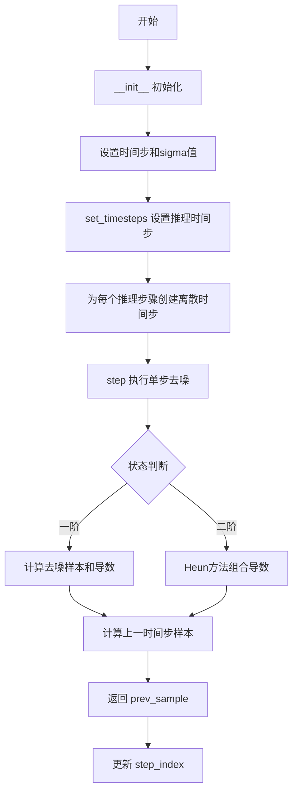
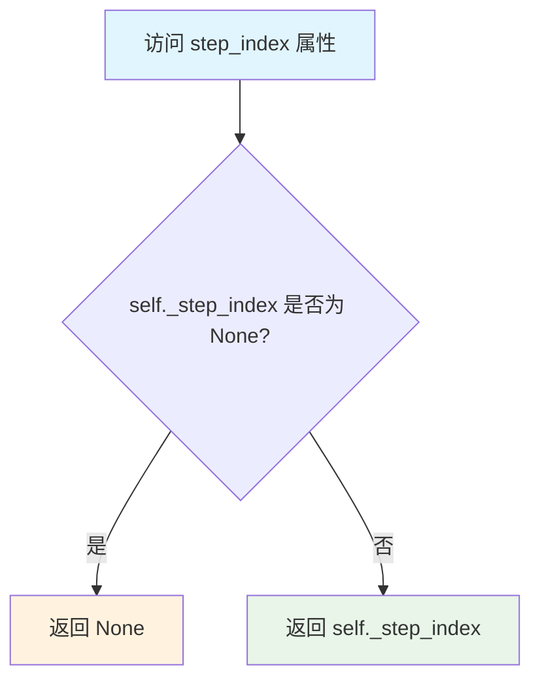
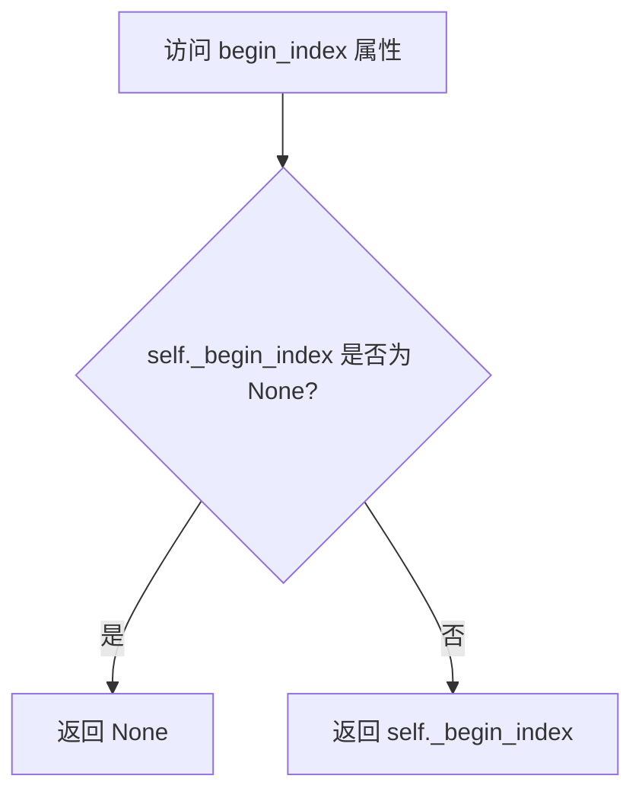
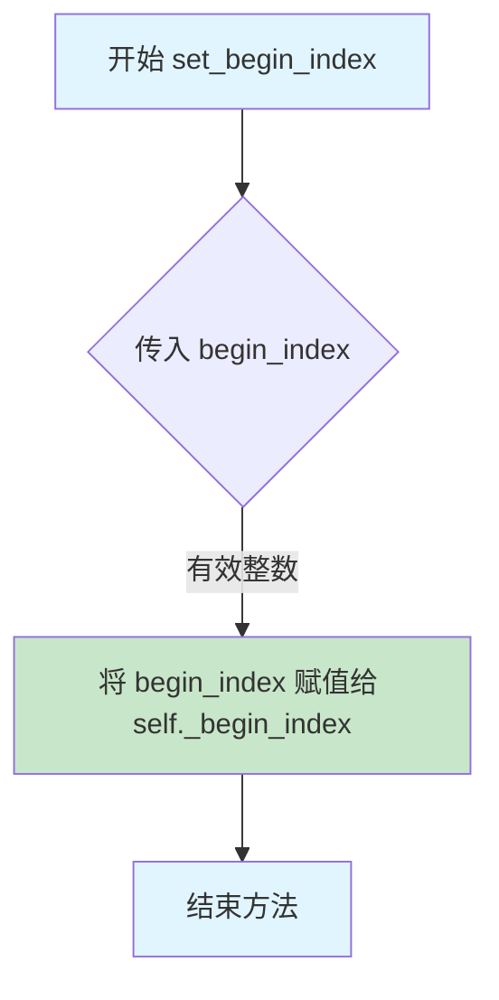
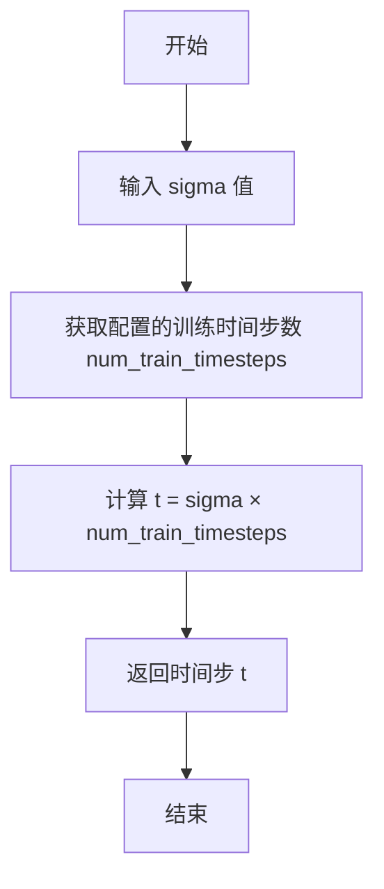
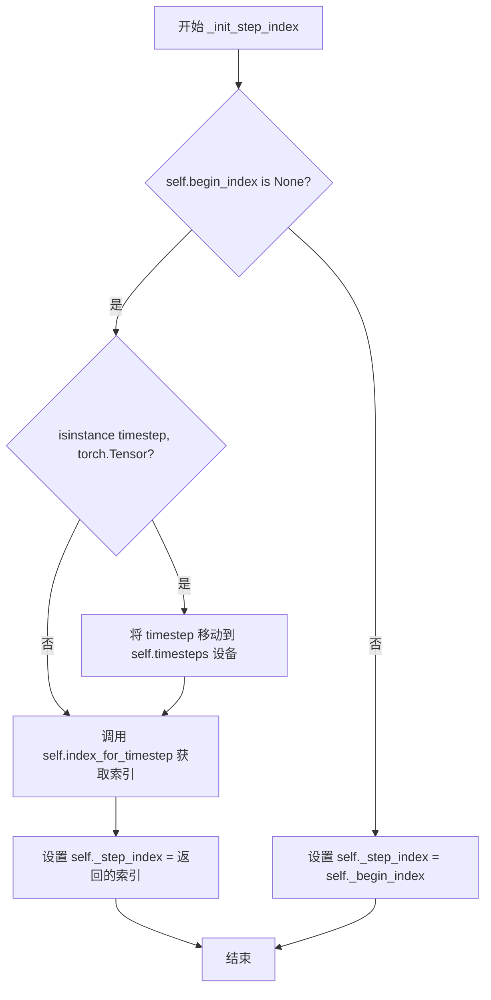
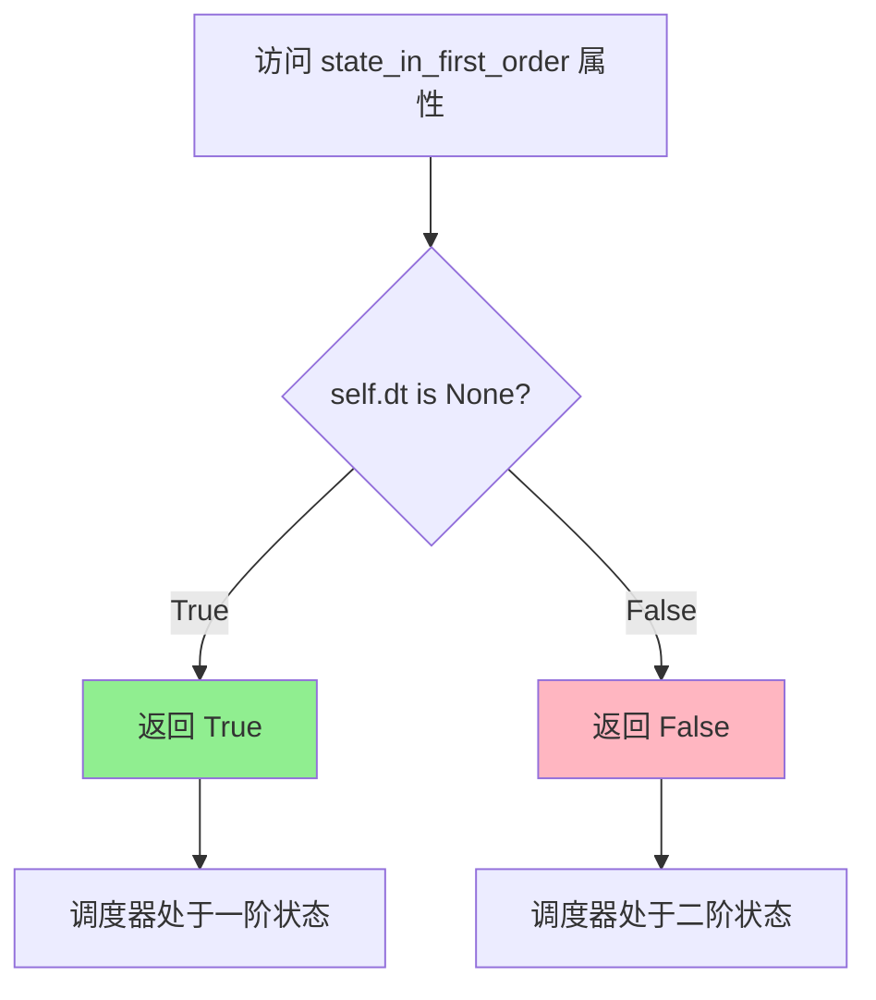
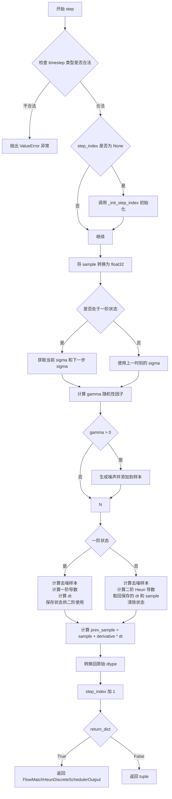
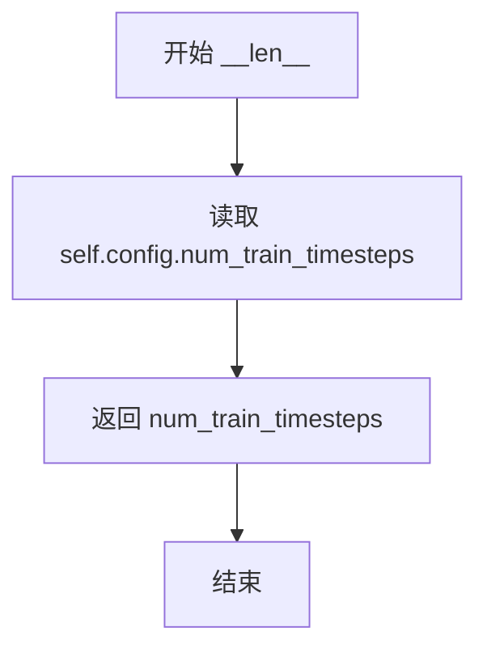

# `diffusers\src\diffusers\schedulers\scheduling_flow_match_heun_discrete.py` 详细设计文档

FlowMatchHeunDiscreteScheduler 是一个基于 Heun 方法的离散时间调度器，用于流匹配（Flow Matching）扩散模型的采样过程，通过二阶方法预测上一时间步的样本，支持噪声调度、随机性控制和状态管理。

## 整体流程



## 类结构

```
BaseOutput (抽象基类)
└── FlowMatchHeunDiscreteSchedulerOutput (数据类)

ConfigMixin (配置混入)
SchedulerMixin (调度器混入)
└── FlowMatchHeunDiscreteScheduler
```

## 全局变量及字段


### `logger`
    
用于记录调度器运行日志的全局Logger对象

类型：`logging.Logger`
    


### `FlowMatchHeunDiscreteSchedulerOutput.prev_sample`
    
计算得到的上一时间步的样本

类型：`torch.FloatTensor`
    


### `FlowMatchHeunDiscreteScheduler._compatibles`
    
兼容的调度器列表

类型：`list`
    


### `FlowMatchHeunDiscreteScheduler.order`
    
调度器的阶数，Heun方法为2

类型：`int`
    


### `FlowMatchHeunDiscreteScheduler.timesteps`
    
时间步张量

类型：`torch.Tensor`
    


### `FlowMatchHeunDiscreteScheduler._step_index`
    
当前时间步索引

类型：`int | None`
    


### `FlowMatchHeunDiscreteScheduler._begin_index`
    
起始时间步索引

类型：`int | None`
    


### `FlowMatchHeunDiscreteScheduler.sigmas`
    
sigma值数组

类型：`torch.Tensor`
    


### `FlowMatchHeunDiscreteScheduler.sigma_min`
    
最小sigma值

类型：`float`
    


### `FlowMatchHeunDiscreteScheduler.sigma_max`
    
最大sigma值

类型：`float`
    


### `FlowMatchHeunDiscreteScheduler.num_inference_steps`
    
推理步骤数

类型：`int`
    


### `FlowMatchHeunDiscreteScheduler.prev_derivative`
    
上一步的导数，用于二阶方法

类型：`torch.Tensor | None`
    


### `FlowMatchHeunDiscreteScheduler.dt`
    
时间步长，用于二阶方法

类型：`torch.Tensor | None`
    


### `FlowMatchHeunDiscreteScheduler.sample`
    
当前样本缓存

类型：`torch.Tensor | None`
    
    

## 全局函数及方法


### `FlowMatchHeunDiscreteScheduler.__init__`

这是 FlowMatchHeunDiscreteScheduler 类的构造函数，用于初始化 Heun 调度器的核心参数。它根据传入的训练时间步数和偏移值计算 sigma 调度表，并设置初始状态。

参数：

- `num_train_timesteps`：`int`，默认值 1000，训练时的扩散步数，决定调度器的时间步长度
- `shift`：`float`，默认值 1.0，用于调整 sigma 调度曲线形状的偏移参数

返回值：无（`__init__` 方法不返回任何值）

#### 流程图

```mermaid
flowchart TD
    A[开始 __init__] --> B[生成线性时间步序列]
    B --> C[计算 sigmas 基础值]
    C --> D[应用 shift 变换]
    D --> E[计算最终 timesteps]
    E --> F[初始化 _step_index 和 _begin_index]
    F --> G[将 sigmas 移至 CPU]
    G --> H[计算 sigma_min 和 sigma_max]
    H --> I[结束 __init__]
    
    B -->|numpy.linspace| B1[从 1 到 num_train_timesteps 的等间距序列]
    B1 --> B2[反转并转换为 torch.Tensor]
    
    C -->|timesteps / num_train_timesteps| C1[归一化到 0-1 范围]
    
    D -->|shift * sigmas / (1 + (shift - 1) * sigmas)| D1[应用非线性变换]
    
    G -->|sigmas.to| G1[避免频繁 CPU/GPU 通信]
```

#### 带注释源码

```python
@register_to_config
def __init__(
    self,
    num_train_timesteps: int = 1000,
    shift: float = 1.0,
):
    """
    初始化 FlowMatchHeunDiscreteScheduler 调度器
    
    Args:
        num_train_timesteps: 训练时的扩散步数，默认为 1000
        shift: 时间步偏移参数，用于调整 sigma 调度曲线，默认为 1.0
    """
    
    # 生成从 1 到 num_train_timesteps 的等间距时间步序列，然后反转
    # 例如：num_train_timesteps=1000 时，生成 [1000, 999, ..., 1]
    timesteps = np.linspace(1, num_train_timesteps, num_train_timesteps, dtype=np.float32)[::-1].copy()
    
    # 将 numpy 数组转换为 PyTorch 张量
    timesteps = torch.from_numpy(timesteps).to(dtype=torch.float32)

    # 将时间步归一化到 [0, 1] 范围，得到基础 sigma 值
    sigmas = timesteps / num_train_timesteps
    
    # 应用 shift 非线性变换，调整 sigma 曲线形状
    # 公式：shift * sigmas / (1 + (shift - 1) * sigmas)
    sigmas = shift * sigmas / (1 + (shift - 1) * sigmas)

    # 将 sigma 值反变换回原始时间步尺度，存储为调度器的 timesteps
    self.timesteps = sigmas * num_train_timesteps

    # 初始化步数索引，用于跟踪当前推理步骤
    self._step_index = None
    # 初始化起始索引，用于设置推理起始点
    self._begin_index = None

    # 将 sigmas 移至 CPU 以减少 CPU/GPU 通信开销
    self.sigmas = sigmas.to("cpu")
    
    # 记录 sigma 的最小值和最大值，用于后续推理调度
    self.sigma_min = self.sigmas[-1].item()
    self.sigma_max = self.sigmas[0].item()
```


### `FlowMatchHeunDiscreteScheduler.step_index`

该属性返回当前时间步的索引计数器，用于跟踪扩散模型采样过程中的进度。该索引在每次调度器执行 step 方法后递增 1。

参数： 无（属性访问器，仅包含隐式参数 `self`）

返回值：`int | None`，返回当前时间步的索引值，如果尚未初始化则返回 `None`

#### 流程图



#### 带注释源码

```python
@property
def step_index(self):
    """
    The index counter for current timestep. It will increase 1 after each scheduler step.
    """
    # 返回内部维护的 _step_index 变量
    # 该变量在以下时机被初始化或更新：
    # 1. __init__ 中初始化为 None
    # 2. set_timesteps 中重置为 None
    # 3. _init_step_index 方法中根据 timestep 计算或从 begin_index 获取
    # 4. step 方法执行完毕后递增 1
    return self._step_index
```


### `FlowMatchHeunDiscreteScheduler.begin_index`

该属性是 `FlowMatchHeunDiscreteScheduler` 类的只读属性，用于获取调度器的第一个时间步索引。该索引应在 pipeline 中通过 `set_begin_index` 方法进行设置，用于支持从扩散过程的中途开始采样等场景。

参数：
- （无，此为属性 getter）

返回值：`int | None`，返回调度器的起始索引。如果尚未通过 `set_begin_index` 方法设置，则返回 `None`。

#### 流程图



#### 带注释源码

```python
@property
def begin_index(self):
    """
    The index for the first timestep. It should be set from pipeline with `set_begin_index` method.
    """
    # 返回内部变量 _begin_index，该值通过 set_begin_index 方法设置
    # 用于指定调度器的起始时间步索引，支持从中途开始采样
    return self._begin_index
```


### `FlowMatchHeunDiscreteScheduler.set_begin_index`

设置调度器的起始索引。该方法用于在推理前从流水线调用，以配置调度器从特定的时间步索引开始执行。

参数：

- `begin_index`：`int`，默认值 `0`，调度器的起始索引

返回值：`None`，无返回值（该方法直接修改实例的内部状态 `_begin_index`）

#### 流程图



#### 带注释源码

```python
# 复制自 diffusers.schedulers.scheduling_dpmsolver_multistep.DPMSolverMultistepScheduler.set_begin_index
def set_begin_index(self, begin_index: int = 0):
    """
    设置调度器的起始索引。此函数应在推理前从流水线运行。

    参数:
        begin_index (`int`, 默认为 `0`):
            调度器的起始索引。
    """
    # 将传入的 begin_index 值直接赋值给实例的私有属性 _begin_index
    # 该属性用于记录调度器的起始时间步索引
    # 在 _init_step_index 方法中会被使用来确定 step_index 的初始值
    self._begin_index = begin_index
```


### `FlowMatchHeunDiscreteScheduler.scale_noise`

该方法实现了 Flow Matching（流匹配）中的前向过程，通过线性插值在原始样本和噪声之间进行缩放，根据当前时间步的 sigma 值混合样本和噪声。

参数：

- `self`：`FlowMatchHeunDiscreteScheduler`，调度器实例自身
- `sample`：`torch.FloatTensor`，输入样本张量
- `timestep`：`float | torch.FloatTensor`，当前扩散链中的时间步
- `noise`：`torch.FloatTensor`，噪声张量

返回值：`torch.FloatTensor`，缩放后的样本张量

#### 流程图

```mermaid
flowchart TD
    A[开始 scale_noise] --> B{self.step_index 是否为 None?}
    B -->|是| C[调用 self._init_step_index(timestep)]
    B -->|否| D[继续]
    C --> D
    D --> E[获取 sigma = self.sigmas[self.step_index]]
    E --> F[计算 sample = sigma * noise + (1.0 - sigma) * sample]
    F --> G[返回缩放后的 sample]
    G --> H[结束]
```

#### 带注释源码

```python
def scale_noise(
    self,
    sample: torch.FloatTensor,
    timestep: float | torch.FloatTensor,
    noise: torch.FloatTensor,
) -> torch.FloatTensor:
    """
    Forward process in flow-matching

    Args:
        sample (`torch.FloatTensor`):
            The input sample.
        timestep (`float` or `torch.FloatTensor`):
            The current timestep in the diffusion chain.
        noise (`torch.FloatTensor`):
            The noise tensor.

    Returns:
        `torch.FloatTensor`:
            A scaled input sample.
    """
    # 如果当前 step_index 为 None，则根据 timestep 初始化 step_index
    # 这确保了在第一次调用时正确设置时间步索引
    if self.step_index is None:
        self._init_step_index(timestep)

    # 从 sigma 数组中获取当前时间步对应的 sigma 值
    # sigma 代表了噪声在混合中的权重，随时间步从 1 递减到 0
    sigma = self.sigmas[self.step_index]

    # 执行 Flow Matching 的前向过程：线性插值混合样本和噪声
    # 当 sigma=1 时，完全是噪声（sample = noise）
    # 当 sigma=0 时，完全是原始样本（sample = sample）
    # 这对应于从真实数据到噪声的线性过渡过程
    sample = sigma * noise + (1.0 - sigma) * sample

    # 返回缩放后的样本，用于后续的扩散过程
    return sample
```


### `FlowMatchHeunDiscreteScheduler._sigma_to_t`

将sigma值（噪声水平）转换为对应的时间步t值。

参数：

- `sigma`：`float`，当前的sigma值（噪声水平），通常在0到1之间

返回值：`float`，对应的时间步t值，等于sigma乘以训练时间步总数

#### 流程图



#### 带注释源码

```python
def _sigma_to_t(self, sigma: float) -> float:
    """
    将sigma值转换为对应的时间步t值。
    
    在flow matching中，sigma表示噪声水平，范围通常在0到1之间。
    这个方法将归一化的sigma值转换回原始的时间步尺度。
    
    参数:
        sigma (float): 当前的sigma值（噪声水平），范围通常在0到1之间
        
    返回:
        float: 对应的时间步t值
    """
    return sigma * self.config.num_train_timesteps
```


### `FlowMatchHeunDiscreteScheduler.set_timesteps`

设置扩散链中使用的离散时间步（推理前调用）

参数：

- `num_inference_steps`：`int`，生成样本时使用的扩散步骤数
- `device`：`str | torch.device`，时间步要移动到的设备。如果为 `None`，则不移动时间步

返回值：`None`，无返回值

#### 流程图

```mermaid
flowchart TD
    A[开始 set_timesteps] --> B[设置 self.num_inference_steps = num_inference_steps]
    B --> C[使用 np.linspace 生成从 sigma_max 到 sigma_min 的时间步序列]
    C --> D[将时间步转换为 sigma 值: sigmas = timesteps / num_train_timesteps]
    D --> E[应用 shift 变换: sigmas = shift * sigmas / (1 + (shift - 1) * sigmas)]
    E --> F[转换为 torch.Tensor 并移到指定设备]
    F --> G[计算最终 timesteps: timesteps = sigmas * num_train_timesteps]
    G --> H[处理时间步重复: timesteps = torch.cat([timesteps[:1], timesteps[1:].repeat_interleave(2)])]
    H --> I[添加末尾零 sigma: sigmas = torch.cat([sigmas, torch.zeros(1)])]
    I --> J[处理 sigma 重复用于二阶方法]
    J --> K[重置 prev_derivative 和 dt 为 None]
    K --> L[重置 _step_index 和 _begin_index 为 None]
    L --> M[结束]
```

#### 带注释源码

```python
def set_timesteps(
    self,
    num_inference_steps: int,
    device: str | torch.device = None,
) -> None:
    """
    设置扩散链中使用的离散时间步（推理前运行）

    参数:
        num_inference_steps (int):
            生成样本时使用的扩散步骤数
        device (str 或 torch.device, 可选):
            时间步要移动到的设备。如果为 None，则不移动时间步
    """
    # 保存推理步骤数
    self.num_inference_steps = num_inference_steps

    # 使用线性间隔生成从 sigma_max 到 sigma_min 的时间步
    # 先将 sigma 值转换为对应的时间步 t = sigma * num_train_timesteps
    timesteps = np.linspace(
        self._sigma_to_t(self.sigma_max),  # 起始时间步（最大值）
        self._sigma_to_t(self.sigma_min),  # 结束时间步（最小值）
        num_inference_steps,               # 推理步骤数
    )

    # 将时间步转换为 sigma（归一化到 0-1 范围）
    sigmas = timesteps / self.config.num_train_timesteps
    
    # 应用 shift 变换，这是 Flow Matching 的标准做法
    # 公式: sigma = shift * sigma / (1 + (shift - 1) * sigma)
    sigmas = self.config.shift * sigmas / (1 + (self.config.shift - 1) * sigmas)
    
    # 转换为 PyTorch Tensor 并移到指定设备
    sigmas = torch.from_numpy(sigmas).to(dtype=torch.float32, device=device)

    # 计算最终的时间步
    # t = sigma * num_train_timesteps
    timesteps = sigmas * self.config.num_train_timesteps
    
    # 对时间步进行重复处理，用于二阶 Heun 方法
    # 第一个时间步保持不变，后续时间步重复一次
    # 例如: [t0, t1, t2, t3] -> [t0, t1, t1, t2, t2, t3]
    timesteps = torch.cat([timesteps[:1], timesteps[1:].repeat_interleave(2)])
    
    # 将处理后的时间步保存到实例变量并移到设备
    self.timesteps = timesteps.to(device=device)

    # 为 sigma 添加末尾零值（用于最后一步计算）
    # sigmas 长度 = num_inference_steps + 1
    sigmas = torch.cat([sigmas, torch.zeros(1, device=sigmas.device)])
    
    # 对 sigma 进行类似的重复处理（用于二阶方法）
    # 第一个 sigma 保持，最后一个 sigma 保持，中间重复
    self.sigmas = torch.cat([sigmas[:1], sigmas[1:-1].repeat_interleave(2), sigmas[-1:]])

    # 清空上一步的导数和时间步增量（准备新的推理过程）
    self.prev_derivative = None
    self.dt = None

    # 重置步骤索引和起始索引
    self._step_index = None
    self._begin_index = None
```


### `FlowMatchHeunDiscreteScheduler.index_for_timestep`

该方法用于在时间步调度计划中查找给定时间步值的索引位置，是调度器正确追踪当前推理进度的关键方法。

参数：

- `timestep`：`float | torch.FloatTensor`，要查找的时间步值，可以是单个浮点数或张量
- `schedule_timesteps`：`torch.FloatTensor | None`，可选参数，指定要搜索的时间步调度计划。如果为 `None`，则使用实例的 `self.timesteps` 属性

返回值：`int`，返回给定时间步在调度计划中的索引位置

#### 流程图

```mermaid
flowchart TD
    A[开始 index_for_timestep] --> B{schedule_timesteps 是否为 None?}
    B -->|是| C[使用 self.timesteps 作为 schedule_timesteps]
    B -->|否| D[保持传入的 schedule_timesteps]
    C --> E[在 schedule_timesteps 中查找等于 timestep 的索引]
    D --> E
    E --> F[获取所有匹配位置的索引数组 indices]
    F --> G{indices 长度 > 1?}
    G -->|是| H[pos = 1]
    G -->|否| I[pos = 0]
    H --> J[返回 indices[pos].item]
    I --> J
    J --> K[结束]
    
    style G fill:#ff9900
    style H fill:#99ff99
    style I fill:#ff9999
```

#### 带注释源码

```python
def index_for_timestep(
    self,
    timestep: float | torch.FloatTensor,
    schedule_timesteps: torch.FloatTensor | None = None,
) -> int:
    """
    查找给定时间步在时间步调度计划中的索引。

    Args:
        timestep (`float` 或 `torch.FloatTensor`):
            要在计划中查找的时间步值。
        schedule_timesteps (`torch.FloatTensor`, *可选*):
            要搜索的时间步调度计划。如果为 `None`，则使用 `self.timesteps`。

    Returns:
        `int`:
            时间步在调度计划中的索引。
    """
    # 如果未提供调度计划，则使用实例的 timesteps 属性
    if schedule_timesteps is None:
        schedule_timesteps = self.timesteps

    # 查找所有与给定 timestep 相等的元素的索引位置
    # 这里使用非零元素查找来定位匹配项
    indices = (schedule_timesteps == timestep).nonzero()

    # 对于第一个 step（step），通常会取第二个索引（如果存在多个匹配）
    # 如果只有一个匹配，则取第一个索引
    # 这样可以确保在从去噪计划中间开始时（如图像到图像）不会意外跳过某个 sigma 值
    pos = 1 if len(indices) > 1 else 0

    # 将索引转换为 Python 标量并返回
    return indices[pos].item()
```


### `FlowMatchHeunDiscreteScheduler._init_step_index`

该方法用于初始化调度器的内部步进索引，根据给定的时间步确定当前推理过程的位置。如果未设置起始索引，则通过查找时间步在时间步列表中的位置来确定索引；否则使用预设的起始索引。

参数：

- `timestep`：`float | torch.FloatTensor`，当前的时间步，可以是浮点数或张量形式

返回值：`None`，该方法直接修改实例的内部状态 `_step_index`，不返回任何值

#### 流程图



#### 带注释源码

```python
def _init_step_index(self, timestep: float | torch.FloatTensor) -> None:
    """
    初始化调度器的步进索引。
    
    该方法在每次调度器执行step之前被调用，用于确定当前的时间步索引。
    如果设置了起始索引（begin_index），则使用该索引；否则根据给定的时间步
    在时间步列表中查找对应的位置。
    
    Args:
        timestep: 当前的时间步，可以是浮点数或PyTorch张量
        
    Returns:
        None: 直接修改实例的内部状态
    """
    # 检查是否设置了起始索引
    if self.begin_index is None:
        # 如果时间步是PyTorch张量，确保它与调度器的时间步在同一设备上
        if isinstance(timestep, torch.Tensor):
            timestep = timestep.to(self.timesteps.device)
        
        # 通过查找时间步在时间步列表中的索引来初始化步进索引
        self._step_index = self.index_for_timestep(timestep)
    else:
        # 如果设置了起始索引，直接使用该索引
        self._step_index = self._begin_index
```


### `FlowMatchHeunDiscreteScheduler.state_in_first_order`

该属性是`FlowMatchHeunDiscreteScheduler`调度器的状态查询方法，用于判断当前调度器是否处于一阶状态。在Heun方法（又称二阶Runge-Kutta方法）的迭代过程中，调度器需要在一阶和二阶状态之间切换：一阶状态时执行预测步骤并保存中间结果，二阶状态时利用保存的中间结果完成校正步骤。该属性通过检查内部变量`dt`（时间步长）是否为`None`来确定当前所处状态，当`dt`为`None`时表示已完成二阶步骤并重置了状态，此时调度器处于一阶状态等待下一次迭代。

参数： 无

返回值：`bool`，表示调度器是否处于一阶状态。若返回`True`，则当前处于一阶状态（准备执行预测步骤）；若返回`False`，则当前处于二阶状态（准备执行校正步骤）。

#### 流程图



#### 带注释源码

```python
@property
def state_in_first_order(self) -> bool:
    """
    Returns whether the scheduler is in the first-order state.
    """
    # 检查内部时间步长变量 dt 是否为 None
    # 当 dt 为 None 时，表示调度器已完成二阶步骤并被重置
    # 此时调度器处于一阶状态，准备执行新的预测步骤
    return self.dt is None
```

#### 设计意图与上下文

该属性在`step`方法中被多次使用，用于决定当前迭代使用一阶还是二阶算法：

```python
# 在 step 方法中的使用逻辑
if self.state_in_first_order:
    # 1. 计算预测原始样本
    denoised = sample - model_output * sigma
    # 2. 转换为一阶ODE导数
    derivative = (sample - denoised) / sigma_hat
    # 3. 时间步长增量
    dt = sigma_next - sigma_hat
    
    # 为二阶步骤保存中间状态
    self.prev_derivative = derivative
    self.dt = dt
    self.sample = sample
else:
    # 二阶/Heun方法：利用之前保存的一阶结果进行校正
    denoised = sample - model_output * sigma_next
    derivative = (sample - denoised) / sigma_next
    derivative = 0.5 * (self.prev_derivative + derivative)
    
    # 使用之前保存的 dt 和 sample
    dt = self.dt
    sample = self.sample
    
    # 释放资源，调度器回到一阶状态
    self.prev_derivative = None
    self.dt = None
    self.sample = None
```

这种设计实现了Heun方法的两个阶段：
1. **预测阶段（一阶）**：计算并保存导数和时间步长
2. **校正阶段（二阶）**：利用保存的信息完成更精确的估计，然后重置状态


### `FlowMatchHeunDiscreteScheduler.step`

该方法实现了 Flow Matching 的 Heun 离散调度器的单步推理，通过逆转随机微分方程（SDE）从当前时间步预测前一个时间步的样本。它采用二阶 Heun 方法（也称为改进的欧拉法）来提高采样精度，支持可选的随机性注入（churn）以增强样本多样性。

参数：

- `model_output`：`torch.FloatTensor`，学习到的扩散模型的直接输出（通常是预测的噪声）
- `timestep`：`float | torch.FloatTensor`，扩散链中的当前离散时间步
- `sample`：`torch.FloatTensor`，扩散过程中创建的当前样本实例
- `s_churn`：`float`，随机性参数，控制采样过程中添加的噪声量，值越高随机性越大
- `s_tmin`：`float`，应用随机性的最小时间步阈值，仅高于此值的时间步才会添加噪声
- `s_tmax`：`float`，应用随机性的最大时间步阈值，仅低于此值的时间步才会添加噪声
- `s_noise`：`float`，添加到样本的噪声的缩放因子，默认为 1.0
- `generator`：`torch.Generator | None`，随机数生成器，用于可重现的采样
- `return_dict`：`bool`，是否返回 `FlowMatchHeunDiscreteSchedulerOutput` 元组

返回值：`FlowMatchHeunDiscreteSchedulerOutput | tuple`，如果 `return_dict` 为 `True`，返回包含 `prev_sample` 的 `FlowMatchHeunDiscreteSchedulerOutput` 对象；否则返回元组，第一个元素是样本张量

#### 流程图



#### 带注释源码

```python
def step(
    self,
    model_output: torch.FloatTensor,
    timestep: float | torch.FloatTensor,
    sample: torch.FloatTensor,
    s_churn: float = 0.0,
    s_tmin: float = 0.0,
    s_tmax: float = float("inf"),
    s_noise: float = 1.0,
    generator: torch.Generator | None = None,
    return_dict: bool = True,
) -> FlowMatchHeunDiscreteSchedulerOutput | tuple:
    """
    Predict the sample from the previous timestep by reversing the SDE. This function propagates the diffusion
    process from the learned model outputs (most often the predicted noise).

    Args:
        model_output (`torch.FloatTensor`):
            The direct output from learned diffusion model.
        timestep (`float` or `torch.FloatTensor`):
            The current discrete timestep in the diffusion chain.
        sample (`torch.FloatTensor`):
            A current instance of a sample created by the diffusion process.
        s_churn (`float`):
            Stochasticity parameter that controls the amount of noise added during sampling. Higher values increase
            randomness.
        s_tmin (`float`):
            Minimum timestep threshold for applying stochasticity. Only timesteps above this value will have noise
            added.
        s_tmax (`float`):
            Maximum timestep threshold for applying stochasticity. Only timesteps below this value will have noise
            added.
        s_noise (`float`, defaults to 1.0):
            Scaling factor for noise added to the sample.
        generator (`torch.Generator`, *optional*):
            A random number generator.
        return_dict (`bool`):
            Whether or not to return a
            [`~schedulers.scheduling_flow_match_heun_discrete.FlowMatchHeunDiscreteSchedulerOutput`] tuple.

    Returns:
        [`~schedulers.scheduling_flow_match_heun_discrete.FlowMatchHeunDiscreteSchedulerOutput`] or `tuple`:
            If return_dict is `True`,
            [`~schedulers.scheduling_flow_match_heun_discrete.FlowMatchHeunDiscreteSchedulerOutput`] is returned,
            otherwise a tuple is returned where the first element is the sample tensor.
    """

    # Step 1: 验证 timestep 参数类型，不支持整数索引
    if (
        isinstance(timestep, int)
        or isinstance(timestep, torch.IntTensor)
        or isinstance(timestep, torch.LongTensor)
    ):
        raise ValueError(
            (
                "Passing integer indices (e.g. from `enumerate(timesteps)`) as timesteps to"
                " `FlowMatchHeunDiscreteScheduler.step()` is not supported. Make sure to pass"
                " one of the `scheduler.timesteps` as a timestep."
            ),
        )

    # Step 2: 初始化 step_index（如果是第一次调用）
    if self.step_index is None:
        self._init_step_index(timestep)

    # Step 3: 将样本转换为 float32 以避免精度问题
    sample = sample.to(torch.float32)

    # Step 4: 根据当前阶数获取 sigma 值
    if self.state_in_first_order:
        # 一阶：使用当前和下一步的 sigma
        sigma = self.sigmas[self.step_index]
        sigma_next = self.sigmas[self.step_index + 1]
    else:
        # 二阶/Heun 方法：使用前一步和当前步的 sigma
        sigma = self.sigmas[self.step_index - 1]
        sigma_next = self.sigmas[self.step_index]

    # Step 5: 计算 gamma（随机性因子），基于 s_churn 和 sigma 范围
    gamma = min(s_churn / (len(self.sigmas) - 1), 2**0.5 - 1) if s_tmin <= sigma <= s_tmax else 0.0

    # Step 6: 计算 sigma_hat（带随机性的 sigma）
    sigma_hat = sigma * (gamma + 1)

    # Step 7: 如果 gamma > 0，添加噪声以增加随机性
    if gamma > 0:
        noise = randn_tensor(
            model_output.shape,
            dtype=model_output.dtype,
            device=model_output.device,
            generator=generator,
        )
        eps = noise * s_noise
        # 根据 sigma_hat 和 sigma 的差值添加噪声
        sample = sample + eps * (sigma_hat**2 - sigma**2) ** 0.5

    # Step 8: 根据阶数执行不同的计算
    if self.state_in_first_order:
        # ========== 一阶步骤 ==========
        # 1. 从 sigma 缩放的预测噪声计算原始样本 x_0
        denoised = sample - model_output * sigma
        # 2. 转换为一阶 ODE 导数
        derivative = (sample - denoised) / sigma_hat
        # 3. 计算时间步长 dt
        dt = sigma_next - sigma_hat

        # 保存供二阶步骤使用
        self.prev_derivative = derivative
        self.dt = dt
        self.sample = sample
    else:
        # ========== 二阶 Heun 方法步骤 ==========
        # 1. 从 sigma_next 缩放的预测噪声计算原始样本 x_0
        denoised = sample - model_output * sigma_next
        # 2. 计算二阶导数（Heun 方法）
        derivative = (sample - denoised) / sigma_next
        # 3. 取一阶和二阶导数的平均值
        derivative = 0.5 * (self.prev_derivative + derivative)

        # 4. 取上一时间步和样本
        dt = self.dt
        sample = self.sample

        # 清除 dt 和 derivative，将调度器置回一阶模式
        self.prev_derivative = None
        self.dt = None
        self.sample = None

    # Step 9: 计算前一个样本
    prev_sample = sample + derivative * dt
    
    # Step 10: 将样本转回模型兼容的 dtype
    prev_sample = prev_sample.to(model_output.dtype)

    # Step 11: 完成时将 step_index 加 1
    self._step_index += 1

    # Step 12: 根据 return_dict 返回结果
    if not return_dict:
        return (prev_sample,)

    return FlowMatchHeunDiscreteSchedulerOutput(prev_sample=prev_sample)
```


### `FlowMatchHeunDiscreteScheduler.__len__`

该方法是一个魔术方法（`__len__`），用于返回调度器的训练时间步数量，使得可以直接使用 Python 内置的 `len()` 函数获取调度器配置的训练时间步总数。

参数： 无（`self` 为隐式参数）

返回值：`int`，返回配置中定义的训练时间步数量（`num_train_timesteps`）。

#### 流程图



#### 带注释源码

```python
def __len__(self) -> int:
    """
    返回调度器的训练时间步数量。
    
    这是一个魔术方法，使得 len(scheduler) 可以返回调度器配置的训练时间步数。
    在 FlowMatchHeunDiscreteScheduler 中，默认值为 1000。
    
    Returns:
        int: 配置中定义的训练时间步数量（num_train_timesteps）
    """
    return self.config.num_train_timesteps
```

## 关键组件


### FlowMatchHeunDiscreteScheduler

Flow Match Heun离散调度器是用于扩散模型采样过程的二阶求解器，实现Heun方法（也称为改进欧拉法）来预测前一个时间步的样本。该调度器继承自SchedulerMixin和ConfigMixin，支持流匹配（Flow Matching）框架下的噪声调度，并通过两步预测提高采样精度。

### FlowMatchHeunDiscreteSchedulerOutput

输出数据类，包含调度器step函数的输出结果，其中prev_sample表示计算得到的前一个时间步的样本张量，用于在去噪循环中作为下一个模型输入。

### sigmas (全局变量)

存储噪声调度参数的浮点张量数组，定义扩散过程中的噪声水平schedule，从高噪声（sigma_max）到低噪声（sigma_min），用于控制每一步的噪声添加和去除强度。

### timesteps (全局变量)

存储离散时间步的浮点张量数组，表示扩散过程中的时间索引，用于跟踪当前推理进度并与模型输出对应。

### _step_index (全局变量)

当前时间步的索引计数器，每次调度器执行step后递增1，用于追踪在denoising schedule中的当前位置。

### _begin_index (全局变量)

第一个时间步的索引，用于支持从denoising schedule中间开始采样的场景（如image-to-image任务），可通过set_begin_index方法设置。

### prev_derivative, dt, sample (全局变量)

用于Heun方法二阶步骤的临时状态变量。prev_derivative存储一阶步骤计算的导数，dt存储时间步长，sample存储一阶步骤的样本，用于二阶校正计算。

### __init__

初始化调度器参数，创建时间步和sigma数组。根据num_train_timesteps和shift参数计算流匹配的噪声调度曲线，并将sigmas存储在CPU上以减少GPU/CPU通信开销。

### scale_noise

实现流匹配的前向过程，根据当前sigma值对输入样本和噪声进行线性组合，生成带噪声的样本。公式为：sample = sigma * noise + (1.0 - sigma) * sample。

### set_timesteps

设置推理阶段使用的离散时间步。根据num_inference_steps生成线性分布的时间步，然后应用shift变换得到sigmas，并扩展timesteps和sigmas数组以支持Heun方法的两步预测（每个时间步重复以进行粗细采样）。

### step

调度器的核心方法，实现Heun二阶求解器的单步采样。根据当前状态（first order或second order）分别执行不同的计算逻辑：一阶时计算去噪样本和导数并存储；二阶时使用之前存储的导数进行线性插值校正。最后返回前一时间步的样本prev_sample。

### index_for_timestep

在给定的时间步schedule中查找对应索引的函数。为避免在image-to-image场景下跳过sigma，总是返回第二个索引（如果存在多个匹配）。

### _init_step_index

初始化步骤索引。如果begin_index已设置则使用它，否则根据当前timestep查找对应的索引位置。

### state_in_first_order

属性方法，判断调度器是否处于一阶状态（即dt为None）。用于在step方法中区分一阶和二阶计算路径。

### set_begin_index

设置调度器的起始索引，应在推理前从pipeline调用，用于支持从denoising schedule中间开始采样的场景。

### _sigma_to_t

辅助函数，将sigma值转换为对应的时间步t，公式为 sigma * num_train_timesteps。


## 问题及建议


### 已知问题

- **类型检查方式过时**：在 `step` 方法中使用 `isinstance(timestep, torch.IntTensor)` 和 `isinstance(timestep, torch.LongTensor)` 进行类型检查，这种方式已被弃用，应使用 `isinstance(timestep, torch.Tensor)` 配合 `timestep.dtype` 进行检查。
- **设备管理不一致**：在 `__init__` 方法中，`sigmas` 被强制移到 CPU (`self.sigmas = sigmas.to("cpu")`), 但在 `set_timesteps` 方法中，设备由参数传入，可能导致 CPU/GPU 设备不一致的问题。
- **浮点数比较精度问题**：`index_for_timestep` 方法使用 `(schedule_timesteps == timestep).nonzero()` 进行精确相等比较，扩散模型中的 timestep 由于经过多次浮点运算，可能存在精度误差，导致找不到匹配项。
- **内存冗余**：`step` 方法中 `self.sample` 在非第一阶步骤中被保存，但在后续代码中并未被实际使用（`sample = self.sample` 直接赋值覆盖），造成不必要的内存开销。
- **边界条件处理缺失**：`set_timesteps` 方法没有对 `num_inference_steps` 为 0 或负数的边界条件进行检查，可能导致后续计算出错。
- **`_compatibles` 列表为空**：`order = 2` 已定义，但 `_compatibles = []` 为空列表，缺少与旧版本调度器的兼容性声明，可能影响版本迁移。

### 优化建议

- **统一设备管理策略**：在初始化时接受 device 参数，或者提供 `to(device)` 方法，允许用户明确指定设备，避免隐式的 CPU/GPU 转换。
- **改进类型检查**：使用 `torch.is_tensor()` 或 `isinstance(timestep, torch.Tensor)` 替代过时的 `isinstance(timestep, torch.IntTensor)` 检查。
- **优化浮点数比较**：在 `index_for_timestep` 中使用 `torch.isclose()` 或设置容差值 (tolerance) 进行近似匹配，而非精确相等比较。
- **移除冗余状态存储**：如果 `self.sample` 在非第一阶步骤中确实不需要，可以移除该状态的存储，减少内存占用。
- **添加边界条件检查**：在 `set_timesteps` 开头添加 `num_inference_steps > 0` 的校验，并给出明确的错误提示。
- **完善兼容性配置**：如果需要与其他调度器兼容，应在 `_compatibles` 中添加相应的调度器类名。


## 其它


### 设计目标与约束

本调度器实现Heun方法（二阶常微分方程求解器），用于flow matching框架下的扩散模型采样过程。设计目标包括：1）支持离散时间步的采样调度；2）实现一阶和二阶采样以提高精度；3）支持随机性注入（s_churn机制）；4）与diffusers库的其他调度器保持接口一致性。约束条件包括：仅支持PyTorch张量操作；需要预先设置推理时间步；不支持整数类型的时间步索引。

### 错误处理与异常设计

代码中包含以下错误处理机制：1）当传入整数类型的时间步时抛出ValueError并提供明确的错误信息；2）类型检查使用isinstance判断timestep类型；3）对device参数进行None检查。在step方法中，当step_index为None时自动调用_init_step_index进行初始化。潜在改进：可添加对model_output与sample形状不匹配、device不一致等情况的检查。

### 数据流与状态机

调度器内部维护有限状态机：1）初始状态：step_index和begin_index均为None，dt和prev_derivative为None；2）first order状态：dt和prev_derivative被设置，scheduler执行第一次预测；3）second order状态：使用存储的derivative和dt执行Heun方法的第二步。数据流：sample → scale_noise（可选）→ step方法 → prev_sample输出 → 作为下一个时间步的输入。关键状态变量：_step_index（当前步索引）、_begin_index（起始索引）、sigmas（sigma值数组）、timesteps（时间步数组）、prev_derivative（上一导数）、dt（时间步长）、sample（当前样本缓存）。

### 外部依赖与接口契约

主要依赖包括：1）numpy：用于创建线性空间数组；2）torch：核心张量运算；3）configuration_utils.ConfigMixin：配置注册与混合；4）utils.BaseOutput：输出基类；5）utils.logging：日志记录；6）utils.torch_utils.randn_tensor：随机张量生成；7）scheduling_utils.SchedulerMixin：调度器混入基类。接口契约：step方法接受model_output（模型预测）、timestep（当前时间步）、sample（当前样本）及多个可选参数，返回FlowMatchHeunDiscreteSchedulerOutput或tuple。set_timesteps方法必须在推理前调用以初始化推理时间步。

### 性能考虑与优化空间

性能优化点：1）sigmas存储在CPU以减少CPU/GPU通信（代码注释说明）；2）使用repeat_interleave扩展数组以支持二阶采样；3）张量就地操作减少内存分配。潜在优化空间：1）可使用torch.inference_mode或.no_grad减少梯度计算开销；2）可添加CUDA图支持加速连续step调用；3）重复计算的denoised变量可优化；4）类型转换（to(torch.float32)）可能影响性能，可考虑使用更高精度。

### 序列化与反序列化

调度器继承ConfigMixin，支持配置序列化：1）__init__参数（num_train_timesteps、shift）通过@register_to_config装饰器自动注册；2）save_pretrained和from_pretrained方法由ConfigMixin提供；3）sigmas和timesteps在set_timesteps时动态计算，不需要持久化。注意事项：_step_index和_begin_index为运行时状态，不包含在序列化数据中；prev_derivative、dt、sample在二阶步骤完成后被清除以释放内存。

### 版本兼容性与迁移

_compatibles类变量为空列表，表明当前未声明兼容的其他调度器。order属性设置为2，表示这是二阶调度器。代码从DPMSolverMultistepScheduler复制了set_begin_index方法，保持与多步调度器接口的一致性。迁移建议：若从旧版本升级，需确保调用set_timesteps方法初始化推理状态；注意integer timestep不再支持，需传入tensor类型。

### 数学原理说明

Heun方法是预测-校正方法的变体，在flow matching中：1）一阶步骤：基于当前sigma和model_output计算denoised，然后计算导数derivative；2）二阶步骤：使用存储的一阶导数和新计算的导数进行平均（0.5 * (prev_derivative + derivative)），实现二阶精度。sigma转换公式：sigma = shift * t / (1 + (shift - 1) * t)，其中t为归一化时间步。s_churn机制：在sigma处于[s_tmin, s_tmax]区间时添加噪声，gamma = min(s_churn / (n-1), √2 - 1)，以增加采样多样性。

### 使用示例与配置建议

典型使用流程：1）创建调度器实例：scheduler = FlowMatchHeunDiscreteScheduler(num_train_timesteps=1000, shift=1.0)；2）设置推理时间步：scheduler.set_timesteps(num_inference_steps=50, device="cuda")；3）初始化样本：sample = noise；4）迭代采样：for t in timesteps: model_output = model(sample, t); sample = scheduler.step(model_output, t, sample).prev_sample。推荐配置：num_train_timesteps通常为1000；shift值影响sigma分布，1.0为标准配置；s_churn=0-0.5可增加多样性；s_tmin和s_tmax控制噪声注入范围。

    