# `diffusers\src\diffusers\schedulers\scheduling_flow_match_lcm.py` 详细设计文档

这是 Stable Diffusion 生态系统中的 LCM (Latent Consistency Model) Flow Matching 调度器实现，用于图像生成任务中的噪声调度。它通过 flow matching 技术实现快速且高质量的图像生成，支持动态时间步偏移、多种 sigma 调度方式（Karras、指数、Beta），以及分辨率相关的自适应时间步调整。

## 整体流程

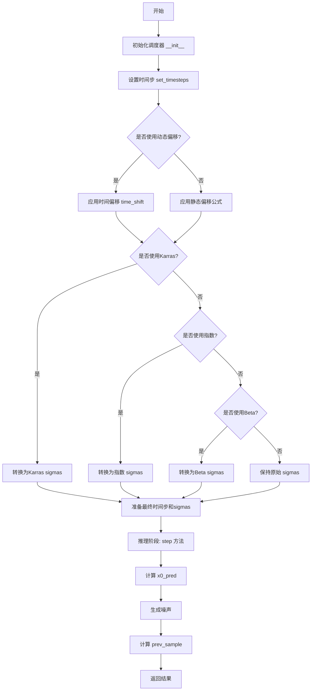

## 类结构

```
SchedulerMixin (混入类)
└── FlowMatchLCMScheduler (主调度器类)
    └── FlowMatchLCMSchedulerOutput (输出数据类)
```

## 全局变量及字段


### `logger`
    
Logger instance for the module, used for logging informational and error messages

类型：`logging.Logger`
    


### `is_scipy_available`
    
Function that checks whether scipy is installed and available for use

类型：`Callable[[], bool]`
    


### `FlowMatchLCMSchedulerOutput.prev_sample`
    
Computed sample from the previous timestep in the diffusion chain, used as input for the next denoising step

类型：`torch.Tensor`
    


### `FlowMatchLCMScheduler._compatibles`
    
List of compatible scheduler classes that can be used with this scheduler

类型：`list`
    


### `FlowMatchLCMScheduler.order`
    
The order of the scheduler, indicating the number of previous samples used in the step function

类型：`int`
    


### `FlowMatchLCMScheduler.timesteps`
    
The discrete timesteps used for the diffusion chain during inference

类型：`torch.Tensor`
    


### `FlowMatchLCMScheduler._step_index`
    
Current step index in the diffusion process, incremented after each step call

类型：`int | None`
    


### `FlowMatchLCMScheduler._begin_index`
    
The starting index for the scheduler, used for image-to-image pipelines

类型：`int | None`
    


### `FlowMatchLCMScheduler._shift`
    
The shift value used for timestep schedule transformation in flow matching

类型：`float`
    


### `FlowMatchLCMScheduler._init_size`
    
Initial spatial dimensions of the model output, used for scale-wise generation

类型：`tuple | None`
    


### `FlowMatchLCMScheduler._scale_factors`
    
Scale factors for each step in scale-wise generation regime

类型：`list[float] | None`
    


### `FlowMatchLCMScheduler._upscale_mode`
    
Upscaling method used for interpolating latents during scale-wise generation

类型：`str`
    


### `FlowMatchLCMScheduler.sigmas`
    
Sigma values representing noise levels at each timestep in the diffusion process

类型：`torch.Tensor`
    


### `FlowMatchLCMScheduler.sigma_min`
    
Minimum sigma value in the noise schedule

类型：`float`
    


### `FlowMatchLCMScheduler.sigma_max`
    
Maximum sigma value in the noise schedule

类型：`float`
    


### `FlowMatchLCMScheduler.num_inference_steps`
    
Number of diffusion steps used when generating samples during inference

类型：`int`
    
    

## 全局函数及方法


### `math` 模块相关函数

这些函数主要用于时间偏移（time shift）和sigma调度（sigma scheduling）的数学计算，应用于流匹配（Flow Matching）调度器中。

#### 1. `_time_shift_exponential`

执行指数时间偏移计算，用于基于指数函数的动态分辨率依赖时间步偏移。

参数：

- `mu`：`float`，控制偏移的均值参数
- `sigma`：`float`，控制偏移的标准差参数
- `t`：`float | np.ndarray | torch.Tensor`，输入的时间步或时间步数组

返回值：`float | np.ndarray | torch.Tensor`，偏移后的时间步

#### 流程图

```mermaid
flowchart TD
    A[开始] --> B[计算 exp.mu]
    B --> C[计算 1/t - 1]
    C --> D[计算 (1/t - 1).^sigma]
    D --> E[计算 exp.mu / exp.mu + (1/t - 1)^sigma]
    F[返回偏移后的时间步]
```

#### 带注释源码

```python
def _time_shift_exponential(
    self, mu: float, sigma: float, t: float | np.ndarray | torch.Tensor
) -> float | np.ndarray | torch.Tensor:
    """
    指数时间偏移函数
    
    公式: exp(mu) / (exp(mu) + (1/t - 1)^sigma)
    
    这种偏移方式允许在生成过程中根据图像分辨率动态调整时间步，
    使得高分辨率图像和低分辨率图像都能获得较好的生成效果。
    
    参数:
        mu: 偏移的均值参数，控制整体偏移程度
        sigma: 偏移的标准差参数，控制偏移的曲线形状
        t: 原始时间步，可以是单个值或数组
    
    返回:
        偏移后的时间步，类型与输入t相同
    """
    return math.exp(mu) / (math.exp(mu) + (1 / t - 1) ** sigma)
```

---

#### 2. `_time_shift_linear`

执行线性时间偏移计算，用于基于线性函数的动态分辨率依赖时间步偏移。

参数：

- `mu`：`float`，控制偏移的均值参数
- `sigma`：`float`，控制偏移的标准差参数
- `t`：`float | np.ndarray | torch.Tensor`，输入的时间步或时间步数组

返回值：`float | np.ndarray | torch.Tensor`，偏移后的时间步

#### 流程图

```mermaid
flowchart TD
    A[开始] --> B[计算 mu]
    B --> C[计算 1/t - 1]
    C --> D[计算 (1/t - 1).^sigma]
    D --> E[计算 mu / mu + (1/t - 1)^sigma]
    E --> F[返回偏移后的时间步]
```

#### 带注释源码

```python
def _time_shift_linear(
    self, mu: float, sigma: float, t: float | np.ndarray | torch.Tensor
) -> float | np.ndarray | torch.Tensor:
    """
    线性时间偏移函数
    
    公式: mu / (mu + (1/t - 1)^sigma)
    
    与指数偏移相比，线性偏移提供了更线性的时间步调整方式，
    适用于不同的生成场景。
    
    参数:
        mu: 偏移的均值参数，控制整体偏移程度
        sigma: 偏移的标准差参数，控制偏移的曲线形状
        t: 原始时间步，可以是单个值或数组
    
    返回:
        偏移后的时间步，类型与输入t相同
    """
    return mu / (mu + (1 / t - 1) ** sigma)
```

---

#### 3. `_convert_to_exponential`

将输入的sigma值转换为指数噪声调度（Exponential Noise Schedule），用于控制扩散模型的去噪步长。

参数：

- `in_sigmas`：`torch.Tensor`，输入的sigma值数组
- `num_inference_steps`：`int`，推理步数

返回值：`torch.Tensor`，转换后的指数sigma值

#### 流程图

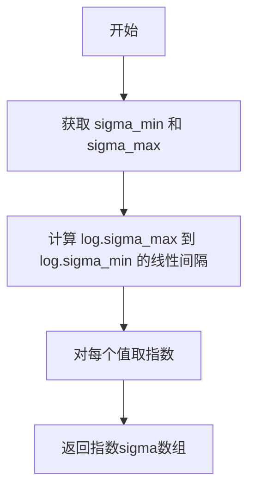

#### 带注释源码

```python
# Copied from diffusers.schedulers.scheduling_euler_discrete.EulerDiscreteScheduler._convert_to_exponential
def _convert_to_exponential(self, in_sigmas: torch.Tensor, num_inference_steps: int) -> torch.Tensor:
    """
    构造指数噪声调度（Exponential Noise Schedule）
    
    这种调度方式在噪声水平较高时步长较小，在噪声水平较低时步长较大，
    有助于更精细地控制生成过程。
    
    参数:
        in_sigmas: 输入的sigma值张量
        num_inference_steps: 推理步数，用于生成噪声调度
    
    返回:
        遵循指数调度的新sigma值张量
    """
    # 获取sigma的最小和最大值，如果没有配置则使用输入sigmas的边界值
    if hasattr(self.config, "sigma_min"):
        sigma_min = self.config.sigma_min
    else:
        sigma_min = None

    if hasattr(self.config, "sigma_max"):
        sigma_max = self.config.sigma_max
    else:
        sigma_max = None

    # 如果配置中没有提供，则使用输入sigmas的边界值
    sigma_min = sigma_min if sigma_min is not None else in_sigmas[-1].item()
    sigma_max = sigma_max if sigma_max is not None else in_sigmas[0].item()

    # 在对数空间中创建线性间隔，然后取指数得到指数分布的sigma值
    sigmas = np.exp(np.linspace(math.log(sigma_max), math.log(sigma_min), num_inference_steps))
    return sigmas
```

---

#### 4. `_convert_to_karras`

将输入的sigma值转换为Karras噪声调度（Karras Noise Schedule），这是一种基于Karras论文的噪声调度方法。

参数：

- `in_sigmas`：`torch.Tensor`，输入的sigma值数组
- `num_inference_steps`：`int`，推理步数

返回值：`torch.Tensor`，转换后的Karras sigma值

#### 流程图

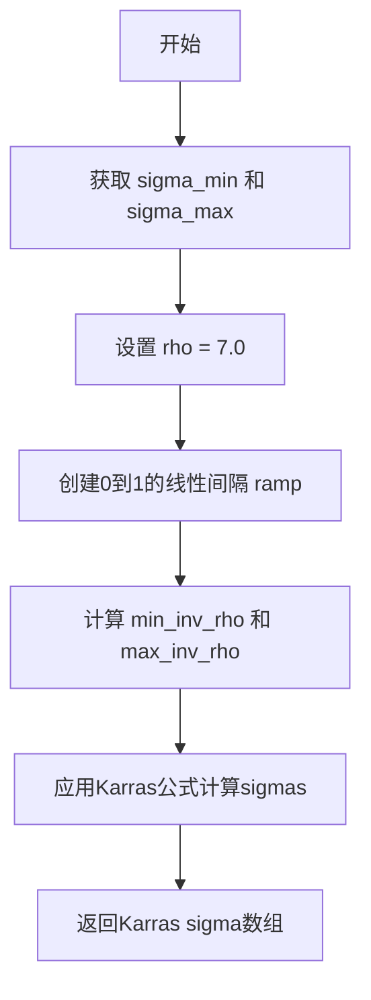

#### 带注释源码

```python
# Copied from diffusers.schedulers.scheduling_euler_discrete.EulerDiscreteScheduler._convert_to_karras
def _convert_to_karras(self, in_sigmas: torch.Tensor, num_inference_steps: int) -> torch.Tensor:
    """
    构造Karras噪声调度
    
    参考文献: Elucidating the Design Space of Diffusion-Based Generative Models
    https://huggingface.co/papers/2206.00364
    
    Karras调度使用非线性插值来改善噪声调度，rho参数控制非线性的程度。
    
    参数:
        in_sigmas: 输入的sigma值张量
        num_inference_steps: 推理步数，用于生成噪声调度
    
    返回:
        遵循Karras噪声调度的新sigma值张量
    """
    # 获取sigma的最小和最大值
    if hasattr(self.config, "sigma_min"):
        sigma_min = self.config.sigma_min
    else:
        sigma_min = None

    if hasattr(self.config, "sigma_max"):
        sigma_max = self.config.sigma_max
    else:
        sigma_max = None

    # 使用配置值或输入sigmas的边界值
    sigma_min = sigma_min if sigma_min is not None else in_sigmas[-1].item()
    sigma_max = sigma_max if sigma_max is not None else in_sigmas[0].item()

    # Karras调度使用rho=7.0，这是论文中推荐的值
    rho = 7.0
    # 创建从0到1的线性间隔
    ramp = np.linspace(0, 1, num_inference_steps)
    # 计算最小和最大的 rho 次根
    min_inv_rho = sigma_min ** (1 / rho)
    max_inv_rho = sigma_max ** (1 / rho)
    # 应用Karras公式: (max_inv_rho + ramp * (min_inv_rho - max_inv_rho)) ^ rho
    sigmas = (max_inv_rho + ramp * (min_inv_rho - max_inv_rho)) ** rho
    return sigmas
```

---

#### 5. `_sigma_to_t`

将sigma值转换为对应的时间步t。

参数：

- `sigma`：`float | torch.FloatTensor`，sigma值

返回值：`float | torch.FloatTensor`，对应的时间步

#### 流程图

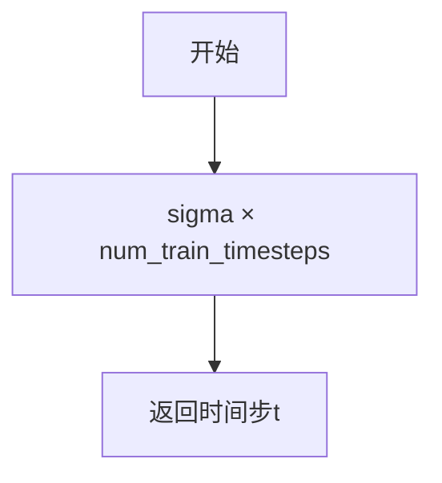

#### 带注释源码

```python
def _sigma_to_t(self, sigma: float | torch.FloatTensor) -> float | torch.FloatTensor:
    """
    将sigma值转换为对应的时间步
    
    这是sigma和时间步之间的基本转换关系：
    t = sigma * num_train_timesteps
    
    参数:
        sigma: 输入的sigma值
    
    返回:
        对应的时间步t
    """
    return sigma * self.config.num_train_timesteps
```


### `np.linspace`

NumPy 的 `np.linspace` 函数用于创建等间距的数值序列数组。在扩散模型调度器中，该函数用于生成训练时间步序列和推理时间步序列。

参数：

- `start`：`float`，序列的起始值。在代码中传入 `1` 或 `self._sigma_to_t(self.sigma_max)`
- `stop`：`float`，序列的结束值。在代码中传入 `num_train_timesteps` 或 `self._sigma_to_t(self.sigma_min)`
- `num`：`int`，要生成的样本数量。在代码中传入 `num_train_timesteps` 或 `num_inference_steps`
- `endpoint`：`bool`，可选，是否包含结束值，默认为 `True`
- `dtype`：`dtype`，可选，输出数组的数据类型，在代码中传入 `np.float32`

返回值：`ndarray`，返回等间距的数值序列

#### 流程图

```mermaid
flowchart TD
    A[开始] --> B{参数验证}
    B --> C[计算步长 step = (stop - start) / (num - 1)}
    C --> D[生成序列: start, start+step, start+2*step, ...]
    D --> E{endpoint=True?}
    E -->|Yes| F[包含 stop 值]
    E -->|No| G[不包含 stop 值]
    F --> H[转换为 dtype 类型]
    G --> H
    H --> I[返回 ndarray]
```

#### 带注释源码

```python
# 使用示例 1: 在 __init__ 方法中生成训练时间步
# 生成从1到num_train_timesteps的等间距序列，然后反转
timesteps = np.linspace(1, num_train_timesteps, num_train_timesteps, dtype=np.float32)[::-1].copy()

# 使用示例 2: 在 set_timesteps 方法中生成推理时间步
# 根据sigma的最大值和最小值计算对应的时间步序列
timesteps = np.linspace(
    self._sigma_to_t(self.sigma_max),  # 起始值：通过sigma转换得到
    self._sigma_to_t(self.sigma_min),  # 结束值：通过sigma转换得到
    num_inference_steps,               # 推理步数
    dtype=np.float32                   # 指定输出数据类型
)
```


### torch.from_numpy

这是 PyTorch 的一个核心函数，用于将 NumPy 数组转换为 PyTorch 张量（Tensor）。在 FlowMatchLCMScheduler 中，此函数被用于将 NumPy 数组格式的时间步（timesteps）和 sigma 值转换为 PyTorch 张量，以便在 GPU 上进行高效的扩散模型推理。

参数：

- `ndarray`：`numpy.ndarray`，输入的 NumPy 数组，包含待转换的数据（如时间步或 sigma 值）

返回值：`torch.Tensor`，返回的 PyTorch 张量，与输入的 NumPy 数组共享相同的内存底层（copy-on-write）

#### 流程图

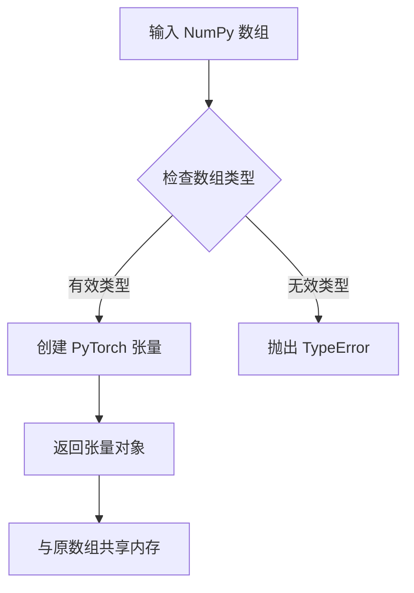

#### 带注释源码

```python
# 代码中的实际使用示例（在 FlowMatchLCMScheduler.__init__ 中）

# 1. 创建 NumPy 数组（从 1 到 num_train_timesteps 的线性空间）
timesteps = np.linspace(1, num_train_timesteps, num_train_timesteps, dtype=np.float32)[::-1].copy()

# 2. 使用 torch.from_numpy 将 NumPy 数组转换为 PyTorch 张量
# 注意：这里使用了 .to(dtype=torch.float32) 确保数据类型一致
timesteps = torch.from_numpy(timesteps).to(dtype=torch.float32)

# 代码中的实际使用示例（在 FlowMatchLCMScheduler.set_timesteps 中）

# 将 sigmas 数组转换为 PyTorch 张量并移动到指定设备
sigmas = torch.from_numpy(sigmas).to(dtype=torch.float32, device=device)

# 将 timesteps 数组转换为 PyTorch 张量并移动到指定设备
timesteps = torch.from_numpy(timesteps).to(dtype=torch.float32, device=device)
```

---

### 备注

`torch.from_numpy` 函数的核心特性：

1. **内存共享**：返回的张量与原始 NumPy 数组共享底层数据内存，修改其中一个会影响另一个
2. **数据类型保持**：NumPy 的数据类型（如 `float32`）会自动映射到对应的 PyTorch 数据类型
3. **零拷贝转换**：相比 `torch.tensor()`，这种转换方式效率更高，避免了不必要的数据复制


### `randn_tensor`

生成指定形状的随机噪声张量，用于扩散模型的去噪过程。

参数：

- `shape`：`torch.Size` 或 `tuple`，要生成的随机张量的形状
- `generator`：`torch.Generator` 或 `None`，随机数生成器，用于 Reproducibility
- `device`：`str` 或 `torch.device`，生成张量所在的设备
- `dtype`：`torch.dtype`，生成张量的数据类型

返回值：`torch.FloatTensor`，符合指定形状、设备和数据类型的随机噪声张量

#### 流程图

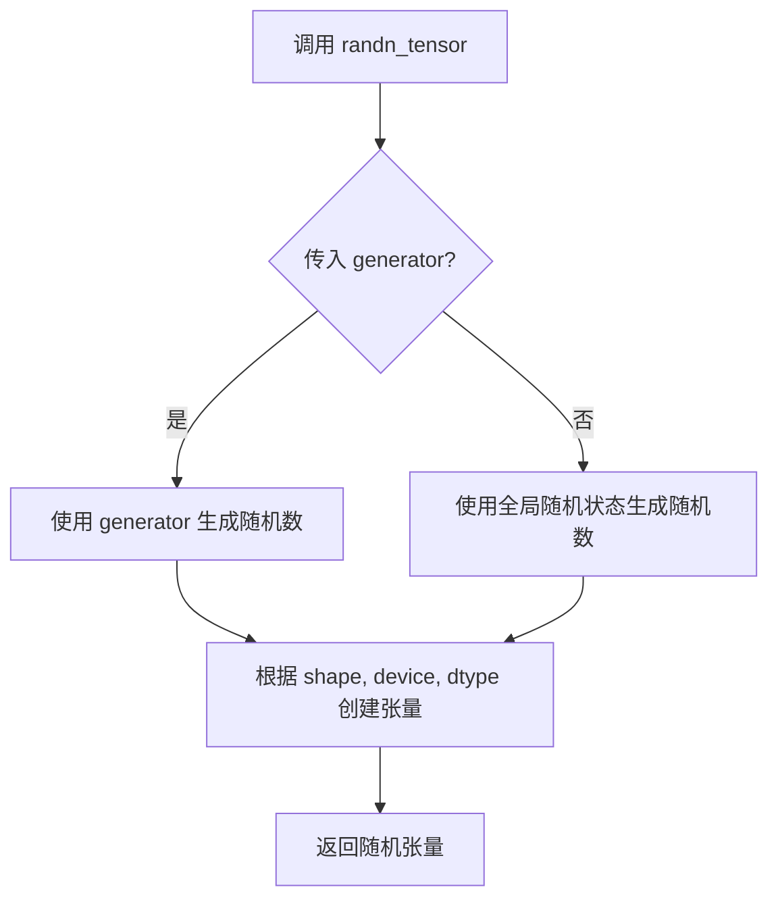

#### 带注释源码

```
# 从 torch_utils 模块导入的全局函数
# 在 FlowMatchLCMScheduler 的 step 方法中使用
# 用于生成符合特定形状、设备和数据类型的随机噪声

noise = randn_tensor(
    x0_pred.shape,           # 形状：与预测样本形状相同
    generator=generator,     # 随机数生成器（可选，用于 Reproducibility）
    device=x0_pred.device,   # 设备：与预测样本相同设备
    dtype=x0_pred.dtype,     # 数据类型：与预测样本相同数据类型
)

# 使用示例：在 Flow Matching 采样中生成噪声
# prev_sample = (1 - sigma_next) * x0_pred + sigma_next * noise
```


### `is_scipy_available`

检查 scipy 库是否可用，返回布尔值以决定是否导入 scipy.stats 模块或启用特定功能（如 beta sigmas）。

参数：无

返回值：`bool`，如果 scipy 已安装并可用则返回 `True`，否则返回 `False`。

#### 流程图

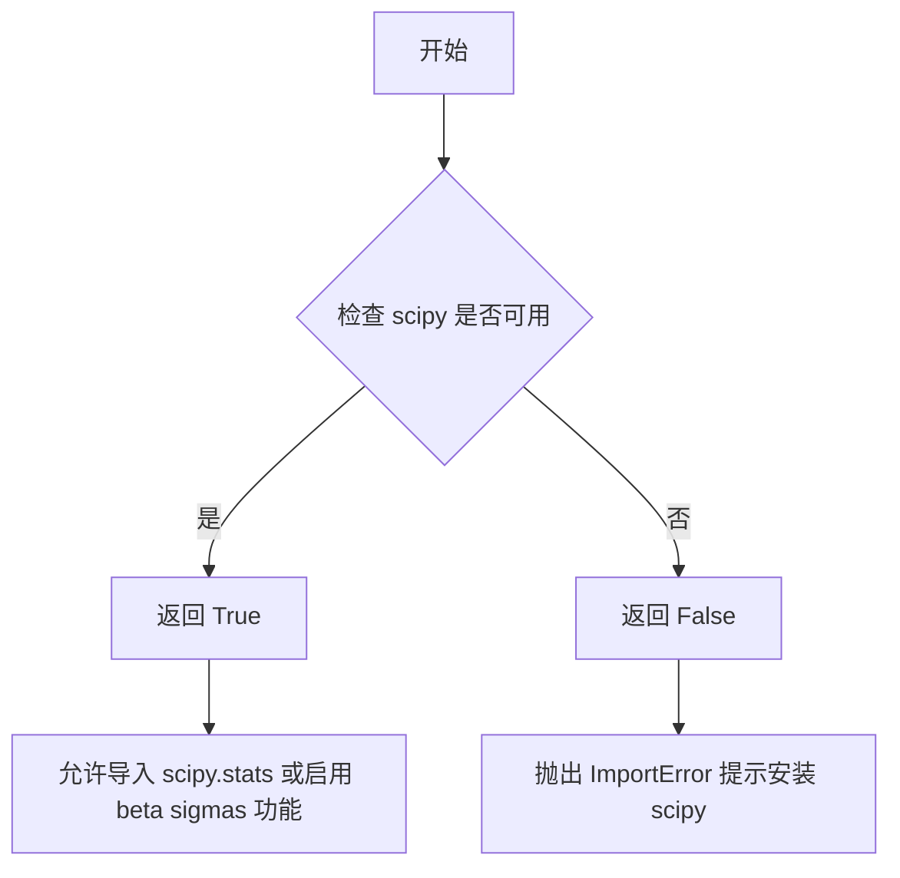

#### 带注释源码

```python
# is_scipy_available 函数定义在 ..utils 模块中
# 此处展示代码中的两种典型用法：

# 用法1：条件导入 scipy.stats
if is_scipy_available():
    import scipy.stats  # 仅在 scipy 可用时导入

# 用法2：在 FlowMatchLCMScheduler.__init__ 中检查功能依赖
if self.config.use_beta_sigmas and not is_scipy_available():
    raise ImportError("Make sure to install scipy if you want to use beta sigmas.")
```

#### 补充说明

该函数是 diffusers 库中的通用工具函数，用于运行时检查 scipy 依赖。在 `FlowMatchLCMScheduler` 中：
- 当 `use_beta_sigmas` 配置为 `True` 时，必须确保 scipy 可用，否则抛出 ImportError
- 其他 sigma 类型（karras、exponential）不依赖 scipy
- 这是一种松耦合的依赖管理策略，允许用户在未安装 scipy 时使用部分功能


### `FlowMatchLCMScheduler.__init__`

这是 `FlowMatchLCMScheduler` 类的构造函数，用于初始化 LCM（Latent Consistency Model）流匹配调度器。它负责设置扩散过程的时间步长、sigma 值、偏移参数以及各种配置选项，为后续的图像生成采样过程做好准备。

参数：

- `num_train_timesteps`：`int`，默认为 1000，扩散模型训练的步数
- `shift`：`float`，默认为 1.0，用于时间步调度的偏移值
- `use_dynamic_shifting`：`bool`，默认为 False，是否基于图像分辨率动态应用时间步偏移
- `base_shift`：`float`，默认为 0.5，用于稳定图像生成的基础偏移值
- `max_shift`：`float`，默认为 1.15，允许潜伏向量变化的最大偏移值
- `base_image_seq_len`：`int`，默认为 256，基础图像序列长度
- `max_image_seq_len`：`int`，默认为 4096，最大图像序列长度
- `invert_sigmas`：`bool`，默认为 False，是否反转 sigma 值
- `shift_terminal`：`float | None`，默认为 None，偏移时间调度表的终端值
- `use_karras_sigmas`：`bool | None`，默认为 False，是否使用 Karras sigma 噪声调度
- `use_exponential_sigmas`：`bool | None`，默认为 False，是否使用指数 sigma 噪声调度
- `use_beta_sigmas`：`bool | None`，默认为 False，是否使用 beta sigma 噪声调度
- `time_shift_type`：`Literal["exponential", "linear"]`，默认为 "exponential"，动态分辨率依赖时间步偏移的类型
- `scale_factors`：`list[float] | None`，默认为 None，用于缩放潜伏向量的缩放因子列表
- `upscale_mode`：`Literal["nearest", "linear", "bilinear", "bicubic", "trilinear", "area", "nearest-exact"]`，默认为 "bicubic"，放大模式

返回值：`None`，构造函数没有返回值，仅初始化对象状态

#### 流程图

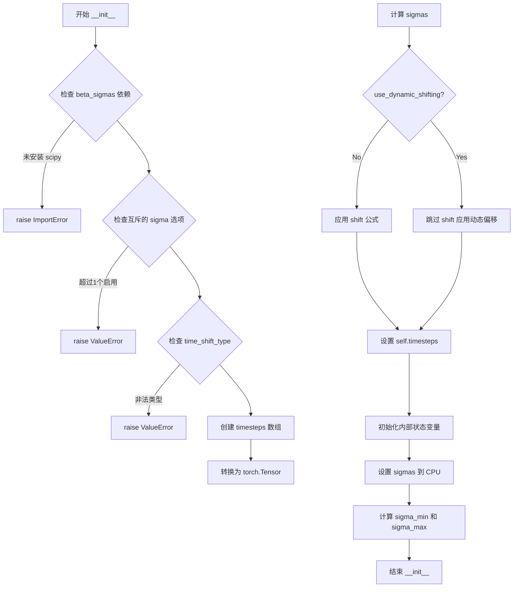

#### 带注释源码

```python
@register_to_config
def __init__(
    self,
    num_train_timesteps: int = 1000,
    shift: float = 1.0,
    use_dynamic_shifting: bool = False,
    base_shift: float = 0.5,
    max_shift: float = 1.15,
    base_image_seq_len: int = 256,
    max_image_seq_len: int = 4096,
    invert_sigmas: bool = False,
    shift_terminal: float | None = None,
    use_karras_sigmas: bool | None = False,
    use_exponential_sigmas: bool | None = False,
    use_beta_sigmas: bool | None = False,
    time_shift_type: Literal["exponential", "linear"] = "exponential",
    scale_factors: list[float] | None = None,
    upscale_mode: Literal[
        "nearest",
        "linear",
        "bilinear",
        "bicubic",
        "trilinear",
        "area",
        "nearest-exact",
    ] = "bicubic",
):
    # 检查 beta_sigmas 依赖：如果启用了 beta_sigmas 但没有安装 scipy，则抛出导入错误
    if self.config.use_beta_sigmas and not is_scipy_available():
        raise ImportError("Make sure to install scipy if you want to use beta sigmas.")
    
    # 检查互斥的 sigma 选项：只能同时启用一种 sigma 调度方式
    if (
        sum(
            [
                self.config.use_beta_sigmas,
                self.config.use_exponential_sigmas,
                self.config.use_karras_sigmas,
            ]
        )
        > 1
    ):
        raise ValueError(
            "Only one of `config.use_beta_sigmas`, `config.use_exponential_sigmas`, `config.use_karras_sigmas` can be used."
        )
    
    # 检查 time_shift_type 的有效性
    if time_shift_type not in {"exponential", "linear"}:
        raise ValueError("`time_shift_type` must either be 'exponential' or 'linear'.")

    # 创建时间步数组：从 1 到 num_train_timesteps，逆序排列
    timesteps = np.linspace(1, num_train_timesteps, num_train_timesteps, dtype=np.float32)[::-1].copy()
    timesteps = torch.from_numpy(timesteps).to(dtype=torch.float32)

    # 计算 sigma 值：时间步除以总训练步数
    sigmas = timesteps / num_train_timesteps
    
    # 如果不使用动态偏移，则应用 shift 公式进行时间步偏移
    # 公式: sigma = shift * sigma / (1 + (shift - 1) * sigma)
    if not use_dynamic_shifting:
        # when use_dynamic_shifting is True, we apply the timestep shifting on the fly based on the image resolution
        sigmas = shift * sigmas / (1 + (shift - 1) * sigmas)

    # 将调整后的 sigma 值乘以总步数得到实际的时间步
    self.timesteps = sigmas * num_train_timesteps

    # 初始化调度器的内部状态
    self._step_index = None  # 当前时间步索引
    self._begin_index = None  # 起始索引

    self._shift = shift  # 存储偏移值

    # 初始化缩放相关参数
    self._init_size = None  # 初始图像尺寸
    self._scale_factors = scale_factors  # 缩放因子
    self._upscale_mode = upscale_mode  # 放大模式

    # 将 sigmas 移到 CPU 以减少 CPU/GPU 通信开销
    self.sigmas = sigmas.to("cpu")
    # 记录最小和最大的 sigma 值
    self.sigma_min = self.sigmas[-1].item()
    self.sigma_max = self.sigmas[0].item()
```


### `FlowMatchLCMScheduler.shift`

该属性是一个只读属性，用于返回FlowMatchLCMScheduler中用于时间步偏移的值（shift值）。该值在调度器的初始化过程中被设置，并用于调整噪声调度计划中的时间步。

参数： 无

返回值：`float`，用于时间步调度的偏移值。

#### 流程图

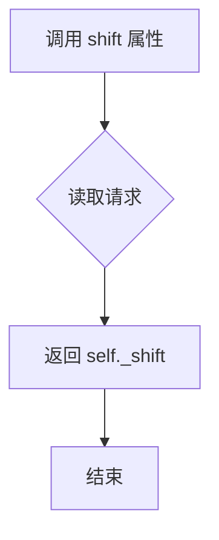

#### 带注释源码

```python
@property
def shift(self):
    """
    The value used for shifting.
    """
    return self._shift
```


### `FlowMatchLCMScheduler.step_index`

该属性是FlowMatchLCMScheduler调度器的当前时间步索引计数器，用于在扩散过程的每个去噪步骤后跟踪进度。它返回内部变量`_step_index`，该变量在每次调用`step()`方法后递增。

参数： 无（这是一个属性访问器，不接受任何参数）

返回值：`int | None`，返回当前时间步的索引。如果调度器尚未执行任何步骤，则返回`None`。

#### 流程图

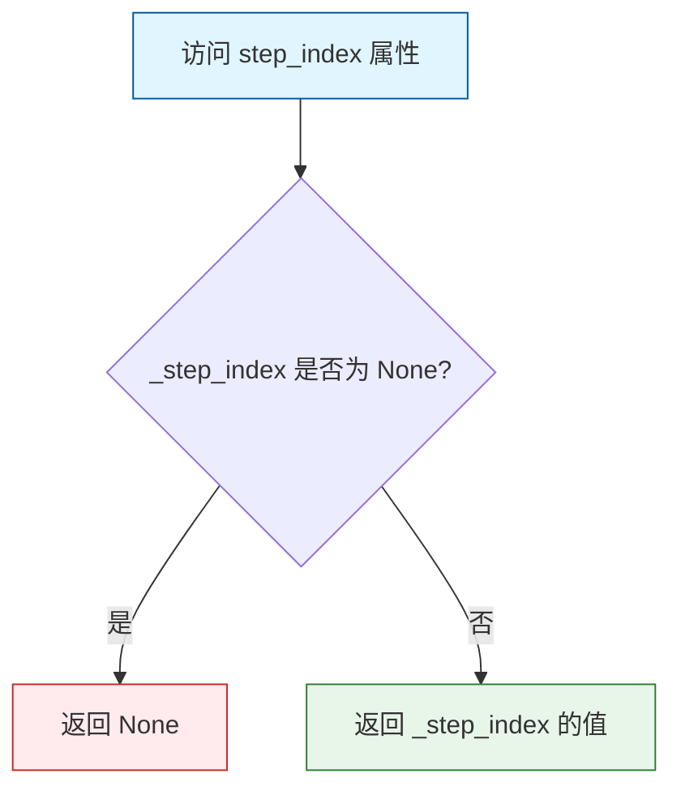

#### 带注释源码

```python
@property
def step_index(self):
    """
    The index counter for current timestep. It will increase 1 after each scheduler step.
    """
    return self._step_index
```

**代码解析：**

- `@property` 装饰器：将此方法转换为属性，允许像访问字段一样访问它，而不需要调用括号。
- `self._step_index`：私有实例变量，用于存储当前的时间步索引。该值在以下情况下被设置：
  - 调用 `set_timesteps()` 方法时初始化为 `None`
  - 调用 `_init_step_index()` 方法时根据当前时间步计算或使用 `begin_index` 设置
  - 每次调用 `step()` 方法后递增（`self._step_index += 1`）
- 该属性是调度器状态跟踪的核心部分，用于：
  - 获取当前去噪步骤对应的sigma值（`self.sigmas[self.step_index]`）
  - 追踪扩散过程的进度
  - 支持图像到图像（img2img）和重绘（inpainting）等场景中的中间步骤处理


### `FlowMatchLCMScheduler.begin_index`

该属性是 `FlowMatchLCMScheduler` 调度器的只读属性，用于获取第一个时间步的索引值。该索引用于指示扩散过程从哪个时间步开始执行，通常在图像到图像（img2img）或修复（inpainting）等场景中设置，以控制推理的起始点。

参数：（无参数）

返回值：`int | None`，返回调度器的起始索引。如果未通过 `set_begin_index` 方法设置，则返回 `None`。

#### 流程图

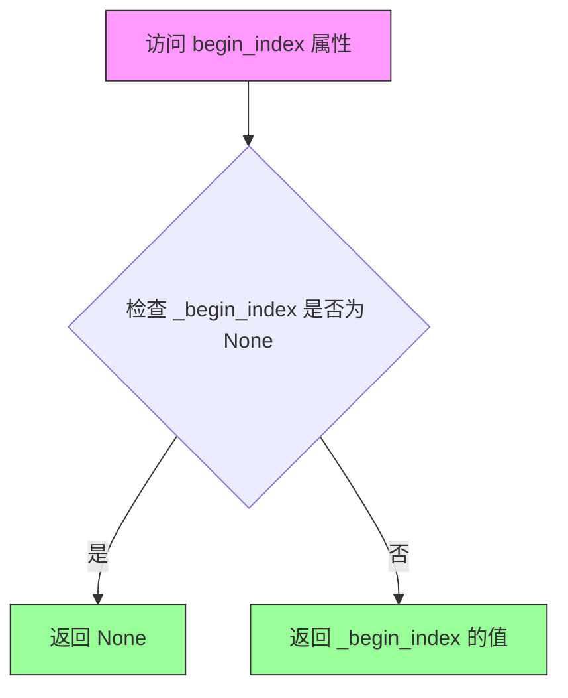

#### 带注释源码

```python
@property
def begin_index(self):
    """
    The index for the first timestep. It should be set from pipeline with `set_begin_index` method.
    """
    # 返回内部变量 _begin_index，该值在以下情况下为 None：
    # 1. 调度器用于训练时（未设置起始索引）
    # 2. 管道未实现 set_begin_index 方法
    # 在推理时，管道可以通过 set_begin_index 方法设置此值，
    # 以便从特定的中间时间步开始生成（适用于 img2img 或 inpainting）
    return self._begin_index
```


### `FlowMatchLCMScheduler.set_begin_index`

设置调度器的起始索引。该方法应在管道进行推理之前调用，用于配置调度器从特定的起始时间步开始执行。

参数：

- `begin_index`：`int`，默认为 `0`，调度器的起始索引值，用于指定从哪个时间步开始推理。

返回值：`None`，该方法不返回任何值，仅修改对象内部状态。

#### 流程图

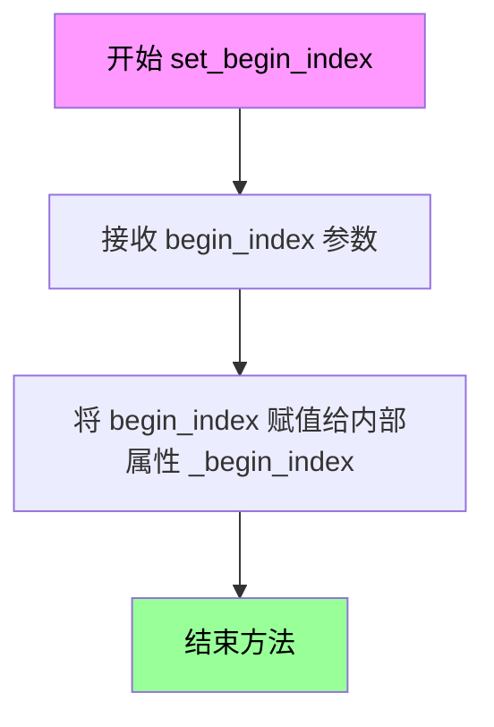

#### 带注释源码

```python
def set_begin_index(self, begin_index: int = 0) -> None:
    """
    Sets the begin index for the scheduler. This function should be run from pipeline before the inference.

    Args:
        begin_index (`int`, defaults to `0`):
            The begin index for the scheduler.
    """
    # 将传入的 begin_index 参数值赋给实例属性 _begin_index
    # 这个内部属性用于记录调度器的起始索引
    # 在后续的推理过程中，调度器会使用这个值来确定从哪个时间步开始
    self._begin_index = begin_index
```

#### 相关说明

此方法为简单赋值操作，主要用于：

1. **初始化调度器状态**：在推理前设置起始时间步索引
2. **支持图像到图像（img2img）流程**：允许从非起始时间步开始推理
3. **与 pipeline 集成**：pipeline 会在推理开始前调用此方法配置调度器

该方法是 `FlowMatchLCMScheduler` 类中用于调度器状态管理的重要接口，通过设置 `_begin_index` 属性，调度器能够在 `scale_noise` 和 `_init_step_index` 等方法中正确计算对应的 sigma 值和 step_index。


### `FlowMatchLCMScheduler.set_shift`

该方法用于设置 Flow Match LCM Scheduler 的 shift（偏移）值，该值用于调整时间步调度计划中的噪声水平分布。

参数：

- `shift`：`float`，要设置的 shift（偏移）值，用于调整时间步调度计划中的噪声分布

返回值：`None`，该方法直接修改内部状态，不返回任何值

#### 流程图

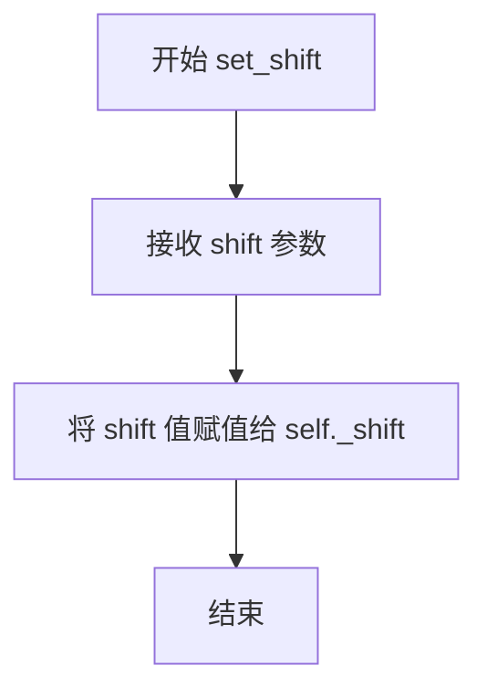

#### 带注释源码

```python
def set_shift(self, shift: float) -> None:
    """
    设置用于时间步调度的 shift（偏移）值。

    Args:
        shift (`float`):
            新的 shift 值，用于调整噪声调度计划。
            该值影响 sigmas 的计算：sigmas = shift * sigmas / (1 + (shift - 1) * sigmas)
    """
    self._shift = shift  # 将传入的 shift 值保存到实例属性中
```


### `FlowMatchLCMScheduler.set_scale_factors`

该方法用于设置缩放因子和上采样模式，以支持分尺度生成（scale-wise generation）模式。它是调度器的配置方法，允许在推理过程中动态调整图像的缩放策略。

参数：

- `scale_factors`：`list[float]`，表示每个推理步骤的缩放因子列表，用于控制不同步骤的图像尺寸缩放比例
- `upscale_mode`：`str`，表示上采样方法，指定图像放大时使用的插值算法（如 bicubic、nearest 等）

返回值：`None`，该方法不返回任何值，仅更新调度器内部状态

#### 流程图

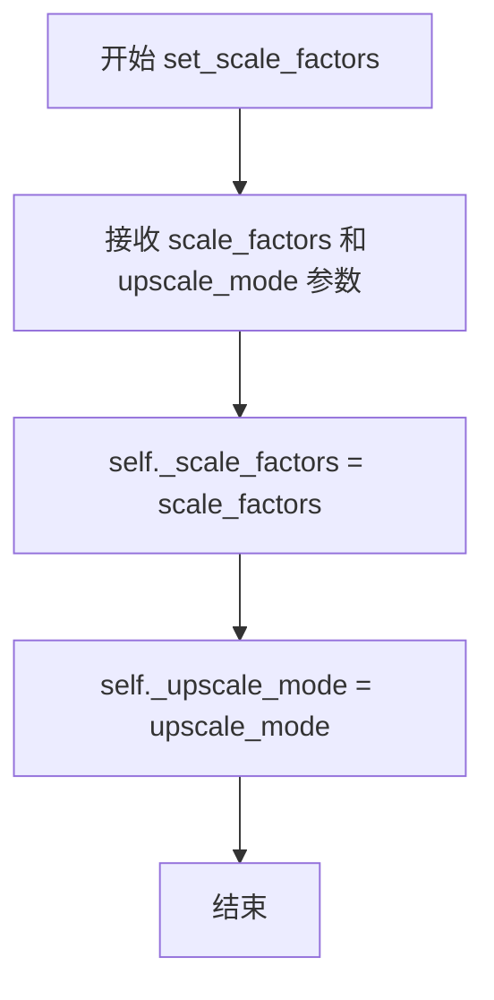

#### 带注释源码

```python
def set_scale_factors(self, scale_factors: list[float], upscale_mode: str) -> None:
    """
    Sets scale factors for a scale-wise generation regime.

    Args:
        scale_factors (`list[float]`):
            The scale factors for each step.
        upscale_mode (`str`):
            Upscaling method.
    """
    # 将传入的缩放因子列表保存到实例变量
    # 该值在 step() 方法中用于动态调整预测图像的尺寸
    self._scale_factors = scale_factors
    
    # 将传入的上采样模式保存到实例变量
    # 该值决定了图像缩放时使用的插值方法（如 bicubic、nearest 等）
    self._upscale_mode = upscale_mode
```


### `FlowMatchLCMScheduler.scale_noise`

该方法是 Flow Matching 中的前向过程（Forward Process），用于根据当前时间步和噪声水平对输入样本进行缩放和噪声混合。它将原始样本与噪声按照 sigma 权重进行线性组合，生成带噪声的样本，这是扩散模型训练中的关键步骤。

参数：

- `self`：`FlowMatchLCMScheduler`，调度器实例，隐式参数
- `sample`：`torch.FloatTensor`，输入的原始样本（无噪声图像或潜在表示）
- `timestep`：`float | torch.FloatTensor`，当前时间步，表示扩散过程的当前阶段
- `noise`：`torch.FloatTensor | None`，噪声张量，如果为 None 则需要生成噪声

返回值：`torch.FloatTensor`，缩放并混合噪声后的样本

#### 流程图

```mermaid
flowchart TD
    A[开始 scale_noise] --> B{检查 sample 设备类型}
    B -->|mps 且浮点类型| C[转换为 float32]
    B -->|其他设备| D[保持原 dtype]
    C --> E[获取 schedule_timesteps]
    D --> E
    E --> F{begin_index 是否为 None}
    F -->|是| G[通过 index_for_timestep 计算每个 timestep 的索引]
    F -->|否| H{step_index 是否存在}
    H -->|是| I[使用 step_index 作为索引]
    H -->|否| J[使用 begin_index 作为索引]
    G --> K[根据索引获取 sigma 值]
    I --> K
    J --> K
    K --> L[展开 sigma 并扩展维度匹配 sample 形状]
    L --> M[计算混合结果: sample = sigma * noise + (1 - sigma) * sample]
    M --> N[返回缩放后的样本]
```

#### 带注释源码

```python
def scale_noise(
    self,
    sample: torch.FloatTensor,
    timestep: float | torch.FloatTensor,
    noise: torch.FloatTensor | None = None,
) -> torch.FloatTensor:
    """
    Forward process in flow-matching

    Args:
        sample (`torch.FloatTensor`):
            The input sample.
        timestep (`torch.FloatTensor`):
            The current timestep in the diffusion chain.
        noise (`torch.FloatTensor`):
            The noise tensor.

    Returns:
        `torch.FloatTensor`:
            A scaled input sample.
    """
    # 将 sigmas 移动到与 sample 相同的设备和数据类型
    sigmas = self.sigmas.to(device=sample.device, dtype=sample.dtype)

    # 处理 MPS (Apple Silicon) 设备的特殊兼容性问题
    # MPS 不支持 float64，需要转换为 float32
    if sample.device.type == "mps" and torch.is_floating_point(timestep):
        schedule_timesteps = self.timesteps.to(sample.device, dtype=torch.float32)
        timestep = timestep.to(sample.device, dtype=torch.float32)
    else:
        schedule_timesteps = self.timesteps.to(sample.device)
        timestep = timestep.to(sample.device)

    # 根据调度器的状态确定时间步索引
    # begin_index 为 None 表示用于训练场景，或 pipeline 未实现 set_begin_index
    if self.begin_index is None:
        # 计算每个时间步对应的索引
        step_indices = [self.index_for_timestep(t, schedule_timesteps) for t in timestep]
    elif self.step_index is not None:
        # 在第一次去噪步骤之后调用 add_noise（用于 inpainting）
        step_indices = [self.step_index] * timestep.shape[0]
    else:
        # 在第一次去噪步骤之前调用 add_noise（用于 img2img）
        step_indices = [self.begin_index] * timestep.shape[0]

    # 获取对应索引的 sigma 值并展平
    sigma = sigmas[step_indices].flatten()
    # 扩展 sigma 的维度以匹配 sample 的形状（支持广播）
    while len(sigma.shape) < len(sample.shape):
        sigma = sigma.unsqueeze(-1)

    # Flow Matching 前向过程的核心公式
    # 线性插值：sample = sigma * noise + (1 - sigma) * sample
    # sigma=1 时完全噪声，sigma=0 时保持原样
    sample = sigma * noise + (1.0 - sigma) * sample

    return sample
```


### `FlowMatchLCMScheduler._sigma_to_t`

该方法实现了将 sigma 值（噪声水平）转换为对应的时间步（timestep）的简单映射，是 Flow Match 调度器中用于在推理时建立 sigma 与训练时间步之间联系的内部转换函数。

参数：

- `self`：调用该方法的调度器实例，包含配置信息。
- `sigma`：`float | torch.FloatTensor`，需要转换的 sigma 值，可以是单个浮点数或 PyTorch 浮点张量。

返回值：`float | torch.FloatTensor`，转换后对应的时间步值，类型与输入的 sigma 保持一致。

#### 流程图

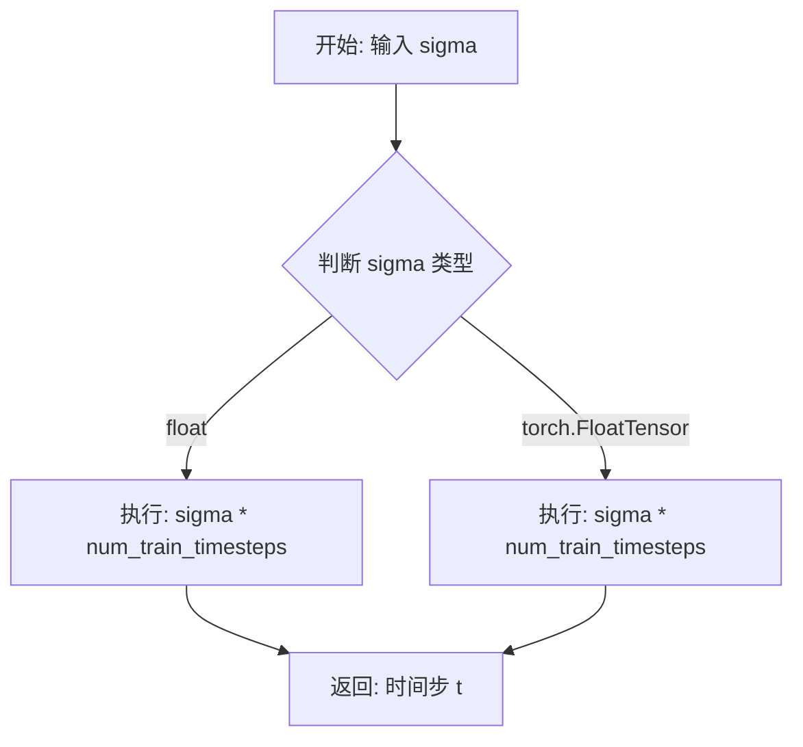

#### 带注释源码

```python
def _sigma_to_t(self, sigma: float | torch.FloatTensor) -> float | torch.FloatTensor:
    """
    将 sigma 值转换为对应的时间步。
    
    在 Flow Matching 中，sigma 代表噪声水平/时间步的缩放因子。
    该方法通过乘以训练时的总时间步数，将 sigma 值映射回原始的时间步空间。
    
    参数:
        sigma (float | torch.FloatTensor): 
            噪声水平值，可以是 Python float 或 PyTorch FloatTensor。
            当用于推理时，sigmas 数组中的每个值代表不同去噪步骤的噪声水平。
            
    返回:
        float | torch.FloatTensor: 
            转换后的时间步值。如果输入是 float 则返回 float，
            如果输入是 torch.FloatTensor 则返回同类型的张量。
            这个时间步值可以用于调度器的时间索引操作。
    """
    # 核心逻辑：将 sigma 乘以训练时的总时间步数，得到对应的离散时间步
    # 例如：如果 num_train_timesteps=1000，sigma=0.5，则 t=500
    return sigma * self.config.num_train_timesteps
```


### `FlowMatchLCMScheduler.time_shift`

该方法是一个时间偏移（time shifting）函数，用于在基于Flow Matching的扩散模型中对时间步进行动态调整。它根据配置中的 `time_shift_type`（"exponential" 或 "linear"）类型，调用相应的私有方法来实现对时间步的时间偏移操作。这种动态时间偏移技术可以在不同图像分辨率下优化采样过程，使生成结果更加稳定或更具变化性。

参数：

- `mu`：`float`，时间偏移的缩放因子，控制偏移的强度
- `sigma`：`float`，时间偏移的指数参数，控制偏移的非线性程度
- `t`：`float | np.ndarray | torch.Tensor`，原始时间步（可以是单个值、数组或张量）

返回值：`float | np.ndarray | torch.Tensor`，经过时间偏移后的时间步，返回类型与输入参数 `t` 的类型相同

#### 流程图

```mermaid
flowchart TD
    A[开始 time_shift] --> B{检查 time_shift_type}
    B -->|exponential| C[调用 _time_shift_exponential]
    B -->|linear| D[调用 _time_shift_linear]
    C --> E[计算: exp(mu) / (exp(mu) + (1/t - 1)^sigma)]
    D --> F[计算: mu / (mu + (1/t - 1)^sigma)]
    E --> G[返回偏移后的时间步]
    F --> G
```

#### 带注释源码

```python
def time_shift(
    self, mu: float, sigma: float, t: float | np.ndarray | torch.Tensor
) -> float | np.ndarray | torch.Tensor:
    """
    应用时间偏移到给定的时间步。

    该方法是Flow Matching调度器中用于实现动态分辨率依赖时间偏移的核心方法。
    根据配置中的time_shift_type，它会将时间步从原始空间映射到偏移后的空间，
    从而实现对不同图像分辨率的适应性调整。

    参数:
        mu (float): 时间偏移的缩放因子，通常用于控制整体偏移程度。
                   较大的值会使时间步更趋向于初始值，有助于保持图像一致性。
        sigma (float): 时间偏移的指数参数，控制偏移曲线的形状。
                      较高的值会产生更非线性的偏移效果。
        t (float | np.ndarray | torch.Tensor): 原始时间步值，可以是单个浮点数、
                                              数组或PyTorch张量。

    返回:
        float | np.ndarray | torch.Tensor: 经过时间偏移后的时间步值，类型与输入t相同。
    """
    # 根据配置的时间偏移类型选择对应的偏移方法
    if self.config.time_shift_type == "exponential":
        # 使用指数型时间偏移，适用于需要平滑过渡的场景
        return self._time_shift_exponential(mu, sigma, t)
    elif self.config.time_shift_type == "linear":
        # 使用线性时间偏移，适用于需要保持线性关系的场景
        return self._time_shift_linear(mu, sigma, t)
```


### `FlowMatchLCMScheduler.stretch_shift_to_terminal`

该方法用于将时间步（timestep）调度进行拉伸和偏移，确保调度序列的终止值等于配置中指定的 `shift_terminal` 值。这是 LCM（Latent Consistency Model）调度器中用于调整推理过程中 sigma 值的关键步骤，通过线性变换使调度在期望的终端值处结束。

参数：

- `t`：`np.ndarray | torch.Tensor`，需要被拉伸和偏移的时间步数组（或张量）

返回值：`np.ndarray | torch.ndarray`，调整后的时间步数组，其最终值等于 `self.config.shift_terminal`

#### 流程图

```mermaid
flowchart TD
    A[输入: 时间步数组 t] --> B[计算 one_minus_z = 1 - t]
    B --> C[计算 scale_factor = one_minus_z[-1] / (1 - shift_terminal)]
    C --> D[计算 stretched_t = 1 - (one_minus_z / scale_factor)]
    D --> E[返回: 拉伸后的时间步 stretched_t]
```

#### 带注释源码

```python
def stretch_shift_to_terminal(self, t: np.ndarray | torch.Tensor) -> np.ndarray | torch.Tensor:
    r"""
    Stretches and shifts the timestep schedule to ensure it terminates at the configured `shift_terminal` config
    value.

    Reference:
    https://github.com/Lightricks/LTX-Video/blob/a01a171f8fe3d99dce2728d60a73fecf4d4238ae/ltx_video/schedulers/rf.py#L51

    Args:
        t (`torch.Tensor` or `np.ndarray`):
            A tensor or numpy array of timesteps to be stretched and shifted.

    Returns:
        `torch.Tensor` or `np.ndarray`:
            A tensor or numpy array of adjusted timesteps such that the final value equals
            `self.config.shift_terminal`.
    """
    # 计算 1 - t，得到 (1 - z) 形式
    # 其中 t 可以理解为当前的 sigma 值或归一化时间步
    one_minus_z = 1 - t
    
    # 计算缩放因子：将最后一个时间步 (one_minus_z[-1]) 
    # 映射到目标终端值 (1 - shift_terminal)
    # 这个因子用于保持调度序列的相对形状，同时调整终点
    scale_factor = one_minus_z[-1] / (1 - self.config.shift_terminal)
    
    # 应用拉伸变换：通过除以缩放因子来调整整个调度
    # 然后再转换回 t 的形式 (1 - ...)
    stretched_t = 1 - (one_minus_z / scale_factor)
    
    # 返回拉伸后的时间步序列，其终点现在等于 shift_terminal
    return stretched_t
```


### `FlowMatchLCMScheduler.set_timesteps`

设置扩散链中使用的离散时间步（在推理前运行）。

参数：

- `num_inference_steps`：`int | None`，使用预训练模型生成样本时使用的扩散步数
- `device`：`str | torch.device | None`，时间步要移动到的设备。如果为 `None`，时间步不会移动
- `sigmas`：`list[float] | None`，每个扩散步使用的自定义 sigma 值。如果为 `None`，sigma 会自动计算
- `mu`：`float | None`，执行分辨率依赖时间步偏移时，决定应用于 sigmas 的偏移量
- `timesteps`：`list[float] | None`，每个扩散步使用的自定义时间步值。如果为 `None`，时间步会自动计算

返回值：`None`，无返回值（该方法直接修改调度器的内部状态）

#### 流程图

```mermaid
flowchart TD
    A[开始 set_timesteps] --> B{use_dynamic_shifting<br/>且 mu is None?}
    B -->|是| C[抛出 ValueError]
    B -->|否| D{sigmas 和 timesteps<br/>都非空?}
    D -->|是| E{sigmas 长度 !=<br/>timesteps 长度?}
    D -->|否| F{num_inference_steps<br/>非空?}
    E -->|是| G[抛出 ValueError]
    E -->|否| H[继续]
    F -->|是| I{sigmas 长度 !=<br/>num_inference_steps<br/>或 timesteps 长度 !=<br/>num_inference_steps?}
    F -->|否| J[计算 num_inference_steps<br/>= sigmas 或 timesteps 长度]
    I -->|是| K[抛出 ValueError]
    I -->|否| L[继续]
    H --> M[设置 num_inference_steps]
    J --> M
    L --> M
    M --> N{is_timesteps_provided?}
    N -->|是| O[转换 timesteps 为 float32 numpy数组]
    N -->|否| P{sigmas is None?}
    O --> P
    P -->|是| Q{timesteps is None?}
    P -->|否| R[转换 sigmas 为 float32 数组]
    Q -->|是| S[生成线性间隔 timesteps<br/>从 sigma_max 到 sigma_min]
    Q -->|否| T[使用传入的 timesteps]
    S --> U[计算 sigmas = timesteps / num_train_timesteps]
    T --> U
    R --> U
    U --> V{use_dynamic_shifting?}
    V -->|是| W[应用 time_shift 偏移 sigmas]
    V -->|否| X[应用静态 shift 公式]
    W --> Y{shift_terminal<br/>已配置?}
    X --> Y
    Y -->|是| Z[stretch_shift_to_terminal<br/>调整 sigmas]
    Y -->|否| AA{use_karras_sigmas?}
    Z --> AB{use_karras_sigmas?}
    AA -->|是| AC[转换为 Karras sigmas]
    AA -->|否| AD{use_exponential_sigmas?}
    AC --> AE
    AD -->|是| AF[转换为 Exponential sigmas]
    AD -->|否| AG{use_beta_sigmas?}
    AF --> AE
    AG -->|是| AH[转换为 Beta sigmas]
    AG -->|否| AE[继续]
    AH --> AE
    AE --> AI[转换 sigmas 为 torch.Tensor<br/>并移到指定 device]
    AJ{is_timesteps_provided?}
    AI --> AJ
    AJ -->|否| AK[timesteps = sigmas * num_train_timesteps]
    AJ -->|是| AL[转换 timesteps 为 torch.Tensor<br/>并移到指定 device]
    AK --> AM
    AL --> AM
    AM --> AN{invert_sigmas?}
    AN -->|是| AO[1.0 - sigmas<br/>timesteps = sigmas * num_train_timesteps<br/>追加 ones]
    AN -->|否| AP[追加 zeros]
    AO --> AQ[设置 self.timesteps<br/>self.sigmas<br/>重置 _step_index<br/>_begin_index]
    AP --> AQ
    AQ --> AR[结束]
```

#### 带注释源码

```python
def set_timesteps(
    self,
    num_inference_steps: int | None = None,
    device: str | torch.device | None = None,
    sigmas: list[float] | None = None,
    mu: float | None = None,
    timesteps: list[float] | None = None,
) -> None:
    """
    设置扩散链中使用的离散时间步（在推理前运行）。

    参数:
        num_inference_steps (`int`, *optional*):
            使用预训练模型生成样本时使用的扩散步数。
        device (`str` 或 `torch.device`, *optional*):
            时间步要移动到的设备。如果为 `None`，时间步不会移动。
        sigmas (`list[float]`, *optional*):
            每个扩散步使用的自定义 sigma 值。如果为 `None`，sigma 会自动计算。
        mu (`float`, *optional*):
            执行分辨率依赖时间步偏移时应用于 sigmas 的偏移量。
        timesteps (`list[float]`, *optional*):
            每个扩散步使用的自定义时间步值。如果为 `None`，时间步会自动计算。
    """
    # 验证动态偏移参数：当启用动态偏移时，必须提供 mu 参数
    if self.config.use_dynamic_shifting and mu is None:
        raise ValueError("`mu` must be passed when `use_dynamic_shifting` is set to be `True`")

    # 验证 sigmas 和 timesteps 长度一致性
    if sigmas is not None and timesteps is not None:
        if len(sigmas) != len(timesteps):
            raise ValueError("`sigmas` and `timesteps` should have the same length")

    # 验证 num_inference_steps 与 sigmas/timesteps 长度一致性
    if num_inference_steps is not None:
        if (sigmas is not None and len(sigmas) != num_inference_steps) or (
            timesteps is not None and len(timesteps) != num_inference_steps
        ):
            raise ValueError(
                "`sigmas` and `timesteps` should have the same length as num_inference_steps, if `num_inference_steps` is provided"
            )
    else:
        # 从 sigmas 或 timesteps 推断推理步数
        num_inference_steps = len(sigmas) if sigmas is not None else len(timesteps)

    self.num_inference_steps = num_inference_steps

    # 1. 准备默认 sigmas
    is_timesteps_provided = timesteps is not None

    if is_timesteps_provided:
        # 将传入的 timesteps 转换为 float32 numpy 数组
        timesteps = np.array(timesteps).astype(np.float32)

    if sigmas is None:
        if timesteps is None:
            # 生成从 sigma_max 到 sigma_min 的线性间隔时间步
            timesteps = np.linspace(
                self._sigma_to_t(self.sigma_max),
                self._sigma_to_t(self.sigma_min),
                num_inference_steps,
            )
        # 将时间步转换为 sigma
        sigmas = timesteps / self.config.num_train_timesteps
    else:
        # 转换传入的 sigmas 为 float32 数组，并更新步数
        sigmas = np.array(sigmas).astype(np.float32)
        num_inference_steps = len(sigmas)

    # 2. 执行时间步偏移（动态偏移或静态偏移）
    if self.config.use_dynamic_shifting:
        # 使用 mu 参数进行动态分辨率依赖偏移
        sigmas = self.time_shift(mu, 1.0, sigmas)
    else:
        # 使用静态偏移公式：shift * sigmas / (1 + (shift - 1) * sigmas)
        sigmas = self.shift * sigmas / (1 + (self.shift - 1) * sigmas)

    # 3. 如果配置了 shift_terminal，则拉伸 sigma 调度以在配置值处终止
    if self.config.shift_terminal:
        sigmas = self.stretch_shift_to_terminal(sigmas)

    # 4. 如果需要，将 sigmas 转换为 Karras、Exponential 或 Beta sigma 调度
    if self.config.use_karras_sigmas:
        # 转换为 Karras noise schedule（基于 Elucidating the Design Space of Diffusion Models）
        sigmas = self._convert_to_karras(in_sigmas=sigmas, num_inference_steps=num_inference_steps)
    elif self.config.use_exponential_sigmas:
        # 转换为指数 sigma schedule
        sigmas = self._convert_to_exponential(in_sigmas=sigmas, num_inference_steps=num_inference_steps)
    elif self.config.use_beta_sigmas:
        # 转换为 Beta 分布 sigma schedule（基于 Beta Sampling is All You Need）
        sigmas = self._convert_to_beta(in_sigmas=sigmas, num_inference_steps=num_inference_steps)

    # 5. 将 sigmas 和 timesteps 转换为 tensors 并移动到指定设备
    sigmas = torch.from_numpy(sigmas).to(dtype=torch.float32, device=device)
    if not is_timesteps_provided:
        # 从 sigma 计算 timesteps
        timesteps = sigmas * self.config.num_train_timesteps
    else:
        # 使用传入的 timesteps（已转换为 tensor）
        timesteps = torch.from_numpy(timesteps).to(dtype=torch.float32, device=device)

    # 6. 追加终止 sigma 值
    # 如果模型需要反演 sigma 调度进行去噪但时间步不需要反演，可设置 `invert_sigmas` 为 True
    if self.config.invert_sigmas:
        # 反演 sigmas 并追加 1.0
        sigmas = 1.0 - sigmas
        timesteps = sigmas * self.config.num_train_timesteps
        sigmas = torch.cat([sigmas, torch.ones(1, device=sigmas.device)])
    else:
        # 追加 0.0 作为终止 sigma
        sigmas = torch.cat([sigmas, torch.zeros(1, device=sigmas.device)])

    # 更新调度器的内部状态
    self.timesteps = timesteps
    self.sigmas = sigmas
    # 重置步进索引
    self._step_index = None
    self._begin_index = None
```


### `FlowMatchLCMScheduler.index_for_timestep`

该方法用于在调度时间步序列（schedule_timesteps）中查找与给定时间步（timestep）匹配的第一个索引。实现上使用`nonzero()`查找相等的索引，并采用特殊逻辑确保在图像到图像（image-to-image）场景下从去噪调度中间开始时不会意外跳过sigma值——即如果存在多个匹配索引则返回第二个（确保第一步不跳过），否则返回第一个（或唯一的）索引。

参数：

- `self`：`FlowMatchLCMScheduler`，调度器实例本身
- `timestep`：`float | torch.Tensor`，要查找的时间步值
- `schedule_timesteps`：`torch.Tensor | None`，可选的时间步调度序列。如果为`None`，则使用调度器的`self.timesteps`属性

返回值：`int`，返回匹配的时间步在调度序列中的索引位置

#### 流程图

```mermaid
flowchart TD
    A[开始 index_for_timestep] --> B{schedule_timesteps 是否为 None}
    B -->|是| C[使用 self.timesteps 作为 schedule_timesteps]
    B -->|否| D[使用传入的 schedule_timesteps]
    C --> E[在 schedule_timesteps 中查找等于 timestep 的索引]
    D --> E
    E --> F[使用 nonzero() 获取匹配索引]
    F --> G{匹配索引数量 > 1}
    G -->|是| H[pos = 1]
    G -->|否| I[pos = 0]
    H --> J[返回 indices[pos] 转换为 int]
    I --> J
    J --> K[结束]
```

#### 带注释源码

```python
def index_for_timestep(
    self,
    timestep: float | torch.Tensor,
    schedule_timesteps: torch.Tensor | None = None,
) -> int:
    # 如果未提供 schedule_timesteps，则使用调度器自身的 timesteps 属性
    if schedule_timesteps is None:
        schedule_timesteps = self.timesteps

    # 使用 nonzero() 查找 schedule_timesteps 中与 timestep 值相等的所有索引位置
    indices = (schedule_timesteps == timestep).nonzero()

    # 重要设计逻辑：
    # 对于**第一个**采样步骤（step），我们总是取第二个索引（如果存在多个匹配）
    # 或者取最后一个索引（如果只有一个匹配）
    # 这样可以确保当我们从去噪调度中间开始时（例如 image-to-image 场景），
    # 不会意外跳过任何一个 sigma 值
    pos = 1 if len(indices) > 1 else 0

    # 将找到的索引转换为 Python int 类型并返回
    return int(indices[pos].item())
```


### `FlowMatchLCMScheduler._init_step_index`

该私有方法用于在推理过程中初始化调度器的步进索引（step index）。它根据给定的时间步（timestep）确定当前处于扩散过程的哪个步骤，并将结果存储在内部变量`_step_index`中。如果已设置了起始索引（begin_index），则直接使用该值。

参数：

- `timestep`：`float | torch.Tensor`，当前的时间步，用于确定在扩散链中的位置

返回值：`None`，无返回值（该方法直接修改内部状态`_step_index`）

#### 流程图

```mermaid
flowchart TD
    A[开始 _init_step_index] --> B{self.begin_index 是否为 None?}
    B -->|是| C{ timestep 是否为 torch.Tensor?}
    C -->|是| D[将 timestep 移动到与 self.timesteps 相同的设备]
    C -->|否| E[保持 timestep 不变]
    D --> F[调用 index_for_timestep 获取索引]
    E --> F
    F --> G[将计算得到的索引赋值给 self._step_index]
    B -->|否| H[将 self._begin_index 赋值给 self._step_index]
    G --> I[结束]
    H --> I
```

#### 带注释源码

```python
def _init_step_index(self, timestep: float | torch.Tensor) -> None:
    """
    初始化调度器的步进索引。
    
    该方法在推理过程中被调用，用于确定当前时间步在扩散调度中的索引位置。
    如果已通过 set_begin_index 设置了起始索引，则直接使用该起始索引；
    否则，根据传入的 timestep 计算对应的索引。
    
    Args:
        timestep: 当前的时间步，可以是 float 或 torch.Tensor 类型
    """
    # 检查是否设置了起始索引（begin_index）
    if self.begin_index is None:
        # 如果 timestep 是 PyTorch 张量，确保它与 self.timesteps 在同一设备上
        if isinstance(timestep, torch.Tensor):
            timestep = timestep.to(self.timesteps.device)
        
        # 通过 index_for_timestep 方法计算当前时间步对应的索引
        self._step_index = self.index_for_timestep(timestep)
    else:
        # 如果已设置起始索引，直接使用该索引
        self._step_index = self._begin_index
```


### `FlowMatchLCMScheduler.step`

预测样本：通过逆转SDE（随机微分方程）从先前的 timestep 预测样本。该函数根据学习到的扩散模型输出（通常为预测的噪声）推进扩散过程。

参数：

- `model_output`：`torch.FloatTensor`，学习到的扩散模型的直接输出
- `timestep`：`float | torch.FloatTensor`，扩散链中的当前离散时间步
- `sample`：`torch.FloatTensor`，由扩散过程创建的当前样本实例
- `generator`：`torch.Generator | None`，随机数生成器
- `return_dict`：`bool`，是否返回 `FlowMatchLCMSchedulerOutput` 或元组

返回值：`FlowMatchLCMSchedulerOutput | tuple`，如果 `return_dict` 为 `True`，返回 `FlowMatchLCMSchedulerOutput`，否则返回元组，其中第一个元素是样本张量

#### 流程图

```mermaid
flowchart TD
    A[开始 step] --> B{验证 timestep 类型}
    B -->|是整数类型| C[抛出 ValueError]
    B -->|不是整数| D{验证 scale_factors}
    D -->|长度不匹配| E[抛出 ValueError]
    D -->|长度匹配| F{初始化 _init_size}
    F -->|None 或 step_index 为 None| G[设置 _init_size = model_output.size[2:]]
    F -->|已设置| H{检查 step_index}
    H -->|为 None| I[调用 _init_step_index 初始化]
    H -->|已设置| J[继续]
    I --> J
    G --> J
    J --> K[将 sample 转换为 float32]
    K --> L[获取当前 sigma 和下一步 sigma_next]
    L --> M[x0_pred = sample - sigma * model_output]
    M --> N{是否有 scale_factors 和 upscale_mode}
    N -->|是| O[插值 x0_pred 到目标尺寸]
    N -->|否| P[跳过插值]
    O --> Q[生成噪声]
    P --> Q
    Q --> R[prev_sample = (1 - sigma_next) * x0_pred + sigma_next * noise]
    R --> S[step_index += 1]
    S --> T[将 prev_sample 转换回 model_output dtype]
    T --> U{return_dict?}
    U -->|True| V[返回 FlowMatchLCMSchedulerOutput]
    U -->|False| W[返回元组 (prev_sample,)]
    V --> X[结束]
    W --> X
    C --> X
    E --> X
```

#### 带注释源码

```python
def step(
    self,
    model_output: torch.FloatTensor,
    timestep: float | torch.FloatTensor,
    sample: torch.FloatTensor,
    generator: torch.Generator | None = None,
    return_dict: bool = True,
) -> FlowMatchLCMSchedulerOutput | tuple:
    """
    Predict the sample from the previous timestep by reversing the SDE. This function propagates the diffusion
    process from the learned model outputs (most often the predicted noise).

    Args:
        model_output (`torch.FloatTensor`):
            The direct output from learned diffusion model.
        timestep (`float`):
            The current discrete timestep in the diffusion chain.
        sample (`torch.FloatTensor`):
            A current instance of a sample created by the diffusion process.
        generator (`torch.Generator`, *optional*):
            A random number generator.
        return_dict (`bool`):
            Whether or not to return a [`~schedulers.scheduling_flow_match_lcm.FlowMatchLCMSchedulerOutput`] or
            tuple.

    Returns:
        [`~schedulers.scheduling_flow_match_lcm.FlowMatchLCMSchedulerOutput`] or `tuple`:
            If return_dict is `True`, [`~schedulers.scheduling_flow_match_lcm.FlowMatchLCMSchedulerOutput`] is
            returned, otherwise a tuple is returned where the first element is the sample tensor.
    """

    # 检查 timestep 是否为整数索引（不支持）
    if (
        isinstance(timestep, int)
        or isinstance(timestep, torch.IntTensor)
        or isinstance(timestep, torch.LongTensor)
    ):
        raise ValueError(
            (
                "Passing integer indices (e.g. from `enumerate(timesteps)`) as timesteps to"
                " `FlowMatchLCMScheduler.step()` is not supported. Make sure to pass"
                " one of the `scheduler.timesteps` as a timestep."
            ),
        )

    # 验证 scale_factors 长度是否与 timesteps 匹配
    if self._scale_factors and self._upscale_mode and len(self.timesteps) != len(self._scale_factors) + 1:
        raise ValueError(
            "`_scale_factors` should have the same length as `timesteps` - 1, if `_scale_factors` are set."
        )

    # 初始化样本尺寸（用于后续插值）
    if self._init_size is None or self.step_index is None:
        self._init_size = model_output.size()[2:]

    # 初始化 step_index（如果尚未设置）
    if self.step_index is None:
        self._init_step_index(timestep)

    # 将样本转换为 float32 以避免精度问题
    sample = sample.to(torch.float32)

    # 获取当前和下一步的 sigma 值
    sigma = self.sigmas[self.step_index]
    sigma_next = self.sigmas[self.step_index + 1]
    
    # 计算预测的 x0（原始无噪声样本）
    x0_pred = sample - sigma * model_output

    # 如果使用比例因子和上采样模式，则对 x0_pred 进行插值
    if self._scale_factors and self._upscale_mode:
        if self._step_index < len(self._scale_factors):
            size = [round(self._scale_factors[self._step_index] * size) for size in self._init_size]
            x0_pred = torch.nn.functional.interpolate(x0_pred, size=size, mode=self._upscale_mode)

    # 生成随机噪声
    noise = randn_tensor(
        x0_pred.shape,
        generator=generator,
        device=x0_pred.device,
        dtype=x0_pred.dtype,
    )
    
    # 计算前一个样本：使用噪声和预测的 x0 进行线性插值
    prev_sample = (1 - sigma_next) * x0_pred + sigma_next * noise

    # 完成后将 step_index 增加 1
    self._step_index += 1
    
    # 将样本转换回模型兼容的数据类型
    prev_sample = prev_sample.to(model_output.dtype)

    # 根据 return_dict 返回结果
    if not return_dict:
        return (prev_sample,)

    return FlowMatchLCMSchedulerOutput(prev_sample=prev_sample)
```


### `FlowMatchLCMScheduler._convert_to_karras`

该方法用于将输入的sigma值转换为基于Karras噪声调度表的sigma值。Karras调度表源自论文"Elucidating the Design Space of Diffusion-Based Generative Models"，通过使用幂律插值策略生成噪声调度，能够在去噪过程中提供更稳定的采样轨迹和更好的生成质量。

参数：

- `self`：`FlowMatchLCMScheduler`，调度器实例自身
- `in_sigmas`：`torch.Tensor`，待转换的输入sigma值数组
- `num_inference_steps`：`int`，推理步数，用于生成噪声调度表的长度

返回值：`torch.Tensor`，转换后的sigma值数组，遵循Karras噪声调度曲线

#### 流程图

```mermaid
flowchart TD
    A[开始 _convert_to_karras] --> B{config是否有sigma_min属性}
    B -->|是| C[获取 config.sigma_min]
    B -->|否| D[sigma_min 设为 None]
    C --> E{config是否有sigma_max属性}
    D --> E
    E -->|是| F[获取 config.sigma_max]
    E -->|否| G[sigma_max 设为 None]
    F --> H{sigma_min是否为None}
    G --> H
    H -->|是| I[sigma_min = in_sigmas末尾值.item]
    H -->|否| J[保留config的sigma_min值]
    I --> K{sigma_max是否为None}
    J --> K
    K -->|是| L[sigma_max = in_sigmas首值.item]
    K -->|否| M[保留config的sigma_max值]
    L --> N[设置 rho = 7.0]
    M --> N
    N --> O[生成0到1的线性间隔数组 ramp]
    O --> P[计算 min_inv_rho = sigma_min^(1/rho)]
    P --> Q[计算 max_inv_rho = sigma_max^(1/rho)]
    Q --> R[计算 sigmas = (max_inv_rho + ramp * (min_inv_rho - max_inv_rho))^rho]
    R --> S[返回转换后的 sigmas]
```

#### 带注释源码

```python
def _convert_to_karras(self, in_sigmas: torch.Tensor, num_inference_steps: int) -> torch.Tensor:
    """
    Construct the noise schedule as proposed in [Elucidating the Design Space of Diffusion-Based Generative
    Models](https://huggingface.co/papers/2206.00364).

    Args:
        in_sigmas (`torch.Tensor`):
            The input sigma values to be converted.
        num_inference_steps (`int`):
            The number of inference steps to generate the noise schedule for.

    Returns:
        `torch.Tensor`:
            The converted sigma values following the Karras noise schedule.
    """

    # Hack to make sure that other schedulers which copy this function don't break
    # TODO: Add this logic to the other schedulers
    # 检查调度器配置中是否存在sigma_min属性，用于兼容不同调度器
    if hasattr(self.config, "sigma_min"):
        sigma_min = self.config.sigma_min
    else:
        sigma_min = None

    # 检查调度器配置中是否存在sigma_max属性
    if hasattr(self.config, "sigma_max"):
        sigma_max = self.config.sigma_max
    else:
        sigma_max = None

    # 如果config中未定义sigma_min，则使用输入sigmas的最后一个值作为最小sigma
    sigma_min = sigma_min if sigma_min is not None else in_sigmas[-1].item()
    # 如果config中未定义sigma_max，则使用输入sigmas的第一个值作为最大sigma
    sigma_max = sigma_max if sigma_max is not None else in_sigmas[0].item()

    # rho是Karras论文中推荐的幂指数值，用于控制噪声调度的曲率
    rho = 7.0  # 7.0 is the value used in the paper
    # 生成从0到1的线性间隔数组，代表归一化的推理步进
    ramp = np.linspace(0, 1, num_inference_steps)
    # 计算sigma_min和sigma_max的rho次根的倒数，为后续幂律插值做准备
    min_inv_rho = sigma_min ** (1 / rho)
    max_inv_rho = sigma_max ** (1 / rho)
    # 执行Karras核心公式：在逆rho空间中进行线性插值，然后映射回sigma空间
    # 这种方式确保了sigma值在两端具有较小的变化率，中间变化较大
    sigmas = (max_inv_rho + ramp * (min_inv_rho - max_inv_rho)) ** rho
    return sigmas
```


### `FlowMatchLCMScheduler._convert_to_exponential`

该方法用于构建指数噪声调度表（Exponential Noise Schedule），将输入的 sigma 值转换为遵循指数衰减规律的序列，用于扩散模型的采样过程。

参数：

- `self`：`FlowMatchLCMScheduler`，调度器实例自身
- `in_sigmas`：`torch.Tensor`，输入的 sigma 值张量，待转换的噪声调度表
- `num_inference_steps`：`int`，推理步数，用于生成噪声调度表的步数

返回值：`torch.Tensor`，转换后的 sigma 值，遵循指数调度规律

#### 流程图

```mermaid
flowchart TD
    A[开始 _convert_to_exponential] --> B{self.config 是否有 sigma_min 属性}
    B -->|是| C[sigma_min = self.config.sigma_min]
    B -->|否| D[sigma_min = None]
    C --> E{self.config 是否有 sigma_max 属性}
    D --> E
    E -->|是| F[sigma_max = self.config.sigma_max]
    E -->|否| G[sigma_max = None]
    F --> H{sigma_min 是否为 None}
    G --> H
    H -->|是| I[sigma_min = in_sigmas[-1].item()]
    H -->|否| J[保持 sigma_min 不变]
    I --> K{sigma_max 是否为 None}
    J --> K
    K -->|是| L[sigma_max = in_sigmas[0].item()]
    K -->|否| M[保持 sigma_max 不变]
    L --> N[使用 np.exp 和 np.linspace 计算指数 sigmas]
    M --> N
    N --> O[返回 sigmas 张量]
```

#### 带注释源码

```python
def _convert_to_exponential(self, in_sigmas: torch.Tensor, num_inference_steps: int) -> torch.Tensor:
    """
    Construct an exponential noise schedule.

    Args:
        in_sigmas (`torch.Tensor`):
            The input sigma values to be converted.
        num_inference_steps (`int`):
            The number of inference steps to generate the noise schedule for.

    Returns:
        `torch.Tensor`:
            The converted sigma values following an exponential schedule.
    """

    # Hack to make sure that other schedulers which copy this function don't break
    # TODO: Add this logic to the other schedulers
    # 检查配置中是否存在 sigma_min 属性，用于兼容其他调度器
    if hasattr(self.config, "sigma_min"):
        sigma_min = self.config.sigma_min
    else:
        sigma_min = None

    # 检查配置中是否存在 sigma_max 属性
    if hasattr(self.config, "sigma_max"):
        sigma_max = self.config.sigma_max
    else:
        sigma_max = None

    # 如果 sigma_min 为 None，则使用输入 sigmas 的最后一个值（最小 sigma）
    sigma_min = sigma_min if sigma_min is not None else in_sigmas[-1].item()
    # 如果 sigma_max 为 None，则使用输入 sigmas 的第一个值（最大 sigma）
    sigma_max = sigma_max if sigma_max is not None else in_sigmas[0].item()

    # 在对数空间进行线性插值，然后取指数得到指数衰减的 sigma 值
    # 这样可以确保 sigma 值从 sigma_max 指数衰减到 sigma_min
    sigmas = np.exp(np.linspace(math.log(sigma_max), math.log(sigma_min), num_inference_steps))
    return sigmas
```


### `FlowMatchLCMScheduler._convert_to_beta`

将输入的sigma值转换为基于Beta分布的噪声调度表。该方法参考了论文"Beta Sampling is All You Need"中的设计，通过Beta分布的分位点函数(PPF)生成非线性的sigma调度，使得噪声调度更加灵活，能够更好地控制生成过程的不同阶段。

参数：

- `in_sigmas`：`torch.Tensor`，输入的sigma值，用于生成噪声调度表的原始sigma值
- `num_inference_steps`：`int`，推理步数，指定生成噪声调度表所需的步数
- `alpha`：`float`，Beta分布的alpha参数（默认值0.6），控制调度表前期变化的速率
- `beta`：`float`，Beta分布的beta参数（默认值0.6），控制调度表后期变化的速率

返回值：`torch.Tensor`，转换后的sigma值数组，遵循Beta分布噪声调度表

#### 流程图

```mermaid
flowchart TD
    A[开始 _convert_to_beta] --> B{config有sigma_min?}
    B -->|Yes| C[sigma_min = config.sigma_min]
    B -->|No| D[sigma_min = in_sigmas[-1]]
    C --> E{config有sigma_max?}
    D --> E
    E -->|Yes| F[sigma_max = config.sigma_max]
    E -->|No| G[sigma_max = in_sigmas[0]]
    F --> H[生成等间距时间点: 1 - linspace]
    G --> H
    H --> I[对每个时间点计算Beta分布PPF]
    I --> J[将PPF值映射到sigma_min, sigma_max范围]
    J --> K[返回转换后的sigma数组]
```

#### 带注释源码

```python
# Copied from diffusers.schedulers.scheduling_euler_discrete.EulerDiscreteScheduler._convert_to_beta
def _convert_to_beta(
    self, in_sigmas: torch.Tensor, num_inference_steps: int, alpha: float = 0.6, beta: float = 0.6
) -> torch.Tensor:
    """
    Construct a beta noise schedule as proposed in [Beta Sampling is All You
    Need](https://huggingface.co/papers/2407.12173).

    Args:
        in_sigmas (`torch.Tensor`):
            The input sigma values to be converted.
        num_inference_steps (`int`):
            The number of inference steps to generate the noise schedule for.
        alpha (`float`, *optional*, defaults to `0.6`):
            The alpha parameter for the beta distribution.
        beta (`float`, *optional*, defaults to `0.6`):
            The beta parameter for the beta distribution.

    Returns:
        `torch.Tensor`:
            The converted sigma values following a beta distribution schedule.
    """

    # Hack to make sure that other schedulers which copy this function don't break
    # TODO: Add this logic to the other schedulers
    if hasattr(self.config, "sigma_min"):
        sigma_min = self.config.sigma_min
    else:
        sigma_min = None

    if hasattr(self.config, "sigma_max"):
        sigma_max = self.config.sigma_max
    else:
        sigma_max = None

    # 如果config中没有定义，则使用输入sigma的边界值作为默认值
    sigma_min = sigma_min if sigma_min is not None else in_sigmas[-1].item()
    sigma_max = sigma_max if sigma_max is not None else in_sigmas[0].item()

    # 使用Beta分布的分位点函数(PPF)生成噪声调度表
    # 1. 生成从0到1的等间距时间点，然后取反得到从1到0的时间序列
    # 2. 对每个时间点计算Beta分布的PPF值
    # 3. 将PPF值从[0,1]映射到[sigma_min, sigma_max]范围
    sigmas = np.array(
        [
            sigma_min + (ppf * (sigma_max - sigma_min))
            for ppf in [
                scipy.stats.beta.ppf(timestep, alpha, beta)
                for timestep in 1 - np.linspace(0, 1, num_inference_steps)
            ]
        ]
    )
    return sigmas
```


### `FlowMatchLCMScheduler._time_shift_exponential`

该函数实现了指数时间偏移（exponential time shift）算法，用于在Flow Matching调度器中根据图像分辨率动态调整时间步长。通过指数形式的偏移公式，将原始时间步长t转换为新的时间步长，以适应不同的图像分辨率。

参数：

- `mu`：`float`，偏移参数，控制时间步长的缩放因子
- `sigma`：`float`，指数参数，控制偏移的非线性程度
- `t`：`float | np.ndarray | torch.Tensor`，原始时间步长，可以是单个值、数组或张量

返回值：`float | np.ndarray | torch.Tensor`，经过指数偏移后的时间步长，与输入类型保持一致

#### 流程图

```mermaid
flowchart TD
    A[输入: mu, sigma, t] --> B[计算 exp_mu = math.exp&#40;mu&#41;]
    B --> C[计算 inverse_t = 1 / t - 1]
    C --> D[计算 power_term = inverse_t \*\* sigma]
    D --> E[计算 denominator = exp_mu + power_term]
    E --> F[计算 result = exp_mu / denominator]
    F --> G[输出: 偏移后的时间步长]
```

#### 带注释源码

```python
def _time_shift_exponential(
    self, mu: float, sigma: float, t: float | np.ndarray | torch.Tensor
) -> float | np.ndarray | torch.Tensor:
    """
    指数时间偏移函数，用于动态分辨率依赖的时间步长调整。
    
    该函数实现了以下数学变换:
    t_shift = exp(mu) / (exp(mu) + (1/t - 1)^sigma)
    
    这种指数偏移方式可以在不同图像分辨率下提供更平滑的时间步长分布，
    有助于提高生成质量并减少伪影。
    
    参数:
        mu (float): 偏移参数，通常与图像序列长度相关
        sigma (float): 指数参数，控制偏移的陡峭程度
        t (float | np.ndarray | torch.Tensor): 原始时间步长
        
    返回:
        float | np.ndarray | torch.Tensor: 偏移后的时间步长
    """
    # 计算exp(mu)，作为缩放因子
    exp_mu = math.exp(mu)
    
    # 计算 (1/t - 1)^sigma
    # 这里先计算 1/t - 1，然后进行 sigma 次幂运算
    power_term = (1 / t - 1) ** sigma
    
    # 最终计算: exp(mu) / (exp(mu) + (1/t - 1)^sigma)
    # 这实际上是一个sigmoid类型的变换，将原始时间步长映射到新的范围
    return exp_mu / (exp_mu + power_term)
```


### `FlowMatchLCMScheduler._time_shift_linear`

该方法实现了线性时间偏移（time shift）算法，用于在流匹配（Flow Matching）中根据图像分辨率动态调整时间步スケジュール。通过线性偏移公式 `mu / (mu + (1/t - 1)^sigma)` 对噪声调度进行分辨率依赖的调整，从而在生成不同分辨率图像时保持一致的质量和多样性。

参数：

- `self`：`FlowMatchLCMScheduler`，调度器实例本身
- `mu`：`float`，偏移参数，用于控制时间偏移的强度
- `sigma`：`float`，指数参数，用于控制偏移的非线性程度
- `t`：`float | np.ndarray | torch.Tensor`，输入的时间步（可以是标量、数组或张量）

返回值：`float | np.ndarray | torch.Tensor`，经过线性时间偏移后的时间步值

#### 流程图

```mermaid
flowchart TD
    A[输入: mu, sigma, t] --> B[计算 1/t]
    B --> C[计算 1/t - 1]
    C --> D[计算 (1/t - 1)^sigma]
    D --> E[计算 mu + (1/t - 1)^sigma]
    E --> F[返回 mu / (mu + (1/t - 1)^sigma)]
```

#### 带注释源码

```python
def _time_shift_linear(
    self, mu: float, sigma: float, t: float | np.ndarray | torch.Tensor
) -> float | np.ndarray | torch.Tensor:
    """
    Apply linear time shift to timesteps for resolution-dependent timestep shifting.
    
    This method implements the linear time shift formula:
    shifted_t = mu / (mu + (1/t - 1)^sigma)
    
    The linear time shift provides a different scaling behavior compared to
    exponential time shift, useful for certain resolution-dependent scheduling
    scenarios in flow matching.
    
    Args:
        mu (float): The shift parameter controlling the amount of time shifting.
        sigma (float): The exponent parameter controlling the non-linearity of the shift.
        t (float | np.ndarray | torch.Tensor): The input timestep(s) to be shifted.
    
    Returns:
        float | np.ndarray | torch.Tensor: The shifted timestep(s) after applying
            the linear time shift transformation.
    """
    # Formula: mu / (mu + (1/t - 1)^sigma)
    # This shifts the timestep t based on the ratio of mu to the sum of mu and
    # the transformed inverse timestep, creating a resolution-dependent schedule
    return mu / (mu + (1 / t - 1) ** sigma)
```


### `FlowMatchLCMScheduler.__len__`

该方法是 Python 的魔术方法，用于返回 FlowMatchLCMScheduler 调度器的训练时间步数长度，使调度器对象可以直接通过 `len()` 函数获取其配置的训练步数。

参数：

- `self`：隐式参数，FlowMatchLCMScheduler 实例本身，无需显式传递

返回值：`int`，返回调度器配置的训练时间步数（`num_train_timesteps`），默认为 1000

#### 流程图

```mermaid
flowchart TD
    A["调用 len(scheduler)"] --> B{scheduler 是 FlowMatchLCMScheduler 实例?}
    B -->|是| C["调用 __len__ 方法"]
    B -->|否| D["返回 TypeError"]
    C --> E["读取 self.config.num_train_timesteps"]
    E --> F["返回整数值"]
    
    style A fill:#e1f5fe
    style F fill:#c8e6c9
```

#### 带注释源码

```python
def __len__(self) -> int:
    """
    返回调度器的训练时间步数长度。
    
    该方法是 Python 魔术方法 __len__ 的实现，使得可以直接使用
    len(scheduler) 获取调度器配置的训练步数。
    
    Returns:
        int: 训练时间步数，通常为 1000（默认值）
    """
    return self.config.num_train_timesteps
```

## 关键组件


### FlowMatchLCMScheduler

LCM（Latent Consistency Model）调度器的核心实现类，用于 Flow Matching 模型的推理过程，管理噪声调度、时间步偏移和样本生成。

### FlowMatchLCMSchedulerOutput

调度器 step 函数的输出类，包含前一个时间步的计算样本（prev_sample），用于在去噪循环中作为下一个模型输入。

### 时间步偏移机制（Time Shift）

实现动态分辨率依赖的时间步偏移，支持指数（exponential）和线性（linear）两种偏移类型，用于在推理过程中调整噪声调度曲线。

### Sigma 调度转换

提供三种噪声调度策略的转换：Karras 调度（基于 Elucidating the Design Space of Diffusion-Based Generative Models）、指数调度（Exponential）和 Beta 调度（Beta Sampling is All You Need），用于控制去噪过程中的噪声衰减。

### 尺度因子处理（Scale Factors）

支持尺度级别的生成 regime，允许在推理过程中动态调整 latent 的分辨率，支持最近邻、双线性、双三次等多种上采样模式。

### 噪声缩放（Noise Scaling）

实现 Flow Matching 的前向过程，根据当前时间步和 sigma 值对输入样本和噪声进行线性插值缩放。

### 步骤索引管理

管理调度器的当前步骤索引（step_index）和起始索引（begin_index），用于支持图像到图像（img2img）和修复（inpainting）等场景。

### 时间步设置（set_timesteps）

配置推理时使用的时间步序列，包括默认值计算、动态偏移应用、sigma 调度转换和终端 sigma 值追加等完整流程。

### 单步推理（step）

执行 Flow Matching 的单步去噪预测，根据模型输出计算前一个时间步的样本，支持随机数生成器、尺度因子调整和精度转换。


## 问题及建议


### 已知问题

-   **代码重复**：`_convert_to_karras`、`_convert_to_exponential`、`_convert_to_beta` 三个方法是从 `EulerDiscreteScheduler` 复制过来的，代码高度重复，且每个方法内部都有重复的 `sigma_min`/`sigma_max` 提取逻辑，应该提取为共享的私有方法。
-   **类型注解混用**：代码中混合使用了 Python 3.10+ 的联合类型语法（如 `float | None`）和传统的 `Union` 注解，降低了对旧版本 Python 的兼容性。
-   **魔法数字硬编码**：方法 `_convert_to_karras` 中的 `rho = 7.0`、方法 `_convert_to_beta` 中的默认参数 `alpha = 0.6, beta = 0.6` 都是硬编码的魔法数字，应该提取为类常量或配置参数。
- **MPS 设备特殊处理粗糙**：对 MPS 设备的兼容处理（`torch.is_floating_point(timestep)` 检查）逻辑较为简单，可能在其他场景下产生遗漏。
- **类型转换精度风险**：在 `set_timesteps` 中使用 `np.linspace` 和 `np.array(...).astype(np.float32)` 进行多次类型转换，可能引入累积的浮点精度误差。
- **错误检查不完整**：在 `__init__` 中检查了 `use_beta_sigmas` 依赖 `scipy`，但在 `set_timesteps` 中如果用户动态启用该选项却没有再次检查，会导致运行时错误。
- **冗余数据存储**：`self.sigmas` 和 `self.timesteps` 存储了近似等价的数据（仅差一个缩放因子），在内存敏感场景下存在冗余。
- **私有方法访问控制不严**：`_init_step_index` 设计为私有方法，但在 `step` 方法中被调用时机的逻辑较为复杂，容易导致状态管理混乱。
- **index_for_timestep 潜在越界**：该方法假设 `indices` 至少有一个元素，当 `timestep` 不存在于 `schedule_timesteps` 中时可能返回意外结果。

### 优化建议

-   将三个 sigma 转换方法中的公共逻辑提取为 `_get_sigma_bounds` 私有方法，消除代码重复。
-   将所有硬编码的数值（如 `rho`、`alpha`、`beta` 等）提取为类级别的常量或 `@register_to_config` 装饰的配置参数。
-   统一类型注解风格，优先使用 `Optional` 和 `Union` 以保证更广泛的 Python 版本兼容性，或明确标注支持的 Python 版本。
-   在 `set_timesteps` 方法开头增加 `use_beta_sigmas` 的依赖检查，或在类初始化时将检查结果缓存为实例变量。
-   考虑使用 `@dataclass` 或 `__slots__` 优化内存占用，避免 `__dict__` 带来的额外开销。
-   增强 `index_for_timestep` 的鲁棒性，添加对 `indices` 为空情况的明确错误处理或降级逻辑。
-   将 MPS 设备处理封装为独立的工具方法，提高可测试性和可维护性。
-   考虑使用 `torch.no_grad()` 或在推理时禁用梯度计算，避免不必要的内存占用。

## 其它


### 设计目标与约束

FlowMatchLCMScheduler的设计目标是实现LCM（Latent Consistency Model，潜在一致性模型）的流匹配调度器，用于加速扩散模型的采样过程。核心约束包括：1) 必须继承SchedulerMixin和ConfigMixin以保持与Diffusers库的一致性；2) 支持动态时间步偏移以适应不同分辨率的图像生成；3) 兼容多种sigma调度方式（Karras、指数、Beta）；4) 支持scale-wise生成模式以实现渐进式图像上采样。

### 错误处理与异常设计

代码包含以下错误处理机制：1) 导入检查：若启用beta_sigmas但scipy不可用则抛出ImportError；2) 参数互斥检查：use_beta_sigmas、use_exponential_sigmas、use_karras_sigmas只能同时启用一个；3) time_shift_type参数验证：仅支持"exponential"和"linear"两种类型；4) 动态偏移参数验证：use_dynamic_shifting为True时必须传入mu参数；5) 数组长度一致性检查：sigmas、timesteps和num_inference_steps的长度必须一致；6) timestep类型检查：step()方法不接受整数类型的时间步索引；7) scale_factors长度验证：必须与timesteps长度减1相等。

### 数据流与状态机

调度器的工作流程分为初始化阶段和推理阶段。初始化阶段：__init__()创建基础timesteps和sigmas序列，根据shift参数进行时间步偏移，保存配置参数。推理阶段：set_timesteps()设置推理所需的离散时间步序列，支持动态偏移、sigma转换和终值调整；step()执行单步反向扩散过程，根据model_output计算prev_sample，并更新step_index。状态变量包括：_step_index（当前时间步索引）、_begin_index（起始索引）、_init_size（初始图像尺寸）、_scale_factors（缩放因子列表）。

### 外部依赖与接口契约

主要外部依赖包括：1) torch和numpy用于张量运算；2) scipy.stats用于Beta分布的sigma调度（可选）；3) diffusers库的configuration_utils.ConfigMixin和register_to_config装饰器；4) diffusers库的SchedulerMixin基类；5) diffusers.utils.BaseOutput用于输出数据结构；6) diffusers.utils.torch_utils.randn_tensor用于生成随机噪声。接口契约方面：step()方法接受model_output、timestep、sample、generator和return_dict参数，返回FlowMatchLCMSchedulerOutput或tuple；set_timesteps()方法接受num_inference_steps、device、sigmas、mu和timesteps参数；scale_noise()方法实现前向流匹配过程。

### 配置参数详解

核心配置参数包括：num_train_timesteps（训练时间步数，默认1000）、shift（时间步偏移因子，默认1.0）、use_dynamic_shifting（动态偏移开关，默认False）、base_shift（基础偏移值，默认0.5）、max_shift（最大偏移值，默认1.15）、base_image_seq_len（基础图像序列长度，默认256）、max_image_seq_len（最大图像序列长度，默认4096）、invert_sigmas（sigma反转开关，默认False）、shift_terminal（偏移终值，默认None）、use_karras_sigmas、use_exponential_sigmas、use_beta_sigmas（三种sigma调度方式，默认均为False）、time_shift_type（偏移类型，默认"exponential"）、scale_factors（缩放因子列表，默认None）、upscale_mode（上采样模式，默认"bicubic"）。

### 调度器与扩散模型的关系

FlowMatchLCMScheduler作为扩散模型推理 pipeline 的核心组件，负责管理反向扩散过程的时间步调度。它与模型输出的交互流程为：1) 接收模型预测的噪声或速度向量（model_output）；2) 根据当前时间步和样本计算前一时间步的样本；3) 支持图像到图像（img2img）和重绘（inpainting）两种工作模式；4) 通过scale_noise()方法实现前向噪声添加，支持一致性模型的训练和推理。

### 性能考虑

性能优化措施包括：1) sigmas张量默认存储在CPU以减少GPU/CPU通信；2) step()方法中对sample进行float32向上转换以避免精度问题，计算完成后转回原始数据类型；3) 时间步和sigma张量按需转移到指定设备；4) 支持MPS设备的float32类型转换以兼容Apple Silicon；5) 提供了多种sigma调度算法以适应不同的生成质量-速度权衡需求。

### 算法参考文献

该调度器实现基于以下研究：1) LCM（Latent Consistency Models）：通过一致性模型加速采样；2) Flow Matching：基于连续归一化流的生成建模方法；3) Elucidating the Design Space of Diffusion-Based Generative Models（Karras sigmas）；4) Beta Sampling is All You Need（Beta sigmas）；5) LTX-Video的时间步拉伸方法（stretch_shift_to_terminal）。

### 版本兼容性与扩展性

_compatibles = []表明该调度器声明了空的兼容性列表。order = 1表示这是一阶调度器。代码设计考虑了扩展性：1) 通过ConfigMixin的register_to_config装饰器支持配置序列化；2) 提供了_set_shift()和set_scale_factors()方法支持运行时参数调整；3) 私有方法_convert_to_karras、_convert_to_exponential、_convert_to_beta可被其他调度器继承和复用；4) 支持自定义上采样模式（upscale_mode参数）。

    