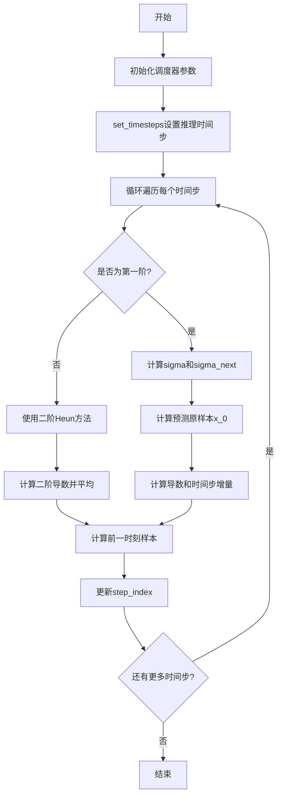
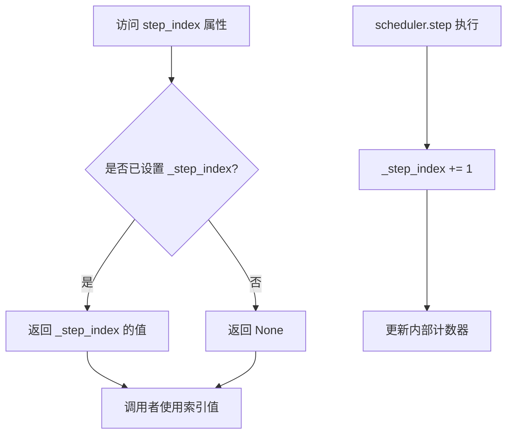
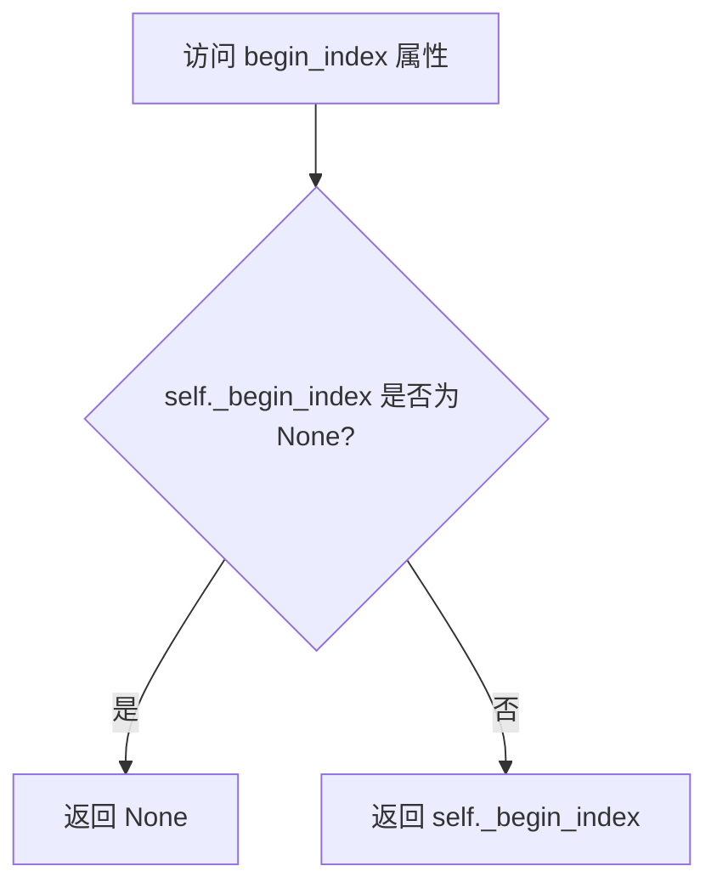
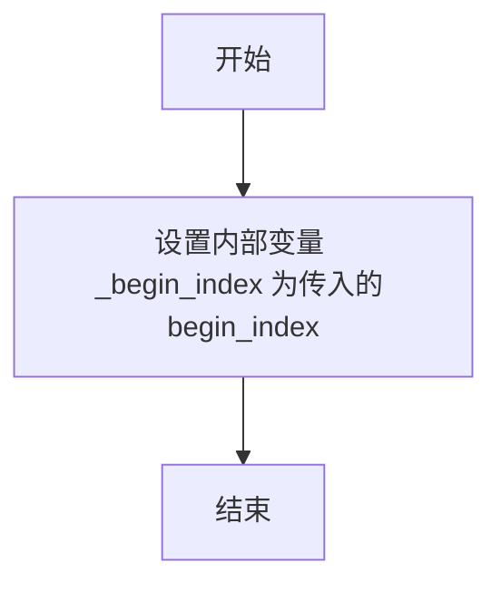
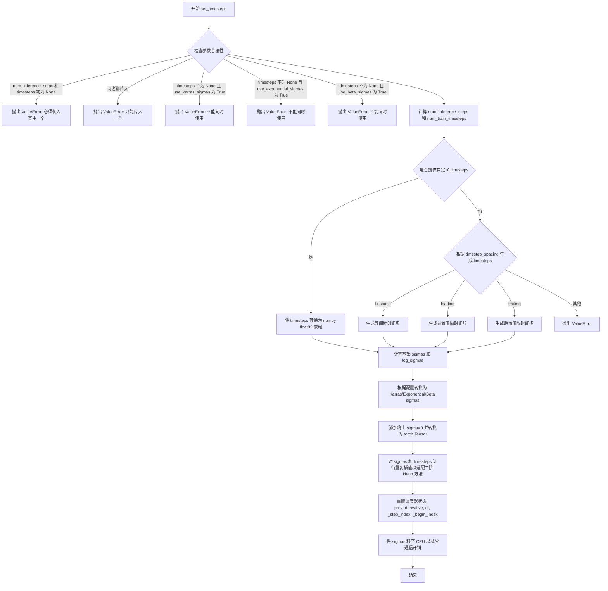
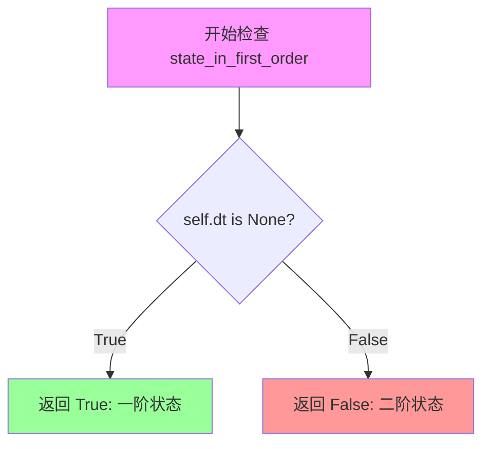
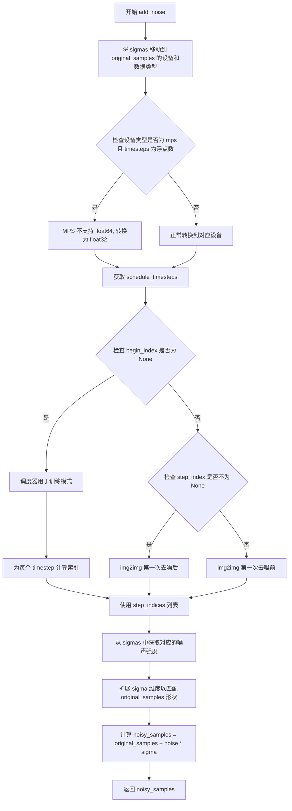

# `diffusers\src\diffusers\schedulers\scheduling_heun_discrete.py` 详细设计文档

HeunDiscreteScheduler 是一个基于 Heun 方法的离散时间扩散模型采样调度器，支持多种噪声调度策略（Karras、指数、Beta），通过二阶方法来更准确地预测去噪样本。

## 整体流程



## 类结构

```
BaseOutput (基类)
├── HeunDiscreteSchedulerOutput (数据类)
SchedulerMixin (混入类)
├── HeunDiscreteScheduler
ConfigMixin (混入类)
└── HeunDiscreteScheduler
```

## 全局变量及字段


### `betas_for_alpha_bar`
    
创建离散beta调度表的函数，根据alpha变换类型生成beta序列

类型：`function`
    


### `HeunDiscreteSchedulerOutput`
    
调度器step函数输出数据类，包含前一步样本和预测的原样本

类型：`dataclass`
    


### `HeunDiscreteScheduler`
    
使用Heun离散方法进行扩散过程调度的调度器类

类型：`class`
    


### `_compatibles`
    
类属性，记录兼容的Karras扩散调度器列表

类型：`list[str]`
    


### `order`
    
类属性，表示调度器的阶数（Heun方法为2阶）

类型：`int`
    


### `HeunDiscreteSchedulerOutput.prev_sample`
    
前一步计算得到的样本

类型：`torch.Tensor`
    


### `HeunDiscreteSchedulerOutput.pred_original_sample`
    
预测的原样本用于预览

类型：`torch.Tensor | None`
    


### `HeunDiscreteScheduler.betas`
    
Beta值序列

类型：`torch.Tensor`
    


### `HeunDiscreteScheduler.alphas`
    
Alpha值序列

类型：`torch.Tensor`
    


### `HeunDiscreteScheduler.alphas_cumprod`
    
累积Alpha值

类型：`torch.Tensor`
    


### `HeunDiscreteScheduler.sigmas`
    
Sigma值序列

类型：`torch.Tensor`
    


### `HeunDiscreteScheduler.timesteps`
    
时间步序列

类型：`torch.Tensor`
    


### `HeunDiscreteScheduler._step_index`
    
当前步骤索引

类型：`int | None`
    


### `HeunDiscreteScheduler._begin_index`
    
起始索引

类型：`int | None`
    


### `HeunDiscreteScheduler.prev_derivative`
    
前一步导数

类型：`torch.Tensor | None`
    


### `HeunDiscreteScheduler.dt`
    
时间步增量

类型：`torch.Tensor | None`
    


### `HeunDiscreteScheduler.sample`
    
当前样本缓存

类型：`torch.Tensor | None`
    


### `HeunDiscreteScheduler.num_inference_steps`
    
推理步数

类型：`int`
    


### `HeunDiscreteScheduler.use_karras_sigmas`
    
是否使用Karras sigmas

类型：`bool`
    
    

## 全局函数及方法


### `betas_for_alpha_bar`

创建beta调度表，将给定的alpha_t_bar函数进行离散化处理。该函数定义了一个alpha_bar函数，接受参数t并将其转换为扩散过程中(1-beta)的累积乘积。

参数：

- `num_diffusion_timesteps`：`int`，要生成的beta数量
- `max_beta`：`float`，默认为`0.999`，使用的最大beta值；使用低于1的值以避免数值不稳定
- `alpha_transform_type`：`Literal["cosine", "exp", "laplace"]`，默认为`"cosine"`，`alpha_bar`的噪声调度类型，可选`cosine`、`exp`或`laplace`

返回值：`torch.Tensor`，调度器用于逐步模型输出的beta值

#### 流程图

```mermaid
flowchart TD
    A[Start betas_for_alpha_bar] --> B{alpha_transform_type == 'cosine'?}
    B -->|Yes| C[定义 alpha_bar_fn: cos((t+0.008)/1.008*π/2)²]
    B -->|No| D{alpha_transform_type == 'laplace'?}
    D -->|Yes| E[定义 alpha_bar_fn: sqrt(snr/(1+snr))]
    D -->|No| F{alpha_transform_type == 'exp'?}
    F -->|Yes| G[定义 alpha_bar_fn: exp(t*-12.0)]
    F -->|No| H[抛出 ValueError: Unsupported alpha_transform_type]
    C --> I[初始化空 betas 列表]
    E --> I
    G --> I
    I --> J[for i in range(num_diffusion_timesteps)]
    J --> K[t1 = i / num_diffusion_timesteps]
    K --> L[t2 = (i + 1) / num_diffusion_timesteps]
    L --> M[beta = min(1 - alpha_bar_fn(t2) / alpha_bar_fn(t1), max_beta)]
    M --> N[将 beta 添加到 betas 列表]
    N --> O{还有更多迭代?}
    O -->|Yes| J
    O -->|No| P[返回 torch.tensor(betas, dtype=torch.float32)]
```

#### 带注释源码

```python
# Copied from diffusers.schedulers.scheduling_ddpm.betas_for_alpha_bar
def betas_for_alpha_bar(
    num_diffusion_timesteps: int,
    max_beta: float = 0.999,
    alpha_transform_type: Literal["cosine", "exp", "laplace"] = "cosine",
) -> torch.Tensor:
    """
    Create a beta schedule that discretizes the given alpha_t_bar function, which defines the cumulative product of
    (1-beta) over time from t = [0,1].

    Contains a function alpha_bar that takes an argument t and transforms it to the cumulative product of (1-beta) up
    to that part of the diffusion process.

    Args:
        num_diffusion_timesteps (`int`):
            The number of betas to produce.
        max_beta (`float`, defaults to `0.999`):
            The maximum beta to use; use values lower than 1 to avoid numerical instability.
        alpha_transform_type (`str`, defaults to `"cosine"`):
            The type of noise schedule for `alpha_bar`. Choose from `cosine`, `exp`, or `laplace`.

    Returns:
        `torch.Tensor`:
            The betas used by the scheduler to step the model outputs.
    """
    # 根据 alpha_transform_type 选择对应的 alpha_bar_fn 函数
    if alpha_transform_type == "cosine":
        # 余弦调度：使用 cos 函数构建 alpha_bar
        def alpha_bar_fn(t):
            return math.cos((t + 0.008) / 1.008 * math.pi / 2) ** 2

    elif alpha_transform_type == "laplace":
        # 拉普拉斯调度：基于拉普拉斯分布的 SNR
        def alpha_bar_fn(t):
            lmb = -0.5 * math.copysign(1, 0.5 - t) * math.log(1 - 2 * math.fabs(0.5 - t) + 1e-6)
            snr = math.exp(lmb)
            return math.sqrt(snr / (1 + snr))

    elif alpha_transform_type == "exp":
        # 指数调度：使用指数衰减函数
        def alpha_bar_fn(t):
            return math.exp(t * -12.0)

    else:
        raise ValueError(f"Unsupported alpha_transform_type: {alpha_transform_type}")

    # 初始化 beta 列表
    betas = []
    # 遍历每个扩散时间步
    for i in range(num_diffusion_timesteps):
        t1 = i / num_diffusion_timesteps  # 当前时间步的归一化值
        t2 = (i + 1) / num_diffusion_timesteps  # 下一个时间步的归一化值
        # 计算 beta：确保不超过 max_beta 以避免数值不稳定
        betas.append(min(1 - alpha_bar_fn(t2) / alpha_bar_fn(t1), max_beta))
    
    # 将 beta 列表转换为 PyTorch float32 张量返回
    return torch.tensor(betas, dtype=torch.float32)
```


### `HeunDiscreteScheduler.__init__`

HeunDiscreteScheduler的初始化方法，负责配置离散beta调度器的所有参数，包括beta值计算、alpha累积积计算、时间步设置以及内部状态变量的初始化。

参数：

- `num_train_timesteps`：`int`，默认值1000，扩散模型训练时的总步数
- `beta_start`：`float`，默认值0.00085，推理时beta调度器的起始值
- `beta_end`：`float`，默认值0.012，推理时beta调度器的结束值
- `beta_schedule`：`str`，默认值"linear"，beta调度策略，可选"linear", "scaled_linear", "squaredcos_cap_v2", "exp"
- `trained_betas`：`np.ndarray | list[float] | None`，可选，直接传入的beta数组，若提供则忽略beta_start和beta_end
- `prediction_type`：`str`，默认值"epsilon"，调度器预测类型，可选"epsilon", "sample", "v_prediction"
- `use_karras_sigmas`：`bool`，默认值False，是否使用Karras sigmas作为噪声调度
- `use_exponential_sigmas`：`bool`，默认值False，是否使用指数sigmas作为噪声调度
- `use_beta_sigmas`：`bool`，默认值False，是否使用beta sigmas作为噪声调度
- `clip_sample`：`bool`，默认值False，是否对预测样本进行裁剪以保证数值稳定性
- `clip_sample_range`：`float`，默认值1.0，样本裁剪的范围，仅当clip_sample为True时有效
- `timestep_spacing`：`Literal["linspace", "leading", "trailing"]`，默认值"linspace"，时间步的间距策略
- `steps_offset`：`int`，默认值0，推理步数的偏移量，某些模型家族需要

返回值：`None`，无返回值，该方法仅进行对象状态初始化

#### 流程图

```mermaid
flowchart TD
    A[开始 __init__] --> B{检查 beta sigmas 配置}
    B --> C{use_beta_sigmas 为 True 但 scipy 不可用?}
    C -->|是| D[抛出 ImportError]
    C -->|否| E{多个 sigma 选项同时为 True?}
    E -->|是| F[抛出 ValueError]
    E -->|否| G{trained_betas 是否提供?}
    
    G -->|是| H[使用 trained_betas 创建 betas tensor]
    G -->|否| I{beta_schedule 类型}
    I -->|linear| J[使用 torch.linspace 创建线性 betas]
    I -->|scaled_linear| K[使用平方根线性插值创建 betas]
    I -->|squaredcos_cap_v2| L[使用 cosine alpha_bar 创建 betas]
    I -->|exp| M[使用指数 alpha_bar 创建 betas]
    I -->|其他| N[抛出 NotImplementedError]
    
    H --> O[计算 alphas = 1.0 - betas]
    J --> O
    K --> O
    L --> O
    M --> O
    O --> P[计算 alphas_cumprod = cumprod(alphas)]
    P --> Q[调用 set_timesteps 初始化时间步]
    Q --> R[设置 use_karras_sigmas 属性]
    R --> S[初始化 _step_index 和 _begin_index 为 None]
    S --> T[将 sigmas 移至 CPU 以减少通信]
    T --> U[结束 __init__]
```

#### 带注释源码

```python
@register_to_config
def __init__(
    self,
    num_train_timesteps: int = 1000,  # 扩散训练的总步数，默认1000
    beta_start: float = 0.00085,      # beta起始值，默认0.00085
    beta_end: float = 0.012,          # beta结束值，默认0.012
    beta_schedule: str = "linear",    # beta调度策略
    trained_betas: np.ndarray | list[float] | None = None,  # 可选的预定义beta数组
    prediction_type: str = "epsilon", # 预测类型：epsilon/sample/v_prediction
    use_karras_sigmas: bool = False,  # 是否使用Karras噪声调度
    use_exponential_sigmas: bool = False,  # 是否使用指数噪声调度
    use_beta_sigmas: bool = False,    # 是否使用beta噪声调度
    clip_sample: bool = False,        # 是否裁剪样本
    clip_sample_range: float = 1.0,   # 裁剪范围
    timestep_spacing: Literal["linspace", "leading", "trailing"] = "linspace",  # 时间步间距策略
    steps_offset: int = 0,            # 步数偏移量
) -> None:
    # 检查是否安装了scipy库（beta sigmas需要）
    if self.config.use_beta_sigmas and not is_scipy_available():
        raise ImportError("Make sure to install scipy if you want to use beta sigmas.")
    
    # 确保只有一个sigma选项被启用
    if sum([self.config.use_beta_sigmas, self.config.use_exponential_sigmas, self.config.use_karras_sigmas]) > 1:
        raise ValueError(
            "Only one of `config.use_beta_sigmas`, `config.use_exponential_sigmas`, `config.use_karras_sigmas` can be used."
        )
    
    # 根据不同策略初始化betas
    if trained_betas is not None:
        # 直接使用提供的beta数组
        self.betas = torch.tensor(trained_betas, dtype=torch.float32)
    elif beta_schedule == "linear":
        # 线性beta调度
        self.betas = torch.linspace(beta_start, beta_end, num_train_timesteps, dtype=torch.float32)
    elif beta_schedule == "scaled_linear":
        # 针对潜在扩散模型的特定调度
        self.betas = torch.linspace(beta_start**0.5, beta_end**0.5, num_train_timesteps, dtype=torch.float32) ** 2
    elif beta_schedule == "squaredcos_cap_v2":
        # Glide余弦调度
        self.betas = betas_for_alpha_bar(num_train_timesteps, alpha_transform_type="cosine")
    elif beta_schedule == "exp":
        # 指数调度
        self.betas = betas_for_alpha_bar(num_train_timesteps, alpha_transform_type="exp")
    else:
        raise NotImplementedError(f"{beta_schedule} is not implemented for {self.__class__}")

    # 计算alphas和累积alphas
    self.alphas = 1.0 - self.betas
    self.alphas_cumprod = torch.cumprod(self.alphas, dim=0)

    # 初始化时间步和相关变量
    self.set_timesteps(num_train_timesteps, None, num_train_timesteps)
    self.use_karras_sigmas = use_karras_sigmas

    # 初始化步进索引
    self._step_index = None
    self._begin_index = None
    # 将sigmas移至CPU以减少CPU/GPU通信开销
    self.sigmas = self.sigmas.to("cpu")
```


### `HeunDiscreteScheduler.index_for_timestep`

该方法用于在时间步调度序列中查找给定时间步值的索引位置。对于去噪调度的第一个步骤，如果存在多个匹配项，则返回第二个索引，以避免在调度中间开始时（例如图像到图像任务）意外跳过 sigma 值。

参数：

- `timestep`：`float | torch.Tensor`，要查找的时间步值
- `schedule_timesteps`：`torch.Tensor | None`，要搜索的时间步调度序列。如果为 `None`，则使用 `self.timesteps`

返回值：`int`，时间步在调度序列中的索引。对于第一个步骤，如果存在多个匹配项，返回第二个索引以避免在调度中间开始时跳过 sigma 值

#### 流程图

```mermaid
flowchart TD
    A[Start index_for_timestep] --> B{schedule_timesteps is None?}
    B -->|Yes| C[Use self.timesteps as schedule_timesteps]
    B -->|No| D[Use provided schedule_timesteps]
    C --> E[Find indices where schedule_timesteps == timestep]
    D --> E
    E --> F{len<br/>indices > 1?}
    F -->|Yes| G[pos = 1<br/>Use second index]
    F -->|No| H[pos = 0<br/>Use first/last index]
    G --> I[Return indices[pos].item<br/>as integer]
    H --> I
```

#### 带注释源码

```python
def index_for_timestep(
    self, timestep: float | torch.Tensor, schedule_timesteps: torch.Tensor | None = None
) -> int:
    """
    Find the index of a given timestep in the timestep schedule.

    Args:
        timestep (`float` or `torch.Tensor`):
            The timestep value to find in the schedule.
        schedule_timesteps (`torch.Tensor`, *optional*):
            The timestep schedule to search in. If `None`, uses `self.timesteps`.

    Returns:
        `int`:
            The index of the timestep in the schedule. For the very first step, returns the second index if
            multiple matches exist to avoid skipping a sigma when starting mid-schedule (e.g., for image-to-image).
    """
    # 如果未提供调度时间步，则使用实例的 timesteps 属性
    if schedule_timesteps is None:
        schedule_timesteps = self.timesteps

    # 查找与给定时间步匹配的所有索引位置
    # 使用 nonzero() 获取满足条件的索引张量
    indices = (schedule_timesteps == timestep).nonzero()

    # The sigma index that is taken for the **very** first `step`
    # is always the second index (or the last index if there is only 1)
    # This way we can ensure we don't accidentally skip a sigma in
    # case we start in the middle of the denoising schedule (e.g. for image-to-image)
    
    # 对于调度中的第一个步骤，如果有多个匹配项，返回第二个索引
    # 这样可以确保在去噪调度中间开始时不会意外跳过 sigma
    pos = 1 if len(indices) > 1 else 0

    # 将索引转换为 Python 整数并返回
    return indices[pos].item()
```


### `HeunDiscreteScheduler.init_noise_sigma`

该属性用于获取离散Heun调度器在推理开始时的初始噪声标准差，根据时间步间隔策略返回不同的计算值。

参数：此属性无需显式参数，通过类实例 `self` 访问。

返回值：`torch.Tensor` 或 `float`，返回初始噪声分布的标准差，用于推理过程的初始噪声采样。

#### 流程图

```mermaid
flowchart TD
    A[开始访问 init_noise_sigma] --> B{检查 self.config.timestep_spacing}
    B -->|linspace 或 trailing| C[返回 self.sigmas.max]
    B -->|其他情况| D[返回 sqrt(sigmas_max² + 1)]
    C --> E[结束]
    D --> E
```

#### 带注释源码

```python
@property
def init_noise_sigma(self):
    # 获取初始噪声分布的标准差
    # standard deviation of the initial noise distribution
    
    # 根据时间步间隔策略选择计算方式
    if self.config.timestep_spacing in ["linspace", "trailing"]:
        # 对于 linspace 和 trailing 策略，直接返回 sigmas 的最大值
        return self.sigmas.max()

    # 对于其他策略（如 leading），使用平方和开根号的公式计算
    # 这个公式对应于 v_prediction 类型中的 sigma_hat 计算
    return (self.sigmas.max() ** 2 + 1) ** 0.5
```


### `HeunDiscreteScheduler.step_index`

这是一个属性（Property），用于获取当前时间步的索引计数器。该索引在每次调度器执行步骤后会自动加1，用于跟踪扩散过程中的当前迭代位置。

参数：无（属性不接受参数）

返回值：`int`，返回当前时间步的索引值。如果调度器尚未执行任何步骤，则返回 `None`。

#### 流程图



#### 带注释源码

```python
@property
def step_index(self):
    """
    The index counter for current timestep. It will increase 1 after each scheduler step.
    """
    return self._step_index
```

#### 详细说明

1. **属性类型**：这是一个只读的属性（read-only property），通过 `@property` 装饰器实现
2. **内部变量**：该属性返回内部变量 `self._step_index`，该变量在以下时机被设置和更新：
   - 在 `set_timesteps` 方法中被初始化为 `None`
   - 在 `_init_step_index` 方法中被设置为具体的索引值
   - 在 `step` 方法执行后自动增加 1（`self._step_index += 1`）
3. **与 begin_index 的关系**：
   - `step_index` 用于追踪当前的推理步骤
   - `begin_index` 用于设置推理的起始索引
   - 如果 `begin_index` 已设置，`step_index` 将从 `begin_index` 开始
4. **使用场景**：该属性通常在 `scale_model_input` 和 `step` 方法开始时被检查，以确保调度器已正确初始化


### `HeunDiscreteScheduler.begin_index`

这是一个属性方法（property），用于获取调度器的第一时间步索引。该索引用于指定推理过程的起始步骤，通常由 pipeline 通过 `set_begin_index` 方法进行设置。

参数： 无

返回值：`int | None`，第一时间步的索引。如果尚未通过 `set_begin_index` 方法设置，则返回 `None`。

#### 流程图



#### 带注释源码

```python
@property
def begin_index(self):
    """
    The index for the first timestep. It should be set from pipeline with `set_begin_index` method.
    """
    # 返回内部私有属性 _begin_index 的值
    # 该值通过 set_begin_index 方法设置，用于指定推理的起始步骤索引
    return self._begin_index
```

#### 相关上下文信息

- **私有属性初始化**：在 `__init__` 方法中初始化为 `None`：
  ```python
  self._begin_index = None
  ```

- **设置方法**：通过 `set_begin_index` 方法设置值：
  ```python
  def set_begin_index(self, begin_index: int = 0) -> None:
      """
      Sets the begin index for the scheduler. This function should be run from pipeline before the inference.
      """
      self._begin_index = begin_index
  ```

- **使用场景**：在 `add_noise` 方法和 `_init_step_index` 方法中用于判断当前处于哪个推理步骤：
  - `add_noise` 中：如果 `begin_index` 为 `None`，则使用 `index_for_timestep` 计算步骤索引；否则使用 `begin_index` 或 `step_index`
  - `_init_step_index` 中：如果 `begin_index` 已设置，则使用 `_begin_index` 作为步骤索引


### `HeunDiscreteScheduler.set_begin_index`

设置调度器的起始索引。该方法应在推理前从 pipeline 调用，用于指定调度器从哪个时间步开始执行。

参数：
- `begin_index`：`int`，默认值 `0`，调度器的起始索引。

返回值：`None`，无返回值。

#### 流程图



#### 带注释源码

```python
def set_begin_index(self, begin_index: int = 0) -> None:
    """
    Sets the begin index for the scheduler. This function should be run from pipeline before the inference.

    Args:
        begin_index (`int`, defaults to `0`):
            The begin index for the scheduler.
    """
    self._begin_index = begin_index
```


### `HeunDiscreteScheduler.scale_model_input`

该方法用于根据当前时间步对输入样本进行缩放，以确保与需要根据时间步调整去噪模型输入的调度器互换使用。它通过将样本除以 $\sqrt{\sigma^2 + 1}$ 来实现缩放，其中 $\sigma$ 是当前时间步对应的噪声标准差。

参数：

- `self`：`HeunDiscreteScheduler` 实例本身
- `sample`：`torch.Tensor`，输入的样本张量
- `timestep`：`float | torch.Tensor`，扩散链中的当前时间步

返回值：`torch.Tensor`，缩放后的输入样本

#### 流程图

```mermaid
flowchart TD
    A[开始 scale_model_input] --> B{step_index 是否为 None?}
    B -->|是| C[调用 _init_step_index 初始化 step_index]
    B -->|否| D[直接获取 sigma]
    C --> D
    D --> E[获取当前 step_index 对应的 sigma 值]
    E --> F[计算缩放因子: sample / sqrt(sigma² + 1)]
    F --> G[返回缩放后的样本]
```

#### 带注释源码

```python
def scale_model_input(
    self,
    sample: torch.Tensor,
    timestep: float | torch.Tensor,
) -> torch.Tensor:
    """
    Ensures interchangeability with schedulers that need to scale the denoising model input depending on the
    current timestep.

    Args:
        sample (`torch.Tensor`):
            The input sample.
        timestep (`float` or `torch.Tensor`):
            The current timestep in the diffusion chain.

    Returns:
        `torch.Tensor`:
            A scaled input sample.
    """
    # 如果 step_index 未初始化，则根据当前 timestep 初始化它
    # 这确保了调度器知道当前处于扩散过程的哪个步骤
    if self.step_index is None:
        self._init_step_index(timestep)

    # 获取当前步骤对应的 sigma 值（噪声标准差）
    # sigmas 数组存储了从初始噪声到纯图像的整个噪声级别 schedule
    sigma = self.sigmas[self.step_index]
    
    # 根据扩散模型的方差保持（variance preserving）特性对输入进行缩放
    # 除以 sqrt(sigma² + 1) 确保输入样本被正确缩放以匹配模型预期
    # 这对应于公式: x = x / sqrt(sigma² + 1)
    sample = sample / ((sigma**2 + 1) ** 0.5)
    
    # 返回缩放后的样本，准备好传递给去噪模型
    return sample
```


### `HeunDiscreteScheduler.set_timesteps`

该方法用于设置离散的时间步（timesteps），这些时间步将在推理（inference）之前使用。它根据 `num_inference_steps`、`timestep_spacing` 配置以及可选的自定义时间步列表来生成推理阶段的时间步序列，并同时计算对应的 sigma 值（噪声水平），为扩散模型的采样过程做准备。

参数：

- `num_inference_steps`：`int | None`，推理时使用的扩散步数，用于生成样本。如果为 `None`，则必须提供 `timesteps`。
- `device`：`str | torch.device`，时间步和 sigma 值要移动到的设备。如果为 `None`，则不移动。
- `num_train_timesteps`：`int | None`，训练时的扩散步数。如果为 `None`，则使用配置中的 `num_train_timesteps`。
- `timesteps`：`list[int] | None`，自定义的时间步列表，用于支持任意间隔。如果提供此参数，则 `num_inference_steps` 必须为 `None`，且忽略 `timestep_spacing` 属性。

返回值：`None`，该方法直接修改调度器的内部状态（`self.timesteps`、`self.sigmas` 等），不返回任何值。

#### 流程图



#### 带注释源码

```python
def set_timesteps(
    self,
    num_inference_steps: int | None = None,
    device: str | torch.device = None,
    num_train_timesteps: int | None = None,
    timesteps: list[int] | None = None,
):
    """
    Sets the discrete timesteps used for the diffusion chain (to be run before inference).

    Args:
        num_inference_steps (`int`, *optional*, defaults to `None`):
            The number of diffusion steps used when generating samples with a pre-trained model.
        device (`str`, `torch.device`, *optional*, defaults to `None`):
            The device to which the timesteps should be moved to. If `None`, the timesteps are not moved.
        num_train_timesteps (`int`, *optional*, defaults to `None`):
            The number of diffusion steps used when training the model. If `None`, the default
            `num_train_timesteps` attribute is used.
        timesteps (`list[int]`, *optional*):
            Custom timesteps used to support arbitrary spacing between timesteps. If `None`, timesteps will be
            generated based on the `timestep_spacing` attribute. If `timesteps` is passed, `num_inference_steps`
            must be `None`, and `timestep_spacing` attribute will be ignored.
    """
    # 校验参数：num_inference_steps 和 timesteps 必须且只能提供一个
    if num_inference_steps is None and timesteps is None:
        raise ValueError("Must pass exactly one of `num_inference_steps` or `custom_timesteps`.")
    if num_inference_steps is not None and timesteps is not None:
        raise ValueError("Can only pass one of `num_inference_steps` or `custom_timesteps`.")
    
    # 校验自定义时间步与特殊 sigma 选项的兼容性
    if timesteps is not None and self.config.use_karras_sigmas:
        raise ValueError("Cannot use `timesteps` with `config.use_karras_sigmas = True`")
    if timesteps is not None and self.config.use_exponential_sigmas:
        raise ValueError("Cannot set `timesteps` with `config.use_exponential_sigmas = True`.")
    if timesteps is not None and self.config.use_beta_sigmas:
        raise ValueError("Cannot set `timesteps` with `config.use_beta_sigmas = True`.")

    # 确定推理步数和训练步数
    num_inference_steps = num_inference_steps or len(timesteps)
    self.num_inference_steps = num_inference_steps
    num_train_timesteps = num_train_timesteps or self.config.num_train_timesteps

    # 处理时间步生成：自定义或基于 spacing 策略
    if timesteps is not None:
        timesteps = np.array(timesteps, dtype=np.float32)
    else:
        # "linspace", "leading", "trailing" 对应于 Common Diffusion Noise Schedules 论文的表 2
        if self.config.timestep_spacing == "linspace":
            # 等间距生成，从最大时间步递减
            timesteps = np.linspace(0, num_train_timesteps - 1, num_inference_steps, dtype=np.float32)[::-1].copy()
        elif self.config.timestep_spacing == "leading":
            # 前置间隔，步长较大，用于更aggressive的去噪
            step_ratio = num_train_timesteps // self.num_inference_steps
            timesteps = (np.arange(0, num_inference_steps) * step_ratio).round()[::-1].copy().astype(np.float32)
            timesteps += self.config.steps_offset
        elif self.config.timestep_spacing == "trailing":
            # 后置间隔，步长较小，用于更精细的去噪
            step_ratio = num_train_timesteps / self.num_inference_steps
            timesteps = (np.arange(num_train_timesteps, 0, -step_ratio)).round().copy().astype(np.float32)
            timesteps -= 1
        else:
            raise ValueError(
                f"{self.config.timestep_spacing} is not supported. Please make sure to choose one of 'linspace', 'leading' or 'trailing'."
            )

    # 计算基础 sigma 序列：基于 alpha_cumprod 的噪声水平
    sigmas = np.array(((1 - self.alphas_cumprod) / self.alphas_cumprod) ** 0.5)
    log_sigmas = np.log(sigmas)
    # 将时间步映射到 sigma 空间
    sigmas = np.interp(timesteps, np.arange(0, len(sigmas)), sigmas)

    # 根据配置应用特殊的 sigma 转换策略（Karras/Exponential/Beta）
    if self.config.use_karras_sigmas:
        # 使用 Karras 噪声调度（Elucidating the Design Space 论文）
        sigmas = self._convert_to_karras(in_sigmas=sigmas, num_inference_steps=self.num_inference_steps)
        timesteps = np.array([self._sigma_to_t(sigma, log_sigmas) for sigma in sigmas])
    elif self.config.use_exponential_sigmas:
        # 使用指数 sigma 调度
        sigmas = self._convert_to_exponential(in_sigmas=sigmas, num_inference_steps=num_inference_steps)
        timesteps = np.array([self._sigma_to_t(sigma, log_sigmas) for sigma in sigmas])
    elif self.config.use_beta_sigmas:
        # 使用 Beta 分布采样调度（Beta Sampling is All You Need 论文）
        sigmas = self._convert_to_beta(in_sigmas=sigmas, num_inference_steps=num_inference_steps)
        timesteps = np.array([self._sigma_to_t(sigma, log_sigmas) for sigma in sigmas])

    # 添加终止点 sigma=0，并转换为 torch.Tensor
    sigmas = np.concatenate([sigmas, [0.0]]).astype(np.float32)
    sigmas = torch.from_numpy(sigmas).to(device=device)
    # Heun 方法是二阶的，需要对 sigmas 进行重复以匹配两步一个推理步的逻辑
    # 格式: [sigma_0, sigma_0, sigma_1, sigma_1, ..., sigma_n, sigma_n, 0]
    self.sigmas = torch.cat([sigmas[:1], sigmas[1:-1].repeat_interleave(2), sigmas[-1:]])

    # 同样处理 timesteps 以保持对齐
    timesteps = torch.from_numpy(timesteps)
    timesteps = torch.cat([timesteps[:1], timesteps[1:].repeat_interleave(2)])

    self.timesteps = timesteps.to(device=device, dtype=torch.float32)

    # 重置内部状态，为新的推理链做准备
    self.prev_derivative = None
    self.dt = None

    self._step_index = None
    self._begin_index = None
    # 将 sigmas 保留在 CPU 端以减少设备间通信开销
    self.sigmas = self.sigmas.to("cpu")
```


### `HeunDiscreteScheduler._sigma_to_t`

将 sigma 值通过插值转换为对应的时间步（timestep）值。该函数是离散调度器的核心辅助方法，用于在不同的噪声 sigma 空间和时间步空间之间进行映射转换。

参数：

- `self`：`HeunDiscreteScheduler`，调度器实例
- `sigma`：`np.ndarray`，要转换为时间步的 sigma 值（可以是标量或数组）
- `log_sigmas`：`np.ndarray`，sigma 计划的对数值，用于插值查找

返回值：`np.ndarray`，与输入 sigma 形状相同的插值后时间步值

#### 流程图

```mermaid
flowchart TD
    A[开始: _sigma_to_t] --> B[计算 log_sigma = log maxsigma, 1e-10]
    B --> C[计算 dists = log_sigma - log_sigmas[:, np.newaxis]]
    C --> D[通过 cumsum 和 argmax 找到 low_idx]
    D --> E[计算 high_idx = low_idx + 1]
    E --> F[获取 low = log_sigmas[low_idx], high = log_sigmas[high_idx]]
    F --> G[计算插值权重 w = (low - log_sigma) / (low - high)]
    G --> H[将权重裁剪到 0, 1 范围: w = clipw, 0, 1]
    H --> I[计算时间步 t = (1-w)*low_idx + w*high_idx]
    I --> J[重塑输出形状: t = t.reshape sigma.shape]
    J --> K[返回时间步数组]
```

#### 带注释源码

```python
def _sigma_to_t(self, sigma: np.ndarray, log_sigmas: np.ndarray) -> np.ndarray:
    """
    Convert sigma values to corresponding timestep values through interpolation.

    Args:
        sigma (`np.ndarray`):
            The sigma value(s) to convert to timestep(s).
        log_sigmas (`np.ndarray`):
            The logarithm of the sigma schedule used for interpolation.

    Returns:
        `np.ndarray`:
            The interpolated timestep value(s) corresponding to the input sigma(s).
    """
    # Step 1: 计算 sigma 的对数值，使用 max(sigma, 1e-10) 避免 log(0)
    log_sigma = np.log(np.maximum(sigma, 1e-10))

    # Step 2: 计算 log_sigma 与 log_sigmas 数组中每个值的差值
    # 结果形状: (len(log_sigmas), len(sigma))
    dists = log_sigma - log_sigmas[:, np.newaxis]

    # Step 3: 找到 sigma 在 log_sigmas 序列中的位置区间
    # cumsum 计算累积和，argmax 找到第一个正值的位置（即 low_idx）
    # clip 确保索引不超出边界（最大为 len(log_sigmas) - 2）
    low_idx = np.cumsum((dists >= 0), axis=0).argmax(axis=0).clip(max=log_sigmas.shape[0] - 2)
    
    # high_idx 是 low_idx 的下一个索引
    high_idx = low_idx + 1

    # Step 4: 获取区间边界对应的 log_sigma 值
    low = log_sigmas[low_idx]
    high = log_sigmas[high_idx]

    # Step 5: 计算线性插值权重 w
    # w 越接近 0 表示越接近 low 边界，越接近 1 表示越接近 high 边界
    w = (low - log_sigma) / (low - high)
    
    # Step 6: 将权重裁剪到 [0, 1] 范围，确保插值结果有效
    w = np.clip(w, 0, 1)

    # Step 7: 将插值权重转换为时间步值
    # 使用线性插值公式: t = (1-w)*low_idx + w*high_idx
    t = (1 - w) * low_idx + w * high_idx
    
    # Step 8: 重塑输出以匹配输入 sigma 的形状
    t = t.reshape(sigma.shape)
    
    # 返回插值得到的时间步值
    return t
```


### `HeunDiscreteScheduler._convert_to_karras`

该方法用于构建基于 Karras 噪声调度器的 sigma 值序列，根据 Elucidating the Design Space of Diffusion-Based Generative Models 论文中的方法，将输入的 sigma 值转换为符合 Karras 噪声调度策略的新序列。

参数：

- `self`：`HeunDiscreteScheduler`，调度器实例本身
- `in_sigmas`：`torch.Tensor`，输入的 sigma 值序列，用于转换为 Karras 噪声调度
- `num_inference_steps`：`int`，推理步数，用于生成噪声调度的步数

返回值：`torch.Tensor`，转换后的 sigma 值序列，遵循 Karras 噪声调度规则

#### 流程图

```mermaid
flowchart TD
    A[开始 _convert_to_karras] --> B{config 是否有 sigma_min}
    B -->|是| C[sigma_min = config.sigma_min]
    B -->|否| D[sigma_min = None]
    C --> E{config 是否有 sigma_max}
    D --> E
    E -->|是| F[sigma_max = config.sigma_max]
    E -->|否| G[sigma_max = None]
    F --> H{sigma_min 不为 None}
    G --> H
    H -->|是| I[使用 config.sigma_min]
    H -->|否| J[使用 in_sigmas 最后一个值]
    I --> K
    J --> K{sigma_max 不为 None}
    K -->|是| L[使用 config.sigma_max]
    K -->|否| M[使用 in_sigmas 第一个值]
    L --> N[设置 rho = 7.0]
    M --> N
    N --> O[生成 0 到 1 的线性间隔 ramp]
    O --> P[计算 min_inv_rho 和 max_inv_rho]
    P --> Q[计算 sigmas = (max_inv_rho + ramp * (min_inv_rho - max_inv_rho)) ** rho]
    Q --> R[返回转换后的 sigmas]
```

#### 带注释源码

```python
# Copied from diffusers.schedulers.scheduling_euler_discrete.EulerDiscreteScheduler._convert_to_karras
def _convert_to_karras(self, in_sigmas: torch.Tensor, num_inference_steps: int) -> torch.Tensor:
    """
    Construct the noise schedule as proposed in [Elucidating the Design Space of Diffusion-Based Generative
    Models](https://huggingface.co/papers/2206.00364).

    Args:
        in_sigmas (`torch.Tensor`):
            The input sigma values to be converted.
        num_inference_steps (`int`):
            The number of inference steps to generate the noise schedule for.

    Returns:
        `torch.Tensor`:
            The converted sigma values following the Karras noise schedule.
    """

    # Hack to make sure that other schedulers which copy this function don't break
    # TODO: Add this logic to the other schedulers
    # 检查配置中是否存在 sigma_min 属性（兼容性处理）
    if hasattr(self.config, "sigma_min"):
        sigma_min = self.config.sigma_min
    else:
        sigma_min = None

    # 检查配置中是否存在 sigma_max 属性（兼容性处理）
    if hasattr(self.config, "sigma_max"):
        sigma_max = self.config.sigma_max
    else:
        sigma_max = None

    # 如果配置中未指定，则使用输入 sigmas 的边界值
    # sigma_min 使用输入的最后一个 sigma（噪声最小）
    sigma_min = sigma_min if sigma_min is not None else in_sigmas[-1].item()
    # sigma_max 使用输入的第一个 sigma（噪声最大）
    sigma_max = sigma_max if sigma_max is not None else in_sigmas[0].item()

    rho = 7.0  # 7.0 is the value used in the paper
    # 生成从 0 到 1 的线性间隔，用于插值
    ramp = np.linspace(0, 1, num_inference_steps)
    # 计算 rho 的倒数，用于非线性变换
    min_inv_rho = sigma_min ** (1 / rho)
    max_inv_rho = sigma_max ** (1 / rho)
    # 根据 Karras 论文公式计算 sigma 序列
    # sigmas = (max_inv_rho + ramp * (min_inv_rho - max_inv_rho)) ** rho
    sigmas = (max_inv_rho + ramp * (min_inv_rho - max_inv_rho)) ** rho
    return sigmas
```


### `HeunDiscreteScheduler._convert_to_exponential`

该方法用于在 Heun 离散调度器中构建指数噪声调度（Exponential Noise Schedule），通过对数空间线性插值将输入的 sigma 值转换为符合指数衰减规律的噪声调度序列。

参数：

- `self`：HeunDiscreteScheduler 实例，调度器本身
- `in_sigmas`：`torch.Tensor`，输入的 sigma 值，用于转换为指数调度
- `num_inference_steps`：`int`，生成噪声调度所需的推理步数

返回值：`torch.Tensor`，遵循指数调度方案的转换后 sigma 值

#### 流程图

```mermaid
flowchart TD
    A[开始 _convert_to_exponential] --> B{self.config 是否有 sigma_min 属性}
    B -->|是| C[sigma_min = self.config.sigma_min]
    B -->|否| D[sigma_min = None]
    C --> E{self.config 是否有 sigma_max 属性}
    D --> E
    -->|是| F[sigma_max = self.config.sigma_max]
    -->|否| G[sigma_max = None]
    F --> H{sigma_min 不为 None}
    G --> H
    H -->|是| I[使用 sigma_min]
    H -->|否| J[sigma_min = in_sigmas[-1].item]
    I --> K{sigma_max 不为 None}
    J --> K
    -->|是| L[使用 sigma_max]
    -->|否| M[sigma_max = in_sigmas[0].item]
    L --> N[在对数空间线性插值生成 sigmas]
    M --> N
    N --> O[np.exp np.linspace math.log]
    O --> P[返回 sigmas 张量]
```

#### 带注释源码

```python
def _convert_to_exponential(self, in_sigmas: torch.Tensor, num_inference_steps: int) -> torch.Tensor:
    """
    Construct an exponential noise schedule.

    Args:
        in_sigmas (`torch.Tensor`):
            The input sigma values to be converted.
        num_inference_steps (`int`):
            The number of inference steps to generate the noise schedule for.

    Returns:
        `torch.Tensor`:
            The converted sigma values following an exponential schedule.
    """

    # Hack to make sure that other schedulers which copy this function don't break
    # TODO: Add this logic to the other schedulers
    # 检查配置中是否存在 sigma_min 属性（用于兼容其他调度器）
    if hasattr(self.config, "sigma_min"):
        sigma_min = self.config.sigma_min
    else:
        sigma_min = None

    # 检查配置中是否存在 sigma_max 属性
    if hasattr(self.config, "sigma_max"):
        sigma_max = self.config.sigma_max
    else:
        sigma_max = None

    # 如果配置中指定了 sigma_min 则使用配置值，否则使用输入 sigmas 的最后一个值（最小 sigma）
    sigma_min = sigma_min if sigma_min is not None else in_sigmas[-1].item()
    # 如果配置中指定了 sigma_max 则使用配置值，否则使用输入 sigmas 的第一个值（最大 sigma）
    sigma_max = sigma_max if sigma_max is not None else in_sigmas[0].item()

    # 在对数空间进行线性插值，生成指数分布的 sigma 值
    # 从 log(sigma_max) 到 log(sigma_min) 线性生成 num_inference_steps 个点
    # 然后取指数得到实际的 sigma 值，形成指数衰减调度
    sigmas = np.exp(np.linspace(math.log(sigma_max), math.log(sigma_min), num_inference_steps))
    return sigmas
```


### `HeunDiscreteScheduler._convert_to_beta`

该方法用于构建基于Beta分布的噪声调度表（Noise Schedule），通过Beta分布的逆累积分布函数（PPF）将噪声水平映射到指定的sigma范围内，实现一种新的噪声调度策略。

参数：

- `self`：`HeunDiscreteScheduler`实例，调用该方法的调度器对象
- `in_sigmas`：`torch.Tensor`，输入的sigma值序列，用于确定噪声调度的边界范围
- `num_inference_steps`：`int`，推理过程中的步数，用于生成噪声调度表的长度
- `alpha`：`float`，可选参数，默认值为0.6，Beta分布的alpha参数，控制噪声调度的起始分布形状
- `beta`：`float`，可选参数，默认值为0.6，Beta分布的beta参数，控制噪声调度的终止分布形状

返回值：`torch.Tensor`，返回转换后的sigma值序列，遵循Beta分布噪声调度

#### 流程图

```mermaid
flowchart TD
    A[开始 _convert_to_beta] --> B{config是否有sigma_min属性}
    B -->|是| C[sigma_min = config.sigma_min]
    B -->|否| D[sigma_min = None]
    C --> E{config是否有sigma_max属性}
    D --> E
    E -->|是| F[sigma_max = config.sigma_max]
    E -->|否| G[sigma_max = None]
    F --> H{sigma_min是否为None}
    G --> H
    H -->|是| I[sigma_min = in_sigmas最后一个值]
    H -->|否| J[sigma_min = sigma_min]
    J --> K{sigma_max是否为None}
    K -->|是| L[sigma_max = in_sigmas第一个值]
    K -->|否| M[sigma_max = sigma_max]
    I --> K
    L --> N[生成时间步序列1 - np.linspace]
    M --> N
    N --> O[对每个时间步调用scipy.stats.beta.ppf]
    O --> P[将PPF结果映射到[sigma_min, sigma_max]范围]
    P --> Q[返回转换后的sigmas数组]
    Q --> R[结束]
```

#### 带注释源码

```python
def _convert_to_beta(
    self, in_sigmas: torch.Tensor, num_inference_steps: int, alpha: float = 0.6, beta: float = 0.6
) -> torch.Tensor:
    """
    Construct a beta noise schedule as proposed in [Beta Sampling is All You
    Need](https://huggingface.co/papers/2407.12173).

    Args:
        in_sigmas (`torch.Tensor`):
            The input sigma values to be converted.
        num_inference_steps (`int`):
            The number of inference steps to generate the noise schedule for.
        alpha (`float`, *optional*, defaults to `0.6`):
            The alpha parameter for the beta distribution.
        beta (`float`, *optional*, defaults to `0.6`):
            The beta parameter for the beta distribution.

    Returns:
        `torch.Tensor`:
            The converted sigma values following a beta distribution schedule.
    """

    # Hack to make sure that other schedulers which copy this function don't break
    # TODO: Add this logic to the other schedulers
    # 检查配置中是否存在sigma_min属性，若存在则使用配置值，否则设为None
    if hasattr(self.config, "sigma_min"):
        sigma_min = self.config.sigma_min
    else:
        sigma_min = None

    # 检查配置中是否存在sigma_max属性，若存在则使用配置值，否则设为None
    if hasattr(self.config, "sigma_max"):
        sigma_max = self.config.sigma_max
    else:
        sigma_max = None

    # 如果sigma_min为None，则使用输入sigmas的最后一个值作为最小sigma
    sigma_min = sigma_min if sigma_min is not None else in_sigmas[-1].item()
    # 如果sigma_max为None，则使用输入sigmas的第一个值作为最大sigma
    sigma_max = sigma_max if sigma_max is not None else in_sigmas[0].item()

    # 使用Beta分布的逆累积分布函数（PPF）生成噪声调度
    # 1. 生成从0到1的等间距时间步序列
    # 2. 使用1 - linspace使时间步从大到小排列（与扩散过程一致）
    # 3. 对每个时间步调用Beta分布的PPF获取对应的分位数
    # 4. 将分位数线性映射到[sigma_min, sigma_max]范围内
    sigmas = np.array(
        [
            sigma_min + (ppf * (sigma_max - sigma_min))
            for ppf in [
                scipy.stats.beta.ppf(timestep, alpha, beta)
                for timestep in 1 - np.linspace(0, 1, num_inference_steps)
            ]
        ]
    )
    return sigmas
```


### `HeunDiscreteScheduler.state_in_first_order`

该属性用于判断调度器当前是否处于一阶（First Order）状态。在 Heun 方法中，第一步计算导数并存储，第二步使用存储的导数进行二阶校正。该属性通过检查 `self.dt` 是否为 `None` 来确定当前状态：若 `dt` 为 `None` 表示刚进入新 timestep（处于一阶），若 `dt` 已有值则表示处于二阶校正阶段。

参数：无（该方法为属性，无参数）

返回值：`bool`，返回 `True` 表示调度器处于一阶状态（刚进入新 timestep），返回 `False` 表示处于二阶状态（Heun 方法的校正步骤）

#### 流程图



#### 带注释源码

```python
@property
def state_in_first_order(self):
    """
    判断调度器是否处于一阶状态。
    
    在 Heun Discrete Scheduler 中：
    - 第一次 step 调用时：dt 被设置为具体值，state_in_first_order 返回 False
    - 第二次 step 调用时：dt 被重置为 None，state_in_first_order 返回 True
    
    Returns:
        bool: 如果当前处于一阶状态（刚进入新 timestep）返回 True，
              如果处于二阶校正状态返回 False
    """
    return self.dt is None
```


### `HeunDiscreteScheduler._init_step_index`

初始化调度器的步进索引（step index），基于给定的时间步长（timestep）来确定当前推理过程所处的位置。

参数：

- `timestep`：`float | torch.Tensor`，当前的时间步，用于初始化步进索引。

返回值：`None`，无返回值（该方法直接修改内部状态 `_step_index`）。

#### 流程图

```mermaid
flowchart TD
    A[开始 _init_step_index] --> B{self.begin_index is None?}
    B -->|是| C{isinstance(timestep, torch.Tensor)?}
    C -->|是| D[timestep.to self.timesteps.device]
    C -->|否| E[不移动timestep设备]
    D --> F[self.index_for_timestep timestep]
    E --> F
    F --> G[设置 self._step_index = 返回的索引]
    B -->|否| H[设置 self._step_index = self._begin_index]
    G --> I[结束]
    H --> I
```

#### 带注释源码

```python
# Copied from diffusers.schedulers.scheduling_euler_discrete.EulerDiscreteScheduler._init_step_index
def _init_step_index(self, timestep: float | torch.Tensor) -> None:
    """
    Initialize the step index for the scheduler based on the given timestep.

    Args:
        timestep (`float` or `torch.Tensor`):
            The current timestep to initialize the step index from.
    """
    # 检查是否已设置起始索引（begin_index）
    # 如果未设置，则需要根据timestep计算步进索引
    if self.begin_index is None:
        # 如果timestep是torch.Tensor，确保其设备与timesteps一致
        if isinstance(timestep, torch.Tensor):
            timestep = timestep.to(self.timesteps.device)
        # 通过查找timestep在timesteps列表中的索引来初始化_step_index
        self._step_index = self.index_for_timestep(timestep)
    else:
        # 如果已设置起始索引（通常用于image-to-image等场景），直接使用_begin_index
        self._step_index = self._begin_index
```


### `HeunDiscreteScheduler.step`

该方法实现了基于 Heun 方法（一种二阶常微分方程求解器）的离散时间步扩散过程反向推导，通过对当前时间步的模型输出进行处理，预测前一个时间步的样本。支持 epsilon、v_prediction 和 sample 三种预测类型，并维护一阶/二阶状态以实现 Heun 方法的两步计算。

参数：

- `model_output`：`torch.Tensor | np.ndarray`，学习到的扩散模型的直接输出（通常为预测噪声）
- `timestep`：`float | torch.Tensor`，扩散链中的当前离散时间步
- `sample`：`torch.Tensor | np.ndarray`，扩散过程生成的当前样本实例
- `return_dict`：`bool`，是否返回 `HeunDiscreteSchedulerOutput` 对象，否则返回元组

返回值：`HeunDiscreteSchedulerOutput | tuple`，返回时序反转后的样本和预测的原始样本，或包含两者的元组

#### 流程图

```mermaid
flowchart TD
    A[step 方法开始] --> B{step_index 是否为 None?}
    B -->|是| C[调用 _init_step_index 初始化]
    B -->|否| D{是否处于一阶状态?}
    
    C --> D
    
    D -->|一阶| E[获取 sigma 和 sigma_next]
    D -->|二阶| F[获取 sigma 和 sigma_next]
    
    E --> G[gamma = 0, 计算 sigma_hat]
    F --> G
    
    G --> H{prediction_type 类型?}
    
    H -->|epsilon| I[计算 sigma_input]
    I --> J[pred_original_sample = sample - sigma_input * model_output]
    
    H -->|v_prediction| K[计算 sigma_input]
    K --> L[pred_original_sample = model_output * (-sigma_input / sqrt) + sample / sqrt]
    
    H -->|sample| M[pred_original_sample = model_output]
    
    J --> N{clip_sample 为 true?}
    L --> N
    M --> N
    
    N -->|是| O[裁剪 pred_original_sample]
    N -->|否| P{一阶状态?}
    
    O --> P
    
    P -->|一阶| Q[计算导数: derivative = (sample - pred_original_sample) / sigma_hat]
    Q --> R[计算 dt = sigma_next - sigma_hat]
    R --> S[存储 prev_derivative, dt, sample]
    S --> T[进入二阶状态]
    
    P -->|二阶| U[计算导数: derivative = (sample - pred_original_sample) / sigma_next]
    U --> V[derivative = (prev_derivative + derivative) / 2]
    V --> W[dt = self.dt, sample = self.sample]
    W --> X[清空 prev_derivative, dt, sample]
    X --> Y[进入一阶状态]
    
    T --> Z[计算 prev_sample = sample + derivative * dt]
    Y --> Z
    
    Z --> AA[_step_index 加 1]
    AA --> BB{return_dict?}
    
    BB -->|是| CC[返回 HeunDiscreteSchedulerOutput]
    BB -->|否| DD[返回元组 prev_sample, pred_original_sample]
    
    CC --> EE[step 方法结束]
    DD --> EE
```

#### 带注释源码

```python
def step(
    self,
    model_output: torch.Tensor | np.ndarray,
    timestep: float | torch.Tensor,
    sample: torch.Tensor | np.ndarray,
    return_dict: bool = True,
) -> HeunDiscreteSchedulerOutput | tuple:
    """
    通过逆向SDE预测前一个时间步的样本。此函数基于学习到的模型输出（通常是预测噪声）推进扩散过程。
    
    参数:
        model_output: 学习扩散模型的直接输出
        timestep: 扩散链中的当前离散时间步
        sample: 扩散过程创建的当前样本
        return_dict: 是否返回 HeunDiscreteSchedulerOutput 或元组
    
    返回:
        HeunDiscreteSchedulerOutput 或元组: 包含前一样本和预测原始样本
    """
    # 1. 初始化 step_index（如果尚未初始化）
    if self.step_index is None:
        self._init_step_index(timestep)

    # 2. 根据当前状态（first order 或 second order）获取 sigma 值
    # Heun 方法需要两个时间步的 sigma 进行二阶近似
    if self.state_in_first_order:
        sigma = self.sigmas[self.step_index]          # 当前 sigma
        sigma_next = self.sigmas[self.step_index + 1] # 下一 sigma
    else:
        # 二阶/Heun 方法：使用前一时间步的 sigma
        sigma = self.sigmas[self.step_index - 1]
        sigma_next = self.sigmas[self.step_index]

    # 3. 计算 sigma_hat（目前仅支持 gamma=0）
    gamma = 0
    sigma_hat = sigma * (gamma + 1)  # Note: gamma=0 时 sigma_hat == sigma

    # 4. 从 sigma 缩放的预测噪声计算预测原始样本 (x_0)
    # 根据 prediction_type 进行不同处理
    if self.config.prediction_type == "epsilon":
        # epsilon 预测：x_0 = x_t - σ * ε
        sigma_input = sigma_hat if self.state_in_first_order else sigma_next
        pred_original_sample = sample - sigma_input * model_output
        
    elif self.config.prediction_type == "v_prediction":
        # v-prediction: 基于速度变量的预测
        # 参见 https://huggingface.co/papers/2210.02303
        sigma_input = sigma_hat if self.state_in_first_order else sigma_next
        pred_original_sample = model_output * (-sigma_input / (sigma_input**2 + 1) ** 0.5) + (
            sample / (sigma_input**2 + 1)
        )
        
    elif self.config.prediction_type == "sample":
        # sample 预测：直接输出作为原始样本
        pred_original_sample = model_output
        
    else:
        raise ValueError(
            f"prediction_type given as {self.config.prediction_type} must be one of `epsilon`, or `v_prediction`"
        )

    # 5. 样本裁剪（如果启用）
    if self.config.clip_sample:
        pred_original_sample = pred_original_sample.clamp(
            -self.config.clip_sample_range, self.config.clip_sample_range
        )

    # 6. 一阶状态处理（Heun 方法的第一步）
    if self.state_in_first_order:
        # 6.1 转换为一阶 ODE 导数
        # 导数表示样本相对于 sigma 的变化率
        derivative = (sample - pred_original_sample) / sigma_hat
        
        # 6.2 计算时间步增量 dt
        dt = sigma_next - sigma_hat

        # 6.3 存储用于二阶步骤的状态
        self.prev_derivative = derivative
        self.dt = dt
        self.sample = sample
        
    else:
        # 7. 二阶状态处理（Heun 方法的第二步）
        
        # 7.1 计算二阶导数（使用 Heun 公式的平均）
        derivative = (sample - pred_original_sample) / sigma_next
        derivative = (self.prev_derivative + derivative) / 2

        # 7.2 获取前一时间步和样本（从存储状态恢复）
        dt = self.dt
        sample = self.sample

        # 7.3 释放临时状态，回归一阶模式
        # 下一轮调用将从一阶状态重新开始
        self.prev_derivative = None
        self.dt = None
        self.sample = None

    # 8. 计算前一时间步的样本
    # 使用欧拉方法更新：x_{t-1} = x_t + derivative * dt
    prev_sample = sample + derivative * dt

    # 9. 更新步进索引
    self._step_index += 1

    # 10. 根据 return_dict 返回结果
    if not return_dict:
        return (
            prev_sample,
            pred_original_sample,
        )

    return HeunDiscreteSchedulerOutput(
        prev_sample=prev_sample, 
        pred_original_sample=pred_original_sample
    )
```


### `HeunDiscreteScheduler.add_noise`

为原始样本在指定的时间步添加噪声，根据噪声调度表确定噪声水平。

参数：

- `self`：`HeunDiscreteScheduler`，调度器实例
- `original_samples`：`torch.Tensor`，要添加噪声的原始样本
- `noise`：`torch.Tensor`，要添加到原始样本的噪声张量
- `timesteps`：`torch.Tensor`，添加噪声的时间步，决定调度表中的噪声水平

返回值：`torch.Tensor`，添加缩放噪声后的样本

#### 流程图



#### 带注释源码

```python
def add_noise(
    self,
    original_samples: torch.Tensor,
    noise: torch.Tensor,
    timesteps: torch.Tensor,
) -> torch.Tensor:
    """
    Add noise to the original samples according to the noise schedule at the specified timesteps.

    Args:
        original_samples (`torch.Tensor`):
            The original samples to which noise will be added.
        noise (`torch.Tensor`):
            The noise tensor to add to the original samples.
        timesteps (`torch.Tensor`):
            The timesteps at which to add noise, determining the noise level from the schedule.

    Returns:
        `torch.Tensor`:
            The noisy samples with added noise scaled according to the timestep schedule.
    """
    # Make sure sigmas and timesteps have the same device and dtype as original_samples
    # 确保 sigmas 与 original_samples 在同一设备上且数据类型一致
    sigmas = self.sigmas.to(device=original_samples.device, dtype=original_samples.dtype)
    
    # Handle MPS device specific case - MPS does not support float64
    # 处理 MPS 设备特殊情况 - MPS 不支持 float64
    if original_samples.device.type == "mps" and torch.is_floating_point(timesteps):
        # mps does not support float64
        # 将 schedule_timesteps 和 timesteps 转换为 float32 以兼容 MPS
        schedule_timesteps = self.timesteps.to(original_samples.device, dtype=torch.float32)
        timesteps = timesteps.to(original_samples.device, dtype=torch.float32)
    else:
        # Normal case: just move to the same device
        # 正常情况：移动到相同设备
        schedule_timesteps = self.timesteps.to(original_samples.device)
        timesteps = timesteps.to(original_samples.device)

    # self.begin_index is None when scheduler is used for training, or pipeline does not implement set_begin_index
    # 当调度器用于训练或管道未实现 set_begin_index 时，begin_index 为 None
    if self.begin_index is None:
        # Training mode: compute step indices from timesteps
        # 训练模式：从 timesteps 计算步索引
        step_indices = [self.index_for_timestep(t, schedule_timesteps) for t in timesteps]
    elif self.step_index is not None:
        # add_noise is called after first denoising step (for inpainting)
        # 在第一次去噪步骤后调用（用于图像修复）
        step_indices = [self.step_index] * timesteps.shape[0]
    else:
        # add noise is called before first denoising step to create initial latent(img2img)
        # 在第一次去噪步骤前调用以创建初始潜在变量（img2img）
        step_indices = [self.begin_index] * timesteps.shape[0]

    # Get the sigma values for the corresponding step indices
    # 获取对应步索引的 sigma 值
    sigma = sigmas[step_indices].flatten()
    
    # Expand sigma dimensions to match original_samples shape
    # 扩展 sigma 维度以匹配 original_samples 的形状
    while len(sigma.shape) < len(original_samples.shape):
        sigma = sigma.unsqueeze(-1)

    # Add noise to original samples: noisy_samples = original_samples + noise * sigma
    # 向原始样本添加噪声：noisy_samples = original_samples + noise * sigma
    noisy_samples = original_samples + noise * sigma
    return noisy_samples
```


### `HeunDiscreteScheduler.__len__`

该方法是一个魔术方法（dunder method），用于使 `HeunDiscreteScheduler` 对象支持 Python 的 `len()` 内置函数调用。它返回调度器在初始化时配置的训练时间步总数，代表了该噪声调度表的长度。

参数：

-  `self`：`HeunDiscreteScheduler`，调度器实例本身。

返回值：`int`，返回配置中设定的训练时间步数量（例如默认的 1000）。

#### 流程图

```mermaid
flowchart TD
    A[开始: 调用 len(scheduler)] --> B{读取 self.config}
    B --> C[获取 num_train_timesteps 属性]
    C --> D[返回整型数值]
    D --> E[结束]
```

#### 带注释源码

```python
def __len__(self) -> int:
    """
    返回调度器配置的训练时间步总数。
    这通常对应于模型训练时使用的噪声调度表的长度。
    """
    return self.config.num_train_timesteps
```

## 关键组件


### HeunDiscreteScheduler

Heun离散调度器，使用Heun方法（二阶方法）对离散beta调度进行采样，支持epsilon、v_prediction和sample三种预测类型，通过Karras、指数和Beta Sigma策略实现噪声调度的灵活配置。

### HeunDiscreteSchedulerOutput

调度器step函数的输出数据类，包含prev_sample（前一时间步的计算样本）和pred_original_sample（预测的去噪样本）两个张量字段。

### betas_for_alpha_bar

根据alpha_bar函数创建beta调度表的函数，支持cosine、exp和laplace三种alpha转换类型，用于生成扩散过程的累积乘积(1-beta)。

### set_timesteps

设置扩散链中使用的离散时间步，支持自定义时间步和多种时间步间距策略（linspace、leading、trailing），同时处理Karras、指数和Beta Sigma的转换。

### step

执行Heun方法的单步推理，根据模型输出预测前一个时间步的样本，一阶和二阶分别计算导数并更新样本，实现二阶准确度的去噪过程。

### index_for_timestep

在时间步调度中查找给定时间步的索引，确保在调度中间开始时不会跳过sigma值。

### scale_model_input

根据当前时间步缩放去噪模型输入，通过sigma值对样本进行缩放以确保与不同调度器的互换性。

### add_noise

根据指定的时间步向原始样本添加噪声，利用sigma调度表确定噪声水平，支持MPS设备的特殊处理。

### _sigma_to_t

通过插值将sigma值转换为对应的时间步值，利用对数sigma分布进行线性插值。

### _convert_to_karras

根据Karras论文构建噪声调度，实现基于rho参数的指数插值来生成sigma值序列。

### _convert_to_exponential

构建指数噪声调度，使用对数空间的线性插值生成衰减的sigma值。

### _convert_to_beta

根据Beta分布论文构建噪声调度，使用scipy.stats.beta.ppf生成符合Beta分布的sigma序列。

## 问题及建议


### 已知问题

-   **代码重复严重**：大量通过"Copied from"注释从其他调度器复制的代码，包括`betas_for_alpha_bar`函数、`index_for_timestep`、`_sigma_to_t`、`_convert_to_karras`、`_convert_to_exponential`、`_convert_to_beta`、`add_noise`等方法，造成维护困难。
-   **冗余的sigma_min/sigma_max获取逻辑**：三个`_convert_*`方法中都存在相同的`sigma_min`和`sigma_max`获取代码，应该提取为公共方法。
-   **不必要的设备通信**：`self.sigmas`在构造函数和`set_timesteps`方法中都被移到CPU（`self.sigmas.to("cpu")`），导致额外的CPU/GPU数据迁移。
-   **类型处理不一致**：`step`方法接受`torch.Tensor | np.ndarray`作为输入，但内部处理未统一，可能导致类型转换开销。
-   **硬编码参数**：`rho = 7.0`在Karras转换中硬编码，`alpha=0.6, beta=0.6`在beta转换中硬编码，缺乏配置灵活性。
-   **未使用的变量**：`gamma = 0`被设置但从未使用（代码注释说明"currently only gamma=0 is supported"）。
-   **类型注解兼容性**：使用Python 3.10+的`|`联合类型语法（如`float | torch.Tensor`），不兼容更低版本的Python。
-   **属性实现不完整**：`init_noise_sigma`、`step_index`、`begin_index`、`state_in_first_order`等属性缺少详细的文档说明。

### 优化建议

-   **提取公共基类或工具模块**：将复制的方法统一到调度器基类或工具模块中，避免代码重复。
-   **提取sigma边界获取逻辑**：将`sigma_min`和`sigma_max`的获取逻辑抽取为私有方法` _get_sigma_bounds()`。
-   **优化设备管理**：只在必要时将sigmas移到CPU，考虑使用`torch.no_grad()`或延迟移动策略。
-   **统一输入类型处理**：在方法入口统一将numpy数组转换为torch.Tensor，简化内部逻辑。
-   **配置化硬编码参数**：将`rho`、`alpha`、`beta`等参数通过`@register_to_config`暴露为可配置参数。
-   **添加类型注解兼容性**：使用`typing.Union`替代`|`操作符以兼容Python 3.9以下版本。
-   **添加方法前置条件验证**：在`step`方法开始时验证`model_output`和`sample`的类型和设备一致性。


## 其它


### 设计目标与约束

本调度器的设计目标是实现Heun离散采样方法（一种二阶常微分方程求解器），用于扩散模型的推理过程。核心约束包括：1）仅支持离散时间步（discrete timesteps），不支持连续时间；2）不支持classifier-free guidance的gamma参数（当前gamma固定为0）；3）使用Heun方法时需要维护状态（dt, derivative, sample），这增加了状态管理的复杂性；4）必须与diffusers库的ConfigMixin和SchedulerMixin接口兼容；5）在使用beta_sigmas时必须依赖scipy库。

### 错误处理与异常设计

代码中的错误处理主要包括：1）ImportError：当使用beta_sigmas但scipy不可用时抛出；2）ValueError：当同时使用多个sigma选项（use_beta_sigmas, use_exponential_sigmas, use_karras_sigmas）时抛出；3）ValueError：当beta_schedule不支持时抛出；4）ValueError：当同时传入num_inference_steps和timesteps时抛出；5）ValueError：当prediction_type不支持时抛出；6）NotImplementedError：当beta_schedule未实现时抛出。所有验证错误都包含清晰的错误消息，指出具体问题所在。

### 数据流与状态机

HeunDiscreteScheduler的工作流程分为两个阶段：第一阶段（first order）计算预测原始样本、导数和时间步增量，并保存状态；第二阶段（second order）利用保存的状态进行Heun方法修正，计算最终的样本。状态机转换通过state_in_first_order属性控制：当dt为None时处于第一阶状态，否则处于第二阶状态。每个推理步骤结束后，状态会被重置（prev_derivative=None, dt=None, sample=None）以便下一次迭代。

### 外部依赖与接口契约

本模块依赖以下外部组件：1）torch和numpy用于数值计算；2）scipy.stats用于beta分布（仅在使用beta_sigmas时）；3）diffusers.configuration_utils中的ConfigMixin和register_to_config装饰器用于配置管理；4）diffusers.utils中的BaseOutput和is_scipy_available工具函数；5）diffusers.schedulers.scheduling_utils中的KarrasDiffusionSchedulers和SchedulerMixin基类。接口契约要求：1）model_output必须与sample形状相同；2）timestep必须是标量或一维张量；3）sample和model_output支持torch.Tensor或np.ndarray；4）step方法返回HeunDiscreteSchedulerOutput或tuple。

### 调度参数详解

本调度器支持多种调度策略：1）beta_schedule参数控制基础beta序列生成方式（linear, scaled_linear, squaredcos_cap_v2, exp）；2）timestep_spacing参数控制推理时间步的分布策略（linspace均匀分布、leading前疏后密、trailing前密后疏）；3）prediction_type参数决定模型输出的解释方式（epsilon预测噪声、sample直接预测样本、v_prediction预测v参数）；4）sigma转换方式通过use_karras_sigmas、use_exponential_sigmas、use_beta_sigmas三个互斥选项控制，分别对应Karras噪声调度、指数调度和Beta分布调度。

### 版本历史与变更记录

该代码源自diffusers库，最初为DDPMScheduler，后经修改适配Heun方法。HeunDiscreteSchedulerOutput类注释表明是从DDPMSchedulerOutput复制并重命名而来（DDPM->HeunDiscrete）。多处方法带有"Copied from"注释，表明从其他调度器（如EulerDiscreteScheduler、DPMSolverMultistepScheduler）复制而来，以保持API一致性。

### 已知限制与使用注意事项

1）sigmas数据默认存储在CPU设备以减少CPU/GPU通信，但可能导致设备转换开销；2）在image-to-image任务中，index_for_timestep方法故意返回第二个索引以避免跳过sigma；3）add_noise方法根据begin_index和step_index的设置有两种不同的行为（训练模式 vs 推理模式）；4）step方法不支持return_dict=False时返回完整元组，需要显式设置；5）set_timesteps方法会重置_step_index和_begin_index为None。

### 数学原理说明

Heun方法是改进的欧拉法，属于二阶Runge-Kutta方法。它通过两个阶段估算下一步：第一阶段使用当前斜率，第二阶段使用终点斜率的平均值。在扩散模型中，这对应于先用当前噪声预测原始样本，计算导数后保存，再用修正后的导数更新样本。这种方法比一阶方法（如DDPM）更稳定，但计算成本增加一倍（order=2）。

### 参考资料

1. Karras等人提出的Elucidating the Design Space of Diffusion-Based Generative Models（2022）- Karras sigmas方法；2. 论文Common Diffusion Noise Schedules and Sample Steps are Flawed（2023）- timestep spacing策略；3. 论文Beta Sampling is All You Need（2024）- Beta分布噪声调度；4. 论文Imagen Video - v_prediction预测类型；5. diffusers官方文档 - 调度器接口设计。


    