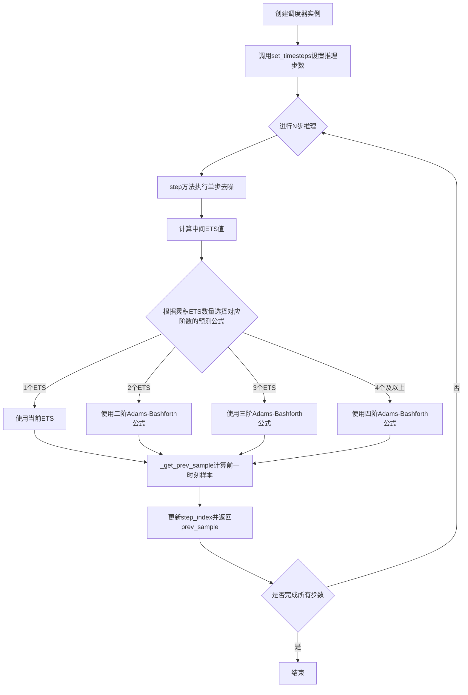
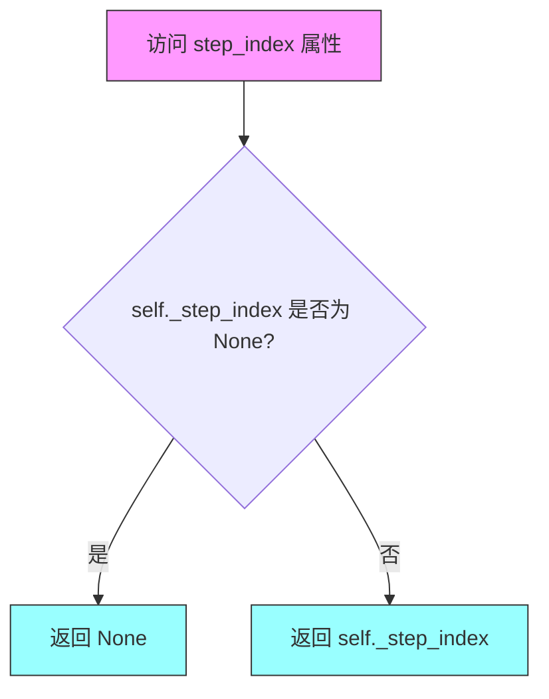
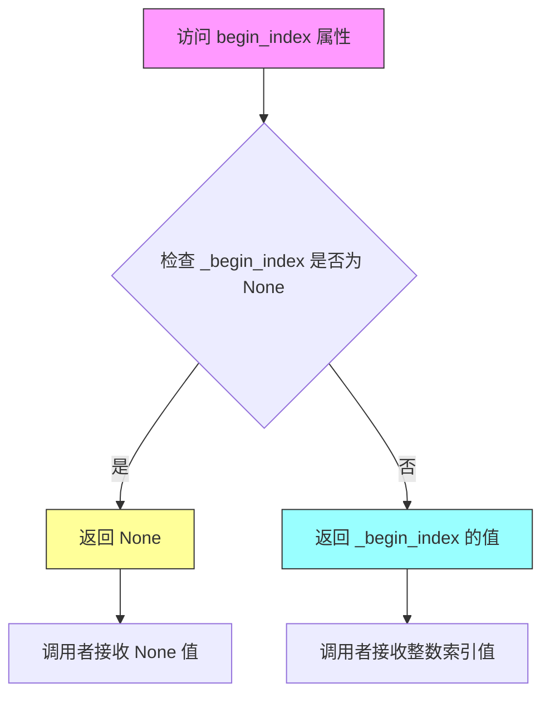
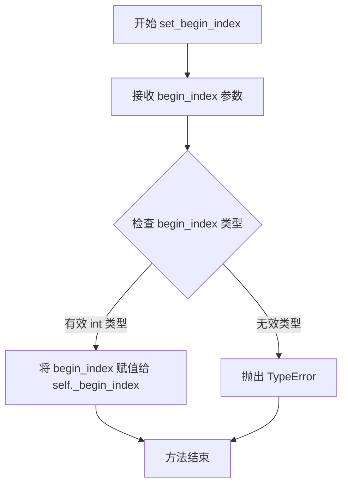
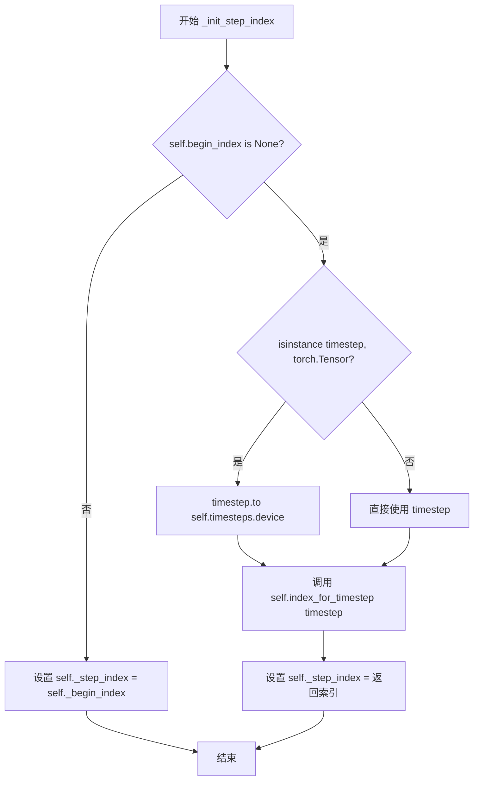
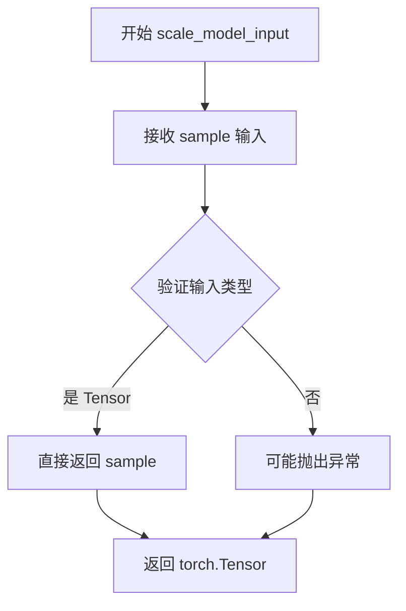
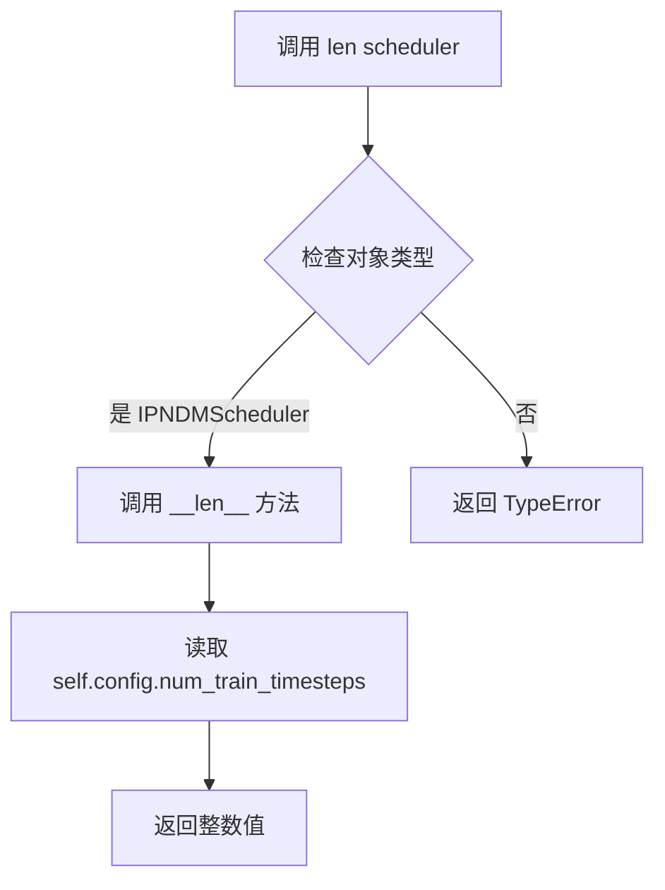

# `diffusers\src\diffusers\schedulers\scheduling_ipndm.py` 详细设计文档

IPNDMScheduler是一个改进的伪线性多步（Improved Pseudo Linear Multistep）调度器，用于扩散模型的采样过程。该调度器通过四阶Runge-Kutta方法近似求解随机微分方程（SDE），实现从噪声样本逐步去噪生成目标样本的核心功能。

## 整体流程



## 类结构

```
SchedulerMixin (抽象基类)
├── ConfigMixin (配置混入类)
└── IPNDMScheduler (四阶改进伪线性多步调度器)
```

## 全局变量及字段


### `IPNDMScheduler.order`
    
调度器阶数，固定为1

类型：`int`
    


### `IPNDMScheduler.num_train_timesteps`
    
训练时的扩散步数

类型：`int`
    


### `IPNDMScheduler.trained_betas`
    
直接传入的beta值

类型：`np.ndarray|list[float]|None`
    


### `IPNDMScheduler.init_noise_sigma`
    
初始噪声分布的标准差，固定为1.0

类型：`float`
    


### `IPNDMScheduler.pndm_order`
    
PNDM方法的阶数，固定为4

类型：`int`
    


### `IPNDMScheduler.ets`
    
用于存储历史预测的ETS值列表

类型：`list`
    


### `IPNDMScheduler._step_index`
    
当前时间步的索引

类型：`int|None`
    


### `IPNDMScheduler._begin_index`
    
起始索引，用于pipeline设置

类型：`int|None`
    


### `IPNDMScheduler.betas`
    
beta值张量

类型：`torch.Tensor`
    


### `IPNDMScheduler.alphas`
    
alpha值张量

类型：`torch.Tensor`
    


### `IPNDMScheduler.timesteps`
    
时间步张量

类型：`torch.Tensor`
    


### `IPNDMScheduler.num_inference_steps`
    
推理时的步数

类型：`int|None`
    


### `IPNDMScheduler.config`
    
配置对象，通过register_to_config装饰器生成

类型：`Config`
    
    

## 全局函数及方法


### `IPNDMScheduler.__init__`

这是 `IPNDMScheduler` 类的构造函数，用于初始化 Improved Pseudo Linear Multistep 调度器。它设置扩散训练步骤数、计算 beta 和 alpha 值，并初始化运行状态变量。

参数：

- `num_train_timesteps`：`int`，默认为 1000，训练模型的扩散步骤数量
- `trained_betas`：`np.ndarray | list[float] | None`，默认为 None，可选的 beta 值数组，直接传递给构造函数以绕过 `beta_start` 和 `beta_end`

返回值：无（`None`），构造函数不返回值

#### 流程图

```mermaid
flowchart TD
    A[开始 __init__] --> B[调用 set_timesteps<br/>num_train_timesteps]
    B --> C[设置 self.init_noise_sigma = 1.0<br/>初始噪声标准差]
    C --> D[设置 self.pndm_order = 4<br/>PNDM方法阶数]
    D --> E[初始化 self.ets = []<br/>运行值列表]
    E --> F[初始化 self._step_index = None<br/>步骤索引]
    F --> G[初始化 self._begin_index = None<br/>起始索引]
    G --> H[结束 __init__]
```

#### 带注释源码

```python
@register_to_config
def __init__(self, num_train_timesteps: int = 1000, trained_betas: np.ndarray | list[float] | None = None):
    """
    初始化 Improved Pseudo Linear Multistep 调度器
    
    Args:
        num_train_timesteps: 扩散训练步骤数，默认1000
        trained_betas: 可选的beta值数组，用于自定义beta调度
    """
    # 设置 betas, alphas, timesteps
    # 根据 num_train_timesteps 计算并设置调度器的核心参数
    self.set_timesteps(num_train_timesteps)

    # 初始噪声分布的标准差
    # 用于归一化输入样本，确保噪声尺度一致
    self.init_noise_sigma = 1.0

    # 当前仅支持 F-PNDM，即 Runge-Kutta 方法
    # 详细信息请参阅论文: https://huggingface.co/papers/2202.09778
    # 主要参考公式 (9), (12), (13) 和 Algorithm 2
    self.pndm_order = 4

    # 运行值列表
    # 用于存储历史预测的噪声估计，用于线性多步方法
    self.ets = []
    
    # 当前时间步的索引计数器
    # 每次调度器 step 后增加 1
    self._step_index = None
    
    # 第一个时间步的索引
    # 应通过 set_begin_index 方法从 pipeline 设置
    self._begin_index = None
```


### `IPNDMScheduler.step_index`

这是一个只读属性（property），用于获取当前时间步的索引计数器。该计数器在每次调度器执行 `step` 方法后会自动加 1，用于追踪扩散模型推理过程中的当前步骤位置。

参数： 无

返回值：`int | None`，返回当前时间步的索引。如果调度器尚未执行任何步骤（即 `set_timesteps` 后尚未调用 `step`），则返回 `None`。

#### 流程图



#### 带注释源码

```python
@property
def step_index(self):
    """
    The index counter for current timestep. It will increase 1 after each scheduler step.
    """
    # 返回内部维护的步骤索引变量
    # 初始值为 None，在首次调用 step() 时通过 _init_step_index() 初始化
    # 每次调用 step() 方法后会在 step() 方法末尾自动加 1
    return self._step_index
```


### `IPNDMScheduler.begin_index`

获取调度器的第一个时间步索引。该属性返回内部变量 `_begin_index` 的值，用于指定扩散链的起始时间步索引。该值应通过 `set_begin_index` 方法从管道中设置。

参数：无（该方法为属性访问器，隐式接收 `self` 实例）

返回值：`int | None`，第一个时间步的索引。如果尚未通过 `set_begin_index` 方法设置，则返回 `None`。

#### 流程图



#### 带注释源码

```python
@property
def begin_index(self):
    """
    The index for the first timestep. It should be set from pipeline with `set_begin_index` method.
    """
    # 返回内部变量 _begin_index 的值
    # 该值在 __init__ 中初始化为 None
    # 通过 set_begin_index 方法可以设置具体的起始索引值
    # 在 set_timesteps 方法中会被重置为 None
    return self._begin_index
```


### IPNDMScheduler.set_begin_index

该方法用于设置调度器的起始索引，通常在推理前从管道调用，以确保调度器从指定的 timestep 开始执行扩散过程。

参数：
- `begin_index`：`int`，默认为 `0`，表示调度器的起始索引

返回值：`None`，无返回值

#### 流程图



#### 带注释源码

```python
def set_begin_index(self, begin_index: int = 0):
    """
    Sets the begin index for the scheduler. This function should be run from pipeline before the inference.

    Args:
        begin_index (`int`, defaults to `0`):
            The begin index for the scheduler.
    """
    # 将传入的 begin_index 参数值赋给实例变量 _begin_index
    # 这个变量用于记录调度器的起始索引，在推理时控制从哪个时间步开始
    self._begin_index = begin_index
```


### IPNDMScheduler.set_timesteps

该方法用于设置扩散链中使用的离散时间步（在推理前运行），通过计算β和α值生成时间步序列，并将其移动到指定设备上，同时重置调度器的内部状态。

参数：

- `num_inference_steps`：`int`，生成样本时使用的扩散步数
- `device`：`str | torch.device | None`，时间步要移动到的设备，如果为 `None` 则不移动

返回值：无（`None`），该方法直接修改实例属性

#### 流程图

```mermaid
flowchart TD
    A[开始 set_timesteps] --> B[设置 self.num_inference_steps]
    B --> C[生成线性空间 steps: 1→0, 长度 num_inference_steps+1]
    C --> D[将最后一个元素替换为 0.0]
    D --> E{self.config.trained_betas 是否存在?}
    E -->|是| F[直接使用 trained_betas 作为 betas]
    E -->|否| G[计算 betas = sin(steps * π/2)²]
    F --> H
    G --> H[计算 alphas = √(1 - betas²)]
    H --> I[计算 timesteps = atan2(betas, alphas) / π * 2]
    I --> J[将 timesteps 移动到 device]
    J --> K[重置 self.ets = []]
    K --> L[重置 self._step_index = None]
    L --> M[重置 self._begin_index = None]
    M --> N[结束]
```

#### 带注释源码

```python
def set_timesteps(self, num_inference_steps: int, device: str | torch.device | None = None):
    """
    设置扩散链中使用的离散时间步（在推理前运行）。
    
    Args:
        num_inference_steps (`int`): 生成样本时使用的扩散步数
        device (`str` or `torch.device`, *optional*): 时间步要移动到的设备
    """
    # 1. 保存推理步数
    self.num_inference_steps = num_inference_steps
    
    # 2. 生成从1到0的线性空间（不包括最后一点）
    steps = torch.linspace(1, 0, num_inference_steps + 1)[:-1]
    
    # 3. 将最后元素替换为精确的0.0（避免浮点误差）
    steps = torch.cat([steps, torch.tensor([0.0])])
    
    # 4. 根据配置或计算得到betas
    if self.config.trained_betas is not None:
        # 如果提供了训练好的betas，直接使用
        self.betas = torch.tensor(self.config.trained_betas, dtype=torch.float32)
    else:
        # 否则使用正弦平方函数计算betas（非线性调度）
        self.betas = torch.sin(steps * math.pi / 2) ** 2
    
    # 5. 根据betas计算对应的alphas（确保 α² + β² = 1）
    self.alphas = (1.0 - self.betas**2) ** 0.5
    
    # 6. 计算时间步：使用反正切函数将beta/alpha转换为角度
    # 公式来源：atan2(β, α) / π * 2，将值归一化到[0,1]区间
    timesteps = (torch.atan2(self.betas, self.alphas) / math.pi * 2)[:-1]
    
    # 7. 将时间步移动到指定设备
    self.timesteps = timesteps.to(device)
    
    # 8. 重置累积的估计值（用于多步预测）
    self.ets = []
    
    # 9. 重置步进索引（用于跟踪当前推理步骤）
    self._step_index = None
    self._begin_index = None
```


### `IPNDMScheduler.index_for_timestep`

在扩散模型调度器中，根据给定的时间步值在时间步调度表中查找其对应的索引位置，用于确定当前推理过程中的时间步索引。

参数：

- `self`：隐含的类实例参数，表示当前调度器对象
- `timestep`：`float | torch.Tensor`，要查找的时间步值
- `schedule_timesteps`：`torch.Tensor | None`，可选的时间步调度表，如果为 `None` 则使用 `self.timesteps`

返回值：`int`，时间步在调度表中的索引。对于第一步，如果存在多个匹配项，返回第二个索引（仅有一个匹配项时返回第一个索引），以避免在图像到图像等中间开始场景下跳过 sigma 值。

#### 流程图

```mermaid
flowchart TD
    A[开始 index_for_timestep] --> B{schedule_timesteps是否为None?}
    B -->|是| C[使用self.timesteps作为schedule_timesteps]
    B -->|否| D[保持传入的schedule_timesteps]
    C --> E[在schedule_timesteps中查找与timestep相等的索引]
    D --> E
    E --> F[获取所有匹配索引的列表indices]
    G{indices长度>1?}
    G -->|是| H[pos = 1]
    G -->|否| I[pos = 0]
    H --> J[返回indices[pos].item]
    I --> J
    K[结束]
    J --> K
```

#### 带注释源码

```python
def index_for_timestep(
    self, timestep: float | torch.Tensor, schedule_timesteps: torch.Tensor | None = None
) -> int:
    """
    Find the index of a given timestep in the timestep schedule.

    Args:
        timestep (`float` or `torch.Tensor`):
            The timestep value to find in the schedule.
        schedule_timesteps (`torch.Tensor`, *optional*):
            The timestep schedule to search in. If `None`, uses `self.timesteps`.

    Returns:
        `int`:
            The index of the timestep in the schedule. For the very first step, returns the second index if
            multiple matches exist to avoid skipping a sigma when starting mid-schedule (e.g., for image-to-image).
    """
    # 如果未提供schedule_timesteps，则使用调度器自身的时间步列表
    if schedule_timesteps is None:
        schedule_timesteps = self.timesteps

    # 在时间步调度表中查找与给定timestep相等的元素位置
    indices = (schedule_timesteps == timestep).nonzero()

    # 对于**非常**第一个`step`，
    # 始终取第二个索引（如果只有1个则取最后一个索引）
    # 这样可以确保在中间开始去噪调度时不会意外跳过sigma
    # （例如用于图像到图像的场景）
    pos = 1 if len(indices) > 1 else 0

    # 返回找到的索引值（转换为Python标量）
    return indices[pos].item()
```


### `IPNDMScheduler._init_step_index`

该方法用于基于给定的时间步初始化调度器的步索引，根据是否存在起始索引来选择通过时间步查询或在预设起始位置开始。

参数：

- `timestep`：`float | torch.Tensor`，当前的时间步，用于初始化步索引

返回值：`None`，无返回值

#### 流程图



#### 带注释源码

```python
def _init_step_index(self, timestep: float | torch.Tensor) -> None:
    """
    Initialize the step index for the scheduler based on the given timestep.

    Args:
        timestep (`float` or `torch.Tensor`):
            The current timestep to initialize the step index from.
    """
    # 检查是否已设置起始索引（begin_index）
    if self.begin_index is None:
        # 如果时间步是Tensor类型，需要将其移到与timesteps相同的设备上
        if isinstance(timestep, torch.Tensor):
            timestep = timestep.to(self.timesteps.device)
        
        # 通过时间步查找对应的索引
        self._step_index = self.index_for_timestep(timestep)
    else:
        # 如果已设置起始索引，直接使用该索引
        self._step_index = self._begin_index
```


### `IPNDMScheduler.step`

该函数是 Improved Pseudo Linear Multistep Scheduler 的核心推理步骤方法，通过线性多步法（Adams-Bashforth 公式）基于模型输出和时间步反向预测前一个时间步的样本，实现扩散过程的迭代去噪。

参数：

- `model_output`：`torch.Tensor`，来自学习到的扩散模型的直接输出
- `timestep`：`int | torch.Tensor`，扩散链中的当前离散时间步
- `sample`：`torch.Tensor`，由扩散过程创建的当前样本实例
- `return_dict`：`bool`，是否返回 `SchedulerOutput` 或元组

返回值：`SchedulerOutput | tuple`，如果 `return_dict` 为 `True`，返回 `SchedulerOutput`（包含 `prev_sample` 字段），否则返回元组（第一个元素为样本张量）

#### 流程图

```mermaid
flowchart TD
    A[开始 step] --> B{num_inference_steps is None?}
    B -->|Yes| C[抛出 ValueError]
    B -->|No| D{step_index is None?}
    D -->|Yes| E[调用 _init_step_index 初始化]
    D -->|No| F[获取 timestep_index]
    E --> F
    F --> G[计算 prev_timestep_index = timestep_index + 1]
    G --> H[计算初始 ets = sample * betas[t] + model_output * alphas[t]]
    H --> I[将 ets 添加到 self.ets 列表]
    I --> J{len(self.ets) 数量?}
    J -->|1 步| K[ets = self.ets[-1]]
    J -->|2 步| L[ets = 3*ets[-1] - ets[-2] / 2]
    J -->|3 步| M[ets = 23*ets[-1] - 16*ets[-2] + 5*ets[-3] / 12]
    J -->|4+ 步| N[ets = 55*ets[-1] - 59*ets[-2] + 37*ets[-3] - 9*ets[-4] / 24]
    K --> O[调用 _get_prev_sample 计算 prev_sample]
    L --> O
    M --> O
    N --> O
    O --> P[step_index += 1]
    P --> Q{return_dict?}
    Q -->|True| R[返回 SchedulerOutput(prev_sample)]
    Q -->|False| S[返回 tuple(prev_sample,)]
```

#### 带注释源码

```python
def step(
    self,
    model_output: torch.Tensor,
    timestep: int | torch.Tensor,
    sample: torch.Tensor,
    return_dict: bool = True,
) -> SchedulerOutput | tuple:
    """
    Predict the sample from the previous timestep by reversing the SDE. This function propagates the sample with
    the linear multistep method. It performs one forward pass multiple times to approximate the solution.

    Args:
        model_output (`torch.Tensor`):
            The direct output from learned diffusion model.
        timestep (`int`):
            The current discrete timestep in the diffusion chain.
        sample (`torch.Tensor`):
            A current instance of a sample created by the diffusion process.
        return_dict (`bool`):
            Whether or not to return a [`~schedulers.scheduling_utils.SchedulerOutput`] or tuple.

    Returns:
        [`~schedulers.scheduling_utils.SchedulerOutput`] or `tuple`:
            If return_dict is `True`, [`~schedulers.scheduling_utils.SchedulerOutput`] is returned, otherwise a
            tuple is returned where the first element is the sample tensor.
    """
    # 检查是否已设置推理步数，未设置则抛出错误
    if self.num_inference_steps is None:
        raise ValueError(
            "Number of inference steps is 'None', you need to run 'set_timesteps' after creating the scheduler"
        )
    
    # 初始化 step_index（如果尚未初始化）
    if self.step_index is None:
        self._init_step_index(timestep)

    # 获取当前时间步索引和前一个时间步索引
    timestep_index = self.step_index
    prev_timestep_index = self.step_index + 1

    # 计算扩展目标 (ets)：结合当前样本和模型输出
    # 公式: ets = sample * beta[t] + model_output * alpha[t]
    ets = sample * self.betas[timestep_index] + model_output * self.alphas[timestep_index]
    
    # 将计算的 ets 添加到历史记录列表中
    self.ets.append(ets)

    # 根据历史步数使用 Adams-Bashforth 公式外推 ets
    # 这是 Improved PNDM 的核心：使用多步方法来近似积分
    if len(self.ets) == 1:
        # 单步：直接使用最后一个值
        ets = self.ets[-1]
    elif len(self.ets) == 2:
        # 两步：一阶 Adams-Bashforth 公式
        ets = (3 * self.ets[-1] - self.ets[-2]) / 2
    elif len(self.ets) == 3:
        # 三步：二阶 Adams-Bashforth 公式
        ets = (23 * self.ets[-1] - 16 * self.ets[-2] + 5 * self.ets[-3]) / 12
    else:
        # 四步及以上：三阶 Adams-Bashforth 公式
        ets = (1 / 24) * (55 * self.ets[-1] - 59 * self.ets[-2] + 37 * self.ets[-3] - 9 * self.ets[-4])

    # 调用内部方法计算前一个时间步的样本
    prev_sample = self._get_prev_sample(sample, timestep_index, prev_timestep_index, ets)

    # 完成后将步索引增加 1，为下一次迭代做准备
    self._step_index += 1

    # 根据 return_dict 参数决定返回格式
    if not return_dict:
        return (prev_sample,)

    # 返回 SchedulerOutput 对象，包含前一个样本
    return SchedulerOutput(prev_sample=prev_sample)
```


### `IPNDMScheduler.scale_model_input`

该方法实现了调度器接口，用于在去噪过程中根据当前时间步对模型输入进行缩放，确保与其他需要缩放输入的调度器保持互换性。在 IPNDMScheduler 中，该方法直接返回原始样本，不进行任何实际缩放操作。

参数：

- `sample`：`torch.Tensor`，当前扩散过程的输入样本
- `*args`：可变位置参数，用于保持接口兼容性（未使用）
- `**kwargs`：可变关键字参数，用于保持接口兼容性（未使用）

返回值：`torch.Tensor`，返回处理后的样本（在当前实现中即原始输入样本）

#### 流程图



#### 带注释源码

```python
def scale_model_input(self, sample: torch.Tensor, *args, **kwargs) -> torch.Tensor:
    """
    Ensures interchangeability with schedulers that need to scale the denoising model input depending on the
    current timestep.

    该方法确保了IPNDMScheduler与其他调度器之间的接口互换性。
    某些调度器（如EulerDiscreteScheduler）需要根据当前时间步对输入进行缩放，
    该方法提供了一个统一的接口。虽然IPNDMScheduler当前不执行实际缩放，
    但保持此接口使得调度器之间的切换更加灵活。

    Args:
        sample (`torch.Tensor`):
            The input sample.
            当前扩散过程生成的样本或噪声样本

    Returns:
        `torch.Tensor`:
            A scaled input sample.
            返回处理后的样本。在IPNDMScheduler中，直接返回输入的原始样本，
            不进行任何缩放操作。这与其他需要实际缩放计算的调度器形成对比。
    """
    # 直接返回输入样本，未进行任何缩放处理
    # 这是IPNDMScheduler的特性，与其他调度器（如Euler）不同
    return sample
```


### `IPNDMScheduler._get_prev_sample`

该方法根据当前样本、时间步索引和累积的估计值（ets）计算前一个时间步的样本，是IPND（Improved Pseudo Linear Multistep）调度器的核心计算逻辑，通过线性插值和外推来预测前一个采样点。

参数：

- `sample`：`torch.Tensor`，当前扩散过程中的样本
- `timestep_index`：`int`，当前时间步在调度器中的索引
- `prev_timestep_index`：`int`，前一个时间步在调度器中的索引
- `ets`：`torch.Tensor`，累积的估计值（estimated trajectory samples），用于多步预测

返回值：`torch.Tensor`，预测的前一个时间步的样本

#### 流程图

```mermaid
flowchart TD
    A[_get_prev_sample 被调用] --> B[获取当前时间步的 alpha 和 sigma]
    B --> C[获取前一个时间步的 alpha 和 sigma]
    C --> D[计算预测样本 pred: (sample - sigma * ets) / max(alpha, 1e-8)]
    D --> E[计算前一个样本: next_alpha * pred + ets * next_sigma]
    E --> F[返回 prev_sample]
```

#### 带注释源码

```python
def _get_prev_sample(self, sample, timestep_index, prev_timestep_index, ets):
    """
    根据当前样本、时间步索引和累积估计值计算前一个时间步的样本。
    
    Args:
        sample: 当前扩散过程中的样本张量
        timestep_index: 当前时间步索引
        prev_timestep_index: 前一个时间步索引
        ets: 累积的估计值，用于多步预测
    
    Returns:
        预测的前一个时间步的样本张量
    """
    # 获取当前时间步的 alpha（噪声调度参数）和 sigma（噪声标准差）
    alpha = self.alphas[timestep_index]
    sigma = self.betas[timestep_index]

    # 获取前一个时间步的 alpha 和 sigma
    next_alpha = self.alphas[prev_timestep_index]
    next_sigma = self.betas[prev_timestep_index]

    # 第一步：去除噪声影响，得到预测的原始样本
    # pred = (sample - sigma * ets) / alpha
    # 使用 max(alpha, 1e-8) 防止除零错误
    pred = (sample - sigma * ets) / max(alpha, 1e-8)

    # 第二步：利用前一个时间步的参数重构前一个样本
    # 通过线性组合预测值和噪声估计值得到前一个样本
    prev_sample = next_alpha * pred + ets * next_sigma

    return prev_sample
```


### `IPNDMScheduler.__len__`

这是一个魔术方法，返回调度器配置中定义的训练时间步总数，使得调度器对象可以直接通过 `len()` 函数获取其时间步长度。

参数：なし（除隐式参数 `self`）

返回值：`int`，返回配置的训练时间步数 `num_train_timesteps`，表示扩散模型训练时使用的时间步总数。

#### 流程图



#### 带注释源码

```python
def __len__(self):
    """
    返回调度器的训练时间步总数。
    
    该魔术方法使得可以通过 len(scheduler) 获取调度器配置的时间步数量，
    实现了 Python 的标准长度协议，便于与其它组件集成。
    
    Returns:
        int: 训练时使用的时间步总数，对应配置中的 num_train_timesteps 参数
    """
    return self.config.num_train_timesteps
```

## 关键组件


### IPNDMScheduler

第四阶Improved Pseudo Linear Multistep（改进伪线性多步）调度器，用于扩散模型的采样过程。该调度器通过线性多步方法近似求解随机微分方程（SDE），支持四阶精度（PNDM）算法实现高效的图像生成。

### 核心配置与参数

- **num_train_timesteps**: 训练时的扩散步数，默认1000
- **trained_betas**: 可选的自定义beta值数组，若提供则绕过beta_start和beta_end计算
- **pndm_order**: PNDM算法阶数，固定为4
- **init_noise_sigma**: 初始噪声分布的标准差，固定为1.0

### 调度器核心方法

- **set_timesteps**: 根据推理步数生成离散时间步，通过torch.linspace创建线性空间，使用sin²函数计算betas，并基于atan2计算timesteps
- **step**: 执行单步调度，根据模型输出预测前一时间步的样本，采用Adams-Bashforth多步公式（1-4阶）外推估计
- **scale_model_input**: 空实现，用于与需要缩放输入的调度器保持接口兼容性
- **_get_prev_sample**: 根据当前样本和时间步索引计算前一采样值，使用alpha和sigma参数进行线性插值

### 多步估计器（ETS）

- **ets列表**: 存储历史模型输出的估计值，用于多步外推计算，支持1-4阶Adams-Bashforth公式
- **外推公式**: 一阶至四阶分别采用不同系数：(1)、(3/2, -1/2)、(23/12, -16/12, 5/12)、(55/24, -59/24, 37/24, -9/24)

### 时间步索引管理

- **_step_index**: 当前时间步计数器，每步递增1
- **_begin_index**: 起始索引，用于流水线中自定义起始位置
- **index_for_timestep**: 通过tensor索引和nonzero查找时间步在schedule中的位置，首步返回第二个索引以避免跳过sigma

### 惰性加载与状态管理

- **调度器状态**: 通过_init_step_index惰性初始化step_index，仅在首次调用step时计算
- **配置Mixin**: 继承ConfigMixin实现配置的注册与保存，支持trained_betas的延迟加载


## 问题及建议


### 已知问题

-   **代码注释与实际实现不符**：多处注释提到 "Copied from diffusers.schedulers.scheduling_..."，但这些方法实际上是直接在类中定义的，并非真正从其他调度器复制。这会误导代码维护者。
-   **类型注解不一致**：`step` 方法中 `timestep` 参数类型声明为 `int | torch.Tensor`，但 `index_for_timestep` 和 `_init_step_index` 方法中接收的参数类型为 `float | torch.Tensor`，可能导致类型混淆和潜在bug。
-   **硬编码的调度器阶数**：`self.pndm_order = 4` 被硬编码，且在代码中未被实际使用，失去了配置灵活性，是死代码（dead code）。
-   **边界检查缺失**：`step` 方法中直接通过 `timestep_index` 索引 `self.betas` 和 `self.alphas`，未验证索引是否越界，可能导致运行时错误。
-   **ETS 预测逻辑不完整**：当 `len(self.ets) == 1` 时直接使用当前预测值，缺少公式 (9) 中的一阶项处理逻辑，与算法描述不完全一致。
-   **设备管理不一致**：`set_timesteps` 接受 `device` 参数，但在 `__init__` 中调用时未传递设备参数，可能导致张量驻留 CPU 而模型在 GPU 上。
-   **状态重置机制缺失**：没有显式的 `reset()` 方法来清空 `ets` 列表和 `_step_index`，在推理循环复用调度器时可能产生状态污染。

### 优化建议

-   修正注释以反映方法实际来源，或将这些方法提取到共享基类/工具模块中以真正实现代码复用。
-   统一 `timestep` 参数的类型注解，建议在 `step` 方法中使用 `int` 类型（离散时间步索引），在其他方法中使用 `float` 类型。
-   将 `pndm_order` 提取为可配置参数，或移除未使用的硬编码值以减少代码混淆。
-   在 `step` 方法中添加索引边界检查，防止越界访问。
-   完善 ETS 预测逻辑，确保与论文算法公式完全对齐。
-   在 `__init__` 调用 `set_timesteps` 时明确传递设备参数，或在调度器初始化后自动检测并迁移张量设备。
-   添加 `reset()` 方法或在 `set_timesteps` 中强制重置所有状态，确保调度器可被安全复用。
-   增加对 `model_output` 和 `sample` 的设备与形状验证，提升错误提示的友好性。

## 其它


### 设计目标与约束

本调度器的设计目标是实现四阶 Improved Pseudo Linear Multistep (IP-PNDM) 扩散采样算法，通过线性多步法近似求解随机微分方程(SDE)，以较少的采样步骤实现高质量的图像生成。设计约束包括：仅支持F-PNDM（伪数值方法）算法，不支持其他类型的PNDM变体；依赖于diffusers库的SchedulerMixin和ConfigMixin基类；计算过程中需要保持数值稳定性，避免除零错误。

### 错误处理与异常设计

1. **set_timesteps未调用异常**：在step方法中检查num_inference_steps是否为None，若为None则抛出ValueError，提示需要先调用set_timesteps方法。2. **step_index未初始化异常**：检查step_index是否为None，若为None则调用_init_step_index方法进行初始化。3. **参数类型校验**：timestep参数支持int或torch.Tensor类型，sample和model_output要求为torch.Tensor类型。4. **数值稳定性保护**：在_get_prev_sample方法中使用max(alpha, 1e-8)防止除零操作。

### 数据流与状态机

调度器的工作流程分为三个主要状态：**初始化状态**（创建调度器实例，set_timesteps设置推理步数）→ **就绪状态**（初始化step_index，准备开始推理）→ **推理状态**（循环调用step方法进行多步采样）。数据流：外部模型输出(model_output) + 当前样本(sample) + 当前时间步(timestep) → step方法 → 计算中间变量(ets) → _get_prev_sample计算前一时刻样本 → 返回prev_sample。状态转移由_step_index和_begin_index控制。

### 外部依赖与接口契约

1. **内部依赖**：依赖numpy库进行数组操作，torch进行张量计算，math进行数学运算。2. **框架依赖**：依赖diffusers库的configuration_utils.ConfigMixin（配置混入类）和scheduling_utils中的SchedulerMixin和SchedulerOutput。3. **接口契约**：set_timesteps方法接收num_inference_steps和可选device参数，设置推理所需的时间步序列；step方法接收model_output、timestep、sample和return_dict参数，返回SchedulerOutput或tuple；scale_model_input方法提供调度器间的互操作性接口。

### 性能考虑

1. **内存优化**：ets列表在每次set_timesteps调用时清空，避免内存泄漏；使用torch.cat和inplace操作减少内存分配。2. **计算优化**：预先计算alphas和betas数组，避免重复计算；使用向量化操作替代循环计算。3. **设备管理**：支持device参数将timesteps移动到指定设备，实现CPU/GPU兼容。

### 兼容性设计

1. **版本兼容性**：通过ConfigMixin的register_to_config装饰器实现配置的序列化与反序列化。2. **调度器兼容性**：scale_model_input方法返回原样本，确保与其他调度器（如EulerDiscreteScheduler）的互操作性。3. **Pipeline集成**：提供set_begin_index方法支持pipeline在推理中途开始调度的场景。

### 使用示例

```python
# 创建调度器
scheduler = IPNDMScheduler(num_train_timesteps=1000)

# 设置推理步数
scheduler.set_timesteps(num_inference_steps=50, device="cuda")

# 初始化噪声样本
sample = torch.randn(1, 3, 512, 512).cuda()

# 推理循环
for i, t in enumerate(scheduler.timesteps):
    with torch.no_grad():
        model_output = model(sample, t)
    
    sample = scheduler.step(model_output, t, sample).prev_sample
```

### 参考文献

1. Improved Pseudo Numerical Methods for Diffusion Models (IP-PNDM) - https://huggingface.co/papers/2202.09778
2. Pseudo Numerical Methods for Diffusion Models (PNDM) - 原始PNDM论文
3. Denoising Diffusion Probabilistic Models (DDPM) - 扩散模型理论基础

    