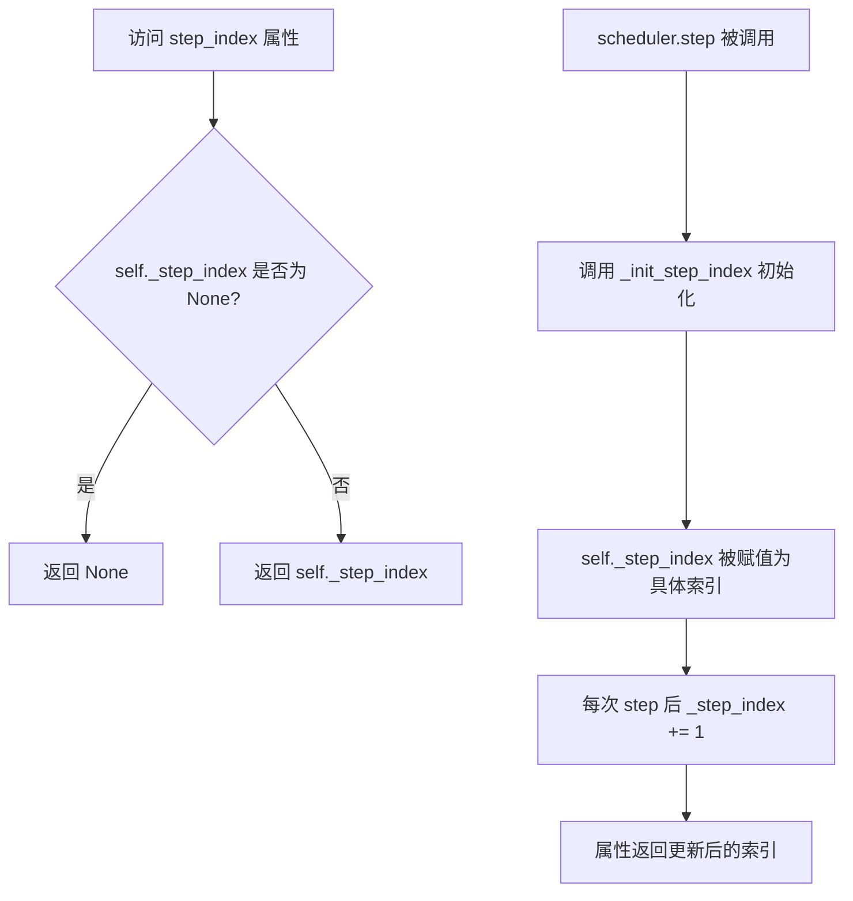
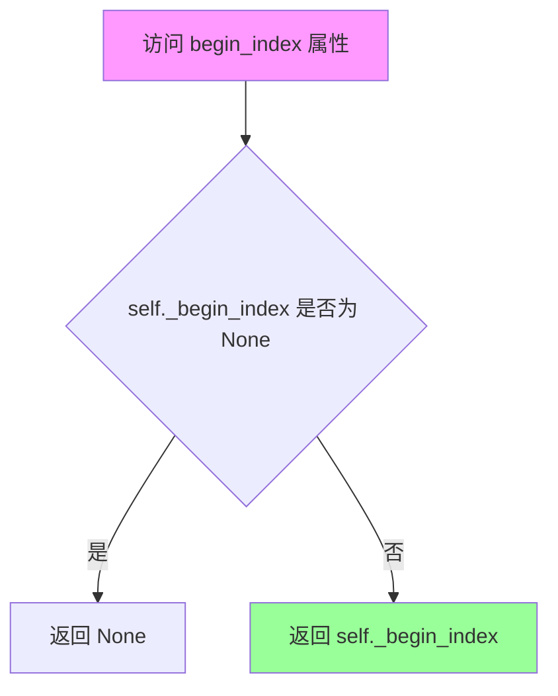
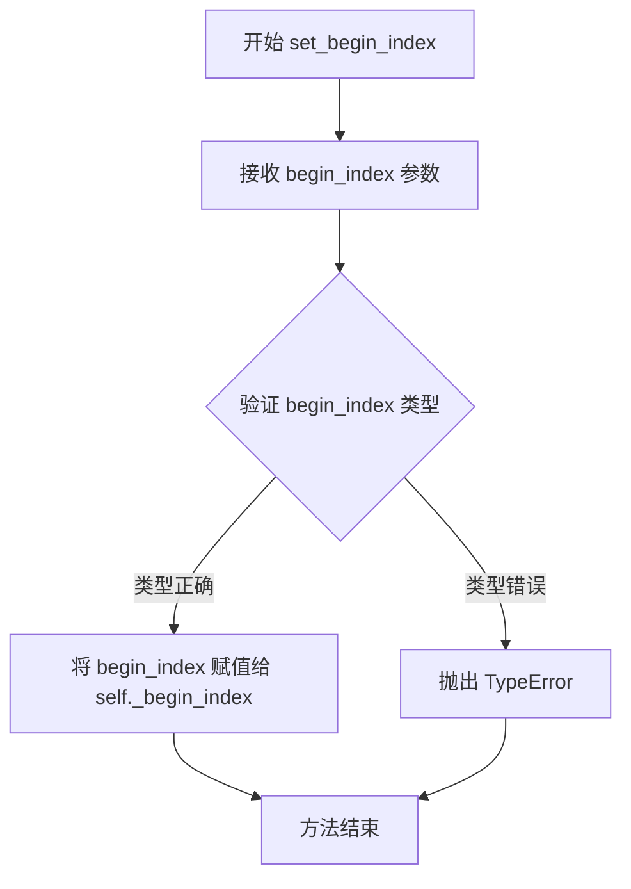
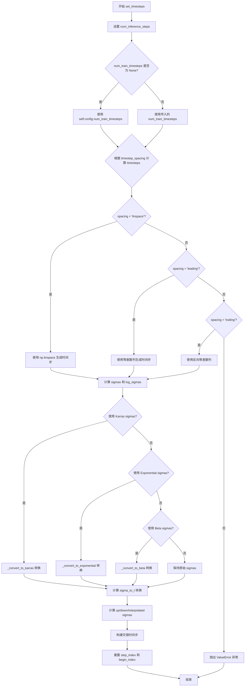
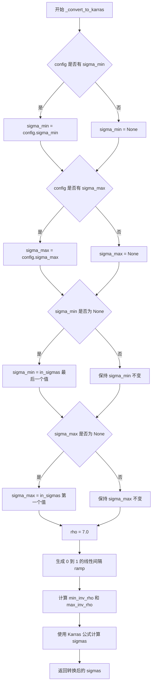
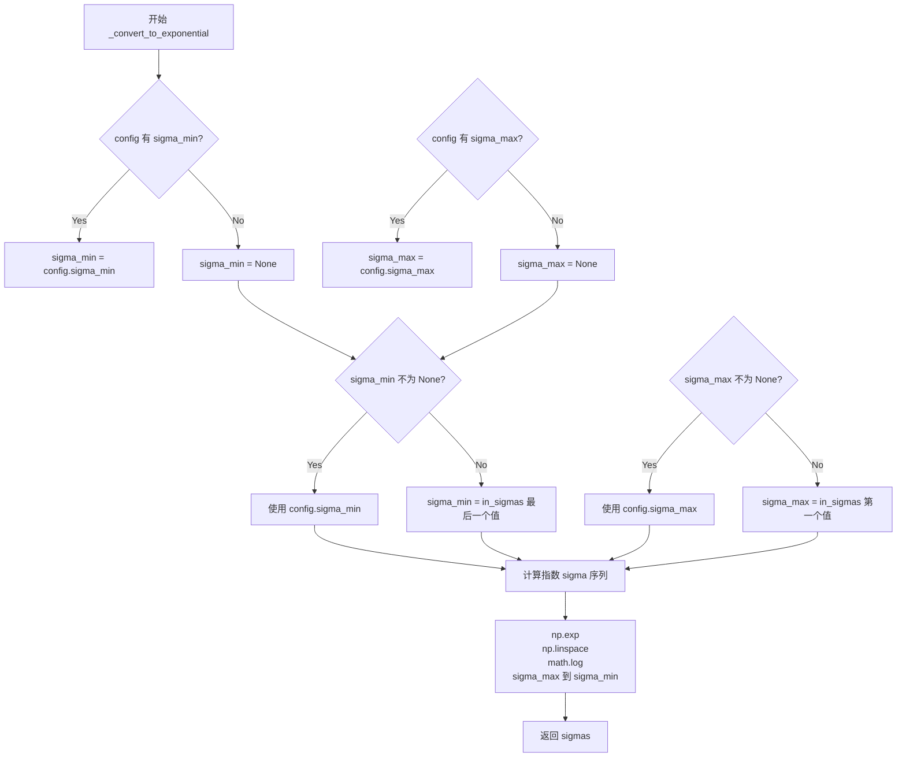
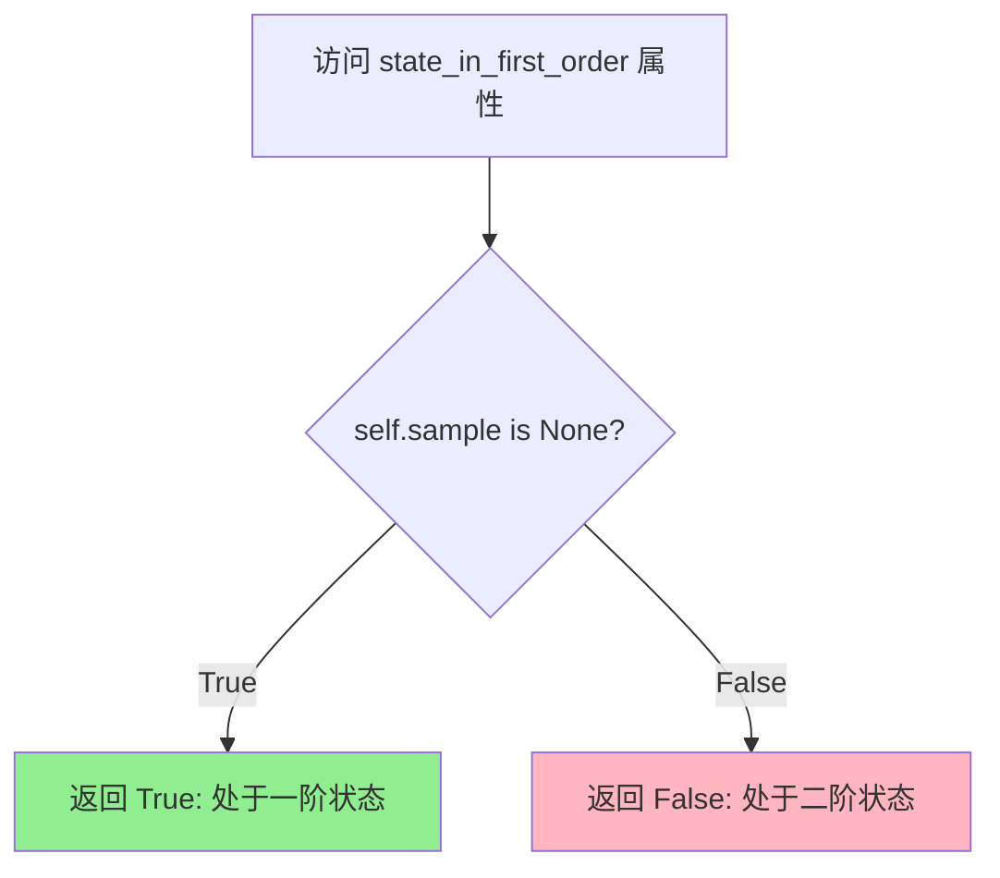
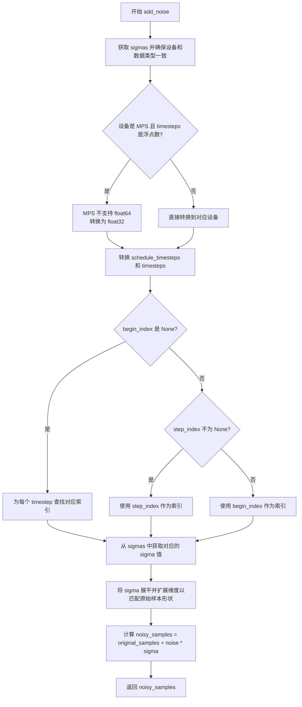
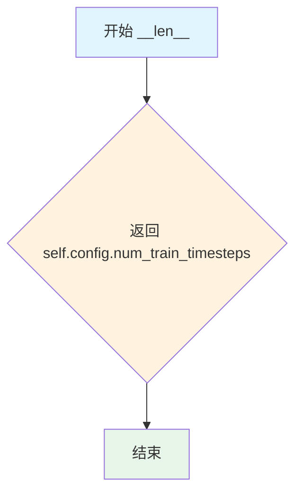

# `diffusers\src\diffusers\schedulers\scheduling_k_dpm_2_ancestral_discrete.py` 详细设计文档

KDPM2AncestralDiscreteScheduler是一个扩散模型调度器，实现了基于KDPM2算法和祖先采样的噪声调度策略，用于在扩散模型的逆向过程中逐步去噪并生成样本。该调度器继承自SchedulerMixin和ConfigMixin，支持多种噪声时间步间隔策略（linspace/leading/trailing）和多种sigma转换方法（Karras/指数/beta分布）。

## 整体流程

```mermaid
graph TD
A[开始] --> B[__init__ 初始化调度器]
B --> C[set_timesteps 设置推理时间步]
C --> D{循环: 对每个推理步骤}
D --> E[scale_model_input 缩放输入样本]
E --> F[step 执行去噪步骤]
F --> G{是否为第一阶?]
G -- 是 --> H[计算sigma参数]
G -- 否 --> I[使用前一阶的sigma参数]
H --> J[预测原始样本x_0]
I --> J
J --> K[计算导数和时间步增量]
K --> L[计算上一时刻样本]
L --> M[添加噪声（祖先采样）]
M --> N[增加step_index]
N --> O{还有更多时间步?}
O -- 是 --> D
O -- 否 --> P[结束]
```

## 类结构

```
BaseOutput (基类)
├── KDPM2AncestralDiscreteSchedulerOutput (数据类)
├── SchedulerMixin (混入类)
└── ConfigMixin (混入类)
    └── KDPM2AncestralDiscreteScheduler (主调度器类)
```

## 全局变量及字段


### `_compatibles`
    
兼容的调度器名称列表

类型：`list[str]`
    


### `order`
    
调度器的阶数

类型：`int`
    


### `betas_for_alpha_bar`
    
根据alpha_bar函数创建beta调度表的函数

类型：`function`
    


### `KDPM2AncestralDiscreteSchedulerOutput.prev_sample`
    
上一步计算得到的样本

类型：`torch.Tensor`
    


### `KDPM2AncestralDiscreteSchedulerOutput.pred_original_sample`
    
预测的原始无噪声样本

类型：`torch.Tensor | None`
    


### `KDPM2AncestralDiscreteScheduler.betas`
    
Beta值序列

类型：`torch.Tensor`
    


### `KDPM2AncestralDiscreteScheduler.alphas`
    
Alpha值序列

类型：`torch.Tensor`
    


### `KDPM2AncestralDiscreteScheduler.alphas_cumprod`
    
累积Alpha值

类型：`torch.Tensor`
    


### `KDPM2AncestralDiscreteScheduler.sigmas`
    
Sigma值序列

类型：`torch.Tensor`
    


### `KDPM2AncestralDiscreteScheduler.sigmas_interpol`
    
插值Sigma值

类型：`torch.Tensor`
    


### `KDPM2AncestralDiscreteScheduler.sigmas_up`
    
上采样Sigma值

类型：`torch.Tensor`
    


### `KDPM2AncestralDiscreteScheduler.sigmas_down`
    
下采样Sigma值

类型：`torch.Tensor`
    


### `KDPM2AncestralDiscreteScheduler.log_sigmas`
    
Sigma对数值

类型：`torch.Tensor`
    


### `KDPM2AncestralDiscreteScheduler.timesteps`
    
时间步序列

类型：`torch.Tensor`
    


### `KDPM2AncestralDiscreteScheduler.num_inference_steps`
    
推理步骤数

类型：`int`
    


### `KDPM2AncestralDiscreteScheduler._step_index`
    
当前步骤索引

类型：`int | None`
    


### `KDPM2AncestralDiscreteScheduler._begin_index`
    
起始索引

类型：`int | None`
    


### `KDPM2AncestralDiscreteScheduler.sample`
    
存储上一步样本用于二阶计算

类型：`torch.Tensor | None`
    


### `KDPM2AncestralDiscreteScheduler.dt`
    
时间步增量

类型：`torch.Tensor | None`
    
    

## 全局函数及方法


### `betas_for_alpha_bar`

该函数用于创建离散的beta调度表，通过给定的alpha_t_bar函数（定义了在时间t=[0,1]内(1-beta)的累积乘积）来生成一系列beta值。它支持三种alpha变换类型（cosine、exp、laplace），并通过积分近似方法将连续的alpha_bar函数转换为离散的beta序列，以供扩散模型调度器使用。

参数：

- `num_diffusion_timesteps`：`int`，要生成的beta数量，指定离散化的时间步数
- `max_beta`：`float`，默认为`0.999`，最大beta值，用于避免数值不稳定
- `alpha_transform_type`：`Literal["cosine", "exp", "laplace"]`，默认为`"cosine"`，alpha_bar噪声调度的类型

返回值：`torch.Tensor`，调度器用于逐步模型输出的beta值张量

#### 流程图

```mermaid
flowchart TD
    A[开始: betas_for_alpha_bar] --> B{alpha_transform_type?}
    B -->|cosine| C[定义alpha_bar_fn: cos²函数]
    B -->|laplace| D[定义alpha_bar_fn: laplace函数]
    B -->|exp| E[定义alpha_bar_fn: exp函数]
    B -->|其他| F[抛出ValueError]
    C --> G[初始化空betas列表]
    D --> G
    E --> G
    G --> H{遍历i from 0 to num_diffusion_timesteps-1}
    H -->|i| I[计算t1 = i / num_diffusion_timesteps]
    I --> J[计算t2 = (i + 1) / num_diffusion_timesteps]
    J --> K[计算beta_i = min1 - alpha_bar_fn(t2)/alpha_bar_fn(t1), max_beta]
    K --> L[添加beta_i到betas列表]
    L --> M{是否还有下一个i?}
    M -->|是| H
    M -->|否| N[转换为torch.Tensor并指定dtype]
    N --> O[返回betas张量]
    F --> P[结束: 抛出异常]
```

#### 带注释源码

```python
# Copied from diffusers.schedulers.scheduling_ddpm.betas_for_alpha_bar
def betas_for_alpha_bar(
    num_diffusion_timesteps: int,  # 离散化的时间步总数
    max_beta: float = 0.999,       # beta上限，防止数值不稳定
    alpha_transform_type: Literal["cosine", "exp", "laplace"] = "cosine",
) -> torch.Tensor:
    """
    Create a beta schedule that discretizes the given alpha_t_bar function, which defines the cumulative product of
    (1-beta) over time from t = [0,1].

    Contains a function alpha_bar that takes an argument t and transforms it to the cumulative product of (1-beta) up
    to that part of the diffusion process.

    Args:
        num_diffusion_timesteps (`int`):
            The number of betas to produce.
        max_beta (`float`, defaults to `0.999`):
            The maximum beta to use; use values lower than 1 to avoid numerical instability.
        alpha_transform_type (`str`, defaults to `"cosine"`):
            The type of noise schedule for `alpha_bar`. Choose from `cosine`, `exp`, or `laplace`.

    Returns:
        `torch.Tensor`:
            The betas used by the scheduler to step the model outputs.
    """
    # 根据alpha_transform_type选择对应的alpha_bar函数
    if alpha_transform_type == "cosine":
        # cosine变换: 使用余弦平方函数，常见于高质量图像生成
        def alpha_bar_fn(t):
            return math.cos((t + 0.008) / 1.008 * math.pi / 2) ** 2

    elif alpha_transform_type == "laplace":
        # laplace变换: 基于拉普拉斯分布的噪声调度
        def alpha_bar_fn(t):
            # 计算lambda参数，使用copysign处理t的对称性
            lmb = -0.5 * math.copysign(1, 0.5 - t) * math.log(1 - 2 * math.fabs(0.5 - t) + 1e-6)
            # 计算信噪比(SNR)
            snr = math.exp(lmb)
            # 返回基于SNR的alpha值
            return math.sqrt(snr / (1 + snr))

    elif alpha_transform_type == "exp":
        # 指数变换: 简单的指数衰减函数
        def alpha_bar_fn(t):
            return math.exp(t * -12.0)

    else:
        raise ValueError(f"Unsupported alpha_transform_type: {alpha_transform_type}")

    # 初始化beta列表
    betas = []
    # 遍历每个时间步，计算对应的beta值
    for i in range(num_diffusion_timesteps):
        # 计算当前时间步的起始和结束点（归一化到[0,1]区间）
        t1 = i / num_diffusion_timesteps
        t2 = (i + 1) / num_diffusion_timesteps
        
        # 计算beta: 使用离散近似
        # beta = 1 - alpha_bar(t+Δt) / alpha_bar(t)
        # 并限制不超过max_beta以保证数值稳定
        betas.append(min(1 - alpha_bar_fn(t2) / alpha_bar_fn(t1), max_beta))
    
    # 转换为PyTorch张量，使用float32精度
    return torch.tensor(betas, dtype=torch.float32)
```


### `KDPM2AncestralDiscreteScheduler.__init__`

该方法是 `KDPM2AncestralDiscreteScheduler` 类的构造函数，负责初始化扩散调度器的核心参数，包括beta噪声调度、alpha累积乘积计算、时间步设置以及sigma值的预处理。构造函数通过 `register_to_config` 装饰器将参数注册到配置中，支持多种噪声调度策略（线性、缩放线性、余弦平方）以及Karras、指数和Beta sigma选项。

参数：

- `num_train_timesteps`：`int`，默认值 1000，扩散模型训练的步数
- `beta_start`：`float`，默认值 0.00085，beta噪声的起始值
- `beta_end`：`float`，默认值 0.012，beta噪声的结束值
- `beta_schedule`：`str`，默认值 "linear"，噪声调度策略，可选 "linear"、"scaled_linear"、"squaredcos_cap_v2"
- `trained_betas`：`np.ndarray | list[float] | None`，默认值 None，直接传递的beta数组，若提供则忽略beta_start和beta_end
- `use_karras_sigmas`：`bool`，默认值 False，是否使用Karras sigma作为步长
- `use_exponential_sigmas`：`bool`，默认值 False，是否使用指数sigma作为步长
- `use_beta_sigmas`：`bool`，默认值 False，是否使用Beta分布sigma作为步长
- `prediction_type`：`str`，默认值 "epsilon"，预测类型，可选 "epsilon"、"sample"、"v_prediction"
- `timestep_spacing`：`str`，默认值 "linspace"，时间步间隔策略，可选 "linspace"、"leading"、"trailing"
- `steps_offset`：`int`，默认值 0，推理步数的偏移量

返回值：无（`None`），构造函数不返回值

#### 流程图

```mermaid
flowchart TD
    A[开始 __init__] --> B{检查 use_beta_sigmas 依赖}
    B -->|缺少 scipy| C[抛出 ImportError]
    B --> D{检查 sigma 选项冲突}
    D -->|多个 sigma 选项同时启用| E[抛出 ValueError]
    D --> F{是否提供 trained_betas}
    F -->|是| G[直接使用 trained_betas 创建 betas]
    F -->|否| H{beta_schedule 类型}
    H -->|"linear"| I[torch.linspace 创建线性 betas]
    H -->|"scaled_linear"| J[torch.linspace 创建平方根后平方的 betas]
    H -->|"squaredcos_cap_v2"| K[调用 betas_for_alpha_bar]
    H -->|其他| L[抛出 NotImplementedError]
    G --> M
    I --> M
    J --> M
    K --> M
    M[计算 alphas = 1.0 - betas] --> N[计算 alphas_cumprod = cumprod(alphas)]
    N --> O[调用 set_timesteps 初始化时间步]
    O --> P[初始化 _step_index = None, _begin_index = None]
    P --> Q[将 sigmas 移至 CPU]
    Q --> R[结束 __init__]
```

#### 带注释源码

```python
@register_to_config  # 装饰器：将参数注册到配置对象中
def __init__(
    self,
    num_train_timesteps: int = 1000,           # 扩散过程的总训练步数
    beta_start: float = 0.00085,               # 线性调度起始beta值
    beta_end: float = 0.012,                   # 线性调度结束beta值
    beta_schedule: str = "linear",             # beta调度策略：linear/scaled_linear/squaredcos_cap_v2
    trained_betas: np.ndarray | list[float] | None = None,  # 可选的预定义beta数组
    use_karras_sigmas: bool = False,           # 是否启用Karras sigma噪声调度
    use_exponential_sigmas: bool = False,      # 是否启用指数sigma噪声调度
    use_beta_sigmas: bool = False,             # 是否启用Beta分布sigma噪声调度
    prediction_type: str = "epsilon",          # 预测类型：epsilon/v_prediction/sample
    timestep_spacing: str = "linspace",         # 时间步间隔策略：linspace/leading/trailing
    steps_offset: int = 0,                     # 推理步数偏移量
):
    # 检查Beta sigma依赖：需要scipy库支持
    if self.config.use_beta_sigmas and not is_scipy_available():
        raise ImportError("Make sure to install scipy if you want to use beta sigmas.")
    
    # 互斥检查：三个sigma选项不能同时启用
    if sum([self.config.use_beta_sigmas, self.config.use_exponential_sigmas, self.config.use_karras_sigmas]) > 1:
        raise ValueError(
            "Only one of `config.use_beta_sigmas`, `config.use_exponential_sigmas`, `config.use_karras_sigmas` can be used."
        )
    
    # 根据输入确定betas的创建方式
    if trained_betas is not None:
        # 直接使用提供的betas数组
        self.betas = torch.tensor(trained_betas, dtype=torch.float32)
    elif beta_schedule == "linear":
        # 线性beta调度：从beta_start到beta_end均匀分布
        self.betas = torch.linspace(beta_start, beta_end, num_train_timesteps, dtype=torch.float32)
    elif beta_schedule == "scaled_linear":
        # 缩放线性调度：先计算平方根，再线性插值，最后平方（适合潜在扩散模型）
        self.betas = torch.linspace(beta_start**0.5, beta_end**0.5, num_train_timesteps, dtype=torch.float32) ** 2
    elif beta_schedule == "squaredcos_cap_v2":
        # Glide余弦调度：使用cosine alpha_bar函数生成betas
        self.betas = betas_for_alpha_bar(num_train_timesteps)
    else:
        raise NotImplementedError(f"{beta_schedule} is not implemented for {self.__class__}")

    # 计算alphas和累积乘积
    self.alphas = 1.0 - self.betas                              # alpha_t = 1 - beta_t
    self.alphas_cumprod = torch.cumprod(self.alphas, dim=0)     # alpha_bar_t = cumprod(alpha_t)

    # 设置时间步并初始化内部状态
    self.set_timesteps(num_train_timesteps, None, num_train_timesteps)
    self._step_index = None                                     # 当前步索引（用于推理）
    self._begin_index = None                                   # 起始索引（用于图像到图像）
    
    # 将sigmas移至CPU：减少CPU/GPU通信开销
    self.sigmas = self.sigmas.to("cpu")
```


### `KDPM2AncestralDiscreteScheduler.init_noise_sigma`

这是一个属性（getter方法），用于获取扩散模型采样过程中的初始噪声标准差。该值根据配置中的`timestep_spacing`参数计算返回：如果`timestep_spacing`为"linspace"或"trailing"，则直接返回最大sigma值；否则返回基于最大sigma计算的平方根值（对应v-prediction的参数化方式）。

参数：

- （无参数，仅有 `self`）

返回值：`float`，初始噪声分布的标准差（standard deviation of the initial noise distribution）

#### 流程图

```mermaid
graph TD
    A[开始] --> B{self.config.timestep_spacing in<br/>['linspace', 'trailing']}
    B -->|是| C[返回 self.sigmas.max()]
    B -->|否| D[返回 sqrt<br/>(self.sigmas.max()² + 1)]
    C --> E[结束]
    D --> E
```

#### 带注释源码

```python
@property
def init_noise_sigma(self):
    """
    获取初始噪声的标准差。

    该属性返回扩散过程开始时的噪声水平（sigma值）。
    根据timestep_spacing配置采用不同的计算方式：
    - linspace/trailing: 直接返回最大sigma值
    - leading/其他: 返回 sqrt(sigma_max² + 1)，用于v-prediction
    """
    # 初始噪声分布的标准差
    if self.config.timestep_spacing in ["linspace", "trailing"]:
        # 对于linspace和trailing时间间隔，直接返回最大sigma值
        return self.sigmas.max()

    # 对于其他时间间隔（如leading），返回基于sigma_max计算的扩展值
    # 这对应于v-prediction的参数化方式：sigma = sqrt(sigma² + 1)
    return (self.sigmas.max() ** 2 + 1) ** 0.5
```


### `KDPM2AncestralDiscreteScheduler.step_index`

该属性是调度器的步进索引计数器，用于追踪当前在扩散链中执行到第几步。它会在每次 scheduler step 后自动加 1，帮助调度器管理推理过程中的时间步迭代。

参数：无（属性访问不需要显式参数，`self` 为隐式参数）

返回值：`int | None`，返回当前的时间步索引。如果尚未开始推理（未调用 `set_timesteps` 或 `_init_step_index`），则返回 `None`；否则返回从 0 开始的整数索引。

#### 流程图



#### 带注释源码

```python
@property
def step_index(self):
    """
    The index counter for current timestep. It will increase 1 after each scheduler step.
    """
    return self._step_index
```

**代码说明：**

- `@property` 装饰器将 `step_index` 方法转换为属性，允许像访问字段一样访问它，无需调用括号。
- `self._step_index` 是私有实例变量，初始化为 `None`（在 `__init__` 和 `set_timesteps` 方法中）。
- 当调用 `step()` 方法时，会先检查 `step_index` 是否为 `None`，若是则调用 `_init_step_index()` 进行初始化。
- 每执行一次 `step()`，内部会执行 `self._step_index += 1` 以推进到下一个时间步。
- 该属性为只读设计，外部不应直接修改 `_step_index`，应由调度器内部逻辑管理。


### `KDPM2AncestralDiscreteScheduler.begin_index`

这是一个属性（property），用于获取调度器的第一个时间步的索引。该索引应该通过 `set_begin_index` 方法从 pipeline 中设置。

参数：

- 无显式参数（隐含 `self`）

返回值：`int | None`，返回第一个时间步的索引，如果未设置则返回 `None`

#### 流程图



#### 带注释源码

```python
@property
def begin_index(self):
    """
    The index for the first timestep. It should be set from pipeline with `set_begin_index` method.
    """
    # 返回内部变量 _begin_index，该值通过 set_begin_index 方法设置
    # 用于指定扩散过程开始的第一个时间步索引
    return self._begin_index
```


### `KDPM2AncestralDiscreteScheduler.set_begin_index`

设置调度器的起始索引。该方法应在推理前从Pipeline调用，用于指定扩散过程开始的初始时间步索引。

参数：

- `begin_index`：`int`，默认值为 `0`，调度器的起始索引

返回值：`None`，无返回值，该方法直接修改对象内部状态

#### 流程图



#### 带注释源码

```python
def set_begin_index(self, begin_index: int = 0):
    """
    设置调度器的起始索引。此函数应在推理前从Pipeline运行。

    参数:
        begin_index (`int`, 默认为 `0`):
            调度器的起始索引。
    """
    # 将传入的 begin_index 参数赋值给实例变量 _begin_index
    # 该变量存储调度器的起始时间步索引
    self._begin_index = begin_index
```


### `KDPM2AncestralDiscreteScheduler.scale_model_input`

该方法根据当前时间步的噪声水平（sigma）对输入样本进行缩放，以确保与需要根据时间步调整去噪模型输入的调度器之间的互操作性。它通过获取当前时间步对应的sigma值，然后使用公式 `sample / sqrt(sigma^2 + 1)` 对样本进行标准化处理，使样本符合扩散过程的尺度要求。

参数：

- `sample`：`torch.Tensor`，输入的样本张量
- `timestep`：`float | torch.Tensor`，扩散链中的当前时间步

返回值：`torch.Tensor`，缩放后的样本张量

#### 流程图

```mermaid
flowchart TD
    A[开始 scale_model_input] --> B{step_index 是否为 None?}
    B -->|是| C[调用 _init_step_index 初始化 step_index]
    B -->|否| D{state_in_first_order?}
    C --> D
    D -->|是| E[sigma = sigmas[step_index]]
    D -->|否| F[sigma = sigmas_interpol[step_index - 1]]
    E --> G[sample = sample / sqrt(sigma² + 1)]
    F --> G
    G --> H[返回缩放后的 sample]
```

#### 带注释源码

```python
def scale_model_input(
    self,
    sample: torch.Tensor,
    timestep: float | torch.Tensor,
) -> torch.Tensor:
    """
    Ensures interchangeability with schedulers that need to scale the denoising model input depending on the
    current timestep.

    Args:
        sample (`torch.Tensor`):
            The input sample.
        timestep (`int`, *optional*):
            The current timestep in the diffusion chain.

    Returns:
        `torch.Tensor`:
            A scaled input sample.
    """
    # 如果当前step_index为None，则根据timestep初始化step_index
    # 这确保了调度器能够正确跟踪当前的推理步骤
    if self.step_index is None:
        self._init_step_index(timestep)

    # 根据当前状态选择对应的sigma值
    # state_in_first_order为True时使用主sigma序列，为False时使用插值sigma序列
    if self.state_in_first_order:
        sigma = self.sigmas[self.step_index]
    else:
        sigma = self.sigmas_interpol[self.step_index - 1]

    # 对样本进行缩放：sample / sqrt(sigma² + 1)
    # 这是扩散模型中的标准缩放操作，确保输入样本的尺度与当前噪声水平相匹配
    # sigma代表当前时间步的标准差，sqrt(sigma² + 1)是归一化因子
    sample = sample / ((sigma**2 + 1) ** 0.5)
    return sample
```


### `KDPM2AncestralDiscreteScheduler.set_timesteps`

该方法用于在推理前设置扩散链中使用的离散时间步，根据配置的`timestep_spacing`策略计算时间步序列，并计算相应的噪声强度（sigma）值，包括上采样、下采样和插值sigma，以支持KDPM2ancestral离散调度器的多步采样过程。

参数：

- `num_inference_steps`：`int`，生成样本时使用的扩散步骤数
- `device`：`str | torch.device | None`，时间步应移动到的设备。如果为`None`，则不移动时间步
- `num_train_timesteps`：`int | None`，训练时的扩散步骤数。如果为`None`，则使用配置中的默认值

返回值：`None`，该方法直接修改调度器的内部状态，不返回任何值

#### 流程图



#### 带注释源码

```python
def set_timesteps(
    self,
    num_inference_steps: int,
    device: str | torch.device | None = None,
    num_train_timesteps: int | None = None,
):
    """
    设置扩散链中使用的离散时间步（推理前运行）

    参数:
        num_inference_steps: 生成样本时使用的扩散步骤数
        device: 时间步应移动到的设备。如果为None，则不移动
    """
    # 1. 保存推理步骤数
    self.num_inference_steps = num_inference_steps

    # 2. 确定训练时间步数（使用配置默认值或传入值）
    num_train_timesteps = num_train_timesteps or self.config.num_train_timesteps

    # 3. 根据timestep_spacing策略计算时间步序列
    # "linspace", "leading", "trailing" 对应论文 https://huggingface.co/papers/2305.08891 表2
    if self.config.timestep_spacing == "linspace":
        # 线性间隔：从0到num_train_timesteps-1，等间距取num_inference_steps个点，然后反向
        timesteps = np.linspace(0, num_train_timesteps - 1, num_inference_steps, dtype=np.float32)[::-1].copy()
    elif self.config.timestep_spacing == "leading":
        # 前导间隔：步长为num_train_timesteps // num_inference_steps的等差数列
        step_ratio = num_train_timesteps // self.num_inference_steps
        timesteps = (np.arange(0, num_inference_steps) * step_ratio).round()[::-1].copy().astype(np.float32)
        timesteps += self.config.steps_offset  # 添加偏移量
    elif self.config.timestep_spacing == "trailing":
        # 尾随间隔：从num_train_timesteps向下到0
        step_ratio = num_train_timesteps / self.num_inference_steps
        timesteps = (np.arange(num_train_timesteps, 0, -step_ratio)).round().copy().astype(np.float32)
        timesteps -= 1
    else:
        raise ValueError(
            f"{self.config.timestep_spacing} is not supported. "
            "Please make sure to choose one of 'linspace', 'leading' or 'trailing'."
        )

    # 4. 基于累积乘积 alpha 计算基础 sigmas: σ = sqrt((1-α_cumprod) / α_cumprod)
    sigmas = np.array(((1 - self.alphas_cumprod) / self.alphas_cumprod) ** 0.5)
    log_sigmas = np.log(sigmas)  # 对数sigma便于插值

    # 5. 将时间步映射到对应的sigma值（通过插值）
    sigmas = np.interp(timesteps, np.arange(0, len(sigmas)), sigmas)

    # 6. 根据配置的可选sigma转换策略进行处理
    if self.config.use_karras_sigmas:
        # 使用Karras噪声调度（论文2206.00364）
        sigmas = self._convert_to_karras(in_sigmas=sigmas, num_inference_steps=num_inference_steps)
        # 将转换后的sigma转回时间步
        timesteps = np.array([self._sigma_to_t(sigma, log_sigmas) for sigma in sigmas]).round()
    elif self.config.use_exponential_sigmas:
        # 使用指数噪声调度
        sigmas = self._convert_to_exponential(in_sigmas=sigmas, num_inference_steps=num_inference_steps)
        timesteps = np.array([self._sigma_to_t(sigma, log_sigmas) for sigma in sigmas])
    elif self.config.use_beta_sigmas:
        # 使用Beta分布噪声调度（论文2407.12173）
        sigmas = self._convert_to_beta(in_sigmas=sigmas, num_inference_steps=num_inference_steps)
        timesteps = np.array([self._sigma_to_t(sigma, log_sigmas) for sigma in sigmas])

    # 7. 将log_sigmas转换为张量并移到指定设备
    self.log_sigmas = torch.from_numpy(log_sigmas).to(device)

    # 8. 在sigma数组末尾添加0.0作为终止值（对应纯噪声状态）
    sigmas = np.concatenate([sigmas, [0.0]]).astype(np.float32)
    sigmas = torch.from_numpy(sigmas).to(device=device)

    # 9. 计算上采样和下采样sigma（用于ancestral采样）
    # roll(-1) 将数组向左滚动一位，最后一个元素移到开头
    sigmas_next = sigmas.roll(-1)
    sigmas_next[-1] = 0.0  # 最后一个sigma设为0
    
    # 计算向上和向下的sigma（用于DPM-Solver-2的ancestral采样）
    sigmas_up = (sigmas_next**2 * (sigmas**2 - sigmas_next**2) / sigmas**2) ** 0.5
    sigmas_down = (sigmas_next**2 - sigmas_up**2) ** 0.5
    sigmas_down[-1] = 0.0  # 最后一个下采样sigma设为0

    # 10. 计算插值sigma（用于二阶DPM-Solver）
    sigmas_interpol = sigmas.log().lerp(sigmas_down.log(), 0.5).exp()
    sigmas_interpol[-2:] = 0.0

    # 11. 设置扩展的sigma序列（重复元素以支持交错采样）
    # 每个sigma重复两次以支持2阶调度器
    self.sigmas = torch.cat([sigmas[:1], sigmas[1:].repeat_interleave(2), sigmas[-1:]])
    self.sigmas_interpol = torch.cat(
        [sigmas_interpol[:1], sigmas_interpol[1:].repeat_interleave(2), sigmas_interpol[-1:]]
    )
    self.sigmas_up = torch.cat([sigmas_up[:1], sigmas_up[1:].repeat_interleave(2), sigmas_up[-1:]])
    self.sigmas_down = torch.cat([sigmas_down[:1], sigmas_down[1:].repeat_interleave(2), sigmas_down[-1:]])

    # 12. 处理MPS设备的特殊兼容性（不支持float64）
    if str(device).startswith("mps"):
        timesteps = torch.from_numpy(timesteps).to(device, dtype=torch.float32)
    else:
        timesteps = torch.from_numpy(timesteps).to(device)

    # 13. 计算插值时间步（用于二阶求解）
    sigmas_interpol = sigmas_interpol.cpu()  # 暂时移到CPU进行numpy操作
    log_sigmas = self.log_sigmas.cpu()
    timesteps_interpol = np.array(
        [self._sigma_to_t(sigma_interpol, log_sigmas) for sigma_interpol in sigmas_interpol]
    )
    timesteps_interpol = torch.from_numpy(timesteps_interpol).to(device, dtype=timesteps.dtype)

    # 14. 创建交错时间步：将插值时间步与主时间步交叉排列
    # 例如: [t0, (t0+t1)/2, t1, (t1+t2)/2, t2, ...]
    interleaved_timesteps = torch.stack(
        (timesteps_interpol[:-2, None], timesteps[1:, None]), dim=-1
    ).flatten()

    # 15. 合并第一个时间步和交错时间步
    self.timesteps = torch.cat([timesteps[:1], interleaved_timesteps])

    # 16. 重置采样状态
    self.sample = None
    self._step_index = None
    self._begin_index = None

    # 17. 将sigma移至CPU以减少CPU/GPU通信开销
    self.sigmas = self.sigmas.to("cpu")
```


### `KDPM2AncestralDiscreteScheduler._sigma_to_t`

将 sigma 值通过插值转换为对应的时间步长值。该方法通过对数sigma空间进行线性插值，实现sigma到时间步的映射，是Karras、指数和Beta噪声调度策略中的核心转换函数。

参数：

- `sigma`：`np.ndarray` 或 float，要转换的sigma值（可以是单个值或数组）
- `log_sigmas`：`np.ndarray`，sigma调度表的对数形式，用于插值查找

返回值：`np.ndarray`，转换后对应的时间步值（与输入sigma形状相同）

#### 流程图

```mermaid
flowchart TD
    A[开始: _sigma_to_t] --> B[计算log_sigma: np.lognp.maximumsigma, 1e-10]
    B --> C[计算距离矩阵: dists = log_sigma - log_sigmas[:, np.newaxis]]
    C --> D[查找低索引: low_idx = cumsumdists>=0.argmaxaxis=0.clipmax=log_sigmas.shape0 - 2]
    D --> E[计算高索引: high_idx = low_idx + 1]
    E --> F[获取边界值: low = log_sigmas[low_idx], high = log_sigmas[high_idx]]
    F --> G[计算插值权重: w = low - log_sigma / low - high]
    G --> H[裁剪权重: w = np.clipw, 0, 1]
    H --> I[计算时间步: t = 1 - w * low_idx + w * high_idx]
    I --> J[reshape输出: t = t.reshap sigma.shape]
    J --> K[返回: t]
```

#### 带注释源码

```python
def _sigma_to_t(self, sigma, log_sigmas):
    """
    Convert sigma values to corresponding timestep values through interpolation.

    Args:
        sigma (`np.ndarray`):
            The sigma value(s) to convert to timestep(s).
        log_sigmas (`np.ndarray`):
            The logarithm of the sigma schedule used for interpolation.

    Returns:
        `np.ndarray`:
            The interpolated timestep value(s) corresponding to the input sigma(s).
    """
    # 获取sigma的对数值，使用1e-10避免log(0)
    log_sigma = np.log(np.maximum(sigma, 1e-10))

    # 计算log_sigma与log_sigmas数组中每个值的距离
    # 结果形状: (len(log_sigmas), len(sigma))
    dists = log_sigma - log_sigmas[:, np.newaxis]

    # 通过累积和找到第一个非负距离的索引，确定sigma范围的低端索引
    # clip确保索引不超出范围
    low_idx = np.cumsum((dists >= 0), axis=0).argmax(axis=0).clip(max=log_sigmas.shape[0] - 2)
    high_idx = low_idx + 1

    # 获取插值边界的log_sigma值
    low = log_sigmas[low_idx]
    high = log_sigmas[high_idx]

    # 计算线性插值权重w
    # w=0时接近high边界，w=1时接近low边界
    w = (low - log_sigma) / (low - high)
    # 权重限制在[0,1]范围内
    w = np.clip(w, 0, 1)

    # 将权重转换为对应的时间步索引
    # 线性插值计算最终的时间步t
    t = (1 - w) * low_idx + w * high_idx
    # 调整输出形状以匹配输入sigma的形状
    t = t.reshape(sigma.shape)
    return t
```


### `KDPM2AncestralDiscreteScheduler._convert_to_karras`

该方法根据 Karras 论文中的建议，将输入的 sigma 值转换为遵循 Karras 噪声调度方案的 sigma 值序列，用于扩散模型的推理步骤。

参数：

- `self`：`KDPM2AncestralDiscreteScheduler` 实例，调度器对象本身
- `in_sigmas`：`torch.Tensor`，输入的 sigma 值序列，待转换的噪声水平
- `num_inference_steps`：`int`，推理步数，用于生成噪声调度方案

返回值：`torch.Tensor`，遵循 Karras 噪声调度的转换后 sigma 值序列

#### 流程图



#### 带注释源码

```python
def _convert_to_karras(self, in_sigmas: torch.Tensor, num_inference_steps) -> torch.Tensor:
    """
    Construct the noise schedule as proposed in [Elucidating the Design Space of Diffusion-Based Generative
    Models](https://huggingface.co/papers/2206.00364).

    Args:
        in_sigmas (`torch.Tensor`):
            The input sigma values to be converted.
        num_inference_steps (`int`):
            The number of inference steps to generate the noise schedule for.

    Returns:
        `torch.Tensor`:
            The converted sigma values following the Karras noise schedule.
    """

    # Hack to make sure that other schedulers which copy this function don't break
    # TODO: Add this logic to the other schedulers
    # 检查配置中是否存在 sigma_min 属性
    if hasattr(self.config, "sigma_min"):
        sigma_min = self.config.sigma_min
    else:
        sigma_min = None

    # 检查配置中是否存在 sigma_max 属性
    if hasattr(self.config, "sigma_max"):
        sigma_max = self.config.sigma_max
    else:
        sigma_max = None

    # 如果 sigma_min 为 None，则使用输入 sigmas 中的最小值（最后一个元素）
    sigma_min = sigma_min if sigma_min is not None else in_sigmas[-1].item()
    # 如果 sigma_max 为 None，则使用输入 sigmas 中的最大值（第一个元素）
    sigma_max = sigma_max if sigma_max is not None else in_sigmas[0].item()

    # rho 是 Karras 论文中使用的常数值为 7.0
    rho = 7.0  # 7.0 is the value used in the paper
    # 生成从 0 到 1 的线性间隔数组，用于插值
    ramp = np.linspace(0, 1, num_inference_steps)
    # 计算 rho 的倒数根
    min_inv_rho = sigma_min ** (1 / rho)
    max_inv_rho = sigma_max ** (1 / rho)
    # 使用 Karras 公式计算噪声调度：sigma = (max_inv_rho + ramp * (min_inv_rho - max_inv_rho)) ^ rho
    # 这创建了一个在 sigma_min 和 sigma_max 之间的非线性间隔序列
    sigmas = (max_inv_rho + ramp * (min_inv_rho - max_inv_rho)) ** rho
    # 返回转换后的 sigma 值数组
    return sigmas
```


### `KDPM2AncestralDiscreteScheduler._convert_to_exponential`

将输入的 sigma 值转换为指数噪声调度（Exponential noise schedule），根据指定的推理步数生成指数分布的 sigma 序列。

参数：

- `self`：`KDPM2AncestralDiscreteScheduler`，调度器实例，用于访问配置参数
- `in_sigmas`：`torch.Tensor`，输入的 sigma 值序列，用于确定 sigma 的范围
- `num_inference_steps`：`int`，推理步数，生成噪声调度表的长度

返回值：`torch.Tensor`，转换后的 sigma 值数组，遵循指数调度

#### 流程图



#### 带注释源码

```python
def _convert_to_exponential(self, in_sigmas: torch.Tensor, num_inference_steps: int) -> torch.Tensor:
    """
    Construct an exponential noise schedule.

    Args:
        in_sigmas (`torch.Tensor`):
            The input sigma values to be converted.
        num_inference_steps (`int`):
            The number of inference steps to generate the noise schedule for.

    Returns:
        `torch.Tensor`:
            The converted sigma values following an exponential schedule.
    """

    # Hack to make sure that other schedulers which copy this function don't break
    # TODO: Add this logic to the other schedulers
    # 检查配置中是否存在 sigma_min 参数，用于自定义最小 sigma 值
    if hasattr(self.config, "sigma_min"):
        sigma_min = self.config.sigma_min
    else:
        sigma_min = None

    # 检查配置中是否存在 sigma_max 参数，用于自定义最大 sigma 值
    if hasattr(self.config, "sigma_max"):
        sigma_max = self.config.sigma_max
    else:
        sigma_max = None

    # 如果 sigma_min 未配置，则使用输入 sigmas 中的最后一个值（最小值）
    sigma_min = sigma_min if sigma_min is not None else in_sigmas[-1].item()
    # 如果 sigma_max 未配置，则使用输入 sigmas 中的第一个值（最大值）
    sigma_max = sigma_max if sigma_max is not None else in_sigmas[0].item()

    # 在对数空间生成线性间隔，然后取指数得到指数分布的 sigma 值
    # 这确保了 sigma 值从 sigma_max 到 sigma_min 呈指数衰减
    sigmas = np.exp(np.linspace(math.log(sigma_max), math.log(sigma_min), num_inference_steps))
    return sigmas
```


### `KDPM2AncestralDiscreteScheduler._convert_to_beta`

构造一个基于 Beta 分布的噪声调度（Noise Schedule），用于将输入的 sigma 值转换为遵循 Beta 分布的 sigma 调度序列。该方法实现了论文 "Beta Sampling is All You Need" 中提出的 Beta 噪声调度策略。

参数：

- `in_sigmas`：`torch.Tensor`，输入的 sigma 值，用于确定调度的边界范围（最小和最大 sigma 值）
- `num_inference_steps`：`int`，推理步数，指定生成的噪声调度包含的步骤数量
- `alpha`：`float`，可选，默认值为 `0.6`，Beta 分布的 alpha 参数，控制调度曲线的形状
- `beta`：`float`，可选，默认值为 `0.6`，Beta 分布的 beta 参数，控制调度曲线的形状

返回值：`torch.Tensor`，转换后的 sigma 值序列，遵循 Beta 分布调度

#### 流程图

```mermaid
flowchart TD
    A[开始 _convert_to_beta] --> B{config 是否有 sigma_min}
    B -->|是| C[使用 config.sigma_min]
    B -->|否| D[使用 in_sigmas 最后一个值]
    C --> E{config 是否有 sigma_max}
    D --> E
    E -->|是| F[使用 config.sigma_max]
    E -->|否| G[使用 in_sigmas 第一个值]
    F --> H[计算 sigma_min 和 sigma_max]
    G --> H
    H --> I[生成线性间隔 1 - linspace 0 到 1]
    J[遍历每个 timestep] --> K[计算 Beta 分布的 ppf]
    I --> J
    K --> L[映射到 sigma 范围 sigma_min + ppf * (sigma_max - sigma_min)]
    L --> M{是否还有更多 timestep}
    M -->|是| J
    M -->|否| N[返回 sigmas 张量]
```

#### 带注释源码

```python
def _convert_to_beta(
    self, in_sigmas: torch.Tensor, num_inference_steps: int, alpha: float = 0.6, beta: float = 0.6
) -> torch.Tensor:
    """
    Construct a beta noise schedule as proposed in [Beta Sampling is All You
    Need](https://huggingface.co/papers/2407.12173).

    Args:
        in_sigmas (`torch.Tensor`):
            The input sigma values to be converted.
        num_inference_steps (`int`):
            The number of inference steps to generate the noise schedule for.
        alpha (`float`, *optional*, defaults to `0.6`):
            The alpha parameter for the beta distribution.
        beta (`float`, *optional*, defaults to `0.6`):
            The beta parameter for the beta distribution.

    Returns:
        `torch.Tensor`:
            The converted sigma values following a beta distribution schedule.
    """

    # Hack to make sure that other schedulers which copy this function don't break
    # TODO: Add this logic to the other schedulers
    # 检查配置中是否存在 sigma_min 属性，若存在则使用配置值，否则为 None
    if hasattr(self.config, "sigma_min"):
        sigma_min = self.config.sigma_min
    else:
        sigma_min = None

    # 检查配置中是否存在 sigma_max 属性，若存在则使用配置值，否则为 None
    if hasattr(self.config, "sigma_max"):
        sigma_max = self.config.sigma_max
    else:
        sigma_max = None

    # 如果 sigma_min 为 None，则使用输入 sigmas 的最后一个值作为最小 sigma
    sigma_min = sigma_min if sigma_min is not None else in_sigmas[-1].item()
    # 如果 sigma_max 为 None，则使用输入 sigmas 的第一个值作为最大 sigma
    sigma_max = sigma_max if sigma_max is not None else in_sigmas[0].item()

    # 生成 beta 分布的噪声调度
    # 使用 scipy.stats.beta.ppf（percent point function，即逆 CDF）将线性间隔的时间步映射到 Beta 分布
    # 1 - np.linspace(0, 1, num_inference_steps) 生成从 1 到 0 的线性间隔
    sigmas = np.array(
        [
            # 将 Beta 分布的分位数映射到 [sigma_min, sigma_max] 范围
            sigma_min + (ppf * (sigma_max - sigma_min))
            for ppf in [
                # 对每个时间步计算 Beta 分布的逆 CDF 值
                scipy.stats.beta.ppf(timestep, alpha, beta)
                for timestep in 1 - np.linspace(0, 1, num_inference_steps)
            ]
        ]
    )
    return sigmas
```


### `KDPM2AncestralDiscreteScheduler.state_in_first_order`

该属性是KDPM2AncestralDiscreteScheduler调度器的状态标志，用于判断当前采样步骤是否处于一阶（first order）状态。在DPM-Solver-2算法中，一阶状态表示当前正在执行第一步采样，而二阶状态表示正在执行第二步采样。该属性通过检查内部存储的样本状态`self.sample`是否为None来确定当前所处阶段：当`self.sample`为None时，表示当前处于一阶状态（尚未执行第一步），当`self.sample`不为None时，表示已完成第一步进入二阶状态。

参数： 无（这是一个属性访问器，仅使用隐式参数`self`）

返回值：`bool`，返回True表示当前处于一阶状态（第一步），返回False表示当前处于二阶状态（第二步）

#### 流程图



#### 带注释源码

```python
@property
def state_in_first_order(self):
    """
    属性：state_in_first_order
    
    判断当前调度器是否处于一阶（first order）状态。
    
    在KDPM2（Karras DPM-Solver-2）算法中，采样过程分为两个阶段：
    - 一阶（first order）：执行第一次预测和推导
    - 二阶（second order）：基于一阶结果进行第二次推导
    
    该属性通过检查self.sample的值来确定当前状态：
    - 当self.sample为None时：表示尚未执行第一步采样，处于一阶状态
    - 当self.sample不为None时：表示已完成第一步采样，处于二阶状态
    
    在step()方法中：
    - 首次调用step()时，self.sample被设置为当前样本，然后执行一阶推导
    - 第二次调用step()时，使用存储的self.sample执行二阶推导，然后重置为None
    
    返回值：
        bool: True表示一阶状态，False表示二阶状态
    """
    return self.sample is None
```


### `KDPM2AncestralDiscreteScheduler.index_for_timestep`

在时间步调度序列中查找给定时间步的索引位置，确保在去噪过程开始时不会意外跳过 sigma 值（特别适用于 image-to-image 场景）。

参数：

-  `self`：`KDPM2AncestralDiscreteScheduler`，调度器实例本身
-  `timestep`：`float | torch.Tensor`，要查找的时间步值
-  `schedule_timesteps`：`torch.Tensor | None`，要搜索的时间步调度序列，如果为 `None` 则使用 `self.timesteps`

返回值：`int`，时间步在调度序列中的索引。对于第一次 step，如果存在多个匹配项，返回第二个索引以避免在去噪调度中间开始时跳过 sigma 值。

#### 流程图

```mermaid
flowchart TD
    A[开始 index_for_timestep] --> B{schedule_timesteps 是否为 None?}
    B -->|是| C[使用 self.timesteps]
    B -->|否| D[使用传入的 schedule_timesteps]
    C --> E[在 schedule_timesteps 中查找等于 timestep 的索引]
    D --> E
    E --> F[获取所有匹配的 indices]
    F --> G{匹配数量 > 1?}
    G -->|是| H[pos = 1]
    G -->|否| I[pos = 0]
    H --> J[返回 indices[pos].item()]
    I --> J
    K[结束]
    J --> K
```

#### 带注释源码

```python
def index_for_timestep(
    self, timestep: float | torch.Tensor, schedule_timesteps: torch.Tensor | None = None
) -> int:
    """
    在时间步调度序列中查找给定时间步的索引。

    Args:
        timestep: 要查找的时间步值，可以是浮点数或张量。
        schedule_timesteps: 要搜索的时间步调度序列。如果为 None，则使用 self.timesteps。

    Returns:
        时间步在调度序列中的索引。对于第一次 step，如果存在多个匹配项，
        返回第二个索引以避免在去噪调度中间开始时跳过 sigma 值（例如用于 image-to-image）。
    """
    # 如果未提供 schedule_timesteps，则使用调度器的时间步序列
    if schedule_timesteps is None:
        schedule_timesteps = self.timesteps

    # 查找所有与给定时间步匹配的位置索引
    # 使用 non-zero 获取满足条件的索引位置
    indices = (schedule_timesteps == timestep).nonzero()

    # 对于**第一个** step，使用的 sigma 索引始终是第二个索引（如果只有一个则用最后一个）
    # 这样可以确保在去噪调度中间开始时（例如 image-to-image）不会意外跳过 sigma
    # 这是为了处理时间步可能重复的情况（如交错时间步）
    pos = 1 if len(indices) > 1 else 0

    # 返回找到的索引值（转换为 Python int）
    return indices[pos].item()
```


### `KDPM2AncestralDiscreteScheduler._init_step_index`

基于给定的时间步初始化调度器的步骤索引。如果 `begin_index` 未设置，则通过 `index_for_timestep` 方法计算当前时间步在调度计划中的索引；否则直接使用预设的 `_begin_index`。

参数：

- `timestep`：`float | torch.Tensor`，当前的时间步，用于初始化步骤索引

返回值：`None`，无返回值（该方法直接修改对象内部状态）

#### 流程图

```mermaid
flowchart TD
    A[开始 _init_step_index] --> B{self.begin_index is None?}
    B -->|是| C{isinstance(timestep, torch.Tensor)?}
    C -->|是| D[timestep = timestep.to<br/>self.timesteps.device]
    C -->|否| E[self._step_index =<br/>self.index_for_timestep<br/>(timestep)]
    D --> E
    B -->|否| F[self._step_index =<br/>self._begin_index]
    E --> G[结束]
    F --> G
```

#### 带注释源码

```python
def _init_step_index(self, timestep: float | torch.Tensor) -> None:
    """
    Initialize the step index for the scheduler based on the given timestep.

    Args:
        timestep (`float` or `torch.Tensor`):
            The current timestep to initialize the step index from.
    """
    # 检查是否已经设置了起始索引
    if self.begin_index is None:
        # 如果时间步是Tensor类型，需要确保它在正确的设备上
        if isinstance(timestep, torch.Tensor):
            timestep = timestep.to(self.timesteps.device)
        
        # 通过查找时间步在调度计划中的索引来初始化步骤索引
        self._step_index = self.index_for_timestep(timestep)
    else:
        # 如果已经设置了起始索引，直接使用该索引
        self._step_index = self._begin_index
```


### `KDPM2AncestralDiscreteScheduler.step`

预测上一个时间步的样本，通过逆向随机微分方程（SDE）传播扩散过程。该函数根据学习到的扩散模型输出（通常为预测噪声）推进扩散过程。

参数：

- `model_output`：`torch.Tensor | np.ndarray`，来自学习到的扩散模型的直接输出
- `timestep`：`float | torch.Tensor`，扩散链中的当前离散时间步
- `sample`：`torch.Tensor | np.ndarray`，由扩散过程生成的当前样本实例
- `generator`：`torch.Generator | None`，随机数生成器
- `return_dict`：`bool`，是否返回 `KDPM2AncestralDiscreteSchedulerOutput` 或元组

返回值：`KDPM2AncestralDiscreteSchedulerOutput | tuple`，如果 `return_dict` 为 `True`，返回 `KDPM2AncestralDiscreteSchedulerOutput`，否则返回元组（prev_sample, pred_original_sample）

#### 流程图

```mermaid
flowchart TD
    A[开始 step] --> B{step_index is None?}
    B -->|Yes| C[调用 _init_step_index 初始化 step_index]
    B -->|No| D{state_in_first_order?}
    C --> D
    
    D -->|Yes| E[获取 sigma, sigma_interpol, sigma_up, sigma_down]
    D -->|No| F[获取 sigma, sigma_interpol, sigma_up, sigma_down - 使用 step_index - 1]
    
    E --> G[gamma = 0, sigma_hat = sigma]
    F --> G
    
    G --> H{prediction_type == epsilon?}
    H -->|Yes| I[sigma_input = sigma_hat 或 sigma_interpol]
    I --> J[pred_original_sample = sample - sigma_input * model_output]
    H -->|No| K{prediction_type == v_prediction?}
    K -->|Yes| L[计算 v_prediction 公式]
    L --> J
    K -->|No| M[抛出 NotImplementedError]
    
    J --> N{state_in_first_order?}
    
    N -->|Yes| O[derivative = (sample - pred_original_sample) / sigma_hat]
    O --> P[dt = sigma_interpol - sigma_hat]
    P --> Q[存储 self.sample = sample, self.dt = dt]
    Q --> R[prev_sample = sample + derivative * dt]
    
    N -->|No| S[derivative = (sample - pred_original_sample) / sigma_interpol]
    S --> T[dt = sigma_down - sigma_hat]
    T --> U[sample = self.sample]
    U --> V[self.sample = None]
    V --> W[prev_sample = sample + derivative * dt]
    W --> X[生成噪声 noise]
    X --> Y[prev_sample = prev_sample + noise * sigma_up]
    
    R --> Z[step_index += 1]
    Y --> Z
    
    Z --> AA{return_dict?}
    AA -->|Yes| BB[返回 KDPM2AncestralDiscreteSchedulerOutput]
    AA -->|No| CC[返回 tuple prev_sample, pred_original_sample]
```

#### 带注释源码

```python
def step(
    self,
    model_output: torch.Tensor | np.ndarray,
    timestep: float | torch.Tensor,
    sample: torch.Tensor | np.ndarray,
    generator: torch.Generator | None = None,
    return_dict: bool = True,
) -> KDPM2AncestralDiscreteSchedulerOutput | tuple:
    """
    Predict the sample from the previous timestep by reversing the SDE. This function propagates the diffusion
    process from the learned model outputs (most often the predicted noise).
    """
    # 1. 如果 step_index 为 None，初始化 step_index
    if self.step_index is None:
        self._init_step_index(timestep)

    # 2. 根据当前状态（一阶或二阶）获取对应的 sigma 值
    if self.state_in_first_order:
        # 一阶：使用当前 step_index 的 sigma 值
        sigma = self.sigmas[self.step_index]
        sigma_interpol = self.sigmas_interpol[self.step_index]
        sigma_up = self.sigmas_up[self.step_index]
        sigma_down = self.sigmas_down[self.step_index - 1]
    else:
        # 二阶：使用前一个 step_index 的 sigma 值（DPM-Solver-2 方法）
        sigma = self.sigmas[self.step_index - 1]
        sigma_interpol = self.sigmas_interpol[self.step_index - 1]
        sigma_up = self.sigmas_up[self.step_index - 1]
        sigma_down = self.sigmas_down[self.step_index - 1]

    # 3. 目前仅支持 gamma=0（未来可能支持 gamma 参数）
    gamma = 0
    sigma_hat = sigma * (gamma + 1)  # Note: sigma_hat == sigma for now

    # 4. 根据 prediction_type 计算预测的原始样本 (x_0)
    if self.config.prediction_type == "epsilon":
        # epsilon 预测：根据预测噪声计算原始样本
        sigma_input = sigma_hat if self.state_in_first_order else sigma_interpol
        pred_original_sample = sample - sigma_input * model_output
    elif self.config.prediction_type == "v_prediction":
        # v_prediction 预测：基于速度预测的公式
        sigma_input = sigma_hat if self.state_in_first_order else sigma_interpol
        pred_original_sample = model_output * (-sigma_input / (sigma_input**2 + 1) ** 0.5) + (
            sample / (sigma_input**2 + 1)
        )
    elif self.config.prediction_type == "sample":
        raise NotImplementedError("prediction_type not implemented yet: sample")
    else:
        raise ValueError(
            f"prediction_type given as {self.config.prediction_type} must be one of `epsilon`, or `v_prediction`"
        )

    # 5. 根据阶数执行不同的更新策略
    if self.state_in_first_order:
        # ========== 一阶步骤 ==========
        # 5.1 计算 ODE 导数（一阶）
        derivative = (sample - pred_original_sample) / sigma_hat
        # 5.2 计算时间步长增量
        dt = sigma_interpol - sigma_hat

        # 5.3 为二阶步骤存储当前样本和时间步增量
        self.sample = sample
        self.dt = dt
        # 5.4 计算前一时刻的样本
        prev_sample = sample + derivative * dt
    else:
        # ========== 二阶步骤 (DPM-Solver-2) ==========
        # 5.1 计算 ODE 导数（二阶）
        derivative = (sample - pred_original_sample) / sigma_interpol
        # 5.2 计算时间步长增量（使用 sigma_down）
        dt = sigma_down - sigma_hat

        # 5.3 恢复一阶步骤中存储的样本
        sample = self.sample
        self.sample = None

        # 5.4 计算前一时刻的样本
        prev_sample = sample + derivative * dt
        # 5.5 添加噪声（ancestral sampling）
        noise = randn_tensor(
            model_output.shape, dtype=model_output.dtype, device=model_output.device, generator=generator
        )
        prev_sample = prev_sample + noise * sigma_up

    # 6. 完成步骤后增加 step_index
    self._step_index += 1

    # 7. 根据 return_dict 返回结果
    if not return_dict:
        return (
            prev_sample,
            pred_original_sample,
        )

    return KDPM2AncestralDiscreteSchedulerOutput(
        prev_sample=prev_sample, pred_original_sample=pred_original_sample
    )
```


### `KDPM2AncestralDiscreteScheduler.add_noise`

该方法用于在扩散模型的采样或训练过程中，根据指定的时间步将噪声添加到原始样本中。它通过查表获取对应时间步的噪声强度系数（sigma），并将噪声按照该系数缩放后叠加到原始样本上，得到带噪声的样本。

参数：

- `self`：`KDPM2AncestralDiscreteScheduler`，调度器实例本身
- `original_samples`：`torch.Tensor`，原始样本张量，通常是干净的数据（如图像）
- `noise`：`torch.Tensor`，要添加的噪声张量，通常是标准高斯噪声
- `timesteps`：`torch.Tensor`，时间步张量，指定在哪些时间步添加噪声，决定了噪声的强度

返回值：`torch.Tensor`，返回添加噪声后的样本张量，形状与原始样本相同

#### 流程图



#### 带注释源码

```python
def add_noise(
    self,
    original_samples: torch.Tensor,
    noise: torch.Tensor,
    timesteps: torch.Tensor,
) -> torch.Tensor:
    """
    Add noise to the original samples according to the noise schedule at the specified timesteps.

    Args:
        original_samples (`torch.Tensor`):
            The original samples to which noise will be added.
        noise (`torch.Tensor`):
            The noise tensor to add to the original samples.
        timesteps (`torch.Tensor`):
            The timesteps at which to add noise, determining the noise level from the schedule.

    Returns:
        `torch.Tensor`:
            The noisy samples with added noise scaled according to the timestep schedule.
    """
    # 将 sigmas 迁移到与 original_samples 相同的设备和数据类型
    # 以确保后续计算的一致性
    sigmas = self.sigmas.to(device=original_samples.device, dtype=original_samples.dtype)
    
    # 处理 MPS 设备的特殊情况：MPS 不支持 float64
    if original_samples.device.type == "mps" and torch.is_floating_point(timesteps):
        # mps does not support float64
        schedule_timesteps = self.timesteps.to(original_samples.device, dtype=torch.float32)
        timesteps = timesteps.to(original_samples.device, dtype=torch.float32)
    else:
        schedule_timesteps = self.timesteps.to(original_samples.device)
        timesteps = timesteps.to(original_samples.device)

    # self.begin_index is None when scheduler is used for training, or pipeline does not implement set_begin_index
    # 根据不同的使用场景确定要使用的时间步索引
    if self.begin_index is None:
        # 训练模式或管道未实现 set_begin_index：需要为每个 timestep 查找对应索引
        step_indices = [self.index_for_timestep(t, schedule_timesteps) for t in timesteps]
    elif self.step_index is not None:
        # add_noise is called after first denoising step (for inpainting)
        # 图像修复场景：在第一次去噪步骤后调用
        step_indices = [self.step_index] * timesteps.shape[0]
    else:
        # add noise is called before first denoising step to create initial latent(img2img)
        # 图像到图像场景：在第一次去噪步骤前调用以创建初始潜在向量
        step_indices = [self.begin_index] * timesteps.shape[0]

    # 从 sigma 序列中获取对应时间步的噪声强度系数
    sigma = sigmas[step_indices].flatten()
    
    # 扩展 sigma 的维度以匹配 original_samples 的形状
    # 确保可以进行逐元素乘法
    while len(sigma.shape) < len(original_samples.shape):
        sigma = sigma.unsqueeze(-1)

    # 根据扩散公式计算带噪声的样本
    # x_t = x_0 + σ * ε
    noisy_samples = original_samples + noise * sigma
    return noisy_samples
```


### `KDPM2AncestralDiscreteScheduler.__len__`

该方法实现了 Python 的 `__len__` 魔术方法，用于返回调度器的训练时间步数量，使调度器对象可以直接通过 `len()` 函数获取其配置的时间步总数。

参数：无

返回值：`int`，返回调度器配置的训练时间步数量（`self.config.num_train_timesteps`）

#### 流程图



#### 带注释源码

```python
def __len__(self):
    """
    返回调度器的训练时间步数量。
    
    该方法实现了 Python 的特殊方法 __len__，使得可以通过 len(scheduler) 
    来获取调度器配置的训练时间步总数。这是扩散模型调度器类的标准接口，
    允许调用者查询调度器所配置的时间步数量。
    
    Returns:
        int: 配置的训练时间步数量，通常为 1000（默认值）
    """
    return self.config.num_train_timesteps
```

## 关键组件


### KDPM2AncestralDiscreteScheduler

核心调度器类，继承自SchedulerMixin和ConfigMixin，实现基于KDPM2算法的离散时间祖先采样调度器，用于扩散模型的噪声调度和样本预测。

### KDPM2AncestralDiscreteSchedulerOutput

输出数据类，封装调度器step函数的返回结果，包含prev_sample（前一时间步的计算样本）和pred_original_sample（预测的原始去噪样本）。

### betas_for_alpha_bar

全局函数，根据alpha变换类型（cosine/exp/laplace）生成离散的beta调度表，用于定义扩散过程中的噪声累积乘积。

### set_timesteps

配置推理时的时间步调度，根据timestep_spacing策略（linspace/leading/trailing）生成离散时间步序列，并计算相关的sigma值（上采样、下采样、插值sigma）。

### step

核心推理方法，执行单步去噪预测。根据预测类型（epsilon/v_prediction）计算原始样本，然后分别处理一阶和二阶导数，并可选地添加祖先采样噪声。

### scale_model_input

根据当前时间步的sigma值缩放输入样本，确保与调度器的噪声调度标准一致。

### add_noise

根据时间步调度将噪声添加到原始样本中，实现前向扩散过程。

### _sigma_to_t

私有方法，通过对数sigma空间插值将sigma值转换为对应的时间步索引。

### _convert_to_karras

私有方法，将输入sigma转换为Karras噪声调度，基于Elucidating the Design Space论文的提议。

### _convert_to_exponential

私有方法，将输入sigma转换为指数噪声调度，使用对数线性插值。

### _convert_to_beta

私有方法，将输入sigma转换为Beta分布噪声调度，参考Beta Sampling论文。

### state_in_first_order

属性，判断当前是否处于一阶求解状态，用于区分DPM-Solver-2的一阶和二阶步骤。

### index_for_timestep

查找给定时间步在调度序列中的索引，确保从中间开始时不会跳过sigma。

### set_begin_index

设置调度器的起始索引，用于管道中控制去噪起始点。


## 问题及建议


### 已知问题

- **类型不一致问题**：在 `step` 方法中，参数 `model_output` 和 `sample` 接受 `torch.Tensor | np.ndarray` 类型，但代码内部直接使用 tensor 属性（如 `.shape`、`.device`），若传入 numpy 数组会导致运行时错误。
- **重复代码**：`_convert_to_karras`、`_convert_to_exponential` 和 `_convert_to_beta` 方法中获取 `sigma_min` 和 `sigma_max` 的逻辑完全重复，未进行抽象。
- **魔法数字**：代码中存在多个未解释的硬编码值，如 `gamma = 0`、`rho = 7.0`、`alpha = 0.6`、`beta = 0.6`、`-12.0` 等，影响可读性和可维护性。
- **CPU/GPU 通信开销**：`set_timesteps` 方法末尾将 `sigmas` 移至 CPU（`self.sigmas.to("cpu")`），但在 `scale_model_input` 和 `step` 中又频繁需要在 GPU 和 CPU 之间切换，造成不必要的通信开销。
- **未实现的预测类型**：`prediction_type = "sample"` 在代码中抛出 `NotImplementedError`，但在类文档字符串中被列为可选类型，造成 API 契约不完整。
- **设备处理不一致**：在 `add_noise` 方法中对 MPS 设备进行了特殊处理，但其他方法（如 `set_timesteps`）中缺乏一致的设备兼容性检查。
- **索引查找假设**：在 `index_for_timestep` 方法中，当存在多个匹配时间步时，固定选择 `pos = 1`（第二个索引），这种行为缺乏文档说明且可能在某些边界情况下导致问题。

### 优化建议

- **统一类型处理**：在方法入口处添加类型转换逻辑，将 numpy 数组统一转换为 torch.Tensor，或在文档中明确说明仅接受 torch.Tensor 类型。
- **提取公共逻辑**：将 `sigma_min` 和 `sigma_max` 的获取逻辑提取为私有方法 `_get_sigma_bounds`，在三个转换方法中复用。
- **配置化参数**：将硬编码的魔法数字（如 rho、alpha、beta、gamma 等）提取为可配置参数或类常量，并添加文档说明其物理意义。
- **优化设备管理**：考虑使用 `torch.device` 上下文管理器或延迟转换策略，减少 CPU/GPU 之间的数据传输；或提供配置选项允许用户控制 sigmas 的存放设备。
- **完善 API 契约**：要么实现 `prediction_type = "sample"` 的支持，要么从配置参数中移除该选项并更新文档。
- **统一设备处理逻辑**：在所有涉及设备转换的方法中添加对 MPS 设备的统一处理逻辑，可考虑提取为工具方法。
- **增强文档**：为 `index_for_timestep` 中的多匹配行为添加详细文档，或改进算法以更明确地处理边界情况。

## 其它


### 设计目标与约束

本调度器的设计目标是实现KDPM2（Karras DPMSolver2）算法，结合ancestral采样技术，为扩散模型提供高质量的推理采样过程。核心约束包括：1) 支持epsilon、v_prediction等预测类型；2) 兼容KarrasDiffusionSchedulers中的所有调度器；3) 遵循diffusers库的SchedulerMixin和ConfigMixin接口规范；4) 支持CPU和GPU设备，以及Apple MPS设备。

### 错误处理与异常设计

调度器实现了多层次错误处理机制。在初始化阶段，检查scipy可用性（当use_beta_sigmas为True时）、互斥参数组合（use_beta_sigmas、use_exponential_sigmas、use_karras_sigmas不能同时为True）、不支持的beta_schedule类型。在set_timesteps方法中，验证timestep_spacing参数必须为"linspace"、"leading"或"trailing"。在step方法中，处理未实现的prediction_type（sample类型），并在prediction_type为非法值时抛出ValueError。

### 数据流与状态机

调度器的工作流程分为两个主要阶段：初始化阶段和推理阶段。初始化阶段调用set_timesteps设置离散时间步序列，计算相应的sigma值（包括up、down、interpol类型），并生成交织的时间步数组。推理阶段通过step方法执行，每步根据当前是first_order还是second_order选择对应的sigma参数，计算预测的原样本，然后使用DPM-Solver-2算法计算下一步样本。状态转换由state_in_first_order属性控制，首次调用step时为True，之后切换为False。

### 外部依赖与接口契约

主要依赖包括：torch（张量计算）、numpy（数组操作）、scipy.stats（beta分布采样，仅use_beta_sigmas时需要）、math（数学函数）。外部接口契约方面，本调度器兼容diffusers库的标准化调度器接口，包括：set_timesteps(num_inference_steps, device, num_train_timesteps)、scale_model_input(sample, timestep)、step(model_output, timestep, sample, generator, return_dict)、add_noise(original_samples, noise, timesteps)、__len__()方法。

### 性能考虑与优化空间

当前实现存在以下性能优化点：1) sigmas被移至CPU以减少CPU/GPU通信，但可能影响某些场景性能；2) 重复使用repeat_interleave(2)创建交织数组可能导致内存占用较高；3) 多次numpy/torch转换可能引入开销。优化建议包括：考虑使用torch.compile加速、缓存计算结果、减少不必要的数据类型转换。

### 版本兼容性与扩展性

调度器通过_compatibles类变量声明兼容KarrasDiffusionSchedulers中的所有调度器。代码中包含多个"Copied from"注释，表明该调度器复用了其他调度器的实现（如EulerDiscreteScheduler的_sigma_to_t、DPMSolverMultistepScheduler的set_begin_index）。扩展性方面，支持通过prediction_type添加新的预测算法，支持通过alpha_transform_type扩展噪声调度类型。

### 单元测试建议

建议测试以下场景：1) 不同beta_schedule（linear、scaled_linear、squaredcos_cap_v2）的正确性；2) 不同timestep_spacing（linspace、leading、trailing）的输出验证；3) step方法在first_order和second_order两种状态下的输出正确性；4) use_karras_sigmas、use_exponential_sigmas、use_beta_sigmas三种sigma转换方式的输出范围验证；5) add_noise方法与step方法的逆向过程验证；6) 设备兼容性测试（CPU、GPU、MPS）；7) 边界条件测试（num_inference_steps=1、steps_offset非零等）。

### 使用示例与典型工作流

典型工作流如下：首先实例化调度器KDPM2AncestralDiscreteScheduler(num_train_timesteps=1000, beta_start=0.00085, beta_end=0.012)；然后调用set_timesteps设置推理步数；在扩散循环中，对每个timestep调用step方法获取下一步的样本；最后返回prev_sample作为生成的图像。调度器也支持训练场景的add_noise方法，用于向干净样本添加指定时间步的噪声。


    