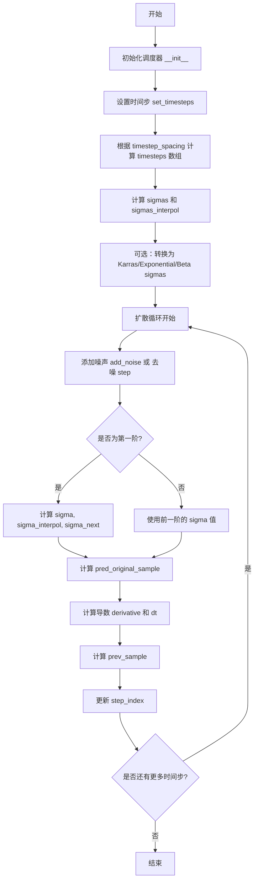
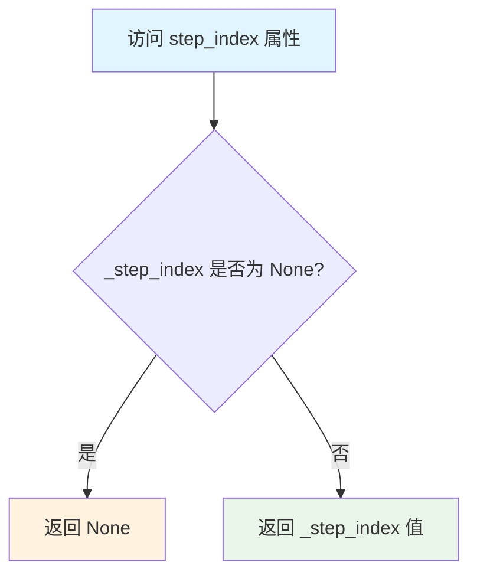
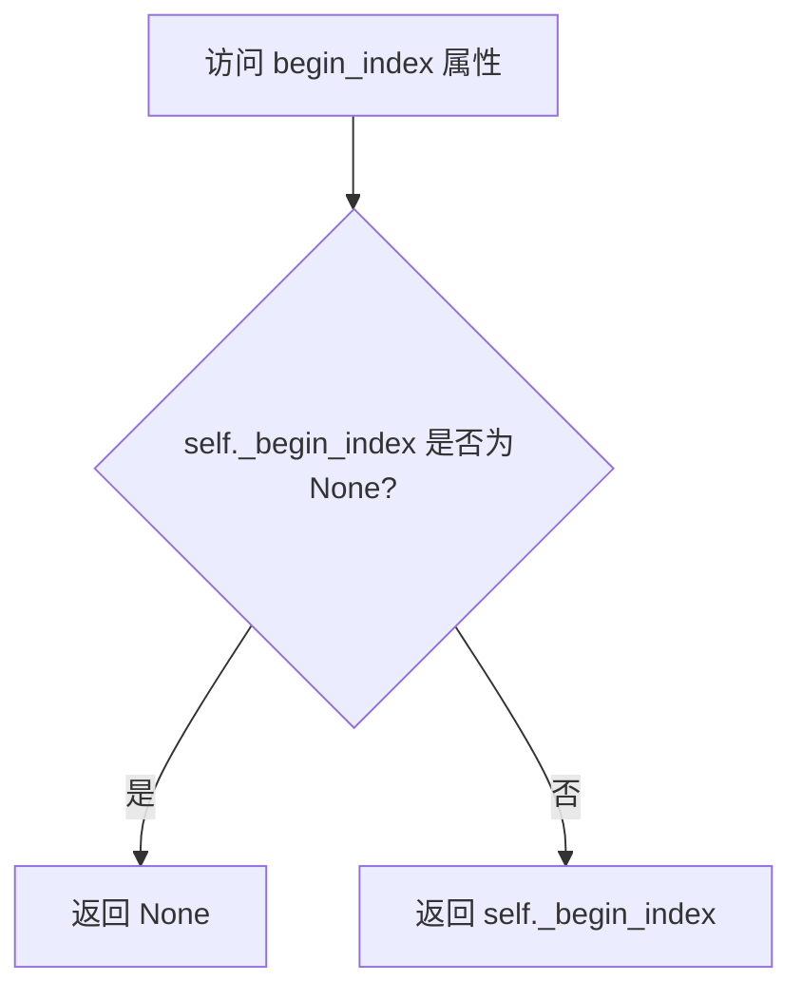
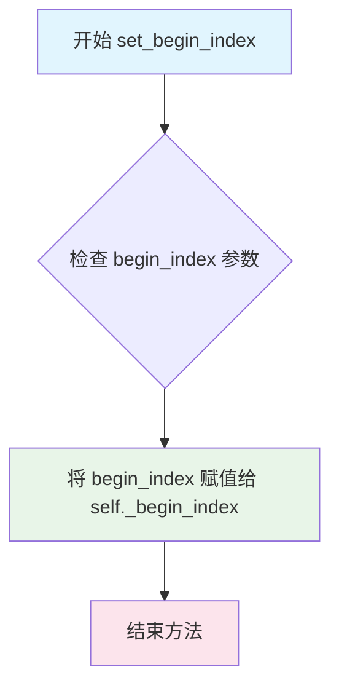
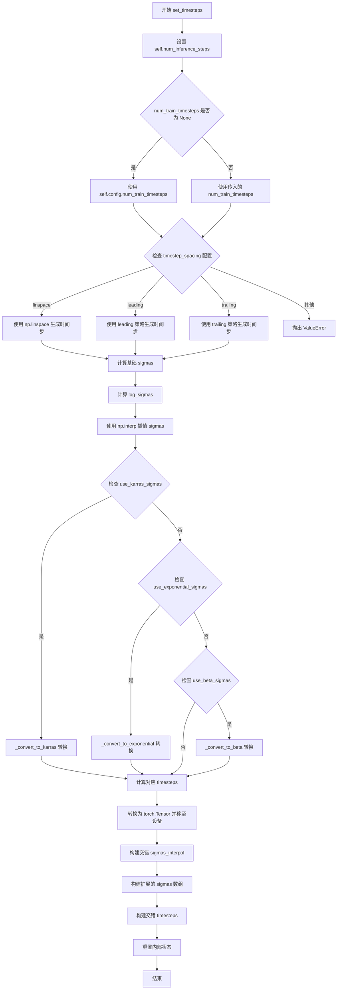
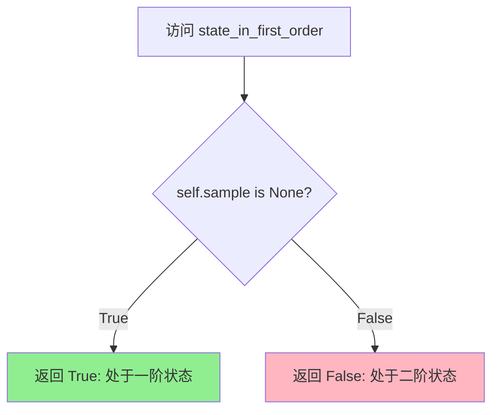
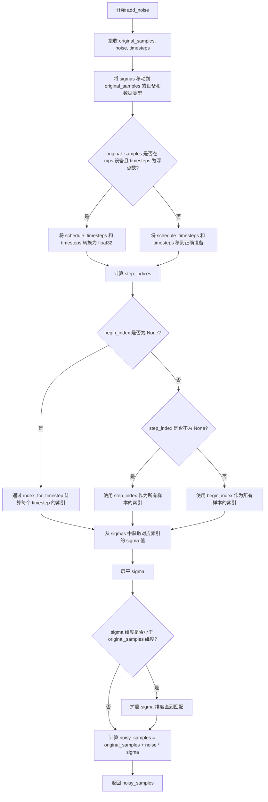

# `diffusers\src\diffusers\schedulers\scheduling_k_dpm_2_discrete.py` 详细设计文档

KDPM2DiscreteScheduler 是一个基于 Karras DPM-Solver2 算法的离散时间扩散模型调度器，继承自 SchedulerMixin 和 ConfigMixin，提供多种噪声调度策略（linear、scaled_linear、squaredcos_cap_v2）和 sigma 计算方法（karras、exponential、beta），用于在扩散模型推理过程中计算去噪步的中间样本。

## 整体流程



## 类结构

```
SchedulerMixin (抽象基类)
├── KDPM2DiscreteScheduler (本次分析)
ConfigMixin (配置混入类)
└── KDPM2DiscreteScheduler (继承)
```

## 全局变量及字段


### `math`
    
Python标准数学库，提供数学运算函数

类型：`module`
    


### `np`
    
NumPy库，用于数值计算和数组操作

类型：`module`
    


### `torch`
    
PyTorch深度学习框架库

类型：`module`
    


### `KarrasDiffusionSchedulers`
    
Karras扩散调度器枚举类

类型：`enum`
    


### `SchedulerMixin`
    
调度器混入类，提供调度器通用方法

类型：`class`
    


### `ConfigMixin`
    
配置混入类，提供配置注册和加载功能

类型：`class`
    


### `BaseOutput`
    
基础输出类，用于调度器输出数据结构

类型：`class`
    


### `is_scipy_available`
    
检查scipy库是否可用的函数

类型：`function`
    


### `scipy.stats`
    
scipy统计模块，提供概率分布函数（条件导入）

类型：`module`
    


### `KDPM2DiscreteSchedulerOutput.KDPM2DiscreteSchedulerOutput`
    
调度器step函数输出的数据类，包含前一时刻样本和预测原始样本

类型：`dataclass`
    


### `KDPM2DiscreteSchedulerOutput.prev_sample`
    
前一个时间步计算得到的样本

类型：`torch.Tensor`
    


### `KDPM2DiscreteSchedulerOutput.pred_original_sample`
    
预测的原始（去噪后）样本

类型：`torch.Tensor | None`
    


### `KDPM2DiscreteScheduler.num_train_timesteps`
    
训练时的扩散步数

类型：`int`
    


### `KDPM2DiscreteScheduler.beta_start`
    
beta起始值

类型：`float`
    


### `KDPM2DiscreteScheduler.beta_end`
    
beta结束值

类型：`float`
    


### `KDPM2DiscreteScheduler.beta_schedule`
    
beta调度策略

类型：`str`
    


### `KDPM2DiscreteScheduler.trained_betas`
    
直接传入的beta值

类型：`np.ndarray | list[float] | None`
    


### `KDPM2DiscreteScheduler.use_karras_sigmas`
    
是否使用Karras sigmas

类型：`bool`
    


### `KDPM2DiscreteScheduler.use_exponential_sigmas`
    
是否使用指数sigmas

类型：`bool`
    


### `KDPM2DiscreteScheduler.use_beta_sigmas`
    
是否使用beta sigmas

类型：`bool`
    


### `KDPM2DiscreteScheduler.prediction_type`
    
预测类型（epsilon/v_prediction/sample）

类型：`str`
    


### `KDPM2DiscreteScheduler.timestep_spacing`
    
时间步间隔策略

类型：`str`
    


### `KDPM2DiscreteScheduler.steps_offset`
    
推理步偏移量

类型：`int`
    


### `KDPM2DiscreteScheduler.betas`
    
beta值张量

类型：`torch.Tensor`
    


### `KDPM2DiscreteScheduler.alphas`
    
alpha值张量

类型：`torch.Tensor`
    


### `KDPM2DiscreteScheduler.alphas_cumprod`
    
累积alpha值

类型：`torch.Tensor`
    


### `KDPM2DiscreteScheduler.sigmas`
    
sigma值数组

类型：`torch.Tensor`
    


### `KDPM2DiscreteScheduler.sigmas_interpol`
    
插值后的sigma值

类型：`torch.Tensor`
    


### `KDPM2DiscreteScheduler.log_sigmas`
    
sigma的对数值

类型：`torch.Tensor`
    


### `KDPM2DiscreteScheduler.timesteps`
    
时间步数组

类型：`torch.Tensor`
    


### `KDPM2DiscreteScheduler._step_index`
    
当前步索引

类型：`int | None`
    


### `KDPM2DiscreteScheduler._begin_index`
    
起始索引

类型：`int | None`
    


### `KDPM2DiscreteScheduler.sample`
    
存储用于二阶计算的样本

类型：`torch.Tensor | None`
    


### `KDPM2DiscreteScheduler.num_inference_steps`
    
推理步数

类型：`int`
    
    

## 全局函数及方法


### `betas_for_alpha_bar`

创建离散化的 beta 调度表，支持 cosine、exp 和 laplace 三种 alpha 变换类型，通过累积乘积 (1-beta) 生成符合指定噪声调度策略的时间步序列，用于扩散模型的采样过程。

参数：

- `num_diffusion_timesteps`：`int`，要生成的 beta 数量，即扩散时间步的总数
- `max_beta`：`float`，默认为 `0.999`，beta 的上限值，用于避免数值不稳定
- `alpha_transform_type`：`Literal["cosine", "exp", "laplace"]`，默认为 `"cosine"`，alpha 变换的类型

返回值：`torch.Tensor`，返回 beta 调度表，用于调度器逐步降噪

#### 流程图

```mermaid
flowchart TD
    A[开始 betas_for_alpha_bar] --> B{alpha_transform_type == 'cosine'?}
    B -->|Yes| C[定义 alpha_bar_fn: cos²((t+0.008)/1.008 * π/2)]
    B -->|No| D{alpha_transform_type == 'laplace'?}
    D -->|Yes| E[定义 alpha_bar_fn: laplace SNR 公式]
    D -->|No| F{alpha_transform_type == 'exp'?}
    F -->|Yes| G[定义 alpha_bar_fn: exp(-12.0 * t)]
    F -->|No| H[抛出 ValueError]
    C --> I[初始化空列表 betas]
    E --> I
    G --> I
    I --> J[循环 i from 0 to num_diffusion_timesteps-1]
    J --> K[计算 t1 = i / num_diffusion_timesteps]
    J --> L[计算 t2 = (i+1) / num_diffusion_timesteps]
    K --> M[计算 beta_i = min(1 - alpha_bar_fn(t2)/alpha_bar_fn(t1), max_beta)]
    L --> M
    M --> N[将 beta_i 添加到 betas 列表]
    N --> O{循环是否结束?}
    O -->|No| J
    O -->|Yes| P[返回 torch.tensor(betas, dtype=torch.float32)]
    P --> Q[结束]
```

#### 带注释源码

```python
# Copied from diffusers.schedulers.scheduling_ddpm.betas_for_alpha_bar
def betas_for_alpha_bar(
    num_diffusion_timesteps: int,
    max_beta: float = 0.999,
    alpha_transform_type: Literal["cosine", "exp", "laplace"] = "cosine",
) -> torch.Tensor:
    """
    Create a beta schedule that discretizes the given alpha_t_bar function, which defines the cumulative product of
    (1-beta) over time from t = [0,1].

    Contains a function alpha_bar that takes an argument t and transforms it to the cumulative product of (1-beta) up
    to that part of the diffusion process.

    Args:
        num_diffusion_timesteps (`int`):
            The number of betas to produce.
        max_beta (`float`, defaults to `0.999`):
            The maximum beta to use; use values lower than 1 to avoid numerical instability.
        alpha_transform_type (`str`, defaults to `"cosine"`):
            The type of noise schedule for `alpha_bar`. Choose from `cosine`, `exp`, or `laplace`.

    Returns:
        `torch.Tensor`:
            The betas used by the scheduler to step the model outputs.
    """
    # 根据 alpha_transform_type 选择对应的 alpha_bar 变换函数
    if alpha_transform_type == "cosine":
        # cosine 调度: 使用余弦平方函数,添加偏移 0.008/1.008 以避免 t=0 时的问题
        def alpha_bar_fn(t):
            return math.cos((t + 0.008) / 1.008 * math.pi / 2) ** 2

    elif alpha_transform_type == "laplace":
        # laplace 调度: 使用拉普拉斯分布的 SNR (Signal-to-Noise Ratio)
        def alpha_bar_fn(t):
            # 计算 lambda = -0.5 * sign(0.5 - t) * log(1 - 2*|0.5 - t| + 1e-6)
            lmb = -0.5 * math.copysign(1, 0.5 - t) * math.log(1 - 2 * math.fabs(0.5 - t) + 1e-6)
            # SNR = exp(lambda)
            snr = math.exp(lmb)
            # 返回 sqrt(SNR / (1 + SNR))
            return math.sqrt(snr / (1 + snr))

    elif alpha_transform_type == "exp":
        # 指数调度: 使用指数衰减函数
        def alpha_bar_fn(t):
            return math.exp(t * -12.0)

    else:
        # 不支持的变换类型则抛出异常
        raise ValueError(f"Unsupported alpha_transform_type: {alpha_transform_type}")

    # 初始化 beta 列表
    betas = []
    # 遍历每个扩散时间步
    for i in range(num_diffusion_timesteps):
        # 计算当前时间步的起始和结束位置 (归一化到 [0, 1] 区间)
        t1 = i / num_diffusion_timesteps
        t2 = (i + 1) / num_diffusion_timesteps
        # 计算 beta: 1 - alpha_bar(t2) / alpha_bar(t1), 并限制最大值
        betas.append(min(1 - alpha_bar_fn(t2) / alpha_bar_fn(t1), max_beta))
    # 返回 float32 类型的张量
    return torch.tensor(betas, dtype=torch.float32)
```


### KDPM2DiscreteScheduler.__init__

该方法是KDPM2DiscreteScheduler类的构造函数，用于初始化扩散模型的离散调度器参数。它根据提供的配置参数计算betas（噪声调度参数）、alphas及其累积积，并设置推理所需的时间步和sigma值。

参数：

- `num_train_timesteps`：`int`，训练时的扩散步数，默认为1000
- `beta_start`：`float`，beta调度起始值，默认为0.00085
- `beta_end`：`float`，beta调度结束值，默认为0.012
- `beta_schedule`：`str`，beta调度策略，可选"linear"、"scaled_linear"或"squaredcos_cap_v2"，默认为"linear"
- `trained_betas`：`np.ndarray | list[float] | None`，可选的直接传入的betas数组，若提供则忽略beta_start和beta_end
- `use_karras_sigmas`：`bool`，是否使用Karras sigmas进行采样，默认为False
- `use_exponential_sigmas`：`bool`，是否使用指数sigmas进行采样，默认为False
- `use_beta_sigmas`：`bool`，是否使用beta sigmas进行采样，默认为False
- `prediction_type`：`str`，预测类型，可选"epsilon"、"sample"或"v_prediction"，默认为"epsilon"
- `timestep_spacing`：`str`，时间步间隔策略，可选"linspace"、"leading"或"trailing"，默认为"linspace"
- `steps_offset`：`int`，推理步数偏移量，默认为0

返回值：`None`，该方法为构造函数，不返回任何值

#### 流程图

```mermaid
flowchart TD
    A[开始 __init__] --> B{检查 use_beta_sigmas 依赖}
    B -->|未安装 scipy| C[抛出 ImportError]
    B --> D{检查 sigmas 配置冲突}
    D -->|多个 sigmas 选项同时启用| E[抛出 ValueError]
    D --> F{是否有 trained_betas}
    F -->|是| G[直接使用 trained_betas 创建 betas 张量]
    F -->|否| H{beta_schedule 类型}
    H -->|linear| I[使用 torch.linspace 创建线性 betas]
    H -->|scaled_linear| J[使用线性插值创建缩放 betas]
    H -->|squaredcos_cap_v2| K[使用 betas_for_alpha_bar 创建 cosine betas]
    H -->|其他| L[抛出 NotImplementedError]
    G --> M
    I --> M
    J --> M
    K --> M
    M[计算 alphas = 1.0 - betas] --> N[计算 alphas_cumprod = cumprod(alphas)]
    N --> O[调用 set_timesteps 初始化推理时间步]
    O --> P[初始化 _step_index = None]
    P --> Q[初始化 _begin_index = None]
    Q --> R[将 sigmas 移到 CPU]
    R --> S[结束 __init__]
```

#### 带注释源码

```python
@register_to_config
def __init__(
    self,
    num_train_timesteps: int = 1000,
    beta_start: float = 0.00085,  # sensible defaults
    beta_end: float = 0.012,
    beta_schedule: str = "linear",
    trained_betas: np.ndarray | list[float] | None = None,
    use_karras_sigmas: bool = False,
    use_exponential_sigmas: bool = False,
    use_beta_sigmas: bool = False,
    prediction_type: str = "epsilon",
    timestep_spacing: str = "linspace",
    steps_offset: int = 0,
):
    """
    初始化 KDPM2DiscreteScheduler 调度器。
    
    该方法负责：
    1. 验证配置参数的有效性
    2. 根据 beta_schedule 计算噪声调度参数 betas
    3. 计算相关的 alphas 和 alphas_cumprod
    4. 初始化推理所需的时间步和 sigma 值
    """
    
    # 检查 beta sigmas 依赖：如果启用了 beta sigmas 但未安装 scipy，则抛出导入错误
    if self.config.use_beta_sigmas and not is_scipy_available():
        raise ImportError("Make sure to install scipy if you want to use beta sigmas.")
    
    # 检查配置冲突：确保只启用一种 sigma 计算方式
    if sum([self.config.use_beta_sigmas, self.config.use_exponential_sigmas, self.config.use_karras_sigmas]) > 1:
        raise ValueError(
            "Only one of `config.use_beta_sigmas`, `config.use_exponential_sigmas`, `config.use_karras_sigmas` can be used."
        )
    
    # 根据不同策略计算 betas
    if trained_betas is not None:
        # 如果直接提供了 betas 数组，直接使用
        self.betas = torch.tensor(trained_betas, dtype=torch.float32)
    elif beta_schedule == "linear":
        # 线性 beta 调度：从 beta_start 线性增加到 beta_end
        self.betas = torch.linspace(beta_start, beta_end, num_train_timesteps, dtype=torch.float32)
    elif beta_schedule == "scaled_linear":
        # 缩放线性调度：先在线性空间插值，再平方（适用于 latent diffusion model）
        self.betas = torch.linspace(beta_start**0.5, beta_end**0.5, num_train_timesteps, dtype=torch.float32) ** 2
    elif beta_schedule == "squaredcos_cap_v2":
        # Glide cosine 调度：使用余弦函数生成的 beta 调度
        self.betas = betas_for_alpha_bar(num_train_timesteps)
    else:
        # 不支持的 beta 调度策略
        raise NotImplementedError(f"{beta_schedule} is not implemented for {self.__class__}")

    # 计算 alphas：alpha = 1 - beta
    self.alphas = 1.0 - self.betas
    
    # 计算累积 alphas：alphas_cumprod[t] = alpha[0] * alpha[1] * ... * alpha[t]
    self.alphas_cumprod = torch.cumprod(self.alphas, dim=0)

    # 设置推理时间步，初始化所有必要的属性
    # 这里传入 num_train_timesteps 作为默认的推理步数
    self.set_timesteps(num_train_timesteps, None, num_train_timesteps)

    # 初始化步数索引（用于跟踪当前推理步骤）
    self._step_index = None
    self._begin_index = None
    
    # 将 sigmas 移到 CPU 以减少 CPU/GPU 通信开销
    self.sigmas = self.sigmas.to("cpu")
```


### `KDPM2DiscreteScheduler.init_noise_sigma`

该属性方法用于获取扩散模型采样过程中的初始噪声标准差（Standard Deviation of the Initial Noise）。它根据调度器的`timestep_spacing`（时间步间隔）配置来决定返回的最大sigma值。对于`linspace`和`trailing`策略，直接返回最大sigma值；对于其他策略（如`leading`），则通过公式$( \sigma_{max}^2 + 1 )^{0.5}$计算得出，以确保噪声水平的正确缩放。

参数： 无（该方法为属性访问，不接收显式参数）

返回值：`float` 或 `torch.Tensor`，初始噪声的标准差值。

#### 流程图

```mermaid
graph TD
    A([Start init_noise_sigma]) --> B{self.config.timestep_spacing in<br/>['linspace', 'trailing']?}
    B -- Yes --> C[Return self.sigmas.max()]
    B -- No --> D[Return (self.sigmas.max() ** 2 + 1) ** 0.5]
    C --> E([End])
    D --> E
```

#### 带注释源码

```python
@property
def init_noise_sigma(self):
    # standard deviation of the initial noise distribution
    # 获取配置中的时间步间隔策略
    if self.config.timestep_spacing in ["linspace", "trailing"]:
        # 对于 linspace 和 trailing 策略，直接返回 sigmas 数组中的最大值
        return self.sigmas.max()

    # 对于其他策略（例如 leading），根据扩散过程公式计算初始噪声标准差
    # 公式来源：确保 sigma_0 满足 sigma_0^2 + 1 = alpha_cumprod^(-1) 的关系推导
    return (self.sigmas.max() ** 2 + 1) ** 0.5
```


### `KDPM2DiscreteScheduler.step_index`

该属性返回当前时间步的索引计数器，用于追踪扩散模型推理过程中的当前步骤。该索引在每次调度器执行 step 方法后自动增加 1，初始值为 None。

参数： 无

返回值：`int | None`，当前时间步索引。如果调度器尚未执行任何步骤，则返回 None；否则返回从 0 开始的递进索引值。

#### 流程图



#### 带注释源码

```python
@property
def step_index(self):
    """
    The index counter for current timestep. It will increase 1 after each scheduler step.
    """
    # 返回内部维护的 _step_index 变量
    # 该变量在 set_timesteps 时被初始化为 None
    # 在 _init_step_index 中被设置为具体的索引值
    # 每调用一次 step 方法，_step_index 会自动加 1
    return self._step_index
```


### `KDPM2DiscreteScheduler.begin_index`

该属性返回调度器的起始时间步索引，用于在扩散模型推理过程中指定从哪个时间步开始采样。

参数：无（该方法为属性，只包含隐式参数 `self`）

返回值：`int | None`，返回第一个时间步的索引。如果没有设置则返回 `None`。

#### 流程图



#### 带注释源码

```python
@property
def begin_index(self):
    """
    The index for the first timestep. It should be set from pipeline with `set_begin_index` method.
    """
    # 返回内部变量 _begin_index，该值通过 set_begin_index 方法设置
    # 用于指定扩散过程的起始时间步索引
    return self._begin_index
```


### `KDPM2DiscreteScheduler.set_begin_index`

设置调度器的起始索引。该方法应在推理前从pipeline调用，用于指定从哪个时间步开始进行去噪处理。

参数：

- `begin_index`：`int`，默认为 `0`，调度器的起始索引。

返回值：`None`，无返回值，仅修改内部状态。

#### 流程图



#### 带注释源码

```
def set_begin_index(self, begin_index: int = 0):
    """
    设置调度器的起始索引。此方法应在推理前从 pipeline 调用。
    
    Args:
        begin_index (int, 默认为 0):
            调度器的起始索引。
    """
    # 将传入的 begin_index 参数赋值给实例变量 _begin_index
    # _begin_index 用于记录去噪过程的起始时间步索引
    # 当 begin_index 被设置后，调度器将从指定的位置开始推理
    self._begin_index = begin_index
```


### `KDPM2DiscreteScheduler.scale_model_input`

该方法负责根据当前扩散推理的离散时间步（timestep）对应的噪声水平（sigma），对输入的去噪模型样本进行缩放处理。这是扩散模型调度器接口的标准组成部分，旨在保证模型输入在不同的采样策略（如 Euler、DPMSolver 等）下的数值稳定性或一致性。通常，它会将样本除以 $\sqrt{\sigma^2 + 1}$ 以进行归一化。

参数：

-  `sample`：`torch.Tensor`，当前迭代中的输入样本（通常是带噪声的图像 $x_t$）。
-  `timestep`：`float | torch.Tensor`，当前在扩散链中的离散时间步。

返回值：`torch.Tensor`，经过缩放处理的样本。

#### 流程图

```mermaid
graph TD
    A([开始 scale_model_input]) --> B{step_index is None?}
    B -- 是 --> C[调用 _init_step_index<br>初始化 step_index]
    C --> D
    B -- 否 --> D{state_in_first_order?}
    D -- 是 --> E[sigma = self.sigmas[step_index]
    <br>使用一阶sigma]
    D -- 否 --> F[sigma = self.sigmas_interpol[step_index]
    <br>使用插值sigma]
    E --> G[计算缩放因子: scale = (sigma^2 + 1)^0.5]
    F --> G
    G --> H[sample = sample / scale]
    H --> I([返回缩放后的 sample])
```

#### 带注释源码

```python
def scale_model_input(
    self,
    sample: torch.Tensor,
    timestep: float | torch.Tensor,
) -> torch.Tensor:
    """
    Ensures interchangeability with schedulers that need to scale the denoising model input depending on the
    current timestep.

    Args:
        sample (`torch.Tensor`):
            The input sample.
        timestep (`int`, *optional*):
            The current timestep in the diffusion chain.

    Returns:
        `torch.Tensor`:
            A scaled input sample.
    """
    # 1. 确保调度器的步进索引已初始化。
    # 如果当前尚未开始推理（step_index 为 None），则根据传入的 timestep 计算并设置索引。
    if self.step_index is None:
        self._init_step_index(timestep)

    # 2. 获取当前时间步对应的 Sigma 值。
    # KDPM2DiscreteScheduler 是一个二阶调度器（Order=2）。
    # 它通过状态 self.sample 是否为 None 来判断当前是处于 'first order' 还是 'second order'。
    # - First Order (第一步): 使用标准 sigma 序列 self.sigmas。
    # - Second Order (后续步): 使用插值后的 sigma 序列 self.sigmas_interpol 以提高精度。
    if self.state_in_first_order:
        sigma = self.sigmas[self.step_index]
    else:
        sigma = self.sigmas_interpol[self.step_index]

    # 3. 执行缩放操作。
    # 公式: x_input = x / sqrt(sigma^2 + 1)
    # 这是一种常见的缩放方式，旨在将输入样本归一化到与 v-prediction 或标准噪声预测一致的数值范围，
    # 防止模型在推理初期因 sigma（即噪声水平）过大而出现数值不稳定。
    sample = sample / ((sigma**2 + 1) ** 0.5)
    
    return sample
```


### `KDPM2DiscreteScheduler.set_timesteps`

设置离散时间步用于扩散链（推理前运行）。该方法根据推理步数、训练时间步数和配置的间隔策略生成时间步序列，并计算对应的噪声标准差（sigmas），同时为二阶求解器准备交错的时间步。

参数：

- `num_inference_steps`：`int`，生成样本时使用的扩散推理步数
- `device`：`str | torch.device`，时间步要移动到的设备，如果为 `None` 则不移动
- `num_train_timesteps`：`int`，训练时的扩散总步数，默认为 `None`（使用配置中的值）

返回值：`None`，该方法直接修改调度器的内部状态

#### 流程图



#### 带注释源码

```python
def set_timesteps(
    self,
    num_inference_steps: int,
    device: str | torch.device = None,
    num_train_timesteps: int = None,
):
    """
    Sets the discrete timesteps used for the diffusion chain (to be run before inference).

    Args:
        num_inference_steps (`int`):
            The number of diffusion steps used when generating samples with a pre-trained model.
        device (`str` or `torch.device`, *optional*):
            The device to which the timesteps should be moved to. If `None`, the timesteps are not moved.
    """
    # 保存推理步数
    self.num_inference_steps = num_inference_steps

    # 如果未指定训练时间步数，则使用配置中的默认值
    num_train_timesteps = num_train_timesteps or self.config.num_train_timesteps

    # 根据 timestep_spacing 策略生成基础时间步序列
    # "linspace", "leading", "trailing" 对应 Common Diffusion Noise Schedules 论文中的表2
    if self.config.timestep_spacing == "linspace":
        # 线性间隔：从 (num_train_timesteps-1) 到 0
        timesteps = np.linspace(0, num_train_timesteps - 1, num_inference_steps, dtype=np.float32)[::-1].copy()
    elif self.config.timestep_spacing == "leading":
        # 前导间隔：步长均匀分布，起始位置偏移
        step_ratio = num_train_timesteps // self.num_inference_steps
        timesteps = (np.arange(0, num_inference_steps) * step_ratio).round()[::-1].copy().astype(np.float32)
        timesteps += self.config.steps_offset
    elif self.config.timestep_spacing == "trailing":
        # 尾随间隔：从 num_train_timesteps 递减到 1
        step_ratio = num_train_timesteps / self.num_inference_steps
        timesteps = (np.arange(num_train_timesteps, 0, -step_ratio)).round().copy().astype(np.float32)
        timesteps -= 1
    else:
        raise ValueError(
            f"{self.config.timestep_spacing} is not supported. Please make sure to choose one of 'linspace', 'leading' or 'trailing'."
        )

    # 根据 alpha_cumprod 计算基础 sigmas（噪声标准差）
    # sigma = sqrt((1 - alpha_cumprod) / alpha_cumprod)
    sigmas = np.array(((1 - self.alphas_cumprod) / self.alphas_cumprod) ** 0.5)
    log_sigmas = np.log(sigmas)  # 对数 sigma 用于后续插值
    
    # 将时间步映射到对应的 sigma 值（通过线性插值）
    sigmas = np.interp(timesteps, np.arange(0, len(sigmas)), sigmas)

    # 根据配置应用不同的 sigma 转换策略（Karras/Exponential/Beta）
    if self.config.use_karras_sigmas:
        # Karras 噪声调度：使用论文中的公式构造
        sigmas = self._convert_to_karras(in_sigmas=sigmas, num_inference_steps=num_inference_steps)
        # 将转换后的 sigma 映射回时间步
        timesteps = np.array([self._sigma_to_t(sigma, log_sigmas) for sigma in sigmas]).round()
    elif self.config.use_exponential_sigmas:
        # 指数噪声调度
        sigmas = self._convert_to_exponential(in_sigmas=sigmas, num_inference_steps=num_inference_steps)
        timesteps = np.array([self._sigma_to_t(sigma, log_sigmas) for sigma in sigmas])
    elif self.config.use_beta_sigmas:
        # Beta 噪声调度
        sigmas = self._convert_to_beta(in_sigmas=sigmas, num_inference_steps=num_inference_steps)
        timesteps = np.array([self._sigma_to_t(sigma, log_sigmas) for sigma in sigmas])

    # 转换 log_sigmas 为 torch.Tensor 并移至指定设备
    self.log_sigmas = torch.from_numpy(log_sigmas).to(device=device)
    
    # 在 sigmas 数组末尾添加 0.0（最终噪声级别）
    sigmas = np.concatenate([sigmas, [0.0]]).astype(np.float32)
    sigmas = torch.from_numpy(sigmas).to(device=device)

    # 使用线性插值构造交错的 sigmas（用于二阶求解器）
    # lerp 在对数空间进行插值，然后指数化
    sigmas_interpol = sigmas.log().lerp(sigmas.roll(1).log(), 0.5).exp()

    # 扩展 sigmas 数组：重复每个中间值两次，首尾保持不变
    # 这为二阶方法创建了中间时间步
    self.sigmas = torch.cat([sigmas[:1], sigmas[1:].repeat_interleave(2), sigmas[-1:]])
    self.sigmas_interpol = torch.cat(
        [sigmas_interpol[:1], sigmas_interpol[1:].repeat_interleave(2), sigmas_interpol[-1:]]
    )

    # 将 timesteps 转换为 torch.Tensor 并移至设备
    timesteps = torch.from_numpy(timesteps).to(device)

    # 构造交错的时间步（用于二阶求解器）
    # 在相邻时间步之间插入中间时间步
    sigmas_interpol = sigmas_interpol.cpu()
    log_sigmas = self.log_sigmas.cpu()
    timesteps_interpol = np.array(
        [self._sigma_to_t(sigma_interpol, log_sigmas) for sigma_interpol in sigmas_interpol]
    )
    timesteps_interpol = torch.from_numpy(timesteps_interpol).to(device, dtype=timesteps.dtype)
    
    # 交错排列：[t0, (t1_inter, t1), (t2_inter, t2), ...]
    interleaved_timesteps = torch.stack((timesteps_interpol[1:-1, None], timesteps[1:, None]), dim=-1).flatten()

    # 最终时间步：首步 + 交错时间步
    self.timesteps = torch.cat([timesteps[:1], interleaved_timesteps])

    # 重置采样样本状态（用于判断当前是否处于一阶）
    self.sample = None

    # 重置步进索引
    self._step_index = None
    self._begin_index = None
    
    # 将 sigmas 移至 CPU 以减少 CPU/GPU 通信开销
    self.sigmas = self.sigmas.to("cpu")
```


### `KDPM2DiscreteScheduler.state_in_first_order`

判断调度器当前是否处于一阶（first order）状态。在 KDPM2（KDPM2DiscreteScheduler）调度器中，一阶和二阶状态对应 DPM-Solver-2 算法的不同计算阶段：当 `self.sample` 为 `None` 时表示处于一阶状态（即第一步），不为 `None` 时表示处于二阶状态（即第二步，需要利用第一步保存的样本进行计算）。

属性（无参数）

返回值：`bool`，返回一个布尔值，表示当前调度器是否处于一阶状态。

#### 流程图



#### 带注释源码

```python
@property
def state_in_first_order(self):
    """
    判断调度器是否处于一阶状态。
    
    在 DPM-Solver-2（KDPM2）算法中：
    - 一阶状态：调度器刚开始进行去噪步骤，或者刚刚完成一个完整的步骤
    - 二阶状态：调度器正在进行第二步计算（需要利用前一步保存的样本）
    
    这个属性通过检查 self.sample 是否为 None 来判断当前状态：
    - self.sample 为 None 表示当前处于一阶状态
    - self.sample 不为 None 表示当前处于二阶状态（已保存样本用于二阶计算）
    
    返回值:
        bool: True 表示处于一阶状态，False 表示处于二阶状态
    """
    return self.sample is None
```


### `KDPM2DiscreteScheduler.index_for_timestep`

在扩散模型调度器中，查找给定时间步在时间步调度序列中的索引位置，确保在图像到图像等场景下从调度中间开始时不会错误地跳过 sigma 值。

参数：

- `self`：`KDPM2DiscreteScheduler`，调度器实例本身
- `timestep`：`float | torch.Tensor`，要查找的时间步值，可以是单个浮点数或张量
- `schedule_timesteps`：`torch.Tensor | None`，可选参数，指定要搜索的时间步调度序列，如果为 `None` 则使用 `self.timesteps`

返回值：`int`，时间步在调度序列中的索引。对于第一个步骤，如果存在多个匹配项则返回第二个索引（仅有一个匹配时返回第一个），以避免在从调度中间开始时（例如图像到图像）意外跳过 sigma 值。

#### 流程图

```mermaid
flowchart TD
    A[开始 index_for_timestep] --> B{schedule_timesteps 是否为 None?}
    B -->|是| C[使用 self.timesteps 作为 schedule_timesteps]
    B -->|否| D[使用传入的 schedule_timesteps]
    C --> E[在 schedule_timesteps 中查找与 timestep 相等的位置]
    D --> E
    E --> F[获取所有匹配项的索引: indices = (schedule_timesteps == timestep).nonzero()]
    F --> G{匹配数量 > 1?}
    G -->|是| H[pos = 1]
    G -->|否| I[pos = 0]
    H --> J[返回 indices[1].item]
    I --> K[返回 indices[0].item]
    J --> L[结束]
    K --> L
```

#### 带注释源码

```python
def index_for_timestep(
    self, timestep: float | torch.Tensor, schedule_timesteps: torch.Tensor | None = None
) -> int:
    """
    Find the index of a given timestep in the timestep schedule.

    Args:
        timestep (`float` or `torch.Tensor`):
            The timestep value to find in the schedule.
        schedule_timesteps (`torch.Tensor`, *optional*):
            The timestep schedule to search in. If `None`, uses `self.timesteps`.

    Returns:
        `int`:
            The index of the timestep in the schedule. For the very first step, returns the second index if
            multiple matches exist to avoid skipping a sigma when starting mid-schedule (e.g., for image-to-image).
    """
    # 如果未提供 schedule_timesteps，则使用调度器实例的 timesteps 属性
    if schedule_timesteps is None:
        schedule_timesteps = self.timesteps

    # 使用 non-zero 查找 schedule_timesteps 中与给定 timestep 相等的元素的索引
    # 返回的是一个二维张量，每行是一个匹配项的索引
    indices = (schedule_timesteps == timestep).nonzero()

    # The sigma index that is taken for the **very** first `step`
    # is always the second index (or the last index if there is only 1)
    # This way we can ensure we don't accidentally skip a sigma in
    # case we start in the middle of the denoising schedule (e.g. for image-to-image)
    # 对于第一个步骤，始终选择第二个索引（如果只有一个匹配则选第一个）
    # 这样可以确保在从去噪调度中间开始时（例如图像到图像）不会意外跳过 sigma
    pos = 1 if len(indices) > 1 else 0

    # 将索引转换为 Python 整数并返回
    return indices[pos].item()
```


### `KDPM2DiscreteScheduler._init_step_index`

初始化调度器的步索引，基于给定的时间步。

参数：

- `timestep`：`float | torch.Tensor`，当前的时间步，用于初始化步索引

返回值：`None`，该函数直接修改内部状态 `_step_index`，不返回任何值

#### 流程图

```mermaid
flowchart TD
    A[开始 _init_step_index] --> B{self.begin_index is None?}
    B -->|是| C{isinstance(timestep, torch.Tensor)?}
    C -->|是| D[timestep = timestep.to<br/>self.timesteps.device]
    C -->|否| E[跳过设备转换]
    D --> F[self._step_index =<br/>self.index_for_timestep<br/>(timestep)]
    E --> F
    B -->|否| G[self._step_index =<br/>self._begin_index]
    F --> H[结束]
    G --> H
```

#### 带注释源码

```python
def _init_step_index(self, timestep: float | torch.Tensor) -> None:
    """
    Initialize the step index for the scheduler based on the given timestep.

    Args:
        timestep (`float` or `torch.Tensor`):
            The current timestep to initialize the step index from.
    """
    # 检查 begin_index 是否已设置
    if self.begin_index is None:
        # 如果时间步是 Tensor 类型，确保它与 timesteps 在同一设备上
        if isinstance(timestep, torch.Tensor):
            timestep = timestep.to(self.timesteps.device)
        
        # 通过 index_for_timestep 方法查找对应的时间步索引
        self._step_index = self.index_for_timestep(timestep)
    else:
        # 如果 begin_index 已设置，直接使用它作为步索引
        # 这通常用于从 pipeline 中指定的起始点开始推理
        self._step_index = self._begin_index
```


### `KDPM2DiscreteScheduler._sigma_to_t`

将 sigma 值通过插值转换为对应的时间步 timesteps。该方法通过在 log-sigma 空间中进行线性插值来实现 sigma 到 timestep 的映射，是 Karras、Exponential 和 Beta sigmas 转换过程中的关键步骤。

参数：

- `self`：类的实例，包含 `config` 等属性
- `sigma`：`np.ndarray` 或 `float`，要转换为时间步的 sigma 值
- `log_sigmas`：`np.ndarray`，sigma 对数值的schedule，用于插值计算

返回值：`np.ndarray`，与输入 sigma 形状相同的插值后时间步值

#### 流程图

```mermaid
flowchart TD
    A[开始: _sigma_to_t] --> B[计算log_sigma: log_sigma = log(max(sigma, 1e-10))]
    B --> C[计算距离分布: dists = log_sigma - log_sigmas[:, np.newaxis]]
    C --> D[确定sigma范围: low_idx通过cumsum和argmax找到第一个非负位置]
    D --> E[计算high_idx: low_idx + 1]
    E --> F[获取low和high的log_sigma值]
    F --> G[计算插值权重: w = (low - log_sigma) / (low - high)]
    G --> H[裁剪权重: w = clip(w, 0, 1)]
    H --> I[计算时间步: t = (1-w) * low_idx + w * high_idx]
    I --> J[reshape输出: t = t.reshape(sigma.shape)]
    J --> K[返回: 插值后的时间步值]
```

#### 带注释源码

```python
def _sigma_to_t(self, sigma, log_sigmas):
    """
    Convert sigma values to corresponding timestep values through interpolation.

    Args:
        sigma (`np.ndarray`):
            The sigma value(s) to convert to timestep(s).
        log_sigmas (`np.ndarray`):
            The logarithm of the sigma schedule used for interpolation.

    Returns:
        `np.ndarray`:
            The interpolated timestep value(s) corresponding to the input sigma(s).
    """
    # 获取 sigma 的对数值，使用 max(..., 1e-10) 防止 log(0)
    log_sigma = np.log(np.maximum(sigma, 1e-10))

    # 计算 log_sigma 与 log_sigmas 数组中每个值的距离
    # 结果形状: (len(log_sigmas), len(sigma))
    dists = log_sigma - log_sigmas[:, np.newaxis]

    # 通过累积和找到第一个非负位置，确定 sigma 值在 schedule 中的下界索引
    # clip 防止索引超出范围
    low_idx = np.cumsum((dists >= 0), axis=0).argmax(axis=0).clip(max=log_sigmas.shape[0] - 2)
    
    # 上界索引为下界索引 + 1
    high_idx = low_idx + 1

    # 获取对应的 log_sigma 边界值
    low = log_sigmas[low_idx]
    high = log_sigmas[high_idx]

    # 计算线性插值权重 w
    # w 越接近 0，越接近 low；w 越接近 1，越接近 high
    w = (low - log_sigma) / (low - high)
    
    # 将权重裁剪到 [0, 1] 范围，避免外推
    w = np.clip(w, 0, 1)

    # 将插值权重转换为时间步值
    # t = 0 表示初始 timestep，t = max 表示最终 timestep
    t = (1 - w) * low_idx + w * high_idx
    
    # 调整输出形状以匹配输入 sigma 的形状
    t = t.reshape(sigma.shape)
    
    return t
```


### `KDPM2DiscreteScheduler._convert_to_karras`

该方法用于将输入的 sigma 值转换为 Karras 噪声调度（Karras noise schedule）。Karras 调度是一种基于幂函数（power law）的噪声调度方法，灵感来源于论文《Elucidating the Design Space of Diffusion-Based Generative Models》，通过非线性插值在噪声水平之间创建更平滑的过渡，特别适用于高分辨率图像生成任务。

参数：

- `self`：`KDPM2DiscreteScheduler`，调度器实例，隐式参数
- `in_sigmas`：`torch.Tensor`，输入的 sigma 值数组，通常为标准噪声调度中的 sigma 序列
- `num_inference_steps`：`int`，推理步骤数，表示生成噪声调度时要使用的步数

返回值：`torch.Tensor`，转换后的 sigma 值数组，遵循 Karras 噪声调度曲线

#### 流程图

```mermaid
flowchart TD
    A[开始 _convert_to_karras] --> B{self.config 是否有 sigma_min 属性}
    B -->|是| C[sigma_min = self.config.sigma_min]
    B -->|否| D[sigma_min = None]
    C --> E{self.config 是否有 sigma_max 属性}
    D --> E
    E -->|是| F[sigma_max = self.config.sigma_max]
    E -->|否| G[sigma_max = None]
    F --> H{sigma_min 是否为 None}
    G --> H
    H -->|是| I[sigma_min = in_sigmas[-1].item]
    H -->|否| J[sigma_min 保持不变]
    I --> K{sigma_max 是否为 None}
    J --> K
    K -->|是| L[sigma_max = in_sigmas[0].item]
    K -->|否| M[sigma_max 保持不变]
    L --> N[rho = 7.0]
    M --> N
    N --> O[ramp = np.linspace 0 到 1, num_inference_steps]
    O --> P[min_inv_rho = sigma_min^(1/rho)]
    P --> Q[max_inv_rho = sigma_max^(1/rho)]
    Q --> R[sigmas = max_inv_rho + ramp × (min_inv_rho - max_inv_rho)]^rho
    R --> S[返回 sigmas]
```

#### 带注释源码

```python
def _convert_to_karras(self, in_sigmas: torch.Tensor, num_inference_steps) -> torch.Tensor:
    """
    Construct the noise schedule as proposed in [Elucidating the Design Space of Diffusion-Based Generative
    Models](https://huggingface.co/papers/2206.00364).

    Args:
        in_sigmas (`torch.Tensor`):
            The input sigma values to be converted.
        num_inference_steps (`int`):
            The number of inference steps to generate the noise schedule for.

    Returns:
        `torch.Tensor`:
            The converted sigma values following the Karras noise schedule.
    """

    # Hack to make sure that other schedulers which copy this function don't break
    # TODO: Add this logic to the other schedulers
    # 检查配置中是否存在 sigma_min 属性，用于支持不同调度器的兼容性
    if hasattr(self.config, "sigma_min"):
        sigma_min = self.config.sigma_min
    else:
        sigma_min = None

    # 检查配置中是否存在 sigma_max 属性
    if hasattr(self.config, "sigma_max"):
        sigma_max = self.config.sigma_max
    else:
        sigma_max = None

    # 如果未指定 sigma_min，则使用输入 sigmas 中的最后一个值（最小噪声水平）
    sigma_min = sigma_min if sigma_min is not None else in_sigmas[-1].item()
    # 如果未指定 sigma_max，则使用输入 sigmas 中的第一个值（最大噪声水平）
    sigma_max = sigma_max if sigma_max is not None else in_sigmas[0].item()

    # rho 是 Karras 论文中推荐的幂函数指数值，控制噪声调度的非线性程度
    rho = 7.0  # 7.0 is the value used in the paper
    # 创建从 0 到 1 的线性间隔数组，用于在 sigma_min 和 sigma_max 之间插值
    ramp = np.linspace(0, 1, num_inference_steps)
    # 计算 sigma_min 和 sigma_max 的 rho 次根的倒数，为幂函数变换做准备
    min_inv_rho = sigma_min ** (1 / rho)
    max_inv_rho = sigma_max ** (1 / rho)
    # 应用 Karras 幂函数公式：sigma(t) = (max_inv_rho + t * (min_inv_rho - max_inv_rho))^rho
    # 其中 t 从 0 到 1 线性变化，实现噪声水平的非线性插值
    sigmas = (max_inv_rho + ramp * (min_inv_rho - max_inv_rho)) ** rho
    return sigmas
```


### `KDPM2DiscreteScheduler._convert_to_exponential`

将输入的 sigma 值转换为遵循指数分布的噪声调度序列。

参数：

- `self`：`KDPM2DiscreteScheduler`，调度器实例本身
- `in_sigmas`：`torch.Tensor`，输入的 sigma 值，用于确定转换的范围
- `num_inference_steps`：`int`，生成的推理步数，决定输出 sigma 序列的长度

返回值：`torch.Tensor`，转换后的 sigma 值，遵循指数噪声调度

#### 流程图

```mermaid
flowchart TD
    A[开始 _convert_to_exponential] --> B{config 是否有 sigma_min}
    B -->|是| C[sigma_min = config.sigma_min]
    B -->|否| D[sigma_min = None]
    C --> E{sigma_min 不为 None}
    D --> E
    E -->|是| F[sigma_min 保持原值]
    E -->|否| G[sigma_min = in_sigmas[-1].item()]
    F --> I
    G --> I
    
    I{sigma_max 是否存在} -->|是| J[sigma_max = config.sigma_max]
    I -->|否| K[sigma_max = None]
    J --> L{sigma_max 不为 None}
    K --> L
    L -->|是| M[sigma_max 保持原值]
    L -->|否| N[sigma_max = in_sigmas[0].item()]
    M --> O
    N --> O
    
    O[计算对数空间点] --> P[np.linspace math.log(sigma_max to sigma_min, num_inference_steps]
    P --> Q[np.exp 转换回线性空间]
    Q --> R[返回 sigmas tensor]
```

#### 带注释源码

```python
def _convert_to_exponential(self, in_sigmas: torch.Tensor, num_inference_steps: int) -> torch.Tensor:
    """
    Construct an exponential noise schedule.

    Args:
        in_sigmas (`torch.Tensor`):
            The input sigma values to be converted.
        num_inference_steps (`int`):
            The number of inference steps to generate the noise schedule for.

    Returns:
        `torch.Tensor`:
            The converted sigma values following an exponential schedule.
    """

    # Hack to make sure that other schedulers which copy this function don't break
    # TODO: Add this logic to the other schedulers
    # 检查配置中是否存在 sigma_min 属性
    if hasattr(self.config, "sigma_min"):
        sigma_min = self.config.sigma_min
    else:
        sigma_min = None

    # 检查配置中是否存在 sigma_max 属性
    if hasattr(self.config, "sigma_max"):
        sigma_max = self.config.sigma_max
    else:
        sigma_max = None

    # 如果配置中未指定 sigma_min，则使用输入 sigmas 的最后一个值（最小的 sigma）
    sigma_min = sigma_min if sigma_min is not None else in_sigmas[-1].item()
    # 如果配置中未指定 sigma_max，则使用输入 sigmas 的第一个值（最大的 sigma）
    sigma_max = sigma_max if sigma_max is not None else in_sigmas[0].item()

    # 在对数空间生成等间距的点，然后转换回线性空间
    # 这创建了一个指数衰减的 sigma 序列
    sigmas = np.exp(np.linspace(math.log(sigma_max), math.log(sigma_min), num_inference_steps))
    return sigmas
```


### `KDPM2DiscreteScheduler._convert_to_beta`

根据 Beta 分布构建噪声调度表，将输入的 sigma 值转换为遵循 Beta 分布的 sigma 调度序列。该方法实现了论文 "Beta Sampling is All You Need" 中提出的噪声调度策略。

参数：

- `self`：`KDPM2DiscreteScheduler`，调度器实例
- `in_sigmas`：`torch.Tensor`，输入的 sigma 值，用于确定 sigma 的范围
- `num_inference_steps`：`int`，推理步数，生成噪声调度表的长度
- `alpha`：`float`，可选，默认 0.6，Beta 分布的 alpha 参数，控制分布的形状
- `beta`：`float`，可选，默认 0.6，Beta 分布的 beta 参数，控制分布的形状

返回值：`torch.Tensor`，转换后的 sigma 值序列，遵循 Beta 分布调度

#### 流程图

```mermaid
flowchart TD
    A[开始 _convert_to_beta] --> B{检查 config.sigma_min}
    B -->|存在| C[sigma_min = config.sigma_min]
    B -->|不存在| D[sigma_min = None]
    C --> E{检查 config.sigma_max}
    D --> E
    E -->|存在| F[sigma_max = config.sigma_max]
    E -->|不存在| G[sigma_max = None]
    F --> H{sigma_min 非空}
    G --> H
    H -->|是| I[使用 config.sigma_min]
    H -->|否| J[使用 in_sigmas[-1].item()]
    I --> K{sigma_max 非空}
    J --> K
    K -->|是| L[使用 config.sigma_max]
    K -->|否| M[使用 in_sigmas[0].item()]
    L --> N[生成时间步序列 1 - np.linspace]
    M --> N
    N --> O[对每个时间步计算 beta.ppf]
    O --> P[映射到 [sigma_min, sigma_max] 范围]
    P --> Q[转换为 numpy 数组]
    Q --> R[返回 torch.Tensor]
```

#### 带注释源码

```python
def _convert_to_beta(
    self, in_sigmas: torch.Tensor, num_inference_steps: int, alpha: float = 0.6, beta: float = 0.6
) -> torch.Tensor:
    """
    Construct a beta noise schedule as proposed in [Beta Sampling is All You
    Need](https://huggingface.co/papers/2407.12173).

    Args:
        in_sigmas (`torch.Tensor`):
            The input sigma values to be converted.
        num_inference_steps (`int`):
            The number of inference steps to generate the noise schedule for.
        alpha (`float`, *optional*, defaults to `0.6`):
            The alpha parameter for the beta distribution.
        beta (`float`, *optional*, defaults to `0.6`):
            The beta parameter for the beta distribution.

    Returns:
        `torch.Tensor`:
            The converted sigma values following a beta distribution schedule.
    """

    # 检查配置中是否存在 sigma_min 属性，用于兼容其他调度器
    # TODO: Add this logic to the other schedulers
    if hasattr(self.config, "sigma_min"):
        sigma_min = self.config.sigma_min
    else:
        sigma_min = None

    # 检查配置中是否存在 sigma_max 属性，用于兼容其他调度器
    if hasattr(self.config, "sigma_max"):
        sigma_max = self.config.sigma_max
    else:
        sigma_max = None

    # 如果配置中未指定，则使用输入 sigmas 的边界值作为默认范围
    # sigma_min 取最后一个值（最小 sigma），sigma_max 取第一个值（最大 sigma）
    sigma_min = sigma_min if sigma_min is not None else in_sigmas[-1].item()
    sigma_max = sigma_max if sigma_max is not None else in_sigmas[0].item()

    # 使用 Beta 分布构建噪声调度表
    # 1. 生成从 0 到 1 的等间距时间步（num_inference_steps 个）
    # 2. 使用 1 - linspace 使得时间步从大到小排列（符合扩散过程）
    # 3. 对每个时间步使用 Beta 分布的逆累积分布函数（ppf）计算对应的百分位点
    # 4. 将 [0,1] 范围的百分位点映射到 [sigma_min, sigma_max] 范围
    sigmas = np.array(
        [
            sigma_min + (ppf * (sigma_max - sigma_min))
            for ppf in [
                scipy.stats.beta.ppf(timestep, alpha, beta)
                for timestep in 1 - np.linspace(0, 1, num_inference_steps)
            ]
        ]
    )
    return sigmas
```


### `KDPM2DiscreteScheduler.step`

执行单步去噪推理，根据当前时间步的模型输出预测前一个时间步的样本，实现DPM-Solver-2算法的离散调度器反向扩散过程。

参数：

- `model_output`：`torch.Tensor | np.ndarray`，学习到的扩散模型的直接输出（通常为预测的噪声）
- `timestep`：`float | torch.Tensor`，扩散链中的当前离散时间步
- `sample`：`torch.Tensor | np.ndarray`，由扩散过程生成的当前样本实例
- `return_dict`：`bool`，是否返回`KDPM2DiscreteSchedulerOutput`元组，默认为`True`

返回值：`KDPM2DiscreteSchedulerOutput | tuple`，如果`return_dict`为`True`，返回包含`prev_sample`和`pred_original_sample`的对象；否则返回元组（prev_sample, pred_original_sample）

#### 流程图

```mermaid
flowchart TD
    A[开始 step 方法] --> B{step_index 是否为 None?}
    B -->|是| C[调用 _init_step_index 初始化]
    B -->|否| D{state_in_first_order?}
    
    C --> D
    
    D -->|是| E[获取 sigma, sigma_interpol, sigma_next]
    D -->|否| F[获取 second order 的 sigma 值]
    
    E --> G[gamma = 0]
    F --> G
    
    G --> H[计算 sigma_hat = sigma * (gamma + 1)]
    H --> I{prediction_type?}
    
    I -->|epsilon| J[计算 pred_original_sample<br/>sample - sigma_input * model_output]
    I -->|v_prediction| K[计算 v_prediction 公式]
    I -->|sample| L[抛出 NotImplementedError]
    
    J --> M{state_in_first_order?}
    K --> M
    
    M -->|是| N[derivative = (sample - pred_original_sample) / sigma_hat<br/>dt = sigma_interpol - sigma_hat<br/>保存 self.sample = sample]
    
    M -->|否| O[derivative = (sample - pred_original_sample) / sigma_interpol<br/>dt = sigma_next - sigma_hat<br/>sample = self.sample<br/>self.sample = None]
    
    N --> P[_step_index += 1]
    O --> P
    
    P --> Q[prev_sample = sample + derivative * dt]
    Q --> R{return_dict?}
    
    R -->|是| S[返回 KDPM2DiscreteSchedulerOutput]
    R -->|否| T[返回 tuple]
    
    S --> U[结束]
    T --> U
```

#### 带注释源码

```python
def step(
    self,
    model_output: torch.Tensor | np.ndarray,
    timestep: float | torch.Tensor,
    sample: torch.Tensor | np.ndarray,
    return_dict: bool = True,
) -> KDPM2DiscreteSchedulerOutput | tuple:
    """
    Predict the sample from the previous timestep by reversing the SDE. This function propagates the diffusion
    process from the learned model outputs (most often the predicted noise).

    Args:
        model_output (`torch.Tensor`):
            The direct output from learned diffusion model.
        timestep (`float`):
            The current discrete timestep in the diffusion chain.
        sample (`torch.Tensor`):
            A current instance of a sample created by the diffusion process.
        return_dict (`bool`):
            Whether or not to return a [`~schedulers.scheduling_k_dpm_2_discrete.KDPM2DiscreteSchedulerOutput`] or
            tuple.

    Returns:
        [`~schedulers.scheduling_k_dpm_2_discrete.KDPM2DiscreteSchedulerOutput`] or `tuple`:
            If return_dict is `True`, [`~schedulers.scheduling_k_dpm_2_discrete.KDPM2DiscreteSchedulerOutput`] is
            returned, otherwise a tuple is returned where the first element is the sample tensor.
    """
    # 1. 初始化 step_index（如果尚未初始化）
    if self.step_index is None:
        self._init_step_index(timestep)

    # 2. 根据阶数获取当前的 sigma 值
    if self.state_in_first_order:
        # 一阶：使用当前索引的 sigma
        sigma = self.sigmas[self.step_index]
        sigma_interpol = self.sigmas_interpol[self.step_index + 1]
        sigma_next = self.sigmas[self.step_index + 1]
    else:
        # 二阶/KDPM2 方法：使用前一索引的 sigma
        sigma = self.sigmas[self.step_index - 1]
        sigma_interpol = self.sigmas_interpol[self.step_index]
        sigma_next = self.sigmas[self.step_index]

    # 3. 目前仅支持 gamma=0（未来可能支持）
    gamma = 0
    sigma_hat = sigma * (gamma + 1)  # Note: sigma_hat == sigma for now

    # 4. 从 sigma 缩放的预测噪声计算预测的原始样本 (x_0)
    if self.config.prediction_type == "epsilon":
        # epsilon 预测：根据 sigma_input 计算 x_0
        sigma_input = sigma_hat if self.state_in_first_order else sigma_interpol
        pred_original_sample = sample - sigma_input * model_output
    elif self.config.prediction_type == "v_prediction":
        # v-prediction 预测：根据 v-prediction 公式计算 x_0
        sigma_input = sigma_hat if self.state_in_first_order else sigma_interpol
        pred_original_sample = model_output * (-sigma_input / (sigma_input**2 + 1) ** 0.5) + (
            sample / (sigma_input**2 + 1)
        )
    elif self.config.prediction_type == "sample":
        raise NotImplementedError("prediction_type not implemented yet: sample")
    else:
        raise ValueError(
            f"prediction_type given as {self.config.prediction_type} must be one of `epsilon`, or `v_prediction`"
        )

    # 5. 根据阶数计算 ODE 导数和时间步增量
    if self.state_in_first_order:
        # 一阶：计算 ODE 导数
        derivative = (sample - pred_original_sample) / sigma_hat
        # delta timestep：当前插值 sigma 与 sigma_hat 之差
        dt = sigma_interpol - sigma_hat

        # 为二阶步骤保存样本
        self.sample = sample
    else:
        # DPM-Solver-2 二阶方法
        # 2. Convert to an ODE derivative for 2nd order
        derivative = (sample - pred_original_sample) / sigma_interpol

        # 3. delta timestep：下一步 sigma 与 sigma_hat 之差
        dt = sigma_next - sigma_hat

        # 恢复保存的样本并清除状态
        sample = self.sample
        self.sample = None

    # 6. 完成步骤后增加索引
    self._step_index += 1

    # 7. 计算前一个样本：x_{t-1} = x_t + derivative * dt
    prev_sample = sample + derivative * dt

    # 8. 返回结果
    if not return_dict:
        return (
            prev_sample,
            pred_original_sample,
        )

    return KDPM2DiscreteSchedulerOutput(prev_sample=prev_sample, pred_original_sample=pred_original_sample)
```


### `KDPM2DiscreteScheduler.add_noise`

向原始样本添加噪声，根据噪声调度表在指定的时间步将噪声加入到原始样本中。该方法实现了扩散模型中的前向扩散过程，根据给定的时间步使用预定义的sigma值对样本进行噪声加权。

参数：

- `original_samples`：`torch.Tensor`，原始样本张量，将向其中添加噪声
- `noise`：`torch.Tensor`，要添加到原始样本的噪声张量
- `timesteps`：`torch.Tensor`，指定添加噪声的时间步，决定噪声调度表中的噪声水平

返回值：`torch.Tensor`，添加噪声后的样本，噪声根据时间步调度表进行缩放

#### 流程图



#### 带注释源码

```python
def add_noise(
    self,
    original_samples: torch.Tensor,
    noise: torch.Tensor,
    timesteps: torch.Tensor,
) -> torch.Tensor:
    """
    Add noise to the original samples according to the noise schedule at the specified timesteps.

    Args:
        original_samples (`torch.Tensor`):
            The original samples to which noise will be added.
        noise (`torch.Tensor`):
            The noise tensor to add to the original samples.
        timesteps (`torch.Tensor`):
            The timesteps at which to add noise, determining the noise level from the schedule.

    Returns:
        `torch.Tensor`:
            The noisy samples with added noise scaled according to the timestep schedule.
    """
    # 获取调度表的sigma值，并确保与原始样本在同一设备和数据类型
    sigmas = self.sigmas.to(device=original_samples.device, dtype=original_samples.dtype)
    
    # 处理MPS设备的特殊兼容性：MPS不支持float64，需转换为float32
    if original_samples.device.type == "mps" and torch.is_floating_point(timesteps):
        # mps does not support float64
        schedule_timesteps = self.timesteps.to(original_samples.device, dtype=torch.float32)
        timesteps = timesteps.to(original_samples.device, dtype=torch.float32)
    else:
        schedule_timesteps = self.timesteps.to(original_samples.device)
        timesteps = timesteps.to(original_samples.device)

    # 根据调度器状态确定采样索引
    # begin_index 为 None 表示用于训练，或 pipeline 未实现 set_begin_index
    if self.begin_index is None:
        # 为每个时间步计算对应的调度表索引
        step_indices = [self.index_for_timestep(t, schedule_timesteps) for t in timesteps]
    elif self.step_index is not None:
        # 在第一次去噪步骤之后调用 add_noise（用于 inpainting）
        step_indices = [self.step_index] * timesteps.shape[0]
    else:
        # 在第一次去噪步骤之前调用以创建初始潜在变量（用于 img2img）
        step_indices = [self.begin_index] * timesteps.shape[0]

    # 获取对应时间步的sigma值（噪声缩放因子）
    sigma = sigmas[step_indices].flatten()
    
    # 扩展sigma维度以匹配原始样本的形状，支持批量处理
    while len(sigma.shape) < len(original_samples.shape):
        sigma = sigma.unsqueeze(-1)

    # 根据扩散过程公式计算噪声样本：x_t = x_0 + σ * ε
    noisy_samples = original_samples + noise * sigma
    return noisy_samples
```


### `KDPM2DiscreteScheduler.__len__`

该方法是 Python 魔术方法 `__len__` 的实现，用于返回调度器的训练时间步总数，使得调度器对象可以直接通过 `len()` 函数获取配置的训练时间步数量，实现与 Python 标准库的兼容性。

参数：该方法无显式参数（隐式参数 `self` 为实例本身）

返回值：`int`，返回配置中定义的训练时间步数量（`num_train_timesteps`），默认为 1000。

#### 流程图

```mermaid
flowchart TD
    A[调用 len(scheduler)] --> B[执行 __len__ 方法]
    B --> C[读取 self.config.num_train_timesteps]
    C --> D[返回整数值]
    
    style A fill:#f9f,stroke:#333
    style D fill:#9f9,stroke:#333
```

#### 带注释源码

```python
def __len__(self):
    """
    返回调度器配置的训练时间步总数。
    
    该方法实现了 Python 的魔术方法 __len__，使得调度器对象可以直接通过
    len() 函数获取训练时间步数量。这是 Python 的标准协议，允许对象像
    序列或集合一样被查询长度。
    
    Returns:
        int: 配置中定义的训练时间步数量 (num_train_timesteps)，
             默认值为 1000。
    """
    return self.config.num_train_timesteps
```

---

### 上下文信息

#### 关键组件信息

| 组件名称 | 一句话描述 |
|---------|-----------|
| `KDPM2DiscreteScheduler` | 实现 KDPM2 离散时间步调度算法的扩散模型调度器 |
| `num_train_timesteps` | 配置参数，定义训练过程中的总时间步数 |
| `ConfigMixin` | 提供配置注册和管理的混入类 |

#### 潜在的技术债务或优化空间

1. **方法实现过于简单**：当前实现直接返回配置值，没有任何缓存机制。如果 `num_train_timesteps` 被频繁访问，可以考虑缓存结果。

2. **缺少验证**：没有验证返回值的有效性（如是否为正整数），可能返回 0 或负数时导致下游逻辑错误。

3. **文档不完整**：虽然代码有注释，但未明确说明返回值与调度器行为的关系（如影响 `set_timesteps` 的计算）。

#### 其它项目

- **设计目标与约束**：遵循 Python 的 `__len__` 协议，使调度器对象符合 Python 的可迭代和可大小查询的约定。
  
- **错误处理与异常设计**：当前无错误处理，若 `num_train_timesteps` 未正确配置可能导致静默错误。
  
- **数据流与状态机**：该方法仅读取配置，不涉及调度器的状态转换或时间步索引管理。
  
- **外部依赖与接口契约**：依赖 `ConfigMixin` 的配置系统，确保 `self.config` 对象包含 `num_train_timesteps` 属性。

## 关键组件


### 张量索引与调度状态管理

调度器使用 `_step_index` 和 `_begin_index` 属性跟踪当前推理步骤，并通过 `index_for_timestep` 方法实现基于张量值的索引查找，支持从调度中间开始推理（如图像到图像任务）时避免跳过 sigma 值。

### 反量化支持 (prediction_type)

调度器支持三种预测类型：`epsilon`（预测噪声）、`v_prediction`（速度预测）和 `sample`（直接预测样本）。其中 `v_prediction` 通过公式将模型输出转换为原始样本，支持基于 Elucidating the Design Space of Diffusion-Based Generative Models 论文的方法。

### 量化策略 (Karras/Exponential/Beta Sigmas)

调度器实现了三种 sigma 噪声级别策略：`use_karras_sigmas` 采用 Karras 论文的噪声调度、`use_exponential_sigmas` 使用指数衰减调度、`use_beta_sigmas` 使用 Beta 分布采样（参考 Beta Sampling is All You Need 论文）。

### 时间步长插值与交错

`set_timesteps` 方法通过交错插值生成两个时间步序列（原始和插值版本），用于实现二阶 DPM-Solver-2 方法，其中 `sigmas_interpol` 用于一阶到二阶的过渡计算。

### 多阶状态切换机制

调度器通过 `state_in_first_order` 属性判断当前处于一阶还是二阶步骤，首次调用 `step` 时保存 `sample` 作为中间状态，第二次调用时使用该状态完成二阶预测。

### 噪声添加与采样调度

`add_noise` 方法根据时间步从预计算的 `sigmas` 张量中提取对应噪声强度，支持训练和推理两种模式，并通过 MPS 设备特殊处理确保兼容性。


## 问题及建议


### 已知问题

- **类型提示不一致**：部分方法参数使用 `float | torch.Tensor` 语法（如 `timestep: float | torch.Tensor`），而部分使用 `Optional` 写法，风格不统一。
- **TODO 标记未完成**：代码中多处包含 `# TODO: Add this logic to the other schedulers` 注释，表明 `_convert_to_karras`、`_convert_to_exponential`、`_convert_to_beta` 方法的 sigma_min/sigma_min 逻辑尚未完善。
- **未实现的预测类型**：`prediction_type = "sample"` 在 `step` 方法中直接抛出 `NotImplementedError`，但未提供替代方案或文档说明。
- **硬编码参数**：`step` 方法中 `gamma = 0` 被硬编码，注释表明仅支持 gamma=0，但未作为配置参数暴露给用户。
- **设备转换开销**：在 `set_timesteps` 和 `add_noise` 方法中，存在多次 `numpy` 与 `torch` 之间的转换，以及 CPU/GPU 之间的来回迁移（`sigmas.to("cpu")`），增加不必要的通信开销。
- **`_sigma_to_t` 方法效率低下**：使用 numpy 实现而非纯 torch 实现，导致需要频繁在 GPU 和 CPU 之间传输数据。
- **状态管理复杂**：`state_in_first_order` 属性通过 `self.sample is None` 判断状态，这种隐式状态设计容易导致混淆，且 `step` 方法需同时处理一二阶逻辑，代码分支多，维护困难。
- **设备类型处理脆弱**：`add_noise` 方法中对 MPS 设备的特殊处理逻辑复杂，且仅针对 `float64` 做兼容性处理，其他数据类型未覆盖。
- **缺乏输入验证**：未对 `model_output`、`sample` 的设备一致性、数据类型一致性进行校验，可能导致运行时错误。

### 优化建议

- **统一类型提示风格**：将所有类型提示统一使用 `typing.Optional` 或 Python 3.10+ 的 `X | None` 语法，建议项目内保持一致。
- **完善 TODO 逻辑**：将 sigma_min/sigma_max 的默认值逻辑统一到基类或配置中，消除重复的 hack 代码。
- **实现或移除功能**：若 `prediction_type = "sample"` 短期内不会实现，应在文档中明确标注为未来计划功能，或提供基础的占位实现。
- **暴露 gamma 参数**：将 gamma 作为可选配置参数暴露给用户，而非硬编码，提升调度器的灵活性。
- **优化设备管理**：考虑在初始化时固定设备，避免在 `set_timesteps` 末尾将 sigmas 移至 CPU；若必须移至 CPU，可添加注释说明原因及后续优化方向。
- **重写 `_sigma_to_t`**：使用 torch 实现替代 numpy，减少设备间数据传输，提升推理效率。
- **简化状态管理**：考虑引入显式的状态变量（如 `self._is_first_order: bool`）替代隐式的 `self.sample is None` 判断，使代码逻辑更清晰。
- **添加输入校验**：在 `step` 和 `add_noise` 方法入口处添加设备与类型一致性校验，提供明确的错误信息。
- **提取公共逻辑**：`set_timesteps` 中针对不同 `timestep_spacing` 的分支逻辑可提取为独立方法，提升可读性。

## 其它


### 设计目标与约束

KDPM2DiscreteScheduler的设计目标是实现基于DPMSolver2和Elucidating the Design Space of Diffusion-Based Generative Models论文的离散时间扩散调度器。该调度器主要用于扩散模型的采样过程，通过反向扩散过程从噪声中恢复出原始样本。设计约束包括：1) 必须继承SchedulerMixin和ConfigMixin以保持与diffusers库的一致性；2) 支持多种噪声调度策略（linear、scaled_linear、squaredcos_cap_v2）；3) 支持三种sigma转换方式（Karras、exponential、beta）；4) 仅支持epsilon和v_prediction两种预测类型，不支持sample预测类型；5) 只能同时使用一种sigma转换策略。

### 错误处理与异常设计

代码中实现了以下错误处理机制：1) 导入检查：当使用beta_sigmas时检查scipy是否可用，若不可用则抛出ImportError；2) 互斥性检查：确保use_beta_sigmas、use_exponential_sigmas、use_karras_sigmas三个参数只能同时使用一个，否则抛出ValueError；3) beta_schedule检查：对于不支持的beta_schedule类型抛出NotImplementedError；4) timestep_spacing检查：对于不支持的timestep_spacing值抛出ValueError；5) prediction_type检查：对于不支持的预测类型抛出ValueError。潜在改进：可添加更多的输入验证（如num_inference_steps为0或负数的检查）、添加更详细的错误信息和建议。

### 数据流与状态机

调度器的状态转换遵循以下流程：1) 初始化状态：创建betas、alphas、alphas_cumprod，设置timesteps和sigmas；2) 第一步执行（state_in_first_order=True）：使用当前sigma计算预测原样本，计算导数和dt，保存sample状态；3) 第二步执行（state_in_first_order=False）：使用插值sigma计算预测原样本，计算导数和dt，重置sample为None。关键状态变量包括：_step_index（当前步骤索引）、_begin_index（起始索引）、sample（用于保存第一步的样本状态）、sigmas（噪声标准差序列）、sigmas_interpol（插值后的sigmas）、timesteps（时间步序列）。

### 外部依赖与接口契约

主要依赖包括：1) math库：用于数学运算；2) numpy库：用于数值计算和数组操作；3) torch库：用于张量操作和设备管理；4) scipy.stats：仅在使用beta_sigmas时需要；5) diffusers.internal模块：configuration_utils（ConfigMixin、register_to_config）、utils（BaseOutput、is_scipy_available）、scheduling_utils（KarrasDiffusionSchedulers、SchedulerMixin）。接口契约方面：step()方法接受model_output、timestep、sample、return_dict参数，返回KDPM2DiscreteSchedulerOutput或tuple；set_timesteps()方法设置推理步骤的时间步；scale_model_input()方法对输入进行缩放；add_noise()方法添加噪声。

### 性能考虑与优化空间

性能优化点包括：1) sigmas设备管理：sigmas被移至CPU以减少CPU/GPU通信开销，但频繁的设备转换可能影响性能；2) 张量操作：大量使用numpy和torch的向量化操作，已具备一定优化；3) 内存占用：sigmas和sigmas_interpol通过repeat_interleave扩展可能导致内存占用增加。优化建议：1) 可考虑使用torch.compile加速；2) 可添加缓存机制避免重复计算；3) 可添加混合精度支持以提升计算效率；4) 可实现动态批处理以适应不同批量大小。

### 配置参数详解

该调度器提供11个配置参数：num_train_timesteps（扩散训练步数，默认1000）、beta_start（起始beta值，默认0.00085）、beta_end（结束beta值，默认0.012）、beta_schedule（beta调度策略，可选linear/scaled_linear/squaredcos_cap_v2）、trained_betas（自定义beta数组）、use_karras_sigmas（使用Karras sigmas，默认False）、use_exponential_sigmas（使用指数sigmas，默认False）、use_beta_sigmas（使用beta分布sigmas，默认False）、prediction_type（预测类型，支持epsilon/v_prediction）、timestep_spacing（时间步间隔策略，支持linspace/leading/trailing）、steps_offset（推理步偏移量，默认0）。

### 使用示例与典型场景

典型使用场景包括：1) 图像生成：在Stable Diffusion等模型的采样循环中作为调度器使用；2) 图像到图像：利用begin_index支持图像到图像的转换任务；3) 视频生成：作为视频扩散模型的时间步调度器。使用流程：1) 实例化调度器并配置参数；2) 调用set_timesteps()设置推理步数；3) 在采样循环中调用step()方法进行去噪；4) 可选调用scale_model_input()缩放模型输入；5) 可选调用add_noise()进行噪声添加（训练阶段）。注意事项：使用beta_sigmas需安装scipy；不支持prediction_type为sample的类型。

### 与其他调度器的比较

相比其他调度器（如DDPMScheduler、DDIMScheduler、EulerDiscreteScheduler），KDPM2DiscreteScheduler的特点包括：1) 采用二阶求解器（order=2），相比一阶调度器具有更高的采样精度；2) 支持多种sigma转换策略（Karras、exponential、beta），提供更灵活的时间步安排；3) 支持交错时间步（interleaved_timesteps），可在相同推理步数下获得更好的采样效果；4) 使用v_prediction预测类型时可获得更好的视频生成效果。与DPMSolverMultistepScheduler相比，该调度器更专注于离散时间设置，且实现了独特的sigma插值机制。

### 版本历史与兼容性

该代码基于diffusers库构建，继承自KarrasDiffusionSchedulers枚举中的兼容调度器列表。代码中包含多个从其他调度器复制的方法（如Copied from），表明该调度器整合了多个调度器的优秀设计。_compatibles类变量列出了兼容的调度器类型。由于依赖ConfigMixin的注册机制，该调度器可通过调度器注册表动态加载。版本兼容性注意事项：1) 部分功能依赖较新版本的scipy；2) torch.compile支持需要PyTorch 2.0及以上版本；3) mps设备支持有限制（不支持float64）。

### 测试策略

建议的测试策略包括：1) 单元测试：验证各配置参数组合的正确性；2) 集成测试：在完整扩散模型pipeline中测试调度器的行为；3) 数值稳定性测试：验证在不同beta_schedule和sigma策略下的数值稳定性；4) 回归测试：确保与论文中描述的算法行为一致；5) 性能测试：对比不同配置下的推理时间和内存占用；6) 边界测试：测试极端参数值（如num_inference_steps=1、极大的beta值等）。测试应覆盖CPU和CUDA两种设备，以及mps设备（若支持）。

### 线程安全与并发

该调度器实例包含内部状态（_step_index、_begin_index、sample等），因此不是线程安全的。并发使用建议：1) 每个线程使用独立的调度器实例；2) 在多线程环境下确保状态的正确同步；3) 避免在推理过程中修改调度器配置。状态重置方法（如set_begin_index、set_timesteps）应在并发场景下谨慎使用。该调度器设计为单次使用（每次采样循环一个实例），不适合在多个采样任务间共享。

### 内存管理

内存管理要点：1) sigmas和timesteps在设置后移至CPU以节省GPU内存；2) large tensor操作（如repeat_interleave）可能导致内存峰值；3) 长时间运行时需注意sample属性的清理。优化建议：1) 可实现__del__方法或提供explicit cleanup方法；2) 可添加内存映射支持以处理超大规模推理；3) 可实现lazy loading机制按需加载数据；4) 对于长时间运行的任务，建议定期调用torch.cuda.empty_cache()清理缓存。


    