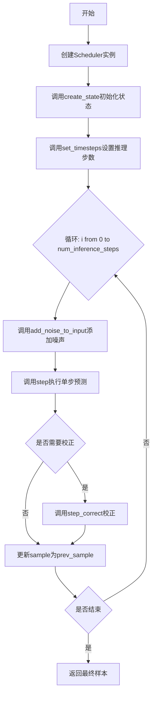
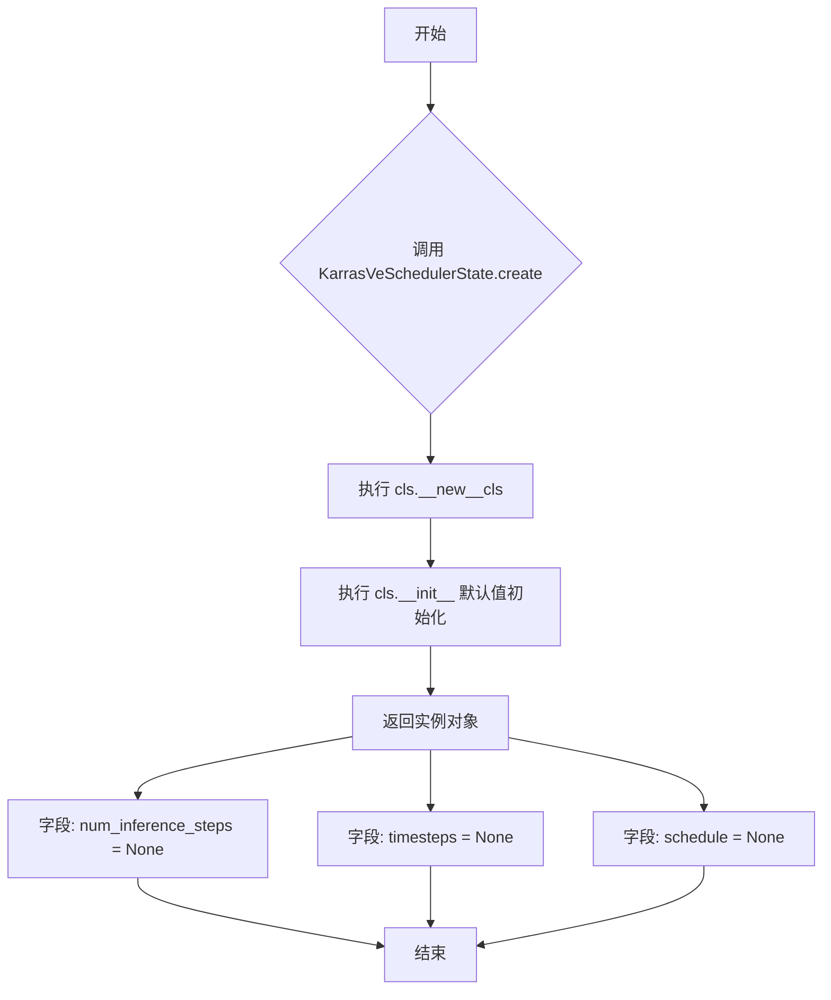
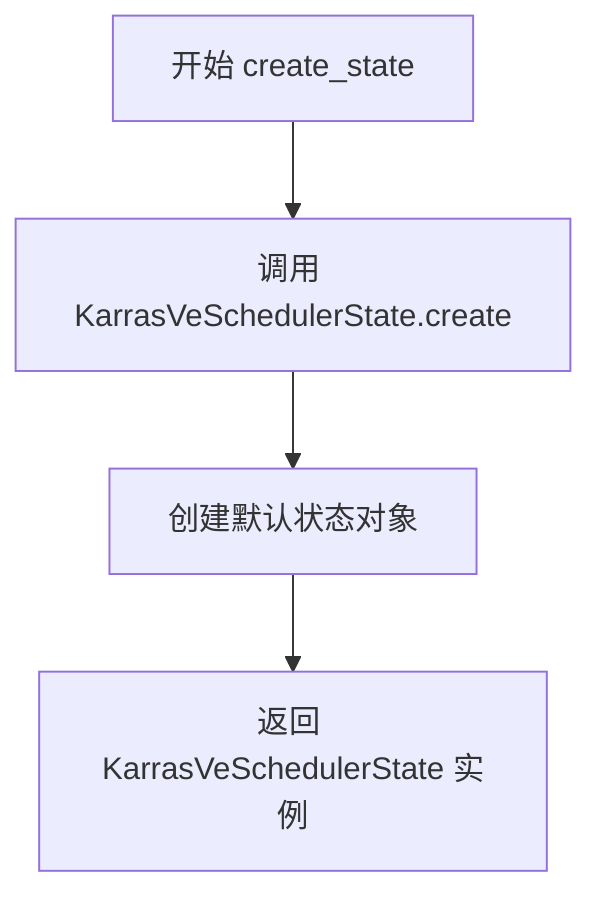
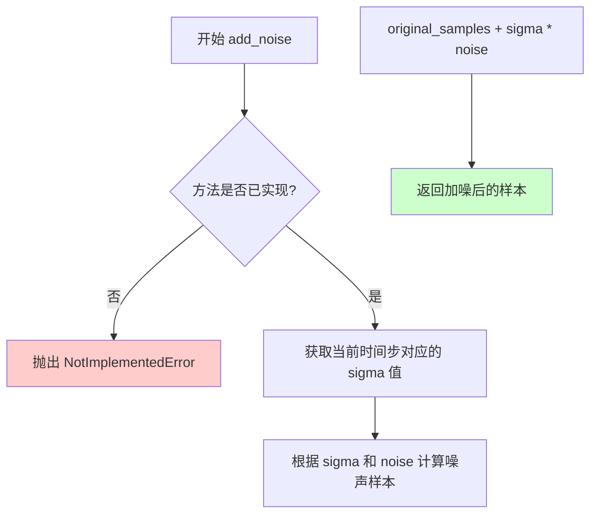

# `diffusers\src\diffusers\schedulers\scheduling_karras_ve_flax.py` 详细设计文档

这是一个基于Flax/JAX实现的Karras VE调度器，应用于扩散模型的方差扩展(VE)采样算法，实现随机微分方程(SDE)的反向过程，用于从噪声样本逐步恢复原始图像。

## 整体流程



## 类结构

```
BaseOutput (from ..utils)
├── FlaxKarrasVeOutput (数据类)
│   └── prev_sample: jnp.ndarray
│   └── derivative: jnp.ndarray
│   └── state: KarrasVeSchedulerState
│
KarrasVeSchedulerState (flax.struct.dataclass)
├── num_inference_steps: int
├── timesteps: jnp.ndarray
├── schedule: jnp.ndarray
└── create(): classmethod
│
FlaxKarrasVeScheduler (继承FlaxSchedulerMixin, ConfigMixin)
├── config (sigma_min, sigma_max, s_noise, s_churn, s_min, s_max)
├── has_state: property
├── __init__()
├── create_state()
├── set_timesteps()
├── add_noise_to_input()
├── step()
├── step_correct()
└── add_noise() (未实现)
```

## 全局变量及字段


### `logger`
    
模块级日志记录器

类型：`logging.get_logger`
    


### `KarrasVeSchedulerState.num_inference_steps`
    
推理步数

类型：`int`
    


### `KarrasVeSchedulerState.timesteps`
    
时间步数组

类型：`jnp.ndarray`
    


### `KarrasVeSchedulerState.schedule`
    
sigma(t_i)调度数组

类型：`jnp.ndarray`
    


### `FlaxKarrasVeOutput.prev_sample`
    
前一步的样本x_{t-1}

类型：`jnp.ndarray`
    


### `FlaxKarrasVeOutput.derivative`
    
预测原始样本的导数

类型：`jnp.ndarray`
    


### `FlaxKarrasVeOutput.state`
    
调度器状态

类型：`KarrasVeSchedulerState`
    


### `FlaxKarrasVeScheduler.has_state`
    
返回True表示有状态

类型：`property`
    


### `FlaxKarrasVeScheduler.config`
    
包含sigma_min, sigma_max, s_noise, s_churn, s_min, s_max的配置对象

类型：`object`
    
    

## 全局函数及方法


### KarrasVeSchedulerState.create

创建并返回一个默认状态的 KarrasVeSchedulerState 实例，用于初始化 Karras VE 调度器的状态，所有可设置字段（num_inference_steps、timesteps、schedule）初始化为 None。

参数：

- 无

返回值：`KarrasVeSchedulerState`，返回类的默认实例，其字段 `num_inference_steps`、`timesteps`、`schedule` 均初始化为 `None`。

#### 流程图



#### 带注释源码

```python
@classmethod
def create(cls):
    """
    类方法：创建并返回默认状态的 KarrasVeSchedulerState 实例。
    
    该方法是一个工厂方法，用于创建调度器的初始状态。
    使用 @classmethod 装饰器，使得该方法可以通过类名直接调用，
    无需先实例化类。
    
    Returns:
        KarrasVeSchedulerState: 返回一个包含默认值的调度器状态对象，
                                所有可设置字段（num_inference_steps, timesteps, schedule）
                                初始化为 None。
    """
    return cls()
```


### `FlaxKarrasVeScheduler.__init__`

初始化 Karras VE 调度器参数，用于基于 Karras 等人的方差扩展（Variance-Expanding）扩散模型的随机采样。该调度器实现了 Algorithm 2 和 Table 1 中的 VE 列，支持可配置的噪声参数以控制采样过程中的随机性和细节保留程度。

参数：

- `sigma_min`：`float`，最小噪声幅度，默认为 0.02
- `sigma_max`：`float`，最大噪声幅度，默认为 100
- `s_noise`：`float`，用于抵消采样过程中细节损失的额外噪声量，建议范围 [1.000, 1.011]，默认为 1.007
- `s_churn`：`float`，控制整体随机性程度的参数，建议范围 [0, 100]，默认为 80
- `s_min`：`float`，启用随机性的 sigma 范围起始值，建议范围 [0, 10]，默认为 0.05
- `s_max`：`float`，启用随机性的 sigma 范围结束值，建议范围 [0.2, 80]，默认为 50

返回值：`None`，无返回值（构造函数）

#### 流程图

```mermaid
flowchart TD
    A[开始 __init__] --> B[接收参数 sigma_min, sigma_max, s_noise, s_churn, s_min, s_max]
    B --> C{@register_to_config 装饰器}
    C --> D[将参数注册到配置中]
    D --> E[记录弃用警告]
    E --> F[结束 __init__]
    
    style A fill:#f9f,color:#000
    style F fill:#9f9,color:#000
    style C fill:#ff9,color:#000
```

#### 带注释源码

```python
@register_to_config
def __init__(
    self,
    sigma_min: float = 0.02,
    sigma_max: float = 100,
    s_noise: float = 1.007,
    s_churn: float = 80,
    s_min: float = 0.05,
    s_max: float = 50,
):
    """
    初始化 Karras VE 调度器参数
    
    参数:
        sigma_min: 最小噪声幅度，控制采样过程中噪声的下限
        sigma_max: 最大噪声幅度，控制采样过程中噪声的上限
        s_noise: 额外噪声因子，用于在采样时添加噪声以保持细节
        s_churn: 随机性参数，控制 Langevin-like churn 步骤的强度
        s_min: 启用随机性的 sigma 范围起始值
        s_max: 启用随机性的 sigma 范围结束值
    """
    # 记录弃用警告，提示用户 Flax 类将在未来版本中移除
    logger.warning(
        "Flax classes are deprecated and will be removed in Diffusers v1.0.0. We "
        "recommend migrating to PyTorch classes or pinning your version of Diffusers."
    )
```


### FlaxKarrasVeScheduler.create_state

创建并返回一个初始化的 Karras VE 调度器状态对象，用于存储调度器在推理过程中的状态数据。

参数： 无

返回值：`KarrasVeSchedulerState`，返回新创建的调度器状态实例，包含 `num_inference_steps`、`timesteps` 和 `schedule` 等可设置的属性。

#### 流程图



#### 带注释源码

```python
def create_state(self):
    """
    创建调度器状态。
    
    该方法实例化一个 KarrasVeSchedulerState 对象，用于在扩散模型推理过程中
    存储和管理调度器的状态信息，包括推理步数、时间步序列和噪声调度表。
    
    Returns:
        KarrasVeSchedulerState: 包含可设置属性的调度器状态数据类实例。
    """
    return KarrasVeSchedulerState.create()
```


### `FlaxKarrasVeScheduler.set_timesteps`

设置推理时使用的时间步，构建离散化的调度表（schedule），用于扩散链的采样过程。该方法根据推理步数和调度器配置参数（sigma_min, sigma_max）生成非线性间隔的sigma值序列。

参数：

- `state`：`KarrasVeSchedulerState`，FlaxKarrasVeScheduler 的状态数据类，包含推理步数、时间步和调度表等可设置的值。
- `num_inference_steps`：`int`，生成样本时使用的扩散推理步数，决定采样链的长度。
- `shape`：`tuple = ()`，可选参数，当前未使用，保留用于兼容性。

返回值：`KarrasVeSchedulerState`，更新后的调度器状态，其中包含设置好的 `num_inference_steps`、`schedule`（sigma 数组）和 `timesteps`（时间步数组）。

#### 流程图

```mermaid
flowchart TD
    A[开始 set_timesteps] --> B[生成反向时间步序列]
    B --> C[对每个时间步计算对应的 sigma 值]
    C --> D[使用幂函数插值计算 sigma: sigma_max² * (sigma_min²/sigma_max²)^(i/(n-1))]
    D --> E[将 schedule 转换为 JAX 数组]
    F[返回更新后的 state] --> E
    E --> F
```

#### 带注释源码

```python
def set_timesteps(
    self, state: KarrasVeSchedulerState, num_inference_steps: int, shape: tuple = ()
) -> KarrasVeSchedulerState:
    """
    设置扩散链使用的连续时间步。支持在推理前运行的函数。

    Args:
        state (`KarrasVeSchedulerState`):
            FlaxKarrasVeScheduler 状态数据类。
        num_inference_steps (`int`):
            使用预训练模型生成样本时使用的扩散步数。

    """
    # 生成从 num_inference_steps-1 到 0 的反向时间步序列
    # 例如：num_inference_steps=10 时，生成 [9, 8, 7, 6, 5, 4, 3, 2, 1, 0]
    timesteps = jnp.arange(0, num_inference_steps)[::-1].copy()
    
    # 构建非线性调度表（schedule）
    # 使用 Karras 等人论文中的幂函数插值公式生成 sigma 值
    # sigma_i = sigma_max² * (sigma_min²/sigma_max²)^(i/(N-1))
    # 这创建了从 sigma_max 到 sigma_min 的非线性衰减路径
    schedule = [
        (
            self.config.sigma_max**2
            * (self.config.sigma_min**2 / self.config.sigma_max**2) ** (i / (num_inference_steps - 1))
        )
        for i in timesteps
    ]

    # 使用 state.replace 更新状态并返回新的不可变对象
    # 将 schedule 转换为 JAX float32 数组以兼容后续计算
    return state.replace(
        num_inference_steps=num_inference_steps,
        schedule=jnp.array(schedule, dtype=jnp.float32),
        timesteps=timesteps,
    )
```


### `FlaxKarrasVeScheduler.add_noise_to_input`

该方法实现了 Karras VE 调度器中的 Langevin-like "churn" 步骤，根据输入的 sigma 值在指定范围内计算 gamma 因子，生成高斯噪声并将其添加到样本中，以达到更高的噪声水平 sigma_hat。这是扩散模型采样过程中用于增加随机性的关键步骤。

参数：

- `self`：`FlaxKarrasVeScheduler`，调度器实例本身
- `state`：`KarrasVeSchedulerState`，Karras VE 调度器的状态数据类，包含推理步骤数等状态信息
- `sample`：`jnp.ndarray`，当前时刻的样本张量，形状为 `(batch_size, num_channels, height, width)`
- `sigma`：`float`，当前噪声水平/时间步的 sigma 值
- `key`：`jax.Array`，JAX 随机数生成器的密钥，用于生成高斯噪声

返回值：`tuple[jnp.ndarray, float]`，返回添加噪声后的样本 `sample_hat` 和更新后的噪声水平 `sigma_hat`

#### 流程图

```mermaid
flowchart TD
    A[开始 add_noise_to_input] --> B{检查 sigma 是否在 [s_min, s_max] 范围内}
    B -->|是| C[计算 gamma = min(s_churn / num_inference_steps, 2^0.5 - 1)]
    B -->|否| D[gamma = 0]
    C --> E[使用 random.split 分割密钥]
    D --> E
    E --> F[生成标准高斯噪声 eps ~ N(0, I)]
    F --> G[计算 sigma_hat = sigma + gamma * sigma]
    H[应用噪声缩放: eps = s_noise * eps] --> I[计算噪声幅度: sqrt(sigma_hat² - sigma²)]
    I --> J[计算 sample_hat = sample + sqrt(sigma_hat² - sigma²) * eps]
    J --> K[返回 (sample_hat, sigma_hat)]
```

#### 带注释源码

```python
def add_noise_to_input(
    self,
    state: KarrasVeSchedulerState,
    sample: jnp.ndarray,
    sigma: float,
    key: jax.Array,
) -> tuple[jnp.ndarray, float]:
    """
    Explicit Langevin-like "churn" step of adding noise to the sample according to a factor gamma_i ≥ 0 to reach a
    higher noise level sigma_hat = sigma_i + gamma_i*sigma_i.

    TODO Args:
    """
    # 判断当前 sigma 是否在允许添加噪声的范围内 [s_min, s_max]
    if self.config.s_min <= sigma <= self.config.s_max:
        # 计算 gamma 因子，限制最大值为 sqrt(2) - 1 以保证数值稳定性
        gamma = min(self.config.s_churn / state.num_inference_steps, 2**0.5 - 1)
    else:
        # sigma 超出范围时，不添加额外的 churn 噪声
        gamma = 0

    # sample eps ~ N(0, S_noise^2 * I)
    # 分割随机密钥以生成独立的高斯噪声
    key = random.split(key, num=1)
    # 生成与样本形状相同的标准高斯噪声，并按 s_noise 缩放
    eps = self.config.s_noise * random.normal(key=key, shape=sample.shape)
    
    # 计算提升后的噪声水平 sigma_hat = sigma + gamma * sigma
    sigma_hat = sigma + gamma * sigma
    
    # 将噪声添加到样本: sample_hat = sample + sqrt(sigma_hat² - sigma²) * eps
    # 这里利用方差加法的原理：var(sigma_hat) = var(sigma) + var(additional_noise)
    # 即 sigma_hat² = sigma² + noise_variance，因此 noise_std = sqrt(sigma_hat² - sigma²)
    sample_hat = sample + ((sigma_hat**2 - sigma**2) ** 0.5 * eps)

    # 返回添加噪声后的样本和新的噪声水平
    return sample_hat, sigma_hat
```


### FlaxKarrasVeScheduler.step

执行单步反向扩散预测，根据当前噪声水平、模型输出和样本，计算前一步的样本和导数，实现从噪声样本逐步还原到原始样本的反向扩散过程。

参数：

- `self`：`FlaxKarrasVeScheduler`，调度器实例本身
- `state`：`KarrasVeSchedulerState`，FlaxKarrasVeScheduler 的状态数据类，包含调度的配置和中间状态
- `model_output`：`jnp.ndarray`，学习到的扩散模型的直接输出（通常是预测的噪声）
- `sigma_hat`：`float`，当前时间步的噪声水平（sigma）
- `sigma_prev`：`float`，前一个时间步的噪声水平
- `sample_hat`：`jnp.ndarray`，当前时刻的样本（x_t）
- `return_dict`：`bool`，是否返回 FlaxKarrasVeOutput 对象，默认为 True

返回值：`FlaxKarrasVeOutput | tuple`，如果 return_dict 为 True，返回 FlaxKarrasVeOutput 对象，包含 prev_sample（前一时刻的样本）、derivative（导数）和 state（更新后的状态）；否则返回元组 (prev_sample, derivative, state)

#### 流程图

```mermaid
flowchart TD
    A[开始 step] --> B[计算预测原始样本<br>pred_original_sample = sample_hat + sigma_hat * model_output]
    B --> C[计算导数<br>derivative = (sample_hat - pred_original_sample) / sigma_hat]
    C --> D[计算前一时刻样本<br>sample_prev = sample_hat + (sigma_prev - sigma_hat) * derivative]
    D --> E{return_dict?}
    E -->|True| F[返回 FlaxKarrasVeOutput 对象]
    E -->|False| G[返回元组 (sample_prev, derivative, state)]
    F --> H[结束]
    G --> H
```

#### 带注释源码

```python
def step(
    self,
    state: KarrasVeSchedulerState,
    model_output: jnp.ndarray,
    sigma_hat: float,
    sigma_prev: float,
    sample_hat: jnp.ndarray,
    return_dict: bool = True,
) -> FlaxKarrasVeOutput | tuple:
    """
    通过反转随机微分方程来预测前一时间步的样本。核心功能是将扩散过程从学习到的模型输出（通常是预测的噪声）向前推进。

    参数:
        state: FlaxKarrasVeScheduler 的状态数据类
        model_output: 学习到的扩散模型的直接输出
        sigma_hat: 当前噪声水平
        sigma_prev: 前一个噪声水平
        sample_hat: 当前样本
        return_dict: 是否返回 FlaxKarrasVeOutput 类而非元组

    返回值:
        FlaxKarrasVeOutput 或元组: 更新后的样本在扩散链中和导数
    """

    # 第一步：根据模型输出计算预测的原始样本（x_0）
    # 使用公式: x_0 = x_t + sigma_t * epsilon
    # 其中 epsilon 是模型预测的噪声
    pred_original_sample = sample_hat + sigma_hat * model_output
    
    # 第二步：计算导数（denominator term）
    # 这个导数表示样本相对于噪声水平的变化率
    # 公式: derivative = (x_t - x_0) / sigma_t
    derivative = (sample_hat - pred_original_sample) / sigma_hat
    
    # 第三步：计算前一时间步的样本（x_{t-1}）
    # 使用欧拉方法进行离散化:
    # x_{t-1} = x_t + (sigma_{t-1} - sigma_t) * derivative
    sample_prev = sample_hat + (sigma_prev - sigma_hat) * derivative

    # 根据 return_dict 参数决定返回格式
    if not return_dict:
        # 返回元组格式（向后兼容）
        return (sample_prev, derivative, state)

    # 返回包含所有必要信息的输出对象
    return FlaxKarrasVeOutput(prev_sample=sample_prev, derivative=derivative, state=state)
```


### FlaxKarrasVeScheduler.step_correct

该方法是Karras VE调度器的校正步骤，用于根据网络输出纠正预测样本。它通过计算原始样本预测和导数校正项，对前一步的预测进行改进，以提高采样质量。

参数：

- `self`：FlaxKarrasVeScheduler类实例
- `state`：KarrasVeSchedulerState，Karras VE调度器的状态数据类
- `model_output`：jnp.ndarray，来自学习到的扩散模型的直接输出（通常为预测噪声）
- `sigma_hat`：float，当前时间步的噪声标准差
- `sigma_prev`：float，前一时间步的噪声标准差
- `sample_hat`：jnp.ndarray，当前时间步的加噪样本
- `sample_prev`：jnp.ndarray，前一时间步预测的样本
- `derivative`：jnp.ndarray，前一时间步计算的导数（原始图像样本的导数）
- `return_dict`：bool，选项用于返回元组而不是FlaxKarrasVeOutput类

返回值：`FlaxKarrasVeOutput | tuple`，如果return_dict为True，返回FlaxKarrasVeOutput对象（包含prev_sample、derivative和state）；否则返回元组(prev_sample, derivative, state)

#### 流程图

```mermaid
flowchart TD
    A[开始 step_correct] --> B[接收参数: state, model_output, sigma_hat, sigma_prev, sample_hat, sample_prev, derivative]
    B --> C[计算预测原始样本: pred_original_sample = sample_prev + sigma_prev * model_output]
    C --> D[计算校正后的导数: derivative_corr = (sample_prev - pred_original_sample) / sigma_prev]
    D --> E[计算校正后的样本: sample_prev = sample_hat + (sigma_prev - sigma_hat) * (0.5 * derivative + 0.5 * derivative_corr)]
    E --> F{return_dict == True?}
    F -->|Yes| G[返回 FlaxKarrasVeOutput(prev_sample, derivative, state)]
    F -->|No| H[返回 tuple (sample_prev, derivative, state)]
    G --> I[结束]
    H --> I
```

#### 带注释源码

```python
def step_correct(
    self,
    state: KarrasVeSchedulerState,
    model_output: jnp.ndarray,
    sigma_hat: float,
    sigma_prev: float,
    sample_hat: jnp.ndarray,
    sample_prev: jnp.ndarray,
    derivative: jnp.ndarray,
    return_dict: bool = True,
) -> FlaxKarrasVeOutput | tuple:
    """
    根据网络输出model_output纠正预测样本。
    该方法实现了对预测样本的校正，通过计算原始样本预测并结合导数校正项来改进采样质量。

    Args:
        state (KarrasVeSchedulerState): FlaxKarrasVeScheduler的调度器状态数据类
        model_output (jnp.ndarray): 学习扩散模型的直接输出（预测噪声）
        sigma_hat (float): 当前时间步t的噪声幅度(sigma)
        sigma_prev (float): 前一时间步t-1的噪声幅度(sigma)
        sample_hat (jnp.ndarray): 当前时间步的样本（加噪后）
        sample_prev (jnp.ndarray): 前一步预测的样本（x_{t-1}）
        derivative (jnp.ndarray): 前一步计算的导数（x_0的导数）
        return_dict (bool): 是否返回FlaxKarrasVeOutput对象，False则返回元组

    Returns:
        FlaxKarrasVeOutput | tuple: 校正后的样本在扩散链中的更新、导数以及调度器状态
    """
    
    # 步骤1: 使用前一步样本和模型输出预测原始无噪声样本 x_0
    # pred_original_sample = x_{t-1} + sigma_prev * model_output
    pred_original_sample = sample_prev + sigma_prev * model_output
    
    # 步骤2: 计算校正后的导数（基于前一步样本的预测）
    # 这是对原始导数的纠正，使用当前可用的信息重新估计
    derivative_corr = (sample_prev - pred_original_sample) / sigma_prev
    
    # 步骤3: 使用校正后的导数更新样本
    # 结合原始导数和校正导数的加权平均（各占50%）
    # sample_prev = x_hat + (sigma_prev - sigma_hat) * (0.5 * derivative + 0.5 * derivative_corr)
    # 这种插值方法减少了累积误差，提高了采样稳定性
    sample_prev = sample_hat + (sigma_prev - sigma_hat) * (0.5 * derivative + 0.5 * derivative_corr)

    # 步骤4: 根据return_dict参数决定返回格式
    if not return_dict:
        # 返回元组格式：(更新后的样本, 导数, 状态)
        return (sample_prev, derivative, state)

    # 返回FlaxKarrasVeOutput对象
    return FlaxKarrasVeOutput(prev_sample=sample_prev, derivative=derivative, state=state)
```


### FlaxKarrasVeScheduler.add_noise

该方法用于在扩散模型的推理或训练过程中向原始样本添加噪声，是 Karras-VE 调度器的核心接口之一。然而，当前版本中该方法尚未实现，仅抛出 `NotImplementedError`。

参数：

- `self`：隐含的 `FlaxKarrasVeScheduler` 实例，调度器对象本身
- `state`：`KarrasVeSchedulerState`，Karras-VE 调度器的状态数据类，包含推理步骤数、时间步调度和 sigma 调度等信息
- `original_samples`：`jnp.ndarray`（推断），原始的干净样本，通常为图像张量，形状为 `(batch_size, num_channels, height, width)`
- `noise`：`jnp.ndarray`（推断），要添加的噪声样本，与 original_samples 形状相同的随机噪声
- `timesteps`：`jnp.ndarray`（推断），当前的时间步，用于确定添加噪声的程度

返回值：未实现，推断应返回 `jnp.ndarray`，即添加噪声后的样本

#### 流程图



#### 带注释源码

```python
def add_noise(
    self,
    state: KarrasVeSchedulerState,
    original_samples,      # jnp.ndarray: 原始干净样本，形状 (batch_size, num_channels, height, width)
    noise,                 # jnp.ndarray: 噪声样本，与 original_samples 形状相同
    timesteps              # jnp.ndarray: 时间步索引，用于确定噪声强度
):
    """
    向原始样本添加噪声，用于扩散模型的前向扩散过程或推理初始化。
    
    该方法对应扩散模型中的 q(x_t|x_0) 过程，即根据时间步 t 将噪声添加到原始样本中。
    在 Karras-VE 调度器中，噪声的添加遵循方差扩展（Variance Expanding）策略。
    
    注意：此方法在当前版本中未实现，仅抛出 NotImplementedError 异常。
    开发者需要根据 Karras-VE 论文中的公式实现该方法。
    
    Args:
        state (KarrasVeSchedulerState): 调度器状态对象
        original_samples (jnp.ndarray): 原始干净样本
        noise (jnp.ndarray): 高斯噪声
        timesteps (jnp.ndarray): 时间步
        
    Returns:
        jnp.ndarray: 添加噪声后的样本
    """
    # 当前实现：抛出未实现异常
    raise NotImplementedError()
    
    # TODO: 预期实现逻辑（基于 Karras-VE 调度器特性推断）：
    # 1. 根据 timesteps 从 state.schedule 中获取对应的 sigma 值
    # 2. 使用公式: noisy_samples = original_samples + sigma * noise
    # 3. 返回加噪后的样本
```

#### 补充说明

该方法未实现是本代码库中的一个技术债务。由于 Flax 调度器已被标记为将在 Diffusers v1.0.0 中移除（见 `__init__` 中的警告信息），开发者可能优先维护 PyTorch 版本而忽略了 Flax 版本的完整实现。若需使用此功能，建议参考 PyTorch 版本 `KarrasVeScheduler` 的 `add_noise` 方法实现，或考虑迁移到 PyTorch 调度器。


## 关键组件


### KarrasVeSchedulerState

存储调度器状态的数据类，包含 num_inference_steps、timesteps 和 schedule (sigma(t_i)) 数组，用于管理扩散链的离散时间步和对应的噪声方差调度。

### FlaxKarrasVeScheduler

主调度器类，实现了基于 Karras 等人论文的 Variance-Expanding (VE) 模型的随机采样算法。包含 sigma_min、sigma_max、s_noise、s_churn、s_min、s_max 等关键配置参数，用于控制采样过程中的噪声水平和随机性程度。

### set_timesteps 方法

根据指定的推理步数生成离散时间步和对应的 sigma 调度数组。采用对数线性插值策略计算 sigma 值，从 sigma_max 降至 sigma_min，支持张量索引和惰性加载机制。

### add_noise_to_input 方法

实现显式 Langevin 风格的 "churn" 步骤，根据 gamma 因子增加噪声以达到更高的噪声水平 sigma_hat。包含随机噪声生成和 sigma 范围判断逻辑，是 VE 采样策略的核心组成部分。

### step 方法

核心采样步骤，通过逆转随机微分方程 (SDE) 预测前一时间步的样本。计算预测原始样本、导数和前一时刻样本，支持反量化操作以提高采样质量。

### step_correct 方法

校正步骤，用于改进基于网络输出的样本预测。通过结合当前和校正后的导数进行插值，提供更精确的采样轨迹。

### FlaxKarrasVeOutput

输出数据类，包含 prev_sample（上一时刻样本）、derivative（导数）和 state（调度器状态），用于封装调度器步骤的返回值。


## 问题及建议


### 已知问题

-   **废弃警告未解决**：代码中存在`logger.warning`提示Flax类将在Diffusers v1.0.0中移除，但至今未迁移到PyTorch版本，存在未来兼容性问题。
-   **TODO注释大量遗留**：多个方法（`add_noise_to_input`、`step`、`step_correct`）的参数和返回值描述均为TODO，文档不完整，影响可维护性和可读性。
-   **未实现的抽象方法**：`add_noise`方法直接抛出`NotImplementedError`，作为调度器类的公共接口缺失实现。
-   **`step_correct`返回值逻辑错误**：方法返回的`derivative`应为`derivative_corr`（校正后的导数），当前返回的是旧值，可能导致调用方使用错误的数据进行后续计算。
-   **未使用的参数**：`set_timesteps`方法接收`shape`参数但从未使用，造成API混淆。
- **类型注解缺失**：`add_noise`方法的所有参数（`original_samples`、`noise`、`timesteps`）均缺少类型注解。
- **随机数处理潜在问题**：`add_noise_to_input`中`random.split(key, num=1)`返回元组，但未正确解包直接使用，可能导致行为不符合预期。
- **冗余计算**：`set_timesteps`中`timesteps = jnp.arange(0, num_inference_steps)[::-1].copy()`先创建数组再反转，可简化为直接生成反向序列。

### 优化建议

-   **补充文档**：将所有TODO替换为准确的参数和返回值描述，特别是`step`和`step_correct`方法中sigma和sample参数的物理意义。
-   **实现或移除`add_noise`方法**：若调度器不支持此功能，应在文档中说明或移除该方法定义，避免API误导。
-   **修复`step_correct`返回值**：将返回的`derivative`改为`derivative_corr`以保持逻辑一致性。
-   **清理未使用参数**：移除`set_timesteps`中的`shape`参数或在实现中使用它。
-   **完善类型注解**：为`add_noise`方法参数添加类型注解，提高代码健壮性。
-   **修正随机数处理**：正确解包`random.split`的返回值，或使用`random.split(key)[0]`获取单一随机key。
-   **规划迁移路径**：鉴于Flax即将弃用，建议创建PyTorch版本或标记为已废弃并提供迁移指南。


## 其它


### 设计目标与约束

本模块旨在实现Karras等人提出的方差扩展（Variance-Expanding, VE）扩散模型的随机采样调度器，基于Flax框架。设计目标包括：支持Algorithm 2和VE列（Table 1）的采样策略；提供可配置的噪声参数（sigma_min, sigma_max, s_noise, s_churn, s_min, s_max）；维护调度器状态以支持有状态推理；兼容Diffusers库的ConfigMixin和SchedulerMixin接口。约束条件包括：依赖JAX/Flax生态系统；仅支持连续时间步；不支持训练仅支持推理。

### 错误处理与异常设计

参数验证：__init__中未对sigma_min、sigma_max等参数进行范围校验，可能导致后续计算出现NaN或不合理结果，建议添加参数合法性检查（如sigma_min > 0, sigma_max > sigma_min, s_min <= s_max等）。NotImplementedError：add_noise方法抛出NotImplementedError，表明当前不支持向干净样本添加噪声进行训练前向过程，调用方需注意此限制。数值稳定性：schedule计算中涉及幂运算，当num_inference_steps=1时分母为零导致除零错误；sigma_hat计算中(sigma_hat**2 - sigma**2)**0.5在gamma=0时应返回0而非NaN。

### 数据流与状态机

状态流转：KarrasVeSchedulerState包含num_inference_steps、timesteps、schedule三个核心状态。初始化时state为create()返回的空状态；set_timesteps后填充完整的时间步和sigma schedule；step/step_correct在推理过程中更新prev_sample和derivative。推理流程：set_timesteps → 循环调用step/step_correct（可选）→ 获取最终prev_sample。状态不可变：Flax使用frozen dataclass，状态更新通过state.replace()返回新状态对象。

### 外部依赖与接口契约

核心依赖：jax>=0.4.0、flax>=0.8.0、diffusers库（configuration_utils, utils, scheduling_utils_flax）。输入接口：step方法接受state、model_output（模型预测的噪声）、sigma_hat（当前噪声水平）、sigma_prev（上一时刻噪声水平）、sample_hat（当前样本）。输出接口：FlaxKarrasVeOutput包含prev_sample（上一时刻样本）、derivative（预测原始样本的导数）、state（更新后的调度器状态）。与模型交互：model_output应为模型预测的噪声ε，调度器通过x = x̂ + σ̂ * model_output推算原始样本x₀。

### 性能考虑与优化空间

JIT编译：建议对set_timesteps、step、step_correct等核心方法使用@jax.jit装饰器加速。向量化：schedule列表推导式可替换为jnp.vectorize或直接使用jnp操作以支持批处理。内存优化：step中计算的pred_original_sample可内联以减少中间变量；避免不必要的数组拷贝。预计算：schedule在set_timesteps中一次性计算并存储，避免每次step重复计算。

### 版本兼容性与弃用警告

__init__中的logger.warning明确提示Flax classes将在Diffusers v1.0.0中移除，建议迁移到PyTorch版本或pin版本。代码依赖较旧的分隔符语法（|），需确保JAX版本支持union types。

### 使用示例

```python
# 创建调度器
scheduler = FlaxKarrasVeScheduler()
# 初始化状态
state = scheduler.create_state()
# 设置推理步数
state = scheduler.set_timesteps(state, num_inference_steps=50)
# 推理循环（简化）
for i, t in enumerate(state.timesteps):
    sigma_hat = state.schedule[i]
    sigma_prev = state.schedule[i+1] if i+1 < len(state.schedule) else 0
    # 获取模型输出（噪声预测）
    noise_pred = model(sample_hat, t)
    # 调度器step
    output = scheduler.step(state, noise_pred, sigma_hat, sigma_prev, sample_hat)
    sample_hat = output.prev_sample
```

### 参考文献

[1] Karras, Tero, et al. "Elucidating the Design Space of Diffusion-Based Generative Models." arXiv:2206.00364 (2022). [2] Song, Yang, et al. "Score-based Generative Modeling through Stochastic Differential Equations." arXiv:2011.13456 (2021).

    