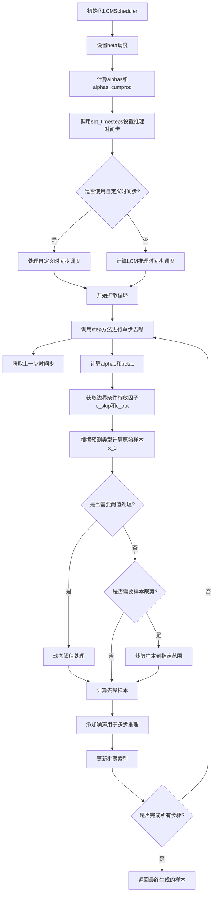
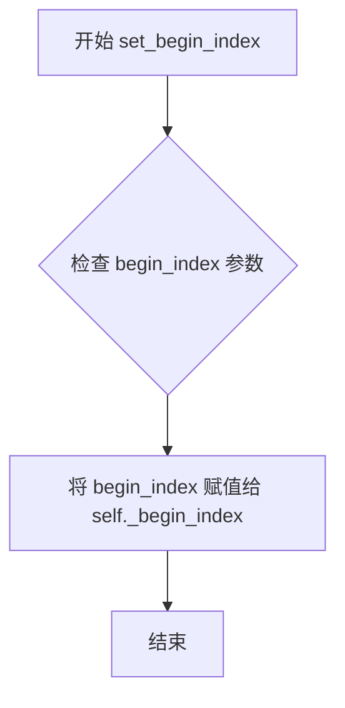
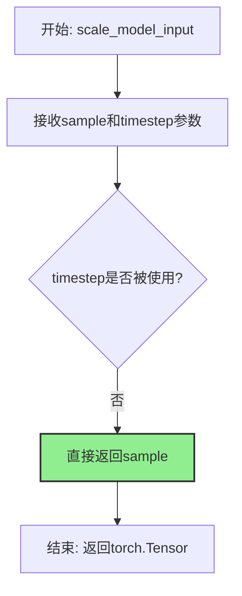
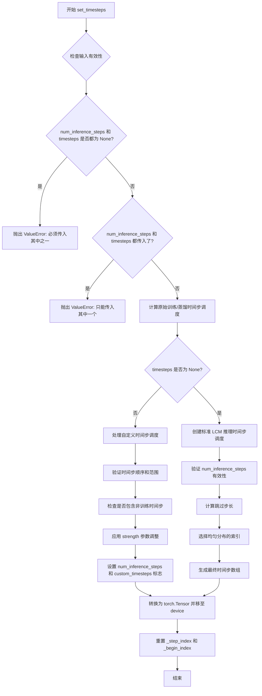

# `diffusers\src\diffusers\schedulers\scheduling_lcm.py` 详细设计文档

LCMScheduler是一个基于潜在一致性模型（LCM）的扩散调度器，通过非马尔可夫引导加速扩散模型的采样过程，实现快速高质量的图像生成。该调度器继承自SchedulerMixin和ConfigMixin，提供了灵活的时间步调度、噪声预测和样本生成功能。

## 整体流程



## 类结构

```
SchedulerMixin (混入类)
└── LCMScheduler (主调度器类)
    └── LCMSchedulerOutput (输出数据类)
```

## 全局变量及字段


### `logger`
    
模块级日志记录器，用于记录调度器运行过程中的信息

类型：`logging.Logger`
    


### `LCMSchedulerOutput.prev_sample`
    
前一个时间步的计算样本 (x_{t-1})

类型：`torch.Tensor`
    


### `LCMSchedulerOutput.denoised`
    
去噪后的样本 (x_0)

类型：`torch.Tensor | None`
    


### `LCMScheduler.betas`
    
Beta调度参数，用于定义扩散过程中的噪声 schedule

类型：`torch.Tensor`
    


### `LCMScheduler.alphas`
    
Alpha值 (1 - betas)，扩散过程的衰减系数

类型：`torch.Tensor`
    


### `LCMScheduler.alphas_cumprod`
    
Alpha累积乘积，用于计算累积噪声添加

类型：`torch.Tensor`
    


### `LCMScheduler.final_alpha_cumprod`
    
最终alpha累积乘积，用于最后一个时间步的计算

类型：`torch.Tensor`
    


### `LCMScheduler.init_noise_sigma`
    
初始噪声标准差，默认为1.0

类型：`float`
    


### `LCMScheduler.num_inference_steps`
    
推理步数，指定生成样本时使用的时间步数量

类型：`int | None`
    


### `LCMScheduler.timesteps`
    
时间步序列，包含推理时使用的时间步

类型：`torch.Tensor`
    


### `LCMScheduler.custom_timesteps`
    
是否使用自定义时间步的标志

类型：`bool`
    


### `LCMScheduler._step_index`
    
当前步骤索引，记录当前推理所在的步骤位置

类型：`int | None`
    


### `LCMScheduler._begin_index`
    
起始步骤索引，用于设置推理的起始位置

类型：`int | None`
    


### `LCMScheduler.order`
    
调度器阶数，用于多步采样时的顺序

类型：`int`
    
    

## 全局函数及方法


### `betas_for_alpha_bar`

根据 alpha_bar 函数生成 beta 调度表。该函数通过离散化给定的 alpha_t_bar 函数来创建 beta 调度，alpha_t_bar 函数定义了从 t = [0,1] 开始的 (1-beta) 的累积乘积。

参数：

- `num_diffusion_timesteps`：`int`，要生成的 beta 数量
- `max_beta`：`float`，默认 `0.999`，使用的最大 beta 值，低于 1 以避免数值不稳定
- `alpha_transform_type`：`Literal["cosine", "exp", "laplace"]`，默认 `"cosine"`，alpha_bar 的噪声调度类型，可选 "cosine"、"exp" 或 "laplace"

返回值：`torch.Tensor`，调度器用于逐步模型输出的 betas

#### 流程图

```mermaid
flowchart TD
    A[开始] --> B{alpha_transform_type == 'cosine'}
    B -->|Yes| C[定义 cosine alpha_bar_fn]
    B -->|No| D{alpha_transform_type == 'laplace'}
    D -->|Yes| E[定义 laplace alpha_bar_fn]
    D -->|No| F{alpha_transform_type == 'exp'}
    F -->|Yes| G[定义 exp alpha_bar_fn]
    F -->|No| H[抛出 ValueError]
    C --> I[初始化空 betas 列表]
    E --> I
    G --> I
    I --> J[循环 i 从 0 到 num_diffusion_timesteps-1]
    J --> K[计算 t1 = i / num_diffusion_timesteps]
    K --> L[计算 t2 = (i+1) / num_diffusion_timesteps]
    L --> M[计算 beta = min(1 - alpha_bar_fn(t2) / alpha_bar_fn(t1), max_beta)]
    M --> N[添加 beta 到 betas 列表]
    N --> O{是否还有下一个 i?}
    O -->|Yes| J
    O --> No| P[将 betas 列表转换为 torch.Tensor]
    P --> Q[返回 betas 张量]
    H --> R[结束 - 抛出异常]
```

#### 带注释源码

```python
# Copied from diffusers.schedulers.scheduling_ddpm.betas_for_alpha_bar
def betas_for_alpha_bar(
    num_diffusion_timesteps: int,
    max_beta: float = 0.999,
    alpha_transform_type: Literal["cosine", "exp", "laplace"] = "cosine",
) -> torch.Tensor:
    """
    Create a beta schedule that discretizes the given alpha_t_bar function, which defines the cumulative product of
    (1-beta) over time from t = [0,1].

    Contains a function alpha_bar that takes an argument t and transforms it to the cumulative product of (1-beta) up
    to that part of the diffusion process.

    Args:
        num_diffusion_timesteps (`int`):
            The number of betas to produce.
        max_beta (`float`, defaults to `0.999`):
            The maximum beta to use; use values lower than 1 to avoid numerical instability.
        alpha_transform_type (`str`, defaults to `"cosine"`):
            The type of noise schedule for `alpha_bar`. Choose from `cosine`, `exp`, or `laplace`.

    Returns:
        `torch.Tensor`:
            The betas used by the scheduler to step the model outputs.
    """
    # 根据 alpha_transform_type 选择对应的 alpha_bar_fn 函数
    # cosine 调度: 使用余弦函数生成平滑的 alpha_bar 曲线
    if alpha_transform_type == "cosine":

        def alpha_bar_fn(t):
            # 使用改进的余弦调度，添加偏移量 0.008/1.008 以避免 t=0 时的问题
            return math.cos((t + 0.008) / 1.008 * math.pi / 2) ** 2

    # laplace 调度: 基于拉普拉斯分布的噪声调度
    elif alpha_transform_type == "laplace":

        def alpha_bar_fn(t):
            # 计算拉普拉斯分布的 lambda 参数
            lmb = -0.5 * math.copysign(1, 0.5 - t) * math.log(1 - 2 * math.fabs(0.5 - t) + 1e-6)
            # 计算信噪比 (Signal-to-Noise Ratio)
            snr = math.exp(lmb)
            # 根据 SNR 计算 alpha_bar
            return math.sqrt(snr / (1 + snr))

    # exp 调度: 指数衰减调度
    elif alpha_transform_type == "exp":

        def alpha_bar_fn(t):
            # 使用指数函数，衰减率为 -12.0
            return math.exp(t * -12.0)

    # 如果传入不支持的 alpha_transform_type，抛出 ValueError
    else:
        raise ValueError(f"Unsupported alpha_transform_type: {alpha_transform_type}")

    # 初始化空的 beta 列表
    betas = []
    # 遍历每个扩散时间步
    for i in range(num_diffusion_timesteps):
        # 计算当前时间步和下一个时间步的归一化时间 t1 和 t2
        t1 = i / num_diffusion_timesteps
        t2 = (i + 1) / num_diffusion_timesteps
        # 计算 beta 值: 1 - alpha_bar(t2) / alpha_bar(t1)
        # 并使用 max_beta 限制最大值以避免数值不稳定
        betas.append(min(1 - alpha_bar_fn(t2) / alpha_bar_fn(t1), max_beta))
    
    # 将 betas 列表转换为 PyTorch float32 张量并返回
    return torch.tensor(betas, dtype=torch.float32)
```


### `rescale_zero_terminal_snr`

该函数用于重新调整beta值，使其具有零终端SNR（Signal-to-Noise Ratio）。基于https://huggingface.co/papers/2305.08891（Algorithm 1）实现，通过对beta值进行数学变换，确保扩散过程在最终时间步的信号噪比为0。

参数：

- `betas`：`torch.Tensor`，scheduler初始化时使用的beta值张量

返回值：`torch.Tensor`，重新调整后具有零终端SNR的beta值

#### 流程图

```mermaid
flowchart TD
    A[输入 betas] --> B[计算 alphas = 1.0 - betas]
    B --> C[计算 alphas_cumprod = cumprod(alphas)]
    C --> D[计算 alphas_bar_sqrt = sqrt(alphas_cumprod)]
    D --> E[保存初始值 alphas_bar_sqrt_0 和终止值 alphas_bar_sqrt_T]
    E --> F[移位操作: alphas_bar_sqrt -= alphas_bar_sqrt_T]
    F --> G[缩放操作: alphas_bar_sqrt *= alphas_bar_sqrt_0 / (alphas_bar_sqrt_0 - alphas_bar_sqrt_T)]
    G --> H[恢复平方: alphas_bar = alphas_bar_sqrt²]
    H --> I[恢复累积乘积: alphas = alphas_bar[1:] / alphas_bar[:-1]]
    I --> J[拼接首元素: alphas = cat([alphas_bar[0:1], alphas])]
    J --> K[计算新betas: betas = 1 - alphas]
    K --> L[返回重新调整后的 betas]
```

#### 带注释源码

```
def rescale_zero_terminal_snr(betas: torch.Tensor) -> torch.Tensor:
    """
    Rescales betas to have zero terminal SNR Based on https://huggingface.co/papers/2305.08891 (Algorithm 1)

    Args:
        betas (`torch.Tensor`):
            The betas that the scheduler is being initialized with.

    Returns:
        `torch.Tensor`:
            Rescaled betas with zero terminal SNR.
    """
    # 步骤1: 将betas转换为alphas，然后计算累积乘积和平方根
    # alphas 表示 (1 - beta)，即每个时间步的信号保留比例
    alphas = 1.0 - betas
    # alphas_cumprod 是alphas的累积乘积，表示从开始到当前时间步的总信号保留
    alphas_cumprod = torch.cumprod(alphas, dim=0)
    # alphas_bar_sqrt 是累积乘积的平方根，用于后续的SNR调整
    alphas_bar_sqrt = alphas_cumprod.sqrt()

    # 步骤2: 保存原始的初始和终止值，用于后续的缩放操作
    # alphas_bar_sqrt_0: 第一个时间步的平方根值（原始值）
    alphas_bar_sqrt_0 = alphas_bar_sqrt[0].clone()
    # alphas_bar_sqrt_T: 最后一个时间步的平方根值（终端SNR相关）
    alphas_bar_sqrt_T = alphas_bar_sqrt[-1].clone()

    # 步骤3: 移位操作，使最后一个时间步的值为零
    # 这确保了终端SNR为零
    alphas_bar_sqrt -= alphas_bar_sqrt_T

    # 步骤4: 缩放操作，使第一个时间步恢复为原始值
    # 通过线性变换保持初始条件不变
    alphas_bar_sqrt *= alphas_bar_sqrt_0 / (alphas_bar_sqrt_0 - alphas_bar_sqrt_T)

    # 步骤5: 将alphas_bar_sqrt转换回betas
    # 恢复平方操作得到alphas_bar
    alphas_bar = alphas_bar_sqrt**2  # Revert sqrt
    
    # 通过相邻时间步的比值恢复alphas（逆向累积乘积）
    alphas = alphas_bar[1:] / alphas_bar[:-1]  # Revert cumprod
    
    # 在开头添加第一个时间步的alpha值，保持数组长度一致
    alphas = torch.cat([alphas_bar[0:1], alphas])
    
    # 最终通过1减去alpha得到新的beta值
    betas = 1 - alphas

    return betas
```


### LCMScheduler.__init__

LCMScheduler的__init__方法负责初始化潜伏一致性模型（LCM）调度器的核心参数，包括噪声调度（beta值）、累积alpha值、推理时间步配置等，为扩散模型的采样过程做好准备。

参数：

- `num_train_timesteps`：`int`，默认值1000，扩散模型训练的总步数
- `beta_start`：`float`，默认值0.00085，beta调度起始值
- `beta_end`：`float`，默认值0.012，beta调度结束值
- `beta_schedule`：`str`，默认值"scaled_linear"，beta调度策略，可选"linear"、"scaled_linear"或"squaredcos_cap_v2"
- `trained_betas`：`np.ndarray | list[float] | None`，默认值None，直接传递的beta数组，若提供则忽略beta_start和beta_end
- `original_inference_steps`：`int`，默认值50，用于生成分布间隔时间步的原始推理步数
- `clip_sample`：`bool`，默认值False，是否裁剪预测样本以保证数值稳定性
- `clip_sample_range`：`float`，默认值1.0，样本裁剪的最大幅度，仅在clip_sample为True时有效
- `set_alpha_to_one`：`bool`，默认值True，是否将最后一个alpha累积值设为1
- `steps_offset`：`int`，默认值0，推理步数的偏移量
- `prediction_type`：`str`，默认值"epsilon"，调度器预测类型，可选"epsilon"、"sample"或"v_prediction"
- `thresholding`：`bool`，默认值False，是否使用动态阈值方法
- `dynamic_thresholding_ratio`：`float`，默认值0.995，动态阈值比率，仅在thresholding为True时有效
- `sample_max_value`：`float`，默认值1.0，动态阈值最大值，仅在thresholding为True时有效
- `timestep_spacing`：`str`，默认值"leading"，时间步缩放方式
- `timestep_scaling`：`float`，默认值10.0，时间步缩放因子，用于计算一致性模型的边界条件c_skip和c_out
- `rescale_betas_zero_snr`：`bool`，默认值False，是否重新缩放beta以实现零终端SNR

返回值：`None`，__init__方法不返回任何值

#### 流程图

```mermaid
flowchart TD
    A[开始 __init__] --> B{trained_betas 是否为 None?}
    B -->|否| C[使用 trained_betas 创建 betas]
    B -->|是| D{beta_schedule 类型?}
    D -->|linear| E[torch.linspace 创建线性 betas]
    D -->|scaled_linear| F[torch.linspace 创建平方根后平方的 betas]
    D -->|squaredcos_cap_v2| G[调用 betas_for_alpha_bar]
    D -->|其他| H[抛出 NotImplementedError]
    
    C --> I
    E --> I
    F --> I
    G --> I
    H --> Z[结束]
    
    I{rescale_betas_zero_snr?}
    I -->|是| J[调用 rescale_zero_terminal_snr 重新缩放 betas]
    I -->|否| K
    J --> K
    
    K[计算 alphas = 1.0 - betas]
    L[计算 alphas_cumprod = torch.cumprod]
    
    K --> L
    
    M{set_alpha_to_one?}
    M -->|是| N[final_alpha_cumprod = 1.0]
    M -->|否| O[final_alpha_cumprod = alphas_cumprod[0]]
    N --> P
    O --> P
    
    P[设置 init_noise_sigma = 1.0]
    Q[初始化 num_inference_steps = None]
    R[创建 timesteps 数组]
    S[设置 custom_timesteps = False]
    T[初始化 _step_index = None]
    U[初始化 _begin_index = None]
    
    P --> Q --> R --> S --> T --> U --> Z
```

#### 带注释源码

```python
@register_to_config
def __init__(
    self,
    num_train_timesteps: int = 1000,
    beta_start: float = 0.00085,
    beta_end: float = 0.012,
    beta_schedule: str = "scaled_linear",
    trained_betas: np.ndarray | list[float] | None = None,
    original_inference_steps: int = 50,
    clip_sample: bool = False,
    clip_sample_range: float = 1.0,
    set_alpha_to_one: bool = True,
    steps_offset: int = 0,
    prediction_type: str = "epsilon",
    thresholding: bool = False,
    dynamic_thresholding_ratio: float = 0.995,
    sample_max_value: float = 1.0,
    timestep_spacing: str = "leading",
    timestep_scaling: float = 10.0,
    rescale_betas_zero_snr: bool = False,
):
    # 如果直接提供了训练好的betas，则直接使用
    if trained_betas is not None:
        self.betas = torch.tensor(trained_betas, dtype=torch.float32)
    # 根据beta_schedule选择不同的beta生成策略
    elif beta_schedule == "linear":
        # 线性beta调度：从beta_start线性增长到beta_end
        self.betas = torch.linspace(beta_start, beta_end, num_train_timesteps, dtype=torch.float32)
    elif beta_schedule == "scaled_linear":
        # 缩放线性调度（常用于潜在扩散模型）：先在线性空间中插值，再平方
        self.betas = torch.linspace(beta_start**0.5, beta_end**0.5, num_train_timesteps, dtype=torch.float32) ** 2
    elif beta_schedule == "squaredcos_cap_v2":
        # Glide余弦调度：使用alpha_bar函数生成beta
        self.betas = betas_for_alpha_bar(num_train_timesteps)
    else:
        raise NotImplementedError(f"{beta_schedule} is not implemented for {self.__class__}")

    # 如果需要重缩放beta以实现零终端SNR（信噪比）
    # 这允许模型生成非常亮或非常暗的样本
    if rescale_betas_zero_snr:
        self.betas = rescale_zero_terminal_snr(self.betas)

    # 计算alphas（1 - beta）
    self.alphas = 1.0 - self.betas
    # 计算累积alpha乘积，用于DDIM采样过程中的计算
    self.alphas_cumprod = torch.cumprod(self.alphas, dim=0)

    # 在DDIM采样的每一步，我们查看前一个alphas_cumprod
    # 对于最后一步，没有前一个alphas_cumprod（因为已达到0）
    # set_alpha_to_one决定是将此参数简单设为1，还是使用"非前一个"alpha值
    self.final_alpha_cumprod = torch.tensor(1.0) if set_alpha_to_one else self.alphas_cumprod[0]

    # 初始噪声分布的标准差
    self.init_noise_sigma = 1.0

    # 可设置的推理参数
    self.num_inference_steps = None  # 推理步数（稍后设置）
    # 创建时间步数组：从num_train_timesteps-1倒序到0
    self.timesteps = torch.from_numpy(np.arange(0, num_train_timesteps)[::-1].copy().astype(np.int64))
    self.custom_timesteps = False  # 是否使用自定义时间步

    # 调度器状态索引
    self._step_index = None  # 当前推理步骤索引
    self._begin_index = None  # 起始索引
```


### `LCMScheduler.index_for_timestep`

该方法用于在时间步调度序列中查找给定时间步的索引位置。对于多步推理场景下的第一步，如果存在多个匹配项，该方法会返回第二个索引，以避免在去噪调度中间开始时意外跳过某个时间步。

参数：

- `self`：`LCMScheduler`，调度器实例本身
- `timestep`：`float | torch.Tensor`，要查找的时间步值，可以是单个浮点数或张量
- `schedule_timesteps`：`torch.Tensor | None`，可选参数，指定要搜索的时间步调度序列。如果为 `None`，则使用 `self.timesteps`

返回值：`int`，返回时间步在调度序列中的索引。对于第一步且存在多个匹配项的情况，返回第二个索引以避免跳过时间步

#### 流程图

```mermaid
flowchart TD
    A[开始 index_for_timestep] --> B{schedule_timesteps 是否为 None?}
    B -- 是 --> C[使用 self.timesteps 作为调度序列]
    B -- 否 --> D[使用传入的 schedule_timesteps]
    C --> E[在 schedule_timesteps 中查找与 timestep 相等的元素索引]
    D --> E
    E --> F[获取所有匹配位置的索引张量 indices]
    F --> G{indices 长度 > 1?}
    G -- 是 --> H[pos = 1]
    G -- 否 --> I[pos = 0]
    H --> J[返回 indices[pos].item()]
    I --> J
    J --> K[结束]
```

#### 带注释源码

```
def index_for_timestep(
    self, timestep: float | torch.Tensor, schedule_timesteps: torch.Tensor | None = None
) -> int:
    """
    Find the index of a given timestep in the timestep schedule.

    Args:
        timestep (`float` or `torch.Tensor`):
            The timestep value to find in the schedule.
        schedule_timesteps (`torch.Tensor`, *optional*):
            The timestep schedule to search in. If `None`, uses `self.timesteps`.

    Returns:
        `int`:
            The index of the timestep in the schedule. For the very first step, returns the second index if
            multiple matches exist to avoid skipping a sigma when starting mid-schedule (e.g., for image-to-image).
    """
    # 如果未提供调度序列，则使用调度器默认的 timesteps
    if schedule_timesteps is None:
        schedule_timesteps = self.timesteps

    # 使用 nonzero() 查找所有与给定 timestep 相等的元素位置
    # 返回一个二维张量，每行表示一个匹配维度的索引
    indices = (schedule_timesteps == timestep).nonzero()

    # The sigma index that is taken for the **very** first `step`
    # is always the second index (or the last index if there is only 1)
    # This way we can ensure we don't accidentally skip a sigma in
    # case we start in the middle of the denoising schedule (e.g. for image-to-image)
    # 对于第一步，优先选择第二个匹配位置（如果存在多个匹配）
    # 这样可以避免在图像到图像任务的中间调度开始时跳过时间步
    pos = 1 if len(indices) > 1 else 0

    # 将选中的索引转换为 Python 整数并返回
    return indices[pos].item()
```


### `LCMScheduler._init_step_index`

该方法用于根据给定的时间步（timestep）初始化调度器的步骤索引（step index），确保调度器能够正确跟踪当前所处的推理步骤。

参数：

- `timestep`：`float | torch.Tensor`，当前的时间步，用于初始化步骤索引

返回值：`None`，该方法直接修改实例属性 `_step_index`，无返回值

#### 流程图

```mermaid
flowchart TD
    A[开始 _init_step_index] --> B{self.begin_index is None?}
    B -->|Yes| C{isinstance(timestep, torch.Tensor)?}
    C -->|Yes| D[timestep = timestep.to<br/>self.timesteps.device]
    C -->|No| E[跳过设备转换]
    D --> F[self._step_index =<br/>self.index_for_timestep<br/>(timestep)]
    E --> F
    B -->|No| G[self._step_index =<br/>self._begin_index]
    F --> H[结束]
    G --> H
```

#### 带注释源码

```python
def _init_step_index(self, timestep: float | torch.Tensor) -> None:
    """
    Initialize the step index for the scheduler based on the given timestep.

    Args:
        timestep (`float` or `torch.Tensor`):
            The current timestep to initialize the step index from.
    """
    # 检查是否需要根据timestep计算step_index
    # 如果begin_index未设置，则通过timestep计算索引
    if self.begin_index is None:
        # 如果timestep是torch.Tensor，则将其移动到与self.timesteps相同的设备上
        if isinstance(timestep, torch.Tensor):
            timestep = timestep.to(self.timesteps.device)
        
        # 调用index_for_timestep方法查找timestep在timesteps列表中的索引
        self._step_index = self.index_for_timestep(timestep)
    else:
        # 如果begin_index已设置，则直接使用该值作为step_index
        # 这通常用于从管道的特定位置开始推理
        self._step_index = self._begin_index
```


### `LCMScheduler.set_begin_index`

设置调度器的起始索引。该方法应在管道推理之前运行，用于指定从哪个时间步开始进行去噪处理。

参数：

- `begin_index`：`int`，默认值 `0`，调度器的起始索引，用于控制推理从哪个时间步开始。

返回值：`None`，无返回值（该方法直接修改对象内部状态）。

#### 流程图



#### 带注释源码

```python
def set_begin_index(self, begin_index: int = 0):
    """
    Sets the begin index for the scheduler. This function should be run from pipeline before the inference.

    Args:
        begin_index (`int`, defaults to `0`):
            The begin index for the scheduler.
    """
    # 将传入的 begin_index 值直接赋值给实例属性 _begin_index
    # 该属性会在 _init_step_index 方法中被使用，用于确定推理的起始时间步
    self._begin_index = begin_index
```


### LCMScheduler.scale_model_input

该方法确保与其他需要根据当前时间步调整去噪模型输入的调度器的互操作性。在LCMScheduler中，该方法直接返回输入样本，不做任何修改，因为LCM调度器不需要对输入进行缩放。

参数：

- `sample`：`torch.Tensor`，当前在扩散链中的输入样本
- `timestep`：`int | None`，扩散链中的当前时间步（可选，当前未被使用）

返回值：`torch.Tensor`，缩放后的输入样本（在此实现中直接返回原始样本）

#### 流程图



#### 带注释源码

```python
def scale_model_input(self, sample: torch.Tensor, timestep: int | None = None) -> torch.Tensor:
    """
    确保与需要根据当前时间步缩放去噪模型输入的调度器互换使用。

    此方法在LCMScheduler中是一个空操作（no-op），因为LCM调度器
    不需要对输入样本进行任何缩放。它保留在此处是为了与调度器
    基类接口保持一致性，并确保与其他需要缩放输入的调度器
    （如EulerDiscreteScheduler）的互操作性。

    Args:
        sample (torch.Tensor):
            输入样本，通常是前一个时间步的输出或初始噪声。
        timestep (int, optional):
            扩散链中的当前时间步。在LCMScheduler中此参数未被使用，
            但保留此参数以保持接口一致性。

    Returns:
        torch.Tensor:
            缩放后的输入样本。在当前实现中，直接返回原始sample，
            不做任何修改。
    """
    # 直接返回输入样本，不进行任何变换
    # 这是因为LCM调度器基于一致性模型边界条件（boundary conditions）
    # 在step()方法中直接计算去噪结果，不需要对输入进行缩放
    return sample
```


### LCMScheduler._threshold_sample

该方法实现了动态阈值处理（Dynamic Thresholding）技术，用于在扩散模型的采样过程中对预测样本进行阈值处理。该方法通过计算样本绝对值的分位数来确定动态阈值，然后将样本限制在 [-s, s] 范围内并除以 s，从而防止像素饱和并提高图像的逼真度和文本对齐度。

参数：

- `self`：`LCMScheduler` 类实例
- `sample`：`torch.Tensor`，需要被阈值处理的预测样本张量

返回值：`torch.Tensor`，经过阈值处理后的样本张量

#### 流程图

```mermaid
flowchart TD
    A[开始: 输入 sample] --> B[保存原始 dtype]
    B --> C{判断 dtype 是否为 float32/float64}
    C -->|否| D[将 sample 转换为 float32]
    C -->|是| E[跳过转换]
    D --> F[获取 batch_size, channels, remaining_dims]
    E --> F
    F --> G[重塑 sample 为 2D: batch_size x (channels * prod(remaining_dims))]
    G --> H[计算绝对值 abs_sample]
    H --> I[计算分位数阈值 s = quantile(abs_sample, dynamic_thresholding_ratio, dim=1)]
    I --> J[对 s 进行 clamp: min=1, max=sample_max_value]
    J --> K[unsqueeze s 为 (batch_size, 1) 便于广播]
    K --> L[clamp sample 到 [-s, s] 范围并除以 s]
    L --> M[重塑 sample 回原始维度]
    M --> N[转换回原始 dtype]
    N --> O[返回 thresholded sample]
```

#### 带注释源码

```python
def _threshold_sample(self, sample: torch.Tensor) -> torch.Tensor:
    """
    Apply dynamic thresholding to the predicted sample.

    "Dynamic thresholding: At each sampling step we set s to a certain percentile absolute pixel value in xt0 (the
    prediction of x_0 at timestep t), and if s > 1, then we threshold xt0 to the range [-s, s] and then divide by
    s. Dynamic thresholding pushes saturated pixels (those near -1 and 1) inwards, thereby actively preventing
    pixels from saturation at each step. We find that dynamic thresholding results in significantly better
    photorealism as well as better image-text alignment, especially when using very large guidance weights."

    https://huggingface.co/papers/2205.11487

    Args:
        sample (`torch.Tensor`):
            The predicted sample to be thresholded.

    Returns:
        `torch.Tensor`:
            The thresholded sample.
    """
    dtype = sample.dtype  # 保存原始数据类型以备后续恢复
    batch_size, channels, *remaining_dims = sample.shape  # 解构样本维度

    # 如果数据类型不是 float32 或 float64，则需要转换
    # 因为 quantile 计算和 clamp 操作在 CPU 上对 half precision 支持不完整
    if dtype not in (torch.float32, torch.float64):
        sample = sample.float()  # upcast for quantile calculation, and clamp not implemented for cpu half

    # Flatten sample for doing quantile calculation along each image
    # 将样本重塑为 (batch_size, channels * height * width) 以便沿每张图像计算分位数
    sample = sample.reshape(batch_size, channels * np.prod(remaining_dims))

    abs_sample = sample.abs()  # "a certain percentile absolute pixel value"
    # 计算动态阈值 s：取绝对值的 dynamic_thresholding_ratio 分位数

    s = torch.quantile(abs_sample, self.config.dynamic_thresholding_ratio, dim=1)
    s = torch.clamp(
        s, min=1, max=self.config.sample_max_value
    )  # When clamped to min=1, equivalent to standard clipping to [-1, 1]
    # 将阈值限制在 [1, sample_max_value] 范围内，确保不会过度阈值化

    s = s.unsqueeze(1)  # (batch_size, 1) because clamp will broadcast along dim=0
    # 调整维度以便后续广播操作

    sample = torch.clamp(sample, -s, s) / s  # "we threshold xt0 to the range [-s, s] and then divide by s"
    # 执行阈值处理：将样本限制在 [-s, s] 范围内，然后除以 s 进行归一化

    sample = sample.reshape(batch_size, channels, *remaining_dims)
    # 恢复原始形状

    sample = sample.to(dtype)  # 转换回原始数据类型

    return sample
```


### `LCMScheduler.set_timesteps`

该方法用于设置扩散链中使用的离散时间步，是LCM（Latent Consistency Model）调度器的核心初始化方法。它根据推理步数和可选的自定义时间步或原始训练步数，计算并生成用于推理的时间步调度表，支持自定义时间步和图像到图像管道中的强度参数。

参数：

- `num_inference_steps`：`int | None`，执行推理时的扩散步数，如果使用则`timesteps`必须为`None`
- `device`：`str | torch.device`，时间步要移动到的设备，如果为`None`则不移动
- `original_inference_steps`：`int | None`，原始推理步数，用于生成分布均匀的时间步调度表，默认使用配置中的`original_inference_steps`
- `timesteps`：`list[int] | None`，自定义时间步列表，支持任意时间步间隔，如果传入则`num_inference_steps`必须为`None`
- `strength`：`int = 1.0`，图像到图像管道中的强度参数，用于调整时间步调度长度

返回值：`None`，该方法直接修改调度器的内部状态

#### 流程图



#### 带注释源码

```python
def set_timesteps(
    self,
    num_inference_steps: int | None = None,
    device: str | torch.device = None,
    original_inference_steps: int | None = None,
    timesteps: list[int] | None = None,
    strength: int = 1.0,
):
    """
    Sets the discrete timesteps used for the diffusion chain (to be run before inference).

    Args:
        num_inference_steps (`int`, *optional*):
            The number of diffusion steps used when generating samples with a pre-trained model. If used,
            `timesteps` must be `None`.
        device (`str` or `torch.device`, *optional*):
            The device to which the timesteps should be moved to. If `None`, the timesteps are not moved.
        original_inference_steps (`int`, *optional*):
            The original number of inference steps, which will be used to generate a linearly-spaced timestep
            schedule (which is different from the standard `diffusers` implementation). We will then take
            `num_inference_steps` timesteps from this schedule, evenly spaced in terms of indices, and use that as
            our final timestep schedule. If not set, this will default to the `original_inference_steps` attribute.
        timesteps (`list[int]`, *optional*):
            Custom timesteps used to support arbitrary spacing between timesteps. If `None`, then the default
            timestep spacing strategy of equal spacing between timesteps on the training/distillation timestep
            schedule is used. If `timesteps` is passed, `num_inference_steps` must be `None`.
    """
    # 0. Check inputs: 验证必须传入 num_inference_steps 或 timesteps 之一
    if num_inference_steps is None and timesteps is None:
        raise ValueError("Must pass exactly one of `num_inference_steps` or `custom_timesteps`.")

    # 验证不能同时传入两者
    if num_inference_steps is not None and timesteps is not None:
        raise ValueError("Can only pass one of `num_inference_steps` or `custom_timesteps`.")

    # 1. Calculate the LCM original training/distillation timestep schedule.
    # 获取原始推理步数，优先使用传入值，否则使用配置中的默认值
    original_steps = (
        original_inference_steps if original_inference_steps is not None else self.config.original_inference_steps
    )

    # 验证原始步数不能超过训练时间步数
    if original_steps > self.config.num_train_timesteps:
        raise ValueError(
            f"`original_steps`: {original_steps} cannot be larger than `self.config.train_timesteps`:"
            f" {self.config.num_train_timesteps} as the unet model trained with this scheduler can only handle"
            f" maximal {self.config.num_train_timesteps} timesteps."
        )

    # LCM Timesteps Setting
    # 计算跳过步参数 k（论文中的参数），用于从完整训练时间步中选择子集
    k = self.config.num_train_timesteps // original_steps
    # LCM Training/Distillation Steps Schedule
    # 生成线性分布的蒸馏时间步调度：[k-1, 2k-1, 3k-1, ..., original_steps*k-1]
    # 乘以 strength 用于图像到图像管道
    lcm_origin_timesteps = np.asarray(list(range(1, int(original_steps * strength) + 1))) * k - 1

    # 2. Calculate the LCM inference timestep schedule.
    if timesteps is not None:
        # 2.1 Handle custom timestep schedules.
        # 将蒸馏时间步转换为集合用于快速查找
        train_timesteps = set(lcm_origin_timesteps)
        non_train_timesteps = []
        # 验证自定义时间步顺序（必须递减）
        for i in range(1, len(timesteps)):
            if timesteps[i] >= timesteps[i - 1]:
                raise ValueError("`custom_timesteps` must be in descending order.")

            # 记录不在训练时间步中的时间步
            if timesteps[i] not in train_timesteps:
                non_train_timesteps.append(timesteps[i])

        # 验证第一个时间步不能超过训练时间步
        if timesteps[0] >= self.config.num_train_timesteps:
            raise ValueError(
                f"`timesteps` must start before `self.config.train_timesteps`: {self.config.num_train_timesteps}."
            )

        # 警告：如果时间步调度不是从最大时间步开始
        if strength == 1.0 and timesteps[0] != self.config.num_train_timesteps - 1:
            logger.warning(
                f"The first timestep on the custom timestep schedule is {timesteps[0]}, not"
                f" `self.config.num_train_timesteps - 1`: {self.config.num_train_timesteps - 1}. You may get"
                f" unexpected results when using this timestep schedule."
            )

        # 警告：自定义时间步包含非训练时间步
        if non_train_timesteps:
            logger.warning(
                f"The custom timestep schedule contains the following timesteps which are not on the original"
                f" training/distillation timestep schedule: {non_train_timesteps}. You may get unexpected results"
                f" when using this timestep schedule."
            )

        # 警告：自定义时间步长度超过原始步数
        if len(timesteps) > original_steps:
            logger.warning(
                f"The number of timesteps in the custom timestep schedule is {len(timesteps)}, which exceeds the"
                f" the length of the timestep schedule used for training: {original_steps}. You may get some"
                f" unexpected results when using this timestep schedule."
            )

        # 转换为 numpy 数组
        timesteps = np.array(timesteps, dtype=np.int64)
        self.num_inference_steps = len(timesteps)
        self.custom_timesteps = True

        # Apply strength (e.g. for img2img pipelines) (see StableDiffusionImg2ImgPipeline.get_timesteps)
        # 根据 strength 调整时间步，用于图像到图像
        init_timestep = min(int(self.num_inference_steps * strength), self.num_inference_steps)
        t_start = max(self.num_inference_steps - init_timestep, 0)
        timesteps = timesteps[t_start * self.order :]
        # TODO: also reset self.num_inference_steps?
    else:
        # 2.2 Create the "standard" LCM inference timestep schedule.
        # 验证推理步数不能超过训练步数
        if num_inference_steps > self.config.num_train_timesteps:
            raise ValueError(
                f"`num_inference_steps`: {num_inference_steps} cannot be larger than `self.config.train_timesteps`:"
                f" {self.config.num_train_timesteps} as the unet model trained with this scheduler can only handle"
                f" maximal {self.config.num_train_timesteps} timesteps."
            )

        # 计算跳过步长：从原始时间步调度中采样的间隔
        skipping_step = len(lcm_origin_timesteps) // num_inference_steps

        if skipping_step < 1:
            raise ValueError(
                f"The combination of `original_steps x strength`: {original_steps} x {strength} is smaller than `num_inference_steps`: {num_inference_steps}. Make sure to either reduce `num_inference_steps` to a value smaller than {int(original_steps * strength)} or increase `strength` to a value higher than {float(num_inference_steps / original_steps)}."
            )

        self.num_inference_steps = num_inference_steps

        # 验证推理步数不能超过原始推理步数
        if num_inference_steps > original_steps:
            raise ValueError(
                f"`num_inference_steps`: {num_inference_steps} cannot be larger than `original_inference_steps`:"
                f" {original_steps} because the final timestep schedule will be a subset of the"
                f" `original_inference_steps`-sized initial timestep schedule."
            )

        # LCM Inference Steps Schedule
        # 反转原始时间步调度，使其从高到低
        lcm_origin_timesteps = lcm_origin_timesteps[::-1].copy()
        # Select (approximately) evenly spaced indices from lcm_origin_timesteps.
        # 使用线性插值选择均匀分布的索引
        inference_indices = np.linspace(0, len(lcm_origin_timesteps), num=num_inference_steps, endpoint=False)
        inference_indices = np.floor(inference_indices).astype(np.int64)
        # 根据索引获取最终的时间步
        timesteps = lcm_origin_timesteps[inference_indices]

    # 将时间步转换为 torch.Tensor 并移至指定设备
    self.timesteps = torch.from_numpy(timesteps).to(device=device, dtype=torch.long)

    # 重置步索引，为新的推理周期做准备
    self._step_index = None
    self._begin_index = None
```


### `LCMScheduler.get_scalings_for_boundary_condition_discrete`

该函数用于计算 Latent Consistency Model (LCM) 的边界条件缩放系数，接收当前时间步作为输入，根据配置的时间步缩放因子计算并返回 `c_skip`（跳过系数）和 `c_out`（输出系数），这两个系数在去噪过程中用于调整模型预测的原始样本。

参数：

- `timestep`：`int` 或 `torch.Tensor`，当前扩散链中的离散时间步

返回值：`tuple`，返回两个缩放系数元组 `(c_skip, c_out)`，其中 `c_skip` 是跳过系数，用于控制原始样本的保留程度；`c_out` 是输出系数，用于控制去噪后样本的缩放

#### 流程图

```mermaid
flowchart TD
    A[开始: get_scalings_for_boundary_condition_discrete] --> B[设置 sigma_data = 0.5]
    B --> C[计算 scaled_timestep = timestep * timestep_scaling]
    C --> D[计算 c_skip = sigma_data² / (scaled_timestep² + sigma_data²)]
    D --> E[计算 c_out = scaled_timestep / √(scaled_timestep² + sigma_data²)]
    E --> F[返回 (c_skip, c_out)]
```

#### 带注释源码

```python
def get_scalings_for_boundary_condition_discrete(self, timestep):
    """
    计算 LCM 边界条件的缩放系数，用于去噪过程中的样本预测调整。

    Args:
        timestep: 当前扩散链中的时间步

    Returns:
        tuple: (c_skip, c_out) 两个缩放系数
            - c_skip: 跳过系数，控制原始样本的保留程度
            - c_out: 输出系数，控制去噪后样本的缩放
    """
    # 数据标准差默认值，用于归一化处理
    # 在 LCM 论文中，sigma_data 通常设为 0.5
    self.sigma_data = 0.5  # Default: 0.5

    # 根据配置的时间步缩放因子对输入时间步进行缩放
    # timestep_scaling 默认值为 10.0，可通过配置调整
    scaled_timestep = timestep * self.config.timestep_scaling

    # 计算 c_skip（跳过系数）
    # 公式: c_skip = sigma_data² / (scaled_timestep² + sigma_data²)
    # 作用: 当 scaled_timestep 很大时，c_skip 趋近于 0，保留更多原始样本
    #       当 scaled_timestep 很小时，c_skip 趋近于 1，更多使用原始样本
    c_skip = self.sigma_data**2 / (scaled_timestep**2 + self.sigma_data**2)

    # 计算 c_out（输出系数）
    # 公式: c_out = scaled_timestep / √(scaled_timestep² + sigma_data²)
    # 作用: 控制去噪后样本的缩放比例
    #       当 scaled_timestep 很大时，c_out 趋近于 1
    #       当 scaled_timestep 很小时，c_out 趋近于 0
    c_out = scaled_timestep / (scaled_timestep**2 + self.sigma_data**2) ** 0.5

    # 返回两个系数，在 step() 方法中用于计算:
    # denoised = c_out * predicted_original_sample + c_skip * sample
    return c_skip, c_out
```


### LCMScheduler.step

该方法是LCM调度器的核心功能，实现了从当前时间步逆向推导出前一个时间步的样本。通过接收模型输出（预测噪声）、当前时间步和当前样本，利用扩散过程的逆变换计算前一个样本，同时结合边界条件缩放因子实现一致性模型的边界条件处理。

参数：

- `model_output`：`torch.Tensor`，学习到的扩散模型的直接输出，通常是预测的噪声
- `timestep`：`int`，扩散链中的当前离散时间步
- `sample`：`torch.Tensor`，由扩散过程创建的当前样本实例
- `generator`：`torch.Generator | None`，可选的随机数生成器，用于多步推理时的噪声采样
- `return_dict`：`bool`，默认为`True`，是否返回`LCMSchedulerOutput`对象或元组

返回值：`LCMSchedulerOutput | tuple`，如果`return_dict`为`True`返回`LCMSchedulerOutput`对象（含`prev_sample`和`denoised`），否则返回元组（第一个元素为样本张量）

#### 流程图

```mermaid
flowchart TD
    A[step方法开始] --> B{self.num_inference_steps is None?}
    B -->|Yes| C[抛出ValueError: 需要先运行set_timesteps]
    B -->|No| D{self.step_index is None?}
    D -->|Yes| E[调用_init_step_index初始化step_index]
    D -->|No| F
    E --> F
    
    F[获取上一步索引prev_step_index] --> G{prev_step_index < len(self.timesteps)?}
    G -->|Yes| H[prev_timestep = self.timesteps[prev_step_index]]
    G -->|No| I[prev_timestep = timestep]
    
    H --> J[计算alpha_prod_t和alpha_prod_t_prev]
    I --> J
    J --> K[计算beta_prod_t和beta_prod_t_prev]
    K --> L[调用get_scalings_for_boundary_condition_discrete获取c_skip和c_out]
    
    L --> M{prediction_type == 'epsilon'?}
    M -->|Yes| N[predicted_original_sample = (sample - beta_prod_t.sqrt() * model_output) / alpha_prod_t.sqrt()]
    M -->|No| O{prediction_type == 'sample'?}
    O -->|Yes| P[predicted_original_sample = model_output]
    O -->|No| Q{prediction_type == 'v_prediction'?}
    Q -->|Yes| R[predicted_original_sample = alpha_prod_t.sqrt() * sample - beta_prod_t.sqrt() * model_output]
    Q -->|No| S[抛出ValueError: 不支持的prediction_type]
    
    N --> T
    P --> T
    R --> T
    
    T{thresholding开启?}
    T -->|Yes| U[调用_threshold_sample处理predicted_original_sample]
    T -->|No| V{clip_sample开启?}
    U --> W
    V -->|Yes| W[clamp处理predicted_original_sample]
    V -->|No| W
    
    W --> X[计算denoised = c_out * predicted_original_sample + c_skip * sample]
    
    X --> Y{step_index != num_inference_steps - 1?}
    Y -->|Yes| Z[生成噪声noise ~ N(0, I)]
    Y -->|No| AA[prev_sample = denoised]
    Z --> AB[prev_sample = alpha_prod_t_prev.sqrt() * denoised + beta_prod_t_prev.sqrt() * noise]
    AB --> AC
    AA --> AC
    
    AC[_step_index += 1] --> AD{return_dict == True?}
    AD -->|Yes| AE[返回LCMSchedulerOutput]
    AD -->|No| AF[返回tuple(prev_sample, denoised)]
```

#### 带注释源码

```python
def step(
    self,
    model_output: torch.Tensor,
    timestep: int,
    sample: torch.Tensor,
    generator: torch.Generator | None = None,
    return_dict: bool = True,
) -> LCMSchedulerOutput | tuple:
    """
    Predict the sample from the previous timestep by reversing the SDE. This function propagates the diffusion
    process from the learned model outputs (most often the predicted noise).

    Args:
        model_output (`torch.Tensor`):
            The direct output from learned diffusion model.
        timestep (`float`):
            The current discrete timestep in the diffusion chain.
        sample (`torch.Tensor`):
            A current instance of a sample created by the diffusion process.
        generator (`torch.Generator`, *optional*):
            A random number generator.
        return_dict (`bool`, *optional*, defaults to `True`):
            Whether or not to return a [`~schedulers.scheduling_lcm.LCMSchedulerOutput`] or `tuple`.
    Returns:
        [`~schedulers.scheduling_utils.LCMSchedulerOutput`] or `tuple`:
            If return_dict is `True`, [`~schedulers.scheduling_lcm.LCMSchedulerOutput`] is returned, otherwise a
            tuple is returned where the first element is the sample tensor.
    """
    # 1. 检查是否已设置推理步数，若未设置则抛出错误
    if self.num_inference_steps is None:
        raise ValueError(
            "Number of inference steps is 'None', you need to run 'set_timesteps' after creating the scheduler"
        )

    # 2. 初始化step_index（如果尚未初始化）
    if self.step_index is None:
        self._init_step_index(timestep)

    # 3. 获取前一个时间步的值
    prev_step_index = self.step_index + 1
    if prev_step_index < len(self.timesteps):
        prev_timestep = self.timesteps[prev_step_index]
    else:
        prev_timestep = timestep

    # 4. 计算alphas和betas的累积乘积
    alpha_prod_t = self.alphas_cumprod[timestep]
    # 如果prev_timestep >= 0则使用对应的alpha_cumprod，否则使用final_alpha_cumprod（通常为1）
    alpha_prod_t_prev = self.alphas_cumprod[prev_timestep] if prev_timestep >= 0 else self.final_alpha_cumprod

    beta_prod_t = 1 - alpha_prod_t
    beta_prod_t_prev = 1 - alpha_prod_t_prev

    # 5. 获取一致性模型的边界条件缩放因子
    c_skip, c_out = self.get_scalings_for_boundary_condition_discrete(timestep)

    # 6. 根据预测类型计算原始样本x_0
    if self.config.prediction_type == "epsilon":  # 噪声预测
        # x_0 = (x_t - sqrt(beta_t) * epsilon) / sqrt(alpha_t)
        predicted_original_sample = (sample - beta_prod_t.sqrt() * model_output) / alpha_prod_t.sqrt()
    elif self.config.prediction_type == "sample":  # 直接预测样本
        predicted_original_sample = model_output
    elif self.config.prediction_type == "v_prediction":  # v-prediction
        # x_0 = sqrt(alpha_t) * x_t - sqrt(beta_t) * v
        predicted_original_sample = alpha_prod_t.sqrt() * sample - beta_prod_t.sqrt() * model_output
    else:
        raise ValueError(
            f"prediction_type given as {self.config.prediction_type} must be one of `epsilon`, `sample` or"
            " `v_prediction` for `LCMScheduler`."
        )

    # 7. 对预测的x_0进行裁剪或动态阈值处理
    if self.config.thresholding:
        # 使用动态阈值方法处理
        predicted_original_sample = self._threshold_sample(predicted_original_sample)
    elif self.config.clip_sample:
        # 简单裁剪到指定范围
        predicted_original_sample = predicted_original_sample.clamp(
            -self.config.clip_sample_range, self.config.clip_sample_range
        )

    # 8. 使用边界条件对去噪输出进行缩放（一致性模型核心公式）
    # x_{t-1} = c_out * x_0 + c_skip * x_t
    denoised = c_out * predicted_original_sample + c_skip * sample

    # 9. 对于多步推理，在最终时间步之前添加噪声
    # 最终时间步不使用噪声（单步采样时也不使用噪声）
    if self.step_index != self.num_inference_steps - 1:
        # 生成随机噪声 z ~ N(0, I)
        noise = randn_tensor(
            model_output.shape, generator=generator, device=model_output.device, dtype=denoised.dtype
        )
        # x_{t-1} = sqrt(alpha_{t-1}) * x_0 + sqrt(beta_{t-1}) * z
        prev_sample = alpha_prod_t_prev.sqrt() * denoised + beta_prod_t_prev.sqrt() * noise
    else:
        # 最终时间步直接使用去噪样本
        prev_sample = denoised

    # 10. 更新步骤索引
    self._step_index += 1

    # 11. 根据return_dict返回结果
    if not return_dict:
        return (prev_sample, denoised)

    return LCMSchedulerOutput(prev_sample=prev_sample, denoised=denoised)
```


### `LCMScheduler.add_noise`

该方法实现了扩散模型的前向过程（forward diffusion process），即根据给定的时间步将噪声添加到原始样本中。它利用累积Alpha值（alphas_cumprod）计算每个时间步的噪声系数，然后通过线性组合原始样本和噪声来生成带噪声的样本。

参数：

- `self`：`LCMScheduler`，调度器实例本身
- `original_samples`：`torch.Tensor`，原始样本张量，通常是图像或其他数据
- `noise`：`torch.Tensor`，要添加的噪声张量，通常是从标准正态分布采样的
- `timesteps`：`torch.IntTensor`，整型张量，表示每个样本的时间步，用于确定该时间步的噪声水平

返回值：`torch.Tensor`，添加噪声后的样本张量

#### 流程图

```mermaid
flowchart TD
    A[开始 add_noise] --> B[确保 alphas_cumprod 和 timesteps 与 original_samples 设备一致]
    B --> C[将 alphas_cumprod 移动到 original_samples 的设备]
    C --> D[获取 alphas_cumprod 在给定 timesteps 处的值]
    D --> E[计算 sqrt_alpha_prod = alphas_cumprod[timesteps] ** 0.5]
    E --> F[展平并广播 sqrt_alpha_prod 以匹配 original_samples 的维度]
    F --> G[计算 sqrt_one_minus_alpha_prod = (1 - alphas_cumprod[timesteps]) ** 0.5]
    G --> H[展平并广播 sqrt_one_minus_alpha_prod 以匹配 original_samples 的维度]
    H --> I[计算 noisy_samples = sqrt_alpha_prod * original_samples + sqrt_one_minus_alpha_prod * noise]
    I --> J[返回 noisy_samples]
```

#### 带注释源码

```
def add_noise(
    self,
    original_samples: torch.Tensor,
    noise: torch.Tensor,
    timesteps: torch.IntTensor,
) -> torch.Tensor:
    """
    Add noise to the original samples according to the noise magnitude at each timestep (this is the forward
    diffusion process).

    Args:
        original_samples (`torch.Tensor`):
            The original samples to which noise will be added.
        noise (`torch.Tensor`):
            The noise to add to the samples.
        timesteps (`torch.IntTensor`):
            The timesteps indicating the noise level for each sample.

    Returns:
        `torch.Tensor`:
            The noisy samples.
    """
    # 确保 alphas_cumprod 和 timestep 与 original_samples 具有相同的设备和数据类型
    # 将 self.alphas_cumprod 移动到设备上，以避免后续 add_noise 调用时冗余的 CPU 到 GPU 数据移动
    self.alphas_cumprod = self.alphas_cumprod.to(device=original_samples.device)
    alphas_cumprod = self.alphas_cumprod.to(dtype=original_samples.dtype)
    timesteps = timesteps.to(original_samples.device)

    # 获取 timesteps 对应的累积 alpha 值，并计算其平方根
    sqrt_alpha_prod = alphas_cumprod[timesteps] ** 0.5
    # 展平以便后续广播
    sqrt_alpha_prod = sqrt_alpha_prod.flatten()
    # 广播 sqrt_alpha_prod 以匹配 original_samples 的维度
    while len(sqrt_alpha_prod.shape) < len(original_samples.shape):
        sqrt_alpha_prod = sqrt_alpha_prod.unsqueeze(-1)

    # 计算 (1 - alphas_cumprod) 的平方根，即噪声系数的另一部分
    sqrt_one_minus_alpha_prod = (1 - alphas_cumprod[timesteps]) ** 0.5
    sqrt_one_minus_alpha_prod = sqrt_one_minus_alpha_prod.flatten()
    # 广播以匹配 original_samples 的维度
    while len(sqrt_one_minus_alpha_prod.shape) < len(original_samples.shape):
        sqrt_one_minus_alpha_prod = sqrt_one_minus_alpha_prod.unsqueeze(-1)

    # 根据扩散公式计算带噪声的样本: x_t = sqrt(alpha_cumprod) * x_0 + sqrt(1 - alpha_cumprod) * noise
    noisy_samples = sqrt_alpha_prod * original_samples + sqrt_one_minus_alpha_prod * noise
    return noisy_samples
```


### `LCMScheduler.get_velocity`

该方法用于根据采样结果、噪声和时间步计算速度预测值，这是扩散模型中实现速度预测（velocity prediction）的关键步骤，通过线性组合采样和噪声来计算速度。

参数：

- `self`：`LCMScheduler` 实例，调度器自身
- `sample`：`torch.Tensor`，当前采样结果（denoised sample）
- `noise`：`torch.Tensor`，添加的噪声张量
- `timesteps`：`torch.IntTensor`，用于速度计算的时间步

返回值：`torch.Tensor`，计算得到的速度预测值

#### 流程图

```mermaid
flowchart TD
    A[开始 get_velocity] --> B[确保 alphas_cumprod 与 sample 设备/类型一致]
    B --> C[将 alphas_cumprod 移动到 sample 设备]
    D[将 alphas_cumprod 转换为 sample 的数据类型]
    C --> D
    D --> E[将 timesteps 移动到 sample 设备]
    E --> F[计算 sqrt_alpha_prod = alphas_cumprod[timesteps] 的平方根]
    F --> G[展开并扩展 sqrt_alpha_prod 以匹配 sample 形状]
    H[计算 sqrt_one_minus_alpha_prod = (1 - alphas_cumprod[timesteps]) 的平方根]
    G --> H
    H --> I[展开并扩展 sqrt_one_minus_alpha_prod 以匹配 sample 形状]
    I --> J[计算 velocity = sqrt_alpha_prod * noise - sqrt_one_minus_alpha_prod * sample]
    J --> K[返回 velocity]
```

#### 带注释源码

```python
def get_velocity(self, sample: torch.Tensor, noise: torch.Tensor, timesteps: torch.IntTensor) -> torch.Tensor:
    """
    Compute the velocity prediction from the sample and noise according to the velocity formula.

    Args:
        sample (`torch.Tensor`):
            The input sample.
        noise (`torch.Tensor`):
            The noise tensor.
        timesteps (`torch.IntTensor`):
            The timesteps for velocity computation.

    Returns:
        `torch.Tensor`:
            The computed velocity.
    """
    # 确保 alphas_cumprod 与 sample 在同一设备上，避免 CPU-GPU 数据传输开销
    self.alphas_cumprod = self.alphas_cumprod.to(device=sample.device)
    # 确保 alphas_cumprod 与 sample 使用相同的数据类型（float32/float64）
    alphas_cumprod = self.alphas_cumprod.to(dtype=sample.dtype)
    # 将 timesteps 移动到 sample 所在设备
    timesteps = timesteps.to(sample.device)

    # 获取对应时间步的 alpha 累积乘积并开平方根
    sqrt_alpha_prod = alphas_cumprod[timesteps] ** 0.5
    # 展平以便后续广播操作
    sqrt_alpha_prod = sqrt_alpha_prod.flatten()
    # 扩展维度以匹配 sample 的多维形状（支持批量图像）
    while len(sqrt_alpha_prod.shape) < len(sample.shape):
        sqrt_alpha_prod = sqrt_alpha_prod.unsqueeze(-1)

    # 计算 (1 - alpha) 的累积乘积的平方根
    sqrt_one_minus_alpha_prod = (1 - alphas_cumprod[timesteps]) ** 0.5
    sqrt_one_minus_alpha_prod = sqrt_one_minus_alpha_prod.flatten()
    # 扩展维度以匹配 sample 的多维形状
    while len(sqrt_one_minus_alpha_prod.shape) < len(sample.shape):
        sqrt_one_minus_alpha_prod = sqrt_one_minus_alpha_prod.unsqueeze(-1)

    # 根据速度公式计算速度预测值
    # v = sqrt(alpha_cumprod) * noise - sqrt(1 - alpha_cumprod) * sample
    velocity = sqrt_alpha_prod * noise - sqrt_one_minus_alpha_prod * sample
    return velocity
```


### LCMScheduler.__len__

这是一个特殊方法（魔术方法），用于返回LCM调度器配置的训练时间步总数，使得调度器对象可以直接使用Python内置的`len()`函数获取其长度。

参数：

- `self`：`LCMScheduler`，调用该方法的调度器实例（Python自动传递，无需显式指定）

返回值：`int`，返回调度器配置的训练时间步数（`self.config.num_train_timesteps`），即模型训练时使用的时间步总数。

#### 流程图

```mermaid
flowchart TD
    A[调用 len(scheduler)] --> B[执行 __len__ 方法]
    B --> C[访问 self.config.num_train_timesteps]
    C --> D[返回整数值]
    
    style A fill:#e1f5fe
    style D fill:#c8e6c9
```

#### 带注释源码

```python
def __len__(self):
    """
    返回调度器训练时的时间步总数。
    
    该方法使得可以使用 len(scheduler) 获取调度器配置的训练时间步数。
    这在需要知道调度器时间跨度的场景中非常有用，例如可视化或调试。
    
    Returns:
        int: 配置的训练时间步数量，默认值为1000
    """
    return self.config.num_train_timesteps
```


### `LCMScheduler.previous_timestep`

该方法用于在扩散链中计算当前时间步的前一个时间步。如果调度器使用了自定义时间步或推理步数，则通过查找时间步列表来确定前一个时间步；否则直接返回当前时间步减一的值。

参数：

- `timestep`：`int`，当前的时间步。

返回值：`int` 或 `torch.Tensor`，前一个时间步。如果当前时间步是调度器时间步列表中的最后一个，则返回 -1。

#### 流程图

```mermaid
flowchart TD
    A[开始: previous_timestep] --> B{检查条件}
    B --> C{self.custom_timesteps 或 self.num_inference_steps 存在?}
    C -->|是| D[在 self.timesteps 中查找 timestep 的索引]
    C -->|否| H[prev_t = timestep - 1]
    D --> E{索引是否为最后一个?}
    E -->|是| F[prev_t = -1]
    E -->|否| G[prev_t = self.timesteps[index + 1]]
    F --> I[返回 prev_t]
    G --> I
    H --> I
```

#### 带注释源码

```python
def previous_timestep(self, timestep):
    """
    Compute the previous timestep in the diffusion chain.

    Args:
        timestep (`int`):
            The current timestep.

    Returns:
        `int` or `torch.Tensor`:
            The previous timestep.
    """
    # 检查是否使用了自定义时间步或推理步数设置
    if self.custom_timesteps or self.num_inference_steps:
        # 在时间步列表中查找当前时间步的索引
        index = (self.timesteps == timestep).nonzero(as_tuple=True)[0][0]
        # 判断是否是时间步列表中的最后一个
        if index == self.timesteps.shape[0] - 1:
            # 如果是最后一个时间步，返回 -1 表示扩散过程结束
            prev_t = torch.tensor(-1)
        else:
            # 否则返回下一个时间步
            prev_t = self.timesteps[index + 1]
    else:
        # 如果没有自定义设置，直接计算前一个时间步
        prev_t = timestep - 1
    return prev_t
```

## 关键组件


### LCMScheduler

LCMScheduler是潜在一致性模型（LCM）的扩散调度器，继承自SchedulerMixin和ConfigMixin，用于在扩散模型的推理过程中逐步去噪样本，支持多种预测类型（epsilon、sample、v_prediction）和自定义时间步调度。

### LCMSchedulerOutput

输出数据类，存储调度器step函数的输出结果，包含prev_sample（前一时间步的计算样本）和denoised（去噪后的样本）两个张量字段。

### betas_for_alpha_bar

生成beta调度表的函数，支持cosine、exp和laplace三种alpha变换类型，将连续的alpha_bar函数离散化为一系列beta值，用于扩散过程的噪声调度。

### rescale_zero_terminal_snr

重新缩放beta值以实现零终端SNR（信噪比）的函数，基于论文2305.08891的算法1，确保模型能够生成极亮或极暗的样本，而不仅限于中等亮度的样本。

### set_timesteps

设置离散时间步的核心方法，计算LCM推理所需的时间步调度表，支持自定义时间步和推理步数，处理LCM特有的跳过步参数k，生成线性间隔的推理时间步。

### step

执行单步去噪的核心方法，根据模型输出预测原始样本，计算边界条件缩放因子c_skip和c_out，支持动态阈值处理和样本裁剪，最终返回去噪后的样本。

### get_scalings_for_boundary_condition_discrete

计算LCM边界条件缩放因子的方法，根据时间步计算c_skip和c_out，用于一致性模型的边界条件计算，支持可配置的timestep_scaling参数。

### add_noise

前向扩散过程方法，根据给定的时间步向原始样本添加噪声，实现扩散模型的噪声添加过程，返回加噪后的样本。

### get_velocity

计算速度预测的方法，根据样本、噪声和时间步计算扩散模型的速度输出，用于支持基于速度的预测类型。

### _threshold_sample

动态阈值处理方法，对预测样本应用动态阈值策略，将饱和像素向内推送，防止像素在每步去噪时饱和，提升图像真实感和文本对齐效果。

### scale_model_input

确保与其他调度器互操作性的方法，当前实现为直接返回输入样本，不进行任何缩放操作。

### index_for_timestep

查找给定时间步在时间步调度表中索引的方法，支持从中间开始采样的场景，确保不会意外跳过sigma值。

### _init_step_index

初始化调度器步索引的方法，根据当前时间步设置内部_step_index属性，用于跟踪去噪进度。


## 问题及建议


### 已知问题

-   **`get_scalings_for_boundary_condition_discrete`方法中存在副作用**：每次调用该方法时都会重新赋值`self.sigma_data = 0.5`，这是一个实例变量但被硬编码，应该在`__init__`中初始化或作为常量处理。
-   **`timestep_spacing`配置参数未被使用**：在`LCMScheduler`的`__init__`中接收了`timestep_spacing`参数，但整个类中都没有实际使用该参数。
-   **`set_timesteps`方法过于复杂**：该方法包含大量的条件分支（处理自定义timesteps、标准LCM推理计划、strength参数等），导致方法过长（超过150行），难以维护和理解。
-   **`previous_timestep`方法存在潜在bug**：当`self.timesteps`为空或`timestep`不在timesteps中时，使用`[0]`索引可能导致IndexError异常。
-   **设备迁移开销**：在`add_noise`和`get_velocity`方法中，每次调用都会执行`alphas_cumprod.to(device)`操作，这会导致不必要的CPU到GPU数据传输，应该在初始化时或在set_timesteps中处理设备迁移。
-   **代码复制带来的不一致性**：多个方法（如`_threshold_sample`、`add_noise`、`get_velocity`等）是从其他调度器直接复制过来的，可能存在未被发现的适配问题。

### 优化建议

-   将`sigma_data`移到`__init__`中作为实例变量初始化，移除`get_scalings_for_boundary_condition_discrete`中的重复赋值。
-   如果`timestep_spacing`参数确实不需要，应该从配置中移除以避免混淆；否则应该实现相应的逻辑。
-   将`set_timesteps`方法重构为多个私有方法，例如：`_validate_timesteps_input`、`_create_lcm_origin_timesteps`、`_create_custom_timesteps`、`_create_standard_timesteps`等。
-   在`previous_timestep`方法中添加对空列表和不存在timestep的检查，或者依赖`step_index`属性而非手动查找。
-   在`__init__`或`set_timesteps`结束时统一处理`alphas_cumprod`的设备迁移，而不是在每次调用`add_noise`和`get_velocity`时重复处理。
-   考虑使用`functools.lru_cache`或预计算来缓存重复的计算结果，特别是在`set_timesteps`中计算的`lcm_origin_timesteps`。

## 其它


### 设计目标与约束

本调度器的设计目标是实现Latent Consistency Model (LCM) 的快速推理，通过非马尔可夫引导加速扩散模型的采样过程。核心约束包括：支持epsilon、sample、v_prediction三种预测类型；必须与SchedulerMixin和ConfigMixin兼容；支持自定义时间步调度；需要处理零终端SNR的beta重缩放。

### 错误处理与异常设计

主要异常场景包括：num_inference_steps和timesteps不能同时传递；timesteps必须为降序；original_steps不能超过训练时间步；alpha_transform_type仅支持cosine、exp、laplace三种；prediction_type必须是epsilon、sample或v_prediction之一；未调用set_timesteps时调用step会抛出ValueError。使用logger.warning记录非致命性警告，如自定义时间步不在原始训练调度中。

### 数据流与状态机

调度器核心状态包括：_step_index（当前推理步骤索引）、_begin_index（起始索引）、num_inference_steps（推理步数）、timesteps（时间步张量）、custom_timesteps（是否使用自定义时间步）。状态转换通过set_timesteps初始化，step方法推进，_init_step_index根据timestep定位索引。add_noise执行前向扩散过程，get_velocity计算速度预测。

### 外部依赖与接口契约

依赖包括：torch、numpy、math、dataclasses、typing。继承自SchedulerMixin（提供save_pretrained/from_pretrained）和ConfigMixin（提供配置注册与存储）。输出遵循BaseOutput结构。外部调用需确保model_output与sample的device和dtype一致，timesteps需为torch.IntTensor类型。

### 性能考虑

_threshold_sample中对float32/float64进行upcast以使用quantile计算。alphas_cumprod在add_noise和get_velocity中移至GPU以减少CPU-GPU数据传输。批量处理时使用flatten和unsqueeze避免显式循环。时间步调度使用numpy向量化操作而非Python循环。

### 安全性考虑

代码本身为纯数学计算调度器，无用户输入处理或网络通信。需确保timestep值在有效范围内（0到num_train_timesteps-1），防止索引越界。clip_sample和thresholding提供数值稳定性保护。

### 版本兼容性

本代码基于diffusers库，需配合ConfigMixin和SchedulerMixin使用。beta_schedule支持linear、scaled_linear、squaredcos_cap_v2。timestep_spacing支持leading等多种策略。torch版本需支持Tensor.device属性和floating类型。

### 测试策略建议

应测试：不同beta_schedule的初始化；set_timesteps各种参数组合；step函数在各种prediction_type下的输出；add_noise与get_velocity的互逆性；custom_timesteps的降序验证；数值稳定性（clip_sample和thresholding）；多步推理的连续性。

### 配置文件参数说明

num_train_timesteps: 训练时的扩散步数（默认1000）；beta_start/end: beta范围；beta_schedule: beta调度策略；trained_betas: 自定义beta数组；original_inference_steps: 原始推理步数用于生成调度；clip_sample_range: 样本裁剪范围；timestep_scaling: 时间步缩放因子；rescale_betas_zero_snr: 是否重缩放至零终端SNR。

### 使用示例

```python
from diffusers import LCMScheduler
scheduler = LCMScheduler.from_pretrained("model_id")
scheduler.set_timesteps(num_inference_steps=4)
for t in scheduler.timesteps:
    output = scheduler.step(model_output, t, sample)
    sample = output.prev_sample
```

### 参考资料

基于https://github.com/pesser/pytorch_diffusion和https://github.com/hojonathanho/diffusion；参考论文2305.08891（Common Diffusion Noise Schedules and Sample Steps are Flawed）；LCM论文关于非马尔可夫引导的实现。

### 维护者信息

最初由Stanford University Team和The HuggingFace Team开发；基于Apache License 2.0开源许可。

### 相关模块

同目录下的scheduling_utils.py（SchedulerMixin定义）；configuration_utils.py（ConfigMixin和register_to_config）；utils模块（BaseOutput、logging、randn_tensor）；其他调度器如DDPMScheduler、DDIMScheduler、EulerDiscreteScheduler。


    