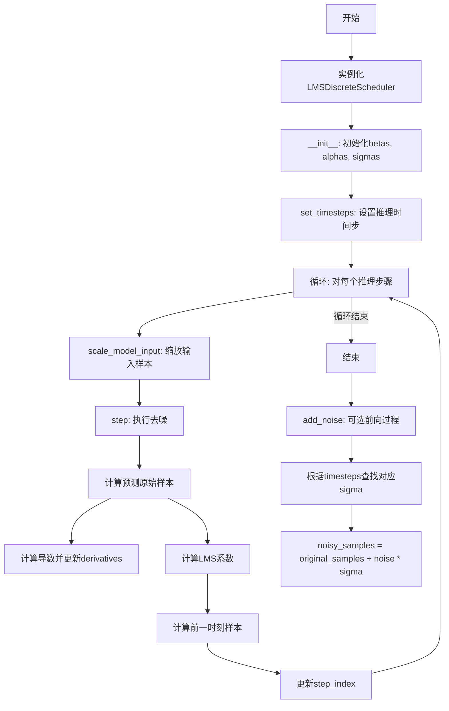
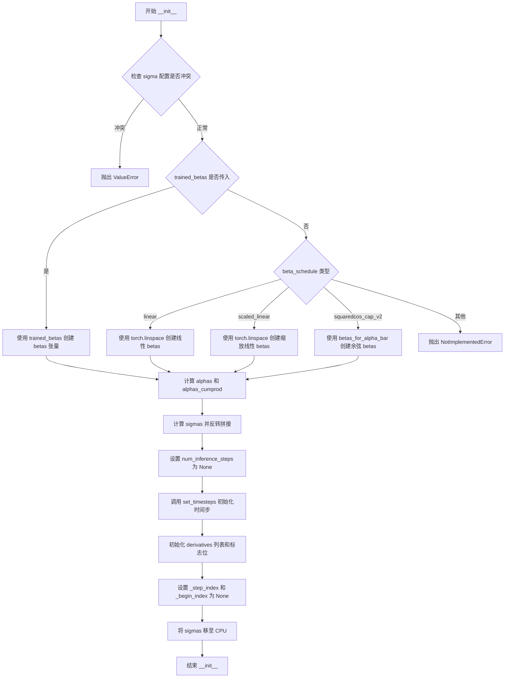
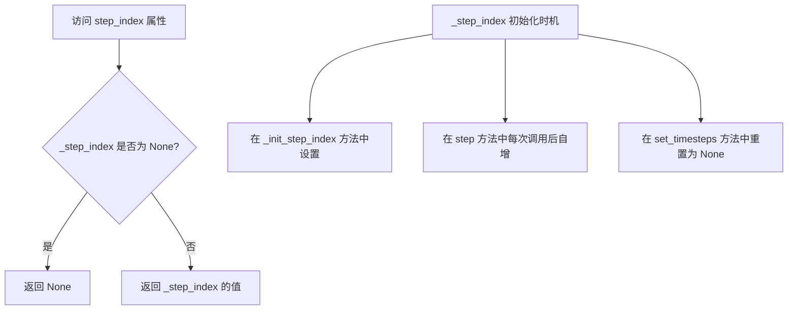
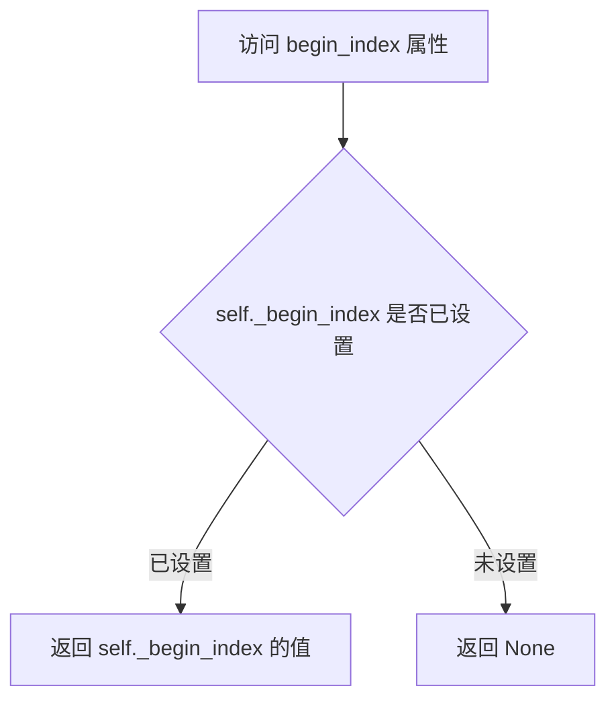
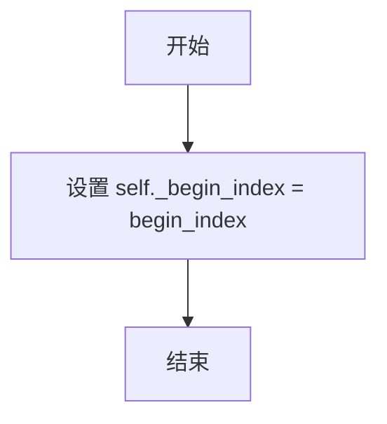
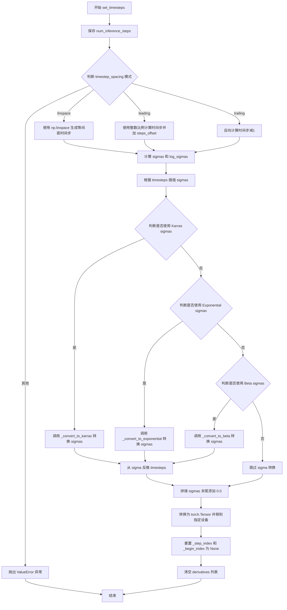
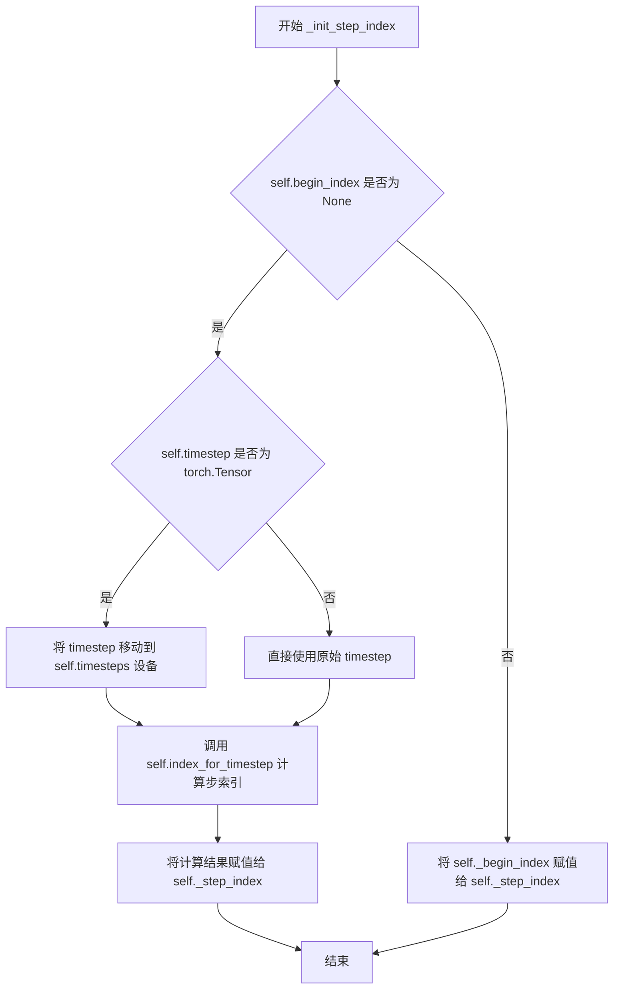
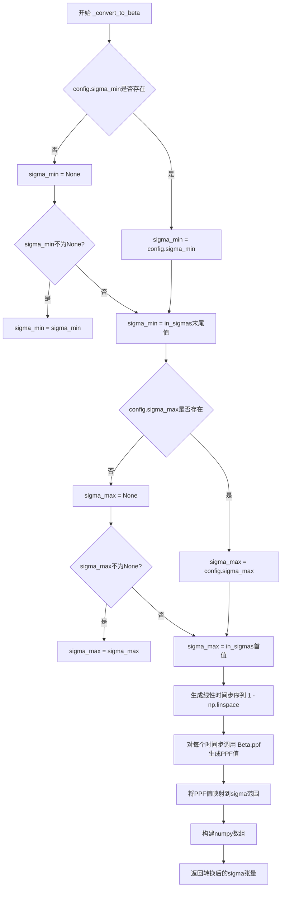
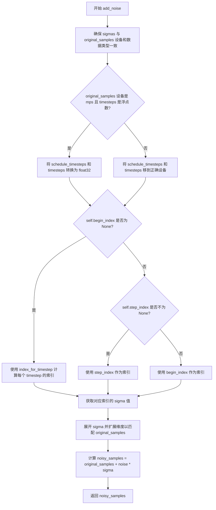
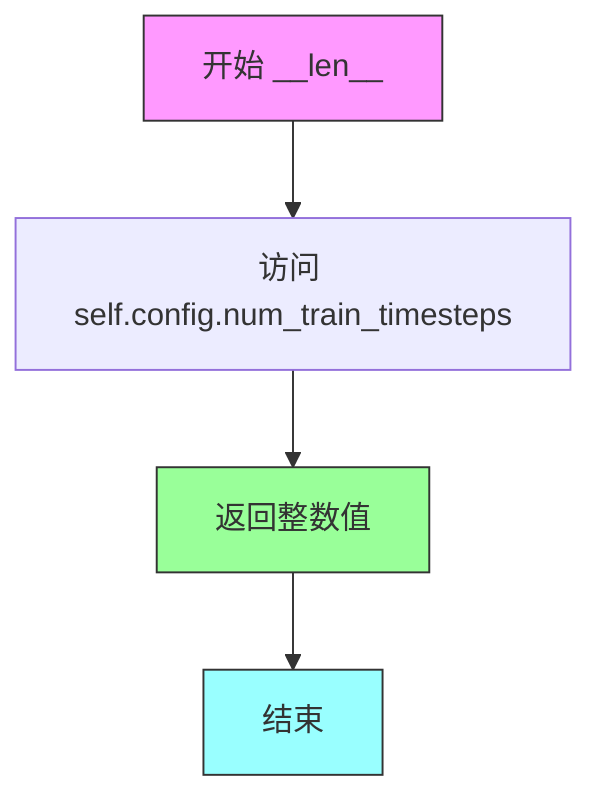

# `diffusers\src\diffusers\schedulers\scheduling_lms_discrete.py` 详细设计文档

LMS离散调度器（LMSDiscreteScheduler）是扩散模型推理过程中使用的线性多步调度器，通过累积计算历史导数来预测前一个时间步的样本，支持多种beta schedule和sigma转换策略。

## 整体流程



## 类结构

```
LMSDiscreteSchedulerOutput (数据类: 调度器输出)
├── prev_sample: torch.Tensor
└── pred_original_sample: torch.Tensor

LMSDiscreteScheduler (主调度器类)
├── 继承: SchedulerMixin, ConfigMixin
├── 字段: betas, alphas, alphas_cumprod, sigmas, timesteps, derivatives等
└── 方法: __init__, set_timesteps, scale_model_input, step, add_noise等
```

## 全局变量及字段


### `num_train_timesteps`
    
训练时的扩散步数，默认值为1000

类型：`int`
    


### `beta_start`
    
Beta调度起始值，默认值为0.0001

类型：`float`
    


### `beta_end`
    
Beta调度结束值，默认值为0.02

类型：`float`
    


### `order`
    
线性多步方法的阶数，默认值为1

类型：`int`
    


### `LMSDiscreteSchedulerOutput.prev_sample`
    
前一步计算的样本(x_{t-1})

类型：`torch.Tensor`
    


### `LMSDiscreteSchedulerOutput.pred_original_sample`
    
预测的去噪原始样本(x_0)

类型：`torch.Tensor | None`
    


### `LMSDiscreteScheduler.betas`
    
Beta值序列

类型：`torch.Tensor`
    


### `LMSDiscreteScheduler.alphas`
    
Alpha值序列(1-beta)

类型：`torch.Tensor`
    


### `LMSDiscreteScheduler.alphas_cumprod`
    
累积Alpha值

类型：`torch.Tensor`
    


### `LMSDiscreteScheduler.sigmas`
    
Sigma值序列(噪声标准差)

类型：`torch.Tensor`
    


### `LMSDiscreteScheduler.timesteps`
    
推理时间步序列

类型：`torch.Tensor`
    


### `LMSDiscreteScheduler.derivatives`
    
导数历史记录

类型：`list`
    


### `LMSDiscreteScheduler.num_inference_steps`
    
推理步数

类型：`int`
    


### `LMSDiscreteScheduler.use_karras_sigmas`
    
是否使用Karras sigmas

类型：`bool`
    


### `LMSDiscreteScheduler._step_index`
    
当前推理步骤索引

类型：`int | None`
    


### `LMSDiscreteScheduler._begin_index`
    
起始索引

类型：`int | None`
    


### `LMSDiscreteScheduler.is_scale_input_called`
    
标记scale_model_input是否已调用

类型：`bool`
    


### `LMSDiscreteScheduler._compatibles`
    
兼容的调度器列表

类型：`list`
    


### `LMSDiscreteScheduler.order`
    
线性多步方法的阶数

类型：`int`
    
    

## 全局函数及方法


### `betas_for_alpha_bar`

该函数用于创建离散的beta调度表，通过给定的alpha_t_bar函数（定义了在t=[0,1]时间内(1-beta)的累积乘积）进行离散化。函数支持三种alpha变换类型（cosine、exp、laplace），通过计算相邻时间步的alpha_bar比值来确定beta值。

参数：

- `num_diffusion_timesteps`：`int`，要生成的beta数量，即扩散时间步的总数
- `max_beta`：`float`，默认为`0.999`，用于避免数值不稳定性的最大beta值
- `alpha_transform_type`：`Literal["cosine", "exp", "laplace"]`，默认为`"cosine"`，alpha_bar的噪声调度类型

返回值：`torch.Tensor`，调度器用于逐步模型输出的beta值张量

#### 流程图

```mermaid
flowchart TD
    A[开始: betas_for_alpha_bar] --> B{alpha_transform_type == 'cosine'}
    B -->|Yes| C[定义cosine类型的alpha_bar_fn]
    B -->|No| D{alpha_transform_type == 'laplace'}
    D -->|Yes| E[定义laplace类型的alpha_bar_fn]
    D -->|No| F{alpha_transform_type == 'exp'}
    F -->|Yes| G[定义exp类型的alpha_bar_fn]
    F -->|No| H[raise ValueError: 不支持的类型]
    
    C --> I[初始化空betas列表]
    E --> I
    G --> I
    
    I --> J[循环 i from 0 to num_diffusion_timesteps-1]
    J --> K[计算t1 = i / num_diffusion_timesteps]
    J --> L[计算t2 = (i+1) / num_diffusion_timesteps]
    K --> M[计算beta_i = min1 - alpha_bar_fn(t2)/alpha_bar_fn(t1), max_beta]
    L --> M
    M --> N[将beta_i添加到betas列表]
    N --> O{还有更多时间步?}
    O -->|Yes| J
    O -->|No| P[返回torch.tensorbetas, dtype=torch.float32]
```

#### 带注释源码

```python
def betas_for_alpha_bar(
    num_diffusion_timesteps: int,
    max_beta: float = 0.999,
    alpha_transform_type: Literal["cosine", "exp", "laplace"] = "cosine",
) -> torch.Tensor:
    """
    Create a beta schedule that discretizes the given alpha_t_bar function, which defines the cumulative product of
    (1-beta) over time from t = [0,1].

    Contains a function alpha_bar that takes an argument t and transforms it to the cumulative product of (1-beta) up
    to that part of the diffusion process.

    Args:
        num_diffusion_timesteps (`int`):
            The number of betas to produce.
        max_beta (`float`, defaults to `0.999`):
            The maximum beta to use; use values lower than 1 to avoid numerical instability.
        alpha_transform_type (`str`, defaults to `"cosine"`):
            The type of noise schedule for `alpha_bar`. Choose from `cosine`, `exp`, or `laplace`.

    Returns:
        `torch.Tensor`:
            The betas used by the scheduler to step the model outputs.
    """
    # 根据alpha_transform_type选择对应的alpha_bar_fn函数
    # cosine: 使用余弦函数进行平滑的噪声调度
    if alpha_transform_type == "cosine":

        def alpha_bar_fn(t):
            # 使用cosine函数创建平滑的alpha_bar曲线
            # 添加0.008偏移量避免t=0时的问题
            return math.cos((t + 0.008) / 1.008 * math.pi / 2) ** 2

    # laplace: 使用拉普拉斯分布相关的计算
    elif alpha_transform_type == "laplace":

        def alpha_bar_fn(t):
            # 计算拉普拉斯分布的lambda参数
            lmb = -0.5 * math.copysign(1, 0.5 - t) * math.log(1 - 2 * math.fabs(0.5 - t) + 1e-6)
            # 计算信噪比SNR
            snr = math.exp(lmb)
            # 返回基于SNR的alpha_bar值
            return math.sqrt(snr / (1 + snr))

    # exp: 使用指数衰减函数
    elif alpha_transform_type == "exp":

        def alpha_bar_fn(t):
            # 指数衰减调度，-12.0是衰减率
            return math.exp(t * -12.0)

    else:
        # 不支持的变换类型时抛出异常
        raise ValueError(f"Unsupported alpha_transform_type: {alpha_transform_type}")

    # 初始化betas列表用于存储所有beta值
    betas = []
    # 遍历每个扩散时间步
    for i in range(num_diffusion_timesteps):
        # 计算当前时间步的起始和结束位置（归一化到0-1范围）
        t1 = i / num_diffusion_timesteps
        t2 = (i + 1) / num_diffusion_timesteps
        # 计算beta值：通过alpha_bar的比值得到1-beta，再与max_beta取最小值防止数值不稳定
        betas.append(min(1 - alpha_bar_fn(t2) / alpha_bar_fn(t1), max_beta))
    
    # 将betas列表转换为PyTorch浮点张量并返回
    return torch.tensor(betas, dtype=torch.float32)
```


### `LMSDiscreteScheduler.__init__`

初始化 LMSDiscreteScheduler 调度器，用于离散 beta 调度器的线性多步方法（Linear Multistep Method）。该方法根据传入的参数构建噪声调度表（beta、alpha、sigma），并初始化推理所需的内部状态。

参数：

- `num_train_timesteps`：`int`，默认为 1000，模型训练时的扩散步数。
- `beta_start`：`float`，默认为 0.0001，推理时 beta 的起始值。
- `beta_end`：`float`，默认为 0.02，推理时 beta 的结束值。
- `beta_schedule`：`str`，默认为 "linear"，beta 调度表类型，可选 "linear"、"scaled_linear" 或 "squaredcos_cap_v2"。
- `traated_betas`：`np.ndarray | list[float] | None`，可选，直接传入 beta 数组以绕过 beta_start 和 beta_end。
- `use_karras_sigmas`：`bool`，默认为 False，是否在采样过程中使用 Karras sigma 作为噪声调度表的步长。
- `use_exponential_sigmas`：`bool`，默认为 False，是否在采样过程中使用指数 sigma 作为噪声调度表的步长。
- `use_beta_sigmas`：`bool`，默认为 False，是否在采样过程中使用 beta sigma 作为噪声调度表的步长。
- `prediction_type`：`Literal["epsilon", "sample", "v_prediction"]`，默认为 "epsilon"，调度器函数的预测类型，可预测噪声、直接预测带噪样本或 v_prediction。
- `timestep_spacing`：`Literal["linspace", "leading", "trailing"]`，默认为 "linspace"，时间步的缩放方式。
- `steps_offset`：`int`，默认为 0，推理步数的偏移量。

返回值：`None`，该方法为构造函数，无返回值。

#### 流程图



#### 带注释源码

```python
@register_to_config
def __init__(
    self,
    num_train_timesteps: int = 1000,
    beta_start: float = 0.0001,
    beta_end: float = 0.02,
    beta_schedule: str = "linear",
    trained_betas: np.ndarray | list[float] | None = None,
    use_karras_sigmas: bool = False,
    use_exponential_sigmas: bool = False,
    use_beta_sigmas: bool = False,
    prediction_type: Literal["epsilon", "sample", "v_prediction"] = "epsilon",
    timestep_spacing: Literal["linspace", "leading", "trailing"] = "linspace",
    steps_offset: int = 0,
):
    # 检查是否同时使用了多个 sigma 选项，这些选项互斥
    if sum([self.config.use_beta_sigmas, self.config.use_exponential_sigmas, self.config.use_karras_sigmas]) > 1:
        raise ValueError(
            "Only one of `config.use_beta_sigmas`, `config.use_exponential_sigmas`, `config.use_karras_sigmas` can be used."
        )
    
    # 如果直接传入了 trained_betas，则直接使用
    if trained_betas is not None:
        self.betas = torch.tensor(trained_betas, dtype=torch.float32)
    # 根据 beta_schedule 类型创建对应的 betas 调度表
    elif beta_schedule == "linear":
        # 线性调度：从 beta_start 线性增加到 beta_end
        self.betas = torch.linspace(beta_start, beta_end, num_train_timesteps, dtype=torch.float32)
    elif beta_schedule == "scaled_linear":
        # 缩放线性调度：先计算平方根再线性插值，最后平方回去（适用于 latent diffusion model）
        self.betas = torch.linspace(beta_start**0.5, beta_end**0.5, num_train_timesteps, dtype=torch.float32) ** 2
    elif beta_schedule == "squaredcos_cap_v2":
        # Glide 余弦调度：使用余弦函数生成更平滑的调度表
        self.betas = betas_for_alpha_bar(num_train_timesteps)
    else:
        raise NotImplementedError(f"{beta_schedule} is not implemented for {self.__class__}")

    # 计算 alpha 值（1 - beta）和累积乘积 alpha_cumprod
    self.alphas = 1.0 - self.betas
    self.alphas_cumprod = torch.cumprod(self.alphas, dim=0)

    # 计算 sigmas：sigma = sqrt((1 - alpha_cumprod) / alpha_cumprod)
    # 然后反转并添加终态 0.0，形成 [sigma_max, ..., sigma_min, 0]
    sigmas = np.array(((1 - self.alphas_cumprod) / self.alphas_cumprod) ** 0.5)
    sigmas = np.concatenate([sigmas[::-1], [0.0]]).astype(np.float32)
    self.sigmas = torch.from_numpy(sigmas)

    # 设置可修改的内部状态
    self.num_inference_steps = None  # 推理步数，在 set_timesteps 时设置
    self.use_karras_sigmas = use_karras_sigmas
    self.set_timesteps(num_train_timesteps, None)  # 初始化时间步
    self.derivatives = []  # 用于存储线性多步方法的导数
    self.is_scale_input_called = False  # 标记 scale_model_input 是否已调用

    # 步数索引和起始索引，用于跟踪推理进度
    self._step_index = None
    self._begin_index = None
    # 将 sigmas 保留在 CPU 以减少 CPU/GPU 通信开销
    self.sigmas = self.sigmas.to("cpu")
```


### `LMSDiscreteScheduler.init_noise_sigma`

该属性方法返回初始噪声分布的标准差，用于在扩散模型推理时确定起始噪声的尺度。它根据配置中的`timestep_spacing`参数采用不同的计算策略：当采用"linspace"或"trailing"时间步间隔策略时，直接返回最大sigma值；否则返回基于`sqrt(max_sigma² + 1)`公式计算的标准差，以适应不同的时间步缩放方案。

参数： （无，该方法为属性访问器，不接受除self外的参数）

返回值：`float | torch.Tensor`，初始噪声分布的标准差，根据最大sigma值和时间步间隔配置计算得出。

#### 流程图

```mermaid
flowchart TD
    A[Start: 访问 init_noise_sigma 属性] --> B{检查 timestep_spacing 配置}
    B -->|值为 'linspace' 或 'trailing'| C[返回 self.sigmas.max]
    B -->|值为其他（如 'leading'）| D[计算 sqrt(max_sigma² + 1)]
    C --> E[End: 返回标准差]
    D --> E
```

#### 带注释源码

```python
@property
def init_noise_sigma(self) -> float | torch.Tensor:
    """
    The standard deviation of the initial noise distribution.

    Returns:
        `float` or `torch.Tensor`:
            The standard deviation of the initial noise distribution, computed based on the maximum sigma value and
            the timestep spacing configuration.
    """
    # 获取初始噪声分布的标准差
    # 根据timestep_spacing配置采用不同的计算策略
    
    # 当使用linspace或trailing时间步间隔时，直接返回最大sigma值
    if self.config.timestep_spacing in ["linspace", "trailing"]:
        return self.sigmas.max()

    # 对于其他时间步间隔方案（如leading），使用公式 sqrt(max_sigma² + 1) 计算
    # 这确保了不同时间步间隔策略下噪声尺度的正确性
    return (self.sigmas.max() ** 2 + 1) ** 0.5
```


### `LMSDiscreteScheduler.step_index`

该属性用于获取当前时间步的索引计数器。在每次调度器步骤后，该索引会自动增加1，用于追踪扩散过程中的当前步骤。

参数： 无（属性访问器不接受外部参数）

返回值： `int | None`，当前步骤索引，如果未初始化则返回 `None`

#### 流程图



#### 带注释源码

```python
@property
def step_index(self) -> int:
    """
    The index counter for current timestep. It will increase by 1 after each scheduler step.
    
    该属性用于获取当前时间步的索引计数器。它会在每次调度器步骤后增加1，
    用于追踪扩散模型去噪过程中的当前步骤位置。

    Returns:
        `int` or `None`:
            The current step index, or `None` if not initialized.
            返回当前步骤索引，如果尚未初始化则返回 None。
    """
    return self._step_index  # 返回内部维护的步骤索引变量
```

#### 相关上下文信息

**初始化时机：**
- `_step_index` 在 `_init_step_index()` 方法中被初始化，基于当前的时间步（timestep）查找到对应的索引
- 每次调用 `step()` 方法去噪后，`_step_index` 会自动增加 1
- 调用 `set_timesteps()` 方法重新设置时间步时，`_step_index` 会被重置为 `None`

**关联属性：**
- `begin_index`: 调度器的起始索引，用于某些管道场景
- `_step_index`: 内部私有变量，实际存储步骤索引的位置
- `step_index`: 对外公开的属性访问器

**使用场景：**
该属性通常与 `scale_model_input()` 和 `step()` 方法配合使用，确保在正确的步骤索引下执行去噪操作。


### `LMSDiscreteScheduler.begin_index`

该属性用于获取调度器的起始索引（begin_index），该索引应在 pipeline 中通过 `set_begin_index` 方法进行设置，用于控制扩散过程从哪个时间步开始执行。

参数：该方法无参数（属性访问器）

返回值：`int | None`，返回调度器的起始索引，如果未设置则返回 `None`

#### 流程图



#### 带注释源码

```python
@property
def begin_index(self) -> int:
    """
    The index for the first timestep. It should be set from pipeline with `set_begin_index` method.

    Returns:
        `int` or `None`:
            The begin index for the scheduler, or `None` if not set.
    """
    # 返回私有属性 _begin_index，用于表示调度器的起始时间步索引
    # 该值通过 set_begin_index 方法设置，用于控制扩散采样从特定时间步开始
    return self._begin_index
```


### `LMSDiscreteScheduler.set_begin_index`

设置调度器的起始索引。该方法应在推理前从pipeline调用，用于指定调度器从哪个时间步开始执行推理。

参数：

- `begin_index`：`int`，默认为 `0`，调度器的起始索引。

返回值：`None`，无返回值。

#### 流程图



#### 带注释源码

```
# Copied from diffusers.schedulers.scheduling_dpmsolver_multistep.DPMSolverMultistepScheduler.set_begin_index
def set_begin_index(self, begin_index: int = 0) -> None:
    """
    Sets the begin index for the scheduler. This function should be run from pipeline before the inference.

    Args:
        begin_index (`int`, defaults to `0`):
            The begin index for the scheduler.
    """
    self._begin_index = begin_index
```


### `LMSDiscreteScheduler.scale_model_input`

该方法用于确保与需要根据当前时间步缩放去噪模型输入的调度器之间的互操作性。它根据当前时间步的 sigma 值对输入样本进行缩放，使其适合扩散模型的去噪过程。

参数：

- `sample`：`torch.Tensor`，当前由扩散过程生成的输入样本
- `timestep`：`float | torch.Tensor`，扩散链中的当前时间步

返回值：`torch.Tensor`，缩放后的输入样本

#### 流程图

```mermaid
flowchart TD
    A[开始 scale_model_input] --> B{self.step_index is None?}
    B -->|是| C[调用 self._init_step_index(timestep)<br/>初始化步索引]
    B -->|否| D[获取 sigma = self.sigmas[self.step_index]]
    C --> D
    D --> E[计算缩放因子: denominator = (sigma\*\*2 + 1) \*\* 0.5]
    E --> F[sample = sample / denominator<br/>对输入样本进行缩放]
    F --> G[设置 self.is_scale_input_called = True<br/>标记已调用缩放]
    G --> H[返回缩放后的 sample]
```

#### 带注释源码

```python
def scale_model_input(self, sample: torch.Tensor, timestep: float | torch.Tensor) -> torch.Tensor:
    """
    Ensures interchangeability with schedulers that need to scale the denoising model input depending on the
    current timestep.

    Args:
        sample (`torch.Tensor`):
            The input sample.
        timestep (`float` or `torch.Tensor`):
            The current timestep in the diffusion chain.

    Returns:
        `torch.Tensor`:
            A scaled input sample.
    """

    # 如果 step_index 未初始化，则根据当前 timestep 初始化它
    if self.step_index is None:
        self._init_step_index(timestep)

    # 获取当前时间步对应的 sigma 值
    sigma = self.sigmas[self.step_index]
    
    # 根据公式 sample / sqrt(sigma^2 + 1) 对输入进行缩放
    # 这是将样本从噪声空间缩放到原始数据空间的标准化操作
    sample = sample / ((sigma**2 + 1) ** 0.5)
    
    # 标记 scale_model_input 已被调用，用于在 step() 方法中进行警告检查
    self.is_scale_input_called = True
    
    # 返回缩放后的样本
    return sample
```


### `LMSDiscreteScheduler.get_lms_coefficient`

计算线性多步系数，用于LMS（线性多步）离散调度器中基于历史导数来预测前一个样本。该函数通过积分计算当前阶数的权重系数，以便在去噪过程中组合多个历史步骤的导数。

参数：

- `order`：`int`，线性多步方法的阶数，决定使用多少个历史导数进行预测
- `t`：`int`，当前时间步索引，用于从sigma数组中获取对应的噪声水平
- `current_order`：`int`，当前要计算系数的阶数，用于区分不同阶数的系数计算

返回值：`float`，计算得到的线性多步系数，用于在调度器的step方法中对历史导数进行加权求和

#### 流程图

```mermaid
flowchart TD
    A[开始计算LMS系数] --> B[定义内部函数lms_derivative]
    B --> C[初始化prod = 1.0]
    C --> D{遍历k从0到order-1}
    D -->|k == current_order| E[跳过当前阶]
    D -->|k != current_order| F[计算prod *= (tau - sigmas[t-k]) / (sigmas[t-current_order] - sigmas[t-k])]
    F --> D
    D --> G[返回prod]
    G --> H[调用scipy.integrate.quad对lms_derivative在sigmas[t]到sigmas[t+1]区间进行数值积分]
    H --> I[提取积分结果的第一项作为系数]
    I --> J[返回积分系数]
```

#### 带注释源码

```python
def get_lms_coefficient(self, order: int, t: int, current_order: int) -> float:
    """
    Compute the linear multistep coefficient.

    Args:
        order (`int`):
            The order of the linear multistep method.
        t (`int`):
            The current timestep index.
        current_order (`int`):
            The current order for which to compute the coefficient.

    Returns:
        `float`:
            The computed linear multistep coefficient.
    """

    def lms_derivative(tau):
        """
        内部函数：计算线性多步方法的导数因子
        
        这个函数实现了LMS系数计算中的核心多项式因子，
        基于拉格朗日插值原理计算不同sigma值之间的比例关系
        
        参数:
            tau: 积分变量，表示sigma值域中的一个点
        返回:
            prod: 累积乘积值，构成最终的积分核函数
        """
        prod = 1.0
        for k in range(order):
            # 跳过当前正在计算的阶数，避免除零错误
            if current_order == k:
                continue
            # 计算拉格朗日插值因子：(tau - sigmas[t-k]) / (sigmas[t-current_order] - sigmas[t-k])
            # 这个因子衡量了不同历史时间步与当前时间步的相对位置关系
            prod *= (tau - self.sigmas[t - k]) / (self.sigmas[t - current_order] - self.sigmas[t - k])
        return prod

    # 使用scipy的quad函数进行数值积分
    # 积分区间从当前sigma值到下一个sigma值
    # epsrel=1e-4设置相对误差容限，保证计算精度
    # [0]表示只取积分结果，忽略误差估计
    integrated_coeff = integrate.quad(lms_derivative, self.sigmas[t], self.sigmas[t + 1], epsrel=1e-4)[0]

    # 返回计算得到的积分系数，该系数将用于对历史导数进行加权组合
    return integrated_coeff
```


### `LMSDiscreteScheduler.set_timesteps`

设置离散时间步，用于扩散链的推理过程。该方法根据配置的时间步间隔策略（linspace/leading/trailing）生成推理时的时间步序列，并可选择性地使用Karras、指数或Beta噪声调度策略来调整sigma值。

参数：

- `num_inference_steps`：`int`，生成样本时使用的扩散步数
- `device`：`str | torch.device`，时间步要移动到的设备，如果为`None`则不移动

返回值：`None`，无返回值

#### 流程图



#### 带注释源码

```python
def set_timesteps(self, num_inference_steps: int, device: str | torch.device = None):
    """
    Sets the discrete timesteps used for the diffusion chain (to be run before inference).

    Args:
        num_inference_steps (`int`):
            The number of diffusion steps used when generating samples with a pre-trained model.
        device (`str` or `torch.device`, *optional`):
            The device to which the timesteps should be moved to. If `None`, the timesteps are not moved.
    """
    # 1. 保存推理步数
    self.num_inference_steps = num_inference_steps

    # 2. 根据 timestep_spacing 配置生成时间步序列
    # 参考 https://huggingface.co/papers/2305.08891 表2
    if self.config.timestep_spacing == "linspace":
        # 等间距时间步：从 0 到 num_train_timesteps-1，取 num_inference_steps 个点，然后反转
        timesteps = np.linspace(0, self.config.num_train_timesteps - 1, num_inference_steps, dtype=np.float32)[
            ::-1
        ].copy()
    elif self.config.timestep_spacing == "leading":
        # 领先间隔：创建整数时间步，乘以比例，取整后反转并加偏移
        step_ratio = self.config.num_train_timesteps // self.num_inference_steps
        timesteps = (np.arange(0, num_inference_steps) * step_ratio).round()[::-1].copy().astype(np.float32)
        timesteps += self.config.steps_offset
    elif self.config.timestep_spacing == "trailing":
        #  trailing 间隔：反向计算时间步，减1
        step_ratio = self.config.num_train_timesteps / self.num_inference_steps
        timesteps = (np.arange(self.config.num_train_timesteps, 0, -step_ratio)).round().copy().astype(np.float32)
        timesteps -= 1
    else:
        raise ValueError(
            f"{self.config.timestep_spacing} is not supported. Please make sure to choose one of 'linspace', 'leading' or 'trailing'."
        )

    # 3. 计算基础 sigma 序列（噪声标准差）
    sigmas = np.array(((1 - self.alphas_cumprod) / self.alphas_cumprod) ** 0.5)
    log_sigmas = np.log(sigmas)
    # 4. 将时间步映射到 sigma 空间
    sigmas = np.interp(timesteps, np.arange(0, len(sigmas)), sigmas)

    # 5. 可选：应用特殊的 sigma 转换策略
    if self.config.use_karras_sigmas:
        # 使用 Karras 噪声调度（参考 Elucidating the Design Space 论文）
        sigmas = self._convert_to_karras(in_sigmas=sigmas)
        # 从转换后的 sigma 反推对应的时间步
        timesteps = np.array([self._sigma_to_t(sigma, log_sigmas) for sigma in sigmas])
    elif self.config.use_exponential_sigmas:
        # 使用指数噪声调度
        sigmas = self._convert_to_exponential(in_sigmas=sigmas, num_inference_steps=num_inference_steps)
        timesteps = np.array([self._sigma_to_t(sigma, log_sigmas) for sigma in sigmas])
    elif self.config.use_beta_sigmas:
        # 使用 Beta 分布噪声调度（参考 Beta Sampling is All You Need 论文）
        sigmas = self._convert_to_beta(in_sigmas=sigmas, num_inference_steps=num_inference_steps)
        timesteps = np.array([self._sigma_to_t(sigma, log_sigmas) for sigma in sigmas])

    # 6. 在 sigma 序列末尾添加 0.0（对应最后一步的无噪声样本）
    sigmas = np.concatenate([sigmas, [0.0]]).astype(np.float32)

    # 7. 转换为 torch.Tensor 并移到指定设备
    self.sigmas = torch.from_numpy(sigmas).to(device=device)
    self.timesteps = torch.from_numpy(timesteps).to(device=device, dtype=torch.float32)
    
    # 8. 重置调度器状态
    self._step_index = None      # 重置当前步索引
    self._begin_index = None     # 重置起始索引
    self.sigmas = self.sigmas.to("cpu")  # 移回 CPU 以减少 CPU/GPU 通信
    
    # 9. 清空导数列表（用于线性多步法）
    self.derivatives = []
```


### `LMSDiscreteScheduler.index_for_timestep`

该方法用于在时间步调度序列中查找给定时间步对应的索引位置。对于去噪过程的起始步骤，当存在多个匹配时，默认返回第二个索引，以避免在图像到图像等场景中从调度中间开始时意外跳过 sigma 值。

参数：

- `self`：`LMSDiscreteScheduler` 实例，调用该方法的调度器对象
- `timestep`：`float | torch.Tensor`，要查找的时间步值，可以是单个浮点数或张量
- `schedule_timesteps`：`torch.Tensor | None`，可选参数，要搜索的时间步调度序列。如果为 `None`，则使用 `self.timesteps`

返回值：`int`，时间步在调度序列中的索引位置

#### 流程图

```mermaid
flowchart TD
    A[开始 index_for_timestep] --> B{schedule_timesteps 是否为 None?}
    B -->|是| C[使用 self.timesteps 作为 schedule_timesteps]
    B -->|否| D[使用传入的 schedule_timesteps]
    C --> E[在 schedule_timesteps 中查找与 timestep 相等的元素]
    D --> E
    E --> F[获取所有匹配位置的索引]
    F --> G{匹配数量 > 1?}
    G -->|是| H[pos = 1]
    G -->|否| I[pos = 0]
    H --> J[返回 indices[pos].item()]
    I --> J
    J --> K[结束]
```

#### 带注释源码

```python
def index_for_timestep(
    self, timestep: float | torch.Tensor, schedule_timesteps: torch.Tensor | None = None
) -> int:
    """
    Find the index of a given timestep in the timestep schedule.

    Args:
        timestep (`float` or `torch.Tensor`):
            The timestep value to find in the schedule.
        schedule_timesteps (`torch.Tensor`, *optional*):
            The timestep schedule to search in. If `None`, uses `self.timesteps`.

    Returns:
        `int`:
            The index of the timestep in the schedule. For the very first step, returns the second index if
            multiple matches exist to avoid skipping a sigma when starting mid-schedule (e.g., for image-to-image).
    """
    # 如果未提供 schedule_timesteps，则使用调度器实例的 timesteps 属性
    if schedule_timesteps is None:
        schedule_timesteps = self.timesteps

    # 查找 schedule_timesteps 中与给定 timestep 值相等的所有索引位置
    # 使用 torch.Tensor.nonzero() 返回满足条件的元素的索引
    indices = (schedule_timesteps == timestep).nonzero()

    # 对于去噪过程的**第一个**步骤，
    # 始终选择第二个索引（如果存在多个匹配）或最后一个索引（如果只有一个匹配）
    # 这样可以确保在去噪调度中间开始时（例如图像到图像任务）不会意外跳过 sigma 值
    pos = 1 if len(indices) > 1 else 0

    # 返回找到的索引值，转换为 Python 标量
    return indices[pos].item()
```


### `LMSDiscreteScheduler._init_step_index`

该方法用于基于给定的时间步（timestep）初始化调度器的步索引（step index），确保在扩散链的正确位置开始去噪过程。

参数：

- `timestep`：`float | torch.Tensor`，当前的时间步，用于初始化步索引。

返回值：`None`，该方法不返回任何值，仅初始化内部 `_step_index`。

#### 流程图



#### 带注释源码

```python
# Copied from diffusers.schedulers.scheduling_euler_discrete.EulerDiscreteScheduler._init_step_index
def _init_step_index(self, timestep: float | torch.Tensor) -> None:
    """
    Initialize the step index for the scheduler based on the given timestep.

    Args:
        timestep (`float` or `torch.Tensor`):
            The current timestep to initialize the step index from.
    """
    # 检查是否已经设置了起始索引（begin_index）
    # 如果没有设置，则需要根据当前时间步计算步索引
    if self.begin_index is None:
        # 如果时间步是 torch.Tensor，需要确保它在正确的设备上
        # 以便与 self.timesteps 进行比较
        if isinstance(timestep, torch.Tensor):
            timestep = timestep.to(self.timesteps.device)
        
        # 通过时间步在时间步列表中的位置来确定当前的步索引
        self._step_index = self.index_for_timestep(timestep)
    else:
        # 如果已经设置了起始索引（通常用于 pipeline 中的特定控制），
        # 则直接使用预定义的起始索引作为当前步索引
        self._step_index = self._begin_index
```


### `LMSDiscreteScheduler._sigma_to_t`

该方法将 sigma 值通过插值转换为对应的时间步索引值，是离散调度器中将噪声水平映射到扩散过程时间步的核心转换函数。

参数：

- `sigma`：`np.ndarray`，要转换的 sigma 值（或值数组）
- `log_sigmas`：`np.ndarray`，用于插值的对数 sigma 调度表

返回值：`np.ndarray`，与输入 sigma 对应的时间步索引值

#### 流程图

```mermaid
flowchart TD
    A[开始: _sigma_to_t] --> B[计算log_sigma<br/>log_sigma = np.lognp.maximumsigma, 1e-10]
    B --> C[计算分布差值<br/>dists = log_sigma - log_sigmas[:, np.newaxis]]
    C --> D[确定sigma区间<br/>low_idx = cumsumdists >= 0.argmaxclip<br/>high_idx = low_idx + 1]
    D --> E[获取区间边界<br/>low = log_sigmaslow_idx<br/>high = log_sigmashigh_idx]
    E --> F[计算插值权重<br/>w = low - log_sigma / low - high<br/>w = np.clipw, 0, 1]
    F --> G[转换为时间步<br/>t = 1-w × low_idx + w × high_idx]
    G --> H[reshape输出形状<br/>t = t.reshapesigma.shape]
    H --> I[返回: 时间步数组]
```

#### 带注释源码

```
def _sigma_to_t(self, sigma: np.ndarray, log_sigmas: np.ndarray) -> np.ndarray:
    """
    将 sigma 值通过插值转换为对应的时间步索引值。

    参数:
        sigma: 要转换的 sigma 值（或值数组）
        log_sigmas: 用于插值的对数 sigma 调度表

    返回:
        与输入 sigma 对应的时间步索引值数组
    """
    # 获取 sigma 的对数值，使用 max(..., 1e-10) 防止 log(0)
    log_sigma = np.log(np.maximum(sigma, 1e-10))

    # 计算 log_sigma 与 log_sigmas 数组中每个元素的差值
    # 结果形状: (len(log_sigmas), len(sigma))
    dists = log_sigma - log_sigmas[:, np.newaxis]

    # 确定 sigma 落在 log_sigmas 数组中的位置区间
    # cumsum + argmax 找到第一个 dist >= 0 的索引位置
    low_idx = np.cumsum((dists >= 0), axis=0).argmax(axis=0).clip(max=log_sigmas.shape[0] - 2)
    high_idx = low_idx + 1

    # 获取区间上下界的对数 sigma 值
    low = log_sigmas[low_idx]
    high = log_sigmas[high_idx]

    # 计算线性插值权重 w
    # w = 0 表示靠近 high 边界，w = 1 表示靠近 low 边界
    w = (low - log_sigma) / (low - high)
    w = np.clip(w, 0, 1)  # 限制权重在 [0, 1] 范围内

    # 将插值权重转换为时间步索引
    # t = 0 表示完全在 low_idx，t = 1 表示完全在 high_idx
    t = (1 - w) * low_idx + w * high_idx
    
    # 调整输出形状以匹配输入 sigma 的形状
    t = t.reshape(sigma.shape)
    
    return t
```


### `LMSDiscreteScheduler._convert_to_karras`

将输入的sigma值转换为基于Karras噪声调度器的sigma值序列。该方法实现了Elucidating the Design Space of Diffusion-Based Generative Models论文中提出的噪声调度算法，通过幂函数变换创建非线性的sigma步长。

参数：

- `self`：`LMSDiscreteScheduler`，当前调度器实例
- `in_sigmas`：`torch.Tensor`，输入的sigma值张量，通常是标准噪声调度器生成的sigma序列

返回值：`torch.Tensor`，转换后的sigma值数组，遵循Karras噪声调度方案

#### 流程图

```mermaid
flowchart TD
    A[开始] --> B[获取sigma_min: in_sigmas[-1].item]
    B --> C[获取sigma_max: in_sigmas[0].item]
    C --> D[设置rho = 7.0]
    D --> E[生成ramp: np.linspace0 to 1, num_inference_steps]
    E --> F[计算min_inv_rho = sigma_min^(1/rho)]
    F --> G[计算max_inv_rho = sigma_max^(1/rho)]
    G --> H[计算sigmas = (max_inv_rho + ramp × (min_inv_rho - max_inv_rho))^rho]
    H --> I[返回转换后的sigmas数组]
```

#### 带注释源码

```python
def _convert_to_karras(self, in_sigmas: torch.Tensor) -> torch.Tensor:
    """
    Construct the noise schedule as proposed in [Elucidating the Design Space of Diffusion-Based Generative
    Models](https://huggingface.co/papers/2206.00364).

    Args:
        in_sigmas (`torch.Tensor`):
            The input sigma values to be converted.

    Returns:
        `torch.Tensor`:
            The converted sigma values following the Karras noise schedule.
    """

    # 提取最小和最大的sigma值
    # sigma_min对应最后一个sigma（噪声最小的步骤）
    # sigma_max对应第一个sigma（噪声最大的步骤）
    sigma_min: float = in_sigmas[-1].item()
    sigma_max: float = in_sigmas[0].item()

    # rho是Karras论文中推荐的超参数，控制sigma变换的非线性程度
    rho = 7.0  # 7.0 is the value used in the paper
    
    # 生成从0到1的线性间隔数组，用于插值
    ramp = np.linspace(0, 1, self.num_inference_steps)
    
    # 计算sigma的rho次根的倒数
    # 这是Karras噪声调度的关键变换步骤
    min_inv_rho = sigma_min ** (1 / rho)
    max_inv_rho = sigma_max ** (1 / rho)
    
    # 应用Karras公式计算最终的sigma值
    # sigmas = (max_inv_rho + ramp × (min_inv_rho - max_inv_rho))^rho
    # 这个公式创建了一个从sigma_max到sigma_min的非线性路径
    sigmas = (max_inv_rho + ramp * (min_inv_rho - max_inv_rho)) ** rho
    
    return sigmas
```


### LMSDiscreteScheduler._convert_to_exponential

该方法用于构建指数噪声调度（Exponential Noise Schedule），将输入的sigma值转换为遵循指数分布的sigma序列，用于扩散模型的推理过程。

参数：

- `self`：`LMSDiscreteScheduler`，调用此方法的调度器实例本身
- `in_sigmas`：`torch.Tensor`，输入的sigma值，用于确定噪声调度范围的边界
- `num_inference_steps`：`int`，推理步数，生成噪声调度序列的长度

返回值：`torch.Tensor`，转换后的sigma值数组，遵循指数噪声调度

#### 流程图

```mermaid
flowchart TD
    A[开始 _convert_to_exponential] --> B{self.config 是否有 sigma_min 属性}
    B -->|是| C[获取 self.config.sigma_min]
    B -->|否| D[sigma_min = None]
    C --> E{self.config 是否有 sigma_max 属性}
    D --> E
    E -->|是| F[获取 self.config.sigma_max]
    E -->|否| G[sigma_max = None]
    F --> H{sigma_min 不为 None}
    G --> H
    H -->|是| I[使用配置的 sigma_min]
    H -->|否| J[sigma_min = in_sigmas[-1].item()]
    I --> K{sigma_max 不为 None}
    J --> K
    K -->|是| L[使用配置的 sigma_max]
    K -->|否| M[sigma_max = in_sigmas[0].item()]
    L --> N[计算指数sigma序列]
    M --> N
    N --> O[返回 sigmas 数组]
```

#### 带注释源码

```python
def _convert_to_exponential(self, in_sigmas: torch.Tensor, num_inference_steps: int) -> torch.Tensor:
    """
    Construct an exponential noise schedule.

    Args:
        in_sigmas (`torch.Tensor`):
            The input sigma values to be converted.
        num_inference_steps (`int`):
            The number of inference steps to generate the noise schedule for.

    Returns:
        `torch.Tensor`:
            The converted sigma values following an exponential schedule.
    """

    # Hack to make sure that other schedulers which copy this function don't break
    # TODO: Add this logic to the other schedulers
    # 检查配置对象是否定义了 sigma_min 属性（某些调度器可能有，某些没有）
    if hasattr(self.config, "sigma_min"):
        sigma_min = self.config.sigma_min
    else:
        sigma_min = None

    # 检查配置对象是否定义了 sigma_max 属性
    if hasattr(self.config, "sigma_max"):
        sigma_max = self.config.sigma_max
    else:
        sigma_max = None

    # 如果配置中指定了 sigma_min 则使用配置值，否则使用输入 sigma 中的最小值（最后一个元素）
    sigma_min = sigma_min if sigma_min is not None else in_sigmas[-1].item()
    # 如果配置中指定了 sigma_max 则使用配置值，否则使用输入 sigma 中的最大值（第一个元素）
    sigma_max = sigma_max if sigma_max is not None else in_sigmas[0].item()

    # 在对数空间中创建线性间隔的点，然后取指数，得到指数衰减的 sigma 序列
    # 从 sigma_max 到 sigma_min，在对数空间中均匀分布
    sigmas = np.exp(np.linspace(math.log(sigma_max), math.log(sigma_min), num_inference_steps))
    return sigmas
```


### `LMSDiscreteScheduler._convert_to_beta`

该方法用于根据Beta分布构造噪声调度表（noise schedule），实现了论文"Beta Sampling is All You Need"中提出的Beta采样策略。通过将标准的线性时间步映射到Beta分布的分位点函数（PPF），生成非线性的sigma值序列，以优化扩散模型的采样过程。

参数：

- `self`：`LMSDiscreteScheduler`，调度器实例本身
- `in_sigmas`：`torch.Tensor`，输入的sigma值序列，通常为预计算的标准噪声调度表
- `num_inference_steps`：`int`，推理步骤的数量，用于生成目标长度的噪声调度表
- `alpha`：`float`，可选参数，默认为`0.6`，Beta分布的alpha参数，控制调度曲线的形状
- `beta`：`float`，可选参数，默认为`0.6`，Beta分布的beta参数，控制调度曲线的形状

返回值：`torch.Tensor`，转换后的sigma值序列，遵循Beta分布调度策略

#### 流程图



#### 带注释源码

```
def _convert_to_beta(
    self, in_sigmas: torch.Tensor, num_inference_steps: int, alpha: float = 0.6, beta: float = 0.6
) -> torch.Tensor:
    """
    Construct a beta noise schedule as proposed in [Beta Sampling is All You
    Need](https://huggingface.co/papers/2407.12173).

    Args:
        in_sigmas (`torch.Tensor`):
            The input sigma values to be converted.
        num_inference_steps (`int`):
            The number of inference steps to generate the noise schedule for.
        alpha (`float`, *optional*, defaults to `0.6`):
            The alpha parameter for the beta distribution.
        beta (`float`, *optional*, defaults to `0.6`):
            The beta parameter for the beta distribution.

    Returns:
        `torch.Tensor`:
            The converted sigma values following a beta distribution schedule.
    """

    # Hack to make sure that other schedulers which copy this function don't break
    # TODO: Add this logic to the other schedulers
    # 检查配置中是否定义了sigma_min参数，用于兼容性处理
    if hasattr(self.config, "sigma_min"):
        sigma_min = self.config.sigma_min
    else:
        sigma_min = None

    # 检查配置中是否定义了sigma_max参数，用于兼容性处理
    if hasattr(self.config, "sigma_max"):
        sigma_max = self.config.sigma_max
    else:
        sigma_max = None

    # 如果config中未指定，则使用in_sigmas的边界值作为默认
    # in_sigmas[-1]对应最小sigma，in_sigmas[0]对应最大sigma
    sigma_min = sigma_min if sigma_min is not None else in_sigmas[-1].item()
    sigma_max = sigma_max if sigma_max is not None else in_sigmas[0].item()

    # 使用Beta分布的分位点函数(PPF)生成非线性时间步调度
    # 1. 生成从1到0的线性时间步序列
    # 2. 对每个时间步计算Beta分布的PPF值（百分位点）
    # 3. 将PPF值从[0,1]范围映射到[sigma_min, sigma_max]范围
    sigmas = np.array(
        [
            sigma_min + (ppf * (sigma_max - sigma_min))
            for ppf in [
                scipy.stats.beta.ppf(timestep, alpha, beta)
                for timestep in 1 - np.linspace(0, 1, num_inference_steps)
            ]
        ]
    )
    return sigmas
```


### `LMSDiscreteScheduler.step`

该方法是线性多步（Linear Multistep）离散调度器的核心步骤函数，通过反向随机微分方程（SDE）基于当前时间步的模型预测噪声来预测前一个时间步的样本。它利用历史导数进行多步预测，支持epsilon、v_prediction和sample三种预测类型。

**参数：**

- `model_output`：`torch.Tensor`，学习到的扩散模型的直接输出（通常为预测的噪声）。
- `timestep`：`float | torch.Tensor`，扩散链中的当前离散时间步。
- `sample`：`torch.Tensor`，由扩散过程生成的当前样本实例。
- `order`：`int`（默认值为4），线性多步方法的阶数，决定使用多少个历史导数进行预测。
- `return_dict`：`bool`（默认值为True），是否返回调度器输出对象或元组。

**返回值：** `LMSDiscreteSchedulerOutput | tuple`，如果`return_dict`为`True`，返回包含`prev_sample`和`pred_original_sample`的对象；否则返回元组，其中第一个元素是样本张量。

#### 流程图

```mermaid
flowchart TD
    A[开始 step] --> B{检查 is_scale_input_called}
    B -->|否| C[发出警告: 请先调用 scale_model_input]
    B -->|是| D{检查 step_index}
    D -->|为 None| E[初始化 step_index]
    D -->|已存在| F[获取当前 sigma]
    E --> F
    
    F --> G[根据 prediction_type 计算 pred_original_sample]
    G --> H{prediction_type}
    H -->|epsilon| I[pred_original_sample = sample - sigma * model_output]
    H -->|v_prediction| J[pred_original_sample = model_output * c_out + sample * c_skip]
    H -->|sample| K[pred_original_sample = model_output]
    
    I --> L[计算导数: derivative = (sample - pred_original_sample) / sigma]
    J --> L
    K --> L
    
    L --> M[将导数添加到 derivatives 列表]
    M --> N{derivatives 长度是否超过 order}
    N -->|是| O[移除最旧的导数]
    N -->|否| P[确定实际使用的阶数: order = min(step_index + 1, order)]
    O --> P
    
    P --> Q[计算 LMS 系数]
    Q --> R[计算前一个样本: prev_sample = sample + sum coeff * derivative]
    R --> S[step_index 加 1]
    S --> T{return_dict}
    
    T -->|True| U[返回 LMSDiscreteSchedulerOutput 对象]
    T -->|False| V[返回元组 prev_sample, pred_original_sample]
    
    U --> W[结束]
    V --> W
```

#### 带注释源码

```python
def step(
    self,
    model_output: torch.Tensor,          # 扩散模型的输出，通常是预测的噪声
    timestep: float | torch.Tensor,      # 当前扩散链中的时间步
    sample: torch.Tensor,                 # 当前样本实例
    order: int = 4,                       # 线性多步方法的阶数
    return_dict: bool = True,             # 是否返回调度器输出对象
) -> LMSDiscreteSchedulerOutput | tuple:
    """
    通过反向SDE预测前一个时间步的样本。该函数通过学习到的模型输出（通常是预测噪声）来传播扩散过程。
    
    参数:
        model_output: 学习到的扩散模型的直接输出
        timestep: 扩散链中的当前离散时间步
        sample: 由扩散过程创建的当前样本实例
        order: 线性多步方法的阶数（默认为4）
        return_dict: 是否返回调度器输出对象或元组
    
    返回:
        如果return_dict为True，返回LMSDiscreteSchedulerOutput对象；否则返回元组
    """
    # 检查是否已调用scale_model_input，未调用则发出警告
    if not self.is_scale_input_called:
        warnings.warn(
            "The `scale_model_input` function should be called before `step` to ensure correct denoising. "
            "See `StableDiffusionPipeline` for a usage example."
        )

    # 如果step_index未初始化，则根据timestep初始化
    if self.step_index is None:
        self._init_step_index(timestep)

    # 获取当前时间步对应的sigma值
    sigma = self.sigmas[self.step_index]

    # 1. 从sigma缩放的预测噪声计算原始样本(x_0)
    if self.config.prediction_type == "epsilon":
        # epsilon预测：根据预测噪声计算原始样本
        pred_original_sample = sample - sigma * model_output
    elif self.config.prediction_type == "v_prediction":
        # v-prediction：使用v-prediction公式计算原始样本
        # 公式: pred_original_sample = model_output * c_out + sample * c_skip
        pred_original_sample = model_output * (-sigma / (sigma**2 + 1) ** 0.5) + (sample / (sigma**2 + 1))
    elif self.config.prediction_type == "sample":
        # sample预测：直接使用模型输出作为原始样本
        pred_original_sample = model_output
    else:
        raise ValueError(
            f"prediction_type given as {self.config.prediction_type} must be one of `epsilon`, or `v_prediction`"
        )

    # 2. 转换为ODE导数
    # 计算当前步骤的导数，用于多步预测
    derivative = (sample - pred_original_sample) / sigma
    
    # 将导数添加到历史列表中
    self.derivatives.append(derivative)
    
    # 保持导数列表长度不超过order，超出则移除最旧的
    if len(self.derivatives) > order:
        self.derivatives.pop(0)

    # 3. 计算线性多步系数
    # 实际阶数不能超过当前步骤索引+1和指定order的最小值
    order = min(self.step_index + 1, order)
    
    # 计算LMS系数，用于加权历史导数
    lms_coeffs = [self.get_lms_coefficient(order, self.step_index, curr_order) for curr_order in range(order)]

    # 4. 根据导数路径计算前一个样本
    # 使用LMS系数对历史导数进行加权求和
    prev_sample = sample + sum(
        coeff * derivative for coeff, derivative in zip(lms_coeffs, reversed(self.derivatives))
    )

    # 步骤完成后，step_index增加1
    self._step_index += 1

    # 根据return_dict决定返回格式
    if not return_dict:
        return (
            prev_sample,
            pred_original_sample,
        )

    # 返回包含前一个样本和原始预测样本的输出对象
    return LMSDiscreteSchedulerOutput(prev_sample=prev_sample, pred_original_sample=pred_original_sample)
```


### `LMSDiscreteScheduler.add_noise`

该方法用于在扩散模型的采样或训练过程中，根据噪声调度表在原始样本上添加指定强度的噪声。它根据输入的时间步（timesteps）从预定义的sigma序列中获取对应的噪声强度，然后将噪声按比例叠加到原始样本上，生成带噪声的样本。

参数：

- `self`：`LMSDiscreteScheduler` 类的实例
- `original_samples`：`torch.Tensor`，需要进行噪声处理的原始样本张量
- `noise`：`torch.Tensor`，要添加的噪声张量
- `timesteps`：`torch.Tensor`，指定的时间步张量，用于确定每个样本应添加的噪声级别

返回值：`torch.Tensor`，返回添加噪声后的样本张量

#### 流程图



#### 带注释源码

```python
def add_noise(
    self,
    original_samples: torch.Tensor,
    noise: torch.Tensor,
    timesteps: torch.Tensor,
) -> torch.Tensor:
    """
    Add noise to the original samples according to the noise schedule at the specified timesteps.

    Args:
        original_samples (`torch.Tensor`):
            The original samples to which noise will be added.
        noise (`torch.Tensor`):
            The noise tensor to add to the original samples.
        timesteps (`torch.Tensor`):
            The timesteps at which to add noise, determining the noise level from the schedule.

    Returns:
        `torch.Tensor`:
            The noisy samples with added noise scaled according to the timestep schedule.
    """
    # Step 1: 确保 sigmas 和 timesteps 与 original_samples 具有相同的设备和数据类型
    # 以避免设备不匹配错误
    sigmas = self.sigmas.to(device=original_samples.device, dtype=original_samples.dtype)
    
    # Step 2: 处理 MPS 设备的特殊情况（不支持 float64）
    if original_samples.device.type == "mps" and torch.is_floating_point(timesteps):
        # mps does not support float64
        schedule_timesteps = self.timesteps.to(original_samples.device, dtype=torch.float32)
        timesteps = timesteps.to(original_samples.device, dtype=torch.float32)
    else:
        schedule_timesteps = self.timesteps.to(original_samples.device)
        timesteps = timesteps.to(original_samples.device)

    # Step 3: 根据调度器的状态确定使用哪个索引来获取 sigma 值
    # self.begin_index is None when scheduler is used for training, or pipeline does not implement set_begin_index
    if self.begin_index is None:
        # 训练模式：为每个 timestep 计算对应的索引
        step_indices = [self.index_for_timestep(t, schedule_timesteps) for t in timesteps]
    elif self.step_index is not None:
        # add_noise is called after first denoising step (for inpainting)
        # 图像修复场景：在第一次去噪步骤后调用
        step_indices = [self.step_index] * timesteps.shape[0]
    else:
        # add noise is called before first denoising step to create initial latent(img2img)
        # 图生图场景：在第一次去噪步骤前调用以创建初始潜在向量
        step_indices = [self.begin_index] * timesteps.shape[0]

    # Step 4: 获取对应时间步的 sigma 值（噪声强度）
    sigma = sigmas[step_indices].flatten()
    
    # Step 5: 扩展 sigma 的维度以匹配原始样本的形状
    # 例如：如果 original_samples 形状为 (batch, channel, height, width)
    # sigma 可能需要扩展为 (batch, 1, 1, 1) 以进行广播
    while len(sigma.shape) < len(original_samples.shape):
        sigma = sigma.unsqueeze(-1)

    # Step 6: 计算带噪声的样本：noisy_sample = original_sample + noise * sigma
    noisy_samples = original_samples + noise * sigma
    return noisy_samples
```


### `LMSDiscreteScheduler.__len__`

返回调度器的训练时间步数，使得可以使用 Python 的 `len()` 函数获取调度器配置的时间步总数。

参数：
- （无显式参数，隐含参数 `self` 为调度器实例）

返回值：`int`，返回配置的训练时间步数量（即 `num_train_timesteps`）

#### 流程图



#### 带注释源码

```python
def __len__(self) -> int:
    """
    返回调度器配置的训练时间步数。
    
    该方法实现了 Python 的特殊方法 __len__，允许使用 len(scheduler) 
    来获取调度器在训练时使用的时间步总数。这个值在调度器初始化时
    通过 num_train_timesteps 参数指定，默认值为 1000。
    
    Returns:
        int: 训练过程中使用的时间步总数，即 config.num_train_timesteps
    """
    return self.config.num_train_timesteps
```

## 关键组件


### LMSDiscreteScheduler

主调度器类，实现线性多步（LMS）离散调度器，用于离散beta调度的时间步推进。该调度器继承自SchedulerMixin和ConfigMixin，提供扩散模型的噪声调度和去噪步骤计算。

### betas_for_alpha_bar

Beta调度生成函数，根据给定的alpha_t_bar函数创建离散的beta调度。支持cosine、exp和laplace三种alpha变换类型，用于定义扩散过程中(1-beta)的累积乘积。

### LMSDiscreteSchedulerOutput

调度器step函数的输出数据类，包含prev_sample（前一时间步的计算样本）和pred_original_sample（预测的原始去噪样本）。

### Sigma调度管理

包含sigmas数组的构建和管理，支持将alphas_cumprod转换为sigma值，并提供到CPU的惰性加载以减少CPU/GPU通信开销。包含多种sigma变换策略。

### 时间步间距策略

支持三种时间步间距模式：linspace（等间距）、leading（领先）、trailing（ trailing），通过timestep_spacing参数控制，用于调整推理过程中时间步的分布。

### Karras Sigma转换

_convert_to_karras方法实现Karras噪声调度，将输入sigma值转换为Karras推荐的噪声调度曲线，基于论文"Elucidating the Design Space of Diffusion-Based Generative Models"。

### Exponential Sigma转换

_convert_to_exponential方法实现指数噪声调度，生成从sigma_max到sigma_min的指数分布sigmas值。

### Beta Sigma转换

_convert_to_beta方法实现Beta分布噪声调度，基于论文"Beta Sampling is All You Need"，使用Beta分布的ppf函数生成sigmas。

### 线性多步系数计算

get_lms_coefficient方法计算线性多步系数，使用数值积分（scipy.integrate.quad）计算LMS导数的积分，用于多步去噪预测。

### 时间步索引管理

index_for_timestep和_init_step_index方法管理当前推理步骤的索引，支持从时间步查找对应的sigma索引，并处理在去噪调度中间开始的情况（如image-to-image）。

### 噪声添加

add_noise方法根据调度器的时间步将噪声添加到原始样本，支持MPS设备兼容性和不同设备间的sigma与timestep对齐。

### 模型输入缩放

scale_model_input方法根据当前时间步的sigma值缩放去噪模型输入，确保不同调度器间的互操作性。

### 预测类型处理

step方法根据prediction_type配置（epsilon、v_prediction、sample）计算预测的原始样本，支持不同的扩散模型预测目标。


## 问题及建议


### 已知问题

-   **魔法数值（Magic Numbers）**：代码中存在大量硬编码的数值，如 `0.008`、`1.008`、`7.0`、`1e-4`、`1e-6`、`1e-10`、`0.6`（alpha/beta参数）等，这些值缺乏解释且难以配置。
-   **CPU/GPU 数据传输开销**：在 `__init__` 和 `set_timesteps` 方法中，sigmas 被显式移至 CPU (`self.sigmas.to("cpu")`)，然后在 `set_timesteps` 中又移回 device，这增加了不必要的 CPU/GPU 通信开销。
-   **列表操作效率低下**：`self.derivatives` 使用 `append` 和 `pop(0)` 进行操作，其中 `pop(0)` 的时间复杂度为 O(n)，应使用 `collections.deque` 替代以提高性能。
- **重复代码**：`_convert_to_karras`、`_convert_to_exponential` 和 `_convert_to_beta` 方法中获取 `sigma_min` 和 `sigma_max` 的逻辑重复，可以提取为共享的辅助方法。
- **数值积分性能瓶颈**：`get_lms_coefficient` 方法在每次调用时都使用 `scipy.integrate.quad` 进行数值积分计算，这在高频调用时可能导致性能问题，且结果未被缓存。
- **类型注解不一致**：代码中混合使用了 `X | None` 和 `Optional[X]` 两种类型注解风格，降低了代码的一致性和可读性。
- **未使用的类变量**：类属性 `_compatibles` 被定义但在代码中未被实际使用，可能是遗留代码或设计冗余。
- **设备处理不一致**：在 `add_noise` 方法中针对 MPS 设备有特殊处理，但这种设备特定的处理逻辑散布在代码中，难以维护。

### 优化建议

-   将所有硬编码的数值提取为类常量或配置参数，提供文档说明其含义和取值依据。
-   移除不必要的 CPU 迁移操作，或提供配置选项让用户控制是否需要将 sigma 存储在 CPU 上以节省显存。
-   将 `self.derivatives` 的类型从 `list` 改为 `collections.deque` 并设置 `maxlen=order`，以自动管理缓冲区大小并提高 pop 操作效率。
-   提取 `sigma_min` 和 `sigma_max` 的获取逻辑为独立方法，减少代码重复。
-   考虑对 LMS 系数进行预计算或缓存，避免在每次 `step` 调用时都进行数值积分。
-   统一代码中的类型注解风格，建议采用 `X | None` 风格（Python 3.10+）。
-   清理未使用的 `_compatibles` 类变量，或确认其在类层次结构中的正确用途。
-   抽象设备特定的处理逻辑，提供更通用的设备兼容性处理机制。

## 其它


### 设计目标与约束

本调度器的设计目标是实现线性多步（Linear Multistep）离散调度算法，用于扩散模型的推理过程。主要约束包括：1）仅支持离散beta调度，不支持连续时间调度；2）支持三种sigma转换策略（Karras、指数、Beta）；3）prediction_type仅支持epsilon、sample和v_prediction三种类型；4）timestep_spacing仅支持linspace、leading、trailing三种方式。

### 错误处理与异常设计

代码中的错误处理主要包括：1）beta_schedule不支持时抛出NotImplementedError；2）timestep_spacing不支持时抛出ValueError；3）多个sigma配置同时启用时抛出ValueError；4）prediction_type不支持时抛出ValueError；5）scale_model_input未调用时发出警告。此外，scipy.stats和integrate模块仅在is_scipy_available()返回True时导入，否则相关功能不可用。

### 数据流与状态机

调度器的工作流程分为初始化阶段和推理阶段。初始化阶段：__init__创建betas、alphas、alphas_cumprod和sigmas，set_timesteps设置推理步骤的timesteps和sigmas。推理阶段：scale_model_input缩放输入样本，step执行单步去噪计算，add_noise添加噪声用于训练或图像到图像任务。状态变量包括_step_index（当前步骤索引）、_begin_index（起始索引）、derivatives（导数列表）和is_scale_input_called（标志位）。

### 外部依赖与接口契约

主要依赖包括：1）torch和numpy用于张量计算；2）scipy.stats和scipy.integrate用于LMS系数计算；3）diffusers库的configuration_utils（ConfigMixin、register_to_config）和utils（BaseOutput、is_scipy_available）。接口契约：1）set_timesteps必须在推理前调用；2）scale_model_input必须在step前调用；3）step返回LMSDiscreteSchedulerOutput或tuple；4）add_noise接受original_samples、noise和timesteps三个张量参数。

### 性能考虑

性能优化点：1）sigmas默认存储在CPU以减少CPU/GPU通信；2）get_lms_coefficient使用数值积分（quad）计算系数，可能较慢；3）derivatives列表通过pop(0)管理，可能导致性能问题，建议使用deque替代。潜在瓶颈：1）每个step都需要计算LMS系数，涉及积分运算；2）sigma到timestep的转换使用numpy插值。

### 并发与线程安全性

该调度器不保证线程安全。self.derivatives、self._step_index和self._begin_index是实例级可变状态，多线程并发调用step方法可能导致状态不一致。在多线程环境下，每个线程应创建独立的调度器实例。

### 配置管理

配置通过@register_to_config装饰器管理，支持的配置项包括：num_train_timesteps、beta_start、beta_end、beta_schedule、trained_betas、use_karras_sigmas、use_exponential_sigmas、use_beta_sigmas、prediction_type、timestep_spacing和steps_offset。配置在__init__中进行校验和初始化，部分配置项（如use_karras_sigmas）会影响set_timesteps的行为。

### 版本兼容性

_compatibles类变量列出了兼容的KarrasDiffusionSchedulers枚举成员。该代码从diffusers库的其他调度器（如DDPMScheduler、EulerDiscreteScheduler、DPMSolverMultistepScheduler）复制了多个方法（betas_for_alpha_bar、set_begin_index、index_for_timestep、_init_step_index、_sigma_to_t等），需确保这些方法在目标diffusers版本中保持接口一致。

### 使用示例

```python
# 创建调度器
scheduler = LMSDiscreteScheduler(
    num_train_timesteps=1000,
    beta_start=0.0001,
    beta_end=0.02,
    beta_schedule="linear",
    prediction_type="epsilon"
)

# 设置推理步骤
scheduler.set_timesteps(num_inference_steps=50)

# 去噪循环
for i, t in enumerate(scheduler.timesteps):
    # 缩放输入
    scaled_sample = scheduler.scale_model_input(sample, t)
    
    # 模型预测
    noise_pred = model(scaled_sample, t)
    
    # 计算上一步样本
    result = scheduler.step(noise_pred, t, sample)
    sample = result.prev_sample
```

    