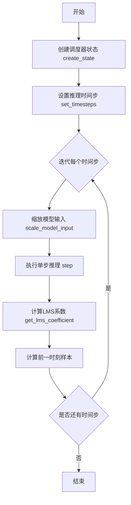
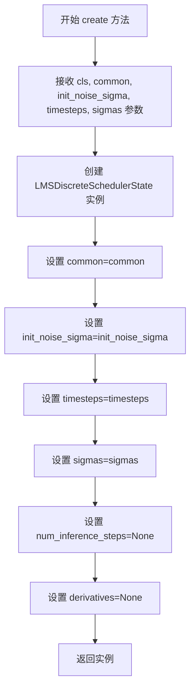
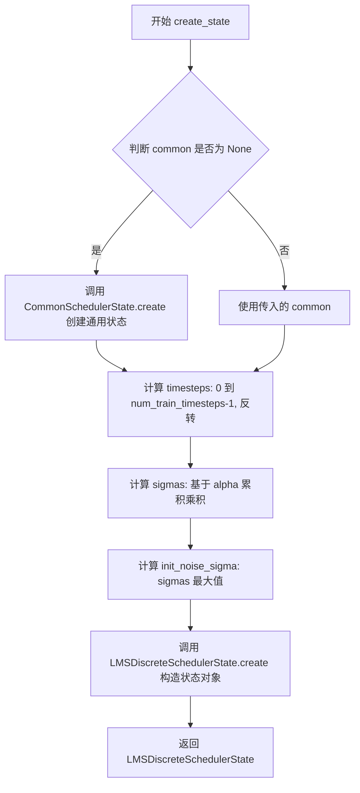
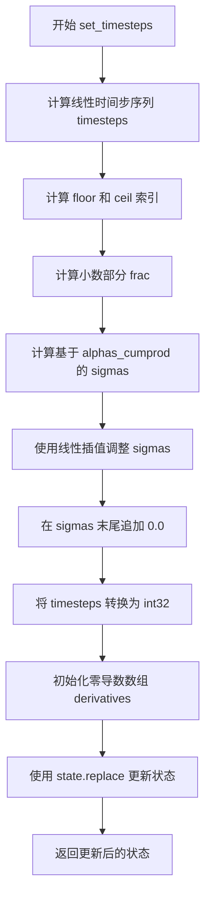
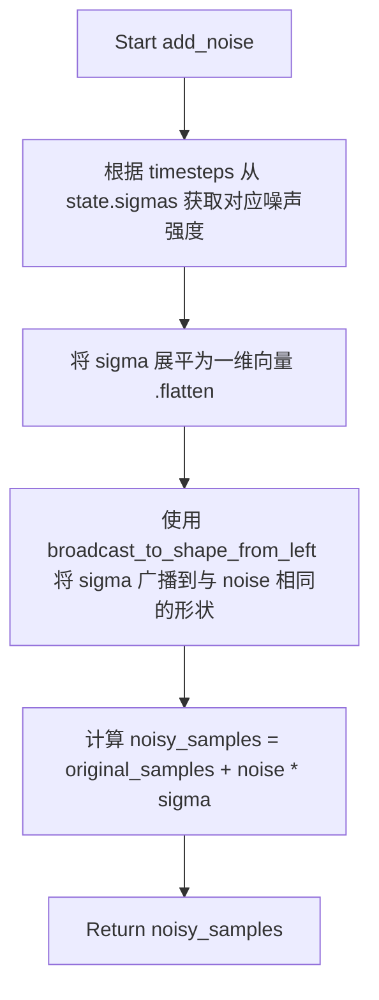
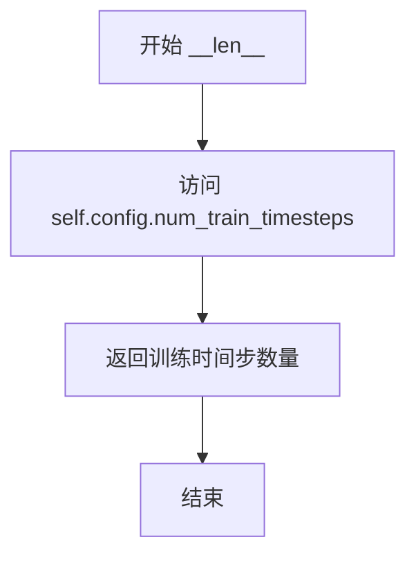

# `diffusers\src\diffusers\schedulers\scheduling_lms_discrete_flax.py` 详细设计文档

Flax实现的LMS离散调度器（Linear Multistep Scheduler），用于扩散模型的采样过程，通过线性多步算法预测前一个时间步的样本，实现从噪声到清晰图像的反向扩散过程。

## 整体流程



## 类结构

```
LMSDiscreteSchedulerState (状态数据类)
FlaxLMSSchedulerOutput (输出数据类)
FlaxLMSDiscreteScheduler (主调度器类)
    ├── 继承自 FlaxSchedulerMixin
    └── 继承自 ConfigMixin
```

## 全局变量及字段


### `logger`
    
模块级日志记录器

类型：`logging.Logger`
    


### `LMSDiscreteSchedulerState.common`
    
公共调度器状态

类型：`CommonSchedulerState`
    


### `LMSDiscreteSchedulerState.init_noise_sigma`
    
初始噪声标准差

类型：`jnp.ndarray`
    


### `LMSDiscreteSchedulerState.timesteps`
    
时间步数组

类型：`jnp.ndarray`
    


### `LMSDiscreteSchedulerState.sigmas`
    
sigma值数组

类型：`jnp.ndarray`
    


### `LMSDiscreteSchedulerState.num_inference_steps`
    
推理步数

类型：`int`
    


### `LMSDiscreteSchedulerState.derivatives`
    
导数列表用于LMS计算

类型：`jnp.ndarray | None`
    


### `FlaxLMSSchedulerOutput.prev_sample`
    
前一个时刻的样本

类型：`jnp.ndarray`
    


### `FlaxLMSSchedulerOutput.state`
    
调度器状态

类型：`LMSDiscreteSchedulerState`
    


### `FlaxLMSDiscreteScheduler._compatibles`
    
兼容的调度器列表

类型：`list`
    


### `FlaxLMSDiscreteScheduler.dtype`
    
计算数据类型

类型：`jnp.dtype`
    


### `FlaxLMSDiscreteScheduler.config`
    
通过ConfigMixin自动生成

类型：`配置对象`
    
    

## 全局函数及方法


### `FlaxLMSDiscreteScheduler.get_lms_coefficient`

该方法使用 SciPy 的 `integrate.quad` 函数进行数值积分，计算线性多步（LMS）系数。该系数用于在离散调度器中基于历史导数来预测前一个时间步的样本，是 K-LMS 算法的核心组成部分。

参数：

- `self`：隐式参数，`FlaxLMSDiscreteScheduler` 类实例
- `state`：`LMSDiscreteSchedulerState`，调度器的状态数据类实例，包含 sigmas 等关键信息
- `order`：`int`，线性多步方法的阶数
- `t`：`int`，当前时间步索引，用于访问 state.sigmas 中的对应值
- `current_order`：`int`，当前要计算系数的阶数（0 到 order-1）

返回值：`float`，数值积分计算得到的 LMS 系数

#### 流程图

```mermaid
flowchart TD
    A[get_lms_coefficient 开始] --> B[定义内部函数 lms_derivative]
    B --> C{遍历 k 从 0 到 order-1}
    C -->|k == current_order| D[跳过该次迭代]
    C -->|k != current_order| E[累乘 (tau - sigmas[t-k]) / (sigmas[t-current_order] - sigmas[t-k])]
    D --> C
    E --> C
    C --> F[返回 prod]
    F --> G[调用 integrate.quad]
    G --> H[执行数值积分: 从 sigmas[t] 到 sigmas[t+1]]
    H --> I[获取积分结果的第一项（忽略误差估计）]
    I --> J[返回 integrated_coeff]
```

#### 带注释源码

```python
def get_lms_coefficient(self, state: LMSDiscreteSchedulerState, order, t, current_order):
    """
    Compute a linear multistep coefficient.

    Args:
        order (TODO):
        t (TODO):
        current_order (TODO):
    """

    def lms_derivative(tau):
        """
        内部函数：计算线性多步导数
        这是一个基于 tau 的多项式函数，用于在积分区间上进行数值积分
        """
        prod = 1.0  # 初始化乘积
        for k in range(order):
            if current_order == k:
                # 跳过与当前阶数相同的项，避免除零
                continue
            # 计算拉格朗日插值多项式的因子
            # 这是一个基于 sigma 值的比例因子，用于构建 LMS 系数
            prod *= (tau - state.sigmas[t - k]) / (state.sigmas[t - current_order] - state.sigmas[t - k])
        return prod

    # 使用 SciPy 的 integrate.quad 进行数值积分
    # 积分区间：[sigmas[t], sigmas[t+1]]
    # epsrel=1e-4 设置相对误差容限为 0.01%
    # 返回值是一个元组 (result, error_estimate)，我们只需要 result [0]
    integrated_coeff = integrate.quad(lms_derivative, state.sigmas[t], state.sigmas[t + 1], epsrel=1e-4)[0]

    return integrated_coeff
```

---

### `integrate.quad` 外部依赖信息

**函数**：`scipy.integrate.quad`

**接口契约**：

- **参数**：
  - `func`：可调用函数，要积分的函数
  - `a`：float，积分下限
  - `b`：float，积分上限
  - `args`：tuple，可选，传递给 func 的额外参数
  - `epsrel`：float，可选，相对误差容限（默认为 1.49e-8）
  - `epsabs`：float，可选，绝对误差容限（默认为 1.49e-8）
  - `limit`：int，可选，子区间数量上限
  - `points`：array，可选，积分区间内的奇异点
  - `weight`：str，可选，权重函数类型
  - `wvar`：可选，权重函数的变量
  - `wopts`：可选，权重函数选项
  - `maxp1`：float，可选，Chebyshev 矩估计的最大阶数
  - `limlst`：int，可选，极限情况下的子区间数量

- **返回值**：
  - `val`：float，积分结果
  - `err`：float，误差估计的绝对值

**使用场景**：在 LMS 调度器中，用于计算线性多步系数，通过对导数函数在 sigma 区间上进行数值积分来获得累积系数。


### `LMSDiscreteSchedulerState.create`

创建 `LMSDiscreteSchedulerState` 类实例的工厂方法，用于初始化离散 LMS 调度器的状态。该方法接收调度器所需的各个参数，并返回一个包含这些状态信息的实例对象。

参数：

- `cls`：类型，用于引用类本身（classmethod 隐式参数）
- `common`：`CommonSchedulerState`，通用调度器状态，包含调度器共享的配置信息
- `init_noise_sigma`：`jnp.ndarray`，初始噪声分布的标准差
- `timesteps`：`jnp.ndarray`，时间步数组，用于表示扩散过程的离散时间点
- `sigmas`：`jnp.ndarray`，sigma 值数组，用于表示扩散过程中的噪声缩放因子

返回值：`LMSDiscreteSchedulerState`，返回新创建的调度器状态实例，包含传入的通用状态、初始噪声 sigma、时间步和 sigma 数组

#### 流程图



#### 带注释源码

```python
@classmethod
def create(
    cls,                                  # 类方法隐式参数，指向 LMSDiscreteSchedulerState 类本身
    common: CommonSchedulerState,          # 通用调度器状态对象，包含共享的配置和数据
    init_noise_sigma: jnp.ndarray,         # 初始噪声标准差，用于扩散过程的起点
    timesteps: jnp.ndarray,                # 时间步数组，按降序排列的离散时间点
    sigmas: jnp.ndarray,                  # sigma 值数组，对应各时间步的噪声缩放因子
):
    """
    创建 LMSDiscreteSchedulerState 实例的工厂方法。
    
    该方法是一个类方法（classmethod），允许直接通过类名调用来创建实例，
    而无需先实例化类。它接收调度器所需的核心参数，并返回一个配置好的
    状态对象，其中 num_inference_steps 和 derivatives 被设置为默认值。
    """
    # 使用传入的参数构造并返回 LMSDiscreteSchedulerState 实例
    return cls(
        common=common,                     # 传递通用调度器状态
        init_noise_sigma=init_noise_sigma,  # 传递初始噪声 sigma 值
        timesteps=timesteps,                # 传递时间步数组
        sigmas=sigmas,                      # 传递 sigma 数组
    )
    # 注意：num_inference_steps 默认为 None，需要在后续调用 set_timesteps 时设置
    # 注意：derivatives 默认为 None，会在 step 方法执行过程中逐步填充
```


### `FlaxLMSDiscreteScheduler.create_state`

该方法用于创建 LMS 离散调度器的状态对象，初始化时间步、噪声标准差和 sigma 值，为扩散模型的推理过程准备必要的状态数据。

参数：

- `common`：`CommonSchedulerState | None`，可选参数，调度器的通用状态。如果为 `None`，则自动创建一个新的通用状态。

返回值：`LMSDiscreteSchedulerState`，包含调度器完整状态的数据类实例，包括时间步、sigma 值、初始噪声标准差等。

#### 流程图



#### 带注释源码

```python
def create_state(self, common: CommonSchedulerState | None = None) -> LMSDiscreteSchedulerState:
    """
    创建 LMS 离散调度器的状态对象
    
    该方法初始化调度器所需的所有状态变量，包括：
    - 时间步数组 (timesteps)
    - sigma 值数组 (sigmas)
    - 初始噪声标准差 (init_noise_sigma)
    
    Args:
        common: 可选的通用调度器状态，如果为 None 则自动创建
    
    Returns:
        LMSDiscreteSchedulerState: 包含初始化状态的调度器状态对象
    """
    # 如果未提供通用状态，则使用调度器配置创建新的 CommonSchedulerState
    # CommonSchedulerState 包含 alpha 累积乘积等扩散过程的核心参数
    if common is None:
        common = CommonSchedulerState.create(self)

    # 生成时间步数组：从 0 到 num_train_timesteps-1 的整数序列，然后反向排列
    # 例如：num_train_timesteps=1000 时，生成 [999, 998, ..., 0]
    # round() 确保时间步为整数，::-1 实现数组反转
    timesteps = jnp.arange(0, self.config.num_train_timesteps).round()[::-1]
    
    # 计算 sigma 值：基于 alpha 累积乘积的公式
    # sigma = sqrt((1 - alpha_cumprod) / alpha_cumprod)
    # 这是扩散过程中噪声调度的重要参数
    sigmas = ((1 - common.alphas_cumprod) / common.alphas_cumprod) ** 0.5

    # 计算初始噪声的标准差
    # 取 sigma 数组中的最大值作为初始噪声分布的标准差
    # 这对应于扩散过程中的最大噪声水平（t=0）
    init_noise_sigma = sigmas.max()

    # 使用构造方法创建并返回 LMSDiscreteSchedulerState 实例
    # 该状态对象封装了调度器推理所需的所有状态信息
    return LMSDiscreteSchedulerState.create(
        common=common,              # 通用调度器状态
        init_noise_sigma=init_noise_sigma,  # 初始噪声标准差
        timesteps=timesteps,        # 时间步数组
        sigmas=sigmas,              # sigma 值数组
    )
```


### `FlaxLMSDiscreteScheduler.scale_model_input`

该函数是Flax线性多步调度器（Linear Multistep Scheduler）的核心方法，通过将去噪模型输入除以 `(sigma² + 1)⁰·⁵` 来缩放输入样本，以匹配K-LMS算法的标准差约定，从而确保扩散过程中的噪声预测与模型预期一致。

参数：

- `state`：`LMSDiscreteSchedulerState`，FlaxLMSDiscreteScheduler 状态数据类实例，包含时间步、sigma值等调度器状态信息
- `sample`：`jnp.ndarray`，当前扩散过程中正在创建的样本张量
- `timestep`：`int`，扩散链中的当前离散时间步

返回值：`jnp.ndarray`，缩放后的输入样本

#### 流程图

```mermaid
flowchart TD
    A[开始 scale_model_input] --> B[输入: state, sample, timestep]
    B --> C{查找 step_index}
    C --> D[jnp.where 在 state.timesteps 中查找匹配 timestep]
    D --> E[获取 step_index[0]]
    E --> F[从 state.sigmas 获取对应 sigma 值]
    F --> G[计算缩放因子: &#40;sigma² + 1&#41;⁰·⁵]
    G --> H[缩放样本: sample / 缩放因子]
    H --> I[返回缩放后的 sample]
    
    style A fill:#e1f5fe
    style I fill:#e8f5e8
```

#### 带注释源码

```python
def scale_model_input(self, state: LMSDiscreteSchedulerState, sample: jnp.ndarray, timestep: int) -> jnp.ndarray:
    """
    Scales the denoising model input by `(sigma**2 + 1) ** 0.5` to match the K-LMS algorithm.
    通过 `(sigma**2 + 1) ** 0.5` 缩放去噪模型输入以匹配 K-LMS 算法。

    Args:
        state (`LMSDiscreteSchedulerState`):
            the `FlaxLMSDiscreteScheduler` state data class instance.
            FlaxLMSDiscreteScheduler 状态数据类实例
        sample (`jnp.ndarray`):
            current instance of sample being created by diffusion process.
            扩散过程中当前正在创建的样本
        timestep (`int`):
            current discrete timestep in the diffusion chain.
            扩散链中的当前离散时间步

    Returns:
        `jnp.ndarray`: scaled input sample
        缩放后的输入样本
    """
    # 在调度器状态的时间步数组中查找与当前时间步匹配的索引
    # 使用 jnp.where 找到 state.timesteps 中值等于当前 timestep 的位置
    # size=1 表示只返回一个匹配结果
    (step_index,) = jnp.where(state.timesteps == timestep, size=1)
    
    # 从匹配结果中提取第一个（也是唯一的）索引值
    step_index = step_index[0]

    # 根据步索引从调度器状态的 sigma 数组中获取对应的 sigma 值
    # sigma 表示当前时间步的噪声标准差
    sigma = state.sigmas[step_index]
    
    # 计算 K-LMS 算法的缩放因子: sqrt(sigma^2 + 1)
    # 这是为了将输入调整到与 K-LMS 算法一致的标准差空间
    # 除以缩放因子实现了输入的缩放
    sample = sample / ((sigma**2 + 1) ** 0.5)
    
    # 返回缩放后的样本，准备用于去噪模型预测
    return sample
```


### `FlaxLMSDiscreteScheduler.get_lms_coefficient`

计算线性多步（Linear Multistep）调度器的系数。该方法通过构造基于 sigma（噪声水平）的拉格朗日插值多项式，并使用数值积分（quadrature）计算其在相邻时间步之间的积分值，从而得到用于加权历史导数（derivatives）的系数。

参数：

- `self`：类的实例引用。
- `state`：`LMSDiscreteSchedulerState`，调度器的状态对象，包含了时间步对应的 sigma 值数组（`sigmas`）。
- `order`：`int`，线性多步方法的阶数（Order），决定了使用多少个历史导数。
- `t`：`int`，当前时间步的索引，用于定位 `state.sigmas` 数组中的位置。
- `current_order`：`int`，当前正在计算的目标阶数索引（从 0 到 `order-1`），对应于特定的历史导数。

返回值：`float`，返回计算得到的积分系数（Integrated Coefficient），用于在 `step` 函数中与对应的导数相乘并累加。

#### 流程图

```mermaid
graph TD
    A[Start get_lms_coefficient] --> B[Define inner function lms_derivative tau]
    B --> C[Initialize prod = 1.0]
    C --> D[Loop k from 0 to order - 1]
    D --> E{k == current_order?}
    E -->|Yes| F[Continue / Skip]
    E -->|No| G[prod = prod * (tau - sigmas[t - k]) / (sigmas[t - current_order] - sigmas[t - k])]
    G --> D
    D --> H[End Loop]
    H --> I[Return prod]
    I --> J[Call scipy.integrate.quad from sigmas[t] to sigmas[t+1]]
    J --> K[Extract result[0] i.e. integrated_coeff]
    K --> L[Return integrated_coeff]
```

#### 带注释源码

```python
def get_lms_coefficient(self, state: LMSDiscreteSchedulerState, order, t, current_order):
    """
    Compute a linear multistep coefficient.

    Args:
        order (TODO):
        t (TODO):
        current_order (TODO):
    """

    def lms_derivative(tau):
        # 初始化乘积为 1.0
        prod = 1.0
        # 遍历阶数 (除了 current_order 本身)
        for k in range(order):
            if current_order == k:
                continue
            # 计算拉格朗日插值基函数的乘积项
            # 公式: (tau - sigma_{t-k}) / (sigma_{t-current_order} - sigma_{t-k})
            prod *= (tau - state.sigmas[t - k]) / (state.sigmas[t - current_order] - state.sigmas[t - k])
        return prod

    # 使用数值积分计算 lms_derivative 在 sigma[t] 到 sigma[t+1] 区间上的积分
    # 这对应于 LMS 系数
    integrated_coeff = integrate.quad(lms_derivative, state.sigmas[t], state.sigmas[t + 1], epsrel=1e-4)[0]

    return integrated_coeff
```


### `FlaxLMSDiscreteScheduler.set_timesteps`

该函数用于在推理前设置扩散链的时间步，通过线性插值计算推理过程中各时间步对应的sigma值，并初始化导数记录数组，为后续的多步采样提供必要的状态准备。

参数：

- `self`：`FlaxLMSDiscreteScheduler` 实例，调度器本身，包含配置信息（如 `num_train_timesteps`、`dtype`）和状态管理方法。
- `state`：`LMSDiscreteSchedulerState`，调度器的状态数据类实例，包含当前的时间步、sigma 值、导数记录等运行时状态。
- `num_inference_steps`：`int`，生成样本时使用的扩散推理步数，决定了时间步的数量和分布。
- `shape`：`tuple`，可选参数，默认为空元组，用于指定推理时样本的形状，用于初始化导数数组。

返回值：`LMSDiscreteSchedulerState`，更新后的调度器状态，包含新设置的时间步（`timesteps`）、对应的 sigma 值（`sigmas`）、推理步数（`num_inference_steps`）以及初始化为零的导数数组（`derivatives`）。

#### 流程图



#### 带注释源码

```python
def set_timesteps(
    self,
    state: LMSDiscreteSchedulerState,
    num_inference_steps: int,
    shape: tuple = (),
) -> LMSDiscreteSchedulerState:
    """
    Sets the timesteps used for the diffusion chain. Supporting function to be run before inference.

    Args:
        state (`LMSDiscreteSchedulerState`):
            the `FlaxLMSDiscreteScheduler` state data class instance.
        num_inference_steps (`int`):
            the number of diffusion steps used when generating samples with a pre-trained model.
    """

    # 1. 生成从 num_train_timesteps-1 到 0 的线性等间距时间步
    #    例如：num_train_timesteps=1000, num_inference_steps=50
    #    则生成从 999 到 0 的 50 个等间距点
    timesteps = jnp.linspace(
        self.config.num_train_timesteps - 1,
        0,
        num_inference_steps,
        dtype=self.dtype,
    )

    # 2. 计算每个时间步的向下取整和向上取整索引，用于后续 sigma 插值
    low_idx = jnp.floor(timesteps).astype(jnp.int32)
    high_idx = jnp.ceil(timesteps).astype(jnp.int32)

    # 3. 计算每个时间步的小数部分，用于线性插值权重
    frac = jnp.mod(timesteps, 1.0)

    # 4. 计算基础 sigma 值：基于累积 alpha 乘积的方差缩放
    #    sigma = sqrt((1 - alpha_cumprod) / alpha_cumprod)
    sigmas = ((1 - state.common.alphas_cumprod) / state.common.alphas_cumprod) ** 0.5

    # 5. 使用线性插值根据 frac 加权计算调整后的 sigma 值
    #    sigmas[low_idx] 和 sigmas[high_idx] 是训练时间步对应的 sigma
    sigmas = (1 - frac) * sigmas[low_idx] + frac * sigmas[high_idx]

    # 6. 在 sigma 序列末尾追加 0.0，代表最终采样时刻（噪声完全去除）
    sigmas = jnp.concatenate([sigmas, jnp.array([0.0], dtype=self.dtype)])

    # 7. 将时间步转换为整数类型
    timesteps = timesteps.astype(jnp.int32)

    # 8. 初始化导数数组，用于记录多步 LMS 方法中的梯度
    #    形状为 (0,) + shape，初始为零向量
    derivatives = jnp.zeros((0,) + shape, dtype=self.dtype)

    # 9. 返回更新后的调度器状态，替换原有的时间步、sigma、步数和导数
    return state.replace(
        timesteps=timesteps,
        sigmas=sigmas,
        num_inference_steps=num_inference_steps,
        derivatives=derivatives,
    )
```


### FlaxLMSDiscreteScheduler.step

执行单步扩散推理，使用线性多步（LMS）方法基于模型预测的噪声反向推导扩散过程，计算前一个时间步的样本。这是扩散模型推理流程中的核心函数，通过累积历史导数信息来预测更准确的样本。

参数：

- `self`：`FlaxLMSDiscreteScheduler`，调度器实例本身
- `state`：`LMSDiscreteSchedulerState`，FlaxLMSDiscreteScheduler 状态数据类实例，包含时间步、sigma值、导数历史等调度器状态信息
- `model_output`：`jnp.ndarray`，直接来自学习扩散模型的输出，通常是预测的噪声
- `timestep`：`int`，扩散链中的当前离散时间步
- `sample`：`jnp.ndarray`，扩散过程中正在创建的当前样本实例
- `order`：`int = 4`，多步推理的阶数系数，用于决定使用多少历史导数进行预测
- `return_dict`：`bool = True`，是否返回 FlaxLMSSchedulerOutput 类的选项，设为 False 则返回元组

返回值：`FlaxLMSSchedulerOutput | tuple`，当 `return_dict` 为 True 时返回 FlaxLMSSchedulerOutput 对象，包含 prev_sample（前一时间步的样本）和 state（更新后的调度器状态）；否则返回元组，第一个元素是样本张量，第二个是状态

#### 流程图

```mermaid
flowchart TD
    A[开始 step 方法] --> B{检查 state.num_inference_steps 是否为 None}
    B -->|是| C[抛出 ValueError: 需要先运行 set_timesteps]
    B -->|否| D[获取当前 sigma 值: sigma = state.sigmas[timestep]]
    D --> E{判断 prediction_type}
    E -->|epsilon| F[计算 pred_original_sample = sample - sigma × model_output]
    E -->|v_prediction| G[计算 pred_original_sample = model_output × c_out + sample × c_skip]
    E -->|其他| H[抛出 ValueError: prediction_type 无效]
    F --> I[计算导数: derivative = (sample - pred_original_sample) / sigma]
    G --> I
    I --> J[将 derivative 添加到 state.derivatives]
    J --> K{derivatives 长度 > order?}
    K -->|是| L[删除最旧的导数: 删除 state.derivatives[0]]
    K -->|否| M[保持 derivatives 不变]
    L --> N[计算阶数: order = min(timestep + 1, order)]
    M --> N
    N --> O[为每个 curr_order 计算 LMS 系数]
    O --> P[计算 prev_sample = sample + Σ(coeff × derivative)]
    P --> Q{return_dict?}
    Q -->|True| R[返回 FlaxLMSSchedulerOutput]
    Q -->|False| S[返回 tuple: (prev_sample, state)]
    R --> T[结束]
    S --> T
```

#### 带注释源码

```python
def step(
    self,
    state: LMSDiscreteSchedulerState,
    model_output: jnp.ndarray,
    timestep: int,
    sample: jnp.ndarray,
    order: int = 4,
    return_dict: bool = True,
) -> FlaxLMSSchedulerOutput | tuple:
    """
    Predict the sample at the previous timestep by reversing the SDE. Core function to propagate the diffusion
    process from the learned model outputs (most often the predicted noise).

    Args:
        state (`LMSDiscreteSchedulerState`): the `FlaxLMSDiscreteScheduler` state data class instance.
        model_output (`jnp.ndarray`): direct output from learned diffusion model.
        timestep (`int`): current discrete timestep in the diffusion chain.
        sample (`jnp.ndarray`):
            current instance of sample being created by diffusion process.
        order: coefficient for multi-step inference.
        return_dict (`bool`): option for returning tuple rather than FlaxLMSSchedulerOutput class

    Returns:
        [`FlaxLMSSchedulerOutput`] or `tuple`: [`FlaxLMSSchedulerOutput`] if `return_dict` is True, otherwise a
        `tuple`. When returning a tuple, the first element is the sample tensor.

    """
    # 检查是否已设置推理时间步，若未设置则抛出错误
    if state.num_inference_steps is None:
        raise ValueError(
            "Number of inference steps is 'None', you need to run 'set_timesteps' after creating the scheduler"
        )

    # 1. 获取当前时间步对应的 sigma 值
    sigma = state.sigmas[timestep]

    # 2. 从 sigma 缩放的预测噪声计算原始样本 (x_0)
    # 根据 prediction_type 选择不同的计算方式
    if self.config.prediction_type == "epsilon":
        # epsilon 预测：直接预测噪声
        # x_0 = x_t - σ * ε_θ(x_t, t)
        pred_original_sample = sample - sigma * model_output
    elif self.config.prediction_type == "v_prediction":
        # v-prediction：预测速度向量
        # 根据 Karras et al. 的公式计算
        # c_out = -σ / sqrt(σ² + 1)
        # c_skip = 1 / sqrt(σ² + 1)
        pred_original_sample = model_output * (-sigma / (sigma**2 + 1) ** 0.5) + (sample / (sigma**2 + 1))
    else:
        raise ValueError(
            f"prediction_type given as {self.config.prediction_type} must be one of `epsilon`, or `v_prediction`"
        )

    # 3. 转换为 ODE 导数形式
    # 导数表示样本相对于 sigma 的变化率
    # derivative = (x_t - x_0) / σ = ε_θ(x_t, t)
    derivative = (sample - pred_original_sample) / sigma
    
    # 4. 将新计算的导数添加到历史记录中
    # 使用 jnp.append 添加到末尾
    state = state.replace(derivatives=jnp.append(state.derivatives, derivative))
    
    # 5. 保持导数历史长度不超过 order
    # 如果超过 order，删除最旧的导数（索引 0）
    if len(state.derivatives) > order:
        state = state.replace(derivatives=jnp.delete(state.derivatives, 0))

    # 6. 计算线性多步系数
    # 阶数不能超过当前时间步 + 1（从时间步 0 开始）
    order = min(timestep + 1, order)
    
    # 为每个当前阶数计算 LMS 系数
    # 使用数值积分（scipy.integrate.quad）计算积分
    lms_coeffs = [self.get_lms_coefficient(state, order, timestep, curr_order) for curr_order in range(order)]

    # 7. 基于导数路径计算前一个样本
    # 使用 LMS 系数和历史导数的线性组合
    # prev_sample = x_t + Σ(coeff_i * derivative_i)
    # 导数顺序是反向的（最新的导数在最后）
    prev_sample = sample + sum(
        coeff * derivative for coeff, derivative in zip(lms_coeffs, reversed(state.derivatives))
    )

    # 8. 根据 return_dict 参数返回结果
    if not return_dict:
        # 返回元组形式：(prev_sample, state)
        return (prev_sample, state)

    # 返回 FlaxLMSSchedulerOutput 对象
    return FlaxLMSSchedulerOutput(prev_sample=prev_sample, state=state)
```


### `FlaxLMSDiscreteScheduler.add_noise`

该方法实现了扩散模型的前向过程（Forward Process），即根据给定的时间步（Timesteps）将高斯噪声（Noise）添加到原始样本（Original Samples）中。这是训练扩散模型时生成带噪训练数据或在推理时执行逆过程准备的关键步骤。

参数：

- `self`：调度器实例。
- `state`：`LMSDiscreteSchedulerState`，调度器的状态对象，包含当前的时间步 sigma 值数组（`sigmas`）。
- `original_samples`：`jnp.ndarray`，原始未加噪的样本（通常对应 $x_0$）。
- `noise`：`jnp.ndarray`，要添加的高斯噪声（对应 $\epsilon$）。
- `timesteps`：`jnp.ndarray`，当前扩散过程的时间步索引，用于从 `state` 中查找对应的噪声强度（sigma）。

返回值：`jnp.ndarray`，返回混合了噪声的样本 $x_t$。

#### 流程图



#### 带注释源码

```python
def add_noise(
    self,
    state: LMSDiscreteSchedulerState,
    original_samples: jnp.ndarray,
    noise: jnp.ndarray,
    timesteps: jnp.ndarray,
) -> jnp.ndarray:
    # 1. 根据传入的时间步索引，从调度器状态的 sigma 数组中提取对应的噪声水平值
    # sigma 在这里代表了 (1 - alpha_cumprod) / alpha_cumprod 的平方根
    sigma = state.sigmas[timesteps].flatten()
    
    # 2. 将 sigma 从一维向量广播到与噪声/样本的形状匹配，以便进行逐元素乘法
    # 例如，如果 batch_size 是 4，形状是 (4,)，而 noise 形状是 (4, 32, 32)，
    # 则 sigma 会被广播为 (4, 1, 1) 以便进行 (4, 32, 32) 的乘法
    sigma = broadcast_to_shape_from_left(sigma, noise.shape)

    # 3. 计算加噪样本
    # 对应公式: x_t = x_0 + sigma * noise
    noisy_samples = original_samples + noise * sigma

    return noisy_samples
```

#### 关键组件信息

- **LMSDiscreteSchedulerState**: 存储调度器运行时状态（包括 `sigmas` 数组）的数据类。
- **state.sigmas**: 预计算的不同时间步下的噪声标准差（方差）。
- **broadcast_to_shape_from_left**: 一个工具函数，用于将左侧维度（通常代表批次维度）的形状向右扩展以匹配目标数组的形状。

#### 潜在的技术债务或优化空间

1.  **形状广播的复杂性**：代码中使用了 `.flatten()` 然后 `broadcast_to_shape_from_left`。这种显式的形状操作在某些边缘情况下（如单样本推理或动态批处理）可能容易出错或难以调试。如果后续能够保证 `timesteps` 传入时维度已经是正确的，可以简化此逻辑。
2.  **类型假设**：假设 `timesteps` 是整数索引，并且 `state.sigmas` 的长度足够覆盖所有时间步。如果输入超出范围（如负数索引），会抛出模糊的 JAX 错误，缺乏显式的边界检查。

#### 其它项目

- **设计目标**：该函数严格遵循了 $x_t = x_0 + \sigma \epsilon$ 的线性噪声添加模式（区别于标准的 $\sqrt{\bar{\alpha}_t}x_0 + \sqrt{1-\bar{\alpha}_t}\epsilon$ 形式，但在 K-LMS 调度器的逆向推导中等效），确保与 `step` 方法中的噪声预测逻辑一致。
- **错误处理**：目前主要依赖 JAX 的即时编译（JIT）进行形状和类型检查。如果 `timesteps` 包含的值超出了 `state.sigmas` 的索引范围，程序会崩溃，但错误信息可能不够直观。


### `FlaxLMSDiscreteScheduler.__len__`

该方法返回调度器在训练过程中使用的时间步总数，用于获取扩散模型的训练步数。

参数： 无（仅使用实例属性 `self`）

返回值：`int`，返回调度器配置中定义的训练时间步数量。

#### 流程图



#### 带注释源码

```python
def __len__(self):
    """
    返回调度器的训练时间步总数。
    
    此方法提供调度器的长度，对应于训练期间使用的扩散步数。
    
    返回值:
        int: 训练时间步的数量。
    """
    return self.config.num_train_timesteps
```

## 关键组件


### LMSDiscreteSchedulerState

用于存储LMS离散调度器的状态数据类，包含公共调度器状态、初始噪声sigma值、时间步数组、sigma数组、推理步数以及用于LMS计算的导数数组。

### FlaxLMSSchedulerOutput

扩展FlaxSchedulerOutput的输出数据类，用于封装调度器输出结果，包含前一时刻的样本和更新后的调度器状态。

### FlaxLMSDiscreteScheduler

线性多步（LMS）离散调度器的主要实现类，基于k-diffusion库中的原始实现，用于离散beta调度的时间步进和噪声预测。

### create_state 方法

创建LMSDiscreteSchedulerState实例，初始化时间步和sigma值，其中sigma通过公式((1-alpha_cumprod)/alpha_cumprod)^0.5计算。

### scale_model_input 方法

根据K-LMS算法将去噪模型输入按(sigma^2+1)^0.5进行缩放，以匹配线性多步采样器的数学形式。

### get_lms_coefficient 方法

使用数值积分计算线性多步系数，通过scipy.integrate.quad对lms_derivative函数进行积分得到积分系数。

### set_timesteps 方法

设置扩散链中使用的时间步，在推理前运行，支持线性插值计算sigmas值，并初始化导数数组为零。

### step 方法

核心函数，通过反转SDE预测前一时刻的样本，支持epsilon和v_prediction两种预测类型，利用LMS系数和导数历史计算前一时刻样本。

### add_noise 方法

向原始样本添加噪声，使用sigma值进行缩放，通过broadcast_to_shape_from_left确保sigma维度与噪声维度匹配。

### 导数存储机制

state.derivatives数组存储历史导数值，通过jnp.append追加新导数，通过jnp.delete移除最旧的导数，保持固定长度的导数历史用于LMS计算。

### prediction_type 支持

支持epsilon预测（直接预测噪声）和v_prediction预测两种类型，根据配置选择相应的原始样本计算公式。

### 状态管理

使用flax.struct.dataclass实现LMSDiscreteSchedulerState，支持不可变性同时保持JAX兼容性，通过replace方法更新状态。


## 问题及建议


### 已知问题

- **性能问题**: `get_lms_coefficient` 方法使用 `scipy.integrate.quad` 进行数值积分，该函数无法被 JAX JIT 编译，每次调用 `step()` 都会重复计算积分，效率低下
- **索引逻辑错误**: `step()` 方法中 `sigma = state.sigmas[timestep]` 直接使用 timestep 值作为索引，但 timestep 是实际的时间步数值而非数组索引，可能导致越界或错误访问
- **数组操作效率低**: 使用 `jnp.append` 和 `jnp.delete` 操作 derivatives 数组会创建新数组，应使用固定大小的循环缓冲区
- **类型注解不一致**: 代码混用 `jnp.ndarray | None` 和 `Optional` 语法，`get_lms_coefficient` 方法参数缺少类型注解
- **参数文档不完整**: `get_lms_coefficient` 方法的参数注释为 "TODO"，缺少实际说明
- **输入验证缺失**: 缺少对输入 `sample` 形状、类型、数值范围的验证，`timestep` 边界值未检查
- **弃用状态**: 类在初始化时发出警告，表明 Flax 实现将被移除，建议迁移到 PyTorch 实现
- **硬编码值**: 积分精度 `epsrel=1e-4` 和默认阶数 `order=4` 硬编码在代码中

### 优化建议

- 将 `scipy.integrate.quad` 替换为预计算的查表法或使用 JAX 兼容的数值积分实现，并缓存 LMS 系数
- 修复 timestep 索引逻辑，使用 `jnp.where` 或预先创建的索引映射
- 使用循环缓冲区（Ring Buffer）管理 derivatives 数组，避免频繁内存分配
- 统一类型注解风格，补充所有缺失的类型声明和文档字符串
- 添加输入验证逻辑，检查 sample 形状一致性、timestep 有效性等
- 将硬编码值提取为配置参数，提供灵活性
- 考虑使用 `@functools.lru_cache` 或类似机制缓存 `get_lms_coefficient` 的结果（当参数相同时）
- 优化 `lms_derivative` 函数中的循环，尝试向量化操作

## 其它


### 设计目标与约束

本调度器实现Linear Multistep (LMS)离散时间步调度算法，用于扩散模型的采样过程。核心目标是通过线性多步法（Adams-Bashforth方法）基于历史预测噪声来预测前一个时间步的样本，从而实现更稳定的采样过程。设计约束包括：仅支持离散beta调度（linear或scaled_linear），仅支持epsilon、v_prediction两种预测类型，默认阶数为4，必须在推理前调用set_timesteps方法。

### 错误处理与异常设计

主要异常场景包括：(1) 调用step方法时若num_inference_steps为None，抛出ValueError提示需要先运行set_timesteps；(2) prediction_type参数仅支持epsilon和v_prediction，其他值抛出ValueError；(3) get_lms_coefficient方法中的积分计算可能返回数值精度问题，但通过epsrel=1e-4相对误差容忍度进行处理。调度器使用Flax结构化数据类型，状态不可变性由flax.struct.dataclass保证。

### 数据流与状态机

调度器状态转换遵循以下流程：初始化 → create_state创建初始状态 → set_timesteps设置推理时间步 → 循环调用step进行采样。在step方法内部，状态机执行：计算sigma值 → 基于prediction_type计算原始样本 → 计算导数并更新derivatives历史 → 计算LMS系数 → 计算前一步样本。状态中derivatives数组最大长度为order阶数，采用滚动窗口策略管理。

### 外部依赖与接口契约

主要依赖包括：(1) flax.struct.dataclass用于不可变状态管理；(2) jax.numpy提供JIT兼容的数组操作；(3) scipy.integrate.quad用于数值积分计算LMS系数；(4) configuration_utils中的ConfigMixin和register_to_config装饰器实现配置管理；(5) scheduling_utils_flax中的CommonSchedulerState、FlaxSchedulerMixin等基础类型。接口契约要求：set_timesteps必须在推理前调用，step方法接收的timestep参数为整数索引而非实际时间步值，sample和model_output必须为JAX数组。

### 配置参数说明

num_train_timesteps：训练时的扩散步数，默认1000；beta_start：beta起始值，默认0.0001；beta_end：beta结束值，默认0.02；beta_schedule：beta调度策略，可选linear或scaled_linear；trained_betas：可选的直接传递beta数组，用于绕过beta_start/beta_end；prediction_type：预测类型，支持epsilon（预测噪声）和v_prediction；dtype：计算数据类型，默认jnp.float32。

### 使用示例

```python
# 初始化调度器
scheduler = FlaxLMSDiscreteScheduler(
    num_train_timesteps=1000,
    beta_start=0.0001,
    beta_end=0.02,
    beta_schedule="linear"
)

# 创建状态
state = scheduler.create_state(shape=(batch_size, height, width, channels))

# 设置推理时间步
state = scheduler.set_timesteps(state, num_inference_steps=50)

# 采样循环
for i, t in enumerate(state.timesteps):
    # 获取模型输出
    model_output = model(sample, t)
    # 执行调度器step
    output = scheduler.step(state, model_output, i, sample)
    sample = output.prev_sample
    state = output.state
```

### 版本兼容性信息

本类标记为deprecated，将在Diffusers v1.0.0中移除。建议迁移至PyTorch实现或锁定Diffusers版本。该调度器兼容FlaxKarrasDiffusionSchedulers枚举中列出的所有Karras相关调度器。


    