# `diffusers\src\diffusers\schedulers\scheduling_ltx_euler_ancestral_rf.py` 详细设计文档

LTX-Video的Euler-Ancestral调度器，实现了K-diffusion风格的Euler-Ancestral采样算法，专门用于flow/CONST参数化，兼容ComfyUI的sample_euler_ancestral_RF实现，支持显式sigma schedule或自动生成两种模式。

## 整体流程

```mermaid
graph TD
    A[开始] --> B[创建调度器实例]
    B --> C[调用set_timesteps]
    C --> D{是否提供sigmas/timesteps?}
    D -- 否 --> E[使用FlowMatchEulerDiscreteScheduler生成sigma schedule]
    D -- 是 --> F[直接使用提供的sigmas/timesteps]
    E --> G[保存sigmas和timesteps]
    F --> G
    G --> H[进入采样循环]
    H --> I[调用step方法]
    I --> J{是否是最后一个sigma?}
    J -- 是 --> K[返回当前sample]
    J -- 否 --> L[计算denoised x0]
    L --> M[计算Euler downstep]
    M --> N{eta > 0 且 s_noise > 0?}
    N -- 是 --> O[添加ancestral noise]
    N -- 否 --> P[纯确定性更新]
    O --> Q[更新sample为prev_sample]
    P --> Q
    Q --> R[步进索引]
    R --> S{还有更多步?]
    S -- 是 --> I
    S -- 否 --> T[结束]
```

## 类结构

```
SchedulerMixin (混入类)
├── ConfigMixin (配置混入)
│   └── LTXEulerAncestralRFScheduler (主调度器类)
BaseOutput
└── LTXEulerAncestralRFSchedulerOutput (输出数据类)
```

## 全局变量及字段


### `logger`
    
模块级日志记录器

类型：`logging.Logger`
    


### `LTXEulerAncestralRFSchedulerOutput.prev_sample`
    
更新后的样本，用于下一步去噪

类型：`torch.FloatTensor`
    


### `LTXEulerAncestralRFScheduler.num_inference_steps`
    
推理步数

类型：`int`
    


### `LTXEulerAncestralRFScheduler.sigmas`
    
sigma值序列

类型：`torch.Tensor | None`
    


### `LTXEulerAncestralRFScheduler.timesteps`
    
时间步序列

类型：`torch.Tensor | None`
    


### `LTXEulerAncestralRFScheduler._step_index`
    
内部步索引

类型：`int | None`
    


### `LTXEulerAncestralRFScheduler._begin_index`
    
起始索引

类型：`int | None`
    


### `LTXEulerAncestralRFScheduler._compatibles`
    
兼容的调度器列表

类型：`list`
    


### `LTXEulerAncestralRFScheduler.order`
    
调度器阶数

类型：`int`
    
    

## 全局函数及方法


### `LTXEulerAncestralRFSchedulerOutput`

描述：`LTXEulerAncestralRFSchedulerOutput` 是一个数据类（dataclass），用于封装调度器 `step` 函数的输出结果。它继承自 `BaseOutput`，包含一个 `prev_sample` 字段，表示去噪过程中的下一个步骤的更新样本。该类的构造函数是自动由 `@dataclass` 装饰器生成的。

参数：

-  `prev_sample`：`torch.FloatTensor`，去噪过程中更新的样本，用于下一步的去噪处理。

返回值：`LTXEulerAncestralRFSchedulerOutput`，返回一个数据类实例，包含更新后的 `prev_sample` 样本。

#### 流程图

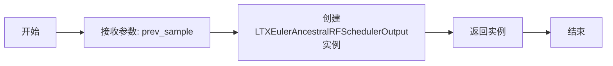

#### 带注释源码

```python
@dataclass
class LTXEulerAncestralRFSchedulerOutput(BaseOutput):
    """
    Output class for the scheduler's `step` function output.

    Args:
        prev_sample (`torch.FloatTensor`):
            Updated sample for the next step in the denoising process.
    """

    # 字段：prev_sample，类型为torch.FloatTensor
    # 描述：去噪过程中更新的样本，用于下一步处理
    prev_sample: torch.FloatTensor
```


### LTXEulerAncestralRFScheduler

LTXEulerAncestralRFScheduler 是一个专门为 LTX-Video（RF / CONST 参数化）设计的 Euler-Ancestral 调度器，实现了 K-diffusion 风格的 Euler-Ancestral 采样器，紧密模拟 ComfyUI 的 sample_euler_ancestral_RF 实现，用于在 diffusers 环境中复现 ComfyUI 工作流。该调度器支持两种模式：复用 FlowMatchEulerDiscreteScheduler 的 sigma/timestep 逻辑，或使用显式的 ComfyUI 风格 sigma 调度表。

参数：

- `model_output`：`torch.FloatTensor`，当前步骤的原始模型输出，在 CONST 参数化下被解释为 v_t，重构去噪状态为 x0 = x_t - sigma_t * v_t
- `timestep`：`float | torch.Tensor`，当前 sigma 值（必须与 self.timesteps 中的某个条目匹配）
- `sample`：`torch.FloatTensor`，当前潜在样本 x_t
- `generator`：`torch.Generator | None`，可选的随机数生成器，用于可重现的噪声
- `return_dict`：`bool`，如果为 True，返回 LTXEulerAncestralRFSchedulerOutput；否则返回元组

返回值：`LTXEulerAncestralRFSchedulerOutput | tuple[torch.FloatTensor]`，返回更新后的样本用于下一步去噪，或包含更新样本的元组

#### 流程图

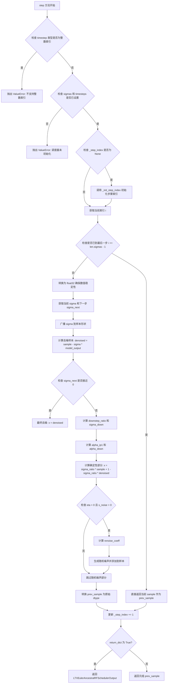

#### 带注释源码

```python
def step(
    self,
    model_output: torch.FloatTensor,
    timestep: float | torch.Tensor,
    sample: torch.FloatTensor,
    generator: torch.Generator | None = None,
    return_dict: bool = True,
) -> LTXEulerAncestralRFSchedulerOutput | tuple[torch.FloatTensor]:
    """
    执行单步 Euler-Ancestral RF 更新。

    Args:
        model_output (torch.FloatTensor): 原始模型输出，在 CONST 参数化下解释为 v_t，
            去噪状态重构为 x0 = x_t - sigma_t * v_t。
        timestep (float | torch.Tensor): 当前 sigma 值，必须匹配 self.timesteps 中的条目。
        sample (torch.FloatTensor): 当前潜在样本 x_t。
        generator (torch.Generator, optional): 可选随机数生成器，用于可重现噪声。
        return_dict (bool): 若为 True，返回 LTXEulerAncestralRFSchedulerOutput；
            否则返回第一个元素为更新样本的元组。
    """

    # 步骤1: 验证 timestep 格式，不接受整数索引
    if isinstance(timestep, (int, torch.IntTensor, torch.LongTensor)):
        raise ValueError(
            (
                "Passing integer indices (e.g. from `enumerate(timesteps)`) as timesteps to"
                " `LTXEulerAncestralRFScheduler.step()` is not supported. Make sure to pass"
                " one of the `scheduler.timesteps` values as `timestep`."
            ),
        )

    # 步骤2: 验证调度器已初始化
    if self.sigmas is None or self.timesteps is None:
        raise ValueError("Scheduler has not been initialized. Call `set_timesteps` before `step`.")

    # 步骤3: 初始化内部步骤索引（如果尚未设置）
    if self._step_index is None:
        self._init_step_index(timestep)

    # 步骤4: 获取当前步骤索引
    i = self._step_index
    
    # 步骤5: 检查是否已到达最后一步
    if i >= len(self.sigmas) - 1:
        # 已到最后一步，直接返回当前样本
        prev_sample = sample
    else:
        # 步骤6: 转换为 float32 以确保数值稳定性
        sample_f = sample.to(torch.float32)
        model_output_f = model_output.to(torch.float32)

        # 步骤7: 获取当前和下一步的 sigma 值
        sigma = self.sigmas[i]
        sigma_next = self.sigmas[i + 1]

        # 步骤8: 将 sigma 广播到与 sample 相同的维度
        sigma_b = self._sigma_broadcast(sigma.view(1), sample_f)
        sigma_next_b = self._sigma_broadcast(sigma_next.view(1), sample_f)

        # 步骤9: 在 CONST 参数化下近似去噪 x0:
        #   x0 = x_t - sigma_t * v_t
        denoised = sample_f - sigma_b * model_output_f

        # 步骤10: 处理最终去噪步骤
        if sigma_next.abs().item() < 1e-8:
            # 最终去噪：直接使用去噪结果
            x = denoised
        else:
            # 步骤11: 获取配置中的随机性参数
            eta = float(self.config.eta)        # 随机性参数，0.0 为确定性
            s_noise = float(self.config.s_noise)  # 全局噪声缩放因子

            # 步骤12: 计算 downstep（ComfyUI RF 变体）
            # downstep_ratio 控制从当前 sigma 到下一步 sigma 的转换方式
            downstep_ratio = 1.0 + (sigma_next / sigma - 1.0) * eta
            sigma_down = sigma_next * downstep_ratio

            # 步骤13: 计算 alpha 值（对应 1 - sigma）
            alpha_ip1 = 1.0 - sigma_next
            alpha_down = 1.0 - sigma_down

            # 步骤14: 广播 alpha 值到样本形状
            sigma_down_b = self._sigma_broadcast(sigma_down.view(1), sample_f)
            alpha_ip1_b = self._sigma_broadcast(alpha_ip1.view(1), sample_f)
            alpha_down_b = self._sigma_broadcast(alpha_down.view(1), sample_f)

            # 步骤15: 计算确定性部分（(x, x0) 空间中的 Euler 步）
            sigma_ratio = sigma_down_b / sigma_b
            x = sigma_ratio * sample_f + (1.0 - sigma_ratio) * denoised

            # 步骤16: 添加随机祖先噪声（如果启用）
            if eta > 0.0 and s_noise > 0.0:
                # 计算噪声系数：确保方差正确
                renoise_coeff = (
                    (sigma_next_b**2 - sigma_down_b**2 * alpha_ip1_b**2 / (alpha_down_b**2 + 1e-12))
                    .clamp(min=0.0)
                    .sqrt()
                )

                # 生成随机噪声并添加到样本
                noise = randn_tensor(
                    sample_f.shape, generator=generator, device=sample_f.device, dtype=sample_f.dtype
                )
                x = (alpha_ip1_b / (alpha_down_b + 1e-12)) * x + noise * renoise_coeff * s_noise

        # 步骤17: 转换回原始数据类型
        prev_sample = x.to(sample.dtype)

    # 步骤18: 更新内部步骤索引
    self._step_index = min(self._step_index + 1, len(self.sigmas) - 1)

    # 步骤19: 根据 return_dict 返回结果
    if not return_dict:
        return (prev_sample,)

    return LTXEulerAncestralRFSchedulerOutput(prev_sample=prev_sample)
```


### randn_tensor

`randn_tensor` 是从 `diffusers` 库（`..utils.torch_utils`）导入的随机张量生成函数。在 `LTXEulerAncestralRFScheduler` 的 `step` 方法中，它用于生成符合特定形状、设备和数据类型的随机噪声，以支持采样过程中的随机性。

参数：

- `shape`：`torch.Size` 或 `tuple`，由调用时的 `sample_f.shape` 传入，表示生成张量的形状
- `generator`：`torch.Generator` 或 `None`，可选的随机数生成器，用于控制随机种子
- `device`：`torch.device`，目标设备，由 `sample_f.device` 指定
- `dtype`：`torch.dtype`，数据类型，由 `sample_f.dtype` 指定

返回值：`torch.Tensor`，生成的随机噪声张量，形状为 `shape`，设备和类型由参数指定

#### 流程图

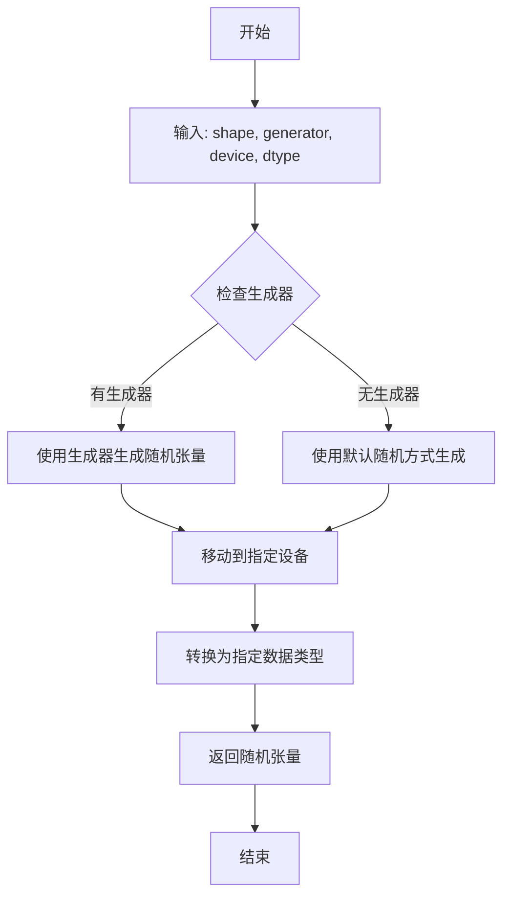

#### 带注释源码

注意：`randn_tensor` 的实现位于 `diffusers` 库中，不在当前文件内。以下是其在 `LTXEulerAncestralRFScheduler.step` 方法中的调用方式：

```python
# 在 step 方法中生成随机噪声
# 参数由调用上下文提供
noise = randn_tensor(
    sample_f.shape,    # 形状：当前样本张量的形状
    generator=generator,  # 生成器：可选的随机数生成器，用于Reproducibility
    device=sample_f.device,  # 设备：当前样本所在的计算设备
    dtype=sample_f.dtype    # 数据类型：当前样本的数据类型
)
# 使用生成的噪声进行采样计算
x = (alpha_ip1_b / (alpha_down_b + 1e-12)) * x + noise * renoise_coeff * s_noise
```

该函数在采样算法的随机性引入部分被调用，确保生成的噪声与当前样本的形状、设备和数据类型一致。


### `ConfigMixin.register_to_config`

这是一个装饰器函数，用于将 `__init__` 方法的参数自动注册到配置（config）中。它是 HuggingFace Diffusers 库中 `ConfigMixin` 类的核心方法，允许调度器（Scheduler）类将初始化参数保存为配置属性，便于序列化（save/load）和配置迁移。

参数：

-  `decorated_function`：`Callable`，被装饰的 `__init__` 方法（即 `LTXEulerAncestralRFScheduler.__init__`）

返回值：`Callable`，返回装饰后的函数，该函数在执行完原始 `__init__` 逻辑后，会将所有参数以 `self.config.{参数名}` 的形式存储。

#### 流程图

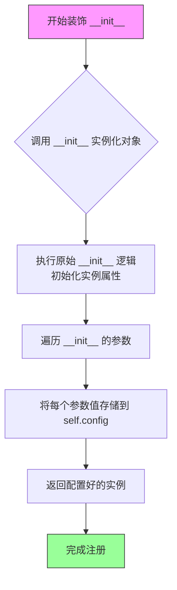

#### 带注释源码

```
# 以下为基于代码上下文的推断实现，来源于 diffusers 库的设计模式
# 实际定义位于 configuration_utils.ConfigMixin.register_to_config

def register_to_config(func):
    """
    装饰器：将 __init__ 方法的参数自动注册到 self.config 对象中。
    
    使用方式：
        @register_to_config
        def __init__(self, num_train_timesteps: int = 1000, eta: float = 1.0, ...):
            ...
    
    作用：
        1. 提取 __init__ 的参数签名
        2. 在实例化时，将参数值保存到 self.config 对应的属性中
        3. 使得配置可被序列化（to_dict）和反序列化（from_config）
    """
    import inspect
    from functools import wraps

    # 获取被装饰函数的参数签名
    # 例如：self, num_train_timesteps=1000, eta=1.0, s_noise=1.0
    sig = inspect.signature(func)
    parameters = list(sig.parameters.keys())  # ['self', 'num_train_timesteps', 'eta', 's_noise']

    @wraps(func)
    def wrapper(self, *args, **kwargs):
        # 1. 先执行原始 __init__ 逻辑，初始化实例
        #    此时 ConfigMixin 的 __init__ 会被调用，创建 self.config
        result = func(self, *args, **kwargs)
        
        # 2. 将参数绑定到具体值
        #    例如：num_train_timesteps=1000, eta=1.0, s_noise=1.0
        bound_args = sig.bind(self, *args, **kwargs)
        bound_args.apply_defaults()
        
        # 3. 遍历参数，排除 self，将参数存入 self.config
        #    这里 'self' 是第一个参数，需要跳过
        for param_name in parameters[1:]:  # 跳过 'self'
            if param_name in bound_args.arguments:
                value = bound_args.arguments[param_name]
                setattr(self.config, param_name, value)
        
        return result

    # 保存原始签名，以便后续（如 from_config）使用
    wrapper._decorated_function = func
    wrapper._register_to_config_parameters = parameters[1:]  # 排除 self
    
    return wrapper
```


# SchedulerMixin 详细设计文档

### SchedulerMixin

`SchedulerMixin` 是 diffusers 库中调度器的基类混合器（Mixin），为所有调度器提供通用的接口约定和基础功能。它定义了调度器必须实现的核心方法（如 `set_timesteps` 和 `step`），并通过 `@register_to_config` 装饰器支持配置注册功能。这个 Mixin 允许不同的采样调度器（如 Euler、DDIM、DPM++ 等）遵循统一的 API，同时保留各自独特的采样逻辑。

参数：

- `num_train_timesteps`：`int`（可选，默认为 1000），训练时的时间步数量，用于配置兼容性。
- `eta`：`float`（可选，默认为 1.0），DDIM 风格的 eta 参数，控制采样确定性。
- `s_noise`：`float`（可选，默认为 1.0），噪声缩放因子。

返回值：`SchedulerMixin` 实例，初始化后的调度器对象。

#### 流程图

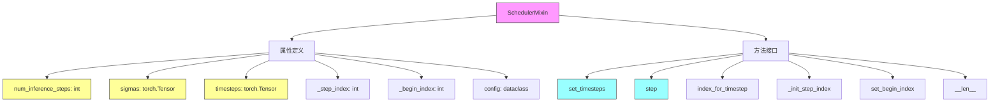

#### 带注释源码

```python
# 从 scheduling_utils 导入的调度器基类混合器
# 来源: diffusers 库的调度器基础架构
from .scheduling_utils import SchedulerMixin


# SchedulerMixin 的典型接口定义（基于代码中的使用方式推断）
class SchedulerMixin:
    """
    调度器基类 Mixin，为所有调度器提供通用接口约定。
    
    使用方式：
    - 通过 @register_to_config 装饰器支持配置注册
    - 子类需要实现 set_timesteps() 和 step() 方法
    - 自动管理 _step_index 和 _begin_index 状态
    """
    
    # 类属性（由子类或 @register_to_config 填充）
    num_inference_steps: int = None      # 推理时的去噪步数
    sigmas: torch.Tensor | None = None   # Sigma 调度序列
    timesteps: torch.Tensor | None = None # 时间步序列
    _step_index: int = None              # 当前步索引
    _begin_index: int = None             # 起始索引（用于图像到图像的中间开始）
    config: dataclass = None             # 配置数据类
    
    @property
    def step_index(self) -> int:
        """获取当前推理步索引"""
        return self._step_index
    
    @property
    def begin_index(self) -> int:
        """获取起始索引，支持图像到图像工作流"""
        return self._begin_index
    
    def set_begin_index(self, begin_index: int):
        """设置起始索引"""
        self._begin_index = begin_index
    
    def index_for_timestep(
        self, 
        timestep: float | torch.Tensor, 
        schedule_timesteps: torch.Tensor | None = None
    ) -> int:
        """
        将时间步值映射到调度序列的索引
        
        参数：
            - timestep: 当前时间步值
            - schedule_timesteps: 调度时间步序列
            
        返回：
            - 索引值
        """
        pass
    
    def _init_step_index(self, timestep: float | torch.Tensor):
        """根据给定时间步初始化内部步索引"""
        pass
    
    def set_timesteps(
        self,
        num_inference_steps: int | None = None,
        device: str | torch.device | None = None,
        **kwargs,
    ):
        """
        设置推理的时间步/_sigma 调度序列
        
        参数：
            - num_inference_steps: 去噪步数
            - device: 目标设备
            - **kwargs: 其他调度器特定参数
            
        返回：
            - 无（修改内部状态）
        """
        pass
    
    def step(
        self,
        model_output: torch.FloatTensor,
        timestep: float | torch.Tensor,
        sample: torch.FloatTensor,
        generator: torch.Generator | None = None,
        return_dict: bool = True,
    ):
        """
        执行单步采样
        
        参数：
            - model_output: 模型输出（通常是噪声预测或 v-prediction）
            - timestep: 当前时间步
            - sample: 当前 latent 样本
            - generator: 可选的随机数生成器
            - return_dict: 是否返回字典格式
            
        返回：
            - 调度器特定输出或元组
        """
        pass
    
    def __len__(self) -> int:
        """返回训练时间步数量"""
        return 1000
```

---

## 补充说明

### 设计目标与约束

- **统一接口**：所有调度器必须实现 `set_timesteps()` 和 `step()` 方法
- **配置驱动**：通过 `@register_to_config` 装饰器支持序列化/反序列化
- **设备管理**：调度器内部张量需要支持设备迁移

### 关键技术特性

- **Sigma 调度**：支持显式 sigma 序列或自动生成
- **状态追踪**：通过 `_step_index` 管理多步推理流程
- **兼容性设计**：支持图像到图像等部分去噪工作流

### 在 LTXEulerAncestralRFScheduler 中的使用

```python
class LTXEulerAncestralRFScheduler(SchedulerMixin, ConfigMixin):
    # 继承 SchedulerMixin 获取通用调度器接口
    # 实现具体的 Euler-Ancestral RF 采样逻辑
    pass
```


### `LTXEulerAncestralRFScheduler.__init__`

该方法是 `LTXEulerAncestralRFScheduler` 类的初始化方法，用于配置 Euler-Ancestral RF 调度器的核心参数。它通过 `@register_to_config` 装饰器将参数注册到配置中，并初始化调度器内部状态变量（如推理步数、sigma 调度、时间步等），为后续的采样步骤做好准备。

参数：

- `num_train_timesteps`：`int`，默认值 `1000`，保留用于配置兼容性，不用于构建调度计划。
- `eta`：`float`，默认值 `1.0`，随机性参数。`eta=0.0` 产生确定性 DDIM 采样；`eta=1.0` 匹配 ComfyUI 的默认 RF 行为。
- `s_noise`：`float`，默认值 `1.0`，随机噪声项的全局缩放因子。

返回值：无（`None`），`__init__` 方法隐式返回。

#### 流程图

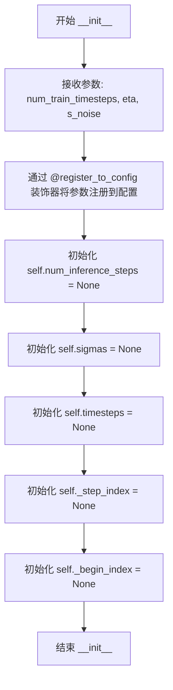

#### 带注释源码

```python
@register_to_config
def __init__(
    self,
    num_train_timesteps: int = 1000,
    eta: float = 1.0,
    s_noise: float = 1.0,
):
    # 注意：num_train_timesteps 仅保留用于配置兼容性，不用于构建调度计划。
    # 该参数在 config 中可用，以便与 FlowMatchEulerDiscreteScheduler 等其他调度器兼容。
    
    # 初始化推理步数计数器，将在 set_timesteps 时设置
    self.num_inference_steps: int = None
    
    # sigma 调度张量，存储离散化的噪声水平 sigma 值
    # 在 set_timesteps 后填充，形状为 [num_inference_steps + 1]
    self.sigmas: torch.Tensor | None = None
    
    # 时间步张量，与 sigmas 对应，用于调度器内部索引
    # 在 set_timesteps 后填充，形状与 sigmas 相同
    self.timesteps: torch.Tensor | None = None
    
    # 内部 step 索引，跟踪当前处于哪个采样步骤
    # 在 step() 方法中动态更新
    self._step_index: int = None
    
    # 起始索引，支持图像到图像工作流，从调度中间开始去噪
    # 可以通过 set_begin_index 方法设置
    self._begin_index: int = None
```


### `LTXEulerAncestralRFScheduler.step_index`

该属性用于获取调度器内部的当前步进索引（step index），用于追踪在去噪采样过程中的当前位置。它返回 `_step_index` 属性的值，该索引在第一次调用 `step` 方法时通过 `_init_step_index` 方法初始化。

参数： 无

返回值：`int`，当前步进索引值，表示当前处于去噪过程的第几步。

#### 流程图

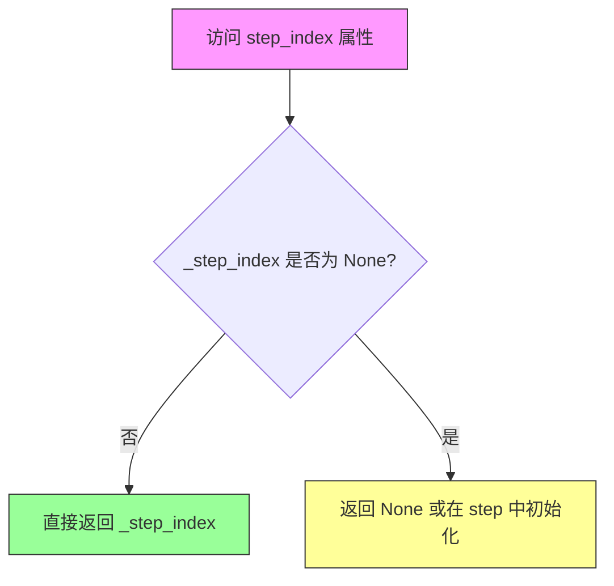

#### 带注释源码

```python
@property
def step_index(self) -> int:
    """
    获取调度器当前的步进索引。
    
    该属性返回内部变量 _step_index，用于追踪在去噪采样过程中的当前位置。
    索引值在第一次调用 step() 方法时通过 _init_step_index() 初始化。
    
    Returns:
        int: 当前步进索引。如果尚未调用 step() 方法，则返回 None。
    """
    return self._step_index
```


### `LTXEulerAncestralRFScheduler.begin_index`

获取调度器的起始索引，用于支持图像到图像工作流，该工作流在调度器中途开始去噪。

参数：
- 无

返回值：`int`，返回 `self._begin_index`，即第一个时间步的索引。如果没有设置，则返回 `None`。

#### 流程图

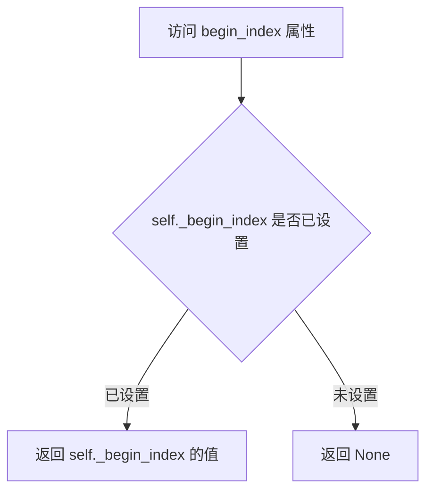

#### 带注释源码

```python
@property
def begin_index(self) -> int:
    """
    The index for the first timestep. It can be set from a pipeline with `set_begin_index` to support
    image-to-image like workflows that start denoising part-way through the schedule.
    """
    # 返回私有属性 _begin_index 的值
    # 该属性用于记录调度器的起始索引
    # 支持从调度器中间开始去噪的图像到图像工作流
    return self._begin_index
```


### `LTXEulerAncestralRFScheduler.set_begin_index`

设置调度器的起始索引，用于支持图像到图像等从去噪schedule中途开始的工作流。

参数：

- `self`：隐式参数，调度器实例本身
- `begin_index`：`int`，起始索引值，默认为0，表示第一个时间步的索引

返回值：`None`，无返回值；该方法直接修改内部状态 `_begin_index`

#### 流程图

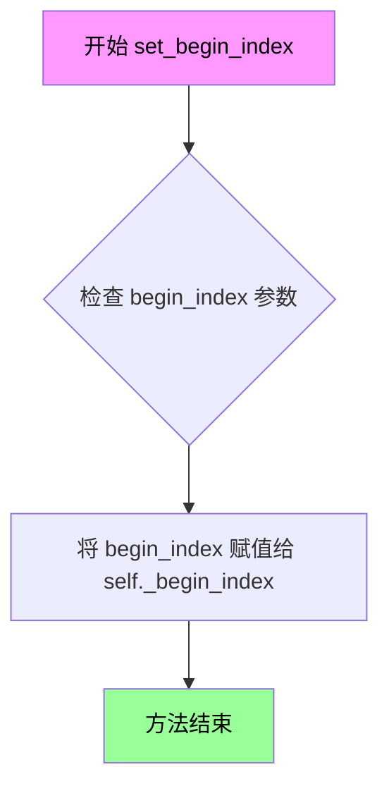

#### 带注释源码

```
def set_begin_index(self, begin_index: int = 0):
    """
    Included for API compatibility; not strictly needed here but kept to allow pipelines that call
    `set_begin_index`.
    """
    # 将传入的 begin_index 参数直接赋值给内部变量 _begin_index
    # 该方法主要用于 API 兼容性，让其他调度器可以调用此方法
    # 在 LTXEulerAncestralRFScheduler 中，_begin_index 用于支持图像到图像
    # 工作流，允许从去噪 schedule 的中间位置开始采样
    self._begin_index = begin_index
```


### `LTXEulerAncestralRFScheduler.index_for_timestep`

该方法负责将输入的连续时间步（timestep）值映射到内部维护的时间步序列（`self.timesteps`）中的具体索引位置。它特别处理了时间步在序列中重复出现的情况（例如在图生图工作流中），以确保不会意外跳过任何一个去噪 sigma 值。

参数：
- `timestep`：`float | torch.Tensor`，当前的时间步值（通常是来自 `self.timesteps` 中的值）。
- `schedule_timesteps`：`torch.Tensor | None`，可选的时间步序列。如果为 `None`，则默认使用 `self.timesteps`。

返回值：`int`，返回给定 `timestep` 在时间步序列中的索引位置。

#### 流程图

```mermaid
flowchart TD
    A[开始 index_for_timestep] --> B{schedule_timesteps 是否为 None?}
    B -- 是 --> C{self.timesteps 是否为 None?}
    C -- 是 --> D[抛出错误: 请先调用 set_timesteps]
    C -- 否 --> E[使用 self.timesteps]
    B -- 否 --> F[使用传入的 schedule_timesteps]
    
    G{timestep 是否为 Tensor?} --> |是| H[将 timestep 移动到 schedule_timesteps 的设备]
    G --> |否| I[保持原样]
    H --> J
    I --> J
    
    J[在 schedule_timesteps 中查找等于 timestep 的索引] --> K{找到的索引列表长度 == 0?}
    K -- 是 --> L[抛出错误: timestep 不在 timesteps 中]
    K -- 否 --> M{长度 > 1?}
    
    M -- 是 --> N[pos = 1]
    M -- 否 --> O[pos = 0]
    
    N --> P[返回 indices[pos].item()]
    O --> P
```

#### 带注释源码

```python
def index_for_timestep(
    self, timestep: float | torch.Tensor, schedule_timesteps: torch.Tensor | None = None
) -> int:
    """
    Map a (continuous) `timestep` value to an index into `self.timesteps`.

    This follows the convention used in other discrete schedulers: if the same timestep value appears multiple
    times in the schedule (which can happen when starting in the middle of the schedule), the *second* occurrence
    is used for the first `step` call so that no sigma is accidentally skipped.
    """
    # 1. 确定使用的 schedule。如果未指定，则使用实例的 self.timesteps。
    if schedule_timesteps is None:
        if self.timesteps is None:
            raise ValueError("Timesteps have not been set. Call `set_timesteps` first.")
        schedule_timesteps = self.timesteps

    # 2. 处理设备迁移。如果 timestep 是 Tensor，确保它与 schedule 在同一设备上。
    if isinstance(timestep, torch.Tensor):
        timestep = timestep.to(schedule_timesteps.device)

    # 3. 查找所有匹配的索引。使用 (schedule_timesteps == timestep) 生成布尔掩码，然后取非零索引。
    indices = (schedule_timesteps == timestep).nonzero()

    # 4. 核心逻辑：选择索引。
    # 如果同一个 timestep 出现多次（例如图生图从中间开始），通常我们想从第二次出现开始（索引1），
    # 这样可以确保在第一次 step 时不会跳过前一个 sigma。如果只出现一次，则使用第一次出现（索引0）。
    pos = 1 if len(indices) > 1 else 0

    # 5. 错误处理：如果找不到匹配的 timestep，抛出明确的错误。
    if len(indices) == 0:
        raise ValueError(
            "Passed `timestep` is not in `self.timesteps`. Make sure to use values from `scheduler.timesteps`."
        )

    # 6. 返回找到的索引值（标量）
    return indices[pos].item()
```


### `LTXEulerAncestralRFScheduler._init_step_index`

初始化内部步进索引，基于给定的时间步长。该方法用于将时间步长映射到调度器 schedule 中的索引位置，支持从中间开始执行降噪（image-to-image 工作流）。

参数：

- `timestep`：`float | torch.Tensor`，当前的时间步，可以是标量或张量，需要与 scheduler.timesteps 中的值匹配

返回值：`None`，无返回值（该方法直接修改内部状态 `self._step_index`）

#### 流程图

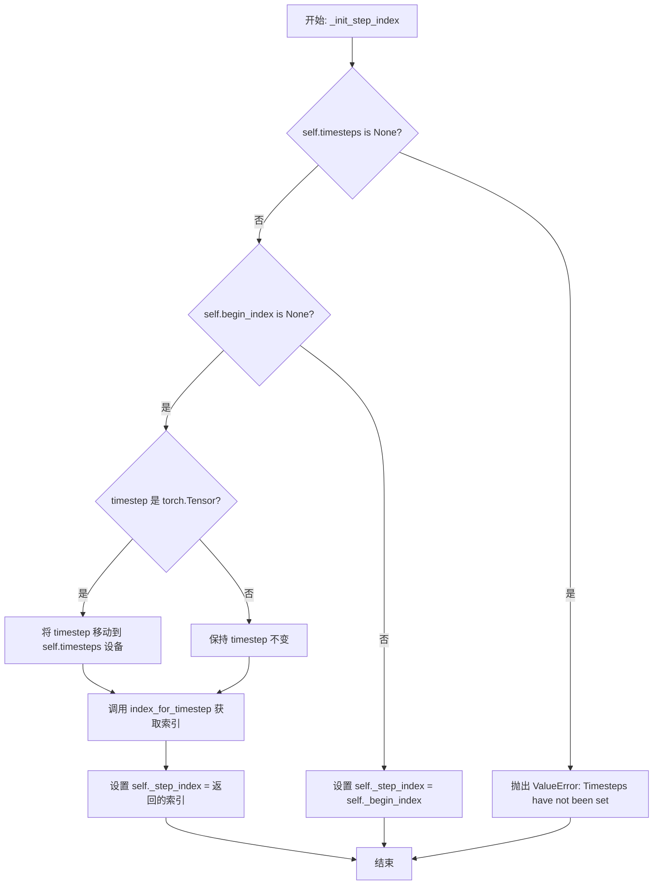

#### 带注释源码

```python
def _init_step_index(self, timestep: float | torch.Tensor):
    """
    Initialize the internal step index based on a given timestep.
    
    该方法负责将传入的时间步长转换为调度器内部的步进索引。
    支持两种模式：
    1. 常规模式：根据 timestep 查找其在 self.timesteps 中的位置
    2. 起始索引模式：当 begin_index 已设置时，直接使用该值作为步进索引
    （用于支持 image-to-image 工作流从中间开始）
    """
    # 检查是否已调用 set_timesteps
    if self.timesteps is None:
        raise ValueError("Timesteps have not been set. Call `set_timesteps` first.")

    # 如果没有设置起始索引，则根据 timestep 计算步进索引
    if self.begin_index is None:
        # 如果 timestep 是张量，确保它在正确的设备上
        if isinstance(timestep, torch.Tensor):
            timestep = timestep.to(self.timesteps.device)
        # 调用 index_for_timestep 方法获取对应的索引
        # 该方法会处理重复时间步的情况，返回正确的索引位置
        self._step_index = self.index_for_timestep(timestep)
    else:
        # 如果已经设置了起始索引，直接使用该索引
        # 这允许从调度器中间的某个位置开始采样
        self._step_index = self._begin_index
```


### `LTXEulerAncestralRFScheduler.set_timesteps`

设置采样用的sigma/时间步调度表。当显式提供`sigmas`或`timesteps`时，它们被用作RF sigma调度表（ComfyUI风格）。当两者都为`None`时，调度器复用`FlowMatchEulerDiscreteScheduler`逻辑从`num_inference_steps`和存储的配置生成sigma值。

参数：

- `num_inference_steps`：`int | None`，去噪步数。如果与显式`sigmas`/`timesteps`一起提供，它们应保持一致，否则会被忽略并发出警告。
- `device`：`str | torch.device | None`，要将内部张量移动到的设备。
- `sigmas`：`list[float] | torch.Tensor | None`，显式的sigma调度表，例如`[1.0, 0.99, ..., 0.0]`。
- `timesteps`：`list[float] | torch.Tensor | None`，可选的`sigmas`别名。如果`sigmas`为`None`且提供了`timesteps`，则将timesteps视为sigmas。
- `mu`：`float | None`，当委托给`FlowMatchEulerDiscreteScheduler.set_timesteps`且`config.use_dynamic_shifting`为`True`时使用的可选位移参数。
- `**kwargs`：其他关键字参数，用于未来扩展或兼容性。

返回值：`None`，此方法不返回值，而是直接修改调度器的内部状态。

#### 流程图

```mermaid
flowchart TD
    A[set_timesteps 开始] --> B{sigmas is None<br/>且<br/>timesteps is None?}
    B -->|是| C{num_inference_steps<br/>is None?}
    B -->|否| D[显式sigma路径]
    
    C -->|是| E[抛出ValueError:<br/>需要explicit sigmas/timesteps<br/>或num_inference_steps]
    C -->|否| F[创建FlowMatchEulerDiscreteScheduler]
    F --> G[调用base_scheduler.set_timesteps]
    G --> H[设置self.num_inference_steps<br/>self.sigmas<br/>self.timesteps]
    H --> I[重置_step_index<br/>_begin_index为None]
    I --> J[返回]
    
    D --> K{sigmas is None?}
    K -->|是| L[将timesteps赋值给sigmas]
    K -->|否| M[sigmas_tensor = sigmas]
    L --> M
    
    M --> N{检查sigmas类型}
    N -->|list| O[转换为torch.tensor]
    N -->|Tensor| P[转换为float32]
    N -->|其他| Q[抛出TypeError]
    O --> P
    
    P --> R{检查sigmas_tensor维度}
    R -->|不是1D| S[抛出ValueError]
    R -->|是1D| T{检查最后一个sigma<br/>是否接近0}
    
    T -->|否| U[发出警告:<br/>terminal sigma应为0.0]
    T -->|是| V[移动到device]
    
    U --> V
    V --> W[设置self.sigmas<br/>self.timesteps = sigmas * num_train]
    
    W --> X{num_inference_steps<br/>与len(sigmas)-1不匹配?}
    X -->|是| Y[发出警告并覆盖<br/>num_inference_steps]
    X -->|否| Z[设置self.num_inference_steps<br/>= len(sigmas) - 1]
    
    Y --> Z
    Z --> AA[重置_step_index<br/>_begin_index为None]
    AA --> J
```

#### 带注释源码

```python
def set_timesteps(
    self,
    num_inference_steps: int | None = None,
    device: str | torch.device | None = None,
    sigmas: list[float] | torch.Tensor | None = None,
    timesteps: list[float] | torch.Tensor | None = None,
    mu: float | None = None,
    **kwargs,
):
    """
    Set the sigma / timestep schedule for sampling.

    When `sigmas` or `timesteps` are provided explicitly, they are used as the RF sigma schedule (ComfyUI-style)
    and are expected to include the terminal 0.0. When both are `None`, the scheduler reuses the
    [`FlowMatchEulerDiscreteScheduler`] logic to generate sigmas from `num_inference_steps` and the stored config
    (including any resolution-dependent shifting, Karras/beta schedules, etc.).

    Args:
        num_inference_steps (`int`, *optional*):
            Number of denoising steps. If provided together with explicit `sigmas`/`timesteps`, they are expected
            to be consistent and are otherwise ignored with a warning.
        device (`str` or `torch.device`, *optional*):
            Device to move the internal tensors to.
        sigmas (`list[float]` or `torch.Tensor`, *optional*):
            Explicit sigma schedule, e.g. `[1.0, 0.99, ..., 0.0]`.
        timesteps (`list[float]` or `torch.Tensor`, *optional*):
            Optional alias for `sigmas`. If `sigmas` is None and `timesteps` is provided, timesteps are treated as
            sigmas.
        mu (`float`, *optional*):
            Optional shift parameter used when delegating to [`FlowMatchEulerDiscreteScheduler.set_timesteps`] and
            `config.use_dynamic_shifting` is `True`.
    """
    # 1. Auto-generate schedule (FlowMatch-style) when no explicit sigmas/timesteps are given
    if sigmas is None and timesteps is None:
        if num_inference_steps is None:
            raise ValueError(
                "LTXEulerAncestralRFScheduler.set_timesteps requires either explicit `sigmas`/`timesteps` "
                "or a `num_inference_steps` value."
            )

        # We reuse FlowMatchEulerDiscreteScheduler to construct a sigma schedule that is
        # consistent with the original LTX training setup (including optional time shifting,
        # Karras / exponential / beta schedules, etc.).
        from .scheduling_flow_match_euler_discrete import FlowMatchEulerDiscreteScheduler

        base_scheduler = FlowMatchEulerDiscreteScheduler.from_config(self.config)
        base_scheduler.set_timesteps(
            num_inference_steps=num_inference_steps,
            device=device,
            sigmas=None,
            mu=mu,
            timesteps=None,
        )

        self.num_inference_steps = base_scheduler.num_inference_steps
        # Keep sigmas / timesteps on the requested device so step() can operate on-device without
        # extra transfers.
        self.sigmas = base_scheduler.sigmas.to(device=device)
        self.timesteps = base_scheduler.timesteps.to(device=device)
        self._step_index = None
        self._begin_index = None
        return

    # 2. Explicit sigma schedule (ComfyUI-style path)
    if sigmas is None:
        # `timesteps` is treated as sigmas in RF / flow-matching setups.
        sigmas = timesteps

    if isinstance(sigmas, list):
        sigmas_tensor = torch.tensor(sigmas, dtype=torch.float32)
    elif isinstance(sigmas, torch.Tensor):
        sigmas_tensor = sigmas.to(dtype=torch.float32)
    else:
        raise TypeError(f"`sigmas` must be a list or torch.Tensor, got {type(sigmas)}.")

    if sigmas_tensor.ndim != 1:
        raise ValueError(f"`sigmas` must be a 1D tensor, got shape {tuple(sigmas_tensor.shape)}.")

    if sigmas_tensor[-1].abs().item() > 1e-6:
        logger.warning(
            "The last sigma in the schedule is not zero (%.6f). "
            "For best compatibility with ComfyUI's RF sampler, the terminal sigma "
            "should be 0.0.",
            sigmas_tensor[-1].item(),
        )

    # Move to device once, then derive timesteps.
    if device is not None:
        sigmas_tensor = sigmas_tensor.to(device)

    # Internal sigma schedule stays in [0, 1] (as provided).
    self.sigmas = sigmas_tensor
    # Timesteps are scaled to match the training setup of LTX (FlowMatch-style),
    # where the network expects timesteps on [0, num_train_timesteps].
    # This keeps the transformer conditioning in the expected range while the RF
    # scheduler still operates on the raw sigma values.
    num_train = float(getattr(self.config, "num_train_timesteps", 1000))
    self.timesteps = sigmas_tensor * num_train

    if num_inference_steps is not None and num_inference_steps != len(sigmas) - 1:
        logger.warning(
            "Provided `num_inference_steps=%d` does not match `len(sigmas)-1=%d`. "
            "Overriding `num_inference_steps` with `len(sigmas)-1`.",
            num_inference_steps,
            len(sigmas) - 1,
        )

    self.num_inference_steps = len(sigmas) - 1
    self._step_index = None
    self._begin_index = None
```


### `LTXEulerAncestralRFScheduler._sigma_broadcast`

辅助方法，用于将标量 sigma 张量广播到与 sample 张量相同的维度形状。

参数：

- `self`：实例本身（隐式参数）
- `sigma`：`torch.Tensor`，标量 sigma 张量，需要被广播
- `sample`：`torch.Tensor`，目标样本张量，用于确定广播后的目标形状

返回值：`torch.Tensor`，广播后的 sigma 张量，其维度与 sample 张量相同

#### 流程图

```mermaid
flowchart TD
    A[开始] --> B{sigma.ndim < sample.ndim?}
    B -->|Yes| C[sigma = sigma.view(\*sigma.shape, 1)]
    C --> B
    B -->|No| D[返回 sigma]
    D --> E[结束]
```

#### 带注释源码

```
def _sigma_broadcast(self, sigma: torch.Tensor, sample: torch.Tensor) -> torch.Tensor:
    """
    Helper to broadcast a scalar sigma to the shape of `sample`.
    """
    # 循环直到 sigma 的维度数不少于 sample 的维度数
    while sigma.ndim < sample.ndim:
        # 在 sigma 末尾添加一个新的维度，形状扩展为 [..., 1]
        # 例如：从 [1] 变为 [1, 1]，从 [1, 1] 变为 [1, 1, 1]
        sigma = sigma.view(*sigma.shape, 1)
    return sigma
```


### `LTXEulerAncestralRFScheduler.step`

执行单次Euler-Ancestral RF（随机_flow）更新步骤，根据CONST参数化对给定模型输出和当前样本进行去噪处理，支持确定性DDIM-like采样（eta=0.0）和随机祖先采样（eta>0.0）两种模式。

参数：

- `model_output`：`torch.FloatTensor`，原始模型输出。在CONST参数化下被解释为`v_t`，去噪状态重构为`x0 = x_t - sigma_t * v_t`
- `timestep`：`float | torch.Tensor`，当前sigma值，必须匹配`self.timesteps`中的一个条目
- `sample`：`torch.FloatTensor`，当前潜在样本`x_t`
- `generator`：`torch.Generator | None`，可选的随机数生成器，用于可重复的噪声采样
- `return_dict`：`bool`，如果为`True`返回`LTXEulerAncestralRFSchedulerOutput`；否则返回元组

返回值：`LTXEulerAncestralRFSchedulerOutput | tuple[torch.FloatTensor]`，去噪后的样本或包含样本的元组

#### 流程图

```mermaid
flowchart TD
    A[step 开始] --> B{检查 timestep 类型}
    B -->|整数/IntTensor/LongTensor| C[抛出 ValueError]
    B -->|float/Tensor| D{检查 sigmas/timesteps 是否已设置}
    D -->|未设置| E[抛出 ValueError]
    D -->|已设置| F{检查 _step_index 是否为 None}
    F -->|是| G[调用 _init_step_index 初始化步索引]
    F -->|否| H[直接使用当前 _step_index]
    G --> I[获取当前索引 i]
    H --> I
    I --> J{i >= len(sigmas) - 1}
    J -->|是| K[prev_sample = sample 直接返回]
    J -->|否| L[转换为 float32 保证数值稳定性]
    L --> M[获取当前和下一步 sigma 值]
    M --> N[广播 sigma 到样本形状]
    N --> O[计算去噪结果: denoised = sample - sigma * model_output]
    O --> P{sigma_next.abs() < 1e-8}
    P -->|是| Q[x = denoised 最终去噪步骤]
    P -->|否| R[计算 eta 和 s_noise]
    R --> S[计算 downstep_ratio 和 sigma_down]
    S --> T[计算 alpha_ip1 和 alpha_down]
    T --> U[计算 sigma_ratio 和 Euler 步骤]
    U --> V{eta > 0.0 and s_noise > 0.0}
    V -->|是| W[计算 renoise_coeff]
    V -->|否| X[x 保持确定性]
    W --> Y[生成随机噪声并添加到样本]
    Y --> Z[prev_sample = x 转换为原 dtype]
    X --> Z
    Q --> Z
    K --> AA[_step_index += 1]
    Z --> AA
    AA --> BB{return_dict == True}
    BB -->|是| CC[返回 LTXEulerAncestralRFSchedulerOutput]
    BB -->|否| DD[返回 tuple(prev_sample,)]
```

#### 带注释源码

```python
def step(
    self,
    model_output: torch.FloatTensor,
    timestep: float | torch.Tensor,
    sample: torch.FloatTensor,
    generator: torch.Generator | None = None,
    return_dict: bool = True,
) -> LTXEulerAncestralRFSchedulerOutput | tuple[torch.FloatTensor]:
    """
    Perform a single Euler-Ancestral RF update step.

    Args:
        model_output (`torch.FloatTensor`):
            Raw model output at the current step. Interpreted under the CONST parametrization as `v_t`, with
            denoised state reconstructed as `x0 = x_t - sigma_t * v_t`.
        timestep (`float` or `torch.Tensor`):
            The current sigma value (must match one entry in `self.timesteps`).
        sample (`torch.FloatTensor`):
            Current latent sample `x_t`.
        generator (`torch.Generator`, *optional*):
            Optional generator for reproducible noise.
        return_dict (`bool`):
            If `True`, return a `LTXEulerAncestralRFSchedulerOutput`; otherwise return a tuple where the first
            element is the updated sample.
    """

    # Step 1: 验证 timestep 类型 - 不支持整数索引
    if isinstance(timestep, (int, torch.IntTensor, torch.LongTensor)):
        raise ValueError(
            (
                "Passing integer indices (e.g. from `enumerate(timesteps)`) as timesteps to"
                " `LTXEulerAncestralRFScheduler.step()` is not supported. Make sure to pass"
                " one of the `scheduler.timesteps` values as `timestep`."
            ),
        )

    # Step 2: 验证调度器已初始化
    if self.sigmas is None or self.timesteps is None:
        raise ValueError("Scheduler has not been initialized. Call `set_timesteps` before `step`.")

    # Step 3: 初始化步索引（如果需要）
    if self._step_index is None:
        self._init_step_index(timestep)

    # Step 4: 获取当前步索引
    i = self._step_index
    
    # Step 5: 检查是否已到达最后一步
    if i >= len(self.sigmas) - 1:
        # 已到最后一步，直接返回当前样本
        prev_sample = sample
    else:
        # Step 6: 转换为 float32 保证数值计算稳定性
        sample_f = sample.to(torch.float32)
        model_output_f = model_output.to(torch.float32)

        # Step 7: 获取当前和下一步的 sigma 值
        sigma = self.sigmas[i]
        sigma_next = self.sigmas[i + 1]

        # Step 8: 将标量 sigma 广播到与样本相同的维度
        sigma_b = self._sigma_broadcast(sigma.view(1), sample_f)
        sigma_next_b = self._sigma_broadcast(sigma_next.view(1), sample_f)

        # Step 9: 在 CONST 参数化下近似去噪结果 x0:
        #   x0 = x_t - sigma_t * v_t
        denoised = sample_f - sigma_b * model_output_f

        # Step 10: 判断是否为最终去噪步骤
        if sigma_next.abs().item() < 1e-8:
            # 最终去噪步骤：直接返回去噪结果
            x = denoised
        else:
            # 非最终步骤：执行 Euler-Ancestral 更新
            eta = float(self.config.eta)
            s_noise = float(self.config.s_noise)

            # Step 11: 计算 downstep（ComfyUI RF 变体）
            downstep_ratio = 1.0 + (sigma_next / sigma - 1.0) * eta
            sigma_down = sigma_next * downstep_ratio

            alpha_ip1 = 1.0 - sigma_next
            alpha_down = 1.0 - sigma_down

            # Step 12: 确定性部分（(x, x0) 空间中的 Euler 步骤）
            sigma_down_b = self._sigma_broadcast(sigma_down.view(1), sample_f)
            alpha_ip1_b = self._sigma_broadcast(alpha_ip1.view(1), sample_f)
            alpha_down_b = self._sigma_broadcast(alpha_down.view(1), sample_f)

            sigma_ratio = sigma_down_b / sigma_b
            x = sigma_ratio * sample_f + (1.0 - sigma_ratio) * denoised

            # Step 13: 随机祖先噪声（可选）
            if eta > 0.0 and s_noise > 0.0:
                # 计算噪声系数，确保非负
                renoise_coeff = (
                    (sigma_next_b**2 - sigma_down_b**2 * alpha_ip1_b**2 / (alpha_down_b**2 + 1e-12))
                    .clamp(min=0.0)
                    .sqrt()
                )

                # 生成随机噪声并添加到样本
                noise = randn_tensor(
                    sample_f.shape, generator=generator, device=sample_f.device, dtype=sample_f.dtype
                )
                x = (alpha_ip1_b / (alpha_down_b + 1e-12)) * x + noise * renoise_coeff * s_noise

        # Step 14: 转换回原始数据类型
        prev_sample = x.to(sample.dtype)

    # Step 15: 更新内部步索引
    self._step_index = min(self._step_index + 1, len(self.sigmas) - 1)

    # Step 16: 根据 return_dict 返回结果
    if not return_dict:
        return (prev_sample,)

    return LTXEulerAncestralRFSchedulerOutput(prev_sample=prev_sample)
```


### `LTXEulerAncestralRFScheduler.__len__`

该方法实现 Python 的特殊方法 `__len__`，使调度器实例可以支持 `len()` 操作，用于获取调度器的训练时间步总数，以便与其他调度器兼容，常用于训练工具推断最大训练时间步。

参数：

-  `self`：`LTXEulerAncestralRFScheduler`，隐式参数，指向调度器实例本身

返回值：`int`，返回配置中定义的训练时间步数量，若未配置则默认为 1000

#### 流程图

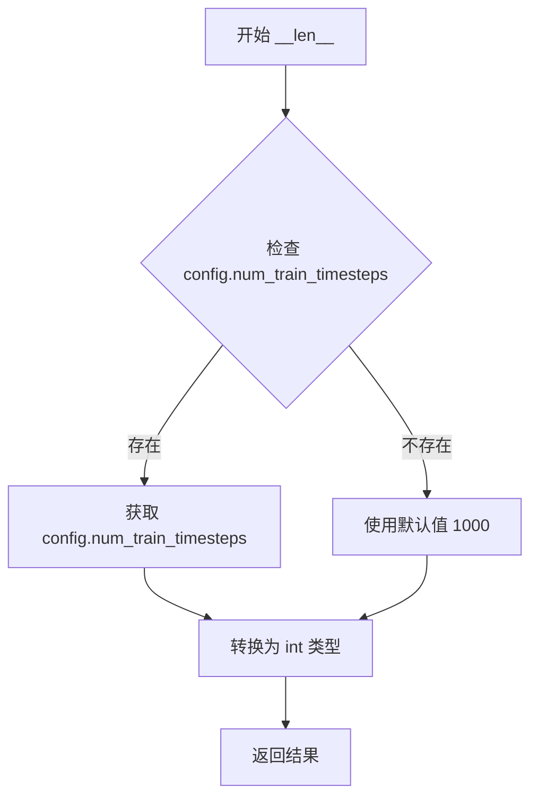

#### 带注释源码

```
def __len__(self) -> int:
    # 用于与其他调度器兼容；例如在某些训练工具中
    # 用于推断最大训练时间步数。
    # 
    # 实现逻辑：
    # 1. 尝试从配置对象中获取 num_train_timesteps 属性
    # 2. 如果配置中不存在该属性，则使用默认值 1000
    # 3. 将结果转换为 int 类型后返回
    #
    # 这样做的目的是：
    # - 保持与 diffusers 库中其他调度器的 API 一致性
    # - 支持训练代码中常见的长度检查操作
    return int(getattr(self.config, "num_train_timesteps", 1000))
```

## 关键组件


### LTXEulerAncestralRFScheduler

Euler-Ancestral调度器核心类，专为LTX-Video的RF/CONST参数化设计，实现了与ComfyUI的sample_euler_ancestral_RF采样器兼容的扩散模型调度逻辑，支持自动生成sigma schedule或使用显式sigma schedule。

### LTXEulerAncestralRFSchedulerOutput

调度器step方法的输出数据类，包含更新后的样本prev_sample，用于下一次去噪步骤。

### set_timesteps

设置sigma/timestep调度表的方法，支持两种模式：当未提供显式sigmas/timesteps时，委托FlowMatchEulerDiscreteScheduler生成兼容的sigma schedule；当提供显式sigmas时，直接使用ComfyUI风格的sigma schedule。

### step

执行单次Euler-Ancestral RF更新步骤的核心方法，在CONST参数化下计算去噪样本x0，结合确定性Euler步骤和基于eta/s_noise的随机祖先噪声采样。

### index_for_timestep

将连续timestep值映射到self.timesteps索引的方法，采用"第二次出现"约定以避免在图像到图像工作流中跳过sigma。

### _sigma_broadcast

辅助方法，将标量sigma值广播到与sample张量相同的维度形状。

### _init_step_index

内部方法，根据给定的timestep初始化内部step_index，支持从管道设置的begin_index。

### FlowMatchEulerDiscreteScheduler

外部依赖的调度器类，用于在未提供显式sigma时自动生成sigma schedule，支持时间偏移、Karras/指数/beta调度等高级特性。

### eta参数

随机性控制参数，eta=0.0产生确定性DDIM-like采样，eta=1.0匹配ComfyUI的默认RF行为。

### s_noise

全局缩放因子，用于控制随机噪声项的强度。

### _step_index

内部状态变量，记录当前去噪步骤的索引位置。

### _begin_index

可选的起始索引，支持图像到图像工作流，允许从调度表中间开始去噪。


## 问题及建议


### 已知问题

-   **类型提示兼容性**：代码使用了Python 3.10+的联合类型语法（如`float | torch.Tensor`、`int | None`等），与Python 3.9及更早版本不兼容，可能导致兼容性问题。
-   **魔法数字和硬编码值**：多处使用硬编码数值如`1e-6`、`1e-8`、`1e-12`，缺乏有意义的常量命名，降低了代码可读性和可维护性。
-   **重复的广播逻辑**：`_sigma_broadcast`方法内部存在重复的sigma形状广播逻辑，且在`step`方法中多次调用该方法，可考虑优化为更高效的向量运算。
-   **类型转换开销**：在`step`方法中，sample和model_output被强制转换为float32（`sample_f = sample.to(torch.float32)`），这引入了额外的内存分配和类型转换开销，可能影响性能。
-   **调度器依赖注入**：在`set_timesteps`方法中动态导入并实例化了`FlowMatchEulerDiscreteScheduler`作为基调度器，这种隐式依赖增加了代码耦合度，且每次调用都会创建新实例。
-   **日志级别使用不当**：使用了`logger.warning`来提示非致命性问题（如sigma不为零、num_inference_steps不匹配），这些更适合使用`logger.info`或`logger.debug`，以避免在生产环境中产生过多日志。
-   **边界条件处理**：在`step`方法中处理最后一步时，使用简单的比较`i >= len(self.sigmas) - 1`，而没有更明确的结束状态标志，可能导致边界情况下的行为不够清晰。

### 优化建议

-   **提取常量**：将魔法数字提取为类常量或配置参数，如`EPSILON = 1e-8`、`SIGMA_EPSILON = 1e-6`等，提高代码可读性。
-   **优化类型转换**：考虑使用就地转换或优化转换逻辑，或者在文档中明确说明float32转换的必要性（如数值稳定性），并评估是否可以移除不必要的转换。
-   **使用旧版类型提示**：为保持兼容性，可使用`from __future__ import annotations`或切换到`Optional`、`Union`语法。
-   **改进调度器依赖**：将`FlowMatchEulerDiscreteScheduler`的实例化移至构造函数或使用依赖注入，减少动态导入和重复实例化。
-   **增强日志记录**：根据信息重要性调整日志级别，将非关键警告改为info或debug级别，保持日志输出的一致性。
-   **添加状态机**：为调度器添加明确的状态枚举（如`IDLE`、`INITIALIZED`、`RUNNING`、`COMPLETED`），使状态转换更清晰。
-   **优化广播操作**：使用PyTorch的广播机制一次性完成所有必要的形状扩展，减少循环和重复视图操作。

## 其它


### 设计目标与约束

该调度器的主要设计目标是复现ComfyUI中`sample_euler_ancestral_RF`采样器的行为，用于LTX-Video模型的推理。约束条件包括：1) 仅支持flow/CONST参数化的模型；2) 必须与Diffusers框架的调度器接口兼容；3) 需要支持两种sigma schedule模式（自动生成和显式指定）。

### 错误处理与异常设计

调度器实现了多层次的错误处理机制：1) 在`set_timesteps`中检查`sigmas`参数类型（必须为list或torch.Tensor），检查维度（必须为1D），检查终端sigma值是否接近0；2) 在`step`方法中验证timestep类型（不支持整数索引），检查调度器是否已初始化，检查是否已到达最后一步；3) 在`index_for_timestep`中验证timestep值是否存在于schedule中。

### 数据流与状态机

调度器的工作流程分为两个主要阶段：初始化阶段和采样阶段。初始化阶段通过`set_timesteps`方法设置sigma和timestep序列，内部维护`_step_index`和`_begin_index`两个状态指针。采样阶段通过`step`方法执行单步更新，每次调用自动推进`_step_index`。状态转换遵循：None -> 设置中 -> 就绪 -> 采样中 -> 完成。

### 外部依赖与接口契约

该调度器依赖以下外部组件：1) `torch`库进行张量运算；2) `dataclasses.dataclass`用于输出类定义；3) `..configuration_utils.ConfigMixin`提供配置注册功能；4) `..utils.BaseOutput`和`..utils.logging`提供基础工具；5) `..utils.torch_utils.randn_tensor`生成随机噪声；6) `..scheduling_utils.SchedulerMixin`提供调度器基类；7) `FlowMatchEulerDiscreteScheduler`用于自动生成sigma schedule。

### 兼容性说明

该调度器通过`_compatibles`属性声明与`FlowMatchEulerDiscreteScheduler`兼容，支持配置迁移。调度器实现了标准的Diffusers调度器接口：`set_timesteps`、`step`、`__len__`、`index_for_timestep`、`begin_index`属性和`set_begin_index`方法。

### 数学公式说明

该调度器实现的核心数学公式基于Euler-Ancestral方法：1) x0 = xt - σt * vt（从CONST参数化的模型输出重构denoised样本）；2) σ_down = σ_next * (1.0 + (σ_next/σ - 1.0) * η)（下采样sigma计算）；3) x = σ_ratio * xt + (1 - σ_ratio) * x0（确定性Euler步骤）；4) 添加ancestral噪声项：x = (α_ip1/α_down) * x + noise * renoise_coeff * s_noise。

    