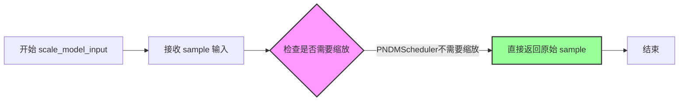
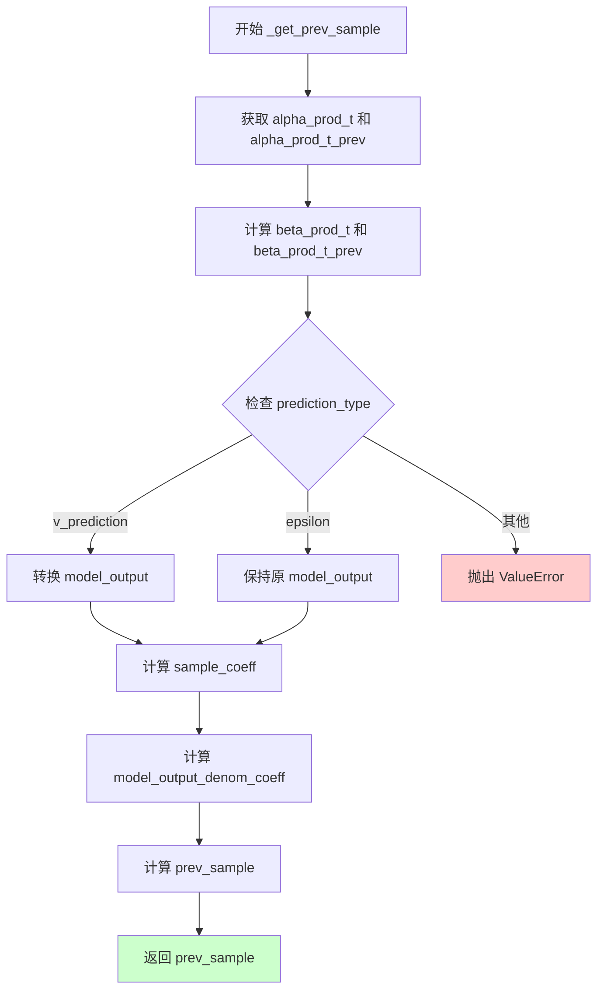

# `diffusers\src\diffusers\schedulers\scheduling_pndm.py` 详细设计文档

PNDMScheduler 是一个扩散模型调度器，使用伪数值方法（Runge-Kutta 和线性多步法）来实现扩散过程的逆向推演，支持 epsilon 和 v_prediction 两种预测类型，可用于图像生成等扩散模型应用。

## 整体流程

```mermaid
graph TD
    A[初始化 PNDMScheduler] --> B[set_timesteps]
    B --> C{设置时间步策略}
    C --> D[linspace]
    C --> E[leading]
    C --> F[trailing]
    D --> G[计算 PRK 和 PLMS 时间步]
    E --> G
    F --> G
    G --> H[推理循环: step]
    H --> I{counter < len(prk_timesteps)?}
    I -- 是 --> J[step_prk: Runge-Kutta]
    I -- 否 --> K[step_plms: PLMS]
    J --> L[_get_prev_sample]
    K --> L
    L --> M[返回 prev_sample]
    M --> N[更新状态: counter, ets]
    N --> H
```

## 类结构

```
SchedulerMixin (抽象基类)
└── PNDMScheduler (伪数值扩散调度器)
    ├── 配置参数
    │   ├── num_train_timesteps
    │   ├── beta_start/end/schedule
    │   ├── skip_prk_steps
    │   ├── set_alpha_to_one
    │   ├── prediction_type
    │   ├── timestep_spacing
    │   └── steps_offset
    └── 核心方法
        ├── set_timesteps
        ├── step (调度入口)
        ├── step_prk (Runge-Kutta)
        ├── step_plms (线性多步)
        ├── _get_prev_sample
        ├── scale_model_input
        └── add_noise
```

## 全局变量及字段


### `betas_for_alpha_bar`
    
根据alpha_bar函数生成离散的beta调度序列，用于扩散模型的噪声调度

类型：`function(num_diffusion_timesteps: int, max_beta: float = 0.999, alpha_transform_type: Literal["cosine", "exp", "laplace"] = "cosine") -> torch.Tensor`
    


### `PNDMScheduler.PNDMScheduler.betas`
    
beta值序列，定义每个扩散时间步的噪声水平

类型：`torch.Tensor`
    


### `PNDMScheduler.PNDMScheduler.alphas`
    
alpha值序列，由1-betas计算得出

类型：`torch.Tensor`
    


### `PNDMScheduler.PNDMScheduler.alphas_cumprod`
    
alpha值的累积乘积，用于计算扩散过程的累积效应

类型：`torch.Tensor`
    


### `PNDMScheduler.PNDMScheduler.final_alpha_cumprod`
    
最终时间步的alpha累积乘积，用于边界条件处理

类型：`torch.Tensor`
    


### `PNDMScheduler.PNDMScheduler.init_noise_sigma`
    
初始噪声的标准差，默认为1.0

类型：`float`
    


### `PNDMScheduler.PNDMScheduler.pndm_order`
    
PNDM方法的阶数，决定Runge-Kutta和线性多步方法的迭代次数

类型：`int`
    


### `PNDMScheduler.PNDMScheduler.cur_model_output`
    
当前模型输出的累计值，用于PRK方法中的加权累加

类型：`int/float`
    


### `PNDMScheduler.PNDMScheduler.counter`
    
推理步骤计数器，记录当前执行的时间步序号

类型：`int`
    


### `PNDMScheduler.PNDMScheduler.cur_sample`
    
当前样本的缓存，用于PRK方法中的中间计算

类型：`torch.Tensor`
    


### `PNDMScheduler.PNDMScheduler.ets`
    
保存的历史模型输出列表，用于PLMS方法的线性组合计算

类型：`list`
    


### `PNDMScheduler.PNDMScheduler.num_inference_steps`
    
推理时使用的扩散步骤数

类型：`int`
    


### `PNDMScheduler.PNDMScheduler._timesteps`
    
内部时间步数组，存储倒序的原始时间步序列

类型：`np.ndarray`
    


### `PNDMScheduler.PNDMScheduler.prk_timesteps`
    
Runge-Kutta方法专用时间步数组

类型：`np.ndarray`
    


### `PNDMScheduler.PNDMScheduler.plms_timesteps`
    
PLMS方法专用时间步数组

类型：`np.ndarray`
    


### `PNDMScheduler.PNDMScheduler.timesteps`
    
最终使用的时间步tensor，已转换到计算设备上

类型：`torch.Tensor`
    


### `PNDMScheduler.PNDMScheduler._compatibles`
    
兼容的其他调度器类名列表，用于调度器切换

类型：`list`
    


### `PNDMScheduler.PNDMScheduler.order`
    
调度器的阶数，用于多步方法的精度控制

类型：`int`
    
    

## 全局函数及方法


### `betas_for_alpha_bar`

该函数根据指定的 alpha 变换类型（cosine、exp 或 laplace）创建 beta 调度表，通过离散化 alpha_t_bar 函数来生成一系列 beta 值，用于扩散模型的调度过程。

参数：

- `num_diffusion_timesteps`：`int`，要生成的 beta 数量
- `max_beta`：`float`（默认值 0.999），使用的最大 beta 值，用于避免数值不稳定
- `alpha_transform_type`：`Literal["cosine", "exp", "laplace"]`（默认值 "cosine"），alpha_bar 的噪声调度类型

返回值：`torch.Tensor`，调度器用于逐步模型输出的 beta 值张量

#### 流程图

```mermaid
flowchart TD
    A[开始: betas_for_alpha_bar] --> B{alpha_transform_type == 'cosine'?}
    B -->|Yes| C[定义 alpha_bar_fn: cos²((t+0.008)/1.008*π/2)]
    B -->|No| D{alpha_transform_type == 'laplace'?}
    D -->|Yes| E[定义 alpha_bar_fn: 基于拉普拉斯分布的 SNR 计算]
    D -->|No| F{alpha_transform_type == 'exp'?}
    F -->|Yes| G[定义 alpha_bar_fn: exp(-12.0*t)]
    F -->|No| H[raise ValueError: 不支持的 alpha_transform_type]
    
    C --> I[初始化空列表 betas]
    E --> I
    G --> I
    
    I --> J[循环 i 从 0 到 num_diffusion_timesteps-1]
    J --> K[计算 t1 = i / num_diffusion_timesteps]
    J --> L[计算 t2 = (i + 1) / num_diffusion_timesteps]
    K --> M[计算 beta = min(1 - alpha_bar_fn(t2)/alpha_bar_fn(t1), max_beta)]
    L --> M
    M --> N[将 beta 添加到 betas 列表]
    N --> O{还有更多时间步?}
    O -->|Yes| J
    O -->|No| P[返回 torch.tensor(betas, dtype=torch.float32)]
    
    style H fill:#ffcccc
    style P fill:#ccffcc
```

#### 带注释源码

```python
# 从 diffusers.schedulers.scheduling_ddpm 复制的函数
def betas_for_alpha_bar(
    num_diffusion_timesteps: int,          # 要生成的 beta 数量
    max_beta: float = 0.999,                # 最大 beta 值，避免数值不稳定
    alpha_transform_type: Literal["cosine", "exp", "laplace"] = "cosine"  # alpha 变换类型
) -> torch.Tensor:
    """
    创建离散化给定 alpha_t_bar 函数的 beta 调度表。
    alpha_t_bar 函数定义了 (1-beta) 在时间 t=[0,1] 时的累积乘积。
    
    包含一个 alpha_bar 函数，接收参数 t 并返回到扩散过程该点为止的 (1-beta) 的累积乘积。
    
    参数:
        num_diffusion_timesteps (int): 要生成的 beta 数量
        max_beta (float): 使用的最大 beta 值；使用低于 1 的值以避免数值不稳定
        alpha_transform_type (str): alpha_bar 的噪声调度类型，可选 'cosine', 'exp', 'laplace'
    
    返回:
        torch.Tensor: 调度器用于逐步模型输出的 beta 值
    """
    
    # 根据 alpha_transform_type 定义不同的 alpha_bar 函数
    if alpha_transform_type == "cosine":
        # 余弦调度：使用 cos² 函数平滑过渡
        def alpha_bar_fn(t):
            return math.cos((t + 0.008) / 1.008 * math.pi / 2) ** 2
    
    elif alpha_transform_type == "laplace":
        # 拉普拉斯调度：基于信号噪声比(SNR)的平方根
        def alpha_bar_fn(t):
            # 计算拉普拉斯分布 lambda 参数
            lmb = -0.5 * math.copysign(1, 0.5 - t) * math.log(1 - 2 * math.fabs(0.5 - t) + 1e-6)
            # 计算 SNR 并转换为 alpha 值
            snr = math.exp(lmb)
            return math.sqrt(snr / (1 + snr))
    
    elif alpha_transform_type == "exp":
        # 指数调度：指数衰减
        def alpha_bar_fn(t):
            return math.exp(t * -12.0)
    
    else:
        raise ValueError(f"不支持的 alpha_transform_type: {alpha_transform_type}")
    
    # 初始化 beta 列表
    betas = []
    # 遍历每个扩散时间步
    for i in range(num_diffusion_timesteps):
        # 计算当前时间步和下一个时间步的归一化值 [0, 1]
        t1 = i / num_diffusion_timesteps
        t2 = (i + 1) / num_diffusion_timesteps
        # 根据 alpha_bar 变化率计算 beta，并限制最大值为 max_beta
        betas.append(min(1 - alpha_bar_fn(t2) / alpha_bar_fn(t1), max_beta))
    
    # 返回 float32 类型的 beta 张量
    return torch.tensor(betas, dtype=torch.float32)
```


### `PNDMScheduler.__init__`

初始化 PNDMScheduler 调度器，用于扩散模型的伪数值方法（如 Runge-Kutta 和线性多步法）采样。该方法根据传入的参数计算 beta 调度序列、累积 alpha 值，并初始化运行状态和可设置的值。

参数：

- `num_train_timesteps`：`int`，默认值 1000。训练时的扩散步数。
- `beta_start`：`float`，默认值 0.0001。推理时 beta 的起始值。
- `beta_end`：`float`，默认值 0.02。beta 的最终值。
- `beta_schedule`：`str`，默认值 "linear"。beta 调度策略，可选 "linear"、"scaled_linear" 或 "squaredcos_cap_v2"。
- `trained_betas`：`np.ndarray | list[float] | None`，默认值 None。直接传入 betas 数组以绕过 beta_start 和 beta_end。
- `skip_prk_steps`：`bool`，默认值 False。是否跳过 Runge-Kutta 步骤。
- `set_alpha_to_one`：`bool`，默认值 False。最终步骤是否将前一个 alpha 乘积固定为 1。
- `prediction_type`：`Literal["epsilon", "v_prediction"]`，默认值 "epsilon"。调度器函数的预测类型。
- `timestep_spacing`：`Literal["linspace", "leading", "trailing"]`，默认值 "leading"。时间步的缩放方式。
- `steps_offset`：`int`，默认值 0。推理步数的偏移量。

返回值：无（`None`），因为是构造函数。

#### 流程图

```mermaid
flowchart TD
    A[开始 __init__] --> B{trained_betas 是否为 None?}
    B -->|是| C{beta_schedule == 'linear'?}
    B -->|否| D[直接使用 trained_betas 创建 betas]
    C -->|是| E[使用 torch.linspace 创建线性 betas]
    C -->|否| F{beta_schedule == 'scaled_linear'?}
    F -->|是| G[使用 torch.linspace 创建缩放线性 betas]
    F -->|否| H{beta_schedule == 'squaredcos_cap_v2'?}
    H -->|是| I[使用 betas_for_alpha_bar 创建 cosine betas]
    H -->|否| J[抛出 NotImplementedError]
    D --> K
    E --> K
    G --> K
    I --> K[计算 alphas = 1.0 - betas]
    K --> L[计算 alphas_cumprod = torch.cumprod]
    L --> M{set_alpha_to_one == True?}
    M -->|是| N[final_alpha_cumprod = 1.0]
    M -->|否| O[final_alpha_cumprod = alphas_cumprod[0]]
    N --> P[初始化 init_noise_sigma = 1.0]
    O --> P
    P --> Q[设置 pndm_order = 4]
    Q --> R[初始化运行值: cur_model_output, counter, cur_sample, ets]
    R --> S[初始化可设置值: num_inference_steps, _timesteps, prk_timesteps, plms_timesteps, timesteps]
    S --> T[结束 __init__]
```

#### 带注释源码

```python
@register_to_config
def __init__(
    self,
    num_train_timesteps: int = 1000,
    beta_start: float = 0.0001,
    beta_end: float = 0.02,
    beta_schedule: str = "linear",
    trained_betas: np.ndarray | list[float] | None = None,
    skip_prk_steps: bool = False,
    set_alpha_to_one: bool = False,
    prediction_type: Literal["epsilon", "v_prediction"] = "epsilon",
    timestep_spacing: Literal["linspace", "leading", "trailing"] = "leading",
    steps_offset: int = 0,
):
    # 如果提供了 trained_betas，直接使用；否则根据 beta_schedule 计算 betas
    if trained_betas is not None:
        self.betas = torch.tensor(trained_betas, dtype=torch.float32)
    elif beta_schedule == "linear":
        # 线性 beta 调度：从 beta_start 线性插值到 beta_end
        self.betas = torch.linspace(beta_start, beta_end, num_train_timesteps, dtype=torch.float32)
    elif beta_schedule == "scaled_linear":
        # 缩放线性调度，适用于 latent diffusion model
        # 先对起始和结束值开平方，再线性插值，最后平方
        self.betas = torch.linspace(beta_start**0.5, beta_end**0.5, num_train_timesteps, dtype=torch.float32) ** 2
    elif beta_schedule == "squaredcos_cap_v2":
        # Glide cosine 调度
        self.betas = betas_for_alpha_bar(num_train_timesteps)
    else:
        raise NotImplementedError(f"{beta_schedule} is not implemented for {self.__class__}")

    # 计算 alphas = 1 - betas
    self.alphas = 1.0 - self.betas
    # 计算累积 alpha 乘积
    self.alphas_cumprod = torch.cumprod(self.alphas, dim=0)

    # 设置最终 alpha 累积值：如果 set_alpha_to_one 为 True，则为 1.0，否则使用第一步的值
    self.final_alpha_cumprod = torch.tensor(1.0) if set_alpha_to_one else self.alphas_cumprod[0]

    # 初始噪声分布的标准差
    self.init_noise_sigma = 1.0

    # 设置 PNDM 方法的阶数（目前只支持 F-PNDM，即 Runge-Kutta 方法）
    self.pndm_order = 4

    # 运行值初始化
    self.cur_model_output = 0  # 当前模型输出
    self.counter = 0           # 计数器
    self.cur_sample = None    # 当前样本
    self.ets = []             # 存放模型输出的列表

    # 可设置的值
    self.num_inference_steps = None    # 推理步数
    # 初始化时间步：生成从 num_train_timesteps-1 到 0 的倒序数组
    self._timesteps = np.arange(0, num_train_timesteps)[::-1].copy()
    self.prk_timesteps = None   # Runge-Kutta 步骤的时间步
    self.plms_timesteps = None  # PLMS 步骤的时间步
    self.timesteps = None       # 实际使用的时间步
```


### `PNDMScheduler.set_timesteps`

设置用于扩散链的离散时间步（在推理运行前调用）。该方法根据配置的`timestep_spacing`策略计算推理时的时间步序列，并初始化PNDM算法所需的PRK（Runge-Kutta）和PLMS（线性多步）时间步数组，同时重置调度器的内部状态。

参数：

- `num_inference_steps`：`int`，生成样本时使用的扩散推理步骤数
- `device`：`str | torch.device`，可选，时间步要移动到的设备；如果为`None`，则不移动时间步

返回值：无返回值（`None`），该方法通过修改实例属性来更新调度器状态

#### 流程图

```mermaid
flowchart TD
    A[开始 set_timesteps] --> B[设置 self.num_inference_steps]
    B --> C{判断 timestep_spacing 配置}
    
    C -->|linspace| D[使用np.linspace生成等间距时间步]
    C -->|leading| E[计算步长比率并生成前向时间步<br/>加上steps_offset偏移]
    C -->|trailing| F[从训练步总数反向生成时间步<br/>减1处理]
    C -->|其他| G[抛出ValueError不支持的timestep_spacing]
    
    D --> H{判断 skip_prk_steps}
    E --> H
    F --> H
    
    H -->|True| I[prk_timesteps设为空数组<br/>plms_timesteps由_timesteps重组]
    H -->|False| J[计算PRK时间步:<br/>重复最后4个时间步并交错排列<br/>计算PLMS时间步:<br/>取_timesteps[:-3]反转]
    
    I --> K[合并prk_timesteps和plms_timesteps]
    J --> K
    
    K --> L[转换为torch.Tensor并移至device]
    L --> M[重置ets列表为空<br/>重置counter为0<br/>重置cur_model_output为0]
    M --> N[结束]
```

#### 带注释源码

```python
def set_timesteps(self, num_inference_steps: int, device: str | torch.device = None):
    """
    Sets the discrete timesteps used for the diffusion chain (to be run before inference).

    Args:
        num_inference_steps (`int`):
            The number of diffusion steps used when generating samples with a pre-trained model.
        device (`str` or `torch.device`, *optional*):
            The device to which the timesteps should be moved to. If `None`, the timesteps are not moved.
    """

    # 1. 保存推理步数
    self.num_inference_steps = num_inference_steps
    
    # 2. 根据timestep_spacing策略计算基础时间步数组_timesteps
    # "linspace", "leading", "trailing" 对应表2中的注释（见 https://huggingface.co/papers/2305.08891）
    if self.config.timestep_spacing == "linspace":
        # 线性等间距：从0到num_train_timesteps-1均匀分布
        self._timesteps = (
            np.linspace(0, self.config.num_train_timesteps - 1, num_inference_steps).round().astype(np.int64)
        )
    elif self.config.timestep_spacing == "leading":
        # 前向间隔：步长为整除结果，从0开始递增
        step_ratio = self.config.num_train_timesteps // self.num_inference_steps
        # 乘以比率生成整数时间步，round避免浮点问题
        self._timesteps = (np.arange(0, num_inference_steps) * step_ratio).round()
        # 加上偏移量（如某些模型家族需要）
        self.config.steps_offset
        self._timesteps += self.config.steps_offset
    elif self.config.timestep_spacing == "trailing":
        # 后向间隔：从训练步总数反向生成
        step_ratio = self.config.num_train_timesteps / self.num_inference_steps
        # 从num_train_timesteps向后生成，再反转
        self._timesteps = np.round(np.arange(self.config.num_train_timesteps, 0, -step_ratio))[::-1].astype(
            np.int64
        )
        self._timesteps -= 1
    else:
        raise ValueError(
            f"{self.config.timestep_spacing} is not supported. Please make sure to choose one of 'linspace', 'leading' or 'trailing'."
        )

    # 3. 根据skip_prk_steps配置计算PRK和PLMS专用时间步
    if self.config.skip_prk_steps:
        # 跳过PRK步骤时，仅使用PLMS方法
        # PRK时间步为空
        self.prk_timesteps = np.array([])
        # PLMS时间步：合并_timesteps的最后几个元素形成特定模式
        self.plms_timesteps = np.concatenate([self._timesteps[:-1], self._timesteps[-2:-1], self._timesteps[-1:]])[
            ::-1
        ].copy()
    else:
        # 完整PNDM：计算PRK和PLMS时间步
        # PRK：重复最后pndm_order个时间步，每个重复2次，加上交错偏移
        prk_timesteps = np.array(self._timesteps[-self.pndm_order :]).repeat(2) + np.tile(
            np.array([0, self.config.num_train_timesteps // num_inference_steps // 2]), self.pndm_order
        )
        # 调整PRK时间步：去除首尾，颠倒顺序
        self.prk_timesteps = (prk_timesteps[:-1].repeat(2)[1:-1])[::-1].copy()
        # PLMS：取_timesteps[:-3]部分反转（避免负步长）
        self.plms_timesteps = self._timesteps[:-3][
            ::-1
        ].copy()

    # 4. 合并所有时间步并转换为torch.Tensor
    timesteps = np.concatenate([self.prk_timesteps, self.plms_timesteps]).astype(np.int64)
    self.timesteps = torch.from_numpy(timesteps).to(device)

    # 5. 重置PNDM内部状态
    self.ets = []          # 保存历史模型输出用于PLMS
    self.counter = 0       # 当前步骤计数器
    self.cur_model_output = 0  # 累积的模型输出（用于PRK）
```


### `PNDMScheduler.step`

预测前一个时间步的样本，通过反转SDE（随机微分方程）。该函数根据内部变量 `counter` 来决定调用 `step_prk`（使用Runge-Kutta方法）还是 `step_plms`（使用线性多步方法）进行扩散过程的传播。

参数：

- `model_output`：`torch.Tensor`，从学习到的扩散模型直接输出的结果
- `timestep`：`int`，扩散链中的当前离散时间步
- `sample`：`torch.Tensor`，由扩散过程创建的当前样本实例
- `return_dict`：`bool`，默认为 `True`，是否返回 `SchedulerOutput` 或 `tuple`

返回值：`SchedulerOutput | tuple`，如果 `return_dict` 为 `True`，返回 `SchedulerOutput`（包含 `prev_sample`），否则返回元组，其中第一个元素是样本张量

#### 流程图

```mermaid
flowchart TD
    A[开始 step] --> B{counter < len(prk_timesteps)<br/>且 not skip_prk_steps?}
    B -->|True| C[调用 step_prk]
    B -->|False| D[调用 step_plms]
    C --> E{return_dict?}
    D --> E
    E -->|True| F[返回 SchedulerOutput]
    E -->|False| G[返回 tuple(prev_sample,)]
    F --> H[结束]
    G --> H
```

#### 带注释源码

```python
def step(
    self,
    model_output: torch.Tensor,
    timestep: int,
    sample: torch.Tensor,
    return_dict: bool = True,
) -> SchedulerOutput | tuple:
    """
    Predict the sample from the previous timestep by reversing the SDE. This function propagates the diffusion
    process from the learned model outputs (most often the predicted noise), and calls [`~PNDMScheduler.step_prk`]
    or [`~PNDMScheduler.step_plms`] depending on the internal variable `counter`.

    Args:
        model_output (`torch.Tensor`):
            The direct output from learned diffusion model.
        timestep (`int`):
            The current discrete timestep in the diffusion chain.
        sample (`torch.Tensor`):
            A current instance of a sample created by the diffusion process.
        return_dict (`bool`, defaults to `True`):
            Whether or not to return a [`~schedulers.scheduling_utils.SchedulerOutput`] or `tuple`.

    Returns:
        [`~schedulers.scheduling_utils.SchedulerOutput`] or `tuple`:
            If return_dict is `True`, [`~schedulers.scheduling_utils.SchedulerOutput`] is returned, otherwise a
            tuple is returned where the first element is the sample tensor.

    """
    # 根据counter判断当前应该使用PRK方法还是PLMS方法进行采样
    # PRK (Pseudo Numerical Runge-Kutta) 方法用于前几步
    # PLMS (Pseudo Linear Multistep) 方法用于后续步骤
    if self.counter < len(self.prk_timesteps) and not self.config.skip_prk_steps:
        # 调用Runge-Kutta方法进行采样
        return self.step_prk(model_output=model_output, timestep=timestep, sample=sample, return_dict=return_dict)
    else:
        # 调用线性多步方法进行采样
        return self.step_plms(model_output=model_output, timestep=timestep, sample=sample, return_dict=return_dict)
```


### PNDMScheduler.step_prk

Predict the sample from the previous timestep by reversing the SDE. This function propagates the sample with the Runge-Kutta method. It performs four forward passes to approximate the solution to the differential equation.

参数：

- `self`：`PNDMScheduler` 类实例，调度器自身
- `model_output`：`torch.Tensor`，从学习到的扩散模型直接输出的结果
- `timestep`：`int`，扩散链中的当前离散时间步
- `sample`：`torch.Tensor`，由扩散过程创建的当前样本实例
- `return_dict`：`bool`，是否返回 SchedulerOutput 或元组，默认为 True

返回值：`SchedulerOutput | tuple`，如果 return_dict 为 True，返回 SchedulerOutput，否则返回元组，其中第一个元素是样本张量

#### 流程图

```mermaid
flowchart TD
    A[step_prk 开始] --> B{num_inference_steps 是否为 None?}
    B -->|是| C[抛出 ValueError 异常]
    B -->|否| D[计算 diff_to_prev 和 prev_timestep]
    D --> E{counter % 4 == 0?}
    E -->|是| F[cur_model_output += 1/6 * model_output<br/>ets.append(model_output)<br/>cur_sample = sample]
    E -->|否| G{counter % 4 == 1?}
    G -->|是| H[cur_model_output += 1/3 * model_output]
    G -->|否| I{counter % 4 == 2?}
    I -->|是| J[cur_model_output += 1/3 * model_output]
    I -->|否| K[model_output = cur_model_output + 1/6 * model_output<br/>cur_model_output = 0]
    F --> L[获取 cur_sample]
    H --> L
    J --> L
    K --> L
    L --> M[调用 _get_prev_sample 计算 prev_sample]
    M --> N[counter += 1]
    N --> O{return_dict 为 True?}
    O -->|是| P[返回 SchedulerOutput(prev_sample=prev_sample)]
    O -->|否| Q[返回 (prev_sample,)]
```

#### 带注释源码

```python
def step_prk(
    self,
    model_output: torch.Tensor,
    timestep: int,
    sample: torch.Tensor,
    return_dict: bool = True,
) -> SchedulerOutput | tuple:
    """
    Predict the sample from the previous timestep by reversing the SDE. This function propagates the sample with
    the Runge-Kutta method. It performs four forward passes to approximate the solution to the differential
    equation.

    Args:
        model_output (`torch.Tensor`):
            The direct output from learned diffusion model.
        timestep (`int`):
            The current discrete timestep in the diffusion chain.
        sample (`torch.Tensor`):
            A current instance of a sample created by the diffusion process.
        return_dict (`bool`, defaults to `True`):
            Whether or not to return a [`~schedulers.scheduling_utils.SchedulerOutput`] or tuple.

    Returns:
        [`~schedulers.scheduling_utils.SchedulerOutput`] or `tuple`:
            If return_dict is `True`, [`~schedulers.scheduling_utils.SchedulerOutput`] is returned, otherwise a
            tuple is returned where the first element is the sample tensor.
    """
    # 检查是否已设置推理步数，未设置则抛出异常
    if self.num_inference_steps is None:
        raise ValueError(
            "Number of inference steps is 'None', you need to run 'set_timesteps' after creating the scheduler"
        )

    # 根据 counter 的奇偶性计算时间步偏移量
    # counter 为偶数时，diff_to_prev 为 0；counter 为奇数时，diff_to_prev 为半个步长
    diff_to_prev = 0 if self.counter % 2 else self.config.num_train_timesteps // self.num_inference_steps // 2
    # 计算前一个时间步
    prev_timestep = timestep - diff_to_prev
    # 从 prk_timesteps 数组中获取当前时间步
    timestep = self.prk_timesteps[self.counter // 4 * 4]

    # Runge-Kutta 方法的四步计算，根据 counter 的值执行不同的累积操作
    # 这些权重 (1/6, 1/3, 1/3, 1/6) 对应于 RK4 算法的系数
    if self.counter % 4 == 0:
        # 第一步：累积 1/6 的模型输出，并保存模型输出到 ETS 列表
        self.cur_model_output += 1 / 6 * model_output
        self.ets.append(model_output)
        self.cur_sample = sample
    elif (self.counter - 1) % 4 == 0:
        # 第二步：累积 1/3 的模型输出
        self.cur_model_output += 1 / 3 * model_output
    elif (self.counter - 2) % 4 == 0:
        # 第三步：累积 1/3 的模型输出
        self.cur_model_output += 1 / 3 * model_output
    elif (self.counter - 3) % 4 == 0:
        # 第四步：将累积的模型输出加上 1/6 的当前模型输出，然后重置 cur_model_output
        model_output = self.cur_model_output + 1 / 6 * model_output
        self.cur_model_output = 0

    # 确保 cur_sample 不为 None，如果为 None 则使用传入的 sample
    cur_sample = self.cur_sample if self.cur_sample is not None else sample

    # 调用内部方法 _get_prev_sample 计算前一个样本
    # 这是根据 PNDM 论文中的公式 (9) 计算的
    prev_sample = self._get_prev_sample(cur_sample, timestep, prev_timestep, model_output)
    # 计数器加 1，追踪已执行的步数
    self.counter += 1

    # 根据 return_dict 决定返回值格式
    if not return_dict:
        return (prev_sample,)

    return SchedulerOutput(prev_sample=prev_sample)
```


### `PNDMScheduler.step_plms`

使用线性多步方法（Linear Multistep Method）预测前一个时间步的样本，通过利用历史模型输出进行多次前向传递来近似求解微分方程，是 PNDM 调度器的核心采样步骤之一。

参数：

- `model_output`：`torch.Tensor`，学习到的扩散模型的直接输出（通常为预测的噪声）
- `timestep`：`int`，扩散链中的当前离散时间步
- `sample`：`torch.Tensor`，由扩散过程创建的当前样本实例
- `return_dict`：`bool`，默认为 `True`，是否返回 `SchedulerOutput` 或元组

返回值：`SchedulerOutput | tuple`，如果 `return_dict` 为 `True`，返回包含前一个样本的 `SchedulerOutput` 对象，否则返回元组（第一个元素为样本张量）

#### 流程图

```mermaid
flowchart TD
    A[开始 step_plms] --> B{num_inference_steps is None?}
    B -->|Yes| C[抛出 ValueError: 需要先运行 set_timesteps]
    B -->|No| D{skip_prk_steps 为 False 且 len<br/>ets 小于 3?}
    D -->|Yes| E[抛出 ValueError: 必须在 PRK 模式运行至少12次迭代]
    D -->|No| F[计算 prev_timestep]
    F --> G{counter != 1?}
    G -->|Yes| H[ets 截取最后3个元素<br/>并追加当前 model_output]
    G -->|No| I[prev_timestep = timestep<br/>timestep 向前移动]
    H --> J{lenets == 1 且 counter == 0?}
    I --> J
    J -->|Yes| K[model_output 保持不变<br/>cur_sample = sample]
    J -->|No| L{lenets == 1 且 counter == 1?}
    L -->|Yes| M[model_output = 平均值<br/>sample = cur_sample<br/>cur_sample = None]
    L -->|No| N{lenets == 2?}
    N -->|Yes| O[model_output = 线性外推<br/>3*ets[-1] - ets[-2] / 2]
    N -->|No| P{lenets == 3?}
    P -->|Yes| Q[model_output = Adams-Bashforth<br/>23*ets[-1] - 16*ets[-2] + 5*ets[-3] / 12]
    P -->|No| R[model_output = 4步 Adams-Bashforth<br/>(55*ets[-1] - 59*ets[-2] + 37*ets[-3] - 9*ets[-4]) / 24]
    K --> S[调用 _get_prev_sample]
    M --> S
    O --> S
    Q --> S
    R --> S
    S --> T[计算 prev_sample]
    T --> U[counter += 1]
    U --> V{return_dict == True?}
    V -->|Yes| W[返回 SchedulerOutputprev_sample]
    V -->|No| X[返回 tupleprev_sample]
    W --> Y[结束]
    X --> Y
```

#### 带注释源码

```python
def step_plms(
    self,
    model_output: torch.Tensor,
    timestep: int,
    sample: torch.Tensor,
    return_dict: bool = True,
) -> SchedulerOutput | tuple:
    """
    Predict the sample from the previous timestep by reversing the SDE. This function propagates the sample with
    the linear multistep method. It performs one forward pass multiple times to approximate the solution.

    Args:
        model_output (`torch.Tensor`):
            The direct output from learned diffusion model.
        timestep (`int`):
            The current discrete timestep in the diffusion chain.
        sample (`torch.Tensor`):
            A current instance of a sample created by the diffusion process.
        return_dict (`bool`, defaults to `True`):
            Whether or not to return a [`~schedulers.scheduling_utils.SchedulerOutput`] or tuple.

    Returns:
        [`~schedulers.scheduling_utils.SchedulerOutput`] or `tuple`:
            If return_dict is `True`, [`~schedulers.scheduling_utils.SchedulerOutput`] is returned, otherwise a
            tuple is returned where the first element is the sample tensor.
    """
    # 检查是否已初始化推理步数，若未设置则抛出错误
    if self.num_inference_steps is None:
        raise ValueError(
            "Number of inference steps is 'None', you need to run 'set_timesteps' after creating the scheduler"
        )

    # 如果未跳过 PRK 步骤，则需要确保 ets 中至少有 3 个历史输出
    # 这是因为 PLMS 方法需要至少 3 个历史模型输出才能进行有效的外推
    if not self.config.skip_prk_steps and len(self.ets) < 3:
        raise ValueError(
            f"{self.__class__} can only be run AFTER scheduler has been run "
            "in 'prk' mode for at least 12 iterations "
            "See: https://github.com/huggingface/diffusers/blob/main/src/diffusers/pipelines/pipeline_pndm.py "
            "for more information."
        )

    # 计算前一个时间步：当前时间步减去每步的时间间隔
    prev_timestep = timestep - self.config.num_train_timesteps // self.num_inference_steps

    # 管理历史模型输出列表 ets (exponents)
    # counter != 1 表示不是第一次调用，此时正常追加历史输出
    if self.counter != 1:
        # 保持最多 3 个历史输出用于 PLMS 计算
        self.ets = self.ets[-3:]
        self.ets.append(model_output)
    else:
        # 第一次迭代时，需要调整时间步
        prev_timestep = timestep
        timestep = timestep + self.config.num_train_timesteps // self.num_inference_steps

    # 根据历史输出的数量和计数器状态，使用不同的 Adams-Bashforth 公式计算模型输出
    # 这些公式是 PLMS (Pseudo Linear Multistep) 方法的核心
    if len(self.ets) == 1 and self.counter == 0:
        # 初始情况：直接使用当前模型输出
        model_output = model_output
        self.cur_sample = sample
    elif len(self.ets) == 1 and self.counter == 1:
        # 第二次迭代：取当前输出与历史输出的平均值
        model_output = (model_output + self.ets[-1]) / 2
        sample = self.cur_sample
        self.cur_sample = None
    elif len(self.ets) == 2:
        # 2 个历史输出：使用线性外推 (2步 Adams-Bashforth)
        model_output = (3 * self.ets[-1] - self.ets[-2]) / 2
    elif len(self.ets) == 3:
        # 3 个历史输出：使用 3 步 Adams-Bashforth 公式
        model_output = (23 * self.ets[-1] - 16 * self.ets[-2] + 5 * self.ets[-3]) / 12
    else:
        # 4 个或更多历史输出：使用完整的 4 步 Adams-Bashforth 公式
        # 这提供了最高精度的多步外推
        model_output = (1 / 24) * (55 * self.ets[-1] - 59 * self.ets[-2] + 37 * self.ets[-3] - 9 * self.ets[-4])

    # 调用内部方法根据当前样本、时间步、前一个时间步和计算后的模型输出计算前一个样本
    # 这是基于 PNDM 论文中的公式 (9) 实现的
    prev_sample = self._get_prev_sample(sample, timestep, prev_timestep, model_output)
    
    # 更新计数器，记录已执行的 PLMS 步骤数
    self.counter += 1

    # 根据 return_dict 参数决定返回格式
    if not return_dict:
        return (prev_sample,)

    return SchedulerOutput(prev_sample=prev_sample)
```


### `PNDMScheduler.scale_model_input`

该方法是调度器的模型输入缩放接口，确保与其他需要根据当前时间步对去噪模型输入进行缩放的调度器的互操作性。在PNDMScheduler中，该方法直接返回原始样本，不做任何变换。

参数：

- `sample`：`torch.Tensor`，当前扩散过程中的输入样本
- `*args`：可变位置参数，用于保持接口兼容性
- `**kwargs`：可变关键字参数，用于保持接口兼容性

返回值：`torch.Tensor`，返回处理后的样本（在当前实现中即原始输入样本）

#### 流程图



#### 带注释源码

```python
def scale_model_input(self, sample: torch.Tensor, *args, **kwargs) -> torch.Tensor:
    """
    Ensures interchangeability with schedulers that need to scale the denoising model input depending on the
    current timestep.

    该方法的设计目的是为调度器提供一个统一的接口，使得需要根据时间步对输入进行缩放的调度器
    （如DDPMScheduler、DDIMScheduler等）可以正常工作。对于PNDMScheduler，由于其算法本身
    不需要对输入进行额外缩放，因此直接返回原始样本。

    Args:
        sample (`torch.Tensor`):
            The input sample.
            当前扩散过程中的样本，通常是噪声样本或前一步的输出。

        *args: 可变位置参数
            保留此参数以保持与其他调度器接口的兼容性，尽管当前实现中不使用。

        **kwargs: 可变关键字参数
            保留此参数以保持与其他调度器接口的兼容性，尽管当前实现中不使用。

    Returns:
        `torch.Tensor`:
            A scaled input sample.
            返回处理后的样本。对于PNDMScheduler，返回的就是输入的原始sample。
            这确保了调度器链可以正常工作，即使某些调度器需要缩放而某些不需要。
    """
    # 直接返回输入样本，不做任何变换
    # PNDMScheduler算法本身不需要对输入进行缩放
    # 这是与其他调度器（如DDPMScheduler）互操作性的最小实现
    return sample
```


### `PNDMScheduler._get_prev_sample`

该方法根据PNDM论文公式(9)，利用当前样本、当前时间步、前一时间步和模型输出来计算扩散过程中的前一个样本，是PNDM调度器的核心采样计算逻辑。

参数：

-  `self`：调度器实例，包含Alpha累积乘积等预计算参数
-  `sample`：`torch.Tensor`，当前样本 x_t
-  `timestep`：`int`，当前时间步 t
-  `prev_timestep`：`int`，前一时间步 (t-δ)
-  `model_output`：`torch.Tensor`，模型输出 e_θ(x_t, t)

返回值：`torch.Tensor`，前一个样本 x_(t-δ)

#### 流程图



#### 带注释源码

```python
def _get_prev_sample(
    self, sample: torch.Tensor, timestep: int, prev_timestep: int, model_output: torch.Tensor
) -> torch.Tensor:
    """
    Compute the previous sample x_(t-δ) from the current sample x_t using formula (9) from the [PNDM
    paper](https://huggingface.co/papers/2202.09778).

    Args:
        sample (`torch.Tensor`):
            The current sample x_t.
        timestep (`int`):
            The current timestep t.
        prev_timestep (`int`):
            The previous timestep (t-δ).
        model_output (`torch.Tensor`):
            The model output e_θ(x_t, t).

    Returns:
        `torch.Tensor`:
            The previous sample x_(t-δ).
    """
    # 获取当前时间步的Alpha累积乘积 α_t
    alpha_prod_t = self.alphas_cumprod[timestep]
    # 获取前一时间步的Alpha累积乘积 α_(t-δ)，若为负则使用最终Alpha值
    alpha_prod_t_prev = self.alphas_cumprod[prev_timestep] if prev_timestep >= 0 else self.final_alpha_cumprod
    # 计算当前和前一时间步的Beta累积乘积 β_t = 1 - α_t
    beta_prod_t = 1 - alpha_prod_t
    beta_prod_t_prev = 1 - alpha_prod_t_prev

    # 如果预测类型是v_prediction，需要对model_output进行转换
    if self.config.prediction_type == "v_prediction":
        # 根据Imagen Video论文，将epsilon预测转换为v预测
        model_output = (alpha_prod_t**0.5) * model_output + (beta_prod_t**0.5) * sample
    elif self.config.prediction_type != "epsilon":
        # 只支持epsilon和v_prediction两种预测类型
        raise ValueError(
            f"prediction_type given as {self.config.prediction_type} must be one of `epsilon` or `v_prediction`"
        )

    # 对应公式(9)中分母的样本系数
    # (α_(t-δ) - α_t) / (sqrt(α_t) * (sqrt(α_(t-δ)) + sqr(α_t)))
    # 简化为 sqrt(α_(t-δ)) / sqrt(α_t)
    sample_coeff = (alpha_prod_t_prev / alpha_prod_t) ** (0.5)

    # 对应公式(9)中e_θ(x_t, t)的分母系数
    # α_t * sqrt(β_(t-δ)) + sqrt(α_t * β_t * α_(t-δ))
    model_output_denom_coeff = alpha_prod_t * beta_prod_t_prev ** (0.5) + (
        alpha_prod_t * beta_prod_t * alpha_prod_t_prev
    ) ** (0.5)

    # 完整的PNDM公式(9)计算前一个样本
    # x_(t-δ) = sample_coeff * x_t - (α_(t-δ) - α_t) * model_output / model_output_denom_coeff
    prev_sample = (
        sample_coeff * sample - (alpha_prod_t_prev - alpha_prod_t) * model_output / model_output_denom_coeff
    )

    return prev_sample
```


### `PNDMScheduler.add_noise`

该函数实现了扩散模型的前向过程（Forward Process），即根据给定的时间步将噪声添加到原始样本中。它利用预计算的累积alpha值（alphas_cumprod）计算每个时间步的噪声系数，并通过线性插值将噪声叠加到原始样本上，生成带噪声的样本。

参数：

- `self`：`PNDMScheduler`，调度器实例，包含扩散过程的参数和状态
- `original_samples`：`torch.Tensor`，原始干净样本张量，形状为 [batch_size, channels, height, width] 或类似维度
- `noise`：`torch.Tensor`，要添加的噪声张量，与 original_samples 形状相同
- `timesteps`：`torch.IntTensor`，表示每个样本的噪声水平（时间步），用于确定在扩散链中的位置

返回值：`torch.Tensor`，返回添加噪声后的样本张量，形状与 original_samples 相同

#### 流程图

```mermaid
flowchart TD
    A[开始 add_noise] --> B[将 alphas_cumprod 移动到 original_samples 设备]
    B --> C[将 alphas_cumprod 转换为 original_samples 的 dtype]
    C --> D[将 timesteps 移动到 original_samples 设备]
    D --> E[根据 timesteps 索引获取对应的 alphas_cumprod 值]
    E --> F[计算 sqrt_alpha_prod = alphas_cumprod[timesteps] ** 0.5]
    F --> G[展平 sqrt_alpha_prod 并扩展维度匹配 original_samples.shape]
    H[同时进行] --> I[计算 sqrt_one_minus_alpha_prod = (1 - alphas_cumprod[timesteps]) ** 0.5]
    I --> J[展平 sqrt_one_minus_alpha_prod 并扩展维度匹配 original_samples.shape]
    G --> K[计算 noisy_samples = sqrt_alpha_prod * original_samples + sqrt_one_minus_alpha_prod * noise]
    J --> K
    K --> L[返回 noisy_samples]
```

#### 带注释源码

```python
def add_noise(
    self,
    original_samples: torch.Tensor,
    noise: torch.Tensor,
    timesteps: torch.IntTensor,
) -> torch.Tensor:
    """
    Add noise to the original samples according to the noise magnitude at each timestep (this is the forward
    diffusion process).

    Args:
        original_samples (`torch.Tensor`):
            The original samples to which noise will be added.
        noise (`torch.Tensor`):
            The noise to add to the samples.
        timesteps (`torch.IntTensor`):
            The timesteps indicating the noise level for each sample.

    Returns:
        `torch.Tensor`:
            The noisy samples.
    """
    # 确保 alphas_cumprod 和 timesteps 与 original_samples 在同一设备上
    # 将 self.alphas_cumprod 移动到目标设备，避免后续调用时重复的 CPU 到 GPU 数据移动
    self.alphas_cumprod = self.alphas_cumprod.to(device=original_samples.device)
    
    # 将 alphas_cumprod 转换为与 original_samples 相同的数据类型，确保计算兼容性
    alphas_cumprod = self.alphas_cumprod.to(dtype=original_samples.dtype)
    
    # 将 timesteps 移动到与 original_samples 相同的设备
    timesteps = timesteps.to(original_samples.device)

    # 从累积 alpha 值中提取对应时间步的 alpha 值并开平方根
    # sqrt_alpha_prod 代表公式中的 sqrt(α_t)
    sqrt_alpha_prod = alphas_cumprod[timesteps] ** 0.5
    
    # 展平为一维向量，以便后续广播操作
    sqrt_alpha_prod = sqrt_alpha_prod.flatten()
    
    # 扩展维度直到与 original_samples 的维度数匹配
    # 这样可以将系数广播到样本的每个通道和像素位置
    while len(sqrt_alpha_prod.shape) < len(original_samples.shape):
        sqrt_alpha_prod = sqrt_alpha_prod.unsqueeze(-1)

    # 计算 sqrt(1 - α_t)，即噪声系数
    sqrt_one_minus_alpha_prod = (1 - alphas_cumprod[timesteps]) ** 0.5
    sqrt_one_minus_alpha_prod = sqrt_one_minus_alpha_prod.flatten()
    
    # 同样扩展维度以匹配原始样本形状
    while len(sqrt_one_minus_alpha_prod.shape) < len(original_samples.shape):
        sqrt_one_minus_alpha_prod = sqrt_one_minus_alpha_prod.unsqueeze(-1)

    # 前向扩散公式：x_t = sqrt(α_t) * x_0 + sqrt(1 - α_t) * ε
    # 其中 x_0 是原始样本，ε 是噪声，x_t 是加噪后的样本
    noisy_samples = sqrt_alpha_prod * original_samples + sqrt_one_minus_alpha_prod * noise
    
    # 返回加噪后的样本
    return noisy_samples
```


### `PNDMScheduler.__len__`

返回调度器配置中定义的训练时间步总数，使得调度器实例可以直接使用 Python 的 `len()` 函数获取扩散过程的训练步数。

参数：
- `self`：`PNDMScheduler`，调度器实例本身（隐式参数）

返回值：`int`，返回 `self.config.num_train_timesteps`，即模型训练时使用的扩散步骤总数。

#### 流程图

```mermaid
flowchart TD
    A[调用 len(scheduler)] --> B{执行 __len__ 方法}
    B --> C[读取 self.config.num_train_timesteps]
    C --> D[返回整数值]
```

#### 带注释源码

```python
def __len__(self) -> int:
    """
    返回调度器配置中定义的训练时间步总数。
    
    这是一个 Python 特殊方法（dunder method），使得 PNDMScheduler 实例
    可以像标准容器一样使用 len() 函数获取长度。
    
    Returns:
        int: 训练时使用的扩散步骤数量，默认为 1000。
    """
    return self.config.num_train_timesteps
```


## 关键组件


### betas_for_alpha_bar 全局函数

用于创建 beta 调度表，根据给定的 alpha_t_bar 函数（定义扩散过程中 (1-beta) 的累积乘积）离散化生成一系列 beta 值。支持三种 alpha 变换类型：cosine、exp 和 laplace。

### PNDMScheduler 调度器类

扩散模型的伪数值调度器实现，继承自 SchedulerMixin 和 ConfigMixin。使用 Runge-Kutta 方法（PRK）和线性多步法（PLMS）来近似求解反向扩散过程，是扩散模型推理的核心组件。

### 张量索引与惰性加载

在 `_get_prev_sample` 方法中通过 `self.alphas_cumprod[timestep]` 和 `self.alphas_cumprod[prev_timestep]` 进行张量索引访问，以及在 `add_noise` 方法中使用 `alphas_cumprod[timesteps]` 进行批量索引，实现累积 alpha 值的按需获取。

### 反量化支持 (v_prediction)

在 `_get_prev_sample` 方法中实现了 `v_prediction` 预测类型的支持，通过公式将模型输出从 epsilon 预测转换为 v 预测：`(alpha_prod_t**0.5) * model_output + (beta_prod_t**0.5) * sample`。

### 量化策略 (Beta Schedule)

支持三种 beta 调度策略：linear（线性）、scaled_linear（缩放线性，用于 latent diffusion model）和 squaredcos_cap_v2（Glide cosine 调度），通过 `betas_for_alpha_bar` 函数或 `torch.linspace` 生成。

### Runge-Kutta 步骤 (step_prk)

使用四阶 Runge-Kutta 方法进行前向扩散的逆向求解，通过四次前向传递近似微分方程的解，每四次迭代执行一次完整的 RK 步骤并计算 prev_sample。

### PLMS 步骤 (step_plms)

使用线性多步法（Pseudo Linear Multi-Step method）进行采样，通过维护模型输出的历史列表（ets）来计算当前步骤，支持 1-4 阶多项式逼近。

### 时间步设置 (set_timesteps)

根据 `timestep_spacing` 参数（linspace、leading、trailing）计算推理时的时间步，并生成 PRK 和 PLMS 专用时间步数组，支持跳过 PRK 步骤的选项。

### 噪声添加 (add_noise)

实现前向扩散过程，根据给定的时间步将噪声添加到原始样本中，使用累积 alpha 值计算噪声系数，支持批量处理。

### 累积 Alpha 产品 (alphas_cumprod)

通过 `torch.cumprod(self.alphas, dim=0)` 计算的累积 alpha 值，用于在反向扩散过程中计算样本系数和模型输出系数。


## 问题及建议


### 已知问题

- **设备管理不一致**：`add_noise`方法中将`alphas_cumprod`移动到设备上，但`_get_prev_sample`等方法未做设备兼容性处理，可能导致CPU/GPU混合使用时出错
- **类型注解兼容性**：`trained_betas: np.ndarray | list[float] | None`使用了Python 3.10+的联合类型语法，兼容较低版本Python可能报错
- **状态管理复杂**：大量使用可变实例状态（`cur_model_output`, `counter`, `ets`, `cur_sample`），导致调度器难以中断恢复或并行执行
- **内存复制开销**：`add_noise`方法中多次使用`unsqueeze`创建新张量而非in-place操作，`_timesteps`从numpy转torch存在不必要的数据复制
- **类型注解缺失**：部分方法参数缺少类型注解，如`scale_model_input`中的`*args, **kwargs`
- **魔法数字**：代码中存在硬编码的数字如`4`（pndm_order）、`6`、`3`等，缺乏常量定义降低可读性
- **错误处理不完善**：未检查`timestep`索引是否越界，`prev_timestep < 0`时的处理依赖隐式逻辑
- **API一致性问题**：`set_timesteps`方法无返回值，而其他调度器可能返回timesteps

### 优化建议

- 统一设备管理：在所有涉及张量运算的方法中添加设备检查和自动迁移逻辑
- 使用`typing.Union`替代`|`操作符以兼容旧版Python
- 将状态变量封装为独立类或使用dataclass，提高可测试性和可恢复性
- 使用视图和in-place操作替代不必要的张量复制
- 为所有公开方法添加完整的类型注解，使用`typing.Any`替代`*args, **kwargs`
- 提取魔法数字为类常量或配置文件，提高可维护性
- 在关键索引操作前添加边界检查和详细的错误信息
- 考虑让`set_timesteps`返回`self`以支持链式调用，保持API一致性

## 其它


### 设计目标与约束

**设计目标**：
- 实现PNDM（Pseudo Numerical Methods for Diffusion Models）调度算法，支持使用Runge-Kutta方法和线性多步法进行扩散模型的反向采样
- 提供与HuggingFace Diffusers库中其他调度器的一致接口
- 支持多种噪声调度（beta schedule）策略
- 支持v-prediction和epsilon预测两种预测类型

**约束**：
- 仅支持F-PNDM（Runge-Kutta方法），不支持其他PNDM变体
- 必须在`set_timesteps`后才能进行推理
- PRK步骤数量固定为4阶（pndm_order = 4）
- 当使用PLMS模式时，必须先运行至少12次迭代的PRK模式

### 错误处理与异常设计

**参数验证错误**：
- `beta_schedule`不支持的值抛出`NotImplementedError`
- `timestep_spacing`不支持的值抛出`ValueError`
- `prediction_type`不支持的值抛出`ValueError`

**状态错误**：
- 未调用`set_timesteps`直接调用`step`时抛出`ValueError`
- PRK模式迭代次数不足时调用PLMS模式抛出`ValueError`

**运行时警告**：
- 使用`trailing` spacing时，最后一个timestep可能为负数，需要处理

### 数据流与状态机

**状态变量**：
- `cur_model_output`: 累积模型输出，用于PRK步骤计算
- `counter`: 当前步骤计数器
- `cur_sample`: 当前样本状态
- `ets`: 模型输出列表，用于PLMS步骤的历史记录
- `timesteps`: 推理时的时间步序列

**状态转换**：
- 初始化 → set_timesteps → step循环（PRK模式 → PLMS模式）
- PRK模式执行4次迭代为一个完整周期
- PLMS模式使用历史模型输出进行线性多步预测

### 外部依赖与接口契约

**依赖模块**：
- `configuration_utils.ConfigMixin`: 配置混合类
- `configuration_utils.register_to_config`: 配置注册装饰器
- `scheduling_utils.KarrasDiffusionSchedulers`: Karras调度器枚举
- `scheduling_utils.SchedulerMixin`: 调度器混入类
- `scheduling_utils.SchedulerOutput`: 调度器输出数据类
- `numpy`: 数组操作
- `torch`: 张量计算
- `math`: 数学函数

**接口契约**：
- 调度器必须实现`set_timesteps`、`step`、`scale_model_input`、`add_noise`、`__len__`方法
- `step`方法返回`SchedulerOutput`或元组
- 所有推理方法必须在`set_timesteps`后调用

### 性能考虑

**内存优化**：
- `alphas_cumprod`在`add_noise`时移至目标设备，避免重复CPU-GPU数据传输
- 使用原地操作更新`cur_model_output`

**计算优化**：
- 使用`torch.cumprod`批量计算累积乘积
- PRK步骤使用加权累积而非重复计算

### 版本兼容性

**兼容性列表**：
- 与KarrasDiffusionSchedulers枚举中的所有调度器兼容
- `_compatibles`类属性列出所有兼容的调度器名称

**遗留支持**：
- `trained_betas`参数允许直接传递beta数组
- `steps_offset`参数支持某些模型家族的特殊需求

### 测试考虑

**关键测试场景**：
- 不同beta_schedule的初始化
- 三种timestep_spacing模式的set_timesteps行为
- PRK和PLMS模式的完整迭代
- add_noise的前向扩散过程
- v_prediction和epsilon预测类型的切换

### 配置参数详细说明

| 参数 | 类型 | 默认值 | 描述 |
|------|------|--------|------|
| num_train_timesteps | int | 1000 | 训练时的扩散步数 |
| beta_start | float | 0.0001 | 线性beta调度起始值 |
| beta_end | float | 0.02 | 线性beta调度结束值 |
| beta_schedule | str | "linear" | beta调度策略 |
| trained_betas | np.ndarray | None | 直接传递的beta数组 |
| skip_prk_steps | bool | False | 是否跳过PRK步骤 |
| set_alpha_to_one | bool | False | 最终步alpha固定为1 |
| prediction_type | str | "epsilon" | 预测类型 |
| timestep_spacing | str | "leading" | 时间步间隔策略 |
| steps_offset | int | 0 | 推理步偏移量 |

### 参考文献

1. [Pseudo Numerical Methods for Diffusion Models (PNDM)](https://huggingface.co/papers/2202.09778) - 原始PNDM论文
2. [Imagen Video](https://huggingface.co/papers/2210.02303) - v-prediction参考
3. [Common Diffusion Noise Schedules and Sample Steps are Flawed](https://huggingface.co/papers/2305.08891) - 时间步间隔研究
4. [DDIM](https://github.com/ermongroup/ddim) - 原始实现参考


    