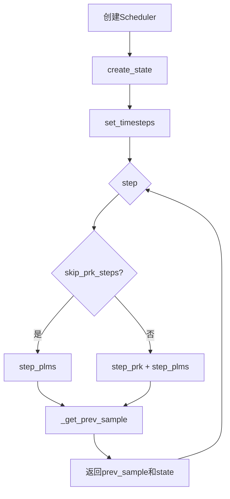
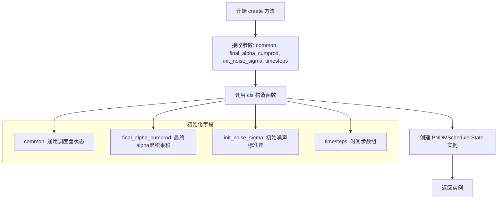
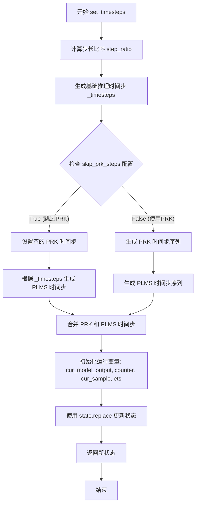
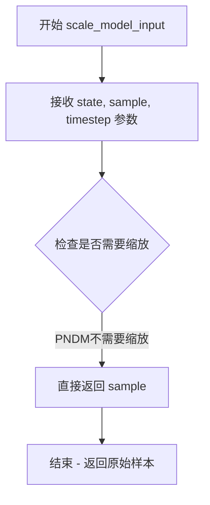
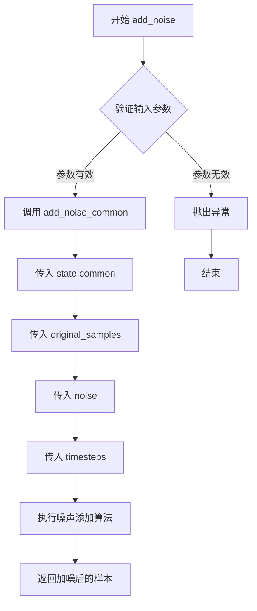
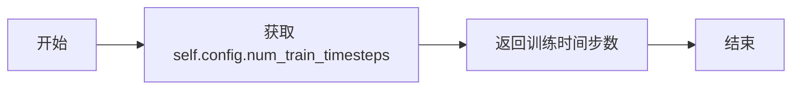

# `diffusers\src\diffusers\schedulers\scheduling_pndm_flax.py` 详细设计文档

Flax实现的PNDM（伪数值方法 for Diffusion Models）调度器，用于扩散模型的采样过程，支持Runge-Kutta (PRK) 和 PLMS 两种数值积分方法来逆转扩散过程。

## 整体流程



## 类结构

```
FlaxSchedulerOutput (抽象基类)
└── FlaxPNDMSchedulerOutput

FlaxSchedulerMixin + ConfigMixin
└── FlaxPNDMScheduler

PNDMSchedulerState (flax.struct.dataclass)
```

## 全局变量及字段


### `logger`
    
模块级日志记录器，用于记录调度器运行时的警告和信息

类型：`logging.Logger`
    


### `PNDMSchedulerState.common`
    
通用调度器状态，包含扩散过程的核心参数如alphas和betas

类型：`CommonSchedulerState`
    


### `PNDMSchedulerState.final_alpha_cumprod`
    
最终累积alpha值，用于最后一个推理步骤的边界条件处理

类型：`jnp.ndarray`
    


### `PNDMSchedulerState.init_noise_sigma`
    
初始噪声标准差，定义扩散过程起点噪声分布的标准差

类型：`jnp.ndarray`
    


### `PNDMSchedulerState.timesteps`
    
时间步数组，包含训练或推理过程中所有离散的时间步骤

类型：`jnp.ndarray`
    


### `PNDMSchedulerState.num_inference_steps`
    
推理步数，指定生成样本时使用的扩散步骤数量

类型：`int`
    


### `PNDMSchedulerState.prk_timesteps`
    
PRK方法时间步，用于Runge-Kutta采样器的时间步序列

类型：`jnp.ndarray`
    


### `PNDMSchedulerState.plms_timesteps`
    
PLMS方法时间步，用于线性多步采样器的时间步序列

类型：`jnp.ndarray`
    


### `PNDMSchedulerState.cur_model_output`
    
当前模型输出，存储扩散模型在当前步骤的预测结果

类型：`jnp.ndarray`
    


### `PNDMSchedulerState.counter`
    
计数器，记录当前执行到的步骤编号，用于切换PRK和PLMS阶段

类型：`jnp.int32`
    


### `PNDMSchedulerState.cur_sample`
    
当前样本，保存扩散过程中当前时刻的样本状态

类型：`jnp.ndarray`
    


### `PNDMSchedulerState.ets`
    
历史模型输出列表，存储用于PLMS算法的多个历史预测值

类型：`jnp.ndarray`
    


### `FlaxPNDMSchedulerOutput.prev_sample`
    
前一个样本，调度器计算出的前一个时间步的样本

类型：`jnp.ndarray`
    


### `FlaxPNDMSchedulerOutput.state`
    
调度器状态，包含PNDM调度器的完整状态信息

类型：`PNDMSchedulerState`
    


### `FlaxPNDMScheduler.dtype`
    
计算数据类型，指定调度器进行计算时使用的数据精度

类型：`jnp.dtype`
    


### `FlaxPNDMScheduler.pndm_order`
    
PNDM阶数，指定Runge-Kutta方法的阶数，默认为4

类型：`int`
    


### `FlaxPNDMScheduler._compatibles`
    
兼容的调度器列表，列出可与当前调度器兼容替换的其他调度器类型

类型：`list`
    
    

## 全局函数及方法


### `PNDMSchedulerState.create`

创建并返回一个 PNDMSchedulerState 实例，用于存储 PNDM 调度器的状态数据。

参数：

- `cls`：`type`，隐式参数，代表 PNDMSchedulerState 类本身
- `common`：`CommonSchedulerState`，通用调度器状态对象，包含扩散过程的共享参数（如 alphas_cumprod 等）
- `final_alpha_cumprod`：`jnp.ndarray`，最终的 alpha 累积乘积值，用于计算最后一步的噪声
- `init_noise_sigma`：`jnp.ndarray`，初始噪声分布的标准差，通常设为 1.0
- `timesteps`：`jnp.ndarray`，扩散过程的时间步数组，逆序排列

返回值：`PNDMSchedulerState`，新创建的调度器状态实例

#### 流程图



#### 带注释源码

```python
@classmethod
def create(
    cls,
    common: CommonSchedulerState,
    final_alpha_cumprod: jnp.ndarray,
    init_noise_sigma: jnp.ndarray,
    timesteps: jnp.ndarray,
):
    """
    类方法：创建并初始化 PNDMSchedulerState 实例
    
    该方法是 PNDMSchedulerState 的工厂方法，用于构造调度器状态对象。
    注意：部分字段（如 num_inference_steps, prk_timesteps, plms_timesteps,
    cur_model_output, counter, cur_sample, ets）未在此处初始化，将在后续
    的 set_timesteps 方法中被设置。
    
    Args:
        common (CommonSchedulerState): 通用调度器状态，包含扩散过程的核心参数
        final_alpha_cumprod (jnp.ndarray): 最终的 alpha 累积乘积，用于最后一步推导
        init_noise_sigma (jnp.ndarray): 初始噪声标准差，通常为 1.0
        timesteps (jnp.ndarray): 时间步数组，逆序排列（从大到小）
    
    Returns:
        PNDMSchedulerState: 新创建的调度器状态实例
    """
    return cls(
        common=common,
        final_alpha_cumprod=final_alpha_cumprod,
        init_noise_sigma=init_noise_sigma,
        timesteps=timesteps,
    )
```


### FlaxPNDMScheduler.create_state

创建PNDM调度器的状态对象，初始化扩散模型推理所需的全部状态变量，包括时间步、噪声标准差、alpha累积乘积等核心参数，为后续的采样过程做好准备。

参数：

- `self`：`FlaxPNDMScheduler`，调度器实例本身
- `common`：`CommonSchedulerState | None`，可选的通用调度器状态，如果为None则自动创建

返回值：`PNDMSchedulerState`，返回新创建的PNDM调度器状态对象，包含所有推理所需的初始化状态

#### 流程图

```mermaid
flowchart TD
    A[开始 create_state] --> B{检查 common 参数}
    B -->|common is None| C[调用 CommonSchedulerState.create 创建通用状态]
    B -->|common 不为 None| D[使用传入的 common]
    C --> E[计算 final_alpha_cumprod]
    D --> E
    E --> F{self.config.set_alpha_to_one?}
    F -->|True| G[final_alpha_cumprod = 1.0]
    F -->|False| H[final_alpha_cumprod = common.alphas_cumprod[0]]
    G --> I[创建 init_noise_sigma = 1.0]
    H --> I
    I --> J[生成 timesteps: 0 到 num_train_timesteps-1 的倒序数组]
    J --> K[调用 PNDMSchedulerState.create 创建并返回状态对象]
```

#### 带注释源码

```python
def create_state(self, common: CommonSchedulerState | None = None) -> PNDMSchedulerState:
    """
    创建PNDM调度器的状态对象，初始化推理所需的所有状态变量
    
    参数:
        common: 可选的通用调度器状态，如果为None则自动创建
    
    返回:
        PNDMSchedulerState: 包含初始化状态的调度器状态对象
    """
    
    # 如果没有提供通用状态，则创建一个
    if common is None:
        common = CommonSchedulerState.create(self)

    # 在DDIM的每一步，我们都需要查看之前的alpha累积乘积
    # 对于最后一步，没有之前的alpha累积乘积，因为我们已经到达0
    # set_alpha_to_one 参数决定是将此参数简单设置为1，
    # 还是使用"非前一个"alpha值
    final_alpha_cumprod = (
        jnp.array(1.0, dtype=self.dtype) if self.config.set_alpha_to_one else common.alphas_cumprod[0]
    )

    # 初始噪声分布的标准差
    init_noise_sigma = jnp.array(1.0, dtype=self.dtype)

    # 生成时间步：从0到训练时间步数-1，然后反转顺序
    timesteps = jnp.arange(0, self.config.num_train_timesteps).round()[::-1]

    # 创建并返回PNDM调度器状态对象
    return PNDMSchedulerState.create(
        common=common,                      # 通用调度器状态（包含alphas等）
        final_alpha_cumprod=final_alpha_cumprod,  # 最终alpha累积乘积
        init_noise_sigma=init_noise_sigma,  # 初始噪声标准差
        timesteps=timesteps,                # 完整的时间步数组
    )
```


### `FlaxPNDMScheduler.set_timesteps`

该函数用于设置扩散链中使用的离散时间步，是在模型推理开始前运行的支持函数。它会根据推理步数和配置计算并初始化 PRK（Runge-Kutta）和 PLMS（线性多步法）所需的时间步序列，以及相关的运行状态变量。

参数：

- `self`：`FlaxPNDMScheduler` 实例本身（隐式参数）。
- `state`：`PNDMSchedulerState`，FlaxPNDMScheduler 的状态数据类实例，包含当前调度器的状态。
- `num_inference_steps`：`int`，使用预训练模型生成样本时使用的扩散推理步数。
- `shape`：`tuple`，要生成的样本的形状（例如图像的 (B, C, H, W)）。

返回值：`PNDMSchedulerState`，更新后的调度器状态对象，包含计算出的时间步和初始化变量。

#### 流程图



#### 带注释源码

```python
def set_timesteps(self, state: PNDMSchedulerState, num_inference_steps: int, shape: tuple) -> PNDMSchedulerState:
    """
    Sets the discrete timesteps used for the diffusion chain. Supporting function to be run before inference.

    Args:
        state (`PNDMSchedulerState`):
            the `FlaxPNDMScheduler` state data class instance.
        num_inference_steps (`int`):
            the number of diffusion steps used when generating samples with a pre-trained model.
        shape (`tuple`):
            the shape of the samples to be generated.
    """

    # 1. 计算步长比率：将训练时的总步数均匀分配到推理步数中
    step_ratio = self.config.num_train_timesteps // num_inference_steps
    
    # 2. 生成整数时间步：通过乘以比率并四舍五入得到具体的时间点索引
    # 避免当 num_inference_step 是 3 的幂次时出现的问题，加上偏移量 steps_offset
    _timesteps = (jnp.arange(0, num_inference_steps) * step_ratio).round() + self.config.steps_offset

    # 3. 根据是否跳过 PRK 步骤来生成不同的时间步序列
    if self.config.skip_prk_steps:
        # 对于类似 Stable Diffusion 的模型，可以跳过 PRK 步骤以获得更好的结果
        # 此时实现基于 PLMS (Pseudo Linear Multi-Step) 方法
        
        # PRK 步骤为空
        prk_timesteps = jnp.array([], dtype=jnp.int32)
        # 构建 PLMS 特定的时间步：通过拼接和反转 _timesteps 的尾部部分
        plms_timesteps = jnp.concatenate([_timesteps[:-1], _timesteps[-2:-1], _timesteps[-1:]])[::-1]

    else:
        # 使用完整的 PNDM 算法：包含 PRK (Runge-Kutta) 和 PLMS 步骤
        
        # 生成 PRK 时间步：重复最后 pndm_order 个时间步，并添加偏移量
        # 这是一个复杂的索引操作，用于在 PRK 阶段模拟中间步骤
        prk_timesteps = _timesteps[-self.pndm_order :].repeat(2) + jnp.tile(
            jnp.array(
                [0, self.config.num_train_timesteps // num_inference_steps // 2],
                dtype=jnp.int32,
            ),
            self.pndm_order,
        )
        # 进一步处理 PRK 时间步，调整顺序和重复
        prk_timesteps = (prk_timesteps[:-1].repeat(2)[1:-1])[::-1]
        
        # 生成 PLMS 时间步：取前面的时间步并反转
        plms_timesteps = _timesteps[:-3][::-1]

    # 4. 合并所有时间步：PRK 步骤在前，PLMS 步骤在后
    timesteps = jnp.concatenate([prk_timesteps, plms_timesteps])

    # 5. 初始化运行所需的变量
    
    # 当前模型输出，初始化为零
    cur_model_output = jnp.zeros(shape, dtype=self.dtype)
    # 计数器，用于追踪当前执行的步骤索引
    counter = jnp.int32(0)
    # 当前样本，初始化为零
    cur_sample = jnp.zeros(shape, dtype=self.dtype)
    # 额外的时间步历史 (Extra Timesteps)，用于存储模型输出的历史记录以进行线性组合
    ets = jnp.zeros((4,) + shape, dtype=self.dtype)

    # 6. 更新状态并返回
    return state.replace(
        timesteps=timesteps,
        num_inference_steps=num_inference_steps,
        prk_timesteps=prk_timesteps,
        plms_timesteps=plms_timesteps,
        cur_model_output=cur_model_output,
        counter=counter,
        cur_sample=cur_sample,
        ets=ets,
    )
```


### `FlaxPNDMScheduler.scale_model_input`

确保与需要根据当前时间步缩放去噪模型输入的调度器互换性。该方法在 PNDM 调度器中是一个简单的直通实现，直接返回输入样本而不进行任何缩放操作。

参数：

- `self`：`FlaxPNDMScheduler`，调度器实例本身
- `state`：`PNDMSchedulerState`，FlaxPNDMScheduler 状态数据类实例，包含调度器的当前状态信息
- `sample`：`jnp.ndarray`，输入样本，即需要返回（或可能需要缩放）的样本
- `timestep`：`int | None`，当前时间步（可选参数）

返回值：`jnp.ndarray`，缩放后的输入样本（在本实现中直接返回原始样本）

#### 流程图



#### 带注释源码

```python
def scale_model_input(
    self,
    state: PNDMSchedulerState,
    sample: jnp.ndarray,
    timestep: int | None = None,
) -> jnp.ndarray:
    """
    Ensures interchangeability with schedulers that need to scale the denoising model input depending on the
    current timestep.

    Args:
        state (`PNDMSchedulerState`): the `FlaxPNDMScheduler` state data class instance.
        sample (`jnp.ndarray`): input sample
        timestep (`int`, optional): current timestep

    Returns:
        `jnp.ndarray`: scaled input sample
    """
    # PNDM调度器不需要对输入进行缩放，直接返回原始样本
    # 这是为了保持与其他需要缩放的调度器（如DDIMScheduler）的接口一致性
    return sample
```


### `FlaxPNDMScheduler.step`

预测前一个时间步的样本，通过反向SDE（随机微分方程）传播扩散过程。这是核心函数，用于根据学习到的扩散模型输出（通常为预测的噪声）推进扩散过程。该函数根据内部计数器变量`counter`调用`step_prk()`（Runge-Kutta方法）或`step_plms()`（线性多步法）来执行推理。

参数：

- `state`：`PNDMSchedulerState`，FlaxPNDMScheduler 状态数据类实例，包含调度器的当前状态信息
- `model_output`：`jnp.ndarray`，来自已训练扩散模型的直接输出，通常是预测的噪声
- `timestep`：`int`，扩散链中的当前离散时间步
- `sample`：`jnp.ndarray`，扩散过程正在创建的当前样本实例
- `return_dict`：`bool`，是否返回 FlaxPNDMSchedulerOutput 类，True 返回对象，False 返回元组

返回值：`FlaxPNDMSchedulerOutput | tuple`，当 `return_dict` 为 True 时返回 `FlaxPNDMSchedulerOutput` 对象，否则返回元组。当返回元组时，第一个元素是样本张量

#### 流程图

```mermaid
flowchart TD
    A[step 方法入口] --> B{num_inference_steps 是否为 None}
    B -->|是| C[抛出 ValueError: 需要先运行 set_timesteps]
    B -->|否| D{skip_prk_steps 配置}
    
    D -->|True| E[调用 step_plms 方法]
    D -->|False| F[并行调用 step_prk 和 step_plms]
    
    E --> G[获取 prev_sample 和更新后的 state]
    F --> H[获取 prk_prev_sample 和 plms_prev_sample]
    H --> I{counter < len(prk_timesteps)}
    
    I -->|True| J[选择 prk_prev_sample]
    I -->|False| K[选择 plms_prev_sample]
    
    J --> L[根据条件更新 state 字段]
    K --> L
    
    L --> M{return_dict 为 True?}
    M -->|是| N[返回 FlaxPNDMSchedulerOutput]
    M -->|否| O[返回 tuple: (prev_sample, state)]
    
    G --> M
    N --> P[结束]
    O --> P
```

#### 带注释源码

```python
def step(
    self,
    state: PNDMSchedulerState,
    model_output: jnp.ndarray,
    timestep: int,
    sample: jnp.ndarray,
    return_dict: bool = True,
) -> FlaxPNDMSchedulerOutput | tuple:
    """
    Predict the sample at the previous timestep by reversing the SDE. Core function to propagate the diffusion
    process from the learned model outputs (most often the predicted noise).

    This function calls `step_prk()` or `step_plms()` depending on the internal variable `counter`.

    Args:
        state (`PNDMSchedulerState`): the `FlaxPNDMScheduler` state data class instance.
        model_output (`jnp.ndarray`): direct output from learned diffusion model.
        timestep (`int`): current discrete timestep in the diffusion chain.
        sample (`jnp.ndarray`):
            current instance of sample being created by diffusion process.
        return_dict (`bool`): option for returning tuple rather than FlaxPNDMSchedulerOutput class

    Returns:
        [`FlaxPNDMSchedulerOutput`] or `tuple`: [`FlaxPNDMSchedulerOutput`] if `return_dict` is True, otherwise a
        `tuple`. When returning a tuple, the first element is the sample tensor.

    """

    # 检查是否已设置推理步数，若未设置则抛出异常
    if state.num_inference_steps is None:
        raise ValueError(
            "Number of inference steps is 'None', you need to run 'set_timesteps' after creating the scheduler"
        )

    # 根据 skip_prk_steps 配置选择不同的推理策略
    if self.config.skip_prk_steps:
        # 跳过 PRK 步骤，直接使用 PLMS 方法（伪线性多步采样器）
        prev_sample, state = self.step_plms(state, model_output, timestep, sample)
    else:
        # 同时运行 PRK（Runge-Kutta 方法）和 PLMS 步骤
        # PRK 步骤用于前几次迭代，之后切换到 PLMS
        prk_prev_sample, prk_state = self.step_prk(state, model_output, timestep, sample)
        plms_prev_sample, plms_state = self.step_plms(state, model_output, timestep, sample)

        # 根据计数器判断当前应该使用哪种方法的结果
        # counter < len(prk_timesteps) 时使用 PRK 结果，否则使用 PLMS 结果
        cond = state.counter < len(state.prk_timesteps)

        # 使用 jax.lax.select 根据条件选择前一个样本
        prev_sample = jax.lax.select(cond, prk_prev_sample, plms_prev_sample)

        # 根据条件更新状态字段（cur_model_output, ets, cur_sample, counter）
        state = state.replace(
            cur_model_output=jax.lax.select(cond, prk_state.cur_model_output, plms_state.cur_model_output),
            ets=jax.lax.select(cond, prk_state.ets, plms_state.ets),
            cur_sample=jax.lax.select(cond, prk_state.cur_sample, plms_state.cur_sample),
            counter=jax.lax.select(cond, prk_state.counter, plms_state.counter),
        )

    # 根据 return_dict 参数决定返回值格式
    if not return_dict:
        return (prev_sample, state)

    return FlaxPNDMSchedulerOutput(prev_sample=prev_sample, state=state)
```


### `FlaxPNDMScheduler.step_prk`

该方法是FlaxPNDMScheduler中的Runge-Kutta（RK）方法步骤实现，用于通过4次前向传递来近似求解微分方程，是PNDM（伪数值方法 for 扩散模型）采样器的核心组成部分。

参数：

- `self`：`FlaxPNDMScheduler`实例，调度器对象本身
- `state`：`PNDMSchedulerState`，FlaxPNDMScheduler的状态数据类实例，包含当前调度器的运行状态
- `model_output`：`jnp.ndarray`，来自已学习扩散模型的直接输出（通常是预测的噪声）
- `timestep`：`int`，扩散链中的当前离散时间步
- `sample`：`jnp.ndarray`，扩散过程正在创建的当前样本实例

返回值：`FlaxPNDMSchedulerOutput | tuple`，当`return_dict`为True时返回`FlaxPNDMSchedulerOutput`，否则返回元组，第一个元素是样本张量

#### 流程图

```mermaid
flowchart TD
    A[开始 step_prk] --> B{检查 num_inference_steps 是否为 None}
    B -->|是| C[抛出 ValueError]
    B -->|否| D[计算 diff_to_prev 和 prev_timestep]
    D --> E[根据 counter%4 选择模型输出]
    E --> F[更新 state.cur_model_output]
    F --> G[更新 state.ets]
    G --> H[更新 state.cur_sample]
    H --> I[从 state 获取 cur_sample]
    I --> J[调用 _get_prev_sample 计算 prev_sample]
    J --> K[counter + 1]
    K --> L[返回 (prev_sample, state)]
```

#### 带注释源码

```python
def step_prk(
    self,
    state: PNDMSchedulerState,
    model_output: jnp.ndarray,
    timestep: int,
    sample: jnp.ndarray,
) -> FlaxPNDMSchedulerOutput | tuple:
    """
    Step function propagating the sample with the Runge-Kutta method. RK takes 4 forward passes to approximate the
    solution to the differential equation.

    Args:
        state (`PNDMSchedulerState`): the `FlaxPNDMScheduler` state data class instance.
        model_output (`jnp.ndarray`): direct output from learned diffusion model.
        timestep (`int`): current discrete timestep in the diffusion chain.
        sample (`jnp.ndarray`):
            current instance of sample being created by diffusion process.
        return_dict (`bool`): option for returning tuple rather than FlaxPNDMSchedulerOutput class

    Returns:
        [`FlaxPNDMSchedulerOutput`] or `tuple`: [`FlaxPNDMSchedulerOutput`] if `return_dict` is True, otherwise a
        `tuple`. When returning a tuple, the first element is the sample tensor.

    """

    # 检查是否已设置推理步数，若未设置则抛出错误
    if state.num_inference_steps is None:
        raise ValueError(
            "Number of inference steps is 'None', you need to run 'set_timesteps' after creating the scheduler"
        )

    # 计算与前一步的时间差
    # 当counter为偶数时，diff_to_prev为0；为奇数时为步长的一半
    diff_to_prev = jnp.where(
        state.counter % 2,
        0,
        self.config.num_train_timesteps // state.num_inference_steps // 2,
    )
    # 计算前一个时间步
    prev_timestep = timestep - diff_to_prev
    # 根据counter计算当前RK阶段对应的时间步
    timestep = state.prk_timesteps[state.counter // 4 * 4]

    # RK方法的模型输出累积
    # 当counter%4不等于3时，直接使用当前model_output
    # 当counter%4等于3时，将累积的model_output加上当前输出的1/6
    model_output = jax.lax.select(
        (state.counter % 4) != 3,
        model_output,  # remainder 0, 1, 2
        state.cur_model_output + 1 / 6 * model_output,  # remainder 3
    )

    # 更新状态：累积模型输出、存储历史输出、当前样本
    # 根据counter%4的值选择不同的累积系数（RK4系数：1/6, 1/3, 1/3, 0）
    state = state.replace(
        cur_model_output=jax.lax.select_n(
            state.counter % 4,
            state.cur_model_output + 1 / 6 * model_output,  # remainder 0
            state.cur_model_output + 1 / 3 * model_output,  # remainder 1
            state.cur_model_output + 1 / 3 * model_output,  # remainder 2
            jnp.zeros_like(state.cur_model_output),  # remainder 3
        ),
        # 当counter%4等于0时，更新ets（保存前4个模型输出）
        ets=jax.lax.select(
            (state.counter % 4) == 0,
            state.ets.at[0:3].set(state.ets[1:4]).at[3].set(model_output),  # remainder 0
            state.ets,  # remainder 1, 2, 3
        ),
        # 当counter%4等于0时，更新当前样本
        cur_sample=jax.lax.select(
            (state.counter % 4) == 0,
            sample,  # remainder 0
            state.cur_sample,  # remainder 1, 2, 3
        ),
    )

    # 从更新后的状态获取当前样本
    cur_sample = state.cur_sample
    # 调用内部方法计算前一个样本（根据PNDM论文公式9）
    prev_sample = self._get_prev_sample(state, cur_sample, timestep, prev_timestep, model_output)
    # 计数器加1，准备下一步
    state = state.replace(counter=state.counter + 1)

    return (prev_sample, state)
```


### `FlaxPNDMScheduler.step_plms`

该函数使用线性多步法（PLMS）对扩散模型的输出进行单次前向传播，以近似求解微分方程，从而在扩散链上从当前时间步反向推断出前一个样本。

参数：

- `state`：`PNDMSchedulerState`，FlaxPNDMScheduler 状态数据类实例
- `model_output`：`jnp.ndarray`，学习扩散模型的直接输出
- `timestep`：`int`，扩散链中的当前离散时间步
- `sample`：`jnp.ndarray`，当前正在由扩散过程创建的样本实例

返回值：`FlaxPNDMSchedulerOutput | tuple`，若 `return_dict` 为 True 则返回 FlaxPNDMSchedulerOutput，否则返回元组。当返回元组时，第一个元素是样本张量，第二个是更新后的调度器状态。

#### 流程图

```mermaid
flowchart TD
    A[开始 step_plms] --> B{num_inference_steps 是否为 None?}
    B -->|是| C[抛出 ValueError]
    B -->|否| D[计算 prev_timestep]
    D --> E{counter == 1?}
    E -->|是| F[prev_timestep = timestep]
    E -->|否| G[prev_timestep 保持计算值]
    F --> H[timestep 加上步长]
    G --> I[timestep 保持原值]
    H --> J[更新 ets 数组]
    I --> J
    J --> K{根据 counter 值<br/>计算 cur_model_output}
    K --> L[counter=0: model_output]
    K --> M[counter=1: (model_output + ets[-1]) / 2]
    K --> N[counter=2: (3*ets[-1] - ets[-2]) / 2]
    K --> O[counter=3: (23*ets[-1] - 16*ets[-2] + 5*ets[-3]) / 12]
    K --> P[counter>=4: (55*ets[-1] - 59*ets[-2] + 37*ets[-3] - 9*ets[-4]) / 24]
    L --> Q[调用 _get_prev_sample 计算 prev_sample]
    M --> Q
    N --> Q
    O --> Q
    P --> Q
    Q --> R[counter += 1]
    R --> S[返回 prev_sample 和 state]
```

#### 带注释源码

```python
def step_plms(
    self,
    state: PNDMSchedulerState,
    model_output: jnp.ndarray,
    timestep: int,
    sample: jnp.ndarray,
) -> FlaxPNDMSchedulerOutput | tuple:
    """
    Step function propagating the sample with the linear multi-step method. This has one forward pass with multiple
    times to approximate the solution.

    Args:
        state (`PNDMSchedulerState`): the `FlaxPNDMScheduler` state data class instance.
        model_output (`jnp.ndarray`): direct output from learned diffusion model.
        timestep (`int`): current discrete timestep in the diffusion chain.
        sample (`jnp.ndarray`):
            current instance of sample being created by diffusion process.
        return_dict (`bool`): option for returning tuple rather than FlaxPNDMSchedulerOutput class

    Returns:
        [`FlaxPNDMSchedulerOutput`] or `tuple`: [`FlaxPNDMSchedulerOutput`] if `return_dict` is True, otherwise a
        `tuple`. When returning a tuple, the first element is the sample tensor.

    """

    # 检查是否已设置推理步数，若未设置则抛出错误
    if state.num_inference_steps is None:
        raise ValueError(
            "Number of inference steps is 'None', you need to run 'set_timesteps' after creating the scheduler"
        )

    # 计算前一个时间步：当前时间步减去每步的时间间隔
    prev_timestep = timestep - self.config.num_train_timesteps // state.num_inference_steps
    # 确保 prev_timestep 不小于 0
    prev_timestep = jnp.where(prev_timestep > 0, prev_timestep, 0)

    # 根据 counter 值调整时间步
    # 若 counter == 1，则 prev_timestep 等于当前 timestep（特殊处理首次迭代）
    prev_timestep = jnp.where(state.counter == 1, timestep, prev_timestep)
    # 若 counter == 1，则 timestep 需要前进一个步长
    timestep = jnp.where(
        state.counter == 1,
        timestep + self.config.num_train_timesteps // state.num_inference_steps,
        timestep,
    )

    # 更新 ets（模型输出的历史记录）和 cur_sample
    # ets 用于存储历史模型输出以进行线性多步计算
    state = state.replace(
        ets=jax.lax.select(
            state.counter != 1,
            # 当 counter != 1 时，将 ets 数组向左移动并添加新的 model_output
            state.ets.at[0:3].set(state.ets[1:4]).at[3].set(model_output),  # counter != 1
            state.ets,  # counter 1
        ),
        cur_sample=jax.lax.select(
            state.counter != 1,
            sample,  # counter != 1
            state.cur_sample,  # counter 1
        ),
    )

    # 根据 counter 值使用不同的线性多步公式计算当前模型输出
    # 这些系数对应 PNDM 论文中的公式
    state = state.replace(
        cur_model_output=jax.lax.select_n(
            jnp.clip(state.counter, 0, 4),
            model_output,  # counter 0: 首次使用原始输出
            (model_output + state.ets[-1]) / 2,  # counter 1: 两次输出的平均值
            (3 * state.ets[-1] - state.ets[-2]) / 2,  # counter 2: 二阶线性组合
            (23 * state.ets[-1] - 16 * state.ets[-2] + 5 * state.ets[-3]) / 12,  # counter 3: 三阶线性组合
            (1 / 24)
            * (55 * state.ets[-1] - 59 * state.ets[-2] + 37 * state.ets[-3] - 9 * state.ets[-4]),  # counter >= 4: 四阶线性组合
        ),
    )

    # 使用更新后的状态计算前一个样本
    sample = state.cur_sample
    model_output = state.cur_model_output
    prev_sample = self._get_prev_sample(state, sample, timestep, prev_timestep, model_output)
    # 增加计数器，准备下一次迭代
    state = state.replace(counter=state.counter + 1)

    return (prev_sample, state)
```


### `FlaxPNDMScheduler._get_prev_sample`

根据PNDM论文公式(9)计算扩散过程中前一个时间步的样本，是PNDM调度器逆向扩散过程的核心计算函数。

参数：

- `state`：`PNDMSchedulerState`，PNDM调度器的状态数据类，包含alphas_cumprod等关键状态信息
- `sample`：`jnp.ndarray`，当前扩散过程中的样本 $x_t$
- `timestep`：`int`，当前离散时间步 $t$
- `prev_timestep`：`int`，前一个时间步 $t-\delta$
- `model_output`：`jnp.ndarray`，扩散模型预测的噪声 $\epsilon_\theta(x_t, t)$

返回值：`jnp.ndarray`，计算得到的前一个时间步样本 $x_{t-\delta}$

#### 流程图

```mermaid
flowchart TD
    A[开始 _get_prev_sample] --> B[获取 alpha_prod_t = alphas_cumprod[timestep]]
    B --> C[计算 alpha_prod_t_prev<br/>如果 prev_timestep >= 0<br/>使用 alphas_cumprod[prev_timestep]<br/>否则使用 final_alpha_cumprod]
    C --> D[计算 beta_prod_t = 1 - alpha_prod_t]
    D --> E[计算 beta_prod_t_prev = 1 - alpha_prod_t_prev]
    E --> F{预测类型是<br/>v_prediction?}
    F -->|是| G[model_output = α_t^0.5 * model_output + β_t^0.5 * sample]
    F -->|否| H{预测类型是<br/>epsilon?}
    G --> I
    H -->|是| I[继续]
    H -->|否| J[抛出 ValueError]
    J --> K[结束]
    I --> L[计算 sample_coeff<br/>sqrt(alpha_prod_t_prev / alpha_prod_t)]
    L --> M[计算 model_output_denom_coeff<br/>α_t * sqrt(β_t_prev) + sqrt(α_t * β_t * α_t_prev)]
    M --> N[计算 prev_sample<br/>sample_coeff * sample - (α_t_prev - α_t) * model_output / model_output_denom_coeff]
    N --> O[返回 prev_sample]
    O --> P[结束]
```

#### 带注释源码

```python
def _get_prev_sample(self, state: PNDMSchedulerState, sample, timestep, prev_timestep, model_output):
    # 参考 PNDM 论文公式 (9): https://huggingface.co/papers/2202.09778
    # 此函数使用公式 (9) 计算 x_(t-δ)
    # 注意：x_t 需要加到等式两边
    
    # 符号对照 (<变量名> -> <论文中的名称>
    # alpha_prod_t -> α_t
    # alpha_prod_t_prev -> α_(t-δ)
    # beta_prod_t -> (1 - α_t)
    # beta_prod_t_prev -> (1 - α_(t-δ))
    # sample -> x_t
    # model_output -> e_θ(x_t, t)
    # prev_sample -> x_(t-δ)
    
    # 获取当前时间步的alpha累积乘积 α_t
    alpha_prod_t = state.common.alphas_cumprod[timestep]
    
    # 获取前一个时间步的alpha累积乘积 α_(t-δ)
    # 如果 prev_timestep >= 0，使用对应索引的值
    # 否则使用 final_alpha_cumprod（最后一个alpha值，通常为1）
    alpha_prod_t_prev = jnp.where(
        prev_timestep >= 0,
        state.common.alphas_cumprod[prev_timestep],
        state.final_alpha_cumprod,
    )
    
    # 计算当前时间步的beta累积乘积 (1 - α_t)
    beta_prod_t = 1 - alpha_prod_t
    
    # 计算前一个时间步的beta累积乘积 (1 - α_(t-δ))
    beta_prod_t_prev = 1 - alpha_prod_t_prev

    # 如果预测类型是 v_prediction，需要对 model_output 进行转换
    # 公式: v = α_t^0.5 * ε - β_t^0.5 * x_t
    # 反向: ε = α_t^0.5 * v + β_t^0.5 * x_t
    if self.config.prediction_type == "v_prediction":
        model_output = (alpha_prod_t**0.5) * model_output + (beta_prod_t**0.5) * sample
    elif self.config.prediction_type != "epsilon":
        raise ValueError(
            f"prediction_type given as {self.config.prediction_type} must be one of `epsilon` or `v_prediction`"
        )

    # 对应公式 (9) 中 x_t 的分母部分
    # 注意: (α_(t-δ) - α_t) / (sqrt(α_t) * (sqrt(α_(t-δ)) + sqr(α_t))) =
    # sqrt(α_(t-δ)) / sqrt(α_t))
    # 计算样本系数 sample_coeff = sqrt(α_(t-δ) / α_t)
    sample_coeff = (alpha_prod_t_prev / alpha_prod_t) ** (0.5)

    # 对应公式 (9) 中 e_θ(x_t, t) 的分母系数
    # denominator = α_t * sqrt(β_t_prev) + sqrt(α_t * β_t * α_t_prev)
    model_output_denom_coeff = alpha_prod_t * beta_prod_t_prev ** (0.5) + (
        alpha_prod_t * beta_prod_t * alpha_prod_t_prev
    ) ** (0.5)

    # 完整的公式 (9):
    # x_(t-δ) = sample_coeff * x_t - (α_(t-δ) - α_t) * e_θ(x_t, t) / model_output_denom_coeff
    prev_sample = (
        sample_coeff * sample - (alpha_prod_t_prev - alpha_prod_t) * model_output / model_output_denom_coeff
    )

    return prev_sample
```


### `FlaxPNDMScheduler.add_noise`

为原始样本添加噪声的核心方法，通过委托给通用的噪声添加函数实现扩散过程中的前向噪声添加。

参数：

- `self`：`FlaxPNDMScheduler`，Flax PNDM调度器实例（隐式参数）
- `state`：`PNDMSchedulerState`，PNDM调度器状态数据类实例，包含调度器的当前状态信息
- `original_samples`：`jnp.ndarray`，需要进行噪声处理的原始样本张量
- `noise`：`jnp.ndarray`，要添加到样本中的噪声张量
- `timesteps`：`jnp.ndarray`，对应每个样本的时间步索引，用于确定噪声添加的强度

返回值：`jnp.ndarray`，添加噪声后的样本张量

#### 流程图



#### 带注释源码

```python
def add_noise(
    self,
    state: PNDMSchedulerState,
    original_samples: jnp.ndarray,
    noise: jnp.ndarray,
    timesteps: jnp.ndarray,
) -> jnp.ndarray:
    """
    为原始样本添加噪声。

    该方法是扩散模型前向过程的核心组成部分，根据给定的时间步
    将噪声按照预设的调度方案添加到原始样本中。

    Args:
        state (PNDMSchedulerState): 调度器的状态对象，包含如alpha累积积等关键参数
        original_samples (jnp.ndarray): 未经噪声处理的原始样本
        noise (jnp.ndarray): 符合样本形状的噪声张量
        timesteps (jnp.ndarray): 时间步数组，决定每个样本点添加噪声的程度

    Returns:
        jnp.ndarray: 添加噪声后的样本，与输入original_samples形状相同
    """
    # 委托给通用的噪声添加函数实现具体逻辑
    # 该通用函数根据时间步和调度器状态计算噪声权重
    return add_noise_common(state.common, original_samples, noise, timesteps)
```


### `FlaxPNDMScheduler.__len__`

返回调度器配置的训练时间步数量，使调度器可以像标准 Python 容器一样通过 `len()` 函数获取训练步数。

参数：

- `self`：`FlaxPNDMScheduler`，隐式参数，调度器实例自身

返回值：`int`，返回 `self.config.num_train_timesteps`，即训练时使用的扩散步数（默认为 1000）

#### 流程图



#### 带注释源码

```
def __len__(self):
    """
    返回调度器配置的训练时间步数量。
    
    该方法实现了 Python 的魔术方法 __len__，使得调度器对象可以直接通过
    len(scheduler) 的方式获取训练时间步数。这符合 Python 的容器协议，
    允许调度器在需要获取总步数的场景中以一致的方式被使用。
    
    Returns:
        int: 配置中定义的训练时间步数，通常为 1000
    """
    return self.config.num_train_timesteps
```

## 关键组件


### PNDMSchedulerState

Flax结构化数据类，存储PNDM调度器的运行时状态，包括公共状态、最终累积alpha值、可设置的时间步与推理步骤数、运行中的模型输出、计数器和当前样本及ETS缓冲区。

### FlaxPNDMScheduler

主调度器类，实现了PNDM（伪数值方法用于扩散模型）算法，支持Runge-Kutta方法和线性多步方法进行ODE求解。包含调度器配置、时间步设置、模型输入缩放、主步骤分发、PRK/PLMS步骤执行等功能。

### 张量索引与惰性加载

通过jnp数组索引访问alphas_cumprod、使用jax.lax.select和jax.lax.select_n进行条件选择实现惰性加载，避免不必要的计算分支。

### 反量化支持

通过config.prediction_type参数支持epsilon和v_prediction两种预测类型，_get_prev_sample方法中实现了v_prediction的反量化转换逻辑。

### PRK步骤 (step_prk)

实现Runge-Kutta方法的4步前向传递，通过counter状态管理迭代，使用ETS缓冲区存储历史模型输出，计算前一时间步样本。

### PLMS步骤 (step_plms)

实现线性多步方法，根据counter状态选择不同的系数计算模型输出，支持1-4阶历史预测，使用ETS队列管理历史值。

### 时间步设置 (set_timesteps)

根据推理步骤数生成离散时间步，支持skip_prk_steps选项跳过Runge-Kutta步骤，初始化运行所需的各种缓冲区和计数器。

### 前一样本计算 (_get_prev_sample)

实现PNDM论文公式(9)，根据累积alpha值和预测噪声计算前一时间步的样本，支持epsilon和v_prediction两种预测类型。

### CommonSchedulerState

从scheduling_utils_flax导入的公共调度器状态类，提供alpha计算和公共状态管理功能。

### FlaxSchedulerMixin

混合类，提供调度器通用的保存和加载功能，通过ConfigMixin注册配置属性。

### add_noise_common

从scheduling_utils_flax导入的公共噪声添加函数，用于在训练或推理时向样本添加噪声。


## 问题及建议


### 已知问题

- **Flax类已弃用**：代码中存在显式的弃用警告，鼓励迁移到PyTorch实现或固定Diffusers版本，这是长期维护的重大技术债务。
- **硬编码的PNDM阶数**：`pndm_order`在`__init__`中硬编码为4，但被定义为类属性`dtype: jnp.dtype`，存在设计不一致。
- **类型注解不完整**：部分方法参数缺少类型注解，如`_get_prev_sample`方法中的`sample`参数。
- **缺少输入验证**：构造函数中未验证`dtype`是否为有效的JAX数据类型，`beta_schedule`等参数也未校验合法性。
- **魔法数字**：代码中多处使用魔法数字（如4、6、3、24、55等）而未定义为常量，降低了可读性和可维护性。
- **注释掉的参考代码**：`step_prk`和`step_plms`方法中保留了冗余的注释掉的参考代码，增加了代码复杂度。
- **重复的计算逻辑**：`step_prk`和`step_plms`中存在相似的状态更新逻辑，可提取为公共方法。
- **`_compatibles`未充分使用**：虽然定义了`_compatibles`类属性，但并未在实际调度逻辑中发挥实际作用。
- **状态管理的复杂性**：`PNDMSchedulerState`包含大量可设置字段，状态流转逻辑复杂，容易导致潜在的状态不一致问题。
- **错误信息可改进**：部分错误信息较为简单，例如`prediction_type`的验证错误信息可以更详细。

### 优化建议

- **移除或迁移Flax代码**：考虑将此类标记为仅用于向后兼容，并创建对应的PyTorch版本或使用版本固定策略。
- **提取常量**：将所有魔法数字提取为类级别常量或配置参数，提高可读性。
- **增强输入验证**：在构造函数中添加参数校验逻辑，确保`beta_schedule`、`prediction_type`等参数的有效性。
- **简化状态管理**：考虑将复杂的状态更新逻辑拆分为更小的、职责单一的方法或函数。
- **清理注释代码**：移除所有注释掉的参考代码块，保持代码库整洁。
- **完善类型注解**：为所有方法参数添加完整的类型注解，包括返回类型的详细说明。
- **添加JAX特定优化**：检查是否可以通过`jax.lax.scan`等API优化循环计算，提升推理性能。
- **改进文档**：为`_get_prev_sample`等数学计算密集的方法添加更详细的公式说明和参考文献链接。

## 其它


### 设计目标与约束

1. **核心设计目标**：实现PNDM（Pseudo Numerical Methods for Diffusion Models）调度器，支持使用Runge-Kutta方法（PRK）和线性多步方法（PLMS）进行高级ODE积分，以更高效地反向扩散过程采样。
2. **框架约束**：基于Flax/JAX实现，利用其函数式编程模型和即时编译（JIT）优化性能。
3. **兼容性约束**：遵循`ConfigMixin`和`FlaxSchedulerMixin`接口规范，确保与Diffusers库中其他调度器的一致性。
4. **配置约束**：仅支持`epsilon`、`sample`和`v_prediction`三种预测类型，默认使用`epsilon`预测。
5. **版本约束**：代码标注为已弃用，建议迁移至PyTorch实现或锁定Diffusers版本。

### 错误处理与异常设计

1. **未初始化错误**：在`step()`、`step_prk()`和`step_plms()`方法中，若检测到`state.num_inference_steps`为`None`，抛出`ValueError`并提示需先运行`set_timesteps`方法。
2. **预测类型验证**：在`_get_prev_sample()`方法中，若`prediction_type`不是`epsilon`或`v_prediction`，抛出`ValueError`明确列出可用的预测类型。
3. **运行时类型检查**：大量使用`jax.lax.select`和`jax.lax.select_n`进行条件分支，避免Python层面的if-else分支以保持JIT兼容性。
4. **数值安全**：在`step_plms()`中使用`jnp.where`处理`prev_timestep`可能为负数的情况，确保索引不越界。

### 数据流与状态机

1. **状态机定义**：
   - **初始态**：调度器创建后，状态包含默认的`timesteps`、`init_noise_sigma`等，但未设置`num_inference_steps`
   - **配置态**：调用`set_timesteps()`后，状态包含完整的推理时间步序列、PRK/PLMS时间步分割、运行变量初始化
   - **推理态**：通过反复调用`step()`方法推进扩散链，每次调用更新`cur_model_output`、`ets`、`cur_sample`、`counter`

2. **状态转换逻辑**（`step()`方法）：
   - 当`skip_prk_steps=False`时，根据`state.counter < len(state.prk_timesteps)`条件选择调用`step_prk()`或`step_plms()`
   - PRK模式执行4次（对应4阶Runge-Kutta），之后切换至PLMS模式
   - 每次`step()`调用必然产生新的`prev_sample`和更新后的`state`

3. **关键数据流向**：
   ```
   model_output → step_prk/step_plms → _get_prev_sample → prev_sample
        ↑                                    ↓
   state.ets (保存历史4个model_output)    alpha_prod计算
   ```

### 外部依赖与接口契约

1. **核心依赖**：
   - `jax` / `jax.numpy`：数值计算和自动微分
   - `flax`：神经网络的参数化和管理
   - `dataclasses`：Python数据类装饰器

2. **内部依赖**：
   - `CommonSchedulerState`：公共调度器状态类
   - `FlaxKarrasDiffusionSchedulers`：Karras调度器枚举
   - `FlaxSchedulerMixin`：调度器混入类，提供`save_pretrained`和`from_pretrained`方法
   - `ConfigMixin`：配置混入类，自动注册配置属性
   - `add_noise_common`：通用噪声添加函数

3. **接口契约**：
   - `__init__`参数：必须接受`num_train_timesteps`、`beta_start`、`beta_end`等标准调度器参数
   - `create_state()`：返回初始化的`PNDMSchedulerState`对象
   - `set_timesteps()`：接收state、推理步数和样本shape，返回更新后的state
   - `step()`：核心推理方法，接收当前状态、模型输出、时间步和样本，返回`FlaxPNDMSchedulerOutput`
   - `add_noise()`：正向扩散过程，向干净样本添加噪声

### 性能考虑与优化空间

1. **JIT编译友好**：所有核心计算路径避免Python控制流，使用`jax.lax`原语，确保被JIT编译。
2. **内存优化**：使用`state.replace()`进行不可变状态更新，避免不必要的数组拷贝。
3. **向量化操作**：大量使用JAX的向量化操作如`repeat`、`tile`、`concatenate`生成时间步序列。
4. **当前限制**：
   - `pndm_order`硬编码为4，不支持配置
   - PRK步骤重复执行2次，固定模式不可配置
   - 未利用JAX的`pmap`进行多设备并行采样

### 版本兼容性信息

1. **弃用状态**：代码包含`logger.warning`提示Flax类将在Diffusers v1.0.0中移除。
2. **兼容调度器列表**：`_compatibles`包含所有`FlaxKarrasDiffusionSchedulers`中的调度器名称。
3. **推荐迁移路径**：建议用户迁移至PyTorch实现的`PNDMScheduler`或锁定Diffusers版本。

### 使用示例与调用约定

1. **典型使用流程**：
   ```python
   # 1. 创建调度器实例
   scheduler = FlaxPNDMScheduler.from_pretrained("path/to/scheduler")
   
   # 2. 创建状态
   state = scheduler.create_state()
   
   # 3. 设置推理步数（需指定输出样本shape）
   state = scheduler.set_timesteps(state, num_inference_steps=50, shape=(1, 3, 64, 64))
   
   # 4. 迭代推理
   sample = jnp.random.randn(1, 3, 64, 64)
   for t in state.timesteps:
       model_output = model(sample, t)
       output = scheduler.step(state, model_output, t, sample)
       sample = output.prev_sample
       state = output.state
   ```

### 安全性考虑

1. **输入验证**：未对`shape`参数进行严格验证，需调用方保证shape与模型输出兼容。
2. **数值稳定性**：在`_get_prev_sample`中处理了`prev_timestep < 0`的情况，防止alpha_prod数组越界。
3. **内存安全**：使用`jnp.where`和条件索引避免显式的if分支可能导致的不确定行为。

    