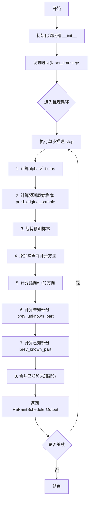
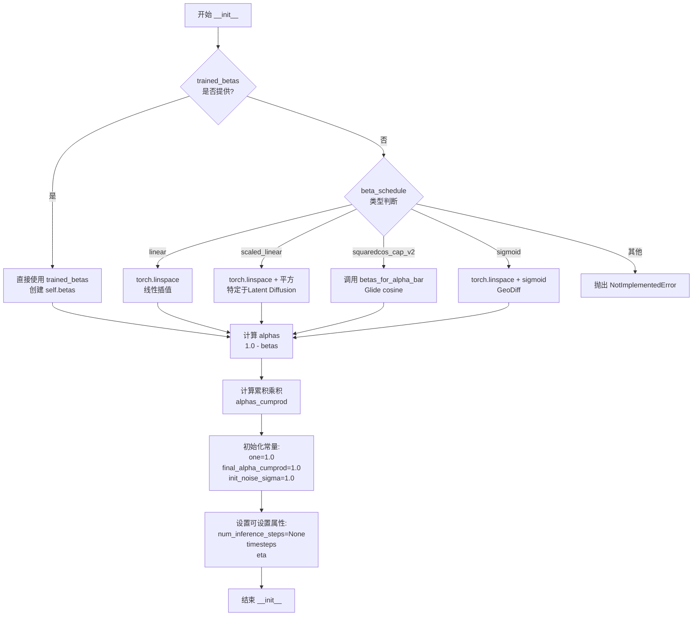
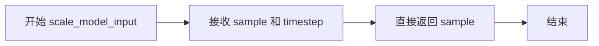
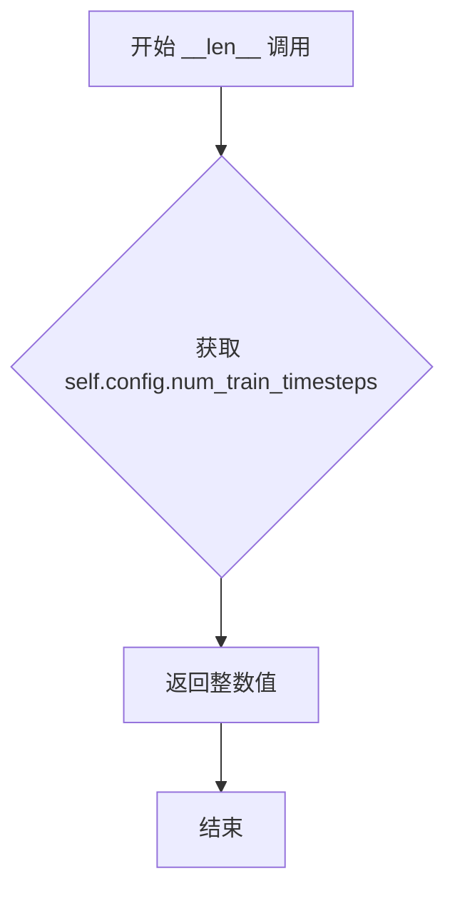

# `diffusers\src\diffusers\schedulers\scheduling_repaint.py` 详细设计文档

RePaintScheduler是一个用于DDPM图像修复（inpainting）的调度器，实现了RePaint算法，通过在给定掩码区域内进行去噪扩散过程来修复图像，支持多种beta调度策略和时间跳跃采样。

## 整体流程



## 类结构

```
BaseOutput (数据类)
└── RePaintSchedulerOutput (输出类)
SchedulerMixin (混入类)
ConfigMixin (混入类)
└── RePaintScheduler (主调度器类)
```

## 全局变量及字段


### `betas_for_alpha_bar`
    
生成beta调度表的函数，根据alpha_transform_type类型将alpha_bar函数离散化

类型：`function`
    


### `RePaintSchedulerOutput.prev_sample`
    
前一步计算得到的样本(x_{t-1})

类型：`torch.Tensor`
    


### `RePaintSchedulerOutput.pred_original_sample`
    
预测的去噪样本(x_0)

类型：`torch.Tensor`
    


### `RePaintScheduler.order`
    
调度器阶数

类型：`int`
    


### `RePaintScheduler.betas`
    
beta值序列

类型：`torch.Tensor`
    


### `RePaintScheduler.alphas`
    
alpha值序列

类型：`torch.Tensor`
    


### `RePaintScheduler.alphas_cumprod`
    
累积alpha乘积

类型：`torch.Tensor`
    


### `RePaintScheduler.one`
    
值为1的张量

类型：`torch.Tensor`
    


### `RePaintScheduler.final_alpha_cumprod`
    
最终累积alpha乘积

类型：`torch.Tensor`
    


### `RePaintScheduler.init_noise_sigma`
    
初始噪声标准差

类型：`float`
    


### `RePaintScheduler.num_inference_steps`
    
推理步数

类型：`int`
    


### `RePaintScheduler.timesteps`
    
时间步序列

类型：`torch.Tensor`
    


### `RePaintScheduler.eta`
    
噪声权重参数

类型：`float`
    
    

## 全局函数及方法


### `betas_for_alpha_bar`

根据alpha_bar函数生成beta调度表。该函数创建离散的beta序列，用于扩散模型的噪声调度，支持cosine、exp和laplace三种alpha变换类型。

参数：

- `num_diffusion_timesteps`：`int`，要生成的beta数量，即扩散时间步的总数
- `max_beta`：`float`，默认为`0.999`，最大beta值，用于避免数值 instability
- `alpha_transform_type`：`Literal["cosine", "exp", "laplace"]`，默认为`"cosine"`，alpha_bar的噪声调度类型

返回值：`torch.Tensor`，调度器用于逐步模型输出的beta值序列

#### 流程图

```mermaid
flowchart TD
    A[开始 betas_for_alpha_bar] --> B{alpha_transform_type == 'cosine'?}
    B -->|Yes| C[定义 alpha_bar_fn: cos²((t+0.008)/1.008 × π/2)]
    B -->|No| D{alpha_transform_type == 'laplace'?}
    D -->|Yes| E[定义 alpha_bar_fn: Laplace变换的SNR函数]
    D -->|No| F{alpha_transform_type == 'exp'?}
    F -->|Yes| G[定义 alpha_bar_fn: exp(t × -12.0)]
    F -->|No| H[raise ValueError: 不支持的类型]
    C --> I[初始化空列表 betas]
    E --> I
    G --> I
    I --> J[循环 i 从 0 到 num_diffusion_timesteps-1]
    J --> K[计算 t1 = i / num_diffusion_timesteps]
    J --> L[计算 t2 = (i + 1) / num_diffusion_timesteps]
    K --> M[计算 beta_i = min(1 - α(t2)/α(t1), max_beta)]
    L --> M
    M --> N[将 beta_i 添加到 betas 列表]
    N --> O{还有更多时间步?}
    O -->|Yes| J
    O -->|No| P[返回 torch.tensor(betas, dtype=torch.float32)]
```

#### 带注释源码

```python
# 从 diffusers.schedulers.scheduling_ddpm 复制过来的函数
def betas_for_alpha_bar(
    num_diffusion_timesteps: int,      # 扩散时间步的总数，决定生成多少个beta值
    max_beta: float = 0.999,           # 最大beta值上限，防止数值不稳定（接近1时可能出问题）
    alpha_transform_type: Literal["cosine", "exp", "laplace"] = "cosine",  # alpha_bar的变换类型
) -> torch.Tensor:                     # 返回生成的beta序列张量
    """
    Create a beta schedule that discretizes the given alpha_t_bar function, which defines the cumulative product of
    (1-beta) over time from t = [0,1].

    Contains a function alpha_bar that takes an argument t and transforms it to the cumulative product of (1-beta) up
    to that part of the diffusion process.

    Args:
        num_diffusion_timesteps (`int`):
            The number of betas to produce.
        max_beta (`float`, defaults to `0.999`):
            The maximum beta to use; use values lower than 1 to avoid numerical instability.
        alpha_transform_type (`str`, defaults to `"cosine"`):
            The type of noise schedule for `alpha_bar`. Choose from `cosine`, `exp`, or `laplace`.

    Returns:
        `torch.Tensor`:
            The betas used by the scheduler to step the model outputs.
    """
    # 根据alpha_transform_type选择不同的alpha_bar_fn（alpha累积函数）
    if alpha_transform_type == "cosine":
        # Cosine调度：从简单余弦函数派生，提供平滑的噪声调度
        # 使用公式: cos²((t+0.008)/1.008 × π/2)
        # 偏移量0.008和1.008是为了避免t=0和t=1时的边界问题
        def alpha_bar_fn(t):
            return math.cos((t + 0.008) / 1.008 * math.pi / 2) ** 2

    elif alpha_transform_type == "laplace":
        # Laplace调度：基于拉普拉斯分布的噪声调度
        # 通过计算信噪比(SNR)的平方根来定义alpha_bar
        def alpha_bar_fn(t):
            # 计算拉普拉斯变换的lambda参数
            lmb = -0.5 * math.copysign(1, 0.5 - t) * math.log(1 - 2 * math.fabs(0.5 - t) + 1e-6)
            # 从lambda计算信噪比
            snr = math.exp(lmb)
            # 返回sqrt(SNR / (1 + SNR))
            return math.sqrt(snr / (1 + snr))

    elif alpha_transform_type == "exp":
        # 指数调度：简单的指数衰减函数
        # 使用固定斜率-12.0的指数函数
        def alpha_bar_fn(t):
            return math.exp(t * -12.0)

    else:
        # 如果传入了不支持的变换类型，抛出错误
        raise ValueError(f"Unsupported alpha_transform_type: {alpha_transform_type}")

    # 初始化beta列表
    betas = []
    # 遍历每个扩散时间步
    for i in range(num_diffusion_timesteps):
        # 计算当前时间步和下一个时间步的归一化时间t
        t1 = i / num_diffusion_timesteps      # 当前时间步的归一化值 [0, 1)
        t2 = (i + 1) / num_diffusion_timesteps # 下一时间步的归一化值 (0, 1]
        
        # 计算beta值：通过alpha_bar的差分来近似导数
        # beta = 1 - alpha_bar(t+Δt) / alpha_bar(t)
        # 这样可以保证累积乘积 ᾱ(t) = ∏(1-β) 遵循定义的调度
        # 使用max_beta限制最大值，防止数值不稳定
        betas.append(min(1 - alpha_bar_fn(t2) / alpha_bar_fn(t1), max_beta))
    
    # 将beta列表转换为PyTorch张量，使用float32数据类型
    return torch.tensor(betas, dtype=torch.float32)
```


### `RePaintScheduler.__init__`

初始化RePaintScheduler调度器，设置扩散模型推理所需的全部参数，包括beta调度、alpha值计算、时间步初始化等核心配置。

参数：

- `num_train_timesteps`：`int`，扩散模型训练的步数，默认为1000
- `beta_start`：`float`，beta调度起始值，默认为0.0001
- `beta_end`：`float`，beta调度结束值，默认为0.02
- `beta_schedule`：`str`，beta调度方案，可选"linear"、"scaled_linear"、"squaredcos_cap_v2"或"sigmoid"，默认为"linear"
- `eta`：`float`，DDIM/DDPM噪声权重参数，默认为0.0
- `trained_betas`：`np.ndarray | None`，可选的直接传递的betas数组，绕过beta_start和beta_end，默认为None
- `clip_sample`：`bool`，是否将预测样本裁剪到[-1,1]范围以保证数值稳定性，默认为True

返回值：无（`None`），构造函数不返回值，仅初始化实例属性

#### 流程图



#### 带注释源码

```python
@register_to_config
def __init__(
    self,
    num_train_timesteps: int = 1000,
    beta_start: float = 0.0001,
    beta_end: float = 0.02,
    beta_schedule: str = "linear",
    eta: float = 0.0,
    trained_betas: np.ndarray | None = None,
    clip_sample: bool = True,
):
    """
    初始化RePaintScheduler调度器参数。
    根据传入的beta调度策略计算betas序列，并预计算alphas及其累积乘积。
    """
    
    # 根据是否直接传入betas或通过调度策略生成
    if trained_betas is not None:
        # 直接使用外部传入的betas数组
        self.betas = torch.from_numpy(trained_betas)
    elif beta_schedule == "linear":
        # 线性beta调度：从beta_start到beta_end均匀分布
        self.betas = torch.linspace(beta_start, beta_end, num_train_timesteps, dtype=torch.float32)
    elif beta_schedule == "scaled_linear":
        # 缩放线性调度：专用于Latent Diffusion Model
        # 先在平方空间线性插值，再取平方得到beta
        self.betas = torch.linspace(beta_start**0.5, beta_end**0.5, num_train_timesteps, dtype=torch.float32) ** 2
    elif beta_schedule == "squaredcos_cap_v2":
        # Glide余弦调度：使用betas_for_alpha_bar函数生成
        self.betas = betas_for_alpha_bar(num_train_timesteps)
    elif beta_schedule == "sigmoid":
        # GeoDiff sigmoid调度：使用sigmoid函数映射到beta范围
        betas = torch.linspace(-6, 6, num_train_timesteps)
        self.betas = torch.sigmoid(betas) * (beta_end - beta_start) + beta_start
    else:
        # 不支持的调度策略
        raise NotImplementedError(f"{beta_schedule} is not implemented for {self.__class__}")

    # 计算alphas序列：alpha = 1 - beta
    self.alphas = 1.0 - self.betas
    
    # 计算alphas的累积乘积，用于扩散过程的概率计算
    self.alphas_cumprod = torch.cumprod(self.alphas, dim=0)
    
    # 预创建常量tensor，避免重复创建
    self.one = torch.tensor(1.0)

    # 最终累积alpha值（用于边界条件处理）
    self.final_alpha_cumprod = torch.tensor(1.0)

    # 初始噪声分布的标准差
    self.init_noise_sigma = 1.0

    # 可设置的值（在set_timesteps时更新）
    self.num_inference_steps = None
    
    # 初始化时间步：从num_train_timesteps-1到0的倒序序列
    self.timesteps = torch.from_numpy(np.arange(0, num_train_timesteps)[::-1].copy())

    # 保存eta参数（DDIM/DDPM噪声权重）
    self.eta = eta
```


### `RePaintScheduler.scale_model_input`

该方法用于根据当前时间步调整去噪模型的输入样本，以确保与其他需要缩放输入的调度器的互操作性。在 RePaintScheduler 中，此方法直接返回原始样本，不进行任何缩放操作。

参数：

- `self`：`RePaintScheduler` 实例，隐式参数
- `sample`：`torch.Tensor`，输入的样本张量
- `timestep`：`int | None`，当前扩散链中的时间步（可选）

返回值：`torch.Tensor`，缩放后的输入样本（在本实现中直接返回原始样本）

#### 流程图



#### 带注释源码

```python
def scale_model_input(self, sample: torch.Tensor, timestep: int | None = None) -> torch.Tensor:
    """
    确保与需要根据当前时间步缩放去噪模型输入的调度器互换。

    参数:
        sample (torch.Tensor):
            输入样本。
        timestep (int, 可选):
            扩散链中的当前时间步。

    返回:
        torch.Tensor:
            缩放后的输入样本。
    """
    # RePaintScheduler 不需要对输入进行缩放，直接返回原始样本
    # 这是因为 RePaint 算法与 DDPM/DDIM 的采样方式不同
    # 其他调度器（如 DDIMScheduler）可能需要根据 alpha_cumprod 等参数缩放输入
    return sample
```


### `RePaintScheduler.set_timesteps`

该方法用于设置离散的时间步，这些时间步将用于推理阶段的扩散链。它根据RePaint论文的跳采样策略生成时间步序列，支持跳跃长度和跳跃采样数的配置，以实现更灵活的去噪采样过程。

参数：

- `num_inference_steps`：`int`，推理时使用的扩散步数。如果使用此参数，`timesteps`必须为`None`
- `jump_length`：`int`，默认为10，单次跳跃向前的时间步数（对应RePaint论文中的"j"），参见论文图9和图10
- `jump_n_sample`：`int`，默认为10，对给定选择的时间样本进行向前时间跳跃的次数，参见论文图9和图10
- `device`：`str`或`torch.device`，可选，时间步要移动到的设备。如果为`None`，则不移动时间步

返回值：无（`None`），该方法直接修改`self.timesteps`和`self.num_inference_steps`属性

#### 流程图

```mermaid
flowchart TD
    A[开始 set_timesteps] --> B[限制 num_inference_steps <= num_train_timesteps]
    B --> C[初始化 jumps 字典]
    C --> D[遍历生成跳跃点]
    D --> E[初始化 t = num_inference_steps]
    E --> F{t >= 1?}
    F -->|是| G[t = t - 1]
    G --> H[添加 t 到 timesteps]
    H --> I{检查 jumps[t] > 0?}
    I -->|是| J[jumps[t] -= 1]
    J --> K[循环 jump_length 次]
    K --> L[t = t + 1]
    L --> M[添加 t 到 timesteps]
    M --> I
    I -->|否| F
    F -->|否| N[计算缩放因子]
    N --> O[缩放 timesteps]
    O --> P[转换为 torch.Tensor 并移动到 device]
    P --> Q[结束]
```

#### 带注释源码

```
def set_timesteps(
    self,
    num_inference_steps: int,
    jump_length: int = 10,
    jump_n_sample: int = 10,
    device: str | torch.device = None,
):
    """
    设置离散时间步，用于扩散链（推理前运行）。

    Args:
        num_inference_steps: 预训练模型生成样本时使用的扩散步数
        jump_length: 单次跳转向前的时间步数（RePaint论文中的"j"）
        jump_n_sample: 对给定时间样本进行向前跳转的次数
        device: 时间步要移动到的设备
    """
    # 1. 确保推理步数不超过训练步数
    num_inference_steps = min(self.config.num_train_timesteps, num_inference_steps)
    self.num_inference_steps = num_inference_steps

    # 2. 初始化时间步列表和跳跃字典
    timesteps = []
    jumps = {}

    # 3. 构建跳跃映射：记录需要跳跃的位置和剩余跳跃次数
    for j in range(0, num_inference_steps - jump_length, jump_length):
        jumps[j] = jump_n_sample - 1

    # 4. 生成时间步序列（逆向遍历）
    t = num_inference_steps
    while t >= 1:
        t = t - 1  # 向前移动一步
        timesteps.append(t)

        # 如果当前位置有跳跃任务
        if jumps.get(t, 0) > 0:
            jumps[t] = jumps[t] - 1  # 消耗一次跳跃机会
            # 执行 jump_length 次向前跳转
            for _ in range(jump_length):
                t = t + 1
                timesteps.append(t)

    # 5. 缩放时间步以匹配训练时的步数范围
    timesteps = np.array(timesteps) * (self.config.num_train_timesteps // self.num_inference_steps)
    
    # 6. 转换为PyTorch张量并移动到指定设备
    self.timesteps = torch.from_numpy(timesteps).to(device)
```


### `RePaintScheduler._get_variance`

该方法用于计算 RePaintScheduler 在给定时间步 t 时的方差（variance），基于 alpha 累积积（alpha_prod）和 beta 累积积（beta_prod）计算扩散过程中的预测方差，遵循 DDPM 和 DDIM 论文中的公式推导。

参数：

- `self`：类的实例，包含调度器的配置和状态
- `t`：`int`，当前的时间步索引（timestep），用于计算该时间步对应的方差

返回值：`torch.Tensor`，返回计算得到的方差值，用于后续采样过程中的噪声添加和样本生成

#### 流程图

```mermaid
flowchart TD
    A[开始: _get_variance] --> B[计算前一时间步 prev_timestep]
    B --> C[获取 alpha_prod_t = alphas_cumprod[t]]
    D[获取 alpha_prod_t_prev = alphas_cumprod[prev_timestep] 或 final_alpha_cumprod]
    C --> E[计算 beta_prod_t = 1 - alpha_prod_t]
    D --> F[计算 beta_prod_t_prev = 1 - alpha_prod_t_prev]
    E --> G[计算方差 variance = (beta_prod_t_prev / beta_prod_t) * (1 - alpha_prod_t / alpha_prod_t_prev)]
    F --> G
    G --> H[返回 variance]
```

#### 带注释源码

```python
def _get_variance(self, t):
    """
    计算给定时间步 t 的方差，用于扩散过程的采样。
    
    该方法基于 DDPM 论文 (https://huggingface.co/papers/2006.11239) 中的公式 (6) 和 (7)，
    以及 DDIM 论文 (https://huggingface.co/papers/2010.02502) 中的公式 (16) 进行推导。
    """
    # 1. 计算前一时间步的索引
    # 通过当前时间步 t 减去每轮推理的步数来得到前一时间步
    prev_timestep = t - self.config.num_train_timesteps // self.num_inference_steps

    # 2. 获取当前时间步和前一时间步的 alpha 累积积
    # alpha_prod_t 表示从开始到时间步 t 的 (1-beta) 的累积乘积
    alpha_prod_t = self.alphas_cumprod[t]
    
    # 如果前一时间步 >= 0，则使用对应的 alpha 累积积；否则使用最终的 alpha 累积积 (默认为 1.0)
    alpha_prod_t_prev = self.alphas_cumprod[prev_timestep] if prev_timestep >= 0 else self.final_alpha_cumprod
    
    # 3. 计算 beta 累积积 (即 1 - alpha 累积积)
    beta_prod_t = 1 - alpha_prod_t
    beta_prod_t_prev = 1 - alpha_prod_t_prev

    # 4. 计算方差
    # 根据 DDIM 论文的推导，方差公式为:
    # variance = (beta_prod_t_prev / beta_prod_t) * (1 - alpha_prod_t / alpha_prod_t_prev)
    # 这等价于 DDPM 论文中的公式 (16)，当 eta = 0 时的特殊情况
    # 原始 DDPM 公式: variance = (1 - alpha_prod_t_prev) / (1 - alpha_prod_t) * self.betas[t]
    variance = (beta_prod_t_prev / beta_prod_t) * (1 - alpha_prod_t / alpha_prod_t_prev)

    # 5. 返回计算得到的方差
    return variance
```


### `RePaintScheduler.step`

该方法是 RePaintScheduler 的核心推理步骤函数，通过逆转扩散过程（从噪声样本恢复原始图像），结合原始图像和掩码信息，在给定时间步基于模型预测的噪声计算前一时刻的样本，实现图像修复（inpainting）功能。

参数：

- `self`：`RePaintScheduler`，RePaintScheduler 类的实例，包含调度器的配置和状态
- `model_output`：`torch.Tensor`，学习到的扩散模型的直接输出（通常为预测噪声）
- `timestep`：`int`，扩散链中的当前离散时间步
- `sample`：`torch.Tensor`，当前由扩散过程创建的样本（x_t）
- `original_image`：`torch.Tensor`，需要修复的原始图像
- `mask`：`torch.Tensor`，修复掩码，值为 0.0 表示需要修复的区域，值为 1.0 表示保留区域
- `generator`：`torch.Generator | None`，可选，随机数生成器，用于 reproducibility
- `return_dict`：`bool`，可选，默认为 True，决定返回 RePaintSchedulerOutput 对象还是元组

返回值：返回 `RePaintSchedulerOutput` 或 `tuple` 类型。若 `return_dict` 为 True，返回 `RePaintSchedulerOutput(prev_sample=pred_prev_sample, pred_original_sample=pred_original_sample)`，其中 `prev_sample` 是计算出的前一个时刻样本 x_{t-1}，`pred_original_sample` 是预测的原始样本 x_0；若为 False，返回元组 `(pred_prev_sample, pred_original_sample)`。

#### 流程图

```mermaid
flowchart TD
    A[开始 step] --> B[获取当前时间步 t 和前一时间步 prev_timestep]
    B --> C[计算 alpha_prod_t 和 alpha_prod_t_prev]
    C --> D[计算 beta_prod_t]
    D --> E[计算预测原始样本 pred_original_sample]
    E --> F{是否 clip_sample?}
    F -- Yes --> G[将 pred_original_sample 限制在 [-1, 1] 范围内]
    F -- No --> H[不限制]
    G --> I
    H --> I[生成随机噪声 noise]
    I --> J[计算标准差 std_dev_t 和方差 variance]
    J --> K[计算预测样本方向 pred_sample_direction]
    K --> L[计算未知部分 prev_unknown_part]
    L --> M[计算已知部分 prev_known_part]
    M --> N[根据掩码组合得到最终前一时刻样本 pred_prev_sample]
    N --> O{return_dict == True?}
    O -- Yes --> P[返回 RePaintSchedulerOutput 对象]
    O -- No --> Q[返回 tuple]
    P --> R[结束]
    Q --> R
```

#### 带注释源码

```python
def step(
    self,
    model_output: torch.Tensor,
    timestep: int,
    sample: torch.Tensor,
    original_image: torch.Tensor,
    mask: torch.Tensor,
    generator: torch.Generator | None = None,
    return_dict: bool = True,
) -> RePaintSchedulerOutput | tuple:
    """
    Predict the sample from the previous timestep by reversing the SDE. This function propagates the diffusion
    process from the learned model outputs (most often the predicted noise).

    Args:
        model_output (`torch.Tensor`):
            The direct output from learned diffusion model.
        timestep (`int`):
            The current discrete timestep in the diffusion chain.
        sample (`torch.Tensor`):
            A current instance of a sample created by the diffusion process.
        original_image (`torch.Tensor`):
            The original image to inpaint on.
        mask (`torch.Tensor`):
            The mask where a value of 0.0 indicates which part of the original image to inpaint.
        generator (`torch.Generator`, *optional*):
            A random number generator.
        return_dict (`bool`, *optional*, defaults to `True`):
            Whether or not to return a [`~schedulers.scheduling_repaint.RePaintSchedulerOutput`] or `tuple`.

    Returns:
        [`~schedulers.scheduling_repaint.RePaintSchedulerOutput`] or `tuple`:
            If return_dict is `True`, [`~schedulers.scheduling_repaint.RePaintSchedulerOutput`] is returned,
            otherwise a tuple is returned where the first element is the sample tensor.

    """
    # 1. 获取当前时间步 t 和计算前一时间步 prev_timestep
    # prev_timestep = timestep - (总训练时间步数 // 推理步数)
    t = timestep
    prev_timestep = timestep - self.config.num_train_timesteps // self.num_inference_steps

    # 2. 计算 alphas, betas
    # alpha_prod_t: 累积产品 alpha 从 0 到 t
    alpha_prod_t = self.alphas_cumprod[t]
    # alpha_prod_t_prev: 累积产品 alpha 到前一步，若 prev_timestep < 0 则使用 final_alpha_cumprod
    alpha_prod_t_prev = self.alphas_cumprod[prev_timestep] if prev_timestep >= 0 else self.final_alpha_cumprod
    # beta_prod_t = 1 - alpha_prod_t
    beta_prod_t = 1 - alpha_prod_t

    # 3. 计算预测原始样本（从预测噪声）
    # 根据公式 (15): pred_original_sample = (sample - sqrt(beta_prod_t) * model_output) / sqrt(alpha_prod_t)
    # 这就是预测的 x_0
    pred_original_sample = (sample - beta_prod_t**0.5 * model_output) / alpha_prod_t**0.5

    # 4. 对预测的原始样本进行裁剪（可选）
    # 为了数值稳定性，通常将预测样本限制在 [-1, 1] 范围内
    if self.config.clip_sample:
        pred_original_sample = torch.clamp(pred_original_sample, -1, 1)

    # 5. 添加噪声
    # 获取设备信息
    device = model_output.device
    # 生成与 model_output 形状相同的随机噪声
    noise = randn_tensor(model_output.shape, generator=generator, device=device, dtype=model_output.dtype)
    # 计算当前时间步的标准差 std_dev_t = eta * sqrt(variance)
    std_dev_t = self.eta * self._get_variance(timestep) ** 0.5

    # 初始化方差为 0
    variance = 0
    # 如果不是最后一步且 eta > 0，则添加噪声
    if t > 0 and self.eta > 0:
        variance = std_dev_t * noise

    # 6. 计算指向 x_t 的方向（公式 12 from DDIM paper）
    # pred_sample_direction = sqrt(1 - alpha_prod_t_prev - std_dev_t^2) * model_output
    pred_sample_direction = (1 - alpha_prod_t_prev - std_dev_t**2) ** 0.5 * model_output

    # 7. 计算 x_{t-1} 的未知部分（公式 12 from DDIM paper）
    # prev_unknown_part = sqrt(alpha_prod_t_prev) * pred_original_sample + pred_sample_direction + variance
    prev_unknown_part = alpha_prod_t_prev**0.5 * pred_original_sample + pred_sample_direction + variance

    # 8. 计算已知部分（根据 RePaint Algorithm 1 Line 5）
    # 对于掩码覆盖的区域（原始图像已知区域），使用原始图像加噪
    # prev_known_part = sqrt(alpha_prod_t_prev) * original_image + sqrt(1 - alpha_prod_t_prev) * noise
    prev_known_part = (alpha_prod_t_prev**0.5) * original_image + ((1 - alpha_prod_t_prev) ** 0.5) * noise

    # 9. 根据掩码组合已知和未知部分
    # mask=1 的区域使用 prev_known_part（原始图像部分）
    # mask=0 的区域使用 prev_unknown_part（模型预测修复部分）
    pred_prev_sample = mask * prev_known_part + (1.0 - mask) * prev_unknown_part

    # 10. 根据 return_dict 返回结果
    if not return_dict:
        return (
            pred_prev_sample,
            pred_original_sample,
        )

    return RePaintSchedulerOutput(prev_sample=pred_prev_sample, pred_original_sample=pred_original_sample)
```


### `RePaintScheduler.undo_step`

该方法用于在 RePaint 采样过程中撤销上一步操作，通过逆向应用 DDPM 噪声添加过程，将样本从当前时间步 t 恢复到上一个检查点时间步 t-n（其中 n = num_train_timesteps // num_inference_steps），实现跳跃式的反向扩散。

参数：

- `sample`：`torch.Tensor`，当前要撤销的样本张量，形状为 (batch_size, num_channels, height, width)
- `timestep`：`int`，当前扩散过程的时间步索引
- `generator`：`torch.Generator | None`，可选的随机数生成器，用于确保噪声的可重复性

返回值：`torch.Tensor`，撤销操作后的样本张量

#### 流程图

```mermaid
flowchart TD
    A[开始 undo_step] --> B[计算步长 n = num_train_timesteps // num_inference_steps]
    B --> C[循环 i 从 0 到 n-1]
    C --> D{当前设备是 MPS?}
    D -->|是| E[使用 CPU 生成噪声再移到设备]
    D -->|否| F[直接在设备上生成噪声]
    E --> G[获取 beta = betas[timestep + i]]
    F --> G
    G --> H[应用逆向噪声公式: sample = sqrt(1-beta) * sample + sqrt(beta) * noise]
    H --> I{i < n - 1?}
    I -->|是| C
    I -->|否| J[返回撤销后的 sample]
    J --> K[结束]
```

#### 带注释源码

```python
def undo_step(self, sample, timestep, generator=None):
    """
    撤销上一步采样操作，通过逆向应用 DDPM 噪声添加过程。
    
    该方法是 RePaint 算法中实现跳跃式采样的关键组件，允许在推理过程中
    回退到上一个检查点时间步，从而实现更灵活的去噪控制。
    
    Args:
        sample: 当前样本张量
        timestep: 当前时间步索引
        generator: 可选的随机数生成器，用于确保可重复性
    
    Returns:
        撤销操作后的样本张量
    """
    # 计算每个推理步骤对应的训练时间步数
    # 例如：num_train_timesteps=1000, num_inference_steps=50, 则 n=20
    n = self.config.num_train_timesteps // self.num_inference_steps

    # 遍历从当前时间步到目标检查点的所有中间时间步
    for i in range(n):
        # 获取当前时间步对应的 beta 系数（噪声方差）
        beta = self.betas[timestep + i]
        
        # MPS 设备上的 randn 函数无法保证可重复性，需要特殊处理
        if sample.device.type == "mps":
            # 在 CPU 上生成噪声张量，然后移动到 MPS 设备
            noise = randn_tensor(sample.shape, dtype=sample.dtype, generator=generator)
            noise = noise.to(sample.device)
        else:
            # 直接在目标设备上生成噪声张量
            noise = randn_tensor(sample.shape, generator=generator, device=sample.device, dtype=sample.dtype)

        # 根据 RePaint 论文算法 1 第 10 行执行逆向噪声添加
        # 公式: x_{t-n} = sqrt(1-beta) * x_t + sqrt(beta) * noise
        # 这实际上是 DDPM 前向过程的逆向操作
        sample = (1 - beta) ** 0.5 * sample + beta**0.5 * noise

    return sample
```


### `RePaintScheduler.add_noise`

该方法用于向原始样本添加噪声，是扩散模型训练阶段的核心功能之一。但该方法目前未实现，直接抛出 `NotImplementedError`，提示用户使用 `DDPMScheduler.add_noise()` 进行训练。

参数：

- `original_samples`：`torch.Tensor`，原始样本张量，即需要添加噪声的图像数据
- `noise`：`torch.Tensor`，噪声张量，要添加到原始样本的噪声
- `timesteps`：`torch.IntTensor`，时间步张量，指定每个样本对应的时间步

返回值：`torch.Tensor`，添加噪声后的样本（由于未实现，实际不会返回）

#### 流程图

```mermaid
flowchart TD
    A[开始 add_noise] --> B{检查实现状态}
    B -->|已实现| C[计算 alphas_cumprod]
    B -->|未实现| D[抛出 NotImplementedError]
    C --> E[根据公式添加噪声: x_t = sqrt(alpha_cumprod) * x_0 + sqrt(1 - alpha_cumprod) * noise]
    E --> F[返回 noisy_samples]
    D --> G[错误信息: 使用 DDPMScheduler.add_noise 代替]
```

#### 带注释源码

```python
def add_noise(
    self,
    original_samples: torch.Tensor,  # 原始图像样本，形状为 (batch_size, num_channels, height, width)
    noise: torch.Tensor,              # 要添加的噪声，形状与 original_samples 相同
    timesteps: torch.IntTensor,      # 时间步，用于确定每个样本的噪声水平
) -> torch.Tensor:
    """
    向原始样本添加噪声，根据给定的时间步生成带噪声的样本。
    这是扩散模型前向过程的核心操作。

    Args:
        original_samples: 原始干净样本
        noise: 采样的高斯噪声
        timesteps: 扩散过程的时间步

    Returns:
        添加噪声后的样本

    Note:
        该方法目前未实现，需要使用 DDPMScheduler.add_noise() 代替
        以支持 RePaint 的训练过程
    """
    # 抛出未实现异常，提示用户使用替代方案
    raise NotImplementedError("Use `DDPMScheduler.add_noise()` to train for sampling with RePaint.")
```


### `RePaintScheduler.__len__`

该方法返回调度器的训练时间步总数，即配置中定义的扩散模型训练的总步数。

参数：

- （无参数，`__len__` 方法仅接收 `self`）

返回值：`int`，返回调度器配置的训练时间步数（`num_train_timesteps`），用于获取调度器的"长度"。

#### 流程图



#### 带注释源码

```python
def __len__(self):
    """
    返回调度器的训练时间步总数。

    该方法实现了 Python 的魔术方法 __len__，使得调度器对象可以直接使用 len() 函数获取其长度。
    返回值表示扩散模型在训练时使用的时间步总数（即 num_train_timesteps），
    这是一个关键配置参数，用于定义噪声调度的时间离散化程度。

    Returns:
        int: 配置中定义的训练时间步数，默认值为 1000
    """
    return self.config.num_train_timesteps
```

## 关键组件


### RePaintSchedulerOutput 数据类

用于存储调度器步进函数的输出，包含前一个样本和预测的原始样本

### betas_for_alpha_bar 函数

根据不同的alpha变换类型(cosine、exp、laplace)生成beta调度表的函数，支持离散化alpha_bar函数

### RePaintScheduler 调度器类

主要的重绘调度器类，继承自SchedulerMixin和ConfigMixin，用于DDPM图像修复任务

### Beta调度策略

支持多种beta调度方式：linear、scaled_linear、squaredcos_cap_v2、sigmoid，以及直接传入trained_betas

### Alpha累积积计算

通过cumprod计算alphas_cumprod，用于扩散过程的方差计算

### 时间步跳跃采样(RePaint特有)

set_timesteps方法实现了RePaint论文中的跳跃采样策略，支持jump_length和jump_n_sample参数控制时间跳跃

### 方差计算_get_variance

计算扩散过程中的方差，基于alpha_prod_t和beta_prod_t的关系公式

### 步进函数step

核心的去噪步骤函数，结合模型输出和原始图像、掩码进行图像修复，支持DDPM和DDIM采样策略

### 撤销步骤undo_step

用于撤销扩散步骤，重新添加噪声到样本，实现RePaint算法的第10行

### 噪声生成randn_tensor

使用PyTorch的randn_tensor生成与模型输出形状、设备、dtype一致的噪声


## 问题及建议


### 已知问题

-   **方差计算公式与注释不符**：`_get_variance` 方法中使用了非标准的方差计算公式，注释中明确提到了公式 (6) 和 (7)，但实际代码使用的是不同的公式，且标准公式被注释掉了，这可能导致与 DDPM 论文描述的行为不一致
-   **`undo_step` 边界检查缺失**：`undo_step` 方法中直接访问 `self.betas[timestep + i]`，当 `timestep + i` 超出 `betas` 数组长度时会导致索引越界错误
-   **数值稳定性风险**：在 `step` 方法中，当 `alpha_prod_t` 接近 0 时，除以 `alpha_prod_t**0.5` 可能导致除零或数值爆炸问题
-   **类型注解不完整**：`_get_variance` 方法缺少参数和返回值的类型注解，降低了代码的可读性和 IDE 支持
-   **冗余的张量创建**：`timesteps` 先创建为 numpy 数组再转换为 torch tensor，存在不必要的内存开销
-   **设备迁移不彻底**：内部状态（如 `alphas_cumprod`、`betas` 等）默认创建在 CPU 上，切换设备时可能遗漏部分张量的设备迁移
-   **缺乏输入验证**：`step` 方法未对 `timestep`、`mask` 和 `original_image` 的有效性进行校验

### 优化建议

-   **统一方差计算逻辑**：使用标准的 DDPM 方差公式或明确文档化当前公式的数学原理，移除被注释的代码以避免混淆
-   **添加边界检查**：在 `undo_step` 方法中添加 `timestep + i` 的范围验证，确保不会越界
-   **增强数值稳定性**：在除法操作前添加 epsilon 值或使用 `torch.sqrt` 的安全版本处理极端情况
-   **完善类型注解**：为 `_get_variance` 等方法添加完整的类型提示
-   **优化张量创建**：直接在 GPU/CPU 上创建 `timesteps`，避免 numpy 中间转换
-   **实现设备迁移方法**：参考其他_scheduler 的实现，提供 `to()` 方法以正确迁移所有内部状态
-   **添加输入验证**：在 `step` 方法入口处校验参数有效性，提供清晰的错误信息

## 其它


### 设计目标与约束

RePaintScheduler的设计目标是为RePaint算法提供扩散模型调度功能，实现图像修复（inpainting）任务。该调度器继承自DDPM（去噪扩散概率模型），通过引入跳步采样（jump-based sampling）策略来加速推理过程，同时保持高质量的修复结果。设计约束包括：必须与HuggingFace Diffusers库的SchedulerMixin和ConfigMixin兼容；支持多种beta调度策略（linear、scaled_linear、squaredcos_cap_v2、sigmoid）；支持可配置的噪声权重eta参数；仅支持推理过程，不支持训练过程中的噪声添加。

### 错误处理与异常设计

代码中的错误处理主要体现在以下几个方面：1) NotImplementedError：当调用add_noise方法时抛出，提示用户使用DDPMScheduler进行训练；2) ValueError：当传入不支持的alpha_transform_type时抛出，提示不支持的调度类型；3) NotImplementedError：当传入不支持的beta_schedule时抛出；4) 参数类型检查：使用类型注解（type hints）进行静态类型检查；5) 设备兼容性处理：在MPS设备上使用randn时会给出注释说明不能保证可重现性。当前代码缺少运行时参数有效性检查，例如num_inference_steps为0或负数的情况、mask和original_image维度不匹配等情况未做处理。

### 数据流与状态机

RePaintScheduler的工作流程遵循以下状态转换：1) 初始化状态（__init__）：加载beta调度，初始化alphas、alphas_cumprod等参数；2) 设置时间步状态（set_timesteps）：根据num_inference_steps、jump_length和jump_n_sample生成推理时的时间步序列；3) 推理状态（step）：根据当前时间步t和模型输出model_output计算前一时间步的样本；4) 回退状态（undo_step）：用于撤销某个推理步骤，重新添加噪声。数据流从原始图像（original_image）和带噪声样本（sample）开始，通过mask区分已知区域和未知区域，分别进行处理后合并为最终的前一时刻样本。

### 外部依赖与接口契约

RePaintScheduler依赖以下外部模块：1) dataclasses.dataclass：用于定义RePaintSchedulerOutput数据结构；2) typing.Literal：用于类型注解；3) numpy as np：用于数组操作和时间步生成；4) torch：核心张量计算库；5) math：数学函数库；6) ..configuration_utils.ConfigMixin和register_to_config：配置混合类，用于注册配置；7) ..utils.BaseOutput：基础输出类；8) ..utils.torch_utils.randn_tensor：随机张量生成工具；9) .scheduling_utils.SchedulerMixin：调度器混合基类。接口契约包括：step方法必须接收model_output、timestep、sample、original_image、mask参数，可选generator和return_dict参数，返回RePaintSchedulerOutput或tuple；set_timesteps方法必须设置self.timesteps属性；scale_model_input方法必须返回处理后的sample。

### 配置参数详细说明

RePaintScheduler的构造函数包含以下配置参数：1) num_train_timesteps (int, 默认1000)：训练时的扩散步数，决定噪声调度的细粒度；2) beta_start (float, 默认0.0001)：线性beta调度的起始值，控制初始噪声水平；3) beta_end (float, 默认0.02)：线性beta调度的结束值，控制最终噪声水平；4) beta_schedule (str, 默认"linear")：beta调度策略，可选"linear"、"scaled_linear"、"squaredcos_cap_v2"、"sigmoid"；5) eta (float, 默认0.0)：噪声权重参数，控制DDPM和DDIM采样策略，0.0对应DDIM，完全随机对应DDPM；6) trained_betas (np.ndarray, 可选)：直接传入的beta数组，跳过beta_schedule计算；7) clip_sample (bool, 默认True)：是否将预测样本裁剪到[-1, 1]范围，保证数值稳定性。

### 算法原理说明

RePaintScheduler基于RePaint论文（2022年）实现，该算法改进自DDPM用于图像修复。其核心思想是：1) 在已知区域（mask=1）保留原始图像信息，仅对未知区域（mask=0）进行去噪；2) 使用跳步采样策略（jumps）减少推理步数，提高效率；3) 在推理过程中，算法1第5行使用原始图像的条件采样，第8行通过mask将已知部分和未知部分合并。数学公式上，调度器实现了DDIM的采样公式（公式12），通过eta参数控制随机性：pred_prev_sample = mask * prev_known_part + (1-mask) * prev_unknown_part，其中prev_known_part来自原始图像的条件分布，prev_unknown_part来自DDIM去噪路径。

### 性能考虑与优化空间

当前实现存在以下性能优化空间：1) 重复计算：step方法中多次计算alpha_prod_t、beta_prod_t等值，可预先计算并缓存；2) 设备转移：set_timesteps中timesteps的设备转移可以优化，避免不必要的CPU-GPU数据传输；3) 内存占用：_get_variance方法在每次step时调用，可考虑预计算整个方差数组；4) 向量化：undo_step方法中使用循环，可以尝试向量化操作；5) JIT编译：对于大规模推理，可以考虑使用torch.compile进行加速；6) MPS兼容性：MPS设备上的randn无法保证可重现性，需要特殊处理。

### 与其他调度器的对比

RePaintScheduler与其他Diffusers调度器的区别如下：1) 与DDPMScheduler相比：RePaint支持图像修复的mask机制，而DDPMScheduler仅支持普通采样；2) 与DDIMScheduler相比：RePaint使用RePaint特有的跳步采样策略，且结合了original_image信息；3) 与PNDMScheduler相比：RePaint使用不同的多步采样策略；4) 与EulerDiscreteScheduler相比：RePaint基于离散时间步的DDPM/DDIM公式，而非连续欧拉方法。RePaintScheduler的特点是保留了原始图像信息在已知区域，仅对未知区域进行去噪处理。

### 版本历史与兼容性

该代码作为Diffusers库的一部分，版权声明显示为2025年ETH Zurich Computer Vision Lab和HuggingFace Team。代码中引用了betas_for_alpha_bar函数，该函数从scheduling_ddpm模块复制而来，表明是DDPM调度器的公共函数。兼容性方面：该调度器需要torch、numpy、diffusers库的其他模块支持；配置系统依赖ConfigMixin和register_to_config装饰器；张量操作假设使用PyTorch张量，不支持其他深度学习框架。

### 使用示例与典型工作流

典型的RePaintScheduler使用流程如下：1) 初始化调度器：scheduler = RePaintScheduler(num_train_timesteps=1000, beta_start=0.0001, beta_end=0.02)；2) 设置推理时间步：scheduler.set_timesteps(num_inference_steps=100, jump_length=10, jump_n_sample=10)；3) 准备输入：original_image为原始图像张量，mask为修复区域的二值掩码，noisy_sample为初始噪声；4) 迭代推理：for t in tqdm(scheduler.timesteps): output = scheduler.step(model_output, t, noisy_sample, original_image, mask)；noisy_sample = output.prev_sample。关键要点：original_image在每一步都保持不变；mask为0的区域表示需要修复的部分；model_output通常是预测的噪声。

### 测试策略建议

针对RePaintScheduler的测试应包含以下方面：1) 单元测试：验证各配置组合下betas、alphas、alphas_cumprod的计算正确性；2) 集成测试：与预训练模型一起测试完整的修复流程，验证输出图像质量；3) 边界测试：测试num_inference_steps=1、jump_length=1等边界情况；4) 数值稳定性测试：测试极端beta值（如beta_start接近0）下的数值稳定性；5) 设备兼容性测试：测试CPU、CUDA、MPS不同设备上的行为一致性；6) 可重现性测试：使用固定seed验证相同输入产生相同输出；7) Mask一致性测试：验证mask在多步迭代后的处理是否符合预期。


    