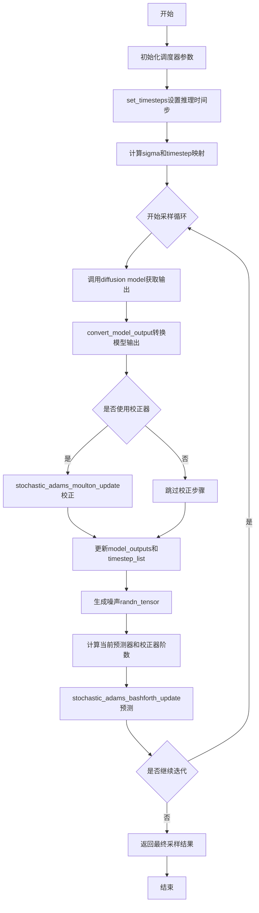
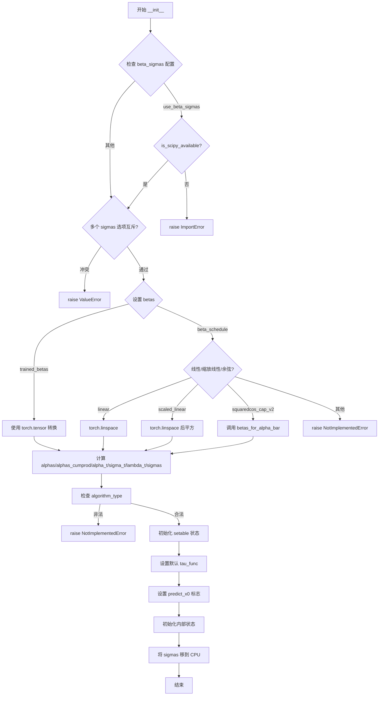
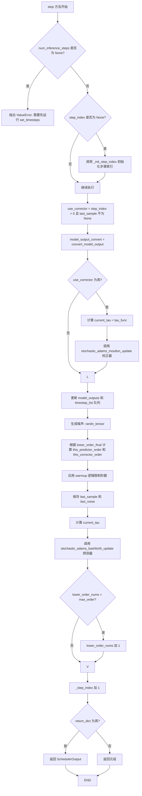
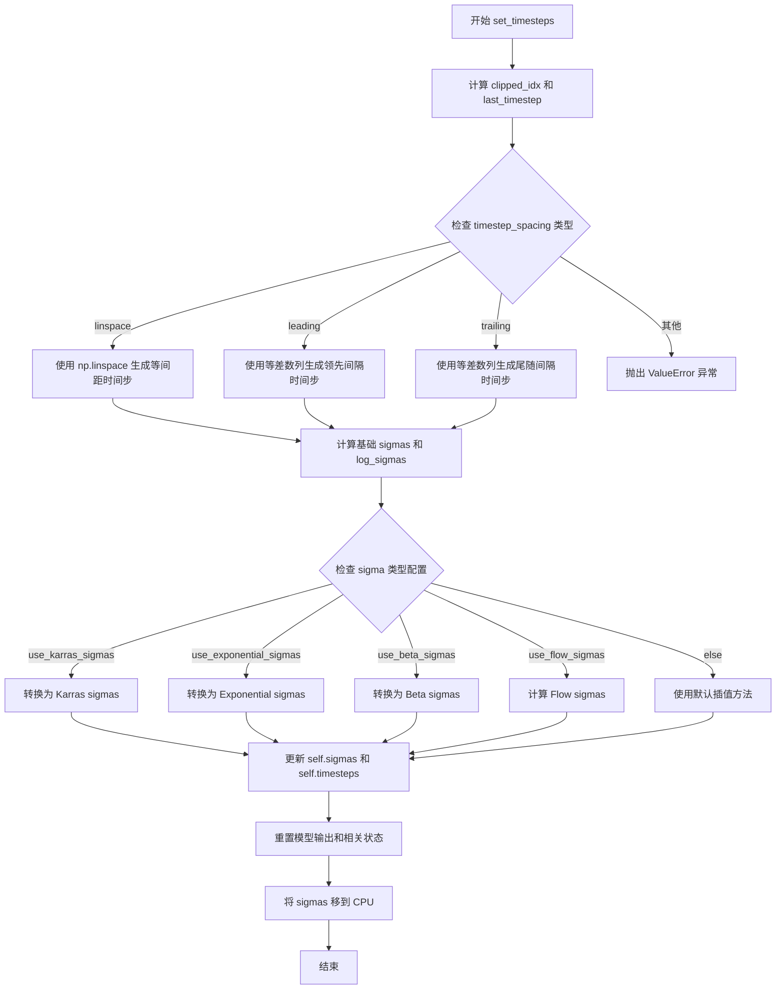
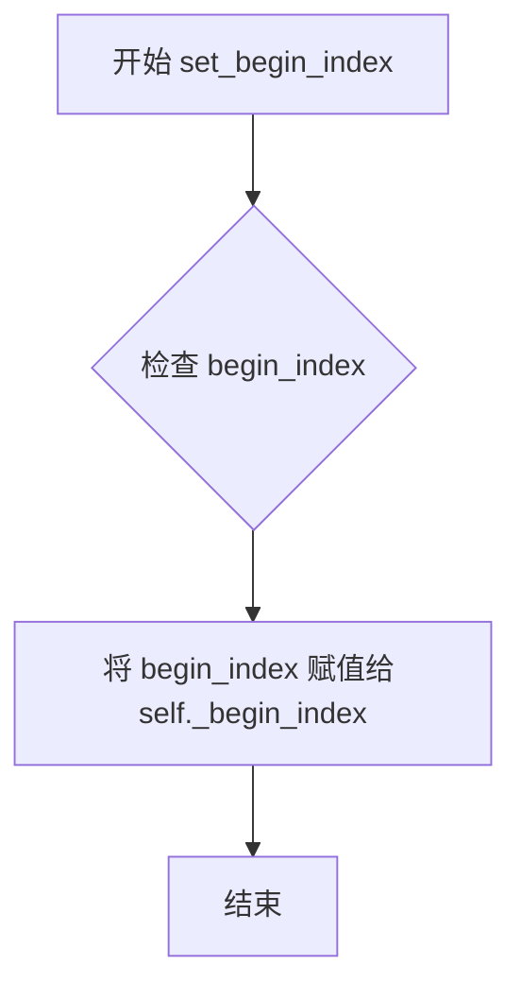
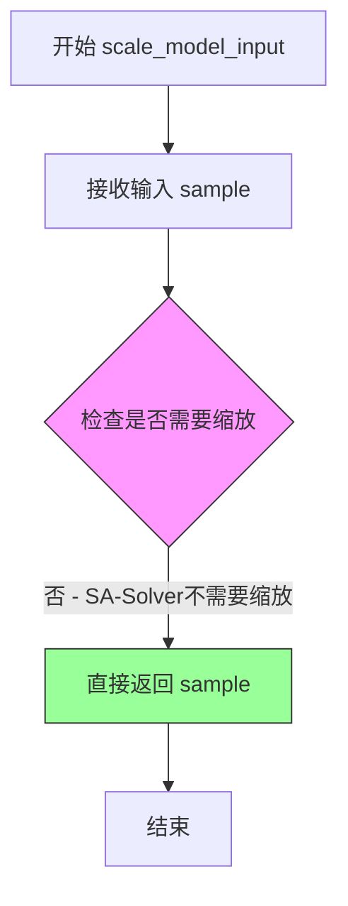

# `diffusers\src\diffusers\schedulers\scheduling_sasolver.py` 详细设计文档

SA-Solver调度器实现，提供了高阶随机Adams求解器用于扩散SDE/ODE的快速采样，支持数据预测和噪声预测两种算法模式，具有动态阈值、多种sigma调度（Karras/指数/Beta）和可配置的预测器/校正器阶数。

## 整体流程



## 类结构

```
SchedulerMixin (抽象基类)
└── SASolverScheduler (SA-Solver扩散调度器)
```

## 全局变量及字段


### `betas_for_alpha_bar`
    
Creates a beta schedule that discretizes the given alpha_t_bar function, which defines the cumulative product of (1-beta) over time

类型：`function`
    


### `SASolverScheduler.order`
    
调度器阶数(默认1)

类型：`int`
    


### `SASolverScheduler._compatibles`
    
兼容的调度器列表

类型：`list`
    


### `SASolverScheduler.betas`
    
beta调度参数

类型：`torch.Tensor`
    


### `SASolverScheduler.alphas`
    
1-beta值

类型：`torch.Tensor`
    


### `SASolverScheduler.alphas_cumprod`
    
累积乘积的alphas

类型：`torch.Tensor`
    


### `SASolverScheduler.alpha_t`
    
当前alpha值

类型：`torch.Tensor`
    


### `SASolverScheduler.sigma_t`
    
当前sigma值

类型：`torch.Tensor`
    


### `SASolverScheduler.lambda_t`
    
log(alpha_t/sigma_t)

类型：`torch.Tensor`
    


### `SASolverScheduler.sigmas`
    
sigma调度

类型：`torch.Tensor`
    


### `SASolverScheduler.init_noise_sigma`
    
初始噪声标准差

类型：`float`
    


### `SASolverScheduler.num_inference_steps`
    
推理步数

类型：`int`
    


### `SASolverScheduler.timesteps`
    
时间步张量

类型：`torch.Tensor`
    


### `SASolverScheduler.timestep_list`
    
时间步历史记录

类型：`list`
    


### `SASolverScheduler.model_outputs`
    
模型输出历史

类型：`list`
    


### `SASolverScheduler.tau_func`
    
随机性控制函数

类型：`Callable`
    


### `SASolverScheduler.predict_x0`
    
是否预测x0

类型：`bool`
    


### `SASolverScheduler.lower_order_nums`
    
低阶求解器计数

类型：`int`
    


### `SASolverScheduler.last_sample`
    
上一个样本

类型：`torch.Tensor`
    


### `SASolverScheduler.last_noise`
    
上一个噪声

类型：`torch.Tensor`
    


### `SASolverScheduler._step_index`
    
当前步索引

类型：`int`
    


### `SASolverScheduler._begin_index`
    
起始索引

类型：`int`
    


### `SASolverScheduler.this_predictor_order`
    
当前预测器阶数

类型：`int`
    


### `SASolverScheduler.this_corrector_order`
    
当前校正器阶数

类型：`int`
    
    

## 全局函数及方法


### `betas_for_alpha_bar`

该函数通过离散化给定的 alpha_t_bar 函数来创建 beta 调度表，其中 alpha_t_bar 定义了从 t = [0,1] 开始的 (1-beta) 的累积乘积。该函数支持三种 alpha 变换类型：cosine（余弦）、exp（指数）和 laplace（拉普拉斯），并确保生成的 beta 值不超过指定的最大 beta 以避免数值不稳定。

参数：

- `num_diffusion_timesteps`：`int`，要生成的 beta 数量
- `max_beta`：`float`，默认 `0.999`，使用的最大 beta 值，用于避免数值不稳定
- `alpha_transform_type`：`Literal["cosine", "exp", "laplace"]`，默认 `"cosine"`，alpha_bar 的噪声调度类型

返回值：`torch.Tensor`，调度器用于逐步模型输出的 beta 值序列

#### 流程图

```mermaid
flowchart TD
    A[开始] --> B{alpha_transform_type == 'cosine'?}
    B -->|Yes| C[定义 cosine alpha_bar_fn]
    B -->|No| D{alpha_transform_type == 'laplace'?}
    D -->|Yes| E[定义 laplace alpha_bar_fn]
    D -->|No| F{alpha_transform_type == 'exp'?}
    F -->|Yes| G[定义 exp alpha_bar_fn]
    F -->|No| H[抛出 ValueError 异常]
    C --> I[初始化空 betas 列表]
    E --> I
    G --> I
    I --> J[循环 i 从 0 到 num_diffusion_timesteps-1]
    J --> K[计算 t1 = i / num_diffusion_timesteps]
    K --> L[计算 t2 = (i+1) / num_diffusion_timesteps]
    L --> M[计算 beta = min(1 - alpha_bar_fn(t2) / alpha_bar_fn(t1), max_beta)]
    M --> N[添加 beta 到 betas 列表]
    N --> O{还有更多时间步?}
    O -->|Yes| J
    O -->|No| P[返回 torch.tensor(betas, dtype=torch.float32)]
    P --> Q[结束]
    H --> Q
```

#### 带注释源码

```python
def betas_for_alpha_bar(
    num_diffusion_timesteps: int,
    max_beta: float = 0.999,
    alpha_transform_type: Literal["cosine", "exp", "laplace"] = "cosine",
) -> torch.Tensor:
    """
    Create a beta schedule that discretizes the given alpha_t_bar function, which defines the cumulative product of
    (1-beta) over time from t = [0,1].

    Contains a function alpha_bar that takes an argument t and transforms it to the cumulative product of (1-beta) up
    to that part of the diffusion process.

    Args:
        num_diffusion_timesteps (`int`):
            The number of betas to produce.
        max_beta (`float`, defaults to `0.999`):
            The maximum beta to use; use values lower than 1 to avoid numerical instability.
        alpha_transform_type (`str`, defaults to `"cosine"`):
            The type of noise schedule for `alpha_bar`. Choose from `cosine`, `exp`, or `laplace`.

    Returns:
        `torch.Tensor`:
            The betas used by the scheduler to step the model outputs.
    """
    # 根据 alpha_transform_type 选择对应的 alpha_bar 函数
    # cosine: 使用余弦函数进行平滑的噪声调度
    if alpha_transform_type == "cosine":

        def alpha_bar_fn(t):
            # 余弦调度：从 (t + 0.008) / 1.008 * pi / 2 的余弦平方值
            return math.cos((t + 0.008) / 1.008 * math.pi / 2) ** 2

    # laplace: 使用拉普拉斯分布相关的噪声调度
    elif alpha_transform_type == "laplace":

        def alpha_bar_fn(t):
            # 计算 lambda 参数：-0.5 * sign(0.5 - t) * log(1 - 2*|0.5 - t| + 1e-6)
            lmb = -0.5 * math.copysign(1, 0.5 - t) * math.log(1 - 2 * math.fabs(0.5 - t) + 1e-6)
            # 计算信噪比 SNR = exp(lambda)
            snr = math.exp(lmb)
            # 返回 sqrt(snr / (1 + snr))
            return math.sqrt(snr / (1 + snr))

    # exp: 使用指数函数进行噪声调度
    elif alpha_transform_type == "exp":

        def alpha_bar_fn(t):
            # 返回 exp(t * -12.0)，即指数衰减
            return math.exp(t * -12.0)

    # 如果不支持的 alpha_transform_type，抛出 ValueError
    else:
        raise ValueError(f"Unsupported alpha_transform_type: {alpha_transform_type}")

    # 初始化 beta 列表
    betas = []
    # 遍历每个扩散时间步
    for i in range(num_diffusion_timesteps):
        # 计算当前时间步的起始点 t1 和结束点 t2
        t1 = i / num_diffusion_timesteps
        t2 = (i + 1) / num_diffusion_timesteps
        # 计算 beta 值：1 - alpha_bar_fn(t2) / alpha_bar_fn(t1)
        # 并与 max_beta 取最小值以避免数值不稳定
        betas.append(min(1 - alpha_bar_fn(t2) / alpha_bar_fn(t1), max_beta))
    
    # 将 beta 列表转换为 PyTorch float32 张量并返回
    return torch.tensor(betas, dtype=torch.float32)
```


### `SASolverScheduler.__init__`

这是 `SASolverScheduler` 类的构造函数，用于初始化扩散模型的 SA-Solver 调度器。该调度器实现了用于扩散 SDEs 的高阶求解器，支持数据预测和噪声预测算法，可用于快速高质量的图像生成任务。

参数：

- `self`：隐含参数，类的实例本身
- `num_train_timesteps`：`int`，训练时的扩散步数，默认为 1000
- `beta_start`：`float`，beta 调度起始值，默认为 0.0001
- `beta_end`：`float`，beta 调度结束值，默认为 0.02
- `beta_schedule`：`str`，beta 调度策略，可选 "linear"、"scaled_linear"、"squaredcos_cap_v2"，默认为 "linear"
- `trained_betas`：`np.ndarray | list[float] | None`，直接传入的 betas 数组，绕过 beta_start 和 beta_end，默认为 None
- `predictor_order`：`int`，预测器阶数，可选 1、2、3、4，默认为 2
- `corrector_order`：`int`，校正器阶数，可选 1、2、3、4，默认为 2
- `prediction_type`：`str`，预测类型，可选 "epsilon"、"sample"、"v_prediction"，默认为 "epsilon"
- `tau_func`：`Callable | None`，采样时的随机性控制函数，默认为根据 timestep 在 200-800 区间返回 1
- `thresholding`：`bool`，是否启用动态阈值处理，默认为 False
- `dynamic_thresholding_ratio`：`float`，动态阈值比率，默认为 0.995
- `sample_max_value`：`float`，动态阈值最大样本值，默认为 1.0
- `algorithm_type`：`str`，算法类型，可选 "data_prediction" 或 "noise_prediction"，默认为 "data_prediction"
- `lower_order_final`：`bool`，是否在最后步骤使用低阶求解器，默认为 True
- `use_karras_sigmas`：`bool`，是否使用 Karras sigmas，默认为 False
- `use_exponential_sigmas`：`bool`，是否使用指数 sigmas，默认为 False
- `use_beta_sigmas`：`bool`，是否使用 beta sigmas，默认为 False
- `use_flow_sigmas`：`bool`，是否使用流 sigmas，默认为 False
- `flow_shift`：`float`，流偏移量，默认为 1.0
- `lambda_min_clipped`：`float`，lambda 最小值裁剪阈值，默认为 -inf
- `variance_type`：`str | None`，方差类型，可选 "learned" 或 "learned_range"，默认为 None
- `timestep_spacing`：`str`，时间步间距策略，可选 "linspace"、"leading"、"trailing"，默认为 "linspace"
- `steps_offset`：`int`，推理步骤偏移量，默认为 0

返回值：`None`，无返回值（构造函数）

#### 流程图



#### 带注释源码

```python
@register_to_config
def __init__(
    self,
    num_train_timesteps: int = 1000,              # 训练扩散步数，默认1000
    beta_start: float = 0.0001,                   # Beta起始值
    beta_end: float = 0.02,                       # Beta结束值
    beta_schedule: str = "linear",               # Beta调度策略
    trained_betas: np.ndarray | list[float] | None = None,  # 直接传入的betas
    predictor_order: int = 2,                     # 预测器阶数(1-4)
    corrector_order: int = 2,                     # 校正器阶数(1-4)
    prediction_type: str = "epsilon",            # 预测类型
    tau_func: Callable | None = None,            # 随机性控制函数
    thresholding: bool = False,                  # 是否启用动态阈值
    dynamic_thresholding_ratio: float = 0.995,   # 动态阈值比率
    sample_max_value: float = 1.0,               # 样本最大值
    algorithm_type: str = "data_prediction",     # 算法类型
    lower_order_final: bool = True,              # 最后使用低阶求解器
    use_karras_sigmas: bool = False,              # 使用Karras sigmas
    use_exponential_sigmas: bool = False,        # 使用指数sigmas
    use_beta_sigmas: bool = False,               # 使用beta sigmas
    use_flow_sigmas: bool = False,                # 使用流sigmas
    flow_shift: float = 1.0,                     # 流偏移量
    lambda_min_clipped: float = -float("inf"),   # Lambda最小裁剪
    variance_type: str | None = None,            # 方差类型
    timestep_spacing: str = "linspace",          # 时间步间距策略
    steps_offset: int = 0,                        # 步骤偏移
):
    # 如果使用 beta sigmas 但未安装 scipy，抛出导入错误
    if self.config.use_beta_sigmas and not is_scipy_available():
        raise ImportError("Make sure to install scipy if you want to use beta sigmas.")
    
    # 检查多个 sigmas 选项是否互斥，只能同时使用一个
    if sum([self.config.use_beta_sigmas, self.config.use_exponential_sigmas, self.config.use_karras_sigmas]) > 1:
        raise ValueError(
            "Only one of `config.use_beta_sigmas`, `config.use_exponential_sigmas`, `config.use_karras_sigmas` can be used."
        )
    
    # 根据配置设置 betas
    if trained_betas is not None:
        # 直接使用传入的 betas 数组
        self.betas = torch.tensor(trained_betas, dtype=torch.float32)
    elif beta_schedule == "linear":
        # 线性调度：beta 从起始值线性增加到结束值
        self.betas = torch.linspace(beta_start, beta_end, num_train_timesteps, dtype=torch.float32)
    elif beta_schedule == "scaled_linear":
        # 缩放线性调度：用于 latent diffusion model
        self.betas = (
            torch.linspace(
                beta_start**0.5,
                beta_end**0.5,
                num_train_timesteps,
                dtype=torch.float32,
            )
            ** 2
        )
    elif beta_schedule == "squaredcos_cap_v2":
        # Glide 余弦调度
        self.betas = betas_for_alpha_bar(num_train_timesteps)
    else:
        raise NotImplementedError(f"{beta_schedule} is not implemented for {self.__class__}")

    # 计算 alphas = 1 - betas
    self.alphas = 1.0 - self.betas
    # 计算累积乘积 alphas_cumprod
    self.alphas_cumprod = torch.cumprod(self.alphas, dim=0)
    # 当前仅支持 VP 类型噪声调度
    self.alpha_t = torch.sqrt(self.alphas_cumprod)
    self.sigma_t = torch.sqrt(1 - self.alphas_cumprod)
    self.lambda_t = torch.log(self.alpha_t) - torch.log(self.sigma_t)
    self.sigmas = ((1 - self.alphas_cumprod) / self.alphas_cumprod) ** 0.5

    # 初始噪声分布的标准差
    self.init_noise_sigma = 1.0

    # 检查算法类型是否有效
    if algorithm_type not in ["data_prediction", "noise_prediction"]:
        raise NotImplementedError(f"{algorithm_type} is not implemented for {self.__class__}")

    # 可设置的值
    self.num_inference_steps = None  # 推理步数（稍后设置）
    # 创建时间步数组：从 0 到 num_train_timesteps-1，然后反转
    timesteps = np.linspace(0, num_train_timesteps - 1, num_train_timesteps, dtype=np.float32)[::-1].copy()
    self.timesteps = torch.from_numpy(timesteps)
    # 初始化模型输出和 时间步列表
    self.timestep_list = [None] * max(predictor_order, corrector_order - 1)
    self.model_outputs = [None] * max(predictor_order, corrector_order - 1)

    # 设置默认的 tau_func（随机性函数）
    if tau_func is None:
        # 默认：在 timestep 200-800 区间启用随机性
        self.tau_func = lambda t: 1 if t >= 200 and t <= 800 else 0
    else:
        self.tau_func = tau_func
    
    # 设置是否预测 x0（数据预测模式）
    self.predict_x0 = algorithm_type == "data_prediction"
    self.lower_order_nums = 0  # 低阶求解器使用计数
    self.last_sample = None    # 上一个样本
    self._step_index = None    # 当前步骤索引
    self._begin_index = None   # 起始索引
    
    # 将 sigmas 移到 CPU 以减少 CPU/GPU 通信开销
    self.sigmas = self.sigmas.to("cpu")
```


### `SASolverScheduler.step`

该函数是 SA-Solver 调度器的核心步骤方法，通过反向随机微分方程（SDE）将样本从当前时间步推进到前一个时间步。它结合了随机 Adams-Bashforth 预测器和随机 Adams-Moulton 校正器，利用模型输出和噪声样本进行多阶迭代求解。

参数：

- `model_output`：`torch.Tensor`，学习到的扩散模型在当前时间步的直接输出
- `timestep`：`int`，扩散链中的当前离散时间步
- `sample`：`torch.Tensor`，由扩散过程生成的当前样本实例
- `generator`：`torch.Generator`，可选的随机数生成器
- `return_dict`：`bool`，是否返回 `SchedulerOutput` 或元组

返回值：`SchedulerOutput` 或 `tuple`，当 `return_dict` 为 `True` 时返回 `SchedulerOutput` 对象（包含 `prev_sample`），否则返回元组（第一个元素为样本张量）

#### 流程图



#### 带注释源码

```python
def step(
    self,
    model_output: torch.Tensor,
    timestep: int,
    sample: torch.Tensor,
    generator=None,
    return_dict: bool = True,
) -> SchedulerOutput | tuple:
    """
    Predict the sample from the previous timestep by reversing the SDE. This function propagates the sample with
    the SA-Solver.

    Args:
        model_output (`torch.Tensor`):
            The direct output from learned diffusion model.
        timestep (`int`):
            The current discrete timestep in the diffusion chain.
        sample (`torch.Tensor`):
            A current instance of a sample created by the diffusion process.
        generator (`torch.Generator`, *optional*):
            A random number generator.
        return_dict (`bool`):
            Whether or not to return a [`~schedulers.scheduling_utils.SchedulerOutput`] or `tuple`.

    Returns:
        [`~schedulers.scheduling_utils.SchedulerOutput`] or `tuple`:
            If return_dict is `True`, [`~schedulers.scheduling_utils.SchedulerOutput`] is returned, otherwise a
            tuple is returned where the first element is the sample tensor.

    """
    # 检查是否已设置推理步骤数，若未设置则抛出错误
    if self.num_inference_steps is None:
        raise ValueError(
            "Number of inference steps is 'None', you need to run 'set_timesteps' after creating the scheduler"
        )

    # 首次调用时初始化步骤索引
    if self.step_index is None:
        self._init_step_index(timestep)

    # 判断是否需要使用校正器：需要已有上一步样本且不是第一步
    use_corrector = self.step_index > 0 and self.last_sample is not None

    # 将模型输出转换为算法所需格式（data_prediction 或 noise_prediction）
    model_output_convert = self.convert_model_output(model_output, sample=sample)

    # 如果使用校正器，执行 SA-Corrector 步骤
    if use_corrector:
        # 根据时间步列表最后一项计算 tau 值（随机性控制）
        current_tau = self.tau_func(self.timestep_list[-1])
        # 调用随机 Adams-Moulton 校正器更新样本
        sample = self.stochastic_adams_moulton_update(
            this_model_output=model_output_convert,
            last_sample=self.last_sample,
            last_noise=self.last_noise,
            this_sample=sample,
            order=self.this_corrector_order,
            tau=current_tau,
        )

    # 将模型输出和时间步向前移动，为下一步做准备
    for i in range(max(self.config.predictor_order, self.config.corrector_order - 1) - 1):
        self.model_outputs[i] = self.model_outputs[i + 1]
        self.timestep_list[i] = self.timestep_list[i + 1]

    # 将当前模型输出和时间步放到列表末尾
    self.model_outputs[-1] = model_output_convert
    self.timestep_list[-1] = timestep

    # 生成随机噪声用于预测步骤
    noise = randn_tensor(
        model_output.shape,
        generator=generator,
        device=model_output.device,
        dtype=model_output.dtype,
    )

    # 根据配置和剩余步数确定预测器和校正器的阶数
    if self.config.lower_order_final:
        # 使用较低阶求解器以保证最终步骤的稳定性
        this_predictor_order = min(self.config.predictor_order, len(self.timesteps) - self.step_index)
        this_corrector_order = min(self.config.corrector_order, len(self.timesteps) - self.step_index + 1)
    else:
        this_predictor_order = self.config.predictor_order
        this_corrector_order = self.config.corrector_order

    # 对多步求解器进行 warmup，逐步增加阶数以保证数值稳定性
    self.this_predictor_order = min(this_predictor_order, self.lower_order_nums + 1)
    self.this_corrector_order = min(this_corrector_order, self.lower_order_nums + 2)
    assert self.this_predictor_order > 0
    assert self.this_corrector_order > 0

    # 保存当前样本和噪声供下一步校正器使用
    self.last_sample = sample
    self.last_noise = noise

    # 计算当前 tau 值
    current_tau = self.tau_func(self.timestep_list[-1])
    # 调用随机 Adams-Bashforth 预测器获取前一步的样本
    prev_sample = self.stochastic_adams_bashforth_update(
        model_output=model_output_convert,
        sample=sample,
        noise=noise,
        order=self.this_predictor_order,
        tau=current_tau,
    )

    # 如果还未达到最大阶数，则增加低阶计数
    if self.lower_order_nums < max(self.config.predictor_order, self.config.corrector_order - 1):
        self.lower_order_nums += 1

    # 步骤完成后增加索引计数器
    self._step_index += 1

    # 根据 return_dict 返回结果
    if not return_dict:
        return (prev_sample,)

    return SchedulerOutput(prev_sample=prev_sample)
```


### `SASolverScheduler.set_timesteps`

该方法用于在推理前设置扩散链的离散时间步，根据配置的时间步间隔策略（linspace/leading/trailing）生成时间步序列，并支持多种sigma噪声调度方式（Karras/Exponential/Beta/Flow）。

参数：

- `num_inference_steps`：`int`，用于生成样本的扩散步数
- `device`：`str | torch.device`，时间步要移动到的设备，如果为 `None` 则不移动

返回值：`None`，该方法直接修改实例属性

#### 流程图



#### 带注释源码

```python
def set_timesteps(self, num_inference_steps: int = None, device: str | torch.device = None):
    """
    设置扩散链的离散时间步（在推理前运行）。
    
    参数:
        num_inference_steps: 用于生成样本的扩散步数
        device: 时间步要移动到的设备，如果为 None 则不移动
    """
    
    # 为了数值稳定性，裁剪所有 lambda(t) 的最小值
    # 这对余弦（squaredcos_cap_v2）噪声调度至关重要
    clipped_idx = torch.searchsorted(torch.flip(self.lambda_t, [0]), self.config.lambda_min_clipped)
    last_timestep = ((self.config.num_train_timesteps - clipped_idx).numpy()).item()

    # "linspace", "leading", "trailing" 对应于表2的注释
    # https://huggingface.co/papers/2305.08891
    if self.config.timestep_spacing == "linspace":
        # 线性间隔：从 0 到 last_timestep-1 生成等间距时间步
        timesteps = (
            np.linspace(0, last_timestep - 1, num_inference_steps + 1)
            .round()[::-1][:-1]  # 反转并移除最后一个
            .copy()
            .astype(np.int64)
        )
    elif self.config.timestep_spacing == "leading":
        # 领先间隔：创建整数时间步乘以比率
        step_ratio = last_timestep // (num_inference_steps + 1)
        timesteps = (np.arange(0, num_inference_steps + 1) * step_ratio).round()[::-1][:-1].copy().astype(np.int64)
        timesteps += self.config.steps_offset
    elif self.config.timestep_spacing == "trailing":
        # 尾随间隔：从 last_timestep 向下生成
        step_ratio = self.config.num_train_timesteps / num_inference_steps
        timesteps = np.arange(last_timestep, 0, -step_ratio).round().copy().astype(np.int64)
        timesteps -= 1
    else:
        raise ValueError(
            f"{self.config.timestep_spacing} 不支持。请选择 'linspace', 'leading' 或 'trailing'。"
        )

    # 计算基础 sigmas（噪声标准差）
    sigmas = np.array(((1 - self.alphas_cumprod) / self.alphas_cumprod) ** 0.5)
    log_sigmas = np.log(sigmas)
    
    # 根据配置选择不同的 sigma 转换方法
    if self.config.use_karras_sigmas:
        # Karras 噪声调度（推荐用于高质量采样）
        sigmas = np.flip(sigmas).copy()
        sigmas = self._convert_to_karras(in_sigmas=sigmas, num_inference_steps=num_inference_steps)
        timesteps = np.array([self._sigma_to_t(sigma, log_sigmas) for sigma in sigmas]).round()
        sigmas = np.concatenate([sigmas, sigmas[-1:]]).astype(np.float32)
    elif self.config.use_exponential_sigmas:
        # 指数噪声调度
        sigmas = np.flip(sigmas).copy()
        sigmas = self._convert_to_exponential(in_sigmas=sigmas, num_inference_steps=num_inference_steps)
        timesteps = np.array([self._sigma_to_t(sigma, log_sigmas) for sigma in sigmas])
        sigmas = np.concatenate([sigmas, sigmas[-1:]]).astype(np.float32)
    elif self.config.use_beta_sigmas:
        # Beta 分布噪声调度
        sigmas = np.flip(sigmas).copy()
        sigmas = self._convert_to_beta(in_sigmas=sigmas, num_inference_steps=num_inference_steps)
        timesteps = np.array([self._sigma_to_t(sigma, log_sigmas) for sigma in sigmas])
        sigmas = np.concatenate([sigmas, sigmas[-1:]]).astype(np.float32)
    elif self.config.use_flow_sigmas:
        # Flow sigmas（用于流匹配模型）
        alphas = np.linspace(1, 1 / self.config.num_train_timesteps, num_inference_steps + 1)
        sigmas = 1.0 - alphas
        sigmas = np.flip(self.config.flow_shift * sigmas / (1 + (self.config.flow_shift - 1) * sigmas))[:-1].copy()
        timesteps = (sigmas * self.config.num_train_timesteps).copy()
        sigmas = np.concatenate([sigmas, sigmas[-1:]]).astype(np.float32)
    else:
        # 默认：使用线性插值
        sigmas = np.interp(timesteps, np.arange(0, len(sigmas)), sigmas)
        sigma_last = ((1 - self.alphas_cumprod[0]) / self.alphas_cumprod[0]) ** 0.5
        sigmas = np.concatenate([sigmas, [sigma_last]]).astype(np.float32)

    # 更新实例属性
    self.sigmas = torch.from_numpy(sigmas)
    self.timesteps = torch.from_numpy(timesteps).to(device=device, dtype=torch.int64)
    self.num_inference_steps = len(timesteps)
    
    # 重置多步求解器的状态
    self.model_outputs = [None] * max(self.config.predictor_order, self.config.corrector_order - 1)
    self.lower_order_nums = 0
    self.last_sample = None
    
    # 添加索引计数器以支持重复时间步的调度器
    self._step_index = None
    self._begin_index = None
    
    # 将 sigmas 移到 CPU 以减少 CPU/GPU 通信开销
    self.sigmas = self.sigmas.to("cpu")
```


### `SASolverScheduler.set_begin_index`

设置调度器的起始索引。该方法应在推理前从Pipeline调用，用于初始化调度器的起始索引。

参数：

- `begin_index`：`int`，默认为 `0`，调度器的起始索引

返回值：`None`，无返回值（该方法直接修改实例属性 `_begin_index`）

#### 流程图



#### 带注释源码

```python
def set_begin_index(self, begin_index: int = 0):
    """
    设置调度器的起始索引。
    此函数应在推理前从Pipeline运行。

    参数:
        begin_index (`int`, 默认为 `0`):
            调度器的起始索引。
    """
    # 将传入的 begin_index 值赋给内部属性 _begin_index
    # 该属性用于跟踪调度器的起始时间步索引
    self._begin_index = begin_index
```


### `SASolverScheduler.scale_model_input`

该方法是SA-Solver调度器的模型输入缩放接口，确保与其他需要根据当前时间步缩放去噪模型输入的调度器的互操作性。在SA-Solver的实现中，由于算法本身特性，该方法直接返回原始样本而不进行任何缩放处理。

参数：

- `sample`：`torch.Tensor`，当前扩散过程中生成的样本，作为调度器的输入
- `*args`：可变位置参数，保留用于接口兼容性
- `**kwargs`：可变关键字参数，保留用于接口兼容性

返回值：`torch.Tensor`，返回与输入相同的样本（未缩放）

#### 流程图



#### 带注释源码

```python
def scale_model_input(self, sample: torch.Tensor, *args, **kwargs) -> torch.Tensor:
    """
    Ensures interchangeability with schedulers that need to scale the denoising model 
    input depending on the current timestep.
    
    此方法确保SAolverScheduler与其他调度器（如Euler、DPM等需要根据时间步缩放输入的调度器）
    具有相同的接口签名，保持API一致性。虽然SA-Solver算法本身不需要缩放输入，
    但实现此方法可以确保在替换不同调度器时的互操作性。

    Args:
        sample (`torch.Tensor`):
            The input sample.
            当前扩散过程中生成的样本张量

    Returns:
        `torch.Tensor`:
            A scaled input sample.
            在SA-Solver实现中，直接返回原始输入样本，因为SA-Solver算法
            不需要对输入进行缩放处理
    """
    # 直接返回输入样本，不进行任何处理
    # SA-Solver算法在step方法中直接使用原始样本进行预测和校正计算
    return sample
```

---

**设计说明**：该方法是调度器接口契约的一部分。在diffusers库中，不同调度器对`scale_model_input`的处理各异：
- **EulerDiscreteScheduler**：根据当前sigma值缩放输入
- **DPMSolverMultistepScheduler**：执行特定的模型输出转换
- **SA-SolverScheduler**：算法设计上不需要缩放，因此采用最小化实现（直接返回），这体现了**接口最小化实现原则**——只实现必需的行为，避免不必要的计算开销。


### `SASolverScheduler.add_noise`

该方法实现了扩散模型的前向噪声添加过程（Forward Diffusion Process），根据给定的时间步（timesteps）计算噪声系数，并将噪声按照预设的比例混合到原始样本中，生成带噪声的样本。这是扩散模型训练过程中用于生成带噪训练数据的关键函数。

参数：

- `self`：`SASolverScheduler`，调度器实例本身
- `original_samples`：`torch.Tensor`，原始样本张量，即未添加噪声的干净样本
- `noise`：`torch.Tensor`，要添加的噪声张量，通常为高斯噪声
- `timesteps`：`torch.IntTensor`，时间步张量，指示每个样本的噪声水平（对应扩散过程的第 t 步）

返回值：`torch.Tensor`，返回添加噪声后的样本张量

#### 流程图

```mermaid
graph TD
    A[开始 add_noise] --> B[将 alphas_cumprod 移到 original_samples 设备]
    B --> C[将 alphas_cumprod 转换为 original_samples dtype]
    C --> D[将 timesteps 移到 original_samples 设备]
    D --> E[提取 timesteps 对应的 alphas_cumprod 值并开平方根得到 sqrt_alpha_prod]
    E --> F[展开 sqrt_alpha_prod 并扩展维度匹配 original_samples]
    G[计算 1 - alphas_cumprod[timesteps] 并开方得到 sqrt_one_minus_alpha_prod] --> H[展开并扩展维度]
    F --> I[计算 noisy_samples = sqrt_alpha_prod * original_samples + sqrt_one_minus_alpha_prod * noise]
    H --> I
    I --> J[返回 noisy_samples]
```

#### 带注释源码

```python
def add_noise(
    self,
    original_samples: torch.Tensor,
    noise: torch.Tensor,
    timesteps: torch.IntTensor,
) -> torch.Tensor:
    """
    Add noise to the original samples according to the noise magnitude at each timestep (this is the forward
    diffusion process).

    Args:
        original_samples (`torch.Tensor`):
            The original samples to which noise will be added.
        noise (`torch.Tensor`):
            The noise to add to the samples.
        timesteps (`torch.IntTensor`):
            The timesteps indicating the noise level for each sample.

    Returns:
        `torch.Tensor`:
            The noisy samples.
    """
    # 确保 alphas_cumprod 和 timestep 与 original_samples 具有相同的设备和数据类型
    # 将 self.alphas_cumprod 移到设备上以避免后续 add_noise 调用时冗余的 CPU 到 GPU 数据移动
    self.alphas_cumprod = self.alphas_cumprod.to(device=original_samples.device)
    alphas_cumprod = self.alphas_cumprod.to(dtype=original_samples.dtype)
    timesteps = timesteps.to(original_samples.device)

    # 计算 sqrt(alpha_cumprod[t])
    sqrt_alpha_prod = alphas_cumprod[timesteps] ** 0.5
    # 展平以便广播操作
    sqrt_alpha_prod = sqrt_alpha_prod.flatten()
    # 扩展维度以匹配 original_samples 的形状（支持批量和多维数据）
    while len(sqrt_alpha_prod.shape) < len(original_samples.shape):
        sqrt_alpha_prod = sqrt_alpha_prod.unsqueeze(-1)

    # 计算 sqrt(1 - alpha_cumprod[t])
    sqrt_one_minus_alpha_prod = (1 - alphas_cumprod[timesteps]) ** 0.5
    sqrt_one_minus_alpha_prod = sqrt_one_minus_alpha_prod.flatten()
    while len(sqrt_one_minus_alpha_prod.shape) < len(original_samples.shape):
        sqrt_one_minus_alpha_prod = sqrt_one_minus_alpha_prod.unsqueeze(-1)

    # 根据扩散过程公式生成带噪样本: x_t = sqrt(alpha_cumprod) * x_0 + sqrt(1 - alpha_cumprod) * noise
    noisy_samples = sqrt_alpha_prod * original_samples + sqrt_one_minus_alpha_prod * noise
    return noisy_samples
```


### `SASolverScheduler.convert_model_output`

将扩散模型的原始输出转换为数据预测或噪声预测算法所需的对应格式。根据配置的algorithm_type（data_prediction或noise_prediction）和prediction_type（epsilon、sample、v_prediction、flow_prediction）执行不同的转换逻辑。

参数：

- `model_output`：`torch.Tensor`，扩散模型在当前时间步的直接输出
- `sample`：`torch.Tensor`，当前由扩散过程生成的样本（干净数据）
- `timestep`（通过位置参数或关键字参数传递）：已弃用参数，不再影响转换逻辑

返回值：`torch.Tensor`，转换后的模型输出（当algorithm_type为data_prediction时返回预测的x0，为noise_prediction时返回预测的噪声epsilon）

#### 流程图

```mermaid
flowchart TD
    A[开始 convert_model_output] --> B{检查 args 和 kwargs 获取 timestep}
    B --> C{检查 sample 是否为 None}
    C -->|是| D{尝试从 args 获取 sample}
    D -->|获取成功| E[使用 sample]
    D -->|获取失败| F[抛出 ValueError: missing sample]
    C -->|否| E
    E --> G[获取当前 step_index 对应的 sigma]
    G --> H[调用 _sigma_to_alpha_sigma_t 获取 alpha_t 和 sigma_t]
    H --> I{algorithm_type == 'data_prediction'?}
    
    I -->|是| J{检查 prediction_type}
    J -->|epsilon| K[提取 x0_pred = (sample - sigma_t * model_output) / alpha_t]
    J -->|sample| L[x0_pred = model_output]
    J -->|v_prediction| M[x0_pred = alpha_t * sample - sigma_t * model_output]
    J -->|flow_prediction| N[x0_pred = sample - sigma_t * model_output]
    J -->|其他| O[抛出 ValueError]
    K --> P{config.thresholding == True?}
    L --> P
    M --> P
    N --> P
    P -->|是| Q[调用 _threshold_sample 对 x0_pred 进行动态阈值处理]
    P -->|否| R[返回 x0_pred]
    Q --> R
    
    I -->|否| S{algorithm_type == 'noise_prediction'?}
    S -->|是| T{检查 prediction_type}
    T -->|epsilon| U[提取 epsilon = model_output 或 model_output[:3]]
    T -->|sample| V[epsilon = (sample - alpha_t * model_output) / sigma_t]
    T -->|v_prediction| W[epsilon = alpha_t * model_output + sigma_t * sample]
    T -->|其他| X[抛出 ValueError]
    U --> Y{config.thresholding == True?}
    V --> Y
    W --> Y
    Y -->|是| Z[重新计算 alpha_t, sigma_t 并进行阈值处理]
    Y -->|否| AA[返回 epsilon]
    Z --> AA
    
    S -->|否| AB[结束 - 未匹配任何算法类型]
```

#### 带注释源码

```python
def convert_model_output(
    self,
    model_output: torch.Tensor,
    *args,
    sample: torch.Tensor = None,
    **kwargs,
) -> torch.Tensor:
    """
    Convert the model output to the corresponding type the data_prediction/noise_prediction algorithm needs.
    Noise_prediction is designed to discretize an integral of the noise prediction model, and data_prediction is
    designed to discretize an integral of the data prediction model.

    > [!TIP] > The algorithm and model type are decoupled. You can use either data_prediction or noise_prediction
    for both > noise prediction and data prediction models.

    Args:
        model_output (`torch.Tensor`):
            The direct output from the learned diffusion model.
        sample (`torch.Tensor`):
            A current instance of a sample created by the diffusion process.

    Returns:
        `torch.Tensor`:
            The converted model output.
    """
    # 从位置参数中获取 timestep（已弃用），优先从 kwargs 获取
    timestep = args[0] if len(args) > 0 else kwargs.pop("timestep", None)
    
    # 检查 sample 参数是否提供，如果没有则尝试从 args 中获取
    if sample is None:
        if len(args) > 1:
            sample = args[1]
        else:
            raise ValueError("missing `sample` as a required keyword argument")
    
    # 如果传入了 timestep 参数，发出弃用警告
    if timestep is not None:
        deprecate(
            "timesteps",
            "1.0.0",
            "Passing `timesteps` is deprecated and has no effect as model output conversion is now handled via an internal counter `self.step_index`",
        )

    # 获取当前 step_index 对应的 sigma 值
    sigma = self.sigmas[self.step_index]
    
    # 将 sigma 转换为 alpha_t 和 sigma_t
    alpha_t, sigma_t = self._sigma_to_alpha_sigma_t(sigma)
    
    # ============================================================
    # 分支1: data_prediction 算法
    # SA-Solver_data_prediction 需要求解数据预测模型的积分
    # ============================================================
    if self.config.algorithm_type in ["data_prediction"]:
        # 根据 prediction_type 执行不同的转换逻辑
        if self.config.prediction_type == "epsilon":
            # SA-Solver 只需要"均值"输出
            # 如果预测方差（learned 或 learned_range），只取前3个通道
            if self.config.variance_type in ["learned", "learned_range"]:
                model_output = model_output[:, :3]
            # 逆变换：从预测的噪声 epsilon 恢复原始数据 x0
            x0_pred = (sample - sigma_t * model_output) / alpha_t
            
        elif self.config.prediction_type == "sample":
            # 直接使用模型输出作为 x0 预测
            x0_pred = model_output
            
        elif self.config.prediction_type == "v_prediction":
            # v-prediction 格式：x0 = alpha_t * x_t - sigma_t * v
            x0_pred = alpha_t * sample - sigma_t * model_output
            
        elif self.config.prediction_type == "flow_prediction":
            # flow prediction 格式
            sigma_t = self.sigmas[self.step_index]
            x0_pred = sample - sigma_t * model_output
            
        else:
            raise ValueError(
                f"prediction_type given as {self.config.prediction_type} must be one of `epsilon`, `sample`, "
                "`v_prediction`, or `flow_prediction` for the SASolverScheduler."
            )

        # 如果启用动态阈值处理
        if self.config.thresholding:
            x0_pred = self._threshold_sample(x0_pred)

        return x0_pred

    # ============================================================
    # 分支2: noise_prediction 算法
    # SA-Solver_noise_prediction 需要求解噪声预测模型的积分
    # ============================================================
    elif self.config.algorithm_type in ["noise_prediction"]:
        if self.config.prediction_type == "epsilon":
            # SA-Solver 只需要"均值"输出
            if self.config.variance_type in ["learned", "learned_range"]:
                # 预测方差时，只取噪声部分（前3通道）
                epsilon = model_output[:, :3]
            else:
                epsilon = model_output
                
        elif self.config.prediction_type == "sample":
            # 从预测的干净样本恢复噪声
            epsilon = (sample - alpha_t * model_output) / sigma_t
            
        elif self.config.prediction_type == "v_prediction":
            # v-prediction 格式：epsilon = alpha_t * v + sigma_t * x_t
            epsilon = alpha_t * model_output + sigma_t * sample
            
        else:
            raise ValueError(
                f"prediction_type given as {self.config.prediction_type} must be one of `epsilon`, `sample`, or"
                " `v_prediction` for the SASolverScheduler."
            )

        # 如果启用动态阈值处理（仅在 noise_prediction 中使用 timestep）
        if self.config.thresholding:
            alpha_t, sigma_t = self.alpha_t[timestep], self.sigma_t[timestep]
            x0_pred = (sample - sigma_t * epsilon) / alpha_t
            x0_pred = self._threshold_sample(x0_pred)
            # 重新计算 epsilon
            epsilon = (sample - alpha_t * x0_pred) / sigma_t

        return epsilon
```


### `SASolverScheduler.stochastic_adams_bashforth_update`

该函数实现了 SA-Predictor（随机 Adams-Bashforth 预测器）的一步更新，用于扩散模型的采样过程。它基于多项式系数和指数积分来计算梯度项，并结合噪声项生成前一个时间步的样本。

参数：

- `model_output`：`torch.Tensor`，来自学习到的扩散模型在当前时间步的直接输出
- `sample`：`torch.Tensor`，由扩散过程生成的当前样本实例
- `noise`：`torch.Tensor`，用于随机更新的噪声张量
- `order`：`int`，该时间步的 SA-Predictor 阶数
- `tau`：`torch.Tensor`，控制随机性强度的参数（tau_func 的返回值）
- `prev_timestep`（已废弃）：从 `*args` 中提取，仅用于向后兼容

返回值：`torch.Tensor`，前一个时间步的样本张量

#### 流程图

```mermaid
flowchart TD
    A[开始: stochastic_adams_bashforth_update] --> B[提取并验证参数<br/>sample, noise, order, tau]
    B --> C[获取当前和前一步的sigma和alpha值]
    C --> D[计算lambda_t和lambda_s0<br/>lambda = log(alpha) - log(sigma)]
    D --> E[构建lambda_list<br/>存储order个历史lambda值]
    E --> F[调用get_coefficients_fn<br/>计算梯度系数]
    F --> G{order == 2 and predict_x0?}
    G -->|Yes| H[应用UniPC风格的修正项<br/>调整gradient_coefficients]
    G -->|No| I[跳过修正]
    H --> J[循环计算gradient_part<br/>累加多项式梯度项]
    I --> J
    J --> K{self.predict_x0?}
    K -->|Yes| L[计算noise_part:<br/>sigma_t * sqrt(1-exp(-2*tau²*h)) * noise]
    K -->|No| M[计算noise_part:<br/>tau * sigma_t * sqrt(exp(2h)-1) * noise]
    L --> N{self.predict_x0?}
    M --> N
    N -->|Yes| O[计算x_t:<br/>exp(-tau²*h) * sigma_t/sigma_s0 * x + gradient_part + noise_part]
    N -->|No| P[计算x_t:<br/>alpha_t/alpha_s0 * x + gradient_part + noise_part]
    O --> Q[转换为输入数据类型]
    P --> Q
    Q --> R[返回x_t]
```

#### 带注释源码

```python
def stochastic_adams_bashforth_update(
    self,
    model_output: torch.Tensor,
    *args,
    sample: torch.Tensor,
    noise: torch.Tensor,
    order: int,
    tau: torch.Tensor,
    **kwargs,
) -> torch.Tensor:
    """
    One step for the SA-Predictor.

    Args:
        model_output (`torch.Tensor`):
            The direct output from the learned diffusion model at the current timestep.
        prev_timestep (`int`):
            The previous discrete timestep in the diffusion chain.
        sample (`torch.Tensor`):
            A current instance of a sample created by the diffusion process.
        order (`int`):
            The order of SA-Predictor at this timestep.

    Returns:
        `torch.Tensor`:
            The sample tensor at the previous timestep.
    """
    # 从args或kwargs中提取已废弃的prev_timestep参数
    prev_timestep = args[0] if len(args) > 0 else kwargs.pop("prev_timestep", None)
    
    # 验证sample参数：如果未提供则尝试从args获取
    if sample is None:
        if len(args) > 1:
            sample = args[1]
        else:
            raise ValueError("missing `sample` as a required keyword argument")
    
    # 验证noise参数：如果未提供则尝试从args获取
    if noise is None:
        if len(args) > 2:
            noise = args[2]
        else:
            raise ValueError("missing `noise` as a required keyword argument")
    
    # 验证order参数：如果未提供则尝试从args获取
    if order is None:
        if len(args) > 3:
            order = args[3]
        else:
            raise ValueError("missing `order` as a required keyword argument")
    
    # 验证tau参数：如果未提供则尝试从args获取
    if tau is None:
        if len(args) > 4:
            tau = args[4]
        else:
            raise ValueError("missing `tau` as a required keyword argument")
    
    # 如果提供了prev_timestep，发出废弃警告
    if prev_timestep is not None:
        deprecate(
            "prev_timestep",
            "1.0.0",
            "Passing `prev_timestep` is deprecated and has no effect as model output conversion is now handled via an internal counter `self.step_index`",
        )
    
    # 获取模型输出列表和当前/前一步的sigma值
    model_output_list = self.model_outputs
    sigma_t, sigma_s0 = (
        self.sigmas[self.step_index + 1],
        self.sigmas[self.step_index],
    )
    
    # 将sigma转换为alpha和sigma（用于数据预测模式）
    alpha_t, sigma_t = self._sigma_to_alpha_sigma_t(sigma_t)
    alpha_s0, sigma_s0 = self._sigma_to_alpha_sigma_t(sigma_s0)
    
    # 计算lambda值：lambda = log(alpha) - log(sigma)
    lambda_t = torch.log(alpha_t) - torch.log(sigma_t)
    lambda_s0 = torch.log(alpha_s0) - torch.log(sigma_s0)

    # 初始化梯度部分为零张量
    gradient_part = torch.zeros_like(sample)
    
    # 计算步长h：当前lambda与前一步lambda之差
    h = lambda_t - lambda_s0
    lambda_list = []

    # 构建lambda列表，包含历史order个lambda值
    for i in range(order):
        si = self.step_index - i
        alpha_si, sigma_si = self._sigma_to_alpha_sigma_t(self.sigmas[si])
        lambda_si = torch.log(alpha_si) - torch.log(sigma_si)
        lambda_list.append(lambda_si)

    # 获取基于拉格朗日多项式的梯度系数
    gradient_coefficients = self.get_coefficients_fn(order, lambda_s0, lambda_t, lambda_list, tau)

    # 当前样本作为起点
    x = sample

    # 如果使用数据预测且阶数为2，应用UniPC风格的修正项（不影响收敛阶）
    if self.predict_x0:
        if (
            order == 2
        ):  ## if order = 2 we do a modification that does not influence the convergence order similar to unipc. Note: This is used only for few steps sampling.
            # The added term is O(h^3). Empirically we find it will slightly improve the image quality.
            # ODE case
            # gradient_coefficients[0] += 1.0 * torch.exp(lambda_t) * (h ** 2 / 2 - (h - 1 + torch.exp(-h))) / (ns.marginal_lambda(t_prev_list[-1]) - ns.marginal_lambda(t_prev_list[-2]))
            # gradient_coefficients[1] -= 1.0 * torch.exp(lambda_t) * (h ** 2 / 2 - (h - 1 + torch.exp(-h))) / (ns.marginal_lambda(t_prev_list[-1]) - ns.marginal_lambda(t_prev_list[-2]))
            
            # 获取前一步的sigma和lambda值
            temp_sigma = self.sigmas[self.step_index - 1]
            temp_alpha_s, temp_sigma_s = self._sigma_to_alpha_sigma_t(temp_sigma)
            temp_lambda_s = torch.log(temp_alpha_s) - torch.log(temp_sigma_s)
            
            # 计算修正项并调整梯度系数
            gradient_coefficients[0] += (
                1.0
                * torch.exp((1 + tau**2) * lambda_t)
                * (h**2 / 2 - (h * (1 + tau**2) - 1 + torch.exp((1 + tau**2) * (-h))) / ((1 + tau**2) ** 2))
                / (lambda_s0 - temp_lambda_s)
            )
            gradient_coefficients[1] -= (
                1.0
                * torch.exp((1 + tau**2) * lambda_t)
                * (h**2 / 2 - (h * (1 + tau**2) - 1 + torch.exp((1 + tau**2) * (-h))) / ((1 + tau**2) ** 2))
                / (lambda_s0 - temp_lambda_s)
            )

    # 累加梯度项：基于历史模型输出的线性组合
    for i in range(order):
        if self.predict_x0:
            # 数据预测模式：使用指数加权的梯度系数
            gradient_part += (
                (1 + tau**2)
                * sigma_t
                * torch.exp(-(tau**2) * lambda_t)
                * gradient_coefficients[i]
                * model_output_list[-(i + 1)]
            )
        else:
            # 噪声预测模式：使用负的alpha乘积
            gradient_part += -(1 + tau**2) * alpha_t * gradient_coefficients[i] * model_output_list[-(i + 1)]

    # 计算噪声项：根据预测类型使用不同的公式
    if self.predict_x0:
        # 数据预测的噪声项
        noise_part = sigma_t * torch.sqrt(1 - torch.exp(-2 * tau**2 * h)) * noise
    else:
        # 噪声预测的噪声项
        noise_part = tau * sigma_t * torch.sqrt(torch.exp(2 * h) - 1) * noise

    # 计算最终的前一时间步样本
    if self.predict_x0:
        # 数据预测模式：指数衰减 + sigma比例变换 + 梯度 + 噪声
        x_t = torch.exp(-(tau**2) * h) * (sigma_t / sigma_s0) * x + gradient_part + noise_part
    else:
        # 噪声预测模式：alpha比例变换 + 梯度 + 噪声
        x_t = (alpha_t / alpha_s0) * x + gradient_part + noise_part

    # 保持输出类型与输入类型一致
    x_t = x_t.to(x.dtype)
    return x_t
```


### `SASolverScheduler.stochastic_adams_moulton_update`

该方法是SA-Solver调度器中的校正器（Corrector）步骤，使用随机Adams-Moulton方法对由预测器生成的样本进行校正，结合模型输出的历史信息计算梯度，并引入随机噪声项以增强样本的多样性和质量。

**参数：**

- `this_model_output`：`torch.Tensor`，当前时间步$x_t$处模型预测的输出（可能是去噪后的样本$\hat{x}_0$或噪声$\epsilon$，取决于算法类型）
- `this_timestep`：`int`，当前离散时间步$t$（已弃用，现在通过内部计数器`self.step_index`处理）
- `last_sample`：`torch.Tensor`，预测器生成的上一个样本$x_{t-1}$
- `last_noise`：`torch.Tensor`，生成`last_sample`时使用的噪声
- `this_sample`：`torch.Tensor`，预测器生成的当前样本$x_t$
- `order`：`int`，SA-Corrector的阶数（1、2、3或4）
- `tau`：`torch.Tensor`，控制随机性程度的张量（$\tau=0$为ODE，$\tau=1$为SDE）

**返回值：** `torch.Tensor`，校正后的当前时间步样本张量

#### 流程图

```mermaid
flowchart TD
    A[开始: stochastic_adams_moulton_update] --> B{检查参数完整性}
    B -->|缺少参数| C[抛出ValueError]
    B -->|参数完整| D[获取当前step_index处的sigma和alpha值]
    
    D --> E[计算lambda_t和lambda_s0]
    E --> F[初始化gradient_part为零张量]
    F --> G[计算步长h = lambda_t - lambda_s0]
    G --> H[构建lambda_list: 收集order个历史lambda值]
    
    H --> I[构建model_prev_list: 合并历史模型输出和当前输出]
    I --> J[调用get_coefficients_fn计算梯度系数]
    
    J --> K{order == 2且predict_x0?}
    K -->|是| L[应用UniPC风格的修正项]
    K -->|否| M[跳过修正]
    
    L --> M
    M --> N{self.predict_x0?}
    
    N -->|是| O[计算data_prediction梯度]
    N -->|否| P[计算noise_prediction梯度]
    
    O --> Q[计算噪声项: sigma_t * sqrt(1-exp(-2*tau²*h)) * last_noise]
    P --> R[计算噪声项: tau * sigma_t * sqrt(exp(2h)-1) * last_noise]
    
    Q --> S{self.predict_x0?}
    R --> T
    
    S -->|是| U[应用x0预测更新公式]
    S -->|否| T
    T --> V[应用noise预测更新公式]
    U --> W[返回校正后的x_t]
    V --> W
```

#### 带注释源码

```python
def stochastic_adams_moulton_update(
    self,
    this_model_output: torch.Tensor,
    *args,
    last_sample: torch.Tensor,
    last_noise: torch.Tensor,
    this_sample: torch.Tensor,
    order: int,
    tau: torch.Tensor,
    **kwargs,
) -> torch.Tensor:
    """
    One step for the SA-Corrector.
    
    SA-Corrector使用随机Adams-Moulton方法对预测器生成的样本进行校正。
    该方法通过积分形式求解随机微分方程，结合拉格朗日多项式系数
    计算历史模型输出的加权和，并引入随机噪声项增强样本多样性。

    Args:
        this_model_output (torch.Tensor):
            在x_t处的模型输出。根据algorithm_type，可能是去噪后的样本预测(x0_pred)
            或噪声预测(epsilon)，已由convert_model_output转换。
        this_timestep (int):
            当前时间步t。此参数已弃用，现在通过内部step_index计数器处理。
        last_sample (torch.Tensor):
            预测器生成的上一个样本x_{t-1}（即校正步骤的起点）。
        last_noise (torch.Tensor):
            生成last_sample时使用的随机噪声，用于保持随机性一致性。
        this_sample (torch.Tensor):
            预测器生成的当前样本x_t（即校正的目标样本）。
        order (int):
            SA-Corrector的阶数，可为1、2、3或4。阶数越高精度越高但计算成本越大。
        tau (torch.Tensor):
            随机性控制参数。tau=0对应确定性ODE求解，tau=1对应完全SDE随机求解，
            介于之间时为随机微分方程。tau_func在step()中根据时间步动态计算。

    Returns:
        torch.Tensor:
            校正后的样本张量x_t_corrector，维度与输入sample相同。
    """
    # ==================== 参数解析与兼容性处理 ====================
    # 从args中提取已弃用的this_timestep参数（保持向后兼容）
    this_timestep = args[0] if len(args) > 0 else kwargs.pop("this_timestep", None)
    
    # 验证必需参数是否存在，兼容旧版API（通过位置参数传递）
    if last_sample is None:
        if len(args) > 1:
            last_sample = args[1]
        else:
            raise ValueError("missing `last_sample` as a required keyword argument")
    if last_noise is None:
        if len(args) > 2:
            last_noise = args[2]
        else:
            raise ValueError("missing `last_noise` as a required keyword argument")
    if this_sample is None:
        if len(args) > 3:
            this_sample = args[3]
        else:
            raise ValueError("missing `this_sample` as a required keyword argument")
    if order is None:
        if len(args) > 4:
            order = args[4]
        else:
            raise ValueError("missing `order` as a required keyword argument")
    if tau is None:
        if len(args) > 5:
            tau = args[5]
        else:
            raise ValueError("missing `tau` as a required keyword argument")
    
    # 对已弃用的this_timestep参数发出警告
    if this_timestep is not None:
        deprecate(
            "this_timestep",
            "1.0.0",
            "Passing `this_timestep` is deprecated and has no effect as model output conversion is now handled via an internal counter `self.step_index`",
        )

    # ==================== 获取模型输出历史和当前sigma/alpha值 ====================
    model_output_list = self.model_outputs  # 历史模型输出列表，存储之前的预测
    
    # 获取当前时间步和前一个时间步的sigma值
    # step_index指向当前时间步，所以step_index-1是前一个时间步
    sigma_t = self.sigmas[self.step_index]       # 当前时间步的sigma
    sigma_s0 = self.sigmas[self.step_index - 1]   # 上一个时间步的sigma
    
    # 将sigma转换为alpha和对应的sigma（VP噪声调度）
    alpha_t, sigma_t = self._sigma_to_alpha_sigma_t(sigma_t)
    alpha_s0, sigma_s0 = self._sigma_to_alpha_sigma_t(sigma_s0)

    # ==================== 计算lambda值 ====================
    # lambda = log(alpha) - log(sigma)，用于构建对数信噪比空间
    lambda_t = torch.log(alpha_t) - torch.log(sigma_t)
    lambda_s0 = torch.log(alpha_s0) - torch.log(sigma_s0)
    
    # 初始化梯度累积项
    gradient_part = torch.zeros_like(this_sample)
    
    # 计算lambda差分步长
    h = lambda_t - lambda_s0
    
    # 构建lambda历史列表：收集从当前到过去order个时间步的lambda值
    lambda_list = []
    for i in range(order):
        si = self.step_index - i  # 历史时间步索引
        alpha_si, sigma_si = self._sigma_to_alpha_sigma_t(self.sigmas[si])
        lambda_si = torch.log(alpha_si) - torch.log(sigma_si)
        lambda_list.append(lambda_si)

    # ==================== 构建模型输出列表 ====================
    # 将历史模型输出与当前输出合并，形成完整的输出序列用于插值
    model_prev_list = model_output_list + [this_model_output]

    # ==================== 计算梯度系数 ====================
    # 使用拉格朗日多项式和指数积分系数构建梯度系数
    gradient_coefficients = self.get_coefficients_fn(order, lambda_s0, lambda_t, lambda_list, tau)

    # 当前样本（作为校正的起点）
    x = last_sample

    # ==================== UniPC风格修正（仅order=2且predict_x0时） ====================
    # 添加O(h^3)阶的修正项以提高少量步数采样时的图像质量
    if self.predict_x0:
        if order == 2:
            # 这是一个经验性修正，借鉴自UniPC方法
            # 修正ODE情况下的系数，增加高阶项
            gradient_coefficients[0] += (
                1.0
                * torch.exp((1 + tau**2) * lambda_t)
                * (h / 2 - (h * (1 + tau**2) - 1 + torch.exp((1 + tau**2) * (-h))) / ((1 + tau**2) ** 2 * h))
            )
            gradient_coefficients[1] -= (
                1.0
                * torch.exp((1 + tau**2) * lambda_t)
                * (h / 2 - (h * (1 + tau**2) - 1 + torch.exp((1 + tau**2) * (-h))) / ((1 + tau**2) ** 2 * h))
            )

    # ==================== 累积梯度项 ====================
    # 根据历史模型输出和梯度系数计算梯度贡献
    for i in range(order):
        if self.predict_x0:
            # 数据预测模式：梯度项包含sigma_t和指数衰减因子
            gradient_part += (
                (1 + tau**2)
                * sigma_t
                * torch.exp(-(tau**2) * lambda_t)
                * gradient_coefficients[i]
                * model_prev_list[-(i + 1)]  # 逆序访问：最新输出在最后
            )
        else:
            # 噪声预测模式：梯度项使用alpha_t
            gradient_part += -(1 + tau**2) * alpha_t * gradient_coefficients[i] * model_prev_list[-(i + 1)]

    # ==================== 计算噪声项 ====================
    # 根据tau值和lambda差分计算随机噪声贡献
    if self.predict_x0:
        # 数据预测模式的噪声项
        noise_part = sigma_t * torch.sqrt(1 - torch.exp(-2 * tau**2 * h)) * last_noise
    else:
        # 噪声预测模式的噪声项
        noise_part = tau * sigma_t * torch.sqrt(torch.exp(2 * h) - 1) * last_noise

    # ==================== 更新样本 ====================
    # 结合漂移项（梯度）、扩散项（噪声）和确定性衰减更新样本
    if self.predict_x0:
        # x0预测模式：应用指数衰减和sigma缩放
        x_t = torch.exp(-(tau**2) * h) * (sigma_t / sigma_s0) * x + gradient_part + noise_part
    else:
        # 噪声预测模式：应用alpha缩放
        x_t = (alpha_t / alpha_s0) * x + gradient_part + noise_part

    # 确保输出数据类型与输入一致
    x_t = x_t.to(x.dtype)
    return x_t
```


### `SASolverScheduler.get_coefficients_exponential_negative`

该方法用于计算指数衰减函数 $e^{-x} \cdot x^{order}$ 在指定区间上的定积分，即 $\int_{\text{interval\_start}}^{\text{interval\_end}} e^{-x} \cdot x^{order} \, dx$。这是 SA-Solver 中用于计算梯度系数的核心数学工具，支持 0 到 3 阶的多项式与指数衰减的组合积分。

参数：

- `order`：`int`，积分的阶数，仅支持 0、1、2、3 四个值
- `interval_start`：`torch.Tensor`，积分区间的起始点
- `interval_end`：`torch.Tensor`，积分区间的结束点

返回值：`torch.Tensor`，计算得到的积分结果

#### 流程图

```mermaid
flowchart TD
    A[开始 get_coefficients_exponential_negative] --> B{order 是否在 [0,1,2,3] 中}
    B -->|否| C[抛出断言错误]
    B -->|是| D{order == 0?}
    D -->|是| E[计算 0 阶积分<br/>exp(-interval_end) × (exp(interval_end - interval_start) - 1)]
    D -->|否| F{order == 1?}
    F -->|是| G[计算 1 阶积分<br/>exp(-interval_end) × ((interval_start+1)×exp(interval_end-interval_start) - (interval_end+1))]
    F -->|否| H{order == 2?}
    H -->|是| I[计算 2 阶积分<br/>包含 interval_start² 和 interval_end² 的多项式组合]
    H -->|否| J{order == 3?}
    J -->|是| K[计算 3 阶积分<br/>包含 interval_start³ 和 interval_end³ 的多项式组合]
    J -->|否| L[结束，返回积分结果]
    E --> L
    G --> L
    I --> L
    K --> L
```

#### 带注释源码

```python
def get_coefficients_exponential_negative(self, order, interval_start, interval_end):
    """
    Calculate the integral of exp(-x) * x^order dx from interval_start to interval_end
    
    该方法计算指数衰减函数 e^(-x) * x^order 在 [interval_start, interval_end] 区间上的定积分。
    这是 SA-Solver 中计算 Adams-Bashforth 和 Adams-Moulton 求解器梯度系数的关键步骤。
    
    数学推导：
    ∫ e^(-x) * x^n dx = -e^(-x) * (x^n + n*x^(n-1) + n*(n-1)*x^(n-2) + ... + n!)
    
    通过代入上限和下限并相减，得到区间积分值。
    """
    # 参数校验：仅支持 0-3 阶，与 lagrange_polynomial_coefficient 配合使用
    assert order in [0, 1, 2, 3], "order is only supported for 0, 1, 2 and 3"

    if order == 0:
        # 0 阶积分：∫ e^(-x) dx = [-e^(-x)] = e^(-interval_start) - e^(-interval_end)
        # 化简为：exp(-interval_end) * (exp(interval_end - interval_start) - 1)
        return torch.exp(-interval_end) * (torch.exp(interval_end - interval_start) - 1)
    
    elif order == 1:
        # 1 阶积分：∫ x * e^(-x) dx = -(x+1) * e^(-x)
        # 代入上下限并化简得到下式
        return torch.exp(-interval_end) * (
            (interval_start + 1) * torch.exp(interval_end - interval_start) - (interval_end + 1)
        )
    
    elif order == 2:
        # 2 阶积分：∫ x^2 * e^(-x) dx = -(x^2 + 2x + 2) * e^(-x)
        # 使用完全平方展开：(interval_start**2 + 2*interval_start + 2)
        return torch.exp(-interval_end) * (
            (interval_start**2 + 2 * interval_start + 2) * torch.exp(interval_end - interval_start)
            - (interval_end**2 + 2 * interval_end + 2)
        )
    
    elif order == 3:
        # 3 阶积分：∫ x^3 * e^(-x) dx = -(x^3 + 3x^2 + 6x + 6) * e^(-x)
        # 系数遵循阶乘规律：n! = 6 for n=3
        return torch.exp(-interval_end) * (
            (interval_start**3 + 3 * interval_start**2 + 6 * interval_start + 6)
            * torch.exp(interval_end - interval_start)
            - (interval_end**3 + 3 * interval_end**2 + 6 * interval_end + 6)
        )
```


### `SASolverScheduler.get_coefficients_exponential_positive`

计算函数 `exp(x(1+τ²)) * x^order` 在区间 `[interval_start, interval_end]` 上的积分值，用于 SA-Solver 中数据预测算法的积分系数计算。该方法通过变量替换将原始积分转换为标准形式，并根据阶数（0-3）返回对应的解析解。

#### 参数

- `order`：`int`，多项式的阶数，支持 0、1、2、3
- `interval_start`：`torch.Tensor`，积分区间的起始点
- `interval_end`：`torch.Tensor`，积分区间的结束点
- `tau`：`torch.Tensor`，用于计算缩放因子 (1+τ²) 的参数

#### 返回值

- `torch.Tensor`，积分的计算结果，形状与输入张量相同

#### 流程图

```mermaid
flowchart TD
    A[开始 get_coefficients_exponential_positive] --> B{验证 order 是否在 [0,1,2,3] 范围内}
    B -->|否| C[抛出断言错误]
    B -->|是| D[计算缩放因子: factor = 1 + tau²]
    D --> E[变量替换: interval_end_cov = factor × interval_end]
    E --> F[变量替换: interval_start_cov = factor × interval_start]
    F --> G{判断 order 值}
    G -->|order=0| H[计算零阶积分: ∫exp(x)dx]
    G -->|order=1| I[计算一阶积分: ∫x·exp(x)dx]
    G -->|order=2| J[计算二阶积分: ∫x²·exp(x)dx]
    G -->|order=3| K[计算三阶积分: ∫x³·exp(x)dx]
    H --> L[返回积分结果]
    I --> L
    J --> L
    K --> L
```

#### 带注释源码

```python
def get_coefficients_exponential_positive(self, order, interval_start, interval_end, tau):
    """
    Calculate the integral of exp(x(1+tau^2)) * x^order dx from interval_start to interval_end
    """
    # 验证阶数是否在支持范围内，仅支持 0、1、2、3 阶
    assert order in [0, 1, 2, 3], "order is only supported for 0, 1, 2 and 3"

    # 计算缩放因子 (1 + τ²)，用于变量替换
    # 原始积分: ∫ exp(x(1+τ²)) · x^order dx
    # 变量替换: u = x(1+τ²)，du = (1+τ²)dx
    interval_end_cov = (1 + tau**2) * interval_end      # 变换后的积分上限 u_end
    interval_start_cov = (1 + tau**2) * interval_start  # 变换后的积分下限 u_start

    if order == 0:
        # 零阶积分: ∫ exp(u) du = exp(u)
        # 使用极限形式避免数值问题: (e^u_end - e^u_start) / (1+τ²)
        return (
            torch.exp(interval_end_cov) * (1 - torch.exp(-(interval_end_cov - interval_start_cov))) / (1 + tau**2)
        )
    elif order == 1:
        # 一阶积分: ∫ u · exp(u) du = (u - 1) · exp(u) + C
        # 代入变量替换公式并除以 (1+τ²)² 进行还原
        return (
            torch.exp(interval_end_cov)
            * (
                (interval_end_cov - 1)
                - (interval_start_cov - 1) * torch.exp(-(interval_end_cov - interval_start_cov))
            )
            / ((1 + tau**2) ** 2)
        )
    elif order == 2:
        # 二阶积分: ∫ u² · exp(u) du = (u² - 2u + 2) · exp(u) + C
        # 还原时除以 (1+τ²)³
        return (
            torch.exp(interval_end_cov)
            * (
                (interval_end_cov**2 - 2 * interval_end_cov + 2)
                - (interval_start_cov**2 - 2 * interval_start_cov + 2)
                * torch.exp(-(interval_end_cov - interval_start_cov))
            )
            / ((1 + tau**2) ** 3)
        )
    elif order == 3:
        # 三阶积分: ∫ u³ · exp(u) du = (u³ - 3u² + 6u - 6) · exp(u) + C
        # 还原时除以 (1+τ²)⁴
        return (
            torch.exp(interval_end_cov)
            * (
                (interval_end_cov**3 - 3 * interval_end_cov**2 + 6 * interval_end_cov - 6)
                - (interval_start_cov**3 - 3 * interval_start_cov**2 + 6 * interval_start_cov - 6)
                * torch.exp(-(interval_end_cov - interval_start_cov))
            )
            / ((1 + tau**2) ** 4)
        )
```


### `SASolverScheduler.lagrange_polynomial_coefficient`

计算拉格朗日多项式的系数，用于SA-Solver中的数值积分。该函数根据给定的阶数和lambda值列表，计算用于插值的拉格朗日多项式系数矩阵，支持0到3阶的多项式逼近。

参数：

- `order`：`int`，多项式的阶数，必须为0、1、2或3
- `lambda_list`：`list`，lambda值列表，其长度必须等于order+1

返回值：`list`，返回二维系数矩阵，矩阵维度为(order+1)×(order+1)，用于后续的数值积分计算

#### 流程图

```mermaid
flowchart TD
    A[开始] --> B{order == 0?}
    B -->|Yes| C[返回 [[1]]]
    B -->|No| D{order == 1?}
    D -->|Yes| E[计算一阶系数矩阵]
    E --> K[返回2×2系数矩阵]
    D -->|No| F{order == 2?}
    F -->|Yes| G[计算二阶系数矩阵]
    G --> K
    F -->|No| H{order == 3?}
    H -->|Yes| I[计算三阶系数矩阵]
    I --> K
    H -->|No| J[断言失败 - 不支持的阶数]
    K --> L[结束]
```

#### 带注释源码

```python
def lagrange_polynomial_coefficient(self, order, lambda_list):
    """
    Calculate the coefficient of lagrange polynomial
    """
    # 断言：order只能是0,1,2,3
    assert order in [0, 1, 2, 3]
    # 断言：lambda_list的长度必须等于order+1
    assert order == len(lambda_list) - 1
    
    # 阶数为0时：返回单元素矩阵[[1]]
    if order == 0:
        return [[1]]
    
    # 阶数为1时：计算线性拉格朗日插值系数
    # 返回2x2系数矩阵，每行对应一个插值基函数
    elif order == 1:
        return [
            # 第一个lambda值对应的系数
            [
                1 / (lambda_list[0] - lambda_list[1]),  # 分子为1
                -lambda_list[1] / (lambda_list[0] - lambda_list[1]),  # 分子为-lambda_1
            ],
            # 第二个lambda值对应的系数
            [
                1 / (lambda_list[1] - lambda_list[0]),  # 分子为1
                -lambda_list[0] / (lambda_list[1] - lambda_list[0]),  # 分子为-lambda_0
            ],
        ]
    
    # 阶数为2时：计算二次拉格朗日插值系数
    # 返回3x3系数矩阵
    elif order == 2:
        # 计算三个分母（每个插值点的分母）
        denominator1 = (lambda_list[0] - lambda_list[1]) * (lambda_list[0] - lambda_list[2])  # (λ0-λ1)(λ0-λ2)
        denominator2 = (lambda_list[1] - lambda_list[0]) * (lambda_list[1] - lambda_list[2])  # (λ1-λ0)(λ1-λ2)
        denominator3 = (lambda_list[2] - lambda_list[0]) * (lambda_list[2] - lambda_list[1])  # (λ2-λ0)(λ2-λ1)
        
        return [
            # 第一个lambda值对应的系数 [a0, a1, a2]
            [
                1 / denominator1,  # a0 = 1/(λ0-λ1)(λ0-λ2)
                (-lambda_list[1] - lambda_list[2]) / denominator1,  # a1 = -(λ1+λ2)/denom1
                lambda_list[1] * lambda_list[2] / denominator1,  # a2 = λ1*λ2/denom1
            ],
            # 第二个lambda值对应的系数
            [
                1 / denominator2,
                (-lambda_list[0] - lambda_list[2]) / denominator2,
                lambda_list[0] * lambda_list[2] / denominator2,
            ],
            # 第三个lambda值对应的系数
            [
                1 / denominator3,
                (-lambda_list[0] - lambda_list[1]) / denominator3,
                lambda_list[0] * lambda_list[1] / denominator3,
            ],
        ]
    
    # 阶数为3时：计算三次拉格朗日插值系数
    # 返回4x4系数矩阵
    elif order == 3:
        # 计算四个分母（每个插值点的分母）
        denominator1 = (
            (lambda_list[0] - lambda_list[1])
            * (lambda_list[0] - lambda_list[2])
            * (lambda_list[0] - lambda_list[3])
        )
        denominator2 = (
            (lambda_list[1] - lambda_list[0])
            * (lambda_list[1] - lambda_list[2])
            * (lambda_list[1] - lambda_list[3])
        )
        denominator3 = (
            (lambda_list[2] - lambda_list[0])
            * (lambda_list[2] - lambda_list[1])
            * (lambda_list[2] - lambda_list[3])
        )
        denominator4 = (
            (lambda_list[3] - lambda_list[0])
            * (lambda_list[3] - lambda_list[1])
            * (lambda_list[3] - lambda_list[2])
        )
        
        # 返回三次拉格朗日插值系数矩阵
        return [
            # 第一个lambda值对应的系数 [a0, a1, a2, a3]
            [
                1 / denominator1,  # a0
                (-lambda_list[1] - lambda_list[2] - lambda_list[3]) / denominator1,  # a1
                (
                    lambda_list[1] * lambda_list[2]
                    + lambda_list[1] * lambda_list[3]
                    + lambda_list[2] * lambda_list[3]
                )
                / denominator1,  # a2
                (-lambda_list[1] * lambda_list[2] * lambda_list[3]) / denominator1,  # a3
            ],
            # 第二个lambda值对应的系数
            [
                1 / denominator2,
                (-lambda_list[0] - lambda_list[2] - lambda_list[3]) / denominator2,
                (
                    lambda_list[0] * lambda_list[2]
                    + lambda_list[0] * lambda_list[3]
                    + lambda_list[2] * lambda_list[3]
                )
                / denominator2,
                (-lambda_list[0] * lambda_list[2] * lambda_list[3]) / denominator2,
            ],
            # 第三个lambda值对应的系数
            [
                1 / denominator3,
                (-lambda_list[0] - lambda_list[1] - lambda_list[3]) / denominator3,
                (
                    lambda_list[0] * lambda_list[1]
                    + lambda_list[0] * lambda_list[3]
                    + lambda_list[1] * lambda_list[3]
                )
                / denominator3,
                (-lambda_list[0] * lambda_list[1] * lambda_list[3]) / denominator3,
            ],
            # 第四个lambda值对应的系数
            [
                1 / denominator4,
                (-lambda_list[0] - lambda_list[1] - lambda_list[2]) / denominator4,
                (
                    lambda_list[0] * lambda_list[1]
                    + lambda_list[0] * lambda_list[2]
                    + lambda_list[1] * lambda_list[2]
                )
                / denominator4,
                (-lambda_list[0] * lambda_list[1] * lambda_list[2]) / denominator4,
            ],
        ]
```


### `SASolverScheduler.get_coefficients_fn`

计算SA-Solver中使用的系数，基于拉格朗日多项式和指数积分（正或负），用于多步随机Adams求解器的系数计算。

参数：

- `order`：`int`，拉格朗日多项式的阶数（支持1、2、3、4）
- `interval_start`：`任意`，积分区间起点（lambda值）
- `interval_end`：`任意`，积分区间终点（lambda值）
- `lambda_list`：`list`，lambda值列表，长度必须等于order
- `tau`：`任意`，tau参数，控制随机性（用于正指数积分）

返回值：`list[torch.Tensor]`，系数列表，长度等于order

#### 流程图

```mermaid
flowchart TD
    A[开始 get_coefficients_fn] --> B{验证order}
    B -->|order in [1,2,3,4]| C{验证lambda_list长度}
    C -->|len(lambda_list) == order| D[初始化空系数列表]
    D --> E[调用lagrange_polynomial_coefficient获取拉格朗日系数]
    E --> F[外层循环: i从0到order-1]
    F --> G[初始化当前coefficient为0]
    G --> H[内层循环: j从0到order-1]
    H --> I{predict_x0?}
    I -->|True| J[调用get_coefficients_exponential_positive]
    I -->|False| K[调用get_coefficients_exponential_negative]
    J --> L[累加系数: coefficient += lagrange_coefficient[i][j] * 指数正系数]
    K --> M[累加系数: coefficient += lagrange_coefficient[i][j] * 指数负系数]
    L --> N[内层循环结束?]
    M --> N
    N -->|否| H
    N -->|是| O[将coefficient添加到系数列表]
    O --> P[外层循环结束?]
    P -->|否| F
    P -->|是| Q[验证系数列表长度等于order]
    Q --> R[返回系数列表]
```

#### 带注释源码

```python
def get_coefficients_fn(self, order, interval_start, interval_end, lambda_list, tau):
    """
    计算SA-Solver的系数。
    
    该方法根据拉格朗日多项式和指数积分计算多步求解器所需的系数。
    根据predict_x0选择使用正指数积分或负指数积分。
    
    Args:
        order: 拉格朗日多项式的阶数（1-4）
        interval_start: 积分区间起点（lambda值）
        interval_end: 积分区间终点（lambda值）
        lambda_list: lambda值列表，长度必须等于order
        tau: tau参数，用于正指数积分
    
    Returns:
        coefficients: 系数列表，长度等于order
    """
    # 验证order是否在支持范围内
    assert order in [1, 2, 3, 4]
    # 验证lambda_list长度是否与order匹配
    assert order == len(lambda_list), "the length of lambda list must be equal to the order"
    
    # 初始化空系数列表
    coefficients = []
    # 获取拉格朗日多项式系数
    lagrange_coefficient = self.lagrange_polynomial_coefficient(order - 1, lambda_list)
    
    # 遍历每个系数
    for i in range(order):
        coefficient = 0
        # 遍历拉格朗日系数的每个元素
        for j in range(order):
            if self.predict_x0:
                # 数据预测模式：使用正指数积分
                # 计算 order-1-j 阶的指数正系数并累加
                coefficient += lagrange_coefficient[i][j] * self.get_coefficients_exponential_positive(
                    order - 1 - j, interval_start, interval_end, tau
                )
            else:
                # 噪声预测模式：使用负指数积分
                # 计算 order-1-j 阶的指数负系数并累加
                coefficient += lagrange_coefficient[i][j] * self.get_coefficients_exponential_negative(
                    order - 1 - j, interval_start, interval_end
                )
        # 将计算得到的系数添加到列表
        coefficients.append(coefficient)
    
    # 验证系数列表长度
    assert len(coefficients) == order, "the length of coefficients does not match the order"
    return coefficients
```


### `SASolverScheduler._threshold_sample`

该方法实现了动态阈值处理（Dynamic Thresholding），通过对预测样本进行百分位数计算来确定阈值，并将样本限制在 [-s, s] 范围内然后除以 s，以防止像素饱和，从而提高图像的真实感和文本-图像对齐度。

参数：

-  `self`：类实例本身，包含配置参数 `dynamic_thresholding_ratio` 和 `sample_max_value`
-  `sample`：`torch.Tensor`，需要被阈值处理的预测样本（通常是模型预测的 x_0）

返回值：`torch.Tensor`，经过动态阈值处理后的样本

#### 流程图

```mermaid
flowchart TD
    A[开始: 输入 sample] --> B[保存原始 dtype]
    B --> C{检查 dtype 是否为 float32/float64}
    C -->|否| D[转换为 float32]
    C -->|是| E[继续]
    D --> E
    E --> F[获取 batch_size, channels, remaining_dims]
    F --> G[重塑 sample 为 2D: batch_size x (channels * prod)]
    G --> H[计算绝对值: abs_sample]
    H --> I[计算百分位数 s = quantile(abs_sample, ratio, dim=1)]
    I --> J[clamp s 到 [1, sample_max_value]]
    J --> K[s 扩展维度至 batch_size x 1]
    K --> L[clamp sample 到 [-s, s] 并除以 s]
    L --> M[重塑回原始维度]
    M --> N[转换回原始 dtype]
    N --> O[返回阈值处理后的 sample]
```

#### 带注释源码

```python
def _threshold_sample(self, sample: torch.Tensor) -> torch.Tensor:
    """
    Apply dynamic thresholding to the predicted sample.

    "Dynamic thresholding: At each sampling step we set s to a certain percentile absolute pixel value in xt0 (the
    prediction of x_0 at timestep t), and if s > 1, then we threshold xt0 to the range [-s, s] and then divide by
    s. Dynamic thresholding pushes saturated pixels (those near -1 and 1) inwards, thereby actively preventing
    pixels from saturation at each step. We find that dynamic thresholding results in significantly better
    photorealism as well as better image-text alignment, especially when using very large guidance weights."

    https://huggingface.co/papers/2205.11487

    Args:
        sample (`torch.Tensor`):
            The predicted sample to be thresholded.

    Returns:
        `torch.Tensor`:
            The thresholded sample.
    """
    # 保存原始数据类型，以便后续恢复
    dtype = sample.dtype
    # 解包样本形状: batch_size, channels, 以及剩余维度(如高度和宽度)
    batch_size, channels, *remaining_dims = sample.shape

    # 如果数据类型不是 float32 或 float64，则需要转换
    # 因为 quantile 计算和 clamp 操作在 CPU half 精度上未实现
    if dtype not in (torch.float32, torch.float64):
        sample = sample.float()  # upcast for quantile calculation, and clamp not implemented for cpu half

    # 将样本重塑为二维张量，以便沿每个图像进行百分位数计算
    # 从 (batch, channels, H, W) 变为 (batch, channels * H * W)
    sample = sample.reshape(batch_size, channels * np.prod(remaining_dims))

    # 计算绝对值样本，用于确定阈值 s
    abs_sample = sample.abs()  # "a certain percentile absolute pixel value"

    # 计算指定百分比的绝对像素值作为动态阈值 s
    # dim=1 表示沿通道维度计算每个 batch 的百分位数
    s = torch.quantile(abs_sample, self.config.dynamic_thresholding_ratio, dim=1)
    
    # 将阈值 s 限制在 [1, sample_max_value] 范围内
    # 设置 min=1 等价于标准裁剪到 [-1, 1]
    s = torch.clamp(
        s, min=1, max=self.config.sample_max_value
    )  # When clamped to min=1, equivalent to standard clipping to [-1, 1]
    
    # 扩展 s 的维度以便进行广播操作
    s = s.unsqueeze(1)  # (batch_size, 1) because clamp will broadcast along dim=0
    
    # 对样本进行阈值处理：将值限制在 [-s, s] 范围内，然后除以 s 进行归一化
    sample = torch.clamp(sample, -s, s) / s  # "we threshold xt0 to the range [-s, s] and then divide by s"

    # 将样本重塑回原始形状
    sample = sample.reshape(batch_size, channels, *remaining_dims)
    
    # 转换回原始数据类型
    sample = sample.to(dtype)

    return sample
```


### `SASolverScheduler._sigma_to_t`

该方法通过在 sigma 的对数空间中进行线性插值，将 sigma 值转换为对应的时间步索引值。这是噪声调度器中将噪声水平（sigma）映射到去噪过程时间步的核心转换函数。

参数：

- `sigma`：`np.ndarray`，要转换的 sigma 值（噪声水平）
- `log_sigmas`：`np.ndarray`，sigma 调度表的对数数组，用于插值查找

返回值：`np.ndarray`，转换后的时间步索引值

#### 流程图

```mermaid
flowchart TD
    A[输入: sigma, log_sigmas] --> B[计算 log_sigma = np.lognp.maximumsigma, 1e-10]
    B --> C[计算距离矩阵: dists = log_sigma - log_sigmas[:, np.newaxis]]
    C --> D[计算低位索引: low_idx = cumsumdists >= 0 argmax axis=0 clip到范围]
    D --> E[计算高位索引: high_idx = low_idx + 1]
    E --> F[获取上下界值: low = log_sigmas[low_idx], high = log_sigmas[high_idx]]
    F --> G[计算权重: w = low - log_sigma / low - high]
    G --> H[裁剪权重: w = clipw, 0, 1]
    H --> I[计算时间步: t = 1-w * low_idx + w * high_idx]
    I --> J[重塑输出: t = t.reshape sigma.shape]
    J --> K[返回: 转换后的时间步数组]
```

#### 带注释源码

```python
def _sigma_to_t(self, sigma, log_sigmas):
    """
    Convert sigma values to corresponding timestep values through interpolation.

    Args:
        sigma (`np.ndarray`):
            The sigma value(s) to convert to timestep(s).
        log_sigmas (`np.ndarray`):
            The logarithm of the sigma schedule used for interpolation.

    Returns:
        `np.ndarray`:
            The interpolated timestep value(s) corresponding to the input sigma(s).
    """
    # Step 1: 将 sigma 转换为对数空间，同时避免 log(0) 导致的数值问题
    # 取最大值 1e-10 防止数值下溢
    log_sigma = np.log(np.maximum(sigma, 1e-10))

    # Step 2: 计算输入 sigma 的对数值与 sigma 调度表中每个值的距离
    # 结果形状: (len(log_sigmas), len(sigma))
    # np.newaxis 用于广播，使每个 log_sigma 与 log_sigmas 的每个元素相减
    dists = log_sigma - log_sigmas[:, np.newaxis]

    # Step 3: 找到每个 sigma 在调度表中的位置
    # cumsum(... >= 0) 创建布尔掩码，从第一个 True 开始累积
    # argmax 找到第一个 True 的索引，即 low_idx
    # clip 确保索引不超出边界（最大为 len(log_sigmas) - 2）
    low_idx = np.cumsum((dists >= 0), axis=0).argmax(axis=0).clip(max=log_sigmas.shape[0] - 2)
    
    # high_idx 是 low_idx 的下一个索引
    high_idx = low_idx + 1

    # Step 4: 获取上下界对应的 log_sigma 值
    low = log_sigmas[low_idx]
    high = log_sigmas[high_idx]

    # Step 5: 计算插值权重 w
    # 当 log_sigma 接近 low 时，w 接近 1
    # 当 log_sigma 接近 high 时，w 接近 0
    w = (low - log_sigma) / (low - high)
    
    # Step 6: 将权重限制在 [0, 1] 范围内，避免外推
    w = np.clip(w, 0, 1)

    # Step 7: 使用线性插值计算对应的时间步索引
    # w=1 时对应 low_idx，w=0 时对应 high_idx
    t = (1 - w) * low_idx + w * high_idx
    
    # Step 8: 重塑输出以匹配输入 sigma 的形状
    t = t.reshape(sigma.shape)
    
    return t
```


### `SASolverScheduler._sigma_to_alpha_sigma_t`

将 sigma 值转换为对应的 alpha_t 和 sigma_t 值。该方法是调度器中的核心转换函数，用于在扩散过程的噪声调度中，将噪声标准差 sigma 转换为信号缩放因子 alpha_t 和噪声缩放因子 sigma_t。

参数：

- `self`：`SASolverScheduler`，调度器实例本身
- `sigma`：`torch.Tensor`，要转换的 sigma 值（噪声标准差）

返回值：`tuple[torch.Tensor, torch.Tensor]`，包含 (alpha_t, sigma_t) 的元组，其中 alpha_t 是信号缩放因子，sigma_t 是噪声缩放因子

#### 流程图

```mermaid
flowchart TD
    A[开始: 输入 sigma] --> B{检查 use_flow_sigmas 配置}
    B -->|True| C[使用流_sigmas 模式]
    B -->|False| D[使用标准 VP 模式]
    
    C --> E[alpha_t = 1 - sigma]
    E --> F[sigma_t = sigma]
    D --> G[alpha_t = 1 / sqrt(sigma² + 1)]
    G --> H[sigma_t = sigma * alpha_t]
    
    F --> I[返回 (alpha_t, sigma_t)]
    H --> I
    
    style A fill:#f9f,color:#000
    style I fill:#9f9,color:#000
```

#### 带注释源码

```python
def _sigma_to_alpha_sigma_t(self, sigma):
    """
    将 sigma 值转换为 alpha_t 和 sigma_t 值。

    参数:
        sigma (`torch.Tensor`):
            要转换的 sigma 值。

    返回:
        `tuple[torch.Tensor, torch.Tensor]`:
            包含 (alpha_t, sigma_t) 值的元组。
    """
    # 检查是否使用流 sigmas 模式（flow-based 扩散模型）
    if self.config.use_flow_sigmas:
        # 流 sigmas 模式：直接使用 1 - sigma 计算 alpha_t
        # 这种模式用于 flow-based 扩散模型
        alpha_t = 1 - sigma
        sigma_t = sigma
    else:
        # 标准 VP (Variance Preserving) 模式：
        # alpha_t = 1 / sqrt(1 + sigma²)，这是 VP 扩散的数学性质
        # 保证 alpha_t² + sigma_t² = 1
        alpha_t = 1 / ((sigma**2 + 1) ** 0.5)
        # sigma_t = sigma * alpha_t，保持方差守恒
        sigma_t = sigma * alpha_t

    # 返回转换后的 alpha_t 和 sigma_t 值
    return alpha_t, sigma_t
```


### `SASolverScheduler._convert_to_karras`

该方法实现了Karras噪声调度算法，将输入的sigma值转换为遵循Karras噪声调度规律的sigma序列。该算法基于论文"Elucidating the Design Space of Diffusion-Based Generative Models"中的设计，通过非线性插值在sigma_min和sigma_max之间生成更优的噪声级别分布，特别适用于扩散模型的采样过程。

参数：

- `self`：`SASolverScheduler`，调度器实例自身
- `in_sigmas`：`torch.Tensor`，输入的sigma值数组，用于确定噪声调度的边界范围
- `num_inference_steps`：`int`，推理步数，决定生成的噪声调度序列的长度

返回值：`torch.Tensor`，转换后的sigma值数组，遵循Karras噪声调度规律

#### 流程图

```mermaid
flowchart TD
    A[开始] --> B{检查config是否有sigma_min属性}
    B -->|是| C[sigma_min = self.config.sigma_min]
    B -->|否| D[sigma_min = None]
    C --> E{检查config是否有sigma_max属性}
    D --> E
    E -->|是| F[sigma_max = self.config.sigma_max]
    E -->|否| G[sigma_max = None]
    F --> H{sigma_min是否为None}
    G --> H
    H -->|是| I[sigma_min = in_sigmas[-1].item]
    H -->|否| J[sigma_min保持原值]
    I --> K{sigma_max是否为None}
    J --> K
    K -->|是| L[sigma_max = in_sigmas[0].item]
    K -->|否| M[sigma_max保持原值]
    L --> N[rho = 7.0]
    M --> N
    N --> O[ramp = np.linspace0, 1, num_inference_steps]
    O --> P[min_inv_rho = sigma_min ** (1/rho)]
    P --> Q[max_inv_rho = sigma_max ** (1/rho)]
    Q --> R[sigmas = (max_inv_rho + ramp * (min_inv_rho - max_inv_rho)) ** rho]
    R --> S[返回sigmas]
```

#### 带注释源码

```python
def _convert_to_karras(self, in_sigmas: torch.Tensor, num_inference_steps) -> torch.Tensor:
    """
    Construct the noise schedule as proposed in [Elucidating the Design Space of Diffusion-Based Generative
    Models](https://huggingface.co/papers/2206.00364).

    Args:
        in_sigmas (`torch.Tensor`):
            The input sigma values to be converted.
        num_inference_steps (`int`):
            The number of inference steps to generate the noise schedule for.

    Returns:
        `torch.Tensor`:
            The converted sigma values following the Karras noise schedule.
    """

    # Hack to make sure that other schedulers which copy this function don't break
    # TODO: Add this logic to the other schedulers
    # 检查调度器配置中是否定义了sigma_min参数，用于指定噪声调度的最小sigma值
    if hasattr(self.config, "sigma_min"):
        sigma_min = self.config.sigma_min
    else:
        sigma_min = None

    # 检查调度器配置中是否定义了sigma_max参数，用于指定噪声调度的最大sigma值
    if hasattr(self.config, "sigma_max"):
        sigma_max = self.config.sigma_max
    else:
        sigma_max = None

    # 如果sigma_min未在配置中指定，则使用输入sigma序列的最后一个值（最小值）
    sigma_min = sigma_min if sigma_min is not None else in_sigmas[-1].item()
    # 如果sigma_max未在配置中指定，则使用输入sigma序列的第一个值（最大值）
    sigma_max = sigma_max if sigma_max is not None else in_sigmas[0].item()

    # rho是Karras论文中推荐的参数值7.0，用于控制噪声调度的非线性程度
    rho = 7.0  # 7.0 is the value used in the paper
    # 生成从0到1的线性间隔序列，用于在sigma_min和sigma_max之间进行非线性插值
    ramp = np.linspace(0, 1, num_inference_steps)
    # 计算sigma_min和sigma_max的rho次根的倒数，用于后续的非线性变换
    min_inv_rho = sigma_min ** (1 / rho)
    max_inv_rho = sigma_max ** (1 / rho)
    # 执行Karras噪声调度的核心非线性插值运算
    # 公式：sigma = (max_inv_rho + ramp * (min_inv_rho - max_inv_rho)) ** rho
    # 这会在sigma_min和sigma_max之间创建更平滑的噪声级别分布
    sigmas = (max_inv_rho + ramp * (min_inv_rho - max_inv_rho)) ** rho
    return sigmas
```


### `SASolverScheduler._convert_to_exponential`

该方法用于构建指数噪声调度（Exponential Noise Schedule），通过在对数空间中线性插值生成指数分布的sigma值序列，用于扩散模型的采样过程。

参数：

- `self`：实例本身，SASolverScheduler 类
- `in_sigmas`：`torch.Tensor`，输入的sigma值，用于确定噪声调度范围
- `num_inference_steps`：`int`，推理步数，生成噪声调度表的长度

返回值：`torch.Tensor`，遵循指数调度规律的转换后sigma值序列

#### 流程图

```mermaid
flowchart TD
    A[开始 _convert_to_exponential] --> B{self.config 是否有 sigma_min 属性}
    B -->|是| C[sigma_min = self.config.sigma_min]
    B -->|否| D[sigma_min = None]
    C --> E{self.config 是否有 sigma_max 属性}
    D --> E
    E -->|是| F[sigma_max = self.config.sigma_max]
    E -->|否| G[sigma_max = None]
    F --> H{sigma_min 不为 None}
    G --> H
    H -->|是| I[保留 sigma_min]
    H -->|否| J[sigma_min = in_sigmas[-1].item]
    I --> K{sigma_max 不为 None}
    J --> K
    K -->|是| L[保留 sigma_max]
    K -->|否| M[sigma_max = in_sigmas[0].item]
    L --> N[使用 np.exp 和 np.linspace 在对数空间生成指数序列]
    M --> N
    N --> O[返回 sigmas 张量]
```

#### 带注释源码

```python
def _convert_to_exponential(self, in_sigmas: torch.Tensor, num_inference_steps: int) -> torch.Tensor:
    """
    Construct an exponential noise schedule.

    Args:
        in_sigmas (`torch.Tensor`):
            The input sigma values to be converted.
        num_inference_steps (`int`):
            The number of inference steps to generate the noise schedule for.

    Returns:
        `torch.Tensor`:
            The converted sigma values following an exponential schedule.
    """

    # Hack to make sure that other schedulers which copy this function don't break
    # TODO: Add this logic to the other schedulers
    # 检查配置中是否定义了 sigma_min 参数（某些调度器可能有不同的最小sigma值配置）
    if hasattr(self.config, "sigma_min"):
        sigma_min = self.config.sigma_min
    else:
        sigma_min = None

    # 检查配置中是否定义了 sigma_max 参数
    if hasattr(self.config, "sigma_max"):
        sigma_max = self.config.sigma_max
    else:
        sigma_max = None

    # 如果配置中没有指定 sigma_min，则使用输入 sigma 序列的最后一个值（噪声最小的阶段）
    sigma_min = sigma_min if sigma_min is not None else in_sigmas[-1].item()
    # 如果配置中没有指定 sigma_max，则使用输入 sigma 序列的第一个值（噪声最大的阶段）
    sigma_max = sigma_max if sigma_max is not None else in_sigmas[0].item()

    # 在对数空间中进行线性插值，然后取指数得到指数分布的 sigma 值
    # 这种方式确保 sigma 值按照指数规律从大到小（或从小到大）变化
    sigmas = np.exp(np.linspace(math.log(sigma_max), math.log(sigma_min), num_inference_steps))
    return sigmas
```


### `SASolverScheduler._convert_to_beta`

该方法根据 Beta 分布构建噪声调度表，将输入的 sigma 值转换为遵循 Beta 分布的 sigma 序列，用于 diffusion 模型的采样过程。该方法基于论文 "Beta Sampling is All You Need" 的设计，通过调整 Alpha 和 Beta 参数来控制噪声调度的分布特性。

参数：

- `self`：`SASolverScheduler`，调用该方法的调度器实例
- `in_sigmas`：`torch.Tensor`，输入的 sigma 值序列，通常为原始噪声调度表
- `num_inference_steps`：`int`，生成噪声调度表所需的推理步数
- `alpha`：`float`（可选，默认值 0.6），Beta 分布的 alpha 参数，控制调度曲线的形状
- `beta`：`float`（可选，默认值 0.6），Beta 分布的 beta 参数，控制调度曲线的形状

返回值：`torch.Tensor`，转换后的 sigma 值序列，遵循 Beta 分布调度

#### 流程图

```mermaid
flowchart TD
    A[开始 _convert_to_beta] --> B{self.config 是否有 sigma_min}
    B -->|是| C[sigma_min = self.config.sigma_min]
    B -->|否| D[sigma_min = None]
    C --> E{self.config 是否有 sigma_max}
    D --> E
    E -->|是| F[sigma_max = self.config.sigma_max]
    E -->|否| G[sigma_max = None]
    F --> H{sigma_min 是否为 None}
    G --> H
    H -->|是| I[sigma_min = in_sigmas[-1].item]
    H -->|否| J[保留 sigma_min]
    I --> K{sigma_max 是否为 None}
    J --> K
    K -->|是| L[sigma_max = in_sigmas[0].item]
    K -->|否| M[保留 sigma_max]
    L --> N[生成时间步序列 1 - np.linspace0,1 num_inference_steps]
    M --> N
    N --> O[对每个时间步调用 scipy.stats.beta.ppf]
    O --> P[将 ppf 结果映射到 sigma_min, sigma_max 区间]
    P --> Q[返回转换后的 sigmas 数组]
    Q --> R[结束]
```

#### 带注释源码

```python
def _convert_to_beta(
    self, in_sigmas: torch.Tensor, num_inference_steps: int, alpha: float = 0.6, beta: float = 0.6
) -> torch.Tensor:
    """
    Construct a beta noise schedule as proposed in [Beta Sampling is All You
    Need](https://huggingface.co/papers/2407.12173).

    Args:
        in_sigmas (`torch.Tensor`):
            The input sigma values to be converted.
        num_inference_steps (`int`):
            The number of inference steps to generate the noise schedule for.
        alpha (`float`, *optional*, defaults to `0.6`):
            The alpha parameter for the beta distribution.
        beta (`float`, *optional*, defaults to `0.6`):
            The beta parameter for the beta distribution.

    Returns:
        `torch.Tensor`:
            The converted sigma values following a beta distribution schedule.
    """

    # Hack to make sure that other schedulers which copy this function don't break
    # TODO: Add this logic to the other schedulers
    # 检查配置中是否定义了 sigma_min，如果没有则设为 None
    if hasattr(self.config, "sigma_min"):
        sigma_min = self.config.sigma_min
    else:
        sigma_min = None

    # 检查配置中是否定义了 sigma_max，如果没有则设为 None
    if hasattr(self.config, "sigma_max"):
        sigma_max = self.config.sigma_max
    else:
        sigma_max = None

    # 如果 sigma_min 为 None，则使用输入 sigmas 的最后一个值（最小 sigma）
    sigma_min = sigma_min if sigma_min is not None else in_sigmas[-1].item()
    # 如果 sigma_max 为 None，则使用输入 sigmas 的第一个值（最大 sigma）
    sigma_max = sigma_max if sigma_max is not None else in_sigmas[0].item()

    # 使用 Beta 分布的百分位点函数（ppf）生成噪声调度
    # 1 - np.linspace(0, 1, num_inference_steps) 生成从 1 到 0 的时间步序列
    # scipy.stats.beta.ppf 将概率值转换为对应的分位数
    # 然后通过线性变换将分数值映射到 [sigma_min, sigma_max] 区间
    sigmas = np.array(
        [
            sigma_min + (ppf * (sigma_max - sigma_min))
            for ppf in [
                scipy.stats.beta.ppf(timestep, alpha, beta)
                for timestep in 1 - np.linspace(0, 1, num_inference_steps)
            ]
        ]
    )
    return sigmas
```


### `SASolverScheduler.index_for_timestep`

该方法用于在调度器的时间步序列中查找给定时间步对应的索引位置，支持精确匹配和时间步序列的自定义输入。

参数：

- `timestep`：`int | torch.Tensor`，需要查找索引的时间步，可以是整数时间步值或张量形式
- `schedule_timesteps`：`torch.Tensor | None`，可选的时间步调度序列，如果为 `None` 则使用 `self.timesteps`

返回值：`int`，时间步在调度序列中的索引位置

#### 流程图

```mermaid
flowchart TD
    A[开始 index_for_timestep] --> B{schedule_timesteps 是否为 None?}
    B -->|是| C[使用 self.timesteps]
    B -->|否| D[使用传入的 schedule_timesteps]
    C --> E[在 schedule_timesteps 中查找等于 timestep 的位置]
    D --> E
    E --> F[index_candidates = non-zero elements]
    F --> G{index_candidates 长度 == 0?}
    G -->|是| H[step_index = len(self.timesteps) - 1]
    G -->|否| I{index_candidates 长度 > 1?}
    I -->|是| J[step_index = index_candidates[1].item()]
    I -->|否| K[step_index = index_candidates[0].item()]
    H --> L[返回 step_index]
    J --> L
    K --> L
```

#### 带注释源码

```python
def index_for_timestep(
    self,
    timestep: int | torch.Tensor,
    schedule_timesteps: torch.Tensor | None = None,
) -> int:
    """
    Find the index for a given timestep in the schedule.

    Args:
        timestep (`int` or `torch.Tensor`):
            The timestep for which to find the index.
        schedule_timesteps (`torch.Tensor`, *optional*):
            The timestep schedule to search in. If `None`, uses `self.timesteps`.

    Returns:
        `int`:
            The index of the timestep in the schedule.
    """
    # 如果未提供 schedule_timesteps，则使用调度器默认的 timesteps
    if schedule_timesteps is None:
        schedule_timesteps = self.timesteps

    # 查找 schedule_timesteps 中等于给定 timestep 的所有位置索引
    index_candidates = (schedule_timesteps == timestep).nonzero()

    # 如果没有找到匹配的时间步，返回序列中的最后一个索引
    if len(index_candidates) == 0:
        step_index = len(self.timesteps) - 1
    # The sigma index that is taken for the **very** first `step`
    # is always the second index (or the last index if there is only 1)
    # This way we can ensure we don't accidentally skip a sigma in
    # case we start in the middle of the denoising schedule (e.g. for image-to-image)
    # 如果找到多个匹配位置，选择第二个索引（避免在图像到图像等场景中跳过 sigma）
    elif len(index_candidates) > 1:
        step_index = index_candidates[1].item()
    # 只找到一个匹配位置时，直接使用该位置
    else:
        step_index = index_candidates[0].item()

    return step_index
```


### `SASolverScheduler._init_step_index`

该方法用于初始化调度器的 step_index 计数器，根据当前的时间步（timestep）设置内部的状态索引。

参数：

-  `timestep`：`int` 或 `torch.Tensor`，需要初始化步索引的当前时间步。

返回值：`None`，该方法不返回任何值，仅修改内部状态 `self._step_index`。

#### 流程图

```mermaid
flowchart TD
    A[开始 _init_step_index] --> B{self.begin_index 是否为 None?}
    B -->|是| C{ timestep 是否为 Tensor?}
    C -->|是| D[将 timestep 移动到 self.timesteps 设备]
    C -->|否| E[保持 timestep 不变]
    D --> F[调用 index_for_timestep 获取索引]
    E --> F
    B -->|否| G[设置 self._step_index = self._begin_index]
    F --> H[设置 self._step_index = 计算得到的索引]
    H --> I[结束]
    G --> I
```

#### 带注释源码

```python
# Copied from diffusers.schedulers.scheduling_dpmsolver_multistep.DPMSolverMultistepScheduler._init_step_index
def _init_step_index(self, timestep):
    """
    Initialize the step_index counter for the scheduler.

    Args:
        timestep (`int` or `torch.Tensor`):
            The current timestep for which to initialize the step index.
    """

    # 检查 begin_index 是否已设置（即调度器是否已通过 set_begin_index 初始化）
    if self.begin_index is None:
        # 如果 timestep 是 Tensor 类型，需要将其移动到与 self.timesteps 相同的设备上
        if isinstance(timestep, torch.Tensor):
            timestep = timestep.to(self.timesteps.device)
        
        # 通过 index_for_timestep 方法查找当前 timestep 在调度计划中的索引
        self._step_index = self.index_for_timestep(timestep)
    else:
        # 如果已经设置了 begin_index，则直接使用该值作为 step_index
        self._step_index = self._begin_index
```


### `SASolverScheduler.__len__`

该方法实现了 Python 的魔术方法 `__len__`，用于返回调度器配置中定义的训练时间步数，使得可以直接使用 `len()` 函数获取调度器的总步数。

参数：

- `self`：`SASolverScheduler`，当前调度器实例的引用

返回值：`int`，返回配置中定义的训练时间步数（`num_train_timesteps`）

#### 流程图

```mermaid
flowchart TD
    A[开始 __len__] --> B[访问 self.config.num_train_timesteps]
    B --> C[返回训练时间步数]
    C --> D[结束]
```

#### 带注释源码

```python
def __len__(self):
    """
    返回调度器配置中定义的训练时间步数。
    
    该方法实现了 Python 的特殊方法 __len__，允许使用 len(scheduler) 
    的方式直接获取调度器在训练过程中使用的总时间步数。
    这对于与其它调度器或训练流程进行交互时获取统一的步数信息非常有用。
    
    Returns:
        int: 调度器配置中定义的训练时间步数，通常默认为 1000
    """
    return self.config.num_train_timesteps
```

## 关键组件


### SASolverScheduler

SASolverScheduler 是一个用于扩散 SDE（随机微分方程）的高阶求解器调度器，通过实现随机 Adams-Bashforth 预测器和随机 Adams-Moulton 校正器来加速采样过程，支持多种噪声调度策略和预测类型。

### betas_for_alpha_bar

根据给定的 alpha 转换类型生成离散的 beta 调度序列，支持 cosine、exp 和 laplace 三种转换方式，用于定义扩散过程中的噪声水平。

### 噪声调度与张量计算

- **alphas_cumprod**: 累积 alpha 乘积，用于计算噪声调度
- **alpha_t / sigma_t**: 当前时间步的缩放因子
- **lambda_t**: 对数 alpha 与对数 sigma 之差，用于数值稳定性
- **sigmas**: 噪声标准差调度

### 预测器与校正器机制

- **stochastic_adams_bashforth_update**: SA-Predictor 实现，基于模型输出历史和拉格朗日多项式系数计算下一步样本
- **stochastic_adams_moulton_update**: SA-Corrector 实现，用于校正预测结果
- **get_coefficients_fn**: 计算梯度系数，整合指数正/负系数和拉格朗日多项式系数

### 模型输出转换

- **convert_model_output**: 将模型输出转换为数据预测或噪声预测格式，支持 epsilon、sample、v_prediction 和 flow_prediction 四种预测类型

### 噪声调度策略

- **_convert_to_karras**: Karras 噪声调度，使用幂函数映射
- **_convert_to_exponential**: 指数噪声调度
- **_convert_to_beta**: Beta 分布噪声调度
- **set_timesteps**: 根据配置的调度策略生成推理时间步

### 动态阈值处理

- **_threshold_sample**: 动态阈值处理方法，根据预测样本的像素值百分位数进行缩放，防止饱和

### 噪声注入与采样

- **add_noise**: 前向扩散过程，根据时间步向样本添加噪声
- **step**: 主采样步骤，协调预测器和校正器执行

### 时间步管理

- **index_for_timestep**: 查找给定时间步在调度中的索引
- **_init_step_index**: 初始化步索引计数器
- **set_begin_index**: 设置调度器起始索引


## 问题及建议


### 已知问题

-   **硬编码的魔法数字**：默认的 `tau_func` 中使用 `200` 和 `800` 作为阈值，但没有任何配置参数或注释解释这些数字的来源和含义；Karras 噪声调度中的 `rho = 7.0` 也是硬编码的。
-   **重复代码**：`get_coefficients_exponential_negative` 和 `get_coefficients_exponential_positive` 方法结构高度相似，可以提取公共逻辑；`_convert_to_karras`、`_convert_to_exponential`、`_convert_to_beta` 三个方法中 sigma_min/sigma_max 的处理逻辑重复。
-   **不一致的参数处理方式**：`convert_model_output`、`stochastic_adams_bashforth_update`、`stochastic_adams_moulton_update` 方法使用 `*args, **kwargs` 混合传参，这种方式容易导致参数顺序混淆和运行时错误，应该改为显式命名参数。
-   **类型注解不完整**：部分方法如 `get_coefficients_fn`、`lagrange_polynomial_coefficient` 缺少返回类型注解；`tau_func` 的 Callable 类型没有指定具体签名。
-   **数值稳定性风险**：`_convert_to_beta` 中使用 `scipy.stats.beta.ppf` 在极端参数下可能产生数值问题；`lambda_t = torch.log(self.alpha_t) - torch.log(self.sigma_t)` 在 `sigma_t` 接近0时可能产生数值溢出。
-   **缺失的错误检查**：在 `stochastic_adams_bashforth_update` 中访问 `self.sigmas[self.step_index + 1]` 等索引时，没有检查是否越界。
-   **状态管理复杂**：`self.timestep_list` 和 `self.model_outputs` 的初始化和更新逻辑分散在多个地方，容易导致状态不一致。

### 优化建议

-   **提取配置参数**：将 `tau_func` 的默认阈值 (200, 800) 和 `rho` 值 (7.0) 作为可配置参数，通过 `__init__` 的 `register_to_config` 装饰器暴露给用户。
-   **重构重复代码**：创建私有方法 `_get_sigma_bounds` 处理 sigma_min/sigma_max 的默认值逻辑，供三个转换方法复用；将指数积分计算抽象为通用函数。
-   **统一参数风格**：将 `*args, **kwargs` 方式改为明确的命名参数，提高代码可读性和可维护性。
-   **增强类型注解**：为所有公共方法添加完整的类型注解，特别是 Callable 类型应指定 `(int) -> float` 这样的签名。
-   **添加数值稳定性保护**：在涉及对数运算的地方添加极小值保护（如 `1e-10`）；在访问数组索引前添加边界检查。
-   **简化状态管理**：考虑使用 `deque` 替代列表来管理 `model_outputs` 和 `timestep_list`，自动处理固定长度的滑动窗口。
-   **添加单元测试**：为复杂的数学方法（如 `lagrange_polynomial_coefficient`、各种系数计算函数）添加数值正确性验证测试。


## 其它


### 设计目标与约束

SA-SolverScheduler 是一个专门为扩散随机微分方程（SDEs）设计的高阶求解器，旨在提供快速、高质量的采样过程。该调度器支持1到4阶的预测器（Predictor）和校正器（Corrector），可根据引导采样或无条件采样选择不同配置。设计约束包括：仅支持VP类型的噪声调度；预测类型限于epsilon、sample、v_prediction和flow_prediction；beta调度仅支持linear、scaled_linear和squaredcos_cap_v2；算法类型仅支持data_prediction和noise_prediction；且同一时间只能使用一种sigma调度方式（karras、exponential、beta或flow）。

### 错误处理与异常设计

代码实现了多层次错误处理机制。首先，在初始化阶段检查scipy可用性：当启用beta_sigmas但scipy不可用时抛出ImportError；验证只有一个sigma选项被激活，否则抛出ValueError；对未实现的beta_schedule、algorithm_type、prediction_type和timestep_spacing均抛出NotImplementedError或ValueError。其次，在set_timesteps方法中验证timestep_spacing参数的有效性。第三，在step方法中确保num_inference_steps已设置，否则抛出ValueError说明需要先运行set_timesteps。第四，在convert_model_output方法中处理缺失的sample参数，抛出ValueError。此外，使用deprecate函数提示已废弃的参数如timesteps、prev_timestep和this_timestep。

### 数据流与状态机

调度器的数据流遵循以下状态机：初始状态时num_inference_steps为None，调用set_timesteps后设置离散时间步和sigma值，同时重置model_outputs、timestep_list、lower_order_nums和last_sample。在每个step调用中，首先通过_init_step_index初始化step_index（若未设置），然后判断是否使用校正器（step_index > 0且last_sample不为None）。核心流程为：转换模型输出 → 可选执行校正器更新 → 更新model_outputs和timestep列表 → 生成噪声 → 执行预测器更新 → 增加step_index。状态变量包括：timesteps（推理时间步）、sigmas（噪声标准差）、model_outputs（历史模型输出列表）、timestep_list（历史时间步列表）、last_sample（上一时刻样本）、last_noise（上一时刻噪声）、lower_order_nums（低阶求解器使用计数）、step_index和begin_index。

### 外部依赖与接口契约

主要外部依赖包括：torch和numpy用于张量计算和数值操作；scipy.stats（仅在使用beta_sigmas时必需）用于beta分布的逆累积分布函数；configuration_utils模块的ConfigMixin和register_to_config装饰器用于配置管理；utils模块的deprecate、is_scipy_available和randn_tensor工具函数；scheduling_utils模块的KarrasDiffusionSchedulers枚举、SchedulerMixin基类和SchedulerOutput数据类。接口契约方面：SchedulerMixin要求实现set_timesteps、step、scale_model_input、add_noise和__len__方法；ConfigMixin通过register_to_config装饰器实现配置序列化/反序列化；step方法返回SchedulerOutput对象或tuple。

### 性能考量

代码包含多项性能优化措施：将sigmas移动到CPU以减少CPU/GPU通信开销（self.sigmas = self.sigmas.to("cpu")）；使用torch.flip和np.flip处理数组以避免不必要的数据复制；使用np.cumsum和argmax实现高效的sigma到timestep转换；在_threshold_sample方法中处理数据类型转换以支持半精度计算的quantile操作；对于-order求解使用特殊的数学近似以提高少量步数采样时的图像质量。

### 安全性与权限设计

该调度器作为纯计算组件，不涉及用户认证或权限管理。代码遵循Apache License 2.0开源许可，采用标准的开源安全实践。

### 配置管理

调度器通过@register_to_config装饰器实现配置管理，支持的配置参数包括：num_train_timesteps、beta_start、beta_end、beta_schedule、trained_betas、predictor_order、corrector_order、prediction_type、tau_func、thresholding、dynamic_thresholding_ratio、sample_max_value、algorithm_type、lower_order_final、use_karras_sigmas、use_exponential_sigmas、use_beta_sigmas、use_flow_sigmas、flow_shift、lambda_min_clipped、variance_type、timestep_spacing和steps_offset。所有参数均通过ConfigMixin机制进行类型检查和默认值管理。

### 潜在技术债务与优化空间

存在以下技术债务和优化空间：1）大量代码从其他调度器复制（如betas_for_alpha_bar、_threshold_sample、_sigma_to_t等），建议提取为共享基类或工具模块；2）get_coefficients_exponential_negative和get_coefficients_exponential_positive方法包含重复的if-elif结构，可使用向量化操作优化；3）lagrange_polynomial_coefficient方法中order=3的情况代码冗长，可考虑使用矩阵运算简化；4）多处使用assert进行参数验证，应改为显式的ValueError以提供更友好的错误信息；5）tau_func默认为lambda函数，缺少类型提示和文档；6）_step_index和_begin_index使用None表示未初始化状态，应使用更明确的状态枚举。

    