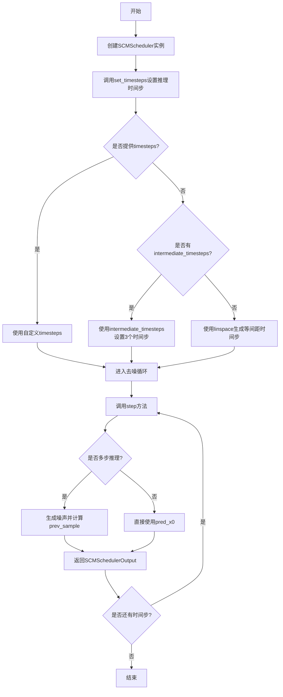
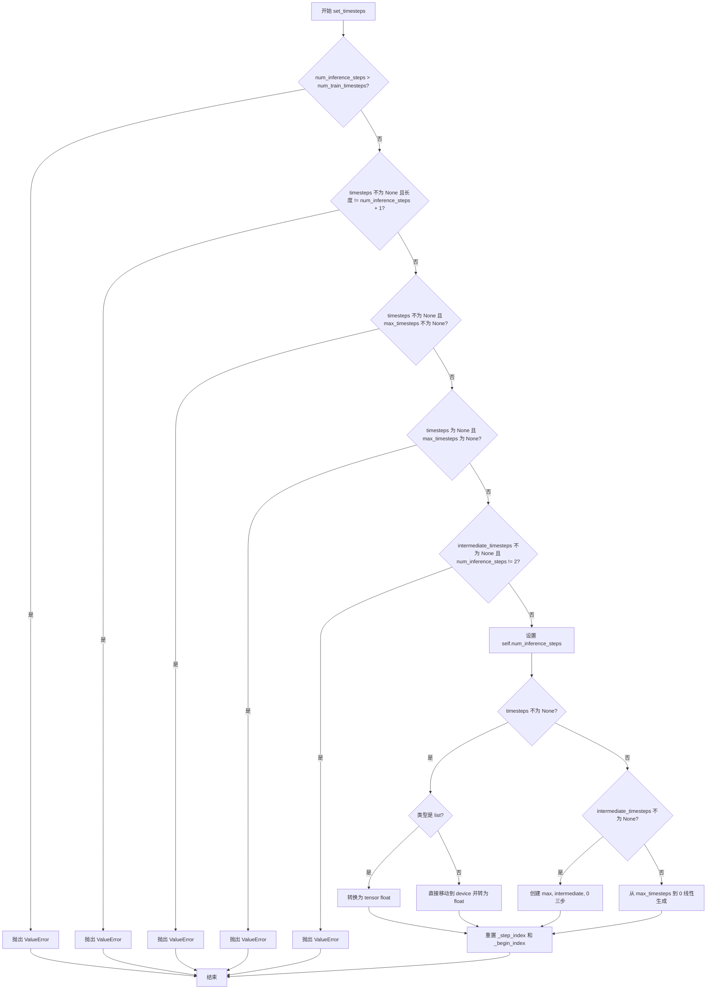
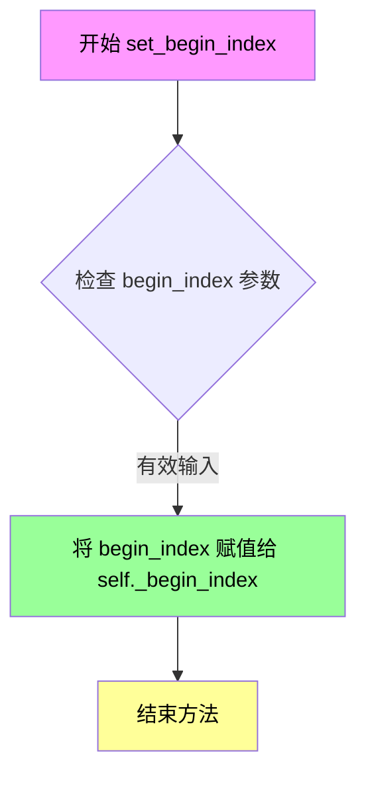
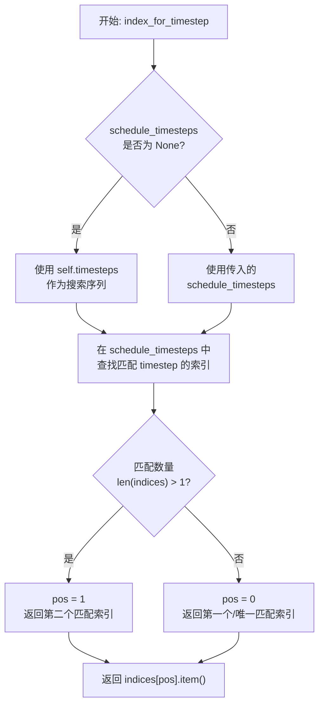
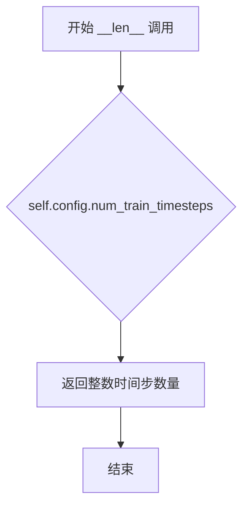
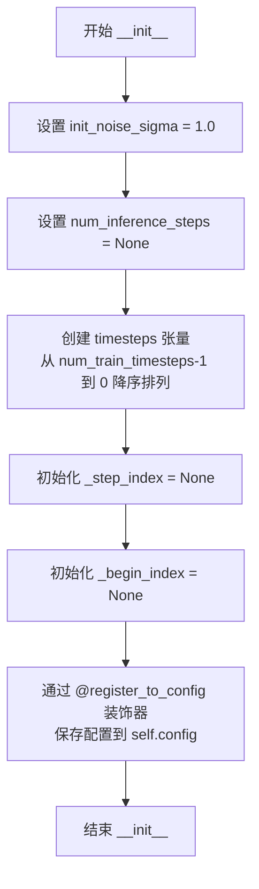
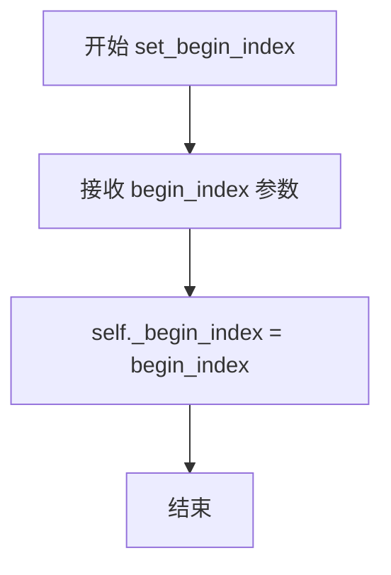
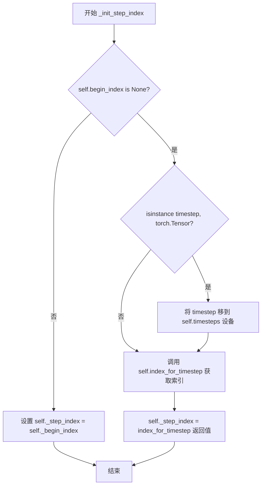
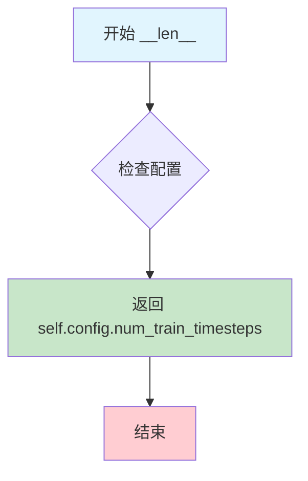

# `diffusers\src\diffusers\schedulers\scheduling_scm.py` 详细设计文档

SCMScheduler是一个基于扩散概率模型（DDPM）的调度器实现，通过非马尔可夫引导扩展去噪程序，支持trigflow预测类型，用于在扩散模型的逆向过程中逐步去噪生成样本。

## 整体流程



## 类结构

```
BaseOutput (基类)
├── SCMSchedulerOutput (数据类)
├── SchedulerMixin (混入类)
└── ConfigMixin (混入类)
    └── SCMScheduler (主调度器类)
```

## 全局变量及字段


### `logger`
    
模块级日志记录器，用于记录调度器运行过程中的信息

类型：`logging.Logger`
    


### `SCMSchedulerOutput.prev_sample`
    
前一步计算出的样本(x_{t-1})，用于作为下一步的模型输入

类型：`torch.Tensor`
    


### `SCMSchedulerOutput.pred_original_sample`
    
预测的去噪样本(x_0)，可用于预览进度或引导

类型：`torch.Tensor | None`
    


### `SCMScheduler.init_noise_sigma`
    
初始噪声分布的标准差，默认为1.0

类型：`float`
    


### `SCMScheduler.num_inference_steps`
    
推理步骤数，用于指定扩散链中的推理步数

类型：`int | None`
    


### `SCMScheduler.timesteps`
    
时间步序列，存储离散的时间步用于扩散过程

类型：`torch.Tensor`
    


### `SCMScheduler._step_index`
    
当前步骤索引，记录当前在时间步序列中的位置

类型：`int | None`
    


### `SCMScheduler._begin_index`
    
起始索引，用于设置调度器的起始位置

类型：`int | None`
    


### `SCMScheduler.order`
    
调度器阶数，默认为1，用于多步采样时的阶数控制

类型：`int`
    


### `SCMScheduler.config`
    
配置对象，通过register_to_config装饰器自动生成并存储调度器配置

类型：`rozen`
    
    

## 全局函数及方法


### SCMScheduler.__init__

初始化 SCM 调度器，设置扩散模型的时间步数、预测类型和噪声标准差等关键参数，为后续的采样过程做好准备。

参数：

- `num_train_timesteps`：`int`，默认为 1000，模型训练时使用的扩散步数
- `prediction_type`：`str`，默认为 "trigflow"，调度器函数的预测类型，目前仅支持 "trigflow"
- `sigma_data`：`float`，默认为 0.5，多步推理时添加的噪声标准差

返回值：`None`，该方法为构造函数，仅初始化实例属性，不返回任何值

#### 流程图

```mermaid
flowchart TD
    A[开始 __init__] --> B[设置 init_noise_sigma = 1.0]
    B --> C[设置 num_inference_steps = None]
    C --> D[创建 timesteps 数组: np.arange(0, num_train_timesteps)[::-1]]
    D --> E[转换为 PyTorch Tensor]
    E --> F[设置 _step_index = None]
    F --> G[设置 _begin_index = None]
    G --> H[结束 __init__]
```

#### 带注释源码

```python
@register_to_config
def __init__(
    self,
    num_train_timesteps: int = 1000,
    prediction_type: str = "trigflow",
    sigma_data: float = 0.5,
):
    """
    Initialize the SCM scheduler.

    Args:
        num_train_timesteps (`int`, defaults to 1000):
            The number of diffusion steps to train the model.
        prediction_type (`str`, defaults to `trigflow`):
            Prediction type of the scheduler function. Currently only supports "trigflow".
        sigma_data (`float`, defaults to 0.5):
            The standard deviation of the noise added during multi-step inference.
    """
    # 标准差为1.0的初始噪声分布
    # standard deviation of the initial noise distribution
    self.init_noise_sigma = 1.0

    # 可设置的推理步数，初始化时为None
    # setable values
    self.num_inference_steps = None
    
    # 创建时间步序列，从num_train_timesteps-1到0倒序排列
    # timesteps 存储为 PyTorch Tensor，类型为 int64
    self.timesteps = torch.from_numpy(np.arange(0, num_train_timesteps)[::-1].copy().astype(np.int64))

    # 调度器的当前步索引，用于跟踪推理过程中的进度
    self._step_index = None
    
    # 调度器的起始索引，用于支持从中间步骤开始推理
    self._begin_index = None
```


### SCMScheduler.step

执行单步去噪操作，通过反向随机微分方程（SDE）基于当前时间步的模型输出预测前一个时间步的样本。

参数：

- `model_output`：`torch.FloatTensor`，学习扩散模型的直接输出（通常为预测噪声）
- `timestep`：`float`，扩散链中的当前离散时间步
- `sample`：`torch.FloatTensor`，扩散过程生成的当前样本实例
- `generator`：`torch.Generator`，可选的随机数生成器，用于复现采样结果
- `return_dict`：`bool`，默认为`True`，决定返回`SCMSchedulerOutput`对象还是元组

返回值：`SCMSchedulerOutput`或`tuple`，包含去噪后的样本`prev_sample`和预测的原始样本`pred_original_sample`（仅当`return_dict=True`时返回`SCMSchedulerOutput`，否则返回`(prev_sample, pred_x0)`元组）

#### 流程图

```mermaid
flowchart TD
    A[开始 step] --> B{检查 num_inference_steps}
    B -->|None| C[抛出异常: 需要先运行 set_timesteps]
    B -->|已设置| D{检查 step_index}
    D -->|None| E[调用 _init_step_index 初始化步索引]
    D -->|已设置| F[继续执行]
    E --> F
    F --> G[获取时间步 t 和 s]
    G --> H{判断参数化类型}
    H -->|trigflow| I[计算 pred_x0 = cos(s) * sample - sin(s) * model_output]
    H -->|其他| J[抛出异常: 不支持的参数化类型]
    I --> K{检查时间步数量}
    K -->|len > 1| L[生成噪声并计算 prev_sample]
    K -->|len == 1| M[直接设置 prev_sample = pred_x0]
    L --> N[更新 step_index += 1]
    M --> N
    N --> O{return_dict?}
    O -->|True| P[返回 SCMSchedulerOutput 对象]
    O -->|False| Q[返回 tuple 元组]
```

#### 带注释源码

```python
def step(
    self,
    model_output: torch.FloatTensor,
    timestep: float,
    sample: torch.FloatTensor,
    generator: torch.Generator = None,
    return_dict: bool = True,
) -> SCMSchedulerOutput | tuple:
    """
    Predict the sample from the previous timestep by reversing the SDE. This function propagates the diffusion
    process from the learned model outputs (most often the predicted noise).

    Args:
        model_output (`torch.FloatTensor`):
            The direct output from learned diffusion model.
        timestep (`float`):
            The current discrete timestep in the diffusion chain.
        sample (`torch.FloatTensor`):
            A current instance of a sample created by the diffusion process.
        return_dict (`bool`, *optional*, defaults to `True`):
            Whether or not to return a [`~schedulers.scheduling_scm.SCMSchedulerOutput`] or `tuple`.
    Returns:
        [`~schedulers.scheduling_utils.SCMSchedulerOutput`] or `tuple`:
            If return_dict is `True`, [`~schedulers.scheduling_scm.SCMSchedulerOutput`] is returned, otherwise a
            tuple is returned where the first element is the sample tensor.
    """
    # 1. 检查推理步数是否已设置，若未设置则抛出异常
    if self.num_inference_steps is None:
        raise ValueError(
            "Number of inference steps is 'None', you need to run 'set_timesteps' after creating the scheduler"
        )

    # 2. 如果步索引未初始化，则根据当前时间步初始化步索引
    if self.step_index is None:
        self._init_step_index(timestep)

    # 3. 获取当前时间步和前一时间步的值
    # t: 当前时间步（用于计算下一步样本）
    # s: 前一时间步（用于预测原始样本）
    t = self.timesteps[self.step_index + 1]
    s = self.timesteps[self.step_index]

    # 4. 根据参数化类型计算预测的原始样本 x0
    # trigflow 参数化使用三角函数形式的噪声预测转换
    parameterization = self.config.prediction_type

    if parameterization == "trigflow":
        # 核心公式：利用 cos(s) 和 sin(s) 转换模型输出为原始样本预测
        # pred_x0 = cos(s) * sample - sin(s) * model_output
        pred_x0 = torch.cos(s) * sample - torch.sin(s) * model_output
    else:
        raise ValueError(f"Unsupported parameterization: {parameterization}")

    # 5. 多步推理时添加噪声，单步采样不使用噪声
    # 对于多步推理，从 N(0, I) 采样噪声并使用 sigma_data 缩放
    if len(self.timesteps) > 1:
        # 生成与模型输出形状相同的随机噪声张量
        noise = (
            randn_tensor(model_output.shape, device=model_output.device, generator=generator)
            * self.config.sigma_data
        )
        # 计算前一步的样本：结合预测的原始样本和噪声
        # prev_sample = cos(t) * pred_x0 + sin(t) * noise
        prev_sample = torch.cos(t) * pred_x0 + torch.sin(t) * noise
    else:
        # 单步推理时直接使用预测的原始样本作为前一步样本
        prev_sample = pred_x0

    # 6. 更新步索引，为下一次迭代做准备
    self._step_index += 1

    # 7. 根据 return_dict 参数决定返回格式
    if not return_dict:
        # 返回元组格式：(prev_sample, pred_x0)
        return (prev_sample, pred_x0)

    # 返回包含前一步样本和预测原始样本的输出对象
    return SCMSchedulerOutput(prev_sample=prev_sample, pred_original_sample=pred_x0)
```


### `SCMScheduler.set_timesteps`

设置用于扩散链的离散时间步（在推理前运行）。该方法根据传入的参数生成或使用自定义的时间步序列，并初始化调度器的内部状态。

参数：

- `num_inference_steps`：`int`，推理时使用的扩散步数，用于生成样本的预训练模型的时间步数量
- `timesteps`：`torch.Tensor`，可选，自定义时间步，用于去噪过程的时间步序列
- `device`：`str | torch.device`，可选，计算设备，将时间步移动到指定设备
- `max_timesteps`：`float`，默认值 1.57080，SCM 调度器使用的最大时间步值（π/2）
- `intermediate_timesteps`：`float`，默认值 1.3，SCM 调度器的中间时间步值（仅在 num_inference_steps=2 时使用）

返回值：`None`，该方法无返回值，通过修改对象内部状态（`self.timesteps`、`self.num_inference_steps` 等）来生效

#### 流程图



#### 带注释源码

```python
def set_timesteps(
    self,
    num_inference_steps: int,
    timesteps: torch.Tensor = None,
    device: str | torch.device = None,
    max_timesteps: float = 1.57080,
    intermediate_timesteps: float = 1.3,
):
    """
    Sets the discrete timesteps used for the diffusion chain (to be run before inference).

    Args:
        num_inference_steps (`int`):
            The number of diffusion steps used when generating samples with a pre-trained model.
        timesteps (`torch.Tensor`, *optional*):
            Custom timesteps to use for the denoising process.
        max_timesteps (`float`, defaults to 1.57080):
            The maximum timestep value used in the SCM scheduler.
        intermediate_timesteps (`float`, *optional*, defaults to 1.3):
            The intermediate timestep value used in SCM scheduler (only used when num_inference_steps=2).
    """
    # 验证：推理步数不能超过训练步数
    if num_inference_steps > self.config.num_train_timesteps:
        raise ValueError(
            f"`num_inference_steps`: {num_inference_steps} cannot be larger than `self.config.train_timesteps`:"
            f" {self.config.num_train_timesteps} as the unet model trained with this scheduler can only handle"
            f" maximal {self.config.num_train_timesteps} timesteps."
        )

    # 验证：自定义时间步的长度必须正确
    if timesteps is not None and len(timesteps) != num_inference_steps + 1:
        raise ValueError("If providing custom timesteps, `timesteps` must be of length `num_inference_steps + 1`.")

    # 验证：不能同时提供自定义时间步和最大时间步
    if timesteps is not None and max_timesteps is not None:
        raise ValueError("If providing custom timesteps, `max_timesteps` should not be provided.")

    # 验证：必须提供时间步或最大时间步之一
    if timesteps is None and max_timesteps is None:
        raise ValueError("Should provide either `timesteps` or `max_timesteps`.")

    # 验证：中间时间步仅在两步推理时支持
    if intermediate_timesteps is not None and num_inference_steps != 2:
        raise ValueError("Intermediate timesteps for SCM is not supported when num_inference_steps != 2.")

    # 设置推理步数
    self.num_inference_steps = num_inference_steps

    if timesteps is not None:
        # 处理自定义时间步（支持 list 或 Tensor）
        if isinstance(timesteps, list):
            self.timesteps = torch.tensor(timesteps, device=device).float()
        elif isinstance(timesteps, torch.Tensor):
            self.timesteps = timesteps.to(device).float()
        else:
            raise ValueError(f"Unsupported timesteps type: {type(timesteps)}")
    elif intermediate_timesteps is not None:
        # 两步推理：使用 [max_timesteps, intermediate_timesteps, 0]
        self.timesteps = torch.tensor([max_timesteps, intermediate_timesteps, 0], device=device).float()
    else:
        # 默认：从 max_timesteps 线性递减到 0
        # max_timesteps=arctan(80/0.5)=1.56454 是 sCM 论文默认值，这里使用不同值
        self.timesteps = torch.linspace(max_timesteps, 0, num_inference_steps + 1, device=device).float()

    # 重置步进索引，准备开始新的推理过程
    self._step_index = None
    self._begin_index = None
```


### SCMScheduler.set_begin_index

该方法用于设置调度器（Scheduler）的起始索引（begin_index），通常在推理前从pipeline调用，以确保从特定的步骤开始执行扩散模型的采样过程。

参数：

- `begin_index`：`int`，默认值 `0`，调度器开始推理的起始索引。

返回值：`None`，无返回值，仅修改实例属性 `_begin_index` 的值。

#### 流程图



#### 带注释源码

```python
# Copied from diffusers.schedulers.scheduling_dpmsolver_multistep.DPMSolverMultistepScheduler.set_begin_index
def set_begin_index(self, begin_index: int = 0):
    """
    Sets the begin index for the scheduler. This function should be run from pipeline before the inference.

    Args:
        begin_index (`int`, defaults to `0`):
            The begin index for the scheduler.
    """
    # 将传入的 begin_index 参数赋值给实例变量 _begin_index
    # 该变量用于记录调度器开始推理的起始位置
    # 在 _init_step_index 方法中会被使用来决定 step_index 的初始值
    self._begin_index = begin_index
```


### `SCMScheduler._init_step_index`

初始化调度器的步骤索引，基于给定的时间步进行计算。该方法在推理开始时被调用，用于确定当前扩散过程所处的步骤位置。

参数：

- `timestep`：`float | torch.Tensor`，当前的时间步，用于初始化步骤索引。可以是浮点数或 PyTorch 张量。

返回值：`None`，该方法不返回任何值，仅内部设置 `_step_index` 属性。

#### 流程图

```mermaid
flowchart TD
    A[开始 _init_step_index] --> B{self.begin_index is None?}
    B -->|是| C{isinstance(timestep, torch.Tensor)?}
    C -->|是| D[timestep = timestep.to<br/>self.timesteps.device]
    C -->|否| E[跳过]
    D --> F[self._step_index =<br/>self.index_for_timestep<br/>timestep]
    B -->|否| G[self._step_index =<br/>self._begin_index]
    F --> H[结束]
    G --> H
```

#### 带注释源码

```python
# Copied from diffusers.schedulers.scheduling_euler_discrete.EulerDiscreteScheduler._init_step_index
def _init_step_index(self, timestep: float | torch.Tensor) -> None:
    """
    Initialize the step index for the scheduler based on the given timestep.

    Args:
        timestep (`float` or `torch.Tensor`):
            The current timestep to initialize the step index from.
    """
    # 检查是否设置了起始索引（begin_index）
    if self.begin_index is None:
        # 如果时间步是张量，将其移动到与调度器时间步相同的设备上
        if isinstance(timestep, torch.Tensor):
            timestep = timestep.to(self.timesteps.device)
        # 通过查找时间步在时间步列表中的索引来初始化步骤索引
        self._step_index = self.index_for_timestep(timestep)
    else:
        # 如果已经设置了起始索引，直接使用该索引
        self._step_index = self._begin_index
```


### `SCMScheduler.index_for_timestep`

在调度器的时间步序列中查找给定时间步值对应的索引位置，用于确定扩散过程当前处于哪个时间步。

参数：

- `self`：`SCMScheduler`，调度器实例
- `timestep`：`float | torch.Tensor`，要查找的时间步值，可以是单个浮点数或张量
- `schedule_timesteps`：`torch.Tensor | None`，可选参数，用于搜索的时间步序列，默认为 `None`，此时使用 `self.timesteps`

返回值：`int`，时间步在调度序列中的索引位置。对于多匹配情况（如 image-to-image 场景从中间开始），首次调用时返回第二个索引以避免跳过 sigma 值。

#### 流程图



#### 带注释源码

```python
def index_for_timestep(
    self, timestep: float | torch.Tensor, schedule_timesteps: torch.Tensor | None = None
) -> int:
    """
    Find the index of a given timestep in the timestep schedule.

    Args:
        timestep (`float` or `torch.Tensor`):
            The timestep value to find in the schedule.
        schedule_timesteps (`torch.Tensor`, *optional*):
            The timestep schedule to search in. If `None`, uses `self.timesteps`.

    Returns:
        `int`:
            The index of the timestep in the schedule. For the very first step, returns the second index if
            multiple matches exist to avoid skipping a sigma when starting mid-schedule (e.g., for image-to-image).
    """
    # 如果未提供自定义时间步序列，则使用调度器实例的默认时间步序列
    if schedule_timesteps is None:
        schedule_timesteps = self.timesteps

    # 使用 non-zero 查找所有等于给定 timestep 值的位置索引
    # 返回一个二维张量，每行是一个匹配位置的索引
    indices = (schedule_timesteps == timestep).nonzero()

    # 特殊处理逻辑：
    # 对于**第一个** step，我们总是选择第二个索引（如果只有一个匹配则选择最后一个索引）
    # 这样可以确保在从去噪调度中间开始时（例如 image-to-image 任务）不会意外跳过 sigma 值
    pos = 1 if len(indices) > 1 else 0

    # 将索引位置的标量值提取出来并返回
    return indices[pos].item()
```


### `SCMScheduler.__len__`

返回训练时间步的数量，即扩散模型训练时使用的时间步总数。该方法使得调度器对象可以直接使用 Python 的 `len()` 函数获取训练时间步的数量。

参数：

- （无额外参数，仅 `self` 作为隐式参数）

返回值：`int`，返回 `self.config.num_train_timesteps`，即配置中定义的训练时间步数量，默认为 1000。

#### 流程图



#### 带注释源码

```python
def __len__(self):
    """
    返回训练时间步数量。
    
    该方法实现了 Python 的特殊方法 __len__，使得 SCMScheduler 实例
    可以直接通过 len(scheduler) 获取训练时使用的时间步总数。
    这在需要知道调度器配置的时间步总数时非常有用，例如在 UI 中显示
    进度或在流水线中验证调度器配置。
    
    Returns:
        int: 训练时间步的数量，通常等于配置中的 num_train_timesteps 值。
             默认值为 1000。
    """
    return self.config.num_train_timesteps
```


### `SCMScheduler.__init__`

初始化SCMScheduler调度器，设置扩散训练的步数、预测类型和噪声标准差等配置参数。

参数：

- `num_train_timesteps`：`int`，默认为 1000，扩散模型训练的步数
- `prediction_type`：`str`，默认为 "trigflow"，调度器函数的预测类型，目前仅支持 "trigflow"
- `sigma_data`：`float`，默认为 0.5，多步推理期间添加的噪声的标准差

返回值：`None`，无返回值（构造函数）

#### 流程图



#### 带注释源码

```python
@register_to_config
def __init__(
    self,
    num_train_timesteps: int = 1000,
    prediction_type: str = "trigflow",
    sigma_data: float = 0.5,
):
    """
    Initialize the SCM scheduler.

    Args:
        num_train_timesteps (`int`, defaults to 1000):
            The number of diffusion steps to train the model.
        prediction_type (`str`, defaults to `trigflow`):
            Prediction type of the scheduler function. Currently only supports "trigflow".
        sigma_data (`float`, defaults to 0.5):
            The standard deviation of the noise added during multi-step inference.
    """
    # standard deviation of the initial noise distribution
    # 初始噪声分布的标准差，设为1.0
    self.init_noise_sigma = 1.0

    # setable values
    # 可设置的值
    self.num_inference_steps = None
    
    # 创建时间步张量：从 num_train_timesteps-1 降到 0，步长为-1
    # 例如 num_train_timesteps=1000 时，生成 [999, 998, ..., 0]
    self.timesteps = torch.from_numpy(np.arange(0, num_train_timesteps)[::-1].copy().astype(np.int64))

    # 内部状态变量，用于跟踪当前推理步骤索引
    self._step_index = None
    # 内部状态变量，用于跟踪推理起始索引
    self._begin_index = None
```


### SCMScheduler.step

该方法是SCMScheduler的核心推理步骤函数，通过逆转随机微分方程(SDE)来预测前一个时间步的样本。它基于当前时间步的模型输出（通常是预测噪声）计算去噪后的样本，支持单步和多步推理，并可选地返回SCMSchedulerOutput对象或元组。

参数：

- `model_output`：`torch.FloatTensor`，学习到的扩散模型的直接输出（通常是预测的噪声）
- `timestep`：`float`，扩散链中的当前离散时间步
- `sample`：`torch.FloatTensor`，扩散过程创建的当前样本实例
- `generator`：`torch.Generator`，可选的随机数生成器，用于可重复的采样
- `return_dict`：`bool`，默认为`True`，决定是否返回`SCMSchedulerOutput`对象

返回值：`SCMSchedulerOutput | tuple`，当`return_dict`为`True`时返回`SCMSchedulerOutput`对象，包含`prev_sample`和`pred_original_sample`；否则返回元组

#### 流程图

```mermaid
flowchart TD
    A[step方法开始] --> B{self.num_inference_steps is None?}
    B -->|是| C[抛出ValueError: 需要先运行set_timesteps]
    B -->|否| D{self.step_index is None?}
    D -->|是| E[调用_init_step_index初始化step_index]
    D -->|否| F
    E --> F[获取时间步: t = self.timesteps[step_index + 1], s = self.timesteps[step_index]]
    F --> G{self.config.prediction_type == 'trigflow'}
    G -->|是| H[pred_x0 = cos(s) * sample - sin(s) * model_output]
    G -->|否| I[抛出ValueError: 不支持的参数化类型]
    H --> J{len(self.timesteps) > 1?}
    J -->|是| K[生成噪声: noise = randn_tensor * sigma_data]
    J -->|否| L[prev_sample = pred_x0]
    K --> M[prev_sample = cos(t) * pred_x0 + sin(t) * noise]
    M --> N[self._step_index += 1]
    L --> N
    N --> O{return_dict == True?}
    O -->|是| P[返回SCMSchedulerOutput对象]
    O -->|否| Q[返回tuple: (prev_sample, pred_x0)]
```

#### 带注释源码

```python
def step(
    self,
    model_output: torch.FloatTensor,
    timestep: float,
    sample: torch.FloatTensor,
    generator: torch.Generator = None,
    return_dict: bool = True,
) -> SCMSchedulerOutput | tuple:
    """
    Predict the sample from the previous timestep by reversing the SDE.
    This function propagates the diffusion process from the learned model outputs
    (most often the predicted noise).

    Args:
        model_output: The direct output from learned diffusion model.
        timestep: The current discrete timestep in the diffusion chain.
        sample: A current instance of a sample created by the diffusion process.
        return_dict: Whether or not to return a [`~schedulers.scheduling_scm.SCMSchedulerOutput`] or `tuple`.

    Returns:
        [`~schedulers.scheduling_utils.SCMSchedulerOutput`] or `tuple`:
            If return_dict is `True`, [`~schedulers.scheduling_scm.SCMSchedulerOutput`] is returned,
            otherwise a tuple is returned where the first element is the sample tensor.
    """
    # 步骤1: 检查是否已设置推理步骤数，这是执行推理的必要前提
    if self.num_inference_steps is None:
        raise ValueError(
            "Number of inference steps is 'None', you need to run 'set_timesteps' after creating the scheduler"
        )

    # 步骤2: 如果step_index未初始化，则根据当前timestep初始化它
    if self.step_index is None:
        self._init_step_index(timestep)

    # 步骤3: 获取当前时间步t和前一个时间步s
    # t是下一步的时间步，s是当前时间步
    t = self.timesteps[self.step_index + 1]
    s = self.timesteps[self.step_index]

    # 步骤4: 根据配置的决定论类型进行不同的参数化处理
    # 目前仅支持"trigflow"参数化方式，这是SCM的核心创新
    parameterization = self.config.prediction_type

    if parameterization == "trigflow":
        # 使用三角流参数化计算预测的原始样本x0
        # 这是通过旋转坐标系来实现的：cos(s)*sample - sin(s)*model_output
        pred_x0 = torch.cos(s) * sample - torch.sin(s) * model_output
    else:
        raise ValueError(f"Unsupported parameterization: {parameterization}")

    # 步骤5: 多步推理时需要添加噪声，单步推理不使用噪声
    # 如果时间步列表长度大于1，则为多步推理，需要采样噪声
    if len(self.timesteps) > 1:
        # 生成标准正态分布噪声，乘以sigma_data控制噪声强度
        noise = (
            randn_tensor(model_output.shape, device=model_output.device, generator=generator)
            * self.config.sigma_data
        )
        # 使用三角流公式计算前一个样本
        # cos(t)*pred_x0 + sin(t)*noise
        prev_sample = torch.cos(t) * pred_x0 + torch.sin(t) * noise
    else:
        # 单步推理时，直接使用预测的原始样本
        prev_sample = pred_x0

    # 步骤6: 更新step_index，为下一次调用做准备
    self._step_index += 1

    # 步骤7: 根据return_dict决定返回格式
    if not return_dict:
        # 返回元组：(prev_sample, pred_original_sample)
        return (prev_sample, pred_x0)

    # 返回SCMSchedulerOutput对象，包含前一个样本和预测的原始样本
    return SCMSchedulerOutput(prev_sample=prev_sample, pred_original_sample=pred_x0)
```


### SCMScheduler.set_timesteps

设置扩散链中使用的离散时间步（在推理前运行）

参数：

- `num_inference_steps`：`int`，生成样本时使用的扩散步数
- `timesteps`：`torch.Tensor`，可选，自定义时间步用于去噪过程
- `device`：`str | torch.device`，可选，设备参数
- `max_timesteps`：`float`，默认 1.57080，SCM调度器使用的最大时间步值
- `intermediate_timesteps`：`float`，默认 1.3，SCM调度器使用的中间时间步值（仅在 num_inference_steps=2 时使用）

返回值：`None`，无返回值

#### 流程图

```mermaid
flowchart TD
    A[开始 set_timesteps] --> B{num_inference_steps > num_train_timesteps?}
    B -->|是| C[抛出 ValueError]
    B -->|否| D{timesteps 不为 None?}
    D -->|是| E{len(timesteps) == num_inference_steps + 1?}
    E -->|否| F[抛出 ValueError]
    E -->|是| G{max_timesteps 不为 None?}
    G -->|是| H[抛出 ValueError]
    G -->|否| I[设置 self.timesteps]
    D -->|否| J{max_timesteps 不为 None?}
    J -->|否| K[抛出 ValueError]
    J -->|是| L{intermediate_timesteps 不为 None?}
    L -->|是| M{num_inference_steps == 2?}
    M -->|否| N[抛出 ValueError]
    M -->|是| O[设置 self.timesteps = [max_timesteps, intermediate_timesteps, 0]]
    L -->|否| P[使用 torch.linspace 生成 timesteps]
    I --> Q[重置 _step_index 和 _begin_index]
    O --> Q
    P --> Q
    Q --> R[结束]
    C --> R
    F --> R
    H --> R
    N --> R
```

#### 带注释源码

```python
def set_timesteps(
    self,
    num_inference_steps: int,
    timesteps: torch.Tensor = None,
    device: str | torch.device = None,
    max_timesteps: float = 1.57080,
    intermediate_timesteps: float = 1.3,
):
    """
    设置扩散链中使用的离散时间步（在推理前运行）。

    Args:
        num_inference_steps (`int`):
            生成样本时使用的扩散步数。
        timesteps (`torch.Tensor`, *optional*):
            自定义时间步用于去噪过程。
        max_timesteps (`float`, 默认 1.57080):
            SCM调度器使用的最大时间步值。
        intermediate_timesteps (`float`, *optional*, 默认 1.3):
            SCM调度器使用的中间时间步值（仅在 num_inference_steps=2 时使用）。
    """
    # 检查推理步数是否超过训练步数
    if num_inference_steps > self.config.num_train_timesteps:
        raise ValueError(
            f"`num_inference_steps`: {num_inference_steps} cannot be larger than `self.config.train_timesteps`:"
            f" {self.config.num_train_timesteps} as the unet model trained with this scheduler can only handle"
            f" maximal {self.config.num_train_timesteps} timesteps."
        )

    # 验证自定义时间步的长度
    if timesteps is not None and len(timesteps) != num_inference_steps + 1:
        raise ValueError("If providing custom timesteps, `timesteps` must be of length `num_inference_steps + 1`.")

    # 验证自定义时间步与max_timesteps不同时提供
    if timesteps is not None and max_timesteps is not None:
        raise ValueError("If providing custom timesteps, `max_timesteps` should not be provided.")

    # 确保提供了时间步
    if timesteps is None and max_timesteps is None:
        raise ValueError("Should provide either `timesteps` or `max_timesteps`.")

    # 验证中间时间步仅在两步推理时使用
    if intermediate_timesteps is not None and num_inference_steps != 2:
        raise ValueError("Intermediate timesteps for SCM is not supported when num_inference_steps != 2.")

    # 设置推理步数
    self.num_inference_steps = num_inference_steps

    # 处理自定义时间步
    if timesteps is not None:
        if isinstance(timesteps, list):
            # 将列表转换为tensor并转为float类型
            self.timesteps = torch.tensor(timesteps, device=device).float()
        elif isinstance(timesteps, torch.Tensor):
            # 直接转移到设备并转为float类型
            self.timesteps = timesteps.to(device).float()
        else:
            raise ValueError(f"Unsupported timesteps type: {type(timesteps)}")
    # 处理两步推理的特殊情况（使用中间时间步）
    elif intermediate_timesteps is not None:
        self.timesteps = torch.tensor([max_timesteps, intermediate_timesteps, 0], device=device).float()
    else:
        # 使用线性间隔生成从max_timesteps到0的时间步
        # max_timesteps=arctan(80/0.5)=1.56454 是sCM论文中的默认值，这里选择不同的值
        self.timesteps = torch.linspace(max_timesteps, 0, num_inference_steps + 1, device=device).float()

    # 重置调度器状态
    self._step_index = None
    self._begin_index = None
```


### `SCMScheduler.set_begin_index`

设置调度器的起始索引，该方法应在推理前从流水线调用，用于控制在扩散链中从哪个时间步开始采样。

参数：

- `begin_index`：`int`，默认为 `0`，调度器的起始索引

返回值：`None`，无返回值

#### 流程图



#### 带注释源码

```python
def set_begin_index(self, begin_index: int = 0):
    """
    Sets the begin index for the scheduler. This function should be run from pipeline before the inference.

    Args:
        begin_index (`int`, defaults to `0`):
            The begin index for the scheduler.
    """
    # 将传入的 begin_index 赋值给实例变量 _begin_index
    # 该变量用于在 _init_step_index 中判断是否需要从指定索引开始推理
    self._begin_index = begin_index
```


### `SCMScheduler._init_step_index`

初始化调度器的步骤索引，基于给定的时间步。

参数：

- `timestep`：`float | torch.Tensor`，当前的时间步，用于初始化步骤索引

返回值：`None`，无返回值，仅初始化内部状态

#### 流程图



#### 带注释源码

```python
def _init_step_index(self, timestep: float | torch.Tensor) -> None:
    """
    Initialize the step index for the scheduler based on the given timestep.

    Args:
        timestep (`float` or `torch.Tensor`):
            The current timestep to initialize the step index from.
    """
    # 检查是否已经设置了起始索引
    if self.begin_index is None:
        # 如果时间步是张量，确保它与调度器的timesteps在同一设备上
        if isinstance(timestep, torch.Tensor):
            timestep = timestep.to(self.timesteps.device)
        # 通过查找时间步在时间步列表中的索引来初始化步骤索引
        self._step_index = self.index_for_timestep(timestep)
    else:
        # 如果已设置起始索引，直接使用该索引
        self._step_index = self._begin_index
```


### `SCMScheduler.index_for_timestep`

在扩散模型的调度过程中，该方法用于根据给定的时间步（timestep）值在时间步调度表中查找其对应的索引位置。为了避免在图像到图像等场景中从调度表中间开始时跳过某个sigma值，该方法在存在多个匹配时，对于第一步会返回第二个索引。

参数：

- `self`：隐式参数，`SCMScheduler`类的实例本身
- `timestep`：`float | torch.Tensor`，要查找的时间步值
- `schedule_timesteps`：`torch.Tensor | None`，可选的时间步调度表，默认为`None`，当为`None`时使用`self.timesteps`

返回值：`int`，时间步在调度表中的索引。对于第一步，如果存在多个匹配项，返回第二个索引以避免跳过sigma值。

#### 流程图

```mermaid
flowchart TD
    A[开始 index_for_timestep] --> B{schedule_timesteps 是否为 None?}
    B -->|是| C[使用 self.timesteps 作为调度表]
    B -->|否| D[使用传入的 schedule_timesteps]
    C --> E[在调度表中查找等于 timestep 的索引]
    D --> E
    E --> F[获取所有匹配的索引]
    F --> G{匹配索引数量 > 1?}
    G -->|是| H[pos = 1]
    G -->|否| I[pos = 0]
    H --> J[返回 indices[1].item]
    I --> K[返回 indices[0].item]
    J --> L[结束]
    K --> L
```

#### 带注释源码

```python
def index_for_timestep(
    self, timestep: float | torch.Tensor, schedule_timesteps: torch.Tensor | None = None
) -> int:
    """
    Find the index of a given timestep in the timestep schedule.

    Args:
        timestep (`float` or `torch.Tensor`):
            The timestep value to find in the schedule.
        schedule_timesteps (`torch.Tensor`, *optional*):
            The timestep schedule to search in. If `None`, uses `self.timesteps`.

    Returns:
        `int`:
            The index of the timestep in the schedule. For the very first step, returns the second index if
            multiple matches exist to avoid skipping a sigma when starting mid-schedule (e.g., for image-to-image).
    """
    # 如果没有提供调度表，则使用实例的默认时间步调度表
    if schedule_timesteps is None:
        schedule_timesteps = self.timesteps

    # 查找所有等于给定timestep值的索引位置
    # .nonzero()返回所有非零元素的索引，这里用于找出所有匹配的位置
    indices = (schedule_timesteps == timestep).nonzero()

    # The sigma index that is taken for the **very** first `step`
    # is always the second index (or the last index if there is only 1)
    # This way we can ensure we don't accidentally skip a sigma in
    # case we start in the middle of the denoising schedule (e.g. for image-to-image)
    # 
    # 关键逻辑：
    # - 如果有多个匹配项（len > 1），返回第二个索引（pos=1）
    # - 如果只有一个匹配项或没有匹配项（len <= 1），返回第一个索引（pos=0）
    # 这样设计是为了确保在图像到图像等场景中，当从调度表中间开始时，
    # 不会意外跳过某个sigma值
    pos = 1 if len(indices) > 1 else 0

    # 将索引转换为Python标量并返回
    return indices[pos].item()
```


### `SCMScheduler.__len__`

返回调度器配置中定义的训练时间步数，用于支持Python的len()函数，使调度器可以像序列一样查询其长度。

参数：
- （无参数，除隐式self）

返回值：`int`，返回配置的训练时间步数（默认为1000），表示扩散模型训练时使用的时间步总数。

#### 流程图



#### 带注释源码

```python
def __len__(self):
    """
    返回调度器的长度，即训练时间步数。
    
    该方法实现了Python的len()协议，使SCMScheduler实例可以
    使用len()函数获取训练时配置的时间步总数。这对于需要
    知道调度器容量的调用者非常有用，例如在验证或可视化时。
    
    Returns:
        int: 配置中定义的训练时间步数，默认值为1000。
             这个值表示扩散模型在训练时使用的时间步总数。
    """
    return self.config.num_train_timesteps
```


## 关键组件


### SCMScheduler (主调度器类)

SCMScheduler扩展了DDPM的去噪程序，引入非马尔可夫引导，支持基于三角流(trigflow)的预测类型，用于扩散模型的推理过程。

### SCMSchedulerOutput (输出数据类)

存储调度器step函数的输出，包含prev_sample（上一时间步的计算样本）和pred_original_sample（预测的去噪样本）。

### trigflow预测类型

基于三角函数参数化的预测方法，使用cos(s)和sin(s)变换来实现样本重构，是SCM调度的核心算法。

### 多步推理支持 (Multi-Step Inference)

通过sigma_data参数控制噪声水平，在多步推理时采样z ~ N(0, I)来增强生成多样性，单步采样时跳过噪声。

### set_timesteps方法

设置离散时间步，支持自定义timesteps、max_timesteps和intermediate_timesteps参数，生成从max到0的时间步序列。

### step方法

执行单步去噪预测，根据model_output和当前sample计算pred_x0，然后结合噪声生成prev_sample。

### 时间步索引管理

通过_step_index和_begin_index跟踪当前推理进度，支持从中间时间步开始推理（图像到图像任务）。

### 噪声控制参数 (sigma_data)

标准差参数，用于控制多步推理时添加的噪声水平，默认值为0.5。


## 问题及建议


### 已知问题

- **硬编码的魔法数字**：代码中存在多个未解释的硬编码数值，如 `max_timesteps=1.57080`、`intermediate_timesteps=1.3`、`sigma_data=0.5` 等，这些数值的设计意图和来源在注释中不一致（注释提到论文默认值是 1.56454，但实际使用 1.57080），缺乏清晰的数学解释或配置化支持。
- **类型注解不一致**：`set_timesteps` 方法中 `timesteps` 参数接受 `torch.Tensor` 或 `float`，但在内部处理时统一转为 `float`，类型注解不够精确，可能导致类型检查工具无法有效识别问题。
- **配置验证不足**：`prediction_type` 只支持 "trigflow"，但没有在初始化时验证该值的有效性；`sigma_data` 和 `num_train_timesteps` 缺少负值或零值检查，可能导致运行时错误或不可预测的行为。
- **缺乏输入形状验证**：`step` 方法中没有验证 `model_output` 和 `sample` 的形状是否一致，可能在形状不匹配时产生难以追踪的张量形状错误。
- **边界条件处理**：`index_for_timestep` 方法中对于多匹配情况的处理逻辑（总是返回第二个索引）可能不适用于所有场景，特别是当调度器用于 image-to-image 以外的任务时。
- **未完成的兼容性设计**：注释中提到 `_compatibles` 列表被注释掉，表明可能有支持其他调度器的计划，但当前实现未完成，这可能是遗留的技术债务。
- **文档缺失**：部分参数如 `generator` 在 `step` 方法中缺少文档说明；`return_dict` 的描述可以更详细。

### 优化建议

- 将魔法数字提取为可配置的类属性或常量，并为每个数值添加详细的文档注释说明其数学含义和来源。
- 完善类型注解，使用 `Union` 类型明确标注 `timesteps` 参数的合法类型，并在方法入口添加运行时类型检查。
- 在 `__init__` 方法中添加配置验证逻辑，检查 `prediction_type` 是否为支持的值，验证 `sigma_data > 0` 和 `num_train_timesteps > 0`。
- 在 `step` 方法入口添加形状一致性检查，确保 `model_output.shape == sample.shape`，并提供清晰的错误信息。
- 考虑将复用的方法（如 `_init_step_index` 和 `index_for_timestep`）提取到基类或 mixin 中，减少代码重复。
- 补充缺失的文档字符串，为所有参数添加清晰的描述，特别是 `generator` 参数的作用和 `return_dict` 的行为。
- 如果没有计划支持其他调度器，建议移除被注释的 `_compatibles` 相关代码，保持代码整洁。


## 其它


### 设计目标与约束

SCMScheduler的设计目标是实现一种基于非马尔可夫引导的扩散模型去噪调度器，继承自DDPM并扩展其功能。该调度器主要用于扩散模型的推理过程，通过逆向扩散过程从噪声样本中恢复出原始样本。核心约束包括：仅支持"trigflow"预测类型，不支持其他预测类型；当num_inference_steps不等于2时，不支持intermediate_timesteps参数；num_inference_steps不能超过训练时设置的num_train_timesteps。

### 错误处理与异常设计

代码中包含多处错误检查和异常抛出机制。在set_timesteps方法中，会检查num_inference_steps是否大于num_train_timesteps、timesteps长度是否匹配、max_timesteps和timesteps不能同时提供、必须提供timesteps或max_timesteps之一、以及intermediate_timesteps的约束条件。在step方法中，会检查num_inference_steps是否为None以及prediction_type是否支持。所有错误都通过ValueError抛出，并包含清晰的错误信息描述问题所在。

### 数据流与状态机

SCMScheduler的核心状态包括：_step_index（当前步骤索引）、_begin_index（起始索引）、timesteps（时间步序列）、num_inference_steps（推理步数）。状态转换流程为：初始化时设置timesteps序列 -> 调用set_timesteps设置推理步数 -> 循环调用step方法进行去噪 -> 每个step调用后_step_index自增。数据流向为：model_output（模型预测） + sample（当前样本）+ timestep（当前时间步） -> 计算pred_x0（预测原始样本）-> 添加噪声生成prev_sample（前一时间步样本）。

### 外部依赖与接口契约

SCMScheduler依赖以下外部组件：ConfigMixin和register_to_config装饰器用于配置管理；SchedulerMixin提供调度器通用接口；BaseOutput提供输出基类；randn_tensor工具函数用于生成随机张量；numpy和torch用于数值计算。该调度器供外部调用的核心接口包括：set_timesteps用于初始化时间步、step用于执行单步去噪、set_begin_index用于设置起始索引、index_for_timestep用于查找时间步索引。

### 配置管理机制

SCMScheduler通过@dataclass装饰器和register_to_config实现配置管理。可配置参数包括：num_train_timesteps（训练时间步数，默认1000）、prediction_type（预测类型，默认trigflow）、sigma_data（推理时添加噪声的标准差，默认0.5）。配置在初始化时通过__init__方法注册，并在整个调度器生命周期中通过self.config访问。

### 数学原理说明

该调度器基于三角流（TrigFlow）参数化方法。核心公式为：pred_x0 = cos(s) * sample - sin(s) * model_output，其中s是当前时间步。对于多步推理，prev_sample = cos(t) * pred_x0 + sin(t) * noise，其中noise是从均值0方差I的正态分布中采样并乘以sigma_data。该方法将扩散过程与三角函数结合，实现非马尔可夫式的去噪过程。

### 与其他调度器的兼容性

SCMScheduler实现了SchedulerMixin接口，因此可以与其他调度器（如DDPM、DDPMScheduler、EulerDiscreteScheduler等）互换使用。order属性设置为1表示这是一阶调度器。代码中保留了_compatibles字段的注释结构，表明原本计划支持KarrasDiffusionSchedulers系列调度器。

### 性能考虑与优化空间

当前实现中每次调用step都会计算三角函数，可能存在重复计算。优化方向包括：预计算并缓存cos和sin值、批量处理时使用向量化操作、考虑使用torch.compile加速。此外，randn_tensor在每步都调用，可考虑预分配噪声缓冲区。timesteps使用float类型，对于大规模推理可考虑使用半精度浮点数。

### 使用示例与典型工作流

典型使用流程为：1) 创建SCMScheduler实例并配置参数；2) 调用set_timesteps设置推理步数；3) 循环调用step方法，每次传入model_output、当前timestep和sample；4) 获取prev_sample作为下一步输入，最终获得去噪后的样本。典型场景包括图像生成、图像编辑、图像修复等扩散模型应用。

### 版本历史与变更记录

该代码基于pytorch_diffusion和hojonathanho/diffusion实现，并借鉴了diffusers库中DDPM、EulerDiscreteScheduler、DPMSolverMultistepScheduler的实现。SCM指代Stochastic Consistency Models，是对传统DDPM的非马尔可夫扩展。


    