# `diffusers\src\diffusers\schedulers\scheduling_sde_ve.py` 详细设计文档

ScoreSdeVeScheduler是一个方差爆炸随机微分方程(SDE)调度器，用于扩散模型的采样过程。它通过反转SDE来预测前一个时间步的样本，并支持校正步骤来改进采样质量。该调度器实现了噪声调度、样本去噪和噪声添加等核心功能。

## 整体流程

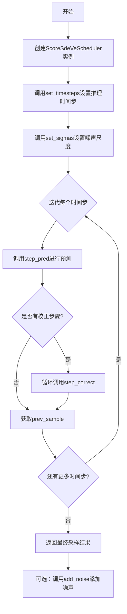

## 类结构

```
BaseOutput (数据类基类)
└── SdeVeOutput (SDE VE调度器输出)
SchedulerMixin (调度器混入类)
ConfigMixin (配置混入类)
└── ScoreSdeVeScheduler (主调度器类)
```

## 全局变量及字段


### `num_train_timesteps`
    
The number of diffusion steps to train the model

类型：`int`
    


### `snr`
    
A coefficient weighting the step from the model_output sample to the random noise

类型：`float`
    


### `sigma_min`
    
The initial noise scale for the sigma sequence in the sampling procedure

类型：`float`
    


### `sigma_max`
    
The maximum value used for the range of continuous timesteps passed into the model

类型：`float`
    


### `sampling_eps`
    
The end value of sampling where timesteps decrease progressively from 1 to epsilon

类型：`float`
    


### `correct_steps`
    
The number of correction steps performed on a produced sample

类型：`int`
    


### `SdeVeOutput.prev_sample`
    
Computed sample (x_{t-1}) of previous timestep

类型：`torch.Tensor`
    


### `SdeVeOutput.prev_sample_mean`
    
Mean averaged prev_sample over previous timesteps

类型：`torch.Tensor`
    


### `ScoreSdeVeScheduler.order`
    
The order of the scheduler

类型：`int`
    


### `ScoreSdeVeScheduler.init_noise_sigma`
    
Standard deviation of the initial noise distribution

类型：`float`
    


### `ScoreSdeVeScheduler.timesteps`
    
The setable timesteps for the diffusion chain

类型：`torch.Tensor`
    


### `ScoreSdeVeScheduler.sigmas`
    
The noise scales (sigmas) for the diffusion chain

类型：`torch.Tensor`
    


### `ScoreSdeVeScheduler.discrete_sigmas`
    
The discrete noise scales computed from sigma_min to sigma_max

类型：`torch.Tensor`
    
    

## 全局函数及方法


### `math.log`

在 `ScoreSdeVeScheduler.set_sigmas` 方法中，`math.log` 用于计算 sigma 值的自然对数，以便在对数尺度上创建离散的 sigma 序列。这是生成方差爆发 SDE 调度器中噪声尺度的关键数学操作。

参数：

- `x`：`float`，要计算其对数的正数（在此代码中为 `sigma_min` 或 `sigma_max`）

返回值：`float`，返回 `x` 的自然对数（以 e 为底）

#### 流程图

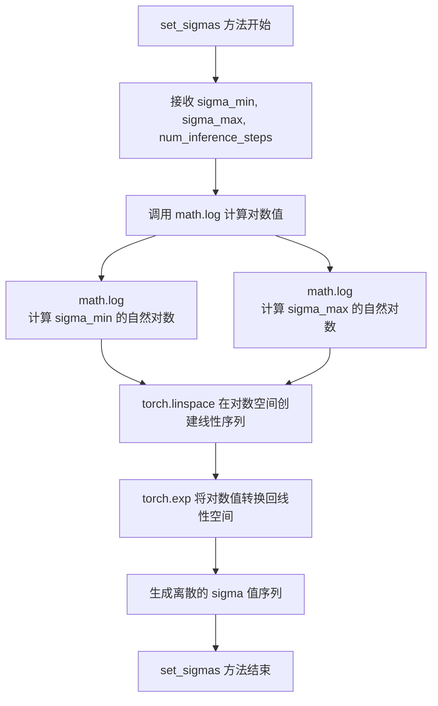

#### 带注释源码

```python
def set_sigmas(
    self, num_inference_steps: int, sigma_min: float = None, sigma_max: float = None, sampling_eps: float = None
):
    """
    Sets the noise scales used for the diffusion chain (to be run before inference). 
    The sigmas control the weight of the `drift` and `diffusion` components of the sample update.

    Args:
        num_inference_steps (`int`):
            The number of diffusion steps used when generating samples with a pre-trained model.
        sigma_min (`float`, optional):
            The initial noise scale value (overrides value given during scheduler instantiation).
        sigma_max (`float`, optional):
            The final noise scale value (overrides value given during scheduler instantiation).
        sampling_eps (`float`, optional):
            The final timestep value (overrides value given during scheduler instantiation).
    """
    # 获取配置中的默认值
    sigma_min = sigma_min if sigma_min is not None else self.config.sigma_min
    sigma_max = sigma_max if sigma_max is not None else self.config.sigma_max
    sampling_eps = sampling_eps if sampling_eps is not None else self.config.sampling_eps
    
    # 确保 timesteps 已设置
    if self.timesteps is None:
        self.set_timesteps(num_inference_steps, sampling_eps)

    # 计算连续 sigma 值的公式 (使用幂函数分布)
    # sigma(t) = sigma_min * (sigma_max / sigma_min) ^ (t / sampling_eps)
    self.sigmas = sigma_min * (sigma_max / sigma_min) ** (self.timesteps / sampling_eps)
    
    # 关键部分：使用 math.log 在对数空间中创建离散 sigma 值
    # 1. 使用 math.log 计算 sigma_min 和 sigma_max 的自然对数
    # 2. 在对数空间创建线性间隔 (torch.linspace)
    # 3. 使用 torch.exp 将对数值转换回线性空间
    self.discrete_sigmas = torch.exp(
        torch.linspace(
            math.log(sigma_min),    # 计算 sigma_min 的自然对数
            math.log(sigma_max),    # 计算 sigma_max 的自然对数
            num_inference_steps
        )
    )
    
    # 使用列表推导式计算另一种 sigma 序列
    self.sigmas = torch.tensor([
        sigma_min * (sigma_max / sigma_min) ** t 
        for t in self.timesteps
    ])
```

#### 使用场景说明

在方差爆发 SDE (Score SDE - Variance Exploding) 调度器中，`math.log` 的使用是为了在对数尺度上均匀分布噪声参数。这种方法的优势在于：

1. **对数尺度采样**：在 sigma 值跨越大范围（如 0.01 到 1348.0）时，对数尺度可以更好地捕捉低 sigma 值的细节变化
2. **数值稳定性**：避免在 sigma 值很小时出现数值精度问题
3. **符合物理意义**：在扩散过程中，噪声尺度的变化通常在对数尺度上更为平滑自然


### `torch.linspace`

在 `ScoreSdeVeScheduler.set_timesteps` 方法中调用 `torch.linspace` 用于生成扩散模型推理过程中所需的等间距时间步序列。

参数：

- `start`：`float`（在代码中为 1），序列起始值
- `end`：`float`（在代码中为 `sampling_eps`），序列结束值
- `steps`：`int`（在代码中为 `num_inference_steps`），生成的样本数量
- `device`：`str | torch.device`，可选，生成张量存放的设备

返回值：`torch.Tensor`，包含从 start 到 end 的等间距张量

#### 流程图

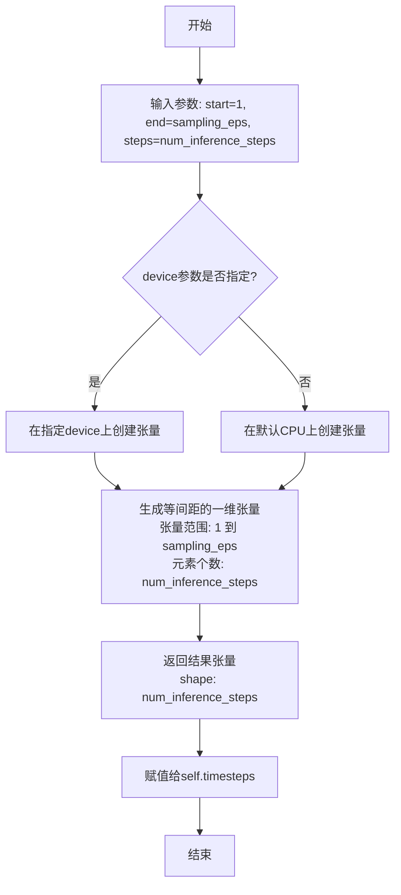

#### 带注释源码

```python
# 在 ScoreSdeVeScheduler 类的 set_timesteps 方法中使用
def set_timesteps(self, num_inference_steps: int, sampling_eps: float = None, device: str | torch.device = None):
    """
    设置扩散链的连续时间步（推理前运行）
    """
    # 获取采样结束值，若未提供则使用配置中的默认值
    sampling_eps = sampling_eps if sampling_eps is not None else self.config.sampling_eps

    # 生成等间距的时间步张量
    # start=1: 从1开始（扩散过程的起点）
    # end=sampling_eps: 到sampling_eps结束（通常是很小的值如1e-5）
    # num_inference_steps: 推理过程中的总步数
    # device: 指定张量存储的设备
    self.timesteps = torch.linspace(1, sampling_eps, num_inference_steps, device=device)
```


根据您提供的代码，我需要说明一个重要发现：**代码中并不存在名为 `torch.exp` 的独立函数定义**。`torch.exp` 是 PyTorch 库中的一个内置数学函数，在代码的 `set_sigmas` 方法中被调用：

```python
self.discrete_sigmas = torch.exp(torch.linspace(math.log(sigma_min), math.log(sigma_max), num_inference_steps))
```

因此，我无法按照您要求的格式提取一个不存在的独立函数。

**然而**，我可以为您提供代码中实际使用 `torch.exp` 的方法 `set_sigmas` 的详细文档，这样您可以了解 `torch.exp` 在这个调度器中的具体应用场景：
</think>

### ScoreSdeVeScheduler.set_sigmas

该方法用于设置扩散链中使用的噪声尺度（sigmas），控制样本更新的漂移（drift）和扩散（diffusion）组件的权重。其中使用 `torch.exp` 将对数尺度的线性空间转换回指数尺度，以生成离散sigma值序列。

参数：

- `num_inference_steps`：`int`，生成样本时使用的扩散步数
- `sigma_min`：`float | optional`，初始噪声尺度值（覆盖调度器实例化期间给出的值）
- `sigma_max`：`float | optional`，最终噪声尺度值（覆盖调度器实例化期间给出的值）
- `sampling_eps`：`float | optional`，最终时间步值（覆盖调度器实例化期间给出的值）

返回值：`None`，该方法直接修改对象内部状态

#### 流程图

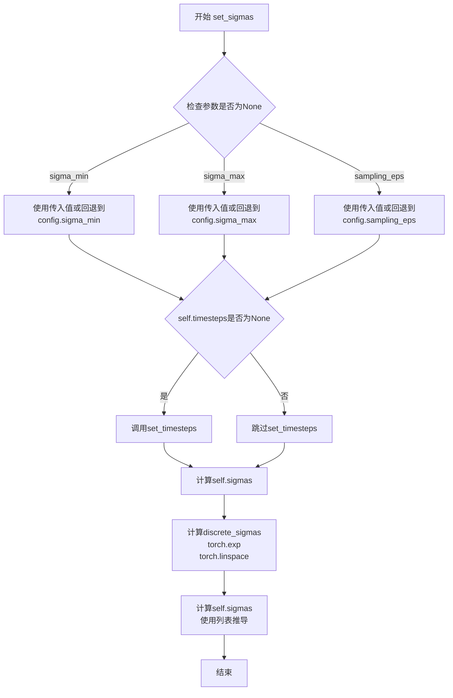

#### 带注释源码

```python
def set_sigmas(
    self, num_inference_steps: int, sigma_min: float = None, sigma_max: float = None, sampling_eps: float = None
):
    """
    设置扩散链中使用的噪声尺度（在推理前运行）。sigmas控制样本更新的漂移和扩散组件的权重。

    Args:
        num_inference_steps (`int`):
            生成样本时使用的扩散步数。
        sigma_min (`float`, optional):
            初始噪声尺度值（覆盖调度器实例化期间给出的值）。
        sigma_max (`float`, optional):
            最终噪声尺度值（覆盖调度器实例化期间给出的值）。
        sampling_eps (`float`, optional):
            最终时间步值（覆盖调度器实例化期间给出的值）。

    """
    # 如果参数为None，则使用配置中的默认值
    sigma_min = sigma_min if sigma_min is not None else self.config.sigma_min
    sigma_max = sigma_max if sigma_max is not None else self.config.sigma_max
    sampling_eps = sampling_eps if sampling_eps is not None else self.config.sampling_eps
    
    # 如果timesteps未设置，先设置时间步
    if self.timesteps is None:
        self.set_timesteps(num_inference_steps, sampling_eps)

    # 计算sigmas：使用幂函数生成从sigma_min到sigma_max的非线性分布
    # 公式：sigma_min * (sigma_max / sigma_min) ^ (t / sampling_eps)
    self.sigmas = sigma_min * (sigma_max / sigma_min) ** (self.timesteps / sampling_eps)
    
    # 计算离散sigmas：使用对数线性空间然后取指数
    # torch.exp 将对数空间转换回指数空间，实现对数均匀分布
    # math.log 创建对数尺度的起始和结束点
    self.discrete_sigmas = torch.exp(
        torch.linspace(math.log(sigma_min), math.log(sigma_max), num_inference_steps)
    )
    
    # 使用列表推导计算另一种sigma表示
    # 对每个时间步t计算: sigma_min * (sigma_max / sigma_min) ^ t
    self.sigmas = torch.tensor([sigma_min * (sigma_max / sigma_min) ** t for t in self.timesteps])
```

#### torch.exp 在此处的具体使用说明

| 项目 | 详情 |
|------|------|
| **函数** | `torch.exp` |
| **调用位置** | `ScoreSdeVeScheduler.set_sigmas` 方法内 |
| **输入** | `torch.linspace(math.log(sigma_min), math.log(sigma_max), num_inference_steps)` |
| **作用** | 将对数均匀分布的输入转换为指数均匀分布的sigma值 |
| **目的** | 在对数尺度上进行线性插值，然后转换回线性尺度，以实现更平滑的噪声调度 |

**示例说明**：
```python
# 假设 sigma_min=0.01, sigma_max=1348.0, num_inference_steps=1000
# math.log(0.01) ≈ -4.6052
# math.log(1348.0) ≈ 7.2060
# torch.linspace 生成从 -4.6052 到 7.2060 的 1000 个均匀间隔点
# torch.exp 将这些对数值转换为实际的sigma值
```

如您确实需要 `torch.exp` 本身的完整文档（作为 PyTorch 库函数），我可以提供该函数的独立文档说明。


### `torch.where`

这是 PyTorch 的条件选择函数，用于根据条件 tensor 从两个输入 tensor 中选择元素。在 `ScoreSdeVeScheduler` 类的 `get_adjacent_sigma` 方法中，使用 `torch.where` 来获取相邻的时间步 sigma 值：当时间步为 0 时，返回零张量；否则返回前一时间步的 sigma 值。

参数：

-  `condition`：`torch.Tensor`，布尔型条件 tensor，当条件为 `True` 时选择 `x` 的元素，当为 `False` 时选择 `y` 的元素
-  `x`：`torch.Tensor`，第一个输入 tensor，形状与 condition 和 y 兼容
-  `y`：`torch.Tensor`，第二个输入 tensor，形状与 condition 和 x 兼容

返回值：`torch.Tensor`，返回根据条件选择的元素组成的 tensor，形状遵循广播规则

#### 流程图

```mermaid
flowchart TD
    A[开始] --> B{condition[i] == True?}
    B -->|True| C[选择 x[i] 作为输出元素]
    B -->|False| D[选择 y[i] 作为输出元素]
    C --> E{处理下一个元素?}
    D --> E
    E -->|Yes| B
    E -->|No| F[返回结果 tensor]
```

#### 带注释源码

```python
def get_adjacent_sigma(self, timesteps, t):
    """
    获取相邻时间步的 sigma 值。
    
    Args:
        timesteps: 当前时间步索引
        t: 当前时间步张量
    
    Returns:
        相邻时间步的 sigma 值
    """
    # torch.where: 条件选择函数
    # 语法: torch.where(condition, x, y)
    #   - 当 condition[i] == True 时, 结果[i] = x[i]
    #   - 当 condition[i] == False 时, 结果[i] = y[i]
    return torch.where(
        timesteps == 0,  # condition: 检查时间步是否为 0
        torch.zeros_like(t.to(timesteps.device)),  # x: 如果 timesteps == 0, 返回零张量
        self.discrete_sigmas[timesteps - 1].to(timesteps.device),  # y: 否则返回前一时间步的 sigma 值
    )
```


### `torch.zeros_like`

这是 PyTorch 的内置函数，用于创建一个形状和 dtype 与输入张量相同的零张量。在 `ScoreSdeVeScheduler` 类中，该函数用于在时间步为 0 时返回一个与输入张量形状相同的零张量，作为 `get_adjacent_sigma` 方法的一部分。

参数：

-  `input`：`Tensor`，输入的张量，用于指定输出张量的形状和数据类型
-  `dtype`：`dtype`，可选参数，指定输出张量的数据类型
-  `device`：`device`，可选参数，指定输出张量所在的设备
-  `layout`：`layout`，可选参数，指定输出张量的内存布局
-  `memory_format`：`memory_format`，可选参数，指定输出张量的内存格式

返回值：`Tensor`，返回一个新的张量，其形状和数据类型与输入张量相同，所有元素值为 0

#### 流程图

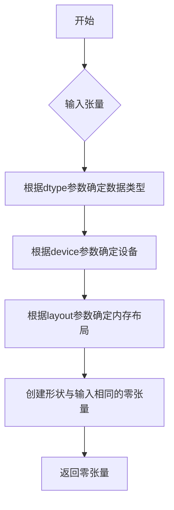

#### 带注释源码

在 `ScoreSdeVeScheduler.get_adjacent_sigma` 方法中的使用：

```python
def get_adjacent_sigma(self, timesteps, t):
    """
    获取相邻时间步的噪声sigma值
    
    参数:
        timesteps: 当前时间步索引
        t: 时间步张量
    
    返回:
        对应时间步的sigma值，如果timesteps为0则返回零张量
    """
    return torch.where(
        timesteps == 0,
        # 当timesteps为0时，创建一个与t形状相同的零张量
        torch.zeros_like(t.to(timesteps.device)),
        # 当timesteps不为0时，获取前一个时间步的sigma值
        self.discrete_sigmas[timesteps - 1].to(timesteps.device),
    )
```

#### 实际使用场景说明

在 `ScoreSdeVeScheduler` 中，`torch.zeros_like` 的具体作用：

1. **场景**：当扩散过程到达最后一个时间步（timesteps == 0）时，需要返回零值作为边界条件
2. **目的**：确保在时间步为 0 时，相邻 sigma 值为 0，符合 SDE 边界条件
3. **设备匹配**：使用 `t.to(timesteps.device)` 确保零张量在正确的设备上，与 `discrete_sigmas` 设备一致
4. **形状匹配**：创建的零张量形状与输入张量 `t` 相同，确保后续计算兼容性


### ScoreSdeVeScheduler.step_correct

该方法是 ScoreSdeVeScheduler 调度器中的校正步骤实现，用于在扩散过程对样本进行去噪时，基于模型输出对样本进行校正操作。该方法通过计算模型输出和噪声的范数来确定步长，然后根据步长和噪声对样本进行修正，以逐步改善生成样本的质量。在实现中使用了 `torch.norm` 函数来计算梯度和噪声的范数，这是计算步长的关键步骤。

参数：

- `model_output`：`torch.Tensor`，由学习到的扩散模型直接输出的结果，通常是预测的噪声或梯度
- `sample`：`torch.Tensor`，当前由扩散过程创建的样本实例
- `generator`：`torch.Generator | None`，可选的随机数生成器，用于生成噪声
- `return_dict`：`bool`，可选，默认为 `True`，决定是否返回 `SchedulerOutput` 还是元组

返回值：`SchedulerOutput | tuple`，如果 `return_dict` 为 `True`，返回 `SchedulerOutput` 对象，其中包含校正后的样本；否则返回元组，第一个元素是样本张量

#### 流程图

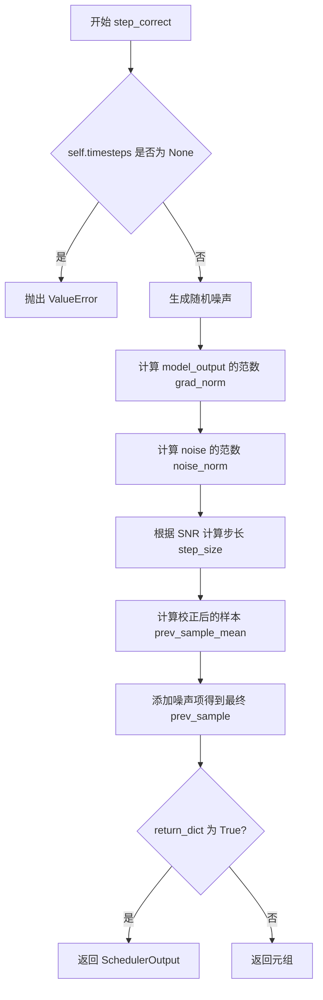

#### 带注释源码

```python
def step_correct(
    self,
    model_output: torch.Tensor,
    sample: torch.Tensor,
    generator: torch.Generator | None = None,
    return_dict: bool = True,
) -> SchedulerOutput | tuple:
    """
    基于模型的输出对预测样本进行校正。这一步通常在完成前一个时间步的预测后重复执行多次。

    Args:
        model_output (torch.Tensor):
            学习到的扩散模型的直接输出。
        sample (torch.Tensor):
            扩散过程生成的当前样本实例。
        generator (torch.Generator, optional):
            随机数生成器。
        return_dict (bool, optional, 默认为 True):
            是否返回 SchedulerOutput 或元组。

    Returns:
        SchedulerOutput 或 tuple:
            如果 return_dict 为 True，返回 SchedulerOutput，否则返回元组，第一个元素是样本张量。
    """
    # 检查是否已设置时间步，如果未设置则抛出错误
    if self.timesteps is None:
        raise ValueError(
            "`self.timesteps` is not set, you need to run 'set_timesteps' after creating the scheduler"
        )

    # 为校正步骤生成随机噪声
    # 对于小批量大小，论文建议用 sqrt(d) 替换 norm(z)，其中 d 是 z 的维度
    noise = randn_tensor(sample.shape, layout=sample.layout, generator=generator).to(sample.device)

    # 从 model_output、noise 和 snr 计算步长
    # 使用 torch.norm 计算模型输出的梯度范数
    # 将 model_output 展平为二维张量，第一维是批次大小
    grad_norm = torch.norm(model_output.reshape(model_output.shape[0], -1), dim=-1).mean()
    
    # 使用 torch.norm 计算噪声的范数
    # 将 noise 展平为二维张量，第一维是批次大小
    noise_norm = torch.norm(noise.reshape(noise.shape[0], -1), dim=-1).mean()
    
    # 根据 SNR、噪声范数和梯度范数计算步长
    # 步长公式：step_size = (snr * noise_norm / grad_norm)^2 * 2
    step_size = (self.config.snr * noise_norm / grad_norm) ** 2 * 2
    
    # 将步长扩展为与样本批次大小匹配
    step_size = step_size * torch.ones(sample.shape[0]).to(sample.device)

    # 计算校正后的样本：包含 model_output 项和 noise 项
    step_size = step_size.flatten()
    while len(step_size.shape) < len(sample.shape):
        step_size = step_size.unsqueeze(-1)
    
    # 样本更新：加上模型输出带来的梯度项
    prev_sample_mean = sample + step_size * model_output
    
    # 加上噪声项，其中噪声的缩放因子是 sqrt(2 * step_size)
    prev_sample = prev_sample_mean + ((step_size * 2) ** 0.5) * noise

    if not return_dict:
        return (prev_sample,)

    return SchedulerOutput(prev_sample=prev_sample)
```

#### 关键技术点说明

在 `step_correct` 方法中，`torch.norm` 的使用是核心部分：

1. **grad_norm 计算**：`torch.norm(model_output.reshape(model_output.shape[0], -1), dim=-1).mean()` 将模型输出展平后计算每个样本的 L2 范数，然后取平均值。这用于衡量模型输出的整体幅度。

2. **noise_norm 计算**：`torch.norm(noise.reshape(noise.shape[0], -1), dim=-1).mean()` 同样方式计算噪声的范数，用于确定步长调整。

3. **步长计算**：通过 `self.config.snr * noise_norm / grad_norm` 的比值来调整校正步长，SNR（信噪比）系数控制校正强度。


### `randn_tensor`

生成指定形状的随机张量，用于扩散模型中的噪声采样。

参数：

- `shape`：`tuple` 或 `torch.Size`，输出张量的形状
- `layout`：`torch.layout`，张量的内存布局（默认：`torch.strided`）
- `generator`：`torch.Generator` 或 `None`，用于生成随机数的生成器对象
- `device`：`torch.device`，张量应放置的设备
- `dtype`：`torch.dtype`，张量的数据类型

返回值：`torch.Tensor`，符合指定形状和数据类型的随机张量

#### 流程图

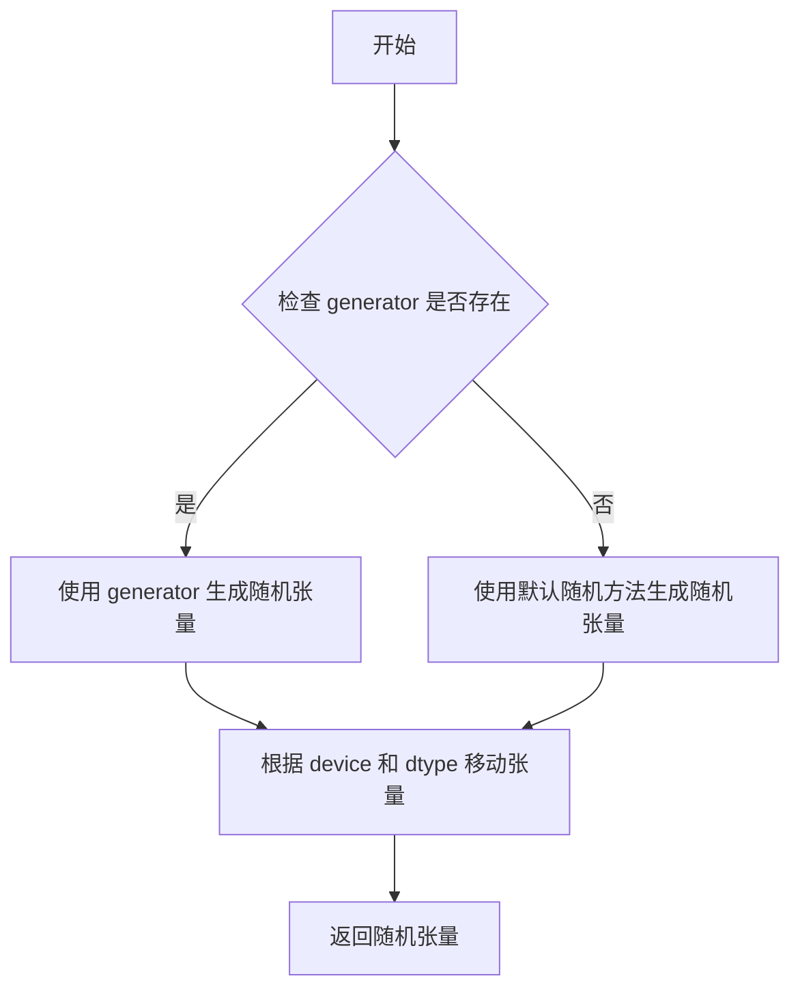

#### 带注释源码

```python
# randn_tensor 函数的源码位于 diffusers 库中，以下是基于使用方式的推断实现
def randn_tensor(
    shape: tuple,  # 张量形状
    layout: torch.layout = torch.strided,  # 内存布局
    generator: torch.Generator | None = None,  # 随机数生成器
    device: torch.device = None,  # 目标设备
    dtype: torch.dtype = None,  # 数据类型
) -> torch.Tensor:
    """
    生成符合指定形状的随机张量（正态分布）。
    
    Args:
        shape: 输出张量的形状，例如 (batch_size, channels, height, width)
        layout: 张量的内存布局，默认为连续布局
        generator: 可选的随机数生成器，用于可重复的随机采样
        device: 张量应放置的设备（CPU/CUDA）
        dtype: 张量的数据类型（如 torch.float32）
    
    Returns:
        符合标准正态分布 N(0,1) 的随机张量
    """
    # 如果提供了生成器，使用生成器生成随机数
    if generator is not None:
        # 使用生成器生成随机张量（确保可重复性）
        tensor = torch.randn(
            shape,
            generator=generator,
            device=device if device else "cpu",
            dtype=dtype if dtype else torch.float32,
        )
    else:
        # 使用全局随机状态生成随机张量
        tensor = torch.randn(
            shape,
            device=device if device else "cpu",
            dtype=dtype if dtype else torch.float32,
        )
    
    # 如果指定了布局且与默认布局不同，需要重新布局
    if layout != torch.strided:
        tensor = tensor.to(layout=layout)
    
    return tensor
```


### ScoreSdeVeScheduler.__init__

`ScoreSdeVeScheduler.__init__`是方差爆炸随机微分方程（SDE）调度器的构造函数，用于初始化扩散模型采样过程中的关键参数，包括训练时间步数、信噪比加权系数、噪声尺度范围等，为后续的采样和去噪过程提供必要的配置。

参数：

- `num_train_timesteps`：`int`，扩散模型训练时的总步数，默认为2000
- `snr`：`float`，一个系数，用于加权模型输出样本（来自网络）到随机噪声的步骤，默认为0.15
- `sigma_min`：`float`，采样过程中sigma序列的初始噪声尺度最小值，应与数据的分布相对应，默认为0.01
- `sigma_max`：`float`，用于连续时间步范围的sigma最大值，默认为1348.0
- `sampling_eps`：`float`，采样的最终时间步值，时间步从1逐渐递减到epsilon，默认为1e-5
- `correct_steps`：`int`，对生成的样本执行的校正步骤数，默认为1

返回值：`None`（构造函数无返回值）

#### 流程图

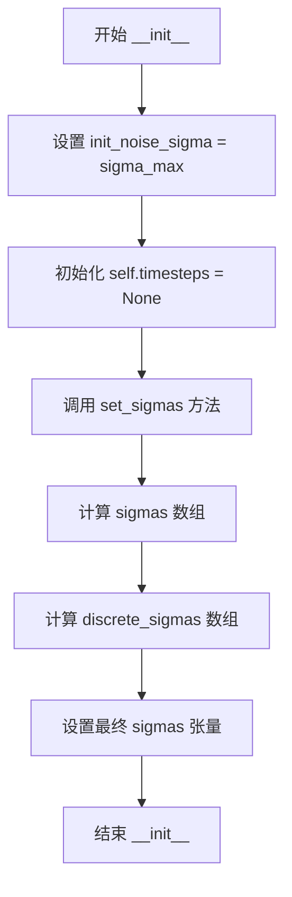

#### 带注释源码

```python
@register_to_config
def __init__(
    self,
    num_train_timesteps: int = 2000,
    snr: float = 0.15,
    sigma_min: float = 0.01,
    sigma_max: float = 1348.0,
    sampling_eps: float = 1e-5,
    correct_steps: int = 1,
):
    """
    初始化 ScoreSdeVeScheduler 调度器。
    
    参数:
        num_train_timesteps: 扩散模型训练的步数
        snr: 信噪比加权系数，控制模型输出与噪声的权重
        sigma_min: 噪声尺度的最小值
        sigma_max: 噪声尺度的最大值
        sampling_eps: 采样的终止时间步
        correct_steps: 校正步骤数
    """
    
    # 设置初始噪声分布的标准差为 sigma_max
    # 这是采样开始时的噪声水平
    self.init_noise_sigma = sigma_max

    # 初始化时间步为 None，稍后在 set_timesteps 中设置
    self.timesteps = None

    # 调用 set_sigmas 方法设置噪声尺度
    # 这会计算用于扩散链的 sigma 值
    self.set_sigmas(num_train_timesteps, sigma_min, sigma_max, sampling_eps)
```


### `ScoreSdeVeScheduler.scale_model_input`

确保与需要根据当前时间步缩放去噪模型输入的调度器互换使用。该方法直接返回原始样本，不进行任何缩放操作，因为 ScoreSdeVeScheduler 不需要基于时间步的缩放。

参数：

- `self`：`ScoreSdeVeScheduler` 实例，调度器对象本身
- `sample`：`torch.Tensor`，输入样本
- `timestep`：`int`，可选，当前扩散链中的时间步

返回值：`torch.Tensor`，缩放后的输入样本（在此实现中直接返回原始样本）

#### 流程图

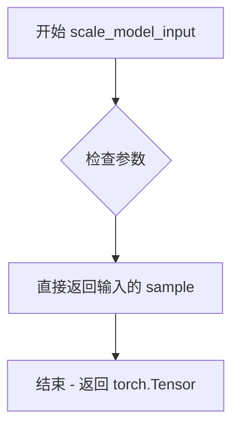

#### 带注释源码

```python
def scale_model_input(self, sample: torch.Tensor, timestep: int = None) -> torch.Tensor:
    """
    Ensures interchangeability with schedulers that need to scale the denoising model input depending on the
    current timestep.

    此方法确保与其他需要根据时间步缩放输入的调度器保持接口一致性。
    ScoreSdeVeScheduler 作为方差扩展随机微分方程调度器，不需要进行输入缩放。

    Args:
        sample (`torch.Tensor`):
            The input sample.
            输入样本，通常是去噪过程中的当前状态。
        timestep (`int`, *optional*):
            The current timestep in the diffusion chain.
            扩散链中的当前时间步，用于确定当前的噪声水平。

    Returns:
        `torch.Tensor`:
            A scaled input sample.
            缩放后的输入样本。由于 ScoreSdeVeScheduler 的特性，直接返回原始样本。
    """
    # 直接返回输入样本，不进行任何缩放操作
    # 这是因为 ScoreSdeVeScheduler 使用 sigma 值来控制噪声强度，
    # 而不是在模型输入层面进行缩放
    return sample
```


### `ScoreSdeVeScheduler.set_timesteps`

设置扩散链中使用的连续时间步（在推理之前运行）。该方法根据推理步数生成从1到指定epsilon值的时间步序列，用于控制扩散模型的采样过程。

参数：

- `num_inference_steps`：`int`，生成样本时使用的扩散步数
- `sampling_eps`：`float`，可选，最终时间步值（覆盖调度器实例化时给定的值）
- `device`：`str | torch.device`，可选，时间步应移动到的设备。如果为 `None`，则不移动时间步

返回值：`None`，该方法无返回值，但会修改实例的 `self.timesteps` 属性

#### 流程图

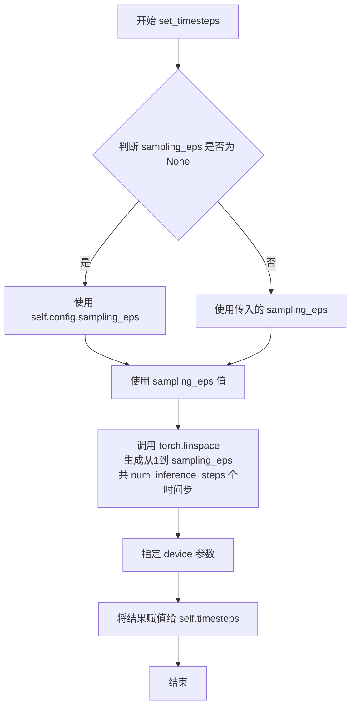

#### 带注释源码

```python
def set_timesteps(self, num_inference_steps: int, sampling_eps: float = None, device: str | torch.device = None):
    """
    Sets the continuous timesteps used for the diffusion chain (to be run before inference).

    Args:
        num_inference_steps (`int`):
            The number of diffusion steps used when generating samples with a pre-trained model.
        sampling_eps (`float`, *optional*):
            The final timestep value (overrides value given during scheduler instantiation).
        device (`str` or `torch.device`, *optional*):
            The device to which the timesteps should be moved to. If `None`, the timesteps are not moved.

    """
    # 如果未提供 sampling_eps，则使用配置中的默认值
    sampling_eps = sampling_eps if sampling_eps is not None else self.config.sampling_eps

    # 生成线性间隔的时间步序列：从1开始，到sampling_eps结束，共num_inference_steps个点
    # 这些时间步将用于扩散模型的推理过程
    self.timesteps = torch.linspace(1, sampling_eps, num_inference_steps, device=device)
```


### `ScoreSdeVeScheduler.set_sigmas`

该方法用于设置扩散链中使用的噪声比例（sigma）值，这些值控制在样本更新中"漂移"和"扩散"分量的权重。该方法在推理前调用，用于配置采样过程的噪声调度。

参数：

- `num_inference_steps`：`int`，生成样本时使用的扩散步骤数量
- `sigma_min`：`float | None`，可选，初始噪声比例值（覆盖调度器实例化时给定的值）
- `sigma_max`：`float | None`，可选，最终噪声比例值（覆盖调度器实例化时给定的值）
- `sampling_eps`：`float | None`，可选，最终时间步值（覆盖调度器实例化时给定的值）

返回值：`None`，该方法直接修改对象状态，不返回任何值

#### 流程图

```mermaid
flowchart TD
    A[开始 set_sigmas] --> B{检查 sigma_min 是否为 None}
    B -->|是| C[使用 self.config.sigma_min]
    B -->|否| D[使用传入的 sigma_min]
    C --> E{检查 sigma_max 是否为 None}
    D --> E
    E -->|是| F[使用 self.config.sigma_max]
    E -->|否| G[使用传入的 sigma_max]
    F --> H{检查 sampling_eps 是否为 None}
    G --> H
    H -->|是| I[使用 self.config.sampling_eps]
    H -->|否| J[使用传入的 sampling_eps]
    J --> K{检查 self.timesteps 是否为 None}
    K -->|是| L[调用 self.set_timesteps]
    K -->|否| M
    L --> M[计算 sigmas = sigma_min * (sigma_max / sigma_min) ^ (timesteps / sampling_eps)]
    M --> N[计算 discrete_sigmas = exp(linspace(log(sigma_min), log(sigma_max), num_inference_steps))]
    N --> O[将 timesteps 转换为 tensor 形式存储在 self.sigmas]
    P[结束]
    O --> P
```

#### 带注释源码

```python
def set_sigmas(
    self, num_inference_steps: int, sigma_min: float = None, sigma_max: float = None, sampling_eps: float = None
):
    """
    设置扩散链使用的噪声比例（sigmas）。sigmas控制样本更新中"漂移"和"扩散"分量的权重。
    此方法应在推理前调用。

    参数:
        num_inference_steps (int):
            使用预训练模型生成样本时使用的扩散步骤数。
        sigma_min (float, 可选):
            初始噪声比例值（覆盖调度器实例化时给定的值）。
        sigma_max (float, 可选):
            最终噪声比例值（覆盖调度器实例化时给定的值）。
        sampling_eps (float, 可选):
            最终时间步值（覆盖调度器实例化时给定的值）。
    """
    # 如果未提供 sigma_min，则使用配置中的默认值
    sigma_min = sigma_min if sigma_min is not None else self.config.sigma_min
    # 如果未提供 sigma_max，则使用配置中的默认值
    sigma_max = sigma_max if sigma_max is not None else self.config.sigma_max
    # 如果未提供 sampling_eps，则使用配置中的默认值
    sampling_eps = sampling_eps if sampling_eps is not None else self.config.sampling_eps
    
    # 如果 timesteps 尚未设置，先调用 set_timesteps 方法进行初始化
    if self.timesteps is None:
        self.set_timesteps(num_inference_steps, sampling_eps)

    # 计算连续的 sigma 值，使用指数衰减公式
    # 公式: sigma(t) = sigma_min * (sigma_max / sigma_min)^(t / sampling_eps)
    # 其中 t 是归一化的时间步（从 1 降到 sampling_eps）
    self.sigmas = sigma_min * (sigma_max / sigma_min) ** (self.timesteps / sampling_eps)
    
    # 计算离散的 sigma 值，用于特定的采样步骤
    # 使用对数线性插值确保在 log 空间中均匀分布
    self.discrete_sigmas = torch.exp(torch.linspace(math.log(sigma_min), math.log(sigma_max), num_inference_steps))
    
    # 将 timesteps 转换为具体的 sigma 值 tensor
    # 对每个时间步 t 计算: sigma_min * (sigma_max / sigma_min)^t
    self.sigmas = torch.tensor([sigma_min * (sigma_max / sigma_min) ** t for t in self.timesteps])
```


### `ScoreSdeVeScheduler.get_adjacent_sigma`

该方法用于获取给定时间步的相邻sigma值（即前一个时间步的sigma值）。当时间步为0时，返回零张量；否则返回离散sigma数组中前一个索引位置的sigma值。这在SDE-VE调度器的采样过程中用于计算相邻时间步之间的噪声尺度差异。

参数：

- `timesteps`：`torch.Tensor`，当前时间步的张量，表示扩散过程中的离散时间步索引
- `t`：兼容的张量类型，当前时间步的值，用于确定返回零张量还是获取相邻sigma

返回值：`torch.Tensor`，返回与输入设备相同的相邻sigma值张量。如果`timesteps`为0，则返回与`t`设备相同的全零张量；否则返回`discrete_sigmas`数组中索引为`timesteps - 1`位置的sigma值。

#### 流程图

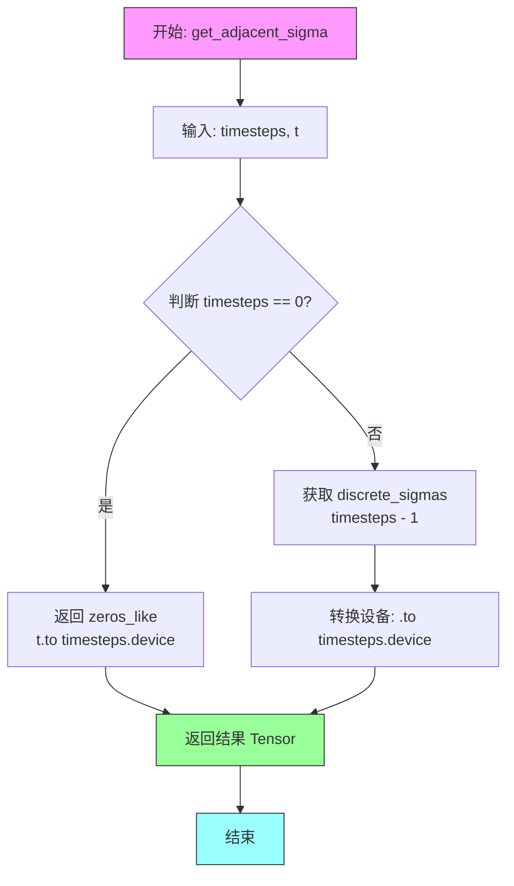

#### 带注释源码

```python
def get_adjacent_sigma(self, timesteps, t):
    """
    获取给定时间步的相邻sigma值（前一时间步的sigma）。
    
    在SDE-VE调度器中，sigma代表扩散过程中的噪声尺度。
    此方法用于采样过程中计算相邻时间步之间的sigma差异。
    
    参数:
        timesteps: 当前时间步的索引张量，用于索引discrete_sigmas数组
        t: 当前时间步的值，用于判断是否为起始时间步
    
    返回:
        相邻时间步的sigma值张量，如果timesteps为0则返回零张量
    """
    # 使用torch.where实现条件逻辑：
    # 当timesteps等于0时（起始时间步），返回与t设备相同的零张量
    # 否则，从discrete_sigmas数组中获取前一个时间步的sigma值
    return torch.where(
        timesteps == 0,  # 条件：张量中每个元素是否等于0
        torch.zeros_like(t.to(timesteps.device)),  # 真值分支：返回零张量
        self.discrete_sigmas[timesteps - 1].to(timesteps.device),  # 假值分支：获取前一个sigma
    )
```


### `ScoreSdeVeScheduler.step_pred`

该函数是 `ScoreSdeVeScheduler` 调度器的核心预测方法，通过反转随机微分方程（SDE）来预测前一个时间步的样本。它利用学习到的扩散模型的输出（通常是预测的噪声），结合随机噪声和预定义的噪声调度（sigmas），计算并返回去噪后的样本和样本均值。

参数：

- `model_output`：`torch.Tensor`，学习到的扩散模型的直接输出（通常为预测的噪声）
- `timestep`：`int`，扩散链中的当前离散时间步
- `sample`：`torch.Tensor`，扩散过程创建的当前样本实例
- `generator`：`torch.Generator | None`，可选的随机数生成器，用于控制噪声采样
- `return_dict`：`bool`，决定返回格式，默认为 `True`

返回值：`SdeVeOutput | tuple`，当 `return_dict` 为 `True` 时返回 `SdeVeOutput` 对象（包含 `prev_sample` 和 `prev_sample_mean`），否则返回元组 `(prev_sample, prev_sample_mean)`

#### 流程图

```mermaid
flowchart TD
    A[开始 step_pred] --> B{self.timesteps 是否已设置?}
    B -- 否 --> C[抛出 ValueError]
    B -- 是 --> D[广播 timestep 到样本批次大小]
    E[获取 discrete_sigmas] --> F[计算相邻 sigma]
    D --> E
    F --> G[初始化漂移项 drift = zeros_like]
    G --> H[计算扩散项 diffusion = sqrt(sigma² - adjacent_sigma²)]
    H --> I[扩展 diffusion 维度以匹配 sample 形状]
    I --> J[计算漂移: drift = drift - diffusion² * model_output]
    J --> K[生成随机噪声]
    K --> L[计算 prev_sample_mean = sample - drift]
    L --> M[计算 prev_sample = prev_sample_mean + diffusion * noise]
    M --> N{return_dict?}
    N -- 是 --> O[返回 SdeVeOutput]
    N -- 否 --> P[返回元组]
    O --> Q[结束]
    P --> Q
```

#### 带注释源码

```python
def step_pred(
    self,
    model_output: torch.Tensor,
    timestep: int,
    sample: torch.Tensor,
    generator: torch.Generator | None = None,
    return_dict: bool = True,
) -> SdeVeOutput | tuple:
    """
    Predict the sample from the previous timestep by reversing the SDE. This function propagates the diffusion
    process from the learned model outputs (most often the predicted noise).

    Args:
        model_output (`torch.Tensor`):
            The direct output from learned diffusion model.
        timestep (`int`):
            The current discrete timestep in the diffusion chain.
        sample (`torch.Tensor`):
            A current instance of a sample created by the diffusion process.
        generator (`torch.Generator`, *optional*):
            A random number generator.
        return_dict (`bool`, *optional*, defaults to `True`):
            Whether or not to return a [`~schedulers.scheduling_sde_ve.SdeVeOutput`] or `tuple`.

    Returns:
        [`~schedulers.scheduling_sde_ve.SdeVeOutput`] or `tuple`:
            If return_dict is `True`, [`~schedulers.scheduling_sde_ve.SdeVeOutput`] is returned, otherwise a tuple
            is returned where the first element is the sample tensor.

    """
    # 检查调度器是否已正确初始化（时间步必须已设置）
    if self.timesteps is None:
        raise ValueError(
            "`self.timesteps` is not set, you need to run 'set_timesteps' after creating the scheduler"
        )

    # 将单个 timestep 广播到与样本批次大小相同
    # 例如：从标量 timestep 扩展为 [batch_size] 的一维张量
    timestep = timestep * torch.ones(
        sample.shape[0], device=sample.device
    )  # torch.repeat_interleave(timestep, sample.shape[0])
    
    # 将连续 timestep 映射到离散索引（0 到 len(timesteps)-1）
    timesteps = (timestep * (len(self.timesteps) - 1)).long()

    # 确保 indices 与 sigmas 在同一设备上（MPS 要求）
    timesteps = timesteps.to(self.discrete_sigmas.device)

    # 获取当前时间步对应的 sigma 值（噪声标准差）
    sigma = self.discrete_sigmas[timesteps].to(sample.device)
    # 获取相邻时间步的 sigma 值（用于计算扩散项）
    adjacent_sigma = self.get_adjacent_sigma(timesteps, timestep).to(sample.device)
    
    # 初始化漂移项为零张量（drift term）
    drift = torch.zeros_like(sample)
    # 计算扩散系数（diffusion coefficient）：√(σ² - σ_{t-1}²)
    diffusion = (sigma**2 - adjacent_sigma**2) ** 0.5

    # equation 6 in the paper: the model_output modeled by the network is grad_x log pt(x)
    # also equation 47 shows the analog from SDE models to ancestral sampling methods
    # 展平扩散系数以便后续广播操作
    diffusion = diffusion.flatten()
    # 扩展扩散系数维度以匹配样本的形状（支持多维样本）
    while len(diffusion.shape) < len(sample.shape):
        diffusion = diffusion.unsqueeze(-1)
    
    # 计算漂移项：drift = -g² * model_output（其中 g 是扩散系数）
    # model_output 预测的是 score function (∇_x log p_t(x))
    drift = drift - diffusion**2 * model_output

    # equation 6: sample noise for the diffusion term of
    # 生成用于扩散项的随机噪声
    noise = randn_tensor(
        sample.shape, layout=sample.layout, generator=generator, device=sample.device, dtype=sample.dtype
    )
    
    # 计算前一个样本的均值：减去漂移项（因为 dt 是小的负时间步）
    prev_sample_mean = sample - drift  # subtract because `dt` is a small negative timestep
    
    # TODO is the variable diffusion the correct scaling term for the noise?
    # 计算前一个样本：均值 + 扩散项 * 噪声
    prev_sample = prev_sample_mean + diffusion * noise  # add impact of diffusion field g

    # 根据 return_dict 参数决定返回格式
    if not return_dict:
        return (prev_sample, prev_sample_mean)

    # 返回包含预测样本和样本均值的输出对象
    return SdeVeOutput(prev_sample=prev_sample, prev_sample_mean=prev_sample_mean)
```


### `ScoreSdeVeScheduler.step_correct`

该方法用于基于扩散模型的输出（`model_output`）对预测样本进行校正，通常在生成采样过程中对前一个时间步的预测进行多次校正操作。

参数：

- `model_output`：`torch.Tensor`，来自学习到的扩散模型的直接输出（通常是预测的噪声或梯度）
- `sample`：`torch.Tensor`，由扩散过程创建的当前样本实例
- `generator`：`torch.Generator | None`，随机数生成器，用于控制噪声生成的随机性
- `return_dict`：`bool`，默认为`True`，决定返回`SchedulerOutput`对象还是元组

返回值：`SchedulerOutput | tuple`，如果`return_dict`为`True`返回`SchedulerOutput`对象（包含校正后的样本），否则返回元组

#### 流程图

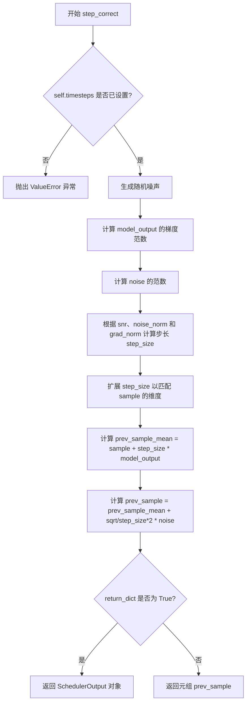

#### 带注释源码

```python
def step_correct(
    self,
    model_output: torch.Tensor,
    sample: torch.Tensor,
    generator: torch.Generator | None = None,
    return_dict: bool = True,
) -> SchedulerOutput | tuple:
    """
    Correct the predicted sample based on the `model_output` of the network. This is often run repeatedly after
    making the prediction for the previous timestep.

    Args:
        model_output (`torch.Tensor`):
            The direct output from learned diffusion model.
        sample (`torch.Tensor`):
            A current instance of a sample created by the diffusion process.
        generator (`torch.Generator`, *optional*):
            A random number generator.
        return_dict (`bool`, *optional*, defaults to `True`):
            Whether or not to return a [`~schedulers.scheduling_sde_ve.SdeVeOutput`] or `tuple`.

    Returns:
        [`~schedulers.scheduling_sde_ve.SdeVeOutput`] or `tuple`:
            If return_dict is `True`, [`~schedulers.scheduling_sde_ve.SdeVeOutput`] is returned, otherwise a tuple
            is returned where the first element is the sample tensor.

    """
    # 检查调度器是否已初始化时间步，未设置则抛出异常
    if self.timesteps is None:
        raise ValueError(
            "`self.timesteps` is not set, you need to run 'set_timesteps' after creating the scheduler"
        )

    # For small batch sizes, the paper "suggest replacing norm(z) with sqrt(d), where d is the dim. of z"
    # sample noise for correction
    # 为校正步骤生成随机噪声样本
    noise = randn_tensor(sample.shape, layout=sample.layout, generator=generator).to(sample.device)

    # compute step size from the model_output, the noise, and the snr
    # 计算模型输出的梯度范数（用于衡量预测噪声的强度）
    grad_norm = torch.norm(model_output.reshape(model_output.shape[0], -1), dim=-1).mean()
    # 计算噪声的范数（用于确定步长缩放）
    noise_norm = torch.norm(noise.reshape(noise.shape[0], -1), dim=-1).mean()
    # 根据信噪比(snr)和范数比计算步长：step_size = (snr * noise_norm / grad_norm)^2 * 2
    step_size = (self.config.snr * noise_norm / grad_norm) ** 2 * 2
    # 将步长扩展到与批量大小匹配
    step_size = step_size * torch.ones(sample.shape[0]).to(sample.device)
    # self.repeat_scalar(step_size, sample.shape[0])

    # compute corrected sample: model_output term and noise term
    # 扩展步长维度以匹配样本的形状（用于广播操作）
    step_size = step_size.flatten()
    while len(step_size.shape) < len(sample.shape):
        step_size = step_size.unsqueeze(-1)
    # 计算校正后的样本均值：基于模型输出的校正项
    prev_sample_mean = sample + step_size * model_output
    # 添加噪声项完成校正：prev_sample = mean + sqrt(2*step_size) * noise
    prev_sample = prev_sample_mean + ((step_size * 2) ** 0.5) * noise

    # 根据 return_dict 决定返回格式
    if not return_dict:
        return (prev_sample,)

    return SchedulerOutput(prev_sample=prev_sample)
```


### `ScoreSdeVeScheduler.add_noise`

该方法实现了扩散模型中的前向加噪过程（Forward Process），根据给定的时间步将噪声按预设的sigma值缩放后添加到原始样本中，生成带噪声的样本。这是扩散模型推理时将原始数据转换为噪声表示的关键步骤。

参数：

- `self`：`ScoreSdeVeScheduler`实例，调度器本身，包含离散sigma值等状态
- `original_samples`：`torch.Tensor`，原始干净样本，形状为`(batch_size, num_channels, height, width)`
- `noise`：`torch.Tensor`，要添加的噪声张量，形状与original_samples相同；如果为`None`，则自动生成随机噪声
- `timesteps`：`torch.Tensor`，时间步张量，用于索引对应的sigma值，形状为`(batch_size,)`

返回值：`torch.Tensor`，加噪后的样本，形状与original_samples相同

#### 流程图

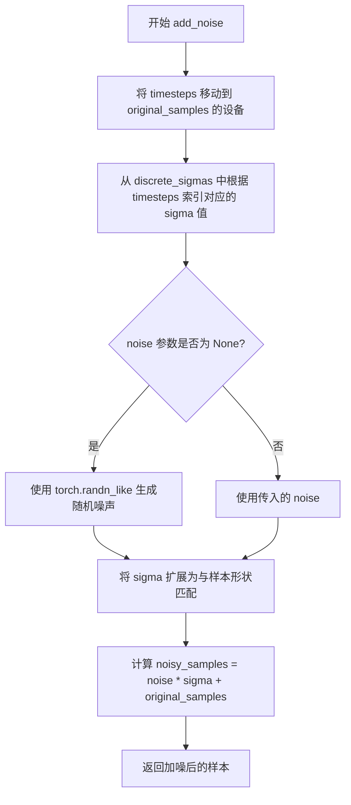

#### 带注释源码

```python
def add_noise(
    self,
    original_samples: torch.Tensor,
    noise: torch.Tensor,
    timesteps: torch.Tensor,
) -> torch.Tensor:
    """
    向原始样本添加噪声，模拟扩散过程的前向传播。
    
    根据时间步timesteps从预计算的discrete_sigmas中获取对应的噪声强度sigma，
    将噪声按sigma缩放后与原始样本相加，生成带噪样本。
    
    Args:
        original_samples: 原始干净样本张量
        noise: 可选的噪声张量，若为None则自动生成
        timesteps: 时间步索引，用于确定每个样本的噪声水平
    
    Returns:
        加噪后的样本张量
    """
    # 确保timesteps与original_samples在同一设备上（CPU/GPU）
    timesteps = timesteps.to(original_samples.device)
    
    # 根据timesteps索引获取对应的sigma值（噪声强度）
    # discrete_sigmas 预先计算好的离散噪声标准差序列
    sigmas = self.discrete_sigmas.to(original_samples.device)[timesteps]
    
    # 如果未提供噪声，则使用与原始样本同形状的随机噪声
    # 并按sigma[:, None, None, None]进行维度扩展以匹配批量样本
    noise = (
        noise * sigmas[:, None, None, None]
        if noise is not None
        else torch.randn_like(original_samples) * sigmas[:, None, None, None]
    )
    
    # 噪声缩放公式: noisy_sample = original_sample + sigma * noise
    # 这是扩散模型前向过程的核心公式
    noisy_samples = noise + original_samples
    
    return noisy_samples
```


### `ScoreSdeVeScheduler.__len__`

该方法是 Python 魔术方法，用于返回调度器配置中定义的训练时间步数，使得调度器对象可以像容器一样使用 `len()` 函数获取其训练的迭代次数。

参数：

- `self`：`ScoreSdeVeScheduler`，调用该方法的调度器实例本身，用于访问实例的配置属性

返回值：`int`，返回配置中 `num_train_timesteps` 的值，表示训练过程中使用的时间步总数

#### 流程图

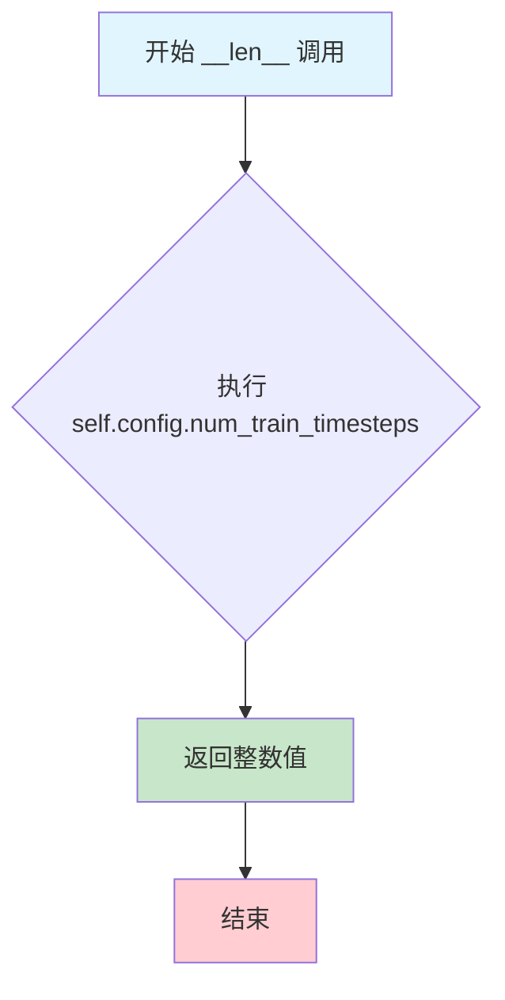

#### 带注释源码

```python
def __len__(self):
    """
    返回调度器训练时使用的时间步总数。
    
    该方法使得 ScoreSdeVeScheduler 实例可以使用 Python 内置的 len() 函数，
    返回配置中定义的 num_train_timesteps 值。
    
    Returns:
        int: 训练时间步的数量，默认为 2000
    """
    return self.config.num_train_timesteps
```


## 关键组件


### ScoreSdeVeScheduler

Variance Exploding SDE (Stochastic Differential Equation) 调度器，用于扩散模型的采样过程。通过维护离散的 sigma 序列和时间步，实现基于随机微分方程的反向扩散过程，支持预测步骤和校正步骤的迭代执行。

### SdeVeOutput

输出数据类，包含 `prev_sample`（前一时间步的计算样本）和 `prev_sample_mean`（历史样本的平均值），用于调度器 `step` 函数的返回值封装。

### set_timesteps / set_sigmas

张量索引与惰性加载机制。`set_timesteps` 创建从 1 到 epsilon 的线性空间时间步，`set_sigmas` 基于时间步生成 sigma 序列（包含连续 sigmas 和离散 discrete_sigmas），实现噪声尺度的动态配置。

### step_pred

预测步骤方法，实现 SDE 的反向传播。通过模型输出计算 drift 和 diffusion 项，利用张量索引提取当前时间步对应的 sigma 值，生成前一时间步的样本。

### step_correct

校正步骤方法，基于模型输出对预测样本进行校正。通过计算梯度范数和噪声范数的比率确定步长，使用 SNR (Signal-to-Noise Ratio) 加权校正项迭代优化样本质量。

### add_noise

噪声添加方法，将高斯噪声按照离散 sigma 值缩放后叠加到原始样本上，生成带噪样本用于训练或推理初始化。

### get_adjacent_sigma

相邻 sigma 查询函数，使用 `torch.where` 实现条件索引，返回当前时间步的相邻离散 sigma 值，用于 SDE 方程中的扩散项计算。


## 问题及建议


### 已知问题

- **冗余计算问题**：`set_sigmas` 方法中第138行和第140行重复计算了 `self.sigmas`，第一次使用直接tensor运算，第二次使用列表推导式转换为tensor，两者计算相同内容但都执行了，造成计算资源浪费。
- **设备转换冗余**：`step_pred` 方法中先将 `timesteps` 转换到 `self.discrete_sigmas.device`（第175行），随后又对 `sigma` 和 `adjacent_sigma` 执行 `.to(sample.device)`，导致不必要且重复的设备间数据传输。
- **未完成代码**：`step_pred` 方法中存在 TODO 注释（第192行："TODO is the variable diffusion the correct scaling term for the noise?"），表明关键逻辑的正确性未经完全验证。
- **逻辑不一致**：`__init__` 中调用 `set_sigmas`，而 `set_sigmas` 内部又检查 `self.timesteps is None` 后调用 `set_timesteps`，这种循环依赖逻辑容易导致状态初始化顺序混乱。
- **类型注解缺失**：`get_adjacent_sigma` 方法的参数 `timesteps` 和 `t` 缺少类型注解，且 `t` 参数的实际作用不明确（传入的是单个值但在 `torch.where` 中当数组处理）。

### 优化建议

- 移除 `set_sigmas` 中冗余的 `self.sigmas` 计算，保留基于tensor运算的版本（第138行）即可。
- 统一设备管理：确保 `timesteps` 在单次操作中完成设备转换，避免先转到 `discrete_sigmas` 设备再转回 `sample` 设备的双重转换。
- 补充 TODO 注释对应的技术验证，确认 `diffusion` 作为噪声缩放系数的正确性。
- 重构 `__init__` 和 `set_sigmas` 的调用关系，考虑在 `set_sigmas` 中添加参数控制是否自动调用 `set_timesteps`，或直接由调用方控制初始化顺序。
- 为 `get_adjacent_sigma` 方法补充完整类型注解，并考虑重构该方法的逻辑使其更清晰易读。
- 在 `step_pred` 和 `step_correct` 中预计算并缓存设备对象，减少每步推理中的 `.to()` 调用开销。


## 其它


### 设计目标与约束

该调度器实现了一个基于方差爆炸随机微分方程（VE-SDE）的扩散模型采样调度器。核心设计目标包括：1）提供可互换的调度器接口，支持不同的扩散模型采样方法；2）通过噪声标度（sigma）控制扩散过程的方差爆炸；3）支持Langevin校正步骤以提高采样质量；4）遵循扩散模型文献中的方程实现，特别是基于分数的SDE方法。主要约束包括：假设输入张量是4D图像张量（batch_size, channels, height, width）；依赖PyTorch张量操作；需要预先设置时间步和噪声标度。

### 错误处理与异常设计

代码中包含以下错误处理机制：1）在step_pred和step_correct方法中检查self.timesteps是否为None，如果为None则抛出ValueError并提示需要先运行set_timesteps；2）在add_noise方法中通过条件检查处理noise为None的情况，自动生成随机噪声；3）类型提示明确标注了参数类型（如torch.Tensor、torch.Generator | None等）。潜在的异常情况还包括：device不匹配（代码中通过.to()方法处理）、sigma_min大于sigma_max导致的数学错误（未验证）、以及离散sigmas索引越界（通过timesteps * (len(self.timesteps) - 1)限制范围）。

### 数据流与状态机

调度器的核心状态转换流程如下：初始化阶段创建调度器实例并设置参数；配置阶段调用set_timesteps设置推理时间步，调用set_sigmas设置噪声标度；采样循环阶段对于每个时间步：调用step_pred进行预测（主步骤），然后根据correct_steps配置多次调用step_correct进行校正（可选）。关键状态变量包括：self.timesteps（推理时间步序列）、self.sigmas（连续噪声标度）、self.discrete_sigmas（离散噪声标度）、self.init_noise_sigma（初始噪声标准差）。状态转换是不可逆的，每次调用step方法后sample状态更新。

### 外部依赖与接口契约

该调度器依赖以下外部组件：1）torch库提供张量运算和数学函数；2）math库提供对数运算；3）dataclasses.dataclass用于定义输出数据结构；4）configuration_utils.ConfigMixin和register_to_config装饰器用于配置管理；5）utils.BaseOutput和utils.torch_utils.randn_tensor提供通用工具。接口契约方面：该调度器需要与扩散模型pipeline配合使用，期望输入样本为4D张量；step方法返回SdeVeOutput包含prev_sample和prev_sample_mean；调度器需要先调用set_timesteps和set_sigmas才能正常工作；sigma值应遵循sigma_min < sigma_max的约束。

### 并发和性能考虑

该代码的并发考虑：1）使用PyTorch的向量化操作，避免Python循环以提高性能；2）通过torch.where实现条件张量运算，避免分支；3）GPU加速支持（代码中使用.to(device)方法）。性能优化点包括：1）使用torch.tensor列表推导式可能不如torch.arange高效；2）diffusion和step_size的形状扩展使用unsqueeze循环，可考虑broadcasting；3）噪声生成使用randn_tensor而非torch.randn，可能有额外的layout检查开销。内存方面需要注意：离散sigmas和连续sigmas同时存储可能导致冗余。

### 配置管理

该调度器通过@dataclass装饰器和register_to_config实现配置序列化与反序列化。可配置参数包括：num_train_timesteps（训练时间步数，默认2000）、snr（信噪比权重，默认0.15）、sigma_min（最小噪声标度，默认0.01）、sigma_max（最大噪声标度，默认1348.0）、sampling_eps（采样终止值，默认1e-5）、correct_steps（校正步数，默认1）。配置在__init__方法中通过装饰器自动注册，支持通过scheduler.config访问和修改。

### 版本兼容性

代码声明支持Python和PyTorch环境，但未指定具体版本要求。兼容性考虑：1）使用Python 3.10+的类型提示语法（str | torch.device）；2）dataclass装饰器需要Python 3.7+；3）torch.Generator类型注解需要PyTorch 1.10+。潜在兼容性问题包括：不同PyTorch版本中randn_tensor的行为可能略有差异；MPS设备支持（代码中提到MPS需要indices在同一设备）；CUDA和CPU设备混用时的隐式转换。

### 使用示例和调用流程

典型使用流程如下：1）创建调度器实例：scheduler = ScoreSdeVeScheduler()；2）设置推理参数：scheduler.set_timesteps(num_inference_steps=1000)；3）准备初始噪声：sample = torch.randn(...); 4）采样循环：for i, t in enumerate(scheduler.timesteps): model_output = model(sample, t); sample = scheduler.step_pred(model_output, t, sample).prev_sample；5）可选校正循环：在每个主步骤后可多次调用scheduler.step_correct进行校正。该调度器设计用于与diffusers库的UNet模型配合使用。


    