# `diffusers\src\diffusers\schedulers\scheduling_sde_ve_flax.py` 详细设计文档

Flax实现的方差扩展随机微分方程(SDE)调度器，用于扩散模型的采样过程。该调度器基于论文2011.13456，通过预测噪声和校正步骤来逐步从噪声生成样本。

## 整体流程

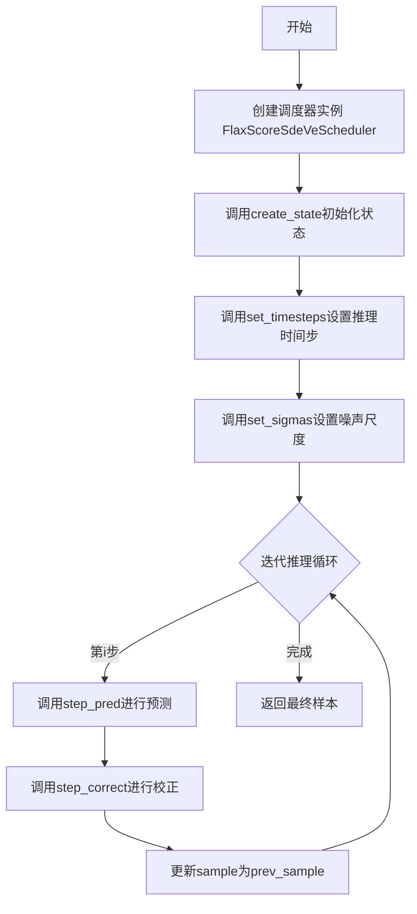

## 类结构

```
ScoreSdeVeSchedulerState (数据类 - 状态)
├── timesteps: jnp.ndarray
├── discrete_sigmas: jnp.ndarray
└── sigmas: jnp.ndarray

FlaxSdeVeOutput (数据类 - 输出)
├── state: ScoreSdeVeSchedulerState
├── prev_sample: jnp.ndarray
└── prev_sample_mean: jnp.ndarray

FlaxScoreSdeVeScheduler (主调度器类)
├── 继承自: FlaxSchedulerMixin, ConfigMixin
├── 字段: config (配置属性)
└── 方法: create_state, set_timesteps, set_sigmas, get_adjacent_sigma, step_pred, step_correct, __len__
```

## 全局变量及字段


### `logger`
    
模块级日志记录器

类型：`logging.Logger`
    


### `ScoreSdeVeSchedulerState.timesteps`
    
时间步数组

类型：`jnp.ndarray | None`
    


### `ScoreSdeVeSchedulerState.discrete_sigmas`
    
离散噪声尺度

类型：`jnp.ndarray | None`
    


### `ScoreSdeVeSchedulerState.sigmas`
    
噪声尺度

类型：`jnp.ndarray | None`
    


### `FlaxSdeVeOutput.state`
    
调度器状态

类型：`ScoreSdeVeSchedulerState`
    


### `FlaxSdeVeOutput.prev_sample`
    
上一步样本

类型：`jnp.ndarray`
    


### `FlaxSdeVeOutput.prev_sample_mean`
    
样本均值

类型：`jnp.ndarray | None`
    


### `FlaxScoreSdeVeScheduler.config`
    
存储调度器配置属性

类型：`配置对象`
    


### `FlaxScoreSdeVeScheduler.has_state`
    
返回True表示有状态

类型：`bool`
    
    

## 全局函数及方法


### logging.get_logger

获取一个与当前模块关联的日志记录器（Logger）实例，用于在代码中记录日志信息。

参数：

- `name`：`str`，模块的完全限定名称（通常使用 `__name__` 变量），用于标识日志记录器的来源。

返回值：`logging.Logger`，返回一个Python标准库的Logger对象，可用于输出不同级别的日志信息（如debug、info、warning、error、critical等）。

#### 流程图

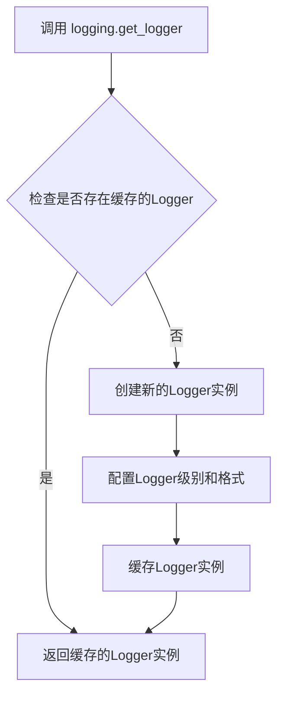

#### 带注释源码

```python
# 从上级目录的utils模块导入logging对象
from ..utils import logging

# ... (代码中间部分省略) ...

# 在类定义之后，使用get_logger获取当前模块的日志记录器
# 参数 __name__ 是Python内置变量，表示当前模块的完整路径
# 例如: 'diffusers.models.unet_flax'
logger = logging.get_logger(__name__)

# 后续使用示例：
# logger.warning("Flax classes are deprecated...")
# 这会输出一条警告级别的日志消息
```

#### 说明

由于 `logging.get_logger` 函数的实际定义位于 `..utils.logging` 模块中（未在此代码文件中给出），上述信息是根据代码中的调用方式推断得出的：

1. **调用方式**：`logger = logging.get_logger(__name__)`
2. **参数**：传入 `__name__`（当前模块的字符串名称）
3. **返回值**：赋值给 `logger` 变量，后续用于调用 `logger.warning()` 等日志方法
4. **实际用途**：在第97行用于输出关于Flax类已弃用的警告信息

该函数属于 Diffusers 框架的工具模块，用于统一管理整个项目的日志输出。


### `jnp.linspace`

`jnp.linspace` 是 JAX NumPy 兼容的线性空间函数，用于在指定范围内生成等间距的数值序列，常用于 diffusion 调度器中生成时间步或噪声尺度的离散序列。

参数：

- `start`：`float` 或 `array-like`，序列的起始值
- `stop`：`float` 或 `array-like`，序列的结束值
- `num`：`int`，要生成的样本数量
- `endpoint`：`bool`（可选），默认为 `True`，是否包含结束值
- `dtype`：`dtype`（可选），输出数组的数据类型

返回值：`jnp.ndarray`，等间距的数值序列

#### 流程图

```mermaid
flowchart TD
    A[开始] --> B[输入 start, stop, num]
    B --> C{endpoint 参数是否为 True}
    C -->|是| D[步长 = (stop - start) / (num - 1)]
    C -->|否| E[步长 = (stop - start) / num]
    D --> F[生成序列: start, start+step, ..., start+(num-1)*step]
    E --> F
    F --> G[转换为指定 dtype]
    G --> H[返回 jnp.ndarray]
```

#### 带注释源码

```python
# 在 set_timesteps 方法中使用 jnp.linspace 生成时间步序列
# 从 1 到 sampling_eps (通常是一个很小的值如 1e-5) 生成 num_inference_steps 个等间距点
timesteps = jnp.linspace(1, sampling_eps, num_inference_steps)

# 在 set_sigmas 方法中使用 jnp.linspace 生成对数空间的离散噪声尺度
# 先在对数空间生成等间距序列，再通过 exp 转换回线性空间
# 这样可以更好地覆盖从 sigma_min 到 sigma_max 的范围
discrete_sigmas = jnp.exp(jnp.linspace(jnp.log(sigma_min), jnp.log(sigma_max), num_inference_steps))
```


### `jnp.exp`

这是 JAX NumPy 提供的指数函数，用于逐元素计算自然常数 e 的幂次。在 `FlaxScoreSdeVeScheduler` 中用于将对数尺度的 sigma 值转换为线性尺度。

参数：

- `x`：`jnp.ndarray`，输入数组，需要计算指数的元素（这里是 `jnp.linspace(jnp.log(sigma_min), jnp.log(sigma_max), num_inference_steps)` 的结果）

返回值：`jnp.ndarray`，输入数组每个元素的指数值（$e^x$）

#### 流程图

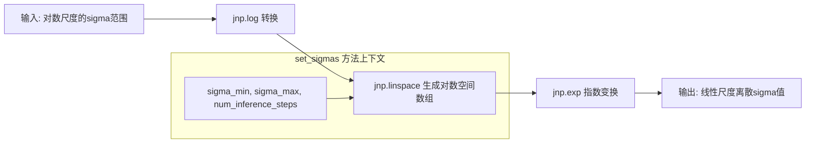

#### 带注释源码

```python
# 在 FlaxScoreSdeVeScheduler.set_sigmas 方法中使用
def set_sigmas(
    self,
    state: ScoreSdeVeSchedulerState,
    num_inference_steps: int,
    sigma_min: float = None,
    sigma_max: float = None,
    sampling_eps: float = None,
) -> ScoreSdeVeSchedulerState:
    """
    设置扩散链使用的噪声尺度。
    
    参数:
        state: 调度器状态数据类实例
        num_inference_steps: 生成样本时的扩散步数
        sigma_min: 初始噪声尺度（可选，覆盖配置）
        sigma_max: 最终噪声尺度（可选，覆盖配置）
        sampling_eps: 采样最终时间步（可选）
    
    返回:
        更新后的调度器状态
    """
    # ... 参数处理省略 ...
    
    # 生成对数空间的线性间隔
    # 例如: jnp.linspace(jnp.log(0.01), jnp.log(1348.0), 50)
    log_sigma_range = jnp.linspace(
        jnp.log(sigma_min),      # 对数下限
        jnp.log(sigma_max),      # 对数上限
        num_inference_steps      # 步数
    )
    
    # 核心: jnp.exp 将对数空间的线性间隔转换为实际的 sigma 值
    # 等价于 sigma = exp(log(sigma_min) + t * (log(sigma_max) - log(sigma_min)))
    # 这样可以确保 sigma 在对数空间均匀分布，符合噪声尺度的感知特性
    discrete_sigmas = jnp.exp(log_sigma_range)
    
    # 同时生成另一个 sigmas 数组用于采样过程
    sigmas = jnp.array([
        sigma_min * (sigma_max / sigma_min) ** t 
        for t in state.timesteps
    ])
    
    return state.replace(discrete_sigmas=discrete_sigmas, sigmas=sigmas)
```

#### 技术说明

| 项目 | 说明 |
|------|------|
| **函数来源** | `jax.numpy` (jnp) |
| **数学定义** | $f(x) = e^x$ |
| **在 SDE-VE 中的作用 | 将对数空间的噪声参数转换为线性空间，用于方差爆炸随机微分方程调度器 |
| **数值稳定性** | 使用对数-指数变换可以避免直接计算大范围数值的数值溢出问题 |


### `jnp.log`

对数函数（自然对数），在 `FlaxScoreSdeVeScheduler.set_sigmas` 方法中用于计算 sigma 值的对数范围，以便在指数空间中生成离散 sigma 序列。

参数：

- `x`：`float` 或 `jnp.ndarray`，输入值，可以是标量或数组，表示要计算自然对数的数值

返回值：`jnp.ndarray`，返回输入值的自然对数（以 e 为底的对数）

#### 流程图

```mermaid
flowchart TD
    A[开始] --> B[输入: sigma_min 和 sigma_max]
    B --> C[jnp.log(sigma_min)]
    B --> D[jnp.log(sigma_max)]
    C --> E[生成对数空间线性间隔: jnp.linspace]
    D --> E
    E --> F[jnp.exp 转换回原始空间]
    F --> G[输出: discrete_sigmas 数组]
```

#### 带注释源码

```python
def set_sigmas(
    self,
    state: ScoreSdeVeSchedulerState,
    num_inference_steps: int,
    sigma_min: float = None,
    sigma_max: float = None,
    sampling_eps: float = None,
) -> ScoreSdeVeSchedulerState:
    """
    Sets the noise scales used for the diffusion chain.
    """
    sigma_min = sigma_min if sigma_min is not None else self.config.sigma_min
    sigma_max = sigma_max if sigma_max is not None else self.config.sigma_max
    sampling_eps = sampling_eps if sampling_eps is not None else self.config.sampling_eps
    
    if state.timesteps is None:
        state = self.set_timesteps(state, num_inference_steps, sampling_eps)

    # 使用 jnp.log 计算对数空间中的边界值
    # 这样可以在对数空间中均匀采样，然后通过 jnp.exp 转换回线性空间
    # 这种方法能更好地处理大范围变化的 sigma 值
    discrete_sigmas = jnp.exp(jnp.linspace(jnp.log(sigma_min), jnp.log(sigma_max), num_inference_steps))
    #                         ↑              ↑                              ↑
    #                   jnp.log 返回   jnp.linspace 在对数空间           jnp.exp 将对数值
    #                   自然对数        生成线性间隔                      转换回原始空间
    sigmas = jnp.array([sigma_min * (sigma_max / sigma_min) ** t for t in state.timesteps])

    return state.replace(discrete_sigmas=discrete_sigmas, sigmas=sigmas)
```

---

### 补充说明

**技术细节：**
- `jnp.log` 是 JAX NumPy 库中的自然对数函数，等价于数学中的 `ln(x)` 或 `log_e(x)`
- 在此代码中用于实现**对数空间线性插值**，这是处理跨多个数量级数值时的常见技术
- 结合 `jnp.linspace` 和 `jnp.exp`，可以在 `[sigma_min, sigma_max]` 区间内生成均匀分布的 sigma 值

**为什么使用对数空间：**
- 当数值范围很大时（如 0.01 到 1348.0），线性空间采样会导致小数区域稀疏、大数区域密集
- 对数空间采样能确保在整个范围内均匀覆盖，这对扩散模型的噪声调度至关重要


### FlaxScoreSdeVeScheduler.get_adjacent_sigma

该方法用于获取前一个时间步的 sigma（噪声尺度）值，是 SDE 调度器中的辅助函数。当时间步为 0 时返回零数组，否则返回 `discrete_sigmas` 数组中前一个时间步的 sigma 值。

参数：

- `self`：`FlaxScoreSdeVeScheduler`，调度器实例本身
- `state`：`ScoreSdeVeSchedulerState`，调度器的状态数据类实例，包含离散 sigma 值等信息
- `timesteps`：`jnp.ndarray`，当前的时间步数组
- `t`：`int` 或 `jnp.ndarray`，要查询的时间步索引

返回值：`jnp.ndarray`，相邻时间步的 sigma 值。如果 `t` 为 0，则返回与 `t` 形状相同的零数组；否则返回 `discrete_sigmas[t-1]` 的值。

#### 流程图

```mermaid
flowchart TD
    A[开始 get_adjacent_sigma] --> B{检查 timesteps == 0}
    B -->|True| C[返回 jnp.zeros_like(t)]
    B -->|False| D[返回 state.discrete_sigmas[timesteps - 1]]
    C --> E[结束]
    D --> E
```

#### 带注释源码

```python
def get_adjacent_sigma(self, state, timesteps, t):
    """
    获取相邻时间步的 sigma 值。
    
    在 SDE 调度器中，sigma 值控制扩散过程的噪声强度。此方法用于
    计算当前时间步的前一个时间步的 sigma 值，以便在离散时间步之间
    进行插值或计算。
    
    参数:
        state (ScoreSdeVeSchedulerState): 调度器状态，包含 discrete_sigmas 数组
        timesteps (jnp.ndarray): 当前时间步数组
        t: 当前时间步索引
        
    返回:
        jnp.ndarray: 前一个时间步的 sigma 值，如果是起始时间步则返回零数组
    """
    # 使用 jnp.where 进行条件选择：
    # 如果 timesteps == 0（起始时间步），返回零数组以避免索引错误
    # 否则返回 discrete_sigmas 中前一个时间步的 sigma 值
    return jnp.where(timesteps == 0, jnp.zeros_like(t), state.discrete_sigmas[timesteps - 1])
```


### `jnp.zeros_like`

`jnp.zeros_like` 是 JAX NumPy (jax.numpy) 库中的一个函数，用于创建一个与输入数组形状和数据类型相同的全零数组。在 `FlaxScoreSdeVeScheduler` 中，该函数用于初始化零数组或处理边界条件。

参数：

-  `t` 或 `sample`：`jnp.ndarray` 或 Python 数值类型，输入数组或数值，用于指定输出数组的形状和数据类型

返回值：`jnp.ndarray`，与输入形状和类型相同的全零数组

#### 流程图

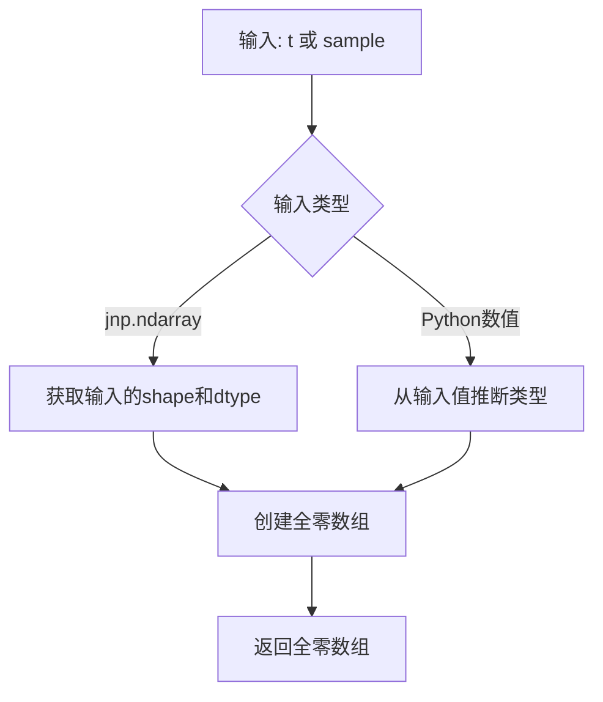

#### 带注释源码

在 `FlaxScoreSdeVeScheduler` 中的两处使用：

**1. 在 `get_adjacent_sigma` 方法中（处理时间步为0的边界情况）：**

```python
def get_adjacent_sigma(self, state, timesteps, t):
    """
    获取相邻的时间步 sigma 值。
    
    当 timesteps 为 0 时，返回与 t 形状相同的全零数组；
    否则返回前一个时间步的 sigma 值。
    """
    # 如果 timesteps == 0，创建与 t 形状相同的全零数组
    # 否则从 discrete_sigmas 数组中获取前一个时间步的值
    return jnp.where(timesteps == 0, jnp.zeros_like(t), state.discrete_sigmas[timesteps - 1])
```

**2. 在 `step_pred` 方法中（初始化漂移项）：**

```python
def step_pred(
    self,
    state: ScoreSdeVeSchedulerState,
    model_output: jnp.ndarray,
    timestep: int,
    sample: jnp.ndarray,
    key: jax.Array,
    return_dict: bool = True,
) -> FlaxSdeVeOutput | tuple:
    # ... 省略部分代码 ...
    
    # 初始化漂移项为零数组，形状与 sample 相同
    # 这是为了后续计算 SDE 方程中的漂移分量
    drift = jnp.zeros_like(sample)
    
    # 计算扩散系数
    diffusion = (sigma**2 - adjacent_sigma**2) ** 0.5
    
    # ... 省略部分代码 ...
```

#### 关键使用场景

| 场景 | 输入参数 | 目的 |
|------|----------|------|
| 边界处理 | `t` (时间步值) | 当时间步为0时，返回全零sigma值 |
| 初始化 | `sample` (样本张量) | 创建与样本形状相同的零数组作为漂移项初始值 |

#### 技术说明

`jnp.zeros_like` 函数确保输出的数组：
- 与输入数组具有相同的 `shape`
- 与输入数组具有相同的 `dtype`
- 所有元素初始化为 0

这在需要保持数组形状一致性时特别有用，例如在 SDE 调度器中初始化零向量或处理边界条件。


### `jnp.array`

`jnp.array` 是 JAX 库中的核心函数，用于将 Python 数组或列表转换为 JAX NumPy 数组（`jnp.ndarray`），以便在 GPU/TPU 上进行高效的张量计算。在 `FlaxScoreSdeVeScheduler` 的 `set_sigmas` 方法中，该函数用于根据时间步创建噪声标准的数组。

参数：

- `obj`：Python 列表（list），这里是一个列表推导式，生成基于 `sigma_min`、`sigma_max` 和 `state.timesteps` 的噪声标准值
- `dtype`（可选）：目标数据类型，若未指定则从输入推断

返回值：`jnp.ndarray`，JAX NumPy 数组，表示噪声标准数组

#### 流程图

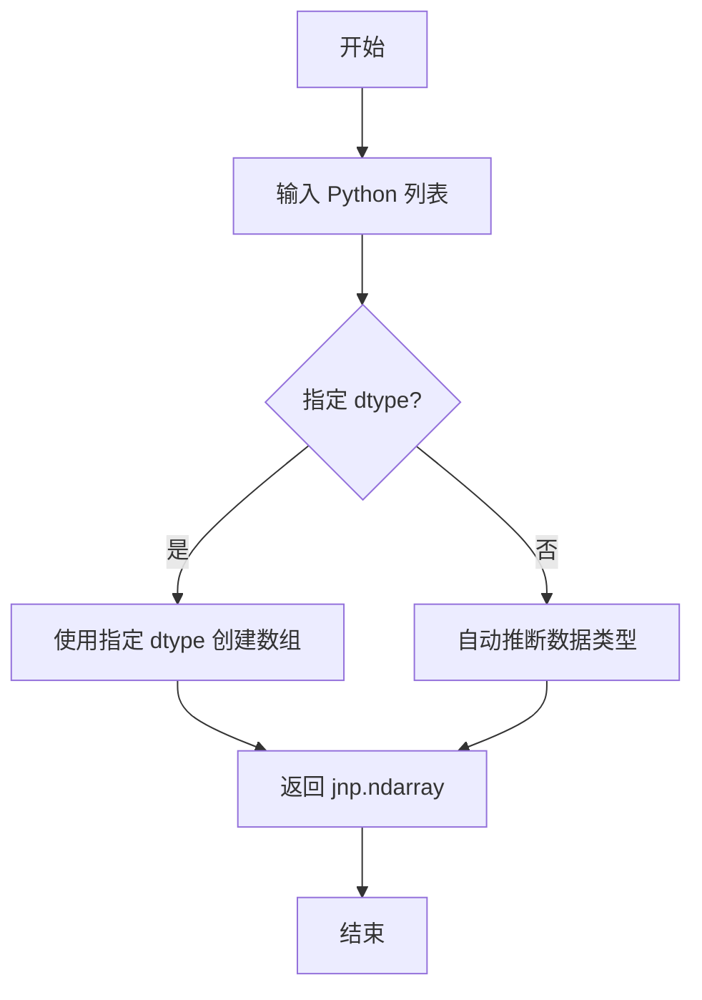

#### 带注释源码

```python
# 在 FlaxScoreSdeVeScheduler.set_sigmas 方法中使用 jnp.array
# 用于创建与时间步对应的噪声标准（sigma）数组

sigmas = jnp.array([sigma_min * (sigma_max / sigma_min) ** t for t in state.timesteps])
# 参数说明：
#   - sigma_min: float, 初始噪声尺度
#   - sigma_max: float, 最大噪声尺度  
#   - state.timesteps: jnp.ndarray, 时间步数组
# 返回值：
#   - sigmas: jnp.ndarray, 噪声标准数组，形状与 state.timesteps 相同
#
# 该数组用于 SDE 扩散过程中的噪声调度，控制每一步的扩散强度
```


### `random.split`

JAX 随机数分割函数，用于将一个随机数生成器密钥（key）分割成一个包含多个子密钥的元组，以支持并行生成多个独立的随机数序列。在扩散模型的采样过程中，该函数用于生成新的密钥以驱动随机噪声的生成。

参数：

- `key`：`jax.Array`，JAX 随机数生成器的当前密钥状态，用于生成随机数的种子
- `num`：`int`，要分割产生的子密钥数量（代码中设置为 1）

返回值：`jax.Array` 或 `tuple`，返回分割后的子密钥（单个时返回密钥本身，多个时返回元组）

#### 流程图

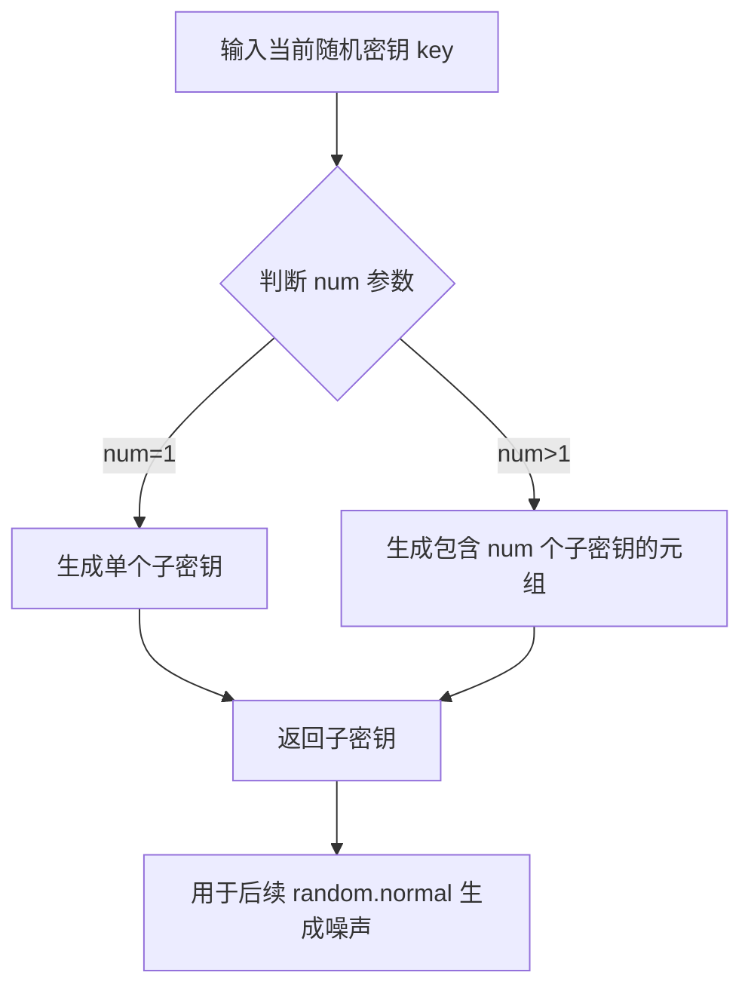

#### 带注释源码

```python
# random.split 函数调用示例（来自 FlaxScoreSdeVeScheduler.step_pred 方法）
# 1. 分割当前密钥以生成新的随机数生成器状态
key = random.split(key, num=1)

# 2. 使用新密钥生成符合标准正态分布的噪声张量
noise = random.normal(key=key, shape=sample.shape)

# random.split 函数调用示例（来自 FlaxScoreSdeVeScheduler.step_correct 方法）
# 1. 同样在纠正步骤中分割密钥以生成新的随机数状态
key = random.split(key, num=1)

# 2. 使用新密钥生成噪声用于校正步骤
noise = random.normal(key=key, shape=sample.shape)
```


### `random.normal`

生成符合正态（高斯）分布的随机数，用于在扩散模型的采样过程中引入噪声项。这是 ScoreSDE-VE 调度器的核心组件，通过向采样过程添加随机噪声来实现随机微分方程的数值求解。

**参数：**

- `key`：`jax.Array`，JAX 随机数生成器的密钥（key），用于确保随机数生成的可重复性和正确性
- `shape`：`tuple`，要生成的随机数数组的形状，通常与样本张量的形状相同

**返回值：** `jnp.ndarray`，符合标准正态分布（均值为0，方差为1）的随机数数组

#### 流程图

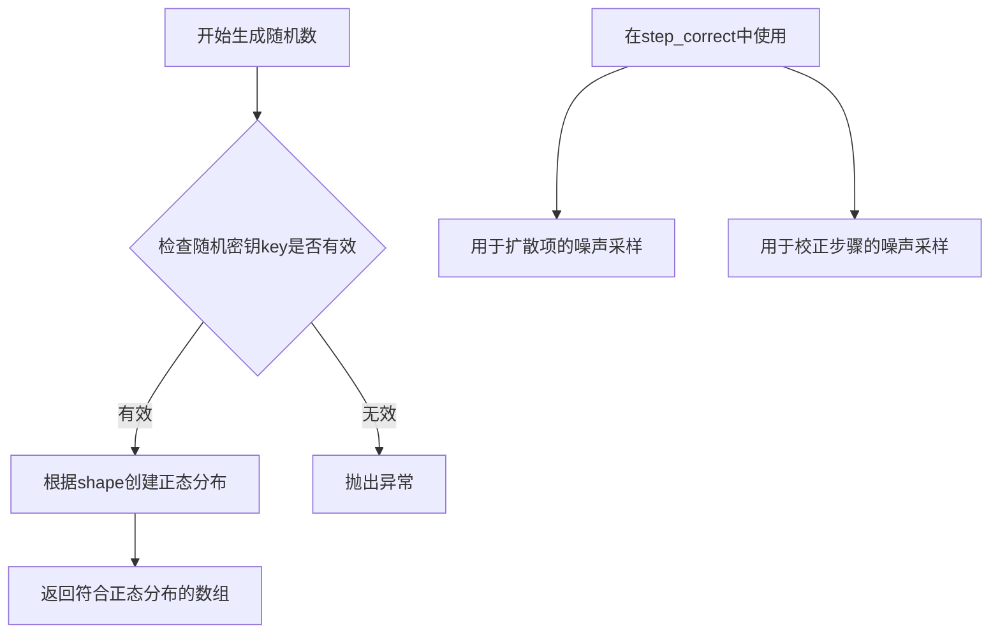

#### 带注释源码

```python
# 在 FlaxScoreSdeVeScheduler.step_pred 方法中用于采样过程
# 位置：第177-178行
key = random.split(key, num=1)  # 分割密钥以生成新的随机状态
# 生成与sample形状相同的正态分布随机噪声
# 用于SDE方程中的扩散项（diffusion term）
noise = random.normal(key=key, shape=sample.shape)

# 在 FlaxScoreSdeVeScheduler.step_correct 方法中用于校正过程
# 位置：第219-220行
key = random.split(key, num=1)  # 分割密钥以生成新的随机状态
# 生成与sample形状相同的正态分布随机噪声
# 用于Langevin校正步骤的噪声采样
noise = random.normal(key=key, shape=sample.shape)
```


### `jnp.linalg.norm`

计算向量或矩阵的范数（norm），用于衡量向量或矩阵的大小。在 `FlaxScoreSdeVeScheduler` 的 `step_correct` 方法中，该函数用于计算模型输出（gradients）和噪声的范数，以确定校正步骤的步长。

参数：

- `x`：`jnp.ndarray`，输入向量或矩阵，用于计算其范数
- `ord`：`int, float, inf, '-inf', 'fro', 'nuc', optional`，范数的阶数，默认为 None（即 2-范数/Frobenius 范数）
- `axis`：`int, tuple of ints, optional`，指定计算范数的轴
- `keepdims`：`bool, optional`，是否保持原始维度
- `dtype`：`dtype, optional`，返回值的数据类型
- `matrix_norm`：`bool, optional`，是否将输入视为矩阵计算矩阵范数

返回值：`jnp.ndarray` 或 `scalar`，返回输入数组的范数，类型取决于参数设置

#### 流程图

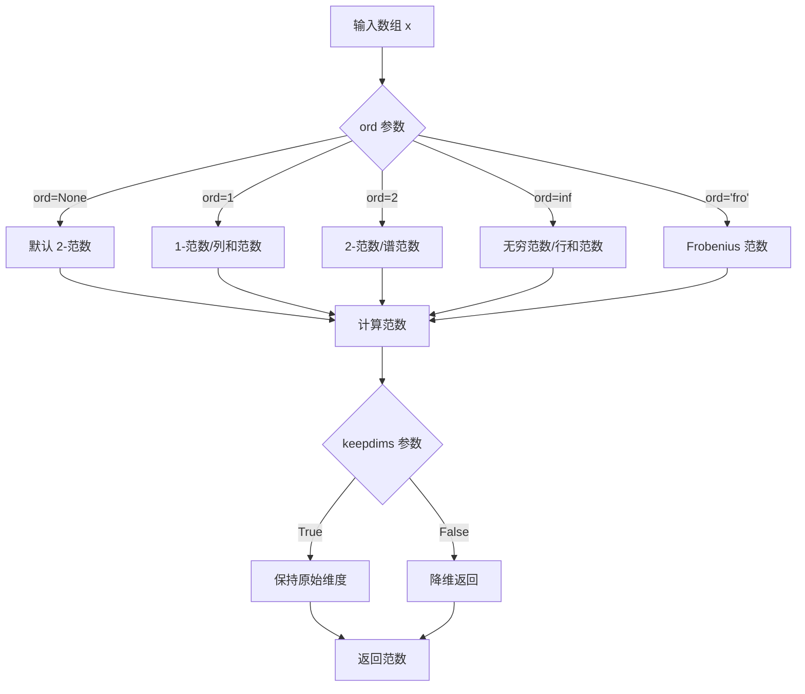

#### 带注释源码

```python
# jnp.linalg.norm 的典型调用方式（在 FlaxScoreSdeVeScheduler.step_correct 中）

# 1. 计算模型输出的梯度范数（grad_norm）
# 用于后续计算校正步长，衡量模型输出的梯度大小
grad_norm = jnp.linalg.norm(model_output)

# 2. 计算噪声的范数（noise_norm）
# 用于标准化梯度，以便控制步长
noise_norm = jnp.linalg.norm(noise)

# 3. 结合 SNR（信噪比）计算步长
# step_size = (snr * noise_norm / grad_norm)^2 * 2
# 这种设计确保步长与噪声水平和梯度成比例
step_size = (self.config.snr * noise_norm / grad_norm) ** 2 * 2
```


### `broadcast_to_shape_from_left`

将输入数组广播到目标形状的函数，通过从左侧扩展维度来匹配目标形状。在扩散模型的采样过程中，用于确保中间变量的维度与样本张量兼容。

参数：

-  `tensor`：`jnp.ndarray`，需要进行广播的一维或多维数组，通常是已经flattened的标量或一维数组
-  `shape`：`tuple`，目标形状，通常是样本张量的shape（如 `(batch_size, num_channels, height, width)`）

返回值：`jnp.ndarray`，广播后的数组，其形状与目标shape一致

#### 流程图

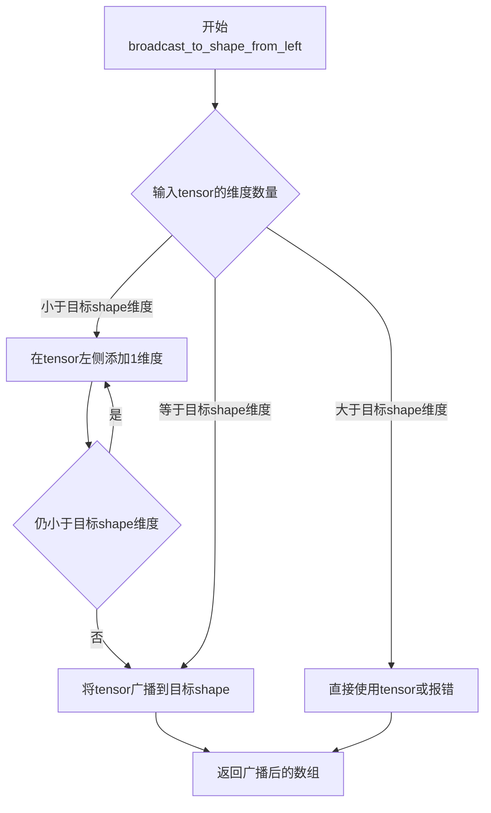

#### 带注释源码

```python
# 注意：此函数定义在 scheduling_utils_flax.py 中，此处为基于使用方式的推断实现
def broadcast_to_shape_from_left(tensor: jnp.ndarray, shape: tuple) -> jnp.ndarray:
    """
    将输入tensor广播到目标shape。
    
    例如：
    - 输入tensor.shape = (3,), shape = (batch_size, 3) -> 结果shape = (batch_size, 3)
    - 输入tensor.shape = (3,), shape = (batch_size, num_channels, height, width) -> 结果shape = (1, 1, 1, 3) -> 广播为 (batch_size, num_channels, height, width)
    - 输入tensor.shape = (batch_size,)，shape = (batch_size, num_channels, height, width) -> 结果shape = (batch_size, 1, 1, 1) -> 广播为 (batch_size, num_channels, height, width)
    
    参数:
        tensor: 需要广播的输入数组，通常是flattened的一维数组
        shape: 目标形状元组
        
    返回:
        广播后的数组，形状与shape参数一致
    """
    # 获取当前tensor的维度数和目标维度数
    tensor_ndim = len(tensor.shape)
    target_ndim = len(shape)
    
    # 如果维度数相同，直接广播
    if tensor_ndim == target_ndim:
        return jnp.broadcast_to(tensor, shape)
    
    # 如果tensor维度少于目标维度，在左侧填充1
    if tensor_ndim < target_ndim:
        # 在左侧添加 (target_ndim - tensor_ndim) 个维度
        padding = (1,) * (target_ndim - tensor_ndim)
        tensor = tensor.reshape(padding + tensor.shape)
        
    # 使用jax的broadcast_to进行广播
    return jnp.broadcast_to(tensor, shape)
```


### `ScoreSdeVeSchedulerState.create`

创建并返回一个`ScoreSdeVeSchedulerState`类的实例，用于存储SDE VE调度器的状态。该方法是工厂方法，通过类方法模式实例化调度器状态对象，初始化时所有可配置字段（timesteps、discrete_sigmas、sigmas）均为None，等待后续由调度器填充具体值。

参数：

- （无显式参数，隐式参数`cls`表示类本身）

返回值：`ScoreSdeVeSchedulerState`，返回新创建的调度器状态实例，其所有字段初始化为None

#### 流程图

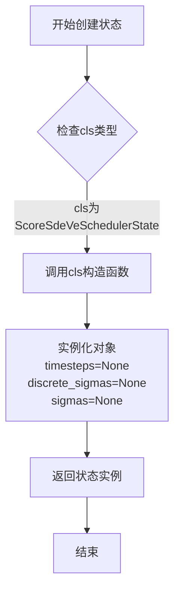

#### 带注释源码

```python
@classmethod
def create(cls):
    """
    创建ScoreSdeVeSchedulerState类的实例。
    
    这是一个工厂方法，用于初始化调度器状态。
    初始状态下所有字段都设置为None，表示尚未配置时间步和噪声参数。
    
    Returns:
        ScoreSdeVeSchedulerState: 返回一个新的状态实例，其所有字段
                                  (timesteps, discrete_sigmas, sigmas) 初始为 None
    """
    # 调用类的构造函数创建新实例
    # 由于使用了 @flax.struct.dataclass 装饰器，
    # 返回的对象是不可变的（immutable）
    return cls()
```


### `FlaxScoreSdeVeScheduler.__init__`

初始化方差 exploding 随机微分方程（SDE）调度器配置，设置扩散模型训练和采样所需的各种参数。

参数：

-  `num_train_timesteps`：`int`，训练时使用的扩散步数，默认为 2000
-  `snr`：`float`，信噪比系数，用于加权模型输出样本与随机噪声的步长，默认为 0.15
-  `sigma_min`：`float`，采样过程中 sigma 序列的初始噪声尺度，默认为 0.01
-  `sigma_max`：`float`，连续时间步传入模型的最大值，默认为 1348.0
-  `sampling_eps`：`float`，采样的终止值，时间步从 1 逐渐减小到 epsilon，默认为 1e-5
-  `correct_steps`：`int`，对生成样本执行的校正步数，默认为 1

返回值：无（`None`），构造函数不返回值

#### 流程图

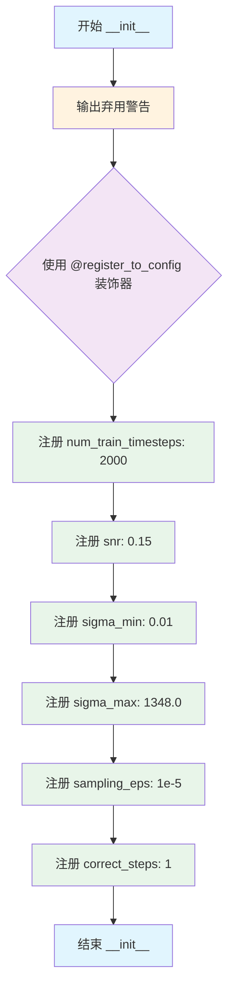

#### 带注释源码

```python
@register_to_config  # 装饰器：将所有参数自动注册到 config 属性中，便于保存和加载
def __init__(
    self,
    num_train_timesteps: int = 2000,  # 训练时扩散过程的步数，决定噪声调度的时间粒度
    snr: float = 0.15,                 # 信噪比系数，控制模型输出与噪声的权重混合
    sigma_min: float = 0.01,          # 最小 sigma 值，对应采样后期的最小噪声水平
    sigma_max: float = 1348.0,         # 最大 sigma 值，对应采样开始时的最大噪声水平
    sampling_eps: float = 1e-5,        # 采样终止阈值，确定扩散链的终点
    correct_steps: int = 1,            # 校正步数，用于 Langevin 校正迭代
):
    # 输出弃用警告，提示用户 Flax 类将在 v1.0.0 版本移除
    logger.warning(
        "Flax classes are deprecated and will be removed in Diffusers v1.0.0. We "
        "recommend migrating to PyTorch classes or pinning your version of Diffusers."
    )
    # @register_to_config 装饰器会自动将上述参数存储到 self.config 对象中
    # 访问方式：self.config.num_train_timesteps, self.config.sigma_min 等
```


### `FlaxScoreSdeVeScheduler.create_state`

该函数用于创建并初始化 SDE VE 调度器的状态，通过实例化状态对象并设置噪声尺度（sigma）参数来完成调度器的初始化，为后续的扩散采样过程做好准备。

参数：
- （无显式参数，仅使用 `self` 访问类属性）

返回值：`ScoreSdeVeSchedulerState`，返回初始化后的调度器状态对象，包含设置好的时间步和噪声尺度信息

#### 流程图

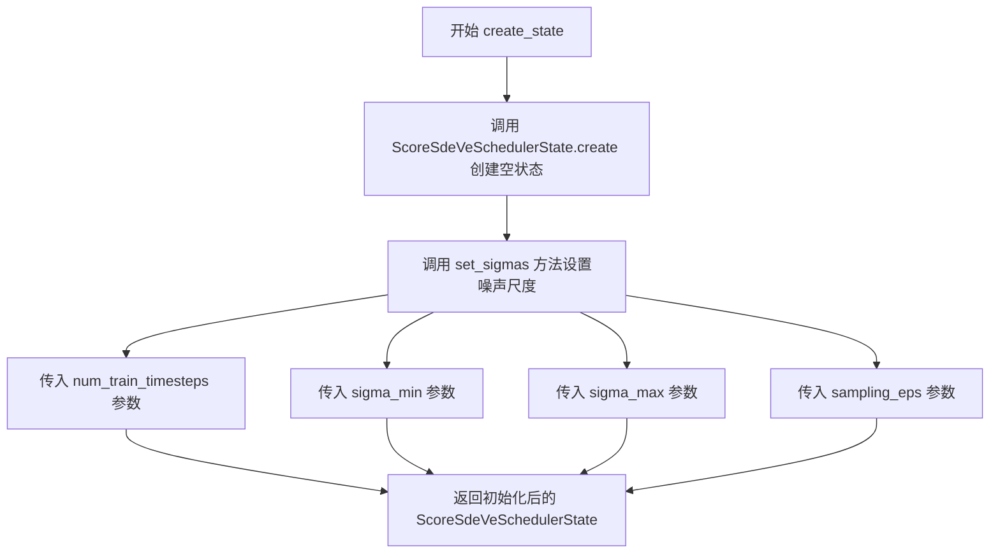

#### 带注释源码

```python
def create_state(self):
    """
    创建并初始化 SDE VE 调度器的状态。
    
    该方法执行以下操作：
    1. 创建一个空的 ScoreSdeVeSchedulerState 实例
    2. 使用配置参数设置噪声尺度（sigmas）
    """
    
    # 步骤1: 创建空的调度器状态对象
    # ScoreSdeVeSchedulerState 是一个 flax.struct.dataclass
    # 包含 timesteps, discrete_sigmas, sigmas 三个可设置字段
    state = ScoreSdeVeSchedulerState.create()
    
    # 步骤2: 调用 set_sigmas 方法设置噪声尺度
    # 使用配置文件中的参数初始化 sigmas:
    # - num_train_timesteps: 训练时的总时间步数
    # - sigma_min: 最小噪声尺度
    # - sigma_max: 最大噪声尺度
    # - sampling_eps: 采样结束时的 epsilon 值
    return self.set_sigmas(
        state,
        self.config.num_train_timesteps,
        self.config.sigma_min,
        self.config.sigma_max,
        self.config.sampling_eps,
    )
```


### `FlaxScoreSdeVeScheduler.set_timesteps`

设置推理阶段的时间步长，为扩散链准备连续时间步。该方法在推理前运行，支持自定义采样终止值。

参数：

- `state`：`ScoreSdeVeSchedulerState`，FlaxScoreSdeVeScheduler 状态数据类实例
- `num_inference_steps`：`int`，使用预训练模型生成样本时的扩散步骤数
- `shape`：`tuple`，输出张量形状，默认为空元组
- `sampling_eps`：`float`，可选，最终时间步值（覆盖调度器实例化时给定的值）

返回值：`ScoreSdeVeSchedulerState`，更新后的调度器状态，包含设置好的时间步

#### 流程图

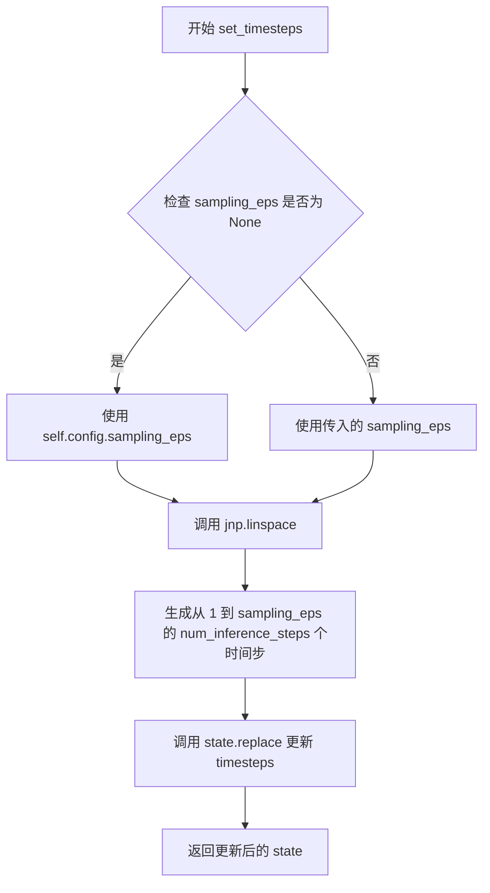

#### 带注释源码

```python
def set_timesteps(
    self,
    state: ScoreSdeVeSchedulerState,
    num_inference_steps: int,
    shape: tuple = (),
    sampling_eps: float = None,
) -> ScoreSdeVeSchedulerState:
    """
    Sets the continuous timesteps used for the diffusion chain. Supporting function to be run before inference.

    Args:
        state (`ScoreSdeVeSchedulerState`): the `FlaxScoreSdeVeScheduler` state data class instance.
        num_inference_steps (`int`):
            the number of diffusion steps used when generating samples with a pre-trained model.
        sampling_eps (`float`, optional):
            final timestep value (overrides value given at Scheduler instantiation).

    """
    # 如果未提供 sampling_eps，则使用配置中的默认值
    # 这样允许在运行时覆盖实例化时设置的终止时间步
    sampling_eps = sampling_eps if sampling_eps is not None else self.config.sampling_eps

    # 使用线性间隔生成从 1 到 sampling_eps 的时间步序列
    # 这些时间步将用于扩散过程的逆向采样
    # jnp.linspace(start, stop, num) 生成 num 个均匀间隔的值
    timesteps = jnp.linspace(1, sampling_eps, num_inference_steps)
    
    # 使用 Flax 的不可变数据结构替换方法更新状态中的 timesteps
    # 返回新的状态对象（保持原有状态不变，符合函数式编程范式）
    return state.replace(timesteps=timesteps)
```


### FlaxScoreSdeVeScheduler.set_sigmas

设置扩散链中使用的噪声尺度（sigmas），这是推理前运行的辅助函数，用于计算离散噪声尺度序列并更新调度器状态。

参数：

- `self`：`FlaxScoreSdeVeScheduler`，FlaxScoreSdeVeScheduler 类的实例
- `state`：`ScoreSdeVeSchedulerState`，FlaxScoreSdeVeScheduler 状态数据类实例
- `num_inference_steps`：`int`，使用预训练模型生成样本时使用的扩散步数
- `sigma_min`：`float | None`，初始噪声尺度值（可选，覆盖实例化时的配置值）
- `sigma_max`：`float | None`，最终噪声尺度值（可选，覆盖实例化时的配置值）
- `sampling_eps`：`float | None`，最终时间步值（可选，覆盖实例化时的配置值）

返回值：`ScoreSdeVeSchedulerState`，更新后的调度器状态，包含计算出的离散噪声尺度和连续噪声尺度

#### 流程图

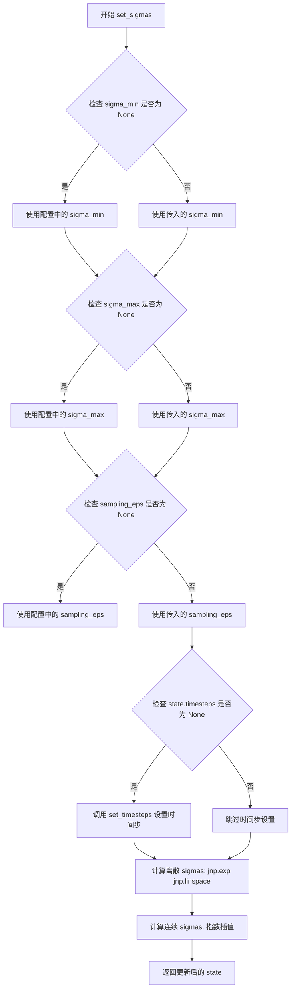

#### 带注释源码

```python
def set_sigmas(
    self,
    state: ScoreSdeVeSchedulerState,
    num_inference_steps: int,
    sigma_min: float = None,
    sigma_max: float = None,
    sampling_eps: float = None,
) -> ScoreSdeVeSchedulerState:
    """
    Sets the noise scales used for the diffusion chain. Supporting function to be run before inference.

    The sigmas control the weight of the `drift` and `diffusion` components of sample update.

    Args:
        state (`ScoreSdeVeSchedulerState`): the `FlaxScoreSdeVeScheduler` state data class instance.
        num_inference_steps (`int`):
            the number of diffusion steps used when generating samples with a pre-trained model.
        sigma_min (`float`, optional):
            initial noise scale value (overrides value given at Scheduler instantiation).
        sigma_max (`float`, optional):
            final noise scale value (overrides value given at Scheduler instantiation).
        sampling_eps (`float`, optional):
            final timestep value (overrides value given at Scheduler instantiation).
    """
    # 如果 sigma_min 为 None，则使用配置中的 sigma_min
    sigma_min = sigma_min if sigma_min is not None else self.config.sigma_min
    # 如果 sigma_max 为 None，则使用配置中的 sigma_max
    sigma_max = sigma_max if sigma_max is not None else self.config.sigma_max
    # 如果 sampling_eps 为 None，则使用配置中的 sampling_eps
    sampling_eps = sampling_eps if sampling_eps is not None else self.config.sampling_eps
    
    # 如果 state.timesteps 为 None，则先设置时间步
    if state.timesteps is None:
        state = self.set_timesteps(state, num_inference_steps, sampling_eps)

    # 计算离散 sigmas：在 sigma_min 和 sigma_max 之间进行对数线性插值
    # 使用 jnp.exp(jnp.linspace(jnp.log(sigma_min), jnp.log(sigma_max), num_inference_steps))
    # 这确保了 sigmas 在对数空间均匀分布，符合噪声调度的几何特性
    discrete_sigmas = jnp.exp(jnp.linspace(jnp.log(sigma_min), jnp.log(sigma_max), num_inference_steps))
    
    # 计算连续 sigmas：根据时间步使用指数插值公式
    # sigma(t) = sigma_min * (sigma_max / sigma_min) ** t
    sigmas = jnp.array([sigma_min * (sigma_max / sigma_min) ** t for t in state.timesteps])

    # 返回更新后的状态，包含离散 sigmas 和连续 sigmas
    return state.replace(discrete_sigmas=discrete_sigmas, sigmas=sigmas)
```


### `FlaxScoreSdeVeScheduler.get_adjacent_sigma`

获取相邻时间步的噪声尺度（sigma）值，用于扩散过程的采样调度。当当前时间步为0时，返回与输入形状相同的零数组；否则返回前一时间步的离散噪声尺度。

参数：

- `self`：`FlaxScoreSdeVeScheduler` 实例，调度器本身
- `state`：`ScoreSdeVeSchedulerState`，调度器的状态数据类实例，包含离散噪声尺度数组 `discrete_sigmas`
- `timesteps`：`jnp.ndarray`，当前时间步的索引值，用于从离散噪声尺度数组中查找相邻值
- `t`：`jnp.ndarray` 或 `int`，原始时间步值，用于判断是否为首个时间步（t=0）

返回值：`jnp.ndarray`，相邻时间步的噪声尺度值。如果当前时间步为0，返回形状相同的零数组；否则返回 `discrete_sigmas[timesteps - 1]` 即前一时间步的噪声尺度。

#### 流程图

```mermaid
flowchart TD
    A[开始 get_adjacent_sigma] --> B{判断 timesteps == 0}
    B -->|True| C[返回 jnp.zeros_like(t)]
    B -->|False| D[返回 state.discrete_sigmas[timesteps - 1]]
    C --> E[结束]
    D --> E
```

#### 带注释源码

```python
def get_adjacent_sigma(self, state, timesteps, t):
    """
    获取相邻时间步的噪声尺度（sigma）值。
    
    该函数是SDE-VE调度器的核心辅助方法，用于在扩散过程采样时
    获取当前时间步的前一个时间步的噪声尺度。这在计算漂移（drift）
    和扩散（diffusion）项时需要用到。
    
    Args:
        state: ScoreSdeVeSchedulerState，调度器状态，包含discrete_sigmas数组
        timesteps: int，当前时间步的索引值（从1开始）
        t: 原始时间步值，用于判断是否为起始时间步
    
    Returns:
        jnp.ndarray：相邻时间步的sigma值，若timesteps为0则返回零数组
    """
    # 使用jnp.where进行条件判断：
    # 如果timesteps == 0（首个时间步），则返回与t形状相同的零数组
    # 否则，返回discrete_sigmas数组中前一个索引的值（即相邻/前一时间步的sigma）
    return jnp.where(timesteps == 0, jnp.zeros_like(t), state.discrete_sigmas[timesteps - 1])
```


### `FlaxScoreSdeVeScheduler.step_pred`

该函数是方差 exploding 随机微分方程（SDE）调度器的预测步骤核心实现，通过反向求解SDE来预测前一个时间步的样本。它接收当前时间步的模型输出（通常是预测噪声），结合随机扩散项，计算出前一个时间步的样本和样本均值，是扩散模型去噪过程的关键步骤。

参数：

- `state`：`ScoreSdeVeSchedulerState`，FlaxScoreSdeVeScheduler 状态数据类实例，包含时间步、离散sigma值等信息
- `model_output`：`jnp.ndarray`，学习到的扩散模型的直接输出（通常为预测噪声）
- `timestep`：`int`，扩散链中的当前离散时间步
- `sample`：`jnp.ndarray`，扩散过程正在创建的当前样本实例
- `key`：`jax.Array`，JAX随机数生成器密钥，用于生成扩散项噪声
- `return_dict`：`bool`，是否返回 FlaxSdeVeOutput 类，默认为 True

返回值：`FlaxSdeVeOutput | tuple`，当 return_dict 为 True 时返回 FlaxSdeVeOutput 对象，包含 prev_sample（前一时间步样本）、prev_sample_mean（样本均值）和 state（调度器状态）；否则返回元组 (prev_sample, prev_sample_mean, state)

#### 流程图

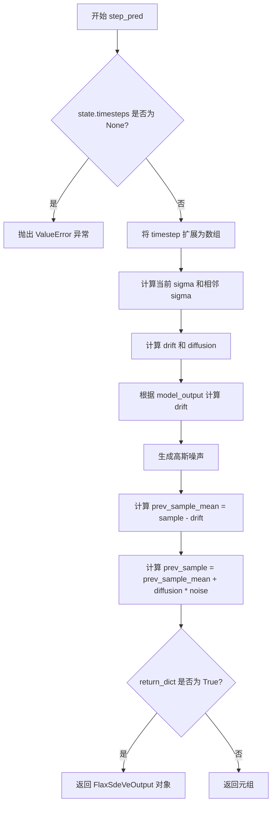

#### 带注释源码

```python
def step_pred(
    self,
    state: ScoreSdeVeSchedulerState,
    model_output: jnp.ndarray,
    timestep: int,
    sample: jnp.ndarray,
    key: jax.Array,
    return_dict: bool = True,
) -> FlaxSdeVeOutput | tuple:
    """
    Predict the sample at the previous timestep by reversing the SDE. Core function to propagate the diffusion
    process from the learned model outputs (most often the predicted noise).

    Args:
        state (`ScoreSdeVeSchedulerState`): the `FlaxScoreSdeVeScheduler` state data class instance.
        model_output (`jnp.ndarray`): direct output from learned diffusion model.
        timestep (`int`): current discrete timestep in the diffusion chain.
        sample (`jnp.ndarray`):
            current instance of sample being created by diffusion process.
        key: random number generator.
        return_dict (`bool`): option for returning tuple rather than FlaxSdeVeOutput class

    Returns:
        [`FlaxSdeVeOutput`] or `tuple`: [`FlaxSdeVeOutput`] if `return_dict` is True, otherwise a `tuple`. When
        returning a tuple, the first element is the sample tensor.

    """
    # 检查是否已设置时间步，若未设置则抛出错误
    if state.timesteps is None:
        raise ValueError(
            "`state.timesteps` is not set, you need to run 'set_timesteps' after creating the scheduler"
        )

    # 将单个时间步扩展为数组，以匹配批量大小
    timestep = timestep * jnp.ones(
        sample.shape[0],
    )
    # 将时间步映射到离散sigma数组的索引
    timesteps = (timestep * (len(state.timesteps) - 1)).long()

    # 获取当前时间步和相邻时间步的sigma值
    sigma = state.discrete_sigmas[timesteps]
    adjacent_sigma = self.get_adjacent_sigma(state, timesteps, timestep)
    
    # 初始化漂移项为零
    drift = jnp.zeros_like(sample)
    # 计算扩散系数（论文公式6中的g项）
    diffusion = (sigma**2 - adjacent_sigma**2) ** 0.5

    # equation 6 in the paper: the model_output modeled by the network is grad_x log pt(x)
    # also equation 47 shows the analog from SDE models to ancestral sampling methods
    # 将扩散系数展平并广播到样本形状
    diffusion = diffusion.flatten()
    diffusion = broadcast_to_shape_from_left(diffusion, sample.shape)
    # 计算漂移项：drift = -g^2 * model_output（论文公式6）
    drift = drift - diffusion**2 * model_output

    # equation 6: sample noise for the diffusion term of
    # 分割随机密钥并生成高斯噪声
    key = random.split(key, num=1)
    noise = random.normal(key=key, shape=sample.shape)
    
    # 计算前一个样本均值：减去漂移项（因为dt是小负时间步）
    prev_sample_mean = sample - drift  # subtract because `dt` is a small negative timestep
    # TODO is the variable diffusion the correct scaling term for the noise?
    # 计算前一个样本：均值加上扩散场的影响
    prev_sample = prev_sample_mean + diffusion * noise  # add impact of diffusion field g

    # 根据返回参数决定输出格式
    if not return_dict:
        return (prev_sample, prev_sample_mean, state)

    return FlaxSdeVeOutput(prev_sample=prev_sample, prev_sample_mean=prev_sample_mean, state=state)
```


### `FlaxScoreSdeVeScheduler.step_correct`

该方法是SDE（随机微分方程）调度器中的校正步骤，用于根据神经网络输出的model_output对预测样本进行校正改进，以提高样本质量。该方法通常在预测步骤后重复执行多次。

参数：

- `state`：`ScoreSdeVeSchedulerState`，FlaxScoreSdeVeScheduler状态数据类实例，包含调度器的当前状态
- `model_output`：`jnp.ndarray`，来自学习扩散模型的直接输出（预测噪声）
- `sample`：`jnp.ndarray`，当前由扩散过程创建的样本实例
- `key`：`jax.Array`，JAX随机数生成器，用于生成噪声
- `return_dict`：`bool`，决定是否返回FlaxSdeVeOutput类而非元组的选项

返回值：`FlaxSdeVeOutput | tuple`，如果`return_dict`为True，返回`FlaxSdeVeOutput`对象；否则返回元组，第一个元素是样本张量

#### 流程图

```mermaid
flowchart TD
    A[开始 step_correct] --> B{检查 state.timesteps 是否为 None}
    B -->|是| C[抛出 ValueError 异常]
    B -->|否| D[分割随机数生成器 key]
    D --> E[生成标准正态分布噪声]
    E --> F[计算 model_output 的梯度范数 grad_norm]
    F --> G[计算噪声的范数 noise_norm]
    G --> H[根据 SNR、noise_norm 和 grad_norm 计算步长 step_size]
    H --> I[将 step_size 展平并广播到样本形状]
    I --> J[计算校正后的样本均值 prev_sample_mean = sample + step_size * model_output]
    J --> K[计算带噪声的最终校正样本 prev_sample = prev_sample_mean + sqrt(step_size * 2) * noise]
    K --> L{return_dict 为 True?}
    L -->|是| M[返回 FlaxSdeVeOutput 对象]
    L -->|否| N[返回元组 (prev_sample, state)]
```

#### 带注释源码

```python
def step_correct(
    self,
    state: ScoreSdeVeSchedulerState,
    model_output: jnp.ndarray,
    sample: jnp.ndarray,
    key: jax.Array,
    return_dict: bool = True,
) -> FlaxSdeVeOutput | tuple:
    """
    Correct the predicted sample based on the output model_output of the network. This is often run repeatedly
    after making the prediction for the previous timestep.

    Args:
        state (`ScoreSdeVeSchedulerState`): the `FlaxScoreSdeVeScheduler` state data class instance.
        model_output (`jnp.ndarray`): direct output from learned diffusion model.
        sample (`jnp.ndarray`):
            current instance of sample being created by diffusion process.
        generator: random number generator.
        return_dict (`bool`): option for returning tuple rather than FlaxSdeVeOutput class

    Returns:
        [`FlaxSdeVeOutput`] or `tuple`: [`FlaxSdeVeOutput`] if `return_dict` is True, otherwise a `tuple`. When
        returning a tuple, the first element is the sample tensor.

    """
    # 检查调度器是否已初始化时间步，未初始化则抛出错误
    if state.timesteps is None:
        raise ValueError(
            "`state.timesteps` is not set, you need to run 'set_timesteps' after creating the scheduler"
        )

    # For small batch sizes, the paper "suggest replacing norm(z) with sqrt(d), where d is the dim. of z"
    # sample noise for correction
    # 分割随机数生成器密钥，用于生成校正噪声
    key = random.split(key, num=1)
    # 生成与样本形状相同的标准正态分布噪声
    noise = random.normal(key=key, shape=sample.shape)

    # compute step size from the model_output, the noise, and the snr
    # 计算模型输出的梯度范数（L2范数）
    grad_norm = jnp.linalg.norm(model_output)
    # 计算噪声的L2范数
    noise_norm = jnp.linalg.norm(noise)
    # 根据信噪比(SNR)、噪声范数和梯度范数计算步长
    # 公式: step_size = (SNR * ||noise|| / ||grad||)^2 * 2
    step_size = (self.config.snr * noise_norm / grad_norm) ** 2 * 2
    # 将步长扩展为与批次大小相同的数组
    step_size = step_size * jnp.ones(sample.shape[0])

    # compute corrected sample: model_output term and noise term
    # 将步长展平以匹配后续广播操作
    step_size = step_size.flatten()
    # 将步长广播到与样本相同的形状
    step_size = broadcast_to_shape_from_left(step_size, sample.shape)
    # 计算校正后的样本均值: sample + step_size * model_output
    # 这里model_output代表梯度方向，步长控制校正幅度
    prev_sample_mean = sample + step_size * model_output
    # 添加噪声项得到最终校正样本: mean + sqrt(2*step_size) * noise
    prev_sample = prev_sample_mean + ((step_size * 2) ** 0.5) * noise

    # 根据return_dict决定返回格式
    if not return_dict:
        return (prev_sample, state)

    # 返回包含状态和校正后样本的输出对象
    return FlaxSdeVeOutput(prev_sample=prev_sample, state=state)
```


### `FlaxScoreSdeVeScheduler.__len__`

该方法是 Python 魔术方法 `__len__` 的实现，使 FlaxScoreSdeVeScheduler 调度器实例可以通过内置的 `len()` 函数获取训练时间步的总数，直接返回配置中定义的 `num_train_timesteps` 属性。

参数：

- `self`：`FlaxScoreSdeVeScheduler`，调度器实例本身（隐式参数，无需显式传入）

返回值：`int`，返回调度器配置中定义的训练时间步数量（num_train_timesteps），用于表示整个扩散训练过程的时间步总数。

#### 流程图

```mermaid
flowchart TD
    A[开始 __len__ 调用] --> B[访问 self.config.num_train_timesteps]
    B --> C[返回整数值]
    C --> D[结束]
```

#### 带注释源码

```python
def __len__(self):
    """
    返回调度器的训练时间步数量，使调度器支持 len() 操作。
    
    该方法是 Python 特殊方法（魔术方法）__len__ 的实现，
    使得可以调用 len(scheduler) 来获取配置中定义的训练时间步总数。
    
    Returns:
        int: 配置中定义的 num_train_timesteps 值，默认为 2000
    """
    return self.config.num_train_timesteps
```

## 关键组件


### ScoreSdeVeSchedulerState

Flax结构化数据类，用于存储SDE VE调度器的可设置状态，包括时间步、离散sigma值和连续sigma值，支持惰性加载和动态更新。

### FlaxSdeVeOutput

输出数据类，继承自FlaxSchedulerOutput，包含校正后的样本、上一个样本的均值以及调度器状态，用于返回扩散链中每个推理步骤的计算结果。

### FlaxScoreSdeVeScheduler

主调度器类，实现方差 exploding 随机微分方程(SDE)算法，继承FlaxSchedulerMixin和ConfigMixin，提供时间步设置、sigma参数配置、预测步骤和校正步骤的核心功能。

### set_timesteps 方法

设置扩散链中使用的连续时间步，通过线性间隔从1到sampling_eps生成指定数量的推理步骤，返回更新后的调度器状态。

### set_sigmas 方法

设置扩散链中使用的噪声尺度sigmas，控制漂移(diffusion)和扩散(diffusion)组件的权重，根据sigma_min和sigma_max在对数空间中生成离散sigmas，并计算对应的连续sigmas序列。

### get_adjacent_sigma 函数

辅助函数，根据当前时间步获取相邻的时间步对应的sigma值，当时间为0时返回零数组，用于计算扩散系数。

### step_pred 方法

核心预测函数，通过反向SDE预测上一个时间步的样本，实现论文中的方程6，根据模型输出计算漂移项和扩散项，生成噪声并结合当前样本计算前一时间步的样本。

### step_correct 方法

校正函数，基于模型输出对预测样本进行校正，根据SNR参数计算步长，使用L2范数归一化后将模型输出和噪声加权叠加到当前样本上，可多次迭代以提高采样质量。

### 配置参数

包括num_train_timesteps(训练时间步数)、snr(信噪比权重)、sigma_min和sigma_max(噪声尺度范围)、sampling_eps(采样终点)和correct_steps(校正步数)，这些参数共同控制扩散过程的采样行为和质量。


## 问题及建议


### 已知问题

-   **类型注解兼容性**：使用了Python 3.10+的联合类型语法（`jnp.ndarray | None`），可能与旧版Python环境不兼容
-   **JAX方法错误**：`step_pred`方法中使用了`.long()`方法，这是PyTorch的风格，在JAX中应使用`.astype(jnp.int32)`或类似方法，会导致运行时错误
-   **参数文档不一致**：`step_correct`方法文档字符串中参数名为`generator`，但实际参数为`key`，文档与实现不匹配
-   **未使用参数**：`get_adjacent_sigma`方法接收`t`参数但从未使用，存在设计冗余
-   **参数类型错误**：`step_pred`中`adjacent_sigma = self.get_adjacent_sigma(state, timesteps, timestep)`传入的`timestep`是经过`jnp.ones`扩展后的数组，但方法实现期望的是单个整数值，会导致索引逻辑错误
-   **弃用状态未处理**：类中包含弃用警告但仍在生产环境中使用，缺乏迁移路径或替代方案的具体说明

### 优化建议

-   修正`.long()`为JAX兼容的`.astype(jnp.int32)`方法
-   统一文档字符串参数名与实际参数名（将`generator`改为`key`或反之）
-   重构`get_adjacent_sigma`方法，移除未使用的`t`参数或重新设计其用途
-   修复`timestep`参数传递逻辑，确保传入正确的数据类型和维度
-   考虑使用`Optional[jnp.ndarray]`替代联合类型语法以提高兼容性
-   将重复的`random.split(key, num=1)`逻辑提取为私有方法减少代码冗余
-   增加更详细的类型注解和边界条件检查，提升代码健壮性


## 其它


### 设计目标与约束

本模块实现了基于方差爆炸随机微分方程（Variance Exploding SDE）的调度器，主要用于扩散模型的采样过程。设计目标是提供一种从噪声样本逐步去噪生成目标样本的调度机制，支持预测步骤（step_pred）和校正步骤（step_correct）两种去噪模式。核心约束包括：依赖Flax框架实现函数式数据结构；支持JAX JIT编译优化；必须通过ConfigMixin和register_to_config实现配置管理；向后兼容Diffusers库的调度器接口规范。

### 错误处理与异常设计

代码中的错误处理主要采用显式异常抛出机制。在step_pred和step_correct方法中，当state.timesteps未初始化时抛出ValueError，提示用户需要先运行set_timesteps方法。参数校验主要通过None值检查实现，允许运行时覆盖配置参数（如sigma_min、sigma_max、sampling_eps）。日志警告用于提示Flax类已弃用的迁移信息。建议增加更多边界条件检查，如num_inference_steps为负数或零、sample维度不匹配、key为无效的JAX随机密钥等情况。

### 数据流与状态机

调度器状态转换遵循以下流程：初始化 → create_state创建状态 → set_timesteps设置时间步 → set_sigmas设置噪声尺度 → 循环执行step_pred/step_correct。状态机包含三个主要状态：ScoreSdeVeSchedulerState（包含timesteps、discrete_sigmas、sigmas字段）、FlaxSdeVeOutput（包含prev_sample、prev_sample_mean、state字段）。数据流从模型输出（model_output）经过 drift = -diffusion² * model_output 计算漂移项，结合扩散项（diffusion * noise）通过随机微分方程的离散化实现样本更新。校正步骤通过计算梯度范数和噪声范数的比率来确定步长，实现Langevin校正。

### 外部依赖与接口契约

核心依赖包括：flax.struct用于不可变数据结构；jax和jax.numpy用于数值计算；jax.random用于随机数生成；configuration_utils中的ConfigMixin和register_to_config用于配置管理；utils.logging用于日志记录；scheduling_utils_flax中的辅助函数broadcast_to_shape_from_left用于广播操作。接口契约要求：所有调度器必须继承FlaxSchedulerMixin和ConfigMixin；必须实现has_state属性返回True；create_state方法返回初始化状态；set_timesteps和set_sigmas方法更新状态；step_pred和step_correct方法返回FlaxSdeVeOutput或元组。调用方需要保证在调用step方法前已完成状态初始化，并提供有效的JAX随机密钥。

### 性能考虑与优化建议

当前实现中存在若干性能优化空间：step_pred和step_correct中重复调用random.split(key, num=1)，可以考虑预分配随机密钥；broadcast_to_shape_from_left在每步调用，可考虑JAX的vmap或pmap并行化；jnp.where和jnp.zeros_like的组合可使用更高效的索引操作；离散sigmas计算中的列表推导可替换为向量化操作。建议使用JAX的@jit装饰器封装核心计算步骤；对于大批量推理可考虑状态缓存避免重复初始化；校正步骤的grad_norm和noise_norm计算可合并以减少遍历次数。

### 版本兼容性与迁移指南

代码中已包含deprecation警告，提示Flax类将在Diffusers v1.0.0中移除。建议用户：短期使用可pin住Diffusers版本；中长期应迁移至PyTorch实现类；迁移时需将jnp替换为torch，将flax.struct.dataclass替换为dataclass，将jax.random替换为torch.manual_seed。配置参数（num_train_timesteps、snr、sigma_min、sigma_max、sampling_eps、correct_steps）在PyTorch版本中保持一致，确保平滑迁移。

### 测试策略建议

建议补充以下测试用例：set_timesteps和set_sigmas的参数覆盖测试；step_pred和step_correct输出形状一致性测试；状态不可变性验证测试；JAX JIT编译前后结果一致性测试；与PyTorch版本输出数值对比测试；边界条件（num_inference_steps=1、单样本batch）测试；随机数 reproducibility 测试（固定key验证输出确定性）。


    