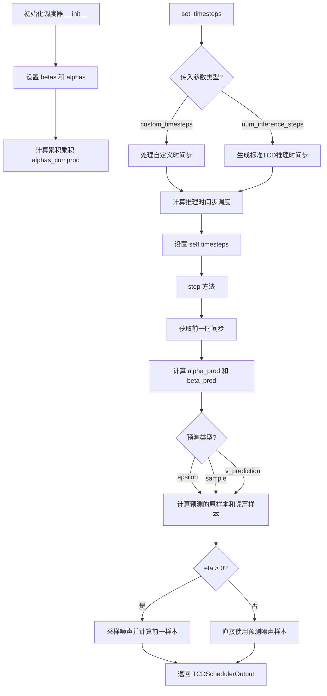
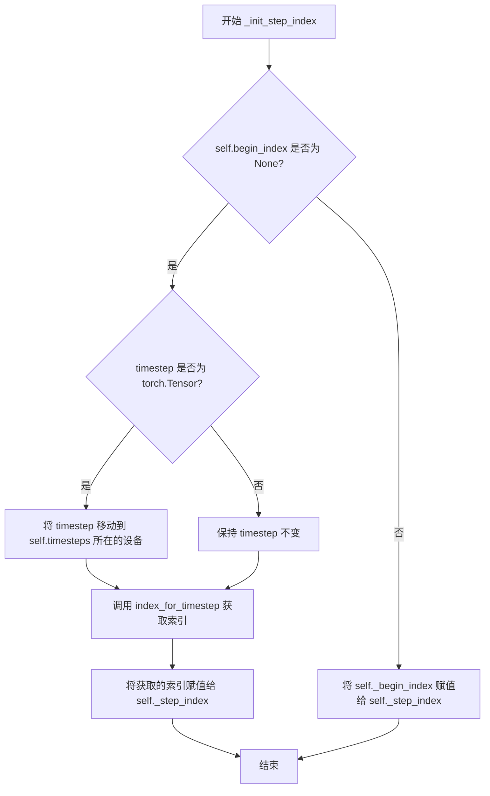
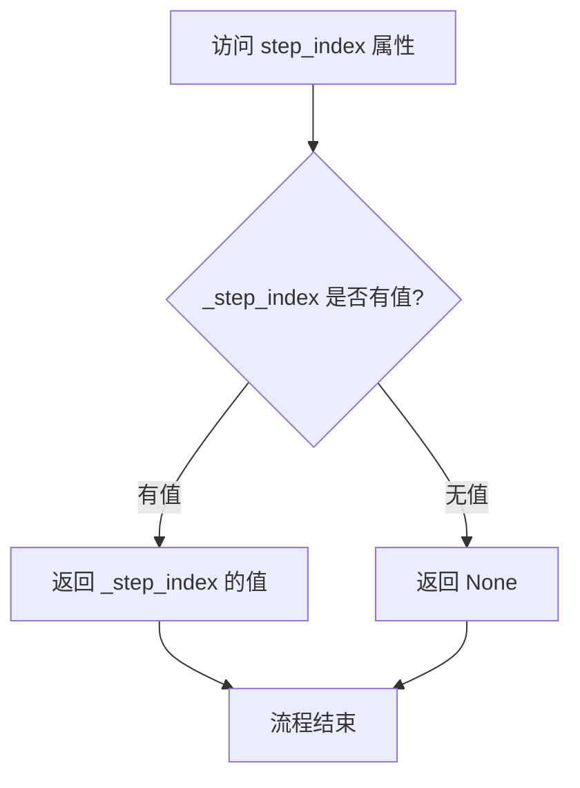
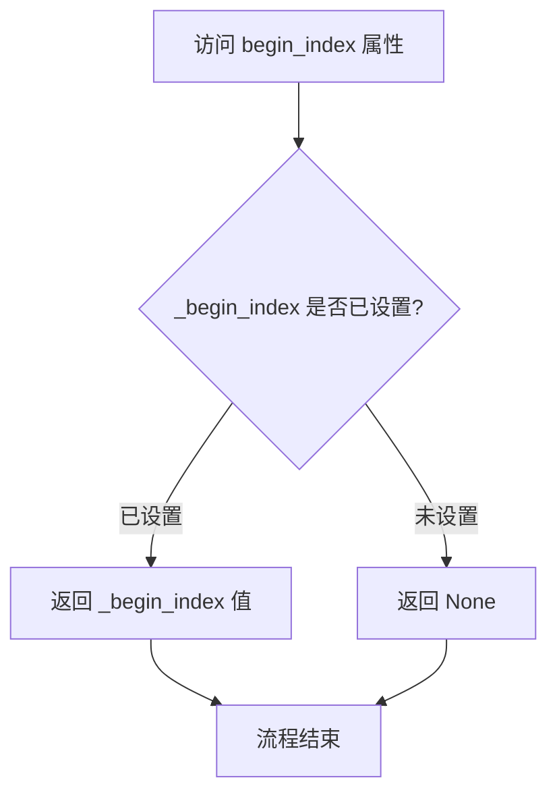
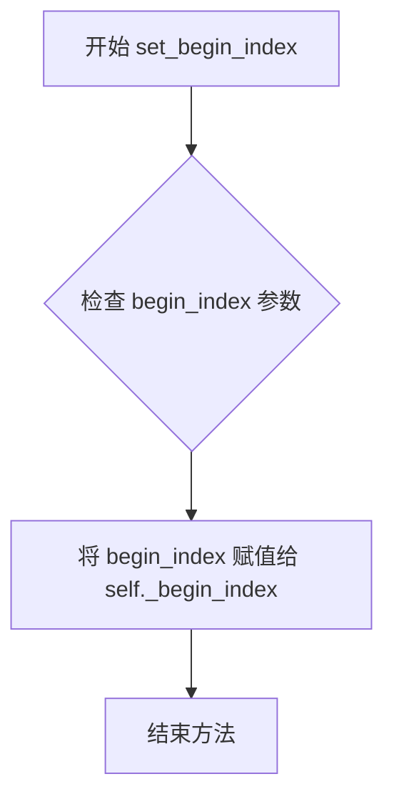
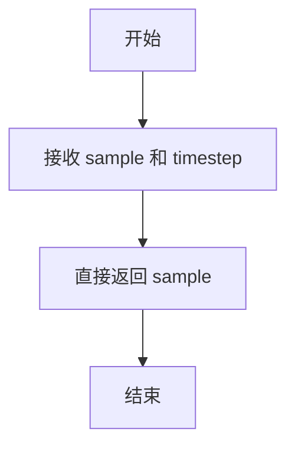
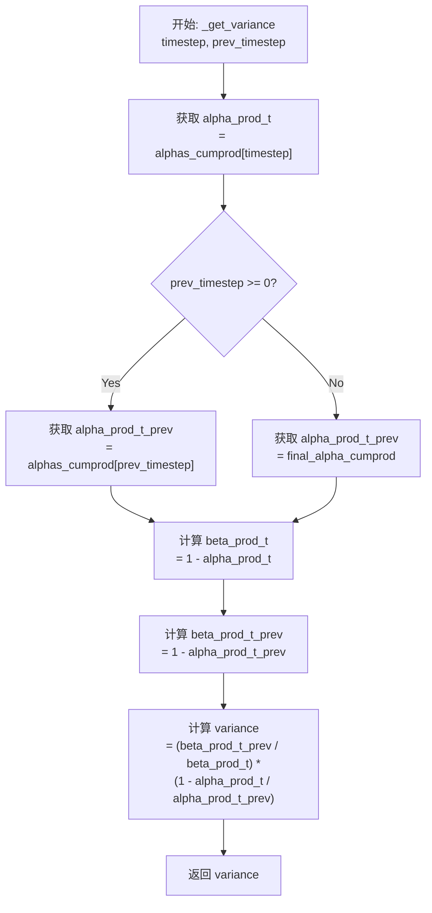
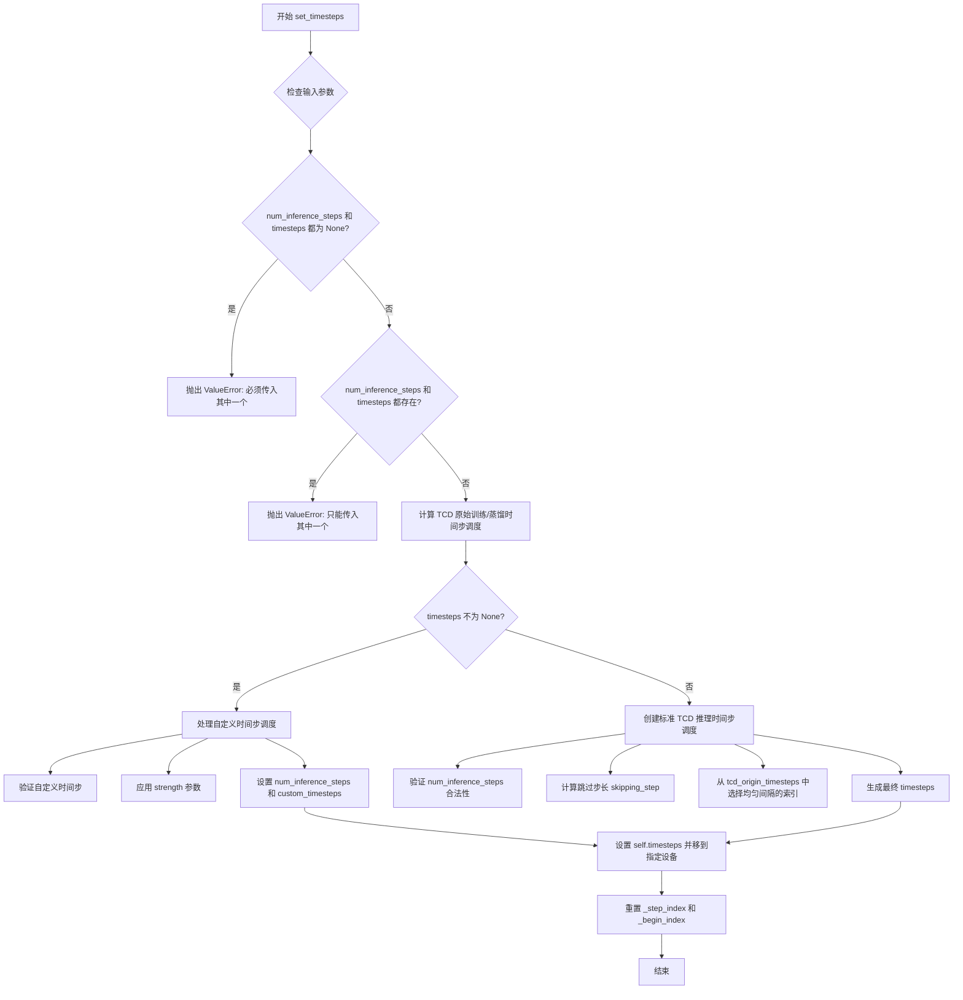
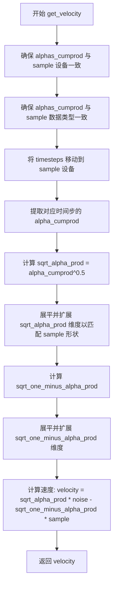
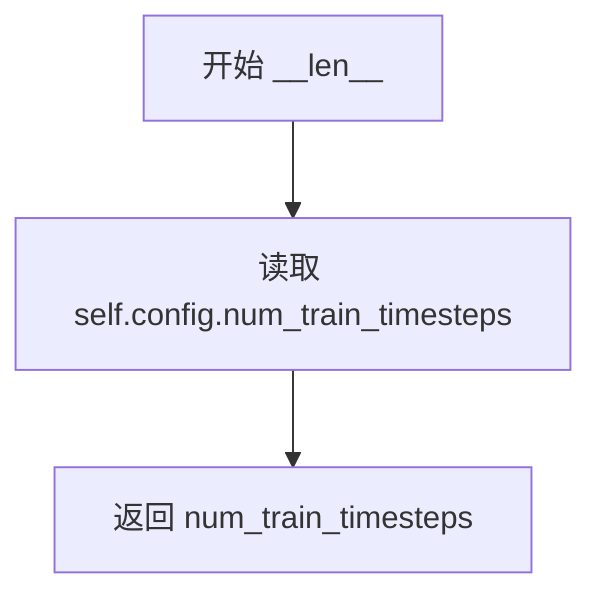

# `diffusers\src\diffusers\schedulers\scheduling_tcd.py` 详细设计文档

TCDScheduler实现了一种用于扩散模型的策略性随机采样（Strategic Stochastic Sampling），源自论文'Trajectory Consistency Distillation'，通过扩展多步一致性采样支持无限制轨迹遍历，能够在推理过程中动态调整噪声水平和时间步调度。

## 整体流程



## 类结构

```
BaseOutput ( utils )
├── TCDSchedulerOutput ( dataclass )
├── SchedulerMixin ( schedulers.scheduling_utils )
├── ConfigMixin ( configuration_utils )
└── TCDScheduler
    ├── 全局函数: betas_for_alpha_bar
    ├── 全局函数: rescale_zero_terminal_snr
    └── 核心方法: set_timesteps, step, add_noise, get_velocity
```

## 全局变量及字段


### `logger`
    
日志记录器

类型：`logging.Logger`
    


### `TCDSchedulerOutput.prev_sample`
    
前一步计算出的样本

类型：`torch.Tensor`
    


### `TCDSchedulerOutput.pred_noised_sample`
    
预测的噪声样本

类型：`torch.Tensor | None`
    


### `TCDScheduler.order`
    
调度器阶数

类型：`int`
    


### `TCDScheduler.betas`
    
Beta调度值

类型：`torch.Tensor`
    


### `TCDScheduler.alphas`
    
Alpha值

类型：`torch.Tensor`
    


### `TCDScheduler.alphas_cumprod`
    
累积Alpha乘积

类型：`torch.Tensor`
    


### `TCDScheduler.final_alpha_cumprod`
    
最终累积Alpha

类型：`torch.Tensor`
    


### `TCDScheduler.init_noise_sigma`
    
初始噪声标准差

类型：`float`
    


### `TCDScheduler.num_inference_steps`
    
推理步数

类型：`int | None`
    


### `TCDScheduler.timesteps`
    
时间步序列

类型：`torch.Tensor`
    


### `TCDScheduler.custom_timesteps`
    
是否使用自定义时间步

类型：`bool`
    


### `TCDScheduler._step_index`
    
当前步骤索引

类型：`int | None`
    


### `TCDScheduler._begin_index`
    
起始索引

类型：`int | None`
    
    

## 全局函数及方法


### `betas_for_alpha_bar`

创建离散的 beta 调度表，该函数通过离散化给定的 alpha_t_bar 函数来生成 beta 序列。alpha_t_bar 函数定义了扩散过程中 (1-beta) 的累积乘积随时间的变化。

参数：

- `num_diffusion_timesteps`：`int`，要生成的 beta 数量，即扩散时间步的总数
- `max_beta`：`float`，默认为 `0.999`，使用的最大 beta 值，用于避免数值不稳定
- `alpha_transform_type`：`Literal["cosine", "exp", "laplace"]`，默认为 `"cosine"`，alpha_bar 变换的类型，可选 "cosine"、"exp" 或 "laplace"

返回值：`torch.Tensor`，调度器用于逐步处理模型输出的 beta 值序列

#### 流程图

```mermaid
flowchart TD
    A[开始] --> B{alpha_transform_type == 'cosine'?}
    B -->|Yes| C[定义 cosine alpha_bar_fn]
    B -->|No| D{alpha_transform_type == 'laplace'?}
    D -->|Yes| E[定义 laplace alpha_bar_fn]
    D -->|No| F{alpha_transform_type == 'exp'?}
    F -->|Yes| G[定义 exp alpha_bar_fn]
    F -->|No| H[raise ValueError 不支持的类型]
    
    C --> I[初始化空列表 betas]
    E --> I
    G --> I
    
    I --> J[循环 i from 0 to num_diffusion_timesteps-1]
    J --> K[计算 t1 = i / num_diffusion_timesteps]
    K --> L[计算 t2 = (i + 1) / num_diffusion_timesteps]
    L --> M[计算 beta_i = min(1 - alpha_bar_fn(t2) / alpha_bar_fn(t1), max_beta)]
    M --> N[append beta_i 到 betas]
    N --> O{还有下一个 i?}
    O -->|Yes| J
    O -->|No| P[返回 torch.tensor(betas, dtype=torch.float32)]
    
    style H fill:#ff9999
```

#### 带注释源码

```python
# Copied from diffusers.schedulers.scheduling_ddpm.betas_for_alpha_bar
def betas_for_alpha_bar(
    num_diffusion_timesteps: int,
    max_beta: float = 0.999,
    alpha_transform_type: Literal["cosine", "exp", "laplace"] = "cosine",
) -> torch.Tensor:
    """
    Create a beta schedule that discretizes the given alpha_t_bar function, which defines the cumulative product of
    (1-beta) over time from t = [0,1].

    Contains a function alpha_bar that takes an argument t and transforms it to the cumulative product of (1-beta) up
    to that part of the diffusion process.

    Args:
        num_diffusion_timesteps (`int`):
            The number of betas to produce.
        max_beta (`float`, defaults to `0.999`):
            The maximum beta to use; use values lower than 1 to avoid numerical instability.
        alpha_transform_type (`str`, defaults to `"cosine"`):
            The type of noise schedule for `alpha_bar`. Choose from `cosine`, `exp`, or `laplace`.

    Returns:
        `torch.Tensor`:
            The betas used by the scheduler to step the model outputs.
    """
    # 根据 alpha_transform_type 选择对应的 alpha_bar_fn 变换函数
    if alpha_transform_type == "cosine":
        # cosine 变换：使用余弦函数创建平滑的噪声调度
        def alpha_bar_fn(t):
            # 使用改进的 cosine 调度，添加偏移量 0.008/1.008 以避免边界问题
            return math.cos((t + 0.008) / 1.008 * math.pi / 2) ** 2

    elif alpha_transform_type == "laplace":
        # Laplace 变换：基于拉普拉斯分布的噪声调度
        def alpha_bar_fn(t):
            # 计算 lambda 参数：使用 copysign 确保符号正确，fabs 处理绝对值
            lmb = -0.5 * math.copysign(1, 0.5 - t) * math.log(1 - 2 * math.fabs(0.5 - t) + 1e-6)
            # 计算信号噪声比 (Signal-to-Noise Ratio)
            snr = math.exp(lmb)
            # 返回 sqrt(snr / (1 + snr))
            return math.sqrt(snr / (1 + snr))

    elif alpha_transform_type == "exp":
        # 指数变换：指数衰减的噪声调度
        def alpha_bar_fn(t):
            # 指数衰减函数，-12.0 是衰减率
            return math.exp(t * -12.0)

    else:
        # 如果传入不支持的类型，抛出 ValueError 异常
        raise ValueError(f"Unsupported alpha_transform_type: {alpha_transform_type}")

    # 初始化空列表用于存储计算得到的 beta 值
    betas = []
    # 遍历每个扩散时间步
    for i in range(num_diffusion_timesteps):
        # t1 和 t2 表示当前时间步的起止点 [t1, t2)
        t1 = i / num_diffusion_timesteps
        t2 = (i + 1) / num_diffusion_timesteps
        
        # 计算 beta 值：通过 alpha_bar_fn 的比值得到当前区间的 (1-beta)
        # 并与 max_beta 比较取最小值以确保数值稳定性
        betas.append(min(1 - alpha_bar_fn(t2) / alpha_bar_fn(t1), max_beta))
    
    # 将 beta 列表转换为 PyTorch float32 张量并返回
    return torch.tensor(betas, dtype=torch.float32)
```


### `rescale_zero_terminal_snr`

该函数用于重新缩放beta序列，使其具有零终端信噪比（SNR）。基于论文https://huggingface.co/papers/2305.08891 (Algorithm 1)的算法，通过调整alphas_cumprod的平方根来实现零终端SNR，从而允许模型生成非常明亮或非常暗的样本，而不是限制在中等亮度的样本。

参数：

-  `betas`：`torch.Tensor`，scheduler初始化时使用的beta序列

返回值：`torch.Tensor`，具有零终端SNR的重新缩放后的beta序列

#### 流程图

```mermaid
flowchart TD
    A[输入 betas] --> B[计算 alphas = 1.0 - betas]
    B --> C[计算 alphas_cumprod = cumprod(alphas)]
    C --> D[计算 alphas_bar_sqrt = sqrt(alphas_cumprod)]
    D --> E[保存初始值 alphas_bar_sqrt_0 和终值 alphas_bar_sqrt_T]
    E --> F[alphas_bar_sqrt 减去终值实现移位]
    F --> G[乘以缩放因子恢复初始值]
    G --> H[alphas_bar = alphas_bar_sqrt² 恢复平方]
    H --> I[alphas = alphas_bar[1:] / alphas_bar[:-1] 恢复累积积]
    I --> J[拼接首元素 alphas = cat[alphas_bar[0:1], alphas]]
    J --> K[计算 betas = 1 - alphas]
    K --> L[输出重新缩放后的 betas]
```

#### 带注释源码

```python
def rescale_zero_terminal_snr(betas: torch.Tensor) -> torch.Tensor:
    """
    Rescales betas to have zero terminal SNR Based on https://huggingface.co/papers/2305.08891 (Algorithm 1)

    Args:
        betas (`torch.Tensor`):
            The betas that the scheduler is being initialized with.

    Returns:
        `torch.Tensor`:
            Rescaled betas with zero terminal SNR.
    """
    # 将betas转换为alphas (alpha = 1 - beta)
    alphas = 1.0 - betas
    
    # 计算累积乘积 alpha_cumprod
    alphas_cumprod = torch.cumprod(alphas, dim=0)
    
    # 计算 alpha_cumprod 的平方根
    alphas_bar_sqrt = alphas_cumprod.sqrt()

    # 保存原始值用于后续缩放
    alphas_bar_sqrt_0 = alphas_bar_sqrt[0].clone()  # 第一个时间步的 sqrt(alpha_bar)
    alphas_bar_sqrt_T = alphas_bar_sqrt[-1].clone()  # 最后一个时间步的 sqrt(alpha_bar)

    # 移位使最后一个时间步为零
    alphas_bar_sqrt -= alphas_bar_sqrt_T

    # 缩放使第一个时间步恢复为原始值
    alphas_bar_sqrt *= alphas_bar_sqrt_0 / (alphas_bar_sqrt_0 - alphas_bar_sqrt_T)

    # 将 alphas_bar_sqrt 转换回 betas
    alphas_bar = alphas_bar_sqrt**2  # 恢复平方运算
    alphas = alphas_bar[1:] / alphas_bar[:-1]  # 恢复累积积（通过相邻比值）
    alphas = torch.cat([alphas_bar[0:1], alphas])  # 拼接第一个时间步的 alpha
    betas = 1 - alphas  # 最终计算 betas

    return betas
```


### `TCDScheduler.__init__`

初始化 `TCDScheduler` 类实例。根据传入的参数生成扩散过程所需的 Beta 调度表、Alpha 值及其累积乘积，并初始化推理所需的状态变量（如时间步、步数索引等）。

参数：

- `num_train_timesteps`：`int`，扩散模型训练时的总时间步数（默认为 1000）。
- `beta_start`：`float`，Beta 调度曲线的起始值（默认为 0.00085）。
- `beta_end`：`float`，Beta 调度曲线的结束值（默认为 0.012）。
- `beta_schedule`：`str`，Beta 调度策略的类型，可选 "linear", "scaled_linear", "squaredcos_cap_v2"（默认为 "scaled_linear"）。
- `trained_betas`：`np.ndarray | list[float] | None`，可选参数，直接传入自定义的 Beta 数组以绕过 `beta_start` 和 `beta_end` 的计算。
- `original_inference_steps`：`int`，用于生成分布式时间步调度的原始推理步数（默认为 50）。
- `clip_sample`：`bool`，是否对预测样本进行裁剪以保证数值稳定性（默认为 False）。
- `clip_sample_range`：`float`，裁剪样本的最大幅度，仅在 `clip_sample=True` 时有效（默认为 1.0）。
- `set_alpha_to_one`：`bool`，最终时间步的 Alpha 累积乘积是否设为 1（默认为 True）。
- `steps_offset`：`int`，推理步骤的偏移量（默认为 0）。
- `prediction_type`：`str`，预测类型，可选 "epsilon", "sample", "v_prediction"（默认为 "epsilon"）。
- `thresholding`：`bool`，是否启用动态阈值处理（默认为 False）。
- `dynamic_thresholding_ratio`：`float`，动态阈值处理的分位比率（默认为 0.995）。
- `sample_max_value`：`float`，动态阈值处理的最大样本值（默认为 1.0）。
- `timestep_spacing`：`str`，时间步的缩放方式（默认为 "leading"）。
- `timestep_scaling`：`float`，计算一致性模型边界条件 `c_skip` 和 `c_out` 时的时间步缩放因子（默认为 10.0）。
- `rescale_betas_zero_snr`：`bool`，是否重新缩放 Beta 以实现终端信噪比（SNR）为零（默认为 False）。

返回值：`None`，构造函数不返回任何值。

#### 流程图

```mermaid
graph TD
    A([开始 __init__]) --> B{trained_betas 是否传入?}
    B -- 是 --> C[使用传入的 betas 张量]
    B -- 否 --> D{beta_schedule 类型?}
    D -- linear --> E[使用 torch.linspace 生成线性 betas]
    D -- scaled_linear --> F[使用 torch.linspace 生成平方根线性 betas 并平方]
    D -- squaredcos_cap_v2 --> G[使用 betas_for_alpha_bar 生成余弦 betas]
    D -- 其他 --> H[抛出 NotImplementedError]
    C --> I{rescale_betas_zero_snr?}
    E --> I
    F --> I
    G --> I
    I -- 是 --> J[调用 rescale_zero_terminal_snr 重新缩放]
    I -- 否 --> K[计算 alphas = 1 - betas]
    J --> K
    K --> L[计算 alphas_cumprod 累积乘积]
    L --> M{set_alpha_to_one?}
    M -- 是 --> N[final_alpha_cumprod = 1.0]
    M -- 否 --> O[final_alpha_cumprod = alphas_cumprod[0]]
    N --> P[设置 init_noise_sigma = 1.0]
    O --> P
    P --> Q[初始化 num_inference_steps, timesteps 等推理参数]
    Q --> R([结束])
```

#### 带注释源码

```python
@register_to_config
def __init__(
    self,
    num_train_timesteps: int = 1000,
    beta_start: float = 0.00085,
    beta_end: float = 0.012,
    beta_schedule: str = "scaled_linear",
    trained_betas: np.ndarray | list[float] | None = None,
    original_inference_steps: int = 50,
    clip_sample: bool = False,
    clip_sample_range: float = 1.0,
    set_alpha_to_one: bool = True,
    steps_offset: int = 0,
    prediction_type: str = "epsilon",
    thresholding: bool = False,
    dynamic_thresholding_ratio: float = 0.995,
    sample_max_value: float = 1.0,
    timestep_spacing: str = "leading",
    timestep_scaling: float = 10.0,
    rescale_betas_zero_snr: bool = False,
):
    # 1. 初始化 Beta 调度表
    if trained_betas is not None:
        # 如果直接提供了 betas，则直接使用
        self.betas = torch.tensor(trained_betas, dtype=torch.float32)
    elif beta_schedule == "linear":
        # 线性 Beta 调度
        self.betas = torch.linspace(beta_start, beta_end, num_train_timesteps, dtype=torch.float32)
    elif beta_schedule == "scaled_linear":
        # 缩放线性调度，常用于潜在扩散模型
        self.betas = torch.linspace(beta_start**0.5, beta_end**0.5, num_train_timesteps, dtype=torch.float32) ** 2
    elif beta_schedule == "squaredcos_cap_v2":
        # Glide 余弦调度
        self.betas = betas_for_alpha_bar(num_train_timesteps)
    else:
        raise NotImplementedError(f"{beta_schedule} is not implemented for {self.__class__}")

    # 2. 可选：重新缩放 Beta 以实现零终端 SNR
    if rescale_betas_zero_snr:
        self.betas = rescale_zero_terminal_snr(self.betas)

    # 3. 计算 Alphas 和 Alpha 累积乘积
    self.alphas = 1.0 - self.betas
    self.alphas_cumprod = torch.cumprod(self.alphas, dim=0)

    # 4. 设置最终的 Alpha 累积乘积
    # 对于 DDIM 过程，我们需要查看前一个 alpha_cumprod。
    # 对于最后一步，没有前一个 alpha_cumprod（因为已经为 0）。
    # `set_alpha_to_one` 决定是将此参数简单设置为 1，还是使用“非前一个”步骤的 alpha 值。
    self.final_alpha_cumprod = torch.tensor(1.0) if set_alpha_to_one else self.alphas_cumprod[0]

    # 初始噪声分布的标准差
    self.init_noise_sigma = 1.0

    # 5. 初始化可设置的推理参数
    self.num_inference_steps = None
    # 生成从 num_train_timesteps-1 到 0 的倒序时间步
    self.timesteps = torch.from_numpy(np.arange(0, num_train_timesteps)[::-1].copy().astype(np.int64))
    self.custom_timesteps = False

    # 内部状态索引
    self._step_index = None
    self._begin_index = None
```


### `TCDScheduler.index_for_timestep`

该方法用于在时间步调度序列中查找给定时间步对应的索引位置，特别处理了从调度中间开始采样的场景（如image-to-image），确保不会意外跳过时间步。

参数：
- `self`：`TCDScheduler` 实例，调度器对象本身
- `timestep`：`float | torch.Tensor`，需要查找的时间步值
- `schedule_timesteps`：`torch.Tensor | None`，可选的时间步调度序列，若为 `None` 则使用 `self.timesteps`

返回值：`int`，时间步在调度序列中的索引位置。对于第一次step，如果存在多个匹配则返回第二个索引（避免在中间开始采样时跳过sigma）。

#### 流程图

```mermaid
flowchart TD
    A[开始 index_for_timestep] --> B{schedule_timesteps 是否为 None?}
    B -->|是| C[使用 self.timesteps]
    B -->|否| D[使用传入的 schedule_timesteps]
    C --> E[在 schedule_timesteps 中查找匹配 timestep 的索引]
    D --> E
    E --> F[获取匹配索引列表 indices]
    F --> G{indices 长度 > 1?}
    G -->|是| H[pos = 1]
    G -->|否| I[pos = 0]
    H --> J[返回 indices[pos].item]
    I --> J
    J --> K[结束]
```

#### 带注释源码

```python
def index_for_timestep(
    self, timestep: float | torch.Tensor, schedule_timesteps: torch.Tensor | None = None
) -> int:
    """
    查找给定时间步在时间步调度序列中的索引位置。

    参数:
        timestep: 要查找的时间步值，可以是浮点数或张量
        schedule_timesteps: 可选的时间步调度序列，默认使用 self.timesteps

    返回:
        时间步在调度序列中的索引。对于第一次step，
        如果存在多个匹配则返回第二个索引以避免跳过sigma
    """
    # 如果未提供 schedule_timesteps，则使用调度器默认的时间步序列
    if schedule_timesteps is None:
        schedule_timesteps = self.timesteps

    # 查找所有与给定时间步匹配的索引位置
    # 使用 nonzero() 方法找出值为 True 的位置
    indices = (schedule_timesteps == timestep).nonzero()

    # 对于第一次 step（very first step）
    # 始终选择第二个索引（如果存在多个匹配）
    # 如果只有一个匹配则选择第一个索引
    # 这样可以确保在从去噪调度中间开始时不会意外跳过 sigma
    # （例如 image-to-image 场景）
    pos = 1 if len(indices) > 1 else 0

    # 将索引转换为 Python 整数并返回
    return indices[pos].item()
```


### `TCDScheduler._init_step_index`

该方法用于根据给定的时间步（timestep）初始化调度器的步进索引（step index），使调度器能够正确跟踪当前处于扩散过程的哪个步骤。

参数：

-  `timestep`：`float | torch.Tensor`，当前时间步，用于初始化步进索引

返回值：`None`，无返回值（该方法直接修改对象内部状态）

#### 流程图



#### 带注释源码

```python
def _init_step_index(self, timestep: float | torch.Tensor) -> None:
    """
    Initialize the step index for the scheduler based on the given timestep.

    Args:
        timestep (`float` or `torch.Tensor`):
            The current timestep to initialize the step index from.
    """
    # 检查是否已经设置了起始索引（begin_index）
    if self.begin_index is None:
        # 如果 timestep 是 Tensor，则将其移动到与 self.timesteps 相同的设备上
        # 以确保后续索引查询操作能够正确执行
        if isinstance(timestep, torch.Tensor):
            timestep = timestep.to(self.timesteps.device)
        
        # 通过 index_for_timestep 方法查找当前 timestep 在调度计划中的索引位置
        self._step_index = self.index_for_timestep(timestep)
    else:
        # 如果已经设置了起始索引，则直接使用该起始索引
        # 这种设计允许流水线（pipeline）在特定起始点开始推理
        self._step_index = self._begin_index
```


### `TCDScheduler.step_index`

该属性用于获取调度器在推理过程中的当前步骤索引，用于跟踪扩散模型的去噪进度。

参数： 无

返回值：`int | None`，返回当前推理步骤的索引，如果尚未初始化则返回 `None`。

#### 流程图



#### 带注释源码

```python
@property
def step_index(self):
    """
    获取当前推理步骤的索引。
    
    该属性返回调度器在去噪循环中的当前位置。它在 step() 方法中
    通过 _init_step_index() 初始化，并随着每个推理步骤自动递增。
    
    Returns:
        int | None: 当前步骤索引，如果尚未调用 set_timesteps 或开始推理则为 None
    """
    return self._step_index
```

#### 相关上下文信息

- **内部变量**：`_step_index` (类型：`int | None`)，在 `_init_step_index` 方法中初始化
- **初始化方式**：通过 `index_for_timestep` 方法根据当前时间步查找对应索引
- **使用场景**：在 `step()` 方法中用于获取前一个时间步和计算相关参数
- **状态管理**：每个推理步骤后自动递增（`self._step_index += 1`）


### `TCDScheduler.begin_index`

该属性是TCDScheduler调度器的起始索引getter，用于获取第一个时间步的索引值。该索引应在pipeline调用`set_begin_index`方法后被设置，用于控制在扩散推理过程中从哪个时间步开始执行。

参数：该属性无参数（为属性getter访问）

返回值：`int | None`，返回调度器的起始索引，如果未设置则为`None`

#### 流程图



#### 带注释源码

```python
@property
def begin_index(self):
    """
    The index for the first timestep. It should be set from pipeline with `set_begin_index` method.
    """
    return self._begin_index
```


### `TCDScheduler.set_begin_index`

设置调度器的起始索引。该方法应在推理前从管道调用，用于指定调度器开始推理的起始时间步索引。

参数：

- `begin_index`：`int`，默认值为 `0`，调度器的起始索引，用于控制推理从哪个时间步开始。

返回值：`None`，该方法没有返回值，仅设置内部属性 `_begin_index`。

#### 流程图



#### 带注释源码

```python
def set_begin_index(self, begin_index: int = 0):
    """
    Sets the begin index for the scheduler. This function should be run from pipeline before the inference.

    Args:
        begin_index (`int`, defaults to `0`):
            The begin index for the scheduler.
    """
    # 将传入的 begin_index 参数赋值给实例属性 _begin_index
    # 该属性用于在推理时确定调度器的起始时间步索引
    self._begin_index = begin_index
```


### TCDScheduler.scale_model_input

确保该调度器能够与需要根据当前时间步缩放去噪模型输入的调度器互换。

参数：

- `sample`：`torch.Tensor`，输入样本
- `timestep`：`int | None`，扩散链中的当前时间步

返回值：`torch.Tensor`，缩放后的输入样本

#### 流程图



#### 带注释源码

```python
def scale_model_input(self, sample: torch.Tensor, timestep: int | None = None) -> torch.Tensor:
    """
    Ensures interchangeability with schedulers that need to scale the denoising model input depending on the
    current timestep.

    Args:
        sample (`torch.Tensor`):
            The input sample.
        timestep (`int`, *optional*):
            The current timestep in the diffusion chain.

    Returns:
        `torch.Tensor`:
            A scaled input sample.
    """
    # TCDScheduler 不需要根据时间步缩放输入，直接返回原始样本
    # 这与其他调度器（如 EulerDiscreteScheduler）不同，后者可能会根据时间步对输入进行缩放
    return sample
```


### `TCDScheduler._get_variance`

该方法计算扩散过程中给定时间步的噪声方差，基于DDIM/DDPM文献中定义的公式，通过累积alpha和beta乘积来确定每一步的方差值。

参数：

- `timestep`：`int`，当前扩散过程中的时间步索引
- `prev_timestep`：`int`，扩散过程中的前一个时间步索引，若为负数则使用 `final_alpha_cumprod`

返回值：`torch.Tensor`，当前时间步的方差值

#### 流程图



#### 带注释源码

```python
def _get_variance(self, timestep, prev_timestep):
    """
    Computes the variance of the noise added at a given diffusion step.

    For a given `timestep` and its previous step, this method calculates the variance as defined in DDIM/DDPM
    literature:
        var_t = (beta_prod_t_prev / beta_prod_t) * (1 - alpha_prod_t / alpha_prod_t_prev)
    where alpha_prod and beta_prod are cumulative products of alphas and betas, respectively.

    Args:
        timestep (`int`):
            The current timestep in the diffusion process.
        prev_timestep (`int`):
            The previous timestep in the diffusion process. If negative, uses `final_alpha_cumprod`.

    Returns:
        `torch.Tensor`:
            The variance for the current timestep.
    """
    # 获取当前时间步t的累积alpha乘积 (α_t)
    alpha_prod_t = self.alphas_cumprod[timestep]
    
    # 获取前一时间步的累积alpha乘积 (α_{t-1})
    # 如果 prev_timestep < 0，则使用 final_alpha_cumprod（通常为1.0）
    alpha_prod_t_prev = self.alphas_cumprod[prev_timestep] if prev_timestep >= 0 else self.final_alpha_cumprod
    
    # 计算当前时间步的累积beta乘积 (β_t = 1 - α_t)
    beta_prod_t = 1 - alpha_prod_t
    
    # 计算前一时间步的累积beta乘积 (β_{t-1} = 1 - α_{t-1})
    beta_prod_t_prev = 1 - alpha_prod_t_prev

    # 根据DDIM/DDPM公式计算方差:
    # var_t = (β_{t-1} / β_t) * (1 - α_t / α_{t-1})
    # 这个方差用于确定在反向扩散过程中需要添加的噪声量
    variance = (beta_prod_t_prev / beta_prod_t) * (1 - alpha_prod_t / alpha_prod_t_prev)

    return variance
```


### `TCDScheduler._threshold_sample`

对预测样本应用动态阈值处理，根据样本的绝对值分位数计算阈值，将样本限制在 [-s, s] 范围内并除以 s 进行归一化，从而防止像素饱和并提高生成图像的真实性。

参数：

- `self`：`TCDScheduler` 实例，调度器自身
- `sample`：`torch.Tensor`，需要被阈值处理的预测样本

返回值：`torch.Tensor`，经过阈值处理后的样本

#### 流程图

```mermaid
flowchart TD
    A[开始: 输入 sample] --> B[获取 sample 的数据类型 dtype]
    B --> C{dtype 是否为 float32 或 float64?}
    C -->|是| D[保持原 dtype]
    C -->|否| E[将 sample 转换为 float 类型以进行分位数计算]
    D --> F[重塑 sample 为 2D: (batch_size, channels * remaining_dims)]
    E --> F
    F --> G[计算绝对值: abs_sample = |sample|]
    G --> H[计算分位数阈值 s: 使用 dynamic_thresholding_ratio]
    H --> I[限制 s 的范围: min=1, max=sample_max_value]
    I --> J[重塑 s 为 (batch_size, 1) 以便广播]
    J --> K[阈值处理: clamp sample 到 [-s, s] 并除以 s]
    K --> L[重塑回原始形状: (batch_size, channels, *remaining_dims)]
    L --> M[转换回原始 dtype]
    M --> N[返回处理后的 sample]
```

#### 带注释源码

```python
def _threshold_sample(self, sample: torch.Tensor) -> torch.Tensor:
    """
    Apply dynamic thresholding to the predicted sample.

    "Dynamic thresholding: At each sampling step we set s to a certain percentile absolute pixel value in xt0 (the
    prediction of x_0 at timestep t), and if s > 1, then we threshold xt0 to the range [-s, s] and then divide by
    s. Dynamic thresholding pushes saturated pixels (those near -1 and 1) inwards, thereby actively preventing
    pixels from saturation at each step. We find that dynamic thresholding results in significantly better
    photorealism as well as better image-text alignment, especially when using very large guidance weights."

    https://huggingface.co/papers/2205.11487

    Args:
        sample (`torch.Tensor`):
            The predicted sample to be thresholded.

    Returns:
        `torch.Tensor`:
            The thresholded sample.
    """
    # 步骤1: 保存原始数据类型，用于最后恢复
    dtype = sample.dtype
    # 获取样本的形状信息: batch_size, channels, 剩余维度(如高度、宽度)
    batch_size, channels, *remaining_dims = sample.shape

    # 步骤2: 类型转换
    # 如果数据类型不是 float32 或 float64，需要转换为 float 以进行分位数计算
    # 因为 torch.quantile 和 torch.clamp 在 CPU half precision 上未实现
    if dtype not in (torch.float32, torch.float64):
        sample = sample.float()  # upcast for quantile calculation, and clamp not implemented for cpu half

    # 步骤3: 重塑样本为2D张量
    # 将多维样本展平，以便沿每个图像(批次)计算分位数
    # 从 (batch_size, channels, H, W) 变为 (batch_size, channels * H * W)
    sample = sample.reshape(batch_size, channels * np.prod(remaining_dims))

    # 步骤4: 计算绝对值样本
    # 获取"某个百分位的绝对像素值"
    abs_sample = sample.abs()  # "a certain percentile absolute pixel value"

    # 步骤5: 计算动态阈值 s
    # 使用 dynamic_thresholding_ratio (默认0.995) 计算每个样本的阈值
    s = torch.quantile(abs_sample, self.config.dynamic_thresholding_ratio, dim=1)
    
    # 步骤6: 限制阈值范围
    # 最小值设为1，等价于标准clipping到[-1, 1]
    # 最大值使用 sample_max_value 限制
    s = torch.clamp(
        s, min=1, max=self.config.sample_max_value
    )  # When clamped to min=1, equivalent to standard clipping to [-1, 1]
    
    # 步骤7: 重塑s以便广播
    # 变为 (batch_size, 1) 以便在 dim=0 上广播
    s = s.unsqueeze(1)  # (batch_size, 1) because clamp will broadcast along dim=0
    
    # 步骤8: 应用动态阈值
    # 将样本限制在 [-s, s] 范围内，然后除以 s 进行归一化
    sample = torch.clamp(sample, -s, s) / s  # "we threshold xt0 to the range [-s, s] and then divide by s"

    # 步骤9: 恢复原始形状
    sample = sample.reshape(batch_size, channels, *remaining_dims)
    
    # 步骤10: 恢复原始数据类型
    sample = sample.to(dtype)

    return sample
```


### `TCDScheduler.set_timesteps`

设置扩散链中使用的离散时间步（在推理之前运行）。该方法根据TCD（Trajectory Consistency Distillation）算法的特殊要求生成时间步调度表，支持自定义时间步和标准推理时间步两种模式。

参数：

- `num_inference_steps`：`int | None`，使用预训练模型生成样本时的扩散步骤数。如果使用此参数，`timesteps`必须为`None`。
- `device`：`str | torch.device | None`，时间步要移动到的设备。如果为`None`，时间步不会被移动。
- `original_inference_steps`：`int | None`，原始推理步骤数，用于生成分布均匀的时间步调度表（与标准diffusers实现不同）。如果不设置，默认为`original_inference_steps`属性。
- `timesteps`：`list[int] | None`，自定义时间步，用于支持时间步之间的任意间距。如果传入了`timesteps`，则`num_inference_steps`必须为`None`。
- `strength`：`float`，可选参数，默认为1.0。用于确定img2img、inpaint等场景下推理所使用的时间步数量。

返回值：`None`，该方法直接修改调度器的内部状态（`timesteps`、`num_inference_steps`、`custom_timesteps`、`_step_index`、`_begin_index`），不返回任何值。

#### 流程图



#### 带注释源码

```python
def set_timesteps(
    self,
    num_inference_steps: int | None = None,
    device: str | torch.device = None,
    original_inference_steps: int | None = None,
    timesteps: list[int] | None = None,
    strength: float = 1.0,
):
    """
    设置扩散链中使用的离散时间步（在推理之前运行）。

    Args:
        num_inference_steps (int, optional): 
            生成样本时使用的扩散步骤数。如果使用此参数，timesteps 必须为 None。
        device (str or torch.device, optional): 
            时间步要移动到的设备。如果为 None，时间步不会被移动。
        original_inference_steps (int, optional): 
            原始推理步骤数，用于生成分布均匀的时间步调度表。
            如果不设置，默认为 self.config.original_inference_steps 属性。
        timesteps (list[int], optional): 
            自定义时间步，用于支持时间步之间的任意间距。
            如果传入此参数，num_inference_steps 必须为 None。
        strength (float, optional): 
            用于确定 img2img、inpaint 等推理步骤的数量，默认为 1.0。
    """
    # 0. 检查输入参数
    # 验证必须传入 num_inference_steps 或 timesteps 之一
    if num_inference_steps is None and timesteps is None:
        raise ValueError("Must pass exactly one of `num_inference_steps` or `custom_timesteps`.")

    # 验证不能同时传入两者
    if num_inference_steps is not None and timesteps is not None:
        raise ValueError("Can only pass one of `num_inference_steps` or `custom_timesteps`.")

    # 1. 计算 TCD 原始训练/蒸馏时间步调度
    # 获取原始推理步骤数（默认为配置中的 original_inference_steps）
    original_steps = (
        original_inference_steps if original_inference_steps is not None 
        else self.config.original_inference_steps
    )

    if original_inference_steps is None:
        # 默认选项：时间步与离散推理步骤对齐
        # 验证 original_steps 不超过训练时间步数
        if original_steps > self.config.num_train_timesteps:
            raise ValueError(
                f"`original_steps`: {original_steps} cannot be larger than "
                f"`self.config.train_timesteps`: {self.config.num_train_timesteps}."
            )
        
        # TCD 时间步设置
        # 论文中的跳过步骤参数 k
        k = self.config.num_train_timesteps // original_steps
        
        # TCD 训练/蒸馏步骤调度
        # 生成原始时间步序列：1,2,...,original_steps*strength，每个乘以k再减1
        tcd_origin_timesteps = np.asarray(list(range(1, int(original_steps * strength) + 1))) * k - 1
    else:
        # 自定义选项：采样时间步可以是任意值
        # 生成覆盖整个训练时间范围的调度
        tcd_origin_timesteps = np.asarray(list(range(0, int(self.config.num_train_timesteps * strength))))

    # 2. 计算 TCD 推理时间步调度
    if timesteps is not None:
        # 2.1 处理自定义时间步调度
        
        # 验证时间步在训练调度中
        train_timesteps = set(tcd_origin_timesteps)
        non_train_timesteps = []
        
        # 验证时间步顺序为降序
        for i in range(1, len(timesteps)):
            if timesteps[i] >= timesteps[i - 1]:
                raise ValueError("`custom_timesteps` must be in descending order.")
            
            # 记录不在训练调度中的时间步
            if timesteps[i] not in train_timesteps:
                non_train_timesteps.append(timesteps[i])

        # 验证第一个时间步不超过训练时间步数
        if timesteps[0] >= self.config.num_train_timesteps:
            raise ValueError(
                f"`timesteps` must start before `self.config.train_timesteps`: "
                f"{self.config.num_train_timesteps}."
            )

        # 如果 strength=1.0，警告第一个时间步不是 num_train_timesteps-1
        if strength == 1.0 and timesteps[0] != self.config.num_train_timesteps - 1:
            logger.warning(
                f"The first timestep on the custom timestep schedule is {timesteps[0]}, not "
                f"`self.config.num_train_timesteps - 1`: {self.config.num_train_timesteps - 1}. "
                f"You may get unexpected results when using this timestep schedule."
            )

        # 警告自定义调度包含非训练时间步
        if non_train_timesteps:
            logger.warning(
                f"The custom timestep schedule contains the following timesteps which are not "
                f"on the original training/distillation timestep schedule: {non_train_timesteps}. "
                f"You may get unexpected results when using this timestep schedule."
            )

        # 警告自定义调度长度超过 original_steps
        if original_steps is not None:
            if len(timesteps) > original_steps:
                logger.warning(
                    f"The number of timesteps in the custom timestep schedule is {len(timesteps)}, "
                    f"which exceeds the length of the timestep schedule used for training: "
                    f"{original_steps}. You may get some unexpected results."
                )
        else:
            if len(timesteps) > self.config.num_train_timesteps:
                logger.warning(
                    f"The number of timesteps in the custom timestep schedule is {len(timesteps)}, "
                    f"which exceeds the length of the timestep schedule used for training: "
                    f"{self.config.num_train_timesteps}. You may get some unexpected results."
                )

        # 转换为 numpy 数组
        timesteps = np.array(timesteps, dtype=np.int64)
        self.num_inference_steps = len(timesteps)
        self.custom_timesteps = True

        # 应用 strength 参数（如用于 img2img 流水线）
        init_timestep = min(int(self.num_inference_steps * strength), self.num_inference_steps)
        t_start = max(self.num_inference_steps - init_timestep, 0)
        timesteps = timesteps[t_start * self.order :]
        # TODO: also reset self.num_inference_steps?
    else:
        # 2.2 创建"标准"TCD 推理时间步调度
        
        # 验证 num_inference_steps 不超过训练时间步数
        if num_inference_steps > self.config.num_train_timesteps:
            raise ValueError(
                f"`num_inference_steps`: {num_inference_steps} cannot be larger than "
                f"`self.config.train_timesteps`: {self.config.num_train_timesteps}."
            )

        if original_steps is not None:
            # 计算跳过步长
            skipping_step = len(tcd_origin_timesteps) // num_inference_steps

            if skipping_step < 1:
                raise ValueError(
                    f"The combination of `original_steps x strength`: {original_steps} x {strength} "
                    f"is smaller than `num_inference_steps`: {num_inference_steps}. "
                    f"Make sure to either reduce `num_inference_steps` to a value smaller than "
                    f"{int(original_steps * strength)} or increase `strength` to a value higher than "
                    f"{float(num_inference_steps / original_steps)}."
                )

        self.num_inference_steps = num_inference_steps

        # 验证 num_inference_steps 不超过 original_steps
        if original_steps is not None:
            if num_inference_steps > original_steps:
                raise ValueError(
                    f"`num_inference_steps`: {num_inference_steps} cannot be larger than "
                    f"`original_inference_steps`: {original_steps}."
                )
        else:
            if num_inference_steps > self.config.num_train_timesteps:
                raise ValueError(
                    f"`num_inference_steps`: {num_inference_steps} cannot be larger than "
                    f"`num_train_timesteps`: {self.config.num_train_timesteps}."
                )

        # TCD 推理步骤调度
        # 反转原始时间步
        tcd_origin_timesteps = tcd_origin_timesteps[::-1].copy()
        
        # 从 tcd_origin_timesteps 中选择均匀间隔的索引
        inference_indices = np.linspace(
            0, len(tcd_origin_timesteps), 
            num=num_inference_steps, 
            endpoint=False
        )
        inference_indices = np.floor(inference_indices).astype(np.int64)
        timesteps = tcd_origin_timesteps[inference_indices]

    # 3. 设置调度器的内部状态
    # 将时间步转换为张量并移到指定设备
    self.timesteps = torch.from_numpy(timesteps).to(device=device, dtype=torch.long)

    # 4. 重置步骤索引
    self._step_index = None
    self._begin_index = None
```


### TCDScheduler.step

该方法是TCDScheduler的核心采样方法，通过逆转扩散过程（SDE）从当前时间步预测前一个时间步的样本。它实现了TCD（Trajectory Consistency Distillation）调度算法，支持epsilon预测、sample预测和v_prediction三种预测类型，并使用eta参数控制每一步的随机性。

参数：

- `model_output`：`torch.Tensor`，学习到的扩散模型的直接输出（预测的噪声/样本/v值）
- `timestep`：`int`，扩散链中的当前离散时间步
- `sample`：`torch.Tensor`，扩散过程生成的当前样本
- `eta`：`float = 0.3`，随机参数（论文中称为gamma），用于控制每一步的随机性，0为确定性采样，1为完全随机采样
- `generator`：`torch.Generator | None = None`，随机数生成器
- `return_dict`：`bool = True`，是否返回TCDSchedulerOutput或tuple

返回值：`TCDSchedulerOutput | tuple`，返回包含prev_sample和pred_noised_sample的调度器输出对象，或包含样本张量的元组

#### 流程图

```mermaid
flowchart TD
    A[step方法开始] --> B{检查num_inference_steps}
    B -->|None| C[抛出ValueError: 需要先运行set_timesteps]
    B -->|已设置| D{检查step_index}
    D -->|None| E[调用_init_step_index初始化step_index]
    D -->|已存在| F[继续执行]
    E --> F
    F --> G[断言0 <= eta <= 1.0]
    G --> H[获取前一个时间步prev_timestep]
    H --> I[计算timestep_s = floor((1 - eta) * prev_timestep)]
    I --> J[计算alpha_prod_t, beta_prod_t当前时间步参数]
    J --> K[计算alpha_prod_t_prev, alpha_prod_s, beta_prod_s]
    K --> L{根据prediction_type计算}
    L -->|epsilon| M[噪声预测模式]
    L -->|sample| N[样本预测模式]
    L -->|v_prediction| O[v预测模式]
    M --> P[计算pred_original_sample和pred_noised_sample]
    N --> P
    O --> P
    P --> Q{eta > 0 且非最后一步?}
    Q -->|是| R[生成噪声并计算prev_sample]
    Q -->|否| S[prev_sample = pred_noised_sample]
    R --> T[增加step_index]
    S --> T
    T --> U{return_dict?}
    U -->|True| V[返回TCDSchedulerOutput]
    U -->|False| W[返回tuple(prev_sample, pred_noised_sample)]
```

#### 带注释源码

```python
def step(
    self,
    model_output: torch.Tensor,      # 扩散模型的输出（预测噪声/样本/v值）
    timestep: int,                    # 当前扩散时间步
    sample: torch.Tensor,             # 当前样本
    eta: float = 0.3,                 # 随机性控制参数(gamma)
    generator: torch.Generator | None = None,  # 随机数生成器
    return_dict: bool = True,         # 是否返回对象
) -> TCDSchedulerOutput | tuple:
    """
    通过逆转SDE来预测前一个时间步的样本。
    该函数根据学习到的模型输出（通常是预测的噪声）推进扩散过程。
    """
    # 1. 检查并初始化推理步骤数
    if self.num_inference_steps is None:
        raise ValueError(
            "Number of inference steps is 'None', you need to run 'set_timesteps' after creating the scheduler"
        )

    # 2. 初始化step_index（如果尚未初始化）
    if self.step_index is None:
        self._init_step_index(timestep)

    # 3. 验证eta参数范围
    assert 0 <= eta <= 1.0, "gamma must be less than or equal to 1.0"

    # 4. 获取前一个时间步的值
    prev_step_index = self.step_index + 1
    if prev_step_index < len(self.timesteps):
        prev_timestep = self.timesteps[prev_step_index]
    else:
        prev_timestep = torch.tensor(0)

    # 5. 根据eta计算调整后的时间步timestep_s
    #    这一步是TCD算法的关键，通过(1-eta)调整轨迹一致性
    timestep_s = torch.floor((1 - eta) * prev_timestep).to(dtype=torch.long)

    # 6. 计算当前时间步的alpha和beta累积乘积
    alpha_prod_t = self.alphas_cumprod[timestep]
    beta_prod_t = 1 - alpha_prod_t

    # 7. 计算前一个时间步的alpha累积乘积
    alpha_prod_t_prev = self.alphas_cumprod[prev_timestep] if prev_timestep >= 0 else self.final_alpha_cumprod

    # 8. 计算timestep_s对应的alpha和beta
    alpha_prod_s = self.alphas_cumprod[timestep_s]
    beta_prod_s = 1 - alpha_prod_s

    # 9. 根据预测类型计算原始样本和噪声样本
    if self.config.prediction_type == "epsilon":  # 噪声预测
        # 从噪声预测重建原始样本: x_0 = (x_t - sqrt(beta_t)*epsilon) / sqrt(alpha_t)
        pred_original_sample = (sample - beta_prod_t.sqrt() * model_output) / alpha_prod_t.sqrt()
        pred_epsilon = model_output
        # 添加噪声得到x_s
        pred_noised_sample = alpha_prod_s.sqrt() * pred_original_sample + beta_prod_s.sqrt() * pred_epsilon
    elif self.config.prediction_type == "sample":  # 样本预测
        pred_original_sample = model_output
        # 从样本预测重建噪声
        pred_epsilon = (sample - alpha_prod_t ** (0.5) * pred_original_sample) / beta_prod_t ** (0.5)
        pred_noised_sample = alpha_prod_s.sqrt() * pred_original_sample + beta_prod_s.sqrt() * pred_epsilon
    elif self.config.prediction_type == "v_prediction":  # v预测
        # v-prediction: pred_original_sample和pred_epsilon的计算方式不同
        pred_original_sample = (alpha_prod_t**0.5) * sample - (beta_prod_t**0.5) * model_output
        pred_epsilon = (alpha_prod_t**0.5) * model_output + (beta_prod_t**0.5) * sample
        pred_noised_sample = alpha_prod_s.sqrt() * pred_original_sample + beta_prod_s.sqrt() * pred_epsilon
    else:
        raise ValueError(
            f"prediction_type given as {self.config.prediction_type} must be one of `epsilon`, `sample` or"
            " `v_prediction` for `TCDScheduler`."
        )

    # 10. 多步推理时的噪声采样与注入
    #     最后一步不使用噪声（确保确定性结束）
    #     eta=0时为确定性采样，eta=1时为完全随机采样
    if eta > 0:
        if self.step_index != self.num_inference_steps - 1:
            # 生成随机噪声 z ~ N(0, I)
            noise = randn_tensor(
                model_output.shape, generator=generator, device=model_output.device, dtype=pred_noised_sample.dtype
            )
            # 使用DDIM风格的采样公式计算前一个样本
            prev_sample = (alpha_prod_t_prev / alpha_prod_s).sqrt() * pred_noised_sample + (
                1 - alpha_prod_t_prev / alpha_prod_s
            ).sqrt() * noise
        else:
            # 最后一步不使用噪声
            prev_sample = pred_noised_sample
    else:
        # eta=0时为确定性采样
        prev_sample = pred_noised_sample

    # 11. 完成后增加步进索引
    self._step_index += 1

    # 12. 根据return_dict返回结果
    if not return_dict:
        return (prev_sample, pred_noised_sample)

    return TCDSchedulerOutput(prev_sample=prev_sample, pred_noised_sample=pred_noised_sample)
```


### `TCDScheduler.add_noise`

该方法实现了扩散模型的前向过程（forward diffusion process），根据给定的时间步将噪声添加到原始样本中。它利用累积的 alpha 乘积（alphas_cumprod）计算每个时间步的噪声强度，并将结果与原始样本混合生成带噪样本。

参数：

- `original_samples`：`torch.Tensor`，需要添加噪声的原始样本
- `noise`：`torch.Tensor`，要添加的噪声张量
- `timesteps`：`torch.IntTensor`，表示每个样本噪声级别的时间步

返回值：`torch.Tensor`，添加噪声后的样本

#### 流程图

```mermaid
flowchart TD
    A[开始 add_noise] --> B[确保 alphas_cumprod 与 original_samples 设备一致]
    B --> C[确保 alphas_cumprod 与 original_samples 数据类型一致]
    C --> D[将 timesteps 移动到 original_samples 设备]
    D --> E[计算 sqrt_alpha_prod = alphas_cumprod[timesteps] ** 0.5]
    E --> F[扩展 sqrt_alpha_prod 维度以匹配 original_samples]
    F --> G[计算 sqrt_one_minus_alpha_prod = (1 - alphas_cumprod[timesteps]) ** 0.5]
    G --> H[扩展 sqrt_one_minus_alpha_prod 维度以匹配 original_samples]
    H --> I[计算 noisy_samples = sqrt_alpha_prod * original_samples + sqrt_one_minus_alpha_prod * noise]
    I --> J[返回 noisy_samples]
```

#### 带注释源码

```python
def add_noise(
    self,
    original_samples: torch.Tensor,
    noise: torch.Tensor,
    timesteps: torch.IntTensor,
) -> torch.Tensor:
    """
    Add noise to the original samples according to the noise magnitude at each timestep (this is the forward
    diffusion process).

    Args:
        original_samples (`torch.Tensor`):
            The original samples to which noise will be added.
        noise (`torch.Tensor`):
            The noise to add to the samples.
        timesteps (`torch.IntTensor`):
            The timesteps indicating the noise level for each sample.

    Returns:
        `torch.Tensor`:
            The noisy samples.
    """
    # 确保 alphas_cumprod 和 timestep 与 original_samples 具有相同的设备和数据类型
    # 将 self.alphas_cumprod 移动到设备上以避免后续 add_noise 调用时冗余的 CPU 到 GPU 数据移动
    self.alphas_cumprod = self.alphas_cumprod.to(device=original_samples.device)
    alphas_cumprod = self.alphas_cumprod.to(dtype=original_samples.dtype)
    timesteps = timesteps.to(original_samples.device)

    # 根据时间步获取对应的 alpha 累积乘积并开平方根
    sqrt_alpha_prod = alphas_cumprod[timesteps] ** 0.5
    # 展平以便后续广播操作
    sqrt_alpha_prod = sqrt_alpha_prod.flatten()
    # 扩展维度直到与 original_samples 的维度匹配（支持批量处理）
    while len(sqrt_alpha_prod.shape) < len(original_samples.shape):
        sqrt_alpha_prod = sqrt_alpha_prod.unsqueeze(-1)

    # 计算 (1 - alpha_cumprod) 的平方根，用于噪声项
    sqrt_one_minus_alpha_prod = (1 - alphas_cumprod[timesteps]) ** 0.5
    sqrt_one_minus_alpha_prod = sqrt_one_minus_alpha_prod.flatten()
    while len(sqrt_one_minus_alpha_prod.shape) < len(original_samples.shape):
        sqrt_one_minus_alpha_prod = sqrt_one_minus_alpha_prod.unsqueeze(-1)

    # 根据扩散公式组合原始样本和噪声
    # x_t = sqrt(alpha_cumprod) * x_0 + sqrt(1 - alpha_cumprod) * epsilon
    noisy_samples = sqrt_alpha_prod * original_samples + sqrt_one_minus_alpha_prod * noise
    return noisy_samples
```


### `TCDScheduler.get_velocity`

计算速度预测张量，根据采样和噪声按照速度公式计算得到。该方法用于扩散模型中根据当前采样和噪声预测速度，通常用于改进的扩散采样技术。

参数：

- `self`：隐式参数，TCDScheduler 类的实例
- `sample`：`torch.Tensor`，输入的采样张量
- `noise`：`torch.Tensor`，噪声张量
- `timesteps`：`torch.IntTensor`，用于速度计算的时间步

返回值：`torch.Tensor`，计算得到的速度张量

#### 流程图



#### 带注释源码

```python
def get_velocity(self, sample: torch.Tensor, noise: torch.Tensor, timesteps: torch.IntTensor) -> torch.Tensor:
    """
    Compute the velocity prediction from the sample and noise according to the velocity formula.

    Args:
        sample (`torch.Tensor`):
            The input sample.
        noise (`torch.Tensor`):
            The noise tensor.
        timesteps (`torch.IntTensor`):
            The timesteps for velocity computation.

    Returns:
        `torch.Tensor`:
            The computed velocity.
    """
    # 确保 alphas_cumprod 与 sample 在同一设备上，避免 CPU 到 GPU 的冗余数据传输
    self.alphas_cumprod = self.alphas_cumprod.to(device=sample.device)
    # 确保 alphas_cumprod 与 sample 数据类型一致，以避免类型不匹配错误
    alphas_cumprod = self.alphas_cumprod.to(dtype=sample.dtype)
    # 将 timesteps 移动到 sample 所在的设备
    timesteps = timesteps.to(sample.device)

    # 提取对应时间步的 alpha_cumprod 值并开平方根
    sqrt_alpha_prod = alphas_cumprod[timesteps] ** 0.5
    # 展平以便后续处理
    sqrt_alpha_prod = sqrt_alpha_prod.flatten()
    # 扩展维度以匹配 sample 的形状（用于广播操作）
    while len(sqrt_alpha_prod.shape) < len(sample.shape):
        sqrt_alpha_prod = sqrt_alpha_prod.unsqueeze(-1)

    # 计算 (1 - alpha_cumprod) 的平方根
    sqrt_one_minus_alpha_prod = (1 - alphas_cumprod[timesteps]) ** 0.5
    # 展平以便后续处理
    sqrt_one_minus_alpha_prod = sqrt_one_minus_alpha_prod.flatten()
    # 扩展维度以匹配 sample 的形状
    while len(sqrt_one_minus_alpha_prod.shape) < len(sample.shape):
        sqrt_one_minus_alpha_prod = sqrt_one_minus_alpha_prod.unsqueeze(-1)

    # 根据速度公式计算速度：v = √α * noise - √(1-α) * sample
    velocity = sqrt_alpha_prod * noise - sqrt_one_minus_alpha_prod * sample
    return velocity
```


### `TCDScheduler.__len__`

返回 TCDScheduler 训练时所使用的总时间步数量，用于确定调度器的长度。

参数：

- 无（仅包含隐式参数 `self`）

返回值：`int`，返回配置中定义的训练时间步数量 `self.config.num_train_timesteps`

#### 流程图



#### 带注释源码

```python
def __len__(self):
    """
    返回调度器的训练时间步总数。
    
    该方法实现了 Python 的魔术方法 __len__，使得调度器对象可以直接使用 len() 函数获取其长度。
    在扩散模型中，这对应于训练时使用的时间步总数（例如 1000 步）。
    
    返回:
        int: 配置中定义的训练时间步数量
    """
    return self.config.num_train_timesteps
```


### `TCDScheduler.previous_timestep`

该方法用于计算扩散链中的前一个时间步。它首先检查调度器是否使用自定义时间步或推理步骤数：如果使用自定义时间步，则在时间步列表中查找当前时间步的索引，若当前时间步是列表中最后一个则返回-1，否则返回下一个时间步；若未使用自定义时间步，则简单地将当前时间步减1并返回。

参数：

- `timestep`：`int`，当前的时间步

返回值：`int` 或 `torch.Tensor`，前一个时间步

#### 流程图

```mermaid
flowchart TD
    A[开始 previous_timestep] --> B{是否使用自定义时间步<br/>或推理步骤数}
    B -->|是| C[查找timestep在self.timesteps中的索引]
    C --> D{index是否为<br/>timesteps最后一个索引}
    D -->|是| E[prev_t = -1]
    D -->|否| F[prev_t = self.timesteps[index + 1]]
    B -->|否| G[prev_t = timestep - 1]
    E --> H[返回 prev_t]
    F --> H
    G --> H
```

#### 带注释源码

```python
def previous_timestep(self, timestep):
    """
    Compute the previous timestep in the diffusion chain.

    Args:
        timestep (`int`):
            The current timestep.

    Returns:
        `int` or `torch.Tensor`:
            The previous timestep.
    """
    # 检查是否使用了自定义时间步或设置了推理步骤数
    if self.custom_timesteps or self.num_inference_steps:
        # 在时间步列表中查找当前时间步的索引
        index = (self.timesteps == timestep).nonzero(as_tuple=True)[0][0]
        
        # 判断当前时间步是否为列表中的最后一个
        if index == self.timesteps.shape[0] - 1:
            # 若是最后一个时间步，返回-1表示扩散过程结束
            prev_t = torch.tensor(-1)
        else:
            # 否则返回下一个时间步（时间步列表是降序的，所以index+1是前一个时间步）
            prev_t = self.timesteps[index + 1]
    else:
        # 未使用自定义时间步时，直接将当前时间步减1
        prev_t = timestep - 1
    
    return prev_t
```

## 关键组件


### TCDSchedulerOutput

输出数据结构，包含去噪后的样本`prev_sample`和预测的噪声样本`pred_noised_sample`，用于调度器的`step`函数返回值。

### betas_for_alpha_bar 函数

Beta调度生成函数，根据指定的alpha变换类型（cosine/exp/laplace）生成离散的beta序列，用于定义扩散过程中的噪声调度。支持最大beta值限制以避免数值不稳定。

### rescale_zero_terminal_snr 函数

零终端SNR重缩放函数，将beta重新缩放以实现零终端信噪比，使模型能够生成非常亮或非常暗的样本，而非限制在中等亮度范围内。

### TCDScheduler 类

核心调度器类，实现Trajectory Consistency Distillation（轨迹一致性蒸馏）算法，继承自`SchedulerMixin`和`ConfigMixin`。包含以下关键子组件：

#### 4.1 调度器配置参数
包括`num_train_timesteps`、`beta_schedule`、`timestep_spacing`、`prediction_type`、`timestep_scaling`、`rescale_betas_zero_snr`等，用于控制扩散过程的各种行为。

#### 4.2 index_for_timestep 方法
在时间步调度中查找给定时间步的索引，支持从中间开始采样（如image-to-image）时避免跳过sigma的逻辑。

#### 4.3 set_timesteps 方法
设置离散时间步，包含TCD特有的推理时间步调度逻辑。支持自定义时间步、时间步强度（用于img2img）、以及从原始训练/蒸馏时间步调度中均匀采样。

#### 4.4 step 方法
核心去噪步骤方法，实现SDE反向过程。根据预测类型（epsilon/sample/v_prediction）计算预测的原样本和噪声样本，支持通过eta参数控制随机性（0为确定性，1为完全随机）。

#### 4.5 _threshold_sample 方法
动态阈值处理方法，将饱和像素（接近-1和1）向内推送，防止每步像素饱和，显著提升照片真实感和图像-文本对齐。

#### 4.6 add_noise 方法
前向扩散过程，根据每个时间步的噪声幅度向原始样本添加噪声。

#### 4.7 get_velocity 方法
根据样本和噪声计算速度预测，用于某些扩散模型的预测类型。

#### 4.8 预测类型支持
支持三种预测类型：`epsilon`（噪声预测）、`sample`（直接预测噪声样本）、`v_prediction`（速度预测），通过配置`prediction_type`参数切换。


## 问题及建议


### 已知问题

- **边界检查不足**：`index_for_timestep`方法中使用`indices[pos].item()`，当timestep不存在于schedule中时会导致IndexError；`_get_variance`方法未检查timestep和prev_timestep是否超出数组范围
- **不恰当的断言使用**：step方法中使用`assert 0 <= eta <= 1.0`验证参数，应该在函数入口使用`if`语句主动抛出`ValueError`异常
- **类型混合风险**：代码中混合使用Python原生类型（int、float）和torch.Tensor进行索引和计算，如`prev_timestep = torch.tensor(0)`和`timestep_s = torch.floor((1 - eta) * prev_timestep)`
- **重复计算**：step方法中多次计算`alpha_prod_t.sqrt()`、`beta_prod_t.sqrt()`等值，可在单次调用中缓存
- **状态管理风险**：`_step_index`和`_begin_index`在多次推理时可能被错误重置，且`previous_timestep`方法在`custom_timesteps`为False时的逻辑分支未经充分测试
- **文档与实现不一致**：step方法的eta参数描述与代码实现存在细微差异（eta在代码中直接作为gamma使用）

### 优化建议

- 在所有索引访问处添加边界检查或使用`try-except`捕获IndexError，提供有意义的错误信息
- 将断言语句替换为显式的参数验证，使用`raise ValueError`并在文档中明确参数约束
- 对所有数值计算统一使用torch.Tensor类型，避免隐式类型转换
- 提取重复计算的数学表达式为局部变量或私有方法（如`_compute_alpha_products`）
- 重构状态管理逻辑，确保`_step_index`和`_begin_index`在pipeline执行周期内的一致性
- 补充单元测试覆盖边界情况，包括空timestep schedule、非单调timestep、极端eta值等

## 其它


### 设计目标与约束

**设计目标**：
1. 实现Trajectory Consistency Distillation (TCD) 调度算法，支持无限制轨迹遍历的多步一致性采样
2. 继承diffusers框架的SchedulerMixin和ConfigMixin，提供标准化的调度器接口
3. 支持多种预测类型（epsilon、sample、v_prediction）和动态阈值处理
4. 支持自定义时间步调度和img2img等场景的strength参数

**设计约束**：
1. 必须与diffusers框架的调度器接口完全兼容
2. num_inference_steps不能超过num_train_timesteps
3. eta参数必须控制在[0, 1]范围内
4. 自定义timesteps必须按降序排列
5. 必须支持GPU和CPU设备

### 错误处理与异常设计

**输入验证错误**：
- `num_inference_steps`和`timesteps`互斥，必须二选一
- `num_inference_steps`不能超过训练时间步数
- `original_steps`不能超过`num_train_timesteps`
- `timesteps[0]`必须小于`num_train_timesteps`
- `timesteps`必须为降序
- `eta`必须在[0, 1]范围内
- 调用`step`前必须先调用`set_timesteps`

**数值稳定性错误**：
- `alpha_transform_type`只支持"cosine"、"exp"、"laplace"
- `beta_schedule`只支持"linear"、"scaled_linear"、"squaredcos_cap_v2"
- `prediction_type`只支持"epsilon"、"sample"、"v_prediction"

**警告情况**：
- 自定义timestep不包含训练时间步时
- 自定义timestep数量超过原始步数时
- 第一个timestep不是num_train_timesteps-1时

### 数据流与状态机

**状态转换流程**：
```
初始化(__init__)
    ↓
设置时间步(set_timesteps)
    ↓
执行推理步骤(step) × num_inference_steps
    ↓
完成
```

**关键状态变量**：
- `_step_index`: 当前推理步骤索引
- `_begin_index`: 起始步骤索引（用于pipeline设置）
- `timesteps`: 时间步序列
- `num_inference_steps`: 推理步骤数
- `custom_timesteps`: 是否使用自定义时间步

**数据流向**：
1. 输入：model_output（模型预测）、timestep（当前时间步）、sample（当前样本）
2. 处理：计算alpha_prod、beta_prod、预测原样本、添加噪声
3. 输出：prev_sample（上一时间步样本）、pred_noised_sample（预测的噪声样本）

### 外部依赖与接口契约

**框架依赖**：
- `torch`: 张量计算
- `numpy`: 数值计算
- `dataclasses`: 数据类定义
- `typing`: 类型注解

**内部模块依赖**：
- `configuration_utils.ConfigMixin`: 配置混合类
- `configuration_utils.register_to_config`: 配置注册装饰器
- `schedulers.scheduling_utils.SchedulerMixin`: 调度器混合类
- `utils.BaseOutput`: 输出基类
- `utils.logging`: 日志工具
- `utils.torch_utils.randn_tensor`: 随机张量生成

**公共接口**：
- `set_timesteps(num_inference_steps, device, original_inference_steps, timesteps, strength)`: 设置推理时间步
- `step(model_output, timestep, sample, eta, generator, return_dict)`: 执行单步推理
- `scale_model_input(sample, timestep)`: 缩放模型输入
- `add_noise(original_samples, noise, timesteps)`: 添加噪声（正向扩散）
- `get_velocity(sample, noise, timesteps)`: 计算速度

### 配置参数详解

| 参数名 | 类型 | 默认值 | 描述 |
|--------|------|--------|------|
| num_train_timesteps | int | 1000 | 训练时的扩散步数 |
| beta_start | float | 0.00085 | beta起始值 |
| beta_end | float | 0.012 | beta结束值 |
| beta_schedule | str | "scaled_linear | beta调度策略 |
| original_inference_steps | int | 50 | 原始推理步数 |
| clip_sample | bool | False | 是否裁剪样本 |
| clip_sample_range | float | 1.0 | 样本裁剪范围 |
| set_alpha_to_one | bool | True | 最终alpha是否设为1 |
| steps_offset | int | 0 | 推理步数偏移 |
| prediction_type | str | "epsilon" | 预测类型 |
| thresholding | bool | False | 是否使用动态阈值 |
| dynamic_thresholding_ratio | float | 0.995 | 动态阈值比例 |
| sample_max_value | float | 1.0 | 样本最大值 |
| timestep_spacing | str | "leading" | 时间步间距策略 |
| timestep_scaling | float | 10.0 | 时间步缩放因子 |
| rescale_betas_zero_snr | bool | False | 是否重缩放beta为零SNR |

### 核心算法说明

**TCD调度算法**：
1. 基于多步一致性采样，通过skipping step k实现轨迹跳转
2. 使用eta（gamma）参数控制随机性：eta=0为确定性，eta=1为完全随机
3. 支持从当前时间步直接跳转到任意更小的时间步
4. 通过timestep_scaling因子调整c_skip和c_out边界条件

**噪声调度**：
- 支持cosine、exp、laplace三种alpha变换类型
- 可选rescale_betas_zero_snr以支持极亮或极暗样本生成

### 性能考虑

1. alphas_cumprod在add_noise和get_velocity中会移至设备，避免重复CPU-GPU数据传输
2. 使用torch.compile等优化时可考虑将betas、alphas等张量设为只读属性
3. 大批量推理时可预计算timestep索引查找表

### 安全性与隐私

1. 代码不收集或传输任何用户数据
2. 模型输出仅在内存中处理，不持久化
3. 随机数生成器支持自定义种子以确保可复现性

    