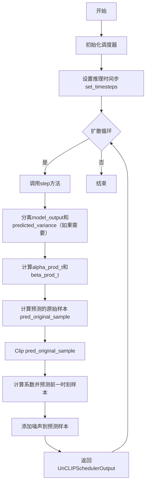
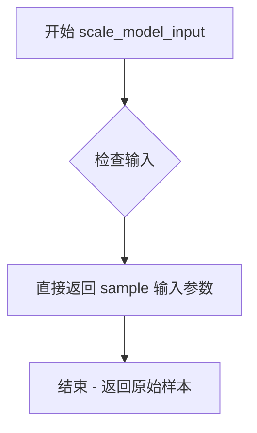
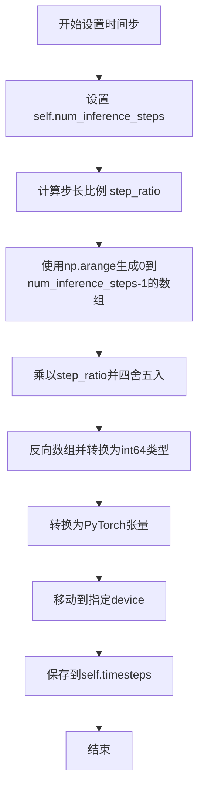
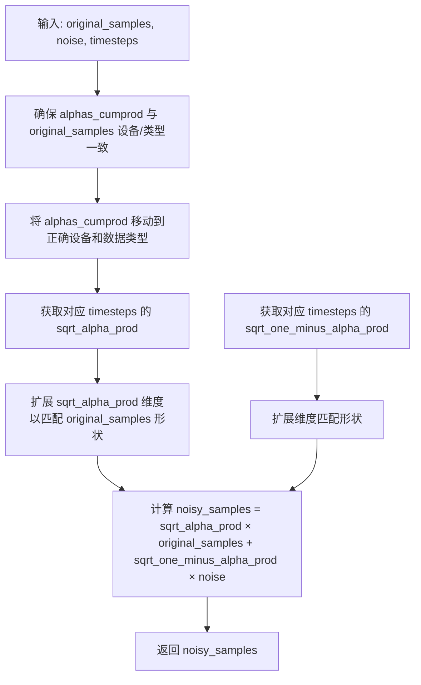
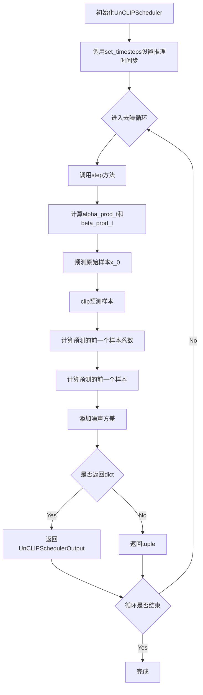

# `diffusers\src\diffusers\schedulers\scheduling_unclip.py` 详细设计文档

UnCLIPScheduler是一个修改版的DDPM调度器，专门用于Karlo unCLIP模型的扩散过程。它通过betas_for_alpha_bar函数生成噪声调度计划，并在step函数中实现反向扩散过程（从噪声样本预测原始样本），同时提供add_noise函数实现正向扩散过程。该调度器在计算方差和beta值方面有细微变化，并使用稍微不同的步骤比例来模拟原始karlo实现。

## 整体流程



## 类结构

```
BaseOutput (基类)
└── UnCLIPSchedulerOutput (输出数据类)
SchedulerMixin (混入类)
ConfigMixin (混入类)
└── UnCLIPScheduler (主调度器类)
```

## 全局变量及字段


### `betas_for_alpha_bar`
    
创建离散的beta调度表，通过alpha_t_bar函数进行变换，支持cosine、exp、laplace三种变换类型

类型：`function`
    


### `UnCLIPSchedulerOutput.prev_sample`
    
反向扩散计算出的前一时刻样本(x_{t-1})，作为下一个去噪循环的模型输入

类型：`torch.Tensor`
    


### `UnCLIPSchedulerOutput.pred_original_sample`
    
预测的原始去噪样本(x_0)，可用于预览进度或引导

类型：`torch.Tensor | None`
    


### `UnCLIPScheduler.betas`
    
Beta值列表，用于噪声调度，定义扩散过程中(1-beta)的累积乘积

类型：`torch.Tensor`
    


### `UnCLIPScheduler.alphas`
    
Alpha值列表，计算方式为1 - betas，用于扩散过程的概率计算

类型：`torch.Tensor`
    


### `UnCLIPScheduler.alphas_cumprod`
    
Alpha值的累积乘积，用于计算扩散过程中的关键概率变量

类型：`torch.Tensor`
    


### `UnCLIPScheduler.one`
    
常量1的tensor表示，用于边界条件计算(如t=0时的alpha_prod)

类型：`torch.Tensor`
    


### `UnCLIPScheduler.init_noise_sigma`
    
初始噪声分布的标准差，默认为1.0，用于正向扩散过程的噪声添加

类型：`float`
    


### `UnCLIPScheduler.num_inference_steps`
    
推理时的扩散步数，在set_timesteps方法中设置

类型：`int | None`
    


### `UnCLIPScheduler.timesteps`
    
时间步数组，存储离散的时间步用于扩散链的推理过程

类型：`torch.Tensor`
    


### `UnCLIPScheduler.variance_type`
    
方差类型选项，控制添加噪声时的方差计算方式，支持'fixed_small_log'和'learned_range'

类型：`str`
    
    

## 全局函数及方法


### `betas_for_alpha_bar`

根据 alpha_bar 函数生成 beta 调度表，支持 cosine、exp、laplace 三种转换类型，用于扩散模型的噪声调度。

参数：

- `num_diffusion_timesteps`：`int`，要生成的 beta 数量（即扩散时间步数）
- `max_beta`：`float`，默认为 `0.999`，最大 beta 值，用于避免数值不稳定
- `alpha_transform_type`：`Literal["cosine", "exp", "laplace"]`，默认为 `"cosine"`，alpha_bar 变换类型

返回值：`torch.Tensor`，调度器用于逐步模型输出的 beta 值

#### 流程图

```mermaid
flowchart TD
    A[开始] --> B{alpha_transform_type == 'cosine'?}
    B -->|Yes| C[定义 alpha_bar_fn: cos²((t+0.008)/1.008 * π/2)]
    B -->|No| D{alpha_transform_type == 'laplace'?}
    D -->|Yes| E[定义 alpha_bar_fn: 基于拉普拉斯分布的 SNR 计算]
    D -->|No| F{alpha_transform_type == 'exp'?}
    F -->|Yes| G[定义 alpha_bar_fn: exp(-12.0 * t)]
    F -->|No| H[抛出 ValueError]
    C --> I[初始化空列表 betas]
    E --> I
    G --> I
    I --> J[遍历 i from 0 to num_diffusion_timesteps-1]
    J --> K[计算 t1 = i / num_diffusion_timesteps]
    K --> L[计算 t2 = (i + 1) / num_diffusion_timesteps]
    L --> M[计算 beta = min(1 - α(t2)/α(t1), max_beta)]
    M --> N[添加 beta 到 betas 列表]
    N --> O{还有更多时间步?}
    O -->|Yes| J
    O -->|No| P[返回 torch.tensor(betas, dtype=torch.float32)]
```

#### 带注释源码

```python
def betas_for_alpha_bar(
    num_diffusion_timesteps: int,
    max_beta: float = 0.999,
    alpha_transform_type: Literal["cosine", "exp", "laplace"] = "cosine",
) -> torch.Tensor:
    """
    Create a beta schedule that discretizes the given alpha_t_bar function, which defines the cumulative product of
    (1-beta) over time from t = [0,1].

    Contains a function alpha_bar that takes an argument t and transforms it to the cumulative product of (1-beta) up
    to that part of the diffusion process.

    Args:
        num_diffusion_timesteps (`int`):
            The number of betas to produce.
        max_beta (`float`, defaults to `0.999`):
            The maximum beta to use; use values lower than 1 to avoid numerical instability.
        alpha_transform_type (`str`, defaults to `"cosine"`):
            The type of noise schedule for `alpha_bar`. Choose from `cosine`, `exp`, or `laplace`.

    Returns:
        `torch.Tensor`:
            The betas used by the scheduler to step the model outputs.
    """
    # 根据 alpha_transform_type 选择对应的 alpha_bar 函数
    # cosine: 使用余弦调度，来源于 improved DDPM
    if alpha_transform_type == "cosine":

        def alpha_bar_fn(t):
            # 余弦调度函数，确保 t=0 时 alpha_bar 接近 1，t=1 时接近 0
            return math.cos((t + 0.008) / 1.008 * math.pi / 2) ** 2

    # laplace: 使用拉普拉斯分布的 SNR 计算
    elif alpha_transform_type == "laplace":

        def alpha_bar_fn(t):
            # 计算拉普拉斯分布的 lambda 参数
            lmb = -0.5 * math.copysign(1, 0.5 - t) * math.log(1 - 2 * math.fabs(0.5 - t) + 1e-6)
            # 计算信噪比 SNR
            snr = math.exp(lmb)
            # 返回 sqrt(SNR / (1 + SNR))
            return math.sqrt(snr / (1 + snr))

    # exp: 使用指数衰减调度
    elif alpha_transform_type == "exp":

        def alpha_bar_fn(t):
            # 指数衰减函数，衰减率为 -12.0
            return math.exp(t * -12.0)

    # 如果传入不支持的类型，抛出异常
    else:
        raise ValueError(f"Unsupported alpha_transform_type: {alpha_transform_type}")

    # 初始化 beta 列表
    betas = []
    # 遍历每个扩散时间步
    for i in range(num_diffusion_timesteps):
        # 计算当前时间步和下一个时间步的归一化值 [0, 1)
        t1 = i / num_diffusion_timesteps
        t2 = (i + 1) / num_diffusion_timesteps
        # 计算 beta: 1 - α(t2)/α(t1)，并限制最大值
        betas.append(min(1 - alpha_bar_fn(t2) / alpha_bar_fn(t1), max_beta))
    # 转换为 PyTorch 张量返回
    return torch.tensor(betas, dtype=torch.float32)
```


### `UnCLIPScheduler.__init__`

初始化 UnCLIPScheduler 调度器参数，包括训练时间步数、方差类型、采样裁剪范围、预测类型和 beta 调度策略，并计算相关的 alpha、beta 和累积乘积。

参数：

- `num_train_timesteps`：`int`，默认为 1000，训练模型的扩散步骤数
- `variance_type`：`str`，默认为 "fixed_small_log"，方差裁剪选项，可选 "fixed_small_log" 或 "learned_range"
- `clip_sample`：`bool`，默认为 True，是否裁剪预测样本以确保数值稳定性
- `clip_sample_range`：`float`，默认为 1.0，裁剪样本的范围边界
- `prediction_type`：`str`，默认为 "epsilon"，调度器函数预测类型，可选 "epsilon"（预测噪声）或 "sample"（直接预测噪声样本）
- `beta_schedule`：`str`，默认为 "squaredcos_cap_v2"，beta 调度策略（UnCLIPScheduler 仅支持此选项）

返回值：`None`，无返回值（构造函数）

#### 流程图

```mermaid
flowchart TD
    A[开始 __init__] --> B{检查 beta_schedule}
    B -->|不支持的值| C[抛出 ValueError]
    B -->|squaredcos_cap_v2| D[计算 betas]
    D --> E[计算 alphas = 1.0 - betas]
    E --> F[计算 alphas_cumprod = cumprod(alphas)]
    F --> G[设置 one = tensor(1.0)]
    G --> H[设置 init_noise_sigma = 1.0]
    H --> I[初始化 num_inference_steps = None]
    I --> J[计算 timesteps 数组]
    J --> K[保存 variance_type]
    K --> L[结束 __init__]
    
    D -.->|调用| M[betas_for_alpha_bar函数]
    M --> D
```

#### 带注释源码

```python
@register_to_config
def __init__(
    self,
    num_train_timesteps: int = 1000,
    variance_type: str = "fixed_small_log",
    clip_sample: bool = True,
    clip_sample_range: float = 1.0,
    prediction_type: str = "epsilon",
    beta_schedule: str = "squaredcos_cap_v2",
):
    """
    初始化 UnCLIPScheduler 调度器。
    
    参数:
        num_train_timesteps: 训练时的扩散步数
        variance_type: 方差类型，用于裁剪添加到去噪样本的方差
        clip_sample: 是否裁剪预测样本
        clip_sample_range: 裁剪样本的范围
        prediction_type: 预测类型，epsilon 或 sample
        beta_schedule: beta 调度策略
    """
    
    # UnCLIPScheduler 仅支持 squaredcos_cap_v2 的 beta 调度
    if beta_schedule != "squaredcos_cap_v2":
        raise ValueError("UnCLIPScheduler only supports `beta_schedule`: 'squaredcos_cap_v2'")

    # 使用 alpha_bar 函数生成 beta 序列
    self.betas = betas_for_alpha_bar(num_train_timesteps)

    # 计算 alpha 值（1 - beta）
    self.alphas = 1.0 - self.betas
    
    # 计算 alpha 的累积乘积，用于扩散过程计算
    self.alphas_cumprod = torch.cumprod(self.alphas, dim=0)
    
    # 创建一个值为 1.0 的张量，用于边界条件计算
    self.one = torch.tensor(1.0)

    # 初始噪声分布的标准差（用于加噪过程）
    self.init_noise_sigma = 1.0

    # 可设置的值（将在推理前通过 set_timesteps 设置）
    self.num_inference_steps = None
    
    # 生成时间步数组：[num_train_timesteps-1, num_train_timesteps-2, ..., 0]
    self.timesteps = torch.from_numpy(np.arange(0, num_train_timesteps)[::-1].copy())

    # 保存方差类型配置
    self.variance_type = variance_type
```


### `UnCLIPScheduler.scale_model_input`

该方法用于在去噪过程中根据当前时间步对模型输入进行缩放，确保与其他需要缩放的调度器之间的可互换性。在 UnCLIPScheduler 中，此方法直接返回原始样本，因为 UnCLIP 调度器不需要进行输入缩放操作。

参数：

- `sample`：`torch.Tensor`，输入的样本张量
- `timestep`：`int | None`，当前时间步（可选）

返回值：`torch.Tensor`，返回输入的样本（未经过缩放）

#### 流程图



#### 带注释源码

```python
def scale_model_input(self, sample: torch.Tensor, timestep: int | None = None) -> torch.Tensor:
    """
    Ensures interchangeability with schedulers that need to scale the denoising model input depending on the
    current timestep.

    Args:
        sample (`torch.Tensor`): input sample
        timestep (`int`, optional): current timestep

    Returns:
        `torch.Tensor`: scaled input sample
    """
    # 直接返回输入样本，不做任何缩放处理
    # 这是因为 UnCLIPScheduler 设计上不需要根据 timestep 调整输入
    # 此方法的存在主要是为了保持与其它调度器（如 DDPM、DDIM 等）的接口一致性
    return sample
```

---

#### 技术债务与优化空间

1. **方法冗余性**：当前实现是一个无操作（no-op）方法，虽然保证了接口一致性，但可以考虑在基类中提供默认实现，或使用抽象方法让需要实现的子类覆盖。

2. **文档与实现不匹配**：文档描述为"缩放输入样本"，但实际实现是直接返回原样本，可能造成使用者困惑。建议更新文档说明此调度器不做任何缩放操作。

3. **参数未使用**：`timestep` 参数被接收但未使用，这可能表明设计上的不一致或为未来扩展预留的接口。


### `UnCLIPScheduler.set_timesteps`

设置用于扩散链的离散时间步，是推理前需要运行的辅助函数。该方法使用与其他扩散调度器稍有不同的步长比例，以模仿原始karlo实现。

参数：

- `num_inference_steps`：`int`，使用预训练模型生成样本时使用的扩散步骤数量
- `device`：`str | torch.device`，可选，时间步要移动到的设备

返回值：`None`，无返回值（该方法直接修改实例属性 `self.timesteps`）

#### 流程图



#### 带注释源码

```
def set_timesteps(self, num_inference_steps: int, device: str | torch.device = None):
    """
    设置用于扩散链的离散时间步。推理前需要运行的辅助函数。
    
    注意：此调度器使用的步长比例与其他diffusers调度器略有不同。
    不同的步长比例是为了模仿原始karlo实现，不影响结果的质量或准确性。
    
    参数:
        num_inference_steps: 生成样本时使用的扩散步骤数量
    """
    # 1. 保存推理步骤数量到实例属性
    self.num_inference_steps = num_inference_steps
    
    # 2. 计算步长比例
    # 公式：(总训练时间步数 - 1) / (推理步骤数 - 1)
    # 这确保了推理时使用的时间步是训练时间步的子集
    step_ratio = (self.config.num_train_timesteps - 1) / (self.num_inference_steps - 1)
    
    # 3. 生成时间步数组
    # np.arange(0, num_inference_steps) 生成 [0, 1, 2, ..., num_inference_steps-1]
    # 乘以 step_ratio 将其映射到训练时间步范围
    # round() 四舍五入到最近的整数
    # [::-1] 反向数组，使时间步从大到小排列（扩散过程从高噪声到低噪声）
    # .copy() 防止后续修改影响原数组
    # .astype(np.int64) 转换为64位整数
    timesteps = (np.arange(0, num_inference_steps) * step_ratio).round()[::-1].copy().astype(np.int64)
    
    # 4. 转换为PyTorch张量并移动到指定设备
    self.timesteps = torch.from_numpy(timesteps).to(device)
```


### `UnCLIPScheduler._get_variance`

计算给定时间步的方差，用于扩散模型的反向过程（去噪）。该方法根据当前时间步和前一时间步的累积乘积(alpha_cumprod)计算基础方差，并根据variance_type参数进行特定的方差处理（固定小对数方差或学习范围方差）。

参数：

- `t`：`int`，当前时间步索引
- `prev_timestep`：`int | None`，前一个时间步索引，默认为`t-1`
- `predicted_variance`：`Any | None`，模型预测的方差，当variance_type为"learned_range"时使用
- `variance_type`：`str | None`，方差类型，可选"fixed_small_log"或"learned_range"，默认为配置中的variance_type

返回值：`torch.Tensor`，处理后的方差值，用于在反向扩散过程中添加噪声

#### 流程图

```mermaid
flowchart TD
    A[开始 _get_variance] --> B{prev_timestep is None?}
    B -->|是| C[prev_timestep = t - 1]
    B -->|否| D[使用传入的prev_timestep]
    C --> E[计算 alpha_prod_t 和 alpha_prod_t_prev]
    D --> E
    E --> F[计算 beta_prod_t 和 beta_prod_t_prev]
    F --> G{prev_timestep == t - 1?}
    G -->|是| H[beta = betas[t]]
    G -->|否| I[beta = 1 - alpha_prod_t / alpha_prod_t_prev]
    H --> J[计算基础方差 variance]
    I --> J
    J --> K{variance_type is None?}
    K -->|是| L[variance_type = config.variance_type]
    K -->|否| M{variance_type == 'fixed_small_log'?}
    L --> M
    M -->|是| N[方差取对数并开根号]
    M -->|否| O{variance_type == 'learned_range'?}
    O -->|是| P[根据predicted_variance混合min_log和max_log]
    O -->|否| Q[返回原始variance]
    N --> R[返回处理后的variance]
    P --> R
    Q --> R
```

#### 带注释源码

```python
def _get_variance(self, t, prev_timestep=None, predicted_variance=None, variance_type=None):
    """
    计算给定时间步的方差，用于扩散模型的反向去噪过程。
    
    参数:
        t: 当前时间步索引
        prev_timestep: 前一个时间步，默认为t-1
        predicted_variance: 模型预测的方差（用于learned_range模式）
        variance_type: 方差类型，可选'fixed_small_log'或'learned_range'
    """
    # 1. 处理prev_timestep，默认使用t-1
    if prev_timestep is None:
        prev_timestep = t - 1

    # 2. 获取当前和前一时间步的累积alpha值
    alpha_prod_t = self.alphas_cumprod[t]
    # 如果prev_timestep >= 0则使用累积值，否则使用1.0（对应t=0时刻）
    alpha_prod_t_prev = self.alphas_cumprod[prev_timestep] if prev_timestep >= 0 else self.one
    
    # 3. 计算beta乘积 (1 - alpha)
    beta_prod_t = 1 - alpha_prod_t
    beta_prod_t_prev = 1 - alpha_prod_t_prev

    # 4. 计算beta值
    # 如果是连续的时间步，使用预计算的betas
    # 否则动态计算beta（用于跳过某些时间步的情况）
    if prev_timestep == t - 1:
        beta = self.betas[t]
    else:
        beta = 1 - alpha_prod_t / alpha_prod_t_prev

    # 5. 根据DDPM论文公式(6)(7)计算基础方差
    # x_{t-1} ~ N(pred_prev_sample, variance)
    variance = beta_prod_t_prev / beta_prod_t * beta

    # 6. 确定variance_type
    if variance_type is None:
        variance_type = self.config.variance_type

    # 7. 根据variance_type进行方差处理
    # hacks - 可能是为了训练稳定性添加的
    if variance_type == "fixed_small_log":
        # 固定小对数模式：对数运算后取平方根，稳定数值范围
        variance = torch.log(torch.clamp(variance, min=1e-20))
        variance = torch.exp(0.5 * variance)
    elif variance_type == "learned_range":
        # 学习范围模式：根据预测方差在最小和最大对数之间插值
        # NOTE: 与DDPM调度器的差异
        min_log = variance.log()
        max_log = beta.log()

        # 将预测方差映射到[0,1]区间作为混合系数
        frac = (predicted_variance + 1) / 2
        variance = frac * max_log + (1 - frac) * min_log

    return variance
```


### `UnCLIPScheduler.step`

预测前一个时间步的样本，通过逆向SDE传播。基于当前时间步的模型输出（通常为预测噪声）计算前一个样本，是扩散模型反向推理的核心函数。

参数：

- `model_output`：`torch.Tensor`，直接来自学习到的扩散模型的输出（通常为预测噪声）
- `timestep`：`int`，扩散链中的当前离散时间步
- `sample`：`torch.Tensor`，扩散过程中当前正在创建的样本实例（x_t）
- `prev_timestep`：`int | None`，可选参数，用于动态计算beta的前一时间步。如果未提供，则使用`t-1`
- `generator`：随机数生成器，用于可复现的噪声生成
- `return_dict`：`bool`，是否返回`UnCLIPSchedulerOutput`类，False则返回tuple

返回值：`UnCLIPSchedulerOutput | tuple`，返回前一个时间步的样本和预测的原始样本。若`return_dict`为True返回`UnCLIPSchedulerOutput`，否则返回`(prev_sample, pred_original_sample)`元组

#### 流程图

```mermaid
flowchart TD
    A[开始 step] --> B{检查模型输出维度}
    B -->|learned_range| C[分离model_output和predicted_variance]
    B -->|其他| D[predicted_variance设为None]
    C --> E[计算alpha_prod_t和alpha_prod_t_prev]
    D --> E
    E --> F[计算beta_prod_t和beta_prod_t_prev]
    F --> G[获取当前时间步的beta和alpha]
    G --> H{预测类型是epsilon?}
    H -->|是| I[计算pred_original_sample = (sample - sqrt_beta_prod_t * model_output) / sqrt_alpha_prod_t]
    H -->|否| J[pred_original_sample = model_output]
    I --> K{clip_sample启用?}
    J --> K
    K -->|是| L[将pred_original_sample限制在-clip_sample_range到clip_sample_range]
    K -->|否| M
    L --> M[计算pred_original_sample_coeff和current_sample_coeff]
    M --> N[计算pred_prev_sample = pred_original_sample_coeff * pred_original_sample + current_sample_coeff * sample]
    N --> O{t > 0?}
    O -->|否| P[返回结果]
    O -->|是| Q[生成随机噪声variance_noise]
    Q --> R[调用_get_variance计算variance]
    R --> S{方差类型是fixed_small_log?}
    S -->|是| T[variance = variance]
    S -->|否| U{方差类型是learned_range?}
    U -->|是| V[variance = 0.5 * variance exp]
    U -->|否| W[抛出异常]
    T --> X[variance = variance * variance_noise]
    V --> X
    W --> Y[结束]
    X --> Z[pred_prev_sample = pred_prev_sample + variance]
    Z --> P
    P --> AA{return_dict为True?}
    AA -->|是| AB[返回UnCLIPSchedulerOutput]
    AA -->|否| AC[返回tuple]
```

#### 带注释源码

```python
def step(
    self,
    model_output: torch.Tensor,
    timestep: int,
    sample: torch.Tensor,
    prev_timestep: int | None = None,
    generator=None,
    return_dict: bool = True,
) -> UnCLIPSchedulerOutput | tuple:
    """
    通过逆向SDE预测前一个时间步的样本。这是将扩散过程从学习到的模型输出（通常为预测噪声）
    反向传播的核心函数。

    参数:
        model_output: 直接来自学习到的扩散模型的输出
        timestep: 扩散链中的当前离散时间步
        sample: 扩散过程中当前正在创建的样本实例
        prev_timestep: 用于动态计算beta的前一时间步。如果未提供则使用t-1
        generator: 随机数生成器
        return_dict: 是否返回UnCLIPSchedulerOutput类

    返回:
        UnCLIPSchedulerOutput或tuple: 前一个样本和预测的原始样本
    """
    # 获取当前时间步
    t = timestep

    # 1. 处理learned_range方差类型，将模型输出分割为预测样本和预测方差
    if model_output.shape[1] == sample.shape[1] * 2 and self.variance_type == "learned_range":
        model_output, predicted_variance = torch.split(model_output, sample.shape[1], dim=1)
    else:
        predicted_variance = None

    # 2. 计算alphas和betas
    # 如果未提供prev_timestep，默认使用t-1
    if prev_timestep is None:
        prev_timestep = t - 1

    # 获取当前和前一时间步的累积alpha值
    alpha_prod_t = self.alphas_cumprod[t]
    alpha_prod_t_prev = self.alphas_cumprod[prev_timestep] if prev_timestep >= 0 else self.one
    
    # 计算beta的累积乘积 (1 - alpha)
    beta_prod_t = 1 - alpha_prod_t
    beta_prod_t_prev = 1 - alpha_prod_t_prev

    # 根据是否为连续时间步获取beta值
    if prev_timestep == t - 1:
        beta = self.betas[t]
        alpha = self.alphas[t]
    else:
        beta = 1 - alpha_prod_t / alpha_prod_t_prev
        alpha = 1 - beta

    # 3. 从预测噪声计算预测的原始样本 (x_0)
    # 这是DDPM论文公式(15)
    if self.config.prediction_type == "epsilon":
        # x_0 = (x_t - sqrt(1-α_t) * ε) / sqrt(α_t)
        pred_original_sample = (sample - beta_prod_t ** (0.5) * model_output) / alpha_prod_t ** (0.5)
    elif self.config.prediction_type == "sample":
        pred_original_sample = model_output
    else:
        raise ValueError(
            f"prediction_type given as {self.config.prediction_type} must be one of `epsilon` or `sample`"
            " for the UnCLIPScheduler."
        )

    # 4. 裁剪预测的原始样本以保证数值稳定性
    if self.config.clip_sample:
        pred_original_sample = torch.clamp(
            pred_original_sample, -self.config.clip_sample_range, self.config.clip_sample_range
        )

    # 5. 计算预测原始样本和当前样本的系数
    # DDPM论文公式(7)
    pred_original_sample_coeff = (alpha_prod_t_prev ** (0.5) * beta) / beta_prod_t
    current_sample_coeff = alpha ** (0.5) * beta_prod_t_prev / beta_prod_t

    # 6. 计算预测的前一个样本 μ_t
    # DDPM论文公式(7): μ_t = √(α̅_{t-1}) * β * x_0 + √(α_t) * (1-β) * x_t
    pred_prev_sample = pred_original_sample_coeff * pred_original_sample + current_sample_coeff * sample

    # 7. 添加噪声（反向扩散过程的随机性）
    variance = 0
    if t > 0:
        # 生成随机噪声
        variance_noise = randn_tensor(
            model_output.shape, dtype=model_output.dtype, generator=generator, device=model_output.device
        )

        # 计算方差
        variance = self._get_variance(
            t,
            predicted_variance=predicted_variance,
            prev_timestep=prev_timestep,
        )

        # 根据方差类型处理方差
        if self.variance_type == "fixed_small_log":
            variance = variance
        elif self.variance_type == "learned_range":
            variance = (0.5 * variance).exp()
        else:
            raise ValueError(
                f"variance_type given as {self.variance_type} must be one of `fixed_small_log` or `learned_range`"
                " for the UnCLIPScheduler."
            )

        # x_{t-1} = μ_t + σ_t * ε
        variance = variance * variance_noise

    # 8. 计算最终的前一个样本
    pred_prev_sample = pred_prev_sample + variance

    # 9. 返回结果
    if not return_dict:
        return (
            pred_prev_sample,
            pred_original_sample,
        )

    return UnCLIPSchedulerOutput(prev_sample=pred_prev_sample, pred_original_sample=pred_original_sample)
```


### `UnCLIPScheduler.add_noise`

该方法实现了扩散模型的前向扩散过程（Forward Diffusion Process），根据给定的时间步（timesteps）计算噪声系数，将噪声添加到原始样本中，生成带噪声的样本。这是扩散模型从原始数据逐步添加到噪声的标准过程。

参数：

- `original_samples`：`torch.Tensor`，原始样本张量，待添加噪声的输入数据
- `noise`：`torch.Tensor`，噪声张量，要添加到样本的噪声
- `timesteps`：`torch.IntTensor`，时间步张量，指示每个样本的噪声水平/时间步

返回值：`torch.Tensor`，添加噪声后的样本张量

#### 流程图



#### 带注释源码

```python
def add_noise(
    self,
    original_samples: torch.Tensor,
    noise: torch.Tensor,
    timesteps: torch.IntTensor,
) -> torch.Tensor:
    """
    Add noise to the original samples according to the noise magnitude at each timestep (this is the forward
    diffusion process).

    Args:
        original_samples (`torch.Tensor`):
            The original samples to which noise will be added.
        noise (`torch.Tensor`):
            The noise to add to the samples.
        timesteps (`torch.IntTensor`):
            The timesteps indicating the noise level for each sample.

    Returns:
        `torch.Tensor`:
            The noisy samples.
    """
    # 确保 alphas_cumprod 与 original_samples 在同一设备上并具有相同的数据类型
    # 将 self.alphas_cumprod 移动到设备上，以避免后续 add_noise 调用时 CPU 到 GPU 的冗余数据移动
    self.alphas_cumprod = self.alphas_cumprod.to(device=original_samples.device)
    alphas_cumprod = self.alphas_cumprod.to(dtype=original_samples.dtype)
    # 将 timesteps 移动到与 original_samples 相同的设备上
    timesteps = timesteps.to(original_samples.device)

    # 根据 timesteps 从累积 alpha 中提取对应的平方根值
    # sqrt(alpha_prod) 表示保留原始样本信息的比例
    sqrt_alpha_prod = alphas_cumprod[timesteps] ** 0.5
    # 展平以便于后续维度扩展操作
    sqrt_alpha_prod = sqrt_alpha_prod.flatten()
    # 扩展维度直到与 original_samples 的维度数量匹配
    # 这是为了支持批量处理和多维张量（如图像的 channel 维度）
    while len(sqrt_alpha_prod.shape) < len(original_samples.shape):
        sqrt_alpha_prod = sqrt_alpha_prod.unsqueeze(-1)

    # 计算 (1 - alpha_prod) 的平方根，表示添加噪声的比例
    sqrt_one_minus_alpha_prod = (1 - alphas_cumprod[timesteps]) ** 0.5
    sqrt_one_minus_alpha_prod = sqrt_one_minus_alpha_prod.flatten()
    # 同样扩展维度以匹配 original_samples 的形状
    while len(sqrt_one_minus_alpha_prod.shape) < len(original_samples.shape):
        sqrt_one_minus_alpha_prod = sqrt_one_minus_alpha_prod.unsqueeze(-1)

    # 前向扩散公式: x_t = sqrt(alpha_prod) * x_0 + sqrt(1 - alpha_prod) * epsilon
    # 其中 x_0 是原始样本，epsilon 是噪声，alpha_prod 是累积的 alpha 值
    noisy_samples = sqrt_alpha_prod * original_samples + sqrt_one_minus_alpha_prod * noise
    return noisy_samples
```

## 关键组件


### 张量索引与惰性加载

在`add_noise`和`step`方法中，通过`alphas_cumprod[timesteps]`和`alphas_cumprod[t]`进行张量索引，实现对预计算参数的动态读取，而非每次重新计算。`timesteps`在`set_timesteps`中预先设置，运行时直接通过索引获取对应的alpha值。

### 反量化支持

通过`prediction_type`参数支持两种预测类型：`epsilon`（预测噪声）和`sample`（直接预测带噪样本）。在`step`方法中根据配置选择不同的原始样本计算公式，实现反量化过程的灵活切换。

### 量化策略

通过`variance_type`参数支持两种方差策略：`fixed_small_log`（固定小对数方差）和`learned_range`（学习到的方差范围）。在`_get_variance`和`step`方法中根据策略计算不同的方差值，用于噪声添加。

### Beta调度生成

`betas_for_alpha_bar`全局函数支持三种alpha变换类型（cosine、exp、laplace），根据指定的变换函数生成离散的beta序列，用于扩散过程的噪声调度。

### 调度器配置管理

通过`@register_to_config`装饰器和`ConfigMixin`实现配置参数的注册与管理，支持`num_train_timesteps`、`variance_type`、`clip_sample`、`prediction_type`等参数的统一配置。

### 噪声添加机制

`add_noise`方法实现前向扩散过程，通过sqrt_alpha_prod和sqrt_one_minus_alpha_prod系数将噪声添加到原始样本，支持批量处理和设备迁移。

### 步骤推断流程

`step`方法实现反向扩散过程，包含预测原始样本、裁剪、系数计算、预测上一步样本、添加噪声等核心步骤，支持动态beta计算和多种返回格式。


## 问题及建议


### 已知问题

-   **废弃代码仍存在**：类文档明确指出"do not use this scheduler"，该调度器已被弃用并将被DDPM调度器替换，但代码仍保留在代码库中，增加维护负担。
-   **代码重复**：`betas_for_alpha_bar`函数、`add_noise`方法和`UnCLIPSchedulerOutput`类均从`DDPMScheduler`复制而来，违反DRY原则，导致代码冗余和维护困难。
-   **未使用的参数**：`set_timesteps`方法接收`device`参数但从未使用；`step`方法中的`generator`参数也未被使用。
-   **类型注解不完整**：`step`方法中`timestep`参数类型为`int`，但在实际使用中可能是`torch.Tensor`，存在类型不一致风险。
-   **硬编码数值**：`alpha_bar_fn`中的`0.008`和`1.008`等魔法数字缺乏解释，影响代码可读性。
-   **冗余的variance_type处理**：`_get_variance`方法同时接收`variance_type`参数又在内部重新获取`self.config.variance_type`，设计冗余。

### 优化建议

-   **移除废弃代码**：根据文档说明，该调度器已被DDPM调度器取代，建议在下一版本中完全移除此类，避免遗留代码。
-   **提取共享逻辑**：将`betas_for_alpha_bar`等通用函数移至基类或工具模块，消除代码重复。
-   **清理未使用参数**：移除`set_timesteps`和`step`中未使用的参数，简化接口。
-   **完善类型注解**：为`timestep`等参数添加更精确的类型定义，确保类型安全。
-   **提取魔法数字**：将`0.008`、`1.008`、`-12.0`等数值定义为常量或配置参数，提升可读性和可维护性。
-   **统一variance_type处理**：移除`_get_variance`方法中的冗余逻辑，统一使用传入的参数或配置。

## 其它


### 一段话描述

UnCLIPScheduler是一个修改版的DDPM调度器，专门用于Karlo unCLIP模型，通过独特的方差计算方式（支持fixed_small_log和learned_range两种类型）和特殊的推理步骤比例来实现去噪过程。

### 整体运行流程

1. **初始化阶段**: 在`__init__`方法中，通过`betas_for_alpha_bar`函数生成beta调度序列，计算alphas和alphas_cumprod，设置训练时间步和初始噪声标准差
2. **推理准备阶段**: 调用`set_timesteps`方法设置推理时的时间步序列，使用特定的步长比例计算需要跳过的 timesteps
3. **去噪循环阶段**: 反复调用`step`方法，根据模型输出预测前一个时间步的样本，逐步从噪声样本还原到原始样本
4. **前向扩散阶段**: 调用`add_noise`方法，根据时间步将噪声添加到原始样本，模拟扩散过程

### 类的详细信息

#### UnCLIPSchedulerOutput 类
- **类字段**:
  - `prev_sample`: torch.Tensor - 前一个时间步计算出的样本(x_{t-1})
  - `pred_original_sample`: torch.Tensor | None - 预测的去噪样本(x_0)

#### UnCLIPScheduler 类
- **类字段**:
  - `betas`: torch.Tensor - Beta调度序列
  - `alphas`: torch.Tensor - Alpha值序列(1-beta)
  - `alphas_cumprod`: torch.Tensor - Alpha累积乘积
  - `one`: torch.Tensor - 值为1的张量
  - `init_noise_sigma`: float - 初始噪声分布的标准差
  - `num_inference_steps`: int | None - 推理步骤数
  - `timesteps`: torch.Tensor - 时间步序列
  - `variance_type`: str - 方差类型(fixed_small_log或learned_range)

- **类方法**:
  - `__init__`: 初始化调度器参数
  - `scale_model_input`: 缩放去噪模型输入（直接返回输入）
  - `set_timesteps`: 设置推理离散时间步
  - `_get_variance`: 计算给定时间步的方差
  - `step`: 核心去噪函数，从当前时间步预测前一个时间步的样本
  - `add_noise`: 执行前向扩散过程，向原始样本添加噪声

### 全局变量和全局函数信息

#### betas_for_alpha_bar 函数
- **参数**:
  - `num_diffusion_timesteps`: int - 生成的beta数量
  - `max_beta`: float - 最大beta值(默认0.999)
  - `alpha_transform_type`: Literal["cosine", "exp", "laplace"] - alpha_bar变换类型
- **返回值**: torch.Tensor - beta调度序列
- **功能**: 创建离散的beta调度表，基于给定的alpha_t_bar函数

### 关键组件信息

- **UnCLIPScheduler**: 核心调度器类，负责管理扩散模型的噪声调度
- **UnCLIPSchedulerOutput**: 存储调度器step方法输出的数据结构
- **betas_for_alpha_bar**: Beta调度生成器，支持cosine、exp、laplace三种变换策略
- **_get_variance**: 方差计算方法，支持两种方差类型
- **step**: 实现了DDPM去噪公式的核心方法

### 潜在的技术债务或优化空间

1. **废弃警告**: 代码中明确说明此调度器将被废弃，由更新后的DDPM调度器替代
2. **重复计算**: 在`_get_variance`和`step`方法中存在部分重复的alpha/beta计算逻辑
3. **硬编码值**: init_noise_sigma固定为1.0，缺乏灵活性
4. **设备移动开销**: `add_noise`方法中每次调用都会将alphas_cumprod移动到输入设备，可能导致性能开销
5. **类型注解不完整**: 部分参数使用`|`语法而未考虑Python 3.9兼容性

### 设计目标与约束

1. **Beta Schedule约束**: 只能使用`squaredcos_cap_v2`类型的beta调度，其他类型会抛出ValueError
2. **预测类型**: 支持`epsilon`(预测噪声)和`sample`(直接预测样本)两种预测类型
3. **方差类型**: 支持`fixed_small_log`和`learned_range`两种方差计算方式
4. **数值稳定性**: 通过max_beta参数限制最大beta值(默认0.999)避免数值不稳定

### 错误处理与异常设计

1. **Beta Schedule检查**: 初始化时检查beta_schedule是否匹配，不匹配抛出ValueError
2. **Alpha变换类型检查**: betas_for_alpha_bar函数检查alpha_transform_type是否支持，不支持抛出ValueError
3. **预测类型检查**: step方法中检查prediction_type是否为epsilon或sample
4. **方差类型检查**: step方法中检查variance_type是否有效
5. **数值稳定性**: 使用torch.clamp和最小值限制防止数值下溢

### 数据流与状态机

1. **初始化状态**: 加载训练好的参数(num_train_timesteps, beta_schedule等)，预计算alphas和betas
2. **配置状态**: 通过set_timesteps设置推理时间步，更新num_inference_steps
3. **推理状态**: 在denoising loop中反复调用step方法，从timesteps[-1]到timesteps[0]
4. **输出状态**: step方法返回prev_sample(下一步输入)和pred_original_sample(用于预览)

### 外部依赖与接口契约

1. **ConfigMixin**: 提供配置注册和访问能力
2. **register_to_config**: 装饰器用于将__init__参数注册到配置
3. **SchedulerMixin**: 提供调度器通用接口
4. **BaseOutput**: 基础输出类
5. **randn_tensor**: 工具函数，用于生成随机张量
6. **numpy**: 用于生成时间步数组
7. **torch**: 核心深度学习框架依赖

### Mermaid流程图



    