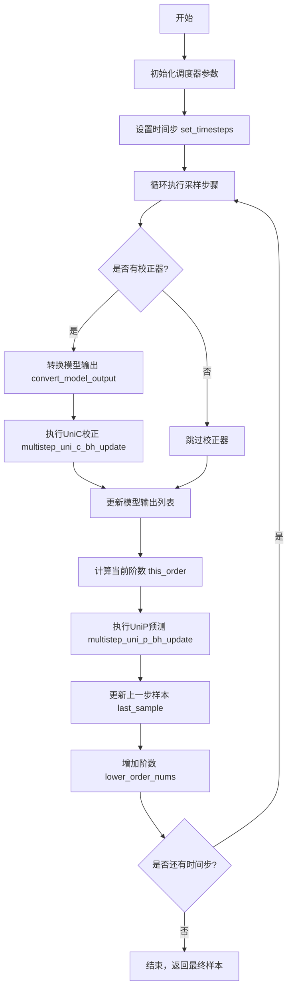
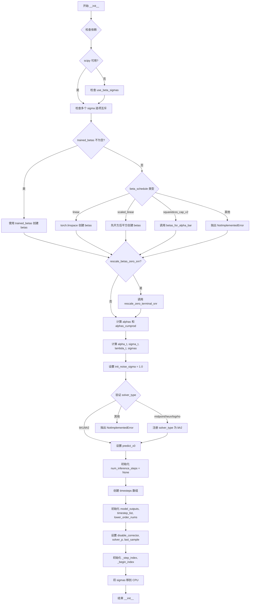
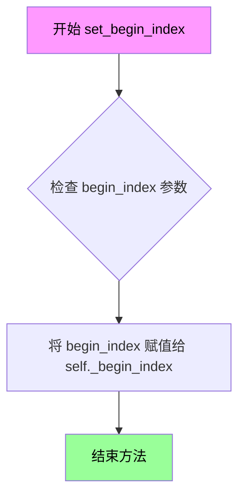
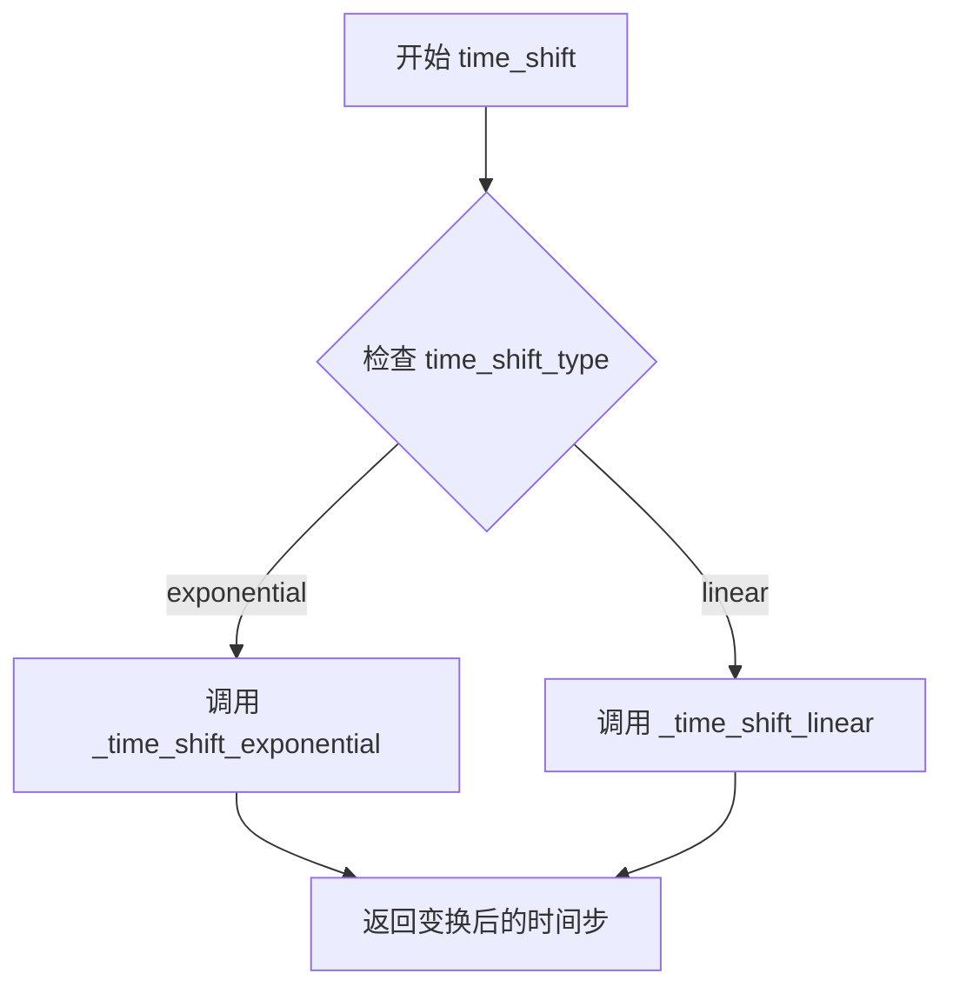

# `diffusers\src\diffusers\schedulers\scheduling_unipc_multistep.py` 详细设计文档

UniPCMultistepScheduler是一个无训练框架，用于扩散模型的快速采样。该调度器继承自SchedulerMixin和ConfigMixin，实现了UniPC（Unified Predictor-Corrector）算法，通过多步预测和校正步骤来加速扩散模型的采样过程，同时保持较高的采样质量。

## 整体流程



## 类结构

```
SchedulerMixin (抽象基类)
ConfigMixin (配置Mixin基类)
└── UniPCMultistepScheduler (UniPC多步调度器)
```

## 全局变量及字段


### `_compatibles`
    
兼容的调度器列表

类型：`list`
    


### `order`
    
调度器阶数 (默认为1)

类型：`int`
    


### `UniPCMultistepScheduler.betas`
    
Beta调度参数

类型：`torch.Tensor`
    


### `UniPCMultistepScheduler.alphas`
    
Alpha值 (1 - betas)

类型：`torch.Tensor`
    


### `UniPCMultistepScheduler.alphas_cumprod`
    
累积Alpha乘积

类型：`torch.Tensor`
    


### `UniPCMultistepScheduler.alpha_t`
    
当前Alpha的平方根

类型：`torch.Tensor`
    


### `UniPCMultistepScheduler.sigma_t`
    
当前Sigma的平方根

类型：`torch.Tensor`
    


### `UniPCMultistepScheduler.lambda_t`
    
对数Alpha与对数Sigma之差

类型：`torch.Tensor`
    


### `UniPCMultistepScheduler.sigmas`
    
Sigma值序列

类型：`torch.Tensor`
    


### `UniPCMultistepScheduler.init_noise_sigma`
    
初始噪声标准差

类型：`float`
    


### `UniPCMultistepScheduler.num_inference_steps`
    
推理步数

类型：`int`
    


### `UniPCMultistepScheduler.timesteps`
    
时间步序列

类型：`torch.Tensor`
    


### `UniPCMultistepScheduler.model_outputs`
    
模型输出历史

类型：`list`
    


### `UniPCMultistepScheduler.timestep_list`
    
时间步历史

类型：`list`
    


### `UniPCMultistepScheduler.lower_order_nums`
    
低阶校正计数

类型：`int`
    


### `UniPCMultistepScheduler.disable_corrector`
    
禁用的校正步骤

类型：`list[int]`
    


### `UniPCMultistepScheduler.solver_p`
    
外部求解器

类型：`SchedulerMixin`
    


### `UniPCMultistepScheduler.last_sample`
    
上一步样本

类型：`torch.Tensor`
    


### `UniPCMultistepScheduler._step_index`
    
当前步骤索引

类型：`int`
    


### `UniPCMultistepScheduler._begin_index`
    
起始索引

类型：`int`
    


### `UniPCMultistepScheduler.predict_x0`
    
是否预测x0

类型：`bool`
    


### `UniPCMultistepScheduler.this_order`
    
当前使用的阶数

类型：`int`
    
    

## 全局函数及方法


### `betas_for_alpha_bar`

创建离散的beta调度表，通过对给定的alpha_t_bar函数进行离散化来定义累积乘积 (1-beta) 的调度。该函数支持三种alpha转换类型（cosine、exp、laplace），并返回用于扩散模型推理的beta值张量。

参数：

- `num_diffusion_timesteps`：`int`，要生成的beta数量
- `max_beta`：`float`，默认`0.999`，使用的最大beta值，用于避免数值不稳定
- `alpha_transform_type`：`Literal["cosine", "exp", "laplace"]`，默认`"cosine"`，alpha_bar的噪声调度类型

返回值：`torch.Tensor`，调度器用于逐步模型输出的beta值

#### 流程图

```mermaid
flowchart TD
    A[开始] --> B{alpha_transform_type == 'cosine'?}
    B -->|Yes| C[定义cosine类型的alpha_bar_fn]
    B -->|No| D{alpha_transform_type == 'laplace'?}
    D -->|Yes| E[定义laplace类型的alpha_bar_fn]
    D -->|No| F{alpha_transform_type == 'exp'?}
    F -->|Yes| G[定义exp类型的alpha_bar_fn]
    F -->|No| H[抛出ValueError - 不支持的类型]
    
    C --> I[初始化空betas列表]
    E --> I
    G --> I
    
    I --> J[循环i从0到num_diffusion_timesteps-1]
    J --> K[计算t1 = i / num_diffusion_timesteps]
    J --> L[计算t2 = (i + 1) / num_diffusion_timesteps]
    K --> M[计算beta = min(1 - alpha_bar_fn(t2) / alpha_bar_fn(t1), max_beta)]
    L --> M
    M --> N[将beta添加到betas列表]
    N --> O{还有更多时间步?}
    O -->|Yes| J
    O -->|No| P[返回torch.tensor(betas, dtype=torch.float32)]
    H --> Q[结束 - 抛出异常]
```

#### 带注释源码

```python
def betas_for_alpha_bar(
    num_diffusion_timesteps: int,
    max_beta: float = 0.999,
    alpha_transform_type: Literal["cosine", "exp", "laplace"] = "cosine",
) -> torch.Tensor:
    """
    Create a beta schedule that discretizes the given alpha_t_bar function, which defines the cumulative product of
    (1-beta) over time from t = [0,1].

    Contains a function alpha_bar that takes an argument t and transforms it to the cumulative product of (1-beta) up
    to that part of the diffusion process.

    Args:
        num_diffusion_timesteps (`int`):
            The number of betas to produce.
        max_beta (`float`, defaults to `0.999`):
            The maximum beta to use; use values lower than 1 to avoid numerical instability.
        alpha_transform_type (`str`, defaults to `"cosine"`):
            The type of noise schedule for `alpha_bar`. Choose from `cosine`, `exp`, or `laplace`.

    Returns:
        `torch.Tensor`:
            The betas used by the scheduler to step the model outputs.
    """
    # 根据alpha_transform_type选择对应的alpha_bar_fn函数
    # alpha_bar函数定义了扩散过程中(1-beta)的累积乘积
    if alpha_transform_type == "cosine":
        # Cosine调度：使用cosine函数构建alpha_bar
        # 公式：alpha_bar(t) = cos((t + 0.008) / 1.008 * pi / 2)^2
        # 这种调度在扩散过程中提供更平滑的噪声添加
        def alpha_bar_fn(t):
            return math.cos((t + 0.008) / 1.008 * math.pi / 2) ** 2

    elif alpha_transform_type == "laplace":
        # Laplace调度：使用Laplace分布构建alpha_bar
        # 通过计算SNR (Signal-to-Noise Ratio) 并转换为alpha值
        def alpha_bar_fn(t):
            # 计算lambda值，使用copysign处理t在0.5两侧的情况
            lmb = -0.5 * math.copysign(1, 0.5 - t) * math.log(1 - 2 * math.fabs(0.5 - t) + 1e-6)
            # 计算SNR
            snr = math.exp(lmb)
            # 根据SNR计算alpha值
            return math.sqrt(snr / (1 + snr))

    elif alpha_transform_type == "exp":
        # 指数调度：使用指数衰减构建alpha_bar
        # 公式：alpha_bar(t) = exp(t * -12.0)
        # 提供快速衰减的噪声调度
        def alpha_bar_fn(t):
            return math.exp(t * -12.0)

    else:
        # 如果传入不支持的类型，抛出ValueError
        raise ValueError(f"Unsupported alpha_transform_type: {alpha_transform_type}")

    # 初始化betas列表用于存储所有beta值
    betas = []
    # 遍历每个扩散时间步，计算对应的beta值
    for i in range(num_diffusion_timesteps):
        # t1表示当前时间步的归一化时间[0,1]
        t1 = i / num_diffusion_timesteps
        # t2表示下一个时间步的归一化时间[0,1]
        t2 = (i + 1) / num_diffusion_timesteps
        # 计算beta值：通过alpha_bar的比值计算
        # beta = 1 - alpha_bar(t2) / alpha_bar(t1)
        # 使用max_beta限制最大beta值以避免数值不稳定
        betas.append(min(1 - alpha_bar_fn(t2) / alpha_bar_fn(t1), max_beta))
    
    # 将betas列表转换为PyTorch浮点张量并返回
    return torch.tensor(betas, dtype=torch.float32)
```


### `rescale_zero_terminal_snr`

该函数通过调整beta值，使扩散调度器在最终时间步的信号噪声比（SNR）为零。这是基于论文https://huggingface.co/papers/2305.08891 (Algorithm 1)实现的，用于使模型能够生成非常亮或非常暗的样本，而不是限制在中等亮度的样本。

参数：

- `betas`：`torch.Tensor`，调度器初始化时使用的beta值张量

返回值：`torch.Tensor`，具有零终端SNR的重新缩放的beta值

#### 流程图

```mermaid
flowchart TD
    A[开始] --> B[输入: betas tensor]
    B --> C[计算 alphas = 1.0 - betas]
    C --> D[计算 alphas_cumprod = cumprod(alphas, dim=0)]
    D --> E[计算 alphas_bar_sqrt = sqrt(alphas_cumprod)]
    E --> F[保存初始值: alphas_bar_sqrt_0 = alphas_bar_sqrt[0].clone]
    F --> G[保存终值: alphas_bar_sqrt_T = alphas_bar_sqrt[-1].clone]
    G --> H[移位操作: alphas_bar_sqrt -= alphas_bar_sqrt_T]
    H --> I[缩放操作: alphas_bar_sqrt *= alphas_bar_sqrt_0 / (alphas_bar_sqrt_0 - alphas_bar_sqrt_T)]
    I --> J[恢复平方: alphas_bar = alphas_bar_sqrt ** 2]
    J --> K[恢复累积乘积: alphas = alphas_bar[1:] / alphas_bar[:-1]]
    K --> L[拼接张量: alphas = torch.cat([alphas_bar[0:1], alphas])]
    L --> M[计算betas: betas = 1 - alphas]
    M --> N[输出: 重新缩放的betas tensor]
```

#### 带注释源码

```
def rescale_zero_terminal_snr(betas: torch.Tensor) -> torch.Tensor:
    """
    Rescales betas to have zero terminal SNR Based on https://huggingface.co/papers/2305.08891 (Algorithm 1)

    Args:
        betas (`torch.Tensor`):
            The betas that the scheduler is being initialized with.

    Returns:
        `torch.Tensor`:
            Rescaled betas with zero terminal SNR.
    """
    # 将betas转换为alphas (α = 1 - β)
    alphas = 1.0 - betas
    
    # 计算累积乘积 ᾱ_t = ∏_{i=0}^{t} α_i
    alphas_cumprod = torch.cumprod(alphas, dim=0)
    
    # 取平方根得到 √ᾱ_t
    alphas_bar_sqrt = alphas_cumprod.sqrt()

    # 保存初始时间步的 √ᾱ 值 (t=0)
    alphas_bar_sqrt_0 = alphas_bar_sqrt[0].clone()
    
    # 保存最终时间步的 √ᾱ 值 (t=T)
    alphas_bar_sqrt_T = alphas_bar_sqrt[-1].clone()

    # 移位操作: 使最后一个时间步的值为零
    # 这样可以确保终端SNR为零
    alphas_bar_sqrt -= alphas_bar_sqrt_T

    # 缩放操作: 将第一个时间步恢复为原始值
    # 确保调整后的调度器起始点与原始相同
    alphas_bar_sqrt *= alphas_bar_sqrt_0 / (alphas_bar_sqrt_0 - alphas_bar_sqrt_T)

    # 将 √ᾱ 转换回 ᾱ (平方操作)
    alphas_bar = alphas_bar_sqrt**2  # Revert sqrt

    # 从 ᾱ 恢复 α (反向累积除法)
    # α_t = ᾱ_t / ᾱ_{t-1}
    alphas = alphas_bar[1:] / alphas_bar[:-1]  # Revert cumprod
    
    # 在前面添加 ᾱ_0 (第一个alpha值)
    alphas = torch.cat([alphas_bar[0:1], alphas])
    
    # 从 alpha 计算 beta (β = 1 - α)
    betas = 1 - alphas

    return betas
```


### `UniPCMultistepScheduler.__init__`

该方法是 `UniPCMultistepScheduler` 类的构造函数，负责初始化扩散模型的调度器参数，包括噪声调度（beta值、alpha值、sigma值等）、UniPC求解器配置（求解器阶数、类型、是否使用校正器等）以及采样相关的各种选项（阈值处理、时间步间隔等）。

参数：

- `num_train_timesteps`：`int`，训练时的扩散步数，默认为1000
- `beta_start`：`float`，beta 调度起始值，默认为0.0001
- `beta_end`：`float`，beta 调度结束值，默认为0.02
- `beta_schedule`：`str`，beta 调度策略，可选 "linear"、"scaled_linear" 或 "squaredcos_cap_v2"，默认为 "linear"
- `trained_betas`：`np.ndarray | list[float] | None`，直接传入的 beta 值数组，默认为 None
- `solver_order`：`int`，UniPC 求解器阶数，默认为2
- `prediction_type`：`Literal["epsilon", "sample", "v_prediction", "flow_prediction"]`，预测类型，决定模型输出的解释方式，默认为 "epsilon"
- `thresholding`：`bool`，是否启用动态阈值处理，默认为 False
- `dynamic_thresholding_ratio`：`float`，动态阈值比率，用于确定分位数阈值，默认为0.995
- `sample_max_value`：`float`，动态阈值处理的最大样本值，默认为1.0
- `predict_x0`：`bool`，是否预测原始样本 x0，默认为 True
- `solver_type`：`Literal["bh1", "bh2"]`，求解器类型，默认为 "bh2"
- `lower_order_final`：`bool`，是否在最后几步使用低阶求解器，默认为 True
- `disable_corrector`：`list[int]`，禁用校正器的步骤列表，默认为空列表
- `solver_p`：`SchedulerMixin`，可选的外部求解器，用于 solver_p + UniC 模式，默认为 None
- `use_karras_sigmas`：`bool`，是否使用 Karras sigma 噪声调度，默认为 False
- `use_exponential_sigmas`：`bool`，是否使用指数 sigma 噪声调度，默认为 False
- `use_beta_sigmas`：`bool`，是否使用 beta sigma 噪声调度，默认为 False
- `use_flow_sigmas`：`bool`，是否使用 flow sigma 噪声调度，默认为 False
- `flow_shift`：`float`，flow shift 参数，用于 flow sigmas 模式，默认为1.0
- `timestep_spacing`：`Literal["linspace", "leading", "trailing"]`，时间步间隔策略，默认为 "linspace"
- `steps_offset`：`int`，推理步骤的偏移量，默认为0
- `final_sigmas_type`：`Literal["zero", "sigma_min"]`，最终 sigma 类型，默认为 "zero"
- `rescale_betas_zero_snr`：`bool`，是否重新缩放 beta 以实现零终端 SNR，默认为 False
- `use_dynamic_shifting`：`bool`，是否使用动态时间偏移，默认为 False
- `time_shift_type`：`Literal["exponential"]`，时间偏移类型，默认为 "exponential"
- `sigma_min`：`float | None`，最小 sigma 值，默认为 None
- `sigma_max`：`bool | None`，最大 sigma 值，默认为 None
- `shift_terminal`：`bool | None`，是否偏移终端 sigma，默认为 None

返回值：`None`，该方法不返回任何值，仅初始化对象状态

#### 流程图



#### 带注释源码

```python
@register_to_config
def __init__(
    self,
    num_train_timesteps: int = 1000,
    beta_start: float = 0.0001,
    beta_end: float = 0.02,
    beta_schedule: str = "linear",
    trained_betas: np.ndarray | list[float] | None = None,
    solver_order: int = 2,
    prediction_type: Literal["epsilon", "sample", "v_prediction", "flow_prediction"] = "epsilon",
    thresholding: bool = False,
    dynamic_thresholding_ratio: float = 0.995,
    sample_max_value: float = 1.0,
    predict_x0: bool = True,
    solver_type: Literal["bh1", "bh2"] = "bh2",
    lower_order_final: bool = True,
    disable_corrector: list[int] = [],
    solver_p: SchedulerMixin = None,
    use_karras_sigmas: bool = False,
    use_exponential_sigmas: bool = False,
    use_beta_sigmas: bool = False,
    use_flow_sigmas: bool = False,
    flow_shift: float = 1.0,
    timestep_spacing: Literal["linspace", "leading", "trailing"] = "linspace",
    steps_offset: int = 0,
    final_sigmas_type: Literal["zero", "sigma_min"] = "zero",
    rescale_betas_zero_snr: bool = False,
    use_dynamic_shifting: bool = False,
    time_shift_type: Literal["exponential"] = "exponential",
    sigma_min: float | None = None,
    sigma_max: bool | None = None,
    shift_terminal: bool | None = None,
) -> None:
    # 如果使用 beta sigmas，确保 scipy 可用
    if self.config.use_beta_sigmas and not is_scipy_available():
        raise ImportError("Make sure to install scipy if you want to use beta sigmas.")
    
    # 确保只有一个 sigma 选项被启用
    if sum([self.config.use_beta_sigmas, self.config.use_exponential_sigmas, self.config.use_karras_sigmas]) > 1:
        raise ValueError(
            "Only one of `config.use_beta_sigmas`, `config.use_exponential_sigmas`, `config.use_karras_sigmas` can be used."
        )
    
    # 根据不同的 beta 调度方式初始化 betas
    if trained_betas is not None:
        # 直接使用传入的 trained_betas
        self.betas = torch.tensor(trained_betas, dtype=torch.float32)
    elif beta_schedule == "linear":
        # 线性调度：从 beta_start 线性增加到 beta_end
        self.betas = torch.linspace(beta_start, beta_end, num_train_timesteps, dtype=torch.float32)
    elif beta_schedule == "scaled_linear":
        # 缩放线性调度，先开方再平方，适用于潜在扩散模型
        self.betas = torch.linspace(beta_start**0.5, beta_end**0.5, num_train_timesteps, dtype=torch.float32) ** 2
    elif beta_schedule == "squaredcos_cap_v2":
        # Glide 余弦调度
        self.betas = betas_for_alpha_bar(num_train_timesteps)
    else:
        raise NotImplementedError(f"{beta_schedule} is not implemented for {self.__class__}")
    
    # 如果使用了 shift_terminal 但未启用 flow sigmas，抛出错误
    if shift_terminal is not None and not use_flow_sigmas:
        raise ValueError("`shift_terminal` is only supported when `use_flow_sigmas=True`.")

    # 如果需要，重新缩放 betas 以实现零终端 SNR
    if rescale_betas_zero_snr:
        self.betas = rescale_zero_terminal_snr(self.betas)

    # 计算 alpha 值（1 - beta）
    self.alphas = 1.0 - self.betas
    # 计算累积 alpha 乘积
    self.alphas_cumprod = torch.cumprod(self.alphas, dim=0)

    # 如果重新缩量 beta，设置最后一个 alpha_cumprod 为很小的值避免无穷大
    if rescale_betas_zero_snr:
        # 接近0但不是0，使第一个 sigma 不会是无穷大
        # FP16 最小正规格点Works well here
        self.alphas_cumprod[-1] = 2**-24

    # 当前仅支持 VP 类型噪声调度
    # 计算 alpha_t 和 sigma_t
    self.alpha_t = torch.sqrt(self.alphas_cumprod)
    self.sigma_t = torch.sqrt(1 - self.alphas_cumprod)
    # 计算 lambda_t（对数比值）
    self.lambda_t = torch.log(self.alpha_t) - torch.log(self.sigma_t)
    # 计算 sigmas
    self.sigmas = ((1 - self.alphas_cumprod) / self.alphas_cumprod) ** 0.5

    # 初始噪声分布的标准差
    self.init_noise_sigma = 1.0

    # 验证并处理 solver_type
    if solver_type not in ["bh1", "bh2"]:
        if solver_type in ["midpoint", "heun", "logrho"]:
            self.register_to_config(solver_type="bh2")
        else:
            raise NotImplementedError(f"{solver_type} is not implemented for {self.__class__}")

    self.predict_x0 = predict_x0
    # 可设置的值
    self.num_inference_steps = None
    # 创建时间步数组，从 num_train_timesteps-1 到 0
    timesteps = np.linspace(0, num_train_timesteps - 1, num_train_timesteps, dtype=np.float32)[::-1].copy()
    self.timesteps = torch.from_numpy(timesteps)
    # 初始化模型输出列表，用于多步求解器
    self.model_outputs = [None] * solver_order
    self.timestep_list = [None] * solver_order
    self.lower_order_nums = 0
    self.disable_corrector = disable_corrector
    self.solver_p = solver_p
    self.last_sample = None
    self._step_index = None
    self._begin_index = None
    # 将 sigmas 移到 CPU 以避免过多的 CPU/GPU 通信
    self.sigmas = self.sigmas.to("cpu")
```


### `UniPCMultistepScheduler.set_begin_index`

设置调度器的起始索引。该方法应在推理前从 pipeline 调用，用于指定扩散链的起始时间步索引，以便支持从特定时间步开始采样（如图像到图像的推理）。

参数：

- `begin_index`：`int`，默认值 `0`，调度器的起始索引，用于指定从哪个时间步开始采样。

返回值：`None`，无返回值，仅修改对象内部状态。

#### 流程图



#### 带注释源码

```python
def set_begin_index(self, begin_index: int = 0) -> None:
    """
    设置调度器的起始索引。此函数应在推理前从 pipeline 调用。

    Args:
        begin_index (`int`, defaults to `0`):
            调度器的起始索引。
    """
    # 将传入的 begin_index 参数赋值给内部变量 _begin_index
    # 该变量用于跟踪扩散链的起始位置，支持从中间时间步开始采样
    self._begin_index = begin_index
```


### `UniPCMultistepScheduler.set_timesteps`

该方法用于设置扩散链中使用的离散时间步，是UniPC多步调度器的核心初始化方法。它根据配置的计算策略（linspace/leading/trailing）生成推理时间步，并根据是否使用Karras、指数、Beta或Flow等不同的sigma噪声调度方案来处理sigmas，最后将计算得到的时间步和sigma值存储到调度器的内部状态中。

参数：

- `num_inference_steps`：`int | None`，推理步数，即生成样本时使用的扩散步骤数量
- `device`：`str | torch.device`，时间步要移动到的设备，如果为None则不移动
- `sigmas`：`list[float] | None`，用于每个扩散步骤的自定义sigma值列表，如果为None则自动计算
- `mu`：`bool | None`，使用指数时间偏移类型时的可选mu参数，用于动态偏移

返回值：`None`，该方法没有返回值，通过修改对象的内部状态（`self.sigmas`、`self.timesteps`等）来生效

#### 流程图

```mermaid
flowchart TD
    A[开始 set_timesteps] --> B{use_dynamic_shifting=True<br/>且 mu=None?}
    B -->|是| C[抛出ValueError]
    B -->|否| D{sigmas is not None?}
    D -->|是| E{use_flow_sigmas=True?}
    D -->|否| F{timestep_spacing的类型?}
    E -->|否| G[抛出ValueError]
    E -->|是| H[num_inference_steps = len(sigmas)]
    H --> F
    F -->|linspace| I[计算linspace时间步]
    F -->|leading| J[计算leading时间步]
    F -->|trailing| K[计算trailing时间步]
    F -->|其他| L[抛出ValueError]
    I --> M{sigma类型?}
    J --> M
    K --> M
    M -->|use_karras_sigmas| N[转换为Karras sigmas]
    M -->|use_exponential_sigmas| O[转换为指数sigmas]
    M -->|use_beta_sigmas| P[转换为Beta sigmas]
    M -->|use_flow_sigmas| Q[处理Flow sigmas<br/>应用time_shift]
    M -->|默认| R[使用默认sigma插值]
    N --> S[更新timesteps和sigmas]
    O --> S
    P --> S
    Q --> S
    R --> S
    S --> T[设置self.sigmas和self.timesteps<br/>更新num_inference_steps]
    T --> U[重置model_outputs和lower_order_nums]
    U --> V{self.solver_p存在?}
    V -->|是| W[调用solver_p.set_timesteps]
    V -->|否| X[结束]
    W --> X
    
    style C fill:#ffcccc
    style G fill:#ffcccc
    style L fill:#ffcccc
```

#### 带注释源码

```python
def set_timesteps(
    self,
    num_inference_steps: int | None = None,
    device: str | torch.device = None,
    sigmas: list[float] | None = None,
    mu: bool | None = None,
):
    """
    设置扩散链中使用的离散时间步（用于推理前）。

    参数:
        num_inference_steps (int):
            使用预训练模型生成样本时的扩散步骤数。
        device (str 或 torch.device, 可选):
            时间步要移动到的设备。如果为None，则不移动时间步。
        sigmas (List[float], 可选):
            用于每个扩散步骤的自定义sigma值。如果为None，则自动计算sigma。
        mu (float, 可选):
            使用指数时间偏移类型时的可选mu参数。
    """
    # 验证动态偏移参数：如果启用了动态偏移但未提供mu，抛出错误
    if self.config.use_dynamic_shifting and mu is None:
        raise ValueError("`mu` must be passed when `use_dynamic_shifting` is set to be `True`")

    # 验证自定义sigmas：只有启用flow_sigmas时才能传入自定义sigmas
    if sigmas is not None:
        if not self.config.use_flow_sigmas:
            raise ValueError(
                "Passing `sigmas` is only supported when `use_flow_sigmas=True`. "
                "Please set `use_flow_sigmas=True` during scheduler initialization."
            )
        # 从自定义sigmas列表长度推断推理步数
        num_inference_steps = len(sigmas)

    # 根据timestep_spacing配置计算时间步
    # "linspace", "leading", "trailing" 对应于 https://huggingface.co/papers/2305.08891 表2
    if self.config.timestep_spacing == "linspace":
        # 均匀分布的时间步，从0到num_train_timesteps-1
        timesteps = (
            np.linspace(0, self.config.num_train_timesteps - 1, num_inference_steps + 1)
            .round()[::-1][:-1]  # 反转并移除最后一个（避免重复）
            .copy()
            .astype(np.int64)
        )
    elif self.config.timestep_spacing == "leading":
        # 领先间隔：前几步间隔较大，后几步间隔较小
        step_ratio = self.config.num_train_timesteps // (num_inference_steps + 1)
        timesteps = (np.arange(0, num_inference_steps + 1) * step_ratio).round()[::-1][:-1].copy().astype(np.int64)
        timesteps += self.config.steps_offset  # 添加偏移
    elif self.config.timestep_spacing == "trailing":
        #  trailing间隔：前几步间隔较小，后几步间隔较大
        step_ratio = self.config.num_train_timesteps / num_inference_steps
        timesteps = np.arange(self.config.num_train_timesteps, 0, -step_ratio).round().copy().astype(np.int64)
        timesteps -= 1
    else:
        raise ValueError(
            f"{self.config.timestep_spacing} is not supported. Please make sure to choose one of 'linspace', 'leading' or 'trailing'."
        )

    # 根据不同的sigma类型进行处理
    if self.config.use_karras_sigmas:
        # Karras噪声调度（基于Elucidating the Design Space of Diffusion-Based Generative Models）
        if sigmas is None:
            sigmas = np.array(((1 - self.alphas_cumprod) / self.alphas_cumprod) ** 0.5)
        log_sigmas = np.log(sigmas)
        sigmas = np.flip(sigmas).copy()  # 反转顺序
        sigmas = self._convert_to_karras(in_sigmas=sigmas, num_inference_steps=num_inference_steps)
        
        if self.config.use_flow_sigmas:
            # 转换为flow sigmas
            sigmas = sigmas / (sigmas + 1)
            timesteps = (sigmas * self.config.num_train_timesteps).copy()
        else:
            # 通过sigma到t的映射转换时间步
            timesteps = np.array([self._sigma_to_t(sigma, log_sigmas) for sigma in sigmas]).round()

        # 处理最终的sigma值类型
        if self.config.final_sigmas_type == "sigma_min":
            sigma_last = sigmas[-1]
        elif self.config.final_sigmas_type == "zero":
            sigma_last = 0
        else:
            raise ValueError(f"`final_sigmas_type` must be one of 'zero', or 'sigma_min', but got {self.config.final_sigmas_type}")
        sigmas = np.concatenate([sigmas, [sigma_last]]).astype(np.float32)

    elif self.config.use_exponential_sigmas:
        # 指数噪声调度
        if sigmas is None:
            sigmas = np.array(((1 - self.alphas_cumprod) / self.alphas_cumprod) ** 0.5)
        log_sigmas = np.log(sigmas)
        sigmas = np.flip(sigmas).copy()
        sigmas = self._convert_to_exponential(in_sigmas=sigmas, num_inference_steps=num_inference_steps)
        timesteps = np.array([self._sigma_to_t(sigma, log_sigmas) for sigma in sigmas])
        
        if self.config.final_sigmas_type == "sigma_min":
            sigma_last = sigmas[-1]
        elif self.config.final_sigmas_type == "zero":
            sigma_last = 0
        else:
            raise ValueError(f"`final_sigmas_type` must be one of 'zero', or 'sigma_min', but got {self.config.final_sigmas_type}")
        sigmas = np.concatenate([sigmas, [sigma_last]]).astype(np.float32)

    elif self.config.use_beta_sigmas:
        # Beta噪声调度（基于Beta Sampling is All You Need论文）
        if sigmas is None:
            sigmas = np.array(((1 - self.alphas_cumprod) / self.alphas_cumprod) ** 0.5)
        log_sigmas = np.log(sigmas)
        sigmas = np.flip(sigmas).copy()
        sigmas = self._convert_to_beta(in_sigmas=sigmas, num_inference_steps=num_inference_steps)
        timesteps = np.array([self._sigma_to_t(sigma, log_sigmas) for sigma in sigmas])
        
        if self.config.final_sigmas_type == "sigma_min":
            sigma_last = sigmas[-1]
        elif self.config.final_sigmas_type == "zero":
            sigma_last = 0
        else:
            raise ValueError(f"`final_sigmas_type` must be one of 'zero', or 'sigma_min', but got {self.config.final_sigmas_type}")
        sigmas = np.concatenate([sigmas, [sigma_last]]).astype(np.float32)

    elif self.config.use_flow_sigmas:
        # Flow sigmas（用于一致性模型等flow-based方法）
        if sigmas is None:
            sigmas = np.linspace(1, 1 / self.config.num_train_timesteps, num_inference_steps + 1)[:-1]
        
        if self.config.use_dynamic_shifting:
            # 应用动态时间偏移
            sigmas = self.time_shift(mu, 1.0, sigmas)
        else:
            # 应用flow shift
            sigmas = self.config.flow_shift * sigmas / (1 + (self.config.flow_shift - 1) * sigmas)
        
        if self.config.shift_terminal:
            # 拉伸/偏移以到达配置的终端值
            sigmas = self.stretch_shift_to_terminal(sigmas)
        
        eps = 1e-6
        if np.fabs(sigmas[0] - 1) < eps:
            # 避免首次/第二次更新时出现torch.log(alpha_si)无穷大
            sigmas[0] -= eps
        
        timesteps = (sigmas * self.config.num_train_timesteps).copy()
        
        if self.config.final_sigmas_type == "sigma_min":
            sigma_last = sigmas[-1]
        elif self.config.final_sigmas_type == "zero":
            sigma_last = 0
        else:
            raise ValueError(f"`final_sigmas_type` must be one of 'zero', or 'sigma_min', but got {self.config.final_sigmas_type}")
        sigmas = np.concatenate([sigmas, [sigma_last]]).astype(np.float32)

    else:
        # 默认噪声调度：使用标准线性插值
        if sigmas is None:
            sigmas = np.array(((1 - self.alphas_cumprod) / self.alphas_cumprod) ** 0.5)
        # 将sigmas插值到timesteps位置
        sigmas = np.interp(timesteps, np.arange(0, len(sigmas)), sigmas)
        
        if self.config.final_sigmas_type == "sigma_min":
            sigma_last = ((1 - self.alphas_cumprod[0]) / self.alphas_cumprod[0]) ** 0.5
        elif self.config.final_sigmas_type == "zero":
            sigma_last = 0
        else:
            raise ValueError(f"`final_sigmas_type` must be one of 'zero', or 'sigma_min', but got {self.config.final_sigmas_type}")
        sigmas = np.concatenate([sigmas, [sigma_last]]).astype(np.float32)

    # 将计算结果存储到调度器状态中
    self.sigmas = torch.from_numpy(sigmas)
    self.timesteps = torch.from_numpy(timesteps).to(device=device, dtype=torch.int64)

    self.num_inference_steps = len(timesteps)

    # 重置多步求解器状态
    self.model_outputs = [None] * self.config.solver_order
    self.lower_order_nums = 0
    self.last_sample = None
    
    # 如果存在辅助求解器，也设置其时间步
    if self.solver_p:
        self.solver_p.set_timesteps(self.num_inference_steps, device=device)

    # 添加索引计数器以允许重复时间步的调度器
    self._step_index = None
    self._begin_index = None
    # 将sigmas保留在CPU上以避免过多的CPU/GPU通信
    self.sigmas = self.sigmas.to("cpu")
```


### `UniPCMultistepScheduler.time_shift`

该函数是 UniPCMultistepScheduler 调度器的时间移位方法，根据配置的时间移位类型（指数或线性）对输入的时间步 sigmas 进行变换，用于调整扩散采样过程中的时间schedule。

参数：

- `mu`：`float`，时间移位的 mu 参数，用于控制时间移位的强度
- `sigma`：`float`，时间移位的 sigma 参数，用于控制时间移位的曲线形状
- `t`：`torch.Tensor`，输入的时间步张量（sigmas）

返回值：`torch.Tensor`，经过时间移位变换后的时间步张量

#### 流程图



#### 带注释源码

```python
def time_shift(self, mu: float, sigma: float, t: torch.Tensor):
    """
    Apply time shifting to the sigmas.

    Args:
        mu (`float`):
            The mu parameter for the time shift.
        sigma (`float`):
            The sigma parameter for the time shift.
        t (`torch.Tensor`):
            The input timesteps.

    Returns:
        `torch.Tensor`:
            The time-shifted timesteps.
    """
    # 根据配置的时间移位类型选择具体的实现方法
    if self.config.time_shift_type == "exponential":
        # 指数时间移位：使用指数函数进行时间步变换
        return self._time_shift_exponential(mu, sigma, t)
    elif self.config.time_shift_type == "linear":
        # 线性时间移位：使用线性函数进行时间步变换
        return self._time_shift_linear(mu, sigma, t)
```


### `UniPCMultistepScheduler.stretch_shift_to_terminal`

该方法用于将时间步调度（timestep schedule）拉伸并偏移，以确保最终时间步终止于配置中指定的 `shift_terminal` 值。这在流式扩散模型的噪声调度中用于调整 sigma 值。

参数：

- `self`：类的实例，包含 `shift_terminal` 配置
- `t`：`torch.Tensor`，要进行拉伸和偏移的时间步张量

返回值：`torch.Tensor`，调整后的时间步张量，使其最终值等于 `self.config.shift_terminal`

#### 流程图

```mermaid
flowchart TD
    A[输入时间步张量 t] --> B[计算 one_minus_z = 1 - t]
    B --> C[计算缩放因子 scale_factor = one_minus_z[-1] / (1 - config.shift_terminal)]
    C --> D[计算拉伸后的时间步 stretched_t = 1 - (one_minus_z / scale_factor)]
    D --> E[返回 stretched_t]
```

#### 带注释源码

```python
def stretch_shift_to_terminal(self, t: torch.Tensor) -> torch.Tensor:
    r"""
    Stretches and shifts the timestep schedule to ensure it terminates at the configured `shift_terminal` config
    value.

    Reference:
    https://github.com/Lightricks/LTX-Video/blob/a01a171f8fe3d99dce2728d60a73fecf4d4238ae/ltx_video/schedulers/rf.py#L51

    Args:
        t (`torch.Tensor`):
            A tensor of timesteps to be stretched and shifted.

    Returns:
        `torch.Tensor`:
            A tensor of adjusted timesteps such that the final value equals `self.config.shift_terminal`.
    """
    # 计算 1 - t，即 z = t，用于后续计算
    one_minus_z = 1 - t
    
    # 计算缩放因子，基于输入张量的最后一个值和配置的终端偏移值
    # 这确保了最终的时间步会终止于 shift_terminal 配置的值
    scale_factor = one_minus_z[-1] / (1 - self.config.shift_terminal)
    
    # 应用拉伸变换：1 - (one_minus_z / scale_factor)
    # 这会将时间步重新缩放，使得最后一个时间步等于 shift_terminal
    stretched_t = 1 - (one_minus_z / scale_factor)
    
    # 返回调整后的时间步张量
    return stretched_t
```


### `UniPCMultistepScheduler._time_shift_exponential`

该方法是非线性（指数）时间位移（Time Shifting）算法的具体实现，用于根据给定的参数 $\mu$ 和 $\sigma$ 调整扩散过程中的时间步（Sigma）。它通过公式 $S(t) = \frac{e^\mu}{e^\mu + (\frac{1}{t} - 1)^\sigma}$ 将原始的时间步 $t$ 映射到新的时间步，从而改变噪声的添加节奏，常用于改善扩散模型的采样质量或收敛速度。

参数：

-   `self`：`UniPCMultistepScheduler` 类实例，隐式参数。
-   `mu`：`float`，时间位移的缩放因子，控制整体位移的强度。
-   `sigma`：`float`，指数项的幂次，控制位移曲线的非线性程度。
-   `t`：`Union[torch.Tensor, np.ndarray, float]`（在 `time_shift` 方法中类型标注为 `torch.Tensor`，但实际支持 numpy array 或标量），需要进行变换的原始时间步（Sigma）值。

返回值：`Union[torch.Tensor, np.ndarray, float]`，变换后的时间步（Sigma）值。

#### 流程图

```mermaid
flowchart LR
    A[输入: mu, sigma, t] --> B[计算 exp_mu = e^mu]
    B --> C[计算 denominator_term = (1/t - 1)^sigma]
    C --> D[计算 result = exp_mu / (exp_mu + denominator_term)]
    D --> E[输出: 变换后的 t]
```

#### 带注释源码

```python
def _time_shift_exponential(self, mu, sigma, t):
    """
    执行指数型时间位移计算。
    
    公式来源参考: Flow Match Eular Discrete Scheduler 相关论文。
    该函数实现了非线性映射，将原始的时间步 t 映射到新的时间步，以调整噪声スケジュール。
    
    Args:
        mu (float): 位移的缩放参数。
        sigma (float): 指数权重参数。
        t (Tensor/Array): 输入的时间步 (sigma 值)。

    Returns:
        Tensor/Array: 位移后的新时间步。
    """
    # 计算分子: e^mu
    exp_mu = math.exp(mu)
    
    # 计算分母中的指数项: (1/t - 1)^sigma
    # 这里利用了 Python 的运算符重载，因此 t 可以是 Tensor, Array 或 Scalar
    power_term = (1 / t - 1) ** sigma
    
    # 计算最终结果: exp_mu / (exp_mu + power_term)
    return exp_mu / (exp_mu + power_term)
```


### UniPCMultistepScheduler._time_shift_linear

该函数实现了线性时间偏移（Linear Time Shifting）算法，用于在扩散模型的采样过程中调整时间步的分布。通过对输入时间步应用线性偏移公式，可以改善采样质量和收敛速度。

参数：

- `self`：类实例本身的引用，UniPCMultistepScheduler 类型，包含调度器的配置和状态
- `mu`：`float` 类型，时间偏移参数，用于控制时间偏移的强度，值越大偏移效果越明显
- `sigma`：`float` 类型，sigma参数，用于控制偏移的非线性程度
- `t`：`torch.Tensor` 类型，输入的时间步张量，表示需要进行偏移的时间步

返回值：`torch.Tensor` 类型，经过线性时间偏移后的时间步张量

#### 流程图

```mermaid
flowchart TD
    A[开始] --> B[输入参数 mu, sigma, t]
    B --> C[计算 1/t - 1]
    C --> D[计算 (1/t - 1) ** sigma]
    D --> E[计算 mu + (1/t - 1) ** sigma]
    E --> F[计算 mu / (mu + (1/t - 1) ** sigma)]
    F --> G[返回偏移后的时间步]
```

#### 带注释源码

```python
def _time_shift_linear(self, mu, sigma, t):
    """
    Apply linear time shifting to the sigmas.

    This method implements the linear time shift formula:
    mu / (mu + (1/t - 1) ** sigma)
    
    The linear time shift is a simpler alternative to exponential time shift,
    providing a more straightforward way to adjust the timestep schedule.

    Args:
        mu (float):
            The mu parameter for the time shift. Controls the magnitude of the shift.
        sigma (float):
            The sigma parameter for the time shift. Controls the non-linearity of the shift.
        t (torch.Tensor):
            The input timesteps to be shifted.

    Returns:
        torch.Tensor:
            The time-shifted timesteps.
    """
    # 实现线性时间偏移公式: mu / (mu + (1/t - 1) ** sigma)
    # 其中:
    #   - mu 控制偏移的强度
    #   - sigma 控制偏移的曲线形状
    #   - t 是输入的时间步 (通常在 0 到 1 之间)
    return mu / (mu + (1 / t - 1) ** sigma)
```


### `UniPCMultistepScheduler._threshold_sample`

对预测样本应用动态阈值处理，根据给定百分位数计算阈值，将饱和像素（接近-1和1）向内推送，防止像素饱和，从而提升图像真实感和文本对齐效果。

参数：

- `sample`：`torch.Tensor`，需要被阈值处理的预测样本

返回值：`torch.Tensor`，经过阈值处理后的样本

#### 流程图

```mermaid
flowchart TD
    A[开始: 输入 sample] --> B{检查数据类型}
    B -->|非 float32/float64| C[转换为 float32]
    B -->|float32/float64| D[保持原类型]
    C --> E[保存原始数据类型]
    D --> E
    
    E --> F[获取 batch_size, channels, remaining_dims]
    F --> G[重塑 sample 为 2D: batch_size × (channels × prod)]
    
    G --> H[计算绝对值: abs_sample]
    H --> I[计算动态阈值 s = quantile abs_sample]
    I --> J[限制 s 的范围: clamp s to [1, sample_max_value]]
    J --> K[unsqueeze s to shape (batch_size, 1)]
    
    K --> L[应用阈值: clamp sample to [-s, s] then divide by s]
    L --> M[重塑回原始维度]
    M --> N[转换回原始数据类型]
    N --> O[返回阈值处理后的 sample]
```

#### 带注释源码

```python
def _threshold_sample(self, sample: torch.Tensor) -> torch.Tensor:
    """
    Apply dynamic thresholding to the predicted sample.

    "Dynamic thresholding: At each sampling step we set s to a certain percentile absolute pixel value in xt0 (the
    prediction of x_0 at timestep t), and if s > 1, then we threshold xt0 to the range [-s, s] and then divide by
    s. Dynamic thresholding pushes saturated pixels (those near -1 and 1) inwards, thereby actively preventing
    pixels from saturation at each step. We find that dynamic thresholding results in significantly better
    photorealism as well as better image-text alignment, especially when using very large guidance weights."

    https://huggingface.co/papers/2205.11487

    Args:
        sample (`torch.Tensor`):
            The predicted sample to be thresholded.

    Returns:
        `torch.Tensor`:
            The thresholded sample.
    """
    dtype = sample.dtype  # 保存原始数据类型，用于后续恢复
    batch_size, channels, *remaining_dims = sample.shape  # 解包样本形状

    # 如果数据类型不是 float32 或 float64，则转换为 float32
    # 因为 quantile 计算和 clamp 操作在 CPU half precision 上未实现
    if dtype not in (torch.float32, torch.float64):
        sample = sample.float()

    # 将样本重塑为 2D 张量: (batch_size, channels * prod(remaining_dims))
    # 以便对每个图像独立计算分位数
    sample = sample.reshape(batch_size, channels * np.prod(remaining_dims))

    # 计算绝对值样本，用于确定动态阈值百分位数
    abs_sample = sample.abs()

    # 计算动态阈值 s：取 dynamic_thresholding_ratio 百分位的绝对值
    # 例如当 dynamic_thresholding_ratio=0.995 时，s 为 99.5% 分位数的绝对值
    s = torch.quantile(abs_sample, self.config.dynamic_thresholding_ratio, dim=1)

    # 限制 s 的范围：最小值为 1（等价于标准裁剪到 [-1, 1]），最大值为 sample_max_value
    s = torch.clamp(s, min=1, max=self.config.sample_max_value)

    # 重塑 s 以便进行广播操作：(batch_size, 1)
    s = s.unsqueeze(1)

    # 应用动态阈值：将样本裁剪到 [-s, s] 范围，然后除以 s 进行归一化
    # 这会将超过阈值的像素向内推，防止饱和
    sample = torch.clamp(sample, -s, s) / s

    # 将样本重塑回原始形状：(batch_size, channels, *remaining_dims)
    sample = sample.reshape(batch_size, channels, *remaining_dims)

    # 转换回原始数据类型
    sample = sample.to(dtype)

    return sample
```


### `UniPCMultistepScheduler._sigma_to_t`

该方法通过插值将 sigma 值转换为对应的时间步（timestep）值。它利用对数 sigma 值的线性插值，在预计算的对数 sigma 调度表中找到与给定 sigma 最接近的区间，并计算出对应的时间步。

参数：

- `self`：类的实例引用
- `sigma`：`np.ndarray`，要转换的 sigma 值或值数组
- `log_sigmas`：`np.ndarray`，用于插值的对数 sigma 调度表

返回值：`np.ndarray`，与输入 sigma 对应的时间步值

#### 流程图

```mermaid
flowchart TD
    A[开始: 输入 sigma 和 log_sigmas] --> B[计算 log_sigma = log maxsigma, 1e-10]
    B --> C[计算距离矩阵: dists = log_sigma - log_sigmas[:, np.newaxis]]
    C --> D[计算低位索引: low_idx 通过 cumsum 和 argmax]
    D --> E[计算高位索引: high_idx = low_idx + 1]
    E --> F[获取 low 和 high 对数值]
    F --> G[计算插值权重: w = low - log_sigma / low - high]
    G --> H[裁剪权重: w = clipw, 0, 1]
    H --> I[计算时间步: t = 1-w × low_idx + w × high_idx]
    I --> J[重塑输出: t = t.reshape sigma.shape]
    J --> K[返回时间步数组]
```

#### 带注释源码

```python
# Copied from diffusers.schedulers.scheduling_euler_discrete.EulerDiscreteScheduler._sigma_to_t
def _sigma_to_t(self, sigma: np.ndarray, log_sigmas: np.ndarray) -> np.ndarray:
    """
    Convert sigma values to corresponding timestep values through interpolation.

    Args:
        sigma (`np.ndarray`):
            The sigma value(s) to convert to timestep(s).
        log_sigmas (`np.ndarray`):
            The logarithm of the sigma schedule used for interpolation.

    Returns:
        `np.ndarray`:
            The interpolated timestep value(s) corresponding to the input sigma(s).
    """
    # get log sigma
    # 对输入 sigma 取对数，使用 max 确保数值稳定，避免 log(0)
    log_sigma = np.log(np.maximum(sigma, 1e-10))

    # get distribution
    # 计算每个 sigma 与对数调度表中每个值的距离
    # 结果形状: (len(log_sigmas), len(sigma))
    dists = log_sigma - log_sigmas[:, np.newaxis]

    # get sigmas range
    # 通过 cumsum 和 argmax 找到第一个大于等于 0 的位置，即为低位索引
    # clip 防止越界
    low_idx = np.cumsum((dists >= 0), axis=0).argmax(axis=0).clip(max=log_sigmas.shape[0] - 2)
    high_idx = low_idx + 1

    # 获取相邻的两个对数 sigma 值用于插值
    low = log_sigmas[low_idx]
    high = log_sigmas[high_idx]

    # interpolate sigmas
    # 计算线性插值权重 w
    w = (low - log_sigma) / (low - high)
    # 将权重限制在 [0, 1] 范围内
    w = np.clip(w, 0, 1)

    # transform interpolation to time range
    # 根据权重计算对应的时间步
    t = (1 - w) * low_idx + w * high_idx
    # 保持与输入相同的形状
    t = t.reshape(sigma.shape)
    return t
```


### `UniPCMultistepScheduler._sigma_to_alpha_sigma_t`

将 sigma 值转换为对应的 alpha_t 和 sigma_t 值，用于扩散调度器中的噪声调度。

参数：

- `self`：类的实例，包含配置信息
- `sigma`：`torch.Tensor`，要转换的 sigma 值（噪声标准差）

返回值：`tuple[torch.Tensor, torch.Tensor]`，包含 (alpha_t, sigma_t) 的元组，其中 alpha_t 是缩放因子，sigma_t 是调整后的噪声标准差。

#### 流程图

```mermaid
flowchart TD
    A[输入: sigma] --> B{self.config.use_flow_sigmas?}
    B -->|True| C[alpha_t = 1 - sigma]
    C --> D[sigma_t = sigma]
    B -->|False| E[alpha_t = 1 / sqrt(sigma² + 1)]
    E --> F[sigma_t = sigma * alpha_t]
    D --> G[返回: (alpha_t, sigma_t)]
    F --> G
```

#### 带注释源码

```python
def _sigma_to_alpha_sigma_t(self, sigma: torch.Tensor) -> tuple[torch.Tensor, torch.Tensor]:
    """
    将 sigma 值转换为 alpha_t 和 sigma_t 值。

    该方法根据调度器的配置（是否使用 flow sigmas）执行两种不同的转换：
    1. 当 use_flow_sigmas=True 时：使用线性变换 (alpha_t = 1 - sigma, sigma_t = sigma)
    2. 当 use_flow_sigmas=False 时：使用标准 VP (Variance Preserving) 噪声调度公式

    Args:
        sigma (`torch.Tensor`):
            要转换的 sigma 值，可以是单个值或张量

    Returns:
        `tuple[torch.Tensor, torch.Tensor]`:
            包含 (alpha_t, sigma_t) 的元组
            - alpha_t: 缩放因子，用于混合原始样本和噪声
            - sigma_t: 调整后的噪声标准差
    """
    # 检查是否使用 flow sigmas 模式
    if self.config.use_flow_sigmas:
        # Flow sigmas 模式：使用线性变换
        # 这种模式通常用于流匹配（flow matching）模型
        alpha_t = 1 - sigma
        sigma_t = sigma
    else:
        # 标准 VP (Variance Preserving) 噪声调度
        # 基于 alpha^2 + sigma^2 = 1 的约束
        # alpha_t = 1 / sqrt(sigma^2 + 1)
        # 这确保了 alpha_t^2 + sigma_t^2 = 1，保持方差守恒
        alpha_t = 1 / ((sigma**2 + 1) ** 0.5)
        sigma_t = sigma * alpha_t

    # 返回 (alpha_t, sigma_t) 元组
    # alpha_t 用于计算: x_t = alpha_t * x_0 + sigma_t * epsilon
    return alpha_t, sigma_t
```


### `UniPCMultistepScheduler._convert_to_karras`

该方法用于将输入的 sigma 值转换为 Karras 噪声调度表（Karras noise schedule），该调度表基于论文"Elucidating the Design Space of Diffusion-Based Generative Models"中提出的方法，通过幂函数变换创建更优的噪声分布。

参数：

- `self`：`UniPCMultistepScheduler`，调度器实例
- `in_sigmas`：`torch.Tensor`，输入的 sigma 值数组，通常为扩散过程中各时间步的标准差
- `num_inference_steps`：`int`，推理步数，用于生成噪声调度表的目标步数

返回值：`torch.Tensor`，转换后的 sigma 值数组，遵循 Karras 噪声调度表

#### 流程图

```mermaid
flowchart TD
    A[开始 _convert_to_karras] --> B{检查 config 是否有 sigma_min 属性}
    B -->|是| C[sigma_min = self.config.sigma_min]
    B -->|否| D[sigma_min = None]
    C --> E{检查 config 是否有 sigma_max 属性}
    D --> E
    E -->|是| F[sigma_max = self.config.sigma_max]
    E -->|否| G[sigma_max = None]
    F --> H{sigma_min 不为 None}
    G --> H
    H -->|是| I[使用 config.sigma_min]
    H -->|否| J[使用 in_sigmas[-1].item]
    I --> K{sigma_max 不为 None}
    J --> K
    K -->|是| L[使用 config.sigma_max]
    K -->|否| M[使用 in_sigmas[0].item]
    L --> N[设置 rho = 7.0]
    M --> N
    N --> O[生成线性 ramp: np.linspace0 to 1, num_inference_steps]
    O --> P[计算 min_inv_rho = sigma_min ^ (1/rho)]
    P --> Q[计算 max_inv_rho = sigma_max ^ (1/rho)]
    Q --> R[计算 sigmas = max_inv_rho + ramp \* min_inv_rho - max_inv_rho ^ rho]
    R --> S[返回 sigmas 张量]
```

#### 带注释源码

```python
def _convert_to_karras(self, in_sigmas: torch.Tensor, num_inference_steps: int) -> torch.Tensor:
    """
    Construct the noise schedule as proposed in [Elucidating the Design Space of Diffusion-Based Generative
    Models](https://huggingface.co/papers/2206.00364).

    Args:
        in_sigmas (`torch.Tensor`):
            The input sigma values to be converted.
        num_inference_steps (`int`):
            The number of inference steps to generate the noise schedule for.

    Returns:
        `torch.Tensor`:
            The converted sigma values following the Karras noise schedule.
    """

    # Hack to make sure that other schedulers which copy this function don't break
    # TODO: Add this logic to the other schedulers
    # 检查配置中是否定义了 sigma_min 参数（某些调度器可能有自定义的最小 sigma 值）
    if hasattr(self.config, "sigma_min"):
        sigma_min = self.config.sigma_min
    else:
        sigma_min = None

    # 检查配置中是否定义了 sigma_max 参数（某些调度器可能有自定义的最大 sigma 值）
    if hasattr(self.config, "sigma_max"):
        sigma_max = self.config.sigma_max
    else:
        sigma_max = None

    # 如果未在配置中指定，则使用输入 sigmas 的边界值作为默认
    # sigma_min 取输入 sigma 数组的最后一个元素（最小的 sigma 值）
    # sigma_max 取输入 sigma 数组的第一个元素（最大的 sigma 值）
    sigma_min = sigma_min if sigma_min is not None else in_sigmas[-1].item()
    sigma_max = sigma_max if sigma_max is not None else in_sigmas[0].item()

    # rho 是 Karras 论文中推荐的幂函数参数，值为 7.0
    # 该参数控制噪声调度表的曲率
    rho = 7.0  # 7.0 is the value used in the paper
    
    # 生成从 0 到 1 的线性间隔数组，用于在最小和最大 sigma 之间进行插值
    ramp = np.linspace(0, 1, num_inference_steps)
    
    # 计算逆 rho 变换后的边界值
    # 这一步是为了在 rho 空间中线性插值，然后再转换回 sigma 空间
    min_inv_rho = sigma_min ** (1 / rho)
    max_inv_rho = sigma_max ** (1 / rho)
    
    # 在 rho 空间中进行线性插值，然后转换回 sigma 空间
    # 公式: sigma = (max_inv_rho + ramp * (min_inv_rho - max_inv_rho)) ^ rho
    # 这种变换确保了 sigma 值在高端和低端都有较好的分布特性
    sigmas = (max_inv_rho + ramp * (min_inv_rho - max_inv_rho)) ** rho
    
    # 返回转换后的 Karras sigma 调度表
    return sigmas
```


### `UniPCMultistepScheduler._convert_to_exponential`

该方法负责构建指数噪声调度表（Exponential Noise Schedule）。它接收输入的sigma值和推理步数，通过在对数域（log-domain）进行线性插值，然后指数化，从而生成一系列非线性衰减的噪声水平，用于扩散模型的采样过程。

参数：

- `self`：类实例本身，包含调度器配置。
- `in_sigmas`：`torch.Tensor`，输入的初始sigma值，通常来源于训练时定义的alpha累积乘积。
- `num_inference_steps`：`int`，推理过程中的总步数，决定了生成的噪声调度表的长度。

返回值：`torch.Tensor`，返回计算得到的指数衰减sigma值序列。

#### 流程图

```mermaid
flowchart TD
    A[开始 _convert_to_exponential] --> B{检查 config.sigma_min 是否存在}
    B -- 是 --> C[使用 config.sigma_min]
    B -- 否 --> D[使用 in_sigmas 最后一个元素]
    C --> E{检查 config.sigma_max 是否存在}
    D --> E
    E -- 是 --> F[使用 config.sigma_max]
    E -- 否 --> G[使用 in_sigmas 第一个元素]
    F --> H[计算对数域线性插值]
    G --> H
    H --> I[执行指数运算: exp<br/>np.linspace(math.log(sigma_max),<br/>math.log(sigma_min), steps)]
    I --> J[转换为 torch.Tensor]
    J --> K[返回结果]
```

#### 带注释源码

```python
def _convert_to_exponential(self, in_sigmas: torch.Tensor, num_inference_steps: int) -> torch.Tensor:
    """
    构建指数噪声调度表。

    Args:
        in_sigmas (`torch.Tensor`):
            要转换的输入sigma值。
        num_inference_steps (`int`):
            生成噪声调度表所需的推理步数。

    Returns:
        `torch.Tensor`:
            遵循指数调度表的转换后sigma值。
    """

    # 为了确保复制此函数的其他调度器不会出错而做的兼容性处理
    # TODO: 将此逻辑添加到其他调度器
    if hasattr(self.config, "sigma_min"):
        sigma_min = self.config.sigma_min
    else:
        sigma_min = None

    if hasattr(self.config, "sigma_max"):
        sigma_max = self.config.sigma_max
    else:
        sigma_max = None

    # 如果配置中未指定，则回退到使用输入sigmas的边界值
    sigma_min = sigma_min if sigma_min is not None else in_sigmas[-1].item()
    sigma_max = sigma_max if sigma_max is not None else in_sigmas[0].item()

    # 核心逻辑：在对数域进行线性插值，实现指数级衰减
    # np.linspace(log(max), log(min), steps) 生成从高噪声到低噪声的平滑曲线
    sigmas = np.exp(np.linspace(math.log(sigma_max), math.log(sigma_min), num_inference_steps))
    return sigmas
```


### `UniPCMultistepScheduler._convert_to_beta`

该方法用于根据Beta分布构建噪声调度表（noise schedule），实现基于Beta抽样的噪声调度策略，将输入的sigma值转换为符合Beta分布的新sigma序列。

参数：

- `self`：`UniPCMultistepScheduler` 类实例，调用该方法的对象本身
- `in_sigmas`：`torch.Tensor`，输入的sigma值序列，用于确定sigma范围
- `num_inference_steps`：`int`，生成噪声调度表所需的推理步数
- `alpha`：`float`（可选，默认为`0.6`），Beta分布的alpha参数，控制调度曲线的形状
- `beta`：`float`（可选，默认为`0.6`），Beta分布的beta参数，控制调度曲线的形状

返回值：`torch.Tensor`，转换后的sigma值序列，遵循Beta分布调度

#### 流程图

```mermaid
flowchart TD
    A[开始 _convert_to_beta] --> B{检查 config.sigma_min}
    B -->|存在| C[使用 config.sigma_min]
    B -->|不存在| D[使用 in_sigmas 最后一个值]
    C --> E{检查 config.sigma_max}
    D --> E
    E -->|存在| F[使用 config.sigma_max]
    E -->|不存在| G[使用 in_sigmas 第一个值]
    F --> H[生成时间步序列 1 - np.linspace]
    G --> H
    H --> I[对每个时间步调用 scipy.stats.beta.ppf]
    J[计算 ppf 值] --> K[映射到 [sigma_min, sigma_max] 范围]
    K --> L[返回 sigmas 张量]
```

#### 带注释源码

```python
def _convert_to_beta(
    self, in_sigmas: torch.Tensor, num_inference_steps: int, alpha: float = 0.6, beta: float = 0.6
) -> torch.Tensor:
    """
    Construct a beta noise schedule as proposed in [Beta Sampling is All You
    Need](https://huggingface.co/papers/2407.12173).

    Args:
        in_sigmas (`torch.Tensor`):
            The input sigma values to be converted.
        num_inference_steps (`int`):
            The number of inference steps to generate the noise schedule for.
        alpha (`float`, *optional*, defaults to `0.6`):
            The alpha parameter for the beta distribution.
        beta (`float`, *optional*, defaults to `0.6`):
            The beta parameter for the beta distribution.

    Returns:
        `torch.Tensor`:
            The converted sigma values following a beta distribution schedule.
    """

    # Hack to make sure that other schedulers which copy this function don't break
    # TODO: Add this logic to the other schedulers
    if hasattr(self.config, "sigma_min"):
        sigma_min = self.config.sigma_min
    else:
        sigma_min = None

    if hasattr(self.config, "sigma_max"):
        sigma_max = self.config.sigma_max
    else:
        sigma_max = None

    # 如果 config 中未指定 sigma_min，则使用输入 sigma 序列的最后一个值（最小sigma）
    sigma_min = sigma_min if sigma_min is not None else in_sigmas[-1].item()
    # 如果 config 中未指定 sigma_max，则使用输入 sigma 序列的第一个值（最大sigma）
    sigma_max = sigma_max if sigma_max is not None else in_sigmas[0].item()

    # 使用 Beta 分布的逆累积分布函数（ppf）生成 sigma 序列
    # 时间步从 1 线性递减到 0，然后通过 Beta 分布的 ppf 转换
    sigmas = np.array(
        [
            sigma_min + (ppf * (sigma_max - sigma_min))
            for ppf in [
                scipy.stats.beta.ppf(timestep, alpha, beta)
                for timestep in 1 - np.linspace(0, 1, num_inference_steps)
            ]
        ]
    )
    return sigmas
```


### `UniPCMultistepScheduler.convert_model_output`

该方法将扩散模型的原始输出转换为UniPC（Unified Predictor-Corrector）算法所需的格式，根据配置的预测类型（epsilon、sample、v_prediction或flow_prediction）以及是否预测x0，执行相应的数学变换，包括动态阈值处理（如果启用）。

参数：

- `model_output`：`torch.Tensor`，来自学习到的扩散模型的直接输出
- `*args`：可变位置参数，可能包含被废弃的`timestep`参数
- `sample`：`torch.Tensor`，当前由扩散过程创建的样本实例
- `**kwargs`：可变关键字参数，可能包含被废弃的`timestep`参数

返回值：`torch.Tensor`，转换后的模型输出

#### 流程图

```mermaid
flowchart TD
    A[开始 convert_model_output] --> B{从args/kwargs获取timestep}
    B --> C{检查sample是否为None}
    C -->|sample为None| D{args长度>1}
    D -->|是| E[sample = args[1]]
    D -->|否| F[抛出ValueError: 缺少sample参数]
    E --> G{检查timestep是否为None}
    G -->|是| H[发出废弃警告]
    H --> I[获取sigma = self.sigmas[self.step_index]
    I --> J[计算alpha_t, sigma_t = _sigma_to_alpha_sigma_t]
    J --> K{predict_x0是否为True}
    
    K -->|是| L{prediction_type类型}
    L -->|epsilon| M[x0_pred = sample - sigma_t * model_output / alpha_t]
    L -->|sample| N[x0_pred = model_output]
    L -->|v_prediction| O[x0_pred = alpha_t * sample - sigma_t * model_output]
    L -->|flow_prediction| P[x0_pred = sample - sigma_t * model_output]
    M --> Q{thresholding是否为True}
    N --> Q
    O --> Q
    P --> Q
    Q -->|是| R[x0_pred = _threshold_sample]
    Q -->|否| S[返回x0_pred]
    
    K -->|否| T{prediction_type类型}
    T -->|epsilon| U[返回model_output]
    T -->|sample| V[epsilon = sample - alpha_t * model_output / sigma_t]
    T -->|v_prediction| W[epsilon = alpha_t * model_output + sigma_t * sample]
    V --> X[返回epsilon]
    W --> X
    U --> Y[结束]
    X --> Y
    R --> Y
    S --> Y
    F --> Y
```

#### 带注释源码

```python
def convert_model_output(
    self,
    model_output: torch.Tensor,
    *args,
    sample: torch.Tensor = None,
    **kwargs,
) -> torch.Tensor:
    r"""
    Convert the model output to the corresponding type the UniPC algorithm needs.

    Args:
        model_output (`torch.Tensor`):
            The direct output from the learned diffusion model.
        timestep (`int`):
            The current discrete timestep in the diffusion chain.
        sample (`torch.Tensor`):
            A current instance of a sample created by the diffusion process.

    Returns:
        `torch.Tensor`:
            The converted model output.
    """
    # 从args获取timestep（如果存在），否则从kwargs获取，已废弃
    timestep = args[0] if len(args) > 0 else kwargs.pop("timestep", None)
    
    # 如果sample为None，尝试从args获取，否则抛出错误
    if sample is None:
        if len(args) > 1:
            sample = args[1]
        else:
            raise ValueError("missing `sample` as a required keyword argument")
    
    # 如果timestep不为None，发出废弃警告
    if timestep is not None:
        deprecate(
            "timesteps",
            "1.0.0",
            "Passing `timesteps` is deprecated and has no effect as model output conversion is now handled via an internal counter `self.step_index`",
        )

    # 获取当前步骤的sigma值
    sigma = self.sigmas[self.step_index]
    
    # 将sigma转换为alpha_t和sigma_t
    alpha_t, sigma_t = self._sigma_to_alpha_sigma_t(sigma)

    # 根据predict_x0配置决定预测目标
    if self.predict_x0:
        # 预测x0（原始干净样本）
        if self.config.prediction_type == "epsilon":
            # epsilon预测：x0 = (sample - sigma_t * epsilon) / alpha_t
            x0_pred = (sample - sigma_t * model_output) / alpha_t
        elif self.config.prediction_type == "sample":
            # 直接预测样本
            x0_pred = model_output
        elif self.config.prediction_type == "v_prediction":
            # v预测：x0 = alpha_t * sample - sigma_t * v
            x0_pred = alpha_t * sample - sigma_t * model_output
        elif self.config.prediction_type == "flow_prediction":
            # 流预测：x0 = sample - sigma_t * v
            sigma_t = self.sigmas[self.step_index]  # 重新获取（代码中有重复）
            x0_pred = sample - sigma_t * model_output
        else:
            raise ValueError(
                f"prediction_type given as {self.config.prediction_type} must be one of `epsilon`, `sample`, "
                "`v_prediction`, or `flow_prediction` for the UniPCMultistepScheduler."
            )

        # 如果启用动态阈值处理
        if self.config.thresholding:
            x0_pred = self._threshold_sample(x0_pred)

        return x0_pred
    else:
        # 预测噪声（epsilon）
        if self.config.prediction_type == "epsilon":
            return model_output
        elif self.config.prediction_type == "sample":
            # 从sample预测epsilon
            epsilon = (sample - alpha_t * model_output) / sigma_t
            return epsilon
        elif self.config.prediction_type == "v_prediction":
            # 从v预测epsilon
            epsilon = alpha_t * model_output + sigma_t * sample
            return epsilon
        else:
            raise ValueError(
                f"prediction_type given as {self.config.prediction_type} must be one of `epsilon`, `sample`, or"
                " `v_prediction` for the UniPCMultistepScheduler."
            )
```


### `UniPCMultistepScheduler.multistep_uni_p_bh_update`

这是 UniPCMultistepScheduler 类中的一个核心方法，用于执行 UniP（UniPC 预测器）的 B(h) 版本单步更新。该方法根据当前时间步的模型输出和样本，通过多项式外推和修正项计算前一个时间步的样本。当指定了 `self.solver_p` 时，会使用 solver_p 代替内置的 UniP 更新逻辑。

参数：

- `self`：`UniPCMultistepScheduler`，调度器实例自身
- `model_output`：`torch.Tensor`，学习扩散模型在当前时间步的直接输出
- `*args`：可变位置参数，用于接收可能的位置参数（如 `prev_timestep`，已弃用）
- `sample`：`torch.Tensor`，可选参数，当前由扩散过程创建的样本实例
- `order`：`int`，可选参数，当前时间步的 UniP 阶数（对应 UniPC-p 中的 p）
- `**kwargs`：可变关键字参数，用于接收已弃用的参数

返回值：`torch.Tensor`，前一个时间步的样本张量

#### 流程图

```mermaid
flowchart TD
    A[开始 multistep_uni_p_bh_update] --> B{是否指定了 solver_p?}
    B -->|是| C[使用 solver_p.step 计算]
    C --> D[返回 x_t]
    B -->|否| E[获取 sigma_t, sigma_s0, alpha_t, sigma_t, alpha_s0, sigma_s0]
    E --> F[计算 lambda_t 和 lambda_s0]
    F --> G[计算步长 h = lambda_t - lambda_s0]
    G --> H[循环 i=1 到 order-1]
    H --> I[计算 rks 和 D1s 列表]
    I --> J[添加 rks.append(1.0)]
    J --> K[构建 R 矩阵和 b 向量]
    K --> L{self.predict_x0?}
    L -->|是| M[hh = -h]
    L -->|否| N[hh = h]
    M --> O[计算 h_phi_1 和 h_phi_k]
    N --> O
    O --> P{self.config.solver_type == 'bh1'?}
    P -->|是| Q[B_h = hh]
    P -->|否| R[B_h = torch.expm1(hh)]
    Q --> S[循环计算 R 和 b]
    R --> S
    S --> T{len(D1s) > 0?}
    T -->|是| U[堆叠 D1s 并求解 rhos_p]
    T -->|否| V[D1s = None, rhos_p 默认为 0]
    U --> W{predict_x0?}
    V --> W
    W -->|是| X[计算 x_t_ = sigma_t/sigma_s0 * x - alpha_t * h_phi_1 * m0]
    W -->|否| Y[计算 x_t_ = alpha_t/alpha_s0 * x - sigma_t * h_phi_1 * m0]
    X --> Z[计算 pred_res]
    Y --> Z
    Z --> AA[计算最终 x_t = x_t_ - alpha_t/sigma_t * B_h * pred_res]
    AA --> AB[返回 x_t]
```

#### 带注释源码

```python
def multistep_uni_p_bh_update(
    self,
    model_output: torch.Tensor,
    *args,
    sample: torch.Tensor = None,
    order: int = None,
    **kwargs,
) -> torch.Tensor:
    """
    One step for the UniP (B(h) version). Alternatively, `self.solver_p` is used if is specified.

    Args:
        model_output (`torch.Tensor`):
            The direct output from the learned diffusion model at the current timestep.
        prev_timestep (`int`):
            The previous discrete timestep in the diffusion chain.
        sample (`torch.Tensor`):
            A current instance of a sample created by the diffusion process.
        order (`int`):
            The order of UniP at this timestep (corresponds to the *p* in UniPC-p).

    Returns:
        `torch.Tensor`:
            The sample tensor at the previous timestep.
    """
    # 从 args 或 kwargs 中获取已弃用的 prev_timestep 参数
    prev_timestep = args[0] if len(args) > 0 else kwargs.pop("prev_timestep", None)
    
    # 确保 sample 参数存在
    if sample is None:
        if len(args) > 1:
            sample = args[1]
        else:
            raise ValueError("missing `sample` as a required keyword argument")
    
    # 确保 order 参数存在
    if order is None:
        if len(args) > 2:
            order = args[2]
        else:
            raise ValueError("missing `order` as a required keyword argument")
    
    # 对已弃用的 prev_timestep 发出警告
    if prev_timestep is not None:
        deprecate(
            "prev_timestep",
            "1.0.0",
            "Passing `prev_timestep` is deprecated and has no effect as model output conversion is now handled via an internal counter `self.step_index`",
        )
    
    # 获取模型输出历史列表
    model_output_list = self.model_outputs

    # 获取上一步的时间步和模型输出
    s0 = self.timestep_list[-1]
    m0 = model_output_list[-1]
    x = sample

    # 如果指定了外部 solver_p，则使用它进行计算
    if self.solver_p:
        x_t = self.solver_p.step(model_output, s0, x).prev_sample
        return x_t

    # 获取当前和上一步的 sigma 值
    sigma_t, sigma_s0 = self.sigmas[self.step_index + 1], self.sigmas[self.step_index]
    # 转换为 alpha 和 sigma
    alpha_t, sigma_t = self._sigma_to_alpha_sigma_t(sigma_t)
    alpha_s0, sigma_s0 = self._sigma_to_alpha_sigma_t(sigma_s0)

    # 计算对数信噪比 lambda
    lambda_t = torch.log(alpha_t) - torch.log(sigma_t)
    lambda_s0 = torch.log(alpha_s0) - torch.log(sigma_s0)

    # 计算步长 h
    h = lambda_t - lambda_s0
    device = sample.device

    # 初始化 rks 和 D1s 列表，用于存储中间计算结果
    rks = []
    D1s = []
    # 循环计算历史时间步的 rk 和 D1
    for i in range(1, order):
        si = self.step_index - i
        mi = model_output_list[-(i + 1)]
        alpha_si, sigma_si = self._sigma_to_alpha_sigma_t(self.sigmas[si])
        lambda_si = torch.log(alpha_si) - torch.log(sigma_si)
        # 计算 rk：相邻时间步 lambda 的差值与步长 h 的比值
        rk = (lambda_si - lambda_s0) / h
        rks.append(rk)
        # 计算 D1：模型输出差值与 rk 的比值
        D1s.append((mi - m0) / rk)

    # 添加最终 rk 值 1.0
    rks.append(1.0)
    rks = torch.tensor(rks, device=device)

    # 初始化 R 矩阵和 b 向量
    R = []
    b = []

    # 根据 predict_x0 决定 hh 的符号
    hh = -h if self.predict_x0 else h
    # 计算 h_phi_1 = e^hh - 1
    h_phi_1 = torch.expm1(hh)
    # 计算 h_phi_k = (e^hh - 1) / hh - 1
    h_phi_k = h_phi_1 / hh - 1

    factorial_i = 1

    # 根据 solver_type 选择 B_h 的计算方式
    if self.config.solver_type == "bh1":
        B_h = hh
    elif self.config.solver_type == "bh2":
        B_h = torch.expm1(hh)
    else:
        raise NotImplementedError()

    # 循环构建 R 矩阵和 b 向量
    for i in range(1, order + 1):
        R.append(torch.pow(rks, i - 1))
        b.append(h_phi_k * factorial_i / B_h)
        factorial_i *= i + 1
        h_phi_k = h_phi_k / hh - 1 / factorial_i

    # 堆叠为张量
    R = torch.stack(R)
    b = torch.tensor(b, device=device)

    # 处理 D1s，计算 rhos_p
    if len(D1s) > 0:
        D1s = torch.stack(D1s, dim=1)  # (B, K)
        # 对于 order 2，使用简化版本
        if order == 2:
            rhos_p = torch.tensor([0.5], dtype=x.dtype, device=device)
        else:
            # 求解线性方程组 R[:-1, :-1] * rhos_p = b[:-1]
            rhos_p = torch.linalg.solve(R[:-1, :-1], b[:-1]).to(device).to(x.dtype)
    else:
        D1s = None

    # 根据 predict_x0 计算 x_t
    if self.predict_x0:
        # 预测 x0 的计算公式
        x_t_ = sigma_t / sigma_s0 * x - alpha_t * h_phi_1 * m0
        if D1s is not None:
            # 使用 einsum 计算预测修正项
            pred_res = torch.einsum("k,bkc...->bc...", rhos_p, D1s)
        else:
            pred_res = 0
        # 最终 x_t 计算
        x_t = x_t_ - alpha_t * B_h * pred_res
    else:
        # 预测 epsilon 的计算公式
        x_t_ = alpha_t / alpha_s0 * x - sigma_t * h_phi_1 * m0
        if D1s is not None:
            pred_res = torch.einsum("k,bkc...->bc...", rhos_p, D1s)
        else:
            pred_res = 0
        x_t = x_t_ - sigma_t * B_h * pred_res

    # 确保输出类型与输入一致
    x_t = x_t.to(x.dtype)
    return x_t
```


### `UniPCMultistepScheduler.multistep_uni_c_bh_update`

UniPC（Unified Predictor-Corrector）调度器中的UniC（统一校正器）B(h)版本的单步校正方法，用于对预测步骤产生的样本进行校正，以提高采样精度。该方法基于B-horner形式实现，能够有效利用历史模型输出来提升扩散模型采样质量。

参数：

- `this_model_output`：`torch.Tensor`，当前时间步$x_t$处模型的直接输出
- `this_timestep`：`int`（已弃用），当前时间步$t$
- `last_sample`：`torch.Tensor`，上一次预测器生成后的样本$x_{t-1}$
- `this_sample`：`torch.Tensor`，当前预测器生成后的样本$x_t$
- `order`：`int`，UniC-p的$p$值，有效精度阶数为$order+1$

返回值：`torch.Tensor`，当前时间步校正后的样本张量

#### 流程图

```mermaid
flowchart TD
    A[开始multistep_uni_c_bh_update] --> B[解析参数: this_model_output, last_sample, this_sample, order]
    B --> C[获取模型输出历史列表 model_output_list]
    C --> D[提取m0 = model_output_list[-1]]
    D --> E[提取x = last_sample, x_t = this_sample]
    E --> F[获取sigma_t和sigma_s0当前步和上一步的sigma值]
    F --> G[调用_sigma_to_alpha_sigma_t转换为alpha_t和sigma_t]
    G --> H[计算lambda_t = log(alpha_t) - log(sigma_t)]
    H --> I[计算lambda_s0 = log(alpha_s0) - log(sigma_s0)]
    I --> J[计算h = lambda_t - lambda_s0]
    J --> K{遍历i in range(1, order)}
    K -->|是| L[计算si, mi, alpha_si, sigma_si, lambda_si]
    L --> M[rk = (lambda_si - lambda_s0) / h]
    M --> N[rks.append, D1s.append]
    N --> K
    K -->|否| O[rks.append(1.0), 转为torch.tensor]
    O --> P[构建R矩阵和b向量]
    P --> Q{hh = -h if predict_x0 else h}
    Q --> R[h_phi_1 = expm1(hh)]
    R --> S[h_phi_k = h_phi_1 / hh - 1]
    S --> T{根据solver_type计算B_h}
    T -->|bh1| U[B_h = hh]
    T -->|bh2| V[B_h = expm1(hh)]
    U --> W[循环构建R矩阵和b向量]
    V --> W
    W --> X[堆叠R, b转torch.tensor]
    X --> Y{D1s长度大于0?}
    Y -->|是| Z[D1s = torch.stack(D1s, dim=1)]
    Y -->|否| AA[D1s = None]
    Z --> AB{order == 1?}
    AA --> AB
    AB -->|是| AC[rhos_c = tensor([0.5])]
    AB -->|否| AD[rhos_c = linalg.solve(R, b)]
    AC --> AE{predict_x0?}
    AD --> AE
    AE -->|是| AF[x_t_ = sigma_t/sigma_s0 * x - alpha_t * h_phi_1 * m0]
    AE -->|否| AG[x_t_ = alpha_t/alpha_s0 * x - sigma_t * h_phi_1 * m0]
    AF --> AH[计算corr_res]
    AG --> AI[计算corr_res]
    AH --> AJ[D1_t = model_t - m0]
    AI --> AJ
    AJ --> AK[x_t = x_t_ - alpha_t * B_h * (corr_res + rhos_c[-1] * D1_t)]
    AK --> AL[返回x_t]
```

#### 带注释源码

```python
def multistep_uni_c_bh_update(
    self,
    this_model_output: torch.Tensor,
    *args,
    last_sample: torch.Tensor = None,
    this_sample: torch.Tensor = None,
    order: int = None,
    **kwargs,
) -> torch.Tensor:
    """
    One step for the UniC (B(h) version).

    Args:
        this_model_output (`torch.Tensor`):
            The model outputs at `x_t`.
        this_timestep (`int`):
            The current timestep `t`.
        last_sample (`torch.Tensor`):
            The generated sample before the last predictor `x_{t-1}`.
        this_sample (`torch.Tensor`):
            The generated sample after the last predictor `x_{t}`.
        order (`int`):
            The `p` of UniC-p at this step. The effective order of accuracy should be `order + 1`.

    Returns:
        `torch.Tensor`:
            The corrected sample tensor at the current timestep.
    """
    # 解析可选的位置参数和关键字参数
    # 支持旧版API：this_timestep可以通过位置参数或关键字参数传递（已弃用）
    this_timestep = args[0] if len(args) > 0 else kwargs.pop("this_timestep", None)
    
    # 验证并获取last_sample参数
    if last_sample is None:
        if len(args) > 1:
            last_sample = args[1]
        else:
            raise ValueError("missing `last_sample` as a required keyword argument")
    
    # 验证并获取this_sample参数
    if this_sample is None:
        if len(args) > 2:
            this_sample = args[2]
        else:
            raise ValueError("missing `this_sample` as a required keyword argument")
    
    # 验证并获取order参数
    if order is None:
        if len(args) > 3:
            order = args[3]
        else:
            raise ValueError("missing `order` as a required keyword argument")
    
    # 弃用警告：this_timestep参数已不再使用
    if this_timestep is not None:
        deprecate(
            "this_timestep",
            "1.0.0",
            "Passing `this_timestep` is deprecated and has no effect as model output conversion is now handled via an internal counter `self.step_index`",
        )

    # 获取模型输出历史列表
    model_output_list = self.model_outputs

    # m0是最近的历史模型输出
    m0 = model_output_list[-1]
    # x是上一步的样本（预测器输出）
    x = last_sample
    # x_t是当前步的样本
    x_t = this_sample
    # model_t是当前步的模型输出
    model_t = this_model_output

    # 获取当前步和前一步的sigma值
    # sigma_t是当前步的sigma，sigma_s0是前一步的sigma
    sigma_t, sigma_s0 = self.sigmas[self.step_index], self.sigmas[self.step_index - 1]
    # 转换为alpha和sigma
    alpha_t, sigma_t = self._sigma_to_alpha_sigma_t(sigma_t)
    alpha_s0, sigma_s0 = self._sigma_to_alpha_sigma_t(sigma_s0)

    # 计算lambda（对数信噪比）
    lambda_t = torch.log(alpha_t) - torch.log(sigma_t)
    lambda_s0 = torch.log(alpha_s0) - torch.log(sigma_s0)

    # h是lambda空间的步长
    h = lambda_t - lambda_s0
    device = this_sample.device

    # 初始化rks和D1s列表用于构建多步方法
    rks = []
    D1s = []
    # 遍历历史步来构建导数近似
    for i in range(1, order):
        # si是第i个历史步的索引
        si = self.step_index - (i + 1)
        # mi是第i个历史步的模型输出
        mi = model_output_list[-(i + 1)]
        # 获取该步的alpha和sigma
        alpha_si, sigma_si = self._sigma_to_alpha_sigma_t(self.sigmas[si])
        lambda_si = torch.log(alpha_si) - torch.log(sigma_si)
        # 计算rk（相对步长比）
        rk = (lambda_si - lambda_s0) / h
        rks.append(rk)
        # 计算D1s（模型输出差分）
        D1s.append((mi - m0) / rk)

    # 添加最终步长比1.0
    rks.append(1.0)
    rks = torch.tensor(rks, device=device)

    # 构建R矩阵和b向量用于线性系统求解
    R = []
    b = []

    # 根据predict_x0决定h的方向
    hh = -h if self.predict_x0 else h
    # h_phi_1 = e^h - 1
    h_phi_1 = torch.expm1(hh)
    # h_phi_k初始化
    h_phi_k = h_phi_1 / hh - 1

    factorial_i = 1

    # 根据solver_type选择B_h的计算方式
    if self.config.solver_type == "bh1":
        B_h = hh
    elif self.config.solver_type == "bh2":
        B_h = torch.expm1(hh)
    else:
        raise NotImplementedError()

    # 循环构建R矩阵的行和b向量的元素
    for i in range(1, order + 1):
        R.append(torch.pow(rks, i - 1))
        b.append(h_phi_k * factorial_i / B_h)
        factorial_i *= i + 1
        h_phi_k = h_phi_k / hh - 1 / factorial_i

    # 转换为torch张量
    R = torch.stack(R)
    b = torch.tensor(b, device=device)

    # 处理D1s
    if len(D1s) > 0:
        D1s = torch.stack(D1s, dim=1)
    else:
        D1s = None

    # 求解线性系统得到rhos_c系数
    # 对于order=1使用简化版本
    if order == 1:
        rhos_c = torch.tensor([0.5], dtype=x.dtype, device=device)
    else:
        rhos_c = torch.linalg.solve(R, b).to(device).to(x.dtype)

    # 根据predict_x0标志计算校正后的样本
    if self.predict_x0:
        # 预测x0的公式
        x_t_ = sigma_t / sigma_s0 * x - alpha_t * h_phi_1 * m0
        if D1s is not None:
            # 计算校正残差
            corr_res = torch.einsum("k,bkc...->bc...", rhos_c[:-1], D1s)
        else:
            corr_res = 0
        # D1_t是当前模型输出与m0的差
        D1_t = model_t - m0
        # 最终校正公式
        x_t = x_t_ - alpha_t * B_h * (corr_res + rhos_c[-1] * D1_t)
    else:
        # 预测epsilon的公式
        x_t_ = alpha_t / alpha_s0 * x - sigma_t * h_phi_1 * m0
        if D1s is not None:
            corr_res = torch.einsum("k,bkc...->bc...", rhos_c[:-1], D1s)
        else:
            corr_res = 0
        D1_t = model_t - m0
        x_t = x_t_ - sigma_t * B_h * (corr_res + rhos_c[-1] * D1_t)
    
    # 确保输出类型与输入一致
    x_t = x_t.to(x.dtype)
    return x_t
```


### `UniPCMultistepScheduler.index_for_timestep`

该方法用于在调度器的时间步序列中找到给定时间步对应的索引位置。它处理了多种边界情况，包括时间步完全匹配、多个匹配项以及未找到匹配项的情况，确保在图像到图像等场景下正确索引。

参数：

- `self`：`UniPCMultistepScheduler` 实例本身
- `timestep`：`int | torch.Tensor`，需要查找索引的时间步，可以是整数或张量类型
- `schedule_timesteps`：`torch.Tensor | None`，可选参数，指定要搜索的时间步调度序列，如果为 `None`，则使用 `self.timesteps`

返回值：`int`，返回时间步在调度序列中的索引位置

#### 流程图

```mermaid
flowchart TD
    A[开始 index_for_timestep] --> B{schedule_timesteps 是否为 None?}
    B -->|是| C[使用 self.timesteps]
    B -->|否| D[使用传入的 schedule_timesteps]
    C --> E[在 schedule_timesteps 中查找等于 timestep 的位置]
    D --> E
    E --> F[index_candidates = nonzeros]
    F --> G{index_candidates 长度 == 0?}
    G -->|是| H[step_index = len(timesteps) - 1]
    G -->|否| I{index_candidates 长度 > 1?}
    I -->|是| J[step_index = index_candidates[1].item]
    I -->|否| K[step_index = index_candidates[0].item]
    H --> L[返回 step_index]
    J --> L
    K --> L
```

#### 带注释源码

```python
def index_for_timestep(
    self,
    timestep: int | torch.Tensor,
    schedule_timesteps: torch.Tensor | None = None,
) -> int:
    """
    Find the index for a given timestep in the schedule.

    Args:
        timestep (`int` or `torch.Tensor`):
            The timestep for which to find the index.
        schedule_timesteps (`torch.Tensor`, *optional*):
            The timestep schedule to search in. If `None`, uses `self.timesteps`.

    Returns:
        `int`:
            The index of the timestep in the schedule.
    """
    # 如果未指定 schedule_timesteps，则使用默认的 self.timesteps
    if schedule_timesteps is None:
        schedule_timesteps = self.timesteps

    # 查找与给定 timestep 相等的元素的索引
    # 返回一个二维张量，每行是匹配元素的索引位置
    index_candidates = (schedule_timesteps == timestep).nonzero()

    # 如果没有找到匹配项，返回调度序列的最后一个索引
    # 这是一个安全的默认值，避免索引越界
    if len(index_candidates) == 0:
        step_index = len(self.timesteps) - 1
    # The sigma index that is taken for the **very** first `step`
    # is always the second index (or the last index if there is only 1)
    # This way we can ensure we don't accidentally skip a sigma in
    # case we start in the middle of the denoising schedule (e.g. for image-to-image)
    # 如果找到多个匹配项（通常发生在去噪调度中间开始的情况），
    # 选择第二个索引以确保不会意外跳过 sigma 值
    elif len(index_candidates) > 1:
        step_index = index_candidates[1].item()
    # 如果恰好找到一个匹配项，直接使用该索引
    else:
        step_index = index_candidates[0].item()

    return step_index
```


### `UniPCMultistepScheduler._init_step_index`

该方法负责初始化调度器的内部步进计数器（`_step_index`）。它根据传入的当前时间步（timestep）来确定采样过程当前处于整个去噪链的哪个位置。如果调度器已通过 `set_begin_index` 设定了起始索引（例如用于图像到图像的推理），则直接使用该索引；否则，它会在时间步列表中查找与当前时间步最匹配的索引。

参数：

-  `timestep`：`int | torch.Tensor`，当前扩散链中的离散时间步。

返回值：`None`，该方法不返回任何值，而是直接修改实例变量 `self._step_index`。

#### 流程图

```mermaid
flowchart TD
    A([开始 _init_step_index]) --> B{self.begin_index 是否为 None?}
    B -- 是 (未设置起始索引) --> C{ timestep 是否为 Tensor?}
    C -- 是 --> D[将 timestep 移动到与 self.timesteps 相同的设备]
    C -- 否 --> E[调用 index_for_timestep 查找索引]
    D --> E
    E --> F[将找到的索引赋值给 self._step_index]
    B -- 否 (已设置起始索引) --> G[直接将 self._begin_index 赋值给 self._step_index]
    F --> H([结束])
    G --> H
```

#### 带注释源码

```python
def _init_step_index(self, timestep: int | torch.Tensor) -> None:
    """
    初始化调度器的 step_index 计数器。

    Args:
        timestep (`int` 或 `torch.Tensor`):
            用于初始化步进索引的当前时间步。
    """

    # 检查是否已经通过 pipeline 设置了起始索引 (begin_index)
    # 常见于 image-to-image 任务，起始点不在时间步列表的最开始
    if self.begin_index is None:
        # 如果当前时间步是 Tensor，则需要确保它与 scheduler 存储的 timesteps 在同一设备上
        if isinstance(timestep, torch.Tensor):
            timestep = timestep.to(self.timesteps.device)
        
        # 通过辅助函数在时间步计划中查找对应的索引位置
        self._step_index = self.index_for_timestep(timestep)
    else:
        # 如果有预设的起始索引，直接使用该索引，通常用于跳过初始的噪声步骤
        self._step_index = self._begin_index
```


### UniPCMultistepScheduler.step

该方法是 UniPCMultistepScheduler 的核心步骤函数，实现了 UniPC（Unified Predictor-Corrector）多步采样算法。方法通过反转扩散过程的随机微分方程（SDE），利用 predictor（预测器）和 corrector（校正器）的组合来逐步从噪声样本还原出目标图像。

参数：

- `model_output`：`torch.Tensor`，来自学习扩散模型的直接输出
- `timestep`：`int | torch.Tensor`，扩散链中的当前离散时间步
- `sample`：`torch.Tensor`，由扩散过程创建的当前样本实例
- `return_dict`：`bool`，默认为 `True`，是否返回 `SchedulerOutput` 或 `tuple`

返回值：`SchedulerOutput | tuple`，如果 return_dict 为 `True`，返回 SchedulerOutput 对象，否则返回包含样本张量的元组

#### 流程图

```mermaid
flowchart TD
    A[开始 step] --> B{num_inference_steps 是否为 None?}
    B -->|是| C[抛出 ValueError: 需要先运行 set_timesteps]
    B -->|否| D{step_index 是否为 None?}
    D -->|是| E[调用 _init_step_index 初始化步索引]
    D -->|否| F[继续]
    E --> F
    
    F --> G{是否使用 corrector?}
    G -->|条件满足| H[调用 convert_model_output 转换模型输出]
    G -->|条件不满足| I[直接使用原始 model_output]
    H --> J[调用 multistep_uni_c_bh_update 校正样本]
    J --> K[更新 model_outputs 和 timestep_list]
    I --> K
    
    K --> L[计算当前 order: this_order]
    L --> M[保存当前 sample 到 last_sample]
    M --> N[调用 multistep_uni_p_bh_update 预测前一时间步的样本]
    N --> O[更新 lower_order_nums 计数]
    O --> P[步索引加 1]
    P --> Q{return_dict?}
    Q -->|True| R[返回 SchedulerOutput 对象]
    Q -->|False| S[返回元组 (prev_sample,)]
```

#### 带注释源码

```python
def step(
    self,
    model_output: torch.Tensor,
    timestep: int | torch.Tensor,
    sample: torch.Tensor,
    return_dict: bool = True,
) -> SchedulerOutput | tuple:
    """
    Predict the sample from the previous timestep by reversing the SDE. This function propagates the sample with
    the multistep UniPC.

    Args:
        model_output (`torch.Tensor`):
            The direct output from learned diffusion model.
        timestep (`int` or `torch.Tensor`):
            The current discrete timestep in the diffusion chain.
        sample (`torch.Tensor`):
            A current instance of a sample created by the diffusion process.
        return_dict (`bool`, defaults to `True`):
            Whether or not to return a [`~schedulers.scheduling_utils.SchedulerOutput`] or `tuple`.

    Returns:
        [`~schedulers.scheduling_utils.SchedulerOutput`] or `tuple`:
            If return_dict is `True`, [`~schedulers.scheduling_utils.SchedulerOutput`] is returned, otherwise a
            tuple is returned where the first element is the sample tensor.

    """
    # 检查是否已设置推理步数，若未设置则抛出错误
    if self.num_inference_steps is None:
        raise ValueError(
            "Number of inference steps is 'None', you need to run 'set_timesteps' after creating the scheduler"
        )

    # 如果步索引未初始化，则根据当前时间步初始化
    if self.step_index is None:
        self._init_step_index(timestep)

    # 判断是否使用校正器：需要满足以下条件：
    # 1. 当前步索引大于0
    # 2. 上一步不在禁用校正器列表中
    # 3. 已有上一次的样本（last_sample 不为 None）
    use_corrector = (
        self.step_index > 0 and self.step_index - 1 not in self.disable_corrector and self.last_sample is not None
    )

    # 将模型输出转换为 UniPC 算法所需的格式
    model_output_convert = self.convert_model_output(model_output, sample=sample)
    
    # 如果满足校正条件，使用 UniC 校正器更新样本
    if use_corrector:
        sample = self.multistep_uni_c_bh_update(
            this_model_output=model_output_convert,
            last_sample=self.last_sample,
            this_sample=sample,
            order=self.this_order,
        )

    # 更新模型输出列表和时间步列表，向前移动历史记录
    for i in range(self.config.solver_order - 1):
        self.model_outputs[i] = self.model_outputs[i + 1]
        self.timestep_list[i] = self.timestep_list[i + 1]

    # 将当前模型输出和时间步添加到列表末尾
    self.model_outputs[-1] = model_output_convert
    self.timestep_list[-1] = timestep

    # 根据配置计算当前阶数：
    # 如果启用 lower_order_final，则限制最大阶数不超过剩余步数
    if self.config.lower_order_final:
        this_order = min(self.config.solver_order, len(self.timesteps) - self.step_index)
    else:
        this_order = self.config.solver_order

    # 预热阶段：阶数从1逐渐增加到配置的最大阶数
    self.this_order = min(this_order, self.lower_order_nums + 1)  # warmup for multistep
    assert self.this_order > 0

    # 保存当前样本作为上一次样本，供下次校正器使用
    self.last_sample = sample
    
    # 调用 UniP（预测器）计算前一时间步的样本
    # 注意：传入原始未转换的 model_output，以防 solver_p 需要
    prev_sample = self.multistep_uni_p_bh_update(
        model_output=model_output,  # pass the original non-converted model output, in case solver-p is used
        sample=sample,
        order=self.this_order,
    )

    # 如果还未达到最大阶数，增加 lower_order_nums 计数
    if self.lower_order_nums < self.config.solver_order:
        self.lower_order_nums += 1

    # 完成当前步后，步索引增加1
    self._step_index += 1

    # 根据 return_dict 参数决定返回格式
    if not return_dict:
        return (prev_sample,)

    return SchedulerOutput(prev_sample=prev_sample)
```


### `UniPCMultistepScheduler.scale_model_input`

确保与需要根据当前时间步缩放去噪模型输入的调度器之间的可互换性。

参数：

- `sample`：`torch.Tensor`，当前由扩散过程生成的样本输入
- `*args, **kwargs`：可选位置参数和关键字参数，用于保持接口兼容性（当前未被使用）

返回值：`torch.Tensor`，缩放后的输入样本（在此实现中直接返回原始样本）

#### 流程图

```mermaid
flowchart TD
    A[开始: scale_model_input] --> B{检查sample参数}
    B -->|有效tensor| C[直接返回sample]
    B -->|无效| D[抛出异常]
    C --> E[结束: 返回缩放后的样本]
    
    style A fill:#f9f,color:#333
    style C fill:#9f9,color:#333
    style E fill:#9f9,color:#333
```

#### 带注释源码

```python
def scale_model_input(self, sample: torch.Tensor, *args, **kwargs) -> torch.Tensor:
    """
    Ensures interchangeability with schedulers that need to scale the denoising model input depending on the
    current timestep.

    Args:
        sample (`torch.Tensor`):
            The input sample.

    Returns:
        `torch.Tensor`:
            A scaled input sample.
    """
    # 直接返回输入样本，未进行任何缩放操作
    # 这是一个占位符实现，用于与需要缩放输入的调度器保持接口一致性
    return sample
```


### UniPCMultistepScheduler.add_noise

该方法用于根据噪声调度表在指定的时间步将噪声添加到原始样本中，是扩散模型前向过程（加噪过程）的核心实现。

参数：

- `self`：UniPCMultistepScheduler 类实例
- `original_samples`：`torch.Tensor`，原始无噪声样本
- `noise`：`torch.Tensor`，要添加到样本的噪声
- `timesteps`：`torch.IntTensor`，用于指定添加噪声的时间步

返回值：`torch.Tensor`，添加噪声后的样本

#### 流程图

```mermaid
flowchart TD
    A[开始 add_noise] --> B[将 sigmas 移动到 original_samples 的设备和数据类型]
    B --> C{original_samples 设备是 mps 且 timesteps 是浮点型?}
    C -->|Yes| D[将 schedule_timesteps 和 timesteps 转换为 float32]
    C -->|No| E[将 schedule_timesteps 和 timesteps 移动到正确设备]
    D --> F{判断 begin_index 是否为 None}
    E --> F
    F -->|begin_index 为 None| G[使用 index_for_timestep 计算每个时间步的索引]
    F -->|step_index 不为 None| H[使用 step_index 作为索引]
    F -->|其他情况| I[使用 begin_index 作为索引]
    G --> J[从 sigmas 中获取对应索引的 sigma 值]
    H --> J
    I --> J
    J --> K[调整 sigma 维度以匹配 original_samples 形状]
    K --> L[调用 _sigma_to_alpha_sigma_t 获取 alpha_t 和 sigma_t]
    L --> M[计算 noisy_samples = alpha_t * original_samples + sigma_t * noise]
    M --> N[返回 noisy_samples]
```

#### 带注释源码

```python
def add_noise(
    self,
    original_samples: torch.Tensor,
    noise: torch.Tensor,
    timesteps: torch.IntTensor,
) -> torch.Tensor:
    """
    Add noise to the original samples according to the noise schedule at the specified timesteps.

    Args:
        original_samples (`torch.Tensor`):
            The original samples without noise.
        noise (`torch.Tensor`):
            The noise to add to the samples.
        timesteps (`torch.IntTensor`):
            The timesteps at which to add noise to the samples.

    Returns:
        `torch.Tensor`:
            The noisy samples.
    """
    # 将 sigmas 和 timesteps 移动到与 original_samples 相同的设备和数据类型
    sigmas = self.sigmas.to(device=original_samples.device, dtype=original_samples.dtype)
    
    # MPS 设备不支持 float64，需要转换为 float32
    if original_samples.device.type == "mps" and torch.is_floating_point(timesteps):
        # mps does not support float64
        schedule_timesteps = self.timesteps.to(original_samples.device, dtype=torch.float32)
        timesteps = timesteps.to(original_samples.device, dtype=torch.float32)
    else:
        schedule_timesteps = self.timesteps.to(original_samples.device)
        timesteps = timesteps.to(original_samples.device)

    # 确定时间步索引：
    # begin_index 为 None 时用于训练或未实现 set_begin_index 的 pipeline
    if self.begin_index is None:
        # 为每个时间步计算对应的索引
        step_indices = [self.index_for_timestep(t, schedule_timesteps) for t in timesteps]
    elif self.step_index is not None:
        # add_noise 在第一次去噪步骤之后调用（用于 inpainting）
        step_indices = [self.step_index] * timesteps.shape[0]
    else:
        # add_noise 在第一次去噪步骤之前调用以创建初始潜在变量（用于 img2img）
        step_indices = [self.begin_index] * timesteps.shape[0]

    # 获取对应时间步的 sigma 值
    sigma = sigmas[step_indices].flatten()
    
    # 调整 sigma 的维度以匹配 original_samples 的形状
    while len(sigma.shape) < len(original_samples.shape):
        sigma = sigma.unsqueeze(-1)

    # 将 sigma 转换为 alpha_t 和 sigma_t
    alpha_t, sigma_t = self._sigma_to_alpha_sigma_t(sigma)
    
    # 根据扩散过程的噪声公式计算加噪后的样本
    noisy_samples = alpha_t * original_samples + sigma_t * noise
    return noisy_samples
```


### `UniPCMultistepScheduler.__len__`

该方法返回调度器的训练时间步数（`num_train_timesteps`），用于支持 Python 的 `len()` 内置函数，使调度器对象可以像序列一样被查询长度。这在需要获取调度器总步数进行迭代或验证时非常有用。

参数：该方法无显式参数（`self` 为隐式参数）。

返回值：`int`，返回 `self.config.num_train_timesteps`，即调度器配置中定义的训练时间步数（默认值为 1000）。

#### 流程图

```mermaid
graph TD
    A[调用 __len__] --> B{返回 self.config.num_train_timesteps}
    B --> C[返回整数类型的训练时间步数]
```

#### 带注释源码

```python
def __len__(self) -> int:
    """
    返回调度器的训练时间步数，支持 Python len() 函数。
    
    Returns:
        int: 配置中定义的训练时间步数 (num_train_timesteps)
    """
    return self.config.num_train_timesteps
```

## 关键组件


### UniPCMultistepScheduler 类

主调度器类，实现UniPC（Unified Predictor-Corrector）多步采样算法，用于扩散模型的快速无训练采样。支持多种预测类型（epsilon、sample、v_prediction、flow_prediction）、多种sigma调度（Karras、exponential、beta、flow）、动态阈值处理和多种求解器类型（bh1、bh2）。

### betas_for_alpha_bar 函数

根据alpha_bar函数生成beta schedule，支持三种噪声调度类型：cosine、exp和laplace。通过累积乘积(1-beta)定义扩散过程的时间步。

### rescale_zero_terminal_snr 函数

重缩放beta值以实现零终端SNR（Signal-to-Noise Ratio），基于https://huggingface.co/papers/2305.08891算法，使模型能够生成非常亮或非常暗的样本。

### multistep_uni_p_bh_update 方法

UniP（预测器）单步更新方法，使用B(h)版本算法。根据当前模型输出和历史模型输出列表计算前一个时间步的样本。

### multistep_uni_c_bh_update 方法

UniC（校正器）单步更新方法，使用B(h)版本算法。结合预测器输出和当前模型输出进行校正，提高采样精度。

### convert_model_output 方法

将模型输出转换为UniPC算法所需的对应类型。根据预测类型（epsilon/sample/v_prediction/flow_prediction）和是否预测x0进行不同转换。

### set_timesteps 方法

设置扩散链的离散时间步。根据timestep_spacing类型（linspace/leading/trailing）计算时间步，并支持多种sigma调度选项。

### add_noise 方法

根据噪声调度在指定时间步向原始样本添加噪声。确保sigmas和timesteps与原始样本具有相同的设备和数据类型。

### _threshold_sample 方法

应用动态阈值处理到预测样本。将饱和像素（接近-1和1）向内推，防止每步像素饱和，显著提高照片真实感和图像-文本对齐。

### _sigma_to_t 方法

通过插值将sigma值转换为对应的时间步值。使用对数sigma进行分布计算和插值。

### _convert_to_karras 方法

根据Elucidating the Design Space of Diffusion-Based Generative Models论文构建Karras噪声调度。

### _convert_to_exponential 方法

构建指数噪声调度，使用对数线性插值。

### _convert_to_beta 方法

根据Beta Sampling is All You Need论文构建Beta分布噪声调度。

### step 方法

主采样步骤，执行多步UniPC算法。包含预测器和可选的校正器更新，处理低阶求解器的预热。

### time_shift 方法

应用时间偏移到sigmas，支持指数和线性时间偏移类型。


## 问题及建议


### 已知问题

- **类型错误**：`sigma_max: bool | None = None` 应该是 `float | None = None`，这是一个类型注解错误
- **重复计算**：在 `convert_model_output` 方法中，`sigma_t = self.sigmas[self.step_index]` 被计算了两次（一次在方法开始，一次在 `flow_prediction` 分支中）
- **硬编码参数**：`rho = 7.0`（Karras 系数）、`alpha = 0.6, beta = 0.6`（Beta 分布参数）被硬编码，无法通过配置调整
- **可变状态**：`self.this_order` 在 `step` 方法中动态设置，这种可变属性设计可能导致并发问题和难以追踪的状态
- **冗余的 sigma 处理逻辑**：`set_timesteps` 方法中存在大量重复的条件分支代码，可通过重构减少冗余
- **未充分利用的参数**：`shift_terminal` 参数仅进行了存在性检查，未实际使用其配置值进行终端调整
- **过度使用的 *args**：多个核心方法（如 `convert_model_output`、`multistep_uni_p_bh_update`）使用 `*args` 传递参数，降低了代码可读性和类型安全性

### 优化建议

- 修正 `sigma_max` 的类型注解为 `float | None`
- 提取 `set_timesteps` 中重复的 sigma 处理逻辑到独立方法
- 将硬编码的 rho、alpha、beta 参数暴露为可配置选项
- 将 `self.this_order` 改为通过方法参数传递，避免可变实例状态
- 移除 `*args`，改用明确的命名参数以提高代码可维护性
- 在 `convert_model_output` 中消除重复的 sigma_t 计算

## 其它


### 设计目标与约束

本调度器的设计目标是实现UniPC（Unified Predictor-Corrector）算法，这是一种无需训练的高效扩散模型采样框架。核心约束包括：1）支持多种预测类型（epsilon、sample、v_prediction、flow_prediction）；2）兼容多种sigma调度方式（Karras、exponential、beta、flow）；3）支持1-15步的少步骤采样；4）通过predict_x0参数控制是否预测原始样本；5）支持与其它调度器组合使用（solver_p参数）。

### 错误处理与异常设计

代码中的错误处理主要通过以下方式实现：1）参数验证：在__init__中检查beta_sigmas相关参数互斥性，确保最多只使用一种sigma类型；2）类型检查：使用isinstance和torch.is_floating_point检查数据类型；3）数值安全：使用eps=1e-6防止除零，使用torch.clamp限制数值范围；4）弃用警告：通过deprecate函数提示已废弃的参数；5）NotImplementedError：处理未实现的调度类型和求解器类型；6）ImportError：当使用beta_sigmas但scipy不可用时抛出。

### 外部依赖与接口契约

主要外部依赖包括：1）numpy：用于数组操作和时间步生成；2）torch：核心张量计算；3）scipy.stats：beta分布（可选，use_beta_sigmas时必需）；4）diffusers配置工具：ConfigMixin、register_to_config装饰器；5）diffusers调度器基类：SchedulerMixin、SchedulerOutput。接口契约要求：1）model_output必须是与sample相同设备相同dtype的张量；2）timestep必须是int或torch.Tensor；3）set_timesteps必须在step之前调用；4）返回的SchedulerOutput包含prev_sample字段。

### 数据流与状态机

调度器内部维护以下状态：1）model_outputs列表：存储最近solver_order个模型输出；2）timestep_list：存储对应的时间步；3）lower_order_nums：warmup计数器，控制低阶求解器的使用；4）last_sample：上一个时间步的样本，用于corrector；5）step_index：当前步骤索引。状态转换通过step()方法驱动，流程为：初始化step_index → 转换model_output → 可选调用corrector → 更新model_outputs和timestep_list → 计算当前order → 调用predictor → 更新lower_order_nums和step_index。

### 性能考虑

性能优化点包括：1）sigmas存储在CPU：self.sigmas = self.sigmas.to("cpu")减少CPU/GPU通信；2）内存复用：model_outputs和timestep_list预分配并循环更新；3）向量化操作：使用torch.einsum进行批量计算；4）条件分支优化：lower_order_final选项在少步骤时自动切换到低阶求解器。潜在瓶颈：1）scipy.stats.beta.ppf在beta_sigmas模式下每次调用；2）torch.linalg.solve在high-order求解时；3）动态thresholding的quantile计算。

### 资源管理

资源管理策略：1）GPU内存：通过sigmas.cpu()避免不必要的数据传输；2）张量dtype：显式指定float32以保证兼容性；3）MPS设备特殊处理：检测到mps设备时将float64转换为float32；4）可配置项：提供disable_corrector列表让用户控制计算量。

### 版本兼容性

版本兼容考虑：1）Python类型注解：使用|语法（Python 3.10+）和np.ndarray | list[float]联合类型；2）弃用机制：通过deprecate函数标记废弃参数；3）_compatibles类变量：列出兼容的调度器类型；4）配置系统：使用register_to_config支持配置序列化与反序列化。

### 测试考虑

建议的测试场景：1）不同beta_schedule（linear、scaled_linear、squaredcos_cap_v2）的初始化；2）各种prediction_type的模型输出转换；3）少步骤（<=10）与多步骤（>10）的采样质量；4）use_flow_sigmas与use_dynamic_shifting组合；5）thresholding开启/关闭的数值稳定性；6）solver_p组合使用的正确性；7）add_noise与step的往返一致性。

    