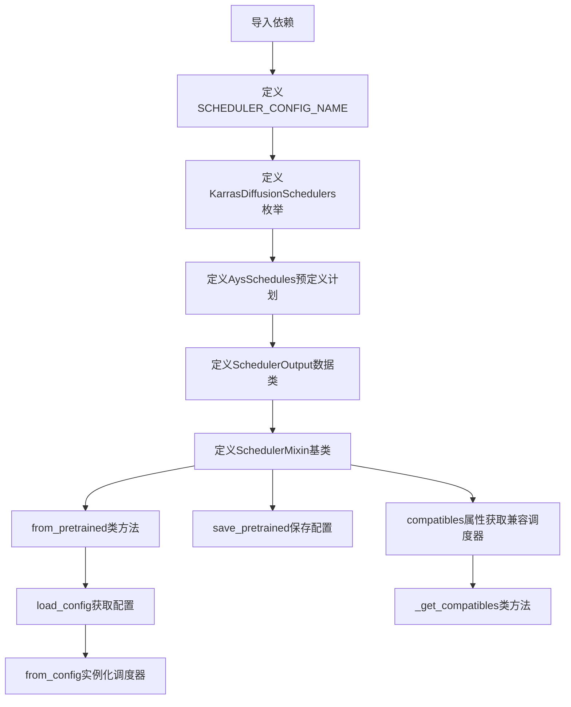
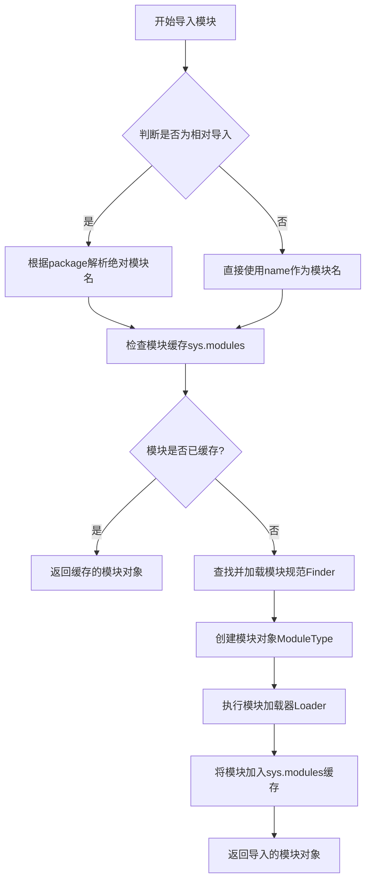
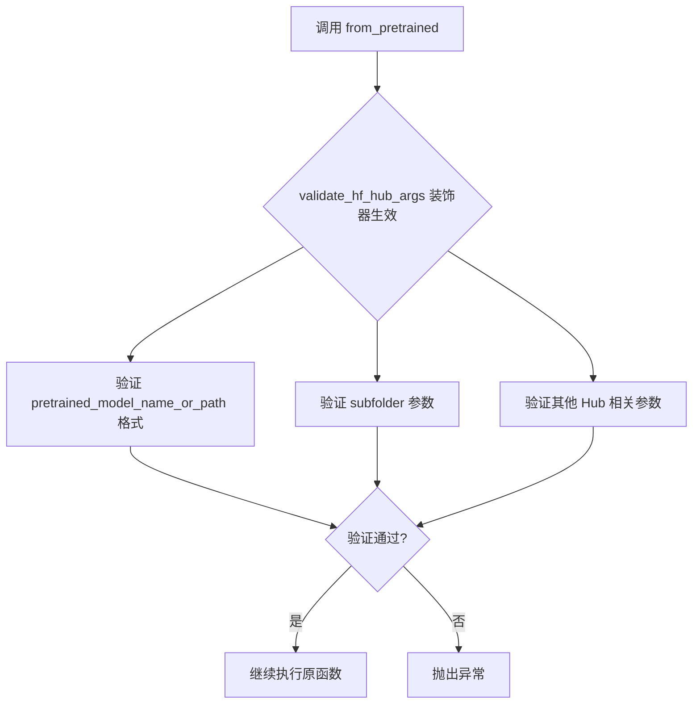
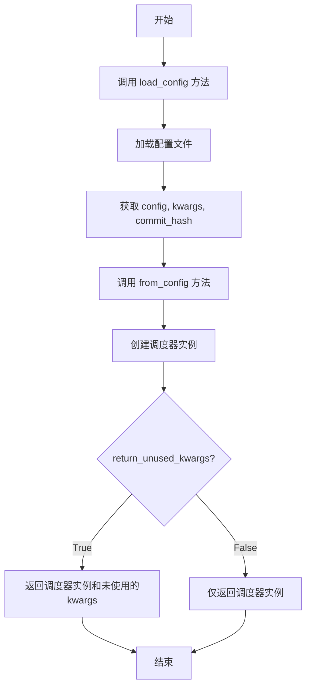
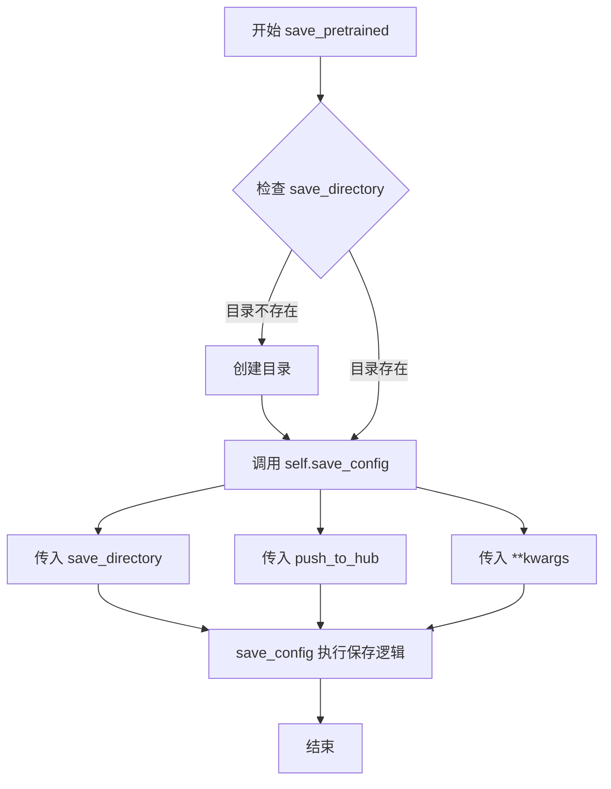
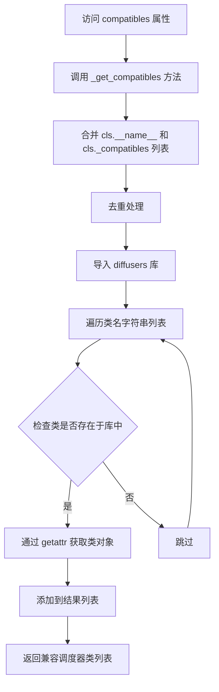

# `diffusers\src\diffusers\schedulers\scheduling_utils.py` 详细设计文档

该模块定义了扩散模型调度器的基础框架，包括KarrasDiffusionSchedulers枚举类、预定义调度计划AysSchedules、调度器输出基类SchedulerOutput以及所有调度器的公共基类SchedulerMixin，提供调度器的加载、保存和兼容管理等核心功能。

## 整体流程



## 类结构

```
KarrasDiffusionSchedulers (枚举类)
├── DDIMScheduler
├── DDPMScheduler
├── PNDMScheduler
├── LMSDiscreteScheduler
├── EulerDiscreteScheduler
├── HeunDiscreteScheduler
├── EulerAncestralDiscreteScheduler
├── DPMSolverMultistepScheduler
├── DPMSolverSinglestepScheduler
├── KDPM2DiscreteScheduler
├── KDPM2AncestralDiscreteScheduler
├── DEISMultistepScheduler
├── UniPCMultistepScheduler
├── DPMSolverSDEScheduler
└── EDMEulerScheduler

SchedulerOutput (数据类)

SchedulerMixin (基类)
├── from_pretrained (类方法)
├── save_pretrained (实例方法)
├── compatibles (属性)
└── _get_compatibles (类方法)
```

## 全局变量及字段


### `SCHEDULER_CONFIG_NAME`
    
调度器配置文件的名称，用于保存和加载调度器配置

类型：`str`
    


### `KarrasDiffusionSchedulers`
    
Karras扩散调度器的枚举类，包含所有支持的调度器类型

类型：`Enum`
    


### `AysSchedules`
    
预定义的扩散模型时间步和sigma值映射，包含多种扩散模型的调度参数

类型：`dict`
    


### `SchedulerOutput`
    
调度器step函数的输出基类，包含去噪后的样本

类型：`dataclass`
    


### `SchedulerMixin`
    
所有调度器的基类，提供通用的加载、保存和兼容性管理功能

类型：`class`
    


### `KarrasDiffusionSchedulers.DDIMScheduler`
    
DDIM调度器枚举值

类型：`int`
    


### `KarrasDiffusionSchedulers.DDPMScheduler`
    
DDPM调度器枚举值

类型：`int`
    


### `KarrasDiffusionSchedulers.PNDMScheduler`
    
PNDM调度器枚举值

类型：`int`
    


### `KarrasDiffusionSchedulers.LMSDiscreteScheduler`
    
LMS离散调度器枚举值

类型：`int`
    


### `KarrasDiffusionSchedulers.EulerDiscreteScheduler`
    
Euler离散调度器枚举值

类型：`int`
    


### `KarrasDiffusionSchedulers.HeunDiscreteScheduler`
    
Heun离散调度器枚举值

类型：`int`
    


### `KarrasDiffusionSchedulers.EulerAncestralDiscreteScheduler`
    
Euler祖先离散调度器枚举值

类型：`int`
    


### `KarrasDiffusionSchedulers.DPMSolverMultistepScheduler`
    
DPM多步求解器调度器枚举值

类型：`int`
    


### `KarrasDiffusionSchedulers.DPMSolverSinglestepScheduler`
    
DPM单步求解器调度器枚举值

类型：`int`
    


### `KarrasDiffusionSchedulers.KDPM2DiscreteScheduler`
    
KDPM2离散调度器枚举值

类型：`int`
    


### `KarrasDiffusionSchedulers.KDPM2AncestralDiscreteScheduler`
    
KDPM2祖先离散调度器枚举值

类型：`int`
    


### `KarrasDiffusionSchedulers.DEISMultistepScheduler`
    
DEIS多步调度器枚举值

类型：`int`
    


### `KarrasDiffusionSchedulers.UniPCMultistepScheduler`
    
UniPC多步调度器枚举值

类型：`int`
    


### `KarrasDiffusionSchedulers.DPMSolverSDEScheduler`
    
DPM SDE求解器调度器枚举值

类型：`int`
    


### `KarrasDiffusionSchedulers.EDMEulerScheduler`
    
EDM Euler调度器枚举值

类型：`int`
    


### `SchedulerOutput.prev_sample`
    
前一个时间步的计算样本，用于去噪循环中的下一个模型输入

类型：`torch.Tensor`
    


### `SchedulerMixin.config_name`
    
调度器配置文件的名称，默认值为SCHEDULER_CONFIG_NAME

类型：`str`
    


### `SchedulerMixin._compatibles`
    
与当前调度器兼容的其他调度器类名列表

类型：`list`
    


### `SchedulerMixin.has_compatibles`
    
标识当前调度器是否具有兼容调度器的布尔值

类型：`bool`
    
    

## 全局函数及方法


### `importlib.import_module`

动态导入指定模块的函数，返回导入的模块对象。这是Python标准库`importlib`模块的核心函数，用于在运行时动态加载模块。

参数：

- `name`：`str`，要导入的模块名称，可以是绝对导入（如`os.path`）或相对导入（如`.submodule`）
- `package`：`str | None`，可选参数，用于相对导入的包名。如果使用相对导入，`package`必须设置为当前包的名称

返回值：`types.ModuleType`，返回导入的模块对象

#### 流程图



#### 带注释源码

```python
import importlib

# 示例用法：在代码中动态导入diffusers库
diffusers_library = importlib.import_module(__name__.split(".")[0])

# 参数说明：
# __name__ = "diffusers.schedulers.scheduling_utils"
# __name__.split(".") = ["diffusers", "schedulers", "scheduling_utils"]
# [0] = "diffusers"
# 因此import_module("diffusers")会导入diffusers包

# 导入后可以获取模块中的属性
# compatible_classes = [
#     getattr(diffusers_library, c) 
#     for c in compatible_classes_str 
#     if hasattr(diffusers_library, c)
# ]

# importlib.import_module的典型签名：
# importlib.import_module(name: str, package: str | None = None) -> types.ModuleType

# 工作原理：
# 1. 解析模块名（处理相对导入）
# 2. 检查sys.modules缓存
# 3. 查找模块的Finder
# 4. 使用Loader执行模块加载
# 5. 返回加载后的模块对象
```


### `validate_hf_hub_args`

这是一个从 `huggingface_hub.utils` 导入的装饰器函数，用于验证 HuggingFace Hub 相关参数的合法性。该装饰器被应用于 `SchedulerMixin.from_pretrained` 方法，确保传入的模型路径、子文件夹等参数符合 Hub 规范。

由于 `validate_hf_hub_args` 是从外部库（`huggingface_hub`）导入的，其源代码不在当前文件中。以下是从代码使用方式中提取的信息：

参数：
- 该装饰器接收要装饰的函数作为参数
- 在 `from_pretrained` 方法上使用时，自动验证 `pretrained_model_name_or_path`、`subfolder` 等 Hub 相关参数

返回值：`Callable`，返回装饰后的函数

#### 流程图



#### 带注释源码

```python
# 该函数定义在 huggingface_hub.utils 模块中，此处为导入和使用示例
from huggingface_hub.utils import validate_hf_hub_args

# 在 SchedulerMixin 类中使用该装饰器
class SchedulerMixin(PushToHubMixin):
    @classmethod
    @validate_hf_hub_args  # 装饰器：验证 HuggingFace Hub 参数
    def from_pretrained(
        cls,
        pretrained_model_name_or_path: str | os.PathLike | None = None,
        subfolder: str | None = None,
        return_unused_kwargs=False,
        **kwargs,
    ) -> Self:
        # 方法实现...
        pass
```

**注意**：由于 `validate_hf_hub_args` 的完整源代码不在当前文件范围内，无法提供其完整的带注释源码。如需查看该函数的完整实现，建议查阅 [huggingface_hub 官方仓库](https://github.com/huggingface/huggingface_hub) 中的 `src/huggingface_hub/utils/_validators.py` 文件。


### `SchedulerMixin.from_pretrained`

从预定义的JSON配置文件在本地目录或Hub仓库中实例化一个调度器。该方法首先加载配置文件，然后使用配置创建调度器实例，支持从HuggingFace Hub或本地目录加载预训练调度器。

参数：

-  `cls`：类方法隐式参数，表示调用此方法的类
-  `pretrained_model_name_or_path`：`str | os.PathLike | None`，可以是Hub上的模型ID（如`google/ddpm-celebahq-256`）或本地目录路径
-  `subfolder`：`str | None`，模型仓库中模型文件所在的子文件夹位置
-  `return_unused_kwargs`：`bool`，是否返回未被Python类使用的kwargs，默认为`False`
-  `**kwargs`：其他关键字参数，包括`cache_dir`、`force_download`、`proxies`、`output_loading_info`、`local_files_only`、`token`、`revision`等

返回值：`Self`，返回加载后的调度器实例

#### 流程图



#### 带注释源码

```python
@classmethod
@validate_hf_hub_args
def from_pretrained(
    cls,
    pretrained_model_name_or_path: str | os.PathLike | None = None,
    subfolder: str | None = None,
    return_unused_kwargs=False,
    **kwargs,
) -> Self:
    r"""
    Instantiate a scheduler from a pre-defined JSON configuration file in a local directory or Hub repository.

    Parameters:
        pretrained_model_name_or_path (`str` or `os.PathLike`, *optional*):
            Can be either:
                - A string, the *model id* (for example `google/ddpm-celebahq-256`) of a pretrained model hosted on
                  the Hub.
                - A path to a *directory* (for example `./my_model_directory`) containing the scheduler
                  configuration saved with [`~SchedulerMixin.save_pretrained`].
        subfolder (`str`, *optional*):
            The subfolder location of a model file within a larger model repository on the Hub or locally.
        return_unused_kwargs (`bool`, *optional*, defaults to `False`):
            Whether kwargs that are not consumed by the Python class should be returned or not.
        cache_dir (`str | os.PathLike`, *optional*):
            Path to a directory where a downloaded pretrained model configuration is cached if the standard cache
            is not used.
        force_download (`bool`, *optional*, defaults to `False`):
            Whether or not to force the (re-)download of the model weights and configuration files, overriding the
            cached versions if they exist.
        proxies (`dict[str, str]`, *optional*):
            A dictionary of proxy servers to use by protocol or endpoint, for example, `{'http': 'foo.bar:3128',
            'http://hostname': 'foo.bar:4012'}`. The proxies are used on each request.
        output_loading_info(`bool`, *optional*, defaults to `False`):
            Whether or not to also return a dictionary containing missing keys, unexpected keys and error messages.
        local_files_only(`bool`, *optional*, defaults to `False`):
            Whether to only load local model weights and configuration files or not. If set to `True`, the model
            won't be downloaded from the Hub.
        token (`str` or *bool*, *optional*):
            The token to use as HTTP bearer authorization for remote files. If `True`, the token generated from
            `diffusers-cli login` (stored in `~/.huggingface`) is used.
        revision (`str`, *optional*, defaults to `"main"`):
            The specific model version to use. It can be a branch name, a tag name, a commit id, or any identifier
            allowed by Git.
    """
    # 第1步：调用类的load_config方法加载配置
    # 该方法会处理模型路径、下载、缓存等逻辑
    config, kwargs, commit_hash = cls.load_config(
        pretrained_model_name_or_path=pretrained_model_name_or_path,
        subfolder=subfolder,
        return_unused_kwargs=True,
        return_commit_hash=True,
        **kwargs,
    )
    # 第2步：调用类的from_config方法根据配置创建调度器实例
    # return_unused_kwargs控制是否返回未使用的kwargs
    return cls.from_config(config, return_unused_kwargs=return_unused_kwargs, **kwargs)
```


### SchedulerMixin.save_pretrained

保存调度器配置对象到指定目录，以便可以使用`SchedulerMixin.from_pretrained`类方法重新加载。

参数：

- `self`：隐式参数，SchedulerMixin实例本身
- `save_directory`：`str | os.PathLike`，保存配置JSON文件的目录（如果不存在将创建）
- `push_to_hub`：`bool`，可选，默认值为`False`，是否在保存后将模型推送到Hugging Face Hub
- `kwargs`：`dict[str, Any]`，可选，传递给`PushToHubMixin.push_to_hub`方法的额外关键字参数

返回值：`None`，无返回值（该方法直接调用`save_config`）

#### 流程图



#### 带注释源码

```python
def save_pretrained(self, save_directory: str | os.PathLike, push_to_hub: bool = False, **kwargs):
    """
    Save a scheduler configuration object to a directory so that it can be reloaded using the
    [`~SchedulerMixin.from_pretrained`] class method.

    Args:
        save_directory (`str` or `os.PathLike`):
            Directory where the configuration JSON file will be saved (will be created if it does not exist).
        push_to_hub (`bool`, *optional*, defaults to `False`):
            Whether or not to push your model to the Hugging Face Hub after saving it. You can specify the
            repository you want to push to with `repo_id` (will default to the name of `save_directory` in your
            namespace).
        kwargs (`dict[str, Any]`, *optional*):
            Additional keyword arguments passed along to the [`~utils.PushToHubMixin.push_to_hub`] method.
    """
    # 调用 save_config 方法完成实际的保存操作
    # save_config 方法继承自 PushToHubMixin，负责将调度器配置保存为 JSON 文件
    self.save_config(save_directory=save_directory, push_to_hub=push_to_hub, **kwargs)
```


### `SchedulerMixin.compatibles`

该属性方法返回与当前调度器兼容的所有调度器类列表，内部通过调用 `_get_compatibles()` 类方法实现兼容性调度器的动态获取。

参数： 无（该方法为属性方法，通过 `self` 隐式访问实例）

返回值：`list[SchedulerMixin]`，兼容的调度器类列表

#### 流程图



#### 带注释源码

```python
@property
def compatibles(self):
    """
    返回所有与此调度器兼容的调度器

    返回:
        `list[SchedulerMixin]`: 兼容调度器列表
    """
    # 调用类方法 _get_compatibles 获取兼容调度器列表
    return self._get_compatibles()

@classmethod
def _get_compatibles(cls):
    """
    内部方法：获取兼容调度器类的核心逻辑
    
    处理流程：
    1. 将当前类名与 _compatibles 列表合并
    2. 去重确保唯一性
    3. 动态导入 diffusers 库
    4. 验证并获取实际存在的调度器类
    """
    # 步骤1: 合并当前类名和兼容列表，去重
    # cls.__name__ 获取当前类的名称
    # cls._compatibles 是类属性，存储兼容的调度器名称字符串列表
    compatible_classes_str = list(set([cls.__name__] + cls._compatibles))
    
    # 步骤2: 动态导入 diffusers 库
    # __name__.split(".")[0] 获取顶层包名 'diffusers'
    diffusers_library = importlib.import_module(__name__.split(".")[0])
    
    # 步骤3: 遍历类名字符串，通过 getattr 获取实际的类对象
    # 过滤掉不存在的类，确保兼容性检查的健壮性
    compatible_classes = [
        getattr(diffusers_library, c)  # 获取类对象
        for c in compatible_classes_str  # 遍历类名字符串
        if hasattr(diffusers_library, c)  # 过滤：只保留库中存在的类
    ]
    
    # 返回兼容的调度器类对象列表
    return compatible_classes
```


### `SchedulerMixin._get_compatibles`

获取与当前调度器类兼容的所有调度器类列表。该方法首先将当前类名与 `_compatibles` 列表合并去重，然后从 diffusers 库中查找并返回对应的调度器类对象。

参数：

- `cls`：`type`，隐含的类方法参数，代表当前调度器类本身

返回值：`list[type]`，返回兼容的调度器类对象列表

#### 流程图

```mermaid
flowchart TD
    A[开始] --> B[获取 cls.__name__ 和 cls._compatibles]
    B --> C[合并为列表并去重: [cls.__name__] + cls._compatibles]
    C --> D[获取 diffusers 库模块]
    D --> E[遍历 compatible_classes_str]
    E --> F{判断模块中是否存在该类名}
    F -->|是| G[通过 getattr 获取类对象]
    F -->|否| H[跳过该类名]
    G --> I[添加到 compatible_classes 列表]
    H --> I
    I --> J{是否还有未处理的类名}
    J -->|是| E
    J -->|否| K[返回 compatible_classes 列表]
    K --> L[结束]
```

#### 带注释源码

```python
@classmethod
def _get_compatibles(cls):
    """
    获取与当前调度器类兼容的所有调度器类列表
    
    Returns:
        list[type]: 兼容的调度器类对象列表
    """
    # 第一步：将当前类名与 _compatibles 列表合并，并去重
    # cls.__name__ 获取当前类的名称
    # cls._compatibles 是类属性，存储兼容的调度器类名列表
    compatible_classes_str = list(set([cls.__name__] + cls._compatibles))
    
    # 第二步：动态导入 diffusers 库的主模块
    # __name__ 是当前模块名（如 'diffusers.schedulers.scheduling_utils'）
    # .split(".")[0] 提取最顶层的包名 'diffusers'
    diffusers_library = importlib.import_module(__name__.split(".")[0])
    
    # 第三步：从 diffusers 库中查找并获取兼容的调度器类
    # 遍历类名字符串列表，通过 getattr 获取对应的类对象
    # 使用 hasattr 检查类是否存在，避免 AttributeError
    compatible_classes = [
        getattr(diffusers_library, c) for c in compatible_classes_str if hasattr(diffusers_library, c)
    ]
    
    # 返回找到的所有兼容调度器类
    return compatible_classes
```

## 关键组件


### KarrasDiffusionSchedulers 枚举

定义了一系列扩散调度器类型，包括 DDIMScheduler、DDPMScheduler、PNDMScheduler、LMSDiscreteScheduler、EulerDiscreteScheduler 等 15 种调度器，用于支持不同的扩散采样算法。

### AysSchedules 字典

存储了预定义的 Karras 扩散调度参数，包含 StableDiffusionTimesteps、StableDiffusionSigmas、StableDiffusionXLTimesteps、StableDiffusionXLSigmas 和 StableDiffusionVideoSigmas 五种调度方案，用于控制扩散模型的噪声调度。

### SchedulerOutput 数据类

作为调度器 step 函数的输出基类，包含 prev_sample 字段（torch.Tensor 类型），存储前一个时间步的计算样本，作为下一个去噪循环的模型输入。

### SchedulerMixin 基类

所有调度器的基类，提供了通用的加载和保存功能。通过 @validate_hf_hub_args 装饰器验证 Hugging Face Hub 参数，支持从预定义配置文件实例化调度器，并包含配置属性管理（num_train_timesteps 等）和调度器兼容性管理功能。

### from_pretrained 类方法

从本地目录或 Hub 仓库的 JSON 配置文件实例化调度器，支持通过 model_id（如 google/ddpm-celebahq-256）或本地目录路径加载，支持子文件夹指定、缓存管理、代理配置、token 认证和版本控制等参数。

### save_pretrained 实例方法

将调度器配置对象保存到指定目录，支持推送到 Hugging Face Hub，可通过 repo_id 参数指定目标仓库名称。

### compatibles 属性

返回当前调度器的所有兼容调度器列表，通过调用 _get_compatibles 方法实现调度器间的兼容性查询功能。

### _get_compatibles 类方法

动态导入 diffusers 库并获取调度器类名列表（包括自身和 _compatibles 中的类），返回兼容的调度器类实例列表，支持调度器之间的灵活切换和互操作。


## 问题及建议


### 已知问题

- **硬编码的调度计划**：`AysSchedules` 字典包含硬编码的调度计划数值，这种静态定义方式不够灵活，难以动态扩展或自定义调度参数
- **枚举类滥用**：`KarrasDiffusionSchedulers` 枚举仅用于文档和兼容列表，本质上是字符串到类的映射，使用枚举反而增加了维护成本，应考虑使用字符串到类的字典映射
- **`_compatibles` 使用字符串列表**：通过字符串类名存储兼容调度器而非直接引用类对象，增加了运行时查找开销和潜在的命名冲突风险
- **类型注解不完整**：部分方法参数和返回值缺少详细的类型注解（如 `from_pretrained` 中 `kwargs` 的具体类型），影响代码可读性和 IDE 支持
- **缺少错误处理**：`_get_compatibles` 方法中的动态导入和属性获取缺乏异常捕获，模块不存在或属性缺失时会导致运行时错误
- **文档描述不准确**：`SchedulerOutput` 中 `prev_sample` 注释写的是"previous timestep"但实际是"previous step"，可能造成理解混淆

### 优化建议

- 将 `AysSchedules` 改为可扩展的配置结构，支持从外部文件或用户自定义加载调度计划
- 考虑用 `dict[str, type]` 替代 `KarrasDiffusionSchedulers` 枚举，提供更直观的类查找方式
- 将 `_compatibles` 改为存储类引用而非字符串名称，避免运行时字符串匹配的开销
- 补充完整的类型注解，特别是在复杂参数（如 `kwargs`）上使用 `TypedDict` 或 `Protocol` 定义具体类型
- 在 `_get_compatibles` 中添加 `try-except` 块处理导入和属性访问异常，提供降级方案或清晰的错误信息
- 统一文档术语，确保"timestep"和"step"的使用与实际逻辑一致

## 其它


### 设计目标与约束

本模块作为diffusers库中所有调度器（Scheduler）的基类，核心设计目标是提供统一的调度器加载、保存和兼容性管理机制。约束包括：调度器必须继承SchedulerMixin以支持from_pretrained和save_pretrained功能；调度器类需在_compatibles列表中声明兼容的其他调度器类；所有调度器配置必须符合SCHEDULER_CONFIG_NAME ("scheduler_config.json") 格式。

### 错误处理与异常设计

代码中通过validate_hf_hub_args装饰器验证Hub参数的合法性，load_config和from_config方法负责处理配置加载失败的情况。潜在异常包括：路径不存在、配置格式错误、调度器类名不匹配、模块导入失败等。from_pretrained方法的return_unused_kwargs参数允许捕获未使用的kwargs，便于调试参数传递问题。

### 数据流与状态机

SchedulerOutput作为调度器step方法的输出基类，包含prev_sample字段表示上一时间步的计算样本。数据流遵循：加载配置 → 实例化调度器 → 调用step方法进行去噪迭代 → 输出prev_sample作为下一轮输入。调度器内部状态通过config对象（继承自ConfigMixin）管理，包含num_train_timesteps等关键参数。

### 外部依赖与接口契约

本模块依赖以下外部包：importlib（动态导入）、os（路径操作）、dataclasses（数据类）、enum（枚举）、torch（张量计算）、huggingface_hub.utils（Hub参数验证）、typing_extensions（类型注解）、..utils.BaseOutput和PushToHubMixin（基类）。调度器子类必须实现step方法，接收模型输出和时间步信息，返回SchedulerOutput实例。

### 版本兼容性考虑

KarrasDiffusionSchedulers枚举记录了支持的调度器类型，用于文档和兼容性检查。AysSchedules字典定义了基于Karras论文的预定义时间步和sigma schedule，支持StableDiffusion、StableDiffusionXL和StableDiffusionVideo变体。版本兼容性通过_compatibles列表和_get_compatibles方法动态解析实现，允许不同版本的调度器相互替换。

### 扩展性设计

SchedulerMixin提供has_compatibles类属性和compatibles属性用于查询兼容调度器。子类可通过覆盖_compatibles列表添加新的兼容调度器。_get_compatibles方法使用动态导入机制从diffusers_library获取调度器类，支持插件式扩展。PushToHubMixin继承提供了模型保存和推送至HuggingFace Hub的能力。

### 配置管理机制

配置管理通过load_config和save_config方法（继承自ConfigMixin）实现，支持从本地目录或Hub仓库加载JSON格式配置。subfolder参数允许调度器配置存放在模型仓库的子目录中。cache_dir、force_download、local_files_only等参数控制配置和权重的缓存行为。

    