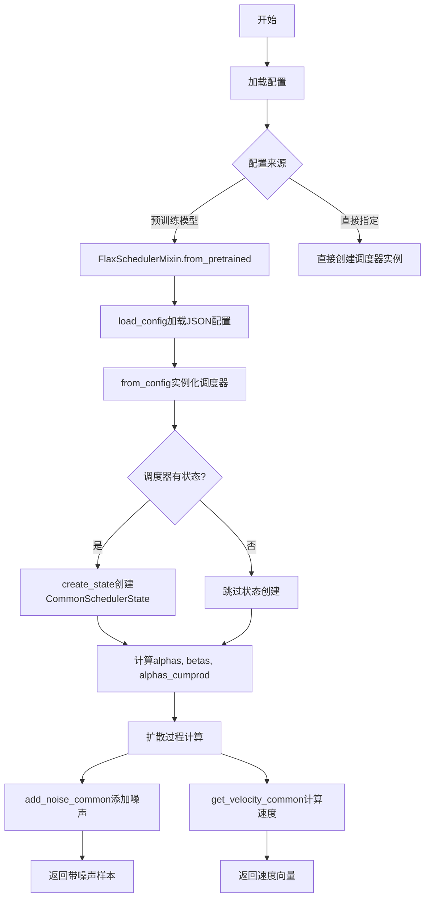
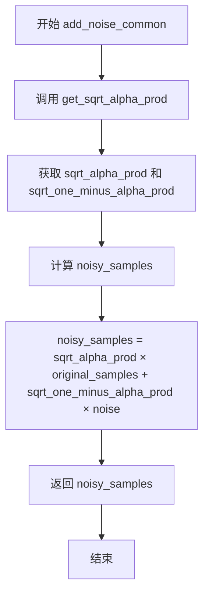
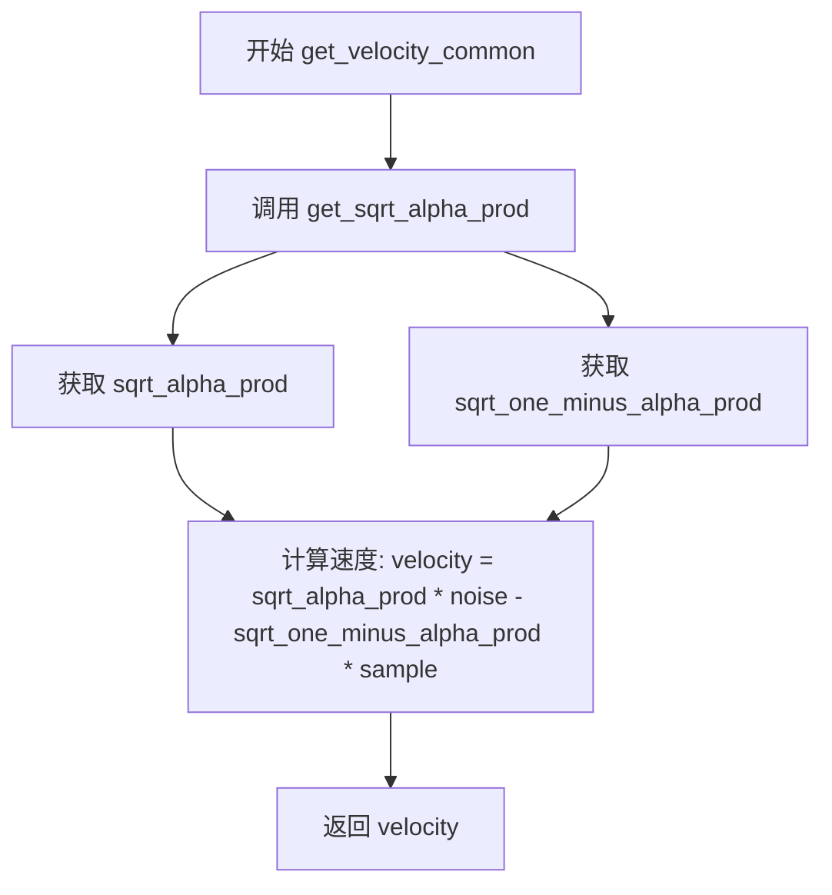
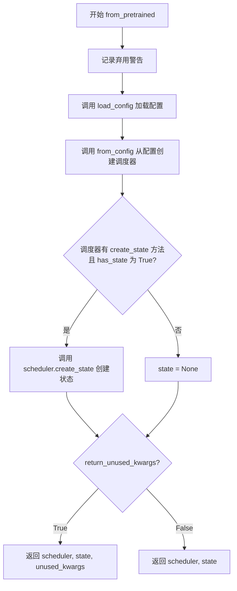
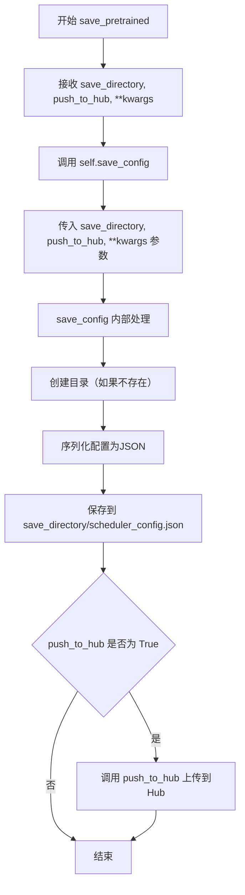
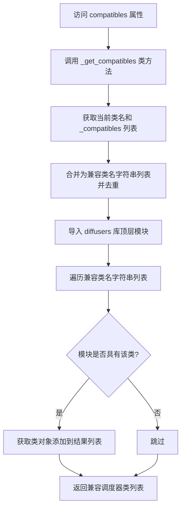
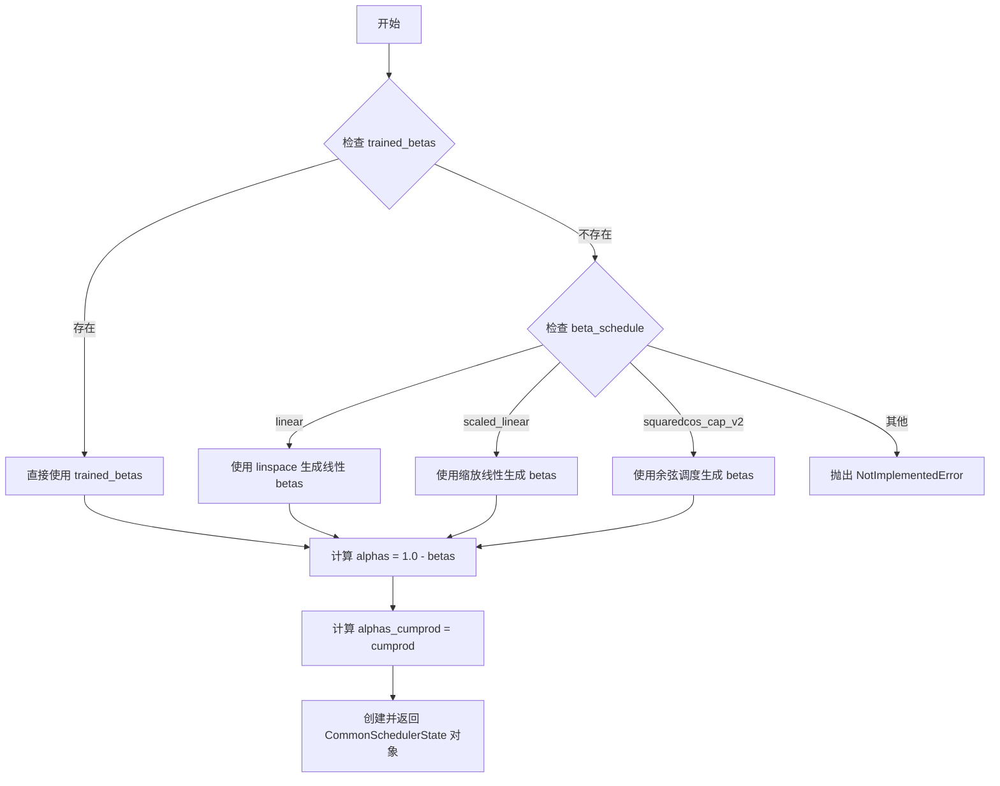
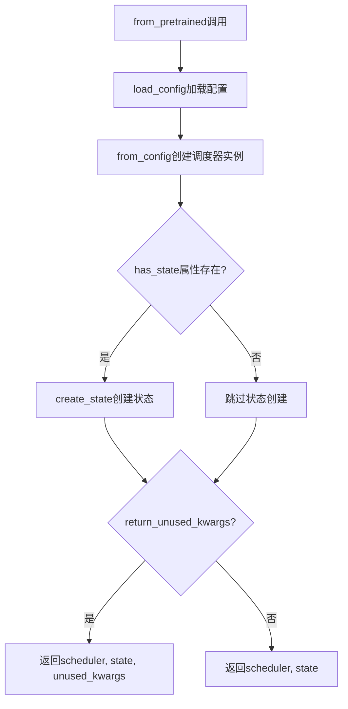

# `diffusers\src\diffusers\schedulers\scheduling_utils_flax.py` 详细设计文档

这是Hugging Face Diffusers库中的Flax扩散模型调度器工具模块，提供了调度器的基础设施类、通用状态管理和噪声添加/速度计算等核心功能，支持多种Flax实现的调度器（如DDIM、DDPM、PNDM等）的配置加载、状态创建和扩散过程计算。

## 整体流程



## 类结构

```
BaseOutput (数据基类)
├── FlaxSchedulerOutput (调度器输出)
PushToHubMixin (Hub推送混入)
└── FlaxSchedulerMixin (调度器混入基类)

flax.struct.dataclass
└── CommonSchedulerState (通用调度器状态)

FlaxKarrasDiffusionSchedulers (枚举)
├── FlaxDDIMScheduler
├── FlaxDDPMScheduler
├── FlaxPNDMScheduler
├── FlaxLMSDiscreteScheduler
├── FlaxDPMSolverMultistepScheduler
└── FlaxEulerDiscreteScheduler
```

## 全局变量及字段


### `SCHEDULER_CONFIG_NAME`
    
调度器配置文件名

类型：`str`
    


### `logger`
    
模块日志记录器

类型：`logging.Logger`
    


### `FlaxKarrasDiffusionSchedulers`
    
Flax调度器枚举类

类型：`Enum`
    


### `broadcast_to_shape_from_left`
    
将数组从左侧广播到目标形状的函数

类型：`function`
    


### `betas_for_alpha_bar`
    
根据alpha_bar函数生成beta调度表的函数

类型：`function`
    


### `get_sqrt_alpha_prod`
    
计算扩散过程中sqrt(alpha_prod)和sqrt(1-alpha_prod)的函数

类型：`function`
    


### `add_noise_common`
    
向原始样本添加噪声的通用函数

类型：`function`
    


### `get_velocity_common`
    
计算噪声速度的通用函数

类型：`function`
    


### `FlaxKarrasDiffusionSchedulers.FlaxKarrasDiffusionSchedulers.FlaxDDIMScheduler`
    
DDIM调度器枚举值

类型：`int`
    


### `FlaxKarrasDiffusionSchedulers.FlaxKarrasDiffusionSchedulers.FlaxDDPMScheduler`
    
DDPM调度器枚举值

类型：`int`
    


### `FlaxKarrasDiffusionSchedulers.FlaxKarrasDiffusionSchedulers.FlaxPNDMScheduler`
    
PNDM调度器枚举值

类型：`int`
    


### `FlaxKarrasDiffusionSchedulers.FlaxKarrasDiffusionSchedulers.FlaxLMSDiscreteScheduler`
    
LMS离散调度器枚举值

类型：`int`
    


### `FlaxKarrasDiffusionSchedulers.FlaxKarrasDiffusionSchedulers.FlaxDPMSolverMultistepScheduler`
    
DPM多步求解器调度器枚举值

类型：`int`
    


### `FlaxKarrasDiffusionSchedulers.FlaxKarrasDiffusionSchedulers.FlaxEulerDiscreteScheduler`
    
欧拉离散调度器枚举值

类型：`int`
    


### `FlaxSchedulerOutput.FlaxSchedulerOutput.prev_sample`
    
上一个时间步的计算样本

类型：`jnp.ndarray`
    


### `FlaxSchedulerMixin.FlaxSchedulerMixin.config_name`
    
配置文件名

类型：`str`
    


### `FlaxSchedulerMixin.FlaxSchedulerMixin.ignore_for_config`
    
配置中忽略的字段

类型：`list`
    


### `FlaxSchedulerMixin.FlaxSchedulerMixin._compatibles`
    
兼容的调度器列表

类型：`list`
    


### `FlaxSchedulerMixin.FlaxSchedulerMixin.has_compatibles`
    
是否有兼容调度器标志

类型：`bool`
    


### `FlaxSchedulerMixin.FlaxSchedulerMixin.from_pretrained`
    
从预训练模型加载调度器

类型：`classmethod`
    


### `FlaxSchedulerMixin.FlaxSchedulerMixin.save_pretrained`
    
保存调度器配置

类型：`method`
    


### `FlaxSchedulerMixin.FlaxSchedulerMixin.compatibles`
    
获取兼容调度器

类型：`property`
    


### `FlaxSchedulerMixin.FlaxSchedulerMixin._get_compatibles`
    
内部获取兼容调度器方法

类型：`classmethod`
    


### `CommonSchedulerState.CommonSchedulerState.alphas`
    
1-beta值数组

类型：`jnp.ndarray`
    


### `CommonSchedulerState.CommonSchedulerState.betas`
    
beta值数组

类型：`jnp.ndarray`
    


### `CommonSchedulerState.CommonSchedulerState.alphas_cumprod`
    
累积alpha乘积

类型：`jnp.ndarray`
    


### `CommonSchedulerState.CommonSchedulerState.create`
    
根据调度器配置创建状态

类型：`classmethod`
    
    

## 全局函数及方法


### `broadcast_to_shape_from_left`

该函数用于将输入的 JAX 数组广播（broadcast）到指定的形状。它通过在输入数组的末尾添加维度大小为 1 的新维度来匹配目标形状的维度数量，然后使用 JAX 的 `broadcast_to` 函数将数组扩展到完整的目标形状。这在扩散模型调度器中用于将一维的时间步参数广播到与样本相同的多维形状，以便进行逐元素运算。

参数：

- `x`：`jnp.ndarray`，输入的要广播的数组
- `shape`：`tuple[int]`，目标广播形状的元组

返回值：`jnp.ndarray`，广播后的数组，其形状与指定的 `shape` 一致

#### 流程图

```mermaid
flowchart TD
    A[开始] --> B{检查 len(shape) >= x.ndim}
    B -->|断言失败| C[抛出 AssertionError]
    B -->|断言通过| D[计算需要添加的维度数量: dims_to_add = len(shape) - x.ndim]
    D --> E[构建重塑形状: new_shape = x.shape + (1,) * dims_to_add]
    E --> F[对 x 进行重塑: x.reshape(new_shape)]
    F --> G[使用 jnp.broadcast_to 广播到目标形状]
    G --> H[返回广播后的数组]
    H --> I[结束]
```

#### 带注释源码

```python
def broadcast_to_shape_from_left(x: jnp.ndarray, shape: tuple[int]) -> jnp.ndarray:
    """
    将输入数组广播到指定形状。
    
    该函数通过以下步骤实现广播：
    1. 验证目标形状的维度数不小于输入数组的维度数
    2. 在输入数组末尾添加维度大小为1的维度，使其维度数与目标形状相同
    3. 使用 JAX 的 broadcast_to 将数组扩展到完整的目标形状
    
    Args:
        x: 输入的 JAX 数组
        shape: 目标广播形状的元组
    
    Returns:
        广播后的 JAX 数组
    """
    # 断言：目标形状的维度数必须大于等于输入数组的维度数
    # 这是为了确保我们可以添加维度而不是减少维度
    assert len(shape) >= x.ndim
    
    # 计算需要添加的维度数量
    # 例如：如果 x 是 (batch,) shape 是 (batch, height, width)
    # 则需要添加 2 个维度
    dims_to_add = len(shape) - x.ndim
    
    # 构建新的形状：在原始形状末尾添加 (1,) * dims_to_add
    # 例如：x.shape = (batch,), dims_to_add = 2
    # 则 new_shape = (batch, 1, 1)
    new_shape = x.shape + (1,) * dims_to_add
    
    # 先重塑数组，在末尾添加维度大小为1的维度
    # 然后使用 broadcast_to 广播到完整的目标形状
    # broadcast_to 不会复制数据，只是改变视图和步长
    return jnp.broadcast_to(x.reshape(new_shape), shape)
```


### `betas_for_alpha_bar`

该函数用于创建基于 alpha_bar 函数的 beta 调度表，通过离散化给定的 alpha_t_bar 函数（定义了 (1-beta) 在时间 t=[0,1] 范围内的累积乘积）来生成一系列 beta 值，常用于扩散模型的噪声调度。

参数：

- `num_diffusion_timesteps`：`int`，要生成的 beta 数量，即扩散过程的时间步数
- `max_beta`：`float`，默认值 0.999，允许使用的最大 beta 值，用于防止奇异性
- `dtype`：`jnp.ndarray`，默认值 `jnp.float32`，返回数组的数据类型

返回值：`jnp.ndarray`，用于调度器逐步处理模型输出的 beta 值数组

#### 流程图

```mermaid
flowchart TD
    A[开始] --> B[初始化空列表 betas]
    B --> C[循环 i 从 0 到 num_diffusion_timesteps-1]
    C --> D[计算 t1 = i / num_diffusion_timesteps]
    D --> E[计算 t2 = (i + 1) / num_diffusion_timesteps]
    E --> F[计算 alpha_bar(t1) = cos((t1 + 0.008) / 1.008 * π/2)²]
    F --> G[计算 alpha_bar(t2) = cos((t2 + 0.008) / 1.008 * π/2)²]
    G --> H[计算 beta = 1 - alpha_bar(t2) / alpha_bar(t1)]
    H --> I{beta > max_beta?}
    I -->|是| J[beta = max_beta]
    I -->|否| K[保留原 beta 值]
    J --> L[将 beta 添加到 betas 列表]
    K --> L
    L --> M{循环结束?}
    M -->|否| C
    M --> O[将 betas 列表转换为 jnp.ndarray]
    O --> P[结束，返回 betas 数组]
```

#### 带注释源码

```python
def betas_for_alpha_bar(num_diffusion_timesteps: int, max_beta=0.999, dtype=jnp.float32) -> jnp.ndarray:
    """
    Create a beta schedule that discretizes the given alpha_t_bar function, which defines the cumulative product of
    (1-beta) over time from t = [0,1].

    Contains a function alpha_bar that takes an argument t and transforms it to the cumulative product of (1-beta) up
    to that part of the diffusion process.


    Args:
        num_diffusion_timesteps (`int`): the number of betas to produce.
        max_beta (`float`): the maximum beta to use; use values lower than 1 to
                     prevent singularities.

    Returns:
        betas (`jnp.ndarray`): the betas used by the scheduler to step the model outputs
    """

    # 定义 alpha_bar 内部函数，使用余弦函数实现平滑的 alpha 衰减曲线
    # 公式: alpha_bar(t) = cos²((t + 0.008) / 1.008 * π / 2)
    # 这是一种常用的余弦调度策略，相比线性调度能更好地保留信息
    def alpha_bar(time_step):
        return math.cos((time_step + 0.008) / 1.008 * math.pi / 2) ** 2

    # 初始化 beta 列表用于存储每个时间步的 beta 值
    betas = []
    # 遍历每个扩散时间步，计算对应的 beta 值
    for i in range(num_diffusion_timesteps):
        # t1 表示当前时间步的归一化位置 [0, 1)
        t1 = i / num_diffusion_timesteps
        # t2 表示下一个时间步的归一化位置 (0, 1]
        t2 = (i + 1) / num_diffusion_timesteps
        
        # 计算 beta: 基于相邻时间步的 alpha_bar 比值
        # beta = 1 - α(t+Δt)/α(t)，这保证了 α 的平滑衰减
        # 使用 min 确保 beta 不超过 max_beta，防止数值不稳定
        betas.append(min(1 - alpha_bar(t2) / alpha_bar(t1), max_beta))
    
    # 将 Python 列表转换为 JAX NumPy 数组，指定数据类型
    return jnp.array(betas, dtype=dtype)
```


### `get_sqrt_alpha_prod`

获取扩散过程中的sqrt(alpha_prod)和sqrt(1-alpha_prod)系数，用于在噪声添加和速度计算中调整样本和噪声的权重。

参数：

- `state`：`CommonSchedulerState`，包含调度器状态的对象，其中 `alphas_cumprod` 属性存储累积的alpha值
- `original_samples`：`jnp.ndarray`，原始样本数据，形状为 `(batch_size, num_channels, height, width)`
- `noise`：`jnp.ndarray`，要添加的噪声数据，形状与 original_samples 相同
- `timesteps`：`jnp.ndarray`，当前的时间步索引，用于从 alphas_cumprod 中选取对应的alpha值

返回值：`tuple[jnp.ndarray, jnp.ndarray]`，返回一个元组，包含：
- `sqrt_alpha_prod`：`jnp.ndarray`，sqrt(alpha_prod) 值，已广播到与 original_samples 相同的形状
- `sqrt_one_minus_alpha_prod`：`jnp.ndarray`，sqrt(1 - alpha_prod) 值，已广播到与 original_samples 相同的形状

#### 流程图

```mermaid
flowchart TD
    A[开始: get_sqrt_alpha_prod] --> B[从 state 获取 alphas_cumprod]
    B --> C[根据 timesteps 索引 alphas_cumprod]
    C --> D[计算 sqrt_alpha_prod = alphas_cumprod[timesteps] ** 0.5]
    D --> E[将 sqrt_alpha_prod 展平并广播到 original_samples 形状]
    E --> F[计算 sqrt_one_minus_alpha_prod = (1 - alphas_cumprod[timesteps]) ** 0.5]
    F --> G[将 sqrt_one_minus_alpha_prod 展平并广播到 original_samples 形状]
    G --> H[返回 (sqrt_alpha_prod, sqrt_one_minus_alpha_prod)]
```

#### 带注释源码

```python
def get_sqrt_alpha_prod(
    state: CommonSchedulerState, 
    original_samples: jnp.ndarray, 
    noise: jnp.ndarray, 
    timesteps: jnp.ndarray
):
    """
    获取sqrt_alpha_prod和sqrt_one_minus_alpha_prod系数。
    
    这些系数用于扩散模型的噪声添加和速度计算过程：
    - noisy_samples = sqrt_alpha_prod * original_samples + sqrt_one_minus_alpha_prod * noise
    - velocity = sqrt_alpha_prod * noise - sqrt_one_minus_alpha_prod * sample
    
    参数:
        state: 包含alphas_cumprod的调度器状态
        original_samples: 原始样本，用于确定输出形状
        noise: 噪声数据（参数中接收但未在此函数中使用）
        timesteps: 时间步索引
    
    返回:
        (sqrt_alpha_prod, sqrt_one_minus_alpha_prod)元组
    """
    # 从状态对象中获取累积的alpha值
    alphas_cumprod = state.alphas_cumprod

    # 根据时间步索引获取对应的累积alpha值，并计算其平方根
    sqrt_alpha_prod = alphas_cumprod[timesteps] ** 0.5
    # 展平以便于后续广播操作
    sqrt_alpha_prod = sqrt_alpha_prod.flatten()
    # 将sqrt_alpha_prod广播到与原始样本相同的形状
    sqrt_alpha_prod = broadcast_to_shape_from_left(sqrt_alpha_prod, original_samples.shape)

    # 计算1-alpha的累积值的平方根
    sqrt_one_minus_alpha_prod = (1 - alphas_cumprod[timesteps]) ** 0.5
    # 展平以便于后续广播操作
    sqrt_one_minus_alpha_prod = sqrt_one_minus_alpha_prod.flatten()
    # 将sqrt_one_minus_alpha_prod广播到与原始样本相同的形状
    sqrt_one_minus_alpha_prod = broadcast_to_shape_from_left(sqrt_one_minus_alpha_prod, original_samples.shape)

    # 返回两个系数供调用者使用
    return sqrt_alpha_prod, sqrt_one_minus_alpha_prod
```


### `add_noise_common`

通用噪声添加函数，用于在扩散模型的采样或训练过程中根据给定的时间步将噪声添加到原始样本中。该函数利用累积alpha值计算噪声权重，实现标准的扩散前向过程。

参数：

- `state`：`CommonSchedulerState`，调度器状态对象，包含alphas、betas和alphas_cumprod数组
- `original_samples`：`jnp.ndarray`，原始样本/图像数据
- `noise`：`jnp.ndarray`，要添加的高斯噪声
- `timesteps`：`jnp.ndarray`，当前扩散过程的时间步

返回值：`jnp.ndarray`，添加噪声后的样本

#### 流程图



#### 带注释源码

```python
def add_noise_common(
    state: CommonSchedulerState,  # 调度器状态，包含扩散过程参数
    original_samples: jnp.ndarray, # 原始未加噪的样本
    noise: jnp.ndarray,           # 要添加的噪声
    timesteps: jnp.ndarray        # 当前时间步
):
    """
    向原始样本添加噪声的通用函数。
    
    该函数实现了扩散模型的前向过程：x_t = sqrt(alpha_cumprod_t) * x_0 + sqrt(1 - alpha_cumprod_t) * epsilon
    其中 epsilon 是添加的高斯噪声。
    """
    # 获取基于时间步的alpha参数
    sqrt_alpha_prod, sqrt_one_minus_alpha_prod = get_sqrt_alpha_prod(
        state, original_samples, noise, timesteps
    )
    
    # 根据扩散公式计算加噪样本
    # noisy_samples = sqrt(alpha_cumprod) * original_samples + sqrt(1 - alpha_cumprod) * noise
    noisy_samples = sqrt_alpha_prod * original_samples + sqrt_one_minus_alpha_prod * noise
    
    # 返回加噪后的样本
    return noisy_samples
```


### `get_velocity_common`

通用速度计算函数，用于在扩散模型中根据样本、噪声和时间步计算速度（velocity）。速度是扩散过程中连接原始样本和噪声的线性组合，在DDPM等扩散模型的噪声调度中起关键作用。

参数：

- `state`：`CommonSchedulerState`，调度器状态对象，包含 alphas、betas、alphas_cumprod 等预计算系数
- `sample`：`jnp.ndarray`，当前样本（去噪过程中的中间结果）
- `noise`：`jnp.ndarray`，添加的噪声或预测的噪声
- `timesteps`：`jnp.ndarray`，当前时间步

返回值：`jnp.ndarray`，计算得到的速度向量，用于扩散过程的下一个步骤

#### 流程图



#### 带注释源码

```python
def get_velocity_common(state: CommonSchedulerState, sample: jnp.ndarray, noise: jnp.ndarray, timesteps: jnp.ndarray):
    """
    计算扩散模型中的速度（velocity）。
    
    速度定义为: velocity = sqrt(alpha_prod) * noise - sqrt(1 - alpha_prod) * sample
    这是 DDPM 论文中定义的速度公式，用于在连续时间扩散过程中连接样本和噪声。
    
    参数:
        state: CommonSchedulerState - 包含预计算的 alpha 系数的调度器状态
        sample: jnp.ndarray - 当前样本（通常是 x_t 或 x_{t-1}）
        noise: jnp.ndarray - 噪声（预测噪声或添加的噪声）
        timesteps: jnp.ndarray - 当前时间步索引
    
    返回:
        jnp.ndarray - 计算得到的速度向量
    """
    # 获取时间步对应的 alpha 系数平方根
    # sqrt_alpha_prod = sqrt(alphas_cumprod[timesteps])
    # sqrt_one_minus_alpha_prod = sqrt(1 - alphas_cumprod[timesteps])
    sqrt_alpha_prod, sqrt_one_minus_alpha_prod = get_sqrt_alpha_prod(state, sample, noise, timesteps)
    
    # 使用速度公式计算：v = √α * noise - √(1-α) * sample
    # 这个公式确保速度方向与扩散过程的方向一致
    velocity = sqrt_alpha_prod * noise - sqrt_one_minus_alpha_prod * sample
    
    return velocity
```


### `FlaxSchedulerMixin.from_pretrained`

从预训练的调度器配置文件中实例化一个 Flax 调度器类，支持从 Hugging Face Hub 或本地目录加载配置，并可选择返回未使用的_kwargs。

参数：

- `cls`：类型，当前类本身（由 `@classmethod` 自动传入）
- `pretrained_model_name_or_path`：`str | os.PathLike | None`，模型标识符或本地目录路径，可以是 Hugging Face Hub 上的模型 ID（如 `google/ddpm-celebahq-256`）或包含模型权重的本地目录路径
- `subfolder`：`str | None`，可选参数，指定模型文件所在的子文件夹名称（当文件位于远程仓库或本地目录的子文件夹中时使用）
- `return_unused_kwargs`：`bool`，可选，默认为 `False`，表示是否返回未被类消耗的 kwargs
- `**kwargs`：可变关键字参数，包含其他加载配置选项（如 `cache_dir`、`force_download`、`proxies`、`output_loading_info`、`local_files_only`、`token`、`revision` 等）

返回值：根据 `return_unused_kwargs` 参数有两种返回形式：
- 当 `return_unused_kwargs=True` 时：返回元组 `(scheduler, state, unused_kwargs)`，其中 `scheduler` 是调度器实例，`state` 是调度器状态（如果调度器有 `create_state` 方法），`unused_kwargs` 是未使用的参数字典
- 当 `return_unused_kwargs=False` 时：返回元组 `(scheduler, state)`

#### 流程图



#### 带注释源码

```python
@classmethod
@validate_hf_hub_args
def from_pretrained(
    cls,
    pretrained_model_name_or_path: str | os.PathLike | None = None,
    subfolder: str | None = None,
    return_unused_kwargs=False,
    **kwargs,
):
    r"""
    Instantiate a Scheduler class from a pre-defined JSON-file.

    Parameters:
        pretrained_model_name_or_path (`str` or `os.PathLike`, *optional*):
            Can be either:
                - A string, the *model id* of a model repo on huggingface.co. Valid model ids should have an
                  organization name, like `google/ddpm-celebahq-256`.
                - A path to a *directory* containing model weights saved using [`~SchedulerMixin.save_pretrained`],
                  e.g., `./my_model_directory/`.
        subfolder (`str`, *optional*):
            In case the relevant files are located inside a subfolder of the model repo (either remote in
            huggingface.co or downloaded locally), you can specify the folder name here.
        return_unused_kwargs (`bool`, *optional*, defaults to `False`):
            Whether kwargs that are not consumed by the Python class should be returned or not.
        cache_dir (`str | os.PathLike`, *optional*):
            Path to a directory in which a downloaded pretrained model configuration should be cached.
        force_download (`bool`, *optional*, defaults to `False`):
            Whether or not to force the (re-)download of the model weights and configuration files.
        proxies (`dict[str, str]`, *optional*):
            A dictionary of proxy servers to use by protocol or endpoint.
        output_loading_info(`bool`, *optional*, defaults to `False`):
            Whether or not to also return a dictionary containing missing keys, unexpected keys and error messages.
        local_files_only(`bool`, *optional*, defaults to `False`):
            Whether or not to only look at local files (i.e., do not try to download the model).
        token (`str` or *bool*, *optional*):
            The token to use as HTTP bearer authorization for remote files.
        revision (`str`, *optional*, defaults to `"main"`):
            The specific model version to use.
    """
    # 记录弃用警告，提示 Flax 类将在 Diffusers v1.0.0 中被移除
    logger.warning(
        "Flax classes are deprecated and will be removed in Diffusers v1.0.0. We "
        "recommend migrating to PyTorch classes or pinning your version of Diffusers."
    )
    
    # 调用类方法 load_config 加载调度器配置
    # 返回 config（配置对象）和 kwargs（可能包含未使用的参数）
    config, kwargs = cls.load_config(
        pretrained_model_name_or_path=pretrained_model_name_or_path,
        subfolder=subfolder,
        return_unused_kwargs=True,  # 始终返回未使用的 kwargs 以便后续处理
        **kwargs,
    )
    
    # 根据配置创建调度器实例
    # from_config 是另一个类方法，根据 config 字典实例化调度器
    scheduler, unused_kwargs = cls.from_config(config, return_unused_kwargs=True, **kwargs)

    # 检查调度器是否有 create_state 方法且 has_state 属性为 True
    # 如果是，则创建调度器的状态（用于 Flax 的函数式 API）
    if hasattr(scheduler, "create_state") and getattr(scheduler, "has_state", False):
        state = scheduler.create_state()
    else:
        state = None  # 如果不需要状态，则设为 None

    # 根据 return_unused_kwargs 参数决定返回格式
    if return_unused_kwargs:
        # 返回三元组：调度器实例、状态、未使用的 kwargs
        return scheduler, state, unused_kwargs

    # 返回二元组：调度器实例、状态
    return scheduler, state
```


### `FlaxSchedulerMixin.save_pretrained`

保存Flax调度器配置到指定目录，以便后续可以通过`from_pretrained`方法重新加载。

参数：

- `save_directory`：`str | os.PathLike`，保存配置JSON文件的目录（如果不存在则创建）
- `push_to_hub`：`bool`，可选，默认为`False`，是否在保存后将模型推送到Hugging Face Hub
- `**kwargs`：`dict[str, Any]`，可选，传递给`push_to_hub`方法的额外关键字参数

返回值：`None`，无返回值（内部调用`save_config`方法）

#### 流程图



#### 带注释源码

```python
def save_pretrained(self, save_directory: str | os.PathLike, push_to_hub: bool = False, **kwargs):
    """
    Save a scheduler configuration object to the directory `save_directory`, so that it can be re-loaded using the
    [`~FlaxSchedulerMixin.from_pretrained`] class method.

    Args:
        save_directory (`str` or `os.PathLike`):
            Directory where the configuration JSON file will be saved (will be created if it does not exist).
        push_to_hub (`bool`, *optional*, defaults to `False`):
            Whether or not to push your model to the Hugging Face Hub after saving it. You can specify the
            repository you want to push to with `repo_id` (will default to the name of `save_directory` in your
            namespace).
        kwargs (`dict[str, Any]`, *optional*):
            Additional keyword arguments passed along to the [`~utils.PushToHubMixin.push_to_hub`] method.
    """
    # 核心逻辑：委托给 save_config 方法处理实际保存工作
    # save_config 继承自 PushToHubMixin 基类
    self.save_config(save_directory=save_directory, push_to_hub=push_to_hub, **kwargs)
```


### `FlaxSchedulerMixin.compatibles`

获取当前调度器类所有兼容的调度器列表，通过调用内部方法 `_get_compatibles()` 实现，支持调度器配置的动态加载和兼容性检查。

参数：

- 无（这是一个属性，不接受参数）

返回值：`list[SchedulerMixin]`，返回与当前调度器兼容的所有调度器类列表

#### 流程图



#### 带注释源码

```python
@property
def compatibles(self):
    """
    返回所有与此调度器兼容的调度器

    返回值:
        `list[SchedulerMixin]`: 兼容调度器列表
    """
    # 调用类方法 _get_compatibles 获取兼容调度器列表
    return self._get_compatibles()

@classmethod
def _get_compatibles(cls):
    # 步骤1: 将当前类名与 _compatibles 列表合并，并去重
    # cls.__name__ 确保调度器与自身兼容
    compatible_classes_str = list(set([cls.__name__] + cls._compatibles))
    
    # 步骤2: 动态导入 diffusers 库顶层模块
    # __name__.split('.')[0] 获取顶层包名（如 'diffusers'）
    diffusers_library = importlib.import_module(__name__.split(".")[0])
    
    # 步骤3: 遍历兼容类名字符串，通过反射获取实际的类对象
    compatible_classes = [
        getattr(diffusers_library, c) 
        for c in compatible_classes_str 
        if hasattr(diffusers_library, c)
    ]
    
    # 步骤4: 返回兼容的调度器类列表
    return compatible_classes
```


### `FlaxSchedulerMixin._get_compatibles`

获取当前调度器类的所有兼容调度器类列表。该方法通过动态导入模块并根据类名获取实际的类对象，返回一个包含当前类及其兼容类的列表。

参数：

- `cls`：`type`，隐式参数，表示调用该方法的类本身（classmethod）

返回值：`list[type]`，返回兼容调度器类的列表

#### 流程图

```mermaid
flowchart TD
    A[Start: _get_compatibles] --> B[获取 cls.__name__ 和 cls._compatibles]
    B --> C[合并为列表并去重: list(set([cls.__name__] + cls._compatibles))]
    C --> D[根据 __name__.split('.')[0] 导入 diffusers_library]
    D --> E[遍历兼容类名字符串列表]
    E --> F{检查 diffusers_library 是否有该属性}
    F -->|是| G[使用 getattr 获取类对象]
    F -->|否| H[跳过该类]
    G --> I[添加到 compatible_classes 列表]
    H --> J{是否还有更多类名}
    I --> J
    J -->|是| E
    J -->|否| K[Return compatible_classes]
```

#### 带注释源码

```python
@classmethod
def _get_compatibles(cls):
    """
    获取所有与当前调度器兼容的调度器类列表
    
    Returns:
        list[type]: 兼容的调度器类列表
    """
    # 步骤1: 获取当前类名和兼容类列表，合并后去重
    # cls.__name__ 获取当前类的名称
    # cls._compatibles 是类属性，存储兼容的调度器类名字符串列表
    compatible_classes_str = list(set([cls.__name__] + cls._compatibles))
    
    # 步骤2: 动态导入 diffusers 库
    # __name__ 是当前模块名，split('.')[0] 获取顶层包名 'diffusers'
    diffusers_library = importlib.import_module(__name__.split(".")[0])
    
    # 步骤3: 遍历类名字符串列表，获取实际的类对象
    # 使用 hasattr 检查类是否存在，使用 getattr 获取类对象
    compatible_classes = [
        getattr(diffusers_library, c) for c in compatible_classes_str 
        if hasattr(diffusers_library, c)
    ]
    
    # 步骤4: 返回兼容类列表
    return compatible_classes
```


### `CommonSchedulerState.create`

根据调度器配置创建并初始化 CommonSchedulerState 对象，包含 alphas、betas 和 alphas_cumprod 数组，用于扩散模型的噪声调度。

参数：

- `cls`：类方法隐式参数，表示 CommonSchedulerState 类本身
- `scheduler`：包含调度器配置的对象，需包含 `trained_betas`、`beta_schedule`、`beta_start`、`beta_end`、`num_train_timesteps` 和 `dtype` 等属性

返回值：`CommonSchedulerState`，返回包含预计算的 alphas、betas 和 alphas_cumprod 的调度器状态对象

#### 流程图



#### 带注释源码

```python
@classmethod
def create(cls, scheduler):
    """
    根据调度器配置创建调度器状态
    
    参数:
        scheduler: 包含调度器配置的调度器实例对象
        
    返回:
        包含预计算的 alphas、betas 和 alphas_cumprod 的调度器状态对象
    """
    # 从调度器对象中获取配置
    config = scheduler.config

    # 根据配置决定如何生成 betas
    if config.trained_betas is not None:
        # 方式1: 直接使用预训练的 betas 值
        betas = jnp.asarray(config.trained_betas, dtype=scheduler.dtype)
    elif config.beta_schedule == "linear":
        # 方式2: 线性调度，从 beta_start 到 beta_end
        betas = jnp.linspace(config.beta_start, config.beta_end, config.num_train_timesteps, dtype=scheduler.dtype)
    elif config.beta_schedule == "scaled_linear":
        # 方式3: 缩放线性调度（适用于 latent diffusion model）
        # 先在线性空间中生成，再平方
        betas = (
            jnp.linspace(
                config.beta_start**0.5, config.beta_end**0.5, config.num_train_timesteps, dtype=scheduler.dtype
            )
            ** 2
        )
    elif config.beta_schedule == "squaredcos_cap_v2":
        # 方式4: 余弦调度（Glide cosine schedule）
        betas = betas_for_alpha_bar(config.num_train_timesteps, dtype=scheduler.dtype)
    else:
        # 不支持的调度策略，抛出异常
        raise NotImplementedError(
            f"beta_schedule {config.beta_schedule} is not implemented for scheduler {scheduler.__class__.__name__}"
        )

    # 计算 alphas = 1 - betas
    alphas = 1.0 - betas

    # 计算累积乘积 alphas_cumprod，用于扩散过程
    alphas_cumprod = jnp.cumprod(alphas, axis=0)

    # 返回包含所有预计算值的调度器状态对象
    return cls(
        alphas=alphas,
        betas=betas,
        alphas_cumprod=alphas_cumprod,
    )
```

## 关键组件


### 核心功能概述

该代码定义了Flax版本的扩散模型调度器框架，提供通用的调度器状态管理、噪声添加、beta调度生成等功能，支持多种扩散调度器（DDIM、DDPM、PNDM、LMS、DPM-Solver、Euler）的统一接口，通过CommonSchedulerState集中管理alphas、betas和alphas_cumprod状态，并包含从预训练模型加载配置的混合类方法。

### 文件整体运行流程

1. **模块初始化**：导入依赖（flax、jax.numpy、huggingface_hub等），定义枚举和基础数据类
2. **调度器状态创建**：通过`CommonSchedulerState.create()`根据配置生成alphas、betas、alphas_cumprod数组
3. **噪声操作**：`add_noise_common()`和`get_velocity_common()`利用`get_sqrt_alpha_prod()`计算系数，将噪声添加到原始样本或计算速度
4. **Beta调度生成**：`betas_for_alpha_bar()`通过alpha_bar函数生成离散的beta序列
5. **调度器实例化**：`FlaxSchedulerMixin.from_pretrained()`从预训练配置加载调度器并可选创建状态

### 类详细信息

#### FlaxKarrasDiffusionSchedulers

**类型**: Enum

**描述**: 枚举类，列出所有可用的Flax扩散调度器类型，用于文档和兼容性检查。

**字段**:
| 名称 | 类型 | 描述 |
|------|------|------|
| FlaxDDIMScheduler | int | DDIM调度器标识 |
| FlaxDDPMScheduler | int | DDPM调度器标识 |
| FlaxPNDMScheduler | int | PNDM调度器标识 |
| FlaxLMSDiscreteScheduler | int | LMS离散调度器标识 |
| FlaxDPMSolverMultistepScheduler | int | DPM-Solver多步调度器标识 |
| FlaxEulerDiscreteScheduler | int | Euler离散调度器标识 |

---

#### FlaxSchedulerOutput

**类型**: Dataclass (继承BaseOutput)

**描述**: 调度器step函数的输出基类，包含前一步计算出的样本。

**字段**:
| 名称 | 类型 | 描述 |
|------|------|------|
| prev_sample | jnp.ndarray | 上一时间步计算的样本x_{t-1}，形状为(batch_size, num_channels, height, width) |

---

#### FlaxSchedulerMixin

**类型**: Mixin Class (继承PushToHubMixin)

**描述**: 提供调度器通用功能的混合类，包括从预训练模型加载配置、保存配置、获取兼容调度器列表等。

**类属性**:
| 名称 | 类型 | 描述 |
|------|------|------|
| config_name | str | 配置文件名，值为"scheduler_config.json" |
| ignore_for_config | list | 忽略配置的字段列表，包含dtype |
| _compatibles | list | 兼容的调度器类名列表 |
| has_compatibles | bool | 标记是否支持兼容性检查 |

**类方法**:

**from_pretrained**
- 参数:
  - `cls`: 类型-调度器类本身
  - `pretrained_model_name_or_path`: str | os.PathLike | None - 模型ID或本地路径
  - `subfolder`: str | None - 子文件夹路径
  - `return_unused_kwargs`: bool - 是否返回未使用的kwargs
  - `**kwargs`: dict - 传递给load_config的额外参数
- 返回值: tuple - (scheduler, state)或(scheduler, state, unused_kwargs)
- 描述: 从预定义的JSON文件实例化调度器类

**mermaid流程图**:


**带注释源码**:
```python
@classmethod
@validate_hf_hub_args
def from_pretrained(
    cls,
    pretrained_model_name_or_path: str | os.PathLike | None = None,
    subfolder: str | None = None,
    return_unused_kwargs=False,
    **kwargs,
):
    # 记录弃用警告
    logger.warning(
        "Flax classes are deprecated and will be removed in Diffusers v1.0.0. We "
        "recommend migrating to PyTorch classes or pinning your version of Diffusers."
    )
    # 加载配置和未使用的kwargs
    config, kwargs = cls.load_config(
        pretrained_model_name_or_path=pretrained_model_name_or_path,
        subfolder=subfolder,
        return_unused_kwargs=True,
        **kwargs,
    )
    # 从配置实例化调度器
    scheduler, unused_kwargs = cls.from_config(config, return_unused_kwargs=True, **kwargs)

    # 如果调度器有create_state方法且has_state为True，则创建状态
    if hasattr(scheduler, "create_state") and getattr(scheduler, "has_state", False):
        state = scheduler.create_state()

    # 根据return_unused_kwargs决定返回值
    if return_unused_kwargs:
        return scheduler, state, unused_kwargs

    return scheduler, state
```

**save_pretrained**
- 参数:
  - `save_directory`: str | os.PathLike - 保存目录
  - `push_to_hub`: bool - 是否推送到Hub
  - `**kwargs`: dict - 推送到Hub的额外参数
- 返回值: None
- 描述: 保存调度器配置到指定目录

**compatibles (property)**
- 返回值: list - 兼容的调度器类列表
- 描述: 返回所有与当前调度器兼容的调度器

**_get_compatibles (classmethod)**
- 返回值: list - 兼容的调度器类列表
- 描述: 动态获取兼容调度器类

---

#### CommonSchedulerState

**类型**: Flax Struct Dataclass

**描述**: 存储调度器的通用状态，包括alphas、betas和累积乘积的alphas，用于扩散过程的计算。

**字段**:
| 名称 | 类型 | 描述 |
|------|------|------|
| alphas | jnp.ndarray | 1 - betas的数组 |
| betas | 扩散beta值数组 |
| alphas_cumprod | jnp.ndarray | alphas的累积乘积 |

**类方法**:

**create**
- 参数:
  - `scheduler`: 调度器实例 - 包含config属性的调度器对象
- 返回值: CommonSchedulerState - 包含计算出的alphas、betas、alphas_cumprod
- 描述: 根据调度器配置创建状态，根据beta_schedule类型计算不同的beta序列
- 源码:
```python
@classmethod
def create(cls, scheduler):
    config = scheduler.config
    # 根据trained_betas或beta_schedule计算betas
    if config.trained_betas is not None:
        betas = jnp.asarray(config.trained_betas, dtype=scheduler.dtype)
    elif config.beta_schedule == "linear":
        betas = jnp.linspace(config.beta_start, config.beta_end, config.num_train_timesteps, dtype=scheduler.dtype)
    elif config.beta_schedule == "scaled_linear":
        betas = (
            jnp.linspace(
                config.beta_start**0.5, config.beta_end**0.5, config.num_train_timesteps, dtype=scheduler.dtype
            )
            ** 2
        )
    elif config.beta_schedule == "squaredcos_cap_v2":
        betas = betas_for_alpha_bar(config.num_train_timesteps, dtype=scheduler.dtype)
    else:
        raise NotImplementedError(f"beta_schedule {config.beta_schedule} is not implemented")
    
    alphas = 1.0 - betas
    alphas_cumprod = jnp.cumprod(alphas, axis=0)
    return cls(alphas=alphas, betas=betas, alphas_cumprod=alphas_cumprod)
```

---

### 全局函数详细信息

#### broadcast_to_shape_from_left

- 参数:
  - `x`: jnp.ndarray - 输入张量
  - `shape`: tuple[int] - 目标形状
- 返回值: jnp.ndarray - 广播后的张量
- 描述: 将输入张量从左侧广播到目标形状

#### betas_for_alpha_bar

- 参数:
  - `num_diffusion_timesteps`: int - 生成的beta数量
  - `max_beta`: float - 最大beta值，默认0.999
  - `dtype`: dtype - 数据类型，默认jnp.float32
- 返回值: jnp.ndarray - beta序列
- 描述: 通过alpha_bar函数创建离散的beta调度

#### get_sqrt_alpha_prod

- 参数:
  - `state`: CommonSchedulerState - 调度器状态
  - `original_samples`: jnp.ndarray - 原始样本
  - `noise`: jnp.ndarray - 噪声
  - `timesteps`: jnp.ndarray - 时间步
- 返回值: tuple - (sqrt_alpha_prod, sqrt_one_minus_alpha_prod)
- 描述: 计算扩散过程中使用的sqrt(alpha)乘积

#### add_noise_common

- 参数:
  - `state`: CommonSchedulerState - 调度器状态
  - `original_samples`: jnp.ndarray - 原始样本
  - `noise`: jnp.ndarray - 噪声
  - `timesteps`: jnp.ndarray - 时间步
- 返回值: jnp.ndarray - 加噪后的样本
- 描述: 根据扩散过程公式向原始样本添加噪声

#### get_velocity_common

- 参数:
  - `state`: CommonSchedulerState - 调度器状态
  - `sample`: jnp.ndarray - 当前样本
  - `noise`: jnp.ndarray - 噪声
  - `timesteps`: jnp.ndarray - 时间步
- 返回值: jnp.ndarray - 速度
- 描述: 计算扩散过程的速度（velocity）

---

### 关键组件信息

### 1. CommonSchedulerState - 调度器核心状态

通过单一数据结构集中管理扩散过程的关键参数（alphas、betas、alphas_cumprod），支持多种beta调度策略的动态计算，为噪声添加和速度计算提供统一的数据接口。

### 2. FlaxSchedulerMixin - 统一调度器接口

提供from_pretrained/save_pretrained的序列化能力，通过_get_compatibles实现调度器间的兼容性检查，构建统一的调度器生命周期管理框架。

### 3. betas_for_alpha_bar - Beta调度生成器

实现基于余弦退火（cosine annealing）的beta调度算法，通过alpha_bar函数将时间步映射到累积乘积，支持squaredcos_cap_v2调度策略。

### 4. get_sqrt_alpha_prod - 扩散系数计算

根据时间步索引从alphas_cumprod中提取对应系数并进行形状广播，是连接调度器状态与噪声操作的关键计算单元。

---

### 潜在技术债务与优化空间

1. **Flax弃用警告**: 代码中已标记Flax类将在Diffusers v1.0.0中移除，但代码本身未提供PyTorch版本的迁移路径

2. **类型注解不完整**: 部分函数参数缺少详细的类型注解（如betas_for_alpha_bar的dtype参数应为jax.typing.DTypeLike）

3. **硬编码的枚举值**: FlaxKarrasDiffusionSchedulers枚举值使用整数1-6，无法动态反映实际的调度器类，存在维护负担

4. **缺少错误恢复机制**: from_pretrained中create_state调用失败时无降级策略

5. **文档与实现脱节**: _compatibles列表需要手动维护，容易出现遗漏或不一致

---

### 其它项目

#### 设计目标与约束
- **目标**: 为Flax扩散模型提供统一的调度器框架，支持多种调度算法
- **约束**: 仅支持Flax/JAX后端，配置格式固定为JSON

#### 错误处理与异常设计
- NotImplementedError: beta_schedule不支持时抛出
- 假设配置文件存在且格式正确，未进行Schema验证

#### 数据流与状态机
- 状态流: Scheduler Config → CommonSchedulerState → sqrt_alpha_prod → noisy_samples/velocity
- 时间步为索引驱动的离散序列，通过timesteps数组直接索引alphas_cumprod

#### 外部依赖与接口契约
- 依赖: flax, jax.numpy, huggingface_hub, transformers.utils
- from_pretrained契约: 返回(scheduler, state)元组，state由create_state生成
- config契约: 必须包含beta_schedule, num_train_timesteps等字段


## 问题及建议


### 已知问题

- **废弃技术栈**: 代码中已包含废弃警告（`Flax classes are deprecated and will be removed in Diffusers v1.0.0`），Flax实现将被移除，但代码仍存在于代码库中，造成维护负担。
- **枚举未实际使用**: `FlaxKarrasDiffusionSchedulers` 枚举被定义但从未在代码中实际使用，仅作为类型提示用途，存在死代码。
- **硬编码魔法数字**: `alpha_bar` 函数中的 `0.008` 和 `1.008` 是硬编码值，缺乏注释说明其数学含义或来源。
- **类型注解不完整**: `save_pretrained` 方法缺少参数类型注解；`from_pretrained` 的 `return_unused_kwargs` 参数默认值没有显式类型标注。
- **错误处理缺失**: `from_pretrained` 方法中调用 `create_state()` 时未进行异常处理，可能导致程序崩溃。
- **输入验证不足**: `betas_for_alpha_bar` 函数未对 `num_diffusion_timesteps` 和 `max_beta` 参数进行边界检查（如负值、非正值等）。
- **耦合度过高**: `CommonSchedulerState.create` 方法直接依赖传入 `scheduler` 对象的 `config` 属性，违反了依赖倒置原则，降低了可测试性。
- **冗余计算**: `add_noise_common` 和 `get_velocity_common` 都调用 `get_sqrt_alpha_prod`，每次都会执行相同的数组索引和形状广播操作，存在计算冗余。
- **文档不完整**: `config_name`、`ignore_for_config` 等类属性的作用未在文档中说明；`save_pretrained` 方法缺少返回值描述。
- **命名不一致**: 参数 `output_loading_info` 未使用下划线命名规范（应为 `output_loading_info` 但实际使用了反引号包裹的混合风格）。
- **过时装饰器**: 使用了 `@flax.struct.dataclass` 而非标准的 `@dataclass` 配合 `flax.struct.PyTree` 模式。
- **类型转换开销**: `betas_for_alpha_bar` 函数内部使用 Python list 积累 betas，最后才转换为 JAX 数组，可直接预分配 JAX 数组以提升性能。

### 优化建议

- **移除或标记废弃代码**: 如果确定废弃Flax实现，应添加更明显的废弃标记（如 `__deprecated__`）并设置移除时间表；或考虑使用抽象基类统一接口。
- **清理未使用的枚举**: 移除 `FlaxKarrasDiffusionSchedulers` 枚举，或将其移至类型定义模块并添加文档说明其用途。
- **提取魔法数字**: 将 `alpha_bar` 函数中的硬编码值提取为具名常量（如 `ALPHA_BAR_OFFSET = 0.008`），并添加数学解释注释。
- **完善类型注解**: 为所有公开方法添加完整的类型注解，特别是 `save_pretrained` 和内部辅助函数。
- **增强错误处理**: 在 `from_pretrained` 中对 `create_state()` 调用添加 try-except 块，处理状态创建失败的情况；为 `betas_for_alpha_bar` 添加参数验证。
- **解耦设计**: 将 `CommonSchedulerState.create` 改为接受配置字典而非scheduler实例，或使用工厂模式注入依赖。
- **优化计算路径**: 考虑在 `CommonSchedulerState` 中缓存 `sqrt_alpha_prod` 和 `sqrt_one_minus_alpha_prod`，避免重复计算；或提供专门的批处理接口。
- **补充文档**: 为类属性和所有方法的返回值添加文档说明；统一命名风格。
- **现代化改造**: 评估是否可使用更新的 Flax API 替代 `@flax.struct.dataclass`。
- **性能优化**: 将 `betas_for_alpha_bar` 改为使用 `jnp.zeros` 预分配数组或在JAX变换内部执行计算。


## 其它


### 设计目标与约束

本模块旨在为Diffusion模型提供Flax/JAX版本的调度器实现，支持多种调度算法（DDIM、DDPM、PNDM、LMS、DPM-Solver、Euler等），实现噪声调度和样本生成的核心功能。设计约束包括：1）必须与HuggingFace Diffusers库的整体架构兼容；2）需要支持从预训练模型加载和保存配置；3）由于Flax类已在Diffusers v1.0.0中标记为废弃，需提供迁移指导；4）所有调度器需支持兼容性检查机制（_compatibles）；5）必须遵循HuggingFace Hub的参数验证规范。

### 错误处理与异常设计

本模块的错误处理机制包含以下几个方面：1）对于不支持的beta_schedule类型（如"linear"、"scaled_linear"、"squaredcos_cap_v2"以外的值），抛出NotImplementedError并附带调度器类名信息；2）使用@validate_hf_hub_args装饰器验证from_pretrained方法的参数合法性；3）load_config和from_config方法内部处理配置加载失败的情况，通过try-except捕获并返回有意义的错误信息；4）可选的return_unused_kwargs参数允许调用者区分必需和可选参数，将未使用的kwargs作为警告返回而非直接报错。

### 数据流与状态机

调度器的核心数据流遵循Diffusion模型的逆向过程（reverse process）：初始状态通过CommonSchedulerState管理，包含三个核心张量——alphas（1-beta）、betas（噪声调度参数）和alphas_cumprod（累积乘积）。状态转换通过以下流程实现：首先调用get_sqrt_alpha_prod计算sqrt(alpha_prod)和sqrt(1-alpha_prod)；然后在add_noise_common中执行前向扩散（x_t = sqrt(alpha_prod) * x_0 + sqrt(1-alpha_prod) * epsilon）；最后在get_velocity_common中计算速度向量用于逆向过程。每个调度器子类需实现step()方法接收模型输出和当前时间步，返回上一时刻的样本（prev_sample）。

### 外部依赖与接口契约

核心依赖包括：1）flax.struct.dataclass用于创建不可变状态类；2）jax.numpy（jnp）用于所有数值计算；3）huggingface_hub.utils.validate_hf_hub_args用于参数验证；4）..utils中的BaseOutput、PushToHubMixin和logging模块。接口契约方面：所有调度器必须继承FlaxSchedulerMixin并实现config_name、SCHEDULER_CONFIG_NAME和ignore_for_config类属性；必须实现from_config类方法用于从配置字典创建实例；必须实现save_config和save_pretrained方法用于持久化；可选实现create_state方法用于创建Flax中间状态。

### 性能考虑与优化空间

当前实现存在以下性能优化空间：1）betas_for_alpha_bar函数使用Python循环生成beta数组，建议使用JAX的向量化操作替代；2）broadcast_to_shape_from_left函数中多次调用reshape和broadcast_to，可合并为单次操作；3）CommonSchedulerState使用flax.struct.dataclass确保状态不可变性，但在大规模批处理时需注意内存复制开销；4）alphas_cumprod在get_sqrt_alpha_prod中被重复索引，建议预先计算timesteps对应的值以减少索引操作；5）缺少对PRNG密钥（PRNGKey）的显式管理，在多线程场景下可能存在随机性问题。

### 线程安全与并发考虑

由于JAX采用函数式编程范式，本模块在设计上是线程安全的：1）CommonSchedulerState是不可变 dataclass，天然支持并发访问；2）所有函数式方法（如add_noise_common、get_velocity_common）不包含可变状态；3）但需要注意：FlaxSchedulerMixin的from_pretrained方法内部创建的state变量在多线程环境下可能存在竞态条件；4）建议在并发场景下为每个线程独立创建调度器实例；5）随机数生成需显式传递PRNGKey而非依赖全局状态。

### 配置管理

配置管理采用JSON格式的scheduler_config.json文件，包含以下关键参数：1）beta_schedule（字符串）：指定beta生成策略；2）beta_start和beta_end（浮点数）：线性调度的起止值；3）num_train_timesteps（整数）：训练时间步数；4）trained_betas（可选列表）：自定义beta数组；5）dtype（字符串）：数值精度类型。配置加载通过load_config方法实现，支持本地路径和HuggingFace Hub远程仓库两种模式，支持subfolder参数处理多模型目录结构。

### 版本兼容性

版本兼容性设计包括：1）_compatibles类属性列出兼容的调度器类名，用于跨类配置加载；2）ignore_for_config类属性指定配置序列化时忽略的字段（如dtype）；3）Flax类已在代码中标记为deprecated，将在v1.0.0移除，建议用户迁移到PyTorch实现或锁定版本；4）FlaxKarrasDiffusionSchedulers枚举定义了支持的调度器类型，但实际使用时应视为Union类型而非枚举；5）与transformers库的调度器保持接口一致性以便于迁移。

### 测试策略建议

建议补充的测试用例包括：1）各种beta_schedule配置下生成beta数组的正确性验证；2）add_noise_common和get_velocity_common的数学正确性验证（与PyTorch实现对比）；3）from_pretrained和save_pretrained的往返一致性测试；4）多调度器兼容性测试（_get_compatibles方法）；5）边界条件测试（num_diffusion_timesteps=1、max_beta接近1等）；6）内存泄漏检测（大规模批处理场景）。

### 安全性考虑

安全性方面需注意：1）from_pretrained方法支持从远程Hub加载配置，存在原型污染风险，应验证加载的JSON结构；2）token参数可能包含敏感凭证，错误处理中需避免将其写入日志；3）proxies参数需验证URL格式以防止SSRF攻击；4）本地文件加载需防止路径遍历攻击（验证save_directory不包含../等模式）。

### 监控与日志

日志策略采用Python标准logging模块，logger实例通过logging.get_logger(__name__)创建。当前仅在from_pretrained方法中使用logger.warning输出Flax废弃警告。建议补充：1）调度器初始化时的info级别日志；2）beta_schedule不支持时的error级别日志；3）配置加载成功/失败的debug级别日志；4）添加性能指标收集（如状态创建耗时、内存占用等）。


    