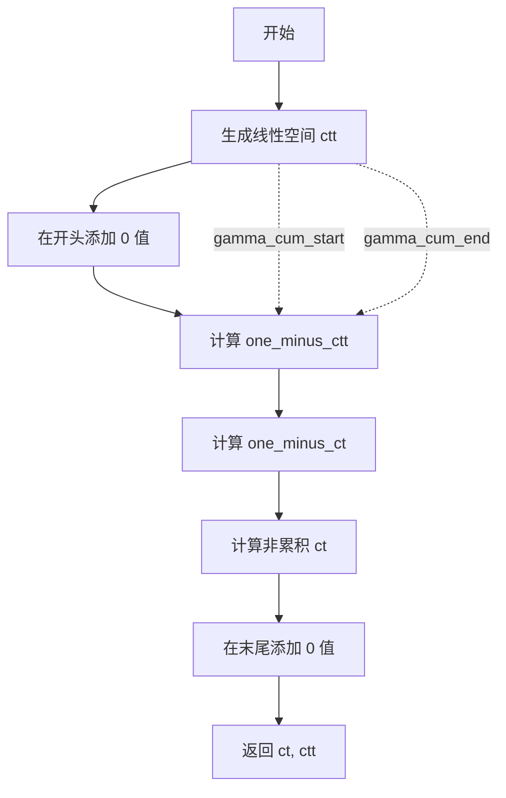
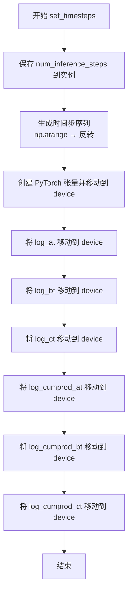
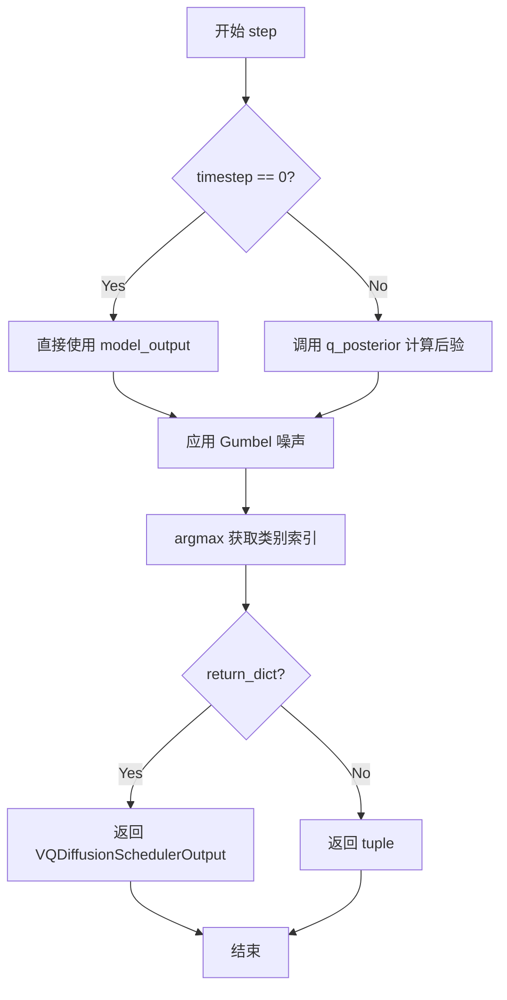
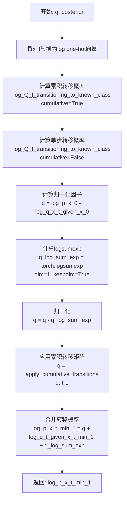
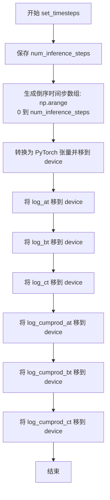
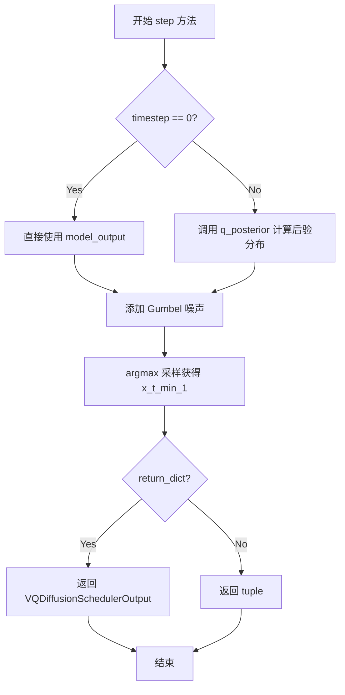

# `diffusers\src\diffusers\schedulers\scheduling_vq_diffusion.py` 详细设计文档

VQDiffusionScheduler是一个用于向量量化（Vector Quantized）扩散模型的调度器，继承自SchedulerMixin和ConfigMixin，实现了离散时间的扩散过程，用于从噪声中逐步恢复出向量量化后的潜在表示。该调度器通过Alpha和Gamma调度参数控制扩散过程的前向和反向过渡概率，结合Gumbel噪声进行采样，并使用对数one-hot编码进行高效的概率计算。

## 整体流程

```mermaid
graph TD
    A[初始化 VQDiffusionScheduler] --> B[设置时间步 set_timesteps]
    B --> C{推理循环}
    C --> D[调用 step 方法]
    D --> E{是否为第一个时间步?}
    E -- 是 --> F[直接使用 model_output]
    E -- 否 --> G[调用 q_posterior 计算后验]
    F --> H[应用 Gumbel 噪声]
    G --> H
    H --> I[argmax 获取下一时刻样本]
    I --> J{继续推理?}
    J -- 是 --> C
    J -- 否 --> K[返回 prev_sample]
    G --> G1[计算 log_Q_t (cumulative)]
    G1 --> G2[计算 log_Q_t (non-cumulative)]
    G2 --> G3[计算后验概率 q = log_p_x_0 - log_q_x_t_given_x_0]
    G3 --> G4[应用 cumulative transitions]
    G4 --> G5[计算最终 log_p_x_t_min_1]
```

## 类结构

```
BaseOutput (抽象基类)
├── VQDiffusionSchedulerOutput (数据类)
│   └── prev_sample: torch.LongTensor
│
SchedulerMixin (混入类)
├── set_timesteps()
└── ... (其他调度器通用方法)
│
ConfigMixin (混入类)
├── __init__ (带 @register_to_config)
└── ... (配置相关方法)
│
VQDiffusionScheduler (主类)
├── 字段
│   ├── num_embed
│   ├── mask_class
│   ├── log_at, log_bt, log_ct
│   ├── log_cumprod_at, log_cumprod_bt, log_cumprod_ct
│   ├── num_inference_steps
│   └── timesteps
│
└── 方法
    ├── __init__()
    ├── set_timesteps()
    ├── step()
    ├── q_posterior()
    ├── log_Q_t_transitioning_to_known_class()
    └── apply_cumulative_transitions()
│
全局函数 (模块级)
├── index_to_log_onehot()
├── gumbel_noised()
├── alpha_schedules()
└── gamma_schedules()
```

## 全局变量及字段


### `index_to_log_onehot`
    
将类别索引批次转换为对数独热向量的函数

类型：`function`
    


### `gumbel_noised`
    
对logits应用Gumbel噪声的函数

类型：`function`
    


### `alpha_schedules`
    
计算累积和非累积alpha调度表的函数

类型：`function`
    


### `gamma_schedules`
    
计算累积和非累积gamma调度表的函数

类型：`function`
    


### `VQDiffusionSchedulerOutput`
    
调度器step函数输出的数据类，包含前一时间步的计算样本

类型：`class`
    


### `VQDiffusionScheduler`
    
用于矢量量化扩散模型的调度器类，继承自SchedulerMixin和ConfigMixin

类型：`class`
    


### `VQDiffusionSchedulerOutput.prev_sample`
    
前一个时间步计算出的样本

类型：`torch.LongTensor`
    


### `VQDiffusionScheduler.order`
    
调度器的阶数

类型：`int`
    


### `VQDiffusionScheduler.num_embed`
    
向量嵌入的类别数

类型：`int`
    


### `VQDiffusionScheduler.mask_class`
    
掩码类别的索引（最后一个类别）

类型：`int`
    


### `VQDiffusionScheduler.log_at`
    
非累积alpha的对数

类型：`torch.Tensor`
    


### `VQDiffusionScheduler.log_bt`
    
非累积beta的对数

类型：`torch.Tensor`
    


### `VQDiffusionScheduler.log_ct`
    
非累积gamma的对数

类型：`torch.Tensor`
    


### `VQDiffusionScheduler.log_cumprod_at`
    
累积alpha的对数

类型：`torch.Tensor`
    


### `VQDiffusionScheduler.log_cumprod_bt`
    
累积beta的对数

类型：`torch.Tensor`
    


### `VQDiffusionScheduler.log_cumprod_ct`
    
累积gamma的对数

类型：`torch.Tensor`
    


### `VQDiffusionScheduler.num_inference_steps`
    
推理时的扩散步数

类型：`int`
    


### `VQDiffusionScheduler.timesteps`
    
时间步序列

类型：`torch.Tensor`
    
    

## 全局函数及方法


### `index_to_log_onehot`

将批量类别索引向量转换为对应的 log one-hot 编码向量，用于离散扩散模型中的概率分布表示。

参数：

-  `x`：`torch.LongTensor`，形状为 `(batch size, vector length)`，表示批量类别索引
-  `num_classes`：`int`，one-hot 向量表示的类别总数

返回值：`torch.Tensor`，形状为 `(batch size, num classes, vector length)`，表示 log one-hot 编码向量

#### 流程图

```mermaid
flowchart TD
    A[输入: x batch of indices] --> B[F.one_hot: 转换为 one-hot 编码]
    B --> C[形状: batch x length x num_classes]
    C --> D[permute: 调整维度顺序]
    D --> E[形状: batch x num_classes x length]
    E --> F[float: 转换为浮点数]
    F --> G[clamp min=1e-30: 防止 log(0)]
    G --> H[torch.log: 计算对数]
    H --> I[输出: log one-hot vectors]
```

#### 带注释源码

```python
def index_to_log_onehot(x: torch.LongTensor, num_classes: int) -> torch.Tensor:
    """
    Convert batch of vector of class indices into batch of log onehot vectors

    Args:
        x (`torch.LongTensor` of shape `(batch size, vector length)`):
            Batch of class indices

        num_classes (`int`):
            number of classes to be used for the onehot vectors

    Returns:
        `torch.Tensor` of shape `(batch size, num classes, vector length)`:
            Log onehot vectors
    """
    # 步骤1: 使用 PyTorch 的 F.one_hot 将类别索引转换为 one-hot 编码
    # 输入形状: (batch_size, vector_length) -> 输出形状: (batch_size, vector_length, num_classes)
    x_onehot = F.one_hot(x, num_classes)
    
    # 步骤2: 调整维度顺序，将 num_classes 维度移到中间位置
    # 输出形状: (batch_size, num_classes, vector_length)
    x_onehot = x_onehot.permute(0, 2, 1)
    
    # 步骤3: 转换为浮点数，计算对数
    # clamp(min=1e-30) 防止 log(0) 产生 -inf，确保数值稳定性
    log_x = torch.log(x_onehot.float().clamp(min=1e-30))
    
    return log_x
```


### `gumbel_noised`

该函数是 VQ-Diffusion 调度器中的核心工具函数，通过从 Gumbel 分布中采样噪声并将其加到模型的 logits 输出上，从而在离散扩散模型的采样过程中引入随机性，帮助模型更好地探索生成空间。

参数：
- `logits`：`torch.Tensor`，模型输出的原始 logit 值，形状为任意维度的张量。
- `generator`：`torch.Generator | None`，可选的随机数生成器，用于控制噪声采样的随机性，确保实验可复现。

返回值：`torch.Tensor`，返回与输入 `logits` 形状相同的加噪后的张量。

#### 流程图

```mermaid
graph TD
    A[开始 gumbel_noised] --> B[输入: logits, generator]
    B --> C{generator 是否存在?}
    C -->|是| D[使用 generator 生成均匀分布随机数]
    C -->|否| E[使用全局随机状态生成均匀分布随机数]
    D --> F[计算 Gumbel 噪声: -log(-log(uniform + eps) + eps)]
    E --> F
    F --> G[叠加噪声: noised = gumbel_noise + logits]
    G --> H[返回 noised logits]
    H --> I[结束]
```

#### 带注释源码

```python
def gumbel_noised(logits: torch.Tensor, generator: torch.Generator | None) -> torch.Tensor:
    """
    Apply gumbel noise to `logits`
    
    该函数实现了 Gumbel-Softmax 技巧中常用的噪声添加方式。
    它从 Gumbel(0,1) 分布中采样噪声，并将其加到 logits 上。
    这在离散扩散模型的采样步骤中用于实现随机采样，避免仅依赖贪婪的 argmax 选择。
    """
    # 1. 生成均匀分布的随机数，形状与 logits 相同，设备保持一致
    # 添加 1e-30 是为了防止后续 log 计算时出现 log(0) 导致的无穷值
    uniform = torch.rand(logits.shape, device=logits.device, generator=generator)
    
    # 2. 将均匀分布转换为 Gumbel 分布
    # 公式: -log(-log(u)) 是标准的 Gumbel 噪声生成方法
    # 添加 1e-30 确保数值稳定性，避免 log(0)
    gumbel_noise = -torch.log(-torch.log(uniform + 1e-30) + 1e-30)
    
    # 3. 将噪声加到原始 logits 上
    noised = gumbel_noise + logits
    
    return noised
```


### `alpha_schedules`

该函数用于生成向量量化扩散模型(VQ Diffusion)中的累积(cumulative)和非累积(non-cumulative)alpha调度值。这些调度值控制扩散过程中的噪声调度，是实现从纯噪声逐步恢复原始信号的关键参数，遵循论文第4.1节描述的调度策略。

参数：

- `num_diffusion_timesteps`：`int`，扩散过程的时间步总数，决定生成多少个调度值
- `alpha_cum_start`：`float`，默认值0.99999，累积alpha调度曲线的起始值（高值表示开始时保持较高信噪比）
- `alpha_cum_end`：`float`，默认值0.000009，累积alpha调度曲线的结束值（低值表示结束时接近纯噪声状态）

返回值：`tuple[torch.Tensor, torch.Tensor]`，返回一个元组
- 第一个元素 `at`：非累积（单步）alpha值，形状为`(num_diffusion_timesteps,)`，表示从t-1到t的转移概率
- 第二个元素 `att`：累积alpha值，形状为`(num_diffusion_timesteps + 1,)`，表示从0到t的累积概率，初始值为1

#### 流程图

```mermaid
flowchart TD
    A[开始] --> B[生成线性间隔数组 att<br/>从 alpha_cum_start 到 alpha_cum_end]
    B --> C[在开头插入值1<br/>att = [1] + att]
    D[计算非累积at<br/>at = att[1:] / att[:-1]] --> E[移除首元素并末尾添加1<br/>att = att[1:] + [1]]
    F[返回 at 和 att] --> E
    
    B -.-> D
    
    style A fill:#e1f5fe
    style F fill:#e8f5e8
```

#### 带注释源码

```python
def alpha_schedules(num_diffusion_timesteps: int, alpha_cum_start=0.99999, alpha_cum_end=0.000009):
    """
    Cumulative and non-cumulative alpha schedules.

    See section 4.1.
    """
    # 第一步：生成从alpha_cum_start到alpha_cum_end的线性间隔数组
    # np.arange生成[0, 1, 2, ..., num_diffusion_timesteps-1]
    # 除以(num_diffusion_timesteps-1)归一化到[0,1]
    # 乘以(alpha_cum_end - alpha_cum_start)缩放到目标范围
    # 加上alpha_cum_start偏移到起始值
    att = (
        np.arange(0, num_diffusion_timesteps) / (num_diffusion_timesteps - 1) * (alpha_cum_end - alpha_cum_start)
        + alpha_cum_start
    )
    
    # 第二步：在开头插入1作为t=0时的累积值
    # att现在形状为(num_diffusion_timesteps + 1,)
    att = np.concatenate(([1], att))
    
    # 第三步：计算非累积的alpha值（单步转移概率）
    # at[t] = att[t+1] / att[t]，表示从t到t+1的转移概率
    at = att[1:] / att[:-1]
    
    # 第四步：将累积数组右移一位，末尾添加1
    # 这样att[i]表示从状态0到状态i的累积概率
    att = np.concatenate((att[1:], [1]))
    
    # 返回非累积alpha（单步）和累积alpha
    return at, att
```


### `gamma_schedules`

该函数用于生成累积和非累积的gamma调度序列，主要应用于向量量化扩散模型（VQ-Diffusion）中控制 masked 状态的概率衰减。

参数：

- `num_diffusion_timesteps`：`int`，扩散过程的总时间步数
- `gamma_cum_start`：`float`，累积gamma的起始值，默认为 0.000009
- `gamma_cum_end`：`float`，累积gamma的结束值，默认为 0.99999

返回值：`tuple`，包含两个 numpy 数组 `(ct, ctt)`：
- `ct`：非累积gamma调度值，形状为 `(num_diffusion_timesteps,)`
- `ctt`：累积gamma调度值，形状为 `(num_diffusion_timesteps + 1,)`

#### 流程图



#### 带注释源码

```python
def gamma_schedules(num_diffusion_timesteps: int, gamma_cum_start=0.000009, gamma_cum_end=0.99999):
    """
    Cumulative and non-cumulative gamma schedules.

    See section 4.1.
    
    参数:
        num_diffusion_timesteps: 扩散过程的总时间步数
        gamma_cum_start: 累积gamma的起始值（用于线性插值）
        gamma_cum_end: 累积gamma的结束值（用于线性插值）
    
    返回:
        ct: 非累积gamma调度值（形状: num_diffusion_timesteps）
        ctt: 累积gamma调度值（形状: num_diffusion_timesteps + 1，首尾包含边界值）
    """
    # 第一步：生成从 gamma_cum_start 到 gamma_cum_end 的线性空间
    # 使用 np.arange 创建等间距的时间点，然后通过线性变换映射到 [gamma_cum_start, gamma_cum_end] 区间
    ctt = (
        np.arange(0, num_diffusion_timesteps) / (num_diffusion_timesteps - 1) * (gamma_cum_end - gamma_cum_start)
        + gamma_cum_start
    )
    
    # 第二步：在序列开头添加 0 值，形成累积序列 ctt
    # 累积序列从 0 开始（代表 t=0 时刻没有累积概率）
    ctt = np.concatenate(([0], ctt))
    
    # 第三步：计算 one_minus_ctt，即 1 - ctt
    # 这是为了后续计算非累积概率做准备
    one_minus_ctt = 1 - ctt
    
    # 第四步：计算非累积的概率
    # one_minus_ct[t] = one_minus_ctt[t] / one_minus_ctt[t-1]
    # 这表示从 t-1 到 t 时刻的单步转换概率（非累积）
    one_minus_ct = one_minus_ctt[1:] / one_minus_ctt[:-1]
    
    # 第五步：通过 1 - one_minus_ct 得到非累积的 gamma 值 ct
    ct = 1 - one_minus_ct
    
    # 第六步：在累积序列末尾添加 0 值，形成完整的累积序列
    # 累积序列以 0 结尾（代表最后时刻 t=T 累积概率为 0）
    ctt = np.concatenate((ctt[1:], [0]))
    
    return ct, ctt
```


### `VQDiffusionScheduler.__init__`

初始化VQDiffusionScheduler调度器，设置向量量化扩散模型所需的各类参数，包括类别数、训练时间步数、alpha和gamma的累积起始值与结束值，并预先计算所有对数概率矩阵供后续推理使用。

参数：

- `num_vec_classes`：`int`，向量嵌入的类别数量，包括masked latent pixel的类别
- `num_train_timesteps`：`int`，训练时的扩散步数，默认为100
- `alpha_cum_start`：`float`，累积alpha的起始值，默认为0.99999
- `alpha_cum_end`：`float`，累积alpha的结束值，默认为0.000009
- `gamma_cum_start`：`float`，累积gamma的起始值，默认为0.000009
- `gamma_cum_end`：`float`，累积gamma的结束值，默认为0.99999

返回值：`None`，该方法为构造函数，无返回值，仅初始化实例属性

#### 流程图

```mermaid
flowchart TD
    A[开始 __init__] --> B[设置 self.num_embed = num_vec_classes]
    B --> C[计算 self.mask_class = num_embed - 1]
    C --> D[调用 alpha_schedules 计算 at, att]
    D --> E[调用 gamma_schedules 计算 ct, ctt]
    E --> F[计算 bt = (1 - at - ct) / num_non_mask_classes]
    F --> G[计算 btt = (1 - att - ctt) / num_non_mask_classes]
    G --> H[将 at, bt, ct 转换为 float64 Tensor 并取对数]
    H --> I[将 att, btt, ctt 转换为 float64 Tensor 并取对数]
    I --> J[存储为 float 类型的实例变量]
    J --> K[初始化 self.num_inference_steps = None]
    K --> L[设置 self.timesteps 为反向时间步序列]
    L --> Z[结束]
```

#### 带注释源码

```python
@register_to_config
def __init__(
    self,
    num_vec_classes: int,  # 向量嵌入的类别数量（包括mask类别）
    num_train_timesteps: int = 100,  # 训练时的扩散步数
    alpha_cum_start: float = 0.99999,  # 累积alpha起始值
    alpha_cum_end: float = 0.000009,  # 累积alpha结束值
    gamma_cum_start: float = 0.000009,  # 累积gamma起始值
    gamma_cum_end: float = 0.99999,  # 累积gamma结束值
):
    # 保存向量类别数量
    self.num_embed = num_vec_classes

    # 按照约定，mask类别的索引是最后一个类别索引
    self.mask_class = self.num_embed - 1

    # 计算alpha累积和非累积调度参数
    # at: 非累积alpha (alpha_t)
    # att: 累积alpha (alpha_cumulative_t)
    at, att = alpha_schedules(num_train_timesteps, alpha_cum_start=alpha_cum_start, alpha_cum_end=alpha_cum_end)
    
    # 计算gamma累积和非累积调度参数
    # ct: 非累积gamma (gamma_t)
    # ctt: 累积gamma (gamma_cumulative_t)
    ct, ctt = gamma_schedules(num_train_timesteps, gamma_cum_start=gamma_cum_start, gamma_cum_end=gamma_cum_end)

    # 计算非mask类别的beta参数
    # beta_t = (1 - alpha_t - gamma_t) / num_non_mask_classes
    num_non_mask_classes = self.num_embed - 1
    bt = (1 - at - ct) / num_non_mask_classes
    btt = (1 - att - ctt) / num_non_mask_classes

    # 将numpy数组转换为PyTorch张量，并转换为float64以提高精度
    at = torch.tensor(at.astype("float64"))
    bt = torch.tensor(bt.astype("float64"))
    ct = torch.tensor(ct.astype("float64"))
    
    # 计算对数值，用于后续对数空间计算
    log_at = torch.log(at)
    log_bt = torch.log(bt)
    log_ct = torch.log(ct)

    # 对累积参数进行同样的处理
    att = torch.tensor(att.astype("float64"))
    btt = torch.tensor(btt.astype("float64"))
    ctt = torch.tensor(ctt.astype("float64"))
    log_cumprod_at = torch.log(att)
    log_cumprod_bt = torch.log(btt)
    log_cumprod_ct = torch.log(ctt)

    # 将所有对数参数保存为float类型（推理时使用）
    self.log_at = log_at.float()
    self.log_bt = log_bt.float()
    self.log_ct = log_ct.float()
    self.log_cumprod_at = log_cumprod_at.float()
    self.log_cumprod_bt = log_cumprod_bt.float()
    self.log_cumprod_ct = log_cumprod_ct.float()

    # 设置可变的推理步数（将在set_timesteps中设置）
    self.num_inference_steps = None
    
    # 初始化时间步序列（从num_train_timesteps-1倒序到0）
    self.timesteps = torch.from_numpy(np.arange(0, num_train_timesteps)[::-1].copy())
```


### `VQDiffusionScheduler.set_timesteps`

该方法用于设置推理时的时间步序列，将扩散链的离散时间步准备好以便后续推理使用，同时将扩散过程参数（alpha、beta、gamma的对数形式）移动到指定的计算设备上。

参数：

- `num_inference_steps`：`int`，推理时使用的扩散步数，用于生成样本
- `device`：`str | torch.device`，可选参数，指定时间步和扩散过程参数（alpha、beta、gamma）要移动到的目标设备

返回值：`None`，无返回值（修改对象内部状态）

#### 流程图



#### 带注释源码

```python
def set_timesteps(self, num_inference_steps: int, device: str | torch.device = None):
    """
    设置扩散链使用的离散时间步（在推理前运行）。

    Args:
        num_inference_steps (`int`):
            使用预训练模型生成样本时使用的扩散步数。
        device (`str` 或 `torch.device`, *optional*):
            时间步和扩散过程参数（alpha、beta、gamma）要移动到的设备。
    """
    # 1. 保存推理步数到实例变量，供后续推理使用
    self.num_inference_steps = num_inference_steps
    
    # 2. 生成时间步序列：从 0 到 num_inference_steps-1，然后反向
    # 例如：num_inference_steps=1000 时，产生 [999, 998, ..., 0]
    timesteps = np.arange(0, self.num_inference_steps)[::-1].copy()
    
    # 3. 将 numpy 数组转换为 PyTorch 张量，并移动到指定设备
    self.timesteps = torch.from_numpy(timesteps).to(device)

    # 4. 将扩散过程的对数参数移动到目标设备
    # 这些参数在 __init__ 中计算，用于推理时的概率计算
    
    # log_at: 非累积 alpha 值的对数 (log(a_t))
    self.log_at = self.log_at.to(device)
    
    # log_bt: 非累积 beta 值的对数 (log(b_t))
    self.log_bt = self.log_bt.to(device)
    
    # log_ct: 非累积 gamma 值的对数 (log(c_t))
    self.log_ct = self.log_ct.to(device)
    
    # log_cumprod_at: 累积 alpha 值的对数 (log(α_t))
    self.log_cumprod_at = self.log_cumprod_at.to(device)
    
    # log_cumprod_bt: 累积 beta 值的对数 (log(β_t))
    self.log_cumprod_bt = self.log_cumprod_bt.to(device)
    
    # log_cumprod_ct: 累积 gamma 值的对数 (log(γ_t))
    self.log_cumprod_ct = self.log_cumprod_ct.to(device)
```


### `VQDiffusionScheduler.step`

执行VQ Diffusion调度器的单步去噪，根据模型输出预测前一个时间步的样本。该方法计算反向转移分布的概率，并使用Gumbel噪声进行采样，最终返回去噪后的样本。

参数：

- `model_output`：`torch.Tensor`，形状为`(batch size, num classes - 1, num latent pixels)`，模型预测的初始潜在像素类别的对数概率，不包含mask类别的预测
- `timestep`：`torch.long`，当前时间步，用于确定使用哪个转移矩阵
- `sample`：`torch.LongTensor`，形状为`(batch size, num latent pixels)`，时间步`t`时每个潜在像素的类别
- `generator`：`torch.Generator | None`，用于对`p(x_{t-1} | x_t)`应用噪声的随机数生成器
- `return_dict`：`bool`，可选，默认为`True`，是否返回`VQDiffusionSchedulerOutput`

返回值：`VQDiffusionSchedulerOutput`或`tuple`，如果`return_dict`为`True`，返回`VQDiffusionSchedulerOutput`，其中包含`prev_sample`；否则返回元组，第一个元素为样本张量

#### 流程图



#### 带注释源码

```python
def step(
    self,
    model_output: torch.Tensor,           # 模型预测的对数概率 (batch, num_classes-1, num_pixels)
    timestep: torch.long,                  # 当前扩散时间步
    sample: torch.LongTensor,              # 当前样本的类别索引 (batch, num_pixels)
    generator: torch.Generator | None = None,  # 随机数生成器
    return_dict: bool = True,              # 是否返回字典格式
) -> VQDiffusionSchedulerOutput | tuple:
    """
    通过反向转移分布预测前一个时间步的样本。
    See [`~VQDiffusionScheduler.q_posterior`] for more details.
    
    Args:
        model_output: 模型输出的对数概率，不包含mask类别预测
        timestep: 当前时间步
        sample: t时刻的潜在像素类别
        generator: 随机数生成器
        return_dict: 是否返回字典格式
    
    Returns:
        VQDiffusionSchedulerOutput 或 tuple: 去噪后的样本
    """
    
    # 判断是否为最后一个时间步
    if timestep == 0:
        # 最后一个时间步，直接使用模型输出作为x_{t-1}的对数概率
        log_p_x_t_min_1 = model_output
    else:
        # 非最后一个时间步，通过后验分布计算x_{t-1}的对数概率
        # q_posterior实现了贝叶斯后验计算
        log_p_x_t_min_1 = self.q_posterior(model_output, sample, timestep)

    # 对对数概率应用Gumbel噪声，用于随机采样
    # 这使得采样过程可微，并且能够增加多样性
    log_p_x_t_min_1 = gumbel_noised(log_p_x_t_min_1, generator)

    # 从对数概率中获取类别索引（取最大概率的类别）
    # 这相当于从多项分布中采样
    x_t_min_1 = log_p_x_t_min_1.argmax(dim=1)

    # 根据return_dict决定返回格式
    if not return_dict:
        # 返回元组格式（兼容旧API）
        return (x_t_min_1,)

    # 返回VQDiffusionSchedulerOutput对象
    return VQDiffusionSchedulerOutput(prev_sample=x_t_min_1)
```


### VQDiffusionScheduler.q_posterior

计算变分扩散模型中后验分布 $p(x_{t-1}|x_t)$ 的对数概率，即在已知时刻 $t$ 的潜在像素类别 $x_t$ 的条件下，推断时刻 $t-1$ 的潜在像素类别 $x_{t-1}$ 的概率分布。该方法基于贝叶斯定理，通过前向过程转移概率 $q(x_t|x_{t-1})$、先验分布 $q(x_{t-1}|x_0)$ 和模型预测 $p(x_0)$ 计算得到。

参数：

- `log_p_x_0`：`torch.Tensor`（形状：(batch_size, num_classes - 1, num_latent_pixels)），模型预测的初始潜在像素 $x_0$ 的类别对数概率，不包含被掩盖类别的预测
- `x_t`：`torch.LongTensor`（形状：(batch_size, num_latent_pixels)），时刻 $t$ 时每个潜在像素的类别索引
- `t`：`torch.Long`，当前扩散时间步，决定使用哪个转移矩阵

返回值：`torch.Tensor`（形状：(batch_size, num_classes, num_latent_pixels)），时刻 $t-1$ 时潜在像素类别的对数概率分布

#### 流程图



#### 带注释源码

```python
def q_posterior(self, log_p_x_0, x_t, t):
    """
    计算时刻t-1时图像预测类别的对数概率：
    
    p(x_{t-1} | x_t) = sum( q(x_t | x_{t-1}) * q(x_{t-1} | x_0) * p(x_0) / q(x_t | x_0) )
    
    使用贝叶斯定理和马尔可夫性质，在对数空间中进行数值计算。
    
    Args:
        log_p_x_0: 模型预测的x_0类别对数概率，形状(batch, num_classes-1, num_pixels)
        x_t: 时刻t的潜在像素类别，形状(batch, num_pixels)
        t: 当前时间步
    
    Returns:
        log_p_x_t_min_1: 时刻t-1的类别对数概率，形状(batch, num_classes, num_pixels)
    """
    
    # 步骤1: 将类别索引x_t转换为log one-hot向量表示
    # 形状从(batch, num_pixels) -> (batch, num_classes, num_pixels)
    log_onehot_x_t = index_to_log_onehot(x_t, self.num_embed)
    
    # 步骤2: 计算从x_0到x_t的累积转移概率对数
    # q(x_t | x_0) 的对数形式，用于归一化
    log_q_x_t_given_x_0 = self.log_Q_t_transitioning_to_known_class(
        t=t, x_t=x_t, log_onehot_x_t=log_onehot_x_t, cumulative=True
    )
    
    # 步骤3: 计算从x_{t-1}到x_t的单步转移概率对数
    # q(x_t | x_{t-1}) 的对数形式
    log_q_t_given_x_t_min_1 = self.log_Q_t_transitioning_to_known_class(
        t=t, x_t=x_t, log_onehot_x_t=log_onehot_x_t, cumulative=False
    )
    
    # 步骤4: 计算 p(x_0) / q(x_t | x_0) 
    # 这相当于对模型预测进行归一化，使其与前向过程概率兼容
    # q = log_p_x_0 - log_q_x_t_given_x_0
    # 形状: (batch, num_classes-1, num_pixels)
    q = log_p_x_0 - log_q_x_t_given_x_0
    
    # 步骤5: 计算归一化常数 sum_n
    # 对所有x_0的类别求和: sum = p_0(...) + ... + p_{k-1}(...)
    # 使用logsumexp确保数值稳定性
    q_log_sum_exp = torch.logsumexp(q, dim=1, keepdim=True)
    
    # 步骤6: 归一化
    # p(x_0|x_t) / q(x_t|x_0) / sum
    q = q - q_log_sum_exp
    
    # 步骤7: 应用累积转移矩阵
    # 结合q(x_{t-1}|x_0)的信息，计算从x_0经过x_{t-1}再到x_t的路径概率
    # 添加累积转移概率a_cumulative和b_cumulative的影响
    q = self.apply_cumulative_transitions(q, t - 1)
    
    # 步骤8: 合并最终的后验概率
    # 结合所有组件: 归一化的预测 * 转移概率 * 归一化常数
    # log_p(x_{t-1}|x_t) = [p(x_0|x_t)/q(x_t|x_0)/sum] * q(x_t|x_{t-1}) * sum
    log_p_x_t_min_1 = q + log_q_t_given_x_t_min_1 + q_log_sum_exp
    
    # 返回: 时刻t-1的类别对数概率分布
    # 包含所有num_classes个类别（包括masked类别）
    return log_p_x_t_min_1
```


### VQDiffusionScheduler.log_Q_t_transitioning_to_known_class

计算给定时间步t下，从已知类别到其他类别的转移矩阵的对数概率，支持累积和非累积两种转移模式，用于VQ扩散模型的前向过程概率计算。

参数：

- `t`：`torch.int`，时间步索引，决定使用哪一组转移矩阵
- `x_t`：`torch.LongTensor`，形状为`(batch size, num latent pixels)`，时间步t时每个潜在像素的类别
- `log_onehot_x_t`：`torch.Tensor`，形状为`(batch size, num classes, num latent pixels)`，x_t的对数one-hot向量表示
- `cumulative`：`bool`，若为`False`则使用单步转移矩阵`t-1->t`，若为`True`则使用累积转移矩阵`0->t`

返回值：`torch.Tensor`，形状为`(batch size, num classes - 1, num latent pixels)`，转移矩阵的对数概率，每一列对应转移矩阵的一行

#### 流程图

```mermaid
flowchart TD
    A[开始: log_Q_t_transitioning_to_known_class] --> B{cumulative?}
    B -->|True| C[使用累积转移概率<br/>a = log_cumprod_at[t]<br/>b = log_cumprod_bt[t]<br/>c = log_cumprod_ct[t]]
    B -->|False| D[使用非累积转移概率<br/>a = log_at[t]<br/>b = log_bt[t]<br/>c = log_ct[t]]
    D --> E[保存从masked状态转移的log one-hot向量<br/>log_onehot_x_t_transitioning_from_masked]
    C --> F[移除log_onehot_x_t的最后一行<br/>因为初始latent pixel不能是masked]
    E --> F
    F --> G[使用技巧计算转移概率<br/>log_Q_t = logaddexp<br/>log_onehot_x_t + a, b]
    G --> H[处理masked像素的列<br/>mask_class_mask = x_t == mask_class<br/>log_Q_t[mask_class_mask] = c]
    H --> I{cumulative?}
    I -->|True| J[返回log_Q_t]
    I -->|False| K[拼接从masked状态转移的向量<br/>log_Q_t = torch.cat<br/>[log_Q_t, log_onehot_x_t_transitioning_from_masked]]
    K --> J
    J --> L[结束: 返回转移矩阵对数概率]
```

#### 带注释源码

```python
def log_Q_t_transitioning_to_known_class(
    self, *, t: torch.int, x_t: torch.LongTensor, log_onehot_x_t: torch.Tensor, cumulative: bool
):
    """
    计算转移矩阵的对数概率。
    
    从(累积或非累积)转移矩阵中获取每个潜在像素对应的行对数概率。
    
    参数:
        t: 时间步，决定使用哪一组转移矩阵
        x_t: 时间步t时每个潜在像素的类别
        log_onehot_x_t: x_t的对数one-hot向量
        cumulative: 若为False，使用单步转移矩阵t-1->t；若为True，使用累积转移矩阵0->t
    
    返回:
        转移矩阵的对数概率，形状为(batch size, num classes - 1, num latent pixels)
    """
    # 根据cumulative参数选择使用累积还是非累积的转移概率
    if cumulative:
        # 使用累积转移概率（从时间0到时间t的累积效果）
        a = self.log_cumprod_at[t]  # 累积a参数
        b = self.log.log_cumprod_bt[t]  # 累积b参数  
        c = self.log_cumprod_ct[t]  # 累积c参数（masked相关）
    else:
        # 使用非累积转移概率（单步转移t-1->t）
        a = self.log_at[t]  # 非累积a参数
        b = self.log_bt[t]  # 非累积b参数
        c = self.log_ct[t]  # 非累积c参数（masked相关）
    
    # 如果非累积模式，需要保存从masked状态转移的log one-hot向量
    # 因为后续计算会覆盖这些值，但最后需要拼回去
    if not cumulative:
        # 获取最后一个类别（masked类别）的log one-hot向量
        # 当x_t不是masked时，该值为0（表示P(x_t=mask|x_{t-1}=mask)=0）
        # 当x_t是masked时，该值为1（表示P(x_t=mask|x_{t-1}=mask)=1）
        log_onehot_x_t_transitioning_from_masked = log_onehot_x_t[:, -1, :].unsqueeze(1)
    
    # 移除log_onehot_x_t的最后一行
    # index_to_log_onehot函数为masked像素添加了one-hot向量
    # 默认的one-hot矩阵多了一行，返回矩阵维度解释见下文
    log_onehot_x_t = log_onehot_x_t[:, :-1, :]
    
    # 使用技巧计算转移概率（利用log one-hot向量）
    #
    # 不必担心在标记转移到masked latent像素的列中设置什么值。
    # 它们稍后会被mask_class_mask覆盖。
    #
    # 在非对数空间中查看下面的公式，每个值将计算为：
    # - `1 * a + b = a + b` 当log_Q_t的列中有one-hot值时
    # - `0 * a + b = b` 当log_Q_t的列中有0值时
    #
    # 详见方程7
    log_Q_t = (log_onehot_x_t + a).logaddexp(b)
    
    # 每个masked像素的整列都是c
    # 创建mask：标记哪些位置是masked类别
    mask_class_mask = x_t == self.mask_class
    # 扩展维度以匹配log_Q_t的形状
    mask_class_mask = mask_class_mask.unsqueeze(1).expand(-1, self.num_embed - 1, -1)
    # 将masked位置的转移概率设为c
    log_Q_t[mask_class_mask] = c
    
    # 如果非累积模式，将保存的从masked状态转移的向量拼接到最后
    if not cumulative:
        log_Q_t = torch.cat((log_Q_t, log_onehot_x_t_transitioning_from_masked), dim=1)
    
    return log_Q_t
```


### `VQDiffusionScheduler.apply_cumulative_transitions`

应用累积转移矩阵到对数概率分布上，用于在扩散过程中从时间步 t-1 到 t 的状态转移计算。

参数：

- `self`：`VQDiffusionScheduler`，VQDiffusionScheduler类的实例，隐含的self参数
- `q`：`torch.Tensor`，对数概率分布，形状为 (batch size, num classes - 1, num latent pixels)，经过前序计算的概率分布
- `t`：`int` 或 `torch.long`，时间步索引，用于获取对应的累积转移参数

返回值：`torch.Tensor`，应用累积转移后的对数概率分布，形状为 (batch size, num classes, num latent pixels)

#### 流程图

```mermaid
flowchart TD
    A[开始 apply_cumulative_transitions] --> B[获取batch size: bsz = q.shape[0]]
    B --> C[获取累积参数: a = log_cumprod_at[t]]
    C --> D[获取累积参数: b = log_cumprod_bt[t]]
    D --> E[获取累积参数: c = log_cumprod_ct[t]]
    E --> F[获取latent pixels数量: num_latent_pixels = q.shape[2]]
    F --> G[扩展c张量: c.expand to (bsz, 1, num_latent_pixels)]
    G --> H[计算logaddexp: q = (q + a).logaddexp(b)]
    H --> I[拼接张量: q = torch.cat((q, c), dim=1)]
    I --> J[返回处理后的q]
```

#### 带注释源码

```python
def apply_cumulative_transitions(self, q, t):
    """
    应用累积转移矩阵到对数概率分布上
    
    该函数实现了向量量化扩散调度器中的累积转移步骤，
    将累积的转移概率（a, b, c）应用到中间概率分布q上。
    
    Args:
        q: 对数概率分布，形状为 (batch size, num classes - 1, num latent pixels)
        t: 时间步索引
    
    Returns:
        应用累积转移后的对数概率分布，形状为 (batch size, num classes, num latent pixels)
    """
    # 获取批次大小
    bsz = q.shape[0]
    
    # 获取累积转移参数 a（来自 alpha 累积）
    a = self.log_cumprod_at[t]
    
    # 获取累积转移参数 b（来自 beta 累积）
    b = self.log_cumprod_bt[t]
    
    # 获取累积转移参数 c（来自 gamma 累积）
    c = self.log_cumprod_ct[t]
    
    # 获取 latent pixels 的数量
    num_latent_pixels = q.shape[2]
    
    # 将 c 张量扩展到与 q 相同的 batch 维度和空间维度
    # c 原始形状为 (1,)，扩展后为 (bsz, 1, num_latent_pixels)
    c = c.expand(bsz, 1, num_latent_pixels)
    
    # 在对数空间中使用 logaddexp 合并概率：
    # 公式: log(exp(q) + exp(a)) + log(exp(b))
    # 相当于非对数空间的: (q + a) * b 的归一化形式
    q = (q + a).logaddexp(b)
    
    # 将 c（masked class 的概率）拼接到结果中
    # 拼接后形状从 (bsz, num_classes-1, num_latent_pixels) 
    # 变为 (bsz, num_classes, num_latent_pixels)
    q = torch.cat((q, c), dim=1)
    
    # 返回应用累积转移后的对数概率分布
    return q
```


### `VQDiffusionScheduler.__init__`

该方法是 `VQDiffusionScheduler` 类的构造函数，负责初始化向量量化扩散调度器的所有参数和内部状态。它根据提供的配置计算alpha和gamma调度参数，并将mask类设置为最后一个索引，同时初始化推理步骤数和 timesteps。

参数：

- `num_vec_classes`：`int`，向量嵌入的类别数量，包括masked latent pixel的类别
- `num_train_timesteps`：`int`，默认为 100，训练模型的扩散步数
- `alpha_cum_start`：`float`，默认为 0.99999，累积alpha的起始值
- `alpha_cum_end`：`float`，默认为 0.000009，累积alpha的结束值
- `gamma_cum_start`：`float`，默认为 0.000009，累积gamma的起始值
- `gamma_cum_end`：`float`，默认为 0.99999，累积gamma的结束值

返回值：`None`，构造函数不返回值

#### 流程图

```mermaid
flowchart TD
    A[开始 __init__] --> B[设置 self.num_embed = num_vec_classes]
    B --> C[设置 self.mask_class = num_embed - 1]
    C --> D[调用 alpha_schedules 计算 at, att]
    D --> E[调用 gamma_schedules 计算 ct, ctt]
    E --> F[计算非mask类别数量: num_non_mask_classes = num_embed - 1]
    F --> G[计算 bt, btt: (1 - at - ct) / num_non_mask_classes]
    G --> H[将 numpy 数组转换为 float64 tensor]
    H --> I[计算对数值: log_at, log_bt, log_ct, log_cumprod_*]
    I --> J[转换为 float 类型并存储到实例变量]
    J --> K[初始化 self.num_inference_steps = None]
    K --> L[创建 self.timesteps 数组]
    L --> M[结束 __init__]
```

#### 带注释源码

```python
@register_to_config
def __init__(
    self,
    num_vec_classes: int,
    num_train_timesteps: int = 100,
    alpha_cum_start: float = 0.99999,
    alpha_cum_end: float = 0.000009,
    gamma_cum_start: float = 0.000009,
    gamma_cum_end: float = 0.99999,
):
    """
    初始化 VQDiffusionScheduler 调度器
    
    参数:
        num_vec_classes: 向量嵌入的类别数量，包括masked latent pixel的类别
        num_train_timesteps: 训练模型的扩散步数，默认100
        alpha_cum_start: 累积alpha起始值
        alpha_cum_end: 累积alpha结束值
        gamma_cum_start: 累积gamma起始值
        gamma_cum_end: 累积gamma结束值
    """
    # 保存向量类别数量
    self.num_embed = num_vec_classes

    # 按照约定，mask类的索引是最后一个类别索引
    self.mask_class = self.num_embed - 1

    # 计算alpha累积和非累积调度
    # at: 非累积alpha值, att: 累积alpha值
    at, att = alpha_schedules(num_train_timesteps, alpha_cum_start=alpha_cum_start, alpha_cum_end=alpha_cum_end)
    
    # 计算gamma累积和非累积调度
    # ct: 非累积gamma值, ctt: 累积gamma值
    ct, ctt = gamma_schedules(num_train_timesteps, gamma_cum_start=gamma_cum_start, gamma_cum_end=gamma_cum_end)

    # 计算非mask类别的数量（总数减1，因为有一个是mask类）
    num_non_mask_classes = self.num_embed - 1
    
    # 计算beta值（非累积和累积）
    # bt = (1 - at - ct) / num_non_mask_classes
    # btt = (1 - att - ctt) / num_non_mask_classes
    bt = (1 - at - ct) / num_non_mask_classes
    btt = (1 - att - ctt) / num_non_mask_classes

    # 将numpy数组转换为PyTorch float64张量
    at = torch.tensor(at.astype("float64"))
    bt = torch.tensor(bt.astype("float64"))
    ct = torch.tensor(ct.astype("float64"))
    
    # 计算对数值（非累积）
    log_at = torch.log(at)
    log_bt = torch.log(bt)
    log_ct = torch.log(ct)

    # 转换为PyTorch张量（累积）
    att = torch.tensor(att.astype("float64"))
    btt = torch.tensor(btt.astype("float64"))
    ctt = torch.tensor(ctt.astype("float64"))
    
    # 计算累积对数值
    log_cumprod_at = torch.log(att)
    log_cumprod_bt = torch.log(btt)
    log_cumprod_ct = torch.log(ctt)

    # 转换为float并保存到实例变量
    self.log_at = log_at.float()
    self.log_bt = log_bt.float()
    self.log_ct = log_ct.float()
    self.log_cumprod_at = log_cumprod_at.float()
    self.log_cumprod_bt = log_cumprod_bt.float()
    self.log_cumprod_ct = log_cumprod_ct.float()

    # 可设置的推理步骤数（初始化时为None）
    self.num_inference_steps = None
    
    # 创建时间步数组（从num_train_timesteps-1到0的降序序列）
    self.timesteps = torch.from_numpy(np.arange(0, num_train_timesteps)[::-1].copy())
```


### VQDiffusionScheduler.set_timesteps

设置扩散链中使用的离散时间步（在推理前运行）。

参数：

- `num_inference_steps`：`int`，生成样本时使用的扩散步数
- `device`：`str | torch.device`，时间步和扩散过程参数（alpha、beta、gamma）要移动到的设备

返回值：`None`，无返回值，仅更新调度器内部状态

#### 流程图



#### 带注释源码

```python
def set_timesteps(self, num_inference_steps: int, device: str | torch.device = None):
    """
    设置扩散链中使用的离散时间步（在推理前运行）。

    Args:
        num_inference_steps (`int`):
            生成样本时使用的扩散步数。
        device (`str` or `torch.device`, *optional*):
            时间步和扩散过程参数（alpha、beta、gamma）要移动到的设备。
    """
    # 1. 保存推理步数到实例变量
    self.num_inference_steps = num_inference_steps
    
    # 2. 生成倒序的时间步数组，从 num_inference_steps-1 到 0
    # 例如：num_inference_steps=10 时，生成 [9, 8, 7, 6, 5, 4, 3, 2, 1, 0]
    timesteps = np.arange(0, self.num_inference_steps)[::-1].copy()
    
    # 3. 将 NumPy 数组转换为 PyTorch 张量并移动到指定设备
    self.timesteps = torch.from_numpy(timesteps).to(device)

    # 4. 将扩散过程的日志累积参数移动到指定设备
    # log_at: 非累积 alpha schedule 的对数
    self.log_at = self.log_at.to(device)
    
    # log_bt: 非累积 beta schedule 的对数
    self.log_bt = self.log_bt.to(device)
    
    # log_ct: 非累积 gamma schedule 的对数
    self.log_ct = self.log_ct.to(device)
    
    # log_cumprod_at: 累积 alpha schedule 的对数
    self.log_cumprod_at = self.log_cumprod_at.to(device)
    
    # log_cumprod_bt: 累积 beta schedule 的对数
    self.log_cumprod_bt = self.log_cumprod_bt.to(device)
    
    # log_cumprod_ct: 累积 gamma schedule 的对数
    self.log_cumprod_ct = self.log_cumprod_ct.to(device)
```


### `VQDiffusionScheduler.step`

该方法是VQDiffusionScheduler的核心推理步骤函数，根据模型输出和时间步长预测前一个时间步的样本，通过后验分布计算或直接使用模型输出，然后添加Gumbel噪声并进行采样，最终返回去噪后的样本。

参数：

- `model_output`：`torch.Tensor`，模型输出的对数概率，形状为`(batch size, num classes - 1, num latent pixels)`，包含对初始潜在像素预测的类别对数概率（不包括masked类别的预测）
- `timestep`：`torch.long`，当前扩散过程中的时间步，用于确定使用哪组转换矩阵
- `sample`：`torch.LongTensor`，形状为`(batch size, num latent pixels)`，表示时间步`t`时每个潜在像素的类别
- `generator`：`torch.Generator | None`，随机数生成器，用于对`p(x_{t-1} | x_t)`应用噪声后再采样
- `return_dict`：`bool`，可选，默认为`True`，是否返回`VQDiffusionSchedulerOutput`而不是tuple

返回值：`VQDiffusionSchedulerOutput`或`tuple`，当`return_dict`为`True`时返回`VQDiffusionSchedulerOutput`对象（包含`prev_sample`字段），否则返回包含样本张量的tuple

#### 流程图



#### 带注释源码

```python
def step(
    self,
    model_output: torch.Tensor,
    timestep: torch.long,
    sample: torch.LongTensor,
    generator: torch.Generator | None = None,
    return_dict: bool = True,
) -> VQDiffusionSchedulerOutput | tuple:
    """
    Predict the sample from the previous timestep by the reverse transition distribution. See
    [`~VQDiffusionScheduler.q_posterior`] for more details about how the distribution is computer.

    Args:
        log_p_x_0: (`torch.Tensor` of shape `(batch size, num classes - 1, num latent pixels)`):
            The log probabilities for the predicted classes of the initial latent pixels. Does not include a
            prediction for the masked class as the initial unnoised image cannot be masked.
        t (`torch.long`):
            The timestep that determines which transition matrices are used.
        x_t (`torch.LongTensor` of shape `(batch size, num latent pixels)`):
            The classes of each latent pixel at time `t`.
        generator (`torch.Generator`, or `None`):
            A random number generator for the noise applied to `p(x_{t-1} | x_t)` before it is sampled from.
        return_dict (`bool`, *optional*, defaults to `True`):
            Whether or not to return a [`~schedulers.scheduling_vq_diffusion.VQDiffusionSchedulerOutput`] or
            `tuple`.

    Returns:
        [`~schedulers.scheduling_vq_diffusion.VQDiffusionSchedulerOutput`] or `tuple`:
            If return_dict is `True`, [`~schedulers.scheduling_vq_diffusion.VQDiffusionSchedulerOutput`] is
            returned, otherwise a tuple is returned where the first element is the sample tensor.
    """
    # 如果是第一个时间步，直接使用模型输出作为x_{t-1}的对数概率
    if timestep == 0:
        log_p_x_t_min_1 = model_output
    else:
        # 否则，根据后验分布计算x_{t-1}的对数概率
        # 使用贝叶斯公式: p(x_{t-1}|x_t) = q(x_t|x_{t-1}) * p(x_{t-1}|x_0) * p(x_0) / q(x_t|x_0)
        log_p_x_t_min_1 = self.q_posterior(model_output, sample, timestep)

    # 对对数概率添加Gumbel噪声，用于多样性和采样
    # 这是扩散模型中常用的技巧，可以使采样结果更加多样化
    log_p_x_t_min_1 = gumbel_noised(log_p_x_t_min_1, generator)

    # 从对数概率中采样：选择概率最大的类别索引
    # 这是通过argmax操作实现的，将软概率转换为硬类别
    x_t_min_1 = log_p_x_t_min_1.argmax(dim=1)

    # 根据return_dict决定返回格式
    if not return_dict:
        # 返回tuple格式 (prev_sample,)
        return (x_t_min_1,)

    # 返回VQDiffusionSchedulerOutput对象，包含prev_sample字段
    return VQDiffusionSchedulerOutput(prev_sample=x_t_min_1)
```


### `VQDiffusionScheduler.q_posterior`

计算给定当前时刻的类别分布后，预测前一时刻（t-1）的图像类别对数概率。该方法基于贝叶斯定理，通过前向过程转换矩阵和预测的初始分布来计算反向条件概率分布。

参数：

- `log_p_x_0`：`torch.Tensor`，形状为 `(batch size, num classes - 1, num latent pixels)`，表示模型预测的初始潜在像素类别的对数概率，不包含masked类别的预测（因为原始未加噪图像不能被masked）
- `x_t`：`torch.LongTensor`，形状为 `(batch size, num latent pixels)`，表示时刻 t 时每个潜在像素的类别
- `t`：`torch.Long`，表示当前时间步，用于确定使用哪个转换矩阵

返回值：`torch.Tensor`，形状为 `(batch size, num classes, num latent pixels)`，表示时刻 t-1 时图像预测类别的对数概率

#### 流程图

```mermaid
flowchart TD
    A[Start: q_posterior] --> B[调用 index_to_log_onehot<br/>将 x_t 转换为对数one-hot向量]
    B --> C[调用 log_Q_t_transitioning_to_known_class<br/>计算累积转换矩阵对数概率]
    C --> D[调用 log_Q_t_transitioning_to_known_class<br/>计算非累积转换矩阵对数概率]
    D --> E[计算 log_p_x_0 - log_q_x_t_given_x_0<br/>即 p_0/q(x_t|x_0) 到 p_n/q(x_t|x_0)]
    E --> F[计算 q_log_sum_exp<br/>对第一维度求和后取对数]
    F --> G[q 减去 q_log_sum_exp<br/>实现归一化]
    G --> H[调用 apply_cumulative_transitions<br/>应用累积转换]
    H --> I[计算 log_p_x_t_min_1<br/>结合转换矩阵和对数和]
    I --> J[Return: log_p_x_t_min_1]
```

#### 带注释源码

```python
def q_posterior(self, log_p_x_0, x_t, t):
    """
    Calculates the log probabilities for the predicted classes of the image at timestep `t-1`:

    ```
    p(x_{t-1} | x_t) = sum( q(x_t | x_{t-1}) * q(x_{t-1} | x_0) * p(x_0) / q(x_t | x_0) )
    ```

    Args:
        log_p_x_0 (`torch.Tensor` of shape `(batch size, num classes - 1, num latent pixels)`):
            The log probabilities for the predicted classes of the initial latent pixels. Does not include a
            prediction for the masked class as the initial unnoised image cannot be masked.
        x_t (`torch.LongTensor` of shape `(batch size, num latent pixels)`):
            The classes of each latent pixel at time `t`.
        t (`torch.Long`):
            The timestep that determines which transition matrix is used.

    Returns:
        `torch.Tensor` of shape `(batch size, num classes, num latent pixels)`:
            The log probabilities for the predicted classes of the image at timestep `t-1`.
    """
    # 步骤1: 将离散类别索引 x_t 转换为对数 one-hot 向量表示
    # 输入形状: (batch size, num latent pixels)
    # 输出形状: (batch size, num classes, num latent pixels)
    log_onehot_x_t = index_to_log_onehot(x_t, self.num_embed)

    # 步骤2: 计算从 x_0 到 x_t 的累积转换矩阵的对数概率
    # 即 q(x_t | x_0) 的对数形式
    # 输出形状: (batch size, num classes - 1, num latent pixels)
    log_q_x_t_given_x_0 = self.log_Q_t_transitioning_to_known_class(
        t=t, x_t=x_t, log_onehot_x_t=log_onehot_x_t, cumulative=True
    )

    # 步骤3: 计算从 x_{t-1} 到 x_t 的单步转换矩阵的对数概率
    # 即 q(x_t | x_{t-1}) 的对数形式
    # 输出形状: (batch size, num classes, num latent pixels)
    log_q_t_given_x_t_min_1 = self.log_Q_t_transitioning_to_known_class(
        t=t, x_t=x_t, log_onehot_x_t=log_onehot_x_t, cumulative=False
    )

    # 步骤4: 计算 p(x_0 | x_t) / q(x_t | x_0) 的对数比值
    # 这一步对应贝叶斯定理中的 p(x_0) / q(x_t | x_0) 部分
    # 输出形状: (batch size, num classes - 1, num latent pixels)
    # p_0(x_0=C_0 | x_t) / q(x_t | x_0=C_0)          ...      p_n(x_0=C_0 | x_t) / q(x_t | x_0=C_0)
    #               .                    .                                   .
    #               .                            .                           .
    #               .                                      .                 .
    # p_0(x_0=C_{k-1} | x_t) / q(x_t | x_0=C_{k-1})  ...      p_n(x_0=C_{k-1} | x_t) / q(x_t | x_0=C_{k-1})
    q = log_p_x_0 - log_q_x_t_given_x_0

    # 步骤5: 对所有类别求和，计算归一化因子 sum(p_n(x_0)))
    # 输出形状: (batch size, 1, num latent pixels)
    # sum_0 = p_0(x_0=C_0 | x_t) / q(x_t | x_0=C_0) + ... + p_0(x_0=C_{k-1} | x_t) / q(x_t | x_0=C_{k-1}), ... ,
    # sum_n = p_n(x_0=C_0 | x_t) / q(x_t | x_0=C_0) + ... + p_n(x_0=C_{k-1} | x_t) / q(x_t | x_0=C_{k-1})
    q_log_sum_exp = torch.logsumexp(q, dim=1, keepdim=True)

    # 步骤6: 归一化比值，使每列和为1
    # 输出形状: (batch size, num classes - 1, num latent pixels)
    # p_0(x_0=C_0 | x_t) / q(x_t | x_0=C_0) / sum_0          ...      p_n(x_0=C_0 | x_t) / q(x_t | x_0=C_0) / sum_n
    #                        .                             .                                   .
    #                        .                                     .                           .
    #                        .                                               .                 .
    # p_0(x_0=C_{k-1} | x_t) / q(x_t | x_0=C_{k-1}) / sum_0  ...      p_n(x_0=C_{k-1} | x_t) / q(x_t | x_0=C_{k-1}) / sum_n
    q = q - q_log_sum_exp

    # 步骤7: 应用累积转换矩阵 (a_cumulative, b_cumulative, c_cumulative)
    # 这实现了 p(x_{t-1}|x_0) 部分的计算
    # 输出形状: (batch size, num classes, num latent pixels)
    # (p_0(x_0=C_0 | x_t) / q(x_t | x_0=C_0) / sum_0) * a_cumulative_{t-1} + b_cumulative_{t-1}          ...      (p_n(x_0=C_0 | x_t) / q(x_t | x_0=C_0) / sum_n) * a_cumulative_{t-1} + b_cumulative_{t-1}
    #                                         .                                                .                                              .
    #                                         .                                                        .                                      .
    #                                         .                                                                  .                            .
    # (p_0(x_0=C_{k-1} | x_t) / q(x_t | x_0=C_{k-1}) / sum_0) * a_cumulative_{t-1} + b_cumulative_{t-1}  ...      (p_n(x_0=C_{k-1} | x_t) / q(x_t | x_0=C_{k-1}) / sum_n) * a_cumulative_{t-1} + b_cumulative_{t-1}
    # c_cumulative_{t-1}                                                                                 ...      c_cumulative_{t-1}
    q = self.apply_cumulative_transitions(q, t - 1)

    # 步骤8: 结合单步转换矩阵，计算最终的后验对数概率
    # 对应贝叶斯定理的完整形式: p(x_{t-1}|x_t) ∝ q(x_t|x_{t-1}) * p(x_{t-1}|x_0) / q(x_t|x_0)
    # 输出形状: (batch size, num classes, num latent pixels)
    # ((p_0(x_0=C_0 | x_t) / q(x_t | x_0=C_0) / sum_0) * a_cumulative_{t-1} + b_cumulative_{t-1}) * q(x_t | x_{t-1}=C_0) * sum_0              ...      ((p_n(x_0=C_0 | x_t) / q(x_t | x_0=C_0) / sum_n) * a_cumulative_{t-1} + b_cumulative_{t-1}) * q(x_t | x_{t-1}=C_0) * sum_n
    #                                                            .                                                                 .                                              .
    #                                                            .                                                                         .                                      .
    #                                                            .                                                                                   .                            .
    # ((p_0(x_0=C_{k-1} | x_t) / q(x_t | x_0=C_{k-1}) / sum_0) * a_cumulative_{t-1} + b_cumulative_{t-1}) * q(x_t | x_{t-1}=C_{k-1}) * sum_0  ...      ((p_n(x_0=C_{k-1} | x_t) / q(x_t | x_0=C_{k-1}) / sum_n) * a_cumulative_{t-1} + b_cumulative_{t-1}) * q(x_t | x_{t-1}=C_{k-1}) * sum_n
    # c_cumulative_{t-1} * q(x_t | x_{t-1}=C_k) * sum_0                                                                                       ...      c_cumulative_{t-1} * q(x_t | x_{t-1}=C_k) * sum_0
    log_p_x_t_min_1 = q + log_q_t_given_x_t_min_1 + q_log_sum_exp

    # 返回计算得到的后验对数概率
    # 形状: (batch size, num classes, num latent pixels)
    # 包含所有类别的概率（包括masked类别）
    return log_p_x_t_min_1
```


### VQDiffusionScheduler.log_Q_t_transitioning_to_known_class

计算给定时间步长下，从已知类别到当前类别的转移概率矩阵的log值。该函数是VQ扩散调度器的核心组件，用于获取前向过程或后向过程中每个潜在像素的转移概率。

参数：

- `t`：`torch.int`，时间步长，决定使用哪个转移矩阵
- `x_t`：`torch.LongTensor`，形状为`(batch size, num latent pixels)`，时间步`t`时每个潜在像素的类别
- `log_onehot_x_t`：`torch.Tensor`，形状为`(batch size, num classes, num latent pixels)`，`x_t`的log one-hot向量表示
- `cumulative`：`bool`，若为`False`则使用单步转移矩阵`t-1`→`t`，若为`True`则使用累积转移矩阵`0`→`t`

返回值：`torch.Tensor`，形状为`(batch size, num classes - 1, num latent pixels)`，转移矩阵的log概率值，每一列对应一个潜在像素的完整概率分布

#### 流程图

```mermaid
flowchart TD
    A[开始: log_Q_t_transitioning_to_known_class] --> B{cumulative?}
    B -->|True| C[获取累积系数<br/>a = log_cumprod_at[t]<br/>b = log_cumprod_bt[t]<br/>c = log_cumprod_ct[t]]
    B -->|False| D[获取单步系数<br/>a = log_at[t]<br/>b = log_bt[t]<br/>c = log_ct[t]]
    D --> E{非累积?}
    E -->|是| F[保存屏蔽类别转移向量<br/>log_onehot_x_t_transitioning_from_masked<br/>= log_onehot_x_t[:, -1, :].unsqueeze(1)]
    E -->|否| G[跳过保存]
    C --> H
    F --> H
    G --> H
    H[移除最后一列<br/>log_onehot_x_t = log_onehot_x_t[:, :-1, :]]
    H --> I[计算转移概率<br/>log_Q_t = (log_onehot_x_t + a).logaddexp(b)]
    I --> J[屏蔽掩码处理<br/>mask_class_mask = x_t == mask_class]
    J --> K[应用屏蔽掩码<br/>log_Q_t[mask_class_mask] = c]
    K --> L{非累积?}
    L -->|是| M[拼接屏蔽转移向量<br/>log_Q_t = torch.cat([log_Q_t, log_onehot_x_t_transitioning_from_masked], dim=1)]
    L -->|否| N[直接返回log_Q_t]
    M --> O[返回log_Q_t]
    N --> O
```

#### 带注释源码

```python
def log_Q_t_transitioning_to_known_class(
    self, *, t: torch.int, x_t: torch.LongTensor, log_onehot_x_t: torch.Tensor, cumulative: bool
):
    """
    Calculates the log probabilities of the rows from the (cumulative or non-cumulative) transition matrix for each
    latent pixel in `x_t`.

    Args:
        t (`torch.Long`):
            The timestep that determines which transition matrix is used.
        x_t (`torch.LongTensor` of shape `(batch size, num latent pixels)`):
            The classes of each latent pixel at time `t`.
        log_onehot_x_t (`torch.Tensor` of shape `(batch size, num classes, num latent pixels)`):
            The log one-hot vectors of `x_t`.
        cumulative (`bool`):
            If cumulative is `False`, the single step transition matrix `t-1`->`t` is used. If cumulative is
            `True`, the cumulative transition matrix `0`->`t` is used.

    Returns:
        `torch.Tensor` of shape `(batch size, num classes - 1, num latent pixels)`:
            Each _column_ of the returned matrix is a _row_ of log probabilities of the complete probability
            transition matrix.

            When non cumulative, returns `self.num_classes - 1` rows because the initial latent pixel cannot be
            masked.

            Where:
            - `q_n` is the probability distribution for the forward process of the `n`th latent pixel.
            - C_0 is a class of a latent pixel embedding
            - C_k is the class of the masked latent pixel

            non-cumulative result (omitting logarithms):
            ```
            q_0(x_t | x_{t-1} = C_0) ... q_n(x_t | x_{t-1} = C_0)
                      .      .                     .
                      .               .            .
                      .                      .     .
            q_0(x_t | x_{t-1} = C_k) ... q_n(x_t | x_{t-1} = C_k)
            ```

            cumulative result (omitting logarithms):
            ```
            q_0_cumulative(x_t | x_0 = C_0)    ...  q_n_cumulative(x_t | x_0 = C_0)
                      .               .                          .
                      .                        .                 .
                      .                               .          .
            q_0_cumulative(x_t | x_0 = C_{k-1}) ... q_n_cumulative(x_t | x_0 = C_{k-1})
            ```
    """
    # 根据cumulative参数选择对应的转移系数
    # 累积模式下使用从0到t的累积概率，单步模式下使用t-1到t的单步概率
    if cumulative:
        a = self.log_cumprod_at[t]  # 累积alpha系数
        b = self.log_cumprod_bt[t]  # 累积beta系数
        c = self.log_cumprod_ct[t]  # 累积gamma系数
    else:
        a = self.log_at[t]          # 单步alpha系数
        b = self.log_bt[t]           # 单步beta系数
        c = self.log_ct[t]          # 单步gamma系数

    # 非累积模式下的特殊处理
    # 保存从屏蔽状态转移的log one-hot向量，以便后续拼接到结果中
    # 这样可以保留屏蔽像素的转移概率信息
    if not cumulative:
        # 从屏蔽状态转移时，onehot向量中的值可以作为log概率使用
        # 如果x_t未屏蔽，则最后一行值为0（因为one-hot编码）
        # 如果x_t已屏蔽，则最后一行值为1（因为one-hot编码中屏蔽类别位置为1）
        # 这里提取最后一列（对应mask class）的log one-hot向量
        log_onehot_x_t_transitioning_from_masked = log_onehot_x_t[:, -1, :].unsqueeze(1)

    # index_to_log_onehot会为屏蔽像素添加one-hot向量，
    # 因此默认的one-hot矩阵多了一行。这里移除最后一行（mask class行）
    # 返回矩阵维度说明见上方的docstring
    log_onehot_x_t = log_onehot_x_t[:, :-1, :]

    # 使用log one-hot向量计算转移概率的巧妙方法
    # 不用担心在标记转移到屏蔽像素的列中设置的值，它们会被mask_class_mask覆盖
    #
    # 在非对数空间中，每个值将计算为：
    # - 当log_Q_t在列中有one-hot值时：1 * a + b = a + b
    # - 当log_Q_t在列中有0值时：0 * a + b = b
    # 详见公式7
    log_Q_t = (log_onehot_x_t + a).logaddexp(b)

    # 每个屏蔽像素的整列都是c值
    # 创建掩码，标记哪些像素是屏蔽类别
    mask_class_mask = x_t == self.mask_class
    # 扩展掩码形状以匹配log_Q_t的维度
    mask_class_mask = mask_class_mask.unsqueeze(1).expand(-1, self.num_embed - 1, -1)
    # 将屏蔽像素对应的转移概率设为c
    log_Q_t[mask_class_mask] = c

    # 非累积模式下，需要将之前保存的屏蔽转移向量拼接到结果中
    if not cumulative:
        log_Q_t = torch.cat((log_Q_t, log_onehot_x_t_transitioning_from_masked), dim=1)

    return log_Q_t
```


### `VQDiffusionScheduler.apply_cumulative_transitions`

该方法用于在向量量化扩散调度器中应用累积转换操作，将输入的对数概率分布与累积的转换矩阵（a、b、c）进行融合，生成用于计算前向扩散过程的后验概率。

参数：

- `q`：`torch.Tensor`，形状为 (batch size, num classes - 1, num latent pixels)，表示经过归一化处理后的对数概率分布
- `t`：`torch.int` 或 `int`，表示时间步索引，用于从预计算的累积参数中获取对应的转换系数

返回值：`torch.Tensor`，形状为 (batch size, num classes, num latent pixels)，应用累积转换后的对数概率分布

#### 流程图

```mermaid
flowchart TD
    A[开始: apply_cumulative_transitions] --> B[获取batch size: bsz = q.shape[0]]
    B --> C[获取累积参数: a = log_cumprod_at[t], b = log_cumprod_bt[t], c = log_cumprod_ct[t]]
    C --> D[获取 latent pixels 数量: num_latent_pixels = q.shape[2]]
    D --> E[扩展c参数: c.expand(bsz, 1, num_latent_pixels)]
    E --> F[计算融合概率: q = (q + a).logaddexp(b)]
    F --> G[拼接c参数: torch.cat((q, c), dim=1)]
    G --> H[返回结果]
```

#### 带注释源码

```python
def apply_cumulative_transitions(self, q, t):
    """
    应用累积转换矩阵到输入的对数概率分布上
    
    该方法实现了论文中描述的累积转换过程，将归一化后的对数概率 q 与
    累积的转换系数 a、b、c 进行融合，生成用于计算 x_{t-1} 的后验概率。
    
    Args:
        q: 输入的对数概率分布，形状为 (batch_size, num_classes-1, num_latent_pixels)
           这个分布已经经过了归一化处理 (除以了 q_log_sum_exp)
        t: 当前的时间步索引，用于从预计算的累积参数中提取对应的系数
    
    Returns:
        转换后的对数概率分布，形状为 (batch_size, num_classes, num_latent_pixels)
        最后一维包含了从非掩码类到掩码类的转换概率
    """
    # 获取 batch size，用于后续的张量扩展
    bsz = q.shape[0]
    
    # 从预计算的累积对数概率表中提取当前时间步对应的转换系数
    # a, b, c 分别对应论文中的 a_cumulative, b_cumulative, c_cumulative
    a = self.log_cumprod_at[t]  # 形状: (num_latent_pixels,)
    b = self.log_cumprod_bt[t]  # 形状: (num_latent_pixels,)
    c = self.log_cumprod_ct[t]  # 形状: (num_latent_pixels,)

    # 获取 latent pixels 的数量，用于张量维度匹配
    num_latent_pixels = q.shape[2]
    
    # 将 c 从 (num_latent_pixels,) 扩展为 (batch_size, 1, num_latent_pixels)
    # 以便与 q 进行广播运算
    c = c.expand(bsz, 1, num_latent_pixels)

    # 核心转换步骤：(q + a).logaddexp(b)
    # 这相当于在非掩码类之间应用转换矩阵：
    # log(exp(q) * a + exp(b)) = logaddexp(q + log(a), b)
    # 其中 q 是归一化后的对数概率，a 和 b 是累积转换系数
    q = (q + a).logaddexp(b)
    
    # 将掩码类 (masked class) 的转换概率 c 拼接到结果中
    # 拼接后维度从 (batch_size, num_classes-1, num_latent_pixels) 
    # 变为 (batch_size, num_classes, num_latent_pixels)
    # 最后一维对应的是掩码类的概率 c
    q = torch.cat((q, c), dim=1)

    return q
```

## 关键组件


### VQDiffusionScheduler

向量量化扩散模型的调度器实现，用于在推理阶段从噪声状态逐步去噪生成样本，支持masked类别处理和累积/非累积转移矩阵计算。

### VQDiffusionSchedulerOutput

调度器step函数的输出类，包含prev_sample字段，存储计算得到的上一时间步的样本。

### index_to_log_onehot

将批量类别索引向量转换为批量对数独热向量，用于概率计算和状态转移表示。

### gumbel_noised

对logits应用Gumbel噪声，用于扩散模型中的随机采样和概率分布的平滑处理。

### alpha_schedules

计算累积和非累积的alpha调度参数，用于控制扩散过程中不同时间步的转移概率。

### gamma_schedules

计算累积和非累积的gamma调度参数，与alpha配合控制向量量化扩散模型的状态转移。

### VQDiffusionScheduler.set_timesteps

设置推理阶段的离散时间步，将调度参数移动到指定设备上，为去噪循环准备必要的时间步序列。

### VQDiffusionScheduler.step

执行单步去噪预测，通过反向转移分布预测前一时间步的样本，支持Gumbel噪声采样和多种返回值格式。

### VQDiffusionScheduler.q_posterior

计算后验对数概率，根据贝叶斯公式推导p(x_{t-1}|x_t)的对数形式，处理masked和non-masked像素的不同情况。

### VQDiffusionScheduler.log_Q_t_transitioning_to_known_class

计算从已知类别转移的对数概率矩阵，支持累积和非累积两种转移矩阵模式，处理masked像素的特殊情况。

### VQDiffusionScheduler.apply_cumulative_transitions

应用累积转移矩阵将对数概率从t-1步传递到t步，整合alpha、beta、gamma参数生成最终的累积转移概率。


## 问题及建议


### 已知问题

- **numpy 到 tensor 转换效率低下**: `alpha_schedules` 和 `gamma_schedules` 函数返回 numpy 数组，然后在 `__init__` 中多次转换为 torch tensor，导致不必要的内存开销和类型转换成本
- **数值精度风险**: `index_to_log_onehot` 中使用 `.float()` 转换可能导致精度损失，且 `gumbel_noised` 中使用 `1e-30` 避免 log(0) 的方式在极端情况下可能不够健壮
- **设备转移冗余**: `set_timesteps` 方法每次调用都将所有日志参数转移到目标设备，即使它们已经在该设备上，造成潜在的设备间数据传输开销
- **参数验证缺失**: 构造函数和关键方法（如 `step`、`q_posterior`）缺乏对输入参数的类型和范围验证，可能导致运行时错误
- **重复计算**: `log_Q_t_transitioning_to_known_class` 在 `q_posterior` 中被调用两次（分别用于 cumulative 和 non-cumulative），每次调用都有重复的计算逻辑
- **魔法数字**: 代码中存在硬编码的数值（如 `1e-30`、索引 `-1`、类型转换 `"float64"`），缺乏配置化或常量定义
- **注释与实现不一致**: `step` 方法的文档字符串描述了 `log_p_x_0` 参数，但实际方法签名中使用 `model_output`，容易造成混淆

### 优化建议

- **延迟初始化与缓存**: 将日志参数的计算延迟到实际使用时，并缓存已计算的结果以避免重复计算
- **统一设备管理**: 在类初始化时记录设备信息，`set_timesteps` 中添加设备检查，仅在必要时执行设备转移
- **输入验证增强**: 添加参数验证装饰器或检查逻辑，确保 `num_vec_classes`、`num_train_timesteps` 等参数的合法性
- **常量提取**: 将魔法数字提取为类级常量或配置参数，提高代码可维护性
- **计算图优化**: 使用 `torch.jit.script` 或手动优化张量操作，减少中间变量的创建
- **文档统一**: 修正 `step` 方法的参数文档，确保与实际方法签名一致


## 其它


### 设计目标与约束

本调度器的设计目标是为向量量化扩散模型（VQ Diffusion）提供离散token空间的去噪调度功能。核心约束包括：1）仅支持离散类别分布，不支持连续分布；2）mask类别固定为最后一个类别索引；3）所有计算在log空间进行以保证数值稳定性；4）仅支持一阶采样（order=1）；5）必须与预训练的VQ Diffusion模型配合使用。

### 错误处理与异常设计

当发生以下情况时，调度器应抛出相应异常：1）num_vec_classes小于2时，mask_class计算会出错，需要在__init__中验证；2）alpha_cum_start必须大于alpha_cum_end，gamma_cum_start必须小于gamma_cum_end，否则调度表生成会出现负值或无效值；3）step方法中timestep为负或超出训练步数时应报错；4）sample的形状与num_embed不匹配时应在q_posterior中检测并报错；5）设备不匹配时（如log_*参数与timesteps设备不一致）可能导致运行时错误。

### 数据流与状态机

调度器的工作流程遵循离散扩散马尔可夫链：初始化阶段（__init__）计算alpha和gamma调度表并转换为log空间；设置阶段（set_timesteps）为推理准备时间步；采样循环中，每个时间步调用step方法：接收model_output（log p(x_0|x_t)）和当前x_t，计算后验分布q(x_{t-1}|x_t, x_0)，添加Gumbel噪声，从离散分布采样得到x_{t-1}，最终返回VQDiffusionSchedulerOutput(prev_sample=x_{t-1})。

### 外部依赖与接口契约

本模块依赖以下外部接口：1）BaseOutput来自..utils，提供基础输出类结构；2）ConfigMixin和register_to_config来自..configuration_utils，提供配置注册和序列化功能；3）SchedulerMixin来自.scheduling_utils，提供调度器通用接口（如save_pretrained, from_pretrained等）；4）numpy和torch用于数值计算。调用方必须提供：model_output应为(batch_size, num_classes-1, num_latent_pixels)形状的log概率张量，不包含mask类别；sample应为(batch_size, num_latent_pixels)形状的LongTensor，表示当前时间步的类别索引。

### 配置参数详解

num_vec_classes：向量嵌入的类别数，包括mask类别；num_train_timesteps：训练时的扩散步数，默认100；alpha_cum_start/end：控制从原始图像到噪声的转换参数；gamma_cum_start/end：控制mask引入的参数。这些参数直接影响生成质量，alpha_cum_end和gamma_cum_end的极端值可能导致数值不稳定。

### 数学公式说明

调度器实现基于以下核心公式：1）前向过程：q(x_t|x_{t-1}) = a_t*x_{t-1} + b_t*uniform + c_t*mask，参数通过alpha和gamma调度表计算；2）后验计算：p(x_{t-1}|x_t) = Σ q(x_t|x_{t-1})*q(x_{t-1}|x_0)*p(x_0)/q(x_t|x_0)，在log空间通过logaddexp操作实现；3）采样使用Gumbel-max技巧将log概率转换为离散样本。

### 性能考虑

当前实现的主要性能瓶颈：1）q_posterior方法包含多次tensor操作，可考虑融合；2）log_Q_t_transitioning_to_known_class每次调用都执行条件分支，可预先计算；3）index_to_log_onehot在每个时间步重复计算，可缓存非mask部分的one-hot编码；4）大规模batch时logsumexp可能导致数值问题，建议监控梯度的NaN/Inf情况。

### 使用示例

```python
from diffusers import VQDiffusionScheduler
scheduler = VQDiffusionScheduler(num_vec_classes=4096, num_train_timesteps=100)
scheduler.set_timesteps(50, device="cuda")
# 假设model_output来自UNet，sample为初始噪声
for t in scheduler.timesteps:
    model_output = model(sample, t)
    sample = scheduler.step(model_output, t, sample).prev_sample
```

### 测试建议

应覆盖以下测试场景：1）单步采样与多步采样的数值一致性；2）不同num_inference_steps设置下的输出分布；3）固定随机种子时的可复现性；4）设备迁移（cpu/cuda）后的参数一致性；5）极端参数值（num_vec_classes=2, 很大数值范围）的边界情况；6）与参考实现（如原始论文代码）的输出匹配度验证。

    