# `diffusers\src\diffusers\training_utils.py` 详细设计文档

该模块是Diffusers库的训练工具集，提供了扩散模型训练所需的各类辅助功能，包括：可复现性种子设置、SNR计算、DREAM训练策略、LoRA权重管理、模型参数类型转换、FSDP分布式训练封装、EMA指数移动平均、内存管理、图像桶调度等核心功能。

## 整体流程

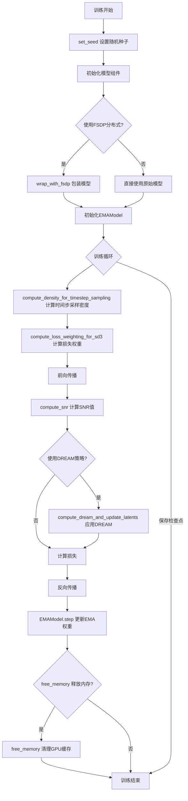

## 类结构

```
EMAModel (指数移动平均类)
└── from_pretrained (类方法)
└── save_pretrained (实例方法)
└── get_decay (实例方法)
└── step (实例方法)
└── copy_to (实例方法)
└── pin_memory (实例方法)
└── to (实例方法)
└── state_dict (实例方法)
└── store (实例方法)
└── restore (实例方法)
└── load_state_dict (实例方法)
```

## 全局变量及字段


### `EMAModel.shadow_params`
    
存储EMA阴影参数

类型：`list[torch.Tensor]`
    


### `EMAModel.decay`
    
指数衰减因子

类型：`float`
    


### `EMAModel.min_decay`
    
最小衰减因子

类型：`float`
    


### `EMAModel.update_after_step`
    
开始更新EMA的步数

类型：`int`
    


### `EMAModel.use_ema_warmup`
    
是否使用EMA预热

类型：`bool`
    


### `EMAModel.inv_gamma`
    
EMA预热的逆伽马因子

类型：`float`
    


### `EMAModel.power`
    
EMA预热的指数因子

类型：`float`
    


### `EMAModel.optimization_step`
    
当前优化步数

类型：`int`
    


### `EMAModel.cur_decay_value`
    
当前衰减值

类型：`float`
    


### `EMAModel.foreach`
    
是否使用foreach优化

类型：`bool`
    


### `EMAModel.model_cls`
    
模型类

类型：`Any`
    


### `EMAModel.model_config`
    
模型配置

类型：`dict`
    


### `EMAModel.temp_stored_params`
    
临时存储的参数

类型：`list`
    
    

## 全局函数及方法


### `set_seed`

设置随机种子以确保实验的可重复性，支持 Python random、NumPy、PyTorch（包括 CUDA 和 NPU）的随机数生成器。

参数：

- `seed`：`int`，要设置的随机种子值，用于初始化所有随机数生成器

返回值：`None`，该函数不返回任何值，仅修改全局随机状态

#### 流程图

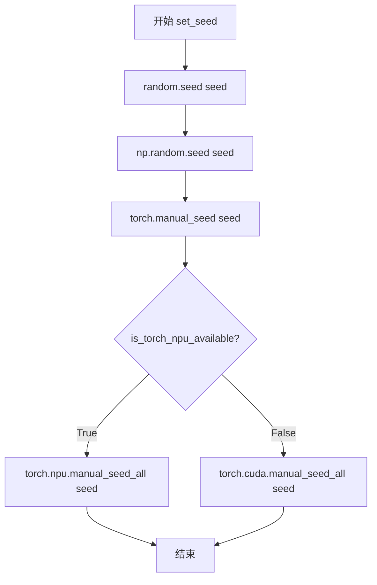

#### 带注释源码

```python
def set_seed(seed: int):
    """
    Helper function for reproducible behavior to set the seed in `random`, `numpy`, `torch`.

    Args:
        seed (`int`): The seed to set.

    Returns:
        `None`
    """
    # 设置 Python 标准库 random 模块的随机种子
    random.seed(seed)
    
    # 设置 NumPy 的随机种子
    np.random.seed(seed)
    
    # 设置 PyTorch CPU 的随机种子
    torch.manual_seed(seed)
    
    # 检查是否使用了华为昇腾 NPU 设备
    if is_torch_npu_available():
        # 如果使用 NPU，设置 NPU 上所有设备的随机种子
        torch.npu.manual_seed_all(seed)
    else:
        # 否则设置 CUDA 所有可见 GPU 的随机种子
        # 此调用在 CUDA 不可用时也是安全的，不会抛出异常
        torch.cuda.manual_seed_all(seed)
        # ^^ safe to call this function even if cuda is not available
```


### `compute_snr`

该函数用于计算扩散模型训练中的信噪比（Signal-to-Noise Ratio, SNR），基于噪声调度器的累积Alpha值和给定的时间步，遵循Min-SNR扩散训练的论文实现，用于调整扩散模型的训练过程。

参数：

- `noise_scheduler`：`NoiseScheduler`，噪声调度器对象，包含噪声调度参数，特别是`alphas_cumprod`（累积Alpha值），用于计算SNR值
- `timesteps`：`torch.Tensor`，时间步张量，表示需要计算SNR的时间步

返回值：`torch.Tensor`，包含每个时间步计算出的SNR值的张量

#### 流程图

```mermaid
flowchart TD
    A[开始: compute_snr] --> B[获取noise_scheduler.alphas_cumprod]
    B --> C[计算sqrt_alphas_cumprod = alphas_cumprod^0.5]
    C --> D[计算sqrt_one_minus_alphas_cumprod = (1 - alphas_cumprod)^0.5]
    D --> E[索引并转换sqrt_alphas_cumprod到timesteps设备]
    E --> F{shape维度 < timesteps维度?}
    F -->|是| G[扩展维度: sqrt_alphas_cumprod[..., None]]
    G --> F
    F -->|否| H[expand到timesteps.shape得到alpha]
    H --> I[索引并转换sqrt_one_minus_alphas_cumprod到timesteps设备]
    I --> J{shape维度 < timesteps维度?}
    J -->|是| K[扩展维度: sqrt_one_minus_alphas_cumprod[..., None]]
    K --> J
    J -->|否| L[expand到timesteps.shape得到sigma]
    L --> M[计算SNR: snr = (alpha / sigma)^2]
    M --> N[返回snr张量]
```

#### 带注释源码

```
def compute_snr(noise_scheduler, timesteps):
    """
    Computes SNR as per
    https://github.com/TiankaiHang/Min-SNR-Diffusion-Training/blob/521b624bd70c67cee4bdf49225915f5945a872e3/guided_diffusion/gaussian_diffusion.py#L847-L849
    for the given timesteps using the provided noise scheduler.

    Args:
        noise_scheduler (`NoiseScheduler`):
            An object containing the noise schedule parameters, specifically `alphas_cumprod`, which is used to compute
            the SNR values.
        timesteps (`torch.Tensor`):
            A tensor of timesteps for which the SNR is computed.

    Returns:
        `torch.Tensor`: A tensor containing the computed SNR values for each timestep.
    """
    # 从噪声调度器获取累积Alpha值
    alphas_cumprod = noise_scheduler.alphas_cumprod
    
    # 计算累积Alpha值的平方根
    sqrt_alphas_cumprod = alphas_cumprod**0.5
    
    # 计算 (1 - 累积Alpha值) 的平方根
    sqrt_one_minus_alphas_cumprod = (1.0 - alphas_cumprod) ** 0.5

    # 展开张量以匹配timesteps的形状
    # Adapted from https://github.com/TiankaiHang/Min-SNR-Diffusion-Training/blob/521b624bd70c67cee4bdf49225915f5945a872e3/guided_diffusion/gaussian_diffusion.py#L1026
    
    # 将sqrt_alphas_cumprod移动到timesteps设备并索引对应的时间步，转换为float类型
    sqrt_alphas_cumprod = sqrt_alphas_cumprod.to(device=timesteps.device)[timesteps].float()
    
    # 通过添加单维度扩展来匹配timesteps的维度
    while len(sqrt_alphas_cumprod.shape) < len(timesteps.shape):
        sqrt_alphas_cumprod = sqrt_alphas_cumprod[..., None]
    
    # 扩展到与timesteps相同的形状得到alpha
    alpha = sqrt_alphas_cumprod.expand(timesteps.shape)

    # 对sqrt_one_minus_alphas_cumprod进行相同的处理
    sqrt_one_minus_alphas_cumprod = sqrt_one_minus_alphas_cumprod.to(device=timesteps.device)[timesteps].float()
    while len(sqrt_one_minus_alphas_cumprod.shape) < len(timesteps.shape):
        sqrt_one_minus_alphas_cumprod = sqrt_one_minus_alphas_cumprod[..., None]
    
    # 扩展到与timesteps相同的形状得到sigma
    sigma = sqrt_one_minus_alphas_cumprod.expand(timesteps.shape)

    # 计算SNR = (alpha / sigma)^2
    snr = (alpha / sigma) ** 2
    return snr
```


### `resolve_interpolation_mode`

该函数用于将字符串类型的插值方法映射为 torchvision 库中的 `InterpolationMode` 枚举值，使得调用方可以通过简洁的字符串指定图像插值方式。

参数：

-  `interpolation_type`：`str`，表示插值方法的字符串，支持 "bilinear"、"bicubic"、"box"、"nearest"、"nearest_exact"、"hamming" 和 "lanczos" 七种类型。

返回值：`torchvision.transforms.InterpolationMode`，返回对应的 torchvision 插值模式枚举值，用于图像 resize 变换。

#### 流程图

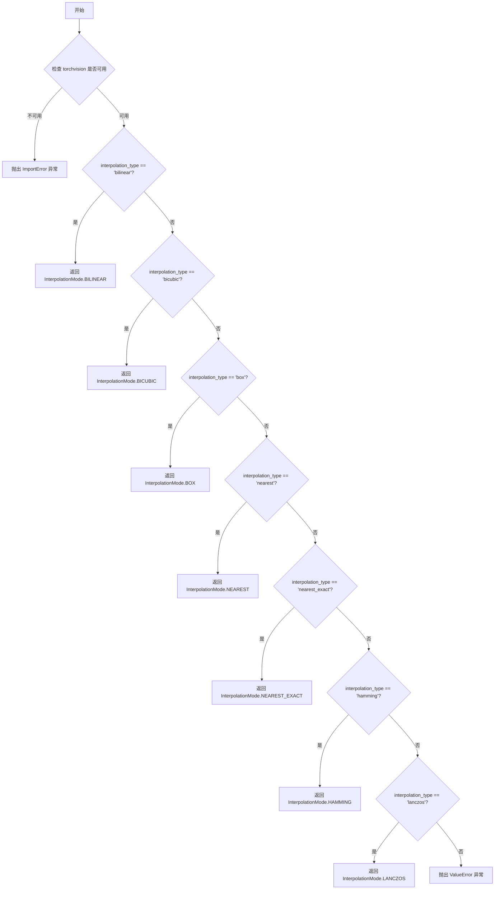

#### 带注释源码

```python
def resolve_interpolation_mode(interpolation_type: str):
    """
    Maps a string describing an interpolation function to the corresponding torchvision `InterpolationMode` enum. The
    full list of supported enums is documented at
    https://pytorch.org/vision/0.9/transforms.html#torchvision.transforms.functional.InterpolationMode.

    Args:
        interpolation_type (`str`):
            A string describing an interpolation method. Currently, `bilinear`, `bicubic`, `box`, `nearest`,
            `nearest_exact`, `hamming`, and `lanczos` are supported, corresponding to the supported interpolation modes
            in torchvision.

    Returns:
        `torchvision.transforms.InterpolationMode`: an `InterpolationMode` enum used by torchvision's `resize`
        transform.
    """
    # 首先检查 torchvision 库是否已安装，未安装则抛出 ImportError 提示用户安装
    if not is_torchvision_available():
        raise ImportError(
            "Please make sure to install `torchvision` to be able to use the `resolve_interpolation_mode()` function."
        )

    # 根据传入的 interpolation_type 字符串匹配对应的 torchvision InterpolationMode 枚举值
    if interpolation_type == "bilinear":
        interpolation_mode = transforms.InterpolationMode.BILINEAR
    elif interpolation_type == "bicubic":
        interpolation_mode = transforms.InterpolationMode.BICUBIC
    elif interpolation_type == "box":
        interpolation_mode = transforms.InterpolationMode.BOX
    elif interpolation_type == "nearest":
        interpolation_mode = transforms.InterpolationMode.NEAREST
    elif interpolation_type == "nearest_exact":
        interpolation_mode = transforms.InterpolationMode.NEAREST_EXACT
    elif interpolation_type == "hamming":
        interpolation_mode = transforms.InterpolationMode.HAMMING
    elif interpolation_type == "lanczos":
        interpolation_mode = transforms.InterpolationMode.LANCZOS
    else:
        # 如果传入的字符串不在支持列表中，抛出 ValueError 并列出所有支持的模式
        raise ValueError(
            f"The given interpolation mode {interpolation_type} is not supported. Currently supported interpolation"
            f" modes are `bilinear`, `bicubic`, `box`, `nearest`, `nearest_exact`, `hamming`, and `lanczos`."
        )

    # 返回匹配到的 InterpolationMode 枚举对象
    return interpolation_mode
```


### `compute_dream_and_update_latents`

实现DREAM（Diffusion Rectification and Estimation-Adaptive Models）算法，通过额外的无梯度前向传播来调整噪声潜在变量和目标，以更紧密地对齐训练与采样过程，从而提高训练效率和准确性。

参数：

- `unet`：`UNet2DConditionModel`，用于预测的UNet模型
- `noise_scheduler`：`SchedulerMixin`，用于添加噪声的噪声调度器
- `timesteps`：`torch.Tensor`，噪声调度器使用的时间步
- `noise`：`torch.Tensor`，形状与noisy_latents相同的噪声张量
- `noisy_latents`：`torch.Tensor`，训练循环中先前产生的噪声潜在变量
- `target`：`torch.Tensor`，去除噪声后要预测的真实值张量
- `encoder_hidden_states`：`torch.Tensor`，来自文本模型的文本嵌入
- `dream_detail_preservation`：`float`，默认值1.0，指示细节保存级别的浮点值

返回值：`tuple[torch.Tensor, torch.Tensor]`，调整后的noisy_latents和target

#### 流程图

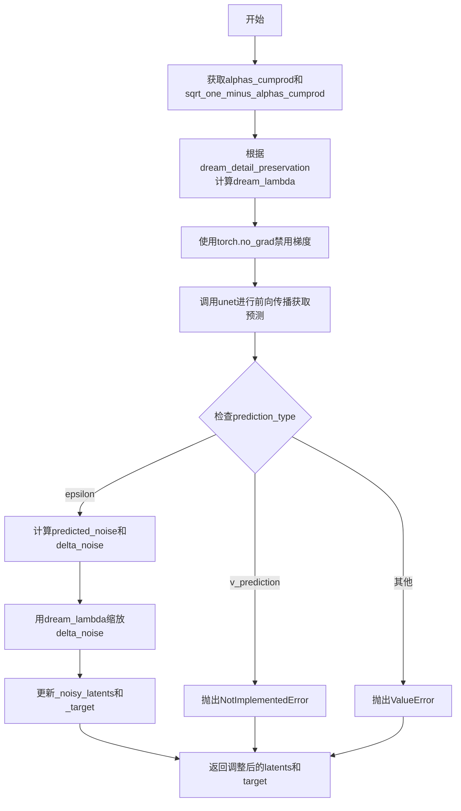

#### 带注释源码

```python
def compute_dream_and_update_latents(
    unet: UNet2DConditionModel,
    noise_scheduler: SchedulerMixin,
    timesteps: torch.Tensor,
    noise: torch.Tensor,
    noisy_latents: torch.Tensor,
    target: torch.Tensor,
    encoder_hidden_states: torch.Tensor,
    dream_detail_preservation: float = 1.0,
) -> tuple[torch.Tensor, torch.Tensor]:
    """
    Implements "DREAM (Diffusion Rectification and Estimation-Adaptive Models)" from
    https://huggingface.co/papers/2312.00210. DREAM helps align training with sampling to help training be more
    efficient and accurate at the cost of an extra forward step without gradients.

    Args:
        `unet`: The state unet to use to make a prediction.
        `noise_scheduler`: The noise scheduler used to add noise for the given timestep.
        `timesteps`: The timesteps for the noise_scheduler to user.
        `noise`: A tensor of noise in the shape of noisy_latents.
        `noisy_latents`: Previously noise latents from the training loop.
        `target`: The ground-truth tensor to predict after eps is removed.
        `encoder_hidden_states`: Text embeddings from the text model.
        `dream_detail_preservation`: A float value that indicates detail preservation level.
          See reference.

    Returns:
        `tuple[torch.Tensor, torch.Tensor]`: Adjusted noisy_latents and target.
    """
    # 从噪声调度器获取累积alpha产品，并按时间步索引后扩展维度以匹配潜在变量形状
    alphas_cumprod = noise_scheduler.alphas_cumprod.to(timesteps.device)[timesteps, None, None, None]
    # 计算sqrt(1 - alphas_cumprod)，即噪声标准差
    sqrt_one_minus_alphas_cumprod = (1.0 - alphas_cumprod) ** 0.5

    # 根据论文，lambda = sqrt(1 - alpha) ** p，其中p默认为1
    # dream_lambda用于控制细节保存程度
    dream_lambda = sqrt_one_minus_alphas_cumprod**dream_detail_preservation

    # 初始化预测结果为None
    pred = None
    # 使用无梯度上下文执行前向传播，避免计算梯度以提高效率
    with torch.no_grad():
        # 通过UNet模型获取当前时间步下的预测结果
        pred = unet(noisy_latents, timesteps, encoder_hidden_states).sample

    # 初始化调整后的潜在变量和目标为None
    _noisy_latents, _target = (None, None)
    # 根据噪声调度器的预测类型进行处理
    if noise_scheduler.config.prediction_type == "epsilon":
        # epsilon预测模式下，直接使用模型预测作为predicted_noise
        predicted_noise = pred
        # 计算真实噪声与预测噪声之间的差异，并detach避免梯度传播
        delta_noise = (noise - predicted_noise).detach()
        # 用dream_lambda缩放噪声差异
        delta_noise.mul_(dream_lambda)
        # 根据论文公式更新噪声潜在变量
        # x_t = x_t + sigma * delta_noise
        _noisy_latents = noisy_latents.add(sqrt_one_minus_alphas_cumprod * delta_noise)
        # 同时更新目标值
        _target = target.add(delta_noise)
    elif noise_scheduler.config.prediction_type == "v_prediction":
        # v-prediction尚未实现
        raise NotImplementedError("DREAM has not been implemented for v-prediction")
    else:
        # 未知预测类型，抛出错误
        raise ValueError(f"Unknown prediction type {noise_scheduler.config.prediction_type}")

    # 返回调整后的噪声潜在变量和目标
    return _noisy_latents, _target
```


### `unet_lora_state_dict`

该函数用于从 UNet2DConditionModel 模型中提取所有 LoRA（Low-Rank Adaptation）参数，并返回仅包含这些参数的状态字典，便于模型的保存和加载。

参数：

- `unet`：`UNet2DConditionModel`，输入的 UNet 模型，用于遍历其子模块以提取 LoRA 参数

返回值：`dict[str, torch.Tensor]`，返回包含所有 LoRA 参数的状态字典，键名为模块路径加上 ".lora.down" 或 ".lora.up"，值为对应的参数张量

#### 流程图

```mermaid
flowchart TD
    A[开始: unet_lora_state_dict] --> B[初始化空字典 lora_state_dict]
    B --> C[遍历 unet 的所有命名模块]
    C --> D{模块是否有 set_lora_layer 属性?}
    D -->|否| C
    D -->|是| E[获取模块的 lora_layer 属性]
    E --> F{lora_layer 不为 None?}
    F -->|否| C
    F --> G[获取 lora_layer 的 state_dict]
    G --> H[遍历 lora_layer_state_dict 中的每个参数]
    H --> I{当前参数名称和值}
    I --> J[构建新键名: {模块名}.lora.{矩阵名}]
    J --> K[将键值对存入 lora_state_dict]
    K --> H
    H --> L{遍历完所有 lora 参数?}
    L -->|否| H
    L -->|是| C
    C --> M{遍历完所有模块?}
    M -->|否| C
    M --> N[返回 lora_state_dict]
    N --> O[结束]
```

#### 带注释源码

```python
def unet_lora_state_dict(unet: UNet2DConditionModel) -> dict[str, torch.Tensor]:
    r"""
    Returns:
        A state dict containing just the LoRA parameters.
    """
    # 初始化一个空字典用于存储 LoRA 参数的状态字典
    lora_state_dict = {}

    # 遍历 UNet 模型的所有子模块（包含模块名称和模块对象）
    for name, module in unet.named_modules():
        # 检查当前模块是否具有 set_lora_layer 方法（即是否为 LoRA 层）
        if hasattr(module, "set_lora_layer"):
            # 获取模块的 lora_layer 属性
            lora_layer = getattr(module, "lora_layer")
            # 检查 lora_layer 是否存在（即该模块是否启用了 LoRA）
            if lora_layer is not None:
                # 获取 lora_layer 的状态字典（包含 down 和 up 矩阵参数）
                current_lora_layer_sd = lora_layer.state_dict()
                # 遍历当前 lora 层状态字典中的所有参数
                for lora_layer_matrix_name, lora_param in current_lora_layer_sd.items():
                    # 矩阵名称可以是 "down"（降维矩阵）或 "up"（升维矩阵）
                    # 构建完整的参数键名：模块名称 + ".lora." + 矩阵名称
                    lora_state_dict[f"{name}.lora.{lora_layer_matrix_name}"] = lora_param

    # 返回仅包含 LoRA 参数的状态字典
    return lora_state_dict
```


### `cast_training_params`

该函数用于将PyTorch模型的训练参数（仅限需要梯度的参数）转换为指定的数据类型，通常用于将混合精度训练中的参数从float16提升到float32。

参数：

- `model`：`torch.nn.Module | list[torch.nn.Module]`，需要转换参数的PyTorch模型或模型列表
- `dtype`：`torch.dtype`，转换的目标数据类型，默认为`torch.float32`

返回值：`None`，该函数直接修改模型参数，无返回值

#### 流程图

```mermaid
flowchart TD
    A[开始: cast_training_params] --> B{model是否为列表?}
    B -->|否| C[将model转换为列表: model = [model]]
    B -->|是| D[直接使用model列表]
    C --> E[遍历列表中的每个模型m]
    D --> E
    E --> F[遍历模型m的所有参数param]
    G{param.requires_grad是否为True?}
    F --> G
    G -->|是| H[将param.data转换为目标dtype: param.to(dtype)]
    G -->|否| I[跳过该参数]
    H --> J{是否还有更多参数?}
    I --> J
    J -->|是| F
    J -->|否| K{是否还有更多模型?}
    K -->|是| E
    K -->|否| L[结束]
```

#### 带注释源码

```python
def cast_training_params(model: torch.nn.Module | list[torch.nn.Module], dtype=torch.float32):
    """
    Casts the training parameters of the model to the specified data type.

    Args:
        model: The PyTorch model whose parameters will be cast.
        dtype: The data type to which the model parameters will be cast.
    """
    # 如果传入的不是列表，则包装为列表以统一处理
    if not isinstance(model, list):
        model = [model]
    
    # 遍历每一个模型（支持单模型或多模型场景）
    for m in model:
        # 遍历模型的所有参数
        for param in m.parameters():
            # 仅对需要梯度的参数进行类型转换（训练参数）
            # 这样可以避免将冻结参数的精度提升，节省内存和计算
            if param.requires_grad:
                # 使用.to()方法将参数数据转换为目标dtype
                param.data = param.to(dtype)
```


### `_set_state_dict_into_text_encoder`

将 `lora_state_dict` 中的 LoRA 参数设置到来自 `transformers` 的 `text_encoder` 模型中。

参数：

- `lora_state_dict`：`dict[str, torch.Tensor]`，包含 LoRA 权重的状态字典
- `prefix`：`str`，用于从 `lora_state_dict` 中筛选出属于 `text_encoder` 的键的前缀标识符
- `text_encoder`：`torch.nn.Module`，目标 text_encoder 模块，LoRA 状态字典将被设置到此处

返回值：`None`，无返回值（该函数直接修改 `text_encoder` 的内部状态）

#### 流程图

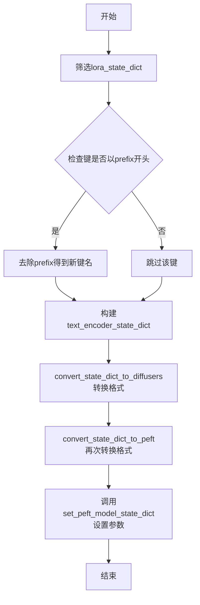

#### 带注释源码

```
def _set_state_dict_into_text_encoder(
    lora_state_dict: dict[str, torch.Tensor], prefix: str, text_encoder: torch.nn.Module
):
    """
    Sets the `lora_state_dict` into `text_encoder` coming from `transformers`.

    Args:
        lora_state_dict: The state dictionary to be set.
        prefix: String identifier to retrieve the portion of the state dict that belongs to `text_encoder`.
        text_encoder: Where the `lora_state_dict` is to be set.
    """

    # 从lora_state_dict中筛选出以prefix开头的键，并去除prefix得到新的键名
    # 例如：prefix="text_encoder.", 键"text_encoder.lora_down.weight" -> "lora_down.weight"
    text_encoder_state_dict = {
        f"{k.replace(prefix, '')}": v for k, v in lora_state_dict.items() if k.startswith(prefix)
    }
    
    # 将状态字典转换为diffusers格式，再转换为PEFT格式
    text_encoder_state_dict = convert_state_dict_to_peft(convert_state_dict_to_diffusers(text_encoder_state_dict))
    
    # 使用PEFT的set_peft_model_state_dict将LoRA参数加载到text_encoder中
    # adapter_name="default"表示使用默认的adapter名称
    set_peft_model_state_dict(text_encoder, text_encoder_state_dict, adapter_name="default")
```


### `_collate_lora_metadata`

该函数用于从给定的模块字典中提取每个模块的 LoRA（Low-Rank Adaptation）适配器配置元数据，并将这些元数据组织成字典返回。主要用于在训练或推理过程中收集需要保存的模块的 LoRA 配置信息。

参数：

- `modules_to_save`：`dict[str, torch.nn.Module]`，需要保存的模块字典，其中键为模块名称（字符串），值为 PyTorch 模块对象。

返回值：`dict[str, Any]`，包含提取的 LoRA 适配器元数据的字典，键格式为 `{module_name}_lora_adapter_metadata`，值为对应的配置字典。

#### 流程图

```mermaid
flowchart TD
    A[开始 _collate_lora_metadata] --> B[初始化空字典 metadatas]
    B --> C{遍历 modules_to_save}
    C -->|迭代项: module_name, module| D{检查 module 是否为 None}
    D -->|是| C
    D -->|否| E[获取 module.peft_config['default']]
    E --> F[调用 to_dict 转换为字典]
    F --> G[构造键名: {module_name}_lora_adapter_metadata]
    G --> H[将配置字典存入 metadatas]
    H --> C
    C --> I[返回 metadatas 字典]
    I --> J[结束]
```

#### 带注释源码

```python
def _collate_lora_metadata(modules_to_save: dict[str, torch.nn.Module]) -> dict[str, Any]:
    """
    从模块字典中提取 LoRA 适配器的配置元数据。

    该函数遍历需要保存的模块，提取每个模块的 PEFT（Parameter-Efficient Fine-Tuning）配置，
    并将其转换为字典格式存储，以便后续保存或序列化处理。

    Args:
        modules_to_save (dict[str, torch.nn.Module]): 
            需要保存的模块字典，键为模块名称字符串，值为 PyTorch 模块对象。
            模块对象需要包含 peft_config 属性，其中应存在 'default' 键的配置。

    Returns:
        dict[str, Any]: 
            包含 LoRA 适配器元数据的字典。键的格式为 '{module_name}_lora_adapter_metadata'，
            值为对应模块的 PEFT 配置字典（通过 to_dict() 转换后的结果）。
            只有非 None 的模块才会被处理并包含在返回字典中。
    """
    # 初始化用于存储元数据的字典
    metadatas = {}
    
    # 遍历输入的模块字典
    for module_name, module in modules_to_save.items():
        # 只处理非 None 的模块，避免空指针异常
        if module is not None:
            # 从模块的 PEFT 配置中提取 'default' 配置项
            # PEFT 库使用 peft_config 属性存储 LoRA 等适配器的配置信息
            peft_config = module.peft_config["default"]
            
            # 将配置对象转换为字典格式，便于后续序列化和保存
            config_dict = peft_config.to_dict()
            
            # 使用约定俗成的键名格式存储元数据
            # 键名格式: {模块名}_lora_adapter_metadata
            metadata_key = f"{module_name}_lora_adapter_metadata"
            metadatas[metadata_key] = config_dict
    
    # 返回收集到的所有 LoRA 适配器元数据
    return metadatas
```


### `compute_density_for_timestep_sampling`

该函数用于在SD3训练过程中计算时间步采样的密度分布，根据不同的加权方案（logit_normal、mode或默认uniform）生成对应的采样权重，支持自定义均值、标准差和模式缩放参数。

参数：

- `weighting_scheme`：`str`，加权方案，支持"logit_normal"、"mode"或其他值（uniform）
- `batch_size`：`int`，批次大小，决定生成的密度向量的维度
- `logit_mean`：`float | None`，logit_normal分布的均值，默认为None
- `logit_std`：`float | None`，logit_normal分布的标准差，默认为None
- `mode_scale`：`float | None`，mode方案的缩放因子，默认为None
- `device`：`torch.device | str`，生成张量所在的设备，默认为"cpu"
- `generator`：`torch.Generator | None`，可选的随机数生成器，默认为None

返回值：`torch.Tensor`，形状为(batch_size,)的张量，包含用于时间步采样的密度权重值

#### 流程图

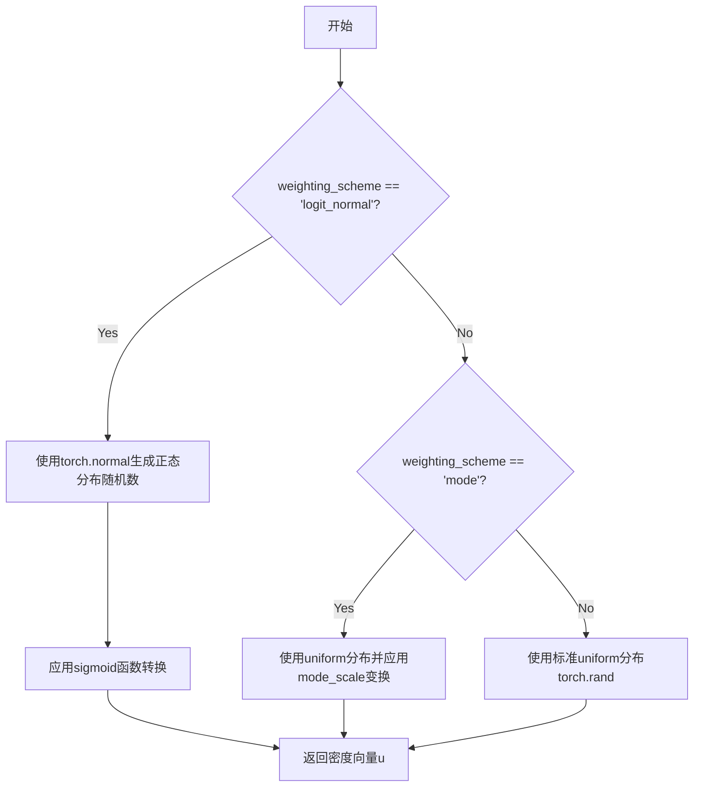

#### 带注释源码

```python
def compute_density_for_timestep_sampling(
    weighting_scheme: str,
    batch_size: int,
    logit_mean: float = None,
    logit_std: float = None,
    mode_scale: float = None,
    device: torch.device | str = "cpu",
    generator: torch.Generator | None = None,
):
    """
    Compute the density for sampling the timesteps when doing SD3 training.

    Courtesy: This was contributed by Rafie Walker in https://github.com/huggingface/diffusers/pull/8528.

    SD3 paper reference: https://huggingface.co/papers/2403.03206v1.
    
    参数:
        weighting_scheme: 加权方案，可选"logit_normal"、"mode"或默认"uniform"
        batch_size: 批次大小
        logit_mean: logit_normal分布的均值
        logit_std: logit_normal分布的标准差
        mode_scale: mode方案的缩放因子
        device: 计算设备
        generator: 随机数生成器
    
    返回:
        形状为(batch_size,)的密度张量
    """
    # 使用logit_normal加权方案：从正态分布采样并经sigmoid变换
    if weighting_scheme == "logit_normal":
        u = torch.normal(mean=logit_mean, std=logit_std, size=(batch_size,), device=device, generator=generator)
        u = torch.nn.functional.sigmoid(u)
    # 使用mode加权方案：基于cosmap的改进分布
    elif weighting_scheme == "mode":
        u = torch.rand(size=(batch_size,), device=device, generator=generator)
        u = 1 - u - mode_scale * (torch.cos(math.pi * u / 2) ** 2 - 1 + u)
    # 默认使用均匀分布
    else:
        u = torch.rand(size=(batch_size,), device=device, generator=generator)
    return u
```


### `compute_loss_weighting_for_sd3`

该函数用于计算SD3（Stable Diffusion 3）训练中的损失权重，根据不同的权重方案对sigma值进行加权处理，以实现更稳定的扩散模型训练。

参数：

- `weighting_scheme`：`str`，权重计算方案，支持"sigma_sqrt"、"cosmap"或其他默认值
- `sigmas`：`torch.Tensor` 或 `None`，扩散模型中的sigma值，用于计算相应的权重

返回值：`torch.Tensor`，计算得到的损失权重张量

#### 流程图

```mermaid
flowchart TD
    A[开始] --> B{weighting_scheme == 'sigma_sqrt'?}
    B -->|是| C[计算权重: sigmas^-2.0]
    C --> F[转换为float类型]
    F --> G[返回权重张量]
    B -->|否| D{weighting_scheme == 'cosmap'?}
    D -->|是| E[计算bot = 1 - 2*sigmas + 2*sigmas^2<br/>计算权重: 2 / (math.pi * bot)]
    E --> G
    D -->|否| H[权重设为与sigmas相同形状的全1张量]
    H --> G
```

#### 带注释源码

```python
def compute_loss_weighting_for_sd3(weighting_scheme: str, sigmas=None):
    """
    Computes loss weighting scheme for SD3 training.

    Courtesy: This was contributed by Rafie Walker in https://github.com/huggingface/diffusers/pull/8528.

    SD3 paper reference: https://huggingface.co/papers/2403.03206v1.
    
    参数:
        weighting_scheme: 权重计算方案字符串，可选值为:
            - "sigma_sqrt": 使用sigma平方根倒数作为权重
            - "cosmap": 使用余弦映射方案计算权重
            - 其他: 默认使用均匀权重（全1）
        sigmas: sigma张量，通常是扩散模型训练中的时间步相关参数
    
    返回:
        torch.Tensor: 计算得到的损失权重张量，与输入sigmas形状相同
    """
    # 方案1: sigma平方根方案
    # 权重 = sigma^(-2.0)，即sigma的-2次方
    if weighting_scheme == "sigma_sqrt":
        weighting = (sigmas**-2.0).float()
    
    # 方案2: 余弦映射方案（cosmap）
    # 基于SD3论文中的余弦调度策略
    elif weighting_scheme == "cosmap":
        # 计算分母: 1 - 2*sigma + 2*sigma^2
        bot = 1 - 2 * sigmas + 2 * sigmas**2
        # 权重 = 2 / (pi * bot)
        weighting = 2 / (math.pi * bot)
    
    # 默认方案: 均匀权重
    # 当weighting_scheme不匹配时，使用全1张量作为权重
    else:
        weighting = torch.ones_like(sigmas)
    
    return weighting
```


### `free_memory`

该函数用于释放内存，通过运行 Python 垃圾回收并清除可用加速器（GPU）的缓存来释放显存资源。

参数：无

返回值：`None`，无返回值

#### 流程图

```mermaid
flowchart TD
    A([开始]) --> B[执行 gc.collect<br/>Python垃圾回收]
    B --> C{torch.cuda.is_available?}
    C -->|是| D[执行 torch.cuda.empty_cache<br/>清空CUDA缓存]
    C -->|否| E{torch.backends.mps.is_available?}
    D --> G([结束])
    E -->|是| F[执行 torch.mps.empty_cache<br/>清空MPS缓存]
    E -->|否| H{is_torch_npu_available?}
    F --> G
    H -->|是| I[执行 torch_npu.npu.empty_cache<br/>清空NPU缓存]
    H -->|否| J{hasattr(torch, 'xpu')<br/>且 torch.xpu.is_available?}
    I --> G
    J -->|是| K[执行 torch.xpu.empty_cache<br/>清空XPU缓存]
    J -->|否| G
    K --> G
```

#### 带注释源码

```python
def free_memory():
    """
    Runs garbage collection. Then clears the cache of the available accelerator.
    """
    # 步骤1: 执行Python垃圾回收，释放Python对象占用的内存
    gc.collect()

    # 步骤2: 检测并清理GPU加速器的内存缓存
    # 按优先级顺序检查: CUDA -> MPS -> NPU -> XPU
    
    # 检查NVIDIA CUDA是否可用
    if torch.cuda.is_available():
        # 清空CUDA缓存，释放GPU显存
        torch.cuda.empty_cache()
    # 检查Apple Metal Performance Shaders是否可用
    elif torch.backends.mps.is_available():
        # 清空MPS缓存，释放Apple GPU显存
        torch.mps.empty_cache()
    # 检查华为昇腾NPU是否可用
    elif is_torch_npu_available():
        # 清空NPU缓存，释放昇腾芯片显存
        torch_npu.npu.empty_cache()
    # 检查Intel XPU是否可用
    elif hasattr(torch, "xpu") and torch.xpu.is_available():
        # 清空XPU缓存，释放Intel GPU显存
        torch.xpu.empty_cache()
```


### `offload_models`

这是一个上下文管理器，用于在指定的设备上临时加载模型或管道，执行完代码块后自动将它们移回原始设备。

参数：

- `*modules`：`torch.nn.Module | DiffusionPipeline`，可变参数，可以是 PyTorch 模块或 DiffusionPipeline 实例
- `device`：`str | torch.device`，目标设备（如 "cpu"、"cuda" 等）
- `offload`：`bool`，是否启用卸载功能，默认为 True

返回值：`None`，作为上下文管理器不返回值

#### 流程图

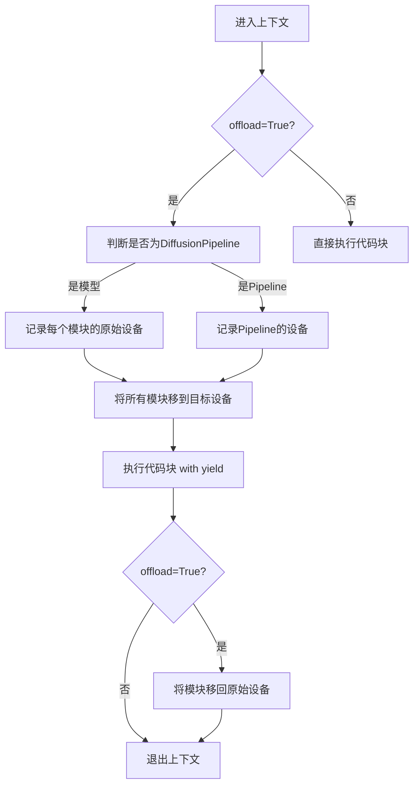

#### 带注释源码

```
@contextmanager
def offload_models(
    *modules: torch.nn.Module | DiffusionPipeline,  # 可变参数：模型或管道
    device: str | torch.device,                      # 目标设备
    offload: bool = True                             # 是否启用卸载
):
    """
    Context manager that, if offload=True, moves each module to `device` on enter, 
    then moves it back to its original device on exit.

    Args:
        device (`str` or `torch.Device`): Device to move the `modules` to.
        offload (`bool`): Flag to enable offloading.
    """
    # 仅在 offload 为 True 时执行设备转移逻辑
    if offload:
        # 判断传入的是模型还是 DiffusionPipeline
        is_model = not any(isinstance(m, DiffusionPipeline) for m in modules)
        
        # 记录每个模块的原始设备位置
        if is_model:
            # 对于普通模型，遍历所有参数获取设备
            original_devices = [next(m.parameters()).device for m in modules]
        else:
            # 对于 DiffusionPipeline，只能传入一个
            assert len(modules) == 1
            # 直接获取 pipeline 的设备属性
            original_devices = [modules[0].device]
        
        # 将所有模块移动到目标设备
        for m in modules:
            m.to(device)

    try:
        # yield 之后才真正执行 with 代码块中的内容
        yield
    finally:
        # 执行完毕后，如果 offload 为 True，将模块移回原始设备
        if offload:
            for m, orig_dev in zip(modules, original_devices):
                m.to(orig_dev)
```


### `parse_buckets_string`

该函数用于将包含多个bucket定义的字符串解析为(height, width)元组列表，支持格式验证和错误处理。

参数：

-  `buckets_str`：`str`，包含bucket定义的字符串，格式为"height,width;height,width;..."，每个bucket由分号分隔

返回值：`list[tuple[int, int]]`，解析后的bucket列表，每个元素是(height, width)元组

#### 流程图

```mermaid
flowchart TD
    A[开始解析 buckets_str] --> B{检查字符串是否为空}
    B -->|是| C[抛出 ValueError: Bucket string cannot be empty]
    B -->|否| D[去除首尾空格并按分号分割]
    D --> E[初始化空列表 parsed_buckets]
    E --> F[遍历每个 bucket 对]
    F --> G{正则匹配 'height,width'}
    G -->|不匹配| H[抛出 ValueError: Invalid bucket format]
    G -->|匹配| I[提取 height 和 width]
    I --> J{检查数值是否为正整数}
    J -->|否| K[抛出 ValueError: Bucket dimensions must be positive integers]
    J -->|是| L{检查是否被 8 整除}
    L -->|否| M[发出警告: Bucket dimension not divisible by 8]
    L -->|是| N[将 (height, width) 添加到列表]
    M --> N
    N --> O{还有更多 bucket 对?}
    O -->|是| F
    O -->|否| P{检查 parsed_buckets 是否为空}
    P -->|是| Q[抛出 ValueError: No valid buckets found]
    P -->|否| R[返回 parsed_buckets]
```

#### 带注释源码

```python
def parse_buckets_string(buckets_str):
    """Parses a string defining buckets into a list of (height, width) tuples."""
    # 检查输入字符串是否为空，如果为空则抛出异常
    if not buckets_str:
        raise ValueError("Bucket string cannot be empty.")

    # 去除首尾空格后按分号分割，得到各个bucket定义
    bucket_pairs = buckets_str.strip().split(";")
    parsed_buckets = []
    
    # 遍历每一个bucket定义字符串
    for pair_str in bucket_pairs:
        # 使用正则表达式匹配 "height,width" 格式，允许空格
        match = re.match(r"^\s*(\d+)\s*,\s*(\d+)\s*$", pair_str)
        if not match:
            raise ValueError(f"Invalid bucket format: '{pair_str}'. Expected 'height,width'.")
        try:
            # 从匹配结果中提取高度和宽度，并转换为整数
            height = int(match.group(1))
            width = int(match.group(2))
            
            # 验证尺寸为正整数
            if height <= 0 or width <= 0:
                raise ValueError("Bucket dimensions must be positive integers.")
            
            # 检查尺寸是否能被8整除，否则发出警告（某些模型要求）
            if height % 8 != 0 or width % 8 != 0:
                warnings.warn(f"Bucket dimension ({height},{width}) not divisible by 8. This might cause issues.")
            
            # 将解析后的尺寸元组添加到结果列表
            parsed_buckets.append((height, width))
        except ValueError as e:
            raise ValueError(f"Invalid integer in bucket pair '{pair_str}': {e}") from e

    # 如果没有解析出任何有效的bucket，抛出异常
    if not parsed_buckets:
        raise ValueError("No valid buckets found in the provided string.")

    return parsed_buckets
```


### `find_nearest_bucket`

该函数用于在给定的 bucket 列表中找到与输入高度和宽度最接近的 bucket，通过计算输入尺寸与各 bucket 尺寸之间的面积差异度量值来确定最匹配的 bucket 索引。

参数：

- `h`：`int`，目标高度
- `w`：`int`，目标宽度
- `bucket_options`：`list[tuple[int, int]]`，可选的 bucket 列表，每个元素为 (height, width) 元组

返回值：`int | None`，返回最接近的 bucket 的索引，如果 bucket_options 为空则返回 None

#### 流程图

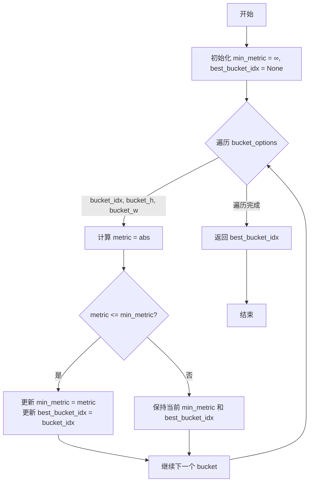

#### 带注释源码

```python
def find_nearest_bucket(h, w, bucket_options):
    """
    Finds the closes bucket to the given height and width.
    
    通过计算输入尺寸与各 bucket 尺寸之间的"面积差异度量"来找到最匹配的 bucket。
    该度量基于: |h * bucket_w - w * bucket_h|，实际上比较的是两个矩形面积的差异。
    
    Args:
        h: 目标高度
        w: 目标宽度
        bucket_options: 可选的 bucket 列表，每个元素为 (height, width) 元组
    
    Returns:
        返回最接近的 bucket 的索引，如果 bucket_options 为空则返回 None
    """
    # 初始化最小度量值为无穷大，最佳 bucket 索引为 None
    min_metric = float("inf")
    best_bucket_idx = None
    
    # 遍历所有 bucket 选项
    for bucket_idx, (bucket_h, bucket_w) in enumerate(bucket_options):
        # 计算当前 bucket 与输入尺寸的度量值
        # 度量公式: |h * bucket_w - w * bucket_h|
        # 这个度量实际上比较的是 (h/bucket_h) 与 (w/bucket_w) 的比例差异
        # 即比较两个矩形的宽高比差异
        metric = abs(h * bucket_w - w * bucket_h)
        
        # 如果当前度量值更小，则更新最佳 bucket 索引
        if metric <= min_metric:
            min_metric = metric
            best_bucket_idx = bucket_idx
    
    # 返回最佳匹配的 bucket 索引
    return best_bucket_idx
```

#### 关键组件信息

| 组件名称 | 描述 |
|---------|------|
| `min_metric` | 用于跟踪当前最小的度量值 |
| `best_bucket_idx` | 存储最匹配 bucket 的索引 |
| `metric` | 计算输入尺寸与 bucket 尺寸之间的相似度度量 |

#### 潜在技术债务或优化空间

1. **空列表处理**：当 `bucket_options` 为空时，函数返回 `None`，调用方需要额外处理这种情况，可能导致潜在的空指针异常
2. **相等度量值处理**：当多个 bucket 具有相同的度量值时，函数返回第一个匹配的索引，可能不是最优选择
3. **算法复杂度**：时间复杂度为 O(n)，可以预先计算 bucket 的宽高比来加速查找
4. **类型提示缺失**：参数和返回值缺少完整的类型注解

#### 其它项目

**设计目标**：通过简单的度量计算找到最接近目标尺寸的 bucket，用于图像或数据的分桶处理

**错误处理**：
- 当 `bucket_options` 为空时返回 `None`
- 函数本身不验证输入类型，依赖调用方保证输入正确

**数据流**：
- 输入：目标高度 `h`、目标宽度 `w`、bucket 选项列表
- 处理：遍历计算每个 bucket 的度量值，比较更新最优解
- 输出：最优 bucket 的索引


### `_to_cpu_contiguous`

该函数是一个私有工具函数，用于将状态字典（state_dict）中的所有 PyTorch 张量（Tensor）移动到 CPU 并确保其在内存中连续存储，而非张量的值则保持不变。这通常用于在 GPU 训练后将模型检查点保存到磁盘或在不同设备间传输模型状态。

参数：

- `state_dicts`：`dict`，输入的状态字典，键为字符串（参数名称），值为 torch.Tensor 或其他数据类型。

返回值：`dict`，返回一个新的字典，其中所有 torch.Tensor 类型的值都已被移动到 CPU 并转换为连续内存布局，非 Tensor 值保持原样。

#### 流程图

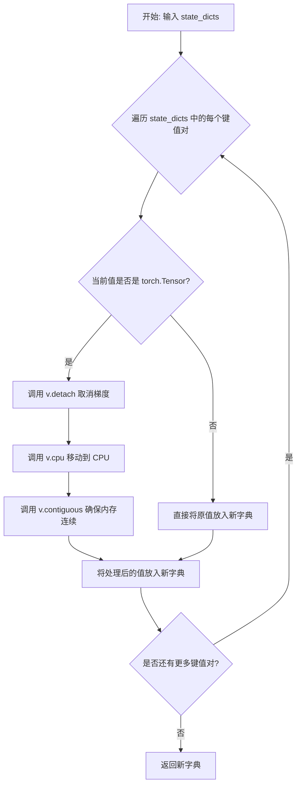

#### 带注释源码

```python
def _to_cpu_contiguous(state_dicts) -> dict:
    """
    将状态字典中的所有张量移动到 CPU 并确保内存连续。

    Args:
        state_dicts: 包含模型参数的状态字典，值为 torch.Tensor 或其他类型。

    Returns:
        返回一个新的字典，其中所有 Tensor 类型的值都已被移动到 CPU
        并转换为连续内存布局，非 Tensor 值保持不变。
    """
    # 使用字典推导式遍历输入字典的每个键值对
    # 如果值是 Tensor，则执行 detach().cpu().contiguous() 操作
    # 否则保持原值不变
    return {
        k: v.detach().cpu().contiguous()  # 取消梯度引用 -> 移动到 CPU -> 转为连续内存
        if isinstance(v, torch.Tensor)    # 检查值是否为 Tensor 类型
        else v                             # 非 Tensor 值直接保留
        for k, v in state_dicts.items()    # 遍历输入字典的所有键值对
    }
```


### `get_fsdp_kwargs_from_accelerator`

该函数从 Accelerate 的 accelerator 对象中提取 FSDP (Fully Sharded Data Parallel) 配置，并将其转换为 PyTorch FSDP 所需的 kwargs 字典，主要用于获取分片策略配置。

参数：

- `accelerator`：`Any`，Accelerate 库的 Accelerator 实例，用于获取 FSDP 插件状态和配置

返回值：`dict`，包含 FSDP 配置参数的字典，目前包含 `sharding_strategy` 键

#### 流程图

```mermaid
flowchart TD
    A[开始] --> B[获取 accelerator.state.fsdp_plugin]
    B --> C{fsdp_state 是否为 None?}
    C -->|是| D[抛出 ValueError: Accelerate 未配置 FSDP]
    C -->|否| E{fsdp_plugin 是否为 None?}
    E -->|是| F[设置 kwargs['sharding_strategy'] = ShardingStrategy.FULL_SHARD]
    E -->|否| G{fsdp_plugin.sharding_strategy 是否为 None?}
    G -->|是| F
    G -->|否| H[设置 kwargs['sharding_strategy'] = fsdp_plugin.sharding_strategy]
    F --> I[返回 kwargs 字典]
    H --> I
    D --> J[结束 - 抛出异常]
```

#### 带注释源码

```python
def get_fsdp_kwargs_from_accelerator(accelerator) -> dict:
    """
    Extract and convert FSDP config from Accelerator into PyTorch FSDP kwargs.
    """

    # 初始化返回的 kwargs 字典
    kwargs = {}
    
    # 从 accelerator.state 获取 FSDP 插件状态
    # 使用 getattr 安全获取，避免属性不存在时报错
    fsdp_state = getattr(accelerator.state, "fsdp_plugin", None)

    # 检查 Accelerate 是否配置了 FSDP
    # 如果未配置 FSDP，抛出明确的错误信息
    if fsdp_state is None:
        raise ValueError("Accelerate isn't configured to handle FSDP. Please update your installation.")

    # 获取 FSDP 插件对象
    fsdp_plugin = accelerator.state.fsdp_plugin

    # 根据 FSDP 是否启用设置分片策略
    if fsdp_plugin is None:
        # FSDP 未在 Accelerator 中启用
        # 使用默认的 FULL_SHARD 策略
        kwargs["sharding_strategy"] = ShardingStrategy.FULL_SHARD
    else:
        # FSDP 已启用
        # 优先使用插件中配置的战略，否则使用默认的 FULL_SHARD 策略
        kwargs["sharding_strategy"] = fsdp_plugin.sharding_strategy or ShardingStrategy.FULL_SHARD

    # 返回包含 FSDP 配置的字典
    return kwargs
```


### `wrap_with_fsdp`

该函数用于使用 PyTorch FSDP (Fully Sharded Data Parallel) 包装模型，提供常见的默认配置和可选的 transformer 自动包装策略，支持从 Accelerate 配置中提取 FSDP 参数并应用于模型。

参数：

- `model`：`torch.nn.Module`，要包装的模型
- `device`：`str | torch.device`，目标设备（如 accelerator.device）
- `offload`：`bool`，是否启用 CPU 参数卸载
- `use_orig_params`：`bool`，是否使用原始参数
- `limit_all_gathers`：`bool`，是否限制所有 gather 操作
- `fsdp_kwargs`：`dict[str, Any] | None`，FSDP 参数（sharding_strategy 等），通常来自 Accelerate 配置
- `transformer_layer_cls`：`set[type[torch.nn.Module]] | None`，用于自动包装的 transformer 层类（如果不使用 fsdp_kwargs 中的策略）

返回值：`FSDP`，返回 FSDP 包装后的模型

#### 流程图

```mermaid
flowchart TD
    A[开始 wrap_with_fsdp] --> B{transformer_layer_cls 是否为 None?}
    B -->|是| C[从 model.model.language_model.layers[0] 推断 transformer_layer_cls]
    B -->|否| D[使用传入的 transformer_layer_cls]
    C --> E[创建 partial 函数包装 transformer_auto_wrap_policy]
    D --> E
    E --> F[构建基础配置 config]
    F --> G{fsdp_kwargs 是否存在?}
    G -->|是| H[将 fsdp_kwargs 更新到 config]
    G -->|否| I[跳过更新]
    H --> J
    I --> J[使用 FSDP 包装模型]
    J --> K[返回 FSDP 包装后的模型]
```

#### 带注释源码

```python
def wrap_with_fsdp(
    model: torch.nn.Module,
    device: str | torch.device,
    offload: bool = True,
    use_orig_params: bool = True,
    limit_all_gathers: bool = True,
    fsdp_kwargs: dict[str, Any] | None = None,
    transformer_layer_cls: set[type[torch.nn.Module]] | None = None,
) -> FSDP:
    """
    Wrap a model with FSDP using common defaults and optional transformer auto-wrapping.

    Args:
        model: Model to wrap
        device: Target device (e.g., accelerator.device)
        offload: Whether to enable CPU parameter offloading
        use_orig_params: Whether to use original parameters
        limit_all_gathers: Whether to limit all gathers
        fsdp_kwargs: FSDP arguments (sharding_strategy, etc.) — usually from Accelerate config
        transformer_layer_cls: Classes for auto-wrapping (if not using policy from fsdp_kwargs)

    Returns:
        FSDP-wrapped model
    """

    # 获取日志记录器
    logger = get_logger(__name__)

    # 如果未提供 transformer_layer_cls，则从模型中自动推断
    if transformer_layer_cls is None:
        # 默认使用语言模型第一层的类型作为 transformer 层类型
        transformer_layer_cls = type(model.model.language_model.layers[0])
        logger.info(f"transformer_layer_cls is not provided, auto-inferred as {transformer_layer_cls.__name__}")

    # 创建自动包装策略，使用 partial 函数包装 transformer_auto_wrap_policy
    # 这会自动将指定的 transformer 层类进行分片包装
    auto_wrap_policy = partial(transformer_auto_wrap_policy, transformer_layer_cls={transformer_layer_cls})

    # 构建 FSDP 配置字典
    config = {
        "device_id": device,  # 指定设备 ID
        "cpu_offload": CPUOffload(offload_params=offload) if offload else None,  # CPU 卸载配置
        "use_orig_params": use_orig_params,  # 是否使用原始参数
        "limit_all_gathers": limit_all_gathers,  # 是否限制所有 gather 操作
        "auto_wrap_policy": auto_wrap_policy,  # 自动包装策略
    }

    # 如果提供了额外的 FSDP 参数，则更新配置
    if fsdp_kwargs:
        config.update(fsdp_kwargs)

    # 使用 FSDP 包装模型并返回
    fsdp_model = FSDP(model, **config)
    return fsdp_model
```


### `EMAModel.__init__`

该方法是 `EMAModel` 类的构造函数，用于初始化指数移动平均（EMA）模型。它接受模型参数、衰减因子、预热参数等配置，创建参数副本（shadow parameters）用于存储移动平均值，并处理一些已废弃的参数以保持向后兼容性。

参数：

- `parameters`：`Iterable[torch.nn.Parameter]`，要跟踪的参数（模型的可训练参数）
- `decay`：`float = 0.9999`，指数移动平均的衰减因子
- `min_decay`：`float = 0.0`，指数移动平均的最小衰减因子
- `update_after_step`：`int = 0`，开始更新 EMA 权重前需要等待的步数
- `use_ema_warmup`：`bool = False`，是否使用 EMA 预热
- `inv_gamma`：`float | int = 1.0`，EMA 预热的逆乘数因子，仅当 `use_ema_warmup` 为 True 时使用
- `power`：`float | int = 2/3`，EMA 预热的指数因子
- `foreach`：`bool = False`，是否使用 `torch._foreach` 函数更新阴影参数（通常更快）
- `model_cls`：`Any | None = None`，模型类，用于预训练功能
- `model_config`：`dict[str, Any] | None = None`，模型配置，用于预训练功能
- `**kwargs`：已废弃的额外参数（如 `max_value`、`min_value`、`device`）

返回值：`None`，构造函数无返回值

#### 流程图

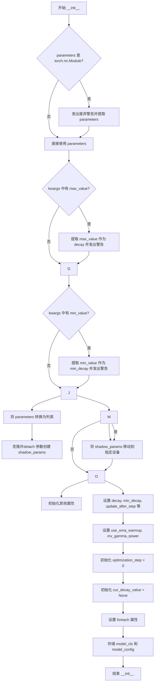

#### 带注释源码

```python
def __init__(
    self,
    parameters: Iterable[torch.nn.Parameter],
    decay: float = 0.9999,
    min_decay: float = 0.0,
    update_after_step: int = 0,
    use_ema_warmup: bool = False,
    inv_gamma: float | int = 1.0,
    power: float | int = 2 / 3,
    foreach: bool = False,
    model_cls: Any | None = None,
    model_config: dict[str, Any] | None = None,
    **kwargs,
):
    """
    Args:
        parameters (Iterable[torch.nn.Parameter]): The parameters to track.
        decay (float): The decay factor for the exponential moving average.
        min_decay (float): The minimum decay factor for the exponential moving average.
        update_after_step (int): The number of steps to wait before starting to update the EMA weights.
        use_ema_warmup (bool): Whether to use EMA warmup.
        inv_gamma (float):
            Inverse multiplicative factor of EMA warmup. Default: 1. Only used if `use_ema_warmup` is True.
        power (float): Exponential factor of EMA warmup. Default: 2/3. Only used if `use_ema_warmup` is True.
        foreach (bool): Use torch._foreach functions for updating shadow parameters. Should be faster.
        device (str | torch.device | None): The device to store the EMA weights on. If None, the EMA
                    weights will be stored on CPU.

    @crowsonkb's notes on EMA Warmup:
        If gamma=1 and power=1, implements a simple average. gamma=1, power=2/3 are good values for models you plan
        to train for a million or more steps (reaches decay factor 0.999 at 31.6K steps, 0.9999 at 1M steps),
        gamma=1, power=3/4 for models you plan to train for less (reaches decay factor 0.999 at 10K steps, 0.9999
        at 215.4k steps).
    """

    # 处理传入 torch.nn.Module 的废弃用法
    if isinstance(parameters, torch.nn.Module):
        deprecation_message = (
            "Passing a `torch.nn.Module` to `ExponentialMovingAverage` is deprecated. "
            "Please pass the parameters of the module instead."
        )
        deprecate(
            "passing a `torch.nn.Module` to `ExponentialMovingAverage`",
            "1.0.0",
            deprecation_message,
            standard_warn=False,
        )
        parameters = parameters.parameters()

        # set use_ema_warmup to True if a torch.nn.Module is passed for backwards compatibility
        use_ema_warmup = True

    # 处理废弃的 max_value 参数
    if kwargs.get("max_value", None) is not None:
        deprecation_message = "The `max_value` argument is deprecated. Please use `decay` instead."
        deprecate("max_value", "1.0.0", deprecation_message, standard_warn=False)
        decay = kwargs["max_value"]

    # 处理废弃的 min_value 参数
    if kwargs.get("min_value", None) is not None:
        deprecation_message = "The `min_value` argument is deprecated. Please use `min_decay` instead."
        deprecate("min_value", "1.0.0", deprecation_message, standard_warn=False)
        min_decay = kwargs["min_value"]

    # 将参数转换为列表并克隆为 detached 副本（shadow parameters）
    parameters = list(parameters)
    self.shadow_params = [p.clone().detach() for p in parameters]

    # 处理废弃的 device 参数
    if kwargs.get("device", None) is not None:
        deprecation_message = "The `device` argument is deprecated. Please use `to` instead."
        deprecate("device", "1.0.0", deprecation_message, standard_warn=False)
        self.to(device=kwargs["device"])

    # 初始化临时存储参数（用于 store/restore 功能）
    self.temp_stored_params = None

    # 存储衰减相关配置
    self.decay = decay
    self.min_decay = min_decay
    self.update_after_step = update_after_step
    self.use_ema_warmup = use_ema_warmup
    self.inv_gamma = inv_gamma
    self.power = power
    self.optimization_step = 0
    self.cur_decay_value = None  # set in `step()`
    self.foreach = foreach

    # 存储模型类配置用于预训练功能
    self.model_cls = model_cls
    self.model_config = model_config
```


### `EMAModel.from_pretrained`

该方法是一个类方法，用于从预训练模型路径加载模型并创建对应的 EMA（指数移动平均）模型。它首先加载模型的配置和权重，然后提取 EMA 参数并创建 EMAModel 实例。

参数：

- `path`：`str`，预训练模型的路径或目录
- `model_cls`：类型，模型类（例如 UNet2DConditionModel），用于加载预训练模型
- `foreach`：`bool`，是否使用 torch._foreach 函数更新阴影参数，默认为 False

返回值：`EMAModel`，返回加载了 EMA 状态的 EMAModel 实例

#### 流程图

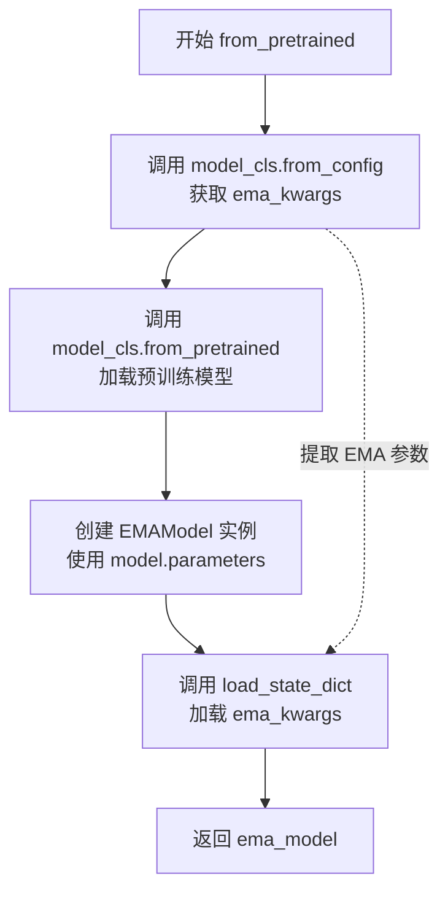

#### 带注释源码

```python
@classmethod
def from_pretrained(cls, path, model_cls, foreach=False) -> "EMAModel":
    """
    从预训练模型路径加载 EMA 模型。

    Args:
        path: 预训练模型的路径或目录
        model_cls: 模型类，用于加载预训练权重
        foreach: 是否使用 foreach 方法更新参数

    Returns:
        EMAModel: 加载了 EMA 状态的模型实例
    """
    # 从模型配置中获取 EMA 相关参数（返回未使用的kwargs）
    _, ema_kwargs = model_cls.from_config(path, return_unused_kwargs=True)
    
    # 加载完整的预训练模型
    model = model_cls.from_pretrained(path)
    
    # 创建 EMA 模型实例，传入模型参数、类配置等
    ema_model = cls(
        model.parameters(),           # 模型的参数迭代器
        model_cls=model_cls,          # 保存模型类以便后续使用
        model_config=model.config,    # 保存模型配置
        foreach=foreach               # 是否使用 foreach 优化
    )
    
    # 从预训练配置中加载 EMA 状态字典
    ema_model.load_state_dict(ema_kwargs)
    
    # 返回构建好的 EMA 模型
    return ema_model
```


### `EMAModel.save_pretrained`

将 EMA（指数移动平均）模型的参数保存到指定路径。该方法首先验证 `model_cls` 和 `model_config` 是否已定义，然后使用模型配置创建模型实例，将 EMA 的状态字典（排除 shadow_params）注册到模型配置中，将 EMA 参数复制到模型，最后使用模型的 `save_pretrained` 方法保存整个模型。

参数：

- `path`：`str`，目标保存路径，用于指定将 EMA 模型保存到的目录位置

返回值：`None`，该方法无返回值，直接将模型保存到指定路径

#### 流程图

```mermaid
flowchart TD
    A[开始 save_pretrained] --> B{检查 model_cls 是否为 None}
    B -- 是 --> C[抛出 ValueError: model_cls 未定义]
    B -- 否 --> D{检查 model_config 是否为 None}
    D -- 是 --> E[抛出 ValueError: model_config 未定义]
    D -- 否 --> F[使用 model_cls.from_config 创建模型实例]
    F --> G[调用 self.state_dict 获取 EMA 状态字典]
    G --> H[从状态字典中移除 shadow_params]
    H --> I[调用 model.register_to_config 注册状态到模型配置]
    I --> J[调用 self.copy_to 将 EMA 参数复制到模型参数]
    J --> K[调用 model.save_pretrained 保存模型到 path]
    K --> L[结束]
```

#### 带注释源码

```python
def save_pretrained(self, path):
    """
    将 EMA 模型的参数保存到指定路径。

    Args:
        path (str): 目标保存路径，用于指定将 EMA 模型保存到的目录位置。

    Returns:
        None: 该方法无返回值，直接将模型保存到指定路径。
    """
    # 检查 model_cls 是否已定义，若未定义则抛出异常
    if self.model_cls is None:
        raise ValueError("`save_pretrained` can only be used if `model_cls` was defined at __init__.")

    # 检查 model_config 是否已定义，若未定义则抛出异常
    if self.model_config is None:
        raise ValueError("`save_pretrained` can only be used if `model_config` was defined at __init__.")

    # 使用模型配置创建模型实例
    model = self.model_cls.from_config(self.model_config)
    
    # 获取 EMA 的状态字典
    state_dict = self.state_dict()
    
    # 从状态字典中移除 shadow_params，这些参数是 EMA 专有的权重副本
    # 不需要保存到模型配置中
    state_dict.pop("shadow_params", None)

    # 将 EMA 的配置参数（如 decay、optimization_step 等）注册到模型配置中
    model.register_to_config(**state_dict)
    
    # 将 EMA 存储的移动平均参数复制到模型参数中
    self.copy_to(model.parameters())
    
    # 调用模型自带的 save_pretrained 方法保存整个模型
    # 包括模型配置和权重
    model.save_pretrained(path)
```


### `EMAModel.get_decay`

获取指数移动平均（EMA）的衰减因子，根据当前优化步数计算衰减系数。

参数：

- `optimization_step`：`int`，当前的优化步数，用于计算衰减因子

返回值：`float`，计算得到的衰减因子值

#### 流程图

```mermaid
flowchart TD
    A[开始 get_decay] --> B{step = max(0, optimization_step - update_after_step - 1)}
    B --> C{step <= 0?}
    C -->|是| D[返回 0.0]
    C -->|否| E{use_ema_warmup?}
    E -->|是| F[cur_decay_value = 1 - (1 + step / inv_gamma) ^ -power]
    E -->|否| G[cur_decay_value = (1 + step) / (10 + step)]
    F --> H[cur_decay_value = min(cur_decay_value, decay)]
    G --> H
    H --> I[cur_decay_value = max(cur_decay_value, min_decay)]
    I --> J[返回 cur_decay_value]
```

#### 带注释源码

```
def get_decay(self, optimization_step: int) -> float:
    """
    Compute the decay factor for the exponential moving average.
    """
    # 计算有效步数：确保步数不小于0，并跳过前update_after_step步
    step = max(0, optimization_step - self.update_after_step - 1)

    # 如果有效步数小于等于0，返回0.0（尚未开始EMA更新）
    if step <= 0:
        return 0.0

    # 根据是否使用EMA预热计算衰减因子
    if self.use_ema_warmup:
        # 使用预热策略：cur_decay = 1 - (1 + step/gamma)^(-power)
        # 这种方式在训练早期会使用较小的衰减因子，实现预热效果
        cur_decay_value = 1 - (1 + step / self.inv_gamma) ** -self.power
    else:
        # 使用标准策略：cur_decay = (1 + step) / (10 + step)
        # 这种方式在步数较少时衰减较快，后期逐渐趋于稳定
        cur_decay_value = (1 + step) / (10 + step)

    # 衰减因子不能超过设定的最大衰减因子decay
    cur_decay_value = min(cur_decay_value, self.decay)
    # make sure decay is not smaller than min_decay
    # 确保衰减因子不低于设定的最小衰减因子min_decay
    cur_decay_value = max(cur_decay_value, self.min_decay)
    return cur_decay_value
```


### EMAModel.step

该方法实现指数移动平均（EMA）的核心更新逻辑，根据当前优化步骤计算衰减系数，然后将模型参数的移动平均值更新到shadow_params中，支持foreach高效批量更新和DeepSpeed ZeRO-3分布式训练环境。

参数：

- `parameters`：`Iterable[torch.nn.Parameter]`（可迭代的PyTorch参数列表），需要更新EMA的模型参数集合

返回值：`None`，该方法直接修改EMAModel内部的shadow_params，不返回任何值

#### 流程图

```mermaid
flowchart TD
    A[开始 step 方法] --> B{parameters 是否为 torch.nn.Module}
    B -->|是| C[发出废弃警告并提取参数]
    B -->|否| D[直接使用 parameters]
    C --> E[将 parameters 转换为列表]
    D --> E
    E --> F[optimization_step += 1]
    F --> G[调用 get_decay 计算衰减因子 decay]
    G --> H[计算 one_minus_decay = 1 - decay]
    H --> I{self.foreach 是否为 True}
    I -->|是| J[检查 DeepSpeed ZeRO3 环境]
    I -->|否| K[遍历 shadow_params 和 parameters]
    
    J --> L[收集需要梯度的参数]
    L --> M[复制不需要梯度的参数]
    M --> N[使用 torch._foreach_sub_ 批量更新]
    N --> O[结束]
    
    K --> P{当前参数是否需要梯度}
    P -->|是| Q[使用 EMA 公式更新: s_param.sub_]
    P -->|否| R[直接复制参数: s_param.copy_]
    Q --> S{是否还有更多参数}
    R --> S
    S -->|是| K
    S -->|否| O
```

#### 带注释源码

```python
@torch.no_grad()
def step(self, parameters: Iterable[torch.nn.Parameter]):
    """
    执行一步 EMA 更新。
    
    Args:
        parameters: 需要更新EMA的模型参数迭代器
    """
    # 兼容处理：如果传入的是整个模型（已废弃），则提取其参数
    if isinstance(parameters, torch.nn.Module):
        deprecation_message = (
            "Passing a `torch.nn.Module` to `ExponentialMovingAverage.step` is deprecated. "
            "Please pass the parameters of the module instead."
        )
        deprecate(
            "passing a `torch.nn.Module` to `ExponentialMovingAverage.step`",
            "1.0.0",
            deprecation_message,
            standard_warn=False,
        )
        # 从模型中提取参数生成器
        parameters = parameters.parameters()

    # 转换为列表以便多次遍历
    parameters = list(parameters)

    # 记录优化步骤计数，用于计算衰减因子
    self.optimization_step += 1

    # 根据优化步骤计算衰减因子
    # 衰减因子决定了EMA更新的速度，受 update_after_step、use_ema_warmup 等参数影响
    decay = self.get_decay(self.optimization_step)
    self.cur_decay_value = decay
    # 计算 (1 - decay)，用于后续的加权更新
    one_minus_decay = 1 - decay

    # 默认为空上下文管理器
    context_manager = contextlib.nullcontext()

    # 根据 self.foreach 标志选择不同的更新策略
    # foreach=True 使用 PyTorch 的 _foreach 函数进行向量化更新，通常更快
    if self.foreach:
        # DeepSpeed ZeRO-3 需要特殊处理：在更新前收集分布式的参数
        if is_transformers_available() and transformers.integrations.deepspeed.is_deepspeed_zero3_enabled():
            context_manager = deepspeed.zero.GatheredParameters(parameters, modifier_rank=None)

        with context_manager:
            # 筛选出需要梯度的参数（参与训练的参数）
            params_grad = [param for param in parameters if param.requires_grad]
            # 对应的 EMA 影子参数
            s_params_grad = [
                s_param for s_param, param in zip(self.shadow_params, parameters) if param.requires_grad
            ]

            # 处理部分参数不需要梯度的情况（如冻结层）
            # 直接复制这些参数到影子参数
            if len(params_grad) < len(parameters):
                torch._foreach_copy_(
                    [s_param for s_param, param in zip(self.shadow_params, parameters) if not param.requires_grad],
                    [param for param in parameters if not param.requires_grad],
                    non_blocking=True,
                )

            # 核心 EMA 更新公式：
            # s_param = s_param - one_minus_decay * (s_param - param)
            # 等价于: s_param = one_minus_decay * s_param + (1 - one_minus_decay) * param
            # 即: s_param = decay * s_param + (1-decay) * param
            torch._foreach_sub_(
                s_params_grad, torch._foreach_sub(s_params_grad, params_grad), alpha=one_minus_decay
            )

    else:
        # 逐个参数更新的传统方式（兼容性和调试用）
        for s_param, param in zip(self.shadow_params, parameters):
            # DeepSpeed ZeRO-3 下需要收集单个参数
            if is_transformers_available() and transformers.integrations.deepspeed.is_deepspeed_zero3_enabled():
                context_manager = deepspeed.zero.GatheredParameters(param, modifier_rank=None)

            with context_manager:
                if param.requires_grad:
                    # 使用 PyTorch 的 in-place 减法操作更新
                    # s_param.sub_(one_minus_decay * (s_param - param))
                    s_param.sub_(one_minus_decay * (s_param - param))
                else:
                    # 不需要梯度的参数直接复制
                    s_param.copy_(param)
```


### `EMAModel.copy_to`

将当前指数移动平均(EMA)参数复制到指定的参数集合中，用于将存储的移动平均值更新到目标模型参数。

参数：

- `parameters`：`Iterable[torch.nn.Parameter]`，要更新的目标参数集合，这些参数将被EMA的阴影参数(Shadow Parameters)覆盖。如果为`None`，则使用初始化时传入的参数。

返回值：`None`，该方法直接修改传入的参数，不返回任何值。

#### 流程图

```mermaid
flowchart TD
    A[开始 copy_to] --> B{parameters 是否为 None}
    B -->|是| C[使用初始化时的参数]
    B -->|否| D[将 parameters 转换为列表]
    D --> E{self.foreach 是否为 True}
    E -->|是| F[使用 torch._foreach_copy_ 批量复制]
    E -->|否| G[遍历每个参数逐个复制]
    F --> H[将 shadow_params 复制到目标 parameters]
    G --> I[对每个 s_param 和 param 执行复制操作]
    H --> J[结束]
    I --> J
```

#### 带注释源码

```python
def copy_to(self, parameters: Iterable[torch.nn.Parameter]) -> None:
    """
    Copy current averaged parameters into given collection of parameters.

    Args:
        parameters: Iterable of `torch.nn.Parameter`; the parameters to be
            updated with the stored moving averages. If `None`, the parameters with which this
            `ExponentialMovingAverage` was initialized will be used.
    """
    # 将可迭代参数转换为列表，以便多次遍历
    parameters = list(parameters)
    
    # 判断是否使用 foreach 优化方式
    if self.foreach:
        # 使用 torch._foreach_copy_ 进行批量复制，效率更高
        # 源参数需要先移动到目标参数的设备上
        torch._foreach_copy_(
            [param.data for param in parameters],  # 目标参数的数据
            [s_param.to(param.device).data for s_param, param in zip(self.shadow_params, parameters)],  # 源参数(EMA阴影参数)的数据，已转换设备
        )
    else:
        # 逐个参数复制，适用于不支持 foreach 的场景
        for s_param, param in zip(self.shadow_params, parameters):
            # 将阴影参数复制到目标参数，同时处理设备不匹配的情况
            param.data.copy_(s_param.to(param.device).data)
```


### `EMAModel.pin_memory`

将 ExponentialMovingAverage 的内部缓冲区移动到固定内存中，以便进行非阻塞传输，将 EMA 参数卸载到主机。

参数：无（仅 `self`）

返回值：`None`，无返回值

#### 流程图

```mermaid
flowchart TD
    A[开始 pin_memory] --> B{检查 shadow_params}
    B -->|非空| C[遍历 shadow_params 中的每个参数 p]
    C --> D[对每个参数 p 调用 pin_memory]
    D --> E[将更新后的参数列表赋值给 self.shadow_params]
    E --> F[结束]
    B -->|空| F
```

#### 带注释源码

```python
def pin_memory(self) -> None:
    r"""
    Move internal buffers of the ExponentialMovingAverage to pinned memory. Useful for non-blocking transfers for
    offloading EMA params to the host.
    """
    # 遍历所有存储的影子参数（shadow parameters），对每个参数调用 pin_memory() 方法
    # pin_memory() 会将张量移动到固定内存页，从而支持更快的 CPU-GPU 数据传输
    self.shadow_params = [p.pin_memory() for p in self.shadow_params]
```


### `EMAModel.to`

将 ExponentialMovingAverage 的内部缓冲区移动到指定设备。

参数：

- `self`：EMAModel 实例本身
- `device`：`str | torch.device | None`，目标设备，类似于 `torch.Tensor.to` 的 device 参数
- `dtype`：`torch.dtype | None`，可选，转换为指定数据类型
- `non_blocking`：`bool`，是否使用非阻塞传输

返回值：`None`，无返回值，仅移动内部缓冲区

#### 流程图

```mermaid
flowchart TD
    A[开始] --> B{遍历 shadow_params 中的每个参数 p}
    B --> C{p 是浮点数类型?}
    C -->|是| D[调用 p.to device=device, dtype=dtype, non_blocking=non_blocking]
    C -->|否| E[调用 p.to device=device, non_blocking=non_blocking]
    D --> F[将转换后的参数添加到新列表]
    E --> F
    F --> B
    B -->|遍历完成| G[用新列表更新 shadow_params]
    G --> H[结束]
```

#### 带注释源码

```
def to(self, device=None, dtype=None, non_blocking=False) -> None:
    r"""
    Move internal buffers of the ExponentialMovingAverage to `device`.

    Args:
        device: like `device` argument to `torch.Tensor.to`
    """
    # .to() on the tensors handles None correctly
    # 对 shadow_params 中的每个参数进行设备/类型转换
    self.shadow_params = [
        # 如果是浮点数张量，则转换设备和数据类型
        p.to(device=device, dtype=dtype, non_blocking=non_blocking)
        if p.is_floating_point()
        # 如果不是浮点数张量（如整型），则只转换设备
        else p.to(device=device, non_blocking=non_blocking)
        for p in self.shadow_params
    ]
```


### `EMAModel.state_dict`

返回指数移动平均（EMA）的状态字典，用于加速器（accelerate）进行检查点保存时记录EMA的状态。该方法遵循PyTorch约定，返回的是状态的引用而非副本。

参数：

- `self`：隐式参数，`EMAModel`实例本身，无需显式传递

返回值：`dict`，包含EMA模型的状态信息字典，键值对包括：

- `decay` (float)：衰减因子
- `min_decay` (float)：最小衰减因子
- `optimization_step` (int)：优化步数
- `update_after_step` (int)：开始更新EMA权重前的等待步数
- `use_ema_warmup` (bool)：是否使用EMA预热
- `inv_gamma` (float)：EMA预热的逆乘数因子
- `power` (float)：EMA预热的指数因子
- `shadow_params` (list[torch.Tensor])：模型参数的影子副本列表

#### 流程图

```mermaid
flowchart TD
    A[开始 state_dict] --> B[创建状态字典]
    B --> C[添加 decay]
    C --> D[添加 min_decay]
    D --> E[添加 optimization_step]
    E --> F[添加 update_after_step]
    F --> G[添加 use_ema_warmup]
    G --> H[添加 inv_gamma]
    H --> I[添加 power]
    I --> J[添加 shadow_params]
    J --> K[返回状态字典]
```

#### 带注释源码

```python
def state_dict(self) -> dict:
    r"""
    Returns the state of the ExponentialMovingAverage as a dict. This method is used by accelerate during
    checkpointing to save the ema state dict.
    """
    # 遵循PyTorch惯例，返回的是张量的引用：
    # "返回状态的引用而非副本！" -
    # https://pytorch.org/tutorials/beginner/saving_loading_models.html#what-is-a-state-dict
    return {
        "decay": self.decay,                      # EMA衰减因子
        "min_decay": self.min_decay,              # 最小衰减因子
        "optimization_step": self.optimization_step,  # 当前优化步数
        "update_after_step": self.update_after_step,  # 开始更新前的等待步数
        "use_ema_warmup": self.use_ema_warmup,    # 是否启用EMA预热
        "inv_gamma": self.inv_gamma,              # EMA预热逆乘数因子
        "power": self.power,                      # EMA预热指数因子
        "shadow_params": self.shadow_params,      # 模型参数的EMA影子副本列表
    }
```


### `EMAModel.store`

该方法用于临时保存模型参数，以便后续可以恢复到之前的状态。常用于在验证或保存模型时使用EMA参数，但不影响原始优化过程。

参数：

- `parameters`：`Iterable[torch.nn.Parameter]`，需要临时存储的参数集合

返回值：`None`，无返回值

#### 流程图

```mermaid
flowchart TD
    A([开始]) --> B[接收parameters参数]
    B --> C[将parameters转换为列表并遍历]
    C --> D{遍历每个param}
    D -->|是| E[对当前param执行detach操作]
    E --> F[将param复制到CPU]
    F --> G[克隆param张量]
    G --> H[将克隆后的参数添加到列表]
    H --> D
    D -->|否| I[将列表赋值给self.temp_stored_params]
    I --> J([结束])
```

#### 带注释源码

```python
def store(self, parameters: Iterable[torch.nn.Parameter]) -> None:
    r"""
    Saves the current parameters for restoring later.
    保存当前参数以便后续恢复。

    Args:
        parameters: Iterable of `torch.nn.Parameter`. The parameters to be temporarily stored.
                    torch.nn.Parameter的可迭代对象。需要临时存储的参数。

    Returns:
        None
    """
    # 遍历parameters中的每个参数，对每个参数执行以下操作：
    # 1. detach(): 脱离计算图，不再追踪梯度
    # 2. cpu(): 将张量从GPU移至CPU（避免GPU内存占用）
    # 3. clone(): 克隆张量（创建副本）
    # 最终将所有处理后的参数存储到temp_stored_params列表中
    self.temp_stored_params = [param.detach().cpu().clone() for param in parameters]
```


### `EMAModel.restore`

恢复之前通过 `store` 方法存储的参数。用于在使用 EMA 参数验证模型时不影响原始优化过程。在 `copy_to()` 方法之前存储参数，验证（或模型保存）后使用此方法恢复之前的参数。

参数：

- `parameters`：`Iterable[torch.nn.Parameter]`，需要用存储的参数更新的参数。如果为 `None`，将使用初始化此 `ExponentialMovingAverage` 时传入的参数。

返回值：`None`，无返回值，直接修改传入的参数。

#### 流程图

```mermaid
graph TD
    A[开始 restore] --> B{temp_stored_params is None?}
    B -->|是| C[抛出 RuntimeError: 没有可恢复的权重]
    B -->|否| D{self.foreach?}
    D -->|是| E[使用 torch._foreach_copy_ 批量复制]
    D -->|否| F[逐个元素复制]
    E --> G[清空 temp_stored_params 释放内存]
    F --> G
    G --> H[结束]
```

#### 带注释源码

```python
def restore(self, parameters: Iterable[torch.nn.Parameter]) -> None:
    r"""
    Restore the parameters stored with the `store` method. Useful to validate the model with EMA parameters
    without: affecting the original optimization process. Store the parameters before the `copy_to()` method. After
    validation (or model saving), use this to restore the former parameters.

    Args:
        parameters: Iterable of `torch.nn.Parameter`; the parameters to be
            updated with the stored parameters. If `None`, the parameters with which this
            `ExponentialMovingAverage` was initialized will be used.
    """

    # 检查是否存在之前存储的参数，如果没有则抛出错误
    if self.temp_stored_params is None:
        raise RuntimeError("This ExponentialMovingAverage has no `store()`ed weights to `restore()`")
    
    # 根据 self.foreach 标志选择不同的复制方式
    if self.foreach:
        # 使用 torch._foreach_copy_ 进行高效的批量复制
        # 将存储的参数复制到目标参数
        torch._foreach_copy_(
            [param.data for param in parameters], [c_param.data for c_param in self.temp_stored_params]
        )
    else:
        # 使用逐个复制的方式
        for c_param, param in zip(self.temp_stored_params, parameters):
            param.data.copy_(c_param.data)

    # 释放临时存储的参数以节省内存
    # Better memory-wise.
    self.temp_stored_params = None
```


### `EMAModel.load_state_dict`

该方法用于加载指数移动平均（EMA）模型的状态字典，通常在检查点（checkpoint）恢复或模型迁移时调用。它会深拷贝传入的状态字典，验证各项参数的合法性，并将 EMA 模型的参数、衰减因子、优化步数等状态信息恢复或更新。

参数：

-  `state_dict`：`dict`，EMA 模型的状态字典，应为调用 `state_dict()` 方法返回的对象。

返回值：`None`，无返回值，仅更新实例的内部状态。

#### 流程图

```mermaid
flowchart TD
    A[开始 load_state_dict] --> B[深拷贝 state_dict]
    B --> C[获取 decay 并验证范围 0~1]
    C --> D[获取 min_decay 并验证类型为 float]
    D --> E[获取 optimization_step 并验证类型为 int]
    E --> F[获取 update_after_step 并验证类型为 int]
    F --> G[获取 use_ema_warmup 并验证类型为 bool]
    G --> H[获取 inv_gamma 并验证类型为 float 或 int]
    H --> I[获取 power 并验证类型为 float 或 int]
    I --> J{shadow_params 是否存在?}
    J -->|是| K[验证 shadow_params 为 list 且元素为 Tensor]
    J -->|否| L[跳过 shadow_params 更新]
    K --> L
    L --> M[结束]
```

#### 带注释源码

```python
def load_state_dict(self, state_dict: dict) -> None:
    r"""
    Loads the ExponentialMovingAverage state. This method is used by accelerate during checkpointing to save the
    ema state dict.

    Args:
        state_dict (dict): EMA state. Should be an object returned
            from a call to :meth:`state_dict`.
    """
    # deepcopy, to be consistent with module API
    # 深拷贝输入的 state_dict，避免修改原始字典，保持与 PyTorch Module API 的一致性
    state_dict = copy.deepcopy(state_dict)

    # 从 state_dict 读取 decay，若不存在则保留当前实例的默认值
    self.decay = state_dict.get("decay", self.decay)
    # 验证 decay 必须在 [0, 1] 范围内，否则抛出异常
    if self.decay < 0.0 or self.decay > 1.0:
        raise ValueError("Decay must be between 0 and 1")

    # 读取并验证 min_decay，必须为 float 类型
    self.min_decay = state_dict.get("min_decay", self.min_decay)
    if not isinstance(self.min_decay, float):
        raise ValueError("Invalid min_decay")

    # 读取并验证 optimization_step，必须为 int 类型
    self.optimization_step = state_dict.get("optimization_step", self.optimization_step)
    if not isinstance(self.optimization_step, int):
        raise ValueError("Invalid optimization_step")

    # 读取并验证 update_after_step，必须为 int 类型
    self.update_after_step = state_dict.get("update_after_step", self.update_after_step)
    if not isinstance(self.update_after_step, int):
        raise ValueError("Invalid update_after_step")

    # 读取并验证 use_ema_warmup，必须为 bool 类型
    self.use_ema_warmup = state_dict.get("use_ema_warmup", self.use_ema_warmup)
    if not isinstance(self.use_ema_warmup, bool):
        raise ValueError("Invalid use_ema_warmup")

    # 读取并验证 inv_gamma，必须为 float 或 int 类型
    self.inv_gamma = state_dict.get("inv_gamma", self.inv_gamma)
    if not isinstance(self.inv_gamma, (float, int)):
        raise ValueError("Invalid inv_gamma")

    # 读取并验证 power，必须为 float 或 int 类型
    self.power = state_dict.get("power", self.power)
    if not isinstance(self.power, (float, int)):
        raise ValueError("Invalid power")

    # 获取 shadow_params，即 EMA 保存的模型参数副本
    shadow_params = state_dict.get("shadow_params", None)
    # 若存在则更新，并进行类型和元素类型校验
    if shadow_params is not None:
        self.shadow_params = shadow_params
        if not isinstance(self.shadow_params, list):
            raise ValueError("shadow_params must be a list")
        if not all(isinstance(p, torch.Tensor) for p in self.shadow_params):
            raise ValueError("shadow_params must all be Tensors")
```

## 关键组件


### 张量索引与惰性加载

代码中使用张量索引进行SNR计算和DREAM算法中的参数更新。例如在`compute_snr`函数中，通过`alphas_cumprod.to(device=timesteps.device)[timesteps]`实现基于时间步的惰性索引，避免了全量张量复制。

### 反量化支持

`cast_training_params`函数负责将模型训练参数转换为指定的数据类型（默认为fp32），支持LoRA训练中的参数精度控制，确保混合精度训练的正确性。

### 量化策略

代码包含多个与量化相关的工具函数：`compute_density_for_timestep_sampling`和`compute_loss_weighting_for_sd3`实现了SD3论文中的采样密度和损失权重计算策略，支持`logit_normal`、`mode`、`sigma_sqrt`和`cosmap`等量化训练方案。

### DREAM对齐算法

`compute_dream_and_update_latents`函数实现了DREAM（Diffusion Rectification and Estimation-Adaptive Models）算法，通过额外的无梯度前向传播步骤来调整噪声潜在变量和目标，帮助训练更高效准确地与采样过程对齐。

### LoRA状态管理

`unet_lora_state_dict`、`_set_state_dict_into_text_encoder`和`_collate_lora_metadata`三个函数构成了完整的LoRA状态字典提取、转换和元数据整理流程，支持将LoRA权重正确集成到UNet和文本编码器中。

### EMA模型权重管理

`EMAModel`类实现了指数移动平均算法，支持参数跟踪、权重存储与恢复、模型保存与加载等功能，提供`foreach`优化选项以加速大批量训练时的参数更新。

### FSDP分布式训练包装

`wrap_with_fsdp`和`get_fsdp_kwargs_from_accelerator`函数提供了与PyTorch FSDP（Fully Sharded Data Parallel）的集成，支持自动wrap策略、CPU卸载和参数优化。

### 动态Bucket选择

`parse_buckets_string`和`find_nearest_bucket`函数实现了动态bucket解析和最近bucket查找，用于支持可变分辨率训练的图像处理流程。

### 内存管理

`free_memory`函数提供了跨平台（CUDA、MPS、NPU、XPU）的统一内存释放接口，`offload_models`上下文管理器实现了模型在设备间的动态迁移以节省显存。

## 问题及建议


### 已知问题

-   `compute_dream_and_update_latents` 函数对 v-prediction 抛出 `NotImplementedError`，功能实现不完整，限制了 DREAM 策略的适用范围
-   `wrap_with_fsdp` 函数中硬编码了模型结构假设 `model.model.language_model.layers[0]`，导致该函数对不同模型架构的泛化能力差，容易在不同模型上报错
-   `compute_snr` 函数中存在冗余的设备转换操作：`sqrt_alphas_cumprod.to(device=timesteps.device)` 可能在张量已在正确设备上时造成不必要的设备间数据传输
-   `EMAModel` 类使用大量 kwargs 处理废弃参数（`max_value`, `min_value`, `device`），增加了代码复杂性和维护成本
-   `offload_models` 上下文管理器在处理 DiffusionPipeline 时只支持单个模块，与模型列表处理逻辑不一致
-   `parse_buckets_string` 函数对 bucket 维度不是 8 的倍数仅发出警告而非错误，可能导致运行时问题
-   `get_fsdp_kwargs_from_accelerator` 函数对 `fsdp_plugin` 的存在性检查依赖内部实现细节，可能因 accelerate 版本变化而失效

### 优化建议

-   实现 `compute_dream_and_update_latents` 中 v-prediction 类型的支持，参考论文公式完善逻辑
-   重构 `wrap_with_fsdp`，移除硬编码的模型结构访问，改用配置参数或自动检测机制来确定 `transformer_layer_cls`
-   优化 `compute_snr` 中的设备处理逻辑，先检查张量当前设备再决定是否执行 `.to()` 操作
-   清理 `EMAModel` 类中废弃的参数处理逻辑，统一使用新的参数名称，并在后续版本中移除兼容代码
-   统一 `offload_models` 对模型和 Pipeline 的处理方式，支持多个模块的批量卸载
-   将 `parse_buckets_string` 中的警告改为错误或添加配置选项，使边界情况处理更加明确
-   为 `get_fsdp_kwargs_from_accelerator` 添加版本兼容检查，使用更稳定的 API 探测 FSDP 配置状态

## 其它


### 设计目标与约束

本模块作为diffusers训练工具库，旨在为扩散模型（尤其是Stable Diffusion系列）提供可复现的随机种子设置、噪声调度辅助、LoRA权重管理、FSDP分布式训练封装以及指数移动平均（EMA）等核心训练组件。设计约束包括：1）仅支持PyTorch生态系统；2）需要transformers、accelerate、PEFT等可选依赖；3）FSDP功能需要分布式环境支持。

### 错误处理与异常设计

模块采用分层错误处理策略：1）依赖检查通过ImportError提示用户安装必要包；2）参数校验在函数入口处进行，包括数值范围检查（如decay必须在0-1之间）、类型检查（如min_decay必须为float）；3）配置错误通过ValueError抛出并附带详细错误信息；4）废弃参数通过deprecate函数发出警告但不阻断执行。

### 数据流与状态机

数据流主要包含三个路径：1）训练数据路径：noisy_latents → UNet预测 → 噪声调度器更新；2）EMA更新路径：模型参数 → shadow_params克隆 → 指数加权更新；3）FSDP封装路径：原始模型 → 自动wrap策略 → 分布式参数分片。EMAModel内部维护optimization_step状态控制更新时机。

### 外部依赖与接口契约

核心依赖包括torch、numpy、random用于基础计算；transformers（可选）用于文本编码器集成；accelerate（可选）用于分布式训练；PEFT（可选）用于LoRA管理；torchvision（可选）用于图像变换；deepspeed（可选）用于ZeRO-3优化。接口契约：所有张量操作需保持设备一致性；EMA的shadow_params与原始参数需保持形状相同；FSDP封装需保留原始模型的forward接口。

### 性能考量与基准测试

foreach参数控制是否使用torch._foreach加速批量参数更新，建议在GPU内存充足时启用；CPU offload通过torch.cuda.empty_cache()释放显存；FSDP的limit_all_gathers参数控制通信开销；EMA的pin_memory()方法优化CPU-GPU数据传输。性能瓶颈主要在UNet前向传播和分布式通信。

### 兼容性考虑

代码兼容Python 3.8+、PyTorch 2.0+；支持CUDA、MPS、NPU、XPU多种设备后端；向后兼容通过deprecate函数处理废弃参数；FSDP自动推断transformer_layer_cls类型以适配不同模型架构。

### 配置与参数说明

关键配置参数包括：EMAModel的decay（默认0.9999）控制EMA衰减速度、use_ema_warmup启用预热、foreach启用批量更新；FSDP的cpu_offload启用CPU卸载、use_orig_params保留原始参数、auto_wrap_policy自动封装Transformer层。

### 使用示例与用例

典型训练流程：1）set_seed(42)确保可复现；2）创建EMAModel并传入模型参数；3）每个训练step调用ema_model.step(parameters)；4）验证时使用ema_model.copy_to(model.parameters())加载EMA权重；5）使用offload_models上下文管理器管理显存。

### 测试策略

单元测试覆盖：set_seed的随机性验证；compute_snr的数值正确性；parse_buckets_string的边界条件；EMAModel的step/update/state_dict功能；FSDP封装的模型可用性。集成测试验证与DiffusionPipeline的兼容性。

### 部署注意事项

生产环境部署需注意：1）多GPU训练时确保FSDP配置正确；2）EMA权重存储需定期checkpoint；3）使用free_memory()在内存受限时清理缓存；4）LoRA权重导出需调用unet_lora_state_dict()；5）NPU设备需安装torch_npu包。


    