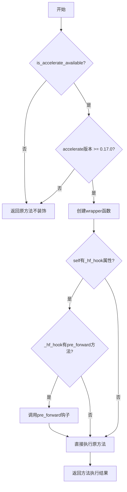
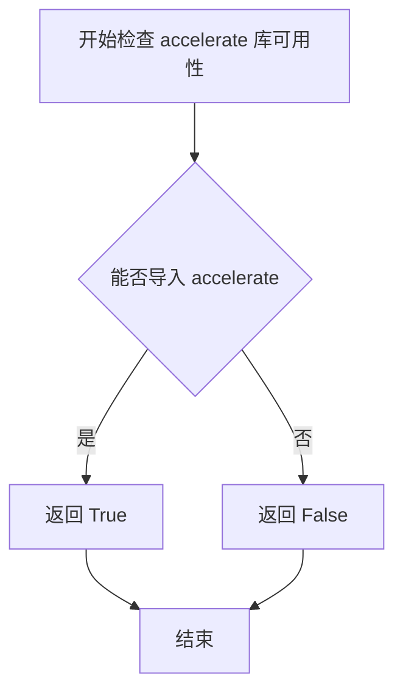
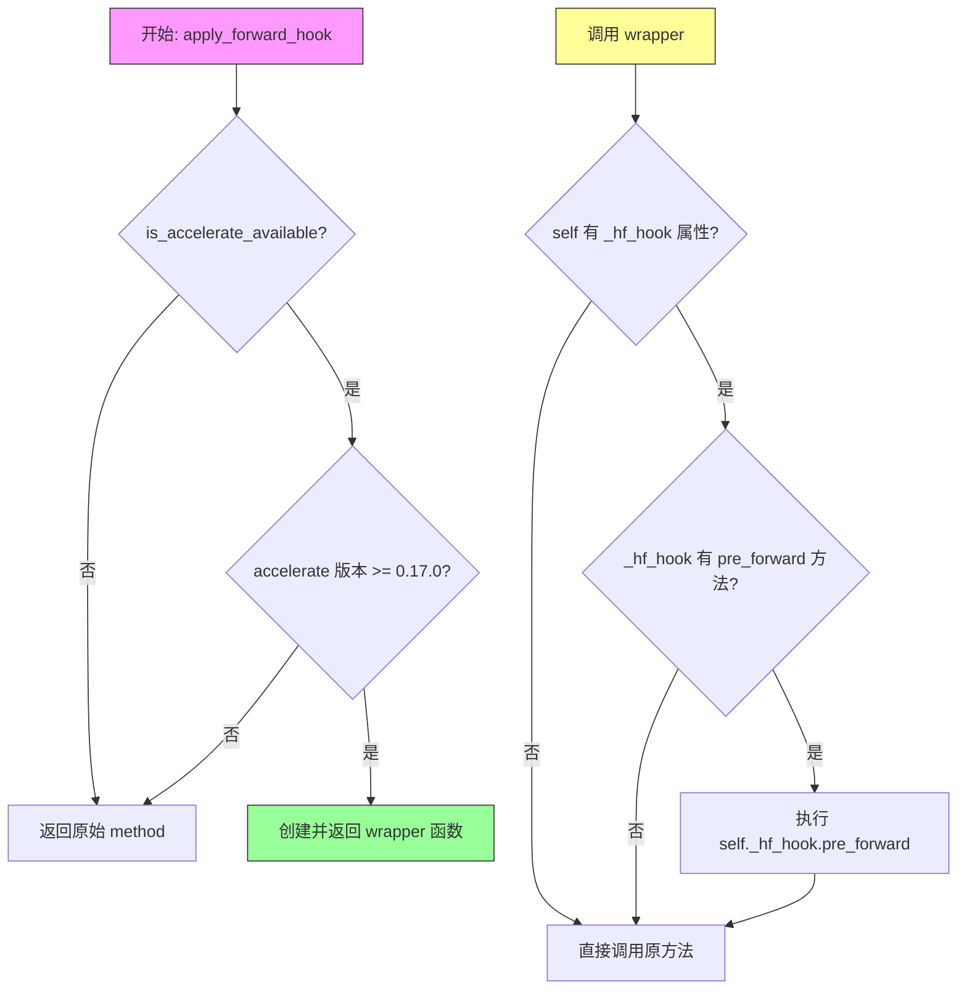

# `diffusers\src\diffusers\utils\accelerate_utils.py` 详细设计文档

这是一个加速工具模块，提供了一个装饰器函数apply_forward_hook，用于将CPU卸载钩子应用于任意PyTorch模块方法（非forward方法），支持模型的encode/decode等函数触发设备迁移到加速设备。

## 整体流程



## 类结构

```
无类定义（纯函数模块）
Global Scope
├── apply_forward_hook (装饰器函数)
```

## 全局变量及字段


### `accelerate`
    
条件导入的 accelerate 加速库模块，仅在 is_accelerate_available() 返回 True 时导入

类型：`module`
    


    

## 全局函数及方法


### `is_accelerate_available`

检查当前环境是否安装了 `accelerate` 库，并返回布尔值以指示加速库是否可用。

**注意**：此函数是从 `.import_utils` 模块导入的，函数定义不在当前提供的代码片段中。以下信息基于函数的典型实现和代码中的使用方式。

参数：

- （无参数）

返回值：`bool`，如果 `accelerate` 库已安装并可用返回 `True`，否则返回 `False`

#### 流程图



#### 带注释源码

```python
# 以下是根据代码使用方式推断的典型实现
# 实际定义在 import_utils 模块中

def is_accelerate_available() -> bool:
    """
    检查 accelerate 库是否可用。
    
    该函数尝试导入 accelerate 模块，如果成功则返回 True，
    如果发生 ImportError 则返回 False。
    
    Returns:
        bool: accelerate 库是否可用
    """
    try:
        import accelerate
        return True
    except ImportError:
        return False
```

> **注意**：由于提供的代码片段仅包含 `is_accelerate_available` 函数的导入和使用，未包含其实际定义，以上源码是基于常见模式和代码上下文推断的示例实现。实际的函数定义可能包含更多参数（如特定的版本检查等）。


### `apply_forward_hook`

该装饰器用于将注册的 CpuOffload 钩子应用到任意函数，而不仅限于 `forward` 方法。对于 PyTorch 模块提供的除 `forward` 之外的其他应该触发设备迁移的函数（如 `AutoencoderKL` 中的 `encode` 和 `decode`）非常有用。

参数：

- `method`：`Callable`，要装饰的方法，该方法应该是 PyTorch 模块的方法

返回值：`Callable`，如果 accelerate 不可用或版本低于 0.17.0，则返回原始 method；否则返回包装后的 wrapper 函数

#### 流程图



#### 带注释源码

```python
def apply_forward_hook(method):
    """
    装饰器：应用注册的 CpuOffload 钩子到任意函数
    
    用途：
    - 不仅限于 forward 方法，可以应用于其他需要设备迁移的函数
    - 常见用例：AutoencoderKL 的 encode 和 decode 方法
    
    工作原理：
    - 检查 accelerate 库是否可用
    - 检查 accelerate 版本是否 >= 0.17.0（引入该功能的版本）
    - 如果条件满足，创建一个 wrapper 函数
    - wrapper 函数在调用原方法前会执行 pre_forward 钩子
    
    :param method: 要装饰的方法，应该是 PyTorch 模块的方法
    :return: 装饰后的方法（wrapper）或原始方法（取决于条件）
    """
    # 检查 accelerate 库是否可用（通过 import_utils 中的辅助函数）
    if not is_accelerate_available():
        # 不可用时直接返回原始方法，不进行任何处理
        return method
    
    # 获取 accelerate 库的版本字符串
    accelerate_version = version.parse(accelerate.__version__).base_version
    
    # 检查版本是否低于 0.17.0（该功能引入的版本）
    if version.parse(accelerate_version) < version.parse("0.17.0"):
        # 版本过低时返回原始方法，保持向后兼容
        return method

    # 创建 wrapper 函数，用于包装原始方法
    def wrapper(self, *args, **kwargs):
        """
        包装后的函数：
        - 在调用原始方法前执行钩子
        - 将 self（模块实例）传递给钩子以便进行设备迁移
        
        :param self: PyTorch 模块实例
        :param args: 位置参数
        :param kwargs: 关键字参数
        :return: 原始方法的返回值
        """
        # 检查模块是否有 _hf_hook 属性（内部钩子属性）
        if hasattr(self, "_hf_hook") and hasattr(self._hf_hook, "pre_forward"):
            # 执行 pre_forward 钩子，完成设备迁移（如从 CPU 移到 GPU）
            self._hf_hook.pre_forward(self)
        
        # 调用原始方法并返回其结果
        return method(self, *args, **kwargs)

    # 返回包装后的函数
    return wrapper
```

## 关键组件


### apply_forward_hook 装饰器

用于将CPU Offload钩子注册到PyTorch模块的非forward方法（如encode/decode）的装饰器，支持加速设备的自动迁移

### is_accelerate_available 函数

检查accelerate库是否可用的导入工具函数

### accelerate 版本检查逻辑

确保装饰器仅在accelerate版本>=0.17.0时生效的版本兼容性检查机制

### _hf_hook 属性检查

通过检查对象是否具有_hf_hook属性及其pre_forward方法来确定是否应用设备迁移逻辑


## 问题及建议


### 已知问题

- **缺少 `post_forward` 调用**：代码仅调用了 `pre_forward`，但未在方法执行完成后调用 `post_forward` 来恢复模型状态，可能导致模型停留在加速设备上而无法正确释放回 CPU。
- **版本比较存在冗余**：`accelerate_version = version.parse(accelerate.__version__).base_version` 已经是字符串形式，后续又对其进行 `version.parse()` 转换，逻辑冗余。
- **缺乏异常处理机制**：如果 `pre_forward` 抛出异常，原始方法将不会被执行，且没有 try-finally 块确保资源正确释放。
- **无类型注解**：代码缺少参数和返回值的类型注解，降低了代码的可读性和可维护性。
- **硬编码版本号**："0.17.0" 版本号硬编码在代码中，应提取为常量以便维护。
- **加速库不可用时静默失败**：当 `is_accelerate_available()` 返回 False 时，装饰器直接返回原方法，可能导致静默行为，开发者难以察觉加速功能未启用。
- **缺少返回值处理**：未考虑 `pre_forward` 可能存在返回值的情况，也未在文档中说明返回值处理逻辑。

### 优化建议

- **添加 `post_forward` 调用**：使用 try-finally 块确保 `post_forward` 在方法执行后被调用，以正确恢复模型状态。
- **简化版本比较逻辑**：直接比较 `accelerate_version` 字符串或使用 `packaging.version.parse(accelerate.__version__)` 的结果，避免重复解析。
- **增强异常处理**：添加 try-except-finally 结构，捕获潜在异常并进行适当处理。
- **添加类型注解**：为 `method` 参数添加 `Callable` 类型注解，明确参数和返回值类型。
- **提取版本常量和警告日志**：将 "0.17.0" 定义为模块级常量，并在加速库不可用时添加日志警告。
- **完善文档说明**：补充返回值说明和 `pre_forward`/`post_forward` 调用机制的详细描述。
- **支持配置化**：考虑接受可选参数以支持自定义版本要求或 hook 配置。


## 其它


### 设计目标与约束

**设计目标**：
- 为PyTorch模块的非forward方法（如encode/decode）提供与accelerate库CPU卸载机制兼容的钩子支持
- 实现模块在加速设备间的灵活切换，而不仅限于forward方法
- 保持与旧版本accelerate的向后兼容性

**设计约束**：
- 依赖accelerate库版本>=0.17.0才能启用完整功能
- 必须保持被装饰方法的原始签名和返回值不变
- 装饰器应在accelerate不可用时安全降级，不影响正常调用

### 错误处理与异常设计

- **加速库不可用时**：通过`is_accelerate_available()`检查，若不可用则直接返回原方法，不执行任何钩子逻辑
- **版本检查失败时**：使用`packaging.version`进行版本解析，确保版本比较的准确性，版本低于0.17.0时安全降级
- **钩子缺失时**：通过`hasattr`检查`_hf_hook`属性及其`pre_forward`方法是否存在，只有在钩子存在时才执行
- **异常传播**：不捕获被装饰方法本身可能抛出的异常，允许自然向上传播

### 数据流与状态机

```
[调用入口]
    ↓
[检查accelerate可用性] → 不可用 → [返回原方法]
    ↓ 可用
[检查版本>=0.17.0] → 不满足 → [返回原方法]
    ↓ 满足
[执行pre_forward钩子]（如存在）
    ↓
[执行原方法]
    ↓
[返回结果]
```

### 外部依赖与接口契约

**外部依赖**：
- `packaging.version`：版本解析和比较
- `accelerate`库（可选）：提供`_hf_hook`机制和`pre_forward`方法
- `import_utils.is_accelerate_available`：加速库可用性检查

**接口契约**：
- 装饰器接收一个PyTorch模块的方法作为参数
- 返回一个包装函数，签名与原方法完全一致
- 返回值类型和值与原方法保持一致

### 性能考虑

- 使用`hasattr`进行属性检查，避免频繁的属性访问开销
- 装饰器仅在方法首次调用时执行版本检查，后续调用无额外版本解析开销
- 对于不支持的场景（accelerate不可用或版本过低），零运行时开销

### 安全性考虑

- 不执行任何代码注入或危险操作
- 仅访问对象已有属性（`_hf_hook`）
- 不修改被装饰方法的核心逻辑，仅在调用前后添加钩子

### 兼容性考虑

- Python版本：取决于transformers项目的Python版本要求
- accelerate版本：最低支持0.17.0，低于此版本功能禁用但不报错
- PyTorch版本：依赖PyTorch模块的_method属性机制

### 测试策略

- 测试accelerate不可用时的降级行为
- 测试accelerate版本<0.17.0时的降级行为
- 测试无`_hf_hook`属性时的行为
- 测试有`_hf_hook`但无`pre_forward`方法时的行为
- 测试方法签名和返回值的完整性

### 使用示例

```python
# 在AutoencoderKL类中使用
class AutoencoderKL(nn.Module):
    @apply_forward_hook
    def encode(self, x):
        # encode实现
        return latent
    
    @apply_forward_hook
    def decode(self, z):
        # decode实现
        return reconstructed
```

### 版本历史和变更记录

- 初始版本：支持将CPU卸载钩子应用于非forward方法
- 0.17.0版本：accelerate开始支持更灵活的钩子机制，本装饰器因此设计


    