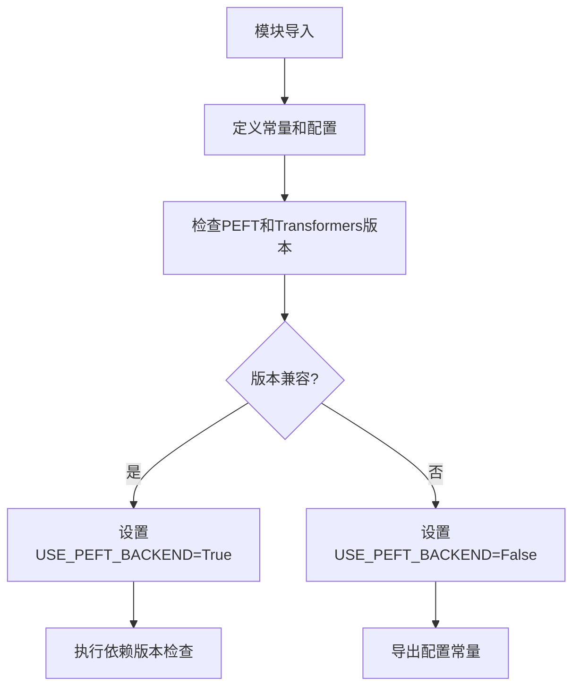

# `diffusers\src\diffusers\utils\constants.py` 详细设计文档

该文件是HuggingFace Diffusers库的配置文件，定义了模型加载所需的常量、端点URL、版本要求以及PEFT后端兼容性检查逻辑，用于管理扩散模型的加载配置和依赖版本验证。

## 整体流程



## 类结构

```
无类定义 (纯配置模块)
├── 全局配置常量
├── 版本检查逻辑
└── 端点URL定义
```

## 全局变量及字段


### `MIN_PEFT_VERSION`
    
PEFT库的最低版本要求，当前为0.6.0

类型：`str`
    


### `MIN_TRANSFORMERS_VERSION`
    
Transformers库的最低版本要求，当前为4.34.0

类型：`str`
    


### `_CHECK_PEFT`
    
是否启用PEFT版本检查的环境变量标志

类型：`bool`
    


### `CONFIG_NAME`
    
模型配置文件的默认名称

类型：`str`
    


### `WEIGHTS_NAME`
    
PyTorch扩散模型权重文件的默认名称

类型：`str`
    


### `WEIGHTS_INDEX_NAME`
    
PyTorch扩散模型权重索引文件的名称

类型：`str`
    


### `FLAX_WEIGHTS_NAME`
    
Flax扩散模型权重文件的默认名称

类型：`str`
    


### `ONNX_WEIGHTS_NAME`
    
ONNX格式扩散模型权重文件的默认名称

类型：`str`
    


### `SAFETENSORS_WEIGHTS_NAME`
    
Safetensors格式扩散模型权重文件的默认名称

类型：`str`
    


### `SAFE_WEIGHTS_INDEX_NAME`
    
Safetensors格式扩散模型权重索引文件的名称

类型：`str`
    


### `SAFETENSORS_FILE_EXTENSION`
    
Safetensors文件的扩展名

类型：`str`
    


### `GGUF_FILE_EXTENSION`
    
GGUF文件的扩展名

类型：`str`
    


### `ONNX_EXTERNAL_WEIGHTS_NAME`
    
ONNX外部权重文件的名称

类型：`str`
    


### `HUGGINGFACE_CO_RESOLVE_ENDPOINT`
    
Hugging Face模型解析的端点URL

类型：`str`
    


### `DIFFUSERS_DYNAMIC_MODULE_NAME`
    
Diffusers动态模块的名称

类型：`str`
    


### `HF_MODULES_CACHE`
    
Hugging Face模块的缓存目录路径

类型：`str`
    


### `DEPRECATED_REVISION_ARGS`
    
已弃用的模型版本参数列表

类型：`List[str]`
    


### `DIFFUSERS_REQUEST_TIMEOUT`
    
Diffusers网络请求的超时时间，单位为秒

类型：`int`
    


### `DIFFUSERS_ATTN_BACKEND`
    
Diffusers注意力机制的后端实现选择

类型：`str`
    


### `DIFFUSERS_ATTN_CHECKS`
    
是否启用注意力机制检查的标志

类型：`bool`
    


### `DEFAULT_HF_PARALLEL_LOADING_WORKERS`
    
Hugging Face并行加载模型的默认工作线程数

类型：`int`
    


### `HF_ENABLE_PARALLEL_LOADING`
    
是否启用Hugging Face并行加载的标志

类型：`bool`
    


### `DIFFUSERS_DISABLE_REMOTE_CODE`
    
是否禁用远程代码执行的标志

类型：`bool`
    


### `_required_peft_version`
    
PEFT库版本是否满足最低要求的内部标志

类型：`bool`
    


### `_required_transformers_version`
    
Transformers库版本是否满足最低要求的内部标志

类型：`bool`
    


### `USE_PEFT_BACKEND`
    
是否使用PEFT后端的全局标志

类型：`bool`
    


### `DECODE_ENDPOINT_SD_V1`
    
Stable Diffusion v1模型的解码端点URL

类型：`str`
    


### `DECODE_ENDPOINT_SD_XL`
    
Stable Diffusion XL模型的解码端点URL

类型：`str`
    


### `DECODE_ENDPOINT_FLUX`
    
Flux模型的解码端点URL

类型：`str`
    


### `DECODE_ENDPOINT_HUNYUAN_VIDEO`
    
HunYuan Video模型的解码端点URL

类型：`str`
    


### `ENCODE_ENDPOINT_SD_V1`
    
Stable Diffusion v1模型的编码端点URL

类型：`str`
    


### `ENCODE_ENDPOINT_SD_XL`
    
Stable Diffusion XL模型的编码端点URL

类型：`str`
    


### `ENCODE_ENDPOINT_FLUX`
    
Flux模型的编码端点URL

类型：`str`
    


### `DIFFUSERS_LOAD_ID_FIELDS`
    
Diffusers加载模型时需要的ID字段列表

类型：`List[str]`
    


    

## 全局函数及方法


## 关键组件


### 版本兼容性与依赖检查

检查PEFT和Transformers库的版本是否满足最低要求，以决定是否启用PEFT后端。

### 模型权重文件命名规范

定义了多种模型权重文件的名称常量，包括PyTorch、SafeTensors、Flax、ONNX、GGUF等格式的权重文件名和索引文件名。

### 环境配置与远程代码控制

通过环境变量配置注意力后端、远程代码执行、并行加载等特性，包括DIFFUSERS_ATTN_BACKEND、DIFFUSERS_DISABLE_REMOTE_CODE、HF_ENABLE_PARALLEL_LOADING等关键配置项。

### 云端推理端点管理

定义了多个云端API端点URL，用于SD V1、SD XL、FLUX、HUNYUAN_VIDEO等模型的编码和解码任务。

### 模型加载标识字段

定义了预训练模型加载所需的基本标识字段列表，包括pretrained_model_name_or_path、subfolder、variant、revision。

### HuggingFace Hub集成配置

配置HuggingFace Hub相关的路径和端点，包括HF_HOME、HF_MODULES_CACHE、HUGGINGFACE_CO_RESOLVE_ENDPOINT等。


## 问题及建议


### 已知问题

- **硬编码的云端点URL缺乏灵活性**：代码中硬编码了多个AWS端点URL（如`DECODE_ENDPOINT_SD_V1`、`DECODE_ENDPOINT_SD_XL`等），这些URL绑定到特定的AWS区域（us-east-1）和特定端点ID，缺乏动态配置机制和fallback逻辑，导致跨区域部署或端点变更时需要修改源码
- **环境变量检查逻辑冗余**：`DIFFUSERS_ATTN_CHECKS`先执行`.upper()`再与`ENV_VARS_TRUE_VALUES`比较，而`DIFFUSERS_DISABLE_REMOTE_CODE`直接执行`.upper()`后比较，逻辑不一致；`HF_ENABLE_PARALLEL_LOADING`的检查也存在类似问题
- **版本检查缺乏异常处理**：`importlib.metadata.version()`调用未包装在try-except中，当peft或transformers包未安装时会抛出`PackageNotFoundError`异常导致模块导入失败
- **配置分散且无分类**：大量全局常量（30+个）散落在文件各处，缺乏按功能分类的结构（如配置类、端点类、依赖类等），影响可维护性和可读性
- **版本比较双重parse**：使用`version.parse(importlib.metadata.version("x")).base_version`进行版本比较，虽然健壮但逻辑繁琐，可通过统一工具函数简化

### 优化建议

- **引入端点配置机制**：将硬编码的端点URL改为可通过环境变量或配置文件指定，支持动态配置和fallback机制，例如`os.environ.get("DIFFUSERS_DECODE_ENDPOINT_SD_V1", DEFAULT_DECODE_ENDPOINT_SD_V1)`
- **统一环境变量检查逻辑**：创建统一的工具函数处理环境变量布尔值检查，消除重复的`.upper() in ENV_VARS_TRUE_VALUES`模式
- **添加版本检查异常处理**：为`importlib.metadata.version()`调用添加try-except包装，提供有意义的错误信息或fallback默认值
- **重构为配置类**：将全局变量按功能域分类到不同的配置类（如`ModelConfig`、`EndpointConfig`、`DependencyConfig`），提升代码组织结构
- **提取版本比较工具函数**：创建通用的版本检查函数`check_min_version(package_name, min_version)`，减少重复代码并提供统一的错误处理
- **添加废弃配置清理**：对`DEPRECATED_REVISION_ARGS`等标记为废弃的配置进行定期审计，移除不再使用的常量


## 其它


### 设计目标与约束

本模块作为diffusers库的核心配置与初始化模块，主要目标包括：1) 定义模型权重文件名称、端点URL等常量，统一管理扩散模型相关配置；2) 实现PEFT和transformers库的版本兼容性检查，确保使用PEFT后端时依赖版本满足最低要求；3) 通过环境变量支持运行时配置灵活调整，包括注意力后端选择、并行加载、远程代码执行等；4) 提供动态模块加载和缓存机制。设计约束：需同时支持PEFT和非PEFT两种后端模式，版本兼容性检查具有自动回退特性。

### 错误处理与异常设计

本模块本身不直接抛出业务异常，主要依赖调用方的异常处理机制。版本检查通过布尔标志位（USE_PEFT_BACKEND）而非异常来指示兼容性状态，使调用方可以优雅降级。环境变量解析使用try-except保护，确保非法环境变量值不会导致程序崩溃。若_CHECK_PEFT为真且版本检查失败，dep_version_check函数将抛出DependencyError异常，该异常定义在dependency_versions_check模块中。模块导入失败时（如peft或transformers未安装），is_peft_available()和is_transformers_available()返回False，整个检查流程静默失败而非抛出异常。

### 数据流与状态机

本模块为无状态配置模块，不涉及复杂的状态机。主要数据流为：环境变量输入 → ENV_VARS_TRUE_VALUES集合比对 → 布尔标志位计算 → 版本解析与比对 → USE_PEFT_BACKEND最终标志位。配置常量通过模块级变量暴露给其他组件使用，不存在运行时状态变更。所有标志位在模块加载时一次性计算完成，属于初始化阶段的静态数据流。

### 外部依赖与接口契约

主要外部依赖包括：1) importlib.metadata - 用于获取已安装包的版本信息；2) packaging.version - 用于版本解析和比对；3) huggingface_hub.constants.HF_HOME - HuggingFace缓存目录路径；4) ..dependency_versions_check.dep_version_check - PEFT版本深度检查函数；5) .import_utils模块 - 提供is_peft_available、is_transformers_available、ENV_VARS_TRUE_VALUES等工具函数。接口契约方面，模块导出常量均以大写字母命名，调用方应通过这些常量而非硬编码字符串来引用配置值。USE_PEFT_BACKEND为布尔标志位，调用方应先检查此标志位再决定是否使用PEFT相关功能。

### 版本兼容性策略

PEFT后端要求peft>=0.6.0且transformers>=4.34.0，版本检查采用语义化版本解析（semantic versioning）。使用base_version()处理预发布版本（如0.6.0rc1会被视为0.6.0）。版本不满足时USE_PEFT_BACKEND自动设为False，代码会自动回退到非PEFT实现。_CHECK_PEFT环境变量控制是否进行深度版本检查，在生产环境中可设为"0"以跳过检查提升加载速度。版本比较使用packaging库的version.parse确保符合PEP 440规范。

### 安全考虑

本模块包含多个硬编码的云端API端点URL，这些端点用于模型编码/解码的远程推理。DIFFUSERS_DISABLE_REMOTE_CODE环境变量允许禁用远程代码执行，提升安全性。模块本身不涉及敏感数据处理，所有配置均为公开信息。环境变量HF_HOME和HF_MODULES_CACHE涉及文件系统路径，应确保调用方运行环境安全。SAFETENSORS_WEIGHTS_NAME表明支持安全张量格式，可防止恶意权重文件执行任意代码。

### 性能考虑

模块加载时会执行版本解析和比对操作，可通过设置_CHECK_PEFT="0"跳过dep_version_check以提升首次导入速度。HF_ENABLE_PARALLEL_LOADING支持并行加载模型权重，DEFAULT_HF_PARALLEL_LOADING_WORKERS默认值为8。DIFFUSERS_ATTN_CHECKS用于控制注意力机制运行时检查，开启会影响推理性能。版本检查结果（USE_PEFT_BACKEND）缓存在模块级别，避免重复计算。

### 部署注意事项

部署时需确保HF_HOME环境变量正确设置指向有足够磁盘空间的目录。DIFFUSERS_ATTN_BACKEND可选择"native"或其他支持的后端，需与硬件特性匹配。在容器化部署场景中，应将HF_MODULES_CACHE挂载为持久卷避免重复下载模块。端点URL（DECODE_ENDPOINT_*、ENCODE_ENDPOINT_*）为AWS区域端点，生产环境可能需要根据地理位置选择最优端点或配置本地推理服务。

    