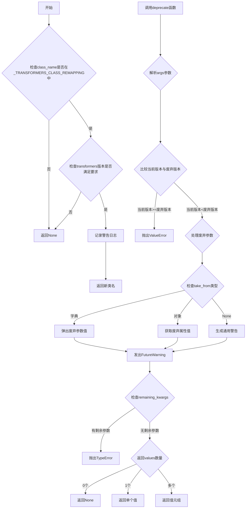
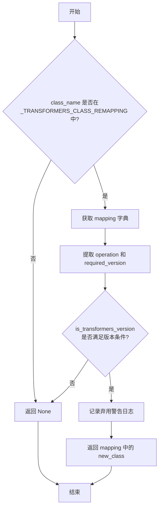
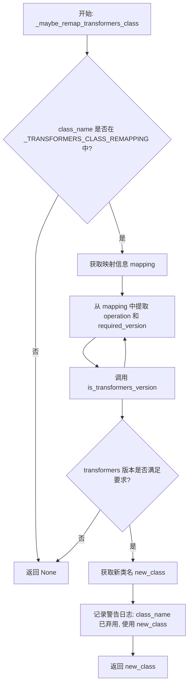

# `diffusers\src\diffusers\utils\deprecation_utils.py` 详细设计文档

该模块提供了一套完整的废弃处理工具集，用于在diffusers库中管理Transformers类的重映射和函数参数的废弃警告，确保API演进过程中的向后兼容性和平滑升级。

## 整体流程



## 类结构

```
模块: deprecation_utils (无类定义)
├── 全局变量
│   ├── _TRANSFORMERS_CLASS_REMAPPING
│   └── logger
└── 函数
    ├── _maybe_remap_transformers_class
    └── deprecate
```

## 全局变量及字段


### `_TRANSFORMERS_CLASS_REMAPPING`
    
存储已弃用的Transformers类名到新类名的映射关系字典

类型：`dict`
    


### `logger`
    
模块级日志记录器，用于输出弃用警告信息

类型：`logging.Logger`
    


### `deprecated_kwargs`
    
从调用者传入的字典或对象，用于提取被弃用的参数值

类型：`dict | Any | None`
    


### `values`
    
存储从deprecated_kwargs中提取的已弃用参数值的元组

类型：`tuple`
    


### `warning`
    
生成的弃用警告消息字符串

类型：`str | None`
    


### `call_frame`
    
调用栈帧信息对象，包含文件名、行号和函数名

类型：`inspect.FrameInfo`
    


### `filename`
    
调用deprecate函数的源文件名

类型：`str`
    


### `line_number`
    
调用deprecate函数的代码行号

类型：`int`
    


### `function`
    
调用deprecate函数的函数名

类型：`str`
    


### `key`
    
意外关键字参数的键名

类型：`str`
    


### `value`
    
意外关键字参数的值

类型：`Any`
    


### `mapping`
    
单个类的重映射配置字典，包含新类名和版本要求

类型：`dict`
    


### `operation`
    
版本比较操作符（如'>='、'>'等）

类型：`str`
    


### `required_version`
    
触发重映射所需的Transformers版本号

类型：`str`
    


### `new_class`
    
重映射后的新类名

类型：`str`
    


    

## 全局函数及方法


### `_maybe_remap_transformers_class`

该函数用于检查给定的 Transformers 类是否已被弃用，并在满足版本条件时将其重映射到新的类名。它通过查询预定义的类重映射字典，并结合当前 transformers 的版本号来决定是否需要进行类名替换，从而确保代码兼容性并向用户发出弃用警告。

参数：

- `class_name`：`str`，需要检查的类名，即要验证是否需要进行重映射的 Transformers 类的名称

返回值：`str | None`，如果类已被弃用且当前 transformers 版本满足重映射条件，则返回新类名；否则返回 `None`

#### 流程图



#### 带注释源码

```python
def _maybe_remap_transformers_class(class_name: str) -> str | None:
    """
    Check if a Transformers class should be remapped to a newer version.

    Args:
        class_name: The name of the class to check

    Returns:
        The new class name if remapping should occur, None otherwise
    """
    # 首先检查类名是否存在于预定义的重映射字典中
    # 如果不存在，说明该类不需要重映射，直接返回 None
    if class_name not in _TRANSFORMERS_CLASS_REMAPPING:
        return None

    # 延迟导入，避免循环依赖
    # is_transformers_version 用于检查当前安装的 transformers 版本
    from .import_utils import is_transformers_version

    # 获取该类对应的重映射配置
    mapping = _TRANSFORMERS_CLASS_REMAPPING[class_name]
    
    # 从配置中提取版本条件：操作符（如 >=, >）和目标版本号
    operation, required_version = mapping["transformers_version"]

    # 仅在 transformers 版本满足要求时才进行重映射
    # 这是为了避免在旧版本 transformers 上使用新版本才引入的类
    if is_transformers_version(operation, required_version):
        new_class = mapping["new_class"]
        # 记录弃用警告，提醒用户旧类已被弃用
        logger.warning(f"{class_name} appears to have been deprecated in transformers. Using {new_class} instead.")
        # 返回新的类名供调用者使用
        return mapping["new_class"]

    # 版本条件不满足时，返回 None，表示暂时不进行重映射
    return None
```


### `deprecate`

该函数是 Diffusers 库中的弃用管理工具，用于检测并警告用户关于已弃用的参数或属性。它会在参数被使用时发出 `FutureWarning` 警告，并在当前版本已超过弃用版本时抛出错误，同时支持从字典或对象中提取被弃用的值。

参数：

- `*args`：可变位置参数，每个元素为一个元组 `(attribute, version_name, message)`，其中 `attribute` 为被弃用的参数/属性名，`version_name` 为弃用版本号，`message` 为额外的警告信息
- `take_from`：`dict | Any | None`，可选参数，用于从指定字典或对象中提取被弃用的值，默认为 `None`
- `standard_warn`：布尔值，可选参数，指定是否使用标准警告格式（即在警告信息后加空格），默认为 `True`
- `stacklevel`：整数，可选参数，指定警告的堆栈层级，默认为 `2`

返回值：`None | Any | tuple`，根据提取到的值的情况而定：无值时返回 `None`，单值时返回该值本身，多值时返回值的元组

#### 流程图

```mermaid
flowchart TD
    A[开始 deprecate] --> B[获取当前 Diffusers 版本]
    B --> C{args[0] 是否为元组}
    C -->|是| D[将 args 包装为元组]
    C -->|否| E[使用原始 args]
    D --> F[遍历每个弃用元组]
    E --> F
    F --> G{当前版本 >= 弃用版本?}
    G -->|是| H[抛出 ValueError 要求移除该弃用项]
    G -->|否| I{attribute 在 take_from 中?}
    I -->|是 字典| J[弹出值并构建警告]
    I -->|是 对象属性| K[获取属性值并构建警告]
    I -->|否| L{take_from 为 None?}
    L -->|是| M[构建警告（无值）]
    L -->|否| N[不处理该属性]
    J --> O[发出 FutureWarning]
    K --> O
    M --> O
    N --> P[检查剩余未处理的参数]
    O --> P
    P --> Q{take_from 是字典且有剩余?}
    Q -->|是| R[获取调用者帧信息]
    R --> S[抛出 TypeError 意外关键字参数]
    Q -->|否| T{values 数量?}
    T -->|0| U[返回 None]
    T -->|1| V[返回 values[0]]
    T -->|>1| W[返回 values 元组]
```

#### 带注释源码

```python
def deprecate(*args, take_from: dict | Any | None = None, standard_warn=True, stacklevel=2):
    """
    处理弃用警告的核心函数。
    
    Args:
        *args: 可变参数，每个元素是 (attribute, version_name, message) 元组
        take_from: 从该字典/对象中提取被弃用的值
        standard_warn: 是否使用标准警告格式
        stacklevel: 警告的堆栈层级
    """
    # 导入当前版本
    from .. import __version__

    # 待处理的弃用值
    deprecated_kwargs = take_from
    values = ()
    
    # 统一处理：将单个元组参数包装为元组形式
    if not isinstance(args[0], tuple):
        args = (args,)

    # 遍历每个弃用项
    for attribute, version_name, message in args:
        # 检查当前版本是否已超过弃用版本若是则报错要求移除
        if version.parse(version.parse(__version__).base_version) >= version.parse(version_name):
            raise ValueError(
                f"The deprecation tuple {(attribute, version_name, message)} should be removed since diffusers'"
                f" version {__version__} is >= {version_name}"
            )

        warning = None
        # 情况1：take_from 是字典且包含该属性
        if isinstance(deprecated_kwargs, dict) and attribute in deprecated_kwargs:
            # 弹出值并构建警告消息
            values += (deprecated_kwargs.pop(attribute),)
            warning = f"The `{attribute}` argument is deprecated and will be removed in version {version_name}."
        # 情况2：take_from 是对象且具有该属性
        elif hasattr(deprecated_kwargs, attribute):
            values += (getattr(deprecated_kwargs, attribute),)
            warning = f"The `{attribute}` attribute is deprecated and will be removed in version {version_name}."
        # 情况3：take_from 为 None
        elif deprecated_kwargs is None:
            warning = f"`{attribute}` is deprecated and will be removed in version {version_name}."

        # 发出警告
        if warning is not None:
            # 根据 standard_warn 决定是否添加空格
            warning = warning + " " if standard_warn else ""
            # 发出 FutureWarning 警告
            warnings.warn(warning + message, FutureWarning, stacklevel=stacklevel)

    # 检查是否有未处理的字典参数
    if isinstance(deprecated_kwargs, dict) and len(deprecated_kwargs) > 0:
        # 获取调用者帧信息用于错误定位
        call_frame = inspect.getouterframes(inspect.currentframe())[1]
        filename = call_frame.filename
        line_number = call_frame.lineno
        function = call_frame.function
        # 取出第一个意外参数
        key, value = next(iter(deprecated_kwargs.items()))
        raise TypeError(f"{function} in {filename} line {line_number - 1} got an unexpected keyword argument `{key}`")

    # 根据提取到的值数量决定返回值
    if len(values) == 0:
        return
    elif len(values) == 1:
        return values[0]
    return values
```


### `_maybe_remap_transformers_class`

该函数用于检查给定的 Transformers 类名是否需要被重映射到新版本的具体实现类，主要用于处理已弃用的 Transformers 类名，根据当前 transformers 库的版本决定是否返回替代类名，以实现向后兼容和平滑升级。

参数：

- `class_name`：`str`，要检查的类名称

返回值：`str | None`，如果该类需要被重映射则返回新类名，否则返回 `None`

#### 流程图



#### 带注释源码

```python
def _maybe_remap_transformers_class(class_name: str) -> str | None:
    """
    Check if a Transformers class should be remapped to a newer version.

    Args:
        class_name: The name of the class to check

    Returns:
        The new class name if remapping should occur, None otherwise
    """
    # Step 1: 检查类名是否存在于重映射字典中
    # 如果不存在，说明该类不需要重映射，直接返回 None
    if class_name not in _TRANSFORMERS_CLASS_REMAPPING:
        return None

    # Step 2: 动态导入版本检查函数
    # 延迟导入以避免循环依赖
    from .import_utils import is_transformers_version

    # Step 3: 获取该类名的重映射配置
    mapping = _TRANSFORMERS_CLASS_REMAPPING[class_name]
    
    # Step 4: 提取版本要求和目标类名
    # operation: 比较操作符（如 ">", ">=", "==", "<", "<="）
    # required_version: 触发重映射的最低版本
    operation, required_version = mapping["transformers_version"]

    # Step 5: 检查当前 transformers 版本是否满足要求
    # 只有当版本满足要求时才进行重映射，确保兼容性
    if is_transformers_version(operation, required_version):
        # Step 6: 获取新类名
        new_class = mapping["new_class"]
        
        # Step 7: 记录弃用警告
        # 提示用户原始类已弃用，将使用新类代替
        logger.warning(
            f"{class_name} appears to have been deprecated in transformers. "
            f"Using {new_class} instead."
        )
        
        # Step 8: 返回新的类名
        return mapping["new_class"]

    # 版本不满足要求，不进行重映射
    return None
```


### `deprecate`

该函数用于处理代码中的弃用（deprecation）逻辑，检查传入的参数或属性是否已弃用，并在满足条件时发出 `FutureWarning` 警告，同时返回相应的值。如果检测到意外的参数，还会抛出 `TypeError`。

参数：

- `*args`：`tuple`，可变位置参数，每个元素为包含 (attribute, version_name, message) 的元组，分别表示被弃用的属性名、弃用版本号和弃用消息
- `take_from`：`dict | Any | None`，可选参数，用于从字典或对象中获取被弃用的属性值，默认为 `None`
- `standard_warn`：`bool`，是否在警告前添加标准前缀消息，默认为 `True`
- `stacklevel`：`int`，警告的堆栈深度级别，默认为 `2`

返回值：`Any | None`，根据传入的弃用参数数量返回对应的值，无值时返回 `None`

#### 流程图

```mermaid
flowchart TD
    A[开始 deprecate] --> B[获取 __version__]
    B --> C{args 是否为元组?}
    C -->|否| D[将 args 包装为元组]
    C -->|是| E[遍历 args 中的每个 attribute, version_name, message]
    D --> E
    E --> F{当前版本 >= version_name?}
    F -->|是| G[抛出 ValueError 错误]
    F -->|否| H{deprecated_kwargs 是 dict 且 attribute 在其中?}
    H -->|是| I[从 dict 中弹出值并构建警告]
    H -->|否| J{deprecated_kwargs 有 attribute 属性?}
    J -->|是| K[获取属性值并构建警告]
    J -->|否| L{deprecated_kwargs 为 None?}
    L -->|是| M[构建仅包含 attribute 的警告]
    L -->|否| N[不添加警告]
    I --> O{warning 不为空?}
    K --> O
    M --> O
    N --> O
    O -->|是| P[添加标准警告前缀]
    O -->|否| Q[发出 FutureWarning]
    P --> Q
    Q --> R{deprecated_kwargs 是 dict 且长度 > 0?}
    R -->|是| S[获取调用栈信息]
    R -->|否| T{values 长度为 0?}
    S --> U[抛出 TypeError 意外关键字参数]
    T -->|是| V[返回 None]
    T -->|否| W{values 长度为 1?}
    W -->|是| X[返回 values[0]]
    W -->|否| Y[返回 values 元组]
```

#### 带注释源码

```python
def deprecate(
    *args,  # 可变位置参数: (attribute, version_name, message) 元组
    take_from: dict | Any | None = None,  # 从中获取弃用参数值的来源
    standard_warn: bool = True,  # 是否添加标准警告前缀
    stacklevel: int = 2  # 警告堆栈深度
):
    """
    处理弃用警告和参数检查的核心函数。
    
    流程:
    1. 遍历所有传入的弃用元组
    2. 检查当前版本是否已达到或超过弃用版本
    3. 从 take_from 中提取对应属性值
    4. 发出 FutureWarning 警告
    5. 检查是否存在意外的关键字参数
    6. 返回提取的值
    """
    from .. import __version__  # 延迟导入避免循环依赖

    deprecated_kwargs = take_from  # 待处理的弃用参数容器
    values = ()  # 存储提取到的值

    # 将单个元组参数转换为元组形式，统一处理方式
    if not isinstance(args[0], tuple):
        args = (args,)

    # 遍历每个弃用项: (attribute, version_name, message)
    for attribute, version_name, message in args:
        # 版本检查: 当前版本 >= 弃用版本时应移除该弃用处理
        if version.parse(version.parse(__version__).base_version) >= version.parse(version_name):
            raise ValueError(
                f"The deprecation tuple {(attribute, version_name, message)} should be removed since diffusers'"
                f" version {__version__} is >= {version_name}"
            )

        warning = None  # 初始化警告消息

        # 情况1: take_from 是字典，且 attribute 是其中的键
        if isinstance(deprecated_kwargs, dict) and attribute in deprecated_kwargs:
            # 弹出值并构建警告消息
            values += (deprecated_kwargs.pop(attribute),)
            warning = f"The `{attribute}` argument is deprecated and will be removed in version {version_name}."
        # 情况2: take_from 是对象，且具有 attribute 属性
        elif hasattr(deprecated_kwargs, attribute):
            values += (getattr(deprecated_kwargs, attribute),)
            warning = f"The `{attribute}` attribute is deprecated and will be removed in version {version_name}."
        # 情况3: take_from 为 None，仅记录属性弃用
        elif deprecated_kwargs is None:
            warning = f"`{attribute}` is deprecated and will be removed in version {version_name}."

        # 如果存在警告消息，发出 FutureWarning
        if warning is not None:
            # 添加标准前缀（可选）
            warning = warning + " " if standard_warn else ""
            # 发出弃用警告，设置堆栈级别
            warnings.warn(warning + message, FutureWarning, stacklevel=stacklevel)

    # 检查是否存在意外的关键字参数（仅针对字典类型）
    if isinstance(deprecated_kwargs, dict) and len(deprecated_kwargs) > 0:
        # 获取调用栈信息用于错误定位
        call_frame = inspect.getouterframes(inspect.currentframe())[1]
        filename = call_frame.filename
        line_number = call_frame.lineno
        function = call_frame.function
        # 取出第一个意外参数
        key, value = next(iter(deprecated_kwargs.items()))
        raise TypeError(f"{function} in {filename} line {line_number - 1} got an unexpected keyword argument `{key}`")

    # 根据提取值的数量返回结果
    if len(values) == 0:
        return  # 返回 None
    elif len(values) == 1:
        return values[0]  # 返回单个值
    return values  # 返回值元组
```

## 关键组件


### _TRANSFORMERS_CLASS_REMAPPING

全局变量，存储Transformers中已弃用类名到新类名的映射字典，用于在特定版本条件下自动替换弃用的类

### _maybe_remap_transformers_class

检查给定的Transformers类名是否需要重新映射到新版本，返回新类名或None，包含版本检查逻辑

### deprecate

处理函数和类中弃用参数/属性的通用弃用警告机制，支持字典/对象属性/无参数三种模式，会触发FutureWarning并在版本匹配时抛出异常

### logging模块导入

从utils模块导入日志工具用于记录弃用警告信息

### 版本比较逻辑

使用packaging.version进行语义化版本比较，确保在正确的版本触发警告或异常


## 问题及建议


### 已知问题

-   **函数内导入（Import inside function）**: `_maybe_remap_transformers_class` 函数内部导入 `is_transformers_version`，这会导致每次调用时都执行导入操作，增加运行开销，同时可能隐藏循环依赖问题
-   **版本解析重复**: `deprecate` 函数中 `version.parse(version.parse(__version__).base_version)` 被调用两次，每次调用都会进行版本解析，应缓存结果
-   **类型提示不完整**: `deprecate` 函数的 `take_from` 参数类型为 `dict | Any | None`，过于宽泛，`Any` 类型会削弱类型检查的有效性
-   **硬编码的 stacklevel**: `deprecate` 函数中 stacklevel 默认为 2，这在某些调用场景下可能不准确，特别是当从包装函数调用时
- **单例映射字典**: `_TRANSFORMERS_CLASS_REMAPPING` 只包含一条记录，设计上更适合作为可扩展的配置而非硬编码在源码中
- **异常信息位置不精确**: 使用 `inspect.getouterframes` 获取的行号是调用帧的上一行 (`line_number - 1`)，这可能不准确反映实际问题代码位置

### 优化建议

-   将 `is_transformers_version` 的导入移至模块顶部，使用延迟导入（lazy import）模式或仅在需要时导入
-   缓存 `__version__` 的解析结果，避免重复解析：`base_version = version.parse(__version__).base_version`
-   细化 `take_from` 参数的类型定义，考虑使用 `TypeVar` 或 `Protocol` 来更精确地描述参数结构
-   允许调用者传入 `stacklevel` 参数，或通过 AST 分析自动计算正确的调用深度
-   将 `_TRANSFORMERS_CLASS_REMAPPING` 迁移至配置文件（如 JSON 或 YAML），提高可维护性和扩展性
-   考虑使用 `traceback` 模块代替 `inspect` 来获取更准确的调用位置信息
-   添加对 `args` 参数的空值检查和类型验证，提高函数健壮性
-   考虑将警告生成逻辑抽取为独立的辅助函数，提高代码可测试性和可维护性


## 其它


### 设计目标与约束

**设计目标**：为diffusers库提供统一的弃用管理机制，支持Transformers类名映射和函数参数/属性弃用警告，确保版本迁移的平滑过渡。

**约束条件**：
- 仅支持Python标准库中的warnings模块进行警告
- 版本比较基于packaging.version模块
- 类名映射仅在transformers版本满足条件时触发
- 弃用检查基于当前diffusers版本与指定弃用版本的比较

### 错误处理与异常设计

**ValueError**：当diffusers当前版本大于等于指定的弃用版本时抛出，提示应移除该弃用代码。

**TypeError**：当传入unexpected keyword argument（意外的关键字参数）时抛出，指示函数名、文件名、行号和未知参数名。

**FutureWarning**：通过Python标准warnings模块发出，stacklevel可配置以指向正确的调用行。

**返回None**：当没有值需要返回或类名不需要映射时返回None。

### 数据流与状态机

**deprecate函数数据流**：
1. 解析可变参数args，提取(attribute, version_name, message)元组
2. 比较当前diffusers版本与version_name，若已达标则抛ValueError
3. 从deprecated_kwargs字典或对象属性中提取被弃用的值
4. 生成警告信息并通过warnings.warn发出
5. 检查deprecated_kwargs是否为空，若存在未知参数则抛TypeError
6. 返回提取的值（单个值或元组）

**_maybe_remap_transformers_class函数数据流**：
1. 检查class_name是否在_TRANSFORMERS_CLASS_REMAPPING中
2. 若存在，获取版本要求并调用is_transformers_version检查
3. 若版本满足条件，记录警告并返回新类名
4. 否则返回None

### 外部依赖与接口契约

**外部依赖**：
- `inspect`：获取调用帧信息以定位错误位置
- `warnings`：发出FutureWarning警告
- `packaging.version`：解析和比较语义化版本
- `..utils.logging`：获取日志记录器
- `..import_utils.is_transformers_version`：检查transformers版本

**接口契约**：
- `deprecate(*args, take_from, standard_warn, stacklevel)`：通用弃用处理函数
- `_maybe_remap_transformers_class(class_name)`：类名映射检查函数
- 全局_TRANSFORMERS_CLASS_REMAPPING字典：维护类名映射配置

### 安全性考虑

- 版本比较使用base_version去除预发布标识符
- 通过stacklevel参数控制警告堆栈深度，确保警告指向正确调用位置
- 类名映射仅在transformers版本明确满足条件时触发，避免版本误判

### 测试策略建议

- 测试版本比较逻辑（边界条件：当前版本等于/大于/小于弃用版本）
- 测试类名映射在不同transformers版本下的行为
- 测试标准警告与自定义警告消息的组合
- 测试unexpected keyword argument的TypeError抛出
- 测试从dict和object两种来源提取属性值的场景

    