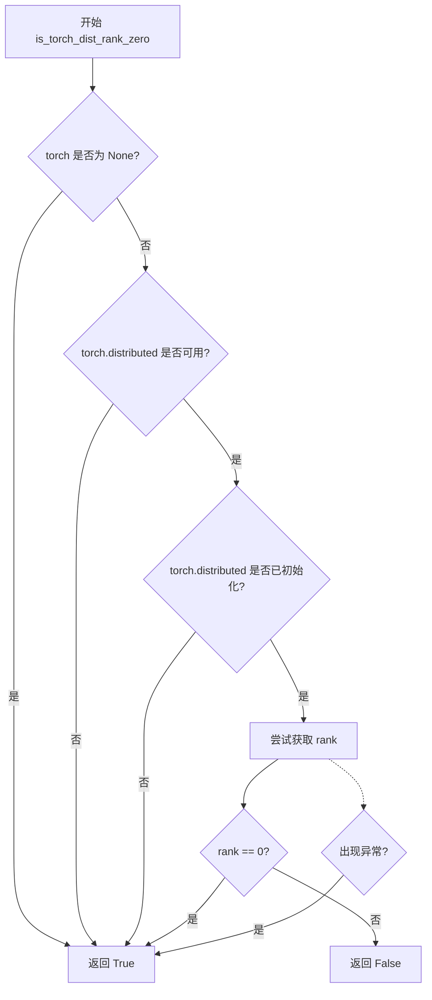
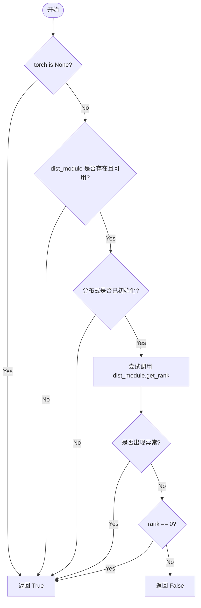

# `diffusers\src\diffusers\utils\distributed_utils.py` 详细设计文档

该代码提供了一个分布式训练环境检查工具函数，用于判断当前进程是否为分布式训练中的主节点（rank 0），在PyTorch不可用或分布式环境未初始化时默认返回True。

## 整体流程



## 类结构

```
无类层次结构（模块级工具函数）
```

## 全局变量及字段


### `torch`
    
PyTorch模块的引用，导入失败时为None

类型：`Module or None`
    


    

## 全局函数及方法


### `is_torch_dist_rank_zero`

该函数用于检查当前进程是否为分布式训练中的主节点（rank 0）。它通过检查 PyTorch 分布式模块的可用性、初始化状态以及当前进程的 rank 值来确定主节点身份，在分布式训练环境中用于确保只有主节点执行特定操作（如日志记录、模型保存等）。

参数：此函数无参数。

返回值：`bool`，返回 `True` 表示当前进程是分布式训练的主节点（rank 0），返回 `False` 表示当前进程不是主节点。

#### 流程图



#### 带注释源码

```python
# 导入 torch，如果未安装则设为 None
try:
    import torch
except ImportError:
    torch = None


def is_torch_dist_rank_zero() -> bool:
    """
    检查当前进程是否为分布式训练主节点（rank 0）
    
    返回值:
        bool: True 表示当前进程是主节点，False 表示不是主节点
    """
    # 步骤1: 如果 PyTorch 未安装，假设当前是主节点
    # 这允许代码在没有 PyTorch 的环境中也能正常运行
    if torch is None:
        return True

    # 步骤2: 获取 torch.distributed 模块并检查其是否可用
    # 如果分布式模块不可用，假设当前是主节点
    dist_module = getattr(torch, "distributed", None)
    if dist_module is None or not dist_module.is_available():
        return True

    # 步骤3: 检查分布式环境是否已初始化
    # 如果未初始化，假设当前是主节点
    if not dist_module.is_initialized():
        return True

    # 步骤4: 尝试获取当前进程的 rank 值
    # rank 0 表示主节点，非 0 表示从节点
    try:
        return dist_module.get_rank() == 0
    # 步骤5: 捕获异常，防止分布式环境不稳定时崩溃
    # 出现异常时默认当作主节点处理
    except (RuntimeError, ValueError):
        return True
```

## 关键组件


### torch可选依赖导入

处理PyTorch库的可选导入，如果torch未安装则设置为None，避免代码在无torch环境下直接崩溃

### is_torch_dist_rank_zero() 分布式主进程判断

核心函数，用于判断当前进程是否在PyTorch分布式训练环境中为主进程（rank 0）。该函数通过多层检查（torch可用性、distributed模块可用性、分布式初始化状态、rank获取）来安全地确定是否为主进程，在任何检查失败时默认返回True

### 分布式环境检查逻辑

检查torch.distributed模块是否可用、是否已初始化、以及获取当前进程rank值的完整流程，包含异常处理机制以应对分布式环境未正确配置的情况


## 问题及建议


### 已知问题

-   **异常处理过于宽泛**：使用 `except (RuntimeError, ValueError)` 捕获所有异常并静默返回 `True`，可能导致隐藏真正的问题，让调用者无法区分是真的满足条件还是发生了错误
-   **函数命名与实际行为存在语义偏差**：函数名 `is_torch_dist_rank_zero` 暗示返回"是否是rank 0"，但实际上在 torch 不可用、分布式未初始化或发生异常时也会返回 `True`，语义不够精确
-   **缺少文档注释**：没有任何 docstring 或注释说明函数的用途、返回值含义以及各种返回 `True` 的场景区别
-   **逻辑嵌套过深**：多层 if 嵌套降低了代码可读性，可采用早期返回模式优化
- **缺乏日志记录**：当发生异常或特殊状态时静默返回，缺乏可观测性，排查问题时缺少关键信息

### 优化建议

-   添加详细的 docstring，明确说明函数在各种情况下的返回值含义，包括 torch 不可用、分布式未初始化、异常等场景的区分
-   考虑将异常处理改为更细粒度的方式，例如捕获特定异常类型，或提供回调/日志机制让调用者知道发生了异常
-   使用早期返回（early return）模式重构代码，减少嵌套层级，提升可读性
-   考虑添加可选的 `logger` 参数，在异常或非预期状态下记录警告日志，提升可观测性
-   评估是否需要拆分函数，将"获取 rank"和"判断是否为 0"逻辑分离，提供更灵活的接口


## 其它


### 设计目标与约束

该函数的核心设计目标是提供一个轻量级的跨进程主节点判断工具，用于在分布式训练环境中确定当前进程是否为rank 0进程，以便决定是否执行某些仅需在主节点运行的操作（如日志记录、模型保存等）。设计约束包括：1) 必须保持零额外依赖，仅依赖PyTorch本身；2) 在任何PyTorch环境下都能安全运行，包括未安装PyTorch、分布式模块不可用或未初始化的场景；3) 函数调用不应抛出异常，必须始终返回确定的布尔值；4) 性能开销必须极低，因为该函数可能在频繁调用的代码路径中使用。

### 错误处理与异常设计

该模块采用了"安全优先"的异常处理策略，具体体现在：1) 使用try-except捕获ImportError来处理PyTorch未安装的情况，此时直接返回True，假设在非分布式环境中所有进程都可视为主节点；2) 使用getattr安全获取distributed模块，避免属性访问异常；3) 使用多个守护性检查（is_available、is_initialized）来预判分布式环境状态，避免在不适配的环境中调用相关函数；4) 使用try-except捕获RuntimeError和ValueError来处理分布式初始化过程中的边界情况（如进程组已销毁等），确保函数始终返回有效值而非抛出异常。这种设计将所有可能的错误情况都优雅地降级为返回True，符合"fail-safe"原则。

### 外部依赖与接口契约

该函数对外部环境有明确的依赖契约：1) 依赖PyTorch库（可选），通过try-except处理ImportError；2) 依赖torch.distributed模块的三个核心函数/属性：is_available()、is_initialized()和get_rank()；3) 函数返回类型契约明确为bool类型，True表示当前进程是rank 0或处于非分布式环境，False表示当前进程不是rank 0；4) 无输入参数，依赖全局PyTorch状态进行判断。需要注意的是，该函数的设计假设torch.distributed.get_rank()在分布式环境已初始化的情况下总是可用的，但在某些多进程启动器（如torchrun）未正确配置时可能抛出异常，这正是代码捕获RuntimeError和ValueError的原因。

    