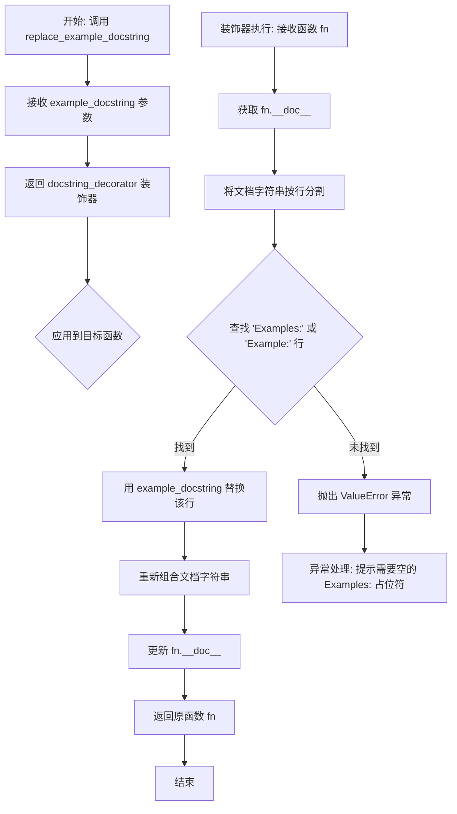
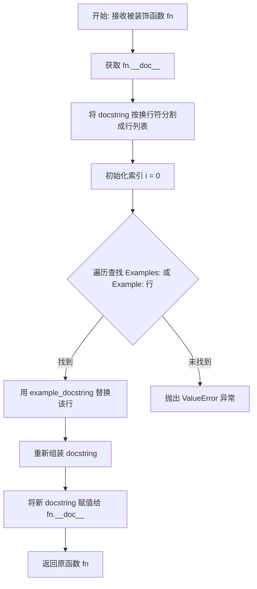

# `diffusers\src\diffusers\utils\doc_utils.py` 详细设计文档

这是一个文档工具模块，提供用于替换函数文档字符串中示例部分的装饰器函数，支持动态更新Python函数的docstring中的Examples段落。

## 整体流程

```mermaid
graph TD
    A[开始] --> B[导入re模块]
    B --> C[定义replace_example_docstring函数]
    C --> D[接收example_docstring参数]
    D --> E[返回docstring_decorator装饰器]
    E --> F[装饰器接收fn函数]
    F --> G[获取fn.__doc__]
    G --> H[按行分割docstring]
    H --> I[初始化i=0]
    I --> J{查找Examples:或Example:}
    J -- 未找到 --> K[抛出ValueError]
    J -- 找到 --> L[替换lines[i]为新示例]
    L --> M[重新组合为字符串]
    M --> N[更新fn.__doc__]
    N --> O[返回fn函数]
```

## 类结构

```
无类定义 (纯函数模块)
└── replace_example_docstring (装饰器工厂函数)
    └── docstring_decorator (内部装饰器函数)
```

## 全局变量及字段


### `example_docstring`
    
传入的新示例文档字符串，用于替换原函数文档中的Examples部分

类型：`str`
    


### `fn`
    
被装饰的目标函数，其文档字符串将被修改

类型：`Callable`
    


### `func_doc`
    
目标函数的原始文档字符串内容

类型：`str`
    


### `lines`
    
将文档字符串按行分割后得到的列表

类型：`List[str]`
    


### `i`
    
用于遍历文档字符串行的索引变量

类型：`int`
    


    

## 全局函数及方法


# 设计文档：replace_example_docstring 函数分析

## 1. 一段话描述

`replace_example_docstring` 是一个装饰器工厂函数，用于动态替换 Python 函数文档字符串中的 "Examples:" 或 "Example:" 部分，支持在运行时更新函数的示例说明文档。

## 2. 文件的整体运行流程

```
┌─────────────────────────────────────────────────────────────────┐
│                        模块加载阶段                              │
│                  (import doc utilities 模块)                    │
└─────────────────────────────────────────────────────────────────┘
                                │
                                ▼
┌─────────────────────────────────────────────────────────────────┐
│                   调用 replace_example_docstring                 │
│              (传入期望替换的 example_docstring)                  │
└─────────────────────────────────────────────────────────────────┘
                                │
                                ▼
┌─────────────────────────────────────────────────────────────────┐
│                  返回 docstring_decorator 装饰器                 │
└─────────────────────────────────────────────────────────────────┘
                                │
                                ▼
┌─────────────────────────────────────────────────────────────────┐
│              装饰器应用到目标函数 (如 @replace_example_docstring) │
└─────────────────────────────────────────────────────────────────┘
                                │
                                ▼
┌─────────────────────────────────────────────────────────────────┐
│                    执行装饰器逻辑                                 │
│         1. 获取函数 __doc__                                     │
│         2. 分割文档字符串为行                                   │
│         3. 查找 Examples: 行                                    │
│         4. 替换或抛出异常                                       │
│         5. 更新函数的 __doc__                                   │
└─────────────────────────────────────────────────────────────────┘
```

## 3. 类的详细信息

该文件中没有类定义，仅包含全局函数。

## 4. 全局变量和全局函数的详细信息

### 4.1 全局变量

无全局变量。

### 4.2 全局函数

---

### `replace_example_docstring`

用于创建装饰器的工厂函数，替换目标函数的文档字符串中的 Examples 部分。

**参数：**

- `example_docstring`：`str`，要替换进函数文档中的示例文档字符串内容

**返回值：** `function`，返回一个装饰器函数 `docstring_decorator`

#### 流程图



#### 带注释源码

```python
def replace_example_docstring(example_docstring):
    """
    装饰器工厂函数，用于替换函数文档字符串中的 Examples 部分。
    
    参数:
        example_docstring (str): 要替换的示例文档字符串内容
        
    返回:
        function: 返回一个装饰器函数
    """
    
    def docstring_decorator(fn):
        """
        实际的装饰器函数，接收被装饰的函数作为参数。
        
        参数:
            fn (function): 被装饰的函数对象
            
        返回:
            function: 返回被装饰后的函数
        """
        # 获取被装饰函数的原始文档字符串
        func_doc = fn.__doc__
        
        # 将文档字符串按行分割成列表
        lines = func_doc.split("\n")
        
        # 初始化索引，从第一行开始查找
        i = 0
        # 遍历所有行，查找以 "Examples:" 或 "Example:" 开头的行
        # 使用正则表达式匹配，支持前后空白字符
        while i < len(lines) and re.search(r"^\s*Examples?:\s*$", lines[i]) is None:
            i += 1
        
        # 判断是否找到 Examples 行
        if i < len(lines):
            # 找到后，用传入的 example_docstring 替换该行
            lines[i] = example_docstring
            # 重新将行列表合并为文档字符串
            func_doc = "\n".join(lines)
        else:
            # 未找到匹配的 Examples 行，抛出异常
            raise ValueError(
                f"The function {fn} should have an empty 'Examples:' in its docstring as placeholder, "
                f"current docstring is:\n{func_doc}"
            )
        
        # 更新函数的 __doc__ 属性
        fn.__doc__ = func_doc
        
        # 返回原函数（注意：此处未调用 fn()，仅返回函数引用）
        return fn

    # 返回装饰器函数，供后续应用于目标函数
    return docstring_decorator
```

## 5. 关键组件信息

| 组件名称 | 一句话描述 |
|---------|-----------|
| `replace_example_docstring` | 装饰器工厂函数，用于动态替换函数文档中的 Examples 部分 |
| `docstring_decorator` | 实际执行文档替换逻辑的内部装饰器函数 |
| `re.search(r"^\s*Examples?:\s*$", lines[i])` | 正则表达式，用于匹配 "Examples:" 或 "Example:" 行 |

## 6. 潜在的技术债务或优化空间

1. **正则表达式编译优化**：正则表达式在每次装饰器调用时都会被重新编译，建议使用 `re.compile()` 预编译正则表达式以提升性能。

2. **缺少类型注解**：函数缺少类型注解（Type Hints），不利于静态类型检查和 IDE 自动补全。

3. **错误处理不够友好**：仅抛出通用的 `ValueError`，可以考虑提供更具体的异常类或更详细的错误信息。

4. **不支持多行 Examples 替换**：当前实现仅替换单行 "Examples:"，不支持替换整个 Examples 块。

5. **装饰器不可叠加**：返回的函数直接返回 `fn` 而非包装后的函数，可能影响装饰器链的使用。

## 7. 其它项目

### 7.1 设计目标与约束

- **设计目标**：提供一种机制，在运行时动态替换函数的示例文档字符串，常用于测试框架或文档生成场景。
- **约束**：目标函数必须在文档字符串中包含空的 `Examples:` 或 `Example:` 行作为占位符。

### 7.2 错误处理与异常设计

- **异常类型**：`ValueError`
- **触发条件**：当目标函数的文档字符串中不存在 `Examples:` 或 `Example:` 占位符行时抛出。
- **错误信息**：包含函数对象和当前文档字符串内容，便于开发者定位问题。

### 7.3 数据流与状态机

1. **输入**：用户提供的 `example_docstring` 字符串
2. **处理**：通过装饰器模式，修改目标函数的 `__doc__` 属性
3. **输出**：更新后的函数对象，其文档字符串已被修改

### 7.4 外部依赖与接口契约

- **依赖模块**：`re` 模块（Python 标准库）
- **接口契约**：
  - 输入：字符串类型的 `example_docstring`
  - 返回：可调用装饰器
  - 被装饰函数必须具有包含 `Examples:` 或 `Example:` 的文档字符串


### `replace_example_docstring.<locals>.docstring_decorator`

这是一个内部装饰器函数，用于替换被装饰函数文档字符串中的 "Examples:" 部分。它遍历函数的 docstring，找到 "Examples:" 行并用传入的 `example_docstring` 替换该行，如果未找到占位符则抛出异常。

参数：

- `fn`：`Callable`，需要被装饰的函数对象

返回值：`Callable`，修改了 `__doc__` 属性后的原函数

#### 流程图



#### 带注释源码

```python
def docstring_decorator(fn):
    """
    内部装饰器：替换函数文档字符串中的 Examples 部分
    
    参数:
        fn: 需要被装饰的函数对象
        
    返回:
        修改了 __doc__ 属性后的原函数
    """
    # 1. 获取被装饰函数的文档字符串
    func_doc = fn.__doc__
    
    # 2. 将文档字符串按换行符分割成行列表
    lines = func_doc.split("\n")
    
    # 3. 初始化索引，从第一行开始查找
    i = 0
    
    # 4. 遍历查找包含 "Examples:" 或 "Example:" 的行
    # 使用正则表达式匹配，忽略前后空格
    while i < len(lines) and re.search(r"^\s*Examples?:\s*$", lines[i]) is None:
        i += 1
    
    # 5. 判断是否找到目标行
    if i < len(lines):
        # 找到：用 example_docstring 替换该行
        lines[i] = example_docstring
        # 重新组装文档字符串
        func_doc = "\n".join(lines)
    else:
        # 未找到：抛出 ValueError 异常
        raise ValueError(
            f"The function {fn} should have an empty 'Examples:' in its docstring as placeholder, "
            f"current docstring is:\n{func_doc}"
        )
    
    # 6. 将修改后的文档字符串重新赋值给函数
    fn.__doc__ = func_doc
    
    # 7. 返回原函数（注意：这里是直接返回 fn，不是返回包装后的函数）
    return fn
```

## 关键组件


### replace_example_docstring 函数

核心装饰器函数,接收自定义的 example_docstring 参数,返回一个 docstring_decorator 装饰器,用于替换目标函数的文档字符串中的 Examples 部分。

### docstring_decorator 内部装饰器

实际执行文档字符串替换的内部函数,接收被装饰的函数 fn 作为参数,负责解析函数原始文档字符串、定位 Examples 段落位置、替换为新的示例内容,并将修改后的文档字符串重新赋值给函数。

### 正则表达式匹配模式

使用正则表达式 `r"^\s*Examples?:\s*$"` 匹配文档字符串中的 "Examples:" 或 "Example:" 段落标题,该模式支持前后空白字符,以适应不同的文档格式风格。

### func_doc 文档字符串处理

通过 split("\n") 将文档字符串分割为行列表进行逐行处理,支持按索引位置直接替换特定行,最后通过 "\n".join(lines) 重新拼接为完整的文档字符串。


## 问题及建议


### 已知问题

-   **空文档风险**：未检查 `fn.__doc__` 是否为 `None`，直接访问会导致 `AttributeError` 异常
-   **正则表达式性能**：每次调用都重新编译正则表达式 `r"^\s*Examples?:\s*$"`，未使用 `re.compile` 预编译
-   **Examples匹配局限**：正则表达式 `Examples?` 只匹配单复数形式，可能遗漏 "Example:"、"EXAMPLE:" 等变体
-   **单行替换限制**：仅替换匹配行的内容，若Examples部分占多行（如包含代码块），后续行不会被处理
-   **缺乏参数验证**：未对 `example_docstring` 参数进行类型检查或空值验证
-   **错误信息不完整**：异常消息中 `fn` 直接打印对象，未显示函数名称（建议使用 `fn.__name__`）
-   **代码可读性**：使用 `while` 循环配合索引遍历，可使用 `enumerate` 替代更直观

### 优化建议

-   在函数开始处添加 `if fn.__doc__ is None: raise ValueError("...")`
-   将正则表达式预编译为模块级常量：`EXAMPLE_PATTERN = re.compile(r"^\s*Examples?:\s*$", re.IGNORECASE)`
-   扩展正则表达式支持更多变体，或提供配置参数
-   考虑使用 `re.sub` 直接替换整个Examples段落，而非逐行处理
-   使用 `enumerate` 替代手动索引：`for i, line in enumerate(lines):`
-   在装饰器参数中添加类型注解和文档字符串，提升可维护性
-   改进错误消息，显示函数名：`f"The function {fn.__name__}..."`

## 其它


### 设计目标与约束

本模块的设计目标是为HuggingFace库中的函数提供统一的文档示例替换机制，确保文档示例的一致性和可维护性。约束条件包括：1) 目标函数必须包含空的"Examples:"或"Example:"占位符；2) 替换操作直接修改原函数的`__doc__`属性；3) 仅支持单行"Examples:"标记，不支持多行标记。

### 错误处理与异常设计

当目标函数的文档字符串中不存在"Examples:"或"Example:"标记时，抛出`ValueError`异常，并附带详细的错误信息，包括函数名称和当前文档字符串内容，以便开发者定位问题。当前仅处理单行"Examples:"标记，对于文档格式不规范的函数无法正确处理。

### 外部依赖与接口契约

本模块仅依赖Python标准库`re`模块进行正则表达式匹配。提供`replace_example_docstring(example_docstring)`函数作为唯一公共接口，接受字符串参数`example_docstring`作为要替换的示例内容，返回一个装饰器函数，该装饰器接受目标函数作为参数并返回修改后的函数。

### 性能考虑与优化空间

当前实现使用简单的线性遍历查找"Examples:"标记，对于文档字符串较长的函数可能存在性能问题。优化方向包括：1) 使用`re.search`直接在整个文档字符串中搜索而非逐行遍历；2) 缓存正则表达式编译结果；3) 对于批量文档替换场景，考虑提供批处理接口。

### 可测试性设计

当前模块测试可行性较高，因其功能单一、边界条件明确。建议测试场景包括：1) 正常替换包含"Examples:"的文档字符串；2) 正常替换包含"Example:"的文档字符串；3) 处理文档字符串中"Examples:"出现在不同位置的情况；4) 验证异常抛出的错误信息准确性。

### 使用示例与调用模式

典型使用场景是在文档生成流程中批量替换预定义的示例文档字符串。调用模式为：先定义要替换的示例内容，然后使用装饰器语法应用到目标函数上。示例：`@replace_example_docstring("Examples:\n    >>> print('hello')")`

### 配置说明与扩展性

本模块为无状态工具函数，无需外部配置。扩展方向可考虑：1) 支持多行"Examples:"块替换；2) 支持自定义正则表达式模式匹配；3) 提供不修改原函数而是返回新文档字符串的纯函数版本。

### 版本历史与兼容性说明

当前代码版本为初始版本，基于Apache License 2.0开源协议。作为HuggingFace库文档工具的一部分，保持与主库版本同步更新。API设计保持向后兼容，当前无废弃接口计划。


    