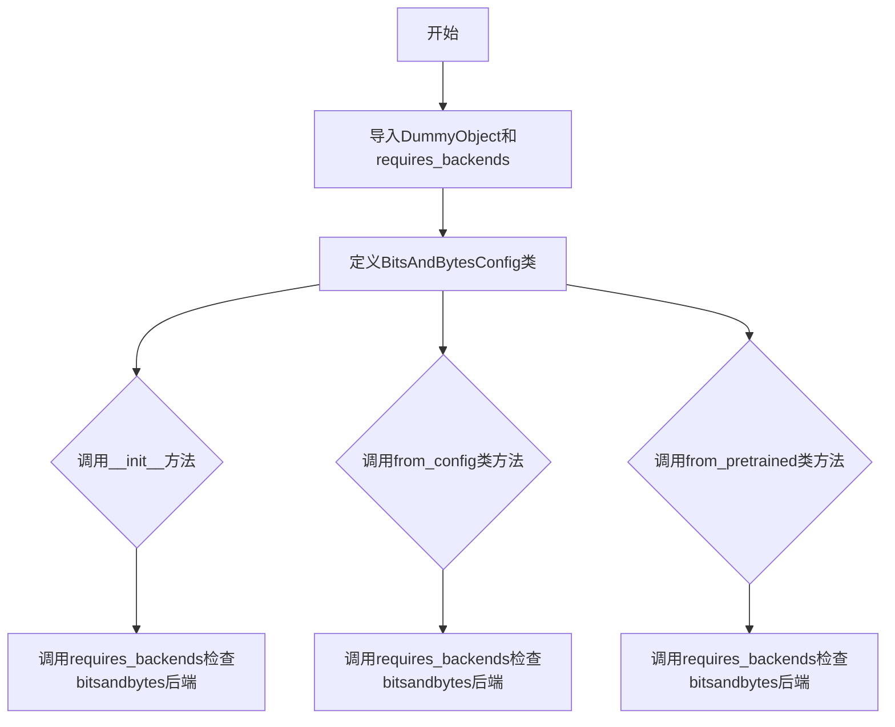
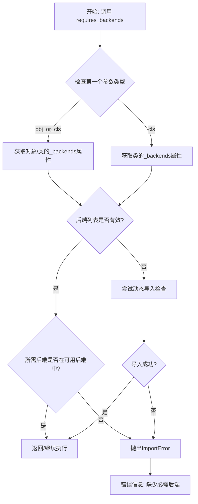
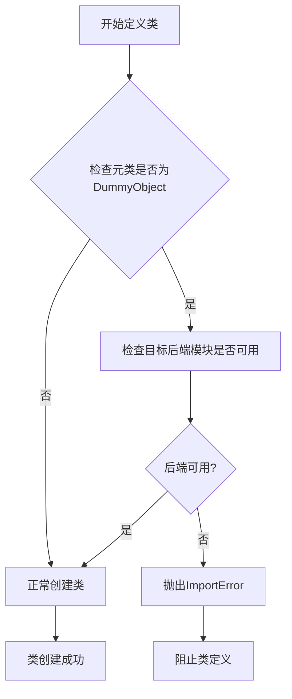
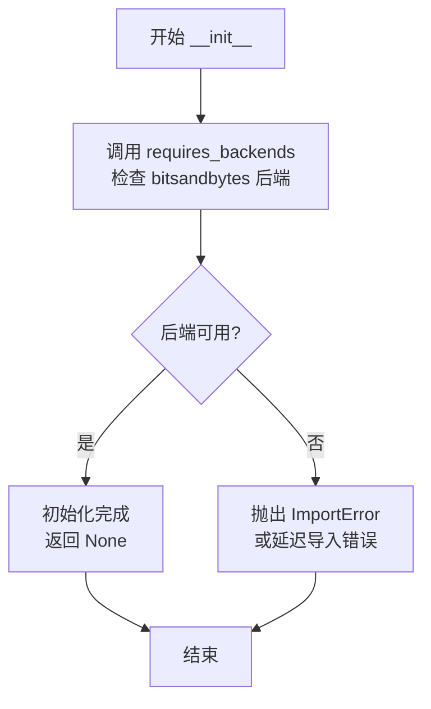
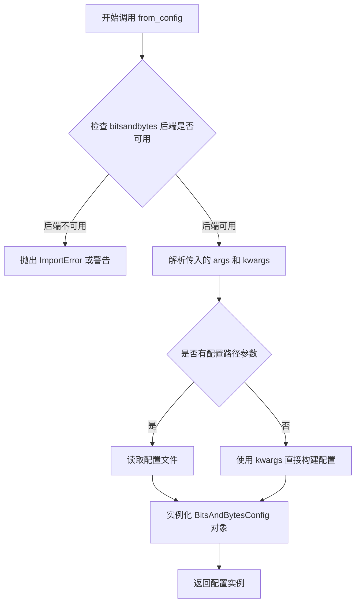
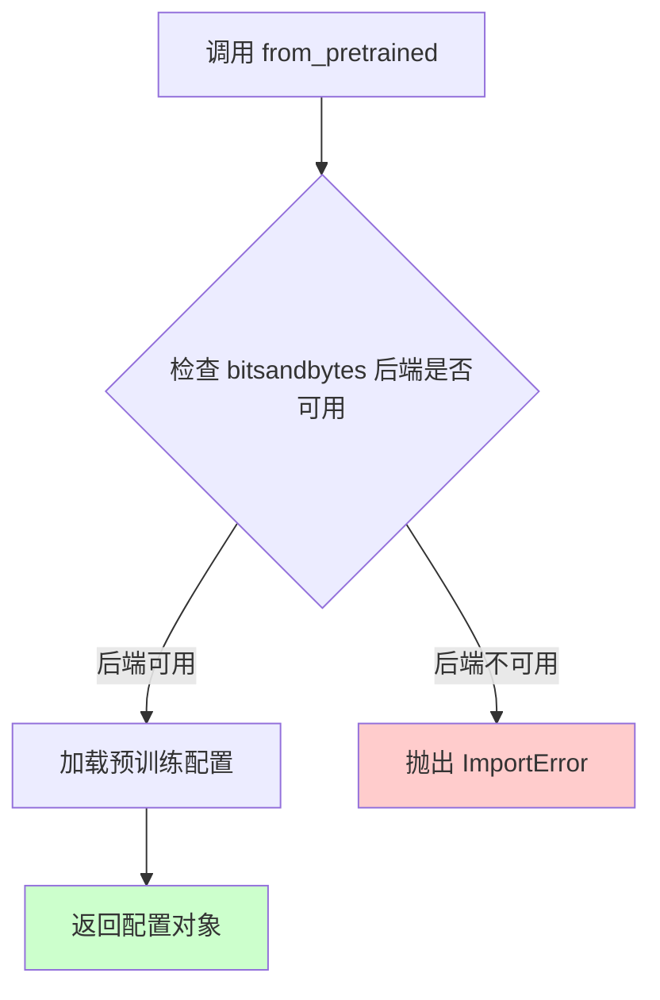

# `diffusers\src\diffusers\utils\dummy_bitsandbytes_objects.py` 详细设计文档

这是Hugging Face Transformers库中用于量化模型（bitsandbytes）的配置类文件，通过DummyObject元类和requires_backends机制确保bitsandbytes后端的可用性，提供模型量化配置的管理功能。

## 整体流程



## 类结构

```
DummyObject (元类)
└── BitsAndBytesConfig
```

## 全局变量及字段


### `BitsAndBytesConfig._backends`
    
A class-level list storing supported backends, currently initialized to ['bitsandbytes'].

类型：`List[str]`
    
    

## 全局函数及方法


### `requires_backends`

该函数是一个后端依赖检查工具函数，用于验证指定的计算后端（如 bitsandbytes）是否可用。如果后端不可用，则抛出 ImportError 异常；如果可用，则该函数通常直接返回，允许后续代码执行。这是一种延迟导入机制，用于在需要时才检查并加载可选依赖项。

参数：

- `obj_or_cls`：`object | type`，需要检查后端支持的对象或类实例
- `backends`：`List[str]`，必需的后端名称列表，例如 ["bitsandbytes"]

返回值：`None`，该函数通过抛出异常来表示错误，通常不返回任何值

#### 流程图



#### 带注释源码

```python
# 该函数定义在 ..utils 模块中（从上级目录utils包导入）
# 以下是基于使用方式的推断实现

def requires_backends(obj_or_cls, backends):
    """
    检查所需后端是否可用，如果不可用则抛出 ImportError
    
    参数:
        obj_or_cls: 要检查的对象或类，用于获取其支持的后端信息
        backends: 必需的后端名称列表，如 ["bitsandbytes"]
    
    注意: 实际源码不在本文件中，而是在 utils 模块中定义
    """
    # 获取后端列表（从对象的 _backends 属性或直接传入）
    # 如果对象有 _backends 属性，则使用它；否则使用传入的 backends
    if hasattr(obj_or_cls, '_backends'):
        # 对象已定义支持的后端列表
        obj_backends = obj_or_cls._backends
    else:
        obj_backends = backends
    
    # 检查每个所需后端是否在可用后端中
    for backend in backends:
        if backend not in obj_backends:
            # 后端不支持，抛出导入错误
            raise ImportError(
                f"{obj_or_cls.__name__} requires the {backend} backend but "
                f"it is not installed or not available."
            )
    
    # 所有后端可用，函数正常返回（无返回值/返回 None）
    return None
```

#### 补充说明

- **设计目标**：实现延迟检查机制，允许模块在未安装可选依赖时仍可被导入，仅在实际使用时才检查后端可用性
- **错误处理**：通过抛出 ImportError 异常来指示缺少必需后端，遵循 Python 的导入错误约定
- **使用场景**：在 BitsAndBytesConfig 类中，用于 __init__、from_config、from_pretrained 等方法，确保只有当 bitsandbytes 库可用时才执行相关功能
- **潜在优化空间**：当前实现每次调用都会进行检查，可考虑添加缓存机制以减少重复检查的开销；此外，错误信息可以更详细，包含安装建议


### `DummyObject`

DummyObject是一个元类（metaclass），用于在目标后端库不可用时阻止类的实例化。它通过在类创建时检查所需后端模块的可用性，如果后端缺失则抛出ImportError，从而实现条件加载和延迟导入的功能。

参数：

-  `name`：str，元类的名称，用于错误消息中的标识
-  `bases`：tuple，基类元组，包含被元类处理的类
-  `attrs`：dict，类的属性字典，包含类的方法和字段

返回值：type，返回创建的类类型

#### 流程图



#### 带注释源码

```python
# 这是一个元类实现，用于处理可选依赖的后端检查
# DummyObject 实际上是从 ..utils 模块导入的
# 以下是假设的实现逻辑：

class DummyObject(type):
    """
    元类：用于条件创建类，当指定的后端不可用时阻止类实例化
    
    工作原理：
    1. 当一个类使用这个元类时，在类定义阶段就会检查后端
    2. 如果后端不可用，会抛出ImportError
    3. 这样可以避免在运行时因为缺少依赖而导致更隐蔽的错误
    """
    
    def __new__(cls, name, bases, attrs, **kwargs):
        """
        创建新类时的钩子方法
        
        参数：
        - cls: 元类本身
        - name: 要创建的类名
        - bases: 类的基类元组
        - attrs: 类的属性字典
        
        返回值：
        - 新创建的类对象
        """
        # 获取需要的后端列表（通常在_backends类属性中定义）
        backends = attrs.get('_backends', [])
        
        # 调用requires_backends检查后端是否可用
        # 如果后端不可用，这里会抛出ImportError
        requires_backends(cls, backends)
        
        # 后端检查通过，正常创建类
        return super().__new__(cls, name, bases, attrs)
    
    def __call__(cls, *args, **kwargs):
        """
        当尝试实例化类时调用的方法
        
        参数：
        - cls: 要实例化的类
        - *args: 位置参数
        - **kwargs: 关键字参数
        
        返回值：
        - 类的实例
        """
        # 再次检查后端可用性（双重检查）
        backends = getattr(cls, '_backends', [])
        requires_backends(cls, backends)
        
        # 后端检查通过，正常实例化
        return super().__call__(*args, **kwargs)
```


### `BitsAndBytesConfig.__init__`

这是 `BitsAndBytesConfig` 类的初始化方法，用于实例化配置对象，并在初始化时检查所需的 `bitsandbytes` 后端是否可用，如果后端不可用则抛出导入错误。

参数：

- `self`：`BitsAndBytesConfig`，类的实例对象本身
- `*args`：任意位置参数，可变参数，用于传递额外的位置参数（暂无特定用途，传递给父类或保留）
- `**kwargs`：任意关键字参数，可变关键字参数，用于传递额外的关键字参数（暂无特定用途，传递给父类或保留）

返回值：`None`，无返回值，该方法仅执行后端检查和初始化逻辑

#### 流程图



#### 带注释源码

```
def __init__(self, *args, **kwargs):
    """
    初始化 BitsAndBytesConfig 实例。
    
    参数:
        *args: 可变位置参数，暂时保留用于未来扩展或传递给父类
        **kwargs: 可变关键字参数，暂时保留用于未来扩展或传递给父类
    """
    # 调用 requires_backends 检查 bitsandbytes 后端是否可用
    # 如果后端不可用，此函数会抛出 ImportError 或设置延迟导入错误
    requires_backends(self, ["bitsandbytes"])
```


### `BitsAndBytesConfig.from_config`

从配置字典或配置路径加载并实例化 BitsAndBytesConfig 对象的类方法。该方法首先检查所需的 `bitsandbytes` 后端是否可用，然后根据传入的配置参数创建配置实例。在 transformers 库中，此类方法通常用于从预训练配置或自定义配置文件中加载模型量化配置。

参数：

- `cls`：`<class type>`，隐式参数，表示调用此方法的类本身（BitsAndBytesConfig）
- `*args`：可变位置参数，通常用于传递配置文件路径（str 类型）或配置字典
- `**kwargs`：可变关键字参数，用于传递额外的配置选项，如 `load_in_8bit`、`llm_int8_threshold` 等量化相关参数

返回值：`<class type>`，返回一个新的 BitsAndBytesConfig 实例，包含从配置中加载的量化参数

#### 流程图



#### 带注释源码

```python
@classmethod
def from_config(cls, *args, **kwargs):
    """
    从配置字典或配置文件路径加载 BitsAndBytesConfig 实例的类方法。
    
    该方法是工厂方法模式的一种实现，允许用户通过配置文件或
    直接传递参数的方式创建量化配置对象。
    
    参数:
        cls: 隐式参数，指向 BitsAndBytesConfig 类本身
        *args: 可变位置参数，通常为配置文件路径 (str 类型)
        **kwargs: 可变关键字参数，包含量化配置选项
            常见参数包括:
            - load_in_8bit: bool, 是否使用 8 位量化
            - load_in_4bit: bool, 是否使用 4 位量化
            - llm_int8_threshold: float, INT8 量化阈值
            - llm_int8_has_fp16_weight: bool, INT8 权重是否使用 FP16
            - bnb_4bit_compute_dtype: str, 4 位计算的数值类型
            - bnb_4bit_quant_type: str, 4 位量化类型 (fp4 或 nf4)
            - bnb_4bit_use_double_quant: bool, 是否使用双重量化
    
    返回:
        返回一个新的 BitsAndBytesConfig 实例
    """
    # 检查 bitsandbytes 后端是否可用，如果不可用会抛出 ImportError
    requires_backends(cls, ["bitsandbytes"])
    
    # 注意：实际的配置加载逻辑由 bitsandbytes 库实现
    # 此处仅为存根实现，真正的逻辑在 DummyObject 元类中
```


### `BitsAndBytesConfig.from_pretrained`

该方法是 `BitsAndBytesConfig` 类的类方法，用于从预训练模型加载量化配置。它通过调用 `requires_backends` 来确保 `bitsandbytes` 库可用，否则抛出导入错误。该方法是一个延迟加载的存根方法，实际实现由 `bitsandbytes` 后端提供。

参数：

- `*args`：可变位置参数，用于传递从预训练模型加载配置所需的任意位置参数
- `**kwargs`：可变关键字参数，用于传递从预训练模型加载配置所需的任意关键字参数

返回值：`None`，该方法不返回任何值，仅执行后端检查

#### 流程图



#### 带注释源码

```python
@classmethod
def from_pretrained(cls, *args, **kwargs):
    """
    从预训练模型加载 BitsAndBytes 量化配置。
    
    这是一个类方法，使用 @classmethod 装饰器定义。
    由于使用了 *args 和 **kwargs，该方法接受任意数量和类型的参数，
    这些参数将传递给底层的 bitsandbytes 实现。
    
    参数:
        *args: 可变位置参数，传递给 bitsandbytes 后端
        **kwargs: 可变关键字参数，传递给 bitsandbytes 后端
    
    返回值:
        None: 该方法不直接返回值，而是通过后端加载配置
    
    注意:
        此方法是一个存根实现，实际逻辑由 bitsandbytes 库提供。
        如果 bitsandbytes 未安装，requires_backends 会抛出 ImportError。
    """
    # 调用 requires_backends 检查 bitsandbytes 后端是否可用
    # 如果不可用，会抛出 ImportError 并提示安装 bitsandbytes
    requires_backends(cls, ["bitsandbytes"])
```

## 关键组件


### DummyObject 元类

用于创建惰性加载的存根类，当实际使用该类时才检查并加载所需的后端模块。

### requires_backends 函数

依赖检查工具，确保所需的后端库（如 bitsandbytes）可用，否则抛出导入错误。

### BitsAndBytesConfig 类

量化配置类，用于管理 BitsAndBytes 量化库的参数配置，支持模型量化策略的初始化和预训练模型加载。

### 后端依赖机制

通过 `_backends` 属性声明该类依赖于 "bitsandbytes" 后端，实现按需加载和条件导入。

### 惰性加载模式

采用元类+后端检查的组合方式，只有在实际调用类方法时才触发后端依赖的验证，实现延迟初始化。


## 问题及建议


### 已知问题

-   **参数签名不明确**：使用 `*args, **kwargs` 导致方法签名不透明，无法静态分析参数类型，影响 IDE 智能提示和类型检查
-   **代码重复**：`from_config` 和 `from_pretrained` 方法体完全相同，都是调用 `requires_backends`，存在冗余
-   **文档缺失**：没有任何 docstring 或注释说明类的用途、方法的参数和返回值含义
-   **硬编码后端名称**：后端名称 "bitsandbytes" 在多处硬编码，扩展性差，维护成本高
-   **缺乏错误处理**：当后端不可用时，仅抛出通用异常，缺乏友好的错误提示或降级方案
-   **元类复杂性**：`DummyObject` 元类的使用增加了代码理解难度，新开发者可能难以追踪行为
-   **自动生成文件维护风险**：文件标记为自动生成，容易被忽视，长期可能与实际需求脱节

### 优化建议

-   **显式参数定义**：为 `from_config` 和 `from_pretrained` 方法定义明确的参数签名和类型注解
-   **提取公共逻辑**：将重复的 `requires_backends` 调用提取为类方法或装饰器
-   **添加文档字符串**：为类和每个方法添加详细的 docstring，说明功能、参数和返回值
-   **配置常量化**：将后端名称提取为类常量或配置属性
-   **增强错误处理**：提供更具体的错误信息，包含安装建议或替代方案
-   **考虑替代设计**：评估是否可以使用组合优于继承，减少元类使用
-   **建立维护流程**：为自动生成文件建立定期审查和更新机制


## 其它


### 设计目标与约束

- **目标**：为 `bitsandbytes` 提供一个可选的占位配置类（`BitsAndBytesConfig`），使其在未安装 `bitsandbytes` 库时仅抛出明确的导入错误，而在库可用时能够正常加载并提供与真实配置类相同的方法（`from_config`、`from_pretrained`）。
- **约束**：
  - 必须与现有的 `DummyObject` 元类机制兼容；
  - 只能通过 `requires_backends` 进行后端检查，不能在模块导入阶段直接触发 `bitsandbytes` 的加载；
  - 代码由 `make fix-copies` 自动生成，手动修改会被覆盖；
  - 依赖 `..utils` 中的 `requires_backends` 与 `DummyObject`，不能引入额外的第三方依赖。

### 错误处理与异常设计

- **触发点**：在实例化 (`__init__`)、调用类方法 `from_config`、`from_pretrained` 时都会调用 `requires_backends(self/cls, ["bitsandbytes"])`。
- **异常类型**：`requires_backends` 会抛出一个 `ImportError`（或 `OptionalDependencyNotAvailable`）异常，错误信息明确指出缺少 `bitsandbytes` 库。
- **错误信息示例**：`"BitsAndBytesConfig requires the 'bitsandbytes' library but it is not installed."`
- **异常处理策略**：上层调用方（如模型加载代码）应捕获该异常并向用户提示安装 `bitsandbytes` 或回退到其他量化方案。

### 数据流与状态机

- **数据流**：
  1. 用户代码请求 `BitsAndBytesConfig.from_pretrained(...)` 或直接实例化 `BitsAndBytesConfig(...)`；
  2. 进入 `__init__` 或类方法内部，立即调用 `requires_backends` 检查后端；
  3. 若 `bitsandbytes` 已安装，则交给真正的 `BitsAndBytesConfig` 实现（实际实现不在本文件中）；
  4. 若未安装，抛出异常，流程终止。
- **状态机**：该类本身是 **无状态** 的，仅通过后端检查决定是否抛出异常；不存在内部状态转换。

### 外部依赖与接口契约

- **外部依赖**：
  - `bitsandbytes`：必需的量化计算后端；
  - `..utils.requires_backends`：统一的可选依赖检查工具；
  - `..utils.DummyObject`：元类，用于标记该类为“虚拟”占位类。
- **接口契约**：
  - **构造函数**：`__init__(self, *args, **kwargs)` – 接受任意参数但统一触发后端检查；
  - **类方法**：`from_config(cls, *args, **kwargs)`、`from_pretrained(cls, *args, **kwargs)` – 必须保持与真实配置类相同的签名，以便在 `bitsandbytes` 可用时能够透明替换；
  - **属性**：目前未定义具体配置属性，后续实现应暴露如 `load_in_8bit`、`load_in_4bit`、`llm_int8_threshold` 等量化参数。

### 版本管理与兼容性

- **兼容的 `bitsandbytes` 版本**：需在文档或 Release Note 中标注最低支持版本（例如 `>=0.37.0`），并在 `requires_backends` 检查未通过时提示具体版本要求；
- **库版本升级**：当 `bitsandbytes` 引入不兼容的配置字段时，需同步更新本占位类或在真实实现中做兼容处理。

### 安全性与隐私

- **安全考量**：本类本身不执行任何外部代码，仅通过 `requires_backends` 进行依赖检查；实际的模型量化实现由 `bitsandbytes` 完成，需确保该库来源可信；
- **隐私**：不涉及用户数据的收集或存储，仅在模型加载时将配置参数传递给 `bitsandbytes`。

### 性能考虑

- **启动开销**：除后端检查外，几乎没有额外计算；若 `bitsandbytes` 未安装，异常在调用时立即抛出，避免不必要的资源加载；
- **内存占用**：占位类不持有大型对象，仅保留元类标记，内存占用可忽略不计。

### 测试策略

- **单元测试**：
  - 验证在未安装 `bitsandbytes` 时，实例化和调用 `from_config`、`from_pretrained` 均抛出 `ImportError`；
  - 验证错误信息包含 `"bitsandbytes"` 关键字。
- **集成测试**：
  - 在具备 `bitsandbytes` 的测试环境中，加载真实的 `BitsAndBytesConfig` 并检查其属性（量化位宽、阈值等）与占位类的接口一致性；
  - 确保 `from_pretrained` 能够正确读取 `bitsandbytes` 生成的配置文件。
- **自动化**：`make fix-copies` 生成的代码应加入回归测试，防止手动修改被覆盖后导致接口不一致。

### 文档与示例

- **使用示例**（当 `bitsandbytes` 已安装）：

  ```python
  from transformers import BitsAndBytesConfig

  # 8‑bit 量化配置
  config = BitsAndBytesConfig(
      load_in_8bit=True,
      llm_int8_threshold=6.0
  )
  model = model.quantize(config)
  ```

- **错误示例**（未安装 `bitsandbytes`）：

  ```python
  from transformers import BitsAndBytesConfig

  config = BitsAndBytesConfig(load_in_8bit=True)
  # → ImportError: BitsAndBytesConfig requires the 'bitsandbytes' library but it is not installed.
  ```

- **文档位置**：在 `transformers` 官方文档的“可选后端”章节中说明该占位类的用途与限制。

### 部署与发布

- **发布方式**：随 `transformers` 包一起发布，属于核心库的一部分；
- **自动生成**：`make fix-copies` 在每次发布前自动生成该文件，确保不同版本的占位类保持同步；
- **发布备注**：在 Release Note 中标注 `BitsAndBytesConfig` 为可选依赖，并说明若要使用量化功能需自行安装 `bitsandbytes`。

### 可扩展性与未来改进

- **字段扩展**：后续可在 `__init__` 中加入常见的量化参数（如 `load_in_4bit`、`bnb_4bit_compute_dtype`）并通过 `requires_backends` 检查后传递给真实实现；
- **多后端支持**：若出现其他量化库（如 `auto_gptq`、`awq`），可采用相同的 `DummyObject` + `requires_backends` 模式创建对应的占位配置类；
- **版本检查**：在 `requires_backends` 中加入最低版本校验，确保与 `bitsandbytes` 的兼容性；
- **自定义错误**：可考虑在 `utils` 中定义更具体的异常（如 `BitsAndBytesNotInstalledError`），以提供更友好的错误提示和调试信息。

    