# `diffusers\src\diffusers\utils\dummy_flax_and_transformers_objects.py` 详细设计文档

该文件定义了多个Flax版本的Stable Diffusion管道类（ControlNet、Img2Img、Inpaint、基础版本和XL版本），通过DummyObject元类和requires_backends函数实现延迟加载和后端依赖检查，确保只有在安装相应依赖（flax和transformers）时才能正常使用这些管道。

## 整体流程

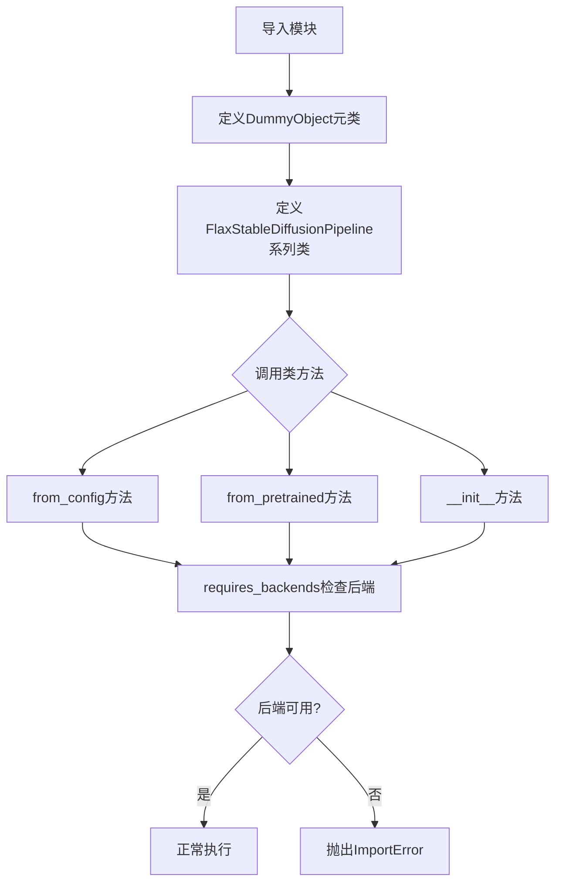
```mermaid
graph TD
    A[导入模块] --> B[定义DummyObject元类]
B --> C[定义FlaxStableDiffusionPipeline系列类]
C --> D{调用类方法}
D --> E[from_config方法]
D --> F[from_pretrained方法]
D --> G[__init__方法]
E --> H[requires_backends检查后端]
F --> H
G --> H
H --> I{后端可用?}
I -- 是 --> J[正常执行]
I -- 否 --> K[抛出ImportError]
```

## 类结构

```
DummyObject (元类 - 抽象基类)
├── FlaxStableDiffusionControlNetPipeline
├── FlaxStableDiffusionImg2ImgPipeline
├── FlaxStableDiffusionInpaintPipeline
├── FlaxStableDiffusionPipeline
└── FlaxStableDiffusionXLPipeline
```

## 全局变量及字段


### `FlaxStableDiffusionControlNetPipeline._backends`
    
类属性，定义该管道类所需的后端依赖列表，包含flax和transformers

类型：`List[str]`
    


### `FlaxStableDiffusionImg2ImgPipeline._backends`
    
类属性，定义该管道类所需的后端依赖列表，包含flax和transformers

类型：`List[str]`
    


### `FlaxStableDiffusionInpaintPipeline._backends`
    
类属性，定义该管道类所需的后端依赖列表，包含flax和transformers

类型：`List[str]`
    


### `FlaxStableDiffusionPipeline._backends`
    
类属性，定义该管道类所需的后端依赖列表，包含flax和transformers

类型：`List[str]`
    


### `FlaxStableDiffusionXLPipeline._backends`
    
类属性，定义该管道类所需的后端依赖列表，包含flax和transformers

类型：`List[str]`
    
    

## 全局函数及方法


### `DummyObject`

描述：`DummyObject` 是一个元类（metaclass），用于创建存根/虚拟类，这些类在指定的依赖后端（flax、transformers）不可用时会被调用。它通过在类初始化和方法调用时检查后端依赖来防止使用不可用的功能。

参数：

- `cls`：类型 `type`，元类被创建/检查的类对象
- `*args`：类型 `tuple`，可变位置参数，传递给类的初始化方法
- `*kwargs`：类型 `dict`，可变关键字参数，传递给类的初始化方法

返回值：`cls` 或抛出 `ImportError`/`RequiresBackendsError`，如果所需后端不可用则抛出异常

#### 流程图

```mermaid
flowchart TD
    A[定义类 with metaclass=DummyObject] --> B[类定义 _backends 列表]
    B --> C[调用 __init__ 或类方法]
    C --> D{检查后端可用性}
    D -->|后端可用| E[正常执行方法]
    D -->|后端不可用| F[抛出 ImportError/RequiresBackendsError]
    
    G[FlaxStableDiffusionControlNetPipeline] --> H[_backends = ['flax', 'transformers']]
    G --> I[__init__ 调用 requires_backends]
    G --> J[from_config 调用 requires_backends]
    G --> K[from_pretrained 调用 requires_backends]
```

#### 带注释源码

```python
# DummyObject 元类定义（从 ..utils 导入，源码未在此文件中）
# 以下是从使用模式推断的结构：

class DummyObject(type):
    """
    元类：用于创建需要特定后端的虚拟/存根类
    当所需后端不可用时，类的方法会抛出 ImportError
    """
    
    # 类属性：定义此类需要的后端列表
    _backends = ["flax", "transformers"]
    
    def __new__(cls, name, bases, namespace, **kwargs):
        """
        创建类时添加后端检查装饰器
        """
        new_class = super().__new__(cls, name, bases, namespace)
        return new_class
    
    def __call__(cls, *args, **kwargs):
        """
        实例化类时检查后端
        """
        # 调用 requires_backends 检查依赖
        requires_backends(cls, cls._backends)
        return super().__call__(*args, **kwargs)


# 使用示例：FlaxStableDiffusionPipeline 类
class FlaxStableDiffusionPipeline(metaclass=DummyObject):
    """
    Stable Diffusion Pipeline 的 Flax 版本存根类
    当 flax 或 transformers 库不可用时，此类的方法将抛出异常
    """
    
    # 必需的后端列表
    _backends = ["flax", "transformers"]
    
    def __init__(self, *args, **kwargs):
        """
        初始化 pipeline，触发后端检查
        """
        # 检查所需后端是否可用，不可用则抛出异常
        requires_backends(self, ["flax", "transformers"])
    
    @classmethod
    def from_config(cls, *args, **kwargs):
        """
        从配置创建 pipeline
        """
        requires_backends(cls, ["flax", "transformers"])
    
    @classmethod
    def from_pretrained(cls, *args, **kwargs):
        """
        从预训练模型创建 pipeline
        """
        requires_backends(cls, ["flax", "transformers"])
```

---

### 关键组件信息

| 名称 | 一句话描述 |
|------|-----------|
| `DummyObject` | 元类，用于创建依赖特定后端的存根类，后端不可用时抛出异常 |
| `requires_backends` | 函数（从 utils 导入），检查指定后端是否可用，不可用则抛出 ImportError |
| `_backends` | 类属性，定义类所需的后端列表（flax 和 transformers） |

---

### 潜在技术债务或优化空间

1. **缺少实际实现**：所有 Pipeline 类都是存根，没有实际功能实现，仅用于向后兼容或条件加载
2. **代码重复**：多个 Pipeline 类的 `__init__`、`from_config`、`from_pretrained` 方法实现完全相同，可考虑使用装饰器或混入类（Mixin）来减少重复
3. **元类使用过度**：使用元类增加了代码复杂度，可以考虑使用函数工厂或条件导入替代

---

### 其它项目

#### 设计目标与约束

- **目标**：为 Flax 版本的 Stable Diffusion Pipeline 提供存根实现，确保在缺少依赖时提供清晰的错误信息
- **约束**：必须依赖 `flax` 和 `transformers` 两个后端库

#### 错误处理与异常设计

- 当后端不可用时，`requires_backends` 函数会抛出 `ImportError` 或自定义的 `RequiresBackendsError`
- 错误信息应明确指出缺少哪些依赖

#### 外部依赖与接口契约

- **依赖**：`flax`、`transformers`、`..utils.requires_backends`
- **接口**：所有 Pipeline 类提供 `__init__`、`from_config`、`from_pretrained` 方法，与 Hugging Face Diffusers 库接口一致


### `requires_backends`

这是一个用于检查所需后端是否可用的工具函数。如果指定的后端在当前环境中不可用，则抛出 `ImportError` 异常，确保代码只在具备相应依赖的环境中使用。

参数：

- `obj`：`Any`，调用对象（通常是 self 或 cls），用于错误信息中定位来源
- `backends`：`List[str]`，所需后端名称列表

返回值：`None`，该函数通过抛出异常来表示错误，不返回任何值

#### 流程图

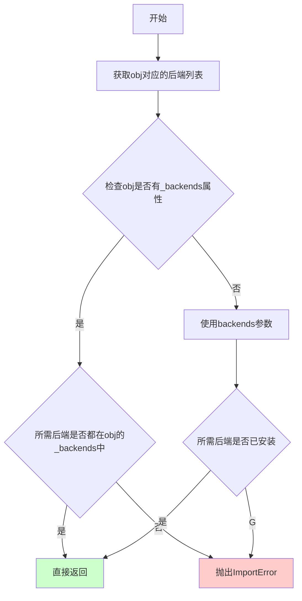
```mermaid
flowchart TD
    A[开始] --> B[获取obj对应的后端列表]
    B --> C{检查obj是否有_backends属性}
    C -->|是| D{所需后端是否都在obj的_backends中}
    C -->|否| E[使用backends参数]
    D -->|是| F[直接返回]
    D -->|否| G[抛出ImportError]
    E --> H{所需后端是否已安装}
    H -->|是| F
    H -->|G| G
    
    style G fill:#ffcccc
    style F fill:#ccffcc
```

#### 带注释源码

```python
# 从上级目录的utils模块导入requires_backends函数和DummyObject类
from ..utils import DummyObject, requires_backends


# 示例类：FlaxStableDiffusionControlNetPipeline
class FlaxStableDiffusionControlNetPipeline(metaclass=DummyObject):
    # 定义该类支持的后端列表
    _backends = ["flax", "transformers"]

    def __init__(self, *args, **kwargs):
        # 在初始化时检查后端是否可用
        # 如果flax或transformers后端不可用，将抛出ImportError
        requires_backends(self, ["flax", "transformers"])

    @classmethod
    def from_config(cls, *args, **kwargs):
        # 类方法：从配置创建对象，同样需要检查后端
        requires_backends(cls, ["flax", "transformers"])

    @classmethod
    def from_pretrained(cls, *args, **kwargs):
        # 类方法：从预训练模型加载，同样需要检查后端
        requires_backends(cls, ["flax", "transformers"])


# 其他类似的管道类...
# FlaxStableDiffusionImg2ImgPipeline
# FlaxStableDiffusionInpaintPipeline  
# FlaxStableDiffusionPipeline
# FlaxStableDiffusionXLPipeline
```

#### 补充说明

**设计目标：**
- 确保只有在具备相应深度学习框架（flax、transformers）时才能实例化和使用这些管道类
- 提供清晰的错误信息，告知用户缺少哪些必要的后端

**错误处理：**
- 当所需后端不可用时，`requires_backends` 会抛出 `ImportError` 异常
- 错误信息通常包含缺少的后端名称和使用该类所需的模块

**技术债务/优化空间：**
- 当前所有类都重复调用相同的后端检查，可以考虑使用装饰器模式简化代码
- `_backends` 列表在多个类中重复定义，可以考虑将其提取到基类或配置中


### `FlaxStableDiffusionControlNetPipeline.__init__`

这是 Flax 版本的 Stable Diffusion ControlNet Pipeline 的初始化方法，用于在运行时检查所需的后端依赖库（flax 和 transformers）是否已安装，如果未安装则抛出导入错误。

参数：

- `*args`：`Tuple[Any, ...]`，可变位置参数，用于传递额外的位置参数（当前实现中未使用）
- `**kwargs`：`Dict[str, Any]`，可变关键字参数，用于传递额外的关键字参数（当前实现中未使用）

返回值：`None`，构造函数不返回任何值

#### 流程图

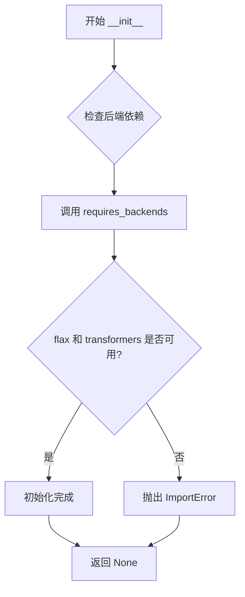
```mermaid
flowchart TD
    A[开始 __init__] --> B{检查后端依赖}
    B --> C[调用 requires_backends]
    C --> D{flax 和 transformers 是否可用?}
    D -->|是| E[初始化完成]
    D -->|否| F[抛出 ImportError]
    E --> G[返回 None]
    F --> G
```

#### 带注释源码

```python
def __init__(self, *args, **kwargs):
    """
    初始化 FlaxStableDiffusionControlNetPipeline 实例。
    
    注意：此类是一个虚拟存根类（Dummy Object），由 make fix-copies 命令自动生成。
    实际的实现逻辑在需要时从后端模块动态导入。
    
    参数:
        *args: 可变位置参数，传递给父类或后续初始化逻辑
        **kwargs: 可变关键字参数，传递给父类或后续初始化逻辑
    """
    # requires_backends 是一个工具函数，用于检查指定的后端库是否已安装
    # 如果缺少任何必需的库，此函数将抛出 ImportError
    # 这里的 _backends 定义为 ["flax", "transformers"]
    requires_backends(self, ["flax", "transformers"])
```


### `FlaxStableDiffusionControlNetPipeline.from_config`

该方法是Flax稳定扩散ControlNet流水线的配置加载类方法，通过调用后端依赖检查函数来验证所需的Flax和Transformers库是否可用，若后端不可用则抛出相应的导入错误。

参数：

- `*args`：可变位置参数，用于传递任意数量的位置参数（实际传递给`requires_backends`函数）
- `**kwargs`：可变关键字参数，用于传递任意数量的关键字参数（实际传递给`requires_backends`函数）

返回值：`None`，该方法无返回值，仅执行后端依赖检查逻辑

#### 流程图

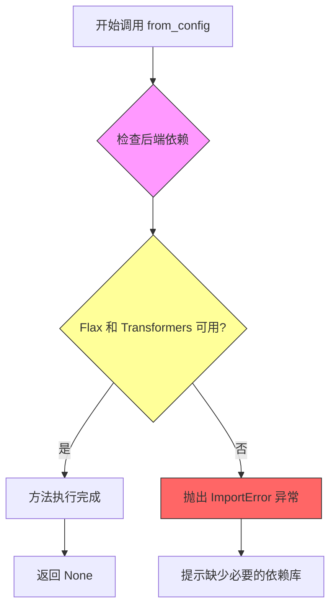
```mermaid
flowchart TD
    A[开始调用 from_config] --> B{检查后端依赖}
    B --> C{Flax 和 Transformers 可用?}
    C -->|是| D[方法执行完成]
    C -->|否| E[抛出 ImportError 异常]
    E --> F[提示缺少必要的依赖库]
    D --> G[返回 None]
    
    style B fill:#f9f,stroke:#333
    style C fill:#ff9,stroke:#333
    style E fill:#f66,stroke:#333
```

#### 带注释源码

```python
@classmethod
def from_config(cls, *args, **kwargs):
    """
    从配置创建管道实例的类方法。
    
    注意：此方法为存根实现，实际功能由 requires_backends 函数处理。
    该文件由命令 'make fix-copies' 自动生成，请勿直接编辑。
    
    参数:
        cls: 类本身（由 @classmethod 自动传递）
        *args: 可变位置参数列表，传递给后端检查函数
        **kwargs: 可变关键字参数列表，传递给后端检查函数
    
    返回值:
        无返回值（方法内部仅执行后端依赖检查）
    
    异常:
        ImportError: 当 Flax 或 Transformers 库不可用时抛出
    """
    # 调用后端依赖检查函数，验证当前环境是否安装了必要的库
    # cls 参数传递类本身，以便 requires_backends 进行上下文相关的检查
    requires_backends(cls, ["flax", "transformers"])
```


### `FlaxStableDiffusionControlNetPipeline.from_pretrained`

该方法是 `FlaxStableDiffusionControlNetPipeline` 类的类方法，用于从预训练模型路径加载 Flax 实现的 Stable Diffusion ControlNet pipeline。该方法内部调用 `requires_backends` 来检查所需的 Flax 和 Transformers 后端是否可用，如果后端不可用则抛出导入错误。

#### 参数

- `cls`：类型：`class`，表示类本身（classmethod 隐式参数）
- `*args`：类型：`Any`，可变位置参数，通常包括 `pretrained_model_name_or_path`（预训练模型名称或路径）
- `**kwargs`：类型：`Dict[str, Any]`，可变关键字参数，包括加载配置、tokenizer、scheduler 等可选参数

#### 流程图

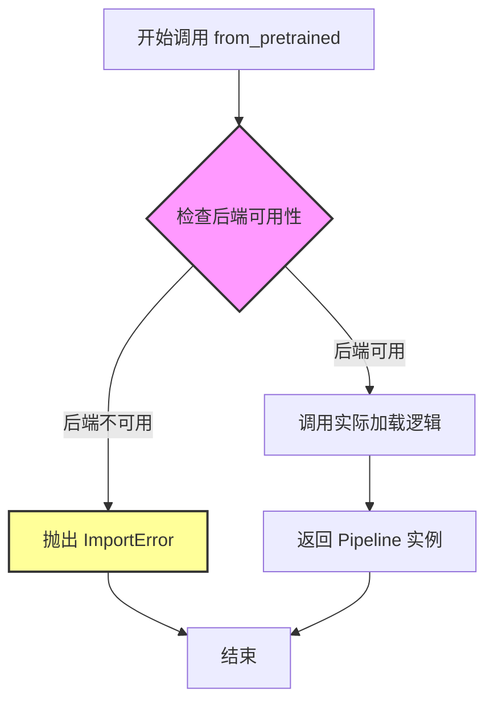
```mermaid
flowchart TD
    A[开始调用 from_pretrained] --> B{检查后端可用性}
    B -->|后端可用| C[调用实际加载逻辑]
    B -->|后端不可用| D[抛出 ImportError]
    C --> E[返回 Pipeline 实例]
    D --> F[结束]
    E --> F
    
    style B fill:#f9f,stroke:#333,stroke-width:2px
    style D fill:#ff9,stroke:#333,stroke-width:2px
```

#### 带注释源码

```python
@classmethod
def from_pretrained(cls, *args, **kwargs):
    """
    从预训练模型加载 Flax Stable Diffusion ControlNet Pipeline
    
    参数:
        cls: 类本身（隐式参数）
        *args: 可变位置参数，通常为 pretrained_model_name_or_path
        **kwargs: 可变关键字参数，包含加载配置选项
    
    返回值:
        返回加载的 Pipeline 实例（如果后端可用）
    
    异常:
        ImportError: 如果 flax 或 transformers 后端不可用
    """
    # requires_backends 会检查当前环境是否安装了所需的后端
    # 如果后端不可用，会抛出带有清晰错误信息的 ImportError
    requires_backends(cls, ["flax", "transformers"])
```


### `FlaxStableDiffusionImg2ImgPipeline.__init__`

这是 Flax 版本的 Stable Diffusion img2img  pipeline 的初始化方法，用于创建一个虚拟对象（DummyObject），在实际的 flax 和 transformers 后端未安装时会抛出导入错误。

参数：

- `*args`：可变位置参数，传递给父类初始化和后端检查函数
- `**kwargs`：可变关键字参数，传递给父类初始化和后端检查函数

返回值：`None`，该方法不返回任何值，仅进行后端依赖检查

#### 流程图

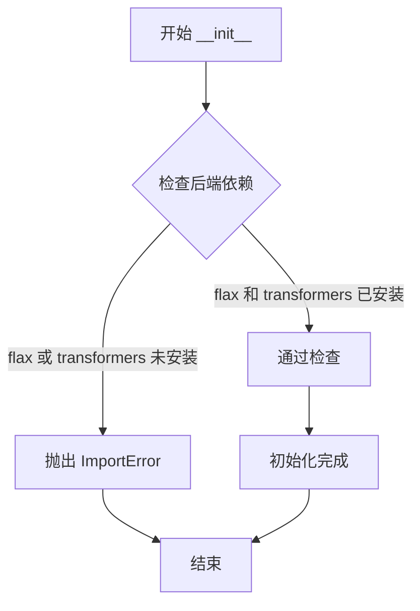
```mermaid
flowchart TD
    A[开始 __init__] --> B{检查后端依赖}
    B -->|flax 和 transformers 已安装| C[通过检查]
    B -->|flax 或 transformers 未安装| D[抛出 ImportError]
    C --> E[初始化完成]
    D --> F[结束]
    E --> F
```

#### 带注释源码

```python
class FlaxStableDiffusionImg2ImgPipeline(metaclass=DummyObject):
    # 类属性：定义该类需要的后端依赖
    _backends = ["flax", "transformers"]

    def __init__(self, *args, **kwargs):
        """
        初始化 FlaxStableDiffusionImg2ImgPipeline 实例
        
        参数:
            *args: 可变位置参数，会被传递给 requires_backends
            **kwargs: 可变关键字参数，会被传递给 requires_backends
        """
        
        # requires_backends 函数会检查指定的后端（flax 和 transformers）
        # 是否已安装。如果未安装，会抛出 ImportError 异常。
        # 这是一种延迟加载机制，确保用户在实际使用这些 pipeline 时
        # 才会得到明确的错误提示，而不是在导入模块时就失败。
        requires_backends(self, ["flax", "transformers"])
```


### `FlaxStableDiffusionImg2ImgPipeline.from_config`

该类方法用于通过配置对象实例化 Flax 稳定扩散图像到图像（Img2Img）管道，但在实际执行前会检查必要的后端依赖（flax 和 transformers）是否已安装。如果缺少依赖，该方法将抛出 ImportError，从而实现延迟导入和依赖检查的功能。

参数：

- `cls`：`<class type>`，代表类本身（classmethod 的第一个隐式参数）
- `*args`：可变位置参数，用于传递配置参数
- `**kwargs`：可变关键字参数，用于传递额外的配置选项

返回值：无明确返回值（方法内部仅执行依赖检查，若失败则抛出异常）

#### 流程图

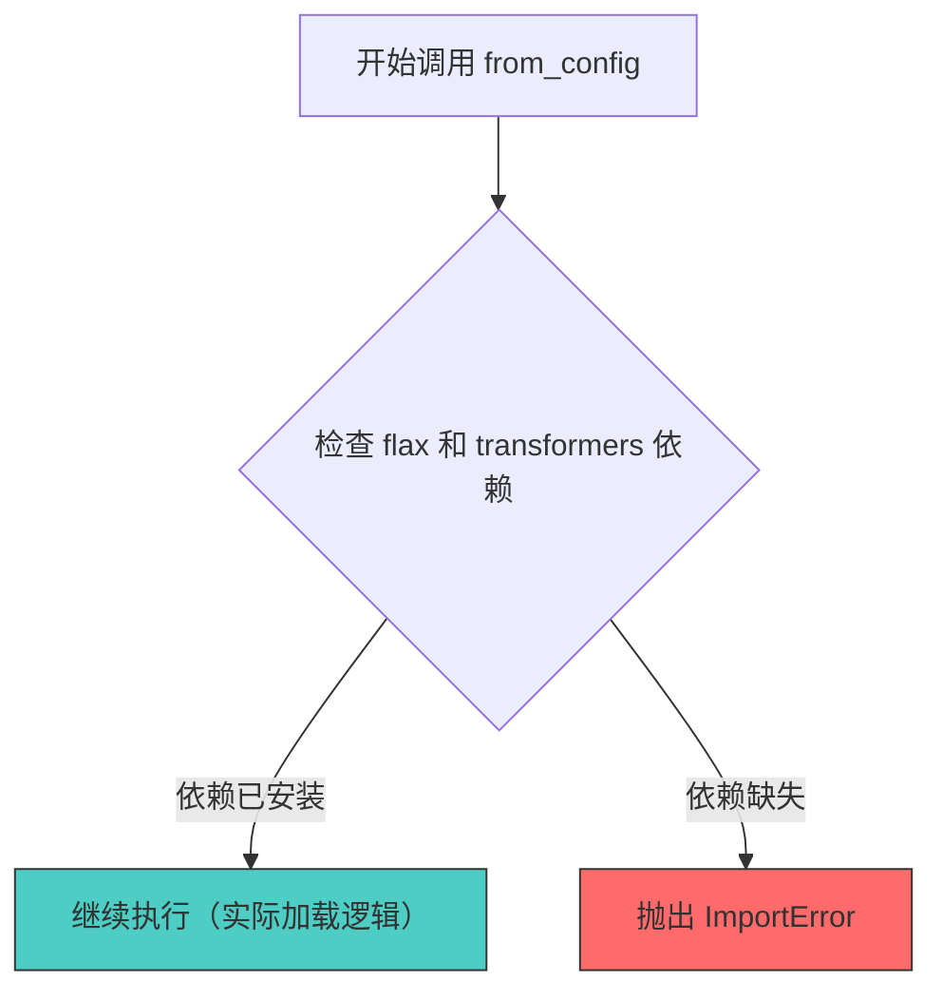
```mermaid
flowchart TD
    A[开始调用 from_config] --> B{检查 flax 和 transformers 依赖}
    B -->|依赖已安装| C[继续执行（实际加载逻辑）]
    B -->|依赖缺失| D[抛出 ImportError]
    
    style D fill:#ff6b6b,stroke:#333
    style C fill:#4ecdc4,stroke:#333
```

#### 带注释源码

```python
@classmethod
def from_config(cls, *args, **kwargs):
    """
    从配置创建管道实例的类方法。
    
    该方法是一个延迟加载的占位实现，实际功能由后端模块提供。
    在执行任何实际逻辑之前，先检查必要的依赖是否可用。
    
    参数:
        *args: 可变位置参数，用于传递给实际实现
        **kwargs: 可变关键字参数，用于传递配置选项
    
    返回:
        无返回值（若依赖缺失则抛出 ImportError）
    """
    # 检查当前环境是否安装了必要的依赖（flax 和 transformers）
    # 如果未安装，requires_backends 会抛出 ImportError 并提示用户安装
    requires_backends(cls, ["flax", "transformers"])
```

---

## 补充说明

### 设计目标与约束

- **设计目标**：实现依赖的延迟检查，确保在缺少必要库时给出清晰的错误提示
- **设计约束**：该方法是自动生成的占位符，实际实现由其他模块提供

### 错误处理与异常设计

- 当检测到缺少 `flax` 或 `transformers` 库时，`requires_backends` 函数将抛出 `ImportError`
- 异常信息通常包含缺少的依赖名称，指导用户进行安装

### 潜在技术债务与优化空间

1. **参数定义不明确**：使用 `*args` 和 `**kwargs` 而非明确的参数签名，导致类型提示和文档生成困难
2. **缺少实际实现**：当前仅为占位符，需要依赖外部模块提供真正逻辑
3. **元类依赖**：整个类的功能依赖于 `DummyObject` 元类的行为，增加了代码理解的复杂性


### FlaxStableDiffusionImg2ImgPipeline.from_pretrained

从预训练模型加载Flax Stable Diffusion图像到图像（Img2Img）Pipeline的类方法。该方法通过调用`requires_backends`来验证当前环境是否安装了必要的依赖库（flax和transformers），并将所有参数转发给后端实现进行实际的模型加载。这是一种占位符模式（Placeholder Pattern），实际的模型加载逻辑由后端的真实实现提供。

参数：

- `*args`：可变位置参数（tuple），用于传递给后端实现的标准模型加载参数，如模型路径等
- `**kwargs`：可变关键字参数（dict），用于传递给后端实现的关键字参数，如revision、dtype等

返回值：`Any`，由后端实现决定，通常是加载完成的FlaxStableDiffusionImg2ImgPipeline实例

#### 流程图

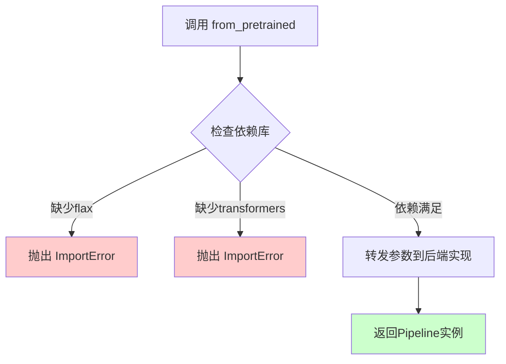
```mermaid
flowchart TD
    A[调用 from_pretrained] --> B{检查依赖库}
    B -->|缺少flax| C[抛出 ImportError]
    B -->|缺少transformers| D[抛出 ImportError]
    B -->|依赖满足| E[转发参数到后端实现]
    E --> F[返回Pipeline实例]
    
    style C fill:#ffcccc
    style D fill:#ffcccc
    style F fill:#ccffcc
```

#### 带注释源码

```python
@classmethod
def from_pretrained(cls, *args, **kwargs):
    """
    从预训练模型加载Flax Stable Diffusion Img2Img Pipeline的类方法。
    
    参数:
        *args: 可变位置参数，传递给后端实现
        **kwargs: 可变关键字参数，传递给后端实现
    
    返回:
        加载完成的Pipeline实例（由后端实现决定具体类型）
    """
    # 检查当前类是否具有所需的依赖库（flax和transformers）
    # 如果缺少任一依赖，将抛出ImportError并提示安装
    requires_backends(cls, ["flax", "transformers"])
```

---

### 关键组件信息

| 组件名称 | 一句话描述 |
|---------|-----------|
| DummyObject | 用于自动生成占位符类的元类，当实际实现不可用时阻止实例化 |
| requires_backends | 工具函数，用于检查并确保所需的依赖库已安装 |
| FlaxStableDiffusionImg2ImgPipeline | 基于Flax的Stable Diffusion图像到图像Pipeline类 |

---

### 潜在的技术债务或优化空间

1. **缺乏具体实现细节**：当前的`from_pretrained`方法只是一个占位符，没有实际的模型加载逻辑，开发者需要查看后端实现才能理解完整流程。

2. **类型注解缺失**：方法参数和返回值都使用`*args`和`**kwargs`，缺乏具体的类型注解，不利于静态分析和IDE自动补全。

3. **文档不完整**：方法缺少详细的参数说明和返回值描述，应该添加docstring来描述支持的参数。

4. **错误处理不足**：仅通过`requires_backends`检查依赖，没有更细粒度的错误处理和用户友好的错误提示。

---

### 其它项目

#### 设计目标与约束

- **设计目标**：提供统一的Pipeline加载接口，支持从预训练模型快速初始化Flax版本的Stable Diffusion Img2Img Pipeline
- **设计约束**：依赖flax和transformers两个后端库，必须在安装这些库后才能使用

#### 错误处理与异常设计

- 当缺少flax库时：抛出`ImportError`，提示"Flax is required for FlaxStableDiffusionImg2ImgPipeline"
- 当缺少transformers库时：抛出`ImportError`，提示"Transformers is required for FlaxStableDiffusionImg2ImgPipeline"

#### 数据流与状态机

- 该方法本身不维护状态，是一个纯静态的工厂方法
- 实际的模型加载和数据流由后端实现控制

#### 外部依赖与接口契约

- **直接依赖**：flax、transformers
- **接口契约**：调用者传递模型路径等参数，返回可用的Pipeline实例
- **兼容性说明**：该类是为Flax（Google的JAX机器学习库）设计的，与PyTorch版本的Pipeline不兼容


### `FlaxStableDiffusionInpaintPipeline.__init__`

该方法是 `FlaxStableDiffusionInpaintPipeline` 类的构造函数，用于初始化对象并确保所需的后端（flax 和 transformers）可用。如果后端不可用，则通过 `requires_backends` 抛出 `ImportError`。

参数：
- `*args`：`tuple`，可变数量的位置参数，用于传递额外的位置参数（当前未使用具体参数，仅作占位）。
- `**kwargs`：`dict`，可变数量的关键字参数，用于传递额外的关键字参数（当前未使用具体参数，仅作占位）。

返回值：`None`，该方法无返回值，仅用于初始化对象和检查依赖。

#### 流程图

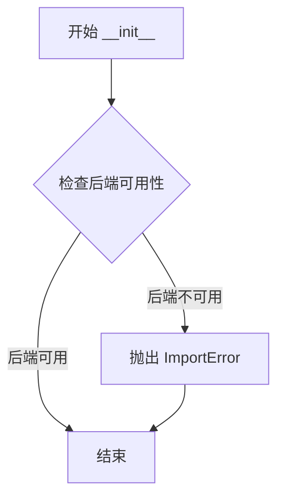
```mermaid
graph TD
    A[开始 __init__] --> B{检查后端可用性}
    B -->|后端不可用| C[抛出 ImportError]
    B -->|后端可用| D[结束]
    C --> D
```

#### 带注释源码

```python
def __init__(self, *args, **kwargs):
    """
    初始化 FlaxStableDiffusionInpaintPipeline 实例。
    
    参数：
        *args: 可变数量的位置参数，用于传递额外的参数（当前未使用）。
        **kwargs: 可变数量的关键字参数，用于传递额外的参数（当前未使用）。
    
    返回值：
        无返回值。
    
    注意：
        该方法调用 requires_backends 以确保 flax 和 transformers 库可用。
        如果任一后端缺失，将抛出 ImportError。
    """
    # 调用 requires_backends 检查后端是否可用
    # 如果后端不可用，此函数将抛出 ImportError
    requires_backends(self, ["flax", "transformers"])
```


### `FlaxStableDiffusionInpaintPipeline.from_config`

该方法是FlaxStableDiffusionInpaintPipeline类的类方法，用于从配置创建Pipeline实例，但当前实现会检查所需的后端库（flax和transformers）是否可用，如果后端不可用则抛出ImportError。这是一种延迟加载/按需加载的设计模式。

参数：

- `cls`：类型：`class`，代表FlaxStableDiffusionInpaintPipeline类本身（类方法隐式参数）
- `*args`：类型：`Any`，可变位置参数，用于传递额外的位置参数
- `**kwargs`：类型：`Any`，可变关键字参数，用于传递额外的关键字参数

返回值：`None`，无返回值（方法内部调用requires_backends，如果后端不可用则抛出异常）

#### 流程图

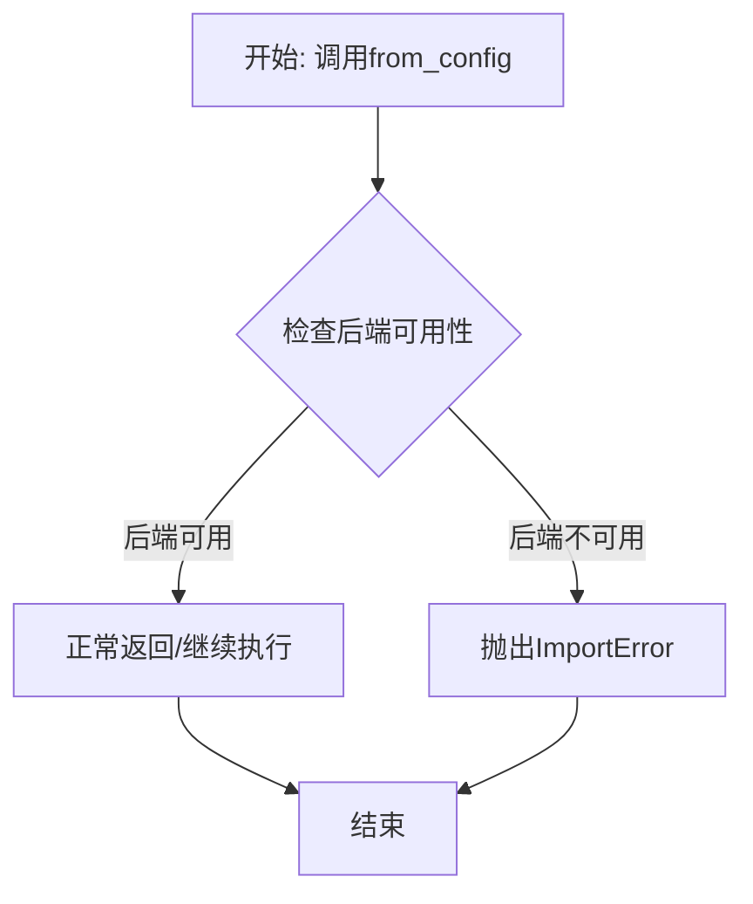
```mermaid
graph TD
    A[开始: 调用from_config] --> B{检查后端可用性}
    B -->|后端可用| C[正常返回/继续执行]
    B -->|后端不可用| D[抛出ImportError]
    C --> E[结束]
    D --> E
```

#### 带注释源码

```python
@classmethod
def from_config(cls, *args, **kwargs):
    """
    从配置创建Pipeline实例的类方法
    
    参数:
        cls: 类对象，代表FlaxStableDiffusionInpaintPipeline类本身
        *args: 可变位置参数，用于传递额外参数
        **kwargs: 可变关键字参数，用于传递额外配置参数
    
    返回:
        无返回值（如果后端不可用则抛出ImportError异常）
    """
    # 检查所需的后端库（flax和transformers）是否可用
    # 如果不可用，会抛出ImportError并提示用户安装相应库
    requires_backends(cls, ["flax", "transformers"])
```


### `FlaxStableDiffusionInpaintPipeline.from_pretrained`

该方法是 FlaxStableDiffusionInpaintPipeline 类的类方法，用于从预训练模型路径加载带有 Inpaint 功能的 Stable Diffusion 模型。该方法是存根实现，实际的模型加载逻辑在后端模块（flax 和 transformers）中实现，当前通过 requires_backends 进行延迟加载验证。

参数：

- `*args`：可变位置参数，传递给后端 from_pretrained 方法的参数，如模型路径等
- `**kwargs`：可变关键字参数，传递给后端 from_pretrained 方法的额外参数，如 revision、dtype 等

返回值：`None`，无返回值（仅进行后端验证，真实实现在后端模块中）

#### 流程图

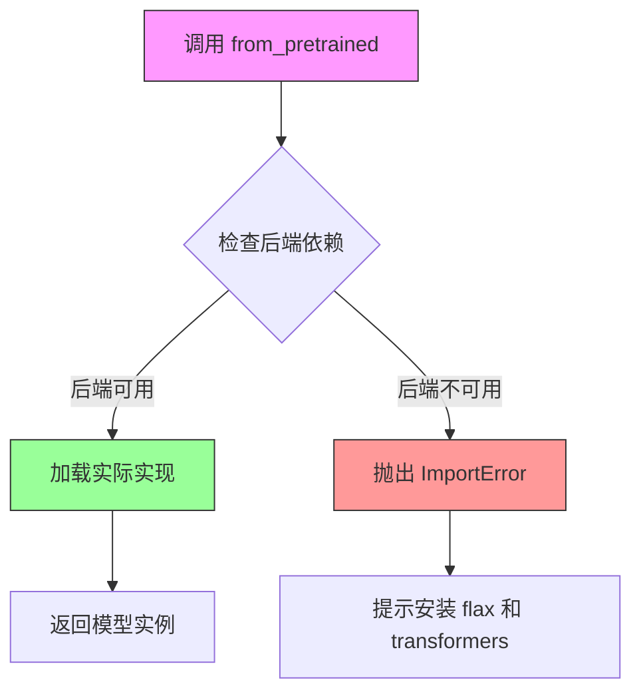
```mermaid
flowchart TD
    A[调用 from_pretrained] --> B{检查后端依赖}
    B -->|后端可用| C[加载实际实现]
    B -->|后端不可用| D[抛出 ImportError]
    C --> E[返回模型实例]
    D --> F[提示安装 flax 和 transformers]
    
    style A fill:#f9f,stroke:#333
    style C fill:#9f9,stroke:#333
    style D fill:#f99,stroke:#333
```

#### 带注释源码

```python
@classmethod
def from_pretrained(cls, *args, **kwargs):
    """
    从预训练模型加载 Flax Stable Diffusion Inpaint Pipeline
    
    Args:
        *args: 可变位置参数，传递给后端加载器
               通常包括模型路径 (str)
        **kwargs: 可变关键字参数
                  常见参数:
                  - pretrained_model_name_or_path: 模型名称或路径
                  - revision: GitHub revision 版本
                  - dtype: 数据类型如 jnp.float32
                  - use_auth_token: HuggingFace认证token
                  - force_download: 强制重新下载
                  - resume_download: 断点续传
    """
    # 调用 requires_backends 进行后端依赖检查
    # 如果 flax 或 transformers 未安装，将抛出 ImportError
    # 这是一个延迟加载机制，确保在实际使用时才检查依赖
    requires_backends(cls, ["flax", "transformers"])
    
    # 注意: 实际的模型加载实现不在此文件中
    # 而是在后端模块中通过 DummyObject 元类动态注入
    # 当后端可用时，此方法会被替换为真实实现
```


### `FlaxStableDiffusionPipeline.__init__`

该方法是FlaxStableDiffusionPipeline类的初始化方法，用于实例化一个基于Flax和Transformers后端的Stable Diffusion pipeline。在实例化时，该方法会检查所需的后端库（flax和transformers）是否可用，如果不可用则抛出ImportError。

参数：

- `*args`：`tuple`，可变位置参数，用于传递任意数量的位置参数（当前实现中未直接使用）
- `**kwargs`：`dict`，可变关键字参数，用于传递任意数量的关键字参数（当前实现中未直接使用）

返回值：`None`，构造函数不返回值

#### 流程图

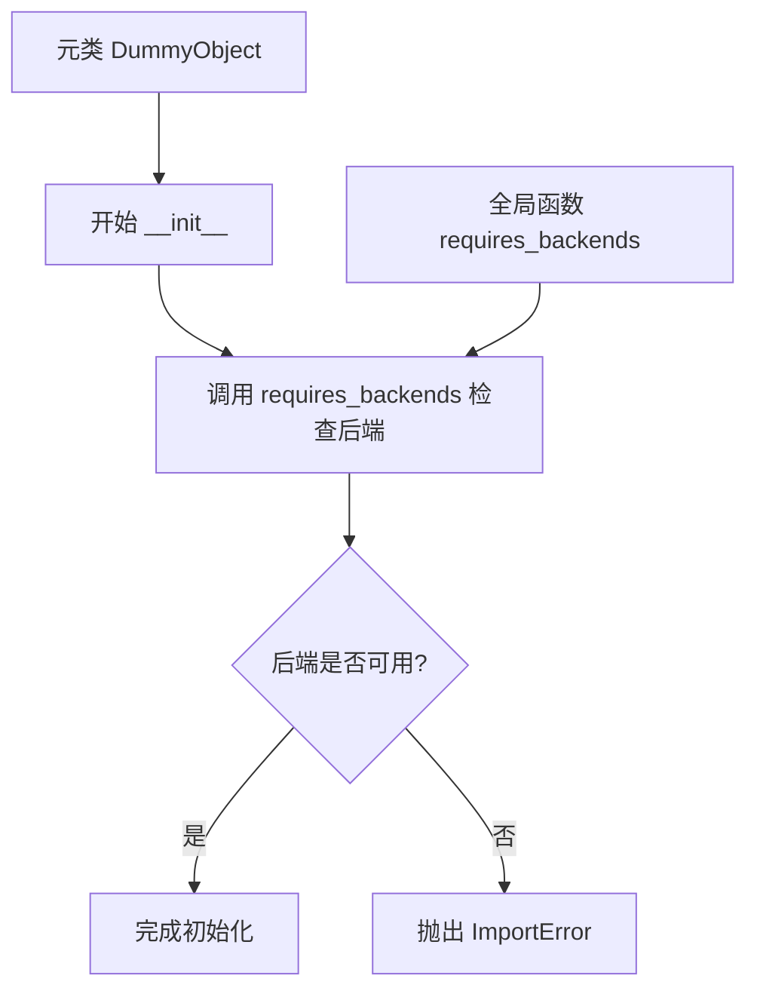
```mermaid
flowchart TD
    A[开始 __init__] --> B[调用 requires_backends 检查后端]
    B --> C{后端是否可用?}
    C -->|是| D[完成初始化]
    C -->|否| E[抛出 ImportError]
    
    F[元类 DummyObject] --> A
    G[全局函数 requires_backends] --> B
```

#### 带注释源码

```python
class FlaxStableDiffusionPipeline(metaclass=DummyObject):
    """
    Flax Stable Diffusion Pipeline 类
    使用 DummyObject 元类，当类或实例被实际访问时会触发后端检查
    """
    
    # 类属性：声明该类需要的后端库
    _backends = ["flax", "transformers"]

    def __init__(self, *args, **kwargs):
        """
        初始化 FlaxStableDiffusionPipeline 实例
        
        注意：由于使用了 DummyObject 元类，实际的初始化逻辑被延迟到后端检查时
        当前实现仅进行后端可用性验证，不执行实际的pipeline初始化
        
        参数:
            *args: 可变位置参数，用于传递额外的位置参数（当前未使用）
            **kwargs: 可变关键字参数，用于传递额外的关键字参数（当前未使用）
        """
        
        # 调用全局函数检查所需后端是否可用
        # 如果后端不可用，会抛出 ImportError 并提示安装相应的库
        requires_backends(self, ["flax", "transformers"])
```

---

**补充说明**

该代码文件是由 `make fix-copies` 命令自动生成的占位符模块。所有 `FlaxStableDiffusion*` 系列的 Pipeline 类都使用了相同的模式：

1. **元类 `DummyObject`**：这是一个特殊的元类，用于延迟导入检查，只有当类被实际使用时才会触发后端检查
2. **类属性 `_backends`**：声明所需的后端库列表
3. **`requires_backends` 函数**：从 `..utils` 导入，用于执行实际的后端检查

这种设计允许在未安装可选依赖（flax、transformers）的情况下导入模块，而不会立即失败，从而提供了更好的用户体验。


### `FlaxStableDiffusionPipeline.from_config`

这是一个类方法，用于从配置对象实例化 Flax 版本的 Stable Diffusion 管道。当前实现会检查必要的后端依赖（flax 和 transformers）是否可用，如果不可用则抛出 ImportError。

参数：

- `*args`：任意位置参数，用于传递给实际的管道初始化逻辑
- `**kwargs`：任意关键字参数，用于配置管道实例的各种选项（如模型路径、配置参数等）

返回值：推测为 `FlaxStableDiffusionPipeline` 或其子类实例，但由于当前是存根实现，实际不会返回有效对象

#### 流程图

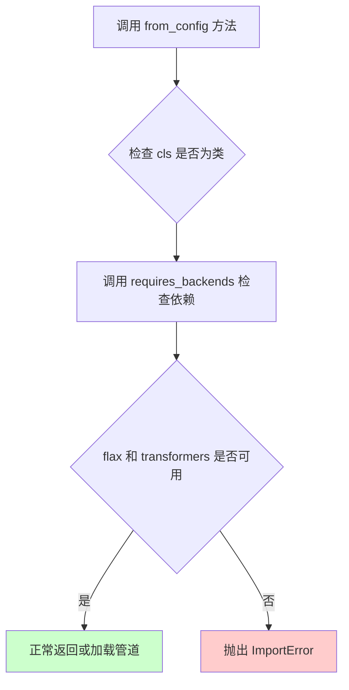
```mermaid
flowchart TD
    A[调用 from_config 方法] --> B{检查 cls 是否为类}
    B --> C[调用 requires_backends 检查依赖]
    C --> D{flax 和 transformers 是否可用}
    D -->|是| E[正常返回或加载管道]
    D -->|否| F[抛出 ImportError]
    
    style F fill:#ffcccc
    style E fill:#ccffcc
```

#### 带注释源码

```python
@classmethod
def from_config(cls, *args, **kwargs):
    """
    从配置创建 FlaxStableDiffusionPipeline 实例的类方法。
    
    该方法是存根实现，实际功能由后端依赖提供。
    当依赖库不可用时，会抛出 ImportError 提示用户安装必要包。
    
    参数:
        *args: 任意位置参数，用于传递配置或模型路径等信息
        **kwargs: 任意关键字参数，用于指定管道配置选项
    
    注意:
        此方法的实际实现位于其他模块中，当前仅为占位符定义
    """
    # 检查类方法是否在有效的类上调用
    # 确保调用者具有正确的上下文（flax 和 transformers 库）
    requires_backends(cls, ["flax", "transformers"])
```

#### 额外说明

| 项目 | 说明 |
|------|------|
| **设计目标** | 提供与 PyTorch 版本 Stable Diffusion 管道类似的接口，用于在 Flax/JAX 框架下运行扩散模型 |
| **依赖约束** | 明确要求 `flax` 和 `transformers` 两个库可用，这是运行 Flax 管道的基础 |
| **当前状态** | 存根实现（Stub），实际功能通过 `requires_backends` 的异常机制提示依赖缺失 |
| **潜在问题** | 缺少实际的配置加载和模型实例化逻辑，无法直接用于创建可用管道实例 |


### `FlaxStableDiffusionPipeline.from_pretrained`

该方法是 `FlaxStableDiffusionPipeline` 类的类方法，用于从预训练模型加载 Flax 版本的 Stable Diffusion pipeline 实例。在当前实现中，它作为一个存根方法，通过 `requires_backends` 函数检查必要的依赖库（flax 和 transformers）是否可用，若不可用则抛出相应的导入错误。

参数：

- `cls`：类型：`class`，表示类本身（类方法隐含参数）
- `*args`：类型：`Any`，可变位置参数，用于传递从预训练模型加载时的可选位置参数（如模型路径等）
- `**kwargs`：类型：`Any`，可变关键字参数，用于传递从预训练模型加载时的可选关键字参数（如配置选项、revision 等）

返回值：类型：`Any`（根据实际实现返回 pipeline 实例），从预训练模型加载并初始化的 pipeline 实例

#### 流程图

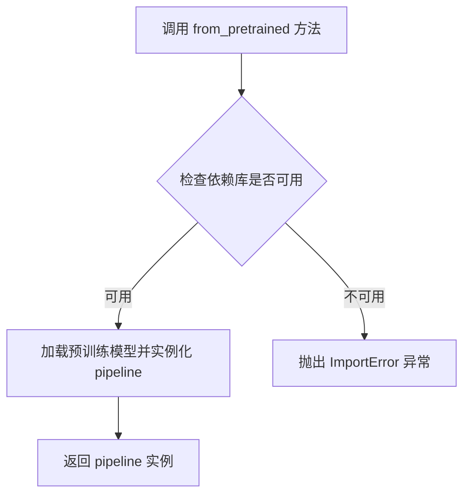
```mermaid
flowchart TD
    A[调用 from_pretrained 方法] --> B{检查依赖库是否可用}
    B -->|可用| C[加载预训练模型并实例化 pipeline]
    B -->|不可用| D[抛出 ImportError 异常]
    C --> E[返回 pipeline 实例]
```

#### 带注释源码

```python
@classmethod
def from_pretrained(cls, *args, **kwargs):
    """
    类方法：从预训练模型加载 Flax Stable Diffusion Pipeline 实例
    
    参数:
        cls: 类本身（类方法隐式参数）
        *args: 可变位置参数，传递给底层模型加载器
        **kwargs: 可变关键字参数，传递给底层模型加载器
    
    返回值:
        初始化后的 pipeline 实例（具体类型由实际实现决定）
    
    注意:
        该方法是自动生成的存根实现，实际逻辑通过 requires_backends 
        检查必要的依赖库（flax 和 transformers）是否已安装。
    """
    # 调用 requires_backends 检查必要的后端依赖是否可用
    # 如果依赖不可用，该函数会抛出 ImportError 并提示用户安装
    requires_backends(cls, ["flax", "transformers"])
```


### `FlaxStableDiffusionXLPipeline.__init__`

该`__init__`方法是一个虚拟存根实现，用于延迟导入和依赖检查。它不执行实际的对象初始化，而是调用`requires_backends`来确保所需的Flax和Transformers后端可用。如果后端不可用，该函数将抛出适当的错误。

参数：

- `*args`：`任意类型`，可变位置参数，用于接受任意数量的位置参数（当前未被使用，仅传递给父类）
- `**kwargs`：`任意类型`，可变关键字参数，用于接受任意数量的关键字参数（当前未被使用，仅传递给父类）

返回值：`None`，该方法不返回任何值

#### 流程图

```mermaid
flowchart TD
    A[开始 __init__] --> B{检查后端可用性}
    B --> C[调用 requires_backends self, ['flax', 'transformers']]
    C --> D{后端可用?}
    D -->|是| E[方法结束 - 初始化完成]
    D -->|否| F[抛出 ImportError 或 MissingBackendError]
    F --> E
```

#### 带注释源码

```python
class FlaxStableDiffusionXLPipeline(metaclass=DummyObject):
    """
    Flax Stable Diffusion XL Pipeline 存根类。
    这是一个虚拟实现，用于在未安装所需后端时提供导入接口。
    实际功能需要安装 flax 和 transformers 库。
    """
    
    _backends = ["flax", "transformers"]  # 类属性：定义所需的后端列表

    def __init__(self, *args, **kwargs):
        """
        初始化 FlaxStableDiffusionXLPipeline 实例。
        
        注意：此方法为存根实现，不执行实际的初始化逻辑。
        实际的Pipeline初始化需要通过 from_pretrained 方法完成。
        
        参数:
            *args: 可变位置参数，当前未使用
            **kwargs: 可变关键字参数，当前未使用
        """
        # 调用 requires_backends 检查所需后端是否可用
        # 如果后端不可用，将抛出相应的异常
        requires_backends(self, ["flax", "transformers"])
```


### `FlaxStableDiffusionXLPipeline.from_config`

该方法是一个类方法，用于从配置创建 FlaxStableDiffusionXLPipeline 实例，但当前实现为存根方法，通过调用 `requires_backends` 检查必要的依赖库（flax 和 transformers），若依赖未安装则抛出 ImportError，实际上不会执行任何配置加载逻辑。

参数：

- `cls`：类方法隐含的类参数，表示调用该方法的类本身
- `*args`：可变位置参数，用于传递任意数量的位置参数（当前未被使用）
- `**kwargs`：可变关键字参数，用于传递任意数量的关键字参数（当前未被使用）

返回值：无返回值，该方法内部会调用 `requires_backends`，若依赖不满足则直接抛出 ImportError 异常，阻止后续代码执行。

#### 流程图

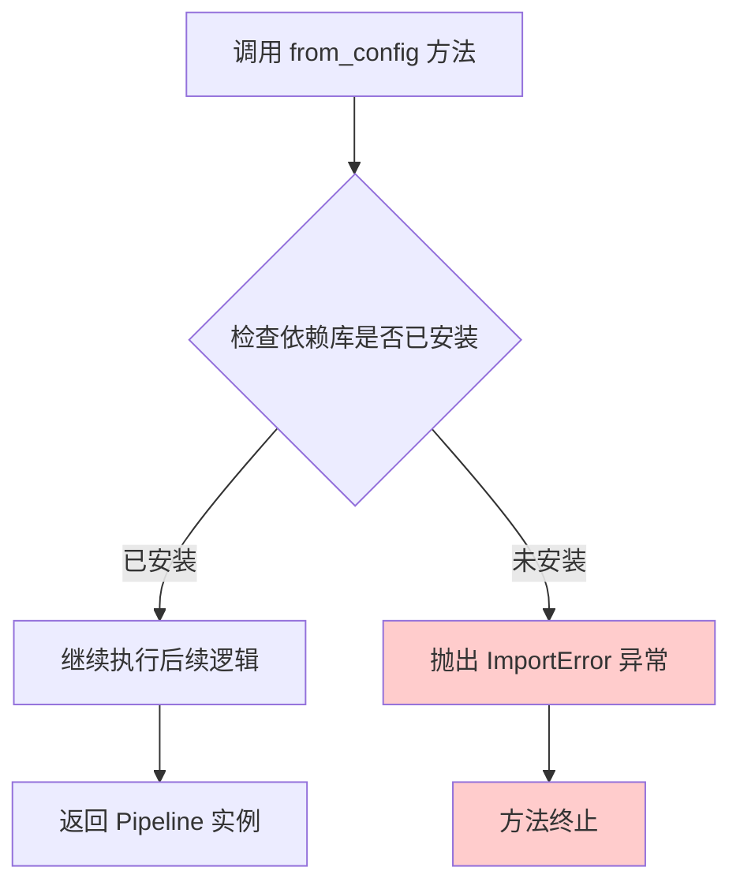
```mermaid
flowchart TD
    A[调用 from_config 方法] --> B{检查依赖库是否已安装}
    B -->|已安装| C[继续执行后续逻辑]
    B -->|未安装| D[抛出 ImportError 异常]
    C --> E[返回 Pipeline 实例]
    D --> F[方法终止]
    
    style D fill:#ffcccc
    style F fill:#ffcccc
```

#### 带注释源码

```python
@classmethod
def from_config(cls, *args, **kwargs):
    """
    类方法：从配置创建 Pipeline 实例
    
    参数:
        cls: 类方法隐含的类引用
        *args: 可变位置参数（未使用）
        **kwargs: 可变关键字参数（未使用）
    
    注意:
        该方法为存根实现，仅用于检查必要的依赖库是否已安装。
        实际配置加载逻辑在其他地方实现（当依赖满足时）。
    """
    # 检查当前类是否具有必要的依赖库（flax 和 transformers）
    # 若依赖未安装，requires_backends 将抛出 ImportError
    requires_backends(cls, ["flax", "transformers"])
```


### `FlaxStableDiffusionXLPipeline.from_pretrained`

该方法是FlaxStableDiffusionXLPipeline类的类方法，用于从预训练模型加载Pipeline实例。它通过调用`requires_backends`函数检查所需的后端库（flax和transformers）是否可用，如果后端不可用则抛出ImportError。

参数：

- `*args`：可变位置参数，用于传递给底层模型加载器的参数
- `**kwargs`：可变关键字参数，用于传递给底层模型加载器的关键字参数

返回值：`None`，该方法不直接返回Pipeline实例，仅进行后端检查，实际的模型加载逻辑由后端实现

#### 流程图

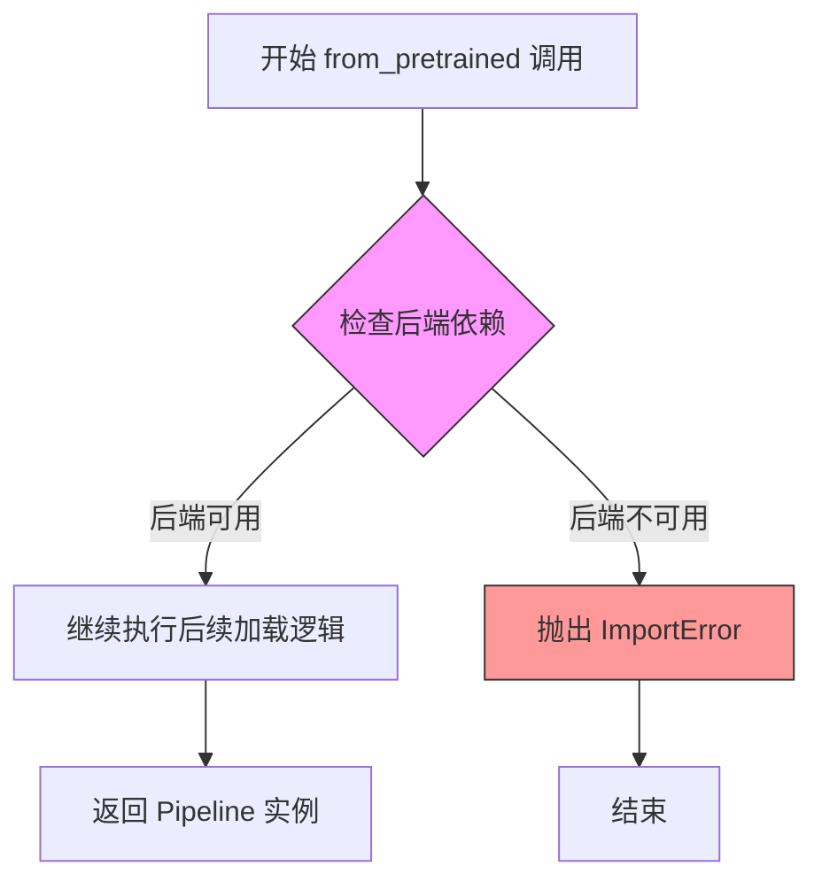
```mermaid
flowchart TD
    A[开始 from_pretrained 调用] --> B{检查后端依赖}
    B -->|后端可用| C[继续执行后续加载逻辑]
    B -->|后端不可用| D[抛出 ImportError]
    C --> E[返回 Pipeline 实例]
    D --> F[结束]
    
    style B fill:#f9f,stroke:#333
    style D fill:#f99,stroke:#333
```

#### 带注释源码

```python
@classmethod
def from_pretrained(cls, *args, **kwargs):
    """
    类方法：从预训练模型加载Pipeline实例
    
    参数:
        *args: 可变位置参数，用于传递给底层模型加载器的参数
        **kwargs: 可变关键字参数，用于传递给底层模型加载器的关键字参数
    
    返回:
        None: 该方法仅进行后端检查，实际返回由后端实现
    """
    # 调用 requires_backends 检查所需的后端库是否可用
    # 如果后端不可用，将抛出 ImportError 异常
    requires_backends(cls, ["flax", "transformers"])
```

## 关键组件


### FlaxStableDiffusionPipeline

核心的基础 Stable Diffusion Pipeline 类，使用 Flax 和 Transformers 后端实现的占位符类，用于惰性加载和延迟导入。

### FlaxStableDiffusionControlNetPipeline

支持 ControlNet 控制的 Stable Diffusion Pipeline 类，允许通过 ControlNet 条件输入来引导图像生成过程。

### FlaxStableDiffusionImg2ImgPipeline

图像到图像（Img2Img）转换 Pipeline，基于已有图像进行风格迁移或内容变换。

### FlaxStableDiffusionInpaintPipeline

图像修复（Inpainting）Pipeline，支持在指定区域内根据文本提示进行内容填充和修复。

### FlaxStableDiffusionXLPipeline

Stable Diffusion XL（SDXL）Pipeline，支持更高分辨率和更先进的生成能力。

### DummyObject 元类

用于实现惰性加载的元类，通过延迟导入避免循环依赖和减少启动时的模块加载开销。

### requires_backends 函数

来自 utils 模块的依赖检查工具函数，确保在实例化或调用类方法时所需的后端库可用，否则抛出导入错误。

### _backends 类属性

类级别的后端依赖声明，标识每个 Pipeline 类所需的 Flax 和 Transformers 框架支持。


## 问题及建议


### 已知问题

- **大量代码重复**：5个Pipeline类的实现几乎完全相同，每个类都重复定义了 `_backends` 属性和三个方法（`__init__`, `from_config`, `from_pretrained`），违反DRY（Don't Repeat Yourself）原则
- **缺乏文档注释**：所有类和方法都没有文档字符串（docstring），无法了解其设计意图和使用方式
- **参数定义不明确**：使用 `*args, **kwargs` 接收任意参数，但未提供参数类型提示或参数说明文档
- **硬编码后端依赖**：后端列表 `["flax", "transformers"]` 在每个类中重复硬编码，扩展性差
- **自动化生成质量**：虽然标注为自动生成，但重复的模板代码表明生成逻辑可能需要优化

### 优化建议

- **引入基类继承**：创建抽象基类 `FlaxStableDiffusionBasePipeline`，将公共的 `_backends` 和方法实现集中管理，子类只需定义特定逻辑
- **添加文档字符串**：为每个类和关键方法添加详细的文档说明，包括参数、返回值和用途描述
- **使用类型提示**：将 `*args, **kwargs` 替换为明确的类型注解，提高代码可读性和IDE支持
- **提取配置常量**：将后端列表定义为常量或配置，避免多处硬编码
- **考虑装饰器模式**：使用装饰器包装 `requires_backends` 检查逻辑，减少方法中的重复调用
- **优化自动生成脚本**：改进 `make fix-copies` 命令的模板生成逻辑，减少手动维护负担

## 其它


### 设计目标与约束

本模块的设计目标是提供一个自动生成的存根文件，定义Flax版本的Stable Diffusion系列管道的接口类。这些类作为占位符存在，用于在缺少必需后端（flax和transformers）时抛出明确的错误信息。约束条件包括：仅支持Flax和Transformers后端，所有方法调用都会触发后端检查，不包含实际的管道实现逻辑。

### 错误处理与异常设计

本文件中的错误处理主要通过 `requires_backends` 函数实现。当用户尝试实例化或调用这些类的任何方法时，如果当前环境中缺少必需的后端（flax和transformers），将会抛出ImportError或相关的后端缺失异常。每个类的方法（`__init__`、`from_config`、`from_pretrained`）都会在执行时调用 `requires_backends` 进行后端检查，确保只有当所有依赖后端都可用时才能正常使用这些管道类。

### 外部依赖与接口契约

本模块依赖以下外部依赖：1) `..utils.DummyObject` - 元类，用于创建虚假的存根类；2) `..utils.requires_backends` - 工具函数，用于检查并要求特定后端。接口契约方面，所有FlaxStableDiffusion*Pipeline类都遵循统一的接口规范，包括：类属性`_backends`声明所需后端列表，`__init__`方法接受任意参数，`from_config`和`from_pretrained`类方法接受任意参数并返回相应管道实例。

### 数据流与状态机

本文件不涉及复杂的数据流或状态机设计。其核心逻辑是静态的：当类被加载时，所有方法实现都只是调用`requires_backends`进行后端验证。由于这些是DummyObject（虚对象），实际的状态转换发生在用户代码尝试实例化或调用方法时，此时后端检查机制会被触发。如果后端可用，后续的管道创建和数据处理流程将由实际的后端实现类完成。

### 版本兼容性考虑

本模块通过`_backends`类属性明确声明了对Flax和Transformers版本的兼容性要求。由于这是自动生成的存根文件，版本兼容性主要依赖于下游实际实现类的要求。当用户代码尝试使用这些管道时，系统会根据当前安装的Flax和Transformers版本来决定是否允许继续执行或抛出异常。

### 使用示例与调用模式

典型的使用模式是：首先检查所需后端是否已安装，然后尝试通过`from_pretrained`方法加载预训练模型。例如：
```python
from diffusers import FlaxStableDiffusionPipeline
pipeline = FlaxStableDiffusionPipeline.from_pretrained("stabilityai/stable-diffusion-2-1")
```
如果后端缺失，上述调用将触发`requires_backends`抛出的异常。用户应当确保在导入和使用这些管道之前已正确安装所有必需的后端依赖。

### 与其他模块的关系

本模块位于`diffusers`库的Flax管道模块中，属于占位符/存根层。它与实际的Flax管道实现（如`FlaxStableDiffusionMixin`）以及核心工具模块（`..utils`）紧密相关。`DummyObject`元类会在实际后端可用时自动替换为真实实现，这种设计允许库在有或无特定后端的情况下都能正常导入和使用。

### 测试与验证策略

对于本模块中定义的存根类，测试重点应包括：1) 验证在缺少后端时调用任何方法都会抛出正确的异常；2) 验证`_backends`属性正确声明了所需的后端列表；3) 验证元类`DummyObject`的行为是否符合预期。由于这些都是自动生成的存根，测试可以重点关注后端检查机制的正确性和异常信息的清晰性。


    