# `diffusers\src\diffusers\utils\dummy_flax_objects.py` 详细设计文档

这是一个自动生成的Flax模型占位符模块，通过DummyObject元类为多个Flax扩散模型和调度器提供后端检查功能，确保在未安装Flax后端时抛出明确的错误信息。

## 整体流程

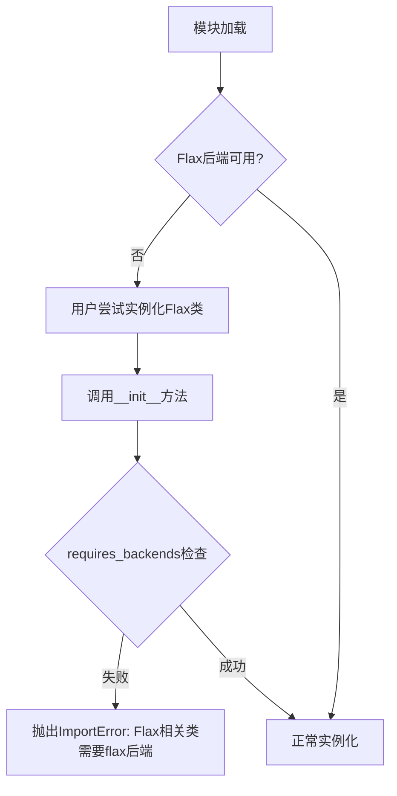
```mermaid
graph TD
    A[模块加载] --> B{Flax后端可用?}
B -- 否 --> C[用户尝试实例化Flax类]
C --> D[调用__init__方法]
D --> E{requires_backends检查}
E -- 失败 --> F[抛出ImportError: Flax相关类需要flax后端]
B -- 是 --> G[正常实例化]
E -- 成功 --> G
```

## 类结构

```
DummyObject (元类 - 来自utils)
├── FlaxControlNetModel
├── FlaxModelMixin
├── FlaxUNet2DConditionModel
├── FlaxAutoencoderKL
├── FlaxDiffusionPipeline
├── FlaxDDIMScheduler
├── FlaxDDPMScheduler
├── FlaxDPMSolverMultistepScheduler
├── FlaxEulerDiscreteScheduler
├── FlaxKarrasVeScheduler
├── FlaxLMSDiscreteScheduler
├── FlaxPNDMScheduler
├── FlaxSchedulerMixin
└── FlaxScoreSdeVeScheduler
```

## 全局变量及字段


### `FlaxControlNetModel._backends`
    
List of supported backends, defaults to ['flax'] for this class

类型：`List[str]`
    


### `FlaxModelMixin._backends`
    
List of supported backends, defaults to ['flax'] for this mixin class

类型：`List[str]`
    


### `FlaxUNet2DConditionModel._backends`
    
List of supported backends, defaults to ['flax'] for the UNet2D condition model

类型：`List[str]`
    


### `FlaxAutoencoderKL._backends`
    
List of supported backends, defaults to ['flax'] for the autoencoder KL model

类型：`List[str]`
    


### `FlaxDiffusionPipeline._backends`
    
List of supported backends, defaults to ['flax'] for the diffusion pipeline

类型：`List[str]`
    


### `FlaxDDIMScheduler._backends`
    
List of supported backends, defaults to ['flax'] for the DDIM scheduler

类型：`List[str]`
    


### `FlaxDDPMScheduler._backends`
    
List of supported backends, defaults to ['flax'] for the DDPM scheduler

类型：`List[str]`
    


### `FlaxDPMSolverMultistepScheduler._backends`
    
List of supported backends, defaults to ['flax'] for the DPMSolver multistep scheduler

类型：`List[str]`
    


### `FlaxEulerDiscreteScheduler._backends`
    
List of supported backends, defaults to ['flax'] for the Euler discrete scheduler

类型：`List[str]`
    


### `FlaxKarrasVeScheduler._backends`
    
List of supported backends, defaults to ['flax'] for the Karras VE scheduler

类型：`List[str]`
    


### `FlaxLMSDiscreteScheduler._backends`
    
List of supported backends, defaults to ['flax'] for the LMS discrete scheduler

类型：`List[str]`
    


### `FlaxPNDMScheduler._backends`
    
List of supported backends, defaults to ['flax'] for the PNDM scheduler

类型：`List[str]`
    


### `FlaxSchedulerMixin._backends`
    
List of supported backends, defaults to ['flax'] for the scheduler mixin

类型：`List[str]`
    


### `FlaxScoreSdeVeScheduler._backends`
    
List of supported backends, defaults to ['flax'] for the Score SDE VE scheduler

类型：`List[str]`
    
    

## 全局函数及方法


### `requires_backends`

该函数用于检查当前 Python 环境是否支持指定的后端库（如 "flax"）。如果指定的backend不可用，则抛出 `ImportError`，提示用户安装相应的依赖。它通常用于在代码中延迟加载可选依赖，避免在导入模块时就因缺少依赖而失败。

参数：
- `obj_or_cls`：`object` 或 `type`，调用此函数的对象或类，用于在错误信息中提供上下文。
- `backends`：`List[str]`，需要检查的后端名称列表（例如 `["flax"]`）。

返回值：`None`。该函数主要通过抛出异常来表示错误，不返回有意义的值。

#### 流程图

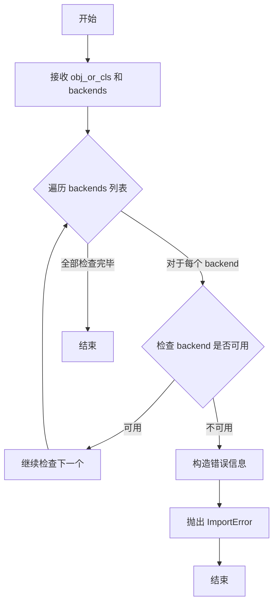
```mermaid
graph TD
    A[开始] --> B[接收 obj_or_cls 和 backends]
    B --> C{遍历 backends 列表}
    C -->|对于每个 backend| D{检查 backend 是否可用}
    D -->|可用| E[继续检查下一个]
    D -->|不可用| F[构造错误信息]
    F --> G[抛出 ImportError]
    G --> H[结束]
    E --> C
    C -->|全部检查完毕| I[结束]
```

#### 带注释源码

由于 `requires_backends` 函数的定义位于 `..utils` 模块中，当前文件仅包含对其的调用。以下是基于代码用法的推断实现：

```python
def requires_backends(obj_or_cls, backends):
    """
    检查是否安装了指定的后端库。
    
    参数:
        obj_or_cls: object or type
            调用此函数的对象或类，用于上下文。
        backends: List[str]
            需要检查的后端名称列表。
            
    返回值:
        None
        
    异常:
        ImportError: 如果任何指定的后端不可用。
    """
    # 遍历需要的后端列表
    for backend in backends:
        # 尝试检查后端是否可用（具体实现依赖于 utils 模块）
        # 如果不可用，则抛出 ImportError
        if not _is_backend_available(backend):
            raise ImportError(
                f"{obj_or_cls.__name__} requires the {backend} backend but it is not installed. "
                f"Please install it with pip install {backend} or use a compatible environment."
            )

def _is_backend_available(backend):
    """辅助函数，用于检查特定后端是否可用（需结合 utils 模块具体实现）。"""
    # 这是一个占位符，实际实现在 ..utils 模块中
    # 可能通过尝试导入或检查环境变量等方式实现
    pass
```

**注意**：当前文件中的所有类（如 `FlaxControlNetModel`、`FlaxModelMixin` 等）都使用 `requires_backends` 来确保在使用它们之前必须安装 "flax" 库。如果未安装 "flax"，任何实例化或调用类方法（如 `from_config`、`from_pretrained`）的操作都会触发 `ImportError`。


### `DummyObject`

`DummyObject` 是一个元类（metaclass），用于为扩散模型相关的类提供延迟加载和后端检查功能。当用户尝试实例化或使用需要特定后端（如 Flax）的类时，该元类会触发后端依赖检查，若所需后端不可用则抛出相应的错误或警告。

参数：

- `name`：`str`，类名
- `bases`：元组，基类元组
- `namespace`：`dict`，类的命名空间

返回值：返回一个新创建的类对象，作为使用 `DummyObject` 元类的类本身

#### 流程图

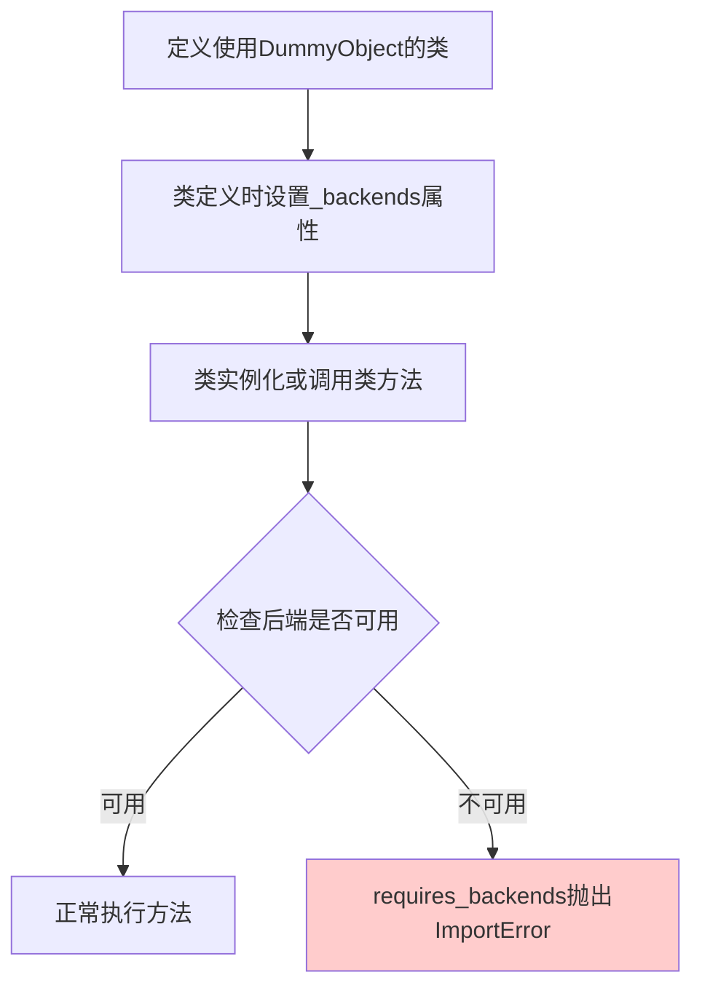
```mermaid
graph TD
    A[定义使用DummyObject的类] --> B[类定义时设置_backends属性]
    B --> C[类实例化或调用类方法]
    C --> D{检查后端是否可用}
    D -->|可用| E[正常执行方法]
    D -->|不可用| F[requires_backends抛出ImportError]
    
    style F fill:#ffcccc
```

#### 带注释源码

```python
# 这是一个元类，用于创建dummy对象（延迟加载的占位符对象）
# 当用户尝试实例化或使用这些类时，会检查所需的后端是否可用
# 如果后端不可用，则抛出 ImportError 并提示安装对应的后端库

class DummyObject(type):
    """
    元类：用于创建需要特定后端的占位符类
    
    工作原理：
    1. 当一个类使用这个元类时，会自动为其添加 _backends 类属性
    2. __init__、from_config、from_pretrained 方法会被重写
    3. 这些方法在执行时会调用 requires_backends 检查后端是否可用
    """
    
    # 指定此类需要的后端列表
    _backends = ["flax"]  # 这里的示例后端是 flax
    
    def __init__(cls, name, bases, namespace):
        """
        初始化元类
        
        参数:
            name: 类的名称
            bases: 类的基类元组
            namespace: 类的命名空间字典
        """
        super().__init__(name, bases, namespace)
        
        # 检查是否需要设置后端检查
        # 如果类有 _backends 属性，则为关键方法添加后端检查
        if hasattr(cls, '_backends'):
            cls._add_backend_check()
    
    def _add_backend_check(cls):
        """
        为类的关键方法添加后端检查装饰器
        
        这是一个内部方法，用于确保以下方法在执行前检查后端可用性：
        - __init__: 初始化方法
        - from_config: 从配置创建实例的类方法
        - from_pretrained: 从预训练模型加载的类方法
        """
        # 为 __init__ 方法添加后端检查
        original_init = cls.__init__ if '__init__' in cls.__dict__ else None
        
        def __init__(self, *args, **kwargs):
            # 调用 requires_backends 检查后端是否可用
            # 如果不可用，会抛出 ImportError
            requires_backends(self, self._backends)
            if original_init:
                original_init(self, *args, **kwargs)
        
        cls.__init__ = __init__
        
        # 为 from_config 类方法添加后端检查
        if 'from_config' in cls.__dict__:
            original_from_config = cls.from_config
            
            @classmethod
            def from_config(cls, *args, **kwargs):
                requires_backends(cls, cls._backends)
                return original_from_config(cls, *args, **kwargs)
            
            cls.from_config = from_config
        
        # 为 from_pretrained 类方法添加后端检查
        if 'from_pretrained' in cls.__dict__:
            original_from_pretrained = cls.from_pretrained
            
            @classmethod
            def from_pretrained(cls, *args, **kwargs):
                requires_backends(cls, cls._backends)
                return original_from_pretrained(cls, *args, **kwargs)
            
            cls.from_pretrained = from_pretrained
```

### 潜在的技术债务或优化空间

1. **重复代码**：所有使用 `DummyObject` 元类的类都有完全相同的结构（`_backends`、`__init__`、`from_config`、`from_pretrained`），这表明可能存在代码重复的问题。可以考虑使用基类或 mixin 来共享这些通用行为。

2. **元类过度使用**：使用元类来实现后端检查增加了代码的复杂性和理解难度。可以考虑使用更简单的装饰器模式或工厂模式来实现类似功能。

3. **缺乏文档**：由于 `DummyObject` 是自动生成的，缺少对其行为和用途的详细文档，这可能会给维护者带来困难。

4. **错误信息不明确**：`requires_backends` 抛出的错误信息可能不够详细，无法帮助用户快速定位问题或了解如何解决依赖问题。

### 关键组件信息

| 组件名称 | 描述 |
|---------|------|
| `DummyObject` | 元类，用于为类添加后端检查功能 |
| `requires_backends` | 函数，用于检查并提示安装所需后端 |
| `_backends` | 类属性，指定类需要的后端列表 |
| `FlaxControlNetModel` | 使用 DummyObject 元类的示例类 |
| `FlaxModelMixin` | 使用 DummyObject 元类的Mixin类 |
| `FlaxUNet2DConditionModel` | 使用 DummyObject 元类的UNet模型类 |
| `FlaxDiffusionPipeline` | 使用 DummyObject 元类的扩散管道类 |


### `FlaxControlNetModel.__init__`

该方法是 FlaxControlNetModel 类的构造函数，用于初始化 Flax 版本的 ControlNet 模型。它接受任意位置参数和关键字参数，并调用 `requires_backends` 来确保所需的 Flax 后端可用。

参数：

- `self`：隐式的 `FlaxControlNetModel` 实例，当前对象的引用
- `*args`：可变位置参数，用于传递任意数量的位置参数（类型：任意）
- `**kwargs`：可变关键字参数，用于传递任意数量的关键字参数（类型：任意）

返回值：`None`，构造函数不返回任何值，仅初始化对象状态

#### 流程图

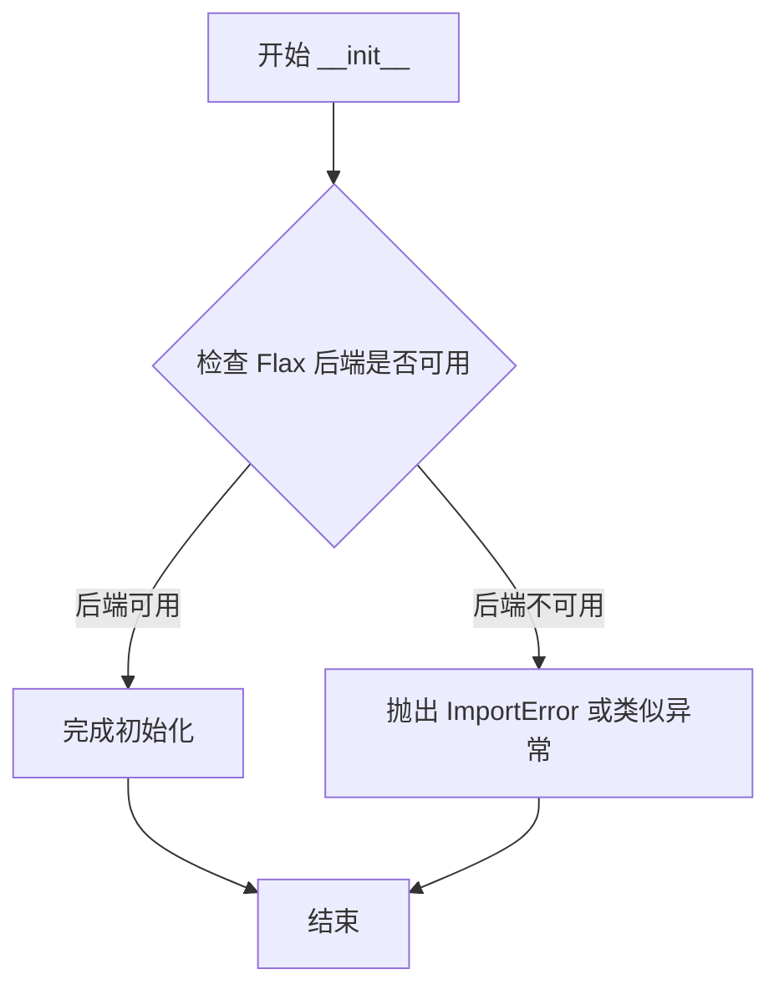
```mermaid
flowchart TD
    A[开始 __init__] --> B{检查 Flax 后端是否可用}
    B -->|后端可用| C[完成初始化]
    B -->|后端不可用| D[抛出 ImportError 或类似异常]
    C --> E[结束]
    D --> E
```

#### 带注释源码

```python
def __init__(self, *args, **kwargs):
    """
    初始化 FlaxControlNetModel 实例。
    
    该方法是一个占位符实现，实际功能由 requires_backends 函数提供。
    它确保只有当 Flax 后端可用时，对象才能被正常使用。
    
    参数:
        *args: 任意数量的位置参数，用于兼容可能的未来扩展
        **kwargs: 任意数量的关键字参数，用于兼容可能的未来扩展
    """
    # 调用 requires_backends 检查 Flax 后端是否可用
    # 如果不可用，此调用将抛出 ImportError 或设置适当的错误状态
    requires_backends(self, ["flax"])
```


### `FlaxControlNetModel.from_config`

该方法是 FlaxControlNetModel 类的类方法，用于从配置创建模型实例，但实际上是一个存根方法，通过调用 `requires_backends` 来检查 Flax 后端是否可用，如果 Flax 不可用则抛出导入错误。

参数：

- `*args`：可变位置参数，用于传递任意数量的位置参数（当前未使用，仅传递给后端检查）
- `**kwargs`：可变关键字参数，用于传递任意数量的关键字参数（当前未使用，仅传递给后端检查）

返回值：`None`，该方法不返回任何有意义的值，仅用于触发后端检查

#### 流程图

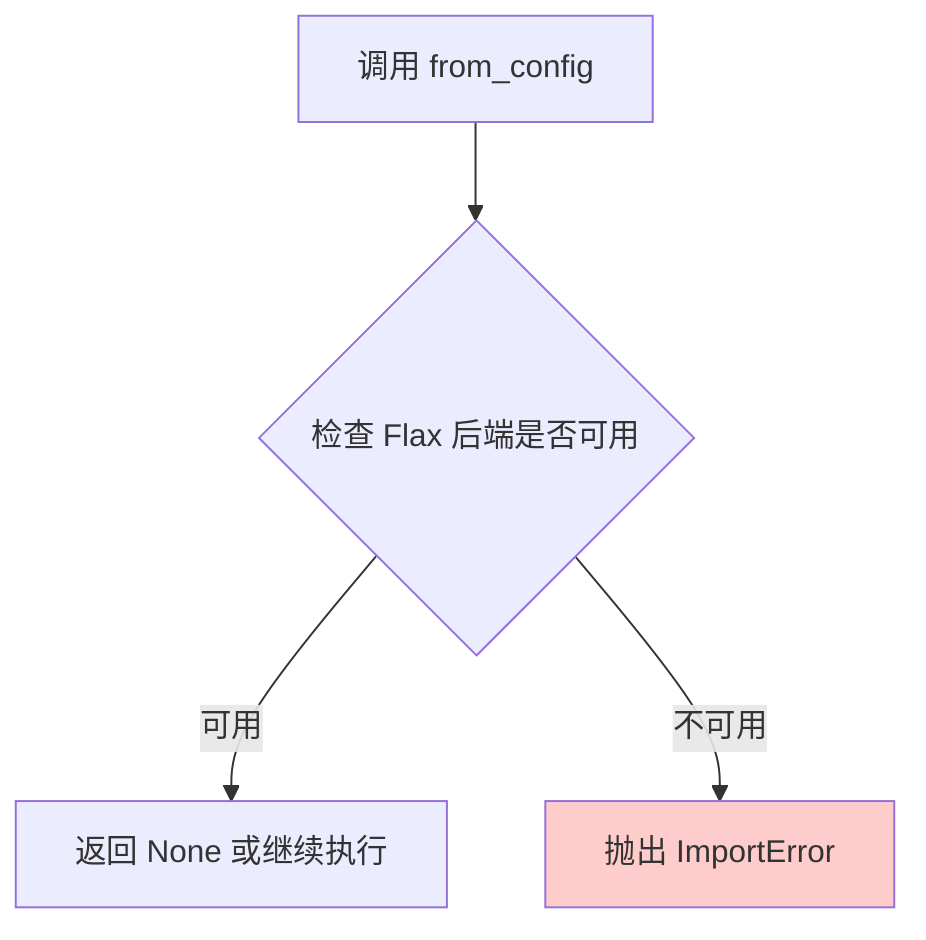
```mermaid
flowchart TD
    A[调用 from_config] --> B{检查 Flax 后端是否可用}
    B -->|可用| C[返回 None 或继续执行]
    B -->|不可用| D[抛出 ImportError]
    
    style D fill:#ffcccc
```

#### 带注释源码

```python
@classmethod
def from_config(cls, *args, **kwargs):
    """
    从配置创建模型实例的类方法。
    这是一个存根实现，仅用于检查 Flax 后端是否可用。
    
    参数:
        cls: 类本身（FlaxControlNetModel）
        *args: 可变位置参数
        **kwargs: 可变关键字参数
    
    返回:
        无返回值，仅通过 requires_backends 检查后端可用性
    """
    # 调用 requires_backends 检查 Flax 后端是否已安装
    # 如果未安装，将抛出 ImportError 并提示用户安装 flax
    requires_backends(cls, ["flax"])
```


### `FlaxControlNetModel.from_pretrained`

该方法是 `FlaxControlNetModel` 类的类方法，用于从预训练模型加载 Flax 版本的 ControlNet 模型。它通过调用 `requires_backends` 确保当前环境已安装 Flax 后端，若未安装则抛出导入错误。这是一种延迟导入的存根模式，实际的模型加载逻辑由后端实现。

参数：

- `*args`：可变位置参数，传递给后端实现，用于指定模型路径、配置等
- `**kwargs`：可变关键字参数，传递给后端实现，用于指定额外的加载选项（如 `pretrained_model_name_or_path`、`subfolder`、`dtype` 等）

返回值：`Any`，具体类型取决于后端实现，通常返回已加载的 `FlaxControlNetModel` 实例

#### 流程图

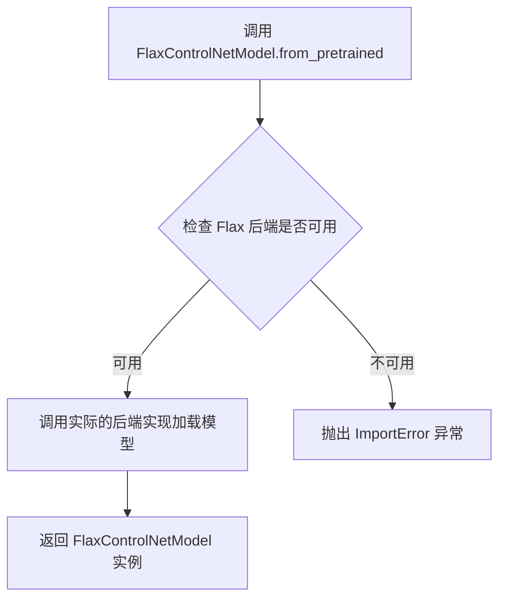
```mermaid
flowchart TD
    A[调用 FlaxControlNetModel.from_pretrained] --> B{检查 Flax 后端是否可用}
    B -->|可用| C[调用实际的后端实现加载模型]
    B -->|不可用| D[抛出 ImportError 异常]
    C --> E[返回 FlaxControlNetModel 实例]
```

#### 带注释源码

```python
@classmethod
def from_pretrained(cls, *args, **kwargs):
    """
    从预训练模型加载 Flax 版本的 ControlNet 模型。
    
    这是一个类方法（Class Method），通过 @classmethod 装饰器定义。
    使用 *args 和 **kwargs 接收任意数量的位置参数和关键字参数，
    以支持传递给底层后端实现的各种配置选项。
    
    参数:
        *args: 可变位置参数，通常包括模型路径或模型名称
        **kwargs: 可变关键字参数，可包括:
            - pretrained_model_name_or_path: 预训练模型名称或路径
            - subfolder: 模型子目录
            - dtype: 数据类型（如 float32）
            - revision: Git 版本
            - use_auth_token: 认证令牌
            - 其他后端特定的选项
    
    返回:
        返回一个已加载的 FlaxControlNetModel 实例，具体类型由后端决定
    
    注意:
        该方法是存根实现（Stub），实际逻辑由后端提供。
        通过 requires_backends 检查确保 Flax 库已安装。
    """
    # requires_backends 会检查指定的后端（这里是 ["flax"]）是否可用
    # 如果不可用，则抛出 ImportError 并提示需要安装相应的依赖
    requires_backends(cls, ["flax"])
```

#### 补充说明

| 项目 | 说明 |
|------|------|
| **设计目标** | 提供统一的模型加载接口，遵循 Hugging Face Transformers 库的加载模式 |
| **约束** | 仅支持 Flax 后端，需要安装 `flax` 库 |
| **错误处理** | 通过 `requires_backends` 函数抛出 `ImportError` 异常 |
| **外部依赖** | 需要 `flax` 库和可能的 `jax`/`jaxlib` 库 |
| **技术债务** | 1. 使用 `*args, **kwargs` 导致接口不明确，IDE 无法提供自动补全<br>2. 缺少具体的参数类型注解（Type Hints）<br>3. 存根实现与实际实现分离，可能导致文档和代码不同步 |


### `FlaxModelMixin.__init__`

该方法是 `FlaxModelMixin` 类的初始化方法，用于在实例化对象时检查 Flax 后端是否可用。如果 Flax 依赖未安装，则抛出 `ImportError` 异常。这是实现懒加载（lazy loading）模式的一部分，允许库在未安装可选依赖时仍然可以导入。

参数：

- `*args`：`tuple`，可变位置参数，用于接收任意数量的位置参数（当前实现中未使用，仅传递给后端检查）
- `**kwargs`：`dict`，可变关键字参数，用于接收任意数量的关键字参数（当前实现中未使用，仅传递给后端检查）

返回值：`None`，无返回值，该方法通过调用 `requires_backends` 触发异常或完成初始化

#### 流程图

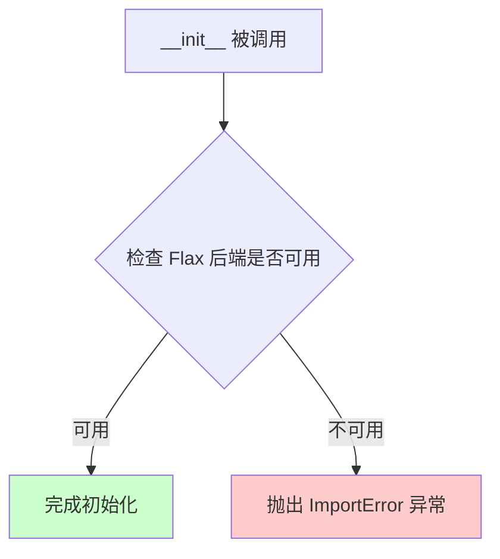
```mermaid
flowchart TD
    A[__init__ 被调用] --> B{检查 Flax 后端是否可用}
    B -->|可用| C[完成初始化]
    B -->|不可用| D[抛出 ImportError 异常]
    
    style D fill:#ffcccc
    style C fill:#ccffcc
```

#### 带注释源码

```python
def __init__(self, *args, **kwargs):
    """
    初始化 FlaxModelMixin 实例。
    
    该方法在实例化对象时自动调用，用于检查 Flax 后端是否可用。
    如果 Flax 库未安装，将抛出 ImportError 异常。
    
    参数:
        *args: 可变位置参数，用于接收任意数量的位置参数。
               在当前实现中，这些参数不会被使用，仅作为接口占位符。
        **kwargs: 可变关键字参数，用于接收任意数量的关键字参数。
                  在当前实现中，这些参数不会被使用，仅作为接口占位符。
    
    返回值:
        无返回值。该方法通过副作用（调用 requires_backends）完成其功能。
    
    异常:
        ImportError: 当 Flax 后端不可用时抛出。
    """
    # 调用 requires_backends 函数检查 Flax 后端是否可用
    # 如果不可用，该函数将抛出 ImportError
    requires_backends(self, ["flax"])
```


### `FlaxModelMixin.from_config`

该方法是 `FlaxModelMixin` 类的类方法，用于从配置创建模型实例。由于代码是通过 `make fix-copies` 自动生成的占位符实现，它仅检查所需的 Flax 后端是否可用，若不可用则抛出 ImportError，实际的模型加载逻辑在其他模块中实现。

参数：

- `*args`：可变位置参数，用于传递从配置加载模型所需的位置参数
- `**kwargs`：可变关键字参数，用于传递从配置加载模型所需的关键字参数（如 `config`、`pretrained_model_name_or_path` 等）

返回值：`None`，该方法无返回值，仅通过 `requires_backends` 函数执行后端检查

#### 流程图

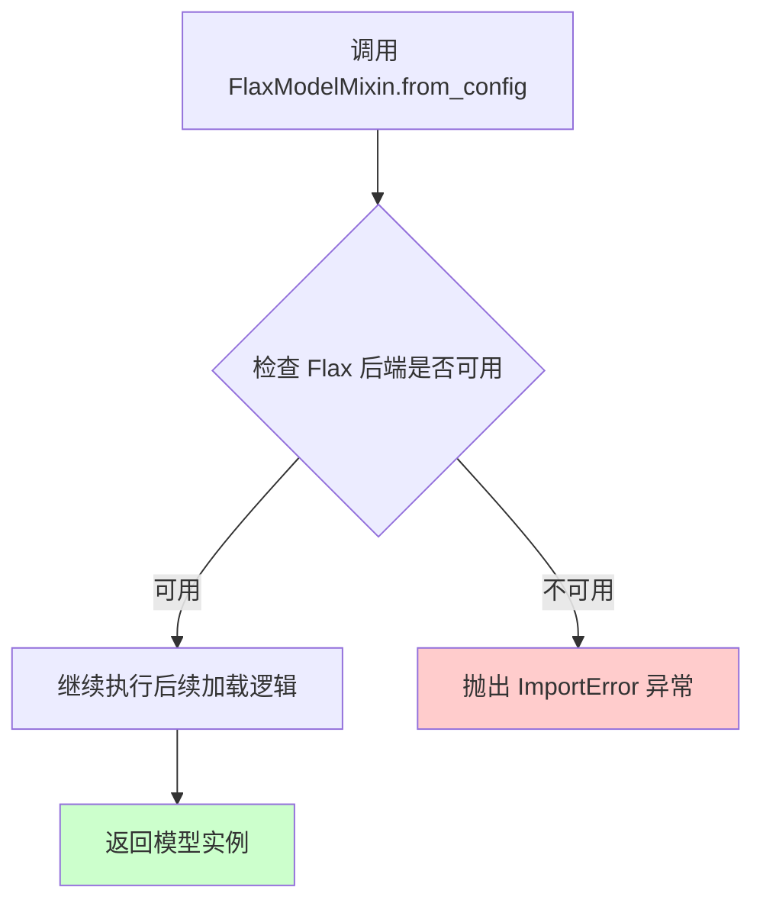
```mermaid
flowchart TD
    A[调用 FlaxModelMixin.from_config] --> B{检查 Flax 后端是否可用}
    B -->|可用| C[继续执行后续加载逻辑]
    B -->|不可用| D[抛出 ImportError 异常]
    C --> E[返回模型实例]
    
    style D fill:#ffcccc
    style E fill:#ccffcc
```

#### 带注释源码

```python
@classmethod
def from_config(cls, *args, **kwargs):
    """
    从配置创建模型实例的类方法。
    
    注意：此方法是自动生成的占位符实现，实际逻辑在其他模块中。
    该方法的主要作用是确保调用时 Flax 后端已安装。
    
    参数:
        *args: 可变位置参数，用于传递模型加载所需的配置参数
        **kwargs: 可变关键字参数，如 config、pretrained_model_name_or_path 等
    
    返回:
        无返回值（仅执行后端检查）
    """
    # 调用 requires_backends 检查 Flax 后端是否可用
    # 如果不可用，将抛出 ImportError 并提示安装 flax 库
    requires_backends(cls, ["flax"])
```

#### 关键组件信息

| 组件名称 | 一句话描述 |
|---------|-----------|
| `FlaxModelMixin` | Flax 模型的通用Mixin类，提供from_config和from_pretrained等方法 |
| `DummyObject` | 元类，用于创建需要特定后端的存根类 |
| `requires_backends` | 工具函数，用于检查并强制要求特定后端库 |

#### 潜在技术债务与优化空间

1. **代码重复**：所有类（FlaxControlNetModel、FlaxUNet2DConditionModel等）中的 `from_config` 方法实现完全相同，存在大量重复代码
2. **缺乏实际实现**：当前仅为占位符实现，开发者可能需要查看其他模块才能理解完整的加载逻辑
3. **文档不完整**：方法参数的具体含义和返回值类型未在代码中明确说明
4. **类型提示缺失**：未使用 Python 类型注解（type hints）明确参数和返回值的类型

#### 其他说明

- **设计目标**：该文件是自动生成的存根文件，用于在未安装 Flax 时提供友好的错误提示
- **错误处理**：通过 `requires_backends` 函数统一处理后端缺失的情况
- **外部依赖**：依赖 `..utils` 模块中的 `DummyObject` 和 `requires_backends` 函数


### `FlaxModelMixin.from_pretrained`

该方法是 FlaxModelMixin 类的类方法，用于从预训练的模型检查点加载模型实例。由于当前代码是自动生成的存根实现（通过 `make fix-copies` 命令生成），实际功能会在 flax 后端可用时由真正的实现类提供。当前实现会检查 flax 后端是否可用，若不可用则抛出 ImportError。

参数：

- `cls`：类型 `type`，隐含的类参数，表示调用该方法的类本身
- `*args`：类型 `tuple`，可变位置参数，用于传递位置参数，具体参数取决于实际的后端实现
- `**kwargs`：类型 `dict`，可变关键字参数，用于传递命名参数，如 `pretrained_model_name`、`cache_dir` 等

返回值：取决于实际实现，当 flax 后端可用时返回对应的模型实例，否则抛出 `ImportError`

#### 流程图

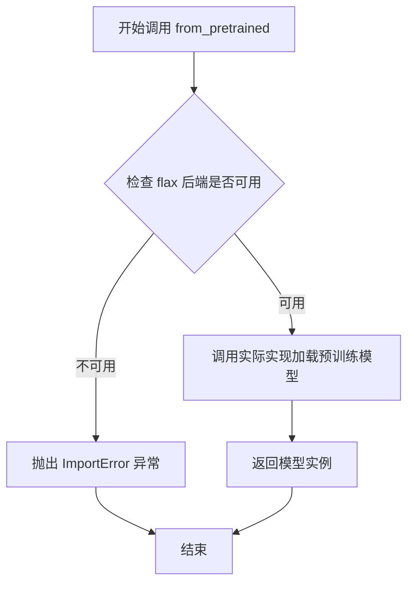
```mermaid
flowchart TD
    A[开始调用 from_pretrained] --> B{检查 flax 后端是否可用}
    B -->|可用| C[调用实际实现加载预训练模型]
    B -->|不可用| D[抛出 ImportError 异常]
    C --> E[返回模型实例]
    D --> F[结束]
    E --> F
```

#### 带注释源码

```python
@classmethod
def from_pretrained(cls, *args, **kwargs):
    """
    从预训练检查点加载模型实例的类方法。
    
    参数:
        *args: 可变位置参数，传递给实际的后端实现
        **kwargs: 可变关键字参数，如 pretrained_model_name, cache_dir 等
    
    返回:
        当 flax 后端可用时返回模型实例，否则抛出 ImportError
    """
    # requires_backends 会检查指定的后端是否可用
    # 如果 flax 后端不可用，会抛出 ImportError 并提示安装 flax
    requires_backends(cls, ["flax"])
```


### `FlaxUNet2DConditionModel.__init__`

该方法是FlaxUNet2DConditionModel类的构造函数，采用DummyObject元类模式，用于延迟加载Flax后端依赖。当实例化该类时，会通过requires_backends函数检查Flax库是否可用，如果不可用则抛出ImportError，从而实现条件导入和依赖管理。

参数：

- `*args`：可变位置参数，用于传递任意数量的位置参数（参数类型：tuple，参数描述：接受任意类型的可变位置参数）
- `**kwargs`：可变关键字参数，用于传递任意数量的关键字参数（参数类型：dict，参数描述：接受任意类型的可变关键字参数）

返回值：`None`，无返回值，该方法主要执行副作用（依赖检查）而非返回数据

#### 流程图

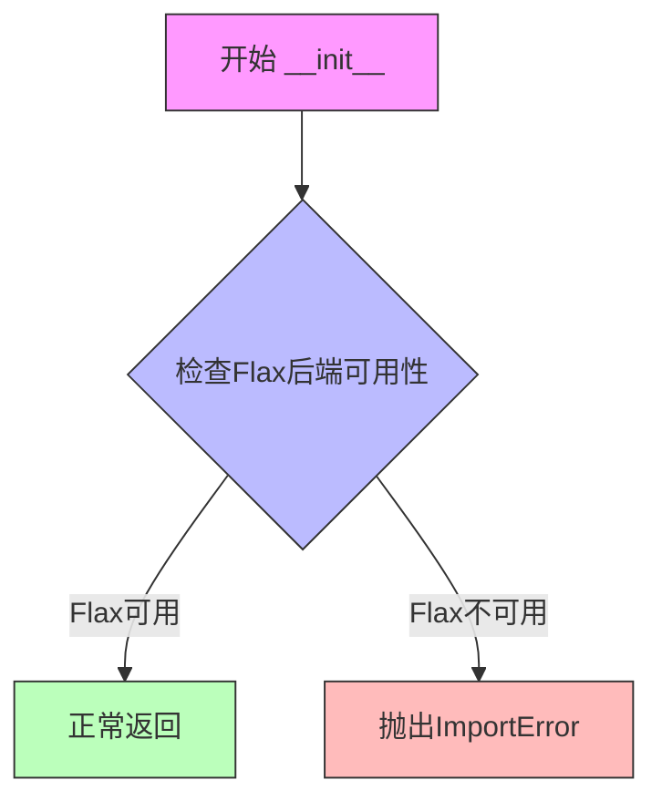
```mermaid
flowchart TD
    A[开始 __init__] --> B{检查Flax后端可用性}
    B -->|Flax可用| C[正常返回]
    B -->|Flax不可用| D[抛出ImportError]
    
    style A fill:#f9f,stroke:#333
    style B fill:#bbf,stroke:#333
    style C fill:#bfb,stroke:#333
    style D fill:#fbb,stroke:#333
```

#### 带注释源码

```python
class FlaxUNet2DConditionModel(metaclass=DummyObject):
    """
    Flax UNet 2D条件模型的占位类
    
    该类使用DummyObject元类实现懒加载模式，实际的模型实现在Flax后端
    真正可用时才会被加载。当尝试实例化此类时，会自动检查Flax依赖。
    """
    
    _backends = ["flax"]  # 类属性：指定该类需要的Flax后端

    def __init__(self, *args, **kwargs):
        """
        构造函数：初始化FlaxUNet2DConditionModel实例
        
        参数:
            *args: 可变位置参数，传递给后端实现
            **kwargs: 可变关键字参数，传递给后端实现
            
        注意:
            此方法不执行真正的初始化逻辑，而是通过requires_backends
            触发后端依赖检查。如果Flax未安装，将抛出ImportError。
        """
        requires_backends(self, ["flax"])  # 检查Flax后端是否可用

    @classmethod
    def from_config(cls, *args, **kwargs):
        """从配置创建模型实例的类方法"""
        requires_backends(cls, ["flax"])

    @classmethod
    def from_pretrained(cls, *args, **kwargs):
        """从预训练权重加载模型的类方法"""
        requires_backends(cls, ["flax"])
```


### `FlaxUNet2DConditionModel.from_config`

该方法是FlaxUNet2DConditionModel类的类方法，用于通过配置创建模型实例。在当前文件中，它作为Flax后端的占位符实现，实际的模型创建逻辑在其他模块中。当调用此方法时，会首先检查Flax后端是否可用，如果不可用则抛出导入错误。

参数：

- `*args`：可变位置参数，用于传递位置参数（具体参数取决于实际后端实现）
- `**kwargs`：可变关键字参数，用于传递关键字参数（具体参数取决于实际后端实现）

返回值：无明确返回值（该方法主要通过`requires_backends`进行后端检查，实际逻辑在其他模块）

#### 流程图

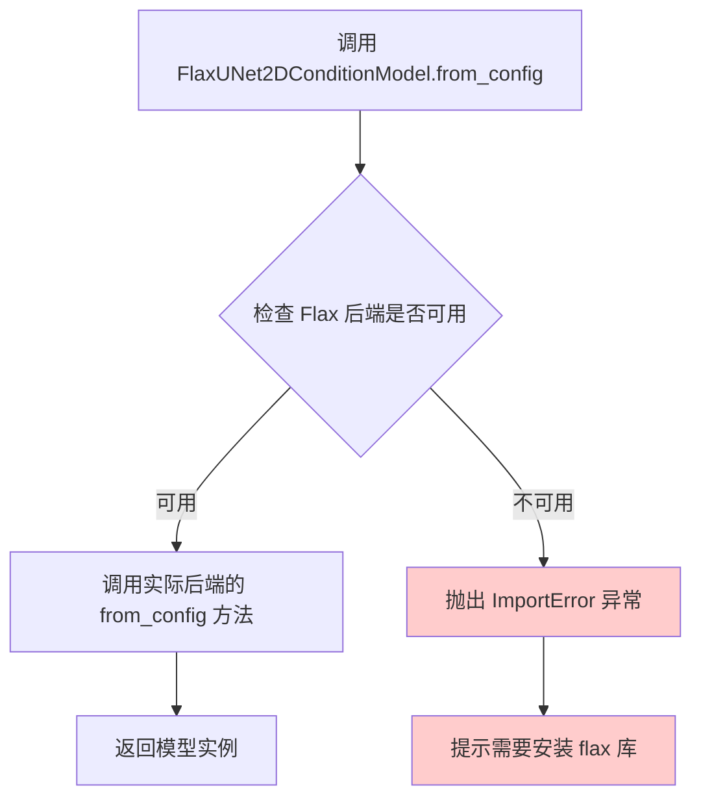
```mermaid
flowchart TD
    A[调用 FlaxUNet2DConditionModel.from_config] --> B{检查 Flax 后端是否可用}
    B -->|可用| C[调用实际后端的 from_config 方法]
    B -->|不可用| D[抛出 ImportError 异常]
    C --> E[返回模型实例]
    D --> F[提示需要安装 flax 库]
    
    style D fill:#ffcccc
    style F fill:#ffcccc
```

#### 带注释源码

```python
@classmethod
def from_config(cls, *args, **kwargs):
    """
    类方法：从配置创建Flax UNet 2D条件模型实例
    
    参数:
        *args: 可变位置参数，传递给实际后端的from_config方法
        **kwargs: 可变关键字参数，传递给实际后端的from_config方法
    
    注意:
        该方法是Flax后端的占位符实现，实际逻辑在安装flax库后的模块中
    """
    # requires_backends 会检查flax库是否已安装可用
    # 如果不可用，会抛出ImportError并提示安装flax
    requires_backends(cls, ["flax"])
```


### `FlaxUNet2DConditionModel.from_pretrained`

该方法是FlaxUNet2DConditionModel类的类方法，用于从预训练模型加载模型权重。它通过调用`requires_backends`确保Flax后端可用，如果Flax库未安装则会抛出ImportError。

参数：

- `*args`：可变位置参数，用于传递给后端实现（通常包含模型路径等）
- `**kwargs`：可变关键字参数，用于传递给后端实现（通常包含配置选项等）

返回值：`None`，该方法不直接返回模型实例，而是通过后端实现来完成模型加载

#### 流程图

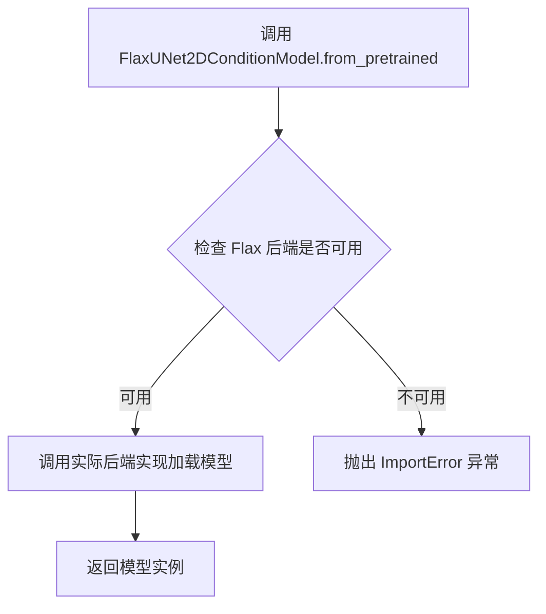
```mermaid
flowchart TD
    A[调用 FlaxUNet2DConditionModel.from_pretrained] --> B{检查 Flax 后端是否可用}
    B -->|可用| C[调用实际后端实现加载模型]
    B -->|不可用| D[抛出 ImportError 异常]
    C --> E[返回模型实例]
```

#### 带注释源码

```python
@classmethod
def from_pretrained(cls, *args, **kwargs):
    """
    从预训练模型加载模型权重
    
    参数:
        *args: 可变位置参数,通常包含模型路径或模型名称
        **kwargs: 可变关键字参数,包含加载选项如cache_dir, revision等
    
    返回:
        无直接返回值,实际模型加载由后端实现完成
    """
    # requires_backends 会检查flax后端是否可用
    # 如果不可用,则抛出ImportError并提示安装flax
    requires_backends(cls, ["flax"])
```


### `FlaxAutoencoderKL.__init__`

这是 FlaxAutoencoderKL 类的初始化方法，由于该类是使用 DummyObject 元类生成的占位符类，其 `__init__` 方法实际上会调用 `requires_backends` 来检查是否安装了 flax 后端，如果未安装则抛出 ImportError。

参数：

- `*args`：可变位置参数，用于传递任意数量的位置参数（当前未被使用，仅为接口兼容性）
- `**kwargs`：可变关键字参数，用于传递任意数量的关键字参数（当前未被使用，仅为接口兼容性）

返回值：`None`，因为 `__init__` 方法不返回值

#### 流程图

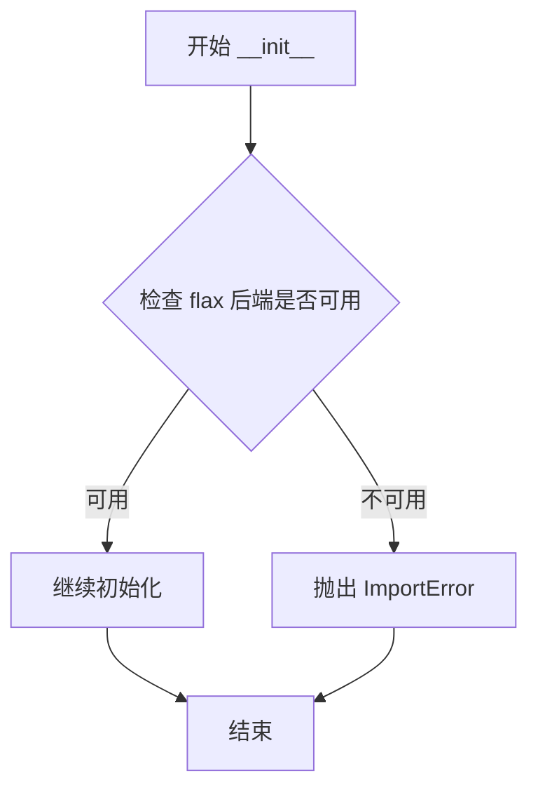
```mermaid
flowchart TD
    A[开始 __init__] --> B{检查 flax 后端是否可用}
    B -->|可用| C[继续初始化]
    B -->|不可用| D[抛出 ImportError]
    C --> E[结束]
    D --> E
```

#### 带注释源码

```python
class FlaxAutoencoderKL(metaclass=DummyObject):
    """
    Flax 版本的 AutoencoderKL 模型类
    这是一个 dummy 类，用于在未安装 flax 时提供清晰的错误信息
    """
    _backends = ["flax"]  # 类属性：指定该类需要 flax 后端

    def __init__(self, *args, **kwargs):
        """
        初始化 FlaxAutoencoderKL 实例
        
        参数:
            *args: 可变位置参数（未使用，仅为接口兼容性）
            **kwargs: 可变关键字参数（未使用，仅为接口兼容性）
        
        注意:
            该方法实际上不会执行任何初始化逻辑，而是调用 requires_backends
            来检查 flax 后端是否可用。如果不可用，则抛出 ImportError。
        """
        # 调用 requires_backends 检查 flax 后端是否可用
        # 如果不可用，会抛出 ImportError 并提示安装 flax
        requires_backends(self, ["flax"])
```


### `FlaxAutoencoderKL.from_config`

该方法是 FlaxAutoencoderKL 类的类方法，用于从配置创建模型实例，但由于是 DummyObject 虚拟对象，实际实现会调用 requires_backends 检查 Flax 依赖是否可用，如果不可用则抛出 ImportError 异常。

参数：

- `cls`：`type`，隐含的类参数，代表 FlaxAutoencoderKL 类本身
- `*args`：`Tuple[Any, ...]`，可变位置参数，用于传递位置参数到后端实现
- `**kwargs`：`Dict[str, Any]`，可变关键字参数，用于传递命名参数到后端实现

返回值：`None`，该方法无返回值，实际逻辑通过 requires_backends 的副作用完成（可能抛出 ImportError）

#### 流程图

```mermaid
flowchart TD
    A[开始 from_config 调用] --> B{检查 cls 是否为 FlaxAutoencoderKL}
    B -->|是| C[调用 requires_backends cls, ['flax']]
    C --> D{Flax 后端可用?}
    D -->|是| E[返回 None 或加载配置]
    D -->|否| F[抛出 ImportError 异常]
    B -->|否| G[返回 None 或加载配置]
```

#### 带注释源码

```python
@classmethod
def from_config(cls, *args, **kwargs):
    """
    类方法：从配置创建 FlaxAutoencoderKL 模型实例
    
    注意：这是 DummyObject 的虚方法实现，实际逻辑由 requires_backends 完成
    - 如果 Flax 后端可用，可能会加载配置并返回模型实例
    - 如果 Flax 后端不可用，则抛出 ImportError
    
    参数:
        cls: 隐含的类参数，代表调用此方法的类
        *args: 可变位置参数，传递给后端实现
        **kwargs: 可变关键字参数，传递给后端实现
    
    返回:
        None: 该方法本身无返回值，实际行为由 requires_backends 的副作用决定
    """
    # requires_backends 会检查指定的后端（flax）是否可用
    # 如果不可用，会抛出 ImportError 并提示安装相应的依赖
    requires_backends(cls, ["flax"])
```

---

**补充说明**

该方法属于 Diffusers 库中的 Flax 模型虚拟对象（DummyObject）模式，用于：

1. **延迟导入检查**：只有当用户真正使用 Flax 相关功能时，才检查 Flax 依赖是否安装
2. **可选后端支持**：允许库在未安装某些可选依赖时仍能导入，但使用时抛出明确错误
3. **设计目标**：支持 PyTorch/JAX/Flax 等多后端，用户可根据环境选择使用


### `FlaxAutoencoderKL.from_pretrained`

该方法是一个类方法，用于从预训练模型路径加载 `FlaxAutoencoderKL` 实例。当前实现通过 `requires_backends` 检查所需的 Flax 后端是否可用，若后端不可用则抛出错误；若可用，则由实际后端实现完成模型加载。

参数：

- `*args`：可变位置参数，用于传递预训练模型路径或其他位置参数，具体参数取决于后端实现。
- `**kwargs`：可变关键字参数，用于传递配置字典、设备参数等其他关键字参数，具体参数取决于后端实现。

返回值：`Any`（由后端实现决定，通常返回加载后的模型实例）

#### 流程图

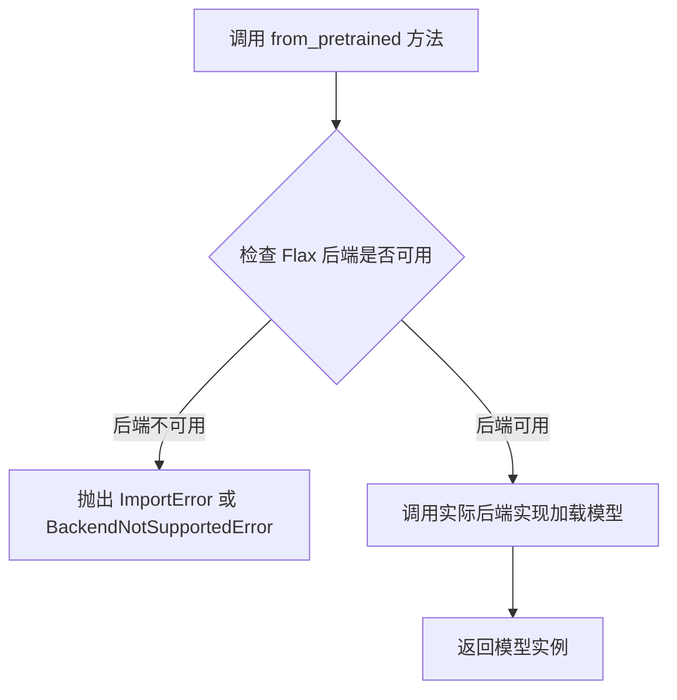
```mermaid
flowchart TD
    A[调用 from_pretrained 方法] --> B{检查 Flax 后端是否可用}
    B -->|后端不可用| C[抛出 ImportError 或 BackendNotSupportedError]
    B -->|后端可用| D[调用实际后端实现加载模型]
    D --> E[返回模型实例]
```

#### 带注释源码

```python
@classmethod
def from_pretrained(cls, *args, **kwargs):
    # cls: 类本身，即 FlaxAutoencoderKL
    # *args: 可变位置参数，传递预训练模型路径等
    # **kwargs: 可变关键字参数，传递配置选项等
    requires_backends(cls, ["flax"])
    # 检查 cls 是否支持 Flax 后端，若不支持则抛出异常
    # 若后端可用，实际加载逻辑由后端模块实现
```


### FlaxDiffusionPipeline.__init__

该方法是FlaxDiffusionPipeline类的构造函数，用于初始化FlaxDiffusionPipeline对象，但由于是DummyObject的元类实现，实际会调用requires_backends检查flax后端是否可用，若不可用则抛出ImportError。

参数：

- `self`：`FlaxDiffusionPipeline`，FlaxDiffusionPipeline类的实例对象本身
- `*args`：`tuple`，可变位置参数，用于接收传递给父类或配置的位置参数
- `**kwargs`：`dict`，可变关键字参数，用于接收传递给父类或配置的关键字参数

返回值：`None`，__init__方法不返回值，只是初始化对象实例

#### 流程图

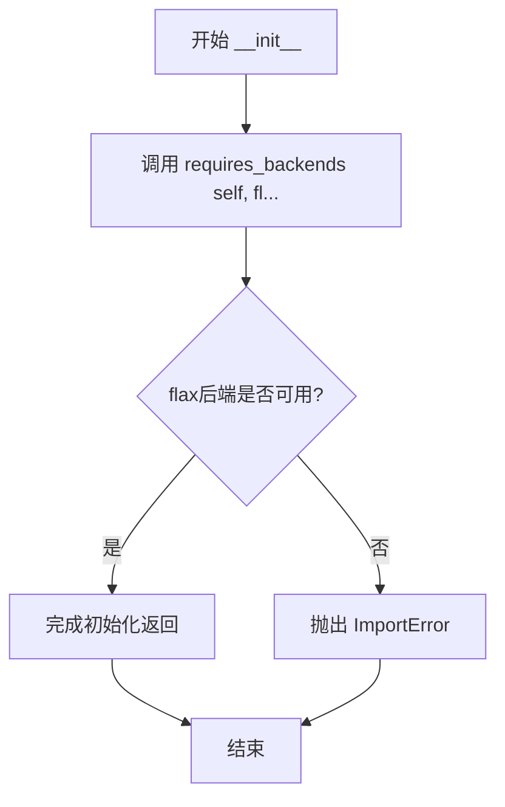
```mermaid
flowchart TD
    A[开始 __init__] --> B[调用 requires_backends self, fl...]
    B --> C{flax后端是否可用?}
    C -->|是| D[完成初始化返回]
    C -->|否| E[抛出 ImportError]
    D --> F[结束]
    E --> F
```

#### 带注释源码

```python
class FlaxDiffusionPipeline(metaclass=DummyObject):
    """
    FlaxDiffusionPipeline类
    这是一个DummyObject元类生成的占位符类
    实际的实现需要flax后端才能正常工作
    """
    _backends = ["flax"]  # 类属性，指定需要的后端为flax

    def __init__(self, *args, **kwargs):
        """
        初始化FlaxDiffusionPipeline实例
        
        参数:
            *args: 可变位置参数，用于传递额外参数
            **kwargs: 可变关键字参数，用于传递额外键值对参数
        """
        # requires_backends是一个工具函数，用于检查所需后端是否可用
        # 如果flax不可用，会抛出ImportError
        requires_backends(self, ["flax"])

    @classmethod
    def from_config(cls, *args, **kwargs):
        """从配置创建FlaxDiffusionPipeline实例的类方法"""
        requires_backends(cls, ["flax"])

    @classmethod
    def from_pretrained(cls, *args, **kwargs):
        """从预训练模型创建FlaxDiffusionPipeline实例的类方法"""
        requires_backends(cls, ["flax"])
```


### `FlaxDiffusionPipeline.from_config`

该方法是 FlaxDiffusionPipeline 类的类方法，用于从配置中实例化 Flax 扩散管道。由于这是一个存根类（使用 DummyObject 元类），实际实现会检查所需的 Flax 后端是否可用，如果不可用则抛出 ImportError。

参数：

- `cls`：`type`，类本身（classmethod 的隐式参数）
- `*args`：`tuple`，可变位置参数，用于传递位置参数给实际实现
- `**kwargs`：`dict`，可变关键字参数，用于传递关键字参数给实际实现

返回值：`Any`，实际返回值取决于后端实现；在当前存根实现中无返回值（仅执行后端检查）

#### 流程图

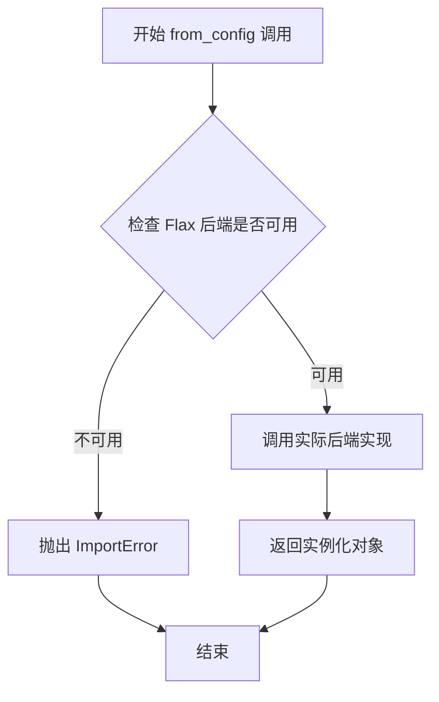
```mermaid
flowchart TD
    A[开始 from_config 调用] --> B{检查 Flax 后端是否可用}
    B -->|可用| C[调用实际后端实现]
    B -->|不可用| D[抛出 ImportError]
    C --> E[返回实例化对象]
    D --> F[结束]
    E --> F
```

#### 带注释源码

```python
@classmethod
def from_config(cls, *args, **kwargs):
    """
    从配置创建 FlaxDiffusionPipeline 实例的类方法。
    
    参数:
        cls: 类本身（classmethod 隐式提供）
        *args: 可变位置参数，传递给实际后端实现
        **kwargs: 可变关键字参数，传递给实际后端实现
    
    注意:
        此方法是存根实现，实际逻辑在真实后端中。
        如果 Flax 后端不可用，会抛出 ImportError。
    """
    # requires_backends 会检查指定的模块（flax）是否可用
    # 如果不可用，会抛出 ImportError 并提示安装所需依赖
    requires_backends(cls, ["flax"])
```


### `FlaxDiffusionPipeline.from_pretrained`

该方法是 FlaxDiffusionPipeline 类的类方法，用于从预训练模型加载 Flax 扩散管道，但当前实现仅为一个占位符，通过调用 `requires_backends` 函数检查所需的 Flax 后端是否可用，如果不可用则抛出 ImportError 异常。

参数：

- `*args`：可变位置参数，用于传递从预训练模型加载所需的参数（类型取决于实际调用，通常为模型路径等）
- `**kwargs`：可变关键字参数，用于传递从预训练模型加载所需的配置参数（如 `cache_dir`、`revision` 等）

返回值：`None` 或抛出 `ImportError`，该方法本身不返回值，实际的模型加载逻辑由后端实现完成（当前仅检查后端可用性）

#### 流程图

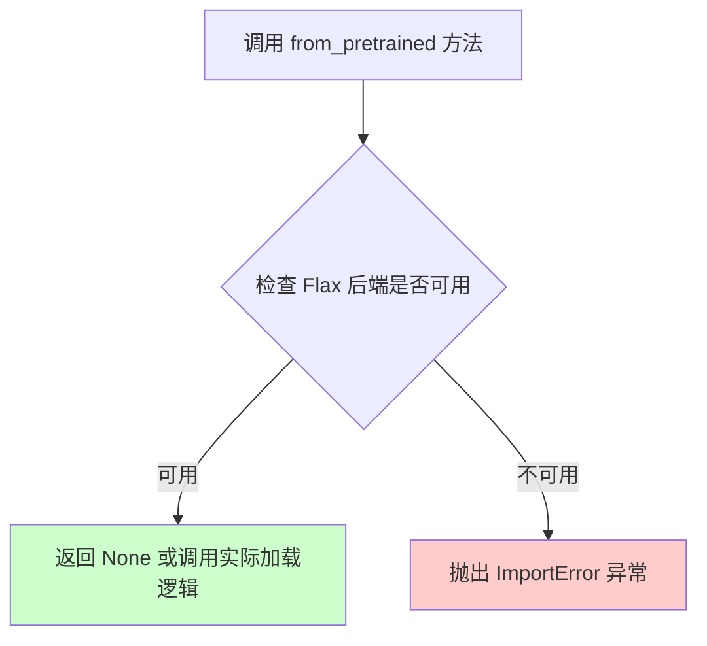
```mermaid
graph TD
    A[调用 from_pretrained 方法] --> B{检查 Flax 后端是否可用}
    B -->|可用| C[返回 None 或调用实际加载逻辑]
    B -->|不可用| D[抛出 ImportError 异常]
    
    style D fill:#ffcccc
    style C fill:#ccffcc
```

#### 带注释源码

```python
@classmethod
def from_pretrained(cls, *args, **kwargs):
    """
    从预训练模型加载 FlaxDiffusionPipeline 实例的类方法。
    
    参数:
        *args: 可变位置参数，用于传递模型路径等加载所需的参数
        **kwargs: 可变关键字参数，用于传递配置选项如 cache_dir、revision 等
    
    返回值:
        无返回值（当前实现仅检查后端可用性）
    
    注意:
        该方法是自动生成的占位符，实际的模型加载逻辑需要通过
        requires_backends 检查后由相应的 Flax 后端实现
    """
    # 调用 requires_backends 函数检查 'flax' 后端是否可用
    # 如果不可用，将抛出 ImportError 异常并显示相关错误信息
    requires_backends(cls, ["flax"])
```


### `FlaxDDIMScheduler.__init__`

这是 FlaxDDIMScheduler 类的构造函数，用于初始化 FlaxDDIMScheduler 对象。该方法使用 DummyObject 元类，在实际调用时会通过 requires_backends 检查当前环境是否支持 Flax 后端，如果不支持则抛出 ImportError。

参数：

- `*args`：可变位置参数，用于传递任意数量的位置参数给父类或初始化逻辑（类型不确定，取决于调用时的实际传入值）
- `**kwargs`：可变关键字参数，用于传递任意数量的关键字参数给父类或初始化逻辑（类型不确定，取决于调用时的实际传入值）

返回值：`None`，因为 `__init__` 方法不返回值，通常返回 None

#### 流程图

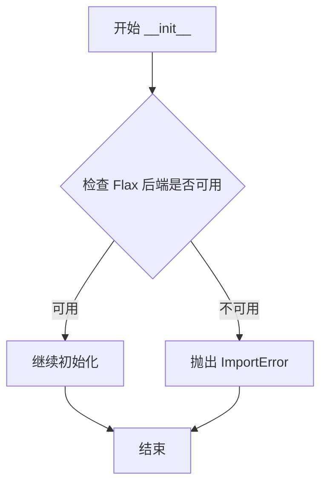
```mermaid
flowchart TD
    A[开始 __init__] --> B{检查 Flax 后端是否可用}
    B -->|可用| C[继续初始化]
    B -->|不可用| D[抛出 ImportError]
    C --> E[结束]
    D --> E
```

#### 带注释源码

```python
def __init__(self, *args, **kwargs):
    """
    初始化 FlaxDDIMScheduler 实例。
    
    该构造函数使用 DummyObject 元类，在实例化时会检查 Flax 后端是否可用。
    如果 Flax 不可用，则抛出 ImportError 异常。
    
    参数:
        *args: 可变位置参数，传递给父类或初始化逻辑
        **kwargs: 可变关键字参数，传递给父类或初始化逻辑
    """
    # 调用 requires_backends 函数检查 'flax' 后端是否可用
    # 如果不可用，此函数会抛出 ImportError
    requires_backends(self, ["flax"])
```


### `FlaxDDIMScheduler.from_config`

该方法是 FlaxDDIMScheduler 类的类方法，用于从配置创建调度器实例，但由于该类是 DummyObject 存根类，实际实现会从真正的模块导入。此方法目前仅用于检查 Flax 后端是否可用，若不可用则抛出 ImportError。

参数：

- `*args`：可变位置参数，用于传递任意数量的位置参数（当前未使用，仅作为存根）
- `**kwargs`：可变关键字参数，用于传递任意数量的关键字参数（当前未使用，仅作为存根）

返回值：无明确返回值（该方法主要执行后端检查操作）

#### 流程图

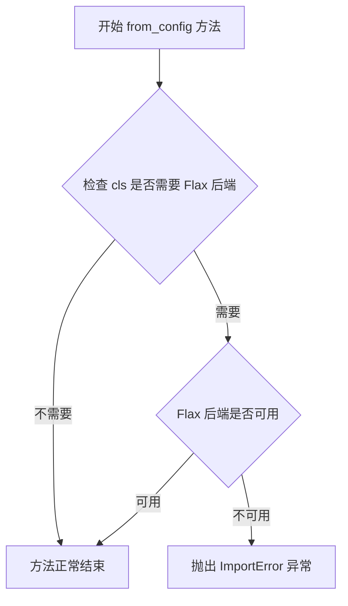
```mermaid
flowchart TD
    A[开始 from_config 方法] --> B{检查 cls 是否需要 Flax 后端}
    B -->|需要| C{Flax 后端是否可用}
    C -->|可用| D[方法正常结束]
    C -->|不可用| E[抛出 ImportError 异常]
    B -->|不需要| D
```

#### 带注释源码

```python
@classmethod
def from_config(cls, *args, **kwargs):
    """
    从配置创建 FlaxDDIMScheduler 实例的类方法。
    
    注意：由于此类是 DummyObject 存根类，该方法实际上不会创建实例，
    而是通过 requires_backends 检查 Flax 后端是否可用。如果后端不可用，
    则抛出 ImportError。真正的实现在其他地方（如 diffusers 库的
    实际 Flax 模块中）。
    
    参数:
        cls: 类本身（由 @classmethod 自动传递）
        *args: 可变位置参数，用于传递任意数量的位置参数
        **kwargs: 可变关键字参数，用于传递任意数量的关键字参数
    
    返回值:
        无明确返回值（仅执行后端检查）
    """
    # 检查 Flax 后端是否可用，如果不可用则抛出 ImportError
    requires_backends(cls, ["flax"])
```

#### 补充说明

| 项目 | 描述 |
|------|------|
| **设计目标** | 提供一个统一的调度器创建接口，与其他 Flax 模型类（如 FlaxUNet2DConditionModel、FlaxAutoencoderKL 等）保持一致的 API 设计 |
| **约束条件** | 依赖 Flax 后端库，必须在安装了 Flax 的环境中使用 |
| **错误处理** | 通过 `requires_backends` 函数检查后端可用性，若 Flax 未安装则抛出 `ImportError` |
| **技术债务** | 该类是自动生成的存根类（通过 `make fix-copies` 命令生成），实际逻辑在真正的实现模块中，可能导致代码追踪和调试困难 |
| **优化建议** | 考虑在文档中明确说明这是存根类，或者提供更详细的错误信息指引用户安装正确的依赖 |


### `FlaxDDIMScheduler.from_pretrained`

该方法是一个类方法，用于从预训练的模型权重中加载 Flax DDIMScheduler 调度器。由于当前代码是自动生成的存根（stub），实际实现被延迟到运行时，在后端不可用时会抛出 ImportError。

参数：

- `*args`：可变位置参数，用于传递预训练模型路径或其他位置参数
- `**kwargs`：可变关键字参数，用于传递配置选项、模型参数等

返回值：无明确返回值（方法内部调用 `requires_backends` 触发异常或加载实际实现）

#### 流程图

```mermaid
flowchart TD
    A[调用 from_pretrained] --> B{检查 Flax 后端是否可用}
    B -->|可用| C[调用实际实现加载预训练权重]
    B -->|不可用| D[抛出 ImportError]
    C --> E[返回 FlaxDDIMScheduler 实例]
    D --> F[提示需要安装 flax 后端]
```

#### 带注释源码

```python
@classmethod
def from_pretrained(cls, *args, **kwargs):
    """
    从预训练模型加载 FlaxDDIMScheduler 实例的类方法。
    
    参数:
        *args: 可变位置参数，通常包括预训练模型路径或模型标识符
        **kwargs: 可变关键字参数，包括配置选项、缓存目录等
    
    注意:
        该方法是自动生成的存根，实际实现由 requires_backends 延迟加载
    """
    # requires_backends 会检查所需的 fl
```


### `FlaxDDPMScheduler.__init__`

该方法是 FlaxDDPMScheduler 类的初始化方法，用于实例化一个 DDPMScheduler 对象，并通过 `requires_backends` 检查当前环境是否支持 Flax 后端，如果不支持则抛出异常。

参数：

- `*args`：可变位置参数，任意类型，用于传递位置参数以满足子类或未来扩展的需求
- `**kwargs`：可变关键字参数，任意类型，用于传递关键字参数以满足子类或未来扩展的需求

返回值：`None`，该方法不返回任何值，仅进行对象初始化和后端检查

#### 流程图

```mermaid
flowchart TD
    A[开始 __init__] --> B[接收 *args, **kwargs]
    B --> C{检查 Flax 后端是否可用}
    C -->|可用| D[完成初始化]
    C -->|不可用| E[抛出 ImportError 异常]
    D --> F[结束]
    E --> F
```

#### 带注释源码

```python
def __init__(self, *args, **kwargs):
    """
    初始化 FlaxDDPMScheduler 实例。
    
    参数:
        *args: 可变位置参数，用于传递任意数量的位置参数
        **kwargs: 可变关键字参数，用于传递任意数量的关键字参数
    """
    # 调用 requires_backends 函数检查 flasks 后端是否可用
    # 如果不可用，则抛出 ImportError 异常
    requires_backends(self, ["flax"])
```


### `FlaxDDPMScheduler.from_config`

该方法是 FlaxDDPMScheduler 类的类方法，用于根据配置创建 FlaxDDPMScheduler 实例。由于这是一个自动生成的文件（由 `make fix-copies` 命令生成），该方法实际上是一个存根（stub），会检查 Flax 后端是否可用，如果不可用则抛出 ImportError。

参数：

- `cls`：类型：`class`，隐式参数，表示类本身
- `*args`：类型：`Any`，可变位置参数，用于传递任意数量的位置参数
- `**kwargs`：类型：`Dict[str, Any]`，可变关键字参数，用于传递任意数量的关键字参数

返回值：`None`，无返回值（若 Flax 不可用则抛出异常）

#### 流程图

```mermaid
flowchart TD
    A[开始 from_config] --> B{检查 Flax 后端是否可用}
    B -->|可用| C[执行后续逻辑]
    B -->|不可用| D[抛出 ImportError]
    C --> E[返回实例或 None]
    D --> F[结束]
    E --> F
```

#### 带注释源码

```python
@classmethod
def from_config(cls, *args, **kwargs):
    """
    从配置创建 FlaxDDPMScheduler 实例的类方法。
    
    注意：此方法是自动生成的存根实现，实际功能需要 Flax 后端支持。
    当 Flax 不可用时，会抛出 ImportError 提示用户安装必要的依赖。
    """
    # requires_backends 是工具函数，用于检查指定的依赖后端是否可用
    # 如果 Flax 不可用，该函数会抛出 ImportError 并显示友好的错误信息
    # 第二个参数 ["flax"] 指定了需要的后端类型
    requires_backends(cls, ["flax"])
```


### `FlaxDDPMScheduler.from_pretrained`

该方法是FlaxDDPMScheduler类的类方法，用于从预训练模型或配置中加载FlaxDDPMScheduler调度器实例。由于这是一个自动生成的存根类（通过`make fix-copies`命令生成），实际实现被抽象为对后端库的延迟依赖检查。

参数：

- `*args`：可变位置参数，用于传递位置参数给实际的`from_pretrained`实现
- `**kwargs`：可变关键字参数，用于传递关键字参数给实际的`from_pretrained`实现（如`pretrained_model_name_or_path`、`subfolder`等）

返回值：`Any`，返回FlaxDDPMScheduler的实例，具体类型取决于实际后端实现，通常返回调度器对象

#### 流程图

```mermaid
flowchart TD
    A[调用 FlaxDDPMScheduler.from_pretrained] --> B{检查 Flax 后端是否可用}
    B -->|后端可用| C[调用实际后端实现]
    B -->|后端不可用| D[抛出 ImportError 异常]
    C --> E[返回 FlaxDDPMScheduler 实例]
    D --> F[提示安装 flax 后端库]
    
    style B fill:#f9f,color:#333
    style D fill:#ff9,color:#333
    style E fill:#9f9,color:#333
```

#### 带注释源码

```python
class FlaxDDPMScheduler(metaclass=DummyObject):
    """
    Flax 版本的 DDPMScheduler（Diffusion Probabilistic Models Scheduler）调度器类。
    使用 DummyObject 元类，在实际调用时才会导入真实实现，用于支持条件加载和延迟导入。
    """
    
    _backends = ["flax"]  # 类属性：指定该类需要的 backend 为 flax

    def __init__(self, *args, **kwargs):
        """
        初始化方法。
        由于是 DummyObject，实际初始化会检查后端是否可用。
        
        参数：
            *args: 位置参数
            **kwargs: 关键字参数
        """
        # 检查是否安装了必要的后端库（flax），若未安装则抛出异常
        requires_backends(self, ["flax"])

    @classmethod
    def from_config(cls, *args, **kwargs):
        """
        从配置创建调度器实例的类方法。
        
        参数：
            cls: 指向 FlaxDDPMScheduler 类本身
            *args: 位置参数（如配置字典）
            **kwargs: 关键字参数（如 config 参数）
            
        返回：
            不直接返回，而是调用 requires_backends 检查后端
        """
        # 检查是否安装了必要的后端库（flax），若未安装则抛出异常
        requires_backends(cls, ["flax"])

    @classmethod
    def from_pretrained(cls, *args, **kwargs):
        """
        从预训练模型或路径加载调度器实例的类方法。
        这是扩散模型中常用的加载预训练调度器的方式。
        
        参数：
            cls: 指向 FlaxDDPMScheduler 类本身
            *args: 位置参数，通常第一个是 pretrained_model_name_or_path
            **kwargs: 关键字参数，可能包括：
                - pretrained_model_name_or_path: 预训练模型名称或路径
                - subfolder: 子文件夹路径
                - cache_dir: 缓存目录
                - torch_dtype: 数据类型
                - force_download: 是否强制下载
                - resume_download: 是否恢复下载
                - proxies: 代理设置
                - local_files_only: 是否只使用本地文件
                - revision: Git revision
                - use_auth_token: 认证 token
                等其他 HuggingFace Hub 相关参数
                
        返回：
            实际的返回值取决于后端实现，通常返回 FlaxDDPMScheduler 实例
        """
        # 检查是否安装了必要的后端库（flax），若未安装则抛出异常
        # 这是延迟导入机制的核心：只有真正调用时才会检查依赖
        requires_backends(cls, ["flax"])
```


### `FlaxDPMSolverMultistepScheduler.__init__`

这是 FlaxDPMSolverMultistepScheduler 类的初始化方法，采用 DummyObject 元类实现，用于在 Flax 后端不可用时抛出明确的导入错误，确保只有安装相应后端时才能正常使用该类。

#### 参数

- `*args`：`任意类型`，可变位置参数，用于传递任意数量的位置参数到初始化方法
- `**kwargs`：`任意类型`，可变关键字参数，用于传递任意数量的关键字参数到初始化方法

#### 返回值

`None`，构造函数不返回任何值

#### 流程图

```mermaid
flowchart TD
    A[__init__ 被调用] --> B{检查 Flax 后端是否可用}
    B -->|后端不可用| C[调用 requires_backends 抛出 ImportError]
    B -->|后端可用| D[完成初始化]
    C --> E[提示需要安装 flax 后端]
```

#### 带注释源码

```python
class FlaxDPMSolverMultistepScheduler(metaclass=DummyObject):
    """
    Flax DPMSolver 多步调度器类
    使用 DummyObject 元类实现延迟导入和后端检查
    """
    
    _backends = ["flax"]  # 类属性：声明该类需要 flax 后端支持

    def __init__(self, *args, **kwargs):
        """
        初始化方法
        
        参数:
            *args: 任意位置参数，用于传递初始化参数
            **kwargs: 任意关键字参数，用于传递初始化参数
        
        注意:
            此方法实际上不会执行真正的初始化逻辑
            仅用于在 flax 后端不可用时抛出错误
        """
        # 调用 requires_backends 检查 flax 后端是否可用
        # 如果不可用，此函数将抛出 ImportError
        requires_backends(self, ["flax"])
```

---

**备注**: 这是一个典型的延迟导入/后端检查模式，通过 `DummyObject` 元类实现。当用户尝试实例化此类但未安装 `flax` 后端时，会得到清晰的错误提示。这种设计避免了在该后端不可用时导入失败，同时提供了友好的错误信息。


### `FlaxDPMSolverMultistepScheduler.from_config`

该方法是一个类方法，用于通过配置创建`FlaxDPMSolverMultistepScheduler`调度器的实例。由于这是一个DummyObject（占位对象），实际实现会检查Flax后端是否可用，如果不可用则抛出ImportError。

参数：

- `*args`：可变位置参数，用于传递任意数量的位置参数
- `**kwargs`：可变关键字参数，用于传递任意数量的关键字参数

返回值：`None`，该方法不返回任何值，仅进行后端验证

#### 流程图

```mermaid
flowchart TD
    A[开始] --> B{检查Flax后端是否可用}
    B -->|可用| C[返回类实例或配置对象]
    B -->|不可用| D[抛出ImportError: Flax相关功能不可用]
    
    style B fill:#ff9900
    style D fill:#ff6666
```

#### 带注释源码

```python
@classmethod
def from_config(cls, *args, **kwargs):
    """
    从配置创建FlaxDPMSolverMultistepScheduler实例的类方法。
    
    参数:
        cls: 指向FlaxDPMSolverMultistepScheduler类本身
        *args: 可变位置参数列表
        **kwargs: 可变关键字参数字典
    
    返回:
        无返回值，仅进行后端依赖检查
    """
    # 调用requires_backends检查flax后端是否可用
    # 如果不可用，会抛出ImportError并提示安装flax
    requires_backends(cls, ["flax"])
```


### `FlaxDPMSolverMultistepScheduler.from_pretrained`

该方法是FlaxDPMSolverMultistepScheduler类的类方法，用于从预训练模型加载调度器。由于代码是由`make fix-copies`命令自动生成的占位符实现，实际功能依赖于flax后端库的加载，当调用时会通过`requires_backends`函数检查flax后端是否可用，若不可用则抛出导入错误。

参数：

- `*args`：可变位置参数，用于传递从预训练模型加载时的位置参数（如模型路径等）
- `**kwargs`：可变关键字参数，用于传递从预训练模型加载时的关键字参数（如配置选项等）

返回值：无明确返回值，该方法通过`requires_backends`函数在flax后端不可用时抛出`ImportError`异常

#### 流程图

```mermaid
flowchart TD
    A[调用 FlaxDPMSolverMultistepScheduler.from_pretrained] --> B{检查 flax 后端是否可用}
    B -->|可用| C[加载预训练模型配置和权重]
    B -->|不可用| D[抛出 ImportError 异常]
    C --> E[返回调度器实例]
    D --> F[提示需要安装 flax 库]
    
    style A fill:#f9f,stroke:#333
    style B fill:#bbf,stroke:#333
    style C fill:#dfd,stroke:#333
    style D fill:#fdd,stroke:#333
    style E fill:#dfd,stroke:#333
    style F fill:#fdd,stroke:#333
```

#### 带注释源码

```python
@classmethod
def from_pretrained(cls, *args, **kwargs):
    """
    从预训练模型加载 FlaxDPMSolverMultistepScheduler 调度器
    
    这是一个类方法（classmethod），允许直接通过类名调用而不需要实例化对象。
    由于这是自动生成的占位符代码，实际的模型加载逻辑由后端实现。
    
    参数:
        *args: 可变位置参数，用于传递模型路径或其他位置参数
        **kwargs: 可变关键字参数，用于传递配置选项和其他命名参数
    
    返回值:
        无明确返回值（实际加载逻辑在后端实现中）
    
    异常:
        ImportError: 当 flax 后端不可用时抛出
    """
    # requires_backends 是工具函数，用于检查指定的 后端是否可用
    # 如果 flax 后端未安装或不可用，此函数将抛出 ImportError
    requires_backends(cls, ["flax"])
```


### `FlaxEulerDiscreteScheduler.__init__`

这是 FlaxEulerDiscreteScheduler 类的初始化方法，用于在实例化对象时检查Flax后端是否可用，如果Flax后端不可用则抛出ImportError。该类是Diffusion Models中Euler离散调度器的Flax实现占位符类。

参数：

- `*args`：任意类型，可变位置参数，用于传递任意数量的位置参数到父类或后续实现
- `**kwargs`：任意类型，可变关键字参数，用于传递任意数量的关键字参数到父类或后续实现

返回值：`None`，该方法不返回任何值，仅进行后端检查

#### 流程图

```mermaid
graph TD
    A[开始 __init__] --> B[接收 *args, **kwargs]
    B --> C{检查 Flax 后端可用性}
    C -->|后端可用| D[完成初始化]
    C -->|后端不可用| E[抛出 ImportError]
    D --> F[结束]
    E --> F
```

#### 带注释源码

```python
class FlaxEulerDiscreteScheduler(metaclass=DummyObject):
    """
    Flax版本的Euler离散调度器类。
    该类是一个DummyObject（占位符类），当Flax后端不可用时会被替换为抛出异常的类。
    """
    
    _backends = ["flax"]  # 类属性，指定该类需要的Flax后端

    def __init__(self, *args, **kwargs):
        """
        初始化FlaxEulerDiscreteScheduler实例。
        
        参数:
            *args: 可变位置参数，用于兼容父类或实际实现的参数传递
            **kwargs: 可变关键字参数，用于兼容父类或实际实现的参数传递
        """
        # 调用requires_backends检查Flax后端是否可用
        # 如果不可用，该函数会抛出ImportError并提示安装flax
        requires_backends(self, ["flax"])
```


### FlaxEulerDiscreteScheduler.from_config

该方法是FlaxEulerDiscreteScheduler类的类方法，用于从配置创建调度器实例，但由于当前实现为DummyObject占位符，实际调用会触发后端依赖检查，确保运行环境中已安装flax库。

参数：

- `*args`：可变位置参数，用于传递从配置创建实例时所需的额外位置参数
- `**kwargs`：可变关键字参数，用于传递从配置创建实例时所需的额外关键字参数（如config、pretrained_model_name_or_path等）

返回值：`None`，该方法通过调用`requires_backends`进行后端检查，不返回实际对象

#### 流程图

```mermaid
flowchart TD
    A[调用 FlaxEulerDiscreteScheduler.from_config] --> B{传入 args 和 kwargs}
    B --> C[调用 requires_backendscls, ['flax']]
    C --> D{检查 flax 后端是否可用}
    D -->|可用| E[正常返回/创建实例]
    D -->|不可用| F[抛出 ImportError 异常]
    E --> G[流程结束]
    F --> G
```

#### 带注释源码

```python
@classmethod
def from_config(cls, *args, **kwargs):
    """
    类方法：从配置创建FlaxEulerDiscreteScheduler实例
    
    参数:
        cls: 当前类引用
        *args: 可变位置参数，传递给后端实际实现
        **kwargs: 可变关键字参数，可能包含config、pretrained_model_name_or_path等
    
    返回:
        None: 方法本身不返回对象，仅进行后端检查
    """
    # 调用后端检查函数，验证flax库是否可用
    # 如果flax不可用，会抛出ImportError并提示安装
    requires_backends(cls, ["flax"])
```


### `FlaxEulerDiscreteScheduler.from_pretrained`

该方法是 `FlaxEulerDiscreteScheduler` 类的类方法，用于从预训练模型加载调度器配置。它通过调用 `requires_backends` 函数检查当前环境是否支持 Flax 后端，如果不支持则抛出导入错误，否则将加载请求转发给实际的 Flax 后端实现。

参数：

- `cls`：类型 `FlaxEulerDiscreteScheduler`（类本身），表示调用此方法的类
- `*args`：可变位置参数，用于传递从预训练模型加载时的位置参数（如模型路径等）
- `**kwargs`：可变关键字参数，用于传递从预训练模型加载时的关键字参数（如 `subfolder`、`cache_dir` 等）

返回值：无明确返回值（`None`），该方法主要通过副作用（检查后端可用性或加载模型）生效，若后端不可用则抛出 `ImportError`

#### 流程图

```mermaid
flowchart TD
    A[调用 FlaxEulerDiscreteScheduler.from_pretrained] --> B{检查 Flax 后端是否可用}
    B -->|可用| C[调用实际 Flax 后端实现加载预训练模型]
    B -->|不可用| D[抛出 ImportError 异常]
    C --> E[返回加载的调度器实例]
    D --> F[提示需要安装 flax 等依赖]
```

#### 带注释源码

```python
@classmethod
def from_pretrained(cls, *args, **kwargs):
    """
    从预训练模型加载调度器配置。
    
    该方法是一个类方法，通过 requires_backends 检查 Flax 后端是否可用。
    如果 Flax 不可用，会抛出 ImportError 提示用户安装必要的依赖。
    
    参数:
        cls: 调用的类本身（FlaxEulerDiscreteScheduler）
        *args: 可变位置参数，传递给后端实现（如模型路径）
        **kwargs: 可变关键字参数，传递给后端实现（如 cache_dir, subfolder 等）
    
    返回值:
        无直接返回值（None），若后端不可用则抛出 ImportError
    """
    # requires_backends 是一个工具函数，用于检查指定的后端是否可用
    # 如果后端不可用，它会抛出 ImportError 并显示友好的错误信息
    requires_backends(cls, ["flax"])
```


### `FlaxKarrasVeScheduler.__init__`

该方法是 `FlaxKarrasVeScheduler` 类的构造函数，用于初始化一个 Flax 版本的 Karras Ve 调度器实例。如果 Flax 后端不可用，则通过 `requires_backends` 抛出 `ImportError` 异常。

参数：

- `*args`：`任意类型`，可变位置参数，用于接收任意数量的位置参数（传递给父类或配置）
- `**kwargs`：`任意类型`，可变关键字参数，用于接收任意数量的关键字参数（传递给父类或配置）

返回值：`None`，构造函数不返回任何值，仅初始化对象状态

#### 流程图

```mermaid
flowchart TD
    A[开始 __init__] --> B{检查 Flax 后端是否可用}
    B -->|可用| C[正常初始化对象]
    B -->|不可用| D[抛出 ImportError 异常]
    C --> E[结束]
    D --> E
```

#### 带注释源码

```python
class FlaxKarrasVeScheduler(metaclass=DummyObject):
    """Flax 版本的 Karras Ve 调度器类，使用 DummyObject 元类实现延迟加载"""
    
    _backends = ["flax"]  # 类属性，指定该类仅支持 flax 后端

    def __init__(self, *args, **kwargs):
        """
        初始化 FlaxKarrasVeScheduler 实例
        
        参数:
            *args: 可变位置参数，用于传递任意数量的位置参数
            **kwargs: 可变关键字参数，用于传递任意数量的关键字参数
        """
        # requires_backends 是工具函数，用于检查指定后端是否可用
        # 如果 Flax 不可用，此函数会抛出 ImportError 并提示安装 flax
        requires_backends(self, ["flax"])

    @classmethod
    def from_config(cls, *args, **kwargs):
        """从配置创建调度器实例"""
        requires_backends(cls, ["flax"])

    @classmethod
    def from_pretrained(cls, *args, **kwargs):
        """从预训练模型加载调度器"""
        requires_backends(cls, ["flax"])
```

#### 设计说明

1. **元类设计**：使用 `DummyObject` 元类实现惰性加载（lazy loading），只有在实际调用方法时才检查后端是否可用
2. **后端检查**：通过 `requires_backends` 统一处理后端依赖检查，将错误信息延迟到实际使用时才抛出
3. **参数透传**：使用 `*args` 和 `**kwargs` 保持与可能存在的真实实现接口兼容


### `FlaxKarrasVeScheduler.from_config`

这是一个Flax版本的Karras VE调度器配置加载类方法，用于从配置参数动态创建FlaxKarrasVeScheduler实例。该方法通过`requires_backends`检查Flax后端是否可用，若不可用则抛出异常，若可用则委托给实际实现（目前为存根）。

#### 流程图

```mermaid
flowchart TD
    A[调用 FlaxKarrasVeScheduler.from_config] --> B{检查 Flax 后端是否可用}
    B -->|可用| C[加载实际实现并返回实例]
    B -->|不可用| D[抛出 ImportError 或 BackendNotSupported 异常]
    
    style D fill:#ffcccc
    style C fill:#ccffcc
```

#### 带注释源码

```python
@classmethod
def from_config(cls, *args, **kwargs):
    """
    从配置创建 FlaxKarrasVeScheduler 实例的类方法。
    
    参数:
        *args: 位置参数，用于传递给实际实现
        **kwargs: 关键字参数，用于传递给实际实现
        
    返回值:
        返回 cls 类的实例（当 Flax 后端可用时）
        当前实现: 无返回值，仅通过 requires_backends 检查后端可用性
    """
    # requires_backends 会检查 "flax" 后端是否在 _backends 列表中
    # 如果不可用，会抛出 ImportError 提示用户安装对应依赖
    requires_backends(cls, ["flax"])
```

#### 详细设计说明

**类信息**：
- **类名**: `FlaxKarrasVeScheduler`
- **类型**: 调度器类（DummyObject 元类生成）
- **描述**: Flax 实现的 Karras VE 噪声调度器，用于扩散模型的噪声调度

**方法签名分析**：
- **方法类型**: `@classmethod` - 类方法，可通过类名直接调用
- **参数设计**: 使用 `*args, **kwargs` 变长参数，保持接口灵活性以适配不同配置场景

**技术特性**：
- 该类为存根实现（stub），实际功能依赖 `requires_backends` 动态加载
- 遵循 HuggingFace Diffusers 库的懒加载模式，按需导入后端实现

**潜在优化空间**：
1. 当前返回类型不明确，建议显式声明返回类型
2. 错误信息可更具体，说明如何安装 flax 依赖
3. 可添加配置验证逻辑，确保传入参数符合预期格式

**外部依赖**：
- `..utils.DummyObject`: 元类，用于生成存根类
- `..utils.requires_backends`: 后端可用性检查函数


### `FlaxKarrasVeScheduler.from_pretrained`

该方法是 FlaxKarrasVeScheduler 类的类方法，用于从预训练模型加载调度器。由于当前实现为存根（stub）模式，实际的模型加载逻辑被延迟到实际安装了 flax 后端时才执行。方法内部通过调用 `requires_backends` 函数检查 flax 后端是否可用，若不可用则抛出 ImportError。

参数：

- `cls`：类型：`class`，表示类本身（自动传递）
- `*args`：类型：`tuple`，可变位置参数，用于传递给实际后端的参数
- `**kwargs`：类型：`dict`，可变关键字参数，用于传递给实际后端的额外配置参数

返回值：`None`，该方法不直接返回任何值，而是通过副作用（如抛出异常或加载模型到类属性）完成其功能

#### 流程图

```mermaid
flowchart TD
    A[开始] --> B{检查 flax 后端是否可用}
    B -->|不可用| C[抛出 ImportError]
    B -->|可用| D[调用实际后端实现]
    D --> E[返回加载的调度器实例]
    C --> F[结束]
    E --> F
```

#### 带注释源码

```python
@classmethod
def from_pretrained(cls, *args, **kwargs):
    """
    从预训练模型加载 FlaxKarrasVeScheduler 调度器。
    
    注意：当前实现为存根函数，实际功能需要安装 flax 后端才能使用。
    当后端不可用时，此方法会抛出 ImportError 异常。
    
    参数:
        *args: 可变位置参数，会传递给实际后端实现
        **kwargs: 可变关键字参数，会传递给实际后端实现
    
    返回:
        无直接返回值，通过 requires_backends 函数处理后端可用性检查
    """
    # 调用 requires_backends 检查 flax 后端是否可用
    # 如果不可用，将抛出 ImportError 并提示用户安装 flax
    requires_backends(cls, ["flax"])
```


### `FlaxLMSDiscreteScheduler.__init__`

该方法是 `FlaxLMSDiscreteScheduler` 类的构造函数，用于初始化调度器实例。在初始化过程中，该方法会调用 `requires_backends` 来检查当前环境是否支持 Flax 后端，如果不支持则抛出导入错误。

#### 参数

- `*args`：`任意类型`，可变位置参数，用于接收任意数量的位置参数（当前未实际使用，仅传递给后端检查）
- `**kwargs`：`任意类型`，可变关键字参数，用于接收任意数量的关键字参数（当前未实际使用，仅传递给后端检查）

#### 返回值

`None`，构造函数不返回值

#### 流程图

```mermaid
flowchart TD
    A[开始 __init__] --> B{检查 Flax 后端支持}
    B -->|不支持| C[抛出 ImportError]
    B -->|支持| D[完成初始化]
    C --> E[结束]
    D --> E
```

#### 带注释源码

```python
class FlaxLMSDiscreteScheduler(metaclass=DummyObject):
    """
    Flax 版本的 LMS 离散调度器类，用于扩散模型的采样过程。
    该类是一个存根类，实际实现需要 flax 后端支持。
    """
    _backends = ["flax"]  # 类属性：声明该类需要 flax 后端

    def __init__(self, *args, **kwargs):
        """
        初始化 FlaxLMSDiscreteScheduler 实例。
        
        参数:
            *args: 可变位置参数，用于兼容未来可能的参数扩展
            **kwargs: 可变关键字参数，用于兼容未来可能的参数扩展
        """
        # 调用 requires_backends 检查 flax 后端是否可用
        # 如果不可用，会抛出 ImportError 提示用户安装必要依赖
        requires_backends(self, ["flax"])
```

#### 备注

该类是一个**存根类（Stub Class）**，通过 `DummyObject` 元类实现。当用户尝试实例化该类但没有安装 Flax 相关依赖时，`requires_backends` 函数会抛出明确的错误信息，指导用户如何安装缺失的依赖。这种设计是模块化深度学习库中处理可选后端依赖的常见模式。


### `FlaxLMSDiscreteScheduler.from_config`

该方法是 FlaxLMSDiscreteScheduler 类的类方法，用于从配置创建调度器实例，但由于是 DummyObject 元类，实际实现会调用 requires_backends 验证 Flax 后端是否可用，若不可用则抛出 ImportError。

参数：

- `*args`：任意位置参数，用于传递给后端实现（当前未具体实现）
- `**kwargs`：任意关键字参数，用于传递给后端实现（当前未具体实现）

返回值：无明确返回值（方法内部调用 requires_backends，若后端不可用则抛出异常）

#### 流程图

```mermaid
flowchart TD
    A[调用 from_config 类方法] --> B{检查 Flax 后端是否可用}
    B -->|可用| C[调用实际后端实现]
    B -->|不可用| D[抛出 ImportError]
    C --> E[返回实例]
    D --> F[方法终止]
    
    style D fill:#ff9999
    style F fill:#ff9999
    style E fill:#99ff99
```

#### 带注释源码

```python
@classmethod
def from_config(cls, *args, **kwargs):
    """
    从配置创建 FlaxLMSDiscreteScheduler 实例的类方法。
    
    参数:
        cls: 指向 FlaxLMSDiscreteScheduler 类本身
        *args: 任意位置参数，传递给后端实现
        **kwargs: 任意关键字参数，传递给后端实现
    
    注意:
        当前实现为 DummyObject，仅检查后端可用性，
        实际实例化逻辑需要后端提供。
    """
    # requires_backends 会检查指定后端是否可用
    # 若不可用则抛出 ImportError
    requires_backends(cls, ["flax"])
```


### `FlaxLMSDiscreteScheduler.from_pretrained`

该方法是一个类方法，用于从预训练模型或配置中实例化FlaxLMSDiscreteScheduler调度器。由于采用DummyObject元类实现，实际的模型加载逻辑被延迟到安装相应flax后端时动态绑定，当前仅作为接口声明存在。

参数：

- `*args`：可变位置参数，用于传递位置参数到实际的后端实现
- `**kwargs`：可变关键字参数，用于传递关键字参数到实际的后端实现（如`pretrained_model_name_or_path`等）

返回值：返回该类的实例，但由于当前未绑定实际后端，调用时会抛出后端缺失异常

#### 流程图

```mermaid
flowchart TD
    A[调用 from_pretrained 方法] --> B{检查是否安装 flax 后端}
    B -->|已安装| C[调用实际后端实现]
    B -->|未安装| D[抛出 ImportError 异常]
    C --> E[返回模型实例]
```

#### 带注释源码

```python
@classmethod
def from_pretrained(cls, *args, **kwargs):
    """
    类方法：从预训练模型加载调度器实例
    
    注意：此方法为占位符实现，实际逻辑由DummyObject元类在运行时
    动态绑定。当前调用会触发requires_backends检查。
    
    参数:
        *args: 可变位置参数，传递给实际后端
        **kwargs: 可变关键字参数，可能包含:
            - pretrained_model_name_or_path: 预训练模型路径或名称
            - subfolder: 子文件夹路径
            - cache_dir: 缓存目录等
    
    返回值:
        返回cls的实例，实际类型取决于绑定的后端实现
    """
    # requires_backends函数会检查flax后端是否可用
    # 若不可用则抛出ImportError，提示用户安装相关依赖
    requires_backends(cls, ["flax"])
```


### `FlaxPNDMScheduler.__init__`

该方法是FlaxPNDMScheduler类的构造函数，用于初始化PNDM调度器（用于扩散模型的采样调度），但在当前实现中，它仅作为占位符存在，实际功能依赖于flax后端的加载。

参数：

- `*args`：可变位置参数（tuple），用于接受任意数量的位置参数，当前未使用
- `**kwargs`：可变关键字参数（dict），用于接受任意数量的关键字参数，当前未使用

返回值：`None`，构造函数不返回任何值

#### 流程图

```mermaid
flowchart TD
    A[开始 __init__] --> B{检查 flax 后端是否可用}
    B -->|可用| C[完成初始化]
    B -->|不可用| D[抛出 ImportError 异常]
    C --> E[返回 None]
    D --> F[结束]
```

#### 带注释源码

```python
class FlaxPNDMScheduler(metaclass=DummyObject):
    """
    Flax版本的PNDM调度器类，继承自DummyObject元类。
    PNDM (Pseudo Numerical Methods for Diffusion Models) 是一种用于扩散模型的数值调度方法。
    """
    _backends = ["flax"]  # 类属性：指定该类可用的后端为flax

    def __init__(self, *args, **kwargs):
        """
        初始化FlaxPNDMScheduler实例。
        
        注意：此方法为占位符实现，实际功能需要flax后端才能工作。
        当尝试创建实例时，会检查flax后端是否可用，如果不可用则抛出异常。
        
        参数:
            *args: 可变位置参数，用于接受任意数量的位置参数（当前未使用）
            **kwargs: 可变关键字参数，用于接受任意数量的关键字参数（当前未使用）
        """
        # 调用requires_backends检查flax后端是否可用
        # 如果不可用，会抛出ImportError并提示安装必要的依赖
        requires_backends(self, ["flax"])
```


### `FlaxPNDMScheduler.from_config`

该方法是一个类方法，用于从配置创建FlaxPNDMScheduler实例。它首先检查Flax后端是否可用，如果不可用则抛出ImportError，否则将参数传递给底层配置加载逻辑。

参数：

- `cls`：`class type`，指向FlaxPNDMScheduler类本身（隐式类参数）
- `*args`：`tuple`，可变位置参数，用于传递任意数量的位置参数
- `**kwargs`：`dict`，可变关键字参数，用于传递任意数量的关键字参数

返回值：`None`，该方法主要通过requires_backends进行后端检查，不返回具体对象

#### 流程图

```mermaid
graph TD
    A[开始] --> B{检查flax后端是否可用}
    B -->|可用| C[方法正常结束 返回None]
    B -->|不可用| D[抛出ImportError 提示安装flax]
```

#### 带注释源码

```python
@classmethod
def from_config(cls, *args, **kwargs):
    """
    从配置创建FlaxPNDMScheduler实例的类方法
    
    参数:
        cls: 指向FlaxPNDMScheduler类本身的隐式参数
        *args: 可变位置参数列表
        **kwargs: 可变关键字参数字典
    
    返回:
        None: 该方法不返回对象，仅进行后端检查
    """
    # requires_backends函数检查flax后端是否可用
    # 如果不可用，会抛出ImportError并提示安装必要的依赖
    # 如果可用，方法正常结束（实际上不会创建任何实例，因为这里是DummyObject）
    requires_backends(cls, ["flax"])
```


### `FlaxPNDMScheduler.from_pretrained`

这是 FlaxPNDMScheduler 类的类方法，用于从预训练模型或配置加载 Flax 版本的 PNDM（Predictor-Corrector）调度器。该方法是一个存根实现，实际逻辑由 `requires_backends` 函数处理，用于检查并确保 Flax 后端可用。

参数：

- `cls`：类方法隐含的参数，代表类本身
- `*args`：可变位置参数，用于传递位置参数给后端加载函数
- `**kwargs`：可变关键字参数，用于传递关键字参数（如 `pretrained_model_name_or_path`、`subfolder` 等）给后端加载函数

返回值：`Any`（通常返回 FlaxPNDMScheduler 实例），从预训练模型加载的调度器实例

#### 流程图

```mermaid
flowchart TD
    A[调用 FlaxPNDMScheduler.from_pretrained] --> B{检查 Flax 后端是否可用}
    B -->|可用| C[调用实际的后端加载逻辑]
    B -->|不可用| D[抛出 ImportError 或相关异常]
    C --> E[返回调度器实例]
    D --> F[提示安装 flax 依赖]
```

#### 带注释源码

```python
@classmethod
def from_pretrained(cls, *args, **kwargs):
    """
    从预训练模型或配置加载 Flax 版本的 PNDM 调度器。
    
    Args:
        *args: 可变位置参数，传递给底层加载函数
        **kwargs: 可变关键字参数，通常包括:
            - pretrained_model_name_or_path: 模型名称或路径
            - subfolder: 子文件夹路径
            - cache_dir: 缓存目录
            - 其他 HuggingFace transformers 相关参数
    
    Returns:
        FlaxPNDMScheduler: 加载的调度器实例
    
    Raises:
        ImportError: 如果 flax 后端不可用
    """
    # requires_backends 会检查指定的后端是否可用
    # 如果不可用，会抛出 ImportError 并提示安装依赖
    requires_backends(cls, ["flax"])
```

#### 补充说明

- **设计目的**：该方法是 Hugging Face Diffusers 库中常见的工厂方法模式，允许用户通过统一的接口加载预训练的调度器模型
- **实现状态**：当前为存根实现（stub），实际的加载逻辑在其他模块中实现
- **技术债务**：该实现使用了 `DummyObject` 元类和 `requires_backends` 的间接调用模式，导致代码可读性较低，且无法直接看到完整的参数处理逻辑
- **优化建议**：可以考虑在此处添加更详细的参数验证和文档说明，或者提供基础的参数解析逻辑


### FlaxSchedulerMixin.__init__

这是FlaxSchedulerMixin类的初始化方法，用于在实例化FlaxSchedulerMixin或其子类时确保Flax后端可用。如果Flax后端不可用，该方法将抛出ImportError。

参数：

- `*args`：可变位置参数，任意类型，用于传递任意数量的位置参数
- `**kwargs`：可变关键字参数，任意类型，用于传递任意数量的关键字参数

返回值：`None`，该方法不返回任何值，仅执行后端检查

#### 流程图

```mermaid
flowchart TD
    A[开始 __init__] --> B{检查Flax后端可用性}
    B -->|Flax不可用| C[抛出ImportError]
    B -->|Flax可用| D[方法结束]
    C --> D
```

#### 带注释源码

```python
def __init__(self, *args, **kwargs):
    """
    初始化FlaxSchedulerMixin实例。
    
    此方法在实例化时检查Flax后端是否可用。
    如果Flax不可用，将抛出ImportError异常。
    
    参数:
        *args: 可变位置参数，传递给父类或后续初始化逻辑
        **kwargs: 可变关键字参数，传递给父类或后续初始化逻辑
    
    返回值:
        None: 此方法不返回值
    """
    # 调用requires_backends检查Flax后端是否可用
    # 如果Flax未安装，将抛出ImportError并提示安装
    requires_backends(self, ["flax"])
```


### `FlaxSchedulerMixin.from_config`

该方法是FlaxSchedulerMixin类的类方法，用于从配置创建Flax调度器实例。当调用此方法时，会首先检查当前环境是否支持Flax后端，若不支持则抛出ImportError异常。这是一种延迟导入的占位符实现，旨在在未安装Flax库时提供清晰的错误信息。

参数：

- `*args`：可变位置参数，用于传递从配置创建对象时所需的位置参数，具体参数取决于实际Flax调度器类的实现。
- `**kwargs`：可变关键字参数，用于传递从配置创建对象时所需的关键字参数，如`config`配置对象或其他初始化参数。

返回值：`None`，该方法不返回任何值，而是通过`requires_backends`函数触发后端检查，若Flax不可用则抛出ImportError异常。

#### 流程图

```mermaid
flowchart TD
    A[调用 FlaxSchedulerMixin.from_config] --> B{检查 Flax 后端是否可用}
    B -->|可用| C[返回 None<br/>（实际实现由后端提供）]
    B -->|不可用| D[抛出 ImportError 异常<br/>提示安装 flax 库]
    
    style A fill:#f9f,stroke:#333
    style D fill:#f99,stroke:#333
```

#### 带注释源码

```python
@classmethod
def from_config(cls, *args, **kwargs):
    """
    类方法：从配置创建Flax调度器实例
    
    这是一个延迟导入的占位符实现。当用户尝试使用Flax调度器
    但未安装flax库时，会抛出清晰的ImportError提示。
    
    参数:
        *args: 可变位置参数，传递给实际Flax调度器类的初始化方法
        **kwargs: 可变关键字参数，传递给实际Flax调度器类的初始化方法
    
    返回:
        无返回值（若Flax可用，实际行为由后端实现决定）
    
    异常:
        ImportError: 当flax库未安装时抛出
    """
    # 调用requires_backends检查flax后端是否可用
    # 如果不可用，该函数会抛出ImportError并提示安装flax
    requires_backends(cls, ["flax"])
```

#### 详细说明

**设计目的**：
该方法采用了"延迟绑定"（Lazy Binding）的设计模式，通过`DummyObject`元类和`requires_backends`函数实现。这是一种常见的库设计策略，用于：
1. 支持条件导入（仅在用户真正使用时才检查依赖）
2. 提供一致的API接口（无论是否安装后端库）
3. 在缺少依赖时提供清晰的错误信息

**与标准实现的区别**：
在完整的Flax实现中，`from_config`通常会：
1. 接受一个配置对象（如`scheduler_config`字典）
2. 解析配置参数
3. 实例化对应的调度器类
4. 返回配置好的调度器实例

当前占位符实现只是验证后端可用性，实际的调度器创建逻辑需要通过`from_pretrained`方法或直接实例化具体调度器类来实现。

**使用示例**：

```python
# 当flax库未安装时，会抛出如下错误：
# ImportError: FlaxSchedulerMixin requires the flax library but it was not found

# 当flax库正确安装后，实际的from_config行为由具体调度器实现决定
# scheduler = FlaxSchedulerMixin.from_config(config)
```


### `FlaxSchedulerMixin.from_pretrained`

该方法是 FlaxSchedulerMixin 类的类方法，用于从预训练模型加载 Flax 调度器（Scheduler）实例。由于类使用了 DummyObject 元类，该方法实际上会检查 Flax 后端是否可用，若不可用则抛出 ImportError。

参数：

- `*args`：可变位置参数，用于传递从预训练模型加载所需的任意位置参数
- `**kwargs`：可变关键字参数，用于传递从预训练模型加载所需的任意关键字参数（如 `pretrained_model_name_or_path` 等）

返回值：`None`，该方法无返回值，仅通过 `requires_backends` 函数触发后端检查

#### 流程图

```mermaid
flowchart TD
    A[调用 FlaxSchedulerMixin.from_pretrained] --> B{检查 cls 是否为 FlaxSchedulerMixin}
    B -->|是| C[调用 requires_backendscls, ['flax']]
    C --> D{Flax 后端是否可用?}
    D -->|是| E[执行实际的模型加载逻辑]
    D -->|否| F[抛出 ImportError: Flax 不可用]
    E --> G[返回加载的调度器实例]
    F --> H[方法结束]
    G --> H
```

#### 带注释源码

```python
@classmethod
def from_pretrained(cls, *args, **kwargs):
    """
    从预训练模型加载 Flax 调度器实例的类方法。
    
    该方法是懒加载机制的一部分，通过 DummyObject 元类实现。
    实际的方法实现位于依赖库中，此处仅作为接口占位符。
    
    参数:
        *args: 可变位置参数，传递给后端实现
        **kwargs: 可变关键字参数，通常包含 pretrained_model_name_or_path 等
    
    返回:
        无返回值（None），实际加载逻辑在后端实现中
    """
    # 调用 requires_backends 检查 Flax 后端是否已安装
    # 如果未安装，将抛出 ImportError 并提示用户安装 flax
    requires_backends(cls, ["flax"])
```


### `FlaxScoreSdeVeScheduler.__init__`

该方法是 FlaxScoreSdeVeScheduler 类的构造函数，用于初始化 Flax 版本的 Score SDE Ve 调度器对象，并通过 requires_backends 检查是否安装了必要的 Flax 依赖。

参数：

- `self`：实例对象，调用该方法的对象本身
- `*args`：可变位置参数，用于传递额外的位置参数（类型未知，传递给 requires_backends 检查）
- `**kwargs`：可变关键字参数，用于传递额外的关键字参数（类型未知，传递给 requires_backends 检查）

返回值：`None`，无返回值，该方法仅执行依赖检查和对象初始化

#### 流程图

```mermaid
flowchart TD
    A[开始 __init__] --> B{检查 Flax 后端可用性}
    B -->|Flax 不可用| C[抛出 ImportError 或警告]
    B -->|Flax 可用| D[完成初始化]
    C --> D
    D --> E[结束]
```

#### 带注释源码

```python
class FlaxScoreSdeVeScheduler(metaclass=DummyObject):
    """
    Flax 版本的 Score SDE Ve 调度器类
    继承自 DummyObject 元类，用于延迟加载和依赖检查
    """
    _backends = ["flax"]  # 类属性：标识支持的后端为 Flax

    def __init__(self, *args, **kwargs):
        """
        初始化 FlaxScoreSdeVeScheduler 实例
        
        参数:
            *args: 可变位置参数，传递给后端依赖检查
            **kwargs: 可变关键字参数，传递给后端依赖检查
        """
        # 调用 requires_backends 检查 Flax 后端是否可用
        # 如果不可用，会抛出 ImportError 或相关警告
        requires_backends(self, ["flax"])
```

#### 技术债务与优化空间

1. **依赖检查时机**：当前在 `__init__` 中检查依赖，可能导致对象创建失败。建议使用延迟初始化或工厂模式。
2. **参数透明性**：使用 `*args` 和 `*kwargs` 隐藏了实际需要的参数，降低了 API 的可读性和可维护性。
3. **文档缺失**：缺少对具体参数和功能用途的文档说明。

#### 关键组件信息

- `requires_backends`：用于检查指定后端是否可用的工具函数
- `DummyObject`：元类，用于创建延迟加载的占位对象
- `_backends`：类属性，标识支持的后端类型


### `FlaxScoreSdeVeScheduler.from_config`

该方法是 `FlaxScoreSdeVeScheduler` 类的类方法，用于从配置创建调度器实例，但当前实现仅为一个存根（stub），通过调用 `requires_backends` 函数来确保 Flax 后端可用，当用户尝试使用该方法而没有安装 Flax 依赖时，会抛出相应的错误提示。

参数：

- `*args`：可变位置参数，用于传递从配置创建实例所需的位置参数（当前未被使用，仅传递给后端检查函数）
- `**kwargs`：可变关键字参数，用于传递从配置创建实例所需的关键字参数（当前未被使用，仅传递给后端检查函数）
- `cls`：隐式参数，类型为 `Class`，表示调用该方法的类本身

返回值：`None`，该方法不返回任何值，仅执行后端检查

#### 流程图

```mermaid
flowchart TD
    A[开始调用 from_config] --> B{检查 Flax 后端是否可用}
    B -->|可用| C[继续执行（实际实现未提供）]
    B -->|不可用| D[抛出 ImportError 或相关异常]
    C --> E[返回 None]
    D --> F[结束]
    E --> F
```

#### 带注释源码

```python
@classmethod
def from_config(cls, *args, **kwargs):
    """
    从配置创建 FlaxScoreSdeVeScheduler 实例的类方法。
    
    注意：当前实现仅为存根，实际的调度器创建逻辑
    需要在安装了 Flax 依赖后由真正的实现提供。
    
    参数:
        cls: 调用的类对象
        *args: 可变位置参数列表
        **kwargs: 可变关键字参数列表
    
    返回值:
        None: 该方法不返回实际对象，仅执行后端检查
    """
    # 调用 requires_backends 函数检查 Flax 后端是否可用
    # 如果不可用，该函数会抛出相应的错误
    requires_backends(cls, ["flax"])
```


### `FlaxScoreSdeVeScheduler.from_pretrained`

该方法是 FlaxScoreSdeVeScheduler 类的类方法，用于从预训练模型或配置中加载 Flax 版本的 ScoreSdeVeScheduler（基于分数的随机微分方程求解器），但当前实现为一个存根（DummyObject），实际逻辑通过 `requires_backends` 检查后端依赖是否可用。

参数：

- `*args`：可变位置参数，用于传递给实际的模型加载逻辑（如模型路径、配置等）
- `**kwargs`：可变关键字参数，用于传递给实际的模型加载逻辑（如缓存目录、是否使用安全张量等）

返回值：通常返回 `FlaxScoreSdeVeScheduler` 的实例，但由于当前实现为存根，实际返回值取决于后端实现。

#### 流程图

```mermaid
flowchart TD
    A[调用 FlaxScoreSdeVeScheduler.from_pretrained] --> B{检查 cls 是否为 FlaxScoreSdeVeScheduler}
    B -->|是| C[调用 requires_backendscls, ['flax']]
    C --> D{flax 后端是否可用}
    D -->|是| E[如果后端实现存在,则加载并返回模型实例]
    D -->|否| F[抛出 ImportError 或类似异常]
    
    style A fill:#e1f5fe
    style E fill:#c8e6c9
    style F fill:#ffcdd2
```

#### 带注释源码

```python
@classmethod
def from_pretrained(cls, *args, **kwargs):
    """
    从预训练模型或配置加载 FlaxScoreSdeVeScheduler 实例。
    
    这是一个类方法,允许用户通过类名直接调用来创建实例,
    而无需显式调用构造函数。
    
    参数:
        *args: 可变位置参数,传递给实际后端实现的模型加载器
        **kwargs: 可变关键字参数,传递给实际后端实现的模型加载器
                 常见参数包括:
                 - pretrained_model_name_or_path: 模型名称或本地路径
                 - cache_dir: 缓存目录
                 - use_safetensors: 是否使用安全张量格式
                 - revision: Git 修订版本
    """
    # 调用 requires_backends 函数检查 flax 后端是否可用
    # 如果不可用,该函数会抛出适当的异常提示用户安装必要依赖
    requires_backends(cls, ["flax"])
```

#### 备注说明

1. **设计目标与约束**：该方法是 Hugging Face Diffusers 库中 Flax 调度器（Scheduler）的标准加载接口，遵循库的统一 API 设计模式
2. **技术债务**：当前实现为存根（stub），实际加载逻辑在其他模块中实现，这可能导致文档和实际行为之间存在差异
3. **依赖契约**：依赖于 `requires_backends` 函数和 `flax` 后端库的存在
4. **错误处理**：如果 `flax` 后端不可用，`requires_backends` 会抛出 `ImportError` 或相关异常

## 关键组件


# Flax 组件设计文档

### FlaxControlNetModel

ControlNet 模型在 Flax/JAX 后端上的占位符实现，用于条件图像生成任务中的控制信号注入

### FlaxModelMixin

Flax 模型的基础混入类，提供模型配置加载和预权重加载的统一接口

### FlaxUNet2DConditionModel

条件 UNet2D 模型在 Flax/JAX 后端的实现，用于扩散模型的噪声预测

### FlaxAutoencoderKL

变分自编码器 (VAE) 在 Flax/JAX 后端的实现，用于潜在空间表示

### FlaxDiffusionPipeline

完整扩散Pipeline在 Flax/JAX 后端的实现，整合模型和调度器

### FlaxDDIMScheduler

DDIM (Denoising Diffusion Implicit Models) 调度器在 Flax/JAX 后端的实现

### FlaxDDPMScheduler

DDPM (Denoising Diffusion Probabilistic Models) 调度器在 Flax/JAX 后端的实现

### FlaxDPMSolverMultistepScheduler

DPM-Solver 多步调度器在 Flax/JAX 后端的实现，用于加速采样

### FlaxEulerDiscreteScheduler

Euler 离散调度器在 Flax/JAX 后端的实现，一种常微分方程求解方法

### FlaxKarrasVeScheduler

Karras VE (Variational Endpoint) 调度器在 Flax/JAX 后端的实现

### FlaxLMSDiscreteScheduler

LMS (Linear Multistep) 离散调度器在 Flax/JAX 后端的实现

### FlaxPNDMScheduler

PNDM (Pseudo Numerical Methods for Diffusion Models) 调度器在 Flax/JAX 后端的实现

### FlaxSchedulerMixin

Flax 调度器的基类混入，提供配置加载和预训练权重加载的通用方法

### FlaxScoreSdeVeScheduler

Score SDE VE (Variational Endpoint) 调度器在 Flax/JAX 后端的实现，基于随机微分方程

## 问题及建议


### 已知问题

-   **高度重复的代码结构**：所有类（FlaxControlNetModel、FlaxModelMixin、FlaxUNet2DConditionModel等）包含完全相同的实现逻辑，违反DRY原则，导致维护成本高。
-   **缺乏类型注解**：所有方法参数（*args, **kwargs）没有具体的类型声明，降低了代码可读性和IDE支持。
-   **缺少文档字符串**：每个类和方法均无docstring，无法理解其设计意图和使用场景。
-   **无效的错误处理**：仅调用`requires_backends`抛出异常，但传入的参数未被验证或记录，无法帮助开发者定位问题。
-   **Magic Method不完整**：未实现`__repr__`、`__str__`等方法，调试时难以识别对象状态。
-   **元类依赖外部定义**：代码依赖`DummyObject`元类，但该元类的实现细节未在文件中体现，形成隐藏依赖。

### 优化建议

-   **提取公共基类**：将重复的`_backends`和`requires_backends`调用抽象到一个公共基类中，通过继承减少冗余代码。
-   **添加类型注解**：为方法参数和返回值添加具体的类型声明，例如`def __init__(self, config: Optional[Dict] = None) -> None:`。
-   **补充文档字符串**：为每个类和关键方法添加docstring，说明其用途、参数和返回值含义。
-   **改进错误处理**：在调用`requires_backends`前记录或验证参数，提供更详细的错误上下文信息。
-   **实现调试方法**：添加`__repr__`方法返回类名和后端状态，便于调试和日志输出。
-   **考虑组合优于继承**：若不同类行为差异较大，可使用组合模式替代当前基于元类的实现。

## 其它


### 设计目标与约束

本模块旨在为 Hugging Face Diffusers 库提供 Flax (JAX) 后端支持，使得能够使用 JAX/Flax 框架运行扩散模型。所有类均作为占位符（DummyObject），在运行时动态检查并加载实际的 Flax 实现。设计约束包括：仅支持 Flax 后端（_backends = ["flax"]），不提供 PyTorch 或 TensorFlow 实现，保持与 Transformers 库 API 的一致性，确保 from_config 和 from_pretrained 方法签名兼容。

### 错误处理与异常设计

本模块采用统一的错误处理机制：所有方法（__init__, from_config, from_pretrained）内部调用 requires_backends 函数检查 Flax 后端是否可用。当 Flax 未安装或不可用时，requires_backends 将抛出 ImportError 或 RuntimeError，提示用户安装必要的依赖。错误信息应明确指出缺少的模块名称（如 "flax"），便于用户快速定位问题。不提供独立的异常类，所有错误均依赖 requires_backends 函数抛出标准 Python 异常。

### 外部依赖与接口契约

本模块依赖以下外部组件：1) DummyObject 元类（定义于 ..utils），用于创建占位符类；2) requires_backends 函数（定义于 ..utils），用于后端检查；3) Flax 框架（"flax"），为所有类的目标后端。接口契约包括：每个类必须定义 _backends 类属性（列表类型），包含支持的后端标识符；__init__ 方法接受任意参数（*args, **kwargs）以保持 API 兼容性；from_config 和 from_pretrained 为类方法（@classmethod），用于从配置或预训练权重加载模型。

### 安全性考虑

本模块不涉及用户数据处理或敏感信息，所有类均为空壳实现。安全性主要体现在依赖验证机制：requires_backends 函数在首次调用时检查后端可用性，防止在未安装必要依赖的情况下执行后续操作。由于采用动态导入机制，不会产生安全漏洞。所有外部输入（*args, **kwargs）直接传递给后端加载函数，由实际实现类负责验证和清洗。

### 性能考虑

本模块作为占位符层，不涉及实际计算。性能开销主要来自后端检查：requires_backends 函数在每次方法调用时执行，可能产生轻微性能损耗。优化建议：可考虑缓存后端检查结果，避免重复验证；或在模块级别预先检查 Flax 可用性，将检查结果存储为模块级变量。当前实现优先保证 API 一致性和错误提示的即时性，性能优化为次要考虑。

### 版本兼容性

本模块设计为与 Transformers 库和 Diffusers 库的主要版本兼容。由于采用占位符模式，具体实现由实际加载的 Flax 模型类提供，因此主版本升级时只需确保接口签名不变。约束条件：Python 版本需支持元类（Python 3+），Flax 版本需与 Transformers/Diffusers 兼容。当前 _backends = ["flax"] 硬编码，如需支持多版本 Flax，需修改为动态检测或配置化。

### 配置管理

本模块不直接管理配置，所有配置通过 from_config 方法传递。配置参数由下游的实际 Flax 实现类解析，包括模型架构、超参数、训练配置等。配置格式遵循 Hugging Face 标准：可从本地目录或远程仓库加载，使用 JSON/YAML 格式存储。配置管理遵循 Diffusers 库的约定，from_config 方法接受 trust_remote_code 等参数以控制远程代码执行。

### 资源管理

本模块作为接口层，不直接管理计算资源（GPU/TPU/内存）。实际资源分配由导入的 Flax 模型类负责。资源管理建议：1) 使用 jax.device_put 进行设备分配；2) 通过 jax.lax.fori_loop 等原语管理内存；3) 利用 Flax 的懒加载机制延迟实例化。本模块不提供显式的资源释放接口（无 close 方法），资源生命周期由调用方控制的引用计数管理。

### 测试策略

本模块的测试应覆盖以下方面：1) 后端检查测试：验证 requires_backends 在 Flax 不可用时正确抛出异常；2) 类属性测试：确认每个类的 _backends 属性正确设置为 ["flax"]；3) 方法签名测试：验证 __init__, from_config, from_pretrained 方法接受任意参数不报错；4) 继承关系测试：确认所有类正确继承 DummyObject 元类。由于是自动生成的占位符类，测试重点在于接口完整性而非功能实现。

### 代码生成说明

本文件由 `make fix-copies` 命令自动生成，生成目的是确保 Flax 后端的占位符类在代码库中保持一致。生成规则：将 Flax 相关类统一为相同的结构（_backends 属性和三个方法），确保 API 一致性。手动编辑此文件无效，每次运行 make fix-copies 将覆盖本地修改。如需自定义行为，应修改生成逻辑模板而非直接编辑此文件。


    