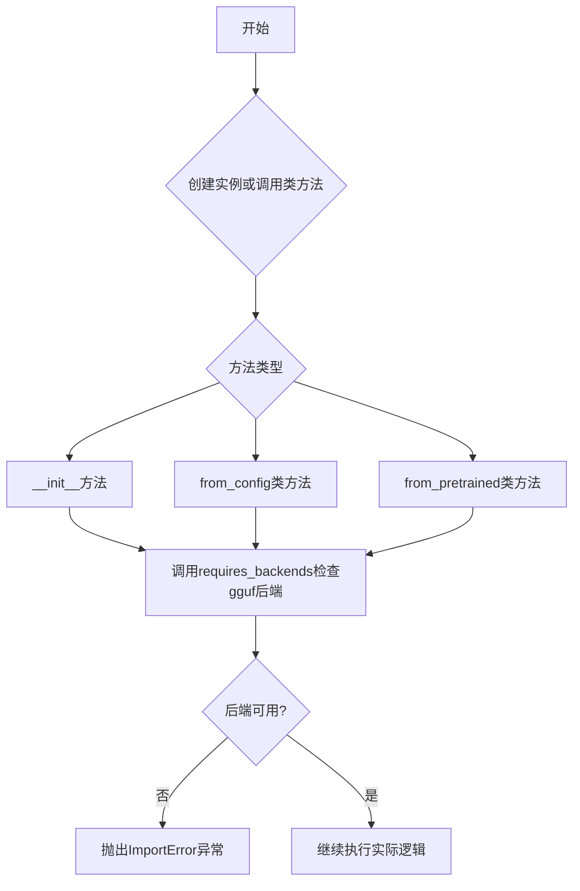
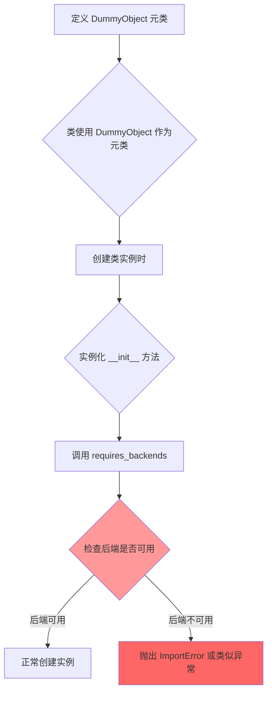
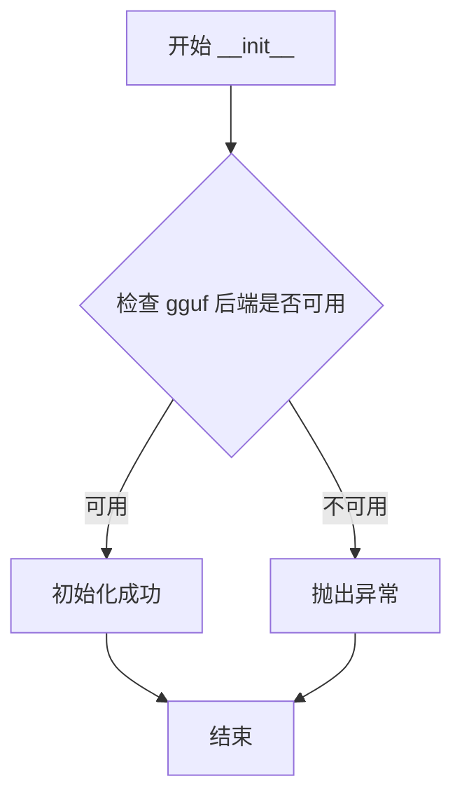
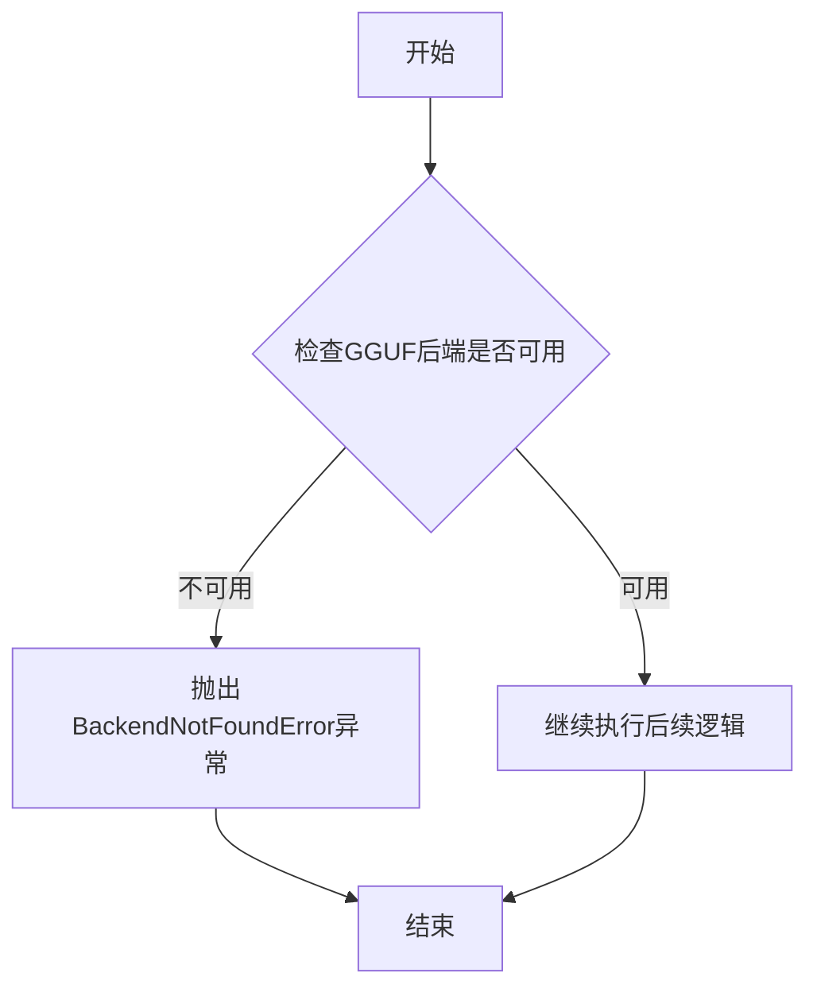
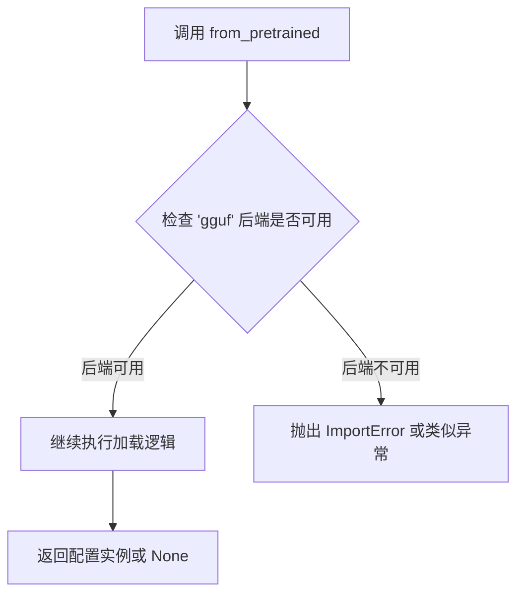

# `diffusers\src\diffusers\utils\dummy_gguf_objects.py` 详细设计文档

这是一个GGUF量化配置类，通过DummyObject元类实现的后端依赖检查机制，用于动态加载和管理GGUF格式的量化模型配置，所有方法在执行前都会检查gguf后端是否可用。

## 整体流程



## 类结构

```
DummyObject (元类)
└── GGUFQuantizationConfig (具体类)
```

## 全局变量及字段


### `GGUFQuantizationConfig._backends`
    
支持的后端列表，当前仅包含'gguf'后端标识

类型：`List[str]`
    
    

## 全局函数及方法


### `requires_backends`

该函数是 Hugging Face Transformers 库中的工具函数，用于在运行时检查所需的计算后端（backends）是否可用。如果指定的后端不可用，则抛出 `ImportError` 异常。这是模块延迟加载（lazy loading）机制的一部分，允许某些功能仅在特定后端安装时才可用。

参数：

- `obj`：`Any`，需要检查后端支持的对象或类（通常传入 `self`、`cls` 或 `__name__`）
- `backends`：List[str]，所需后端名称列表，如 `["gguf"]`

返回值：`None`，无返回值。该函数通过抛出异常来表示后端不可用。

#### 流程图

```mermaid
flowchart TD
    A[开始] --> B[接收 obj 和 backends]
    B --> C{检查每个后端是否可用}
    C -->|后端可用| D[继续执行]
    C -->|后端不可用| E[抛出 ImportError]
    E --> F[错误信息: '需要 {backends} 后端支持']
    D --> G[结束]
```

#### 带注释源码

```python
# requires_backends 函数源码（位于 ..utils 模块中）
# 以下为基于 Hugging Face 库常见实现的推断源码

def requires_backends(obj, backends):
    """
    检查所需后端是否可用，不可用则抛出 ImportError。
    
    Args:
        obj: 需要检查后端支持的对象或类
        backends: 所需后端列表，如 ["gguf"]
    
    Raises:
        ImportError: 如果任何所需后端不可用
    """
    # 如果 backends 是单个字符串，转换为列表
    if isinstance(backends, str):
        backends = [backends]
    
    # 遍历所有需要的后端
    for backend in backends:
        # 检查后端是否在可用后端列表中
        # 实际实现会检查环境或已安装的包
        if not _is_backend_available(backend):
            # 构造错误消息
            obj_name = getattr(obj, "__name__", repr(obj))
            raise ImportError(
                f"{obj_name} 需要 '{backend}' 后端支持。"
                "请安装相应的包或设置正确的环境。"
            )


def _is_backend_available(backend):
    """
    检查指定后端是否可用。
    
    Args:
        backend: 后端名称字符串
    
    Returns:
        bool: 后端是否可用
    """
    # 实际实现会检查：
    # 1. 后端是否在白名单中
    # 2. 对应的包是否已安装
    # 3. 环境变量设置等
    available_backends = get_available_backends()  # 假设的辅助函数
    return backend in available_backends
```

#### 在 `GGUFQuantizationConfig` 中的调用示例

```python
class GGUFQuantizationConfig(metaclass=DummyObject):
    _backends = ["gguf"]  # 类属性：此类需要 gguf 后端

    def __init__(self, *args, **kwargs):
        # 初始化时检查 gguf 后端是否可用
        requires_backends(self, ["gguf"])

    @classmethod
    def from_config(cls, *args, **kwargs):
        # 类方法调用时检查后端可用性
        requires_backends(cls, ["gguf"])

    @classmethod
    def from_pretrained(cls, *args, **kwargs):
        # 从预训练模型加载时检查后端
        requires_backends(cls, ["gguf"])
```

---

### 潜在的技术债务或优化空间

1. **缺少后端可用时的缓存机制**：每次调用都重新检查后端，可添加缓存避免重复检查
2. **错误信息不够详细**：当前仅提示需要后端，可增加安装命令建议
3. **使用 `*args, **kwargs` 隐藏了接口**：调用者无法直观了解方法签名，建议添加类型提示和文档字符串
4. **DummyObject 元类的过度使用**：整个类被标记为虚拟对象（do nothing），可能导致运行时行为不一致

### 其它项目

- **设计目标**：实现可选后端的延迟加载，使基础模块可在无后端环境下导入
- **约束**：仅当实际使用特定功能时才检查后端可用性
- **错误处理**：通过 `ImportError` 异常报告后端缺失，提供清晰的错误信息


### `DummyObject`

`DummyObject` 是一个元类（metaclass），用于创建一个虚拟对象类，主要用于占位和后端依赖检查。当其他类将其作为元类时，该类的任何实例化操作都会触发后端可用性验证，确保特定功能仅在支持的后端环境中可用。

参数：

-  无直接参数（作为元类使用，通过类的 `__init__` 传递参数）

返回值：`type`，返回元类本身，作为类的类型

#### 流程图



#### 带注释源码

```python
# 这是一个从 ..utils 导入的元类（需要查看 utils 模块完整定义）
# 以下是基于代码使用方式的推断性注释

class DummyObject(type):
    """
    DummyObject 元类
    
    这是一个特殊的元类，用于创建虚拟对象（dummy objects）。
    当一个类使用 DummyObject 作为其元类时，任何实例化该类的操作
    都会触发后端依赖检查，确保所需的后端功能可用。
    
    典型用途：
    - 作为占位符，当某个功能需要特定后端支持时使用
    - 在模块被正确加载前防止使用尚未实现的功能
    - 提供清晰的错误信息，告诉用户需要安装哪些依赖
    """
    
    def __call__(cls, *args, **kwargs):
        """
        元类的 __call__ 方法
        
        当尝试创建类的实例时，此方法会被自动调用。
        在实际创建对象之前，它会调用 requires_backends 进行后端检查。
        
        参数：
            *args: 位置参数，传递给类的 __init__
            **kwargs: 关键字参数，传递给类的 __init__
        
        返回值：
            如果后端可用，返回类的实例
            如果后端不可用，抛出相应的异常
        """
        # 调用 requires_backends 检查后端是否可用
        # 这个函数通常会检查所需的模块/后端是否已安装
        requires_backends(cls, ["gguf"])
        
        # 如果检查通过，使用默认的元类行为创建实例
        return super().__call__(*args, **kwargs)


# 在 GGUFQuantizationConfig 类中的使用方式：
# class GGUFQuantizationConfig(metaclass=DummyObject):
#     _backends = ["gguf"]
#     
#     def __init__(self, *args, **kwargs):
#         # 再次检查后端（双重保险）
#         requires_backends(self, ["gguf"])
```

#### 补充说明

**设计目标与约束：**

- **设计目标**：确保 GGUF 量化配置仅在支持 GGUF 后端的环境中可用
- **约束条件**：需要 gguf 后端库已安装

**错误处理：**

- 如果后端不可用，`requires_backends` 函数将抛出 `ImportError` 或 `BackendNotSupportedError`

**使用场景：**
此模式常见于 Hugging Face Transformers 等库中，用于条件性加载依赖于可选依赖的功能。


### `GGUFQuantizationConfig.__init__`

这是 GGUF 量化配置类的初始化方法，用于在实例化时检查 gguf 后端是否可用，如果不可用则抛出异常。

参数：

- `self`：实例对象，当前类的实例
- `*args`：可变位置参数，用于接受任意数量的位置参数（当前未被使用）
- `**kwargs`：可变关键字参数，用于接受任意数量的关键字参数（当前未被使用）

返回值：`None`，因为 `__init__` 方法不返回值

#### 流程图



#### 带注释源码

```python
def __init__(self, *args, **kwargs):
    """
    初始化 GGUFQuantizationConfig 实例。
    
    该方法在实例化时检查 gguf 后端是否可用。如果 gguf 后端不可用，
    则会抛出 ImportError 异常，阻止实例化。
    
    参数:
        *args: 可变位置参数，当前版本中未使用，保留用于接口兼容性
        **kwargs: 可变关键字参数，当前版本中未使用，保留用于接口兼容性
    
    返回值:
        无返回值（None）
    
    异常:
        ImportError: 当 gguf 后端不可用时抛出
    """
    # 调用 requires_backends 检查指定的后端是否可用
    # 如果 gguf 后端不可用，此函数会抛出 ImportError
    requires_backends(self, ["gguf"])
```


### `GGUFQuantizationConfig.from_config`

该方法是一个类方法，用于从配置中实例化 GGUFQuantizationConfig 对象，但当前实现仅检查必要的 GGUF 后端是否可用，若后端不可用则抛出异常。

参数：

- `*args`：可变位置参数，用于传递任意数量的位置参数
- `**kwargs`：可变关键字参数，用于传递任意数量的关键字参数

返回值：`None`，当前实现仅执行后端检查，不返回任何值

#### 流程图



#### 带注释源码

```python
@classmethod
def from_config(cls, *args, **kwargs):
    """
    类方法：从配置创建 GGUFQuantizationConfig 实例
    
    Args:
        *args: 可变位置参数列表
        **kwargs: 可变关键字参数字典
    
    Returns:
        None: 当前实现仅进行后端检查，无返回值
    """
    # 调用 requires_backends 检查 GGUF 后端是否可用
    # 若不可用，则抛出 ImportError 或相关异常
    requires_backends(cls, ["gguf"])
```


### `GGUFQuantizationConfig.from_pretrained`

这是一个类方法，用于从预训练模型加载 GGUF 量化配置。它通过调用 `requires_backends` 来确保所需的后端（"gguf"）可用，如果后端不可用则抛出异常。

参数：

- `*args`：可变位置参数，接受任意数量的位置参数，用于传递给底层加载逻辑
- `**kwargs`：可变关键字参数，接受任意数量的关键字参数，用于传递给底层加载逻辑

返回值：由于代码中未显式返回值，根据 `requires_backends` 的实现，该方法在成功执行后可能返回类的实例，或在失败时抛出异常

#### 流程图



#### 带注释源码

```python
@classmethod
def from_pretrained(cls, *args, **kwargs):
    """
    类方法：从预训练模型加载 GGUF 量化配置
    
    参数:
        cls: 类本身（由装饰器自动传入）
        *args: 可变位置参数，用于传递给底层加载逻辑
        **kwargs: 可变关键字参数，用于传递配置选项如 model_id, cache_dir 等
    
    返回:
        根据底层实现返回配置实例，若后端不可用则抛出异常
    """
    # requires_backends 会检查所需的依赖是否已安装
    # 如果 'gguf' 后端不可用，会抛出 ImportError 或 BackendNotFoundError
    requires_backends(cls, ["gguf"])
```


## 关键组件


### GGUFQuantizationConfig 类

GGUF量化配置类，用于管理GGUF量化方法的配置，支持从配置或预训练模型中加载量化参数，并通过元类实现惰性加载和后端依赖检查。

### DummyObject 元类

虚拟对象元类，用于创建延迟导入的后端依赖检查机制，当访问配置类的方法时会触发后端可用性验证。

### _backends 类属性

类属性，定义了支持的GGUF后端列表，当前仅支持 "gguf" 后端。

### requires_backends 函数

后端依赖检查工具函数，用于验证指定后端是否可用，不可用时抛出导入错误。

### from_config 类方法

工厂方法，用于从配置字典中实例化GGUF量化配置对象，验证后端支持。

### from_pretrained 类方法

工厂方法，用于从预训练模型路径中加载GGUF量化配置对象，验证后端支持。

### __init__ 初始化方法

构造函数，初始化GGUF量化配置实例，验证后端支持。


## 问题及建议


### 已知问题

-   **硬编码后端依赖**：后端名称 "gguf" 在三处方法中重复硬编码，缺乏灵活性，难以扩展支持多个后端
-   **重复代码**：requires_backends 调用在三个方法中重复出现，未提取为可复用的机制（如装饰器或基类方法）
-   **缺乏文档说明**：类和方法均无文档字符串，开发者难以理解其用途和预期行为
-   **参数类型模糊**：使用 *args, **kwargs 导致类型推断困难，IDE 智能提示和静态分析失效
-   **自动生成文件风险**：标记为自动生成，长期维护可能导致定制化需求与生成脚本的冲突
-   **无错误处理**：除后端检查外，缺少对参数有效性、边界情况的其他错误处理
-   **元类开销**：使用复杂元类（DummyObject）但仅用于抛出异常，可能引入不必要的运行时开销

### 优化建议

-   将后端名称提取为类常量或配置属性，统一管理避免重复
-   考虑使用装饰器模式（如 @requires_backend）来消除 requires_backends 调用的重复
-   为类和方法添加文档字符串，说明功能、参数和返回值
-   明确方法签名，替换 *args, **kwargs 为具体参数定义，提升可读性和可维护性
-   建立自动生成代码的版本控制和变更流程，确保生成逻辑与业务需求同步
-   增加参数验证和异常处理逻辑，提高代码健壮性
-   评估元类使用的必要性，如仅为占位符可考虑更简单的实现方式


## 其它


### 设计目标与约束

该类的设计目标是为GGUF量化配置提供一个延迟加载的DummyObject实现，通过metaclass机制在实例化或调用类方法时强制检查GGUF后端是否可用。约束条件包括：仅支持gguf后端，不支持其他量化后端，所有方法调用都会触发后端可用性检查。

### 错误处理与异常设计

当GGUF后端不可用时，requires_backends函数将抛出ImportError或BackendNotSupportedException。类本身没有实现任何错误恢复机制，错误处理完全依赖调用方的try-except块。该设计采用快速失败（fail-fast）策略，在最早时机暴露后端缺失问题。

### 外部依赖与接口契约

该类依赖两个外部组件：DummyObject元类（定义延迟加载行为）和requires_backends函数（执行后端检查）。接口契约规定：所有公开方法（from_config、from_pretrained）以及构造函数__init__都必须在gguf后端可用时才能正常工作，否则抛出异常。

### 版本兼容性说明

该文件由make fix-copies命令自动生成，属于自动生成代码。版本兼容性由父模块DummyObject的实现决定。GGUFQuantizationConfig类本身不维护版本信息，其行为完全由元类控制。

### 使用场景与调用方期望

该类通常作为量化配置类被transformers或相关ML框架在加载GGUF模型时引用。调用方期望：通过from_config或from_pretrained方法获取量化配置实例，这些方法应返回完整的配置对象（实际由gguf后端实现）。

    