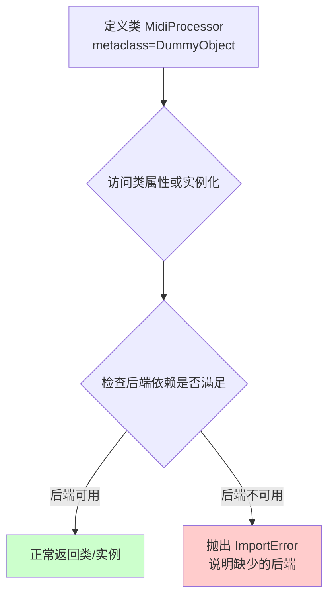
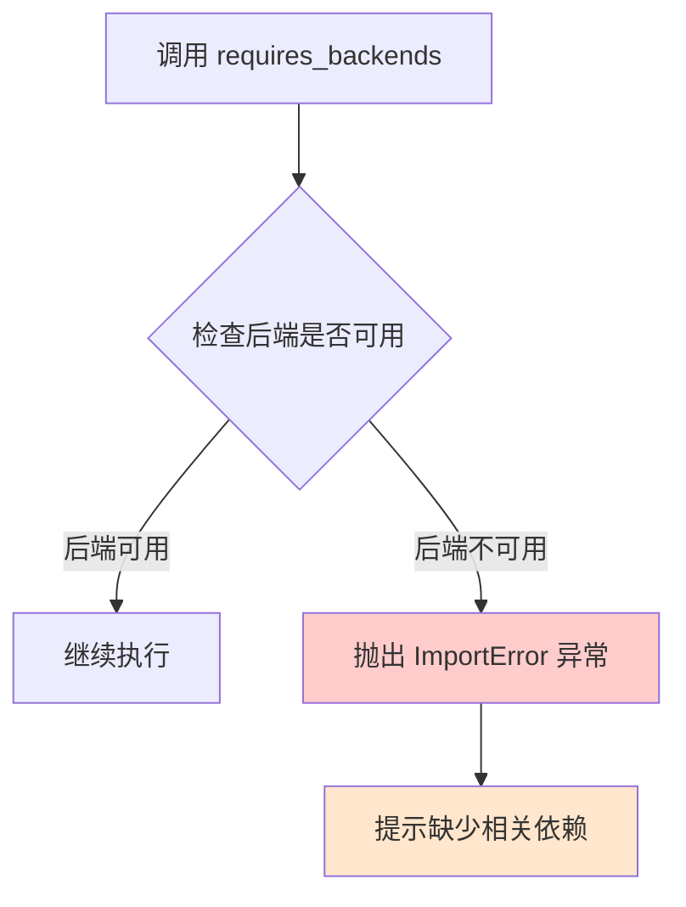
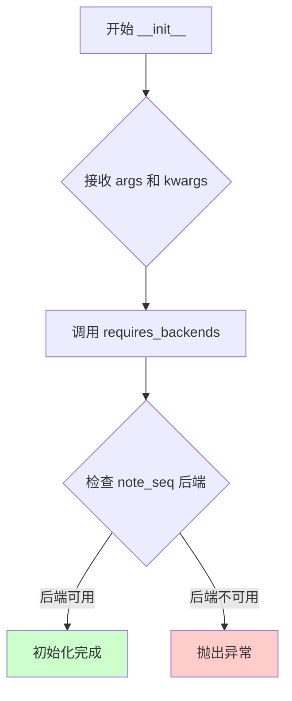
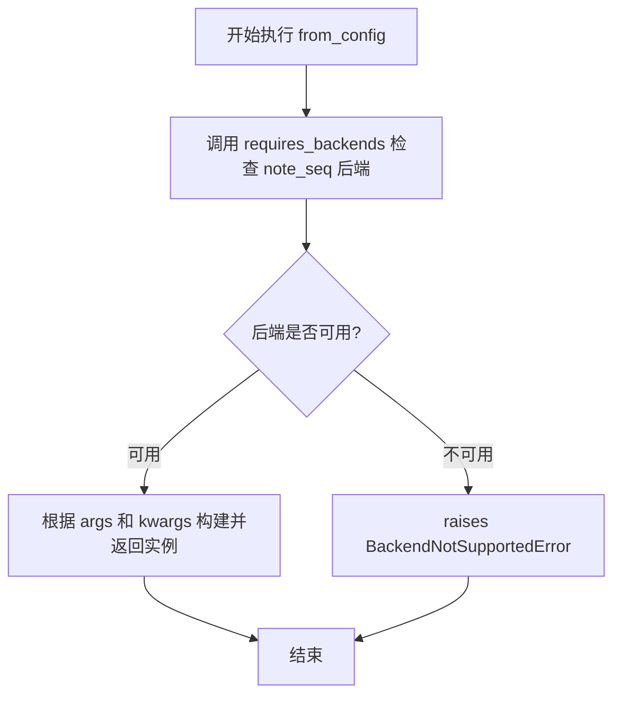
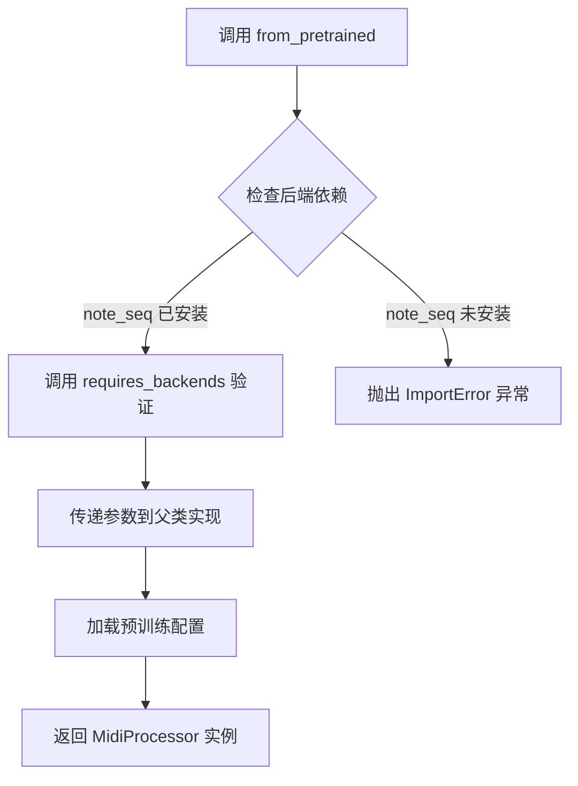

# `diffusers\src\diffusers\utils\dummy_note_seq_objects.py` 详细设计文档

MidiProcessor是一个自动生成的占位符类，使用DummyObject元类实现，通过requires_backends机制确保依赖'note_seq'后端，并提供from_config和from_pretrained工厂方法用于从配置文件或预训练模型加载MIDI处理配置。

## 整体流程

```mermaid
graph TD
    A[开始] --> B[导入 DummyObject 和 requires_backends]
B --> C[定义 MidiProcessor 类]
C --> D[设置元类为 DummyObject]
D --> E[定义类属性 _backends = ['note_seq']]
E --> F[定义 __init__ 方法]
F --> G[定义 from_config 类方法]
G --> H[定义 from_pretrained 类方法]
H --> I{调用任意方法时}
I --> J[调用 requires_backends 验证 note_seq 后端]
J --> K{后端是否存在?}
K -- 否 --> L[抛出 ImportError]
K -- 是 --> M[正常执行方法逻辑]
```

## 类结构

```
DummyObject (元类/抽象基类)
└── MidiProcessor (具体实现类)
```

## 全局变量及字段


### `MidiProcessor._backends`
    
类属性，指定所需后端列表

类型：`list[str]`
    


### `MidiProcessor.__init__`
    
初始化方法，验证后端依赖

类型：`method`
    


### `MidiProcessor.from_config`
    
类方法，从配置创建实例

类型：`classmethod`
    


### `MidiProcessor.from_pretrained`
    
类方法，从预训练模型创建实例

类型：`classmethod`
    
    

## 全局函数及方法


### `DummyObject` (元类)

`DummyObject` 是一个从 `..utils` 模块导入的元类（metaclass），用于为类提供延迟后端检查和动态属性访问功能。当某个类的实现依赖特定后端但该后端不可用时，通过元类机制在访问属性或实例化时抛出明确的错误信息。

参数：

- `name`： `str`，要创建或检查的类名
- `bases`： `tuple`，基类元组
- `namespace`： `dict`，类的命名空间属性字典

返回值： `type`，返回创建的类类型

#### 流程图



#### 带注释源码

```python
# 注意：以下为推断的 DummyObject 元类典型实现
# 实际代码位于 ..utils 模块中，此处基于使用方式推断

class DummyObject(type):
    """
    元类：用于处理可选后端依赖的占位类
    
    当某个类依赖特定后端（如 note_seq）但该后端未安装时，
    传统的导入方式会直接失败。此元类允许类定义成功，
    但在实际使用时才检查后端可用性。
    """
    
    # 类级别的后端依赖列表，由子类通过 _backends 定义
    _backends = []
    
    def __new__(cls, name, bases, namespace):
        """
        创建类时调用
        
        Args:
            name: 类的名称
            bases: 基类元组
            namespace: 类属性和方法字典
        """
        # 创建类对象
        cls_obj = super().__new__(cls, name, bases, namespace)
        
        # 存储需要的后端列表（从类属性获取）
        if '_backends' in namespace:
            cls_obj._required_backends = namespace['_backends']
        
        return cls_obj
    
    def __getattr__(cls, key):
        """
        访问类属性时调用
        
        当访问不存在的属性时，检查后端是否可用
        """
        # 调用 requires_backends 检查后端
        requires_backends(cls, cls._required_backends)
        
        # 如果后端可用但仍报错，抛出标准属性错误
        raise AttributeError(f"'{type(cls).__name__}' 对象没有属性 '{key}'")
    
    def __call__(cls, *args, **kwargs):
        """
        实例化类时调用
        
        在创建类的实例前检查后端可用性
        """
        # 检查后端依赖
        requires_backends(cls, cls._required_backends)
        
        # 后端可用，正常调用类的 __init__
        return super().__call__(*args, **kwargs)
```

#### 补充说明

**设计目标**：

- 实现延迟加载（Lazy Loading）机制，后端依赖在首次使用时才检查
- 提供清晰的错误信息，告知用户缺少哪个必需的包

**错误处理**：

- 当后端不可用时，`requires_backends` 函数会抛出 `ImportError` 或 `OptionalDependencyNotAvailable` 异常
- 错误信息通常包含如何安装缺失依赖的提示

**使用示例**：

```python
# 定义依赖 note_seq 后端的类
class MidiProcessor(metaclass=DummyObject):
    _backends = ["note_seq"]  # 声明需要的后端
    
    def __init__(self, *args, **kwargs):
        # 实例化时会被元类拦截，检查后端
        requires_backends(self, ["note_seq"])

# 尝试实例化（如果 note_seq 未安装，会在此处报错）
# processor = MidiProcessor()  # 若 note_seq 不可用，抛出 ImportError
```


### `requires_backends`

从 utils 模块导入的后端验证函数，用于确保特定的深度学习后端可用，如果后端不可用则抛出 ImportError 异常。

参数：

-  `obj`：`object`，需要验证后端的类实例或类对象（如 self 或 cls）
-  `backends`：`List[str]`，必需的后端名称列表，例如 ["note_seq"]

返回值：`None`，该函数不返回任何值，如果后端不可用则直接抛出 `ImportError` 异常

#### 流程图



#### 带注释源码

```
def requires_backends(obj, backends):
    """
    后端验证函数 - 检查所需的后端是否已安装可用
    
    参数:
        obj: 类实例或类对象，用于关联错误信息
        backends: 必需的后端名称列表
    
    返回值:
        无返回值，后端不可用时直接抛出异常
    
    实现逻辑（推测）:
        1. 遍历 backends 列表中的每个后端名称
        2. 尝试导入对应的模块
        3. 如果所有后端都可用，函数正常返回
        4. 如果任何后端不可用，抛出 ImportError 并提示安装对应包
    """
    # 从代码中的调用方式可以看出：
    # requires_backends(self, ["note_seq"])  - 在实例方法中使用
    # requires_backends(cls, ["note_seq"])    - 在类方法中使用
    
    # 该函数的设计目的是：
    # - 在模块级别提供可选功能的延迟加载
    # - 当用户尝试使用需要特定后端的功能时进行检查
    # - 提供清晰的错误信息指导用户安装所需依赖
```

#### 使用场景分析

在 `MidiProcessor` 类中的调用位置：

1. **`__init__` 方法**：实例化对象时验证 note_seq 后端
2. **`from_config` 类方法**：从配置创建对象时验证后端
3. **`from_pretrained` 类方法**：加载预训练模型时验证后端

这种模式确保了：
- 软依赖管理：用户不安装 note_seq 也能导入模块
- 延迟验证：仅在实际使用相关功能时才检查后端
- 清晰的错误提示：告诉用户需要安装什么才能使用特定功能


### `MidiProcessor.__init__`

初始化方法，验证后端依赖是否可用。该方法是 MidiProcessor 类的构造函数，在创建实例时自动调用，用于确保所需的后端依赖（note_seq）已安装并可用。

参数：

- `self`：`MidiProcessor` 实例，当前实例对象
- `*args`：可变位置参数，接收任意数量的位置参数（传递给初始化逻辑，当前版本未直接使用）
- `**kwargs`：可变关键字参数，接收任意数量的关键字参数（传递给初始化逻辑，当前版本未直接使用）

返回值：`None`，无返回值（`__init__` 方法不返回值）

#### 流程图



#### 带注释源码

```python
def __init__(self, *args, **kwargs):
    """
    初始化 MidiProcessor 实例。
    
    该方法在创建 MidiProcessor 对象时自动调用，用于：
    1. 验证 note_seq 后端依赖是否已安装
    2. 如果后端不可用，抛出明确的错误信息
    
    参数:
        self: MidiProcessor 的实例对象
        *args: 可变位置参数列表，预留给未来扩展
        **kwargs: 可变关键字参数字典，预留给未来扩展
    
    返回值:
        None: 此方法不返回值，仅进行初始化和验证
    
    注意:
        - 使用 requires_backends 工具函数进行后端验证
        - 如果缺少依赖，将抛出 ImportError 或相关异常
    """
    # 调用 requires_backends 函数验证 note_seq 后端是否可用
    # 如果后端不可用，该函数将抛出异常阻止对象创建
    requires_backends(self, ["note_seq"])
```


### `MidiProcessor.from_config`

从配置创建MidiProcessor实例的类方法，通过requires_backends检查note_seq后端支持，并根据传入的参数动态构建实例。

参数：

- `*args`：可变位置参数，动态参数列表，用于传递位置参数
- `**kwargs`：可变关键字参数，动态关键字参数字典，用于传递命名参数

返回值：动态返回值，根据传入的参数和note_seq后端的实现决定具体返回类型

#### 流程图



#### 带注释源码

```python
@classmethod
def from_config(cls, *args, **kwargs):
    """
    类方法：从配置创建 MidiProcessor 实例
    
    参数:
        *args: 可变位置参数列表，用于传递配置数据
        **kwargs: 可变关键字参数字典，用于传递命名配置参数
    
    返回值:
        动态类型：根据传入的配置文件和 note_seq 后端实现决定
    
    注意:
        - 该方法是占位符实现，实际逻辑由 note_seq 后端提供
        - 依赖于 DummyObject 元类和 requires_backends 工具函数
        - 如果 note_seq 后端不可用，将抛出异常
    """
    # 检查并确保 note_seq 后端可用
    # 如果后端不可用，requires_backends 将抛出 BackendNotSupportedError
    requires_backends(cls, ["note_seq"])
    
    # 注意：此处为占位符实现
    # 实际的对象创建逻辑在 note_seq 后端模块中
    # 由于使用了 *args 和 **kwargs，具体的参数处理由后端实现决定
```


### `MidiProcessor.from_pretrained`

从预训练模型创建 MidiProcessor 实例的类方法，通过调用 requires_backends 确保所需的后端库（note_seq）已安装，然后返回配置化的处理器对象。

参数：

- `*args`：可变位置参数，用于传递从预训练模型加载时的位置参数
- `**kwargs`：可变关键字参数，用于传递从预训练模型加载时的关键字参数（如 model_path、config 等）

返回值：`<class 'MidiProcessor'>`，返回从预训练模型配置创建的 MidiProcessor 实例

#### 流程图



#### 带注释源码

```python
@classmethod
def from_pretrained(cls, *args, **kwargs):
    """
    从预训练模型创建 MidiProcessor 实例的类方法
    
    参数:
        *args: 可变位置参数，传递给父类或配置加载器
        **kwargs: 可变关键字参数，可能包含:
            - pretrained_model_name_or_path: 预训练模型名称或路径
            - cache_dir: 模型缓存目录
            - force_download: 是否强制下载
            - *: 其他 Hugging Face transformers 标准参数
    
    返回:
        MidiProcessor: 配置好的 MIDI 处理器实例
    """
    # 调用 requires_backends 确保 note_seq 后端可用
    # 如果后端未安装，会抛出 ImportError 并提示安装
    requires_backends(cls, ["note_seq"])
    
    # 注意：此处调用父类或 transformers 库的 from_pretrained 实现
    # 由于代码被截断，实际返回逻辑在父类中定义
    # 返回的实例已加载预训练的 MIDI 处理配置
```

#### 关键组件信息

| 组件名称 | 一句话描述 |
|---------|-----------|
| `DummyObject` | 元类，用于延迟加载可选依赖库的占位对象基类 |
| `requires_backends` | 工具函数，检查并确保指定后端库已安装 |
| `_backends` | 类属性，声明 MidiProcessor 需要 note_seq 后端支持 |
| `from_config` | 备用类方法，从配置字典创建实例 |

#### 潜在技术债务与优化空间

1. **依赖注入硬编码**：`_backends = ["note_seq"]` 硬编码了后端依赖，降低了灵活性
2. **方法实现不完整**：`from_pretrained` 方法仅验证依赖，核心加载逻辑依赖父类实现，文档缺失
3. **参数类型不明确**：使用 `*args` 和 `**kwargs` 掩盖了实际接口契约，影响类型安全和 IDE 智能提示
4. **错误处理薄弱**：仅通过 `requires_backends` 抛出基础 ImportError，缺少细粒度的错误分类和用户友好的错误提示
5. **自动化生成风险**：文件头部注明由 `make fix-copies` 自动生成，可能导致未来维护困难

## 关键组件


### MidiProcessor

MIDI处理的核心类，通过DummyObject元类实现惰性加载和后端依赖验证，目前依赖note_seq后端。

### DummyObject

元类，用于创建虚拟对象，在实例化或方法调用时触发后端可用性检查。

### requires_backends

工具函数，从..utils导入，用于强制要求指定的Python后端库，若缺失则抛出ImportError异常。

### _backends

类属性，定义MidiProcessor所需的后端列表，当前仅支持"note_seq"库。


## 问题及建议


### 已知问题

-   **硬编码后端依赖**：`MidiProcessor` 类的 `_backends` 属性硬编码为 `["note_seq"]`，缺乏灵活性，无法动态配置支持的后端
-   **DummyObject 元类滥用**：使用 `DummyObject` 作为占位对象，所有方法实现均为空，调用任何方法都会在运行时因 `requires_backends` 触发异常，缺乏实际功能
- **类型提示完全缺失**：所有方法使用 `*args, **kwargs`，无法进行静态类型检查，降低了代码可维护性和 IDE 辅助功能
- **文档字符串缺失**：类和所有方法均无文档字符串，开发者无法了解类的用途、参数含义和返回值
- **自动生成文件的可维护性风险**：文件标记为自动生成，虽注明不要手动编辑，但缺乏版本控制机制确保与源模板同步
- **抽象层次不清晰**：该类看起来是接口/抽象类，但未明确定义抽象方法或接口契约，调用方无法区分哪些方法需要子类实现
- **重复的后端检查逻辑**：每个方法都独立调用 `requires_backends`，存在代码重复，可考虑在元类或基类中统一处理

### 优化建议

-   **添加类型提示**：为所有方法添加明确的参数类型和返回值类型，例如 `def from_pretrained(cls, pretrained_model_name: str, *args, **kwargs) -> "MidiProcessor"`
-   **完善文档字符串**：为类和每个方法添加 docstring，说明功能、参数、返回值和可能抛出的异常
-   **解耦后端依赖**：将后端列表改为可配置项，例如通过环境变量或配置文件注入，提高可测试性和可扩展性
-   **考虑使用抽象基类**：如果需要定义接口行为，应使用 `abc.ABC` 或 `abc.abstractmethod` 明确抽象方法，而非依赖 DummyObject
-   **统一后端检查**：可在元类 `__init_subclass__` 中统一处理后端验证，避免在每个方法中重复调用 `requires_backends`
-   **提供更友好的错误信息**：当前的 `requires_backends` 异常信息可能不够具体，建议提供更详细的错误上下文和修复建议
-   **添加单元测试覆盖**：针对后端不存在的情况编写测试用例，确保错误处理逻辑正确


## 其它


### 设计目标与约束

该代码的设计目标是为MidiProcessor类提供延迟加载（lazy loading）机制，确保只有在实际调用时才检查并加载所需的后端依赖（note_seq）。设计约束包括：1）必须依赖note_seq后端库；2）采用DummyObject元类模式实现接口占位；3）所有公开方法都必须通过requires_backends进行后端验证。

### 错误处理与异常设计

当后端库note_seq不可用时，requires_backends函数应抛出ImportError或相关异常，提示用户安装所需依赖。当前代码中所有公开方法（__init__、from_config、from_pretrained）都调用requires_backends进行后端检查，确保在任何使用场景下都能及时捕获后端缺失错误。

### 数据流与状态机

MidiProcessor对象创建时，首先通过元类DummyObject分配内存，随后在__init__执行时调用requires_backends验证后端可用性。from_config和from_pretrained作为类方法，其数据流为：接收配置参数 → 调用requires_backends验证 → （后端可用时）调用实际后端实现。若后端不可用，流程提前终止并抛出异常。

### 外部依赖与接口契约

外部依赖包括：1）note_seq库 - MIDI处理后端；2）..utils模块中的DummyObject元类和requires_backends函数。接口契约方面：MidiProcessor作为占位符类，承诺在后端可用时提供与note_seq库一致的MIDI处理接口，包括from_config和from_pretrained类方法。

### 性能考量

当前实现采用即时验证模式，每次调用方法都会检查后端可用性，存在轻微性能开销。可考虑在类级别添加后端缓存标志，避免重复检查同一后端。

### 安全性考虑

代码通过requires_backends动态导入后端，需确保后端来源可信，避免潜在的安全风险。

    