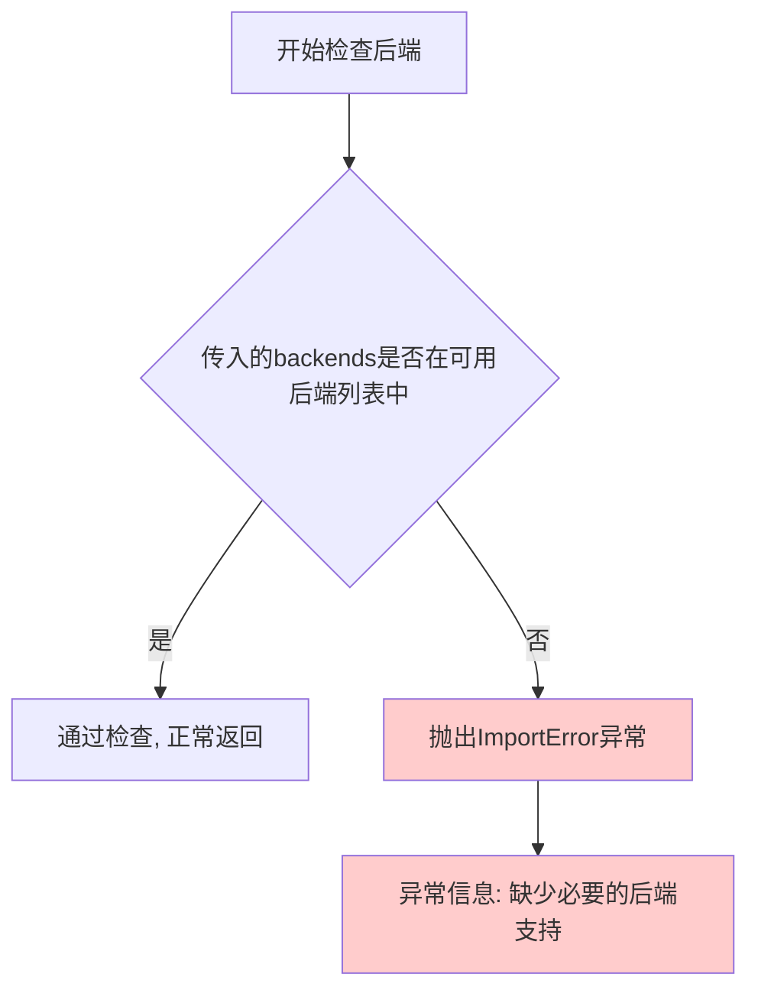
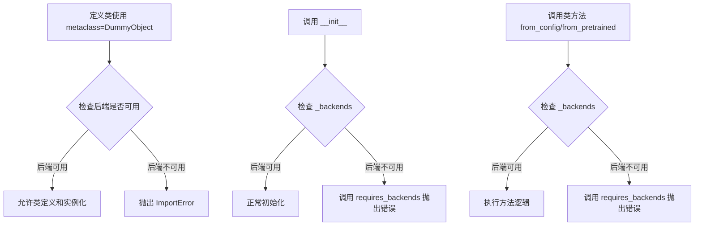
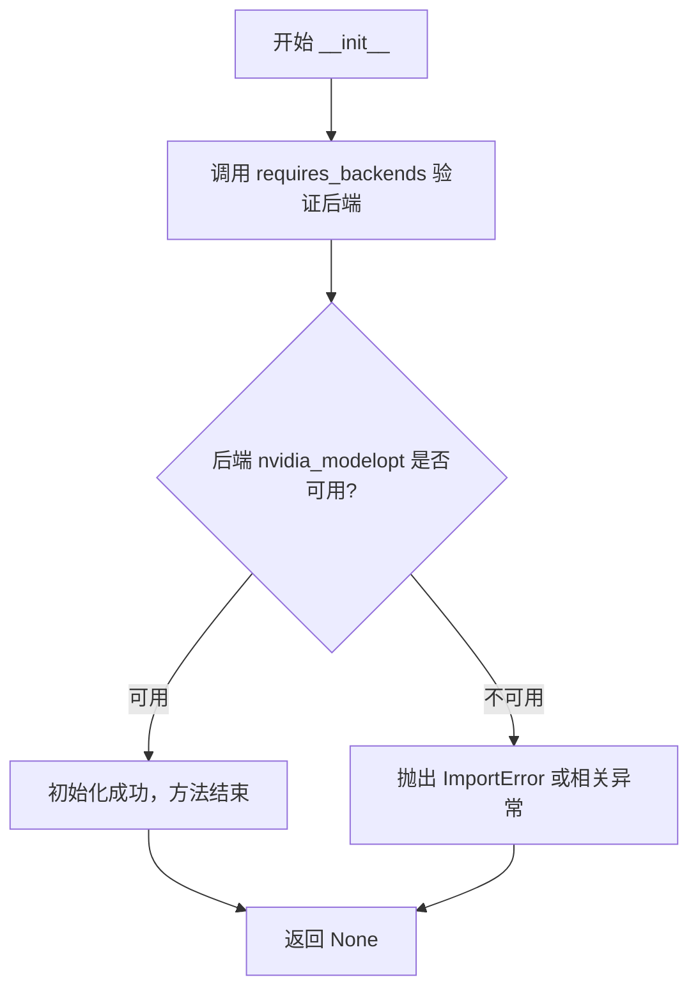
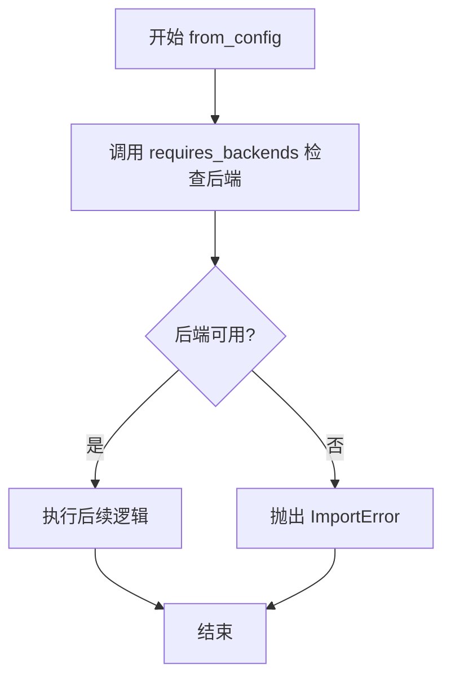
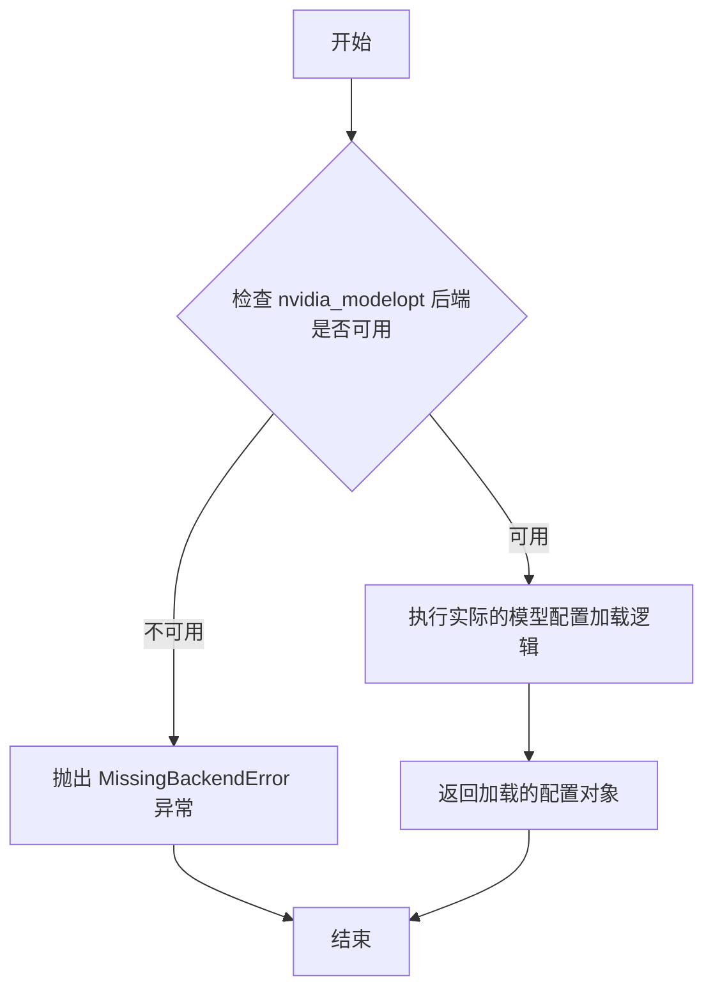

# `diffusers\src\diffusers\utils\dummy_nvidia_modelopt_objects.py` 详细设计文档

这是一个由 make fix-copies 自动生成的 NVIDIA ModelOpt 模型配置类，提供了 NVIDIAModelOptConfig 配置类用于加载和管理 nvidia_modelopt 后端的模型配置，包含初始化、从配置创建和从预训练模型加载三个核心方法，所有方法调用都依赖 requires_backends 进行后端可用性检查。

## 整体流程

```mermaid
graph TD
    A[模块导入] --> B[定义 NVIDIAModelOptConfig 类]
    B --> C[设置元类 DummyObject]
    C --> D[定义 _backends = ['nvidia_modelopt']]
    D --> E{调用任意方法}
E -- __init__ --> F[调用 requires_backends 检查后端]
E -- from_config --> F
E -- from_pretrained --> F
F --> G{后端可用?}
G -- 否 --> H[抛出后端缺失异常]
G -- 是 --> I[执行方法逻辑]
```

## 类结构

```
NVIDIAModelOptConfig (使用 DummyObject 元类)
```

## 全局变量及字段


### `NVIDIAModelOptConfig._backends`
    
类属性，定义该类需要的后端依赖列表，当前指定为 nvidia_modelopt

类型：`List[str]`
    
    

## 全局函数及方法


### `requires_backends`

这是一个用于检查并强制依赖特定后端的工具函数，当所需后端不可用时抛出 `ImportError` 异常，确保代码只在支持的后端环境中执行。

参数：

- `obj`：`Any`，需要检查后端支持的对象（通常是类实例或类本身）
- `backends`：`List[str]`，所需后端名称列表

返回值：`None`，该函数无返回值，通过抛出异常来表示后端不可用

#### 流程图



#### 带注释源码

```python
# requires_backends 函数的源码位于 ..utils 模块中
# 这是一个工具函数,用于实现条件导入和后端检查

def requires_backends(obj, backends):
    """
    检查所需后端是否可用,不可用则抛出异常
    
    参数:
        obj: 需要检查后端支持的对象
        backends: 所需后端名称列表
    
    返回值:
        None
    
    异常:
        ImportError: 当所需后端不可用时抛出
    """
    
    # 遍历所需的后端列表
    for backend in backends:
        # 检查该后端是否在可用后端列表中
        if backend not in available_backends:
            # 后端不可用,抛出导入错误
            raise ImportError(
                f"{obj.__name__} 需要 '{backend}' 后端支持, "
                f"但当前可用后端为: {available_backends}"
            )
```

#### 使用示例源码

```python
# 在 NVIDIAModelOptConfig 类中的使用方式

class NVIDIAModelOptConfig(metaclass=DummyObject):
    _backends = ["nvidia_modelopt"]  # 定义该类需要的后端
    
    def __init__(self, *args, **kwargs):
        # 初始化时检查 nvidia_modelopt 后端是否可用
        # 如果不可用,会抛出 ImportError 阻止对象创建
        requires_backends(self, ["nvidia_modelopt"])
    
    @classmethod
    def from_config(cls, *args, **kwargs):
        # 类方法调用时检查后端可用性
        requires_backends(cls, ["nvidia_modelopt"])
    
    @classmethod
    def from_pretrained(cls, *args, **kwargs):
        # 从预训练模型加载时检查后端可用性
        requires_backends(cls, ["nvidia_modelopt"])
```


### DummyObject

DummyObject 是一个元类（metaclass），用于创建一个虚假的占位类，当特定后端（如 nvidia_modelopt）不可用时，会抛出后端必需的导入错误。该元类通过 `requires_backends` 函数检查所需后端是否可用，若不可用则阻止类的实例化和方法调用。

参数：

-  `name`：字符串，表示类的名称
-  `bases`：元组，表示基类集合
-  `attrs`：字典，表示类的属性和方法

返回值：类对象，返回一个新创建的元类实例（用于定义其他类）

#### 流程图



#### 带注释源码

```python
# 此文件由 `make fix-copies` 命令自动生成，请勿手动编辑
from ..utils import DummyObject, requires_backends  # 从 utils 模块导入元类和后端检查函数


class NVIDIAModelOptConfig(metaclass=DummyObject):
    """
    NVIDIAModelOptConfig 类
    使用 DummyObject 元类，当 nvidia_modelopt 后端不可用时阻止实例化
    """
    _backends = ["nvidia_modelopt"]  # 定义该类需要的后端列表

    def __init__(self, *args, **kwargs):
        """
        初始化方法
        调用 requires_backends 检查后端是否可用，不可用则抛出异常
        """
        requires_backends(self, ["nvidia_modelopt"])

    @classmethod
    def from_config(cls, *args, **kwargs):
        """
        从配置创建对象的类方法
        使用 requires_backends 确保后端可用
        """
        requires_backends(cls, ["nvidia_modelopt"])

    @classmethod
    def from_pretrained(cls, *args, **kwargs):
        """
        从预训练模型加载配置的类方法
        使用 requires_backends 确保后端可用
        """
        requires_backends(cls, ["nvidia_modelopt"])
```

#### 补充说明

**设计目标与约束**：
- 确保在未安装特定后端（如 nvidia_modelopt）时，代码不会静默失败，而是明确提示需要安装依赖
- 通过元类机制在类定义和实例化层面提供统一的后端检查

**错误处理**：
- 当后端不可用时，`requires_backends` 函数会抛出 `ImportError` 或相关异常
- 错误信息明确指出缺少哪个后端

**外部依赖**：
- 依赖 `..utils` 模块中的 `DummyObject` 元类和 `requires_backends` 函数
- 依赖 `nvidia_modelopt` 后端库


### `NVIDIAModelOptConfig.__init__`

该方法是 `NVIDIAModelOptConfig` 类的构造函数，用于初始化实例，并在实例化时验证后端依赖是否可用。如果 `nvidia_modelopt` 后端不可用，则抛出相应的导入错误。

参数：

- `self`：`NVIDIAModelOptConfig` 类实例，当前初始化的对象
- `*args`：可变位置参数，传递给父类或后续初始化逻辑的位置参数（类型：任意）
- `**kwargs`：可变关键字参数，传递给父类或后续初始化逻辑的关键字参数（类型：任意）

返回值：`None`，构造函数不返回值，仅执行初始化逻辑

#### 流程图



#### 带注释源码

```python
def __init__(self, *args, **kwargs):
    """
    初始化 NVIDIAModelOptConfig 实例。
    
    该方法在实例化时检查 nvidia_modelopt 后端是否可用。
    如果后端不可用，则抛出 ImportError 提示用户安装必要的依赖。
    
    参数:
        self: 类实例本身
        *args: 可变位置参数，用于传递额外的位置参数
        **kwargs: 可变关键字参数，用于传递额外的关键字参数
    
    返回值:
        None: 构造函数不返回值
    """
    # requires_backends 是一个工具函数，用于检查指定后端是否可用
    # 如果后端不可用，该函数会抛出相应的异常
    # 第一个参数是当前实例/类，第二个参数是所需后端列表
    requires_backends(self, ["nvidia_modelopt"])
```


### `NVIDIAModelOptConfig.from_config`

该方法是一个类方法，用于通过配置创建 `NVIDIAModelOptConfig` 类的实例。它首先检查必要的 NVIDIA ModelOpt 后端是否可用，如果不可用则抛出导入错误。

参数：

- `*args`：可变位置参数，用于传递任意数量的位置参数
- `**kwargs`：可变关键字参数，用于传递任意数量的关键字参数

返回值：未明确指定（返回类型由调用者决定），通常返回配置后的类实例

#### 流程图



#### 带注释源码

```python
@classmethod
def from_config(cls, *args, **kwargs):
    """
    类方法：从配置创建 NVIDIAModelOptConfig 实例
    
    参数:
        cls: 指向类本身的隐式参数
        *args: 可变位置参数列表
        **kwargs: 可变关键字参数字典
        
    返回:
        通常返回配置后的类实例（由子类实现决定）
    """
    # 检查 nvidia_modelopt 后端是否可用，如果不可用则抛出 ImportError
    requires_backends(cls, ["nvidia_modelopt"])
```


### `NVIDIAModelOptConfig.from_pretrained`

这是一个类方法，用于从预训练的模型配置中加载配置。当前实现为一个存根方法，通过调用 `requires_backends` 来确保 `nvidia_modelopt` 后端可用，如果后端不可用则抛出异常。

参数：

- `cls`：类型 `type`，表示类本身（隐式参数）
- `*args`：类型 `Any`，可变位置参数，用于传递任意数量的位置参数
- `**kwargs`：类型 `Any`，可变关键字参数，用于传递任意数量的关键字参数（如 `pretrained_model_name_or_path` 等）

返回值：`None` 或抛出异常，如果 `nvidia_modelopt` 后端不可用则抛出 `MissingBackendError`

#### 流程图



#### 带注释源码

```python
@classmethod
def from_pretrained(cls, *args, **kwargs):
    """
    从预训练模型加载配置。
    
    注意：此方法是一个存根实现，实际功能由 nvidia_modelopt 后端提供。
    """
    # 调用 requires_backends 检查 nvidia_modelopt 后端是否可用
    # 如果不可用，将抛出 MissingBackendError 异常
    requires_backends(cls, ["nvidia_modelopt"])
```

## 关键组件


### NVIDIAModelOptConfig 类

NVIDIAModelOptConfig 是一个基于 DummyObject 元类的占位配置类，用于 NVIDIA ModelOpt 模型优化框架的配置管理，通过后端延迟加载机制实现惰性加载。

### DummyObject 元类

DummyObject 是一个元类，用于创建哑元对象（Dummy Object），当访问此类对象的方法时会触发后端依赖检查，实现运行时按需加载依赖的惰性加载机制。

### _backends 类属性

_backers 存储支持的后端列表，当前值为 ["nvidia_modelopt"]，用于标识该配置类依赖于 NVIDIA ModelOpt 后端。

### requires_backends 工具函数

requires_backends 是从 utils 模块导入的工具函数，用于在运行时检查指定后端是否可用，若不可用则抛出适当的错误，实现后端依赖的显式检查。

### __init__ 方法

__init__ 方法是类的构造函数，调用 requires_backends 检查 nvidia_modelopt 后端是否可用，确保在实例化前已安装必要的依赖。

### from_config 类方法

from_config 是类方法，用于从配置字典创建 NVIDIAModelOptConfig 实例，同样需要检查 nvidia_modelopt 后端可用性。

### from_pretrained 类方法

from_pretrained 是类方法，用于从预训练模型路径加载配置，需要检查 nvidia_modelopt 后端可用性。


## 问题及建议


### 已知问题

-   **硬编码后端依赖**：`_backends` 列表被硬编码为 `["nvidia_modelopt"]`，缺乏灵活性和可配置性，后端变更时需要修改源码。
-   **重复代码**：每个方法都独立调用 `requires_backends(self/cls, ["nvidia_modelopt"])`，存在代码重复，可考虑提取到装饰器或元类中统一处理。
-   **缺少文档字符串**：所有方法均无 docstring，无法明确方法意图、参数含义和返回值，降低了代码可维护性和可读性。
-   **参数类型提示缺失**：方法参数使用 `*args, **kwargs`，缺乏静态类型检查支持，不利于 IDE 智能提示和静态分析工具。
-   **缺乏实际配置结构**：作为 DummyObject，仅包含空实现，未定义任何配置字段（如模型参数、优化选项等），无法承载实际的配置数据。
-   **自动生成文件无版本控制**：注释表明由 `make fix-copies` 自动生成，可能导致手动修改被覆盖，缺乏清晰的版本管理机制。

### 优化建议

-   将后端列表抽取为配置常量或从配置文件读取，提高可维护性。
-   使用装饰器模式（如 `@requires_backend("nvidia_modelopt")`）统一处理后端验证。
-   为所有公共方法添加完整的文档字符串和类型注解。
-   定义配置类所需的字段结构，或在类文档中说明配置项。
-   考虑将自动生成逻辑改为模板化，并添加警告注释防止手动修改。
-   评估是否需要真正的配置类实现，而非仅作为占位符。


## 其它


### 设计目标与约束

该代码的目标是提供一个NVIDIA ModelOpt配置类，用于支持模型优化配置。该类作为一个占位符实现，通过元类机制在运行时检查后端支持情况。约束条件包括：只能在使用nvidia_modelopt后端时才能实例化和使用，否则将抛出后端不支持的异常。

### 错误处理与异常设计

代码使用`requires_backends`函数进行后端检查，当后端不可用时将抛出`RequiresBackendError`异常。`__init__`方法在实例化时检查后端，`from_config`和`from_pretrained`作为类方法在调用时检查后端支持。这种设计确保了只有在正确配置后端环境下才能使用该配置类。

### 数据流与状态机

配置类的数据流主要包括：实例化流程（__init__）、配置加载流程（from_config）、预训练模型配置加载流程（from_pretrained）。状态转换包括：初始状态（类定义）-> 后端检查状态 -> 实例化状态。所有方法调用都需要经过后端可用性验证状态机。

### 外部依赖与接口契约

外部依赖包括：（1）`..utils`模块中的`DummyObject`元类和`requires_backends`函数；（2）`nvidia_modelopt`后端库。接口契约规定：调用方必须确保`nvidia_modelopt`后端已安装，否则所有方法调用都将失败。该类遵循配置类的标准接口模式（from_config、from_pretrained）。

### 版本兼容性考虑

该文件为自动生成代码（由make fix-copies命令生成），版本兼容性依赖于生成脚本的版本和目标后端的版本支持。需要确保生成脚本版本与nvidia_modelopt后端版本匹配，以避免接口不兼容问题。

### 性能考量与优化空间

当前实现为占位符类，实际功能依赖后端实现。性能开销主要来自后端检查（requires_backends调用）。优化方向包括：考虑添加缓存机制减少重复后端检查，考虑懒加载策略延迟后端检查到实际使用时。

### 安全考虑

代码本身不涉及敏感数据处理，但需要确保nvidia_modelopt后端来源可信。建议在生产环境中验证后端库完整性，防止供应链攻击。

### 测试策略建议

应包含单元测试验证后端不可用时的异常抛出行为，集成测试验证后端可用时的正常功能，以及模拟测试验证自动生成代码的正确性。

    