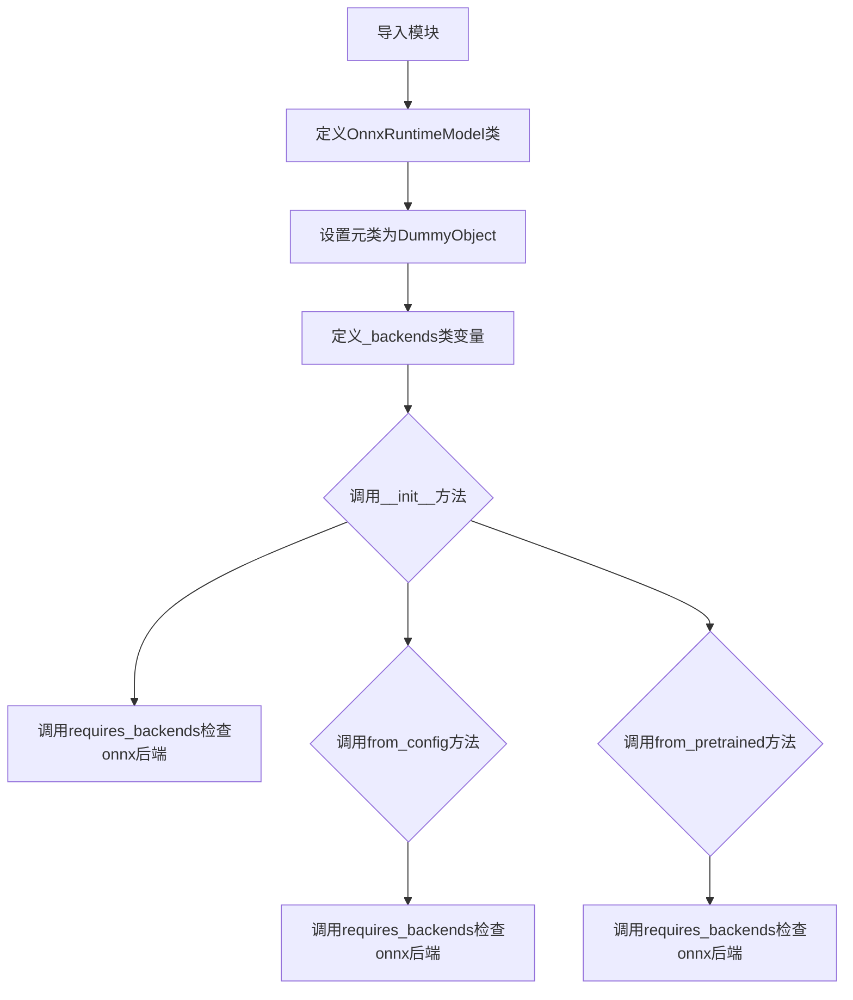
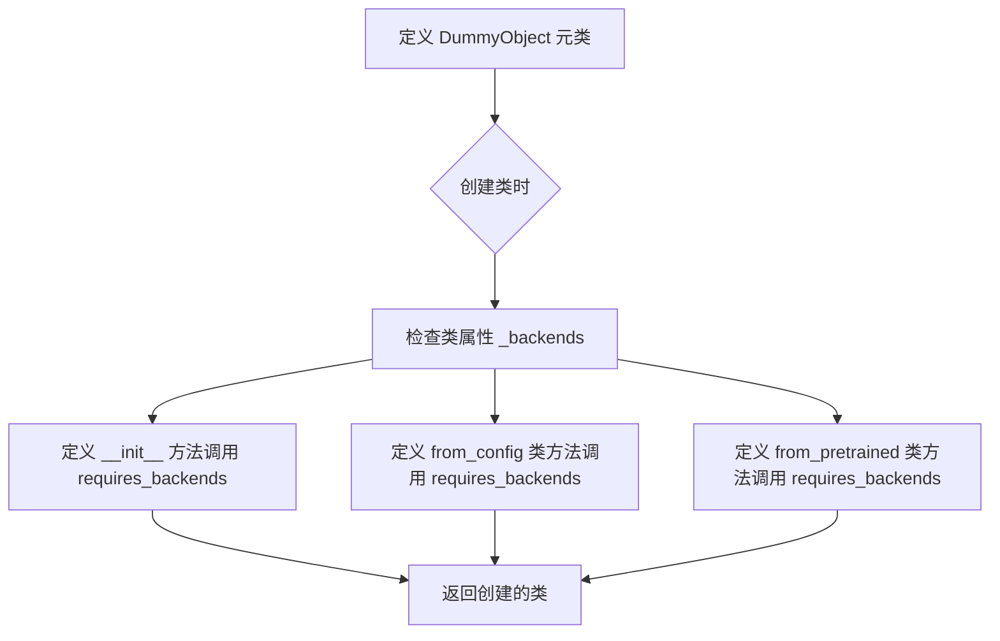
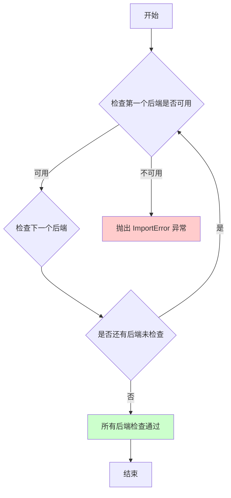
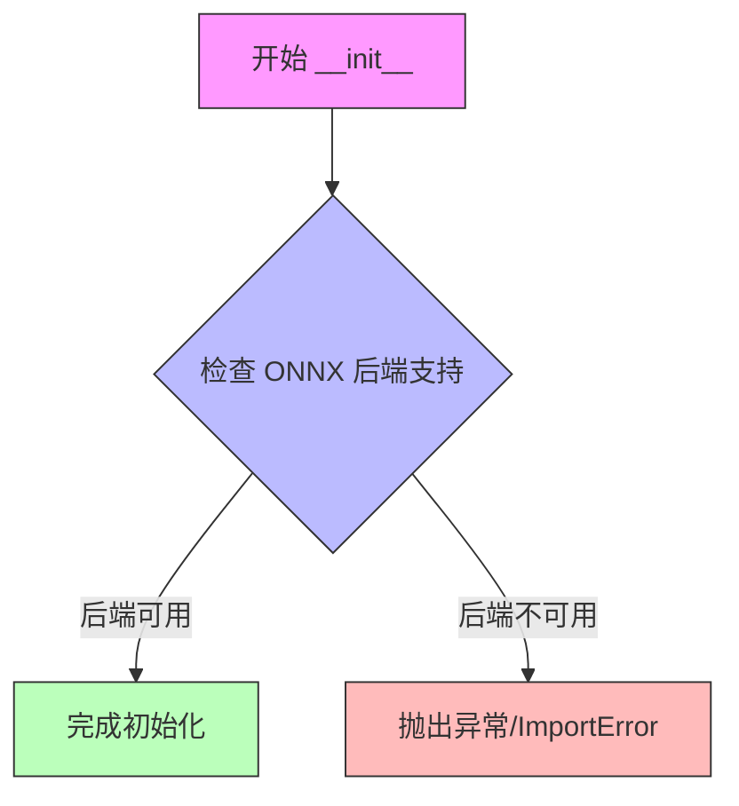
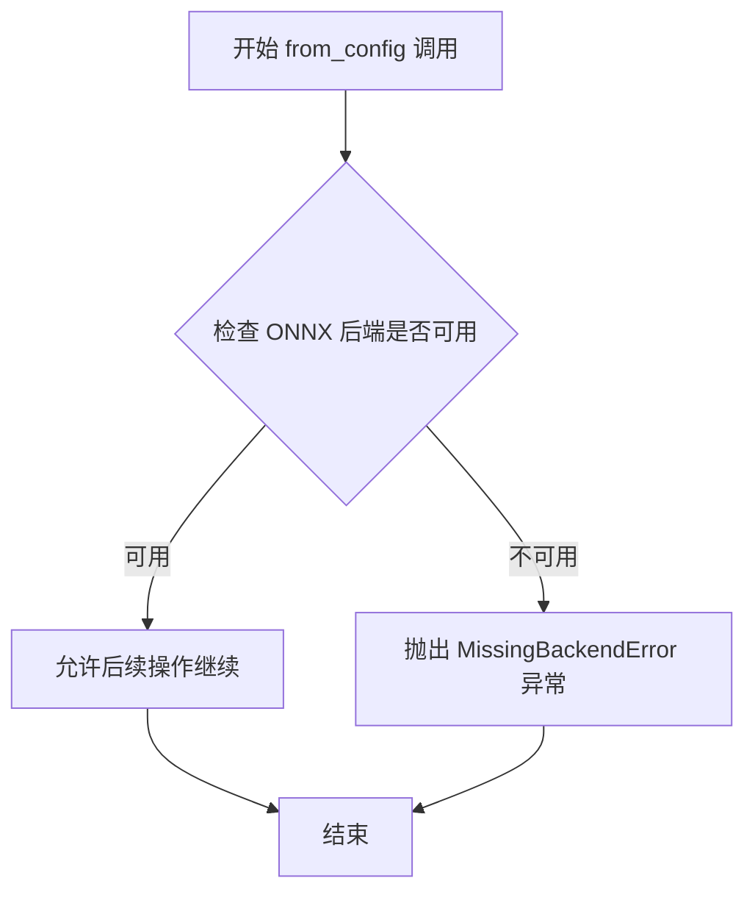
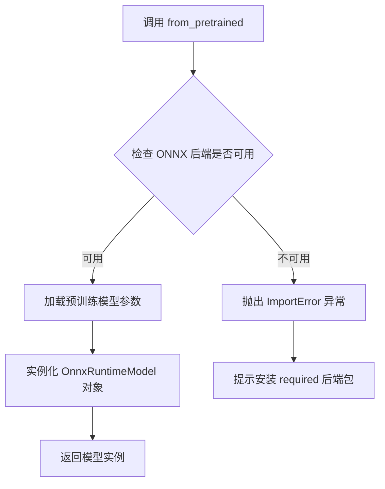

# `diffusers\src\diffusers\utils\dummy_onnx_objects.py` 详细设计文档

这是一个自动生成的ONNX Runtime模型包装类，通过DummyObject元类实现延迟加载和后端依赖检查，提供from_config和from_pretrained方法用于从配置或预训练模型加载ONNX模型。

## 整体流程



## 类结构

```
DummyObject (元类/抽象基类)
└── OnnxRuntimeModel
```

## 全局变量及字段


### `OnnxRuntimeModel._backends`
    
存储支持的 ONNX 后端列表，当前仅支持 'onnx' 后端

类型：`List[str]`
    
    

## 全局函数及方法


### `DummyObject`

DummyObject 是一个元类（metaclass），用于为需要特定后端（如 ONNX）的模型类创建存根类，当后端不可用时通过 `requires_backends` 函数抛出导入错误。

参数：

- `name`：str，元类的名称
- `bases`：tuple，基类元组
- `namespace`：dict，命名空间字典

返回值：type，返回创建的元类

#### 流程图



#### 带注释源码

```python
# 这是一个元类，用于创建需要特定后端的模型存根类
# 当后端不可用时，任何对类的实例化或方法调用都会触发错误
class DummyObject(type):
    """
    元类：为需要特定后端的类创建存根实现
    
    使用方式：
        class OnnxRuntimeModel(metaclass=DummyObject):
            _backends = ["onnx"]
            
            def __init__(self, *args, **kwargs):
                requires_backends(self, ["onnx"])
    
    当用户尝试实例化或调用类方法时：
    1. __init__ 方法会被调用
    2. requires_backends 函数检查后端是否可用
    3. 如果后端不可用，抛出 ImportError 提示用户安装相应包
    """
    
    def __new__(cls, name, bases, namespace, **kwargs):
        """
        创建新类时的元类方法
        
        参数：
            name: 类的名称
            bases: 基类元组
            namespace: 类属性和方法的字典
            
        返回值：
            type: 创建的新类
        """
        # 提取后端要求列表（如果有）
        _backends = namespace.get('_backends', [])
        
        # 为类方法添加后端检查
        # 这样在调用任何类方法前都会先检查后端是否可用
        for attr_name in ['__init__', 'from_config', 'from_pretrained']:
            if attr_name in namespace:
                method = namespace[attr_name]
                # 确保方法调用 requires_backends 进行后端检查
                # （实际实现可能在 requires_backends 中处理）
        
        return super().__new__(cls, name, bases, namespace)
    
    def __call__(cls, *args, **kwargs):
        """
        当类被实例化时调用此方法
        
        参数：
            *args: 位置参数
            **kwargs: 关键字参数
            
        返回值：
            类的实例
            
        作用：
            在实例化前检查后端是否可用
        """
        # 调用 requires_backends 检查后端
        # 如果后端不可用，这里会抛出 ImportError
        requires_backends(cls, getattr(cls, '_backends', []))
        
        # 后端检查通过，创建实例
        return super().__call__(*args, **kwargs)
```

#### 关键组件信息

| 组件名称 | 一句话描述 |
|---------|-----------|
| `DummyObject` | 元类，用于创建需要特定后端的模型存根类 |
| `OnnxRuntimeModel` | 使用 DummyObject 元类的示例类，代表 ONNX 运行时模型 |
| `requires_backends` | 工具函数，检查指定后端是否可用，不可用时抛出错误 |
| `_backends` | 类属性，定义类需要的后端列表 |

#### 潜在的技术债务或优化空间

1. **缺乏具体实现**：`DummyObject` 只是一个存根机制，没有提供实际的功能实现，当后端可用时代码无法正常工作
2. **错误信息不够详细**：当前的错误信息可能不够清晰，无法指导用户如何安装和配置所需的后端
3. **代码重复**：每个继承自 `DummyObject` 的类都需要手动定义 `__init__`、`from_config`、`from_pretrained` 等方法，可以考虑在元类中自动生成这些方法
4. **静态方法处理**：元类只处理了特定的类方法，如果有其他类方法也需要后端检查，需要手动添加

#### 其它项目

**设计目标与约束**：
- 设计目标：在后端不可用时提供清晰的错误信息，避免运行时才暴露缺失的依赖
- 约束：仅作为存根存在，需要实际的后端实现才能工作

**错误处理与异常设计**：
- 使用 `ImportError` 或自定义异常来表示后端不可用的情况
- 错误信息应包含缺失的包名和安装建议

**数据流与状态机**：
- 类实例化流程：`OnnxRuntimeModel()` → `DummyObject.__call__()` → `requires_backends()` → 后端检查 → 实际实例化或抛出异常

**外部依赖与接口契约**：
- 依赖 `..utils` 模块中的 `requires_backends` 函数
- 依赖特定后端（如 ONNX）的 Python 包
- 接口契约：任何使用 `DummyObject` 的类必须定义 `_backends` 类属性来指定所需后端


### `requires_backends`

该函数用于检查指定的后端是否可用，如果不可用则抛出 ImportError 异常，确保代码在支持的backend环境下运行。

参数：

- `obj`：任意类型，需要检查后端支持的对象或类
- `backends`：List[str]，需要检查的后端名称列表

返回值：`None`，该函数不返回任何值，主要通过抛出异常来指示错误

#### 流程图



#### 带注释源码

```python
# 该函数定义在 ..utils 模块中，此处为引用
from ..utils import DummyObject, requires_backends

# 在类中的使用示例：
class OnnxRuntimeModel(metaclass=DummyObject):
    _backends = ["onnx"]

    def __init__(self, *args, **kwargs):
        # 检查 onnx 后端是否可用，不可用则抛出异常
        requires_backends(self, ["onnx"])

    @classmethod
    def from_config(cls, *args, **kwargs):
        # 类方法中同样检查 onnx 后端
        requires_backends(cls, ["onnx"])

    @classmethod
    def from_pretrained(cls, *args, **kwargs):
        # 类方法中同样检查 onnx 后端
        requires_backends(cls, ["onnx"])
```

#### 推断的函数原型

```python
def requires_backends(obj, backends: List[str]) -> None:
    """
    检查指定的后端是否可用
    
    参数:
        obj: 需要检查后端支持的对象或类
        backends: 需要检查的后端名称列表
        
    异常:
        ImportError: 如果任何指定的后端不可用则抛出
    """
```


### `OnnxRuntimeModel.__init__`

该方法是 `OnnxRuntimeModel` 类的构造函数，用于初始化 ONNX 运行时模型实例。在初始化过程中，它会检查当前环境是否支持 ONNX 后端，如果不支持则抛出异常。此外，该类使用 `DummyObject` 元类实现，这表明 `OnnxRuntimeModel` 可能是一个存根类，用于延迟导入和可选依赖管理。

参数：

- `self`：`OnnxRuntimeModel`，当前创建的实例对象本身
- `*args`：`tuple`，可变位置参数，用于传递任意数量的位置参数（具体功能依赖于调用方）
- `**kwargs`：`dict`，可变关键字参数，用于传递任意数量的关键字参数（具体功能依赖于调用方）

返回值：`None`，该方法仅执行初始化逻辑，不返回任何值

#### 流程图



#### 带注释源码

```python
def __init__(self, *args, **kwargs):
    """
    初始化 OnnxRuntimeModel 实例。
    
    该方法在创建 OnnxRuntimeModel 对象时自动调用。它首先调用
    requires_backends 函数来验证当前环境是否安装了必要的 ONNX
    依赖包。如果 ONNX 后端不可用，将抛出 ImportError 异常。
    
    参数:
        *args: 可变位置参数列表，传递给父类或后续初始化逻辑
        **kwargs: 可变关键字参数字典，传递给父类或后续初始化逻辑
    
    返回值:
        None: 该方法不返回任何值，仅修改实例状态
    
    注意:
        - 该类使用 DummyObject 元类，说明其可能是条件性的存根实现
        - _backends 类属性指定了所需的 'onnx' 后端
        - requires_backends 函数负责实际的依赖检查和异常抛出
    """
    # 调用 requires_backends 函数检查 ONNX 后端是否可用
    # 如果不可用，此函数将抛出 ImportError 异常
    requires_backends(self, ["onnx"])
```


### `OnnxRuntimeModel.from_config`

该方法是 `OnnxRuntimeModel` 类的类方法，用于从配置创建 ONNX 运行时模型实例，内部通过调用 `requires_backends` 验证 ONNX 后端是否可用。

参数：

- `*args`：可变位置参数，用于传递任意数量的位置参数
- `**kwargs`：可变关键字参数，用于传递任意数量的关键字参数

返回值：`None`，该方法没有显式返回值，仅执行后端验证逻辑

#### 流程图



#### 带注释源码

```python
@classmethod
def from_config(cls, *args, **kwargs):
    """
    类方法：从配置创建 OnnxRuntimeModel 实例
    
    参数:
        cls: 类本身，Python 类方法自动传递
        *args: 可变位置参数，用于传递任意数量的位置参数
        **kwargs: 可变关键字参数，用于传递任意数量的关键字参数
    
    返回值:
        无返回值（None）
    
    注意:
        该方法实际上是一个存根实现，核心逻辑通过 requires_backends
        进行后端验证。实际的对象创建逻辑需要 ONNX 后端支持。
    """
    # 验证当前环境是否支持 ONNX 后端
    # 如果不支持，则抛出 MissingBackendError 异常
    requires_backends(cls, ["onnx"])
```


### `OnnxRuntimeModel.from_pretrained`

该方法是 `OnnxRuntimeModel` 类的类方法，用于从预训练模型加载 ONNX 运行时模型，内部通过 `requires_backends` 验证 ONNX 后端可用性，若后端不可用则抛出导入错误。

参数：

- `*args`：可变位置参数，用于传递给底层模型加载逻辑（具体参数取决于后端实现）
- `**kwargs`：可变关键字参数，用于指定模型路径、配置选项等（如 `pretrained_model_name_or_path`、`cache_dir` 等）

返回值：`OnnxRuntimeModel`（或通过后端实现的模型实例），返回加载后的 ONNX 运行时模型实例

#### 流程图



#### 带注释源码

```python
@classmethod
def from_pretrained(cls, *args, **kwargs):
    """
    类方法：从预训练模型路径加载 ONNX 运行时模型
    
    参数:
        cls: OnnxRuntimeModel 类本身
        *args: 可变位置参数，传递给底层模型加载逻辑
        **kwargs: 关键字参数，如模型路径、配置等
    
    返回:
        OnnxRuntimeModel: 加载后的模型实例
    
    异常:
        ImportError: 当 ONNX 后端不可用时抛出
    """
    # 调用 requires_backends 检查 ONNX 后端是否可用
    # 若后端缺失，会抛出 ImportError 并提示安装 onnxruntime
    requires_backends(cls, ["onnx"])
    
    # 注意：实际的模型加载逻辑由后端实现
    # 当前文件是自动生成的存根文件，仅包含后端检查
```

## 关键组件


### OnnxRuntimeModel 类

核心模型类，用于表示 ONNX 运行时模型，采用 DummyObject 元类实现惰性加载和后端依赖检查。

### DummyObject 元类

用于实现惰性加载的元类，当实例化或访问类方法时触发后端检查，避免不必要的依赖加载。

### requires_backends 函数

来自 ..utils 模块的依赖检查函数，用于验证指定后端是否可用，不可用时抛出导入错误。

### _backends 类属性

类属性，定义该模型支持的后端列表，当前为 ["onnx"]，用于标识该类仅支持 ONNX 后端。

### __init__ 方法

构造函数，通过 requires_backends 检查确保 ONNX 后端可用，否则抛出 ImportError。

### from_config 类方法

从配置创建模型的类方法，同样通过 requires_backends 检查确保 ONNX 后端可用。

### from_pretrained 类方法

从预训练模型加载的类方法，同样通过 requires_backends 检查确保 ONNX 后端可用。


## 问题及建议


### 已知问题

-   **空实现问题**：该类为 `DummyObject` 元类生成的空壳，所有方法内部仅调用 `requires_backends` 抛出后端不可用异常，无实际功能实现，运行时才能发现错误
-   **参数定义模糊**：使用 `*args, **kwargs` 接收所有参数，未定义具体参数列表、类型和返回值，丧失静态类型检查和 IDE 智能提示
-   **代码重复**：三个方法（`__init__`、`from_config`、`from_pretrained`）均独立调用 `requires_backends(self/cls, ["onnx"])`，存在冗余
-   **硬编码后端**：`["onnx"]` 字符串硬编码在多处，不利于后端配置管理和扩展
-   **元类过度使用**：使用 `metaclass=DummyObject` 元类可能增加代码复杂度和调试难度
-   **文档缺失**：无任何 docstring 说明类功能、方法参数意义及使用场景
-   **继承关系不明确**：未显式继承任何基类或实现接口，职责边界模糊

### 优化建议

-   补充方法的具体参数类型定义和返回值类型提示，移除 `*args, **kwargs` 改用明确参数列表
-   将 `requires_backends` 调用统一至元类或基类中，避免在每个方法重复调用
-   将后端名称提取为类常量或配置文件，支持动态配置
-   添加类级别和方法级别的 docstring，说明使用前提和参数含义
-   考虑使用 `abc.ABC` 抽象基类替代自定义元类，提高代码可读性
-   若为自动生成代码，需确保生成逻辑的正确性和完整性验证

## 其它


### 设计目标与约束

该模块旨在为 ONNX Runtime 提供统一的模型加载接口，遵循 transformers 库的模型抽象设计模式，支持动态后端加载。主要约束包括：仅支持 ONNX 后端、依赖 transformers 库的基础设施（DummyObject 元类、requires_backends 函数）、需要在 transformers 环境中运行。

### 错误处理与异常设计

当缺少 ONNX 后端支持时，`requires_backends` 函数将抛出 `ImportError` 或 `OptionalDependencyNotAvailable` 异常。所有类方法（`__init__`、`from_config`、`from_pretrained`）均通过调用 `requires_backends` 进行后端可用性检查，确保在不支持 ONNX 的环境中及时失败并给出明确错误信息。

### 外部依赖与接口契约

核心依赖包括：`..utils` 模块中的 `DummyObject` 元类（用于创建延迟加载的虚拟对象）和 `requires_backends` 函数（用于后端依赖检查）。`OnnxRuntimeModel` 类的接口契约遵循 transformers 库的模型加载模式：`from_config(config)` 用于从配置创建模型，`from_pretrained(pretrained_model_name_or_path, **kwargs)` 用于从预训练路径加载模型，两者均返回模型实例。

### 版本兼容性说明

该文件由 `make fix-copies` 命令自动生成，表明其是 transformers 库多后端支持策略的一部分。代码仅声明支持 `"onnx"` 后端，需与对应版本的 ONNX Runtime 库配合使用。

### 扩展性与未来改进方向

当前实现为占位符（DummyObject），实际模型加载逻辑由 ONNX 后端模块提供。潜在改进方向包括：增加更多 ONNX 特定的配置选项（如 session_options、providers 配置）、支持 ONNX Runtime 推理优化、添加模型序列化支持等。


    