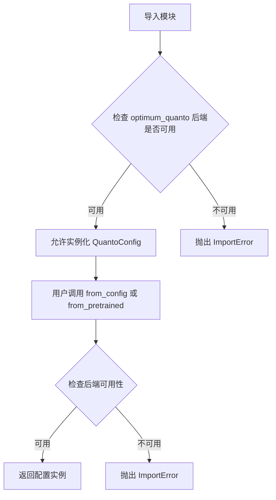
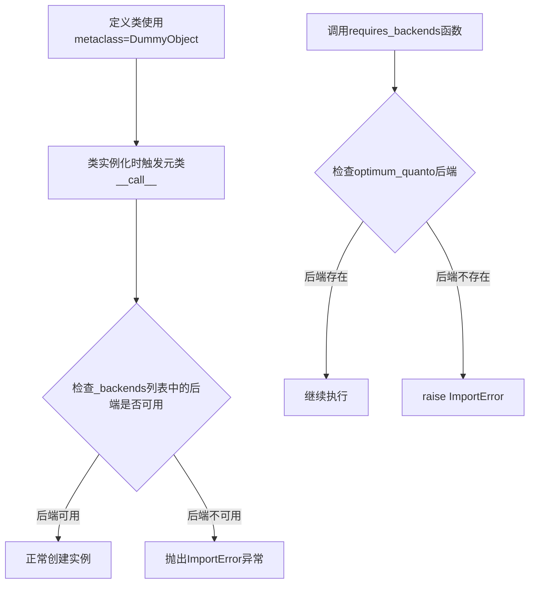
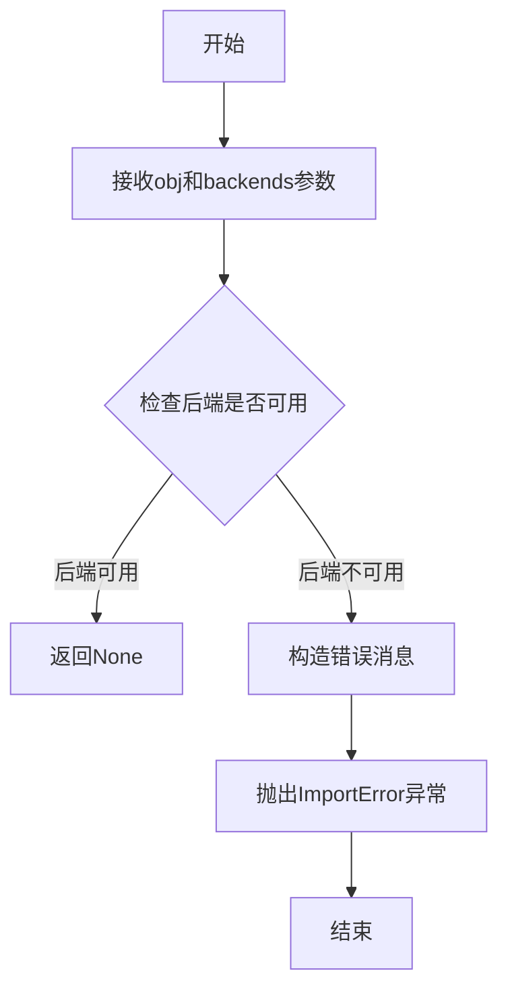
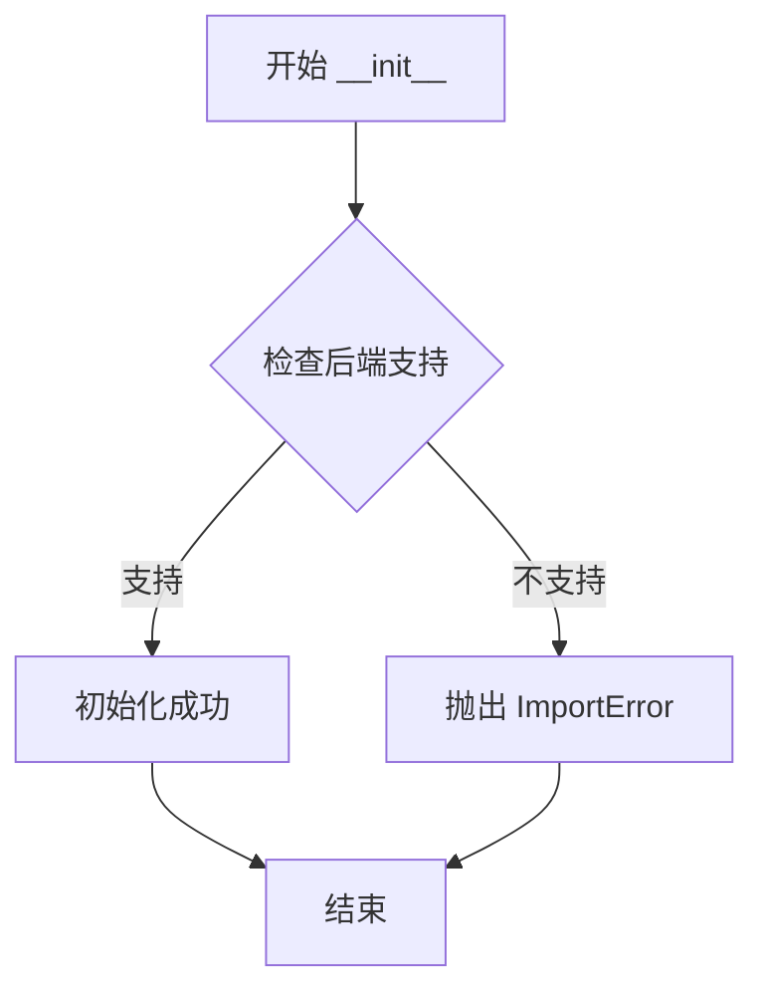
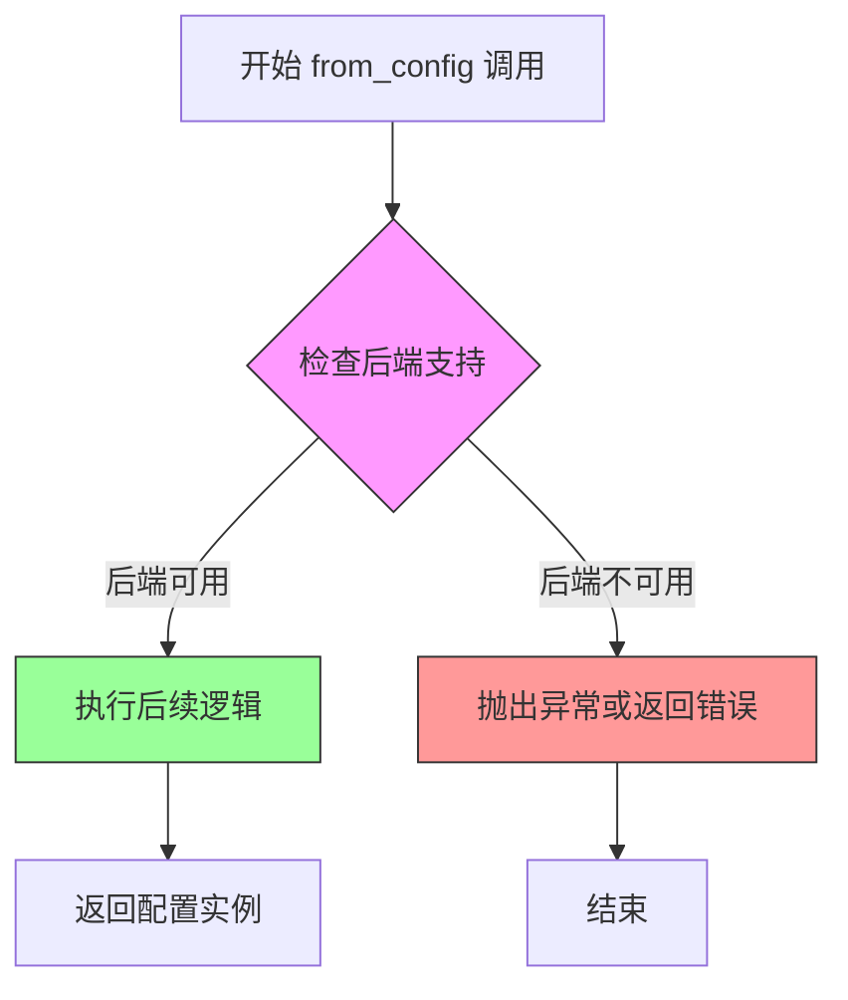
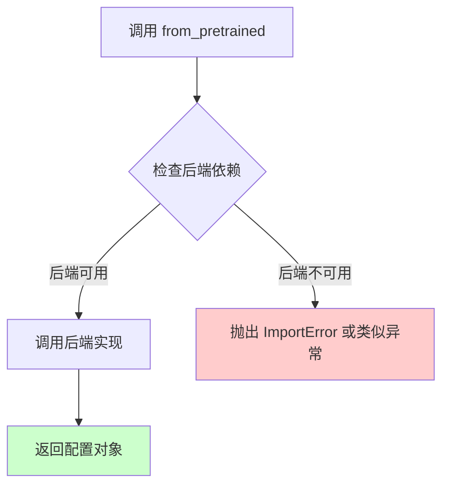

# `diffusers\src\diffusers\utils\dummy_optimum_quanto_objects.py` 详细设计文档

这是一个自动生成的配置文件，用于定义 Quanto 量化配置的元类和虚函数占位符，通过 DummyObject 元类和 requires_backends 机制确保只有在安装 optimum_quanto 后端时才能实例化和使用该配置类。

## 整体流程



## 类结构

```
DummyObject (元类)
└── QuantoConfig (虚函数占位符类)
```

## 全局变量及字段


### `QuantoConfig._backends`
    
支持的后端列表，当前仅支持 optimum_quanto

类型：`list`
    
    

## 全局函数及方法


### `DummyObject`

DummyObject 是一个元类（metaclass），用于为类提供延迟后端检查功能。当类被实例化时，会自动检查所需的后端库是否可用，如果不可用则抛出 ImportError 异常。该元类主要用于实现可选依赖的惰性加载机制。

参数：

- `cls`：当前类对象，表示使用 DummyObject 元类定义的类本身
- `*args`：可变位置参数，传递给类的构造函数
- `**kwargs`：可变关键字参数，传递给类的构造函数

返回值：返回类的实例，但如果后端不可用则抛出 ImportError

#### 流程图



#### 带注释源码

```python
# 导入 DummyObject 元类和 requires_backends 工具函数
from ..utils import DummyObject, requires_backends


# 定义 QuantoConfig 类，使用 DummyObject 作为元类
# 这意味着任何对 QuantoConfig 的实例化都会经过元类的控制
class QuantoConfig(metaclass=DummyObject):
    # 定义该类需要的后端列表
    _backends = ["optimum_quanto"]

    # 初始化方法，当创建类的实例时调用
    # 通过元类的机制，会先执行后端检查
    def __init__(self, *args, **kwargs):
        # 检查后端是否可用，不可用则抛出异常
        requires_backends(self, ["optimum_quanto"])

    # 类方法：从配置创建对象
    @classmethod
    def from_config(cls, *args, **kwargs):
        # 检查后端是否可用
        requires_backends(cls, ["optimum_quanto"])

    # 类方法：从预训练模型加载配置
    @classmethod
    def from_pretrained(cls, *args, **kwargs):
        # 检查后端是否可用
        requires_backends(cls, ["optimum_quanto"])
```

#### 补充说明

| 项目 | 说明 |
|------|------|
| **设计目标** | 实现可选依赖的惰性加载，当用户未安装 `optimum_quanto` 库时，类无法被实例化，但不会影响其他代码的导入 |
| **技术债务** | 每次实例化都会调用 `requires_backends`，存在一定的性能开销；错误信息依赖于外部函数 `requires_backends` 的实现 |
| **优化方向** | 可以在模块级别添加缓存机制，避免重复检查；或者提供配置选项来绕过检查 |
| **外部依赖** | 依赖 `optimum_quanto` 库和 `..utils` 模块中的 `requires_backends` 函数 |


### `requires_backends`

该函数是用于检查指定后端是否可用的工具函数，如果所需后端不可用则抛出 ImportError 异常。

参数：

- `obj`：`object`，对象或类实例，用于关联错误信息
- `backends`：`List[str]`，所需的后端列表

返回值：`None`，该函数不返回任何值，主要通过抛出异常来处理错误

#### 流程图



#### 带注释源码

```
# 从上级包的utils模块导入requires_backends函数
from ..utils import DummyObject, requires_backends


# 这是一个使用requires_backends的示例类
class QuantoConfig(metaclass=DummyObject):
    # 定义该类支持的后端列表
    _backends = ["optimum_quanto"]

    def __init__(self, *args, **kwargs):
        # 在初始化时检查optimum_quanto后端是否可用
        # 如果不可用，将抛出ImportError并提示安装
        requires_backends(self, ["optimum_quanto"])

    @classmethod
    def from_config(cls, *args, **kwargs):
        # 类方法中检查后端可用性
        requires_backends(cls, ["optimum_quanto"])

    @classmethod
    def from_pretrained(cls, *args, **kwargs):
        # 类方法中检查后端可用性
        requires_backends(cls, ["optimum_quanto"])
```

#### 说明

由于 `requires_backends` 函数的具体源码未在当前代码文件中定义（仅通过 `from ..utils import` 导入），上述源码为该函数的使用示例。从调用方式可以看出：

1. **第一个参数** 可以是 `self`（实例方法）或 `cls`（类方法），用于在错误消息中提供上下文信息
2. **第二个参数** 是后端名称的列表，用于指定需要检查的后端
3. **函数行为** 如果指定的后端不可用，则抛出 `ImportError` 异常，提示用户安装相应的包
4. **设计目的** 这是一种延迟导入机制，用于在可选依赖不可用时提供清晰的错误信息，同时保持代码的模块化


### `QuantoConfig.__init__`

该方法是 `QuantoConfig` 类的初始化方法，通过调用 `requires_backends` 验证当前环境是否支持 `optimum_quanto` 后端，若不支持则抛出异常。

参数：

- `self`：`self`，类的实例对象
- `*args`：`tuple`，可变位置参数，用于接收任意数量的位置参数（当前未使用）
- `**kwargs`：`dict`，可变关键字参数，用于接收任意数量的关键字参数（当前未使用）

返回值：`None`，`__init__` 方法不返回值

#### 流程图



#### 带注释源码

```python
def __init__(self, *args, **kwargs):
    """
    初始化 QuantoConfig 实例。
    
    该方法在实例化时会被调用，用于验证当前环境是否支持
    optimum_quanto 后端。如果后端不可用，则抛出 ImportError。
    
    Args:
        *args: 可变位置参数，用于接收任意数量的位置参数。
               当前实现中未使用此参数，但保留以保持接口兼容性。
        **kwargs: 可变关键字参数，用于接收任意数量的关键字参数。
                  当前实现中未使用此参数，但保留以保持接口兼容性。
    
    Returns:
        None: 该方法不返回值，仅进行后端验证。
    
    Raises:
        ImportError: 当 required_backends 中指定的后端不可用时抛出。
    """
    # 调用 requires_backends 验证后端支持情况
    # 如果 optimum_quanto 后端不可用，将抛出 ImportError
    requires_backends(self, ["optimum_quanto"])
```


### `QuantoConfig.from_config`

该方法是一个类方法（classmethod），用于从配置创建`QuantoConfig`实例，但在当前实现中主要负责检查必要的后端库（optimum_quanto）是否可用。

参数：

- `*args`：可变位置参数，用于传递任意数量的位置参数（当前实现中未直接使用，仅透传）
- `**kwargs`：可变关键字参数，用于传递任意数量的关键字参数（当前实现中未直接使用，仅透传）

返回值：未明确返回类型，从代码逻辑推断可能返回类实例或 None（依赖于 `requires_backends` 的行为）

#### 流程图



#### 带注释源码

```python
@classmethod
def from_config(cls, *args, **kwargs):
    """
    从配置创建 QuantoConfig 实例的类方法。
    
    该方法是一个占位实现，主要功能是确保所需的量化后端库可用。
    实际的配置加载逻辑依赖于 optimum_quanto 库的实现。
    
    参数:
        *args: 可变位置参数列表，用于传递配置参数
        **kwargs: 可变关键字参数字典，用于传递命名配置参数
    
    返回:
        返回值类型取决于 requires_backends 的行为：
        - 后端可用时：可能返回 cls 的实例或 None
        - 后端不可用时：抛出 ImportError 异常
    """
    # 调用后端检查函数，确保 optimum_quanto 库可用
    # 如果后端不可用，此函数将抛出 ImportError
    requires_backends(cls, ["optimum_quanto"])
```


### `QuantoConfig.from_pretrained`

该方法是一个类方法，用于从预训练模型加载 `QuantoConfig` 配置。它通过调用 `requires_backends` 来确保所需的后端库 (`optimum_quanto`) 可用，由于该类使用 `DummyObject` 元类，实际的加载逻辑由后端模块实现。

参数：

- `*args`：可变位置参数，传递给后端预训练模型加载器
- `**kwargs`：可变关键字参数，用于指定模型路径、配置选项等，传递给后端预训练模型加载器

返回值：取决于后端实现，通常返回配置对象实例

#### 流程图



#### 带注释源码

```python
@classmethod
def from_pretrained(cls, *args, **kwargs):
    """
    从预训练模型加载配置。
    
    这是一个类方法，允许用户通过模型路径或名称加载配置。
    由于使用 DummyObject 元类，实际实现委托给后端模块。
    
    参数:
        *args: 可变位置参数，传递给后端加载器
        **kwargs: 可变关键字参数，如 model_name, cache_dir 等
    
    返回:
        由后端实现决定的配置对象
    """
    # 检查并确保所需的后端库（optimum_quanto）可用
    # 如果不可用，会抛出相应的导入错误
    requires_backends(cls, ["optimum_quanto"])
```

#### 关键组件信息

| 组件名称 | 描述 |
|---------|------|
| `DummyObject` | 元类，用于延迟加载实际实现，后端不可用时抛出错误 |
| `requires_backends` | 工具函数，检查指定后端库是否可用，不可用则抛出异常 |
| `_backends` | 类属性，定义所需的后端库列表 `["optimum_quanto"]` |

#### 潜在的技术债务或优化空间

1. **缺少实际实现**：当前仅为存根实现，依赖后端模块，应考虑添加默认配置生成逻辑
2. **参数类型不明确**：使用 `*args` 和 `**kwargs` 导致参数类型不清晰，应添加类型注解
3. **错误信息不够友好**：后端缺失时仅抛出基础错误，应提供更详细的安装/配置指南
4. **文档缺失**：方法缺少完整的文档字符串，应补充参数和返回值的具体说明

## 关键组件


### QuantoConfig 类

量化配置类，用于管理模型量化相关的配置信息。通过 DummyObject 元类实现惰性加载，只有在实际使用并满足后端依赖时才会真正加载实现。

### _backends 类属性

存储支持的后端列表，当前仅支持 "optimum_quanto" 后端。用于依赖检查和功能可用性验证。

### __init__ 方法

初始化方法，接受可变参数 args 和关键字参数 kwargs。内部调用 requires_backends 检查后端依赖是否满足。

### from_config 类方法

类方法，从配置字典创建 QuantConfig 实例。委托给后端实现，需要 optimum_quanto 库支持。

### from_pretrained 类方法

类方法，从预训练模型路径加载 QuantConfig 实例。委托给后端实现，需要 optimum_quanto 库支持。

### requires_backends 函数

依赖检查工具函数，来自 ..utils 模块。用于在功能被调用时动态检查所需后端是否可用，若不可用则抛出适当的错误。

### DummyObject 元类

虚拟对象元类，用于实现惰性加载模式。在类定义时创建空壳类，实际方法实现由后端模块提供。当方法被调用时才检查后端依赖，实现按需加载。


## 问题及建议


### 已知问题

-   **方法实现为空**: `__init__`、`from_config`、`from_pretrained` 方法仅调用 `requires_backends` 检查后即返回，未实现任何实际功能逻辑，属于存根类
-   **参数未使用**: `*args` 和 `**kwargs` 接收参数但完全未使用，参数定义无实际意义
-   **返回值不明确**: 方法未显式声明返回值类型，隐式返回 `None`，且 `from_config` 和 `from_pretrained` 应返回配置实例对象
-   **缺少文档注释**: 类和方法均无 docstring，违反 Python 代码规范，降低可维护性
-   **紧耦合设计**: 直接硬编码依赖 `"optimum_quanto"`，若需支持多后端需大量修改
-   **元类潜在副作用**: 依赖 `DummyObject` 元类，但其实现未知，可能引入隐藏行为
-   **无参数验证**: 接收任意参数但不做任何校验，无法提供友好的错误提示

### 优化建议

-   **完善方法实现**: 根据类职责（如配置管理）实现具体功能，而非仅做后端检查
-   **移除或使用参数**: 若确实不需要参数，应移除 `*args, **kwargs`；若需要则正确处理
-   **添加类型提示和返回值声明**: 使用 typing 模块声明参数和返回值类型，如 `def from_pretrained(cls, pretrained_model_name_or_path: str, ...) -> "QuantoConfig"`
-   **补充文档字符串**: 添加类和方法的功能描述、参数说明和返回值说明
-   **抽象后端依赖**: 将硬编码的 `"optimum_quanto"` 提取为可配置项，支持动态后端切换
-   **考虑改为接口/协议类**: 若此类仅为接口定义，考虑使用 `abc` 模块的抽象基类或 Protocol
-   **添加参数验证**: 在方法开始时对传入参数进行合法性检查，提供明确的错误信息

## 其它


### 设计目标与约束

该代码的设计目标是提供一个统一的接口来配置和管理Quanto量化功能，使模型能够使用optimum_quanto后端进行量化处理。约束条件包括：仅支持optimum_quanto后端，依赖DummyObject元类实现延迟加载，必须通过requires_backends进行后端验证。

### 错误处理与异常设计

当所需的optimum_quanto后端不可用时，requires_backends函数将抛出ImportError或BackendNotSupportedError。类的所有实例化操作（__init__、from_config、from_pretrained）都会先进行后端检查，确保在不支持的后端环境下立即失败并给出明确的错误信息。

### 外部依赖与接口契约

主要外部依赖为optimum_quanto库。接口契约包括：_backends类属性定义支持的后端列表，from_config和from_pretrained为类方法接受可变参数*args和**kwargs，返回值应为QuantoConfig实例或抛出后端不支持异常。

### 性能考虑

由于使用DummyObject元类，该配置类采用延迟加载机制，在实际使用时才进行后端检查，避免了不必要的导入开销。配置对象的创建应该 lightweight，主要持有量化参数配置信息。

### 版本兼容性

代码通过requires_backends进行后端可用性检查，应该记录最低支持的optimum_quanto版本要求。由于是自动生成代码，需要注意与transformers库版本的兼容性。

### 安全考虑

代码本身不涉及敏感数据处理，但需要确保optimum_quanto库的来源可信。建议在生产环境中验证后端库的完整性和签名。

### 测试策略

应包含单元测试验证后端不可用时的错误抛出，集成测试验证from_config和from_pretrained方法在正确配置下的行为，以及模拟测试验证DummyObject元类的工作机制。

### 部署注意事项

部署时需要确保optimum_quanto库已正确安装。建议在部署文档中明确列出依赖要求，并提供版本范围说明。该文件为自动生成，部署时应避免手动修改。

    