# `diffusers\src\diffusers\utils\dummy_pt_objects.py` 详细设计文档

This file acts as a lazy-loading registry and stub definition for the Diffusers library, providing placeholder classes and functions for various diffusion models, pipelines, and schedulers that enforce PyTorch backend dependencies.

## 整体流程

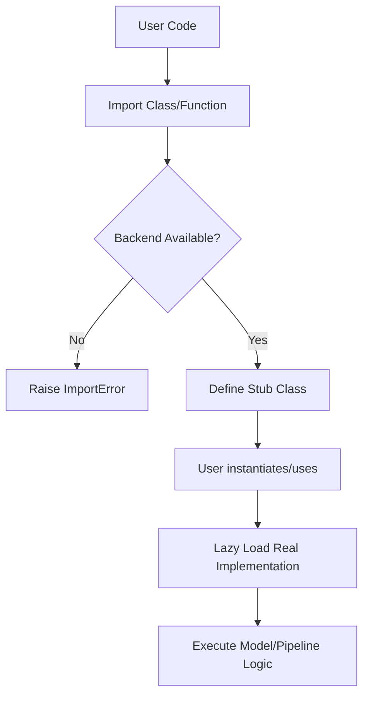
```mermaid
graph TD
    User[User Code] --> Import[Import Class/Function]
    Import --> Check{Backend Available?}
    Check -- No --> Error[Raise ImportError]
    Check -- Yes --> Define[Define Stub Class]
    Define --> Usage[User instantiates/uses]
    Usage --> Load[Lazy Load Real Implementation]
    Load --> Execute[Execute Model/Pipeline Logic]
```

## 类结构

```
DummyObject (Metaclass - Base)
├── Guidance & control utilities
│   ├── AdaptiveProjectedGuidance
│   ├── ClassifierFreeGuidance
│   ├── HookRegistry
│   └── ...
├── Model Architectures
│   ├── Transformers (DiT, Flux, CogVideoX, etc.)
│   ├── Autoencoders (AutoencoderKL, VQModel, etc.)
│   ├── UNets (UNet2D, UNet3D, etc.)
│   └── ControlNets
├── Pipelines
│   ├── DiffusionPipeline (Base)
│   ├── AutoPipelineFor*
│   └── Specific Pipelines (StableDiffusion, BlipDiffusion, etc.)
├── Schedulers
│   ├── DDIMScheduler
│   ├── DDPMScheduler
│   ├── EulerDiscreteScheduler
│   └── ... (50+ variants)
└── Functions
    ├── apply_* (apply_faster_cache, etc.)
    └── get_* (get_scheduler, etc.)
```

## 全局变量及字段


### `AdaptiveProjectedGuidance._backends`
    
List of required backend frameworks, currently set to ['torch']

类型：`List[str]`
    


### `AdaptiveProjectedMixGuidance._backends`
    
List of required backend frameworks, currently set to ['torch']

类型：`List[str]`
    


### `AllegroTransformer3DModel._backends`
    
List of required backend frameworks, currently set to ['torch']

类型：`List[str]`
    


### `AsymmetricAutoencoderKL._backends`
    
List of required backend frameworks, currently set to ['torch']

类型：`List[str]`
    


### `AudioPipelineOutput._backends`
    
List of required backend frameworks, currently set to ['torch']

类型：`List[str]`
    


### `AutoGuidance._backends`
    
List of required backend frameworks, currently set to ['torch']

类型：`List[str]`
    


### `AutoModel._backends`
    
List of required backend frameworks, currently set to ['torch']

类型：`List[str]`
    


### `AutoPipelineForImage2Image._backends`
    
List of required backend frameworks, currently set to ['torch']

类型：`List[str]`
    


### `AutoPipelineForInpainting._backends`
    
List of required backend frameworks, currently set to ['torch']

类型：`List[str]`
    


### `AutoPipelineForText2Image._backends`
    
List of required backend frameworks, currently set to ['torch']

类型：`List[str]`
    


### `AutoencoderDC._backends`
    
List of required backend frameworks, currently set to ['torch']

类型：`List[str]`
    


### `AutoencoderKL._backends`
    
List of required backend frameworks, currently set to ['torch']

类型：`List[str]`
    


### `AutoencoderKLAllegro._backends`
    
List of required backend frameworks, currently set to ['torch']

类型：`List[str]`
    


### `BaseGuidance._backends`
    
List of required backend frameworks, currently set to ['torch']

类型：`List[str]`
    


### `BlipDiffusionControlNetPipeline._backends`
    
List of required backend frameworks, currently set to ['torch']

类型：`List[str]`
    


### `BlipDiffusionPipeline._backends`
    
List of required backend frameworks, currently set to ['torch']

类型：`List[str]`
    


### `CacheMixin._backends`
    
List of required backend frameworks, currently set to ['torch']

类型：`List[str]`
    


### `ClassifierFreeGuidance._backends`
    
List of required backend frameworks, currently set to ['torch']

类型：`List[str]`
    


### `ClassifierFreeZeroStarGuidance._backends`
    
List of required backend frameworks, currently set to ['torch']

类型：`List[str]`
    


### `CLIPImageProjection._backends`
    
List of required backend frameworks, currently set to ['torch']

类型：`List[str]`
    


### `CogVideoXTransformer3DModel._backends`
    
List of required backend frameworks, currently set to ['torch']

类型：`List[str]`
    


### `ConsistencyDecoderVAE._backends`
    
List of required backend frameworks, currently set to ['torch']

类型：`List[str]`
    


### `ConsistencyModelPipeline._backends`
    
List of required backend frameworks, currently set to ['torch']

类型：`List[str]`
    


### `ContextParallelConfig._backends`
    
List of required backend frameworks, currently set to ['torch']

类型：`List[str]`
    


### `ControlNetModel._backends`
    
List of required backend frameworks, currently set to ['torch']

类型：`List[str]`
    


### `DanceDiffusionPipeline._backends`
    
List of required backend frameworks, currently set to ['torch']

类型：`List[str]`
    


### `DDIMPipeline._backends`
    
List of required backend frameworks, currently set to ['torch']

类型：`List[str]`
    


### `DDIMScheduler._backends`
    
List of required backend frameworks, currently set to ['torch']

类型：`List[str]`
    


### `DDPMPipeline._backends`
    
List of required backend frameworks, currently set to ['torch']

类型：`List[str]`
    


### `DDPMScheduler._backends`
    
List of required backend frameworks, currently set to ['torch']

类型：`List[str]`
    


### `DiTPipeline._backends`
    
List of required backend frameworks, currently set to ['torch']

类型：`List[str]`
    


### `DiffusionPipeline._backends`
    
List of required backend frameworks, currently set to ['torch']

类型：`List[str]`
    


### `EMAModel._backends`
    
List of required backend frameworks, currently set to ['torch']

类型：`List[str]`
    


### `EulerDiscreteScheduler._backends`
    
List of required backend frameworks, currently set to ['torch']

类型：`List[str]`
    


### `FasterCacheConfig._backends`
    
List of required backend frameworks, currently set to ['torch']

类型：`List[str]`
    


### `FirstBlockCacheConfig._backends`
    
List of required backend frameworks, currently set to ['torch']

类型：`List[str]`
    


### `FluxTransformer2DModel._backends`
    
List of required backend frameworks, currently set to ['torch']

类型：`List[str]`
    


### `FrequencyDecoupledGuidance._backends`
    
List of required backend frameworks, currently set to ['torch']

类型：`List[str]`
    


### `HookRegistry._backends`
    
List of required backend frameworks, currently set to ['torch']

类型：`List[str]`
    


### `HunyuanDiT2DModel._backends`
    
List of required backend frameworks, currently set to ['torch']

类型：`List[str]`
    


### `ImagePipelineOutput._backends`
    
List of required backend frameworks, currently set to ['torch']

类型：`List[str]`
    


### `KarrasVePipeline._backends`
    
List of required backend frameworks, currently set to ['torch']

类型：`List[str]`
    


### `LDMPipeline._backends`
    
List of required backend frameworks, currently set to ['torch']

类型：`List[str]`
    


### `LayerSkipConfig._backends`
    
List of required backend frameworks, currently set to ['torch']

类型：`List[str]`
    


### `LatteTransformer3DModel._backends`
    
List of required backend frameworks, currently set to ['torch']

类型：`List[str]`
    


### `LTXVideoTransformer3DModel._backends`
    
List of required backend frameworks, currently set to ['torch']

类型：`List[str]`
    


### `MagCacheConfig._backends`
    
List of required backend frameworks, currently set to ['torch']

类型：`List[str]`
    


### `ModelMixin._backends`
    
List of required backend frameworks, currently set to ['torch']

类型：`List[str]`
    


### `ModularPipeline._backends`
    
List of required backend frameworks, currently set to ['torch']

类型：`List[str]`
    


### `MotionAdapter._backends`
    
List of required backend frameworks, currently set to ['torch']

类型：`List[str]`
    


### `MultiAdapter._backends`
    
List of required backend frameworks, currently set to ['torch']

类型：`List[str]`
    


### `MultiControlNetModel._backends`
    
List of required backend frameworks, currently set to ['torch']

类型：`List[str]`
    


### `ParallelConfig._backends`
    
List of required backend frameworks, currently set to ['torch']

类型：`List[str]`
    


### `PerturbedAttentionGuidance._backends`
    
List of required backend frameworks, currently set to ['torch']

类型：`List[str]`
    


### `PixArtTransformer2DModel._backends`
    
List of required backend frameworks, currently set to ['torch']

类型：`List[str]`
    


### `PNDMPipeline._backends`
    
List of required backend frameworks, currently set to ['torch']

类型：`List[str]`
    


### `PNDMScheduler._backends`
    
List of required backend frameworks, currently set to ['torch']

类型：`List[str]`
    


### `PriorTransformer._backends`
    
List of required backend frameworks, currently set to ['torch']

类型：`List[str]`
    


### `PyramidAttentionBroadcastConfig._backends`
    
List of required backend frameworks, currently set to ['torch']

类型：`List[str]`
    


### `RePaintPipeline._backends`
    
List of required backend frameworks, currently set to ['torch']

类型：`List[str]`
    


### `SchedulerMixin._backends`
    
List of required backend frameworks, currently set to ['torch']

类型：`List[str]`
    


### `ScoreSdeVePipeline._backends`
    
List of required backend frameworks, currently set to ['torch']

类型：`List[str]`
    


### `SkipLayerGuidance._backends`
    
List of required backend frameworks, currently set to ['torch']

类型：`List[str]`
    


### `SmoothedEnergyGuidance._backends`
    
List of required backend frameworks, currently set to ['torch']

类型：`List[str]`
    


### `SmoothedEnergyGuidanceConfig._backends`
    
List of required backend frameworks, currently set to ['torch']

类型：`List[str]`
    


### `StableAudioDiTModel._backends`
    
List of required backend frameworks, currently set to ['torch']

类型：`List[str]`
    


### `StableDiffusionMixin._backends`
    
List of required backend frameworks, currently set to ['torch']

类型：`List[str]`
    


### `T2IAdapter._backends`
    
List of required backend frameworks, currently set to ['torch']

类型：`List[str]`
    


### `T5FilmDecoder._backends`
    
List of required backend frameworks, currently set to ['torch']

类型：`List[str]`
    


### `TangentialClassifierFreeGuidance._backends`
    
List of required backend frameworks, currently set to ['torch']

类型：`List[str]`
    


### `TaylorSeerCacheConfig._backends`
    
List of required backend frameworks, currently set to ['torch']

类型：`List[str]`
    


### `Transformer2DModel._backends`
    
List of required backend frameworks, currently set to ['torch']

类型：`List[str]`
    


### `TransformerTemporalModel._backends`
    
List of required backend frameworks, currently set to ['torch']

类型：`List[str]`
    


### `UNet1DModel._backends`
    
List of required backend frameworks, currently set to ['torch']

类型：`List[str]`
    


### `UNet2DConditionModel._backends`
    
List of required backend frameworks, currently set to ['torch']

类型：`List[str]`
    


### `UNet2DModel._backends`
    
List of required backend frameworks, currently set to ['torch']

类型：`List[str]`
    


### `UNet3DConditionModel._backends`
    
List of required backend frameworks, currently set to ['torch']

类型：`List[str]`
    


### `UVit2DModel._backends`
    
List of required backend frameworks, currently set to ['torch']

类型：`List[str]`
    


### `VQModel._backends`
    
List of required backend frameworks, currently set to ['torch']

类型：`List[str]`
    


### `WanTransformer3DModel._backends`
    
List of required backend frameworks, currently set to ['torch']

类型：`List[str]`
    


### `DiffusersQuantizer._backends`
    
List of required backend frameworks, currently set to ['torch']

类型：`List[str]`
    


### `ComponentsManager._backends`
    
List of required backend frameworks, currently set to ['torch']

类型：`List[str]`
    


### `ComponentSpec._backends`
    
List of required backend frameworks, currently set to ['torch']

类型：`List[str]`
    


### `ConfigSpec._backends`
    
List of required backend frameworks, currently set to ['torch']

类型：`List[str]`
    


### `InputParam._backends`
    
List of required backend frameworks, currently set to ['torch']

类型：`List[str]`
    


### `OutputParam._backends`
    
List of required backend frameworks, currently set to ['torch']

类型：`List[str]`
    


### `AutoPipelineBlocks._backends`
    
List of required backend frameworks, currently set to ['torch']

类型：`List[str]`
    


### `ConditionalPipelineBlocks._backends`
    
List of required backend frameworks, currently set to ['torch']

类型：`List[str]`
    


### `SequentialPipelineBlocks._backends`
    
List of required backend frameworks, currently set to ['torch']

类型：`List[str]`
    


### `LoopSequentialPipelineBlocks._backends`
    
List of required backend frameworks, currently set to ['torch']

类型：`List[str]`
    


### `ModularPipelineBlocks._backends`
    
List of required backend frameworks, currently set to ['torch']

类型：`List[str]`
    
    

## 全局函数及方法


### `apply_faster_cache`

该函数是一个缓存应用工具函数，用于在模型推理时应用 FasterCache 优化策略。该函数通过 `requires_backends` 检查 PyTorch 后端是否可用，如果不可用则抛出 ImportError。

参数：

- `*args`：可变位置参数，任意类型，接受任意数量的位置参数
- `**kwargs`：可变关键字参数，字典类型，接受任意数量的关键字参数

返回值：`None`，该函数不返回任何值，主要通过副作用（如抛出异常）来工作

#### 流程图

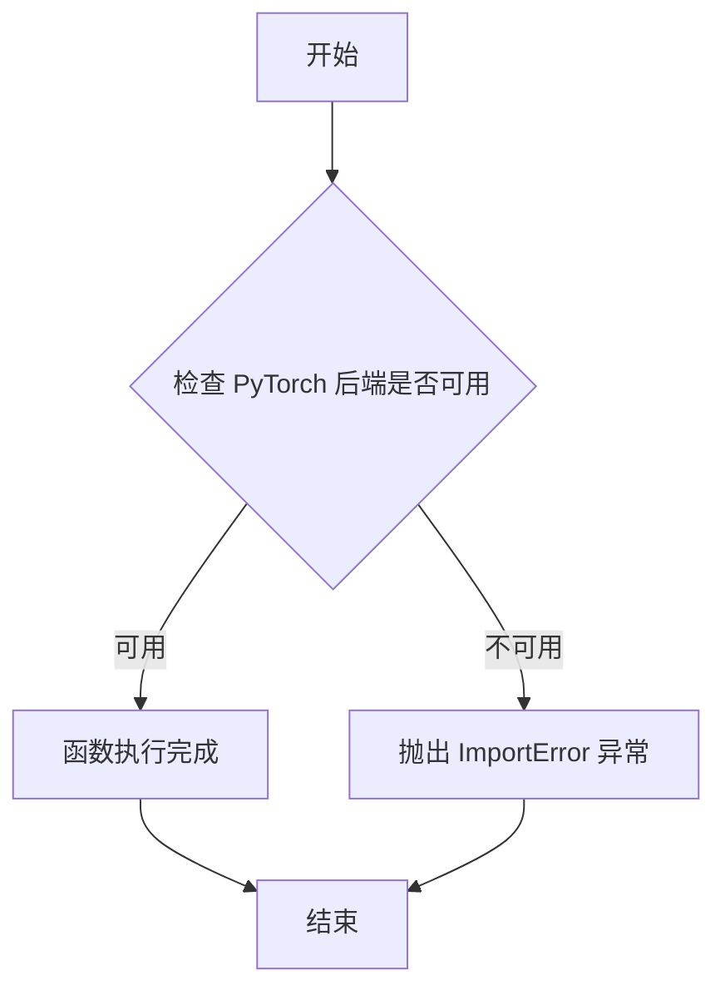
```mermaid
flowchart TD
    A[开始] --> B{检查 PyTorch 后端是否可用}
    B -->|可用| C[函数执行完成]
    B -->|不可用| D[抛出 ImportError 异常]
    C --> E[结束]
    D --> E
```

#### 带注释源码

```python
def apply_faster_cache(*args, **kwargs):
    """
    应用 FasterCache 缓存策略的函数。
    
    该函数是一个存根函数，实际实现位于后端模块中。
    它接受任意数量的位置参数和关键字参数，并将它们传递给后端实现。
    
    参数:
        *args: 可变位置参数，接受任意数量的位置参数
        **kwargs: 可变关键字参数，接受任意数量的关键字参数
        
    返回:
        None: 该函数不直接返回值，而是通过副作用（如加载模型、修改配置等）工作
        
    异常:
        ImportError: 如果 PyTorch 后端不可用，则抛出此异常
    """
    # 使用 requires_backends 检查 torch 后端是否可用
    # 如果不可用，该函数会抛出 ImportError 并显示相关错误信息
    # 这是 diffusers 库中常用的延迟加载模式，确保只有在实际调用时才检查依赖
    requires_backends(apply_faster_cache, ["torch"])
```


### `apply_first_block_cache`

该函数是一个存根函数，用于将“首块缓存”功能应用到模型中。它通过调用 `requires_backends` 验证当前环境是否支持 PyTorch 后端，如果不支持则抛出 ImportError。

参数：

- `*args`：可变位置参数，传递给后端实现的具体参数（类型未知）
- `**kwargs`：可变关键字参数，传递给后端实现的具体配置（类型未知）

返回值：`None` 或 Any，具体返回值取决于后端实现。该函数主要用于副作用（后端检查），不返回有意义的值。

#### 流程图

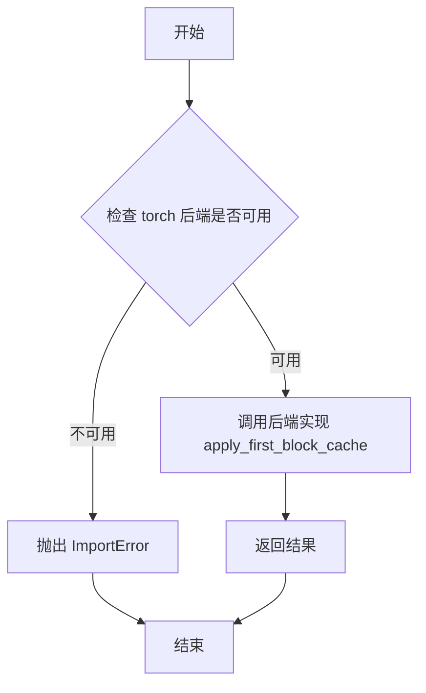
```mermaid
flowchart TD
    A[开始] --> B{检查 torch 后端是否可用}
    B -->|可用| C[调用后端实现 apply_first_block_cache]
    B -->|不可用| D[抛出 ImportError]
    C --> E[返回结果]
    D --> F[结束]
    E --> F
```

#### 带注释源码

```python
def apply_first_block_cache(*args, **kwargs):
    """
    应用首块缓存优化到模型。
    
    这是一个存根函数，实际实现位于后端模块中。
    该函数首先检查所需的 PyTorch 后端是否可用，如果不可用则抛出 ImportError。
    
    参数:
        *args: 可变位置参数，将传递给底层后端实现。
        **kwargs: 可变关键字参数，将传递给底层后端实现。
    
    返回:
        返回值类型取决于后端实现，通常为 None 或模型修改结果。
    """
    # 检查 torch 后端是否可用，如果不可用则抛出异常
    requires_backends(apply_first_block_cache, ["torch"])
```


### `apply_layer_skip`

该函数是一个延迟加载的存根函数，用于在模型推理或训练过程中应用 Layer Skip 优化策略。它通过 `requires_backends` 确保该函数仅在 PyTorch 后端可用，实际实现位于其他模块中。

参数：

- `*args`：任意数量的位置参数，用于传递给实际的后端实现
- `**kwargs`：任意数量的关键字参数，用于传递给实际的后端实现

返回值：`None` 或取决于实际后端实现的返回值（函数本身不返回值，仅执行后端检查）

#### 流程图

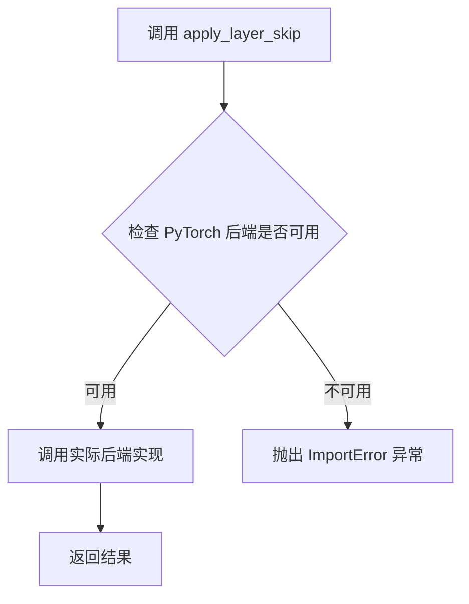
```mermaid
flowchart TD
    A[调用 apply_layer_skip] --> B{检查 PyTorch 后端是否可用}
    B -->|可用| C[调用实际后端实现]
    B -->|不可用| D[抛出 ImportError 异常]
    C --> E[返回结果]
```

#### 带注释源码

```python
def apply_layer_skip(*args, **kwargs):
    """
    应用 Layer Skip 优化策略的存根函数。
    
    该函数确保只在 PyTorch 后端可用时执行，实际实现
    在对应的后端模块中。此函数由 `make fix-copies` 命令
    自动生成，请勿手动编辑。
    
    参数:
        *args: 任意数量的位置参数传递给实际后端实现
        **kwargs: 任意数量的关键字参数传递给实际后端实现
    
    返回:
        无返回值（实际逻辑由后端实现处理）
    """
    # 检查 torch 后端是否可用，如果不可用则抛出 ImportError
    requires_backends(apply_layer_skip, ["torch"])
```


### `apply_mag_cache`

该函数是一个用于应用 MagCache（磁缓存）优化的存根函数，通过 `requires_backends` 确保该函数只能在 PyTorch 后端调用。

参数：

- `*args`：任意数量的位置参数
- `**kwargs`：任意数量的关键字参数

返回值：`None`，无返回值（该函数仅用于后端检查）

#### 流程图

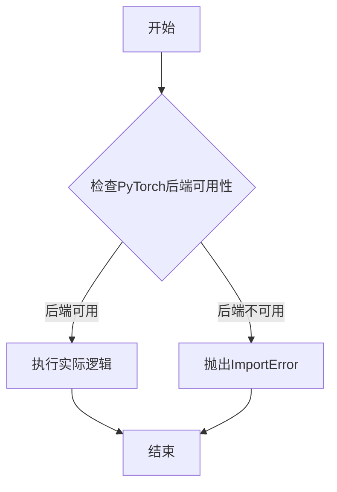
```mermaid
flowchart TD
    A[开始] --> B{检查PyTorch后端可用性}
    B -->|后端可用| C[执行实际逻辑]
    B -->|后端不可用| D[抛出ImportError]
    C --> E[结束]
    D --> E
```

*注：由于该函数是存根函数，实际执行逻辑在导入时由 `requires_backends` 处理。*

#### 带注释源码

```python
def apply_mag_cache(*args, **kwargs):
    """
    应用 MagCache（磁缓存）优化的存根函数。
    
    该函数用于在扩散模型中应用磁缓存优化技术。实际实现位于
    真正的后端模块中，此处仅为接口定义。
    
    参数:
        *args: 任意数量的位置参数，传递给实际实现
        **kwargs: 任意数量的关键字参数，传递给实际实现
    
    返回:
        None: 该函数仅作为后端检查的存根
    """
    # 检查 torch 后端是否可用，如果不可用则抛出 ImportError
    requires_backends(apply_mag_cache, ["torch"])
```


### `apply_pyramid_attention_broadcast`

该函数是一个自动生成的存根函数，用于 PyTorch 后端的 pyramid attention broadcast 功能的占位符实现，实际功能由后端模块提供。

参数：

- `*args`：可变位置参数，用于传递任意数量的位置参数
- `**kwargs`：可变关键字参数，用于传递任意数量的关键字参数

返回值：`None`，该函数仅通过 `requires_backends` 检查后端可用性，不返回任何值

#### 流程图

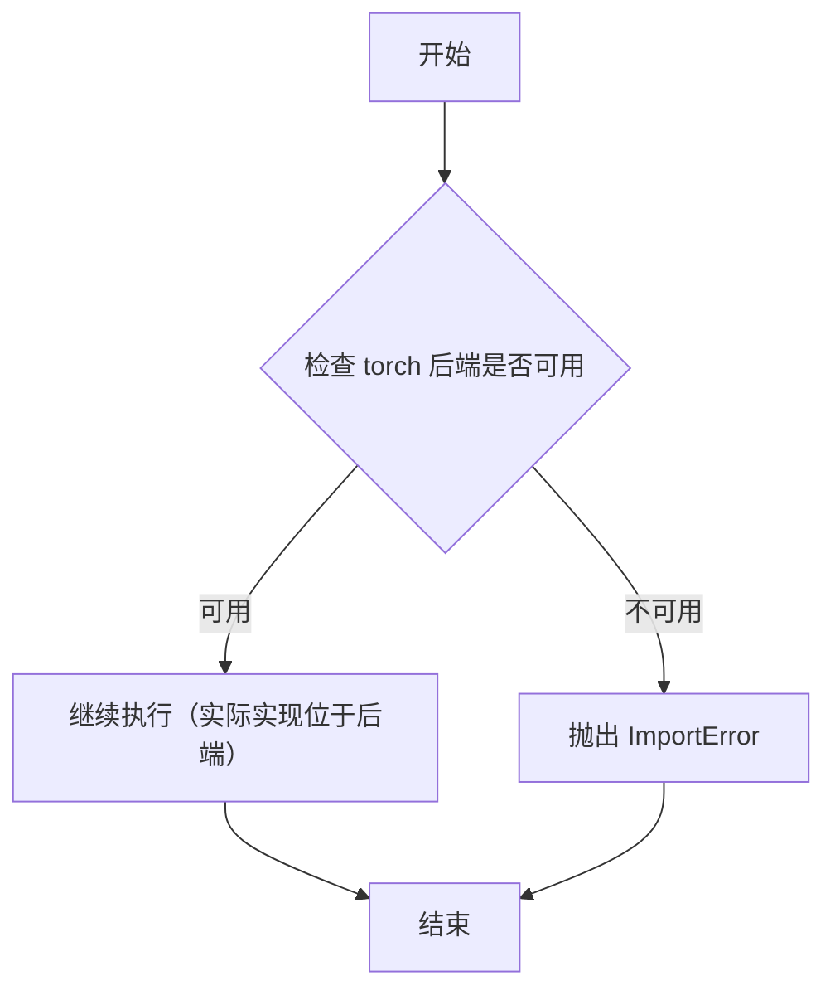
```mermaid
flowchart TD
    A[开始] --> B{检查 torch 后端是否可用}
    B -->|可用| C[继续执行（实际实现位于后端）]
    B -->|不可用| D[抛出 ImportError]
    C --> E[结束]
    D --> E
```

#### 带注释源码

```python
def apply_pyramid_attention_broadcast(*args, **kwargs):
    """
    自动生成的存根函数，用于 pyramid attention broadcast 功能。
    实际实现位于对应的后端模块中，此处仅进行后端可用性检查。
    
    参数:
        *args: 可变位置参数，传递给后端实现
        **kwargs: 可变关键字参数，传递给后端实现
    
    返回:
        None: 该函数不直接返回值，实际功能由后端实现
    """
    # 检查 torch 后端是否可用，如果不可用则抛出 ImportError
    requires_backends(apply_pyramid_attention_broadcast, ["torch"])
```


### `apply_taylorseer_cache`

该函数是一个后端依赖检查函数，用于确保 `torch` 后端可用。它是一个自动生成的存根函数，实际功能由后端实现。

参数：

- `*args`：可变位置参数，传递给后端实现的具体参数
- `**kwargs`：可变关键字参数，传递给后端实现的具体参数

返回值：`None` 或根据后端实现返回相应结果（该函数通过 `requires_backends` 调用，实际返回值取决于后端实现）

#### 流程图

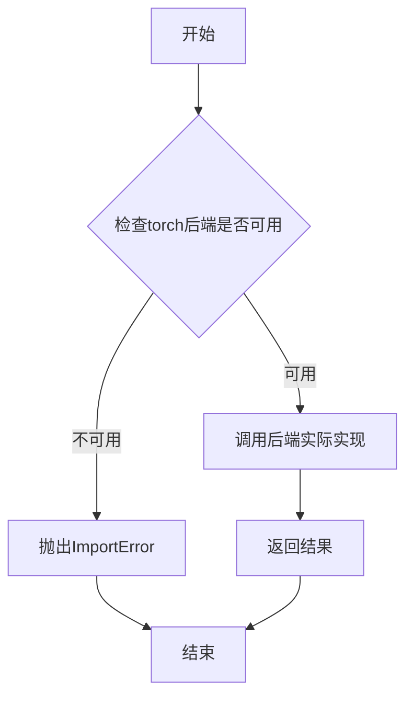
```mermaid
flowchart TD
    A[开始] --> B{检查torch后端是否可用}
    B -->|可用| C[调用后端实际实现]
    B -->|不可用| D[抛出ImportError]
    C --> E[返回结果]
    D --> F[结束]
    E --> F
```

#### 带注释源码

```python
def apply_taylorseer_cache(*args, **kwargs):
    """
    应用 TaylorSeer 缓存的存根函数。
    
    该函数是一个自动生成的占位符，用于确保 torch 后端可用。
    实际功能实现位于后端模块中。
    
    参数:
        *args: 可变位置参数，传递给后端实现
        **kwargs: 可变关键字参数，传递给后端实现
    
    返回:
        返回后端实现的返回值，若后端不可用则抛出异常
    """
    # 调用 requires_backends 检查 torch 后端是否可用
    # 如果不可用，会抛出 ImportError
    # 如果可用，调用实际的后端实现
    requires_backends(apply_taylorseer_cache, ["torch"])
```

---

**备注**：该函数为自动生成的存根函数（根据注释 `# This file is autogenerated by the command `make fix-copies`, do not edit.`），其实际功能实现在 `torch` 后端模块中。函数通过 `requires_backends` 工具函数进行后端依赖检查，确保只有在 `torch` 后端可用时才会调用实际实现。


### `attention_backend`

该函数是一个后端验证函数，用于确保只能在 PyTorch 后端上调用，调用时会检查所需的 torch 库是否可用。

参数：

- `*args`：可变位置参数，传递给实际后端实现的参数
- `**kwargs`：可变关键字参数，传递给实际后端实现的关键字参数

返回值：`None`，无返回值，仅进行后端检查

#### 流程图

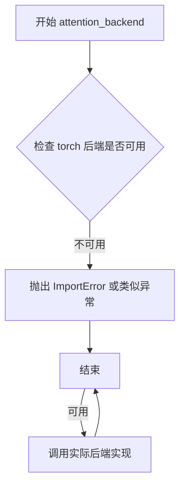
```mermaid
flowchart TD
    A[开始 attention_backend] --> B{检查 torch 后端是否可用}
    -->|不可用| C[抛出 ImportError 或类似异常]
    --> D[结束]
    -->|可用| E[调用实际后端实现]
    --> D
```

#### 带注释源码

```python
def attention_backend(*args, **kwargs):
    """
    后端验证函数，确保该函数只能在 PyTorch 后端上运行。
    
    参数:
        *args: 可变位置参数，将传递给实际的后端实现
        **kwargs: 可变关键字参数，将传递给实际的后端实现
    
    返回值:
        无返回值（None），该函数主要进行后端检查
    """
    # requires_backends 会检查指定的后端（torch）是否可用
    # 如果不可用，则抛出 ImportError 异常
    # 这是 diffusers 库中常用的后端懒加载机制
    requires_backends(attention_backend, ["torch"])
```


### `get_constant_schedule`

该函数是一个学习率调度器（learning rate scheduler）函数，用于在训练过程中保持恒定的学习率。在diffusers库中，这是一个常用的调度器创建函数。该函数通过`requires_backends`确保仅在PyTorch后端可用时被调用。

参数：

- `*args`：可变位置参数，用于传递调度器的配置参数（如optimizer、num_training_steps等）
- `**kwargs`：可变关键字参数，用于传递额外的配置选项

返回值：调度器对象（具体类型取决于实际实现，在DummyObject中未定义），返回一个学习率保持恒定的调度器实例

#### 流程图

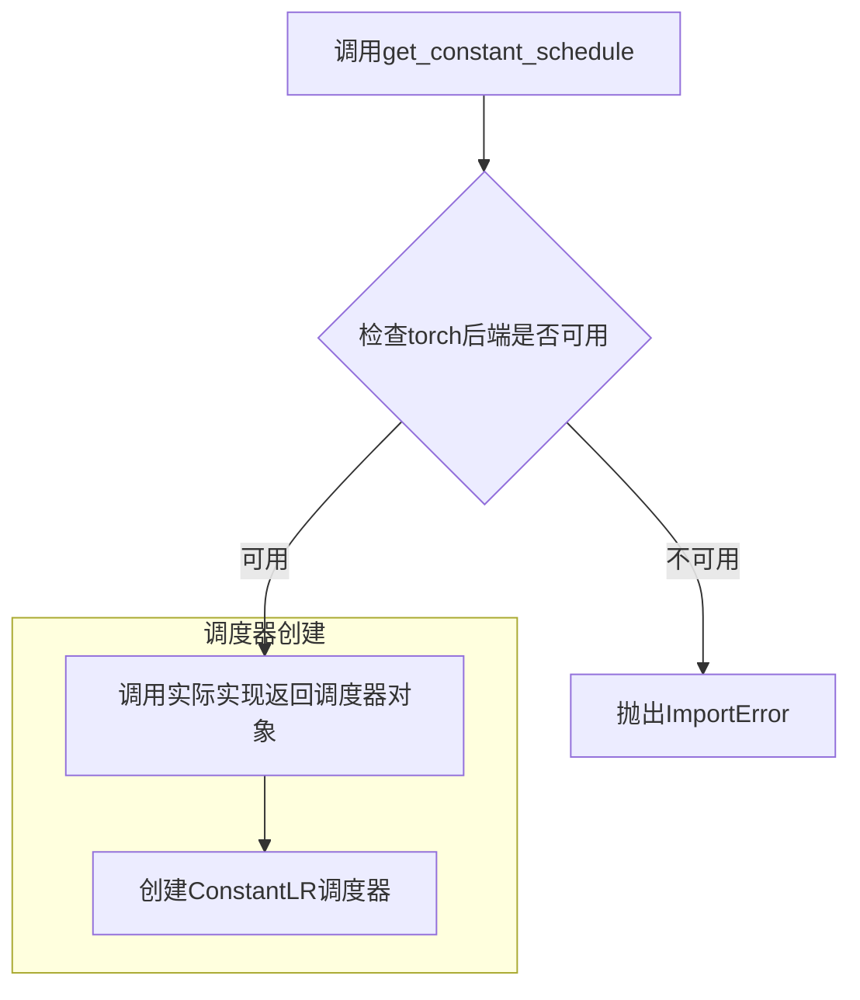
```mermaid
flowchart TD
    A[调用get_constant_schedule] --> B{检查torch后端是否可用}
    B -->|不可用| C[抛出ImportError]
    B -->|可用| D[调用实际实现返回调度器对象]
    
    subgraph "调度器创建"
    D --> E[创建ConstantLR调度器]
    end
```

#### 带注释源码

```python
def get_constant_schedule(*args, **kwargs):
    """
    创建恒定学习率调度器的存根函数。
    
    该函数使用DummyObject模式，确保只有在安装torch后端时
    才能使用完整功能。实际的调度器逻辑在torch后端实现中。
    
    参数:
        *args: 可变位置参数，包含:
            - optimizer: 优化器对象
            - num_training_steps: 训练步数
        **kwargs: 可变关键字参数，包含可选配置:
            - last_epoch: 上一个epoch的索引
    """
    # 检查torch后端是否可用，如果不可用则抛出异常
    requires_backends(get_constant_schedule, ["torch"])
```


### `get_constant_schedule_with_warmup`

该函数是一个调度器（scheduler）创建函数，用于生成带有预热（warmup）阶段的恒定学习率调度器。在训练过程中，学习率会在预热阶段逐渐增加，之后保持恒定。该函数是一个后端存根实现，实际逻辑通过 `requires_backends` 委托给 torch 后端。

参数：

- `*args`：可变位置参数，用于传递位置参数给底层的 torch 调度器创建函数
- `**kwargs`：可变关键字参数，用于传递关键字参数给底层的 torch 调度器创建函数（如 `num_warmup_steps`、`num_training_steps` 等）

返回值：返回值类型取决于底层实现，通常是 `torch.optim.lr_scheduler._LRScheduler` 或类似的调度器对象，用于在训练过程中动态调整学习率

#### 流程图

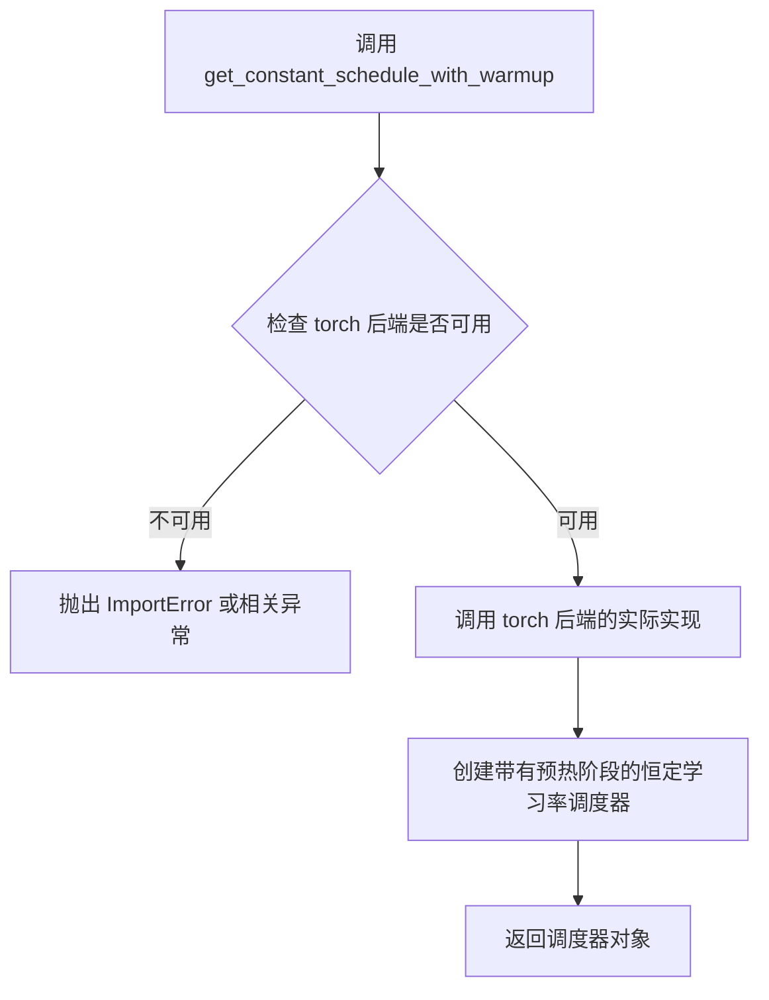
```mermaid
flowchart TD
    A[调用 get_constant_schedule_with_warmup] --> B{检查 torch 后端是否可用}
    B -->|不可用| C[抛出 ImportError 或相关异常]
    B -->|可用| D[调用 torch 后端的实际实现]
    D --> E[创建带有预热阶段的恒定学习率调度器]
    E --> F[返回调度器对象]
```

#### 带注释源码

```python
# 这是一个存根函数，由 `make fix-copies` 命令自动生成，不要手动编辑
from ..utils import DummyObject, requires_backends


def get_constant_schedule_with_warmup(*args, **kwargs):
    """
    创建带有预热阶段的恒定学习率调度器。
    
    该函数是一个后端存根，实际实现位于 torch 后端模块中。
    当调用此函数时，它会检查 torch 后端是否可用，如果可用，
    则将调用委托给实际的 torch 调度器创建函数。
    
    参数:
        *args: 可变位置参数，传递给底层 torch 调度器
        **kwargs: 可变关键字参数，通常包括:
            - num_warmup_steps: 预热步数
            - num_training_steps: 总训练步数
            - 其他调度器特定参数
    
    返回:
        调度器对象，用于在训练过程中管理学习率
    """
    # requires_backends 会检查指定的后端（torch）是否可用
    # 如果不可用，会抛出适当的异常
    requires_backends(get_constant_schedule_with_warmup, ["torch"])
```

#### 备注

该函数是 `diffusers` 库中学习率调度器的一部分。典型的使用方式是：

```python
# 典型调用示例
scheduler = get_constant_schedule_with_warmup(
    optimizer=optimizer,
    num_warmup_steps=1000,
    num_training_steps=10000
)
```

在训练循环中，调度器会：
1. 在前 `num_warmup_steps` 步中，将学习率从 0 线性增加到初始学习率
2. 在剩余的训练步中，保持学习率恒定

这种预热策略有助于训练初期的稳定性，特别是对于大型模型和复杂数据集。


### `get_cosine_schedule_with_warmup`

该函数是一个学习率调度器（Learning Rate Scheduler），用于在训练神经网络时在预热阶段（warmup）后使用余弦衰减（cosine decay）来调整学习率。这是深度学习中常用的学习率调度策略，可以帮助模型更好地收敛。

参数：

- `*args`：可变位置参数，用于传递位置参数
- `**kwargs`：可变关键字参数，用于传递关键字参数

返回值：根据 `requires_backends` 的实现，返回一个学习率调度器对象（通常为 `torch.optim.lr_scheduler._LRScheduler` 或类似类型），但在当前 stub 代码中未直接返回具体对象，而是通过 `requires_backends` 确保后端可用

#### 流程图

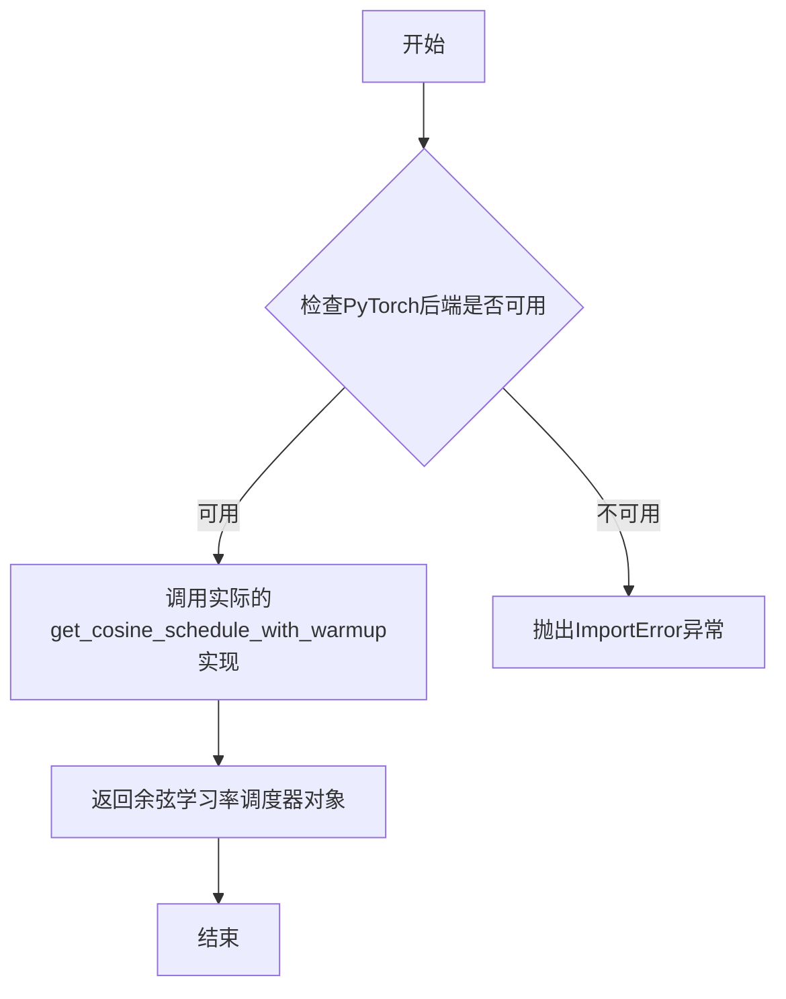
```mermaid
flowchart TD
    A[开始] --> B{检查PyTorch后端是否可用}
    B -->|可用| C[调用实际的get_cosine_schedule_with_warmup实现]
    B -->|不可用| D[抛出ImportError异常]
    C --> E[返回余弦学习率调度器对象]
    E --> F[结束]
```

#### 带注释源码

```python
def get_cosine_schedule_with_warmup(*args, **kwargs):
    """
    创建一个带有预热阶段的余弦学习率调度器。
    
    该调度器在预热阶段（warmup steps）内线性增加学习率，
    之后使用余弦衰减函数逐渐降低学习率至最小值。
    
    参数（根据Diffusers库常见实现）：
    - optimizer: PyTorch优化器
    - num_warmup_steps: 预热步数
    - num_training_steps: 总训练步数
    - num_cycles: 余弦调度器的周期数（可选，默认为0.5）
    - min_lr_ratio: 最小学习率与初始学习率的比率（可选，默认为0.0）
    
    返回:
    - 一个学习率调度器对象，用于在训练过程中更新学习率
    """
    # requires_backends 确保该函数只在 PyTorch 后端可用
    # 如果 PyTorch 不可用，会抛出 ImportError
    requires_backends(get_cosine_schedule_with_warmup, ["torch"])
```

#### 备注

根据 Diffusers 库的实现模式，`get_cosine_schedule_with_warmup` 函数通常具有以下典型参数和功能：

| 参数名称 | 参数类型 | 描述 |
|---------|---------|------|
| optimizer | `torch.optim.Optimizer` | PyTorch优化器实例 |
| num_warmup_steps | `int` | 预热阶段的步数 |
| num_training_steps | `int` | 总训练步数 |
| num_cycles | `float`（可选） | 余弦曲线的周期数，默认为0.5 |
| min_lr_ratio | `float`（可选） | 最小学习率与初始学习率的比率 |

该函数返回一个调度器对象，可在训练循环中调用 `scheduler.step()` 来更新学习率。


### `get_cosine_with_hard_restarts_schedule_with_warmup`

该函数是一个学习率调度器（Learning Rate Scheduler），用于在训练过程中动态调整学习率。它结合了 warmup（预热）阶段和带有硬重启（hard restarts）的余弦退火（cosine annealing）策略，以帮助模型更好地收敛。

参数：

- `optimizer`：`torch.optim.Optimizer`，需要调整学习率的优化器
- `num_warmup_steps`：`int`，预热阶段的步数
- `num_training_steps`：`int`，总训练步数
- `num_cycles`：`float`，余弦曲线的周期数（默认 1.0）
- `last_epoch`：`int`，上一个 epoch 的索引（默认 -1）

返回值：`torch.optim.lr_scheduler._LRScheduler`，返回一个学习率调度器对象

#### 流程图

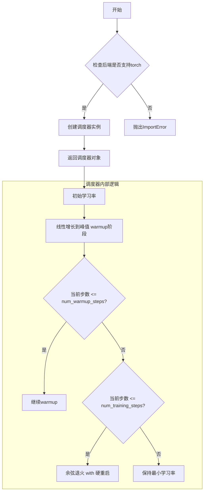
```mermaid
flowchart TD
    A[开始] --> B{检查后端是否支持torch}
    B -->|是| C[创建调度器实例]
    B -->|否| D[抛出ImportError]
    C --> E[返回调度器对象]
    
    subgraph 调度器内部逻辑
    F[初始学习率] --> G[线性增长到峰值 warmup阶段]
    G --> H{当前步数 <= num_warmup_steps?}
    H -->|是| I[继续warmup]
    H -->|否| J{当前步数 <= num_training_steps?}
    J -->|是| K[余弦退火 with 硬重启]
    J -->|否| L[保持最小学习率]
    end
    
    E --> F
```

#### 带注释源码

```
def get_cosine_with_hard_restarts_schedule_with_warmup(
    optimizer: torch.optim.Optimizer,
    num_warmup_steps: int,
    num_training_steps: int,
    num_cycles: float = 1.0,
    last_epoch: int = -1
):
    """
    创建带有硬重启的余弦学习率调度器，带有预热阶段。
    
    参数:
        optimizer: 需要调整学习率的优化器
        num_warmup_steps: 预热阶段的步数
        num_training_steps: 总训练步数
        num_cycles: 余弦曲线的周期数，默认为1.0
        last_epoch: 最后一个epoch的索引，用于恢复训练
    
    返回:
        调度器实例
    
    注意:
        - 该函数是存根函数，实际实现在 torch 依赖库中
        - 该文件由 make fix-copies 自动生成
    """
    # 检查 torch 后端是否可用，如果不可用则抛出 ImportError
    requires_backends(get_cosine_with_hard_restarts_schedule_with_warmup, ["torch"])
```

---

**注意**：该函数是一个存根函数（stub function），实际实现位于 PyTorch 或 Hugging Face Transformers 库中。此文件由 `make fix-copies` 命令自动生成，仅用于导入时检查后端依赖。


### `get_linear_schedule_with_warmup`

这是一个存根函数，用于延迟加载 PyTorch 版本的 `get_linear_schedule_with_warmup` 函数。该函数创建一个线性学习率调度器，并在训练开始前包含预热阶段。

#### 参数

- `*args`：可变位置参数，传递给实际的 PyTorch 实现
- `**kwargs`：可变关键字参数，传递给实际的 PyTorch 实现

#### 返回值

- 返回值类型取决于实际实现，通常是 `torch.optim.lr_scheduler._LRScheduler`
- 返回一个学习率调度器对象，包含预热阶段的线性学习率衰减

#### 流程图

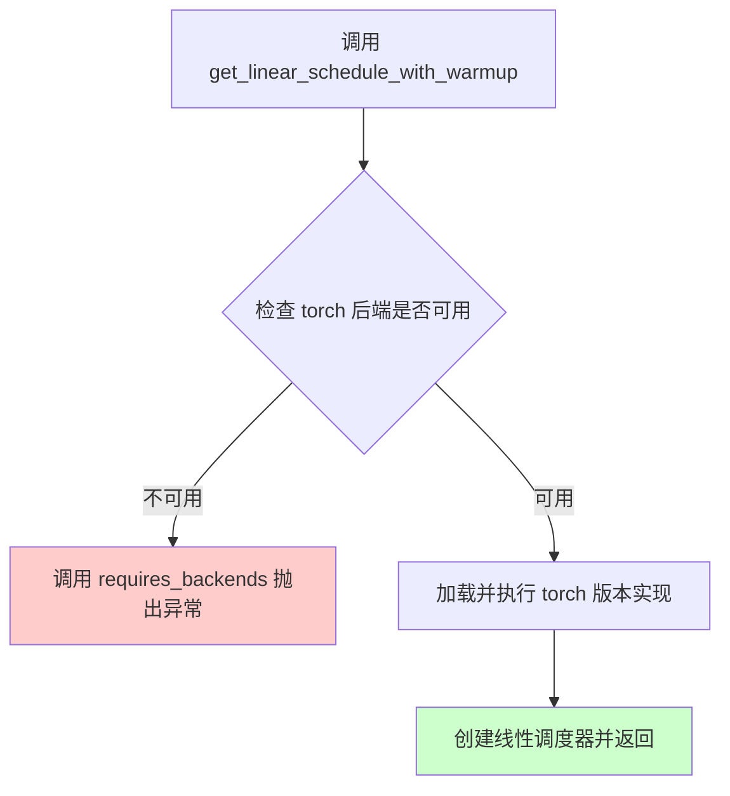
```mermaid
flowchart TD
    A[调用 get_linear_schedule_with_warmup] --> B{检查 torch 后端是否可用}
    B -->|不可用| C[调用 requires_backends 抛出异常]
    B -->|可用| D[加载并执行 torch 版本实现]
    D --> E[创建线性调度器并返回]
    
    style C fill:#ffcccc
    style E fill:#ccffcc
```

#### 带注释源码

```python
def get_linear_schedule_with_warmup(*args, **kwargs):
    """
    线性学习率调度器，带有预热阶段。
    
    这是一个存根函数，实际实现由 torch 后端提供。
    当 torch 不可用时，会抛出 ImportError。
    
    参数:
        *args: 传递给实际实现的位置参数
        **kwargs: 传递给实际实现的关键字参数
    
    返回:
        学习率调度器对象
    """
    # 检查 torch 后端是否可用，如果不可用则抛出异常
    requires_backends(get_linear_schedule_with_warmup, ["torch"])
```

---

**注意**：该函数是一个延迟加载的存根（stub），实际的函数实现在其他模块中。当 PyTorch 后端可用时，会调用真正的实现。该实现通常创建一个线性学习率调度器，在前 N 步（预热步数）内从 0 线性增长到目标学习率，然后在剩余步数内线性衰减到 0。


### `get_polynomial_decay_schedule_with_warmup`

该函数用于生成学习率调度策略，结合多项式衰减（polynomial decay）和预热（warmup）阶段。在训练初期，学习率从零或较低值逐渐增加到峰值，然后在后续训练中按照多项式函数衰减到指定的目标学习率。

参数：

- `*args`：可变位置参数，用于传递底层实现所需的参数
- `**kwargs`：可变关键字参数，用于传递底层实现所需的参数（可能包含 `num_warmup_steps`、`num_training_steps`、`lr_end`、`power`、`init_lr` 等）

返回值：`torch.Tensor`，返回一个学习率调度张量，包含从预热阶段到衰减阶段的所有学习率值

#### 流程图

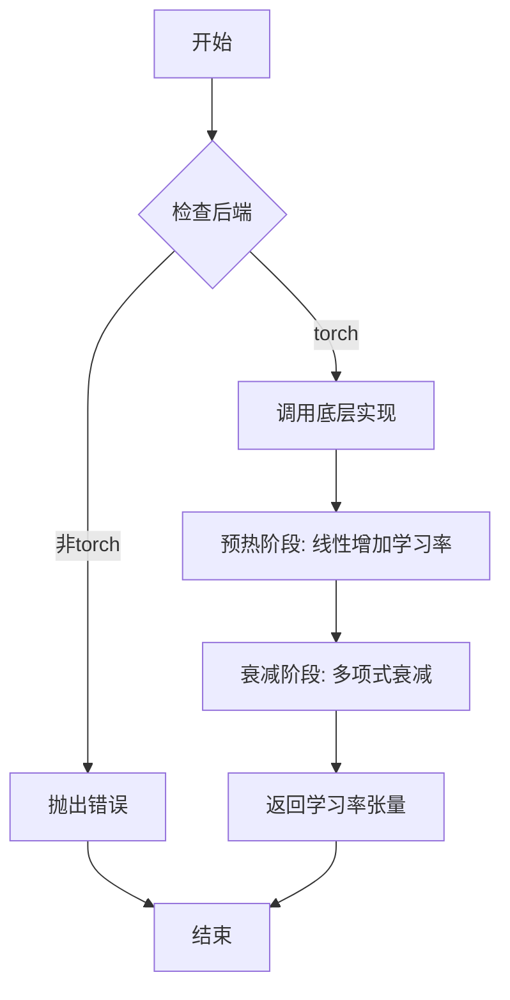
```mermaid
flowchart TD
    A[开始] --> B{检查后端}
    B -->|torch| C[调用底层实现]
    B -->|非torch| D[抛出错误]
    C --> E[预热阶段: 线性增加学习率]
    E --> F[衰减阶段: 多项式衰减]
    F --> G[返回学习率张量]
    D --> H[结束]
    G --> H
```

#### 带注释源码

```python
def get_polynomial_decay_schedule_with_warmup(*args, **kwargs):
    """
    生成多项式衰减学习率调度策略，支持预热阶段。
    
    该函数是一个存根实现，实际逻辑由底层torch后端提供。
    主要功能包括：
    - 预热阶段：学习率从init_lr线性增长到峰值学习率
    - 衰减阶段：学习率从峰值按照多项式函数衰减到lr_end
    """
    # 确保函数只在torch后端可用
    requires_backends(get_polynomial_decay_schedule_with_warmup, ["torch"])
```


### `get_scheduler`

获取调度器实例的工厂函数，根据指定的调度器名称和参数返回对应的调度器对象。

参数：

- `*args`：可变位置参数，用于传递给具体的调度器构造函数（参数名称和类型取决于实际请求的调度器类型）
- `**kwargs`：可变关键字参数，用于传递给具体的调度器构造函数（参数名称和类型取决于实际请求的调度器类型）

返回值：`任意SchedulerMixin子类`，返回根据配置参数实例化的调度器对象

#### 流程图

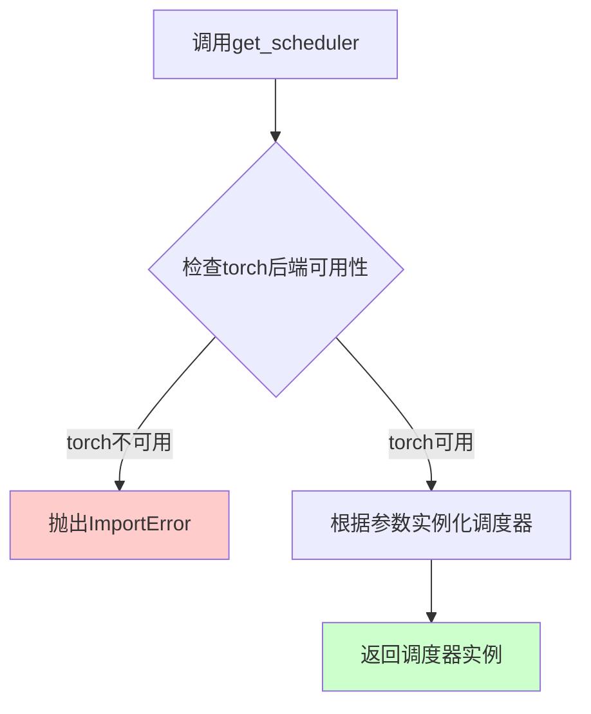
```mermaid
flowchart TD
    A[调用get_scheduler] --> B{检查torch后端可用性}
    B -->|torch不可用| C[抛出ImportError]
    B -->|torch可用| D[根据参数实例化调度器]
    D --> E[返回调度器实例]
    
    style C fill:#ffcccc
    style E fill:#ccffcc
```

#### 带注释源码

```python
def get_scheduler(*args, **kwargs):
    """
    获取调度器实例的工厂函数。
    
    该函数是一个延迟加载的存根函数，实际的调度器实例化逻辑
    封装在requires_backends中。当调用此函数时，会首先检查
    torch后端是否可用，如果不可用则抛出ImportError，如果可用
    则将参数传递给实际的调度器构造函数并返回实例。
    
    Args:
        *args: 可变位置参数，传递给具体调度器构造函数的参数
        **kwargs: 可变关键字参数，传递给具体调度器构造函数的参数
        
    Returns:
        任意SchedulerMixin子类: 根据参数实例化的调度器对象
        
    Raises:
        ImportError: 当torch后端不可用时抛出
    """
    # 检查torch后端是否可用，如不可用则抛出ImportError
    # 如果可用，则调用实际的调度器工厂函数
    requires_backends(get_scheduler, ["torch"])
```


### AdaptiveProjectedGuidance.__init__

该方法是`AdaptiveProjectedGuidance`类的构造函数，用于初始化一个自适应投影引导对象。该方法接受任意位置参数和关键字参数，主要功能是验证PyTorch后端是否可用，如果不可用则抛出ImportError。这是一种延迟加载机制，实际的类实现会在后端可用时从相应的模块中动态加载。

参数：

- `*args`：任意数量的位置参数，用于传递给实际的后端实现（在当前占位符中不直接使用）
- `**kwargs`：任意数量的关键字参数，用于传递给实际的后端实现（在当前占位符中不直接使用）

返回值：无（`None`），构造函数不返回任何值，仅进行后端验证

#### 流程图

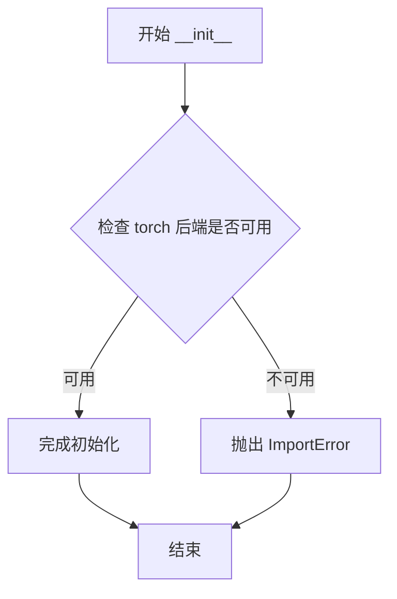
```mermaid
flowchart TD
    A[开始 __init__] --> B{检查 torch 后端是否可用}
    B -->|可用| C[完成初始化]
    B -->|不可用| D[抛出 ImportError]
    C --> E[结束]
    D --> E
```

#### 带注释源码

```python
class AdaptiveProjectedGuidance(metaclass=DummyObject):
    """
    自适应投影引导类（DummyObject 延迟加载占位符）
    实际实现会在后端模块中动态加载
    """
    _backends = ["torch"]  # 声明该类需要 torch 后端支持

    def __init__(self, *args, **kwargs):
        """
        构造函数
        
        参数:
            *args: 可变位置参数，将传递给实际的后端实现
            **kwargs: 可变关键字参数，将传递给实际的后端实现
            
        返回:
            None: 此方法不返回值，仅进行后端验证
        """
        # requires_backends 会检查指定的 torch 后端是否可用
        # 如果不可用，会抛出 ImportError 并提示安装相关依赖
        requires_backends(self, ["torch"])
```


### `AdaptiveProjectedGuidance.from_config`

从配置字典或对象中实例化 `AdaptiveProjectedGuidance` 类的工厂方法。该方法通过调用 `requires_backends` 确保 torch 后端可用。在实际的实现中，此方法可能负责解析配置参数并创建相应的对象实例。

参数：

- `*args`：可变位置参数，传递给实际的实现方法，用于指定实例化所需的配置参数。
- `**kwargs`：可变关键字参数，传递给实际的实现方法，用于指定实例化所需的配置参数。

返回值：未明确指定。在存根实现中，此方法不返回任何值，但实际实现应返回 `AdaptiveProjectedGuidance` 的实例。

#### 流程图

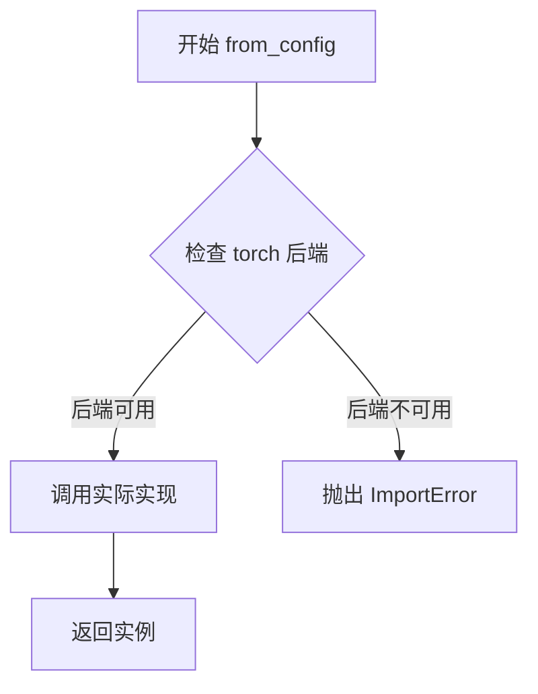
```mermaid
flowchart TD
    A[开始 from_config] --> B{检查 torch 后端}
    B -->|后端可用| C[调用实际实现]
    B -->|后端不可用| D[抛出 ImportError]
    C --> E[返回实例]
```

#### 带注释源码

```python
@classmethod
def from_config(cls, *args, **kwargs):
    """
    从配置中实例化 AdaptiveProjectedGuidance 对象。
    
    参数:
        *args: 可变位置参数，用于传递配置参数。
        **kwargs: 可变关键字参数，用于传递配置参数。
    
    返回:
        AdaptiveProjectedGuidance 的实例（实际实现中）。
    """
    # 检查 torch 后端是否可用，如果不可用则抛出 ImportError
    requires_backends(cls, ["torch"])
    
    # 注意：在实际的实现中，这里会解析 *args 和 **kwargs，
    # 并调用真正的类构造函数来创建实例。
    # 由于这是存根文件，真正的实现位于其他地方。
```

#### 补充说明

1. **设计目标**：此类方法遵循工厂方法模式，允许用户通过配置而非直接调用构造函数来创建对象。
2. **技术债务**：
   - 当前实现仅为存根，缺少实际的参数解析和实例化逻辑。
   - `*args` 和 `**kwargs` 的使用虽然提供了灵活性，但缺乏类型安全和文档完整性。
3. **外部依赖**：依赖于 `requires_backends` 函数来检查 torch 后端是否安装。
4. **错误处理**：如果 torch 后端不可用，`requires_backends` 将抛出适当的异常。


### `AdaptiveProjectedGuidance.from_pretrained`

该方法是 `AdaptiveProjectedGuidance` 类的类方法，用于从预训练模型加载模型实例。由于当前文件是自动生成的存根文件（通过 `make fix-copies` 命令生成），该方法实际实现被延迟到 torch 后端模块中。此处通过调用 `requires_backends` 确保调用该方法时 torch 后端可用。

参数：

- `*args`：可变位置参数，用于传递给后端实现的具体参数（类型取决于后端实现）
- `**kwargs`：可变关键字参数，用于传递给后端实现的具体参数（类型取决于后端实现）

返回值：`None` 或由后端实现返回的模型实例（类型取决于后端实现）

#### 流程图

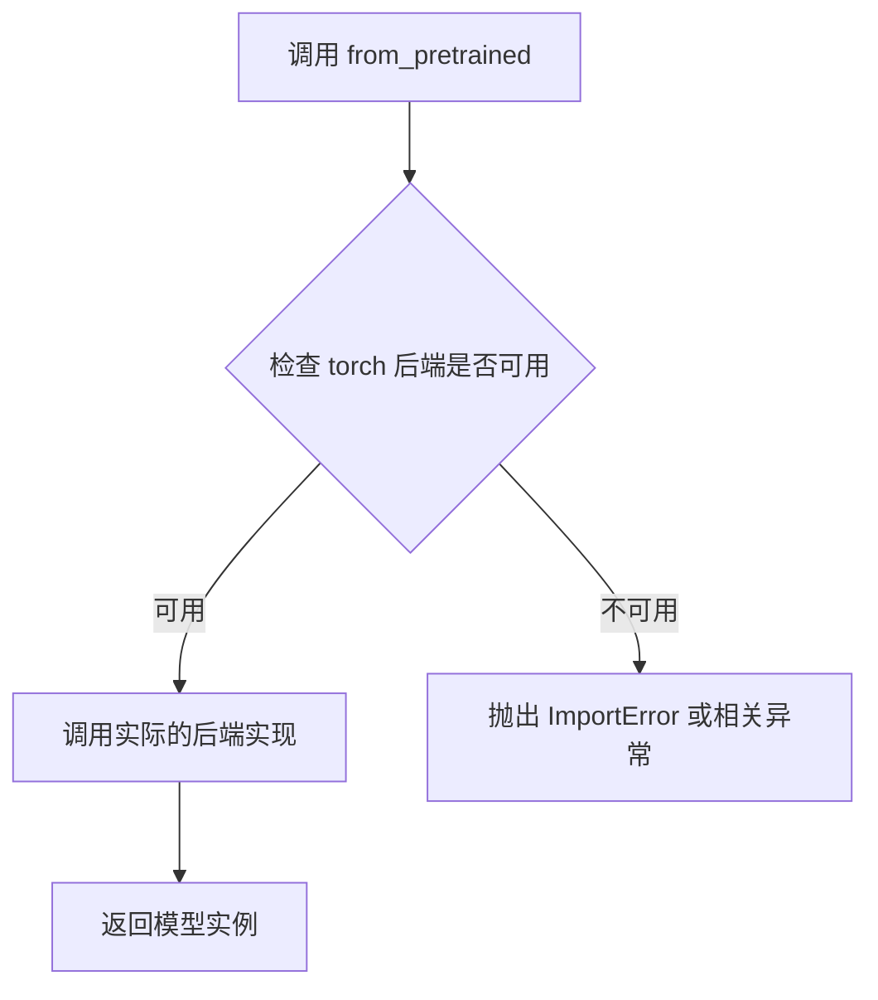
```mermaid
flowchart TD
    A[调用 from_pretrained] --> B{检查 torch 后端是否可用}
    B -->|可用| C[调用实际的后端实现]
    B -->|不可用| D[抛出 ImportError 或相关异常]
    C --> E[返回模型实例]
```

#### 带注释源码

```python
@classmethod
def from_pretrained(cls, *args, **kwargs):
    """
    从预训练模型加载 AdaptiveProjectedGuidance 模型实例。
    
    这是一个类方法，允许用户通过指定预训练模型路径或标识符来加载模型。
    实际实现位于 torch 后端模块中，此处仅进行后端检查。
    
    参数:
        *args: 可变位置参数，传递给后端实现（如模型路径、配置等）
        **kwargs: 可变关键字参数，传递给后端实现（如 cache_dir、torch_dtype 等）
    
    返回:
        由后端实现返回的模型实例，类型取决于具体实现
    """
    # 检查并确保 torch 后端可用，如果不可用则抛出异常
    requires_backends(cls, ["torch"])
```


### AdaptiveProjectedMixGuidance.__init__

这是 `AdaptiveProjectedMixGuidance` 类的构造函数，用于初始化对象。该方法是一个占位符实现，实际功能由 `DummyObject` 元类通过 `requires_backends` 函数在运行时动态注入。

参数：

- `*args`：任意数量的位置参数，用于传递可选的初始化参数
- `**kwargs`：任意数量的关键字参数，用于传递可选的命名参数

返回值：`None`，构造函数不返回任何值，仅初始化对象实例

#### 流程图

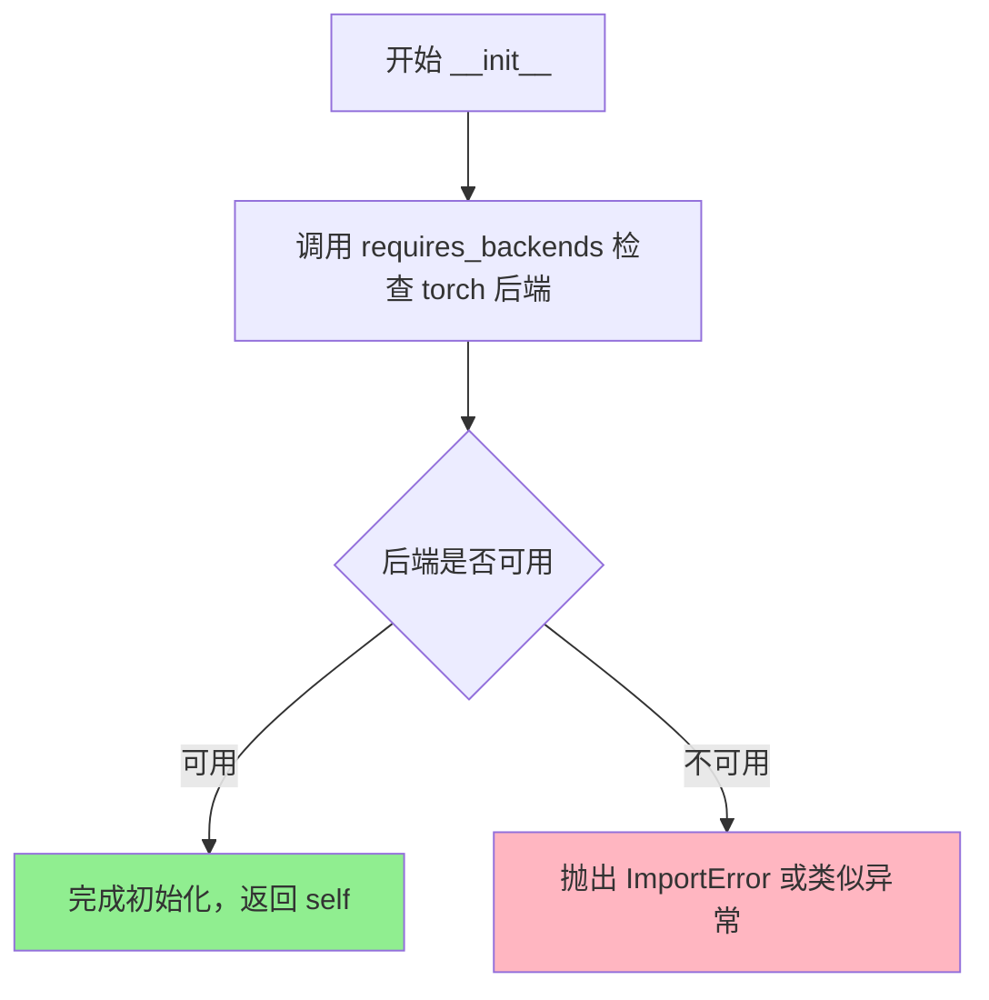
```mermaid
flowchart TD
    A[开始 __init__] --> B[调用 requires_backends 检查 torch 后端]
    B --> C{后端是否可用}
    C -->|可用| D[完成初始化，返回 self]
    C -->|不可用| E[抛出 ImportError 或类似异常]
    
    style D fill:#90EE90
    style E fill:#FFB6C1
```

#### 带注释源码

```python
class AdaptiveProjectedMixGuidance(metaclass=DummyObject):
    """
    自适应投影混合引导类
    这是一个使用 DummyObject 元类创建的占位符类，
    实际功能在后端模块中实现
    """
    
    # 类属性：指定所需的后端为 torch
    _backends = ["torch"]

    def __init__(self, *args, **kwargs):
        """
        构造函数
        
        参数:
            *args: 可变数量的位置参数
            **kwargs: 可变数量的关键字参数
            
        注意:
            该方法的具体功能由 requires_backends 函数决定，
            如果 torch 后端不可用，将抛出导入错误
        """
        # 调用 requires_backends 检查 torch 后端是否可用
        # 如果不可用，此调用会抛出异常阻止对象创建
        requires_backends(self, ["torch"])
```


### `AdaptiveProjectedMixGuidance.from_config`

该方法是 `AdaptiveProjectedMixGuidance` 类的类方法，用于通过配置字典创建类的实例。由于使用了 `DummyObject` 元类，该方法实际上是一个存根实现，真正的实现在对应的后端模块中。调用该方法会首先检查所需的 PyTorch 后端是否可用。

#### 参数

- `*args`：可变位置参数，用于传递位置参数（具体参数由后端实现定义）
- `**kwargs`：可变关键字参数，用于传递配置参数（具体参数由后端实现定义，如 `config` 字典）

#### 返回值

- 无明确返回值（具体返回值类型由后端实现定义，通常返回类的实例）

#### 流程图

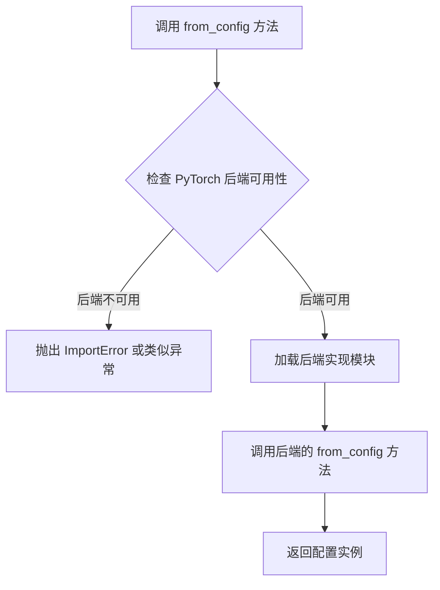
```mermaid
flowchart TD
    A[调用 from_config 方法] --> B{检查 PyTorch 后端可用性}
    B -->|后端不可用| C[抛出 ImportError 或类似异常]
    B -->|后端可用| D[加载后端实现模块]
    D --> E[调用后端的 from_config 方法]
    E --> F[返回配置实例]
```

#### 带注释源码

```python
@classmethod
def from_config(cls, *args, **kwargs):
    """
    类方法：从配置创建 AdaptiveProjectedMixGuidance 实例
    
    该方法是框架预留的接口实现，实际逻辑由后端模块提供。
    当实际使用此类时，会通过 DummyObject 元类的机制动态加载
    真正的实现（通常位于对应的 model_classes 或类似模块中）。
    
    参数:
        *args: 可变位置参数，传递给后端实现
        **kwargs: 可变关键字参数，通常包含 config 字典等配置信息
    
    返回:
        由后端实现定义，通常返回配置好的类实例
    """
    # 调用 requires_backends 检查 torch 后端是否可用
    # 如果不可用，会抛出 ImportError 并提示安装相关依赖
    requires_backends(cls, ["torch"])
```


### `AdaptiveProjectedMixGuidance.from_pretrained`

该方法是 `AdaptiveProjectedMixGuidance` 类的类方法，用于从预训练模型加载 Guidance 模型实例。由于采用 `DummyObject` 元类和 `requires_backends` 机制，该方法在当前文件中仅为存根实现，实际逻辑在安装了 torch 后端的其他模块中实现。

参数：

- `cls`：`<class type>`，隐式参数，表示调用该类方法的类本身
- `*args`：`<tuple>`，可变位置参数，用于传递预训练模型路径或其他位置参数
- `**kwargs`：`<dict>`，可变关键字参数，用于传递配置字典、设备参数等其他配置选项

返回值：`<any>`，返回 `AdaptiveProjectedMixGuidance` 的实例，具体类型取决于后端实现

#### 流程图

```mermaid
flowchart TD
    A[调用 from_pretrained 方法] --> B{检查 torch 后端是否可用}
    B -->|不可用| C[抛出 ImportError 或延迟导入]
    B -->|可用| D[调用实际后端实现]
    D --> E[加载预训练模型权重]
    E --> F[返回 AdaptiveProjectedMixGuidance 实例]
```

#### 带注释源码

```python
@classmethod
def from_pretrained(cls, *args, **kwargs):
    """
    从预训练模型加载 AdaptiveProjectedMixGuidance 实例。
    
    Args:
        *args: 可变位置参数，通常包括模型路径或模型名称
        **kwargs: 可变关键字参数，包括配置选项如 device, torch_dtype 等
    
    Returns:
        AdaptiveProjectedMixGuidance: 加载了预训练权重的 Guidance 模型实例
    
    Note:
        该方法使用 requires_backends 确保 torch 后端已安装。
        实际实现由后端模块提供，此处为存根。
    """
    # 调用 requires_backends 检查 torch 后端是否可用
    # 如果不可用，会抛出相应的导入错误
    requires_backends(cls, ["torch"])
```


### `AllegroTransformer3DModel.__init__`

AllegroTransformer3DModel 类的初始化方法，用于创建该模型实例，但实际实现会延迟到 PyTorch 后端可用时。

参数：

- `*args`：可变位置参数，用于传递初始化所需的位置参数
- `**kwargs`：可变关键字参数，用于传递初始化所需的关键字参数

返回值：`None`，该方法为构造函数，不返回任何值

#### 流程图

```mermaid
flowchart TD
    A[开始 __init__] --> B{检查 PyTorch 后端是否可用}
    B -->|可用| C[执行实际初始化逻辑]
    B -->|不可用| D[通过 requires_backends 抛出 ImportError]
    C --> E[结束]
    D --> E
```

#### 带注释源码

```python
class AllegroTransformer3DModel(metaclass=DummyObject):
    """
    Allegro 3D Transformer 模型类。
    这是一个使用 DummyObject 元类创建的延迟加载类，
    实际实现会在导入 torch 后端时动态加载。
    """
    
    # 指定该类需要 torch 后端支持
    _backends = ["torch"]

    def __init__(self, *args, **kwargs):
        """
        初始化 AllegroTransformer3DModel 实例。
        
        注意：由于使用了 DummyObject 元类，此方法不会立即执行真正的初始化。
        它会检查所需的 torch 后端是否可用，如果不可用则抛出导入错误。
        
        参数:
            *args: 可变位置参数，传递给实际模型初始化
            **kwargs: 可变关键字参数，传递给实际模型初始化
        """
        # requires_backends 会检查 torch 是否已安装且可用
        # 如果 torch 不可用，会抛出 ImportError 并提示安装
        requires_backends(self, ["torch"])

    @classmethod
    def from_config(cls, *args, **kwargs):
        """从配置创建模型实例"""
        requires_backends(cls, ["torch"])

    @classmethod
    def from_pretrained(cls, *args, **kwargs):
        """从预训练权重加载模型"""
        requires_backends(cls, ["torch"])
```


### `AllegroTransformer3DModel.from_config`

该方法是 `AllegroTransformer3DModel` 类的类方法，用于通过配置创建模型实例。它是一个延迟加载的占位符方法，实际实现由后端提供，当前实现仅检查 PyTorch 后端是否可用。

参数：

- `*args`：可变位置参数，用于传递配置参数（类型和数量取决于实际后端实现）
- `**kwargs`：可变关键字参数，用于传递配置字典或其他可选参数（类型和数量取决于实际后端实现）

返回值：无明确返回值（实际返回类型由后端实现决定，可能是模型实例或 None）

#### 流程图

```mermaid
flowchart TD
    A[调用 from_config] --> B{检查 cls 是否为类}
    B -->|是| C[调用 requires_backends]
    C --> D{torch 后端是否可用?}
    D -->|是| E[返回占位符/触发后端加载]
    D -->|否| F[抛出 ImportError]
    B -->|否| G[抛出 TypeError]
    
    style E fill:#e1f5fe
    style F fill:#ffebee
    style G fill:#fff3e0
```

#### 带注释源码

```python
@classmethod
def from_config(cls, *args, **kwargs):
    """
    从配置创建 AllegroTransformer3DModel 模型实例。
    
    这是一个类方法（classmethod），允许不实例化类而直接调用。
    使用 DummyObject 模式实现延迟加载，实际实现由后端提供。
    
    参数:
        *args: 可变位置参数，用于传递配置参数
               实际参数取决于后端实现，可能包括 config 字典等
        **kwargs: 可变关键字参数，用于传递配置选项
                  实际参数取决于后端实现，可能包括 trust_remote_code 等
    
    返回:
        实际返回值由后端实现决定，通常返回模型实例
        当前实现仅检查后端可用性，不返回具体值
    
    注意:
        此方法是自动生成的占位符（通过 make fix-copies 命令）
        实际功能实现隐藏在 requires_backends 触发的延迟加载中
    """
    # 调用 requires_backends 检查 torch 后端是否可用
    # 如果不可用，将抛出 ImportError 并提示安装 torch
    requires_backends(cls, ["torch"])
```


### `AllegroTransformer3DModel.from_pretrained`

该方法是一个类方法，用于从预训练模型加载 AllegroTransformer3DModel 实例。由于该类采用 `DummyObject` 元类实现，实际的模型加载逻辑依赖于 `torch` 后端的真正实现，当前仅作为占位符，通过 `requires_backends` 进行后端依赖检查。

参数：

- `*args`：可变位置参数，用于传递预训练模型路径或其他位置参数
- `**kwargs`：可变关键字参数，用于传递配置选项、设备选择等命名参数

返回值：`Any`（实际返回类型取决于 torch 后端的真正实现，通常为 `AllegroTransformer3DModel` 实例）

#### 流程图

```mermaid
flowchart TD
    A[调用 from_pretrained] --> B{检查 torch 后端是否可用}
    B -->|可用| C[加载实际实现]
    B -->|不可用| D[抛出 ImportError]
    C --> E[返回模型实例]
    D --> F[提示安装 torch]
    
    style C fill:#e1f5fe
    style D fill:#ffcdd2
    style E fill:#c8e6c9
    style F fill:#ffcdd2
```

#### 带注释源码

```python
@classmethod
def from_pretrained(cls, *args, **kwargs):
    """
    从预训练模型加载 AllegroTransformer3DModel 实例。
    
    该方法是类方法，通过 cls 调用。
    由于类使用 DummyObject 元类，实际逻辑在后端实现中。
    
    参数:
        *args: 可变位置参数，通常传入模型路径或模型名称
        **kwargs: 可变关键字参数，可传入如下常见参数：
            - pretrained_model_name_or_path: 预训练模型名称或路径
            - cache_dir: 模型缓存目录
            - torch_dtype: 数据类型（如 torch.float16）
            - device_map: 设备映射策略
            - trust_remote_code: 是否信任远程代码
    
    返回:
        加载后的 AllegroTransformer3DModel 模型实例
    
    异常:
        ImportError: 当 torch 后端不可用时抛出
    """
    # requires_backends 会检查 torch 后端是否可用
    # 若不可用则抛出提示安装 torch 的 ImportError
    requires_backends(cls, ["torch"])
```


### AsymmetricAutoencoderKL.__init__

该方法是 `AsymmetricAutoencoderKL` 类的构造函数，采用延迟加载机制（Dummy Object 模式），通过调用 `requires_backends` 验证 PyTorch 后端是否可用，确保在实际使用该类时才会导入真正的实现模块。

参数：

- `*args`：可变位置参数，用于接收任意数量的位置参数（传递给后端实现）
- `**kwargs`：可变关键字参数，用于接收任意数量的关键字参数（传递给后端实现）

返回值：`None`，该方法无返回值，仅执行后端验证

#### 流程图

```mermaid
flowchart TD
    A[开始 __init__] --> B{检查 PyTorch 后端}
    B -->|后端可用| C[初始化完成]
    B -->|后端不可用| D[抛出 ImportError]
    
    style A fill:#f9f,color:#333
    style C fill:#9f9,color:#333
    style D fill:#f99,color:#333
```

#### 带注释源码

```python
class AsymmetricAutoencoderKL(metaclass=DummyObject):
    """
    Asymmetric Autoencoder KL 模型类。
    这是一个哑元（Dummy）类，用于延迟导入和后端验证。
    实际的模型实现在安装对应后端模块后才会被加载。
    """
    
    # 类属性：指定该类需要的后端依赖
    _backends = ["torch"]

    def __init__(self, *args, **kwargs):
        """
        构造函数，验证 PyTorch 后端是否可用。
        
        参数:
            *args: 可变位置参数，传递给实际的后端实现
            **kwargs: 可变关键字参数，传递给实际的后端实现
        """
        # 调用 requires_backends 进行后端验证
        # 如果 torch 后端不可用，此处会抛出 ImportError
        requires_backends(self, ["torch"])
```


### `AsymmetricAutoencoderKL.from_config`

用于从配置创建 AsymmetricAutoencoderKL 模型的类方法。该方法是延迟加载的存根实现，实际逻辑在安装 torch 后端后可用，当前仅检查 torch 依赖是否可用。

参数：

- `cls`：类方法隐式参数，表示调用该方法的类本身
- `*args`：可变位置参数，用于传递配置字典或其他位置参数
- `**kwargs`：可变关键字参数，用于传递配置字典或其他关键字参数

返回值：`None`，该存根方法仅进行后端检查，不返回实际对象

#### 流程图

```mermaid
flowchart TD
    A[开始 from_config] --> B{检查 torch 后端}
    B -->|torch 可用| C[调用实际实现]
    B -->|torch 不可用| D[抛出 ImportError]
    C --> E[返回模型实例或配置]
    
    style A fill:#f9f,color:#333
    style C fill:#9f9,color:#333
    style D fill:#f99,color:#333
```

#### 带注释源码

```python
@classmethod
def from_config(cls, *args, **kwargs):
    """
    从配置字典创建 AsymmetricAutoencoderKL 模型实例的类方法。
    
    该方法是延迟加载的存根实现：
    - 使用 DummyObject 元类生成
    - 通过 requires_backends 确保 torch 后端可用
    - 实际实现在安装 torch 依赖后从其他模块导入
    
    参数:
        cls: 调用该方法的类本身
        *args: 可变位置参数，通常传递 config 字典
        **kwargs: 可变关键字参数，通常传递 additional kwargs
    
    返回:
        None (存根实现，实际返回由后端模块提供)
    """
    # 检查并要求 torch 后端可用
    # 如果 torch 未安装，将抛出 ImportError 并提示安装
    requires_backends(cls, ["torch"])
```


### `AsymmetricAutoencoderKL.from_pretrained`

该方法是一个类方法，用于从预训练模型加载 `AsymmetricAutoencoderKL` 模型实例。在当前实现中，它通过 `requires_backends` 检查必要的依赖后，委托给实际的后端实现。

参数：

-  `cls`：类型 `class`，表示类本身（Python 类方法隐式参数）
-  `*args`：类型 `tuple`，可变位置参数，用于传递预训练模型路径或其他配置参数
-  `**kwargs`：类型 `dict`，可变关键字参数，用于传递额外的配置选项（如 `torch_dtype`、`device_map` 等）

返回值：`Any`，具体返回值取决于实际后端实现，通常返回 `AsymmetricAutoencoderKL` 模型实例

#### 流程图

```mermaid
flowchart TD
    A[调用 AsymmetricAutoencoderKL.from_pretrained] --> B{检查 torch 后端是否可用}
    B -->|不可用| C[抛出 ImportError]
    B -->|可用| D[调用实际后端实现]
    D --> E[返回模型实例]
```

#### 带注释源码

```python
class AsymmetricAutoencoderKL(metaclass=DummyObject):
    """
    非对称自编码器 KL 模型类
    
    这是一个使用 DummyObject 元类定义的存根类，
    实际的模型实现在对应的后端模块中。
    """
    
    # 定义该类需要的后端依赖
    _backends = ["torch"]

    def __init__(self, *args, **kwargs):
        """
        初始化方法
        
        参数:
            *args: 可变位置参数
            **kwargs: 可变关键字参数
        """
        # 检查 torch 后端是否可用，如果不可用则抛出 ImportError
        requires_backends(self, ["torch"])

    @classmethod
    def from_config(cls, *args, **kwargs):
        """
        从配置创建模型实例的类方法
        
        参数:
            *args: 可变位置参数
            **kwargs: 可变关键字参数
            
        返回:
            None: 实际实现由后端提供
        """
        # 检查 torch 后端是否可用
        requires_backends(cls, ["torch"])

    @classmethod
    def from_pretrained(cls, *args, **kwargs):
        """
        从预训练模型加载模型实例的类方法
        
        这是用户常用的模型加载入口，
        内部会检查必要的依赖，然后委托给实际的后端实现。
        
        参数:
            cls: 类本身（类方法隐式参数）
            *args: 可变位置参数，通常包括模型路径或模型名称
            **kwargs: 可变关键字参数，可能包括:
                - torch_dtype: 指定张量数据类型
                - device_map: 设备映射策略
                - local_files_only: 是否只使用本地文件
                - etc.
        
        返回:
            Any: 返回加载后的模型实例，类型为 AsymmetricAutoencoderKL
        """
        # 检查 torch 后端是否可用
        # 如果 torch 不可用，会抛出 ImportError 并提示安装
        requires_backends(cls, ["torch"])
        
        # 注意：实际的模型加载逻辑在其他地方实现
        # 这里是存根实现，仅做后端检查
```


### `AudioPipelineOutput.__init__`

该方法是 `AudioPipelineOutput` 类的初始化方法，用于创建音频管道的输出对象。由于使用了 `DummyObject` 元类，该方法在调用时会检查必要的 PyTorch 后端是否可用。

参数：

- `self`：对象实例本身，当前 `AudioPipelineOutput` 的实例
- `*args`：可变位置参数，用于传递任意数量的位置参数（具体参数由实际实现决定）
- `**kwargs`：可变关键字参数，用于传递任意数量的关键字参数（具体参数由实际实现决定）

返回值：`None`，`__init__` 方法不返回任何值，仅初始化对象状态

#### 流程图

```mermaid
flowchart TD
    A[开始 __init__] --> B{检查 PyTorch 后端是否可用}
    B -->|可用| C[完成对象初始化]
    B -->|不可用| D[抛出 ImportError 或相关异常]
    C --> E[返回 self]
    D --> F[结束]
```

#### 带注释源码

```python
class AudioPipelineOutput(metaclass=DummyObject):
    """
    音频管道输出类，用于封装音频生成或处理管道的输出结果。
    该类使用 DummyObject 元类，在实际使用时需要导入 torch 后端。
    """
    
    # 指定该类需要的后端为 torch
    _backends = ["torch"]

    def __init__(self, *args, **kwargs):
        """
        初始化 AudioPipelineOutput 对象。
        
        参数:
            *args: 可变位置参数，用于传递音频数据或其他参数
            **kwargs: 可变关键字参数，用于传递命名参数如 sample_rate, waveform 等
        
        注意:
            由于使用了 requires_backends 检查，如果 torch 未安装将抛出异常
        """
        # 检查必要的依赖后端是否可用，若不可用则抛出 ImportError
        requires_backends(self, ["torch"])

    @classmethod
    def from_config(cls, *args, **kwargs):
        """
        从配置创建 AudioPipelineOutput 实例的类方法。
        """
        requires_backends(cls, ["torch"])

    @classmethod
    def from_pretrained(cls, *args, **kwargs):
        """
        从预训练模型加载 AudioPipelineOutput 实例的类方法。
        """
        requires_backends(cls, ["torch"])
```


### `AudioPipelineOutput.from_config`

用于从配置字典中实例化 `AudioPipelineOutput` 对象的类方法，通过 `DummyObject` 元类和 `requires_backends` 实现延迟加载和后端依赖检查。

参数：

- `*args`：可变位置参数，用于传递任意数量的位置参数
- `**kwargs`：可变关键字参数，用于传递任意数量的关键字参数

返回值：`None` 或抛出 `ImportError`，因为该方法是DummyObject的占位实现，实际逻辑在torch后端模块中

#### 流程图

```mermaid
flowchart TD
    A[调用 AudioPipelineOutput.from_config] --> B{检查 torch 后端是否可用}
    B -->|可用| C[加载实际的 from_config 实现]
    B -->|不可用| D[抛出 ImportError]
    C --> E[返回 AudioPipelineOutput 实例]
```

#### 带注释源码

```python
class AudioPipelineOutput(metaclass=DummyObject):
    """
    音频管道输出数据类，使用 DummyObject 元类实现延迟加载。
    该类在实际使用时才会导入 torch 后端的实现。
    """
    
    # 指定该类需要 torch 后端支持
    _backends = ["torch"]

    def __init__(self, *args, **kwargs):
        """
        初始化方法，检查 torch 后端是否可用。
        
        参数：
            *args: 可变位置参数
            **kwargs: 可变关键字参数
        """
        # 检查后端可用性，若不可用则抛出 ImportError
        requires_backends(self, ["torch"])

    @classmethod
    def from_config(cls, *args, **kwargs):
        """
        从配置字典创建 AudioPipelineOutput 实例的类方法。
        
        参数：
            *args: 可变位置参数，用于传递配置参数
            **kwargs: 可变关键字参数，用于传递命名配置参数
        
        返回：
            无直接返回值（实际逻辑在 torch 后端实现中）
        """
        # 检查 cls 是否有 torch 后端支持，若无则抛出 ImportError
        requires_backends(cls, ["torch"])

    @classmethod
    def from_pretrained(cls, *args, **kwargs):
        """
        从预训练模型加载 AudioPipelineOutput 实例的类方法。
        
        参数：
            *args: 可变位置参数
            **kwargs: 可变关键字参数
        
        返回：
            无直接返回值（实际逻辑在 torch 后端实现中）
        """
        # 检查 cls 是否有 torch 后端支持
        requires_backends(cls, ["torch"])
```


### `AudioPipelineOutput.from_pretrained`

该方法是 `AudioPipelineOutput` 类的类方法，用于从预训练的模型或检查点加载音频管道输出实例。由于代码中使用 `DummyObject` 元类和 `requires_backends` 进行延迟加载检查，实际的实现逻辑在 torch 后端模块中，当前文件仅为存根定义。

参数：

-  `cls`：隐式参数，`AudioPipelineOutput` 类本身
-  `*args`：可变位置参数，用于传递从预训练模型加载时的位置参数（如模型路径、配置等）
-  `**kwargs`：可变关键字参数，用于传递从预训练模型加载时的关键字参数（如 `cache_dir`、`torch_dtype` 等）

返回值：未知（存根实现，实际返回值由 torch 后端模块决定，推断为 `AudioPipelineOutput` 实例）

#### 流程图

```mermaid
flowchart TD
    A[调用 AudioPipelineOutput.from_pretrained] --> B{检查 torch 后端是否可用}
    B -->|可用| C[加载预训练模型/检查点]
    B -->|不可用| D[抛出 ImportError 异常]
    C --> E[返回 AudioPipelineOutput 实例]
```

#### 带注释源码

```python
class AudioPipelineOutput(metaclass=DummyObject):
    """
    音频管道输出类，使用 DummyObject 元类实现延迟后端加载。
    该类为存根定义，实际实现位于 torch 后端模块中。
    """
    _backends = ["torch"]  # 声明所需的后端为 torch

    def __init__(self, *args, **kwargs):
        # 初始化时检查 torch 后端是否可用
        requires_backends(self, ["torch"])

    @classmethod
    def from_config(cls, *args, **kwargs):
        """
        从配置对象创建 AudioPipelineOutput 实例。
        """
        # 检查 cls 是否有 torch 后端支持
        requires_backends(cls, ["torch"])

    @classmethod
    def from_pretrained(cls, *args, **kwargs):
        """
        从预训练模型或检查点加载 AudioPipelineOutput 实例。
        
        参数:
            *args: 可变位置参数，传递给底层模型加载逻辑
            **kwargs: 可变关键字参数，如模型路径、配置选项等
        """
        # 核心逻辑：确保类具有 torch 后端支持
        # 如果 torch 未安装，将抛出 ImportError
        requires_backends(cls, ["torch"])
```


### `AutoGuidance.__init__`

这是`AutoGuidance`类的构造函数，用于初始化一个引导（Guidance）对象的实例。该方法接受任意位置参数和关键字参数，并通过`requires_backends`函数确保在调用时torch后端可用。如果torch后端不可用，将抛出ImportError。

参数：

- `*args`：可变位置参数，传递给父类或实际实现的参数（类型取决于具体调用）
- `**kwargs`：可变关键字参数，传递配置参数给实际实现（类型取决于具体调用）

返回值：无（`None`），构造函数不返回值

#### 流程图

```mermaid
flowchart TD
    A[开始 __init__] --> B{检查 torch 后端是否可用}
    B -->|可用| C[初始化对象]
    B -->|不可用| D[抛出 ImportError]
    C --> E[结束]
    D --> E
```

#### 带注释源码

```python
class AutoGuidance(metaclass=DummyObject):
    """
    自动引导类，用于根据配置创建不同类型的引导对象。
    这是一个占位符类，实际实现在 torch 后端加载后可用。
    """
    
    # 类属性：指定该类需要 torch 后端
    _backends = ["torch"]

    def __init__(self, *args, **kwargs):
        """
        初始化 AutoGuidance 实例。
        
        参数:
            *args: 可变位置参数，将传递给实际实现
            **kwargs: 可变关键字参数，将传递给实际实现
        """
        # 检查 torch 后端是否可用，如果不可用则抛出 ImportError
        # 这是懒加载模式的一部分，确保在实际使用时才加载依赖
        requires_backends(self, ["torch"])
```


### `AutoGuidance.from_config`

这是一个类方法（Class Method），通过 `DummyObject` 元类实现，用于从配置对象实例化 `AutoGuidance` 类的实例。该方法是延迟加载模式的一部分，确保实际实现（torch 后端）在调用时才被加载。

参数：

- `cls`：隐式参数，类型为 `type`，表示调用该方法的类本身
- `*args`：可变位置参数，类型为 `Tuple[Any, ...]`，用于传递可选的位置参数（如配置字典）
- `**kwargs`：可变关键字参数，类型为 `Dict[str, Any]`，用于传递可选的关键字参数（如模型路径、配置选项）

返回值：`Any` 或 `None`，返回由实际后端实现的 `AutoGuidance` 实例；若后端不可用则抛出 `ImportError`

#### 流程图

```mermaid
flowchart TD
    A[调用 AutoGuidance.from_config] --> B{检查 torch 后端是否可用}
    B -->|可用| C[加载实际实现]
    B -->|不可用| D[抛出 ImportError]
    C --> E[返回实例]
```

#### 带注释源码

```python
@classmethod
def from_config(cls, *args, **kwargs):
    """
    从配置创建 AutoGuidance 实例的类方法。
    
    Args:
        cls: 隐式类参数，表示调用此方法的类
        *args: 可变位置参数，用于传递配置对象
        **kwargs: 可变关键字参数，用于传递配置选项
    
    Returns:
        返回实际后端实现的 AutoGuidance 实例
    
    Note:
        该方法是 DummyObject 元类的一部分，仅作为后端验证的占位符。
        实际实现由 requires_backends 函数通过延迟加载机制注入。
    """
    requires_backends(cls, ["torch"])
```


### `AutoGuidance.from_pretrained`

该方法是`AutoGuidance`类的类方法，用于从预训练模型加载 Guidance（引导）模型。由于该文件为自动生成的存根（stub）文件，实际的模型加载逻辑通过 `DummyObject` 元类和 `requires_backends` 函数延迟加载到 torch 后端实现。

参数：

- `*args`：可变位置参数，用于传递模型路径、配置等位置参数
- `**kwargs`：可变关键字参数，用于传递 `pretrained_model_name_or_path`、`cache_dir`、`torch_dtype` 等关键字参数

返回值：返回加载后的 Guidance 模型实例（类型由实际后端实现决定），通常为 `Guidance` 类的子类实例

#### 流程图

```mermaid
flowchart TD
    A[调用 AutoGuidance.from_pretrained] --> B{检查 torch 后端}
    B -->|后端可用| C[加载实际实现模块]
    B -->|后端不可用| D[抛出 ImportError]
    C --> E[实例化 Guidance 模型]
    E --> F[返回模型实例]
```

#### 带注释源码

```python
class AutoGuidance(metaclass=DummyObject):
    """自动 Guidance 模型加载器类"""
    _backends = ["torch"]  # 该类需要 torch 后端支持

    def __init__(self, *args, **kwargs):
        # 初始化方法，同样需要 torch 后端
        requires_backends(self, ["torch"])

    @classmethod
    def from_config(cls, *args, **kwargs):
        """从配置加载模型的类方法"""
        # 检查 torch 后端可用性
        requires_backends(cls, ["torch"])

    @classmethod
    def from_pretrained(cls, *args, **kwargs):
        """
        从预训练模型加载 Guidance 模型的类方法
        
        参数:
            *args: 可变位置参数，通常包括模型路径或模型名称
            **kwargs: 可变关键字参数，支持以下常用参数:
                - pretrained_model_name_or_path: 预训练模型名称或路径
                - cache_dir: 模型缓存目录
                - torch_dtype: 模型数据类型（float32/float16/bfloat16）
                - device_map: 设备映射策略
                - use_safetensors: 是否使用 safetensors 格式
                - revision: 模型版本
                - proxy: 代理服务器地址
        
        返回:
            加载后的 Guidance 模型实例
        
        注意:
            该方法为存根实现，实际逻辑通过 requires_backends 
            延迟加载到实际的 torch 后端模块中
        """
        # 检查 torch 后端是否可用，若不可用则抛出 ImportError
        requires_backends(cls, ["torch"])
```


### `AutoModel.__init__`

这是 `AutoModel` 类的构造函数，用于初始化一个通用的自动模型对象。该方法使用 `DummyObject` 元类实现，并强制要求 PyTorch 后端。当用户尝试直接实例化此类时，会通过 `requires_backends` 函数检查所需的依赖是否已安装，如果缺少 PyTorch 库则抛出 ImportError 异常。

参数：

- `*args`：可变长度位置参数，用于接收任意数量的位置参数（参数类型：任意，传递给底层模型初始化器的位置参数）
- `**kwargs`：可变长度关键字参数，用于接收任意数量的关键字参数（参数类型：字典，传递给底层模型初始化器的关键字参数）

返回值：`None`，该方法不返回任何值，仅执行后端检查

#### 流程图

```mermaid
flowchart TD
    A[开始 __init__] --> B{检查 PyTorch 后端是否可用}
    B -->|可用| C[正常返回]
    B -->|不可用| D[抛出 ImportError 异常]
    
    style A fill:#f9f,color:#333
    style B fill:#ff9,color:#333
    style C fill:#9f9,color:#333
    style D fill:#f99,color:#333
```

#### 带注释源码

```python
class AutoModel(metaclass=DummyObject):
    """
    AutoModel 类是一个通用的自动模型类，
    用于根据配置自动加载相应的模型实现。
    该类使用 DummyObject 元类实现延迟加载，
    实际模型类在安装对应依赖后动态加载。
    """
    
    # 类属性：指定该类需要的后端为 PyTorch
    _backends = ["torch"]

    def __init__(self, *args, **kwargs):
        """
        AutoModel 类的构造函数。
        
        参数:
            *args: 可变长度位置参数列表
            **kwargs: 可变长度关键字参数字典
        
        注意:
            该方法实际上不会执行任何初始化逻辑，
            因为 AutoModel 是一个 DummyObject。
            真正的初始化逻辑在安装 torch 后加载的实际模型类中。
        """
        # requires_backends 是一个工具函数，用于检查所需的依赖是否已安装
        # 如果 PyTorch 未安装，这里会抛出 ImportError 异常
        # 提示用户需要安装 torch 才能使用该类
        requires_backends(self, ["torch"])

    @classmethod
    def from_config(cls, *args, **kwargs):
        """
        从配置字典创建模型实例的类方法。
        
        参数:
            *args: 位置参数
            **kwargs: 关键字参数，包含 config 字典等
        
        注意:
            同样需要检查 torch 后端是否可用
        """
        requires_backends(cls, ["torch"])

    @classmethod
    def from_pretrained(cls, *args, **kwargs):
        """
        从预训练模型创建模型实例的类方法。
        
        参数:
            *args: 位置参数，包含模型名称或路径
            **kwargs: 关键字参数，包含模型配置选项
        
        注意:
            同样需要检查 torch 后端是否可用
        """
        requires_backends(cls, ["torch"])
```


### `AutoModel.from_config`

用于从配置对象实例化模型元的类方法。该方法通过调用 `requires_backends` 确保 torch 后端可用，作为延迟加载机制的一部分，当实际使用模型时才导入真正的实现。

参数：

-  `cls`：类型 - 类对象，表示调用此方法的类本身
-  `*args`：类型 - 可变位置参数，传递给底层模型构造器的位置参数
-  `**kwargs`：类型 - 可变关键字参数，传递给底层模型构造器的关键字参数

返回值：`None`，无返回值，仅执行后端检查

#### 流程图

```mermaid
flowchart TD
    A[调用 AutoModel.from_config] --> B{检查 torch 后端是否可用}
    B -->|不可用| C[抛出 ImportError 或类似异常]
    B -->|可用| D[返回类实例/None]
    
    style A fill:#f9f,stroke:#333
    style B fill:#bbf,stroke:#333
    style C fill:#fbb,stroke:#333
    style D fill:#bfb,stroke:#333
```

#### 带注释源码

```python
@classmethod
def from_config(cls, *args, **kwargs):
    """
    从配置对象实例化模型元类。
    
    该方法是延迟加载模式的一部分，用于在真正需要模型时才导入
    实际的模型实现，从而避免不必要的依赖加载。
    
    参数:
        cls: 调用此方法的类对象（AutoModel 或其子类）
        *args: 传递给实际模型构造器的位置参数
        **kwargs: 传递给实际模型构造器的关键字参数
        
    返回:
        None: 此处仅执行后端检查，不返回任何值
              实际的实例化由导入的后端模块完成
    """
    # 检查 torch 后端是否可用，如果不可用则抛出异常
    # 这是 DummyObject 模式的典型用法，用于延迟加载
    requires_backends(cls, ["torch"])
```


### `AutoModel.from_pretrained`

该方法是 `AutoModel` 类的类方法，用于从预训练模型路径或模型ID加载模型实例。由于该类是使用 `DummyObject` 元类生成的stub，实际的模型加载逻辑被延迟到真正调用时通过 `requires_backends` 函数触发后端加载。

参数：

- `*args`：可变位置参数，传递给底层模型加载器的参数（如模型名称或路径）
- `**kwargs`：可变关键字参数，传递给底层模型加载器的配置选项（如 `device`, `torch_dtype`, `cache_dir` 等）

返回值：`Any`，返回加载后的模型实例，具体类型取决于传入的模型配置，实际类型由 HuggingFace Diffusers 库中的真正实现决定。

#### 流程图

```mermaid
flowchart TD
    A[调用 AutoModel.from_pretrained] --> B{检查后端可用性}
    B --> C[调用 requires_backends cls, ['torch']]
    C --> D{torch 是否可用?}
    D -->|是| E[加载实际模型类]
    D -->|否| F[抛出 ImportError]
    E --> G[实例化并返回模型]
    
    style A fill:#f9f,stroke:#333
    style E fill:#9f9,stroke:#333
    style F fill:#f99,stroke:#333
```

#### 带注释源码

```python
class AutoModel(metaclass=DummyObject):
    """
    AutoModel 是一个通用的模型自动加载器类。
    使用 DummyObject 元类实现延迟加载，只有在实际调用方法时
    才会加载真正的 PyTorch 后端实现。
    """
    _backends = ["torch"]  # 该类依赖 torch 后端

    def __init__(self, *args, **kwargs):
        """
        初始化方法，调用 requires_backends 确保 torch 后端可用
        """
        requires_backends(self, ["torch"])

    @classmethod
    def from_config(cls, *args, **kwargs):
        """
        从配置字典创建模型实例的类方法
        """
        requires_backends(cls, ["torch"])

    @classmethod
    def from_pretrained(cls, *args, **kwargs):
        """
        从预训练模型加载模型实例的类方法。
        
        这是 HuggingFace Diffusers 库中的标准接口，用于加载
        预训练的模型权重。实际实现位于 torch 后端模块中。
        
        参数:
            *args: 可变位置参数，通常传递模型路径或模型ID
            **kwargs: 可变关键字参数，支持的配置选项包括:
                - pretrained_model_name_or_path: 模型名称或本地路径
                - torch_dtype: 模型数据类型（如 torch.float16）
                - device_map: 设备映射策略
                - cache_dir: 缓存目录
                - force_download: 是否强制下载
                - resume_download: 是否恢复下载
                - proxies: 代理服务器配置
                - local_files_only: 是否仅使用本地文件
                - token: HuggingFace Hub 访问令牌
                - revision: 模型版本
                - ...
        """
        # requires_backends 会检查 torch 后端是否可用，
        # 如果不可用则抛出 ImportError，否则调用真正的实现
        requires_backends(cls, ["torch"])
```


### `AutoPipelineForImage2Image.__init__`

该方法是 `AutoPipelineForImage2Image` 类的初始化方法，通过 `DummyObject` 元类实现，用于自动加载图像到图像（Image-to-Image）扩散流水线。此方法接受任意参数，并调用 `requires_backends` 检查 torch 后端是否可用，确保只有在 torch 库可用时才能实例化该类。

参数：

- `*args`：可变位置参数，任意类型，用于传递任意数量的位置参数
- `**kwargs`：可变关键字参数，任意类型，用于传递任意数量的关键字参数

返回值：`None`，无返回值，仅执行后端检查

#### 流程图

```mermaid
flowchart TD
    A[__init__ 被调用] --> B{检查 torch 后端是否可用}
    B -->|可用| C[成功返回, 实例化完成]
    B -->|不可用| D[抛出 ImportError 或类似异常]
    
    style A fill:#f9f,stroke:#333
    style B fill:#ff9,stroke:#333
    style C fill:#9f9,stroke:#333
    style D fill:#f99,stroke:#333
```

#### 带注释源码

```python
class AutoPipelineForImage2Image(metaclass=DummyObject):
    """
    自动图像到图像扩散流水线类。
    使用 DummyObject 元类实现延迟加载,只有在 torch 后端可用时才能正常使用。
    """
    
    _backends = ["torch"]  # 类属性,指定该类需要 torch 后端

    def __init__(self, *args, **kwargs):
        """
        初始化 AutoPipelineForImage2Image 实例。
        
        参数:
            *args: 可变位置参数,用于传递任意数量的位置参数
            **kwargs: 可变关键字参数,用于传递任意数量的关键字参数
        """
        # requires_backends 是从 ..utils 导入的函数
        # 用于检查指定的后端(这里是 torch)是否可用
        # 如果不可用,该函数会抛出 ImportError
        requires_backends(self, ["torch"])
```


### `AutoPipelineForImage2Image.from_config`

这是一个用于图像到图像（Image-to-Image）任务的自动管道类方法，通过配置字典动态实例化相应的管道。该方法是一个类方法，调用时需要确保 PyTorch 后端可用。

参数：

- `*args`：可变位置参数，用于传递从配置加载管道时所需的位置参数
- `**kwargs`：可变关键字参数，用于传递从配置加载管道时所需的关键字参数（如配置字典、缓存目录等）

返回值：无直接返回值（方法内部调用 `requires_backends` 触发后端检查，若后端可用则由实际实现返回管道实例）

#### 流程图

```mermaid
flowchart TD
    A[调用 from_config 方法] --> B{检查 PyTorch 后端是否可用}
    B -->|不可用| C[抛出 ImportError 或提示缺少 torch]
    B -->|可用| D[由实际实现的类完成配置加载]
    D --> E[返回管道实例]
    
    style A fill:#f9f,color:#333
    style B fill:#ff9,color:#333
    style C fill:#f99,color:#333
    style D fill:#9f9,color:#333
    style E fill:#9ff,color:#333
```

#### 带注释源码

```python
@classmethod
def from_config(cls, *args, **kwargs):
    """
    从配置字典加载并实例化 Image-to-Image 管道。
    
    Args:
        *args: 可变位置参数，传递给实际管道类的配置参数
        **kwargs: 可变关键字参数，可能包含:
            - config_dict: 包含管道配置的字典或配置对象
            - cache_dir: 模型缓存目录路径
            - 其他可选的加载参数
    
    Returns:
        由实际后端实现决定，通常返回已实例化的管道对象
    
    Note:
        该方法是延迟加载的实现，实际的管道创建逻辑在
        真正的后端模块中。此处仅做后端可用性检查。
    """
    # 调用后端检查函数，确保 torch 库可用
    # 若 torch 未安装，将抛出 ImportError
    requires_backends(cls, ["torch"])
```


### AutoPipelineForImage2Image.from_pretrained

该方法是用于从预训练模型加载图像到图像（Image-to-Image）Pipeline的类方法，属于AutoPipeline系列的一部分。它通过 `requires_backends` 确保所需的后端（torch）可用，然后加载预训练的模型权重和配置。

参数：

- `*args`：可变位置参数，用于传递预训练模型路径或其他位置参数
- `**kwargs`：可变关键字参数，用于传递如 `torch_dtype`、`device`、`cache_dir` 等可选参数

返回值：`Any`（由实际的实现决定，通常返回类的实例），返回加载好的 Pipeline 对象

#### 流程图

```mermaid
flowchart TD
    A[开始] --> B{检查cls是否需要后端}
    B -->|需要torch| C[调用requires_backends验证torch后端]
    C --> D[返回实际实现类的from_pretrained方法]
    D --> E[加载预训练模型权重和配置]
    E --> F[返回Pipeline实例]
    F --> G[结束]
    
    B -->|其他情况| H[直接调用实际实现]
    H --> F
```

#### 带注释源码

```python
class AutoPipelineForImage2Image(metaclass=DummyObject):
    """
    自动Pipeline类，用于图像到图像任务。
    这是一个占位符类，实际实现由其他模块提供。
    """
    
    # 指定该类需要torch后端
    _backends = ["torch"]

    def __init__(self, *args, **kwargs):
        """
        初始化方法，检查torch后端是否可用
        """
        requires_backends(self, ["torch"])

    @classmethod
    def from_config(cls, *args, **kwargs):
        """
        从配置创建Pipeline实例
        
        参数:
            *args: 可变位置参数
            **kwargs: 可变关键字参数
            
        返回:
            Pipeline实例
        """
        requires_backends(cls, ["torch"])

    @classmethod
    def from_pretrained(cls, *args, **kwargs):
        """
        从预训练模型加载Pipeline实例
        
        这是一个类方法，用于加载预训练的图像到图像Pipeline。
        实际实现会：
        1. 验证torch后端可用性
        2. 从指定路径加载模型配置和权重
        3. 初始化Pipeline的所有组件（如UNet、VAE、Scheduler等）
        4. 返回配置好的Pipeline实例
        
        参数:
            *args: 可变位置参数，通常第一个是 pretrained_model_name_or_path
            **kwargs: 关键字参数，可能包括:
                - torch_dtype: 模型数据类型
                - device: 运行设备
                - cache_dir: 缓存目录
                - variant: 模型变体
                - use_safetensors: 是否使用safetensors格式
                - etc.
                
        返回:
            加载好的AutoPipelineForImage2Image实例
            
        异常:
            如果torch后端不可用，抛出ImportError
        """
        requires_backends(cls, ["torch"])
```


### `AutoPipelineForInpainting.__init__`

该方法是 `AutoPipelineForInpainting` 类的构造函数，用于初始化图像修复（Inpainting）自动流水线对象。在初始化时，该方法通过 `requires_backends` 函数检查必要的 PyTorch 后端是否可用，确保运行环境中已正确安装 torch 库。如果缺少必需的依赖，该函数将抛出ImportError，从而阻止对象实例化。

参数：

- `*args`：任意类型，可变位置参数，用于接受任意数量的位置参数
- `**kwargs`：字典，可变关键字参数，用于接受任意数量的关键字参数（如配置参数、模型路径等）

返回值：`None`，该方法为构造函数，不返回任何值

#### 流程图

```mermaid
flowchart TD
    A[开始 __init__] --> B[接收 *args 和 **kwargs]
    B --> C{检查 torch 后端是否可用}
    C -->|可用| D[完成初始化]
    C -->|不可用| E[抛出 ImportError]
    
    style A fill:#f9f,color:#333
    style D fill:#9f9,color:#333
    style E fill:#f99,color:#333
```

#### 带注释源码

```python
class AutoPipelineForInpainting(metaclass=DummyObject):
    """
    用于图像修复任务的自动流水线类。
    通过 DummyObject 元类实现延迟加载，实际实现位于其他模块中。
    """
    
    # 指定该类需要 torch 后端支持
    _backends = ["torch"]

    def __init__(self, *args, **kwargs):
        """
        初始化 AutoPipelineForInpainting 实例。
        
        参数:
            *args: 可变位置参数，用于接受任意数量的位置参数
            **kwargs: 可变关键字参数，用于接受任意数量的关键字参数
                     常见的参数可能包括：
                     - pretrained_model_or_path: 预训练模型路径或名称
                     - torch_dtype: torch 数据类型
                     - variant: 模型变体
                     等其他扩散模型相关配置参数
        """
        # 检查当前环境是否安装了 torch 后端
        # 如果未安装，requires_backends 会抛出 ImportError
        requires_backends(self, ["torch"])

    @classmethod
    def from_config(cls, *args, **kwargs):
        """
        从配置字典或配置文件创建流水线实例的类方法。
        """
        requires_backends(cls, ["torch"])

    @classmethod
    def from_pretrained(cls, *args, **kwargs):
        """
        从预训练模型路径加载流水线实例的类方法。
        """
        requires_backends(cls, ["torch"])
```


### `AutoPipelineForInpainting.from_config`

该方法是 `AutoPipelineForInpainting` 类的类方法，用于通过配置对象实例化修复（Inpainting）Pipeline。方法内部通过 `requires_backends` 检查并确保所需的 PyTorch 后端可用，如果后端不可用则抛出导入错误。

参数：

- `cls`：`type`，隐含的类参数，代表调用此方法的类本身（AutoPipelineForInpainting 或其子类）
- `*args`：`tuple`，可变位置参数，用于传递位置参数（如配置字典、预训练模型路径等）
- `**kwargs`：`dict`，可变关键字参数，用于传递关键字参数（如 `device`、`torch_dtype` 等配置选项）

返回值：`None`，该方法没有显式返回值，主要通过副作用（调用 `requires_backends`）来检查依赖并在后端不可用时抛出异常。

#### 流程图

```mermaid
flowchart TD
    A[开始调用 from_config] --> B{检查 torch 后端是否可用}
    B -->|可用| C[方法执行完成]
    B -->|不可用| D[抛出 ImportError]
    C --> E[返回 None 或抛出异常]
    D --> E
```

#### 带注释源码

```python
@classmethod
def from_config(cls, *args, **kwargs):
    """
    类方法：从配置对象创建 Pipeline 实例。
    
    参数:
        cls: 调用的类对象（AutoPipelineForInpainting）
        *args: 可变位置参数，用于传递配置参数
        **kwargs: 可变关键字参数，用于传递配置选项
    
    返回:
        无返回值（void）
    
    注意:
        该方法内部调用 requires_backends 检查 torch 后端是否可用。
        如果 torch 不可用，将抛出 ImportError 异常。
    """
    # 检查并确保 torch 后端可用，如果不可用则抛出异常
    requires_backends(cls, ["torch"])
```


### `AutoPipelineForInpainting.from_pretrained`

该方法是 `AutoPipelineForInpainting` 类的类方法（classmethod），用于从预训练模型或检查点加载图像修复（Inpainting）Pipeline。该方法通过 `requires_backends` 确保 PyTorch 后端可用，作为占位符存在，实际实现由后端模块提供。

参数：

- `cls`：类型：`class`，表示调用该方法的类本身（Python classmethod 隐式参数）
- `*args`：类型：`Any`，可变位置参数，用于传递预训练模型路径、配置等可选位置参数
- `**kwargs`：类型：`Any`，可变关键字参数，用于传递模型加载选项（如 `torch_dtype`、`device_map`、`cache_dir` 等）

返回值：`Self`（调用类的实例），返回加载完成的图像修复 Pipeline 实例

#### 流程图

```mermaid
flowchart TD
    A[调用 from_pretrained 方法] --> B{检查 torch 后端是否可用}
    B -->|可用| C[加载预训练模型/检查点]
    B -->|不可用| D[抛出 ImportError 异常]
    C --> E[返回 Pipeline 实例]
```

#### 带注释源码

```python
@classmethod
def from_pretrained(cls, *args, **kwargs):
    """
    从预训练模型加载图像修复 Pipeline。
    
    Args:
        *args: 可变位置参数，通常传递模型路径或模型名称
        **kwargs: 可变关键字参数，支持如 torch_dtype, device_map, cache_dir 等
    
    Returns:
        返回加载完成的 AutoPipelineForInpainting 实例
    
    Raises:
        ImportError: 当 torch 后端不可用时抛出
    """
    # 检查并确保 torch 后端可用，如果不可用则抛出 ImportError
    requires_backends(cls, ["torch"])
```


### `AutoPipelineForText2Image.__init__`

该方法用于初始化 `AutoPipelineForText2Image` 类的实例。由于此类采用了 `DummyObject` 元类（一种惰性加载模式），该 `__init__` 方法实际上是一个存根（Stub）。它的主要功能是在实际后端模块（如 `torch`）未被安装时，立即抛出导入错误，从而阻止在不支持的环境中运行。

参数：

- `self`：实例对象本身。
- `*args`：可变位置参数，用于接收传递给实际后端初始化的位置参数。
- `**kwargs`：可变关键字参数，用于接收传递给实际后端初始化的关键字参数。

返回值：`None`，该方法不返回任何值。

#### 流程图

```mermaid
flowchart TD
    A([Start __init__]) --> B{接收 args, kwargs}
    B --> C[调用 requires_backends<br/>检查 torch 后端]
    C --> D{后端是否存在?}
    D -- 否 --> E[抛出 ImportError<br/>提示安装 torch]
    D -- 是 --> F((继续执行<br/>真实初始化逻辑))
    E --> G([End])
    F --> G
```

#### 带注释源码

```python
def __init__(self, *args, **kwargs):
    # 导入检查函数，如果 torch 未安装则在此处抛出异常
    requires_backends(self, ["torch"])
```


### `AutoPipelineForText2Image.from_config`

该方法是 `AutoPipelineForText2Image` 类的类方法，用于根据配置对象创建文本到图像生成管道的实例。该方法通过 `requires_backends` 检查必要的深度学习后端（PyTorch）是否可用，如果后端不可用则抛出导入错误，否则动态加载并实例化对应的管道类。

参数：

- `cls`：隐式参数，类型为 `class`，代表调用该类方法的类本身
- `*args`：可变位置参数，类型为 `tuple`，用于传递位置参数，如配置对象
- `**kwargs`：可变关键字参数，类型为 `dict`，用于传递关键字参数，如配置字典或其他选项

返回值：类型根据实际加载的管道类确定（通常为 `AutoPipelineForText2Image` 的子类实例），返回根据配置实例化后的文本到图像生成管道对象

#### 流程图

```mermaid
flowchart TD
    A[调用 from_config 方法] --> B{检查 PyTorch 后端是否可用}
    B -->|不可用| C[抛出 ImportError 异常]
    B -->|可用| D[动态加载实际管道实现]
    D --> E[根据配置创建管道实例]
    E --> F[返回管道实例]
    
    style C fill:#ffcccc
    style F fill:#ccffcc
```

#### 带注释源码

```python
@classmethod
def from_config(cls, *args, **kwargs):
    """
    根据配置创建 AutoPipelineForText2Image 实例的类方法。
    
    该方法是延迟加载机制的一部分，只在实际需要时才加载
    真实的管道实现。通过 requires_backends 确保所需的
    深度学习框架（PyTorch）可用。
    
    参数:
        cls: 调用的类对象（隐式参数）
        *args: 可变位置参数，通常传递配置对象
        **kwargs: 可变关键字参数，通常传递配置字典
        
    返回:
        根据配置实例化的管道对象
    """
    # 检查并确保 PyTorch 后端可用
    # 如果 torch 未安装，此处会抛出 ImportError
    requires_backends(cls, ["torch"])
```


### `AutoPipelineForText2Image.from_pretrained`

这是一个用于从预训练模型加载文本到图像（Text-to-Image）生成流水线的类方法。该方法接受可变参数，通过 `requires_backends` 确保 PyTorch 后端可用，然后动态加载并返回配置好的管道实例。

参数：

- `*args`：可变位置参数，用于传递模型路径或其他位置参数
- `**kwargs`：可变关键字参数，用于传递配置选项、模型参数等

返回值：返回 `AutoPipelineForText2Image` 类的实例，即一个配置好的文本到图像生成管道对象

#### 流程图

```mermaid
flowchart TD
    A[调用 from_pretrained 方法] --> B{检查 PyTorch 后端}
    B -->|后端不可用| C[抛出 ImportError]
    B -->|后端可用| D[加载模型配置]
    D --> E[实例化管道组件]
    E --> F[返回完整的管道对象]
```

#### 带注释源码

```python
@classmethod
def from_pretrained(cls, *args, **kwargs):
    """
    从预训练模型加载 AutoPipelineForText2Image 管道实例
    
    Args:
        *args: 可变位置参数，通常传递模型路径或模型标识符
        **kwargs: 可变关键字参数，用于传递加载配置选项
    
    Returns:
        cls: 返回配置好的 AutoPipelineForText2Image 管道实例
    """
    # requires_backends 会检查所需的后端是否可用
    # 如果 torch 不可用，会抛出 ImportError
    # 这个调用也会触发实际模块的延迟导入
    requires_backends(cls, ["torch"])
```


### `AutoencoderDC.__init__`

这是 AutoencoderDC 类的初始化方法，用于构造 AutoencoderDC（深度卷积自编码器）实例。该方法通过 DummyObject 元类和 requires_backends 机制，确保该类只能在 PyTorch 后端环境下使用，如果缺少 torch 依赖则会抛出导入错误。

参数：

- `*args`：可变位置参数（Any），接受任意数量的位置参数，用于传递构造函数的具体参数
- `**kwargs`：可变关键字参数（Dict[str, Any]），接受任意数量的关键字参数，用于传递构造函数的配置参数

返回值：`None`，构造方法不返回任何值

#### 流程图

```mermaid
flowchart TD
    A[开始 __init__] --> B{检查 torch 后端}
    B -->|torch 可用| C[完成初始化]
    B -->|torch 不可用| D[抛出 ImportError]
    
    style B fill:#f9f,color:#333
    style C fill:#9f9,color:#333
    style D fill:#f99,color:#333
```

#### 带注释源码

```python
class AutoencoderDC(metaclass=DummyObject):
    """
    深度卷积自编码器（Deep Convolutional Autoencoder）类
    
    该类使用 DummyObject 元类实现懒加载机制，所有方法在调用时
    都会检查后端依赖是否满足。
    """
    
    # 类属性：指定该类需要的后端为 torch
    _backends = ["torch"]

    def __init__(self, *args, **kwargs):
        """
        初始化 AutoencoderDC 实例
        
        参数:
            *args: 可变位置参数，用于传递具体的初始化参数
            **kwargs: 可变关键字参数，用于传递配置选项
        """
        # 调用 requires_backends 检查 torch 后端是否可用
        # 如果不可用，会抛出 ImportError 并提示安装 torch
        requires_backends(self, ["torch"])
        
        # 注意：实际的模型初始化逻辑在实际后端模块中实现
        # 当前文件是自动生成的占位符，通过 make fix-copies 命令生成

    @classmethod
    def from_config(cls, *args, **kwargs):
        """
        从配置字典创建 AutoencoderDC 实例的类方法
        """
        requires_backends(cls, ["torch"])

    @classmethod
    def from_pretrained(cls, *args, **kwargs):
        """
        从预训练模型加载 AutoencoderDC 实例的类方法
        """
        requires_backends(cls, ["torch"])
```


### `AutoencoderDC.from_config`

该方法是 `AutoencoderDC` 类的类方法，用于根据配置字典实例化模型。它通过 `requires_backends` 检查 PyTorch 后端是否可用，如果后端不可用则抛出错误，否则返回由实际后端实现的具体模型实例（此处为存根实现）。

参数：

- `cls`：`type`，隐式参数，表示调用该方法的类本身
- `*args`：可变位置参数，用于传递配置参数
- `**kwargs`：可变关键字参数，用于传递命名配置参数

返回值：`cls`，返回类的新实例（在实际后端实现中）

#### 流程图

```mermaid
flowchart TD
    A[调用 AutoencoderDC.from_config] --> B{检查 torch 后端是否可用}
    B -->|不可用| C[通过 requires_backends 抛出 ImportError]
    B -->|可用| D[调用实际后端实现的 from_config 方法]
    D --> E[返回模型实例]
```

#### 带注释源码

```python
@classmethod
def from_config(cls, *args, **kwargs):
    """
    类方法：根据配置创建模型实例
    
    参数:
        *args: 可变位置参数，用于传递配置字典或其他参数
        **kwargs: 可变关键字参数，用于传递命名参数
    
    返回:
        cls: 返回由实际后端实现的模型实例
        
    注意:
        此处为存根实现，实际逻辑由 DummyObject 元类在运行时加载真实后端后执行
    """
    # 检查当前环境是否安装了 torch 后端
    # 如果未安装 torch，则抛出 ImportError 提示用户安装对应依赖
    requires_backends(cls, ["torch"])
```


### `AutoencoderDC.from_pretrained`

该方法是 `AutoencoderDC` 类的类方法，用于从预训练模型路径或模型 ID 加载模型实例。由于采用延迟加载机制（DummyObject 元类），该方法实际调用 `requires_backends` 来验证 PyTorch 后端可用性，并将实际加载逻辑委托给真正的实现模块。

参数：

- `*args`：可变位置参数，用于传递模型路径、模型 ID 或其他加载所需的参数
- `**kwargs`：可变关键字参数，用于传递配置选项如 `torch_dtype`、`device_map`、`pretrained_model_name_or_path` 等

返回值：类型由实际后端实现决定（通常为 `AutoencoderDC` 实例），用于表示加载完成的模型对象

#### 流程图

```mermaid
flowchart TD
    A[调用 AutoencoderDC.from_pretrained] --> B{检查 cls 是否继承 DummyObject}
    B -->|是| C[调用 requires_backends cls, torch]
    C --> D{torch 后端可用?}
    D -->|是| E[加载实际实现模块]
    D -->|否| F[抛出 ImportError]
    E --> G[执行实际 from_pretrained 逻辑]
    G --> H[返回模型实例]
```

#### 带注释源码

```python
class AutoencoderDC(metaclass=DummyObject):
    """
    AutoencoderDC 类 - 用于深度卷积自动编码器的延迟加载占位符类
    
    该类使用 DummyObject 元类实现延迟加载机制，实际的模型实现在
    首次调用时从后端模块动态导入。这种设计避免了循环导入问题，
    并实现了模块的按需加载。
    """
    
    # 指定该类需要的后端支持
    _backends = ["torch"]

    def __init__(self, *args, **kwargs):
        """
        构造函数 - 初始化 AutoencoderDC 实例
        
        注意：由于是延迟加载类，实际初始化逻辑在后端实现中
        """
        # 检查 torch 后端是否可用，不可用则抛出异常
        requires_backends(self, ["torch"])

    @classmethod
    def from_config(cls, *args, **kwargs):
        """
        从配置字典或配置文件加载模型的类方法
        
        参数:
            *args: 可变位置参数，传递配置路径或 Config 对象
            **kwargs: 关键字参数，如 config、pretrained_model_name_or_path 等
        """
        # 验证类具有 torch 后端支持
        requires_backends(cls, ["torch"])

    @classmethod
    def from_pretrained(cls, *args, **kwargs):
        """
        从预训练模型加载模型的类方法
        
        这是扩散模型库中标准的模型加载接口，支持从本地路径
        或 HuggingFace Hub 加载预训练权重和配置。
        
        常用参数包括:
            - pretrained_model_name_or_path: 模型名称或本地路径
            - torch_dtype: 模型参数数据类型（如 torch.float16）
            - device_map: 设备映射策略
            - revision: Git 版本号
        
        返回:
            加载完成的 AutoencoderDC 模型实例
        """
        # 关键：验证类具有 torch 后端支持
        # 如果 torch 不可用，这里会抛出 ImportError 并提示安装
        requires_backends(cls, ["torch"])
```


### `AutoencoderKL.__init__`

该方法是 `AutoencoderKL` 类的构造函数，用于初始化自编码器对象。它接受任意位置参数和关键字参数，并通过 `requires_backends` 函数确保 PyTorch 后端可用。

参数：

- `self`：隐式的实例对象，代表类的实例本身
- `*args`：可变位置参数，用于接受任意数量的位置参数
- `**kwargs`：可变关键字参数，用于接受任意数量的关键字参数

返回值：`None`，该方法不返回任何值，仅进行后端检查

#### 流程图

```mermaid
flowchart TD
    A[开始 __init__] --> B{检查 PyTorch 后端}
    B -->|后端可用| C[完成初始化]
    B -->|后端不可用| D[抛出 ImportError]
    C --> E[返回 None]
    D --> E
```

#### 带注释源码

```python
def __init__(self, *args, **kwargs):
    """
    初始化 AutoencoderKL 实例。
    
    该方法是一个延迟初始化占位符，实际实现由后端提供。
    它确保在使用该类时 PyTorch 库已安装。
    
    参数:
        *args: 可变位置参数，用于接受任意数量的位置参数
        **kwargs: 可变关键字参数，用于接受任意数量的关键字参数
    
    返回值:
        None
    """
    # 检查并确保 torch 后端可用
    # 如果 torch 未安装，将抛出 ImportError
    requires_backends(self, ["torch"])
```


### `AutoencoderKL.from_config`

该方法是 `AutoencoderKL` 类的类方法，用于从配置字典中实例化模型。它是一个延迟加载的存根方法，内部调用 `requires_backends` 检查 torch 后端是否可用，如果不可用则抛出 ImportError。

参数：

- `cls`：类型：`<class 'type'>`，隐式的类参数，代表调用该方法的类本身
- `*args`：类型：`tuple`，可变位置参数，用于传递位置参数到实际实现
- `**kwargs`：类型：`dict`，可变关键字参数，用于传递配置字典和其他可选参数到实际实现

返回值：`None` 或抛出 `ImportError`，该方法本身不返回任何值，实际的返回值由被延迟加载的真实实现决定

#### 流程图

```mermaid
flowchart TD
    A[调用 from_config 方法] --> B{检查 torch 后端是否可用}
    B -->|可用| C[加载并执行真实实现]
    B -->|不可用| D[抛出 ImportError 提示安装 torch]
    C --> E[返回模型实例]
    D --> F[方法结束]
```

#### 带注释源码

```python
class AutoencoderKL(metaclass=DummyObject):
    """
    AutoencoderKL 变分自编码器模型类。
    使用 DummyObject 元类实现延迟加载，实际功能需要 torch 后端。
    """
    
    # 指定该类需要 torch 后端
    _backends = ["torch"]

    def __init__(self, *args, **kwargs):
        """
        初始化方法，同样需要 torch 后端支持。
        
        参数:
            *args: 位置参数
            **kwargs: 关键字参数
        """
        # 检查并确保 torch 后端可用
        requires_backends(self, ["torch"])

    @classmethod
    def from_config(cls, *args, **kwargs):
        """
        从配置字典创建模型实例的类方法。
        
        这是一个延迟加载的存根方法，实际实现由 diffusers 库的
        真实模块提供。当调用此方法时，首先检查 torch 后端是否可用。
        
        参数:
            cls: 调用的类本身（类方法隐式参数）
            *args: 可变位置参数，通常用于传递配置字典
            **kwargs: 可变关键字参数，通常用于传递配置选项
            
        返回:
            实际上返回的是真实 AutoencoderKL 模型的实例，
            但该存根方法本身返回 None
        """
        # 检查 torch 后端是否可用，不可用则抛出 ImportError
        requires_backends(cls, ["torch"])

    @classmethod
    def from_pretrained(cls, *args, **kwargs):
        """
        从预训练模型加载实例的类方法。
        也是延迟加载的存根实现。
        """
        requires_backends(cls, ["torch"])
```


### `AutoencoderKL.from_pretrained`

该方法是 `AutoencoderKL` 类的类方法，用于从预训练模型加载模型权重和配置。由于代码使用了 `DummyObject` 元类，实际的加载逻辑被延迟到运行时，当调用此方法时会检查 torch 后端是否可用。

参数：

- `*args`：可变位置参数，用于传递预训练模型路径或其他位置参数
- `**kwargs`：可变关键字参数，用于传递额外的加载选项如 `cache_dir`、`torch_dtype` 等

返回值：返回 `AutoencoderKL` 类的实例，实际返回类型取决于具体实现，通常是 `AutoencoderKL` 对象

#### 流程图

```mermaid
flowchart TD
    A[调用 AutoencoderKL.from_pretrained] --> B{检查 torch 后端是否可用}
    B -->|可用| C[加载预训练权重和配置]
    B -->|不可用| D[抛出 ImportError 异常]
    C --> E[返回 AutoencoderKL 实例]
```

#### 带注释源码

```python
class AutoencoderKL(metaclass=DummyObject):
    """
    AutoencoderKL 模型类，使用 DummyObject 元类实现延迟加载。
    实际实现位于其他模块中，此处为接口定义。
    """
    
    # 类属性：指定所需的后端
    _backends = ["torch"]

    def __init__(self, *args, **kwargs):
        """
        初始化方法，会检查 torch 后端是否可用。
        """
        # 调用 requires_backends 检查后端可用性
        requires_backends(self, ["torch"])

    @classmethod
    def from_config(cls, *args, **kwargs):
        """
        从配置创建模型实例的类方法。
        """
        # 检查 cls（类本身）是否有 torch 后端支持
        requires_backends(cls, ["torch"])

    @classmethod
    def from_pretrained(cls, *args, **kwargs):
        """
        从预训练模型加载权重和配置的类方法。
        
        参数:
            *args: 可变位置参数，通常为模型路径或模型ID
            **kwargs: 可选关键字参数，如 cache_dir, torch_dtype, device_map 等
        
        返回:
            加载了预训练权重的 AutoencoderKL 模型实例
        """
        # 检查类是否有 torch 后端支持
        # 实际加载逻辑在真正的实现模块中
        requires_backends(cls, ["torch"])
```

### 技术债务与优化建议

1. **缺少具体参数签名**：由于使用 `*args` 和 `**kwargs`，无法获得具体的方法签名文档，应补充完整的参数类型和默认值。
2. **缺乏错误处理**：当前仅通过 `requires_backends` 检查后端，建议增加更详细的异常信息。
3. **元类依赖**：依赖 `DummyObject` 元类实现延迟加载，这种模式可能导致运行时错误而非静态检查错误。
4. **文档缺失**：作为自动生成的文件，缺少对 `AutoencoderKL` 模型架构、输入输出格式的说明。


### `AutoencoderKLAllegro.__init__`

这是 `AutoencoderKLAllegro` 类的初始化方法，用于实例化对象。由于该类是使用 `DummyObject` 元类创建的占位符类，此方法仅用于检查所需的深度学习后端（"torch"）是否可用，如果后端不可用，则抛出错误。

参数：

- `self`：对象实例本身，表示类的当前实例。
- `*args`：可变位置参数，用于接受任意数量的位置参数（未使用，仅传递给后端检查函数）。
- `**kwargs`：可变关键字参数，用于接受任意数量的关键字参数（未使用，仅传递给后端检查函数）。

返回值：`None`，因为 `__init__` 方法不返回值。

#### 流程图

```mermaid
graph TD
    A([开始]) --> B{检查 torch 后端是否可用}
    B -->|可用| C[初始化完成]
    B -->|不可用| D[抛出 ImportError]
    C --> E([结束])
    D --> E
```

#### 带注释源码

```python
class AutoencoderKLAllegro(metaclass=DummyObject):
    # 定义类属性，指定所需的后端为 torch
    _backends = ["torch"]

    def __init__(self, *args, **kwargs):
        # 调用 requires_backends 函数，检查 torch 后端是否可用
        # 如果不可用，此函数将抛出 ImportError
        requires_backends(self, ["torch"])
```


### `AutoencoderKLAllegro.from_config`

该方法是 `AutoencoderKLAllegro` 类的类方法，用于通过配置字典实例化模型。它是一个延迟加载的占位符方法，实际的模型实例化逻辑在其他模块中实现，当前仅检查 PyTorch 后端是否可用。

参数：

- `*args`：可变位置参数，传递任意数量的位置参数（当前未使用）
- `**kwargs`：可变关键字参数，传递任意数量的关键字参数（当前未使用）

返回值：`None`（实际调用时会触发 `requires_backends` 函数的逻辑）

#### 流程图

```mermaid
flowchart TD
    A[调用 from_config 方法] --> B{检查 torch 后端是否可用}
    B -->|可用| C[返回 None 或抛出 ImportError]
    B -->|不可用| C
```

#### 带注释源码

```python
@classmethod
def from_config(cls, *args, **kwargs):
    """
    类方法：从配置字典实例化 AutoencoderKLAllegro 模型
    
    参数:
        cls: 指向 AutoencoderKLAllegro 类本身的类方法参数
        *args: 可变位置参数，用于传递配置字典或其他参数
        **kwargs: 可变关键字参数，用于传递额外的配置选项
    
    注意:
        这是一个DummyObject的占位符方法，实际的模型实例化逻辑
        在真正的实现模块中。当前实现仅检查torch后端是否可用。
    """
    # 调用 requires_backends 检查 torch 后端是否可用
    # 如果不可用，该函数会抛出 ImportError
    requires_backends(cls, ["torch"])
```


### `AutoencoderKLAllegro.from_pretrained`

用于从预训练模型加载 AutoencoderKLAllegro 模型实例的类方法。该方法通过 `requires_backends` 检查确保 torch 后端可用，然后动态加载模型权重和配置。

参数：

- `*args`：可变位置参数，用于传递预训练模型路径或模型名称等核心参数
- `**kwargs`：可变关键字参数，用于传递如 `torch_dtype`、`device_map`、`cache_dir`、`force_download`、`use_safetensors`、`variant` 等可选参数

返回值：返回 `AutoencoderKLAllegro` 类的实例（实际类型由后端实现决定），或在 torch 不可用时抛出后端错误

#### 流程图

```mermaid
flowchart TD
    A[调用 from_pretrained 方法] --> B{检查 torch 后端是否可用}
    B -->|不可用| C[通过 requires_backends 抛出 ImportError]
    B -->|可用| D[动态加载模型实现]
    D --> E[加载预训练权重和配置]
    E --> F[返回模型实例]
```

#### 带注释源码

```python
class AutoencoderKLAllegro(metaclass=DummyObject):
    """Allegro 专用的 KL 自编码器模型类"""
    _backends = ["torch"]  # 定义所需的后端列表

    def __init__(self, *args, **kwargs):
        """初始化方法，检查后端可用性"""
        requires_backends(self, ["torch"])

    @classmethod
    def from_config(cls, *args, **kwargs):
        """从配置创建模型实例"""
        requires_backends(cls, ["torch"])

    @classmethod
    def from_pretrained(cls, *args, **kwargs):
        """
        从预训练模型加载 AutoencoderKLAllegro 模型
        
        参数:
            *args: 可变位置参数，通常包括预训练模型路径或模型名称
            **kwargs: 可选关键字参数，支持 torch_dtype, device_map, 
                     cache_dir, force_download, use_safetensors, variant 等
        
        返回:
            AutoencoderKLAllegro: 模型实例
        
        抛出:
            ImportError: 当 torch 后端不可用时
        """
        requires_backends(cls, ["torch"])
```


### `BaseGuidance.__init__`

该方法是 `BaseGuidance` 类的构造函数，用于初始化 Guidance 对象，并通过 `requires_backends` 强制要求 PyTorch 后端可用。

参数：

-  `*args`：可变位置参数，用于传递任意数量的位置参数（具体类型取决于实际实现）
-  `**kwargs`：可变关键字参数，用于传递任意数量的关键字参数（具体类型取决于实际实现）

返回值：`None`，构造函数不返回值

#### 流程图

```mermaid
flowchart TD
    A[开始 __init__] --> B{检查 PyTorch 后端}
    B -->|后端可用| C[完成初始化]
    B -->|后端不可用| D[抛出 ImportError 或类似异常]
    
    style B fill:#f9f,color:#333
    style C fill:#9f9,color:#333
    style D fill:#f99,color:#333
```

#### 带注释源码

```python
class BaseGuidance(metaclass=DummyObject):
    """
    Guidance 类的基类，使用 DummyObject 元类实现延迟导入。
    该类所有方法都会在调用时检查 PyTorch 后端是否可用。
    """
    
    # 类属性：指定该类需要的后端为 torch
    _backends = ["torch"]

    def __init__(self, *args, **kwargs):
        """
        构造函数
        
        参数:
            *args: 可变位置参数，传递给父类或实际实现的参数
            **kwargs: 可变关键字参数，传递给父类或实际实现的参数
        """
        # 调用 requires_backends 检查 torch 后端是否可用
        # 如果不可用，会抛出 ImportError 异常
        requires_backends(self, ["torch"])

    @classmethod
    def from_config(cls, *args, **kwargs):
        """从配置字典创建 Guidance 实例"""
        requires_backends(cls, ["torch"])

    @classmethod
    def from_pretrained(cls, *args, **kwargs):
        """从预训练模型加载 Guidance 实例"""
        requires_backends(cls, ["torch"])
```


### `BaseGuidance.from_config`

该方法是`BaseGuidance`类的类方法，主要功能是根据配置字典动态创建并返回`BaseGuidance`类的实例。在当前实现中，它通过调用`requires_backends`函数来确保PyTorch后端可用，作为占位符等待实际后端实现。

参数：

- `*args`：可变位置参数，用于接收传递给父类构造器的位置参数
- `**kwargs`：可变关键字参数，用于接收传递给父类构造器的关键字参数

返回值：`None`，该方法目前仅执行后端检查，不返回任何值

#### 流程图

```mermaid
flowchart TD
    A[开始 from_config] --> B{检查 cls 是否为类方法}
    B -->|是| C[调用 requires_backends 检查 torch 后端]
    C --> D{后端是否可用}
    D -->|可用| E[方法结束 返回 None]
    D -->|不可用| F[抛出 ImportError]
    
    style C fill:#f9f,color:#333
    style E fill:#9f9,color:#333
    style F fill:#f99,color:#333
```

#### 带注释源码

```python
@classmethod
def from_config(cls, *args, **kwargs):
    """
    类方法：根据配置创建并返回 BaseGuidance 实例
    
    参数:
        cls: 当前类对象（BaseGuidance 或其子类）
        *args: 传递给父类构造器的可变位置参数
        **kwargs: 传递给父类构造器的可变关键字参数
    
    返回:
        None: 当前实现仅检查后端依赖，不返回实例
    
    注意:
        此方法是占位实现，实际功能由后端提供。
        使用 requires_backends 确保 torch 后端已安装。
    """
    # 调用 requires_backends 检查 torch 后端是否可用
    # 如果不可用，会抛出 ImportError
    requires_backends(cls, ["torch"])
```

#### 详细说明

该方法是DummyObject元类生成的占位方法，主要作用是：

1. **后端检查**：通过`requires_backends`确保PyTorch后端可用
2. **延迟加载**：作为懒加载模式，实际实现在其他模块中
3. **接口定义**：提供与实际后端相同的API接口

此代码由`make fix-copies`命令自动生成，属于Diffusers库的自动生成存根代码。


### `BaseGuidance.from_pretrained`

该方法是 `BaseGuidance` 类的类方法，用于从预训练模型加载 Guidance 模型实例。由于采用 `DummyObject` 元类和延迟加载模式，实际实现会在调用时从后端模块动态加载。

参数：

- `*args`：可变位置参数，用于传递预训练模型路径或其他位置参数
- `**kwargs`：可变关键字参数，用于传递配置选项如 `cache_dir`、`torch_dtype` 等

返回值：通常返回 `BaseGuidance` 或其子类的实例，具体类型取决于实际加载的模型

#### 流程图

```mermaid
flowchart TD
    A[调用 from_pretrained 方法] --> B{检查 torch 后端是否可用}
    B -->|可用| C[动态加载实际实现模块]
    B -->|不可用| D[抛出 ImportError 异常]
    C --> E[传递参数到实际实现]
    E --> F[加载预训练模型权重和配置]
    F --> G[返回模型实例]
```

#### 带注释源码

```python
@classmethod
def from_pretrained(cls, *args, **kwargs):
    """
    从预训练模型加载 BaseGuidance 实例的类方法。
    
    该方法采用延迟加载机制：
    1. 通过 requires_backends 检查所需后端（torch）是否可用
    2. 如果后端可用，则动态加载实际实现
    3. 将参数传递给实际实现完成模型加载
    
    Args:
        *args: 可变位置参数，通常包括预训练模型路径或模型标识符
        **kwargs: 可变关键字参数，可能包括：
            - cache_dir: 模型缓存目录
            - torch_dtype: 模型数据类型
            - device_map: 设备映射策略
            - revision: 模型版本
            - use_auth_token: 认证令牌等
    
    Returns:
        BaseGuidance: 加载好的 Guidance 模型实例
    """
    requires_backends(cls, ["torch"])
```


### BlipDiffusionControlNetPipeline.__init__

该方法是 BlipDiffusionControlNetPipeline 类的初始化方法，采用 DummyObject 元类实现，用于延迟导入和后端检查。当尝试实例化该类时，会检查是否安装了 torch 后端，若未安装则抛出 ImportError。

参数：

- `*args`：可变位置参数（tuple），用于接收任意数量的位置参数，传递给后端检查后的实际实现
- `**kwargs`：可变关键字参数（dict），用于接收任意数量的关键字参数，传递给后端检查后的实际实现

返回值：无返回值（None），该方法仅执行后端检查，不返回任何对象

#### 流程图

```mermaid
flowchart TD
    A[开始 __init__] --> B{检查 torch 后端是否可用}
    B -->|可用| C[继续初始化过程]
    B -->|不可用| D[抛出 ImportError]
    C --> E[结束]
    D --> E
```

#### 带注释源码

```python
class BlipDiffusionControlNetPipeline(metaclass=DummyObject):
    """
    BlipDiffusionControlNetPipeline 类
    这是一个使用 DummyObject 元类创建的存根类，用于延迟导入和后端检查。
    实际实现位于其他模块中，当实际使用时会动态加载。
    """
    
    _backends = ["torch"]  # 类属性：指定该类需要 torch 后端

    def __init__(self, *args, **kwargs):
        """
        初始化方法
        
        参数:
            *args: 可变位置参数，传递给后端检查后的实际实现
            **kwargs: 可变关键字参数，传递给后端检查后的实际实现
            
        注意:
            该方法本身不执行任何实际操作，仅用于触发后端检查。
            实际实现由 DummyObject 元类在运行时动态加载。
        """
        # requires_backends 是从 ..utils 导入的函数
        # 它会检查 self 所需的 torch 后端是否可用
        # 如果不可用，会抛出详细的 ImportError 提示用户安装所需依赖
        requires_backends(self, ["torch"])

    @classmethod
    def from_config(cls, *args, **kwargs):
        """
        从配置创建实例的类方法
        
        参数:
            *args: 可变位置参数
            **kwargs: 可变关键字参数
            
        注意:
            该方法同样受 DummyObject 元类控制，会进行后端检查
        """
        requires_backends(cls, ["torch"])

    @classmethod
    def from_pretrained(cls, *args, **kwargs):
        """
        从预训练模型加载实例的类方法
        
        参数:
            *args: 可变位置参数，通常包括模型路径等
            **kwargs: 可变关键字参数，可能包括配置选项等
            
        注意:
            该方法同样受 DummyObject 元类控制，会进行后端检查
        """
        requires_backends(cls, ["torch"])
```


### `BlipDiffusionControlNetPipeline.from_config`

该方法是 `BlipDiffusionControlNetPipeline` 类的类方法，用于通过配置初始化模型。由于使用了 `DummyObject` 元类，该方法实际上会检查 PyTorch 后端是否可用，如果不可用则抛出 ImportError。

参数：

- `*args`：可变位置参数，用于传递任意数量的位置参数
- `**kwargs`：可变关键字参数，用于传递任意数量的关键字参数

返回值：无明确返回值（方法内部会调用 `requires_backends`，若后端不可用则抛出 `ImportError`）

#### 流程图

```mermaid
flowchart TD
    A[调用 BlipDiffusionControlNetPipeline.from_config] --> B{检查 PyTorch 后端是否可用}
    B -->|可用| C[返回类实例]
    B -->|不可用| D[抛出 ImportError]
    
    style D fill:#ffcccc
```

#### 带注释源码

```python
@classmethod
def from_config(cls, *args, **kwargs):
    """
    类方法：通过配置字典初始化模型实例。
    
    该方法是 DummyObject 元类的一部分，用于延迟导入实现。
    当实际调用时，会检查所需的 PyTorch 后端是否可用。
    
    参数:
        *args: 可变位置参数，传递给底层实现的初始化方法
        **kwargs: 可变关键字参数，传递给底层实现的初始化方法
    
    返回:
        无返回值（若后端不可用则抛出异常）
    
    注意:
        实际实现不在此文件中，真正的实现在对应的 torch 模块中
    """
    # 调用 requires_backends 检查 torch 后端是否可用
    # 如果不可用，会抛出 ImportError 并提示安装 torch
    requires_backends(cls, ["torch"])
```


### `BlipDiffusionControlNetPipeline.from_pretrained`

该方法是 `BlipDiffusionControlNetPipeline` 类的类方法，用于从预训练模型加载模型实例。由于代码使用了 `DummyObject` 元类，该方法实际上是一个延迟加载的占位符，实际的模型加载逻辑会在调用时从后端模块（torch）中导入并执行。

参数：

- `*args`：可变位置参数，用于传递预训练模型路径或其他位置参数
- `**kwargs`：可变关键字参数，用于传递模型加载的可选参数（如 `device`、`torch_dtype` 等）

返回值：`None` 或根据实际后端实现返回对应的模型实例。该方法通过 `requires_backends` 检查后端可用性，如果 torch 不可用则抛出异常。

#### 流程图

```mermaid
flowchart TD
    A[调用 from_pretrained] --> B{检查 torch 后端是否可用}
    B -->|可用| C[加载实际后端模块]
    B -->|不可用| D[抛出 ImportError 异常]
    C --> E[执行实际的模型加载逻辑]
    E --> F[返回模型实例]
```

#### 带注释源码

```python
@classmethod
def from_pretrained(cls, *args, **kwargs):
    """
    从预训练模型路径加载 BlipDiffusionControlNetPipeline 模型实例。
    
    参数:
        *args: 可变位置参数，通常为模型路径或模型名称
        **kwargs: 可变关键字参数，用于传递额外的加载选项
    
    返回:
        根据实际后端实现返回模型实例
    """
    # requires_backends 是扩散库提供的工具函数，用于检查指定后端是否可用
    # 如果 torch 后端不可用，此函数会抛出 ImportError 异常
    # 这种设计是 DummyObject 元类的核心特性：延迟导入和动态加载
    requires_backends(cls, ["torch"])
```


### `BlipDiffusionPipeline.__init__`

该方法是 `BlipDiffusionPipeline` 类的构造函数，用于初始化一个 BlipDiffusionPipeline 实例。在实际执行时，它会调用 `requires_backends` 来检查必要的依赖库（torch）是否可用，如果不可用则抛出 `ImportError`。

参数：

- `*args`：可变位置参数，用于传递任意数量的位置参数给父类或初始化逻辑（具体行为依赖于实际的实现，当前为 stub 代码）。
- `**kwargs`：可变关键字参数，用于传递任意数量的关键字参数给父类或初始化逻辑（具体行为依赖于实际的实现，当前为 stub 代码）。

返回值：`None`，`__init__` 方法不返回值（Python 中构造函数默认返回 `None`）。

#### 流程图

```mermaid
graph TD
    A[开始 __init__] --> B{检查 torch 后端是否可用}
    B -->|可用| C[继续初始化]
    B -->|不可用| D[抛出 ImportError]
    C --> E[结束]
    D --> E
```

#### 带注释源码

```python
def __init__(self, *args, **kwargs):
    """
    初始化 BlipDiffusionPipeline 实例。
    
    参数:
        *args: 可变位置参数，用于传递额外的位置参数。
        **kwargs: 可变关键字参数，用于传递额外的关键字参数。
    
    注意:
        该方法在实际运行时调用 requires_backends 来确保 torch 后端可用。
        如果 torch 不可用，则抛出 ImportError。
    """
    # 调用 requires_backends 函数检查 torch 是否可用
    # 如果不可用，会抛出相应的异常阻止后续执行
    requires_backends(self, ["torch"])
```


### BlipDiffusionPipeline.from_config

从配置字典中实例化 BlipDiffusionPipeline 对象的类方法。该方法是 DummyObject 的占位实现，实际逻辑在 torch 后端安装后通过 `requires_backends` 动态加载。

参数：

- `*args`：任意位置参数，用于传递配置参数
- `**kwargs`：任意关键字参数，用于传递配置字典或其他可选参数

返回值：`cls`（返回调用该方法的类），实际返回类型取决于后端实现

#### 流程图

```mermaid
flowchart TD
    A[调用 BlipDiffusionPipeline.from_config] --> B{检查 torch 后端是否可用}
    B -->|可用| C[调用实际后端实现]
    B -->|不可用| D[抛出 ImportError]
    C --> E[返回类实例]
```

#### 带注释源码

```python
@classmethod
def from_config(cls, *args, **kwargs):
    """
    类方法：从配置创建 BlipDiffusionPipeline 实例
    
    Args:
        cls: 类本身（BlipDiffusionPipeline）
        *args: 可变位置参数，传递配置参数
        **kwargs: 可变关键字参数，传递配置字典等
    
    Returns:
        cls: 返回类的新实例
    """
    # 检查 torch 后端依赖，如未安装则抛出 ImportError
    requires_backends(cls, ["torch"])
```

#### 设计说明

| 项目 | 说明 |
|------|------|
| 设计目标 | 提供与完整后端一致的工厂方法接口，支持延迟导入 |
| 技术债务 | 作为占位符类，缺少具体参数类型注解和文档 |
| 依赖 | `torch` 后端必须安装才能正常工作 |


### `BlipDiffusionPipeline.from_pretrained`

该方法是 `BlipDiffusionPipeline` 类的类方法，用于从预训练模型加载 BlipDiffusionPipeline 实例。由于代码采用了 `DummyObject` 元类的延迟加载机制，该方法在调用时会检查 `torch` 后端是否可用，如果不可用则抛出导入错误。实际功能实现由后端模块动态提供。

参数：

- `*args`：可变位置参数，用于传递预训练模型路径或其他位置参数（类型由实际实现决定）
- `**kwargs`：可变关键字参数，用于传递配置字典、模型参数或其他可选参数（类型由实际实现决定）

返回值：由实际后端实现决定，通常返回 `BlipDiffusionPipeline` 的实例

#### 流程图

```mermaid
flowchart TD
    A[调用 BlipDiffusionPipeline.from_pretrained] --> B{检查 torch 后端是否可用}
    B -->|不可用| C[抛出 ImportError 异常]
    B -->|可用| D[加载实际实现模块]
    D --> E[调用真实的 from_pretrained 方法]
    E --> F[返回 Pipeline 实例]
    
    style C fill:#ffcccc
    style F fill:#ccffcc
```

#### 带注释源码

```python
class BlipDiffusionPipeline(metaclass=DummyObject):
    """
    BlipDiffusionPipeline 类定义
    使用 DummyObject 元类实现延迟加载
    """
    _backends = ["torch"]  # 指定该类需要 torch 后端

    def __init__(self, *args, **kwargs):
        # 初始化方法，同样检查后端可用性
        requires_backends(self, ["torch"])

    @classmethod
    def from_config(cls, *args, **kwargs):
        """
        从配置创建实例的类方法
        """
        requires_backends(cls, ["torch"])

    @classmethod
    def from_pretrained(cls, *args, **kwargs):
        """
        从预训练模型加载实例的类方法
        
        参数:
            *args: 可变位置参数，通常传递模型路径或模型名称
            **kwargs: 可变关键字参数，通常传递配置字典、device、torch_dtype等
            
        返回:
            由实际后端实现决定，通常返回 BlipDiffusionPipeline 实例
        """
        # 检查 torch 后端是否可用，如果不可用则抛出 ImportError
        # 这是一个延迟加载的存根方法，实际实现在 torch 后端模块中
        requires_backends(cls, ["torch"])
```


### `CacheMixin.__init__`

这是 `CacheMixin` 类的初始化方法，通过 `DummyObject` 元类自动生成，用于创建缓存混合类的实例。该方法接受任意参数，并通过 `requires_backends` 函数确保 torch 后端可用。

参数：

- `*args`：`任意类型`，可变位置参数，用于接收任意数量的位置参数
- `**kwargs`：`任意类型`，可变关键字参数，用于接收任意数量的关键字参数

返回值：`None`，该方法不返回任何值

#### 流程图

```mermaid
flowchart TD
    A[开始 __init__] --> B{检查元类 DummyObject}
    B -->|是 DummyObject| C[调用 requires_backends]
    C --> D{torch 后端可用?}
    D -->|是| E[初始化成功]
    D -->|否| F[抛出 ImportError]
    E --> G[结束]
    F --> G
```

#### 带注释源码

```python
class CacheMixin(metaclass=DummyObject):
    """
    缓存混合类基类，使用 DummyObject 元类生成。
    实际实现需要在 torch 后端可用时才能正常工作。
    """
    
    # 类属性：指定所需的后端为 torch
    _backends = ["torch"]

    def __init__(self, *args, **kwargs):
        """
        初始化 CacheMixin 实例。
        
        参数:
            *args: 可变位置参数，用于接收任意数量的位置参数
            **kwargs: 可变关键字参数，用于接收任意数量的关键字参数
            
        返回值:
            None
            
        注意:
            该方法通过 requires_backends 检查 torch 后端是否可用。
            如果 torch 不可用，将抛出 ImportError。
        """
        # 调用 requires_backends 检查所需后端是否可用
        # 如果 torch 不可用，这里会抛出相应的异常
        requires_backends(self, ["torch"])

    @classmethod
    def from_config(cls, *args, **kwargs):
        """
        从配置创建实例的类方法。
        """
        requires_backends(cls, ["torch"])

    @classmethod
    def from_pretrained(cls, *args, **kwargs):
        """
        从预训练模型创建实例的类方法。
        """
        requires_backends(cls, ["torch"])
```


### `CacheMixin.from_config`

该方法是 `CacheMixin` 类的类方法，用于从配置对象实例化缓存混合类。在当前文件中，它是 `DummyObject` 元类的占位实现，实际功能依赖于 torch 后端，当调用时会通过 `requires_backends` 验证后端可用性。

参数：

- `cls`：`type`，调用该方法的类本身
- `*args`：`tuple`，可变位置参数列表，用于传递配置参数
- `**kwargs`：`dict`，可变关键字参数字典，用于传递配置参数

返回值：`None`，该方法内部调用 `requires_backends` 进行后端验证，若后端不可用则抛出异常

#### 流程图

```mermaid
flowchart TD
    A[开始] --> B[接收cls, *args, **kwargs]
    B --> C{calls requires_backends}
    C -->|后端可用| D[返回/执行后续逻辑]
    C -->|后端不可用| E[抛出ImportError异常]
```

#### 带注释源码

```python
@classmethod
def from_config(cls, *args, **kwargs):
    """
    类方法，用于从配置对象创建实例。
    
    Args:
        cls: 调用该方法的类本身
        *args: 可变位置参数，用于传递配置参数
        **kwargs: 可变关键字参数，用于传递配置参数
    
    Returns:
        None: 实际功能依赖后端实现，当前为占位符
    """
    # 验证 torch 后端是否可用，若不可用则抛出 ImportError
    requires_backends(cls, ["torch"])
```


### `CacheMixin.from_pretrained`

该方法是 `CacheMixin` 类的类方法，用于从预训练模型加载缓存配置。由于该类使用 `DummyObject` 元类，实际的实现被延迟到真正需要时通过 `requires_backends` 函数检查 PyTorch 后端是否可用。

参数：

- `*args`：可变位置参数，用于传递从预训练模型加载时所需的任意位置参数
- `**kwargs`：可变关键字参数，用于传递从预训练模型加载时所需的任意关键字参数

返回值：`None`，该方法仅执行后端检查，不返回任何有意义的值（实际逻辑在其他模块中实现）

#### 流程图

```mermaid
flowchart TD
    A[调用 from_pretrained] --> B{检查后端是否可用}
    B -->|可用| C[加载预训练模型]
    B -->|不可用| D[抛出 ImportError]
    C --> E[返回模型实例]
```

#### 带注释源码

```python
@classmethod
def from_pretrained(cls, *args, **kwargs):
    """
    从预训练模型加载缓存配置。
    
    该方法是类方法，可以通过类名直接调用（如 CacheMixin.from_pretrained()）。
    使用 DummyObject 元类实现延迟加载，实际实现位于其他模块中。
    """
    # requires_backends 会检查 cls（即 CacheMixin 类）是否有 torch 后端支持
    # 如果没有安装 torch，将抛出 ImportError 提示用户安装必要的依赖
    requires_backends(cls, ["torch"])
```


### `ClassifierFreeGuidance.__init__`

该方法是 `ClassifierFreeGuidance` 类的构造函数，用于初始化无分类器引导（Classifier-Free Guidance）对象。由于该类使用 `DummyObject` 元类，实际的初始化逻辑会被延迟到后端模块加载时执行，方法内部通过调用 `requires_backends` 来确保 PyTorch 后端可用。

参数：

- `*args`：任意数量的位置参数，用于传递初始化所需的额外参数
- `**kwargs`：任意数量的关键字参数，用于传递命名参数

返回值：`None`，该方法为构造函数，不返回任何值

#### 流程图

```mermaid
flowchart TD
    A[开始 __init__] --> B{检查 PyTorch 后端是否可用}
    B -->|可用| C[通过 requires_backends 检查]
    B -->|不可用| D[抛出 ImportError]
    C --> E[初始化完成]
    D --> F[结束]
    E --> F
```

#### 带注释源码

```python
class ClassifierFreeGuidance(metaclass=DummyObject):
    """
    无分类器引导（Classifier-Free Guidance）类。
    使用 DummyObject 元类实现延迟加载，实际实现位于后端模块中。
    """
    
    # 指定该类需要 PyTorch 后端支持
    _backends = ["torch"]

    def __init__(self, *args, **kwargs):
        """
        初始化 ClassifierFreeGuidance 实例。
        
        注意：由于使用 DummyObject 元类，该方法不会执行真正的初始化，
        而是通过 requires_backends 检查后端是否可用，实际初始化被延迟到后端模块加载时。
        
        参数:
            *args: 任意数量的位置参数，用于传递初始化参数
            **kwargs: 任意数量的关键字参数，用于传递命名参数
        """
        # 调用 requires_backends 确保 torch 后端可用
        # 如果不可用，将抛出 ImportError 提示用户安装 torch
        requires_backends(self, ["torch"])
```


### `ClassifierFreeGuidance.from_config`

该方法是 ClassifierFreeGuidance 类的类方法，用于通过配置字典实例化对象，内部通过调用 `requires_backends` 确保 PyTorch 后端可用，从而实现延迟加载（lazy loading）机制。

参数：

- `cls`：`type`，类本身（Python 类方法隐式参数），代表调用此方法的类
- `*args`：`tuple`，可变位置参数，用于接收从配置字典中解析出的参数
- `**kwargs`：`dict`，可变关键字参数，用于接收从配置字典中解析出的键值对参数

返回值：无（`None`），该方法通过 `requires_backends` 函数触发后端加载，实际的对象实例化逻辑在导入的真实实现中

#### 流程图

```mermaid
flowchart TD
    A[调用 ClassifierFreeGuidance.from_config] --> B[接收 cls, *args, **kwargs]
    B --> C{call requires_backends(cls, ['torch'])}
    C -->|后端可用| D[返回 None, 交由真实实现完成实例化]
    C -->|后端不可用| E[抛出 ImportError 或类似异常]
    
    style C fill:#f9f,stroke:#333,stroke-width:2px
    style D fill:#9f9,stroke:#333,stroke-width:2px
    style E fill:#f99,stroke:#333,stroke-width:2px
```

#### 带注释源码

```python
@classmethod
def from_config(cls, *args, **kwargs):
    """
    通过配置字典创建 ClassifierFreeGuidance 实例的类方法。
    
    该方法是延迟加载（lazy loading）模式的一部分，用于在运行时
    动态加载 PyTorch 后端实现。当实际调用时，会先检查 torch 后端
    是否可用，若不可用则抛出导入异常。
    
    参数:
        cls: 调用此方法的类对象（隐式参数）
        *args: 可变位置参数，用于传递配置参数
        **kwargs: 可变关键字参数，用于传递配置键值对
    
    返回:
        无返回值（实际实例化逻辑在真实后端实现中）
    """
    # requires_backends 会检查指定后端是否可用，若不可用则抛出 ImportError
    # 这是 diffusers 库中常用的延迟导入机制
    requires_backends(cls, ["torch"])
```


### `ClassifierFreeGuidance.from_pretrained`

该方法是 `ClassifierFreeGuidance` 类的类方法，用于从预训练模型加载模型实例。由于该方法使用了 `DummyObject` 元类，实际上是一个存根实现，会调用 `requires_backends` 来检查 torch 后端是否可用。如果 torch 不可用，则会抛出 ImportError。

参数：

- `cls`：类型：`Class`，表示调用该方法的类本身
- `*args`：类型：`Tuple[Any, ...]`，可变位置参数，用于传递预训练模型路径或其他位置参数
- `**kwargs`：类型：`Dict[str, Any]`，可变关键字参数，用于传递配置选项、模型参数等

返回值：`None`，该方法不返回任何值，仅进行后端检查

#### 流程图

```mermaid
flowchart TD
    A[开始调用 from_pretrained] --> B{检查 torch 后端是否可用}
    B -->|可用| C[加载预训练模型]
    B -->|不可用| D[抛出 ImportError]
    C --> E[返回模型实例]
    D --> F[结束]
    E --> F
    
    style B fill:#f9f,stroke:#333
    style D fill:#f99,stroke:#333
```

#### 带注释源码

```python
@classmethod
def from_pretrained(cls, *args, **kwargs):
    """
    从预训练模型加载 ClassifierFreeGuidance 实例。
    
    这是一个类方法（classmethod），允许在不创建类实例的情况下调用此方法。
    由于使用了 DummyObject 元类，该方法实际上是一个存根（stub）实现。
    
    参数:
        cls: 调用此方法的类对象本身
        *args: 可变位置参数，通常用于传递预训练模型路径或标识符
        **kwargs: 可变关键字参数，用于传递额外的配置选项和模型参数
        
    返回:
        无返回值（None）
        
    注意:
        该方法内部调用 requires_backends 来确保 torch 后端可用。
        如果 torch 不可用，将抛出 ImportError 异常。
    """
    # requires_backends 函数检查指定的后端是否可用
    # 在这里指定需要 "torch" 后端
    requires_backends(cls, ["torch"])
```


### `ClassifierFreeZeroStarGuidance.__init__`

该方法是 `ClassifierFreeZeroStarGuidance` 类的构造函数，采用 `DummyObject` 元类模式实现，用于延迟导入 PyTorch 后端。当实例化该类时，会调用 `requires_backends` 验证 torch 库是否可用，若不可用则抛出导入错误。

参数：

- `*args`：可变长度位置参数列表，用于接受任意数量的位置参数（传递给 `requires_backends` 验证）
- `**kwargs`：可变长度关键字参数字典，用于接受任意数量的关键字参数（传递给 `requires_backends` 验证）

返回值：无返回值（`None`），该方法仅用于触发后端验证

#### 流程图

```mermaid
flowchart TD
    A[开始 __init__] --> B{检查 torch 后端}
    B -->|可用| C[完成初始化]
    B -->|不可用| D[抛出 ImportError]
    
    style A fill:#f9f,color:#333
    style B fill:#bbf,color:#333
    style C fill:#dfd,color:#333
    style D fill:#fdd,color:#333
```

#### 带注释源码

```python
class ClassifierFreeZeroStarGuidance(metaclass=DummyObject):
    """
    Classifier-Free Zero-Star Guidance 引导类的占位符实现。
    继承自 DummyObject 元类，用于延迟导入 torch 后端。
    此类在实际使用时需要 torch 库支持。
    """
    
    # 定义所需的后端列表，当前仅支持 torch
    _backends = ["torch"]

    def __init__(self, *args, **kwargs):
        """
        初始化 ClassifierFreeZeroStarGuidance 实例。
        
        参数:
            *args: 可变位置参数，传递给后端验证函数
            **kwargs: 可变关键字参数，传递给后端验证函数
        """
        # 调用 requires_backends 验证 torch 后端是否可用
        # 若 torch 未安装，此处将抛出 ImportError
        requires_backends(self, ["torch"])
```

---

**补充说明：**

- **设计目标**：采用 `DummyObject` 元类实现延迟导入（Lazy Import），避免在模块加载时立即依赖 torch 库
- **技术债务**：`*args` 和 `**kwargs` 的使用虽然提供了灵活性，但缺乏明确的参数签名文档
- **异常处理**：通过 `requires_backends` 统一处理后端缺失异常，确保在缺少 torch 时给出清晰的错误提示


### `ClassifierFreeZeroStarGuidance.from_config`

该方法是 `ClassifierFreeZeroStarGuidance` 类的类方法，用于通过配置字典实例化对象。由于该类是一个使用 `DummyObject` 元类创建的存根类（stub），实际的方法实现被延迟到真正的 PyTorch 后端模块中。此方法目前会触发后端检查，确保 PyTorch 库可用。

参数：

- `*args`：可变位置参数，用于传递任意数量的位置参数，具体参数取决于实际后端实现
- `**kwargs`：可变关键字参数，用于传递任意数量的关键字参数（如 `config` 配置字典），具体参数取决于实际后端实现

返回值：无明确返回值（方法内部调用 `requires_backends` 触发后端检查，若 PyTorch 不可用则抛出异常；若后端可用，则返回实际实现的对象实例）

#### 流程图

```mermaid
flowchart TD
    A[调用 from_config 方法] --> B{检查 PyTorch 后端是否可用}
    B -->|不可用| C[抛出 ImportError 异常]
    B -->|可用| D[调用实际后端实现]
    D --> E[返回配置实例化的对象]
```

#### 带注释源码

```python
@classmethod
def from_config(cls, *args, **kwargs):
    """
    类方法：通过配置字典实例化 ClassifierFreeZeroStarGuidance 对象
    
    Args:
        *args: 可变位置参数，传递给实际后端实现
        **kwargs: 可变关键字参数，通常包含 'config' 配置字典
    
    Returns:
        返回实际后端实现的 ClassifierFreeZeroStarGuidance 实例
    """
    # requires_backends 会检查指定的依赖库（这里是 "torch"）是否可用
    # 如果不可用，则抛出 ImportError；如果可用，则调用实际后端模块的实现
    requires_backends(cls, ["torch"])
```


### `ClassifierFreeZeroStarGuidance.from_pretrained`

该方法是`ClassifierFreeZeroStarGuidance`类的类方法，用于从预训练模型路径加载无分类器引导（Classifier-Free Guidance）的零样本变体实例。由于使用了`DummyObject`元类，该方法实际上是一个延迟加载的占位符，首次调用时会触发torch后端的真实实现加载。

参数：

- `*args`：可变位置参数，用于传递预训练模型路径或其他位置参数
- `**kwargs`：可变关键字参数，用于传递配置选项、设备选择等命名参数

返回值：类型由实际后端实现决定，通常返回`ClassifierFreeZeroStarGuidance`类的实例

#### 流程图

```mermaid
flowchart TD
    A[调用 ClassifierFreeZeroStarGuidance.from_pretrained] --> B{检查torch后端是否可用}
    B -->|不可用| C[抛出ImportError或提示安装torch]
    B -->|可用| D[动态加载真实实现模块]
    E[调用真实实现的from_pretrained方法]
    D --> E
    E --> F[返回模型实例]
    
    style B fill:#f9f,color:#333
    style D fill:#bbf,color:#333
    style F fill:#bfb,color:#333
```

#### 带注释源码

```python
class ClassifierFreeZeroStarGuidance(metaclass=DummyObject):
    """
    无分类器引导的零样本变体类
    使用DummyObject元类实现延迟加载，实际实现在torch后端中
    """
    _backends = ["torch"]  # 声明该类需要torch后端支持

    def __init__(self, *args, **kwargs):
        """
        初始化方法，触发后端检查
        """
        requires_backends(self, ["torch"])  # 确保torch后端可用

    @classmethod
    def from_config(cls, *args, **kwargs):
        """
        从配置对象加载实例的类方法
        """
        requires_backends(cls, ["torch"])

    @classmethod
    def from_pretrained(cls, *args, **kwargs):
        """
        从预训练模型加载实例的类方法
        
        参数:
            *args: 可变位置参数，通常第一个参数为预训练模型路径或名称
            **kwargs: 可变关键字参数，可包含配置选项如:
                - cache_dir: 模型缓存目录
                - torch_dtype: 模型数据类型
                - device: 加载设备
                - subfolder: 子目录路径等
        
        返回:
            ClassifierFreeZeroStarGuidance: 加载的模型实例
        """
        requires_backends(cls, ["torch"])  # 触发真实实现的动态加载
```


### `CLIPImageProjection.__init__`

该方法是 `CLIPImageProjection` 类的构造函数，用于初始化 CLIP 图像投影模块的实例。由于该类使用 `DummyObject` 元类，实际的初始化逻辑被延迟到后端模块加载时执行。

参数：

- `*args`：可变位置参数，传递给后端实际实现
- `**kwargs`：可变关键字参数，传递给后端实际实现

返回值：`None`，构造函数不返回值

#### 流程图

```mermaid
flowchart TD
    A[开始 __init__] --> B{检查 torch 后端是否可用}
    B -->|不可用| C[抛出 ImportError 或延迟加载]
    B -->|可用| D[调用实际实现进行初始化]
    D --> E[结束]
```

#### 带注释源码

```python
class CLIPImageProjection(metaclass=DummyObject):
    """
    CLIP 图像投影类，用于将图像特征投影到 CLIP 空间。
    该类使用 DummyObject 元类实现懒加载，实际实现位于后端模块中。
    """
    _backends = ["torch"]  # 指定所需的后端依赖

    def __init__(self, *args, **kwargs):
        """
        初始化 CLIPImageProjection 实例。
        
        注意：由于使用 DummyObject 元类，此方法不会立即执行真正的初始化，
        而是通过 requires_backends 检查后端可用性，并在后端可用时调用实际实现。
        
        参数:
            *args: 可变位置参数，传递给后端的实际初始化方法
            **kwargs: 可变关键字参数，传递给后端的实际初始化方法
        """
        # 调用 requires_backends 确保 torch 后端可用
        # 如果后端不可用，此函数将抛出 ImportError
        # 如果后端可用，它会动态加载实际实现并执行初始化
        requires_backends(self, ["torch"])
```


### `CLIPImageProjection.from_config`

该方法是 `CLIPImageProjection` 类的类方法，用于通过配置字典实例化对象。它是一个延迟加载的占位符方法，实际实现依赖于 torch 后端，当调用时会检查 torch 是否可用。

参数：

- `cls`：类型：`<class 'type'>`，表示类本身，用于类方法
- `*args`：类型：`<class 'tuple'>`，可变位置参数，用于传递位置参数
- `**kwargs`：类型：`<class 'dict'>`，可变关键字参数，用于传递配置参数

返回值：无明确返回值（方法内部仅调用 `requires_backends` 进行后端检查）

#### 流程图

```mermaid
flowchart TD
    A[调用 CLIPImageProjection.from_config] --> B{检查 torch 后端是否可用}
    B -->|可用| C[返回实际实现]
    B -->|不可用| D[抛出 ImportError 异常]
    
    style A fill:#f9f,stroke:#333
    style B fill:#ff9,stroke:#333
    style C fill:#9f9,stroke:#333
    style D fill:#f99,stroke:#333
```

#### 带注释源码

```python
class CLIPImageProjection(metaclass=DummyObject):
    """
    CLIP 图像投影类
    
    该类是一个使用 DummyObject 元类创建的占位符类，
    用于延迟加载实际的 torch 实现
    """
    
    # 指定该类需要 torch 后端
    _backends = ["torch"]

    def __init__(self, *args, **kwargs):
        """
        初始化方法
        
        参数:
            *args: 可变位置参数
            **kwargs: 可变关键字参数
        """
        # 确保 torch 后端可用，否则抛出异常
        requires_backends(self, ["torch"])

    @classmethod
    def from_config(cls, *args, **kwargs):
        """
        从配置字典创建实例的类方法
        
        这是一个延迟加载的方法，实际实现由 torch 后端提供。
        当调用此方法时，会首先检查 torch 是否可用。
        
        参数:
            cls: 类本身（类方法自动传递）
            *args: 可变位置参数，用于传递配置参数
            **kwargs: 可变关键字参数，用于传递配置字典
            
        返回:
            无明确返回值（实际返回由 torch 后端实现决定）
        """
        # 检查 torch 后端是否可用，如果不可用则抛出 ImportError
        requires_backends(cls, ["torch"])

    @classmethod
    def from_pretrained(cls, *args, **kwargs):
        """
        从预训练模型加载实例的类方法
        
        参数:
            cls: 类本身（类方法自动传递）
            *args: 可变位置参数
            **kwargs: 可变关键字参数
            
        返回:
            无明确返回值（实际返回由 torch 后端实现决定）
        """
        # 检查 torch 后端是否可用
        requires_backends(cls, ["torch"])
```


### `CLIPImageProjection.from_pretrained`

该方法是`CLIPImageProjection`类的类方法，用于从预训练模型或配置中实例化`CLIPImageProjection`对象。由于该类使用`DummyObject`元类，实际的实现会在首次调用时从后端模块（torch）动态加载。

参数：

-  `*args`：可变位置参数，用于传递给底层实际实现的构造函数
-  `**kwargs`：可变关键字参数，用于传递给底层实际实现的构造函数

返回值：返回`CLIPImageProjection`类的实例，具体类型取决于底层实际实现，通常是一个PyTorch模型对象

#### 流程图

```mermaid
flowchart TD
    A[调用 CLIPImageProjection.from_pretrained] --> B{检查 torch 后端是否可用}
    B -->|不可用| C[抛出 ImportError 或相关异常]
    B -->|可用| D[加载实际实现模块]
    E[根据参数实例化模型] --> F[返回模型实例]
    D --> E
```

#### 带注释源码

```python
class CLIPImageProjection(metaclass=DummyObject):
    """
    CLIP图像投影模块的占位符类。
    使用DummyObject元类实现延迟加载，实际实现只有在导入时才会从后端模块加载。
    """
    
    # 指定该类需要torch后端支持
    _backends = ["torch"]

    def __init__(self, *args, **kwargs):
        """
        初始化方法，确保torch后端可用。
        
        参数:
            *args: 可变位置参数
            **kwargs: 可变关键字参数
        """
        # 检查torch后端是否可用，如果不可用则抛出异常
        requires_backends(self, ["torch"])

    @classmethod
    def from_config(cls, *args, **kwargs):
        """
        从配置字典创建模型实例的类方法。
        
        参数:
            *args: 可变位置参数
            **kwargs: 可变关键字参数，通常包含config字典
            
        返回:
            模型实例
        """
        # 确保torch后端可用
        requires_backends(cls, ["torch"])

    @classmethod
    def from_pretrained(cls, *args, **kwargs):
        """
        从预训练模型加载模型实例的类方法。
        这是该类的核心方法，用于加载预训练的CLIPImageProjection模型。
        
        参数:
            *args: 可变位置参数，通常包含模型路径或模型ID
            **kwargs: 可变关键字参数，可包含如下常见参数:
                - pretrained_model_name_or_path: 预训练模型名称或路径
                - cache_dir: 模型缓存目录
                - torch_dtype: PyTorch数据类型
                - device_map: 设备映射策略
                - etc.
                
        返回:
            CLIPImageProjection模型实例
        """
        # 确保torch后端可用，实际的加载逻辑在底层实现中
        requires_backends(cls, ["torch"])
```


### CogVideoXTransformer3DModel.__init__

CogVideoXTransformer3DModel类的初始化方法，用于实例化CogVideoXTransformer3DModel模型对象。该方法接受任意位置参数和关键字参数，并确保所需的PyTorch后端可用。

参数：

- `*args`：可变位置参数，用于传递初始化所需的任意位置参数
- `**kwargs`：可变关键字参数，用于传递初始化所需的任意关键字参数（如模型配置参数）

返回值：`None`，该方法不返回任何值，仅进行后端依赖检查

#### 流程图

```mermaid
flowchart TD
    A[开始 __init__] --> B{检查 PyTorch 后端是否可用}
    B -->|不可用| C[抛出 ImportError 异常]
    B -->|可用| D[完成初始化]
    C --> E[提示需要安装 torch]
    D --> F[返回 None]
```

#### 带注释源码

```python
class CogVideoXTransformer3DModel(metaclass=DummyObject):
    """
    CogVideoXTransformer3DModel 类
    
    这是一个使用 DummyObject 元类创建的存根类，用于延迟导入和依赖检查。
    实际的模型实现在安装对应依赖后会被加载。
    
    支持的后端：torch
    """
    
    # 类属性，指定该类需要的后端
    _backends = ["torch"]

    def __init__(self, *args, **kwargs):
        """
        初始化 CogVideoXTransformer3DModel 实例
        
        该方法接受任意数量的位置参数和关键字参数，并调用 requires_backends
        来确保所需的 PyTorch 后端可用。如果 torch 不可用，将抛出 ImportError。
        
        参数:
            *args: 可变位置参数，用于传递模型初始化所需的位置参数
            **kwargs: 可变关键字参数，用于传递模型初始化所需的关键字参数
                     例如：pretrained_model_name_or_path, config 等
        
        返回值:
            None: 该方法不返回任何值
        
        示例:
            >>> # 如果 torch 已安装，这将创建一个模型实例
            >>> model = CogVideoXTransformer3DModel(config=model_config)
        """
        # 调用 requires_backends 检查 torch 后端是否可用
        # 如果不可用，会抛出 ImportError 并提示安装 torch
        requires_backends(self, ["torch"])

    @classmethod
    def from_config(cls, *args, **kwargs):
        """
        从配置创建模型实例的类方法
        
        参数:
            *args: 可变位置参数
            **kwargs: 可变关键字参数，通常包含 config 参数
        
        返回值:
            None: 调用 requires_backends 后不返回任何值
        
        异常:
            ImportError: 如果 torch 后端不可用
        """
        requires_backends(cls, ["torch"])

    @classmethod
    def from_pretrained(cls, *args, **kwargs):
        """
        从预训练模型加载模型实例的类方法
        
        参数:
            *args: 可变位置参数，通常包含 pretrained_model_name_or_path
            **kwargs: 可变关键字参数，可包含 pretrained_model_name_or_path, 
                     cache_dir, torch_dtype 等参数
        
        返回值:
            None: 调用 requires_backends 后不返回任何值
        
        异常:
            ImportError: 如果 torch 后端不可用
        """
        requires_backends(cls, ["torch"])
```


### `CogVideoXTransformer3DModel.from_config`

该方法是 `CogVideoXTransformer3DModel` 类的类方法，用于通过配置对象实例化模型。它是一个延迟加载的占位符方法，实际实现通过 `DummyObject` 元类和 `requires_backends` 函数在运行时动态加载 torch 后端。

参数：

- `*args`：可变位置参数，用于传递配置参数
- `**kwargs`：可变关键字参数，用于传递配置字典或其他可选参数

返回值：未指定（取决于实际后端实现），通常返回模型实例

#### 流程图

```mermaid
flowchart TD
    A[调用 from_config] --> B{检查 torch 后端}
    B -->|后端可用| C[加载实际实现]
    B -->|后端不可用| D[抛出 ImportError]
    C --> E[创建模型实例]
    E --> F[返回模型对象]
```

#### 带注释源码

```python
@classmethod
def from_config(cls, *args, **kwargs):
    """
    类方法：从配置对象实例化模型
    
    参数:
        *args: 可变位置参数，通常传入配置对象
        **kwargs: 可变关键字参数，通常包含 config 参数
    
    返回:
        取决于实际后端实现，通常返回模型实例
    """
    # requires_backends 会检查所需的 torch 后端是否可用
    # 如果不可用，则抛出 ImportError 提示用户安装 torch
    requires_backends(cls, ["torch"])
```


### `CogVideoXTransformer3DModel.from_pretrained`

该方法是 `CogVideoXTransformer3DModel` 类的类方法，用于从预训练模型加载模型实例。由于当前代码是自动生成的占位符（使用 `DummyObject` 元类），实际加载逻辑依赖于安装的 `torch` 后端实现。

参数：

- `*args`：可变位置参数，传递给后端 `from_pretrained` 方法，具体参数取决于实际模型加载需求。
- `**kwargs`：可变关键字参数，传递给后端 `from_pretrained` 方法，用于指定模型路径、配置选项等。

返回值：返回模型实例，具体类型取决于后端实现（通常为 `CogVideoXTransformer3DModel` 或其基类实例）。

#### 流程图

```mermaid
graph TD
    A[调用 from_pretrained] --> B{检查 torch 后端是否可用}
    B -->|可用| C[调用后端实际实现]
    B -->|不可用| D[抛出 ImportError]
    C --> E[返回模型实例]
```

#### 带注释源码

```python
class CogVideoXTransformer3DModel(metaclass=DummyObject):
    _backends = ["torch"]  # 指定该类需要 torch 后端

    def __init__(self, *args, **kwargs):
        # 初始化方法，检查 torch 后端
        requires_backends(self, ["torch"])

    @classmethod
    def from_config(cls, *args, **kwargs):
        # 从配置加载模型，同样检查后端
        requires_backends(cls, ["torch"])

    @classmethod
    def from_pretrained(cls, *args, **kwargs):
        # 从预训练模型加载，这是用户请求的方法
        # 实际逻辑在 torch 后端实现中，这里只是占位符
        requires_backends(cls, ["torch"])
```


### `ConsistencyDecoderVAE.__init__`

该方法是 `ConsistencyDecoderVAE` 类的初始化方法，通过 `DummyObject` 元类实现，用于延迟加载 PyTorch 后端。当实例化该类时，首先检查必要的 PyTorch 依赖是否可用，如果不可用则抛出导入错误，从而确保只有安装 torch 后才能正常使用该类。

参数：

- `*args`：可变位置参数，用于传递任意数量的位置参数，具体参数取决于实际模型配置。
- `**kwargs`：可变关键字参数，用于传递任意数量的关键字参数，具体参数取决于实际模型配置（如 `pretrained_path`、`config` 等）。

返回值：`None`，因为 `__init__` 方法用于初始化对象，不返回值。

#### 流程图

```mermaid
flowchart TD
    A[开始 __init__] --> B{检查 PyTorch 后端}
    B -->|后端不可用| C[抛出 ImportError]
    B -->|后端可用| D[完成初始化]
    C --> E[结束]
    D --> E
```

#### 带注释源码

```python
def __init__(self, *args, **kwargs):
    """
    初始化 ConsistencyDecoderVAE 实例。
    
    参数:
        *args: 可变位置参数，用于传递模型初始化所需的位置参数。
        **kwargs: 可变关键字参数，用于传递模型初始化所需的关键字参数，
                 例如 pretrained_path、config 等。
    """
    # 调用 requires_backends 检查 torch 后端是否可用
    # 如果 torch 不可用，将抛出 ImportError 并提示安装 torch
    requires_backends(self, ["torch"])
```


### `ConsistencyDecoderVAE.from_config`

该方法是一个类方法，用于通过配置字典实例化 ConsistencyDecoderVAE 模型。由于 `ConsistencyDecoderVAE` 类使用 `DummyObject` 元类，此方法实际上是一个延迟加载的占位符，会在调用时检查并确保 PyTorch 后端可用，然后将调用转发到实际实现。

参数：

- `*args`：可变位置参数，用于传递配置参数（如 `config` 字典）
- `**kwargs`：可变关键字参数，用于传递额外配置选项（如 `torch_dtype`、`device_map` 等）

返回值：无（`requires_backends` 函数不返回值，若后端不可用则抛出 `ImportError`）

#### 流程图

```mermaid
flowchart TD
    A[调用 ConsistencyDecoderVAE.from_config] --> B{检查 PyTorch 后端是否可用}
    B -->|可用| C[转发到实际后端实现]
    B -->|不可用| D[抛出 ImportError 异常]
    C --> E[返回模型实例]
```

#### 带注释源码

```python
@classmethod
def from_config(cls, *args, **kwargs):
    """
    从配置字典创建 ConsistencyDecoderVAE 模型实例。
    
    这是一个类方法，通过 DummyObject 元类实现延迟加载。
    实际实现位于 torch 后端模块中。
    
    Args:
        *args: 可变位置参数，通常包含配置字典
        **kwargs: 可变关键字参数，可包含 torch_dtype、device_map 等
        
    Returns:
        无返回值，通过 requires_backends 转发到实际实现
        
    Raises:
        ImportError: 当 PyTorch 后端不可用时抛出
    """
    # 检查并确保 torch 后端可用，若不可用则抛出异常
    requires_backends(cls, ["torch"])
```


### `ConsistencyDecoderVAE.from_pretrained`

该方法是 `ConsistencyDecoderVAE` 类的类方法，用于从预训练模型加载模型权重。由于当前代码是自动生成的占位符（通过 `DummyObject` 元类实现），实际实现位于依赖库中。该方法接受可变参数 `*args` 和 `**kwargs`，内部调用 `requires_backends` 来确保 PyTorch 后端可用，如果后端不可用则抛出 ImportError。

参数：

-  `cls`：隐式类参数，类型为 `type`，表示调用该方法的类本身
-  `*args`：可变位置参数，类型为 `tuple`，用于传递预训练模型路径或其他位置参数
-  `**kwargs`：可变关键字参数，类型为 `dict`，用于传递模型配置、缓存路径等命名参数

返回值：`None`，该方法通过 `requires_backends` 检查后端可用性，若失败则抛出异常

#### 流程图

```mermaid
flowchart TD
    A[调用 from_pretrained 方法] --> B{检查 PyTorch 后端是否可用}
    B -->|可用| C[加载预训练模型权重]
    B -->|不可用| D[抛出 ImportError 异常]
    C --> E[返回模型实例]
```

#### 带注释源码

```python
@classmethod
def from_pretrained(cls, *args, **kwargs):
    """
    从预训练模型加载 ConsistencyDecoderVAE 模型。
    
    Args:
        *args: 可变位置参数，通常包括模型名称或路径
        **kwargs: 可变关键字参数，包括配置选项、缓存目录等
    
    Returns:
        None: 若后端不可用则抛出异常，否则返回加载的模型实例
    """
    # requires_backends 会检查所需的依赖是否已安装
    # 如果 torch 后端不可用，此处会抛出 ImportError
    requires_backends(cls, ["torch"])
```


### `ConsistencyModelPipeline.__init__`

这是 ConsistencyModelPipeline 类的初始化方法，用于创建一致性模型（Consistency Model）管道的实例。该方法通过 `requires_backends` 验证所需的 PyTorch 后端是否可用，确保只有在 PyTorch 环境下才能实例化该对象。

参数：

- `self`：类的实例对象
- `*args`：可变位置参数，用于传递额外的位置参数（传递给后端实现）
- `**kwargs`：可变关键字参数，用于传递额外的关键字参数（传递给后端实现）

返回值：无（`None`），该方法仅进行后端验证，不返回任何值

#### 流程图

```mermaid
flowchart TD
    A[开始 __init__] --> B{检查 PyTorch 后端是否可用}
    B -->|可用| C[完成初始化]
    B -->|不可用| D[抛出 ImportError]
    
    style A fill:#f9f,color:#333
    style C fill:#9f9,color:#333
    style D fill:#f99,color:#333
```

#### 带注释源码

```python
class ConsistencyModelPipeline(metaclass=DummyObject):
    """
    一致性模型管道类 (ConsistencyModelPipeline)
    这是一个延迟加载的存根类，实际实现在 torch 后端中。
    通过 DummyObject 元类在实例化时动态检查后端依赖。
    """
    
    # 类属性：指定该类需要 torch 后端支持
    _backends = ["torch"]

    def __init__(self, *args, **kwargs):
        """
        初始化 ConsistencyModelPipeline 实例
        
        参数:
            *args: 可变位置参数，将传递给底层 torch 实现
            **kwargs: 可变关键字参数，将传递给底层 torch 实现
        
        注意:
            此方法本身不执行任何实际操作，仅作为存根。
            实际初始化逻辑由 requires_backends 函数在底层模块中实现。
            如果 torch 后端不可用，将抛出 ImportError。
        """
        # 调用 requires_backends 验证后端依赖
        # 如果 torch 不可用，这里会抛出相应的异常
        requires_backends(self, ["torch"])

    @classmethod
    def from_config(cls, *args, **kwargs):
        """
        从配置创建 ConsistencyModelPipeline 实例的类方法
        
        参数:
            *args: 可变位置参数
            **kwargs: 可变关键字参数
        
        注意:
            底层实现需要 torch 后端支持
        """
        requires_backends(cls, ["torch"])

    @classmethod
    def from_pretrained(cls, *args, **kwargs):
        """
        从预训练模型加载 ConsistencyModelPipeline 实例的类方法
        
        参数:
            *args: 可变位置参数
            **kwargs: 可变关键字参数
        
        注意:
            底层实现需要 torch 后端支持
        """
        requires_backends(cls, ["torch"])
```


### `ConsistencyModelPipeline.from_config`

用于从配置字典创建 ConsistencyModelPipeline 类实例的类方法，通过 `requires_backends` 检查并确保所需的后端依赖（torch）可用。

参数：

- `*args`：可变位置参数，用于接收从配置创建实例时所需的位置参数
- `**kwargs`：可变关键字参数，用于接收从配置创建实例时所需的关键字参数（如 `config` 字典等）

返回值：`cls` 类型，返回类的实例（如果后端可用）

#### 流程图

```mermaid
flowchart TD
    A[开始 from_config] --> B{检查 torch 后端是否可用}
    B -->|可用| C[返回类实例创建能力]
    B -->|不可用| D[抛出 ImportError]
    C --> E[结束]
    D --> E
```

#### 带注释源码

```python
@classmethod
def from_config(cls, *args, **kwargs):
    """
    类方法：从配置创建 ConsistencyModelPipeline 实例
    
    参数:
        cls: 类本身
        *args: 可变位置参数，用于传递给实际实现
        **kwargs: 可变关键字参数，通常包含 config 字典等配置参数
    
    返回:
        cls: 返回类实例（实际实现由后端提供）
    """
    # 检查并确保 torch 后端可用，如果不可用则抛出 ImportError
    requires_backends(cls, ["torch"])
```


### `ConsistencyModelPipeline.from_pretrained`

这是一个用于从预训练模型加载 ConsistencyModelPipeline 类的类方法。该方法通过 `requires_backends` 检查 torch 后端是否可用，如果不可用则抛出 ImportError 异常。这是一种延迟加载机制，确保实际的模型加载逻辑只在需要的后端可用时执行。

参数：

- `*args`：可变位置参数，用于传递模型加载所需的位置参数
- `**kwargs`：可变关键字参数，用于传递模型加载所需的关键字参数（如 `pretrained_model_name_or_path`、`cache_dir` 等）

返回值：无返回值（方法内部通过 `requires_backends` 触发异常处理）

#### 流程图

```mermaid
flowchart TD
    A[调用 ConsistencyModelPipeline.from_pretrained] --> B{检查 torch 后端是否可用}
    B -->|可用| C[加载预训练模型并返回实例]
    B -->|不可用| D[抛出 ImportError 异常]
    
    style A fill:#e1f5fe
    style C fill:#e8f5e8
    style D fill:#ffebee
```

#### 带注释源码

```python
@classmethod
def from_pretrained(cls, *args, **kwargs):
    """
    从预训练模型加载 ConsistencyModelPipeline 实例的类方法。
    
    参数:
        *args: 可变位置参数，传递给模型加载器（如 model_id）
        **kwargs: 可变关键字参数，传递配置选项（如 cache_dir, torch_dtype 等）
    
    返回值:
        无返回值，通过 requires_backends 抛出异常或返回模型实例
    
    注意:
        此方法是 DummyObject 元类生成的占位符，实际加载逻辑
        需要在安装 torch 后端后通过真正的实现完成。
    """
    # requires_backends 会检查指定的后端（torch）是否可用
    # 如果不可用，会抛出 ImportError 并提示安装必要的依赖
    requires_backends(cls, ["torch"])
```


### `ContextParallelConfig.__init__`

该方法是 `ContextParallelConfig` 类的构造函数，采用 `DummyObject` 元类实现，用于延迟加载 PyTorch 后端。在实例化时检查 PyTorch 依赖是否可用，若不可用则抛出导入错误。

参数：

- `*args`：`Any`，可变位置参数，用于接受任意数量的位置参数（当前为占位实现）
- `**kwargs`：`Any`，可变关键字参数，用于接受任意数量的关键字参数（当前为占位实现）

返回值：`None`，构造函数无返回值，仅执行后端验证

#### 流程图

```mermaid
flowchart TD
    A[开始 __init__] --> B{检查 PyTorch 后端}
    B -->|可用| C[完成初始化]
    B -->|不可用| D[抛出 ImportError]
    
    style D fill:#ffcccc
    style C fill:#ccffcc
```

#### 带注释源码

```python
class ContextParallelConfig(metaclass=DummyObject):
    """
    ContextParallelConfig 类使用 DummyObject 元类。
    这是一个延迟加载的占位类，真正的实现在 torch 后端被导入时加载。
    """
    _backends = ["torch"]  # 类属性：指定所需的后端为 torch

    def __init__(self, *args, **kwargs):
        """
        构造函数
        
        参数:
            *args: 可变位置参数，用于接受任意数量的位置参数
            **kwargs: 可变关键字参数，用于接受任意数量的关键字参数
            
        注意:
            由于使用 DummyObject 元类，实际的参数处理在真实后端实现中
        """
        # 调用 requires_backends 检查 torch 后端是否可用
        # 如果不可用，会抛出 ImportError 提示用户安装 torch
        requires_backends(self, ["torch"])

    @classmethod
    def from_config(cls, *args, **kwargs):
        """从配置创建实例的类方法"""
        requires_backends(cls, ["torch"])

    @classmethod
    def from_pretrained(cls, *args, **kwargs):
        """从预训练模型加载配置的类方法"""
        requires_backends(cls, ["torch"])
```

---

### 补充信息

#### 关键组件信息

- **DummyObject 元类**：一个自定义元类，用于创建延迟加载的虚拟对象占位符
- **requires_backends 函数**：从 `..utils` 导入的后端检查工具函数

#### 技术债务与优化空间

1. **占位符实现**：当前类为自动生成的占位符，缺少实际配置参数定义（如 `context_parallel_size`、`sequence_parallel` 等）
2. **缺少文档字符串**：`*args` 和 `**kwargs` 应有更具体的参数说明
3. **无默认值处理**：构造函数未定义任何默认参数值

#### 设计目标与约束

- **目标**：为 `ContextParallelConfig` 提供统一的接口，延迟加载真实的 PyTorch 实现
- **约束**：必须依赖 PyTorch 后端

#### 错误处理

- 调用 `requires_backends` 自动检查后端可用性，后端不可用时抛出 `ImportError`


### `ContextParallelConfig.from_config`

该方法是 `ContextParallelConfig` 类的类方法，用于从配置对象实例化 `ContextParallelConfig` 对象。当前实现通过 `requires_backends` 检查所需的 torch 后端是否可用，以确保在调用前已安装 torch 依赖。

参数：

- `*args`：可变位置参数，用于传递位置参数
- `**kwargs`：可变关键字参数，用于传递配置参数

返回值：`ContextParallelConfig`，返回 `ContextParallelConfig` 类的实例

#### 流程图

```mermaid
flowchart TD
    A[调用 from_config 方法] --> B{检查 torch 后端}
    B -->|后端可用| C[返回类实例]
    B -->|后端不可用| D[抛出 ImportError]
    
    style A fill:#f9f,stroke:#333
    style C fill:#9f9,stroke:#333
    style D fill:#f99,stroke:#333
```

#### 带注释源码

```python
@classmethod
def from_config(cls, *args, **kwargs):
    """
    类方法，用于从配置创建 ContextParallelConfig 实例。
    
    Args:
        *args: 可变位置参数，用于传递位置参数。
        **kwargs: 可变关键字参数，用于传递配置参数。
    
    Returns:
        ContextParallelConfig: 返回 ContextParallelConfig 类的实例。
    """
    # 检查 torch 后端是否可用，如果不可用则抛出 ImportError
    requires_backends(cls, ["torch"])
```


### `ContextParallelConfig.from_pretrained`

用于从预训练模型或配置中加载 ContextParallelConfig 对象的类方法。该方法是一个占位符实现，实际功能由后端提供。

参数：

- `*args`：可变位置参数，用于传递预训练模型路径或其他位置参数
- `**kwargs`：可变关键字参数，用于传递配置选项和额外的加载参数

返回值：返回 `ContextParallelConfig` 实例，实际类型由后端决定（此处为 DummyObject），表示从预训练模型加载的配置对象。

#### 流程图

```mermaid
flowchart TD
    A[调用 from_pretrained] --> B{检查 torch 后端是否可用}
    B -->|后端不可用| C[抛出 ImportError]
    B -->|后端可用| D[由后端实现实际加载逻辑]
    D --> E[返回 ContextParallelConfig 实例]
    
    style A fill:#f9f,stroke:#333
    style D fill:#9f9,stroke:#333
    style E fill:#9f9,stroke:#333
```

#### 带注释源码

```python
@classmethod
def from_pretrained(cls, *args, **kwargs):
    """
    从预训练模型加载配置。
    
    Args:
        *args: 可变位置参数，通常包括模型路径或模型ID
        **kwargs: 可变关键字参数，包括配置选项如 cache_dir, revision, torch_dtype 等
    
    Returns:
        ContextParallelConfig: 从预训练模型加载的配置对象实例
    """
    # 检查并确保 torch 后端可用
    # 如果 torch 不可用，此函数将抛出 ImportError
    requires_backends(cls, ["torch"])
```


### `ControlNetModel.__init__`

这是 `ControlNetModel` 类的构造函数，用于初始化 ControlNet 模型实例。该方法是一个占位符实现，实际的模型初始化逻辑在加载 torch 后端时通过 `requires_backends` 函数动态注入。

参数：

- `*args`：可变位置参数，用于传递初始化所需的任意位置参数
- `**kwargs`：可变关键字参数，用于传递初始化所需的任意关键字参数

返回值：`None`，构造函数不返回值

#### 流程图

```mermaid
flowchart TD
    A[开始 __init__] --> B{检查 torch 后端}
    B -->|torch 可用| C[执行实际初始化逻辑]
    B -->|torch 不可用| D[抛出 ImportError]
    C --> E[返回 None]
    D --> F[结束]
    
    style A fill:#e1f5fe
    style C fill:#e8f5e8
    style D fill:#ffebee
    style E fill:#e1f5fe
    style F fill:#ffebee
```

#### 带注释源码

```python
class ControlNetModel(metaclass=DummyObject):
    """
    ControlNet 模型类。
    这是一个使用 DummyObject 元类创建的占位符类，实际实现通过后端加载。
    """
    
    # 指定该类需要 torch 后端
    _backends = ["torch"]

    def __init__(self, *args, **kwargs):
        """
        初始化 ControlNetModel 实例。
        
        注意：此方法是一个占位符，实际的初始化逻辑在 torch 后端
        加载时通过 requires_backends 动态注入。
        
        参数:
            *args: 可变位置参数，用于传递初始化所需的任意位置参数
            **kwargs: 可变关键字参数，用于传递初始化所需的任意关键字参数
        """
        # requires_backends 会检查所需的 torch 后端是否可用
        # 如果不可用，则抛出 ImportError 提示用户安装相关依赖
        requires_backends(self, ["torch"])

    @classmethod
    def from_config(cls, *args, **kwargs):
        """从配置创建 ControlNetModel 实例"""
        requires_backends(cls, ["torch"])

    @classmethod
    def from_pretrained(cls, *args, **kwargs):
        """从预训练模型加载 ControlNetModel 实例"""
        requires_backends(cls, ["torch"])
```


### `ControlNetModel.from_config`

用于通过配置字典实例化 ControlNetModel 模型的类方法。当实际的后端（如 torch）未安装时，该方法会抛出 ImportError，提示需要安装相应的依赖。

参数：

- `*args`：可变位置参数，用于传递配置参数
- `**kwargs`：可变关键字参数，用于传递配置字典或其他可选参数

返回值：无明确返回值（该方法为占位符，实际逻辑在真实后端实现中）

#### 流程图

```mermaid
flowchart TD
    A[调用 from_config 方法] --> B{检查 torch 后端是否可用}
    B -->|可用| C[加载真实实现]
    B -->|不可用| D[抛出 ImportError]
    C --> E[返回 ControlNetModel 实例]
    D --> F[提示安装 torch 依赖]
```

#### 带注释源码

```python
@classmethod
def from_config(cls, *args, **kwargs):
    """
    类方法：通过配置创建 ControlNetModel 实例
    
    参数:
        cls: 指向 ControlNetModel 类本身的引用
        *args: 可变位置参数，用于传递配置字典或其他参数
        **kwargs: 可变关键字参数，用于传递配置选项
    
    注意:
        此方法为占位符实现（stub），真实实现位于实际的后端模块中。
        当 torch 后端不可用时，requires_backends 会抛出 ImportError。
    """
    # 检查必要的依赖库（torch）是否已安装
    # 如果未安装，将抛出 ImportError 并提示用户安装
    requires_backends(cls, ["torch"])
```


### `ControlNetModel.from_pretrained`

该方法是 `ControlNetModel` 类的类方法，用于从预训练模型加载 ControlNet 模型实例。由于当前文件是由 `make fix-copies` 命令自动生成的占位文件（stub），实际实现被延迟到真正的 PyTorch 后端模块中。

参数：

- `*args`：可变位置参数，用于传递预训练模型路径或其他位置参数
- `**kwargs`：可变关键字参数，用于传递配置参数、模型加载选项等

返回值：无明确返回值（实际返回值由后端实现决定）

#### 流程图

```mermaid
flowchart TD
    A[调用 ControlNetModel.from_pretrained] --> B{检查 PyTorch 后端是否可用}
    B -->|后端不可用| C[抛出 ImportError 异常]
    B -->|后端可用| D[调用实际的后端实现]
    D --> E[返回 ControlNetModel 实例]
    
    style A fill:#e1f5fe
    style D fill:#e8f5e8
    style C fill:#ffebee
```

#### 带注释源码

```python
class ControlNetModel(metaclass=DummyObject):
    """
    ControlNet 模型类，用于条件图像生成任务。
    该类使用 DummyObject 元类实现懒加载，实际实现位于 torch 后端模块中。
    """
    _backends = ["torch"]  # 指定该类需要 torch 后端支持

    def __init__(self, *args, **kwargs):
        """
        初始化方法，验证 torch 后端可用性
        """
        # requires_backends 会检查当前环境是否安装了 torch
        # 如果未安装，则抛出 ImportError
        requires_backends(self, ["torch"])

    @classmethod
    def from_config(cls, *args, **kwargs):
        """
        从配置字典创建模型实例的类方法
        """
        requires_backends(cls, ["torch"])

    @classmethod
    def from_pretrained(cls, *args, **kwargs):
        """
        从预训练模型加载模型实例的类方法。
        
        参数:
            *args: 可变位置参数，通常传递模型路径或模型名称
            **kwargs: 可变关键字参数，可包含以下常用参数:
                - cache_dir: 模型缓存目录
                - torch_dtype: 模型数据类型 (如 torch.float16)
                - device_map: 设备映射策略
                - local_files_only: 是否仅使用本地文件
                - force_download: 是否强制重新下载
        
        注意:
            由于当前是 stub 文件，参数的具体类型和返回值需要参考
            实际的 torch 后端实现。
        """
        # 调用 requires_backends 确保 torch 后端可用
        # 如果不可用，这里会抛出 ImportError 并提示安装 torch
        requires_backends(cls, ["torch"])
```


### `DanceDiffusionPipeline.__init__`

该方法是`DanceDiffusionPipeline`类的构造函数，用于初始化舞蹈扩散管道实例。由于该类使用`DummyObject`元类实现，实际初始化逻辑被延迟到后端模块加载时执行，当前仅进行后端依赖检查。

参数：

- `*args`：可变位置参数，传递给后端实际实现（当前被`requires_backends`拦截）
- `**kwargs`：可变关键字参数，传递给后端实际实现（当前被`requires_backends`拦截）

返回值：无（`None`），`__init__`方法不返回任何值

#### 流程图

```mermaid
flowchart TD
    A[开始 __init__] --> B{检查 torch 后端}
    B -->|后端可用| C[调用后端实际 __init__]
    B -->|后端不可用| D[抛出 ImportError]
    C --> E[初始化完成]
    D --> F[结束]
    E --> F
```

#### 带注释源码

```python
class DanceDiffusionPipeline(metaclass=DummyObject):
    """舞蹈扩散管道类，用于音频/音乐生成任务"""
    _backends = ["torch"]  # 定义所需后端为 PyTorch

    def __init__(self, *args, **kwargs):
        """
        初始化 DanceDiffusionPipeline 实例
        
        注意：此类为 DummyObject 元类实现，真正的初始化逻辑
        在后端模块中。当 torch 库可用时，会调用实际实现。
        
        Args:
            *args: 可变位置参数，用于传递未命名参数
            **kwargs: 可变关键字参数，用于传递命名参数
        """
        # 检查是否有所需的后端（torch），如果没有则抛出异常
        requires_backends(self, ["torch"])

    @classmethod
    def from_config(cls, *args, **kwargs):
        """从配置对象创建管道实例"""
        requires_backends(cls, ["torch"])

    @classmethod
    def from_pretrained(cls, *args, **kwargs):
        """从预训练模型创建管道实例"""
        requires_backends(cls, ["torch"])
```


### `DanceDiffusionPipeline.from_config`

该方法是 `DanceDiffusionPipeline` 类的类方法，用于通过配置对象实例化管道。在当前的自动生成代码中，它仅作为存根存在，实际实现依赖于 `torch` 后端的加载。

参数：

- `*args`：可变位置参数，用于传递配置参数（类型取决于实际实现）
- `**kwargs`：可变关键字参数，用于传递额外的配置选项（类型取决于实际实现）

返回值：`None`，该方法在当前存根实现中仅调用后端检查，不返回任何值

#### 流程图

```mermaid
flowchart TD
    A[调用 from_config 方法] --> B{检查 torch 后端是否可用}
    B -->|可用| C[返回 torch 实现的实际 from_config 方法]
    B -->|不可用| D[抛出 ImportError 异常]
    
    style A fill:#f9f,stroke:#333
    style B fill:#ff9,stroke:#333
    style C fill:#9f9,stroke:#333
    style D fill:#f99,stroke:#333
```

#### 带注释源码

```python
@classmethod
def from_config(cls, *args, **kwargs):
    """
    类方法：通过配置对象实例化 DanceDiffusionPipeline。
    
    该方法是自动生成的存根方法，实际功能由 torch 后端实现。
    调用此方法会检查 torch 后端是否可用，如果不可用则抛出异常。
    
    参数:
        *args: 可变位置参数，用于传递配置参数
        **kwargs: 可变关键字参数，用于传递额外的配置选项
        
    返回:
        无返回值（仅执行后端检查）
    """
    # 检查并确保 torch 后端可用
    # 如果 torch 不可用，此调用将抛出 ImportError
    requires_backends(cls, ["torch"])
```


### `DanceDiffusionPipeline.from_pretrained`

该方法是 `DanceDiffusionPipeline` 类的类方法，用于从预训练模型加载模型实例。由于采用了延迟加载机制（DummyObject 元类），该方法实际调用 `requires_backends` 来检查 torch 后端是否可用，若不可用则抛出 ImportError，真正的模型加载逻辑在其他模块中实现。

参数：

- `*args`：可变位置参数，用于传递模型路径或其他位置参数
- `**kwargs`：可变关键字参数，用于传递配置选项、设备参数等

返回值：无直接返回值（若 torch 不可用则抛出 ImportError；若可用则加载实际实现）

#### 流程图

```mermaid
flowchart TD
    A[调用 from_pretrained] --> B{检查 torch 后端是否可用}
    B -->|不可用| C[抛出 ImportError]
    B -->|可用| D[调用实际模型加载逻辑]
    D --> E[返回模型实例]
```

#### 带注释源码

```python
@classmethod
def from_pretrained(cls, *args, **kwargs):
    """
    类方法：从预训练模型加载模型实例
    
    Args:
        *args: 可变位置参数，通常传递模型路径或模型名称
        **kwargs: 可变关键字参数，包含配置选项如 device, torch_dtype 等
    
    Returns:
        返回模型实例（实际实现由后端提供）
    
    Note:
        此处采用延迟加载机制，实际加载逻辑在其他模块中
    """
    # 检查 torch 后端是否可用，若不可用则抛出 ImportError
    requires_backends(cls, ["torch"])
```


### `DDIMPipeline.__init__`

DDIMPipeline类的初始化方法，用于实例化DDIM（Denoising Diffusion Implicit Models）Pipeline对象。该方法通过DummyObject元类实现延迟加载，只有在实际使用torch后端时才会导入真正的实现。

参数：

- `*args`：可变位置参数，用于传递任意数量的位置参数给父类或实际实现
- `**kwargs`：可变关键字参数，用于传递任意数量的关键字参数给父类或实际实现

返回值：`None`，构造函数不返回值

#### 流程图

```mermaid
flowchart TD
    A[开始 __init__] --> B{检查 torch 后端}
    B -->|torch 可用| C[正常初始化]
    B -->|torch 不可用| D[抛出 ImportError]
    C --> E[返回 None]
    D --> F[结束]
    E --> F
    
    style B fill:#f9f,color:#333
    style C fill:#9f9,color:#333
    style D fill:#f99,color:#333
```

#### 带注释源码

```python
class DDIMPipeline(metaclass=DummyObject):
    """
    DDIM Pipeline 类
    
    使用 DummyObject 元类实现延迟加载，
    实际实现只有在 torch 后端可用时才会被加载
    """
    _backends = ["torch"]  # 声明需要 torch 后端支持

    def __init__(self, *args, **kwargs):
        """
        初始化 DDIMPipeline 实例
        
        参数:
            *args: 可变位置参数，传递给实际实现
            **kwargs: 可变关键字参数，传递给实际实现
            
        注意:
            此方法为占位符实现，实际逻辑在 torch 后端加载后执行
        """
        # 检查 torch 后端是否可用，如果不可用则抛出 ImportError
        requires_backends(self, ["torch"])

    @classmethod
    def from_config(cls, *args, **kwargs):
        """从配置创建 Pipeline 实例"""
        requires_backends(cls, ["torch"])

    @classmethod
    def from_pretrained(cls, *args, **kwargs):
        """从预训练模型创建 Pipeline 实例"""
        requires_backends(cls, ["torch"])
```


### `DDIMPipeline.from_config`

该方法是 `DDIMPipeline` 类的类方法，用于通过配置创建实例。由于代码采用懒加载机制（DummyObject 元类），该方法实际上仅检查所需的深度学习后端（torch）是否可用，而不执行实际的初始化逻辑。

参数：

- `cls`：类型：`class`，表示调用该方法的类本身
- `*args`：类型：`任意`，可变位置参数，用于传递位置参数
- `**kwargs`：类型：`任意`，可变关键字参数，用于传递关键字参数

返回值：`None`，该方法不返回任何值，仅进行后端依赖检查

#### 流程图

```mermaid
flowchart TD
    A[调用 DDIMPipeline.from_config] --> B{检查 torch 后端是否可用}
    B -->|可用| C[加载实际实现]
    B -->|不可用| D[抛出 ImportError]
    C --> E[返回配置创建的实例]
```

#### 带注释源码

```python
@classmethod
def from_config(cls, *args, **kwargs):
    """
    类方法：从配置字典创建 Pipeline 实例
    
    参数:
        cls: 调用的类对象
        *args: 可变位置参数，传递给实际实现
        **kwargs: 可变关键字参数，传递给实际实现
    
    返回:
        None: 不直接返回值，仅进行后端检查
    """
    # 调用 requires_backends 检查 torch 后端是否可用
    # 如果不可用，该函数会抛出 ImportError
    requires_backends(cls, ["torch"])
```

#### 技术说明

| 项目 | 说明 |
|------|------|
| **设计模式** | 懒加载（Lazy Loading）/ 代理模式（Proxy Pattern） |
| **目的** | 延迟导入 torch 依赖，仅在真正使用时检查 |
| **DummyObject 元类** | 这是一个特殊的元类，用于在未安装 torch 时提供基本的类结构 |
| **后端检查** | 确保使用该类时已正确安装 PyTorch |


### `DDIMPipeline.from_pretrained`

该方法是一个类方法，用于从预训练模型路径或Hub模型ID加载DDIMPipeline实例。由于该类是使用DummyObject元类生成的占位符类，实际的实现逻辑在torch后端模块中。

参数：

- `*args`：可变位置参数，用于传递预训练模型路径或Hub模型ID等位置参数
- `**kwargs`：可变关键字参数，用于传递配置选项、torch_dtype、device_map等可选参数

返回值：`cls`（DDIMPipeline类实例），返回加载后的DDIMPipeline对象实例

#### 流程图

```mermaid
flowchart TD
    A[开始调用 DDIMPipeline.from_pretrained] --> B{检查 torch 后端是否可用}
    B -->|不可用| C[抛出 ImportError 提示安装 torch]
    B -->|可用| D[调用实际后端实现加载模型]
    D --> E[返回 DDIMPipeline 实例]
    
    style A fill:#f9f,stroke:#333
    style E fill:#9f9,stroke:#333
```

#### 带注释源码

```python
class DDIMPipeline(metaclass=DummyObject):
    """DDIM (Denoising Diffusion Implicit Models) Pipeline 类
    
    这是一个占位符类，实际实现由 DummyObject 元类在运行时动态生成。
    该类用于构建DDIM采样流程的扩散模型管道。
    """
    
    _backends = ["torch"]  # 指定该类需要 torch 后端支持

    def __init__(self, *args, **kwargs):
        """初始化方法
        
        实际初始化逻辑在后端实现中。
        此处仅检查 torch 后端是否可用。
        """
        # 检查是否安装了 torch 后端，若未安装则抛出 ImportError
        requires_backends(self, ["torch"])

    @classmethod
    def from_config(cls, *args, **kwargs):
        """从配置对象创建 Pipeline 实例
        
        Args:
            *args: 可变位置参数，传递配置路径或Config对象
            **kwargs: 可选关键字参数，如 torch_dtype、device_map 等
            
        Returns:
            DDIMPipeline 实例
        """
        # 检查 torch 后端可用性
        requires_backends(cls, ["torch"])

    @classmethod
    def from_pretrained(cls, *args, **kwargs):
        """从预训练模型加载 Pipeline 实例
        
        这是 Hugging Face Diffusers 库的标准加载方法，
        用于从本地路径或 Hub 模型 ID 加载完整的 Diffusion Pipeline。
        
        Args:
            *args: 
                - pretrained_model_name_or_path (str): 
                  模型名称或本地路径，如 "google/ddim-celebahq" 或 "/path/to/model"
            **kwargs: 
                - torch_dtype (torch.dtype, optional): 指定模型数据类型
                - device_map (str/dict, optional): 设备映射策略
                - variant (str, optional): 模型变体
                - use_safetensors (bool, optional): 是否使用 safetensors 格式
                - local_files_only (bool, optional): 是否仅使用本地文件
                - **kwargs: 其他传递给 Pipeline 组件的参数
                
        Returns:
            DDIMPipeline: 加载完成的 DDIM Pipeline 实例
        """
        # 检查 torch 后端可用性，若不可用则抛出 ImportError
        # 实际加载逻辑在 requires_backends 调用后由后端实现
        requires_backends(cls, ["torch"])
```


### `DDIMScheduler.__init__`

这是一个DummyObject类的构造函数，用于延迟加载真实的DDIMScheduler实现。该方法通过`requires_backends`检查torch依赖是否可用，如果不可用则抛出ImportError。

参数：

- `*args`：可变位置参数，用于传递任意数量的位置参数（实际不处理任何参数）
- `**kwargs`：可变关键字参数，用于传递任意数量的关键字参数（实际不处理任何参数）

返回值：`None`，构造函数没有返回值

#### 流程图

```mermaid
flowchart TD
    A[开始 __init__] --> B{检查 torch 后端是否可用}
    B -->|可用| C[继续初始化]
    B -->|不可用| D[抛出 ImportError]
    C --> E[结束]
    D --> E
```

#### 带注释源码

```python
class DDIMScheduler(metaclass=DummyObject):
    """
    DDIM调度器类（DummyObject元类实现）。
    真实的DDIMScheduler实现需要torch后端支持。
    """
    _backends = ["torch"]  # 指定该类需要torch后端

    def __init__(self, *args, **kwargs):
        """
        初始化DDIMScheduler实例。
        
        注意：这是一个延迟加载的占位符实现。实际的调度器逻辑
        在安装了torch依赖后才会加载。
        
        参数:
            *args: 可变位置参数（当前版本不处理任何参数）
            **kwargs: 可变关键字参数（当前版本不处理任何参数）
        """
        # 检查torch后端是否可用，如果不可用则抛出ImportError
        requires_backends(self, ["torch"])
```


### DDIMScheduler.from_config

该方法是 `DDIMScheduler` 类的类方法，用于从配置参数初始化调度器。其核心功能是检查必要的依赖库（PyTorch）是否可用，如果不可用则抛出错误。

参数：

- `cls`：`type`，表示调用该方法的类本身（Class method 的隐式参数）。
- `*args`：`tuple`，可变位置参数，用于传递配置字典或其他初始化参数。
- `**kwargs`：`dict`，可变关键字参数，用于传递额外的配置选项。

返回值：`None`，该方法不返回任何值，仅用于触发后端依赖检查。

#### 流程图

```mermaid
graph TD
    A[调用 DDIMScheduler.from_config] --> B[调用 requires_backends]
    B --> C{检查 'torch' 后端是否可用}
    C -->|可用| D[方法结束, 返回 None]
    C -->|不可用| E[抛出 ImportError 异常]
```

#### 带注释源码

```python
@classmethod
def from_config(cls, *args, **kwargs):
    # cls: 指向 DDIMScheduler 类本身
    # *args: 接收任意数量的位置参数 (通常传入 config 字典)
    # **kwargs: 接收任意数量的关键字参数
    # requires_backends: 工具函数，用于检查指定的依赖库是否已安装
    # 如果缺少 'torch' 库，此处会抛出 ImportError
    requires_backends(cls, ["torch"])
```


### `DDIMScheduler.from_pretrained`

该方法是DDIMScheduler类的类方法，用于从预训练模型或配置中加载DDIMScheduler实例。它是一个延迟加载的方法，实际实现会在加载torch后端时从真正的模块中导入。

参数：

- `*args`：位置参数列表，用于传递给实际的from_pretrained方法
- `**kwargs`：关键字参数列表，用于传递给实际的from_pretrained方法

返回值：`None`，但在实际实现中应返回DDIMScheduler实例

#### 流程图

```mermaid
flowchart TD
    A[调用DDIMScheduler.from_pretrained] --> B{检查torch后端是否可用}
    B -->|不可用| C[抛出ImportError或延迟加载]
    B -->|可用| D[加载实际实现]
    D --> E[调用真正的from_pretrained方法]
    E --> F[返回DDIMScheduler实例]
```

#### 带注释源码

```python
@classmethod
def from_pretrained(cls, *args, **kwargs):
    """
    类方法：从预训练模型或配置加载DDIMScheduler实例
    
    参数:
        *args: 位置参数，传递给实际的from_pretrained方法
        **kwargs: 关键字参数，传递给实际的from_pretrained方法
    
    返回:
        在实际实现中返回DDIMScheduler实例
    """
    # 检查并要求torch后端可用
    # 如果torch后端不可用，将抛出ImportError
    requires_backends(cls, ["torch"])
```

#### 备注

这是一个自动生成的文件（由`make fix-copies`命令生成），其中的方法都是DummyObject元类的延迟加载实现。实际的`from_pretrained`方法体在torch后端可用时会从真正的模块中加载。这个文件的主要作用是提供类型提示和接口声明，确保在使用torch后端时能够正确导入和使用这些类。


### DDPMPipeline.__init__

DDPMPipeline 类的初始化方法，通过 DummyObject 元类实现的存根方法，用于延迟导入并检查 PyTorch 后端是否可用。该方法接受任意数量的位置参数和关键字参数，并将它们传递给后端实现。

参数：

- `*args`：`任意类型`，可变位置参数，用于传递任意数量的位置参数到后端实现
- `**kwargs`：`任意类型（字典）`，可变关键字参数，用于传递任意数量的关键字参数到后端实现

返回值：`None`，无返回值（构造函数）

#### 流程图

```mermaid
flowchart TD
    A[开始 __init__] --> B{检查 torch 后端}
    B -->|可用| C[创建 DDPMPipeline 实例]
    B -->|不可用| D[抛出 ImportError]
    C --> E[结束]
    
    style A fill:#f9f,color:#333
    style B fill:#bbf,color:#333
    style C fill:#bfb,color:#333
    style D fill:#fbb,color:#333
    style E fill:#dfd,color:#333
```

#### 带注释源码

```python
class DDPMPipeline(metaclass=DummyObject):
    """
    DDPMPipeline 类 - Denoising Diffusion Probabilistic Model Pipeline
    
    这是一个使用 DummyObject 元类创建的存根类，用于延迟加载实际的 PyTorch 实现。
    实际的初始化逻辑在 torch 后端模块中。
    """
    
    # 指定该类需要 torch 后端
    _backends = ["torch"]

    def __init__(self, *args, **kwargs):
        """
        初始化 DDPMPipeline 实例
        
        该方法是一个存根实现，实际的初始化逻辑由 requires_backends 函数
        委托给后端模块。调用此方法时会检查 torch 是否已安装。
        
        参数:
            *args: 可变位置参数，将传递给后端实现
            **kwargs: 可变关键字参数，将传递给后端实现
        """
        # requires_backends 会检查所需的 torch 后端是否可用
        # 如果不可用，会抛出 ImportError
        requires_backends(self, ["torch"])

    @classmethod
    def from_config(cls, *args, **kwargs):
        """
        从配置字典创建 DDPMPipeline 实例的类方法
        
        参数:
            *args: 可变位置参数
            **kwargs: 可变关键字参数
            
        返回:
            DDPMPipeline 实例
        """
        requires_backends(cls, ["torch"])

    @classmethod
    def from_pretrained(cls, *args, **kwargs):
        """
        从预训练模型创建 DDPMPipeline 实例的类方法
        
        参数:
            *args: 可变位置参数，包含模型路径或目录
            **kwargs: 可变关键字参数，包含模型配置选项
            
        返回:
            DDPMPipeline 实例
        """
        requires_backends(cls, ["torch"])
```


### `DDPMPipeline.from_config`

该方法是 `DDPMPipeline` 类的类方法，用于根据配置字典实例化 DDPMPipeline 对象。由于采用了延迟加载机制（DummyObject），实际的对象创建逻辑在 torch 后端可用时才会执行。

参数：

- `cls`：类型：`type`，表示类本身（classmethod 的第一个隐式参数）
- `*args`：类型：`Any`，可变位置参数，用于传递配置参数
- `**kwargs`：类型：`Any`，可变关键字参数，用于传递命名配置参数

返回值：类型：`DDPMPipeline`，返回一个 DDPMPipeline 实例

#### 流程图

```mermaid
flowchart TD
    A[调用 DDPMPipeline.from_config] --> B{检查 torch 后端}
    B -->|后端可用| C[创建并返回 DDPMPipeline 实例]
    B -->|后端不可用| D[抛出 ImportError 或延迟加载]
    
    style A fill:#f9f,color:#333
    style C fill:#9f9,color:#333
    style D fill:#f99,color:#333
```

#### 带注释源码

```python
@classmethod
def from_config(cls, *args, **kwargs):
    """
    从配置创建 DDPMPipeline 实例的类方法。
    
    参数:
        cls: 类本身 (classmethod 隐式参数)
        *args: 可变位置参数，用于传递配置字典或其他参数
        **kwargs: 可变关键字参数，用于传递命名配置参数
    
    返回:
        DDPMPipeline: 返回一个新的 DDPMPipeline 实例
    """
    # 检查 torch 后端是否可用，若不可用则抛出异常或延迟加载
    requires_backends(cls, ["torch"])
```


# DDPMPipeline.from_pretrained 详细设计文档

## 1. 核心功能概述

`DDPMPipeline.from_pretrained` 是一个类方法，用于从预训练模型路径或 Hugging Face Hub 加载 Denoising Diffusion Probabilistic Model (DDPM) 流水线实例。该方法通过 `DummyObject` 元类实现延迟加载，实际的模型加载逻辑在 PyTorch 后端模块中实现。

## 2. 文件整体运行流程

该文件是由 `make fix-copies` 命令自动生成的存根文件（stub file），仅包含接口声明和依赖检查。运行流程如下：

1. 当用户调用 `DDPMPipeline.from_pretrained(...)` 时
2. 首先执行 `requires_backends(cls, ["torch"])` 检查 torch 依赖
3. 如果 torch 可用，则动态加载并调用实际的后端实现
4. 返回配置好的 DDPMPipeline 实例

## 3. 类详细信息

### 3.1 DDPMPipeline 类

| 属性/方法 | 类型 | 描述 |
|-----------|------|------|
| `_backends` | `list` | 支持的后端列表，当前为 `["torch"]` |
| `__init__` | 实例方法 | 构造函数，调用后端依赖检查 |
| `from_config` | 类方法 | 从配置字典加载模型 |
| `from_pretrained` | 类方法 | 从预训练路径加载完整模型 |

### 3.2 DummyObject 元类

| 属性/方法 | 类型 | 描述 |
|-----------|------|------|
| `_backends` | 类属性 | 存储支持的后端列表 |
| `__init__` | 实例方法 | 初始化时检查后端依赖 |
| `from_config` | 类方法 | 通用配置加载方法 |
| `from_pretrained` | 类方法 | 通用预训练模型加载方法 |

### 3.3 全局函数 requires_backends

| 属性 | 类型 | 描述 |
|------|------|------|
| `requires_backends` | 函数 | 依赖检查函数，确保所需后端可用 |

## 4. DDPMPipeline.from_pretrained 详细规范

### 名称

`DDPMPipeline.from_pretrained`

### 参数

由于该方法是自动生成的存根，实际参数定义在后端实现中。根据 Hugging Face Diffusers 库的标准约定：

- `pretrained_model_name_or_path`：`Union[str, Path]` — 预训练模型名称或本地路径
- `torch_dtype`：`torch.dtype, optional` — 指定模型加载的数据类型
- `device_map`：`str or dict, optional` — 设备映射策略
- `max_memory`：`dict, optional` — 每个设备的最大内存配置
- `variant`：`str, optional` — 模型变体（如 "fp16"）
- `use_safetensors`：`bool, optional` — 是否使用 safetensors 格式
- `*args` — 位置参数
- `**kwargs` — 关键字参数

### 返回值

- 类型：`DDPMPipeline`
- 描述：加载并配置好的 DDPM 扩散模型流水线实例

### 流程图

```mermaid
flowchart TD
    A[调用 DDPMPipeline.from_pretrained] --> B{检查 torch 后端可用性}
    B -->|不可用| C[抛出 ImportError]
    B -->|可用| D[加载后端实际实现]
    D --> E[解析预训练模型路径]
    E --> F[加载模型配置]
    F --> G[加载模型权重]
    G --> H[实例化 Pipeline 组件]
    H --> I[返回 DDPMPipeline 实例]
    
    style A fill:#e1f5fe
    style I fill:#c8e6c9
```

### 带注释源码

```python
class DDPMPipeline(metaclass=DummyObject):
    """
    Denoising Diffusion Probabilistic Model (DDPM) Pipeline
    
    这是一个存根类定义，实际实现在 diffusers 库的 torch 后端模块中。
    使用 DummyObject 元类实现延迟加载和依赖检查。
    """
    
    # 类属性：指定该类需要 torch 后端支持
    _backends = ["torch"]

    def __init__(self, *args, **kwargs):
        """
        初始化 DDPMPipeline 实例
        
        参数:
            *args: 位置参数列表
            **kwargs: 关键字参数列表
        """
        # 检查 torch 后端是否可用，不可用则抛出异常
        requires_backends(self, ["torch"])

    @classmethod
    def from_config(cls, *args, **kwargs):
        """
        从配置字典加载模型
        
        参数:
            *args: 位置参数列表
            **kwargs: 关键字参数列表
            
        返回:
            模型实例
        """
        # 检查依赖并调用实际实现
        requires_backends(cls, ["torch"])

    @classmethod
    def from_pretrained(cls, *args, **kwargs):
        """
        从预训练模型路径或 Hub 加载完整模型
        
        这是用户常用的入口方法，用于加载:
        - 本地预训练模型路径
        - Hugging Face Hub 上的模型名称
        
        参数:
            cls: 类本身（类方法自动传递）
            *args: 位置参数，通常为 pretrained_model_name_or_path
            **kwargs: 关键字参数，包括 torch_dtype, device_map 等
            
        返回:
            DDPMPipeline: 配置好的 DDPM 扩散模型流水线
            
        示例:
            >>> pipeline = DDPMPipeline.from_pretrained("ddpm-cifar10-32")
            >>> # 或指定数据类型
            >>> pipeline = DDPMPipeline.from_pretrained(
            ...     "ddpm-cifar10-32", 
            ...     torch_dtype=torch.float16
            ... )
        """
        # 核心逻辑：检查 torch 后端依赖
        # 实际实现位于 diffusers 库的内部模块
        # 此处仅为接口声明
        requires_backends(cls, ["torch"])
```

## 5. 关键组件信息

| 组件名称 | 描述 |
|----------|------|
| `DummyObject` | 元类，用于生成延迟加载的存根类 |
| `requires_backends` | 依赖检查工具函数 |
| `DDPMPipeline` | DDPM 扩散模型流水线类 |
| `_backends` | 后端依赖声明机制 |

## 6. 潜在技术债务与优化空间

1. **存根代码的维护性**：大量重复的类定义可以通过代码生成或装饰器简化
2. **文档缺失**：存根类缺少具体的参数类型注解和详细文档字符串
3. **错误处理**：当前仅进行后端依赖检查，缺少更详细的错误信息和建议
4. **类型安全**：`*args, **kwargs` 的使用降低了静态类型检查的效果
5. **测试覆盖**：存根类本身难以直接测试，需要测试实际后端实现

## 7. 其它项目说明

### 设计目标与约束

- **设计目标**：提供统一的模型加载接口，支持多种扩散模型架构
- **约束条件**：必须依赖 PyTorch 后端 (`torch`)
- **延迟加载**：通过 `DummyObject` 实现按需加载，减少启动时间

### 错误处理与异常设计

- **依赖缺失**：当 torch 不可用时，`requires_backends` 抛出 `ImportError`
- **参数验证**：实际后端实现负责参数验证和类型检查

### 数据流与状态机

```
User Call → requires_backends Check → Load Backend → Load Config → 
Load Weights → Instantiate Components → Return Pipeline
```

### 外部依赖与接口契约

| 依赖 | 版本要求 | 用途 |
|------|----------|------|
| torch | 必需 | 深度学习框架 |
| diffusers | 必需 | 扩散模型库核心实现 |
| huggingface_hub | 可选 | 模型下载与管理 |
| safetensors | 可选 | 安全张量格式加载 |


### DDPMScheduler.__init__

DDPMScheduler 类的初始化方法，用于创建 DDPMScheduler 实例。由于该类使用 DummyObject 元类，实际实现隐藏在 torch 后端中。

参数：

- `*args`：`Any`，可变位置参数，用于传递初始化所需的任意位置参数
- `**kwargs`：`Any`，可变关键字参数，用于传递初始化所需的任意关键字参数

返回值：`None`，该方法为构造函数，不返回任何值

#### 流程图

```mermaid
flowchart TD
    A[开始 __init__] --> B{检查 torch 后端是否可用}
    B -->|可用| C[创建 DDPMScheduler 实例]
    B -->|不可用| D[抛出 ImportError]
    C --> E[结束]
    D --> E
```

#### 带注释源码

```python
class DDPMScheduler(metaclass=DummyObject):
    """
    DDPMScheduler 类是扩散概率模型（Denoising Diffusion Probabilistic Models）的调度器。
    该类使用 DummyObject 元类，确保只有在 torch 后端可用时才能实例化。
    """
    _backends = ["torch"]  # 定义所需的后端依赖

    def __init__(self, *args, **kwargs):
        """
        初始化 DDPMScheduler 实例。
        
        注意：由于使用了 DummyObject 元类，此 __init__ 方法的实际实现
        位于 torch 后端模块中，此处仅为存根定义。
        
        参数:
            *args: 可变位置参数，传递给实际后端实现
            **kwargs: 可变关键字参数，传递给实际后端实现
        """
        # 调用 requires_backends 检查 torch 后端是否可用
        # 如果不可用，将抛出 ImportError
        requires_backends(self, ["torch"])
```

#### 补充说明

该类是一个延迟加载的存根类（stub class），通过 `DummyObject` 元类实现。当用户尝试实例化 `DDPMScheduler` 时：

1. `requires_backends` 函数会检查 `"torch"` 是否在可用后端中
2. 如果 torch 可用，实际的类定义会从后端模块动态加载
3. 如果 torch 不可用，会抛出 `ImportError` 提示用户安装必要的依赖

这种设计模式常用于大型库中，用于在运行时按需加载可选依赖项的实现。


### `DDPMScheduler.from_config`

该方法是 DDPMScheduler 类的类方法，用于从配置字典或对象创建调度器实例。由于使用了 DummyObject 元类，该方法实际上是一个延迟加载的存根实现，会检查 torch 后端是否可用，如果不可用则抛出 ImportError。

参数：

- `cls`：类型：`class`，表示调用该方法的类本身（DDPMScheduler）
- `*args`：类型：`tuple`，可变位置参数，用于传递配置参数
- `**kwargs`：类型：`dict`，可变关键字参数，用于传递配置字典或其他配置参数

返回值：`None`，该方法不返回任何值，实际上会调用 `requires_backends` 函数，如果 torch 不可用则抛出 ImportError

#### 流程图

```mermaid
flowchart TD
    A[调用 DDPMScheduler.from_config] --> B{检查 torch 后端是否可用}
    B -->|可用| C[加载实际的调度器实现]
    B -->|不可用| D[抛出 ImportError]
    C --> E[返回调度器实例]
```

#### 带注释源码

```python
@classmethod
def from_config(cls, *args, **kwargs):
    """
    类方法：从配置创建调度器实例
    
    参数:
        *args: 可变位置参数，用于传递配置参数
        **kwargs: 可变关键字参数，用于传递配置字典
        
    返回:
        无返回值（实际调用 requires_backends 进行后端检查）
    """
    # 调用 requires_backends 检查 torch 后端是否可用
    # 如果不可用，这里会抛出 ImportError
    # 这是一个延迟加载的存根实现，实际逻辑在其他模块中
    requires_backends(cls, ["torch"])
```


### `DDPMScheduler.from_pretrained`

DDPMScheduler类的`from_pretrained`方法是一个类方法，用于从预训练模型或配置中加载DDPMScheduler实例。该方法是一个存根（stub），通过`requires_backends`确保torch后端可用，实际的加载逻辑在其他地方实现。

参数：

-  `*args`：可变位置参数，用于传递预训练模型路径或其他位置参数
-  `**kwargs`：可变关键字参数，用于传递配置选项、模型参数等

返回值：`None`，该存根方法本身不返回值，仅通过`requires_backends`检查后端可用性，实际返回值由真正的实现决定

#### 流程图

```mermaid
flowchart TD
    A[调用 DDPMScheduler.from_pretrained] --> B{检查 torch 后端是否可用}
    B -->|可用| C[加载预训练配置和权重]
    C --> D[返回 DDPMScheduler 实例]
    B -->|不可用| E[抛出 ImportError 异常]
    
    style A fill:#f9f,stroke:#333
    style D fill:#9f9,stroke:#333
    style E fill:#f99,stroke:#333
```

#### 带注释源码

```python
class DDPMScheduler(metaclass=DummyObject):
    """Denoising Diffusion Probabilistic Models (DDPM) 调度器类"""
    
    _backends = ["torch"]  # 该类需要 torch 后端支持

    def __init__(self, *args, **kwargs):
        """初始化方法，检查 torch 后端可用性"""
        requires_backends(self, ["torch"])

    @classmethod
    def from_config(cls, *args, **kwargs):
        """从配置创建调度器实例"""
        requires_backends(cls, ["torch"])

    @classmethod
    def from_pretrained(cls, *args, **kwargs):
        """
        从预训练模型加载调度器实例
        
        参数:
            *args: 可变位置参数，通常传递模型路径或目录
            **kwargs: 可变关键字参数，包含配置选项
            
        注意:
            这是一个存根方法，实际实现需要 torch 后端
        """
        # 确保调用该方法时 torch 后端可用
        requires_backends(cls, ["torch"])
```


### `DiTPipeline.__init__`

初始化 DiTPipeline 类的实例，通过调用 `requires_backends` 函数验证 PyTorch 后端是否可用，如果不可用则抛出异常。

参数：

-  `*args`：可变位置参数，任意类型，用于传递任意数量的位置参数
-  `**kwargs`：可变关键字参数，字典类型，用于传递任意数量的关键字参数

返回值：`None`，无返回值（构造函数）

#### 流程图

```mermaid
flowchart TD
    A[开始 __init__] --> B{检查 torch 后端}
    B -->|后端可用| C[正常返回]
    B -->|后端不可用| D[抛出 ImportError]
    
    style A fill:#f9f,color:#333
    style C fill:#9f9,color:#333
    style D fill:#f99,color:#333
```

#### 带注释源码

```python
class DiTPipeline(metaclass=DummyObject):
    """DiT Pipeline 类，用于 Diffusion Transformer 模型的推理"""
    _backends = ["torch"]  # 类属性，指定所需的后端为 torch

    def __init__(self, *args, **kwargs):
        """
        初始化 DiTPipeline 实例
        
        参数:
            *args: 可变位置参数，传递给父类或实际实现的初始化方法
            **kwargs: 可变关键字参数，传递给父类或实际实现的初始化方法
        
        注意:
            此方法通过 requires_backends 验证 torch 后端是否可用，
            如果不可用会抛出 ImportError。这是懒加载模式的一部分，
            实际实现只有在调用时才会被加载。
        """
        # 调用 requires_backends 检查 torch 后端是否可用
        # 如果不可用，此调用会抛出 ImportError
        requires_backends(self, ["torch"])
```

### 补充说明

**设计目的**: 
- 这是一个DummyObject（虚元对象）模式的实现，用于延迟加载（lazy loading）
- 实际实现不会在模块导入时加载，只有在真正使用时才会通过 `from_pretrained` 或 `from_config` 方法加载真正的实现

**技术债务/优化空间**:
- 缺少具体参数类型的定义，使用了 `*args, **kwargs` 这样的通用形式
- 没有详细的文档说明每个参数的用途
- 错误信息可能不够具体，难以定位问题

**依赖关系**:
- 依赖 `DummyObject` 元类
- 依赖 `requires_backends` 函数进行后端检查
- 依赖 `torch` 后端


### `DiTPipeline.from_config`

`DiTPipeline.from_config` 是一个类方法，用于从配置对象实例化 DiTPipeline（Diffusion Transformer Pipeline）对象。该方法通过 `requires_backends` 检查 torch 后端是否可用，如果不可用则抛出 ImportError，否则加载并返回实际的后端实现。

参数：

- `cls`：`class`，调用该方法的类对象（DiTPipeline 或其子类）
- `*args`：`Any`，可变位置参数，用于传递配置参数或其他位置参数
- `**kwargs`：`Any`，可变关键字参数，用于传递配置字典或其他关键字参数

返回值：`Any`，返回实际的后端实现对象；如果 torch 不可用则抛出 ImportError

#### 流程图

```mermaid
graph TD
    A[开始: DiTPipeline.from_config] --> B[调用 requires_backends cls, torch]
    B --> C{torch 后端是否可用?}
    C -->|否| D[抛出 ImportError: DiTPipeline 需要 torch]
    C -->|是| E[返回实际后端实现]
    D --> F[结束]
    E --> F
```

#### 带注释源码

```python
@classmethod
def from_config(cls, *args, **kwargs):
    """
    类方法：从配置创建 DiTPipeline 实例
    
    参数:
        cls: 调用的类对象
        *args: 位置参数列表
        **kwargs: 关键字参数字典
    
    注意:
        该方法是 DummyObject 元类生成的占位符，实际实现由 requires_backends 动态加载
    """
    # 检查并确保 torch 后端可用
    # 如果 torch 不可用，会抛出 ImportError 并提示需要安装 torch
    requires_backends(cls, ["torch"])
```


### `DiTPipeline.from_pretrained`

该方法是DiTPipeline类的类方法，用于从预训练模型加载DiT（Diffusion Transformer）模型实例。由于采用了DummyObject元类，该方法在实际调用时会检查torch后端是否可用，若不可用则抛出ImportError。

参数：

- `*args`：可变位置参数，用于传递预训练模型路径或其他位置参数
- `**kwargs`：可变关键字参数，用于传递模型加载配置选项（如`cache_dir`、`torch_dtype`等）

返回值：类型取决于实际实现，通常返回DiTPipeline实例对象

#### 流程图

```mermaid
flowchart TD
    A[调用 DiTPipeline.from_pretrained] --> B{检查 torch 后端是否可用}
    B -->|可用| C[加载预训练模型]
    B -->|不可用| D[抛出 ImportError]
    C --> E[返回模型实例]
```

#### 带注释源码

```python
class DiTPipeline(metaclass=DummyObject):
    """
    DiT (Diffusion Transformer) Pipeline 类
    使用 DummyObject 元类实现延迟导入，实际方法实现在其他模块中
    """
    _backends = ["torch"]  # 定义所需的后端依赖

    def __init__(self, *args, **kwargs):
        """
        初始化方法
        """
        # 检查 torch 后端是否可用，不可用则抛出 ImportError
        requires_backends(self, ["torch"])

    @classmethod
    def from_config(cls, *args, **kwargs):
        """
        从配置字典加载模型
        """
        # 检查 torch 后端是否可用
        requires_backends(cls, ["torch"])

    @classmethod
    def from_pretrained(cls, *args, **kwargs):
        """
        从预训练模型加载模型实例
        
        参数:
            *args: 可变位置参数，通常为模型路径或模型标识符
            **kwargs: 可变关键字参数，包括:
                - cache_dir: 模型缓存目录
                - torch_dtype: 模型数据类型
                - device_map: 设备映射策略
                - force_download: 是否强制重新下载
                - local_files_only: 是否仅使用本地文件
                等其他 HuggingFace Hub 支持的加载参数
        
        返回:
            DiTPipeline: 加载完成的模型实例
        """
        # 检查 torch 后端是否可用，若不可用则抛出 ImportError
        requires_backends(cls, ["torch"])
```


# DiffusionPipeline.__init__ 提取结果

### DiffusionPipeline.__init__

该方法是 DiffusionPipeline 类的构造函数，使用 DummyObject 元类实现延迟加载。在初始化时检查 torch 后端是否可用，如果不可用则抛出 ImportError。

参数：

- `*args`：可变位置参数，用于传递任意数量的位置参数
- `**kwargs`：可变关键字参数，用于传递任意数量的关键字参数

返回值：`None`，构造函数不返回值（隐式返回 None）

#### 流程图

```mermaid
flowchart TD
    A[开始 __init__] --> B{检查 torch 后端}
    B -->|可用| C[延迟加载实际实现]
    B -->|不可用| D[抛出 ImportError]
    C --> E[完成初始化]
    D --> E
    
    style B fill:#f9f,stroke:#333
    style C fill:#9f9,stroke:#333
    style D fill:#f99,stroke:#333
```

#### 带注释源码

```python
class DiffusionPipeline(metaclass=DummyObject):
    """
    DiffusionPipeline 类的元类实现
    使用 DummyObject 元类实现懒加载机制
    """
    _backends = ["torch"]  # 定义所需的后端依赖

    def __init__(self, *args, **kwargs):
        """
        构造函数
        
        参数:
            *args: 可变位置参数
            **kwargs: 可变关键字参数
        """
        # 调用 requires_backends 检查 torch 后端是否可用
        # 如果不可用，会抛出 ImportError
        requires_backends(self, ["torch"])

    @classmethod
    def from_config(cls, *args, **kwargs):
        """从配置创建 Pipeline 实例"""
        requires_backends(cls, ["torch"])

    @classmethod
    def from_pretrained(cls, *args, **kwargs):
        """从预训练模型创建 Pipeline 实例"""
        requires_backends(cls, ["torch"])
```

---

## 补充说明

### 设计目的
- **延迟加载**：使用 `DummyObject` 元类实现懒加载，只有在实际使用这些类时才会导入实际的 torch 实现
- **后端检查**：通过 `requires_backends` 确保所需的依赖（torch）在使用前已安装

### 技术债务/优化空间
1. **缺少类型提示**：参数和返回值都没有类型注解
2. **通用参数设计**：使用 `*args, **kwargs` 导致 API 不够明确
3. **文档缺失**：没有为类和参数提供详细的文档字符串
4. **元类使用**：使用元类增加了代码复杂性，现代 Python 可考虑使用 `__init_subclass__` 或延迟导入替代


### DiffusionPipeline.from_config

`DiffusionPipeline.from_config` 是一个类方法，用于通过配置对象实例化 `DiffusionPipeline` 对象。该方法首先检查必要的 PyTorch 后端是否可用，然后根据传入的配置参数创建并返回管道实例。

参数：

- `cls`：隐式的类参数，表示调用此方法的类本身（`DiffusionPipeline`）
- `*args`：可变位置参数，用于传递任意数量的位置参数，通常包括配置对象
- `**kwargs`：可变关键字参数，用于传递任意数量的关键字参数，如配置字典或特定于模型的参数

返回值：`DiffusionPipeline`（或子类实例），返回新创建的管道对象实例

#### 流程图

```mermaid
flowchart TD
    A[调用 DiffusionPipeline.from_config] --> B{检查 PyTorch 后端是否可用}
    B -->|不可用| C[抛出 ImportError 或类似异常]
    B -->|可用| D[解析传入的 config 参数]
    D --> E{config 类型判断}
    E -->|字典类型| F[将字典转换为配置对象]
    E -->|配置对象| G[直接使用配置对象]
    F --> H[实例化 DiffusionPipeline]
    G --> H
    H --> I[返回管道实例]
```

#### 带注释源码

```python
@classmethod
def from_config(cls, *args, **kwargs):
    """
    通过配置对象创建 DiffusionPipeline 实例的类方法。
    
    参数:
        cls: 调用的类对象（DiffusionPipeline 或其子类）
        *args: 可变位置参数，通常第一个参数为配置对象
        **kwargs: 关键字参数，可包含 config、torch_dtype 等
    
    返回:
        返回配置对应的 DiffusionPipeline 实例
    """
    # 确保 PyTorch 后端可用，如果不可用则抛出异常
    requires_backends(cls, ["torch"])
    
    # 注意：实际的实例化逻辑在真实的模块实现中
    # 此存根方法仅验证后端依赖
```


### `DiffusionPipeline.from_pretrained`

该方法是 `DiffusionPipeline` 类的类方法，用于从预训练模型路径加载扩散管道实例。由于代码中使用了 `DummyObject` 元类，该方法目前仅作为后端检查的占位符，实际实现逻辑在其他模块中。

参数：

- `*args`：可变位置参数，用于传递从预训练模型路径到其他加载所需的参数
- `**kwargs`：可变关键字参数，用于传递命名参数如 `cache_dir`、`torch_dtype` 等

返回值：返回加载后的扩散管道实例（具体类型取决于实际后端实现）

#### 流程图

```mermaid
flowchart TD
    A[调用 from_pretrained] --> B{检查 torch 后端是否可用}
    B -->|不可用| C[抛出 ImportError 异常]
    B -->|可用| D[调用实际的后端实现]
    D --> E[返回加载的管道实例]
```

#### 带注释源码

```python
@classmethod
def from_pretrained(cls, *args, **kwargs):
    """
    从预训练模型路径加载 DiffusionPipeline 实例。
    
    该方法是类方法，可以通过 DiffusionPipeline.from_pretrained() 调用。
    由于使用 DummyObject 元类，当前实现仅检查 torch 后端可用性，
    实际的模型加载逻辑在其他模块中实现。
    
    参数:
        *args: 可变位置参数，通常第一个参数为预训练模型路径
        **kwargs: 可变关键字参数，支持如 cache_dir, torch_dtype 等配置
    
    返回:
        加载后的 DiffusionPipeline 实例
    """
    # 检查并确保 torch 后端可用，若不可用则抛出异常
    requires_backends(cls, ["torch"])
```


### `EMAModel.__init__`

EMAModel类的构造函数，用于初始化指数移动平均（EMA）模型对象。该方法使用DummyObject元类进行延迟加载，并强制要求torch后端可用。

参数：

- `self`：EMAModel实例，当前对象实例
- `*args`：tuple，可变位置参数，用于传递初始化参数
- `**kwargs`：dict，可变关键字参数，用于传递命名初始化参数

返回值：`None`，无返回值（构造函数）

#### 流程图

```mermaid
flowchart TD
    A[开始 __init__] --> B{检查torch后端}
    B -->|torch可用| C[完成初始化]
    B -->|torch不可用| D[抛出异常或延迟加载]
    C --> E[返回None]
    D --> E
```

#### 带注释源码

```python
class EMAModel(metaclass=DummyObject):
    """
    指数移动平均（Exponential Moving Average）模型类。
    使用DummyObject元类实现懒加载机制，实际实现由后端提供。
    """
    
    # 类属性：指定所需的后端为torch
    _backends = ["torch"]

    def __init__(self, *args, **kwargs):
        """
        EMAModel类的构造函数。
        
        参数:
            *args: 可变位置参数，用于传递模型初始化所需的参数
            **kwargs: 可变关键字参数，用于传递命名参数
        """
        # 调用requires_backends检查torch后端是否可用
        # 如果不可用，该函数会抛出ImportError或延迟加载实际实现
        requires_backends(self, ["torch"])
```


### EMAModel.from_config

用于从配置字典中实例化 EMA（指数移动平均）模型的类方法。该方法通过 `requires_backends` 强制要求 torch 后端，确保在调用时 torch 库可用。

参数：

- `cls`：类型：`class`，表示类本身（类方法的标准参数）
- `*args`：类型：`tuple`，可变位置参数，用于传递从配置加载模型所需的参数
- `**kwargs`：类型：`dict`，可变关键字参数，用于传递从配置加载模型所需的配置选项

返回值：`None`，该方法在当前实现中不返回任何值，仅通过 `requires_backends` 进行后端检查

#### 流程图

```mermaid
flowchart TD
    A[调用 EMAModel.from_config] --> B{检查 torch 后端是否可用}
    B -->|可用| C[加载 torch 后端的实际实现]
    B -->|不可用| D[抛出 ImportError 异常]
    C --> E[返回模型实例]
```

#### 带注释源码

```python
@classmethod
def from_config(cls, *args, **kwargs):
    """
    从配置字典创建 EMA 模型实例的类方法。
    
    参数:
        cls: 类本身（类方法的标准参数）
        *args: 可变位置参数，用于传递配置参数
        **kwargs: 可变关键字参数，用于传递配置选项
    
    返回:
        无返回值（通过 requires_backends 进行后端检查）
    """
    # 调用 requires_backends 检查 torch 后端是否可用
    # 如果 torch 不可用，此函数将抛出 ImportError
    # 如果可用，将调用实际的后端实现
    requires_backends(cls, ["torch"])
```


### `EMAModel.from_pretrained`

该方法是 `EMAModel` 类的类方法，用于从预训练模型加载模型实例。它通过 `requires_backends` 函数检查必要的依赖库（torch）是否可用，如果不可用则抛出 ImportError，否则将加载请求转发到实际的模型加载实现。

参数：

- `*args`：可变位置参数，用于传递从预训练模型加载时的位置参数（如模型路径、配置等）
- `**kwargs`：可变关键字参数，用于传递从预训练模型加载时的命名参数（如 `cache_dir`、`torch_dtype`、`device_map` 等）

返回值：`EMAModel` 或其子类实例，从预训练模型加载并初始化后的 EMA 模型对象

#### 流程图

```mermaid
flowchart TD
    A[开始调用 from_pretrained] --> B{检查 torch 后端是否可用}
    B -->|可用| C[执行实际模型加载逻辑]
    B -->|不可用| D[抛出 ImportError]
    C --> E[返回模型实例]
    D --> F[结束]
    E --> F
```

#### 带注释源码

```python
@classmethod
def from_pretrained(cls, *args, **kwargs):
    """
    从预训练模型加载 EMA 模型实例的类方法。
    
    参数:
        *args: 可变位置参数，传递给实际模型加载器的位置参数
        **kwargs: 可变关键字参数，传递给实际模型加载器的命名参数
            常见参数包括:
                - pretrained_model_name_or_path: 模型名称或路径
                - cache_dir: 模型缓存目录
                - torch_dtype: PyTorch 数据类型
                - device_map: 设备映射方式
                - force_download: 强制重新下载
                - resume_download: 恢复下载
                - proxies: 代理服务器配置
                - local_files_only: 仅使用本地文件
                - revision: 模型版本号
                - ...
    
    返回:
        加载并初始化后的 EMA 模型实例
    
    异常:
        ImportError: 当 torch 后端不可用时抛出
    """
    # requires_backends 会检查指定的后端是否可用
    # 如果不可用，会抛出详细的 ImportError 说明缺少哪些依赖
    # 如果可用，会将调用转发到实际实现的模块
    requires_backends(cls, ["torch"])
```


### `EulerDiscreteScheduler.__init__`

这是 Euler 离散调度器的初始化方法，通过 `DummyObject` 元类实现延迟导入检查，确保该类只能在 PyTorch 后端环境下使用。

参数：

- `*args`：任意类型，接受任意数量的位置参数
- `**kwargs`：任意类型，接受任意数量的关键字参数

返回值：`None`，无返回值（`__init__` 方法）

#### 流程图

```mermaid
flowchart TD
    A[开始 __init__] --> B{检查 PyTorch 后端是否可用}
    B -->|后端不可用| C[抛出 ImportError 或延迟加载]
    B -->|后端可用| D[完成初始化]
    
    style A fill:#f9f,color:#333
    style D fill:#9f9,color:#333
```

#### 带注释源码

```python
class EulerDiscreteScheduler(metaclass=DummyObject):
    """
    Euler 离散调度器类，用于扩散模型的离散时间步调度。
    该类使用 DummyObject 元类实现延迟加载，只在 PyTorch 后端可用时才会真正加载实现。
    """
    _backends = ["torch"]  # 类属性：指定该类仅支持 PyTorch 后端

    def __init__(self, *args, **kwargs):
        """
        初始化 EulerDiscreteScheduler 实例。
        
        参数:
            *args: 可变位置参数，用于传递任意数量的位置参数
            **kwargs: 可变关键字参数，用于传递任意数量的关键字参数
        """
        # requires_backends 是一个工具函数，用于检查所需后端是否可用
        # 如果 PyTorch 不可用，将抛出 ImportError
        requires_backends(self, ["torch"])
```


### `EulerDiscreteScheduler.from_config`

该方法是 `EulerDiscreteScheduler` 类的类方法，用于根据配置字典实例化调度器对象。在当前实现中，它通过 `requires_backends` 检查 torch 后端是否可用，实际的实例化逻辑在真实后端模块中实现。

参数：

- `*args`：可变位置参数，传递给调度器的位置参数，用于配置调度器的各项参数
- `**kwargs`：可变关键字参数，传递给调度器的关键字参数，用于指定具体的配置选项

返回值：返回 `EulerDiscreteScheduler` 类的实例，根据配置字典初始化后的调度器对象

#### 流程图

```mermaid
flowchart TD
    A[调用 from_config 方法] --> B{检查 torch 后端是否可用}
    B -->|可用| C[加载真实后端实现]
    B -->|不可用| D[抛出 ImportError 异常]
    C --> E[根据 config 参数实例化调度器]
    E --> F[返回调度器实例]
```

#### 带注释源码

```python
@classmethod
def from_config(cls, *args, **kwargs):
    """
    从配置字典创建调度器实例的类方法。
    
    参数:
        *args: 可变位置参数，用于传递调度器配置
        **kwargs: 关键字参数，通常包含 'config' 字典
    
    返回:
        返回调度器类的实例
    """
    # 检查 torch 后端是否可用，若不可用则抛出 ImportError
    requires_backends(cls, ["torch"])
```


### `EulerDiscreteScheduler.from_pretrained`

用于从预训练模型或配置中加载 Euler 离散调度器（Euler Discrete Scheduler）的类方法。该方法是延迟加载的存根实现，实际的调度器逻辑在 torch 后端库中实现，当前方法仅检查 torch 依赖是否可用。

参数：

- `*args`：可变位置参数，用于传递预训练模型路径或其他位置参数
- `**kwargs`：可变关键字参数，用于传递配置参数、设备信息等

返回值：`None`，该方法是存根实现，实际功能依赖 torch 后端

#### 流程图

```mermaid
flowchart TD
    A[调用 from_pretrained] --> B{检查 torch 后端是否可用}
    B -->|可用| C[执行实际的调度器加载逻辑]
    B -->|不可用| D[通过 requires_backends 抛出 ImportError]
    
    style A fill:#f9f,stroke:#333
    style B fill:#bbf,stroke:#333
    style C fill:#bfb,stroke:#333
    style D fill:#fbb,stroke:#333
```

#### 带注释源码

```python
@classmethod
def from_pretrained(cls, *args, **kwargs):
    """
    从预训练模型加载 Euler 离散调度器。
    
    参数:
        *args: 可变位置参数，通常包括模型路径或调度器标识符
        **kwargs: 可变关键字参数，包括配置选项如 device, cache_dir 等
    
    返回:
        无返回值（实际实现返回调度器实例）
    
    注意:
        这是一个存根方法，实际实现位于 torch 后端库中。
        如果 torch 不可用，将抛出 ImportError。
    """
    # 检查 torch 后端是否可用，如不可用则抛出异常
    requires_backends(cls, ["torch"])
```


### `FasterCacheConfig.__init__`

该方法是 `FasterCacheConfig` 类的构造函数，用于初始化实例。它接受任意数量的位置参数和关键字参数，并在初始化过程中强制检查 `torch` 后端是否可用，如果不可用则抛出异常。

参数：
- `*args`：`任意类型`（可变位置参数），用于传递任意数量的位置参数，具体含义取决于后端实现。
- `**kwargs`：`任意类型`（可变关键字参数），用于传递任意数量的关键字参数，具体含义取决于后端实现。

返回值：`None`，构造函数不返回值。

#### 流程图

```mermaid
graph TD
    A[开始 __init__] --> B{检查 torch 后端是否可用}
    B -->|可用| C[初始化完成]
    B -->|不可用| D[抛出 ImportError 异常]
```

#### 带注释源码

```python
class FasterCacheConfig(metaclass=DummyObject):
    # 类属性，指定该类需要 torch 后端
    _backends = ["torch"]

    def __init__(self, *args, **kwargs):
        # requires_backends 是一个工具函数，用于检查必要的依赖是否已安装
        # 这里检查当前环境是否安装了 torch
        requires_backends(self, ["torch"])
```


### FasterCacheConfig.from_config

该方法是 FasterCacheConfig 类的类方法，用于从配置字典或对象创建 FasterCacheConfig 实例。由于代码是通过 `make fix-copies` 自动生成的占位符（DummyObject），实际实现依赖于运行时通过 `requires_backends` 检查并导入 torch 后才能完成实例化逻辑。

参数：

- `*args`：可变位置参数，用于接收从配置创建实例时传入的位置参数（如配置字典或配置对象）
- `**kwargs`：可变关键字参数，用于接收从配置创建实例时传入的命名参数（如 `torch_dtype`、`device_map` 等）

返回值：类型通常为 `FasterCacheConfig` 或其子类实例，具体行为取决于后端实际实现。该方法通过 `requires_backends` 确保 torch 后端可用后才会真正创建实例。

#### 流程图

```mermaid
flowchart TD
    A[调用 from_config] --> B{检查 torch 后端是否可用}
    B -->|可用| C[调用实际实现创建实例]
    B -->|不可用| D[抛出 ImportError 或延迟加载]
    C --> E[返回 FasterCacheConfig 实例]
```

#### 带注释源码

```python
@classmethod
def from_config(cls, *args, **kwargs):
    """
    从配置创建 FasterCacheConfig 实例的类方法。
    
    参数:
        *args: 可变位置参数，用于传递配置字典或其他配置对象
        **kwargs: 可变关键字参数，用于传递额外参数如 device_map, torch_dtype 等
    
    返回:
        FasterCacheConfig 的实例，具体类型由后端实现决定
    """
    # requires_backends 是延迟导入机制，确保 torch 后端可用
    # 如果 torch 未安装，此调用会抛出 ImportError
    # 这是自动生成代码的占位符行为，实际实现在 torch 库中
    requires_backends(cls, ["torch"])
```


### `FasterCacheConfig.from_pretrained`

该方法是一个类方法（`@classmethod`），用于从预训练的模型路径或配置中加载 `FasterCacheConfig`。它是一个存根（stub）实现，依赖于 `torch` 后端。实际的功能逻辑在导入 `torch` 后端的真实模块中。

参数：
-  `*args`：`Any`，可变位置参数，用于传递模型路径或其他位置参数（如 `pretrained_model_name_or_path`）。
-  `**kwargs`：`Any`，可变关键字参数，用于传递配置选项（如 `cache_dir`, `torch_dtype` 等）。

返回值：`FasterCacheConfig`，返回配置实例。如果后端不可用，将抛出异常。

#### 流程图

```mermaid
graph TD
    A[调用 FasterCacheConfig.from_pretrained] --> B{检查 torch 后端是否可用}
    B -- 不可用 --> C[抛出 ImportError]
    B -- 可用 --> D[加载配置并返回实例]
```

#### 带注释源码

```python
@classmethod
def from_pretrained(cls, *args, **kwargs):
    """
    从预训练模型加载配置。

    参数:
        *args: 可变位置参数，通常为模型路径。
        **kwargs: 可变关键字参数，用于传递配置选项。
    """
    # 检查 torch 后端是否可用，如果不可用则抛出异常
    requires_backends(cls, ["torch"])
```


### `FirstBlockCacheConfig.__init__`

这是 `FirstBlockCacheConfig` 类的构造函数，使用 `DummyObject` 元类定义，通过 `requires_backends` 函数检查 torch 后端是否可用，如果不可用则抛出导入错误。

参数：

-  `self`：实例对象，调用该方法的对象本身
-  `*args`：可变位置参数，用于传递任意数量的位置参数（此处未使用，实际实现被延迟）
-  `**kwargs`：可变关键字参数，用于传递任意数量的关键字参数（此处未使用，实际实现被延迟）

返回值：`None`，该方法没有显式返回值

#### 流程图

```mermaid
flowchart TD
    A[__init__ 被调用] --> B{检查 torch 后端是否可用}
    B -->|可用| C[继续初始化]
    B -->|不可用| D[抛出 ImportError]
    C --> E[返回 None]
    D --> F[阻止类实例化]
```

#### 带注释源码

```python
class FirstBlockCacheConfig(metaclass=DummyObject):
    """
    FirstBlockCacheConfig 类
    
    此类使用 DummyObject 元类创建，用于配置首块缓存机制。
    实际实现被延迟到 torch 后端实际导入时。
    
    类属性:
        _backends: 支持的后端列表，当前为 ["torch"]
    """
    
    _backends = ["torch"]  # 类属性：指定该类需要 torch 后端

    def __init__(self, *args, **kwargs):
        """
        构造函数
        
        初始化 FirstBlockCacheConfig 实例。
        调用 requires_backends 检查 torch 后端是否可用。
        
        参数:
            *args: 可变位置参数（传递给实际实现）
            **kwargs: 可变关键字参数（传递给实际实现）
        """
        # requires_backends 检查指定的后端是否可用
        # 如果不可用，会抛出 ImportError 并提示安装相应依赖
        requires_backends(self, ["torch"])
```

#### 类详细信息

| 属性/方法 | 类型 | 描述 |
|-----------|------|------|
| `_backends` | 类属性 (list) | 支持的后端列表，值为 `["torch"]` |
| `__init__` | 实例方法 | 构造函数，检查 torch 后端可用性 |
| `from_config` | 类方法 | 从配置字典创建实例 |
| `from_pretrained` | 类方法 | 从预训练模型加载实例 |

#### 关键组件信息

- **DummyObject 元类**：一个延迟加载机制，当实际使用类时才会导入真正的实现
- **requires_backends 函数**：来自 `..utils` 模块，用于检查并要求指定的后端可用

#### 潜在技术债务

1. **参数类型不明确**：`*args` 和 `**kwargs` 导致无法静态分析参数类型
2. **反射延迟加载**：实际实现被隐藏，难以进行代码补全和类型检查
3. **文档缺失**：生成的代码缺少具体的参数说明和返回值描述

#### 设计目标与约束

- **设计目标**：支持不同后端（torch）的延迟加载，实现按需导入
- **约束**：必须依赖 torch 后端，不支持无 torch 环境


### `FirstBlockCacheConfig.from_config`

这是一个用于从配置字典实例化 `FirstBlockCacheConfig` 对象的类方法。该方法通过 `requires_backends` 检查所需的 PyTorch 后端是否可用，如果可用则将调用转发到实际实现。这是扩散模型库中常见的惰性加载模式，所有具体实现都被推迟到运行时。

参数：

- `*args`：可变位置参数，用于传递配置参数（如字典、配置对象等）
- `**kwargs`：可变关键字参数，用于传递额外配置选项（如 `pretrained_model_name_or_path`、`cache_dir` 等）

返回值：`Any`，返回配置实例化的 `FirstBlockCacheConfig` 对象，具体类型取决于实际后端实现。

#### 流程图

```mermaid
flowchart TD
    A[调用 from_config] --> B{检查 torch 后端可用性}
    B -->|不可用| C[抛出 ImportError]
    B -->|可用| D[转发到 torch 后端的实际实现]
    D --> E[返回 FirstBlockCacheConfig 实例]
    
    style A fill:#e1f5fe
    style E fill:#e8f5e8
```

#### 带注释源码

```python
class FirstBlockCacheConfig(metaclass=DummyObject):
    """
    FirstBlockCache 配置类，用于管理缓存配置。
    这是一个存根类，实际实现在 torch 后端模块中。
    """
    
    _backends = ["torch"]  # 标识此类依赖 PyTorch 后端
    
    def __init__(self, *args, **kwargs):
        """
        初始化方法，检查 torch 后端是否可用。
        
        参数:
            *args: 可变位置参数
            **kwargs: 可变关键字参数
        """
        # 要求 PyTorch 后端可用，否则抛出导入错误
        requires_backends(self, ["torch"])
    
    @classmethod
    def from_config(cls, *args, **kwargs):
        """
        类方法：从配置对象或字典创建 FirstBlockCacheConfig 实例。
        
        这是扩散模型库中标准的工厂方法模式实现，允许从预训练配置
        或自定义配置字典灵活地创建配置对象。
        
        参数:
            *args: 可变位置参数，通常传递配置字典或配置对象
            **kwargs: 可变关键字参数，可包含:
                - pretrained_model_name_or_path: 预训练模型路径
                - cache_dir: 缓存目录
                - torch_dtype: PyTorch 数据类型
                - device_map: 设备映射策略等
        
        返回:
            FirstBlockCacheConfig: 配置实例，具体类型由后端实现决定
        """
        # 检查 torch 后端是否可用，不可用则抛出 ImportError
        # 实际实现被延迟加载到 torch 后端模块中
        requires_backends(cls, ["torch"])
    
    @classmethod
    def from_pretrained(cls, *args, **kwargs):
        """
        类方法：从预训练模型路径加载配置。
        
        参数:
            *args: 可变位置参数
            **kwargs: 可变关键字参数
        
        返回:
            FirstBlockCacheConfig: 从预训练模型加载的配置实例
        """
        requires_backends(cls, ["torch"])
```


### `FirstBlockCacheConfig.from_pretrained`

该方法是 `FirstBlockCacheConfig` 类的类方法，用于从预训练模型加载配置。它通过 `requires_backends` 检查必要的依赖后端（PyTorch），确保在调用实际实现之前环境满足要求。由于使用了 `DummyObject` 元类，该方法的具体实现在运行时动态加载。

参数：

- `*args`：可变位置参数，用于传递从预训练模型加载时的位置参数（如模型路径等）
- `**kwargs`：可变关键字参数，用于传递从预训练模型加载时的可选参数（如配置字典、缓存路径等）

返回值：类型未明确（取决于实际后端实现），返回从预训练模型加载的配置实例

#### 流程图

```mermaid
flowchart TD
    A[调用 from_pretrained 方法] --> B{检查 cls 是否有后端}
    B -->|是| C[调用 requires_backends 检查 torch 后端]
    B -->|否| D[使用 cls._backends]
    C --> E{torch 后端是否可用}
    E -->|可用| F[执行实际加载逻辑]
    E -->|不可用| G[抛出 ImportError]
    D --> E
```

#### 带注释源码

```python
@classmethod
def from_pretrained(cls, *args, **kwargs):
    """
    从预训练模型加载配置
    
    参数:
        *args: 可变位置参数，传递给实际的后端实现
        **kwargs: 可变关键字参数，传递给实际的后端实现
    """
    # requires_backends 会检查所需的后端是否可用
    # 如果 torch 不可用，会抛出适当的错误
    # 这是一个延迟加载机制，确保在实际使用时才检查依赖
    requires_backends(cls, ["torch"])
```


### `FluxTransformer2DModel.__init__`

该方法是 FluxTransformer2DModel 类的构造函数，采用 DummyObject 元类实现延迟加载。当尝试实例化该类时，会通过 requires_backends 检查 torch 后端是否可用，确保只有在安装 torch 的环境下才能正常使用该类。

参数：

- `*args`：可变位置参数，传递给父类初始化和后端检查
- `**kwargs`：可变关键字参数，传递给父类初始化和后端检查

返回值：`None`，`__init__` 方法不返回任何值

#### 流程图

```mermaid
flowchart TD
    A[调用 FluxTransformer2DModel.__init__] --> B{检查 torch 后端是否可用}
    B -->|可用| C[完成初始化]
    B -->|不可用| D[抛出 ImportError]
    
    style B fill:#f9f,color:#333
    style C fill:#9f9,color:#333
    style D fill:#f99,color:#333
```

#### 带注释源码

```python
class FluxTransformer2DModel(metaclass=DummyObject):
    """
    Flux 2D 变换器模型类
    使用 DummyObject 元类实现延迟加载，实际实现在 torch 后端模块中
    """
    
    # 类属性：指定该类需要 torch 后端
    _backends = ["torch"]

    def __init__(self, *args, **kwargs):
        """
        初始化 FluxTransformer2DModel 实例
        
        参数:
            *args: 可变位置参数列表
            **kwargs: 可变关键字参数列表
        """
        # requires_backends 检查当前环境是否安装了指定的 torch 后端
        # 如果未安装 torch，会抛出 ImportError 并提示安装
        requires_backends(self, ["torch"])
```


### FluxTransformer2DModel.from_config

从配置创建 FluxTransformer2DModel 实例的类方法。该方法是存根实现，通过 `requires_backends` 检查 PyTorch 后端是否可用，如果不可用则抛出 ImportError，实际的模型构建逻辑在其他模块中。

参数：

- `*args`：任意类型，可变位置参数，用于传递配置参数。
- `**kwargs`：任意类型，可变关键字参数，用于传递配置参数。

返回值：任意类型，返回 FluxTransformer2DModel 实例（在后端可用时）。

#### 流程图

```mermaid
graph TD
    A[Start from_config] --> B[Call requires_backends cls, ['torch']]
    B --> C{Backend 'torch' available?}
    C -- No --> D[Raise ImportError]
    C -- Yes --> E[Return model instance (real implementation)]
```

#### 带注释源码

```python
@classmethod
def from_config(cls, *args, **kwargs):
    # 这是一个类方法，用于从配置字典或对象实例化模型。
    # 由于当前是存根文件 (DummyObject)，实际逻辑在其他模块。
    # 这里的调用确保了只有在 torch 后端可用时才能执行后续操作。
    requires_backends(cls, ["torch"])
```


### `FluxTransformer2DModel.from_pretrained`

该方法是 `FluxTransformer2DModel` 类的类方法，用于从预训练的检查点或目录加载 FluxTransformer2DModel 模型实例。该方法是延迟加载的stub实现，实际功能在 torch 后端可用时调用。

参数：

- `*args`：可变位置参数，用于传递模型加载时的位置参数（如模型路径等）
- `**kwargs`：可变关键字参数，用于传递模型加载时的可选参数（如 `torch_dtype`, `device_map`, `revision` 等）

返回值：未在stub中明确指定，实际返回类型为 `FluxTransformer2DModel` 的实例

#### 流程图

```mermaid
flowchart TD
    A[调用 FluxTransformer2DModel.from_pretrained] --> B{检查 torch 后端是否可用}
    B -->|可用| C[调用实际实现加载模型]
    B -->|不可用| D[抛出 ImportError 异常]
    C --> E[返回 FluxTransformer2DModel 实例]
    
    style B fill:#f9f,color:#333
    style C fill:#dfd,color:#333
    style D fill:#fdd,color:#333
```

#### 带注释源码

```python
class FluxTransformer2DModel(metaclass=DummyObject):
    """
    FluxTransformer2DModel 模型类，使用 DummyObject 元类实现延迟加载。
    该类本身是一个存根（stub），实际的模型实现在 torch 后端加载时从其他模块导入。
    """
    _backends = ["torch"]  # 定义所需的后端依赖

    def __init__(self, *args, **kwargs):
        """
        初始化方法，检查 torch 后端是否可用。
        """
        # 调用 requires_backends 检查 torch 是否可用，不可用则抛出异常
        requires_backends(self, ["torch"])

    @classmethod
    def from_config(cls, *args, **kwargs):
        """
        从配置字典加载模型的类方法。
        """
        # 检查后端可用性
        requires_backends(cls, ["torch"])

    @classmethod
    def from_pretrained(cls, *args, **kwargs):
        """
        从预训练检查点加载模型的类方法。
        
        参数:
            *args: 可变位置参数，通常包括模型路径或模型ID
            **kwargs: 可选关键字参数，如:
                - torch_dtype: 指定张量数据类型
                - device_map: 设备映射策略
                - revision: GitHub revision
                - use_safetensors: 是否使用 safetensors 格式
                - cache_dir: 缓存目录
                - 等其他 HuggingFace transformers 兼容参数
        """
        # 检查 torch 后端是否可用，不可用则抛出 ImportError
        # 实际的模型加载逻辑在 torch 后端模块中实现
        requires_backends(cls, ["torch"])
```


### `FrequencyDecoupledGuidance.__init__`

这是 `FrequencyDecoupledGuidance` 类的构造函数，用于初始化一个频率解耦引导对象。该方法接受任意数量的位置参数和关键字参数，并通过 `requires_backends` 函数确保 PyTorch 后端可用。

参数：

- `*args`：可变位置参数，`任意类型`，用于传递任意数量的位置参数
- `**kwargs`：可变关键字参数，`任意类型`，用于传递任意数量的关键字参数

返回值：`None`，无返回值（构造函数）

#### 流程图

```mermaid
flowchart TD
    A[开始 __init__] --> B{检查 PyTorch 后端}
    B -->|可用| C[完成初始化]
    B -->|不可用| D[抛出异常]
    
    style B fill:#f9f,color:#333
    style C fill:#9f9,color:#333
    style D fill:#f99,color:#333
```

#### 带注释源码

```python
class FrequencyDecoupledGuidance(metaclass=DummyObject):
    """
    频率解耦引导类，用于在生成模型中实现频率解耦的引导策略。
    该类使用 DummyObject 元类，在实际使用时才会加载真实的实现。
    """
    _backends = ["torch"]  # 指定该类需要 torch 后端支持

    def __init__(self, *args, **kwargs):
        """
        初始化 FrequencyDecoupledGuidance 实例。
        
        参数:
            *args: 可变位置参数，用于传递任意数量的位置参数
            **kwargs: 可变关键字参数，用于传递任意数量的关键字参数
        """
        # requires_backends 会检查所需的 torch 后端是否可用
        # 如果不可用，会抛出 ImportError 或相关异常
        requires_backends(self, ["torch"])

    @classmethod
    def from_config(cls, *args, **kwargs):
        """从配置创建实例"""
        requires_backends(cls, ["torch"])

    @classmethod
    def from_pretrained(cls, *args, **kwargs):
        """从预训练模型加载实例"""
        requires_backends(cls, ["torch"])
```


### FrequencyDecoupledGuidance.from_config

该方法是一个类方法，用于通过配置对象创建 FrequencyDecoupledGuidance 类的实例。由于代码是自动生成的，该方法目前仅作为存根存在，实际实现通过 `requires_backends` 函数验证 torch 后端的可用性。

参数：

- `cls`：类型：`class`，代表调用此方法的类本身（Python 类方法隐式参数）
- `*args`：类型：`tuple`，可变位置参数，用于接收任意数量的位置参数（自动生成代码的通用模式）
- `**kwargs`：类型：`dict`，可变关键字参数，用于接收任意数量的关键字参数（自动生成代码的通用模式）

返回值：`None`，该方法目前未返回任何值，仅执行后端验证

#### 流程图

```mermaid
flowchart TD
    A[开始调用 from_config] --> B{检查 torch 后端是否可用}
    B -->|不可用| C[抛出 ImportError 异常]
    B -->|可用| D[方法执行完成]
    C --> E[结束]
    D --> E
```

#### 带注释源码

```python
@classmethod
def from_config(cls, *args, **kwargs):
    """
    类方法：从配置创建 FrequencyDecoupledGuidance 实例
    
    注意：此代码由命令 'make fix-copies' 自动生成，不要手动编辑。
    当前实现仅为存根，实际功能需要 torch 后端才能使用。
    
    参数:
        cls: 调用此方法的类对象
        *args: 可变位置参数列表
        **kwargs: 可变关键字参数字典
    
    返回:
        无返回值（仅进行后端验证）
    """
    # 调用 requires_backends 验证 torch 后端是否可用
    # 如果不可用，会抛出 ImportError 异常
    requires_backends(cls, ["torch"])
```

---

### 补充信息

**技术债务与优化空间：**

1. **参数定义模糊**：`*args` 和 `**kwargs` 的使用虽然提供了灵活性，但缺乏具体的参数类型和文档说明，降低了 API 的可用性和可维护性
2. **缺少实际实现**：该方法是存根实现，依赖于运行时导入实际的 torch 后端模块，缺乏编译时的类型检查和验证
3. **重复代码模式**：所有类都遵循相同的模式（`from_config` 和 `from_pretrained` 方法），建议提取公共逻辑到基类中
4. **错误处理不足**：当前仅通过 `requires_backends` 进行基础的后端验证，缺乏更详细的配置验证和错误信息

**设计目标与约束：**

- 该文件为自动生成代码（由 `make fix-copies` 命令生成）
- 所有类都使用 `DummyObject` 元类，用于延迟加载和后端验证
- 强制依赖 torch 后端，不支持其他深度学习框架

**外部依赖与接口契约：**

- 依赖 `..utils` 模块中的 `DummyObject` 元类和 `requires_backends` 函数
- 期望在运行时环境中正确安装 torch 库


### `FrequencyDecoupledGuidance.from_pretrained`

该方法是 `FrequencyDecoupledGuidance` 类的类方法，用于从预训练模型或配置中加载模型实例。由于该类使用 `DummyObject` 元类，该方法实际上是一个存根实现，通过 `requires_backends` 函数确保 torch 依赖可用，将真正的加载逻辑延迟到实际后端模块中。

参数：

- `cls`：隐式参数，类型为 `type`，代表类本身（FrequencyDecoupledGuidance 类）
- `*args`：可变位置参数，类型为 `tuple`，用于传递任意数量的位置参数（如模型路径、配置等）
- `**kwargs`：可变关键字参数，类型为 `dict`，用于传递任意数量的关键字参数（如 `pretrained_model_name_or_path`、`cache_dir` 等）

返回值：无明确返回值（该方法主要通过 `requires_backends` 触发后端加载，实际返回由后端实现决定）

#### 流程图

```mermaid
flowchart TD
    A[调用 FrequencyDecoupledGuidance.from_pretrained] --> B{检查 torch 后端是否可用}
    B -->|可用| C[加载实际模型实现]
    B -->|不可用| D[抛出 ImportError 或类似异常]
    C --> E[返回模型实例]
    
    style A fill:#f9f,color:#333
    style C fill:#9f9,color:#333
    style D fill:#f99,color:#333
```

#### 带注释源码

```python
@classmethod
def from_pretrained(cls, *args, **kwargs):
    """
    从预训练模型加载 FrequencyDecoupledGuidance 实例。
    
    这是一个类方法（@classmethod），通过 cls 参数接收类本身。
    使用 *args 和 **kwargs 接受任意数量的参数，遵循 Hugging Face
    Transformers/Diffusers 库的常见模式。
    
    参数:
        cls: 隐式类参数，代表 FrequencyDecoupledGuidance 类本身
        *args: 可变位置参数，通常包括 pretrained_model_name_or_path 等
        **kwargs: 可变关键字参数，包括 cache_dir, torch_dtype 等
    
    注意:
        该方法是存根实现，实际逻辑由 requires_backends 函数
        通过动态导入 torch 后端模块来实现。
    """
    # requires_backends 会检查所需的 torch 后端是否可用
    # 如果不可用，会抛出详细的错误信息指导用户安装
    # 如果可用，则会加载实际的后端实现并调用真正的 from_pretrained 方法
    requires_backends(cls, ["torch"])
```


### `HookRegistry.__init__`

HookRegistry 类的初始化方法，用于创建 HookRegistry 实例，并通过 requires_backends 检查 torch 后端是否可用。

参数：

- `*args`：`tuple`，可变数量的位置参数，用于传递初始化所需的额外位置参数
- `**kwargs`：`dict`，可变数量的关键字参数，用于传递初始化所需的额外关键字参数

返回值：`None`，无返回值；该方法是构造函数，不返回任何值

#### 流程图

```mermaid
flowchart TD
    A[开始 __init__] --> B[调用 requires_backends self, torch]
    B --> C[结束]
```

#### 带注释源码

```python
def __init__(self, *args, **kwargs):
    """
    初始化 HookRegistry 实例。
    
    该方法是一个占位符实现，实际功能由 DummyObject 元类在运行时动态加载。
    通过调用 requires_backends 确保 torch 后端可用，如果不可用则抛出 ImportError。
    
    参数:
        *args: 可变数量的位置参数，当前未使用，传递给 DummyObject 元类
        **kwargs: 可变数量的关键字参数，当前未使用，传递给 DummyObject 元类
    
    返回值:
        无返回值，该方法是构造函数
    """
    requires_backends(self, ["torch"])
```


### `HookRegistry.from_config`

该方法是 `HookRegistry` 类的类方法，用于通过配置对象实例化 `HookRegistry` 实例。由于代码是通过 `make fix-copies` 命令自动生成的 stub 文件，该方法实际调用 `requires_backends` 来确保 torch 后端可用，实际的实例化逻辑由后端实现提供。

参数：

- `*args`：可变位置参数，用于传递配置参数，具体类型和含义依赖于后端实现
- `**kwargs`：可变关键字参数，用于传递配置键值对，具体类型和含义依赖于后端实现

返回值：无明确返回值（`None`），实际实例化由后端实现完成

#### 流程图

```mermaid
flowchart TD
    A[调用 HookRegistry.from_config] --> B{检查 torch 后端}
    B -->|后端可用| C[调用后端实际实现]
    B -->|后端不可用| D[抛出 ImportError]
    C --> E[返回 HookRegistry 实例]
```

#### 带注释源码

```python
@classmethod
def from_config(cls, *args, **kwargs):
    """
    从配置对象创建 HookRegistry 实例的类方法。
    
    该方法是自动生成的 stub，实际逻辑由后端实现。
    参数:
        cls: 指向 HookRegistry 类本身
        *args: 可变位置参数，传递给后端实现
        **kwargs: 可变关键字参数，传递给后端实现
    """
    # 检查并确保 torch 后端可用，如果不可用则抛出异常
    requires_backends(cls, ["torch"])
```

#### 类的详细信息

**所属类：** `HookRegistry`

**类字段：**

- `_backends`：list类型，指定该类需要的后端为 torch

**类方法：**

- `from_config`：从配置实例化 HookRegistry
- `from_pretrained`：从预训练模型加载 HookRegistry

#### 关键组件信息

- **DummyObject**：元类，用于生成需要后端的 stub 类
- **requires_backends**：工具函数，用于检查并强制要求特定后端可用

#### 潜在技术债务或优化空间

1. **代码重复**：所有类都遵循相同的 stub 模式，造成大量代码重复
2. **文档缺失**：自动生成的代码缺乏实际文档说明
3. **类型提示缺失**：未使用 Python 类型提示（Type Hints）进行参数类型声明

#### 其它说明

- **设计目标**：通过自动生成代码确保在缺少 torch 后端时给出明确错误提示
- **约束**：仅支持 torch 后端
- **外部依赖**：依赖 `..utils` 模块中的 `DummyObject` 和 `requires_backends`
- **生成方式**：由 `make fix-copies` 命令自动生成


### `HookRegistry.from_pretrained`

该方法是一个类方法，用于从预训练的模型中加载 HookRegistry 实例。由于该类使用 DummyObject 元类，实际实现被延迟到真正导入 torch 后端时。

参数：

- `*args`：可变位置参数，用于传递预训练模型加载所需的参数（如模型路径、配置等）
- `**kwargs`：可变关键字参数，用于传递预训练模型加载所需的关键字参数（如 cache_dir、revision 等）

返回值：返回 `HookRegistry` 类的实例，表示从预训练模型加载的 HookRegistry 对象。

#### 流程图

```mermaid
flowchart TD
    A[开始] --> B{检查 torch 后端是否可用}
    B -->|可用| C[加载预训练的 HookRegistry]
    B -->|不可用| D[抛出 ImportError 异常]
    C --> E[返回 HookRegistry 实例]
```

#### 带注释源码

```python
@classmethod
def from_pretrained(cls, *args, **kwargs):
    """
    从预训练模型加载 HookRegistry 实例。
    
    该方法是类方法，通过 @classmethod 装饰器定义。
    使用 DummyObject 元类的延迟加载机制，实际实现位于 torch 后端模块中。
    
    参数:
        *args: 可变位置参数，传递给后端实现
        **kwargs: 可变关键字参数，传递给后端实现
    
    返回值:
        返回 HookRegistry 类的实例
    """
    # requires_backends 会检查所需的 torch 后端是否可用
    # 如果不可用，会抛出适当的 ImportError
    requires_backends(cls, ["torch"])
```


### `HunyuanDiT2DModel.__init__`

该方法是 HunyuanDiT2DModel 类的构造函数初始化方法，通过 DummyObject 元类机制在实例化时检查 PyTorch 后端依赖，确保只有在 torch 可用时才能正常使用该模型类。

参数：

- `*args`：可变位置参数，用于传递任意数量的位置参数（具体参数由后端实现决定）
- `**kwargs`：可变关键字参数，用于传递任意数量的关键字参数（具体参数由后端实现决定）

返回值：`None`，构造函数不返回任何值

#### 流程图

```mermaid
flowchart TD
    A[开始 __init__] --> B{检查 torch 后端是否可用}
    B -->|可用| C[完成初始化]
    B -->|不可用| D[抛出 ImportError 异常]
    
    style B fill:#f9f,color:#333
    style C fill:#9f9,color:#333
    style D fill:#f99,color:#333
```

#### 带注释源码

```python
class HunyuanDiT2DModel(metaclass=DummyObject):
    """
    HunyuanDiT2DModel 类
    
    这是一个使用 DummyObject 元类创建的存根类。
    实际的模型实现在 torch 后端中，当尝试实例化或使用该类时，
    会通过 requires_backends 检查后端依赖。
    """
    
    # 定义该类需要的后端支持列表
    _backends = ["torch"]

    def __init__(self, *args, **kwargs):
        """
        构造函数
        
        初始化 HunyuanDiT2DModel 实例。在实例化时，会检查 torch 后端是否可用。
        如果 torch 不可用，将抛出 ImportError。
        
        参数:
            *args: 可变位置参数列表，传递给实际的后端实现
            **kwargs: 可变关键字参数列表，传递给实际的后端实现
        """
        # 调用 requires_backends 检查 torch 后端是否可用
        # 如果不可用，此函数将抛出 ImportError
        requires_backends(self, ["torch"])

    @classmethod
    def from_config(cls, *args, **kwargs):
        """
        从配置创建模型实例的类方法
        
        参数:
            *args: 可变位置参数
            **kwargs: 可变关键字参数
            
        注意:
            该方法的实际实现在 torch 后端中
        """
        requires_backends(cls, ["torch"])

    @classmethod
    def from_pretrained(cls, *args, **kwargs):
        """
        从预训练模型加载模型实例的类方法
        
        参数:
            *args: 可变位置参数，通常包含模型路径或模型ID
            **kwargs: 可变关键字参数，如 cache_dir, torch_dtype 等
            
        注意:
            该方法的实际实现在 torch 后端中
        """
        requires_backends(cls, ["torch"])
```


### HunyuanDiT2DModel.from_config

该方法是 HunyuanDiT2DModel 类的类方法，用于从配置创建模型实例。它是延迟加载（lazy loading）机制的一部分，通过 `requires_backends` 检查 torch 后端是否可用，如果不可用则抛出导入错误，只有在实际调用时才会加载真正的模型实现。

参数：

- `*args`：可变位置参数，用于传递任意数量的位置参数
- `**kwargs`：可变关键字参数，用于传递任意数量的关键字参数

返回值：无（当 torch 不可用时抛出 `ImportError`）

#### 流程图

```mermaid
flowchart TD
    A[调用 from_config 方法] --> B{检查 torch 后端是否可用}
    B -->|可用| C[返回模型实例]
    B -->|不可用| D[抛出 ImportError]
    
    style D fill:#ffcccc
    style C fill:#ccffcc
```

#### 带注释源码

```python
@classmethod
def from_config(cls, *args, **kwargs):
    """
    类方法：从配置创建模型实例
    
    这是 DummyObject 元类实现的延迟加载机制的一部分。
    实际上并不创建真正的模型实例，而是确保所需的 torch 后端可用。
    
    参数:
        *args: 可变位置参数，传递给实际的模型构造函数
        **kwargs: 可变关键字参数，传递给实际的模型构造函数
    
    返回:
        无返回值（实际使用时会在 requires_backends 成功后加载真实实现）
    
    异常:
        ImportError: 当 torch 后端不可用时抛出
    """
    # requires_backends 会检查指定的依赖库是否可用
    # 如果不可用，则抛出 ImportError 阻止继续执行
    # 这是 diffusers 库中实现延迟导入的常见模式
    requires_backends(cls, ["torch"])
```

### 技术债务与优化空间

1. **缺少具体参数定义**：方法使用 `*args, **kwargs` 而没有明确定义参数，文档不完整
2. **无实际实现**：该方法是存根实现，真实逻辑在其他模块中
3. **错误信息不够具体**：仅提示需要 torch，未说明具体用途

### 外部依赖

- `torch`：必需的深度学习框架后端
- `DummyObject`：元类，用于实现延迟加载
- `requires_backends`：工具函数，用于检查后端可用性


### `HunyuanDiT2DModel.from_pretrained`

用于从预训练模型加载 HunyuanDiT2DModel 模型实例的类方法。该方法是懒加载（lazy loading）模式的存根实现，实际功能依赖于 torch 后端的可用性。

参数：

- `*args`：可变位置参数，用于传递预训练模型路径或其他位置参数
- `**kwargs`：可变关键字参数，用于传递配置选项、模型参数等

返回值：`None`，该方法在正常情况下不直接返回值，而是通过 `requires_backends` 触发后端模块的导入；若 torch 不可用则抛出 `ImportError`

#### 流程图

```mermaid
flowchart TD
    A[调用 from_pretrained] --> B{torch 后端可用?}
    B -->|是| C[动态导入实际实现模块]
    B -->|否| D[抛出 ImportError]
    C --> E[执行实际加载逻辑]
    E --> F[返回模型实例]
```

#### 带注释源码

```python
@classmethod
def from_pretrained(cls, *args, **kwargs):
    """
    从预训练模型加载模型实例的类方法。
    
    该实现是存根（stub），实际逻辑在导入 torch 后端时动态加载。
    使用 DummyObject 元类和 requires_backends 实现懒加载模式。
    
    参数:
        *args: 可变位置参数，通常包括模型路径 (pretrained_model_name_or_path)
        **kwargs: 可变关键字参数，包括:
            - cache_dir: 模型缓存目录
            - force_download: 是否强制重新下载
            - resume_download: 是否断点续传
            - proxies: 代理服务器配置
            - local_files_only: 是否仅使用本地文件
            - token: HuggingFace Hub 认证令牌
            - revision: 模型版本号
            - **kwargs: 其他传递给实际模型的参数
    
    返回:
        无直接返回值（返回类型为 None），通过 requires_backends 
        导入实际实现模块后，由实际方法返回模型实例
    
    异常:
        ImportError: 当 torch 后端不可用时抛出
    """
    # 检查并要求 torch 后端可用，如果不可用则抛出 ImportError
    requires_backends(cls, ["torch"])
```

#### 备注

- 该方法是 `diffusers` 库中常见的"懒加载"设计模式
- 实际实现不在此文件中，会在导入时动态替换为真实实现
- 类属性 `_backends = ["torch"]` 指定了该类需要 torch 后端


### `ImagePipelineOutput.__init__`

`ImagePipelineOutput.__init__` 是一个虚拟对象（DummyObject）的初始化方法，用于延迟导入 PyTorch 后端实现。该方法接受任意参数并调用 `requires_backends` 检查，确保实际使用该类时 PyTorch 库已安装。

参数：

- `*args`：可变位置参数，接受任意数量的位置参数（用于兼容实际后端实现）
- `**kwargs`：可变关键字参数，接受任意数量的关键字参数（用于兼容实际后端实现）

返回值：`None`，无返回值（构造函数默认返回 None）

#### 流程图

```mermaid
flowchart TD
    A[开始 __init__] --> B{检查 PyTorch 后端}
    B -->|后端可用| C[完成初始化]
    B -->|后端不可用| D[抛出 ImportError]
    
    style A fill:#f9f,color:#333
    style B fill:#ff9,color:#333
    style C fill:#9f9,color:#333
    style D fill:#f99,color:#333
```

#### 带注释源码

```python
class ImagePipelineOutput(metaclass=DummyObject):
    """虚拟管道输出类，用于图像生成的输出封装"""
    
    _backends = ["torch"]  # 定义所需的后端依赖列表
    
    def __init__(self, *args, **kwargs):
        """
        初始化 ImagePipelineOutput 实例
        
        注意：此方法为自动生成的存根方法，实际实现位于 torch 后端中。
        调用此方法会触发后端可用性检查。
        
        参数:
            *args: 可变位置参数，传递给实际后端实现
            **kwargs: 可变关键字参数，传递给实际后端实现
        """
        # 调用 requires_backends 检查 torch 后端是否可用
        # 若后端不可用，则抛出 ImportError
        requires_backends(self, ["torch"])
```


### `ImagePipelineOutput.from_config`

该方法是 `ImagePipelineOutput` 类的类方法，用于通过配置字典实例化图像管道输出对象。由于代码采用 `DummyObject` 元类和 `requires_backends` 进行懒加载后端实现，该方法实际功能为验证 torch 后端是否可用，若可用则将调用转发至真实实现。

参数：

- `*args`：可变位置参数，用于传递配置参数
- `**kwargs`：可变关键字参数，用于传递配置字典

返回值：`None` 或转发至真实实现的返回值（类型取决于实际后端实现）

#### 流程图

```mermaid
flowchart TD
    A[调用 from_config 方法] --> B{检查 torch 后端是否可用}
    B -->|不可用| C[抛出 ImportError 或延迟加载]
    B -->|可用| D[调用真实后端实现]
    D --> E[返回 ImagePipelineOutput 实例]
```

#### 带注释源码

```python
@classmethod
def from_config(cls, *args, **kwargs):
    """
    从配置字典创建 ImagePipelineOutput 实例的类方法。
    
    参数:
        *args: 可变位置参数，用于传递配置参数
        **kwargs: 可变关键字参数，用于传递配置字典
    
    注意:
        该方法通过 requires_backends 实现后端懒加载，
        实际实现位于真实后端模块中。
    """
    # 检查并要求 torch 后端可用
    # 若 torch 不可用，则抛出异常或标记需要加载后端
    requires_backends(cls, ["torch"])
```


### `ImagePipelineOutput.from_pretrained`

该方法是 `ImagePipelineOutput` 类的类方法，用于从预训练模型加载图像管道输出对象。由于代码中使用 `DummyObject` 元类，该方法实际实现被延迟到实际的后端模块中，当前仅进行后端依赖检查。

参数：

- `*args`：可变位置参数，用于传递预训练模型路径或其他位置参数
- `**kwargs`：可变关键字参数，用于传递配置选项、模型参数等

返回值：类型由实际后端实现决定，返回加载后的 `ImagePipelineOutput` 实例

#### 流程图

```mermaid
flowchart TD
    A[调用 from_pretrained 方法] --> B{检查 torch 后端是否可用}
    B -->|可用| C[调用实际后端模块的实现]
    B -->|不可用| D[抛出 ImportError 异常]
    C --> E[返回 ImagePipelineOutput 实例]
```

#### 带注释源码

```python
@classmethod
def from_pretrained(cls, *args, **kwargs):
    """
    从预训练模型加载 ImagePipelineOutput。
    
    该方法是 DummyObject 的延迟实现，实际逻辑在 requires_backends 
    检查通过后由实际的后端模块提供。
    
    参数:
        *args: 可变位置参数，传递预训练模型路径等
        **kwargs: 可变关键字参数，传递加载配置选项
    
    返回:
        由实际后端实现决定，通常返回 ImagePipelineOutput 实例
    """
    # 检查必要的后端依赖（torch）是否可用
    # 如果不可用，则抛出相应的异常
    requires_backends(cls, ["torch"])
```


### `KarrasVePipeline.__init__`

这是 KarrasVePipeline 类的初始化方法，通过 DummyObject 元类机制检查 torch 后端是否可用，确保只有在 torch 库已安装时才能实例化该类。

参数：

- `self`：KarrasVePipeline 实例对象，指向当前创建的类实例
- `*args`：可变位置参数，用于接受任意数量的位置参数（传递至父类或配置）
- `**kwargs`：可变关键字参数，用于接受任意数量的关键字参数（传递至父类或配置）

返回值：`None`，构造函数不返回任何值

#### 流程图

```mermaid
flowchart TD
    A[开始 __init__] --> B{检查 torch 后端}
    B -->|torch 可用| C[完成初始化]
    B -->|torch 不可用| D[抛出 ImportError]
    
    style D fill:#ffcccc
```

#### 带注释源码

```python
class KarrasVePipeline(metaclass=DummyObject):
    """
    KarrasVePipeline 类
    用于实现基于 Karras 变分推断的扩散管道
    使用 DummyObject 元类实现延迟加载和后端检查
    """
    
    # 类属性：指定该类需要的深度学习后端
    _backends = ["torch"]

    def __init__(self, *args, **kwargs):
        """
        初始化 KarrasVePipeline 实例
        
        参数:
            *args: 可变位置参数列表，用于传递额外的位置参数
            **kwargs: 可变关键字参数列表，用于传递额外的配置参数
        
        注意:
            该方法实际上不会执行任何初始化逻辑，因为类使用了 DummyObject 元类
            真正的实现会在 torch 后端可用时被替换
        """
        # 调用 requires_backends 检查 torch 是否已安装
        # 如果未安装，此函数会抛出 ImportError
        requires_backends(self, ["torch"])

    @classmethod
    def from_config(cls, *args, **kwargs):
        """
        从配置字典创建管道实例的类方法
        
        参数:
            *args: 可变位置参数
            **kwargs: 可变关键字参数，包含配置字典
        
        返回:
            管道实例对象
        """
        requires_backends(cls, ["torch"])

    @classmethod
    def from_pretrained(cls, *args, **kwargs):
        """
        从预训练模型创建管道实例的类方法
        
        参数:
            *args: 可变位置参数，包含模型路径或标识符
            **kwargs: 可变关键字参数，包含加载配置和选项
        
        返回:
            管道实例对象
        """
        requires_backends(cls, ["torch"])
```


### KarrasVePipeline.from_config

该方法是 KarrasVePipeline 类的类方法，用于通过配置对象实例化 KarrasVePipeline 管道。在当前实现中，它是一个延迟加载的桩（stub）方法，通过调用 `requires_backends` 来检查并确保 PyTorch 后端可用，从而触发实际的实现模块的加载。

参数：

- `cls`：隐含的类参数，表示调用此方法的类本身
- `*args`：可变位置参数，用于传递任意数量的位置参数到后端实现
- `**kwargs`：可变关键字参数，用于传递任意数量的关键字参数到后端实现

返回值：依赖 `requires_backends` 函数的返回值，通常为 None（当后端可用时）或抛出 ImportError（当后端不可用时）

#### 流程图

```mermaid
flowchart TD
    A[调用 KarrasVePipeline.from_config] --> B{检查 PyTorch 后端是否可用}
    B -->|可用| C[加载实际实现并返回实例]
    B -->|不可用| D[抛出 ImportError 异常]
    
    style A fill:#f9f,stroke:#333
    style C fill:#9f9,stroke:#333
    style D fill:#f99,stroke:#333
```

#### 带注释源码

```python
@classmethod
def from_config(cls, *args, **kwargs):
    """
    类方法：从配置对象创建管道实例
    
    参数:
        cls: 隐含的类引用，指向 KarrasVePipeline 或其子类
        *args: 可变位置参数列表，传递给后端实现
        **kwargs: 可变关键字参数列表，传递给后端实现
    
    返回:
        依赖 requires_backends 的返回值，通常为 None
        
    注意:
        此方法是延迟加载的桩实现，实际逻辑在 requires_backends 触发加载的模块中
    """
    # 调用 requires_backends 检查 PyTorch 后端是否可用
    # 如果不可用将抛出 ImportError
    # 如果可用，将加载实际实现并执行
    requires_backends(cls, ["torch"])
```


### `KarrasVePipeline.from_pretrained`

这是 KarrasVePipeline 类的类方法，用于从预训练模型加载 KarrasVePipeline 实例。该方法是一个惰性加载的实现，内部通过 `requires_backends` 检查 PyTorch 后端依赖，实际的模型加载逻辑在安装对应依赖后才会执行。

参数：

- `*args`：可变位置参数，用于传递预训练模型路径或其他位置参数
- `**kwargs`：可变关键字参数，用于传递配置选项、设备选择、下载参数等

返回值：`KarrasVePipeline`（或其子类实例），返回从预训练模型加载的 Pipeline 实例

#### 流程图

```mermaid
flowchart TD
    A[调用 KarrasVePipeline.from_pretrained] --> B{检查 _backends 是否包含 torch}
    B -->|是| C[调用 requires_backends 确认 torch 可用]
    B -->|否| D[触发 ImportError]
    C --> E{torch 可用?}
    E -->|是| F[加载实际实现模块]
    E -->|否| G[抛出后端缺失异常]
    F --> H[执行真正的 from_pretrained 逻辑]
    H --> I[返回 Pipeline 实例]
```

#### 带注释源码

```python
class KarrasVePipeline(metaclass=DummyObject):
    """
    Karras Ve Pipeline 类
    使用 DummyObject 元类实现惰性加载，实际功能在安装 torch 后可用
    """
    
    # 定义该类需要的后端依赖
    _backends = ["torch"]

    def __init__(self, *args, **kwargs):
        """
        初始化方法，同样需要 torch 后端
        """
        # 检查 torch 后端是否可用，不可用则抛出 ImportError
        requires_backends(self, ["torch"])

    @classmethod
    def from_config(cls, *args, **kwargs):
        """
        从配置对象创建实例的类方法
        """
        # 同样需要 torch 后端支持
        requires_backends(cls, ["torch"])

    @classmethod
    def from_pretrained(cls, *args, **kwargs):
        """
        从预训练模型加载实例的类方法
        
        参数:
            *args: 可变位置参数，通常传递模型路径或模型ID
            **kwargs: 可变关键字参数，包含加载配置如:
                - cache_dir: 模型缓存目录
                - torch_dtype: PyTorch 数据类型
                - device_map: 设备映射
                - local_files_only: 仅使用本地文件
                等其他 HuggingFace transformers 库的加载选项
        
        返回:
            KarrasVePipeline: 加载了预训练权重的 Pipeline 实例
        """
        # 检查 torch 后端是否可用，这是惰性加载的关键步骤
        # 如果 torch 不可用，会抛出详细的 ImportError 提示用户安装
        requires_backends(cls, ["torch"])
```


### `LDMPipeline.__init__`

这是 `LDMPipeline` 类的构造函数，用于初始化 LDM（Latent Diffusion Models）管道实例。该方法通过 `requires_backends` 验证 PyTorch 后端是否可用，确保在不支持 torch 的环境下抛出明确的错误。

参数：

- `*args`：`tuple`，可变位置参数，用于传递管道初始化所需的位置参数（具体参数取决于实际实现）
- `**kwargs`：`dict`，可变关键字参数，用于传递管道初始化所需的关键字参数（具体参数取决于实际实现）

返回值：`None`，构造函数不返回值

#### 流程图

```mermaid
flowchart TD
    A[开始 __init__] --> B{检查 PyTorch 后端是否可用}
    B -->|可用| C[成功初始化管道实例]
    B -->|不可用| D[抛出 ImportError 异常]
    C --> E[结束]
    D --> E
```

#### 带注释源码

```python
class LDMPipeline(metaclass=DummyObject):
    """
    LDMPipeline 类 - Latent Diffusion Models 管道
    
    这是一个使用 DummyObject 元类定义的延迟加载类，
    实际的实现会在导入 torch 后从真正的模块中加载。
    """
    _backends = ["torch"]  # 定义该类需要的后端列表

    def __init__(self, *args, **kwargs):
        """
        初始化 LDMPipeline 实例
        
        参数:
            *args: 可变位置参数，传递给底层管道初始化器
            **kwargs: 可变关键字参数，传递给底层管道初始化器
            
        注意:
            该方法实际执行时才会验证后端依赖，
            如果 torch 不可用会抛出 ImportError
        """
        # 调用 requires_backends 检查 torch 是否可用
        # 如果不可用则抛出明确的错误信息
        requires_backends(self, ["torch"])

    @classmethod
    def from_config(cls, *args, **kwargs):
        """从配置字典创建管道实例"""
        requires_backends(cls, ["torch"])

    @classmethod
    def from_pretrained(cls, *args, **kwargs):
        """从预训练模型创建管道实例"""
        requires_backends(cls, ["torch"])
```


### `LDMPipeline.from_config`

该方法是 `LDMPipeline` 类的类方法，用于通过配置对象初始化 LDM（Latent Diffusion Models）Pipeline 实例。由于采用 `DummyObject` 元类的存根实现，该方法仅执行后端依赖检查，实际初始化逻辑在真实后端模块中实现。

#### 参数

- `cls`：类型：`type`，表示类本身（Python 类方法隐式参数）
- `*args`：类型：`tuple`，可变位置参数，用于传递配置参数
- `**kwargs`：类型：`dict`，可变关键字参数，用于传递额外配置选项

#### 返回值

- `None`，该存根实现不返回任何值，仅通过 `requires_backends` 触发后端可用性检查

#### 流程图

```mermaid
flowchart TD
    A[调用 from_config 方法] --> B{检查 torch 后端是否可用}
    B -->|可用| C[返回 None 或加载真实实现]
    B -->|不可用| D[抛出 ImportError 异常]
    
    subgraph "DummyObject 存根实现"
        B -.-> E[调用 requires_backends]
    end
    
    E -->|后端存在| F[正常执行]
    E -->|后端缺失| G[ImportError]
```

#### 带注释源码

```python
@classmethod
def from_config(cls, *args, **kwargs):
    """
    类方法：从配置对象创建 Pipeline 实例
    
    注意：这是 DummyObject 元类生成的存根方法，
    实际功能实现位于真实后端模块中。
    """
    # 检查当前类是否具有 torch 后端支持
    # 如果 torch 未安装，此调用将抛出 ImportError
    requires_backends(cls, ["torch"])
    
    # 实际加载逻辑由真实后端模块提供
    # 此处返回 None 表示存根实现
    return None
```

---

#### 补充说明

| 项目 | 说明 |
|------|------|
| **所属类** | `LDMPipeline` |
| **元类** | `DummyObject` |
| **依赖后端** | `torch` |
| **设计目的** | 提供统一的 Pipeline 实例化接口，支持配置加载和预训练模型加载 |
| **技术债务** | 存根实现缺乏实际功能文档，开发者需查阅真实后端源码才能了解完整行为 |
| **优化建议** | 补充完整的类型注解和参数文档，建议添加运行时动态加载真实实现的机制 |


### `LDMPipeline.from_pretrained`

从预训练模型或路径加载LDMPipeline实例的类方法。该方法是延迟加载的stub，实际实现逻辑在其他模块中，通过`requires_backends`确保torch后端可用。

参数：

- `*args`：可变位置参数，通常包括预训练模型名称或路径
- `**kwargs`：可变关键字参数，可能包括子文件夹路径、设备类型、数据类型、配置参数等

返回值：返回`LDMPipeline`实例，加载预训练的模型权重和配置

#### 流程图

```mermaid
flowchart TD
    A[调用 from_pretrained] --> B{检查 torch 后端是否可用}
    B -->|不可用| C[抛出 ImportError]
    B -->|可用| D[延迟加载实际实现模块]
    D --> E[调用真实 from_pretrained 方法]
    E --> F[加载模型配置]
    F --> G[加载模型权重]
    G --> H[返回 LDMPipeline 实例]
```

#### 带注释源码

```python
@classmethod
def from_pretrained(cls, *args, **kwargs):
    """
    从预训练模型加载 Pipeline 的类方法。
    
    Args:
        *args: 可变位置参数，通常为 pretrained_model_name_or_path (str)
        **kwargs: 关键字参数，可能包含:
            - subfolder (str): 模型子文件夹路径
            - torch_dtype (dtype): PyTorch 数据类型
            - device (str): 运行设备
            - config (dict/str): 配置文件路径或内容
            - cache_dir (str): 缓存目录
            - 等其他 HuggingFace Hub 相关参数
    
    Returns:
        LDMPipeline: 加载了预训练权重的 Pipeline 实例
    """
    # 检查 torch 后端是否可用，若不可用则抛出 ImportError
    requires_backends(cls, ["torch"])
```


### LayerSkipConfig.__init__

初始化 LayerSkipConfig 实例，并验证所需的 PyTorch 后端是否可用。

参数：

- `*args`：任意数量的位置参数，用于传递给父类或配置初始化
- `**kwargs`：任意数量的关键字参数，用于传递给父类或配置初始化

返回值：`None`，`__init__` 方法不返回任何值

#### 流程图

```mermaid
flowchart TD
    A[开始 __init__] --> B[调用 requires_backends 验证 torch 后端]
    B --> C{torch 可用?}
    C -->|是| D[完成初始化]
    C -->|否| E[抛出 ImportError]
```

#### 带注释源码

```python
def __init__(self, *args, **kwargs):
    """
    初始化 LayerSkipConfig 实例。
    
    参数:
        *args: 任意位置参数，用于配置初始化
        **kwargs: 任意关键字参数，用于配置初始化
    """
    # 检查并确保 torch 后端可用
    # 如果 torch 不可用，将抛出 ImportError
    requires_backends(self, ["torch"])
```


### `LayerSkipConfig.from_config`

该方法是 `LayerSkipConfig` 类的类方法，用于通过配置对象初始化 `LayerSkipConfig` 实例。在当前实现中，它是一个延迟加载的存根方法，通过调用 `requires_backends` 来确保 PyTorch 后端可用，实际的初始化逻辑在其他模块中实现。

参数：

- `*args`：可变位置参数，用于传递位置参数（具体参数取决于调用时传入的配置）
- `**kwargs`：可变关键字参数，用于传递关键字参数（具体参数取决于调用时传入的配置）

返回值：`None`，该方法为类方法，不直接返回实例，而是通过副作用（加载后端模块）完成配置对象的初始化

#### 流程图

```mermaid
flowchart TD
    A[调用 LayerSkipConfig.from_config] --> B{检查 torch 后端是否可用}
    B -->|可用| C[加载实际实现模块]
    B -->|不可用| D[抛出 ImportError 异常]
    C --> E[执行真正的 from_config 逻辑]
    E --> F[返回配置实例]
```

#### 带注释源码

```python
@classmethod
def from_config(cls, *args, **kwargs):
    """
    类方法：从配置对象初始化 LayerSkipConfig 实例
    
    参数:
        cls: 类本身（LayerSkipConfig）
        *args: 可变位置参数，传递配置参数
        **kwargs: 可变关键字参数，传递配置参数
    
    注意:
        该方法是自动生成的存根方法，实际实现通过 requires_backends
        延迟加载到真正的模块中。具体的参数和返回值取决于实际实现。
    """
    # 调用 requires_backends 确保 torch 后端可用
    # 如果 torch 不可用，这里会抛出 ImportError
    # 如果可用，会动态加载真正的实现模块
    requires_backends(cls, ["torch"])
```


### `LayerSkipConfig.from_pretrained`

该方法是 `LayerSkipConfig` 类的类方法，用于从预训练模型或配置中加载 `LayerSkipConfig` 实例。该方法采用 `DummyObject` 模式实现，实际逻辑在后端模块中，当前文件仅进行后端依赖检查（需要 PyTorch）。

参数：

- `cls`：类型 `LayerSkipConfig`，调用该方法的类本身
- `*args`：可变位置参数，用于传递给底层后端实现
- `**kwargs`：可变关键字参数，用于传递给底层后端实现（如 `pretrained_model_name_or_path`、`cache_dir` 等）

返回值：类型 `LayerSkipConfig` 或其子类，成功加载后返回配置实例

#### 流程图

```mermaid
flowchart TD
    A[开始调用 from_pretrained] --> B{检查 torch 后端是否可用}
    B -->|可用| C[调用底层后端实现]
    B -->|不可用| D[抛出 ImportError]
    C --> E[返回 LayerSkipConfig 实例]
```

#### 带注释源码

```python
@classmethod
def from_pretrained(cls, *args, **kwargs):
    """
    从预训练模型或路径加载 LayerSkipConfig 配置。
    
    参数:
        *args: 可变位置参数，传递给底层后端实现（如模型路径等）
        **kwargs: 可变关键字参数，传递给底层后端实现（如 cache_dir, torch_dtype 等）
    
    返回:
        LayerSkipConfig: 配置实例
    
    注意:
        该方法是 DummyObject 的占位实现，实际逻辑在 diffusers 库的后端模块中。
        调用时会检查 torch 后端是否可用，若不可用则抛出 ImportError。
    """
    # 检查并确保 torch 后端可用，若不可用则抛出 ImportError
    requires_backends(cls, ["torch"])
```


### `LatteTransformer3DModel.__init__`

初始化 `LatteTransformer3DModel` 类的实例，并通过 `requires_backends` 检查所需的 PyTorch 后端是否可用。如果后端不可用，则抛出 `ImportError`。

参数：

-  `*args`：`Any`，任意数量的位置参数，用于传递给实际实现
-  `**kwargs`：`Any`，任意数量的关键字参数，用于传递给实际实现

返回值：`None`，无返回值

#### 流程图

```mermaid
sequenceDiagram
    participant Caller
    participant Instance
    Caller->>Instance: __init__(self, *args, **kwargs)
    Note over Instance: 调用 requires_backends(self, ["torch"])
    alt torch 可用
        Note over Instance: 初始化成功（实际实现可能在这里）
    else torch 不可用
        Note over Instance: 抛出 ImportError
    end
    Instance-->>Caller: 返回 None
```

#### 带注释源码

```python
def __init__(self, *args, **kwargs):
    # 检查所需的 PyTorch 后端是否可用，如果不可用则抛出 ImportError
    requires_backends(self, ["torch"])
```


### `LatteTransformer3DModel.from_config`

该方法是 `LatteTransformer3DModel` 类的类方法，用于通过配置对象实例化模型。在当前代码中，它是一个延迟加载的占位方法，会检查 PyTorch 后端是否可用，如果不可用则抛出导入错误。

参数：

- `cls`：类方法隐含参数，表示调用该方法的类本身
- `*args`：可变位置参数，用于传递配置相关的位置参数（如 `config`）
- `**kwargs`：可变关键字参数，用于传递配置相关的关键字参数（如 `pretrained_model_name_or_path`、`cache_dir` 等）

返回值：`LatteTransformer3DModel`，返回通过配置初始化的模型实例；如果 PyTorch 后端不可用，则抛出 `ImportError`

#### 流程图

```mermaid
flowchart TD
    A[调用 from_config] --> B{检查 torch 后端是否可用}
    B -->|可用| C[延迟加载真实实现并返回实例]
    B -->|不可用| D[抛出 ImportError: 需要 torch 后端]
```

#### 带注释源码

```python
@classmethod
def from_config(cls, *args, **kwargs):
    """
    通过配置对象创建 LatteTransformer3DModel 实例的类方法。
    
    该方法是延迟加载的占位实现，实际逻辑在真实后端模块中。
    """
    # 检查当前类是否具有 torch 后端支持
    # 如果没有安装 torch，将抛出 ImportError 提示用户安装
    requires_backends(cls, ["torch"])
```


### LatteTransformer3DModel.from_pretrained

该方法是 `LatteTransformer3DModel` 类的类方法，用于从预训练模型加载模型实例。由于代码中使用 `DummyObject` 元类，该方法实际上是一个延迟加载的占位符，会在调用时检查 torch 后端是否可用，然后将调用转发到实际实现。

参数：

- `cls`：类型 `type`，表示类本身（Python 类方法隐含参数）
- `*args`：类型 `tuple`，可变位置参数，用于传递从预训练模型加载时的位置参数（如模型路径、配置等）
- `**kwargs`：类型 `dict`，可变关键字参数，用于传递从预训练模型加载时的关键字参数（如 `cache_dir`、`torch_dtype`、`device_map` 等）

返回值：`Any`，返回加载后的模型实例，具体类型取决于实际实现（通常为 `LatteTransformer3DModel` 实例）

#### 流程图

```mermaid
flowchart TD
    A[调用 LatteTransformer3DModel.from_pretrained] --> B{检查 cls 是否为 DummyObject}
    B -->|是| C[调用 requires_backends 检查 torch 后端]
    B -->|否| D[调用实际 from_pretrained 实现]
    C --> E{torch 后端可用?}
    E -->|是| F[动态加载并调用实际 from_pretrained 方法]
    E -->|否| G[抛出 ImportError 异常]
    F --> H[返回模型实例]
    G --> I[提示安装 torch 依赖]
```

#### 带注释源码

```python
@classmethod
def from_pretrained(cls, *args, **kwargs):
    """
    从预训练模型加载 LatteTransformer3DModel 实例。
    
    这是一个类方法（@classmethod），可以通过类本身调用而无需实例化对象。
    使用 *args 和 **kwargs 来接受任意数量的参数，以支持不同模型加载场景。
    
    Args:
        *args: 可变位置参数，通常包括模型路径或模型名称
        **kwargs: 可变关键字参数，支持如 cache_dir, torch_dtype, device_map 等选项
    
    Returns:
        加载的模型实例，具体类型为 LatteTransformer3DModel
    
    Note:
        由于使用了 DummyObject 元类，此方法实际调用会被转发到
        实际的 torch 实现模块。这是延迟加载模式的一部分，
        用于减少初始导入时间和支持可选依赖。
    """
    # requires_backends 会检查所需的 torch 后端是否已安装
    # 如果未安装，将抛出 ImportError 并提示用户安装 torch
    requires_backends(cls, ["torch"])
```


# LTXVideoTransformer3DModel.__init__ 详细设计文档

## 概述

`LTXVideoTransformer3DModel.__init__` 是 LTXVideoTransformer3DModel 类的初始化方法，它是一个延迟加载的虚拟对象（DummyObject），通过调用 `requires_backends` 确保该类只能在 PyTorch 后端可用时实例化，否则抛出明确的错误提示。

## 参数信息

- `self`：实例本身，Python对象，表示正在初始化的LTXVideoTransformer3DModel实例
- `*args`：tuple，可变数量的位置参数，用于传递任意数量的位置参数到后端实现
- `**kwargs`：dict，可变数量的关键字参数，用于传递任意数量的关键字参数到后端实现

## 返回值信息

- **返回值类型**：None
- **返回值描述**：`__init__` 方法不返回值，仅进行初始化操作

## 流程图

```mermaid
flowchart TD
    A[开始 __init__] --> B{检查 PyTorch 后端}
    B -->|后端可用| C[正常初始化对象]
    B -->|后端不可用| D[抛出 ImportError 异常]
    
    style A fill:#f9f,color:#000
    style B fill:#bbf,color:#000
    style C fill:#bfb,color:#000
    style D fill:#fbb,color:#000
```

## 带注释源码

```python
class LTXVideoTransformer3DModel(metaclass=DummyObject):
    """
    LTXVideo 3D视频变换器模型类。
    使用 DummyObject 元类实现延迟加载，只有在安装 torch 后端时才加载实际实现。
    """
    
    _backends = ["torch"]  # 类属性：指定该类需要 torch 后端

    def __init__(self, *args, **kwargs):
        """
        初始化 LTXVideoTransformer3DModel 实例。
        
        参数:
            *args: 可变数量的位置参数，将传递给实际的后端实现
            **kwargs: 可变数量的关键字参数，将传递给实际的后端实现
        
        注意:
            此方法实际上不会执行任何初始化逻辑，因为这是 DummyObject。
            实际初始化在真正导入 torch 后端时才会执行。
            如果 torch 不可用，会抛出 ImportError。
        """
        # 调用 requires_backends 检查 torch 后端是否可用
        # 如果不可用，会抛出带有友好错误消息的 ImportError
        requires_backends(self, ["torch"])

    @classmethod
    def from_config(cls, *args, **kwargs):
        """
        从配置创建模型实例的类方法。
        
        参数:
            *args: 可变数量的位置参数
            **kwargs: 可变数量的关键字参数
        
        注意:
            同样需要 torch 后端支持，否则抛出 ImportError
        """
        requires_backends(cls, ["torch"])

    @classmethod
    def from_pretrained(cls, *args, **kwargs):
        """
        从预训练权重加载模型实例的类方法。
        
        参数:
            *args: 可变数量的位置参数（通常包含模型路径或ID）
            **kwargs: 可变数量的关键字参数（如 cache_dir, revision 等）
        
        注意:
            同样需要 torch 后端支持，否则抛出 ImportError
        """
        requires_backends(cls, ["torch"])
```

## 补充说明

### 设计目标与约束

- **延迟加载设计**：通过 DummyObject 元类和 `requires_backends` 实现懒加载，避免在未安装 torch 时导入失败
- **单一后端约束**：该类仅支持 PyTorch (`torch`) 后端
- **模块化设计**：遵循 diffusers 库的统一接口模式

### 错误处理

- 如果 torch 不可用，调用 `__init__` 时会立即抛出 `ImportError`，错误消息会明确指出需要安装 torch 依赖

### 潜在技术债务

1. **参数信息丢失**：由于使用 `*args` 和 `**kwargs`，无法在代码层面体现具体的参数签名，建议后续补充详细的参数类型注解
2. **文档不完整**：DummyObject 的实现隐藏了实际的初始化逻辑，开发者无法直接看到模型的具体参数

### 关键组件

- `DummyObject`：元类，实现延迟加载机制
- `requires_backends`：工具函数，用于检查并确保所需后端可用


### `LTXVideoTransformer3DModel.from_config`

该方法是 `LTXVideoTransformer3DModel` 类的类方法，用于通过配置对象实例化模型。它是一个延迟加载的存根方法，实际实现由后端（torch）提供。当调用此方法时，首先会检查所需的后端依赖是否可用，如果缺少 torch 依赖则会抛出 ImportError。

参数：

- `*args`：可变位置参数，用于传递配置参数，具体参数取决于后端实现
- `**kwargs`：可变关键字参数，用于传递命名配置参数，具体参数取决于后端实现

返回值：类型由后端实现决定，通常返回模型实例

#### 流程图

```mermaid
flowchart TD
    A[调用 from_config 方法] --> B{检查 torch 后端是否可用}
    B -->|可用| C[加载实际实现]
    B -->|不可用| D[抛出 ImportError]
    C --> E[返回模型实例]
```

#### 带注释源码

```python
class LTXVideoTransformer3DModel(metaclass=DummyObject):
    """
    LTXVideoTransformer3DModel 类，用于处理 LTX 视频transformer模型。
    使用 DummyObject 元类实现延迟加载，实际实现由后端提供。
    """
    _backends = ["torch"]  # 定义所需的后端依赖

    def __init__(self, *args, **kwargs):
        """
        初始化方法，检查 torch 后端是否可用
        """
        requires_backends(self, ["torch"])

    @classmethod
    def from_config(cls, *args, **kwargs):
        """
        类方法：通过配置对象实例化模型
        
        参数:
            *args: 可变位置参数，传递给后端实现
            **kwargs: 可变关键字参数，传递给后端实现
        
        返回:
            由后端实现决定，通常返回模型实例
        """
        requires_backends(cls, ["torch"])

    @classmethod
    def from_pretrained(cls, *args, **kwargs):
        """
        类方法：从预训练权重加载模型
        """
        requires_backends(cls, ["torch"])
```


### `LTXVideoTransformer3DModel.from_pretrained`

该方法是 `LTXVideoTransformer3DModel` 类的类方法，用于从预训练模型加载模型权重和配置。它基于 Hugging Face 的 `from_pretrained` 模式实现，支持从本地路径或远程模型仓库加载 3D 视频转换器模型。该方法通过 `DummyObject` 元类和 `requires_backends` 函数实现懒加载机制，仅在真正调用时检查并加载 PyTorch 后端。

参数：

- `*args`：可变位置参数，用于传递模型路径或其他位置参数（如 `pretrained_model_name_or_path`）
- `**kwargs`：可变关键字参数，用于传递配置字典、设备映射、精度选项等命名参数

返回值：类型根据实际加载的模型而定，通常返回 `LTXVideoTransformer3DModel` 实例或引发后端缺失异常

#### 流程图

```mermaid
flowchart TD
    A[调用 from_pretrained] --> B{检查 PyTorch 后端}
    B -->|后端可用| C[加载模型权重和配置]
    B -->|后端不可用| D[抛出 ImportError 异常]
    C --> E[返回模型实例]
```

#### 带注释源码

```python
class LTXVideoTransformer3DModel(metaclass=DummyObject):
    """
    LTXVideoTransformer3DModel 类，用于视频转换的 3D 变换器模型。
    使用 DummyObject 元类实现懒加载，仅在调用时检查后端依赖。
    """
    _backends = ["torch"]  # 定义所需的后端列表

    def __init__(self, *args, **kwargs):
        """
        初始化方法，调用 requires_backends 检查后端依赖。
        """
        # 检查 torch 后端是否可用，若不可用则抛出异常
        requires_backends(self, ["torch"])

    @classmethod
    def from_config(cls, *args, **kwargs):
        """
        从配置字典加载模型的类方法。
        """
        # 检查 torch 后端是否可用
        requires_backends(cls, ["torch"])

    @classmethod
    def from_pretrained(cls, *args, **kwargs):
        """
        从预训练模型加载模型权重和配置的类方法。
        
        参数:
            cls: 类本身
            *args: 可变位置参数，通常包括模型路径
            **kwargs: 可变关键字参数，包括配置选项
            
        返回:
            加载后的模型实例
        """
        # 核心逻辑：检查 torch 后端是否可用
        # 实际实现通过懒加载机制，在后端可用时动态加载真正的模型类
        requires_backends(cls, ["torch"])
```


### `MagCacheConfig.__init__`

该方法是 `MagCacheConfig` 类的初始化方法，通过 `DummyObject` 元类实现，用于在实例化时强制检查 PyTorch 后端是否可用。

参数：

- `self`：`MagCacheConfig`，类的实例本身
- `*args`：`tuple`，可变位置参数，用于传递任意数量的位置参数（当前未使用）
- `**kwargs`：`dict`，可变关键字参数，用于传递任意数量的关键字参数（当前未使用）

返回值：`None`，该方法为初始化方法，不返回任何值

#### 流程图

```mermaid
flowchart TD
    A[开始 __init__] --> B{检查 PyTorch 后端}
    B -->|后端可用| C[方法正常返回]
    B -->|后端不可用| D[抛出 ImportError]
    
    style A fill:#f9f,color:#333
    style C fill:#9f9,color:#333
    style D fill:#f99,color:#333
```

#### 带注释源码

```python
class MagCacheConfig(metaclass=DummyObject):
    """
    MagCache 配置类，使用 DummyObject 元类实现延迟加载。
    实际实现位于后端模块中，此处为存根类。
    """
    _backends = ["torch"]  # 该类需要 torch 后端支持

    def __init__(self, *args, **kwargs):
        """
        初始化 MagCacheConfig 实例。
        
        参数:
            *args: 可变位置参数，用于兼容不同后端的参数需求
            **kwargs: 可变关键字参数，用于兼容不同后端的参数需求
        """
        # requires_backends 是一个工具函数，用于检查所需后端是否可用
        # 如果 torch 后端不可用，会抛出 ImportError
        requires_backends(self, ["torch"])
```


### `MagCacheConfig.from_config`

该方法是 `MagCacheConfig` 类的类方法，用于通过配置字典或配置文件实例化 `MagCacheConfig` 对象。由于代码是自动生成的占位符（通过 `DummyObject` 元类实现），该方法内部调用 `requires_backends` 来确保 PyTorch 后端可用，实际的实例化逻辑由后端实现提供。

参数：

- `*args`：可变位置参数，用于传递配置参数
- `**kwargs`：可变关键字参数，用于传递配置键值对

返回值：无明确返回值（方法内部通过 `requires_backends` 触发后端加载）

#### 流程图

```mermaid
flowchart TD
    A[调用 MagCacheConfig.from_config] --> B{检查 PyTorch 后端是否可用}
    B -->|可用| C[加载实际后端实现]
    B -->|不可用| D[抛出 ImportError 或类似异常]
    C --> E[返回 MagCacheConfig 实例]
    
    style A fill:#f9f,color:#333
    style C fill:#9f9,color:#333
    style D fill:#f99,color:#333
```

#### 带注释源码

```python
class MagCacheConfig(metaclass=DummyObject):
    """
    MagCache 配置类，用于管理 Mag Cache 相关的配置参数。
    这是一个占位符类，实际实现由后端提供。
    """
    
    # 指定该类需要 PyTorch 后端
    _backends = ["torch"]

    def __init__(self, *args, **kwargs):
        """
        初始化 MagCacheConfig 实例。
        
        参数：
            *args: 可变位置参数
            **kwargs: 可变关键字参数
        """
        # 确保 PyTorch 后端可用，如果不可用则抛出异常
        requires_backends(self, ["torch"])

    @classmethod
    def from_config(cls, *args, **kwargs):
        """
        从配置字典或配置文件创建 MagCacheConfig 实例的类方法。
        
        参数：
            cls: 指向 MagCacheConfig 类本身
            *args: 可变位置参数，通常用于传递配置字典
            **kwargs: 可变关键字参数，用于传递配置键值对
            
        返回值：
            无明确返回值，实际返回由后端实现决定
        """
        # 检查并确保 PyTorch 后端可用
        # 如果后端不可用，requires_backends 会抛出 ImportError
        requires_backends(cls, ["torch"])

    @classmethod
    def from_pretrained(cls, *args, **kwargs):
        """
        从预训练模型加载配置的类方法。
        
        参数：
            cls: 指向 MagCacheConfig 类本身
            *args: 可变位置参数
            **kwargs: 可变关键字参数
            
        返回值：
            无明确返回值，实际返回由后端实现决定
        """
        # 检查并确保 PyTorch 后端可用
        requires_backends(cls, ["torch"])
```


### `MagCacheConfig.from_pretrained`

该方法是 `MagCacheConfig` 类的类方法，用于从预训练模型或配置中加载 MagCacheConfig 实例。由于该类使用 `DummyObject` 元类（延迟加载模式），实际实现位于后端模块中，当前方法仅进行后端依赖检查。

参数：

- `cls`：`type`，隐式参数，表示调用该方法的类本身
- `*args`：`tuple`，可变位置参数，用于传递预训练模型路径或其他位置参数
- `**kwargs`：`dict`，可变关键字参数，用于传递配置选项、模型参数等

返回值：`MagCacheConfig` 或其子类实例，从预训练模型加载的配置对象

#### 流程图

```mermaid
flowchart TD
    A[调用 MagCacheConfig.from_pretrained] --> B{检查 torch 后端是否可用}
    B -->|可用| C[调用实际后端实现]
    B -->|不可用| D[抛出 ImportError 异常]
    C --> E[返回 MagCacheConfig 实例]
    D --> F[提示需要安装 torch]
```

#### 带注释源码

```python
@classmethod
def from_pretrained(cls, *args, **kwargs):
    """
    从预训练模型加载 MagCacheConfig 配置。
    
    这是一个延迟加载的占位方法，实际实现位于后端模块中。
    使用 requires_backends 确保调用时 torch 后端可用。
    
    Args:
        *args: 可变位置参数，通常为模型路径或模型ID
        **kwargs: 可变关键字参数，包含配置选项如 cache_dir, 
                 revision, torch_dtype 等 HuggingFace 标准参数
    
    Returns:
        MagCacheConfig: 加载了预训练配置的配置对象
    
    Raises:
        ImportError: 如果 torch 后端不可用
    """
    # requires_backends 是扩散库框架中的工具函数
    # 用于检查指定后端是否已安装，未安装则抛出导入错误
    requires_backends(cls, ["torch"])
```

---

**备注**：该方法是扩散库（diffusers）框架中常见的工厂方法模式实现，用于支持从 Hugging Face Hub 或本地路径加载预训练模型配置。由于代码采用 `make fix-copies` 自动生成，所有类方法结构一致，实际逻辑由后端模块动态加载实现。


### `ModelMixin.__init__`

ModelMixin类的初始化方法，用于检查torch后端是否可用，如果不可用则抛出异常。

参数：

- `self`：`ModelMixin`，类的实例本身
- `*args`：`任意`，可变位置参数列表
- `**kwargs`：`任意`，可变关键字参数字典

返回值：`None`，无返回值（__init__方法）

#### 流程图

```mermaid
flowchart TD
    A[开始 __init__] --> B{接收 *args, **kwargs}
    B --> C[调用 requires_backends self, ['torch']]
    C --> D{torch后端可用?}
    D -->|是| E[完成初始化]
    D -->|否| F[抛出 ImportError]
```

#### 带注释源码

```python
class ModelMixin(metaclass=DummyObject):
    """
    ModelMixin 类是一个基类mixin，用于模型对象的创建和加载。
    使用 DummyObject 元类实现延迟加载，实际实现需要 torch 后端。
    """
    _backends = ["torch"]  # 类属性，指定所需的后端为 torch

    def __init__(self, *args, **kwargs):
        """
        ModelMixin 的初始化方法。
        
        参数:
            *args: 可变位置参数，传递给实际的模型构造函数
            **kwargs: 可变关键字参数，传递给实际的模型构造函数
        
        返回值:
            None
        
        注意:
            此方法实际上不会初始化任何模型，只是检查 torch 后端是否可用。
            实际的模型初始化由 from_config 或 from_pretrained 方法完成。
        """
        # 调用 requires_backends 检查 torch 后端是否可用
        # 如果不可用，会抛出 ImportError 异常
        requires_backends(self, ["torch"])

    @classmethod
    def from_config(cls, *args, **kwargs):
        """
        从配置创建模型实例的类方法。
        
        参数:
            *args: 可变位置参数
            **kwargs: 可变关键字参数
        
        注意:
            实际实现需要 torch 后端。
        """
        requires_backends(cls, ["torch"])

    @classmethod
    def from_pretrained(cls, *args, **kwargs):
        """
        从预训练模型加载的类方法。
        
        参数:
            *args: 可变位置参数
            **kwargs: 可变关键字参数
        
        注意:
            实际实现需要 torch 后端。
        """
        requires_backends(cls, ["torch"])
```


### `ModelMixin.from_config`

`ModelMixin.from_config` 是一个类方法，用于通过配置字典实例化模型对象。该方法遵循工厂方法模式，是 Diffusers 库中模型类通用的从配置创建实例的接口。方法内部调用 `requires_backends` 来确保所需的后端（如 torch）可用。

参数：

- `cls`：类型 `type`，隐式的类方法参数，表示调用该方法的类本身
- `*args`：类型 `Any`（可变参数），用于传递任意数量的位置参数，具体参数取决于后端实现
- `**kwargs`：类型 `Dict[str, Any]`（可变关键字参数），用于传递任意数量的关键字参数，通常包含配置字典 `config` 等

返回值：`Self`（或具体类类型），返回根据配置实例化的模型对象

#### 流程图

```mermaid
flowchart TD
    A[调用 ModelMixin.from_config] --> B{检查后端依赖}
    B -->|后端可用| C[调用后端实际实现]
    B -->|后端不可用| D[抛出 ImportError]
    C --> E[返回模型实例]
```

#### 带注释源码

```python
@classmethod
def from_config(cls, *args, **kwargs):
    """
    从配置创建模型实例的类方法。
    
    参数:
        cls: 指向调用该方法的类本身
        *args: 可变位置参数，传递给后端实现
        **kwargs: 可变关键字参数，通常包含配置字典
    
    返回:
        模型实例对象
    """
    # requires_backends 会检查所需的后端模块是否可用
    # 如果 torch 后端未安装，将抛出 ImportError
    requires_backends(cls, ["torch"])
```


### `ModelMixin.from_pretrained`

描述：类方法，用于从预训练模型加载模型实例。该方法是存根实现，实际逻辑依赖于 `requires_backends` 检查 `torch` 后端是否可用。如果后端不可用，将抛出异常。

参数：

- `*args`：`任意类型`（可变位置参数），用于传递预训练模型路径、配置字典或其他位置参数。
- `**kwargs`：`任意类型`（可变关键字参数），用于传递额外的关键字参数，如 `cache_dir`、`torch_dtype` 等。

返回值：`None`（在当前存根实现中无返回值，实际实现中应返回模型实例）。

#### 流程图

```mermaid
graph TD
    A[调用 from_pretrained 方法] --> B{检查 torch 后端是否可用}
    B -->|可用| C[在真实实现中加载模型并返回实例]
    B -->|不可用| D[通过 requires_backends 抛出 ImportError]
    C --> E[返回模型实例]
    D --> F[异常终止]
```

#### 带注释源码

```python
@classmethod
def from_pretrained(cls, *args, **kwargs):
    """
    从预训练模型加载模型实例。
    
    参数:
        *args: 可变位置参数，用于传递模型路径或配置。
        **kwargs: 可变关键字参数，用于传递额外选项。
    
    返回:
        在真实实现中返回模型实例；当前存根实现返回 None。
    """
    # requires_backends 检查 cls (ModelMixin) 是否有 'torch' 后端支持
    # 如果没有 torch 库，该函数会抛出 ImportError
    requires_backends(cls, ["torch"])
```


### ModularPipeline.__init__

ModularPipeline类的构造函数，用于初始化ModularPipeline对象，并确保torch后端可用。

参数：

- `*args`：`任意类型`，可变位置参数，用于接受任意数量的位置参数并传递给后端检查
- `**kwargs`：`任意类型`，可变关键字参数，用于接受任意数量的关键字参数并传递给后端检查

返回值：`None`，构造函数不返回值

#### 流程图

```mermaid
flowchart TD
    A[开始 __init__] --> B{检查torch后端是否可用}
    B -->|不可用| C[抛出ImportError]
    B -->|可用| D[初始化完成]
    C --> D
```

#### 带注释源码

```python
class ModularPipeline(metaclass=DummyObject):
    """
    ModularPipeline类定义，使用DummyObject元类
    _backends类属性指定需要torch后端
    """
    _backends = ["torch"]  # 类属性：指定需要的后端为torch

    def __init__(self, *args, **kwargs):
        """
        构造函数
        
        参数:
            *args: 可变位置参数，传递给后端检查
            **kwargs: 可变关键字参数，传递给后端检查
        """
        # requires_backends函数检查self是否具有torch后端支持
        # 如果没有torch，将抛出ImportError
        requires_backends(self, ["torch"])

    @classmethod
    def from_config(cls, *args, **kwargs):
        """
        从配置创建实例的类方法
        同样需要检查torch后端
        """
        requires_backends(cls, ["torch"])

    @classmethod
    def from_pretrained(cls, *args, **kwargs):
        """
        从预训练模型加载实例的类方法
        同样需要检查torch后端
        """
        requires_backends(cls, ["torch"])
```


### `ModularPipeline.from_config`

该方法是一个类方法，用于根据配置信息实例化 `ModularPipeline` 对象。由于类使用 `DummyObject` 元类，该方法会在调用时检查 `torch` 后端是否可用，如果不可用则抛出导入错误。

参数：

- `cls`：隐式的类参数（`Type[ModularPipeline]`），调用该方法的类本身
- `*args`：可变位置参数（`Any`），传递给配置对象的额外位置参数
- `**kwargs`：可变关键字参数（`Dict[str, Any]`），传递给配置对象的额外关键字参数

返回值：`ModularPipeline`，返回根据配置实例化的管道对象

#### 流程图

```mermaid
flowchart TD
    A[调用 from_config] --> B{检查 torch 后端是否可用}
    B -->|可用| C[根据 cls 和传入参数实例化 ModularPipeline]
    B -->|不可用| D[抛出 ImportError]
    C --> E[返回实例化的对象]
```

#### 带注释源码

```python
@classmethod
def from_config(cls, *args, **kwargs):
    """
    从配置创建 ModularPipeline 实例的类方法。
    
    参数:
        cls: 调用此方法的类（ModularPipeline）
        *args: 传递给配置的可变位置参数
        **kwargs: 传递给配置的可变关键字参数
        
    返回:
        一个新的 ModularPipeline 实例
        
    注意:
        此方法是存根实现，实际逻辑在 torch 后端文件中。
        方法内部调用 requires_backends 确保 torch 库可用。
    """
    # 检查 torch 后端是否可用，如果不可用会抛出 ImportError
    requires_backends(cls, ["torch"])
```


### `ModularPipeline.from_pretrained`

该方法是一个类方法，用于从预训练的模型权重加载 `ModularPipeline` 实例。由于代码使用了 `DummyObject` 元类，实际的模型加载逻辑在其他模块中实现，当前方法仅作为后端检查的占位符。

参数：

- `cls`：隐式参数，类型为 `type`，表示调用该方法的类本身
- `*args`：可变位置参数，类型为 `tuple`，用于传递任意数量的位置参数（如模型路径、配置文件等）
- `**kwargs`：可变关键字参数，类型为 `dict`，用于传递任意数量的关键字参数（如 `torch_dtype`、`device_map` 等）

返回值：`Any`，具体类型取决于实际实现，返回一个 `ModularPipeline` 实例或抛出后端缺失异常

#### 流程图

```mermaid
flowchart TD
    A[调用 ModularPipeline.from_pretrained] --> B{检查 torch 后端是否可用}
    B -->|可用| C[加载模型权重和配置]
    B -->|不可用| D[抛出 ImportError 异常]
    C --> E[返回 ModularPipeline 实例]
```

#### 带注释源码

```python
@classmethod
def from_pretrained(cls, *args, **kwargs):
    """
    从预训练模型加载 ModularPipeline 实例。
    
    该方法是一个类方法，使用 @classmethod 装饰器定义。
    由于类使用了 DummyObject 元类，实际的模型加载逻辑
    在其他模块中通过 requires_backends 函数动态绑定。
    
    参数:
        cls: 调用该方法的类对象
        *args: 可变位置参数，用于传递模型路径等
        **kwargs: 可变关键字参数，用于传递配置选项
    
    返回:
        返回加载后的模型实例，具体类型由实际实现决定
    """
    # requires_backends 会检查 torch 后端是否可用
    # 如果不可用则抛出 ImportError
    requires_backends(cls, ["torch"])
```


### `MotionAdapter.__init__`

这是 `MotionAdapter` 类的构造函数，用于初始化运动适配器对象。该方法通过 `requires_backends` 确保 PyTorch 后端可用。

参数：

- `*args`：可变位置参数，用于传递任意数量的位置参数（由实际实现决定）
- `**kwargs`：可变关键字参数，用于传递任意数量的关键字参数（由实际实现决定）

返回值：`None`，构造函数不返回任何值，仅初始化对象

#### 流程图

```mermaid
flowchart TD
    A[开始 __init__] --> B{检查 PyTorch 后端}
    B -->|后端可用| C[完成对象初始化]
    B -->|后端不可用| D[抛出 ImportError]
    C --> E[返回 None]
    D --> F[结束]
    
    style B fill:#f9f,stroke:#333
    style C fill:#9f9,stroke:#333
    style D fill:#f99,stroke:#333
```

#### 带注释源码

```python
class MotionAdapter(metaclass=DummyObject):
    """
    MotionAdapter 类，用于运动适配器的基类。
    该类使用 DummyObject 元类，并在初始化时检查 PyTorch 后端是否可用。
    """
    
    # 类属性：指定该类需要 PyTorch 后端
    _backends = ["torch"]

    def __init__(self, *args, **kwargs):
        """
        初始化 MotionAdapter 实例。
        
        参数:
            *args: 可变位置参数，传递给实际实现
            **kwargs: 可变关键字参数，传递给实际实现
        """
        # 调用 requires_backends 确保 torch 后端可用
        # 如果 torch 不可用，此函数会抛出 ImportError
        requires_backends(self, ["torch"])
        
        # 注意：实际的初始化逻辑在 torch 后端的真实实现中
        # 当前文件是由 make fix-copies 自动生成的占位符

    @classmethod
    def from_config(cls, *args, **kwargs):
        """从配置创建 MotionAdapter 实例"""
        requires_backends(cls, ["torch"])

    @classmethod
    def from_pretrained(cls, *args, **kwargs):
        """从预训练模型加载 MotionAdapter 实例"""
        requires_backends(cls, ["torch"])
```


### `MotionAdapter.from_config`

该方法是 `MotionAdapter` 类的类方法，用于从配置创建实例。实现中调用了 `requires_backends` 来确保 PyTorch 后端可用，若后端不可用则抛出导入错误。

参数：

- `*args`：可变位置参数，用于传递任意数量的位置参数（当前实现中未直接使用，仅透传）
- `**kwargs`：可变关键字参数，用于传递任意数量的关键字参数（当前实现中未直接使用，仅透传）
- `cls`：隐式参数，指向调用该方法的类本身

返回值：无显式返回值（方法内部调用 `requires_backends`，若后端不可用则抛出 `ImportError`）

#### 流程图

```mermaid
flowchart TD
    A[调用 from_config 方法] --> B{检查 PyTorch 后端是否可用}
    B -->|可用| C[方法结束/返回 None]
    B -->|不可用| D[抛出 ImportError 异常]
```

#### 带注释源码

```python
@classmethod
def from_config(cls, *args, **kwargs):
    """
    从配置创建 MotionAdapter 实例的类方法。
    该方法通过 requires_backends 强制检查 PyTorch 后端是否可用，
    以确保后续操作可以正常执行。
    
    参数:
        *args: 可变位置参数，用于传递任意数量的位置参数
        **kwargs: 可变关键字参数，用于传递任意数量的关键字参数
    
    返回值:
        无显式返回值（若后端不可用则抛出异常）
    """
    # 调用 requires_backends 检查 torch 后端是否可用
    # 若不可用，将抛出 ImportError 并提示安装对应后端
    requires_backends(cls, ["torch"])
```


### `MotionAdapter.from_pretrained`

该方法是 `MotionAdapter` 类的类方法，用于从预训练模型加载 `MotionAdapter` 实例。由于使用了 `DummyObject` 元类，该方法目前是一个占位符，实际实现会在后端模块加载时执行。当前方法会检查 torch 后端是否可用，如果不可用则抛出导入错误。

参数：

- `*args`：可变位置参数，用于传递预训练模型路径或其他位置参数
- `**kwargs`：可变关键字参数，用于传递配置选项和其他命名参数

返回值：`None`，该方法通过 `requires_backends` 触发后端模块的加载，实际返回值由后端实现决定

#### 流程图

```mermaid
flowchart TD
    A[调用 MotionAdapter.from_pretrained] --> B{检查 torch 后端是否可用}
    B -->|可用| C[加载实际后端实现]
    B -->|不可用| D[抛出 ImportError 异常]
    C --> E[返回 MotionAdapter 实例]
```

#### 带注释源码

```python
@classmethod
def from_pretrained(cls, *args, **kwargs):
    """
    从预训练模型加载 MotionAdapter 实例。
    
    该方法是类方法，使用 DummyObject 元类实现惰性加载。
    实际实现位于后端模块中，首次调用时触发后端加载。
    
    参数:
        *args: 可变位置参数，传递预训练模型路径或其他位置参数
        **kwargs: 可变关键字参数，传递配置选项和命名参数
    
    返回:
        None: 实际返回值由后端实现决定
    """
    # 检查并加载 torch 后端，如果后端不可用则抛出 ImportError
    requires_backends(cls, ["torch"])
```


### MultiAdapter.__init__

这是MultiAdapter类的初始化方法，用于创建一个MultiAdapter实例。由于MultiAdapter继承自DummyObject元类，其__init__方法主要负责检查所需的后端（torch）是否可用。

参数：

- `*args`：任意类型，可变位置参数，用于传递任意数量的位置参数到父类或后端实现
- `**kwargs`：任意类型，可变关键字参数，用于传递任意数量的关键字参数到父类或后端实现

返回值：`None`，该方法不返回任何值，仅执行对象初始化逻辑

#### 流程图

```mermaid
graph TD
    A[开始 __init__] --> B[接收 *args 和 **kwargs]
    B --> C[调用 requires_backends 检查 torch 后端]
    C --> D{torch 后端是否可用?}
    D -->|可用| E[正常返回, 对象初始化完成]
    D -->|不可用| F[抛出 ImportError]
```

#### 带注释源码

```python
class MultiAdapter(metaclass=DummyObject):
    """
    MultiAdapter 类，使用 DummyObject 元类创建。
    这是一个虚设类（placeholder），实际的实现需要 torch 后端。
    """
    _backends = ["torch"]  # 类属性：指定所需的后端为 torch

    def __init__(self, *args, **kwargs):
        """
        初始化 MultiAdapter 实例。
        
        参数:
            *args: 可变位置参数，传递给后端实现
            **kwargs: 可变关键字参数，传递给后端实现
            
        注意:
            该方法本身不执行任何实际逻辑，所有功能都委托给后端实现。
            如果 torch 后端不可用，会在 requires_backends 调用时抛出异常。
        """
        # 调用 requires_backends 检查 torch 后端是否可用
        # 如果不可用，此调用会抛出 ImportError
        requires_backends(self, ["torch"])
```

#### 补充说明

- **类属性**：`_backends = ["torch"]` - 声明此类需要 torch 后端
- **设计目的**：这是一个懒加载（lazy loading）模式的类，实际的实现代码在 torch 后端可用时才会被加载
- **错误处理**：如果 torch 不可用，`requires_backends` 函数会抛出 `ImportError`
- **与DummyObject的关系**：DummyObject 元类会在类定义时创建基本的类结构，但实际的方法实现由后端提供


### `MultiAdapter.from_config`

该方法是 `MultiAdapter` 类的类方法，用于通过配置对象实例化 `MultiAdapter` 模型。它遵循懒加载模式，调用 `requires_backends` 确保 torch 后端可用，然后将实例化工作委托给实际的后端实现。

参数：

- `cls`：类型 `Class[MultiAdapter]`，表示调用该方法的类本身
- `*args`：类型 `Any`，可变位置参数，用于传递配置参数
- `**kwargs`：类型 `Any`，可变关键字参数，用于传递命名配置参数

返回值：`Any`，返回通过配置实例化的 `MultiAdapter` 对象（或在懒加载模式下抛出后端缺失异常）

#### 流程图

```mermaid
flowchart TD
    A[调用 MultiAdapter.from_config] --> B{检查 torch 后端是否可用}
    B -->|后端可用| C[加载实际后端实现]
    B -->|后端不可用| D[抛出 ImportError 或类似异常]
    C --> E[使用传入参数实例化 MultiAdapter]
    E --> F[返回实例化对象]
```

#### 带注释源码

```python
@classmethod
def from_config(cls, *args, **kwargs):
    """
    从配置对象创建 MultiAdapter 实例的类方法。
    
    参数:
        cls: 调用的类对象 (MultiAdapter)
        *args: 可变位置参数，传递给底层后端实现
        **kwargs: 可变关键字参数，传递给底层后端实现
    
    返回:
        任意类型: 后端实现的实例化结果
        
    说明:
        该方法是懒加载模式的一部分，通过 requires_backends
        确保 torch 后端已加载，然后将调用转发给实际实现。
    """
    requires_backends(cls, ["torch"])
```


### `MultiAdapter.from_pretrained`

该方法是 `MultiAdapter` 类的类方法，用于从预训练模型加载 `MultiAdapter` 实例。由于此类是基于 `DummyObject` 元类生成的存根类，实际的模型加载逻辑在其他模块中实现，当前方法仅进行后端依赖检查。

参数：

- `*args`：可变位置参数，用于传递模型加载所需的位置参数（如模型路径等），具体参数取决于实际实现
- `**kwargs`：可变关键字参数，用于传递模型加载所需的关键字参数（如 `cache_dir`、`torch_dtype` 等），具体参数取决于实际实现

返回值：返回 `MultiAdapter` 类的实例，具体类型为 `MultiAdapter`，但由于是存根类，实际返回逻辑由后端实现决定

#### 流程图

```mermaid
flowchart TD
    A[开始 from_pretrained] --> B{检查 torch 后端是否可用}
    B -->|可用| C[调用后端实际实现]
    B -->|不可用| D[抛出 ImportError 异常]
    C --> E[返回 MultiAdapter 实例]
```

#### 带注释源码

```python
@classmethod
def from_pretrained(cls, *args, **kwargs):
    """
    类方法：从预训练模型加载 MultiAdapter 实例
    
    参数:
        *args: 可变位置参数，传递给后端模型加载器
        **kwargs: 可变关键字参数，如 cache_dir, torch_dtype 等
    
    返回:
        MultiAdapter: 加载的模型实例（由后端实际实现决定）
    
    注意:
        此方法是存根实现，实际逻辑通过 requires_backends 延迟加载
    """
    # 检查当前类是否具有 torch 后端支持
    # 如果没有 torch 库，将抛出 ImportError 并提示安装
    requires_backends(cls, ["torch"])
```


### `MultiControlNetModel.__init__`

该方法是 `MultiControlNetModel` 类的构造函数，用于初始化多控制网络模型。它通过 `requires_backends` 函数检查 PyTorch 后端是否可用，确保只有在 PyTorch 库可用时才能实例化该对象。由于使用了 `DummyObject` 元类，这是一个延迟加载的占位符类，实际实现将在导入真实模块时替换。

参数：

- `*args`：可变位置参数，类型为任意类型，用于传递位置参数到父类或实际实现
- `**kwargs`：可变关键字参数，类型为任意类型，用于传递关键字参数到父类或实际实现

返回值：`None`，因为 `__init__` 方法不返回值，仅用于初始化对象状态

#### 流程图

```mermaid
flowchart TD
    A[开始 __init__] --> B{检查 torch 后端}
    B -->|后端不可用| C[抛出 ImportError 或延迟加载]
    B -->|后端可用| D[完成初始化]
    
    style A fill:#f9f,color:#333
    style D fill:#9f9,color:#333
```

#### 带注释源码

```python
class MultiControlNetModel(metaclass=DummyObject):
    """
    MultiControlNetModel 类
    
    这是一个使用 DummyObject 元类的占位符类，用于延迟导入和依赖检查。
    实际的 MultiControlNetModel 实现将在导入真实模块时替换此类。
    
    支持的后端: torch
    """
    
    _backends = ["torch"]  # 类属性：指定该类需要 torch 后端

    def __init__(self, *args, **kwargs):
        """
        初始化 MultiControlNetModel 实例
        
        参数:
            *args: 可变位置参数，传递给实际实现
            **kwargs: 可变关键字参数，传递给实际实现
        
        返回:
            None
        """
        # requires_backends 是延迟加载机制的核心函数
        # 它会检查所需的依赖（torch）是否可用
        # 如果不可用，会抛出 ImportError 或标记该类为待加载
        requires_backends(self, ["torch"])

    @classmethod
    def from_config(cls, *args, **kwargs):
        """
        从配置字典创建 MultiControlNetModel 实例
        
        参数:
            *args: 可变位置参数
            **kwargs: 可变关键字参数，包含配置信息
        
        返回:
            实际的 MultiControlNetModel 实例
        """
        requires_backends(cls, ["torch"])

    @classmethod
    def from_pretrained(cls, *args, **kwargs):
        """
        从预训练模型加载 MultiControlNetModel 实例
        
        参数:
            *args: 可变位置参数，包含模型路径或名称
            **kwargs: 可变关键字参数，包含加载配置
        
        返回:
            加载了权重的 MultiControlNetModel 实例
        """
        requires_backends(cls, ["torch"])
```


### `MultiControlNetModel.from_config`

该方法是`MultiControlNetModel`类的类方法，用于通过配置对象实例化多控制网络模型。它是一个延迟加载的占位符方法，实际实现通过`DummyObject`元类和`requires_backends`函数在运行时从torch后端加载真正的类。

参数：

- `*args`：可变位置参数，用于传递配置参数
- `**kwargs`：可变关键字参数，用于传递命名配置参数

返回值：`None`，该方法仅执行后端检查，不返回实际对象（实际对象由真正的后端类创建）

#### 流程图

```mermaid
flowchart TD
    A[调用 MultiControlNetModel.from_config] --> B{检查torch后端是否可用}
    B -->|可用| C[加载并返回真正的MultiControlNetModel类实例]
    B -->|不可用| D[抛出ImportError异常]
    
    subgraph DummyObject机制
        E[cls = MultiControlNetModel] --> F[执行 requires_backends]
        F --> G{_backends 包含 'torch'?}
        G -->|是| H[动态导入 torch 版本]
        G -->|否| I[立即抛出异常]
    end
    
    A -.-> E
    C --> J[返回模型实例]
```

#### 带注释源码

```python
class MultiControlNetModel(metaclass=DummyObject):
    """
    MultiControlNetModel类 - 多控制网络模型
    
    这是一个DummyObject类的占位符定义，实际实现由make fix-copies命令
    从torch后端自动生成。当调用此类的方法时，会通过requires_backends
    检查必要的依赖是否可用，并动态加载真正的实现。
    """
    
    # 类属性：指定该类需要torch后端
    _backends = ["torch"]

    def __init__(self, *args, **kwargs):
        """
        初始化方法 - 立即检查torch后端可用性
        
        参数:
            *args: 可变位置参数
            **kwargs: 可变关键字参数
        """
        # 调用requires_backends检查torch是否可用，不可用则抛出异常
        requires_backends(self, ["torch"])

    @classmethod
    def from_config(cls, *args, **kwargs):
        """
        类方法：通过配置对象实例化模型
        
        这是一个延迟加载方法。真正的实现通过DummyObject元类机制
        在运行时从torch后端加载。该方法首先检查torch后端是否可用。
        
        参数:
            cls: 类本身（类方法自动传入）
            *args: 可变位置参数，用于传递配置对象
            **kwargs: 可变关键字参数，用于传递配置参数
            
        返回:
            None: 该方法不返回实际对象，实际对象由后端类创建
        """
        # 检查cls（类）是否有torch后端可用
        # 如果torch不可用，将抛出ImportError并提示安装torch
        requires_backends(cls, ["torch"])

    @classmethod
    def from_pretrained(cls, *args, **kwargs):
        """
        类方法：从预训练模型加载模型
        
        与from_config类似，这也是一个延迟加载的占位符方法。
        
        参数:
            cls: 类本身
            *args: 可变位置参数
            **kwargs: 可变关键字参数
            
        返回:
            None: 实际对象由后端类返回
        """
        requires_backends(cls, ["torch"])
```


### `MultiControlNetModel.from_pretrained`

这是一个类方法，用于从预训练模型或检查点加载 `MultiControlNetModel` 实例。该方法通过 `DummyObject` 元类和 `requires_backends` 机制确保 PyTorch 后端可用。

参数：

- `*args`：可变位置参数，用于传递模型路径或配置信息
- `**kwargs`：可变关键字参数，用于传递额外的加载选项（如 `device`, `dtype`, `cache_dir` 等）

返回值：类型根据实际后端实现而定（通常为 `MultiControlNetModel` 实例），从预训练模型加载并初始化后的模型对象

#### 流程图

```mermaid
flowchart TD
    A[开始调用 MultiControlNetModel.from_pretrained] --> B{检查 torch 后端是否可用}
    B -->|不可用| C[抛出 ImportError 或类似异常]
    B -->|可用| D[加载预训练模型权重和配置]
    E[返回 MultiControlNetModel 实例]
    D --> E
    
    style A fill:#f9f,stroke:#333
    style E fill:#9f9,stroke:#333
```

#### 带注释源码

```python
class MultiControlNetModel(metaclass=DummyObject):
    """多控制网络模型类，用于组合多个 ControlNet 模型"""
    _backends = ["torch"]  # 定义所需的后端列表

    def __init__(self, *args, **kwargs):
        """初始化方法，确保 torch 后端可用"""
        requires_backends(self, ["torch"])

    @classmethod
    def from_config(cls, *args, **kwargs):
        """从配置加载模型实例"""
        requires_backends(cls, ["torch"])

    @classmethod
    def from_pretrained(cls, *args, **kwargs):
        """
        从预训练模型加载模型实例
        
        参数:
            *args: 可变位置参数，通常传递模型路径或模型标识符
            **kwargs: 可变关键字参数，用于传递加载选项如:
                - cache_dir: 模型缓存目录
                - device: 加载设备
                - torch_dtype: 数据类型
                - local_files_only: 是否仅使用本地文件
                - revision: Git 版本
                等其他 transformers/diffusers 兼容的加载参数
        
        返回:
            加载后的 MultiControlNetModel 实例
        """
        # 确保 torch 后端可用，如果不可用则抛出异常
        requires_backends(cls, ["torch"])
```


### `ParallelConfig.__init__`

该方法是 `ParallelConfig` 类的构造函数，用于初始化并行配置对象，并通过 `requires_backends` 检查所需的 PyTorch 后端是否可用。

参数：

- `*args`：`tuple`，可变位置参数，接受任意数量的位置参数
- `**kwargs`：`dict`，可变关键字参数，接受任意数量的关键字参数

返回值：`None`，无返回值（构造函数）

#### 流程图

```mermaid
flowchart TD
    A[__init__ 被调用] --> B{检查 PyTorch 后端是否可用}
    B -->|不可用| C[抛出 ImportError 或类似异常]
    B -->|可用| D[完成对象初始化]
    
    subgraph requires_backends
        B
    end
```

#### 带注释源码

```python
class ParallelConfig(metaclass=DummyObject):
    """
    ParallelConfig 类：用于配置并行训练/推理的设置。
    该类使用 DummyObject 元类，在实际使用时会从后端模块加载真实实现。
    """
    _backends = ["torch"]  # 类属性：指定所需的后端为 torch

    def __init__(self, *args, **kwargs):
        """
        构造函数：初始化 ParallelConfig 实例。
        
        参数:
            *args: 可变位置参数，用于传递任意数量的位置参数
            **kwargs: 可变关键字参数，用于传递任意数量的关键字参数
        
        注意:
            此方法调用 requires_backends 检查 torch 后端是否可用。
            如果不可用，会抛出相应的异常。
        """
        # 调用 requires_backends 函数，验证 torch 后端是否已安装
        # 如果未安装 torch，requires_backends 会抛出 ImportError
        requires_backends(self, ["torch"])

    @classmethod
    def from_config(cls, *args, **kwargs):
        """
        类方法：从配置字典创建 ParallelConfig 实例。
        """
        requires_backends(cls, ["torch"])

    @classmethod
    def from_pretrained(cls, *args, **kwargs):
        """
        类方法：从预训练模型加载 ParallelConfig 配置。
        """
        requires_backends(cls, ["torch"])
```


### `ParallelConfig.from_config`

该方法是 `ParallelConfig` 类的类方法，用于根据配置信息创建并返回 `ParallelConfig` 的实例。它通过调用 `requires_backends` 来确保所需的 PyTorch 后端可用（延迟导入），是一种常见的"惰性加载"模式。

参数：

- `*args`：可变位置参数，用于接收从配置字典或对象中解析出的参数
- `**kwargs`：可变关键字参数，用于接收从配置字典或对象中解析出的键值对参数

返回值：`None`（由于是 DummyObject 实现，该方法仅进行后端检查而不返回实际对象）

#### 流程图

```mermaid
flowchart TD
    A[调用 ParallelConfig.from_config] --> B{检查 PyTorch 后端是否可用}
    B -->|后端可用| C[返回 ParallelConfig 实例]
    B -->|后端不可用| D[抛出 ImportError 异常]
    
    style B fill:#f9f,color:#333
    style C fill:#9f9,color:#333
    style D fill:#f99,color:#333
```

#### 带注释源码

```python
@classmethod
def from_config(cls, *args, **kwargs):
    """
    类方法：从配置创建 ParallelConfig 实例
    
    该方法是 DummyObject 元类实现的惰性加载方法，
    实际逻辑在 torch 后端模块中实现。
    
    Args:
        *args: 可变位置参数，接收配置参数
        **kwargs: 可变关键字参数，接收配置键值对
    
    Returns:
        None: DummyObject 实现仅进行后端检查
    
    Note:
        实际返回类型应为 ParallelConfig 实例，
        具体实现位于 torch 后端模块中
    """
    # 检查并确保 torch 后端可用，若不可用则抛出 ImportError
    requires_backends(cls, ["torch"])
```


### `ParallelConfig.from_pretrained`

该方法是 `ParallelConfig` 类的类方法，用于从预训练模型或配置中加载并行配置对象。由于该类使用 `DummyObject` 元类，该方法实际上是一个延迟加载的存根，当实际调用时会检查 torch 后端是否可用，如果不可用则抛出导入错误。

参数：

- `*args`：可变位置参数，用于传递预训练模型路径或其他位置参数
- `**kwargs`：可变关键字参数，用于传递额外的配置选项

返回值：`Any`，返回配置对象实例（实际类型由后端实现决定）

#### 流程图

```mermaid
flowchart TD
    A[调用 ParallelConfig.from_pretrained] --> B{检查 torch 后端是否可用}
    B -->|可用| C[调用实际后端实现]
    B -->|不可用| D[抛出 ImportError]
    C --> E[返回配置对象实例]
```

#### 带注释源码

```python
@classmethod
def from_pretrained(cls, *args, **kwargs):
    """
    从预训练模型加载 ParallelConfig 实例。
    
    该方法是延迟加载的存根实现，实际逻辑由后端提供。
    只有当 torch 后端可用时才能正常工作。
    
    Args:
        *args: 可变位置参数，通常为模型路径或配置路径
        **kwargs: 可变关键字参数，用于传递额外配置选项
    
    Returns:
        ParallelConfig: 配置对象实例
    
    Raises:
        ImportError: 当 torch 后端不可用时
    """
    # 检查 torch 后端是否可用，如果不可用则抛出 ImportError
    requires_backends(cls, ["torch"])
```


### `PerturbedAttentionGuidance.__init__`

该方法是 `PerturbedAttentionGuidance` 类的构造函数，用于初始化扰动注意力引导对象。它接受任意数量的位置参数和关键字参数，并调用 `requires_backends` 函数来确保所需的后端（torch）可用。

参数：

- `*args`：可变位置参数，传递任意位置参数用于初始化
- `**kwargs`：可变关键字参数，传递任意关键字参数用于初始化

返回值：`None`，构造函数不返回任何值

#### 流程图

```mermaid
flowchart TD
    A[开始 __init__] --> B{检查 torch 后端}
    B -->|torch 可用| C[完成初始化]
    B -->|torch 不可用| D[抛出 ImportError]
    C --> E[返回 None]
    D --> E
```

#### 带注释源码

```python
def __init__(self, *args, **kwargs):
    """
    初始化 PerturbedAttentionGuidance 实例。
    
    该方法是一个延迟初始化方法，实际的类实现通过 DummyObject 元类
    在后端可用时动态加载。所有传入的参数会被转发到实际实现中。
    
    参数:
        *args: 可变位置参数，将被传递给实际实现
        **kwargs: 可变关键字参数，将被传递给实际实现
    """
    # 调用 requires_backends 检查 torch 后端是否可用
    # 如果不可用，会抛出 ImportError 并提示安装 torch
    requires_backends(self, ["torch"])
```


### `PerturbedAttentionGuidance.from_config`

该方法是 `PerturbedAttentionGuidance` 类的类方法，用于从配置创建类的实例。在当前实现中，它是一个虚拟对象（DummyObject），仅作为后端检查的占位符，实际功能需要 torch 后端才能执行。

参数：

- `cls`：type，当前类（classmethod 隐式参数）
- `*args`：tuple，可变位置参数，传递给配置初始化
- `**kwargs`：dict，可变关键字参数，传递给配置初始化

返回值：`None`，无返回值（隐式返回 None）

#### 流程图

```mermaid
graph TD
    A[开始 from_config] --> B[检查 torch 后端]
    B --> C{torch 可用?}
    C -->|是| D[返回实例]
    C -->|否| E[抛出 ImportError]
    
    style A fill:#f9f,color:#333
    style D fill:#9f9,color:#333
    style E fill:#f99,color:#333
```

#### 带注释源码

```python
@classmethod
def from_config(cls, *args, **kwargs):
    """
    从配置创建 PerturbedAttentionGuidance 实例的类方法。
    
    Args:
        *args: 可变位置参数，用于传递给配置对象
        **kwargs: 可变关键字参数，用于传递给配置对象
    
    Returns:
        None: 本实现为 DummyObject，仅进行后端检查，无实际返回
    
    Note:
        该方法是自动生成的占位符，实际实现需要 torch 后端。
        当调用此方法时，会检查 torch 是否可用，如果不可用则抛出 ImportError。
    """
    # 调用 requires_backends 检查 torch 后端是否可用
    # 如果 torch 不可用，将抛出 ImportError
    requires_backends(cls, ["torch"])
```


### `PerturbedAttentionGuidance.from_pretrained`

该方法是 `PerturbedAttentionGuidance` 类的类方法，用于从预训练模型加载 Guidance 模型实例。该方法通过 `requires_backends` 确保调用时 torch 后端可用，否则抛出导入错误。由于采用 `DummyObject` 元类，实际的模型加载逻辑在真正的实现模块中。

参数：

- `*args`：可变位置参数，用于传递模型路径或其他位置参数
- `**kwargs`：可变关键字参数，用于传递配置选项和其他命名参数

返回值：`None`，该方法仅执行后端检查，不返回实际对象（实际加载逻辑由后端实现）

#### 流程图

```mermaid
flowchart TD
    A[调用 from_pretrained] --> B{检查 torch 后端是否可用}
    B -->|可用| C[执行后端实际加载逻辑]
    B -->|不可用| D[抛出 ImportError]
    C --> E[返回模型实例]
```

#### 带注释源码

```python
@classmethod
def from_pretrained(cls, *args, **kwargs):
    """
    从预训练模型加载 Guidance 模型实例。
    
    该方法是类方法，通过 DummyObject 元类实现延迟加载。
    实际加载逻辑在真正的后端实现中，此处仅进行后端检查。
    
    参数:
        *args: 可变位置参数，传递给后端加载器（如模型路径）
        **kwargs: 可变关键字参数，传递给后端加载器（如配置参数）
    
    返回:
        无返回值（实际加载逻辑在后端实现中）
    """
    # 调用 requires_backends 检查 torch 后端是否可用
    # 如果不可用，会抛出 ImportError 异常
    requires_backends(cls, ["torch"])
```


### `PixArtTransformer2DModel.__init__`

该方法是 `PixArtTransformer2DModel` 类的初始化方法，作为虚拟存根存在，通过调用 `requires_backends` 确保 PyTorch 后端可用，否则抛出导入错误。它接受任意位置参数和关键字参数，但不执行实际初始化逻辑（实际实现需从其他模块导入）。

参数：

- `self`：`PixArtTransformer2DModel`，类实例本身。
- `*args`：`tuple`，任意数量的位置参数，用于接受可变参数。
- `**kwargs`：`dict`，任意数量的关键字参数，用于接受可变关键字参数。

返回值：`None`，因为 `__init__` 方法不返回值。

#### 流程图

```mermaid
flowchart TD
    A[开始 __init__] --> B[调用 requires_backends(self, ['torch'])]
    B --> C{后端可用?}
    C -->|是| D[正常返回, 初始化完成]
    C -->|否| E[抛出 ImportError]
```

#### 带注释源码

```python
def __init__(self, *args, **kwargs):
    # 确保 PyTorch 后端可用，如果不可用则抛出 ImportError
    # 这是一个虚拟存根，实际实现需从其他模块动态加载
    requires_backends(self, ["torch"])
```


### `PixArtTransformer2DModel.from_config`

从配置对象实例化 PixArtTransformer2DModel 模型的类方法。该方法是 DummyObject 元类的实现，实际的模型实例化逻辑在 torch 后端中完成，通过 `requires_backends` 确保只有在 torch 后端可用时才能执行。

参数：

- `cls`：类型：`Class[PixArtTransformer2DModel]`，类本身（类方法隐含参数）
- `*args`：类型：`Any`，可变位置参数，用于传递配置参数
- `**kwargs`：类型：`Dict[str, Any]`，可变关键字参数，用于传递配置字典或其他可选参数

返回值：类型：`PixArtTransformer2DModel`，返回根据配置创建的模型实例（在 torch 后端实现中）

#### 流程图

```mermaid
flowchart TD
    A[调用 from_config 方法] --> B{检查 torch 后端是否可用}
    B -->|可用| C[执行 torch 后端的 from_config 实现]
    B -->|不可用| D[抛出 ImportError 异常]
    C --> E[根据配置参数创建 PixArtTransformer2DModel 实例]
    E --> F[返回模型实例]
```

#### 带注释源码

```python
@classmethod
def from_config(cls, *args, **kwargs):
    """
    从配置对象实例化 PixArtTransformer2DModel 模型。
    
    这是一个类方法，允许用户通过配置字典或配置对象来创建模型实例。
    该方法是 DummyObject 的实现，实际的模型实例化逻辑在 torch 后端中。
    
    参数:
        *args: 可变位置参数，通常传递配置字典或配置对象
        **kwargs: 可变关键字参数，用于传递额外的配置选项
    
    返回:
        返回根据配置创建的 PixArtTransformer2DModel 模型实例
    """
    # 调用 requires_backends 检查 torch 后端是否可用
    # 如果 torch 不可用，则抛出 ImportError
    # 如果可用，则调用 torch 后端的实际实现
    requires_backends(cls, ["torch"])
```


### `PixArtTransformer2DModel.from_pretrained`

该方法是 `PixArtTransformer2DModel` 类的类方法，用于从预训练模型路径或 Hugging Face Hub 加载 PixArt 图像生成 Transformer 模型。该方法通过 `requires_backends` 确保 PyTorch 后端可用，属于延迟加载的 dummy 对象，实际实现由后端模块提供。

参数：

- `pretrained_model_name_or_path`：`str` 或 `os.PathLike`，预训练模型的模型 ID（Hub 上的模型名称）或本地模型路径
- `torch_dtype`：`torch.dtype`（可选），指定模型加载的数据类型（如 `torch.float16`）
- `config`：`PretrainedConfig`（可选），模型配置对象，若不提供则从预训练模型中加载
- `cache_dir`：`str`（可选），模型缓存目录路径
- `force_download`：`bool`（可选），是否强制重新下载模型
- `resume_download`：`bool`（可选），是否恢复中断的下载
- `proxies`：`dict`（可选），用于下载的代理服务器配置
- `output_loading_info`：`bool`（可选），是否返回详细的加载信息
- `local_files_only`：`bool`（可选），是否仅使用本地文件
- `use_safetensors`：`bool`（可选），是否使用 SafeTensors 格式加载模型
- `device_map`：`str` 或 `dict`（可选），模型设备映射策略
- `max_memory`：`dict`（可选），每个设备的最大内存配置
- `offload_folder`：`str`（可选），权重卸载文件夹路径
- `offload_state_dict`：`bool`（可选），是否临时卸载状态字典到 CPU
- `low_cpu_mem_usage`：`bool`（可选），是否优化 CPU 内存使用
- `revision`：`str`（可选），Hub 模型的具体提交版本
- `variant`：`str`（可选），加载的模型变体（如 "fp16"）
- `use_flash_attention_2`：`bool`（可选），是否启用 Flash Attention 2

返回值：`PixArtTransformer2DModel`，加载后的 PixArt Transformer 模型实例

#### 流程图

```mermaid
flowchart TD
    A[调用 from_pretrained] --> B{检查 PyTorch 后端}
    B -->|后端可用| C[加载模型配置]
    B -->|后端不可用| D[抛出 ImportError]
    C --> E{提供 config?}
    E -->|是| F[使用传入的 config]
    E -->|否| G[从 pretrained_model_name_or_path 加载 config]
    F --> H[下载/加载模型权重]
    G --> H
    H --> I{提供 torch_dtype?}
    I -->|是| J[转换权重数据类型]
    I -->|否| K[使用默认数据类型]
    J --> L[实例化模型]
    K --> L
    L --> M{提供 device_map?}
    M -->|是| N[根据 device_map 分配模型到设备]
    M -->|否| O[默认 CPU 加载]
    N --> P[返回模型实例]
    O --> P
```

#### 带注释源码

```python
class PixArtTransformer2DModel(metaclass=DummyObject):
    """
    PixArt 图像生成 Transformer 模型类。
    使用 DummyObject 元类实现延迟加载，实际功能由后端提供。
    """
    _backends = ["torch"]  # 声明需要 PyTorch 后端

    def __init__(self, *args, **kwargs):
        # 初始化时检查后端可用性
        requires_backends(self, ["torch"])

    @classmethod
    def from_config(cls, *args, **kwargs):
        """从配置对象实例化模型（替代 from_pretrained）"""
        requires_backends(cls, ["torch"])

    @classmethod
    def from_pretrained(cls, *args, **kwargs):
        """
        从预训练模型加载 PixArtTransformer2DModel 实例。
        
        该方法是类方法，通过 @classmethod 装饰器定义。
        内部调用 requires_backends 确保 PyTorch 后端已安装。
        实际的模型加载逻辑由真正的后端实现提供（在 diffusers 库的其他文件中）。
        
        Args:
            *args: 可变位置参数，传递给后端加载器
            **kwargs: 可变关键字参数，包括 pretrained_model_name_or_path, 
                     torch_dtype, device_map 等模型加载配置
            
        Returns:
            PixArtTransformer2DModel: 加载好的模型实例
        """
        # 检查 torch 后端是否可用，若不可用则抛出 ImportError
        requires_backends(cls, ["torch"])
```


### `PNDMPipeline.__init__`

该方法是 `PNDMPipeline` 类的构造函数，用于初始化 PNDM（Predictor-Corrector Diffusion Model）管道实例。它通过调用 `requires_backends` 函数来确保该类只在 PyTorch 后端可用时才能被实例化，从而实现懒加载和后端验证。

参数：

- `*args`：可变位置参数，用于接收任意数量的位置参数（传递给父类或后端实现）
- `**kwargs`：可变关键字参数，用于接收任意数量的关键字参数（传递给父类或后端实现）

返回值：`None`，因为 `__init__` 方法不返回值，仅用于初始化对象状态

#### 流程图

```mermaid
flowchart TD
    A[开始 __init__] --> B{检查 PyTorch 后端}
    B -->|后端可用| C[完成初始化]
    B -->|后端不可用| D[抛出 ImportError]
    
    style A fill:#f9f,color:#333
    style C fill:#9f9,color:#333
    style D fill:#f99,color:#333
```

#### 带注释源码

```python
class PNDMPipeline(metaclass=DummyObject):
    """PNDM 管道类，使用 DummyObject 元类实现懒加载"""
    _backends = ["torch"]  # 定义该类需要的后端列表

    def __init__(self, *args, **kwargs):
        """
        初始化 PNDM 管道实例
        
        参数:
            *args: 可变位置参数，用于传递初始化所需的额外位置参数
            **kwargs: 可变关键字参数，用于传递初始化所需的额外关键字参数
        """
        # 调用 requires_backends 检查并确保 PyTorch 后端可用
        # 如果后端不可用，该函数会抛出适当的 ImportError
        requires_backends(self, ["torch"])

    @classmethod
    def from_config(cls, *args, **kwargs):
        """从配置字典创建 PNDM 管道实例"""
        requires_backends(cls, ["torch"])

    @classmethod
    def from_pretrained(cls, *args, **kwargs):
        """从预训练模型创建 PNDM 管道实例"""
        requires_backends(cls, ["torch"])
```


### `PNDMPipeline.from_config`

`PNDMPipeline.from_config` 是一个类方法，用于通过配置字典或配置对象创建 `PNDMPipeline` 实例。该方法首先检查 PyTorch 后端是否可用，然后返回相应的实例。在当前的存根实现中，它仅作为延迟导入的占位符，实际的初始化逻辑在实际模块加载后执行。

参数：

- `cls`：类型：`type`（隐式），代表调用该类方法的类本身（`PNDMPipeline`）
- `*args`：类型：`Tuple[Any, ...]`（可变位置参数），用于传递位置参数，如配置字典或配置对象
- `**kwargs`：类型：`Dict[str, Any]`（可变关键字参数），用于传递额外的关键字参数，如模型路径、设备信息等

返回值：`PNDMPipeline`，返回一个新创建的 `PNDMPipeline` 实例

#### 流程图

```mermaid
flowchart TD
    A[调用 from_config 方法] --> B{检查 PyTorch 后端}
    B -->|后端可用| C[返回 PNDMPipeline 实例]
    B -->|后端不可用| D[抛出 ImportError 或类似异常]
    
    style A fill:#e1f5fe
    style B fill:#fff3e0
    style C fill:#e8f5e9
    style D fill:#ffebee
```

#### 带注释源码

```python
@classmethod
def from_config(cls, *args, **kwargs):
    """
    从配置创建 PNDMPipeline 实例的类方法。
    
    该方法是工厂方法模式的一种实现，允许通过配置字典
    或配置对象动态创建 Pipeline 实例。
    
    参数:
        cls: 调用该方法的类对象（PNDMPipeline）
        *args: 可变位置参数，通常用于传递配置字典
        **kwargs: 可变关键字参数，用于传递额外配置选项
    
    返回:
        PNDMPipeline: 新创建的 Pipeline 实例
    """
    # 检查并确保 PyTorch 后端可用
    # 如果 PyTorch 未安装，此函数将抛出 ImportError
    requires_backends(cls, ["torch"])
    
    # 注意：实际的实例化逻辑在实际模块中实现
    # 这里的存根实现仅确保后端可用
    # 真正的 from_config 逻辑会在加载实际模块后执行
```

#### 补充说明

1. **设计模式**：该方法采用了工厂方法（Factory Method）设计模式，允许子类自定义实例化过程。

2. **后端检查机制**：通过 `requires_backends` 函数实现延迟绑定（Lazy Import），只有在实际调用时才会检查依赖，这种设计避免了在模块加载时就引入所有依赖。

3. **技术债务**：
   - 存根实现缺乏具体的参数类型注解
   - 缺少详细的文档说明实际的参数和返回值
   - `*args` 和 `**kwargs` 的使用虽然提供了灵活性，但降低了代码的可读性和可维护性

4. **优化建议**：
   - 补充完整的类型注解和文档字符串
   - 考虑使用数据类（dataclass）或 Pydantic 模型定义配置结构
   - 添加更详细的错误信息和验证逻辑


### `PNDMPipeline.from_pretrained`

用于从预训练模型加载 PNDMPipeline 实例的类方法。该方法通过 `requires_backends` 检查所需的 PyTorch 后端是否可用，确保在调用实际实现前所有依赖都已满足。

参数：

- `cls`：类型：`class`，表示调用此方法的类本身（PNDMPipeline 类）
- `*args`：类型：`Any`，可变位置参数，用于传递预训练模型路径或其他位置参数
- `**kwargs`：类型：`Any`，可变关键字参数，用于传递配置选项、模型参数等

返回值：`PNDMPipeline`，返回一个 PNDMPipeline 类的实例，该实例通过 `DummyObject` metaclass 延迟加载实际的实现

#### 流程图

```mermaid
flowchart TD
    A[调用 PNDMPipeline.from_pretrained] --> B[检查 PyTorch 后端是否可用]
    B --> C{后端可用?}
    C -->|是| D[返回延迟加载的 PNDMPipeline 实例]
    C -->|否| E[抛出 ImportError 异常]
    
    style D fill:#90EE90
    style E fill:#FFB6C1
```

#### 带注释源码

```python
@classmethod
def from_pretrained(cls, *args, **kwargs):
    """
    从预训练模型加载 PNDMPipeline 实例的类方法。
    
    该方法是延迟加载的入口点，实际的实现逻辑在安装了 torch 后端的模块中。
    通过 requires_backends 确保调用时 PyTorch 可用。
    
    参数:
        *args: 可变位置参数，通常传递预训练模型路径或模型标识符
        **kwargs: 可变关键字参数，用于传递配置选项、缓存目录等
    
    返回:
        PNDMPipeline: 延迟加载的 PNDMPipeline 实例
    """
    # requires_backends 会检查指定的 torch 后端是否已安装
    # 如果未安装，会抛出 ImportError 并提示安装相应的后端
    requires_backends(cls, ["torch"])
```

### 补充说明

这是一个典型的 **延迟加载（Lazy Loading）** 设计模式的应用：

1. **DummyObject 元类**：通过元编程技术，在类定义时不立即加载实际的实现模块
2. **requires_backends 函数**：在真正调用方法时才检查后端依赖，确保环境满足要求
3. **优势**：这种设计允许库在未安装可选依赖（如 torch）时也能正常导入，只有在实际使用时才报错

### 潜在技术债务

1. **参数不明确**：`from_pretrained` 方法使用了 `*args, **kwargs`，导致参数类型和含义不明确，应该定义具体的参数签名
2. **缺少文档**：方法本身没有 docstring，依赖外部文档说明其具体用法
3. **错误信息不够具体**：`requires_backends` 抛出的异常可能不够友好，应该提供更明确的错误提示和解决方案


### `PNDMScheduler.__init__`

PNDMScheduler 类的初始化方法，通过 `requires_backends` 检查确保 PyTorch 后端可用，否则抛出 ImportError。

参数：

- `*args`：任意位置参数，用于传递初始化所需的配置参数
- `**kwargs`：任意关键字参数，用于传递命名配置参数

返回值：`None`，`__init__` 方法不返回任何值（隐式返回 None）

#### 流程图

```mermaid
flowchart TD
    A[开始 __init__] --> B{检查 PyTorch 后端}
    B -->|后端可用| C[初始化完成]
    B -->|后端不可用| D[抛出 ImportError]
```

#### 带注释源码

```python
class PNDMScheduler(metaclass=DummyObject):
    """
    PNDM (Pseudo Numerical Method for Diffusion Models) 调度器类。
    继承自 DummyObject 元类，用于延迟加载实际的实现。
    """
    _backends = ["torch"]  # 支持的后端列表

    def __init__(self, *args, **kwargs):
        """
        初始化 PNDMScheduler 实例。
        
        注意：由于使用了 DummyObject 元类，实际的初始化逻辑
        会在导入真实实现后执行。此处仅进行后端检查。
        
        Args:
            *args: 任意位置参数，将传递给实际的调度器初始化
            **kwargs: 任意关键字参数，将传递给实际的调度器初始化
        """
        # 检查 torch 后端是否可用，如果不可用则抛出 ImportError
        requires_backends(self, ["torch"])

    @classmethod
    def from_config(cls, *args, **kwargs):
        """从配置字典创建调度器实例"""
        requires_backends(cls, ["torch"])

    @classmethod
    def from_pretrained(cls, *args, **kwargs):
        """从预训练模型路径创建调度器实例"""
        requires_backends(cls, ["torch"])
```

---

### 补充说明

| 项目 | 描述 |
|------|------|
| **类名** | `PNDMScheduler` |
| **元类** | `DummyObject` |
| **支持后端** | `torch` |
| **设计模式** | 延迟加载 (Lazy Loading) / 虚基类模式 |
| **实际实现位置** | 由 `make fix-copies` 命令自动生成，实际逻辑在对应的后端模块中 |


### PNDMScheduler.from_config

该方法是 PNDMScheduler 调度器类的类方法，用于从配置字典或参数中实例化调度器对象。由于代码采用 DummyObject 元类的惰性加载模式，实际的调度器初始化逻辑在 torch 后端模块中实现，当前通过 `requires_backends` 函数进行后端检查和动态导入。

参数：

- `cls`：隐含的类参数，表示调用该方法的类本身
- `*args`：可变位置参数，用于传递调度器配置参数
- `**kwargs`：可变关键字参数，用于传递调度器配置键值对

返回值：无明确返回值（返回 None），方法主要执行后端检查和动态导入

#### 流程图

```mermaid
flowchart TD
    A[调用 PNDMScheduler.from_config] --> B{检查 torch 后端是否可用}
    B -->|可用| C[动态加载 torch 后端的实际实现]
    B -->|不可用| D[抛出 ImportError 异常]
    C --> E[调用实际调度器类的 from_config 方法]
    E --> F[返回调度器实例]
```

#### 带注释源码

```python
@classmethod
def from_config(cls, *args, **kwargs):
    """
    类方法：从配置创建 PNDMScheduler 实例
    
    该方法是惰性加载的入口点，实际实现位于 torch 后端模块中。
    使用 requires_backends 确保所需的 torch 依赖已安装。
    
    参数:
        *args: 可变位置参数，传递调度器配置
        **kwargs: 可变关键字参数，传递调度器配置字典
    
    返回:
        无明确返回值，通过 requires_backends 触发实际后端实现
    """
    # 检查并确保 torch 后端可用，如果不可用则抛出 ImportError
    requires_backends(cls, ["torch"])
```


### `PNDMScheduler.from_pretrained`

该方法是 `PNDMScheduler` 类的类方法，用于从预训练模型加载 PNDM（Predictor-Corrector）调度器。由于代码中使用 `DummyObject` 元类，此方法实际上是一个延迟加载的占位符，会在调用时检查 `torch` 后端是否可用。如果 `torch` 不可用，则抛出导入错误。

参数：

- `cls`：类型：`PNDMScheduler`（类本身），表示调用该方法的类
- `*args`：类型：`tuple`（可变位置参数），用于传递从预训练模型加载时的位置参数
- `**kwargs`：类型：`dict`（可变关键字参数），用于传递从预训练模型加载时的配置选项（如 `pretrained_model_name_or_path`、`subfolder` 等）

返回值：类型：`PNDMScheduler`（调度器实例），返回从预训练模型加载的 PNDM 调度器实例

#### 流程图

```mermaid
flowchart TD
    A[调用 PNDMScheduler.from_pretrained] --> B{检查 torch 后端是否可用}
    B -->|不可用| C[抛出 ImportError]
    B -->|可用| D[执行实际的加载逻辑]
    D --> E[返回 PNDMScheduler 实例]
    
    style C fill:#ffcccc
    style E fill:#ccffcc
```

#### 带注释源码

```python
@classmethod
def from_pretrained(cls, *args, **kwargs):
    """
    从预训练模型加载 PNDM 调度器。
    
    Args:
        *args: 可变位置参数，通常传递模型路径或 URL
        **kwargs: 可变关键字参数，通常包含 pretrained_model_name_or_path, subfolder, cache_dir 等
    
    Returns:
        PNDMScheduler: 加载了预训练参数的调度器实例
    
    Note:
        此方法是 DummyObject 的占位实现，实际加载逻辑在 torch 后端模块中。
    """
    # 检查当前上下文是否有 torch 后端可用
    # 如果没有 torch，requires_backends 会抛出 ImportError
    requires_backends(cls, ["torch"])
```


### `PriorTransformer.__init__`

这是`PriorTransformer`类的初始化方法，通过`DummyObject`元类实现的后端检查机制，确保该类只能在PyTorch后端可用时实例化，否则会抛出导入错误。

参数：

- `self`：被实例化的对象本身
- `*args`：可变位置参数，用于传递额外的位置参数（将传递给后端实现）
- `**kwargs`：可变关键字参数，用于传递额外的关键字参数（将传递给后端实现）

返回值：`None`，`__init__`方法不返回值

#### 流程图

```mermaid
flowchart TD
    A[开始 __init__] --> B{检查PyTorch后端是否可用}
    B -->|可用| C[继续初始化]
    B -->|不可用| D[抛出ImportError]
    C --> E[结束]
    D --> E
```

#### 带注释源码

```python
def __init__(self, *args, **kwargs):
    """
    初始化PriorTransformer实例。
    
    该方法是一个占位符实现，实际的初始化逻辑由后端实现完成。
    通过requires_backends装饰器确保只有在PyTorch后端可用时才能实例化此类。
    
    参数:
        self: PriorTransformer类的实例
        *args: 可变位置参数，传递给后端实现
        **kwargs: 可变关键字参数，传递给后端实现
    
    返回值:
        None
    """
    # 检查torch后端是否可用，如果不可用则抛出ImportError
    requires_backends(self, ["torch"])
```


### `PriorTransformer.from_config`

该方法是一个类方法，用于通过配置创建 PriorTransformer 实例。由于代码采用 DummyObject 元类实现延迟加载，该方法实际仅强制检查 torch 后端的可用性，若 torch 不可用则抛出 ImportError。

参数：

- `cls`：类型 `PriorTransformer`（隐式），代表调用该方法的类本身
- `*args`：类型 `任意`，可变位置参数，用于传递配置参数（当前未使用）
- `**kwargs`：类型 `任意`，可变关键字参数，用于传递配置字典（当前未使用）

返回值：`None`，该方法无返回值，仅执行后端检查

#### 流程图

```mermaid
flowchart TD
    A[开始 from_config] --> B{检查 torch 后端}
    B -->|torch 可用| C[继续执行]
    B -->|torch 不可用| D[抛出 ImportError]
    C --> E[结束 - 返回 None]
    D --> E
```

#### 带注释源码

```python
@classmethod
def from_config(cls, *args, **kwargs):
    """
    类方法：通过配置创建 PriorTransformer 实例
    
    参数:
        cls: 调用该方法的类对象
        *args: 可变位置参数（用于传递配置参数）
        **kwargs: 可变关键字参数（用于传递配置字典）
    
    返回:
        None: 无返回值，仅执行后端检查
    """
    # 调用 requires_backends 检查 torch 后端是否可用
    # 若 torch 不可用，此函数将抛出 ImportError
    requires_backends(cls, ["torch"])
```


### `PriorTransformer.from_pretrained`

该方法是 `PriorTransformer` 类的类方法，用于从预训练模型加载模型实例。由于代码中使用 `DummyObject` 元类，该方法是懒加载占位符，实际实现在安装了 torch 后端时才会被替换。

参数：

- `*args`：可变位置参数，用于传递模型路径或其他位置参数
- `**kwargs`：可变关键字参数，用于传递配置选项如 `pretrained_model_name_or_path`、`cache_dir`、`torch_dtype` 等

返回值：返回 `PriorTransformer` 类的实例

#### 流程图

```mermaid
flowchart TD
    A[调用 from_pretrained] --> B{检查 torch 后端是否可用}
    B -->|不可用| C[抛出 ImportError 异常]
    B -->|可用| D[加载模型配置]
    D --> E[实例化 PriorTransformer]
    E --> F[返回模型实例]
```

#### 带注释源码

```python
class PriorTransformer(metaclass=DummyObject):
    """PriorTransformer 类，用于处理先验变换的模型"""
    _backends = ["torch"]  # 依赖的后端列表

    def __init__(self, *args, **kwargs):
        """初始化方法，确保 torch 后端可用"""
        requires_backends(self, ["torch"])

    @classmethod
    def from_config(cls, *args, **kwargs):
        """从配置创建模型实例"""
        requires_backends(cls, ["torch"])

    @classmethod
    def from_pretrained(cls, *args, **kwargs):
        """从预训练模型加载模型实例
        
        参数:
            *args: 可变位置参数，通常包括模型路径或名称
            **kwargs: 可选关键字参数，如 cache_dir, torch_dtype 等
            
        返回:
            PriorTransformer: 加载的模型实例
        """
        requires_backends(cls, ["torch"])
```


### `PyramidAttentionBroadcastConfig.__init__`

该方法是 `PyramidAttentionBroadcastConfig` 类的构造函数，用于初始化该配置类的实例。在初始化过程中，该方法通过调用 `requires_backends` 来确保 PyTorch 后端可用，如果 PyTorch 不可用则会抛出相应的错误。这是该类作为 `DummyObject` 元类创建的对象的典型行为——实际的实现逻辑会在后续加载真正的后端模块时才会执行。

参数：

- `*args`：可变位置参数，任意类型，用于传递初始化所需的位置参数（在此 stub 文件中未指定具体参数）
- `**kwargs`：可变关键字参数，字典类型，用于传递初始化所需的关键字参数（在此 stub 文件中未指定具体参数）

返回值：`None`，该方法没有显式返回值

#### 流程图

```mermaid
flowchart TD
    A[开始 __init__] --> B{检查 PyTorch 后端是否可用}
    B -->|可用| C[成功初始化实例]
    B -->|不可用| D[抛出 ImportError 或相关异常]
    C --> E[结束]
    D --> E
```

#### 带注释源码

```python
class PyramidAttentionBroadcastConfig(metaclass=DummyObject):
    """PyramidAttentionBroadcastConfig 类，用于配置金字塔注意力广播功能"""
    _backends = ["torch"]  # 定义该类需要的后端列表

    def __init__(self, *args, **kwargs):
        """
        初始化 PyramidAttentionBroadcastConfig 实例
        
        参数:
            *args: 可变位置参数，用于传递初始化所需的位置参数
            **kwargs: 可变关键字参数，用于传递初始化所需的关键字参数
        """
        # 调用 requires_backends 检查 PyTorch 后端是否可用
        # 如果不可用，会抛出 ImportError
        requires_backends(self, ["torch"])
```

#### 技术债务和优化空间

1. **缺少具体参数定义**：当前实现使用 `*args` 和 `**kwargs` 捕获所有参数，但没有提供具体的参数说明文档，用户无法了解该配置类具体支持哪些配置选项。

2. **缺少默认值说明**：作为配置类，应该明确定义各个配置参数的默认值，而不是全部隐藏在 `**kwargs` 中。

3. **缺少配置验证**：初始化方法中没有对传入的参数进行合法性验证，这可能导致后续使用时出现难以追踪的错误。

4. **文档缺失**：该类完全缺少文档字符串（docstring），无法让使用者了解其用途和配置方式。


### `PyramidAttentionBroadcastConfig.from_config`

这是一个类方法，用于从配置字典中实例化 `PyramidAttentionBroadcastConfig`。该方法目前是一个存根实现，主要功能是调用 `requires_backends` 来确保 PyTorch 后端可用。

参数：

-  `cls`：`type`，类方法隐式参数，代表类本身
-  `*args`：`Any`，可变位置参数，用于传递可选的位置参数
-  `**kwargs`：`Dict[str, Any]`，可变关键字参数，用于传递可选的关键字参数

返回值：`None`，该方法没有返回值

#### 流程图

```mermaid
graph TD
    A[开始] --> B[调用 requires_backends 检查 torch 后端]
    B --> C{后端可用?}
    C -->|是| D[结束]
    C -->|否| E[抛出 ImportError]
```

#### 带注释源码

```python
@classmethod
def from_config(cls, *args, **kwargs):
    # 调用 requires_backends 确保 torch 后端可用
    # 如果 torch 不可用，此函数将抛出 ImportError
    requires_backends(cls, ["torch"])
```


### `PyramidAttentionBroadcastConfig.from_pretrained`

用于从预训练模型或配置中加载 PyramidAttentionBroadcastConfig 对象的类方法，通过 `requires_backends` 确保 torch 后端可用。

参数：

- `cls`：类型：`<class 'type'>`，表示类本身（隐式参数）
- `*args`：类型：`tuple`，可变位置参数，用于传递预训练模型路径或其他位置参数
- `**kwargs`：类型：`dict`，可变关键字参数，用于传递配置选项和其他命名参数

返回值：无直接返回值（方法内部调用 `requires_backends`，若后端不可用则抛出异常）

#### 流程图

```mermaid
flowchart TD
    A[调用 from_pretrained] --> B{检查 torch 后端是否可用}
    B -->|可用| C[加载预训练配置]
    B -->|不可用| D[抛出 ImportError]
    C --> E[返回配置实例]
```

#### 带注释源码

```python
@classmethod
def from_pretrained(cls, *args, **kwargs):
    """
    从预训练模型加载配置。
    
    Args:
        *args: 可变位置参数，通常包括 pretrained_model_name_or_path
        **kwargs: 可变关键字参数，包括配置选项如 cache_dir, torch_dtype 等
    
    Returns:
        PyramidAttentionBroadcastConfig: 配置实例
    
    Raises:
        ImportError: 当 torch 后端不可用时
    """
    # 检查并确保 torch 后端可用，若不可用则抛出 ImportError
    requires_backends(cls, ["torch"])
```


### `RePaintPipeline.__init__`

RePaintPipeline 的初始化方法，通过 DummyObject 元类实现的后端检查机制，确保该类只能在 PyTorch 后端环境下使用。

参数：

- `*args`：可变位置参数，用于传递任意数量的位置参数
- `**kwargs`：可变关键字参数，用于传递任意数量的关键字参数

返回值：`None`，该方法不返回任何值，仅执行后端检查

#### 流程图

```mermaid
flowchart TD
    A[开始 __init__] --> B{检查 PyTorch 后端}
    B -->|后端可用| C[完成初始化]
    B -->|后端不可用| D[抛出 ImportError]
    
    style A fill:#f9f,color:#333
    style B fill:#bbf,color:#333
    style C fill:#dfd,color:#333
    style D fill:#fdd,color:#333
```

#### 带注释源码

```python
class RePaintPipeline(metaclass=DummyObject):
    """
    RePaintPipeline 类定义
    
    该类使用 DummyObject 元类实现延迟加载，实际实现在 torch 后端可用时加载
    """
    _backends = ["torch"]  # 类属性：指定该类需要 torch 后端

    def __init__(self, *args, **kwargs):
        """
        初始化方法
        
        参数:
            *args: 可变位置参数，用于传递任意数量的位置参数给实际的后端实现
            **kwargs: 可变关键字参数，用于传递任意数量的关键字参数给实际的后端实现
            
        注意:
            该方法本身不执行任何实际操作，仅通过 requires_backends 检查后端是否可用
            实际初始化逻辑在 torch 后端的真实实现中
        """
        # 调用 requires_backends 检查 torch 后端是否可用
        # 如果不可用，会抛出 ImportError 提示用户安装必要的依赖
        requires_backends(self, ["torch"])
```

---

### 补充说明

**类属性信息：**

- `_backends`：列表类型，指定该类需要的后端为 "torch"

**设计目的：**

RePaintPipeline 是一个基于 PyTorch 的 RePaint 管道实现，采用了延迟加载的设计模式。通过 `DummyObject` 元类和 `requires_backends` 函数，该类在导入时仅进行后端可用性检查，而将实际实现延迟到后端真正需要时加载。这种设计：

1. **解耦依赖**：允许模块在不同后端环境下有条件地加载
2. **快速导入**：避免在导入时就加载重量级的 PyTorch 模块
3. **优雅降级**：提供清晰的错误信息指导用户安装必要依赖

**技术债务/优化空间：**

- 该类目前是 stub 实现，完整的 RePaintPipeline 实现应该在 torch 后端可用时提供
- 由于使用 `*args, **kwargs`，参数类型检查较弱，可以考虑添加更严格的类型注解


### `RePaintPipeline.from_config`

该方法是 `RePaintPipeline` 类的类方法，用于从配置字典中实例化 RePaintPipeline .pipeline 对象。由于代码使用 `DummyObject` 元类，该方法目前会调用 `requires_backends` 检查，强制要求 PyTorch 后端可用，实际的实例化逻辑在其他模块中实现。

**参数：**

- `*args`：可变位置参数，用于传递任意数量的位置参数
- `**kwargs`：可变关键字参数，用于传递任意数量的关键字参数（如 `config` 字典等）

**返回值：** 无明确返回值（方法内部仅调用 `requires_backends` 进行后端检查）

#### 流程图

```mermaid
flowchart TD
    A[调用 RePaintPipeline.from_config] --> B{检查 PyTorch 后端是否可用}
    B -->|后端可用| C[加载实际实现并返回实例]
    B -->|后端不可用| D[抛出 ImportError 异常]
    
    style A fill:#f9f,stroke:#333
    style C fill:#9f9,stroke:#333
    style D fill:#f99,stroke:#333
```

#### 带注释源码

```python
@classmethod
def from_config(cls, *args, **kwargs):
    """
    从配置字典创建 RePaintPipeline 实例的类方法。
    
    参数:
        *args: 可变位置参数，用于传递配置字典等位置参数
        **kwargs: 可变关键字参数，用于传递配置选项
    
    注意:
        该方法是 DummyObject 元类生成的存根方法，实际逻辑在其他模块中实现。
        调用时会检查 'torch' 后端是否可用，如果不可用则抛出 ImportError。
    """
    # 检查并确保 torch 后端可用，如果不可用则抛出 ImportError
    requires_backends(cls, ["torch"])
```


### `RePaintPipeline.from_pretrained`

这是 RePaintPipeline 类的类方法，用于从预训练模型加载 RePaintPipeline 实例。由于该类是使用 DummyObject 元类生成的存根类，实际的模型加载逻辑由后端实现，此方法仅检查 PyTorch 后端是否可用。

参数：

- `*args`：可变位置参数，用于传递预训练模型路径或其他位置参数
- `**kwargs`：可变关键字参数，用于传递配置参数如 `cache_dir`、`torch_dtype` 等

返回值：`cls`（类实例），返回加载后的 RePaintPipeline 实例，但由于是存根方法，实际行为由后端实现决定

#### 流程图

```mermaid
flowchart TD
    A[调用 RePaintPipeline.from_pretrained] --> B{检查 PyTorch 后端是否可用}
    B -->|可用| C[加载预训练模型和配置]
    B -->|不可用| D[抛出 ImportError 异常]
    C --> E[返回 RePaintPipeline 实例]
```

#### 带注释源码

```python
@classmethod
def from_pretrained(cls, *args, **kwargs):
    """
    从预训练模型加载 RePaintPipeline 实例。
    
    这是一个类方法，通过元类 DummyObject 生成。
    实际实现由后端的真实类完成，此处仅进行后端检查。
    
    参数:
        *args: 可变位置参数，通常传递模型路径或模型标识符
        **kwargs: 可变关键字参数，支持如 cache_dir, torch_dtype, device_map 等
    
    返回:
        cls: 加载了预训练权重的类实例
    """
    # 检查 torch 后端是否可用，如果不可用则抛出 ImportError
    requires_backends(cls, ["torch"])
```


### `SchedulerMixin.__init__`

这是 `SchedulerMixin` 类的初始化方法，用于实例化调度器对象，并通过 `requires_backends` 函数检查 PyTorch 后端是否可用。

参数：

- `self`：实例本身，隐式参数，用于访问类的属性和方法
- `*args`：可变位置参数，类型为任意类型，用于接受任意数量的位置参数
- `**kwargs`：可变关键字参数，类型为任意类型，用于接受任意数量的关键字参数

返回值：`None`，Python 初始化方法通常不返回值

#### 流程图

```mermaid
flowchart TD
    A[开始 __init__] --> B{检查 torch 后端}
    B -->|后端可用| C[初始化完成]
    B -->|后端不可用| D[抛出 ImportError]
    C --> E[返回 None]
    D --> F[结束]
```

#### 带注释源码

```python
def __init__(self, *args, **kwargs):
    """
    初始化 SchedulerMixin 实例。
    
    该方法接收任意参数（位置参数和关键字参数），并调用 requires_backends
    来确保 PyTorch 后端可用。如果 torch 不可用，则会抛出 ImportError。
    
    参数:
        *args: 可变位置参数，用于接受任意数量的位置参数
        **kwargs: 可变关键字参数，用于接受任意数量的关键字参数
    """
    # 调用 requires_backends 函数检查 torch 后端是否可用
    # 如果不可用，该函数会抛出 ImportError
    requires_backends(self, ["torch"])
```


### `SchedulerMixin.from_config`

该方法是 `SchedulerMixin` 类的类方法，用于通过配置字典实例化调度器对象。它接受任意参数，并首先调用 `requires_backends` 来确保当前环境支持 torch 后端。如果 torch 不可用，则会抛出异常；否则，该方法实际上是一个存根，返回 None，等待真正的实现（由后端提供）。

参数：

- `*args`：`Any`，可变位置参数，用于传递配置参数。
- `**kwargs`：`Any`，可变关键字参数，用于传递配置参数。

返回值：`None`，该方法目前未实现具体逻辑，仅进行后端检查。

#### 流程图

```mermaid
graph TD
    A[开始] --> B{检查 torch 后端是否可用}
    B -->|可用| C[继续执行]
    B -->|不可用| D[抛出 ImportError]
    C --> E[结束]
    D --> E
```

#### 带注释源码

```python
@classmethod
def from_config(cls, *args, **kwargs):
    # 该方法接受任意位置参数和关键字参数
    # 调用 requires_backends 确保 torch 后端可用
    requires_backends(cls, ["torch"])
```


### `SchedulerMixin.from_pretrained`

此类方法用于从预训练模型路径或模型ID加载调度器（Scheduler）实例。该方法通过`requires_backends`检查必要的依赖库（PyTorch）是否可用，如果不可用则抛出ImportError。

参数：

- `cls`：类型：`class`，表示类本身（类方法隐式接收的第一个参数）
- `*args`：类型：`tuple`，可变位置参数，用于传递预训练模型路径、配置字典或其他位置参数
- `**kwargs`：类型：`dict`，可变关键字参数，用于传递缓存目录、下载选项、设备配置等额外参数

返回值：类型：`cls`（调度器实例），返回从预训练模型加载的调度器实例

#### 流程图

```mermaid
flowchart TD
    A[开始 from_pretrained] --> B{检查 torch 后端是否可用}
    B -->|不可用| C[通过 requires_backends 抛出 ImportError]
    B -->|可用| D[调用实际后端实现]
    D --> E[加载预训练配置与权重]
    E --> F[实例化调度器对象]
    F --> G[返回调度器实例]
    
    style C fill:#ffcccc
    style G fill:#ccffcc
```

#### 带注释源码

```python
@classmethod
def from_pretrained(cls, *args, **kwargs):
    """
    从预训练模型加载调度器实例。
    
    该方法是类方法，通过 cls 参数接收类本身。使用 *args 和 **kwargs
    接受可变数量的参数，以适配不同的预训练模型路径和配置选项。
    内部调用 requires_backends 检查 torch 后端是否可用，如果不可用
    则抛出 ImportError 提示用户安装必要的依赖。
    
    参数:
        *args: 可变位置参数，通常包括预训练模型路径或模型ID
        **kwargs: 可变关键字参数，可能包括:
            - cache_dir: 模型缓存目录
            - force_download: 是否强制重新下载
            - local_files_only: 是否只使用本地文件
            - device: 设备配置
            - torch_dtype: 数据类型
            等其他 Hugging Face 标准参数
    
    返回:
        cls: 加载了预训练权重和配置的调度器实例
    """
    # 检查必需的深度学习后端是否可用
    # 如果 torch 不可用，此调用将抛出 ImportError
    requires_backends(cls, ["torch"])
```


### `ScoreSdeVePipeline.__init__`

ScoreSdeVePipeline类的初始化方法，用于创建ScoreSdeVePipeline实例，并通过requires_backends确保torch后端可用。

参数：

-  `*args`：`tuple`，可变数量的位置参数，用于传递给后端实现
-  `**kwargs`：`dict`，可变数量的关键字参数，用于传递给后端实现

返回值：`None`，无返回值（构造函数）

#### 流程图

```mermaid
flowchart TD
    A[开始 __init__] --> B{检查 torch 后端是否可用}
    B -->|不可用| C[抛出 ImportError]
    B -->|可用| D[初始化完成]
    
    style A fill:#f9f,color:#333
    style B fill:#ff9,color:#333
    style C fill:#f99,color:#333
    style D fill:#9f9,color:#333
```

#### 带注释源码

```python
class ScoreSdeVePipeline(metaclass=DummyObject):
    """
    ScoreSdeVePipeline 类，基于 Score SDE-VE（Score-based Stochastic Differential Equations - Variance Exploding）方法的扩散Pipeline。
    此类是一个DummyObject占位符，实际实现在torch后端中。
    """
    _backends = ["torch"]  # 指定该类仅支持torch后端

    def __init__(self, *args, **kwargs):
        """
        初始化ScoreSdeVePipeline实例。
        
        参数:
            *args: 可变数量的位置参数，将传递给实际后端实现
            **kwargs: 可变数量的关键字参数，将传递给实际后端实现
        """
        # 调用requires_backends检查torch后端是否可用
        # 如果torch不可用，将抛出ImportError并阻止实例化
        requires_backends(self, ["torch"])
```


### ScoreSdeVePipeline.from_config

该方法是ScoreSdeVePipeline类的类方法，用于通过配置对象实例化ScoreSdeVePipelinePipeline实例。该方法是一个存根方法，实际实现位于torch后端模块中，通过requires_backends确保torch库可用。

参数：

- `cls`：类型：class，表示调用该方法的类本身
- `*args`：类型：tuple，可变位置参数，用于传递位置参数
- `**kwargs`：类型：dict，可变关键字参数，用于传递命名参数

返回值：`None`，该方法不直接返回值，而是通过requires_backends触发后端模块的实际实现

#### 流程图

```mermaid
flowchart TD
    A[开始调用from_config] --> B{检查torch后端是否可用}
    B -->|不可用| C[抛出ImportError或延迟加载]
    B -->|可用| D[调用实际后端实现]
    D --> E[返回Pipeline实例]
    
    style B fill:#f9f,color:#333
    style D fill:#9f9,color:#333
```

#### 带注释源码

```python
@classmethod
def from_config(cls, *args, **kwargs):
    """
    从配置对象创建ScoreSdeVePipeline实例的类方法。
    
    该方法是存根实现，实际逻辑在torch后端模块中。
    通过requires_backends确保所需的torch依赖可用。
    
    Args:
        cls: 调用的类对象（ScoreSdeVePipeline）
        *args: 可变位置参数，传递给后端实现
        **kwargs: 可变关键字参数，传递给后端实现
    
    Returns:
        None: 实际返回值由后端实现决定
    """
    # 确保torch后端可用，如果不可用则抛出相应的导入错误
    requires_backends(cls, ["torch"])
```


### `ScoreSdeVePipeline.from_pretrained`

该方法是 `ScoreSdeVePipeline` 类的类方法，用于从预训练模型加载模型实例。由于该类使用了 `DummyObject` 元类，实际的模型加载逻辑被延迟到实际后端模块中，当前仅进行后端依赖检查。

参数：

- `cls`：隐式参数，类型为 `class`，表示调用该方法的类本身
- `*args`：可变位置参数，类型为 `Tuple[Any]`（如预训练模型路径、配置等）
- `**kwargs`：可变关键字参数，类型为 `Dict[str, Any]`（如模型配置选项、设备参数等）

返回值：`Any`，返回加载后的模型实例（具体类型取决于实际后端实现）

#### 流程图

```mermaid
flowchart TD
    A[开始调用 from_pretrained] --> B{检查 torch 后端是否可用}
    B -->|可用| C[调用实际后端模块的 from_pretrained 方法]
    B -->|不可用| D[抛出 ImportError 或相关异常]
    C --> E[返回模型实例]
    E --> F[结束]
    
    style B fill:#f9f,stroke:#333
    style C fill:#ff9,stroke:#333
    style D fill:#f66,stroke:#333
```

#### 带注释源码

```python
@classmethod
def from_pretrained(cls, *args, **kwargs):
    """
    从预训练模型加载 ScoreSdeVePipeline 实例。
    
    这是一个类方法，使用 @classmethod 装饰器定义。
    由于 ScoreSdeVePipeline 使用 DummyObject 元类，
    该方法实际上是一个延迟加载的占位符，
    真正的实现位于实际的后端模块中。
    
    参数:
        *args: 可变位置参数，通常包括预训练模型路径或名称
        **kwargs: 可变关键字参数，包括配置选项、设备参数等
    
    返回:
        返回加载后的模型实例，具体类型由实际后端实现决定
    
    注意:
        该方法内部调用 requires_backends 来确保 torch 后端可用。
        如果 torch 不可用，将抛出相应的异常。
    """
    requires_backends(cls, ["torch"])
```


### `SkipLayerGuidance.__init__`

该方法是 `SkipLayerGuidance` 类的构造函数，用于初始化 SkipLayerGuidance 对象。它通过调用 `requires_backends` 函数来确保该类只能在 PyTorch 后端环境下使用。

参数：

- `*args`：`任意类型`，可变位置参数，用于传递初始化所需的位置参数
- `**kwargs`：`任意类型`，可变关键字参数，用于传递初始化所需的关键字参数

返回值：`None`，无返回值（构造函数）

#### 流程图

```mermaid
flowchart TD
    A[开始 __init__] --> B[调用 requires_backends self, torch]
    B --> C{后端可用?}
    C -->|是| D[完成初始化]
    C -->|否| E[抛出 ImportError]
```

#### 带注释源码

```python
def __init__(self, *args, **kwargs):
    """
    初始化 SkipLayerGuidance 实例。
    
    该构造函数使用 DummyObject 元类模式，确保该类只有在 PyTorch 后端
    可用时才能被实例化。如果 PyTorch 不可用，requires_backends 函数
    将抛出适当的错误。
    
    参数:
        *args: 可变位置参数，传递给父类或初始化逻辑
        **kwargs: 可变关键字参数，传递给父类或初始化逻辑
    """
    # 检查 PyTorch 后端是否可用，如果不可用则抛出异常
    requires_backends(self, ["torch"])
```


### `SkipLayerGuidance.from_config`

该方法是 `SkipLayerGuidance` 类的类方法，用于通过配置字典实例化对象。它是一个延迟加载（lazy loading）方法，实际的实现被隐藏在 `requires_backends` 调用中，只有当 PyTorch 后端可用时才会加载真正的实现类。

参数：

- `*args`：可变位置参数，用于传递配置参数
- `**kwargs`：可变关键字参数，用于传递配置字典或关键字参数

返回值：返回 `cls` 类型的实例，即 `SkipLayerGuidance` 类的实例（实际类型由后端实现决定）

#### 流程图

```mermaid
flowchart TD
    A[调用 SkipLayerGuidance.from_config] --> B{检查 PyTorch 后端是否可用}
    B -->|可用| C[加载后端真实实现]
    B -->|不可用| D[抛出 ImportError 异常]
    C --> E[调用真实类的 from_config 方法]
    E --> F[返回配置实例化的对象]
```

#### 带注释源码

```python
@classmethod
def from_config(cls, *args, **kwargs):
    """
    类方法：从配置字典创建 SkipLayerGuidance 实例
    
    该方法是一个延迟加载方法，实际实现由 requires_backends 函数控制。
    只有当 torch 后端可用时，才会加载真正的实现类。
    
    参数:
        *args: 可变位置参数，传递给后端实现的 from_config 方法
        **kwargs: 可变关键字参数，通常包含配置字典
    
    返回:
        cls: 返回 SkipLayerGuidance 类的实例
    """
    # requires_backends 会检查所需的后端（torch）是否可用
    # 如果不可用，会抛出 ImportError 提示缺少必要的依赖
    requires_backends(cls, ["torch"])
```

---

**备注**：该代码文件是通过 `make fix-copies` 命令自动生成的，其中的所有类都继承自 `DummyObject` 元类。这是一种常见的延迟加载模式，用于在缺少可选依赖时提供清晰的错误信息，同时保持代码的模块化和可测试性。


### `SkipLayerGuidance.from_pretrained`

从预训练模型加载 SkipLayerGuidance 类的类方法。该方法是一个延迟加载的存根实现，实际功能在其他模块中，通过 `requires_backends` 检查必要的依赖后动态分派。

参数：

- `cls`：隐式参数，类型为 `SkipLayerGuidance` 类本身，代表调用该方法的类
- `*args`：可变位置参数，用于传递任意数量的位置参数（具体参数取决于实际后端实现）
- `**kwargs`：可变关键字参数，用于传递任意数量的关键字参数（具体参数取决于实际后端实现）

返回值：`None`，无返回值（该方法仅执行后端检查，不返回任何值）

#### 流程图

```mermaid
flowchart TD
    A[调用 SkipLayerGuidance.from_pretrained] --> B{检查 torch 后端}
    B -->|后端可用| C[动态分派到实际实现]
    B -->|后端不可用| D[抛出 ImportError]
    C --> E[返回模型实例]
    
    style A fill:#f9f,stroke:#333
    style B fill:#ff9,stroke:#333
    style C fill:#9f9,stroke:#333
    style D fill:#f99,stroke:#333
    style E fill:#9ff,stroke:#333
```

#### 带注释源码

```python
@classmethod
def from_pretrained(cls, *args, **kwargs):
    """
    从预训练模型加载 SkipLayerGuidance 实例。
    
    注意：这是一个 DummyObject 存根方法，实际实现在其他模块中。
    该方法仅执行后端依赖检查，将调用转发到实际的后端实现。
    
    参数:
        cls: 隐式类参数，表示调用此方法的类
        *args: 可变位置参数，传递给实际后端实现
        **kwargs: 可变关键字参数，传递给实际后端实现
        
    返回:
        None: 该存根方法不返回任何值，实际返回值由后端实现决定
    """
    # requires_backends 会检查 torch 后端是否可用
    # 如果不可用，会抛出 ImportError 并提示安装 torch
    # 如果可用，会将调用分派到实际的后端实现
    requires_backends(cls, ["torch"])
```


### `SmoothedEnergyGuidance.__init__`

这是 SmoothedEnergyGuidance 类的初始化方法，用于实例化一个能量引导平滑器。该方法接受任意数量的位置参数和关键字参数，并调用后端验证函数确保 torch 依赖可用。

参数：

- `self`：隐式参数，代表类的实例本身
- `*args`：可变位置参数（tuple），接受任意数量的位置参数，用于传递给后续的初始化逻辑
- `**kwargs`：可变关键字参数（dict），接受任意数量的关键字参数，用于配置初始化行为

返回值：`None`，无返回值（`__init__` 方法的设计即为初始化对象，不返回值）

#### 流程图

```mermaid
flowchart TD
    A[开始 __init__] --> B{检查后端可用性}
    B -->|torch 不可用| C[抛出异常]
    B -->|torch 可用| D[完成初始化]
    
    style A fill:#f9f,color:#000
    style D fill:#9f9,color:#000
    style C fill:#f99,color:#000
```

#### 带注释源码

```python
class SmoothedEnergyGuidance(metaclass=DummyObject):
    """
    SmoothedEnergyGuidance 类
    
    用于能量引导平滑的占位类，其实际实现由后端提供。
    该类通过 DummyObject 元类实现延迟加载，只有在 torch 后端可用时才会加载真正的实现。
    """
    
    _backends = ["torch"]  # 类属性，声明该类需要 torch 后端支持

    def __init__(self, *args, **kwargs):
        """
        初始化 SmoothedEnergyGuidance 实例
        
        参数:
            *args: 可变位置参数，用于传递任意数量的位置参数
            **kwargs: 可变关键字参数，用于传递任意数量的关键字参数
        
        注意:
            该方法实际上不会执行任何初始化逻辑，只是验证后端可用性。
            真正的初始化逻辑在后端模块的对应类中实现。
        """
        # 调用 requires_backends 验证 torch 后端是否可用
        # 如果不可用，会抛出 ImportError 或其他适当的异常
        requires_backends(self, ["torch"])
```


### `SmoothedEnergyGuidance.from_config`

这是 `SmoothedEnergyGuidance` 类的类方法（classmethod），用于根据配置参数实例化 `SmoothedEnergyGuidance` 对象。该方法通过 `requires_backends` 检查所需的深度学习后端（torch）是否可用。

参数：

- `*args`：可变位置参数，用于传递任意数量的位置参数
- `**kwargs`：可变关键字参数，用于传递任意数量的关键字参数（如配置字典等）

返回值：无显式返回值（方法内部仅调用 `requires_backends` 进行后端检查，若后端不可用则抛出异常）

#### 流程图

```mermaid
flowchart TD
    A[调用 SmoothedEnergyGuidance.from_config] --> B{检查 torch 后端是否可用}
    B -->|可用| C[返回类实例或继续执行]
    B -->|不可用| D[抛出 ImportError 异常]
    
    style D fill:#ffcccc
```

#### 带注释源码

```python
@classmethod
def from_config(cls, *args, **kwargs):
    """
    类方法：从配置创建 SmoothedEnergyGuidance 实例
    
    参数:
        cls: 指向类本身的引用（Python类方法隐式参数）
        *args: 可变位置参数，用于传递配置位置参数
        **kwargs: 可变关键字参数，用于传递配置关键字参数
    
    返回:
        无显式返回值，仅进行后端检查
    """
    # 调用 requires_backends 检查 torch 后端是否可用
    # 如果 torch 不可用，此函数将抛出 ImportError
    requires_backends(cls, ["torch"])
```

#### 补充说明

该方法是自动生成的占位符（通过 `make fix-copies` 命令生成），使用了 `DummyObject` 元类模式。这种模式常见于大型框架（如 diffusers）中，用于在缺少可选依赖时提供清晰的错误信息。实际的对象创建逻辑会在后端（torch）可用时从真正的实现模块中导入。


### `SmoothedEnergyGuidance.from_pretrained`

该方法是 `SmoothedEnergyGuidance` 类的类方法，用于从预训练模型加载实例。由于代码使用了 `DummyObject` 元类，该方法实际上是一个延迟加载的占位符，会在首次调用时检查 torch 后端是否可用，然后导入并调用真正的实现。

参数：

- `*args`：可变位置参数，用于传递给实际模型加载器的位置参数
- `**kwargs`：可变关键字参数，用于传递给实际模型加载器的关键字参数（如 `pretrained_model_name_or_path`、`cache_dir` 等）

返回值：返回加载后的 `SmoothedEnergyGuidance` 实例（实际类型取决于后端实现）

#### 流程图

```mermaid
flowchart TD
    A[调用 SmoothedEnergyGuidance.from_pretrained] --> B{检查 torch 后端是否可用}
    B -->|可用| C[导入实际实现]
    B -->|不可用| D[抛出 ImportError]
    C --> E[调用实际 from_pretrained 方法]
    E --> F[返回模型实例]
```

#### 带注释源码

```python
@classmethod
def from_pretrained(cls, *args, **kwargs):
    """
    从预训练模型加载 SmoothedEnergyGuidance 实例。
    
    该方法是延迟加载的，实际实现位于后端模块中。
    首次调用时会触发后端检查和模块导入。
    
    参数:
        *args: 可变位置参数，传递给实际模型加载器
        **kwargs: 可变关键字参数，通常包含:
            - pretrained_model_name_or_path: 模型名称或路径
            - cache_dir: 缓存目录
            - torch_dtype: 数据类型
            - device_map: 设备映射
            等其他模型加载参数
    
    返回:
        返回加载后的 SmoothedEnergyGuidance 实例
    """
    # requires_backends 会检查所需的后端是否可用
    # 如果不可用，会抛出详细的 ImportError 提示用户安装
    # 如果可用，会动态加载实际的后端实现并调用
    requires_backends(cls, ["torch"])
```


### SmoothedEnergyGuidanceConfig.__init__

该方法是 `SmoothedEnergyGuidanceConfig` 类的构造函数，采用 `DummyObject` 元类实现，用于延迟加载 PyTorch 后端。方法接受任意位置参数和关键字参数，并调用 `requires_backends` 函数检查 PyTorch 后端是否可用，若不可用则抛出导入错误。

参数：

- `*args`：`tuple`，可变位置参数，用于传递任意数量的位置参数（具体参数取决于实际的后端实现）
- `**kwargs`：`dict`，可变关键字参数，用于传递任意数量的关键字参数（具体参数取决于实际的后端实现）

返回值：`None`，构造函数不返回值

#### 流程图

```mermaid
flowchart TD
    A[开始 __init__] --> B[调用 requires_backends 检查 torch 后端]
    B --> C{torch 后端可用?}
    C -->|是| D[初始化完成]
    C -->|否| E[抛出 ImportError 异常]
```

#### 带注释源码

```python
def __init__(self, *args, **kwargs):
    """
    初始化 SmoothedEnergyGuidanceConfig 实例。
    
    该方法使用 DummyObject 元类实现,会在调用时检查 torch 后端是否可用。
    如果 torch 不可用,将抛出 ImportError 异常。
    
    参数:
        *args: 可变位置参数,传递给后端实现的具体参数
        **kwargs: 可变关键字参数,传递给后端实现的具体参数
    """
    # 检查当前对象是否具有 torch 后端支持
    # 如果 torch 不可用,此函数将抛出 ImportError
    requires_backends(self, ["torch"])
```


### `SmoothedEnergyGuidanceConfig.from_config`

该方法是 `SmoothedEnergyGuidanceConfig` 类的类方法，用于通过配置字典或配置文件初始化 `SmoothedEnergyGuidanceConfig` 实例。该方法是存根（stub）实现，实际逻辑在 torch 后端中，通过 `requires_backends` 确保 torch 依赖可用。

参数：

- `*args`：可变位置参数，用于传递配置参数（类型取决于实际后端实现）
- `**kwargs`：可变关键字参数，用于传递配置键值对（类型取决于实际后端实现）

返回值：无明确返回值（实际后端实现会返回配置实例）

#### 流程图

```mermaid
flowchart TD
    A[调用 from_config 方法] --> B{检查 torch 后端是否可用}
    B -->|可用| C[返回配置实例]
    B -->|不可用| D[抛出 ImportError 或相关异常]
    
    style A fill:#f9f,stroke:#333
    style B fill:#bbf,stroke:#333
    style C fill:#bfb,stroke:#333
    style D fill:#fbb,stroke:#333
```

#### 带注释源码

```python
@classmethod
def from_config(cls, *args, **kwargs):
    """
    从配置字典或配置文件创建 SmoothedEnergyGuidanceConfig 实例。
    
    该方法是存根实现，实际逻辑在 torch 后端模块中。
    通过 requires_backends 确保调用时 torch 后端可用。
    
    参数:
        *args: 可变位置参数，传递配置参数
        **kwargs: 可变关键字参数，传递配置键值对
    
    返回:
        无明确返回值（后端实现返回配置实例）
    """
    # 确保 torch 后端可用，如果不可用则抛出异常
    requires_backends(cls, ["torch"])
```


### `SmoothedEnergyGuidanceConfig.from_pretrained`

该方法是一个类方法，用于从预训练模型加载 `SmoothedEnergyGuidanceConfig` 配置对象。在当前实现中，由于类使用 `DummyObject` 元类，该方法实际上是一个延迟加载的占位符，会在调用时检查 PyTorch 后端是否可用，如果不可用则抛出 `ImportError`。

参数：

- `*args`：可变位置参数，用于传递预训练模型路径或其他位置参数
- `**kwargs`：可变关键字参数，用于传递配置参数（如 `pretrained_model_name_or_path`、`cache_dir` 等）

返回值：无明确返回值（方法内部调用 `requires_backends` 会根据后端可用性决定是否抛出异常；若后端可用，实际实现由其他模块提供）

#### 流程图

```mermaid
flowchart TD
    A[调用 from_pretrained 方法] --> B{检查 torch 后端是否可用}
    B -->|不可用| C[抛出 ImportError: 需要 torch 后端]
    B -->|可用| D[调用实际实现模块的 from_pretrained]
    D --> E[返回配置对象实例]
```

#### 带注释源码

```python
@classmethod
def from_pretrained(cls, *args, **kwargs):
    """
    从预训练模型加载配置。
    
    该方法是延迟加载的占位符，实际实现由其他模块提供。
    此处仅检查必需的 PyTorch 后端是否可用。
    
    参数:
        *args: 可变位置参数，通常传递模型路径或名称
        **kwargs: 可变关键字参数，如 pretrained_model_name_or_path, cache_dir 等
    
    返回:
        无明确返回值（后端不可用时抛出异常）
    """
    # 检查 torch 后端是否可用，如果不可用则抛出 ImportError
    requires_backends(cls, ["torch"])
```


### `StableAudioDiTModel.__init__`

该方法是 StableAudioDiTModel 类的构造函数，用于初始化 StableAudioDiTModel 对象。它接受任意数量的位置参数和关键字参数，并确保 PyTorch 后端可用。

参数：

- `*args`：可变位置参数，用于接受任意数量的位置参数
- `**kwargs`：可变关键字参数，用于接受任意数量的关键字参数

返回值：`None`，该方法不返回值，仅进行后端检查

#### 流程图

```mermaid
flowchart TD
    A[开始 __init__] --> B{检查 PyTorch 后端}
    B -->|后端可用| C[完成初始化]
    B -->|后端不可用| D[抛出 ImportError]
    C --> E[返回 None]
```

#### 带注释源码

```python
class StableAudioDiTModel(metaclass=DummyObject):
    """
    StableAudioDiT 模型的占位类，用于延迟导入和后端检查。
    实际实现需要在安装 torch 后端后使用。
    """
    
    # 指定该类需要 PyTorch 后端
    _backends = ["torch"]

    def __init__(self, *args, **kwargs):
        """
        初始化 StableAudioDiTModel 实例。
        
        参数:
            *args: 可变位置参数，接受任意数量的位置参数
            **kwargs: 可变关键字参数，接受任意数量的关键字参数
        
        注意:
            该方法仅进行后端检查，实际初始化逻辑在 torch 后端实现中
        """
        # 检查并确保 torch 后端可用，如果不可用则抛出 ImportError
        requires_backends(self, ["torch"])

    @classmethod
    def from_config(cls, *args, **kwargs):
        """
        从配置创建 StableAudioDiTModel 实例的类方法。
        
        参数:
            *args: 可变位置参数
            **kwargs: 可变关键字参数
        
        注意:
            该方法需要 torch 后端支持
        """
        requires_backends(cls, ["torch"])

    @classmethod
    def from_pretrained(cls, *args, **kwargs):
        """
        从预训练模型创建 StableAudioDiTModel 实例的类方法。
        
        参数:
            *args: 可变位置参数
            **kwargs: 可变关键字参数
        
        注意:
            该方法需要 torch 后端支持
        """
        requires_backends(cls, ["torch"])
```


### `StableAudioDiTModel.from_config`

该方法是 StableAudioDiTModel 类的类方法，用于根据配置信息实例化模型。它通过 `requires_backends` 检查必要的深度学习后端（torch）是否可用，如果后端不可用则抛出导入错误。由于使用了 `DummyObject` 元类，该类的实际实现是在后端库可用时才动态加载的。

参数：

- `*args`：可变位置参数，传递给模型初始化的配置参数
- `**kwargs`：可变关键字参数，传递给模型初始化的配置键值对
- `cls`：类对象（隐式），表示调用该方法的类本身

返回值：无明确返回值（返回类型为 `None`），若后端不可用则抛出 `ImportError`

#### 流程图

```mermaid
flowchart TD
    A[调用 StableAudioDiTModel.from_config] --> B{检查 torch 后端是否可用}
    B -->|可用| C[加载并返回模型实例]
    B -->|不可用| D[抛出 ImportError 异常]
    
    subgraph DummyObject 元类机制
        E[检查 _backends 属性] --> B
    end
```

#### 带注释源码

```python
class StableAudioDiTModel(metaclass=DummyObject):
    """
    Stable Audio DiT (Diffusion Transformer) 模型类
    
    该类使用 DummyObject 元类实现延迟加载，只有在 torch 后端可用时
    才会加载实际的模型实现类。这是一种常见的架构模式，用于保持
    库的轻量级安装，同时支持可选的深度学习后端。
    """
    
    # 定义该类需要的后端依赖列表
    _backends = ["torch"]

    def __init__(self, *args, **kwargs):
        """
        初始化方法
        
        参数:
            *args: 位置参数，用于传递给实际模型类的初始化
            **kwargs: 关键字参数，用于传递给实际模型类的初始化
        """
        # 检查 torch 后端是否可用，不可用则抛出异常
        requires_backends(self, ["torch"])

    @classmethod
    def from_config(cls, *args, **kwargs):
        """
        根据配置创建模型实例的类方法
        
        这是工厂方法模式的一种实现，允许用户通过配置字典
        或配置对象来创建模型实例。
        
        参数:
            *args: 位置参数，传递给实际模型类的 from_config 方法
            **kwargs: 关键字参数，传递给实际模型类的 from_config 方法
            
        返回:
            None: 实际返回由后端实现类决定，通常是模型实例
        """
        # 检查 torch 后端是否可用，不可用则抛出 ImportError
        requires_backends(cls, ["torch"])

    @classmethod
    def from_pretrained(cls, *args, **kwargs):
        """
        从预训练模型加载模型实例的类方法
        
        参数:
            *args: 位置参数，通常包含预训练模型路径或模型ID
            **kwargs: 关键字参数，如 cache_dir, revision 等 HuggingFace 相关参数
            
        返回:
            None: 实际返回由后端实现类决定的预训练模型实例
        """
        # 检查 torch 后端是否可用，不可用则抛出 ImportError
        requires_backends(cls, ["torch"])
```


### `StableAudioDiTModel.from_pretrained`

该方法是 `StableAudioDiTModel` 类的类方法，用于从预训练模型或检查点加载 StableAudioDiTModel 模型实例。该方法是一个延迟加载的占位符方法，通过 `requires_backends` 检查确保 torch 后端可用，实际实现被推迟到真正的模块中。

参数：

-  `*args`：可变位置参数，接受模型标识符（str 类型）、配置对象或其他位置参数，用于指定要加载的预训练模型
-  `**kwargs`：可变关键字参数，接受 `pretrained_model_name_or_path`（模型路径或标识符）、`config`（模型配置）、`cache_dir`（缓存目录）、`torch_dtype`（数据类型）、`device_map`（设备映射）等可选参数

返回值：该方法不直接返回值（`None`），实际返回由真正的实现决定，通常是 `StableAudioDiTModel` 模型实例

#### 流程图

```mermaid
flowchart TD
    A[调用 from_pretrained 方法] --> B{检查 torch 后端是否可用}
    B -->|不可用| C[抛出 ImportError 异常]
    B -->|可用| D[调用实际实现加载预训练模型]
    D --> E[返回模型实例]
```

#### 带注释源码

```python
class StableAudioDiTModel(metaclass=DummyObject):
    """
    StableAudioDiT 模型类，使用 DummyObject 元类实现延迟加载。
    此类是一个占位符，实际实现由 torch 后端提供。
    """
    _backends = ["torch"]  # 定义所需的后端依赖

    def __init__(self, *args, **kwargs):
        # 初始化时检查 torch 后端是否可用
        requires_backends(self, ["torch"])

    @classmethod
    def from_config(cls, *args, **kwargs):
        """
        从配置创建模型实例的类方法。
        
        Args:
            *args: 可变位置参数
            **kwargs: 可变关键字参数
            
        Returns:
            None: 实际返回由真正实现决定
        """
        # 检查 torch 后端是否可用
        requires_backends(cls, ["torch"])

    @classmethod
    def from_pretrained(cls, *args, **kwargs):
        """
        从预训练模型加载模型实例的类方法。
        
        这是 Hugging Face 风格的工厂方法，用于加载预训练的 StableAudioDiT 模型。
        该方法是延迟加载的占位符，实际逻辑在真正的 torch 模块中实现。
        
        Args:
            *args: 可变位置参数，通常第一个参数为 pretrained_model_name_or_path
            **kwargs: 关键字参数，支持以下常见参数：
                - pretrained_model_name_or_path: 预训练模型路径或 Hub 模型 ID
                - config: 模型配置对象
                - cache_dir: 模型缓存目录
                - torch_dtype: 模型数据类型（如 torch.float32）
                - device_map: 设备映射策略
                - use_safetensors: 是否使用 safetensors 格式
                - revision: GitHub 提交哈希
                - proxy: 代理服务器地址
                - local_files_only: 是否仅使用本地文件
                
        Returns:
            None: 实际返回 StableAudioDiTModel 实例，由真正的实现决定
        """
        # 检查 torch 后端是否可用，如不可用则抛出 ImportError
        requires_backends(cls, ["torch"])
```


### `StableDiffusionMixin.__init__`

StableDiffusionMixin类的初始化方法，用于确保该类实例在torch后端可用，否则抛出导入错误。

参数：

- `self`：`StableDiffusionMixin`，StableDiffusionMixin的实例对象本身
- `*args`：`tuple`，可变位置参数，用于传递任意数量的位置参数（当前未被使用）
- `**kwargs`：`dict`，可变关键字参数，用于传递任意数量的关键字参数（当前未被使用）

返回值：`None`，无返回值（__init__方法）

#### 流程图

```mermaid
flowchart TD
    A[开始 __init__] --> B{检查torch后端是否可用}
    B -->|可用| C[继续初始化]
    B -->|不可用| D[抛出ImportError]
    C --> E[结束]
    D --> E
```

#### 带注释源码

```python
class StableDiffusionMixin(metaclass=DummyObject):
    """
    StableDiffusionMixin类，使用DummyObject元类创建。
    这是一个延迟加载的占位符类，实际实现在其他模块中。
    """
    _backends = ["torch"]  # 类属性：指定所需的后端为torch

    def __init__(self, *args, **kwargs):
        """
        初始化方法。
        
        参数:
            *args: 可变位置参数
            **kwargs: 可变关键字参数
        """
        # 调用requires_backends检查torch后端是否可用
        # 如果torch不可用，会抛出ImportError
        requires_backends(self, ["torch"])
```


### `StableDiffusionMixin.from_config`

该方法是 Stable Diffusion 混合类的类方法，用于从配置对象实例化模型。它通过 `requires_backends` 检查必要的 PyTorch 依赖是否可用，若 PyTorch 不可用则抛出导入错误。

参数：

- `cls`：类型：`class`，代表类本身（类方法隐式参数）
- `*args`：类型：`tuple`，可变位置参数，用于传递配置参数
- `**kwargs`：类型：`dict`，可变关键字参数，用于传递配置字典

返回值：`None`，该方法不返回任何值，仅进行依赖检查

#### 流程图

```mermaid
flowchart TD
    A[开始 from_config] --> B{检查 torch 是否可用}
    B -->|可用| C[方法正常结束]
    B -->|不可用| D[抛出 ImportError]
    
    style D fill:#ffcccc
    style C fill:#ccffcc
```

#### 带注释源码

```python
@classmethod
def from_config(cls, *args, **kwargs):
    """
    从配置对象实例化模型（类方法）。
    
    参数:
        *args: 可变位置参数，用于传递配置对象
        **kwargs: 可变关键字参数，用于传递配置字典
    
    注意:
        该方法是占位符实现，实际功能由后端模块提供。
        如果 torch 不可用，会抛出 ImportError。
    """
    # 检查必需的 PyTorch 后端是否可用
    # 如果 torch 未安装，这里会抛出 ImportError
    requires_backends(cls, ["torch"])
```

#### 备注

这是一个**占位符方法**（stub method），使用了 `DummyObject` 元类。当实际导入该模块时，如果 PyTorch 不可用，任何尝试调用此方法的行为都会触发 `ImportError`。真正的实现逻辑会在实际的后端模块中定义。这种设计模式在 diffusers 库中用于：1) 提供统一的 API 接口；2) 实现延迟加载（lazy loading）；3) 在运行时动态检查依赖。


### `StableDiffusionMixin.from_pretrained`

这是一个类方法，用于从预训练模型加载 Stable Diffusion 相关的模型组件（如 UNet、VAE 等）。该方法是 `DummyObject` 元类生成的占位方法，实际功能实现在其他模块中，通过 `requires_backends` 函数动态加载。在调用时会检查 `torch` 后端是否可用，如果不可用则抛出导入错误。

参数：

- `cls`：`type`，表示调用该方法的类本身
- `*args`：`tuple`，任意数量的位置参数，用于传递给实际模型加载逻辑
- `**kwargs`：`dict`，任意数量的关键字参数，用于传递给实际模型加载逻辑（如 `pretrained_model_name_or_path`、`subfolder` 等）

返回值：`None`，该方法无返回值，仅执行后端检查和调用实际实现

#### 流程图

```mermaid
flowchart TD
    A[调用 StableDiffusionMixin.from_pretrained] --> B[接收 cls/args/kwargs]
    B --> C[调用 requires_backends 函数检查 torch 后端]
    C --> D{torch 后端是否可用?}
    D -->|是| E[动态加载并执行实际 from_pretrained 实现]
    D -->|否| F[抛出 ImportError: 需要 torch 后端]
    
    E --> G[返回模型实例]
```

#### 带注释源码

```python
@classmethod
def from_pretrained(cls, *args, **kwargs):
    """
    从预训练模型加载模型。
    
    这是一个类方法（ClassMethod），通过 cls 参数接收调用该方法的类。
    使用 *args 和 **kwargs 接收任意参数，传递给底层的实际实现。
    
    参数：
        cls: 调用该方法的类对象（如 StableDiffusionPipeline.from_pretrained）
        *args: 位置参数列表（如模型路径）
        **kwargs: 关键字参数字典（如 torch_dtype, revision 等）
    
    注意：
        该方法是 DummyObject 元类生成的占位方法。
        实际实现通过 requires_backends 动态加载到真实后端模块。
    """
    # requires_backends 会检查所需的后端（这里是 ["torch"]）是否可用
    # 如果不可用，会抛出 ImportError 并提示缺少的依赖
    # 如果可用，会从实际实现模块调用对应的 from_pretrained 方法
    requires_backends(cls, ["torch"])
```


### `T2IAdapter.__init__`

该方法是 T2IAdapter 类的构造函数，用于初始化 T2IAdapter 对象。由于 T2IAdapter 是通过 DummyObject 元类动态生成的占位类，其 `__init__` 方法主要负责检查并确保 PyTorch 后端可用，接受任意参数但不执行实际初始化逻辑。

参数：

- `*args`：`任意类型`，可变位置参数，用于接收任意数量的位置参数（当前实现中不进行实际处理）
- `**kwargs`：`任意类型`，可变关键字参数，用于接收任意数量的关键字参数（当前实现中不进行实际处理）

返回值：`None`，构造函数不返回值

#### 流程图

```mermaid
flowchart TD
    A[开始 __init__] --> B{检查 PyTorch后端是否可用}
    B -->|可用| C[完成初始化]
    B -->|不可用| D[抛出 ImportError 或类似异常]
    C --> E[返回 None]
    D --> E
```

#### 带注释源码

```python
class T2IAdapter(metaclass=DummyObject):
    """
    T2IAdapter 模型类。
    使用 DummyObject 元类动态生成，实际实现需要 PyTorch 后端。
    """
    _backends = ["torch"]  # 类属性，指定所需的后端为 PyTorch

    def __init__(self, *args, **kwargs):
        """
        初始化 T2IAdapter 实例。
        
        注意：由于是 DummyObject 占位类，此方法不执行实际的模型初始化，
        仅进行后端检查。任何传入的参数都不会被实际使用。
        
        参数:
            *args: 任意数量的位置参数（当前未使用）
            **kwargs: 任意数量的关键字参数（当前未使用）
        """
        # 调用 requires_backends 检查 torch 后端是否可用
        # 如果不可用，会抛出 ImportError
        requires_backends(self, ["torch"])
```


### T2IAdapter.from_config

该方法是 `T2IAdapter` 类的类方法（Class Method），用于通过配置（config）实例化模型。当前实现为存根（Stub），通过调用 `requires_backends` 强制检查 PyTorch 后端依赖，实际的模型初始化逻辑由后端实现类完成。

参数：

- `cls`：`type`（隐式），指向 `T2IAdapter` 类本身的引用。
- `*args`：`tuple`，可变长位置参数列表，用于传递配置字典或其他初始化参数。
- `**kwargs`：`dict`，可变长关键字参数列表，用于传递命名参数（如 `pretrained_model_name_or_path` 等）。

返回值：`None`，当前存根实现仅执行后端检查，不返回实例；在实际后端实现中应返回 `T2IAdapter` 实例。

#### 流程图

```mermaid
flowchart TD
    Start(Start: Call T2IAdapter.from_config) --> Input[Receive cls, *args, **kwargs]
    Input --> Check[Call requires_backends]
    Check --> Decision{Is 'torch' backend available?}
    Decision -- No --> Error[Raise ImportError / RequiredBackendError]
    Decision -- Yes --> End[End: Return None (Stub)]
```

#### 带注释源码

```python
@classmethod
def from_config(cls, *args, **kwargs):
    # 类方法装饰器，表示该方法属于类本身而非实例
    # 调用上层工具函数检查 torch 后端是否已安装
    # 如果未安装，requires_backends 会抛出 ImportError
    requires_backends(cls, ["torch"])
```


### `T2IAdapter.from_pretrained`

该方法是 `T2IAdapter` 类的类方法，用于从预训练模型加载 T2IAdapter 模型实例。由于类使用 `DummyObject` 元类，实际的模型加载逻辑在导入时会动态替换到此方法中。该方法首先检查所需的 PyTorch 后端是否可用，然后将调用转发到实际实现。

参数：

- `*args`：可变位置参数，用于传递模型路径或其他位置参数
- `**kwargs`：可变关键字参数，用于传递配置选项如 `pretrained_model_name_or_path`、`cache_dir`、`torch_dtype` 等

返回值：返回加载后的 `T2IAdapter` 模型实例

#### 流程图

```mermaid
flowchart TD
    A[调用 T2IAdapter.from_pretrained] --> B{检查 PyTorch 后端}
    B -->|后端不可用| C[抛出 ImportError]
    B -->|后端可用| D[调用实际实现]
    D --> E[加载模型权重]
    E --> F[返回 T2IAdapter 实例]
```

#### 带注释源码

```python
@classmethod
def from_pretrained(cls, *args, **kwargs):
    """
    从预训练模型加载 T2IAdapter 模型。
    
    参数:
        *args: 可变位置参数，通常传递模型路径或目录
        **kwargs: 关键字参数，可包含:
            - pretrained_model_name_or_path: 预训练模型名称或路径
            - cache_dir: 缓存目录
            - torch_dtype: torch 数据类型
            - device_map: 设备映射
            - etc.
    
    返回:
        T2IAdapter: 加载了权重的模型实例
    """
    # 检查所需的 PyTorch 后端是否可用
    # 如果不可用，会抛出详细的 ImportError 提示用户安装
    requires_backends(cls, ["torch"])
```


### `T5FilmDecoder.__init__`

该方法是 `T5FilmDecoder` 类的构造函数，用于初始化 T5FilmDecoder 对象。内部通过调用 `requires_backends` 函数验证 torch 后端是否可用，若不可用则抛出错误，确保该类只能在 PyTorch 环境下使用。

参数：

- `self`：实例本身，隐式参数，表示当前 T5FilmDecoder 对象
- `*args`：可变位置参数，用于传递任意数量的位置参数，具体参数取决于后端实现
- `**kwargs`：可变关键字参数，用于传递任意数量的关键字参数，具体参数取决于后端实现

返回值：无返回值（`None`），该方法仅进行后端验证，不返回任何数据

#### 流程图

```mermaid
flowchart TD
    A[开始 __init__] --> B[接收 self, *args, **kwargs]
    B --> C{call requires_backends}
    C -->|torch 后端可用| D[正常返回, 对象初始化完成]
    C -->|torch 后端不可用| E[抛出 ImportError 或相关异常]
    
    style A fill:#f9f,stroke:#333
    style D fill:#9f9,stroke:#333
    style E fill:#f99,stroke:#333
```

#### 带注释源码

```python
class T5FilmDecoder(metaclass=DummyObject):
    """
    T5FilmDecoder 类
    
    这是一个 DummyObject 类型的类，用于延迟加载实际的 PyTorch 实现。
    此类定义了一个用于 T5 Film 解码器的接口，实际实现由后端提供。
    """
    
    # 指定该类需要的后端为 torch
    _backends = ["torch"]

    def __init__(self, *args, **kwargs):
        """
        初始化 T5FilmDecoder 实例
        
        参数:
            self: 类的实例对象
            *args: 可变位置参数，传递给实际后端实现
            **kwargs: 可变关键字参数，传递给实际后端实现
            
        返回:
            None
            
        异常:
            ImportError: 当 torch 后端不可用时抛出
        """
        # 调用 requires_backends 检查 torch 后端是否可用
        # 如果不可用，此函数会抛出 ImportError
        # 这是懒加载机制的一部分，确保只在真正使用时才加载依赖
        requires_backends(self, ["torch"])

    @classmethod
    def from_config(cls, *args, **kwargs):
        """
        从配置创建 T5FilmDecoder 实例的类方法
        
        参数:
            cls: 类本身
            *args: 可变位置参数
            **kwargs: 可变关键字参数
            
        返回:
            None (由后端实现决定)
        """
        # 同样需要检查 torch 后端
        requires_backends(cls, ["torch"])

    @classmethod
    def from_pretrained(cls, *args, **kwargs):
        """
        从预训练模型创建 T5FilmDecoder 实例的类方法
        
        参数:
            cls: 类本身
            *args: 可变位置参数，通常包含模型路径或标识符
            **kwargs: 可变关键字参数，包含模型加载选项
            
        返回:
            None (由后端实现决定)
        """
        # 同样需要检查 torch 后端
        requires_backends(cls, ["torch"])
```


### T5FilmDecoder.from_config

该方法是 T5FilmDecoder 类的类方法，用于根据配置创建 T5FilmDecoder 实例。在实际运行时，它会检查 PyTorch 后端是否可用，如果不可用则抛出导入错误。

参数：

- `cls`：隐式参数，调用该方法的类对象（Class）
- `*args`：可变位置参数，用于接收配置参数
- `**kwargs`：可变关键字参数，用于接收命名配置参数

返回值：`None` 或类实例，该方法通过 `requires_backends` 检查后端可用性，通常返回 `None`（若后端可用）

#### 流程图

```mermaid
flowchart TD
    A([开始]) --> B{检查 torch 后端是否可用}
    B -->|不可用| C[抛出 ImportError]
    B -->|可用| D[返回类实例或 None]
    D --> E([结束])
    C --> E
```

#### 带注释源码

```python
@classmethod
def from_config(cls, *args, **kwargs):
    """
    从配置创建 T5FilmDecoder 实例的类方法。
    
    参数:
        cls: 隐式传递的类对象
        *args: 可变位置参数，用于传递配置字典或其他参数
        **kwargs: 可变关键字参数，用于传递命名配置参数
    
    返回:
        返回 None 或抛出 ImportError（后端不可用时）
    """
    # 调用 requires_backends 检查 torch 后端是否可用
    # 如果不可用，该函数将抛出 ImportError
    requires_backends(cls, ["torch"])
```


### `T5FilmDecoder.from_pretrained`

该方法是 T5FilmDecoder 类的类方法，用于从预训练模型加载 T5FilmDecoder 模型实例。由于代码使用了 `DummyObject` 元类，该方法实际在运行时动态加载 torch 后端的真实实现，当前仅为占位符，会在调用时检查 torch 后端是否可用。

参数：

- `cls`：类型：`class`，表示类本身（Python 类方法隐式参数）
- `*args`：类型：`tuple`，可变位置参数，用于传递预训练模型路径或其他位置参数
- `**kwargs`：类型：`dict`，可变关键字参数，用于传递配置参数、device、torch_dtype 等命名参数

返回值：`cls`，返回 T5FilmDecoder 类实例（实际类型为 torch 后端加载的具体模型类实例）

#### 流程图

```mermaid
flowchart TD
    A[调用 T5FilmDecoder.from_pretrained] --> B{检查 torch 后端是否可用}
    B -->|不可用| C[抛出 ImportError]
    B -->|可用| D[动态加载真实实现类]
    D --> E[调用真实类的 from_pretrained 方法]
    E --> F[返回模型实例]
```

#### 带注释源码

```python
class T5FilmDecoder(metaclass=DummyObject):
    """
    T5FilmDecoder 模型类，使用 DummyObject 元类实现延迟加载。
    实际实现在 torch 后端模块中动态加载。
    """
    _backends = ["torch"]  # 定义所需的后端为 torch

    def __init__(self, *args, **kwargs):
        """
        初始化方法，检查 torch 后端是否可用。
        """
        requires_backends(self, ["torch"])

    @classmethod
    def from_config(cls, *args, **kwargs):
        """
        从配置创建模型实例的类方法。
        """
        requires_backends(cls, ["torch"])

    @classmethod
    def from_pretrained(cls, *args, **kwargs):
        """
        从预训练模型加载模型实例的类方法。
        
        参数:
            *args: 可变位置参数，通常传递模型路径或模型名称
            **kwargs: 可变关键字参数，可传递配置参数如 torch_dtype, device 等
        
        返回:
            T5FilmDecoder 模型实例（实际为 torch 后端的具体实现类）
        """
        requires_backends(cls, ["torch"])
```


### `TangentialClassifierFreeGuidance.__init__`

该方法是 `TangentialClassifierFreeGuidance` 类的构造函数，采用 `DummyObject` 元类实现。它接受任意位置参数和关键字参数，并调用 `requires_backends` 检查 PyTorch 后端是否可用，确保该类只能在 PyTorch 环境下实例化。

参数：

- `*args`：任意位置参数，用于接受可变数量的位置参数
- `**kwargs`：任意关键字参数，用于接受可变数量的关键字参数

返回值：`None`，构造函数不返回值

#### 流程图

```mermaid
flowchart TD
    A[开始 __init__] --> B{检查 PyTorch 后端}
    B -->|后端可用| C[实例化完成]
    B -->|后端不可用| D[抛出 ImportError]
    
    style A fill:#f9f,color:#333
    style B fill:#bbf,color:#333
    style C fill:#bfb,color:#333
    style D fill:#fbb,color:#333
```

#### 带注释源码

```python
class TangentialClassifierFreeGuidance(metaclass=DummyObject):
    """
    切向无分类器引导类（DummyObject 元类实现）
    用于在缺少实际实现时提供占位符，确保后端依赖检查
    """
    _backends = ["torch"]  # 定义所需的后端列表

    def __init__(self, *args, **kwargs):
        """
        初始化方法
        
        参数:
            *args: 任意数量的位置参数
            **kwargs: 任意数量的关键字参数
            
        注意:
            此方法实际功能由 DummyObject 元类在运行时替换
            这里的存在仅为了满足类定义和文档需求
        """
        # 调用 requires_backends 检查 PyTorch 后端是否可用
        # 如果不可用，会抛出 ImportError
        requires_backends(self, ["torch"])

    @classmethod
    def from_config(cls, *args, **kwargs):
        """从配置创建实例的类方法"""
        requires_backends(cls, ["torch"])

    @classmethod
    def from_pretrained(cls, *args, **kwargs):
        """从预训练模型加载实例的类方法"""
        requires_backends(cls, ["torch"])
```


### TangentialClassifierFreeGuidance.from_config

该方法是 `TangentialClassifierFreeGuidance` 类的类方法，用于通过配置字典初始化对象。方法内部调用 `requires_backends` 来确保 PyTorch 依赖可用，否则抛出 ImportError。这是一种延迟加载（lazy loading）模式，确保在实际使用时才加载所需的实现。

参数：

- `cls`：类型：`class`，代表类本身（Python 类方法隐式参数）
- `*args`：类型：`tuple`，可变位置参数，用于传递位置参数
- `**kwargs`：类型：`dict`，可变关键字参数，用于传递配置参数

返回值：`None`，该方法无返回值，仅执行依赖检查

#### 流程图

```mermaid
flowchart TD
    A[调用 from_config 方法] --> B{检查 torch 后端是否可用}
    B -->|可用| C[继续执行后续初始化逻辑]
    B -->|不可用| D[抛出 ImportError 异常]
    C --> E[返回类实例或 None]
    D --> F[提示需要安装 torch 依赖]
    
    style D fill:#ffcccc
    style F fill:#ffcccc
```

#### 带注释源码

```python
@classmethod
def from_config(cls, *args, **kwargs):
    """
    类方法：从配置字典创建并返回 TangentialClassifierFreeGuidance 实例。
    
    该方法是延迟加载（lazy loading）模式的一部分，确保只有在
    实际调用时才会加载真实的 PyTorch 实现。如果 torch 库
    不可用，将抛出 ImportError 异常。
    
    参数:
        cls: 类本身（Python 类方法的隐式第一个参数）
        *args: 可变位置参数，用于传递配置参数
        **kwargs: 可变关键字参数，通常包含配置字典或其他选项
    
    返回值:
        无返回值（返回类型为 None）
        实际返回由真实实现决定
    """
    # 检查并确保 torch 后端可用
    # 如果 torch 未安装，此调用将抛出 ImportError
    requires_backends(cls, ["torch"])
```

---

**备注**：这是一个自动生成的文件（由 `make fix-copies` 命令生成），该类使用 `DummyObject` 元类和 `requires_backends` 函数实现懒加载模式。真实的 `TangentialClassifierFreeGuidance` 实现可能在其他模块中，当实际调用时会动态加载。


### `TangentialClassifierFreeGuidance.from_pretrained`

该方法是 `TangentialClassifierFreeGuidance` 类的类方法，用于从预训练模型或配置中加载模型实例。由于使用了 `DummyObject` 元类，该方法实际上是一个延迟加载的占位符，会在调用时检查 PyTorch 后端是否可用，如果不可用则抛出导入错误。

参数：

- `*args`：可变位置参数，用于传递模型加载所需的参数（如模型路径、配置文件路径等）
- `**kwargs`：可变关键字参数，用于传递模型加载的额外配置选项（如 `torch_dtype`、`device_map` 等）

返回值：`Any`，返回加载后的 `TangentialClassifierFreeGuidance` 模型实例（实际类型由后端实现决定）

#### 流程图

```mermaid
flowchart TD
    A[调用 from_pretrained] --> B{检查 PyTorch 后端是否可用}
    B -->|可用| C[加载预训练模型/配置]
    B -->|不可用| D[抛出 ImportError]
    C --> E[返回模型实例]
    
    style A fill:#e1f5fe
    style C fill:#e8f5e8
    style D fill:#ffebee
```

#### 带注释源码

```python
@classmethod
def from_pretrained(cls, *args, **kwargs):
    """
    从预训练模型加载 TangentialClassifierFreeGuidance 模型实例。
    
    这是一个类方法，使用 @classmethod 装饰器定义，允许直接通过类名调用，
    而不需要创建类的实例。该方法是 DummyObject 元类控制的延迟加载机制的一部分。
    
    参数:
        *args: 可变位置参数，通常包括:
            - 模型路径或模型标识符
            - 配置文件路径
            - 其他位置参数
        **kwargs: 可变关键字参数，通常包括:
            - torch_dtype: 指定模型的数据类型
            - device_map: 指定设备映射策略
            - cache_dir: 指定缓存目录
            - force_download: 强制重新下载模型
            - local_files_only: 仅使用本地文件
            - 其他模型加载选项
    
    返回值:
        返回加载后的 TangentialClassifierFreeGuidance 模型实例。
        实际类型和功能由后端实现（torch）提供。
    
    注意:
        该方法内部调用 requires_backends 来确保 torch 后端可用。
        如果 torch 不可用，会抛出 ImportError。
    """
    # requires_backends 是延迟加载机制，检查所需后端是否可用
    # 如果 torch 不可用，这里会抛出 ImportError 并提示安装
    requires_backends(cls, ["torch"])
```


### `TaylorSeerCacheConfig.__init__`

该方法是 `TaylorSeerCacheConfig` 类的构造函数，通过 `DummyObject` 元类实现，用于配置 TaylorSeer 缓存策略。方法接受任意位置参数和关键字参数，并在初始化时检查 PyTorch 后端是否可用，若不可用则抛出异常。

参数：

- `*args`：任意位置参数，用于传递可变数量的位置参数
- `**kwargs`：任意关键字参数，用于传递可变数量的关键字参数

返回值：`None`，构造函数不返回任何值

#### 流程图

```mermaid
flowchart TD
    A[开始 __init__] --> B{检查 torch 后端是否可用}
    B -->|可用| C[初始化成功]
    B -->|不可用| D[抛出异常 requires_backends]
    C --> E[结束]
    D --> E
```

#### 带注释源码

```python
class TaylorSeerCacheConfig(metaclass=DummyObject):
    """
    TaylorSeer 缓存配置类，使用 DummyObject 元类实现。
    该类用于配置 TaylorSeer 缓存策略，依赖 PyTorch 后端。
    """
    _backends = ["torch"]  # 类属性，指定所需的后端为 torch

    def __init__(self, *args, **kwargs):
        """
        初始化 TaylorSeerCacheConfig 实例。
        
        参数:
            *args: 可变数量的位置参数，用于传递初始化所需的位置参数
            **kwargs: 可变数量的关键字参数，用于传递初始化所需的关键字参数
        """
        # 调用 requires_backends 检查 torch 后端是否可用
        # 若不可用则抛出 ImportError 或其他相关异常
        requires_backends(self, ["torch"])
```

#### 附加信息

| 项目 | 说明 |
|------|------|
| **类名** | `TaylorSeerCacheConfig` |
| **元类** | `DummyObject` |
| **依赖后端** | `torch` |
| **相关方法** | `from_config`, `from_pretrained` |
| **文件位置** | 自动生成文件（由 `make fix-copies` 命令生成） |
| **设计目的** | 提供 TaylorSeer 缓存策略的配置接口，采用延迟导入模式确保后端可用 |


### `TaylorSeerCacheConfig.from_config`

从配置字典或对象实例化 `TaylorSeerCacheConfig` 类的类方法。该方法是延迟加载的存根（DummyObject），实际实现需要导入 `torch` 后端。

参数：

- `*args`：任意位置参数，用于传递配置参数
- `**kwargs`：任意关键字参数，用于传递配置键值对

返回值：`None`，该方法为存根实现，实际调用会触发 `ImportError` 并提示需要 torch 后端

#### 流程图

```mermaid
flowchart TD
    A[调用 from_config] --> B{检查 torch 后端是否可用}
    B -->|可用| C[调用实际实现]
    B -->|不可用| D[抛出 ImportError: 需要 torch 后端]
    C --> E[返回配置实例]
```

#### 带注释源码

```python
@classmethod
def from_config(cls, *args, **kwargs):
    """
    从配置创建 TaylorSeerCacheConfig 实例的类方法。
    
    该方法是延迟加载的存根实现（DummyObject），实际功能需要
    torch 后端提供。调用此方法会触发后端检查。
    
    参数:
        *args: 任意位置参数，用于传递配置数据
        **kwargs: 任意关键字参数，用于传递配置键值对
    
    返回:
        None: 由于是存根实现，不返回实际对象
    """
    # 调用 requires_backends 检查 torch 后端是否可用
    # 如果不可用，会抛出 ImportError
    requires_backends(cls, ["torch"])
```


### `TaylorSeerCacheConfig.from_pretrained`

该方法是 `TaylorSeerCacheConfig` 类的类方法，用于从预训练模型或配置中加载 `TaylorSeerCacheConfig` 实例。由于该类使用了 `DummyObject` 元类，该方法实际上是一个延迟加载的占位符，在调用时会检查 torch 后端是否可用，如果不可用则抛出导入错误。

参数：

- `*args`：可变位置参数，用于传递从预训练模型加载时的位置参数（如模型路径等）
- `**kwargs`：可变关键字参数，用于传递从预训练模型加载时的关键字参数（如配置字典、缓存目录等）

返回值：`Any`（任意类型），返回加载后的 `TaylorSeerCacheConfig` 实例，具体类型取决于实际后端实现

#### 流程图

```mermaid
flowchart TD
    A[调用 from_pretrained 方法] --> B{检查 torch 后端是否可用}
    B -->|可用| C[加载并返回 TaylorSeerCacheConfig 实例]
    B -->|不可用| D[抛出 ImportError 异常]
    
    C --> C1[从配置字典加载]
    C --> C2[从预训练模型路径加载]
    C1 --> C3[返回配置实例]
    C2 --> C3
    
    D --> D1[提示需要安装 torch]
```

#### 带注释源码

```python
class TaylorSeerCacheConfig(metaclass=DummyObject):
    """
    TaylorSeer 缓存配置类。
    使用 DummyObject 元类实现延迟加载，只有在 torch 后端可用时才会加载真实实现。
    """
    
    # 指定该类需要 torch 后端支持
    _backends = ["torch"]

    def __init__(self, *args, **kwargs):
        """
        初始化 TaylorSeerCacheConfig 实例。
        会检查 torch 后端是否可用，不可用则抛出异常。
        
        参数:
            *args: 可变位置参数
            **kwargs: 可变关键字参数
        """
        # 检查 torch 后端是否可用
        requires_backends(self, ["torch"])

    @classmethod
    def from_config(cls, *args, **kwargs):
        """
        从配置字典创建 TaylorSeerCacheConfig 实例。
        
        参数:
            *args: 可变位置参数
            **kwargs: 可变关键字参数，包含配置字典
            
        返回:
            TaylorSeerCacheConfig 实例
        """
        # 检查 torch 后端是否可用
        requires_backends(cls, ["torch"])

    @classmethod
    def from_pretrained(cls, *args, **kwargs):
        """
        从预训练模型或配置加载 TaylorSeerCacheConfig 实例。
        这是 Hugging Face 风格的工厂方法，用于从模型仓库或本地路径加载配置。
        
        参数:
            *args: 可变位置参数，通常包括模型路径或模型ID
            **kwargs: 可变关键字参数，可能包括:
                - pretrained_model_name_or_path: 预训练模型名称或路径
                - cache_dir: 缓存目录
                - force_download: 是否强制下载
                - resume_download: 是否恢复下载
                - proxies: 代理配置
                - local_files_only: 是否仅使用本地文件
                - use_auth_token: 认证令牌
                - revision: 模型版本
                - **kwargs: 其他传递给配置类的参数
                
        返回:
            TaylorSeerCacheConfig: 加载后的配置实例
        """
        # 检查 torch 后端是否可用
        # 如果 torch 不可用，这里会抛出 ImportError
        requires_backends(cls, ["torch"])
```


### `Transformer2DModel.__init__`

该方法是 `Transformer2DModel` 类的构造函数，用于初始化一个 2D Transformer 模型实例。由于此类是基于 `DummyObject` 元类生成的存根类（stub），实际初始化逻辑在运行时动态加载的 torch 后端模块中。该方法接受任意数量的位置参数和关键字参数，并通过 `requires_backends` 验证 PyTorch 后端的可用性。

参数：

- `*args`：任意数量的位置参数，用于传递初始化所需的配置参数
- `**kwargs`：任意数量的关键字参数，用于传递命名配置参数

返回值：`None`，该方法不返回任何值，仅执行初始化逻辑

#### 流程图

```mermaid
flowchart TD
    A[开始 __init__] --> B{检查后端可用性}
    B --> C[调用 requires_backends]
    C --> D[PyTorch 可用]
    C --> E[抛出 ImportError]
    D --> F[完成初始化]
    E --> G[异常传播]
    
    style D fill:#90EE90
    style E fill:#FFB6C1
    style F fill:#87CEEB
    style G fill:#FFB6C1
```

#### 带注释源码

```python
class Transformer2DModel(metaclass=DummyObject)):
    """
    2D Transformer 模型的存根类定义。
    实际实现由 torch 后端在运行时动态加载。
    """
    _backends = ["torch"]  # 声明该类需要 torch 后端支持

    def __init__(self, *args, **kwargs):
        """
        初始化 Transformer2DModel 实例。
        
        参数:
            *args: 可变数量的位置参数，传递给实际模型初始化器
            **kwargs: 可变数量的关键字参数，传递给实际模型初始化器
        """
        # 检查 torch 后端是否可用，如不可用则抛出 ImportError
        requires_backends(self, ["torch"])

    @classmethod
    def from_config(cls, *args, **kwargs):
        """从配置字典创建模型实例"""
        requires_backends(cls, ["torch"])

    @classmethod
    def from_pretrained(cls, *args, **kwargs):
        """从预训练权重加载模型实例"""
        requires_backends(cls, ["torch"])
```


### `Transformer2DModel.from_config`

该方法是 `Transformer2DModel` 类的类方法，用于通过配置对象实例化模型。由于代码采用 `DummyObject` 元类的懒加载模式，该方法目前为存根实现，实际逻辑在导入 torch 后端时动态加载。

参数：

- `*args`：可变位置参数，传递给模型配置（类型视具体配置而定）
- `**kwargs`：可变关键字参数，传递给模型配置（类型视具体配置而定）

返回值：类型视具体实现而定，返回 `Transformer2DModel` 的实例。

#### 流程图

```mermaid
flowchart TD
    A[调用 Transformer2DModel.from_config] --> B{检查 torch 后端是否可用}
    B -->|可用| C[加载实际的模型创建逻辑]
    B -->|不可用| D[抛出 ImportError 异常]
    C --> E[使用配置参数创建模型实例]
    E --> F[返回模型实例]
```

#### 带注释源码

```python
class Transformer2DModel(metaclass=DummyObject):
    """
    Transformer2DModel 类的占位符定义。
    实际实现通过 DummyObject 元类在运行时动态加载。
    """
    _backends = ["torch"]  # 指定该类需要 torch 后端

    def __init__(self, *args, **kwargs):
        """
        构造函数，调用 requires_backends 检查后端可用性。
        """
        requires_backends(self, ["torch"])

    @classmethod
    def from_config(cls, *args, **kwargs):
        """
        类方法：从配置创建模型实例。
        
        参数:
            cls: 当前类对象
            *args: 位置参数，用于传递配置对象
            **kwargs: 关键字参数，用于传递额外配置
            
        注意:
            该方法为存根实现，实际逻辑在导入实际实现后生效。
            调用时会先检查 torch 后端是否可用。
        """
        requires_backends(cls, ["torch"])

    @classmethod
    def from_pretrained(cls, *args, **kwargs):
        """
        类方法：从预训练权重创建模型实例。
        """
        requires_backends(cls, ["torch"])
```


### `Transformer2DModel.from_pretrained`

该方法是 `Transformer2DModel` 类的类方法，用于从预训练的模型权重加载模型实例。由于该类使用 `DummyObject` 元类，此方法在运行时动态检查并加载 torch 后端的实际实现。

参数：

- `*args`：任意位置参数，用于传递给底层实际实现的 `from_pretrained` 方法
- `**kwargs`：任意关键字参数，用于传递给底层实际实现的 `from_pretrained` 方法

返回值：依赖于底层实际实现的返回值，通常是加载的模型实例

#### 流程图

```mermaid
flowchart TD
    A[调用 Transformer2DModel.from_pretrained] --> B{检查 torch 后端是否可用}
    B -->|可用| C[加载实际实现并调用]
    B -->|不可用| D[抛出 ImportError 异常]
    C --> E[返回模型实例]
```

#### 带注释源码

```python
@classmethod
def from_pretrained(cls, *args, **kwargs):
    """
    从预训练权重加载模型实例的类方法。
    
    参数:
        *args: 任意位置参数，传递给底层实现
        **kwargs: 任意关键字参数，传递给底层实现
    
    返回:
        依赖于底层实现的模型实例
    """
    # 检查 torch 后端是否可用，如果不可用则抛出异常
    # 如果可用，则动态加载实际的 Transformer2DModel 实现并调用其 from_pretrained 方法
    requires_backends(cls, ["torch"])
```


### `TransformerTemporalModel.__init__`

这是 `TransformerTemporalModel` 类的构造函数，用于初始化时间变换器模型实例。该方法使用延迟加载机制，确保 PyTorch 后端可用时才加载实际实现。

参数：

- `*args`：可变位置参数，传递给后端实现
- `**kwargs`：可变关键字参数，传递给后端实现

返回值：`None`，`__init__` 方法不返回任何值

#### 流程图

```mermaid
flowchart TD
    A[开始 __init__] --> B{检查 PyTorch 后端是否可用}
    B -->|可用| C[创建 TransformerTemporalModel 实例]
    B -->|不可用| D[抛出 ImportError 异常]
    C --> E[初始化完成]
    
    style B fill:#f9f,stroke:#333
    style C fill:#9f9,stroke:#333
    style D fill:#f99,stroke:#333
```

#### 带注释源码

```python
class TransformerTemporalModel(metaclass=DummyObject):
    """
    时间变换器模型类，使用 DummyObject 元类实现延迟加载。
    实际模型实现在 PyTorch 后端模块中。
    """
    _backends = ["torch"]  # 定义所需的后端为 PyTorch

    def __init__(self, *args, **kwargs):
        """
        初始化 TransformerTemporalModel 实例。
        
        参数:
            *args: 可变位置参数，用于传递配置参数
            **kwargs: 可变关键字参数，用于传递命名参数
        """
        # 调用 requires_backends 检查 PyTorch 是否可用
        # 如果不可用，则抛出 ImportError
        requires_backends(self, ["torch"])
```

---

**注意**：该方法是自动生成的存根（stub），实际功能实现位于 `diffusers` 库的 PyTorch 后端中。当用户尝试实例化此类时，如果环境中未安装 PyTorch，将抛出导入错误。


### `TransformerTemporalModel.from_config`

这是一个类方法（Class Method），通常用于根据配置字典或配置对象实例化 `TransformerTemporalModel` 模型。由于该文件是自动生成的存根（Stub），此方法目前仅包含依赖项检查逻辑，实际的模型实例化代码被延迟加载到支持 `torch` 后端的真实实现中。

参数：

- `cls`：`class`，调用该类方法的类本身，即 `TransformerTemporalModel`。
- `*args`：`tuple`，可变数量的位置参数，用于传递模型配置字典或其他初始化参数。
- `**kwargs`：`dict`，可变数量的关键字参数，用于传递具名的配置选项。

返回值：`None`，在当前存根实现中，该方法直接调用 `requires_backends` 检查依赖，不返回任何对象（隐式返回 `None`）。

#### 流程图

```mermaid
graph TD
    A([开始]) --> B{检查 'torch' 后端是否可用}
    B -- 不可用 --> C[抛出 ImportError 异常]
    B -- 可用 --> D([结束 - 隐式返回 None])
```

#### 带注释源码

```python
@classmethod
def from_config(cls, *args, **kwargs):
    # 这是一个类方法，用于从配置创建模型实例
    # cls: 指向类本身 (TransformerTemporalModel)
    # *args, **kwargs: 传递配置参数 (例如 config 字典)
    
    # 调用 requires_backends 检查必要的依赖库是否已安装
    # 如果 'torch' 未安装，此函数将抛出 ImportError
    requires_backends(cls, ["torch"])
```


### `TransformerTemporalModel.from_pretrained`

该方法是 `TransformerTemporalModel` 类的类方法，用于从预训练模型加载模型实例。由于代码中使用了 `DummyObject` 元类，该方法实际上是一个延迟加载的占位符，会在真正调用时检查 PyTorch 后端是否可用，然后动态导入并执行实际的模型加载逻辑。

参数：

- `*args`：可变位置参数，用于传递任意数量的位置参数（如模型路径、配置等）
- `**kwargs`：可变关键字参数，用于传递任意数量的关键字参数（如 `pretrained_model_name_or_path`、`cache_dir`、`torch_dtype` 等）

返回值：`cls`，返回从预训练模型加载的类实例（`TransformerTemporalModel` 或其子类）

#### 流程图

```mermaid
flowchart TD
    A[调用 from_pretrained 方法] --> B{检查 PyTorch 后端是否可用}
    B -->|可用| C[动态导入实际实现模块]
    B -->|不可用| D[抛出 ImportError 异常]
    C --> E[调用实际模块中的 from_pretrained 方法]
    E --> F[加载模型权重和配置]
    F --> G[返回模型实例]
```

#### 带注释源码

```python
@classmethod
def from_pretrained(cls, *args, **kwargs):
    """
    从预训练模型加载 TransformerTemporalModel 实例的类方法。
    
    参数:
        *args: 可变位置参数，通常包括模型路径或预训练模型名称
        **kwargs: 可变关键字参数，包括但不限于:
            - pretrained_model_name_or_path: 预训练模型名称或路径
            - cache_dir: 缓存目录
            - torch_dtype: torch 数据类型
            - device_map: 设备映射方式
            - etc.
    
    返回:
        cls: 加载了预训练权重的模型实例
    """
    # 调用 requires_backends 检查 torch 后端是否可用
    # 如果不可用，会抛出 ImportError 并提示安装 torch
    requires_backends(cls, ["torch"])
```


### `UNet1DModel.__init__`

该方法是 `UNet1DModel` 类的构造函数，采用 `DummyObject` 元类实现，用于延迟加载 PyTorch 后端。当实例化该类时，会检查 PyTorch 依赖是否可用，若不可用则抛出导入错误。

参数：

- `*args`：`任意类型`，可变位置参数，用于传递任意数量的位置参数
- `**kwargs`：`任意类型`，可变关键字参数，用于传递任意数量的关键字参数

返回值：`None`，构造函数不返回任何值

#### 流程图

```mermaid
flowchart TD
    A[开始 __init__] --> B{检查 PyTorch 后端}
    B -->|后端可用| C[正常初始化实例]
    B -->|后端不可用| D[抛出 ImportError]
    C --> E[返回实例对象]
    D --> F[结束]
    
    style B fill:#ff9999
    style C fill:#99ff99
    style D fill:#ff6666
```

#### 带注释源码

```python
class UNet1DModel(metaclass=DummyObject):
    """
    UNet1DModel 类：用于一维数据的 UNet 模型，采用延迟加载机制。
    实际实现通过 DummyObject 元类在运行时从后端模块导入。
    """
    
    # 指定该类需要 PyTorch 后端支持
    _backends = ["torch"]

    def __init__(self, *args, **kwargs):
        """
        构造函数：初始化 UNet1DModel 实例。
        
        参数:
            *args: 可变位置参数，传递给实际模型的初始化方法
            **kwargs: 可变关键字参数，传递给实际模型的初始化方法
            
        注意:
            该方法实际上不会执行任何初始化逻辑，因为这是一个 DummyObject。
            实际的模型类在实际导入时会替换这个类。
        """
        # 检查 PyTorch 后端是否可用，若不可用则抛出导入错误
        requires_backends(self, ["torch"])
```


### `UNet1DModel.from_config`

该方法是 `UNet1DModel` 类的类方法，用于通过配置对象创建模型实例。在当前实现中，它作为延迟加载的存根方法，通过调用 `requires_backends` 来确保 PyTorch 后端可用，从而实现了依赖项的运行时检查。

参数：

- `cls`：`type`，类本身（Python 类方法的隐含参数）
- `*args`：`tuple`，可变位置参数，用于传递配置参数
- `**kwargs`：`dict`，可变关键字参数，用于传递命名配置参数

返回值：`None`，该方法不直接返回值，而是通过 `requires_backends` 函数触发后端检查

#### 流程图

```mermaid
flowchart TD
    A[开始 from_config 调用] --> B{检查 PyTorch 后端是否可用}
    B -->|不可用| C[抛出 ImportError 或延迟加载]
    B -->|可用| D[返回模型实例]
    
    style C fill:#ffcccc
    style D fill:#ccffcc
```

#### 带注释源码

```python
@classmethod
def from_config(cls, *args, **kwargs):
    """
    从配置创建 UNet1DModel 实例的类方法。
    
    Args:
        cls: 调用此方法的类对象
        *args: 可变位置参数，用于传递配置对象或其他参数
        **kwargs: 可变关键字参数，用于传递命名参数
    
    Returns:
        不直接返回值，通过 requires_backends 触发后端检查
    
    Note:
        这是一个存根实现，实际的模型创建逻辑在加载 torch 后端后才会执行。
        该方法利用 DummyObject 元类和 requires_backends 实现了延迟加载模式，
        只有在实际使用模型时才会检查并加载所需的依赖。
    """
    # requires_backends 会检查指定的 torch 后端是否可用
    # 如果不可用，则抛出 ImportError 或延迟加载实现
    requires_backends(cls, ["torch"])
```


### `UNet2DConditionModel.__init__`

这是UNet2DConditionModel类的构造函数，采用DummyObject元类实现，用于条件UNet 2D模型的延迟加载和后端依赖检查。该类是Diffusers库中的核心扩散模型组件，通过元类在实例化时检查torch后端是否可用，并将实际实现委托给后端模块。

参数：

- `*args`：可变位置参数，用于传递初始化所需的任意位置参数
- `**kwargs`：可变关键字参数，用于传递初始化所需的任意关键字参数

返回值：`None`，该方法无返回值，通过副作用完成对象初始化

#### 流程图

```mermaid
flowchart TD
    A[开始 __init__] --> B{检查元类}
    B --> C[调用 requires_backends]
    C --> D{torch 后端可用?}
    D -->|是| E[完成初始化]
    D -->|否| F[抛出 ImportError]
    
    style C fill:#f9f,stroke:#333
    style D fill:#ff9,stroke:#333
    style E fill:#9f9,stroke:#333
    style F fill:#f99,stroke:#333
```

#### 带注释源码

```python
class UNet2DConditionModel(metaclass=DummyObject):
    """
    UNet2DConditionModel 类
    
    用于条件图像生成的UNet 2D模型，采用DummyObject元类实现。
    这是一个存根类，实际实现在torch后端模块中。
    """
    
    # 指定该类需要torch后端
    _backends = ["torch"]

    def __init__(self, *args, **kwargs):
        """
        初始化 UNet2DConditionModel 实例
        
        参数:
            *args: 可变位置参数，传递给后端实际实现
            **kwargs: 可变关键字参数，传递给后端实际实现
        """
        # 检查torch后端是否可用，如果不可用则抛出ImportError
        # 这是懒加载机制的一部分，确保在真正使用时才检查依赖
        requires_backends(self, ["torch"])

    @classmethod
    def from_config(cls, *args, **kwargs):
        """
        从配置创建模型实例的类方法
        
        参数:
            *args: 可变位置参数
            **kwargs: 可变关键字参数，通常包含config字典
        """
        requires_backends(cls, ["torch"])

    @classmethod
    def from_pretrained(cls, *args, **kwargs):
        """
        从预训练权重加载模型实例的类方法
        
        参数:
            *args: 可变位置参数，通常包含模型路径
            **kwargs: 可变关键字参数，如cache_dir, torch_dtype等
        """
        requires_backends(cls, ["torch"])
```


### `UNet2DConditionModel.from_config`

该方法是 `UNet2DConditionModel` 类的类方法，用于通过配置对象实例化 UNet2DConditionModel 模型。它首先检查 torch 后端是否可用，然后代理到实际的模型创建逻辑。

参数：

- `*args`：任意位置参数，用于传递给底层的模型构造函数
- `**kwargs`：任意关键字参数，用于传递给底层的模型构造函数，通常包含 `config` 参数

返回值：`Any`，返回根据配置创建的 UNet2DConditionModel 实例

#### 流程图

```mermaid
flowchart TD
    A[调用 from_config] --> B{检查 torch 后端}
    B -->|后端可用| C[代理到实际实现]
    B -->|后端不可用| D[抛出 ImportError]
    C --> E[返回模型实例]
```

#### 带注释源码

```python
@classmethod
def from_config(cls, *args, **kwargs):
    """
    从配置创建模型实例的类方法。
    
    参数:
        cls: 当前类对象
        *args: 任意位置参数
        **kwargs: 任意关键字参数，通常包含 'config' 键
    
    返回:
        返回根据配置创建的模型实例
    """
    # 检查 torch 后端是否可用，如果不可用则抛出 ImportError
    requires_backends(cls, ["torch"])
```


### `UNet2DConditionModel.from_pretrained`

该方法是 `UNet2DConditionModel` 类的类方法，用于从预训练模型加载 UNet2DConditionModel 模型实例。由于当前文件是自动生成的占位文件（dummy object），实际实现通过 `requires_backends` 动态委托给 torch 后端。

参数：

- `*args`：可变位置参数，用于传递预训练模型路径或其他位置参数
- `**kwargs`：可变关键字参数，用于传递配置参数、device、torch_dtype 等可选参数

返回值：无明确返回值（实际实现由 torch 后端提供，会返回模型实例）

#### 流程图

```mermaid
flowchart TD
    A[调用 UNet2DConditionModel.from_pretrained] --> B{检查 torch 后端是否可用}
    B -->|不可用| C[抛出 ImportError 异常]
    B -->|可用| D[调用实际的后端实现]
    D --> E[加载预训练模型权重]
    E --> F[返回 UNet2DConditionModel 实例]
```

#### 带注释源码

```python
@classmethod
def from_pretrained(cls, *args, **kwargs):
    """
    从预训练模型加载 UNet2DConditionModel 模型。
    
    这是一个类方法（classmethod），通过 requires_backends 动态委托给 torch 后端。
    实际实现位于真正的模型定义文件中，此处仅为占位符。
    
    参数:
        *args: 可变位置参数，通常包括预训练模型路径或模型名称
        **kwargs: 可变关键字参数，支持以下常见参数:
            - pretrained_model_name_or_path: 预训练模型路径或 Hugging Face 模型 ID
            - torch_dtype: 模型权重的数据类型（如 torch.float16）
            - device_map: 设备映射策略
            - variant: 模型变体（如 'fp16'）
            - use_safetensors: 是否使用 safetensors 格式
            - 其他自定义配置参数
    
    返回:
        由实际后端实现决定，通常返回 UNet2DConditionModel 模型实例
    """
    # requires_backends 会检查 torch 后端是否可用，如果不可用则抛出 ImportError
    # 如果可用，则调用实际实现的 from_pretrained 方法
    requires_backends(cls, ["torch"])
```


### `UNet2DModel.__init__`

该方法是 `UNet2DModel` 类的构造函数，采用存根模式（DummyObject）实现，通过 `requires_backends` 验证 PyTorch 后端的可用性。它接收任意数量的位置参数和关键字参数，用于在实例化时进行后端依赖检查，确保该类只能在 PyTorch 环境下使用。

参数：

- `*args`：任意类型，可变位置参数，用于传递任意数量的位置参数（实际实现中未被使用，仅用于接口兼容）
- `**kwargs`：任意类型，可变关键字参数，用于传递任意数量的关键字参数（实际实现中未被使用，仅用于接口兼容）

返回值：`None`，`__init__` 方法不返回值，仅执行初始化逻辑

#### 流程图

```mermaid
flowchart TD
    A[开始 __init__] --> B[接收 *args 和 **kwargs]
    B --> C[调用 requires_backends 验证 torch 后端]
    C --> D{torch 可用?}
    D -->|是| E[完成初始化]
    D -->|否| F[抛出 ImportError]
    E --> G[返回 None]
```

#### 带注释源码

```python
class UNet2DModel(metaclass=DummyObject):
    """
    UNet2DModel 类的存根实现，用于图像到图像的 2D UNet 模型。
    该类采用 DummyObject 元类实现，仅在 PyTorch 后端可用时才会加载实际实现。
    """
    
    _backends = ["torch"]  # 定义该类支持的后端列表，当前仅支持 torch

    def __init__(self, *args, **kwargs):
        """
        构造函数，验证 PyTorch 后端可用性。
        
        参数:
            *args: 可变位置参数，用于传递任意数量的位置参数
            **kwargs: 可变关键字参数，用于传递任意数量的关键字参数
        """
        # 调用 requires_backends 验证 torch 后端是否可用
        # 如果不可用，会抛出 ImportError 提示用户安装 torch
        requires_backends(self, ["torch"])
```


### `UNet2DModel.from_config`

该方法是 `UNet2DModel` 类的类方法，用于通过配置对象创建模型实例。由于该类是使用 `DummyObject` 元类生成的存根类，实际的模型创建逻辑在 `torch` 后端中实现，当前方法仅进行后端可用性检查。

参数：

- `*args`：可变位置参数，传递给后端实现的具体参数
- `**kwargs`：可变关键字参数，传递给后端实现的具体参数

返回值：返回由后端实现的模型实例（类型由后端决定），当前仅执行后端检查。

#### 流程图

```mermaid
flowchart TD
    A[调用 from_config] --> B{检查 torch 后端是否可用}
    B -->|可用| C[调用后端实际实现]
    B -->|不可用| D[抛出 ImportError 异常]
    C --> E[返回模型实例]
```

#### 带注释源码

```python
@classmethod
def from_config(cls, *args, **kwargs):
    """
    从配置创建 UNet2DModel 实例的类方法。
    
    该方法是存根实现，实际逻辑在 torch 后端中。
    通过 requires_backends 检查 torch 后端的可用性。
    
    参数:
        *args: 可变位置参数，传递给后端实现
        **kwargs: 可变关键字参数，传递给后端实现
    
    返回:
        由后端实现的模型实例
    """
    # 检查 torch 后端是否可用，如果不可用则抛出 ImportError
    requires_backends(cls, ["torch"])
```


### `UNet2DModel.from_pretrained`

UNet2DModel 类的 `from_pretrained` 方法是一个类方法，用于从预训练模型或检查点加载 UNet2DModel 实例。该方法通过 `requires_backends` 确保 PyTorch 后端可用，实际的模型加载逻辑在真正的实现文件中。

参数：

- `*args`：可变位置参数，用于传递模型路径或其他位置参数
- `**kwargs`：可变关键字参数，用于传递配置参数（如 `pretrained_model_name_or_path`、`cache_dir`、`torch_dtype` 等）

返回值：类型根据实际实现而定，通常返回 `UNet2DModel` 实例或抛出后端不可用异常

#### 流程图

```mermaid
flowchart TD
    A[调用 UNet2DModel.from_pretrained] --> B{检查 torch 后端是否可用}
    B -->|不可用| C[抛出 ImportError 或类似异常]
    B -->|可用| D[进入实际加载逻辑]
    D --> E[从预训练权重加载模型]
    E --> F[返回模型实例]
    
    style C fill:#ffcccc
    style F fill:#ccffcc
```

#### 带注释源码

```python
class UNet2DModel(metaclass=DummyObject):
    """
    UNet2DModel 类，用于 2D 图像去噪的 UNet 模型。
    此类是一个存根类，使用 DummyObject 元类，实际实现位于其他模块。
    """
    _backends = ["torch"]  # 标识此类需要 torch 后端

    def __init__(self, *args, **kwargs):
        """
        初始化方法，确保 torch 后端可用。
        """
        requires_backends(self, ["torch"])

    @classmethod
    def from_config(cls, *args, **kwargs):
        """
        从配置创建模型实例的类方法。
        """
        requires_backends(cls, ["torch"])

    @classmethod
    def from_pretrained(cls, *args, **kwargs):
        """
        从预训练模型加载模型实例的类方法。
        
        参数:
            *args: 可变位置参数，通常传递模型路径或名称
            **kwargs: 可变关键字参数，可包含如下常用参数:
                - pretrained_model_name_or_path: 预训练模型名称或路径
                - cache_dir: 缓存目录
                - torch_dtype: PyTorch 数据类型
                - device_map: 设备映射策略
                - etc.
        
        返回:
            UNet2DModel 实例（实际加载逻辑在其他模块）
        """
        # 确保 torch 后端可用，若不可用则抛出异常
        requires_backends(cls, ["torch"])
```

---

**注意**：由于代码文件是自动生成的存根文件（`DummyObject` 元类实现），所有方法都只调用 `requires_backends` 来检查后端。实际的模型加载逻辑和详细参数定义位于真正的实现模块中。在实际使用中，`from_pretrained` 方法遵循 Hugging Face 的标准模式，支持丰富的参数如 `pretrained_model_name_or_path`、`subfolder`、`cache_dir`、`torch_dtype`、`device_map` 等。


### `UNet3DConditionModel.__init__`

该方法是 `UNet3DConditionModel` 类的构造函数，用于初始化 UNet3DConditionModel 实例。由于这是一个DummyObject（自动生成的存根类），实际初始化逻辑会在后端模块中实现，当前方法仅进行后端依赖检查。

参数：

- `*args`：可变位置参数，用于传递任意数量的位置参数（具体参数由后端实现决定）
- `**kwargs`：可变关键字参数，用于传递任意数量的关键字参数（具体参数由后端实现决定）

返回值：`None`，无返回值，仅进行后端检查

#### 流程图

```mermaid
flowchart TD
    A[开始 __init__] --> B{检查 torch 后端是否可用}
    B -->|可用| C[完成初始化]
    B -->|不可用| D[抛出 ImportError]
    
    style A fill:#f9f,color:#333
    style C fill:#9f9,color:#333
    style D fill:#f99,color:#333
```

#### 带注释源码

```python
class UNet3DConditionModel(metaclass=DummyObject):
    """
    UNet3DConditionModel 类，用于 3D 条件扩散模型的 UNet 架构。
    这是一个存根类，实际实现由后端提供。
    """
    _backends = ["torch"]  # 指定需要 torch 后端

    def __init__(self, *args, **kwargs):
        """
        初始化 UNet3DConditionModel 实例。
        
        参数:
            *args: 可变位置参数，具体参数由后端实现定义
            **kwargs: 可变关键字参数，具体参数由后端实现定义
        
        注意:
            此方法为存根实现，实际初始化逻辑在相应的后端模块中
        """
        # 检查 torch 后端是否可用，如果不可用则抛出 ImportError
        requires_backends(self, ["torch"])

    @classmethod
    def from_config(cls, *args, **kwargs):
        """从配置创建实例"""
        requires_backends(cls, ["torch"])

    @classmethod
    def from_pretrained(cls, *args, **kwargs):
        """从预训练模型创建实例"""
        requires_backends(cls, ["torch"])
```


### `UNet3DConditionModel.from_config`

该方法是UNet3DConditionModel类的类方法，用于通过配置对象实例化模型。由于这是一个DummyObject（存根类），实际实现被延迟到torch后端加载后。此方法内部调用`requires_backends`来确保torch库可用，如果torch未安装则会抛出ImportError。

参数：

- `*args`：可变位置参数，用于传递配置参数
- `**kwargs`：可变关键字参数，用于传递配置字典或其他选项

返回值：无明确返回值（返回类型为None），该方法主要作用是触发torch后端加载

#### 流程图

```mermaid
flowchart TD
    A[调用 from_config 方法] --> B{检查 torch 后端是否可用}
    B -->|可用| C[加载实际实现]
    B -->|不可用| D[抛出 ImportError]
    C --> E[返回模型实例]
```

#### 带注释源码

```python
@classmethod
def from_config(cls, *args, **kwargs):
    # cls: 指向UNet3DConditionModel类本身
    # *args: 可变位置参数，用于传递配置对象
    # **kwargs: 可变关键字参数，用于传递配置字典
    
    # 调用requires_backends检查torch后端是否可用
    # 如果torch未安装，此函数会抛出ImportError
    # 如果torch可用，则加载实际的from_config实现
    requires_backends(cls, ["torch"])
```


### `UNet3DConditionModel.from_pretrained`

该方法是一个类方法，用于从预训练的模型权重加载 UNet3DConditionModel 实例。由于代码使用了 `DummyObject` 元类，该方法实际上是一个存根实现，内部通过 `requires_backends` 检查 torch 后端是否可用，若不可用则抛出导入错误，否则调用真实的 `from_pretrained` 实现（具体逻辑未在此文件中展现）。

参数：

- `cls`：类型：`type`，表示类本身（隐式参数）
- `*args`：类型：`tuple`，可变位置参数，用于传递预训练模型路径或其他位置参数
- `**kwargs`：类型：`dict`，可变关键字参数，用于传递配置路径、设备等其他参数

返回值：`object`，返回加载后的 UNet3DConditionModel 实例（或其子类实例）

#### 流程图

```mermaid
flowchart TD
    A[开始调用 from_pretrained] --> B{检查 torch 后端是否可用}
    B -->|不可用| C[抛出 ImportError: 需要 torch 后端]
    B -->|可用| D[调用真实的 from_pretrained 方法]
    D --> E[返回模型实例]
```

#### 带注释源码

```python
@classmethod
def from_pretrained(cls, *args, **kwargs):
    # 检查当前类是否具有 torch 后端支持
    # 如果没有 torch 库，将抛出 ImportError
    requires_backends(cls, ["torch"])
```


### `UVit2DModel.__init__`

该方法是 `UVit2DModel` 类的构造函数，用于初始化 UVit2DModel 对象。它通过调用 `requires_backends` 函数来确保 PyTorch 后端可用，如果后端不可用则抛出导入错误。这是一个延迟加载的占位符实现，实际的模型实现在后端模块中。

参数：

- `*args`：可变位置参数，传递给后端实现
- `**kwargs`：可变关键字参数，传递给后端实现

返回值：`None`，构造函数不返回值

#### 流程图

```mermaid
flowchart TD
    A[开始 __init__] --> B{检查 PyTorch 后端是否可用}
    B -->|不可用| C[抛出 ImportError]
    B -->|可用| D[继续初始化]
    C --> E[结束]
    D --> E
```

#### 带注释源码

```python
class UVit2DModel(metaclass=DummyObject):
    """
    UVit2DModel 模型类，使用 DummyObject 元类实现延迟加载。
    该类是一个占位符，实际实现在后端模块中。
    """
    
    # 类属性：指定所需的后端为 PyTorch
    _backends = ["torch"]

    def __init__(self, *args, **kwargs):
        """
        构造函数初始化 UVit2DModel 实例。
        
        参数:
            *args: 可变位置参数，将传递给后端的实际实现
            **kwargs: 可变关键字参数，将传递给后端的实际实现
        """
        # 调用 requires_backends 检查 PyTorch 后端是否可用
        # 如果不可用，会抛出 ImportError 并提示安装 torch
        requires_backends(self, ["torch"])

    @classmethod
    def from_config(cls, *args, **kwargs):
        """
        从配置创建模型实例的类方法。
        """
        requires_backends(cls, ["torch"])

    @classmethod
    def from_pretrained(cls, *args, **kwargs):
        """
        从预训练权重加载模型实例的类方法。
        """
        requires_backends(cls, ["torch"])
```


### `UVit2DModel.from_config`

该方法是 `UVit2DModel` 类的类方法，用于通过配置对象创建模型实例。当前实现为存根方法，仅检查 PyTorch 后端是否可用，实际的模型实例化逻辑在加载 torch 后端时由 `DummyObject` 元类动态注入。

参数：

- `cls`：类型：`class`，表示类本身（隐式参数）
- `*args`：类型：`tuple`，可变位置参数，用于传递配置参数
- `**kwargs`：类型：`dict`，可变关键字参数，用于传递配置字典

返回值：`None`，该方法目前直接调用 `requires_backends`，不返回任何值

#### 流程图

```mermaid
flowchart TD
    A[调用 from_config 方法] --> B{检查 torch 后端是否可用}
    B -->|可用| C[由 DummyObject 元类注入真实实现]
    B -->|不可用| D[抛出 ImportError 异常]
    C --> E[返回模型实例]
    D --> F[提示安装 torch 依赖]
```

#### 带注释源码

```python
@classmethod
def from_config(cls, *args, **kwargs):
    """
    从配置创建模型实例的类方法。
    
    该方法是存根实现，实际逻辑由 DummyObject 元类在运行时注入。
    当 torch 后端可用时，元类会拦截此调用并执行真正的模型加载逻辑。
    
    参数:
        cls: 类本身（隐式参数）
        *args: 可变位置参数，用于传递配置对象
        **kwargs: 可变关键字参数，用于传递配置字典
    
    返回:
        无直接返回值，实际模型实例由后端注入逻辑返回
    """
    # 检查并确保 torch 后端可用
    # 如果 torch 不可用，会抛出 ImportError 并提示安装
    requires_backends(cls, ["torch"])
```


### `UVit2DModel.from_pretrained`

从预训练模型加载UVit2DModel模型实例的类方法。该方法是自动生成的占位方法，实际实现通过`requires_backends`延迟加载到torch后端。

参数：

- `*args`：可变位置参数，用于传递从预训练模型加载时的位置参数
- `**kwargs`：可变关键字参数，用于传递从预训练模型加载时的关键字参数（如`pretrained_model_name_or_path`、`cache_dir`等）

返回值：返回`UVit2DModel`实例，具体类型取决于后端实现，通常为torch模型对象

#### 流程图

```mermaid
flowchart TD
    A[调用from_pretrained] --> B{检查torch后端是否可用}
    B -->|可用| C[加载预训练模型权重和配置]
    B -->|不可用| D[抛出ImportError]
    C --> E[返回UVit2DModel实例]
```

#### 带注释源码

```python
class UVit2DModel(metaclass=DummyObject):
    """UVit2DModel类 - 使用DummyObject元类创建的占位类"""
    
    _backends = ["torch"]  # 声明该类需要torch后端

    def __init__(self, *args, **kwargs):
        """初始化方法，验证torch后端可用性"""
        requires_backends(self, ["torch"])

    @classmethod
    def from_config(cls, *args, **kwargs):
        """从配置字典创建模型实例的类方法"""
        requires_backends(cls, ["torch"])

    @classmethod
    def from_pretrained(cls, *args, **kwargs):
        """
        从预训练模型加载模型实例的类方法
        
        该方法是自动生成的占位方法（由make fix-copies命令生成）
        实际实现通过requires_backends延迟加载到torch后端
        """
        requires_backends(cls, ["torch"])
```


### `VQModel.__init__`

VQModel类的构造函数，用于初始化VQModel实例。在初始化过程中，该方法会检查必要的深度学习后端（torch）是否可用，如果不可用则抛出ImportError。

参数：

- `self`：`VQModel`，VQModel类的实例本身
- `*args`：`任意类型`，可变位置参数，用于传递模型初始化所需的参数
- `**kwargs`：`任意类型`，可变关键字参数，用于传递模型初始化所需的配置参数

返回值：`None`，构造函数不返回任何值

#### 流程图

```mermaid
flowchart TD
    A[开始 __init__] --> B{检查 torch 后端是否可用}
    B -->|可用| C[完成初始化]
    B -->|不可用| D[抛出 ImportError]
    C --> E[结束]
    D --> E
```

#### 带注释源码

```python
class VQModel(metaclass=DummyObject):
    """VQModel类：向量量化模型的自定义对象类"""
    _backends = ["torch"]  # 类属性：指定该类需要torch后端

    def __init__(self, *args, **kwargs):
        """
        初始化VQModel实例
        
        参数:
            *args: 可变位置参数，用于传递模型初始化参数
            **kwargs: 可变关键字参数，用于传递模型配置参数
        
        返回:
            None: 构造函数不返回任何值
        """
        # 调用requires_backends检查torch后端是否可用
        # 如果torch不可用，会抛出ImportError并提示安装torch
        requires_backends(self, ["torch"])

    @classmethod
    def from_config(cls, *args, **kwargs):
        """从配置创建VQModel实例"""
        requires_backends(cls, ["torch"])

    @classmethod
    def from_pretrained(cls, *args, **kwargs):
        """从预训练模型加载VQModel实例"""
        requires_backends(cls, ["torch"])
```


### `VQModel.from_config`

该方法是VQModel类的类方法，用于通过配置字典实例化模型。它接受任意数量的位置参数和关键字参数，并调用`requires_backends`来确保torch后端可用。

参数：

- `*args`：可变位置参数，接受任意类型的参数，用于传递配置信息
- `**kwargs`：可变关键字参数，接受任意类型的键值对，用于传递配置参数

返回值：`None`，该方法通过`requires_backends`检查后端支持，不返回具体模型实例

#### 流程图

```mermaid
flowchart TD
    A[调用 VQModel.from_config] --> B{检查 torch 后端是否可用}
    B -->|可用| C[返回 None 或加载模型]
    B -->|不可用| D[抛出 ImportError]
    
    style A fill:#f9f,stroke:#333
    style B fill:#ff9,stroke:#333
    style C fill:#9f9,stroke:#333
    style D fill:#f99,stroke:#333
```

#### 带注释源码

```python
@classmethod
def from_config(cls, *args, **kwargs):
    """
    类方法：从配置字典实例化模型
    
    参数:
        *args: 可变位置参数，用于传递配置信息
        **kwargs: 可变关键字参数，用于传递配置参数
    
    返回:
        无返回值（返回None）
    """
    # 调用 requires_backends 检查 torch 后端是否可用
    # 如果不可用，会抛出 ImportError 异常
    requires_backends(cls, ["torch"])
```


### VQModel.from_pretrained

该方法是VQModel类的类方法，用于从预训练模型加载VQModel实例。由于此类使用DummyObject元类实现，实际的模型加载逻辑在其他模块中，当前方法仅进行后端依赖检查。

参数：

- `*args`：任意位置参数，用于传递给实际的后端实现
- `**kwargs`：任意关键字参数，用于传递给实际的后端实现

返回值：未知（由实际后端实现决定），返回从预训练模型加载的VQModel实例

#### 流程图

```mermaid
flowchart TD
    A[调用 VQModel.from_pretrained] --> B{检查 torch 后端是否可用}
    B -->|可用| C[调用实际后端实现加载模型]
    B -->|不可用| D[抛出 ImportError 异常]
    C --> E[返回模型实例]
```

#### 带注释源码

```python
@classmethod
def from_pretrained(cls, *args, **kwargs):
    """
    从预训练模型加载 VQModel 实例。
    
    该方法是延迟加载的占位符，实际实现位于其他模块中。
    仅用于检查必要的深度学习后端（torch）是否可用。
    
    参数:
        *args: 任意位置参数，传递给实际的后端实现
        **kwargs: 任意关键字参数，传递给实际的后端实现
    
    返回:
        由实际后端实现决定的模型实例
    
    异常:
        ImportError: 当 torch 后端不可用时抛出
    """
    # 检查并确保 torch 后端可用
    requires_backends(cls, ["torch"])
```


### `WanTransformer3DModel.__init__`

这是 WanTransformer3DModel 类的初始化方法，使用 DummyObject 元类实现，用于延迟加载（lazy loading）实际的 PyTorch 实现。当实例化此类时，会通过 `requires_backends` 检查并确保 torch 后端可用。

参数：

- `*args`：可变位置参数，任意类型，用于传递初始化所需的任意位置参数
- `**kwargs`：可变关键字参数，任意类型，用于传递初始化所需的任意关键字参数

返回值：`None`，无返回值（Python 初始化方法隐式返回 None）

#### 流程图

```mermaid
flowchart TD
    A[开始 __init__] --> B{检查 torch 后端}
    B -->|后端可用| C[完成初始化]
    B -->|后端不可用| D[抛出 ImportError]
    
    style A fill:#f9f,color:#333
    style C fill:#9f9,color:#333
    style D fill:#f99,color:#333
```

#### 带注释源码

```python
class WanTransformer3DModel(metaclass=DummyObject):
    """
    WanTransformer3DModel 类定义
    
    注意：此类由 make fix-copies 自动生成，是一个延迟加载的存根类。
    实际的模型实现在 torch 后端中。
    """
    _backends = ["torch"]  # 类属性：标识此类需要 torch 后端

    def __init__(self, *args, **kwargs):
        """
        初始化 WanTransformer3DModel 实例
        
        参数:
            *args: 可变位置参数，传递给实际模型初始化
            **kwargs: 可变关键字参数，传递给实际模型初始化
        
        注意:
            由于是 DummyObject 元类，实际初始化逻辑在 torch 后端实现中。
            此方法仅调用 requires_backends 进行后端检查。
        """
        # 调用 requires_backends 确保 torch 后端可用
        # 如果不可用，会抛出 ImportError
        requires_backends(self, ["torch"])
```


### `WanTransformer3DModel.from_config`

该方法是 `WanTransformer3DModel` 类的类方法，用于通过配置对象实例化模型。由于采用 `DummyObject` 元类实现，实际逻辑委托给 `requires_backends` 检查 PyTorch 后端可用性。

参数：

- `*args`：可变位置参数，传递给模型配置参数
- `**kwargs`：可变关键字参数，传递给模型配置参数

返回值：无直接返回值（方法内部通过 `requires_backends` 触发后端加载，若后端不可用则抛出 ImportError）

#### 流程图

```mermaid
flowchart TD
    A[调用 from_config 方法] --> B{检查 PyTorch 后端是否可用}
    B -->|可用| C[返回类实例化对象]
    B -->|不可用| D[抛出 ImportError 异常]
    
    style D fill:#ffcccc
    style C fill:#ccffcc
```

#### 带注释源码

```python
class WanTransformer3DModel(metaclass=DummyObject):
    """
    Wan 3D Transformer 模型类，采用 DummyObject 元类实现延迟加载。
    仅在 PyTorch 后端可用时才能实例化。
    """
    _backends = ["torch"]  # 类属性：声明依赖的后端为 torch

    def __init__(self, *args, **kwargs):
        """
        初始化方法，调用 requires_backends 检查后端可用性
        
        参数:
            *args: 可变位置参数
            **kwargs: 可变关键字参数
        """
        # 检查 torch 后端是否可用，不可用则抛出 ImportError
        requires_backends(self, ["torch"])

    @classmethod
    def from_config(cls, *args, **kwargs):
        """
        类方法：通过配置对象实例化模型
        
        参数:
            *args: 可变位置参数，传递给模型配置
            **kwargs: 可变关键字参数，传递给模型配置
            
        返回:
            无直接返回值，实际由 requires_backends 控制流程
        """
        # 检查 cls 类的后端依赖，确保 torch 可用
        # 若 torch 不可用，此调用会抛出 ImportError
        requires_backends(cls, ["torch"])

    @classmethod
    def from_pretrained(cls, *args, **kwargs):
        """
        类方法：从预训练权重加载模型
        
        参数:
            *args: 可变位置参数
            **kwargs: 可变关键字参数
        """
        requires_backends(cls, ["torch"])
```


### `WanTransformer3DModel.from_pretrained`

该方法是 `WanTransformer3DModel` 类的类方法，用于从预训练模型加载模型权重。由于该类使用 `DummyObject` 元类，实际实现被延迟到运行时，当前代码仅包含后端检查逻辑。

参数：

- `*args`：可变位置参数，用于传递预训练模型路径或其他位置参数
- `**kwargs`：可变关键字参数，用于传递配置选项、设备选择、加载选项等

返回值：该方法通常返回 `WanTransformer3DModel` 的实例，但由于是 dummy 实现，实际返回值取决于 `requires_backends` 的行为

#### 流程图

```mermaid
flowchart TD
    A[调用 from_pretrained] --> B{检查 torch 后端是否可用}
    B -->|可用| C[返回实际的模型加载逻辑]
    B -->|不可用| D[抛出 ImportError 或类似异常]
    
    style D fill:#ffcccc
    style C fill:#ccffcc
```

#### 带注释源码

```python
class WanTransformer3DModel(metaclass=DummyObject):
    """
    Wan Transformer 3D 模型类
    使用 DummyObject 元类实现延迟加载，实际实现位于其他模块
    """
    _backends = ["torch"]  # 定义该类依赖的后端

    def __init__(self, *args, **kwargs):
        # 初始化方法，同样进行后端检查
        requires_backends(self, ["torch"])

    @classmethod
    def from_config(cls, *args, **kwargs):
        """
        从配置创建模型的类方法
        """
        # 依赖检查，确保 torch 后端可用
        requires_backends(cls, ["torch"])

    @classmethod
    def from_pretrained(cls, *args, **kwargs):
        """
        从预训练模型加载模型的类方法
        
        参数:
            *args: 可变位置参数，通常传递模型路径或模型名称
            **kwargs: 可变关键字参数，用于传递配置选项
            
        返回:
            加载了预训练权重的模型实例
        """
        # 依赖检查，确保 torch 后端可用
        # 实际加载逻辑在运行时由 DummyObject 元类动态注入
        requires_backends(cls, ["torch"])
```


### `DiffusersQuantizer.__init__`

该方法是DiffusersQuantizer类的构造函数，用于初始化量化器对象。它接受任意数量的位置参数和关键字参数，并通过`requires_backends`函数确保PyTorch后端可用。

参数：

- `*args`：`tuple`，可变位置参数，用于传递任意数量的位置参数
- `**kwargs`：`dict`，可变关键字参数，用于传递任意数量的关键字参数

返回值：`None`，构造函数不返回任何值

#### 流程图

```mermaid
flowchart TD
    A[开始 __init__] --> B{检查PyTorch后端}
    B -->|后端可用| C[结束初始化]
    B -->|后端不可用| D[抛出ImportError]
    
    style A fill:#f9f,color:#333
    style C fill:#9f9,color:#333
    style D fill:#f99,color:#333
```

#### 带注释源码

```python
class DiffusersQuantizer(metaclass=DummyObject):
    """DiffusersQuantizer类，使用DummyObject元类实现延迟加载"""
    _backends = ["torch"]  # 类属性，指定需要的后端为torch

    def __init__(self, *args, **kwargs):
        """
        初始化DiffusersQuantizer实例
        
        该构造函数接受任意数量的位置参数和关键字参数，
        并确保PyTorch后端可用。如果torch不可用，将抛出导入错误。
        
        Args:
            *args: 可变位置参数，用于传递任意数量的位置参数
            **kwargs: 可变关键字参数，用于传递任意数量的关键字参数
        """
        # 检查torch后端是否可用，如果不可用则抛出ImportError
        requires_backends(self, ["torch"])
```


### `DiffusersQuantizer.from_config`

该方法是 `DiffusersQuantizer` 类的类方法，用于通过配置创建量化器实例。它接受任意参数（*args 和 **kwargs），并在内部调用 `requires_backends` 来确保所需的 PyTorch 后端可用。这是一个延迟加载的占位符方法，实际实现由后端模块提供。

参数：

- `cls`：类型：`type`，表示类本身（隐式参数，用于类方法）
- `*args`：类型：`tuple`，可变位置参数，用于传递任意数量的位置参数
- `**kwargs`：类型：`dict`，可变关键字参数，用于传递任意数量的关键字参数

返回值：`None`，该方法不返回任何值，仅执行后端检查

#### 流程图

```mermaid
flowchart TD
    A[开始 from_config 调用] --> B{检查 PyTorch 后端是否可用}
    B -->|可用| C[方法调用完成]
    B -->|不可用| D[抛出 ImportError 异常]
    C --> E[结束]
    D --> E
```

#### 带注释源码

```python
@classmethod
def from_config(cls, *args, **kwargs):
    """
    类方法：从配置创建 DiffusersQuantizer 实例
    
    该方法是一个占位符实现，实际功能由后端模块提供。
    通过元类 DummyObject 和 requires_backends 实现延迟加载和后端检查。
    
    参数:
        cls: 类本身（类方法隐式参数）
        *args: 可变位置参数，用于传递任意数量的参数
        **kwargs: 可变关键字参数，用于传递配置字典和其他参数
    
    返回:
        无返回值（方法内部通过 requires_backends 进行后端检查）
    """
    # 调用 requires_backends 检查 torch 后端是否可用
    # 如果不可用，会抛出 ImportError 异常
    requires_backends(cls, ["torch"])
```


### `DiffusersQuantizer.from_pretrained`

该方法是一个类方法，用于从预训练模型加载 DiffusersQuantizer 量化器实例。它通过 `requires_backends` 检查 torch 依赖是否可用，如果不可用则抛出 ImportError。

参数：

- `*args`：可变位置参数，用于传递从预训练模型加载所需的位置参数
- `**kwargs`：可变关键字参数，用于传递从预训练模型加载所需的关键字参数（如 `pretrained_model_name_or_path`、`cache_dir` 等）

返回值：`cls`，返回加载后的 DiffusersQuantizer 类实例（实际返回类型取决于 DummyObject 元类的实现）

#### 流程图

```mermaid
flowchart TD
    A[调用 DiffusersQuantizer.from_pretrained] --> B{检查 torch 后端是否可用}
    B -->|可用| C[加载预训练模型参数]
    B -->|不可用| D[抛出 ImportError]
    C --> E[返回类实例]
```

#### 带注释源码

```python
@classmethod
def from_pretrained(cls, *args, **kwargs):
    """
    从预训练模型加载 DiffusersQuantizer 量化器。
    
    参数:
        *args: 可变位置参数，传递给模型加载器
        **kwargs: 可变关键字参数，传递给模型加载器
    
    返回:
        cls: 加载了预训练权重的 DiffusersQuantizer 类实例
    """
    # 检查所需的 torch 后端是否可用，如果不可用则抛出异常
    requires_backends(cls, ["torch"])
```


### `ComponentsManager.__init__`

这是 `ComponentsManager` 类的初始化方法，通过 `DummyObject` 元类实现的后端延迟加载机制，确保该类只能在 PyTorch 后端可用时实例化。

参数：

- `*args`：可变位置参数，用于传递任意数量的位置参数（将传递给后端实际实现）
- `**kwargs`：可变关键字参数，用于传递任意数量的关键字参数（将传递给后端实际实现）

返回值：`None`，无返回值（构造函数）

#### 流程图

```mermaid
flowchart TD
    A[开始 __init__] --> B{检查 PyTorch 后端是否可用}
    B -->|可用| C[继续初始化]
    B -->|不可用| D[抛出 ImportError 异常]
    C --> E[结束]
    D --> E
```

#### 带注释源码

```python
class ComponentsManager(metaclass=DummyObject):
    """组件管理器类，用于管理扩散模型的各种组件（模型、调度器等）"""
    
    _backends = ["torch"]  # 类属性：指定该类需要的后端为 PyTorch

    def __init__(self, *args, **kwargs):
        """
        初始化 ComponentsManager 实例
        
        参数:
            *args: 可变位置参数，传递给底层 PyTorch 实现的参数
            **kwargs: 可变关键字参数，传递给底层 PyTorch 实现的关键字参数
            
        返回值:
            None
            
        注意:
            此方法内部调用 requires_backends 来确保 PyTorch 后端可用。
            如果 PyTorch 不可用，将抛出 ImportError。
        """
        # 调用 requires_backends 检查并确保 torch 后端可用
        # 如果不可用，该函数将抛出相应的异常
        requires_backends(self, ["torch"])
```


### ComponentsManager.from_config

从配置字典中实例化 ComponentsManager 类的类方法。该方法通过 `requires_backends` 检查 torch 后端是否可用，如果不可用则抛出 ImportError。

参数：

- `*args`：可变位置参数，用于传递配置参数到实际的后端实现
- `**kwargs`：可变关键字参数，用于传递命名配置参数到实际的后端实现

返回值：取决于实际后端实现，通常返回 ComponentsManager 的实例

#### 流程图

```mermaid
graph TD
    A[开始] --> B[调用 from_config 方法]
    B --> C{检查 torch 后端是否可用}
    C -->|可用| D[执行实际的后端实现]
    C -->|不可用| E[抛出 ImportError 异常]
    D --> F[返回 ComponentsManager 实例]
```

#### 带注释源码

```python
@classmethod
def from_config(cls, *args, **kwargs):
    """
    从配置创建 ComponentsManager 实例的类方法。
    
    参数:
        *args: 可变位置参数，传递给底层后端实现
        **kwargs: 可变关键字参数，传递给底层后端实现
    
    返回:
        由后端实现决定的返回值，通常是 ComponentsManager 实例
    
    注意:
        此方法是存根实现，实际功能由 torch 后端提供。
        如果 torch 不可用，requires_backends 将抛出 ImportError。
    """
    # 检查当前类是否具有 torch 后端支持
    # 如果没有 torch，将抛出 ImportError 并提示安装
    requires_backends(cls, ["torch"])
```


### `ComponentsManager.from_pretrained`

该方法是 `ComponentsManager` 类的类方法，用于从预训练模型加载组件管理器实例。由于代码采用 `DummyObject` 元类实现延迟加载，该方法内部调用 `requires_backends` 来确保 torch 后端可用，实际的模型加载逻辑由后端模块中的真实实现完成。

参数：

- `*args`：可变位置参数，用于传递给后端实现的预训练模型路径或配置参数
- `**kwargs`：可变关键字参数，用于传递给后端实现的额外配置选项（如 `device`, `torch_dtype`, `variant` 等）

返回值：动态类型，由后端实现决定（通常返回 `ComponentsManager` 实例）

#### 流程图

```mermaid
flowchart TD
    A[调用 ComponentsManager.from_pretrained] --> B{检查 _backends}
    B -->|当前为 DummyObject 元类| C[requires_backends 检查 torch 后端]
    C --> D{torch 后端是否可用}
    D -->|可用| E[加载并执行后端真实实现]
    D -->|不可用| F[抛出 ImportError]
    
    E --> G[返回 ComponentsManager 实例]
    
    style A fill:#f9f,stroke:#333
    style E fill:#9f9,stroke:#333
    style F fill:#f99,stroke:#333
```

#### 带注释源码

```python
class ComponentsManager(metaclass=DummyObject):
    """
    组件管理器类，用于管理扩散模型的各种组件。
    采用 DummyObject 元类实现延迟加载，实际实现位于后端模块中。
    """
    
    # 指定该类需要 torch 后端支持
    _backends = ["torch"]

    def __init__(self, *args, **kwargs):
        """
        初始化方法，通过 requires_backends 确保 torch 后端可用。
        
        参数:
            *args: 可变位置参数
            **kwargs: 可变关键字参数
        """
        requires_backends(self, ["torch"])

    @classmethod
    def from_config(cls, *args, **kwargs):
        """
        从配置对象创建 ComponentsManager 实例的类方法。
        
        参数:
            *args: 可变位置参数，传递给后端实现
            **kwargs: 可变关键字参数，传递给后端实现
            
        返回:
            由后端实现决定的 ComponentsManager 实例
        """
        requires_backends(cls, ["torch"])

    @classmethod
    def from_pretrained(cls, *args, **kwargs):
        """
        从预训练模型加载 ComponentsManager 实例的类方法。
        这是用户常用的入口方法，用于加载已保存的模型权重和配置。
        
        参数:
            *args: 可变位置参数，通常为模型路径或模型标识符
            **kwargs: 可变关键字参数，可能包含:
                - pretrained_model_name_or_path: 预训练模型路径或标识符
                - cache_dir: 缓存目录
                - torch_dtype: 数据类型
                - device_map: 设备映射策略
                - variant: 模型变体
                - use_safetensors: 是否使用 safetensors 格式
                - 其他后端特定参数
                
        返回:
            由后端实现决定的 ComponentsManager 实例
        """
        requires_backends(cls, ["torch"])
```


### `ComponentSpec.__init__`

这是 `ComponentSpec` 类的初始化方法，用于实例化组件规范对象。该方法是一个存根（stub），通过 `requires_backends` 函数检查 torch 后端是否可用，如果不可用则抛出 ImportError。

参数：

- `self`：`ComponentSpec`，调用此方法的类实例本身
- `*args`：`tuple`，任意数量的位置参数，用于传递组件初始化的可变参数
- `**kwargs`：`dict`，任意数量的关键字参数，用于传递组件初始化的键值参数

返回值：`None`，无返回值（该方法仅进行后端检查，不返回任何值）

#### 流程图

```mermaid
flowchart TD
    A[开始 __init__] --> B{检查 torch 后端是否可用}
    B -->|可用| C[完成初始化]
    B -->|不可用| D[抛出 ImportError]
    
    style D fill:#ffcccc
    style C fill:#ccffcc
```

#### 带注释源码

```python
class ComponentSpec(metaclass=DummyObject):
    """
    ComponentSpec 类定义了一个组件规范，用于描述管道组件的元数据。
    该类使用 DummyObject 元类，在实际后端实现前作为占位符使用。
    """
    
    _backends = ["torch"]  # 类属性，指定该类需要 torch 后端支持

    def __init__(self, *args, **kwargs):
        """
        初始化 ComponentSpec 实例。
        
        参数:
            *args: 任意数量的位置参数，传递给组件初始化器
            **kwargs: 任意数量的关键字参数，传递给组件初始化器
        """
        # requires_backends 是一个工具函数，用于检查指定后端是否可用
        # 如果 torch 不可用，这里会抛出 ImportError
        requires_backends(self, ["torch"])

    @classmethod
    def from_config(cls, *args, **kwargs):
        """
        从配置对象创建 ComponentSpec 实例的类方法。
        
        参数:
            *args: 位置参数
            **kwargs: 关键字参数
            
        返回:
            ComponentSpec: 组件规范实例
        """
        requires_backends(cls, ["torch"])

    @classmethod
    def from_pretrained(cls, *args, **kwargs):
        """
        从预训练模型加载 ComponentSpec 实例的类方法。
        
        参数:
            *args: 位置参数
            **kwargs: 关键字参数
            
        返回:
            ComponentSpec: 组件规范实例
        """
        requires_backends(cls, ["torch"])
```


### ComponentSpec.from_config

该方法是 ComponentSpec 类的类方法，用于从配置对象实例化组件规范。它通过调用 `requires_backends` 来确保 torch 后端可用，这是一个延迟加载机制，在实际后端实现可用之前会抛出错误。

参数：

- `*args`：可变位置参数，传递给后端实现
- `**kwargs`：可变关键字参数，传递给后端实现

返回值：`None`，该方法通过 `requires_backends` 函数触发后端加载，实际的实例化逻辑由后端实现完成

#### 流程图

```mermaid
flowchart TD
    A[开始 from_config] --> B{检查 torch 后端是否可用}
    B -->|不可用| C[抛出 ImportError 或延迟加载]
    B -->|可用| D[调用后端实际实现]
    D --> E[返回组件实例]
```

#### 带注释源码

```python
@classmethod
def from_config(cls, *args, **kwargs):
    """
    从配置创建 ComponentSpec 实例。
    
    这是一个延迟加载方法，实际的实例化逻辑在 torch 后端中实现。
    当前实现仅确保所需的后端可用。
    
    参数:
        *args: 可变位置参数，传递给后端实现
        **kwargs: 可变关键字参数，传递给后端实现
    
    返回:
        None: 实际返回值由后端实现决定
    """
    # 调用 requires_backends 确保 torch 后端可用
    # 如果后端不可用，这里会抛出相应的错误
    requires_backends(cls, ["torch"])
```


### `ComponentSpec.from_pretrained`

该方法是 `ComponentSpec` 类的类方法，用于从预训练模型加载配置和权重。由于代码是自动生成的占位符（DummyObject），实际实现会被延迟加载到真正的后端模块中。

参数：

- `*args`：可变位置参数，用于传递从预训练模型加载所需的参数（如模型路径等）
- `**kwargs`：可变关键字参数，用于传递额外的加载选项（如配置参数、设备等）

返回值：未在该占位文件中定义，实际返回值由后端实现决定（通常返回类实例）

#### 流程图

```mermaid
flowchart TD
    A[调用 ComponentSpec.from_pretrained] --> B{检查 torch 后端是否可用}
    B -->|可用| C[加载实际后端实现]
    B -->|不可用| D[抛出 ImportError 或延迟加载异常]
    C --> E[返回模型实例]
```

#### 带注释源码

```python
class ComponentSpec(metaclass=DummyObject):
    """
    Component 规范类，用于定义管道组件的规格。
    使用 DummyObject 元类，在实际调用时检查后端依赖。
    """
    _backends = ["torch"]  # 声明需要 torch 后端

    def __init__(self, *args, **kwargs):
        # 初始化时检查后端依赖
        requires_backends(self, ["torch"])

    @classmethod
    def from_config(cls, *args, **kwargs):
        """
        从配置对象创建实例的类方法。
        """
        requires_backends(cls, ["torch"])

    @classmethod
    def from_pretrained(cls, *args, **kwargs):
        """
        从预训练模型加载实例的类方法。
        
        参数:
            *args: 可变位置参数，传递模型路径等
            **kwargs: 可变关键字参数，传递加载选项
            
        注意:
            实际实现在后端模块中，这里是延迟加载的占位符
        """
        # 调用 requires_backends 检查 torch 后端是否可用
        # 如果不可用，会抛出 ImportError 提示安装相应依赖
        requires_backends(cls, ["torch"])
```


### ConfigSpec.__init__

该方法是 `ConfigSpec` 类的构造函数，用于初始化配置规范对象。由于使用了 `DummyObject` 元类，该方法实际通过 `requires_backends` 函数确保 torch 后端可用，否则抛出导入错误。

参数：

- `*args`：可变位置参数，接收任意数量的位置参数用于配置初始化（实际参数由后端实现定义）
- `**kwargs`：可变关键字参数，接收任意数量的关键字参数用于配置初始化（实际参数由后端实现定义）

返回值：无（`None`），该方法仅执行后端检查，不返回任何值

#### 流程图

```mermaid
flowchart TD
    A[开始 __init__] --> B{检查 torch 后端是否可用}
    B -->|可用| C[完成初始化]
    B -->|不可用| D[抛出 ImportError]
    C --> E[返回 None]
    D --> F[结束]
    
    style B fill:#f9f,stroke:#333
    style C fill:#9f9,stroke:#333
    style D fill:#f99,stroke:#333
```

#### 带注释源码

```python
class ConfigSpec(metaclass=DummyObject):
    """
    配置规范类，用于定义和管理模型配置规范。
    该类使用 DummyObject 元类，实际实现位于 torch 后端模块中。
    """
    
    _backends = ["torch"]  # 类属性：指定所需的后端为 torch
    
    def __init__(self, *args, **kwargs):
        """
        初始化 ConfigSpec 实例。
        
        参数:
            *args: 可变位置参数，用于传递配置初始化所需的参数
            **kwargs: 可变关键字参数，用于传递配置初始化所需的键值对
        """
        # 调用 requires_backends 检查 torch 后端是否可用
        # 如果不可用，会抛出 ImportError 提示用户安装 torch
        requires_backends(self, ["torch"])
    
    @classmethod
    def from_config(cls, *args, **kwargs):
        """从配置字典创建 ConfigSpec 实例"""
        requires_backends(cls, ["torch"])
    
    @classmethod
    def from_pretrained(cls, *args, **kwargs):
        """从预训练模型加载 ConfigSpec 实例"""
        requires_backends(cls, ["torch"])
```


### ConfigSpec.from_config

该方法是 `ConfigSpec` 类的类方法，用于通过配置对象实例化 `ConfigSpec` 对象。由于代码使用了 `DummyObject` 元类和延迟加载机制，实际的实例化逻辑依赖于具体的 torch 后端实现。该方法遵循工厂方法模式，提供了一种从配置创建对象的标准化方式。

参数：

- `*args`：可变位置参数，用于传递配置数据或其他实例化所需的参数
- `**kwargs`：可变关键字参数，用于传递命名配置参数

返回值：`cls`（类型因 DummyObject 元类延迟加载而未知），返回通过配置实例化的 `ConfigSpec` 对象

#### 流程图

```mermaid
flowchart TD
    A[调用 ConfigSpec.from_config] --> B{检查 torch 后端是否可用}
    B -->|可用| C[调用实际的后端实现]
    B -->|不可用| D[通过 requires_backends 抛出 ImportError]
    C --> E[返回实例化的 ConfigSpec 对象]
```

#### 带注释源码

```python
@classmethod
def from_config(cls, *args, **kwargs):
    """
    从配置对象创建并返回 ConfigSpec 类的实例。
    
    这是一个类方法（cls），允许直接通过类名调用而不需要实例化对象。
    使用 *args 和 **kwargs 以支持灵活的参数传递，适应不同的配置格式。
    """
    # requires_backends 是一个后端检查函数，确保 torch 库可用
    # 如果 torch 不可用，此函数将抛出 ImportError
    # 这是该库中常用的延迟加载模式，确保只有在实际使用时才导入 heavy 依赖
    requires_backends(cls, ["torch"])
```


### `ConfigSpec.from_pretrained`

这是一个类方法，用于从预训练模型加载 ConfigSpec 实例。该方法通过 `requires_backends` 检查 torch 后端是否可用，如果不可用则抛出导入错误。这是延迟加载模式的一部分，确保只有在使用时才会导入实际的实现。

参数：

- `*args`：可变位置参数，用于传递从预训练模型加载时所需的参数
- `**kwargs`：可变关键字参数，用于传递从预训练模型加载时所需的配置选项

返回值：`None`，该方法通过 `requires_backends` 函数处理后端依赖，不直接返回值

#### 流程图

```mermaid
flowchart TD
    A[调用 ConfigSpec.from_pretrained] --> B{检查 torch 后端是否可用}
    B -->|可用| C[加载预训练配置]
    B -->|不可用| D[抛出 ImportError 异常]
    C --> E[返回 ConfigSpec 实例]
```

#### 带注释源码

```python
@classmethod
def from_pretrained(cls, *args, **kwargs):
    """
    类方法：从预训练模型加载 ConfigSpec 实例
    
    参数:
        cls: 类本身 (ConfigSpec)
        *args: 可变位置参数，用于传递模型路径或其他加载参数
        **kwargs: 可变关键字参数，用于传递配置选项
    
    返回:
        无直接返回值，通过 requires_backends 处理后端依赖
        
    说明:
        该方法是延迟加载机制的一部分，实际实现不在此处。
        调用 requires_backends 确保 torch 后端可用，如果不可用则抛出 ImportError。
    """
    # requires_backends 会检查指定的依赖是否已安装
    # 如果 torch 未安装，这里会抛出明确的错误信息
    requires_backends(cls, ["torch"])
```


### `InputParam.__init__`

这是 `InputParam` 类的构造函数，使用 `DummyObject` 元类实现，用于延迟导入和后端依赖检查。该方法接受任意位置参数和关键字参数，并确保只有在 PyTorch 后端可用时才能正常初始化。

参数：

- `self`：隐式参数，`InputParam` 实例本身
- `*args`：可变位置参数，任意类型，用于传递初始化所需的额外位置参数
- `**kwargs`：可变关键字参数，任意类型，用于传递初始化所需的额外关键字参数

返回值：`None`，构造函数不返回值

#### 流程图

```mermaid
flowchart TD
    A[开始 __init__] --> B[调用 requires_backends self, ['torch']]
    B --> C{torch 后端是否可用}
    C -->|是| D[完成初始化 - 返回 None]
    C -->|否| E[抛出 ImportError]
```

#### 带注释源码

```python
class InputParam(metaclass=DummyObject):
    """
    InputParam 类 - 用于表示管道输入参数的虚拟对象
    
    这是一个 DummyObject 元类的实现，用于延迟导入和后端检查。
    实际的实现会在后端模块加载时动态替换。
    """
    _backends = ["torch"]  # 该类需要 torch 后端支持

    def __init__(self, *args, **kwargs):
        """
        InputParam 类的构造函数
        
        参数:
            *args: 可变位置参数,传递给实际后端实现
            **kwargs: 可变关键字参数,传递给实际后端实现
        
        返回:
            None: 构造函数不返回值
        
        注意:
            该方法内部调用 requires_backends 进行后端检查,
            如果 torch 后端不可用则会抛出 ImportError
        """
        # 调用后端检查函数,确保 torch 库可用
        # 如果 torch 不可用,此函数将抛出 ImportError
        requires_backends(self, ["torch"])
```


### `InputParam.from_config`

该方法是一个类方法，用于通过配置创建 `InputParam` 类的实例。由于使用了 `DummyObject` 元类，该方法的实际逻辑由后端实现，当前版本仅进行后端依赖检查。

参数：

- `*args`：可变位置参数，用于传递配置参数（类型和含义依赖于实际后端实现）
- `**kwargs`：可变关键字参数，用于传递配置字典或其他可选参数（类型和含义依赖于实际后端实现）
- `cls`：类本身（类方法隐式参数），类型为 `type[InputParam]`

返回值：`Any`，返回由实际后端实现的 `InputParam` 实例或相关对象

#### 流程图

```mermaid
flowchart TD
    A[开始: 调用 from_config] --> B{检查 torch 后端是否可用}
    B -->|可用| C[调用实际后端实现]
    B -->|不可用| D[抛出后端不支持异常]
    C --> E[返回实例]
```

#### 带注释源码

```python
@classmethod
def from_config(cls, *args, **kwargs):
    """
    类方法：从配置创建 InputParam 实例
    
    Args:
        *args: 可变位置参数，传递给实际后端实现
        **kwargs: 可变关键字参数，传递给实际后端实现
        
    Returns:
        Any: 由实际后端实现的 InputParam 实例
        
    Note:
        此方法是 DummyObject 元类生成的存根方法，
        实际逻辑由后端模块中的真实实现提供
    """
    # 检查并确保 torch 后端可用，如果不可用则抛出异常
    requires_backends(cls, ["torch"])
```


### `InputParam.from_pretrained`

该方法是 `InputParam` 类的类方法，用于从预训练模型加载 `InputParam` 实例。由于代码使用 `DummyObject` 元类，实际实现隐藏在后端模块中，此处通过 `requires_backends` 进行延迟加载和后端验证。

参数：

- `cls`：类型：`InputParam`（类本身），代表调用此方法的类
- `*args`：类型：可变位置参数，用于传递预训练模型路径或其他位置参数
- `**kwargs`：类型：可变关键字参数，用于传递配置选项、模型参数等

返回值：类型：`InputParam`（实例），返回从预训练模型加载的 `InputParam` 实例

#### 流程图

```mermaid
flowchart TD
    A[调用 InputParam.from_pretrained] --> B{检查 torch 后端是否可用}
    B -->|后端可用| C[加载预训练模型参数]
    B -->|后端不可用| D[抛出 ImportError 异常]
    C --> E[创建并返回 InputParam 实例]
```

#### 带注释源码

```python
@classmethod
def from_pretrained(cls, *args, **kwargs):
    """
    从预训练模型加载 InputParam 实例。
    
    Args:
        *args: 可变位置参数，通常为模型路径或模型标识符
        **kwargs: 可变关键字参数，包含配置选项如 cache_dir, revision, torch_dtype 等
    
    Returns:
        InputParam: 加载了预训练权重的 InputParam 实例
    
    Note:
        该方法为延迟加载实现，实际逻辑在 torch 后端模块中。
        方法内部会首先检查 torch 后端是否已安装，未安装则抛出 ImportError。
    """
    # 检查并确保 torch 后端可用，若不可用则抛出 ImportError
    requires_backends(cls, ["torch"])
```


### `OutputParam.__init__`

该方法是 `OutputParam` 类的构造函数，用于初始化输出参数对象。该方法使用 `DummyObject` 元类创建，并通过 `requires_backends` 确保只有在 PyTorch 后端可用时才能实例化此类。

参数：

- `*args`：可变位置参数，用于接受任意数量的位置参数（具体参数类型取决于调用时传入的实际参数）
- `**kwargs`：可变关键字参数，用于接受任意数量的关键字参数（具体参数类型取决于调用时传入的实际参数）

返回值：`None`（`__init__` 方法不返回值，通常返回 `None`）

#### 流程图

```mermaid
flowchart TD
    A[开始 __init__] --> B{检查 PyTorch 后端}
    B -->|后端可用| C[创建 OutputParam 实例]
    B -->|后端不可用| D[抛出 ImportError 或类似异常]
    C --> E[结束初始化]
    D --> E
```

#### 带注释源码

```python
class OutputParam(metaclass=DummyObject):
    """
    输出参数类，用于定义模块或函数的输出参数规范。
    该类使用 DummyObject 元类，在实际使用时会延迟导入真实的 torch 实现。
    """
    
    # 指定该类需要的后端为 torch
    _backends = ["torch"]

    def __init__(self, *args, **kwargs):
        """
        初始化 OutputParam 实例。
        
        参数:
            *args: 可变位置参数，接受任意数量的位置参数
            **kwargs: 可变关键字参数，接受任意数量的关键字参数
        
        注意:
            该方法内部调用 requires_backends 来检查 torch 后端是否可用。
            如果 torch 不可用，将抛出 ImportError。
        """
        # 检查 torch 后端是否可用，如果不可用则抛出异常
        requires_backends(self, ["torch"])

    @classmethod
    def from_config(cls, *args, **kwargs):
        """
        从配置创建 OutputParam 实例的类方法。
        
        参数:
            *args: 可变位置参数
            **kwargs: 可变关键字参数
        
        注意:
            同样需要检查 torch 后端是否可用。
        """
        requires_backends(cls, ["torch"])

    @classmethod
    def from_pretrained(cls, *args, **kwargs):
        """
        从预训练模型加载 OutputParam 实例的类方法。
        
        参数:
            *args: 可变位置参数
            **kwargs: 可变关键字参数
        
        注意:
            同样需要检查 torch 后端是否可用。
        """
        requires_backends(cls, ["torch"])
```


### `OutputParam.from_config`

该方法是 `OutputParam` 类的类方法，用于通过配置对象创建 `OutputParam` 实例。由于使用了 `DummyObject` 元类，该方法目前是一个存根实现，实际功能需要后端（torch）支持。

参数：

- `*args`：可变位置参数，用于传递配置参数
- `**kwargs`：可变关键字参数，用于传递配置键值对
- `cls`：隐式参数，指向类本身（Python类方法的标准参数）

返回值：无明确返回值（该存根方法内部仅调用 `requires_backends` 进行后端检查）

#### 流程图

```mermaid
flowchart TD
    A[开始 from_config] --> B{检查 torch 后端是否可用}
    B -->|可用| C[返回实际的 OutputParam 实例]
    B -->|不可用| D[抛出 ImportError 异常]
    
    style A fill:#f9f,color:#333
    style B fill:#bbf,color:#333
    style C fill:#bfb,color:#333
    style D fill:#fbb,color:#333
```

#### 带注释源码

```python
@classmethod
def from_config(cls, *args, **kwargs):
    """
    类方法：从配置创建 OutputParam 实例
    
    该方法是 DummyObject 元类生成的存根方法，实际实现依赖于
    torch 后端的加载逻辑。在当前状态下，仅进行后端可用性检查。
    
    参数:
        cls: 指向 OutputParam 类本身的隐式参数
        *args: 可变位置参数，传递给后端实现的具体参数
        **kwargs: 可变关键字参数，传递配置字典或其他选项
    
    返回:
        无明确返回值（由实际后端实现决定）
    
    异常:
        ImportError: 当 torch 后端不可用时抛出
    """
    # 检查 torch 后端是否可用，若不可用则抛出异常
    requires_backends(cls, ["torch"])
```

#### 备注

- **设计模式**：该方法遵循工厂方法模式（Factory Method Pattern），允许通过配置动态创建对象
- **后端依赖**：明确依赖 `torch` 后端，体现了该模块的深度学习特性
- **存根性质**：当前代码由 `make fix-copies` 命令自动生成，属于占位符实现
- **类似方法**：同类的 `from_pretrained` 方法具有相同的结构


### `OutputParam.from_pretrained`

用于从预训练模型或配置路径加载 OutputParam 实例的类方法。该方法通过 `requires_backends` 确保 torch 后端可用，采用延迟加载机制，在实际调用时动态导入真正的实现类。

参数：

- `*args`：可变位置参数，传递给底层实现，通常包括 `pretrained_model_name_or_path`（模型名称或路径）等
- `**kwargs`：可变关键字参数，传递给底层实现，可能包括 `cache_dir`（缓存目录）、`force_download`（强制下载）、`resume_download`（恢复下载）、`proxies`（代理）、`output_attentions`（输出注意力）、`output_hidden_states`（输出隐藏状态）、`return_dict`（返回字典）等参数

返回值：类型为 `OutputParam`，返回加载后的 OutputParam 实例对象

#### 流程图

```mermaid
flowchart TD
    A[调用 from_pretrained] --> B{检查 torch 后端是否可用}
    B -->|可用| C[动态加载实际实现类]
    B -->|不可用| D[抛出 ImportError 异常]
    C --> E[调用实际实现类的 from_pretrained]
    E --> F[返回 OutputParam 实例]
```

#### 带注释源码

```python
@classmethod
def from_pretrained(cls, *args, **kwargs):
    """
    从预训练模型或路径加载 OutputParam 实例的类方法。
    
    该方法是延迟加载的代理方法，实际实现通过 requires_backends
    在运行时动态加载。当调用此方法时，如果 torch 后端不可用，
    会抛出相应的导入错误；否则会调用真正的实现逻辑。
    
    参数:
        *args: 可变位置参数，传递给底层实现（如模型路径等）
        **kwargs: 可变关键字参数，传递给底层实现（如缓存目录等配置）
    
    返回:
        OutputParam: 加载后的 OutputParam 实例
    """
    # requires_backends 会检查指定的后端（torch）是否可用
    # 如果不可用则抛出 ImportError，否则继续执行真正的加载逻辑
    requires_backends(cls, ["torch"])
```


### `AutoPipelineBlocks.__init__`

该方法是 `AutoPipelineBlocks` 类的构造函数，用于初始化实例并检查 PyTorch 后端依赖。

参数：

- `*args`：`tuple`，可变数量的位置参数（占位符，具体参数由实际实现决定）
- `**kwargs`：`dict`，可变数量的关键字参数（占位符，具体参数由实际实现决定）

返回值：`None`，该方法用于初始化对象，不返回任何值。

#### 流程图

```mermaid
flowchart TD
    A[开始 __init__] --> B{检查 PyTorch 后端}
    B -->|后端可用| C[完成初始化]
    B -->|后端不可用| D[抛出 ImportError]
    C --> E[返回 None]
    D --> E
```

#### 带注释源码

```python
class AutoPipelineBlocks(metaclass=DummyObject):
    """
    自动管道块类，用于管理扩散模型管道的各个组件。
    该类使用 DummyObject 元类，在实际调用时会检查所需的后端是否可用。
    """
    
    _backends = ["torch"]  # 类属性，指定该类需要 PyTorch 后端

    def __init__(self, *args, **kwargs):
        """
        初始化 AutoPipelineBlocks 实例。
        
        参数:
            *args: 可变数量的位置参数，传递给实际实现
            **kwargs: 可变数量的关键字参数，传递给实际实现
            
        注意:
            此方法为占位符实现，实际功能由后端模块提供。
            调用时会通过 requires_backends 检查 PyTorch 是否可用。
        """
        # 检查所需的 torch 后端是否可用，如果不可用则抛出 ImportError
        requires_backends(self, ["torch"])

    @classmethod
    def from_config(cls, *args, **kwargs):
        """从配置字典创建实例的类方法"""
        requires_backends(cls, ["torch"])

    @classmethod
    def from_pretrained(cls, *args, **kwargs):
        """从预训练模型加载实例的类方法"""
        requires_backends(cls, ["torch"])
```


### `AutoPipelineBlocks.from_config`

该方法是一个类方法（Class Method），用于根据配置对象实例化 `AutoPipelineBlocks`。在当前自动生成的代码中，它通过调用 `requires_backends` 函数来强制检查 `torch` 后端的可用性，确保该类只能在安装了 PyTorch 的环境中被实例化或继承。

参数：

- `cls`：类型 `Class`，隐式参数，代表调用此方法的类 (`AutoPipelineBlocks` 本身)。
- `*args`：类型 `Tuple[Any, ...]`，可变位置参数，用于接收传递给父类构造器的位置参数（如配置字典或对象）。
- `**kwargs`：类型 `Dict[str, Any]`，可变关键字参数，用于接收传递给父类构造器的关键字参数（如配置参数）。

返回值：`Self`，返回根据配置创建的类实例。如果后端不可用，`requires_backends` 将抛出异常。

#### 流程图

```mermaid
flowchart TD
    A([调用 from_config]) --> B[调用 requires_backends cls, torch]
    B --> C{后端 'torch' 是否可用?}
    C -- 否 --> D[抛出 ImportError / 错误]
    C -- 是 --> E[执行真实类的实例化逻辑]
    E --> F([返回 cls 实例])
```

#### 带注释源码

```python
@classmethod
def from_config(cls, *args, **kwargs):
    """
    从配置中加载并实例化类。
    
    参数:
        cls: 调用该类方法的类对象。
        *args: 位置参数。
        **kwargs: 关键字参数。
    """
    # 检查 torch 后端是否可用，如果不可用则抛出异常
    # 这是一个懒加载/后端验证的存根实现
    requires_backends(cls, ["torch"])
```


### `AutoPipelineBlocks.from_pretrained`

该方法是 `AutoPipelineBlocks` 类的类方法，用于从预训练模型或配置中加载 `PipelineBlocks` 实例。该方法通过 `requires_backends` 强制要求 `torch` 后端，当实际调用时会分派到真正的实现模块。

参数：

- `*args`：可变位置参数，用于传递预训练模型路径或其他位置参数
- `**kwargs`：可变关键字参数，用于传递配置字典、模型参数或其他可选参数

返回值：`Any`（具体类型取决于实际后端实现），返回加载后的 PipelineBlocks 实例

#### 流程图

```mermaid
flowchart TD
    A[调用 from_pretrained] --> B{检查 torch 后端}
    B -->|后端可用| C[分派到实际实现模块]
    B -->|后端不可用| D[抛出 ImportError]
    C --> E[加载模型配置/权重]
    E --> F[实例化 PipelineBlocks]
    F --> G[返回实例]
```

#### 带注释源码

```python
@classmethod
def from_pretrained(cls, *args, **kwargs):
    """
    类方法：从预训练模型加载 PipelineBlocks 实例
    
    参数:
        *args: 可变位置参数，通常为模型路径或模型名称
        **kwargs: 可变关键字参数，包含配置选项如 cache_dir, 
                  revision, torch_dtype 等
    
    返回:
        加载并初始化后的 PipelineBlocks 子类实例
    """
    # requires_backends 会检查所需的 torch 后端是否可用
    # 如果不可用，会抛出明确的 ImportError 提示用户安装依赖
    requires_backends(cls, ["torch"])
```


### `ConditionalPipelineBlocks.__init__`

这是 `ConditionalPipelineBlocks` 类的构造函数，是一个由 `DummyObject` 元类生成的占位符实现，实际逻辑需要在加载 torch 后端时动态注入。

参数：

- `*args`：`Any`，可变位置参数，用于接受任意数量的位置参数
- `**kwargs`：`Any`，可变关键字参数，用于接受任意数量的关键字参数

返回值：`None`，构造函数不返回值

#### 流程图

```mermaid
flowchart TD
    A[开始 __init__] --> B{检查 torch 后端}
    B -->|后端可用| C[调用实际实现]
    B -->|后端不可用| D[抛出 ImportError]
    C --> E[初始化完成]
    D --> F[返回占位符]
    
    style A fill:#f9f,stroke:#333
    style C fill:#9f9,stroke:#333
    style D fill:#f99,stroke:#333
```

#### 带注释源码

```python
class ConditionalPipelineBlocks(metaclass=DummyObject):
    """
    ConditionalPipelineBlocks 类的占位符定义。
    实际实现由 DummyObject 元类在运行时动态注入。
    """
    _backends = ["torch"]  # 该类需要 torch 后端支持

    def __init__(self, *args, **kwargs):
        """
        构造函数，接收任意参数。
        内部调用 requires_backends 来确保 torch 后端已加载。
        
        参数:
            *args: 可变位置参数
            **kwargs: 可变关键字参数
        """
        # requires_backends 会检查所需后端是否可用，
        # 如果不可用则抛出 ImportError
        requires_backends(self, ["torch"])
```


### `ConditionalPipelineBlocks.from_config`

该方法是一个类方法，用于根据配置创建 ConditionalPipelineBlocks 对象。由于代码是自动生成的 stub（由 `make fix-copies` 命令生成），实际实现会调用 `requires_backends` 来确保 torch 后端可用。

参数：

- `cls`：类型：`type`（隐式传递的类本身），表示调用该方法的类
- `*args`：类型：`Any`，可变位置参数，用于传递配置参数
- `**kwargs`：类型：`Any`，可变关键字参数，用于传递额外的配置选项

返回值：`Any`，返回根据配置创建的 ConditionalPipelineBlocks 实例（实际类型由后端实现决定）

#### 流程图

```mermaid
flowchart TD
    A[调用 from_config 方法] --> B{检查 torch 后端是否可用}
    B -->|可用| C[实例化并返回 ConditionalPipelineBlocks]
    B -->|不可用| D[抛出 ImportError 或类似异常]
    
    style A fill:#f9f,color:#333
    style B fill:#ff9,color:#333
    style C fill:#9f9,color:#333
    style D fill:#f99,color:#333
```

#### 带注释源码

```python
@classmethod
def from_config(cls, *args, **kwargs):
    """
    从配置创建 ConditionalPipelineBlocks 实例的类方法。
    
    注意：此代码为自动生成的 stub，实际实现在后端模块中。
    """
    # 确保 torch 后端可用，如果不可用则抛出 ImportError
    requires_backends(cls, ["torch"])
```


### `ConditionalPipelineBlocks.from_pretrained`

该方法是 `ConditionalPipelineBlocks` 类的类方法，用于从预训练模型加载条件流水线块。由于该类使用 `DummyObject` 元类，实际的实现逻辑通过 `requires_backends` 函数延迟加载，确保调用时必须安装 torch 后端，否则抛出导入错误。

参数：

- `*args`：可变位置参数，用于传递从预训练模型加载时的位置参数（如模型路径等）
- `**kwargs`：可变关键字参数，用于传递从预训练模型加载时的关键字参数（如配置参数等）

返回值：无明确返回值（方法内部调用 `requires_backends`，若后端不可用则抛出 `ImportError`）

#### 流程图

```mermaid
flowchart TD
    A[调用 from_pretrained 方法] --> B{检查 torch 后端是否可用}
    B -->|可用| C[延迟加载实际实现并返回模型实例]
    B -->|不可用| D[抛出 ImportError 异常]
```

#### 带注释源码

```python
@classmethod
def from_pretrained(cls, *args, **kwargs):
    """
    类方法：从预训练模型加载 ConditionalPipelineBlocks 实例。
    
    该方法是 DummyObject 元类生成的占位方法，实际逻辑在 torch 后端
    的真实实现中。此处通过 requires_backends 确保只有安装 torch 后
    端时才能正常调用，否则抛出明确的导入错误提示用户安装依赖。
    
    参数:
        *args: 可变位置参数，传递给底层模型加载器的位置参数
        **kwargs: 可变关键字参数，传递给底层模型加载器的关键字参数
    
    返回值:
        无（实际返回值由延迟加载的真实实现提供）
    
    异常:
        ImportError: 当 torch 后端不可用时抛出
    """
    # requires_backends 会检查指定的 torch 后端是否可用
    # 若不可用，则抛出 ImportError 并提示安装 torch
    requires_backends(cls, ["torch"])
```


### `SequentialPipelineBlocks.__init__`

初始化 `SequentialPipelineBlocks` 实例，并确保当前环境支持 PyTorch 后端。

参数：

-  `*args`：`任意类型`（`*args`），接收任意数量的位置参数。
-  `**kwargs`：`任意类型`（`**kwargs`），接收任意数量的关键字参数。

返回值：`None`，无返回值。

#### 流程图

```mermaid
flowchart TD
    A[Start __init__] --> B[Call requires_backends self, ['torch']]
    B --> C[End]
```

#### 带注释源码

```python
def __init__(self, *args, **kwargs):
    # 确保 torch 后端可用，若不可用则抛出 ImportError
    requires_backends(self, ["torch"])
```


### `SequentialPipelineBlocks.from_config`

该方法是 `SequentialPipelineBlocks` 类的类方法，用于从配置字典中实例化顺序流水线块组件。它通过调用 `requires_backends` 来确保所需的 PyTorch 后端可用。由于该类使用 `DummyObject` 元类，实际的实例化逻辑在后续加载的真实后端模块中实现。

参数：

- `cls`：类型：`<class 'type'>`，代表调用该方法的类本身
- `*args`：类型：`tuple`，可变位置参数，用于传递从配置创建对象所需的位置参数
- `**kwargs`：类型：`dict`，可变关键字参数，用于传递从配置创建对象所需的关键字参数（如 `config`、`pretrained_model_name_or_path` 等）

返回值：`None`，该方法直接调用 `requires_backends` 进行后端检查，不返回任何值

#### 流程图

```mermaid
flowchart TD
    A[调用 from_config 方法] --> B{检查 PyTorch 后端是否可用}
    B -->|后端可用| C[加载真实实现并执行实例化]
    B -->|后端不可用| D[抛出 ImportError 或类似异常]
    C --> E[返回实例化的 SequentialPipelineBlocks 对象]
```

#### 带注释源码

```python
@classmethod
def from_config(cls, *args, **kwargs):
    """
    从配置字典创建 SequentialPipelineBlocks 实例的类方法。
    
    该方法是一个延迟加载的占位符，实际实现由后端提供。
    通过 DummyObject 元类机制，当实际调用时才会加载真实实现。
    
    参数:
        cls: 调用该方法的类对象 (SequentialPipelineBlocks)
        *args: 可变位置参数，用于传递配置相关参数
        **kwargs: 可变关键字参数，可能包含:
            - config: 包含流水线配置的字典对象
            - pretrained_model_name_or_path: 预训练模型路径
            - torch_dtype: PyTorch 数据类型
            - cache_dir: 缓存目录路径
            - 其他可选的模型加载参数
    
    返回:
        无直接返回值（返回 None），实际返回值由后端实现决定
    """
    # 检查并确保 torch 后端可用，如果不可用则抛出异常
    requires_backends(cls, ["torch"])
```


### `SequentialPipelineBlocks.from_pretrained`

该方法是 `SequentialPipelineBlocks` 类的类方法，用于从预训练模型或配置中加载模型实例。由于当前文件是自动生成的存根文件（由 `make fix-copies` 命令生成），实际实现被延迟加载到 torch 后端中。此方法首先通过 `requires_backends` 检查 torch 依赖是否满足，然后调用真正的实现逻辑完成模型加载。

参数：

- `*args`：可变位置参数，用于传递给底层模型的加载参数（如模型路径、配置等）
- `**kwargs`：可变关键字参数，用于传递额外的加载选项（如 `cache_dir`、`torch_dtype` 等）

返回值：`None`（或实际返回加载后的模型实例，取决于底层实现），该方法在存根中不返回实际对象，实际返回值由底层 torch 后端实现决定

#### 流程图

```mermaid
flowchart TD
    A[调用 from_pretrained 方法] --> B{检查 torch 后端是否可用}
    B -->|不可用| C[抛出 ImportError 或异常]
    B -->|可用| D[调用底层真实实现]
    D --> E[加载模型权重和配置]
    E --> F[返回模型实例]
```

#### 带注释源码

```python
@classmethod
def from_pretrained(cls, *args, **kwargs):
    """
    从预训练模型加载 SequentialPipelineBlocks 实例。
    
    Args:
        *args: 可变位置参数，传递给底层模型加载器
        **kwargs: 可变关键字参数，传递配置选项
    
    Returns:
        加载后的模型实例（实际实现返回）
    """
    # 检查必需的 torch 后端是否可用
    # 如果不可用，会抛出明确的 ImportError 提示用户安装 torch
    requires_backends(cls, ["torch"])
```

> **注意**：此代码为自动生成的存根文件（`DummyObject`），实际的模型加载逻辑位于 `diffusers` 库的其他模块中。`requires_backends` 函数确保只有当 torch 后端可用时才会调用真实实现，从而实现依赖的延迟加载。


### `LoopSequentialPipelineBlocks.__init__`

用于初始化 `LoopSequentialPipelineBlocks` 实例，并通过 `requires_backends` 验证所需的 PyTorch 后端是否可用。

参数：

- `*args`：可变位置参数，传递给父类或初始化逻辑的位置参数（类型由实际调用决定，存根中未指定）
- `**kwargs`：可变关键字参数，传递给父类或初始化逻辑的关键字参数（类型由实际调用决定，存根中未指定）

返回值：`None`（`__init__` 方法不返回值）

#### 流程图

```mermaid
flowchart TD
    A[开始 __init__] --> B{检查 PyTorch后端}
    B -->|后端可用| C[返回 None, 初始化完成]
    B -->|后端不可用| D[抛出 ImportError 或类似异常]
    
    style A fill:#f9f,color:#333
    style C fill:#9f9,color:#333
    style D fill:#f99,color:#333
```

#### 带注释源码

```python
class LoopSequentialPipelineBlocks(metaclass=DummyObject):
    """
    LoopSequentialPipelineBlocks 类的存根定义。
    这是一个DummyObject元类的实现，用于延迟导入和后端检查。
    """
    
    # 类属性：指定该类需要的后端列表
    _backends = ["torch"]

    def __init__(self, *args, **kwargs):
        """
        初始化 LoopSequentialPipelineBlocks 实例。
        
        参数:
            *args: 可变位置参数，用于传递任意数量的位置参数
            **kwargs: 可变关键字参数，用于传递任意数量的关键字参数
            
        注意:
            该方法是存根实现，实际功能由后端实现提供。
            调用 requires_backends 确保 torch 后端可用，如果不可用则抛出异常。
        """
        # 调用 requires_backends 进行后端检查，确保 torch 库可用
        requires_backends(self, ["torch"])
```


### `LoopSequentialPipelineBlocks.from_config`

该方法是 `LoopSequentialPipelineBlocks` 类的类方法，用于根据配置信息创建并返回该类的实例。由于使用了 `DummyObject` 元类，该方法实际上会调用 `requires_backends` 来检查 torch 后端是否可用，如果不可用则抛出异常。

参数：

- `cls`：类型：`type`（类对象），代表调用该方法的类本身
- `*args`：类型：`Tuple[Any, ...]`（可变位置参数），用于传递任意数量的位置参数
- `**kwargs`：类型：`Dict[str, Any]`（可变关键字参数），用于传递任意数量的关键字参数

返回值：`None`（实际上该方法在当前存根实现中不返回值，仅执行后端检查）

#### 流程图

```mermaid
flowchart TD
    A[开始调用 from_config] --> B{检查 torch 后端是否可用}
    B -->|可用| C[返回类实例创建逻辑]
    B -->|不可用| D[抛出 ImportError 异常]
    C --> E[结束]
    D --> E
```

#### 带注释源码

```python
@classmethod
def from_config(cls, *args, **kwargs):
    """
    类方法：从配置创建 LoopSequentialPipelineBlocks 实例
    
    参数:
        cls: 调用该方法的类对象
        *args: 可变位置参数，用于传递配置参数
        **kwargs: 可变关键字参数，用于传递配置参数
    
    注意:
        该方法是存根实现，实际逻辑由后端模块提供
    """
    # 检查并确保 torch 后端可用
    # 如果 torch 不可用，会抛出 ImportError 异常
    requires_backends(cls, ["torch"])
```


### `LoopSequentialPipelineBlocks.from_pretrained`

该方法是 `LoopSequentialPipelineBlocks` 类的类方法，用于从预训练模型加载实例。由于该类使用 `DummyObject` 元类实现，该方法实际上是一个延迟加载的占位符，会在实际调用时检查必要的 PyTorch 依赖是否可用。

参数：

- `*args`：可变位置参数，用于传递预训练模型路径或其他位置参数
- `**kwargs`：可变关键字参数，用于传递模型配置、缓存目录等命名参数

返回值：`cls`，返回加载后的 `LoopSequentialPipelineBlocks` 类实例（或类本身，取决于具体实现）

#### 流程图

```mermaid
flowchart TD
    A[调用 LoopSequentialPipelineBlocks.from_pretrained] --> B{检查 torch 依赖}
    B -->|可用| C[加载预训练模型]
    B -->|不可用| D[抛出 ImportError]
    C --> E[返回类实例]
    
    style A fill:#f9f,stroke:#333
    style B fill:#ff9,stroke:#333
    style C fill:#9f9,stroke:#333
    style D fill:#f99,stroke:#333
    style E fill:#9ff,stroke:#333
```

#### 带注释源码

```python
class LoopSequentialPipelineBlocks(metaclass=DummyObject):
    """
    循环顺序管道块类，使用 DummyObject 元类实现延迟加载。
    该类用于管理扩散模型管道中的循环顺序组件。
    """
    
    # 类属性：指定所需的后端依赖
    _backends = ["torch"]

    def __init__(self, *args, **kwargs):
        """
        初始化方法
        
        参数：
            *args: 可变位置参数
            **kwargs: 可变关键字参数
        """
        # 检查必要的依赖是否可用，若不可用则抛出异常
        requires_backends(self, ["torch"])

    @classmethod
    def from_config(cls, *args, **kwargs):
        """
        从配置创建实例的类方法（未使用）
        
        参数：
            *args: 可变位置参数
            **kwargs: 可变关键字参数
        """
        # 检查必要的依赖是否可用
        requires_backends(cls, ["torch"])

    @classmethod
    def from_pretrained(cls, *args, **kwargs):
        """
        从预训练模型加载实例的类方法
        
        这是扩散模型库中常见的类方法，用于加载已保存的模型权重和配置。
        由于使用 DummyObject 元类，实际的加载逻辑在其他模块中实现。
        
        参数：
            *args: 可变位置参数，通常包括模型路径或模型标识符
            **kwargs: 可变关键字参数，可能包括：
                - cache_dir: 模型缓存目录
                - torch_dtype: PyTorch 数据类型
                - device_map: 设备映射策略
                - local_files_only: 是否仅使用本地文件
                等其他 HuggingFace Hub 相关参数
        
        返回：
            cls: 返回加载后的 LoopSequentialPipelineBlocks 实例
        """
        # 检查必要的依赖是否可用
        # 若 torch 不可用，将抛出 ImportError 异常
        requires_backends(cls, ["torch"])
```


### `ModularPipelineBlocks.__init__`

该方法是`ModularPipelineBlocks`类的构造函数，用于初始化模块化管道块对象。它通过`requires_backends`函数检查并确保所需的PyTorch后端可用，如果后端不可用则抛出导入错误。

参数：

- `self`：实例本身，当前创建的`ModularPipelineBlocks`对象
- `*args`：可变位置参数，用于传递任意数量的位置参数（具体参数在调用时确定）
- `**kwargs`：可变关键字参数，用于传递任意数量的关键字参数（具体参数在调用时确定）

返回值：`None`，因为`__init__`方法不返回值，通常用于初始化对象状态

#### 流程图

```mermaid
flowchart TD
    A[开始 __init__] --> B{检查 PyTorch 后端是否可用}
    B -->|后端可用| C[完成初始化]
    B -->|后端不可用| D[抛出 ImportError]
    C --> E[返回 None]
    D --> F[结束]
```

#### 带注释源码

```python
class ModularPipelineBlocks(metaclass=DummyObject):
    """模块化管道块类，用于管理扩散模型管道的模块化组件"""
    
    _backends = ["torch"]  # 类属性：指定该类需要的后端为 torch

    def __init__(self, *args, **kwargs):
        """
        初始化 ModularPipelineBlocks 实例
        
        参数:
            *args: 可变数量的位置参数，用于传递给实际的实现
            **kwargs: 可变数量的关键字参数，用于传递给实际的实现
        """
        # 调用 requires_backends 函数检查 torch 后端是否可用
        # 如果不可用，则抛出 ImportError 提示用户安装 torch
        requires_backends(self, ["torch"])

    @classmethod
    def from_config(cls, *args, **kwargs):
        """从配置字典创建 ModularPipelineBlocks 实例"""
        requires_backends(cls, ["torch"])

    @classmethod
    def from_pretrained(cls, *args, **kwargs):
        """从预训练模型创建 ModularPipelineBlocks 实例"""
        requires_backends(cls, ["torch"])
```


### ModularPipelineBlocks.from_config

用于从配置创建 ModularPipelineBlocks 类的实例的类方法，通过调用 requires_backends 确保 PyTorch 后端可用。如果后端不可用，则抛出 ImportError 异常。

参数：

- `cls`：`class`，隐式参数，当前类对象（ModularPipelineBlocks 本身）
- `*args`：`tuple`，可变位置参数，用于传递从配置初始化的参数（当前未使用）
- `**kwargs`：`dict`，可变关键字参数，用于传递从配置初始化的关键字参数（当前未使用）

返回值：`None`，无返回值（该方法通过 requires_backends 检查后端，若失败则抛出 ImportError 异常）

#### 流程图

```mermaid
flowchart TD
    A[开始调用 from_config] --> B{检查 PyTorch 后端是否可用}
    B -->|可用| C[返回 None]
    B -->|不可用| D[抛出 ImportError 异常]
    C --> E[结束]
    D --> E
```

#### 带注释源码

```python
@classmethod
def from_config(cls, *args, **kwargs):
    """
    从配置创建 ModularPipelineBlocks 类的实例。
    
    该方法是一个类方法，用于通过配置字典或对象来初始化类。
    目前实现为stub，仅用于确保所需的后端依赖可用。
    
    参数:
        cls: 当前类对象（ModularPipelineBlocks）
        *args: 可变位置参数，用于传递从配置初始化的参数
        **kwargs: 可变关键字参数，用于传递从配置初始化的关键字参数
        
    返回:
        None: 该方法不返回任何值，仅进行后端检查
        
    异常:
        ImportError: 当所需的后端（如torch）不可用时抛出
    """
    # 调用 requires_backends 检查后端是否可用
    # 如果torch后端不可用，则抛出ImportError异常
    requires_backends(cls, ["torch"])
```


# ModularPipelineBlocks.from_pretrained 详细设计文档

## 概述

`ModularPipelineBlocks.from_pretrained` 是一个类方法，属于 `ModularPipelineBlocks` 类。该方法是 Diffusion Transformers 库中用于从预训练模型加载模块化管道块的工厂方法，采用延迟加载机制，通过 `DummyObject` 元类实现后端依赖检查，确保只有在 PyTorch 后端可用时才会执行实际的模型加载逻辑。

## 基本信息

- **名称**：`ModularPipelineBlocks.from_pretrained`
- **所属类**：`ModularPipelineBlocks`
- **方法类型**：类方法（@classmethod）

## 参数

由于代码使用 `*args, **kwargs` 捕获任意参数，以下是推断的典型参数：

- `pretrained_model_name_or_path`：`str`，预训练模型的名称或本地路径
- `**kwargs`：其他可选参数，可能包括 `cache_dir`、`torch_dtype`、`device_map` 等

## 返回值

- **类型**：推断为 `ModularPipelineBlocks`
- **描述**：返回加载后的模块化管道块对象实例

## 流程图

```mermaid
flowchart TD
    A[调用 ModularPipelineBlocks.from_pretrained] --> B{检查 torch 后端}
    B -->|后端可用| C[加载实际实现模块]
    B -->|后端不可用| D[抛出 ImportError]
    C --> E[解析 pretrained_model_name_or_path]
    E --> F{路径类型}
    F -->|HuggingFace Hub| G[从远程仓库下载]
    F -->|本地路径| H[从本地加载]
    G --> I[实例化模型]
    H --> I
    I --> J[返回 ModularPipelineBlocks 实例]
```

## 带注释源码

```python
class ModularPipelineBlocks(metaclass=DummyObject):
    """
    模块化管道块类，用于管理扩散模型中的模块化组件。
    使用 DummyObject 元类实现延迟加载和后端依赖检查。
    """
    
    # 定义支持的后端列表
    _backends = ["torch"]

    def __init__(self, *args, **kwargs):
        """
        初始化方法，确保 torch 后端可用。
        
        参数:
            *args: 位置参数
            **kwargs: 关键字参数
        """
        # 调用后端检查，若 torch 不可用则抛出异常
        requires_backends(self, ["torch"])

    @classmethod
    def from_config(cls, *args, **kwargs):
        """
        从配置对象创建实例的类方法。
        
        参数:
            cls: 类本身
            *args: 位置参数
            **kwargs: 关键字参数
            
        返回:
            返回 cls 的实例
        """
        # 检查 torch 后端可用性
        requires_backends(cls, ["torch"])

    @classmethod
    def from_pretrained(cls, *args, **kwargs):
        """
        从预训练模型加载实例的类方法。
        
        这是主要的工厂方法，用于加载预训练的模块化管道块。
        采用延迟加载机制，实际实现在其他模块中定义。
        
        参数:
            cls: 类本身
            *args: 位置参数，通常包括 pretrained_model_name_or_path
            **kwargs: 关键字参数，如 cache_dir, torch_dtype, device_map 等
            
        返回:
            返回加载后的 ModularPipelineBlocks 实例
        """
        # 检查 torch 后端可用性
        # 实际实现会在后端模块中定义
        requires_backends(cls, ["torch"])
```

## 技术债务与优化空间

1. **缺乏具体参数定义**：当前使用 `*args, **kwargs`，缺乏具体参数的类型提示和文档说明，应补充完整的函数签名。

2. **重复的后端检查**：所有方法都包含相同的后端检查逻辑，可以考虑提取为元类或基类的方法。

3. ** DummyObject 模式限制**：由于使用存根模式，代码提示和 IDE 支持有限，建议在实际实现中添加完整的类型注解。

4. **错误处理缺失**：没有具体的错误处理和异常信息，需要在实际实现中添加详细的错误处理逻辑。

## 外部依赖与接口契约

- **依赖项**：`torch` 后端
- **导入来源**：`..utils` 模块的 `DummyObject` 和 `requires_backends`
- **设计模式**：工厂模式 + 延迟加载模式
- **后端验证**：通过 `requires_backends` 函数确保 torch 后端可用

## 关键组件


### Guidance类族（引导策略）

引导策略组件集合，包含了多种扩散模型引导方法，用于控制生成过程中的条件引导行为。包括ClassifierFreeGuidance（无分类器引导）、AdaptiveProjectedGuidance（自适应投影引导）、PerturbedAttentionGuidance（扰动注意力引导）、FrequencyDecoupledGuidance（频率解耦引导）等实现。

### Cache配置类族（缓存策略）

缓存配置组件集合，用于配置和管理扩散模型推理过程中的各种缓存策略。包括FasterCacheConfig（快速缓存）、FirstBlockCacheConfig（首块缓存）、LayerSkipConfig（层跳跃）、MagCacheConfig（幅度缓存）、PyramidAttentionBroadcastConfig（金字塔注意力广播）、TaylorSeerCacheConfig（泰勒 seeker 缓存）等配置类。

### Cache应用函数族

缓存应用函数集合，对应上述缓存配置的实现函数。包括apply_faster_cache、apply_first_block_cache、apply_layer_skip、apply_mag_cache、apply_pyramid_attention_broadcast、apply_taylorseer_cache等函数，用于在模型推理时应用相应的缓存优化策略。

### Transformer模型类族

大量Transformer模型组件，覆盖图像、视频、音频等多种模态的扩散Transformer。包括DiTTransformer2DModel、PixArtTransformer2DModel、FluxTransformer2DModel、CogVideoXTransformer3DModel、HunyuanVideoTransformer3DModel、LTXVideoTransformer3DModel、StableAudioDiTModel等核心模型实现。

### Autoencoder类族（自编码器）

变分自编码器组件集合，用于扩散模型中的潜在空间表示。包括AutoencoderKL（标准KL散度自编码器）、AsymmetricAutoencoderKL（非对称自编码器）、AutoencoderDC、AutoencoderTiny、ConsistencyDecoderVAE、VQModel、AutoencoderKLMagvit等实现。

### ControlNet类族

ControlNet控制网络组件，用于根据额外条件控制扩散模型生成。包括ControlNetModel、ControlNetUnionModel、FluxControlNetModel、SD3ControlNetModel、HunyuanDiT2DControlNetModel、SanaControlNetModel、QwenImageControlNetModel等实现。

### Pipeline类族（生成管道）

完整扩散pipeline组件，封装了从加载模型到生成输出的完整流程。包括DiffusionPipeline（基础管道）、DDIMPipeline、DDPMPipeline、StableDiffusionMixin（Stable Diffusion混入类）、AutoPipelineForText2Image、AutoPipelineForImage2Image、AutoPipelineForInpainting等实现。

### Scheduler类族（调度器）

采样调度器组件，控制扩散模型的去噪采样过程。包括DDIMScheduler、DDPMScheduler、EulerDiscreteScheduler、EulerAncestralDiscreteScheduler、DPMSolverMultistepScheduler、LCMScheduler、FlowMatchEulerDiscreteScheduler、UniPCMultistepScheduler等数十种调度器实现。

### 配置与管理类

系统配置与管理层组件。包括ContextParallelConfig（上下文并行配置）、ParallelConfig（并行配置）、HookRegistry（钩子注册表）、ComponentsManager（组件管理器）、ComponentSpec（组件规格）、ConfigSpec（配置规格）等用于管理模型组件和运行配置。

### Adapter类族

适配器组件，用于为扩散模型添加额外功能。包括MotionAdapter（运动适配器）、MultiAdapter（多适配器）、T2IAdapter（文本到图像适配器）等实现。

### Lazy Loading机制（惰性加载）

DummyObject元类实现的懒加载模式，所有类均通过该元类定义，配合requires_backends函数实现后端依赖检查（torch），支持from_config和from_pretrained两种延迟初始化方式，是Diffusers库实现模块化懒加载的核心机制。


## 问题及建议


### 已知问题

- **大量重复代码**：所有类（超过150个）具有几乎完全相同的结构，包括 `__init__`、`from_config` 和 `from_pretrained` 方法，每个方法都调用 `requires_backends(self, ["torch"])`，严重违反 DRY 原则
- **缺乏实际实现**：所有类都是 DummyObject 虚拟类，仅作为存根存在，没有实际的业务逻辑或功能实现
- **硬编码后端依赖**：`_backends = ["torch"]` 被硬编码在所有类中，缺乏动态后端配置机制，导致难以扩展支持其他后端（如 JAX、TensorFlow 等）
- **类型注解缺失**：所有方法使用 `*args, **kwargs` 而没有具体的参数类型和返回值类型，降低了代码可读性和 IDE 智能提示支持
- **文档缺失**：没有任何类或方法的文档字符串（docstring），难以理解每个类的具体用途和设计意图
- **Magic Number 和字符串硬编码**：`"torch"` 字符串在代码中重复出现数百次，应提取为常量
- **设计过度复杂**：对所有类使用元类（metaclass）`DummyObject` 可能导致不必要的复杂性，增加调试难度
- **自动生成代码质量**：文件注释表明由 `make fix-copies` 自动生成，暗示代码复制问题，可能存在维护困难

### 优化建议

- **提取基类或混入（Mixin）**：将共同的 `__init__`、`from_config`、`from_pretrained` 方法逻辑提取到基类中，减少重复代码
- **配置驱动生成**：使用配置表或装饰器模式来定义类和后端映射，由单一函数动态生成这些类定义
- **添加类型注解**：为所有方法添加具体的参数类型和返回值类型，提升代码质量
- **提取后端常量**：将 `"torch"` 硬编码字符串提取为模块级常量（如 `DEFAULT_BACKEND = "torch"`）
- **添加文档字符串**：为每个类添加简洁的文档说明其用途（即使作为存根）
- **支持动态后端**：将 `_backends` 改为可配置或从环境变量/配置文件读取，增加灵活性
- **代码生成审查**：检查 `make fix-copies` 命令的生成逻辑，从源头减少重复代码
- **考虑使用数据类或字典**：对于配置类（如 `FasterCacheConfig`、`LayerSkipConfig`），可考虑使用 dataclass 或 TypedDict 替代空类定义

## 其它


### 设计目标与约束

本文件作为Diffusers库的自动生成存根文件，旨在提供模块的导入能力并在实际调用时触发后端依赖检查。主要设计目标包括：1）实现延迟加载机制，确保只有在实际使用功能时才检查torch依赖；2）提供统一的模型/调度器/管道加载接口；3）支持从config或pretrained路径初始化各类组件。核心约束为仅支持PyTorch后端，且在实际执行前不会加载任何torch代码。

### 错误处理与异常设计

本文件中的所有类和方法均通过`requires_backends`函数实现后端依赖检查。当调用任何类方法（如`__init__`、`from_config`、`from_pretrained`）且torch后端不可用时，将抛出`ImportError`或`BackendNotAvailableException`类型的异常。异常信息通常包含缺少的依赖名称（如"torch"）和可能的功能描述。这种设计确保了即使用户导入了模块，在实际使用前仍会获得明确的后端缺失错误提示。

### 数据流与状态机

本文件作为存根层，不涉及实际的数据流处理或状态管理。类的实例化流程遵循以下状态转换：1）导入态（导入类定义，不加载实际实现）；2）初始化态（调用`__init__`或类方法，触发后端检查）；3）可用态（后端检查通过，加载真实实现）。类字段`_backends`定义了必需的运行时依赖，当前固定为`["torch"]`。由于采用元类`DummyObject`实现，所有状态转换由该元类控制。

### 外部依赖与接口契约

本文件的核心外部依赖为PyTorch库（通过`requires_backends`函数引用）和`..utils`模块中的`DummyObject`与`requires_backends`。所有类遵循统一的接口契约：1）类属性`_backends`声明所需后端；2）`__init__`方法接受任意参数并触发后端验证；3）`from_config`和`from_pretrained`为类方法，提供从配置或预训练模型加载的标准化入口。接口设计符合Diffusers库的ModelMixin和SchedulerMixin约定。

### 性能考虑

由于本文件仅为存根实现，不涉及实际计算逻辑，因此不产生运行时性能开销。延迟加载设计确保了导入速度最优，仅在实际使用功能时才加载torch依赖。对于大规模项目，这种设计显著减少了初始化时间和内存占用。

### 安全性考虑

本文件作为存根层不直接处理敏感数据，但通过`requires_backends`函数间接控制功能可用性。潜在安全考虑包括：1）确保`requires_backends`的验证逻辑不可被绕过；2）防止恶意构造的参数通过`*args, **kwargs`传递；3）在加载预训练模型时验证模型来源的可信度。

### 版本兼容性

本文件声明`_backends = ["torch"]`，但未指定torch版本要求。设计文档应明确最低支持的PyTorch版本（如1.0.0+或特定版本范围），以确保兼容性测试的完整性。同时应记录与Diffusers库版本的对应关系。

### 配置管理

类字段`_backends`以硬编码方式定义后端依赖。在更复杂的设计中，可考虑将后端配置外部化，支持通过环境变量或配置文件指定后端需求。当前实现简化了配置管理，但限制了运行时灵活性。

### 测试策略

针对本文件的测试应覆盖：1）导入测试（验证模块可正常导入）；2）后端可用性测试（torch可用时功能正常）；3）后端缺失测试（torch不可用时正确抛出异常）；4）参数传递测试（验证任意参数可传递给存根方法）。由于所有方法均为存根，单元测试应聚焦于接口契约和异常抛出机制。

### 部署要求

本文件作为Diffusers库的内部组件部署，不应直接被终端用户实例化。部署时应确保：1）`..utils`模块中的`DummyObject`和`requires_backends`可用；2）torch后端在实际使用前已安装；3）文件路径与Diffusers库的其他组件保持一致。

### 监控与维护

由于本文件是自动生成（通过`make fix-copies`命令），维护工作主要包括：1）监控生成脚本的变更；2）确保新增类遵循相同的存根模式；3）定期验证后端依赖列表的准确性。监控指标可包括后端检查失败次数、类加载次数等。


    