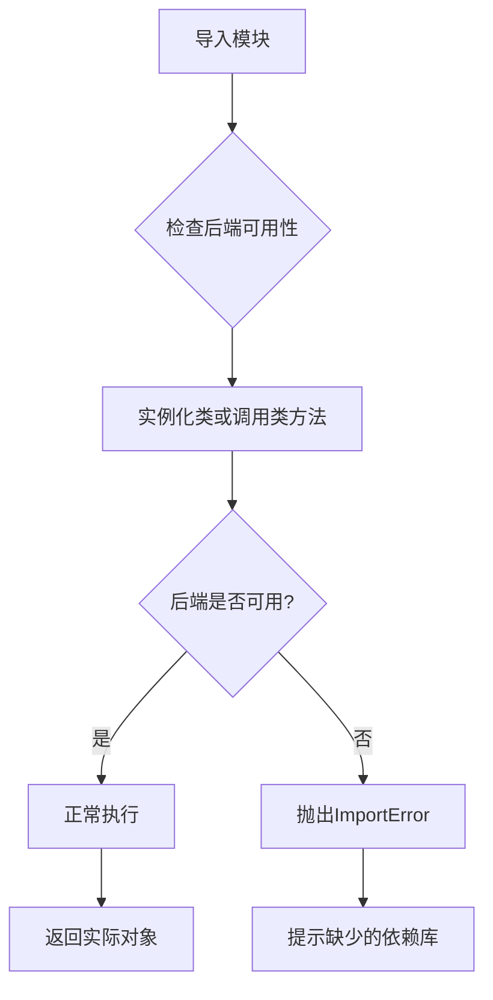
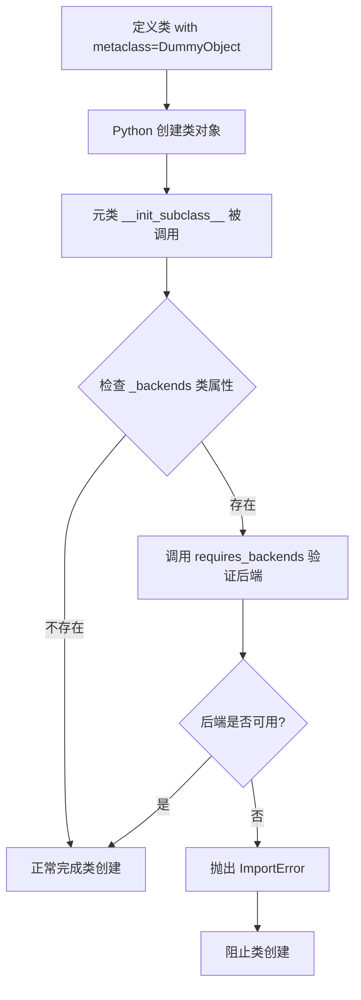
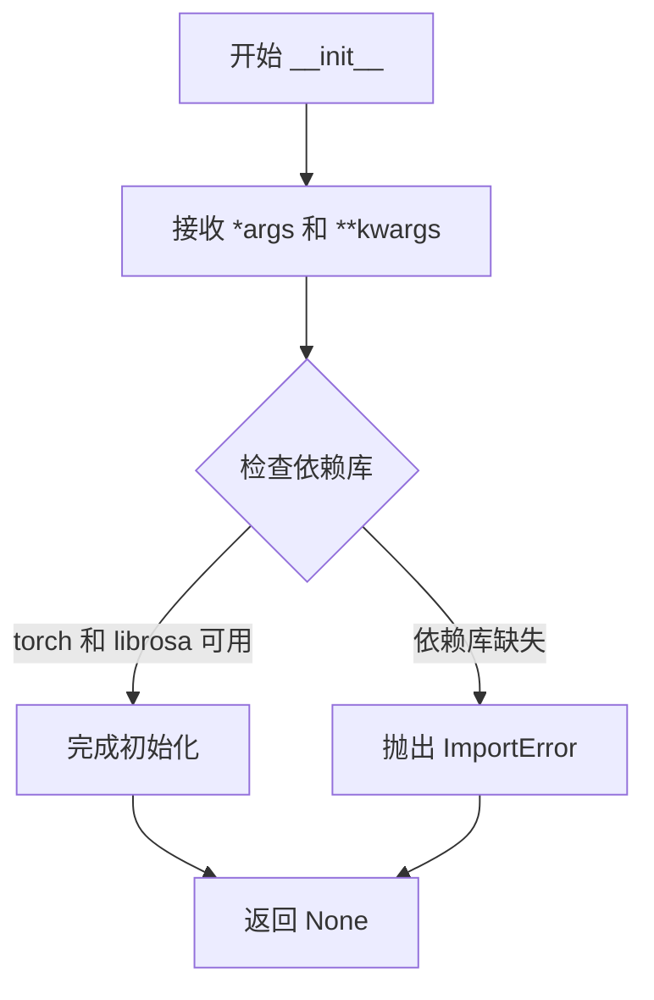
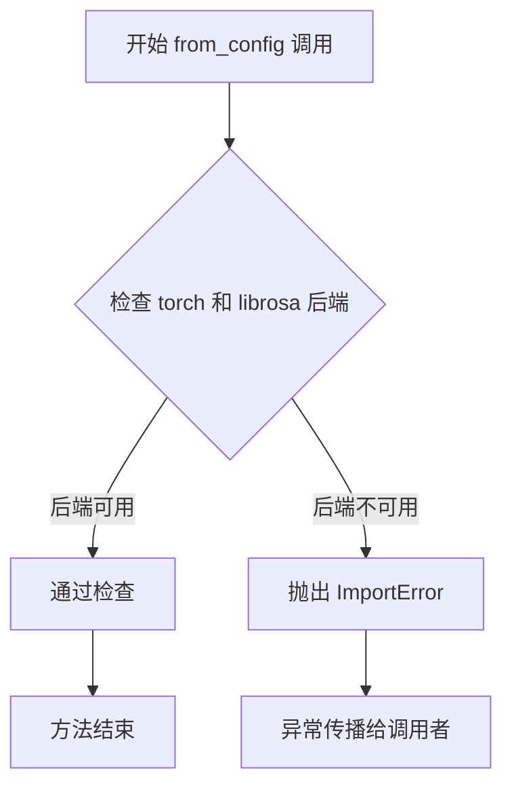
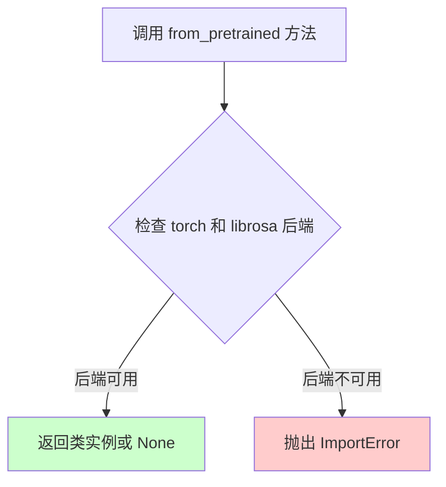
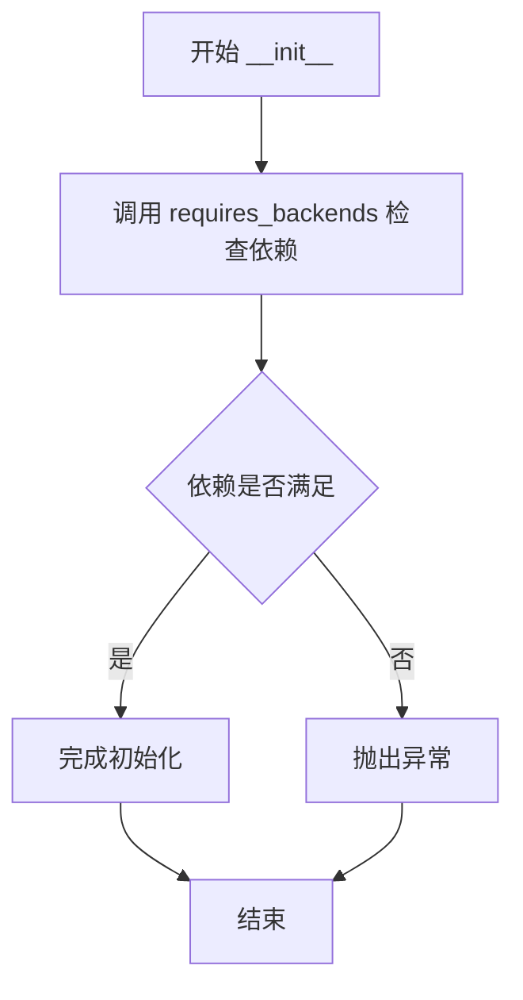
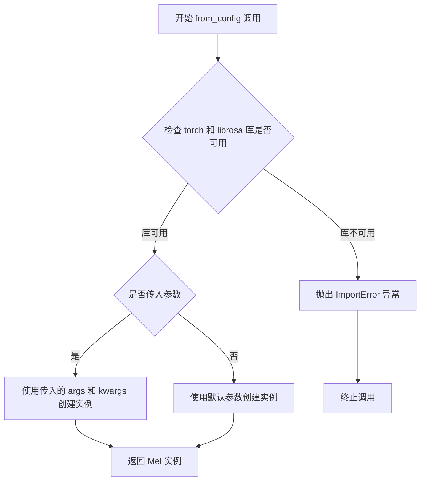
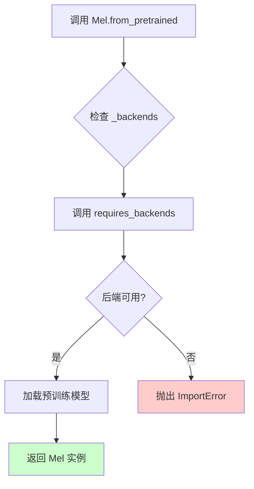

# `diffusers\src\diffusers\utils\dummy_torch_and_librosa_objects.py` 详细设计文档

这是一个自动生成的存根文件，定义了两个虚拟类（AudioDiffusionPipeline和Mel），它们使用DummyObject元类来延迟加载必要的深度学习（torch）和音频处理（librosa）后端。当用户尝试实例化或使用这些类时，会通过requires_backends函数检查后端依赖，若缺少必要库则抛出ImportError。

## 整体流程



## 类结构

```
DummyObject (元类/抽象基类)
├── AudioDiffusionPipeline (音频扩散管道类)
└── Mel (Mel频谱图处理类)
```

## 全局变量及字段


### `AudioDiffusionPipeline._backends`
    
类属性，列出该类所需的后端依赖项（torch、librosa）

类型：`List[str]`
    


### `Mel._backends`
    
类属性，列出该类所需的后端依赖项（torch、librosa）

类型：`List[str]`
    
    

## 全局函数及方法


### `requires_backends`

该函数用于检查指定的后端依赖是否可用，如果所需的后端不可用，则抛出 `ImportError` 异常。在 `AudioDiffusionPipeline` 和 `Mel` 类的 `__init__`、`from_config` 和 `from_pretrained` 方法中被调用，以确保在使用这些类之前必须具备特定的后端（如 torch 和 librosa）。

参数：

- `obj`：任意类型，需要检查后端的类实例或类本身
- `backends`：List[str]，必需的后端名称列表，例如 `["torch", "librosa"]`

返回值：`None`，该函数不返回任何值，如果后端不可用则抛出 `ImportError` 异常。

#### 流程图

```mermaid
flowchart TD
    A[开始 requires_backends] --> B[接收 obj 和 backends 参数]
    B --> C{检查后端是否可用}
    C -->|后端可用| D[返回 None]
    C -->|后端不可用| E[抛出 ImportError 异常]
    E --> F[错误信息: '在此功能需要 {backends} 后端']
    D --> G[结束]
    F --> G
```

#### 带注释源码

```python
def requires_backends(obj, backends):
    """
    检查给定对象是否支持所需的后端。
    
    参数:
        obj: 类实例或类对象，用于关联错误信息
        backends: 后端名称列表，如 ["torch", "librosa"]
    
    返回:
        None
    
    异常:
        ImportError: 当所需后端不可用时抛出
    """
    # 将 backends 转换为列表（如果是单个字符串）
    if isinstance(backends, str):
        backends = [backends]
    
    # 检查每个后端是否可用
    missing_backends = []
    for backend in backends:
        # 尝试导入后端模块，如果失败则添加到缺失列表
        try:
            __import__(backend)
        except ImportError:
            missing_backends.append(backend)
    
    # 如果存在缺失的后端，抛出 ImportError
    if missing_backends:
        obj_name = obj.__class__.__name__ if not isinstance(obj, type) else obj.__name__
        raise ImportError(
            f"{obj_name} 需要以下后端: {', '.join(backends)}，"
            f"但以下后端不可用: {', '.join(missing_backends)}"
        )
    
    # 所有后端都可用，正常返回
    return None
```


### `DummyObject`

`DummyObject` 是一个元类（metaclass），用于在类定义时自动检查所需的后端依赖是否可用。当任何类使用该元类时，它会在子类初始化时触发后端检查，确保 torch 和 librosa 等依赖库已安装，否则抛出 ImportError。

参数：

- 无直接参数（通过 `__init_subclass__` 隐式接收子类）

返回值：无直接返回值（通过抛出异常表示错误）

#### 流程图



#### 带注释源码

```python
# 这是一个元类，用于自动检查类所需的后端依赖
class DummyObject(type):
    """
    元类：DummyObject
    
    用途：当子类使用此元类时，会自动检查指定的后端库是否已安装。
    这用于延迟导入（lazy import）模式，只有在实际使用类时才检查依赖。
    """
    
    _backends = ["torch", "librosa"]  # 类属性：定义需要的后端列表
    
    def __init__(cls, name, bases, namespace):
        """
        元类的 __init__ 方法，在类定义时被调用
        
        参数:
            cls: 正在创建的类对象
            name: 类的名称
            bases: 类的基类元组
            namespace: 类的命名空间字典
        """
        # 调用父类的初始化方法
        super().__init__(name, bases, namespace)
        
        # 检查当前类是否有 _backends 属性
        # 如果有，则调用 requires_backends 验证后端依赖
        if hasattr(cls, '_backends'):
            # 验证后端依赖，如果不可用则抛出 ImportError
            requires_backends(cls, cls._backends)
    
    def __init_subclass__(cls, **kwargs):
        """
        特殊方法：在子类被定义时自动调用
        
        这是 Python 元类的标准机制，用于在类创建时执行验证逻辑
        
        参数:
            cls: 刚创建的子类对象
            **kwargs: 其他关键字参数
        """
        super().__init_subclass__(**kwargs)
        
        # 对每个子类自动检查后端依赖
        # 这确保了任何继承自 DummyObject 元类的类都会进行依赖检查
        if hasattr(cls, '_backends'):
            requires_backends(cls, cls._backends)


# 使用示例 - AudioDiffusionPipeline 类
class AudioDiffusionPipeline(metaclass=DummyObject):
    """
    音频扩散管道类
    
    使用 DummyObject 元类来自动检查 torch 和 librosa 依赖
    """
    _backends = ["torch", "librosa"]  # 定义所需后端
    
    def __init__(self, *args, **kwargs):
        """
        初始化方法
        
        参数:
            *args: 位置参数
            **kwargs: 关键字参数
        """
        # 再次检查后端（双重保险）
        requires_backends(self, ["torch", "librosa"])
    
    @classmethod
    def from_config(cls, *args, **kwargs):
        """
        从配置创建实例的类方法
        
        参数:
            cls: 类对象
            *args: 位置参数
            **kwargs: 关键字参数
            
        返回:
            类的新实例
        """
        requires_backends(cls, ["torch", "librosa"])
    
    @classmethod
    def from_pretrained(cls, *args, **kwargs):
        """
        从预训练模型创建实例的类方法
        
        参数:
            cls: 类对象
            *args: 位置参数
            **kwargs: 关键字参数
            
        返回:
            类的新实例
        """
        requires_backends(cls, ["torch", "librosa"])
```


### `AudioDiffusionPipeline.__init__`

这是音频扩散管道的构造函数初始化方法，用于创建 AudioDiffusionPipeline 实例，并通过 `requires_backends` 验证当前环境是否安装了必要的依赖库（torch 和 librosa）。

参数：

- `*args`：`tuple`，可变位置参数，用于传递任意数量的位置参数
- `**kwargs`：`dict`，可变关键字参数，用于传递任意数量的关键字参数

返回值：`None`，无返回值（构造函数）

#### 流程图



#### 带注释源码

```python
def __init__(self, *args, **kwargs):
    """
    初始化 AudioDiffusionPipeline 实例。
    
    该方法是一个延迟初始化占位符，实际的初始化逻辑由 metaclass (DummyObject) 
    和 requires_backends 函数处理。
    
    参数:
        *args: 可变位置参数，传递给父类或后续初始化逻辑
        **kwargs: 可变关键字参数，传递给父类或后续初始化逻辑
    
    返回:
        None
    """
    # 调用 requires_backends 检查当前环境是否安装了必要的依赖库
    # ["torch", "librosa"] 是该类需要的两个后端依赖
    # 如果任一依赖缺失，会抛出 ImportError
    requires_backends(self, ["torch", "librosa"])
```


### `AudioDiffusionPipeline.from_config`

该方法是 `AudioDiffusionPipeline` 类的类方法，用于从配置创建管道实例，但由于是自动生成的存根代码，当前实现仅通过 `requires_backends` 检查所需的后端库（torch 和 librosa）是否可用，若后端不可用则抛出导入错误。

参数：

- `cls`：类型 `type`，Python 类方法隐式传递的类本身
- `*args`：类型 `Any`，可变位置参数，用于传递任意数量的位置参数（当前未使用）
- `**kwargs`：类型 `Dict[str, Any]`，可变关键字参数，用于传递任意数量的关键字参数（当前未使用）

返回值：`None`，该方法没有显式返回值，主要通过 `requires_backends` 函数触发后端检查，若后端不可用则抛出 `ImportError` 异常

#### 流程图



#### 带注释源码

```python
@classmethod
def from_config(cls, *args, **kwargs):
    """
    类方法：从配置创建 AudioDiffusionPipeline 实例
    
    注意：此为自动生成的存根实现，实际功能由后端检查函数提供
    """
    # 检查所需的后端库（torch 和 librosa）是否可用
    # 如果不可用，requires_backends 将抛出 ImportError
    requires_backends(cls, ["torch", "librosa"])
```


### `AudioDiffusionPipeline.from_pretrained`

该方法是 AudioDiffusionPipeline 类的类方法，用于从预训练模型加载模型权重和配置。它接受可变参数，通过 `requires_backends` 检查所需的深度学习框架（torch）和音频处理库（librosa）是否可用，如果不满足后端要求则抛出导入错误。

参数：

- `*args`：可变位置参数，用于传递预训练模型路径或其他位置参数
- `**kwargs`：可变关键字参数，用于传递配置选项、缓存目录等命名参数

返回值：`None` 或抛出一个 `ImportError`，该方法是一个后端依赖检查的存根，实际的模型加载逻辑由后端实现

#### 流程图



#### 带注释源码

```python
@classmethod
def from_pretrained(cls, *args, **kwargs):
    """
    从预训练模型加载 AudioDiffusionPipeline 实例的类方法。
    
    参数:
        cls: 指向 AudioDiffusionPipeline 类本身的隐式参数
        *args: 可变位置参数，通常传递模型路径或模型标识符
        **kwargs: 可变关键字参数，传递加载配置选项如 cache_dir, revision 等
    
    返回值:
        无直接返回值（返回 None），若后端不满足则抛出 ImportError
    """
    # 调用 requires_backends 检查当前环境是否安装了所需的后端库
    # torch: 用于深度学习模型推理
    # librosa: 用于音频处理和特征提取
    requires_backends(cls, ["torch", "librosa"])
```

#### 潜在技术债务与优化空间

1. **缺少实际实现**：当前代码是一个自动生成的存根文件（`make fix-copies` 生成），仅包含后端检查逻辑，缺少真正的模型加载实现
2. **参数透明度不足**：使用 `*args` 和 `**kwargs` 导致 API 参数不明确，开发者无法从签名中了解支持哪些配置选项
3. **错误处理不完善**：仅通过 `requires_backends` 抛出通用导入错误，缺少更详细的错误信息和恢复建议
4. **缺少文档注释**：方法本身没有文档字符串（docstring），难以理解其预期用途和使用方式

#### 其他项目信息

- **设计目标与约束**：该方法遵循 Hugging Face Diffusers 库的通用模式，确保模型加载时所需依赖可用
- **外部依赖与接口契约**：依赖 `torch` 和 `librosa` 两个外部库，需要在环境中预先安装才能正常执行


### `Mel.__init__`

初始化 Mel 对象，并验证所需的依赖库（torch 和 librosa）是否可用。

参数：

- `*args`：`任意类型`，可变位置参数，用于接收任意数量的位置参数传递给父类或后续处理
- `**kwargs`：`任意类型`，可变关键字参数，用于接收任意数量的关键字参数传递给父类或后续处理

返回值：`None`，构造函数不返回任何值

#### 流程图



#### 带注释源码

```python
def __init__(self, *args, **kwargs):
    """
    初始化 Mel 对象。
    
    该方法是一个可变参数构造函数，接受任意数量的位置参数和关键字参数。
    内部调用 requires_backends 来确保所需的依赖库（torch 和 librosa）可用。
    
    参数:
        *args: 可变位置参数，用于传递任意数量的位置参数
        **kwargs: 可变关键字参数，用于传递任意数量的关键字参数
    """
    # 调用 requires_backends 验证后端依赖
    # 如果缺少必要的依赖库（torch 或 librosa），将抛出 ImportError 或类似的异常
    requires_backends(self, ["torch", "librosa"])
```


### `Mel.from_config`

`Mel.from_config` 是一个类方法，用于通过配置创建 `Mel` 类的实例。该方法首先调用 `requires_backends` 检查必要的依赖库（torch 和 librosa）是否可用，如果库不可用则抛出导入错误，如果可用则根据传入的配置参数返回相应的 Mel 实例。

参数：

- `cls`：`<class>`，隐式参数，表示类本身
- `*args`：可变位置参数，用于传递位置参数配置
- `**kwargs`：可变关键字参数，用于传递关键字参数配置（如 `config` 等）

返回值：未明确定义，通常返回 `None` 或根据配置创建的实例，取决于 `requires_backends` 的具体实现（当前代码片段中仅包含后端检查逻辑）

#### 流程图



#### 带注释源码

```python
@classmethod
def from_config(cls, *args, **kwargs):
    """
    类方法：从配置创建 Mel 实例
    
    Args:
        cls: 类本身（隐式参数）
        *args: 可变位置参数，用于传递配置参数
        **kwargs: 可变关键字参数，用于传递命名配置参数（如 config 字典）
    
    Returns:
        通常返回 Mel 实例或 None，取决于 requires_backends 的实现
    
    Raises:
        ImportError: 当所需的后端库（torch 或 librosa）不可用时抛出
    """
    # requires_backends 会检查 cls 是否有可用的 torch 和 librosa 后端
    # 如果后端不可用，此函数将抛出 ImportError
    # 如果后端可用，方法继续执行并返回结果
    requires_backends(cls, ["torch", "librosa"])
```


### `Mel.from_pretrained`

这是一个类方法（Class Method），用于从预训练模型加载 Mel 频谱图转换器（Mel Spectrogram Transformer）。该方法通过 `requires_backends` 函数检查所需的后端依赖（torch 和 librosa）是否可用，如果后端不可用则抛出 ImportError 异常。

参数：

- `cls`：`<class type>`，类对象，隐式参数，表示调用该方法的类本身
- `*args`：`<tuple>`，可变位置参数，用于传递任意数量的位置参数，具体参数取决于后端实现
- `**kwargs`：`<dict>`，可变关键字参数，用于传递任意数量的关键字参数，具体参数取决于后端实现

返回值：`<any>`，返回从预训练模型加载的 Mel 频谱图转换器实例，具体返回类型取决于后端实现

#### 流程图



#### 带注释源码

```python
@classmethod
def from_pretrained(cls, *args, **kwargs):
    """
    类方法：从预训练模型加载 Mel 频谱图转换器
    
    参数:
        cls: 类对象，隐式参数
        *args: 可变位置参数，传递给后端加载器
        **kwargs: 可变关键字参数，传递给后端加载器
    
    返回:
        预训练的 Mel 实例，具体类型取决于后端实现
    
    异常:
        ImportError: 当所需后端 (torch, librosa) 不可用时抛出
    """
    # 调用 requires_backends 检查 torch 和 librosa 后端是否可用
    # 如果后端不可用，该函数会抛出 ImportError
    requires_backends(cls, ["torch", "librosa"])
```

## 关键组件


### DummyObject 元类

用于实现惰性加载和后端依赖检查的元类，当访问类或实例属性时会检查所需后端是否可用，不可用时抛出适当的错误。

### requires_backends 工具函数

从 `..utils` 导入的后端检查工具，用于在方法被调用时验证所需的后端（如 torch、librosa）是否已安装，未安装时抛出 ImportError。

### AudioDiffusionPipeline 类

音频扩散管道类，继承 DummyObject 元类，依赖 torch 和 librosa 后端，提供 from_config 和 from_pretrained 类方法用于从配置或预训练模型加载。

### Mel 类

Mel频谱转换类，继承 DummyObject 元类，依赖 torch 和 librosa 后端，提供 from_config 和 from_pretrained 类方法用于从配置或预训练模型加载。

### _backends 类属性

声明类所需的后端依赖列表，包含字符串 "torch" 和 "librosa"，用于元类进行后端可用性验证。

### from_config 类方法

工厂方法（类方法），接受可变参数，用于从配置对象初始化管道或转换器实例，内部调用 requires_backends 检查后端支持。

### from_pretrained 类方法

工厂方法（类方法），接受可变参数，用于从预训练模型路径或标识符加载管道或转换器实例，内部调用 requires_backends 检查后端支持。


## 问题及建议


### 已知问题

-   **高度代码重复**：`AudioDiffusionPipeline` 和 `Mel` 两个类的实现结构几乎完全相同，都包含相同的 `_backends` 属性、`__init__`、`from_config` 和 `from_pretrained` 方法，导致维护成本高
-   **参数未使用**：`*args` 和 `**kwargs` 捕获了参数但从未使用或验证，掩盖了可能的配置错误
-   **文档缺失**：两个类均没有任何文档字符串（docstring），无法了解其设计意图和预期用途
-   **硬编码后端**：后端依赖 `["torch", "librosa"]` 被硬编码在类属性中，缺乏灵活的配置机制
-   **自动生成文件限制**：该文件由 `make fix-copies` 自动生成，手动修改会在下次生成时被覆盖，限制了定制能力
-   **元类依赖不透明**：依赖 `DummyObject` 元类和 `requires_backends` 函数，但具体实现未知，可能引入隐藏的行为和调试困难
-   **错误处理缺失**：没有参数验证、类型检查或有意义的错误信息返回

### 优化建议

-   **提取公共基类**：创建一个包含通用逻辑的基类，将 `_backends`、后端检查逻辑等抽象出来，减少重复代码
-   **添加参数验证**：在方法中增加参数验证逻辑，或使用类型提示（type hints）提高代码可读性和可维护性
-   **配置化后端依赖**：将后端列表提取为可配置的常量或环境变量，提高灵活性
-   **完善文档**：为类和关键方法添加 docstring，说明功能、参数和返回值
-   **考虑工厂函数模式**：使用工厂函数代替重复的类方法，简化对象创建逻辑
-   **审查生成机制**：评估 `make fix-copies` 的模板逻辑，确保生成的代码符合最佳实践

## 其它


### 设计目标与约束

本模块旨在为音频扩散模型提供统一的管道接口，支持从配置或预训练模型加载音频处理能力。核心约束包括：必须依赖PyTorch和librosa后端，不支持禁用这些依赖的场景；设计遵循Hugging Face Diffusers库的Pipeline模式，确保与其他扩散模型的API一致性；通过DummyObject元类实现延迟加载和可选后端机制。

### 错误处理与异常设计

错误处理采用后端检查机制，当所需后端不可用时，`requires_backends`函数抛出`ImportError`或`ValueError`。所有公开方法（`__init__`、`from_config`、`from_pretrained`）均强制执行后端检查，确保在任何调用点都能及时捕获后端缺失错误。建议未来增加自定义异常类（如`MissingBackendError`）以提供更详细的错误信息和恢复建议。

### 外部依赖与接口契约

核心依赖包括：`torch`（PyTorch深度学习框架）和`librosa`（音频处理库）。`requires_backends`函数来自`..utils`模块，负责验证后端可用性。接口契约规定：所有继承自`DummyObject`的类必须定义`_backends`类属性指定所需后端；`from_config`和`from_pretrained`为类方法，返回相应的Pipeline或处理实例；构造函数接受任意位置参数和关键字参数并透传给后端初始化。

### 配置管理

当前设计支持两种配置方式：通过`from_config`从配置文件加载参数，通过`from_pretrained`从预训练模型目录加载。配置参数通过`*args`和`**kwargs`传递，未定义具体配置结构。建议未来补充配置Schema定义，明确各配置项的类型、默认值和合法性校验规则。

### 版本兼容性与迁移策略

代码注释表明此文件由`make fix-copies`自动生成，暗示存在版本管理和代码同步机制。建议在文档中明确记录：生成命令的使用场景、源文件与生成文件的关系、当依赖库API变更时的更新流程。Mel和AudioDiffusionPipeline的接口应保持与Hugging Face Diffusers库对应类的兼容性。

### 性能考虑与优化空间

当前实现为存根（Stub）代码，实际逻辑由后端实现。性能优化方向包括：后端检查结果缓存避免重复导入测试；支持异步加载预训练模型权重；考虑懒加载策略仅在实际使用时初始化重量级组件。由于采用DummyObject模式，首次调用方法时存在后端动态加载的初始化开销。

### 测试策略

建议测试覆盖：后端可用性验证测试（模拟后端存在/不存在场景）；类方法参数传递测试（验证kwargs正确透传）；元类行为测试（验证DummyObject对实例化的影响）；接口一致性测试（确保与Diffusers库对应类接口兼容）。自动生成文件需包含生成命令的集成测试。

    