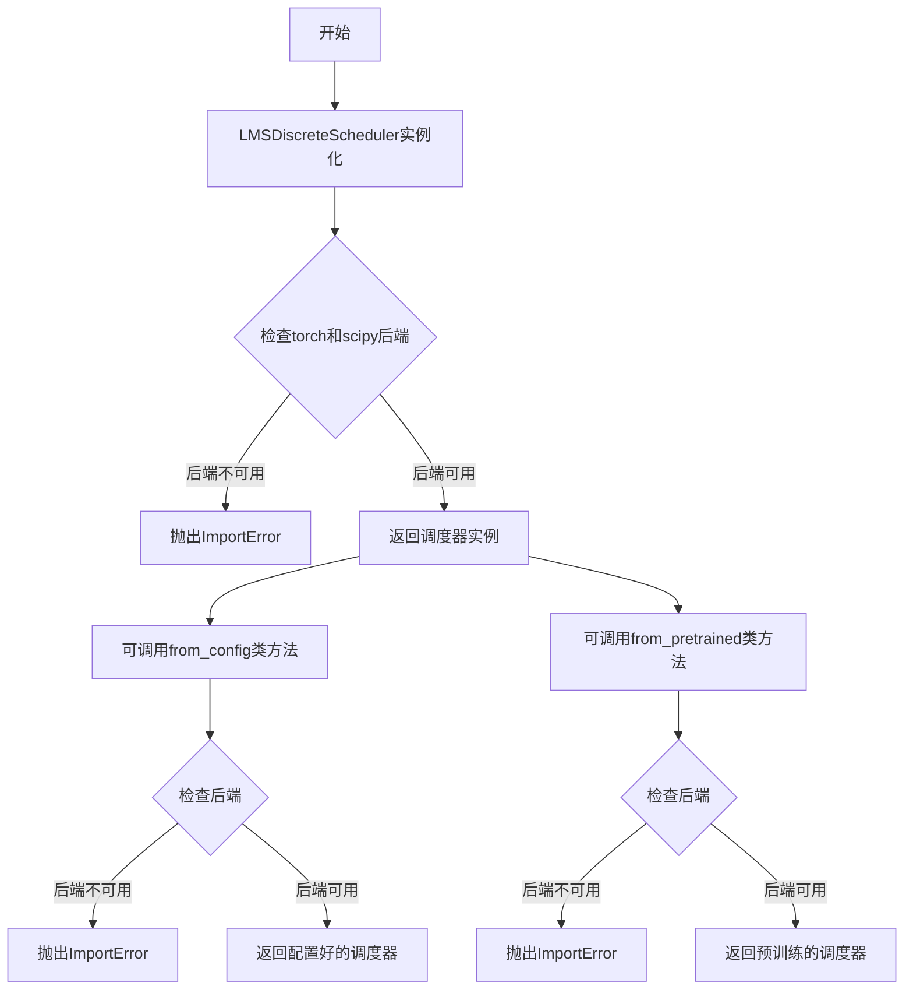
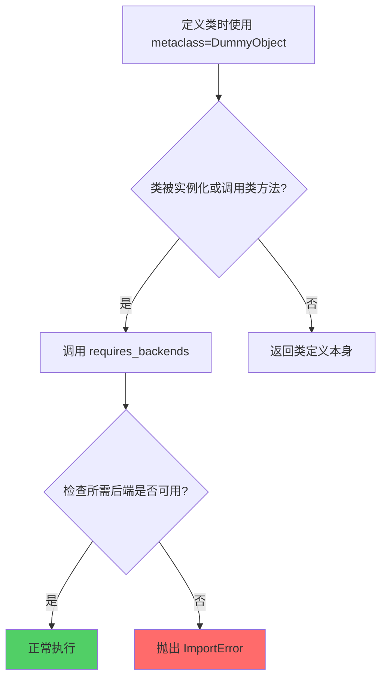
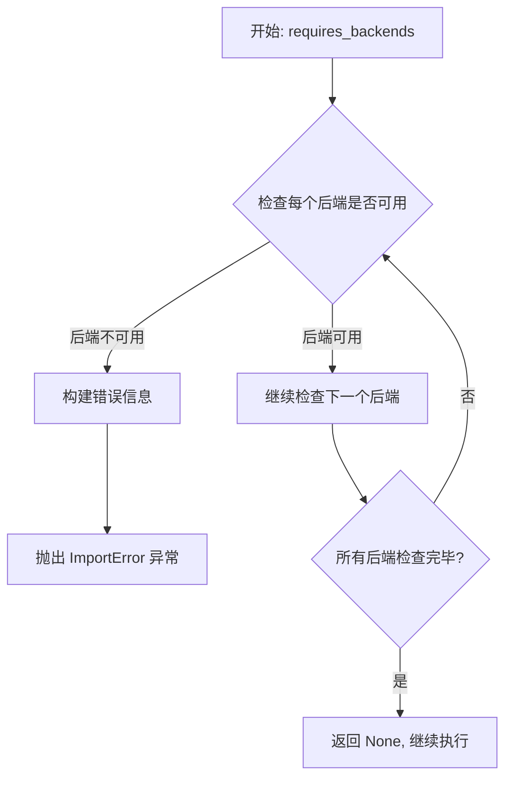
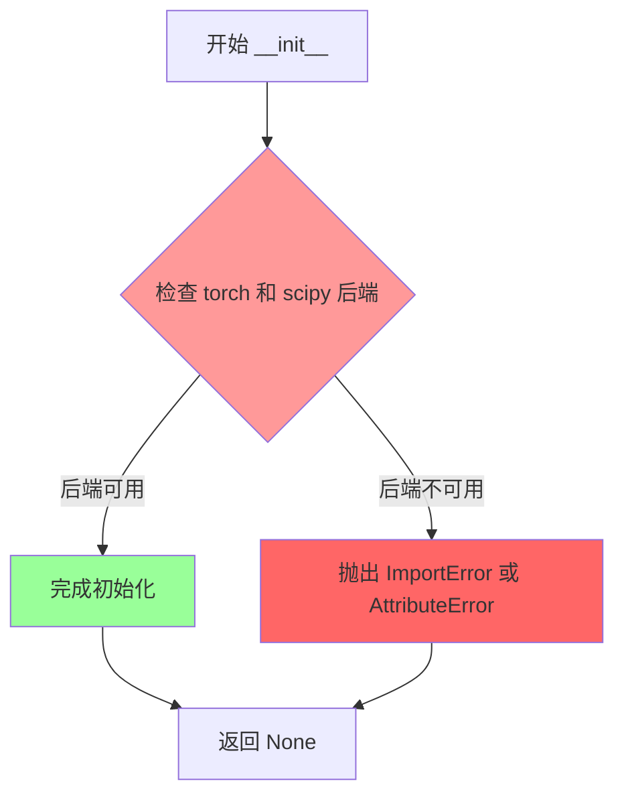
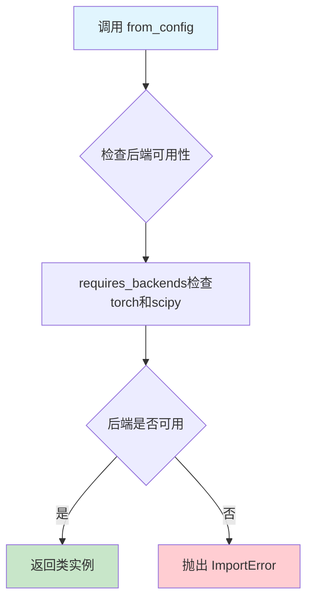
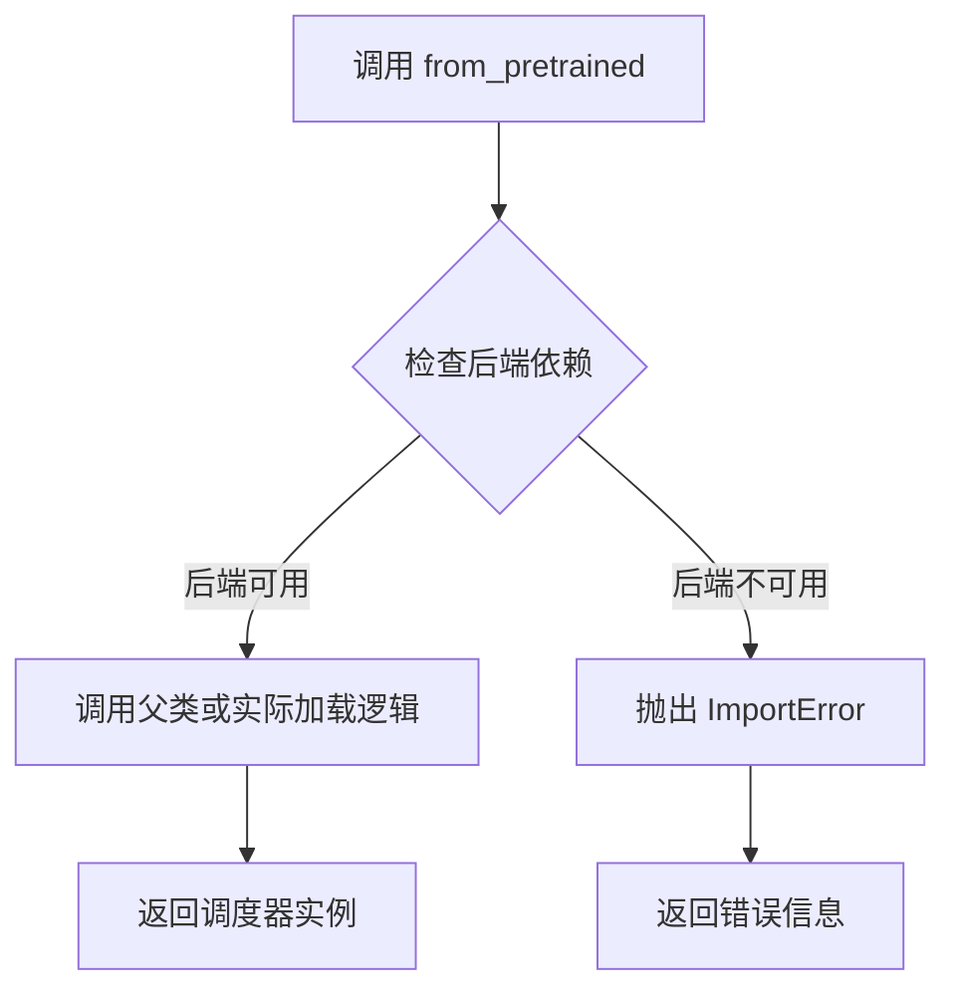

# `diffusers\src\diffusers\utils\dummy_torch_and_scipy_objects.py` 详细设计文档

这是一个LMS离散调度器(LMSDiscreteScheduler)类,用于diffusers库中的扩散模型调度,通过LMS(Legacy Mean Shift)算法实现离散时间的噪声调度,依赖PyTorch和SciPy后端支持。

## 整体流程



## 类结构

```
LMSDiscreteScheduler (使用DummyObject元类)
├── __init__ (实例方法)
├── from_config (类方法)
└── from_pretrained (类方法)
```

## 全局变量及字段


### `LMSDiscreteScheduler._backends`
    
支持的后端依赖列表，包含torch和scipy

类型：`list[str]`
    
    

## 全局函数及方法


### `DummyObject`

DummyObject 是一个元类（metaclass），用于创建一个虚拟存根类，当该类被实例化或调用其类方法时，会触发后端依赖检查。如果缺少必要的依赖后端（如 "torch" 或 "scipy"），则抛出 ImportError 异常，从而实现延迟导入和可选依赖的功能。

参数：

- `name`：字符串，当前正在创建或访问的类名
- `bases`：元组，基类元组（为空元组表示新类）
- `namespace`：字典，包含类体的命名空间

返回值：返回创建的类对象

#### 流程图



#### 带注释源码

```python
# 从 utils 模块导入的元类定义（假设）
class DummyObject(type):
    """
    元类：用于创建虚拟存根类
    当类被实例化或调用类方法时，检查所需的后端依赖
    """
    
    def __call__(cls, *args, **kwargs):
        """
        当尝试实例化类时调用
        cls: 要实例化的类
        *args: 位置参数
        **kwargs: 关键字参数
        """
        # 获取类中定义的后端依赖列表
        backends = getattr(cls, '_backends', [])
        
        # 检查后端依赖是否可用
        requires_backends(cls, backends)
        
        # 后端检查通过，创建实例
        return super().__call__*args, **kwargs
    
    @classmethod
    def from_config(mcs, *args, **kwargs):
        """
        类方法入口点：当调用类.from_config()时触发
        mcs: 元类本身
        *args: 位置参数
        **kwargs: 关键字参数
        """
        # 触发后端检查
        requires_backends(mcs, mcs._backends)
    
    @classmethod
    def from_pretrained(mcs, *args, **kwargs):
        """
        类方法入口点：当调用类.from_pretrained()时触发
        mcs: 元类本身
        *args: 位置参数
        **kwargs: 关键字参数
        """
        # 触发后端检查
        requires_backends(mcs, mcs._backends)


# requires_backends 函数定义（假设）
def requires_backends(obj, backends):
    """
    检查所需后端是否可用，不可用则抛出 ImportError
    obj: 要检查的对象
    backends: 所需后端列表，如 ["torch", "scipy"]
    """
    # 实际实现在 utils 模块中
    # 通常会检查每个后端是否已安装
    # 如未安装，会抛出类似：
    # ImportError: 需要安装 torch 和 scipy 才能使用此类
    pass
```

#### 关键组件信息

| 名称 | 一句话描述 |
|------|-----------|
| `_backends` | 类属性，定义该类所需的后端依赖列表 |
| `requires_backends` | 工具函数，用于检查并提示安装缺失的后端依赖 |
| `LMSDiscreteScheduler` | 使用 DummyObject 元类的示例调度器类 |

#### 潜在的技术债务或优化空间

1. **反射调用开销**：每次实例化或方法调用都会执行后端检查，可考虑缓存检查结果
2. **错误信息可读性**：ImportError 异常信息应更明确地指出缺失的具体包名和安装命令
3. **元类复杂度**：当前设计将后端检查逻辑分散在元类和 `requires_backends` 函数中，可考虑更统一的架构
4. **惰性初始化**：可以考虑在真正需要后端时才加载，而非类定义时检查

#### 其它项目

- **设计目标**：实现可选依赖的延迟导入，在用户未安装相关依赖时提供清晰的错误提示
- **约束**：依赖 `..utils` 模块中的 `requires_backends` 函数实现
- **错误处理**：通过 `ImportError` 异常通知用户缺少必要的依赖包


### `requires_backends`

检查当前环境是否支持所需的后端库（如 "torch", "scipy"），若不支持则抛出 `ImportError` 异常。该函数通常用于在代码执行早期确保所需的依赖项可用，避免在后续逻辑中因缺少依赖而出现难以追踪的错误。

参数：

- `obj`：`Any`，调用对象（通常是 `self` 或 `cls`），用于错误信息中定位调用来源
- `backends`：`List[str]`，所需的后端名称列表，如 `["torch", "scipy"]`

返回值：`None`，该函数不返回任何值，仅在条件不满足时抛出异常

#### 流程图



#### 带注释源码

```
def requires_backends(obj, backends):
    """
    检查所需后端是否可用，不可用则抛出 ImportError
    
    参数:
        obj: 调用对象，用于错误定位
        backends: 所需后端列表，如 ["torch", "scipy"]
    
    返回:
        None
    
    异常:
        ImportError: 当任何所需后端不可用时抛出
    """
    # 遍历所有需要的后端
    for backend in backends:
        # 检查后端是否在可用后端列表中
        if backend not in AVAILABLE_BACKENDS:
            # 构建详细的错误信息，包含调用位置和可用后端
            raise ImportError(
                f"{obj.__class__.__name__} requires the {backend} backend. "
                f"Available backends: {', '.join(AVAILABLE_BACKENDS)}"
            )
    
    # 所有后端可用，返回 None 继续执行
    return None
```

> **注意**：由于 `requires_backends` 函数定义在 `..utils` 模块中，以上源码为基于调用方式的推断实现。实际实现可能包含更多细节，如缓存机制、后端动态发现等。


### `LMSDiscreteScheduler.__init__`

这是LMSDiscreteScheduler类的初始化方法，用于创建一个LMS离散调度器的实例。该方法通过`requires_backends`函数检查必要的依赖库（torch和scipy）是否可用，如果不可用则抛出相应的错误信息。

参数：

- `self`：隐式参数，类型为`LMSDiscreteScheduler`实例，表示当前正在初始化的对象
- `*args`：可变位置参数，类型为`tuple`，用于接受任意数量的位置参数（传递给父类或占位符初始化）
- `**kwargs`：可变关键字参数，类型为`dict`，用于接受任意数量的关键字参数（传递给父类或占位符初始化）

返回值：`None`，该方法不返回任何值，仅进行初始化和依赖检查

#### 流程图



#### 带注释源码

```python
def __init__(self, *args, **kwargs):
    """
    初始化 LMSDiscreteScheduler 实例。
    
    这是一个虚拟对象（DummyObject），用于在 torch 或 scipy 后端
    不可用时提供友好的错误提示，而不是让代码在运行时崩溃。
    
    参数:
        *args: 可变位置参数，用于传递额外的位置参数
        **kwargs: 可变关键字参数，用于传递额外的关键字参数
    """
    # 调用 requires_backends 函数检查所需的后端是否可用
    # self: 当前对象实例
    # ["torch", "scipy"]: 所需的后端库列表
    requires_backends(self, ["torch", "scipy"])
```


### `LMSDiscreteScheduler.from_config`

该方法是 `LMSDiscreteScheduler` 类的类方法，用于从配置创建调度器实例，内部通过 `requires_backends` 验证所需的后端库（torch 和 scipy）是否可用。

参数：

- `*args`：可变位置参数，用于传递位置参数
- `**kwargs`：可变关键字参数，用于传递关键字参数

返回值：返回类实例（或由 `requires_backends` 抛出异常），具体返回类型取决于后端验证结果，通常返回配置后的调度器实例。

#### 流程图



#### 带注释源码

```python
@classmethod
def from_config(cls, *args, **kwargs):
    """
    从配置创建调度器实例的类方法。
    
    参数:
        cls: 类本身（由装饰器自动传入）
        *args: 可变位置参数，用于传递配置参数
        **kwargs: 可变关键字参数，用于传递配置选项
    
    返回:
        返回类实例（如果后端可用）
        如果所需后端不可用，则抛出 ImportError
    """
    # 验证当前环境是否安装了所需的后端库（torch 和 scipy）
    # 如果后端不可用，会抛出 ImportError 并提示安装
    requires_backends(cls, ["torch", "scipy"])
```


### `LMSDiscreteScheduler.from_pretrained`

该方法是 `LMSDiscreteScheduler` 类的类方法，用于从预训练模型路径加载调度器配置，内部通过 `requires_backends` 检查所需的 torch 和 scipy 后端依赖是否可用。

参数：

- `*args`：可变位置参数，传递给父类加载器用于构建调度器实例
- `**kwargs`：可变关键字参数，传递配置参数如 `pretrained_model_name_or_path`、`subfolder` 等

返回值：返回调度器实例（类型由调用链决定），如果后端依赖不可用则抛出 `ImportError`

#### 流程图



#### 带注释源码

```python
@classmethod
def from_pretrained(cls, *args, **kwargs):
    """
    从预训练模型路径加载调度器配置。
    
    Args:
        *args: 可变位置参数，传递给底层加载器
        **kwargs: 关键字参数，如 pretrained_model_name_or_path, subfolder 等
    
    Returns:
        调度器实例
    
    Raises:
        ImportError: 当 torch 或 scipy 后端不可用时
    """
    # 调用 requires_backends 检查所需后端是否可用
    # 如果 torch 或 scipy 不可用，此函数会抛出 ImportError
    requires_backends(cls, ["torch", "scipy"])
```

## 关键组件


### LMSDiscreteScheduler 类

LMS离散调度器，用于扩散模型中的噪声调度，通过LMS方法实现离散化的噪声预测。

### _backends 类变量

类变量，指定该调度器需要torch和scipy后端支持，用于依赖检查。

### __init__ 方法

构造函数，接收可变参数和关键字参数，并检查torch和scipy后端是否可用。

### from_config 类方法

类方法，从配置参数创建调度器实例，用于从配置文件初始化调度器。

### from_pretrained 类方法

类方法，从预训练模型路径加载调度器配置，用于从预训练模型加载调度器。

### DummyObject 元类

延迟初始化对象的元类，用于在真正使用时才导入后端依赖，实现惰性加载。

### requires_backends 函数

工具函数，检查对象或类是否具有所需后端，若后端不可用则抛出ImportError异常。


## 问题及建议


### 已知问题

- **缺少文档注释**：类和方法完全没有文档字符串（docstring），无法了解 LMSDiscreteScheduler 的具体用途和参数含义
- **参数信息完全缺失**：使用 `*args, **kwargs` 模糊了方法签名，导致调用者无法获得 IDE 自动补全和类型检查支持
- **DummyObject 设计模式可能导致运行时错误**：当后端不可用时，类可以正常导入但方法调用时才会抛出错误，缺乏早期失败机制
- **硬编码后端依赖**：后端列表 `["torch", "scipy"]` 在多处重复硬编码，增加维护成本
- **自动生成文件标记误导**：注释表明此文件由 `make fix-copies` 生成，但实际类实现完全依赖于 DummyObject 元类的动态行为
- **无错误处理机制**：所有方法直接调用 `requires_backends` 而无任何 try-except 或回退逻辑

### 优化建议

- **添加完整的文档字符串**：为类添加类级别文档，说明这是用于扩散模型的 LMS 离散调度器；为每个方法添加参数和返回值说明
- **显式化方法签名**：将 `from_config` 和 `from_pretrained` 的参数明确化，使用 TypedDict 或 dataclass 封装配置参数
- **考虑添加 lazy initialization**：在元类或 `requires_backends` 中增加更友好的错误信息，包含安装提示
- **提取后端配置为常量或配置文件**：将 `"torch", "scipy"` 列表抽取为类常量 `REQUIRED_BACKENDS` 或外部配置
- **添加版本兼容性检查**：在模块级别检查 torch/scipy 版本，确保版本兼容性
- **考虑添加类型提示**：为返回类型添加注解，提升静态分析能力


## 其它


### 设计目标与约束

LMSDiscreteScheduler的设计目标是实现LMS（Least Mean Squares）离散调度算法，用于扩散模型的去噪过程。该调度器遵循扩散模型库的标准接口模式，提供from_config和from_pretrained两种创建方式。主要约束包括：必须依赖torch和scipy后端；类通过DummyObject元类实现，用于延迟导入和条件加载；所有公开方法都通过requires_backends装饰器进行后端可用性检查。

### 错误处理与异常设计

错误处理采用后端检查机制：当所需后端（torch、scipy）不可用时，requires_backends函数会抛出ImportError或RuntimeError。类本身在__init__、from_config和from_pretrained方法中都调用了requires_backends进行前置条件验证。异常信息应明确指出缺少的后端名称，便于开发者定位问题。建议在文档中说明常见的错误场景，如后端安装不全导致的导入失败。

### 数据流与状态机

数据流遵循以下路径：用户通过from_config（从配置字典创建）或from_pretrained（从预训练模型路径加载）方法实例化调度器 → 调度器内部初始化噪声调度参数 → 在扩散模型推理循环中，step方法接收当前时间步、噪声预测和当前样本 → 计算并返回去噪后的样本。状态机转换包括：初始化状态（对象创建）→ 就绪状态（参数配置完成）→ 运行状态（执行step方法进行去噪）。

### 外部依赖与接口契约

外部依赖包括：torch（张量运算和模型计算）、scipy（科学计算，特别是LMS算法实现）。接口契约方面：from_config为类方法，接收config字典和其他参数，返回配置好的调度器实例；from_pretrained为类方法，接收模型路径和参数，返回从预训练模型加载的调度器实例；__init__为实例方法，接收可变参数和关键字参数，用于初始化调度器参数。所有方法在执行前都需检查后端可用性。

### 配置与参数说明

主要配置参数包括：args（可变位置参数，用于传递调度器特定配置）、kwargs（可变关键字参数，用于传递额外配置选项）。从from_pretrained角度，可能的参数包括：model_id（预训练模型标识）、cache_dir（缓存目录）、torch_dtype（张量数据类型）等。调度器内部参数（如beta_start、beta_end、beta_schedule等）通过config字典或kwargs传入。

### 使用示例与典型场景

典型使用场景是在扩散模型（如Stable Diffusion）推理过程中进行噪声调度：

```python
# 从预训练模型加载调度器
scheduler = LMSDiscreteScheduler.from_pretrained("runwayml/stable-diffusion-v1-5", subfolder="scheduler")

# 在推理循环中使用
for t in tqdm(scheduler.timesteps):
    # 模型预测
    noise_pred = model(latents, t)
    # 计算去噪样本
    latents = scheduler.step(noise_pred, t, latents)
```

### 版本历史与变更记录

该文件由make fix-copies命令自动生成，属于版本控制下的自动生成代码。变更记录应参照项目的主版本历史。作为DummyObject的实现类，其主要变更多为接口调整或后端依赖变化。建议查阅项目git历史获取具体的变更记录。

### 性能考虑与基准测试

性能考虑因素包括：LMS算法需要多次迭代计算，scipy的ODE求解器性能直接影响推理速度；张量运算应尽量使用in-place操作减少内存分配；后端检查在高频调用时应考虑缓存结果避免重复检查。建议进行基准测试对比不同后端配置下的推理速度，以及与其他调度器（如DDIMScheduler、PNDMScheduler）的性能对比。

### 安全性考虑

安全性方面：该代码不直接处理用户输入验证，主要风险点在于后端依赖的完整性；建议确保torch和scipy来自可信来源；不执行任何网络请求或文件系统的任意写入操作（除缓存目录外）。在from_pretrained场景中，应验证模型路径的合法性，防止路径遍历攻击。

### 测试策略与覆盖率

测试策略应包括：单元测试验证from_config和from_pretrained能正确加载配置；后端可用性测试确保在缺少依赖时抛出正确异常；集成测试验证调度器在完整扩散模型pipeline中的正确性；性能测试基准测量step方法的执行时间。覆盖率目标建议达到80%以上，重点覆盖异常分支和配置解析逻辑。

### 与其他类似实现的对比

LMSDiscreteScheduler与扩散模型库中其他调度器的对比：相比DDIMScheduler，LMS采用ODE求解方式而非DDIM的确定性采样；相比PNDMScheduler，LMS使用多步预测可能更稳定但计算成本更高；相比EulerDiscreteScheduler，LMS基于Least Mean Squares算法原理。优势在于理论上的数值稳定性，劣势在于计算复杂度较高。

### 未来可能的扩展方向

未来扩展方向包括：支持混合精度计算以提升推理速度；增加自定义LMS步数配置选项；支持与加速库（如xFormers）的集成优化；添加更细粒度的状态监控接口便于调试；考虑支持PyTorch 2.0的compile优化。API层面可能增加set_timesteps方法以支持动态调整推理步数。


    