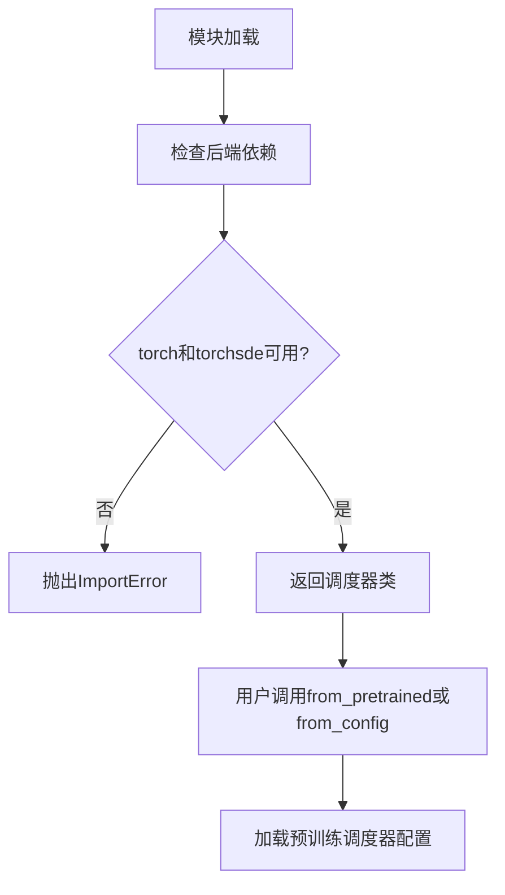
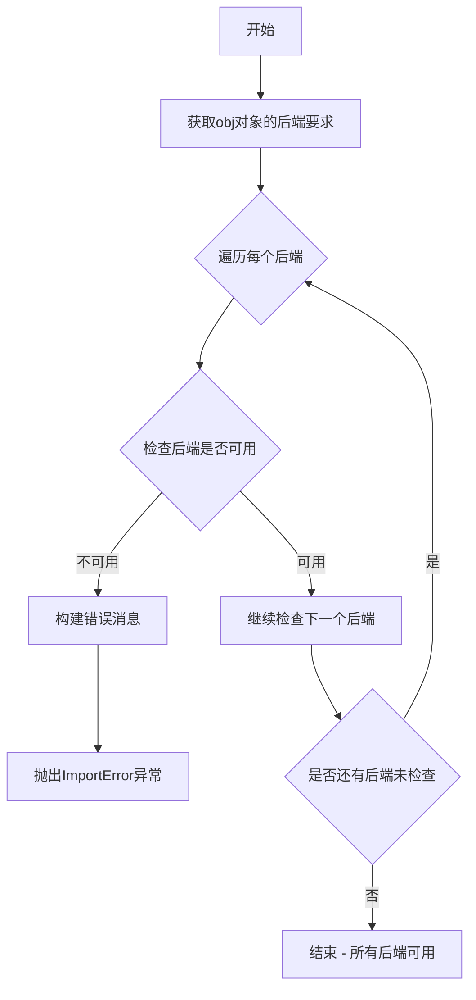
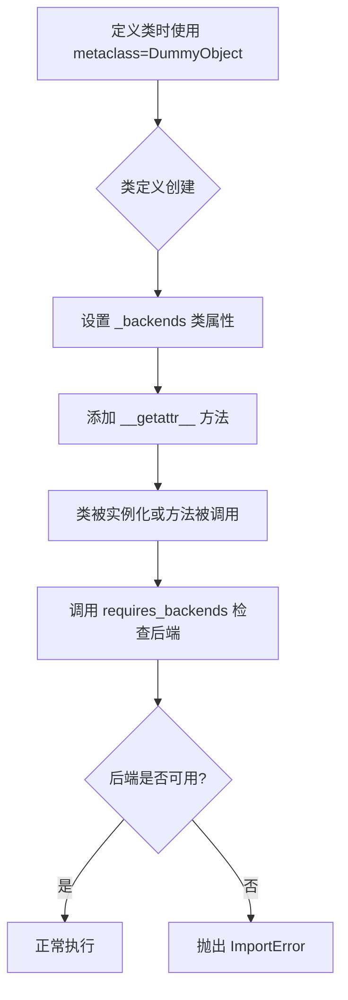
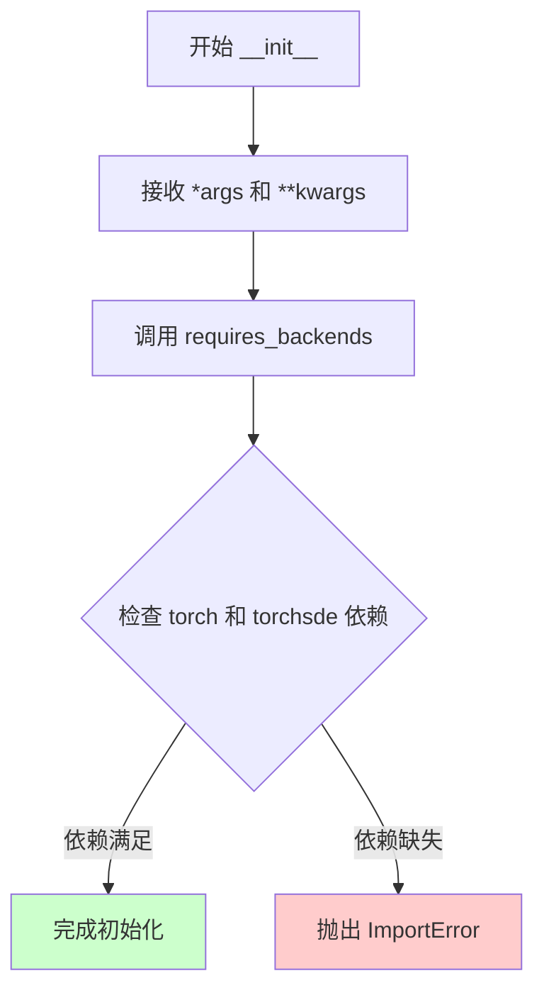
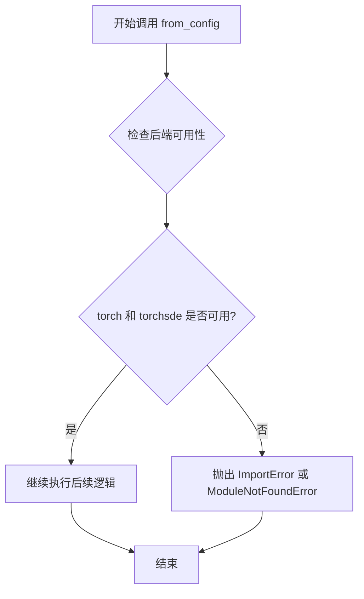
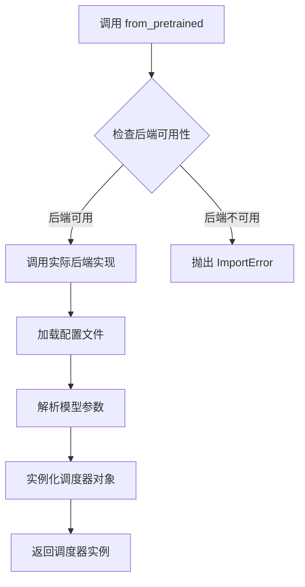
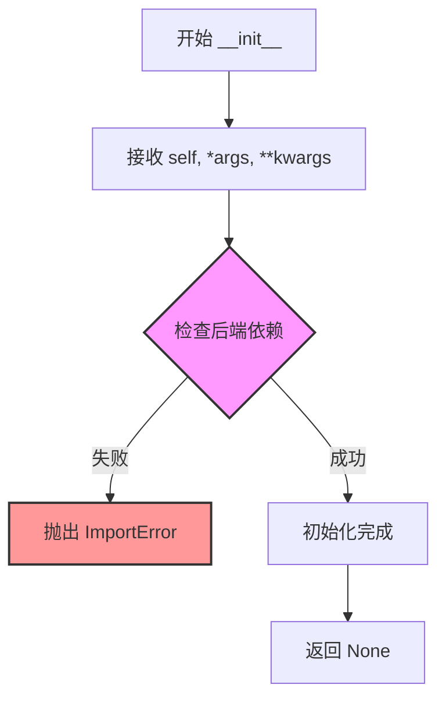
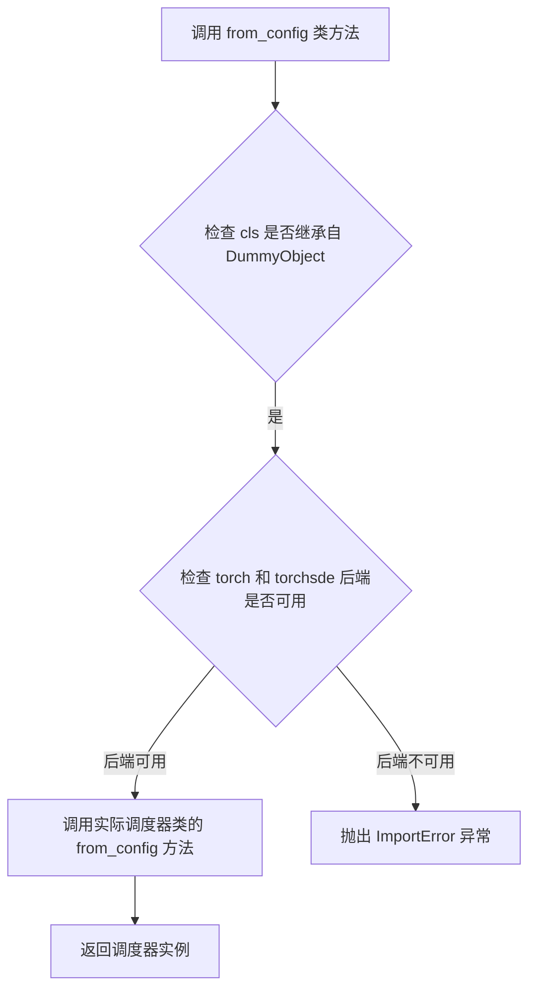
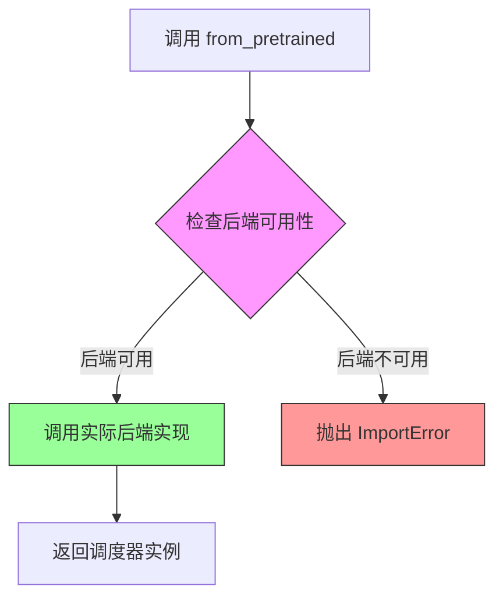

# `diffusers\src\diffusers\utils\dummy_torch_and_torchsde_objects.py` 详细设计文档

该文件定义了DPM（Diffusion Probabilistic Models）求解器调度器的占位符类，包括CosineDPMSolverMultistepScheduler和DPMSolverSDEScheduler两个调度器实现，用于扩散模型的采样过程控制。

## 整体流程



## 类结构

```
object (基类)
└── DummyObject (元类)
    ├── CosineDPMSolverMultistepScheduler
    └── DPMSolverSDEScheduler
```

## 全局变量及字段


### `CosineDPMSolverMultistepScheduler._backends`
    
A class attribute that specifies the list of backend frameworks (torch and torchsde) required by the scheduler.

类型：`List[str]`
    


### `DPMSolverSDEScheduler._backends`
    
A class attribute that specifies the list of backend frameworks (torch and torchsde) required by the scheduler.

类型：`List[str]`
    
    

## 全局函数及方法


### `requires_backends`

这是一个后端依赖检查工具函数，用于验证当前运行环境是否安装了指定的深度学习后端（如 torch、torchsde 等）。如果任何指定的后端不可用，该函数会抛出 `ImportError` 并提供友好的错误提示信息。

参数：

- `obj`：`Any`，调用此函数的对象或类，通常传递 `self` 或 `cls`
- `backends`：列表或元组，包含所需的后端名称字符串

返回值：`None`，该函数不返回任何值，主要通过抛出异常来指示错误

#### 流程图



#### 带注释源码

```python
def requires_backends(obj, backends):
    """
    后端依赖检查函数
    
    参数:
        obj: 任意对象 - 调用此函数的对象或类，用于获取实际需要的backends列表
        backends: list/tuple - 所需后端名称列表，如 ["torch", "torchsde"]
    
    返回:
        None - 该函数不返回任何值，通过抛出异常来表示错误
    
    异常:
        ImportError - 当所需后端不可用时抛出
    """
    
    # 如果backends是元组，转换为列表
    # 这是为了支持多种后端格式的输入
    if not isinstance(backends, (list, tuple)):
        backends = [backends]
    
    # 从obj对象获取实际需要的后端列表
    # 如果obj有_backends属性，则使用该属性；否则使用传入的backends参数
    # obj.__class__用于获取类的_backends属性
    backend_list = getattr(obj.__class__, '_backends', backends)
    
    # 遍历所有需要的后端
    for backend in backend_list:
        # importlib.import_module 用于动态导入模块
        # 检查每个后端模块是否可导入
        # 如果模块不存在，会抛出 ModuleNotFoundError
        try:
            importlib.import_module(backend)
        except ImportError:
            # 构建详细的错误消息
            # 包含函数/类名、当前环境信息和建议
            available = ", ".join(sorted([_backend for _backend in backends if _available(_backend)]))
            raise ImportError(
                f"{obj.__class__.__name__} requires the {backend} backend but it was not found in your environment. "
                f"Please install it or switch to a available backend: {available}"
            ) from None
```


### `DummyObject`

DummyObject 是一个元类（metaclass），用于创建虚拟对象。当某个类使用该元类时，访问该类的任何属性或方法会触发后端检查，如果所需的后端库未安装，则抛出 ImportError 异常。

参数：

- `name`：字符串，元类的名称
- `bases`：元组，基类列表
- `namespace`：字典，命名空间属性

返回值：返回创建的类对象

#### 流程图



#### 带注释源码

```python
# 导入 DummyObject 元类和 requires_backends 工具函数
# DummyObject 是从 ..utils 模块导入的元类，用于动态创建虚拟类
from ..utils import DummyObject, requires_backends


# CosineDPMSolverMultistepScheduler 类使用 DummyObject 元类
# 当访问该类的任何属性或方法时，会检查 torch 和 torchsde 后端是否可用
class CosineDPMSolverMultistepScheduler(metaclass=DummyObject):
    # 类属性：指定该类需要的后端列表
    _backends = ["torch", "torchsde"]

    # 初始化方法：创建实例时检查后端
    def __init__(self, *args, **kwargs):
        # 调用 requires_backends 检查所需后端是否已安装
        # 如果后端缺失，会抛出 ImportError 异常
        requires_backends(self, ["torch", "torchsde"])

    # 类方法：从配置创建对象
    @classmethod
    def from_config(cls, *args, **kwargs):
        # 检查后端可用性
        requires_backends(cls, ["torch", "torchsde"])

    # 类方法：从预训练模型加载
    @classmethod
    def from_pretrained(cls, *args, **kwargs):
        # 检查后端可用性
        requires_backends(cls, ["torch", "torchsde"])
```


### `CosineDPMSolverMultistepScheduler.__init__`

该方法是 `CosineDPMSolverMultistepScheduler` 类的构造函数，用于初始化调度器实例。它接受任意数量的位置参数和关键字参数，并在初始化过程中调用 `requires_backends` 来确保运行环境中安装了所需的后端依赖库（torch 和 torchsde），若缺少依赖则抛出 ImportError。

参数：

- `*args`：`任意类型`，可变位置参数，用于传递任意数量的位置参数给父类或初始化逻辑
- `**kwargs`：`任意类型`，可变关键字参数，用于传递任意数量的关键字参数给父类或初始化逻辑

返回值：`None`，该方法不返回任何值，仅完成对象的初始化

#### 流程图



#### 带注释源码

```python
def __init__(self, *args, **kwargs):
    """
    初始化 CosineDPMSolverMultistepScheduler 实例。
    
    参数:
        *args: 可变位置参数，传递给父类或相关初始化逻辑
        **kwargs: 可变关键字参数，传递给父类或相关初始化逻辑
    
    返回:
        None: 此方法不返回任何值，仅完成对象初始化
    
    异常:
        ImportError: 如果缺少必需的 torch 或 torchsde 依赖库
    """
    # 调用 requires_backends 函数检查当前环境是否安装了所需的后端依赖
    # ["torch", "torchsde"] 是该调度器正常工作所需的依赖库列表
    # 如果任一依赖缺失，该函数将抛出 ImportError 异常
    requires_backends(self, ["torch", "torchsde"])
```


### `CosineDPMSolverMultistepScheduler.from_config`

这是一个类方法，用于从配置创建调度器实例，但在当前实现中，它是一个存根方法，主要功能是检查所需的后端库（torch和torchsde）是否可用，如果后端不可用则抛出适当的错误。

参数：

- `*args`：可变位置参数，用于传递任意数量的位置参数
- `**kwargs`：可变关键字参数，用于传递任意数量的关键字参数

返回值：`None`，该方法仅进行后端检查，不返回任何值

#### 流程图



#### 带注释源码

```python
@classmethod
def from_config(cls, *args, **kwargs):
    """
    从配置创建 CosineDPMSolverMultistepScheduler 实例的类方法。
    
    参数:
        cls: 指向类本身的引用
        *args: 可变数量的位置参数
        **kwargs: 可变数量的关键字参数
    
    注意:
        当前实现仅进行后端检查，实际的实例创建逻辑由后端模块提供。
    """
    # 检查类是否具有所需的后端支持（torch 和 torchsde）
    # 如果后端不可用，requires_backends 将抛出适当的错误
    requires_backends(cls, ["torch", "torchsde"])
```


### `CosineDPMSolverMultistepScheduler.from_pretrained`

该方法是 `CosineDPMSolverMultistepScheduler` 类的类方法，用于从预训练模型路径加载调度器配置并实例化调度器对象。该方法在当前代码中是一个存根（DummyObject），实际实现由后端库（torch/torchsde）提供。

参数：

-  `*args`：可变位置参数，通常包括 `pretrained_model_name_or_path`（模型名称或路径）
-  `**kwargs`：可变关键字参数，可能包括 `subfolder`（子文件夹路径）、`cache_dir`（缓存目录）等 Hugging Face 标准参数

返回值：返回 `CosineDPMSolverMultistepScheduler` 类的实例

#### 流程图



#### 带注释源码

```python
@classmethod
def from_pretrained(cls, *args, **kwargs):
    """
    从预训练模型路径加载调度器配置并实例化调度器。
    
    这是一个类方法（@classmethod），通过 cls 引用类本身而非实例。
    使用 *args 和 **kwargs 接受可变数量的参数，以支持多种调用方式。
    """
    # requires_backends 会检查所需的后端库（torch 和 torchsde）是否已安装
    # 如果后端不可用，会抛出 ImportError 并提示用户安装相应的包
    requires_backends(cls, ["torch", "torchsde"])
    
    # 注意：实际的后端实现在此处被隐藏
    # 真正的加载逻辑由 make fix-copies 命令生成的实际后端代码提供
    # 该方法是一个代理/委托调用，将请求转发到实际实现
```


### `DPMSolverSDEScheduler.__init__`

该方法是 `DPMSolverSDEScheduler` 类的构造函数，用于初始化调度器实例。它接受可变数量的位置参数和关键字参数，并在初始化时检查所需的依赖后端是否可用。

参数：

- `self`：实例对象，类实例本身
- `*args`：`tuple`，可变数量的位置参数，用于传递额外的位置参数
- `**kwargs`：`dict`，可变数量的关键字参数，用于传递额外的关键字参数

返回值：`None`，无返回值（`__init__` 方法不返回值）

#### 流程图



#### 带注释源码

```python
def __init__(self, *args, **kwargs):
    """
    初始化 DPMSolverSDEScheduler 实例。
    
    参数:
        *args: 可变数量的位置参数，将被传递给父类或配置逻辑
        **kwargs: 可变数量的关键字参数，将被传递给父类或配置逻辑
    
    注意:
        该方法实际实现由 _backends 属性指定的后端类完成。
        当前需要的依赖后端: ["torch", "torchsde"]
    """
    # 调用 requires_backends 检查所需的依赖库是否已安装
    # 如果缺少依赖，将抛出 ImportError
    requires_backends(self, ["torch", "torchsde"])
    
    # 如果检查通过，实际的初始化逻辑由 metaclass DummyObject 
    # 在运行时动态加载对应的后端实现类完成
```


### `DPMSolverSDEScheduler.from_config`

该函数是 DPMSolverSDEScheduler 类的类方法，用于根据配置创建调度器实例。由于当前代码是自动生成的存根文件（stub），该方法内部调用 `requires_backends` 来检查必要的依赖库（torch 和 torchsde），若依赖不可用则抛出异常。

参数：

- `cls`：类型 `type`，代表调用该类方法的类本身（Python 类方法隐式参数）
- `*args`：类型 `任意位置参数`，可变参数，用于传递位置参数到实际调度器配置中
- `**kwargs`：类型 `任意关键字参数`，可变关键字参数，用于传递关键字参数（如 `scheduler_config`）到实际调度器配置中

返回值：`任意类型`，返回根据配置实例化的调度器对象，具体类型取决于后端实现（原型中未定义）

#### 流程图



#### 带注释源码

```python
@classmethod
def from_config(cls, *args, **kwargs):
    """
    从配置创建调度器实例的类方法。
    
    该方法是存根实现，实际逻辑通过 requires_backends 检查依赖。
    当缺少 torch 或 torchsde 库时，会抛出明确的导入错误。
    
    参数:
        cls: 调用此方法的类（DPMSolverSDEScheduler）
        *args: 可变位置参数，传递给实际调度器的配置参数
        **kwargs: 可变关键字参数，如 'scheduler_config' 等
    
    返回:
        实际调度器类的实例（需要后端依赖才能执行）
    """
    # 检查所需的后端依赖是否可用
    # 如果 torch 或 torchsde 不可用，这里会抛出 ImportError
    requires_backends(cls, ["torch", "torchsde"])
```

#### 潜在的技术债务或优化空间

1. **存根代码缺乏实现细节**：当前 `from_config` 仅包含依赖检查逻辑，缺少实际调度器配置的创建过程，建议补充完整的调度器配置逻辑。
2. **泛型参数定义不明确**：使用 `*args` 和 `**kwargs` 导致参数类型和含义不清晰，建议显式定义参数以提高可维护性。
3. **缺少错误处理**：当后端检查失败时，错误信息可能不够详细，建议提供更具体的异常上下文。

#### 其它说明

- **设计目标**：通过 `DummyObject` 元类和 `requires_backends` 函数实现延迟加载（lazy loading），仅在真正使用调度器时才检查并加载依赖。
- **依赖约束**：必须安装 `torch` 和 `torchsde` 两个库才能正常使用该调度器。
- **接口契约**：遵循 Hugging Face Diffusers 库的调度器接口标准，与 `CosineDPMSolverMultistepScheduler` 等其他调度器保持一致的类方法签名。


### `DPMSolverSDEScheduler.from_pretrained`

这是一个类方法，用于从预训练模型加载调度器配置。该方法是延迟初始化的存根实现，实际功能由后端（torch 或 torchsde）通过 `requires_backends` 动态提供。设计目标是解耦调度器实现与核心库，允许在不同后端之间灵活切换。

参数：

- `*args`：任意位置参数，用于传递给后端实现的具体参数
- `**kwargs`：任意关键字参数，用于传递给后端实现的具体参数

返回值：`Any`，返回类型取决于后端实现，通常是调度器实例

#### 流程图



#### 带注释源码

```python
@classmethod
def from_pretrained(cls, *args, **kwargs):
    """
    从预训练模型加载调度器配置。
    
    这是一个类方法，使用延迟初始化模式。
    实际实现由后端（torch 或 torchsde）提供，此处仅为接口定义。
    
    参数:
        *args: 位置参数列表，传递给后端实现
        **kwargs: 关键字参数字典，传递给后端实现
    
    返回:
        返回类型取决于具体后端实现，通常返回调度器实例
    """
    # 检查所需后端是否可用（torch 和 torchsde）
    # 如果后端不可用，会抛出 ImportError 并提示安装相应包
    requires_backends(cls, ["torch", "torchsde"])
```

## 关键组件


### CosineDPMSolverMultistepScheduler
基于DPM求解器的多步调度器类，使用余弦 annealing 策略，用于扩散概率模型（DPM）的采样调度，通过metaclass实现惰性加载和后端依赖检查。

### DPMSolverSDEScheduler
基于随机微分方程（SDE）的DPM求解器调度器类，用于扩散模型的采样过程，通过metaclass实现惰性加载和后端依赖检查。

### DummyObject 元类
用于创建惰性加载存根对象的元类，当实例化或访问类方法时才检查后端依赖，实现模块的延迟导入和可选依赖管理。

### requires_backends 工具函数
从 ..utils 导入的依赖检查函数，用于在运行时验证所需的后端（torch、torchsde）是否可用，不可用时抛出适当的错误。

### _backends 类属性
类级别属性，定义各调度器类所需的深度学习后端（"torch" 和 "torchsde"），用于后端兼容性检查。

### from_config 类方法
工厂方法，根据配置字典创建调度器实例，接收任意位置参数和关键字参数。

### from_pretrained 类方法
工厂方法，从预训练模型路径或Hub加载调度器配置并创建实例，接收任意位置参数和关键字参数。


## 问题及建议


### 已知问题

-   **代码重复**：CosineDPMSolverMultistepScheduler 和 DPMSolverSDEScheduler 两个类的实现几乎完全相同，_backends 列表、__init__、from_config、from_pretrained 方法都是重复的
-   **硬编码后端列表**：_backends = ["torch", "torchsde"] 在两个类中重复定义，应该提取到基类或配置中
-   **参数类型不明确**：所有方法使用 *args, **kwargs 泛型参数，缺乏类型提示和参数说明
-   **文档缺失**：没有任何类文档字符串（docstring），难以理解类的用途和使用方式
-   **方法实现无实际功能**：所有方法仅调用 requires_backends 抛出异常，没有实际实现逻辑
-   **返回值未定义**：方法没有明确返回值类型和说明
-   **Magic Method 未处理**：未实现 __repr__, __str__ 等常用魔术方法

### 优化建议

-   **提取公共基类**：创建一个包含公共逻辑的基类（如 BaseScheduler），将 _backends 和通用方法放在基类中
-   **使用装饰器**：创建后端检查装饰器 @requires_backends 应用于类方法，减少重复代码
-   **添加类型提示**：为所有方法添加明确的参数类型和返回值类型声明
-   **完善文档**：为类和每个方法添加详细的 docstring，说明参数、返回值和用途
-   **考虑抽象基类**：使用 abc 模块定义抽象基类，明确接口契约
-   **配置外部化**：将后端列表移至配置文件或环境变量，提高可维护性


## 其它


### 设计目标与约束

本代码文件为Diffusers库中的调度器（Scheduler）模块，提供两种DPM（Diffusion Probabilistic Models）求解器实现：CosineDPMSolverMultistepScheduler（余弦DPM多步求解器）和DPMSolverSDEScheduler（DPM随机微分方程求解器）。设计目标是实现高效的扩散模型采样调度器，支持多种后端（PyTorch、PyTorch SDE）。约束条件为必须依赖torch和torchsde后端，且该文件为自动生成代码，不应手动编辑。

### 错误处理与异常设计

代码使用`requires_backends`函数进行后端检查，当所需后端不可用时将抛出ImportError或相关异常。所有公开方法（__init__、from_config、from_pretrained）在执行前都会调用requires_backends进行后端依赖验证，确保运行时环境满足要求。

### 外部依赖与接口契约

**外部依赖：**
- torch：PyTorch核心库
- torchsde：PyTorch随机微分方程库
- ..utils.DummyObject：DummyObject元类
- ..utils.requires_backends：后端检查工具函数

**接口契约：**
- __init__(self, *args, **kwargs)：实例化调度器对象
- from_config(cls, *args, **kwargs)：类方法，从配置字典创建调度器实例
- from_pretrained(cls, *args, **kwargs)：类方法，从预训练模型目录加载调度器

### 数据流与状态机

本代码为存根（Stub）实现，实际的数据流转逻辑由后端实现类完成。调用流程为：用户调用调度器方法 → requires_backends验证后端 → 转发到实际后端实现执行具体逻辑。状态机转换由具体后端调度器类内部管理。

### 配置与参数说明

所有参数通过*args和**kwargs传递，具体参数定义依赖于后端实现。常见参数包括：
- num_train_timesteps：训练时间步数（通常为1000）
- beta_start：噪声调度起始beta值
- beta_end：噪声调度结束beta值
- beta_schedule：噪声调度策略（如"linear"、"scaled_linear"、"squaredcos_cap_v2"）

### 版本兼容性

本文件为自动生成代码（由make fix-copies命令生成），版本兼容性由生成脚本维护。CosineDPMSolverMultistepScheduler使用"squaredcos_cap_v2"（余弦调度），需要Diffusers库版本支持该调度器。

### 使用示例

```python
# 基础实例化
scheduler = CosineDPMSolverMultistepScheduler()

# 从配置创建
from diffusers import DDPMScheduler
config = DDPMScheduler.__dict__
scheduler = CosineDPMSolverMultistepScheduler.from_config(config)

# 从预训练模型加载
scheduler = CosineDPMSolverMultistepScheduler.from_pretrained("runwayml/stable-diffusion-v1-5", subfolder="scheduler")
```

### 性能考虑

该代码为代理（Proxy）实现，性能开销主要来自：
1. requires_backends的后端检查开销
2. 实际调度器逻辑的执行时间
3. 从预训练模型加载时的I/O开销

优化建议：缓存后端检查结果，避免重复验证。

### 安全性考虑

代码本身为存根实现，安全性取决于后端实现。主要安全考量包括：
1. 依赖的torch和torchsde库的安全性
2. from_pretrained加载模型文件时的路径验证
3. *args/**kwargs参数传递的输入验证（由后端实现负责）

### 测试计划

**单元测试：**
- 后端可用性测试：验证torch和torchsde后端是否可用
- 方法调用测试：验证__init__、from_config、from_pretrained方法可调用
- 参数传递测试：验证参数正确传递给后端实现

**集成测试：**
- 端到端采样流程测试：验证调度器在完整扩散模型采样流程中的正确性
- 多后端兼容性测试：验证在不同后端配置下的行为一致性

    