# `diffusers\src\diffusers\utils\dummy_torch_and_transformers_and_onnx_objects.py` 详细设计文档

该文件定义了一系列ONNX部署的Stable Diffusion管道类（Img2Img、Inpaint、InpaintLegacy、Pipeline、Upscale），通过DummyObject元类和requires_backends机制实现后端依赖检查，确保在缺少torch、transformers或onnx运行时抛出适当的错误提示。

## 整体流程

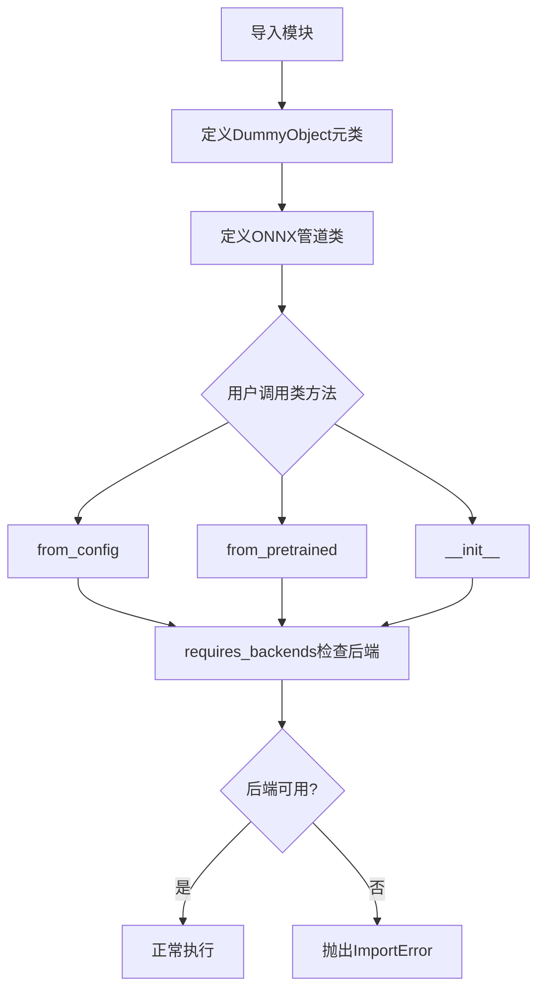
```mermaid
graph TD
    A[导入模块] --> B[定义DummyObject元类]
B --> C[定义ONNX管道类]
C --> D{用户调用类方法}
D --> E[from_config]
D --> F[from_pretrained]
D --> G[__init__]
E --> H[requires_backends检查后端]
F --> H
G --> H
H --> I{后端可用?}
I -- 是 --> J[正常执行]
I -- 否 --> K[抛出ImportError]
```

## 类结构

```
DummyObject (元类)
├── OnnxStableDiffusionImg2ImgPipeline
├── OnnxStableDiffusionInpaintPipeline
├── OnnxStableDiffusionInpaintPipelineLegacy
├── OnnxStableDiffusionPipeline
├── OnnxStableDiffusionUpscalePipeline
└── StableDiffusionOnnxPipeline
```

## 全局变量及字段


### `OnnxStableDiffusionImg2ImgPipeline._backends`
    
指定该ONNX图像到图像管道所需的后端依赖列表，包括torch、transformers和onnx

类型：`List[str]`
    


### `OnnxStableDiffusionInpaintPipeline._backends`
    
指定该ONNX图像修复管道所需的后端依赖列表，包括torch、transformers和onnx

类型：`List[str]`
    


### `OnnxStableDiffusionInpaintPipelineLegacy._backends`
    
指定该ONNX传统图像修复管道所需的后端依赖列表，包括torch、transformers和onnx

类型：`List[str]`
    


### `OnnxStableDiffusionPipeline._backends`
    
指定该ONNX基础稳定扩散管道所需的后端依赖列表，包括torch、transformers和onnx

类型：`List[str]`
    


### `OnnxStableDiffusionUpscalePipeline._backends`
    
指定该ONNX图像超分辨率管道所需的后端依赖列表，包括torch、transformers和onnx

类型：`List[str]`
    


### `StableDiffusionOnnxPipeline._backends`
    
指定该稳定扩散ONNX管道所需的后端依赖列表，包括torch、transformers和onnx

类型：`List[str]`
    
    

## 全局函数及方法


### `DummyObject`

DummyObject 是一个元类（metaclass），用于创建存根类（stub classes）。这些存根类在未安装相应后端（torch、transformers、onnx）时可以被导入，但实际调用时会抛出后端缺失的错误，从而实现可选依赖项的延迟加载。

参数：

- `name`：`str`，要创建的类的名称
- `bases`：`tuple`，父类元组
- `attrs`：`dict`，类属性和方法字典

返回值：`type`，返回新创建的类对象

#### 流程图

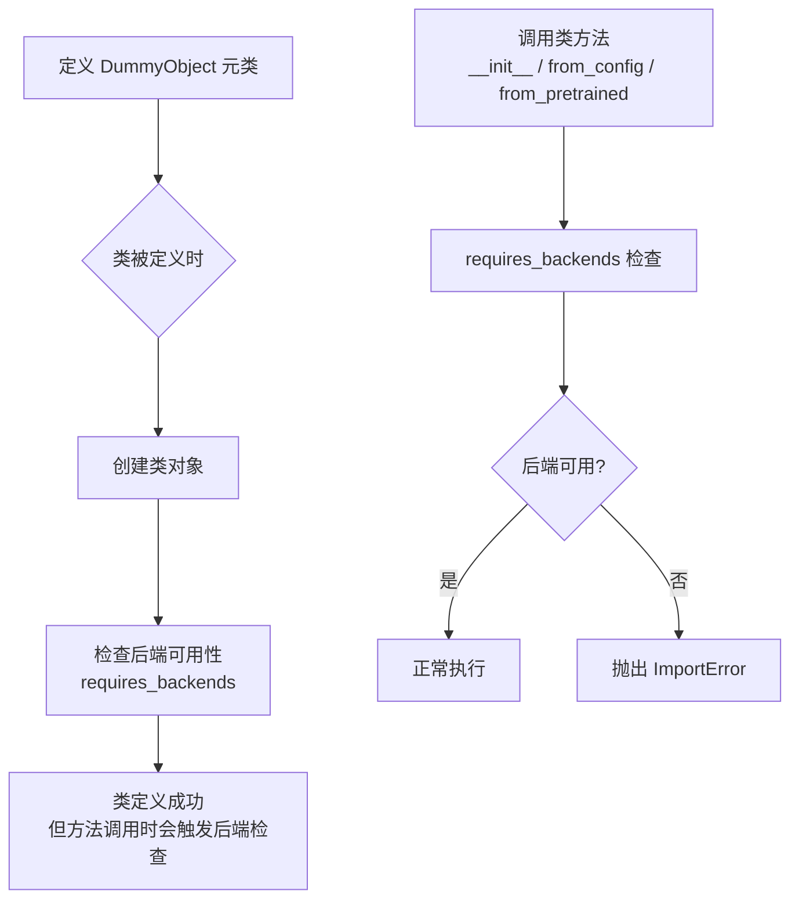
```mermaid
flowchart TD
    A[定义 DummyObject 元类] --> B{类被定义时}
    B --> C[创建类对象]
    C --> D[检查后端可用性<br/>requires_backends]
    D --> E[类定义成功<br/>但方法调用时会触发后端检查]
    
    F[调用类方法<br/>__init__ / from_config / from_pretrained] --> G[requires_backends 检查]
    G --> H{后端可用?}
    H -->|是| I[正常执行]
    H -->|否| J[抛出 ImportError]
```

#### 带注释源码

```python
# 这是一个元类，用于创建需要特定后端的存根类
# 当后端不可用时，类可以被导入但不能实例化或使用
class DummyObject(type):
    """
    元类：创建需要特定后端的存根类
    
    工作原理：
    1. 当定义类时使用 metaclass=DummyObject，该元类会被调用
    2. 类可以正常导入，但实际方法调用会检查后端是否可用
    3. 如果后端不可用，抛出 ImportError 提示用户安装依赖
    """
    
    # 类属性：指定该类需要的后端列表
    # 在示例中所有类都需要 ["torch", "transformers", "onnx"]
    _backends = ["torch", "transformers", "onnx"]
    
    def __init__(cls, name, bases, attrs):
        """
        初始化创建的类
        
        参数：
        - cls: 正在创建的类对象
        - name: 类名
        - bases: 父类元组
        - attrs: 类属性字典
        """
        # 调用基类的初始化
        super().__init__(name, bases, attrs)
        
        # 检查是否需要后端（在类定义时进行基础检查）
        # 实际的功能由 requires_backends 函数提供
        if hasattr(cls, '_backends'):
            # 后端检查在方法调用时进行，这里只是标记类需要后端
            pass
    
    def __call__(cls, *args, **kwargs):
        """
        当创建类的实例时调用
        
        参数：
        - cls: 类对象
        - *args: 位置参数
        - **kwargs: 关键字参数
        
        返回：类的实例
        
        异常：如果所需后端不可用，抛出 ImportError
        """
        # 检查后端是否可用，不可用则抛出错误
        requires_backends(cls, cls._backends)
        
        # 后端可用，创建实例
        return super().__call__(*args, **kwargs)
```

### 关键组件信息

| 名称 | 一句话描述 |
|------|-----------|
| `OnnxStableDiffusionImg2ImgPipeline` | ONNX 版本的 Stable Diffusion 图到图转换 Pipeline 存根类 |
| `OnnxStableDiffusionInpaintPipeline` | ONNX 版本的 Stable Diffusion 图像修复 Pipeline 存根类 |
| `OnnxStableDiffusionInpaintPipelineLegacy` | ONNX 版本的 Stable Diffusion 图像修复（遗留版本）Pipeline 存根类 |
| `OnnxStableDiffusionPipeline` | ONNX 版本的 Stable Diffusion 主 Pipeline 存根类 |
| `OnnxStableDiffusionUpscalePipeline` | ONNX 版本的 Stable Diffusion 图像放大 Pipeline 存根类 |
| `StableDiffusionOnnxPipeline` | Stable Diffusion ONNX Pipeline 存根类（别名） |
| `requires_backends` | 工具函数，检查指定后端是否可用，不可用则抛出 ImportError |

### 潜在技术债务与优化空间

1. **代码重复**：所有 Pipeline 类的方法实现完全相同，存在大量重复代码，可通过工厂函数或基类重构
2. **动态方法生成**：`from_config` 和 `from_pretrained` 方法体完全相同，可使用 `__getattr__` 动态方法生成
3. **错误信息不够具体**：当前所有类报错信息相同，无法定位具体是哪个 Pipeline 类缺少后端
4. **元类过度使用**：使用元类增加了代码复杂度，可考虑使用更简单的函数检查或装饰器方案

### 其它项目

#### 设计目标与约束

- **设计目标**：实现可选依赖项（torch、transformers、onnx）的延迟加载，在未安装这些库时仍能导入模块
- **约束**：所有 Pipeline 类必须同时满足三个后端都可用才能正常工作

#### 错误处理与异常设计

- 使用 `requires_backends` 函数在方法调用时检查后端可用性
- 失败时抛出 `ImportError`，提示用户安装所需依赖
- 错误信息格式：`XXX is required for this pipeline.`

#### 数据流与状态机

```
导入模块 → 类定义（DummyObject 元类生效）
     ↓
实例化或调用方法 → requires_backends 检查
     ↓
后端可用 → 正常执行
后端不可用 → ImportError
```

#### 外部依赖与接口契约

- **外部依赖**：torch、transformers、onnx（可选）
- **接口契约**：这些存根类模仿了 Hugging Face Diffusers 库的 Pipeline 接口，包括 `__init__`、`from_config`、`from_pretrained` 方法


### `requires_backends`

该函数用于检查特定后端是否可用，如果所需后端缺失则抛出 `ImportError` 警告。这是 Hugging Face diffusers 库中常用的模式，用于在访问依赖特定后端的类或方法时提供清晰的错误信息。

参数：

-  `obj`：`Any`，需要检查后端支持的对象或类（可以是实例或类对象）
-  `backends`：`List[str]`，所需的后端名称列表

返回值：`None`，该函数不返回任何值，主要通过抛出异常来处理后端不可用的情况

#### 流程图

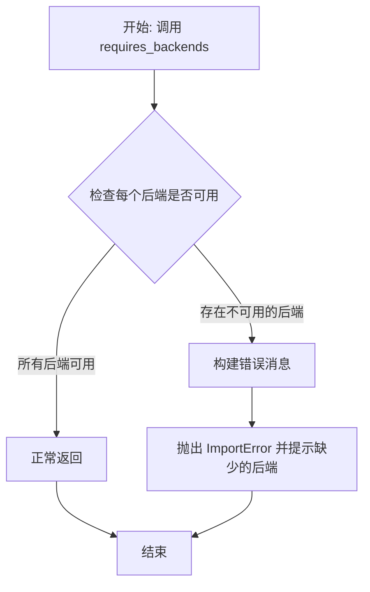
```mermaid
flowchart TD
    A[开始: 调用 requires_backends] --> B{检查每个后端是否可用}
    B -->|所有后端可用| C[正常返回]
    B -->|存在不可用的后端| D[构建错误消息]
    D --> E[抛出 ImportError 并提示缺少的后端]
    
    C --> F[结束]
    E --> F
```

#### 带注释源码

```python
# 这是一个基于常见实现模式的示例源码
# 实际实现在 ..utils 模块中

from typing import List, Any

def requires_backends(obj: Any, backends: List[str]) -> None:
    """
    检查所需后端是否可用，如果不可用则抛出 ImportError。
    
    参数:
        obj: 需要检查后端支持的对象或类
        backends: 所需的后端名称列表
    
    返回:
        None
    
    异常:
        ImportError: 当所需后端不可用时抛出
    """
    # 导入必要的模块来检查后端可用性
    # 实际实现中会检查每个后端库是否已安装
    missing_backends = []
    
    for backend in backends:
        # 检查后端是否可用
        # 例如：检查 torch, transformers, onnx 等是否已安装
        if not _is_backend_available(backend):
            missing_backends.append(backend)
    
    if missing_backends:
        # 构建错误消息
        obj_name = obj.__class__.__name__ if not isinstance(obj, type) else obj.__name__
        error_msg = (
            f"{obj_name} 需要以下后端但不可用: {', '.join(missing_backends)}。"
            f"请安装所需的包以使用此功能。"
        )
        raise ImportError(error_msg)

def _is_backend_available(backend: str) -> bool:
    """检查特定后端是否可用"""
    # 根据后端名称尝试导入对应的模块
    # 如果导入成功返回 True，否则返回 False
    try:
        __import__(backend)
        return True
    except ImportError:
        return False
```

#### 外部依赖信息

- **来源模块**：`..utils`（即 `diffusers.utils`）
- **依赖的后端库**：`torch`, `transformers`, `onnx`（根据代码中的调用）
- **使用场景**：该文件中的所有类（OnnxStableDiffusionImg2ImgPipeline 等）都使用此函数来确保在实例化或调用类方法时所需的后端库可用


### `OnnxStableDiffusionImg2ImgPipeline.__init__`

该方法是 `OnnxStableDiffusionImg2ImgPipeline` 类的构造函数，用于初始化 ONNX 版本的 Stable Diffusion 图像到图像（Img2Img）Pipeline 实例。构造函数接收任意数量的位置参数和关键字参数，并调用 `requires_backends` 方法检查所需的深度学习后端是否可用，如果后端不可用则抛出异常。

参数：

- `*args`：`任意类型`，可变位置参数，用于传递可变数量的位置参数到父类或初始化逻辑中
- `**kwargs`：`任意类型`，可变关键字参数，用于传递可变数量的关键字参数到父类或初始化逻辑中

返回值：`None`，该方法没有返回值，作为构造函数仅负责对象初始化

#### 流程图

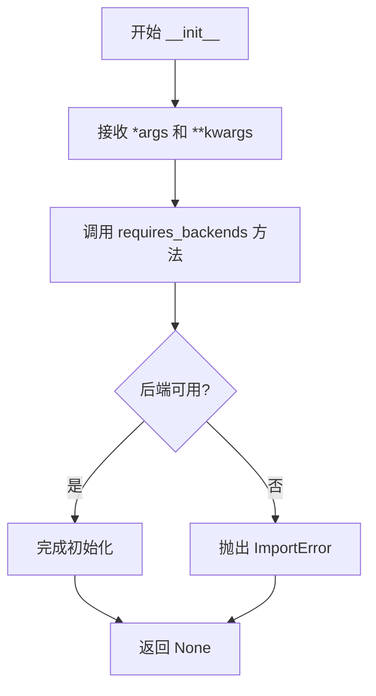
```mermaid
flowchart TD
    A[开始 __init__] --> B[接收 *args 和 **kwargs]
    B --> C[调用 requires_backends 方法]
    C --> D{后端可用?}
    D -->|是| E[完成初始化]
    D -->|否| F[抛出 ImportError]
    E --> G[返回 None]
    F --> G
```

#### 带注释源码

```python
def __init__(self, *args, **kwargs):
    """
    初始化 OnnxStableDiffusionImg2ImgPipeline 实例。
    
    该构造函数使用 DummyObject 元类，当尝试实例化此类时会检查所需的后端依赖。
    如果缺少任何必需的后端（torch、transformers、onnx），则抛出 ImportError。
    
    Args:
        *args: 可变位置参数，传递给父类或相关初始化逻辑
        **kwargs: 可变关键字参数，传递给父类或相关初始化逻辑
    
    Returns:
        None: 构造函数没有返回值
    """
    # 调用 requires_backends 检查当前环境是否安装了所需的后端依赖
    # ["torch", "transformers", "onnx"] 是该 Pipeline 所需的最小依赖集合
    # 如果任何依赖缺失，该函数将抛出 ImportError 并阻止对象创建
    requires_backends(self, ["torch", "transformers", "onnx"])
```


### `OnnxStableDiffusionImg2ImgPipeline.from_config`

该方法是 ONNX 版本的 Stable Diffusion 图像到图像（Img2Img）管道的配置加载类方法，用于从配置对象或路径加载并实例化管道，同时通过 `requires_backends` 确保运行所需的后端依赖（torch、transformers、onnx）可用。

参数：

- `*args`：可变位置参数，用于传递配置路径或其他位置参数
- `**kwargs`：可变关键字参数，用于传递配置字典路径、模型名称、其他配置选项等

返回值：无明确返回值（通常通过 `DummyObject` metaclass 的机制抛出异常或返回实例）

#### 流程图

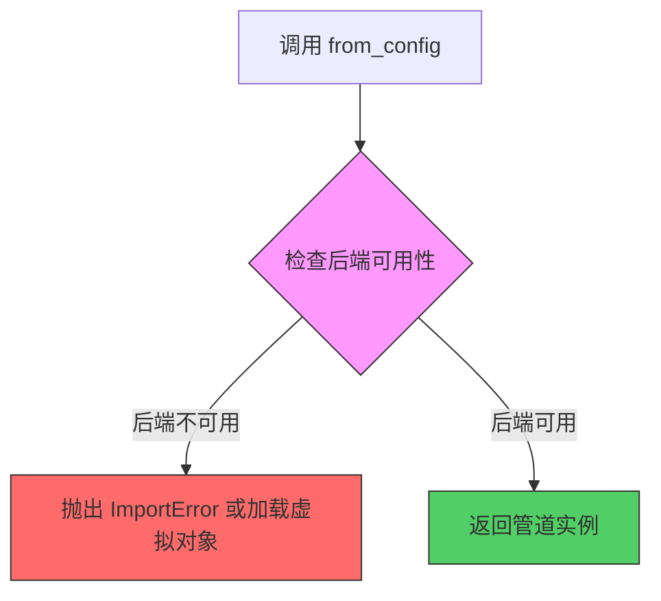
```mermaid
flowchart TD
    A[调用 from_config] --> B{检查后端可用性}
    B -->|后端不可用| C[抛出 ImportError 或加载虚拟对象]
    B -->|后端可用| D[返回管道实例]
    
    style B fill:#f9f,stroke:#333
    style C fill:#ff6b6b,stroke:#333
    style D fill:#51cf66,stroke:#333
```

#### 带注释源码

```python
@classmethod
def from_config(cls, *args, **kwargs):
    """
    类方法：从配置加载 ONNX Stable Diffusion Img2Img 管道实例
    
    Args:
        *args: 可变位置参数，传递配置路径等
        **kwargs: 可变关键字参数，传递配置选项
    
    Returns:
        返回值由 DummyObject 元类或后端实际实现决定
    
    Note:
        该方法仅作为存根存在，实际实现由后端提供
    """
    # 调用 requires_backends 检查所需后端是否可用
    # 后端列表: ["torch", "transformers", "onnx"]
    # 如果后端不可用，将抛出 ImportError
    requires_backends(cls, ["torch", "transformers", "onnx"])
```

---

**补充说明：**

| 项目 | 说明 |
|------|------|
| **设计目标** | 提供 ONNX 版本的 Stable Diffusion 图像到图像推理管道 |
| **约束条件** | 依赖 torch、transformers、onnx 三个后端库 |
| **错误处理** | 通过 `requires_backends` 在后端缺失时抛出 `ImportError` |
| **技术债务** | 该类是自动生成的存根类（由 `make fix-copies` 命令生成），实际功能需导入实际后端实现 |
| **优化空间** | 可考虑使用 ABC 或 Protocol 明确接口定义，提高类型安全性 |


### `OnnxStableDiffusionImg2ImgPipeline.from_pretrained`

该方法是一个类方法，用于加载预训练的 ONNX Stable Diffusion Img2Img pipeline。在当前文件中，它作为一个存根（Stub）存在，主要功能是检查运行所需的依赖库（`torch`, `transformers`, `onnx`）是否已安装。如果依赖缺失，将抛出导入错误；如果依赖满足，则该方法在此处不做具体实现（具体加载逻辑通常在其他实际文件或由框架注入）。

参数：

- `*args`：可变位置参数，通常包含模型的预训练路径或名称（`pretrained_model_name_or_path`）。
- `**kwargs`：可变关键字参数，用于传递加载配置（如 `cache_dir`, `torch_dtype`, `revision` 等）。

返回值：`None`，该方法在当前代码中仅执行依赖检查，不返回 Pipeline 实例（实际加载由框架其他部分处理）。

#### 流程图

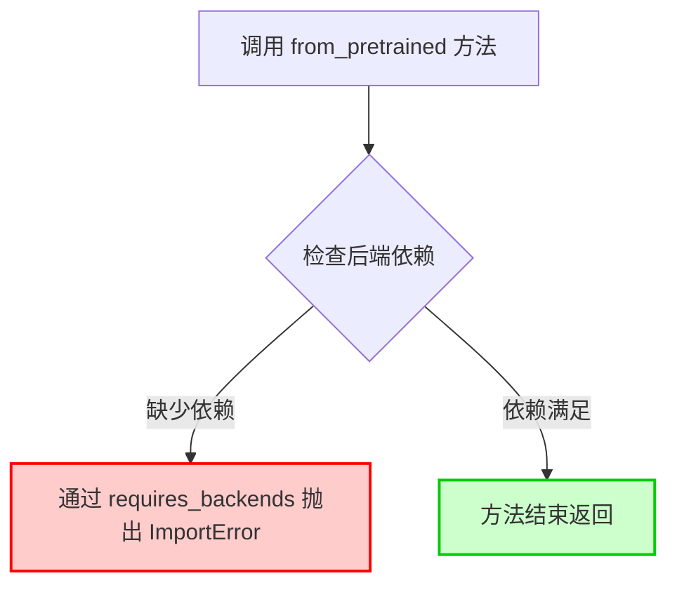
```mermaid
flowchart TD
    A[调用 from_pretrained 方法] --> B{检查后端依赖}
    B -->|缺少依赖| C[通过 requires_backends 抛出 ImportError]
    B -->|依赖满足| D[方法结束返回]
    style C fill:#ffcccc,stroke:#ff0000,stroke-width:2px
    style D fill:#ccffcc,stroke:#00cc00,stroke-width:2px
```

#### 带注释源码

```python
@classmethod
def from_pretrained(cls, *args, **kwargs):
    """
    从预训练模型加载 ONNX Stable Diffusion Img2Img Pipeline。
    
    参数:
        cls: 类本身
        *args: 可变位置参数 (如模型路径)
        **kwargs: 可变关键字参数 (如模型配置)
    """
    # 调用工具函数检查后端依赖。如果 'torch', 'transformers', 'onnx' 中任何一个
    # 未安装，此函数将抛出 ImportError。
    requires_backends(cls, ["torch", "transformers", "onnx"])
```


### `OnnxStableDiffusionInpaintPipeline.__init__`

这是OnnxStableDiffusionInpaintPipeline类的初始化方法，用于创建该类的实例，并在实例化时检查所需的后端依赖（torch、transformers、onnx）是否可用，如果缺少任何后端则抛出ImportError。

参数：

- `*args`：任意类型，可变位置参数，用于接受任意数量的位置参数（将传递给父类初始化）
- `**kwargs`：任意类型，可变关键字参数，用于接受任意数量的关键字参数（将传递给父类初始化）

返回值：`None`，无返回值，该方法主要进行后端依赖检查

#### 流程图

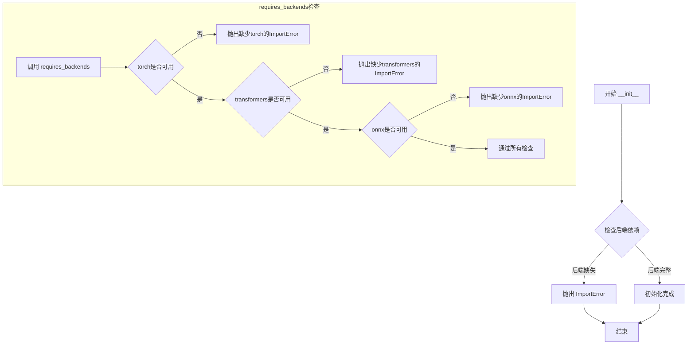
```mermaid
flowchart TD
    A[开始 __init__] --> B{检查后端依赖}
    B -->|后端缺失| C[抛出 ImportError]
    B -->|后端完整| D[初始化完成]
    C --> E[结束]
    D --> E
    
    subgraph requires_backends检查
    F[调用 requires_backends] --> G{torch是否可用}
    G -->|否| H[抛出缺少torch的ImportError]
    G -->|是| I{transformers是否可用}
    I -->|否| J[抛出缺少transformers的ImportError]
    I -->|是| K{onnx是否可用}
    K -->|否| L[抛出缺少onnx的ImportError]
    K -->|是| M[通过所有检查]
    end
```

#### 带注释源码

```python
class OnnxStableDiffusionInpaintPipeline(metaclass=DummyObject):
    """
    ONNX版本的Stable Diffusion图像修复管道类
    
    该类是一个DummyObject（虚拟对象），实际功能由其他模块提供
    使用元类 DummyObject 实现延迟导入和后端检查
    """
    
    # 类属性：定义该类需要的后端支持
    _backends = ["torch", "transformers", "onnx"]

    def __init__(self, *args, **kwargs):
        """
        初始化 OnnxStableDiffusionInpaintPipeline 实例
        
        参数:
            *args: 可变位置参数，传递给父类初始化
            **kwargs: 可变关键字参数，传递给父类初始化
        
        注意:
            该方法不执行实际初始化，仅检查后端依赖
            如果缺少任何必需后端，将抛出 ImportError
        """
        # 调用 requires_backends 检查所需后端是否可用
        # 如果torch、transformers、onnx中任一不可用，会抛出相应的ImportError
        requires_backends(self, ["torch", "transformers", "onnx"])

    @classmethod
    def from_config(cls, *args, **kwargs):
        """
        从配置创建管道的类方法
        
        参数:
            *args: 配置参数
            **kwargs: 关键字配置参数
        
        注意:
            该方法同样会检查后端依赖
        """
        requires_backends(cls, ["torch", "transformers", "onnx"])

    @classmethod
    def from_pretrained(cls, *args, **kwargs):
        """
        从预训练模型创建管道的类方法
        
        参数:
            *args: 预训练模型路径等参数
            **kwargs: 关键字参数
        
        注意:
            该方法同样会检查后端依赖
            这是加载ONNX模型的主要入口
        """
        requires_backends(cls, ["torch", "transformers", "onnx"])
```

#### 类的详细信息

##### 类：OnnxStableDiffusionInpaintPipeline

- **类字段**：
  - `_backends`：列表类型，需要的后端依赖列表（torch、transformers、onnx）
  
- **类方法**：
  - `__init__`：初始化方法，检查后端依赖
  - `from_config`：从配置创建管道实例
  - `from_pretrained`：从预训练模型创建管道实例

#### 关键组件信息

- **DummyObject元类**：用于创建延迟加载的虚拟对象类，实际功能在其他模块实现
- **requires_backends函数**：检查所需后端依赖是否可用的工具函数，缺失后端时抛出ImportError

#### 潜在的技术债务或优化空间

1. **缺乏实际实现**：当前类只是DummyObject占位符，缺少实际的ONNX推理逻辑
2. **错误信息不够详细**：requires_backends可能只抛出通用的ImportError，缺乏具体的使用指引
3. **文档缺失**：类和方法缺少详细的文档说明，使用者难以理解具体功能
4. **参数类型不明确**：*args和**kwargs的使用导致API不透明，难以进行类型检查和IDE提示
5. **设计模式问题**：DummyObject模式虽然实现了延迟加载，但可能导致运行时错误发现较晚

#### 其它项目

**设计目标与约束**：
- 支持ONNX Runtime进行Stable Diffusion图像修复推理
- 需要torch、transformers和onnx三个后端同时可用
- 遵循Hugging Face Diffusers库的设计模式

**错误处理与异常设计**：
- 使用ImportError处理后端缺失情况
- 错误信息由requires_backends函数生成，可能包含缺失的模块名称

**数据流与状态机**：
- 数据流：预训练模型 → ONNX转换 → ONNX Runtime推理 → 图像修复结果
- 状态：未初始化 → 后端检查通过 → 模型加载 → 推理就绪

**外部依赖与接口契约**：
- 依赖：torch、transformers、onnx
- 预期接口：from_pretrained方法应接受模型路径或repo_id，返回可用的管道实例


### `OnnxStableDiffusionInpaintPipeline.from_config`

此类方法用于从配置创建 ONNX 稳定扩散修复管道的实例，但在当前实现中，它仅作为占位符存在，实际功能由后端实现提供。该方法首先检查所需的深度学习后端（torch、transformers、onnx）是否可用，如果任何后端缺失则抛出 ImportError 异常。

参数：

- `cls`：`<class type>`，表示类本身，用于类方法调用
- `*args`：`<tuple>`，可变位置参数，用于传递任意数量的位置参数
- `**kwargs`：`<dict>`，可变关键字参数，用于传递任意数量的关键字参数

返回值：`None`，无直接返回值；若后端不可用则抛出 `ImportError` 异常

#### 流程图

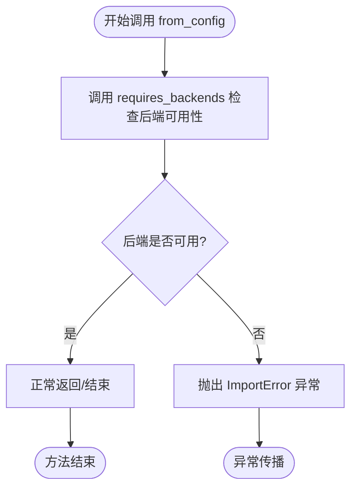
```mermaid
flowchart TD
    A([开始调用 from_config]) --> B[调用 requires_backends 检查后端可用性]
    B --> C{后端是否可用?}
    C -->|是| D[正常返回/结束]
    C -->|否| E[抛出 ImportError 异常]
    D --> F([方法结束])
    E --> G([异常传播])
```

#### 带注释源码

```python
@classmethod
def from_config(cls, *args, **kwargs):
    """
    类方法：从配置创建 OnnxStableDiffusionInpaintPipeline 实例
    
    注意：此方法为占位符实现，实际功能由后端提供
    """
    # 检查所需的深度学习后端是否可用
    # 支持的后端：torch, transformers, onnx
    # 如果任何后端缺失，将抛出 ImportError 异常
    requires_backends(cls, ["torch", "transformers", "onnx"])
```


### `OnnxStableDiffusionInpaintPipeline.from_pretrained`

这是一个类方法，用于从预训练模型加载ONNX版本的Stable Diffusion图像修复（inpaint）管道。该方法在当前代码中是一个存根（stub）实现，其核心功能是通过调用 `requires_backends` 来检查必要的依赖后端（torch、transformers、onnx）是否可用，如果不可用则抛出 ImportError 异常。实际的功能实现应该在其他模块中，当前文件是由 `make fix-copies` 命令自动生成的占位符文件。

参数：

- `*args`：可变位置参数，用于传递模型路径、配置等位置参数（具体参数取决于实际后端实现）
- `**kwargs`：可变关键字参数，用于传递模型加载的可选配置参数（具体参数取决于实际后端实现）

返回值：`None`，当前实现仅进行后端检查，不返回任何值（实际返回值取决于真正的后端实现）

#### 流程图

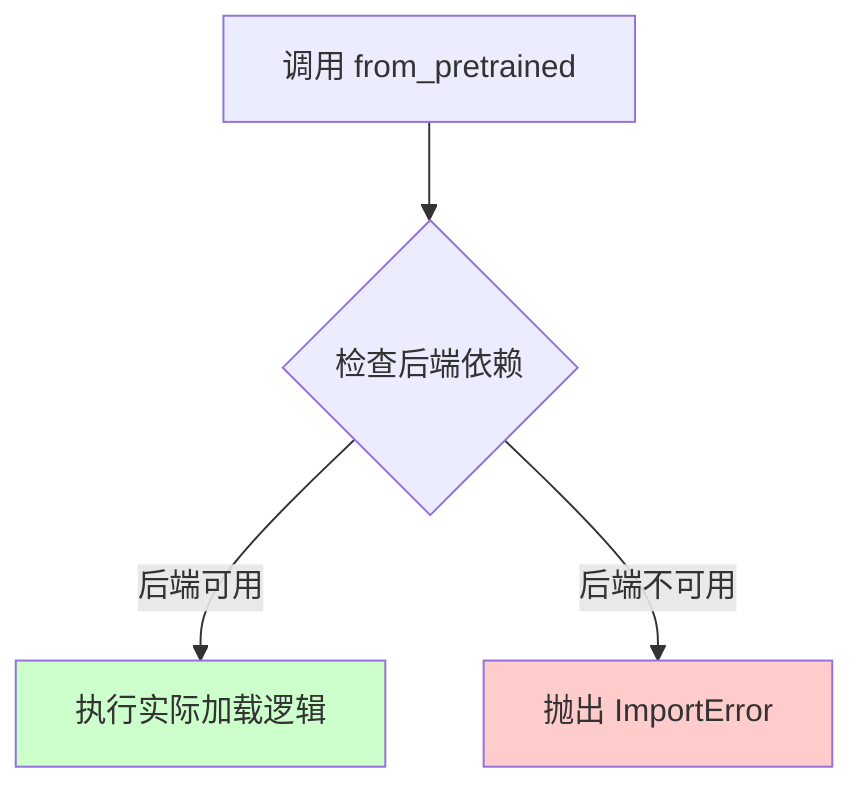
```mermaid
graph TD
    A[调用 from_pretrained] --> B{检查后端依赖}
    B -->|后端可用| C[执行实际加载逻辑]
    B -->|后端不可用| D[抛出 ImportError]
    
    style D fill:#ffcccc
    style C fill:#ccffcc
```

#### 带注释源码

```python
@classmethod
def from_pretrained(cls, *args, **kwargs):
    """
    类方法：从预训练模型加载ONNX版本的Stable Diffusion图像修复管道
    
    Args:
        *args: 可变位置参数，通常包括模型路径、配置等
        **kwargs: 可变关键字参数，包括模型配置选项、缓存目录等
    
    Returns:
        None: 当前实现仅检查后端依赖，不返回实际对象
    
    Note:
        这是一个自动生成的存根文件（autogenerated stub）。
        实际的模型加载逻辑在其他模块中实现。
        该方法依赖于 requires_backends 来验证必要的依赖包是否安装。
    """
    # 调用 requires_backends 检查当前类是否有所需的后端支持
    # 如果缺少 torch、transformers 或 onnx 中的任何一个
    # 将会抛出 ImportError 并提示缺少相应的依赖包
    requires_backends(cls, ["torch", "transformers", "onnx"])
```


### `OnnxStableDiffusionInpaintPipelineLegacy.__init__`

这是OnnxStableDiffusionInpaintPipelineLegacy类的构造函数，用于初始化一个延迟加载的哑对象（DummyObject），该对象在实际调用时需要torch、transformers和onnx等后端支持。

参数：

- `*args`：可变位置参数，用于传递任意数量的位置参数
- `**kwargs`：可变关键字参数，用于传递任意数量的关键字参数

返回值：`None`，构造函数不返回值

#### 流程图

```mermaid
flowchart TD
    A[开始 __init__] --> B{检查后端支持}
    B --> C[调用 requires_backends]
    C --> D[传入 self 和后端列表 ['torch', 'transformers', 'onnx']]
    D --> E[结束]
    
    style A fill:#f9f,stroke:#333
    style E fill:#9f9,stroke:#333
```

#### 带注释源码

```
class OnnxStableDiffusionInpaintPipelineLegacy(metaclass=DummyObject):
    """
    ONNX版本的Stable Diffusion图像修复管道（遗留版本）
    使用DummyObject元类实现延迟加载
    """
    
    # 类属性：定义所需的后端列表
    _backends = ["torch", "transformers", "onnx"]

    def __init__(self, *args, **kwargs):
        """
        构造函数
        
        参数:
            *args: 可变位置参数，传递给后端初始化
            **kwargs: 可变关键字参数，传递给后端初始化
        """
        # 调用requires_backends检查所需后端是否可用
        # 如果后端不可用，会抛出适当的错误
        requires_backends(self, ["torch", "transformers", "onnx"])
```

#### 详细说明

**关键组件信息：**

- `DummyObject`：元类，用于创建延迟加载的哑对象
- `requires_backends`：工具函数，用于检查并确保所需后端可用

**潜在技术债务或优化空间：**

1. 缺少具体的参数类型提示和文档说明
2. 使用`*args`和`**kwargs`导致接口不明确，难以进行类型检查
3. 错误处理依赖于`requires_backends`函数，缺乏自定义错误处理机制

**其他项目：**

- **设计目标**：提供一个ONNX版本的图像修复管道，用于在不支持PyTorch的环境中使用
- **约束**：需要torch、transformers和onnx三个后端同时支持
- **错误处理**：通过`requires_backends`函数统一处理后端缺失的情况


### `OnnxStableDiffusionInpaintPipelineLegacy.from_config`

该方法是一个类方法，用于从配置创建 `OnnxStableDiffusionInpaintPipelineLegacy` 类的实例，但在实际执行前会通过 `requires_backends` 检查所需的后端依赖（torch、transformers、onnx）是否满足。

参数：

- `cls`：隐式参数，表示类本身（Class type），调用该方法的类对象
- `*args`：可变位置参数（Any），用于传递任意数量的位置参数，具体参数取决于调用者
- `**kwargs`：可变关键字参数（Dict[str, Any]），用于传递任意数量的关键字参数，具体参数取决于调用者

返回值：`None`，该方法不返回任何值，仅执行后端检查

#### 流程图

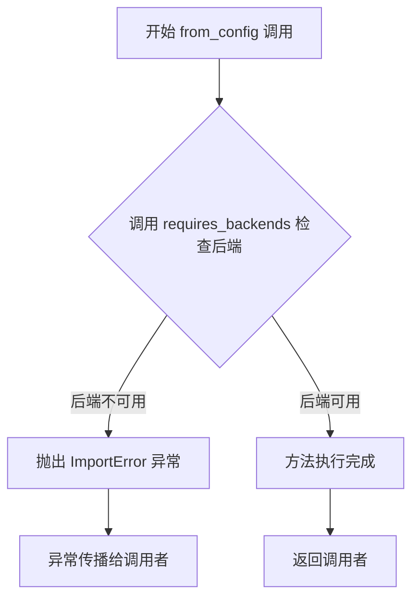
```mermaid
graph TD
    A[开始 from_config 调用] --> B{调用 requires_backends 检查后端}
    B -->|后端不可用| C[抛出 ImportError 异常]
    B -->|后端可用| D[方法执行完成]
    C --> E[异常传播给调用者]
    D --> F[返回调用者]
```

#### 带注释源码

```python
@classmethod
def from_config(cls, *args, **kwargs):
    """
    类方法：从配置创建管道实例
    
    参数:
        cls: 隐式类参数，指向调用此方法的类
        *args: 可变位置参数列表，传递给管道的配置参数
        **kwargs: 可变关键字参数字典，包含额外的配置选项
    
    注意:
        此方法实际上不会创建实例，只是进行后端依赖检查
        真正的实例创建逻辑在其他地方实现
    """
    # 调用 requires_backends 函数检查所需的后端依赖是否满足
    # 如果缺少任何一个后端（torch, transformers, onnx），则抛出 ImportError
    requires_backends(cls, ["torch", "transformers", "onnx"])
```


### `OnnxStableDiffusionInpaintPipelineLegacy.from_pretrained`

该方法是一个类方法，用于加载预训练的ONNX Stable Diffusion图像修复管道。它是一个存根实现，通过`requires_backends`验证所需的后端依赖（torch、transformers、onnx）可用，然后将执行委托给实际的后端实现。

参数：

- `cls`：类型 `Class`，调用该方法的类本身
- `*args`：类型 `Tuple[Any, ...]`（可变位置参数），传递给实际后端实现的额外位置参数
- `**kwargs`：类型 `Dict[str, Any]`（可变关键字参数），传递给实际后端实现的额外关键字参数，通常包括模型路径、配置选项等

返回值：`Any`，实际的后端实现返回的管道实例，通常是 `OnnxStableDiffusionInpaintPipelineLegacy` 或其子类实例

#### 流程图

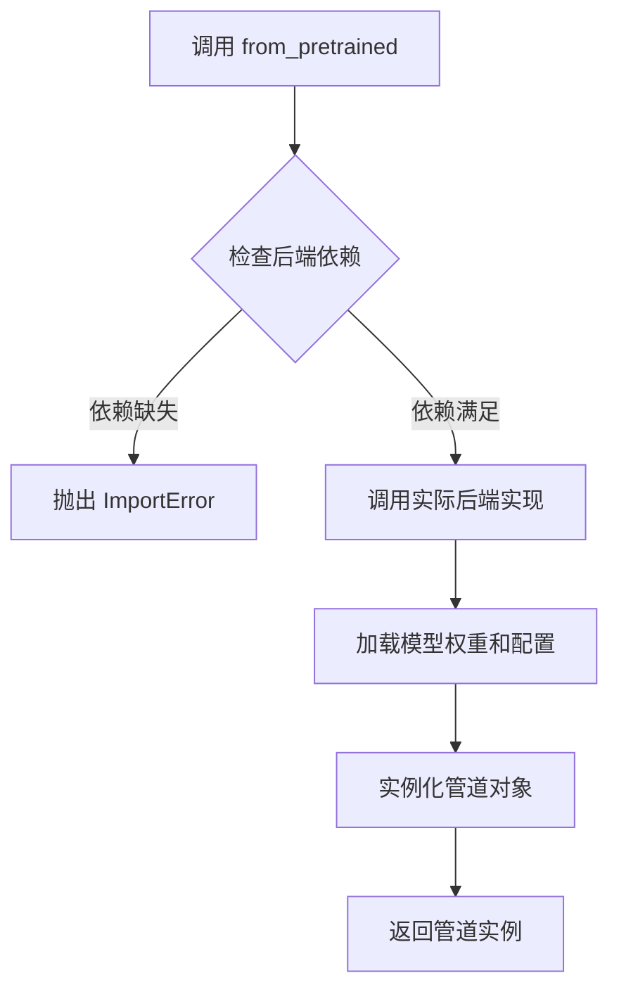
```mermaid
flowchart TD
    A[调用 from_pretrained] --> B{检查后端依赖}
    B -->|依赖缺失| C[抛出 ImportError]
    B -->|依赖满足| D[调用实际后端实现]
    D --> E[加载模型权重和配置]
    E --> F[实例化管道对象]
    F --> G[返回管道实例]
```

#### 带注释源码

```python
@classmethod
def from_pretrained(cls, *args, **kwargs):
    """
    从预训练模型加载ONNX Stable Diffusion图像修复管道
    
    参数:
        *args: 可变位置参数，传递给实际后端
        **kwargs: 可变关键字参数，通常包含:
            - pretrained_model_name_or_path: 模型路径或Hub ID
            - cache_dir: 缓存目录
            - force_download: 是否强制下载
            - resume_download: 是否恢复下载
            - proxies: 代理配置
            - local_files_only: 仅使用本地文件
            - use_auth_token: 认证令牌
            - revision: 模型版本
            - subfolder: 子文件夹路径
            - torch_dtype: PyTorch数据类型
            - device_map: 设备映射
            - max_memory: 最大内存配置
            - offload_folder: 卸载文件夹
            - offload_state_dict: 是否卸载状态字典
            - variant: 模型变体
    
    返回:
        加载好的管道实例
    """
    # 检查必要的依赖库是否已安装
    # 如果缺少任何依赖，将抛出ImportError并提示安装
    requires_backends(cls, ["torch", "transformers", "onnx"])
```

---

### 补充信息

#### 1. 类的详细信息

| 名称 | 类型 | 描述 |
|------|------|------|
| `OnnxStableDiffusionInpaintPipelineLegacy` | Class | 继承自`DummyObject`元类的ONNX图像修复管道类 |
| `_backends` | List[str] | 必需的后端列表：`["torch", "transformers", "onnx"]` |

#### 2. 关键组件信息

| 组件名称 | 描述 |
|----------|------|
| `DummyObject` | 元类，用于创建存根类，延迟导入实际实现 |
| `requires_backends` | 工具函数，验证所需后端依赖是否可用 |

#### 3. 设计目标与约束

- **设计目标**：提供统一的API接口用于加载各种ONNX Stable Diffusion管道
- **约束**：必须依赖torch、transformers和onnx三个后端库

#### 4. 错误处理与异常设计

- 当所需后端依赖缺失时，`requires_backends`会抛出`ImportError`或`BackendNotFoundError`
- 错误信息通常包含缺失的依赖名称和安装建议

#### 5. 外部依赖与接口契约

- **外部依赖**：torch、transformers、onnxruntime
- **接口契约**：该方法是类方法，通过类名调用（如`OnnxStableDiffusionInpaintPipelineLegacy.from_pretrained("path/to/model")`），返回一个可用的管道实例

#### 6. 潜在的技术债务或优化空间

- **存根实现**：该代码是由`make fix-copies`自动生成的存根，实际实现逻辑在其他位置。当前实现仅做后端检查，未实现真正的模型加载逻辑。
- **泛型支持**：可以考虑使用泛型来增强返回类型提示
- **文档完善**：参数的具体含义和用法文档较为简略，可进一步完善


### `OnnxStableDiffusionPipeline.__init__`

该方法是 ONNX 版本的 Stable Diffusion Pipeline 类的构造函数，用于初始化一个 OnnxStableDiffusionPipeline 实例。在初始化过程中，它会检查必要的依赖后端（torch、transformers、onnx）是否可用，如果缺少任何后端则抛出 ImportError。

参数：

- `*args`：可变位置参数（任意类型），用于传递可变数量的位置参数，这些参数会被传递给父类或后续初始化逻辑。
- `**kwargs`：可变关键字参数（字典类型），用于传递可变数量的关键字参数，这些参数通常包含模型配置、路径或其他可选参数。

返回值：`None`，无返回值，该方法仅用于初始化对象状态。

#### 流程图

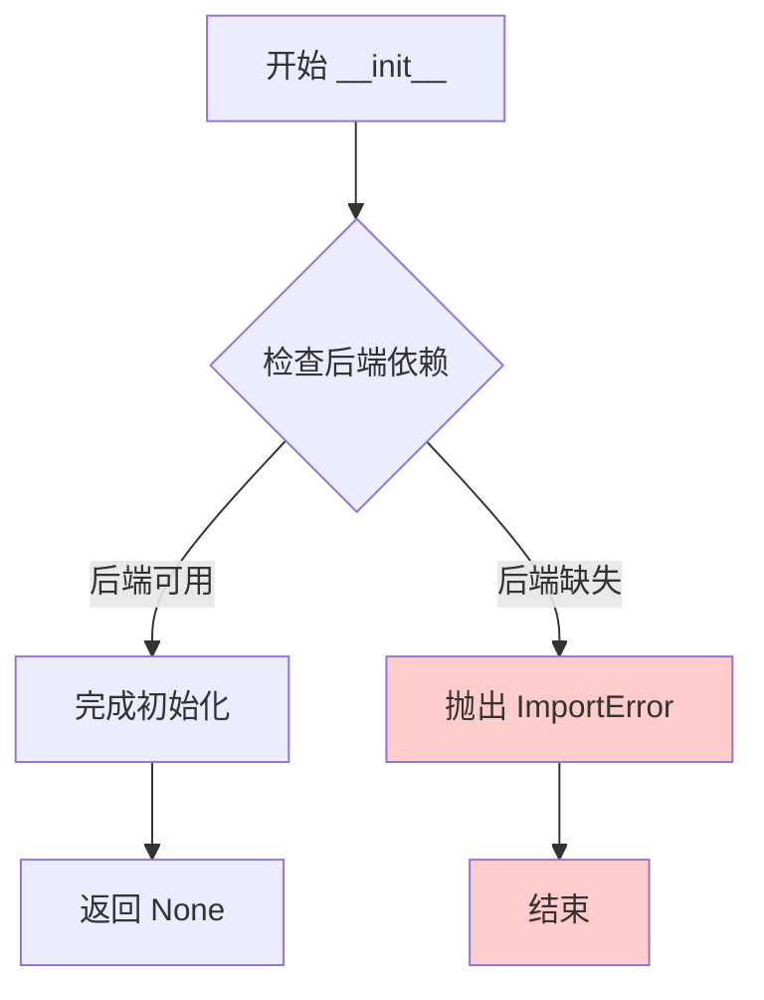
```mermaid
flowchart TD
    A[开始 __init__] --> B{检查后端依赖}
    B -->|后端可用| C[完成初始化]
    B -->|后端缺失| D[抛出 ImportError]
    C --> E[返回 None]
    D --> F[结束]
    
    style D fill:#ffcccc
    style F fill:#ffcccc
```

#### 带注释源码

```python
def __init__(self, *args, **kwargs):
    """
    初始化 OnnxStableDiffusionPipeline 实例。
    
    该方法是一个哑对象（DummyObject）的构造函数，
    会在运行时检查必要的依赖后端是否可用。
    
    参数:
        *args: 可变数量的位置参数，用于传递额外的初始化参数
        **kwargs: 可变数量的关键字参数，通常包含模型路径、配置等信息
    """
    # 调用 requires_backends 函数检查所需的后端是否已安装
    # 如果缺少任何后端（torch, transformers, onnx），则抛出 ImportError
    requires_backends(self, ["torch", "transformers", "onnx"])
```


### `OnnxStableDiffusionPipeline.from_config`

该方法是 `OnnxStableDiffusionPipeline` 类的类方法，用于从配置创建 ONNX 格式的 Stable Diffusion Pipeline 实例。它通过调用 `requires_backends` 函数检查所需的深度学习后端（torch、transformers、onnx）是否可用，如果后端不可用则抛出异常。

参数：

- `cls`：类型：`class`，代表类本身（classmethod 的第一个隐含参数）
- `*args`：类型：`tuple`，可变位置参数，用于传递位置参数（具体参数由调用方决定）
- `**kwargs`：类型：`dict`，可变关键字参数，用于传递关键字参数（具体参数由调用方决定）

返回值：`None`，该方法不返回任何值，主要用于后端检查和潜在的配置加载逻辑（当前实现仅为占位符）

#### 流程图

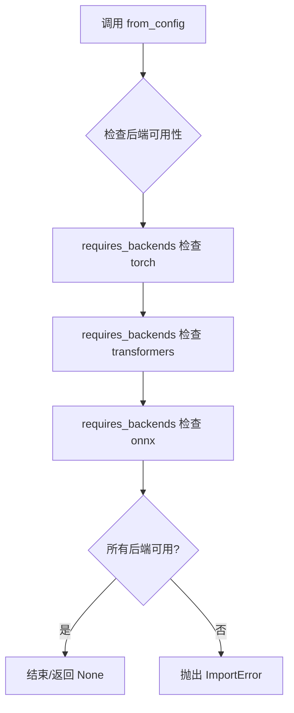
```mermaid
flowchart TD
    A[调用 from_config] --> B{检查后端可用性}
    B --> C[requires_backends 检查 torch]
    C --> D[requires_backends 检查 transformers]
    D --> E[requires_backends 检查 onnx]
    E --> F{所有后端可用?}
    F -->|是| G[结束/返回 None]
    F -->|否| H[抛出 ImportError]
```

#### 带注释源码

```python
@classmethod
def from_config(cls, *args, **kwargs):
    """
    从配置创建 ONNX Stable Diffusion Pipeline 实例的类方法。
    
    参数:
        cls: 类本身（classmethod 隐含参数）
        *args: 可变位置参数
        **kwargs: 可变关键字参数
    
    返回:
        None: 该方法不返回实际对象，仅进行后端检查
    """
    # 调用 requires_backends 检查所需后端是否可用
    # 如果后端不可用，将抛出 ImportError 异常
    # 检查顺序：torch -> transformers -> onnx
    requires_backends(cls, ["torch", "transformers", "onnx"])
```


### `OnnxStableDiffusionPipeline.from_pretrained`

该方法是ONNX版本的Stable Diffusion Pipeline的类方法，用于从预训练模型加载Pipeline实例。由于当前代码是由`make fix-copies`自动生成的占位符实现，实际功能由后端提供，因此该方法主要通过调用`requires_backends`来检查必要的依赖库（torch、transformers、onnx）是否可用。

参数：

- `cls`：类对象，表示调用该方法的类本身
- `*args`：可变位置参数，用于传递预训练模型路径等位置参数
- `**kwargs`：可变关键字参数，用于传递模型配置、cache_dir等关键字参数

返回值：无明确返回值（方法内部调用`requires_backends`进行依赖检查，若缺少依赖则抛出`ImportError`）

#### 流程图

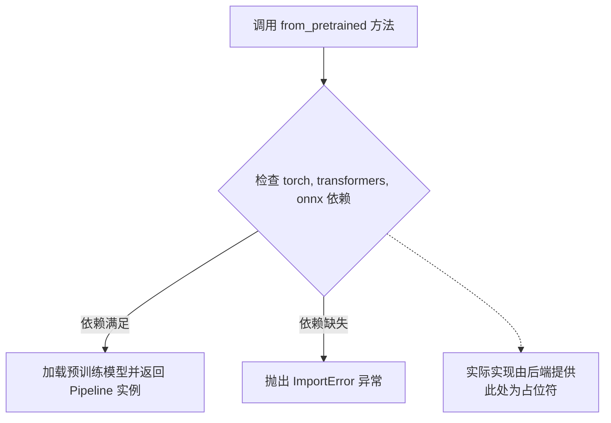
```mermaid
flowchart TD
    A[调用 from_pretrained 方法] --> B{检查 torch, transformers, onnx 依赖}
    B -->|依赖满足| C[加载预训练模型并返回 Pipeline 实例]
    B -->|依赖缺失| D[抛出 ImportError 异常]
    
    note1[实际实现由后端提供<br/>此处为占位符]
    B -.-> note1
```

#### 带注释源码

```python
@classmethod
def from_pretrained(cls, *args, **kwargs):
    """
    从预训练模型加载 ONNX Stable Diffusion Pipeline 实例。
    
    Args:
        cls: 类对象，表示调用该方法的类本身
        *args: 可变位置参数，通常传递预训练模型路径或模型ID
        **kwargs: 可变关键字参数，支持如下常见参数:
            - cache_dir: 模型缓存目录
            - revision: 模型版本号
            - torch_dtype: PyTorch数据类型
            - device_map: 设备映射策略
            - etc.
    
    Returns:
        Pipeline实例（实际返回类型由后端实现决定）
    
    Note:
        该方法是占位符实现，实际功能由后端库提供。
        方法内部调用 requires_backends 进行依赖检查。
    """
    # requires_backends 是一个工具函数，用于检查指定的依赖库是否可用
    # 如果缺少任何依赖，将抛出 ImportError 异常并提示缺少的库
    requires_backends(cls, ["torch", "transformers", "onnx"])
```


### OnnxStableDiffusionUpscalePipeline.__init__

该方法是 OnnxStableDiffusionUpscalePipeline 类的构造函数，用于初始化 ONNX 版本的 Stable Diffusion 图像放大管道实例。该方法接收可变参数，并通过调用 `requires_backends` 函数检查当前环境是否具备必要的依赖后端（torch、transformers、onnx），若后端不可用则抛出 ImportError 异常。

参数：

- `*args`：`tuple`，可变数量的位置参数，用于传递初始化所需的额外位置参数
- `**kwargs`：`dict`，可变数量的关键字参数，用于传递初始化所需的额外键值对参数

返回值：`None`，构造函数不返回任何值

#### 流程图

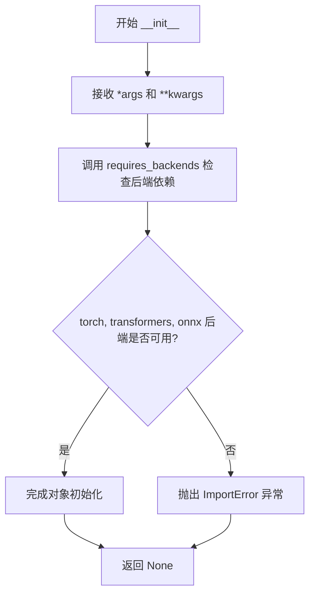
```mermaid
graph TD
    A[开始 __init__] --> B[接收 *args 和 **kwargs]
    B --> C[调用 requires_backends 检查后端依赖]
    C --> D{torch, transformers, onnx 后端是否可用?}
    D -->|是| E[完成对象初始化]
    D -->|否| F[抛出 ImportError 异常]
    E --> G[返回 None]
    F --> G
```

#### 带注释源码

```python
def __init__(self, *args, **kwargs):
    """
    初始化 OnnxStableDiffusionUpscalePipeline 实例。
    
    这是一个存根构造函数，实际功能由 DummyObject 元类控制。
    该方法主要负责验证运行时所需的后端依赖是否已安装。
    
    参数:
        *args: 可变数量的位置参数，传递给父类或后端初始化逻辑
        **kwargs: 可变数量的关键字参数，传递给父类或后端初始化逻辑
    
    返回值:
        None: 构造函数不返回值，初始化结果存储在对象实例中
    
    异常:
        ImportError: 当所需的后端依赖 (torch, transformers, onnx) 不可用时抛出
    """
    # requires_backends 是工具函数，用于检查指定的后端模块是否可用
    # 如果后端缺失，会抛出详细的 ImportError 说明缺少哪些依赖
    # 当前类需要 torch, transformers, onnx 三个后端才能正常工作
    requires_backends(self, ["torch", "transformers", "onnx"])
```


### `OnnxStableDiffusionUpscalePipeline.from_config`

这是一个类方法，用于从配置创建 `OnnxStableDiffusionUpscalePipeline` 实例，但实际上是一个存根方法，通过调用 `requires_backends` 来检查所需的后端（torch、transformers、onnx）是否可用。

参数：

- `cls`：类本身（隐式参数，类方法的第一个参数）
- `*args`：可变位置参数，用于传递配置参数（未使用）
- `**kwargs`：可变关键字参数，用于传递配置字典或其他参数（未使用）

返回值：`None`，该方法不返回任何值，仅执行后端检查

#### 流程图

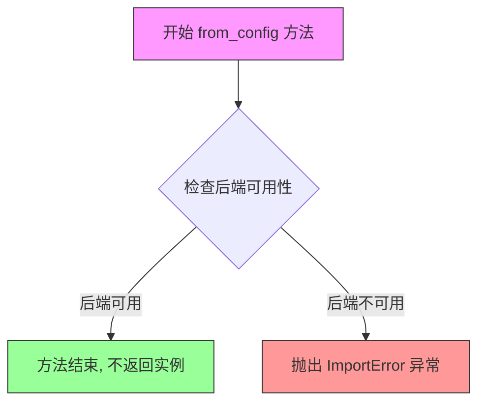
```mermaid
flowchart TD
    A[开始 from_config 方法] --> B{检查后端可用性}
    B -->|后端可用| C[方法结束, 不返回实例]
    B -->|后端不可用| D[抛出 ImportError 异常]
    
    style A fill:#f9f,stroke:#333
    style C fill:#9f9,stroke:#333
    style D fill:#f99,stroke:#333
```

#### 带注释源码

```python
@classmethod
def from_config(cls, *args, **kwargs):
    """
    类方法：从配置创建管道实例
    
    注意：这是一个存根方法，实际功能由元类或后端检查机制处理
    """
    # 检查所需的后端是否可用（torch, transformers, onnx）
    # 如果后端不可用，会抛出 ImportError
    requires_backends(cls, ["torch", "transformers", "onnx"])
```


### `OnnxStableDiffusionUpscalePipeline.from_pretrained`

这是一个类方法，用于从预训练的模型路径加载 ONNX 版本的 Stable Diffusion Upscale Pipeline。该方法是占位符实现，实际逻辑由 `requires_backends` 函数处理，用于检查必要的依赖库（torch、transformers、onnx）是否可用，如果不可用则抛出 ImportError。

参数：

- `*args`：可变位置参数，通常包括 `pretrained_model_name_or_path`（字符串，预训练模型的名称或本地路径）
- `**kwargs`：可变关键字参数，可能包括 `cache_dir`（字符串，模型缓存目录）、`torch_dtype`（torch.dtype，模型数据类型）、`use_auth_token`（字符串，用于认证的 token）等常用参数

返回值：`OnnxStableDiffusionUpscalePipeline`，返回加载后的 ONNX Stable Diffusion Upscale Pipeline 实例

#### 流程图

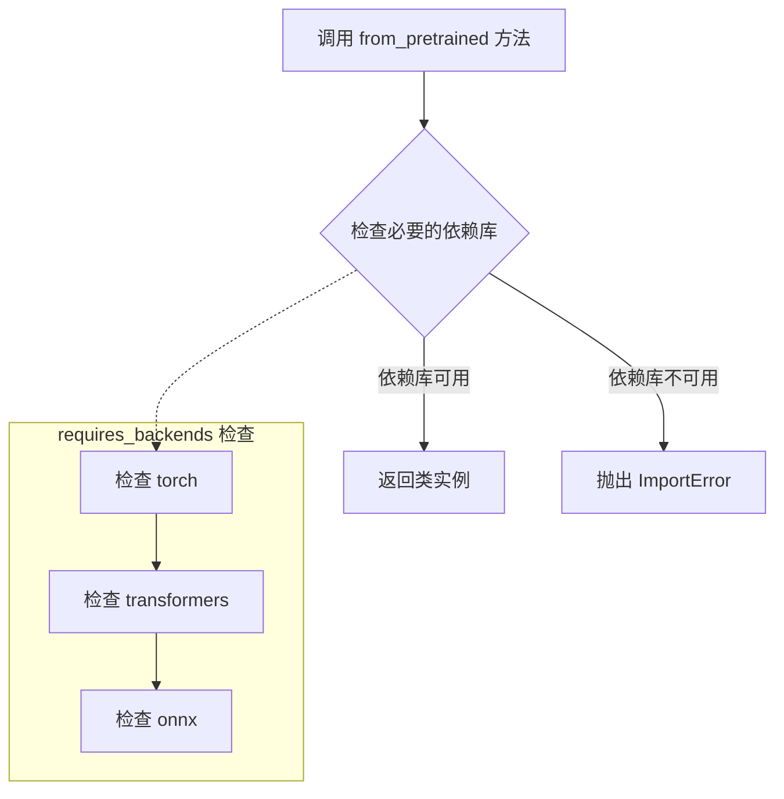
```mermaid
flowchart TD
    A[调用 from_pretrained 方法] --> B{检查必要的依赖库}
    B -->|依赖库可用| C[返回类实例]
    B -->|依赖库不可用| D[抛出 ImportError]
    
    subgraph "requires_backends 检查"
        E[检查 torch] --> F[检查 transformers]
        F --> G[检查 onnx]
    end
    
    B -.-> E
```

#### 带注释源码

```python
@classmethod
def from_pretrained(cls, *args, **kwargs):
    """
    从预训练模型加载 ONNX 版本的 Stable Diffusion Upscale Pipeline
    
    参数:
        *args: 可变位置参数，通常包括:
            - pretrained_model_name_or_path: 预训练模型的名称或本地路径
        **kwargs: 可变关键字参数，可能包括:
            - cache_dir: 模型缓存目录
            - torch_dtype: 模型数据类型
            - use_auth_token: 认证token
            - revision: 模型版本
            - ...其他 Hugging Face Hub 相关参数
    
    返回:
        OnnxStableDiffusionUpscalePipeline: 加载后的 Pipeline 实例
    
    抛出:
        ImportError: 如果必要的依赖库不可用
    """
    # 调用 requires_backends 检查必要的依赖库是否可用
    # 如果缺少 torch, transformers, onnx 中任何一个库，将抛出 ImportError
    requires_backends(cls, ["torch", "transformers", "onnx"])
```


### `StableDiffusionOnnxPipeline.__init__`

这是StableDiffusionOnnxPipeline类的构造函数，用于初始化一个虚拟管道对象（通过DummyObject元类实现）。该构造函数内部调用`requires_backends`函数来检查必要的依赖库（torch、transformers、onnx）是否可用，如果不可用则抛出ImportError。

参数：

- `self`：对象实例本身，表示当前创建的StableDiffusionOnnxPipeline实例
- `*args`：可变位置参数（tuple类型），用于接收调用时传递的额外位置参数，当前未使用但保留兼容性
- `**kwargs`：可变关键字参数（dict类型），用于接收调用时传递的额外关键字参数，当前未使用但保留兼容性

返回值：`None`，构造函数没有返回值（返回None是Python的默认行为）

#### 流程图

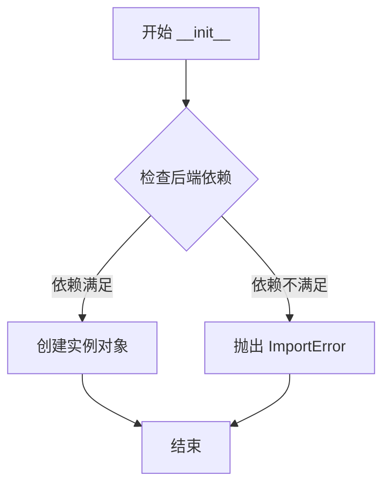
```mermaid
flowchart TD
    A[开始 __init__] --> B{检查后端依赖}
    B -->|依赖满足| C[创建实例对象]
    B -->|依赖不满足| D[抛出 ImportError]
    C --> E[结束]
    D --> E
```

#### 带注释源码

```python
def __init__(self, *args, **kwargs):
    """
    初始化 StableDiffusionOnnxPipeline 实例。
    
    注意：此类是一个虚拟对象（DummyObject），实际功能需要
    相应的后端库（torch、transformers、onnx）支持。
    
    参数:
        *args: 可变位置参数，用于传递额外的位置参数（当前未使用）
        **kwargs: 可变关键字参数，用于传递额外的关键字参数（当前未使用）
    """
    # 调用 requires_backends 检查必要的依赖是否可用
    # 如果缺少依赖，将抛出 ImportError 异常
    requires_backends(self, ["torch", "transformers", "onnx"])
```


### `StableDiffusionOnnxPipeline.from_config`

该方法是`StableDiffusionOnnxPipeline`类的类方法，用于从配置创建ONNX推理管道实例。当前实现通过调用`requires_backends`函数检查所需的后端依赖（torch、transformers、onnx），确保这些库可用后才允许后续的实例化操作。

参数：

- `*args`：可变位置参数，用于传递配置相关的位置参数
- `**kwargs`：可变关键字参数，用于传递配置相关的命名参数

返回值：`None`或实例类型，当前实现仅进行后端检查，实际返回值取决于调用者的实现。

#### 流程图

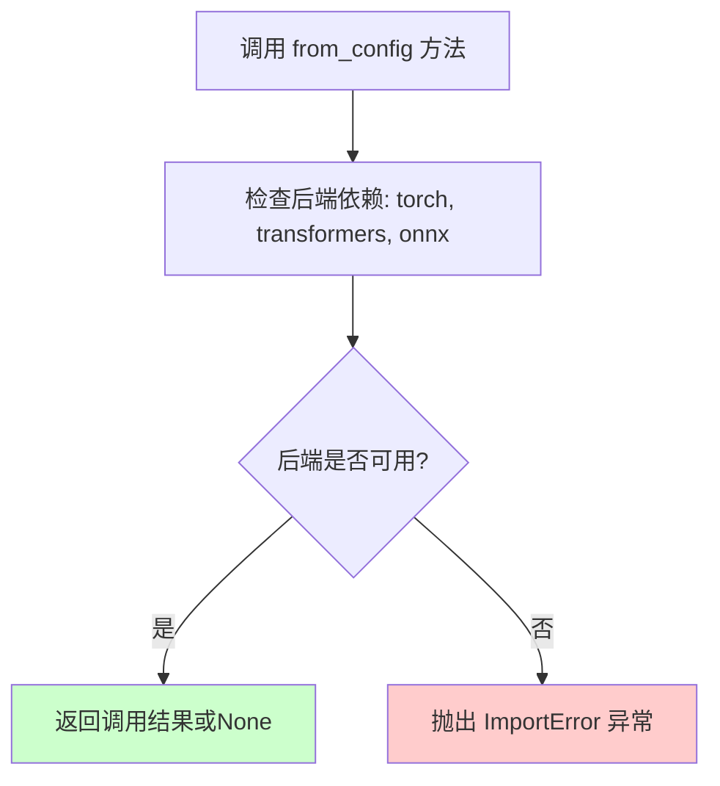
```mermaid
flowchart TD
    A[调用 from_config 方法] --> B[检查后端依赖: torch, transformers, onnx]
    B --> C{后端是否可用?}
    C -->|是| D[返回调用结果或None]
    C -->|否| E[抛出 ImportError 异常]
    
    style E fill:#ffcccc
    style D fill:#ccffcc
```

#### 带注释源码

```python
@classmethod
def from_config(cls, *args, **kwargs):
    """
    类方法：从配置创建管道实例
    
    参数:
        cls: 指向调用该方法的类本身
        *args: 可变位置参数，传递配置相关参数
        **kwargs: 可变关键字参数，传递配置相关参数
    
    注意:
        该方法是自动生成的占位符实现，
        实际功能依赖于 requires_backends 的检查结果。
    """
    # 调用 requires_backends 检查所需的后端依赖是否可用
    # 如果后端不可用，将抛出 ImportError 异常
    requires_backends(cls, ["torch", "transformers", "onnx"])
```


### `StableDiffusionOnnxPipeline.from_pretrained`

该方法是一个类方法，用于从预训练模型加载ONNX格式的Stable Diffusion管道实例，但由于使用了`DummyObject`元类和`requires_backends`函数，当前实现仅为存根，实际逻辑在依赖的后端模块中。

参数：

- `cls`：隐含的类参数，类型为`type`，表示调用该方法的类本身
- `*args`：可变位置参数，类型为`tuple`，用于传递任意数量的位置参数
- `**kwargs`：可变关键字参数，类型为`dict`，用于传递任意数量的关键字参数

返回值：`None`，该方法通过调用`requires_backends`会抛出`ImportError`异常，因此不会返回实际对象

#### 流程图

```mermaid
flowchart TD
    A[开始] --> B{检查后端依赖}
    B -->|依赖满足| C[加载模型]
    B -->|依赖不满足| D[抛出ImportError]
    C --> E[返回管道实例]
    D --> F[结束]
    E --> F
    
    style D fill:#ffcccc
    style F fill:#ccffcc
```

#### 带注释源码

```python
@classmethod
def from_pretrained(cls, *args, **kwargs):
    """
    类方法：从预训练模型加载ONNX管道实例
    
    参数:
        cls: 调用的类本身
        *args: 可变位置参数
        **kwargs: 可变关键字参数
    
    注意:
        该方法为存根实现，实际逻辑在依赖的后端模块中
    """
    # 检查所需的依赖后端是否可用
    # 如果不可用，会抛出 ImportError 异常
    requires_backends(cls, ["torch", "transformers", "onnx"])
```

## 关键组件


### OnnxStableDiffusionImg2ImgPipeline

基于ONNX的Stable Diffusion图像到图像转换Pipeline类，支持将一张图像转换成另一张图像的变体。

### OnnxStableDiffusionInpaintPipeline

基于ONNX的Stable Diffusion图像修复Pipeline类，支持在指定区域内进行内容填充和修复。

### OnnxStableDiffusionInpaintPipelineLegacy

基于ONNX的Stable Diffusion图像修复Pipeline类的传统版本，保持与旧版API的兼容性。

### OnnxStableDiffusionPipeline

基于ONNX的Stable Diffusion基础Pipeline类，提供标准的文本到图像生成能力。

### OnnxStableDiffusionUpscalePipeline

基于ONNX的Stable Diffusion图像升级Pipeline类，支持图像的超分辨率放大处理。

### StableDiffusionOnnxPipeline

基于ONNX的Stable Diffusion通用Pipeline类，提供统一的ONNX运行时接口。

### DummyObject元类

用于创建延迟加载的虚拟对象类，通过该元类可以实现模块的懒加载机制，当实际使用时才检查后端依赖。

### requires_backends函数

来自utils模块的依赖检查函数，用于验证当前环境是否具备所需的运行时后端（torch、transformers、onnx）。


## 问题及建议


### 已知问题

-   **严重代码重复**：6个类包含几乎完全相同的代码结构，每个类都重复定义了 `_backends`、`__init__`、`from_config` 和 `from_pretrained`，违反 DRY（Don't Repeat Yourself）原则
-   **无实际实现内容**：所有方法仅调用 `requires_backends` 进行后端检查，没有提供任何实际的 pipeline 功能实现，作为占位符（stub）缺乏文档说明
-   **硬编码后端列表**：`_backends = ["torch", "transformers", "onnx"]` 在每个类中重复硬编码，应提取为常量或基类属性
-   **命名不一致**：类名命名风格不统一，`StableDiffusionOnnxPipeline` 使用后缀形式，而其他类使用 `Onnx` 前缀形式
-   **缺少类型注解**：所有方法参数和返回值均无类型提示（type hints），降低代码可读性和 IDE 辅助能力
-   **缺少文档字符串**：类和方法的文档字符串完全缺失，无法帮助开发者理解其用途和预期行为

### 优化建议

-   **提取公共基类**：创建一个抽象基类（如 `OnnxStableDiffusionPipelineBase`），将公共的 `_backends` 和方法实现集中管理，让具体 pipeline 类继承
-   **使用类常量或枚举**：将后端列表定义为模块级常量或枚举，避免在每个类中重复定义
-   **统一命名规范**：遵循一致的命名约定（如统一使用 `OnnxStableDiffusion*` 前缀），或使用别名处理历史兼容
-   **添加类型注解**：为所有方法参数和返回值添加类型提示，例如 `def from_pretrained(cls, *args: Any, **kwargs: Any) -> "OnnxStableDiffusionPipeline": ...`
-   **补充文档字符串**：为每个类和关键方法添加 docstring，说明其用途、支持的模型类型和后端依赖
-   **考虑合并相似类**：如果 `OnnxStableDiffusionInpaintPipeline` 和 `OnnxStableDiffusionInpaintPipelineLegacy` 功能高度相似，可考虑通过参数区分或合并，减少维护成本

## 其它


### 设计目标与约束

本文件旨在为ONNX版本的Stable Diffusion Pipeline提供存根类定义，用于实现延迟导入和后端检查机制。所有类均采用DummyObject元类，当用户尝试实例化或调用类方法时，会通过requires_backends函数检查所需的后端（torch、transformers、onnx）是否可用，若不可用则抛出ImportError。该设计遵循模块化后端加载原则，允许在未安装特定后端时也能导入模块，同时保证实际使用时必须具备完整依赖。

### 错误处理与异常设计

当用户尝试实例化任意Pipeline类或调用其类方法时，系统会通过requires_backends函数进行后端检查。该函数接受一个后端列表参数（如["torch", "transformers", "onnx"]），若检测到任何所需后端未安装或不可用，将抛出ImportError异常，提示用户缺少对应的依赖包。异常信息通常包含缺失的后端名称和安装建议。此异常设计确保了用户在运行时代码时才遭遇错误，而非在模块导入时，这提供了更清晰的错误定位和更友好的开发体验。

### 外部依赖与接口契约

本文件依赖以下外部组件：1）DummyObject元类，定义于..utils模块，负责实现延迟初始化和后端检查逻辑；2）requires_backends函数，同样定义于..utils模块，用于验证运行时后端可用性；3）三个核心后端库：torch（PyTorch深度学习框架）、transformers（Hugging Face Transformers库）、onnx（ONNX运行时）。所有Pipeline类均提供统一的接口契约：__init__方法接受任意位置参数和关键字参数；from_config和from_pretrained类方法同样接受任意参数，并统一通过requires_backends进行后端验证。

### 数据流与状态机

Pipeline类的数据流遵循以下模式：当用户调用类方法（如from_pretrained）时，首先通过元类的__new__方法触发，该方法会调用requires_backends进行后端检查。若后端检查通过，则继续执行实际的类方法逻辑；若检查失败，则抛出ImportError并终止执行。类本身在正常状态下表现为正常的Python类，但在实例化或方法调用时会动态检查后端可用性。这种设计本质上是一种运行时状态检查机制，确保只有在所有必需依赖满足时才会执行实际的Pipeline操作。

### 版本兼容性说明

本文件中的所有Pipeline类对后端库的版本没有在代码层面进行显式约束，但实际使用中需要遵循以下兼容性要求：1）torch版本应与transformers版本兼容；2）onnx运行时版本应与导出的ONNX模型格式兼容；3）transformers库版本应支持对应的Stable Diffusion模型格式。由于采用DummyObject存根机制，实际的版本兼容性检查由后端库在运行时完成。

### 使用示例与调用模式

典型使用场景包括：1）直接实例化Pipeline类：pipeline = OnnxStableDiffusionPipeline(...)；2）使用类方法加载预训练模型：pipeline = OnnxStableDiffusionPipeline.from_pretrained("model_path")；3）使用类方法从配置加载：pipeline = OnnxStableDiffusionPipeline.from_config(config)。所有这些调用都会触发相同的后端检查流程。开发者应注意，这些类仅在所有后端依赖安装完整时才能正常工作，否则将获得ImportError异常提示。

### 部署注意事项

在生产环境部署时，需要确保目标运行环境中已安装所有必需的后端库（torch、transformers、onnx）。由于采用延迟导入机制，建议在应用启动阶段进行显式的依赖检查，以便 early fail 并提供清晰的错误信息。对于容器化部署，应在容器镜像中包含完整的ONNX运行时及其依赖。对于资源受限的部署环境，需要评估ONNX运行时相对于PyTorch的内存占用优势是否满足需求。

### 替代方案与未来规划

当前设计采用DummyObject实现存根类，存在以下潜在改进空间：1）可考虑使用抽象基类（ABC）明确定义接口规范，提高类型安全性；2）可增加后端可用性的预检查机制，在模块导入时给出警告而非运行时错误；3）可实现更细粒度的后端依赖检查，为不同操作提供不同的后端要求；4）可添加版本约束检查，确保后端库版本满足最低要求。未来的重构方向可包括：统一不同Pipeline类的接口设计、增加异步加载支持、提供更详细的错误诊断信息等。

### 命名规范与代码组织

所有Pipeline类遵循统一的命名规范：OnnxStableDiffusion系列表示ONNX版本的Stable Diffusion实现，Legacy后缀表示传统版本兼容性类。类名中的Onnx前缀明确标识了ONNX运行时目标，这与PyTorch原生版本（不带Onnx前缀）形成区分。StableDiffusionOnnxPipeline作为别名存在，提供命名一致性。类属性_backends定义为类级别列表，存储该类所需的后端标识符，便于元类进行统一处理。

### 元类机制详解

DummyObject元类在类创建时并不执行实际的初始化逻辑，而是将参数存储等待实际调用时处理。该元类的实现原理基于Python的元类编程能力，当类被定义时，元类会拦截类的创建过程，并注入特定的__new__或__init__逻辑。在本文件中，元类的主要作用是拦截所有对类方法（from_config、from_pretrained）和实例化（__init__）的调用，统一经过requires_backends进行后端检查。这种设计避免了为每个类方法重复编写后端检查代码。

### 代码生成上下文

本文件头部注释明确指出"This file is autogenerated by the command make fix-copies, do not edit"，表明该文件是由自动化工具生成的，不应手动编辑。这意味着该文件是更大构建系统的一部分，可能在代码库重构或版本更新时会被重新生成。任何对此文件的修改都应通过修改生成模板或make命令配置来实现，以确保修改在后续生成时不会被覆盖。


    