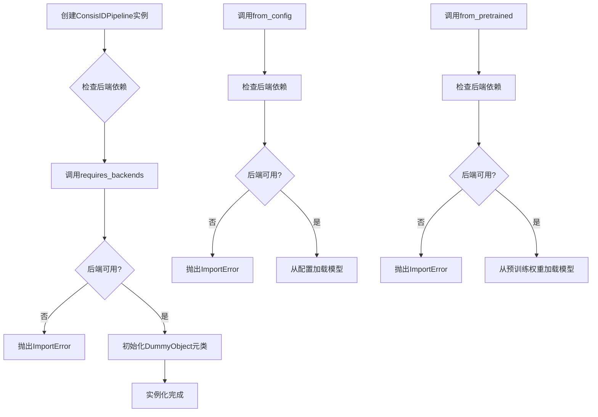
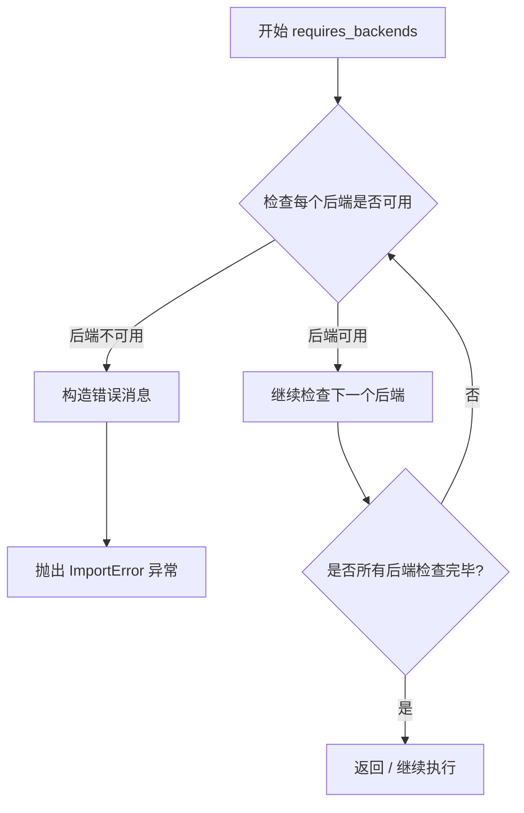
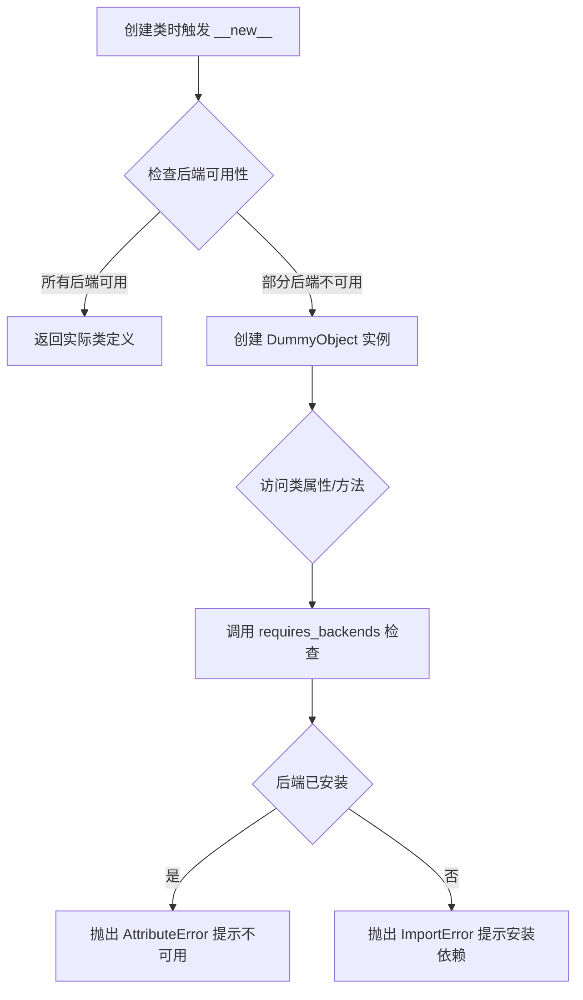
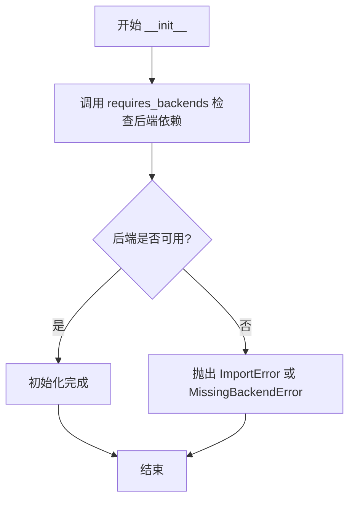
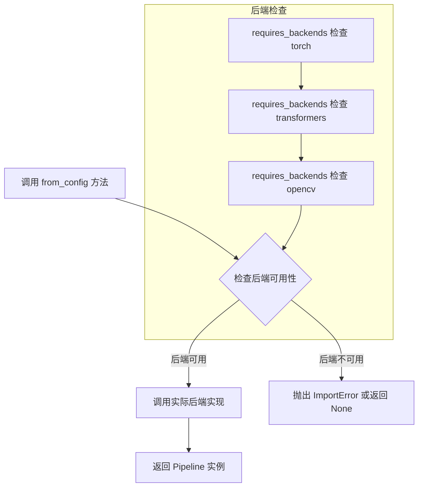
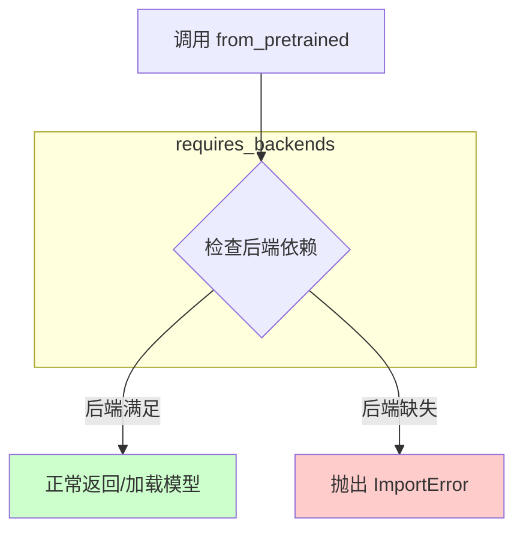

# `diffusers\src\diffusers\utils\dummy_torch_and_transformers_and_opencv_objects.py` 详细设计文档

这是一个自动生成的ConsisIDPipeline管道类，封装了对torch、transformers和opencv三个深度学习与计算机视觉后端的依赖检查，提供模型配置加载和预训练权重加载的接口，用于实现ConsisID图像生成或处理流程。

## 整体流程



## 类结构

```
DummyObject (元类)
└── ConsisIDPipeline (管道类)
```

## 全局变量及字段


### `ConsisIDPipeline._backends`
    
类后端依赖列表，指定该pipeline需要的后端库包括torch、transformers和opencv

类型：`list[str]`
    
    

## 全局函数及方法


### `requires_backends`

该函数用于检查当前环境是否支持指定的深度学习或计算后端（如torch、transformers、opencv），若不支持则抛出ImportError异常，确保代码在缺少必要依赖时提前失败而非在运行时出现难以追踪的错误。

参数：

- `obj`：`object`，调用对象（self或cls），用于关联错误信息中的类名
- `backends`：`List[str]`，所需后端名称列表，如 ["torch", "transformers", "opencv"]

返回值：`None`，该函数通过抛出异常来指示错误，不返回任何值

#### 流程图



#### 带注释源码

```python
# 该函数定义在 ..utils 模块中，此处为调用方示例
# 需要从 utils 模块导入 requires_backends 函数
from ..utils import DummyObject, requires_backends

class ConsisIDPipeline(metaclass=DummyObject):
    """
    ConsisIDPipeline 类
    
    该类是一个虚拟基类（DummyObject），用于在缺少必要后端时
    抛出明确的导入错误，而不是让代码在运行时因属性缺失而失败。
    """
    
    _backends = ["torch", "transformers", "opencv"]
    # 类级别属性，声明该类所需的后端依赖

    def __init__(self, *args, **kwargs):
        """
        初始化方法
        
        在实例化时检查所有后端是否可用。
        若任何后端缺失，将抛出 ImportError 并列出缺失的依赖。
        """
        # 调用 requires_backends 检查后端可用性
        # 第一个参数为 self（实例对象）
        # 第二个参数为所需后端列表
        requires_backends(self, ["torch", "transformers", "opencv"])

    @classmethod
    def from_config(cls, *args, **kwargs):
        """
        类方法：从配置创建 Pipeline 实例
        
        通过类方法方式调用时，也需要检查后端可用性。
        """
        # 第一个参数为 cls（类本身）
        requires_backends(cls, ["torch", "transformers", "opencv"])

    @classmethod
    def from_pretrained(cls, *args, **kwargs):
        """
        类方法：从预训练模型加载 Pipeline
        
        类似于 from_config，用于从预训练模型创建实例。
        """
        # 第一个参数为 cls（类本身）
        requires_backends(cls, ["torch", "transformers", "opencv"])
```


### `DummyObject`

`DummyObject` 是一个条件性类加载器元类（metaclass），用于实现延迟导入和后端依赖检查机制。它确保只有在所需的后端库（如 torch、transformers、opencv）可用时，目标类才被完全定义；否则返回一个虚拟对象，只有在实际使用时才抛出导入错误。

参数：

- `name`：字符串，需要检查后端可用性的类名
- `bools`：布尔值元组，表示所需后端是否必须全部可用（True 表示必须全部可用，False 表示任一可用即可）

返回值：类型，根据后端可用性返回实际的类定义或延迟加载的虚拟对象

#### 流程图



#### 带注释源码

```python
# 这是一个从 utils 模块导入的元类，用于条件性类加载
# 文件由 make fix-copies 命令自动生成，不要手动编辑
from ..utils import DummyObject, requires_backends


class ConsisIDPipeline(metaclass=DummyObject):
    """
    ConsisIDPipeline 类使用 DummyObject 元类
    元类会在类定义时检查所需的后端是否可用
    """
    
    # 定义所需的后端依赖列表
    _backends = ["torch", "transformers", "opencv"]

    def __init__(self, *args, **kwargs):
        """
        初始化方法
        在实例化时会再次检查后端依赖
        """
        # requires_backends 会检查后端是否可用，不可用则抛出 ImportError
        requires_backends(self, ["torch", "transformers", "opencv"])

    @classmethod
    def from_config(cls, *args, **kwargs):
        """
        从配置创建管道的类方法
        同样需要检查后端依赖
        """
        requires_backends(cls, ["torch", "transformers", "opencv"])

    @classmethod
    def from_pretrained(cls, *args, **kwargs):
        """
        从预训练模型创建管道的类方法
        同样需要检查后端依赖
        """
        requires_backends(cls, ["torch", "transformers", "opencv"])
```


### `ConsisIDPipeline.__init__`

该方法是 `ConsisIDPipeline` 类的构造函数，用于初始化管道实例，并通过 `requires_backends` 函数检查所需的后端依赖（torch、transformers、opencv）是否可用。如果所需后端缺失，该方法将抛出相应的异常。

参数：

- `*args`：`tuple`，可变位置参数，用于传递额外的位置参数
- `**kwargs`：`dict`，可变关键字参数，用于传递额外的关键字参数

返回值：`None`，该方法不返回任何值

#### 流程图



#### 带注释源码

```
def __init__(self, *args, **kwargs):
    """
    构造函数，初始化 ConsisIDPipeline 实例
    
    参数:
        *args: 可变位置参数，传递给父类或后续初始化
        **kwargs: 可变关键字参数，传递给父类或后续初始化
    
    返回:
        None
    """
    # 调用 requires_backends 函数检查所需的后端是否可用
    # 后端列表: ["torch", "transformers", "opencv"]
    # 如果任一后端缺失，将抛出异常
    requires_backends(self, ["torch", "transformers", "opencv"])
```


### `ConsisIDPipeline.from_config`

这是一个类方法，用于通过配置创建`ConsisIDPipeline`实例。该方法是DummyObject元类的一部分，用于延迟加载后端实现，在实际调用前会检查所需的后端库（torch、transformers、opencv）是否可用。

参数：

- `*args`：`tuple`，可变位置参数，用于传递后端实现所需的位置参数
- `**kwargs`：`dict`，可变关键字参数，用于传递后端实现所需的关键字参数（如配置字典、模型路径等）

返回值：`Any` 或 `None`，返回值类型取决于实际后端实现，若后端不可用则返回`None`（由`requires_backends`控制）

#### 流程图



#### 带注释源码

```python
@classmethod
def from_config(cls, *args, **kwargs):
    """
    类方法：从配置创建 ConsisIDPipeline 实例
    
    这是一个延迟加载的方法，实际实现由后端提供。
    该方法首先检查所需的后端库是否可用。
    
    参数:
        *args: 可变位置参数传递给后端实现
        **kwargs: 可变关键字参数传递给后端实现
    
    返回:
        由后端实现的 Pipeline 实例，若后端不可用则抛出异常
    """
    # 检查并加载所需的后端库 (torch, transformers, opencv)
    # 如果后端不可用，requires_backends 会抛出 ImportError
    requires_backends(cls, ["torch", "transformers", "opencv"])
    
    # 注意：此为自动生成的存根方法，
    # 实际逻辑由后端模块中的实现提供
```


### `ConsisIDPipeline.from_pretrained`

该方法是ConsisIDPipeline类的类方法，用于从预训练模型加载pipeline实例，内部通过`requires_backends`验证torch、transformers、opencv等后端依赖是否满足，若后端缺失则抛出ImportError。

参数：

- `*args`：可变位置参数，用于传递模型路径或其他位置参数
- `**kwargs`：可变关键字参数，用于传递模型配置、缓存路径等命名参数

返回值：无明确返回值（方法内部仅调用`requires_backends`，若后端不满足则抛出异常）

#### 流程图



#### 带注释源码

```python
@classmethod
def from_pretrained(cls, *args, **kwargs):
    """
    从预训练模型加载ConsisIDPipeline实例的类方法
    
    参数:
        cls: 类本身（类方法隐含参数）
        *args: 可变位置参数，通常传递模型路径或模型标识符
        **kwargs: 可变关键字参数，用于传递配置选项如cache_dir、revision等
    
    注意:
        该方法是DummyObject的代理实现，实际逻辑由后端实现
        仅作为接口声明存在，调用时会检查torch、transformers、opencv依赖
    """
    # 调用requires_backends检查必需的后端是否可用
    # 如果后端缺失，会抛出ImportError并提示安装对应的包
    requires_backends(cls, ["torch", "transformers", "opencv"])
```

## 关键组件


### ConsisIDPipeline 类

ConsisIDPipeline 是一个虚拟的管道类，用于延迟加载深度学习相关的管道实现，通过元类实现后端依赖检查。

### _backends 类属性

存储该管道类所需的后端依赖列表，包括 torch、transformers 和 opencv。

### __init__ 方法

初始化方法，通过 requires_backends 检查当前环境是否安装了所需的后端库。

### from_config 类方法

类方法，用于从配置文件创建管道实例，同样进行后端依赖检查。

### from_pretrained 类方法

类方法，用于从预训练模型创建管道实例，同样进行后端依赖检查。

### requires_backends 函数

从 ..utils 模块导入的依赖检查函数，用于验证所需的后端库是否可用，不可用时抛出异常。

### DummyObject 元类

用于创建虚拟对象的元类，使类在导入时不需要实际加载后端库，实现惰性加载。


## 问题及建议


### 已知问题

-   **缺乏实际功能实现**：该类为DummyObject元类的空实现，所有方法（`__init__`、`from_config`、`from_pretrained`）仅调用`requires_backends`进行后端依赖检查，无任何实际业务逻辑
-   **元类过度使用**：使用`metaclass=DummyObject`可能导致代码复杂性增加和行为难以追踪，增加了调试难度
-   **硬编码后端依赖**：`_backends`列表硬编码在类属性中，缺乏灵活性，无法根据环境或配置动态调整
-   **文档严重缺失**：整个类及所有方法均无docstrings，开发者无法了解类的用途、参数含义和返回值说明
-   **错误处理单一**：仅依赖`requires_backends`进行基础的后端可用性检查，缺乏自定义错误信息和降级策略
-   **自动生成标记**：文件明确标注为自动生成，可能表示这是临时占位符而非最终实现，存在维护风险
-   **接口契约不明确**：作为Pipeline类，却未定义标准的pipeline接口规范（如__call__方法），使用方式不清晰

### 优化建议

-   **完善文档注释**：为类和所有方法添加完整的docstrings，说明功能、参数、返回值和异常情况
-   **重构元类依赖**：考虑移除DummyObject元类，使用标准的抽象基类（ABC）或接口定义来实现类似功能，提高代码可读性
-   **配置化解耦**：将后端依赖列表提取为配置项或构造函数参数，避免硬编码，增强灵活性
-   **扩展错误处理**：在`requires_backends`检查基础上，添加更详细的错误信息和降级处理机制
-   **明确接口规范**：定义清晰的pipeline标准接口（如`__call__`、`preprocess`、`postprocess`方法），保持与社区pipeline实现的一致性
-   **补充单元测试**：由于是自动生成代码，建议添加针对后端依赖检查的单元测试，确保功能正确性


## 其它


### 设计目标与约束

设计目标：提供一个统一的ConsisIDPipeline管道接口，用于ConsisID任务的模型加载和推理。该类作为占位符类，通过DummyObject元类实现延迟导入和后端依赖检查，确保在缺少必要依赖时提供清晰的错误信息。

设计约束：
- 必须依赖torch、transformers、openCV三个后端库
- 类实例化时需要调用requires_backends进行后端可用性检查
- 遵循工厂模式设计，支持from_config和from_pretrained两种创建方式

### 错误处理与异常设计

错误类型：
- ImportError：当缺少torch、transformers或openCV任一依赖时抛出
- AttributeError：当后端模块缺少特定属性或方法时抛出

错误处理机制：
- 所有公开方法（__init__、from_config、from_pretrained）在执行时都会首先调用requires_backends进行后端检查
- requires_backends函数会根据缺失的后端抛出对应错误
- 错误信息包含缺失的后端名称，便于开发者定位问题

异常传播流程：
- 初始化检查 → 后端不可用 → 抛出ImportError → 程序终止或被捕获处理
- 工厂方法调用 → 后端检查 → 创建实例 → 返回实例或抛出异常

### 数据流与状态机

数据流方向：
- 用户调用from_pretrained或from_config → 检查后端可用性 → 创建实例 → 返回 pipeline 对象
- 用户调用__init__ → 检查后端可用性 → 初始化实例属性

状态转换：
- NULL状态：类定义加载，尚未实例化
- 检查状态：调用任一方法时进入，检查后端
- 就绪状态：后端检查通过，实例可正常使用
- 错误状态：后端缺失，抛出异常

关键决策点：
- 后端检查时机：方法调用时检查（非类加载时），支持动态安装依赖场景
- 元类作用：DummyObject元类使得类属性访问时触发后端检查

### 外部依赖与接口契约

外部依赖：
- torch：深度学习框架，用于模型计算
- transformers：Hugging Face Transformers库，提供预训练模型和 tokenizer
- openCV：计算机视觉库，用于图像处理

接口契约：
- __init__(self, *args, **kwargs)：实例初始化方法，接受可变参数
- from_config(cls, *args, **kwargs)：类方法，从配置字典创建实例
- from_pretrained(cls, *args, **kwargs)：类方法，从预训练模型路径创建实例

约束条件：
- 所有方法调用前必须确保后端依赖已安装
- 参数传递遵循Python可变参数规范
- 返回值类型由具体后端实现决定（当前为占位符实现）

### 使用场景与示例

典型使用场景：
- 加载预训练的ConsisID模型进行图像识别或处理
- 在已有配置基础上初始化管道进行推理
- 作为依赖检查工具，验证运行环境是否满足要求

使用示例：
```python
# 方式一：从预训练模型加载
pipeline = ConsisIDPipeline.from_pretrained("path/to/model")

# 方式二：从配置加载
config = {"model_name": "consisid-base", "device": "cuda"}
pipeline = ConsisIDPipeline.from_config(**config)

# 方式三：直接实例化
pipeline = ConsisIDPipeline(model_path="path/to/model", device="cpu")
```

### 线程安全与并发考虑

线程安全性分析：
- 当前实现为无状态占位符类，自身不保存共享状态
- 后端检查函数requires_backends为纯函数，无副作用
- 类方法（from_config、from_pretrained）可安全并发调用

并发场景：
- 多线程环境下同时创建多个pipeline实例是安全的
- 避免在同一实例上并发调用需要GIL锁定的操作（如模型推理）

### 性能考量

启动性能：
- 类加载时仅执行元类逻辑，性能开销可忽略
- 方法首次调用时需要导入后端模块，存在首次调用延迟

运行时性能：
- 后端检查（requires_backends）涉及模块属性访问，开销较小
- 实际推理性能取决于后端实现（torch、transformers）

### 版本兼容性

Python版本要求：
- 建议Python 3.8及以上版本

依赖库版本约束：
- torch：>=1.0.0（推荐2.0+）
- transformers：>=4.0.0（推荐4.30+）
- openCV：>=4.0.0（推荐4.8+）

兼容性问题：
- 不同版本的transformers API可能存在差异，需在具体实现中处理
- openCV版本差异可能影响图像处理函数的使用方式

    