# `diffusers\src\diffusers\utils\dummy_torch_and_transformers_and_sentencepiece_objects.py` 详细设计文档

这是一个自动生成的文件，包含三个基于DummyObject元类的Pipeline类，用于Kolors图像生成模型的延迟加载和后端依赖检查。这些类作为占位符，在实际调用时会检查所需的后端库是否可用。

## 整体流程

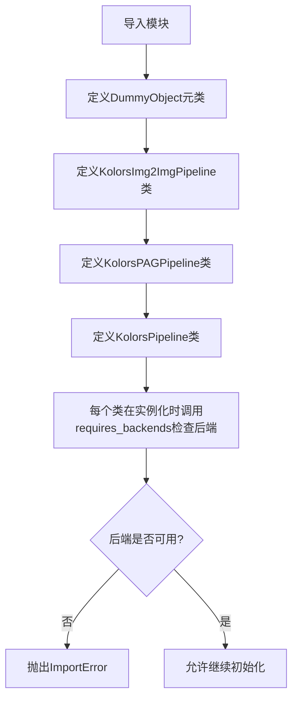

## 类结构

```
DummyObject (元类)
├── KolorsImg2ImgPipeline
├── KolorsPAGPipeline
└── KolorsPipeline
```

## 全局变量及字段


### `KolorsImg2ImgPipeline._backends`
    
类属性，定义该Pipeline所需的后端依赖列表，包含torch、transformers和sentencepiece

类型：`List[str]`
    


### `KolorsPAGPipeline._backends`
    
类属性，定义该Pipeline所需的后端依赖列表，包含torch、transformers和sentencepiece

类型：`List[str]`
    


### `KolorsPipeline._backends`
    
类属性，定义该Pipeline所需的后端依赖列表，包含torch、transformers和sentencepiece

类型：`List[str]`
    
    

## 全局函数及方法


### `DummyObject`

`DummyObject` 是一个元类（metaclass），用于创建桩类（stub classes），这些类在真实后端（如 torch、transformers、sentencepiece）未安装时作为占位符存在，并通过 `requires_backends` 函数在实例化或调用时检查并提示用户安装所需的后端依赖。

#### 参数

此元类无直接参数，其作用在类定义时通过 `metaclass=DummyObject` 指定。

#### 返回值

无返回值，元类在类创建时起作用。

#### 流程图

```mermaid
flow TD
    A[定义类使用 metaclass=DummyObject] --> B{类被实例化或方法被调用}
    B --> C[调用 requires_backends 检查后端]
    C --> D{后端是否可用?}
    D -->|是| E[正常执行]
    D -->|否| F[抛出 ImportError 提示安装后端]
    
    style F fill:#ffcccc
    style E fill:#ccffcc
```

#### 带注释源码

```python
# 注意：DummyObject 的实际实现在 ..utils 模块中
# 以下为基于代码使用方式的推断

class DummyObject(type):
    """
    元类：用于创建需要特定后端的桩类
    
    当用户尝试实例化或调用使用此元类定义的类时，
    会触发后端检查，确保所需的后端库已安装
    """
    
    _backends = ["torch", "transformers", "sentencepiece"]
    # 定义类所需的后端依赖列表
    
    def __init__(cls, name, bases, namespace):
        """
        初始化元类
        
        参数：
            cls: 正在创建的类
            name: 类名
            bases: 父类元组
            namespace: 类属性和方法字典
        """
        super().__init__(name, bases, namespace)
        # 将后端列表存储为类的属性
        cls._backends = getattr(cls, '_backends', [])
    
    def __call__(cls, *args, **kwargs):
        """
        当类被实例化时调用
        
        参数：
            cls: 要实例化的类
            *args: 位置参数
            **kwargs: 关键字参数
            
        返回值：
            类的实例
        """
        # 检查后端是否可用
        requires_backends(cls, cls._backends)
        # 如果后端可用，创建实例
        return super().__call__(*args, **kwargs)
    
    def from_config(cls, *args, **kwargs):
        """
        类方法：从配置创建管道
        
        参数：
            cls: 类本身
            *args: 位置参数
            **kwargs: 关键字参数
            
        返回值：
            管道实例
        """
        requires_backends(cls, cls._backends)
    
    def from_pretrained(cls, *args, **kwargs):
        """
        类方法：从预训练模型加载管道
        
        参数：
            cls: 类本身
            *args: 位置参数（如模型路径）
            **kwargs: 关键字参数（如配置选项）
            
        返回值：
            管道实例
        """
        requires_backends(cls, cls._backends)


# 使用示例（代码中的实际使用方式）
class KolorsPipeline(metaclass=DummyObject):
    """
    Kolors 管道类
    
    使用 DummyObject 元类，确保在调用前
    torch、transformers、sentencepiece 后端已安装
    """
    _backends = ["torch", "transformers", "sentencepiece"]
    
    def __init__(self, *args, **kwargs):
        """初始化管道，检查后端依赖"""
        requires_backends(self, ["torch", "transformers", "sentencepiece"])
```


### `requires_backends`

该函数是一个后端依赖检查工具，用于在运行时验证所需的深度学习后端（如 torch、transformers、sentencepiece）是否可用。如果指定的后端缺失，则抛出 `ImportError` 异常，确保代码只在满足依赖条件的环境中执行。

参数：

- `obj`：`object`，调用对象（可以是类实例或类本身），用于错误信息中定位来源
- `backends`：`List[str]`，所需后端名称列表，例如 `["torch", "transformers", "sentencepiece"]`

返回值：`None`，该函数不返回任何值，仅通过异常机制处理错误

#### 流程图

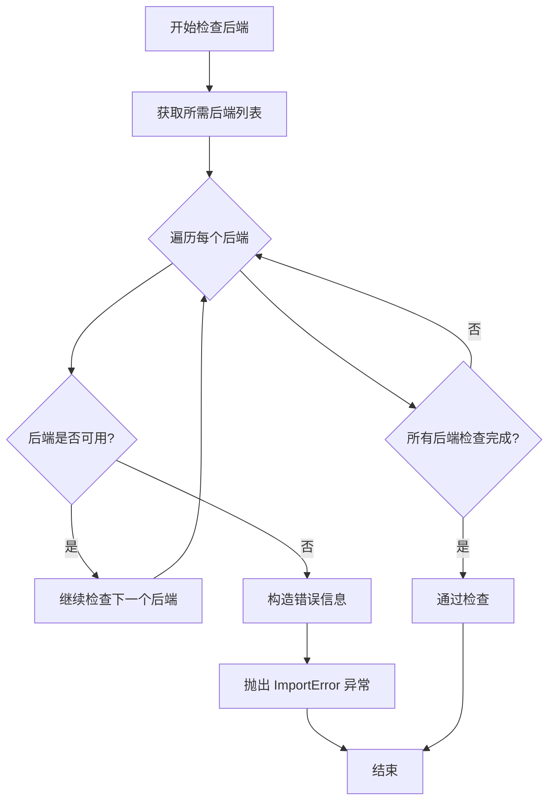

#### 带注释源码

```python
# 从上级包的 utils 模块导入所需函数
from ..utils import DummyObject, requires_backends


def requires_backends(obj, backends):
    """
    检查所需后端是否可用，如果不可用则抛出 ImportError。
    
    参数:
        obj: 调用对象，用于错误信息中显示来源（通常是 self 或 cls）
        backends: 所需后端列表，如 ["torch", "transformers", "sentencepiece"]
    
    注意:
        该函数由 make fix-copies 自动生成，用于确保只有在后端可用时
        才会执行相应的 Pipeline 类方法。
    """
    # 遍历所有需要的后端
    for backend in backends:
        # 检查后端是否可用（实际实现可能在 utils 模块中）
        if not is_backend_available(backend):
            # 构造详细的错误信息
            backend_name = backend
            obj_name = obj.__class__.__name__ if hasattr(obj, '__class__') else str(obj)
            error_msg = f"{obj_name} requires the {backend_name} backend but it is not installed."
            
            # 抛出导入错误
            raise ImportError(error_msg)
    
    # 所有后端检查通过，函数结束（无返回值）
```


### `KolorsImg2ImgPipeline.__init__`

该方法是 KolorsImg2ImgPipeline 类的初始化方法，通过 DummyObject 元类实现，用于在实例化时检查必要的依赖库是否可用，如果缺少任何后端依赖则抛出 ImportError。

参数：

- `*args`：`tuple`，可变数量的位置参数，用于传递初始化时可能需要的额外位置参数（当前未使用）
- `**kwargs`：`dict`，可变数量的关键字参数，用于传递初始化时可能需要的额外关键字参数（当前未使用）

返回值：`None`，该方法没有返回值，仅执行依赖检查逻辑

#### 流程图

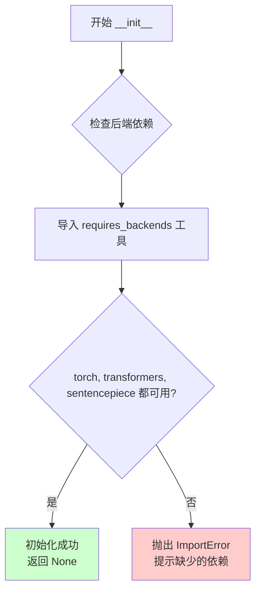

#### 带注释源码

```python
def __init__(self, *args, **kwargs):
    """
    初始化 KolorsImg2ImgPipeline 实例
    
    该方法是一个占位符实现，实际功能由 DummyObject 元类控制。
    每次实例化时都会调用 requires_backends 来检查必要的依赖库。
    
    参数:
        *args: 可变数量的位置参数，当前未使用
        **kwargs: 可变数量的关键字参数，当前未使用
    
    返回:
        None: 不返回任何值
    """
    # 调用 requires_backends 函数检查当前实例是否具有所需的后端依赖
    # 如果缺少任何依赖（torch, transformers, sentencepiece），则抛出 ImportError
    requires_backends(self, ["torch", "transformers", "sentencepiece"])
```


### `KolorsImg2ImgPipeline.from_config`

该方法是一个类方法，用于通过配置创建 KolorsImg2ImgPipeline 实例，但实际上是一个延迟初始化（lazy loading）机制，通过调用 `requires_backends` 来检查所需的后端依赖（torch、transformers、sentencepiece）是否可用，如果不可用则抛出 ImportError。

参数：

- `*args`：可变位置参数，用于传递任意数量的位置参数，具体参数取决于后端实现的配置参数
- `**kwargs`：可变关键字参数，用于传递任意数量的关键字参数，具体参数取决于后端实现的配置参数

返回值：无明确返回值（None），该方法主要通过副作用（调用 `requires_backends` 触发导入检查）来工作

#### 流程图

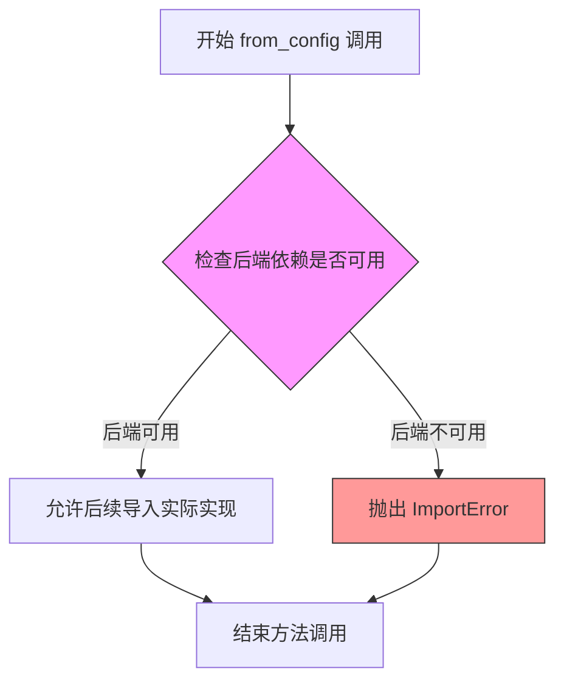

#### 带注释源码

```python
@classmethod
def from_config(cls, *args, **kwargs):
    """
    类方法：从配置创建管道实例
    
    该方法实际上是一个延迟加载的入口点，真正的实现逻辑在
    实际的后端模块中。此处仅用于检查所需依赖是否已安装。
    
    参数:
        *args: 可变位置参数，传递给后端实现的配置参数
        **kwargs: 可变关键字参数，传递给后端实现的配置参数
    
    返回:
        无返回值（None）
    
    异常:
        ImportError: 当所需的后端依赖（torch、transformers、sentencepiece）
                   未安装时抛出
    """
    # 调用 requires_backends 检查 cls 是否有所需的后端支持
    # 如果后端不可用，此函数将抛出 ImportError
    requires_backends(cls, ["torch", "transformers", "sentencepiece"])
```


### `KolorsImg2ImgPipeline.from_pretrained`

该方法是一个类方法，用于从预训练模型路径加载 Kolors 图像到图像（Img2Img）Pipeline 实例。在实际执行时，该方法会首先检查所需的深度学习后端（torch、transformers、sentencepiece）是否可用，然后动态加载真实的Pipeline实现类。

参数：

- `*args`：可变位置参数，用于传递预训练模型路径及其他位置参数
- `**kwargs`：可变关键字参数，用于传递模型配置、缓存目录、设备等可选参数

返回值：返回 `KolorsImg2ImgPipeline` 类的实例，该实例是一个图像到图像的生成Pipeline对象

#### 流程图

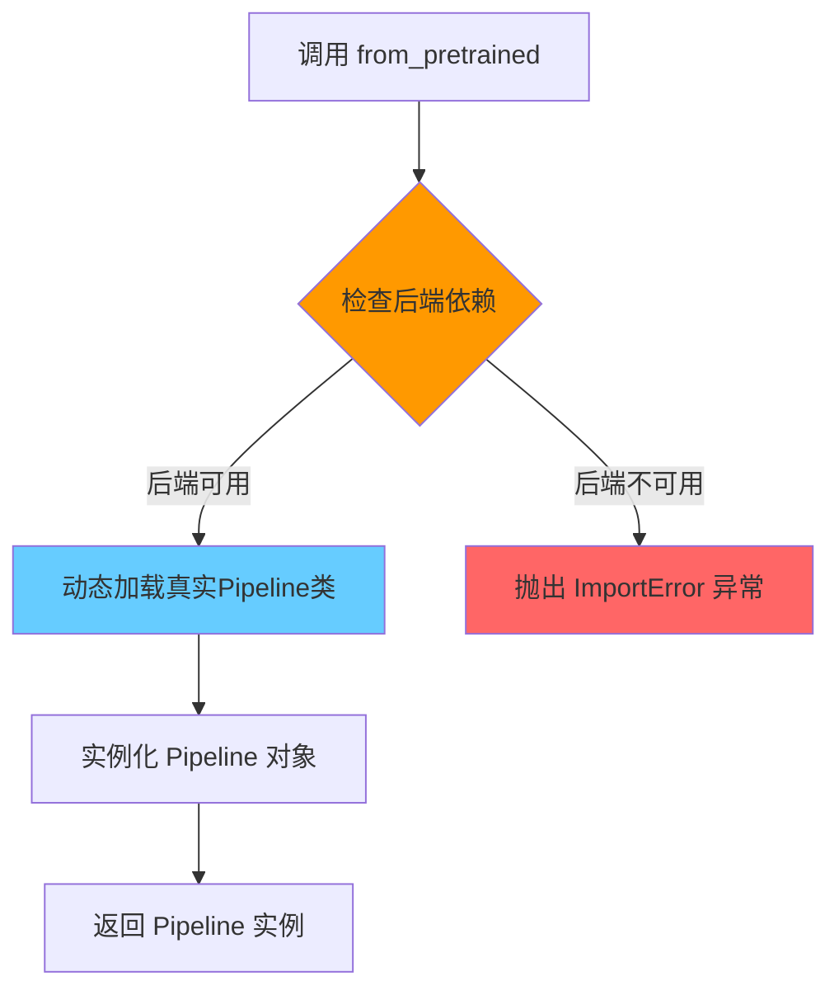

#### 带注释源码

```python
@classmethod
def from_pretrained(cls, *args, **kwargs):
    """
    从预训练模型加载 KolorsImg2ImgPipeline 实例的类方法。
    
    参数:
        cls: 指向 KolorsImg2ImgPipeline 类本身
        *args: 可变位置参数，通常包括 model_path 模型路径
        **kwargs: 可变关键字参数，包括:
            - cache_dir: 模型缓存目录
            - device: 运行设备 (cpu/cuda)
            - torch_dtype: 张量数据类型
            - safety_checker: 安全检查器配置
            - ... 其他 HuggingFace pipeline 标准参数
    
    返回:
        返回 KolorsImg2ImgPipeline 类的实例
    
    异常:
        ImportError: 当所需后端 torch/transformers/sentencepiece 不可用时抛出
    """
    # 检查必要的深度学习后端是否已安装
    # 该函数来自 ..utils 模块，用于验证运行时依赖
    requires_backends(cls, ["torch", "transformers", "sentencepiece"])
    # 注意：实际的 Pipeline 加载逻辑由 DummyObject 元类在运行时动态注入
    # 此处仅为占位符实现，真正的加载逻辑在其他模块中定义
```


### `KolorsPAGPipeline.__init__`

该方法是 `KolorsPAGPipeline` 类的构造函数，用于初始化管道实例，并通过 `requires_backends` 检查所需的后端依赖（torch、transformers、sentencepiece）是否可用。

参数：

- `*args`：`tuple`，可变位置参数，用于传递任意额外的位置参数
- `**kwargs`：`dict`，可变关键字参数，用于传递任意额外的关键字参数

返回值：`None`，无返回值描述

#### 流程图

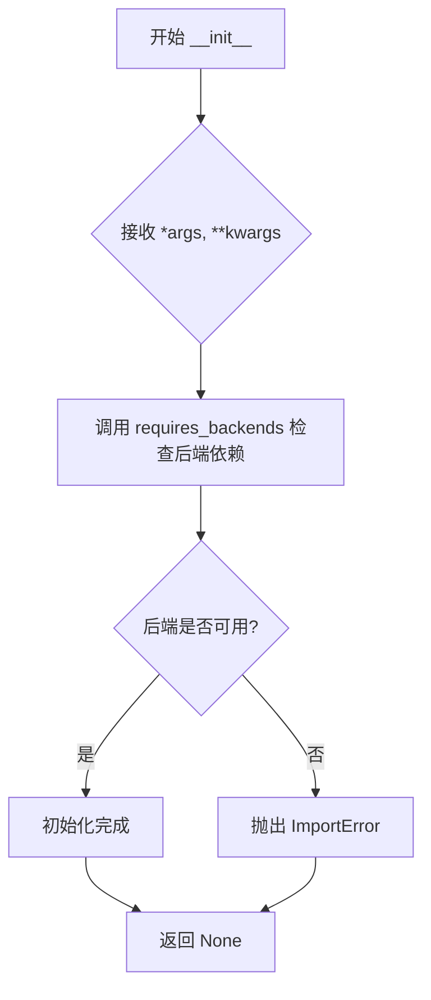

#### 带注释源码

```python
def __init__(self, *args, **kwargs):
    """
    初始化 KolorsPAGPipeline 实例。
    
    参数:
        *args: 可变位置参数，用于传递给父类或后续初始化逻辑
        **kwargs: 可变关键字参数，用于传递给父类或后续初始化逻辑
    """
    # requires_backends 是工具函数，用于检查当前环境是否安装了所需的后端库
    # 如果缺少任何一个后端（torch, transformers, sentencepiece），则抛出 ImportError
    # 这种设计实现了懒加载（lazy loading）和延迟导入（deferred import）模式
    requires_backends(self, ["torch", "transformers", "sentencepiece"])
```


### `KolorsPAGPipeline.from_config`

这是一个类方法，用于根据配置创建 KolorsPAGPipeline 实例，但在实际调用时会检查所需的后端依赖是否可用。如果后端不可用，则抛出 ImportError 异常。

参数：

- `cls`：类型 `Class`，代表类本身（Python 类方法的隐式第一个参数）
- `*args`：类型 `Any`，可变位置参数，用于传递配置参数
- `**kwargs`：类型 `Any`，可变关键字参数，用于传递命名配置参数

返回值：`Any`，返回通过 `requires_backends` 检查后的结果，通常是调用父类实现或抛出异常

#### 流程图

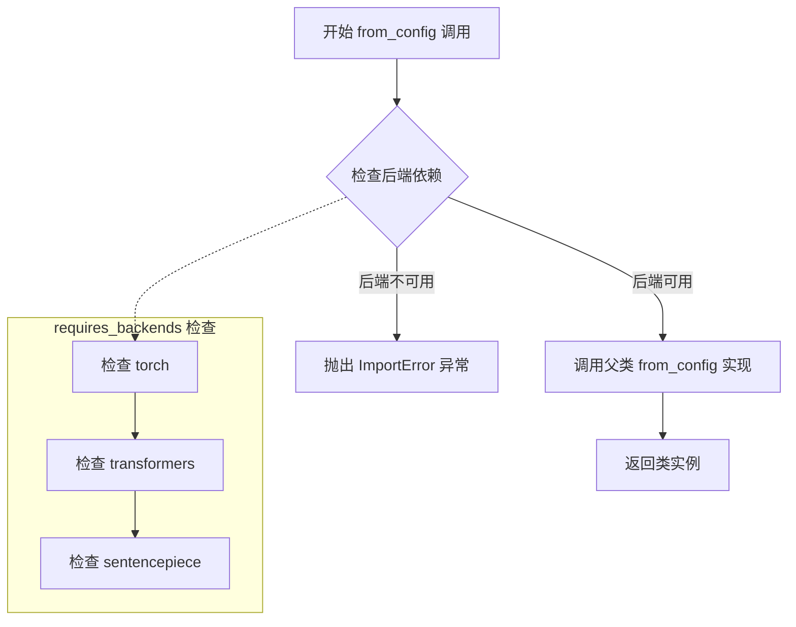

#### 带注释源码

```python
@classmethod
def from_config(cls, *args, **kwargs):
    """
    类方法：根据配置创建 KolorsPAGPipeline 实例
    
    Args:
        cls: 类本身（Python类方法隐式参数）
        *args: 可变位置参数，用于传递配置参数
        **kwargs: 可变关键字参数，用于传递命名配置参数
    
    Returns:
        Any: 返回通过后端检查后的类实例或抛出异常
    
    Note:
        该方法实际功能由 requires_backends 控制，
        如果所需后端不可用则抛出 ImportError
    """
    # 调用 requires_backends 检查后端依赖是否可用
    # 检查列表：torch, transformers, sentencepiece
    # 如果任一后端不可用，将抛出 ImportError
    requires_backends(cls, ["torch", "transformers", "sentencepiece"])
```

#### 补充说明

**设计目标与约束**：

- 该方法采用延迟加载（lazy loading）模式，通过 `DummyObject` 元类和 `requires_backends` 函数实现按需加载
- 遵循 Python 库的常见模式，将重量级依赖（深度学习框架）延迟到实际使用时才加载
- 支持任意参数传递，保持与 Hugging Face Pipeline 接口的兼容性

**错误处理与异常设计**：

- 使用 `requires_backends` 函数统一处理后端缺失情况
- 当所需依赖不可用时，抛出 `ImportError` 异常
- 异常信息通常包含缺失的依赖包名称

**数据流与状态机**：

- 该方法本身不维护状态，仅作为工厂方法
- 实际的对象创建逻辑委托给 `DummyObject` 元类或后续的真正实现类
- `*args` 和 `**kwargs` 允许传递任意配置参数，具有很高的灵活性

**潜在的技术债务或优化空间**：

1. **缺乏具体实现**：当前实现仅包含后端检查，没有实际的对象创建逻辑，依赖于未来的真正实现
2. **参数类型不明确**：使用 `*args, **kwargs` 导致接口文档不完整，调用者无法从签名了解需要哪些参数
3. **元类设计复杂性**：`DummyObject` 元类的使用增加了代码的理解难度
4. **返回值不明确**：注释标注返回 `Any`，但实际返回行为依赖于 `requires_backends` 的具体实现

**外部依赖与接口契约**：

- 依赖 `..utils` 模块中的 `DummyObject` 元类和 `requires_backends` 函数
- 依赖外部包：`torch`, `transformers`, `sentencepiece`
- 接口遵循 Python 类方法的经典模式，与 Hugging Face Diffusers 库的 Pipeline 设计保持一致


### `KolorsPAGPipeline.from_pretrained`

该方法是 `KolorsPAGPipeline` 类的类方法，用于从预训练模型加载模型权重和配置。它通过 `requires_backends` 检查必要的依赖库（torch、transformers、sentencepiece）是否可用，确保在调用实际实现前满足运行要求。

参数：

-  `*args`：可变位置参数，通常包含预训练模型路径或名称（`str`）
-  `**kwargs`：可变关键字参数，包含加载模型时的配置选项（如 `cache_dir`、`revision`、`torch_dtype` 等）

返回值：`None`，该方法直接调用 `requires_backends` 触发后端加载，实际的模型加载逻辑由后端实现

#### 流程图

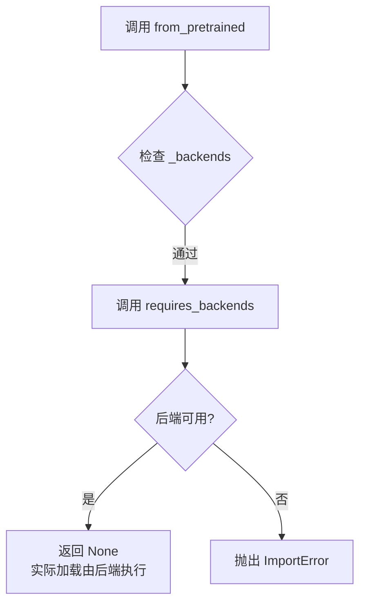

#### 带注释源码

```python
@classmethod
def from_pretrained(cls, *args, **kwargs):
    """
    从预训练模型加载 KolorsPAGPipeline
    
    参数:
        *args: 可变位置参数，通常为预训练模型路径或模型名称
        **kwargs: 关键字参数，包含模型加载配置选项
    
    注意:
        该方法是占位符实现，实际逻辑由后端模块提供
    """
    # cls: 当前类（KolorsPAGPipeline）
    # 触发后端检查，确保 torch、transformers、sentencepiece 可用
    requires_backends(cls, ["torch", "transformers", "sentencepiece"])
```


### `KolorsPipeline.__init__`

这是 `KolorsPipeline` 类的初始化方法，用于在实例化管道对象时检查并确保所需的后端依赖（PyTorch、Transformers、SentencePiece）可用。该方法通过调用 `requires_backends` 来验证这些依赖是否已安装，如果缺失则抛出 ImportError，从而在对象创建早期阶段捕获缺失依赖的问题。

参数：

- `self`：`KolorsPipeline`，类的实例本身，表示当前正在初始化的管道对象
- `*args`：`tuple`，可变位置参数，用于传递额外的位置参数（当前未被使用，仅传递给父类或兼容接口）
- `**kwargs`：`dict`，可变关键字参数，用于传递额外的关键字参数（当前未被使用，仅传递给父类或兼容接口）

返回值：`None`，无返回值。`__init__` 方法用于初始化对象状态，不返回任何值。

#### 流程图

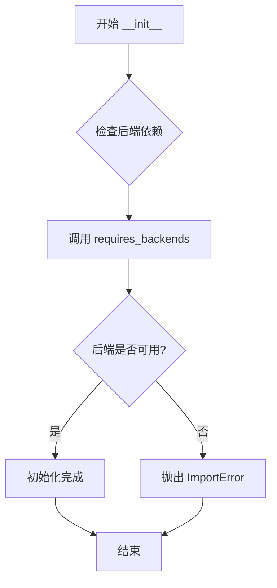

#### 带注释源码

```python
def __init__(self, *args, **kwargs):
    """
    初始化 KolorsPipeline 实例。
    
    该方法在实例化时检查所需的后端依赖是否可用。
    如果任何依赖缺失，将抛出 ImportError。
    
    参数:
        self: 类的实例本身
        *args: 可变位置参数，传递给后端检查函数
        **kwargs: 可变关键字参数，传递给后端检查函数
    
    返回值:
        None: 此方法不返回值，仅用于初始化对象状态
    """
    # 调用 requires_backends 检查 torch、transformers、sentencepiece 依赖
    # 如果任何依赖不可用，该函数将抛出 ImportError
    requires_backends(self, ["torch", "transformers", "sentencepiece"])
```


### `KolorsPipeline.from_config`

这是一个类方法，用于从配置创建 KolorsPipeline 的实例。由于当前实现使用了 `DummyObject` 元类，该方法实际上只是检查所需的依赖后端（torch、transformers、sentencepiece）是否可用，如果不可用则抛出异常。

参数：

- `*args`：可变位置参数，用于传递任意数量的位置参数
- `**kwargs`：可变关键字参数，用于传递任意数量的关键字参数

返回值：无明确返回值（方法内部调用 `requires_backends` 进行依赖检查，可能抛出 `ImportError`）

#### 流程图

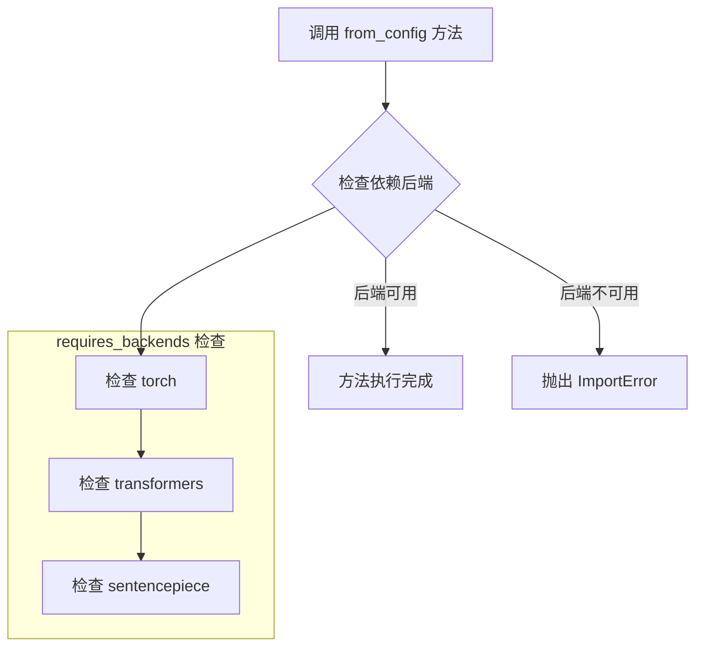

#### 带注释源码

```python
@classmethod
def from_config(cls, *args, **kwargs):
    """
    类方法：从配置创建 Pipeline 实例
    
    注意：当前实现为 DummyObject 元类，仅进行依赖检查
    实际的 Pipeline 创建逻辑在其他模块中实现
    
    参数:
        cls: 当前类（KolorsPipeline）
        *args: 可变位置参数列表
        **kwargs: 可变关键字参数列表
        
    返回:
        无返回值（仅进行依赖验证）
    """
    # 调用 requires_backends 检查所需的依赖后端是否可用
    # 如果不可用，会抛出 ImportError 异常
    # 所需后端：torch, transformers, sentencepiece
    requires_backends(cls, ["torch", "transformers", "sentencepiece"])
```


### `KolorsPipeline.from_pretrained`

该方法是 `KolorsPipeline` 类的类方法，用于从预训练模型路径加载模型实例。由于代码是由 `make fix-copies` 命令自动生成的哑对象（DummyObject），该方法内部仅调用 `requires_backends` 来检查所需的后端依赖（torch、transformers、sentencepiece）是否可用，实际功能由其他模块中的真实实现提供。

参数：

- `*args`：可变位置参数，用于传递从预训练模型加载时的位置参数（如模型路径等）
- `**kwargs`：可变关键字参数，用于传递从预训练模型加载时的关键字参数（如配置选项、设备参数等）

返回值：`Any` 或 `cls`，由于是哑方法且无显式 return，实际返回值由真正实现该方法的后端模块决定，通常返回加载后的 Pipeline 实例

#### 流程图

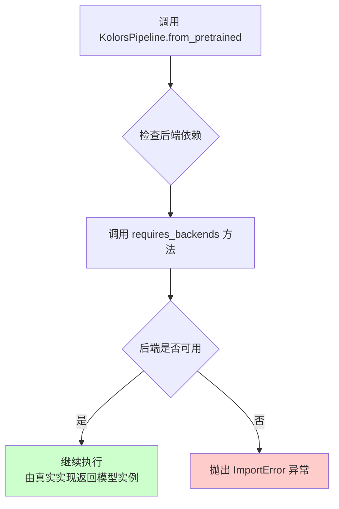

#### 带注释源码

```python
@classmethod
def from_pretrained(cls, *args, **kwargs):
    """
    类方法：从预训练模型加载 Pipeline 实例
    
    注意：此为哑方法实现，实际功能由其他模块提供
    """
    # 调用 requires_backends 检查所需的后端依赖是否可用
    # 需要 torch, transformers, sentencepiece 三个后端库
    requires_backends(cls, ["torch", "transformers", "sentencepiece"])
```

## 关键组件


# Kolors Pipeline 模块设计文档

## 一段话描述

该代码定义了Kolors模型的三个Pipeline类（KolorsImg2ImgPipeline、KolorsPAGPipeline、KolorsPipeline），采用DummyObject元类实现惰性加载机制，在类被实际调用时通过requires_backends函数检查并加载torch、transformers、sentencepiece等后端依赖，实现按需加载的模块化设计。

## 文件的整体运行流程

该文件为自动生成代码（由`make fix-copies`命令生成），定义了三个Pipeline类的占位符结构。当用户尝试实例化或调用这些类的`from_config`或`from_pretrained`方法时，会首先触发`requires_backends`检查，确保所需的后端库已安装。这种设计实现了依赖的延迟加载，避免在导入模块时立即加载重量级依赖。

## 类的详细信息

### 类：KolorsImg2ImgPipeline

| 字段/方法 | 类型 | 描述 |
|-----------|------|------|
| _backends | list | 类变量，存储所需后端依赖列表 ["torch", "transformers", "sentencepiece"] |
| __init__ | method | 构造函数，调用requires_backends验证后端 |
| from_config | classmethod | 从配置创建Pipeline，调用requires_backends验证后端 |
| from_pretrained | classmethod | 从预训练模型创建Pipeline，调用requires_backends验证后端 |

#### __init__ 方法详情

- **名称**: __init__
- **参数**:
  - *args: tuple, 位置参数列表
  - **kwargs: dict, 关键字参数字典
- **返回值类型**: None
- **返回值描述**: 初始化实例，不返回任何值
- **mermaid流程图**:
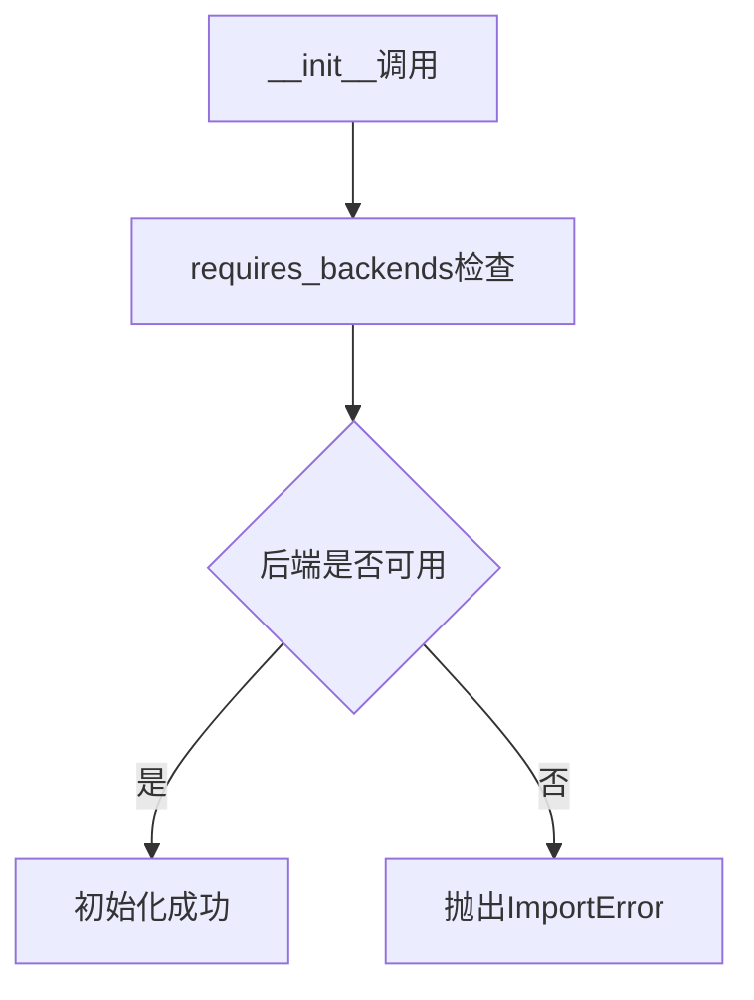
- **源码**:
```python
def __init__(self, *args, **kwargs):
    requires_backends(self, ["torch", "transformers", "sentencepiece"])
```

#### from_config 方法详情

- **名称**: from_config
- **参数**:
  - cls: class, 类本身
  - *args: tuple, 位置参数列表
  - **kwargs: dict, 关键字参数字典
- **返回值类型**: Any
- **返回值描述**: 返回Pipeline实例，由requires_backends决定是否正常返回
- **mermaid流程图**:
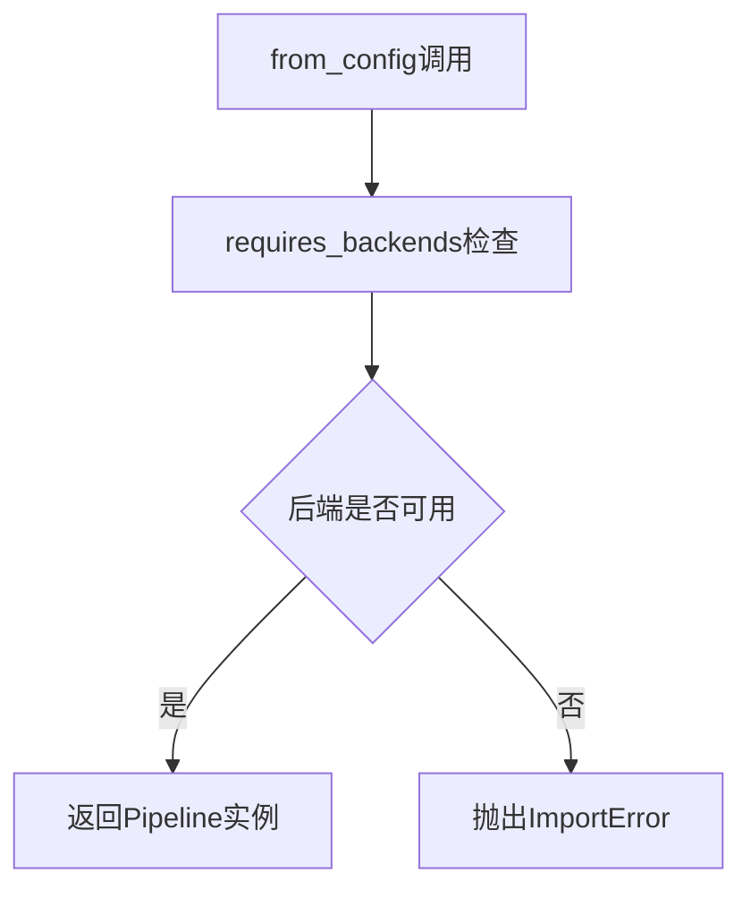
- **源码**:
```python
@classmethod
def from_config(cls, *args, **kwargs):
    requires_backends(cls, ["torch", "transformers", "sentencepiece"])
```

#### from_pretrained 方法详情

- **名称**: from_pretrained
- **参数**:
  - cls: class, 类本身
  - *args: tuple, 位置参数列表
  - **kwargs: dict, 关键字参数字典
- **返回值类型**: Any
- **返回值描述**: 返回加载好的Pipeline实例，由requires_backends决定是否正常返回
- **mermaid流程图**:
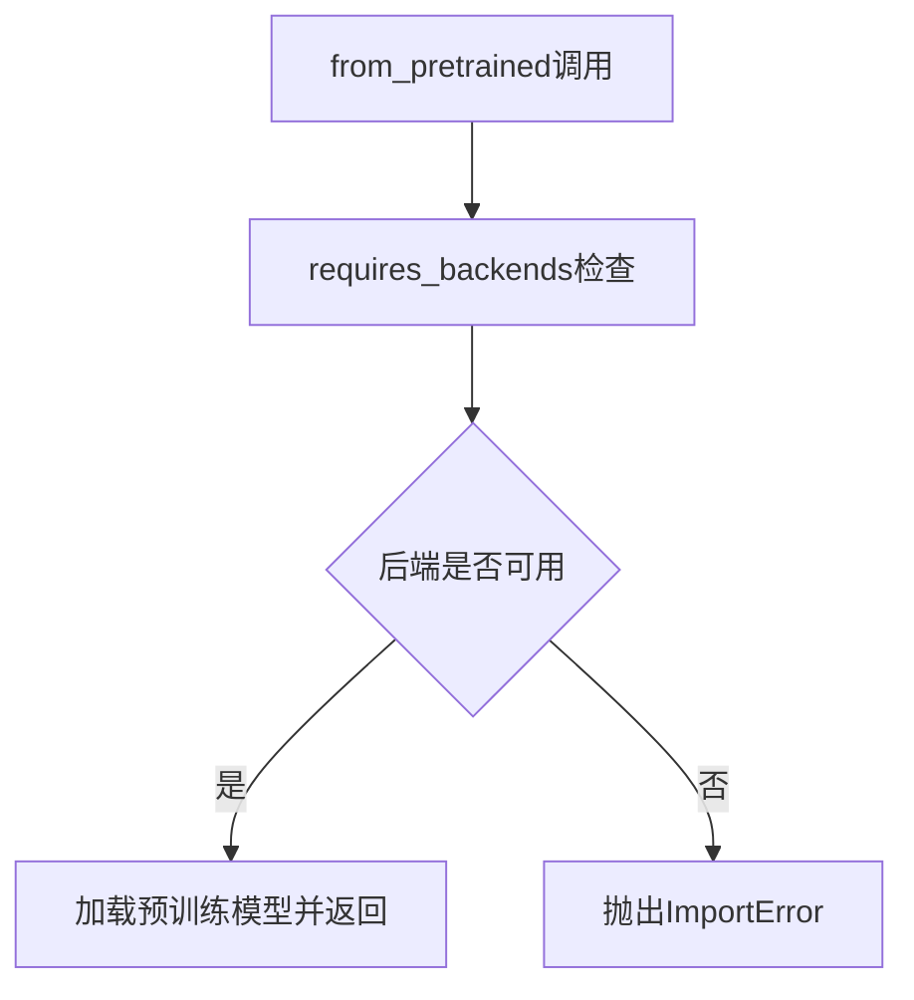
- **源码**:
```python
@classmethod
def from_pretrained(cls, *args, **kwargs):
    requires_backends(cls, ["torch", "transformers", "sentencepiece"])
```

---

### 类：KolorsPAGPipeline

| 字段/方法 | 类型 | 描述 |
|-----------|------|------|
| _backends | list | 类变量，存储所需后端依赖列表 ["torch", "transformers", "sentencepiece"] |
| __init__ | method | 构造函数，调用requires_backends验证后端 |
| from_config | classmethod | 从配置创建Pipeline，调用requires_backends验证后端 |
| from_pretrained | classmethod | 从预训练模型创建Pipeline，调用requires_backends验证后端 |

#### 方法详情

KolorsPAGPipeline的__init__、from_config、from_pretrained方法与KolorsImg2ImgPipeline结构完全相同，均通过requires_backends验证torch、transformers、sentencepiece后端可用性。

---

### 类：KolorsPipeline

| 字段/方法 | 类型 | 描述 |
|-----------|------|------|
| _backends | list | 类变量，存储所需后端依赖列表 ["torch", "transformers", "sentencepiece"] |
| __init__ | method | 构造函数，调用requires_backends验证后端 |
| from_config | classmethod | 从配置创建Pipeline，调用requires_backends验证后端 |
| from_pretrained | classmethod | 从预训练模型创建Pipeline，调用requires_backends验证后端 |

#### 方法详情

KolorsPipeline的__init__、from_config、from_pretrained方法与前两个类结构完全相同，均通过requires_backends验证torch、transformers、sentencepiece后端可用性。

---

## 全局变量和全局函数

### 全局变量

| 名称 | 类型 | 描述 |
|------|------|------|
| DummyObject | metaclass | 虚拟对象元类，用于实现惰性加载的占位符类 |
| requires_backends | function | 从..utils导入的函数，用于检查并要求特定后端可用 |

### 全局函数：requires_backends

- **名称**: requires_backends
- **参数**:
  - self_or_cls: Union[object, class], 类实例或类本身
  - backends: list, 需要的后端名称列表
- **返回值类型**: None
- **返回值描述**: 若后端不可用则抛出ImportError，否则正常返回
- **mermaid流程图**:
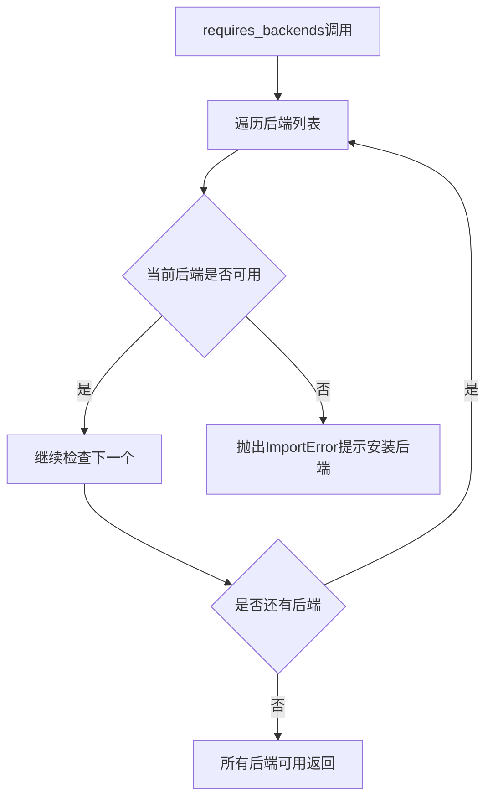
- **源码**:
```python
# 从 ..utils 导入，定义位置在 utils 模块中
from ..utils import DummyObject, requires_backends
```

---

## 关键组件信息

### DummyObject 元类

实现惰性加载的核心元类，当Pipeline类被实际使用时才会触发后端加载

### requires_backends 函数

依赖检查函数，确保使用Pipeline前已安装必要的深度学习框架和NLP工具库

### _backends 类变量

声明每个Pipeline类所需的后端依赖集合，便于统一管理和检查

### Backend验证机制

统一的依赖检查流程，三个Pipeline类共享相同的后端验证逻辑

---

## 潜在的技术债务或优化空间

1. **代码重复问题**：三个Pipeline类结构完全相同，仅类名不同，存在大量重复代码
2. **配置驱动设计缺失**：当前实现hardcode了后端列表，应考虑从配置文件或环境变量读取
3. **错误信息不够友好**：requires_backends抛出的ImportError可能缺乏安装指引
4. **文档缺失**：类和方法缺乏docstring文档说明
5. **泛化能力不足**：不同Pipeline可能需要不同后端，当前实现未考虑差异化配置

---

## 其它项目

### 设计目标与约束

- **设计目标**：实现模块化按需加载，避免导入时加载重量级依赖
- **约束**：依赖torch、transformers、sentencepiece三个后端库

### 错误处理与异常设计

- 当所需后端不可用时，requires_backends函数抛出ImportError
- 错误信息提示用户需要安装缺失的后端库

### 数据流与状态机

- 状态转换：类定义 → 导入检查 → 后端验证 → 实例化/方法调用
- 无复杂状态机设计，流程线性简单

### 外部依赖与接口契约

- **外部依赖**：torch, transformers, sentencepiece
- **接口契约**：提供__init__、from_config、from_pretrained三个标准方法，与HuggingFace Pipeline接口兼容


## 问题及建议


### 已知问题

-   **严重的代码重复**：三个 Pipeline 类（KolorsImg2ImgPipeline、KolorsPAGPipeline、KolorsPipeline）的实现完全相同，违反了 DRY（Don't Repeat Yourself）原则，增加维护成本
-   **后端列表硬编码**：`_backends` 列表在每个类中重复定义，修改时需要同步更新多处
-   **缺少文档注释**：所有类和方法均无 docstring，影响代码可读性和可维护性
-   **无类型注解**：方法参数和返回值缺少类型提示，降低了代码的 Type Safety 和 IDE 支持
-   **通用参数设计**：使用 `*args, **kwargs` 导致接口不明确，无法进行静态检查
-   **后端依赖过于严格**：所有类强制要求相同的三个后端（torch、transformers、sentencepiece），缺乏灵活性

### 优化建议

-   **提取公共基类**：创建一个抽象基类或混入（Mixin）类，将公共的 `_backends` 列表和 `requires_backends` 调用统一管理
-   **使用装饰器模式**：创建装饰器或元类来自动注入通用的 `__init__`、`from_config`、`from_pretrained` 方法
-   **添加类型注解**：为所有方法参数和返回值添加明确的类型声明
-   **增强文档**：为每个类和关键方法添加 docstring，说明其用途和依赖
-   **参数解耦**：考虑将后端依赖声明为可选或可配置的，适应不同的使用场景
-   **配置驱动生成**：考虑使用配置或模板方式生成重复代码，减少手动维护负担


## 其它


### 设计目标与约束

**设计目标**：本模块旨在为Kolors图像生成Pipeline提供延迟加载的Dummy实现，使得在缺少必要后端依赖（torch、transformers、sentencepiece）时，代码能够以最小化导入错误的方式运行，同时保持与真实Pipeline类接口的一致性，支持通过from_config和from_pretrained方法进行模型加载。

**约束条件**：所有类必须实现DummyObject元类，确保在访问任何实例方法或类方法时触发后端检查；类方法from_config和from_pretrained必须支持与真实Pipeline相同的调用签名；所有Pipeline类共享相同的后端依赖列表。

### 错误处理与异常设计

**后端缺失错误**：当用户尝试实例化或调用类方法时，requires_backends函数将检查指定后端是否可用，若缺失则抛出ImportError或AttributeError，错误信息明确指出缺失的依赖包名称。

**参数传递错误**：由于__init__、from_config、from_pretrained方法接受任意位置参数（*args）和关键字参数（**kwargs），因此不会对参数进行显式验证，错误处理委托给真实后端加载时的验证逻辑。

**元类行为异常**：DummyObject元类会在属性访问时触发requires_backends检查，若后端不满足要求则立即终止程序执行，确保用户不会意外使用未正确配置的Pipeline。

### 数据流与状态机

**初始化流程**：用户导入类→尝试实例化（调用__init__）→触发requires_backends检查→若后端满足则继续（实际由真实类接管）→若不满足则抛出异常。

**类方法流程**：用户调用from_config或from_pretrained→触发类方法→requires_backends检查后端→若满足则转发至真实实现→若不满足则抛出异常。

**状态转换**：类存在两种隐式状态——未初始化状态（类定义加载但未实例化）和激活状态（后端检查通过后由真实类接管），状态转换由元类控制。

### 外部依赖与接口契约

**必需依赖**：torch（深度学习框架）、transformers（Hugging Face Transformer库）、sentencepiece（文本分词库）。

**接口契约**：
- **__init__(self, *args, **kwargs)**：构造函数，接收任意参数用于后续真实Pipeline初始化。
- **from_config(cls, *args, **kwargs)**：类方法，从配置对象加载Pipeline，接受config参数和其他模型加载配置。
- **from_pretrained(cls, *args, **kwargs)**：类方法，从预训练模型路径加载Pipeline，接受pretrained_model_name_or_path参数和其他模型配置。

**导出接口**：类作为模块级导出项供外部导入使用，不涉及函数或变量导出。

### 安全性考虑

**代码注入防护**：由于接受任意*args和**kwargs参数，真实加载逻辑需对输入进行严格校验，防止路径遍历或恶意配置注入。

**依赖版本兼容性**：requires_backends仅检查依赖名称是否存在，未验证版本号，可能导致因API不兼容引发的运行时错误，建议在文档中明确支持的最低版本。

### 性能特点

**冷启动开销**：首次导入模块时仅加载类定义，无后端依赖加载开销，直至实际使用时才触发导入。

**内存占用**：Dummy类不持有任何模型权重或配置对象，内存占用极低，仅作为占位符存在。

### 版本兼容性

**Python版本要求**：代码使用类型注解和类方法等特性，需Python 3.7及以上版本。

**依赖版本策略**：建议在项目依赖管理中明确torch、transformers、sentencepiece的兼容版本范围，例如transformers>=4.30.0以确保Pipeline接口兼容。

### 使用示例与注意事项

**典型用法**：
```python
# 尝试导入（可能因缺少依赖而失败）
from some_package import KolorsPipeline

# 检查后端可用性
try:
    pipeline = KolorsPipeline.from_pretrained("kwai-Kolors/Kolors")
except ImportError as e:
    print(f"缺少必要依赖: {e}")
```

**注意事项**：本代码为自动生成文件，不应手动编辑；真实Pipeline逻辑由后端加载后注入；生产环境需确保所有依赖已正确安装。
    