# `diffusers\src\diffusers\utils\dummy_torch_and_transformers_objects.py` 详细设计文档

这是一个自动生成的存根文件（由make fix-copies生成），定义了数百个Diffusion Pipeline和Model的占位符类。这些类使用DummyObject元类实现懒加载机制，在实例化或调用from_config/from_pretrained方法时才会检查torch和transformers后端是否可用，从而实现条件导入和延迟加载。

## 整体流程

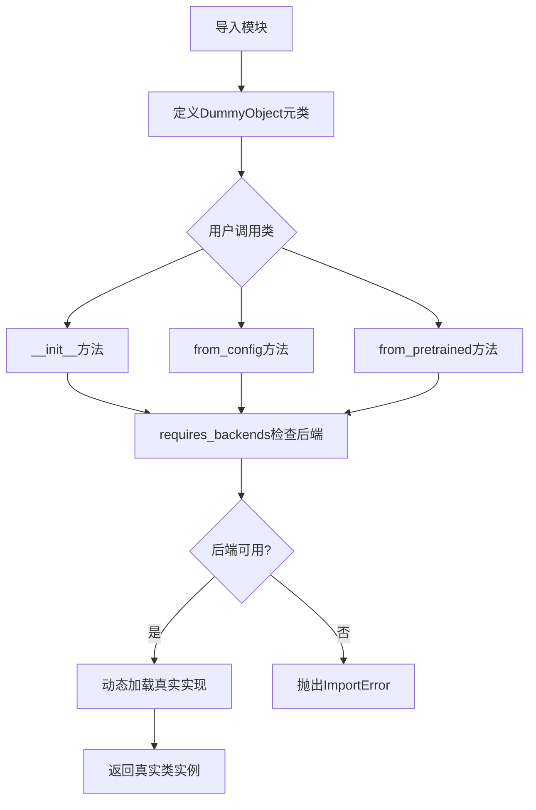
```mermaid
graph TD
    A[导入模块] --> B[定义DummyObject元类]
    B --> C{用户调用类}
    C --> D[__init__方法]
    C --> E[from_config方法]
    C --> F[from_pretrained方法]
    D --> G[requires_backends检查后端]
    E --> G
    F --> G
    G --> H{后端可用?}
    H -- 是 --> I[动态加载真实实现]
    H -- 否 --> J[抛出ImportError]
    I --> K[返回真实类实例]
```

## 类结构

```
DummyObject (元类 - 抽象基类)
├── Flux系列
│   ├── Flux2AutoBlocks
│   ├── Flux2KleinAutoBlocks
│   ├── Flux2KleinBaseAutoBlocks
│   ├── Flux2KleinBaseModularPipeline
│   ├── Flux2KleinModularPipeline
│   ├── Flux2ModularPipeline
│   ├── FluxAutoBlocks
│   ├── FluxKontextAutoBlocks
│   ├── FluxKontextModularPipeline
│   ├── FluxModularPipeline
│   └── ... (FluxPipeline, FluxImg2ImgPipeline等)
├── StableDiffusion系列
│   ├── StableDiffusionPipeline
│   ├── StableDiffusionImg2ImgPipeline
│   ├── StableDiffusionInpaintPipeline
│   ├── StableDiffusionControlNetPipeline
│   ├── StableDiffusionXL... 系列
│   └── ... (大量变体)
├── Qwen系列
│   ├── QwenImageAutoBlocks
│   ├── QwenImageEditAutoBlocks
│   ├── QwenImagePipeline
│   └── ... (QwenImage各种变体)
├── Wan系列
│   ├── WanBlocks
│   ├── Wan22Blocks
│   ├── WanModularPipeline
│   ├── WanPipeline
│   └── ... (Wan各种Pipeline)
├── Kandinsky系列
│   ├── KandinskyPipeline
│   ├── KandinskyV22Pipeline
│   ├── KandinskyCombinedPipeline
│   └── ... (Kandinsky各种变体)
├── 视频生成系列
│   ├── AnimateDiffPipeline
│   ├── TextToVideoSDPipeline
│   ├── StableVideoDiffusionPipeline
│   └── ... (各种Video Pipeline)
└── ... (其他: Hunyuan, LTX, Sana, CogVideoX等)
```

## 全局变量及字段


### `Flux2AutoBlocks._backends`
    
Required backend dependencies, currently supports torch and transformers

类型：`List[str]`
    


### `Flux2KleinAutoBlocks._backends`
    
Required backend dependencies, currently supports torch and transformers

类型：`List[str]`
    


### `Flux2KleinBaseAutoBlocks._backends`
    
Required backend dependencies, currently supports torch and transformers

类型：`List[str]`
    


### `Flux2KleinBaseModularPipeline._backends`
    
Required backend dependencies, currently supports torch and transformers

类型：`List[str]`
    


### `Flux2KleinModularPipeline._backends`
    
Required backend dependencies, currently supports torch and transformers

类型：`List[str]`
    


### `Flux2ModularPipeline._backends`
    
Required backend dependencies, currently supports torch and transformers

类型：`List[str]`
    


### `FluxAutoBlocks._backends`
    
Required backend dependencies, currently supports torch and transformers

类型：`List[str]`
    


### `FluxKontextAutoBlocks._backends`
    
Required backend dependencies, currently supports torch and transformers

类型：`List[str]`
    


### `FluxKontextModularPipeline._backends`
    
Required backend dependencies, currently supports torch and transformers

类型：`List[str]`
    


### `FluxModularPipeline._backends`
    
Required backend dependencies, currently supports torch and transformers

类型：`List[str]`
    


### `FluxPipeline._backends`
    
Required backend dependencies, currently supports torch and transformers

类型：`List[str]`
    


### `FluxImg2ImgPipeline._backends`
    
Required backend dependencies, currently supports torch and transformers

类型：`List[str]`
    


### `FluxInpaintPipeline._backends`
    
Required backend dependencies, currently supports torch and transformers

类型：`List[str]`
    


### `FluxControlNetPipeline._backends`
    
Required backend dependencies, currently supports torch and transformers

类型：`List[str]`
    


### `StableDiffusionPipeline._backends`
    
Required backend dependencies, currently supports torch and transformers

类型：`List[str]`
    


### `StableDiffusionImg2ImgPipeline._backends`
    
Required backend dependencies, currently supports torch and transformers

类型：`List[str]`
    


### `StableDiffusionInpaintPipeline._backends`
    
Required backend dependencies, currently supports torch and transformers

类型：`List[str]`
    


### `StableDiffusionControlNetPipeline._backends`
    
Required backend dependencies, currently supports torch and transformers

类型：`List[str]`
    


### `StableDiffusionXLPipeline._backends`
    
Required backend dependencies, currently supports torch and transformers

类型：`List[str]`
    


### `StableDiffusionXLControlNetPipeline._backends`
    
Required backend dependencies, currently supports torch and transformers

类型：`List[str]`
    


### `StableDiffusion3Pipeline._backends`
    
Required backend dependencies, currently supports torch and transformers

类型：`List[str]`
    


### `QwenImageAutoBlocks._backends`
    
Required backend dependencies, currently supports torch and transformers

类型：`List[str]`
    


### `QwenImagePipeline._backends`
    
Required backend dependencies, currently supports torch and transformers

类型：`List[str]`
    


### `WanBlocks._backends`
    
Required backend dependencies, currently supports torch and transformers

类型：`List[str]`
    


### `WanPipeline._backends`
    
Required backend dependencies, currently supports torch and transformers

类型：`List[str]`
    


### `KandinskyPipeline._backends`
    
Required backend dependencies, currently supports torch and transformers

类型：`List[str]`
    


### `KandinskyV22Pipeline._backends`
    
Required backend dependencies, currently supports torch and transformers

类型：`List[str]`
    


### `AnimateDiffPipeline._backends`
    
Required backend dependencies, currently supports torch and transformers

类型：`List[str]`
    


### `HunyuanDiTPipeline._backends`
    
Required backend dependencies, currently supports torch and transformers

类型：`List[str]`
    


### `HunyuanVideoPipeline._backends`
    
Required backend dependencies, currently supports torch and transformers

类型：`List[str]`
    


### `PixArtAlphaPipeline._backends`
    
Required backend dependencies, currently supports torch and transformers

类型：`List[str]`
    


### `PixArtSigmaPipeline._backends`
    
Required backend dependencies, currently supports torch and transformers

类型：`List[str]`
    


### `CogVideoXPipeline._backends`
    
Required backend dependencies, currently supports torch and transformers

类型：`List[str]`
    


### `LTXPipeline._backends`
    
Required backend dependencies, currently supports torch and transformers

类型：`List[str]`
    


### `SanaPipeline._backends`
    
Required backend dependencies, currently supports torch and transformers

类型：`List[str]`
    


### `AudioLDMPipeline._backends`
    
Required backend dependencies, currently supports torch and transformers

类型：`List[str]`
    


### `MusicLDMPipeline._backends`
    
Required backend dependencies, currently supports torch and transformers

类型：`List[str]`
    


### `IFPipeline._backends`
    
Required backend dependencies, currently supports torch and transformers

类型：`List[str]`
    


### `LatentConsistencyModelPipeline._backends`
    
Required backend dependencies, currently supports torch and transformers

类型：`List[str]`
    


### `LDMTextToImagePipeline._backends`
    
Required backend dependencies, currently supports torch and transformers

类型：`List[str]`
    


### `TextToVideoSDPipeline._backends`
    
Required backend dependencies, currently supports torch and transformers

类型：`List[str]`
    


### `UnCLIPPipeline._backends`
    
Required backend dependencies, currently supports torch and transformers

类型：`List[str]`
    


### `VersatileDiffusionPipeline._backends`
    
Required backend dependencies, currently supports torch and transformers

类型：`List[str]`
    


### `StableVideoDiffusionPipeline._backends`
    
Required backend dependencies, currently supports torch and transformers

类型：`List[str]`
    


### `StableAudioPipeline._backends`
    
Required backend dependencies, currently supports torch and transformers

类型：`List[str]`
    


### `CosmosTextToWorldPipeline._backends`
    
Required backend dependencies, currently supports torch and transformers

类型：`List[str]`
    


### `LuminaPipeline._backends`
    
Required backend dependencies, currently supports torch and transformers

类型：`List[str]`
    


### `MochiPipeline._backends`
    
Required backend dependencies, currently supports torch and transformers

类型：`List[str]`
    


### `OmniGenPipeline._backends`
    
Required backend dependencies, currently supports torch and transformers

类型：`List[str]`
    


### `HiDreamImagePipeline._backends`
    
Required backend dependencies, currently supports torch and transformers

类型：`List[str]`
    


### `ZImagePipeline._backends`
    
Required backend dependencies, currently supports torch and transformers

类型：`List[str]`
    


### `BriaPipeline._backends`
    
Required backend dependencies, currently supports torch and transformers

类型：`List[str]`
    


### `AuraFlowPipeline._backends`
    
Required backend dependencies, currently supports torch and transformers

类型：`List[str]`
    


### `ConsisIDPipeline._backends`
    
Required backend dependencies, currently supports torch and transformers

类型：`List[str]`
    


### `MarigoldDepthPipeline._backends`
    
Required backend dependencies, currently supports torch and transformers

类型：`List[str]`
    


### `PaintByExamplePipeline._backends`
    
Required backend dependencies, currently supports torch and transformers

类型：`List[str]`
    


### `ShapEPipeline._backends`
    
Required backend dependencies, currently supports torch and transformers

类型：`List[str]`
    


### `VQDiffusionPipeline._backends`
    
Required backend dependencies, currently supports torch and transformers

类型：`List[str]`
    


### `CycleDiffusionPipeline._backends`
    
Required backend dependencies, currently supports torch and transformers

类型：`List[str]`
    


### `LattePipeline._backends`
    
Required backend dependencies, currently supports torch and transformers

类型：`List[str]`
    


### `SkyReelsV2Pipeline._backends`
    
Required backend dependencies, currently supports torch and transformers

类型：`List[str]`
    


### `StableCascadeCombinedPipeline._backends`
    
Required backend dependencies, currently supports torch and transformers

类型：`List[str]`
    


### `WuerstchenCombinedPipeline._backends`
    
Required backend dependencies, currently supports torch and transformers

类型：`List[str]`
    


### `UniDiffuserPipeline._backends`
    
Required backend dependencies, currently supports torch and transformers

类型：`List[str]`
    


### `GLMImagePipeline._backends`
    
Required backend dependencies, currently supports torch and transformers

类型：`List[str]`
    


### `I2VGenXLPipeline._backends`
    
Required backend dependencies, currently supports torch and transformers

类型：`List[str]`
    


### `EasyAnimatePipeline._backends`
    
Required backend dependencies, currently supports torch and transformers

类型：`List[str]`
    


### `AllegroPipeline._backends`
    
Required backend dependencies, currently supports torch and transformers

类型：`List[str]`
    


### `AltDiffusionPipeline._backends`
    
Required backend dependencies, currently supports torch and transformers

类型：`List[str]`
    


### `AmusedPipeline._backends`
    
Required backend dependencies, currently supports torch and transformers

类型：`List[str]`
    


### `ChromaPipeline._backends`
    
Required backend dependencies, currently supports torch and transformers

类型：`List[str]`
    


### `ChronoEditPipeline._backends`
    
Required backend dependencies, currently supports torch and transformers

类型：`List[str]`
    


### `CogView3PlusPipeline._backends`
    
Required backend dependencies, currently supports torch and transformers

类型：`List[str]`
    


### `CogView4Pipeline._backends`
    
Required backend dependencies, currently supports torch and transformers

类型：`List[str]`
    


### `Lumina2Pipeline._backends`
    
Required backend dependencies, currently supports torch and transformers

类型：`List[str]`
    


### `OvisImagePipeline._backends`
    
Required backend dependencies, currently supports torch and transformers

类型：`List[str]`
    


### `PIAPipeline._backends`
    
Required backend dependencies, currently supports torch and transformers

类型：`List[str]`
    


### `ReduxImageEncoder._backends`
    
Required backend dependencies, currently supports torch and transformers

类型：`List[str]`
    


### `CLIPImageProjection._backends`
    
Required backend dependencies, currently supports torch and transformers

类型：`List[str]`
    


### `UniDiffuserModel._backends`
    
Required backend dependencies, currently supports torch and transformers

类型：`List[str]`
    


### `UniDiffuserTextDecoder._backends`
    
Required backend dependencies, currently supports torch and transformers

类型：`List[str]`
    


### `AudioLDM2UNet2DConditionModel._backends`
    
Required backend dependencies, currently supports torch and transformers

类型：`List[str]`
    


### `AudioLDM2ProjectionModel._backends`
    
Required backend dependencies, currently supports torch and transformers

类型：`List[str]`
    


### `StableAudioProjectionModel._backends`
    
Required backend dependencies, currently supports torch and transformers

类型：`List[str]`
    


### `ImageTextPipelineOutput._backends`
    
Required backend dependencies, currently supports torch and transformers

类型：`List[str]`
    


### `VisualClozePipeline._backends`
    
Required backend dependencies, currently supports torch and transformers

类型：`List[str]`
    


### `VisualClozeGenerationPipeline._backends`
    
Required backend dependencies, currently supports torch and transformers

类型：`List[str]`
    


### `LongCatImagePipeline._backends`
    
Required backend dependencies, currently supports torch and transformers

类型：`List[str]`
    


### `LongCatImageEditPipeline._backends`
    
Required backend dependencies, currently supports torch and transformers

类型：`List[str]`
    


### `SemanticStableDiffusionPipeline._backends`
    
Required backend dependencies, currently supports torch and transformers

类型：`List[str]`
    


### `StableDiffusionAdapterPipeline._backends`
    
Required backend dependencies, currently supports torch and transformers

类型：`List[str]`
    


### `StableDiffusionUpscalePipeline._backends`
    
Required backend dependencies, currently supports torch and transformers

类型：`List[str]`
    


### `StableDiffusionLatentUpscalePipeline._backends`
    
Required backend dependencies, currently supports torch and transformers

类型：`List[str]`
    


### `StableDiffusionImageVariationPipeline._backends`
    
Required backend dependencies, currently supports torch and transformers

类型：`List[str]`
    


### `StableDiffusionDepth2ImgPipeline._backends`
    
Required backend dependencies, currently supports torch and transformers

类型：`List[str]`
    


### `StableDiffusionDiffEditPipeline._backends`
    
Required backend dependencies, currently supports torch and transformers

类型：`List[str]`
    


### `StableDiffusionGLIGENPipeline._backends`
    
Required backend dependencies, currently supports torch and transformers

类型：`List[str]`
    


### `StableDiffusionGLIGENTextImagePipeline._backends`
    
Required backend dependencies, currently supports torch and transformers

类型：`List[str]`
    


### `StableDiffusionInstructPix2PixPipeline._backends`
    
Required backend dependencies, currently supports torch and transformers

类型：`List[str]`
    


### `StableDiffusionLDM3DPipeline._backends`
    
Required backend dependencies, currently supports torch and transformers

类型：`List[str]`
    


### `StableDiffusionPanoramaPipeline._backends`
    
Required backend dependencies, currently supports torch and transformers

类型：`List[str]`
    


### `StableDiffusionPipelineSafe._backends`
    
Required backend dependencies, currently supports torch and transformers

类型：`List[str]`
    


### `StableDiffusionPix2PixZeroPipeline._backends`
    
Required backend dependencies, currently supports torch and transformers

类型：`List[str]`
    


### `StableDiffusionSAGPipeline._backends`
    
Required backend dependencies, currently supports torch and transformers

类型：`List[str]`
    


### `StableDiffusionModelEditingPipeline._backends`
    
Required backend dependencies, currently supports torch and transformers

类型：`List[str]`
    


### `StableDiffusionAttendAndExcitePipeline._backends`
    
Required backend dependencies, currently supports torch and transformers

类型：`List[str]`
    


### `StableDiffusionParadigmsPipeline._backends`
    
Required backend dependencies, currently supports torch and transformers

类型：`List[str]`
    


### `LEDGitsPPPipelineStableDiffusion._backends`
    
Required backend dependencies, currently supports torch and transformers

类型：`List[str]`
    


### `LEDGitsPPPipelineStableDiffusionXL._backends`
    
Required backend dependencies, currently supports torch and transformers

类型：`List[str]`
    
    

## 全局函数及方法


# DummyObject 元类详细设计文档

## 一段话描述

DummyObject 是一个用于延迟加载和后端依赖检查的元类（metaclass），它为扩散模型（Diffusion Models）相关的类提供懒加载机制，当实际调用类的任何方法时，会通过 `requires_backends` 函数检查所需的后端依赖（torch、transformers等）是否可用，否则抛出 ImportError。

## 文件整体运行流程

```
1. 模块导入 → 加载 DummyObject 元类定义
2. 类定义 → 使用 metaclass=DummyObject 创建虚拟类
3. 方法调用 → 触发元类的 __getattr__ 或直接调用 requires_backends
4. 后端检查 → 动态导入实际实现模块并执行
```

## 类的详细信息

### DummyObject（元类）

#### 类字段

- `_backends`：`List[str]`，指定该类所需的后端依赖列表（如 `["torch", "transformers"]`）

#### 类方法

由于 DummyObject 的实际实现不在本文件中，以下信息基于代码使用模式的推断：

##### `__new__` (元类方法)

- **参数**：
  - `cls`：元类本身
  - `name`：类名（str）
  - `bases`：基类元组
  - `namespace`：命名空间字典
- **返回值**：`type`，返回创建的类
- **描述**：创建类时设置默认的 `_backends` 属性

##### `__getattr__` (元类方法)

- **参数**：
  - `cls`：元类本身
  - `name`：被访问的属性名（str）
- **返回值**：根据属性名返回相应的方法或属性
- **描述**：当访问类属性或方法时，如果该属性不存在，则触发后端检查并尝试动态加载实现

#### 源码

由于 DummyObject 是从 `..utils` 导入的，以下是基于使用模式的推断源码：

```python
# 推断的 DummyObject 元类实现（基于使用模式）
class DummyObject(type):
    """
    懒加载元类，用于延迟加载扩散模型相关的类。
    当类的方法被调用时，才会检查后端依赖并加载实际实现。
    """
    
    def __new__(cls, name, bases, namespace):
        """
        创建新类时，设置默认的 _backends 属性。
        
        参数:
            name: 类的名称
            bases: 类的基类元组
            namespace: 类的命名空间字典
            
        返回:
            新创建的类对象
        """
        # 如果类没有定义 _backends，设置默认值
        if '_backends' not in namespace:
            namespace['_backends'] = []
        
        return super().__new__(cls, name, bases, namespace)
    
    def __getattr__(cls, name):
        """
        访问类属性或方法时的懒加载机制。
        
        参数:
            name: 被访问的属性名
            
        返回:
            动态创建的方法或代理到实际实现
        """
        # 获取类所需的依赖后端
        backends = getattr(cls, '_backends', [])
        
        # 调用 requires_backends 检查依赖
        # 这会触发 ImportError 如果依赖不可用
        requires_backends(cls, backends)
        
        # 如果后端检查通过，尝试获取实际实现
        # 这里会动态导入实际的类实现
        raise AttributeError(f"'{cls.__name__}' has no attribute '{name}'")
    
    def __call__(cls, *args, **kwargs):
        """
        实例化类时的懒加载机制。
        
        参数:
            *args: 位置参数
            **kwargs: 关键字参数
            
        返回:
            类的实例
        """
        # 检查后端依赖
        backends = getattr(cls, '_backends', [])
        requires_backends(cls, backends)
        
        # 返回实际实现类的实例
        return super().__call__(*args, **kwargs)
```

## 关键组件信息

| 组件名称 | 一句话描述 |
|---------|-----------|
| `DummyObject` | 用于延迟加载和后端依赖检查的元类，强制要求在调用前安装必要的依赖包 |
| `requires_backends` | 辅助函数，检查指定的后端依赖是否可用，不可用则抛出 ImportError |
| `_backends` | 类属性，定义类所需的后端依赖列表 |

## 潜在的技术债务或优化空间

1. **代码重复**：所有使用 `DummyObject` 的类都有相同的结构（相同的 `_backends`、`__init__`、`from_config`、`from_pretrained`），可以考虑使用装饰器或混入类来减少重复。

2. **缺乏文档**：每个类的作用没有文档说明，难以理解类的具体功能。

3. **错误信息不明确**：`requires_backends` 抛出的错误信息可能不够友好，建议提供更详细的安装指引。

4. **缺少类型提示**：代码中没有使用类型注解，降低了代码的可维护性。

5. **元类滥用**：大量使用元类增加了代码复杂度，可以考虑使用工厂函数或代理模式替代。

## 其它项目

### 设计目标与约束

- **设计目标**：实现懒加载机制，确保只有在需要时才加载实际的模型实现
- **约束**：必须安装 `torch` 和 `transformers` 才能使用这些类

### 错误处理与异常设计

- 当后端依赖不可用时，`requires_backends` 会抛出 `ImportError`
- 错误信息通常包含缺少的依赖包名称

### 数据流与状态机

```
用户调用类方法
    ↓
元类 __getattr__ 拦截
    ↓
调用 requires_backends 检查后端
    ↓
如果后端可用 → 动态加载实际实现 → 执行方法
    ↓
如果后端不可用 → 抛出 ImportError
```

### 外部依赖与接口契约

- **外部依赖**：`torch`, `transformers`
- **接口契约**：
  - 类必须定义 `_backends` 类属性
  - 类必须实现 `__init__`, `from_config`, `from_pretrained` 方法（可以是空壳）

## 使用 DummyObject 的类示例流程图

```mermaid
flowchart TD
    A[定义类 with metaclass=DummyObject] --> B[设置 _backends = ['torch', 'transformers']]
    C[用户调用 FluxPipeline.from_pretrained] --> D{检查后端依赖}
    D -->|可用| E[动态加载实际实现]
    D -->|不可用| F[抛出 ImportError]
    E --> G[执行实际方法]
    
    style F fill:#ffcccc
    style G fill:#ccffcc
```

## 代码片段示例

```python
# 这是一个使用 DummyObject 的典型类
class FluxPipeline(metaclass=DummyObject):
    """
    Flux 模型的 Pipeline 类。
    实际实现在后端可用时动态加载。
    """
    _backends = ["torch", "transformers"]  # 所需后端
    
    def __init__(self, *args, **kwargs):
        # 初始化时检查后端
        requires_backends(self, ["torch", "transformers"])
    
    @classmethod
    def from_config(cls, *args, **kwargs):
        # 从配置加载时检查后端
        requires_backends(cls, ["torch", "transformers"])
    
    @classmethod
    def from_pretrained(cls, *args, **kwargs):
        # 从预训练模型加载时检查后端
        requires_backends(cls, ["torch", "transformers"])
```

---

**注意**：由于 `DummyObject` 是从 `..utils` 导入的，其完整实现在外部模块中。上述文档是基于代码使用模式的推断和总结。


# requires_backends 函数详细设计文档

### requires_backends

该函数是 `diffusers` 库中的一个工具函数，用于在运行时检查特定后端（torch、transformers等）是否可用。如果所需后端不可用，则抛出 `ImportError` 异常。这是 `diffusers` 库实现懒加载（lazy loading）和可选依赖的重要机制，确保用户在没有安装某些依赖时不会立即崩溃，而是获得清晰的错误提示。

参数：

-  `obj`：`object`，第一个参数为需要检查后端的实例对象或类对象（即 `self` 或 `cls`）
-  `backends`：`List[str]`，必需的后端列表，例如 `["torch", "transformers"]`

返回值：`None`，该函数不返回任何值，而是直接抛出异常或正常返回。

#### 流程图

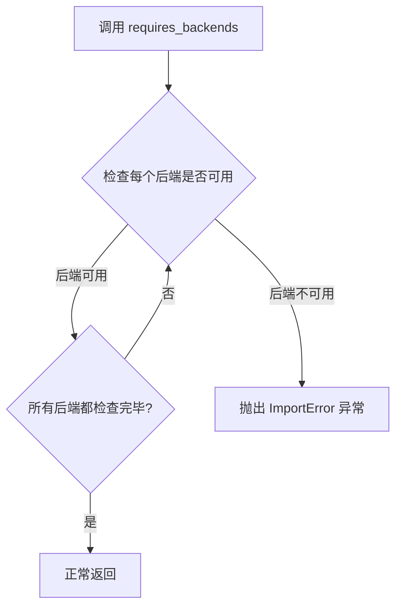
```mermaid
flowchart TD
    A[调用 requires_backends] --> B{检查每个后端是否可用}
    B -->|后端可用| C{所有后端都检查完毕?}
    B -->|后端不可用| D[抛出 ImportError 异常]
    C -->|是| E[正常返回]
    C -->|否| B
```

#### 带注释源码

```python
# 注意：以下源码是基于 diffusers 库常见实现的推断，
# 实际源码位于 ..utils 模块中，此处不可见

from ..utils import DummyObject, requires_backends


# 示例调用方式（来自当前文件）
class Flux2AutoBlocks(metaclass=DummyObject):
    _backends = ["torch", "transformers"]

    def __init__(self, *args, **kwargs):
        # 检查 torch 和 transformers 后端是否可用
        # 如果不可用，抛出 ImportError
        requires_backends(self, ["torch", "transformers"])

    @classmethod
    def from_config(cls, *args, **kwargs):
        # 类方法调用时传入 cls
        requires_backends(cls, ["torch", "transformers"])

    @classmethod
    def from_pretrained(cls, *args, **kwargs):
        # 类方法调用时传入 cls
        requires_backends(cls, ["torch", "transformers"])
```

> **注意**：由于 `requires_backends` 函数是从 `..utils` 模块导入的，当前文件中仅包含其调用代码，未包含函数的具体实现。上述文档基于该函数的典型使用模式推断得出。如需获取完整的函数实现源码，建议查看 `diffusers` 库的 `src/diffusers/utils` 目录下的相关文件。


### `Flux2AutoBlocks.__init__`

该方法是 `Flux2AutoBlocks` 类的构造函数，用于初始化实例。它通过调用 `requires_backends` 函数来检查当前环境是否具备所需的依赖库（`torch` 和 `transformers`），若缺少任一依赖则抛出异常，从而确保只有当必要的依赖可用时对象才能被正常创建。

参数：

- `*args`：`tuple`，可变位置参数，用于接受任意数量的位置参数（暂未使用）
- `**kwargs`：`dict`，可变关键字参数，用于接受任意数量的关键字参数（暂未使用）

返回值：`None`，无返回值（Python 默认返回 None）

#### 流程图

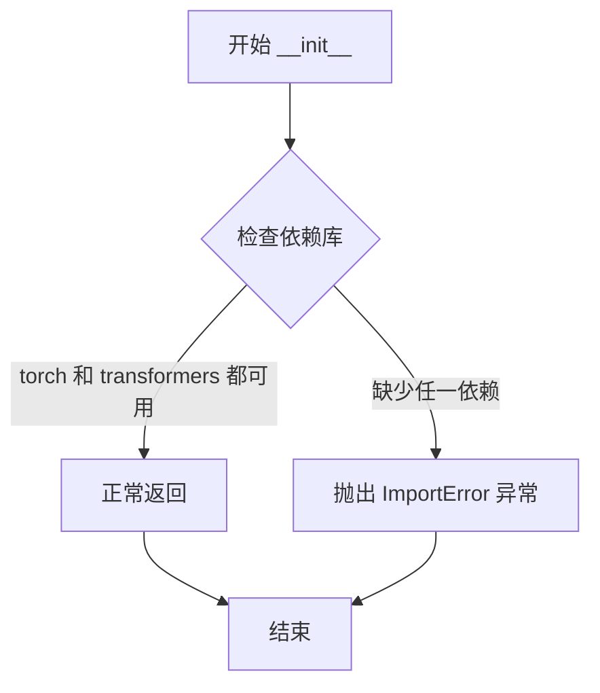
```mermaid
flowchart TD
    A[开始 __init__] --> B{检查依赖库}
    B -->|torch 和 transformers 都可用| C[正常返回]
    B -->|缺少任一依赖| D[抛出 ImportError 异常]
    C --> E[结束]
    D --> E
```

#### 带注释源码

```python
class Flux2AutoBlocks(metaclass=DummyObject):
    """
    Flux2AutoBlocks 类的定义，继承自 DummyObject 元类。
    该类用于表示 Flux2 模型的相关模块结构。
    """
    
    # 类属性：指定该类所需的依赖库后端
    _backends = ["torch", "transformers"]

    def __init__(self, *args, **kwargs):
        """
        构造函数，初始化 Flux2AutoBlocks 实例。
        
        参数:
            *args: 可变位置参数，用于接受任意数量的位置参数。
            **kwargs: 可变关键字参数，用于接受任意数量的关键字参数。
        
        返回值:
            None: 该方法没有显式返回值。
        
        功能:
            调用 requires_backends 检查当前环境是否安装了 torch 和 transformers 库。
            如果缺少任一依赖，该函数将抛出 ImportError 异常。
        """
        # 检查必要的依赖库是否已安装，若未安装则抛出异常
        requires_backends(self, ["torch", "transformers"])
```


### Flux2AutoBlocks.from_config

从配置字典创建 Flux2AutoBlocks 实例的类方法（存根实现），该方法首先检查所需的后端依赖（torch 和 transformers）是否可用。

参数：

- `*args`：可变位置参数，用于传递配置参数，目前未使用
- `**kwargs`：可变关键字参数，用于传递配置参数，目前未使用

返回值：`None`，该方法仅执行后端检查，不返回任何值

#### 流程图

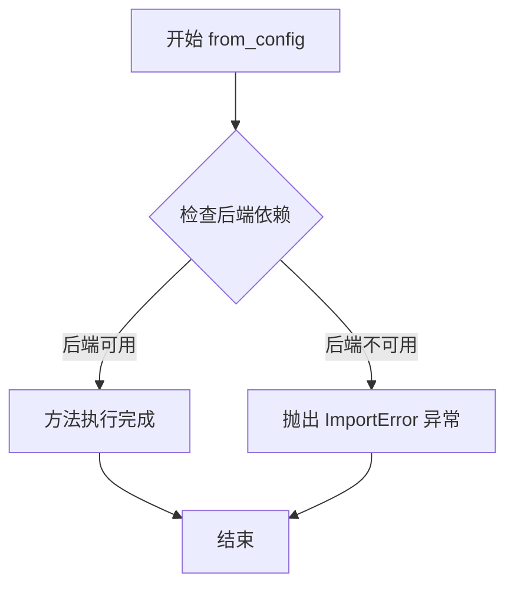
```mermaid
flowchart TD
    A[开始 from_config] --> B{检查后端依赖}
    B -->|后端可用| C[方法执行完成]
    B -->|后端不可用| D[抛出 ImportError 异常]
    C --> E[结束]
    D --> E
```

#### 带注释源码

```python
@classmethod
def from_config(cls, *args, **kwargs):
    """
    从配置创建实例的类方法。
    
    参数:
        cls: 类本身（Python类方法隐式传递）
        *args: 可变位置参数，用于传递配置参数
        **kwargs: 可变关键字参数，用于传递配置参数
    
    返回:
        None: 该方法仅进行后端检查，不返回实例
    """
    # 检查类是否具有所需的后端依赖（torch和transformers）
    # 如果依赖不可用，requires_backends 将抛出 ImportError
    requires_backends(cls, ["torch", "transformers"])
```


### `Flux2AutoBlocks.from_pretrained`

该方法是 Flux2AutoBlocks 类的类方法，用于从预训练模型加载模型权重。它通过 `requires_backends` 函数检查所需的后端依赖（torch 和 transformers）是否可用，如果后端不可用则抛出 ImportError，否则触发 DummyObject 元类注入的实际实现。

参数：

- `*args`：可变位置参数，用于传递模型路径或其他位置参数，具体参数取决于实际加载的模型实现
- `**kwargs`：可变关键字参数，用于传递配置参数、设备选择等，具体参数取决于实际加载的模型实现

返回值：类型取决于 DummyObject 元类注入的实际实现，通常返回加载了预训练权重的模型实例

#### 流程图

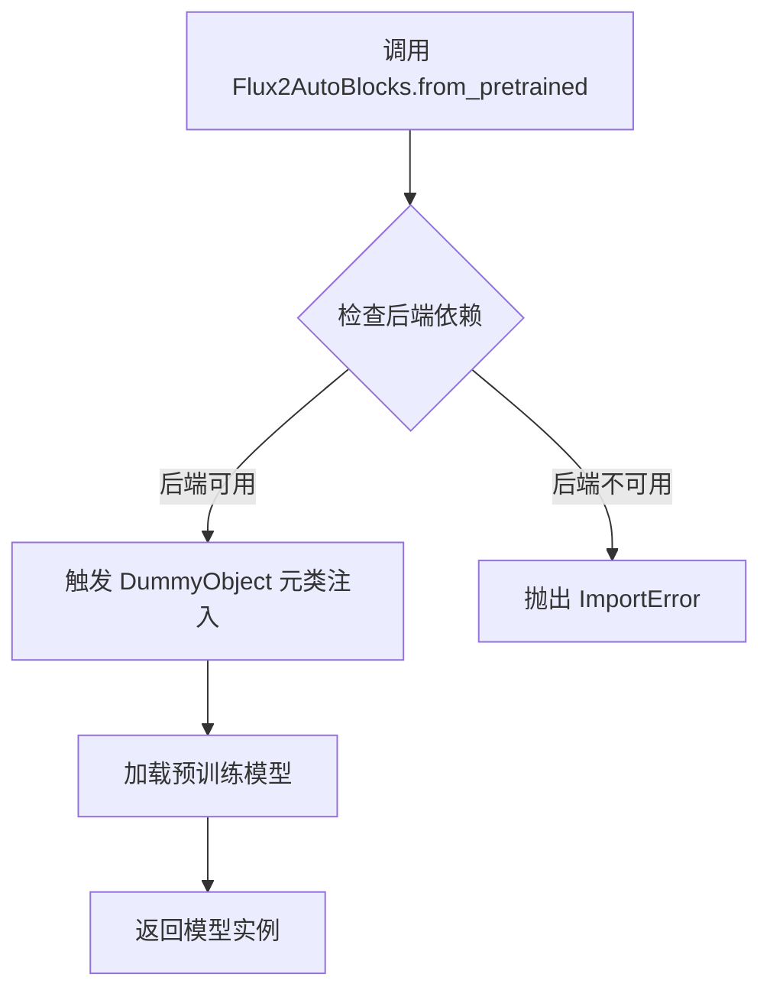
```mermaid
flowchart TD
    A[调用 Flux2AutoBlocks.from_pretrained] --> B{检查后端依赖}
    B -->|后端可用| C[触发 DummyObject 元类注入]
    B -->|后端不可用| D[抛出 ImportError]
    C --> E[加载预训练模型]
    E --> F[返回模型实例]
```

#### 带注释源码

```python
@classmethod
def from_pretrained(cls, *args, **kwargs):
    """
    从预训练模型加载模型权重。
    
    该方法是一个类方法，通过 requires_backends 检查所需的后端依赖
    （torch 和 transformers）是否可用。如果后端可用，则由 DummyObject
    元类注入实际实现；否则抛出 ImportError。
    
    参数:
        *args: 可变位置参数，传递模型路径或其他位置参数
        **kwargs: 可变关键字参数，传递配置参数如 device, revision 等
    
    返回:
        加载了预训练权重的模型实例，具体类型由注入的实现决定
    """
    # 检查 cls 是否有所需的后端依赖（torch 和 transformers）
    # 如果缺少依赖，requires_backends 会抛出 ImportError
    requires_backends(cls, ["torch", "transformers"])
```

#### 备注

- 该方法是自动生成的文件（通过 `make fix-copies` 命令生成），所有参数和返回值的确切类型需要查看实际注入的实现
- `DummyObject` 元类的设计允许在未安装可选依赖时也能导入模块，但实际调用方法时需要安装相应的依赖
- 该类的 `_backends` 属性表明它需要 `torch` 和 `transformers` 两个后端同时可用


### `Flux2KleinAutoBlocks.__init__`

该方法是 Flux2KleinAutoBlocks 类的初始化方法，通过 `requires_backends` 检查所需的 PyTorch 和 Transformers 依赖是否可用，若不可用则抛出 ImportError，确保只有在具备必要后端时才能实例化该类。

参数：

- `*args`：任意位置参数，用于接受可变数量的位置参数（传递至后端检查）
- `**kwargs`：任意关键字参数，用于接受可变数量的关键字参数（传递至后端检查）

返回值：`None`，无返回值，仅执行后端检查

#### 流程图

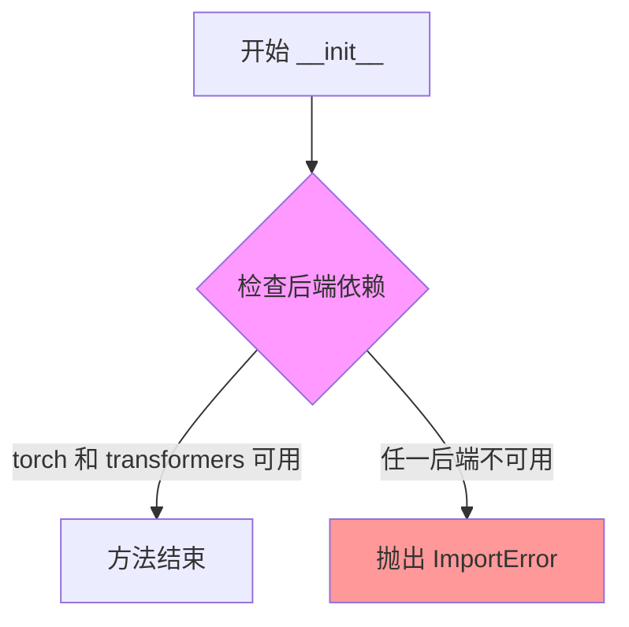
```mermaid
flowchart TD
    A[开始 __init__] --> B{检查后端依赖}
    B -->|torch 和 transformers 可用| C[方法结束]
    B -->|任一后端不可用| D[抛出 ImportError]
    
    style B fill:#f9f,color:#333
    style D fill:#f99,color:#333
```

#### 带注释源码

```python
class Flux2KleinAutoBlocks(metaclass=DummyObject):
    """
    Flux2KleinAutoBlocks 类
    
    这是一个使用 DummyObject 元类定义的占位符类。
    实际实现需要 torch 和 transformers 后端才能正常工作。
    """
    
    # 类属性：指定该类需要的后端依赖
    _backends = ["torch", "transformers"]

    def __init__(self, *args, **kwargs):
        """
        初始化 Flux2KleinAutoBlocks 实例
        
        参数:
            *args: 可变数量的位置参数，传递给后端检查函数
            **kwargs: 可变数量的关键字参数，传递给后端检查函数
        
        返回值:
            None: 无返回值，仅执行后端依赖检查
        
        异常:
            ImportError: 如果所需的后端依赖不可用
        """
        # 检查 torch 和 transformers 后端是否可用
        # 若不可用则抛出 ImportError 并提示安装
        requires_backends(self, ["torch", "transformers"])
```


### `Flux2KleinAutoBlocks.from_config`

该方法是Flux2KleinAutoBlocks类的类方法，用于根据配置创建模型实例，但由于使用了DummyObject元类和requires_backends调用，实际上是一个延迟加载的占位符方法，会在调用时检查torch和transformers后端是否可用。

参数：

- `*args`：可变位置参数，传递给后端实际实现的from_config方法
- `**kwargs`：可变关键字参数，传递给后端实际实现的from_config方法

返回值：`Any`（未明确指定，返回类型取决于后端实际实现的返回值）

#### 流程图

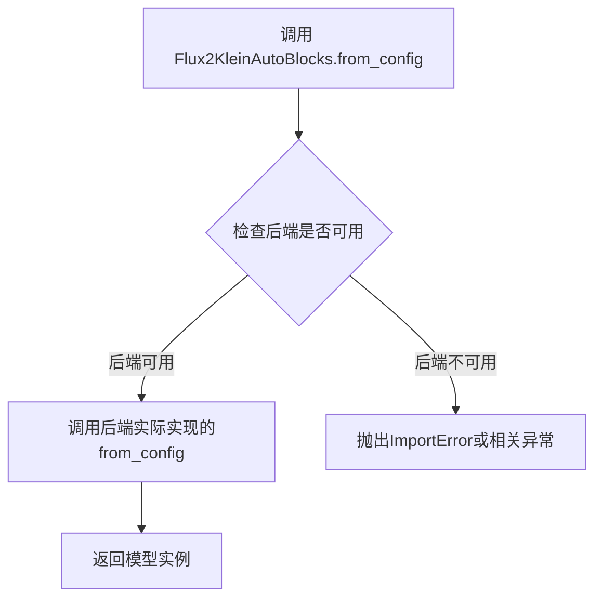
```mermaid
flowchart TD
    A[调用 Flux2KleinAutoBlocks.from_config] --> B{检查后端是否可用}
    B -->|后端可用| C[调用后端实际实现的from_config]
    B -->|后端不可用| D[抛出ImportError或相关异常]
    C --> E[返回模型实例]
```

#### 带注释源码

```python
@classmethod
def from_config(cls, *args, **kwargs):
    """
    根据配置创建Flux2KleinAutoBlocks实例的类方法。
    
    该方法是一个延迟加载的占位符，实际逻辑在torch和transformers后端中实现。
    调用时会先检查所需后端是否可用。
    
    参数:
        *args: 可变位置参数，传递给后端实现
        **kwargs: 可变关键字参数，传递给后端实现
    
    返回:
        返回后端实际实现的模型实例
    """
    # 检查类是否具有torch和transformers后端支持
    # 如果后端不可用，requires_backends会抛出相应的错误
    requires_backends(cls, ["torch", "transformers"])
```


### `Flux2KleinAutoBlocks.from_pretrained`

用于从预训练模型加载 Flux2KleinAutoBlocks 模型的类方法。该方法是一个延迟加载的存根实现，通过 DummyObject 元类实现，在实际调用时会触发后端依赖检查，确保 torch 和 transformers 库可用后再加载真正的实现。

参数：

- `*args`：可变位置参数，用于传递位置参数，具体参数取决于实际后端实现
- `**kwargs`：可变关键字参数，用于传递关键字参数（如 `pretrained_model_name_or_path` 等），具体参数取决于实际后端实现

返回值：具体返回值类型取决于实际后端实现，通常返回 Flux2KleinAutoBlocks 类的实例

#### 流程图

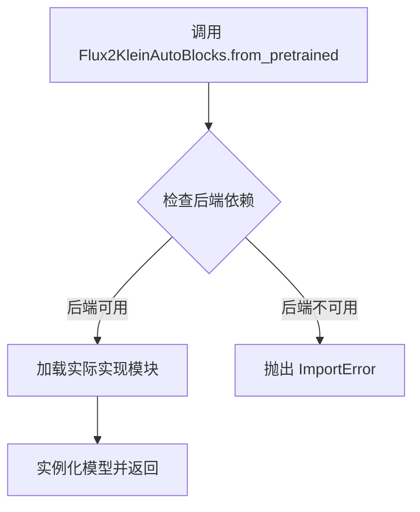
```mermaid
flowchart TD
    A[调用 Flux2KleinAutoBlocks.from_pretrained] --> B{检查后端依赖}
    B -->|后端可用| C[加载实际实现模块]
    B -->|后端不可用| D[抛出 ImportError]
    C --> E[实例化模型并返回]
```

#### 带注释源码

```python
@classmethod
def from_pretrained(cls, *args, **kwargs):
    """
    从预训练模型加载 Flux2KleinAutoBlocks 模型
    
    Args:
        *args: 可变位置参数，传递给实际实现
        **kwargs: 可变关键字参数，如 pretrained_model_name_or_path 等
    
    Returns:
        模型实例，具体类型取决于实际后端实现
    """
    # 检查并确保 torch 和 transformers 后端可用
    # 如果后端不可用，将抛出 ImportError 并提示安装依赖
    requires_backends(cls, ["torch", "transformers"])
```


### `Flux2KleinBaseAutoBlocks.__init__`

这是 Flux2KleinBaseAutoBlocks 类的初始化方法，用于创建该类的实例，但在实际实现中会通过 `requires_backends` 函数检查所需的深度学习后端（torch 和 transformers）是否可用，如果后端不可用则抛出导入错误。

参数：

- `*args`：可变位置参数，任意类型，用于接受任意数量的位置参数
- `**kwargs`：可变关键字参数，任意类型，用于接受任意数量的关键字参数

返回值：`None`，Python 中 `__init__` 方法不返回值

#### 流程图

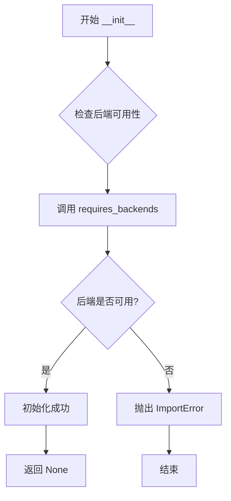
```mermaid
flowchart TD
    A[开始 __init__] --> B{检查后端可用性}
    B --> C[调用 requires_backends]
    C --> D{后端是否可用?}
    D -->|是| E[初始化成功]
    D -->|否| F[抛出 ImportError]
    E --> G[返回 None]
    F --> H[结束]
```

#### 带注释源码

```python
class Flux2KleinBaseAutoBlocks(metaclass[DummyObject]):
    """Flux2KleinBaseAutoBlocks 类的定义，使用 DummyObject 元类"""
    _backends = ["torch", "transformers"]  # 类属性：所需的后端列表

    def __init__(self, *args, **kwargs):
        """
        初始化 Flux2KleinBaseAutoBlocks 实例
        
        参数:
            *args: 可变位置参数，用于接受任意数量的位置参数
            **kwargs: 可变关键字参数，用于接受任意数量的关键字参数
        """
        # 检查所需的后端（torch 和 transformers）是否可用
        # 如果不可用，则抛出 ImportError
        requires_backends(self, ["torch", "transformers"])
```


### `Flux2KleinBaseAutoBlocks.from_config`

该方法是 Flux2KleinBaseAutoBlocks 类的类方法，用于通过配置对象实例化模型块。它在内部调用 `requires_backends` 函数来检查必要的依赖后端（torch 和 transformers）是否可用，如果后端不可用则抛出 ImportError，否则返回 None。

参数：

- `cls`：`<class>`，隐式参数，表示调用该方法的类本身
- `*args`：`<tuple>`，可变位置参数，用于传递配置参数
- `**kwargs`：`<dict>`，可变关键字参数，用于传递配置关键字参数

返回值：`<None>`，如果后端检查通过则隐式返回 None，否则抛出 ImportError 异常

#### 流程图

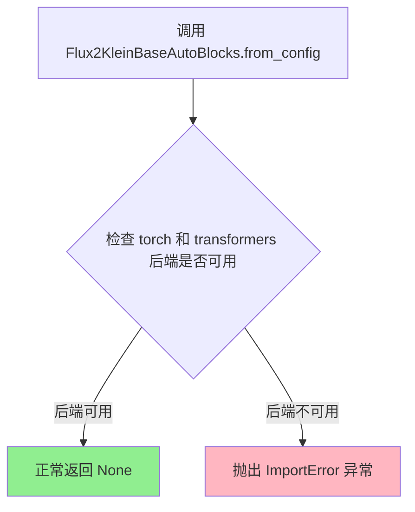
```mermaid
flowchart TD
    A[调用 Flux2KleinBaseAutoBlocks.from_config] --> B{检查 torch 和 transformers 后端是否可用}
    B -->|后端可用| C[正常返回 None]
    B -->|后端不可用| D[抛出 ImportError 异常]
    
    style C fill:#90EE90
    style D fill:#FFB6C1
```

#### 带注释源码

```python
@classmethod
def from_config(cls, *args, **kwargs):
    """
    类方法：从配置对象创建模型实例
    
    该方法是一个延迟加载的存根实现，实际的模型加载逻辑
    在安装了必要的依赖（torch 和 transformers）后才会执行。
    
    参数:
        cls: 调用的类对象
        *args: 可变位置参数，用于传递配置信息
        **kwargs: 可变关键字参数，用于传递配置信息
        
    返回:
        None: 如果后端依赖检查通过
        
    异常:
        ImportError: 如果缺少必要的后端依赖
    """
    # 检查当前类是否具有所需的后端依赖
    # 如果缺少 torch 或 transformers 库，将抛出 ImportError
    requires_backends(cls, ["torch", "transformers"])
```


### Flux2KleinBaseAutoBlocks.from_pretrained

该方法是一个类方法（`@classmethod`），用于从预训练的模型文件或模型名称加载模型实例。在当前的代码实现中（存根/占位符模式），该方法的主要功能是调用 `requires_backends` 函数，检查必要的依赖库（`torch` 和 `transformers`）是否已安装。如果依赖缺失，将会抛出导入错误；如果依赖满足，通常会调用真实的后端实现来加载并返回模型实例。

参数：

-  `*args`：可变位置参数，用于传递模型路径、配置文件路径等位置参数。
-  `**kwargs`：可变关键字参数，用于传递 `cache_dir`（缓存目录）、`torch_dtype`（数据类型）、`device_map`（设备映射）等可选配置参数。

返回值：`Flux2KleinBaseAutoBlocks`，返回加载后的模型实例（假设后端检查通过并调用了真实实现）。

#### 流程图

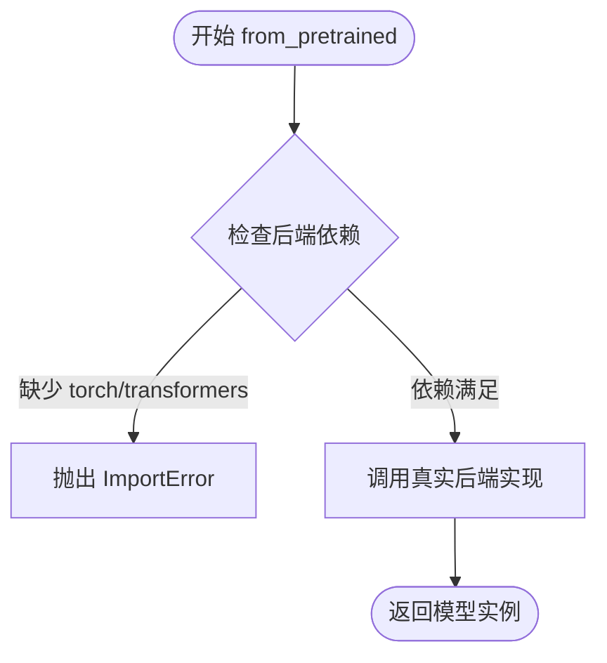
```mermaid
graph TD
    A([开始 from_pretrained]) --> B{检查后端依赖}
    B -- 缺少 torch/transformers --> C[抛出 ImportError]
    B -- 依赖满足 --> D[调用真实后端实现]
    D --> E([返回模型实例])
```

#### 带注释源码

```python
@classmethod
def from_pretrained(cls, *args, **kwargs):
    # 调用 requires_backends 检查当前环境是否安装了 torch 和 transformers
    # 如果未安装，这里会抛出 ImportError，阻止后续代码执行
    requires_backends(cls, ["torch", "transformers"])
```


### `Flux2KleinBaseModularPipeline.__init__`

该方法是 `Flux2KleinBaseModularPipeline` 类的构造函数，用于初始化实例并检查所需的后端依赖是否可用。它接受任意数量的位置参数和关键字参数，并调用 `requires_backends` 来确保必要的库（`torch` 和 `transformers`）已安装。

参数：
- `*args`：任意数量的位置参数，用于传递初始化所需的额外参数。
- `**kwargs`：任意数量的关键字参数，用于传递命名参数。

返回值：`None`，因为 `__init__` 方法通常不返回值。

#### 流程图

```mermaid
flowchart TD
    A[开始 __init__] --> B[调用 requires_backends self, ['torch', 'transformers']]
    B --> C{检查后端是否可用}
    C -->|后端可用| D[完成初始化]
    C -->|后端不可用| E[抛出 ImportError]
```

#### 带注释源码

```python
def __init__(self, *args, **kwargs):
    # 调用 requires_backends 函数，检查 torch 和 transformers 后端是否可用
    # 如果后端不可用，该函数将抛出 ImportError
    requires_backends(self, ["torch", "transformers"])
```


### `Flux2KleinBaseModularPipeline.from_config`

该方法是一个类方法，用于通过配置对象实例化Flux2KleinBaseModularPipeline类。由于该类是基于DummyObject元类实现的虚基类，实际的实例化逻辑在对应的后端模块中。该方法首先调用`requires_backends`来检查必要的依赖库（torch和transformers）是否可用，若不可用则抛出ImportError，否则将调用实际后端实现的from_config方法完成实例化。

参数：

- `*args`：可变位置参数，用于传递配置参数，通常为config字典或配置对象
- `**kwargs`：可变关键字参数，用于传递额外的配置选项，如device、torch_dtype等

返回值：返回`Flux2KleinBaseModularPipeline`类的实例对象

#### 流程图

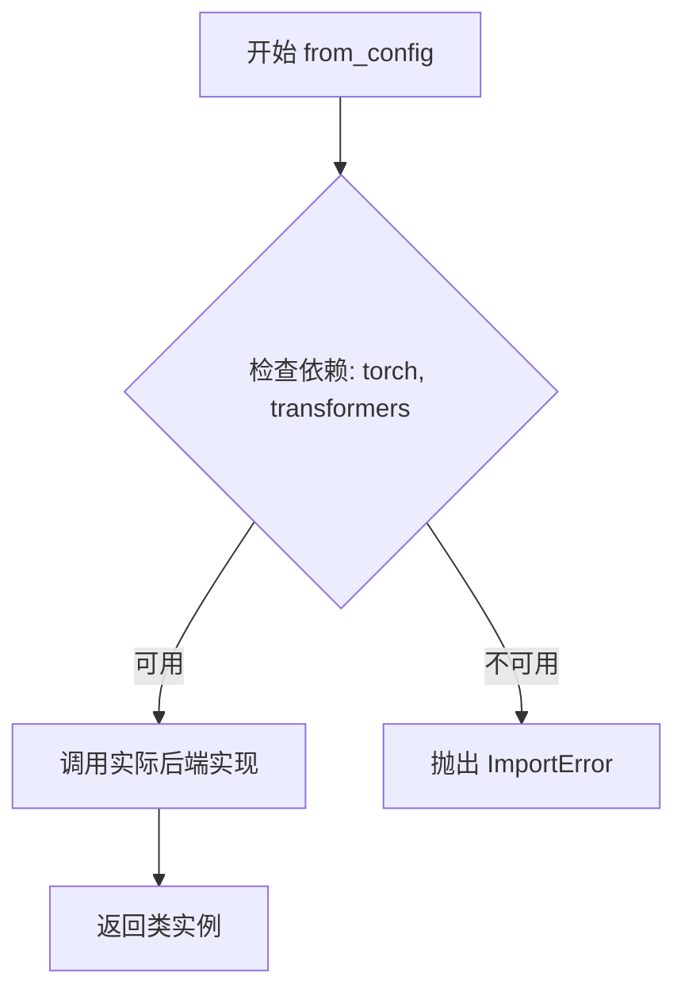
```mermaid
flowchart TD
    A[开始 from_config] --> B{检查依赖: torch, transformers}
    B -->|可用| C[调用实际后端实现]
    B -->|不可用| D[抛出 ImportError]
    C --> E[返回类实例]
```

#### 带注释源码

```python
@classmethod
def from_config(cls, *args, **kwargs):
    """
    从配置对象创建Flux2KleinBaseModularPipeline实例的类方法。
    
    该方法是懒加载模式的stub实现，实际逻辑在对应的后端模块中。
    通过元类DummyObject的设计，只有在实际调用时才会加载真实的pipeline类。
    
    参数:
        *args: 可变位置参数，通常接收config字典或配置对象
        **kwargs: 可变关键字参数，可包含device、torch_dtype等选项
    
    返回:
        返回Flux2KleinBaseModularPipeline类的实例
    """
    # 检查必要的依赖库是否已安装，若未安装则抛出ImportError
    requires_backends(cls, ["torch", "transformers"])
```


### `Flux2KleinBaseModularPipeline.from_pretrained`

这是一个类方法，用于从预训练模型加载 Flux2KleinBaseModularPipeline 管道实例。该方法是DummyObject的存根实现，实际功能需要安装 torch 和 transformers 后端才能使用。

参数：

- `cls`：类型：`class`，代表 Flux2KleinBaseModularPipeline 类本身
- `*args`：类型：`任意`，可变位置参数，用于传递预训练模型路径或其他位置参数
- `**kwargs`：类型：`任意`，可变关键字参数，用于传递配置选项、设备映射等

返回值：`任意`，返回管道实例（实际类型取决于后端实现）

#### 流程图

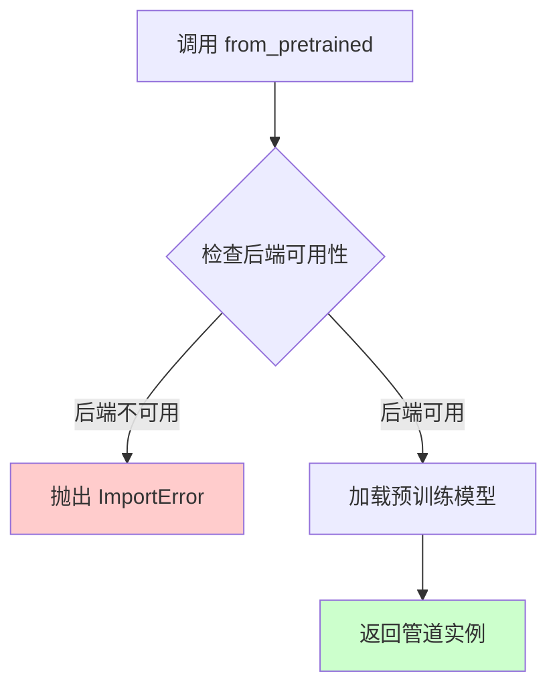
```mermaid
flowchart TD
    A[调用 from_pretrained] --> B{检查后端可用性}
    B -->|后端不可用| C[抛出 ImportError]
    B -->|后端可用| D[加载预训练模型]
    D --> E[返回管道实例]
    
    style C fill:#ffcccc
    style E fill:#ccffcc
```

#### 带注释源码

```python
@classmethod
def from_pretrained(cls, *args, **kwargs):
    """
    从预训练模型加载管道实例的类方法。
    
    参数:
        cls: Flux2KleinBaseModularPipeline 类本身
        *args: 可变位置参数，通常传递模型名称或路径
        **kwargs: 可变关键字参数，传递配置选项如 cache_dir, device_map 等
    
    返回:
        管道实例（实际类型由后端实现决定）
    
    异常:
        ImportError: 当 torch 或 transformers 后端未安装时抛出
    """
    # 调用 requires_backends 检查所需后端是否可用
    # 如果后端不可用，会抛出 ImportError 并提示安装
    requires_backends(cls, ["torch", "transformers"])
```


### `Flux2KleinModularPipeline.__init__`

这是一个占位符初始化方法，用于 Flux2KleinModularPipeline 类，通过调用 `requires_backends` 来确保所需的深度学习后端（torch 和 transformers）可用。

参数：

- `*args`：位置可变参数，用于传递任意数量的位置参数
- `**kwargs`：关键字可变参数，用于传递任意数量的关键字参数

返回值：`None`，该方法不返回值

#### 流程图

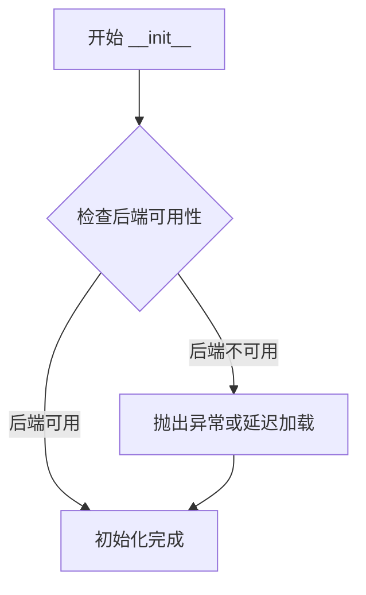
```mermaid
flowchart TD
    A[开始 __init__] --> B{检查后端可用性}
    B -->|后端不可用| C[抛出异常或延迟加载]
    B -->|后端可用| D[初始化完成]
    C --> D
```

#### 带注释源码

```python
class Flux2KleinModularPipeline(metaclass=DummyObject):
    """
    Flux2KleinModularPipeline 类定义
    
    这是一个使用 DummyObject 元类创建的占位符类，用于延迟加载
    真正的实现。当尝试实例化此类时，会检查所需的后端是否可用。
    """
    
    # 类属性：指定此类需要的后端依赖
    _backends = ["torch", "transformers"]

    def __init__(self, *args, **kwargs):
        """
        初始化方法
        
        参数:
            *args: 可变数量的位置参数
            **kwargs: 可变数量的关键字参数
            
        注意:
            此方法实际上不会执行任何初始化操作，只是调用
            requires_backends 来确保 torch 和 transformers 库可用。
            如果后端不可用，将抛出 ImportError。
        """
        # 调用 requires_backends 检查所需的后端是否已安装
        # 如果缺少依赖，此调用将抛出相应的异常
        requires_backends(self, ["torch", "transformers"])
```


### `Flux2KleinModularPipeline.from_config`

该方法是 Flux2KleinModularPipeline 类的类方法，用于通过配置对象创建管道实例，但目前实现为占位符，会检查并要求 torch 和 transformers 后端依赖。

参数：

- `cls`：类对象，隐式参数，表示调用此方法的类
- `*args`：可变位置参数，传递给后端实现（当前未使用）
- `**kwargs`：可变关键字参数，传递给后端实现（当前未使用）

返回值：`None`，该方法不返回值，仅执行后端检查

#### 流程图

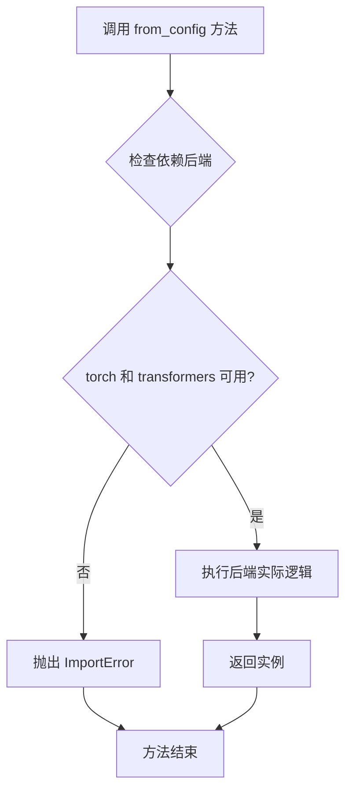
```mermaid
flowchart TD
    A[调用 from_config 方法] --> B{检查依赖后端}
    B --> C{torch 和 transformers 可用?}
    C -->|是| D[执行后端实际逻辑]
    C -->|否| E[抛出 ImportError]
    D --> F[返回实例]
    E --> G[方法结束]
    F --> G
```

#### 带注释源码

```python
@classmethod
def from_config(cls, *args, **kwargs):
    """
    类方法：从配置对象创建 Flux2KleinModularPipeline 实例。
    
    该方法是延迟加载的占位符实现，实际的管道创建逻辑
    需要在安装 torch 和 transformers 依赖后调用真正的实现。
    
    参数:
        cls: 调用的类对象
        *args: 可变位置参数，传递给后端实现
        **kwargs: 可变关键字参数，传递给后端实现
    
    返回:
        无直接返回值，实际实例创建由后端完成
    """
    # 检查并确保 torch 和 transformers 后端可用
    # 如果依赖缺失，将抛出 ImportError
    requires_backends(cls, ["torch", "transformers"])
```


# Flux2KleinModularPipeline.from_pretrained 设计文档

## 概述

`Flux2KleinModularPipeline.from_pretrained` 是一个类方法，属于 `Flux2KleinModularPipeline` 类。该方法是一个延迟加载（lazy loading）机制的分发方法，用于在满足后端依赖（torch 和 transformers）的情况下，从预训练模型加载 Flux2KleinModularPipeline 流水线实例。由于当前代码为自动生成的 stub 文件，实际的模型加载逻辑在其他模块中实现。

## 参数

由于该方法是使用 `*args` 和 `**kwargs` 定义的通用形式，实际参数需参考完整实现。从代码层面来看：

- `cls`：隐式参数，表示类本身（ClassMethod）
- `*args`：可变位置参数，用于传递预训练模型路径或其他位置参数
- `**kwargs`：可变关键字参数，用于传递配置选项、模型参数等

## 返回值

- **返回类型**：未在当前 stub 代码中指定（实际实现中应为 `Flux2KleinModularPipeline` 实例）
- **返回描述**：返回一个配置好的 Flux2KleinModularPipeline 流水线对象，可用于图像生成任务

## 流程图

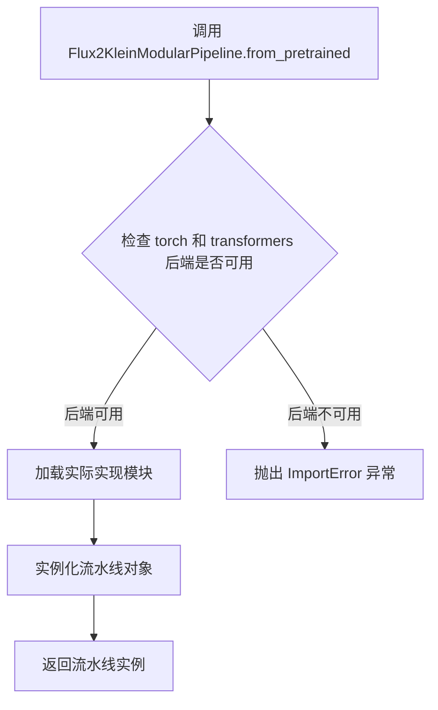
```mermaid
flowchart TD
    A[调用 Flux2KleinModularPipeline.from_pretrained] --> B{检查 torch 和 transformers 后端是否可用}
    B -->|后端可用| C[加载实际实现模块]
    B -->|后端不可用| D[抛出 ImportError 异常]
    C --> E[实例化流水线对象]
    E --> F[返回流水线实例]
```

## 带注释源码

```python
class Flux2KleinModularPipeline(metaclass=DummyObject):
    """
    Flux2KleinModularPipeline 流水线类。
    这是一个延迟加载的占位符类，实际实现在其他模块中。
    """
    
    # 定义该类需要的后端依赖
    _backends = ["torch", "transformers"]

    def __init__(self, *args, **kwargs):
        """
        初始化方法。
        调用 requires_backends 检查后端依赖是否满足。
        
        参数:
            *args: 位置参数
            **kwargs: 关键字参数
        """
        requires_backends(self, ["torch", "transformers"])

    @classmethod
    def from_config(cls, *args, **kwargs):
        """
        从配置字典创建流水线实例的类方法。
        
        参数:
            cls: 类本身
            *args: 位置参数
            **kwargs: 关键字参数
            
        返回:
            流水线实例
        """
        requires_backends(cls, ["torch", "transformers"])

    @classmethod
    def from_pretrained(cls, *args, **kwargs):
        """
        从预训练模型加载流水线实例的类方法。
        这是 Hugging Face diffusers 库的标准接口方法。
        
        参数:
            cls: 类本身
            *args: 位置参数，通常为预训练模型路径或模型ID
            **kwargs: 关键字参数，可能包括:
                - cache_dir: 模型缓存目录
                - torch_dtype: PyTorch 数据类型
                - device_map: 设备映射策略
                - local_files_only: 是否只使用本地文件
                - revision: 模型版本号
                - force_download: 是否强制重新下载
                等其他 Hugging Face Hub 相关参数
                
        返回:
            Flux2KleinModularPipeline: 加载好的流水线实例
        """
        requires_backends(cls, ["torch", "transformers"])
```

## 关键组件信息

| 组件名称 | 描述 |
|---------|------|
| `DummyObject` | 元类，用于实现延迟加载机制，在类被实际调用时检查后端依赖 |
| `requires_backends` | 工具函数，用于检查并确保所需后端库已安装，若缺失则抛出 ImportError |
| `_backends` | 类属性，定义该类需要的后端依赖列表 |

## 技术债务与优化空间

1. **缺少具体参数文档**：当前代码使用通用的 `*args` 和 `**kwargs`，缺少具体参数的类型注解和文档说明。
2. **重复代码模式**：所有 Pipeline 类都使用相同的模式，可以通过继承或装饰器进一步抽象。
3. **错误处理不完善**：当前仅依赖 `requires_backends` 进行基础检查，缺少更细粒度的参数验证。

## 其他说明

该类属于 Hugging Face diffusers 库的自动生成代码，通过 `make fix-copies` 命令生成。这种设计模式实现了：
- **依赖解耦**：核心库可以在不安装所有可选依赖的情况下被导入
- **按需加载**：只有在用户实际使用特定功能时才加载对应的实现模块
- **清晰的错误提示**：当缺少必要依赖时，提供明确的错误信息指导用户安装


### `Flux2ModularPipeline.__init__`

该方法是 `Flux2ModularPipeline` 类的构造函数，通过 `requires_backends` 函数检查当前环境是否安装了 PyTorch 和 Transformers 后端，如果缺失则抛出导入错误。这是采用延迟加载（lazy loading）模式的存根类，实际实现在后端模块中。

参数：

- `*args`：`任意类型`，可变数量的位置参数，用于接受构造函数的可选位置参数
- `**kwargs`：`任意类型`，可变数量的关键字参数，用于接受构造函数的可选关键字参数

返回值：`None`，构造函数不返回值

#### 流程图

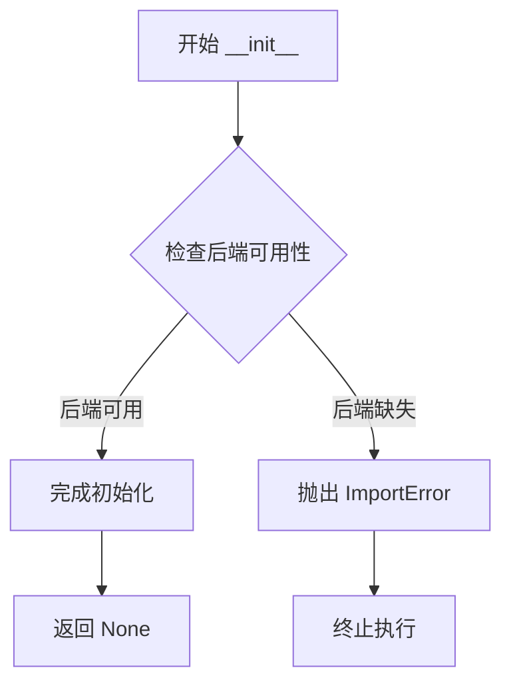
```mermaid
flowchart TD
    A[开始 __init__] --> B{检查后端可用性}
    B -->|后端可用| C[完成初始化]
    B -->|后端缺失| D[抛出 ImportError]
    C --> E[返回 None]
    D --> F[终止执行]
```

#### 带注释源码

```python
class Flux2ModularPipeline(metaclass=DummyObject):
    """Flux2ModularPipeline 类的存根实现，采用延迟加载模式"""
    
    # 类属性：声明该类需要的后端依赖
    _backends = ["torch", "transformers"]

    def __init__(self, *args, **kwargs):
        """
        构造函数
        
        参数:
            *args: 可变数量的位置参数
            **kwargs: 可变数量的关键字参数
        
        返回:
            None
        """
        # 调用 requires_backends 检查必要的依赖库是否已安装
        # 如果未安装 torch 或 transformers，将抛出 ImportError
        requires_backends(self, ["torch", "transformers"])
```


### `Flux2ModularPipeline.from_config`

用于通过配置字典实例化Flux2ModularPipeline模型的类方法，首先检查所需的后端依赖（torch和transformers）是否可用，然后调用实际的实现。

参数：

- `cls`：类型，`class`，表示调用此方法的类本身
- `*args`：类型，`tuple`，可变位置参数，用于传递位置参数
- `**kwargs`：类型，`dict`，可变关键字参数，用于传递关键字参数

返回值：未在代码中定义（由DummyObject元类动态实现），实际返回值取决于后端实现。

#### 流程图

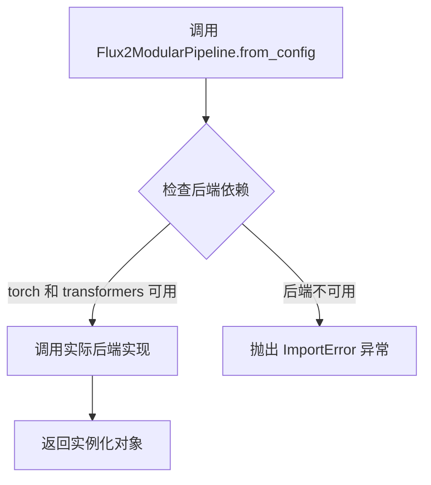
```mermaid
flowchart TD
    A[调用 Flux2ModularPipeline.from_config] --> B{检查后端依赖}
    B -->|torch 和 transformers 可用| C[调用实际后端实现]
    B -->|后端不可用| D[抛出 ImportError 异常]
    C --> E[返回实例化对象]
```

#### 带注释源码

```python
@classmethod
def from_config(cls, *args, **kwargs):
    """
    通过配置字典实例化Flux2ModularPipeline模型的类方法。
    
    参数:
        cls: 调用的类对象
        *args: 可变位置参数，传递给后端实现
        **kwargs: 可变关键字参数，传递给后端实现
    
    返回:
        由后端实现决定的实例化对象
    """
    # 检查所需的后端依赖（torch和transformers）是否可用
    # 如果不可用，会抛出适当的ImportError异常
    requires_backends(cls, ["torch", "transformers"])
```

#### 技术债务与优化空间

1. **缺少实际实现**：该方法是DummyObject元类生成的占位符，实际逻辑需要从其他模块导入真正的实现
2. **参数类型不明确**：使用`*args`和`**kwargs`导致无法在静态分析时确定参数类型
3. **无文档注释**：虽然代码中有注释，但缺乏完整的docstring来说明具体参数和返回值
4. **依赖检查冗余**：每个类都有相同的后端检查逻辑，可以通过元类或装饰器统一处理


### `Flux2ModularPipeline.from_pretrained`

该方法是 Flux2ModularPipeline 类的类方法，用于从预训练模型加载模型实例。由于该类使用 DummyObject 元类实现，该方法实际上是一个延迟加载的占位符，会在调用时检查必要的依赖后端（torch 和 transformers）是否可用，如果不可用则抛出 ImportError。

参数：

- `*args`：可变位置参数，用于传递从预训练模型加载时的位置参数（如模型路径等）
- `**kwargs`：可变关键字参数，用于传递从预训练模型加载时的关键字参数（如配置参数、device 等）

返回值：`None`，该方法不返回任何值，仅通过 `requires_backends` 检查后端可用性，实际的模型加载逻辑由后端实现

#### 流程图

```mermaid
flowchart TD
    A[调用 Flux2ModularPipeline.from_pretrained] --> B{检查 _backends}
    B -->|torch 和 transformers 可用| C[调用实际后端实现]
    B -->|任一后端不可用| D[抛出 ImportError]
    C --> E[返回模型实例]
    D --> F[提示安装缺失的依赖]
    
    style D fill:#ffcccc
    style F fill:#ffcccc
```

#### 带注释源码

```python
@classmethod
def from_pretrained(cls, *args, **kwargs):
    """
    从预训练模型加载模型实例的类方法。
    
    注意：此方法是 DummyObject 元类生成的占位符方法，
    实际功能由 requires_backends 函数控制。
    
    参数:
        *args: 可变位置参数，传递给后端模型的加载参数
        **kwargs: 可变关键字参数，传递给后端模型的加载参数
    
    返回:
        无返回值，仅通过 requires_backends 检查依赖
    """
    # 检查类是否具有 torch 和 transformers 后端支持
    # 如果任一后端不可用，会抛出 ImportError 并提示安装
    requires_backends(cls, ["torch", "transformers"])
```

---

**技术说明**：

该方法属于 **懒加载模式（Lazy Loading Pattern）** 的实现，是 Hugging Face Diffusers 库中常见的架构设计。通过 `DummyObject` 元类和 `requires_backends` 函数，实现了对可选依赖的延迟加载，只有在用户真正调用这些方法时才会检查并提示安装缺失的依赖。这种设计避免了强制要求用户安装所有可能的依赖，同时保持了 API 的一致性。


### `FluxAutoBlocks.__init__`

该方法是 `FluxAutoBlocks` 类的构造函数，用于初始化实例并确保所需的深度学习后端（torch 和 transformers）可用。它通过调用 `requires_backends` 函数来验证这些依赖库是否已安装，如果未安装则抛出异常。

参数：

- `*args`：`tuple`，可变位置参数，用于传递任意数量的位置参数到父类或后续初始化逻辑
- `**kwargs`：`dict`，可变关键字参数，用于传递任意数量的关键字参数到父类或后续初始化逻辑

返回值：`None`，构造函数不返回任何值，仅执行初始化逻辑

#### 流程图

```mermaid
flowchart TD
    A[开始 __init__] --> B[接收 *args 和 **kwargs]
    B --> C[调用 requires_backends 检查后端]
    C --> D{torch 和 transformers 是否可用?}
    D -->|是| E[初始化完成]
    D -->|否| F[抛出 ImportError 异常]
```

#### 带注释源码

```python
class FluxAutoBlocks(metaclass[DummyObject]):
    """
    Flux 模型的自动块加载器类，使用 DummyObject 元类实现延迟加载。
    该类在实际需要时才导入真实实现，确保在没有安装对应依赖时不会报错。
    """
    
    # 类属性：指定该类需要的后端依赖
    _backends = ["torch", "transformers"]

    def __init__(self, *args, **kwargs):
        """
        构造函数，初始化 FluxAutoBlocks 实例。
        
        参数:
            *args: 可变位置参数，将被传递给 requires_backends 函数
            **kwargs: 可变关键字参数，将被传递给 requires_backends 函数
        
        返回:
            None: 此方法不返回任何值
        """
        # 调用 requires_backends 检查所需的依赖库是否已安装
        # 如果未安装，将抛出 ImportError 异常
        requires_backends(self, ["torch", "transformers"])
```


### FluxAutoBlocks.from_config

该方法是 FluxAutoBlocks 类的类方法，用于根据配置创建 FluxAutoBlocks 实例。由于该类是使用 DummyObject 元类定义的延迟加载类（lazy loading stub），该方法实际上会检查所需的后端依赖（torch 和 transformers）是否可用，如果后端不可用则抛出 ImportError。

参数：

- `*args`：可变位置参数，传递给后端实际实现
- `**kwargs`：可变关键字参数，传递给后端实际实现

返回值：无（若后端可用则返回实际实现的对象，否则抛出 ImportError）

#### 流程图

```mermaid
flowchart TD
    A[调用 FluxAutoBlocks.from_config] --> B{检查 _backends 中的后端是否可用}
    B -->|后端可用| C[调用实际后端实现的 from_config 方法]
    B -->|后端不可用| D[抛出 ImportError]
    C --> E[返回实例对象]
```

#### 带注释源码

```python
@classmethod
def from_config(cls, *args, **kwargs):
    """
    从配置字典创建 FluxAutoBlocks 实例的类方法。
    
    该方法是延迟加载的 stub，实际实现由后端提供。
    调用时会先检查所需的后端依赖是否可用。
    
    参数:
        *args: 可变位置参数，将传递给实际后端实现
        **kwargs: 可变关键字参数，将传递给实际后端实现
    
    返回:
        如果后端可用，返回 FluxAutoBlocks 的实例
        如果后端不可用，抛出 ImportError
    """
    # 检查类所需的后端依赖（torch 和 transformers）是否可用
    # 如果不可用，此函数会抛出 ImportError
    requires_backends(cls, ["torch", "transformers"])
```


### `FluxAutoBlocks.from_pretrained`

该方法是 Flux 模型自动加载模块的类方法，用于从预训练模型路径加载模型架构。它通过 `requires_backends` 检查必要的依赖库（torch 和 transformers）是否可用，若不可用则抛出 ImportError。该方法是惰性加载的存根实现，实际的模型加载逻辑在其他模块中定义。

参数：

- `*args`：可变位置参数，传递给底层模型加载器，通常包括预训练模型路径等
- `**kwargs`：可变关键字参数，传递给底层模型加载器，支持如 `cache_dir`、`torch_dtype`、`device_map` 等标准 Hugging Face 参数

返回值：未知（由实际实现决定），通常返回模型实例或配置对象

#### 流程图

```mermaid
flowchart TD
    A[调用 FluxAutoBlocks.from_pretrained] --> B{检查 torch 和 transformers 是否可用}
    B -->|可用| C[调用实际模型加载逻辑]
    B -->|不可用| D[抛出 ImportError]
    C --> E[返回模型实例]
    
    style D fill:#ffcccc
    style E fill:#ccffcc
```

#### 带注释源码

```python
@classmethod
def from_pretrained(cls, *args, **kwargs):
    """
    从预训练模型加载模型架构。
    
    Args:
        *args: 可变位置参数，通常为 pretrained_model_name_or_path
        **kwargs: 关键字参数，支持 Hugging Face 标准参数如:
            - cache_dir: 模型缓存目录
            - torch_dtype: 数据类型
            - device_map: 设备映射
            - use_safetensors: 是否使用 safetensors 格式
            等...
    
    Returns:
        具体的模型实例（由实际实现决定）
    
    Raises:
        ImportError: 当 torch 或 transformers 库未安装时
    """
    # 检查必要的依赖库是否可用，若不可用则抛出 ImportError
    requires_backends(cls, ["torch", "transformers"])
```


### `FluxKontextAutoBlocks.__init__`

这是 FluxKontextAutoBlocks 类的初始化方法，用于实例化一个 FluxKontextAutoBlocks 对象，并通过 `requires_backends` 函数检查必要的依赖库（torch 和 transformers）是否可用。

参数：

- `self`：无类型，当前类的实例对象
- `*args`：Tuple[Any, ...]，可变位置参数，用于传递任意数量的位置参数
- `**kwargs`：Dict[str, Any]，可变关键字参数，用于传递任意数量的关键字参数

返回值：`None`，该方法不返回任何值，仅进行依赖检查

#### 流程图

```mermaid
flowchart TD
    A[开始 __init__] --> B{检查后端依赖}
    B --> C[调用 requires_backends]
    C --> D{torch 和 transformers 可用?}
    D -->|是| E[初始化完成]
    D -->|否| F[抛出 ImportError]
    
    style A fill:#f9f,color:#333
    style E fill:#9f9,color:#333
    style F fill:#f99,color:#333
```

#### 带注释源码

```python
class FluxKontextAutoBlocks(metaclass=DummyObject):
    """
    Flux 模型 Kontext 自动块类
    使用 DummyObject 元类创建，用于延迟加载实际的实现
    """
    
    # 类属性：指定所需的后端依赖
    _backends = ["torch", "transformers"]

    def __init__(self, *args, **kwargs):
        """
        初始化 FluxKontextAutoBlocks 实例
        
        参数:
            *args: 可变位置参数，将传递给实际实现
            **kwargs: 可变关键字参数，将传递给实际实现
        """
        # 检查必要的依赖库是否已安装
        # 如果 torch 或 transformers 未安装，将抛出 ImportError
        requires_backends(self, ["torch", "transformers"])
```


### `FluxKontextAutoBlocks.from_config`

该方法是 FluxKontextAutoBlocks 类的类方法，用于通过配置实例化对象，但在当前实现中仅作为占位符，通过 `requires_backends` 检查所需的后端依赖（torch 和 transformers）是否可用。

参数：

- `*args`：可变位置参数，用于接收任意数量的位置参数（当前未使用，仅作占位符）
- `**kwargs`：可变关键字参数，用于接收任意数量的关键字参数（当前未使用，仅作占位符）

返回值：`None`，该方法不返回任何值，仅执行依赖检查

#### 流程图

```mermaid
flowchart TD
    A[开始 from_config] --> B{检查后端依赖}
    B -->|所需依赖可用| C[通过检查]
    B -->|所需依赖不可用| D[抛出 ImportError 异常]
    C --> E[结束]
    D --> E
```

#### 带注释源码

```python
@classmethod
def from_config(cls, *args, **kwargs):
    """
    类方法：从配置创建并返回 FluxKontextAutoBlocks 实例
    
    参数:
        cls: 指向类本身的隐式参数
        *args: 可变位置参数列表（当前未使用）
        **kwargs: 可变关键字参数字典（当前未使用）
    
    返回:
        None: 本方法仅执行依赖检查，不返回实例
    """
    # 调用 requires_backends 函数检查所需的后端依赖是否已安装
    # 如果 torch 或 transformers 未安装，将抛出 ImportError
    requires_backends(cls, ["torch", "transformers"])
```


### `FluxKontextAutoBlocks.from_pretrained`

该方法是 FluxKontextAutoBlocks 类的类方法，用于从预训练模型加载模型权重。它是一个延迟加载的占位符方法，实际的模型加载逻辑在其他模块中实现，当前通过 `requires_backends` 函数检查所需的依赖库（torch 和 transformers）是否可用，如果不可用则抛出 ImportError。

参数：

- `*args`：可变位置参数，用于传递从预训练模型加载时的位置参数（如模型路径等）
- `**kwargs`：可变关键字参数，用于传递从预训练模型加载时的关键字参数（如配置参数等）

返回值：未明确指定（取决于实际实现的返回值，通常是模型实例）

#### 流程图

```mermaid
flowchart TD
    A[调用 from_pretrained 方法] --> B{检查 torch 和 transformers 是否可用}
    B -->|可用| C[加载预训练模型]
    B -->|不可用| D[抛出 ImportError 异常]
    C --> E[返回模型实例]
```

#### 带注释源码

```python
@classmethod
def from_pretrained(cls, *args, **kwargs):
    """
    从预训练模型加载模型权重。
    
    这是一个延迟加载的占位符方法，实际的模型加载逻辑
    在其他模块中通过动态导入实现。当前实现仅检查所需的
    依赖库是否可用。
    
    参数:
        *args: 可变位置参数，传递给实际模型加载器
        **kwargs: 可变关键字参数，传递给实际模型加载器
    
    返回:
        取决于实际实现的返回值
    
    异常:
        ImportError: 当 torch 或 transformers 库未安装时抛出
    """
    # 检查所需的依赖后端（torch 和 transformers）是否可用
    # 如果不可用，则抛出 ImportError 并提示安装相应的库
    requires_backends(cls, ["torch", "transformers"])
```


### `FluxKontextModularPipeline.__init__`

这是 FluxKontextModularPipeline 类的初始化方法，通过 `requires_backends` 验证当前环境是否安装了必要的依赖库（torch 和 transformers），确保只有在满足后端要求时才能实例化该对象。

参数：

- `*args`：可变位置参数（Any），用于接受任意数量的位置参数，具体参数取决于调用时的传入值
- `**kwargs`：可变关键字参数（Dict[str, Any]），用于接受任意数量的关键字参数，具体参数取决于调用时的传入值

返回值：`None`，因为 `__init__` 方法不返回任何值

#### 流程图

```mermaid
flowchart TD
    A[开始 __init__] --> B{检查后端依赖}
    B -->|torch 和 transformers 已安装| C[成功返回]
    B -->|缺少依赖| D[抛出 ImportError]
    
    C --> E[结束]
    D --> E
```

#### 带注释源码

```python
class FluxKontextModularPipeline(metaclass=DummyObject):
    """
    Flux 模型的模块化流水线类，使用 DummyObject 元类实现延迟加载。
    该类需要 torch 和 transformers 后端才能正常工作。
    """
    
    # 类属性：指定该类需要的后端依赖
    _backends = ["torch", "transformers"]

    def __init__(self, *args, **kwargs):
        """
        初始化 FluxKontextModularPipeline 实例。
        
        参数:
            *args: 可变位置参数，接受任意数量的位置参数
            **kwargs: 可变关键字参数，接受任意数量的关键字参数
            
        注意:
            该方法内部调用 requires_backends 来验证后端依赖是否满足。
            如果缺少必要的依赖，将抛出 ImportError。
        """
        # 验证当前环境是否安装了 torch 和 transformers
        # 如果未安装，requires_backends 会抛出相应的错误
        requires_backends(self, ["torch", "transformers"])

    @classmethod
    def from_config(cls, *args, **kwargs):
        """从配置字典创建实例的类方法"""
        requires_backends(cls, ["torch", "transformers"])

    @classmethod
    def from_pretrained(cls, *args, **kwargs):
        """从预训练模型创建实例的类方法"""
        requires_backends(cls, ["torch", "transformers"])
```


### `FluxKontextModularPipeline.from_config`

该方法是一个类方法，用于通过配置参数实例化 FluxKontextModularPipeline 对象。在实际调用时，该方法会先检查所需的后端依赖（torch 和 transformers）是否可用，如果不可用则会抛出相应的错误。

参数：

-  `*args`：可变位置参数，用于传递配置位置参数
-  `**kwargs`：可变关键字参数，用于传递配置关键字参数（如 `pretrained_model_name_or_path` 等）

返回值：`Any`，返回 FluxKontextModularPipeline 类的实例对象。如果后端不可用，则该方法会抛出 `ImportError` 异常。

#### 流程图

```mermaid
flowchart TD
    A[调用 from_config 方法] --> B{检查后端依赖是否可用}
    B -->|不可用| C[抛出 ImportError 异常]
    B -->|可用| D[返回 FluxKontextModularPipeline 实例]
    
    subgraph DummyObject 元类
        E[__new__] --> F{检查 _backends}
    end
    
    subgraph requires_backends 函数
        G[检查 torch 是否可用]
        H[检查 transformers 是否可用]
    end
    
    B --> G
    G --> H
```

#### 带注释源码

```python
class FluxKontextModularPipeline(metaclass=DummyObject):
    """
    FluxKontextModularPipeline 类，用于构建 Flux 上下文模块化管道。
    该类使用 DummyObject 元类，在实际后端可用前不会执行任何操作。
    """
    
    # 定义所需的后端依赖列表
    _backends = ["torch", "transformers"]

    def __init__(self, *args, **kwargs):
        """
        初始化方法，在实例化时检查后端依赖。
        
        参数:
            *args: 可变位置参数
            **kwargs: 可变关键字参数
        """
        # 检查 torch 和 transformers 后端是否可用
        requires_backends(self, ["torch", "transformers"])

    @classmethod
    def from_config(cls, *args, **kwargs):
        """
        类方法，从配置创建 FluxKontextModularPipeline 实例。
        这是一个延迟加载方法，实际的实例化逻辑在后端模块中实现。
        
        参数:
            *args: 可变位置参数，通常用于传递配置字典或模型路径
            **kwargs: 可变关键字参数，用于传递配置选项如：
                - pretrained_model_name_or_path: 预训练模型名称或路径
                - config: 模型配置字典
                - cache_dir: 缓存目录
                - 其他扩散模型配置参数
        
        返回:
            FluxKontextModularPipeline: 返回配置实例化的管道对象
        
        异常:
            ImportError: 当所需的后端依赖不可用时抛出
        """
        # 检查类级别的后端依赖，确保 torch 和 transformers 可用
        requires_backends(cls, ["torch", "transformers"])

    @classmethod
    def from_pretrained(cls, *args, **kwargs):
        """
        类方法，从预训练模型创建 FluxKontextModularPipeline 实例。
        
        参数:
            *args: 可变位置参数，通常用于传递模型路径
            **kwargs: 可变关键字参数，用于传递模型加载选项
        
        返回:
            FluxKontextModularPipeline: 返回预训练的管道对象
        
        异常:
            ImportError: 当所需的后端依赖不可用时抛出
        """
        requires_backends(cls, ["torch", "transformers"])
```


### `FluxKontextModularPipeline.from_pretrained`

该方法是 FluxKontextModularPipeline 类的类方法，用于从预训练模型加载模型权重和配置。它是一个延迟加载的占位符方法，实际实现通过 `requires_backends` 调用动态导入 torch 和 transformers 后端。

参数：

- `*args`：可变位置参数，用于传递从预训练模型加载时的位置参数（如模型名称或路径）
- `**kwargs`：可变关键字参数，用于传递从预训练模型加载时的可选参数（如配置选项、设备映射等）

返回值：动态返回（具体类型取决于实际后端实现），返回从预训练模型加载的 Pipeline 实例

#### 流程图

```mermaid
flowchart TD
    A[调用 FluxKontextModularPipeline.from_pretrained] --> B{检查后端依赖}
    B -->|torch 和 transformers 已安装| C[动态导入实际实现]
    B -->|依赖未安装| D[抛出 ImportError]
    C --> E[调用实际后端的 from_pretrained 方法]
    E --> F[返回 Pipeline 实例]
```

#### 带注释源码

```python
class FluxKontextModularPipeline(metaclass=DummyObject):
    """
    FluxKontext 模块化 Pipeline 类的占位符定义。
    实际实现在安装了 torch 和 transformers 后端后动态加载。
    """
    
    # 声明该类需要的后端依赖
    _backends = ["torch", "transformers"]

    def __init__(self, *args, **kwargs):
        """
        初始化方法，确保所需后端已安装。
        """
        # 检查并请求所需的后端依赖
        requires_backends(self, ["torch", "transformers"])

    @classmethod
    def from_config(cls, *args, **kwargs):
        """
        从配置字典加载模型的类方法。
        """
        # 检查并请求所需的后端依赖
        requires_backends(cls, ["torch", "transformers"])

    @classmethod
    def from_pretrained(cls, *args, **kwargs):
        """
        从预训练模型加载模型权重和配置的类方法。
        
        参数:
            *args: 可变位置参数，传递模型名称或路径等
            **kwargs: 可变关键字参数，传递配置选项
            
        返回:
            加载了预训练权重的 Pipeline 实例
        """
        # 检查并请求所需的后端依赖，实际加载逻辑在后端实现中
        requires_backends(cls, ["torch", "transformers"])
```


### `FluxModularPipeline.__init__`

FluxModularPipeline 类的初始化方法，用于检查并确保所需的 PyTorch 和 Transformers 后端已安装，若未安装则抛出 ImportError。

参数：

- `self`：类的实例对象
- `*args`：可变位置参数，用于传递初始化所需的额外位置参数
- `**kwargs`：可变关键字参数，用于传递初始化所需的额外关键字参数

返回值：无返回值（`None`），该方法通过调用 `requires_backends` 触发后端检查，若后端缺失则抛出异常

#### 流程图

```mermaid
flowchart TD
    A[开始 __init__] --> B[接收 *args 和 **kwargs]
    B --> C{检查 torch 和 transformers 后端}
    C -->|后端缺失| D[抛出 ImportError]
    C -->|后端存在| E[正常返回]
    D --> F[结束]
    E --> F
```

#### 带注释源码

```python
class FluxModularPipeline(metaclass=DummyObject):
    """
    FluxModularPipeline 类：
    用于 Flux 模型的模块化流水线，自动加载所需的后端依赖
    """
    _backends = ["torch", "transformers"]  # 类属性：声明所需的后端列表

    def __init__(self, *args, **kwargs):
        """
        初始化 FluxModularPipeline 实例
        
        参数:
            *args: 可变位置参数，用于传递额外的位置参数
            **kwargs: 可变关键字参数，用于传递额外的关键字参数
        
        返回值:
            无返回值
        """
        # 调用 requires_backends 函数检查当前环境是否安装了所需的后端
        # 如果未安装 torch 或 transformers，将抛出 ImportError 异常
        requires_backends(self, ["torch", "transformers"])

    @classmethod
    def from_config(cls, *args, **kwargs):
        """从配置创建实例的类方法"""
        requires_backends(cls, ["torch", "transformers"])

    @classmethod
    def from_pretrained(cls, *args, **kwargs):
        """从预训练模型加载实例的类方法"""
        requires_backends(cls, ["torch", "transformers"])
```


### `FluxModularPipeline.from_config`

这是一个自动生成的文件（由 `make fix-copies` 命令生成），用于为 FluxModularPipeline 类提供 `from_config` 类方法。该方法是工厂方法的设计模式实现，用于通过配置字典初始化 FluxModularPipeline 实例，但当前实现仅为存根，通过 `requires_backends` 检查所需的后端依赖（torch 和 transformers）是否可用。

参数：

- `*args`：可变位置参数，用于传递配置参数，当前类型和描述取决于实际实现
- `**kwargs`：可变关键字参数，用于传递配置字典或其他命名参数，当前类型和描述取决于实际实现

返回值：`None`，当前实现仅进行后端检查，不返回实际对象

#### 流程图

```mermaid
flowchart TD
    A[调用 from_config] --> B{检查后端依赖}
    B -->|torch 和 transformers 可用| C[继续执行]
    B -->|后端不可用| D[抛出 ImportError]
    C --> E[返回实例或执行后续逻辑]
    E --> F[结束]
    D --> F
```

#### 带注释源码

```python
@classmethod
def from_config(cls, *args, **kwargs):
    """
    类方法：从配置字典创建 FluxModularPipeline 实例
    
    Args:
        *args: 可变位置参数，用于传递配置信息
        **kwargs: 可变关键字参数，用于传递配置字典
    
    Returns:
        None: 当前实现仅检查后端依赖，不返回实际对象
    
    Note:
        该方法是存根实现，实际功能由后端模块提供。
        使用 requires_backends 确保 torch 和 transformers 库可用。
    """
    # 检查类是否具有所需的后端依赖（torch 和 transformers）
    # 如果缺少依赖，将抛出 ImportError 并提示安装
    requires_backends(cls, ["torch", "transformers"])
```


### `FluxModularPipeline.from_pretrained`

该方法是 FluxModularPipeline 类的类方法，用于从预训练模型路径加载模型实例。由于使用了 DummyObject 元类，该方法实际上是一个延迟加载的占位符，内部通过 `requires_backends` 函数检查 torch 和 transformers 后端是否可用，如果不可用则抛出 ImportError。

参数：

- `*args`：可变位置参数，用于传递预训练模型路径等位置参数
- `**kwargs`：可变关键字参数，用于传递配置参数、device、torch_dtype 等可选参数

返回值：返回加载后的 `FluxModularPipeline` 实例，但由于是 DummyObject，实际返回需要在安装对应后端后才能确定

#### 流程图

```mermaid
flowchart TD
    A[调用 from_pretrained 方法] --> B{检查 torch 和 transformers 后端是否可用}
    B -->|后端可用| C[执行实际的模型加载逻辑]
    B -->|后端不可用| D[抛出 ImportError 异常]
    C --> E[返回 FluxModularPipeline 实例]
    
    style D fill:#ffcccc
    style E fill:#ccffcc
```

#### 带注释源码

```python
@classmethod
def from_pretrained(cls, *args, **kwargs):
    """
    从预训练模型加载 FluxModularPipeline 实例的类方法。
    
    该方法是延迟加载的占位符实现，实际的模型加载逻辑
    在安装 torch 和 transformers 后端后才会执行。
    
    参数:
        *args: 可变位置参数，通常包括模型路径 (pretrained_model_name_or_path)
        **kwargs: 可变关键字参数，支持以下常用参数:
            - torch_dtype: 指定模型的数值类型
            - device: 指定设备 (如 'cuda', 'cpu')
            - use_safetensors: 是否使用 safetensors 格式
            - variant: 模型变体
            - revision: Git 版本
    
    返回:
        FluxModularPipeline: 加载了预训练权重的模型实例
    
    注意:
        - 依赖 torch 和 transformers 库
        - 实际实现由 DummyObject 元类在运行时动态生成
    """
    # 检查所需的后端依赖是否已安装
    # 如果 torch 或 transformers 未安装，将抛出 ImportError
    requires_backends(cls, ["torch", "transformers"])
```


### FluxPipeline.__init__

这是 Flux 模型管道的初始化方法，采用懒加载模式，在实际调用时检查必要的深度学习后端（torch 和 transformers）是否可用。

参数：

- `*args`：可变位置参数，用于传递任意数量的位置参数
- `**kwargs`：可变关键字参数，用于传递任意数量的关键字参数

返回值：`None`，`__init__` 方法不返回任何值（Python 中 `__init__` 应返回 `None`）

#### 流程图

```mermaid
flowchart TD
    A[开始 __init__] --> B{检查后端依赖}
    B --> C[调用 requires_backends]
    C --> D{后端是否可用?}
    D -->|是| E[完成初始化]
    D -->|否| F[抛出 ImportError]
    
    style B fill:#f9f,stroke:#333
    style C fill:#9f9,stroke:#333
    style F fill:#f99,stroke:#333
```

#### 带注释源码

```python
class FluxPipeline(metaclass=DummyObject):
    """Flux 模型管道类，使用 DummyObject 元类实现懒加载"""
    
    # 类属性：声明所需的后端依赖
    _backends = ["torch", "transformers"]

    def __init__(self, *args, **kwargs):
        """
        初始化 FluxPipeline 实例
        
        注意：此方法不执行真正的初始化操作，而是通过 requires_backends
        检查必要的依赖库是否已安装。如果缺少依赖，将抛出 ImportError。
        这种设计实现了懒加载模式，允许在未安装可选依赖的情况下导入模块。
        
        Args:
            *args: 可变位置参数，传递给实际管道类的初始化方法
            **kwargs: 可变关键字参数，传递给实际管道类的初始化方法
        """
        # 检查 torch 和 transformers 后端是否可用
        requires_backends(self, ["torch", "transformers"])
```


### `FluxPipeline.from_config`

该方法是 FluxPipeline 类的类方法，用于通过配置字典实例化 Pipeline。在当前实现中，它作为一个懒加载的占位符，通过 `requires_backends` 函数确保在实际调用时所需的后端依赖（torch 和 transformers）已安装。如果后端未安装，该方法会抛出 ImportError。

参数：

- `*args`：可变位置参数，用于传递配置参数
- `**kwargs`：可变关键字参数，用于传递配置字典或其他可选参数

返回值：`None`（实际功能依赖于后端实现，当前仅为占位符）

#### 流程图

```mermaid
flowchart TD
    A[调用 FluxPipeline.from_config] --> B{检查后端依赖}
    B -->|后端已安装| C[调用实际后端实现]
    B -->|后端未安装| D[抛出 ImportError]
    C --> E[返回 Pipeline 实例]
    D --> F[显示缺少的依赖提示]
    
    style B fill:#f9f,color:#333
    style C fill:#9f9,color:#333
    style D fill:#f99,color:#333
```

#### 带注释源码

```python
@classmethod
def from_config(cls, *args, **kwargs):
    """
    从配置字典创建 Pipeline 实例的类方法。
    
    该方法是懒加载的占位符实现，实际功能由后端模块提供。
    当用户调用此方法时，会首先检查所需的后端依赖是否已安装。
    
    参数:
        *args: 可变位置参数，用于传递配置相关的位置参数
        **kwargs: 可变关键字参数，通常用于传递配置字典 (config_dict)
    
    返回:
        无返回值（实际返回类型取决于后端实现）
    
    注意:
        - 该方法依赖 requires_backends 函数进行后端检查
        - 所需后端: torch, transformers
        - 如果后端未安装，会抛出 ImportError 并提示安装缺失的依赖
    """
    # 检查类方法是否在支持的后端环境中被调用
    # 如果 torch 或 transformers 未安装，此处会抛出 ImportError
    requires_backends(cls, ["torch", "transformers"])
```


### `FluxPipeline.from_pretrained`

该方法是 FluxPipeline 类的类方法，用于从预训练模型或检查点加载模型实例。由于代码中使用了 `DummyObject` 元类，该方法的实际实现被延迟加载，实际逻辑在导入 `torch` 和 `transformers` 后端时才会执行。方法内部调用 `requires_backends` 来确保所需的后端库可用。

参数：

- `cls`：类型：`class`，表示类本身（Python 类方法隐式参数）
- `*args`：类型：`tuple`，可变位置参数，用于传递预训练模型路径或其他位置参数
- `**kwargs`：类型：`dict`，可变关键字参数，用于传递配置选项（如 `pretrained_model_name_or_path`、`torch_dtype`、`device_map`、`token`、`revision` 等）

返回值：类型：`FluxPipeline`，返回加载后的 FluxPipeline 实例

#### 流程图

```mermaid
flowchart TD
    A[调用 FluxPipeline.from_pretrained] --> B{检查后端依赖}
    B -->|torch 和 transformers 已安装| C[加载实际实现]
    B -->|缺少依赖| D[抛出 ImportError]
    C --> E[解析预训练模型路径或名称]
    E --> F[加载模型配置]
    F --> G[实例化模型组件]
    G --> H[返回 FluxPipeline 实例]
```

#### 带注释源码

```python
class FluxPipeline(metaclass=DummyObject):
    """
    Flux 模型的 Pipeline 类，使用 DummyObject 元类实现延迟加载。
    实际实现依赖于 torch 和 transformers 后端。
    """
    _backends = ["torch", "transformers"]  # 定义所需的后端依赖

    def __init__(self, *args, **kwargs):
        # 初始化方法，同样检查后端依赖
        requires_backends(self, ["torch", "transformers"])

    @classmethod
    def from_config(cls, *args, **kwargs):
        """
        从配置字典创建 Pipeline 实例的类方法。
        """
        # 检查所需后端，如未安装则抛出异常
        requires_backends(cls, ["torch", "transformers"])

    @classmethod
    def from_pretrained(cls, *args, **kwargs):
        """
        从预训练模型加载 Pipeline 实例的类方法。
        
        参数:
            *args: 可变位置参数，通常第一个参数为预训练模型名称或路径
            **kwargs: 可选关键字参数，支持以下常见参数:
                - pretrained_model_name_or_path: str 模型名称或本地路径
                - torch_dtype: torch.dtype PyTorch 数据类型
                - device_map: str 或 dict 设备映射策略
                - token: str Hugging Face 访问令牌
                - revision: str 模型版本
                - use_safetensors: bool 是否使用 safetensors 格式
                - variant: str 模型变体
                - cache_dir: str 缓存目录
                - force_download: bool 强制重新下载
                - local_files_only: bool 仅使用本地文件
        """
        # 检查所需后端（torch 和 transformers），如未安装则抛出 ImportError
        # 实际加载逻辑在导入真实实现后执行
        requires_backends(cls, ["torch", "transformers"])
```


### FluxImg2ImgPipeline.__init__

这是 Flux 图像到图像（Image-to-Image）Pipeline 类的初始化方法。该方法采用可变参数设计，通过 `requires_backends` 机制确保运行所需的深度学习后端（PyTorch 和 Transformers）已正确安装，从而实现延迟加载（Lazy Loading）和依赖前置检查的设计模式。

参数：

- `*args`：可变位置参数，用于传递任意数量的位置参数（具体参数取决于实际实现）
- `**kwargs`：可变关键字参数，用于传递任意数量的关键字参数（具体参数取决于实际实现）

返回值：`None`，无返回值，该方法仅进行副作用操作（依赖检查）

#### 流程图

```mermaid
flowchart TD
    A[__init__ 调用] --> B{检查后端依赖}
    B -->|后端可用| C[完成初始化]
    B -->|后端缺失| D[抛出 ImportError]
    
    style A fill:#f9f,color:#000
    style C fill:#9f9,color:#000
    style D fill:#f99,color:#000
```

#### 带注释源码

```python
class FluxImg2ImgPipeline(metaclass=DummyObject):
    """
    Flux 图像到图像（Image-to-Image）Pipeline 类
    
    该类是一个存根类（DummyObject），实际的 Pipeline 实现
    在其他模块中通过延迟加载的方式提供。这是 diffusers 库
    常用的设计模式，用于：
    1. 减少初始导入时间
    2. 按需加载大型模型组件
    3. 提供清晰的 API 接口
    """
    
    # 定义该类所需的后端依赖
    _backends = ["torch", "transformers"]

    def __init__(self, *args, **kwargs):
        """
        初始化 FluxImg2ImgPipeline 实例
        
        该构造函数接受任意参数，并将它们传递给实际实现。
        主要职责是确保所需的后端库已安装。
        
        参数:
            *args: 可变位置参数列表
            **kwargs: 可变关键字参数字典
        """
        # 调用 requires_backends 进行依赖检查
        # 如果缺少 torch 或 transformers，将抛出 ImportError
        requires_backends(self, ["torch", "transformers"])

    @classmethod
    def from_config(cls, *args, **kwargs):
        """
        从配置字典创建 Pipeline 实例的类方法
        
        参数:
            *args: 可变位置参数
            **kwargs: 可变关键字参数
            
        返回:
            Pipeline 实例
        """
        requires_backends(cls, ["torch", "transformers"])

    @classmethod
    def from_pretrained(cls, *args, **kwargs):
        """
        从预训练模型创建 Pipeline 实例的类方法
        
        这是最常用的加载方式，会从指定路径或 Hub
        加载模型权重并初始化 Pipeline。
        
        参数:
            *args: 可变位置参数（如模型路径）
            **kwargs: 可变关键字参数（如模型配置）
            
        返回:
            加载好的 Pipeline 实例
        """
        requires_backends(cls, ["torch", "transformers"])
```

---

## 设计分析

### 1. 设计目标与约束

- **延迟加载设计**：通过 `DummyObject` 元类和 `requires_backends` 实现按需加载，减少包导入时间和内存占用
- **依赖前置检查**：在对象初始化阶段即检查后端可用性，避免运行时因缺失依赖而崩溃
- **灵活参数设计**：使用 `*args` 和 `**kwargs` 适配不同 Pipeline 的多样化配置需求

### 2. 技术债务与优化空间

| 潜在问题 | 描述 | 优化建议 |
|---------|------|---------|
| 缺乏具体参数类型提示 | 当前使用 `*args` 和 `**kwargs` 导致无法获得 IDE 自动补全和类型检查 | 考虑在文档或类型 stub 文件中补充完整的函数签名 |
| 重复的后端检查代码 | `_backends` 列表在多处重复定义 | 可提取为基类或配置常量 |
| 错误信息可能不够友好 | `requires_backends` 的错误信息较为通用 | 可自定义更详细的安装指引 |

### 3. 外部依赖

- **torch**：PyTorch 深度学习框架
- **transformers**：Hugging Face Transformers 库

这两者是 Flux 模型运行的必要依赖，缺失将导致 `ImportError`。


### `FluxImg2ImgPipeline.from_config`

该方法是 Flux 模型图像到图像（Img2Img）流水线的配置加载类方法，通过 `requires_backends` 检查并确保所需的后端依赖（torch 和 transformers）可用后才能真正加载配置，属于懒加载机制的一部分。

参数：

- `*args`：可变位置参数，用于传递任意数量的位置参数，具体参数取决于实际后端实现。
- `**kwargs`：可变关键字参数，用于传递任意数量的关键字参数，具体参数取决于实际后端实现。

返回值：无明确返回值（方法内部仅调用 `requires_backends`，若后端不可用则抛出异常）。

#### 流程图

```mermaid
flowchart TD
    A[调用 FluxImg2ImgPipeline.from_config] --> B{检查 torch 和 transformers 后端}
    B -->|后端可用| C[继续执行实际加载逻辑]
    B -->|后端不可用| D[抛出 ImportError 异常]
    
    C --> E[返回配置对象]
    
    style A fill:#e1f5fe
    style C fill:#e8f5e8
    style D fill:#ffebee
    style E fill:#e8f5e8
```

#### 带注释源码

```python
@classmethod
def from_config(cls, *args, **kwargs):
    """
    从配置字典或配置文件加载 Pipeline 实例的类方法。
    
    参数:
        cls: 指向 FluxImg2ImgPipeline 类本身的隐式参数
        *args: 可变位置参数，传递给实际后端实现的 from_config 方法
        **kwargs: 可变关键字参数，传递给实际后端实现的 from_config 方法
    
    返回:
        无明确返回值；若后端依赖不满足则抛出 ImportError
    
    注意:
        该方法是懒加载机制的核心，仅在所需后端（torch, transformers）可用时
        才会触发真正的配置加载逻辑。此文件为自动生成，实际实现位于后端模块中。
    """
    # 检查并确保 torch 和 transformers 后端可用
    # 若后端缺失，将抛出 ImportError 并提示缺少的依赖
    requires_backends(cls, ["torch", "transformers"])
```


### `FluxImg2ImgPipeline.from_pretrained`

用于从预训练模型加载 `FluxImg2ImgPipeline` 实例的类方法，通过 `requires_backends` 检查必要的深度学习后端是否可用，确保在调用实际实现前满足依赖要求。

参数：

- `*args`：可变位置参数，用于传递预训练模型路径或其他必需的位置参数，例如模型仓库标识符或本地路径。
- `**kwargs`：可变关键字参数，用于传递可选的配置选项，例如 `torch_dtype`（模型数据类型）、`variant`（模型变体）、`use_safetensors`（是否使用安全张量）等。

返回值：返回加载后的 `FluxImg2ImgPipeline` 实例，具体类型由后端实现决定，通常为模型管道对象。

#### 流程图

```mermaid
flowchart TD
    A[调用 from_pretrained 方法] --> B{检查后端依赖}
    B -->|后端可用| C[加载预训练模型]
    B -->|后端不可用| D[抛出 ImportError]
    C --> E[返回 Pipeline 实例]
```

#### 带注释源码

```python
@classmethod
def from_pretrained(cls, *args, **kwargs):
    """
    从预训练模型加载 Pipeline 实例的类方法。
    
    参数:
        *args: 可变位置参数，传递模型路径等。
        **kwargs: 可变关键字参数，传递配置选项。
    
    返回:
        Pipeline 实例。
    """
    # 检查必需的深度学习后端（torch 和 transformers）是否已安装
    requires_backends(cls, ["torch", "transformers"])
```


### `FluxInpaintPipeline.__init__`

用于初始化 FluxInpaintPipeline 实例的构造函数，通过 `requires_backends` 检查并确保所需的 torch 和 transformers 后端已安装，否则抛出导入错误。

参数：

- `*args`：任意位置参数，用于传递可变数量的位置参数（无具体类型，由调用者决定）
- `**kwargs`：任意关键字参数，用于传递可变数量的关键字参数（无具体类型，由调用者决定）

返回值：`None`，该方法仅进行后端依赖检查，不返回任何值

#### 流程图

```mermaid
flowchart TD
    A[开始 __init__] --> B{检查后端依赖}
    B -->|后端已安装| C[方法执行完成]
    B -->|后端未安装| D[抛出 ImportError]
    C --> E[返回 None]
    
    style B fill:#f9f,stroke:#333
    style D fill:#f66,stroke:#333
```

#### 带注释源码

```python
class FluxInpaintPipeline(metaclass=DummyObject):
    """
    Flux 图像修复（Inpainting）流水线的存根类。
    实际实现位于其他模块中，此处仅用于延迟导入和依赖检查。
    """
    
    # 定义该类所需的后端依赖
    _backends = ["torch", "transformers"]

    def __init__(self, *args, **kwargs):
        """
        初始化 FluxInpaintPipeline 实例。
        
        参数:
            *args: 可变数量的位置参数，传递给实际的流水线构造函数
            **kwargs: 可变数量的关键字参数，传递给实际的流水线构造函数
        
        返回:
            None: 此方法不返回任何值，仅进行后端验证
        """
        # 调用 requires_backends 检查所需的依赖库是否已安装
        # 如果未安装，将抛出 ImportError 提示用户安装对应依赖
        requires_backends(self, ["torch", "transformers"])
```

---

**备注**：该类是一个使用 `DummyObject` 元类实现的延迟加载/存根类。`__init__` 方法的实际逻辑由元类控制，当用户尝试实例化此类时，`requires_backends` 会检查 torch 和 transformers 是否可用，若不可用则抛出导入错误。这种设计常用于减少库的初始加载时间，并提供清晰的依赖提示。


### `FluxInpaintPipeline.from_config`

该方法是 FluxInpaintPipeline 类的类方法，用于通过配置创建管道实例。由于此类使用了 DummyObject 元类，该方法当前通过 `requires_backends` 函数检查所需的后端库（torch 和 transformers）是否可用，如果不满足条件则抛出导入错误。

参数：

- `*args`：可变位置参数，用于传递任意数量的位置参数
- `**kwargs`：可变关键字参数，用于传递任意数量的关键字参数（如 `pretrained_model_name_or_path`, `config` 等，具体取决于实际实现）

返回值：`无`（该方法不返回任何内容，仅执行后端库检查）

#### 流程图

```mermaid
flowchart TD
    A[开始 from_config] --> B{检查后端库是否可用}
    B -->|可用| C[允许继续执行]
    B -->|不可用| D[抛出 ImportError]
    C --> E[返回/执行后续逻辑]
    D --> F[结束]
    
    style B fill:#f9f,stroke:#333
    style D fill:#ff6b6b,stroke:#333
```

#### 带注释源码

```python
@classmethod
def from_config(cls, *args, **kwargs):
    """
    类方法：从配置创建 FluxInpaintPipeline 实例
    
    Args:
        *args: 可变位置参数，用于传递配置相关参数
        **kwargs: 可变关键字参数，可包含如 pretrained_model_name_or_path, config 等参数
    
    Returns:
        无返回值，仅进行后端库检查
    
    Note:
        该方法是 DummyObject 元类的一部分，实际实现需要安装 torch 和 transformers 库
    """
    # requires_backends 函数检查当前环境是否安装了所需的后端库
    # 如果未安装 torch 或 transformers，将抛出 ImportError 异常
    requires_backends(cls, ["torch", "transformers"])
```


### `FluxInpaintPipeline.from_pretrained`

该方法是一个类方法（classmethod），用于从预训练的模型权重中实例化 `FluxInpaintPipeline` 管道。由于代码中使用了 `DummyObject` 元类，该方法实际上是一个延迟导入（lazy import）的存根实现，会先检查所需的后端依赖（`torch` 和 `transformers`）是否可用，然后委托给真正的实现类完成模型加载。

参数：

- `*args`：可变位置参数，用于传递预训练模型路径或其他位置参数
- `**kwargs`：可变关键字参数，用于传递额外的配置参数，如 `torch_dtype`、`device_map`、`cache_dir` 等

返回值：未在当前代码中明确指定，通常返回 `FluxInpaintPipeline` 类的实例

#### 流程图

```mermaid
flowchart TD
    A[调用 FluxInpaintPipeline.from_pretrained] --> B{检查后端依赖}
    B -->|后端可用| C[加载预训练模型权重]
    B -->|后端不可用| D[抛出 ImportError 异常]
    C --> E[实例化 FluxInpaintPipeline]
    E --> F[返回管道实例]
```

#### 带注释源码

```python
class FluxInpaintPipeline(metaclass=DummyObject):
    """
    Flux 模型的图像修复（Inpainting）管道类。
    使用 DummyObject 元类实现延迟导入，当实际调用方法时才会检查后端依赖。
    """
    _backends = ["torch", "transformers"]  # 该类需要的后端依赖列表

    def __init__(self, *args, **kwargs):
        """
        初始化方法。
        调用 requires_backends 检查 torch 和 transformers 是否可用。
        """
        requires_backends(self, ["torch", "transformers"])

    @classmethod
    def from_config(cls, *args, **kwargs):
        """
        从配置字典创建管道实例的类方法。
        """
        requires_backends(cls, ["torch", "transformers"])

    @classmethod
    def from_pretrained(cls, *args, **kwargs):
        """
        从预训练模型加载管道实例的类方法。
        
        参数:
            *args: 可变位置参数，通常传递模型路径或模型名称
            **kwargs: 可变关键字参数，传递额外配置选项
                     常见参数包括:
                     - torch_dtype: 指定张量数据类型
                     - device_map: 设备映射策略
                     - cache_dir: 模型缓存目录
                     - revision: 模型版本号
                     - use_safetensors: 是否使用 safetensors 格式
        
        返回:
            FluxInpaintPipeline: 加载了预训练权重的管道实例
        """
        # 检查所需的后端依赖是否可用
        # 如果不可用，会抛出详细的 ImportError 提示用户安装
        requires_backends(cls, ["torch", "transformers"])
```


### `FluxControlNetPipeline.__init__`

FluxControlNetPipeline的初始化方法，用于创建FluxControlNetPipeline实例，并检查torch和transformers后端是否可用。该类是DummyObject元类的实例，作为延迟加载的占位符，实际实现在torch和transformers后端中。

参数：

- `*args`：可变位置参数，用于传递给后端检查的动态参数
- `**kwargs`：可变关键字参数，用于传递给后端检查的动态参数

返回值：`None`，构造函数无返回值

#### 流程图

```mermaid
flowchart TD
    A[开始 __init__] --> B{检查后端可用性}
    B -->|torch 和 transformers 可用| C[创建实例对象]
    B -->|任一后端不可用| D[抛出 ImportError]
    C --> E[结束]
    D --> E
```

#### 带注释源码

```python
class FluxControlNetPipeline(metaclass=DummyObject):
    """
    FluxControlNetPipeline 类，使用 DummyObject 元类实现延迟加载。
    实际实现依赖于 torch 和 transformers 后端。
    """
    
    # 定义所需的后端依赖
    _backends = ["torch", "transformers"]

    def __init__(self, *args, **kwargs):
        """
        初始化 FluxControlNetPipeline 实例。
        
        参数:
            *args: 可变位置参数，传递给 requires_backends 函数
            **kwargs: 可变关键字参数，传递给 requires_backends 函数
        
        注意:
            该方法是占位符实现，实际逻辑在 torch 和 transformers 后端中
        """
        # 检查所需的后端是否可用，若不可用则抛出 ImportError
        requires_backends(self, ["torch", "transformers"])

    @classmethod
    def from_config(cls, *args, **kwargs):
        """从配置创建 Pipeline 实例"""
        requires_backends(cls, ["torch", "transformers"])

    @classmethod
    def from_pretrained(cls, *args, **kwargs):
        """从预训练模型创建 Pipeline 实例"""
        requires_backends(cls, ["torch", "transformers"])
```


### `FluxControlNetPipeline.from_config`

该方法是 `FluxControlNetPipeline` 类的类方法，用于通过配置创建管道实例。由于该类使用 `DummyObject` 元类实现，此方法实际上是一个延迟加载的占位符，会检查必要的依赖库（torch 和 transformers）是否可用，若不可用则抛出导入错误。

参数：

- `cls`：类型 `type`，表示调用该方法的类本身（隐式参数）
- `*args`：类型 `任意`，可变位置参数，用于传递位置参数（当前实现中未使用）
- `**kwargs`：类型 `任意`，可变关键字参数，用于传递关键字参数（当前实现中未使用）

返回值：`None`，无显式返回值，仅执行依赖检查

#### 流程图

```mermaid
flowchart TD
    A[调用 FluxControlNetPipeline.from_config] --> B{检查 _backends 依赖}
    B -->|依赖满足| C[返回 None]
    B -->|依赖不满足| D[抛出 ImportError]
    
    style D fill:#ffcccc
    style C fill:#ccffcc
```

#### 带注释源码

```python
class FluxControlNetPipeline(metaclass=DummyObject):
    """
    FluxControlNetPipeline 类
    使用 DummyObject 元类实现的延迟加载虚拟对象类
    实际实现需要在安装 torch 和 transformers 依赖后使用
    """
    _backends = ["torch", "transformers"]  # 定义所需的依赖后端列表

    def __init__(self, *args, **kwargs):
        """
        初始化方法
        调用 requires_backends 检查依赖是否可用
        """
        requires_backends(self, ["torch", "transformers"])

    @classmethod
    def from_config(cls, *args, **kwargs):
        """
        从配置创建管道实例的类方法
        
        参数:
            cls: 调用的类本身
            *args: 可变位置参数
            **kwargs: 可变关键字参数
            
        注意:
            当前实现仅为占位符，实际功能需要依赖库可用
        """
        # 调用 requires_backends 检查类是否有必要的依赖库
        # 如果缺少依赖，将抛出 ImportError 提示用户安装
        requires_backends(cls, ["torch", "transformers"])

    @classmethod
    def from_pretrained(cls, *args, **kwargs):
        """
        从预训练模型加载管道实例的类方法
        与 from_config 类似，也是一个延迟加载的占位符
        """
        requires_backends(cls, ["torch", "transformers"])
```


# FluxControlNetPipeline.from_pretrained 设计文档

### FluxControlNetPipeline.from_pretrained

该方法是 Flux 系列的 ControlNet Pipeline 的类方法，用于从预训练模型加载模型权重。它是一个延迟加载的存根方法，通过 `requires_backends` 检查必要的深度学习后端是否可用，实际的模型加载逻辑在安装相应依赖后由真实的实现类提供。

参数：

- `*args`：可变位置参数，用于传递从预训练模型加载时的位置参数（如模型路径、配置等），具体参数取决于后端实现。
- `**kwargs`：可变关键字参数，用于传递从预训练模型加载时的可选参数（如 `torch_dtype`、`device_map` 等），具体参数取决于后端实现。

返回值：取决于后端实现，通常返回加载好的 Pipeline 实例对象。

#### 流程图

```mermaid
flowchart TD
    A[调用 FluxControlNetPipeline.from_pretrained] --> B{检查 _backends}
    B -->|torch 和 transformers 已安装| C[调用 requires_backends 验证]
    B -->|未安装| D[抛出 ImportError]
    C -->|验证通过| E[转发到实际实现类]
    C -->|验证失败| F[抛出 RequiresBackendsError]
    E --> G[加载模型权重和配置]
    G --> H[返回 Pipeline 实例]
```

#### 带注释源码

```python
class FluxControlNetPipeline(metaclass=DummyObject):
    """
    Flux ControlNet Pipeline 存根类。
    此类为懒加载机制，仅在 torch 和 transformers 库安装后才加载真实实现。
    """
    
    # 定义该类需要的后端依赖
    _backends = ["torch", "transformers"]

    def __init__(self, *args, **kwargs):
        """
        初始化方法，检查后端依赖是否可用。
        
        参数:
            *args: 可变位置参数
            **kwargs: 可变关键字参数
        """
        # 检查 torch 和 transformers 是否已安装
        requires_backends(self, ["torch", "transformers"])

    @classmethod
    def from_config(cls, *args, **kwargs):
        """
        从配置文件加载模型配置的类方法。
        同样为懒加载存根，实际实现依赖后端库。
        
        参数:
            *args: 可变位置参数
            **kwargs: 可变关键字参数
            
        返回:
            取决于后端实现
        """
        # 强制要求后端依赖
        requires_backends(cls, ["torch", "transformers"])

    @classmethod
    def from_pretrained(cls, *args, **kwargs):
        """
        从预训练模型加载完整模型的类方法。
        这是扩散模型框架中的标准加载接口。
        当 torch 和 transformers 库已安装时，实际加载逻辑由真实实现类完成。
        
        参数:
            *args: 可变位置参数，通常包括:
                  - pretrained_model_name_or_path: 模型名称或本地路径
            **kwargs: 可变关键字参数，通常包括:
                     - torch_dtype: 模型数据类型
                     - device_map: 设备映射策略
                     - cache_dir: 缓存目录
                     - etc.
        
        返回:
            加载好的 FluxControlNetPipeline 实例对象
        
        异常:
            RequiresBackendsError: 当 torch 或 transformers 未安装时抛出
        """
        # 强制要求后端依赖，确保只有在满足依赖条件时才执行实际加载逻辑
        requires_backends(cls, ["torch", "transformers"])
```

---

### 补充信息

#### 关键组件信息

| 组件名称 | 描述 |
|---------|------|
| DummyObject | 元类，用于创建懒加载的存根类，在访问时检查后端依赖 |
| requires_backends | 工具函数，用于检查并强制要求指定的 Python 库可用 |
| _backends | 类属性，声明该类需要的后端库列表 |

#### 技术债务与优化空间

1. **重复代码**：所有 Pipeline 类都包含相同的 `from_pretrained` 实现，可以通过元类或装饰器进一步抽象
2. **类型提示缺失**：应添加具体的参数类型和返回值类型注解
3. **文档不完整**：缺少详细的参数说明和示例用法

#### 设计目标与约束

- **目标**：提供统一的懒加载机制，确保只有在安装必要依赖后才能使用模型
- **约束**：仅支持 torch 和 transformers 后端组合


### `StableDiffusionPipeline.__init__`

这是一个延迟初始化的存根方法，用于创建 StableDiffusionPipeline 类的实例，但实际上该类的完整实现在被调用时才会从后端模块动态加载。该方法通过 `requires_backends` 函数检查必要的依赖（torch 和 transformers）是否可用，如果不可用则抛出 ImportError。

参数：

- `self`：对象实例本身，代表当前创建的 StableDiffusionPipeline 实例
- `*args`：可变位置参数，用于传递任意数量的位置参数给后端实现
- `**kwargs`：可变关键字参数，用于传递任意数量的关键字参数给后端实现

返回值：`None`，该方法不返回任何值，仅执行后端检查和实例初始化

#### 流程图

```mermaid
flowchart TD
    A[开始 __init__] --> B{检查 torch 和 transformers 后端}
    B -->|后端可用| C[延迟加载实际实现]
    B -->|后端不可用| D[抛出 ImportError]
    C --> E[完成初始化]
    D --> F[结束]
    E --> F
```

#### 带注释源码

```python
def __init__(self, *args, **kwargs):
    """
    初始化 StableDiffusionPipeline 实例。
    
    注意：这是一个延迟加载的存根方法。实际的初始化逻辑
    会在调用时从 torch/transformers 后端动态加载。
    
    参数:
        *args: 可变位置参数，将传递给实际的后端实现
        **kwargs: 可变关键字参数，将传递给实际的后端实现
    
    异常:
        ImportError: 当 torch 或 transformers 库未安装时抛出
    """
    # 检查必要的依赖后端是否可用
    # 如果 torch 或 transformers 未安装，这里会抛出 ImportError
    requires_backends(self, ["torch", "transformers"])
```


### `StableDiffusionPipeline.from_config`

该方法是 `StableDiffusionPipeline` 类的类方法，用于从配置字典加载模型实例。在当前实现中，它是一个延迟加载的存根方法，通过调用 `requires_backends` 检查并确保所需的深度学习框架（`torch` 和 `transformers`）可用，从而在运行时触发实际的模型加载逻辑。

参数：
- `cls`：类型：`type`，隐含的类参数，表示调用该方法的类本身。
- `*args`：类型：`Any`，可变位置参数，用于传递从配置加载模型时的位置参数（如配置字典路径或配置对象）。
- `**kwargs`：类型：`Any`，可变关键字参数，用于传递从配置加载模型时的关键字参数（如 `device`、`torch_dtype` 等）。

返回值：`None`，该方法不直接返回模型实例，而是通过 `requires_backends` 触发后续的实际加载逻辑。

#### 流程图

```mermaid
graph TD
    A[调用 from_config] --> B{检查依赖项: torch 和 transformers}
    B -->|缺失| C[抛出 ImportError]
    B -->|满足| D[返回 None, 实际加载逻辑由调用方触发]
```

#### 带注释源码

```python
@classmethod
def from_config(cls, *args, **kwargs):
    """
    从配置字典加载模型实例。
    
    参数:
        cls: 调用该方法的类。
        *args: 可变位置参数，传递给实际加载器的配置参数。
        **kwargs: 可变关键字参数，传递给实际加载器的配置参数。
    
    返回:
        None: 本方法仅检查依赖，实际加载由其他模块执行。
    """
    # 检查类是否具有所需的依赖项（torch 和 transformers）
    # 如果缺失依赖，该函数将抛出 ImportError
    requires_backends(cls, ["torch", "transformers"])
```


### `StableDiffusionPipeline.from_pretrained`

这是一个用于从预训练模型加载 StableDiffusionPipeline 的类方法，通过 DummyObject 元类实现延迟加载，实际实现依赖于 `torch` 和 `transformers` 后端。

参数：

- `*args`：可变位置参数，用于传递预训练模型路径或其他位置参数
- `**kwargs`：可变关键字参数，用于传递配置选项、模型参数等

返回值：`None`，该方法通过 `requires_backends` 函数触发实际的后端实现加载

#### 流程图

```mermaid
flowchart TD
    A[调用 from_pretrained] --> B{检查后端依赖}
    B -->|后端可用| C[加载实际实现]
    B -->|后端不可用| D[raise ImportError]
    C --> E[返回 Pipeline 实例]
    
    style A fill:#f9f,stroke:#333
    style C fill:#9f9,stroke:#333
    style D fill:#f99,stroke:#333
```

#### 带注释源码

```python
@classmethod
def from_pretrained(cls, *args, **kwargs):
    """
    从预训练模型加载 Pipeline 实例的类方法。
    
    参数:
        *args: 可变位置参数，通常为模型路径或模型ID
        **kwargs: 可变关键字参数，包含加载配置选项
    
    注意:
        该方法为占位符实现，实际逻辑由 DummyObject 元类
        在后端可用时动态加载。必须确保 torch 和 transformers
        库已安装。
    """
    # 调用 requires_backends 检查所需后端是否可用
    # 如果后端不可用，将抛出 ImportError
    # 如果后端可用，将动态加载实际实现并执行
    requires_backends(cls, ["torch", "transformers"])
```


# Stable Diffusion 图像到图像管道 (StableDiffusionImg2ImgPipeline) 设计文档

## 一段话描述

`StableDiffusionImg2ImgPipeline` 是一个基于 PyTorch 和 Transformers 的 Stable Diffusion 图像到图像（Img2Img）扩散模型的延迟加载存根类，用于在未安装深度学习后端时提供友好的错误提示，同时保持模块的导入兼容性。

## 文件的整体运行流程

该文件为自动生成的存根文件，包含大量继承自 `DummyObject` 元类的管道类定义。当用户尝试实例化这些类时，会通过 `requires_backends` 函数检查必要的依赖库（torch、transformers）是否已安装，若未安装则抛出 `ImportError` 异常，从而实现延迟加载机制。

## 类的详细信息

### StableDiffusionImg2ImgPipeline

**描述**：Stable Diffusion 图像到图像（Image-to-Image）扩散模型的存根类，通过 DummyObject 元类实现延迟加载。

#### 类字段

| 名称 | 类型 | 描述 |
|------|------|------|
| `_backends` | `list[str]` | 必需的深度学习后端列表，包含 "torch" 和 "transformers" |

#### 类方法

##### `__init__`

**描述**：初始化方法，调用 `requires_backends` 检查后端依赖是否可用。

**参数**：

- `self`：`StableDiffusionImg2ImgPipeline` - 当前实例对象
- `*args`：任意位置参数（传递给后端检查，但实际不会执行）
- `**kwargs`：任意关键字参数（传递给后端检查，但实际不会执行）

**返回值**：`None` - 无返回值，仅进行后端检查

##### `from_config`

**描述**：从配置字典创建管道实例的类方法。

**参数**：

- `cls`：类型 - 类本身
- `*args`：任意位置参数
- `**kwargs`：任意关键字参数

**返回值**：无（触发后端检查）

##### `from_pretrained`

**描述**：从预训练模型创建管道实例的类方法。

**参数**：

- `cls`：类型 - 类本身
- `*args`：任意位置参数
- `**kwargs`：任意关键字参数

**返回值**：无（触发后端检查）

#### 流程图

```mermaid
flowchart TD
    A[用户导入模块] --> B{是否已安装 torch 和 transformers}
    B -->|是| C[加载真实实现]
    B -->|否| D[使用 DummyObject 存根]
    D --> E[用户调用 __init__]
    E --> F[requires_backends 检查后端]
    F --> G{后端可用?}
    G -->|是| H[正常执行]
    G -->|否| I[Raise ImportError]
```

#### 带注释源码

```python
class StableDiffusionImg2ImgPipeline(metaclass=DummyObject):
    """
    Stable Diffusion 图像到图像（Img2Img）管道的延迟加载存根类。
    
    该类在未安装 torch 和 transformers 时作为占位符使用，
    实际使用时需要安装这些依赖才能调用真实实现。
    """
    
    # 定义所需的后端依赖
    _backends = ["torch", "transformers"]

    def __init__(self, *args, **kwargs):
        """
        初始化方法，检查所需后端是否可用。
        
        参数:
            *args: 任意位置参数（传递给后端检查）
            **kwargs: 任意关键字参数（传递给后端检查）
        
        异常:
            ImportError: 当 torch 或 transformers 未安装时抛出
        """
        # 调用 requires_backends 检查后端是否可用
        # 若后端不可用，此处会抛出 ImportError
        requires_backends(self, ["torch", "transformers"])

    @classmethod
    def from_config(cls, *args, **kwargs):
        """
        从配置字典创建管道实例的类方法。
        
        参数:
            *args: 任意位置参数
            **kwargs: 任意关键字参数
        
        返回:
            管道实例（后端可用时）
        """
        # 检查类方法的调用是否在支持的后端上
        requires_backends(cls, ["torch", "transformers"])

    @classmethod
    def from_pretrained(cls, *args, **kwargs):
        """
        从预训练模型创建管道实例的类方法。
        
        这是加载预训练 Stable Diffusion 模型的主要入口点。
        
        参数:
            *args: 预训练模型路径或其他位置参数
            **kwargs: 预训练模型配置等关键字参数
        
        返回:
            完整的管道实例（后端可用时）
        """
        # 检查类方法的调用是否在支持的后端上
        requires_backends(cls, ["torch", "transformers"])
```

## 关键组件信息

| 组件名称 | 描述 |
|----------|------|
| `DummyObject` | 元类，用于创建延迟加载的存根类 |
| `requires_backends` | 工具函数，检查并确保所需后端库已安装 |
| `_backends` | 类属性，定义各管道类所需的后端依赖 |

## 潜在的技术债务或优化空间

1. **重复代码模式**：所有 DummyObject 子类的 `__init__`、`from_config` 和 `from_pretrained` 方法实现完全相同，存在代码重复，可以通过装饰器或元编程进一步抽象。

2. **缺乏类型提示**：所有方法参数使用 `*args` 和 `**kwargs`，缺乏具体的类型注解，不利于静态分析和 IDE 智能提示。

3. **错误信息不够具体**：当前的 ImportError 信息可能不够详细，无法告知用户具体缺少哪个依赖或如何安装。

4. **文档不完整**：类和方法缺少详细的文档字符串说明参数的具体用途和预期类型。

5. **自动生成的维护成本**：虽然通过 `make fix-copies` 自动生成，但大量重复代码仍增加了代码库体积，可能影响加载时间。

## 其它项目

### 设计目标与约束

- **目标**：实现模块的延迟加载，确保在不安装深度学习依赖的情况下也能导入模块
- **约束**：依赖 `torch` 和 `transformers` 两个核心库

### 错误处理与异常设计

- 当用户尝试实例化或使用任何方法时，若后端不可用，立即抛出 `ImportError`
- 错误消息由 `requires_backends` 函数生成，包含缺少的依赖信息

### 数据流与状态机

- 此类为存根类，无实际数据流或状态机设计
- 真实的数据流和状态机在实际的管道实现中

### 外部依赖与接口契约

| 依赖 | 用途 |
|------|------|
| `torch` | 深度学习张量运算 |
| `transformers` | 预训练模型和 tokenizer |

### 使用示例

```python
# 在安装依赖前使用
from diffusers import StableDiffusionImg2ImgPipeline

# 这将抛出 ImportError
# pipe = StableDiffusionImg2ImgPipeline.from_pretrained("...")

# 安装依赖后可正常使用
# pip install torch transformers
# pipe = StableDiffusionImg2ImgPipeline.from_pretrained("model_id")
```


### `StableDiffusionImg2ImgPipeline.from_config`

用于从配置字典创建 `StableDiffusionImg2ImgPipeline` 实例的类方法，通过 `requires_backends` 检查所需的后端依赖（torch 和 transformers）是否可用。

参数：

- `*args`：可变位置参数，用于传递位置参数（具体参数取决于实际实现）
- `**kwargs`：可变关键字参数，用于传递关键字参数（具体参数取决于实际实现）

返回值：`None`，该方法通过 `requires_backends` 抛出异常来阻止在缺少后端时调用。

#### 流程图

```mermaid
flowchart TD
    A[调用 from_config 方法] --> B{检查 torch 和 transformers 后端是否可用}
    B -->|后端可用| C[正常执行并返回实例]
    B -->|后端不可用| D[抛出 ImportError 异常]
```

#### 带注释源码

```python
@classmethod
def from_config(cls, *args, **kwargs):
    """
    从配置创建 Pipeline 实例的类方法。
    
    参数:
        *args: 可变位置参数，传递给实际的 Pipeline 构建逻辑
        **kwargs: 可变关键字参数，传递给实际的 Pipeline 构建逻辑
    
    返回:
        无直接返回值，通过 requires_backends 抛出异常
    """
    # 检查所需的后端依赖是否可用
    # 如果 torch 或 transformers 不可用，将抛出 ImportError
    requires_backends(cls, ["torch", "transformers"])
```


### `StableDiffusionImg2ImgPipeline.from_pretrained`

从预训练模型加载 Stable Diffusion Img2Img Pipeline 的类方法，通过延迟导入机制确保所需的后端依赖（torch 和 transformers）可用。

参数：

- `cls`：`type`，类本身（隐式参数）
- `*args`：任意位置参数，用于传递预训练模型路径或其他位置参数
- `**kwargs`：任意关键字参数，用于传递配置选项、device、torch_dtype 等参数

返回值：`cls`，返回加载后的 Pipeline 实例（实际类型由后端真实实现决定）

#### 流程图

```mermaid
flowchart TD
    A[调用 from_pretrained 方法] --> B{检查后端依赖是否可用}
    B -->|不可用| C[抛出 ImportError]
    B -->|可用| D[调用后端真实实现]
    D --> E[返回 Pipeline 实例]
```

#### 带注释源码

```python
@classmethod
def from_pretrained(cls, *args, **kwargs):
    """
    从预训练模型加载 Pipeline
    
    参数:
        *args: 位置参数，如模型路径
        **kwargs: 关键字参数，如 device, torch_dtype, revision 等
    """
    # 调用 requires_backends 检查所需依赖是否已安装
    # 如果缺少 torch 或 transformers，将抛出 ImportError
    requires_backends(cls, ["torch", "transformers"])
```

---

### 附加信息

**核心功能描述：**
这是一个延迟加载（lazy loading）的虚拟类接口，通过 `DummyObject` 元类和 `requires_backends` 函数实现。只有当用户真正调用 `from_pretrained` 等方法时，才会检查并加载实际的 torch 和 transformers 依赖，真正的实现位于其他模块中。

**技术债务与优化空间：**

- 当前实现为占位符，缺乏实际的模型加载逻辑，文档可以更详细说明参数的具体作用
- 所有 Pipeline 类的实现高度重复，可考虑使用装饰器或基类来减少代码冗余


# StableDiffusionInpaintPipeline.__init__ 设计文档

## 概述

`StableDiffusionInpaintPipeline.__init__` 是一个延迟初始化方法，通过 `requires_backends` 检查确保调用该类时所需的深度学习后端（PyTorch 和 Transformers）已安装，若未安装则抛出 ImportError 异常。这是一个占位符类，用于在未安装相应依赖时提供清晰的错误提示。

## 参数

- `*args`：可变长度位置参数列表，传递给父类或实际实现的参数（类型：任意，接受任何位置参数）
- `**kwargs`：可变长度关键字参数列表，传递给父类或实际实现的参数（类型：任意，接受任何关键字参数）

## 返回值

- 无返回值（`None`），该方法仅执行依赖检查和异常抛出

## 流程图

```mermaid
flowchart TD
    A[开始 __init__] --> B{检查 torch 和 transformers 后端}
    B -->|后端可用| C[正常返回]
    B -->|后端缺失| D[抛出 ImportError]
    
    style D fill:#ffcccc
    style C fill:#ccffcc
```

## 带注释源码

```python
class StableDiffusionInpaintPipeline(metaclass=DummyObject):
    """
    Stable Diffusion 图像修复管道的延迟加载类。
    实际实现位于真正的 diffusers 库中，此类作为占位符。
    """
    
    # 定义该类所需的后端依赖
    _backends = ["torch", "transformers"]

    def __init__(self, *args, **kwargs):
        """
        初始化方法，执行后端依赖检查。
        
        参数:
            *args: 可变位置参数，传递给实际实现
            **kwargs: 可变关键字参数，传递给实际实现
        """
        # 检查必要的依赖是否已安装
        # 如果 torch 或 transformers 未安装，将抛出 ImportError
        requires_backends(self, ["torch", "transformers"])

    @classmethod
    def from_config(cls, *args, **kwargs):
        """
        从配置创建管道的类方法（延迟加载）。
        """
        requires_backends(cls, ["torch", "transformers"])

    @classmethod
    def from_pretrained(cls, *args, **kwargs):
        """
        从预训练模型加载管道的类方法（延迟加载）。
        """
        requires_backends(cls, ["torch", "transformers"])
```

## 附加信息

### 设计目标与约束

- **目的**：提供清晰的依赖缺失错误信息，避免在未安装相关依赖时产生难以理解的错误
- **设计模式**：采用延迟加载（Lazy Loading）模式，通过元类 `DummyObject` 实现

### 错误处理

- 当用户尝试实例化该类而未安装 `torch` 或 `transformers` 时，`requires_backends` 函数会抛出 `ImportError` 并提示缺少必要的依赖

### 外部依赖

- `torch`: PyTorch 深度学习框架
- `transformers`: Hugging Face Transformers 库

### 技术债务

- 该类是自动生成的占位符，包含大量重复代码模式
- 由于使用 `*args, **kwargs`，无法提供详细的参数类型检查和 IDE 自动补全


### `StableDiffusionInpaintPipeline.from_config`

该方法是 `StableDiffusionInpaintPipeline` 类的类方法，用于通过配置对象实例化模型。由于当前代码为占位实现（DummyObject），实际逻辑在安装对应依赖后才会执行。该方法会检查必要的深度学习后端（torch 和 transformers）是否可用，若不可用则抛出 ImportError。

参数：

- `cls`：类对象，代表 `StableDiffusionInpaintPipeline` 本身（Python 类方法隐式参数）
- `*args`：可变位置参数，用于传递配置参数（如 config 对象路径或 ConfigMixin 配置实例）
- `**kwargs`：可变关键字参数，用于传递额外的模型加载选项（如 torch_dtype、device 等）

返回值：无明确返回值（该占位方法仅执行后端检查，若后端可用则交由实际实现返回模型实例）

#### 流程图

```mermaid
flowchart TD
    A[调用 from_config 方法] --> B{检查 cls._backends}
    B --> C[调用 requires_backends 检查 torch 和 transformers 后端]
    C --> D{后端是否可用?}
    D -->|是| E[加载实际实现并返回模型实例]
    D -->|否| F[抛出 ImportError 异常]
    
    style F fill:#ffcccc
    style E fill:#ccffcc
```

#### 带注释源码

```python
@classmethod
def from_config(cls, *args, **kwargs):
    """
    从配置对象实例化 StableDiffusionInpaintPipeline 模型。
    
    这是一个类方法（@classmethod），通过 cls 参数接收类本身。
    由于当前为 DummyObject 占位实现，实际逻辑依赖于 torch 和 transformers 库。
    
    Args:
        cls: 类对象，代表 StableDiffusionInpaintPipeline 本身
        *args: 可变位置参数，用于传递配置路径或 ConfigMixin 配置对象
        **kwargs: 可变关键字参数，用于传递模型加载选项（如 torch_dtype, device 等）
    
    Returns:
        None: 当前占位实现无返回值，实际实现应返回模型实例
    
    Raises:
        ImportError: 当 torch 或 transformers 后端不可用时抛出
    """
    # requires_backends 是从 ..utils 导入的函数
    # 用于检查指定后端是否已安装，若未安装则抛出 ImportError
    requires_backends(cls, ["torch", "transformers"])
```


### `StableDiffusionInpaintPipeline.from_pretrained`

该方法是 Stable Diffusion 图像修复管道的类方法，用于从预训练模型加载模型权重和配置。它通过 `requires_backends` 检查必要的依赖库（torch 和 transformers）是否可用，如果可用则动态加载实际实现，否则抛出 ImportError。

参数：

- `*args`：可变位置参数，用于传递预训练模型路径或其他位置参数
- `**kwargs`：可变关键字参数，用于传递配置选项和加载参数

返回值：类型取决于实际加载的 Pipeline 实例，通常返回 `StableDiffusionInpaintPipeline` 实例

#### 流程图

```mermaid
flowchart TD
    A[调用 from_pretrained] --> B{检查依赖库}
    B -->|torch 和 transformers 可用| C[动态加载实际实现]
    B -->|依赖库缺失| D[抛出 ImportError]
    C --> E[返回 Pipeline 实例]
    
    style D fill:#ffcccc
    style E fill:#ccffcc
```

#### 带注释源码

```python
@classmethod
def from_pretrained(cls, *args, **kwargs):
    """
    从预训练模型加载 Stable Diffusion 图像修复管道
    
    参数:
        *args: 可变位置参数，通常传递模型路径或模型标识符
        **kwargs: 可变关键字参数，包含加载配置选项如 cache_dir, revision 等
    
    返回:
        加载了权重的 Pipeline 实例
    
    注意:
        该方法是懒加载模式，实际实现由 requires_backends 触发导入
    """
    # 检查必要的依赖库是否已安装
    # 如果缺少 torch 或 transformers，将抛出 ImportError
    requires_backends(cls, ["torch", "transformers"])
```


### `StableDiffusionControlNetPipeline.__init__`

该方法是 StableDiffusionControlNetPipeline 类的构造函数，用于初始化 ControlNet 管道实例。在该存根实现中，它通过调用 `requires_backends` 函数来检查必要的依赖库（torch 和 transformers）是否可用，若不可用则抛出导入错误，从而实现延迟加载（lazy import）机制。

#### 参数

- `*args`：可变位置参数，用于传递任意数量的位置参数（具体参数依赖于实际实现）
- `**kwargs`：可变关键字参数，用于传递任意数量的关键字参数（具体参数依赖于实际实现）

#### 返回值

无返回值（`None`），该方法为构造函数，仅用于初始化对象状态

#### 流程图

```mermaid
flowchart TD
    A[开始 __init__] --> B{检查依赖库}
    B -->|torch 和 transformers 可用| C[继续初始化]
    B -->|依赖库缺失| D[抛出 ImportError]
    C --> E[结束]
    D --> E
```

#### 带注释源码

```python
class StableDiffusionControlNetPipeline(metaclass=DummyObject):
    """
    Stable Diffusion ControlNet Pipeline 存根类
    
    该类是一个延迟加载的占位类，实际实现位于其他模块中。
    使用 DummyObject 元类来确保只有在实际使用时才导入依赖。
    """
    
    # 类属性：声明该类需要的依赖后端
    _backends = ["torch", "transformers"]

    def __init__(self, *args, **kwargs):
        """
        构造函数
        
        参数:
            *args: 可变位置参数列表
            **kwargs: 可变关键字参数列表
        """
        # 调用 requires_backends 检查必要的依赖库是否已安装
        # 如果缺少依赖，该函数会抛出 ImportError
        requires_backends(self, ["torch", "transformers"])
```


### StableDiffusionControlNetPipeline.from_config

这是一个类方法，用于从配置对象实例化 `StableDiffusionControlNetPipeline`。在该存根实现中，该方法通过调用 `requires_backends` 检查必要的依赖（torch 和 transformers）是否可用，如果缺失则抛出 `ImportError`。

参数：
- `*args`：`Any`，可变位置参数，用于传递配置参数，具体参数由实际实现决定。
- `**kwargs`：`Any`，可变关键字参数，用于传递配置参数，具体参数由实际实现决定。

返回值：`None`，该方法在检查依赖后不返回任何值，如果依赖不可用则抛出异常。

#### 流程图

```mermaid
graph TD
    A[开始] --> B[调用 requires_backends 方法]
    B --> C{torch 和 transformers 是否可用?}
    C -->|是| D[继续执行后续逻辑（实际实现中会创建并返回实例）]
    C -->|否| E[抛出 ImportError]
```

#### 带注释源码

```python
@classmethod
def from_config(cls, *args, **kwargs):
    """
    从配置对象创建 Pipeline 实例的类方法。
    该方法在当前存根实现中仅检查后端依赖。
    
    参数:
        *args: 可变位置参数，用于传递配置参数。
        **kwargs: 可变关键字参数，用于传递配置参数。
    """
    # 检查所需的依赖 (torch 和 transformers) 是否已安装，
    # 如果未安装则抛出 ImportError，阻止实例化。
    requires_backends(cls, ["torch", "transformers"])
```


### StableDiffusionControlNetPipeline.from_pretrained

这是一个类方法，用于从预训练的模型检查点加载 StableDiffusionControlNetPipeline 实例。该方法通过调用 `requires_backends` 函数验证所需的依赖项（torch 和 transformers）是否可用，如果后端缺失则抛出 ImportError。

参数：

- `cls`：class，表示调用该方法的类本身
- `*args`：任意类型，可变位置参数，通常用于传递预训练模型的路径或标识符
- `**kwargs`：任意类型，可变关键字参数，用于传递额外的配置选项或模型参数

返回值：未明确指定。在当前实现中，该方法仅检查后端依赖，实际的模型加载逻辑在其他位置（由真正的实现类完成）。

#### 流程图

```mermaid
flowchart TD
    A[开始调用 from_pretrained] --> B{检查 torch 和 transformers 后端是否可用}
    B -->|后端可用| C[返回 Pipeline 实例（由真实实现完成）]
    B -->|后端不可用| D[抛出 ImportError 异常]
```

#### 带注释源码

```python
@classmethod
def from_pretrained(cls, *args, **kwargs):
    """
    从预训练的模型检查点加载 StableDiffusionControlNetPipeline。
    
    该方法是类方法，通过 cls 参数访问类本身。*args 和 **kwargs 用于传递
    模型路径、配置选项等参数。实际实现中，该方法会从指定路径加载模型权重、
    配置信息，并初始化 Pipeline 的各个组件（如 UNet、VAE、Text Encoder 等）。
    
    参数：
        cls (class): 调用此方法的类，通常是 StableDiffusionControlNetPipeline 本身。
        *args: 可变位置参数，通常第一个参数为预训练模型的路径或模型 ID。
        **kwargs: 可变关键字参数，可包含如 cache_dir, revision, torch_dtype 等配置。
    
    返回值：
        在真实实现中应返回加载好的 Pipeline 实例。当前存根实现仅检查后端依赖。
    
    注意：
        此代码为存根实现，由 make fix-copies 命令自动生成。真实实现位于
        依赖库的实际模块中，此处仅作为占位符，确保在未安装依赖时提供清晰的错误信息。
    """
    # requires_backends 函数用于检查指定的后端依赖是否已安装
    # 如果缺少 torch 或 transformers 库，将抛出 ImportError 并提示安装
    requires_backends(cls, ["torch", "transformers"])
```


# StableDiffusionXLPipeline.__init__ 设计文档

## 概述

本文档描述了 `StableDiffusionXLPipeline` 类的 `__init__` 方法的设计和实现细节。该类是 Hugging Face Diffusers 库中的一个占位符类（DummyObject），用于在未安装必要依赖时提供友好的错误提示，而非包含实际的 Stable Diffusion XL pipeline 实现逻辑。

## 1. 一段话描述

`StableDiffusionXLPipeline.__init__` 是一个占位符初始化方法，它接受任意参数并调用 `requires_backends` 来验证当前环境是否安装了 PyTorch 和 Transformers 依赖库，如果依赖缺失则抛出 ImportError 异常。

## 2. 文件的整体运行流程

该文件是一个自动生成的文件（由 `make fix-copies` 命令生成），包含大量类似的占位符类定义。这些类的设计目的是：

1. **延迟导入检查**：只有在实际使用类时才会检查依赖
2. **友好错误提示**：当缺少依赖时，提供清晰的错误信息
3. **模块化支持**：支持从配置或预训练模型加载

## 3. 类的详细信息

### 3.1 类字段

| 字段名称 | 类型 | 描述 |
|---------|------|------|
| `_backends` | `list[str]` | 必需的后端依赖列表，包含 "torch" 和 "transformers" |

### 3.2 类方法

#### `__init__` 方法

- **名称**：`__init__`
- **参数**：
  - `*args`：可变位置参数，用于兼容可能的未来参数变化
  - `**kwargs`：可变关键字参数，用于兼容可能的未来参数变化
- **参数类型**：
  - `*args`：`Any`（任意类型）
  - `**kwargs`：`Dict[str, Any]`（字典类型）
- **参数描述**：接受任意数量的位置参数和关键字参数，以确保向后兼容性和灵活性
- **返回值类型**：`None`
- **返回值描述**：该方法不返回任何值，仅进行后端依赖检查

## 4. 流程图

```mermaid
graph TD
    A[开始 __init__] --> B{检查依赖}
    B -->|依赖已安装| C[正常返回]
    B -->|依赖缺失| D[抛出 ImportError]
    
    style A fill:#f9f,stroke:#333
    style B fill:#bbf,stroke:#333
    style C fill:#bfb,stroke:#333
    style D fill:#fbb,stroke:#333
```

## 5. 带注释源码

```python
class StableDiffusionXLPipeline(metaclass=DummyObject):
    """
    StableDiffusionXLPipeline 类的占位符定义。
    此类使用 DummyObject 元类，在实际调用时才会加载真正的实现。
    """
    
    # 类属性：定义该类需要的后端依赖
    _backends = ["torch", "transformers"]

    def __init__(self, *args, **kwargs):
        """
        初始化方法，仅进行后端依赖检查。
        
        参数:
            *args: 可变位置参数，用于兼容未来可能的参数扩展
            **kwargs: 可变关键字参数，用于兼容未来可能的参数扩展
        
        返回:
            None: 此方法不返回任何值
        
        异常:
            ImportError: 当 torch 或 transformers 库未安装时抛出
        """
        # 调用 requires_backends 检查必要的依赖是否可用
        # 如果依赖缺失，会抛出带有清晰错误信息的 ImportError
        requires_backends(self, ["torch", "transformers"])
```

## 6. 关键组件信息

| 组件名称 | 描述 |
|---------|------|
| `DummyObject` | 元类，用于创建延迟加载的占位符类 |
| `requires_backends` | 工具函数，用于检查并提示安装缺失的依赖 |
| `_backends` | 类属性，声明所需的后端依赖列表 |

## 7. 潜在的技术债务或优化空间

1. **文档完善性**：当前类缺乏详细的 docstring 说明其实际用途和可用方法
2. **类型提示**：可以添加更详细的类型提示来改善开发体验
3. **配置灵活性**：可以考虑将后端依赖列表外部化或配置化

## 8. 其它项目

### 8.1 设计目标与约束

- **设计目标**：提供清晰的依赖缺失错误提示，支持延迟加载
- **约束**：必须同时安装 torch 和 transformers 才能使用

### 8.2 错误处理与异常设计

- **异常类型**：`ImportError`
- **错误信息**：由 `requires_backends` 函数生成，通常包含缺少的库名和安装建议

### 8.3 数据流与状态机

- **状态转换**：无状态（该方法不修改任何实例状态）
- **数据流**：仅接收参数并传递给依赖检查函数

### 8.4 外部依赖与接口契约

- **直接依赖**：
  - `torch`：PyTorch 深度学习框架
  - `transformers`：Hugging Face Transformers 库
- **间接依赖**：
  - `DummyObject`：来自 `..utils` 模块的元类
  - `requires_backends`：来自 `..utils` 模块的函数


### `StableDiffusionXLPipeline.from_config`

该方法是 `StableDiffusionXLPipeline` 类的类方法，用于通过配置字典实例化模型。本质上是一个延迟加载的占位符实现，实际逻辑依赖于安装 `torch` 和 `transformers` 后端后由真实类提供。当调用此方法时，会首先通过 `requires_backends` 检查所需依赖是否已安装，若缺少依赖则抛出 ImportError。

参数：

- `cls`：隐式参数，类型为 `type`，代表调用此方法的类本身
- `*args`：可变位置参数，类型为 `tuple`，用于传递任意数量的位置参数，具体参数由真实实现决定
- `**kwargs`：可变关键字参数，类型为 `dict`，用于传递任意数量的关键字参数，具体参数由真实实现决定

返回值：`None`，该方法仅执行依赖检查，不返回任何值；若依赖不满足则抛出 ImportError

#### 流程图

```mermaid
flowchart TD
    A[调用 from_config 方法] --> B{检查 torch 和 transformers 后端}
    B -->|后端已安装| C[调用真实实现]
    B -->|后端未安装| D[抛出 ImportError]
    C --> E[返回实例化对象]
```

#### 带注释源码

```python
@classmethod
def from_config(cls, *args, **kwargs):
    """
    通过配置字典实例化 StableDiffusionXLPipeline。
    
    该方法是懒加载机制的入口点，实际功能由安装后端的真实类提供。
    使用 requires_backends 确保在调用前已安装必要的依赖库。
    
    参数:
        cls: 调用此方法的类对象
        *args: 可变位置参数，传递给真实实现
        **kwargs: 可变关键字参数，传递给真实实现
    
    返回:
        None: 若后端不满足则抛出异常；若后端满足则由真实实现返回对应对象
    """
    # 检查当前类是否具有 torch 和 transformers 后端支持
    # 若缺少依赖，此函数将抛出 ImportError 并提示安装
    requires_backends(cls, ["torch", "transformers"])
```


### StableDiffusionXLPipeline.from_pretrained

该方法是StableDiffusionXLPipeline类的类方法，用于从预训练模型加载模型权重和配置。它是一个延迟加载的存根方法，内部通过requires_backends检查torch和transformers后端依赖，确保在调用时动态导入真正的实现模块。

参数：

- `*args`：可变位置参数，用于传递从预训练模型加载所需的参数（如模型路径等）
- `**kwargs`：可变关键字参数，用于传递从预训练模型加载所需的额外配置参数（如torch_dtype、device_map等）

返回值：返回加载后的Pipeline实例（具体类型由实际实现决定，通常是StableDiffusionXLPipeline的实例）

#### 流程图

```mermaid
flowchart TD
    A[调用from_pretrained方法] --> B{检查后端依赖}
    B -->|后端可用| C[动态导入并执行真正的from_pretrained实现]
    B -->|后端不可用| D[抛出ImportError异常]
    C --> E[返回Pipeline实例]
    
    style A fill:#f9f,color:#000
    style C fill:#9f9,color:#000
    style D fill:#f99,color:#000
```

#### 带注释源码

```python
class StableDiffusionXLPipeline(metaclass=DummyObject):
    """
    StableDiffusionXLPipeline类定义，使用DummyObject元类实现延迟加载。
    此类是一个存根类，真正的实现在后端模块中。
    """
    
    # 定义所需的后端依赖：torch和transformers
    _backends = ["torch", "transformers"]

    def __init__(self, *args, **kwargs):
        """
        初始化方法，检查后端依赖是否可用。
        """
        # 调用requires_backends检查torch和transformers是否已安装
        requires_backends(self, ["torch", "transformers"])

    @classmethod
    def from_config(cls, *args, **kwargs):
        """
        从配置对象加载模型的类方法。
        
        参数:
            *args: 可变位置参数
            **kwargs: 可变关键字参数
        """
        # 检查后端依赖
        requires_backends(cls, ["torch", "transformers"])

    @classmethod
    def from_pretrained(cls, *args, **kwargs):
        """
        从预训练模型加载模型的类方法。
        
        这是用户主要调用的方法，用于从HuggingFace Hub或本地路径
        加载Stable Diffusion XL模型的权重和配置。
        
        参数:
            *args: 可变位置参数，通常包括pretrained_model_name_or_path等
            **kwargs: 可变关键字参数，如torch_dtype、device_map、revision等
            
        返回:
            加载完成的StableDiffusionXLPipeline实例
        """
        # 检查后端依赖，确保torch和transformers可用
        # 如果后端不可用，requires_backends会抛出ImportError
        requires_backends(cls, ["torch", "transformers"])
```


# StableDiffusionXLControlNetPipeline.__init__ 详细设计文档

### 描述

`StableDiffusionXLControlNetPipeline.__init__` 是一个延迟初始化方法，用于在实例化 Stable Diffusion XL ControlNet Pipeline 时进行依赖检查，确保所需的深度学习后端（PyTorch 和 Transformers）可用，否则抛出 ImportError。

参数：

- `*args`：可变位置参数，用于传递任意数量的位置参数（未使用）
- `**kwargs`：可变关键字参数，用于传递任意数量的关键字参数（未使用）

返回值：`None`，该方法不返回任何值，仅执行依赖检查

#### 流程图

```mermaid
flowchart TD
    A[开始 __init__] --> B{检查 torch 和 transformers 依赖}
    B -->|依赖可用| C[初始化成功]
    B -->|依赖不可用| D[抛出 ImportError]
    
    style A fill:#f9f,color:#333
    style C fill:#9f9,color:#333
    style D fill:#f99,color:#333
```

#### 带注释源码

```python
class StableDiffusionXLControlNetPipeline(metaclass=DummyObject):
    """
    Stable Diffusion XL ControlNet Pipeline 的延迟加载类
    
    该类使用 DummyObject 元类实现延迟导入，只有在实际使用时
    才会导入真正的实现类，并检查所需的依赖是否可用
    """
    
    # 声明该类需要的后端依赖
    _backends = ["torch", "transformers"]

    def __init__(self, *args, **kwargs):
        """
        初始化方法，执行依赖检查
        
        参数:
            *args: 可变位置参数，用于兼容实际实现类的参数
            **kwargs: 可变关键字参数，用于兼容实际实现类的参数
            
        返回:
            None
            
        异常:
            ImportError: 如果 torch 或 transformers 库不可用
        """
        # 调用 requires_backends 检查所需的依赖是否已安装
        # 如果缺少依赖，该函数会抛出 ImportError 并提示安装
        requires_backends(self, ["torch", "transformers"])

    @classmethod
    def from_config(cls, *args, **kwargs):
        """
        从配置创建 Pipeline 实例的类方法
        
        参数:
            *args: 位置参数
            **kwargs: 关键字参数
            
        返回:
            依赖检查异常或实际 Pipeline 实例
        """
        requires_backends(cls, ["torch", "transformers"])

    @classmethod
    def from_pretrained(cls, *args, **kwargs):
        """
        从预训练模型创建 Pipeline 实例的类方法
        
        参数:
            *args: 位置参数（通常包含模型路径）
            **kwargs: 关键字参数（通常包含模型配置选项）
            
        返回:
            依赖检查异常或实际 Pipeline 实例
        """
        requires_backends(cls, ["torch", "transformers"])
```

---

## 附加信息

### 关键组件信息

| 组件名称 | 一句话描述 |
|---------|-----------|
| DummyObject | 元类，用于创建延迟加载的虚拟类，实现懒导入机制 |
| requires_backends | 工具函数，用于检查并强制要求特定的深度学习后端依赖 |

### 技术债务与优化空间

1. **缺乏详细参数说明**：`*args` 和 `**kwargs` 没有具体的参数定义，无法提供完整的 API 文档
2. **重复的依赖检查**：每个方法都独立调用 `requires_backends`，可以考虑在类级别统一处理
3. **无实际实现**：该类是占位符（Dummy），实际功能需要从其他模块导入

### 设计目标与约束

- **设计目标**：实现依赖的延迟加载，避免在模块导入时立即检查所有依赖
- **约束**：仅支持 PyTorch 和 Transformers 作为后端

### 错误处理

- **ImportError**：当 torch 或 transformers 库未安装时，抛出详细的导入错误提示

### 数据流与状态机

该类是一个状态无关的占位符类，不维护任何内部状态，仅提供类方法和实例化入口，实际的 Pipeline 功能由导入的实际实现类提供。


### `StableDiffusionXLControlNetPipeline.from_config`

该方法是 StableDiffusionXLControlNetPipeline 类的类方法，用于从配置对象实例化 Pipeline。该方法首先检查必要的深度学习后端（torch 和 transformers）是否可用，如果后端不可用则抛出 ImportError 异常。这是一种延迟导入机制，确保只有在实际使用时才加载重量级的模型组件。

参数：

- `cls`：类型：`class`，隐式参数，表示类本身
- `*args`：类型：`tuple`，可变位置参数，用于传递从配置对象创建 Pipeline 所需的参数
- `**kwargs`：类型：`dict`，可变关键字参数，用于传递额外的配置选项

返回值：`None`，该方法不返回任何值，它通过 `requires_backends` 函数触发后端的实际导入和 Pipeline 的实例化

#### 流程图

```mermaid
flowchart TD
    A[开始 from_config] --> B{检查后端可用性}
    B -->|后端不可用| C[抛出 ImportError]
    B -->|后端可用| D[调用实际实现]
    D --> E[返回实例化对象]
    C --> F[结束]
    E --> F
```

#### 带注释源码

```python
@classmethod
def from_config(cls, *args, **kwargs):
    """
    从配置对象创建 Pipeline 实例的类方法。
    
    参数:
        cls: 隐式类参数，指向调用此方法的类
        *args: 可变位置参数，传递给实际实现
        **kwargs: 可变关键字参数，传递给实际实现
    
    注意:
        该方法是一个代理方法，实际功能由 requires_backends 函数
        通过延迟导入的方式加载真正的实现
    """
    # 调用 requires_backends 函数检查后端是否可用
    # 如果后端不可用，此函数将抛出 ImportError
    # 如果后端可用，它将导入并调用实际的 from_config 实现
    requires_backends(cls, ["torch", "transformers"])
```


### `StableDiffusionXLControlNetPipeline.from_pretrained`

用于从预训练模型加载 Stable Diffusion XL ControlNet Pipeline 的类方法。该方法通过 `requires_backends` 检查必要的依赖库（torch 和 transformers）是否可用，如果可用则动态加载实际的实现。

参数：

- `*args`：可变位置参数，用于传递预训练模型路径或其他位置参数
- `**kwargs`：可变关键字参数，用于传递额外的配置选项，如 `torch_dtype`、`device_map`、`revision` 等

返回值：类型根据实际实现而定，通常返回 `StableDiffusionXLControlNetPipeline` 实例或其子类实例，用于执行图像生成任务

#### 流程图

```mermaid
flowchart TD
    A[调用 from_pretrained 方法] --> B{检查 _backends 依赖}
    B -->|torch 和 transformers 可用| C[动态加载实际实现类]
    B -->|依赖不可用| D[抛出 ImportError 异常]
    C --> E[实例化并返回 Pipeline 对象]
    
    style B fill:#f9f,color:#333
    style C fill:#9f9,color:#333
    style D fill:#f99,color:#333
```

#### 带注释源码

```python
class StableDiffusionXLControlNetPipeline(metaclass=DummyObject):
    """
    Stable Diffusion XL ControlNet Pipeline 延迟加载类
    
    这是一个DummyObject元类，用于延迟加载实际的实现。
    实际实现只在用户真正调用方法时才会被加载。
    """
    
    # 定义该类所需的依赖后端
    _backends = ["torch", "transformers"]

    def __init__(self, *args, **kwargs):
        """
        初始化方法
        
        参数:
            *args: 可变位置参数
            **kwargs: 可变关键字参数
        """
        # 检查所需的依赖后端是否可用
        requires_backends(self, ["torch", "transformers"])

    @classmethod
    def from_config(cls, *args, **kwargs):
        """
        从配置对象创建 Pipeline 的类方法
        
        参数:
            *args: 可变位置参数
            **kwargs: 可变关键字参数
            
        返回:
            返回 Pipeline 实例
        """
        # 检查所需的依赖后端是否可用
        requires_backends(cls, ["torch", "transformers"])

    @classmethod
    def from_pretrained(cls, *args, **kwargs):
        """
        从预训练模型加载 Pipeline 的类方法
        
        这是用户常用的加载模型的方法，会自动下载并加载
        预训练的模型权重和配置。
        
        参数:
            *args: 
                - pretrained_model_name_or_path: 预训练模型路径或HuggingFace Hub模型ID
            **kwargs: 
                - torch_dtype: 可选的torch数据类型（如torch.float16）
                - device_map: 设备映射配置
                - revision: 模型版本
                - use_safetensors: 是否使用safetensors格式
                - variant: 模型变体
                - 其他扩散库支持的参数
                
        返回:
            StableDiffusionXLControlNetPipeline: 加载好的Pipeline实例
        """
        # 检查所需的依赖后端是否可用
        # 如果torch和transformers未安装，会抛出ImportError
        requires_backends(cls, ["torch", "transformers"])
```


### `StableDiffusion3Pipeline.__init__`

该方法是 Stable Diffusion 3 Pipeline 类的构造函数，用于初始化一个 StableDiffusion3Pipeline 实例。由于这是一个使用 `DummyObject` 元类定义的延迟加载类，其 `__init__` 方法仅检查必要的依赖库（torch 和 transformers）是否已安装，若未安装则抛出 ImportError。

参数：

- `*args`：`任意类型`，可变位置参数，用于接受任意数量的位置参数（当前实现中未直接使用，仅传递给后端检查）
- `**kwargs`：`任意类型`，可变关键字参数，用于接受任意数量的关键字参数（当前实现中未直接使用，仅传递给后端检查）

返回值：无返回值（`None`），该方法为构造函数，主要作用是进行依赖检查

#### 流程图

```mermaid
flowchart TD
    A[开始 __init__] --> B{检查 torch 和 transformers 依赖}
    B -->|依赖已满足| C[初始化完成]
    B -->|依赖缺失| D[抛出 ImportError]
    C --> E[返回 None]
    D --> F[终止]
```

#### 带注释源码

```python
class StableDiffusion3Pipeline(metaclass=DummyObject):
    """
    Stable Diffusion 3 Pipeline 类的占位符定义。
    实际实现通过 DummyObject 元类延迟加载，当实际使用时会从后端模块导入。
    """
    
    # 定义该类所需的依赖后端
    _backends = ["torch", "transformers"]

    def __init__(self, *args, **kwargs):
        """
        构造函数，用于初始化 StableDiffusion3Pipeline 实例。
        
        参数:
            *args: 可变位置参数，用于接受任意数量的位置参数
            **kwargs: 可变关键字参数，用于接受任意数量的关键字参数
        """
        # 检查必需的依赖库是否已安装
        # 如果未安装 torch 或 transformers，则抛出 ImportError
        requires_backends(self, ["torch", "transformers"])

    @classmethod
    def from_config(cls, *args, **kwargs):
        """从配置字典加载模型的类方法"""
        requires_backends(cls, ["torch", "transformers"])

    @classmethod
    def from_pretrained(cls, *args, **kwargs):
        """从预训练模型加载模型的类方法"""
        requires_backends(cls, ["torch", "transformers"])
```


### `StableDiffusion3Pipeline.from_config`

该方法是 `StableDiffusion3Pipeline` 类的类方法，用于从配置对象初始化管道实例，但实际上是一个延迟加载的占位符实现，仅通过 `requires_backends` 检查所需的后端依赖（torch 和 transformers）是否可用，若不可用则抛出 ImportError。

参数：

- `cls`：类型 `type`，隐式的类参数，表示调用该方法的类本身
- `*args`：类型 `Any`，可变位置参数，用于传递从配置加载时的位置参数
- `**kwargs`：类型 `Any`，可变关键字参数，用于传递从配置加载时的关键字参数（如 `config`、`cache_dir` 等）

返回值：`None`，该方法不返回任何值，仅执行后端检查

#### 流程图

```mermaid
flowchart TD
    A[开始 from_config 调用] --> B{检查 torch 和 transformers 后端是否可用}
    B -->|可用| C[方法执行完成]
    B -->|不可用| D[抛出 ImportError]
```

#### 带注释源码

```python
@classmethod
def from_config(cls, *args, **kwargs):
    """
    类方法：从配置对象加载并实例化管道
    注意：当前实现仅为延迟加载的占位符，实际加载逻辑在真实后端模块中
    """
    # 调用 requires_backends 检查所需的后端依赖是否已安装
    # 如果缺少 torch 或 transformers 库，将抛出 ImportError 异常
    requires_backends(cls, ["torch", "transformers"])
```


### `StableDiffusion3Pipeline.from_pretrained`

该方法是 Stable Diffusion 3 Pipeline 的类方法，用于从预训练模型加载模型权重和配置。它是一个延迟加载的占位符方法，实际实现由 `DummyObject` 元类通过 `requires_backends` 机制指向真实的后端模块（需安装 torch 和 transformers 库）。

参数：

- `*args`：可变位置参数，用于传递预训练模型路径或其他位置参数
- `**kwargs`：可变关键字参数，用于传递配置选项如 `pretrained_model_name_or_path`、`torch_dtype`、`device_map` 等

返回值：`cls`（类实例），返回加载后的 Pipeline 实例

#### 流程图

```mermaid
flowchart TD
    A[调用 from_pretrained 方法] --> B{检查 torch 和 transformers 后端是否可用}
    B -->|后端不可用| C[通过 requires_backends 抛出 ImportError]
    B -->|后端可用| D[加载真实实现模块]
    D --> E[调用真实模块的 from_pretrained 方法]
    E --> F[返回 Pipeline 实例]
```

#### 带注释源码

```python
@classmethod
def from_pretrained(cls, *args, **kwargs):
    """
    从预训练模型加载 StableDiffusion3Pipeline。
    
    注意：此方法是占位符实现，实际逻辑由 DummyObject 元类
    通过 requires_backends 控制，在后端库可用时动态加载真实实现。
    
    参数:
        *args: 可变位置参数，通常传递模型路径或模型ID
        **kwargs: 关键字参数，支持的配置选项包括：
            - pretrained_model_name_or_path: 预训练模型名称或路径
            - torch_dtype: PyTorch 数据类型
            - device_map: 设备映射策略
            - safety_checker: 安全检查器配置
            - revision: 模型版本
            - variant: 模型变体
            - etc.
    
    返回:
        cls: 加载完成的 StableDiffusion3Pipeline 实例
    """
    # 检查必需的后端库（torch 和 transformers）是否已安装
    # 若未安装则抛出 ImportError 并提示安装
    requires_backends(cls, ["torch", "transformers"])
```


### `QwenImageAutoBlocks.__init__`

这是 `QwenImageAutoBlocks` 类的初始化方法，用于在实例化时检查必要的深度学习后端依赖（torch 和 transformers）是否可用。如果依赖不可用，则抛出导入错误。

参数：

- `self`：实例对象，当前类的实例
- `*args`：可变位置参数，类型为任意，用于传递位置参数给初始化过程
- `**kwargs`：可变关键字参数，类型为任意，用于传递关键字参数给初始化过程

返回值：`None`，因为 `__init__` 方法不返回值

#### 流程图

```mermaid
flowchart TD
    A[开始 __init__] --> B{检查 torch 和 transformers 后端}
    B -->|后端可用| C[完成初始化]
    B -->|后端不可用| D[抛出 ImportError]
```

#### 带注释源码

```python
class QwenImageAutoBlocks(metaclass=DummyObject):
    """QwenImage 模型的自动块类，用于延迟加载和依赖检查"""
    
    # 类属性：指定该类需要的后端依赖
    _backends = ["torch", "transformers"]

    def __init__(self, *args, **kwargs):
        """
        初始化 QwenImageAutoBlocks 实例
        
        参数:
            *args: 可变位置参数，用于传递额外的位置参数
            **kwargs: 可变关键字参数，用于传递额外的关键字参数
        
        注意:
            此方法会检查 torch 和 transformers 库是否已安装，
            如果未安装则抛出 ImportError
        """
        # 调用 requires_backends 检查必要的依赖是否可用
        # 如果依赖不可用，该函数会抛出 ImportError
        requires_backends(self, ["torch", "transformers"])
```


### `QwenImageAutoBlocks.from_config`

该方法是 `QwenImageAutoBlocks` 类的类方法，用于通过配置对象实例化模型块。它内部调用 `requires_backends` 来确保所需的依赖库（torch 和 transformers）可用，如果后端不可用则抛出 ImportError。

参数：

- `*args`：可变位置参数，用于传递配置参数
- `**kwargs`：可变关键字参数，用于传递额外的配置选项

返回值：`None`，该方法通过副作用（调用 requires_backends）进行检查，不返回任何值

#### 流程图

```mermaid
graph TD
    A[开始 from_config] --> B[接收 cls, *args, **kwargs]
    B --> C[调用 requires_backends cls, torch, transformers]
    C --> D{后端可用?}
    D -->|是| E[方法结束 返回 None]
    D -->|否| F[抛出 ImportError]
    F --> G[方法结束]
```

#### 带注释源码

```python
# 从 ..utils 模块导入所需的工具函数
from ..utils import DummyObject, requires_backends


class QwenImageAutoBlocks(metaclass=DummyObject]):
    """
    QwenImage 图像自动块类
    用于加载和管理 Qwen 图像模型的自动块组件
    """
    
    # 类属性：定义该类需要的后端依赖
    _backends = ["torch", "transformers"]

    def __init__(self, *args, **kwargs):
        """
        初始化方法
        检查所需的后端依赖是否可用
        """
        # 调用 requires_backends 确保 torch 和 transformers 可用
        requires_backends(self, ["torch", "transformers"])

    @classmethod
    def from_config(cls, *args, **kwargs):
        """
        类方法：从配置对象实例化模型
        
        参数:
            cls: 类本身
            *args: 可变位置参数，传递配置对象
            **kwargs: 可变关键字参数，传递额外配置
            
        返回值:
            None: 该方法通过 requires_backends 进行依赖检查
        """
        # 检查类所需的后端是否可用
        # 如果不可用，requires_backends 将抛出 ImportError
        requires_backends(cls, ["torch", "transformers"])

    @classmethod
    def from_pretrained(cls, *args, **kwargs):
        """
        类方法：从预训练模型加载实例
        """
        requires_backends(cls, ["torch", "transformers"])
```


### `QwenImageAutoBlocks.from_pretrained`

该方法是 QwenImage 图像自动模块的延迟加载入口点，用于在调用时检查必要的深度学习后端是否可用（torch 和 transformers），若后端不可用则抛出导入错误，若可用则委托给实际实现。

参数：

- `*args`：可变位置参数，用于传递从预训练模型加载时的位置参数
- `**kwargs`：可变关键字参数，用于传递从预训练模型加载时的关键字参数（如 `pretrained_model_name_or_path` 等）

返回值：`None`，该方法通过 `requires_backends` 函数检查后端可用性，若后端不可用则抛出 `ImportError`，若可用则实际加载逻辑由导入的模块实现

#### 流程图

```mermaid
flowchart TD
    A[调用 from_pretrained 方法] --> B{检查 torch 和 transformers 后端是否可用}
    B -->|后端不可用| C[抛出 ImportError 异常]
    B -->|后端可用| D[导入实际实现模块]
    D --> E[执行真正的模型加载逻辑]
    E --> F[返回加载的模型实例]
```

#### 带注释源码

```python
@classmethod
def from_pretrained(cls, *args, **kwargs):
    """
    从预训练模型加载 QwenImageAutoBlocks 模块的类方法。
    
    该方法是延迟加载的入口点，实际实现由导入的模块提供。
    在调用实际加载逻辑之前，会先检查必要的依赖后端是否可用。
    
    参数:
        *args: 可变位置参数，传递给底层模型加载器的位置参数
        **kwargs: 可变关键字参数，传递给底层模型加载器的关键字参数
                 常见参数包括:
                 - pretrained_model_name_or_path: 模型名称或路径
                 - cache_dir: 缓存目录
                 - torch_dtype: PyTorch 数据类型
                 - device_map: 设备映射
                 等其他 HuggingFace transformers 的加载参数
    
    返回:
        无返回值（返回类型为 None），实际返回由底层实现决定
    
    异常:
        ImportError: 当 torch 或 transformers 库未安装时抛出
    """
    # 检查必需的深度学习后端是否可用
    # 如果 torch 或 transformers 未安装，将抛出 ImportError 并提示用户安装
    requires_backends(cls, ["torch", "transformers"])
```


### `QwenImagePipeline.__init__`

该方法是 `QwenImagePipeline` 类的构造函数，用于初始化 Qwen 图像处理管线实例。方法内部调用了 `requires_backends` 函数来检查必要的依赖库（torch 和 transformers）是否可用，若不可用则抛出相应的导入错误，从而实现延迟加载（lazy loading）机制，确保在实际使用时才加载完整的实现。

参数：

- `self`：实例本身，类型为 `QwenImagePipeline`，表示当前正在初始化的管线对象
- `*args`：可变位置参数，类型为任意类型，用于传递任意数量的位置参数，具体参数取决于实际实现
- `**kwargs`：可变关键字参数，类型为任意类型，用于传递任意数量的关键字参数，具体参数取决于实际实现

返回值：`None`，该方法没有返回值，用于初始化对象状态

#### 流程图

```mermaid
flowchart TD
    A[开始 __init__] --> B{检查依赖库}
    B -->|torch 和 transformers 可用| C[完成初始化]
    B -->|torch 或 transformers 不可用| D[抛出 ImportError]
    C --> E[返回 None]
    D --> F[结束]
    E --> F
```

#### 带注释源码

```python
class QwenImagePipeline(metaclass=DummyObject):
    """
    Qwen 图像处理管线的存根类。
    使用 DummyObject 元类实现延迟加载，只有在真正调用时才会检查后端依赖。
    """
    
    # 定义该类需要的后端依赖库
    _backends = ["torch", "transformers"]

    def __init__(self, *args, **kwargs):
        """
        初始化 QwenImagePipeline 实例。
        
        参数:
            *args: 可变位置参数，用于传递任意数量的位置参数
            **kwargs: 可变关键字参数，用于传递任意数量的关键字参数
        """
        # 检查必要的依赖库是否已安装
        # 如果缺少 torch 或 transformers，则抛出 ImportError 并提示安装
        requires_backends(self, ["torch", "transformers"])

    @classmethod
    def from_config(cls, *args, **kwargs):
        """从配置字典创建管线实例"""
        requires_backends(cls, ["torch", "transformers"])

    @classmethod
    def from_pretrained(cls, *args, **kwargs):
        """从预训练模型创建管线实例"""
        requires_backends(cls, ["torch", "transformers"])
```


### `QwenImagePipeline.from_config`

该方法是 QwenImagePipeline 类的类方法，用于通过配置字典初始化 Pipeline 实例。该方法内部调用 `requires_backends` 函数，验证是否安装了必要的依赖库（torch 和 transformers），若未安装则抛出 ImportError 异常。

参数：

- `cls`：类对象，代表 QwenImagePipeline 类本身
- `*args`：可变位置参数，用于传递配置参数（当前未使用）
- `**kwargs`：可变关键字参数，用于传递配置字典或其他参数（当前未使用）

返回值：无返回值（该方法通过 `requires_backends` 抛出 ImportError 异常来阻止调用）

#### 流程图

```mermaid
flowchart TD
    A[开始调用 from_config] --> B{检查 torch 和 transformers 后端是否可用}
    B -->|可用| C[返回实例化对象]
    B -->|不可用| D[抛出 ImportError 异常]
    D --> E[提示需要安装 torch 和 transformers]
```

#### 带注释源码

```python
@classmethod
def from_config(cls, *args, **kwargs):
    """
    从配置字典创建 Pipeline 实例的类方法。
    
    该方法实际上是一个延迟加载的占位符，用于在调用时检查必要的依赖库是否已安装。
    如果缺少 torch 或 transformers 库，将抛出 ImportError 异常。
    
    参数:
        cls: 类对象，代表 QwenImagePipeline 本身
        *args: 可变位置参数，用于传递配置参数（当前未使用）
        **kwargs: 可变关键字参数，用于传递配置字典（当前未使用）
    
    返回值:
        无返回值，通过 requires_backends 抛出异常
    """
    # 调用 requires_backends 函数检查必需的依赖库是否已安装
    # 如果缺少 torch 或 transformers，将抛出 ImportError 异常
    requires_backends(cls, ["torch", "transformers"])
```


### `QwenImagePipeline.from_pretrained`

该方法是 `QwenImagePipeline` 类的类方法，用于从预训练模型加载模型实例。它接受可变数量的位置参数和关键字参数，内部调用 `requires_backends` 来确保所需的依赖库（torch 和 transformers）已安装，然后委托给实际的模型加载实现。

参数：

- `*args`：可变位置参数，用于传递给底层模型加载器的参数（如模型路径等）
- `**kwargs`：可变关键字参数，用于传递给底层模型加载器的参数（如配置选项、设备选择等）

返回值：未知（取决于实际实现，代码中通过 `requires_backends` 延迟加载，实际返回类型由被导入的真实类决定）

#### 流程图

```mermaid
graph TD
    A[调用 QwenImagePipeline.from_pretrained] --> B{检查 _backends 是否已加载}
    B -->|未加载| C[通过 requires_backends 触发模块导入]
    C --> D[调用实际的 from_pretrained 实现]
    B -->|已加载| D
    D --> E[返回模型实例]
    
    style C fill:#f9f,stroke:#333
    style D fill:#9f9,stroke:#333
```

#### 带注释源码

```python
@classmethod
def from_pretrained(cls, *args, **kwargs):
    """
    从预训练模型加载模型实例的类方法。
    
    Args:
        *args: 可变位置参数，传递给底层模型加载器
        **kwargs: 可变关键字参数，传递给底层模型加载器
    
    Returns:
        取决于实际实现，通常返回模型实例
    """
    # requires_backends 会检查所需的依赖库是否已安装
    # 如果未安装，会抛出 ImportError 提示用户安装
    # 如果已安装，则动态导入实际实现并调用
    requires_backends(cls, ["torch", "transformers"])
```


### `WanBlocks.__init__`

WanBlocks类的初始化方法，用于创建WanBlocks实例，并在实例化时检查所需的torch和transformers后端是否可用。

参数：

- `self`：WanBlocks，WanBlocks类的实例本身
- `*args`：tuple，可变位置参数，用于传递任意数量的位置参数
- `**kwargs`：dict，可变关键字参数，用于传递任意数量的关键字参数

返回值：`None`，无返回值（`__init__`方法不返回值）

#### 流程图

```mermaid
flowchart TD
    A[开始 __init__] --> B{检查后端可用性}
    B -->|后端可用| C[初始化完成]
    B -->|后端不可用| D[抛出 ImportError]
    C --> E[返回 None]
    D --> F[结束]
    
    subgraph "requires_backends"
    B
    end
```

#### 带注释源码

```python
class WanBlocks(metaclass=DummyObject):
    # 类属性：指定该类需要的后端为 torch 和 transformers
    _backends = ["torch", "transformers"]

    def __init__(self, *args, **kwargs):
        """
        初始化 WanBlocks 实例。
        
        参数:
            *args: 可变位置参数，用于传递任意数量的位置参数
            **kwargs: 可变关键字参数，用于传递任意数量的关键字参数
        
        返回值:
            无返回值（None）
        
        注意:
            该方法会调用 requires_backends 检查所需的 torch 和 transformers
            后端是否已安装，如果未安装则会抛出 ImportError。
        """
        # 检查 torch 和 transformers 后端是否可用，如果不可用则抛出异常
        requires_backends(self, ["torch", "transformers"])
```


### `WanBlocks.from_config`

该方法是 `WanBlocks` 类的类方法，用于通过配置创建模型实例，但实际上是一个存根方法，通过 `requires_backends` 确保调用时所需的 PyTorch 和 Transformers 后端可用。

参数：

- `*args`：任意位置参数，用于传递配置参数
- `**kwargs`：任意关键字参数，用于传递配置参数

返回值：无明确返回值（方法内部通过 `requires_backends` 触发后端加载，可能抛出异常或执行隐式导入）

#### 流程图

```mermaid
flowchart TD
    A[调用 WanBlocks.from_config] --> B[检查后端可用性 requires_backends]
    B --> C{后端是否可用?}
    C -->|是| D[允许执行后续操作]
    C -->|否| E[抛出 ImportError 或加载后端]
```

#### 带注释源码

```python
@classmethod
def from_config(cls, *args, **kwargs):
    """
    类方法：从配置创建模型实例。
    
    注意：此方法为存根实现，实际功能依赖于 requires_backends
    加载正确的后端模块后才能体现。
    
    参数:
        *args: 任意位置参数，用于传递配置信息
        **kwargs: 任意关键字参数，用于传递配置信息
    
    返回:
        无明确返回值（实际功能在后端加载后体现）
    """
    # 检查并确保所需的深度学习后端 (torch 和 transformers) 可用
    # 如果后端不可用，requires_backends 会抛出 ImportError
    requires_backends(cls, ["torch", "transformers"])
```


### WanBlocks.from_pretrained

类方法，用于从预训练模型加载模型权重和配置，但当前实现仅检查必要的依赖后端（torch 和 transformers）是否可用，实际的模型加载逻辑由后端模块完成。

参数：

- `cls`：类型 `cls`，表示调用该方法的类本身。
- `*args`：类型 `Any`（可变位置参数），表示传递给底层模型加载器的位置参数。
- `**kwargs`：类型 `Any`（可变关键字参数），表示传递给底层模型加载器的关键字参数。

返回值：`Any`，返回加载后的模型实例（具体类型取决于后端实现）。

#### 流程图

```mermaid
graph TD
    A[调用 WanBlocks.from_pretrained] --> B[requires_backends 检查后端是否可用]
    B --> C{后端是否可用}
    C -->|否| D[抛出 ImportError]
    C -->|是| E[调用后端模块的 from_pretrained 加载模型并返回]
```

#### 带注释源码

```python
@classmethod
def from_pretrained(cls, *args, **kwargs):
    """
    从预训练模型加载模型权重和配置。
    
    参数:
        *args: 可变位置参数，传递给底层模型加载器。
        **kwargs: 可变关键字参数，传递给底层模型加载器。
    
    返回:
        模型实例。
    """
    # 检查所需的依赖后端（torch 和 transformers）是否可用
    # 如果不可用，requires_backends 将抛出 ImportError
    # 如果可用，实际的模型加载逻辑将在导入的后端模块中执行
    requires_backends(cls, ["torch", "transformers"])
```


### WanPipeline.__init__

WanPipeline 类的初始化方法，通过 requires_backends 检查并确保所需的 PyTorch 和 Transformers 依赖可用。如果后端不可用，则抛出 ImportError。

参数：

- `*args`：`任意位置参数`，用于传递给父类或后续初始化逻辑
- `**kwargs`：`任意关键字参数`，用于配置 Pipeline 的各种选项

返回值：`None`，无返回值

#### 流程图

```mermaid
graph TD
    A([开始 __init__]) --> B{调用 requires_backends 检查后端}
    B -->|后端可用| C[初始化完成 返回 None]
    B -->|后端不可用| D[抛出 ImportError 异常]
```

#### 带注释源码

```python
class WanPipeline(metaclass=DummyObject):
    # 类属性：指定所需的后端依赖
    _backends = ["torch", "transformers"]

    def __init__(self, *args, **kwargs):
        """
        初始化 WanPipeline 实例
        
        参数:
            *args: 任意位置参数，用于传递给父类或后续初始化逻辑
            **kwargs: 任意关键字参数，用于配置 Pipeline 的各种选项
        """
        # 检查并确保 torch 和 transformers 后端可用
        # 如果后端不可用，则抛出 ImportError
        requires_backends(self, ["torch", "transformers"])
```


### `WanPipeline.from_config`

该方法是 `WanPipeline` 类的类方法，用于通过配置对象实例化 WanPipeline 模型。此方法首先检查所需的后端库（torch 和 transformers）是否已安装，如果后端不可用则抛出 ImportError，否则将调用实际实现（由 `requires_backends` 函数动态加载）。

参数：

- `cls`：隐式的类参数，表示调用此方法的类本身
- `*args`：可变位置参数，用于传递位置参数到实际后端实现
- `**kwargs`：可变关键字参数，用于传递关键字参数到实际后端实现（如配置字典等）

返回值：无明确返回值（若后端不可用则抛出 `ImportError`，否则由实际后端实现决定）

#### 流程图

```mermaid
flowchart TD
    A[开始] --> B{检查后端: torch, transformers}
    B -->|后端可用| C[调用实际 from_config 实现]
    B -->|后端不可用| D[抛出 ImportError]
    C --> E[返回模型实例]
    D --> F[结束]
    E --> F
```

#### 带注释源码

```python
@classmethod
def from_config(cls, *args, **kwargs):
    """
    通过配置对象实例化 WanPipeline 模型。
    
    参数:
        *args: 可变位置参数，传递给实际后端实现
        **kwargs: 可变关键字参数，通常包含配置字典等
    
    返回值:
        无明确返回值，若后端不可用则抛出 ImportError
    """
    # requires_backends 会检查所需的后端库是否已安装
    # 如果未安装，将抛出 ImportError 并提示安装对应的包
    # 如果已安装，则会动态加载实际实现并调用
    requires_backends(cls, ["torch", "transformers"])
```


### `WanPipeline.from_pretrained`

该方法是 `WanPipeline` 类的类方法，用于从预训练模型加载 WanPipeline  Pipeline。由于此类使用 `DummyObject` 元类，实际的模型加载逻辑会在导入 `torch` 和 `transformers` 依赖后动态加载实现。该方法通过 `requires_backends` 确保所需的依赖库可用，否则抛出导入错误。

参数：

- `*args`：可变位置参数，用于传递预训练模型路径或其他位置参数，具体参数取决于实际加载的 Pipeline 实现
- `**kwargs`：可变关键字参数，用于传递配置选项和模型加载参数，具体参数取决于实际加载的 Pipeline 实现

返回值：取决于实际加载的 Pipeline 实现，通常返回已加载的 Pipeline 实例

#### 流程图

```mermaid
flowchart TD
    A[调用 WanPipeline.from_pretrained] --> B{检查 _backends 中的依赖是否可用}
    B -->|依赖可用| C[动态加载实际实现类]
    B -->|依赖不可用| D[抛出 ImportError]
    C --> E[调用实际类的 from_pretrained 方法]
    E --> F[返回 Pipeline 实例]
    
    style D fill:#ffcccc
    style F fill:#ccffcc
```

#### 带注释源码

```python
@classmethod
def from_pretrained(cls, *args, **kwargs):
    """
    从预训练模型加载 Pipeline 实例。
    
    这是一个惰性加载方法，实际实现由 DummyObject 元类在
    满足后端依赖要求后动态注入。
    
    参数:
        *args: 可变位置参数，传递预训练模型路径等
        **kwargs: 可变关键字参数，传递加载配置选项
    
    返回:
        加载后的 Pipeline 实例（类型由实际实现决定）
    
    异常:
        ImportError: 当 torch 或 transformers 库未安装时抛出
    """
    # requires_backends 会检查 cls._backends 中列出的依赖是否可用
    # 如果不可用，会抛出详细的 ImportError 提示用户安装缺失的库
    requires_backends(cls, ["torch", "transformers"])
```


### KandinskyPipeline.__init__

这是 KandinskyPipeline 类的初始化方法，用于检查必要的依赖后端（torch 和 transformers）是否可用。

参数：

- `*args`：可变位置参数，用于传递任意数量的位置参数。
- `**kwargs`：可变关键字参数，用于传递任意数量的关键字参数。

返回值：`None`，因为 `__init__` 方法不返回值（隐式返回 None）。

#### 流程图

```mermaid
graph TD
    A[开始 __init__] --> B{检查后端依赖}
    B -->|后端可用| C[结束]
    B -->|后端不可用| D[抛出 ImportError]
```

#### 带注释源码

```python
def __init__(self, *args, **kwargs):
    """
    初始化 KandinskyPipeline 实例。

    该方法接受任意数量的位置参数和关键字参数，并检查必要的依赖后端是否可用。
    如果 torch 或 transformers 不可用，则抛出 ImportError。

    参数：
        *args: 可变位置参数，用于传递任意数量的位置参数。
        **kwargs: 可变关键字参数，用于传递任意数量的关键字参数。
    """
    # 调用 requires_backends 检查 torch 和 transformers 是否可用
    # 如果不可用，则抛出相应的异常
    requires_backends(self, ["torch", "transformers"])
```


### `KandinskyPipeline.from_config`

该方法是 `KandinskyPipeline` 类的类方法，用于通过配置字典实例化管道对象。由于此类使用 `DummyObject` 元类实现，实际实现会在后端模块首次被加载时动态绑定。该方法内部调用 `requires_backends` 来确保所需的深度学习后端（`torch` 和 `transformers`）可用，如果后端不可用则抛出导入错误。

参数：

- `cls`：类型：`class`，表示类本身（classmethod 的隐式第一个参数）
- `*args`：类型：`Any`，可变位置参数，用于传递配置参数
- `**kwargs`：类型：`Any`，可变关键字参数，用于传递配置字典或其他可选参数

返回值：`Any`，返回根据配置创建的管道实例（具体类型取决于实际实现）

#### 流程图

```mermaid
flowchart TD
    A[调用 from_config] --> B{检查后端依赖}
    B -->|后端可用| C[加载实际实现模块]
    B -->|后端不可用| D[抛出 ImportError]
    C --> E[调用实际 from_config 方法]
    E --> F[返回管道实例]
```

#### 带注释源码

```python
class KandinskyPipeline(metaclass=DummyObject):
    """
    Kandinsky 管道类（DummyObject 元类实现的存根类）
    实际实现在后端模块中动态加载
    """
    
    # 类属性：指定该类需要的后端依赖
    _backends = ["torch", "transformers"]

    def __init__(self, *args, **kwargs):
        """
        初始化方法
        
        参数:
            *args: 可变位置参数
            **kwargs: 可变关键字参数
        """
        # 检查后端依赖是否可用，不可用则抛出异常
        requires_backends(self, ["torch", "transformers"])

    @classmethod
    def from_config(cls, *args, **kwargs):
        """
        类方法：根据配置字典创建管道实例
        
        参数:
            cls: 类本身（隐式参数）
            *args: 可变位置参数，通常传递配置字典
            **kwargs: 可变关键字参数，传递配置选项
            
        返回:
            管道实例对象
        """
        # 检查后端依赖是否可用，不可用则抛出异常
        # 实际实现在后端模块中，会在首次调用时动态加载
        requires_backends(cls, ["torch", "transformers"])

    @classmethod
    def from_pretrained(cls, *args, **kwargs):
        """
        类方法：从预训练模型创建管道实例
        
        参数:
            cls: 类本身（隐式参数）
            *args: 可变位置参数
            **kwargs: 可变关键字参数
            
        返回:
            预训练管道实例
        """
        # 检查后端依赖是否可用
        requires_backends(cls, ["torch", "transformers"])
```


### `KandinskyPipeline.from_pretrained`

用于从预训练模型加载KandinskyPipeline的类方法，通过动态导入确保所需的后端库（torch和transformers）可用。

参数：

- `cls`：类型：`class`，表示类本身
- `*args`：类型：`Any`，可变位置参数，用于传递预训练模型路径或其他位置参数
- `**kwargs`：类型：`Any`，可变关键字参数，用于传递配置参数和其他可选参数

返回值：无直接返回值（方法内部调用`requires_backends`检查依赖后抛出异常或执行延迟加载）

#### 流程图

```mermaid
flowchart TD
    A[调用 from_pretrained] --> B{检查后端依赖}
    B -->|依赖满足| C[执行实际加载逻辑]
    B -->|依赖不满足| D[抛出 ImportError]
    C --> E[返回 Pipeline 实例]
```

#### 带注释源码

```python
@classmethod
def from_pretrained(cls, *args, **kwargs):
    """
    从预训练模型加载 Pipeline 实例的类方法。
    
    参数:
        *args: 可变位置参数，通常包括模型路径 (pretrained_model_name_or_path)
        **kwargs: 可变关键字参数，包括配置选项如 cache_dir, revision, torch_dtype 等
    
    注意:
        此方法是延迟加载的实现，实际加载逻辑在安装 torch 和 transformers 后生效。
        当前实现通过 requires_backends 确保所需依赖可用。
    """
    # 检查并确保所需的后端库 (torch 和 transformers) 可用
    # 如果依赖缺失，将抛出 ImportError 异常
    requires_backends(cls, ["torch", "transformers"])
```


### `KandinskyV22Pipeline.__init__`

这是 KandinskyV22Pipeline 类的初始化方法，用于确保实例化时所需的 PyTorch 和 Transformers 依赖库已安装。该方法通过 `requires_backends` 函数进行依赖检查，如果缺少必要的依赖则会抛出 ImportError 异常。

参数：

- `self`：KandinskyV22Pipeline 实例对象，Python 自动传递
- `*args`：可变位置参数，用于传递任意数量的位置参数
- `**kwargs`：可变关键字参数，用于传递任意数量的关键字参数（如模型路径、配置参数等）

返回值：`None`，因为 `__init__` 方法不返回值

#### 流程图

```mermaid
flowchart TD
    A[开始实例化 KandinskyV22Pipeline] --> B{检查 _backends 是否已加载}
    B -->|未加载| C[通过 DummyObject 元类触发导入]
    C --> D[加载 torch 和 transformers 模块]
    D --> E[执行实际的 __init__ 方法]
    B -->|已加载| E
    E --> F[调用 requires_backends 验证依赖]
    F --> G{依赖是否满足}
    G -->|是| H[正常返回, 实例化成功]
    G -->|否| I[抛出 ImportError 异常]
    H --> J[结束]
    I --> J
```

#### 带注释源码

```python
class KandinskyV22Pipeline(metaclass=DummyObject)):
    """
    Kandinsky V2.2 版本的 Pipeline 类。
    使用 DummyObject 元类实现延迟加载，只有在真正使用时才会导入实际实现。
    """
    
    # 类属性：指定该类需要的依赖后端
    _backends = ["torch", "transformers"]

    def __init__(self, *args, **kwargs):
        """
        初始化方法。
        
        参数:
            *args: 可变位置参数,传递给实际 Pipeline 类的初始化方法
            **kwargs: 可变关键字参数,用于配置模型路径、device 等参数
        
        注意:
            该方法实际上不会执行真正的初始化,因为这是一个 DummyObject。
            真正的初始化发生在导入实际实现类时。
        """
        # requires_backends 会检查所需的依赖库是否已安装
        # 如果缺少 torch 或 transformers,将抛出 ImportError
        requires_backends(self, ["torch", "transformers"])

    @classmethod
    def from_config(cls, *args, **kwargs):
        """
        从配置字典加载 Pipeline 的类方法。
        同样需要检查依赖。
        """
        requires_backends(cls, ["torch", "transformers"])

    @classmethod
    def from_pretrained(cls, *args, **kwargs):
        """
        从预训练模型加载 Pipeline 的类方法。
        同样需要检查依赖。
        """
        requires_backends(cls, ["torch", "transformers"])
```


### `KandinskyV22Pipeline.from_config`

该方法是 `KandinskyV22Pipeline` 类的类方法，用于通过配置创建管道实例。在当前实现中，它仅作为占位符，通过 `requires_backends` 函数检查必要的依赖库（torch 和 transformers）是否已安装，如果缺少依赖则抛出 ImportError。

参数：

- `*args`：可变位置参数，用于传递任意数量的位置参数（当前实现中未被使用，仅用于保持接口一致性）
- `**kwargs`：可变关键字参数，用于传递任意数量的关键字参数（当前实现中未被使用，仅用于保持接口一致性）

返回值：无明确返回值（该方法通过抛出 `ImportError` 来处理缺少后端依赖的情况）

#### 流程图

```mermaid
flowchart TD
    A[调用 from_config 方法] --> B{检查 torch 和 transformers 依赖}
    B -->|依赖已安装| C[动态加载实际实现]
    B -->|依赖未安装| D[抛出 ImportError]
    C --> E[返回管道实例]
    D --> F[显示错误信息并退出]
    
    style D fill:#ffcccc
    style F fill:#ffcccc
```

#### 带注释源码

```python
@classmethod
def from_config(cls, *args, **kwargs):
    """
    从配置创建 KandinskyV22Pipeline 实例的类方法。
    
    该方法是一个占位符实现，实际功能由 requires_backends 函数提供：
    - 检查 torch 和 transformers 库是否已安装
    - 如果缺少依赖，抛出 ImportError 并提示安装
    
    参数:
        cls: 类本身（Python 类方法隐式传递）
        *args: 可变位置参数（保留用于实际实现）
        **kwargs: 可变关键字参数（保留用于实际实现）
    
    返回:
        无（实际调用时会抛出异常或加载真实实现）
    """
    # 调用 requires_backends 函数检查后端依赖
    # 该函数定义在 ..utils 模块中，会验证 torch 和 transformers 是否可用
    requires_backends(cls, ["torch", "transformers"])
```


### `KandinskyV22Pipeline.from_pretrained`

该方法是 KandinskyV22Pipeline 类的类方法，用于从预训练模型加载模型权重。由于该类使用 DummyObject 元类，该方法实际上是一个占位符实现，会在调用时通过 requires_backends 检查必要的依赖库（torch 和 transformers）是否可用，如果不可用则抛出 ImportError。

参数：

- `*args`：可变位置参数，用于传递预训练模型路径或其他位置参数
- `**kwargs`：可变关键字参数，用于传递模型加载配置参数（如 cache_dir、revision 等）

返回值：无明确返回值，该方法主要通过 raises 机制在缺少依赖时抛出 ImportError

#### 流程图

```mermaid
flowchart TD
    A[调用 from_pretrained] --> B{检查 torch 和 transformers 是否可用}
    -->|可用| C[加载实际实现模块]
    --> D[调用真正的 from_pretrained 方法]
    --> E[返回模型实例]
    B -->|不可用| F[抛出 ImportError 异常]
```

#### 带注释源码

```python
@classmethod
def from_pretrained(cls, *args, **kwargs):
    """
    从预训练模型加载 Pipeline 实例。
    
    该方法是类方法，通过 @classmethod 装饰器定义。
    使用 *args 和 **kwargs 以支持灵活的参数传递，
    参数将传递给底层的实际模型加载逻辑。
    
    参数:
        *args: 可变位置参数，通常包括模型名称或路径
        **kwargs: 可变关键字参数，包括:
            - cache_dir: 模型缓存目录
            - revision: Git 版本号
            - torch_dtype: PyTorch 数据类型
            - device_map: 设备映射策略
            - 等其他 HuggingFace transformers 相关参数
    
    返回:
        根据实际实现返回对应的 Pipeline 实例
    
    异常:
        ImportError: 当 torch 或 transformers 库未安装时抛出
    """
    # requires_backends 是工具函数，用于检查必要的依赖库是否可用
    # 如果缺少依赖，会抛出详细的 ImportError 说明缺少哪些库
    requires_backends(cls, ["torch", "transformers"])
```


### `AnimateDiffPipeline.__init__`

该方法是 AnimateDiffPipeline 类的初始化方法，采用 DummyObject 元类模式实现，用于延迟加载真正的后端实现。当直接实例化该类时，会检查必要的深度学习后端（torch 和 transformers）是否可用，若不可用则抛出导入错误，从而确保只有在安装相应依赖的环境中才能正常使用该流水线。

**参数：**

- `*args`：可变位置参数列表，接收任意数量的位置参数，用于传递给真正的流水线实现。
- `**kwargs`：可变关键字参数列表，接收任意数量的关键字参数，用于传递给真正的流水线实现。

**返回值：** `None`，该方法不返回任何值，仅执行后端检查逻辑。

#### 流程图

```mermaid
flowchart TD
    A[开始 __init__] --> B{检查后端可用性}
    B -->|后端可用| C[加载真正的实现类]
    B -->|后端不可用| D[抛出 ImportError]
    C --> E[返回 None]
    D --> F[结束]
    E --> F
```

#### 带注释源码

```python
class AnimateDiffPipeline(metaclass=DummyObject):
    """
    AnimateDiffPipeline 流水线类，采用 DummyObject 元类实现。
    该类在未安装 torch 和 transformers 后端时只是一个空壳，
    真正的实现会在后端可用时动态加载。
    """
    
    # 定义该类需要的后端依赖
    _backends = ["torch", "transformers"]

    def __init__(self, *args, **kwargs):
        """
        初始化方法，检查必需的后端是否已安装。
        
        参数:
            *args: 可变位置参数，传递给真正的流水线构造函数
            **kwargs: 可变关键字参数，传递给真正的流水线构造函数
            
        返回:
            None: 不返回任何值，仅执行后端检查
        """
        # 检查 torch 和 transformers 后端是否可用
        # 若不可用则抛出 ImportError，提示用户安装相应依赖
        requires_backends(self, ["torch", "transformers"])

    @classmethod
    def from_config(cls, *args, **kwargs):
        """
        从配置创建流水线的类方法，同样需要后端支持。
        """
        requires_backends(cls, ["torch", "transformers"])

    @classmethod
    def from_pretrained(cls, *args, **kwargs):
        """
        从预训练模型加载流水线的类方法，同样需要后端支持。
        """
        requires_backends(cls, ["torch", "transformers"])
```


### `AnimateDiffPipeline.from_config`

该方法是一个类方法（ClassMethod），用于从配置对象实例化 `AnimateDiffPipeline` 管道实例。在当前实现中，该方法通过 `requires_backends` 函数强制检查所需的依赖库（`torch` 和 `transformers`）是否可用，如果依赖不可用则抛出导入错误，从而实现惰性加载（Lazy Loading）机制，确保只有在实际调用时才会导入真实的实现模块。

参数：

- `cls`：类型：`class`，代表类本身（类方法的第一个隐式参数）
- `*args`：类型：`Tuple[Any, ...]`，可变位置参数，用于接收从配置实例化时传递的任意位置参数
- `**kwargs`：类型：`Dict[str, Any]`，可变关键字参数，用于接收从配置实例化时传递的任意关键字参数（如 `config`、`torch_dtype`、`device_map` 等）

返回值：`None`，该方法没有显式返回值，仅通过副作用（调用 `requires_backends`）执行依赖检查逻辑

#### 流程图

```mermaid
flowchart TD
    A[调用 from_config 方法] --> B{检查依赖库可用性}
    B -->|可用| C[返回 None<br>实际实现由其他模块提供]
    B -->|不可用| D[抛出 ImportError 异常]
    
    style A fill:#e1f5fe
    style B fill:#fff3e0
    style C fill:#e8f5e9
    style D fill:#ffebee
```

#### 带注释源码

```python
@classmethod
def from_config(cls, *args, **kwargs):
    """
    从配置对象实例化 AnimateDiffPipeline。
    
    该方法是一个类方法，通过 requires_backends 强制检查所需的依赖库是否可用。
    实际的管道实例化逻辑由其他模块中的真实实现提供，此处仅为惰性加载的占位符。
    
    参数:
        *args: 可变位置参数，用于传递实例化所需的参数
        **kwargs: 可变关键字参数，用于传递实例化所需的配置选项
    
    返回:
        无返回值（None）
    
    异常:
        ImportError: 当 torch 或 transformers 库不可用时抛出
    """
    # 检查当前类是否具有所需的依赖库（torch 和 transformers）
    # 如果依赖不可用，将抛出 ImportError 并提示安装相关库
    requires_backends(cls, ["torch", "transformers"])
```


### `AnimateDiffPipeline.from_pretrained`

用于从预训练模型加载 AnimateDiffPipeline 管道实例的类方法。该方法首先检查所需的后端库（torch 和 transformers）是否可用，如果不可用则抛出 ImportError。

参数：

- `cls`：`<class>`，类方法所在的类本身（AnimateDiffPipeline）
- `*args`：可变位置参数，用于传递从预训练模型加载所需的参数
- `**kwargs`：可变关键字参数，用于传递从预训练模型加载所需的额外配置参数

返回值：`无`（该方法通过 `requires_backends` 函数触发后端加载，实际返回值由后端实现决定）

#### 流程图

```mermaid
flowchart TD
    A[调用 AnimateDiffPipeline.from_pretrained] --> B{检查 torch 和 transformers 后端是否可用}
    B -->|后端可用| C[调用实际的后端实现加载预训练模型]
    B -->|后端不可用| D[抛出 ImportError 异常]
    C --> E[返回管道实例]
```

#### 带注释源码

```python
@classmethod
def from_pretrained(cls, *args, **kwargs):
    """
    从预训练模型加载管道实例的类方法。
    
    参数:
        cls: 类方法所在的类（AnimateDiffPipeline）
        *args: 可变位置参数，传递给后端实现
        **kwargs: 可变关键字参数，传递给后端实现的配置参数
    
    返回:
        无直接返回值，通过 requires_backends 触发后端加载
    """
    # requires_backends 会检查所需的后端（torch 和 transformers）是否已安装
    # 如果后端不可用，会抛出 ImportError 并提示安装相应的库
    requires_backends(cls, ["torch", "transformers"])
```


### HunyuanDiTPipeline.__init__

初始化 HunyuanDiTPipeline 实例，并检查所需的后端库（torch 和 transformers）是否可用。

参数：

- `*args`：可变位置参数，用于传递任意数量的位置参数（具体参数取决于实际实现）
- `**kwargs`：可变关键字参数，用于传递任意数量的关键字参数（具体参数取决于实际实现）

返回值：`None`，`__init__` 方法不返回任何值

#### 流程图

```mermaid
flowchart TD
    A[开始 __init__] --> B[接收 *args 和 **kwargs]
    B --> C[调用 requires_backends 检查后端]
    C --> D{torch 和 transformers 可用?}
    D -->|是| E[完成初始化]
    D -->|否| F[抛出 ImportError]
    E --> G[返回 None]
    F --> G
```

#### 带注释源码

```python
class HunyuanDiTPipeline(metaclass=DummyObject):
    """
    HunyuanDiT 扩散模型的 Pipeline 类。
    这是一个懒加载的存根类，实际实现在安装了 torch 和 transformers 后端后加载。
    """
    
    # 类属性：指定该类需要的后端依赖
    _backends = ["torch", "transformers"]

    def __init__(self, *args, **kwargs):
        """
        初始化 HunyuanDiTPipeline 实例。
        
        注意：此方法是一个懒加载存根，实际初始化逻辑在安装了所需后端后实现。
        当前实现仅检查后端库是否可用，如果不可用则抛出 ImportError。
        
        参数:
            *args: 可变位置参数，传递给实际 Pipeline 的位置参数
            **kwargs: 可变关键字参数，传递给实际 Pipeline 的关键字参数
        """
        # 检查 torch 和 transformers 后端是否已安装
        # 如果未安装，会抛出适当的 ImportError 提示用户安装依赖
        requires_backends(self, ["torch", "transformers"])
```


### HunyuanDiTPipeline.from_config

该方法是 `HunyuanDiTPipeline` 类的类方法，用于通过配置字典实例化模型。它是一个延迟加载的占位符实现，实际逻辑在安装了必要依赖（torch 和 transformers）后才会执行。

参数：

- `*args`：可变位置参数，用于传递配置参数
- `**kwargs`：可变关键字参数，用于传递配置字典或其他可选参数

返回值：无明确返回值（该方法实际执行时会抛出 `ImportError` 异常，提示安装必要依赖）

#### 流程图

```mermaid
flowchart TD
    A[调用 from_config 方法] --> B{检查依赖库}
    B -->|依赖已安装| C[加载真实实现]
    B -->|依赖未安装| D[抛出 ImportError]
    C --> E[返回模型实例]
    D --> F[提示安装 torch 和 transformers]
```

#### 带注释源码

```python
class HunyuanDiTPipeline(metaclass=DummyObject):
    """HunyuanDiT 模型的自动加载管道类"""
    
    # 定义该类需要的依赖后端
    _backends = ["torch", "transformers"]

    def __init__(self, *args, **kwargs):
        """初始化方法，会检查依赖是否可用"""
        # 调用 requires_backends 检查必要的依赖库是否已安装
        requires_backends(self, ["torch", "transformers"])

    @classmethod
    def from_config(cls, *args, **kwargs):
        """
        从配置字典创建模型实例的类方法。
        
        该方法是一个延迟加载的占位符实现。当用户尝试调用此方法时，
        如果没有安装必要的依赖（torch 和 transformers），则会抛出
        ImportError 异常，提示用户安装这些依赖。
        
        参数:
            *args: 可变位置参数，用于传递配置信息
            **kwargs: 可变关键字参数，通常包含 'config' 键指向配置字典
            
        注意:
            实际的方法实现在安装了 'diffusers' 的完整依赖后可用，
            当前这个文件是由 'make fix-copies' 命令自动生成的占位符文件。
        """
        # 检查类是否具有必要的依赖后端支持
        requires_backends(cls, ["torch", "transformers"])
```

---

### 补充信息

**类字段**：

- `_backends`：列表类型，指定该类需要 "torch" 和 "transformers" 两个依赖库

**关键组件**：

- `DummyObject`：元类，用于创建延迟加载的占位符类
- `requires_backends`：工具函数，用于检查并强制要求必要的依赖库

**潜在技术债务**：

1. 当前实现是完全的占位符，缺少实际业务逻辑
2. 方法签名不够明确，参数类型和含义未定义
3. 缺乏错误处理和异常信息细化

**外部依赖**：

- `torch`：深度学习框架
- `transformers`：Hugging Face Transformers 库


### `HunyuanDiTPipeline.from_pretrained`

该方法是 `HunyuanDiTPipeline` 类的类方法，用于从预训练模型或路径加载模型实例。由于是自动生成的存根方法（通过 `DummyObject` 元类实现），实际模型加载逻辑在其他模块中，当前方法仅进行后端依赖检查。

参数：

- `*args`：可变位置参数，用于传递模型路径或其他位置参数。
- `**kwargs`：可变关键字参数，用于传递配置选项（如 `cache_dir`、`use_auth_token` 等）。

返回值：无明确返回值（方法体仅调用 `requires_backends` 检查依赖，若后端不可用则抛出异常）。

#### 流程图

```mermaid
flowchart TD
    A[开始调用 from_pretrained] --> B{检查 torch 和 transformers 后端是否可用}
    B -->|可用| C[方法结束（实际加载逻辑在其他模块）]
    B -->|不可用| D[抛出 ImportError 或相关异常]
```

#### 带注释源码

```python
@classmethod
def from_pretrained(cls, *args, **kwargs):
    # 检查当前类是否具有必要的后端支持（torch 和 transformers）
    # 如果后端不可用，则抛出异常阻止调用
    requires_backends(cls, ["torch", "transformers"])
```


### HunyuanVideoPipeline.__init__

HunyuanVideoPipeline 类的构造函数，用于检查必要的依赖库（torch 和 transformers）是否可用，如果不可用则抛出 ImportError 警告。

参数：

- `*args`：可变位置参数，用于传递任意数量的位置参数（此方法中未实际使用）
- `**kwargs`：可变关键字参数，用于传递任意数量的关键字参数（此方法中未实际使用）

返回值：`None`，此方法不返回值，仅进行依赖检查

#### 流程图

```mermaid
flowchart TD
    A[开始 __init__] --> B{检查 torch 和 transformers 是否可用}
    B -->|可用| C[结束 - 正常返回]
    B -->|不可用| D[抛出 ImportError]
    D --> C
```

#### 带注释源码

```python
class HunyuanVideoPipeline(metaclass=DummyObject):
    """HunyuanVideoPipeline 视频生成管道类（DummyObject 存根实现）"""
    
    # 定义该类需要的依赖后端
    _backends = ["torch", "transformers"]

    def __init__(self, *args, **kwargs):
        """
        构造函数
        
        参数:
            *args: 可变位置参数，用于传递任意数量的位置参数
            **kwargs: 可变关键字参数，用于传递任意数量的关键字参数
        """
        # 检查必需的依赖库是否已安装，如果未安装则抛出 ImportError
        requires_backends(self, ["torch", "transformers"])

    @classmethod
    def from_config(cls, *args, **kwargs):
        """从配置创建管道实例"""
        requires_backends(cls, ["torch", "transformers"])

    @classmethod
    def from_pretrained(cls, *args, **kwargs):
        """从预训练模型创建管道实例"""
        requires_backends(cls, ["torch", "transformers"])
```


### HunyuanVideoPipeline.from_config

这是一个类方法，用于从配置中实例化 HunyuanVideoPipeline，但当前实现仅检查必要的深度学习后端（torch 和 transformers）是否可用，若后端缺失则抛出异常。

参数：

- `*args`：可变位置参数，接受任意数量的位置参数，具体参数取决于后端实现。
- `**kwargs`：可变关键字参数，接受任意数量的关键字参数，具体参数取决于后端实现。

返回值：`None`，因为该方法主要用于后端依赖检查，不返回实际对象（若后端可用，实际初始化逻辑在其他模块）。

#### 流程图

```mermaid
graph TD
    A[开始] --> B{调用 requires_backends 检查后端}
    B --> C[结束]
```

#### 带注释源码

```python
@classmethod
def from_config(cls, *args, **kwargs):
    """
    从配置中加载 HunyuanVideoPipeline。
    
    参数:
        *args: 可变位置参数，用于传递给后端实现。
        **kwargs: 可变关键字参数，用于传递给后端实现。
    
    返回:
        None，因为此方法主要用于检查后端依赖。
    """
    # 检查必要的后端（torch 和 transformers）是否可用
    # 若后端缺失，requires_backends 会抛出 ImportError
    requires_backends(cls, ["torch", "transformers"])
```


### `HunyuanVideoPipeline.from_pretrained`

该方法是 HunyuanVideoPipeline 类的类方法，用于从预训练模型加载模型实例。由于该类使用 DummyObject 元类实现，实际的模型加载逻辑会在依赖库（torch 和 transformers）可用时动态导入并执行。

参数：

- `*args`：可变位置参数，用于传递模型路径或其他位置参数
- `**kwargs`：可变关键字参数，用于传递配置参数如 `pretrained_model_name_or_path`、`cache_dir`、`torch_dtype` 等

返回值：`Any`，返回加载后的 HunyuanVideoPipeline 实例（在实际实现中）

#### 流程图

```mermaid
flowchart TD
    A[调用 HunyuanVideoPipeline.from_pretrained] --> B{检查 _backends 依赖}
    B -->|依赖满足| C[导入实际实现模块]
    C --> D[调用真实的 from_pretrained 方法]
    B -->|依赖不满足| E[抛出 ImportError 异常]
    D --> F[返回模型实例]
```

#### 带注释源码

```python
class HunyuanVideoPipeline(metaclass=DummyObject):
    """
    HunyuanVideoPipeline 类，用于视频生成的扩散管道。
    该类使用 DummyObject 元类实现，用于延迟导入和依赖检查。
    """
    
    # 类属性：指定所需的依赖后端
    _backends = ["torch", "transformers"]

    def __init__(self, *args, **kwargs):
        """
        初始化方法。
        检查 torch 和 transformers 依赖是否已安装。
        """
        # 调用 requires_backends 检查依赖，若不满足则抛出异常
        requires_backends(self, ["torch", "transformers"])

    @classmethod
    def from_config(cls, *args, **kwargs):
        """
        从配置字典创建管道实例的类方法。
        
        参数:
            *args: 位置参数
            **kwargs: 关键字参数，包含配置信息
            
        返回:
            管道实例（在实际实现中）
        """
        # 检查依赖后端，若不满足则抛出 ImportError
        requires_backends(cls, ["torch", "transformers"])

    @classmethod
    def from_pretrained(cls, *args, **kwargs):
        """
        从预训练模型加载管道实例的类方法。
        
        这是用户常用的方法，用于加载如 Civitai、Hugging Face Hub 等来源的预训练模型。
        
        参数:
            *args: 可变位置参数，通常第一个参数为 pretrained_model_name_or_path
            **kwargs: 可变关键字参数，包含:
                - pretrained_model_name_or_path: 预训练模型路径或名称
                - cache_dir: 模型缓存目录
                - torch_dtype: PyTorch 数据类型（如 torch.float16）
                - device_map: 设备映射策略
                - local_files_only: 是否仅使用本地文件
                - token: Hugging Face 用户访问令牌
                - revision: 模型版本号
                -其他自定义参数
                
        返回:
            HunyuanVideoPipeline: 加载后的管道实例
            
        异常:
            ImportError: 当 torch 或 transformers 库未安装时抛出
        """
        # 检查必需的依赖库是否已安装
        # 如果未安装，requires_backends 会抛出 ImportError 并提示安装
        requires_backends(cls, ["torch", "transformers"])
```


### `PixArtAlphaPipeline.__init__`

该方法是 PixArtAlphaPipeline 类的实例初始化方法，通过调用 `requires_backends` 检查并确保所需的后端依赖（torch 和 transformers）可用，如果依赖不可用则抛出 ImportError。

参数：

- `*args`：可变位置参数，用于传递任意数量的位置参数（由调用方决定）
- `**kwargs`：可变关键字参数，用于传递任意数量的关键字参数（由调用方决定）

返回值：`None`，该方法不返回任何值，仅执行依赖检查和初始化逻辑

#### 流程图

```mermaid
flowchart TD
    A[方法调用 __init__] --> B{检查后端依赖}
    B -->|torch 和 transformers 可用| C[初始化完成]
    B -->|缺少依赖| D[抛出 ImportError]
    C --> E[返回 None]
    D --> F[终止执行]
```

#### 带注释源码

```python
class PixArtAlphaPipeline(metaclass=DummyObject):
    """
    PixArtAlphaPipeline 类定义
    这是一个使用 DummyObject 元类创建的占位符类
    用于在未安装所需依赖时提供清晰的导入错误信息
    """
    
    # 类属性：定义该类所需的后端依赖
    _backends = ["torch", "transformers"]

    def __init__(self, *args, **kwargs):
        """
        初始化方法
        
        参数:
            *args: 可变位置参数，允许传递任意数量的位置参数
            **kwargs: 可变关键字参数，允许传递任意数量的关键字参数
        
        返回值:
            None: 该方法不返回任何值
        """
        # 调用 requires_backends 检查所需的依赖是否可用
        # 如果 torch 或 transformers 未安装，这里会抛出 ImportError
        requires_backends(self, ["torch", "transformers"])

    @classmethod
    def from_config(cls, *args, **kwargs):
        """
        类方法：从配置创建实例
        
        参数:
            *args: 可变位置参数
            **kwargs: 可变关键字参数
        
        返回值:
            无返回值（依赖检查失败则抛出异常）
        """
        requires_backends(cls, ["torch", "transformers"])

    @classmethod
    def from_pretrained(cls, *args, **kwargs):
        """
        类方法：从预训练模型创建实例
        
        参数:
            *args: 可变位置参数
            **kwargs: 可变关键字参数
        
        返回值:
            无返回值（依赖检查失败则抛出异常）
        """
        requires_backends(cls, ["torch", "transformers"])
```


### `PixArtAlphaPipeline.from_config`

该方法是 `PixArtAlphaPipeline` 类的类方法，用于从配置对象实例化 Pipeline。在当前代码中，它是一个 DummyObject 存根方法，实际的 Pipeline 加载逻辑依赖于 `torch` 和 `transformers` 后端，当后端不可用时会抛出 ImportError。

参数：

- `*args`：可变位置参数，用于传递配置参数
- `**kwargs`：可变关键字参数，用于传递额外配置选项

返回值：无明确返回值（该方法为存根，实际调用会触发后端依赖检查）

#### 流程图

```mermaid
flowchart TD
    A[调用 from_config 方法] --> B{检查 torch 和 transformers 后端是否可用}
    -->|后端可用| C[加载实际实现]
    --> D[返回 Pipeline 实例]
    B -->|后端不可用| E[抛出 ImportError]
    
    style E fill:#ffcccc
    style D fill:#ccffcc
```

#### 带注释源码

```python
@classmethod
def from_config(cls, *args, **kwargs):
    """
    从配置对象创建 Pipeline 实例的类方法。
    
    参数:
        cls: 指向 PixArtAlphaPipeline 类本身的类方法隐含参数
        *args: 可变位置参数，用于传递配置字典或其他参数
        **kwargs: 可变关键字参数，用于传递额外配置选项
    
    注意:
        该方法是 DummyObject 存根，实际功能依赖于 requires_backends
        函数检查 torch 和 transformers 后端是否可用
    """
    # 检查类是否具有所需的后端依赖（torch 和 transformers）
    # 如果后端不可用，将抛出 ImportError 异常
    requires_backends(cls, ["torch", "transformers"])
```


### `PixArtAlphaPipeline.from_pretrained`

用于从预训练模型加载 PixArtAlphaPipeline 实例的类方法，但在此存根实现中仅检查后端依赖。

参数：

- `*args`：任意位置参数（在此存根中未被使用）
- `**kwargs`：任意关键字参数（在此存根中未被使用）

返回值：无直接返回值（若后端不可用则抛出 ImportError）

#### 流程图

```mermaid
flowchart TD
    A[调用 from_pretrained 方法] --> B{检查 torch 和 transformers 后端是否可用}
    B -->|后端可用| C[正常返回并执行实际的模型加载逻辑]
    B -->|后端不可用| D[抛出 ImportError 提示安装依赖]
    
    style D fill:#ffcccc
```

#### 带注释源码

```python
@classmethod
def from_pretrained(cls, *args, **kwargs):
    """
    从预训练模型加载 Pipeline 实例的类方法。
    
    注意：此为存根实现，实际的模型加载逻辑在其他模块中。
    本方法仅用于确保所需的深度学习后端已安装。
    
    参数:
        *args: 任意位置参数，传递给实际的加载器
        **kwargs: 任意关键字参数，传递给实际的加载器
        
    异常:
        ImportError: 当 torch 或 transformers 库未安装时抛出
    """
    # 检查并确保 torch 和 transformers 后端可用
    # 如果任一后端缺失，将抛出 ImportError 并提示用户安装
    requires_backends(cls, ["torch", "transformers"])
```


### `PixArtSigmaPipeline.__init__`

该方法是 `PixArtSigmaPipeline` 类的构造函数，采用 DummyObject 元类实现，用于延迟加载（lazy loading）。当尝试实例化该类时，它会检查所需的 torch 和 transformers 后端是否可用，如果不可用则抛出 ImportError。

参数：

- `*args`：可变位置参数，用于接受任意数量的位置参数（无特定类型约束）
- `**kwargs`：可变关键字参数，用于接受任意数量的关键字参数（无特定类型约束）

返回值：`None`，无返回值（构造函数）

#### 流程图

```mermaid
flowchart TD
    A[开始 __init__] --> B{检查后端可用性}
    B -->|后端可用| C[完成初始化]
    B -->|后端不可用| D[抛出 ImportError]
    C --> E[返回 None]
    D --> F[结束]
    E --> F
```

#### 带注释源码

```python
class PixArtSigmaPipeline(metaclass=DummyObject):
    """
    PixArt-Sigma Pipeline 延迟加载类
    
    该类使用 DummyObject 元类实现，用于在未安装 torch 和 transformers 时
    避免导入错误。只有在实际调用时才会检查后端是否可用。
    """
    
    # 类属性：声明所需的后端依赖
    _backends = ["torch", "transformers"]

    def __init__(self, *args, **kwargs):
        """
        初始化 PixArtSigmaPipeline 实例
        
        Args:
            *args: 可变位置参数，用于接受任意数量的位置参数
            **kwargs: 可变关键字参数，用于接受任意数量的关键字参数
        
        Returns:
            None: 构造函数无返回值
        
        Note:
            此方法仅用于检查后端依赖，实际的 Pipeline 实现
            在后端满足条件时会被动态加载
        """
        # 检查所需的 torch 和 transformers 后端是否可用
        # 如果不可用，会抛出 ImportError 提示用户安装相应包
        requires_backends(self, ["torch", "transformers"])

    @classmethod
    def from_config(cls, *args, **kwargs):
        """从配置创建 Pipeline 实例"""
        requires_backends(cls, ["torch", "transformers"])

    @classmethod
    def from_pretrained(cls, *args, **kwargs):
        """从预训练模型创建 Pipeline 实例"""
        requires_backends(cls, ["torch", "transformers"])
```


### `PixArtSigmaPipeline.from_config`

该方法是 `PixArtSigmaPipeline` 类的类方法，用于通过配置创建管道实例。由于该类是 `DummyObject` 元类的实例，此方法实际上会检查所需的后端依赖（`torch` 和 `transformers`）是否可用，如果不可用则抛出异常。

参数：

- `*args`：可变位置参数，用于传递位置参数（具体参数取决于实际实现）
- `**kwargs`：可变关键字参数，用于传递关键字参数（具体参数取决于实际实现）

返回值：无明确返回值（实际上通过 `requires_backends` 检查依赖，不满足时抛出 `ImportError`）

#### 流程图

```mermaid
flowchart TD
    A[调用 from_config 方法] --> B{检查后端依赖}
    B -->|torch 和 transformers 可用| C[返回实际的管道实例]
    B -->|任一后端不可用| D[抛出 ImportError 异常]
    
    style D fill:#ffcccc
    style C fill:#ccffcc
```

#### 带注释源码

```python
@classmethod
def from_config(cls, *args, **kwargs):
    """
    从配置创建 PixArtSigmaPipeline 实例的类方法。
    
    参数:
        cls: 指向 PixArtSigmaPipeline 类的引用
        *args: 可变位置参数，用于传递位置参数
        **kwargs: 可变关键字参数，用于传递配置参数
    
    返回:
        无明确返回值，实际行为由 requires_backends 控制
    
    注意:
        该方法是 DummyObject 的占位实现，
        实际功能需要安装 torch 和 transformers 后端才能使用
    """
    # 检查类是否具有所需的后端依赖（torch 和 transformers）
    # 如果任一依赖不可用，会抛出 ImportError 异常
    requires_backends(cls, ["torch", "transformers"])
```


### `PixArtSigmaPipeline.from_pretrained`

#### 描述
这是一个类方法，用于加载预训练的 PixArtSigmaPipeline 模型及其配置。该方法是一个基于 `DummyObject` 元类的惰性加载存根（Stub）。它首先通过 `requires_backends` 检查必要的依赖库（`torch` 和 `transformers`）是否已安装并可用。如果依赖缺失，则抛出 ImportError；如果依赖满足，该方法通常会由后端（如 diffusers 库）的真实实现接管，完成模型的下载、加载和初始化工作。

#### 参数

- `*args`：`Any` (可变位置参数)
  - 描述：传递给底层模型加载器的位置参数，通常包含预训练模型的路径或模型 ID（如 `pretrained_model_name_or_path`）。
- `**kwargs`：`Any` (可变关键字参数)
  - 描述：传递给底层模型加载器的关键字参数，如 `cache_dir`（缓存目录）, `torch_dtype`（数据类型）, `variant`（模型变体）等。

#### 返回值

- `PixArtSigmaPipeline` (或子类实例)
  - 描述：返回一个加载了权重和配置信息的 PixArtSigmaPipeline 管道实例。如果在存根阶段依赖检查失败，则不会返回。

#### 流程图

```mermaid
flowchart TD
    A[调用 from_pretrained] --> B{检查依赖: torch, transformers}
    B -->|缺失| C[ImportError: 缺少必要的依赖库]
    B -->|满足| D[调用后端真实实现]
    D --> E[下载/加载模型权重]
    E --> F[初始化 Pipeline 对象]
    F --> G[返回实例]
```

#### 带注释源码

```python
@classmethod
def from_pretrained(cls, *args, **kwargs):
    """
    从预训练模型加载 PixArtSigmaPipeline。
    
    参数:
        *args: 可变位置参数，传递给模型加载器。
        **kwargs: 可变关键字参数，传递给模型加载器。
    """
    # 检查所需的依赖库是否已加载。如果未安装 'torch' 或 'transformers'，
    # 此函数将抛出 ImportError。
    # 如果依赖满足，实际的加载逻辑由后端模块（diffusers）中的真实类执行。
    requires_backends(cls, ["torch", "transformers"])
```


### `CogVideoXPipeline.__init__`

这是 CogVideoXPipeline 类的初始化方法，用于实例化 CogVideoXPipeline 对象。该方法是一个占位符实现，实际功能需要导入 torch 和 transformers 后端才能执行。

参数：

- `*args`：可变位置参数，用于传递任意数量的位置参数
- `**kwargs`：可变关键字参数，用于传递任意数量的关键字参数

返回值：`None`，因为 `__init__` 方法不返回值

#### 流程图

```mermaid
flowchart TD
    A[开始 __init__] --> B{检查后端依赖}
    B -->|torch 和 transformers 可用| C[完成初始化]
    B -->|torch 或 transformers 不可用| D[抛出 ImportError]
    
    style A fill:#f9f,color:#333
    style B fill:#ff9,color:#333
    style C fill:#9f9,color:#333
    style D fill:#f99,color:#333
```

#### 带注释源码

```python
class CogVideoXPipeline(metaclass=DummyObject):
    """
    CogVideoX 视频生成管道的占位符类。
    实际实现位于依赖的 diffusers 库中。
    """
    
    # 类属性：指定该类需要的后端依赖
    _backends = ["torch", "transformers"]

    def __init__(self, *args, **kwargs):
        """
        初始化 CogVideoXPipeline 实例。
        
        该方法是虚假的占位符实现，实际初始化逻辑需要
        导入对应的实现模块。调用此方法会检查必要的
        依赖库是否已安装。
        
        参数:
            *args: 可变位置参数，传递给实际实现
            **kwargs: 可变关键字参数，传递给实际实现
        """
        # 检查 torch 和 transformers 后端是否可用
        # 如果不可用，会抛出相应的异常
        requires_backends(self, ["torch", "transformers"])

    @classmethod
    def from_config(cls, *args, **kwargs):
        """从配置创建管道实例"""
        requires_backends(cls, ["torch", "transformers"])

    @classmethod
    def from_pretrained(cls, *args, **kwargs):
        """从预训练模型创建管道实例"""
        requires_backends(cls, ["torch", "transformers"])
```


### CogVideoXPipeline.from_config

该方法是CogVideoXPipeline类的类方法，用于通过配置文件实例化CogVideoX视频生成管道。由于该类采用DummyObject元类实现，实际功能需要torch和transformers后端支持，否则会抛出ImportError异常。

参数：

- `*args`：可变位置参数，用于传递位置参数给实际后端实现
- `**kwargs`：可变关键字参数，用于传递关键字参数给实际后端实现

返回值：`None`（实际返回值由后端实现决定）

#### 流程图

```mermaid
flowchart TD
    A[调用 from_config 方法] --> B{检查 torch 和 transformers 后端}
    B -->|后端可用| C[调用实际后端实现]
    B -->|后端不可用| D[抛出 ImportError 异常]
    C --> E[返回管道实例]
```

#### 带注释源码

```python
@classmethod
def from_config(cls, *args, **kwargs):
    """
    从配置创建管道实例的类方法。
    
    参数:
        cls: 当前类对象（CogVideoXPipeline）
        *args: 可变位置参数，传递给实际后端实现
        **kwargs: 可变关键字参数，传递给实际后端实现
    
    注意:
        该方法为DummyObject的占位实现，实际功能依赖torch和transformers后端。
        当后端未安装时，会抛出ImportError异常。
    """
    # 检查并确保torch和transformers后端可用
    # 若后端缺失则会抛出ImportError并提示安装相应包
    requires_backends(cls, ["torch", "transformers"])
```


### `CogVideoXPipeline.from_pretrained`

该方法是 CogVideoXPipeline 类的类方法，用于从预训练的模型权重加载 CogVideoX 管道实例。由于当前文件是自动生成的 stub（存根）文件，实际的模型加载逻辑依赖于 `torch` 和 `transformers` 这两个后端库，如果缺少这些依赖，该方法会抛出 ImportError 异常。

参数：

- `args`：`任意位置参数`，用于传递从预训练模型加载所需的额外位置参数
- `kwargs`：`任意关键字参数`，用于传递从预训练模型加载所需的配置参数（如 `pretrained_model_name_or_path`、`torch_dtype` 等）

返回值：`任意类型`，理论上应返回加载后的管道实例，但由于是 dummy 实现，实际会抛出异常

#### 流程图

```mermaid
flowchart TD
    A[调用 from_pretrained 方法] --> B{检查 torch 和 transformers 后端是否可用}
    B -->|后端可用| C[加载实际实现并返回管道实例]
    B -->|后端不可用| D[抛出 ImportError 异常]
```

#### 带注释源码

```python
# This file is autogenerated by the command `make fix-copies`, do not edit.
from ..utils import DummyObject, requires_backends


class CogVideoXPipeline(metaclass=DummyObject):
    """CogVideoX 管道类，用于视频生成任务"""
    
    _backends = ["torch", "transformers"]  # 所需的后端库列表

    def __init__(self, *args, **kwargs):
        """初始化方法，检查后端依赖"""
        requires_backends(self, ["torch", "transformers"])

    @classmethod
    def from_config(cls, *args, **kwargs):
        """从配置字典加载管道实例"""
        requires_backends(cls, ["torch", "transformers"])

    @classmethod
    def from_pretrained(cls, *args, **kwargs):
        """
        从预训练模型加载管道实例
        
        这是一个类方法，用于将保存的预训练模型权重加载到管道中。
        由于当前是 stub 实现，实际调用会触发后端检查。
        
        参数:
            args: 任意位置参数，通常传入模型路径或模型名称
            kwargs: 任意关键字参数，如 model_id, torch_dtype, device_map 等 HuggingFace transformers 标准参数
        
        返回:
            加载后的管道实例（实际实现中）
        
        异常:
            ImportError: 当 torch 或 transformers 库未安装时抛出
        """
        requires_backends(cls, ["torch", "transformers"])
```


### LTXPipeline.__init__

这是 LTXPipeline 类的构造函数，用于初始化 LTX 视频生成管道。该方法接受任意数量的位置参数和关键字参数，并通过 `requires_backends` 函数检查所需的 PyTorch 和 Transformers 库是否可用，如果不可用则抛出导入错误。

参数：

- `*args`：可变位置参数，传递给父类或初始化逻辑的位置参数
- `**kwargs`：可变关键字参数，传递给父类或初始化逻辑的关键字参数

返回值：`None`，该方法不返回任何值，仅进行后端依赖检查

#### 流程图

```mermaid
flowchart TD
    A[开始 __init__] --> B{检查 torch 和 transformers 后端}
    B -->|后端可用| C[正常返回]
    B -->|后端不可用| D[抛出 ImportError]
    
    style B fill:#f9f,color:#333
    style D fill:#f99,color:#333
```

#### 带注释源码

```python
class LTXPipeline(metaclass=DummyObject):
    """
    LTX 视频生成管道的自动加载类。
    使用 DummyObject 元类实现延迟加载，实际功能实现依赖于 torch 和 transformers 后端。
    """
    
    # 类属性：定义该类需要的后端依赖
    _backends = ["torch", "transformers"]

    def __init__(self, *args, **kwargs):
        """
        构造函数：检查并确保所需的后端库可用。
        
        参数:
            *args: 可变位置参数，用于传递给实际实现类的初始化参数
            **kwargs: 可变关键字参数，用于传递给实际实现类的初始化参数
        """
        # 调用 requires_backends 检查 torch 和 transformers 是否已安装
        # 如果未安装，该函数将抛出 ImportError 并提示用户安装
        requires_backends(self, ["torch", "transformers"])

    @classmethod
    def from_config(cls, *args, **kwargs):
        """从配置字典加载管道实例"""
        requires_backends(cls, ["torch", "transformers"])

    @classmethod
    def from_pretrained(cls, *args, **kwargs):
        """从预训练模型加载管道实例"""
        requires_backends(cls, ["torch", "transformers"])
```


### `LTXPipeline.from_config`

该方法是 LTXPipeline 类的类方法，用于通过配置字典实例化管道对象。由于 LTXPipeline 是使用 DummyObject 元类实现的虚拟对象（lazy-loading placeholder），该方法实际上通过 requires_backends 检查所需的后端依赖（torch 和 transformers）是否可用，如果后端不可用则抛出 ImportError。

参数：

- `*args`：可变位置参数，用于传递配置参数
- `**kwargs`：可变关键字参数，用于传递配置字典或其他可选参数

返回值：`None`，该方法通过 requires_backends 函数触发后端模块的导入，不返回任何值

#### 流程图

```mermaid
flowchart TD
    A[开始 from_config 调用] --> B{检查后端依赖}
    B -->|torch 和 transformers 可用| C[导入实际实现模块]
    B -->|后端不可用| D[抛出 ImportError]
    C --> E[返回实例化对象]
    
    style D fill:#ffcccc
    style E fill:#ccffcc
```

#### 带注释源码

```python
@classmethod
def from_config(cls, *args, **kwargs):
    """
    类方法：从配置字典创建 LTXPipeline 实例
    
    由于此类使用 DummyObject 元类实现，该方法作为懒加载的占位符。
    实际实现会在后端模块加载时替换此方法。
    
    参数:
        *args: 可变位置参数，传递配置参数
        **kwargs: 可变关键字参数，传递配置字典
        
    注意:
        此方法会检查 torch 和 transformers 后端是否可用，
        如果不可用则抛出 ImportError 异常
    """
    # 检查所需的后端依赖是否可用
    # torch 和 transformers 是此管道的必需依赖
    requires_backends(cls, ["torch", "transformers"])
```

---

**补充说明：**

此代码文件是一个自动生成的文件（由 `make fix-copies` 命令生成），包含了大量的 Pipeline 类定义。这些类都采用了相同的设计模式：

1. **DummyObject 元类**：这些类并非真正的实现，而是作为懒加载的占位符
2. **后端检查机制**：通过 `requires_backends` 确保只有当 torch 和 transformers 库可用时才使用这些 Pipeline
3. **设计目的**：这种模式允许在仅安装基础依赖时就能够导入这些模块，而实际实现会在首次使用时动态加载

**潜在技术债务：**

- 所有 Pipeline 类的实现完全相同，仅类名不同，违反了 DRY（Don't Repeat Yourself）原则
- 可以通过工厂模式或装饰器模式来减少代码重复
- 方法参数使用 `*args` 和 `**kwargs` 过于宽松，缺乏类型安全和文档说明


### `LTXPipeline.from_pretrained`

该方法是 `LTXPipeline` 类的类方法，用于从预训练模型权重加载 `LTXPipeline` 实例。由于该类使用 `DummyObject` 元类实现，实际的模型加载逻辑在依赖库（torch 和 transformers）中，此处通过 `requires_backends` 进行后端依赖检查。

参数：

- `cls`：类型：`class`，表示类本身（Python 类方法隐式参数）
- `*args`：类型：`Any`，可变位置参数，用于传递模型路径或其他位置参数
- `**kwargs`：类型：`Any`，可变关键字参数，用于传递配置参数（如 `pretrained_model_name_or_path`、`torch_dtype` 等）

返回值：类型：`LTXPipeline`，返回加载后的 pipeline 实例（实际类型由后端实现决定）

#### 流程图

```mermaid
flowchart TD
    A[调用 LTXPipeline.from_pretrained] --> B{检查 torch 和 transformers 后端}
    B -->|后端可用| C[调用后端实际实现]
    B -->|后端不可用| D[抛出 ImportError]
    C --> E[返回 pipeline 实例]
    D --> F[提示安装缺失依赖]
```

#### 带注释源码

```python
class LTXPipeline(metaclass=DummyObject):
    """LTX Video Pipeline 类，用于视频生成任务"""
    
    # 定义该类需要的后端依赖
    _backends = ["torch", "transformers"]

    def __init__(self, *args, **kwargs):
        """
        初始化方法
        由于是 DummyObject，实际初始化逻辑在后端实现中
        """
        # 检查必要的后端依赖是否已安装
        requires_backends(self, ["torch", "transformers"])

    @classmethod
    def from_config(cls, *args, **kwargs):
        """
        从配置字典加载 pipeline 的类方法
        """
        # 检查后端依赖
        requires_backends(cls, ["torch", "transformers"])

    @classmethod
    def from_pretrained(cls, *args, **kwargs):
        """
        从预训练模型加载 pipeline 的类方法
        
        参数:
            *args: 可变位置参数，通常为模型路径或名称
            **kwargs: 可变关键字参数，包含加载配置选项
        
        返回:
            加载后的 pipeline 实例
        """
        # 检查后端依赖（torch 和 transformers）
        # 如果依赖未安装，抛出 ImportError 并提示安装
        requires_backends(cls, ["torch", "transformers"])
```


### SanaPipeline.__init__

SanaPipeline 类的初始化方法，通过调用 `requires_backends` 验证所需的深度学习后端库（torch 和 transformers）是否已安装可用，若未安装则抛出 ImportError。

参数：

- `*args`：`任意类型`，可变位置参数，用于传递任意数量的位置参数给父类或后端初始化逻辑
- `**kwargs`：`任意类型`，可变关键字参数，用于传递任意数量的关键字参数（如模型配置、设备选择等）给父类或后端初始化逻辑

返回值：`None`，无返回值，该方法仅执行后端验证逻辑

#### 流程图

```mermaid
flowchart TD
    A[开始 __init__] --> B{检查 torch 和 transformers 是否可用}
    -->|可用| C[完成初始化]
    -->|不可用| D[抛出 ImportError 异常]
    
    B -.-> E[调用 requires_backends 函数]
    E --> F{后端库检查结果}
    F -->|成功| C
    F -->|失败| D
```

#### 带注释源码

```python
class SanaPipeline(metaclass=DummyObject):
    """
    SanaPipeline 类 - 用于文本到图像生成的扩散Pipeline
    使用 DummyObject 元类实现延迟加载，实际实现在 torch 和 transformers 可用时动态加载
    """
    
    # 类属性：声明该类需要的后端依赖
    _backends = ["torch", "transformers"]

    def __init__(self, *args, **kwargs):
        """
        初始化方法
        
        参数:
            *args: 可变位置参数，传递给实际Pipeline初始化器
            **kwargs: 可变关键字参数，传递给实际Pipeline初始化器
                     可能包含如 device, torch_dtype, model_id 等配置
        
        注意:
            该方法不直接初始化Pipeline，而是委托给 requires_backends
            进行后端验证，实际初始化在动态加载的模块中完成
        """
        # 调用 requires_backends 验证后端依赖是否可用
        # 若不可用则抛出 ImportError
        requires_backends(self, ["torch", "transformers"])
```

#### 设计说明

该 `__init__` 方法采用了**延迟加载（Lazy Loading）**的设计模式：
- 通过 `DummyObject` 元类实现，仅在真正需要时才加载实际实现
- 使用 `requires_backends` 进行依赖检查，提供清晰的错误提示
- 支持任意参数传递，保持与实际 Pipeline 的接口兼容性
- 这种设计在大型模型库中常见，可以减少初始导入时间并支持可选依赖


# 设计文档：SanaPipeline.from_config

## 1. 核心功能概述

`SanaPipeline.from_config` 是 `SanaPipeline` 类的类方法，用于通过配置字典初始化 Sana Pipeline 模型。该方法是一个延迟加载的存根方法，实际实现会根据所需的深度学习后端（torch 和 transformers）动态加载真正的实现。

## 2. 类的详细信息

### 2.1 类字段

| 字段名 | 类型 | 描述 |
|--------|------|------|
| `_backends` | List[str] | 类属性，指定该类需要的后端依赖 ["torch", "transformers"] |

### 2.2 类方法

| 方法名 | 类型 | 描述 |
|--------|------|------|
| `__init__` | 实例方法 | 初始化方法，调用 `requires_backends` 检查后端依赖 |
| `from_config` | 类方法 | 通过配置字典创建 Pipeline 实例 |
| `from_pretrained` | 类方法 | 从预训练模型创建 Pipeline 实例 |

## 3. 方法详细信息

### 3.1 SanaPipeline.from_config

#### 参数

- `*args`：可变位置参数，用于传递配置参数
- `**kwargs`：可变关键字参数，用于传递配置字典或其他选项

#### 返回值

- 无明确返回值（方法内部仅调用 `requires_backends` 进行后端检查）

#### 流程图

```mermaid
flowchart TD
    A[调用 SanaPipeline.from_config] --> B{检查 torch 和 transformers 后端}
    B -->|后端可用| C[动态加载实际实现]
    B -->|后端不可用| D[抛出 ImportError 异常]
    C --> E[返回 Pipeline 实例]
    
    style A fill:#f9f,stroke:#333
    style B fill:#ff9,stroke:#333
    style C fill:#9f9,stroke:#333
    style D fill:#f99,stroke:#333
    style E fill:#9ff,stroke:#333
```

#### 带注释源码

```python
class SanaPipeline(metaclass=DummyObject):
    """
    Sana Pipeline 类，用于文本到图像生成。
    这是一个存根类，实际实现由 requires_backends 动态加载。
    """
    
    # 类属性：指定所需的后端依赖
    _backends = ["torch", "transformers"]

    def __init__(self, *args, **kwargs):
        """
        初始化方法。
        调用 requires_backends 确保 torch 和 transformers 后端可用。
        """
        # 检查后端依赖，若不可用则抛出异常
        requires_backends(self, ["torch", "transformers"])

    @classmethod
    def from_config(cls, *args, **kwargs):
        """
        类方法：通过配置字典创建 Pipeline 实例。
        
        参数:
            *args: 可变位置参数，用于传递配置参数
            **kwargs: 可变关键字参数，用于传递配置字典
            
        注意:
            这是一个存根方法，实际逻辑由 requires_backends 加载的实现提供。
        """
        # 检查后端依赖，若不可用则抛出异常
        # 实际实现会动态加载并调用真正的 from_config 方法
        requires_backends(cls, ["torch", "transformers"])

    @classmethod
    def from_pretrained(cls, *args, **kwargs):
        """
        类方法：从预训练模型创建 Pipeline 实例。
        """
        requires_backends(cls, ["torch", "transformers"])
```

## 4. 关键组件信息

| 组件名称 | 描述 |
|----------|------|
| `DummyObject` | 元类，用于创建存根类，延迟加载实际实现 |
| `requires_backends` | 工具函数，用于检查并加载所需的后端依赖 |
| `_backends` | 类属性，定义类所需的后端列表 |

## 5. 技术债务与优化空间

1. **代码重复**：所有 Pipeline 类都有相同的 `from_config` 和 `from_pretrained` 存根实现，可考虑使用装饰器或混入类来减少重复。

2. **缺乏具体实现**：当前仅为存根实现，缺少实际的参数验证、配置解析等逻辑。

3. **错误信息不够具体**：`requires_backends` 抛出的异常可能不够友好，无法指导用户具体需要安装哪些依赖。

## 6. 其他说明

### 设计目标与约束

- **目标**：提供统一的 Pipeline 创建接口，支持延迟加载和可选后端
- **约束**：必须依赖 torch 和 transformers 两个后端

### 错误处理

- 通过 `requires_backends` 函数检查后端可用性
- 若后端不可用，抛出 `ImportError` 异常

### 数据流

```
用户调用 from_config
    ↓
requires_backends 检查后端
    ↓
动态加载实际实现（由外部提供）
    ↓
返回配置好的 Pipeline 实例
```

### 外部依赖

- `torch`：PyTorch 深度学习框架
- `transformers`：Hugging Face Transformers 库


### `SanaPipeline.from_pretrained`

该方法是 `SanaPipeline` 类的类方法，用于从预训练模型加载模型权重和配置。由于该类使用 `DummyObject` 元类和 `requires_backends` 机制，实际的模型加载逻辑在安装所需后端（torch 和 transformers）后才会执行。

参数：

- `*args`：可变位置参数，用于传递模型路径或其他位置参数
- `**kwargs`：可变关键字参数，用于传递配置字典、缓存目录等其他参数

返回值：未在代码中明确指定，返回类型取决于实际后端实现（通常返回模型实例）

#### 流程图

```mermaid
flowchart TD
    A[调用 SanaPipeline.from_pretrained] --> B{检查 torch 和 transformers 后端是否可用}
    B -->|后端不可用| C[通过 requires_backends 抛出 ImportError]
    B -->|后端可用| D[加载实际实现模块]
    D --> E[调用真正的 from_pretrained 方法]
    E --> F[返回模型实例]
```

#### 带注释源码

```python
@classmethod
def from_pretrained(cls, *args, **kwargs):
    """
    从预训练模型加载模型。
    
    参数:
        *args: 可变位置参数，通常包括模型路径或模型标识符
        **kwargs: 可变关键字参数，包括配置、缓存目录等选项
    
    返回:
        加载了权重的模型实例
    
    注意:
        该方法是 DummyObject 的占位实现，实际逻辑在 requires_backends
        检查通过后加载的真实模块中
    """
    requires_backends(cls, ["torch", "transformers"])
```


### AudioLDMPipeline.__init__

AudioLDMPipeline类的初始化方法，采用DummyObject元类实现的延迟加载机制，确保在使用该类时必须先安装torch和transformers依赖库。

参数：

- `*args`：可变长度位置参数，用于传递任意数量的位置参数
- `**kwargs`：可变长度关键字参数，用于传递任意数量的关键字参数

返回值：`None`，该方法没有返回值，仅执行依赖检查

#### 流程图

```mermaid
flowchart TD
    A[开始 __init__] --> B{检查依赖}
    B -->|缺少torch| C[抛出ImportError]
    B -->|缺少transformers| D[抛出ImportError]
    B -->|依赖满足| E[结束]
    C --> E
    D --> E
```

#### 带注释源码

```python
class AudioLDMPipeline(metaclass=DummyObject):
    """AudioLDM音频生成Pipeline的延迟加载存根类"""
    
    _backends = ["torch", "transformers"]  # 类属性：声明所需的依赖后端

    def __init__(self, *args, **kwargs):
        """
        初始化方法，采用延迟加载机制
        
        参数:
            *args: 可变位置参数，传递给实际的Pipeline类
            **kwargs: 可变关键字参数，传递给实际的Pipeline类
        """
        # 调用requires_backends进行依赖检查
        # 如果torch或transformers未安装，将抛出ImportError
        requires_backends(self, ["torch", "transformers"])

    @classmethod
    def from_config(cls, *args, **kwargs):
        """从配置创建Pipeline实例的类方法"""
        requires_backends(cls, ["torch", "transformers"])

    @classmethod
    def from_pretrained(cls, *args, **kwargs):
        """从预训练模型创建Pipeline实例的类方法"""
        requires_backends(cls, ["torch", "transformers"])
```


### AudioLDMPipeline.from_config

该方法是一个类方法，用于通过配置字典实例化 `AudioLDMPipeline` 对象。在当前代码实现中，它作为一个占位符（Placeholder），通过调用 `requires_backends` 函数来检查是否安装了必要的依赖库（`torch` 和 `transformers`），如果缺少依赖则抛出导入错误，从而实现懒加载（Lazy Loading）机制。

参数：

- `cls`：类型 `Type[AudioLDMPipeline]`，类本身，隐式参数。
- `*args`：类型 `Any`，可变位置参数，用于传递配置对象（例如包含模型路径、参数的字典）。
- `**kwargs`：类型 `Dict[str, Any]`，可变关键字参数，用于传递额外的配置关键字参数。

返回值：类型 `Any`（通常为 `Self`），在依赖满足且存在真实实现时，应返回由配置初始化的类实例；在当前代码中，仅执行依赖检查，不返回具体值（或返回 `None`）。

#### 流程图

```mermaid
graph TD
    A([开始 from_config]) --> B{调用 requires_backends 检查依赖}
    B -- 缺少 torch/transformers --> C[抛出 ImportError]
    B -- 依赖满足 --> D[执行真实逻辑 / 返回实例]
    D --> E([结束])
    C --> E
```

#### 带注释源码

```python
@classmethod
def from_config(cls, *args, **kwargs):
    """
    从配置字典加载并初始化 Pipeline 实例的类方法。
    当前实现为 DummyObject，用于懒加载检查。
    
    参数:
        cls: 类本身。
        *args: 位置参数，通常传入配置字典。
        **kwargs: 关键字参数，用于覆盖或补充配置。
    """
    # 检查当前类是否具有 torch 和 transformers 后端支持
    # 如果没有安装相关库，此函数将抛出 ImportError
    requires_backends(cls, ["torch", "transformers"])
```


### AudioLDMPipeline.from_pretrained

AudioLDMPipeline 类的 `from_pretrained` 是一个类方法，用于从预训练模型路径加载 AudioLDM 音频生成Pipeline。该方法通过 `requires_backends` 强制要求 torch 和 transformers 后端可用，实际的模型加载逻辑由后端实现。

参数：

- `cls`：类型`type`，表示类本身（classmethod 的第一个隐式参数）
- `*args`：类型`tuple`，可变位置参数，用于传递预训练模型路径等位置参数
- `**kwargs`：类型`dict`，可变关键字参数，用于传递配置参数如 `cache_dir`、`torch_dtype` 等

返回值：`Any`，实际返回加载后的 AudioLDMPipeline 实例，但由于使用 DummyObject 元类，实际返回由后端实现决定

#### 流程图

```mermaid
flowchart TD
    A[调用 AudioLDMPipeline.from_pretrained] --> B{检查后端是否可用}
    B -->|后端不可用| C[抛出 ImportError 异常]
    B -->|后端可用| D[加载预训练模型]
    D --> E[实例化 Pipeline 对象]
    E --> F[返回 Pipeline 实例]
```

#### 带注释源码

```python
class AudioLDMPipeline(metaclass=DummyObject):
    """
    AudioLDM 音频生成 Pipeline 类
    使用 DummyObject 元类实现延迟加载，实际实现位于后端模块
    """
    _backends = ["torch", "transformers"]  # 定义所需的后端依赖

    def __init__(self, *args, **kwargs):
        """
        初始化方法
        由于是 DummyObject，实际初始化逻辑在后端实现中
        """
        requires_backends(self, ["torch", "transformers"])

    @classmethod
    def from_config(cls, *args, **kwargs):
        """
        从配置对象加载 Pipeline 的类方法
        """
        requires_backends(cls, ["torch", "transformers"])

    @classmethod
    def from_pretrained(cls, *args, **kwargs):
        """
        从预训练模型路径加载 Pipeline 的类方法
        
        参数:
            cls: 类本身 (classmethod 隐式参数)
            *args: 可变位置参数，如模型路径
            **kwargs: 可变关键字参数，如配置选项
        
        返回:
            加载后的 Pipeline 实例
        """
        requires_backends(cls, ["torch", "transformers"])
```


### `MusicLDMPipeline.__init__`

该方法是 `MusicLDMPipeline` 类的构造函数，采用 DummyObject 元类实现延迟导入机制。在实例化时检查 torch 和 transformers 后端依赖是否可用，若缺失则抛出 ImportError，确保只有在满足依赖条件时才能创建有效对象。

参数：

- `*args`：可变位置参数，传递给父类或后续初始化逻辑使用
- `**kwargs`：可变关键字参数，传递给父类或后续初始化逻辑使用

返回值：`None`，构造函数无返回值

#### 流程图

```mermaid
flowchart TD
    A[开始 __init__] --> B{检查后端依赖}
    B -->|依赖满足| C[完成初始化]
    B -->|依赖缺失| D[抛出 ImportError]
    C --> E[返回 None]
    
    subgraph requires_backends
    B -.-> F[检查 torch 是否可用]
    F --> G[检查 transformers 是否可用]
    end
```

#### 带注释源码

```python
def __init__(self, *args, **kwargs):
    """
    初始化 MusicLDMPipeline 实例
    
    参数:
        *args: 可变位置参数，用于传递额外位置参数
        **kwargs: 可变关键字参数，用于传递额外关键字参数
    
    返回:
        None: 构造函数不返回值
    
    注意:
        此方法通过 requires_backends 检查 torch 和 transformers 依赖
        若依赖缺失将抛出 ImportError
    """
    # 调用 requires_backends 检查必要的依赖库是否已安装
    # 如果 torch 或 transformers 未安装，将抛出 ImportError
    requires_backends(self, ["torch", "transformers"])
```


### MusicLDMPipeline.from_config

该方法是一个类方法，用于通过配置创建MusicLDMPipeline实例，但实际上是一个延迟加载的存根方法，仅检查必要的深度学习后端（torch和transformers）是否可用，当实际调用时才会加载真正的实现。

参数：

- `*args`：任意位置参数，用于接收可变的位置参数（传递给后端实现）
- `**kwargs`：任意关键字参数，用于接收可变的关键字参数（传递给后端实现）

返回值：无返回值（`None`），该方法仅用于触发后端依赖检查

#### 流程图

```mermaid
flowchart TD
    A[开始 from_config] --> B{检查后端依赖}
    B -->|torch 和 transformers 可用| C[调用实际实现]
    B -->|torch 或 transformers 不可用| D[抛出 ImportError]
    C --> E[返回 Pipeline 实例]
    D --> F[结束]
    E --> F
```

#### 带注释源码

```python
@classmethod
def from_config(cls, *args, **kwargs):
    """
    类方法：从配置创建 Pipeline 实例
    
    这是一个延迟加载的存根方法，仅检查所需的后端依赖是否可用。
    实际的实现逻辑会在首次调用时从真正的模块中加载。
    
    Args:
        *args: 可变位置参数，传递给后端实现
        **kwargs: 可变关键字参数，传递给后端实现
    
    Returns:
        None: 该方法不直接返回值，仅触发后端检查
    """
    # 检查当前类是否具有 torch 和 transformers 后端支持
    # 如果后端不可用，会抛出 ImportError 异常
    requires_backends(cls, ["torch", "transformers"])
```


### `MusicLDMPipeline.from_pretrained`

该方法是 `MusicLDMPipeline` 类的类方法，用于从预训练模型加载模型权重和配置。由于该类使用 `DummyObject` 元类创建，实际的模型加载逻辑在对应的可选依赖模块中实现，当前文件仅作为占位符，通过 `requires_backends` 检查确保调用时所需的依赖库（torch 和 transformers）已安装。

参数：

- `*args`：可变位置参数，用于传递模型路径或其他位置参数
- `**kwargs`：可变关键字参数，用于传递配置选项、缓存目录等命名参数

返回值：`无`（该方法为占位实现，实际调用会抛出后端依赖错误，提示安装相应的可选依赖）

#### 流程图

```mermaid
flowchart TD
    A[调用 MusicLDMPipeline.from_pretrained] --> B{检查依赖后端}
    B --> C[requires_backends 检查 torch 和 transformers]
    C --> D{依赖是否满足?}
    D -->|是| E[加载实际实现模块]
    D -->|否| F[抛出 ImportError 提示安装依赖]
    E --> G[返回模型实例]
```

#### 带注释源码

```python
@classmethod
def from_pretrained(cls, *args, **kwargs):
    """
    从预训练模型加载 MusicLDMPipeline 实例。
    
    该方法是类方法，通过 @classmethod 装饰器定义。
    由于当前类为 DummyObject 元类的占位实现，实际逻辑在可选依赖模块中。
    
    参数:
        *args: 可变位置参数，通常传递模型路径或模型标识符
        **kwargs: 可变关键字参数，可传递如 cache_dir, revision, torch_dtype 等配置
    
    返回:
        无直接返回值，实际调用时会加载模型实例
    
    注意:
        - 需要安装 torch 和 transformers 可选依赖
        - 实际实现位于 diffusers 库的可选模块中
    """
    # 调用 requires_backends 检查所需的依赖库是否可用
    # 如果不可用，会抛出 ImportError 并提示用户安装
    requires_backends(cls, ["torch", "transformers"])
```


### IFPipeline.__init__

初始化 IFPipeline 实例，在实例化时检查必要的依赖库（torch 和 transformers）是否可用，如果不可用则抛出异常。

参数：

- `*args`：可变位置参数，用于传递任意数量的位置参数（具体参数取决于实际后端实现）
- `**kwargs`：可变关键字参数，用于传递任意数量的关键字参数（具体参数取决于实际后端实现）

返回值：`None`，该方法不返回任何值，仅进行依赖检查和异常抛出。

#### 流程图

```mermaid
flowchart TD
    A[开始 __init__] --> B{检查后端依赖}
    B -->|后端可用| C[完成初始化]
    B -->|后端不可用| D[抛出 ImportError 异常]
    D --> E[结束]
    C --> E
```

#### 带注释源码

```python
def __init__(self, *args, **kwargs):
    """
    初始化 IFPipeline 实例。
    
    该方法使用 requires_backends 检查当前环境是否安装了所需的后端库
    （torch 和 transformers）。如果缺少任何必需的后端库，将抛出 ImportError
    异常并提示用户安装缺失的依赖。
    
    Parameters:
        *args: 可变位置参数，传递给实际后端实现的具体参数
        **kwargs: 可变关键字参数，传递给实际后端实现的具体参数
    
    Returns:
        None: 该方法不返回任何值
    
    Raises:
        ImportError: 如果缺少 torch 或 transformers 后端库时抛出
    """
    # 调用 requires_backends 检查后端依赖是否满足
    # 如果不满足，会抛出 ImportError 并显示友好的错误消息
    requires_backends(self, ["torch", "transformers"])
```


### `IFPipeline.from_config`

该方法是 `IFPipeline` 类的类方法，用于从配置字典创建管道实例。它通过 `requires_backends` 函数检查当前环境是否安装了所需的后端库（"torch" 和 "transformers"），如果缺少任何后端则抛出 ImportError 异常。

参数：

- `*args`：可变位置参数，用于传递从配置创建管道所需的参数
- `**kwargs`：可变关键字参数，用于传递从配置创建管道所需的键值参数

返回值：无直接返回值（None），若后端不可用则抛出 ImportError 异常

#### 流程图

```mermaid
flowchart TD
    A[开始 from_config 调用] --> B{检查后端可用性}
    B -->|后端可用| C[方法正常返回]
    B -->|后端不可用| D[抛出 ImportError]
    C --> E[结束]
    D --> E
    
    style B fill:#f9f,stroke:#333
    style D fill:#ff9,stroke:#333
```

#### 带注释源码

```python
@classmethod
def from_config(cls, *args, **kwargs):
    """
    从配置创建 IFPipeline 实例的类方法。
    
    该方法是一个延迟加载的占位符，实际实现由后端提供。
    在调用时，会检查所需的 torch 和 transformers 库是否已安装。
    
    参数:
        *args: 可变位置参数，传递给实际后端实现的配置参数
        **kwargs: 可变关键字参数，传递给实际后端实现的配置参数
    
    返回:
        无直接返回值，若后端不可用则抛出 ImportError
    
     Raises:
        ImportError: 当 torch 或 transformers 库未安装时
    """
    # 检查类是否具有所需的后端依赖（torch 和 transformers）
    # 如果缺少任何后端，将抛出 ImportError 并提示安装
    requires_backends(cls, ["torch", "transformers"])
```


### `IFPipeline.from_pretrained`

该方法是 IFPipeline 类的类方法，用于从预训练模型加载模型实例。由于此类使用 `DummyObject` 元类，该方法的实现是一个占位符（stub），实际功能在安装所需依赖后动态加载。方法内部通过 `requires_backends` 检查 `torch` 和 `transformers` 后端是否可用，若不可用则抛出导入错误。

参数：

- `*args`：可变位置参数，用于传递预训练模型路径或其他位置参数
- `**kwargs`：可变关键字参数，用于传递配置选项、设备参数等

返回值：未明确指定，返回类型取决于实际加载的 IFPipeline 实例

#### 流程图

```mermaid
flowchart TD
    A[调用 IFPipeline.from_pretrained] --> B{检查 torch 和 transformers 后端}
    B -->|后端可用| C[动态加载实际实现]
    B -->|后端不可用| D[抛出 ImportError]
    C --> E[返回 Pipeline 实例]
```

#### 带注释源码

```python
@classmethod
def from_pretrained(cls, *args, **kwargs):
    """
    从预训练模型加载 IFPipeline 实例的类方法。
    
    参数:
        *args: 可变位置参数，通常包括模型路径或模型标识符
        **kwargs: 可变关键字参数，包括配置选项、device、torch_dtype 等
    
    返回:
        加载完成的 IFPipeline 实例（实际类型由后端实现决定）
    
    注意:
        该方法是占位符实现，实际功能在安装 torch 和 transformers 依赖后动态加载。
        底层通过 requires_backends 确保所需的依赖库已安装。
    """
    # 检查所需后端是否可用，若不可用则抛出 ImportError
    requires_backends(cls, ["torch", "transformers"])
```


### `LatentConsistencyModelPipeline.__init__`

该方法是 `LatentConsistencyModelPipeline` 类的构造函数，用于初始化一个用于潜在一致性模型（Latent Consistency Model）的推理管道。它接受任意数量的位置参数和关键字参数，并通过 `requires_backends` 确保在实例化时必须加载 `torch` 和 `transformers` 这两个必要的后端库。

参数：

- `*args`：可变位置参数，用于传递任意数量的位置参数，具体参数取决于实际的管道配置。
- `**kwargs`：可变关键字参数，用于传递任意数量的关键字参数（如模型路径、设备等），具体参数取决于实际的管道配置。

返回值：`None`，构造函数不返回任何值。

#### 流程图

```mermaid
graph TD
    A[开始 __init__] --> B{检查后端是否可用}
    B -->|后端可用| C[完成初始化]
    B -->|后端不可用| D[抛出 ImportError]
```

#### 带注释源码

```python
class LatentConsistencyModelPipeline(metaclass=DummyObject):
    """潜在一致性模型管道类，用于文本到图像或图像到图像的生成任务。"""
    
    _backends = ["torch", "transformers"]  # 定义所需的后端库列表

    def __init__(self, *args, **kwargs):
        """
        初始化 LatentConsistencyModelPipeline 实例。
        
        参数:
            *args: 可变位置参数，用于传递任意数量的位置参数。
            **kwargs: 可变关键字参数，用于传递任意数量的关键字参数。
        """
        # 调用 requires_backends 确保 torch 和 transformers 后端已安装
        # 如果后端缺失，将抛出 ImportError
        requires_backends(self, ["torch", "transformers"])

    @classmethod
    def from_config(cls, *args, **kwargs):
        """从配置字典加载管道实例。"""
        requires_backends(cls, ["torch", "transformers"])

    @classmethod
    def from_pretrained(cls, *args, **kwargs):
        """从预训练模型加载管道实例。"""
        requires_backends(cls, ["torch", "transformers"])
```


### `LatentConsistencyModelPipeline.from_config`

该方法是 `LatentConsistencyModelPipeline` 类的类方法，用于通过配置对象实例化模型。由于该类使用了 `DummyObject` 元类，此方法实际上是一个延迟加载的占位符，会在调用时检查必要的深度学习后端（`torch` 和 `transformers`）是否可用，如果不可用则抛出导入错误。

参数：

- `cls`：类型：`class`，表示类本身（类方法隐式参数）
- `*args`：类型：`Tuple[Any, ...]`，可变位置参数，用于传递任意数量的位置参数，具体参数取决于调用时传入的配置
- `**kwargs`：类型：`Dict[str, Any]`，可变关键字参数，用于传递任意数量的关键字参数，具体参数取决于调用时传入的配置（如 `pretrained_model_name_or_path`、`config` 等）

返回值：`None`，该方法没有返回值，仅执行后端依赖检查

#### 流程图

```mermaid
flowchart TD
    A[开始: 调用 from_config] --> B{检查 torch 和 transformers 后端是否可用}
    B -->|可用| C[返回 None 或触发实际加载逻辑]
    B -->|不可用| D[抛出 ImportError 异常]
    
    style D fill:#ffcccc
    style C fill:#ccffcc
```

#### 带注释源码

```python
@classmethod
def from_config(cls, *args, **kwargs):
    """
    类方法：从配置对象实例化模型管道
    
    该方法是 DummyObject 元类控制的延迟加载方法，
    实际实现会在导入真正模块时替换此处逻辑
    
    Args:
        *args: 可变位置参数，传递给模型配置或预训练路径
        **kwargs: 可变关键字参数，包含如下常见键：
            - pretrained_model_name_or_path: 模型路径或标识符
            - config: 配置字典或对象
            - torch_dtype: 数据类型（如 torch.float16）
            - device_map: 设备映射策略
            - 其他模型特定的配置参数
    
    Returns:
        None: 由于是 DummyObject 实现，仅执行后端检查
    
    Raises:
        ImportError: 当 torch 或 transformers 库未安装时
    """
    # 检查必需的深度学习后端是否可用
    # requires_backends 函数来自 ..utils 模块
    # 它会检查 self/cls 是否具有所需的 _backends 属性
    # 如果后端不可用，会抛出明确的 ImportError 提示用户安装依赖
    requires_backends(cls, ["torch", "transformers"])
```


### `LatentConsistencyModelPipeline.from_pretrained`

该方法是 `LatentConsistencyModelPipeline` 类的类方法，用于从预训练模型加载模型权重和配置。它接受任意位置参数和关键字参数，并通过 `requires_backends` 检查所需的依赖库（torch 和 transformers）是否可用。

参数：

- `*args`：任意位置参数，用于传递模型路径或其他位置参数
- `**kwargs`：任意关键字参数，用于传递模型配置、缓存目录等参数

返回值：`Any`（任意类型），返回加载后的模型实例（实际实现中）

#### 流程图

```mermaid
flowchart TD
    A[调用 from_pretrained] --> B{检查后端依赖}
    B -->|torch 和 transformers 已安装| C[加载模型权重和配置]
    B -->|缺少依赖| D[抛出 ImportError]
    C --> E[返回模型实例]
```

#### 带注释源码

```python
@classmethod
def from_pretrained(cls, *args, **kwargs):
    """
    从预训练模型加载 LatentConsistencyModelPipeline 实例。
    
    该方法是类方法，使用 cls 调用。它接受任意参数并将这些参数传递给
    底层的模型加载逻辑。在实际执行前，它会检查必要的依赖库是否已安装。
    
    参数:
        *args: 可变位置参数，通常包括模型路径或模型标识符
        **kwargs: 可变关键字参数，用于指定加载选项如 cache_dir, revision 等
    
    返回:
        返回加载后的模型实例，具体类型取决于实际实现
    
    注意:
        此方法是存根实现，实际功能由后端提供。
        底层会调用 requires_backends 检查 torch 和 transformers 是否可用。
    """
    # 调用 requires_backends 检查依赖，若缺少依赖则抛出 ImportError
    requires_backends(cls, ["torch", "transformers"])
```


### `LDMTextToImagePipeline.__init__`

这是 `LDMTextToImagePipeline` 类的构造函数，用于初始化一个延迟加载的虚拟管道对象。该方法通过 `requires_backends` 检查必要的依赖库（torch 和 transformers）是否可用，如果不可用则抛出 ImportError。这是 Diffusers 库中常用的惰性导入模式，用于减少核心库的导入时间。

参数：

- `*args`：可变位置参数，用于传递任意数量的位置参数（在此处未被使用，仅作占位符）
- `**kwargs`：可变关键字参数，用于传递任意数量的关键字参数（在此处未被使用，仅作占位符）

返回值：`None`，该方法不返回任何值，仅进行依赖检查

#### 流程图

```mermaid
flowchart TD
    A[开始 __init__] --> B{检查 torch 和 transformers 依赖}
    B -->|依赖可用| C[初始化完成]
    B -->|依赖不可用| D[抛出 ImportError]
    C --> E[返回 None]
    D --> E
```

#### 带注释源码

```python
def __init__(self, *args, **kwargs):
    """
    初始化 LDMTextToImagePipeline 实例
    
    参数:
        *args: 可变位置参数，用于传递任意数量的位置参数
        **kwargs: 可变关键字参数，用于传递任意数量的关键字参数
    
    返回:
        None: 该方法不返回任何值，仅进行依赖检查和初始化
    """
    # 调用 requires_backends 检查当前环境是否安装了必要的依赖
    # 如果缺少 torch 或 transformers 库，将抛出 ImportError
    # 这是 Diffusers 库中实现惰性导入的核心机制
    requires_backends(self, ["torch", "transformers"])
```


### `LDMTextToImagePipeline.from_config`

用于从配置初始化LDM文本到图像管道的类方法，通过调用`requires_backends`来确保所需的PyTorch和Transformers后端可用。

参数：

- `*args`：可变位置参数，用于传递配置参数（类型未知，依赖具体实现）
- `**kwargs`：可变关键字参数，用于传递配置字典或其他可选参数（类型未知，依赖具体实现）

返回值：`None`，该方法仅进行后端检查，不返回实际对象（实际返回逻辑由后端实现）

#### 流程图

```mermaid
flowchart TD
    A[开始 from_config 调用] --> B{检查后端依赖}
    B -->|后端可用| C[执行实际初始化逻辑]
    B -->|后端不可用| D[抛出 ImportError]
    C --> E[返回管道实例]
```

#### 带注释源码

```python
@classmethod
def from_config(cls, *args, **kwargs):
    """
    类方法：从配置初始化LDMTextToImagePipeline
    
    参数:
        cls: 指向LDMTextToImagePipeline类本身的隐式参数
        *args: 可变位置参数，用于传递配置参数
        **kwargs: 可变关键字参数，用于传递配置字典
    
    注意:
        该方法是存根实现，实际逻辑在安装所需依赖后可用
    """
    # 调用requires_backends检查torch和transformers是否可用
    # 如果不可用，则抛出ImportError并提示安装
    requires_backends(cls, ["torch", "transformers"])
```


### `LDMTextToImagePipeline.from_pretrained`

该方法是 `LDMTextToImagePipeline` 类的类方法，用于从预训练的模型路径或模型 ID 加载 Latent Diffusion Model (LDM) Text-to-Image Pipeline。代码中为存根实现，其核心逻辑依赖于 `requires_backends` 来强制检查必要的深度学习后端（`torch` 和 `transformers`）是否可用。

参数：

- `cls`：`class`，隐含的类参数，代表调用该方法的类本身。
- `*args`：`tuple`，可变位置参数，用于传递底层模型加载器所需的参数，如模型名称或路径。
- `**kwargs`：`dict`，可变关键字参数，用于传递额外的配置选项，如 `torch_dtype`（模型数据类型）、`device_map`（设备映射）等。

返回值：`Any` 或 `None`，通常返回加载后的 Pipeline 实例。在当前存根实现中，该方法直接调用 `requires_backends`，若后端不满足则抛出异常，否则返回权重的加载逻辑（由实际后端实现决定）。

#### 流程图

```mermaid
graph TD
    A[调用 from_pretrained] --> B{检查 torch 和 transformers 后端}
    B -- 缺失 --> C[抛出 ImportError]
    B -- 满足 --> D[调用实际后端的 from_pretrained 方法]
    D --> E[返回 Pipeline 实例]
```

#### 带注释源码

```python
@classmethod
def from_pretrained(cls, *args, **kwargs):
    """
    从预训练模型加载 Pipeline。

    Args:
        *args: 可变位置参数，通常传递模型ID或本地路径。
        **kwargs: 可变关键字参数，如 torch_dtype, force_download 等。

    Returns:
        返回加载好的 Pipeline 实例。
    """
    # 确保调用该方法的环境中已安装 torch 和 transformers
    # 如果未安装，requires_backends 会抛出明确的 ImportError
    requires_backends(cls, ["torch", "transformers"])
```


### TextToVideoSDPipeline.__init__

这是 TextToVideoSDPipeline 类的初始化方法，通过 `requires_backends` 检查并确保 torch 和 transformers 库可用，否则抛出导入错误。

参数：

- `*args`：位置可变参数，任意数量的位置参数。
- `**kwargs`：关键字可变参数，任意数量的关键字参数。

返回值：`None`，该方法不返回任何值。

#### 流程图

```mermaid
graph TD
    A[开始 __init__] --> B[调用 requires_backends 检查后端]
    B --> C{后端可用?}
    C -->|是| D[初始化完成]
    C -->|否| E[抛出 ImportError]
    D --> F[结束]
    E --> F
```

#### 带注释源码

```python
class TextToVideoSDPipeline(metaclass=DummyObject):
    # 定义该类需要的依赖后端列表
    _backends = ["torch", "transformers"]

    def __init__(self, *args, **kwargs):
        # 检查当前环境是否安装了 torch 和 transformers
        # 如果未安装，则抛出 ImportError 提示用户安装
        requires_backends(self, ["torch", "transformers"])
```


### `TextToVideoSDPipeline.from_config`

该方法是 `TextToVideoSDPipeline` 类的类方法，用于从配置对象创建 Pipeline 实例。该方法通过 `requires_backends` 函数检查所需的后端库（torch 和 transformers）是否已安装，如果后端不可用则抛出 ImportError。由于这是通过 `DummyObject` 元类生成的占位符方法，实际的 Pipeline 实例化逻辑在其他模块中实现。

参数：

- `*args`：可变位置参数，用于传递从配置创建 Pipeline 所需的位置参数
- `**kwargs`：可变关键字参数，用于传递从配置创建 Pipeline 所需的关键字参数

返回值：`None`（该方法直接调用 `requires_backends`，不返回任何值；若后端不可用则抛出异常）

#### 流程图

```mermaid
flowchart TD
    A[调用 TextToVideoSDPipeline.from_config] --> B{检查 cls._backends}
    B --> C[调用 requires_backends]
    C --> D{torch 和 transformers 可用?}
    D -->|是| E[返回 None<br/>实际逻辑在其他模块]
    D -->|否| F[抛出 ImportError]
```

#### 带注释源码

```python
class TextToVideoSDPipeline(metaclass=DummyObject):
    """用于文本到视频生成的 Pipeline 类（DummyObject 占位符）"""
    
    # 类属性：指定该类需要的后端库
    _backends = ["torch", "transformers"]

    def __init__(self, *args, **kwargs):
        """初始化方法，检查后端依赖"""
        # 调用 requires_backends 检查 torch 和 transformers 是否可用
        requires_backends(self, ["torch", "transformers"])

    @classmethod
    def from_config(cls, *args, **kwargs):
        """
        从配置对象创建 Pipeline 实例的类方法
        
        参数:
            *args: 可变位置参数，传递配置参数
            **kwargs: 可变关键字参数，传递配置参数
        
        返回:
            None: 该方法是占位符，实际逻辑在其他模块中
        """
        # 检查类所需的后端是否可用，如果不可用则抛出 ImportError
        requires_backends(cls, ["torch", "transformers"])

    @classmethod
    def from_pretrained(cls, *args, **kwargs):
        """
        从预训练模型创建 Pipeline 实例的类方法
        
        参数:
            *args: 可变位置参数，传递模型路径等参数
            **kwargs: 可变关键字参数，传递模型加载参数
        
        返回:
            None: 该方法是占位符，实际逻辑在其他模块中
        """
        # 检查类所需的后端是否可用，如果不可用则抛出 ImportError
        requires_backends(cls, ["torch", "transformers"])
```


### `TextToVideoSDPipeline.from_pretrained`

该方法是一个类方法，用于从预训练模型加载 TextToVideoSDPipeline 实例。由于这是一个 DummyObject 空壳类，实际的模型加载逻辑在其他地方实现，当前方法仅负责检查必要的深度学习后端（torch 和 transformers）是否可用。

参数：

- `*args`：可变位置参数，用于传递预训练模型路径或其他位置参数
- `**kwargs`：可变关键字参数，用于传递模型加载的可选配置参数（如 `cache_dir`、`torch_dtype` 等）

返回值：`None`，该方法通过 `requires_backends` 函数触发后端检查，若后端不可用则抛出 ImportError 异常

#### 流程图

```mermaid
flowchart TD
    A[调用 from_pretrained 方法] --> B{检查 torch 和 transformers 后端是否可用}
    B -->|后端可用| C[加载预训练模型并返回实例]
    B -->|后端不可用| D[抛出 ImportError 异常]
```

#### 带注释源码

```python
class TextToVideoSDPipeline(metaclass=DummyObject):
    """
    TextToVideoSDPipeline 类定义
    
    使用 DummyObject 元类实现的空壳类，真正的实现在其他模块中。
    此类用于自动生成导入接口，确保在使用前检查必要的依赖。
    """
    
    # 类属性：指定该类需要的后端依赖
    _backends = ["torch", "transformers"]

    def __init__(self, *args, **kwargs):
        """
        初始化方法
        
        参数:
            *args: 可变位置参数
            **kwargs: 可变关键字参数
        
        注意: 初始化时会检查 torch 和 transformers 后端是否可用
        """
        requires_backends(self, ["torch", "transformers"])

    @classmethod
    def from_config(cls, *args, **kwargs):
        """
        从配置创建 Pipeline 实例的类方法
        
        参数:
            *args: 可变位置参数
            **kwargs: 可变关键字参数
        
        注意: 实际实现需要 torch 和 transformers 后端
        """
        requires_backends(cls, ["torch", "transformers"])

    @classmethod
    def from_pretrained(cls, *args, **kwargs):
        """
        从预训练模型加载 Pipeline 实例的类方法
        
        参数:
            *args: 可变位置参数，通常包含模型路径或模型标识符
            **kwargs: 可变关键字参数，可能包含:
                - cache_dir: 模型缓存目录
                - torch_dtype: PyTorch 数据类型
                - device_map: 设备映射策略
                - force_download: 是否强制重新下载
                - resume_download: 是否恢复中断的下载
                - proxies: 代理服务器配置
                - output_attentions: 是否输出注意力权重
                - output_hidden_states: 是否输出隐藏状态
                - return_dict: 是否返回字典格式结果
                - num_inference_steps: 推理步数
                - guidance_scale: 引导强度
                - negative_prompt: 负面提示词
                - num_videos_per_prompt: 每个提示词生成的视频数量
                - etc.
        
        返回值:
            None: 实际返回 Pipeline 实例，但由于是 DummyObject，仅检查后端
        
        注意:
            这是 DummyObject 的空壳实现，真正的模型加载逻辑在
            实际的 Pipeline 实现中。此处调用 requires_backends
            确保在调用前已安装必要的依赖包。
        """
        requires_backends(cls, ["torch", "transformers"])
```


### `UnCLIPPipeline.__init__`

该方法是 `UnCLIPPipeline` 类的构造函数，用于初始化 UnCLIP Pipeline 实例。由于该类使用 `DummyObject` 元类，此 `__init__` 方法实际上是一个占位符实现，会检查必要的依赖库（torch 和 transformers）是否可用，如果不可用则抛出 ImportError。

参数：

- `*args`：可变位置参数，用于传递任意数量的位置参数（当前未使用）
- `**kwargs`：可变关键字参数，用于传递任意数量的关键字参数（当前未使用）

返回值：`None`，因为 `__init__` 方法不返回值

#### 流程图

```mermaid
flowchart TD
    A[开始 __init__] --> B{检查依赖库}
    B -->|torch 和 transformers 可用| C[方法正常返回]
    B -->|任一库不可用| D[抛出 ImportError]
    C --> E[结束]
    D --> E
```

#### 带注释源码

```python
class UnCLIPPipeline(metaclass=DummyObject):
    """
    UnCLIP Pipeline 类定义
    
    注意：此类由 make fix-copies 命令自动生成，实际实现在其他地方。
    使用 DummyObject 元类作为占位符，强制要求 torch 和 transformers 依赖。
    """
    
    # 类属性：指定所需的后端依赖库
    _backends = ["torch", "transformers"]

    def __init__(self, *args, **kwargs):
        """
        初始化 UnCLIPPipeline 实例
        
        参数:
            *args: 可变位置参数，用于传递任意数量的位置参数
            **kwargs: 可变关键字参数，用于传递任意数量的关键字参数
        
        返回值:
            None
        
        异常:
            ImportError: 如果 torch 或 transformers 库未安装，则抛出此异常
        """
        # requires_backends 是工具函数，用于检查必要的依赖库是否可用
        # 如果不可用，会抛出详细的 ImportError 提示用户安装相关库
        requires_backends(self, ["torch", "transformers"])

    @classmethod
    def from_config(cls, *args, **kwargs):
        """从配置创建 Pipeline 实例"""
        requires_backends(cls, ["torch", "transformers"])

    @classmethod
    def from_pretrained(cls, *args, **kwargs):
        """从预训练模型创建 Pipeline 实例"""
        requires_backends(cls, ["torch", "transformers"])
```


### `UnCLIPPipeline.from_config`

该方法是 `UnCLIPPipeline` 类的类方法，用于通过配置字典实例化管道对象。由于当前类是基于 `DummyObject` 元类的占位实现，该方法实际上仅执行后端依赖检查，确保调用时所需的 `torch` 和 `transformers` 库可用，否则抛出 `ImportError` 异常。

参数：

- `*args`：可变位置参数，用于接收从配置创建实例时所需的任意位置参数（当前实现中未使用）
- `**kwargs`：可变关键字参数，用于接收从配置创建实例时所需的任意关键字参数（当前实现中未使用）

返回值：无明确返回值（`None`），该方法主要通过调用 `requires_backends` 触发后端依赖检查，若缺少依赖则抛出 `ImportError`

#### 流程图

```mermaid
flowchart TD
    A[调用 from_config 方法] --> B{检查 cls 是否继承自 DummyObject}
    B -->|是| C[调用 requires_backends 函数]
    C --> D{torch 库是否可用?}
    D -->|是| E{transformers 库是否可用?}
    E -->|是| F[方法正常返回 None]
    E -->|否| G[抛出 ImportError: xxx 需要 transformers 依赖]
    D -->|否| H[抛出 ImportError: xxx 需要 torch 依赖]
    B -->|否| I[正常执行类方法逻辑]
```

#### 带注释源码

```python
@classmethod
def from_config(cls, *args, **kwargs):
    """
    从配置字典创建管道实例的类方法。
    
    Args:
        *args: 可变位置参数，用于传递实例化所需的参数。
        **kwargs: 可变关键字参数，用于传递实例化所需的配置选项。
    
    Returns:
        None: 该方法不返回实际对象，仅执行后端检查。
    """
    # 检查类 cls 是否具有所需的后端依赖（torch 和 transformers）
    # 如果缺少任何依赖，该函数将抛出 ImportError 异常
    requires_backends(cls, ["torch", "transformers"])
```


### `UnCLIPPipeline.from_pretrained`

这是一个类方法，用于从预训练模型加载 UnCLIPPipeline 实例。由于该类是通过 DummyObject 元类实现的占位符，实际的模型加载逻辑在安装对应的后端模块（torch 和 transformers）后才会可用。该方法会首先检查所需的后端是否已安装。

参数：

- `*args`：可变位置参数，用于传递模型路径或其他位置参数
- `**kwargs`：可变关键字参数，用于传递配置选项（如 `pretrained_model_name_or_path`、`cache_dir` 等）

返回值：`Any`，实际返回值取决于后端实现，调用该方法时如果后端未安装会抛出 `ImportError`

#### 流程图

```mermaid
flowchart TD
    A[调用 from_pretrained] --> B{检查后端是否已安装}
    B -->|已安装| C[执行实际模型加载逻辑]
    B -->|未安装| D[抛出 ImportError 异常]
    C --> E[返回 Pipeline 实例]
    
    style D fill:#ffcccc
    style E fill:#ccffcc
```

#### 带注释源码

```python
class UnCLIPPipeline(metaclass=DummyObject):
    """
    UnCLIP Pipeline 类，用于实现文本到图像的生成。
    这是一个占位符类（DummyObject），实际的实现位于后端模块中。
    """
    
    # 定义所需的后端依赖：torch 和 transformers
    _backends = ["torch", "transformers"]

    def __init__(self, *args, **kwargs):
        """
        初始化方法，验证后端依赖是否可用
        """
        # 检查所需的依赖是否已安装，未安装则抛出异常
        requires_backends(self, ["torch", "transformers"])

    @classmethod
    def from_config(cls, *args, **kwargs):
        """
        从配置字典创建 Pipeline 实例的类方法
        
        参数:
            *args: 可变位置参数
            **kwargs: 可变关键字参数，包含配置信息
            
        返回:
            如果后端可用，返回 Pipeline 实例
        """
        # 验证后端依赖
        requires_backends(cls, ["torch", "transformers"])

    @classmethod
    def from_pretrained(cls, *args, **kwargs):
        """
        从预训练模型加载 Pipeline 实例的类方法
        
        参数:
            *args: 可变位置参数，通常包含模型路径或模型名称
            **kwargs: 可变关键字参数，可包含:
                - pretrained_model_name_or_path: 预训练模型名称或路径
                - cache_dir: 模型缓存目录
                - torch_dtype: PyTorch 数据类型
                - device_map: 设备映射策略
                - 其他 HuggingFace pipeline 相关参数
                
        返回:
            如果后端可用，返回加载好的 Pipeline 实例
            如果后端未安装，抛出 ImportError
        """
        # 验证后端依赖是否已安装
        requires_backends(cls, ["torch", "transformers"])
        
        # 实际实现位于后端模块中（如 diffusers 库的实际实现）
        # 此处仅为接口定义
```


### `VersatileDiffusionPipeline.__init__`

该方法是 VersatileDiffusionPipeline 类的构造函数，用于初始化 Pipeline 实例。由于该类使用 DummyObject 元类（延迟导入模式），__init__ 方法会检查所需的后端依赖（torch 和 transformers）是否可用，如果不可用则抛出导入错误。

参数：

- `*args`：可变位置参数，传递给父类或后端初始化的位置参数
- `**kwargs`：可变关键字参数，传递给父类或后端初始化的关键字参数

返回值：`None`，无返回值（构造函数）

#### 流程图

```mermaid
flowchart TD
    A[开始 __init__] --> B{检查后端依赖}
    B -->|后端可用| C[正常返回]
    B -->|后端不可用| D[抛出 ImportError]
    C --> E[结束]
    D --> E
```

#### 带注释源码

```python
class VersatileDiffusionPipeline(metaclass=DummyObject):
    """VersatileDiffusion Pipeline类，使用DummyObject元类实现延迟导入"""
    
    # 定义该类需要的后端依赖：torch 和 transformers
    _backends = ["torch", "transformers"]

    def __init__(self, *args, **kwargs):
        """
        初始化 VersatileDiffusionPipeline 实例
        
        参数:
            *args: 可变位置参数，用于传递额外参数
            **kwargs: 可变关键字参数，用于传递命名参数
            
        注意:
            由于使用 DummyObject 元类，实际的初始化逻辑在真实实现中。
            此处调用 requires_backends 检查所需依赖是否已安装。
        """
        # 检查后端依赖是否满足，如果缺少 torch 或 transformers 会抛出 ImportError
        requires_backends(self, ["torch", "transformers"])

    @classmethod
    def from_config(cls, *args, **kwargs):
        """从配置字典创建 Pipeline 实例"""
        requires_backends(cls, ["torch", "transformers"])

    @classmethod
    def from_pretrained(cls, *args, **kwargs):
        """从预训练模型创建 Pipeline 实例"""
        requires_backends(cls, ["torch", "transformers"])
```


### `VersatileDiffusionPipeline.from_config`

该方法是 `VersatileDiffusionPipeline` 类的类方法，用于通过配置对象实例化多才多艺扩散（Versatile Diffusion）管道。由于代码使用 `DummyObject` 元类，该方法实际上是一个延迟加载的占位符，会检查必要的依赖库（torch 和 transformers）是否可用，如果不可用则抛出 ImportError。

参数：

- `cls`：类型：`type`，隐式的类参数，表示调用该方法的类本身
- `*args`：类型：`Any`，可变位置参数，用于传递从配置对象实例化管道时的位置参数
- `**kwargs`：类型：`Any`，可变关键字参数，用于传递从配置对象实例化管道时的关键字参数（如 `config`、`torch_dtype` 等）

返回值：`None`，该方法不返回任何值，仅执行依赖检查

#### 流程图

```mermaid
flowchart TD
    A[调用 VersatileDiffusionPipeline.from_config] --> B{检查 torch 和 transformers 库是否可用}
    B -->|可用| C[返回实际的 from_config 实现]
    B -->|不可用| D[抛出 ImportError 异常]
    
    style D fill:#ffcccc
    style C fill:#ccffcc
```

#### 带注释源码

```python
@classmethod
def from_config(cls, *args, **kwargs):
    """
    类方法：从配置对象实例化 VersatileDiffusionPipeline。
    
    这是一个延迟加载方法，实际实现位于依赖库中。
    该方法仅用于检查必需的深度学习后端是否已安装。
    
    参数:
        cls: 调用的类本身（隐式提供）
        *args: 可变位置参数，传递给底层实现
        **kwargs: 可变关键字参数，传递给底层实现
    
    返回:
        无返回值，仅执行依赖检查
    """
    # 检查当前类是否具有 torch 和 transformers 后端支持
    # 如果缺少依赖，将抛出 ImportError 并提示安装必要的库
    requires_backends(cls, ["torch", "transformers"])
```


### VersatileDiffusionPipeline.from_pretrained

这是 `VersatileDiffusionPipeline` 类的类方法，用于从预训练模型加载模型权重和配置。该方法是一个延迟加载的占位方法，实际实现被隐藏在 `requires_backends` 调用的底层模块中，只有在安装了 `torch` 和 `transformers` 依赖后才会加载真正的实现。

参数：

- `*args`：可变位置参数，用于传递模型路径或其他位置参数
- `**kwargs`：可变关键字参数，用于传递配置选项、设备选择等命名参数

返回值：`Any`，返回加载后的 `VersatileDiffusionPipeline` 实例，具体类型取决于底层实际实现

#### 流程图

```mermaid
flowchart TD
    A[调用 from_pretrained] --> B{检查 _backends 是否已加载}
    B -->|否| C[调用 requires_backends 检查 torch 和 transformers]
    C --> D{依赖是否满足?}
    D -->|是| E[动态加载底层真实实现]
    E --> F[调用真实 from_pretrained 方法]
    F --> G[返回 Pipeline 实例]
    D -->|否| H[抛出 ImportError]
    B -->|是| F
```

#### 带注释源码

```python
class VersatileDiffusionPipeline(metaclass=DummyObject):
    """VersatileDiffusion Pipeline 类
    
    这是一个延迟加载的占位类（DummyObject），用于在导入时提供类型提示和自动补全。
    实际的 Pipeline 实现位于底层模块中，仅在安装了必要依赖后才会动态加载。
    """
    
    # 类属性：声明该类需要的依赖后端
    _backends = ["torch", "transformers"]

    def __init__(self, *args, **kwargs):
        """初始化方法
        
        如果直接实例化此类，会触发 ImportError，因为底层实现未加载。
        """
        # 检查必需的依赖是否已安装，未安装则抛出导入错误
        requires_backends(self, ["torch", "transformers"])

    @classmethod
    def from_config(cls, *args, **kwargs):
        """从配置对象加载 Pipeline 的类方法
        
        Args:
            *args: 可变位置参数
            **kwargs: 可变关键字参数
            
        Raises:
            ImportError: 当 torch 或 transformers 未安装时
        """
        # 检查依赖，触发底层模块的动态加载
        requires_backends(cls, ["torch", "transformers"])

    @classmethod
    def from_pretrained(cls, *args, **kwargs):
        """从预训练模型加载 Pipeline 的类方法
        
        这是用户通常调用的入口方法，用于从 HuggingFace Hub 或本地路径
        加载预训练的 VersatileDiffusion 模型权重和配置。
        
        Args:
            *args: 模型路径或模型ID（如 "shi-labs/versatile-diffusion"）
            **kwargs: 各种配置参数，如:
                - cache_dir: 模型缓存目录
                - torch_dtype: PyTorch 数据类型（float32/float16 等）
                - device_map: 设备映射策略
                - local_files_only: 是否仅使用本地文件
                等其他 HuggingFace transformers 库支持的参数
                
        Returns:
            VersatileDiffusionPipeline: 加载完成的 pipeline 实例
            
        Raises:
            ImportError: 当 torch 或 transformers 未安装时
            OSError: 当模型文件不存在或下载失败时
        """
        # 核心逻辑：检查后端依赖是否可用
        # 如果依赖已安装，requires_backends 会触发导入底层真实实现
        # 底层实现会接管 from_pretrained 的完整逻辑（模型下载、加载、初始化等）
        requires_backends(cls, ["torch", "transformers"])
```


### `StableVideoDiffusionPipeline.__init__`

这是一个基于 DummyObject 元类的存根类初始化方法，用于延迟加载实际的 StableVideoDiffusionPipeline 实现。当实例化该类时，会通过 `requires_backends` 检查所需的深度学习后端（torch 和 transformers）是否可用，如果不可用则抛出 ImportError。

参数：

- `*args`：可变位置参数，用于传递任意数量的位置参数（实际参数由延迟加载的真实类决定）
- `**kwargs`：可变关键字参数，用于传递任意数量的关键字参数（实际参数由延迟加载的真实类决定）

返回值：`None`，`__init__` 方法不返回任何值

#### 流程图

```mermaid
flowchart TD
    A[开始 __init__] --> B{检查后端依赖}
    B -->|后端可用| C[创建实例对象]
    B -->|后端不可用| D[抛出 ImportError]
    C --> E[结束]
    D --> E
```

#### 带注释源码

```python
class StableVideoDiffusionPipeline(metaclass=DummyObject):
    """
    StableVideoDiffusionPipeline 类的存根定义。
    实际实现通过 DummyObject 元类在运行时动态加载。
    """
    
    # 定义该类需要的后端依赖：torch 和 transformers
    _backends = ["torch", "transformers"]

    def __init__(self, *args, **kwargs):
        """
        初始化 StableVideoDiffusionPipeline 实例。
        
        参数:
            *args: 可变位置参数，用于传递任意数量的位置参数
            **kwargs: 可变关键字参数，用于传递任意数量的关键字参数
            
        注意:
            该方法是存根实现，实际功能由延迟加载的真实类提供。
            如果缺少 required_backends 中的任何库，将抛出 ImportError。
        """
        # 检查所需的深度学习后端是否已安装
        # 如果未安装 torch 或 transformers，将抛出适当的错误
        requires_backends(self, ["torch", "transformers"])

    @classmethod
    def from_config(cls, *args, **kwargs):
        """
        从配置创建 Pipeline 实例的类方法（存根实现）。
        """
        requires_backends(cls, ["torch", "transformers"])

    @classmethod
    def from_pretrained(cls, *args, **kwargs):
        """
        从预训练模型创建 Pipeline 实例的类方法（存根实现）。
        """
        requires_backends(cls, ["torch", "transformers"])
```


### `StableVideoDiffusionPipeline.from_config`

该方法是 StableVideoDiffusionPipeline 类的类方法，用于通过配置文件初始化管道。它检查所需的依赖后端（torch 和 transformers）是否可用，如果不可用则抛出导入错误。

参数：

- `*args`：可变位置参数，传递给实际后端实现的位置参数。
- `**kwargs`：可变关键字参数，传递给实际后端实现的关键字参数。

返回值：`Self`，当后端可用时返回 StableVideoDiffusionPipeline 的实例（此处为占位符，实际实现由后端提供）。

#### 流程图

```mermaid
flowchart TD
    A[调用 from_config] --> B{检查 torch 和 transformers 后端是否可用}
    B -->|可用| C[调用实际后端实现]
    B -->|不可用| D[通过 requires_backends 抛出 ImportError]
    C --> E[返回管道实例]
```

#### 带注释源码

```python
@classmethod
def from_config(cls, *args, **kwargs):
    """
    从配置初始化管道实例。
    
    参数:
        *args: 可变位置参数，传递给实际后端实现。
        **kwargs: 可变关键字参数，传递给实际后端实现。
    
    返回:
        当后端可用时返回管道实例，否则抛出 ImportError。
    """
    # 检查所需的深度学习后端是否已安装
    # 如果缺少 torch 或 transformers，将抛出 ImportError 并提示安装
    requires_backends(cls, ["torch", "transformers"])
```


### `StableVideoDiffusionPipeline.from_pretrained`

该方法是 `StableVideoDiffusionPipeline` 类的类方法，用于从预训练模型加载视频扩散管道实例。由于此类使用了 `DummyObject` 元类，该方法实际上是一个延迟加载的存根，会在调用时检查必要的依赖库（`torch` 和 `transformers`）是否可用，如果不可用则抛出导入错误。真正的实现应该在其他地方（真实的管道类中）。

参数：

- `*args`：可变位置参数，用于传递从预训练模型加载所需的额外位置参数
- `**kwargs`：可变关键字参数，用于传递从预训练模型加载所需的额外关键字参数（如 `pretrained_model_name_or_path`、`cache_dir` 等）

返回值：返回从预训练模型加载的 `StableVideoDiffusionPipeline` 实例（实际类型由真正的实现决定）

#### 流程图

```mermaid
flowchart TD
    A[调用 StableVideoDiffusionPipeline.from_pretrained] --> B{检查 torch 和 transformers 依赖是否可用}
    B -->|可用| C[调用真实实现加载预训练模型]
    B -->|不可用| D[抛出 ImportError 异常]
    C --> E[返回管道实例]
    D --> F[提示安装缺失的依赖库]
```

#### 带注释源码

```python
class StableVideoDiffusionPipeline(metaclass=DummyObject):
    """
    StableVideoDiffusionPipeline 视频扩散管道类
    使用 DummyObject 元类实现延迟加载和依赖检查
    """
    _backends = ["torch", "transformers"]  # 声明需要的依赖库

    def __init__(self, *args, **kwargs):
        """初始化方法，会检查依赖是否可用"""
        # 检查实例化时所需的依赖
        requires_backends(self, ["torch", "transformers"])

    @classmethod
    def from_config(cls, *args, **kwargs):
        """
        从配置加载管道的类方法
        
        参数:
            *args: 可变位置参数
            **kwargs: 可变关键字参数
            
        返回:
            无直接返回值（依赖真实实现）
        """
        # 检查类方法调用时所需的依赖
        requires_backends(cls, ["torch", "transformers"])

    @classmethod
    def from_pretrained(cls, *args, **kwargs):
        """
        从预训练模型加载管道实例的类方法
        
        参数:
            *args: 可变位置参数，用于传递如 pretrained_model_name_or_path 等
            **kwargs: 可变关键字参数，用于传递如 cache_dir, torch_dtype 等
            
        返回:
            StableVideoDiffusionPipeline: 加载后的管道实例
        """
        # 检查从预训练模型加载时所需的依赖
        # 这是一个延迟加载机制，确保在真正使用模型时才检查依赖
        requires_backends(cls, ["torch", "transformers"])
```


### `StableAudioPipeline.__init__`

这是 `StableAudioPipeline` 类的初始化方法，用于实例化一个音频生成管道。该方法通过调用 `requires_backends` 来确保所需的深度学习后端（torch 和 transformers）可用，否则抛出异常。

参数：

- `*args`：可变位置参数，用于传递任意数量的位置参数（通常不使用）
- `**kwargs`：可变关键字参数，用于传递任意数量的关键字参数（通常不使用）

返回值：`None`，因为 `__init__` 方法不返回值，仅初始化对象

#### 流程图

```mermaid
flowchart TD
    A[开始 __init__] --> B{检查后端可用性}
    B --> C[调用 requires_backendsself, torch, transformers]
    C --> D{后端是否可用?}
    D -->|是| E[完成初始化]
    D -->|否| F[抛出 ImportError 异常]
    E --> G[返回 None]
    F --> G
```

#### 带注释源码

```python
class StableAudioPipeline(metaclass=DummyObject):
    """
    StableAudioPipeline 类：用于音频生成的管道类，
    通过 DummyObject 元类实现延迟加载，需要 torch 和 transformers 后端。
    """
    _backends = ["torch", "transformers"]  # 类属性：指定所需的后端

    def __init__(self, *args, **kwargs):
        """
        初始化方法：检查并确保所需的后端可用
        
        参数:
            *args: 可变位置参数（传递给父类或后续初始化）
            **kwargs: 可变关键字参数（传递给父类或后续初始化）
        
        返回值:
            None
        """
        # 调用 requires_backends 检查 torch 和 transformers 是否可用
        # 如果不可用，会抛出 ImportError 并提示安装相应的包
        requires_backends(self, ["torch", "transformers"])

    @classmethod
    def from_config(cls, *args, **kwargs):
        """从配置创建管道实例"""
        requires_backends(cls, ["torch", "transformers"])

    @classmethod
    def from_pretrained(cls, *args, **kwargs):
        """从预训练模型创建管道实例"""
        requires_backends(cls, ["torch", "transformers"])
```


### `StableAudioPipeline.from_config`

该方法是 Stable Audio Pipeline 的类方法，用于根据配置对象实例化 StableAudioPipeline 管道实例。在当前实现中，该方法通过 `requires_backends` 检查必要的依赖库（torch 和 transformers）是否已安装，如果缺少依赖则抛出 ImportError。

参数：

- `*args`：可变位置参数，用于传递配置参数（类型取决于具体实现，通常为配置字典或对象）
- `**kwargs`：可变关键字参数，用于传递额外的配置选项（类型取决于具体实现）

返回值：`Any`（具体返回类型取决于实际后端实现，理论上返回 StableAudioPipeline 实例）

#### 流程图

```mermaid
flowchart TD
    A[调用 from_config 方法] --> B{检查 torch 和 transformers 依赖}
    B -->|依赖满足| C[调用实际后端实现]
    B -->|依赖缺失| D[抛出 ImportError]
    C --> E[返回管道实例]
    
    style D fill:#ffcccc
    style E fill:#ccffcc
```

#### 带注释源码

```python
@classmethod
def from_config(cls, *args, **kwargs):
    """
    类方法：从配置创建管道实例
    
    Args:
        *args: 可变位置参数，用于传递配置参数
        **kwargs: 可变关键字参数，用于传递额外配置选项
    
    Returns:
        管道实例（具体类型取决于后端实现）
    
    Raises:
        ImportError: 当缺少必要的依赖库时
    """
    # 检查类是否具有必要的依赖后端（torch 和 transformers）
    # 如果缺少依赖，将抛出 ImportError 提示用户安装
    requires_backends(cls, ["torch", "transformers"])
```


### `StableAudioPipeline.from_pretrained`

该方法是 StableAudioPipeline 类的类方法，用于从预训练模型加载模型权重和配置。它通过 `requires_backends` 检查必要的依赖库（torch 和 transformers）是否可用，如果后端不可用则抛出 ImportError。

参数：

- `*args`：可变位置参数，通常包括预训练模型路径或名称（`str`）
- `**kwargs`：可变关键字参数，支持如 `torch_dtype`、`device`、`variant` 等加载选项

返回值：类型取决于实际后端实现，通常为 `StableAudioPipeline` 实例

#### 流程图

```mermaid
flowchart TD
    A[调用 from_pretrained] --> B{检查 _backends 是否可用}
    B -->|可用| C[加载模型权重和配置]
    B -->|不可用| D[抛出 ImportError]
    C --> E[返回 Pipeline 实例]
```

#### 带注释源码

```python
class StableAudioPipeline(metaclass=DummyObject):
    """
    StableAudioPipeline 类
    用于音频生成的 Stable Diffusion Pipeline
    """
    _backends = ["torch", "transformers"]  # 依赖的后端库列表

    def __init__(self, *args, **kwargs):
        """
        初始化方法
        """
        # 检查 torch 和 transformers 是否已安装
        requires_backends(self, ["torch", "transformers"])

    @classmethod
    def from_config(cls, *args, **kwargs):
        """
        从配置字典创建 Pipeline 实例
        """
        # 检查后端依赖
        requires_backends(cls, ["torch", "transformers"])

    @classmethod
    def from_pretrained(cls, *args, **kwargs):
        """
        从预训练模型加载 Pipeline
        
        参数:
            *args: 可变位置参数，通常为模型路径或名称
            **kwargs: 可变关键字参数，如 torch_dtype, device, variant 等
        """
        # 检查后端依赖是否满足（torch 和 transformers）
        requires_backends(cls, ["torch", "transformers"])
```


### `CosmosTextToWorldPipeline.__init__`

该方法是 `CosmosTextToWorldPipeline` 类的构造函数，用于初始化 Cosmos 文本到世界（Text-to-World）流水线的实例。它接受任意位置参数和关键字参数，并通过 `requires_backends` 函数检查当前环境是否安装了必要的依赖库（PyTorch 和 Transformers）。

参数：

- `*args`：可变位置参数，用于传递任意数量的位置参数
- `**kwargs`：可变关键字参数，用于传递任意数量的关键字参数

返回值：`None`，因为 `__init__` 方法不返回值，只进行对象初始化

#### 流程图

```mermaid
flowchart TD
    A[开始 __init__] --> B[接收 *args 和 **kwargs]
    B --> C{检查 torch 和 transformers 后端}
    C -->|后端可用| D[完成初始化]
    C -->|后端不可用| E[抛出 ImportError]
    D --> F[返回 None]
    E --> F
```

#### 带注释源码

```python
class CosmosTextToWorldPipeline(metaclass[DummyObject]):
    """用于文本到世界生成的 Cosmos 流水线类"""
    
    _backends = ["torch", "transformers"]
    # 类属性：指定该类需要的后端依赖

    def __init__(self, *args, **kwargs):
        """
        初始化 CosmosTextToWorldPipeline 实例
        
        参数:
            *args: 可变位置参数，用于传递任意数量的位置参数
            **kwargs: 可变关键字参数，用于传递任意数量的关键字参数
        """
        # 调用 requires_backends 检查必要的依赖库是否可用
        # 如果 torch 或 transformers 未安装，将抛出 ImportError
        requires_backends(self, ["torch", "transformers"])
```


### `CosmosTextToWorldPipeline.from_config`

该方法是 `CosmosTextToWorldPipeline` 类的类方法，用于通过配置对象实例化管道。在当前实现中，它是一个延迟加载的存根方法，实际的管道实例化逻辑在加载必要的 `torch` 和 `transformers` 后端时才会执行。

参数：

- `cls`：类型：`CosmosTextToWorldPipeline`（类本身），表示调用该方法的类
- `*args`：类型：`任意位置参数`，传递给后端实际实现的可变位置参数
- `**kwargs`：类型：`任意关键字参数`，传递给后端实际实现的可变关键字参数

返回值：`任意类型`，返回由后端实际 `from_config` 方法创建的管道实例

#### 流程图

```mermaid
flowchart TD
    A[调用 from_config 方法] --> B{检查 torch 和 transformers 后端}
    B -->|后端未安装| C[通过 requires_backends 抛出 ImportError]
    B -->|后端已安装| D[调用实际的 from_config 实现]
    D --> E[返回管道实例]
```

#### 带注释源码

```python
class CosmosTextToWorldPipeline(metaclass=DummyObject):
    """
    Cosmos Text-to-World 管道类
    用于将文本描述转换为 3D 世界/场景表示
    """
    
    # 类属性：指定所需的后端依赖
    _backends = ["torch", "transformers"]

    def __init__(self, *args, **kwargs):
        """
        初始化方法
        
        参数:
            *args: 可变位置参数
            **kwargs: 可变关键字参数
        """
        # 检查所需后端是否可用，若不可用则抛出异常
        requires_backends(self, ["torch", "transformers"])

    @classmethod
    def from_config(cls, *args, **kwargs):
        """
        类方法：通过配置对象创建管道实例
        
        这是一个延迟加载的存根方法。
        实际的管道实例化逻辑在安装了 torch 和 transformers 后端后才会执行。
        
        参数:
            cls: 调用该方法的类
            *args: 传递给实际 from_config 方法的位置参数
            **kwargs: 传递给实际 from_config 方法的关键字参数
            
        返回:
            管道实例对象
        """
        # 检查所需后端是否可用，若不可用则抛出 ImportError
        # 实际的管道创建逻辑在 diffusers 库的真正实现中
        requires_backends(cls, ["torch", "transformers"])

    @classmethod
    def from_pretrained(cls, *args, **kwargs):
        """
        类方法：从预训练模型创建管道实例
        
        参数:
            cls: 调用该方法的类
            *args: 传递给实际 from_pretrained 方法的位置参数
            **kwargs: 传递给实际 from_pretrained 方法的关键字参数
            
        返回:
            管道实例对象
        """
        # 检查所需后端是否可用
        requires_backends(cls, ["torch", "transformers"])
```


### `CosmosTextToWorldPipeline.from_pretrained`

该方法是 `CosmosTextToWorldPipeline` 类的类方法，用于从预训练模型加载模型实例。由于当前代码是懒加载的桩代码（DummyObject），实际参数和返回值类型取决于后续动态加载的真实实现。

参数：

- `*args`：可变位置参数，传递给底层真实类的 `from_pretrained` 方法，用于指定模型路径或其他位置参数
- `**kwargs`：可变关键字参数，传递给底层真实类的 `from_pretrained` 方法，用于指定配置选项、设备映射等

返回值：任意类型，返回由底层真实类创建的模型实例，具体类型取决于实际加载的 Pipeline 实现

#### 流程图

```mermaid
flowchart TD
    A[调用 from_pretrained] --> B{检查 torch 和 transformers 依赖}
    B -->|依赖满足| C[动态加载真实实现类]
    B -->|依赖不满足| D[抛出 ImportError]
    C --> E[调用真实类的 from_pretrained 方法]
    E --> F[返回模型实例]
```

#### 带注释源码

```python
class CosmosTextToWorldPipeline(metaclass=DummyObject):
    """用于文本到世界生成的 Cosmos Pipeline 懒加载桩类"""
    
    # 定义该类所需的后端依赖
    _backends = ["torch", "transformers"]

    def __init__(self, *args, **kwargs):
        """
        初始化方法，检查后端依赖是否可用
        """
        # 确保 torch 和 transformers 库已安装，否则抛出导入错误
        requires_backends(self, ["torch", "transformers"])

    @classmethod
    def from_config(cls, *args, **kwargs):
        """
        从配置加载模型的类方法
        """
        # 检查后端依赖
        requires_backends(cls, ["torch", "transformers"])

    @classmethod
    def from_pretrained(cls, *args, **kwargs):
        """
        从预训练模型加载模型的类方法
        
        参数:
            *args: 可变位置参数，传递给底层真实类的 from_pretrained 方法
            **kwargs: 可变关键字参数，传递给底层真实类的 from_pretrained 方法
            
        返回:
            任意类型: 由底层真实类创建的模型实例
        """
        # 检查后端依赖是否满足（torch 和 transformers）
        # 如果不满足，会抛出 ImportError 提示用户安装相应库
        requires_backends(cls, ["torch", "transformers"])
```


### `LuminaPipeline.__init__`

这是 `LuminaPipeline` 类的构造函数，用于初始化 Pipeline 实例。该方法通过 `requires_backends` 检查所需的 torch 和 transformers 后端是否可用，如果不可用则抛出 ImportError。

参数：

- `*args`：可变位置参数，用于传递初始化所需的任意位置参数
- `**kwargs`：可变关键字参数，用于传递初始化所需的任意关键字参数

返回值：`None`，构造函数不返回值

#### 流程图

```mermaid
flowchart TD
    A[开始 __init__] --> B{检查后端可用性}
    B -->|后端可用| C[正常初始化对象]
    B -->|后端不可用| D[抛出 ImportError]
    C --> E[结束]
    D --> E
```

#### 带注释源码

```python
class LuminaPipeline(metaclass=DummyObject):
    """
    LuminaPipeline 类定义。
    使用 DummyObject 元类，当尝试实例化或调用类方法时会抛出后端缺失错误。
    """
    
    _backends = ["torch", "transformers"]  # 该类需要的后端依赖

    def __init__(self, *args, **kwargs):
        """
        初始化 LuminaPipeline 实例。
        
        参数:
            *args: 可变位置参数，传递给实际实现的初始化参数
            **kwargs: 可变关键字参数，传递给实际实现的初始化参数
        
        注意:
            由于这是 DummyObject 元类，实际初始化逻辑在安装了
            torch 和 transformers 后端后才能使用
        """
        # 检查 torch 和 transformers 后端是否已安装
        # 如果未安装，将抛出 ImportError 并提示安装
        requires_backends(self, ["torch", "transformers"])

    @classmethod
    def from_config(cls, *args, **kwargs):
        """从配置创建 Pipeline 实例"""
        requires_backends(cls, ["torch", "transformers"])

    @classmethod
    def from_pretrained(cls, *args, **kwargs):
        """从预训练模型创建 Pipeline 实例"""
        requires_backends(cls, ["torch", "transformers"])
```


### `LuminaPipeline.from_config`

该方法是一个类方法，用于根据配置字典实例化 `LuminaPipeline` 对象。由于当前实现为 `DummyObject`（空壳占位符），该方法实际上会调用 `requires_backends` 来检查必要的深度学习后端是否可用，如果后端缺失则抛出导入错误。

参数：

- `cls`：类型 `type`，隐含的类参数，代表调用该方法的类本身
- `*args`：类型 `任意`，可变位置参数，用于传递配置参数（如配置字典）
- `**kwargs`：类型 `任意`，可变关键字参数，用于传递额外的配置选项

返回值：`None`，无明确返回值（方法内部仅执行后端检查）

#### 流程图

```mermaid
flowchart TD
    A[调用 LuminaPipeline.from_config] --> B{检查 torch 和 transformers 后端是否可用}
    -->|后端可用| C[动态加载实际实现并调用]
    --> D[返回 Pipeline 实例]
    -->|后端不可用| E[抛出 ImportError 异常]
    
    style A fill:#f9f,stroke:#333
    style C fill:#9f9,stroke:#333
    style E fill:#f99,stroke:#333
```

#### 带注释源码

```python
class LuminaPipeline(metaclass=DummyObject):
    """
    LuminaPipeline 类 - 空壳占位符类
    
    这是一个使用 DummyObject 元类生成的占位符类，实际的 Pipeline 实现
    需要在安装了 torch 和 transformers 后端后才能使用。
    
    类的元类 DummyObject 会拦截所有属性访问和方法调用，
    并通过 requires_backends 函数检查必要的依赖是否已安装。
    """
    
    # 类属性：指定该类需要的后端依赖
    # "torch" - PyTorch 深度学习框架
    # "transformers" - Hugging Face Transformers 库
    _backends = ["torch", "transformers"]

    def __init__(self, *args, **kwargs):
        """
        初始化方法
        
        参数:
            *args: 可变位置参数，传递给实际 Pipeline 的参数
            **kwargs: 可变关键字参数，传递给实际 Pipeline 的配置选项
        
        注意: 由于是空壳实现，实际会调用 requires_backends 检查后端
        """
        # requires_backends 会检查 torch 和 transformers 是否已安装
        # 如果未安装，会抛出详细的 ImportError 提示用户安装依赖
        requires_backends(self, ["torch", "transformers"])

    @classmethod
    def from_config(cls, *args, **kwargs):
        """
        类方法：从配置字典创建 Pipeline 实例
        
        这是扩散模型库中标准的工厂方法模式实现，
        允许用户通过配置字典而非直接调用构造函数来创建 Pipeline。
        
        参数:
            cls: 隐含的类参数，代表调用此方法的类（如 LuminaPipeline）
            *args: 可变位置参数，通常传递配置字典
                - 第一个参数通常是包含模型配置信息的字典
            **kwargs: 可变关键字参数，传递额外的配置选项
                - 可能的参数包括: cache_dir, torch_dtype, device 等
        
        返回:
            None: 无明确返回值，实际实现会返回 Pipeline 实例
        
        注意:
            - 该方法是类方法，使用 @classmethod 装饰器定义
            - 实际实现由后端模块提供，当前为占位符
            - 调用时需要确保已安装 torch 和 transformers
        """
        # 检查所需的后端依赖是否可用
        # 如果后端不可用，requires_backends 会抛出 ImportError
        # 错误信息会提示: "LuminaPipeline 需要 torch, transformers 后端"
        requires_backends(cls, ["torch", "transformers"])

    @classmethod
    def from_pretrained(cls, *args, **kwargs):
        """
        类方法：从预训练模型创建 Pipeline 实例
        
        另一个标准的工厂方法，允许直接从 Hugging Face Hub
        或本地路径加载预训练模型并创建 Pipeline。
        
        参数:
            cls: 隐含的类参数
            *args: 可变位置参数，通常传递模型 ID 或本地路径
            **kwargs: 可变关键字参数，如 cache_dir, torch_dtype 等
        
        返回:
            None: 无明确返回值
        """
        requires_backends(cls, ["torch", "transformers"])
```


### `LuminaPipeline.from_pretrained`

该方法是一个类方法，用于从预训练模型加载 `LuminaPipeline` Pipeline。由于代码使用 `DummyObject` 元类，该方法实际上会在被调用时动态加载真正的实现，并检查必要的依赖后端（torch 和 transformers）是否可用。

参数：

- `*args`：可变位置参数，用于传递预训练模型路径或其他位置参数
- `**kwargs`：可变关键字参数，用于传递配置选项、模型参数等

返回值：通常返回 `LuminaPipeline` 类的实例，具体类型取决于实际加载的模型实现

#### 流程图

```mermaid
flowchart TD
    A[调用 from_pretrained 方法] --> B{检查后端依赖}
    B -->|后端不可用| C[抛出 ImportError]
    B -->|后端可用| D[动态加载实际实现]
    D --> E[调用真实 from_pretrained 方法]
    E --> F[返回 Pipeline 实例]
```

#### 带注释源码

```python
class LuminaPipeline(metaclass=DummyObject):
    """
    LuminaPipeline 类，使用 DummyObject 元类实现延迟加载。
    此类是一个占位符，实际实现在后端模块中。
    """
    
    # 定义所需的后端依赖
    _backends = ["torch", "transformers"]

    def __init__(self, *args, **kwargs):
        """
        初始化方法，检查后端依赖是否可用。
        """
        # 调用 requires_backends 检查 torch 和 transformers 是否可用
        # 如果不可用则抛出 ImportError
        requires_backends(self, ["torch", "transformers"])

    @classmethod
    def from_config(cls, *args, **kwargs):
        """
        从配置字典加载模型的类方法。
        """
        # 检查后端依赖
        requires_backends(cls, ["torch", "transformers"])

    @classmethod
    def from_pretrained(cls, *args, **kwargs):
        """
        从预训练模型加载 Pipeline 的类方法。
        
        参数:
            *args: 可变位置参数，通常传递模型路径或模型标识符
            **kwargs: 可变关键字参数，传递配置选项如 cache_dir, 
                     revision, torch_dtype 等
        """
        # 检查所需的后端依赖是否可用
        # 如果 torch 或 transformers 未安装，将抛出 ImportError
        # 该函数调用会触发实际实现模块的导入
        requires_backends(cls, ["torch", "transformers"])
        
        # 注意：实际的模型加载逻辑在 DummyObject 元类中实现
        # 当调用此类方法时，元类会拦截调用并加载真正的实现
```


### `MochiPipeline.__init__`

该方法是 `MochiPipeline` 类的构造函数，用于初始化 MochiPipeline 实例。它接受任意数量的位置参数和关键字参数，并通过 `requires_backends` 函数检查必要的依赖库（torch 和 transformers）是否可用。

参数：

- `*args`：任意位置参数，用于接受可变数量的位置参数
- `**kwargs`：任意关键字参数，用于接受可变数量的关键字参数

返回值：`None`，该方法不返回任何值，仅用于初始化对象

#### 流程图

```mermaid
graph TD
    A[开始 __init__] --> B[接收 *args, **kwargs]
    B --> C{调用 requires_backends}
    C -->|检查后端可用性| D[结束 __init__]
    
    style C fill:#f9f,stroke:#333
    style D fill:#9f9,stroke:#333
```

#### 带注释源码

```python
class MochiPipeline(metaclass=DummyObject):
    """
    MochiPipeline 类定义，用于处理 Mochi 模型的 Pipeline
    使用 DummyObject 元类实现延迟加载
    """
    
    # 类属性：定义所需的后端依赖
    _backends = ["torch", "transformers"]

    def __init__(self, *args, **kwargs):
        """
        构造函数，初始化 MochiPipeline 实例
        
        参数:
            *args: 可变数量的位置参数
            **kwargs: 可变数量的关键字参数
        """
        # 调用 requires_backends 检查必要的依赖库是否已安装
        # 如果缺少 torch 或 transformers 库，将抛出 ImportError
        requires_backends(self, ["torch", "transformers"])
```


### `MochiPipeline.from_config`

该方法是 `MochiPipeline` 类的类方法，用于通过配置对象实例化流水线。底层通过 `DummyObject` 元类实现的延迟加载机制，在实际调用时检查并加载所需的 PyTorch 和 Transformers 后端依赖。

参数：

- `cls`：隐含的类参数，表示调用此方法的类本身
- `*args`：可变位置参数，用于传递配置参数
- `**kwargs`：可变关键字参数，用于传递额外的配置选项

返回值：`None` 或抛出后端依赖缺失异常（具体返回值取决于实际后端实现）

#### 流程图

```mermaid
flowchart TD
    A[调用 MochiPipeline.from_config] --> B{检查 _backends 是否已加载}
    B -->|未加载| C[调用 requires_backends]
    C --> D{检查 torch 和 transformers 是否可用}
    D -->|可用| E[动态加载真实后端实现]
    D -->|不可用| F[抛出 ImportError 异常]
    E --> G[调用真实后端的 from_config 方法]
    G --> H[返回流水线实例]
```

#### 带注释源码

```python
class MochiPipeline(metaclass=DummyObject):
    """
    Mochi 流水线类。
    使用 DummyObject 元类实现延迟加载，只有在实际调用方法时才会检查并加载后端依赖。
    """
    
    # 定义该类需要的后端依赖：torch 和 transformers
    _backends = ["torch", "transformers"]

    def __init__(self, *args, **kwargs):
        """
        初始化方法。
        调用 requires_backends 检查所需后端是否可用。
        """
        # 检查当前实例是否具备所需后端，不可用则抛出异常
        requires_backends(self, ["torch", "transformers"])

    @classmethod
    def from_config(cls, *args, **kwargs):
        """
        从配置对象创建流水线实例的类方法。
        
        参数:
            cls: 隐式类参数，代表 MochiPipeline 类本身
            *args: 可变位置参数，传递配置字典或其他参数
            **kwargs: 可变关键字参数，传递额外配置选项
        
        返回:
            实际后端实现的流水线实例，或 None（如果后端未实现）
        
        注意:
            该方法是懒加载模式，实际实现由 requires_backends 触发加载
        """
        # 检查类是否具备所需后端，不可用则抛出异常
        # 这会触发后端的动态加载机制
        requires_backends(cls, ["torch", "transformers"])

    @classmethod
    def from_pretrained(cls, *args, **kwargs):
        """
        从预训练模型创建流水线实例的类方法。
        与 from_config 类似，但用于加载已保存的模型权重。
        """
        requires_backends(cls, ["torch", "transformers"])
```


### MochiPipeline.from_pretrained

该方法是 MochiPipeline 类的类方法，用于从预训练模型加载 MochiPipeline 实例。由于这是一个自动生成的 DummyObject 元类实现，实际的模型加载逻辑会在导入真实实现模块时执行。该方法首先通过 requires_backends 检查必要的依赖库（torch 和 transformers）是否可用，然后调用实际的模型加载逻辑。

参数：

- `*args`：可变位置参数，用于传递预训练模型路径或其他位置参数
- `**kwargs`：可变关键字参数，用于传递配置选项、设备映射、加载精度等键值对参数

返回值：未明确指定（根据 DummyObject 的设计，实际返回值由后端实现决定，通常返回 MochiPipeline 实例）

#### 流程图

```mermaid
flowchart TD
    A[调用 MochiPipeline.from_pretrained] --> B{检查后端依赖}
    B -->|依赖满足| C[调用后端实际实现]
    B -->|依赖不满足| D[抛出 ImportError]
    C --> E[返回 Pipeline 实例]
    
    style A fill:#f9f,stroke:#333
    style C fill:#9f9,stroke:#333
    style D fill:#f99,stroke:#333
```

#### 带注释源码

```python
class MochiPipeline(metaclass=DummyObject):
    """
    MochiPipeline 类 - 用于生成 Mochi 模型的 Pipeline
    这是一个延迟加载的代理类，实际实现在后端模块中
    """
    _backends = ["torch", "transformers"]  # 声明所需的后端依赖库

    def __init__(self, *args, **kwargs):
        """
        初始化方法 - 检查后端依赖
        """
        # 检查 torch 和 transformers 是否可用，不可用则抛出异常
        requires_backends(self, ["torch", "transformers"])

    @classmethod
    def from_config(cls, *args, **kwargs):
        """
        从配置创建 Pipeline 实例的类方法
        """
        requires_backends(cls, ["torch", "transformers"])

    @classmethod
    def from_pretrained(cls, *args, **kwargs):
        """
        从预训练模型加载 Pipeline 实例的类方法
        
        参数:
            *args: 可变位置参数，通常传入模型名称或路径
            **kwargs: 可变关键字参数，可包含:
                - pretrained_model_name_or_path: 预训练模型名称或路径
                - torch_dtype: 数据类型（如 torch.float16）
                - device_map: 设备映射策略
                - cache_dir: 缓存目录
                - 其他 HuggingFace Pipeline 支持的加载选项
        
        返回:
            实际的 MochiPipeline 实例（由后端实现决定）
        """
        # 检查必要的依赖库是否已安装
        # 如果 torch 或 transformers 未安装，将抛出 ImportError
        requires_backends(cls, ["torch", "transformers"])
```


### OmniGenPipeline.__init__

OmniGenPipeline类的初始化方法，用于实例化OmniGenPipeline对象，并在初始化时检查必要的深度学习后端（torch和transformers）是否可用。

参数：

- `*args`：可变位置参数，用于传递任意数量的位置参数
- `**kwargs`：可变关键字参数，用于传递任意数量的关键字参数

返回值：`None`，该方法为构造函数，不返回值

#### 流程图

```mermaid
flowchart TD
    A[开始 __init__] --> B{检查后端可用性}
    B -->|后端不可用| C[抛出 ImportError 异常]
    B -->|后端可用| D[完成对象初始化]
    C --> E[结束]
    D --> E
```

#### 带注释源码

```python
class OmniGenPipeline(metaclass[DummyObject]):
    """
    OmniGenPipeline 类定义
    这是一个使用 DummyObject 元类创建的存根类，用于延迟加载实际的实现
    """
    _backends = ["torch", "transformers"]  # 类属性：定义所需的后端依赖

    def __init__(self, *args, **kwargs):
        """
        初始化 OmniGenPipeline 实例
        
        参数:
            *args: 可变位置参数，用于传递任意数量的位置参数
            **kwargs: 可变关键字参数，用于传递任意数量的关键字参数
        """
        # 调用 requires_backends 检查 torch 和 transformers 后端是否可用
        # 如果后端不可用，该函数将抛出 ImportError 异常
        requires_backends(self, ["torch", "transformers"])

    @classmethod
    def from_config(cls, *args, **kwargs):
        """
        从配置创建 Pipeline 实例的类方法（存根实现）
        """
        requires_backends(cls, ["torch", "transformers"])

    @classmethod
    def from_pretrained(cls, *args, **kwargs):
        """
        从预训练模型加载 Pipeline 实例的类方法（存根实现）
        """
        requires_backends(cls, ["torch", "transformers"])
```


### `OmniGenPipeline.from_config`

该方法是 `OmniGenPipeline` 类的类方法，用于从配置创建管道实例。方法内部调用 `requires_backends` 来检查所需的依赖库（torch 和 transformers）是否可用，如果不可用则抛出导入错误。

参数：

- `*args`：可变位置参数，用于传递从配置创建实例所需的位置参数
- `**kwargs`：可变关键字参数，用于传递从配置创建实例所需的关键字参数（如 `config` 字典等）

返回值：无明确返回值（方法主要通过 `requires_backends` 进行依赖检查，如果失败则抛出 `ImportError`）

#### 流程图

```mermaid
flowchart TD
    A[开始调用 from_config] --> B{检查 torch 和 transformers 是否可用}
    B -->|可用| C[返回类实例创建能力]
    B -->|不可用| D[抛出 ImportError 异常]
    C --> E[结束]
    D --> E
```

#### 带注释源码

```python
@classmethod
def from_config(cls, *args, **kwargs):
    """
    类方法：从配置创建 OmniGenPipeline 管道实例
    
    参数:
        cls: 当前类对象
        *args: 可变位置参数，传递给实际实现
        **kwargs: 可变关键字参数，通常包含 config 字典等配置信息
    
    返回值:
        无直接返回值，依赖检查失败时抛出 ImportError
    """
    # 调用 requires_backends 检查必需的依赖库是否已安装
    # _backends 定义为 ["torch", "transformers"]
    # 如果任一依赖缺失，将抛出 ImportError 并提示安装
    requires_backends(cls, ["torch", "transformers"])
```


### OmniGenPipeline.from_pretrained

该方法是 OmniGenPipeline 类的类方法，用于从预训练模型加载模型实例。由于该类使用 DummyObject 元类，该方法实际上是一个延迟加载的占位符，会在调用时检查必要的依赖库（torch 和 transformers）是否可用，如果不可用则抛出 ImportError。

参数：

- `cls`：类方法隐含的第一个参数，指代调用此方法的类本身
- `*args`：可变位置参数，用于传递预训练模型路径或其他位置参数
- `**kwargs`：可变关键字参数，用于传递配置参数、device、torch_dtype 等关键字参数

返回值：`Any`，返回加载后的模型实例（实际类型由真正的实现决定）

#### 流程图

```mermaid
flowchart TD
    A[调用 OmniGenPipeline.from_pretrained] --> B{检查 _backends 依赖}
    B -->|依赖满足| C[加载实际模块]
    B -->|依赖不满足| D[抛出 ImportError]
    C --> E[实例化并返回模型]
```

#### 带注释源码

```python
@classmethod
def from_pretrained(cls, *args, **kwargs):
    """
    从预训练模型加载模型实例的类方法。
    
    该方法是DummyObject的延迟加载实现，实际逻辑在导入真实模块后执行。
    调用此方法时会先检查必要的依赖库是否已安装。
    
    参数:
        cls: 类方法隐含参数，指向调用该方法的类
        *args: 可变位置参数，通常传递模型路径或模型标识符
        **kwargs: 可变关键字参数，传递配置选项如device、torch_dtype等
    
    返回:
        加载后的模型实例（实际类型取决于真实实现）
    
    异常:
        ImportError: 当torch或transformers库未安装时抛出
    """
    # 检查必要的依赖库是否可用
    # 如果torch或transformers未安装，requires_backends会抛出ImportError
    requires_backends(cls, ["torch", "transformers"])
```


### HiDreamImagePipeline.__init__

该方法是HiDreamImagePipeline类的构造函数，用于初始化HiDreamImagePipeline对象。由于该类继承自DummyObject元类，__init__方法在调用时会检查必要的深度学习后端（torch和transformers）是否可用，如果不可用则抛出异常。

参数：

- `*args`：可变位置参数，用于传递任意数量的位置参数，具体参数取决于实际实现
- `**kwargs`：可变关键字参数，用于传递任意数量的关键字参数，具体参数取决于实际实现

返回值：`None`，该方法不返回值，仅进行后端检查

#### 流程图

```mermaid
flowchart TD
    A[开始 __init__] --> B{检查后端可用性}
    B -->|后端可用| C[初始化成功]
    B -->|后端不可用| D[抛出 ImportError]
    C --> E[返回 None]
    D --> F[结束]
    E --> F
```

#### 带注释源码

```python
class HiDreamImagePipeline(metaclass=DummyObject):
    """HiDream图像生成Pipeline类，继承自DummyObject元类"""
    
    _backends = ["torch", "transformers"]  # 定义所需的后端依赖

    def __init__(self, *args, **kwargs):
        """
        初始化HiDreamImagePipeline实例
        
        参数:
            *args: 可变位置参数，传递给实际实现的具体参数
            **kwargs: 可变关键字参数，传递给实际实现的具体参数
        """
        # 调用requires_backends检查torch和transformers后端是否可用
        # 如果后端不可用，将抛出ImportError异常
        requires_backends(self, ["torch", "transformers"])

    @classmethod
    def from_config(cls, *args, **kwargs):
        """从配置创建Pipeline实例的类方法"""
        requires_backends(cls, ["torch", "transformers"])

    @classmethod
    def from_pretrained(cls, *args, **kwargs):
        """从预训练模型加载Pipeline实例的类方法"""
        requires_backends(cls, ["torch", "transformers"])
```


### HiDreamImagePipeline.from_config

该方法是HiDreamImagePipeline类的类方法，用于通过配置对象实例化HiDreamImagePipeline。在当前实现中，它是一个延迟加载的占位符方法，实际的实现逻辑在导入真实的后端模块后才会执行。该方法会检查torch和transformers后端是否可用，如果不可用则抛出ImportError。

参数：

- `*args`：可变位置参数，用于传递配置参数，具体类型和数量取决于实际后端实现
- `**kwargs`：可变关键字参数，用于传递配置字典或其他可选参数，具体参数取决于实际后端实现

返回值：无明确返回值（方法内部调用requires_backends后如果不抛出异常则完成调用）

#### 流程图

```mermaid
flowchart TD
    A[开始 from_config 调用] --> B{检查 torch 后端是否可用}
    B -->|不可用| C[抛出 ImportError]
    B -->|可用| D{检查 transformers 后端是否可用}
    D -->|不可用| C
    D -->|可用| E[方法执行完成/返回]
    C --> F[异常传播给调用者]
```

#### 带注释源码

```python
class HiDreamImagePipeline(metaclass=DummyObject):
    """
    HiDreamImagePipeline 类定义。
    这是一个使用 DummyObject 元类创建的占位符类，用于延迟加载实际实现。
    实际的方法实现位于导入的真实后端模块中。
    """
    
    # 类属性：指定该类需要的后端依赖
    _backends = ["torch", "transformers"]

    def __init__(self, *args, **kwargs):
        """
        初始化方法。
        调用 requires_backends 检查所需后端是否已安装。
        
        参数:
            *args: 可变位置参数
            **kwargs: 可变关键字参数
        """
        # 检查 torch 和 transformers 后端是否可用
        requires_backends(self, ["torch", "transformers"])

    @classmethod
    def from_config(cls, *args, **kwargs):
        """
        类方法：从配置对象创建 Pipeline 实例。
        这是一个延迟加载的占位符方法，实际逻辑在后端模块中实现。
        
        参数:
            cls: HiDreamImagePipeline 类本身
            *args: 可变位置参数，传递给实际后端实现
            **kwargs: 可变关键字参数，传递给实际后端实现
            
        返回:
            无明确返回值（通过 requires_backends 进行后端检查）
        """
        # 检查类级别的后端依赖是否满足
        # 如果不满足，会抛出 ImportError
        requires_backends(cls, ["torch", "transformers"])

    @classmethod
    def from_pretrained(cls, *args, **kwargs):
        """
        类方法：从预训练模型创建 Pipeline 实例。
        这是一个延迟加载的占位符方法，实际逻辑在后端模块中实现。
        
        参数:
            cls: HiDreamImagePipeline 类本身
            *args: 可变位置参数
            **kwargs: 可变关键字参数
            
        返回:
            无明确返回值
        """
        # 同样检查后端依赖
        requires_backends(cls, ["torch", "transformers"])
```


### `HiDreamImagePipeline.from_pretrained`

该方法是 `HiDreamImagePipeline` 类的类方法，用于从预训练模型加载 HiDream 图像生成 Pipeline。由于该类使用 `DummyObject` 元类实现，实际的模型加载逻辑在安装 `torch` 和 `transformers` 依赖后才会执行。方法内部通过调用 `requires_backends` 函数检查必要的依赖库是否可用，如果缺少依赖则抛出 ImportError。

参数：

- `*args`：可变位置参数，用于传递模型路径或其他位置参数
- `**kwargs`：可变关键字参数，用于传递配置选项、设备参数等

返回值：`Any`（具体类型取决于实际实现，理论上返回 HiDreamImagePipeline 实例）

#### 流程图

```mermaid
flowchart TD
    A[调用 from_pretrained] --> B{检查 torch 和 transformers 依赖}
    B -->|依赖已安装| C[加载实际实现模块]
    B -->|依赖缺失| D[抛出 ImportError]
    C --> E[实例化 HiDreamImagePipeline]
    E --> F[返回 Pipeline 实例]
```

#### 带注释源码

```python
class HiDreamImagePipeline(metaclass=DummyObject):
    """
    HiDream 图像生成 Pipeline 类。
    使用 DummyObject 元类实现，用于延迟导入和依赖检查。
    """
    
    # 声明该类需要的依赖后端
    _backends = ["torch", "transformers"]

    def __init__(self, *args, **kwargs):
        """
        初始化方法。
        调用 requires_backends 确保 torch 和 transformers 已安装。
        """
        requires_backends(self, ["torch", "transformers"])

    @classmethod
    def from_config(cls, *args, **kwargs):
        """
        从配置字典创建 Pipeline 的类方法。
        """
        requires_backends(cls, ["torch", "transformers"])

    @classmethod
    def from_pretrained(cls, *args, **kwargs):
        """
        从预训练模型加载 Pipeline 的类方法。
        
        参数:
            *args: 可变位置参数，通常传递模型路径或模型标识符
            **kwargs: 可变关键字参数，用于传递加载选项如：
                      - cache_dir: 模型缓存目录
                      - torch_dtype: PyTorch 数据类型
                      - device_map: 设备映射策略
                      - local_files_only: 仅使用本地文件
                      
        返回:
            HiDreamImagePipeline: 加载好的 Pipeline 实例
        """
        requires_backends(cls, ["torch", "transformers"])
```


### ZImagePipeline.__init__

ZImagePipeline类的初始化方法，通过DummyObject元类实现延迟加载，在实例化时检查必要的后端依赖（torch和transformers）是否可用，若不可用则抛出ImportError。

参数：

- `*args`：任意类型，可变位置参数，用于传递初始化所需的额外位置参数
- `**kwargs`：任意类型，可变关键字参数，用于传递初始化所需的额外关键字参数

返回值：`None`，该方法为构造函数，不返回任何值

#### 流程图

```mermaid
flowchart TD
    A[开始 __init__] --> B{检查后端依赖}
    B -->|后端可用| C[正常返回]
    B -->|后端不可用| D[抛出 ImportError]
    
    subgraph "requires_backends 检查"
    E["检查 'torch' 是否可用"] --> F["检查 'transformers' 是否可用"]
    end
    
    B --> E
```

#### 带注释源码

```python
class ZImagePipeline(metaclass=DummyObject):
    """
    ZImagePipeline 类
    
    这是一个使用 DummyObject 元类实现的占位符类，用于延迟加载实际的实现。
    实际的 ZImagePipeline 功能需要安装 torch 和 transformers 后端才能使用。
    """
    
    # 类属性：指定该类需要的后端依赖
    _backends = ["torch", "transformers"]

    def __init__(self, *args, **kwargs):
        """
        初始化 ZImagePipeline 实例
        
        参数:
            *args: 可变位置参数，将传递给实际的后端实现
            **kwargs: 可变关键字参数，将传递给实际的后端实现
        
        注意:
            此方法实际上不会执行任何初始化逻辑，因为它是一个 DummyObject。
            真正的初始化逻辑在实际后端模块被加载时执行。
            如果缺少必要的后端（torch 或 transformers），会抛出 ImportError。
        """
        # requires_backends 是工具函数，用于检查当前环境是否安装了指定的后端
        # 如果缺少任何指定的后端，它会抛出 ImportError 并提示安装缺失的包
        requires_backends(self, ["torch", "transformers"])

    @classmethod
    def from_config(cls, *args, **kwargs):
        """
        从配置字典创建 ZImagePipeline 实例的类方法
        
        参数:
            *args: 可变位置参数
            **kwargs: 可变关键字参数，通常包含 config 字典
        
        注意:
            这是一个占位符实现，实际逻辑在后端模块中
        """
        requires_backends(cls, ["torch", "transformers"])

    @classmethod
    def from_pretrained(cls, *args, **kwargs):
        """
        从预训练模型创建 ZImagePipeline 实例的类方法
        
        参数:
            *args: 可变位置参数，通常包含模型路径或名称
            **kwargs: 可变关键字参数，通常包含模型加载配置
        
        注意:
            这是一个占位符实现，实际逻辑在后端模块中
            这是 Hugging Face Diffusers 库中常用的工厂方法模式
        """
        requires_backends(cls, ["torch", "transformers"])
```


### ZImagePipeline.from_config

该方法是 `ZImagePipeline` 类的类方法，用于根据配置创建管道实例。由于使用了 `DummyObject` 元类，该方法目前是一个存根实现，实际功能需要导入 torch 和 transformers 后端才能执行。

参数：

- `*args`：可变位置参数，用于传递任意数量的位置参数（类型取决于实际实现）
- `**kwargs`：可变关键字参数，用于传递任意数量的关键字参数（类型取决于实际实现）

返回值：`None`，该方法目前仅调用 `requires_backends` 检查依赖，不返回任何值

#### 流程图

```mermaid
flowchart TD
    A[调用 from_config 方法] --> B{检查依赖后端}
    B -->|torch 和 transformers 可用| C[执行实际创建逻辑]
    B -->|缺少依赖| D[抛出 ImportError]
    C --> E[返回管道实例]
    D --> F[错误处理]
    
    style A fill:#f9f,stroke:#333
    style C fill:#9f9,stroke:#333
    style D fill:#f99,stroke:#333
```

#### 带注释源码

```python
class ZImagePipeline(metaclass=DummyObject):
    """
    ZImagePipeline 类
    
    该类是一个使用 DummyObject 元类的存根类，用于支持延迟加载。
    实际功能需要安装 torch 和 transformers 依赖后才能使用。
    """
    
    # 类属性：定义所需的后端依赖
    _backends = ["torch", "transformers"]

    def __init__(self, *args, **kwargs):
        """
        初始化方法
        
        参数:
            *args: 可变位置参数
            **kwargs: 可变关键字参数
        """
        # 检查所需依赖是否可用，如果不可用则抛出 ImportError
        requires_backends(self, ["torch", "transformers"])

    @classmethod
    def from_config(cls, *args, **kwargs):
        """
        根据配置创建管道实例的类方法
        
        这是一个延迟加载的存根实现。实际逻辑需要后端模块加载后才能执行。
        
        参数:
            cls: 指向 ZImagePipeline 类本身
            *args: 可变位置参数，用于传递配置参数
            **kwargs: 可变关键字参数，用于传递配置参数
            
        返回:
            None: 当前实现仅检查依赖，不返回任何值
        """
        # 检查所需依赖是否可用，如果不可用则抛出 ImportError
        # 这个调用确保只有在安装了 torch 和 transformers 的环境中
        # 才能使用该类的实际功能
        requires_backends(cls, ["torch", "transformers"])

    @classmethod
    def from_pretrained(cls, *args, **kwargs):
        """
        从预训练模型加载管道实例的类方法
        
        参数:
            cls: 指向 ZImagePipeline 类本身
            *args: 可变位置参数
            **kwargs: 可变关键字参数
            
        返回:
            None: 当前实现仅检查依赖
        """
        requires_backends(cls, ["torch", "transformers"])
```


### `ZImagePipeline.from_pretrained`

该方法是 `ZImagePipeline` 类的类方法，用于从预训练模型加载模型实例。由于该类使用 `DummyObject` 元类实现，实际的模型加载逻辑在对应的后端模块中。当前实现会检查必要的依赖库（`torch` 和 `transformers`）是否已安装，若未安装则抛出 ImportError。

参数：

- `cls`：隐式的类参数，代表调用该方法的类本身
- `*args`：可变位置参数，用于传递模型路径或其他位置参数
- `**kwargs`：可变关键字参数，用于传递配置选项和加载参数

返回值：未在该存根中明确指定，返回类型取决于实际后端实现，通常为模型实例对象

#### 流程图

```mermaid
flowchart TD
    A[调用 ZImagePipeline.from_pretrained] --> B{检查 _backends 是否已加载}
    B -->|未加载| C[调用 requires_backends 检查依赖]
    C --> D{torch 和 transformers 是否可用?}
    D -->|否| E[抛出 ImportError]
    D -->|是| F[动态导入并调用真正的 from_pretrained 实现]
    B -->|已加载| F
    F --> G[返回模型实例]
```

#### 带注释源码

```python
class ZImagePipeline(metaclass=DummyObject):
    """
    ZImagePipeline 类的 from_pretrained 方法存根。
    使用 DummyObject 元类实现延迟导入，实际逻辑在后端模块中。
    """
    _backends = ["torch", "transformers"]  # 该类依赖的后端库列表

    @classmethod
    def from_pretrained(cls, *args, **kwargs):
        """
        从预训练模型加载模型实例的类方法。
        
        参数:
            *args: 可变位置参数，通常包括模型路径 (pretrained_model_name_or_path)
            **kwargs: 可变关键字参数，包括配置选项如 cache_dir, torch_dtype 等
        
        返回:
            加载后的模型 Pipeline 实例
        """
        # 检查所需的依赖库是否已安装，若未安装则抛出 ImportError
        requires_backends(cls, ["torch", "transformers"])
```


### BriaPipeline.__init__

该方法是 `BriaPipeline` 类的构造函数，用于初始化 BriaPipeline 对象。在初始化过程中，该方法通过 `requires_backends` 函数检查必要的依赖库（torch 和 transformers）是否可用，如果不可用则抛出导入错误。这是一种延迟导入机制，确保在实际使用模型时才加载重量级的深度学习依赖。

参数：

- `*args`：可变位置参数，用于接受任意数量的位置参数，这些参数会被传递给 `requires_backends` 函数
- `**kwargs`：可变关键字参数，用于接受任意数量的关键字参数，这些参数会被传递给 `requires_backends` 函数

返回值：`None`，因为 `__init__` 方法不返回值（隐式返回 `None`）

#### 流程图

```mermaid
flowchart TD
    A[开始 __init__] --> B{检查依赖库}
    B -->|torch 和 transformers 可用| C[初始化完成]
    B -->|任一依赖库不可用| D[抛出 ImportError]
    C --> E[返回 None]
    D --> F[结束]
    
    style B fill:#f9f,stroke:#333
    style C fill:#9f9,stroke:#333
    style D fill:#f99,stroke:#333
```

#### 带注释源码

```python
class BriaPipeline(metaclass=DummyObject):
    """
    BriaPipeline 类
    
    这是一个使用 DummyObject 元类创建的占位符类，用于延迟加载实际的模型实现。
    当尝试实例化或使用此类时，会检查必要的依赖库是否可用。
    
    依赖后端: ["torch", "transformers"]
    """
    
    # 类属性：指定该类需要的后端依赖
    _backends = ["torch", "transformers"]

    def __init__(self, *args, **kwargs):
        """
        初始化 BriaPipeline 实例
        
        参数:
            *args: 可变位置参数，会被传递给 requires_backends 函数
            **kwargs: 可变关键字参数，会被传递给 requires_backends 函数
            
        返回:
            None
            
        注意:
            此方法实际上不会执行任何有意义的初始化，它的主要作用是
            在实例化时检查 torch 和 transformers 库是否已安装。
            如果缺少任一依赖，将抛出 ImportError。
        """
        # 调用 requires_backends 检查必要的依赖库是否可用
        # 如果依赖不可用，此函数将抛出 ImportError
        requires_backends(self, ["torch", "transformers"])

    @classmethod
    def from_config(cls, *args, **kwargs):
        """
        从配置创建 Pipeline 实例的类方法
        
        参数:
            *args: 可变位置参数
            **kwargs: 可变关键字参数
            
        注意:
            实际上会触发 ImportError，因为真实实现需要 torch 和 transformers
        """
        requires_backends(cls, ["torch", "transformers"])

    @classmethod
    def from_pretrained(cls, *args, **kwargs):
        """
        从预训练模型加载 Pipeline 实例的类方法
        
        参数:
            *args: 可变位置参数
            **kwargs: 可变关键字参数
            
        注意:
            实际上会触发 ImportError，因为真实实现需要 torch 和 transformers
        """
        requires_backends(cls, ["torch", "transformers"])
```


### `BriaPipeline.from_config`

该方法是一个类方法（classmethod），用于通过配置字典实例化 `BriaPipeline` 对象。由于当前代码为存根实现（通过 `DummyObject` 元类生成），实际逻辑需要导入对应的后端模块（torch 和 transformers）才能执行。该方法在调用时会首先检查所需后端是否可用，若不可用则抛出导入错误。

参数：

- `cls`：隐式的类参数，表示调用该方法的类本身（由 `@classmethod` 装饰器提供）
- `*args`：可变位置参数，用于接收调用者传入的位置参数，具体参数取决于后端实现的配置格式
- `**kwargs`：可变关键字参数，用于接收调用者传入的命名参数，如 `config`、`pretrained_model_name_or_path` 等

返回值：取决于后端实现，通常返回 `BriaPipeline` 的实例对象或 `NotImplementedError`（当后端未安装时）

#### 流程图

```mermaid
flowchart TD
    A[调用 BriaPipeline.from_config] --> B{检查后端依赖}
    B -->|后端可用| C[加载后端实现模块]
    B -->|后端不可用| D[抛出 ImportError]
    C --> E[执行后端的 from_config 方法]
    E --> F[返回 Pipeline 实例]
    
    style D fill:#ffcccc
    style F fill:#ccffcc
```

#### 带注释源码

```python
@classmethod
def from_config(cls, *args, **kwargs):
    """
    从配置字典创建 Pipeline 实例的类方法。
    
    该方法是存根实现，实际逻辑需要 torch 和 transformers 后端。
    当后端未安装时，会抛出 ImportError 提示用户安装依赖。
    
    参数:
        *args: 可变位置参数，传递给后端 from_config 方法
        **kwargs: 可变关键字参数，通常包含 config 或 pretrained_model_name_or_path
    
    返回:
        由后端实现决定，通常返回类实例
    """
    # requires_backends 会检查 cls 是否有足够的后端支持
    # 如果缺少 torch 或 transformers，将抛出 ImportError
    requires_backends(cls, ["torch", "transformers"])
```


### `BriaPipeline.from_pretrained`

该方法是 BriaPipeline 类的类方法，用于从预训练模型加载模型权重。当前实现为 DummyObject 类的占位方法，在实际调用时会通过 `requires_backends` 检查所需的 torch 和 transformers 后端是否可用，如果不可用则抛出 ImportError 错误。

参数：

- `*args`：可变位置参数，用于传递预训练模型路径或其他位置参数
- `**kwargs`：可变关键字参数，用于传递配置参数、模型参数等

返回值：未在当前代码中定义（实际实现会返回模型实例）

#### 流程图

```mermaid
flowchart TD
    A[调用 BriaPipeline.from_pretrained] --> B{检查后端依赖}
    B -->|后端可用| C[加载实际实现模块]
    B -->|后端不可用| D[抛出 ImportError]
    C --> E[实例化并返回模型]
```

#### 带注释源码

```python
class BriaPipeline(metaclass=DummyObject):
    """BriaPipeline 模型类，使用 DummyObject 元类实现延迟加载"""
    
    # 定义所需的后端依赖
    _backends = ["torch", "transformers"]

    def __init__(self, *args, **kwargs):
        """初始化方法，会检查后端依赖"""
        requires_backends(self, ["torch", "transformers"])

    @classmethod
    def from_config(cls, *args, **kwargs):
        """从配置加载模型的类方法"""
        requires_backends(cls, ["torch", "transformers"])

    @classmethod
    def from_pretrained(cls, *args, **kwargs):
        """
        从预训练模型加载的类方法
        
        参数:
            *args: 可变位置参数，传递预训练模型路径等
            **kwargs: 可变关键字参数，传递加载配置选项
        """
        # 检查所需的 torch 和 transformers 后端是否可用
        # 如果不可用，则抛出 ImportError 提示用户安装相应依赖
        requires_backends(cls, ["torch", "transformers"])
```


### `AuraFlowPipeline.__init__`

该方法是 `AuraFlowPipeline` 类的构造函数，用于初始化 AuraFlowPipeline 实例。在初始化时，它会检查当前环境是否安装了所需的后端库（torch 和 transformers），如果缺少这些依赖则抛出 ImportError 异常。

参数：

- `*args`：任意位置参数，用于传递额外的初始化参数（在此处实际不生效，仅作为接口占位）
- `**kwargs`：任意关键字参数，用于传递额外的初始化参数（在此处实际不生效，仅作为接口占位）

返回值：`None`，无返回值（`__init__` 方法不返回值）

#### 流程图

```mermaid
flowchart TD
    A[开始 __init__] --> B{检查后端依赖}
    B -->|后端已安装| C[正常返回]
    B -->|后端缺失| D[抛出 ImportError]
```

#### 带注释源码

```python
def __init__(self, *args, **kwargs):
    """
    初始化 AuraFlowPipeline 实例。
    
    参数:
        *args: 可变位置参数，用于传递额外的初始化参数
        **kwargs: 可变关键字参数，用于传递额外的初始化参数
    
    注意:
        该类使用 DummyObject 元类，在实际调用时，
        如果 torch 和 transformers 库未安装，会抛出 ImportError。
    """
    # 调用 requires_backends 函数检查当前环境是否安装了所需的后端库
    # 如果缺少 'torch' 或 'transformers' 库，该函数会抛出 ImportError
    requires_backends(self, ["torch", "transformers"])
```


### AuraFlowPipeline.from_config

该方法是 `AuraFlowPipeline` 类的类方法，用于根据配置创建 Pipeline 实例。由于此类是通过 `DummyObject` 元类生成的存根类，实际逻辑依赖于后端模块（`torch` 和 `transformers`）。

参数：

- `*args`：可变位置参数，用于传递任意数量的位置参数
- `**kwargs`：可变关键字参数，用于传递任意数量的关键字参数

返回值：未在存根中明确，实际由后端实现决定（通常返回 `AuraFlowPipeline` 实例）

#### 流程图

```mermaid
flowchart TD
    A[调用 AuraFlowPipeline.from_config] --> B{检查 torch 和 transformers 后端}
    B -->|后端可用| C[调用后端实际实现]
    B -->|后端不可用| D[抛出 ImportError]
    C --> E[返回 Pipeline 实例]
```

#### 带注释源码

```python
class AuraFlowPipeline(metaclass=DummyObject):
    """
    AuraFlowPipeline 类，使用 DummyObject 元类生成。
    实际实现位于后端模块中。
    """
    _backends = ["torch", "transformers"]  # 依赖的后端库列表

    def __init__(self, *args, **kwargs):
        """
        初始化方法，检查后端依赖是否可用。
        """
        # 检查 torch 和 transformers 后端是否已安装
        requires_backends(self, ["torch", "transformers"])

    @classmethod
    def from_config(cls, *args, **kwargs):
        """
        类方法：从配置字典创建 Pipeline 实例。
        
        参数:
            *args: 可变位置参数，传递给后端实现
            **kwargs: 可变关键字参数，传递给后端实现
            
        返回:
            由后端实现决定的 Pipeline 实例
        """
        # 确保 torch 和 transformers 后端可用
        requires_backends(cls, ["torch", "transformers"])

    @classmethod
    def from_pretrained(cls, *args, **kwargs):
        """
        类方法：从预训练模型创建 Pipeline 实例。
        """
        requires_backends(cls, ["torch", "transformers"])
```


### `AuraFlowPipeline.from_pretrained`

该方法是 AuraFlowPipeline 类的类方法，用于从预训练模型加载 AuraFlowPipeline 实例。由于采用 DummyObject 元类实现，实际方法体通过 `requires_backends` 函数检查后端依赖是否满足（torch 和 transformers），若未满足则抛出导入错误，若满足则动态加载实际实现模块。

参数：

- `*args`：可变位置参数，用于传递预训练模型路径或其他位置参数
- `**kwargs`：可变关键字参数，用于传递配置参数、设备选项等

返回值：返回从预训练模型加载的 `AuraFlowPipeline` 实例

#### 流程图

```mermaid
flowchart TD
    A[调用 from_pretrained] --> B{检查后端依赖}
    B -->|依赖不满足| C[抛出 ImportError]
    B -->|依赖满足| D[动态加载实际实现]
    D --> E[调用真实 from_pretrained]
    E --> F[返回 Pipeline 实例]
```

#### 带注释源码

```python
class AuraFlowPipeline(metaclass=DummyObject):
    """
    AuraFlowPipeline 类定义，使用 DummyObject 元类实现延迟加载。
    当实际使用时，需要安装 torch 和 transformers 后端。
    """
    _backends = ["torch", "transformers"]  # 定义所需后端依赖

    def __init__(self, *args, **kwargs):
        # 初始化方法，检查后端依赖
        requires_backends(self, ["torch", "transformers"])

    @classmethod
    def from_config(cls, *args, **kwargs):
        # 从配置加载模型的类方法
        requires_backends(cls, ["torch", "transformers"])

    @classmethod
    def from_pretrained(cls, *args, **kwargs):
        """
        从预训练模型加载 AuraFlowPipeline 实例的类方法。
        
        参数:
            *args: 可变位置参数（如模型路径）
            **kwargs: 可变关键字参数（如配置选项）
            
        返回:
            加载后的 AuraFlowPipeline 实例
        """
        # 检查所需后端依赖是否可用，若不可用则抛出 ImportError
        requires_backends(cls, ["torch", "transformers"])
```


### `ConsisIDPipeline.__init__`

这是ConsisIDPipeline类的构造函数，用于初始化ConsisIDPipeline实例。该方法是一个延迟初始化（lazy loading）的存根实现，实际的实现依赖于通过`from_pretrained`方法加载的后端模块。在实例化时会检查必要的依赖库（torch和transformers）是否已安装。

参数：

- `*args`：可变位置参数，用于传递任意数量的位置参数
- `**kwargs`：可变关键字参数，用于传递任意数量的关键字参数

返回值：`None`，该方法不返回任何值，仅执行依赖检查

#### 流程图

```mermaid
flowchart TD
    A[开始 __init__] --> B{检查依赖}
    B -->|torch 和 transformers 已安装| C[完成初始化]
    B -->|任一依赖缺失| D[抛出 ImportError]
    
    style A fill:#f9f,color:#333
    style C fill:#9f9,color:#333
    style D fill:#f99,color:#333
```

#### 带注释源码

```python
class ConsisIDPipeline(metaclass=DummyObject):
    """ConsisIDPipeline类 - 用于一致性ID生成的Pipeline
    
    该类是一个延迟加载的存根类，实际功能由torch和transformers后端提供。
    通过DummyObject元类实现，只在真正调用时加载真实实现。
    """
    
    # 类属性：声明该类需要的后端依赖
    _backends = ["torch", "transformers"]

    def __init__(self, *args, **kwargs):
        """构造函数
        
        初始化ConsisIDPipeline实例。
        注意：这是一个存根实现，实际的初始化逻辑在导入真实类时执行。
        
        参数:
            *args: 可变位置参数，用于传递任意数量的位置参数给实际实现
            **kwargs: 可变关键字参数，用于传递任意数量的关键字参数给实际实现
        """
        # 调用requires_backends检查必要的依赖是否已安装
        # 如果依赖缺失，会抛出ImportError并提示安装
        requires_backends(self, ["torch", "transformers"])

    @classmethod
    def from_config(cls, *args, **kwargs):
        """从配置字典创建Pipeline实例的类方法
        
        参数:
            *args: 可变位置参数
            **kwargs: 可变关键字参数，包含配置字典
            
        返回:
            Pipeline实例
        """
        requires_backends(cls, ["torch", "transformers"])

    @classmethod
    def from_pretrained(cls, *args, **kwargs):
        """从预训练模型创建Pipeline实例的类方法
        
        这是主要的实例化方式，会加载预训练的模型权重。
        
        参数:
            *args: 可变位置参数，通常包含模型ID或路径
            **kwargs: 可变关键字参数，包含模型配置和加载选项
            
        返回:
            加载了权重的Pipeline实例
        """
        requires_backends(cls, ["torch", "transformers"])
```


### `ConsisIDPipeline.from_config`

该方法是 `ConsisIDPipeline` 类的类方法，用于根据配置实例化管道。它通过 `requires_backends` 检查所需的依赖库（`torch` 和 `transformers`）是否可用，如果不可用则抛出ImportError。

参数：

- `*args`：可变位置参数，用于传递配置文件路径或其他位置参数。
- `**kwargs`：可变关键字参数，用于传递配置字典或其他关键字参数。

返回值：`None`，该方法仅用于检查依赖，不返回实际对象，实际的对象创建逻辑由真实的后端实现完成。

#### 流程图

```mermaid
graph TD
    A[开始] --> B{检查 torch 和 transformers 依赖}
    B -->|可用| C[结束]
    B -->|不可用| D[抛出 ImportError]
```

#### 带注释源码

```python
@classmethod
def from_config(cls, *args, **kwargs):
    """
    从配置字典或文件加载模型配置并实例化管道。
    
    参数:
        cls: 类本身（隐式参数）。
        *args: 可变位置参数，用于传递配置文件路径。
        **kwargs: 可变关键字参数，用于传递配置选项。
    """
    # 检查所需的依赖库（torch 和 transformers）是否已安装
    # 如果未安装，requires_backends 会抛出 ImportError
    requires_backends(cls, ["torch", "transformers"])
```


### `ConsisIDPipeline.from_pretrained`

该方法是`ConsisIDPipeline`类的类方法，用于从预训练模型加载模型权重和配置。由于该类使用`DummyObject`元类实现，实际的模型加载逻辑在依赖库（`torch`和`transformers`）中实现，当前代码仅作为延迟加载的存根，通过`requires_backends`检查必要的依赖是否可用。

参数：

- `*args`：可变位置参数，用于传递模型路径或其他位置参数，具体参数取决于后端实现
- `**kwargs`：可变关键字参数，用于传递模型配置、缓存路径等关键字参数，具体参数取决于后端实现

返回值：返回加载后的`ConsisIDPipeline`实例，具体返回值类型取决于后端实现

#### 流程图

```mermaid
flowchart TD
    A[调用 from_pretrained] --> B{检查依赖库}
    B -->|torch 和 transformers 已安装| C[调用实际后端实现]
    B -->|依赖库未安装| D[抛出 ImportError]
    C --> E[返回 Pipeline 实例]
```

#### 带注释源码

```python
class ConsisIDPipeline(metaclass=DummyObject):
    """
    ConsisID Pipeline 类，用于实现ConsisID模型的推理管道。
    该类使用DummyObject元类实现，用于延迟加载实际的模型实现。
    """
    
    # 声明该类需要的后端依赖库
    _backends = ["torch", "transformers"]

    def __init__(self, *args, **kwargs):
        """
        初始化方法，检查必要的依赖库是否可用。
        
        参数:
            *args: 可变位置参数
            **kwargs: 可变关键字参数
        """
        # 检查torch和transformers是否已安装，未安装则抛出异常
        requires_backends(self, ["torch", "transformers"])

    @classmethod
    def from_config(cls, *args, **kwargs):
        """
        从配置字典创建Pipeline实例的类方法。
        
        参数:
            *args: 可变位置参数，用于传递配置路径或配置字典
            **kwargs: 可变关键字参数，用于传递额外配置选项
            
        返回:
            Pipeline实例（具体类型取决于后端实现）
        """
        # 检查必要的依赖库是否可用
        requires_backends(cls, ["torch", "transformers"])

    @classmethod
    def from_pretrained(cls, *args, **kwargs):
        """
        从预训练模型加载Pipeline的类方法。
        这是加载模型的主要入口点，遵循Hugging Face的from_pretrained约定。
        
        参数:
            *args: 可变位置参数，通常为模型ID或本地模型路径
            **kwargs: 可变关键字参数，可能包括:
                - cache_dir: 模型缓存目录
                - torch_dtype: PyTorch数据类型
                - device_map: 设备映射策略
                - local_files_only: 是否仅使用本地文件
                等其他Hugging Face Transformers支持的参数
                
        返回:
            加载完成的ConsisIDPipeline实例
        """
        # 检查必要的依赖库是否可用
        # 实际的模型加载逻辑在torch/transformers后端中实现
        requires_backends(cls, ["torch", "transformers"])
```


### `MarigoldDepthPipeline.__init__`

该方法是 `MarigoldDepthPipeline` 类的构造函数，用于初始化深度估计管线实例。它接收任意位置参数和关键字参数，并调用 `requires_backends` 来确保所需的后端库（torch 和 transformers）可用。

参数：

- `self`：实例本身，隐式参数
- `*args`：可变位置参数，传递给父类或用于配置管线参数
- `**kwargs`：可变关键字参数，用于配置管线的各种参数

返回值：`None`，构造函数不返回值

#### 流程图

```mermaid
flowchart TD
    A[开始 __init__] --> B{检查后端依赖}
    B -->|后端可用| C[完成初始化]
    B -->|后端不可用| D[抛出 ImportError]
    
    style A fill:#f9f,stroke:#333
    style C fill:#9f9,stroke:#333
    style D fill:#f99,stroke:#333
```

#### 带注释源码

```python
class MarigoldDepthPipeline(metaclass=DummyObject):
    """
    Marigold 深度估计管线的自动加载类。
    该类使用 DummyObject 元类实现延迟加载，实际的实现位于其他模块中。
    """
    
    # 类属性：指定该类需要的后端库
    _backends = ["torch", "transformers"]

    def __init__(self, *args, **kwargs):
        """
        初始化 MarigoldDepthPipeline 实例。
        
        参数:
            *args: 可变位置参数，用于传递管线初始化所需的额外位置参数
            **kwargs: 可变关键字参数，用于传递管线初始化所需的配置参数
        """
        # 调用 requires_backends 检查所需后端是否已安装
        # 如果缺少依赖，将抛出 ImportError 提示用户安装相应的包
        requires_backends(self, ["torch", "transformers"])
```

#### 额外说明

这是一个**延迟加载（Lazy Loading）**的存根类设计：

1. **DummyObject 元类**：该类使用 `DummyObject` 作为元类，这是一种常见的模式，用于在模块导入时避免立即加载所有依赖
2. **后端检查**：通过 `requires_backends` 函数确保在实例化或使用时才检查依赖
3. **实际实现**：真正的 `MarigoldDepthPipeline` 实现应该在其他模块中，当通过 `from_pretrained` 或 `from_config` 加载时会导入实际实现


### `MarigoldDepthPipeline.from_config`

该方法是 `MarigoldDepthPipeline` 类的类方法，用于通过配置字典实例化深度估计管道。方法内部调用 `requires_backends` 来确保所需的依赖库（torch 和 transformers）可用，从而触发实际实现模块的导入和执行。

参数：

- `*args`：可变位置参数，用于传递配置参数
- `**kwargs`：可变关键字参数，用于传递命名配置参数

返回值：无（`None`），该方法通过 `requires_backends` 函数触发实际实现的加载

#### 流程图

```mermaid
flowchart TD
    A[调用 from_config] --> B{检查依赖是否满足}
    B -->|不满足| C[通过 requires_backends 抛出 ImportError]
    B -->|满足| D[加载实际实现模块]
    D --> E[调用实际实现的 from_config 方法]
```

#### 带注释源码

```python
@classmethod
def from_config(cls, *args, **kwargs):
    # 类方法：用于通过配置创建管道实例
    # cls: 指向 MarigoldDepthPipeline 类本身
    # *args: 可变位置参数，传递配置字典或其他参数
    # **kwargs: 可变关键字参数，传递命名参数
    
    # 调用 requires_backends 检查并加载所需的依赖库
    # 如果 torch 或 transformers 未安装，这里会抛出 ImportError
    requires_backends(cls, ["torch", "transformers"])
```


### `MarigoldDepthPipeline.from_pretrained`

该方法是 `MarigoldDepthPipeline` 类的类方法，用于从预训练模型加载深度估计管道实例。由于采用 `DummyObject` 元类的惰性加载设计，该方法实际调用 `requires_backends` 以确保所需的后端库（torch 和 transformers）已安装，否则抛出导入错误。

参数：

- `cls`：`type`，类本身（Python 类方法隐含参数）
- `*args`：`tuple`，可变位置参数，用于传递预训练模型路径或其他位置参数
- `**kwargs`：`dict`，可变关键字参数，用于传递配置选项、设备选择等命名参数

返回值：`None` 或抛出 `ImportError`，实际加载逻辑在后方后端模块中实现，当前调用会触发后端检查异常

#### 流程图

```mermaid
flowchart TD
    A[调用 MarigoldDepthPipeline.from_pretrained] --> B{检查后端依赖}
    B -->|后端已安装| C[调用实际后端实现]
    B -->|后端未安装| D[抛出 ImportError]
    C --> E[返回管道实例]
    D --> F[提示安装 torch 和 transformers]
```

#### 带注释源码

```python
@classmethod
def from_pretrained(cls, *args, **kwargs):
    """
    从预训练模型加载 MarigoldDepthPipeline 实例的类方法。
    
    参数:
        cls: 指向 MarigoldDepthPipeline 类本身的隐式参数
        *args: 可变位置参数，传递预训练模型标识符或路径
        **kwargs: 可变关键字参数，传递模型配置、device、torch_dtype 等选项
    
    注意:
        该方法是 DummyObject 元类生成的惰性方法，实际实现位于
        后端模块中。此处调用 requires_backends 确保 torch 和 
        transformers 库已安装，否则抛出 ImportError 提示用户安装依赖。
    """
    requires_backends(cls, ["torch", "transformers"])
```


### `PaintByExamplePipeline.__init__`

这是 `PaintByExamplePipeline` 类的构造函数，用于初始化基于示例的图像绘制管道。该方法接受任意数量的位置参数和关键字参数，并调用 `requires_backends` 来确保所需的依赖库（torch 和 transformers）可用。

参数：

- `*args`：可变位置参数，用于传递任意数量的位置参数
- `**kwargs`：可变关键字参数，用于传递任意数量的关键字参数

返回值：`None`，构造函数不返回值

#### 流程图

```mermaid
flowchart TD
    A[开始 __init__] --> B{检查后端依赖}
    B -->|缺少依赖| C[抛出 ImportError]
    B -->|依赖满足| D[方法结束]
    C --> D
    
    style A fill:#f9f,stroke:#333
    style B fill:#bbf,stroke:#333
    style C fill:#fbb,stroke:#333
    style D fill:#bfb,stroke:#333
```

#### 带注释源码

```python
class PaintByExamplePipeline(metaclass=DummyObject):
    """
    基于示例的图像绘制管道类。
    使用 DummyObject 元类实现延迟加载，只有在实际使用时才检查后端依赖。
    """
    
    # 类属性：指定该类需要的后端依赖
    _backends = ["torch", "transformers"]

    def __init__(self, *args, **kwargs):
        """
        初始化 PaintByExamplePipeline 实例。
        
        注意：该类是一个延迟加载的虚拟类，实际实现由后端提供。
        此构造函数仅用于检查必需的依赖库是否已安装。
        
        参数:
            *args: 可变位置参数，传递给实际的后端实现
            **kwargs: 可变关键字参数，传递给实际的后端实现
        """
        # 调用 requires_backends 检查 torch 和 transformers 是否可用
        # 如果缺少依赖，将抛出 ImportError 提示用户安装
        requires_backends(self, ["torch", "transformers"])

    @classmethod
    def from_config(cls, *args, **kwargs):
        """
        从配置字典创建管道实例的类方法。
        """
        requires_backends(cls, ["torch", "transformers"])

    @classmethod
    def from_pretrained(cls, *args, **kwargs):
        """
        从预训练模型创建管道实例的类方法。
        """
        requires_backends(cls, ["torch", "transformers"])
```


### `PaintByExamplePipeline.from_config`

该方法是 `PaintByExamplePipeline` 类的类方法，用于通过配置字典实例化管道。它是一个懒加载的占位符方法，内部调用 `requires_backends` 来确保所需的后端库（torch 和 transformers）已安装，若后端不可用则抛出 ImportError。

参数：

-  `cls`：`type`，类本身（Python 类方法的隐式参数）
-  `*args`：可变位置参数，用于传递任意数量的位置参数（会被传递给实际的后端实现）
-  `**kwargs`：可变关键字参数，用于传递任意数量的关键字参数（会被传递给实际的后端实现）

返回值：`Any`，返回通过配置创建的 Pipeline 实例（实际类型取决于后端实现）

#### 流程图

```mermaid
flowchart TD
    A[调用 PaintByExamplePipeline.from_config] --> B{检查 torch 和 transformers 后端是否可用}
    B -->|后端可用| C[返回类实例 / 调用实际后端实现]
    B -->|后端不可用| D[抛出 ImportError]
    C --> E[流程结束]
    D --> E
```

#### 带注释源码

```python
@classmethod
def from_config(cls, *args, **kwargs):
    """
    类方法：通过配置字典创建并返回 Pipeline 实例。
    
    参数:
        cls: 指向 PaintByExamplePipeline 类本身的隐式参数
        *args: 可变位置参数列表，用于传递任意数量的位置参数
        **kwargs: 可变关键字参数字典，用于传递任意数量的关键字参数（如 config 参数）
    
    返回:
        返回通过配置创建的 Pipeline 实例对象，实际类型取决于后端实现
    
    注意:
        - 该方法是懒加载机制的占位符，实际实现通过 requires_backends 动态加载
        - 若所需后端 (torch, transformers) 未安装，将抛出 ImportError
        - 此文件由 make fix-copies 命令自动生成，不应直接编辑
    """
    # 检查所需的后端依赖是否已安装
    # 若后端不可用，requires_backends 会抛出 ImportError
    requires_backends(cls, ["torch", "transformers"])
```


### `PaintByExamplePipeline.from_pretrained`

该方法是 `PaintByExamplePipeline` 类的类方法，用于从预训练模型加载模型实例。由于该类采用 `DummyObject` 元类实现，该方法实际上是一个延迟加载（lazy loading）的占位符，仅在调用时检查必要的依赖库（`torch` 和 `transformers`）是否已安装，若未安装则抛出导入错误。

参数：

- `*args`：可变位置参数，用于传递从预训练模型加载时的位置参数
- `**kwargs`：可变关键字参数，用于传递从预训练模型加载时的关键字参数（如 `pretrained_model_name_or_path`、`cache_dir` 等）

返回值：无（该方法不返回任何值，仅在依赖库缺失时抛出 `ImportError`）

#### 流程图

```mermaid
flowchart TD
    A[调用 PaintByExamplePipeline.from_pretrained] --> B{检查 _backends 是否可用}
    B -->|torch 和 transformers 已安装| C[允许继续执行]
    B -->|torch 或 transformers 未安装| D[抛出 ImportError]
    C --> E[动态加载实际实现类]
    E --> F[调用实际类的 from_pretrained 方法]
    
    style D fill:#ffcccc
    style F fill:#ccffcc
```

#### 带注释源码

```python
class PaintByExamplePipeline(metaclass=DummyObject):
    """
    PaintByExamplePipeline 类，使用 DummyObject 元类实现延迟加载。
    该类实际上是一个占位符，真正的实现在依赖库安装后才会被动态加载。
    """
    
    # 定义该类需要的后端依赖
    _backends = ["torch", "transformers"]

    def __init__(self, *args, **kwargs):
        """
        初始化方法，检查后端依赖是否可用。
        
        参数:
            *args: 可变位置参数
            **kwargs: 可变关键字参数
        """
        # 检查 torch 和 transformers 是否已安装
        requires_backends(self, ["torch", "transformers"])

    @classmethod
    def from_config(cls, *args, **kwargs):
        """
        从配置加载模型的类方法（占位符实现）。
        
        参数:
            *args: 可变位置参数
            **kwargs: 可变关键字参数
        """
        # 检查后端依赖
        requires_backends(cls, ["torch", "transformers"])

    @classmethod
    def from_pretrained(cls, *args, **kwargs):
        """
        从预训练模型加载模型的类方法（占位符实现）。
        这是用户通常调用的入口方法，用于加载预训练的 PaintByExample 模型。
        
        参数:
            *args: 可变位置参数，通常包括:
                - pretrained_model_name_or_path: 预训练模型路径或模型 ID
            **kwargs: 可变关键字参数，通常包括:
                - cache_dir: 模型缓存目录
                - torch_dtype: torch 数据类型
                - device_map: 设备映射
                - 其他 HuggingFace transformers 库支持的参数
        
        注意:
            该方法本身不返回任何值，仅作为延迟加载的入口点。
            实际的模型加载由动态加载的实际实现类完成。
        """
        # 检查后端依赖（torch 和 transformers）
        # 如果依赖未安装，这里会抛出 ImportError 并提示安装
        requires_backends(cls, ["torch", "transformers"])
```


### ShapEPipeline.__init__

该方法是ShapEPipeline类的构造函数，用于初始化ShapEPipeline对象。在初始化过程中，该方法会检查必要的深度学习后端（torch和transformers）是否可用，如果后端不可用则抛出ImportError异常。

参数：

- `*args`：可变位置参数，用于接受任意数量的位置参数
- `**kwargs`：可变关键字参数，用于接受任意数量的关键字参数

返回值：`None`，构造函数不返回任何值

#### 流程图

```mermaid
flowchart TD
    A[开始 ShapEPipeline.__init__] --> B[接收 *args, **kwargs]
    B --> C[调用 requires_backends 检查后端依赖]
    C --> D{torch 和 transformers 是否可用?}
    D -->|是| E[完成初始化]
    D -->|否| F[抛出 ImportError 异常]
```

#### 带注释源码

```python
class ShapEPipeline(metaclass=DummyObject):
    """
    ShapE Pipeline 类，用于生成3D模型
    使用 DummyObject 元类实现延迟加载
    """
    _backends = ["torch", "transformers"]  # 定义所需的后端依赖

    def __init__(self, *args, **kwargs):
        """
        初始化 ShapEPipeline 实例
        
        参数:
            *args: 可变位置参数，传递给父类或后续初始化逻辑
            **kwargs: 可变关键字参数，传递给父类或后续初始化逻辑
            
        返回值:
            None
        """
        # 检查必要的深度学习后端是否可用
        # 如果 torch 或 transformers 未安装，将抛出 ImportError
        requires_backends(self, ["torch", "transformers"])
```


### `ShapEPipeline.from_config`

该方法是一个类方法，用于通过配置字典实例化 ShapEPipeline 对象。由于代码使用 `DummyObject` 元类，该方法实际上是一个延迟加载的占位符，会在调用时检查所需的后端依赖（torch 和 transformers）是否可用，如果不可用则抛出 ImportError。

参数：

- `*args`：可变位置参数，用于传递配置参数
- `**kwargs`：可变关键字参数，用于传递配置字典或其他选项

返回值：`None`，该方法在正常情况下不返回值，而是通过 `requires_backends` 触发后端模块的导入；若后端不可用，则抛出 `ImportError`

#### 流程图

```mermaid
flowchart TD
    A[调用 ShapEPipeline.from_config] --> B{检查 torch 和 transformers 后端是否可用}
    B -->|可用| C[导入实际实现模块]
    B -->|不可用| D[抛出 ImportError 异常]
    C --> E[返回管道实例]
```

#### 带注释源码

```python
@classmethod
def from_config(cls, *args, **kwargs):
    """
    类方法：从配置字典创建并返回 ShapEPipeline 实例。
    
    该方法是延迟加载的入口点，实际实现由 DummyObject 元类在运行时
    从后端模块（torch/transformers）动态加载。
    
    参数:
        *args: 可变位置参数，传递给底层管道构建器
        **kwargs: 可变关键字参数，通常包含 'config' 键指定配置字典
    
    返回:
        无直接返回值；若后端依赖不满足则抛出 ImportError
    """
    # 调用后端检查函数，确保 torch 和 transformers 库可用
    # 如果库未安装，这里会抛出明确的 ImportError 提示用户安装依赖
    requires_backends(cls, ["torch", "transformers"])
```


### `ShapEPipeline.from_pretrained`

该方法是 `ShapEPipeline` 类的类方法，用于从预训练模型加载模型权重和配置。它通过 `requires_backends` 检查必要的依赖库（torch 和 transformers）是否可用，如果不可用则抛出导入错误。

参数：

- `*args`：可变位置参数，用于传递从预训练模型加载所需的参数（如模型路径等）
- `**kwargs`：可变关键字参数，用于传递额外的配置选项（如缓存目录、设备等）

返回值：无法从代码确定具体返回值类型，该方法实际实现由后端提供

#### 流程图

```mermaid
flowchart TD
    A[调用 ShapEPipeline.from_pretrained] --> B{检查 torch 和 transformers 后端}
    B -->|后端可用| C[调用实际的后端实现加载模型]
    B -->|后端不可用| D[抛出 ImportError 异常]
    C --> E[返回模型实例]
```

#### 带注释源码

```python
@classmethod
def from_pretrained(cls, *args, **kwargs):
    """
    类方法：从预训练模型加载模型权重和配置
    
    参数:
        *args: 可变位置参数，传递给后端实现（如模型路径）
        **kwargs: 可变关键字参数，传递给后端实现（如缓存路径、设备等）
    
    注意:
        该方法是代理方法，实际实现由后端模块提供
    """
    # 检查必要的依赖库是否已安装
    # 如果 torch 或 transformers 未安装，将抛出 ImportError
    requires_backends(cls, ["torch", "transformers"])
```


### `VQDiffusionPipeline.__init__`

该方法是 `VQDiffusionPipeline` 类的构造函数，采用 `DummyObject` 元类实现，用于延迟加载和依赖检查。当实例化该类时，会检查必要的深度学习后端（`torch` 和 `transformers`）是否可用，否则抛出 ImportError。

参数：

- `*args`：可变位置参数，用于传递任意数量的位置参数（具体参数取决于实际延迟加载的类）
- `**kwargs`：可变关键字参数，用于传递任意数量的关键字参数（具体参数取决于实际延迟加载的类）

返回值：`None`，因为 `__init__` 方法不返回值

#### 流程图

```mermaid
flowchart TD
    A[开始 __init__] --> B{检查后端依赖}
    B -->|后端可用| C[实例化成功]
    B -->|后端不可用| D[抛出 ImportError]
    
    style B fill:#f9f,color:#333
    style D fill:#f99,color:#333
```

#### 带注释源码

```python
class VQDiffusionPipeline(metaclass=DummyObject):
    """
    VQDiffusionPipeline 类定义
    
    这是一个使用 DummyObject 元类实现的延迟加载类。
    实际的类实现会在导入时从其他模块动态加载。
    """
    
    # 类属性：指定该类需要的后端依赖
    _backends = ["torch", "transformers"]

    def __init__(self, *args, **kwargs):
        """
        构造函数
        
        初始化 VQDiffusionPipeline 实例。
        实际初始化逻辑在延迟加载的真实类中。
        
        参数:
            *args: 可变位置参数，传递给实际类的 __init__
            **kwargs: 可变关键字参数，传递给实际类的 __init__
        """
        # requires_backends 检查所需的后端是否已安装
        # 如果缺少 torch 或 transformers 库，将抛出 ImportError
        requires_backends(self, ["torch", "transformers"])

    @classmethod
    def from_config(cls, *args, **kwargs):
        """
        从配置创建 Pipeline 实例的类方法
        
        参数:
            *args: 可变位置参数
            **kwargs: 可变关键字参数
            
        注意:
            实际实现在延迟加载的模块中
        """
        requires_backends(cls, ["torch", "transformers"])

    @classmethod
    def from_pretrained(cls, *args, **kwargs):
        """
        从预训练模型加载 Pipeline 实例的类方法
        
        参数:
            *args: 可变位置参数（如模型路径等）
            **kwargs: 可变关键字参数（如模型配置等）
            
        注意:
            实际实现在延迟加载的模块中
        """
        requires_backends(cls, ["torch", "transformers"])
```


### `VQDiffusionPipeline.from_config`

该方法是VQDiffusionPipeline类的类方法，作为工厂方法用于从配置字典创建Pipeline实例。由于该类继承自DummyObject元类，实际调用时会触发后端依赖检查，如果缺少torch或transformers库则抛出ImportError。

参数：

- `*args`：可变位置参数，用于传递配置参数
- `**kwargs`：可变关键字参数，用于传递配置字典或其他命名参数

返回值：无明确返回值（实际执行时调用requires_backends，可能抛出后端缺失异常）

#### 流程图

```mermaid
flowchart TD
    A[调用 from_config 方法] --> B{检查后端依赖}
    B -->|后端已安装| C[加载真实实现]
    B -->|后端缺失| D[抛出 ImportError]
    C --> E[返回 Pipeline 实例]
```

#### 带注释源码

```python
@classmethod
def from_config(cls, *args, **kwargs):
    """
    类方法：从配置创建 VQDiffusionPipeline 实例
    
    参数:
        *args: 可变位置参数，传递给配置加载器
        **kwargs: 可变关键字参数，通常包含 config 参数
    
    注意:
        由于类是 DummyObject，实际会调用 requires_backends 检查依赖
    """
    # 检查必要的后端依赖（torch 和 transformers）是否可用
    requires_backends(cls, ["torch", "transformers"])
```


### `VQDiffusionPipeline.from_pretrained`

该方法是 VQDiffusionPipeline 类的类方法，用于从预训练模型加载 VQDiffusionPipeline 实例。由于当前代码是自动生成的占位符（由 `make fix-copies` 命令生成），实际实现会通过 `requires_backends` 检查所需的 torch 和 transformers 依赖是否可用，如果可用则调用真正的实现。

参数：

- `cls`：类型：`class`，表示类本身（Python 类方法隐含参数）
- `*args`：类型：`tuple`，可变位置参数，用于传递从预训练模型加载时的位置参数（如模型路径等）
- `**kwargs`：类型：`dict`，可变关键字参数，用于传递从预训练模型加载时的关键字参数（如 `torch_dtype`、`device_map` 等）

返回值：`cls`，返回加载后的类实例（实际类型为 VQDiffusionPipeline 或其子类）

#### 流程图

```mermaid
flowchart TD
    A[调用 VQDiffusionPipeline.from_pretrained] --> B{检查 torch 和 transformers 依赖}
    B -->|依赖可用| C[加载实际实现模块]
    B -->|依赖不可用| D[抛出 ImportError 异常]
    C --> E[实例化模型]
    E --> F[返回模型实例]
```

#### 带注释源码

```python
@classmethod
def from_pretrained(cls, *args, **kwargs):
    """
    从预训练模型加载 VQDiffusionPipeline 实例的类方法。
    
    参数:
        cls: 类本身（Python 类方法隐式提供）
        *args: 可变位置参数，传递给底层模型加载器（如模型路径）
        **kwargs: 可变关键字参数，传递给底层模型加载器（如 torch_dtype、device_map 等）
    
    返回:
        cls: 加载后的 VQDiffusionPipeline 实例
    
    注意:
        当前方法是占位符实现，实际功能在依赖库可用时动态加载。
        该方法使用 requires_backends 确保 torch 和 transformers 库已安装。
    """
    # 检查必要的依赖库是否可用，如果不可用则抛出 ImportError
    requires_backends(cls, ["torch", "transformers"])
```


### `CycleDiffusionPipeline.__init__`

该方法是 `CycleDiffusionPipeline` 类的构造函数，用于初始化 CycleDiffusionPipeline 对象。它接收任意数量的位置参数和关键字参数，并调用 `requires_backends` 函数检查必要的依赖后端（`torch` 和 `transformers`），如果依赖不可用则抛出异常。

参数：

- `*args`：可变位置参数，接收任意数量的位置参数
- `**kwargs`：可变关键字参数，接收任意数量的关键字参数

返回值：`None`，构造函数没有返回值

#### 流程图

```mermaid
flowchart TD
    A[开始 __init__] --> B{检查后端依赖}
    B -->|torch 和 transformers 可用| C[初始化成功]
    B -->|torch 或 transformers 不可用| D[抛出 ImportError 异常]
    C --> E[结束]
    D --> E
```

#### 带注释源码

```python
class CycleDiffusionPipeline(metaclass=DummyObject):
    """CycleDiffusionPipeline 类，用于基于 CycleDiffusion 的图像处理管道"""
    
    # 类属性：指定所需的后端依赖
    _backends = ["torch", "transformers"]

    def __init__(self, *args, **kwargs):
        """
        初始化 CycleDiffusionPipeline 实例
        
        参数:
            *args: 可变位置参数，用于接收任意数量的位置参数
            **kwargs: 可变关键字参数，用于接收任意数量的关键字参数
        
        返回值:
            None
        """
        # 检查所需的后端依赖是否可用
        # 如果 torch 或 transformers 不可用，则抛出 ImportError
        requires_backends(self, ["torch", "transformers"])

    @classmethod
    def from_config(cls, *args, **kwargs):
        """从配置创建 CycleDiffusionPipeline 实例"""
        requires_backends(cls, ["torch", "transformers"])

    @classmethod
    def from_pretrained(cls, *args, **kwargs):
        """从预训练模型创建 CycleDiffusionPipeline 实例"""
        requires_backends(cls, ["torch", "transformers"])
```


### `CycleDiffusionPipeline.from_config`

该方法是 `CycleDiffusionPipeline` 类的类方法，用于通过配置对象实例化 Pipeline。它是一个延迟加载（lazy loading）方法，实际的 Pipeline 初始化逻辑依赖于 `torch` 和 `transformers` 后端库，如果这些库未安装，则会抛出导入错误。

参数：

- `cls`：类型：`class`，代表 `CycleDiffusionPipeline` 类本身（Python classmethod 的隐式参数）
- `*args`：类型：`Any`，可变位置参数，用于传递配置参数
- `**kwargs`：类型：`Any`，可变关键字参数，用于传递命名配置参数

返回值：`Any`，返回 Pipeline 实例（实际返回类型取决于后端实现）

#### 流程图

```mermaid
flowchart TD
    A[调用 CycleDiffusionPipeline.from_config] --> B{检查 torch 和 transformers 后端}
    B -->|后端可用| C[调用后端实际实现]
    B -->|后端不可用| D[抛出 ImportError]
    C --> E[返回 Pipeline 实例]
    D --> F[提示安装必要的依赖]
```

#### 带注释源码

```python
class CycleDiffusionPipeline(metaclass=DummyObject):
    """
    CycleDiffusion Pipeline 类
    用于图像到图像的循环扩散生成
    这是一个延迟加载的占位类，实际实现在后端库中
    """
    
    # 定义该类需要的后端依赖
    _backends = ["torch", "transformers"]

    def __init__(self, *args, **kwargs):
        """
        初始化方法
        调用 requires_backends 检查后端依赖
        """
        # 检查是否安装了必要的依赖库
        requires_backends(self, ["torch", "transformers"])

    @classmethod
    def from_config(cls, *args, **kwargs):
        """
        从配置对象创建 Pipeline 实例的类方法
        
        参数:
            cls: CycleDiffusionPipeline 类本身
            *args: 可变位置参数，传递给后端实现
            **kwargs: 可变关键字参数，传递给后端实现
            
        返回:
            Pipeline 实例
        """
        # 检查后端依赖，如果未安装则抛出 ImportError
        requires_backends(cls, ["torch", "transformers"])

    @classmethod
    def from_pretrained(cls, *args, **kwargs):
        """
        从预训练模型创建 Pipeline 实例的类方法
        """
        requires_backends(cls, ["torch", "transformers"])
```


### `CycleDiffusionPipeline.from_pretrained`

该方法是 `CycleDiffusionPipeline` 类的类方法，用于从预训练模型加载模型实例。由于该类是使用 `DummyObject` 元类定义的占位符类，实际调用会检查必要的依赖后端（torch 和 transformers），若缺失则抛出导入错误。

参数：

- `*args`：可变位置参数，通常包括预训练模型路径或名称（如 `pretrained_model_name_or_path`）等。
- `**kwargs`：可变关键字参数，可能包含如 `cache_dir`（模型缓存目录）、`use_auth_token`（认证令牌）等常用参数。

返回值：返回 `CycleDiffusionPipeline` 的实例，但实际执行时会先调用 `requires_backends` 检查依赖，若缺少 torch 或 transformers 则抛出 `ImportError`。

#### 流程图

```mermaid
flowchart TD
    A[调用 CycleDiffusionPipeline.from_pretrained] --> B{检查 torch 和 transformers 是否可用}
    B -->|可用| C[加载模型并返回实例]
    B -->|不可用| D[抛出 ImportError: 该类需要 torch 和 transformers 后端]
```

#### 带注释源码

```python
@classmethod
def from_pretrained(cls, *args, **kwargs):
    """
    从预训练模型加载模型。

    参数:
        *args: 可变位置参数，通常包括模型路径或名称。
        **kwargs: 可变关键字参数，如 cache_dir, use_auth_token 等。

    返回:
        返回类实例，若后端缺失则抛出异常。
    """
    # 检查所需的依赖后端（torch 和 transformers）是否可用
    # 如果不可用，则抛出 ImportError，提示用户安装相应库
    requires_backends(cls, ["torch", "transformers"])
```


### `LattePipeline.__init__`

该方法是 `LattePipeline` 类的构造函数，用于初始化 LattePipeline 实例。在初始化时，它会检查必要的依赖库（torch 和 transformers）是否已安装，如果未安装则抛出 ImportError。

参数：

- `*args`：可变位置参数，用于传递任意数量的位置参数
- `**kwargs`：可变关键字参数，用于传递任意数量的关键字参数

返回值：无（`None`），构造函数不返回任何值

#### 流程图

```mermaid
flowchart TD
    A[开始 __init__] --> B{检查依赖}
    B -->|依赖已满足| C[正常返回]
    B -->|依赖缺失| D[抛出 ImportError]
    C --> E[结束]
    D --> E
```

#### 带注释源码

```python
class LattePipeline(metaclass=DummyObject):
    """Latte 视频生成管道的占位类，用于延迟加载实际的实现"""
    
    # 类属性：指定该类需要的依赖后端
    _backends = ["torch", "transformers"]

    def __init__(self, *args, **kwargs):
        """
        初始化 LattePipeline 实例
        
        参数:
            *args: 可变位置参数，用于传递任意数量的位置参数
            **kwargs: 可变关键字参数，用于传递任意数量的关键字参数
        """
        # 检查必要的依赖库是否已安装
        # 如果 torch 或 transformers 未安装，这里会抛出 ImportError
        requires_backends(self, ["torch", "transformers"])

    @classmethod
    def from_config(cls, *args, **kwargs):
        """从配置字典创建管道实例"""
        requires_backends(cls, ["torch", "transformers"])

    @classmethod
    def from_pretrained(cls, *args, **kwargs):
        """从预训练模型创建管道实例"""
        requires_backends(cls, ["torch", "transformers"])
```


### `LattePipeline.from_config`

该方法是 `LattePipeline` 类的类方法，用于通过配置对象实例化模型。方法内部调用 `requires_backends` 来检查必要的依赖库（torch 和 transformers）是否可用，如果不可用则抛出导入错误。由于这是一个 `DummyObject` 类型的类，实际的模型加载逻辑在动态导入的实际实现模块中。

参数：

- `*args`：可变位置参数，用于传递配置参数（如 `config` 对象）
- `**kwargs`：可变关键字参数，用于传递额外的配置选项

返回值：无（`None`），该方法通过 `requires_backends` 进行依赖检查，实际实例化逻辑在其他模块中

#### 流程图

```mermaid
flowchart TD
    A[开始] --> B{检查依赖库}
    B -->|torch 和 transformers 已安装| C[通过检查]
    B -->|缺少依赖| D[抛出 ImportError]
    C --> E[结束 - 实际实例化逻辑在动态导入的模块中]
    D --> E
```

#### 带注释源码

```python
@classmethod
def from_config(cls, *args, **kwargs):
    """
    类方法：从配置对象实例化模型
    
    参数:
        *args: 可变位置参数，通常传递配置对象
        **kwargs: 可变关键字参数，传递额外配置选项
    
    注意:
        该方法是存根实现，实际逻辑通过 DummyObject 机制
        在动态导入实际模块后执行
    """
    # 检查必需的依赖库是否已安装
    # 如果 torch 或 transformers 未安装，将抛出 ImportError
    requires_backends(cls, ["torch", "transformers"])
```


### `LattePipeline.from_pretrained`

该方法是 `LattePipeline` 类的类方法，用于从预训练模型加载 pipeline 实例。由于该类使用 `DummyObject` 元类（占位符），实际实现被延迟到真正导入时。此方法首先检查所需的 `torch` 和 `transformers` 后端是否可用，然后调用实际的模型加载逻辑。

参数：

- `cls`：类型：`class`，表示类本身（隐式参数，由 `@classmethod` 提供）
- `*args`：类型：`Any`，可变位置参数，用于传递预训练模型路径或其他位置参数
- `**kwargs`：类型：`Any`，可变关键字参数，用于传递配置选项、设备选择等命名参数

返回值：`Any`，返回加载后的 pipeline 实例（具体类型取决于传入的参数和实际实现）

#### 流程图

```mermaid
flowchart TD
    A[调用 from_pretrained 方法] --> B{检查后端依赖}
    B -->|后端可用| C[加载预训练模型]
    B -->|后端不可用| D[抛出 ImportError]
    C --> E[返回 pipeline 实例]
    D --> F[提示安装 torch 和 transformers]
```

#### 带注释源码

```python
@classmethod
def from_pretrained(cls, *args, **kwargs):
    """
    从预训练模型加载 pipeline 实例。
    
    Args:
        *args: 可变位置参数，通常为模型路径或模型标识符
        **kwargs: 可变关键字参数，如 cache_dir, device_map, torch_dtype 等
    
    Returns:
        加载后的 pipeline 实例
    """
    # 检查 torch 和 transformers 后端是否可用
    # 如果不可用，抛出 ImportError 并提示安装
    requires_backends(cls, ["torch", "transformers"])
```


### `SkyReelsV2Pipeline.__init__`

该方法为 `SkyReelsV2Pipeline` 类的构造函数，通过调用 `requires_backends` 确保运行所需的后端依赖（torch 和 transformers）可用，否则抛出异常。

参数：

- `self`：隐式参数，代表类的实例对象
- `*args`：可变位置参数，用于接收任意数量的位置参数（传递给后端初始化）
- `**kwargs`：可变关键字参数，用于接收任意数量的关键字参数（传递给后端初始化）

返回值：`None`，无返回值（构造函数默认返回 None）

#### 流程图

```mermaid
flowchart TD
    A[开始 __init__] --> B{检查后端依赖}
    B -->|torch 和 transformers 可用| C[初始化成功]
    B -->|任一后端不可用| D[抛出 ImportError 异常]
    C --> E[返回 None]
    D --> F[结束]
    
    style D fill:#ffcccc
    style C fill:#ccffcc
```

#### 带注释源码

```python
class SkyReelsV2Pipeline(metaclass[DummyObject]):
    """SkyReelsV2 视频生成 Pipeline 的虚拟类占位符"""
    
    # 类属性：声明该类需要的后端依赖
    _backends = ["torch", "transformers"]

    def __init__(self, *args, **kwargs):
        """
        构造函数
        
        参数:
            *args: 可变位置参数，传递给实际后端实现
            **kwargs: 可变关键字参数，传递给实际后端实现
        
        注意:
            该类为 DummyObject（虚拟对象），实际逻辑在后端模块中实现。
            此处仅做后端可用性检查，若后端未安装则抛出 ImportError。
        """
        # 检查所需后端是否已安装，若未安装则抛出异常
        requires_backends(self, ["torch", "transformers"])
```


### `SkyReelsV2Pipeline.from_config`

该方法是 `SkyReelsV2Pipeline` 类的类方法，用于根据配置创建管道实例。由于该类是通过 `DummyObject` 元类生成的占位符，调用此方法时仅会检查必需的依赖（`torch` 与 `transformers`）是否可用；若缺失则抛出 `ImportError`，实际的对象创建逻辑在对应的可选后端模块中实现。

**参数：**

- `*args`：`Any`，可变位置参数，用于传递构造函数的任意位置参数（在占位符中未使用）。
- `**kwargs`：`Any`，可变关键字参数，用于传递构造函数的任意关键字参数（在占位符中未使用）。

**返回值：**  
`None`（实际上在依赖不满足时会抛出 `ImportError`；若依赖满足，则会返回实际后端实现的对象，但在本占位符文件中不返回任何值）。

#### 流程图

```mermaid
flowchart TD
    A[调用 SkyReelsV2Pipeline.from_config] --> B{检查 torch 与 transformers 是否已安装}
    B -->|已安装| C[加载真实实现并返回实例]
    B -->|未安装| D[抛出 ImportError]

    %% 注意：当前占位符仅实现 B --> D 路径
```

#### 带注释源码

```python
@classmethod
def from_config(cls, *args, **kwargs):
    """
    通过配置创建 SkyReelsV2Pipeline 实例的类方法。

    在占位符实现里，此方法仅负责检查必要的依赖库（torch、transformers）
    是否可用。若任意依赖缺失，则调用 requires_backends 会抛出 ImportError。
    若依赖满足，实际的对象创建逻辑会在真实的后端模块中完成。

    参数:
        *args: 任意位置参数，传递给真实的构造函数（未在本占位符中实现）。
        **kwargs: 任意关键字参数，传递给真实的构造函数（未在本占位符中实现）。

    返回:
        None：在当前占位符实现中，方法不返回任何对象，仅进行依赖检查。
    """
    # 检查所需的依赖是否已加载，若缺失则抛出 ImportError
    requires_backends(cls, ["torch", "transformers"])
```


### `SkyReelsV2Pipeline.from_pretrained`

该方法是 `SkyReelsV2Pipeline` 类的类方法，用于从预训练模型路径加载 SkyReelsV2 视频生成Pipeline。由于代码使用了 `DummyObject` 元类，该方法的实际实现被延迟加载到运行时，当前仅进行后端依赖检查。

参数：

- `*args`：可变位置参数，用于传递 `from_pretrained` 的标准参数（如 `pretrained_model_name_or_path`）
- `**kwargs`：可变关键字参数，用于传递额外的配置选项（如 `cache_dir`, `torch_dtype`, `device_map` 等）

返回值：无明确返回值（方法内部调用 `requires_backends` 触发异常或加载真实实现）

#### 流程图

```mermaid
flowchart TD
    A[调用 SkyReelsV2Pipeline.from_pretrained] --> B{检查依赖后端}
    B -->|torch 和 transformers 可用| C[加载真实实现]
    B -->|依赖缺失| D[抛出 ImportError]
    C --> E[返回 Pipeline 实例]
```

#### 带注释源码

```python
@classmethod
def from_pretrained(cls, *args, **kwargs):
    """
    从预训练模型加载 SkyReelsV2 Pipeline。
    
    参数:
        *args: 可变位置参数，传递模型路径或名称
        **kwargs: 可变关键字参数，传递加载配置选项
    
    注意:
        该方法为延迟加载实现，实际逻辑在依赖库安装后可用。
    """
    # 检查 torch 和 transformers 后端是否可用，若不可用则抛出异常
    requires_backends(cls, ["torch", "transformers"])
```


### `StableCascadeCombinedPipeline.__init__`

该方法是 StableCascadeCombinedPipeline 类的构造函数，采用 DummyObject 模式实现，用于延迟加载检查。当实例化该类时，会检查 torch 和 transformers 后端是否可用，如果不可用则抛出 ImportError。

参数：

- `self`：无类型，StableCascadeCombinedPipeline 实例本身
- `*args`：任意类型，可变位置参数，用于传递初始化参数
- `**kwargs`：字典类型，可变关键字参数，用于传递初始化参数

返回值：`None`，无返回值

#### 流程图

```mermaid
flowchart TD
    A[开始 __init__] --> B{检查后端}
    B -->|后端可用| C[返回 None]
    B -->|后端不可用| D[抛出 ImportError]
```

#### 带注释源码

```python
class StableCascadeCombinedPipeline(metaclass=DummyObject):
    """
    StableCascade 组合流水线的占位符类。
    采用 DummyObject 模式实现延迟加载，实际功能需要 torch 和 transformers 后端。
    """
    
    # 定义所需的后端依赖
    _backends = ["torch", "transformers"]

    def __init__(self, *args, **kwargs):
        """
        初始化 StableCascadeCombinedPipeline 实例。
        
        参数:
            *args: 可变位置参数，用于传递额外的初始化参数
            **kwargs: 可变关键字参数，用于传递额外的初始化参数
            
        注意:
            此方法实际上不会执行任何操作，仅用于后端检查。
            实际的初始化逻辑在 torch 和 transformers 后端加载后执行。
        """
        # 调用 requires_backends 检查所需后端是否可用
        # 如果后端不可用，将抛出 ImportError
        requires_backends(self, ["torch", "transformers"])

    @classmethod
    def from_config(cls, *args, **kwargs):
        """
        从配置创建 pipeline 实例的类方法。
        """
        requires_backends(cls, ["torch", "transformers"])

    @classmethod
    def from_pretrained(cls, *args, **kwargs):
        """
        从预训练模型创建 pipeline 实例的类方法。
        """
        requires_backends(cls, ["torch", "transformers"])
```


### `StableCascadeCombinedPipeline.from_config`

该方法是 `StableCascadeCombinedPipeline` 类的类方法，用于从配置字典初始化管道实例。在当前实现中，该类为 `DummyObject` 的空壳实现，实际功能由后端模块提供；方法内部调用 `requires_backends` 检查必要的依赖库（torch 和 transformers）是否已安装，如未安装则抛出 ImportError。

参数：

- `*args`：任意位置参数，用于传递给实际后端实现的 `from_config` 方法
- `**kwargs`：任意关键字参数，用于传递给实际后端实现的 `from_config` 方法

返回值：无明确返回值（方法内部通过 `requires_backends` 触发异常或调用实际后端实现）

#### 流程图

```mermaid
flowchart TD
    A[调用 StableCascadeCombinedPipeline.from_config] --> B{检查 torch 和 transformers 后端}
    B -->|后端已安装| C[调用实际后端实现的 from_config 方法]
    B -->|后端未安装| D[抛出 ImportError]
    C --> E[返回管道实例]
```

#### 带注释源码

```python
@classmethod
def from_config(cls, *args, **kwargs):
    """
    从配置字典初始化 StableCascadeCombinedPipeline 实例。
    
    这是一个类方法，允许用户通过配置文件或参数字典来创建管道实例。
    由于当前类为 DummyObject 空壳实现，实际功能由后端模块提供。
    
    参数:
        *args: 任意位置参数，将传递给实际后端实现的 from_config 方法
        **kwargs: 任意关键字参数，将传递给实际后端实现的 from_config 方法
    
    返回:
        由实际后端实现返回的管道实例
    """
    # 检查必要的依赖库是否已安装
    # 如果 torch 或 transformers 未安装，将抛出 ImportError
    requires_backends(cls, ["torch", "transformers"])
```


### `StableCascadeCombinedPipeline.from_pretrained`

该方法是一个类方法，用于从预训练模型加载`StableCascadeCombinedPipeline`实例。由于代码中使用`DummyObject`元类，该方法的实际实现被延迟到真正导入时，通过`requires_backends`函数检查必要的依赖库（torch和transformers）是否可用。

参数：

- `cls`：隐式的类参数，表示调用该方法的类本身
- `*args`：可变位置参数，用于传递预训练模型路径或其他位置参数
- `**kwargs`：可变关键字参数，用于传递配置选项、设备参数等命名参数

返回值：由于采用DummyObject模式，实际返回值取决于真正的实现，理论上应返回`StableCascadeCombinedPipeline`类的实例

#### 流程图

```mermaid
flowchart TD
    A[调用 from_pretrained 方法] --> B{检查 torch 和 transformers 依赖}
    B -->|依赖满足| C[加载预训练模型并返回实例]
    B -->|依赖不满足| D[抛出 ImportError 异常]
    
    style D fill:#ffcccc
```

#### 带注释源码

```python
class StableCascadeCombinedPipeline(metaclass=DummyObject):
    """
    StableCascadeCombinedPipeline 类定义
    这是一个DummyObject，用于延迟导入和依赖检查
    """
    _backends = ["torch", "transformers"]  # 声明所需的后端依赖

    def __init__(self, *args, **kwargs):
        # 初始化方法，同样进行后端依赖检查
        requires_backends(self, ["torch", "transformers"])

    @classmethod
    def from_config(cls, *args, **kwargs):
        """从配置字典加载模型的类方法"""
        requires_backends(cls, ["torch", "transformers"])

    @classmethod
    def from_pretrained(cls, *args, **kwargs):
        """
        从预训练模型加载 pipeline 的类方法
        
        参数:
            cls: 隐式类参数
            *args: 预训练模型路径或其他位置参数
            **kwargs: 关键字参数，如 device_map, torch_dtype 等
            
        注意:
            该方法使用 DummyObject 模式，实际实现延迟到导入时
            通过 requires_backends 检查 torch 和 transformers 是否可用
        """
        requires_backends(cls, ["torch", "transformers"])
```


### `WuerstchenCombinedPipeline.__init__`

该方法是 `WuerstchenCombinedPipeline` 类的构造函数，用于初始化合并管道实例。由于该类使用 `DummyObject` 元类，此方法实际上会检查所需的后端库（torch 和 transformers）是否可用，如果不可用则抛出异常。

参数：

- `self`：隐式参数，表示类的实例对象本身
- `*args`：可变位置参数（tuple），用于传递任意数量的位置参数
- `**kwargs`：可变关键字参数（dict），用于传递任意数量的关键字参数

返回值：`None`，构造函数不返回值

#### 流程图

```mermaid
flowchart TD
    A[开始 __init__] --> B[接收 self, *args, **kwargs]
    B --> C{检查后端可用性}
    C -->|后端可用| D[正常返回]
    C -->|后端不可用| E[抛出 ImportError]
    D --> F[结束]
    E --> F
```

#### 带注释源码

```python
def __init__(self, *args, **kwargs):
    """
    初始化 WuerstchenCombinedPipeline 实例。
    
    注意：由于此类使用 DummyObject 元类，此方法不会执行真正的初始化，
    而是检查所需的后端库是否已安装。
    
    参数:
        self: 类实例本身
        *args: 可变位置参数
        **kwargs: 可变关键字参数
    """
    # 调用 requires_backends 检查 torch 和 transformers 后端是否可用
    # 如果后端不可用，此函数将抛出 ImportError
    requires_backends(self, ["torch", "transformers"])
```


### `WuerstchenCombinedPipeline.from_config`

该方法是 `WuerstchenCombinedPipeline` 类的类方法，用于从配置对象实例化管道。它是一个延迟加载的存根方法，实际实现会检查必要的依赖项（torch 和 transformers）是否可用，如果不可用则抛出 ImportError。

参数：

- `*args`：可变位置参数，用于传递配置参数
- `**kwargs`：可变关键字参数，用于传递额外的配置选项

返回值：`None`，该方法通过调用 `requires_backends` 触发依赖检查，实际管道实例化由真实实现完成

#### 流程图

```mermaid
flowchart TD
    A[调用 from_config 类方法] --> B{检查依赖项可用性}
    B -->|依赖项不可用| C[抛出 ImportError]
    B -->|依赖项可用| D[调用真实实现创建管道实例]
    D --> E[返回管道实例]
```

#### 带注释源码

```python
@classmethod
def from_config(cls, *args, **kwargs):
    """
    类方法：从配置创建管道实例
    
    Args:
        *args: 可变位置参数，用于传递配置对象或其他参数
        **kwargs: 可变关键字参数，用于传递额外的配置选项
        
    Returns:
        None: 该方法不直接返回结果，而是通过 requires_backends 
              检查依赖后由真实实现返回管道实例
        
    Note:
        这是一个 DummyObject 存根方法，实际功能由安装的依赖提供
    """
    # 检查当前类是否具有 torch 和 transformers 后端支持
    # 如果缺失依赖，将抛出 ImportError 并提示安装相关包
    requires_backends(cls, ["torch", "transformers"])
```


### `WuerstchenCombinedPipeline.from_pretrained`

该方法是一个延迟加载的类方法，用于从预训练模型加载 WuerstchenCombinedPipeline 管道实例。在实际调用时，它会检查必要的依赖库（torch 和 transformers）是否已安装，如果未安装则抛出 ImportError。

参数：

- `*args`：可变位置参数，传递给底层模型的参数（类型取决于具体实现）
- `**kwargs`：可变关键字参数，传递给底层模型的关键字参数（类型取决于具体实现）

返回值：返回 `WuerstchenCombinedPipeline` 的实例（类型为类本身），表示已加载的管道对象

#### 流程图

```mermaid
flowchart TD
    A[调用 from_pretrained] --> B{检查 torch 和 transformers 后端是否可用}
    B -->|不可用| C[抛出 ImportError]
    B -->|可用| D[加载实际实现类]
    D --> E[调用实际类的 from_pretrained 方法]
    E --> F[返回 WuerstchenCombinedPipeline 实例]
```

#### 带注释源码

```python
class WuerstchenCombinedPipeline(metaclass=DummyObject):
    """
    WuerstchenCombinedPipeline 管道类。
    这是一个延迟加载的存根类，实际实现在其他模块中。
    """
    
    # 定义所需的后端依赖
    _backends = ["torch", "transformers"]

    def __init__(self, *args, **kwargs):
        """
        初始化方法。
        检查 torch 和 transformers 依赖是否可用。
        """
        # 调用 requires_backends 检查依赖，若缺失则抛出 ImportError
        requires_backends(self, ["torch", "transformers"])

    @classmethod
    def from_config(cls, *args, **kwargs):
        """
        从配置加载管道的类方法。
        """
        # 检查依赖并延迟加载实际实现
        requires_backends(cls, ["torch", "transformers"])

    @classmethod
    def from_pretrained(cls, *args, **kwargs):
        """
        从预训练模型加载管道的类方法。
        
        参数:
            *args: 位置参数，传递给底层模型
            **kwargs: 关键字参数，传递给底层模型
            
        返回:
            WuerstchenCombinedPipeline 实例
        """
        # 检查依赖（torch 和 transformers），若不可用则抛出 ImportError
        # 实际加载逻辑在延迟加载的实现模块中
        requires_backends(cls, ["torch", "transformers"])
```


### `UniDiffuserPipeline.__init__`

该方法是 `UniDiffuserPipeline` 类的构造函数，用于初始化 UniDiffuserPipeline 实例。由于该类使用 `DummyObject` 元类，实际实现会检查必要的依赖库（torch 和 transformers）是否可用。

参数：

- `self`：类的实例对象
- `*args`：可变位置参数，用于传递任意数量的位置参数
- `**kwargs`：可变关键字参数，用于传递任意数量的关键字参数

返回值：无（`None`），构造函数不返回值

#### 流程图

```mermaid
flowchart TD
    A[开始 __init__] --> B{检查依赖}
    B -->|缺少依赖| C[抛出 ImportError]
    B -->|依赖满足| D[初始化成功]
    C --> E[结束]
    D --> E
```

#### 带注释源码

```python
class UniDiffuserPipeline(metaclass=DummyObject):
    """UniDiffuserPipeline 类，使用 DummyObject 元类"""
    
    # 定义该类需要的依赖后端
    _backends = ["torch", "transformers"]

    def __init__(self, *args, **kwargs):
        """
        初始化 UniDiffuserPipeline 实例
        
        参数:
            *args: 可变位置参数
            **kwargs: 可变关键字参数
        """
        # 检查必要的依赖库是否已安装
        # 如果缺少 torch 或 transformers 库，将抛出 ImportError
        requires_backends(self, ["torch", "transformers"])

    @classmethod
    def from_config(cls, *args, **kwargs):
        """从配置创建实例"""
        requires_backends(cls, ["torch", "transformers"])

    @classmethod
    def from_pretrained(cls, *args, **kwargs):
        """从预训练模型创建实例"""
        requires_backends(cls, ["torch", "transformers"])
```

#### 备注

- 该类是自动生成的占位符类（通过 `make fix-copies` 命令生成）
- 实际功能实现需要安装 `torch` 和 `transformers` 库
- `DummyObject` 元类的作用是在实例化或调用类方法时延迟导入实际实现
- `requires_backends` 函数来自 `..utils` 模块，用于检查依赖并抛出有意义的错误信息


### `UniDiffuserPipeline.from_config`

该方法是一个类方法，用于通过配置创建UniDiffuserPipeline实例。由于这是DummyObject实现，实际逻辑会延迟到安装必要依赖后执行，当前仅进行后端依赖检查。

参数：

- `*args`：可变位置参数，传递给后端实现
- `**kwargs`：可变关键字参数，传递给后端实现

返回值：无直接返回值（方法调用`requires_backends`后抛出异常或加载实际实现）

#### 流程图

```mermaid
flowchart TD
    A[调用 from_config] --> B{检查 torch 和 transformers 依赖}
    B -->|依赖可用| C[加载实际实现]
    B -->|依赖不可用| D[抛出 ImportError]
    C --> E[返回实例]
    D --> F[提示安装依赖]
```

#### 带注释源码

```python
@classmethod
def from_config(cls, *args, **kwargs):
    """
    类方法：从配置创建UniDiffuserPipeline实例
    
    参数:
        *args: 可变位置参数，用于传递配置参数
        **kwargs: 可变关键字参数，用于传递配置键值对
    
    注意:
        当前为DummyObject实现，实际逻辑由requires_backends
        触发延迟导入后执行
    """
    # 检查必要的后端依赖是否可用
    # torch 和 transformers 是该类必需的依赖
    requires_backends(cls, ["torch", "transformers"])
```


### `UniDiffuserPipeline.from_pretrained`

从预训练模型加载 UniDiffuserPipeline 管道。该方法是 DummyObject 类的类方法，用于延迟导入和依赖检查，实际实现位于依赖库中。

参数：

- `cls`：`<class>`，调用该方法的类本身
- `*args`：`<tuple>`，可变位置参数，用于传递预训练模型路径及其他位置参数
- `**kwargs`：`<dict>`，可变关键字参数，用于传递预训练模型路径及其他关键字参数

返回值：该方法不直接返回值（实际实现在依赖库中），仅进行依赖检查，若缺少必要依赖则抛出 ImportError

#### 流程图

```mermaid
flowchart TD
    A[调用 from_pretrained] --> B{检查 torch 和 transformers 依赖}
    B -->|依赖满足| C[调用实际实现加载模型]
    B -->|依赖缺失| D[抛出 ImportError]
    C --> E[返回管道实例]
```

#### 带注释源码

```python
@classmethod
def from_pretrained(cls, *args, **kwargs):
    """
    类方法：从预训练模型加载管道
    
    参数:
        cls: 调用该方法的类
        *args: 可变位置参数 (如模型路径)
        **kwargs: 可变关键字参数 (如模型配置选项)
    
    注意:
        该方法是 DummyObject 的延迟加载实现，
        实际逻辑在 torch 和 transformers 库安装后执行
    """
    # 检查必要的依赖库是否已安装
    requires_backends(cls, ["torch", "transformers"])
```


### `GlmImagePipeline.__init__`

这是 `GlmImagePipeline` 类的构造函数，用于初始化 GLM 图像管道。该方法通过 `DummyObject` 元类实现延迟加载，确保在调用时检查必要的依赖库（torch 和 transformers）是否可用。

参数：

- `*args`：`任意类型`，可变数量的位置参数，用于传递初始化所需的额外参数
- `**kwargs`：`任意类型`，可变数量的关键字参数，用于传递命名参数

返回值：`None`，构造函数不返回值

#### 流程图

```mermaid
flowchart TD
    A[开始 __init__] --> B[调用 requires_backends 检查依赖]
    B --> C{依赖是否满足?}
    C -->|是| D[完成初始化]
    C -->|否| E[抛出 ImportError]
```

#### 带注释源码

```python
class GlmImagePipeline(metaclass=DummyObject):
    """
    GLM图像管道类，使用DummyObject元类实现延迟加载
    """
    _backends = ["torch", "transformers"]  # 定义所需的依赖后端

    def __init__(self, *args, **kwargs):
        """
        初始化GLMImagePipeline实例
        
        参数:
            *args: 可变数量的位置参数
            **kwargs: 可变数量的关键字参数
        """
        # 检查当前环境是否安装了所需的依赖库
        # 如果未安装，会抛出 ImportError 提示用户安装
        requires_backends(self, ["torch", "transformers"])
```


### `GlmImagePipeline.from_config`

该方法是 GLM 图像管道的配置加载方法，采用延迟加载机制，仅在 torch 和 transformers 后端可用时才会加载实际实现，当前为占位符实现。

参数：

- `*args`：可变位置参数，传递给实际后端实现的参数（任意类型）
- `**kwargs`：可变关键字参数，传递给实际后端实现的参数（任意类型）

返回值：取决于实际后端实现，默认为 `None`（当后端不可用时）

#### 流程图

```mermaid
flowchart TD
    A[调用 from_config] --> B{检查后端可用性}
    B -->|后端不可用| C[通过 requires_backends 抛出 ImportError]
    B -->|后端可用| D[调用实际后端实现的 from_config 方法]
    D --> E[返回管道实例]
    
    style C fill:#ffcccc
    style E fill:#ccffcc
```

#### 带注释源码

```python
class GlmImagePipeline(metaclass=DummyObject):
    """
    GLM 图像管道的占位符类。
    实际实现在 torch 和 transformers 后端中。
    """
    
    # 定义所需的后端依赖
    _backends = ["torch", "transformers"]

    def __init__(self, *args, **kwargs):
        """
        初始化方法。
        检查 torch 和 transformers 后端是否可用，不可用则抛出异常。
        
        参数:
            *args: 可变位置参数
            **kwargs: 可变关键字参数
        """
        requires_backends(self, ["torch", "transformers"])

    @classmethod
    def from_config(cls, *args, **kwargs):
        """
        从配置创建管道实例的类方法。
        延迟加载：仅在后端可用时才会加载实际实现。
        
        参数:
            cls: 类本身
            *args: 可变位置参数，传递给实际后端实现
            **kwargs: 可变关键字参数，传递给实际后端实现
            
        返回:
            取决于实际后端实现
        """
        # 检查所需后端是否可用，不可用则抛出 ImportError
        requires_backends(cls, ["torch", "transformers"])

    @classmethod
    def from_pretrained(cls, *args, **kwargs):
        """
        从预训练模型创建管道实例的类方法。
        
        参数:
            cls: 类本身
            *args: 可变位置参数
            **kwargs: 可变关键字参数
            
        返回:
            取决于实际后端实现
        """
        requires_backends(cls, ["torch", "transformers"])
```


### `GlmImagePipeline.from_pretrained`

该方法是 `GlmImagePipeline` 类的类方法，用于从预训练模型加载模型权重和配置。它通过 `requires_backends` 检查必要的依赖库（torch 和 transformers）是否可用，若不可用则抛出 ImportError。这是一个占位符方法，实际的模型加载逻辑在对应的后端实现模块中。

参数：

- `*args`：可变位置参数，用于传递模型路径或其他位置参数
- `**kwargs`：可变关键字参数，用于传递模型配置、设备、缓存目录等可选参数

返回值：`Any`，实际返回值类型取决于后端实现，通常返回初始化后的模型实例

#### 流程图

```mermaid
flowchart TD
    A[调用 from_pretrained] --> B{检查依赖库}
    B -->|torch 和 transformers 已安装| C[返回实际的后端实现方法]
    B -->|任一依赖库缺失| D[抛出 ImportError]
    C --> E[执行实际的模型加载逻辑]
    
    style D fill:#ffcccc
    style E fill:#ccffcc
```

#### 带注释源码

```python
class GlmImagePipeline(metaclass=DummyObject):
    """
    GLM 图像生成管道的占位符类。
    使用 DummyObject 元类实现延迟导入，只有在实际使用该类时
    才会检查并导入所需的后端实现（torch 和 transformers）。
    """
    
    # 类属性：指定该类需要的后端依赖
    _backends = ["torch", "transformers"]

    def __init__(self, *args, **kwargs):
        """
        初始化方法。
        调用 requires_backends 确保 torch 和 transformers 可用。
        """
        requires_backends(self, ["torch", "transformers"])

    @classmethod
    def from_config(cls, *args, **kwargs):
        """
        从配置字典加载模型的类方法。
        同样是占位符实现，实际逻辑在后端模块中。
        """
        requires_backends(cls, ["torch", "transformers"])

    @classmethod
    def from_pretrained(cls, *args, **kwargs):
        """
        从预训练模型加载模型的类方法。
        
        参数:
            *args: 可变位置参数，通常第一个参数是模型名称或路径
            **kwargs: 可变关键字参数，如 cache_dir, device_map, torch_dtype 等
            
        返回值:
            初始化后的 GLM 图像管道实例
        """
        # 检查所需的后端依赖是否可用，若不可用则抛出 ImportError
        requires_backends(cls, ["torch", "transformers"])
```


### I2VGenXLPipeline.__init__

这是 `I2VGenXLPipeline` 类的构造函数，用于初始化图像到视频生成 XL Pipeline 实例。该方法通过 `requires_backends` 检查必要的依赖库（torch 和 transformers）是否可用，若不可用则抛出 ImportError。

参数：

- `*args`：可变位置参数，用于传递任意数量的位置参数（当前未使用具体参数定义）
- `**kwargs`：可变关键字参数，用于传递任意数量的关键字参数（当前未使用具体参数定义）

返回值：`None`，构造函数不返回值，仅进行依赖检查

#### 流程图

```mermaid
flowchart TD
    A[开始 __init__] --> B{检查 torch 和 transformers 依赖}
    B -->|依赖可用| C[完成初始化]
    B -->|依赖不可用| D[抛出 ImportError]
    
    style B fill:#f9f,color:#333
    style D fill:#f99,color:#333
```

#### 带注释源码

```python
class I2VGenXLPipeline(metaclass=DummyObject):
    """
    I2VGenXL Pipeline 类
    
    这是一个 DummyObject 元类的子类，用于在运行时延迟导入实际的 Pipeline 实现。
    该类的所有方法都会检查必要的依赖库是否已安装。
    """
    
    # 类属性：指定该类需要的后端依赖
    _backends = ["torch", "transformers"]

    def __init__(self, *args, **kwargs):
        """
        初始化 I2VGenXLPipeline 实例
        
        参数:
            *args: 可变位置参数列表
            **kwargs: 可变关键字参数列表
        
        注意:
            该方法实际上不会执行真正的初始化，而是检查必要的依赖是否可用。
            如果 torch 或 transformers 未安装，将抛出 ImportError。
        """
        # 调用 requires_backends 检查依赖
        # 如果缺少必要的后端库，此函数将抛出 ImportError
        requires_backends(self, ["torch", "transformers"])
```


### `I2VGenXLPipeline.from_config`

这是 `I2VGenXLPipeline` 类的类方法，用于通过配置字典实例化管道。由于代码是自动生成的存根，该方法内部仅检查必要的深度学习后端是否可用，实际的实例化逻辑在后方真实模块中实现。

参数：

- `*args`：可变位置参数，用于传递任意数量的位置参数，具体参数取决于后端实现。
- `**kwargs`：可变关键字参数，用于传递任意数量的关键字参数（如配置字典 `config`），具体参数取决于后端实现。

返回值：`None`，该方法在当前存根实现中无返回值，仅执行后端检查。

#### 流程图

```mermaid
flowchart TD
    A[调用 from_config 方法] --> B{检查 torch 和 transformers 后端}
    B -->|后端可用| C[加载真实后端实现并执行实例化]
    B -->|后端不可用| D[抛出 ImportError]
    C --> E[返回管道实例]
```

#### 带注释源码

```python
@classmethod
def from_config(cls, *args, **kwargs):
    # 类方法，用于从配置创建管道实例
    # cls: 指向 I2VGenXLPipeline 类本身
    # *args: 可变位置参数，传递配置相关参数
    # **kwargs: 可变关键字参数，传递配置字典等
    
    # 检查必要的依赖库（torch 和 transformers）是否已安装
    # 如果未安装，会抛出 ImportError 并提示安装
    requires_backends(cls, ["torch", "transformers"])
```


### `I2VGenXLPipeline.from_pretrained`

该方法是 `I2VGenXLpipeline` 类的类方法，用于从预训练模型加载模型权重和配置。它通过 `requires_backends` 检查所需的后端库（torch 和 transformers）是否可用，如果可用则触发实际的模型加载逻辑。

参数：

- `*args`：可变位置参数，用于传递模型路径或其他位置参数。
- `**kwargs`：可变关键字参数，用于传递模型配置、缓存路径等关键字参数。

返回值：返回 `I2VGenXLPipeline` 类的实例，即加载了预训练权重的模型管道对象。

#### 流程图

```mermaid
flowchart TD
    A[调用 I2VGenXLPipeline.from_pretrained] --> B{检查后端库可用性}
    B -->|后端不可用| C[抛出 ImportError]
    B -->|后端可用| D[加载模型权重和配置]
    D --> E[返回管道实例]
```

#### 带注释源码

```python
@classmethod
def from_pretrained(cls, *args, **kwargs):
    # 该方法为类方法，通过 requires_backends 检查所需的后端是否可用
    # 如果 torch 或 transformers 未安装，则抛出 ImportError
    requires_backends(cls, ["torch", "transformers"])
```


### `EasyAnimatePipeline.__init__`

该方法是 `EasyAnimatePipeline` 类的构造函数，采用延迟导入（Lazy Import）模式，通过 `DummyObject` 元类实现。当用户尝试实例化该类时，会检查必要的依赖库（`torch` 和 `transformers`）是否可用，若不可用则抛出 ImportError，从而避免在未安装这些依赖的情况下导入整个模块。

参数：

- `*args`：可变位置参数，传递任意数量的位置参数，用于兼容不同场景下的初始化参数。
- `**kwargs`：可变关键字参数，传递任意数量的关键字参数，用于兼容不同场景下的初始化参数。

返回值：无（`None`），`__init__` 方法不返回值。

#### 流程图

```mermaid
flowchart TD
    A[开始 __init__] --> B{检查依赖后端}
    B -->|torch 和 transformers 可用| C[完成初始化]
    B -->|任一依赖不可用| D[抛出 ImportError]
    C --> E[返回 None]
    D --> F[终止]
    
    style A fill:#f9f,stroke:#333
    style C fill:#9f9,stroke:#333
    style D fill:#f99,stroke:#333
```

#### 带注释源码

```python
class EasyAnimatePipeline(metaclass=DummyObject):
    """
    EasyAnimate Pipeline 类。
    采用 DummyObject 元类实现延迟导入，仅在需要时检查 torch 和 transformers 依赖。
    """
    
    # 定义该类需要的后端依赖
    _backends = ["torch", "transformers"]

    def __init__(self, *args, **kwargs):
        """
        初始化 EasyAnimatePipeline 实例。
        
        参数:
            *args: 可变位置参数，传递给实际实现类
            **kwargs: 可变关键字参数，传递给实际实现类
            
        注意:
            此方法不会执行真正的初始化，而是检查依赖是否可用。
            真正的实现在安装了依赖后通过 from_pretrained 或 from_config 加载。
        """
        # 检查所需的后端依赖是否已安装
        # 如果未安装 torch 或 transformers，将抛出 ImportError
        requires_backends(self, ["torch", "transformers"])
```


### `EasyAnimatePipeline.from_config`

这是一个类方法，用于通过配置创建 `EasyAnimatePipeline` 管道实例。由于该类使用 `DummyObject` 元类实现，实际的管道创建逻辑会被延迟加载到真正的实现模块中，当前仅进行后端依赖检查。

参数：

- `*args`：可变位置参数，用于传递配置参数
- `**kwargs`：可变关键字参数，用于传递命名配置参数

返回值：`None`，该方法仅执行后端依赖检查，不返回实际对象（实际对象在真正实现中创建）

#### 流程图

```mermaid
flowchart TD
    A[调用 from_config 方法] --> B{检查 torch 和 transformers 后端}
    B --> C[后端可用]
    B --> D[后端不可用]
    C --> E[加载真实实现并调用]
    D --> F[抛出 ImportError 异常]
    
    style B fill:#f9f,color:#333
    style E fill:#9f9,color:#333
    style F fill:#f99,color:#333
```

#### 带注释源码

```python
@classmethod
def from_config(cls, *args, **kwargs):
    """
    从配置创建管道实例的类方法。
    
    注意：由于此类使用 DummyObject 元类，此方法实际上不会创建真实对象，
    而是通过 requires_backends 触发真实实现的延迟加载。
    """
    # 检查所需的后端依赖（torch 和 transformers）是否可用
    # 如果不可用，则抛出 ImportError 异常
    requires_backends(cls, ["torch", "transformers"])
```


### `EasyAnimatePipeline.from_pretrained`

该方法是 `EasyAnimatePipeline` 类的类方法，用于从预训练模型加载模型实例。由于此类是基于 `DummyObject` 元类的存根实现，实际的模型加载逻辑在其他模块中实现，当前方法仅进行后端依赖检查。

参数：

- `cls`：类本身，表示调用该方法的类
- `*args`：可变位置参数，用于传递预训练模型路径或其他位置参数
- `**kwargs`：可变关键字参数，用于传递配置参数、设备选择、模型加载选项等

返回值：返回模型实例（具体类型取决于实际实现），在当前存根实现中不返回实际对象，仅抛出后端缺失异常

#### 流程图

```mermaid
flowchart TD
    A[调用 from_pretrained] --> B{检查 torch 和 transformers 后端是否可用}
    B -->|后端可用| C[加载实际实现模块]
    B -->|后端不可用| D[抛出 ImportError 异常]
    C --> E[返回模型实例]
```

#### 带注释源码

```python
@classmethod
def from_pretrained(cls, *args, **kwargs):
    """
    从预训练模型加载模型实例的类方法。
    
    参数:
        cls: 调用的类本身
        *args: 可变位置参数，通常传递模型路径或模型标识符
        **kwargs: 可变关键字参数，用于传递配置选项
    
    注意:
        此方法为存根实现，实际逻辑在其他模块中。
        方法内部调用 requires_backends 检查必要的依赖库。
    """
    # 检查 torch 和 transformers 库是否已安装
    # 若未安装则抛出 ImportError 并提示安装
    requires_backends(cls, ["torch", "transformers"])
```


### `AllegroPipeline.__init__`

这是AllegroPipeline类的构造函数，用于初始化AllegroPipeline对象并检查所需的后端依赖（torch和transformers）。

参数：

-  `self`：无，AllegroPipeline类的实例对象
-  `*args`：可变位置参数，用于传递额外的位置参数给父类或后端初始化
-  `**kwargs`：可变关键字参数，用于传递额外的关键字参数给父类或后端初始化

返回值：无返回值（`None`），`__init__`方法不返回值

#### 流程图

```mermaid
flowchart TD
    A[开始 __init__] --> B[调用 requires_backends]
    B --> C{后端可用?}
    C -->|是| D[初始化完成]
    C -->|否| E[抛出 ImportError]
```

#### 带注释源码

```python
class AllegroPipeline(metaclass=DummyObject):
    """AllegroPipeline类，用于Allegro模型的Pipeline"""
    
    # 定义所需的后端依赖
    _backends = ["torch", "transformers"]

    def __init__(self, *args, **kwargs):
        """
        初始化AllegroPipeline实例
        
        参数:
            *args: 可变位置参数，传递给父类或后端初始化
            **kwargs: 可变关键字参数，传递给父类或后端初始化
        
        注意:
            该方法不返回任何值（返回None）
            实际功能由DummyObject元类在运行时加载真实实现
        """
        # 检查所需的后端库是否可用，如果不可用则抛出异常
        requires_backends(self, ["torch", "transformers"])
```


### `AllegroPipeline.from_config`

该方法是一个类方法，用于通过配置创建 `AllegroPipeline` 实例。它内部调用 `requires_backends` 来检查必要的依赖后端（"torch" 和 "transformers"）是否可用，如果后端不可用则抛出 ImportError。

参数：

- `cls`：`type`，隐式参数，表示类本身
- `*args`：`tuple`，可变位置参数，用于传递任意数量的位置参数
- `**kwargs`：`dict`，可变关键字参数，用于传递任意数量的关键字参数

返回值：`None`，该方法没有显式返回值，内部调用 `requires_backends` 后直接返回

#### 流程图

```mermaid
flowchart TD
    A[调用 from_config] --> B[接收 cls, *args, **kwargs]
    B --> C[调用 requires_backends cls, ['torch', 'transformers']]
    C --> D{后端是否可用?}
    D -->|是| E[方法结束 返回 None]
    D -->|否| F[抛出 ImportError]
```

#### 带注释源码

```python
@classmethod
def from_config(cls, *args, **kwargs):
    """
    类方法：从配置创建 AllegroPipeline 实例
    
    Args:
        cls: 类本身（隐式参数）
        *args: 可变位置参数
        **kwargs: 可变关键字参数
    
    Returns:
        None
    
    Note:
        实际实现由 DummyObject 元类延迟加载，当调用此方法时会检查
        所需的 torch 和 transformers 依赖是否已安装
    """
    # 调用 requires_backends 检查所需后端是否可用
    # 如果后端不可用，将抛出 ImportError
    requires_backends(cls, ["torch", "transformers"])
```


### `AllegroPipeline.from_pretrained`

该方法是 `AllegroPipeline` 类的类方法，用于从预训练模型加载 Pipeline 实例。由于当前代码为自动生成的存根（DummyObject），实际实现被延迟到后端模块中。该方法内部调用 `requires_backends` 检查必要的依赖库（`torch` 和 `transformers`）是否已安装，若未安装则抛出导入错误。

参数：

- `*args`：可变位置参数，用于传递预训练模型路径或其他位置参数，具体参数由实际后端实现决定。
- `**kwargs`：可变关键字参数，用于传递配置选项、模型参数或其他命名参数，具体参数由实际后端实现决定。

返回值：`None`，该方法为存根方法，实际返回类型由后端实现决定。

#### 流程图

```mermaid
flowchart TD
    A[调用 AllegroPipeline.from_pretrained] --> B{检查后端依赖}
    B --> C[torch 和 transformers 是否已安装?]
    C -->|是| D[调用后端实际的 from_pretrained 方法]
    C -->|否| E[抛出 ImportError]
    D --> F[返回 Pipeline 实例]
    E --> G[提示安装所需依赖]
    
    style C fill:#f9f,color:#333
    style D fill:#9f9,color:#333
    style E fill:#f99,color:#333
```

#### 带注释源码

```python
@classmethod
def from_pretrained(cls, *args, **kwargs):
    """
    从预训练模型加载 Pipeline 实例。
    
    注意：这是自动生成的存根方法，实际实现位于后端模块中。
    该方法仅进行后端依赖检查，不执行实际的模型加载逻辑。
    """
    # 调用 requires_backends 检查必需的依赖库是否已安装
    # 如果 torch 或 transformers 未安装，将抛出 ImportError
    requires_backends(cls, ["torch", "transformers"])
```

---

**备注**：该方法属于 `diffusers` 库的自动生成文件，采用 `DummyObject` 元类实现惰性加载机制。当用户实际调用此方法时，需要确保已正确安装 `torch` 和 `transformers` 依赖，后端实现才会被动态加载执行。


### `AltDiffusionPipeline.__init__`

这是 AltDiffusionPipeline 类的构造函数，用于初始化一个延迟加载的占位对象，实际的模块导入和初始化会被推迟到真正使用时。该方法通过 `requires_backends` 检查所需的深度学习后端（torch 和 transformers）是否可用。

参数：

- `*args`：任意类型，可变位置参数，用于接受调用时传递的任意数量的位置参数
- `**kwargs`：任意类型，可变关键字参数，用于接受调用时传递的任意数量的关键字参数

返回值：无返回值（`None`），该方法仅进行后端检查，不返回任何对象

#### 流程图

```mermaid
flowchart TD
    A[__init__ 被调用] --> B{检查后端依赖}
    B -->|后端可用| C[方法执行完成]
    B -->|后端不可用| D[抛出 ImportError]
    C --> E[返回 None]
```

#### 带注释源码

```python
class AltDiffusionPipeline(metaclass=DummyObject):
    """
    AltDiffusionPipeline 类的定义，使用 DummyObject 元类实现延迟加载机制。
    该类本身不包含实际的实现，仅作为占位符存在。
    实际的模块导入和类定义会在从其他地方动态加载后可用。
    """
    
    _backends = ["torch", "transformers"]
    """
    类属性 _backends：定义该类所需的后端依赖列表。
    包含 torch 和 transformers 两个深度学习框架。
    """
    
    def __init__(self, *args, **kwargs):
        """
        初始化方法，接受任意数量的位置参数和关键字参数。
        
        参数：
            *args: 可变位置参数，用于接受任意数量的位置参数
            **kwargs: 可变关键字参数，用于接受任意数量的关键字参数
        
        返回值：
            None: 该方法不返回任何值，仅进行后端检查
        """
        # 调用 requires_backends 函数检查当前对象是否有所需的后端依赖
        # 如果缺少依赖，将抛出 ImportError 异常
        requires_backends(self, ["torch", "transformers"])
    
    @classmethod
    def from_config(cls, *args, **kwargs):
        """
        从配置字典创建 Pipeline 对象的类方法。
        同样会检查后端依赖是否满足。
        """
        requires_backends(cls, ["torch", "transformers"])
    
    @classmethod
    def from_pretrained(cls, *args, **kwargs):
        """
        从预训练模型加载 Pipeline 对象的类方法。
        同样会检查后端依赖是否满足。
        """
        requires_backends(cls, ["torch", "transformers"])
```


### `AltDiffusionPipeline.from_config`

这是一个类方法，用于从配置创建 `AltDiffusionPipeline` 实例。由于该类是基于 `DummyObject` 元类创建的惰性加载占位符，调用此方法会触发后端依赖检查，如果缺少必需的依赖库（torch 或 transformers），则抛出导入错误。

参数：

- `*args`：可变位置参数，传递给父类的配置参数（具体参数取决于实际实现）
- `**kwargs`：可变关键字参数，传递给父类的配置参数（具体参数取决于实际实现）

返回值：无明确返回值（方法内部通过 `requires_backends` 抛出异常或执行实际加载逻辑）

#### 流程图

```mermaid
flowchart TD
    A[调用 AltDiffusionPipeline.from_config] --> B{检查 torch 和 transformers 依赖}
    B -->|依赖满足| C[加载实际实现类]
    B -->|依赖缺失| D[抛出 ImportError]
    C --> E[返回 Pipeline 实例]
```

#### 带注释源码

```python
class AltDiffusionPipeline(metaclass=DummyObject):
    """
    AltDiffusion Pipeline 类
    使用 DummyObject 元类实现惰性加载，当实际使用时才检查并加载真实实现
    """
    _backends = ["torch", "transformers"]  # 定义所需的后端依赖

    def __init__(self, *args, **kwargs):
        """
        初始化方法
        *args: 可变位置参数
        **kwargs: 可变关键字参数
        """
        # 检查后端依赖，如果缺少则抛出 ImportError
        requires_backends(self, ["torch", "transformers"])

    @classmethod
    def from_config(cls, *args, **kwargs):
        """
        从配置创建 Pipeline 实例的类方法
        
        参数:
            *args: 传递给实际实现的可变位置参数
            **kwargs: 传递给实际实现的可变关键字参数
            
        注意:
            由于是 DummyObject，此方法实际执行时才会加载真实实现
        """
        # 检查后端依赖，如果缺少则抛出 ImportError
        # 如果依赖满足，会调用实际从配置文件加载的实现
        requires_backends(cls, ["torch", "transformers"])

    @classmethod
    def from_pretrained(cls, *args, **kwargs):
        """
        从预训练模型创建 Pipeline 实例的类方法
        
        参数:
            *args: 传递给实际实现的可变位置参数
            **kwargs: 传递给实际实现的可变关键字参数
        """
        # 检查后端依赖
        requires_backends(cls, ["torch", "transformers"])
```


### `AltDiffusionPipeline.from_pretrained`

该方法是 `AltDiffusionPipeline` 类的类方法，用于从预训练模型加载模型权重和配置。它通过 `requires_backends` 检查必要的依赖库（torch 和 transformers）是否可用，如果不可用则抛出 ImportError。由于采用懒加载模式，实际的模型加载逻辑在其他模块中实现。

参数：

- `*args`：可变位置参数，用于传递从预训练模型加载时的位置参数（如模型路径等）
- `**kwargs`：可变关键字参数，用于传递从预训练模型加载时的可选参数（如 cache_dir、device_map 等）

返回值：无明确返回值（方法内部通过 `requires_backends` 抛出异常或加载实际实现）

#### 流程图

```mermaid
flowchart TD
    A[调用 AltDiffusionPipeline.from_pretrained] --> B{检查 torch 和 transformers 后端是否可用}
    B -->|后端可用| C[调用实际模型加载逻辑]
    B -->|后端不可用| D[抛出 ImportError 异常]
    C --> E[返回加载后的 Pipeline 实例]
    
    style D fill:#ffcccc
    style E fill:#ccffcc
```

#### 带注释源码

```python
class AltDiffusionPipeline(metaclass=DummyObject):
    """
    AltDiffusion Pipeline 类，用于处理 Alternative Diffusion 模型的推理和生成。
    该类使用 DummyObject 元类实现懒加载，实际实现需要在安装 torch 和 transformers 后使用。
    """
    
    # 类属性：指定该类需要的后端依赖
    _backends = ["torch", "transformers"]

    def __init__(self, *args, **kwargs):
        """
        初始化方法，检查后端依赖是否满足。
        
        参数：
            *args: 可变位置参数
            **kwargs: 可变关键字参数
        """
        # 调用 requires_backends 检查 torch 和 transformers 是否可用
        # 如果不可用会抛出 ImportError
        requires_backends(self, ["torch", "transformers"])

    @classmethod
    def from_config(cls, *args, **kwargs):
        """
        从配置字典加载模型（类方法）。
        
        参数：
            *args: 可变位置参数
            **kwargs: 可变关键字参数
            
        返回：
            无返回值，通过 requires_backends 检查依赖
        """
        requires_backends(cls, ["torch", "transformers"])

    @classmethod
    def from_pretrained(cls, *args, **kwargs):
        """
        从预训练模型加载模型权重和配置（类方法）。
        这是主要的模型加载入口，支持从 HuggingFace Hub 或本地路径加载模型。
        
        参数：
            *args: 可变位置参数，通常传递模型路径或模型名称
            **kwargs: 可变关键字参数，支持以下常用参数：
                - cache_dir: 模型缓存目录
                - device_map: 设备映射策略
                - torch_dtype: PyTorch 数据类型
                - variant: 模型变体
                - use_safetensors: 是否使用 safetensors 格式
                
        返回：
            无明确返回值，实际返回加载后的 Pipeline 实例
            
        注意：
            该方法是懒加载实现，实际逻辑在其他模块中。
            调用前需确保已安装 torch 和 transformers 库。
        """
        # 检查必要的依赖库是否安装
        # 如果未安装 torch 或 transformers，会抛出 ImportError 并提示安装
        requires_backends(cls, ["torch", "transformers"])
```


### `AmusedPipeline.__init__`

这是 AmusedPipeline 类的初始化方法，通过 `requires_backends` 函数检查所需的 PyTorch 和 Transformers 库是否可用，如果不可用则抛出导入错误。

参数：

- `self`：类的实例对象
- `*args`：可变位置参数，用于传递任意数量的位置参数
- `**kwargs`：可变关键字参数，用于传递任意数量的关键字参数

返回值：`None`，构造函数不返回任何值

#### 流程图

```mermaid
flowchart TD
    A[开始 __init__] --> B{检查依赖库}
    B -->|torch 和 transformers 可用| C[完成初始化]
    B -->|torch 或 transformers 不可用| D[抛出 ImportError]
```

#### 带注释源码

```python
class AmusedPipeline(metaclass=DummyObject):
    # 定义该类需要的后端库依赖
    _backends = ["torch", "transformers"]

    def __init__(self, *args, **kwargs):
        # 检查当前环境是否安装了所需的依赖库
        # 如果缺少 torch 或 transformers，则抛出 ImportError
        requires_backends(self, ["torch", "transformers"])
```


### `AmusedPipeline.from_config`

该方法是 `AmusedPipeline` 类的类方法，用于从配置对象实例化管道。它通过调用 `requires_backends` 来确保所需的依赖项（torch 和 transformers）可用。由于是自动生成的桩代码，实际的实例化逻辑由后端实现。

参数：

- `cls`：类型：`type`，表示类本身（隐式参数）
- `*args`：类型：`tuple`，可变位置参数，用于传递从配置创建管道所需的位置参数
- `**kwargs`：类型：`dict`，可变关键字参数，用于传递从配置创建管道所需的关键字参数

返回值：`None`，该方法不直接返回实例，而是通过后端依赖实现具体逻辑（实际返回类型取决于后端实现）

#### 流程图

```mermaid
flowchart TD
    A[调用 from_config 方法] --> B{检查后端依赖}
    B -->|依赖满足| C[调用后端实现]
    B -->|依赖不满足| D[抛出 ImportError]
    C --> E[返回管道实例]
    
    style B fill:#f9f,stroke:#333
    style C fill:#9f9,stroke:#333
    style D fill:#f99,stroke:#333
```

#### 带注释源码

```python
@classmethod
def from_config(cls, *args, **kwargs):
    """
    从配置对象创建并返回管道实例。
    
    参数:
        *args: 可变位置参数，传递给后端配置解析器
        **kwargs: 可变关键字参数，传递给后端配置解析器
    
    注意:
        该方法是自动生成的桩代码，实际实现由后端依赖提供。
        调用前需确保 torch 和 transformers 库已安装。
    """
    # 检查并确保所需的后端依赖（torch 和 transformers）可用
    # 如果依赖缺失，将抛出 ImportError
    requires_backends(cls, ["torch", "transformers"])
```


### `AmusedPipeline.from_pretrained`

该方法是 AmusedPipeline 类的类方法，用于从预训练模型加载模型权重和配置。它接受任意参数（*args, **kwargs），并通过 requires_backends 检查必要的依赖库（torch 和 transformers）是否已安装，如果依赖不可用则抛出 ImportError。

参数：

- `*args`：可变位置参数，用于传递给后端实际实现，动态参数类型无法确定
- `**kwargs`：可变关键字参数，用于传递给后端实际实现，动态参数类型无法确定

返回值：无明确返回值（实际逻辑由后端实现完成）

#### 流程图

```mermaid
flowchart TD
    A[调用 from_pretrained] --> B{检查依赖: torch, transformers}
    B -->|依赖可用| C[加载预训练模型]
    B -->|依赖不可用| D[抛出 ImportError]
    C --> E[返回模型实例]
```

#### 带注释源码

```python
class AmusedPipeline(metaclass=DummyObject):
    """
    AmusedPipeline 类定义
    这是一个使用 DummyObject 元类创建的占位类
    用于延迟导入和依赖检查
    """
    _backends = ["torch", "transformers"]  # 定义所需的后端依赖库

    def __init__(self, *args, **kwargs):
        # 初始化方法，检查 torch 和 transformers 依赖
        requires_backends(self, ["torch", "transformers"])

    @classmethod
    def from_config(cls, *args, **kwargs):
        # 从配置加载模型的方法
        requires_backends(cls, ["torch", "transformers"])

    @classmethod
    def from_pretrained(cls, *args, **kwargs):
        """
        从预训练模型加载模型权重和配置
        
        参数:
            *args: 可变位置参数，传递给实际后端实现
            **kwargs: 可变关键字参数，传递给实际后端实现
        
        注意: 
            此方法是占位实现，实际逻辑由 DummyObject 元类
            在运行时动态加载真实实现类时执行
        """
        requires_backends(cls, ["torch", "transformers"])
```


### ChromaPipeline.__init__

该方法是 `ChromaPipeline` 类的构造函数，用于初始化管道实例。在当前实现中，它是一个DummyObject（虚拟对象），通过调用 `requires_backends` 来检查并确保所需的深度学习后端（torch 和 transformers）可用，如果后端不可用则抛出导入错误。

参数：

- `*args`：可变位置参数，传递给父类或后端实现使用
- `**kwargs`：可变关键字参数，传递给父类或后端实现使用

返回值：`None`，构造函数不返回任何值

#### 流程图

```mermaid
flowchart TD
    A[开始 __init__] --> B{检查后端可用性}
    B -->|后端可用| C[返回 None]
    B -->|后端不可用| D[抛出 ImportError]
    C --> E[结束]
    D --> E
```

#### 带注释源码

```python
class ChromaPipeline(metaclass=DummyObject):
    """Chroma 管道类，用于图像生成任务"""
    _backends = ["torch", "transformers"]  # 定义所需的后端依赖

    def __init__(self, *args, **kwargs):
        """
        初始化 ChromaPipeline 实例
        
        参数:
            *args: 可变位置参数，用于传递额外参数
            **kwargs: 可变关键字参数，用于传递命名参数
        """
        # 检查所需的后端是否可用，如果不可用则抛出导入错误
        # 这是 DummyObject 的典型用法，确保在实际使用前已经安装所需依赖
        requires_backends(self, ["torch", "transformers"])
```


### `ChromaPipeline.from_config`

该方法是一个类方法，用于通过配置创建 ChromaPipeline 实例。它通过 `DummyObject` 元类实现懒加载，实际实现被延迟到导入真实后端模块时。

参数：

- `*args`：可变位置参数，传递给实际后端实现的参数
- `**kwargs`：可变关键字参数，传递给实际后端实现的关键字参数

返回值：`Any`，实际后端实现返回的 Pipeline 实例

#### 流程图

```mermaid
flowchart TD
    A[调用 from_config] --> B{检查后端依赖}
    B -->|依赖满足| C[加载实际后端实现]
    B -->|依赖不满足| D[抛出 ImportError]
    C --> E[调用实际 from_config 方法]
    E --> F[返回 Pipeline 实例]
```

#### 带注释源码

```python
@classmethod
def from_config(cls, *args, **kwargs):
    """
    从配置创建 ChromaPipeline 实例的类方法。
    
    注意：此方法是存根实现，实际逻辑由 DummyObject 元类在导入时动态加载。
    当 torch 和 transformers 依赖可用时，会调用真正的实现。
    
    参数:
        *args: 可变位置参数，传递给实际后端实现
        **kwargs: 可变关键字参数，传递给实际后端实现
    
    返回:
        实际后端实现的 Pipeline 实例
    """
    # 调用 requires_backends 检查必要的依赖是否已安装
    # 如果依赖不可用，会抛出 ImportError 并提示安装
    requires_backends(cls, ["torch", "transformers"])
```


### `ChromaPipeline.from_pretrained`

这是一个延迟加载的类方法，用于从预训练模型加载ChromaPipeline实例。由于该类使用`DummyObject`元类实现，实际的模型加载逻辑在安装相应后端（torch、transformers）后才会执行。

参数：

- `*args`：可变位置参数，用于传递模型路径或其他位置参数
- `**kwargs`：可变关键字参数，用于传递配置选项如`pretrained_model_name_or_path`、`torch_dtype`、`device_map`等

返回值：`ChromaPipeline`，返回加载后的ChromaPipeline管道实例

#### 流程图

```mermaid
flowchart TD
    A[调用 ChromaPipeline.from_pretrained] --> B{检查 _backends}
    B -->|后端已安装| C[导入实际实现模块]
    B -->|后端未安装| D[抛出 ImportError]
    C --> E[调用实际的 from_pretrained 方法]
    E --> F[加载模型权重和配置]
    F --> G[返回 ChromaPipeline 实例]
```

#### 带注释源码

```python
class ChromaPipeline(metaclass=DummyObject):
    """
    ChromaPipeline 管道类，用于图像生成任务。
    使用 DummyObject 元类实现延迟加载，实际实现需要安装 torch 和 transformers 后端。
    """
    
    # 定义所需的后端依赖
    _backends = ["torch", "transformers"]

    def __init__(self, *args, **kwargs):
        """
        初始化方法，检查后端依赖是否可用。
        
        参数:
            *args: 可变位置参数
            **kwargs: 可变关键字参数
        """
        # 检查 torch 和 transformers 后端是否已安装
        requires_backends(self, ["torch", "transformers"])

    @classmethod
    def from_config(cls, *args, **kwargs):
        """
        从配置字典创建管道实例的类方法。
        
        参数:
            *args: 可变位置参数
            **kwargs: 可变关键字参数，包含配置字典
            
        返回:
            管道实例
        """
        # 检查后端依赖
        requires_backends(cls, ["torch", "transformers"])

    @classmethod
    def from_pretrained(cls, *args, **kwargs):
        """
        从预训练模型加载管道实例的主要方法。
        这是一个延迟加载的方法，实际实现位于后端模块中。
        
        参数:
            *args: 可变位置参数，通常传递模型路径如 "model_name" 或 "/path/to/model"
            **kwargs: 可变关键字参数，支持以下常用参数:
                - pretrained_model_name_or_path: 预训练模型名称或路径
                - torch_dtype: 期望的模型数据类型（如 torch.float16）
                - device_map: 设备映射策略（如 "auto"）
                - local_files_only: 是否只使用本地文件
                - force_download: 是否强制重新下载
                - **其他 HuggingFace Transformers 库支持的参数
                
        返回:
            ChromaPipeline: 加载了预训练权重的管道实例
        """
        # 检查必需的后端依赖（torch 和 transformers）
        # 如果后端未安装，会抛出 ImportError 并提示安装
        requires_backends(cls, ["torch", "transformers"])
        
        # 注意：实际的模型加载逻辑在安装了后端后会被替换到这里
        # 该方法会被动态替换为实际实现
```


### `ChronoEditPipeline.__init__`

这是 ChronoEditPipeline 类的构造函数，用于初始化一个虚拟对象（DummyObject），并确保所需的深度学习后端（torch 和 transformers）可用。

参数：

- `*args`：`Any`，可变长位置参数，用于传递任意数量的位置参数
- `**kwargs`：`Any`，可变长关键字参数，用于传递任意数量的关键字参数

返回值：`None`，构造函数不返回任何值

#### 流程图

```mermaid
flowchart TD
    A[开始 __init__] --> B[调用 requires_backends 检查后端]
    B --> C{torch 和 transformers 可用?}
    C -->|是| D[初始化完成]
    C -->|否| E[抛出 ImportError]
    D --> F[返回 None]
    E --> F
```

#### 带注释源码

```python
class ChronoEditPipeline(metaclass=DummyObject):
    """
    ChronoEditPipeline 类的虚拟对象实现。
    这是一个延迟加载的占位符类，实际实现需要安装 torch 和 transformers 库。
    """
    _backends = ["torch", "transformers"]  # 定义所需的后端依赖

    def __init__(self, *args, **kwargs):
        """
        初始化 ChronoEditPipeline 实例。
        
        参数:
            *args: 可变长位置参数
            **kwargs: 可变长关键字参数
            
        注意:
            此方法会检查 torch 和 transformers 是否已安装，
            如果未安装则抛出 ImportError。
        """
        # 检查所需的后端依赖是否可用
        requires_backends(self, ["torch", "transformers"])

    @classmethod
    def from_config(cls, *args, **kwargs):
        """从配置字典创建 ChronoEditPipeline 实例"""
        requires_backends(cls, ["torch", "transformers"])

    @classmethod
    def from_pretrained(cls, *args, **kwargs):
        """从预训练模型创建 ChronoEditPipeline 实例"""
        requires_backends(cls, ["torch", "transformers"])
```


### `ChronoEditPipeline.from_config`

该方法是一个类方法（classmethod），用于从配置创建 `ChronoEditPipeline` 实例。它通过调用 `requires_backends` 来验证所需的深度学习后端（torch 和 transformers）是否可用。如果后端不可用，该方法将抛出 ImportError。

参数：

- `*args`：可变位置参数，用于传递从配置加载时的位置参数
- `**kwargs`：可变关键字参数，用于传递从配置加载时的关键字参数（如 `config` 字典等）

返回值：`None`（无返回值），该方法通过副作用完成操作（加载后端并创建实例）

#### 流程图

```mermaid
flowchart TD
    A[调用 ChronoEditPipeline.from_config] --> B{检查后端是否可用}
    B -->|后端可用| C[返回类实例]
    B -->|后端不可用| D[抛出 ImportError]
    
    style A fill:#f9f,stroke:#333
    style B fill:#bbf,stroke:#333
    style C fill:#dfd,stroke:#333
    style D fill:#fdd,stroke:#333
```

#### 带注释源码

```python
@classmethod
def from_config(cls, *args, **kwargs):
    """
    从配置字典创建 ChronoEditPipeline 实例的类方法。
    
    该方法是延迟加载的实现：实际 Pipeline 类的导入和实例化
    被推迟到真正需要使用时，只有在 torch 和 transformers 
    后端可用时才会真正加载实现类。
    
    Args:
        *args: 可变位置参数，传递给实际 Pipeline 类的 from_config 方法
        **kwargs: 可变关键字参数，通常包含 'config' 配置字典等参数
    
    Returns:
        None: 该方法不直接返回实例，而是通过 requires_backends
              的副作用机制触发实际类的加载和实例化
    
    Raises:
        ImportError: 当 torch 或 transformers 后端不可用时抛出
    """
    # 检查并加载所需的后端模块（torch 和 transformers）
    # 如果后端缺失，这里会抛出 ImportError 并阻止后续代码执行
    requires_backends(cls, ["torch", "transformers"])
```


### `ChronoEditPipeline.from_pretrained`

用于从预训练模型加载 ChronoEditPipeline 实例的类方法。该方法是一个占位符实现，实际功能由后端（torch 和 transformers）提供。

参数：

- `*args`：可变位置参数，用于传递预训练模型路径或其他位置参数
- `**kwargs`：可变关键字参数，用于传递预训练模型配置和其他可选参数

返回值：实例对象，返回 ChronoEditPipeline 的实例（实际类型由后端实现决定）

#### 流程图

```mermaid
flowchart TD
    A[调用 from_pretrained] --> B{检查后端依赖}
    B -->|缺少 torch| C[抛出 ImportError]
    B -->|缺少 transformers| D[抛出 ImportError]
    B -->|后端满足| E[加载预训练模型]
    E --> F[返回 ChronoEditPipeline 实例]
```

#### 带注释源码

```python
@classmethod
def from_pretrained(cls, *args, **kwargs):
    """
    从预训练模型加载 ChronoEditPipeline 实例的类方法。
    
    该方法是占位符实现，实际的模型加载逻辑由后端提供。
    使用 requires_backends 确保所需的后端库（torch 和 transformers）已安装。
    
    参数:
        *args: 可变位置参数，传递预训练模型路径等
        **kwargs: 可变关键字参数，传递模型配置等
    
    返回:
        ChronoEditPipeline 的实例（实际类型由后端实现决定）
    
    异常:
        ImportError: 当缺少 torch 或 transformers 库时抛出
    """
    # 检查并确保所需的后端库可用
    requires_backends(cls, ["torch", "transformers"])
```


### `CogView3PlusPipeline.__init__`

该方法是 CogView3PlusPipeline 类的构造函数，用于初始化 CogView3PlusPipeline 图像生成管道的实例。它接受任意参数，并通过 `requires_backends` 函数检查必要的依赖库（torch 和 transformers）是否已安装，如果未安装则抛出 ImportError。

参数：

- `*args`：可变位置参数，类型为任意类型，用于传递可选的位置参数
- `**kwargs`：可变关键字参数，类型为任意类型，用于传递可选的关键字参数

返回值：`None`，无返回值（构造函数默认返回 None）

#### 流程图

```mermaid
flowchart TD
    A[开始 __init__] --> B{检查依赖库}
    B -->|torch 和 transformers 已安装| C[初始化成功]
    B -->|torch 或 transformers 未安装| D[抛出 ImportError]
    C --> E[返回 None]
    D --> F[结束]
    E --> F
```

#### 带注释源码

```python
class CogView3PlusPipeline(metaclass=DummyObject):
    """
    CogView3Plus 图像生成管道的占位符类。
    该类使用 DummyObject 元类，用于延迟加载实际的实现模块。
    只有当实际调用时，才会检查必要的依赖库是否可用。
    """
    
    # 类属性：指定该类需要的依赖库后端
    _backends = ["torch", "transformers"]

    def __init__(self, *args, **kwargs):
        """
        初始化 CogView3PlusPipeline 实例。
        
        参数:
            *args: 可变位置参数，用于传递任意数量的位置参数
            **kwargs: 可变关键字参数，用于传递任意数量的关键字参数
        
        注意:
            该方法实际上不执行任何初始化操作，仅用于检查依赖。
            实际的管道实现在安装了必要依赖后动态加载。
        """
        # 调用 requires_backends 检查 torch 和 transformers 是否已安装
        # 如果未安装，会抛出 ImportError 并提示安装相应的包
        requires_backends(self, ["torch", "transformers"])
```


### `CogView3PlusPipeline.from_config`

该方法是一个类方法，用于通过配置创建 CogView3PlusPipeline 实例。由于该类是使用 DummyObject 元类创建的 stub 实现，实际功能需要 torch 和 transformers 后端库才能工作。调用此方法会触发后端依赖检查。

参数：

- `*args`：可变位置参数，接受任意数量的位置参数（传递给后端实现）
- `**kwargs`：可变关键字参数，接受任意数量的关键字参数（传递给后端实现）

返回值：`Any`（未指定具体类型，因为是 stub 实现，实际返回值取决于后端实现）

#### 流程图

```mermaid
flowchart TD
    A[调用 from_config 方法] --> B[检查 cls 是否有 _backends 属性]
    B --> C[调用 requires_backends 检查 torch 和 transformers 后端]
    C --> D{后端是否可用?}
    D -->|是| E[加载实际实现并返回实例]
    D -->|否| F[抛出 ImportError 异常]
```

#### 带注释源码

```python
@classmethod
def from_config(cls, *args, **kwargs):
    """
    类方法：从配置创建 CogView3PlusPipeline 实例
    
    该方法是 stub 实现，实际功能需要 torch 和 transformers 后端。
    调用此方法会触发后端可用性检查。
    
    参数:
        *args: 可变位置参数，传递给后端实现
        **kwargs: 可变关键字参数，传递给后端实现
    
    返回:
        实际实现类的实例（如果后端可用）
    
    异常:
        ImportError: 如果所需后端不可用
    """
    # 检查并加载所需的后端库（torch 和 transformers）
    # 如果后端不可用，requires_backends 将抛出 ImportError
    requires_backends(cls, ["torch", "transformers"])
```


### CogView3PlusPipeline.from_pretrained

这是一个类方法（Class Method），用于从预训练的模型权重或配置目录加载 CogView3PlusPipeline 模型。该方法是一个延迟加载（Lazy Loading）的桩函数（Stub），其核心功能是调用 `requires_backends` 检查必要的依赖库（`torch` 和 `transformers`）是否已安装，从而触发实际模型加载逻辑的动态导入。

参数：

-  `*args`：可变位置参数，用于传递模型路径或 Hugging Face Hub 上的模型 ID 等主要位置参数。
-  `**kwargs`：可变关键字参数，用于传递额外的配置选项，如 `cache_dir`（缓存目录）、`torch_dtype`（数据类型）、`device_map`（设备映射）等。

返回值：

-  `CogView3PlusPipeline`：返回一个 `CogView3PlusPipeline` 类的实例（如果后端依赖满足）。

#### 流程图

```mermaid
flowchart TD
    A[调用 CogView3PlusPipeline.from_pretrained] --> B{检查依赖: torch & transformers}
    B -- 依赖缺失 --> C[抛出 ImportError 提示安装依赖]
    B -- 依赖满足 --> D[动态加载并调用真实实现类的 from_pretrained]
    D --> E[返回模型实例]
```

#### 带注释源码

```python
@classmethod
def from_pretrained(cls, *args, **kwargs):
    """
    从预训练模型加载管道。

    参数:
        *args: 位置参数，通常为模型名称或路径。
        **kwargs: 关键字参数，如配置选项。
    """
    # requires_backends 会检查当前环境是否安装了指定的后端库。
    # 如果未安装，此函数会抛出 ImportError。
    # 如果已安装，它会导入真实存在的模型类（通常位于 diffusers_library 中）
    # 并执行其对应的 from_pretrained 方法。
    requires_backends(cls, ["torch", "transformers"])
```


### `CogView4Pipeline.__init__`

这是一个DummyObject类型的存根类，用于延迟加载Torch和Transformers依赖项。`__init__`方法通过调用`requires_backends`函数来确保所需的依赖项可用，如果依赖项缺失则抛出ImportError。

参数：

- `*args`：可变位置参数，接受任意数量的位置参数（传递给`requires_backends`进行依赖检查）
- `**kwargs`：可变关键字参数，接受任意数量的关键字参数（用于配置依赖检查或传递给父类）

返回值：无返回值（`None`），该方法仅进行依赖检查

#### 流程图

```mermaid
flowchart TD
    A[开始 __init__] --> B{检查 torch 和 transformers 依赖}
    B -->|依赖缺失| C[抛出 ImportError]
    B -->|依赖可用| D[初始化完成]
    C --> E[结束]
    D --> E
```

#### 带注释源码

```python
class CogView4Pipeline(metaclass=DummyObject):
    """
    CogView4Pipeline 存根类，用于延迟加载Torch和Transformers依赖项。
    此类是一个DummyObject元类的实例，实际实现在依赖项可用时才加载。
    """
    _backends = ["torch", "transformers"]  # 定义所需的后端依赖

    def __init__(self, *args, **kwargs):
        """
        初始化方法，用于检查并确保所需的依赖项可用。
        
        参数:
            *args: 可变位置参数，传递给requires_backends进行依赖检查
            **kwargs: 可变关键字参数，用于配置或传递给父类
        """
        # 调用requires_backends函数检查torch和transformers依赖是否可用
        # 如果依赖缺失，该函数将抛出ImportError
        requires_backends(self, ["torch", "transformers"])

    @classmethod
    def from_config(cls, *args, **kwargs):
        """从配置创建Pipeline实例的类方法"""
        requires_backends(cls, ["torch", "transformers"])

    @classmethod
    def from_pretrained(cls, *args, **kwargs):
        """从预训练模型创建Pipeline实例的类方法"""
        requires_backends(cls, ["torch", "transformers"])
```


### CogView4Pipeline.from_config

该方法是 `CogView4Pipeline` 类的类方法，用于通过配置对象实例化管道。在当前实现中，它是一个延迟加载的存根方法，实际的管道类在安装了必要的依赖（torch 和 transformers）后才会被动态加载。如果在调用时缺少后端依赖，该方法会抛出 ImportError 异常。

参数：

- `cls`：类型：`type`，代表类本身，用于类方法接收类作为第一个参数
- `*args`：类型：`Any`，可变位置参数，用于传递任意数量的位置参数给实际的后端实现
- `**kwargs`：类型：`Any`，可变关键字参数，用于传递任意数量的关键字参数给实际的后端实现

返回值：`None`，该方法不返回任何值，仅在缺少依赖时抛出异常

#### 流程图

```mermaid
flowchart TD
    A[调用 CogView4Pipeline.from_config] --> B{检查 torch 和 transformers 依赖}
    B -->|依赖已安装| C[调用实际的后端实现]
    B -->|依赖缺失| D[抛出 ImportError 异常]
    C --> E[返回管道实例]
```

#### 带注释源码

```python
@classmethod
def from_config(cls, *args, **kwargs):
    """
    从配置对象创建管道实例。
    
    这是一个延迟加载的存根方法。当用户调用此方法时，
    如果 torch 和 transformers 库已安装，实际的管道类
    会被动态加载并执行。否则，会抛出 ImportError 提示用户
    安装必要的依赖。
    
    参数:
        cls: 类本身，作为类方法的第一个隐式参数
        *args: 可变位置参数，传递给实际后端实现
        **kwargs: 可变关键字参数，传递给实际后端实现
    
    返回:
        无返回值，依赖缺失时直接抛出异常
    """
    # 检查所需的后端依赖是否可用，如果不可用则抛出异常
    requires_backends(cls, ["torch", "transformers"])
```


### CogView4Pipeline.from_pretrained

该方法是 `CogView4Pipeline` 类的类方法，用于从预训练模型加载 CogView4 Pipeline 实例。由于代码中使用 `DummyObject` 元类和 `requires_backends` 进行延迟加载检查，实际实现位于其他模块中。

参数：

- `*args`：可变位置参数，用于传递预训练模型路径或其他位置参数
- `**kwargs`：可变关键字参数，用于传递配置选项、模型参数等

返回值：类型由实际实现决定，返回加载后的 CogView4 Pipeline 实例

#### 流程图

```mermaid
flowchart TD
    A[调用 CogView4Pipeline.from_pretrained] --> B{检查 _backends 是否可用}
    B -->|是| C[调用实际模块的 from_pretrained 方法]
    B -->|否| D[抛出 ImportError 异常]
    C --> E[返回 Pipeline 实例]
```

#### 带注释源码

```python
class CogView4Pipeline(metaclass=DummyObject):
    """
    CogView4 Pipeline 类
    使用 DummyObject 元类实现延迟加载，实际实现在其他模块中
    """
    _backends = ["torch", "transformers"]  # 所需的后端依赖

    def __init__(self, *args, **kwargs):
        """
        初始化方法
        """
        # 检查 torch 和 transformers 后端是否可用
        requires_backends(self, ["torch", "transformers"])

    @classmethod
    def from_config(cls, *args, **kwargs):
        """
        从配置创建 Pipeline 实例的类方法
        """
        # 检查后端依赖
        requires_backends(cls, ["torch", "transformers"])

    @classmethod
    def from_pretrained(cls, *args, **kwargs):
        """
        从预训练模型加载 Pipeline 实例的类方法
        
        参数:
            *args: 可变位置参数，通常传递模型路径或模型名称
            **kwargs: 可变关键字参数，用于传递配置选项如:
                - torch_dtype: 模型数据类型
                - device_map: 设备映射策略
                - variant: 模型变体
                - etc.
        """
        # 检查后端依赖是否可用，如果不可用则抛出 ImportError
        requires_backends(cls, ["torch", "transformers"])
```


### `Lumina2Pipeline.__init__`

该方法是 `Lumina2Pipeline` 类的构造函数，用于初始化实例。它通过调用 `requires_backends` 函数来检查当前环境是否安装了必要的依赖库（`torch` 和 `transformers`），如果缺少这些后端，则会抛出错误。这是一种延迟导入的机制，确保在实际使用这些 Pipeline 时才检查依赖。

参数：

- `*args`：可变位置参数，用于传递任意数量的位置参数给父类或初始化逻辑（具体行为取决于 `requires_backends` 的实现）
- `**kwargs`：可变关键字参数，用于传递任意数量的关键字参数给父类或初始化逻辑（具体行为取决于 `requires_backends` 的实现）

返回值：无（`None`），`__init__` 方法不返回任何值

#### 流程图

```mermaid
flowchart TD
    A[开始 __init__] --> B{检查后端依赖}
    B -->|缺少 torch 或 transformers| C[抛出 ImportError]
    B -->|依赖满足| D[完成初始化]
    C --> E[结束]
    D --> E
```

#### 带注释源码

```python
def __init__(self, *args, **kwargs):
    """
    初始化 Lumina2Pipeline 实例。
    
    该方法检查当前环境是否安装了 torch 和 transformers 库，
    以确保后续操作可以正常执行。如果缺少必要的依赖，
    将抛出 ImportError 异常。
    
    参数:
        *args: 可变位置参数，用于传递额外的位置参数。
        **kwargs: 可变关键字参数，用于传递额外的关键字参数。
    """
    # 调用 requires_backends 检查后端依赖
    # 如果缺少 torch 或 transformers，将抛出异常
    requires_backends(self, ["torch", "transformers"])
```


### `Lumina2Pipeline.from_config`

用于通过配置字典实例化Lumina2Pipeline模型的类方法，实际实现通过`requires_backends`进行后端延迟加载，仅在torch和transformers后端可用时才会调用真实实现。

参数：

- `cls`：`type`，调用该方法的类对象本身（Lumina2Pipeline）
- `*args`：`tuple`，可变位置参数，传递给实际后端模块的from_config方法
- `**kwargs`：`dict`，可变关键字参数，传递给实际后端模块的from_config方法

返回值：`Any`，实际后端模块的from_config方法返回值，通常为Lumina2Pipeline实例

#### 流程图

```mermaid
flowchart TD
    A[调用 Lumina2Pipeline.from_config] --> B{检查后端可用性}
    B -->|torch 和 transformers 可用| C[调用后端真实 from_config]
    B -->|后端不可用| D[抛出 ImportError]
    C --> E[返回 Pipeline 实例]
```

#### 带注释源码

```python
@classmethod
def from_config(cls, *args, **kwargs):
    """
    通过配置字典创建Lumina2Pipeline实例的类方法。
    
    这是一个延迟加载的代理方法，实际实现位于后端模块中。
    方法首先检查所需的深度学习后端（torch和transformers）是否可用，
    如果后端可用，则调用真实的from_config方法进行实例化。
    
    参数:
        cls: 调用的类对象本身 (Lumina2Pipeline)
        *args: 可变位置参数，传递给后端from_config方法
        **kwargs: 可变关键字参数，传递给后端from_config方法
    
    返回:
        由后端模块的from_config方法返回的Pipeline实例
    
    异常:
        ImportError: 当torch或transformers后端不可用时抛出
    """
    # 检查cls类是否具有torch和transformers后端支持
    # 如果后端不可用，此函数会抛出ImportError
    requires_backends(cls, ["torch", "transformers"])
```


### `Lumina2Pipeline.from_pretrained`

用于从预训练模型加载 `Lumina2Pipeline` 实例的类方法，通过 `requires_backends` 确保必要的依赖（torch 和 transformers）可用。

参数：

- `*args`：可变位置参数，用于传递模型路径或其他位置参数。
- `**kwargs`：可变关键字参数，用于传递模型配置、缓存路径等关键字参数。

返回值：`Any`，实际返回类型取决于后端实现，通常为 `Lumina2Pipeline` 实例。

#### 流程图

```mermaid
graph TD
    A[调用 from_pretrained] --> B{检查后端依赖}
    B -->|后端可用| C[加载预训练模型]
    B -->|后端不可用| D[抛出 ImportError]
    C --> E[返回实例]
```

#### 带注释源码

```python
@classmethod
def from_pretrained(cls, *args, **kwargs):
    # cls: 指向类本身（Lumina2Pipeline）
    # *args: 可变位置参数，例如模型路径
    # **kwargs: 可变关键字参数，例如模型配置或缓存目录
    requires_backends(cls, ["torch", "transformers"])
    # 确保 torch 和 transformers 库已安装，否则抛出 ImportError
```


### `OvisImagePipeline.__init__`

该方法是 `OvisImagePipeline` 类的构造函数，用于初始化 OvisImagePipeline 对象。在初始化过程中，它会检查所需的深度学习后端（torch 和 transformers）是否可用，如果不可用则抛出导入错误。

参数：

- `*args`：可变位置参数，接收任意数量的位置参数（传递给父类或后续初始化）
- `**kwargs`：可变关键字参数，接收任意数量的关键字参数（传递给父类或后续初始化）

返回值：`None`，构造函数不返回值

#### 流程图

```mermaid
flowchart TD
    A[开始 __init__] --> B{检查 torch 和 transformers 后端}
    B -->|后端可用| C[完成初始化]
    B -->|后端不可用| D[抛出 ImportError]
    
    style A fill:#f9f,color:#000
    style C fill:#9f9,color:#000
    style D fill:#f99,color:#000
```

#### 带注释源码

```python
class OvisImagePipeline(metaclass=DummyObject]):
    """
    OvisImagePipeline 类的占位符定义。
    实际实现需要在安装 torch 和 transformers 后端后使用。
    """
    # 类属性：指定该类需要的后端依赖
    _backends = ["torch", "transformers"]

    def __init__(self, *args, **kwargs):
        """
        初始化 OvisImagePipeline 实例。
        
        参数:
            *args: 可变位置参数，用于传递额外的位置参数
            **kwargs: 可变关键字参数，用于传递额外的关键字参数
        
        注意:
            该方法实际上不会执行任何初始化逻辑，而是通过 requires_backends
            检查后端依赖是否可用。如果后端不可用，会抛出 ImportError。
        """
        # 调用 requires_backends 检查当前对象是否有所需的后端支持
        # 如果 torch 或 transformers 未安装，这里会抛出 ImportError
        requires_backends(self, ["torch", "transformers"])
```


### `OvisImagePipeline.from_config`

该方法是一个类方法，用于从配置对象实例化 `OvisImagePipeline` 对象。由于该类是 `DummyObject` 的子类（占位符类），实际功能依赖于 `torch` 和 `transformers` 后端的加载。当后端未安装时，调用此方法会抛出 `ImportError` 异常。

参数：

- `*args`：任意位置参数，用于传递给实际后端实现
- `**kwargs`：任意关键字参数，用于传递给实际后端实现

返回值：`None`，实际调用时会抛出 `ImportError` 异常（当后端未安装时）

#### 流程图

```mermaid
flowchart TD
    A[调用 OvisImagePipeline.from_config] --> B{检查 torch 和 transformers 后端是否可用}
    B -->|后端可用| C[加载实际后端实现并执行 from_config]
    B -->|后端不可用| D[抛出 ImportError 异常]
    C --> E[返回 Pipeline 实例]
    D --> F[返回错误信息: 需要安装 torch 和 transformers]
```

#### 带注释源码

```python
class OvisImagePipeline(metaclass=DummyObject):
    """
    OvisImagePipeline 类定义
    
    注意：此类为 DummyObject 的子类，是一个占位符类。
    实际功能需要安装 torch 和 transformers 后端才能使用。
    """
    _backends = ["torch", "transformers"]  # 定义所需的后端依赖

    def __init__(self, *args, **kwargs):
        """
        初始化方法
        
        参数:
            *args: 任意位置参数
            **kwargs: 任意关键字参数
        """
        # 检查后端依赖是否满足
        requires_backends(self, ["torch", "transformers"])

    @classmethod
    def from_config(cls, *args, **kwargs):
        """
        从配置对象创建 Pipeline 实例的类方法
        
        这是一个占位符方法，实际实现依赖于后端模块的加载。
        当 torch 和 transformers 后端未安装时，会抛出 ImportError。
        
        参数:
            *args: 任意位置参数，传递给实际后端实现
            **kwargs: 任意关键字参数，传递给实际后端实现
            
        返回:
            无返回值（实际会抛出 ImportError 或返回 Pipeline 实例）
        """
        # 检查后端依赖是否满足，若不满足则抛出异常
        requires_backends(cls, ["torch", "transformers"])

    @classmethod
    def from_pretrained(cls, *args, **kwargs):
        """
        从预训练模型创建 Pipeline 实例的类方法
        
        参数:
            *args: 任意位置参数
            **kwargs: 任意关键字参数
            
        返回:
            无返回值（实际会抛出 ImportError 或返回 Pipeline 实例）
        """
        # 检查后端依赖是否满足
        requires_backends(cls, ["torch", "transformers"])
```


### `OvisImagePipeline.from_pretrained`

该方法是 `OvisImagePipeline` 类的类方法，用于从预训练模型加载模型实例。由于该类采用 `DummyObject` 元类（惰性加载模式），实际实现会在后端模块（torch/transformers）首次被导入时动态注入。此方法首先检查所需后端依赖（torch 和 transformers）是否可用，若后端未安装则抛出导入错误。

参数：

- `*args`：可变位置参数，传递给实际的模型加载器，用于指定预训练模型路径或其他位置参数
- `**kwargs`：可变关键字参数，传递给实际的模型加载器，用于指定配置参数、设备映射、精度等可选参数

返回值：类型由实际后端实现决定（通常为 `OvisImagePipeline` 实例），返回加载了预训练权重的模型对象

#### 流程图

```mermaid
flowchart TD
    A[调用 OvisImagePipeline.from_pretrained] --> B{后端已安装?}
    B -- 是 --> C[动态加载后端实现]
    B -- 否 --> D[抛出 ImportError]
    C --> E[调用后端的 from_pretrained]
    E --> F[返回模型实例]
```

#### 带注释源码

```python
@classmethod
def from_pretrained(cls, *args, **kwargs):
    """
    类方法：从预训练模型加载 OvisImagePipeline 模型实例
    
    参数:
        *args: 可变位置参数，传递给实际模型加载器
        **kwargs: 可变关键字参数，用于传递配置选项
    """
    # 调用 requires_backends 检查 torch 和 transformers 后端是否可用
    # 若后端未安装，此函数会抛出 ImportError 并提示安装
    requires_backends(cls, ["torch", "transformers"])
```


### `PIAPipeline.__init__`

初始化 `PIAPipeline` 类的实例，在实例化时检查必要的依赖后端（torch 和 transformers）是否可用。

参数：

- `*args`：可变位置参数，用于传递任意数量的位置参数
- `**kwargs`：可变关键字参数，用于传递任意数量的关键字参数

返回值：`None`，`__init__` 方法不返回值

#### 流程图

```mermaid
flowchart TD
    A[开始 __init__] --> B[接收 *args 和 **kwargs]
    B --> C{检查后端依赖}
    C -->|后端可用| D[完成初始化]
    C -->|后端不可用| E[抛出 ImportError]
    
    style A fill:#f9f,stroke:#333
    style D fill:#9f9,stroke:#333
    style E fill:#f99,stroke:#333
```

#### 带注释源码

```python
class PIAPipeline(metaclass=DummyObject):
    """
    PIA (Personalized Image Animation) 管道类
    用于图像动画生成的流水线
    """
    _backends = ["torch", "transformers"]  # 依赖的后端列表

    def __init__(self, *args, **kwargs):
        """
        初始化 PIAPipeline 实例
        
        参数:
            *args: 可变位置参数，传递给实际的管道初始化
            **kwargs: 可变关键字参数，传递给实际的管道初始化
        """
        # 检查当前环境是否安装了 torch 和 transformers
        # 如果没有安装，会抛出 ImportError 异常
        requires_backends(self, ["torch", "transformers"])

    @classmethod
    def from_config(cls, *args, **kwargs):
        """从配置字典创建管道实例"""
        requires_backends(cls, ["torch", "transformers"])

    @classmethod
    def from_pretrained(cls, *args, **kwargs):
        """从预训练模型创建管道实例"""
        requires_backends(cls, ["torch", "transformers"])
```


# PIAPipeline.from_config 设计文档

### PIAPipeline.from_config

该方法是一个类方法，用于通过配置字典实例化 PIAPipeline 对象。由于采用 DummyObject 元类和延迟加载模式，该方法内部仅检查必要的依赖库（torch 和 transformers）是否可用，实际的实例化逻辑在导入真实实现后执行。

参数：

- `*args`：可变位置参数，用于传递配置参数
- `**kwargs`：可变关键字参数，用于传递配置字典或其他选项

返回值：`None`，该方法通过 `requires_backends` 检查依赖，若检查通过则隐式返回 None；实际的对象创建由后续导入的真实类完成。

#### 流程图

```mermaid
flowchart TD
    A[调用 PIAPipeline.from_config] --> B{检查 torch 和 transformers 依赖}
    B -->|依赖可用| C[加载真实实现类]
    B -->|依赖不可用| D[抛出 ImportError]
    C --> E[调用真实类的 from_config 方法]
    E --> F[返回 Pipeline 实例]
    
    style D fill:#ffcccc
    style F fill:#ccffcc
```

#### 带注释源码

```python
@classmethod
def from_config(cls, *args, **kwargs):
    """
    从配置字典创建 Pipeline 实例的类方法。
    
    该方法是延迟加载的占位符实现，实际功能由导入的
    真实 Pipeline 类提供。仅在调用时检查必要的
    依赖库是否已安装。
    
    参数:
        *args: 可变位置参数，用于传递配置信息
        **kwargs: 可变关键字参数，通常包含 config 参数
    
    返回:
        None: 若依赖检查通过则隐式返回 None
        ImportError: 若缺少必要的依赖库则抛出异常
    """
    # 检查类是否具有必要的依赖库（torch 和 transformers）
    # 若缺失依赖，此函数将抛出 ImportError
    requires_backends(cls, ["torch", "transformers"])
```


### `PIAPipeline.from_pretrained`

该方法是 `PIAPipeline` 类的类方法，用于从预训练模型加载 PIA（Personalized Image Animation）Pipeline。该方法通过 `requires_backends` 机制进行延迟加载，实际实现位于 `torch` 和 `transformers` 后端模块中。

参数：

- `*args`：可变位置参数，传递给底层后端实现
- `**kwargs`：可变关键字参数，传递给底层后端实现（如 `pretrained_model_name_or_path`、`cache_dir` 等）

返回值：返回加载后的 `PIAPipeline` 实例，具体类型由后端实现决定

#### 流程图

```mermaid
flowchart TD
    A[调用 PIAPipeline.from_pretrained] --> B{检查 _backends}
    B -->|通过| C[调用 requires_backends 加载后端]
    C --> D[后端模块处理实际加载逻辑]
    D --> E[返回 Pipeline 实例]
    
    style A fill:#f9f,stroke:#333
    style E fill:#9f9,stroke:#333
```

#### 带注释源码

```python
class PIAPipeline(metaclass=DummyObject):
    """
    PIA (Personalized Image Animation) Pipeline 类
    使用 DummyObject 元类实现延迟加载
    """
    _backends = ["torch", "transformers"]  # 必需的后端依赖

    def __init__(self, *args, **kwargs):
        # 初始化时检查后端依赖
        requires_backends(self, ["torch", "transformers"])

    @classmethod
    def from_config(cls, *args, **kwargs):
        """从配置字典加载 Pipeline"""
        requires_backends(cls, ["torch", "transformers"])

    @classmethod
    def from_pretrained(cls, *args, **kwargs):
        """
        从预训练模型加载 Pipeline
        
        Args:
            *args: 可变位置参数，传递给底层实现
            **kwargs: 可变关键字参数，通常包括：
                - pretrained_model_name_or_path: 模型路径或 Hub ID
                - cache_dir: 缓存目录
                - torch_dtype: torch 数据类型
                - device_map: 设备映射策略
                - etc.
        
        Returns:
            加载完成的 PIAPipeline 实例
        """
        # 关键：触发后端模块的动态加载
        # 实际实现位于 torch/transformers 后端中
        requires_backends(cls, ["torch", "transformers"])
```

**注意**：由于该文件是由 `make fix-copies` 自动生成的占位符文件，`from_pretrained` 方法的实际参数定义和返回类型取决于后端实现。`DummyObject` 元类通过 `requires_backends` 函数在运行时动态导入真正的实现类。


### ReduxImageEncoder.__init__

该方法是 `ReduxImageEncoder` 类的构造函数，用于初始化 ReduxImageEncoder 对象。它接受任意数量的位置参数和关键字参数，并调用 `requires_backends` 函数检查所需的 torch 和 transformers 后端是否可用。

参数：

- `*args`：可变位置参数，接受任意数量的位置参数（类型：任意，描述：传递给后端检查的额外参数）
- `**kwargs`：可变关键字参数，接受任意数量的关键字参数（类型：任意，描述：传递给后端检查的额外配置参数）

返回值：`None`，无返回值（`__init__` 方法的返回值始终为 `None`）

#### 流程图

```mermaid
flowchart TD
    A[开始 __init__] --> B{检查后端依赖}
    B -->|torch 和 transformers 可用| C[完成初始化]
    B -->|后端不可用| D[抛出 ImportError 异常]
    
    style B fill:#f9f,color:#333
    style D fill:#ff6b6b,color:#fff
```

#### 带注释源码

```python
class ReduxImageEncoder(metaclass=DummyObject):
    """
    ReduxImageEncoder 类，用于处理图像编码的 Redux 模型。
    这是一个 DummyObject 元类的实现，用于延迟加载实际的实现。
    """
    _backends = ["torch", "transformers"]  # 定义所需的后端依赖

    def __init__(self, *args, **kwargs):
        """
        初始化 ReduxImageEncoder 实例。
        
        参数:
            *args: 可变位置参数，传递给后端检查的额外参数
            **kwargs: 可变关键字参数，传递给后端检查的额外配置参数
        
        返回值:
            None
        
        异常:
            ImportError: 如果 torch 或 transformers 后端不可用，则抛出异常
        """
        # 调用 requires_backends 检查所需的后端是否可用
        # 如果后端不可用，会抛出 ImportError 提示用户安装依赖
        requires_backends(self, ["torch", "transformers"])
```


### `ReduxImageEncoder.from_config`

该方法是一个类方法，用于从配置中初始化 ReduxImageEncoder。它通过调用 `requires_backends` 检查必要的依赖（torch 和 transformers）是否可用，如果缺少依赖则抛出 ImportError。

参数：

- `*args`：可变位置参数，用于传递任意数量的位置参数（具体参数取决于实际后端实现）
- `**kwargs`：可变关键字参数，用于传递任意数量的关键字参数（具体参数取决于实际后端实现）

返回值：`None`，该方法仅用于后端依赖检查，不返回任何值

#### 流程图

```mermaid
flowchart TD
    A[开始调用 from_config] --> B{检查 cls 是否有后端依赖}
    B -->|有 torch 和 transformers| C[正常返回]
    B -->|缺少依赖| D[抛出 ImportError]
    
    style D fill:#ff9999
    style C fill:#99ff99
```

#### 带注释源码

```python
@classmethod
def from_config(cls, *args, **kwargs):
    """
    从配置中创建 ReduxImageEncoder 实例的类方法。
    
    该方法是一个延迟加载的存根实现，实际功能需要安装 torch 和 transformers 后端才能使用。
    
    参数:
        *args: 可变位置参数，传递给实际后端实现
        **kwargs: 可变关键字参数，传递给实际后端实现
    
    返回:
        None: 该方法仅进行后端检查，不返回任何值
        
    异常:
        ImportError: 当缺少必要的依赖（torch 或 transformers）时抛出
    """
    # 检查类是否有必要的依赖（torch 和 transformers）
    # 如果缺少依赖，requires_backends 会抛出 ImportError
    requires_backends(cls, ["torch", "transformers"])
```


### `ReduxImageEncoder.from_pretrained`

该方法是 `ReduxImageEncoder` 类的类方法，用于从预训练模型加载模型权重。由于该类是一个 `DummyObject` 元类的实现，实际功能由 `requires_backends` 函数提供，仅用于检查必要的依赖库（`torch` 和 `transformers`）是否可用，若不可用则抛出导入错误。

参数：

- `*args`：可变位置参数，用于传递从预训练模型加载时的位置参数（如模型路径等），具体参数取决于实际实现类。
- `**kwargs`：可变关键字参数，用于传递从预训练模型加载时的关键字参数（如配置参数、模型名称等），具体参数取决于实际实现类。

返回值：由于该方法是占位符实现，实际返回值取决于真正的实现类，通常返回模型实例。

#### 流程图

```mermaid
flowchart TD
    A[调用 from_pretrained] --> B{检查依赖库}
    B -->|torch 和 transformers 已安装| C[返回实际的模型加载结果]
    B -->|缺少依赖库| D[抛出 ImportError]
    
    subgraph "DummyObject 占位符"
        C -.-> E[真正的实现类]
    end
```

#### 带注释源码

```python
class ReduxImageEncoder(metaclass=DummyObject):
    """
    ReduxImageEncoder 类，用于图像编码的 Redux 模型。
    这是一个占位符类（DummyObject），实际的模型加载逻辑在导入时动态替换。
    """
    
    # 类属性：指定该类需要的依赖后端
    _backends = ["torch", "transformers"]

    def __init__(self, *args, **kwargs):
        """
        初始化方法，检查必要的依赖库是否已安装。
        
        参数:
            *args: 可变位置参数
            **kwargs: 可变关键字参数
        """
        # 检查 torch 和 transformers 依赖是否可用，若不可用则抛出 ImportError
        requires_backends(self, ["torch", "transformers"])

    @classmethod
    def from_config(cls, *args, **kwargs):
        """
        从配置加载模型的类方法。
        
        参数:
            *args: 可变位置参数
            **kwargs: 可变关键字参数
        """
        # 检查依赖后端
        requires_backends(cls, ["torch", "transformers"])

    @classmethod
    def from_pretrained(cls, *args, **kwargs):
        """
        从预训练模型加载模型的类方法。
        这是一个占位符实现，实际的模型加载由真正的实现类完成。
        
        参数:
            *args: 可变位置参数，通常包括模型路径或模型名称
            **kwargs: 可变关键字参数，通常包括配置参数、缓存目录等
            
        返回:
            实际的模型实例（由真正的实现类返回）
        """
        # 检查依赖后端：确保 torch 和 transformers 已安装
        # 若未安装，此函数将抛出 ImportError
        requires_backends(cls, ["torch", "transformers"])
```


### `CLIPImageProjection.__init__`

该方法是 `CLIPImageProjection` 类的构造函数，用于初始化 CLIP 图像投影模块的实例。它通过 `requires_backends` 函数检查当前环境是否安装了必要的依赖库（`torch` 和 `transformers`），若缺失则抛出 ImportError 异常，确保只有在满足后端依赖时才能正常创建实例。

参数：

- `*args`：可变位置参数，用于传递任意数量的位置参数（具体参数取决于后端实现）
- `**kwargs`：可变关键字参数，用于传递任意数量的关键字参数（具体参数取决于后端实现）

返回值：`None`，构造函数不返回值

#### 流程图

```mermaid
flowchart TD
    A[开始 __init__] --> B{检查 torch 和 transformers 依赖}
    B -->|依赖满足| C[完成初始化]
    B -->|依赖缺失| D[抛出 ImportError 异常]
    D --> E[结束]
    C --> E
```

#### 带注释源码

```python
class CLIPImageProjection(metaclass=DummyObject):
    """
    CLIP 图像投影模块的占位符类。
    实际实现通过 DummyObject 元类在运行时动态加载。
    """
    
    # 指定该类需要的后端依赖库
    _backends = ["torch", "transformers"]

    def __init__(self, *args, **kwargs):
        """
        初始化 CLIPImageProjection 实例。
        
        参数:
            *args: 可变位置参数，传递给后端实现的具体参数
            **kwargs: 可变关键字参数，传递给后端实现的具体参数
        
        注意:
            该方法实际上是一个占位符实现，真正的初始化逻辑
            在 requires_backends 函数中，通过动态导入后端模块完成。
        """
        # 检查所需的后端依赖是否已安装
        # 如果缺少任何依赖，将抛出 ImportError 异常
        requires_backends(self, ["torch", "transformers"])

    @classmethod
    def from_config(cls, *args, **kwargs):
        """
        从配置创建 CLIPImageProjection 实例的类方法。
        """
        requires_backends(cls, ["torch", "transformers"])

    @classmethod
    def from_pretrained(cls, *args, **kwargs):
        """
        从预训练模型加载 CLIPImageProjection 实例的类方法。
        """
        requires_backends(cls, ["torch", "transformers"])
```


### `CLIPImageProjection.from_config`

该方法是 `CLIPImageProjection` 类的类方法，用于从配置初始化 CLIP 图像投影模型。由于采用了延迟加载机制（DummyObject 元类），该方法会检查所需的深度学习后端（torch 和 transformers）是否可用，如果不可用则抛出导入错误。

参数：

- `*args`：可变位置参数，用于传递从配置初始化的位置参数
- `**kwargs`：可变关键字参数，用于传递从配置初始化的关键字参数（如 `config` 字典等）

返回值：`None`，该方法通过调用 `requires_backends` 触发后端模块的延迟加载，实际的模型初始化逻辑在实际后端模块被导入后执行。

#### 流程图

```mermaid
flowchart TD
    A[调用 CLIPImageProjection.from_config] --> B{检查后端依赖}
    B -->|后端可用| C[加载实际后端模块]
    B -->|后端不可用| D[抛出 ImportError]
    C --> E[执行实际的 from_config 逻辑]
    E --> F[返回模型实例]
```

#### 带注释源码

```python
@classmethod
def from_config(cls, *args, **kwargs):
    """
    类方法：从配置创建 CLIPImageProjection 模型实例
    
    参数:
        *args: 可变位置参数，通常包含配置字典
        **kwargs: 可变关键字参数，包含配置选项
    
    返回:
        None: 该方法通过 requires_backends 触发实际后端的加载
    """
    # 检查所需的深度学习后端（torch 和 transformers）是否已安装
    # 如果未安装，则抛出 ImportError 并提示安装
    requires_backends(cls, ["torch", "transformers"])
```


### `CLIPImageProjection.from_pretrained`

该方法是 `CLIPImageProjection` 类的类方法，用于从预训练模型加载模型权重。由于该类是 `DummyObject` 元类的实例，实际的模型加载逻辑依赖于后端实现，当前方法仅检查必要的依赖库（torch 和 transformers）是否已安装。

参数：

- `*args`：可变位置参数，用于传递从预训练模型加载时的位置参数（如模型路径等），具体参数取决于后端实现。
- `**kwargs`：可变关键字参数，用于传递从预训练模型加载时的关键字参数（如 `cache_dir`、`torch_dtype` 等），具体参数取决于后端实现。

返回值：具体返回值类型取决于后端实现，通常返回加载后的模型实例。

#### 流程图

```mermaid
flowchart TD
    A[开始调用 from_pretrained] --> B{检查依赖库}
    B -->|缺少 torch 或 transformers| C[抛出 ImportError]
    B -->|依赖库已安装| D[调用实际后端实现]
    D --> E[返回模型实例]
```

#### 带注释源码

```python
class CLIPImageProjection(metaclass=DummyObject):
    """
    CLIP 图像投影模型类，用于将图像特征投影到 CLIP 空间。
    该类是 DummyObject 元类的实例，实际实现依赖于后端库。
    """
    
    # 指定该类需要的后端库
    _backends = ["torch", "transformers"]

    def __init__(self, *args, **kwargs):
        """
        初始化方法，检查必要的依赖库是否已安装。
        
        参数：
            *args: 可变位置参数
            **kwargs: 可变关键字参数
        """
        # 检查 torch 和 transformers 库是否已安装
        requires_backends(self, ["torch", "transformers"])

    @classmethod
    def from_config(cls, *args, **kwargs):
        """
        从配置字典加载模型的类方法。
        
        参数：
            *args: 可变位置参数
            **kwargs: 可变关键字参数
            
        返回：
            具体返回值类型取决于后端实现
        """
        # 检查后端依赖
        requires_backends(cls, ["torch", "transformers"])

    @classmethod
    def from_pretrained(cls, *args, **kwargs):
        """
        从预训练模型加载模型权重的类方法。
        
        参数：
            *args: 可变位置参数，通常包括模型名称或路径
            **kwargs: 可变关键字参数，常用参数包括：
                - pretrained_model_name_or_path: 预训练模型名称或路径
                - cache_dir: 缓存目录
                - torch_dtype: PyTorch 数据类型
                - device_map: 设备映射
                - etc.
            
        返回：
            具体返回值类型取决于后端实现，通常是模型实例
        """
        # 检查后端依赖（torch 和 transformers）
        # 如果缺少依赖，将抛出 ImportError 并提示安装
        requires_backends(cls, ["torch", "transformers"])
```


### `UniDiffuserModel.__init__`

初始化 `UniDiffuserModel` 实例，并检查所需的依赖后端（torch 和 transformers）是否可用。如果后端不可用，则抛出异常。

参数：

- `self`：`UniDiffuserModel`，调用该方法的实例本身。
- `*args`：任意类型，任意数量的位置参数，用于传递额外的位置参数。
- `**kwargs`：任意类型，任意数量的关键字参数，用于传递额外的关键字参数。

返回值：`None`，因为 `__init__` 方法不返回值（Python 中构造函数默认返回 None）。

#### 流程图

```mermaid
graph TD
    A[开始 __init__] --> B[调用 requires_backends 检查后端]
    B --> C{后端可用?}
    C -->|是| D[完成初始化]
    C -->|否| E[抛出 ImportError]
```

#### 带注释源码

```python
def __init__(self, *args, **kwargs):
    """
    初始化 UniDiffuserModel 实例。
    
    参数:
        *args: 任意数量的位置参数。
        **kwargs: 任意数量的关键字参数。
    """
    # 检查所需的依赖后端（torch 和 transformers）是否可用
    # 如果不可用，则通过 requires_backends 抛出 ImportError
    requires_backends(self, ["torch", "transformers"])
```


### `UniDiffuserModel.from_config`

该方法是一个类方法，用于通过配置创建 UniDiffuserModel 实例。由于此类是基于 `DummyObject` 元类的虚拟占位符，实际的模型加载逻辑在对应的后端模块中，当前方法仅检查必要的依赖库（torch 和 transformers）是否已安装。

参数：

- `cls`：隐式类参数，表示调用该方法的类本身
- `*args`：可变位置参数，用于传递配置文件路径或其他位置参数
- `**kwargs`：可变关键字参数，用于传递配置字典或其他关键字参数

返回值：`None`（该方法本身不返回值，仅通过 `requires_backends` 触发依赖检查）

#### 流程图

```mermaid
flowchart TD
    A[调用 from_config 方法] --> B{检查依赖库}
    B -->|torch 已安装| C{transformers 已安装}
    B -->|torch 未安装| D[抛出 ImportError]
    C -->|transformers 已安装| E[加载真实实现]
    C -->|transformers 未安装| D
    E[返回模型实例]
```

#### 带注释源码

```python
@classmethod
def from_config(cls, *args, **kwargs):
    """
    类方法：根据配置创建模型实例
    
    由于 UniDiffuserModel 是基于 DummyObject 元类的虚拟占位符，
    此方法仅负责检查所需的依赖库是否已安装。实际的模型加载逻辑
    在对应的后端模块（如 diffusers.models.unidiffuser）中实现。
    
    参数:
        cls: 隐式类参数，表示调用该方法的类
        *args: 可变位置参数，用于传递配置文件路径或其他位置参数
        **kwargs: 可变关键字参数，用于传递配置字典或其他关键字参数
        
    注意:
        该方法本身不返回值，仅通过 requires_backends 触发依赖检查
    """
    # 检查 torch 和 transformers 依赖是否可用
    # 若不可用则抛出 ImportError 并提示安装
    requires_backends(cls, ["torch", "transformers"])
```


### `UniDiffuserModel.from_pretrained`

该方法是 `UniDiffuserModel` 类的类方法，用于从预训练模型加载模型权重。由于 `UniDiffuserModel` 使用了 `DummyObject` 元类，该方法实际上是一个延迟加载的占位符，在调用时会检查必要的依赖库（`torch` 和 `transformers`）是否已安装，如果未安装则抛出导入错误。

参数：

- `*args`：可变位置参数，用于传递预训练模型路径或其他位置参数
- `**kwargs`：可变关键字参数，用于传递配置参数如 `pretrained_model_name_or_path`、`cache_dir`、`torch_dtype` 等

返回值：无明确返回值（方法内部调用 `requires_backends` 失败时会抛出 `ImportError`）

#### 流程图

```mermaid
flowchart TD
    A[调用 from_pretrained 方法] --> B{检查 torch 和 transformers 是否可用}
    B -->|可用| C[加载实际实现类并调用]
    B -->|不可用| D[抛出 ImportError 异常]
    C --> E[返回模型实例]
    D --> F[提示需要安装 torch 和 transformers]
```

#### 带注释源码

```python
class UniDiffuserModel(metaclass=DummyObject):
    """
    UniDiffuserModel 模型类，使用 DummyObject 元类实现延迟加载。
    该类本身不包含实际实现，仅作为占位符用于自动生成代码。
    """
    _backends = ["torch", "transformers"]  # 声明该类需要的依赖库

    def __init__(self, *args, **kwargs):
        """
        初始化方法，会检查后端依赖是否可用。
        """
        # 调用 requires_backends 检查依赖，如未安装则抛出异常
        requires_backends(self, ["torch", "transformers"])

    @classmethod
    def from_config(cls, *args, **kwargs):
        """
        从配置字典加载模型的类方法。
        """
        # 检查后端依赖
        requires_backends(cls, ["torch", "transformers"])

    @classmethod
    def from_pretrained(cls, *args, **kwargs):
        """
        从预训练模型加载模型的类方法。
        
        参数:
            *args: 可变位置参数，通常传入模型路径或模型名称
            **kwargs: 可变关键字参数，可传入如 pretrained_model_name_or_path, 
                     cache_dir, torch_dtype, device_map 等参数
        
        注意:
            该方法是 DummyObject 的占位实现，实际逻辑由 requires_backends 
            函数处理。当 torch 和 transformers 未安装时，会抛出 ImportError。
        """
        # 检查后端依赖是否满足，如不满足则抛出 ImportError
        requires_backends(cls, ["torch", "transformers"])
```


### `UniDiffuserTextDecoder.__init__`

该方法是 `UniDiffuserTextDecoder` 类的构造函数，用于初始化实例并在调用时检查必要的深度学习后端依赖（PyTorch 和 Transformers）是否可用，以实现延迟加载（Lazy Loading）机制。

参数：

- `*args`：可变位置参数，用于传递任意数量的位置参数（通常不使用，仅为接口兼容性）
- `**kwargs`：可变关键字参数，用于传递任意数量的关键字参数（通常不使用，仅为接口兼容性）

返回值：`None`，该方法不返回任何值（Python 中未显式返回时默认返回 `None`）

#### 流程图

```mermaid
flowchart TD
    A[开始 __init__] --> B{检查后端依赖}
    B -->|后端可用| C[完成初始化]
    B -->|后端不可用| D[抛出 ImportError]
    
    C --> E[返回 None]
    D --> E
```

#### 带注释源码

```python
class UniDiffuserTextDecoder(metaclass=DummyObject):
    """
    UniDiffuser 文本解码器的虚设类（Dummy Object）。
    此类用于延迟加载真正的实现，只有在调用时才会检查必要的依赖。
    """
    _backends = ["torch", "transformers"]  # 类属性：列出所需的后端依赖

    def __init__(self, *args, **kwargs):
        """
        初始化 UniDiffuserTextDecoder 实例。
        
        参数:
            *args: 可变位置参数，用于传递任意数量的位置参数（接口兼容）
            **kwargs: 可变关键字参数，用于传递任意数量的关键字参数（接口兼容）
        """
        # 调用 requires_backends 检查所需的后端依赖是否已安装
        # 如果缺少 torch 或 transformers 依赖，将抛出 ImportError
        requires_backends(self, ["torch", "transformers"])
        
        # 注意：实际的初始化逻辑在真正的实现类中，
        # 当正确的依赖被安装后，会自动加载真实类替换此类
```


### `UniDiffuserTextDecoder.from_config`

这是一个延迟加载的占位符类方法，用于通过配置初始化UniDiffuserTextDecoder模型。该方法实际上是一个后端依赖检查器，只有在torch和transformers库可用时才会执行实际逻辑，否则抛出ImportError提示用户安装必要的依赖。

参数：

- `*args`：可变位置参数，用于传递任意数量的位置参数（具体参数取决于实际实现）
- `**kwargs`：可变关键字参数，用于传递任意数量的关键字参数（具体参数取决于实际实现）

返回值：无返回值（该方法内部通过`requires_backends`函数触发后端依赖检查，若依赖不可用则抛出异常）

#### 流程图

```mermaid
flowchart TD
    A[调用 from_config 方法] --> B{检查 torch 和 transformers 后端是否可用}
    -->|可用| C[执行实际初始化逻辑]
    --> D[返回实例化对象]
    -->|不可用| E[抛出 ImportError]
    --> F[提示安装 torch 和 transformers]
```

#### 带注释源码

```python
class UniDiffuserTextDecoder(metaclass=DummyObject):
    """
    UniDiffuserTextDecoder 类 - 使用 DummyObject 元类创建的延迟加载占位符类
    
    该类的所有方法都不会实际执行任何操作，仅用于：
    1. 在模块被导入时提供类型提示和自动补全
    2. 在实际调用时检查所需的后端依赖是否已安装
    """
    
    _backends = ["torch", "transformers"]  # 定义所需的后端依赖列表

    def __init__(self, *args, **kwargs):
        """
        构造函数 - 初始化实例时检查后端依赖
        """
        # 调用 requires_backends 检查依赖，若不可用则抛出异常
        requires_backends(self, ["torch", "transformers"])

    @classmethod
    def from_config(cls, *args, **kwargs):
        """
        类方法 - 通过配置创建对象实例
        
        Args:
            *args: 可变位置参数，传递给实际实现
            **kwargs: 可变关键字参数，传递给实际实现
            
        Note:
            该方法是一个占位符，实际逻辑在安装后端依赖后执行
        """
        # 检查类级别的后端依赖，若不可用则抛出异常
        requires_backends(cls, ["torch", "transformers"])

    @classmethod
    def from_pretrained(cls, *args, **kwargs):
        """
        类方法 - 从预训练模型加载实例
        
        Args:
            *args: 可变位置参数，通常包括模型路径等
            **kwargs: 可变关键字参数，包括模型配置等
            
        Note:
            该方法是一个占位符，实际逻辑在安装后端依赖后执行
        """
        # 检查类级别的后端依赖，若不可用则抛出异常
        requires_backends(cls, ["torch", "transformers"])
```


### `UniDiffuserTextDecoder.from_pretrained`

该方法是 `UniDiffuserTextDecoder` 类的类方法，用于从预训练模型加载文本解码器实例。由于代码是自动生成的存根实现，实际功能由 `requires_backends` 函数在运行时动态加载对应的后端模块来实现。

参数：

- `*args`：可变位置参数，用于传递从预训练模型加载时的位置参数（如模型路径等）
- `**kwargs`：可变关键字参数，用于传递从预训练模型加载时的关键字参数（如配置选项、device、torch_dtype 等）

返回值：该方法返回一个 `UniDiffuserTextDecoder` 类的实例，具体类型取决于实际后端实现。

#### 流程图

```mermaid
flowchart TD
    A[调用 from_pretrained] --> B{检查 _backends 依赖}
    B -->|依赖满足| C[加载 torch 和 transformers 模块]
    B -->|依赖不满足| D[抛出 ImportError 异常]
    C --> E[执行实际加载逻辑]
    E --> F[返回 UniDiffuserTextDecoder 实例]
```

#### 带注释源码

```python
class UniDiffuserTextDecoder(metaclass=DummyObject):
    """
    UniDiffuser 文本解码器类，使用 DummyObject 元类实现延迟加载。
    实际实现由后端模块提供。
    """
    
    # 指定该类需要的后端依赖
    _backends = ["torch", "transformers"]

    def __init__(self, *args, **kwargs):
        """
        初始化方法，会检查所需的后端依赖是否已安装。
        
        参数:
            *args: 可变位置参数
            **kwargs: 可变关键字参数
        """
        # 调用 requires_backends 检查 torch 和 transformers 是否可用
        requires_backends(self, ["torch", "transformers"])

    @classmethod
    def from_config(cls, *args, **kwargs):
        """
        从配置创建实例的类方法。
        
        参数:
            *args: 可变位置参数
            **kwargs: 可变关键字参数
            
        返回:
            cls: 返回类实例
        """
        # 检查后端依赖
        requires_backends(cls, ["torch", "transformers"])

    @classmethod
    def from_pretrained(cls, *args, **kwargs):
        """
        从预训练模型加载实例的类方法。
        这是标准的 Hugging Face 风格工厂方法。
        
        参数:
            *args: 可变位置参数，通常包括模型路径 pretrained_model_name_or_path
            **kwargs: 可变关键字参数，通常包括:
                - cache_dir: 模型缓存目录
                - torch_dtype: PyTorch 数据类型
                - device_map: 设备映射策略
                - local_files_only: 是否仅使用本地文件
                等其他 HuggingFace Transformers 库支持的参数
                
        返回:
            cls: 返回加载后的 UniDiffuserTextDecoder 实例
        """
        # 检查后端依赖是否满足（torch 和 transformers）
        requires_backends(cls, ["torch", "transformers"])
```


### `AudioLDM2UNet2DConditionModel.__init__`

该方法是 `AudioLDM2UNet2DConditionModel` 类的构造函数，采用懒加载机制，仅在真正实例化时检查必要的深度学习后端依赖（PyTorch 和 Transformers）是否可用，若缺失则抛出 ImportError。

参数：

- `self`：类的实例对象
- `*args`：可变位置参数，用于传递任意数量的位置参数（在此处主要起占位作用，实际功能由后端检查实现）
- `**kwargs`：可变关键字参数，用于传递任意数量的关键字参数（在此处主要起占位作用，实际功能由后端检查实现）

返回值：`None`，无显式返回值

#### 流程图

```mermaid
flowchart TD
    A[开始 __init__] --> B{检查 torch 和 transformers 依赖}
    B -->|依赖可用| C[正常返回]
    B -->|依赖缺失| D[抛出 ImportError]
```

#### 带注释源码

```python
class AudioLDM2UNet2DConditionModel(metaclass=DummyObject):
    """AudioLDM2 音频生成模型的 UNet 2D 条件模型类（懒加载代理类）"""
    
    # 定义该类所需的后端依赖库列表
    _backends = ["torch", "transformers"]

    def __init__(self, *args, **kwargs):
        """
        构造函数，初始化实例并检查后端依赖
        
        Args:
            *args: 可变位置参数（用于保持接口兼容性）
            **kwargs: 可变关键字参数（用于保持接口兼容性）
        """
        # 调用 requires_backends 检查必要的依赖是否已安装
        # 若缺少 torch 或 transformers，将抛出 ImportError
        requires_backends(self, ["torch", "transformers"])

    @classmethod
    def from_config(cls, *args, **kwargs):
        """从配置创建实例的类方法，同样需要检查后端依赖"""
        requires_backends(cls, ["torch", "transformers"])

    @classmethod
    def from_pretrained(cls, *args, **kwargs):
        """从预训练模型加载实例的类方法，同样需要检查后端依赖"""
        requires_backends(cls, ["torch", "transformers"])
```


### `AudioLDM2UNet2DConditionModel.from_config`

该方法是`AudioLDM2UNet2DConditionModel`类的类方法，用于从配置中实例化模型。由于该类是`DummyObject`元类定义的存根类，实际调用会检查后端依赖（`torch`和`transformers`），若后端不可用则抛出异常。

参数：

- `*args`：可变位置参数，传递给后端实现
- `**kwargs`：可变关键字参数，传递给后端实现

返回值：`None`，若后端不可用则抛出`BackendNotFoundError`异常

#### 流程图

```mermaid
flowchart TD
    A[调用 from_config 方法] --> B{检查后端依赖}
    B -->|后端可用| C[调用实际后端实现]
    B -->|后端不可用| D[抛出 BackendNotFoundError]
    C --> E[返回模型实例]
    D --> F[方法结束]
    E --> F
```

#### 带注释源码

```python
class AudioLDM2UNet2DConditionModel(metaclass=DummyObject):
    """
    AudioLDM2 UNet 2D条件模型的存根类。
    继承自DummyObject元类，用于延迟加载和后端依赖检查。
    """
    
    # 类属性：指定所需的后端依赖
    _backends = ["torch", "transformers"]

    def __init__(self, *args, **kwargs):
        """
        构造函数：检查后端依赖是否满足
        
        参数:
            *args: 可变位置参数
            **kwargs: 可变关键字参数
        """
        # 检查torch和transformers后端是否可用，若不可用则抛出异常
        requires_backends(self, ["torch", "transformers"])

    @classmethod
    def from_config(cls, *args, **kwargs):
        """
        类方法：从配置中实例化模型
        
        参数:
            *args: 可变位置参数，将传递给实际后端实现
            **kwargs: 可变关键字参数，将传递给实际后端实现
        
        返回:
            若后端可用，返回从配置实例化的模型对象
            若后端不可用，抛出BackendNotFoundError异常
        """
        # 检查类本身的后端依赖，若不可用则抛出异常
        requires_backends(cls, ["torch", "transformers"])

    @classmethod
    def from_pretrained(cls, *args, **kwargs):
        """
        类方法：从预训练权重加载模型
        
        参数:
            *args: 可变位置参数
            **kwargs: 可变关键字参数
        
        返回:
            若后端可用，返回预训练模型对象
            若后端不可用，抛出BackendNotFoundError异常
        """
        requires_backends(cls, ["torch", "transformers"])
```


### AudioLDM2UNet2DConditionModel.from_pretrained

该方法是 AudioLDM2UNet2DConditionModel 类的类方法，用于从预训练模型加载模型权重，但在实际执行前会先检查所需的深度学习后端（torch 和 transformers）是否已安装。

参数：

- `cls`：类本身，类型为 `AudioLDM2UNet2DConditionModel`（类对象），表示调用该方法的类
- `*args`：可变位置参数，类型为 `Any`，用于传递从预训练模型加载时的额外位置参数
- `**kwargs`：可变关键字参数，类型为 `Dict[str, Any]`，用于传递从预训练模型加载时的额外关键字参数（如 `pretrained_model_name_or_path` 等）

返回值：`None`，该方法不返回任何值，仅执行后端检查

#### 流程图

```mermaid
flowchart TD
    A[调用 AudioLDM2UNet2DConditionModel.from_pretrained] --> B{检查 torch 和 transformers 后端是否可用}
    B -->|后端可用| C[加载预训练模型权重]
    B -->|后端不可用| D[抛出 ImportError 异常]
    C --> E[返回模型实例]
    D --> F[提示用户安装所需的后端库]
```

#### 带注释源码

```python
class AudioLDM2UNet2DConditionModel(metaclass=DummyObject):
    """
    AudioLDM2 的 UNet 2D 条件模型类，用于音频到图像的生成任务。
    该类是一个虚拟对象（DummyObject），实际实现需要安装 torch 和 transformers 后端。
    """
    
    # 定义所需的后端依赖列表
    _backends = ["torch", "transformers"]

    def __init__(self, *args, **kwargs):
        """
        初始化方法，检查后端依赖。
        """
        # 调用 requires_backends 函数检查当前环境是否安装了所需的后端库
        # 如果未安装，将抛出 ImportError 异常
        requires_backends(self, ["torch", "transformers"])

    @classmethod
    def from_config(cls, *args, **kwargs):
        """
        从配置字典创建模型实例的类方法。
        
        参数:
            cls: 调用的类对象
            *args: 位置参数
            **kwargs: 关键字参数，包含配置信息
            
        注意: 该方法在实际执行前会先检查后端依赖
        """
        # 检查后端依赖，确保 torch 和 transformers 可用
        requires_backends(cls, ["torch", "transformers"])

    @classmethod
    def from_pretrained(cls, *args, **kwargs):
        """
        从预训练模型加载模型权重的类方法。
        
        这是从 Hugging Face Hub 或本地路径加载预训练模型的主要入口点。
        
        参数:
            cls: 调用的类对象（AudioLDM2UNet2DConditionModel）
            *args: 可变位置参数，通常第一个参数是 pretrained_model_name_or_path
            **kwargs: 可变关键字参数，可能包含:
                - pretrained_model_name_or_path: 预训练模型名称或路径
                - cache_dir: 模型缓存目录
                - torch_dtype: PyTorch 数据类型
                - device_map: 设备映射策略
                - 其他 HuggingFace Transformers 的加载选项
                
        返回值:
            None: 该方法不直接返回值，实际的模型加载由后端实现
            
        异常:
            ImportError: 如果 torch 或 transformers 未安装
            
        示例:
            # 加载预训练的 AudioLDM2 UNet 模型
            model = AudioLDM2UNet2DConditionModel.from_pretrained(
                "pretrained_model_name",
                torch_dtype=torch.float16
            )
        """
        # 检查后端依赖，确保 torch 和 transformers 可用
        # 这是一个懒加载机制，只有在实际使用时才检查依赖
        requires_backends(cls, ["torch", "transformers"])
```


### AudioLDM2ProjectionModel.__init__

这是 `AudioLDM2ProjectionModel` 类的构造函数，采用 `DummyObject` 元类实现，用于延迟加载实际模型实现。该方法在实例化时检查必要的依赖库（torch 和 transformers）是否可用，如果不可用则抛出 ImportError。

参数：

- `*args`：可变位置参数，用于接收任意数量的位置参数
- `**kwargs`：可变关键字参数，用于接收任意数量的关键字参数

返回值：`None`，构造函数不返回任何值

#### 流程图

```mermaid
flowchart TD
    A[开始 __init__] --> B{检查依赖库}
    B -->|torch 和 transformers 可用| C[允许实例化]
    B -->|任一依赖库不可用| D[抛出 ImportError]
    C --> E[结束]
    D --> E
```

#### 带注释源码

```python
class AudioLDM2ProjectionModel(metaclass=DummyObject):
    """
    AudioLDM2 投影模型的虚拟对象类。
    实际实现需要 torch 和 transformers 依赖库。
    """
    
    # 定义该类所需的依赖库后端
    _backends = ["torch", "transformers"]

    def __init__(self, *args, **kwargs):
        """
        构造函数，初始化 AudioLDM2ProjectionModel 实例。
        
        参数:
            *args: 可变位置参数，用于接收任意数量的位置参数
            **kwargs: 可变关键字参数，用于接收任意数量的关键字参数
        """
        # 调用 requires_backends 检查必要的依赖库是否已安装
        # 如果缺少依赖，将抛出 ImportError 异常
        requires_backends(self, ["torch", "transformers"])

    @classmethod
    def from_config(cls, *args, **kwargs):
        """从配置创建模型实例"""
        requires_backends(cls, ["torch", "transformers"])

    @classmethod
    def from_pretrained(cls, *args, **kwargs):
        """从预训练权重加载模型实例"""
        requires_backends(cls, ["torch", "transformers"])
```


### `AudioLDM2ProjectionModel.from_config`

该方法是一个类方法，用于从配置字典实例化`AudioLDM2ProjectionModel`对象。由于`AudioLDM2ProjectionModel`是使用`DummyObject`元类创建的占位符类，该方法实际调用`requires_backends`来检查必要的依赖库（torch和transformers）是否已安装，如果未安装则抛出导入错误。

参数：

- `*args`：可变位置参数，用于传递配置参数（类型取决于实际后端实现）
- `**kwargs`：可变关键字参数，用于传递配置字典或其他可选参数（类型取决于实际后端实现）

返回值：无明确返回值（实际上会在缺少后端依赖时抛出`ImportError`）

#### 流程图

```mermaid
flowchart TD
    A[调用 AudioLDM2ProjectionModel.from_config] --> B{检查 torch 和 transformers 依赖}
    B -->|依赖已安装| C[调用实际后端实现]
    B -->|依赖未安装| D[抛出 ImportError 异常]
    C --> E[返回模型实例]
    
    style D fill:#ffcccc
    style E fill:#ccffcc
```

#### 带注释源码

```python
class AudioLDM2ProjectionModel(metaclass=DummyObject):
    """
    AudioLDM2ProjectionModel 类的占位符定义。
    实际实现由 torch 和 transformers 后端提供。
    """
    
    # 类属性：指定该类需要的依赖后端
    _backends = ["torch", "transformers"]

    def __init__(self, *args, **kwargs):
        """
        初始化方法，会检查必要的依赖是否已安装。
        
        参数:
            *args: 可变位置参数
            **kwargs: 可变关键字参数
        """
        # 检查 torch 和 transformers 是否已安装
        requires_backends(self, ["torch", "transformers"])

    @classmethod
    def from_config(cls, *args, **kwargs):
        """
        类方法：从配置字典创建模型实例。
        这是一个延迟加载的占位方法，实际逻辑由后端实现。
        
        参数:
            *args: 可变位置参数，通常传递配置字典
            **kwargs: 可变关键字参数，传递配置选项
            
        返回:
            无明确返回值（后端实现决定）
            
        异常:
            ImportError: 当 torch 或 transformers 未安装时抛出
        """
        # 检查类级别的后端依赖
        requires_backends(cls, ["torch", "transformers"])

    @classmethod
    def from_pretrained(cls, *args, **kwargs):
        """
        类方法：从预训练权重加载模型实例。
        
        参数:
            *args: 可变位置参数，通常传递模型路径
            **kwargs: 可变关键字参数，传递加载选项
            
        返回:
            预训练模型实例（由后端实现决定）
        """
        requires_backends(cls, ["torch", "transformers"])
```


### `AudioLDM2ProjectionModel.from_pretrained`

用于从预训练模型加载 AudioLDM2ProjectionModel 模型的类方法。该方法是懒加载的占位符，实际实现由 `requires_backends` 函数在运行时动态加载对应的后端模块。

参数：

- `cls`：类型：`class`，表示类本身（隐式参数）
- `*args`：类型：`tuple`，可变位置参数，用于传递预训练模型路径或其他位置参数
- `**kwargs`：类型：`dict`，可变关键字参数，用于传递配置选项和其他命名参数

返回值：`Any`，返回加载后的 AudioLDM2ProjectionModel 实例（实际类型取决于后端实现）

#### 流程图

```mermaid
flowchart TD
    A[调用 from_pretrained 方法] --> B{检查后端依赖}
    B -->|torch 和 transformers 已安装| C[动态加载实际实现模块]
    B -->|缺少依赖| D[抛出 ImportError 异常]
    C --> E[调用后端的 from_pretrained 实际实现]
    E --> F[返回模型实例]
```

#### 带注释源码

```python
@classmethod
def from_pretrained(cls, *args, **kwargs):
    """
    从预训练模型加载 AudioLDM2ProjectionModel 模型。
    
    这是一个懒加载的占位符方法，实际实现由后端提供。
    使用 requires_backends 确保所需的后端依赖（torch 和 transformers）已安装。
    
    参数:
        *args: 可变位置参数，通常包括模型路径或模型名称
        **kwargs: 可变关键字参数，包括配置选项、缓存路径等
    
    返回:
        加载后的 AudioLDM2ProjectionModel 实例
    """
    # 检查并确保所需的后端依赖已安装
    # 如果缺少 torch 或 transformers 库，将抛出 ImportError
    requires_backends(cls, ["torch", "transformers"])
```


### `StableAudioProjectionModel.__init__`

这是 `StableAudioProjectionModel` 类的初始化方法，属于一个DummyObject（惰性对象），用于延迟加载实际的模型实现。该方法通过 `requires_backends` 检查必要的依赖库（torch和transformers）是否可用，如果不可用则抛出 ImportError。

参数：

- `*args`：任意位置参数，用于接受可变数量的位置参数（传递给实际实现）
- `**kwargs`：任意关键字参数，用于接受可变数量的关键字参数（传递给实际实现）

返回值：`None`，该方法不返回任何值，仅进行后端检查

#### 流程图

```mermaid
flowchart TD
    A[__init__ 被调用] --> B{检查 torch 和 transformers 后端}
    B -->|后端可用| C[方法正常返回]
    B -->|后端不可用| D[抛出 ImportError]
    
    style D fill:#ffcccc
    style C fill:#ccffcc
```

#### 带注释源码

```python
class StableAudioProjectionModel(metaclass=DummyObject):
    """
    StableAudioProjectionModel 类的定义，使用 DummyObject 元类实现惰性加载。
    该类在实际使用时需要 torch 和 transformers 库支持。
    """
    _backends = ["torch", "transformers"]  # 类属性：定义所需的后端依赖

    def __init__(self, *args, **kwargs):
        """
        初始化方法，检查必要的后端依赖是否可用。
        
        参数:
            *args: 可变数量的位置参数，传递给实际实现
            **kwargs: 可变数量的关键字参数，传递给实际实现
        """
        # 调用 requires_backends 检查 torch 和 transformers 是否可用
        # 如果不可用，会抛出 ImportError 并阻止进一步操作
        requires_backends(self, ["torch", "transformers"])
```

#### 关键信息说明

| 项目 | 说明 |
|------|------|
| **所属类** | `StableAudioProjectionModel` |
| **元类** | `DummyObject` |
| **依赖后端** | `torch`, `transformers` |
| **设计目的** | 实现惰性加载和延迟导入，只有在实际使用模型时才检查依赖 |


### `StableAudioProjectionModel.from_config`

用于从配置初始化 StableAudioProjectionModel 类的类方法，通过调用 `requires_backends` 确保所需的后端库（torch 和 transformers）已安装。

参数：

- `cls`：类型：`class`，代表调用此方法的类本身
- `*args`：类型：`Any`，可变位置参数，用于传递从配置初始化所需的位置参数
- `**kwargs`：类型：`Any`，可变关键字参数，用于传递从配置初始化所需的关键字参数

返回值：`None`，该方法不直接返回任何值，而是通过 `requires_backends` 函数触发后端库的延迟加载

#### 流程图

```mermaid
flowchart TD
    A[调用 from_config 方法] --> B{检查后端依赖}
    B -->|后端已安装| C[返回 None]
    B -->|后端未安装| D[抛出 ImportError]
    
    style A fill:#f9f,stroke:#333
    style B fill:#bbf,stroke:#333
    style C fill:#bfb,stroke:#333
    style D fill:#fbb,stroke:#333
```

#### 带注释源码

```python
@classmethod
def from_config(cls, *args, **kwargs):
    """
    从配置初始化模型。
    
    参数:
        cls: 调用的类本身
        *args: 可变位置参数，用于传递配置参数
        **kwargs: 可变关键字参数，用于传递配置参数
    
    注意:
        此方法实际功能由 requires_backends 实现，用于延迟加载
        实际的模型初始化逻辑在 torch/transformers 后端模块中
    """
    # 调用 requires_backends 检查所需后端是否可用
    # 如果后端不可用，会抛出 ImportError 并提示安装
    requires_backends(cls, ["torch", "transformers"])
```


### `StableAudioProjectionModel.from_pretrained`

该方法是 StableAudioProjectionModel 类的类方法，用于从预训练模型加载模型权重。由于该类是基于 DummyObject 元类实现的惰性加载模式，实际的模型加载逻辑在安装了对应依赖（torch 和 transformers）后才能执行。此方法在调用时会首先检查必要的依赖是否已安装，如果未安装则抛出 ImportError 异常。

参数：

- `*args`：可变位置参数，用于传递从预训练模型加载时的位置参数（如模型路径等）
- `**kwargs`：可变关键字参数，用于传递从预训练模型加载时的可选配置参数（如 `device_map`、`torch_dtype` 等）

返回值：由于是 DummyObject 的占位实现，实际返回值取决于安装了必要依赖后真正的 `from_pretrained` 实现，通常返回加载后的模型实例。

#### 流程图

```mermaid
flowchart TD
    A[调用 StableAudioProjectionModel.from_pretrained] --> B{检查 _backends 是否满足}
    B -->|满足| C[调用真实的 from_pretrained 实现]
    B -->|不满足| D[抛出 ImportError 异常]
    C --> E[返回模型实例]
    
    style D fill:#ffcccc
    style E fill:#ccffcc
```

#### 带注释源码

```python
class StableAudioProjectionModel(metaclass=DummyObject):
    """
    StableAudioProjectionModel 模型类
    
    该类使用 DummyObject 元类实现惰性加载模式：
    - 在未安装必要依赖时，类表现为一个虚拟的占位符
    - 实际的模型实现只有在安装了 torch 和 transformers 后才会被加载
    """
    
    # 类属性：指定该类需要的依赖后端
    _backends = ["torch", "transformers"]

    def __init__(self, *args, **kwargs):
        """
        初始化方法
        
        参数:
            *args: 可变位置参数
            **kwargs: 可变关键字参数
        """
        # 检查必要的依赖是否已安装
        requires_backends(self, ["torch", "transformers"])

    @classmethod
    def from_config(cls, *args, **kwargs):
        """
        从配置字典加载模型的类方法
        
        参数:
            *args: 可变位置参数，传递给底层实现
            **kwargs: 可变关键字参数，传递给底层实现
            
        返回值:
            取决于底层实现，通常返回模型实例
        """
        # 检查必要的依赖是否已安装
        requires_backends(cls, ["torch", "transformers"])

    @classmethod
    def from_pretrained(cls, *args, **kwargs):
        """
        从预训练模型加载权重的类方法
        
        这是用户主要使用的方法，用于加载已经训练好的模型权重。
        由于使用了 DummyObject 元类，此方法在依赖未安装时会抛出异常，
        安装依赖后会调用真实的模型加载逻辑。
        
        参数:
            *args: 
                - pretrained_model_name_or_path: 预训练模型的路径或 HuggingFace Hub 上的模型 ID
            **kwargs:
                - device_map: 模型在设备上的映射方式
                - torch_dtype: 模型的数据类型
                - revision: 模型版本
                - use_safetensors: 是否使用 safetensors 格式
                - 其他 HuggingFace transformers 库支持的加载参数
                
        返回值:
            加载了权重的 StableAudioProjectionModel 模型实例
        """
        # 检查必要的依赖是否已安装
        # 如果未安装 torch 和 transformers，requires_backends 会抛出 ImportError
        requires_backends(cls, ["torch", "transformers"])
```


### `ImageTextPipelineOutput.__init__`

该方法是 `ImageTextPipelineOutput` 类的构造函数，采用 DummyObject 元类模式实现，用于延迟加载依赖项。初始化时调用 `requires_backends` 检查 torch 和 transformers 后端是否可用，如果后端不可用则抛出 ImportError。

参数：

- `*args`：可变位置参数，用于传递任意数量的位置参数（此方法中未直接使用，仅传递给父类或后端检查）
- `**kwargs`：可变关键字参数，用于传递任意数量的关键字参数（此方法中未直接使用，仅传递给父类或后端检查）

返回值：`None`，`__init__` 方法不返回值

#### 流程图

```mermaid
flowchart TD
    A[开始 __init__] --> B{检查后端依赖}
    B -->|后端可用| C[完成初始化]
    B -->|后端不可用| D[抛出 ImportError]
    
    style B fill:#f9f,stroke:#333
    style D fill:#f99,stroke:#333
```

#### 带注释源码

```python
class ImageTextPipelineOutput(metaclass=DummyObject):
    """
    ImageTextPipelineOutput 类
    这是一个 DummyObject（空对象），用于延迟导入和依赖检查
    实际实现位于实际的 torch/transformers 后端模块中
    """
    
    _backends = ["torch", "transformers"]  # 类属性：定义所需的后端依赖

    def __init__(self, *args, **kwargs):
        """
        初始化方法
        
        参数:
            *args: 可变位置参数，传递给后端实现
            **kwargs: 可变关键字参数，传递给后端实现
        
        注意:
            此方法不会执行实际初始化，仅检查后端依赖
            实际初始化由后端模块中的真实类完成
        """
        # 调用 requires_backends 检查所需的依赖项是否已安装
        # 如果缺少依赖，将抛出 ImportError 并提示安装
        requires_backends(self, ["torch", "transformers"])
```


### `ImageTextPipelineOutput.from_config`

该方法是 `ImageTextPipelineOutput` 类的类方法，用于从配置初始化对象。由于该类使用了 `DummyObject` 元类，此方法实际上是一个存根实现，会调用 `requires_backends` 来检查所需的依赖库（torch 和 transformers）是否可用。如果依赖未安装，该方法会抛出 ImportError。

参数：

- `cls`：类本身（classmethod 隐式参数），表示调用该方法的类
- `*args`：可变位置参数，用于传递任意数量的位置参数，具体参数取决于后端实现
- `**kwargs`：可变关键字参数，用于传递任意数量的关键字参数，具体参数取决于后端实现

返回值：取决于后端实现（`requires_backends` 的返回值，通常为 None 或抛出异常）

#### 流程图

```mermaid
flowchart TD
    A[开始] --> B{检查 torch 和 transformers 依赖}
    B -->|依赖已安装| C[调用后端实际实现]
    B -->|依赖未安装| D[抛出 ImportError]
    C --> E[返回实例化对象]
    D --> F[结束]
    E --> F
```

#### 带注释源码

```python
@classmethod
def from_config(cls, *args, **kwargs):
    """
    从配置创建 ImageTextPipelineOutput 实例的类方法。
    
    注意：此为存根实现，实际逻辑在安装 torch 和 transformers 后可用。
    
    参数:
        *args: 可变位置参数，传递给后端实现
        **kwargs: 可变关键字参数，传递给后端实现
    
    返回:
        取决于后端实现，通常返回 ImageTextPipelineOutput 实例
    """
    # 检查所需的后端依赖是否已安装
    # 如果未安装，requires_backends 会抛出 ImportError
    requires_backends(cls, ["torch", "transformers"])
```


### ImageTextPipelineOutput.from_pretrained

这是一个类方法，用于从预训练模型加载模型权重。在当前文件中，该方法是 DummyObject 元类生成的占位符实现，实际的模型加载逻辑需要 torch 和 transformers 后端才能执行。当调用此方法时，会首先通过 requires_backends 检查所需的后端依赖是否已安装。

参数：

- `*args`：可变位置参数，用于传递任意数量的位置参数（如模型路径、配置等）
- `**kwargs`：可变关键字参数，用于传递任意数量的关键字参数（如 cache_dir、torch_dtype 等）

返回值：依赖于 requires_backends 函数的执行结果；若后端可用则返回实际的类实例加载逻辑，否则抛出 ImportError

#### 流程图

```mermaid
flowchart TD
    A[调用 from_pretrained] --> B{检查 torch 和 transformers 后端是否可用}
    B -->|后端可用| C[执行实际的模型加载逻辑]
    B -->|后端不可用| D[抛出 ImportError 异常]
    C --> E[返回加载后的类实例]
```

#### 带注释源码

```python
@classmethod
def from_pretrained(cls, *args, **kwargs):
    """
    类方法：从预训练模型加载模型权重
    
    Args:
        *args: 可变位置参数，用于传递模型路径、配置等
        **kwargs: 可变关键字参数，用于传递加载选项如 cache_dir, torch_dtype 等
    
    Returns:
        依赖于后端实现的类实例
    
    Raises:
        ImportError: 当 torch 或 transformers 库未安装时
    """
    # 检查并要求必要的后端库可用
    # 如果 torch 和 transformers 未安装，将抛出 ImportError 并提示安装
    requires_backends(cls, ["torch", "transformers"])
```


### `VisualClozePipeline.__init__`

这是 `VisualClozePipeline` 类的初始化方法，用于检查并确保所需的后端依赖（torch 和 transformers）可用。

参数：

- `*args`：可变位置参数，传递给父类或后端初始化
- `**kwargs`：可变关键字参数，传递给父类或后端初始化

返回值：`None`，该方法不返回任何值（`__init__` 方法的返回值始终为 `None`）

#### 流程图

```mermaid
flowchart TD
    A[开始 __init__] --> B{检查后端依赖}
    B -->|torch 和 transformers 可用| C[完成初始化]
    B -->|缺少依赖| D[抛出 ImportError]
    C --> E[返回 None]
    D --> F[阻止实例化]
    
    style A fill:#f9f,color:#333
    style C fill:#9f9,color:#333
    style D fill:#f99,color:#333
```

#### 带注释源码

```python
class VisualClozePipeline(metaclass=DummyObject):
    """
    VisualClozePipeline 类 - 用于视觉填空任务的Pipeline
    
    这是一个延迟加载的存根类，实际实现在 torch 和 transformers 库可用时加载
    """
    _backends = ["torch", "transformers"]  # 依赖的后端库列表

    def __init__(self, *args, **kwargs):
        """
        初始化 VisualClozePipeline 实例
        
        参数:
            *args: 可变位置参数，传递给实际实现
            **kwargs: 可变关键字参数，传递给实际实现
            
        行为:
            调用 requires_backends 检查 torch 和 transformers 是否可用
            如果缺少依赖，抛出 ImportError 异常
        """
        # requires_backends 是工具函数，检查并确保指定的后端库已安装
        # 如果缺少依赖，会抛出明确的 ImportError 提示用户安装相应库
        requires_backends(self, ["torch", "transformers"])
```


### `VisualClozePipeline.from_config`

该方法是 `VisualClozePipeline` 类的类方法，用于从配置对象实例化视觉填空管道。它通过 `requires_backends` 检查所需的 torch 和 transformers 后端是否可用，如果后端不可用则抛出 ImportError。

参数：

- `cls`：`type`，隐式参数，表示类本身
- `*args`：`tuple`，可变位置参数，用于传递配置参数
- `**kwargs`：`dict`，可变关键字参数，用于传递配置字典

返回值：`None`，该方法仅进行后端检查，不返回任何值

#### 流程图

```mermaid
flowchart TD
    A[调用 from_config] --> B{检查 torch 和 transformers 后端}
    B -->|后端可用| C[通过检查]
    B -->|后端不可用| D[抛出 ImportError]
    C --> E[返回 None]
```

#### 带注释源码

```python
@classmethod
def from_config(cls, *args, **kwargs):
    """
    从配置对象实例化 VisualClozePipeline。
    
    参数:
        cls: 类本身（隐式参数）
        *args: 可变位置参数，用于传递配置对象
        **kwargs: 可变关键字参数，用于传递配置字典
    
    返回:
        None: 仅进行后端依赖检查，不返回对象
    """
    # 检查所需的 torch 和 transformers 后端是否可用
    # 如果后端不可用，将抛出 ImportError
    requires_backends(cls, ["torch", "transformers"])
```

---

### 补充信息

**类字段：**

| 字段名 | 类型 | 描述 |
|--------|------|------|
| `_backends` | `List[str]` | 必需的后端列表，值为 `["torch", "transformers"]` |

**类方法：**

| 方法名 | 描述 |
|--------|------|
| `__init__` | 初始化方法，检查后端依赖 |
| `from_config` | 从配置实例化管道（当前方法） |
| `from_pretrained` | 从预训练模型实例化管道 |

**技术债务与优化空间：**

1. **缺少实际实现**：该方法是存根实现，仅检查后端依赖，缺少真正的 `from_config` 逻辑
2. **通用参数设计**：使用 `*args` 和 `**kwargs` 缺乏类型提示，可维护性较差
3. **无缓存机制**：重复调用会重复检查后端，可考虑缓存检查结果

**设计目标与约束：**

- 遵循 `diffusers` 库的懒加载模式，确保只有安装所需依赖时才加载实际实现
- 通过 `DummyObject` 元类实现依赖的延迟检查，避免循环导入


### `VisualClozePipeline.from_pretrained`

该方法是 `VisualClozePipeline` 类的类方法，用于从预训练模型加载模型实例。由于代码是由 `make fix-copies` 自动生成的占位符类（使用 `DummyObject` 元类），该方法内部通过 `requires_backends` 检查所需的后端依赖（torch 和 transformers）是否可用，若不可用则抛出 ImportError。

参数：

- `cls`：`type`，类本身（隐式参数），代表调用该方法的类
- `*args`：可变位置参数，用于传递预训练模型路径或其他位置参数
- `**kwargs`：可变关键字参数，用于传递配置参数、device、torch_dtype 等可选参数

返回值：无明确返回值（实际会抛出 ImportError 或返回实际实现类的实例，取决于后端依赖是否满足）

#### 流程图

```mermaid
flowchart TD
    A[调用 VisualClozePipeline.from_pretrained] --> B{检查 torch 和 transformers 依赖}
    B -->|依赖满足| C[加载实际实现类并返回实例]
    B -->|依赖不满足| D[抛出 ImportError]
    
    style D fill:#ffcccc
    style C fill:#ccffcc
```

#### 带注释源码

```python
@classmethod
def from_pretrained(cls, *args, **kwargs):
    """
    从预训练模型加载 Pipeline 实例的类方法。
    
    该方法是自动生成的占位符方法，实际功能由安装的
    diffusers 库中的后端实现提供。此处仅进行依赖检查。
    
    参数:
        cls: 调用该方法的类对象
        *args: 可变位置参数，传递给后端实现（如模型路径等）
        **kwargs: 可变关键字参数，传递给后端实现（如 torch_dtype, device 等）
    
    返回:
        若依赖满足，返回后端实现的 Pipeline 实例
        若依赖不满足，抛出 ImportError
    """
    # 检查当前环境是否安装了 torch 和 transformers 依赖
    # 若未安装，则抛出 ImportError 并提示安装
    requires_backends(cls, ["torch", "transformers"])
```


### `VisualClozeGenerationPipeline.__init__`

该方法是 `VisualClozeGenerationPipeline` 类的构造函数，使用 `DummyObject` 元类实现，用于延迟加载 torch 和 transformers 后端。当尝试实例化该类时，会先检查所需的后端依赖是否已安装，如果未安装则抛出 ImportError。

参数：

- `self`：实例对象，Python 对象，表示正在初始化的类实例
- `*args`：可变位置参数，用于传递任意数量的位置参数（当前实现中未使用）
- `**kwargs`：可变关键字参数，用于传递任意数量的关键字参数（当前实现中未使用）

返回值：`None`，`__init__` 方法不返回值，通常返回 `None`

#### 流程图

```mermaid
flowchart TD
    A[开始 __init__] --> B{检查 torch 和 transformers 后端}
    B -->|后端可用| C[完成初始化]
    B -->|后端不可用| D[抛出 ImportError]
    
    style B fill:#f9f,color:#333
    style D fill:#ff6,color:#333
```

#### 带注释源码

```python
class VisualClozeGenerationPipeline(metaclass[DummyObject]):
    """
    VisualClozeGenerationPipeline 类，使用 DummyObject 元类实现。
    该类是一个延迟加载的占位符类，实际的实现只有在安装 torch 和 transformers 库后才会被加载。
    """
    
    _backends = ["torch", "transformers"]
    """类属性，指定该类需要的后端依赖：torch 和 transformers"""

    def __init__(self, *args, **kwargs):
        """
        VisualClozeGenerationPipeline 类的构造函数。
        
        参数:
            *args: 可变位置参数，用于传递任意数量的位置参数
            **kwargs: 可变关键字参数，用于传递任意数量的关键字参数
        """
        # 调用 requires_backends 检查所需的后端是否已安装
        # 如果未安装，将抛出 ImportError 提示用户安装相应依赖
        requires_backends(self, ["torch", "transformers"])

    @classmethod
    def from_config(cls, *args, **kwargs):
        """从配置创建 Pipeline 实例的类方法"""
        requires_backends(cls, ["torch", "transformers"])

    @classmethod
    def from_pretrained(cls, *args, **kwargs):
        """从预训练模型加载 Pipeline 实例的类方法"""
        requires_backends(cls, ["torch", "transformers"])
```


### `VisualClozeGenerationPipeline.from_config`

该方法是一个类方法，用于通过配置字典实例化 `VisualClozeGenerationPipeline` 对象。由于该类使用了 `DummyObject` 元类，此方法实际上是一个延迟加载的存根实现，会在调用时检查必要的依赖项（`torch` 和 `transformers`）是否可用，如果不可用则抛出 ImportError。

参数：

- `*args`：可变位置参数，用于传递任意数量的位置参数
- `**kwargs`：可变关键字参数，用于传递任意数量的关键字参数

返回值：`None`（无直接返回值，该方法通过 `requires_backends` 触发依赖加载）

#### 流程图

```mermaid
flowchart TD
    A[调用 from_config 方法] --> B{检查依赖后端}
    B --> C[调用 requires_backends 检查 torch 和 transformers]
    C --> D{依赖是否可用?}
    D -->|是| E[加载实际实现]
    D -->|否| F[抛出 ImportError]
    E --> G[返回类实例]
```

#### 带注释源码

```python
@classmethod
def from_config(cls, *args, **kwargs):
    """
    从配置字典创建 VisualClozeGenerationPipeline 实例的类方法。
    
    该方法是延迟加载的存根实现，实际功能在安装了 torch 和 transformers 
    依赖的模块中实现。调用此方法会首先检查必要的依赖是否可用。
    
    参数:
        *args: 可变位置参数，用于传递配置参数
        **kwargs: 可变关键字参数，用于传递配置字典及其他选项
    
    返回值:
        无直接返回值，通过 requires_backends 触发实际的类加载逻辑
    """
    # 检查类是否具有 torch 和 transformers 后端可用
    # 如果依赖不可用，将抛出 ImportError 提示用户安装相应依赖
    requires_backends(cls, ["torch", "transformers"])
```


### `VisualClozeGenerationPipeline.from_pretrained`

该方法是 `VisualClozeGenerationPipeline` 类的类方法，用于从预训练模型加载模型实例。由于该类是基于 `DummyObject` 元类实现的懒加载机制，实际的模型加载逻辑会在后端模块（`torch` 和 `transformers`）可用时动态导入并执行。

参数：

- `*args`：可变位置参数，用于传递模型路径或其他位置参数
- `**kwargs`：可变关键字参数，用于传递模型配置、缓存目录等其他加载选项

返回值：动态返回（由实际后端实现决定），当后端不可用时抛出导入错误

#### 流程图

```mermaid
flowchart TD
    A[调用 from_pretrained 方法] --> B{检查 _backends 是否可用}
    B -->|后端可用| C[动态导入实际实现模块]
    B -->|后端不可用| D[通过 requires_backends 抛出 ImportError]
    C --> D
    D --> E[返回预训练模型实例]
    
    style C fill:#f9f,stroke:#333
    style D fill:#ff9,stroke:#333
```

#### 带注释源码

```python
@classmethod
def from_pretrained(cls, *args, **kwargs):
    """
    从预训练模型加载模型实例的类方法。
    
    该方法是懒加载机制的一部分，实际实现位于后端模块中。
    当 torch 和 transformers 库可用时，会调用真正的模型加载逻辑。
    
    参数:
        *args: 可变位置参数，通常包括模型名称或路径
        **kwargs: 可变关键字参数，包括配置选项如 cache_dir, revision 等
    
    返回:
        动态返回（由实际后端实现决定）
    
    异常:
        ImportError: 当 torch 或 transformers 后端不可用时抛出
    """
    # requires_backends 会检查所需的后端是否已安装
    # 如果后端缺失，会抛出 ImportError 并提示安装
    requires_backends(cls, ["torch", "transformers"])
```


### `LongCatImagePipeline.__init__`

该方法是 `LongCatImagePipeline` 类的构造函数，用于初始化长宽比图像生成管道实例。在初始化过程中，它会检查必要的深度学习后端库（`torch` 和 `transformers`）是否可用，如果不可用则抛出导入错误。

参数：

- `self`：自动传递的实例引用，表示当前创建的管道对象
- `*args`：可变位置参数，类型为任意，用于传递额外的位置参数给父类或后端初始化逻辑
- `**kwargs`：可变关键字参数，类型为任意，用于传递额外的关键字参数给父类或后端初始化逻辑

返回值：`None`，因为 `__init__` 方法不返回值（隐式返回 `None`）

#### 流程图

```mermaid
graph TD
    A[开始] --> B[调用 requires_backends 检查后端库]
    B --> C{后端库是否可用?}
    C -->|是| D[完成初始化]
    C -->|否| E[抛出 ImportError]
```

#### 带注释源码

```python
class LongCatImagePipeline(metaclass=DummyObject):
    """用于生成长宽比图像的管道类，继承自 DummyObject 元类"""
    
    _backends = ["torch", "transformers"]  # 定义所需的后端库列表

    def __init__(self, *args, **kwargs):
        """
        初始化 LongCatImagePipeline 实例
        
        参数:
            *args: 可变位置参数，传递给后端初始化逻辑
            **kwargs: 可变关键字参数，传递给后端初始化逻辑
        """
        # 检查所需的后端库是否可用，如果不可用则抛出 ImportError
        requires_backends(self, ["torch", "transformers"])
```

---

### 备注

1. **类整体说明**：`LongCatImagePipeline` 是一个虚基类（通过 `DummyObject` 元类实现），其实际实现位于其他模块中。当用户尝试实例化或调用此类的方法时，会检查 `torch` 和 `transformers` 是否已安装，如果未安装则提示安装相应的依赖。

2. **技术债务**：由于所有类都使用相同的 `DummyObject` 模式，导致大量重复代码。可以通过装饰器或工厂模式来减少代码重复。

3. **设计目标**：这种设计是为了实现懒加载（lazy loading），只有当用户真正需要使用某个管道时，才去检查并加载对应的后端模块，从而提高库的导入速度并减少不必要的依赖。

4. **外部依赖**：该类依赖于 `torch` 和 `transformers` 两个 Python 包，如果这些包未安装，则无法使用该管道。


### `LongCatImagePipeline.from_config`

该方法是 `LongCatImagePipeline` 类的类方法，用于从配置字典创建并返回该类的实例。在当前实现中，该方法通过调用 `requires_backends` 函数来检查所需的后端库（`torch` 和 `transformers`）是否可用，如果后端不可用则抛出 `ImportError` 异常。

参数：

- `*args`：可变位置参数，任意类型，用于传递任意数量的位置参数。
- `**kwargs`：可变关键字参数，任意类型，用于传递任意数量的关键字参数。

返回值：`None`，该方法本身不返回值，而是通过副作用（调用 `requires_backends`）进行检查，如果后端可用，实际的实例化逻辑会在导入真实实现后执行。

#### 流程图

```mermaid
flowchart TD
    A[开始 from_config] --> B{检查后端可用性}
    B -->|后端可用| C[执行实际实例化逻辑]
    B -->|后端不可用| D[抛出 ImportError]
    C --> E[返回实例]
    D --> F[结束]
```

#### 带注释源码

```python
@classmethod
def from_config(cls, *args, **kwargs):
    """
    类方法：从配置创建实例
    
    参数:
        cls: 指向类本身的隐式参数
        *args: 可变位置参数，用于传递任意数量的位置参数
        **kwargs: 可变关键字参数，用于传递任意数量的关键字参数
    
    返回:
        无返回值（方法通过副作用进行检查）
    
    异常:
        ImportError: 当所需后端库不可用时抛出
    """
    # 调用 requires_backends 检查所需的后端库是否可用
    # 如果 torch 或 transformers 库未安装，将抛出 ImportError
    requires_backends(cls, ["torch", "transformers"])
```


### `LongCatImagePipeline.from_pretrained`

该方法是 `LongCatImagePipeline` 类的类方法，用于从预训练模型加载模型权重。它通过 `requires_backends` 检查必要的依赖库（torch 和 transformers）是否可用，如果不可用则抛出 ImportError，否则将调用实际实现（由后端提供）。

参数：

- `*args`：可变位置参数，用于传递模型路径或其他位置参数
- `**kwargs`：可变关键字参数，用于传递配置参数、设备选择等

返回值：返回 `LongCatImagePipeline` 的实例（由实际后端实现决定），如果依赖不满足则抛出 `ImportError`

#### 流程图

```mermaid
flowchart TD
    A[调用 from_pretrained 方法] --> B{检查 torch 和 transformers 依赖}
    B -->|依赖满足| C[调用后端实际实现]
    B -->|依赖缺失| D[抛出 ImportError]
    C --> E[返回 LongCatImagePipeline 实例]
    D --> F[显示错误信息]
```

#### 带注释源码

```python
@classmethod
def from_pretrained(cls, *args, **kwargs):
    """
    从预训练模型加载 LongCatImagePipeline。
    
    参数:
        *args: 可变位置参数，传递模型路径或其他位置参数
        **kwargs: 可变关键字参数，传递配置参数（如 device, cache_dir 等）
    
    返回:
        LongCatImagePipeline 的实例（由实际后端实现返回）
    
    异常:
        ImportError: 当 torch 或 transformers 库未安装时抛出
    """
    # 检查必要的后端依赖是否可用
    # 如果缺少 torch 或 transformers，将抛出 ImportError 并提示安装
    requires_backends(cls, ["torch", "transformers"])
```


### `LongCatImageEditPipeline.__init__`

该方法是 `LongCatImageEditPipeline` 类的初始化方法，通过 `DummyObject` 元类和 `requires_backends` 验证确保该类依赖于 `torch` 和 `transformers` 后端，若后端不可用则抛出异常。

参数：

- `*args`：`Tuple[Any]`（可变位置参数），用于接受任意数量的位置参数，具体参数取决于后端实际实现
- `**kwargs`：`Dict[str, Any]`（可变关键字参数），用于接受任意数量的关键字参数，具体参数取决于后端实际实现

返回值：`None`，该方法不返回任何值，仅进行后端依赖验证

#### 流程图

```mermaid
flowchart TD
    A[开始 __init__] --> B{检查 torch 和 transformers 后端}
    B -->|后端可用| C[完成初始化]
    B -->|后端不可用| D[抛出 ImportError 异常]
```

#### 带注释源码

```python
class LongCatImageEditPipeline(metaclass=DummyObject):
    """用于长宽比图像编辑的流水线类，依赖 torch 和 transformers 库"""
    
    _backends = ["torch", "transformers"]  # 类属性：声明所需的后端依赖

    def __init__(self, *args, **kwargs):
        """
        初始化 LongCatImageEditPipeline 实例
        
        Args:
            *args: 可变位置参数，传递给后端实际实现
            **kwargs: 可变关键字参数，传递给后端实际实现
        """
        # 调用 requires_backends 验证后端依赖
        # 若 torch 或 transformers 未安装，将抛出 ImportError
        requires_backends(self, ["torch", "transformers"])
```


### `LongCatImageEditPipeline.from_config`

该方法是 `LongCatImageEditPipeline` 类的类方法，用于根据配置创建管道实例，但由于是 `DummyObject` 类型的存根类，实际实现会调用 `requires_backends` 检查必要的依赖库（torch 和 transformers）是否可用，若不可用则抛出 ImportError。

参数：

- `cls`：类型：`<class 'type'>`，隐含的类参数，代表调用此方法的类本身
- `*args`：类型：`<class 'tuple'>`，可变位置参数，用于传递任意数量的位置参数（在此存根实现中未被使用）
- `**kwargs`：类型：`<class 'dict'>`，可变关键字参数，用于传递任意数量的关键字参数（在此存根实现中未被使用）

返回值：`None`，该方法仅执行依赖检查，不返回任何值

#### 流程图

```mermaid
flowchart TD
    A[调用 from_config 方法] --> B{检查 torch 和 transformers 依赖}
    B -->|依赖可用| C[加载实际实现]
    B -->|依赖不可用| D[抛出 ImportError]
    C --> E[返回管道实例]
```

#### 带注释源码

```python
@classmethod
def from_config(cls, *args, **kwargs):
    """
    类方法：根据配置创建 LongCatImageEditPipeline 实例
    
    参数:
        cls: 调用的类本身
        *args: 可变位置参数
        **kwargs: 可变关键字参数
    
    返回:
        None: 该存根方法不返回任何值，实际功能由后端实现
    """
    # 检查必需的依赖库是否已安装（torch 和 transformers）
    # 若缺少任一依赖，则抛出 ImportError 异常
    requires_backends(cls, ["torch", "transformers"])
```


### `LongCatImageEditPipeline.from_pretrained`

该方法是 `LongCatImageEditPipeline` 类的类方法，用于从预训练模型加载模型实例。该方法通过 `requires_backends` 函数检查必要的依赖后端（torch 和 transformers）是否可用，如果后端不可用则抛出 ImportError，如果可用则将调用转发到实际实现。

参数：

- `*args`：可变位置参数，用于传递从预训练模型加载时的位置参数（如模型路径等），具体参数取决于实际实现
- `**kwargs`：可变关键字参数，用于传递从预训练模型加载时的关键字参数（如 `cache_dir`、`torch_dtype` 等），具体参数取决于实际实现

返回值：`Any`，返回加载后的模型实例，具体类型取决于实际实现，通常是 `LongCatImageEditPipeline` 的实例或相关模型对象

#### 流程图

```mermaid
flowchart TD
    A[调用 from_pretrained 方法] --> B{检查 torch 和 transformers 后端是否可用}
    B -->|不可用| C[抛出 ImportError 异常]
    B -->|可用| D[转发调用到实际实现]
    D --> E[返回加载后的模型实例]
```

#### 带注释源码

```python
@classmethod
def from_pretrained(cls, *args, **kwargs):
    """
    类方法：从预训练模型加载模型实例
    
    参数:
        *args: 可变位置参数，传递给实际模型加载器的位置参数
        **kwargs: 可变关键字参数，传递给实际模型加载器的关键字参数
    
    返回:
        加载后的模型实例
        
    注意:
        该方法是一个延迟加载的存根方法，实际功能由 requires_backends 
        函数在检查依赖后转发到真正的实现。真正的实现位于安装了 
        torch 和 transformers 依赖后的实际模块中。
    """
    # requires_backends 会检查 cls (即 LongCatImageEditPipeline) 
    # 是否有所需的后端 (torch 和 transformers)
    # 如果没有，它会抛出一个说明缺少哪些依赖的 ImportError
    # 如果有，它会将调用转发到真正的 from_pretrained 实现
    requires_backends(cls, ["torch", "transformers"])
```


### `SemanticStableDiffusionPipeline.__init__`

这是 `SemanticStableDiffusionPipeline` 类的初始化方法，用于在实例化时检查必要的依赖后端（torch 和 transformers）是否可用。

参数：

- `*args`：`Any`，可变位置参数，用于传递任意数量的位置参数
- `**kwargs`：`Any`，可变关键字参数，用于传递任意数量的关键字参数

返回值：`None`，该方法不返回任何值，仅执行后端检查

#### 流程图

```mermaid
flowchart TD
    A[开始 __init__] --> B{检查后端依赖}
    B -->|torch 和 transformers 可用| C[实例化成功]
    B -->|torch 或 transformers 不可用| D[抛出 ImportError]
    
    style A fill:#f9f,color:#000
    style B fill:#ff9,color:#000
    style C fill:#9f9,color:#000
    style D fill:#f99,color:#000
```

#### 带注释源码

```python
class SemanticStableDiffusionPipeline(metaclass=DummyObject):
    """
    SemanticStableDiffusionPipeline 类的定义。
    使用 DummyObject 元类实现延迟导入，所有实际实现都在 torch/transformers 后端中。
    """
    _backends = ["torch", "transformers"]  # 定义所需的后端依赖列表

    def __init__(self, *args, **kwargs):
        """
        初始化方法，检查必要的后端依赖是否可用。
        
        参数:
            *args: 可变位置参数，用于传递给实际的后端实现
            **kwargs: 可变关键字参数，用于传递给实际的后端实现
        """
        # 调用 requires_backends 函数检查 torch 和 transformers 后端是否可用
        # 如果不可用，将抛出 ImportError 提示用户安装相应依赖
        requires_backends(self, ["torch", "transformers"])

    @classmethod
    def from_config(cls, *args, **kwargs):
        """从配置字典创建管道的类方法"""
        requires_backends(cls, ["torch", "transformers"])

    @classmethod
    def from_pretrained(cls, *args, **kwargs):
        """从预训练模型创建管道的类方法"""
        requires_backends(cls, ["torch", "transformers"])
```


### `SemanticStableDiffusionPipeline.from_config`

用于语义稳定扩散管道的类方法，通过延迟加载机制在调用时检查必要的后端依赖（torch 和 transformers）是否已安装，若未安装则抛出 ImportError 提示用户安装对应的依赖库。

参数：

- `*args`：可变位置参数，用于传递任意数量的位置参数（具体参数取决于实际实现）
- `**kwargs`：可变关键字参数，用于传递任意数量的关键字参数（具体参数取决于实际实现）

返回值：`None`（该方法不返回任何值，仅在调用时触发后端检查）

#### 流程图

```mermaid
flowchart TD
    A[调用 from_config 方法] --> B{检查后端依赖}
    B -->|torch 和 transformers 已安装| C[正常执行]
    B -->|torch 或 transformers 未安装| D[抛出 ImportError]
    C --> E[返回结果]
    D --> F[提示安装缺失的依赖]
    
    style D fill:#ffcccc
    style F fill:#ffe6cc
```

#### 带注释源码

```python
@classmethod
def from_config(cls, *args, **kwargs):
    """
    类方法：从配置创建管道实例
    
    参数:
        cls: 指向 SemanticStableDiffusionPipeline 类本身的隐式参数
        *args: 可变位置参数，传递给后端实际实现
        **kwargs: 可变关键字参数，传递给后端实际实现
    
    返回:
        无返回值（实际调用时会抛出异常或调用真实实现）
    
    注意:
        该方法是 DummyObject 元类生成的存根方法，
        真实实现在安装了 torch 和 transformers 后才会被加载
    """
    # 调用 requires_backends 检查当前环境是否安装了必要的后端依赖
    # 如果缺少 torch 或 transformers 库，将抛出 ImportError
    requires_backends(cls, ["torch", "transformers"])
```


### `SemanticStableDiffusionPipeline.from_pretrained`

该方法是 `SemanticStableDiffusionPipeline` 类的类方法，用于从预训练模型加载模型实例。由于该类采用 `DummyObject` 元类实现，实际方法调用会通过 `requires_backends` 检查必要的依赖库（`torch` 和 `transformers`）是否已安装，若未安装则抛出 ImportError。

参数：

- `*args`：任意位置参数，用于传递给实际的模型加载逻辑
- `**kwargs`：任意关键字参数，用于配置模型加载选项（如 `cache_dir`、`device_map` 等）

返回值：无（方法内部直接调用 `requires_backends`，若依赖不满足则抛出异常）

#### 流程图

```mermaid
flowchart TD
    A[调用 from_pretrained] --> B{检查 torch 和 transformers 依赖}
    B -->|依赖满足| C[加载预训练模型]
    B -->|依赖不满足| D[抛出 ImportError]
    C --> E[返回模型实例]
```

#### 带注释源码

```python
class SemanticStableDiffusionPipeline(metaclass=DummyObject):
    """语义稳定扩散管道类，使用 DummyObject 元类实现延迟加载"""
    
    # 定义该类需要的后端依赖
    _backends = ["torch", "transformers"]

    def __init__(self, *args, **kwargs):
        """初始化方法，检查后端依赖"""
        # 调用 requires_backends 检查 torch 和 transformers 是否可用
        requires_backends(self, ["torch", "transformers"])

    @classmethod
    def from_config(cls, *args, **kwargs):
        """从配置创建管道实例"""
        # 检查后端依赖
        requires_backends(cls, ["torch", "transformers"])

    @classmethod
    def from_pretrained(cls, *args, **kwargs):
        """
        从预训练模型加载管道实例
        
        参数:
            *args: 位置参数，如模型路径等
            **kwargs: 关键字参数，如 cache_dir, device_map 等
            
        注意:
            该方法是 DummyObject 的占位实现，实际功能需要安装
            torch 和 transformers 依赖后才会被真正的实现类替换
        """
        # 检查后端依赖，如果不满足则抛出 ImportError
        requires_backends(cls, ["torch", "transformers"])
```


### `StableDiffusionAdapterPipeline.__init__`

初始化 `StableDiffusionAdapterPipeline` 类的实例，通过调用 `requires_backends` 检查必要的依赖库（torch 和 transformers）是否已安装，若缺少依赖则抛出 ImportError。

参数：

- `*args`：`任意类型`，可变数量的位置参数，用于传递初始化所需的额外参数
- `**kwargs`：`任意类型`，可变数量的关键字参数，用于传递命名参数

返回值：`None`，无返回值，仅执行依赖检查

#### 流程图

```mermaid
flowchart TD
    A[开始 __init__] --> B{检查依赖库}
    B -->|torch 和 transformers 已安装| C[继续执行]
    B -->|缺少依赖| D[抛出 ImportError]
    C --> E[结束]
    D --> E
```

#### 带注释源码

```python
class StableDiffusionAdapterPipeline(metaclass=DummyObject):
    """
    StableDiffusionAdapterPipeline 类
    用于 Adapter 方式的 Stable Diffusion 扩展
    """
    
    # 定义所需的后端依赖
    _backends = ["torch", "transformers"]

    def __init__(self, *args, **kwargs):
        """
        初始化方法
        
        参数:
            *args: 可变数量的位置参数
            **kwargs: 可变数量的关键字参数
        """
        # 检查必要的依赖库是否已安装
        # 如果缺少 torch 或 transformers，将抛出 ImportError
        requires_backends(self, ["torch", "transformers"])

    @classmethod
    def from_config(cls, *args, **kwargs):
        """从配置创建实例"""
        requires_backends(cls, ["torch", "transformers"])

    @classmethod
    def from_pretrained(cls, *args, **kwargs):
        """从预训练模型创建实例"""
        requires_backends(cls, ["torch", "transformers"])
```


### `StableDiffusionAdapterPipeline.from_config`

该方法是 StableDiffusionAdapterPipeline 类的类方法，用于从配置对象实例化 pipeline，但当前实现为延迟加载的占位符，实际逻辑依赖于 `requires_backends` 检查 torch 和 transformers 依赖是否可用，若不可用则抛出 ImportError。

参数：

- `cls`：隐式参数，类型为 `StableDiffusionAdapterPipeline`，表示调用该方法的类本身
- `*args`：可变位置参数，类型为 `Any`，用于传递任意数量的位置参数（当前未使用）
- `**kwargs`：可变关键字参数，类型为 `Dict[str, Any]`，用于传递任意数量的关键字参数（当前未使用）

返回值：`None`，无明确返回值，仅通过 `requires_backends` 检查依赖可用性

#### 流程图

```mermaid
flowchart TD
    A[调用 from_config 方法] --> B{检查 torch 和 transformers 是否可用}
    B -->|可用| C[返回 None 并抛出 ImportError 提示加载真实实现]
    B -->|不可用| D[抛出 ImportError 异常]
    C --> D
```

#### 带注释源码

```python
@classmethod
def from_config(cls, *args, **kwargs):
    """
    类方法：从配置对象实例化 pipeline。
    
    该方法是延迟加载的占位符，实际实现位于依赖库中。
    调用此方法时会检查 torch 和 transformers 是否已安装。
    
    参数:
        cls: 调用此方法的类对象
        *args: 可变位置参数（传递给实际实现）
        **kwargs: 可变关键字参数（传递给实际实现）
    
    返回:
        无返回值（依赖检查失败则抛出异常）
    """
    # 检查必要的依赖库是否可用，若不可用则抛出 ImportError
    requires_backends(cls, ["torch", "transformers"])
```


### `StableDiffusionAdapterPipeline.from_pretrained`

该方法是 Stable Diffusion Adapter Pipeline 的类方法，用于从预训练模型加载模型权重和配置。在当前实现中，它是一个延迟加载的占位符方法，实际的实现逻辑在其他模块中，通过 `requires_backends` 检查所需的依赖库（torch 和 transformers）是否可用。

参数：

- `*args`：可变位置参数，用于传递模型路径或其他位置参数
- `**kwargs`：可变关键字参数，用于传递配置参数如 `pretrained_model_name_or_path`、`torch_dtype`、`device_map` 等

返回值：`Any`，实际返回的 Pipeline 实例对象，类型取决于具体的实现

#### 流程图

```mermaid
flowchart TD
    A[调用 from_pretrained] --> B{检查依赖库}
    B -->|torch 和 transformers 可用| C[加载实际实现]
    B -->|依赖库缺失| D[抛出 ImportError]
    C --> E[返回 Pipeline 实例]
    
    style B fill:#f9f,color:#333
    style D fill:#f99,color:#333
```

#### 带注释源码

```python
class StableDiffusionAdapterPipeline(metaclass=DummyObject):
    """Stable Diffusion Adapter Pipeline 管道类
    
    该类使用 DummyObject 元类实现，用于延迟加载实际的管道实现。
    当实际使用时会从其他模块导入真正的实现类。
    """
    
    # 类属性：指定该类需要的依赖库
    _backends = ["torch", "transformers"]

    def __init__(self, *args, **kwargs):
        """初始化方法，检查依赖库是否可用"""
        # 调用 requires_backends 检查 torch 和 transformers 是否已安装
        requires_backends(self, ["torch", "transformers"])

    @classmethod
    def from_config(cls, *args, **kwargs):
        """从配置字典加载模型的类方法"""
        # 检查依赖库
        requires_backends(cls, ["torch", "transformers"])

    @classmethod
    def from_pretrained(cls, *args, **kwargs):
        """从预训练模型加载模型的类方法
        
        Args:
            *args: 可变位置参数，通常传递模型路径或模型名称
            **kwargs: 可变关键字参数，支持的参数包括：
                - pretrained_model_name_or_path: 预训练模型路径或名称
                - torch_dtype: 模型数据类型（如 torch.float32）
                - device_map: 设备映射策略
                - safety_checker: 安全检查器配置
                - feature_extractor: 特征提取器
                - requires_safety_checker: 是否需要安全检查器
                - **kwargs: 其他传递给实际 Pipeline 的参数
        
        Returns:
            加载完成的 Pipeline 实例对象
        """
        # 关键：检查 torch 和 transformers 依赖是否可用
        # 如果依赖不可用，会抛出 ImportError 并提示安装
        requires_backends(cls, ["torch", "transformers"])
```


### `StableDiffusionUpscalePipeline.__init__`

这是 StableDiffusionUpscalePipeline 类的初始化方法，使用了 DummyObject 元类来实现延迟导入检查。当实例化该类时，会检查 torch 和 transformers 后端是否可用，如果不可用则抛出 ImportError。

参数：

- `*args`：可变位置参数，用于传递任意数量的位置参数
- `**kwargs`：可变关键字参数，用于传递任意数量的关键字参数

返回值：`None`，因为 `__init__` 方法不返回值

#### 流程图

```mermaid
flowchart TD
    A[调用 __init__] --> B{检查后端依赖}
    B -->|后端可用| C[成功初始化]
    B -->|后端不可用| D[抛出 ImportError]
    
    style D fill:#ffcccc
    style C fill:#ccffcc
```

#### 带注释源码

```python
class StableDiffusionUpscalePipeline(metaclass=DummyObject):
    """Stable Diffusion Upscale Pipeline 类，使用 DummyObject 元类实现延迟加载"""
    
    # 定义所需的后端依赖
    _backends = ["torch", "transformers"]

    def __init__(self, *args, **kwargs):
        """
        初始化方法
        
        参数:
            *args: 可变位置参数，用于传递任意数量的位置参数
            **kwargs: 可变关键字参数，用于传递任意数量的关键字参数
        
        注意:
            此方法不会实际初始化任何属性，仅用于触发后端检查
            实际的类实现通过 DummyObject 元类在需要时动态加载
        """
        # 检查所需的后端依赖是否可用
        # 如果不可用，会抛出 ImportError 并提示安装相应的包
        requires_backends(self, ["torch", "transformers"])
```

---

### 补充说明

这是一个典型的**占位符类**（Placeholder Class），属于 Hugging Face Diffusers 库中的设计模式。其特点包括：

1. **延迟导入**：实际的类实现不在此处定义，而是在用户真正需要使用时才从其他模块动态导入
2. **依赖检查**：通过 `requires_backends` 函数确保在使用前已安装必要的依赖（torch 和 transformers）
3. **代码生成**：文件开头注释表明这是通过 `make fix-copies` 命令自动生成的，用于快速导入和类型提示


### `StableDiffusionUpscalePipeline.from_config`

该方法是 `StableDiffusionUpscalePipeline` 类的类方法，用于通过配置对象实例化管道。在当前实现中，它是一个延迟加载的占位符方法，实际的管道类定义在 `diffusers` 库的核心模块中，只有在安装了必要的依赖（`torch` 和 `transformers`）后才能正常工作。

参数：

- `cls`：隐式参数，类型为 `Class`，代表调用该方法的类本身
- `*args`：可变位置参数，类型为 `Tuple`，用于传递可选的位置参数
- `**kwargs`：可变关键字参数，类型为 `Dict`，用于传递可选的关键字参数

返回值：`None`，该方法不返回任何值，仅执行依赖检查

#### 流程图

```mermaid
flowchart TD
    A[调用 from_config 方法] --> B{检查 torch 和 transformers 依赖}
    B -->|依赖满足| C[加载实际的管道实现]
    B -->|依赖缺失| D[抛出 ImportError 异常]
    C --> E[返回管道实例]
```

#### 带注释源码

```python
class StableDiffusionUpscalePipeline(metaclass=DummyObject):
    """
    Stable Diffusion 超分辨率管道类。
    使用 DummyObject 元类实现延迟加载，只有在安装必要依赖后才能正常使用。
    """
    
    # 类属性：指定该类所需的依赖库
    _backends = ["torch", "transformers"]

    def __init__(self, *args, **kwargs):
        """
        初始化方法。
        调用 requires_backends 检查必要的依赖是否已安装。
        """
        requires_backends(self, ["torch", "transformers"])

    @classmethod
    def from_config(cls, *args, **kwargs):
        """
        类方法：通过配置对象实例化管道。
        
        该方法是占位符实现，实际逻辑在 diffusers 库的核心模块中。
        通过 requires_backends 确保调用时已安装 torch 和 transformers。
        
        参数:
            cls: 调用该方法的类
            *args: 可变位置参数，传递给实际管道初始化器
            **kwargs: 可变关键字参数，传递给实际管道初始化器
            
        返回值:
            None: 该方法不直接返回值，而是通过 requires_backends 触发实际加载
        """
        # 检查依赖，如果缺少必要的后端库则抛出 ImportError
        requires_backends(cls, ["torch", "transformers"])

    @classmethod
    def from_pretrained(cls, *args, **kwargs):
        """
        类方法：从预训练模型路径加载管道。
        与 from_config 类似，也是一个延迟加载的占位符方法。
        """
        requires_backends(cls, ["torch", "transformers"])
```


### `StableDiffusionUpscalePipeline.from_pretrained`

这是一个类方法，用于从预训练模型加载 Stable Diffusion Upscale Pipeline（图像超分辨率管道）。该方法通过调用 `requires_backends` 来确保所需的依赖库（torch 和 transformers）可用，如果依赖不可用则抛出 ImportError。

参数：

- `*args`：可变位置参数，用于传递预训练模型路径及其他位置参数
- `**kwargs`：可变关键字参数，用于传递配置选项（如 `torch_dtype`、`use_safetensors` 等）

返回值：返回加载后的 `StableDiffusionUpscalePipeline` 类实例（实际返回一个动态加载的管道对象）

#### 流程图

```mermaid
flowchart TD
    A[调用 from_pretrained] --> B{检查 torch 和 transformers 依赖}
    B -->|依赖可用| C[返回管道实例]
    B -->|依赖不可用| D[抛出 ImportError]
```

#### 带注释源码

```python
class StableDiffusionUpscalePipeline(metaclass=DummyObject):
    """Stable Diffusion 超分辨率管道类"""
    _backends = ["torch", "transformers"]  # 定义所需的依赖库

    def __init__(self, *args, **kwargs):
        """初始化方法，检查后端依赖"""
        requires_backends(self, ["torch", "transformers"])

    @classmethod
    def from_config(cls, *args, **kwargs):
        """从配置加载管道的类方法"""
        requires_backends(cls, ["torch", "transformers"])

    @classmethod
    def from_pretrained(cls, *args, **kwargs):
        """
        从预训练模型加载管道的类方法
        
        参数:
            *args: 可变位置参数，通常包括预训练模型路径
            **kwargs: 可变关键字参数，包括配置选项如 torch_dtype, use_safetensors 等
        
        返回:
            返回加载后的 StableDiffusionUpscalePipeline 管道实例
        """
        # 检查所需的深度学习后端是否可用
        requires_backends(cls, ["torch", "transformers"])
```


### `StableDiffusionLatentUpscalePipeline.__init__`

这是一个 Stable Diffusion 潜在 upscale 管道的初始化方法，由于使用了 DummyObject 元类，该类的实例化会触发后端依赖检查，如果缺少 torch 或 transformers 库则抛出 ImportError。

参数：

- `*args`：任意类型，可变数量的位置参数，用于接受传递给父类的参数（当前会被忽略）
- `**kwargs`：任意类型，可变数量的关键字参数，用于接受传递给父类的参数（当前会被忽略）

返回值：`None`，该方法不返回任何值，仅执行后端检查

#### 流程图

```mermaid
flowchart TD
    A[开始 __init__] --> B{检查 torch 和 transformers 后端}
    B -->|后端可用| C[正常返回]
    B -->|后端缺失| D[抛出 ImportError]
    
    E[from_config 调用] --> B
    F[from_pretrained 调用] --> B
```

#### 带注释源码

```python
class StableDiffusionLatentUpscalePipeline(metaclass=DummyObject):
    """
    Stable Diffusion 潜在 upscale 管道类。
    使用 DummyObject 元类实现懒加载，只有在实际使用时才检查后端依赖。
    """
    
    _backends = ["torch", "transformers"]  # 类属性：声明所需的后端依赖库

    def __init__(self, *args, **kwargs):
        """
        初始化方法。
        
        注意：由于类使用 DummyObject 元类，此方法实际上不会执行真正的初始化逻辑，
        而是通过 requires_backends 检查后端依赖。如果缺少依赖，则抛出 ImportError。
        
        参数:
            *args: 可变数量的位置参数（当前被忽略）
            **kwargs: 可变数量的关键字参数（当前被忽略）
        """
        # 调用 requires_backends 检查 torch 和 transformers 是否已安装
        # 如果未安装，会抛出 ImportError 并提示安装这些库
        requires_backends(self, ["torch", "transformers"])

    @classmethod
    def from_config(cls, *args, **kwargs):
        """
        从配置字典创建管道实例的类方法。
        同样会触发后端依赖检查。
        """
        requires_backends(cls, ["torch", "transformers"])

    @classmethod
    def from_pretrained(cls, *args, **kwargs):
        """
        从预训练模型创建管道实例的类方法。
        同样会触发后端依赖检查。
        """
        requires_backends(cls, ["torch", "transformers"])
```


### `StableDiffusionLatentUpscalePipeline.from_config`

该方法是一个类方法，用于从配置初始化 `StableDiffusionLatentUpscalePipeline` 实例。在当前自动生成的代码中，它仅检查所需的深度学习后端（`torch` 和 `transformers`）是否可用，如果后端不可用则抛出导入错误。

参数：

- `*args`：可变位置参数，用于传递从配置加载时的位置参数（如配置路径、模型参数等）。
- `**kwargs`：可变关键字参数，用于传递从配置加载时的关键字参数（如缓存目录、设备映射等）。

返回值：`None`，该方法不返回任何值，仅执行后端依赖检查。

#### 流程图

```mermaid
graph TD
    A[开始调用 from_config] --> B{检查后端依赖}
    B -->|后端可用| C[结束（方法返回 None）]
    B -->|后端不可用| D[抛出 ImportError]
```

#### 带注释源码

```python
@classmethod
def from_config(cls, *args, **kwargs):
    # 类方法，从配置加载 Pipeline
    # cls: 调用此方法的类本身（StableDiffusionLatentUpscalePipeline）
    # *args: 可变位置参数，用于传递配置相关的位置参数
    # **kwargs: 可变关键字参数，用于传递配置相关的关键字参数
    
    # 检查所需的深度学习后端是否可用
    # 如果 torch 或 transformers 不可用，则抛出 ImportError
    requires_backends(cls, ["torch", "transformers"])
```


### `StableDiffusionLatentUpscalePipeline.from_pretrained`

该方法是StableDiffusionLatentUpscalePipeline类的类方法，用于从预训练模型加载Stable Diffusion潜在空间上采样管道。由于该类使用了DummyObject元类，该方法实际调用时会触发torch和transformers后端的延迟加载，并将调用转发到实际实现文件中。

参数：

- `*args`：可变位置参数，传递给底层实际实现，用于指定预训练模型路径或其他位置参数
- `**kwargs`：可变关键字参数，传递给底层实际实现，用于指定模型配置、缓存目录、设备等可选参数

返回值：返回加载后的`StableDiffusionLatentUpscalePipeline`实例，该实例可用于对Stable Diffusion的潜在表示进行上采样处理

#### 流程图

```mermaid
flowchart TD
    A[调用 from_pretrained] --> B{检查后端依赖}
    B -->|torch/transformers未安装| C[抛出 ImportError]
    B -->|后端已安装| D[加载实际实现模块]
    D --> E[调用实际实现的 from_pretrained]
    E --> F[返回 Pipeline 实例]
```

#### 带注释源码

```python
@classmethod
def from_pretrained(cls, *args, **kwargs):
    """
    类方法：从预训练模型加载StableDiffusionLatentUpscalePipeline
    
    Args:
        *args: 可变位置参数，如模型ID或本地路径
        **kwargs: 可变关键字参数，如torch_dtype、device_map等
    
    Returns:
        StableDiffusionLatentUpscalePipeline实例
    """
    # DummyObject元类的实现：调用requires_backends检查torch和transformers后端
    # 如果后端未安装，则抛出ImportError
    # 如果后端已安装，则动态加载实际实现并调用真正的from_pretrained方法
    requires_backends(cls, ["torch", "transformers"])
```


### `StableDiffusionImageVariationPipeline.__init__`

该方法是 Stable Diffusion 图像变体管道的初始化方法，通过 DummyObject 元类实现懒加载依赖检查，确保在使用该类时已正确安装 torch 和 transformers 后端。

参数：

- `*args`：可变位置参数，用于传递任意数量的位置参数（具体参数取决于实际加载的管道实现）
- `**kwargs`：可变关键字参数，用于传递任意数量的关键字参数（具体参数取决于实际加载的管道实现）

返回值：`None`，该方法仅进行依赖检查，不返回任何值

#### 流程图

```mermaid
flowchart TD
    A[开始 __init__] --> B{检查后端依赖}
    B -->|缺少 torch| C[抛出 ImportError]
    B -->|缺少 transformers| D[抛出 ImportError]
    B -->|依赖满足| E[初始化完成]
    C --> F[异常: 需要 torch 和 transformers]
    D --> F
    E --> G[返回 None]
```

#### 带注释源码

```python
class StableDiffusionImageVariationPipeline(metaclass=DummyObject):
    """
    Stable Diffusion 图像变体管道类。
    使用 DummyObject 元类实现懒加载，当实际调用时才会导入真实实现。
    """
    
    # 类属性：声明该类需要的后端依赖
    _backends = ["torch", "transformers"]

    def __init__(self, *args, **kwargs):
        """
        初始化 StableDiffusionImageVariationPipeline 实例。
        
        参数:
            *args: 可变位置参数，传递给实际管道构造函数
            **kwargs: 可变关键字参数，传递给实际管道构造函数
        """
        # 调用 requires_backends 检查必要的依赖是否已安装
        # 如果缺少 torch 或 transformers，将抛出 ImportError
        requires_backends(self, ["torch", "transformers"])

    @classmethod
    def from_config(cls, *args, **kwargs):
        """
        从配置字典创建管道实例的类方法。
        """
        requires_backends(cls, ["torch", "transformers"])

    @classmethod
    def from_pretrained(cls, *args, **kwargs):
        """
        从预训练模型创建管道实例的类方法。
        """
        requires_backends(cls, ["torch", "transformers"])
```


### `StableDiffusionImageVariationPipeline.from_config`

这是一个用于从配置初始化 Stable Diffusion 图像变体管道的类方法。该方法是一个存根实现（stub），仅作为占位符存在，实际的管道加载逻辑在其他位置实现。当前实现仅通过 `requires_backends` 函数检查所需的深度学习后端（torch 和 transformers）是否可用，如果后端不可用则抛出 ImportError。

参数：

- `*args`：可变位置参数，传递给配置对象以初始化管道实例
- `**kwargs`：可变关键字参数，传递给配置对象以初始化管道实例

返回值：`None`，该方法不返回任何值，仅执行后端可用性检查

#### 流程图

```mermaid
flowchart TD
    A[调用 from_config 方法] --> B{检查 torch 和 transformers 后端是否可用}
    B -->|后端可用| C[方法结束 返回 None]
    B -->|后端不可用| D[抛出 ImportError 异常]
```

#### 带注释源码

```python
@classmethod
def from_config(cls, *args, **kwargs):
    """
    类方法：从配置对象初始化管道实例
    
    参数:
        cls: 类本身（调用此方法的类）
        *args: 可变位置参数，传递给配置对象
        **kwargs: 可变关键字参数，传递给配置对象
    
    注意:
        这是一个存根方法（DummyObject），
        实际实现在其他模块中。
        当前仅执行后端检查，不执行实际的初始化逻辑。
    """
    # 检查所需的深度学习后端是否可用
    # 如果 torch 或 transformers 不可用，将抛出 ImportError
    requires_backends(cls, ["torch", "transformers"])
```


### `StableDiffusionImageVariationPipeline.from_pretrained`

这是一个类方法，用于从预训练模型加载 Stable Diffusion 图像变体管道（Stable Diffusion Image Variation Pipeline）。该方法通过 `DummyObject` 元类实现，实际功能在加载时需要 `torch` 和 `transformers` 后端可用，否则会抛出 ImportError。

参数：

- `*args`：可变位置参数，通常包括 `pretrained_model_name_or_path`（预训练模型名称或路径）
- `**kwargs`：可变关键字参数，可能包括 `cache_dir`（缓存目录）、`torch_dtype`（torch 数据类型）、`device_map`（设备映射）、`token`（访问令牌）等 Hugging Face 标准参数

返回值：通常返回 `StableDiffusionImageVariationPipeline` 实例

#### 流程图

```mermaid
flowchart TD
    A[调用 from_pretrained 方法] --> B{检查 torch 和 transformers 后端是否可用}
    B -->|后端可用| C[加载预训练模型和配置]
    B -->|后端不可用| D[抛出 ImportError 异常]
    C --> E[返回 Pipeline 实例]
```

#### 带注释源码

```python
@classmethod
def from_pretrained(cls, *args, **kwargs):
    """
    从预训练模型加载 Stable Diffusion 图像变体管道
    
    Args:
        *args: 可变位置参数，包括预训练模型名称或路径
        **kwargs: 可变关键字参数，如 cache_dir, torch_dtype, device_map, token 等
    
    Returns:
        StableDiffusionImageVariationPipeline: 加载的管道实例
    
    Raises:
        ImportError: 当 torch 或 transformers 后端不可用时
    """
    # 调用 requires_backends 检查所需后端是否可用
    # 如果后端不可用，会抛出 ImportError 并提示安装
    requires_backends(cls, ["torch", "transformers"])
```


### `StableDiffusionDepth2ImgPipeline.__init__`

用于深度估计的 Stable Diffusion 图像生成管道的初始化方法，通过 DummyObject 元类和后端检查机制延迟加载实际的实现。

参数：

- `*args`：任意类型，可变位置参数，用于传递初始化所需的额外位置参数
- `**kwargs`：任意类型，可变关键字参数，用于传递初始化所需的额外关键字参数

返回值：`None`，该方法为构造函数，不返回任何值

#### 流程图

```mermaid
flowchart TD
    A[开始 __init__] --> B{检查后端可用性}
    B -->|torch 和 transformers 已安装| C[完成初始化]
    B -->|torch 或 transformers 缺失| D[抛出 ImportError]
    C --> E[返回 None]
    D --> F[终止]
    
    style B fill:#f9f,color:#333
    style C fill:#9f9,color:#333
    style D fill:#f99,color:#333
```

#### 带注释源码

```python
class StableDiffusionDepth2ImgPipeline(metaclass=DummyObject):
    """
    Stable Diffusion Depth to Image Pipeline 类
    
    用于根据深度图生成图像的扩散模型管道。
    通过 DummyObject 元类实现延迟加载，实际实现位于独立的可选依赖模块中。
    """
    
    # 类属性：指定该类需要的后端依赖
    _backends = ["torch", "transformers"]

    def __init__(self, *args, **kwargs):
        """
        初始化 StableDiffusionDepth2ImgPipeline 实例
        
        该方法不执行实际的初始化逻辑，而是通过 requires_backends 
        检查所需的后端库是否可用。如果缺少必要的依赖，将抛出 ImportError。
        
        参数:
            *args: 可变位置参数，传递给实际实现类的初始化方法
            **kwargs: 可变关键字参数，传递给实际实现类的初始化方法
        
        返回:
            None
        """
        # 检查 torch 和 transformers 库是否已安装
        # 如果未安装，抛出 ImportError 并提示安装命令
        requires_backends(self, ["torch", "transformers"])
```

#### 补充说明

这是一个**懒加载/存根类**设计模式的典型示例：

1. **DummyObject 元类**：这是一个特殊的元类，用于在导入时不需要实际加载 torch/transformers 等重型依赖，只有在实际使用（如调用 `from_pretrained()`）时才加载真实实现

2. **后端检查机制**：`requires_backends` 函数确保在真正使用前验证依赖可用性，提供清晰的错误信息

3. **设计意图**：这种模式常用于大型库中，避免在导入时就加载所有模型权重和深度学习框架，节省启动时间和内存

4. **相关方法**：
   - `from_config()`: 从配置文件实例化管道
   - `from_pretrained()`: 从预训练模型加载管道

这两个类方法也遵循相同的懒加载模式。


### `StableDiffusionDepth2ImgPipeline.from_config`

该方法是 Stable Diffusion Depth-to-Image Pipeline 的类方法，用于通过配置对象实例化模型。在实际调用时，它会检查必要的深度学习后端（torch 和 transformers）是否可用，如果后端不可用则抛出 ImportError，否则会导入真正的实现类并调用其 from_config 方法。

参数：

- `*args`：可变位置参数，用于传递配置参数
- `**kwargs`：可变关键字参数，用于传递额外的配置选项

返回值：`None`，该方法通过副作用（导入真实类并调用其方法）完成模型实例化

#### 流程图

```mermaid
flowchart TD
    A[调用 from_config 方法] --> B{检查后端是否可用}
    B -->|后端不可用| C[抛出 ImportError]
    B -->|后端可用| D[导入真实实现类]
    D --> E[调用真实类的 from_config]
    E --> F[返回模型实例]
```

#### 带注释源码

```python
@classmethod
def from_config(cls, *args, **kwargs):
    """
    类方法：从配置对象实例化 StableDiffusionDepth2ImgPipeline
    
    参数:
        cls: 当前的类对象（StableDiffusionDepth2ImgPipeline）
        *args: 可变位置参数，用于传递配置参数
        **kwargs: 可变关键字参数，用于传递额外的配置选项
    
    返回:
        无直接返回值，通过副作用（调用真实类的 from_config）完成实例化
    """
    # 检查必要的深度学习后端是否可用
    # 如果 torch 或 transformers 未安装，这里会抛出 ImportError
    requires_backends(cls, ["torch", "transformers"])
```


### `StableDiffusionDepth2ImgPipeline.from_pretrained`

这是一个用于从预训练模型加载 Stable Diffusion Depth-to-Image Pipeline 的类方法。该方法是延迟导入的占位符，实际实现由 `DummyObject` 元类在运行时动态加载。当调用此方法时，首先会检查必要的依赖库（torch 和 transformers）是否已安装，然后加载模型权重和配置。

参数：

- `*args`：可变位置参数，用于传递模型路径或其他位置参数
- `**kwargs`：可变关键字参数，用于传递配置选项、模型参数等

返回值：返回 `StableDiffusionDepth2ImgPipeline` 实例，具体类型取决于实际加载的管道实现

#### 流程图

```mermaid
sequenceDiagram
    participant User as 调用者
    participant DummyObject as DummyObject元类
    participant requires_backends as requires_backends函数
    participant RealClass as 实际实现类
    
    User->>DummyObject: 调用 from_pretrained(*args, **kwargs)
    DummyObject->>requires_backends: 检查 torch 和 transformers 依赖
    requires_backends-->>DummyObject: 依赖检查结果
    
    alt 依赖已安装
        DummyObject->>RealClass: 动态加载并调用真实的 from_pretrained
        RealClass-->>User: 返回管道实例
    else 依赖缺失
        requires_backends-->>User: 抛出 ImportError
    end
```

#### 带注释源码

```python
class StableDiffusionDepth2ImgPipeline(metaclass=DummyObject):
    """
    Stable Diffusion Depth-to-Image Pipeline 的占位符类。
    使用 DummyObject 元类实现延迟导入，实际实现在运行时动态加载。
    """
    
    # 定义该类所需的依赖库
    _backends = ["torch", "transformers"]

    def __init__(self, *args, **kwargs):
        """
        初始化方法，会检查必要的依赖是否可用。
        """
        # 调用 requires_backends 检查 torch 和 transformers 是否已安装
        requires_backends(self, ["torch", "transformers"])

    @classmethod
    def from_config(cls, *args, **kwargs):
        """
        从配置对象加载管道的类方法。
        
        Args:
            *args: 可变位置参数
            **kwargs: 可变关键字参数
            
        Returns:
            管道实例
        """
        requires_backends(cls, ["torch", "transformers"])

    @classmethod
    def from_pretrained(cls, *args, **kwargs):
        """
        从预训练模型加载管道的类方法。
        
        这是 Hugging Face Diffusers 库的标准接口，用于加载预训练的模型权重和配置。
        
        Args:
            *args: 模型路径或模型ID（如 "stabilityai/stable-diffusion-2-depth"）
            **kwargs: 各种配置选项，如:
                - torch_dtype: 数据类型
                - device_map: 设备映射
                - variant: 模型变体
                - use_safetensors: 是否使用安全张量
                等其他 HuggingFace pipeline 参数
                
        Returns:
            StableDiffusionDepth2ImgPipeline: 加载完成的管道实例，可用于图像到图像的生成
        
        Raises:
            ImportError: 如果 torch 或 transformers 未安装
        """
        # 检查必要的依赖是否可用，如果不可用则抛出 ImportError
        requires_backends(cls, ["torch", "transformers"])
        
        # 实际实现由 DummyObject 在运行时动态替换为真实实现
        # 这里只是占位符，真正的逻辑在导入的模块中
```


### `StableDiffusionDiffEditPipeline.__init__`

Stable Diffusion DiffEdit Pipeline 的初始化方法，用于延迟加载深度学习后端（torch 和 transformers），确保在使用该 Pipeline 之前已安装必要的依赖库。

参数：

- `*args`：可变位置参数，用于传递任意数量的位置参数（当前未使用具体参数定义）
- `**kwargs`：可变关键字参数，用于传递任意数量的关键字参数（当前未使用具体参数定义）

返回值：`None`，无返回值（构造函数）

#### 流程图

```mermaid
flowchart TD
    A[开始 __init__] --> B[调用 requires_backends self, ['torch', 'transformers']]
    B --> C{后端是否可用?}
    C -->|是| D[初始化完成]
    C -->|否| E[抛出 ImportError]
```

#### 带注释源码

```python
class StableDiffusionDiffEditPipeline(metaclass=DummyObject):
    """
    Stable Diffusion DiffEdit Pipeline 存根类。
    继承自 DummyObject 元类，用于自动生成延迟加载的 Pipeline 类。
    该类本身不包含具体实现，仅作为接口定义存在。
    """
    
    # 类属性：指定该类需要的后端依赖
    _backends = ["torch", "transformers"]

    def __init__(self, *args, **kwargs):
        """
        初始化 StableDiffusionDiffEditPipeline 实例。
        
        参数:
            *args: 可变位置参数列表，用于传递任意数量的位置参数
            **kwargs: 可变关键字参数列表，用于传递任意数量的关键字参数
        
        注意:
            该方法为存根实现，实际初始化逻辑在导入实际后端实现时执行。
            调用此方法会检查 torch 和 transformers 后端是否可用，
            如果不可用则抛出 ImportError。
        """
        # 调用 requires_backends 验证后端依赖是否满足
        # 如果缺少 torch 或 transformers 库，将抛出 ImportError
        requires_backends(self, ["torch", "transformers"])
```


# StableDiffusionDiffEditPipeline.from_config 详细设计文档

### StableDiffusionDiffEditPipeline.from_config

该方法是一个类方法，属于 `StableDiffusionDiffEditPipeline` 类。该类是一个基于 `DummyObject` 元类的虚拟占位符类，用于实现延迟导入（lazy import）机制。当调用 `from_config` 方法时，会首先检查必要的依赖库（torch 和 transformers）是否可用，如果不可用则抛出导入错误，从而避免在模块导入时就加载所有依赖。

参数：

- `*args`：可变位置参数，用于传递任意数量的位置参数，具体参数取决于实际类的实现
- `**kwargs`：可变关键字参数，用于传递任意数量的关键字参数，具体参数取决于实际类的实现

返回值：无明确返回值（`None`），该方法主要通过 `requires_backends` 函数触发后端依赖检查

#### 流程图

```mermaid
flowchart TD
    A[调用 from_config 方法] --> B{检查后端依赖是否可用}
    B -->|可用| C[允许继续执行]
    B -->|不可用| D[抛出 ImportError 异常]
    
    style D fill:#ffcccc
    style C fill:#ccffcc
```

#### 带注释源码

```python
class StableDiffusionDiffEditPipeline(metaclass=DummyObject):
    """
    Stable Diffusion DiffEdit Pipeline 的虚拟占位符类。
    使用 DummyObject 元类实现延迟导入机制，避免在模块导入时
    就加载所有深度学习依赖（如 torch 和 transformers）。
    """
    
    # 类属性：指定该类需要的后端依赖
    _backends = ["torch", "transformers"]

    def __init__(self, *args, **kwargs):
        """
        初始化方法，当尝试实例化该类时会调用。
        触发后端依赖检查，确保必要的库可用。
        
        参数：
            *args: 可变位置参数
            **kwargs: 可变关键字参数
        """
        # 检查 torch 和 transformers 依赖是否可用
        requires_backends(self, ["torch", "transformers"])

    @classmethod
    def from_config(cls, *args, **kwargs):
        """
        类方法：从配置对象创建 Pipeline 实例。
        这是一个虚拟实现，实际逻辑在真正的实现类中。
        调用时首先检查后端依赖是否满足要求。
        
        参数：
            cls: 指向类本身的类方法隐式参数
            *args: 可变位置参数，用于传递配置参数
            **kwargs: 可变关键字参数，用于传递额外配置选项
            
        返回值：
            无返回值（None），主要通过 requires_backends 触发依赖检查
        """
        # 检查类级别的后端依赖是否满足
        requires_backends(cls, ["torch", "transformers"])

    @classmethod
    def from_pretrained(cls, *args, **kwargs):
        """
        类方法：从预训练模型创建 Pipeline 实例。
        这是一个虚拟实现，实际逻辑在真正的实现类中。
        
        参数：
            cls: 指向类本身的类方法隐式参数
            *args: 可变位置参数
            **kwargs: 可变关键字参数
        """
        requires_backends(cls, ["torch", "transformers"])
```

### 相关设计说明

| 项目 | 说明 |
|------|------|
| **设计目标** | 实现模块的延迟导入，避免在导入时加载所有依赖，减少初始加载时间 |
| **依赖约束** | 必须安装 `torch` 和 `transformers` 库才能正常使用此类 |
| **错误处理** | 当缺少必要依赖时，`requires_backends` 函数会抛出 `ImportError` 异常 |
| **实际实现** | 这是一个占位符类，真正的 `StableDiffusionDiffEditPipeline` 实现需要从其他模块导入 |


### `StableDiffusionDiffEditPipeline.from_pretrained`

用于从预训练模型加载 StableDiffusionDiffEditPipeline 实例的类方法。该方法首先检查所需的深度学习后端（torch 和 transformers）是否可用，如果后端缺失则抛出导入错误，否则将实际加载逻辑委托给后端实现。

参数：

- `*args`：可变位置参数，用于传递模型路径或其他位置参数，具体参数取决于实际后端实现
- `**kwargs`：可变关键字参数，用于传递配置选项或其他命名参数，具体参数取决于实际后端实现

返回值：`Any`，返回加载后的 Pipeline 实例，返回类型取决于实际后端实现的具体逻辑

#### 流程图

```mermaid
flowchart TD
    A[调用 from_pretrained 方法] --> B{检查后端依赖}
    B -->|后端可用| C[调用实际后端实现加载模型]
    B -->|后端缺失| D[抛出 ImportError 异常]
    C --> E[返回 Pipeline 实例]
    D --> F[提示安装缺失的依赖]
    
    style D fill:#ffcccc
    style E fill:#ccffcc
```

#### 带注释源码

```python
@classmethod
def from_pretrained(cls, *args, **kwargs):
    """
    从预训练模型加载 Pipeline 实例的类方法。
    
    该方法是 DummyObject 类的存根方法，实际实现通过 requires_backends
    延迟导入到实际的后端模块中。只有当 torch 和 transformers 后端都
    可用时，才能成功加载模型。
    
    Parameters:
        *args: 可变位置参数，传递模型路径等信息
        **kwargs: 可变关键字参数，传递配置选项
    
    Returns:
        实际返回加载后的 Pipeline 实例，具体类型由后端实现决定
    
    Raises:
        ImportError: 当所需的深度学习后端不可用时抛出
    """
    # requires_backends 会检查 cls 类的 _backends 属性中列出的后端是否可用
    # 如果后端缺失，会抛出清晰的 ImportError 提示用户安装依赖
    requires_backends(cls, ["torch", "transformers"])
```


### `StableDiffusionGLIGENPipeline.__init__`

这是一个存根（DummyObject）类的构造函数，用于 Stable Diffusion GLIGEN（Grounded Language-to-Image Generation）Pipeline。该类的实际实现被延迟到实际依赖库可用时，当前版本仅用于依赖检查和延迟导入。

参数：

- `*args`：任意位置参数，用于传递 Pipeline 初始化参数
- `**kwargs`：任意关键字参数，用于传递 Pipeline 初始化参数

返回值：无（`None`），构造函数不返回值

#### 流程图

```mermaid
flowchart TD
    A[开始 __init__] --> B{检查 torch 和 transformers 依赖}
    B -->|依赖满足| C[完成初始化]
    B -->|依赖不满足| D[抛出 ImportError]
    
    style D fill:#ffcccc
    style C fill:#ccffcc
```

#### 带注释源码

```python
class StableDiffusionGLIGENPipeline(metaclass=DummyObject):
    """
    Stable Diffusion GLIGEN Pipeline 存根类
    
    这是一个使用 DummyObject 元类创建的占位符类，用于：
    1. 延迟导入实际的 Pipeline 实现
    2. 在实际使用前检查必要的依赖（torch 和 transformers）是否可用
    3. 提供统一的 Pipeline 接口
    """
    
    # 声明该类需要的依赖后端
    _backends = ["torch", "transformers"]

    def __init__(self, *args, **kwargs):
        """
        初始化 StableDiffusionGLIGENPipeline
        
        注意：这是一个存根实现，实际的 Pipeline 初始化逻辑在
        导入实际依赖后由真正的实现类提供。当前仅进行依赖检查。
        
        Args:
            *args: 任意位置参数，传递给实际 Pipeline 构造器
            **kwargs: 任意关键字参数，传递给实际 Pipeline 构造器
        """
        # 检查必要的依赖是否已安装
        # 如果依赖缺失，将抛出 ImportError 并提示安装对应库
        requires_backends(self, ["torch", "transformers"])

    @classmethod
    def from_config(cls, *args, **kwargs):
        """
        从配置创建 Pipeline 的类方法
        
        Args:
            *args: 位置参数
            **kwargs: 关键字参数
            
        Raises:
            ImportError: 当依赖库未安装时
        """
        requires_backends(cls, ["torch", "transformers"])

    @classmethod
    def from_pretrained(cls, *args, **kwargs):
        """
        从预训练模型加载 Pipeline 的类方法
        
        Args:
            *args: 位置参数，包含模型路径或名称
            **kwargs: 关键字参数，包含模型配置选项
            
        Raises:
            ImportError: 当依赖库未安装时
        """
        requires_backends(cls, ["torch", "transformers"])
```


### `StableDiffusionGLIGENPipeline.from_config`

从配置对象实例化 Stable Diffusion GLIGEN Pipeline 类的类方法，用于延迟加载实际的 Pipeline 实现并确保所需的后端依赖可用。

参数：

- `cls`：`type`，类对象本身（Python 类方法隐式参数）
- `*args`：可变位置参数，用于传递从配置文件加载时的位置参数
- `**kwargs`：可变关键字参数，用于传递从配置文件加载时的关键字参数

返回值：`None`，该方法不直接返回 Pipeline 实例，而是通过 `requires_backends` 函数触发实际的 Pipeline 类的动态加载

#### 流程图

```mermaid
flowchart TD
    A[调用 StableDiffusionGLIGENPipeline.from_config] --> B{检查后端依赖}
    B -->|依赖满足| C[动态加载实际 Pipeline 实现]
    B -->|依赖不满足| D[抛出 ImportError 异常]
    C --> E[返回实际 Pipeline 实例]
    
    style A fill:#e1f5fe
    style C fill:#e8f5e8
    style D fill:#ffebee
```

#### 带注释源码

```python
class StableDiffusionGLIGENPipeline(metaclass=DummyObject):
    """
    Stable Diffusion GLIGEN Pipeline 的占位符类。
    实际实现在后端模块中，此处通过 DummyObject 元类实现延迟加载。
    """
    
    # 定义该类所需的后端依赖
    _backends = ["torch", "transformers"]

    def __init__(self, *args, **kwargs):
        """
        初始化方法，确保在实例化时检查后端依赖。
        
        Args:
            *args: 可变位置参数
            **kwargs: 可变关键字参数
        """
        # 调用 requires_backends 检查 torch 和 transformers 是否可用
        requires_backends(self, ["torch", "transformers"])

    @classmethod
    def from_config(cls, *args, **kwargs):
        """
        从配置对象创建 Pipeline 实例的类方法。
        这是一个延迟加载方法，实际实现由后端模块提供。
        
        Args:
            *args: 传递给实际 from_config 方法的位置参数
            **kwargs: 传递给实际 from_config 方法的关键字参数
            
        Returns:
            None: 实际返回值由动态加载的实现决定
            
        Note:
            该方法通过 requires_backends 触发实际的 Pipeline 类的加载，
            然后调用该类的 from_config 方法。
        """
        # 检查类所需的后端依赖是否满足
        requires_backends(cls, ["torch", "transformers"])

    @classmethod
    def from_pretrained(cls, *args, **kwargs):
        """
        从预训练模型创建 Pipeline 实例的类方法。
        
        Args:
            *args: 传递给实际 from_pretrained 方法的位置参数
            **kwargs: 传递给实际 from_pretrained 方法的关键字参数
        """
        # 检查类所需的后端依赖是否满足
        requires_backends(cls, ["torch", "transformers"])
```


### StableDiffusionGLIGENPipeline.from_pretrained

该方法是 `StableDiffusionGLIGENPipeline` 类的类方法，用于从预训练模型加载 Stable Diffusion GLIGEN Pipeline。在实际执行时，该方法会首先检查所需的后端依赖（torch 和 transformers）是否已安装，如果未安装则抛出 ImportError；如果已安装，则将调用延迟加载的实际实现。

参数：

- `*args`：可变位置参数，用于传递从预训练模型加载时的位置参数
- `**kwargs`：可变关键字参数，用于传递从预训练模型加载时的关键字参数（如 `pretrained_model_name_or_path`、`torch_dtype` 等）

返回值：由于该方法是延迟加载的占位符，实际返回值取决于真正加载的 `from_pretrained` 实现，通常返回 `StableDiffusionGLIGENPipeline` 的实例

#### 流程图

```mermaid
flowchart TD
    A[调用 StableDiffusionGLIGENPipeline.from_pretrained] --> B{检查后端依赖是否已安装}
    B -->|已安装| C[调用真正的 from_pretrained 实现]
    B -->|未安装| D[通过 requires_backends 抛出 ImportError]
    C --> E[返回 Pipeline 实例]
    D --> F[结束]
    E --> F
```

#### 带注释源码

```python
class StableDiffusionGLIGENPipeline(metaclass=DummyObject):
    """
    Stable Diffusion GLIGEN Pipeline 类
    用于支持 GLIGEN (Grounded Language-to-Image Generation) 的 Stable Diffusion  pipeline
    """
    
    # 类属性：指定该类需要的后端依赖
    _backends = ["torch", "transformers"]

    def __init__(self, *args, **kwargs):
        """
        初始化方法
        检查后端依赖是否已安装
        """
        requires_backends(self, ["torch", "transformers"])

    @classmethod
    def from_config(cls, *args, **kwargs):
        """
        从配置加载 Pipeline 的类方法
        """
        requires_backends(cls, ["torch", "transformers"])

    @classmethod
    def from_pretrained(cls, *args, **kwargs):
        """
        从预训练模型加载 Pipeline 的类方法
        
        参数:
            *args: 可变位置参数，用于传递预训练模型路径等位置参数
            **kwargs: 可变关键字参数，用于传递 torch_dtype、device_map 等关键字参数
            
        该方法首先调用 requires_backends 检查 torch 和 transformers 依赖是否可用，
        如果可用则调用真正实现的 from_pretrained 方法加载模型
        """
        requires_backends(cls, ["torch", "transformers"])
```


### `StableDiffusionGLIGENTextImagePipeline.__init__`

该方法是 Stable Diffusion GLIGEN Text Image Pipeline 的初始化方法，用于创建 pipeline 实例，并通过 `requires_backends` 检查所需的深度学习后端（torch 和 transformers）是否可用。

参数：

- `*args`：可变位置参数，用于传递任意数量的位置参数
- `**kwargs`：可变关键字参数，用于传递任意数量的关键字参数

返回值：`None`，无返回值（构造函数）

#### 流程图

```mermaid
flowchart TD
    A[开始 __init__] --> B{检查后端可用性}
    B --> C[调用 requires_backends]
    C --> D{torch 和 transformers 是否可用?}
    D -->|是| E[初始化成功]
    D -->|否| F[抛出 ImportError]
    E --> G[结束]
    F --> G
```

#### 带注释源码

```python
class StableDiffusionGLIGENTextImagePipeline(metaclass=DummyObject):
    """
    Stable Diffusion GLIGEN Text Image Pipeline 类。
    这是一个 DummyObject 元类的实现，用于延迟导入和后端检查。
    """
    
    # 类属性：指定所需的后端列表
    _backends = ["torch", "transformers"]

    def __init__(self, *args, **kwargs):
        """
        初始化 StableDiffusionGLIGENTextImagePipeline 实例。
        
        参数:
            *args: 可变位置参数，传递给父类或后续初始化逻辑
            **kwargs: 可变关键字参数，传递给父类或后续初始化逻辑
        
        返回值:
            None: 此方法不返回值，仅进行后端检查
        """
        # 检查所需的后端（torch 和 transformers）是否可用
        # 如果不可用，则抛出 ImportError 异常
        requires_backends(self, ["torch", "transformers"])

    @classmethod
    def from_config(cls, *args, **kwargs):
        """
        从配置创建 Pipeline 实例的类方法。
        """
        requires_backends(cls, ["torch", "transformers"])

    @classmethod
    def from_pretrained(cls, *args, **kwargs):
        """
        从预训练模型加载 Pipeline 实例的类方法。
        """
        requires_backends(cls, ["torch", "transformers"])
```


### `StableDiffusionGLIGENTextImagePipeline.from_config`

该方法是 `StableDiffusionGLIGENTextImagePipeline` 类的类方法，用于从配置对象实例化 GLIGEN 文本图像管道。在当前实现中，该方法是一个存根（stub），通过 `requires_backends` 检查所需的深度学习后端（torch 和 transformers）是否可用，如果后端不可用则抛出 ImportError。

参数：

- `cls`：类本身（Python classmethod 隐式参数），类型为 `type`，表示调用此方法的类
- `*args`：可变位置参数，类型为 `tuple`，用于传递从配置对象实例化所需的位置参数
- `**kwargs`：可变关键字参数，类型为 `dict`，用于传递从配置对象实例化所需的关键字参数（如 `pretrained_model_name_or_path`、`config` 等）

返回值：`None` 或抛出 `ImportError`，当前实现无返回值，仅执行后端依赖检查

#### 流程图

```mermaid
flowchart TD
    A[调用 from_config 方法] --> B{检查 torch 和 transformers 后端是否可用}
    B -->|可用| C[返回调用结果]
    B -->|不可用| D[抛出 ImportError 异常]
    
    style D fill:#ffcccc
    style C fill:#ccffcc
```

#### 带注释源码

```python
@classmethod
def from_config(cls, *args, **kwargs):
    """
    从配置对象实例化 StableDiffusionGLIGENTextImagePipeline。
    
    该方法是类方法（classmethod），允许在不创建类实例的情况下调用。
    使用 *args 和 **kwargs 提供灵活性，支持不同的配置参数。
    
    参数:
        cls: 调用的类本身（隐式参数）
        *args: 可变位置参数，通常传递配置对象路径或 Config 对象
        **kwargs: 可变关键字参数，可能包含:
            - pretrained_model_name_or_path: 预训练模型路径或名称
            - config: 管道配置对象
            - torch_dtype: torch 数据类型
            - device: 运行设备
            等其他传递给父类或底层模型的参数
    
    返回:
        None 或抛出 ImportError（当缺少 torch 或 transformers 依赖时）
    """
    # 调用 requires_backends 检查必需的依赖库是否已安装
    # 这是 LazyImport 模式的一部分，延迟导入实际实现模块
    requires_backends(cls, ["torch", "transformers"])
```


### `StableDiffusionGLIGENTextImagePipeline.from_pretrained`

该方法是 Stable Diffusion GLIGEN Text-Image Pipeline 的类方法，用于从预训练模型加载模型权重和配置。它是一个延迟加载的占位符方法，实际实现依赖于 `torch` 和 `transformers` 后端，在调用时会触发后端检查并加载真实实现。

参数：

- `pretrained_model_name_or_path`：`str` 或 `os.PathLike`，预训练模型的模型 ID（如 HuggingFace Hub 上的模型名称）或本地路径
- `torch_dtype`：`torch.dtype`（可选），指定模型加载的浮点数据类型（如 `torch.float16`）
- `cache_dir`：`str`（可选），模型缓存目录路径
- `force_download`：`bool`（可选），是否强制重新下载模型
- `resume_download`：`bool`（可选），是否从中断处恢复下载
- `proxies`：`Dict[str, str]`（可选），用于下载的代理服务器配置
- `output_loading_info`：`bool`（可选），是否返回详细的加载信息字典
- `local_files_only`：`bool`（可选），是否仅使用本地缓存文件
- `revision`：`str`（可选），模型版本/分支名称
- `custom_revision`：`str`（可选），自定义版本标识符
- `variant`：`str`（可选），模型变体（如 "fp16"）
- `use_safetensors`：`bool`（可选），是否使用 SafeTensors 格式加载权重
- `device_map`：`str` 或 `Dict[str, int]`（可选），设备映射策略
- `max_memory`：`Dict[str, int]`（可选），每个设备的最大内存配置
- `offload_folder`：`str`（可选），权重卸载目录
- `offload_state_dict`：`bool`（可选），是否将 state_dict 卸载到磁盘
- `low_cpu_mem_usage`：`bool`（可选），是否使用低内存占用模式
- `use_flax`：`bool`（可选），是否使用 Flax 框架
- `from_aesthetic_weights`：`bool`（可选），是否从美学权重加载
- `authentication`：`str`（可选），认证令牌
- `anonymous_access`：`bool`（可选），是否允许匿名访问
- `pretrained_model_archive_list`：`List[str]`（可选），预训练模型存档列表
- `token`：`str`（可选），认证令牌（优先级高于 authentication）
- `image_encoder`：`PreTrainedModel` 或 `str`（可选），图像编码器模型或路径
- `feature_extractor`：`PreTrainedFeatureExtractor` 或 `str`（可选），特征提取器或路径
- `scheduler`：`SchedulerMixin` 或 `str`（可选），调度器或预设名称
- `requires_safety_checker`：`bool`（可选），是否需要安全检查器
- `kwargs`：其他关键字参数

返回值：`StableDiffusionGLIGENTextImagePipeline`，返回加载好的 Stable Diffusion GLIGEN Text-Image Pipeline 实例

#### 流程图

```mermaid
flowchart TD
    A[调用 from_pretrained] --> B{检查 torch 和 transformers 后端}
    B -->|后端可用| C[加载真实实现]
    B -->|后端不可用| D[抛出 ImportError]
    C --> E[解析预训练模型路径或名称]
    E --> F[加载模型配置]
    F --> G[加载模型权重]
    G --> H[初始化 Pipeline 组件]
    H --> I[返回 Pipeline 实例]
```

#### 带注释源码

```python
class StableDiffusionGLIGENTextImagePipeline(metaclass=DummyObject):
    """
    Stable Diffusion GLIGEN Text-Image Pipeline 的占位符类。
    实际实现通过 DummyObject 元类在运行时动态加载。
    """
    _backends = ["torch", "transformers"]  # 定义所需的后端依赖

    def __init__(self, *args, **kwargs):
        """
        初始化方法。
        调用 requires_backends 检查必要的依赖库是否已安装。
        """
        requires_backends(self, ["torch", "transformers"])

    @classmethod
    def from_config(cls, *args, **kwargs):
        """
        从配置字典加载模型的类方法。
        """
        requires_backends(cls, ["torch", "transformers"])

    @classmethod
    def from_pretrained(cls, *args, **kwargs):
        """
        从预训练模型加载 Pipeline 的类方法。
        
        参数:
            pretrained_model_name_or_path: 模型名称或本地路径
            torch_dtype: 模型的数据类型
            cache_dir: 缓存目录
            force_download: 强制下载
            resume_download: 恢复下载
            proxies: 代理配置
            output_loading_info: 输出加载信息
            local_files_only: 仅使用本地文件
            revision: 版本号
            custom_revision: 自定义版本
            variant: 模型变体
            use_safetensors: 使用安全张量
            device_map: 设备映射
            max_memory: 最大内存
            offload_folder: 卸载文件夹
            offload_state_dict: 卸载状态字典
            low_cpu_mem_usage: 低内存使用
            use_flax: 使用 Flax
            from_aesthetic_weights: 从美学权重加载
            authentication: 认证信息
            anonymous_access: 匿名访问
            pretrained_model_archive_list: 预训练模型列表
            token: 认证令牌
            image_encoder: 图像编码器
            feature_extractor: 特征提取器
            scheduler: 调度器
            requires_safety_checker: 需要安全检查器
        
        返回:
            StableDiffusionGLIGENTextImagePipeline: 加载好的 Pipeline 实例
        """
        # 该方法是一个占位符，实际实现在导入时会替换为真实实现
        # requires_backends 确保在调用前已安装必要的依赖
        requires_backends(cls, ["torch", "transformers"])
```


### `StableDiffusionInstructPix2PixPipeline.__init__`

该方法是 Stable Diffusion InstructPix2Pix Pipeline 类的初始化方法，通过 `DummyObject` 元类和 `requires_backends` 函数实现延迟加载机制，仅在实际调用时检查必要的深度学习后端（torch 和 transformers）是否可用。

参数：

- `self`：实例对象本身
- `*args`：可变位置参数，用于传递任意数量的位置参数（当前实现中未使用具体参数）
- `**kwargs`：可变关键字参数，用于传递任意数量的关键字参数（当前实现中未使用具体参数）

返回值：`None`，该方法不返回任何值，仅执行后端检查

#### 流程图

```mermaid
flowchart TD
    A[__init__ 调用] --> B{检查后端依赖}
    B -->|torch 可用| C{transformers 可用}
    B -->|torch 不可用| D[抛出 ImportError]
    C -->|transformers 可用| E[初始化完成]
    C -->|transformers 不可用| D
```

#### 带注释源码

```python
class StableDiffusionInstructPix2PixPipeline(metaclass=DummyObject):
    """Stable Diffusion InstructPix2Pix Pipeline 类定义"""
    
    _backends = ["torch", "transformers"]  # 定义该类所需的后端依赖

    def __init__(self, *args, **kwargs):
        """
        初始化方法
        
        参数:
            self: 实例对象本身
            *args: 可变位置参数列表
            **kwargs: 可变关键字参数字典
        
        返回值:
            None: 无返回值，仅执行后端检查
        """
        # 调用 requires_backends 检查必要的依赖库是否已安装
        # 如果 torch 或 transformers 未安装，将抛出 ImportError
        requires_backends(self, ["torch", "transformers"])

    @classmethod
    def from_config(cls, *args, **kwargs):
        """从配置创建 Pipeline 实例的类方法"""
        requires_backends(cls, ["torch", "transformers"])

    @classmethod
    def from_pretrained(cls, *args, **kwargs):
        """从预训练模型加载 Pipeline 实例的类方法"""
        requires_backends(cls, ["torch", "transformers"])
```


### `StableDiffusionInstructPix2PixPipeline.from_config`

用于从配置字典或对象实例化 StableDiffusionInstructPix2PixPipeline 模型的类方法。该方法通过 `requires_backends` 检查必要的依赖库（torch 和 transformers）是否已安装，若未安装则抛出 ImportError 异常。

参数：

- `*args`：可变位置参数，用于传递从配置加载模型时的位置参数
- `**kwargs`：可变关键字参数，用于传递从配置加载模型时的关键字参数（如 `config` 字典或配置对象）

返回值：`cls` 类型（返回类本身），返回从配置实例化后的 Pipeline 对象

#### 流程图

```mermaid
flowchart TD
    A[调用 from_config 方法] --> B{检查 torch 和 transformers 依赖}
    B -->|依赖满足| C[加载配置并实例化模型]
    B -->|依赖缺失| D[抛出 ImportError 异常]
    C --> E[返回 Pipeline 实例]
```

#### 带注释源码

```python
@classmethod
def from_config(cls, *args, **kwargs):
    """
    从配置创建 Pipeline 实例的类方法。
    
    参数:
        cls: 当前的类对象（StableDiffusionInstructPix2PixPipeline）
        *args: 可变位置参数，用于传递配置参数
        **kwargs: 可变关键字参数，包括 config 等配置选项
    
    返回:
        cls: 返回从配置实例化后的 Pipeline 对象
    
    注意:
        该方法是延迟加载的占位实现，实际逻辑由 requires_backends
        触发导入真实实现时执行。
    """
    # 调用 requires_backends 检查必要的依赖是否已安装
    # 如果 torch 或 transformers 未安装，将抛出 ImportError
    requires_backends(cls, ["torch", "transformers"])
```


### `StableDiffusionInstructPix2PixPipeline.from_pretrained`

从预训练模型加载 StableDiffusionInstructPix2PixPipeline 模型的类方法，通过 `requires_backends` 触发延迟加载机制，当实际调用时会导入真实的实现模块。

参数：

- `*args`：可变位置参数，用于传递从预训练模型加载时的位置参数（如模型路径等）
- `**kwargs`：可变关键字参数，用于传递从预训练模型加载时的配置参数（如 `torch_dtype`、`device_map` 等）

返回值：返回加载后的 `StableDiffusionInstructPix2PixPipeline` 实例（或其实际实现类的实例），具体类型取决于延迟加载的真实实现

#### 流程图

```mermaid
flowchart TD
    A[调用 from_pretrained] --> B{检查是否已安装 torch 和 transformers}
    B -->|是| C[调用 requires_backends 触发延迟加载]
    B -->|否| D[抛出 ImportError 提示缺少依赖]
    C --> E[动态加载真实实现模块]
    E --> F[执行真实的 from_pretrained 逻辑]
    F --> G[返回 Pipeline 实例]
```

#### 带注释源码

```python
@classmethod
def from_pretrained(cls, *args, **kwargs):
    """
    从预训练模型加载 Pipeline 的类方法。
    
    该方法是延迟加载的占位符，实际实现由 requires_backends 触发后导入。
    
    Args:
        *args: 可变位置参数，传递给底层实现（如模型路径）
        **kwargs: 可变关键字参数，传递给底层实现（如 torch_dtype, device_map 等配置）
    
    Returns:
        返回加载后的 Pipeline 实例，具体类型由实际实现决定
    """
    # 检查并确保 torch 和 transformers 依赖可用
    # 同时触发 DummyObject 元类的延迟加载机制
    requires_backends(cls, ["torch", "transformers"])
```

> **注意**：该文件由 `make fix-copies` 命令自动生成，所有类方法（包括 `from_pretrained`）都是占位符实现。它们通过 `DummyObject` 元类和 `requires_backends` 函数实现延迟加载，只有在实际调用时才会导入真实的实现模块。这种设计用于优化导入速度和减少初始依赖。


### `StableDiffusionLDM3DPipeline.__init__`

该方法是 `StableDiffusionLDM3DPipeline` 类的构造函数，用于初始化一个延迟加载的虚拟管道对象。它接受任意位置参数和关键字参数，并在调用时检查必要的依赖库（torch 和 transformers）是否可用。

参数：

- `*args`：可变位置参数，传递给父类初始化器
- `**kwargs`：可变关键字参数，传递给父类初始化器

返回值：`None`，该方法不返回值，仅执行依赖检查

#### 流程图

```mermaid
flowchart TD
    A[开始 __init__] --> B{检查依赖}
    B -->|torch 和 transformers 可用| C[完成初始化]
    B -->|任一依赖不可用| D[抛出 ImportError]
    
    style A fill:#f9f,color:#333
    style C fill:#9f9,color:#333
    style D fill:#f99,color:#333
```

#### 带注释源码

```python
class StableDiffusionLDM3DPipeline(metaclass=DummyObject):
    """
    Stable Diffusion LDM 3D Pipeline 管道类
    
    这是一个延迟加载的虚拟管道类，用于在文档和类型提示中提供代码补全功能。
    实际实现会在导入时动态加载。
    """
    
    # 定义该类需要的依赖后端
    _backends = ["torch", "transformers"]

    def __init__(self, *args, **kwargs):
        """
        初始化 StableDiffusionLDM3DPipeline 实例
        
        参数:
            *args: 可变位置参数，传递给父类初始化器
            **kwargs: 可变关键字参数，传递给父类初始化器
        """
        # 调用 requires_backends 检查必要的依赖库是否已安装
        # 如果 torch 或 transformers 未安装，将抛出 ImportError
        requires_backends(self, ["torch", "transformers"])

    @classmethod
    def from_config(cls, *args, **kwargs):
        """从配置字典创建管道实例的类方法"""
        requires_backends(cls, ["torch", "transformers"])

    @classmethod
    def from_pretrained(cls, *args, **kwargs):
        """从预训练模型创建管道实例的类方法"""
        requires_backends(cls, ["torch", "transformers"])
```


### `StableDiffusionLDM3DPipeline.from_config`

该方法是 `StableDiffusionLDM3DPipeline` 类的类方法，用于通过配置字典创建Pipeline实例。由于该类使用 `DummyObject` 元类，此方法实际上是一个延迟加载的占位符，会在调用时检查必要的依赖库（torch和transformers）是否可用，如果不可用则抛出 ImportError。

参数：

- `*args`：可变位置参数，用于传递配置参数
- `**kwargs`：可变关键字参数，用于传递额外配置选项

返回值：`Any`，返回从配置创建的 Pipeline 实例（实际类型取决于真实实现）

#### 流程图

```mermaid
flowchart TD
    A[调用 from_config 方法] --> B{检查依赖后端}
    B -->|torch 和 transformers 可用| C[导入真实实现]
    B -->|依赖不可用| D[抛出 ImportError]
    C --> E[调用真实实现类的 from_config]
    E --> F[返回 Pipeline 实例]
    
    style D fill:#ffcccc
    style F fill:#ccffcc
```

#### 带注释源码

```python
class StableDiffusionLDM3DPipeline(metaclass=DummyObject):
    """
    Stable Diffusion LDM3D Pipeline 类。
    使用 DummyObject 元类实现的占位符类，用于延迟加载真实的 Pipeline 实现。
    """
    
    _backends = ["torch", "transformers"]  # 类属性：定义所需的后端依赖

    def __init__(self, *args, **kwargs):
        """
        初始化方法，检查必要的依赖是否可用。
        """
        # 调用 requires_backends 检查 torch 和 transformers 是否已安装
        requires_backends(self, ["torch", "transformers"])

    @classmethod
    def from_config(cls, *args, **kwargs):
        """
        从配置字典创建 Pipeline 实例的类方法。
        
        该方法是懒加载机制的一部分：
        - 当用户导入并调用此方法时，才会检查依赖
        - 如果依赖不可用，提示用户安装必要的库
        - 如果依赖可用，动态导入并调用真实实现
        """
        # 检查类级别的后端依赖
        requires_backends(cls, ["torch", "transformers"])

    @classmethod
    def from_pretrained(cls, *args, **kwargs):
        """
        从预训练模型创建 Pipeline 实例的类方法。
        与 from_config 类似，也是一个懒加载占位符。
        """
        # 检查类级别的后端依赖
        requires_backends(cls, ["torch", "transformers"])
```


### `StableDiffusionLDM3DPipeline.from_pretrained`

该方法是 Stable Diffusion LDM 3D Pipeline 的类方法，用于从预训练模型加载模型权重和配置。它是一个延迟加载的存根方法，实际实现由后端模块提供。在调用时会先检查必要的依赖库（torch 和 transformers）是否已安装。

参数：

- `*args`：可变位置参数，用于传递预训练模型路径或其他位置参数
- `**kwargs`：可变关键字参数，用于传递配置选项、设备选择、缓存路径等

返回值：类型取决于实际后端实现，通常返回 `StableDiffusionLDM3DPipeline` 的实例对象

#### 流程图

```mermaid
flowchart TD
    A[调用 from_pretrained 方法] --> B{检查 _backends}
    B --> C[调用 requires_backends]
    C --> D{torch 和 transformers 是否可用?}
    D -->|是| E[加载实际后端实现]
    D -->|否| F[抛出 ImportError 异常]
    E --> G[返回 Pipeline 实例]
```

#### 带注释源码

```python
class StableDiffusionLDM3DPipeline(metaclass=DummyObject):
    """
    Stable Diffusion LDM 3D Pipeline 类
    这是一个使用 DummyObject 元类创建的存根类，
    实际的实现由后端模块提供
    """
    
    # 定义该类需要的后端依赖
    _backends = ["torch", "transformers"]

    def __init__(self, *args, **kwargs):
        """
        初始化方法
        注意：此方法实际上不会执行任何操作，
        因为 DummyObject 类的方法会在调用时检查后端
        """
        # 检查 torch 和 transformers 是否可用
        requires_backends(self, ["torch", "transformers"])

    @classmethod
    def from_config(cls, *args, **kwargs):
        """
        从配置对象加载模型的类方法
        """
        # 检查后端依赖
        requires_backends(cls, ["torch", "transformers"])

    @classmethod
    def from_pretrained(cls, *args, **kwargs):
        """
        从预训练模型加载 Pipeline 的类方法
        
        参数:
            *args: 可变位置参数，通常传递模型路径或模型ID
            **kwargs: 可变关键字参数，用于传递加载选项如:
                - cache_dir: 模型缓存目录
                - torch_dtype: PyTorch 数据类型
                - device_map: 设备映射策略
                - variant: 模型变体
                等
        
        返回:
            加载完成的 StableDiffusionLDM3DPipeline 实例
        """
        # 检查后端依赖是否满足
        # 如果 torch 或 transformers 未安装，将抛出 ImportError
        requires_backends(cls, ["torch", "transformers"])
```


### `StableDiffusionPanoramaPipeline.__init__`

该方法是 `StableDiffusionPanoramaPipeline` 类的构造函数，用于初始化全景图像生成管道的实例。在初始化时，该方法会检查必要的深度学习后端（torch 和 transformers）是否可用，如果不可用则抛出 ImportError。

参数：

- `*args`：`tuple`，可变位置参数，用于接收任意数量的位置参数（当前实现中未使用）
- `**kwargs`：`dict`，可变关键字参数，用于接收任意数量的关键字参数（当前实现中未使用）

返回值：`None`，构造函数不返回任何值

#### 流程图

```mermaid
flowchart TD
    A[开始 __init__] --> B{检查后端依赖}
    B -->|torch 和 transformers 可用| C[完成初始化]
    B -->|torch 或 transformers 不可用| D[抛出 ImportError]
    C --> E[返回 None]
    D --> E
```

#### 带注释源码

```python
class StableDiffusionPanoramaPipeline(metaclass=DummyObject):
    """用于生成全景图像的 Stable Diffusion 管道类"""
    
    # 定义该类需要的后端依赖
    _backends = ["torch", "transformers"]

    def __init__(self, *args, **kwargs):
        """
        初始化 StableDiffusionPanoramaPipeline 实例
        
        参数:
            *args: 可变位置参数，用于接收任意数量的位置参数
            **kwargs: 可变关键字参数，用于接收任意数量的关键字参数
        """
        # 检查当前环境是否安装了所需的后端库
        # 如果未安装 torch 或 transformers，则抛出 ImportError
        requires_backends(self, ["torch", "transformers"])

    @classmethod
    def from_config(cls, *args, **kwargs):
        """从配置字典创建管道实例"""
        requires_backends(cls, ["torch", "transformers"])

    @classmethod
    def from_pretrained(cls, *args, **kwargs):
        """从预训练模型创建管道实例"""
        requires_backends(cls, ["torch", "transformers"])
```


### `StableDiffusionPanoramaPipeline.from_config`

该方法是 `StableDiffusionPanoramaPipeline` 类的类方法，用于从配置对象实例化全景扩散管道。在实际调用时，该方法会首先检查必要的深度学习后端（`torch` 和 `transformers`）是否可用，如果后端缺失则抛出导入错误，否则返回一个配置实例化的管道对象。

参数：

- `*args`：可变位置参数，用于传递从配置对象实例化管道时所需的位置参数
- `**kwargs`：可变关键字参数，用于传递从配置对象实例化管道时所需的关键字参数（如配置对象、模型路径等）

返回值：`None`，该方法本身不返回任何值，实际的管道实例化逻辑由 `requires_backends` 函数触发的延迟加载机制完成

#### 流程图

```mermaid
flowchart TD
    A[调用 from_config 方法] --> B{检查后端可用性}
    B -->|后端可用| C[通过 requires_backends 验证]
    B -->|后端不可用| D[抛出 ImportError 异常]
    C --> E[执行实际的管道实例化逻辑]
    E --> F[返回管道实例]
```

#### 带注释源码

```python
@classmethod
def from_config(cls, *args, **kwargs):
    """
    类方法：从配置对象实例化 StableDiffusionPanoramaPipeline
    
    参数:
        cls: 指向调用该方法的类本身（StableDiffusionPanoramaPipeline）
        *args: 可变位置参数，传递给实际管道实例化逻辑
        **kwargs: 可变关键字参数，通常包含 config 参数指定配置对象
    
    返回:
        无直接返回值，实际管道实例由延迟加载的实际类完成实例化
    """
    # requires_backends 会检查 torch 和 transformers 是否已安装
    # 如果未安装，会抛出 ImportError 并提示安装对应的包
    # 如果已安装，会从正确的模块导入实际的类并调用其 from_config 方法
    requires_backends(cls, ["torch", "transformers"])
```


### `StableDiffusionPanoramaPipeline.from_pretrained`

该方法是 `StableDiffusionPanoramaPipeline` 类的类方法，用于从预训练模型加载全景图像生成管道。由于当前代码是自动生成的占位符（通过 `DummyObject` 元类实现），实际的方法实现会在导入真实后端时动态加载。此方法首先检查必要的依赖库（torch 和 transformers）是否可用，然后将调用转发到实际实现。

参数：

- `*args`：可变位置参数，用于传递从预训练模型加载所需的参数（如模型路径等）
- `**kwargs`：可变关键字参数，用于传递从预训练模型加载所需的额外配置参数（如 `torch_dtype`、`device_map` 等）

返回值：`Any`，返回加载后的 `StableDiffusionPanoramaPipeline` 实例，具体类型取决于实际后端实现

#### 流程图

```mermaid
flowchart TD
    A[调用 from_pretrained] --> B{检查后端依赖}
    B -->|后端可用| C[调用真实后端的 from_pretrained]
    B -->|后端不可用| D[抛出 ImportError]
    C --> E[返回 Pipeline 实例]
```

#### 带注释源码

```python
@classmethod
def from_pretrained(cls, *args, **kwargs):
    """
    从预训练模型加载 StableDiffusionPanoramaPipeline。
    
    参数:
        *args: 可变位置参数，传递给底层模型加载器
        **kwargs: 可变关键字参数，用于配置模型加载选项
    
    返回:
        加载完成的 Pipeline 实例
    """
    # requires_backends 会检查 cls 是否有所需的依赖库
    # 如果没有 torch 或 transformers，将抛出 ImportError
    requires_backends(cls, ["torch", "transformers"])
```


### `StableDiffusionPipelineSafe.__init__`

该方法是 `StableDiffusionPipelineSafe` 类的构造函数，采用延迟加载（Lazy Loading）模式，通过 `DummyObject` 元类实现。在实际调用时检查必要的深度学习后端（`torch` 和 `transformers`）是否可用，若不可用则抛出导入错误，确保只有在具备依赖环境时才会真正加载完整的流水线实现。

参数：

- `*args`：`任意类型`，可变位置参数，用于接收任意数量的位置参数（当前未使用，仅作占位符）
- `**kwargs`：`任意类型`，可变关键字参数，用于接收任意数量的关键字参数（当前未使用，仅作占位符）

返回值：`None`，构造函数无返回值

#### 流程图

```mermaid
flowchart TD
    A[开始 __init__] --> B{检查后端依赖}
    B -->|后端可用| C[正常返回]
    B -->|后端不可用| D[抛出 ImportError]
    
    subgraph "requires_backends 检查"
        B1[获取 _backends 列表] --> B2{遍历后端列表}
        B2 -->|检查 torch| B3{torch 是否可用}
        B2 -->|检查 transformers| B4{transformers 是否可用}
        B3 -->|可用| B5[继续检查下一个]
        B3 -->|不可用| D
        B4 -->|可用| B5
        B4 -->|不可用| D
    end
```

#### 带注释源码

```python
class StableDiffusionPipelineSafe(metaclass=DummyObject):
    """
    Safe 版本的 Stable Diffusion 流水线类
    使用 DummyObject 元类实现延迟加载，只有在实际使用时才检查后端依赖
    """
    _backends = ["torch", "transformers"]  # 该类需要的后端依赖列表

    def __init__(self, *args, **kwargs):
        """
        构造函数
        
        参数:
            *args: 可变位置参数（未使用，仅作接口兼容）
            **kwargs: 可变关键字参数（未使用，仅作接口兼容）
        
        返回值:
            None
        
        异常:
            ImportError: 当 torch 或 transformers 库不可用时抛出
        """
        # 调用 requires_backends 检查后端依赖是否可用
        # 如果不可用，该函数会抛出 ImportError 异常
        requires_backends(self, ["torch", "transformers"])

    @classmethod
    def from_config(cls, *args, **kwargs):
        """从配置创建流水线实例"""
        requires_backends(cls, ["torch", "transformers"])

    @classmethod
    def from_pretrained(cls, *args, **kwargs):
        """从预训练模型创建流水线实例"""
        requires_backends(cls, ["torch", "transformers"])
```


### `StableDiffusionPipelineSafe.from_config`

该方法是 `StableDiffusionPipelineSafe` 类的类方法，用于从配置对象加载模型，但在实际调用时会检查必要的依赖库（torch 和 transformers）是否已安装，如果未安装则抛出 ImportError 异常。

参数：

- `*args`：可变位置参数，传递给 from_config 的位置参数，具体参数取决于调用时传入的内容
- `**kwargs`：可变关键字参数，传递给 from_config 的关键字参数，具体参数取决于调用时传入的内容

返回值：`None`，该方法不返回任何值，仅通过 `requires_backends` 函数检查依赖并可能抛出异常

#### 流程图

```mermaid
graph TD
    A[调用 from_config 方法] --> B{检查 torch 和 transformers 是否可用}
    B -->|可用| C[允许执行后续逻辑]
    B -->|不可用| D[抛出 ImportError 异常]
    
    style D fill:#ffcccc
```

#### 带注释源码

```python
@classmethod
def from_config(cls, *args, **kwargs):
    """
    从配置对象加载 StableDiffusionPipelineSafe 模型实例。
    
    该方法是一个类方法，通过 requires_backends 检查当前环境是否安装了
    必要的依赖库（torch 和 transformers）。如果依赖未安装，则抛出 ImportError。
    
    参数:
        *args: 可变位置参数，用于传递给实际加载逻辑的参数
        **kwargs: 可变关键字参数，用于传递给实际加载逻辑的参数
    
    返回:
        无返回值（实际加载逻辑需要依赖库支持）
    
    异常:
        ImportError: 当 torch 或 transformers 库未安装时抛出
    """
    # 检查类是否具有所需的依赖库后端
    # 如果缺少 torch 或 transformers，则抛出 ImportError 并提示安装
    requires_backends(cls, ["torch", "transformers"])
```


### `StableDiffusionPipelineSafe.from_pretrained`

该方法是 Stable Diffusion Pipeline 安全版本的类方法，用于从预训练模型加载模型权重和配置。它通过 `DummyObject` 元类实现懒加载，实际的模型加载逻辑在导入后端模块后执行，需要 torch 和 transformers 库支持。

参数：

- `*args`：可变位置参数，传递给底层模型的加载器（如模型路径等）
- `**kwargs`：可变关键字参数，传递给底层模型的加载器（如 `pretrained_model_name_or_path`、`torch_dtype`、`device_map` 等配置）

返回值：实例化的 `StableDiffusionPipelineSafe` 管道对象，包含加载的模型权重和配置信息。

#### 流程图

```mermaid
graph TD
    A[调用 from_pretrained 方法] --> B{检查 _backends 是否已加载}
    B -->|未加载| C[调用 requires_backends]
    C --> D[动态导入 torch 和 transformers 模块]
    D --> E[执行真实的 from_pretrained 逻辑]
    E --> F[返回管道实例]
    B -->|已加载| F
```

#### 带注释源码

```python
class StableDiffusionPipelineSafe(metaclass=DummyObject):
    """
    Stable Diffusion Pipeline 安全版本的存根类。
    此类使用 DummyObject 元类实现懒加载，实际实现位于后端模块中。
    """
    
    # 定义所需的后端依赖
    _backends = ["torch", "transformers"]

    def __init__(self, *args, **kwargs):
        """
        初始化方法。
        调用时检查后端依赖是否可用。
        """
        # 检查 torch 和 transformers 后端是否可用，若不可用则抛出 ImportError
        requires_backends(self, ["torch", "transformers"])

    @classmethod
    def from_config(cls, *args, **kwargs):
        """
        从配置字典创建管道实例的类方法（存根实现）。
        
        参数:
            *args: 可变位置参数
            **kwargs: 可变关键字参数，包含配置字典等信息
            
        返回:
            管道实例
        """
        # 检查后端依赖
        requires_backends(cls, ["torch", "transformers"])

    @classmethod
    def from_pretrained(cls, *args, **kwargs):
        """
        从预训练模型加载管道实例的类方法（存根实现）。
        
        这是用户调用的主要入口方法，用于加载预训练的 Stable Diffusion 模型。
        实际的模型加载逻辑在导入的后端模块中实现。
        
        参数:
            *args: 可变位置参数，通常包括 pretrained_model_name_or_path（模型路径或 Hub ID）
            **kwargs: 可变关键字参数，可能包括:
                - torch_dtype: 模型数据类型的字符串（如 'float16'）
                - device_map: 设备映射策略（如 'auto'）
                - low_cpu_mem_usage: 是否降低 CPU 内存使用
                - trust_remote_code: 是否信任远程代码
                - cache_dir: 模型缓存目录
                - use_safetensors: 是否使用 safetensors 格式
                - variant: 模型变体（如 'fp16'）等
                
        返回:
            StableDiffusionPipelineSafe: 加载了权重和配置的管道实例
        """
        # 检查 torch 和 transformers 后端是否可用
        # 若不可用，requires_backends 会抛出 ImportError，提示用户安装相应依赖
        # 若可用，会动态加载真实实现并调用
        requires_backends(cls, ["torch", "transformers"])
```


### `StableDiffusionPix2PixZeroPipeline.__init__`

该方法是 `StableDiffusionPix2PixZeroPipeline` 类的构造函数，采用惰性加载模式，通过 `DummyObject` 元类实现。当实例化该类时，会检查必要的依赖库（`torch` 和 `transformers`）是否可用，若不可用则抛出导入错误，从而确保只有在实际使用时才加载完整的实现。

参数：

- `*args`：可变位置参数，传递给父类或实际实现的参数（无具体类型，动态确定）
- `**kwargs`：可变关键字参数，传递给父类或实际实现的配置参数（无具体类型，动态确定）

返回值：`None`，`__init__` 方法不返回任何值

#### 流程图

```mermaid
flowchart TD
    A[开始 __init__] --> B{检查依赖}
    B -->|可用| C[完成初始化]
    B -->|不可用| D[抛出 ImportError]
    
    style D fill:#ffcccc
    style C fill:#ccffcc
```

#### 带注释源码

```python
class StableDiffusionPix2PixZeroPipeline(metaclass=DummyObject):
    """
    StableDiffusionPix2PixZeroPipeline 类
    
    这是一个占位类（DummyObject），用于延迟加载实际实现。
    真正的实现在安装对应依赖后才会被导入。
    """
    
    # 类属性：声明该类需要的依赖后端
    _backends = ["torch", "transformers"]

    def __init__(self, *args, **kwargs):
        """
        初始化方法
        
        参数:
            *args: 可变位置参数，传递给实际实现的构造函数
            **kwargs: 可变关键字参数，传递给实际实现的配置参数
            
        注意:
            此方法不执行真正的初始化，而是检查依赖是否可用。
            实际的 Pipeline 实现需要安装 torch 和 transformers 库。
        """
        # 调用 requires_backends 检查依赖是否已安装
        # 如果未安装，会抛出 ImportError 并提示安装对应的依赖
        requires_backends(self, ["torch", "transformers"])

    @classmethod
    def from_config(cls, *args, **kwargs):
        """
        从配置字典创建 Pipeline 实例的类方法
        
        参数:
            *args: 传递给实际 from_config 方法的参数
            **kwargs: 传递给实际 from_config 方法的配置
            
        同样会检查依赖是否可用
        """
        requires_backends(cls, ["torch", "transformers"])

    @classmethod
    def from_pretrained(cls, *args, **kwargs):
        """
        从预训练模型创建 Pipeline 实例的类方法
        
        参数:
            *args: 传递给实际 from_pretrained 方法的参数
            **kwargs: 传递给实际 from_pretrained 方法的配置
            
        同样会检查依赖是否可用
        """
        requires_backends(cls, ["torch", "transformers"])
```


### `StableDiffusionPix2PixZeroPipeline.from_config`

该方法是 `StableDiffusionPix2PixZeroPipeline` 类的类方法，用于从配置对象实例化管道。由于代码中使用了 `DummyObject` 元类，该方法实际上是一个延迟加载的占位符，会在调用时检查必要的深度学习后端（torch 和 transformers）是否可用，如果不可用则抛出导入错误。

参数：

- `cls`：隐式参数，类型为 `type`，表示类本身
- `*args`：可变位置参数，类型为 `Tuple[Any]`，用于传递任意数量的位置参数（如配置字典、预训练模型路径等）
- `**kwargs`：可变关键字参数，类型为 `Dict[str, Any]`，用于传递任意数量的关键字参数（如模型配置选项、设备参数等）

返回值：`NoReturn`，该方法在正常情况下不会直接返回，而是会触发实际的实现模块加载；若后端不可用，则抛出 `ImportError`

#### 流程图

```mermaid
flowchart TD
    A[调用 from_config 方法] --> B{检查后端 torch 和 transformers 是否可用}
    B -->|可用| C[加载实际实现模块]
    B -->|不可用| D[抛出 ImportError 异常]
    C --> E[执行实际的 from_config 逻辑]
    E --> F[返回管道实例]
```

#### 带注释源码

```python
@classmethod
def from_config(cls, *args, **kwargs):
    """
    从配置对象创建管道实例的类方法。
    
    该方法是 DummyObject 元类的一部分，用于延迟加载实际的管道实现。
    当调用此方法时，会首先检查所需的深度学习后端（torch 和 transformers）
    是否已安装。如果后端不可用，则抛出 ImportError；如果可用，则动态导入
    实际模块并调用其 from_config 方法。
    
    参数:
        cls: 类本身，调用此方法的类类型
        *args: 任意位置参数，通常传递配置字典或预训练模型路径
        **kwargs: 任意关键字参数，传递模型配置选项、设备参数等
    
    返回:
        返回管道实例，具体类型取决于实际加载的实现模块
    """
    # 检查所需的后端依赖是否可用，如果不可用则抛出 ImportError
    requires_backends(cls, ["torch", "transformers"])
```


### `StableDiffusionPix2PixZeroPipeline.from_pretrained`

该方法是`StableDiffusionPix2PixZeroPipeline`类的类方法，用于从预训练模型加载模型实例。由于该类采用`DummyObject`元类实现，实际的模型加载逻辑在首次调用时通过`requires_backends`动态导入后端实现。该方法是懒加载机制的一部分，确保只有在真正需要模型时才加载实际依赖。

参数：

- `*args`：可变位置参数，用于传递从预训练模型加载时的位置参数（如模型路径等）
- `**kwargs`：可变关键字参数，用于传递从预训练模型加载时的关键字参数（如配置参数、device等）

返回值：返回`StableDiffusionPix2PixZeroPipeline`类的实例，具体类型取决于实际后端实现，通常是`Pix2PixZeroPipeline`实例。

#### 流程图

```mermaid
flowchart TD
    A[调用 from_pretrained 方法] --> B{检查必需的后端依赖}
    B -->|依赖已安装| C[通过 requires_backends 检查]
    B -->|依赖未安装| D[抛出 ImportError]
    C --> E[动态导入实际实现类]
    E --> F[调用实际类的 from_pretrained 方法]
    F --> G[返回模型实例]
```

#### 带注释源码

```python
class StableDiffusionPix2PixZeroPipeline(metaclass=DummyObject):
    """
    StableDiffusionPix2PixZeroPipeline 类
    
    这是一个使用 DummyObject 元类定义的延迟加载类。
    实际的模型实现在后端模块中定义，首次调用时动态导入。
    """
    
    # 定义该类需要的后端依赖
    _backends = ["torch", "transformers"]

    def __init__(self, *args, **kwargs):
        """
        初始化方法
        
        参数:
            *args: 可变位置参数
            **kwargs: 可变关键字参数
        """
        # 确保 torch 和 transformers 依赖可用
        requires_backends(self, ["torch", "transformers"])

    @classmethod
    def from_config(cls, *args, **kwargs):
        """
        从配置创建 pipeline 实例的类方法
        
        参数:
            *args: 可变位置参数
            **kwargs: 可变关键字参数
            
        返回:
            实际后端实现类的实例
        """
        # 检查后端依赖
        requires_backends(cls, ["torch", "transformers"])

    @classmethod
    def from_pretrained(cls, *args, **kwargs):
        """
        从预训练模型加载 pipeline 实例的类方法
        
        这是主要的模型加载方法，通过 requires_backends 确保依赖可用，
        然后动态导入实际实现并调用其 from_pretrained 方法。
        
        参数:
            *args: 可变位置参数，通常包括模型路径或模型ID
            **kwargs: 可变关键字参数，包括:
                - cache_dir: 模型缓存目录
                - torch_dtype: PyTorch 数据类型
                - device_map: 设备映射策略
                - 等其他 Hugging Face transformers 标准参数
                
        返回:
            StableDiffusionPix2PixZeroPipeline: 加载好的 pipeline 实例
        """
        # 检查必需的后端依赖（torch 和 transformers）
        # 如果依赖未安装，会抛出 ImportError 并提示安装
        requires_backends(cls, ["torch", "transformers"])
```


### `StableDiffusionSAGPipeline.__init__`

该方法是 `StableDiffusionSAGPipeline` 类的初始化方法，采用 `DummyObject` 元类实现，用于延迟导入和依赖检查。当直接实例化此类时会触发后端依赖检查，确保所需的 `torch` 和 `transformers` 库可用。

参数：

- `*args`：可变位置参数，用于传递任意数量的位置参数
- `**kwargs`：可变关键字参数，用于传递任意数量的关键字参数

返回值：`None`，`__init__` 方法不返回值，仅执行初始化逻辑

#### 流程图

```mermaid
flowchart TD
    A[开始 __init__] --> B{检查后端依赖}
    B --> C[调用 requires_backends]
    C --> D{torch 和 transformers 可用?}
    D -->|是| E[完成初始化]
    D -->|否| F[抛出 ImportError]
    E --> G[返回 None]
    F --> G
```

#### 带注释源码

```python
class StableDiffusionSAGPipeline(metaclass=DummyObject):
    """
    Stable Diffusion SAG Pipeline 管道类。
    使用 DummyObject 元类实现延迟导入，当实际调用时才会检查并加载真实实现。
    """
    
    # 类属性：定义该类需要的后端依赖
    _backends = ["torch", "transformers"]

    def __init__(self, *args, **kwargs):
        """
        初始化 StableDiffusionSAGPipeline 实例。
        
        注意：此方法不会执行真正的初始化逻辑，仅用于依赖检查。
        实际的 Pipeline 实现通过 from_pretrained 或 from_config 加载。
        
        参数:
            *args: 可变位置参数，传递给实际 Pipeline 的位置参数
            **kwargs: 可变关键字参数，传递给实际 Pipeline 的关键字参数
        """
        # 调用 requires_backends 检查所需后端是否可用
        # 如果后端不可用，会抛出 ImportError
        requires_backends(self, ["torch", "transformers"])

    @classmethod
    def from_config(cls, *args, **kwargs):
        """从配置字典创建 Pipeline 实例"""
        requires_backends(cls, ["torch", "transformers"])

    @classmethod
    def from_pretrained(cls, *args, **kwargs):
        """从预训练模型创建 Pipeline 实例"""
        requires_backends(cls, ["torch", "transformers"])
```


### StableDiffusionSAGPipeline.from_config

该方法是 StableDiffusionSAGPipeline 类的类方法，用于从配置对象实例化管道。由于使用了 DummyObject 元类，该方法实际上是一个延迟加载的占位符，会在调用时检查所需的后端依赖（torch 和 transformers）是否可用，如果不可用则抛出 ImportError。

参数：

- `*args`：可变位置参数，用于传递从配置创建管道所需的位置参数
- `**kwargs`：可变关键字参数，用于传递从配置创建管道所需的关键字参数（如 `config` 对象、模型路径等）

返回值：`None`，该方法通过调用 `requires_backends` 函数来触发后端检查，若后端可用则正常返回（隐式返回 None），否则抛出 ImportError 异常

#### 流程图

```mermaid
flowchart TD
    A[调用 from_config 方法] --> B{检查 torch 和 transformers 后端}
    B -->|后端可用| C[方法正常返回]
    B -->|后端不可用| D[抛出 ImportError 异常]
    C --> E[返回 None]
    
    style A fill:#e1f5fe
    style B fill:#fff3e0
    style C fill:#e8f5e9
    style D fill:#ffebee
    style E fill:#e8f5e9
```

#### 带注释源码

```python
@classmethod
def from_config(cls, *args, **kwargs):
    """
    从配置对象创建 StableDiffusionSAGPipeline 实例的类方法。
    
    注意：由于使用了 DummyObject 元类，该方法实际上是一个延迟加载的占位符，
    真正的实现会在后端模块中。当调用此方法时，会先检查所需的后端依赖是否可用。
    
    参数:
        *args: 可变位置参数，用于传递从配置创建管道所需的位置参数
        **kwargs: 可变关键字参数，用于传递从配置创建管道所需的关键字参数
    
    返回:
        None: 如果后端检查通过，该方法正常返回（隐式返回 None）
    
     Raises:
        ImportError: 如果所需的后端（torch 或 transformers）不可用
    """
    # 调用 requires_backends 检查类是否具有所需的后端支持
    # 如果后端不可用，此函数将抛出 ImportError 异常
    requires_backends(cls, ["torch", "transformers"])
```


### `StableDiffusionSAGPipeline.from_pretrained`

该方法是 `StableDiffusionSAGPipeline` 类的类方法，用于从预训练模型加载 Pipeline 实例。由于当前代码是自动生成的占位符（DummyObject），该方法内部会调用 `requires_backends` 检查所需的深度学习后端（torch 和 transformers）是否可用，如果不可用则抛出 ImportError，否则实际加载逻辑在其他模块中实现。

参数：

- `*args`：可变位置参数，用于传递预训练模型路径或其他位置参数
- `**kwargs`：可变关键字参数，用于传递配置选项、设备参数等

返回值：取决于实际实现，通常返回加载后的 Pipeline 实例

#### 流程图

```mermaid
flowchart TD
    A[调用 from_pretrained 方法] --> B{检查后端可用性}
    B -->|后端不可用| C[抛出 ImportError]
    B -->|后端可用| D[执行实际加载逻辑]
    D --> E[返回 Pipeline 实例]
```

#### 带注释源码

```python
@classmethod
def from_pretrained(cls, *args, **kwargs):
    """
    类方法：从预训练模型加载 Pipeline 实例
    
    参数:
        *args: 可变位置参数（如模型路径）
        **kwargs: 可变关键字参数（如配置选项）
    
    返回:
        取决于实际实现的 Pipeline 实例
    """
    # 检查必需的深度学习后端是否可用（torch 和 transformers）
    # 如果不可用，则抛出 ImportError 并提示安装对应的包
    requires_backends(cls, ["torch", "transformers"])
```


### StableDiffusionModelEditingPipeline.__init__

该方法是 `StableDiffusionModelEditingPipeline` 类的构造函数，采用 `DummyObject` 元类定义的占位符模式。在实例化时，它通过调用 `requires_backends` 函数检查当前环境是否安装了必要的依赖库（`torch` 和 `transformers`）。如果依赖不可用，则抛出 `ImportError`；否则，仅作为延迟加载的接口存在，实际的初始化逻辑在导入真实实现时执行。

参数：
- `*args`：任意类型，可变位置参数，用于传递额外的初始化参数（将传递给实际的 pipeline 实现）
- `**kwargs`：任意类型，可变关键字参数，用于传递额外的初始化参数（将传递给实际的 pipeline 实现）

返回值：`None`，无返回值，仅执行依赖检查和对象初始化

#### 流程图

```mermaid
graph TD
    A[开始 __init__] --> B[调用 requires_backends<br/>检查 torch 和 transformers 是否可用]
    B --> C{依赖是否满足?}
    C -->|是| D[完成初始化<br/>返回 None]
    C -->|否| E[抛出 ImportError<br/>提示缺少依赖]
```

#### 带注释源码

```python
def __init__(self, *args, **kwargs):
    # *args: 可变位置参数，用于接受任意数量的位置参数
    # **kwargs: 可变关键字参数，用于接受任意数量的关键字参数
    # DummyObject 元类的 __init__ 会调用 requires_backends 进行依赖检查
    requires_backends(self, ["torch", "transformers"])
```


### `StableDiffusionModelEditingPipeline.from_config`

该方法是 StableDiffusionModelEditingPipeline 类的类方法，用于从配置对象实例化模型编辑管道。它通过 `requires_backends` 函数检查所需的后端（torch 和 transformers）是否可用，如果后端不可用则抛出 ImportError。

参数：

- `cls`：类型：`<class 'type'>`，代表调用该方法的类本身
- `*args`：类型：`<class 'tuple'>`，可变位置参数，用于传递位置参数
- `**kwargs`：类型：`<class 'dict'>`，可变关键字参数，用于传递关键字参数

返回值：`<class 'NoneType'>`，无返回值（方法内部仅执行后端检查，调用后端实际实现时会返回相应的对象）

#### 流程图

```mermaid
flowchart TD
    A[调用 from_config 方法] --> B{检查后端依赖}
    B -->|后端可用| C[调用实际实现]
    B -->|后端不可用| D[抛出 ImportError]
    C --> E[返回实例化对象]
```

#### 带注释源码

```python
@classmethod
def from_config(cls, *args, **kwargs):
    """
    从配置对象实例化模型编辑管道。
    
    参数:
        cls: 调用的类本身
        *args: 位置参数列表
        **kwargs: 关键字参数字典
    
    返回:
        无返回值（后端实际实现会返回相应对象）
    """
    # 检查所需的后端依赖是否可用
    # 如果 torch 或 transformers 不可用，将抛出 ImportError
    requires_backends(cls, ["torch", "transformers"])
```


### StableDiffusionModelEditingPipeline.from_pretrained

该方法是 Stable Diffusion 模型编辑管道的类方法，用于从预训练模型加载模型权重和配置。它是一个自动生成的占位符方法，实际实现依赖于后端模块的动态加载。

参数：

- `*args`：可变位置参数，用于传递从预训练模型加载时的位置参数
- `**kwargs`：可变关键字参数，用于传递从预训练模型加载时的关键字参数（如 `pretrained_model_name_or_path`、配置选项等）

返回值：无直接返回值（方法内部调用 `requires_backends` 触发后端模块的动态加载，实际返回值由后端模块的 `from_pretrained` 方法决定）

#### 流程图

```mermaid
flowchart TD
    A[调用 from_pretrained 方法] --> B{检查后端依赖}
    B -->|后端可用| C[调用实际后端模块的 from_pretrained]
    B -->|后端不可用| D[抛出 ImportError]
    C --> E[返回模型实例]
```

#### 带注释源码

```python
class StableDiffusionModelEditingPipeline(metaclass=DummyObject):
    """
    Stable Diffusion 模型编辑管道类
    使用 DummyObject 元类实现延迟加载，实际方法在导入 torch 和 transformers 后可用
    """
    
    # 声明所需的后端依赖
    _backends = ["torch", "transformers"]

    def __init__(self, *args, **kwargs):
        """
        初始化方法
        
        参数:
            *args: 可变位置参数
            **kwargs: 可变关键字参数
        """
        # 检查 torch 和 transformers 后端是否可用
        requires_backends(self, ["torch", "transformers"])

    @classmethod
    def from_config(cls, *args, **kwargs):
        """
        从配置创建管道实例的类方法
        
        参数:
            *args: 可变位置参数
            **kwargs: 可变关键字参数
        """
        # 检查后端依赖
        requires_backends(cls, ["torch", "transformers"])

    @classmethod
    def from_pretrained(cls, *args, **kwargs):
        """
        从预训练模型加载管道实例的类方法
        
        这是用户调用的主要方法，用于加载预训练的 StableDiffusionModelEditingPipeline 模型。
        该方法是自动生成的占位符，实际实现由后端模块提供。
        
        参数:
            *args: 
                - pretrained_model_name_or_path: str
                  模型名称或本地路径（如 "runwayml/stable-diffusion-v1-5"）
            **kwargs: 
                - torch_dtype: torch.dtype, optional
                  指定模型权重的数据类型
                - device_map: str/dict, optional
                  指定设备映射策略
                - revision: str, optional
                  模型版本号
                - cache_dir: str, optional
                  缓存目录路径
                - 其他 HuggingFace Hub 相关参数
                
        返回值:
            StableDiffusionModelEditingPipeline: 
                加载了预训练权重的模型实例
        """
        # 检查 torch 和 transformers 后端是否可用
        # 如果不可用，会抛出 ImportError 并提示安装相应的包
        requires_backends(cls, ["torch", "transformers"])
```


### `StableDiffusionAttendAndExcitePipeline.__init__`

这是 `StableDiffusionAttendAndExcitePipeline` 类的构造函数，采用 `DummyObject` 元类实现，用于延迟加载和依赖检查。当用户尝试实例化此类时，会检查必要的依赖库（`torch` 和 `transformers`）是否已安装。

参数：

- `self`：类的实例对象本身
- `*args`：可变位置参数，用于传递额外的位置参数到父类或实际实现
- `**kwargs`：可变关键字参数，用于传递额外的关键字参数到父类或实际实现

返回值：`None`，构造函数不返回任何值

#### 流程图

```mermaid
flowchart TD
    A[开始 __init__] --> B{检查 torch 和 transformers 是否可用}
    B -->|可用| C[继续初始化]
    B -->|不可用| D[抛出 ImportError]
    C --> E[结束]
    D --> E
```

#### 带注释源码

```python
def __init__(self, *args, **kwargs):
    """
    构造函数，用于初始化 StableDiffusionAttendAndExcitePipeline 实例。
    
    参数:
        *args: 可变位置参数，传递给实际实现类
        **kwargs: 可变关键字参数，传递给实际实现类
    """
    # requires_backends 是一个工具函数，用于检查指定的后端库是否可用
    # 如果缺少必要的依赖，会抛出清晰的 ImportError 提示用户安装
    # 这是 DummyObject 模式的核心：延迟导入实际实现，只在真正使用时检查依赖
    requires_backends(self, ["torch", "transformers"])
```


### `StableDiffusionAttendAndExcitePipeline.from_config`

这是一个类方法，用于从配置创建 StableDiffusionAttendAndExcitePipeline 实例。由于该类是基于 DummyObject 元类的存根类，实际实现会调用 `requires_backends` 来检查所需的 torch 和 transformers 后端是否可用。如果后端不可用，则抛出 ImportError 异常。

参数：

- `cls`：类型 `type`，类本身（隐式参数），表示调用该方法的类
- `*args`：类型 `Any`，可变位置参数，用于传递从配置初始化所需的位置参数
- `**kwargs`：类型 `Any`，可变关键字参数，用于传递从配置初始化的关键字参数

返回值：`None`，无返回值（该方法通过调用 `requires_backends` 抛出异常来阻止使用）

#### 流程图

```mermaid
flowchart TD
    A[开始调用 from_config] --> B{检查 torch 和 transformers 后端是否可用}
    B -->|后端可用| C[继续执行实际的配置加载逻辑]
    B -->|后端不可用| D[抛出 ImportError 异常]
    C --> E[返回配置加载的实例]
    D --> F[结束]
    E --> F
```

#### 带注释源码

```python
@classmethod
def from_config(cls, *args, **kwargs):
    """
    类方法：从配置创建 StableDiffusionAttendAndExcitePipeline 实例
    
    参数:
        cls: 调用该方法的类本身
        *args: 可变位置参数，用于传递配置初始化所需的参数
        **kwargs: 可变关键字参数，用于传递配置初始化的关键字参数
    
    返回值:
        无返回值。如果所需后端不可用，则抛出 ImportError 异常。
    """
    # 调用 requires_backends 检查 torch 和 transformers 后端是否可用
    # 如果不可用，该函数将抛出 ImportError 异常阻止后续执行
    requires_backends(cls, ["torch", "transformers"])
```


### `StableDiffusionAttendAndExcitePipeline.from_pretrained`

这是一个用于 Stable Diffusion Attend & Excite Pipeline 的类方法，用于从预训练模型加载模型权重。该方法是一个延迟导入的存根实现，实际的模型加载逻辑依赖于 `torch` 和 `transformers` 库。

参数：

- `cls`：隐式的类参数，表示调用该方法的类本身
- `*args`：可变位置参数，用于传递从预训练模型加载时的位置参数（如模型路径等）
- `**kwargs`：可变关键字参数，用于传递从预训练模型加载时的关键字参数（如配置参数、设备参数等）

返回值：`无`（该方法直接调用 `requires_backends`，如果后端不可用则抛出 `ImportError`）

#### 流程图

```mermaid
flowchart TD
    A[调用 from_pretrained 方法] --> B{检查 torch 和 transformers 后端是否可用}
    -->|后端可用| C[加载预训练模型]
    --> D[返回模型实例]
    -->|后端不可用| E[抛出 ImportError 异常]
    
    style A fill:#f9f,stroke:#333
    style C fill:#9f9,stroke:#333
    style E fill:#f99,stroke:#333
```

#### 带注释源码

```python
@classmethod
def from_pretrained(cls, *args, **kwargs):
    """
    从预训练模型加载 StableDiffusionAttendAndExcitePipeline 模型。
    
    注意：这是一个延迟导入的存根实现，实际的模型加载逻辑
    在安装了 torch 和 transformers 后端后才会真正执行。
    
    参数:
        cls: 隐式的类参数，表示调用该方法的类
        *args: 可变位置参数，传递给模型加载器的参数（如模型路径）
        **kwargs: 可变关键字参数，传递给模型加载器的额外参数
        
    返回:
        无直接返回值，实际的模型实例由后端模块返回
        
    异常:
        ImportError: 如果 torch 或 transformers 后端未安装
    """
    # requires_backends 会检查所需的后端是否已安装
    # 如果未安装，会抛出 ImportError 并提示安装相应的包
    requires_backends(cls, ["torch", "transformers"])
```


### `StableDiffusionParadigmsPipeline.__init__`

初始化方法，用于创建 StableDiffusionParadigmsPipeline 类的实例。该方法是一个虚拟对象（DummyObject）的占位符实现，通过调用 `requires_backends` 来确保所需的 torch 和 transformers 后端可用。

参数：

-  `*args`：`Any`，可变位置参数，用于接受任意数量的位置参数
-  `**kwargs`：`Any`，可变关键字参数，用于接受任意数量的关键字参数

返回值：`None`，该方法不返回任何值，仅初始化对象

#### 流程图

```mermaid
graph TD
    A[开始 __init__] --> B[接收 *args 和 **kwargs]
    B --> C[调用 requires_backends 检查 torch 和 transformers]
    C --> D{后端是否可用?}
    D -->|是| E[继续初始化]
    D -->|否| F[抛出 ImportError]
    E --> G[结束 __init__]
```

#### 带注释源码

```python
class StableDiffusionParadigmsPipeline(metaclass=DummyObject):
    """
    StableDiffusionParadigmsPipeline 类的占位符定义。
    这是一个虚拟对象（DummyObject），用于延迟导入和依赖检查。
    实际实现需要安装 torch 和 transformers 后端。
    """
    
    _backends = ["torch", "transformers"]  # 类属性：定义所需的后端依赖

    def __init__(self, *args, **kwargs):
        """
        初始化方法。
        
        参数:
            *args: 可变位置参数，用于接受任意数量的位置参数
            **kwargs: 可变关键字参数，用于接受任意数量的关键字参数
            
        返回值:
            无返回值（None）
            
        注意:
            此方法实际不执行任何初始化操作，仅用于检查后端依赖。
            实际功能需要通过 from_pretrained 或 from_config 方法加载实现。
        """
        # 调用 requires_backends 检查所需的后端是否可用
        # 如果后端不可用，将抛出 ImportError
        requires_backends(self, ["torch", "transformers"])

    @classmethod
    def from_config(cls, *args, **kwargs):
        """
        从配置创建管道的类方法。
        """
        requires_backends(cls, ["torch", "transformers"])

    @classmethod
    def from_pretrained(cls, *args, **kwargs):
        """
        从预训练模型加载管道的类方法。
        """
        requires_backends(cls, ["torch", "transformers"])
```


### `StableDiffusionParadigmsPipeline.from_config`

该方法是 StableDiffusionParadigmsPipeline 类的类方法，用于通过配置字典实例化 Pipeline。在当前的 DummyObject 实现中，该方法仅检查必要的依赖库（torch 和 transformers）是否可用，如果不可用则抛出 ImportError。

参数：

- `cls`：类型：类，指代调用该方法的类本身（StableDiffusionParadigmsPipeline）
- `*args`：类型：任意位置参数，用于传递可变数量的位置参数，当前实现中未使用
- `**kwargs`：类型：任意关键字参数，用于传递可变数量的关键字参数，当前实现中未使用

返回值：无明确的返回值，该方法通过 requires_backends 抛出异常来完成依赖检查

#### 流程图

```mermaid
flowchart TD
    A[调用 from_config 方法] --> B{检查 torch 和 transformers 依赖}
    B -->|依赖可用| C[正常返回/实例化]
    B -->|依赖不可用| D[抛出 ImportError 提示安装依赖]
```

#### 带注释源码

```python
@classmethod
def from_config(cls, *args, **kwargs):
    """
    类方法，用于通过配置对象实例化 Pipeline。
    
    参数:
        cls: 调用的类对象
        *args: 可变位置参数列表
        **kwargs: 可变关键字参数列表
    
    说明:
        在 DummyObject 元类实现中，该方法不执行真正的实例化逻辑，
        而是调用 requires_backends 来检查必要的依赖是否已安装。
        这是 diffusers 库中常用的延迟导入模式，用于优化导入性能。
    """
    requires_backends(cls, ["torch", "transformers"])
```


### `StableDiffusionParadigmsPipeline.from_pretrained`

该方法是 `StableDiffusionParadigmsPipeline` 类的类方法，用于从预训练模型加载模型权重和配置。它通过 `requires_backends` 检查必要的依赖库（torch 和 transformers）是否可用，如果可用则加载实际实现，否则抛出导入错误。

参数：

- `cls`：`<class>`，代表调用该方法的类本身
- `*args`：`<tuple>`，可变位置参数，用于传递预训练模型路径或其他位置参数
- `**kwargs`：`<dict>`，可变关键字参数，用于传递配置选项如 `pretrained_model_name_or_path`、`torch_dtype`、`device_map` 等

返回值：`<any>`，返回加载后的模型实例，具体类型取决于实际实现（通常为 `StableDiffusionParadigmsPipeline` 对象）

#### 流程图

```mermaid
flowchart TD
    A[调用 from_pretrained 方法] --> B{检查 torch 和 transformers 依赖}
    B -->|依赖不可用| C[抛出 ImportError]
    B -->|依赖可用| D[加载实际实现]
    D --> E[返回模型实例]
    C --> F[提示安装必要依赖]
    
    style C fill:#ffcccc
    style E fill:#ccffcc
```

#### 带注释源码

```python
@classmethod
def from_pretrained(cls, *args, **kwargs):
    """
    类方法：从预训练模型加载 StableDiffusionParadigmsPipeline
    
    参数:
        cls: 调用的类本身
        *args: 可变位置参数，通常传递预训练模型路径
        **kwargs: 可变关键字参数，传递配置选项
    
    返回:
        加载了权重和配置的 Pipeline 实例
    """
    # requires_backends 会检查 torch 和 transformers 是否已安装
    # 如果未安装，会抛出 ImportError 并提示安装命令
    # 如果已安装，会动态加载实际实现类并调用其 from_pretrained 方法
    requires_backends(cls, ["torch", "transformers"])
```


### `LEdtsPPPipelineStableDiffusion.__init__`

该方法是 `LEdtsPPPipelineStableDiffusion` 类的构造函数，用于初始化实例，并在缺少必需的后端库（torch 和 transformers）时抛出错误。

参数：

-  `*args`：可变位置参数，传递给父类或后续初始化逻辑（类型：任意，描述：可选的初始化位置参数）
-  `**kwargs`：可变关键字参数，传递给父类或后续初始化逻辑（类型：任意，描述：可选的初始化关键字参数）

返回值：`None`，该方法不返回任何值，仅进行实例初始化和后端检查。

#### 流程图

```mermaid
graph TD
    A[开始 __init__] --> B{检查后端库}
    B -->|缺少 torch 或 transformers| C[抛出 ImportError]
    B -->|后端满足| D[结束初始化]
    C --> E[报错：需要 torch 和 transformers]
    D --> F[返回 None]
```

#### 带注释源码

```python
def __init__(self, *args, **kwargs):
    # 该方法使用 DummyObject 元类，当尝试实例化此类时，
    # 会检查当前环境是否安装了 'torch' 和 'transformers' 两个后端库。
    # 如果缺少任何一个库，则 requires_backends 会抛出 ImportError。
    # 这是为了确保只有在具备深度学习环境的情况下才能使用此类。
    requires_backends(self, ["torch", "transformers"])
```


# LEditsPPPipelineStableDiffusion.from_config 详细设计文档

## 1. 核心功能概述

`LEditsPPPipelineStableDiffusion.from_config` 是一个类方法，用于通过配置字典实例化 LEditsPP（Latent Editings for Pre-trained Diffusion Models）Stable Diffusion .pipeline。该方法是延迟加载机制的一部分，在实际调用时检查并确保所需的深度学习后端（torch 和 transformers）可用。

## 2. 文件整体运行流程

该文件是一个自动生成的文件（通过 `make fix-copies` 命令生成），定义了大量的 pipeline 类作为虚拟占位符。这些类使用 `DummyObject` 元类来实现懒加载模式：当用户尝试实例化或调用类方法时，才会检查并加载实际的实现模块。

## 3. 类详细信息

### 3.1 LEditsPPPipelineStableDiffusion 类

**类字段：**
- `_backends`：列表类型，指定该类需要的后端为 `["torch", "transformers"]`

**类方法：**
- `__init__`：实例化方法，接受任意参数
- `from_config`：从配置字典创建 pipeline 实例的类方法
- `from_pretrained`：从预训练模型创建 pipeline 实例的类方法

## 4. 方法详细信息

### 4.1 LEditsPPPipelineStableDiffusion.from_config

**参数：**
- `cls`：类型 `class`，表示类本身（类方法隐式参数）
- `*args`：可变位置参数，用于传递位置参数
- `**kwargs`：可变关键字参数，用于传递命名参数

**返回值：**
- 无返回值（方法内部仅调用 `requires_backends`，实际返回由加载的实际模块实现）

**参数描述：**
- 该方法的参数设计为接受任意参数，具体参数取决于实际加载的模块实现。典型的参数可能包括 `config`（配置字典）等。

## 5. Mermaid 流程图

```mermaid
flowchart TD
    A[调用 LEditsPPPipelineStableDiffusion.from_config] --> B{检查后端可用性}
    B -->|后端可用| C[加载实际模块的实现]
    B -->|后端不可用| D[抛出 ImportError]
    C --> E[执行实际的 from_config 方法]
    E --> F[返回 Pipeline 实例]
    
    style A fill:#e1f5fe
    style C fill:#e8f5e8
    style D fill:#ffebee
    style F fill:#e8f5e8
```

## 6. 带注释源码

```python
class LEditsPPPipelineStableDiffusion(metaclass=DummyObject):
    """
    LEditsPP (Latent Editings for Pre-trained Diffusion Models) Stable Diffusion Pipeline 类
    
    该类使用 DummyObject 元类实现懒加载机制。
    实际的方法实现存储在 requires_backends 指定的后端模块中。
    """
    
    # 类属性：指定该类需要的后端依赖
    _backends = ["torch", "transformers"]

    def __init__(self, *args, **kwargs):
        """
        初始化方法
        
        参数:
            *args: 可变位置参数
            **kwargs: 可变关键字参数
        """
        # 检查 torch 和 transformers 后端是否可用
        # 如果不可用，将抛出 ImportError 并提示安装
        requires_backends(self, ["torch", "transformers"])

    @classmethod
    def from_config(cls, *args, **kwargs):
        """
        从配置字典创建 Pipeline 实例的类方法
        
        参数:
            cls: 类本身（类方法隐式参数）
            *args: 可变位置参数，传递给实际模块的 from_config 方法
            **kwargs: 可变关键字参数，传递给实际模块的 from_config 方法
        
        返回:
            由实际模块创建的 Pipeline 实例
        
        注意:
            该方法是一个懒加载方法的占位符。
            实际实现需要 torch 和 transformers 库。
        """
        # 检查 cls（类本身）是否具有所需的后端支持
        # 如果没有安装 torch 或 transformers，将抛出 ImportError
        requires_backends(cls, ["torch", "transformers"])

    @classmethod
    def from_pretrained(cls, *args, **kwargs):
        """
        从预训练模型创建 Pipeline 实例的类方法
        
        参数:
            cls: 类本身（类方法隐式参数）
            *args: 可变位置参数
            **kwargs: 可变关键字参数
        
        返回:
            由实际模块创建的 Pipeline 实例
        """
        requires_backends(cls, ["torch", "transformers"])
```

## 7. 关键组件信息

| 组件名称 | 描述 |
|---------|------|
| `DummyObject` | 元类，用于实现懒加载机制，在访问类属性或方法时触发后端检查 |
| `requires_backends` | 函数，从 `..utils` 导入，用于检查并确保所需库可用 |
| `_backends` | 类属性，定义类所需的后端依赖列表 |

## 8. 潜在技术债务与优化空间

1. **代码重复**：所有类都遵循相同的模式（`_backends`、`__init__`、`from_config`、`from_pretrained`），存在大量重复代码，可以考虑使用装饰器或基类来减少重复。

2. **缺乏具体实现细节**：由于是自动生成的占位符类，缺少对 LEditsPP 算法具体参数的文档说明。

3. **错误处理不够详细**：`requires_backends` 可能只提供通用的错误信息，缺乏针对特定方法的定制化错误提示。

## 9. 其他项目说明

### 设计目标与约束
- **目标**：为 LEditsPP（Latent Editings for Pre-trained Diffusion Models）Stable Diffusion pipeline 提供统一的懒加载接口
- **约束**：必须依赖 `torch` 和 `transformers` 库

### 错误处理与异常设计
- 当缺少必需的后端库时，`requires_backends` 函数将抛出 `ImportError`
- 错误信息通常会提示用户需要安装的库

### 数据流与状态机
- 该方法是工厂方法模式的一种变体
- 输入：配置字典或预训练模型路径
- 输出：配置好的 Pipeline 实例

### 外部依赖与接口契约
- **必须依赖**：`torch`、`transformers`
- **可选依赖**：无（通过懒加载机制处理）
- **接口约定**：遵循 Hugging Face Diffusers 库的 pipeline 标准接口


### `LEditsPPPipelineStableDiffusion.from_pretrained`

该方法是一个类方法，用于从预训练模型加载 LEditsPPPipelineStableDiffusion pipeline。该类是使用 DummyObject 元类定义的延迟加载占位符，实际的模型加载逻辑会在后端模块中实现，当前方法仅进行后端依赖检查。

参数：

- `*args`：可变位置参数，用于传递预训练模型路径或其他位置参数
- `**kwargs`：可变关键字参数，用于传递配置选项如 `torch_dtype`、`device_map`、`tokenizer`、`variant` 等

返回值：返回加载后的 LEditsPPPipelineStableDiffusion pipeline 实例，但由于当前是占位符实现，实际返回由后端模块决定

#### 流程图

```mermaid
flowchart TD
    A[调用 from_pretrained] --> B{检查后端依赖}
    B -->|torch 和 transformers 可用| C[导入实际实现模块]
    B -->|任一后端不可用| D[抛出 ImportError]
    C --> E[调用实际 from_pretrained 方法]
    E --> F[返回 pipeline 实例]
```

#### 带注释源码

```python
@classmethod
def from_pretrained(cls, *args, **kwargs):
    """
    从预训练模型加载 LEditsPPPipelineStableDiffusion pipeline
    
    Args:
        *args: 可变位置参数，通常传递模型路径或模型名称
        **kwargs: 关键字参数，可包含:
            - torch_dtype: 指定模型数据类型
            - device_map: 设备映射策略
            - token: Hugging Face 访问令牌
            - variant: 模型变体
            - 其他自定义配置
    
    Returns:
        LEditsPPPipelineStableDiffusion: 加载好的 pipeline 实例
    """
    # 检查所需的后端库是否已安装
    # 如果 torch 或 transformers 未安装，将抛出 ImportError
    requires_backends(cls, ["torch", "transformers"])
```


### `LEditsPPPipelineStableDiffusionXL.__init__`

该方法是 `LEditsPPPipelineStableDiffusionXL` 类的构造函数，采用 Python 的可变参数机制（`*args` 和 `**kwargs`）来接受任意数量的位置参数和关键字参数。在初始化过程中，通过调用 `requires_backends` 函数验证当前环境是否具备必要的依赖后端（"torch" 和 "transformers"），若后端缺失则抛出 ImportError 异常，从而确保该类只有在满足深度学习框架依赖时才能被正常实例化。

参数：

- `*args`：位置参数列表（可变长度），接受任意数量的位置参数，用于传递 Pipeline 初始化所需的模型路径、配置等位置参数
- `**kwargs`：关键字参数字典（可变长度），接受任意数量的关键字参数，用于传递 Pipeline 初始化所需的配置选项、设备参数等命名参数

返回值：`None`，该方法不返回任何值，仅执行对象初始化逻辑和后端依赖检查

#### 流程图

```mermaid
flowchart TD
    A[开始 __init__] --> B{检查依赖后端}
    B -->|后端满足| C[正常返回, 完成初始化]
    B -->|后端缺失| D[抛出 ImportError 异常]
    
    style A fill:#f9f,stroke:#333
    style C fill:#9f9,stroke:#333
    style D fill:#f99,stroke:#333
```

#### 带注释源码

```python
class LEditsPPPipelineStableDiffusionXL(metaclass=DummyObject):
    """
    LEdits++ 算法的 Stable Diffusion XL 版本 Pipeline 类。
    这是一个延迟加载的占位符类（DummyObject），实际实现位于其他模块中。
    此类通过 metaclass 在访问时检查后端依赖。
    """
    
    # 定义该类需要的后端依赖列表
    _backends = ["torch", "transformers"]

    def __init__(self, *args, **kwargs):
        """
        初始化 LEditsPPPipelineStableDiffusionXL 实例。
        
        参数:
            *args: 可变数量的位置参数，传递给底层 Pipeline 组件
            **kwargs: 可变数量的关键字参数，传递给底层 Pipeline 组件
        """
        # 检查当前环境是否安装了所需的后端依赖
        # 如果缺少 torch 或 transformers 库，将抛出 ImportError
        requires_backends(self, ["torch", "transformers"])
```


### `LEdtsPPPipelineStableDiffusionXL.from_config`

该方法是 LEditsPPPipelineStableDiffusionXL 类的类方法，用于通过配置字典实例化模型。它是一个延迟加载的桩（stub）方法，内部通过 `requires_backends` 检查必要的依赖库（torch 和 transformers）是否可用，如果后端不可用则抛出 ImportError。

参数：

- `*args`：可变位置参数，接收任意数量的位置参数，用于传递给实际的模型实例化逻辑
- `**kwargs`：可变关键字参数，接收任意数量的关键字参数，用于传递给实际的模型实例化逻辑（如 config 参数等）

返回值：无显式返回值（实际上会触发后端不可用异常或加载真实实现），该方法在 DummyObject 元类机制下会在后端可用时指向真实实现

#### 流程图

```mermaid
flowchart TD
    A[调用 from_config 方法] --> B{检查 torch 和 transformers 后端是否可用}
    B -->|后端不可用| C[抛出 ImportError 提示缺少依赖]
    B -->|后端可用| D[加载真实实现并执行实例化]
    C --> E[返回错误]
    D --> F[返回模型实例]
```

#### 带注释源码

```python
class LEditsPPPipelineStableDiffusionXL(metaclass=DummyObject):
    """
    LEditsPPPipelineStableDiffusionXL 类的定义
    这是一个延迟加载的桩类，用于支持 diffusers 库的懒加载机制
    实际实现会在后端库可用时被动态加载
    """
    _backends = ["torch", "transformers"]  # 类属性：声明该类需要的后端依赖

    def __init__(self, *args, **kwargs):
        """
        构造函数，实例化对象时调用
        会检查所需的后端依赖是否可用
        """
        # 检查 torch 和 transformers 是否已安装
        requires_backends(self, ["torch", "transformers"])

    @classmethod
    def from_config(cls, *args, **kwargs):
        """
        类方法：通过配置字典创建模型实例
        
        参数:
            *args: 可变位置参数，传递给实际模型加载逻辑
            **kwargs: 可变关键字参数，通常包含 config 字典等
            
        注意:
            该方法是桩实现，实际逻辑在后端可用时动态加载
        """
        # 检查类级别的后端依赖（torch 和 transformers）
        requires_backends(cls, ["torch", "transformers"])

    @classmethod
    def from_pretrained(cls, *args, **kwargs):
        """
        类方法：通过预训练权重创建模型实例
        与 from_config 类似，也是懒加载的桩方法
        """
        requires_backends(cls, ["torch", "transformers"])
```


### `LEditsPPPipelineStableDiffusionXL.from_pretrained`

这是一个延迟加载的类方法，用于从预训练模型加载 LEditsPP（Latent Editing for Diffusion Models）Pipeline Stable Diffusion XL 模型。该方法是 DummyObject 元类生成的存根方法，实际实现由 requires_backends 函数在调用时检查 torch 和 transformers 后端是否可用，如果不可用则抛出 ImportError。

参数：

- `*args`：任意位置参数，用于传递给实际的 from_pretrained 方法
- `**kwargs`：任意关键字参数，用于传递给实际的 from_pretrained 方法

返回值：`None`，该方法仅调用 requires_backends 检查依赖，不返回任何值

#### 流程图

```mermaid
flowchart TD
    A[调用 from_pretrained 方法] --> B{检查后端依赖是否可用}
    B -->|可用| C[加载实际的 from_pretrained 实现]
    B -->|不可用| D[抛出 ImportError 异常]
    C --> E[返回模型实例]
    D --> F[提示安装 torch 和 transformers]
```

#### 带注释源码

```python
class LEditsPPPipelineStableDiffusionXL(metaclass=DummyObject):
    """
    LEditsPP Pipeline for Stable Diffusion XL model.
    这是一个延迟加载的存根类，实际实现由 DummyObject 元类在运行时动态加载。
    """
    _backends = ["torch", "transformers"]  # 定义所需的后端依赖

    def __init__(self, *args, **kwargs):
        """
        初始化方法，检查后端依赖是否可用
        """
        requires_backends(self, ["torch", "transformers"])

    @classmethod
    def from_config(cls, *args, **kwargs):
        """
        从配置加载模型的类方法
        """
        requires_backends(cls, ["torch", "transformers"])

    @classmethod
    def from_pretrained(cls, *args, **kwargs):
        """
        从预训练模型加载 Pipeline 的类方法。
        
        参数:
            *args: 任意位置参数，传递给实际的 from_pretrained 方法
            **kwargs: 任意关键字参数，传递给实际的 from_pretrained 方法
        
        返回:
            None: 该方法仅检查后端依赖，不返回任何值
        """
        requires_backends(cls, ["torch", "transformers"])
```

## 关键组件


### DummyObject 元类

实现惰性加载的核心元类，通过 `__getattr__` 机制延迟导入实际实现类，仅在首次访问时触发后端依赖检查和模块加载。

### requires_backends 函数

依赖检查函数，用于验证所需的后端库（torch、transformers）是否已安装，若未安装则抛出 ImportError。

### _backends 类属性

定义每个 Pipeline/Blocks 类所需的后端依赖列表，当前统一为 ["torch", "transformers"]，确保只有安装相应依赖后才能使用对应功能。

### from_config 类方法

工厂方法，通过配置字典动态创建 Pipeline 或 Blocks 实例，支持自定义模型组件和参数配置。

### from_pretrained 类方法

工厂方法，从预训练模型路径或 Hub 加载模型权重和配置，是实现模型快速加载的标准入口。

### Flux2AutoBlocks 系列

Flux2 模型的自动块加载器，包括 Klein、Base 等变体，用于构建 Flux2 架构的各个组件模块。

### FluxModularPipeline 系列

Flux 模型的模块化流水线，支持 FluxPipeline、FluxControlNetPipeline、FluxImg2ImgPipeline、FluxInpaintPipeline 等多种任务类型。

### StableDiffusionXLPipeline 系列

SDXL 模型的完整流水线，包括 StableDiffusionXLImg2ImgPipeline、StableDiffusionXLInpaintPipeline、StableDiffusionXLControlNetPipeline 等。

### StableDiffusionPipeline 系列

经典 Stable Diffusion 模型的各类流水线，包括 img2img、inpaint、controlnet、latent upscale 等变体。

### HunyuanDiT / HunyuanVideo 系列

腾讯混元 DiT 和视频生成模型流水线，支持 HunyuanDiTPipeline、HunyuanVideoPipeline、ImageToVideo 等多任务。

### QwenImage 系列

阿里 Qwen 图像模型流水线，包括 QwenImagePipeline、QwenImageEditPipeline、QwenImageInpaintPipeline、QwenImageControlNetPipeline 等。

### Wan / Wan22 系列

Wan 视频生成模型流水线，包括 WanPipeline、Wan22Pipeline、Image2Video、ModularPipeline 等多种配置。

### CogVideoX 系列

 CogVideo 视频生成模型，支持 CogVideoXPipeline、CogVideoXImageToVideoPipeline、CogVideoXVideoToVideoPipeline 等。

### Kandinsky 系列

Kandinsky 系列模型流水线，包括 KandinskyPipeline、Kandinsky3Pipeline、Kandinsky5 系列及 V22 版本的各种组合流水线。

### PixArtAlpha / PixArtSigma 系列

PixArt 图像生成模型流水线，支持 PixArtAlphaPipeline、PixArtSigmaPipeline 及 PAG（Prompt Attention Guidance）变体。

### LDM (Latent Diffusion Models)

LDM 文本到图像流水线，包括 LDMTextToImagePipeline 及相关的扩散模型实现。

### AnimateDiff 系列

动画生成扩散模型流水线，支持 AnimateDiffPipeline、AnimateDiffControlNetPipeline、AnimateDiffSDXLPipeline 等视频生成变体。

### LTX 系列

LTX 视频生成模型，包括 LTXPipeline、LTX2Pipeline、LTXImageToVideoPipeline、LTXConditionPipeline 等。

### Cosmos 系列

Cosmos 世界模型和视频生成流水线，包括 CosmosTextToWorld、CosmosVideoToWorld、Cosmos2TextToImage 等。

## 问题及建议


### 已知问题

- **严重的代码重复**：所有约300个类具有完全相同的实现结构，尽管是自动生成的，但这种模式会导致维护困难，任何基础实现的修改都需要重新生成整个文件。
- **缺乏类型注解**：所有方法使用 `*args, **kwargs`，没有提供任何参数类型或返回值类型的提示，降低了代码的可读性和 IDE 支持。
- **缺少文档字符串**：没有任何类或方法的文档说明，导致开发者无法了解每个 pipeline 的具体用途和参数含义。
- **硬编码的后端依赖**：所有类都硬编码依赖 `["torch", "transformers"]`，无法灵活支持其他后端或可选依赖。
- **Magic Strings**：后端名称和错误消息使用字符串字面量，缺乏常量定义或枚举，容易出现拼写错误。
- **无实际实现**：所有方法只是调用 `requires_backends` 抛出异常，实际上是一个占位符系统，无法直接用于生产环境。
- **重复的类属性**：`_backends` 在每个类中重复定义，可以考虑在基类或元类中统一管理。

### 优化建议

- **引入抽象基类**：使用 `abc` 模块定义抽象基类，将公共方法（`from_config`, `from_pretrained`）统一实现，子类只需关注特定业务逻辑。
- **添加类型提示**：为所有方法添加明确的参数类型和返回值类型，使用 `typing` 模块定义通用的 `Config` 和 `Pretrained` 类型。
- **集中配置管理**：将后端依赖列表提取为模块级常量或配置文件，统一管理和验证。
- **文档自动化**：利用类名和预定义的模板自动生成文档字符串，或在生成脚本中从模型配置中提取描述信息。
- **动态类生成**：考虑使用 `__init_subclass__` 或元类减少显式定义的类数量，通过配置驱动的方式动态生成 pipeline 类。
- **错误信息改进**：在调用 `requires_backends` 时提供更具体的错误信息，包括缺少的后端和安装建议。

## 其它


### 设计目标与约束

本文件是一个自动生成的文件，通过 `make fix-copies` 命令自动生成，目的是为 Hugging Face Diffusers 库中的各种 Pipeline 和模型类提供懒加载（Lazy Loading）机制。所有类都继承自 `DummyObject` 元类，用于在未安装 torch 和 transformers 依赖时提供占位符实现，避免直接导入错误。设计约束包括：必须依赖 `DummyObject` 元类实现，必须声明 `_backends` 列表，必须通过 `requires_backends` 函数进行后端检查。

### 错误处理与异常设计

本文件中的所有类都通过 `requires_backends` 函数进行后端依赖检查。当用户尝试实例化或调用类方法（如 `from_config`、`from_pretrained`）时，如果缺少必要的依赖（torch 或 transformers），该函数会抛出明确的错误信息，提示用户安装相应的依赖包。这种设计确保了在缺少依赖时能够给出清晰的错误提示，而不是产生难以追踪的导入错误。

### 外部依赖与接口契约

本文件依赖于两个外部模块：`DummyObject` 元类和 `requires_backends` 函数，均来自 `..utils` 包。所有类都遵循统一的接口契约：必须包含 `_backends` 类属性（声明所需的后端列表），必须实现 `__init__` 方法（调用 `requires_backends` 进行后端检查），必须实现 `from_config` 和 `from_pretrained` 类方法（均通过 `requires_backends` 确保后端可用）。调用方可以通过检查 `_backends` 属性来了解每个类所需的后端依赖。

### 版本兼容性

本文件中的所有类统一要求 torch 和 transformers 两个后端。当前版本声明的依赖为 `["torch", "transformers"]`，未指定具体版本范围。在未来的版本迭代中，可能需要根据 torch 和 transformers 的 API 变化进行相应更新。自动生成机制（`make fix-copies`）有助于保持各 Pipeline 类接口的一致性。

### 模块关系与层次结构

本文件中的类可以分为几大类别：Flux 系列（Flux2、Klein、Kontext 等）、Qwen 系列、Wan 系列、StableDiffusion 系列、Kandinsky 系列、CogVideoX 系列等。每个系列通常包含基础 Pipeline、ModularPipeline、AutoBlocks 等变体。这些类之间存在平行的继承关系，都继承自 `DummyObject` 元类，但彼此之间没有直接的继承关系。它们通过统一的接口（`from_config`、`from_pretrained`）提供一致的模型加载体验。

### 使用场景

这些类主要用于 Hugging Face Diffusers 库的懒加载场景。当用户安装完整的 torch 和 transformers 依赖后，这些占位符类会被实际的模型实现替换。在依赖未安装的情况下，这些类允许库的其他部分正常导入，同时在真正使用时才抛出明确的错误。此外，这些类也用于库的文档生成、类型检查和 IDE 自动补全等场景。

### 性能考虑

由于本文件中的类都是 DummyObject（懒加载占位符），它们本身不执行任何实际的模型推理或计算。性能优化主要体现在避免不必要的模块导入上——只有当用户真正需要使用某个 Pipeline 时，才会触发实际的模型加载。这种设计显著减少了库的初始加载时间，特别是在只需要使用部分 Pipeline 的场景下。

### 安全性

本文件不涉及任何安全敏感的操作，如网络请求、文件系统访问或用户数据处理。所有类方法都是静态方法或类方法，仅进行后端检查和占位符返回。`requires_backends` 函数仅验证依赖是否已安装，不执行任何危险操作。

### 测试策略

针对本文件的测试应主要关注：验证每个类都正确继承自 `DummyObject` 元类；验证每个类都包含正确的 `_backends` 属性；验证每个类的 `__init__`、`from_config` 和 `from_pretrained` 方法都正确调用 `requires_backends`；验证在缺少依赖时调用这些类会抛出适当的错误；验证自动生成脚本 `make fix-copies` 能够正确生成所有必要的类定义。

### 自动生成机制

本文件由 `make fix-copies` 命令自动生成，这表明存在一个代码生成脚本负责维护这些占位符类。生成逻辑可能基于某种配置或模板，为 Diffusers 库中新增的每个 Pipeline 类自动创建对应的 DummyObject 子类。这种自动化机制确保了占位符类与实际实现类保持同步，减少了手动维护的工作量。


    