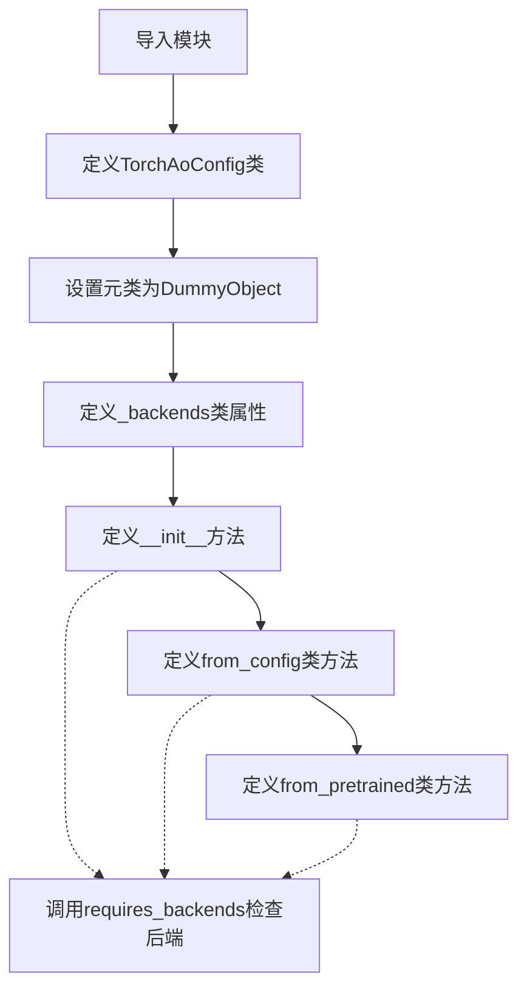
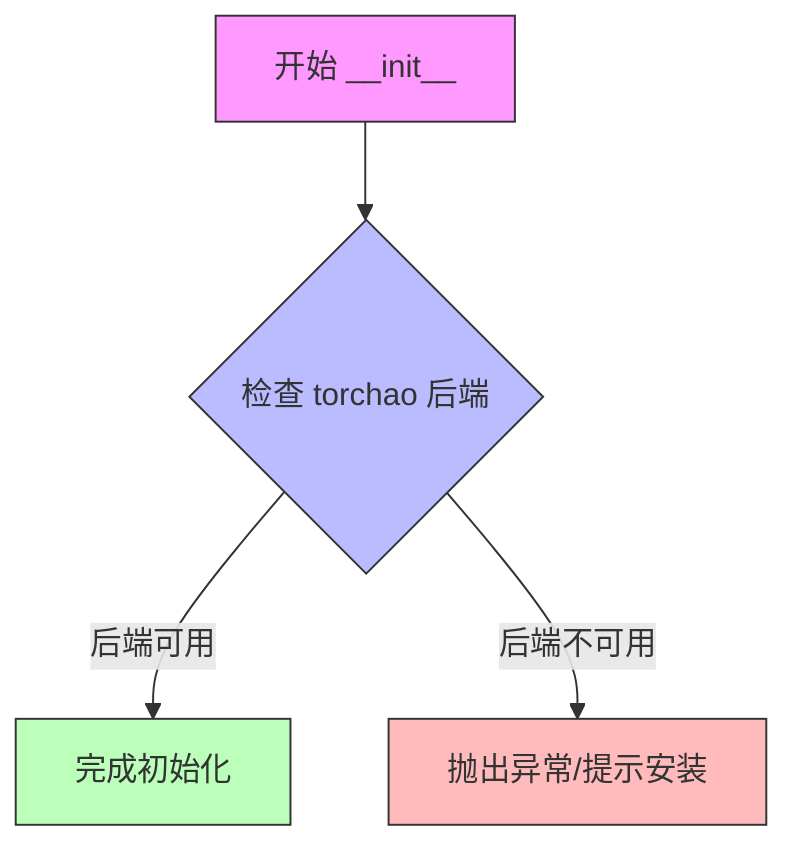
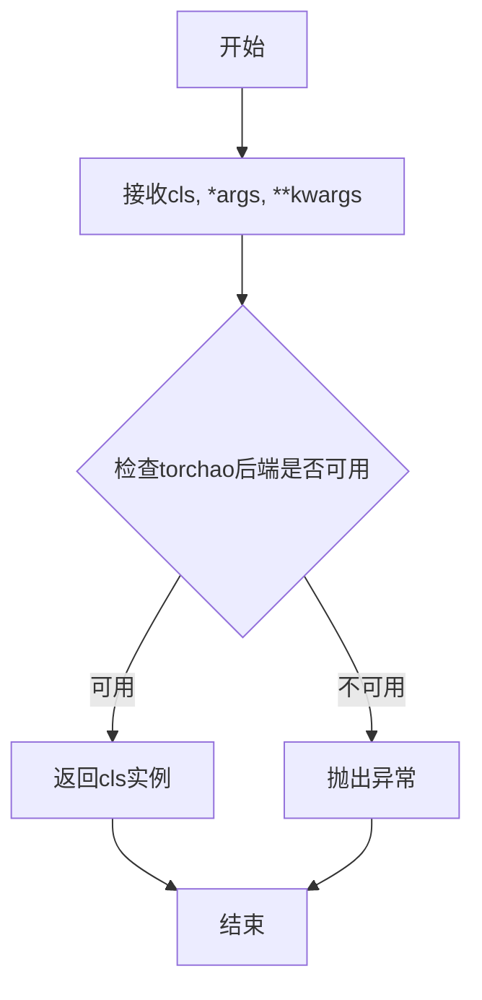
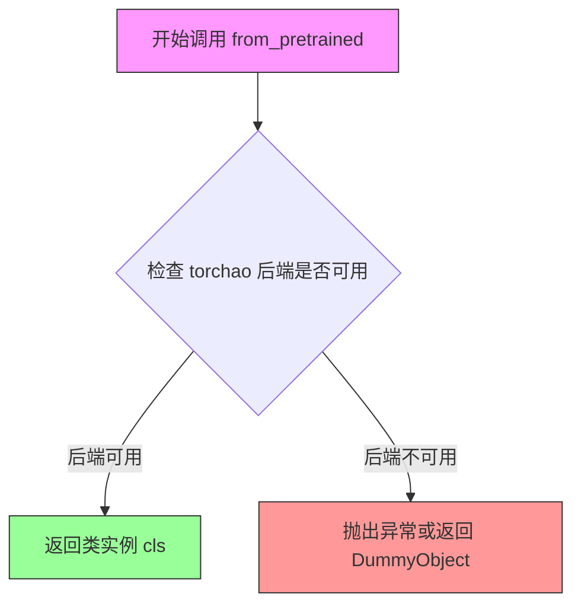

# `diffusers\src\diffusers\utils\dummy_torchao_objects.py` 详细设计文档

这是一个自动生成的配置文件，用于TorchAo（PyTorch优化库）的配置类。该类通过DummyObject元类实现延迟加载，并使用requires_backends确保所需的torchao后端可用，提供了from_config和from_pretrained两个类方法来创建配置实例。

## 整体流程



## 类结构

```
object
└── DummyObject (元类)
    └── TorchAoConfig
```

## 全局变量及字段


### `_backends`
    
类属性，指定所需的后端列表，当前为['torchao']

类型：`list`
    


### `TorchAoConfig._backends`
    
类属性，指定所需的后端列表，当前为['torchao']

类型：`list`
    
    

## 全局函数及方法


### `TorchAoConfig.__init__`

这是 `TorchAoConfig` 类的初始化方法，用于在实例化配置对象时触发后端依赖检查，确保所需的 torchao 后端可用。

参数：

- `*args`：`任意`，接受任意位置参数
- `**kwargs`：`关键字参数`，接受任意关键字参数

返回值：`None`，无返回值，仅调用后端检查

#### 流程图



#### 带注释源码

```python
def __init__(self, *args, **kwargs):
    """
    初始化 TorchAoConfig 实例
    
    参数:
        *args: 任意位置参数，用于兼容不同配置场景
        **kwargs: 任意关键字参数，用于传递具体配置选项
    
    注意:
        此方法不保存任何实例属性，仅用于触发后端检查
        实际配置值通过 from_config 或 from_pretrained 方法设置
    """
    # 调用后端检查函数，验证 torchao 后端是否可用
    # 如果不可用，会抛出 ImportError 或其他相关异常
    requires_backends(self, ["torchao"])
```


### `TorchAoConfig.from_config`

从配置创建实例的类方法，通过调用 `requires_backends` 验证 torchao 后端是否可用，如果后端不支持则抛出异常。

参数：

- `*args`：`任意`，可变位置参数，用于传递任意数量的位置参数
- `**kwargs`：`关键字参数`，可变关键字参数，用于传递任意数量的关键字参数

返回值：`cls`，返回配置实例（需后端支持）

#### 流程图



#### 带注释源码

```python
@classmethod
def from_config(cls, *args, **kwargs):
    """
    从配置创建实例的类方法。
    
    参数:
        cls: 类本身（类方法隐含参数）
        *args: 可变位置参数列表
        **kwargs: 可变关键字参数字典
    
    返回:
        cls: 返回配置实例（需后端支持）
    
    注意:
        此方法实际功能由后端实现，当前只是占位符。
        真正的配置实例化逻辑需要 torchao 后端支持。
    """
    # 检查并确保 torchao 后端可用，如果不可用则抛出 ImportError 或相关异常
    requires_backends(cls, ["torchao"])
```


### `TorchAoConfig.from_pretrained`

从预训练模型加载配置参数的类方法，通过调用后端验证后返回配置实例。

参数：

- `*args`：任意，位置参数列表，用于传递可变数量的位置参数
- `**kwargs`：关键字参数，用于传递可变数量的键值对参数

返回值：`cls`，返回配置实例（需后端支持），即返回调用该方法的类本身

#### 流程图



#### 带注释源码

```python
@classmethod
def from_pretrained(cls, *args, **kwargs):
    """
    类方法：从预训练模型加载配置参数
    
    参数:
        *args: 可变数量的位置参数
        **kwargs: 可变数量的关键字参数
    
    返回:
        cls: 返回配置实例（需后端支持）
    """
    # 调用 requires_backends 检查 torchao 后端是否可用
    # 如果后端不可用，该函数会抛出 ImportError 或类似异常
    requires_backends(cls, ["torchao"])
    
    # 注意：实际实现被 DummyObject 元类替换
    # 这里只是后端验证的占位符
```

## 关键组件


### TorchAoConfig 类

配置类，用于管理 PyTorch AO (Advanced Optimization) 的参数配置。该类通过 DummyObject 元类实现惰性加载，只有在实际调用时才会检查后端依赖是否可用。

### _backends 类属性

字符串列表，声明该配置类需要 "torchao" 后端支持。

### __init__ 初始化方法

实例化配置对象时调用，通过 requires_backends 检查 torchao 后端是否可用。

### from_config 类方法

从已有配置字典创建 TorchAoConfig 实例，同样进行后端依赖检查。

### from_pretrained 类方法

从预训练模型路径加载配置参数，支持从磁盘读取预保存的模型配置。

### requires_backends 函数

从 utils 模块导入的后端依赖检查工具，确保在调用该配置类前已安装所需的后端库。

### DummyObject 元类

继承自 utils 模块的元类，实现惰性加载机制，在类方法被实际调用时才触发后端检查，而非在类定义时。


## 问题及建议


### 已知问题

-   **后端硬编码**：`_backends` 列表硬编码为 `["torchao"]`，缺乏灵活性，无法动态支持多后端配置
-   **DummyObject 设计缺陷**：使用 DummyObject 元类创建虚拟对象，实际调用时会直接抛出运行时错误，缺乏有意义的实现
-   **参数定义不明确**：所有方法使用 `*args, **kwargs` 通配参数，无参数类型提示和文档说明，严重降低代码可读性和可维护性
-   **重复性代码**：在 `__init__`、`from_config`、`from_pretrained` 三个方法中重复调用 `requires_backends(self, ["torchao"])`，违反 DRY 原则
-   **无错误处理机制**：仅通过 `requires_backends` 抛出异常，无回退机制或友好的错误提示
-   **缺少类型注解**：类和方法均无类型提示（Type Hints），不符合现代 Python 类型安全最佳实践
-   **元类过度设计**：为仅需占位的配置类使用复杂元类，增加不必要的性能开销和学习成本
-   **文档缺失**：代码无任何文档字符串（docstring），生成工具注释不足以说明业务意图

### 优化建议

-   **移除 DummyObject 元类**：将类改为普通的配置类，提供实际配置属性存储，或使用 `abc.ABC` 定义抽象基类
-   **显式参数定义**：为 `from_config` 和 `from_pretrained` 方法定义明确的参数签名及类型注解，避免使用 `*args, **kwargs`
-   **提取公共逻辑**：将后端检查逻辑提取为类方法或装饰器，避免在多处重复调用
-   **添加类型注解**：使用 Python typing 模块为类字段、方法参数和返回值添加类型提示
-   **增加文档字符串**：为类和每个方法添加详细的 docstring，说明参数含义、返回值和用法示例
-   **配置外部化**：将后端列表 `_backends` 从代码中移除，改为通过配置文件或环境变量管理
-   **考虑组合优于继承**：评估是否可使用组合模式替代元类继承，提高代码可测试性


## 其它


### 设计目标与约束

该模块的主要设计目标是提供一个 TorchAoConfig 配置类，用于在 transformers 库中集成 torchao 后端。由于代码是自动生成的（由 `make fix-copies` 命令生成），设计约束包括：保持与DummyObject元类的一致性，确保所有方法都强制检查torchao后端的可用性，不包含业务逻辑实现，仅作为后端代理层。

### 错误处理与异常设计

错误处理主要依赖于 `requires_backends` 函数。当 torchao 后端不可用时，`requires_backends` 会抛出 ImportError 或 BackendNotFoundError 异常。类本身不实现额外的异常捕获机制，所有异常都会向上层调用者传播。构造函数和类方法（from_config、from_pretrained）在后端不可用时会立即失败，这种设计确保了Fail-Fast原则。

### 数据流与状态机

该类的状态转换相对简单：实例化时通过元类 DummyObject 检查后端可用性，若不可用则抛出异常终止。类方法 from_config 和 from_pretrained 同样在调用时检查后端。状态机包含两个状态：可用（torchao后端已安装）和不可用（torchao后端未安装）。状态转换发生在 requires_backends 函数执行时。

### 外部依赖与接口契约

主要外部依赖包括：
- `..utils.DummyObject`：元类，用于创建DummyObject代理类
- `..utils.requires_backends`：函数，用于检查后端可用性
- `torchao`：目标后端库，需要在运行时可用

接口契约：
- 构造函数接受任意位置参数和关键字参数
- from_config 和 from_pretrained 为类方法，接受任意参数，返回代理类实例
- 所有方法在 torchao 不可用时抛出异常，不返回有效结果
- 类属性 `_backends` 定义了支持的后端列表

### 版本兼容性说明

该文件为自动生成代码，与 transformers 库的版本绑定。生成命令为 `make fix-copies`，表明这是针对特定版本或配置的复制模板。代码假设 `..utils` 模块路径正确，且 requires_backends 函数的接口保持稳定。

### 使用场景与集成点

TorchAoConfig 主要用于 transformers 库加载 torchao 相关模型配置时作为配置类代理。当用户调用 from_pretrained 加载配置且需要 torchao 后端支持时，该类会被实例化。它是 transformers 与 torchao 集成的入口点之一，属于轻量级的代理/适配器模式实现。

### 安全性考虑

代码本身不涉及敏感数据处理或用户输入验证。由于所有方法都代理到 torchao 后端，安全性取决于 torchao 库本身。参数传递采用 *args, **kwargs 的宽松方式，可能存在参数注入风险，但风险由后端库控制。

### 测试策略建议

建议包含以下测试用例：
- 后端可用时：验证类实例化成功，类方法可正常调用
- 后端不可用时：验证 ImportError 或 BackendNotFoundError 被正确抛出
- 参数传递：验证参数能正确传递给后端方法
- 元类行为：验证 DummyObject 元类的代理机制正常工作


    