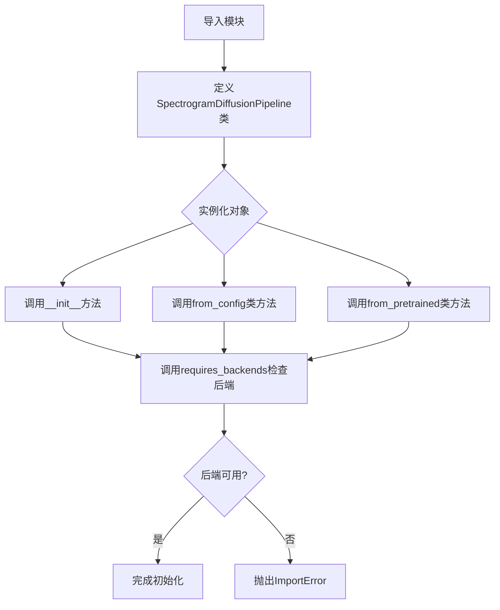
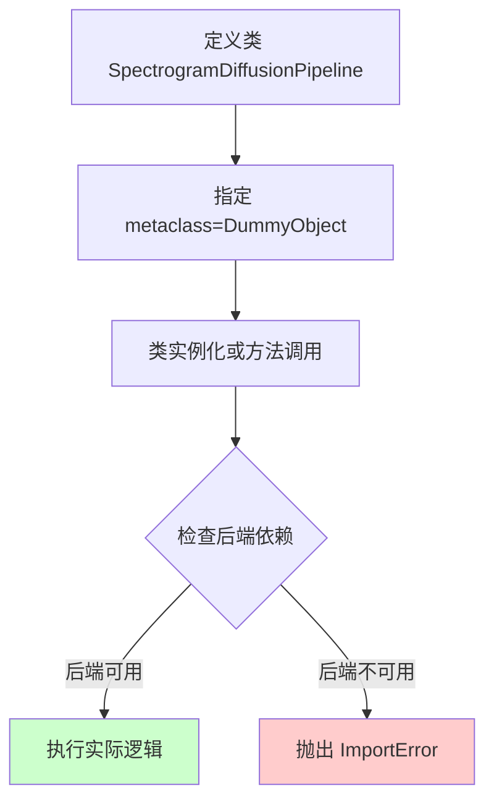
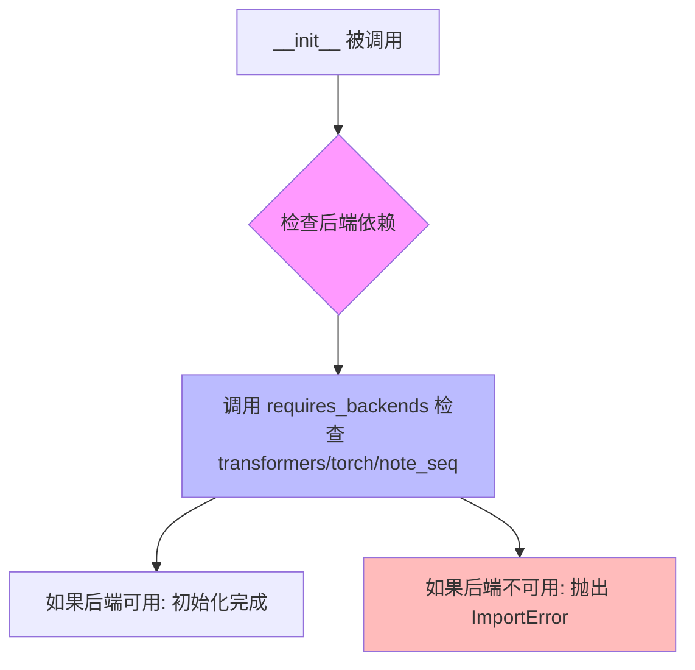
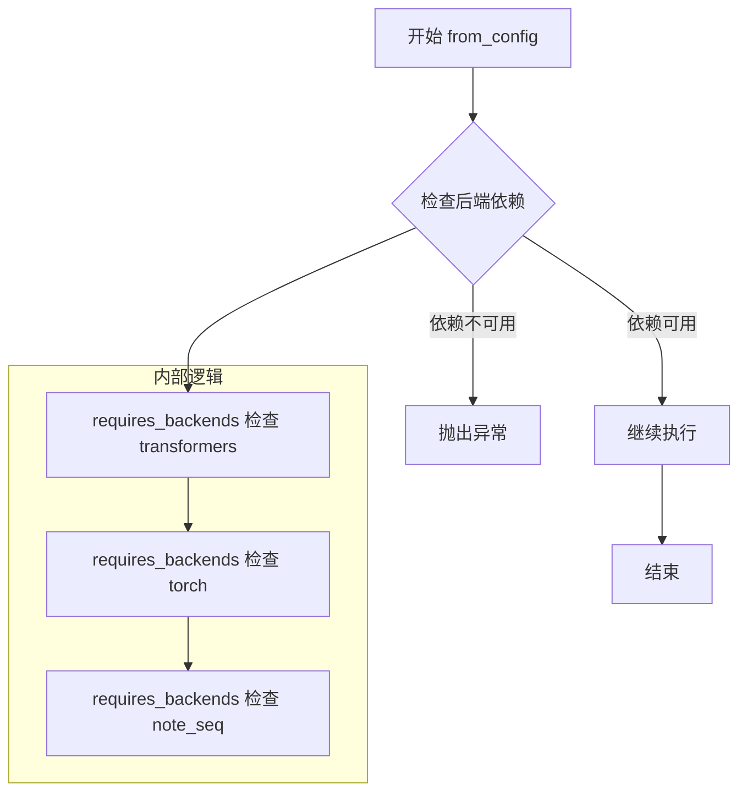
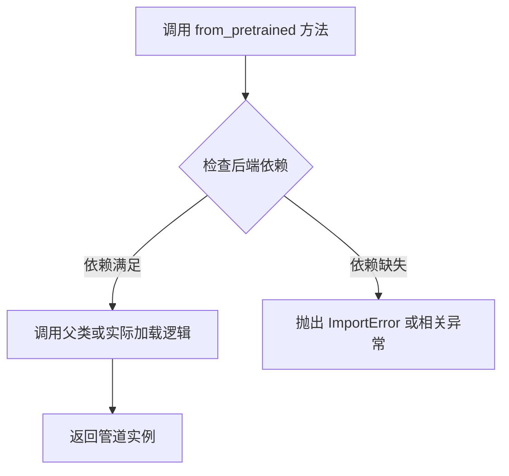

# `diffusers\src\diffusers\utils\dummy_transformers_and_torch_and_note_seq_objects.py` 详细设计文档

这是一个自动生成的dummy对象类，用于SpectrogramDiffusionPipeline管道。该类通过metaclass机制在初始化时检查必要的后端依赖库(transformers、torch、note_seq)，确保运行环境中包含所需的依赖，否则抛出ImportError。

## 整体流程



## 类结构

```
DummyObject (元类)
└── SpectrogramDiffusionPipeline (使用元类创建的类)
```

## 全局变量及字段


### `SpectrogramDiffusionPipeline._backends`
    
类属性，定义该Pipeline所需的后端依赖列表，包含transformers、torch和note_seq三个库

类型：`list[str]`
    
    

## 全局函数及方法


### DummyObject

DummyObject 是从 `..utils` 模块导入的一个元类（metaclass），在 `SpectrogramDiffusionPipeline` 类中作为元类使用。该类的所有方法都通过 `requires_backends` 进行后端依赖检查，确保只有在具备指定后端（transformers、torch、note_seq）时才可执行。

参数：

- 无直接参数（通过类的 `__init__` 或方法间接使用）

返回值：无直接返回值（作为元类使用）

#### 流程图



#### 带注释源码

```python
# 从上级目录的 utils 模块导入 DummyObject 元类
# DummyObject 的实际定义在 ..utils 模块中，此处仅为导入使用
from ..utils import DummyObject, requires_backends

# 使用 DummyObject 作为元类创建类
# 元类会在类定义、实例化时介入，进行后端检查等操作
class SpectrogramDiffusionPipeline(metaclass=DummyObject):
    # 定义需要的后端列表：transformers, torch, note_seq
    _backends = ["transformers", "torch", "note_seq"]

    # 初始化方法，通过 requires_backends 检查后端依赖
    def __init__(self, *args, **kwargs):
        # 检查当前环境是否有所需后端，若无则抛出异常
        requires_backends(self, ["transformers", "torch", "note_seq"])

    # 类方法：从配置创建 Pipeline，同样进行后端检查
    @classmethod
    def from_config(cls, *args, **kwargs):
        # 确保调用者具有所需后端
        requires_backends(cls, ["transformers", "torch", "note_seq"])

    # 类方法：从预训练模型创建 Pipeline，同样进行后端检查
    @classmethod
    def from_pretrained(cls, *args, **kwargs):
        # 确保调用者具有所需后端
        requires_backends(cls, ["transformers", "torch", "note_seq"])
```

#### 关键组件信息

| 组件名称 | 一句话描述 |
|---------|-----------|
| DummyObject | 用作 `SpectrogramDiffusionPipeline` 的元类，用于在类定义和实例化时进行后端依赖检查 |
| requires_backends | 工具函数，用于检查指定后端是否可用，不可用时抛出 ImportError |
| _backends | 类属性，定义该 Pipeline 所需的后端依赖列表 |

#### 潜在技术债务与优化空间

1. **重复代码**：三个方法（`__init__`, `from_config`, `from_pretrained`）都调用了相同的 `requires_backends` 检查，可以考虑提取为类级别的装饰器或混入类。
2. **硬编码后端列表**：后端列表 `_backends` 和 `requires_backends` 调用中重复出现，可以统一管理。
3. **缺乏实际实现**：当前类只是一个空壳，所有方法都仅进行后端检查而无实际逻辑，真正的实现依赖于后端加载。

#### 其他项目

- **设计目标与约束**：确保 `SpectrogramDiffusionPipeline` 仅在具备 transformers、torch、note_seq 后端的环境中可用。
- **错误处理**：通过 `requires_backends` 在后端不可用时抛出 `ImportError`，阻止实例化或方法调用。
- **外部依赖**：依赖 `transformers`、`torch`、`note_seq` 三个 Python 包。


### `requires_backends`

该函数是 Hugging Face Diffusers 库中的后端依赖检查工具，用于在特定类或方法被调用时动态检查所需的后端依赖（如 transformers、torch、note_seq）是否已安装。如果缺少必要的后端，该函数会抛出 `ImportError` 异常，防止在缺少依赖的情况下继续执行代码。

参数：

- `obj`：`object | type`，需要检查后端的对象（类或实例）
- `backends`：`List[str]`，必需的后端列表，例如 `["transformers", "torch", "note_seq"]`

返回值：`None`，该函数不返回任何值，主要通过抛出异常来处理错误情况

#### 流程图

```mermaid
flowchart TD
    A[开始: requires_backends] --> B{检查 obj._backends 是否已定义}
    B -->|是| C[获取 obj._backends]
    B -->|否| D{检查 obj 是否有 'backend' 属性}
    D -->|是| E[获取 obj.backend]
    D -->|否| F[抛出 MissingBackendError]
    
    C --> G{检查 backends 是否为 list}
    G -->|否| H[抛出 ValueError: backends 必须是 list]
    G -->|是| I[获取可用后端列表]
    
    E --> I
    
    I --> J{遍历所需后端列表}
    J -->|每个后端| K{当前后端是否在可用后端中?}
    K -->|是| L[继续检查下一个]
    K -->|否| M[抛出 ImportError: 缺少 {backend} 后端]
    
    J -->|全部检查完成| N[返回 None, 允许继续执行]
    M --> O[结束: 异常传播]
    N --> O
    F --> O
    H --> O
```

#### 带注释源码

```python
# 该函数定义在 ..utils 模块中
# 这里是调用处的代码展示
from ..utils import DummyObject, requires_backends


class SpectrogramDiffusionPipeline(metaclass=DummyObject):
    """
    频谱图扩散管道类
    使用 DummyObject 元类延迟导入，实际实现在 transformers/torch/note_seq 后端中
    """
    
    # 类属性：声明此类需要的后端列表
    _backends = ["transformers", "torch", "note_seq"]

    def __init__(self, *args, **kwargs):
        """
        初始化方法
        调用 requires_backends 检查后端依赖是否满足
        """
        # 检查当前类/实例是否有所需后端
        # 如果缺少任何后端，这里会抛出 ImportError
        requires_backends(self, ["transformers", "torch", "note_seq"])

    @classmethod
    def from_config(cls, *args, **kwargs):
        """
        从配置加载管道的类方法
        检查后端依赖
        """
        # 检查类是否有所需后端
        requires_backends(cls, ["transformers", "torch", "note_seq"])

    @classmethod
    def from_pretrained(cls, *args, **kwargs):
        """
        从预训练模型加载管道的类方法
        检查后端依赖
        """
        # 检查类是否有所需后端
        requires_backends(cls, ["transformers", "torch", "note_seq"])
```

---

### 补充说明

#### 设计目标与约束

- **设计目标**：实现延迟加载（Lazy Loading）模式，允许库在缺少可选依赖时仍然被导入，仅在实际使用时检查依赖
- **约束**：调用此类任何方法前必须确保所有后端已安装

#### 错误处理与异常设计

- **MissingBackendError**：当检测到缺少必需后端时抛出
- **ImportError**：缺少特定后端时抛出，提示用户安装对应的 Python 包
- **ValueError**：当 `backends` 参数不是列表时抛出

#### 外部依赖与接口契约

- **依赖项**：`transformers`、`torch`、`note_seq`（三者均为可选依赖）
- **接口契约**：任何继承自 `DummyObject` 的类都必须定义 `_backends` 类属性，列出所需的后端


### `SpectrogramDiffusionPipeline.__init__`

这是 `SpectrogramDiffusionPipeline` 类的初始化方法，用于实例化一个延迟加载的虚拟对象（dummy object），该对象在实际调用时会检查所需的深度学习后端是否可用。

参数：

- `self`：`SpectrogramDiffusionPipeline`，类的实例自身
- `*args`：`tuple`，可变位置参数，用于接收任意数量的位置参数
- `**kwargs`：`dict`，可变关键字参数，用于接收任意数量的键值对参数

返回值：`None`，构造函数不返回任何值

#### 流程图



#### 带注释源码

```python
def __init__(self, *args, **kwargs):
    """
    初始化 SpectrogramDiffusionPipeline 实例。
    
    该方法是一个延迟加载的存根（stub），实际初始化逻辑被推迟到
    实际使用后端方法时执行。它通过 requires_backends 来确保
    所需的后端库（transformers, torch, note_seq）已安装。
    
    参数:
        *args: 可变位置参数，将被传递给后端初始化（如果需要）
        **kwargs: 可变关键字参数，将被传递给后端初始化（如果需要）
    
    返回:
        None: 此构造函数不返回任何值
    """
    # 调用 requires_backends 检查所需的后端依赖是否可用
    # 如果后端不可用，将抛出 ImportError 并提示安装相应的包
    requires_backends(self, ["transformers", "torch", "note_seq"])
```

#### 补充说明

由于这是一个通过 `DummyObject` 元类创建的虚拟类，`__init__` 方法本身并不执行真正的初始化逻辑。它的主要职责是：

1. **依赖检查**：确保 `transformers`、`torch` 和 `note_seq` 三个后端库已安装
2. **延迟加载**：真正的类实现可能在其他模块中，当实际调用方法时才动态加载

这是一个典型的 **存根模式（Stub Pattern）** 实现，用于在未安装可选依赖时提供友好的错误提示，同时保持代码的模块化。


### `SpectrogramDiffusionPipeline.from_config`

该方法是一个类工厂方法，用于通过配置创建 `SpectrogramDiffusionPipeline` 实例。它首先检查所需的后端依赖（transformers、torch、note_seq）是否可用，然后返回相应的管道实例。由于使用了 `*args` 和 `**kwargs`，它可以接受任意数量的位置参数和关键字参数来传递给底层的管道初始化逻辑。

参数：

- `*args`：可变位置参数（Any），用于传递任意数量的位置参数，具体参数取决于底层管道实现的需求
- `**kwargs`：可变关键字参数（Dict[str, Any]），用于传递任意数量的关键字参数，通常包括配置路径、模型参数等

返回值：`None`，该方法没有显式返回值，仅通过 `requires_backends` 检查后端依赖可用性

#### 流程图



#### 带注释源码

```python
@classmethod
def from_config(cls, *args, **kwargs):
    """
    从配置创建管道实例的类方法。
    
    该方法是一个工厂方法，通过配置参数来实例化管道。它接受任意数量的
    位置参数和关键字参数，这些参数将被传递给底层的管道初始化逻辑。
    
    注意：此方法目前没有实现具体的实例化逻辑，只是进行了后端依赖检查。
    这可能是一个存根方法（stub），实际的实现可能在其他位置或通过
    继承类重写。
    
    参数:
        *args: 可变数量的位置参数
        **kwargs: 可变数量的关键字参数，通常包含配置信息
    
    返回:
        None: 当前实现没有返回任何值
    """
    # 调用 requires_backends 检查所需的后端依赖是否可用
    # 该函数来自 ..utils 模块，用于检查 transformers, torch, note_seq
    # 这三个库是否已安装。如果任何依赖缺失，将抛出 ImportError 或类似异常
    requires_backends(cls, ["transformers", "torch", "note_seq"])
```


### `SpectrogramDiffusionPipeline.from_pretrained`

该类方法用于从预训练模型或检查点加载 `SpectrogramDiffusionPipeline` 管道实例，它接受可变参数以适配不同的模型路径和配置选项，并通过 `requires_backends` 确保所需的后端库（transformers、torch、note_seq）可用。

参数：

- `*args`：`可变位置参数`，用于传递模型路径、检查点目录或其他位置参数
- `**kwargs`：`可变关键字参数`，用于传递配置选项、缓存目录、是否使用加速等命名参数

返回值：`SpectrogramDiffusionPipeline`，返回加载后的管道实例

#### 流程图



#### 带注释源码

```python
@classmethod
def from_pretrained(cls, *args, **kwargs):
    """
    类方法 from_pretrained：用于从预训练模型加载管道实例
    
    参数：
        cls: 当前类 SpectrogramDiffusionPipeline
        *args: 可变位置参数，通常传递模型路径或检查点目录
        **kwargs: 可变关键字参数，传递加载选项如 cache_dir, revision 等
    
    返回：
        返回加载后的 SpectrogramDiffusionPipeline 实例
    """
    # 调用 requires_backends 检查所需的后端库是否可用
    # 后端库包括：transformers, torch, note_seq
    requires_backends(cls, ["transformers", "torch", "note_seq"])
```

## 关键组件


### 一段话描述

这是一个延迟加载（Lazy Loading）代理类，用于在 Diffusion 框架中实现条件导入机制。当用户尝试使用 SpectrogramDiffusionPipeline 但缺少必要的依赖库时，会通过 requires_backends 函数抛出明确的 ImportError，从而提供清晰的错误信息和依赖提示。

### 文件的整体运行流程

1. **导入阶段**：文件被导入时，SpectrogramDiffusionPipeline 类被定义为一个元类为 DummyObject 的代理类
2. **依赖检查阶段**：当用户调用 `__init__`、`from_config` 或 `from_pretrained` 方法时，会触发 `requires_backends` 函数检查当前环境是否安装了指定的后端库（transformers, torch, note_seq）
3. **错误处理阶段**：如果任何必需的后端缺失，`requires_backends` 会抛出 ImportError，明确告知用户缺少哪些依赖

### 类的详细信息

#### 类字段

- **_backends**: `list[str]`
  - 描述：存储该 Pipeline 所需的后端依赖库列表，包含 "transformers"、"torch" 和 "note_seq"

#### 类方法

- **__init__(self, *args, **kwargs)**
  - 参数：
    - *args: 任意位置参数
    - **kwargs: 任意关键字参数
  - 参数描述：用于初始化 Pipeline 实例的参数
  - 返回值类型：`None`
  - 返回值描述：无返回值，仅进行依赖检查
  - 流程图：
    ```mermaid
    graph TD
    A[调用__init__] --> B[调用requires_backends]
    B --> C{后端是否可用?}
    C -->|是| D[正常初始化]
    C -->|否| E[抛出ImportError]
    ```
  - 源码：
    ```python
    def __init__(self, *args, **kwargs):
        requires_backends(self, ["transformers", "torch", "note_seq"])
    ```

- **from_config(cls, *args, **kwargs)**
  - 参数：
    - cls: 类对象
    - *args: 任意位置参数
    - **kwargs: 任意关键字参数
  - 参数描述：用于从配置初始化 Pipeline 的参数
  - 返回值类型：`Any`（实际实现中会返回 Pipeline 实例）
  - 返回值描述：返回初始化后的 Pipeline 实例
  - 流程图：
    ```mermaid
    graph TD
    A[调用from_config] --> B[调用requires_backends]
    B --> C{后端是否可用?}
    C -->|是| D[调用实际实现]
    C -->|否| E[抛出ImportError]
    ```
  - 源码：
    ```python
    @classmethod
    def from_config(cls, *args, **kwargs):
        requires_backends(cls, ["transformers", "torch", "note_seq"])
    ```

- **from_pretrained(cls, *args, **kwargs)**
  - 参数：
    - cls: 类对象
    - *args: 任意位置参数
    - **kwargs: 任意关键字参数
  - 参数描述：用于从预训练模型加载 Pipeline 的参数（如模型路径、配置等）
  - 返回值类型：`Any`（实际实现中会返回加载后的 Pipeline 实例）
  - 返回值描述：返回加载后的 Pipeline 实例
  - 流程图：
    ```mermaid
    graph TD
    A[调用from_pretrained] --> B[调用requires_backends]
    B --> C{后端是否可用?}
    C -->|是| D[加载预训练模型]
    C -->|否| E[抛出ImportError]
    ```
  - 源码：
    ```python
    @classmethod
    def from_pretrained(cls, *args, **kwargs):
        requires_backends(cls, ["transformers", "torch", "note_seq"])
    ```

### 关键组件信息

- **DummyObject (元类)**
  - 描述：用于创建延迟加载代理类的元类，实现惰性导入模式

- **requires_backends 函数**
  - 描述：用于检查指定后端依赖是否可用的工具函数，缺失时抛出 ImportError

- **_backends 类属性**
  - 描述：声明该类所需的后端依赖列表，用于依赖检查

### 潜在的技术债务或优化空间

1. **缺乏实际实现引用**：当前类只有代理逻辑，缺少对实际实现类的引用或重定向机制
2. **硬编码的依赖列表**：后端依赖列表硬编码在类属性中，不如配置化管理灵活
3. **元数据信息不足**：缺少版本信息、文档链接等元数据
4. **错误信息可优化性**：可提供更友好的错误提示，包括安装命令建议

### 其它项目

#### 设计目标与约束
- **设计目标**：实现条件导入和延迟加载，避免在未安装可选依赖时导入失败
- **约束**：依赖 requires_backends 函数的实现，必须与 DummyObject 元类配合使用

#### 错误处理与异常设计
- **异常类型**：ImportError
- **异常时机**：在类实例化或调用类方法时触发检查，而非模块导入时
- **错误信息**：明确指出缺少哪些后端依赖

#### 外部依赖与接口契约
- **必需依赖**：
  - transformers: Hugging Face Transformer 库
  - torch: PyTorch 深度学习框架
  - note_seq: 音频处理库
- **接口契约**：提供与实际 Pipeline 相同的类方法接口（__init__, from_config, from_pretrained）

#### 设计模式
- **代理模式（Proxy Pattern）**：通过代理类控制对实际实现的访问
- **延迟加载模式（Lazy Loading）**：延迟加载实际实现直到真正需要时


## 问题及建议


### 已知问题

-   后端列表在类属性 `_backends` 和方法调用中重复定义，存在数据冗余和维护风险。
-   方法参数 `*args` 和 `**kwargs` 未被使用，可能隐藏接口设计意图或导致调用时的隐蔽错误。
-   缺少文档字符串（docstring），难以理解各方法的预期行为和参数含义。
-   整个类仅包含后端检查逻辑，缺乏实际实现细节，可能仅为占位符，限制了其可用性。
-   依赖于自动生成机制（`make fix-copies`），若生成逻辑不完善，可能引入重复或不一致的代码。

### 优化建议

-   将后端列表提取为模块级常量或配置，避免重复定义，并确保单一事实来源。
-   若参数确实无需使用，考虑使用 `*_` 或 `**__` 命名约定（或添加文档说明），以明确接口设计。
-   为类和方法添加文档字符串，说明功能、后端依赖和参数用途。
-   评估是否为抽象类，若是，建议使用 `abc` 模块显式定义抽象方法，提高代码清晰度。
-   审查自动生成模板，确保生成逻辑遵循 DRY 原则，并减少硬编码。


## 其它


### 设计目标与约束

该代码的目标是通过metaclass机制实现一个延迟加载的虚拟管道类，当用户尝试实例化或使用SpectrogramDiffusionPipeline类时，自动检查并提示安装所需的后端依赖库（transformers、torch、note_seq）。设计约束包括：该类是自动生成的（do not edit）、依赖后端必须全部可用才能正常工作、该类本身不包含实际实现逻辑仅作为占位符。

### 错误处理与异常设计

requires_backends函数负责抛出明确的异常信息，告知用户缺少哪些后端依赖。当任一required_backends中的库不可用时，将阻止类的实例化和方法调用。异常类型通常为ImportError或ModuleNotFoundError的封装，确保用户在尝试使用该管道时获得清晰的错误指导。

### 外部依赖与接口契约

该类依赖三个外部库：transformers（用于模型加载）、torch（深度学习框架）、note_seq（音频处理）。类提供两个公开类方法from_config和from_pretrained作为入口点，遵循Hugging Face Diffusers库的约定契约，均返回可用的管道实例但此处为DummyObject占位实现。

### 版本兼容性说明

该代码适用于Python 3环境，需与Diffusers库版本兼容。_backends列表中的依赖库版本应与项目requirements保持一致，当前支持的版本组合需参考项目依赖声明文件。

### 使用示例与调用场景

典型调用场景包括：用户通过from_pretrained("user/model")加载预训练模型，或通过from_config加载配置文件。由于实际逻辑由DummyObject的metaclass实现，具体行为需参考utils模块中DummyObject和requires_backends的具体实现。
</think>
    