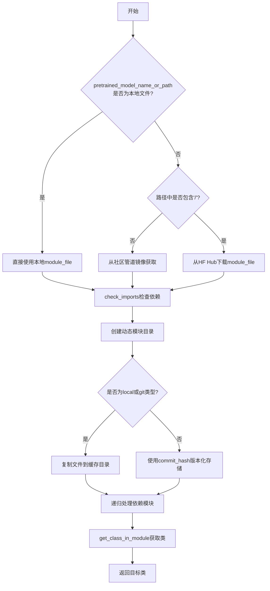
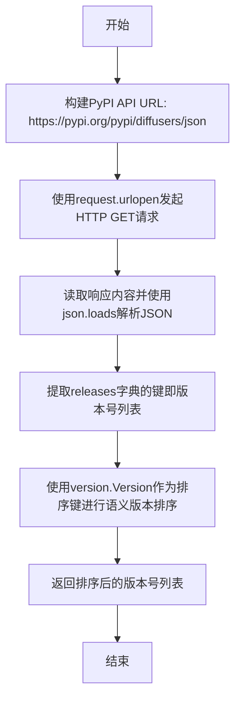
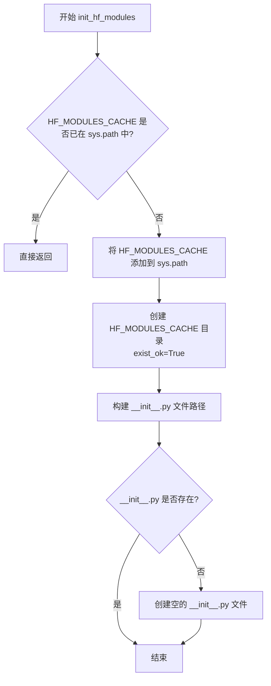
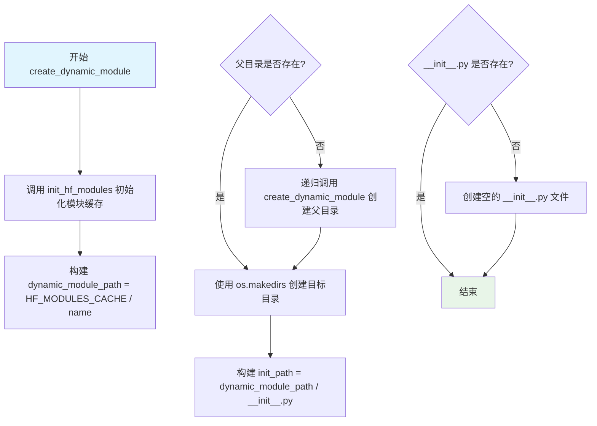
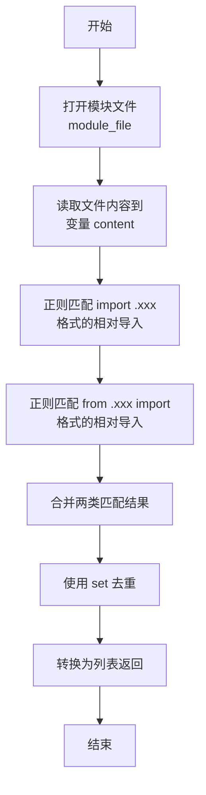
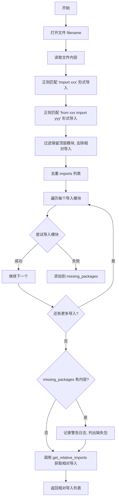
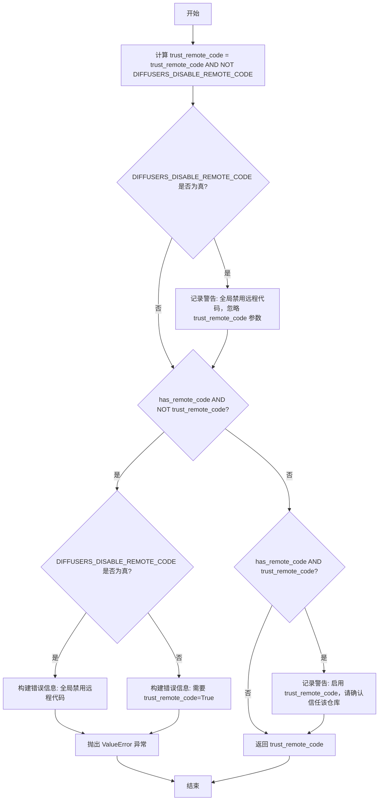
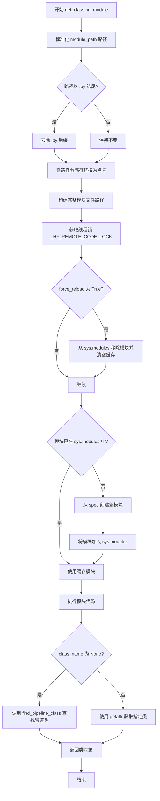
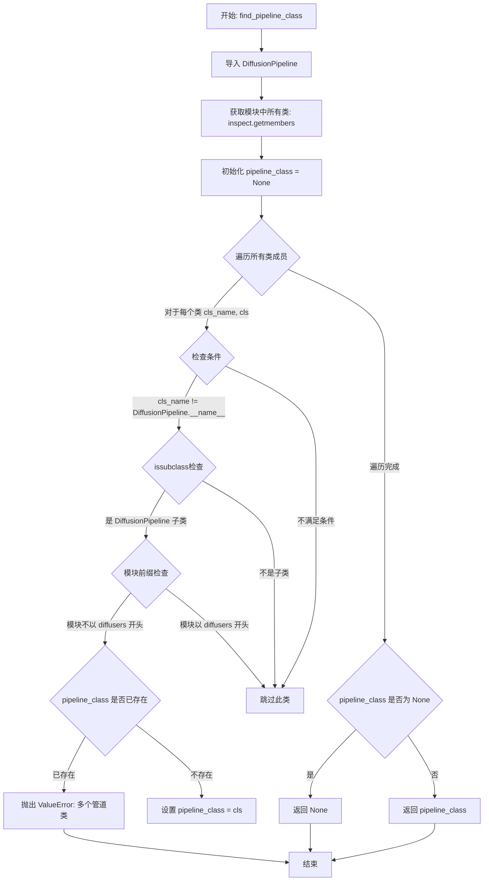
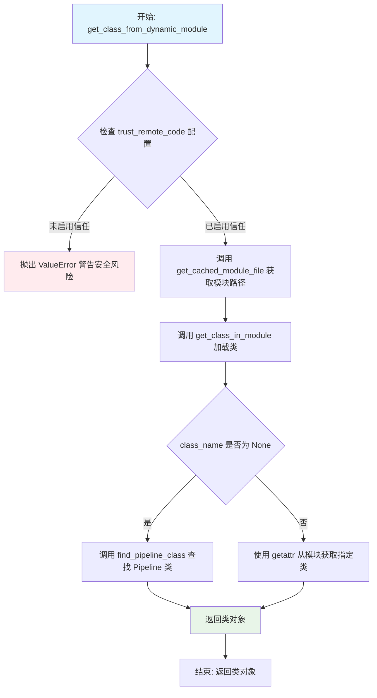

# `diffusers\src\diffusers\utils\dynamic_modules_utils.py` 详细设计文档

该模块提供动态加载工具，用于从HuggingFace Hub或本地目录动态导入模型管道和类，支持远程代码的安全加载与缓存管理。

## 整体流程



## 类结构

```
dynamic_modules.py (无类定义，纯函数模块)
├── 全局变量区域
│   ├── COMMUNITY_PIPELINES_MIRROR_ID
│   ├── TIME_OUT_REMOTE_CODE
│   ├── _HF_REMOTE_CODE_LOCK
│   └── logger
└── 函数区域
    ├── get_diffusers_versions
    ├── init_hf_modules
    ├── create_dynamic_module
    ├── get_relative_imports
    ├── get_relative_import_files
    ├── check_imports
    ├── resolve_trust_remote_code
    ├── get_class_in_module
    ├── find_pipeline_class
    ├── get_cached_module_file
    └── get_class_from_dynamic_module
```

## 全局变量及字段


### `COMMUNITY_PIPELINES_MIRROR_ID`
    
HuggingFace数据集ID，指向diffusers社区pipeline镜像仓库

类型：`str`
    


### `TIME_OUT_REMOTE_CODE`
    
远程代码执行超时时间（秒），从环境变量DIFFUSERS_TIMEOUT_REMOTE_CODE读取，默认为15秒

类型：`int`
    


### `_HF_REMOTE_CODE_LOCK`
    
线程锁对象，用于保证远程代码加载的线程安全性

类型：`threading.Lock`
    


### `logger`
    
模块级日志记录器实例，用于输出运行时日志信息

类型：`logging.Logger`
    


    

## 全局函数及方法


### `get_diffusers_versions`

该函数用于从 PyPI 获取 diffusers 包的所有已发布版本号，并按版本号进行语义排序后返回。

参数：无

返回值：`List[str]`，返回按语义版本号排序的 diffusers 所有可用版本号列表。

#### 流程图



#### 带注释源码

```python
def get_diffusers_versions():
    """
    获取diffusers包的所有可用版本并按语义版本排序返回。
    
    该函数通过PyPI的公开API获取diffusers包的所有发布版本，
    并使用packaging库的version.Version进行语义版本排序，
    以确保版本号按照正确的版本顺序排列（如1.0.0 < 1.0.1 < 2.0.0）。
    
    Returns:
        List[str]: 按语义版本号升序排列的diffusers所有可用版本号列表。
    """
    # PyPI API端点，用于获取diffusers包的JSON格式元数据
    url = "https://pypi.org/pypi/diffusers/json"
    
    # 发起HTTP请求到PyPI API，读取响应体并解析JSON
    # request.urlopen是Python标准库urllib模块的函数，用于发送HTTP请求
    # 响应JSON包含releases键，其值为字典，键为版本号，值为发布文件信息列表
    releases = json.loads(request.urlopen(url).read())["releases"].keys()
    
    # 使用packaging库的version.Version类进行语义版本排序
    # 相比普通字符串排序，语义版本排序能正确处理如'1.0.0' < '1.0.1' < '2.0.0'的版本关系
    # 返回排序后的版本号列表
    return sorted(releases, key=lambda x: version.Version(x))
```


### `init_hf_modules`

创建动态模块缓存目录（包含 `__init__.py` 文件），并将其添加到 Python 的 `sys.path` 中，以便后续可以动态加载模块。

参数： 无

返回值：`None`，该函数没有返回值，仅执行初始化操作。

#### 流程图



#### 带注释源码

```python
def init_hf_modules():
    """
    Creates the cache directory for modules with an init, and adds it to the Python path.
    """
    # 检查缓存目录是否已经添加到 Python 路径中，避免重复初始化
    if HF_MODULES_CACHE in sys.path:
        return

    # 将模块缓存目录追加到 Python 搜索路径，以便后续动态导入模块
    sys.path.append(HF_MODULES_CACHE)
    
    # 创建模块缓存目录，如果目录已存在则不报错
    os.makedirs(HF_MODULES_CACHE, exist_ok=True)
    
    # 构造 __init__.py 文件的完整路径，使该目录成为一个 Python 包
    init_path = Path(HF_MODULES_CACHE) / "__init__.py"
    
    # 如果 __init__.py 不存在，则创建一个空文件
    if not init_path.exists():
        init_path.touch()
```


### `create_dynamic_module`

该函数用于在 Hugging Face Diffusers 的缓存目录中动态创建模块目录结构，递归创建所有必需的父目录，并在每个模块目录中创建 `__init__.py` 文件以使其成为有效的 Python 包。

参数：

- `name`：`str | os.PathLike`，要创建的动态模块名称或路径

返回值：`None`，该函数不返回任何值，仅执行目录和文件的创建操作

#### 流程图



#### 带注释源码

```python
def create_dynamic_module(name: str | os.PathLike):
    """
    Creates a dynamic module in the cache directory for modules.
    
    该函数用于在 HF_MODULES_CACHE 目录下创建动态模块结构。
    它会递归创建所有必要的父目录，并在每个模块目录中创建
    __init__.py 文件，使其成为可导入的 Python 包。
    
    Args:
        name: 要创建的模块名称或路径，例如 "diffusers_modules/sgf算"
    
    Returns:
        None: 该函数不返回任何值
    """
    # 步骤1: 初始化 HF 模块缓存目录
    # 确保 HF_MODULES_CACHE 目录存在并已添加到 sys.path
    init_hf_modules()
    
    # 步骤2: 构建完整的模块路径
    # 将缓存目录路径与传入的模块名称组合成完整路径
    dynamic_module_path = Path(HF_MODULES_CACHE) / name
    
    # 步骤3: 递归创建父目录
    # 如果父目录不存在，递归调用自身创建所有必需的父目录
    # 例如创建 "a/b/c" 时，会先确保 "a" 和 "a/b" 存在
    if not dynamic_module_path.parent.exists():
        create_dynamic_module(dynamic_module_path.parent)
    
    # 步骤4: 创建模块目录
    # 使用 exist_ok=True 确保目录已存在时不会抛出异常
    os.makedirs(dynamic_module_path, exist_ok=True)
    
    # 步骤5: 创建 __init__.py 文件
    # 每个 Python 包都需要 __init__.py 文件才能被识别为可导入模块
    # 如果文件不存在，则创建一个空文件
    init_path = dynamic_module_path / "__init__.py"
    if not init_path.exists():
        init_path.touch()
```


### `get_relative_imports`

获取模块文件中相对导入的模块列表，通过正则表达式匹配 Python 文件中的相对导入语句。

参数：

- `module_file`：`str | os.PathLike`，要检查的模块文件路径

返回值：`list[str]`，返回相对导入的模块名称列表（去重后的结果）

#### 流程图



#### 带注释源码

```
def get_relative_imports(module_file):
    """
    Get the list of modules that are relatively imported in a module file.

    Args:
        module_file (`str` or `os.PathLike`): The module file to inspect.
    """
    # 打开模块文件并读取内容，使用 UTF-8 编码
    with open(module_file, "r", encoding="utf-8") as f:
        content = f.read()

    # 匹配形如 `import .xxx` 的相对导入语句
    # 正则解释：
    #   ^          - 行首
    #   \s*        - 零个或多个空白字符
    #   import    - 字面匹配 "import"
    #   \s+       - 一个或多个空白字符
    #   \.        - 字面匹配点号 "."
    #   (\S+)     - 捕获一个或多个非空白字符（模块名）
    #   \s*       - 零个或多个空白字符
    #   $         - 行尾
    relative_imports = re.findall(r"^\s*import\s+\.(\S+)\s*$", content, flags=re.MULTILINE)
    
    # 匹配形如 `from .xxx import yyy` 的相对导入语句
    # 正则解释：
    #   from       - 字面匹配 "from"
    #   \s+        - 一个或多个空白字符
    #   \.         - 字面匹配点号 "."
    #   (\S+)      - 捕获一个或多个非空白字符（模块路径）
    #   \s+        - 一个或多个空白字符
    #   import     - 字面匹配 "import"
    relative_imports += re.findall(r"^\s*from\s+\.(\S+)\s+import", content, flags=re.MULTILINE)
    
    # 使用 set 去重，然后转换回列表返回
    return list(set(relative_imports))
```


### `get_relative_import_files`

获取指定模块文件中所有相对导入的文件列表，并递归处理这些导入的依赖关系。

参数：

- `module_file`：`str | os.PathLike`，需要检查的模块文件路径

返回值：`list[str]`，包含所有相对导入的 Python 文件路径列表

#### 流程图

```mermaid
flowchart TD
    A[开始: module_file] --> B[初始化: no_change = False]
    B --> C[设置: files_to_check = [module_file]]
    C --> D[初始化: all_relative_imports = []]
    D --> E{检查: no_change}
    E -->|False| F[遍历 files_to_check 中的每个文件]
    F --> G[调用 get_relative_imports 获取相对导入]
    G --> H[收集所有 new_imports]
    H --> I[构建 module_path = module_file.parent]
    I --> J[转换导入为文件路径: new_import_files]
    J --> K[过滤已存在的文件]
    K --> L[更新 files_to_check]
    L --> M{判断: new_import_files 为空?}
    M -->|是| N[设置 no_change = True]
    M -->|否| O[将新文件加入 all_relative_imports]
    O --> E
    N --> P[返回 all_relative_imports]
    E -->|True| P
```

#### 带注释源码

```python
def get_relative_import_files(module_file):
    """
    获取给定模块所需的所有文件列表。注意此函数会递归遍历相对导入
    （如果 a 导入 b 且 b 导入 c，将返回 b 和 c 的模块文件）。
    
    参数:
        module_file: 需要检查的模块文件路径
    """
    # 标记是否没有新的导入需要处理
    no_change = False
    # 待检查的文件列表，初始为输入的模块文件
    files_to_check = [module_file]
    # 收集所有相对导入的文件
    all_relative_imports = []

    # 循环遍历所有相对导入
    while not no_change:
        # 存储新发现的导入
        new_imports = []
        # 遍历待检查文件，收集相对导入
        for f in files_to_check:
            # 调用辅助函数获取相对导入列表
            new_imports.extend(get_relative_imports(f))

        # 获取模块文件的父目录路径
        module_path = Path(module_file).parent
        # 将相对导入转换为实际文件路径
        new_import_files = [str(module_path / m) for m in new_imports]
        # 过滤掉已经处理过的文件
        new_import_files = [f for f in new_import_files if f not in all_relative_imports]
        # 准备下一轮待检查的文件列表
        files_to_check = [f"{f}.py" for f in new_import_files]

        # 判断是否还有新的导入需要处理
        no_change = len(new_import_files) == 0
        # 将新发现的文件加入结果列表
        all_relative_imports.extend(files_to_check)

    return all_relative_imports
```


### `check_imports`

检查当前 Python 环境是否包含指定文件中导入的所有库，并返回该文件的相对导入列表。

参数：

- `filename`：`str` 或 `os.PathLike`，要检查导入的模块文件路径

返回值：`list[str]`，返回文件中所有相对导入的模块路径列表

#### 流程图



#### 带注释源码

```python
def check_imports(filename):
    """
    Check if the current Python environment contains all the libraries that are imported in a file.
    """
    # 以只读模式打开指定文件，使用 UTF-8 编码
    with open(filename, "r", encoding="utf-8") as f:
        content = f.read()

    # 匹配形如 "import xxx" 的导入语句
    imports = re.findall(r"^\s*import\s+(\S+)\s*$", content, flags=re.MULTILINE)
    # 匹配形如 "from xxx import yyy" 的导入语句
    imports += re.findall(r"^\s*from\s+(\S+)\s+import", content, flags=re.MULTILINE)
    
    # 只保留顶层模块名称（取第一个点前的部分），并过滤掉相对导入（以点开头）
    imports = [imp.split(".")[0] for imp in imports if not imp.startswith(".")]

    # 去重，确保每个模块只检查一次
    imports = list(set(imports))
    
    # 记录缺失的包
    missing_packages = []
    for imp in imports:
        try:
            # 尝试动态导入模块
            importlib.import_module(imp)
        except ImportError:
            # 如果导入失败，将包名添加到缺失列表
            missing_packages.append(imp)

    # 如果存在缺失的包，记录警告日志
    if len(missing_packages) > 0:
        logger.warning(
            "This modeling file might require the following packages that were not found in your environment: "
            f"{', '.join(missing_packages)}. Run `pip install {' '.join(missing_packages)}`"
        )

    # 返回文件中的相对导入列表
    return get_relative_imports(filename)
```


### `resolve_trust_remote_code`

该函数用于解析和验证是否允许从远程仓库加载自定义代码。它会检查全局配置 `DIFFUSERS_DISABLE_REMOTE_CODE` 环境变量以及用户传入的 `trust_remote_code` 参数，根据模型是否包含远程代码来决定是否允许加载，并返回最终的信任策略布尔值。

#### 参数

- `trust_remote_code`：`bool`，用户指定的是否信任远程代码的标志
- `model_name`：`str`，模型名称，用于错误信息和日志输出
- `has_remote_code`：`bool`，标识模型仓库是否包含自定义代码

#### 返回值

`bool`，返回最终解析后的信任远程代码策略

#### 流程图



#### 带注释源码

```python
def resolve_trust_remote_code(trust_remote_code, model_name, has_remote_code):
    """
    解析并验证是否允许从远程仓库加载自定义代码。
    
    该函数综合考虑全局配置（DIFFUSERS_DISABLE_REMOTE_CODE 环境变量）
    和用户传入的 trust_remote_code 参数，决定是否允许加载远程代码模块。
    
    Args:
        trust_remote_code: 用户指定的是否信任远程代码的标志
        model_name: 模型名称，用于构建错误信息和日志
        has_remote_code: 标识模型仓库是否包含自定义代码
    
    Returns:
        trust_remote_code: 最终解析后的信任远程代码策略（布尔值）
    """
    # 首先检查全局禁用配置，如果全局禁用，则忽略用户的 trust_remote_code 设置
    trust_remote_code = trust_remote_code and not DIFFUSERS_DISABLE_REMOTE_CODE
    
    # 如果全局禁用了远程代码，记录警告信息
    if DIFFUSERS_DISABLE_REMOTE_CODE:
        logger.warning(
            "Downloading remote code is disabled globally via the DIFFUSERS_DISABLE_REMOTE_CODE environment variable. Ignoring `trust_remote_code`."
        )

    # 如果模型包含远程代码但不允许信任，则抛出错误
    if has_remote_code and not trust_remote_code:
        error_msg = f"The repository for {model_name} contains custom code. "
        # 根据全局配置生成不同的错误提示信息
        error_msg += (
            "Downloading remote code is disabled globally via the DIFFUSERS_DISABLE_REMOTE_CODE environment variable."
            if DIFFUSERS_DISABLE_REMOTE_CODE
            else "Pass `trust_remote_code=True` to allow loading remote code modules."
        )
        raise ValueError(error_msg)

    # 如果模型包含远程代码且用户明确允许信任，记录安全警告
    elif has_remote_code and trust_remote_code:
        logger.warning(
            f"`trust_remote_code` is enabled. Downloading code from {model_name}. Please ensure you trust the contents of this repository"
        )

    # 返回最终解析后的 trust_remote_code 值
    return trust_remote_code
```


### `get_class_in_module`

该函数用于从缓存目录动态导入模块，并从中提取指定的类。如果未指定类名，则自动查找继承自 `DiffusionPipeline` 的类。

参数：

- `class_name`：`str | None`，要提取的类名。如果为 `None`，则自动查找管道类
- `module_path`：`str`，模块文件路径（相对于缓存目录）
- `force_reload`：`bool`，是否强制重新加载模块（默认 `False`）

返回值：`type`，从模块中提取的类对象

#### 流程图



#### 带注释源码

```python
def get_class_in_module(class_name, module_path, force_reload=False):
    """
    Import a module on the cache directory for modules and extract a class from it.
    
    该函数负责：
    1. 将文件路径转换为 Python 模块名称
    2. 使用 importlib 动态加载模块
    3. 从加载的模块中提取指定的类
    """
    # 标准化路径：统一路径分隔符
    name = os.path.normpath(module_path)
    # 如果路径以 .py 结尾，去除后缀
    if name.endswith(".py"):
        name = name[:-3]
    # 将路径分隔符替换为 Python 模块的点号
    name = name.replace(os.path.sep, ".")
    
    # 构建完整的模块文件路径
    module_file: Path = Path(HF_MODULES_CACHE) / module_path

    # 使用线程锁确保模块加载的线程安全性
    with _HF_REMOTE_CODE_LOCK:
        # 如果强制重载，先从 sys.modules 移除并清空缓存
        if force_reload:
            sys.modules.pop(name, None)
            importlib.invalidate_caches()
        
        # 检查模块是否已在 sys.modules 中缓存
        cached_module: ModuleType | None = sys.modules.get(name)
        # 根据文件位置创建模块规格
        module_spec = importlib.util.spec_from_file_location(name, location=module_file)

        module: ModuleType
        if cached_module is None:
            # 从规格创建新模块
            module = importlib.util.module_from_spec(module_spec)
            # 在加载前先放入 sys.modules，避免循环导入
            sys.modules[name] = module
        else:
            # 使用已缓存的模块
            module = cached_module

        # 执行模块代码，完成加载
        module_spec.loader.exec_module(module)

    # 如果未指定类名，自动查找管道类
    if class_name is None:
        return find_pipeline_class(module)

    # 从模块中获取指定的类并返回
    return getattr(module, class_name)
```


### `find_pipeline_class`

该函数用于从给定的已加载模块中查找唯一继承自 `DiffusionPipeline` 的管道类。它通过检查模块中的所有类，筛选出非 `DiffusionPipeline` 本身且不属于 `diffusers` 核心库的子类，如果找到多个则抛出异常，确保模块中只有一个管道类定义。

参数：

- `loaded_module`：`types.ModuleType`，已经加载的 Python 模块，从中查找继承自 DiffusionPipeline 的类

返回值：`type | None`，返回找到的管道类（继承自 DiffusionPipeline 的类），如果未找到则返回 `None`

#### 流程图



#### 带注释源码

```python
def find_pipeline_class(loaded_module):
    """
    Retrieve pipeline class that inherits from `DiffusionPipeline`. 
    Note that there has to be exactly one class inheriting from `DiffusionPipeline`.
    
    该函数从给定的已加载模块中查找唯一继承自 DiffusionPipeline 的管道类。
    确保只有一个自定义的管道类定义（非 DiffusionPipeline 本身，也非 diffusers 核心库中的类）。
    """
    # 从相对导入路径导入 DiffusionPipeline 基类
    # DiffusionPipeline 是所有管道类的基类
    from ..pipelines import DiffusionPipeline

    # 使用 inspect.getmembers 获取模块中所有的类成员
    # inspect.isclass 作为过滤器，确保只获取类而不是函数或其他对象
    # 返回结果转换为字典，键为类名，值为类对象
    cls_members = dict(inspect.getmembers(loaded_module, inspect.isclass))

    # 初始化 pipeline_class 为 None，表示尚未找到管道类
    pipeline_class = None
    
    # 遍历模块中的所有类成员
    for cls_name, cls in cls_members.items():
        # 检查是否满足以下所有条件：
        # 1. 类名不等于 DiffusionPipeline 本身（排除基类）
        # 2. 该类是 DiffusionPipeline 的子类（issubclass 检查）
        # 3. 类的模块不以 "diffusers" 开头（排除 diffusers 核心库中的类）
        if (
            cls_name != DiffusionPipeline.__name__
            and issubclass(cls, DiffusionPipeline)
            and cls.__module__.split(".")[0] != "diffusers"
        ):
            # 如果已经找到过一个管道类，说明存在多个，抛出错误
            if pipeline_class is not None:
                raise ValueError(
                    f"Multiple classes that inherit from {DiffusionPipeline.__name__} have been found:"
                    f" {pipeline_class.__name__}, and {cls_name}. Please make sure to define only one in"
                    f" {loaded_module}."
                )
            # 将找到的管道类赋值给 pipeline_class
            pipeline_class = cls

    # 返回找到的管道类，如果没有找到则返回 None
    return pipeline_class
```


### `get_cached_module_file`

该函数用于从本地文件夹或远程 HuggingFace Hub 仓库下载模块文件，检查其依赖项，并将模块复制到 Diffusers 的动态模块缓存目录中，最终返回模块文件在缓存中的路径。

参数：

- `pretrained_model_name_or_path`：`str | os.PathLike`，模型 ID 或包含配置文件的本地目录路径
- `module_file`：`str`，要下载的模块文件名
- `subfolder`：`str | None`，模型仓库中的子文件夹路径
- `cache_dir`：`str | os.PathLike | None`，自定义缓存目录路径
- `force_download`：`bool`，是否强制重新下载覆盖缓存
- `proxies`：`dict[str, str] | None`，代理服务器配置
- `token`：`bool | str | None`，HuggingFace Hub 认证令牌
- `revision`：`str | None`，Git 版本标识（分支名、标签或提交 ID）
- `local_files_only`：`bool`，是否仅从本地加载文件
- `local_dir`：`str | None`，本地目录路径

返回值：`str`，缓存模块文件的完整路径

#### 流程图

```mermaid
flowchart TD
    A[开始] --> B[将 pretrained_model_name_or_path 转为字符串]
    B --> C[拼接 module_file_or_url 路径]
    C --> D{判断文件来源}
    
    D -->|本地文件| E[设置 resolved_module_file 和 submodule='local']
    D -->|无斜杠/开头| F[尝试从社区管道镜像下载]
    F --> G{版本处理}
    G -->|revision 为空| H[使用最新版本或 'main']
    G -->|revision 有效| I[添加 'v' 前缀]
    G -->|无效| J[抛出 ValueError]
    H --> K[调用 hf_hub_download]
    I --> K
    K --> L[设置 submodule='git']
    
    D -->|有斜杠/开头| M[从 HuggingFace Hub 下载]
    M --> N[设置 submodule 为 'local--{model_id}']
    
    E --> O[检查环境依赖 check_imports]
    L --> O
    N --> O
    
    O --> P[构建完整 submodule 路径]
    P --> Q{判断 submodule 类型}
    
    Q -->|local| R[直接复制文件到缓存目录]
    Q -->|git| R
    Q -->|其他| S[获取 commit_hash]
    S --> T[使用 commit_hash 作为子目录名]
    T --> U[复制文件并递归处理依赖模块]
    
    R --> V[返回完整缓存路径]
    U --> V
    V --> W[结束]
```

#### 带注释源码

```python
@validate_hf_hub_args
def get_cached_module_file(
    pretrained_model_name_or_path: str | os.PathLike,
    module_file: str,
    subfolder: str | None = None,
    cache_dir: str | os.PathLike | None = None,
    force_download: bool = False,
    proxies: dict[str, str] | None = None,
    token: bool | str | None = None,
    revision: str | None = None,
    local_files_only: bool = False,
    local_dir: str | None = None,
):
    """
    Prepares Downloads a module from a local folder or a distant repo and returns its path inside the cached
    Transformers module.

    Args:
        pretrained_model_name_or_path (`str` or `os.PathLike`):
            This can be either:
            - a string, the *model id* of a pretrained model configuration hosted inside a model repo on
              huggingface.co. Valid model ids can be located at the root-level, like `bert-base-uncased`, or namespaced
              under a user or organization name, like `dbmdz/bert-base-german-cased`.
            - a path to a *directory* containing a configuration file saved using the
              [`~PreTrainedTokenizer.save_pretrained`] method, e.g., `./my_model_directory/`.

        module_file (`str`):
            The name of the module file containing the class to look for.
        cache_dir (`str` or `os.PathLike`, *optional*):
            Path to a directory in which a downloaded pretrained model configuration should be cached if the standard
            cache should not be used.
        force_download (`bool`, *optional*, defaults to `False`):
            Whether or not to force to (re-)download the configuration files and override the cached versions if they
            exist.
        proxies (`dict[str, str]`, *optional*):
            A dictionary of proxy servers to use by protocol or endpoint, e.g., `{'http': 'foo.bar:3128',
            'http://hostname': 'foo.bar:4012'}.` The proxies are used on each request.
        token (`str` or *bool*, *optional*):
            The token to use as HTTP bearer authorization for remote files. If `True`, will use the token generated
            when running `transformers-cli login` (stored in `~/.huggingface`).
        revision (`str`, *optional*, defaults to `"main"`):
            The specific model version to use. It can be a branch name, a tag name, or a commit id, since we use a
            git-based system for storing models and other artifacts on huggingface.co, so `revision` can be any
            identifier allowed by git.
        local_files_only (`bool`, *optional*, defaults to `False`):
            If `True`, will only try to load the tokenizer configuration from local files.

    Returns:
        `str`: The path to the module inside the cache.
    """
    # 将模型名称或路径转换为字符串
    pretrained_model_name_or_path = str(pretrained_model_name_or_path)

    # 拼接完整的模块文件路径
    module_file_or_url = os.path.join(pretrained_model_name_or_path, module_file)

    # 判断文件来源：本地文件、community pipelines mirror、 或 HuggingFace Hub
    if os.path.isfile(module_file_or_url):
        # 本地文件情况
        resolved_module_file = module_file_or_url
        submodule = "local"
    elif pretrained_model_name_or_path.count("/") == 0:
        # 尝试从社区管道镜像下载（diffusers 官方维护的社区管道）
        available_versions = get_diffusers_versions()
        # 去掉 ".dev0" 获取最新版本
        latest_version = "v" + ".".join(__version__.split(".")[:3])

        # 根据 revision 确定版本
        if revision is None:
            revision = latest_version if latest_version[1:] in available_versions else "main"
            logger.info(f"Defaulting to latest_version: {revision}.")
        elif revision in available_versions:
            revision = f"v{revision}"
        elif revision == "main":
            revision = revision
        else:
            raise ValueError(
                f"`custom_revision`: {revision} does not exist. Please make sure to choose one of"
                f" {', '.join(available_versions + ['main'])}."
            )

        try:
            resolved_module_file = hf_hub_download(
                repo_id=COMMUNITY_PIPELINES_MIRROR_ID,
                repo_type="dataset",
                filename=f"{revision}/{pretrained_model_name_or_path}.py",
                cache_dir=cache_dir,
                force_download=force_download,
                proxies=proxies,
                local_files_only=local_files_only,
                local_dir=local_dir,
            )
            submodule = "git"
            module_file = pretrained_model_name_or_path + ".py"
        except RevisionNotFoundError as e:
            raise EnvironmentError(
                f"Revision '{revision}' not found in the community pipelines mirror. Check available revisions on"
                " https://huggingface.co/datasets/diffusers/community-pipelines-mirror/tree/main."
                " If you don't find the revision you are looking for, please open an issue on https://github.com/huggingface/diffusers/issues."
            ) from e
        except EnvironmentError:
            logger.error(f"Could not locate the {module_file} inside {pretrained_model_name_or_path}.")
            raise
    else:
        # 从 HuggingFace Hub 仓库下载
        try:
            # Load from URL or cache if already cached
            resolved_module_file = hf_hub_download(
                pretrained_model_name_or_path,
                module_file,
                subfolder=subfolder,
                cache_dir=cache_dir,
                force_download=force_download,
                proxies=proxies,
                local_files_only=local_files_only,
                local_dir=local_dir,
                revision=revision,
                token=token,
            )
            submodule = os.path.join("local", "--".join(pretrained_model_name_or_path.split("/")))
        except EnvironmentError:
            logger.error(f"Could not locate the {module_file} inside {pretrained_model_name_or_path}.")
            raise

    # 检查环境依赖是否满足
    modules_needed = check_imports(resolved_module_file)

    # 创建动态模块缓存路径
    full_submodule = DIFFUSERS_DYNAMIC_MODULE_NAME + os.path.sep + submodule
    create_dynamic_module(full_submodule)
    submodule_path = Path(HF_MODULES_CACHE) / full_submodule

    # 根据 submodule 类型处理文件复制
    if submodule == "local" or submodule == "git":
        # 直接复制本地/社区管道文件到缓存目录
        shutil.copyfile(resolved_module_file, submodule_path / module_file)
        # 复制依赖模块
        for module_needed in modules_needed:
            if len(module_needed.split(".")) == 2:
                module_needed = "/".join(module_needed.split("."))
                module_folder = module_needed.split("/")[0]
                if not os.path.exists(submodule_path / module_folder):
                    os.makedirs(submodule_path / module_folder)
            module_needed = f"{module_needed}.py"
            shutil.copyfile(os.path.join(pretrained_model_name_or_path, module_needed), submodule_path / module_needed)
    else:
        # 对于普通 Hub 仓库，使用 commit hash 进行版本控制
        commit_hash = model_info(pretrained_model_name_or_path, revision=revision, token=token).sha

        # 模块文件放在以 git hash 命名的子目录下，实现版本管理
        submodule_path = submodule_path / commit_hash
        full_submodule = full_submodule + os.path.sep + commit_hash
        create_dynamic_module(full_submodule)

        if not (submodule_path / module_file).exists():
            if len(module_file.split("/")) == 2:
                module_folder = module_file.split("/")[0]
                if not os.path.exists(submodule_path / module_folder):
                    os.makedirs(submodule_path / module_folder)
            shutil.copyfile(resolved_module_file, submodule_path / module_file)

        # 递归处理相对导入的依赖模块
        for module_needed in modules_needed:
            if len(module_needed.split(".")) == 2:
                module_needed = "/".join(module_needed.split("."))
            if not (submodule_path / module_needed).exists():
                get_cached_module_file(
                    pretrained_model_name_or_path,
                    f"{module_needed}.py",
                    subfolder=subfolder,
                    cache_dir=cache_dir,
                    force_download=force_download,
                    proxies=proxies,
                    token=token,
                    revision=revision,
                    local_files_only=local_files_only,
                    local_dir=local_dir,
                )

    return os.path.join(full_submodule, module_file)
```


### `get_class_from_dynamic_module`

该函数是 diffusers 库中用于动态加载模块的核心函数之一，它从 Hugging Face Hub 或本地目录中获取模块文件，并在缓存后从中提取指定的类。主要通过调用 `get_cached_module_file` 获取模块路径，然后使用 `get_class_in_module` 从模块中动态导入并返回目标类。

参数：

- `pretrained_model_name_or_path`：`str | os.PathLike`，模型标识符或本地目录路径，支持 Hugging Face Hub 上的模型 ID 或本地配置目录
- `module_file`：`str`，包含目标类的模块文件名（如 `modeling.py`）
- `subfolder`：`str | None`，模型目录中的子文件夹路径
- `class_name`：`str | None`，要导入的类名，若为 `None` 则自动查找继承自 `DiffusionPipeline` 的类
- `cache_dir`：`str | os.PathLike | None`，自定义缓存目录路径
- `force_download`：`bool`，是否强制重新下载模块文件，默认为 `False`
- `proxies`：`dict[str, str] | None`，HTTP 代理配置字典
- `token`：`bool | str | None`，Hugging Face 认证令牌
- `revision`：`str | None`，Git 版本标识（分支名、标签名或提交哈希）
- `local_files_only`：`bool`，是否仅从本地加载文件，默认为 `False`
- `local_dir`：`str | None`，本地模型目录

返回值：`type`，动态导入的 Python 类对象

#### 流程图



#### 带注释源码

```python
@validate_hf_hub_args
def get_class_from_dynamic_module(
    pretrained_model_name_or_path: str | os.PathLike,
    module_file: str,
    subfolder: str | None = None,
    class_name: str | None = None,
    cache_dir: str | os.PathLike | None = None,
    force_download: bool = False,
    proxies: dict[str, str] | None = None,
    token: bool | str | None = None,
    revision: str | None = None,
    local_files_only: bool = False,
    local_dir: str | None = None,
):
    """
    Extracts a class from a module file, present in the local folder or repository of a model.

    > [!WARNING] > Calling this function will execute the code in the module file found locally or downloaded from the
    Hub. It should > therefore only be called on trusted repos.

    Args:
        pretrained_model_name_or_path (`str` or `os.PathLike`):
            This can be either:
            - a string, the *model id* of a pretrained model configuration hosted inside a model repo on
              huggingface.co. Valid model ids can be located at the root-level, like `bert-base-uncased`, or namespaced
              under a user or organization name, like `dbmdz/bert-base-german-cased`.
            - a path to a *directory* containing a configuration file saved using the
              [`~PreTrainedTokenizer.save_pretrained`] method, e.g., `./my_model_directory/`.
        module_file (`str`):
            The name of the module file containing the class to look for.
        class_name (`str`):
            The name of the class to import in the module.
        cache_dir (`str` or `os.PathLike`, *optional*):
            Path to a directory in which a downloaded pretrained model configuration should be cached if the standard
            cache should not be used.
        force_download (`bool`, *optional*, defaults to `False`):
            Whether or not to force to (re-)download the configuration files and override the cached versions if they
            exist.
        proxies (`dict[str, str]`, *optional*):
            A dictionary of proxy servers to use by protocol or endpoint, e.g., `{'http': 'foo.bar:3128',
            'http://hostname': 'foo.bar:4012'}.` The proxies are used on each request.
        token (`str` or *bool*, *optional*):
            The token to use as HTTP bearer authorization for remote files. If `True`, will use the token generated
            when running `transformers-cli login` (stored in `~/.huggingface`).
        revision (`str`, *optional*, defaults to `"main"`):
            The specific model version to use. It can be a branch name, a tag name, or a commit id, since we use a
            git-based system for storing models and other artifacts on huggingface.co, so `revision` can be any
            identifier allowed by git.
        local_files_only (`bool`, *optional*, defaults to `False`):
            If `True`, will only try to load the tokenizer configuration from local files.

    Returns:
        `type`: The class, dynamically imported from the module.

    Examples:
    ```python
    # Download module `modeling.py` from huggingface.co and cache then extract the class `MyBertModel` from this
    # module.
    cls = get_class_from_dynamic_module("sgugger/my-bert-model", "modeling.py", "MyBertModel")
    ```"""
    # 调用 get_cached_module_file 获取缓存后的模块文件路径
    # 该函数负责下载/缓存模块并返回其在缓存目录中的相对路径
    final_module = get_cached_module_file(
        pretrained_model_name_or_path,
        module_file,
        subfolder=subfolder,
        cache_dir=cache_dir,
        force_download=force_download,
        proxies=proxies,
        token=token,
        revision=revision,
        local_files_only=local_files_only,
        local_dir=local_dir,
    )
    # 调用 get_class_in_module 从缓存的模块文件中提取目标类
    # 如果 class_name 为 None，会自动查找继承自 DiffusionPipeline 的类
    return get_class_in_module(class_name, final_module)
```

## 关键组件


### 动态模块创建与缓存

负责在本地缓存目录中动态创建Python模块，支持递归创建嵌套模块结构，并维护模块的初始化文件。

### 模块文件获取与下载

从本地目录或远程Hub仓库下载模块文件，处理多种来源（本地文件、社区镜像、Git仓库），并实现版本控制和缓存管理。

### 动态类导入机制

从缓存的模块文件中动态导入指定的类，支持强制重新加载模块，并提供线程安全的模块加载机制。

### 导入依赖检查

检查模块文件中所有导入的依赖包是否在当前Python环境中可用，识别并报告缺失的包，同时获取相对导入的文件列表。

### 信任远程代码解析

解析和验证远程代码的信任策略，处理环境变量禁用远程代码的情况，在安全和功能之间取得平衡。

### 管道类自动发现

从加载的模块中自动识别继承自DiffusionPipeline的类，确保只有一个管道类定义，避免冲突。

### Diffusers版本获取

从PyPI获取所有可用的diffusers版本，用于版本匹配和回退逻辑。


## 问题及建议


### 已知问题

-   **网络请求缺少超时处理**：`get_diffusers_versions()` 使用 `request.urlopen` 但未设置超时，可能导致请求无限期等待
-   **版本比较逻辑存在隐患**：`latest_version[1:]` 去除 'v' 前缀的方式在 `get_cached_module_file` 中使用，如果版本号格式不统一可能导致匹配失败
-   **线程安全不完整**：`_HF_REMOTE_CODE_LOCK` 仅保护 `get_class_in_module` 中的模块加载，但 `get_cached_module_file` 中的文件下载和写入操作缺乏锁保护，可能导致竞态条件
-   **文件操作缺乏错误处理**：`shutil.copyfile` 等文件操作没有捕获可能的 I/O 异常（如权限问题、磁盘空间不足）
-   **重复的模块解析逻辑**：`check_imports` 和 `get_relative_imports` 都使用正则表达式解析文件，可合并以减少重复工作
-   **缺少缓存机制**：每次调用都重新执行依赖检查和文件复制操作，对于已缓存的模块存在性能浪费

### 优化建议

-   为所有网络请求添加超时参数，使用 `socket.setdefaulttimeout()` 或在 `urlopen` 中传入 timeout
-   考虑使用 `threading.Lock` 保护 `get_cached_module_file` 中的关键文件操作区域
-   将文件操作包装在 try-except 块中，提供更友好的错误信息和回退机制
-   引入模块级别的缓存字典，存储已验证的依赖列表，避免重复解析
-   统一版本比较逻辑，使用 `packaging.version.parse` 进行更可靠的版本匹配
-   增加类型注解的覆盖率，特别是对内部函数的参数和返回值

## 其它


### 设计目标与约束

本模块的设计目标是提供一套安全、可控的机制，用于从HuggingFace Hub动态加载Python模块和类。核心约束包括：(1) 必须确保远程代码执行的安全性，通过trust_remote_code参数和DIFFUSERS_DISABLE_REMOTE_CODE环境变量控制；(2) 必须维护本地缓存机制以避免重复下载；(3) 必须处理各种来源的模块（本地文件、远程Hub、社区镜像仓库）；(4) 必须保证线程安全以支持并发调用。

### 错误处理与异常设计

模块涉及多种错误处理场景：(1) ImportError - 当检查导入依赖时缺少必要的包，记录警告信息并返回缺失包列表；(2) ValueError - 当trust_remote_code=False但存在远程代码时抛出，并提供清晰的错误信息和修复建议；(3) EnvironmentError - 当无法从Hub获取模块文件或revision不存在时抛出，包含具体的仓库和文件信息；(4) RevisionNotFoundError - 当指定的revision在社区镜像中不存在时抛出，提示用户检查可用版本。关键原则是：所有可能失败的外部操作都应包含具体的错误上下文信息，便于开发者定位问题。

### 数据流与状态机

模块的核心数据流遵循以下状态转换：初始状态（本地文件检查）→ 远程获取决策（判断来源类型：本地/社区镜像/标准Hub） → 文件下载 → 依赖检查 → 缓存写入 → 模块导入 → 类提取。状态转换的关键判断点包括：判断pretrained_model_name_or_path是本地路径还是远程ID、判断是否为社区镜像管道、判断模块是否已存在于缓存中、判断是否需要强制重新下载。

### 外部依赖与接口契约

本模块依赖以下外部包：(1) huggingface_hub - 提供hf_hub_download和model_info函数用于文件下载和仓库信息查询；(2) packaging - 用于版本比较；(3) urllib.request - 用于从PyPI获取diffusers版本列表。接口契约方面：get_class_from_dynamic_module是主要入口函数，接受标准的HuggingFace模型路径格式；module_file参数应为.py文件；class_name可以是None（自动查找DiffusionPipeline子类）。

### 性能考虑

性能优化点包括：(1) 缓存机制 - 动态模块被缓存到HF_MODULES_CACHE，避免重复下载和导入；(2) 线程锁 - 使用_HF_REMOTE_CODE_LOCK保证模块加载的线程安全性；(3) 懒加载 - 仅在需要时才下载和导入模块；(4) 相对导入递归 - get_relative_import_files通过迭代方式获取所有依赖文件，避免重复检查。潜在性能瓶颈：网络IO延迟、首次加载时的大量文件复制操作。

### 安全性考虑

安全设计要点：(1) 远程代码执行控制 - 通过trust_remote_code参数和DIFFUSERS_DISABLE_REMOTE_CODE环境变量双重控制；(2) 模块来源验证 - 仅从HuggingFace Hub或本地文件系统加载，不支持任意URL；(3) 社区镜像白名单 - 使用固定的社区镜像ID（diffusers/community-pipelines-mirror）；(4) 依赖检查 - check_imports函数在加载前验证所有依赖是否满足。

### 并发与线程安全

线程安全机制：使用threading.Lock（_HF_REMOTE_CODE_LOCK）保护模块加载过程，防止并发加载相同模块时出现竞态条件。sys.modules的读写操作在锁内执行，确保模块缓存的一致性。注意：缓存目录的创建操作（os.makedirs）不在锁保护范围内，但多线程同时创建相同目录是安全的（exist_ok=True参数）。

### 缓存策略

缓存架构分为三层：(1) HF_MODULES_CACHE - 顶层动态模块缓存目录；(2) 按来源分类 - local/git/远程仓库名称的子目录；(3) 版本控制 - 远程仓库使用commit hash作为子目录实现版本隔离。缓存更新策略：force_download=True时强制重新下载；否则使用已缓存的文件。缓存清理：模块不会自动清理，长期使用可能导致缓存目录膨胀。

### 版本兼容性

版本相关设计：(1) DIFFUSERS_DISABLE_REMOTE_CODE - 全局开关，默认允许远程代码；(2) DIFFUSERS_TIMEOUT_REMOTE_CODE - 远程代码加载超时设置；(3) get_diffusers_versions() - 动态获取PyPI上的可用版本列表用于版本匹配；(4) revision处理 - 支持精确版本号（如v0.20.0）、main分支、commit hash等多种形式。

### 配置与环境变量

本模块使用以下环境变量：(1) DIFFUSERS_DISABLE_REMOTE_CODE - 禁用所有远程代码加载；(2) DIFFUSERS_TIMEOUT_REMOTE_CODE - 远程代码操作超时时间，默认15秒；(3) HF_MODULES_CACHE - 动态模块缓存目录（从外部导入）。这些变量提供了灵活的运行时配置能力，允许管理员或用户在部署层面控制模块行为。

### 测试策略

建议的测试覆盖场景：(1) 本地文件模块加载测试；(2) 远程Hub模块下载和缓存测试；(3) 社区镜像管道加载测试；(4) trust_remote_code参数的各种组合测试；(5) 依赖缺失时的警告信息测试；(6) 并发加载的线程安全测试；(7) 错误场景（无效revision、网络错误、权限错误）的异常处理测试。

### 监控与日志

日志记录策略：使用Python标准logging模块，logger名称为__name__。INFO级别 - 版本回退等常规信息；WARNING级别 - 缺少依赖包、启用trust_remote_code的风险提示；ERROR级别 - 文件定位失败等严重错误。所有外部调用（HuggingFace Hub）都应有错误处理和日志记录，便于排查网络或权限问题。

### 迁移指南与未来考虑

当前实现的局限性：(1) 社区镜像硬编码 - COMMUNITY_PIPELINES_MIRROR_ID为固定值，未来可能需要配置化；(2) 缓存无清理机制 - 建议增加缓存大小限制或TTL过期策略；(3) 同步下载 - 考虑支持异步下载以改善大规模并发场景下的性能。迁移注意事项：从旧版本升级时，缓存格式可能不兼容，建议清理旧缓存。

    