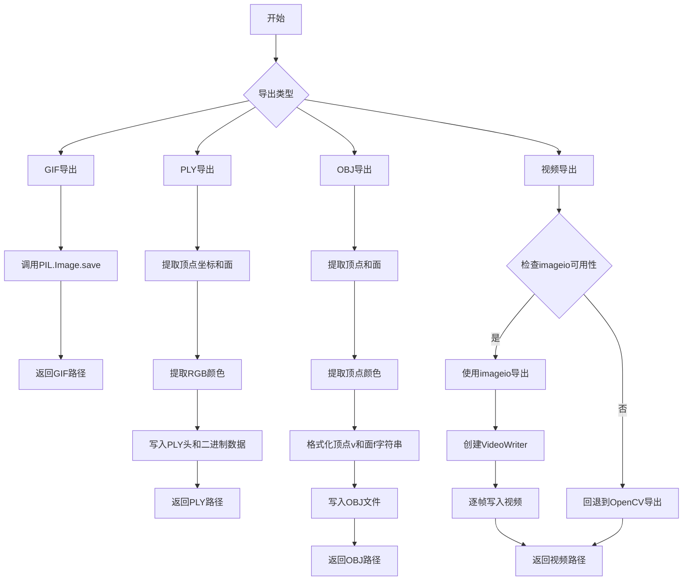
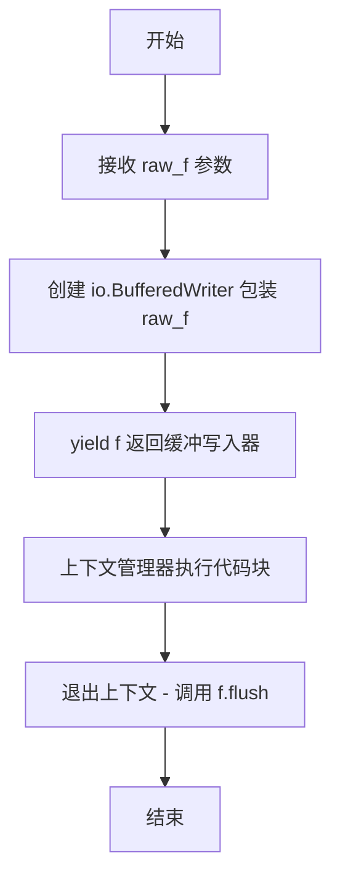
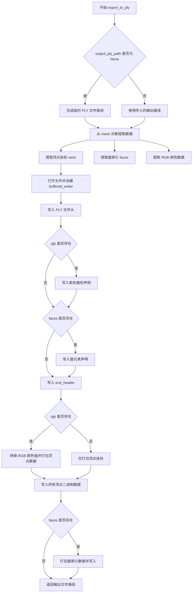
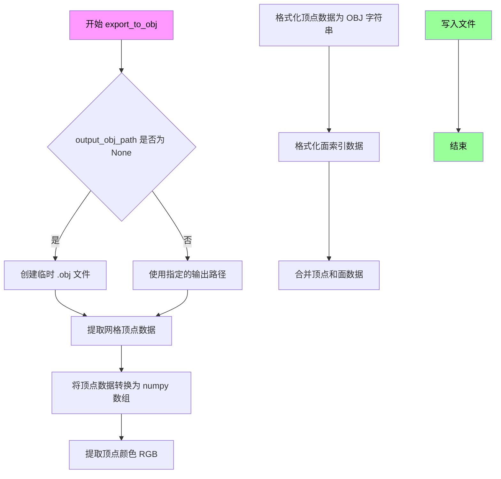
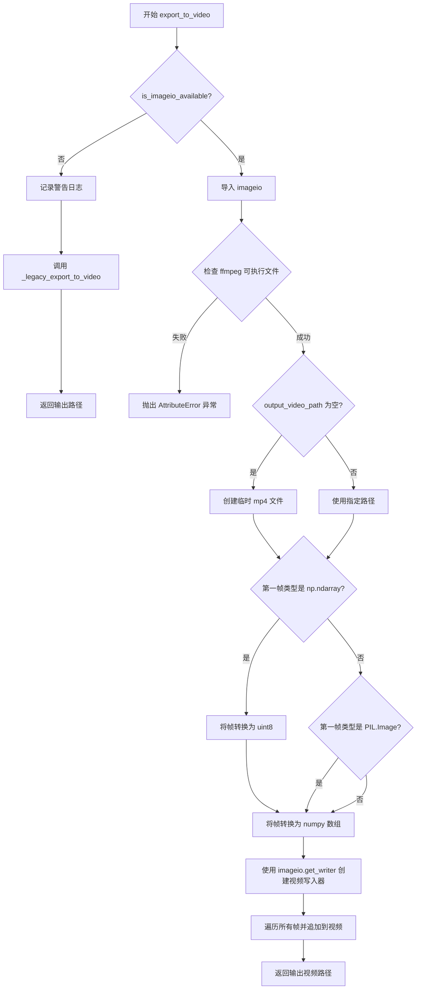

# `diffusers\src\diffusers\utils\export_utils.py` 详细设计文档

这是一个媒体导出工具库，主要用于将3D网格（mesh）导出为PLY和OBJ格式，以及将视频帧或图像序列导出为GIF和MP4视频格式，支持多种编码参数和回退机制。

## 整体流程



## 类结构

```
该文件为模块文件，无类定义，全部为函数式编程
函数列表：
├── buffered_writer (上下文管理器)
├── export_to_gif (导出GIF)
├── export_to_ply (导出PLY)
├── export_to_obj (导出OBJ)
├── _legacy_export_to_video (遗留视频导出)
└── export_to_video (主视频导出函数)
```

## 全局变量及字段


### `global_rng`
    
全局随机数生成器实例，用于生成随机数

类型：`random.Random`
    


### `logger`
    
模块日志记录器，用于记录日志信息

类型：`logging.Logger`
    


    

## 全局函数及方法


### `buffered_writer`

这是一个上下文管理器，用于将原始文件对象包装为缓冲写入器，并在上下文退出时自动刷新缓冲区。

参数：

- `raw_f`：`file-like object`，原始的底层文件对象，需要被 `io.BufferedWriter` 包装

返回值：`io.BufferedWriter`，缓冲写入器对象，供上下文内部使用

#### 流程图



#### 带注释源码

```python
from contextlib import contextmanager  # 导入上下文管理器装饰器
import io  # 导入 IO 模块

@contextmanager  # 使用装饰器将函数转换为上下文管理器
def buffered_writer(raw_f):
    """
    上下文管理器：创建缓冲写入器并在退出时刷新
    
    参数:
        raw_f: 底层的原始文件对象（通常为打开的二进制文件）
    """
    # 使用 io.BufferedWriter 包装原始文件对象，提供缓冲写入功能
    f = io.BufferedWriter(raw_f)
    
    # yield 将缓冲写入器提供给调用方的 with 语句块使用
    yield f
    
    # 当退出 with 代码块时，自动调用 flush 确保数据写入底层文件
    f.flush()
```


### `export_to_gif`

将图像序列导出为GIF动画文件，支持自定义帧率，并自动处理输出路径。

参数：

- `image`：`list[PIL.Image.Image]`，输入的图像序列列表，包含要合并为GIF的多帧图像
- `output_gif_path`：`str`，输出GIF文件的保存路径，默认为None，会自动创建临时文件
- `fps`：`int`，GIF动画的帧率（每秒帧数），默认值为10

返回值：`str`，返回生成的GIF文件的完整路径

#### 流程图

```mermaid
flowchart TD
    A[开始 export_to_gif] --> B{output_gif_path 是否为 None}
    B -->|是| C[创建临时 GIF 文件]
    B -->|否| D[使用指定的输出路径]
    C --> E[调用 image[0].save 方法]
    D --> E
    E --> F[设置 save_all=True 保留所有帧]
    F --> G[append_images=image[1:] 追加其余图像]
    G --> H[optimize=False 禁用优化]
    H --> I[duration=1000 // fps 计算每帧时长]
    I --> J[loop=0 设置无限循环]
    J --> K[返回 output_gif_path]
```

#### 带注释源码

```python
def export_to_gif(
    image: list[PIL.Image.Image],  # 输入：PIL图像对象列表
    output_gif_path: str = None,   # 输出路径，None时自动创建临时文件
    fps: int = 10                  # 帧率，默认10fps
) -> str:                         # 返回：生成GIF的路径
    # 如果未指定输出路径，创建临时GIF文件
    if output_gif_path is None:
        output_gif_path = tempfile.NamedTemporaryFile(suffix=".gif").name

    # 使用PIL库将图像序列保存为GIF动画
    image[0].save(
        output_gif_path,           # 保存路径
        save_all=True,             # 保存所有帧而非仅第一帧
        append_images=image[1:],   # 追加剩余图像作为后续帧
        optimize=False,            # 禁用优化以保证兼容性
        duration=1000 // fps,      # 每帧显示时长（毫秒），1000ms / fps
        loop=0,                    # 0表示无限循环播放
    )
    # 返回生成的GIF文件路径
    return output_gif_path
```


### `export_to_ply`

该函数用于将3D网格数据导出为PLY（Polygon File Format）格式文件，支持包含顶点坐标、面索引以及RGB颜色信息的网格导出，采用二进制little-endian格式存储。

参数：

- `mesh`：任意具有 `verts`、`faces` 和 `vertex_channels` 属性的3D网格对象，3D网格数据源
- `output_ply_path`：`str`，可选参数，输出PLY文件的路径，默认为 None（自动生成临时文件）

返回值：`str`，返回生成的PLY文件路径

#### 流程图



#### 带注释源码

```python
def export_to_ply(mesh, output_ply_path: str = None):
    """
    Write a PLY file for a mesh.
    
    将3D网格导出为PLY（Polygon File Format）格式文件，采用二进制little-endian编码。
    支持包含顶点坐标、面索引和RGB颜色信息的网格导出。
    
    参数:
        mesh: 3D网格对象，必须包含 verts（顶点坐标）、faces（面索引）和 
              vertex_channels（顶点颜色通道）属性
        output_ply_path: 输出的PLY文件路径，默认为None时会创建临时文件
    
    返回值:
        str: 生成的PLY文件的路径
    """
    # 如果未指定输出路径，则创建临时PLY文件
    if output_ply_path is None:
        output_ply_path = tempfile.NamedTemporaryFile(suffix=".ply").name

    # 从mesh对象提取顶点坐标，转换为NumPy数组
    # verts: 形状为 (N, 3) 的浮点数组，N为顶点数
    coords = mesh.verts.detach().cpu().numpy()
    
    # 提取面索引数据，形状为 (M, 3) 的整数数组，M为面数
    faces = mesh.faces.cpu().numpy()
    
    # 提取RGB颜色数据，将三个通道堆叠为 (N, 3) 的数组
    # vertex_channels 应该是一个字典-like对象，包含 'R', 'G', 'B' 键
    rgb = np.stack([mesh.vertex_channels[x].detach().cpu().numpy() for x in "RGB"], axis=1)

    # 使用上下文管理器创建缓冲写入器，以二进制模式打开文件
    with buffered_writer(open(output_ply_path, "wb")) as f:
        # === 写入PLY文件头 ===
        f.write(b"ply\n")  # PLY文件标识符
        f.write(b"format binary_little_endian 1.0\n")  # 声明二进制小端格式
        
        # 写入顶点元素声明
        f.write(bytes(f"element vertex {len(coords)}\n", "ascii"))
        
        # 写入顶点属性：x, y, z 坐标（浮点数）
        f.write(b"property float x\n")
        f.write(b"property float y\n")
        f.write(b"property float z\n")
        
        # 如果存在RGB颜色数据，声明颜色属性（无符号字节）
        if rgb is not None:
            f.write(b"property uchar red\n")
            f.write(b"property uchar green\n")
            f.write(b"property uchar blue\n")
        
        # 如果存在面数据，声明面元素
        if faces is not None:
            f.write(bytes(f"element face {len(faces)}\n", "ascii"))
            # 面属性：列表类型（uchar为列表长度类型，int为索引类型）
            f.write(b"property list uchar int vertex_index\n")
        
        # 头部结束标记
        f.write(b"end_header\n")

        # === 写入顶点数据 ===
        if rgb is not None:
            # 将RGB浮点值 [0,1] 转换为整数 [0,255]
            # 使用 255.499 进行四舍五入以减少量化误差
            rgb = (rgb * 255.499).round().astype(int)
            
            # 组合坐标和颜色数据
            vertices = [
                (*coord, *rgb)
                for coord, rgb in zip(
                    coords.tolist(),
                    rgb.tolist(),
                )
            ]
            
            # 定义二进制格式：3个float + 3个unsigned char
            format = struct.Struct("<3f3B")
            
            # 遍历所有顶点，打包并写入二进制数据
            for item in vertices:
                f.write(format.pack(*item))
        else:
            # 无颜色数据时，仅写入顶点坐标
            format = struct.Struct("<3f")
            for vertex in coords.tolist():
                f.write(format.pack(*vertex))

        # === 写入面数据 ===
        if faces is not None:
            # 定义二进制格式：1个unsigned char（顶点数）+ 3个int（索引）
            format = struct.Struct("<B3I")
            
            # 遍历所有三角形面，写入面索引
            for tri in faces.tolist():
                f.write(format.pack(len(tri), *tri))

    # 返回生成的文件路径
    return output_ply_path
```


### `export_to_obj`

该函数用于将3D网格数据导出为Wavefront OBJ格式文件，支持带顶点颜色的网格导出。如果未指定输出路径，则自动创建临时文件。

参数：

- `mesh`：任意具有`verts`、`faces`和`vertex_channels`属性的网格对象，描述待导出的3D网格
- `output_obj_path`：`str`，可选参数，目标OBJ文件路径，默认为`None`，将使用临时文件

返回值：`str`，返回导出后的OBJ文件路径

#### 流程图



#### 带注释源码

```python
def export_to_obj(mesh, output_obj_path: str = None):
    """
    将3D网格导出为OBJ格式文件
    
    参数:
        mesh: 3D网格对象，需包含verts、faces和vertex_channels属性
        output_obj_path: 输出文件路径，默认为None则创建临时文件
    
    返回:
        导出文件的路径字符串
    """
    # 如果未指定输出路径，创建临时文件
    if output_obj_path is None:
        output_obj_path = tempfile.NamedTemporaryFile(suffix=".obj").name

    # 从mesh对象中提取顶点数据，转换为numpy数组
    # .detach() 分离计算图，.cpu() 移至CPU，.numpy() 转为numpy数组
    verts = mesh.verts.detach().cpu().numpy()
    
    # 提取面索引数据（三角面片）
    faces = mesh.faces.cpu().numpy()

    # 提取顶点颜色通道RGB，stack组合为Nx3数组
    # mesh.vertex_channels 是一个类似字典的结构，包含'R'、'G'、'B'通道
    vertex_colors = np.stack(
        [mesh.vertex_channels[x].detach().cpu().numpy() for x in "RGB"], 
        axis=1
    )
    
    # 格式化顶点字符串：x y z r g b（顶点位置 + RGB颜色）
    # 格式: "v x y z r g b"
    vertices = [
        "{} {} {} {} {} {}".format(*coord, *color) 
        for coord, color in zip(verts.tolist(), vertex_colors.tolist())
    ]

    # 格式化面索引字符串：f v1 v2 v3（OBJ索引从1开始，需+1）
    # 格式: "f 1 2 3"
    faces = [
        "f {} {} {}".format(str(tri[0] + 1), str(tri[1] + 1), str(tri[2] + 1)) 
        for tri in faces.tolist()
    ]

    # 合并顶点数据和面数据，顶点行加"v "前缀
    combined_data = ["v " + vertex for vertex in vertices] + faces

    # 打开文件并写入所有数据
    with open(output_obj_path, "w") as f:
        # 使用writelines写入，"\n".join将列表转为字符串
        f.writelines("\n".join(combined_data))

    # 返回导出后的文件路径
    return output_obj_path
```


### `_legacy_export_to_video`

这是一个遗留的视频导出函数，使用OpenCV将视频帧（numpy数组或PIL图像）导出为MP4格式文件。

参数：

- `video_frames`：`list[np.ndarray] | list[PIL.Image.Image]`，视频帧列表，可以是numpy数组或PIL图像
- `output_video_path`：`str`，输出视频文件路径，默认为None（使用临时文件）
- `fps`：`int`，视频帧率，默认为10

返回值：`str`，返回输出视频文件的路径

#### 流程图

```mermaid
flowchart TD
    A[开始] --> B{检查OpenCV是否可用}
    B -->|可用| C[导入cv2]
    B -->|不可用| D[抛出ImportError]
    C --> E{output_video_path是否为None}
    E -->|是| F[创建临时.mp4文件]
    E -->|否| G[使用提供的路径]
    F --> H{判断video_frames[0]类型}
    G --> H
    H -->|np.ndarray| I[将帧值乘255并转为uint8]
    H -->|PIL.Image| J[将帧转为numpy数组]
    I --> K[创建VideoWriter对象]
    J --> K
    K --> L[遍历所有帧]
    L --> M[将帧从RGB转换为BGR]
    M --> N[写入视频帧]
    N --> L
    L --> O{所有帧处理完成?}
    O -->|否| L
    O -->|是| P[返回output_video_path]
```

#### 带注释源码

```python
def _legacy_export_to_video(
    video_frames: list[np.ndarray] | list[PIL.Image.Image], output_video_path: str = None, fps: int = 10
):
    """
    使用OpenCV将视频帧导出为MP4视频文件（遗留函数）。
    
    参数:
        video_frames: 视频帧列表，支持numpy数组或PIL图像
        output_video_path: 输出视频路径，默认为None则使用临时文件
        fps: 视频帧率，默认为10
    
    返回:
        生成的视频文件路径
    """
    # 检查OpenCV是否可用，不可用则抛出导入错误
    if is_opencv_available():
        import cv2
    else:
        raise ImportError(BACKENDS_MAPPING["opencv"][1].format("export_to_video"))
    
    # 如果未指定输出路径，创建临时MP4文件
    if output_video_path is None:
        output_video_path = tempfile.NamedTemporaryFile(suffix=".mp4").name

    # 处理numpy数组格式的帧，将其转换为uint8类型（0-255范围）
    if isinstance(video_frames[0], np.ndarray):
        video_frames = [(frame * 255).astype(np.uint8) for frame in video_frames]

    # 处理PIL图像格式的帧，将其转换为numpy数组
    elif isinstance(video_frames[0], PIL.Image.Image):
        video_frames = [np.array(frame) for frame in video_frames]

    # 创建VideoWriter对象，使用mp4v编码器
    fourcc = cv2.VideoWriter_fourcc(*"mp4v")
    h, w, c = video_frames[0].shape
    video_writer = cv2.VideoWriter(output_video_path, fourcc, fps=fps, frameSize=(w, h))
    
    # 遍历每一帧，将RGB转换为BGR（OpenCV使用BGR格式）并写入视频
    for i in range(len(video_frames)):
        img = cv2.cvtColor(video_frames[i], cv2.COLOR_RGB2BGR)
        video_writer.write(img)

    return output_video_path
```


### `export_to_video`

该函数用于将一系列图像帧导出为视频文件，支持使用 imageio（推荐）或 OpenCV（Legacy）作为后端，默认使用 imageio-ffmpeg 进行视频编码，支持通过质量、码率和宏块大小等参数控制输出视频的特性。

参数：

- `video_frames`：`list[np.ndarray] | list[PIL.Image.Image]`，要导出的视频帧列表，每帧可以是 NumPy 数组或 PIL Image 对象
- `output_video_path`：`str = None`，输出视频文件的路径，默认为 None，此时会创建临时文件
- `fps`：`int = 10`，视频帧率，默认为 10 帧/秒
- `quality`：`float = 5.0`，视频输出质量，范围 0-10，数值越高质量越好，默认为 5.0，使用可变码率，设为 None 可禁用可变码率
- `bitrate`：`int | None = None`，视频编码的固定码率，默认为 None，此时使用 quality 参数控制码率
- `macro_block_size`：`int | None = 16`，视频宽高的宏块约束，必须能被该值整除，否则 imageio 会自动调整尺寸，默认为 16，设为 None 或 1 可禁用自动调整

返回值：`str`，返回生成的视频文件路径

#### 流程图



#### 带注释源码

```python
def export_to_video(
    video_frames: list[np.ndarray] | list[PIL.Image.Image],
    output_video_path: str = None,
    fps: int = 10,
    quality: float = 5.0,
    bitrate: int | None = None,
    macro_block_size: int | None = 16,
) -> str:
    """
    参数说明:
        video_frames: 要导出的视频帧列表，支持 numpy 数组或 PIL Image 对象
        output_video_path: 输出视频路径，默认为 None 会创建临时文件
        fps: 视频帧率，默认 10 帧/秒
        quality: 视频质量，范围 0-10，默认 5.0，使用可变码率
        bitrate: 固定码率，默认 None，使用 quality 参数控制
        macro_block_size: 宏块大小约束，默认 16，必须能被整除
    
    返回值:
        str: 生成的视频文件路径
    """
    # TODO: Dhruv. Remove by Diffusers release 0.33.0
    # Added to prevent breaking existing code
    # 检查 imageio 是否可用，不可用时回退到 OpenCV 后端（遗留支持）
    if not is_imageio_available():
        logger.warning(
            (
                "It is recommended to use `export_to_video` with `imageio` and `imageio-ffmpeg` as a backend. \n"
                "These libraries are not present in your environment. Attempting to use legacy OpenCV backend to export video. \n"
                "Support for the OpenCV backend will be deprecated in a future Diffusers version"
            )
        )
        # 调用遗留的 OpenCV 导出函数
        return _legacy_export_to_video(video_frames, output_video_path, fps)

    # 再次检查 imageio 可用性，确保已导入
    if is_imageio_available():
        import imageio
    else:
        raise ImportError(BACKENDS_MAPPING["imageio"][1].format("export_to_video"))

    # 检查 ffmpeg 是否可用，imageio 需要 ffmpeg 来编码视频
    try:
        imageio.plugins.ffmpeg.get_exe()
    except AttributeError:
        raise AttributeError(
            (
                "Found an existing imageio backend in your environment. Attempting to export video with imageio. \n"
                "Unable to find a compatible ffmpeg installation in your environment to use with imageio. Please install via `pip install imageio-ffmpeg"
            )
        )

    # 如果没有指定输出路径，创建临时视频文件
    if output_video_path is None:
        output_video_path = tempfile.NamedTemporaryFile(suffix=".mp4").name

    # 处理不同格式的输入帧
    if isinstance(video_frames[0], np.ndarray):
        # 将浮点数数组 (0-1) 转换为 uint8 (0-255)
        video_frames = [(frame * 255).astype(np.uint8) for frame in video_frames]
    elif isinstance(video_frames[0], PIL.Image.Image]:
        # 将 PIL Image 转换为 numpy 数组
        video_frames = [np.array(frame) for frame in video_frames]

    # 使用 imageio 写入视频，支持质量、码率和宏块大小参数
    with imageio.get_writer(
        output_video_path, fps=fps, quality=quality, bitrate=bitrate, macro_block_size=macro_block_size
    ) as writer:
        # 遍历所有帧并追加到视频
        for frame in video_frames:
            writer.append_data(frame)

    # 返回生成的视频文件路径
    return output_video_path
```

## 关键组件


### 张量索引与惰性加载

代码通过`.detach().cpu().numpy()`实现张量到NumPy数组的转换，避免直接修改原始计算图。在`export_to_ply`和`export_to_obj`中，通过索引访问`mesh.verts`、`mesh.faces`和`mesh.vertex_channels["RGB"]`获取3D网格数据，仅在需要时加载数据到内存。

### 反量化支持

代码包含多处反量化操作：将浮点张量转换为可视化图像。在视频导出中，使用`(frame * 255).astype(np.uint8)`将[0,1]范围的浮点帧转换为[0,255]的uint8图像。在PLY导出中，使用`rgb = (rgb * 255.499).round().astype(int)`将归一化的RGB值反量化到[0,255]整数范围。

### 量化策略

代码采用简单的乘以255进行量化映射，使用`0.499`作为四舍五入的偏移量以减少精度损失。在视频导出质量控制中，通过`quality`参数（默认5.0）控制可变比特率，范围0-10，用于平衡视频质量与文件大小。

### 视频导出后端降级策略

`export_to_video`函数实现了优雅降级：当`imageio`不可用时，自动回退到OpenCV后端（`_legacy_export_to_video`），并记录警告日志。该函数通过`is_imageio_available()`和`is_opencv_available()`检查后端可用性，确保代码在不同环境下都能运行。

### 3D网格格式导出

支持两种3D网格格式导出：PLY格式使用二进制编码，通过`struct.Struct`打包顶点（xyz）和颜色（rgb）数据；OBJ格式使用文本编码，将顶点和面数据写入文件。两种格式都支持顶点颜色信息。

### 上下文管理器缓冲写入

`buffered_writer`是一个上下文管理器，提供带缓冲的二进制文件写入，退出时自动调用`flush()`确保数据写入磁盘。用于PLY文件的二进制格式导出，确保数据完整性。

### 临时文件管理

多个导出函数使用`tempfile.NamedTemporaryFile`创建临时输出路径，支持用户指定路径或自动生成临时文件。这提供了灵活的输出处理方式，避免手动管理文件生命周期。


## 问题及建议


### 已知问题

-   **未使用的全局变量**: `global_rng` 声明但从未被使用，造成代码冗余。
-   **未使用的上下文管理器**: `buffered_writer` 函数定义但未被调用。
-   **重复的条件检查**: `export_to_video` 函数中 `is_imageio_available()` 被调用了两次（第97行和第102行），逻辑可简化。
- **潜在的空列表访问**: `export_to_gif` 和 `export_to_video` 函数中直接访问 `video_frames[0]` 和 `image[0]`，未检查列表是否为空，会导致 `IndexError`。
- **临时文件资源泄漏**: `export_to_gif`、`export_to_ply`、`export_to_obj` 和 `export_to_video` 函数中创建的 `tempfile.NamedTemporaryFile` 从不删除，且未设置 `delete=True`，会造成文件系统资源泄漏。
- **参数验证缺失**: 
  - `fps` 参数未验证不能为0或负数
  - `quality` 参数未验证范围（应为0-10）
  - `macro_block_size` 参数在代码中未实际使用
- **重复代码**: `export_to_video` 和 `_legacy_export_to_video` 中将视频帧转换为 numpy 数组的逻辑重复。
- **遗留代码**: `_legacy_export_to_video` 函数带有 TODO 注释标记为将被移除，但仍保留在代码库中。
- **缺少错误处理**: `export_to_ply` 和 `export_to_obj` 中对 `mesh` 对象的属性访问没有异常处理，如果属性不存在会抛出 AttributeError。
- **颜色通道假设**: 代码假设 `mesh.vertex_channels` 包含 "RGB" 键，但没有验证，可能导致 KeyError。

### 优化建议

-   移除未使用的 `global_rng` 和 `buffered_writer`。
-   合并重复的 `is_imageio_available()` 检查。
-   在访问列表元素前添加空列表检查。
-   使用 `tempfile.NamedTemporaryFile(delete=False)` 并在函数结束时清理，或使用 `tempfile.mkstemp()` 并确保删除。
-   添加参数验证逻辑，确保 `fps > 0`、`0 <= quality <= 10` 等。
-   提取公共的视频帧转换逻辑到辅助函数中。
-   根据 TODO 注释移除 `_legacy_export_to_video` 或明确其废弃时间表。
-   添加 try-except 块处理 `mesh` 属性访问异常，或在文档中明确要求输入格式。
-   验证 `mesh.vertex_channels` 是否包含必要的颜色通道，或提供默认值。


## 其它


### 设计目标与约束

本模块的设计目标是提供统一的3D模型和媒体导出功能，支持将内存中的3D网格数据(mesh)和视频/图像帧序列导出为多种常用格式（GIF、PLY、OBJ、视频），主要服务于3D可视化和多媒体处理流水线。约束条件包括：1) 依赖第三方库（PIL、numpy、imageio/opencv）进行实际的文件操作和编解码；2) 临时文件使用后未显式清理，依赖操作系统回收；3) video导出优先使用imageio，不可用时降级到OpenCV。

### 错误处理与异常设计

模块采用分层错误处理策略：1) 导入依赖检查通过`BACKENDS_MAPPING`字典和`is_xxx_available()`函数实现，若所需库不可用则抛出`ImportError`并附带安装提示；2) `export_to_video`函数对ffmpeg可执行文件进行额外检查，通过`imageio.plugins.ffmpeg.get_exe()`验证，若找不到则抛出`AttributeError`；3) 类型检查在运行时进行，通过`isinstance()`判断输入是`np.ndarray`还是`PIL.Image`并做相应预处理；4) 文件操作异常（写入失败、路径权限问题）由底层Python IO机制向上传播。遗留函数`_legacy_export_to_video`作为降级方案，在imageio不可用时被调用。

### 数据流与状态机

数据流遵循"输入预处理→格式转换→文件写入"的单向管道：1) **图像/GIF流程**：接收PIL.Image列表，直接调用PIL.Image.save()方法，写入GIF文件；2) **PLY导出流程**：从mesh对象提取verts(顶点)、faces(面)、vertex_channels['RGB']，转换为numpy数组，按二进制格式写入；3) **OBJ导出流程**：类似PLY但输出ASCII格式的顶点坐标和颜色、面索引；4) **视频导出流程**：统一将输入帧转换为uint8类型的numpy数组，根据后端选择调用imageio.get_writer或cv2.VideoWriter，写入MP4文件。整个过程无状态机，仅顺序执行。

### 外部依赖与接口契约

模块的外部依赖包括：1) **PIL (Pillow)**：图像加载和GIF导出；2) **numpy**：数组操作和数值计算；3) **imageio** + **imageio-ffmpeg**：视频导出的首选后端；4) **opencv-python (cv2)**：视频导出的降级后端；5) **tempfile**：生成临时文件路径。接口契约方面：1) `export_to_gif`接受`list[PIL.Image.Image]`和可选的输出路径、FPS，返回实际使用的输出路径；2) `export_to_ply`和`export_to_obj`接受mesh对象（需具备`verts`、`faces`、`vertex_channels`属性），返回输出路径；3) `export_to_video`接受帧列表（`list[np.ndarray]`或`list[PIL.Image.Image]`），支持quality、bitrate、macro_block_size参数，返回输出路径。

### 输入验证与边界条件

代码在以下边界条件下可能出现问题：1) **空输入**：`export_to_gif`若image列表为空会在`image[0]`处抛出IndexError；2) **mesh属性缺失**：`export_to_ply`和`export_to_obj`假设mesh对象具有verts、faces、vertex_channels属性，若缺失会抛出AttributeError；3) **颜色通道缺失**：PLY导出中rgb可能为None，但代码在判断`if rgb is not None`后才写入颜色属性；4) **视频帧尺寸不一致**：export_to_video假设所有帧尺寸相同，未做验证；5) **macro_block_size**：若视频尺寸不能被该值整除，imageio会自动调整但可能产生不可预期的输出。

### 线程安全与并发考虑

当前实现不是线程安全的：1) 全局变量`global_rng`和`logger`在多线程环境下共享可能产生竞争；2) 临时文件生成使用`tempfile.NamedTemporaryFile`但不指定delete=False，多线程同时调用可能产生文件名冲突；3) 视频导出使用`cv2.VideoWriter`或`imageio.get_writer`实例，非线程安全。若要在多线程环境使用，建议为每次调用创建独立的随机数生成器实例，并使用带锁的文件操作或线程局部存储。

### 性能特征与资源管理

性能瓶颈主要集中在：1) **numpy数组与Python列表转换**：`export_to_ply`中多次调用`.tolist()`将numpy数组转为Python列表，开销较大；2) **循环写入**：PLY的顶点逐个使用struct.pack写入，可考虑批量打包；3) **图像格式转换**：视频导出时逐帧进行`frame * 255`和类型转换，可预先批量处理；4) **临时文件I/O**：所有导出函数默认使用临时文件，若磁盘I/O较慢会影响性能。资源管理方面，`buffered_writer`使用上下文管理器确保flush但未显式关闭底层文件流，依赖垃圾回收。

### 版本兼容性与遗留代码

代码中包含TODO注释指出`_legacy_export_to_video`将在Diffusers 0.33.0版本移除，当前作为向后兼容的降级方案。OpenCV后端支持将在未来版本中弃用，建议用户迁移到imageio后端以确保长期兼容。此外，`export_to_video`函数的quality参数默认为5.0，使用VBR编码，最高10最低0，与传统bitrate参数存在互斥关系，需用户理解其用途。

### 测试与验证建议

建议补充以下测试用例：1) 空图像列表和单帧图像的GIF/视频导出；2) 缺失verts/faces/vertex_channels属性的mock mesh对象；3) 不同尺寸视频帧的处理；4) 多线程并发调用场景；5) 临时文件清理行为验证；6) imageio和OpenCV两种后端的输出一致性验证（相同输入应产生视觉一致的输出）。

### 文档与注释质量

当前代码注释存在以下改进空间：1) `export_to_ply`和`export_to_obj`函数缺少docstring说明参数和返回值；2) `buffered_writer`上下文管理器的用途可进一步说明；3) `export_to_video`的quality、bitrate、macro_block_size参数已有较详细的注释，但可补充具体取值范围和效果差异；4) 遗留降级逻辑的版本时间点应在注释中明确标注。


    